# P1：Pandas for Data Analysis  SciPy 2017 Tutorial  Daniel Chen - 哒哒哒儿尔 - BV1Cs411A76Y

 All right， so as people are trickling in， I guess I'll just start introductions。 So first。

 if you haven't done so， please read download the repository。

 Pretty much what got added along with a bunch of data sets is all of the lesson material。

 that I plan to go over today。 I opted to end up doing that just in case we start running out of time。

 I don't have to just start typing everything。 I can just slowly start scrolling through the page depending on how we are with pacing。

 because there's a lot of things to cover I realized。 And so a little bit about myself。

 I am a graduate student at Virginia Tech。 I just finished my courses， so I'm a PhD student。

 I'm not yet a candidate either。 I am also an instructor for software carpentry。

 so a lot of our data sets actually come from， them。 And I think that's it。

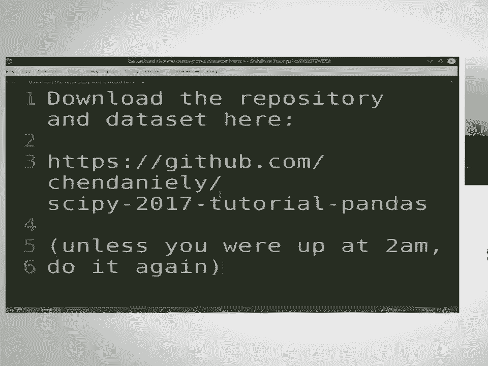

 So if you've downloaded the repository or either through Git or as a zip file and you。

 open up the Jupyter notebook， so hopefully there's someone to help you if you have issues。

 with that， all of our data， there's going to be， it's in this data folder。 The notes I'm working。

 I'm going to be working from are in this zero one notes folder。

 And just for me as this lesson so I don't start overwriting my notes， I'm going to create。

 a second folder just to dump everything in that I'll be presenting。

 You guys can do that if you want。 If you want to follow along。 And then just as a backup。

 if things start， if we really start falling behind， I'll just。

 go through the contents of this notes folder directly instead of live coding everything。 So yeah。

 Oh， the address。 Yeah。 Yeah。 So on this page， there'll be a little green button that says clone or download。

 If you click it， if you know your way around Git， there's a Git URL that comes with it。

 If you don't， there's a download zip button that you can click and that will just download。

 everything as a regular zip file that you will unzip。 My good to start。

 Just raise your hand if you still need this link up and I'll just leave it up。

 So I guess I'll keep doing intro stuff。 So this is the introduction to Panda's tutorial。

 Essentially what Panda's is， if you come from NumPy， the easiest way to describe it is it's。

 NumPy but you're allowed to have heterogeneous data。 If you come from the R world。

 it's pretty much the R data frame。 And if you don't come from any of those。

 it is a programmable way that you can run your， Excel spreadsheets。 Is there anyone here？

 I know there's at least one who people who program in R or who have touched R and they're， cool。

 So I will be making a lot of R references so that should help you kind of bridge the， gap。

 I learned how to do all this stuff in R and then a lot of the data manipulation tasks kind。

 of just carried over to Python。 So I think after looking at this for at least a year they look kind of similar。

 So we'll see。 Am I good？ Does anyone still need this link up？

 Just raise your hand and I'll just think of something else to say。 Okay。 What else to say？

 So I am using the latest version of Panda's which is 0。20。1 as of I guess last night。

 If you're running on something older than that there's going to be certain things that。

 don't work anymore and I found that out yesterday when I was putting together a lesson， plan。

 So I will mention that to you just because that's also in my notes like this used to。

 work and why it doesn't work。 But there's a few things that are that no longer work or are getting deprecated before。

 they make the 1。0 release。 And I have no idea when that would be。 It keeps saying soon。

 Between Python 2 and 3 there at least for this tutorial there is only one case where。

 there's a natural difference and that's when I write a function that uses the division sign。

 So I'll mention that if you are on the Python 2 version otherwise everything should just， work。

 The last time I gave this tutorial at PiData last year I literally had to ask someone in。

 the audience for a Windows computer that had anaconda。 So the installation should be okay。

 Shouldn't have been too bad。 There's very very few dependencies if you just installed the entire anaconda distribution。

 I'm going to take this link down now。 Anyone else need a link because I'm running out of things to say？

 Alright。 Oh I can write it on a whiteboard。 [ Pause ]， [ Pause ]， [ Pause ]， [ Pause ]。

 If you hit control enter it will just keep running that block of code and it won't go to a next cell。

 If you need to check the version of Pandas that you are using， like I had to yesterday， it's Pandas。

double_version。double_， and I'm running 0。20。1 right now。

 In Python or if you're trying to use a function that's part of a package unlike R。

 you have to actually tell Python where exactly to find all of these functions。 So。

 Pandas has a nice function called read_csv。 That lets you read CSV files。

 But if we wanted to actually use this function， we have to say Pandas。

 which is the library or package that we're using and the read_csv function。 So。

 the first data set that we're using， so the way my folder structure is set up right now is I'm in this folder called 0 to lesson。

 I have a separate folder for my data and then all my notes are in the 0， 1 notes folder。 So。

 for me to get to my data， because I'm in a separate folder， I actually have to say two dots to say。

 "Hey， look one directory up。 Go to the data folder。" And then our first data set is this gatminer。

tsv file。 Just by looking at the file extension， it's TSV， so it's tab separated。 So。

 the function is defaulting to a comma separated file。 So。

 the way we can read tab separated files is we add another parameter to the function。 In this case。

 there's a delimiter parameter。 And we say backslash_t to say， "Hey。

 every new piece of data isn't delineated by a comma。 It's delineated by a tab。

" And backslash_t lets you do that。 You can see here all Pandas did was dump out our data set to the screen。

 So， that's not particularly useful other than we just loaded and saw the contents of our data。 So。

 what we can do is save this to an actual variable。 So， I'm going to pick a variable called df。

 and do the same function again。 And now if I say df in this cell。

 I've actually saved everything to the right hand side of the equal sign。

 got saved or assigned to the left side of the equal sign。

 A useful thing that you're going to be seeing very often is this method of a data frame called head。

 And instead of dumping out the entire contents or most of the contents of this data frame。

 all it does is gives you the first five rows。 Which just makes it a little bit more manageable just to see what's going on。

 A lot of times you're going to see people write their import statement as import Pandas as PD。

 And what this allows you to do is you get to say the same exact thing as before。

 but instead of typing the word Pandas， you say PD。 It's called an alias。

 and some of these packages end up being a little bit too long。

 or you're going to be using a lot of functions within it。

 And so this just saves you a little bit of typing。 And just to show you guys。

 this does exactly the same thing。 There's this generic function in Python called type。

 And what type does， if you ever get confused as to what's going on or if there's an error that's saying it's expecting one thing。

 but you thought that's what you gave it。 And you can see here it's saying that this DF variable is a Pandas data frame object。

 So after you load up your data set， what do you do？

 Probably we'll look at the head of your data set that usually helps you see if your column names got loaded up properly or if your data just got loaded at all。

 Another thing that you might want to know is looking at the number of rows or columns of your data set。

 So you can use the attribute shape to get the number of rows。 That's what shows up first。

 Let me make this bigger。 And the second number is the number of columns。

 So this is shape is an attribute。 So if you had， for example， thought it was a function or a method。

 you would get an error。 So that's sort of something that you'll learn over time。

 what things required or set around brackets， what things don't。 So just something to keep in mind。

 I usually forget things like this all the time。 And the next other thing that you'll be doing a lot after you load up a data set is running this method called info。

 And what info is going to give you， the first line is essentially the type of object that you gave it or type of the object。

 So this is a data frame。 It's going to say that this data frame has 1。

704 rows and it's got six columns。 And then each column is going to tell you how many in this first part is going to tell you the column name。

 The second column is going to tell you how many non-missing values you are that you have。

 So this data set， we don't have any missing values。

 And then the last column is going to tell you the actual data type of that column。 Right。

 So in NumPy， everything is some kind of number。 But in Pandas。

 each column can be a different data type。 And that's sort of the benefit or that's sort of what Pandas gives you。

 So the first thing that we're going to go over are just the absolute basics of how do you pull rows or columns out of your data frame。

 So I can say if we just wanted the country column， we can say df， a set of square brackets。

 and then in quotes， the column that we want。 So country。

 And that will give us just the country data frame out。 We can save this to a variable。

 And then now if we want to use country df again， we can use it like that。

 Another common syntax that you'll see is floating around the internet is df。

 If you're just trying to pull one column out， you can use dot and then simply call the single column that you want directly。

 If it does， you have to do it in。 So if a column has spaces， you have to specify the first way。

 Otherwise， this won't work。 So this is really just a convenience。

 a convenient way for you if you just need one column。 I've sort of seen around the internet that。

 you know， it's really just for convenience。 Don't rely on this behaving exactly the same as this every single time。

 And one example of that is the leading column。 So， if you need multiple columns， it's the same set。

 It's the same syntax。 You have your data frame。 You have a set of round brackets of square brackets。

 But in order for you to provide multiple values， you have to give it a list of columns that you want。

 And so a Python list is you create a Python list using square brackets。

 So that's why if you need multiple columns， you'll see two sets of square brackets。

 So if I wanted the country column， the continent column and the year column， I can just say。

 just give me the first five rows。 That's how I would subset the columns that way。 Yeah。 So if I hit。

 so I've been creating it because how I've been creating it is if I hit shift enter。

 it'll run it and then create a new one underneath。 If you want to manually create a new cell。

 you can say insert cell above or below。 Yeah， shift return will run it and then create a new one underneath。

 So， yeah。 Oh， yeah。 So if you wanted to just get the column names or headers。

 there is an attribute called columns and we'll play around with columns in a little bit。

 But if you just need a list of just all the columns， that's the， that's how you would run it。 Yeah。

 so typically I would run head on my data frame just to see the column names like this。

 but if you have like thousands， yeah， you'll probably end up just getting it out like that。 Yeah。

 so there is。 So it used to be you can write something like that and say， give me column zero。

 You can't use it this way anymore。 I'll show you there's there's other ways that you can get the index out。

 That used to work。 So if you need to delete a column。

 there is a general command in Python called Dell for delete。

 And if you wanted to delete the country column from our data frame， you would say， Dell。

 and then that。 This would actually not work。 So that's why people on a stack overflow actually say you should probably get used to writing your code like this。

 This is really just for convenience。 And there's actually like Python handles。

 Python handles or reinterprets this syntax actually a little bit differently。

 which is why this bottom command won't work， but the top one does。

 The other way you can delete a column is using the。 Drop method。 And here you say you drop the。

 The column that you want。 And then you have to say access equals one to say you're dropping the column and we'll go over a little bit about what accesses are in a downline。

 but that's how you would drop another。 That's another way you can drop a column。

 The only way with this is if you run this， it'll drop the column。

 but if you look at your data frame again， it doesn't get saved。

 You actually have to save that value if you want to drop a column in this way。

 or there's another parameter called in place that you can set the true and then I'll just drop the column in place。

 That way you don't have to do this reassigning or having this data frame getting copied in memory。

 So you can see if you do because it's yeah so by default it the access is set to drop rows so you actually have to say hey I'm actually going to drop。

 This is how I'm specifying dropping columns。 Because these row names can also have labels。 So。

 It's going to be looking for the continent row label and that's probably not going to work。 So。

 All right， so we're going to reload that data set again because I just messed it up。

 So that's pretty much how you would subset different columns so if you have a very large data set。

 probably the first thing you're going to do is just pull out the column that you actually care and not just use everything。

 But another thing that you want to that you'll end up doing is start slicing or looking at different rows of your data。

 Maybe you only care about a few like a certain range or you just want to spot check something on some kind of road just to make sure your data set got loaded properly。

 So there are three ways you can subset rows。 Two of them are going to be moving on and the last one is sort of deprecated。

 So the first method is using this LOC attribute I guess。

 So LOC allows you to pull out different rows of your data。

 But it pulls it out by what the row was labeled。 So in this example， when I say pull out row zero。

 it's going to be the same thing as index zero just because our data frame is just labeled in order from zero to 1。

700 something。 And this also shows you Python is zero index。 So if I wanted the first row。

 it will be a pass at zero。 If I wanted the hundredth row， I would pass it 99。

 Those of you who've programmed in Python before will know that if you want to count backwards from a container of some sort。

 you can use negative numbers。 In this case， LOC won't work because it's going to be looking for the label。

 the row index， negative one， and that doesn't exist in our data set。

 So if we really wanted to use negative one， how would we do this？ So there's another。

 there's another way you can slice rows。 And that's using I look for index location。

 I'm guessing that's what it means。 So if we give it zero。

 that's going to give us the same exact thing as before。 But this zero is actually the position。

 the first position in our data frame。 So if we say， I look 99。

 that would also give us the same exact information。

 The difference here is negative one will now work， because it's actually saying， hey。

 pull from index negative one， not the role label negative one。 Yeah。 Yeah。

 so you can label your rows however you want。 They can， they can have gaps。 That's sort of。

 I'm not going to go over like time series things， but yes。

 like sometimes you're going to have some kind of period of time and you need to just fill in the dates in the middle so you can insert like random dates as well and it'll just create rows for you。

 So yeah， you can relabel any part of this data frame。 Yeah。 Yeah。 Yeah。 So just reiterate。

 if you start sorting these things， the， the label follows the row。

 So you then have to be very careful if you're using I look。

 if you're always referring to the first element or the label that just got shifted after you sort。

 There's another way that's getting deprecated that I found out yesterday when I ran this is I X。

 So I'm really just showing you guys this just for people who are using older version or you'll definitely see this on the Internet。

 So this does exactly the same thing if you're running on your version of Python。

 it's going to say I X is deprecated， please use loc or I loc and there's a bit of documentation there。

 Essentially what's going on with I X is it's going to behave like loc first。

 So it's going to look for the row index label or the name。 And if it can't find the name。

 then it's going to treat it as if you're giving it an index position。 So the。

 the actual position in the row position。 So， I X zero， I X 99 or I X negative one。

 Why doesn't that work？ Okay。 Don't know why that's not working。 All right， I'm going to skip that。

 So in general， if you， so I've， so far， I've just shown you how to pull out one row at a time。

 If you want， you can give it another set of square brackets just like we did with pulling out columns。

 And you can pull out columns that way as well。 The way I X behaves。

 it's going to be looking for the label first so we get the same label out。

 It just so happens in this data set， the label and the index are going to be the same。

 So we can also use this notation。 So just to stay with I X for a little bit。

 This notation can also be used to subset rows and columns and this is sort of when this looks very much like how you would subset data frames and are。

 You have this set of square brackets， you have a comma。

 Things to the left of the comma is how you define how you're going to subset the rows。

 Things to the right of the comma is how you're going to define how you define how you're going to subset the columns。

 So if I want to say get the 0， 99 and 999 rows and I can also say give me the country life expectancy and GDP。

 That's how I would be able to subset both rows and columns。

 And you can do the same exact notation using。 Because this is pulling basing basing this off of the name。

 But had I done this using I LOC this would not work because I have specified my columns using labels not the actual position。

 So if I wanted could specify 0， 3 and 5 if I wanted to get the same information。

 So using this type of notation you can also do what's called Boolean sub setting。

 So let's say life expectancy mean is going to be life expectancy and mean。

 So a lot of these columns so each column ends up becoming what's known as a pandas series。

 So just think of a series as a column。 These series all have various built in methods。

 The mean is one of them so you can easily pull out a column and run a basic summer statistic on it。

 So in this example I am calculating the mean on the life expectancy。

 So this is the 59 years old that is the life expectancy across all countries across all years in our data set。

 Probably not a very useful number。 But I guess that's kind of that's actually pretty high given how far back this data set goes。

 But you can use this LOC method to subset your data just based off of the life based off of some other condition。

 So I can say what is give me the LOC remember things left of the column is how you're going to subset rows things to the right is going to be how you subset columns。

 So if I wanted to say I wanted all the columns I can put a colon there so that's Python slicing syntax for just give me everything。

 So I'm going to say hey give me all the columns but I want to filter out the rows。

 So I can say life expectancy greater than the mean value I calculated and I'll give me back all of the rows in my data where life expectancy for that row was greater than the average row the average life expectancy of calculated across entire data set。

 All right。 Actually pretty good on time。 All right， so just as the end of， I guess part one。

 one really other cool thing that you can do with pandas is called group or aggregate statistics。

 And this is actually a concept that's really powerful and carries on to all of the other tutorials that are going on like the desk one like down the hall。

 So what ends up going so let's say we wanted to calculate the average life expectancy for each year in our data set。

 That's a question that we're going to have。 That's a very。

 that's a question we're going to have about this data set。

 We don't want the average life expectancy in our entire data set。 We want a year by year breakdown。

 So what a group by statement will do is you can say， hey。

 I want to pass in this variable called year。 So each unique value of year essentially in your mind you can think of gets its own separate data frame。

 And then you pull out the life expectancy value calculate the mean that way。

 And then you can get a life expectancy count for each， an average count for each year。

 So the way we do that is we can say there's this function called group by。 In the our world。

 this is sort of like a T apply for in base are。 But if you're in light that tidy verse worth of things。

 it's actually called group by as well。 So we're going to group by each year。

 And you can see all this does is gives you back a group by object。

 So nothing actually got calculated yet。 It just tells pandas that if you do make a calculation。

 make those calculation on each subset of year in this in our example。

 So here I'm going to say I'm going to pull up break up my data set by each unique value of year。

 I can get the life expectancy column out of it。 And then calculate the mean。

 And so this did roughly the same thing as before。 So if you just ignored that part that I highlighted。

 what we did before was we calculated the life expectancy。

 the average life expectancy in our data set。 And we say group by year。

 what it's going to do is parse or partition our data by each unique value of year and then calculate the mean there。

 And then stitch it back together。 So group by statements。

 another common term that you'll hear is called split， apply， and combine。

 or you split your data set into various parts。 Each part is essentially independent from another。

 You apply some function， meaning in our case， the function that we're applying is the mean。

 So it's going to， for each partition， calculate the mean and then combine it back together so you get one final data set at the end。

 So this paradigm of splitting your data into isolated partitions to run a calculation and putting it back together。

 that's sort of the cornerstone of how distributed computing works。

 So this kind of method actually carries on or is very scalable and carries on as you progress in your data analytics careers。

 Okay， so， so first this group by year， essentially under the hood， pandas just knows。

 if you make a calculation， I'm going to have to break it up by year first。

 Because this ends up being a。 Yeah， so this is， you can think of it as a regular pandas data frame。

 it just has some special marker attached to it saying that if you do anything split split me up by this variable first。

 So， since I have essentially a regular pandas data frame。

 I can pull columns just like I pulled columns before using regular square brackets。

 So this part of the syntax or code that I've highlighted， if you ignore this part。

 the group by part， that's really the same as， hey， I have this data frame。

 I'm pulling out the life expectancy column and calculating the mean there。 The。

 the part that I inserted this group by all it says is everything to write before you end up making that calculation。

 break it up by the variables that I specified。 In this case， it's year。

 So that this notation here is just like what I did。 Right up here。

 So pulling out columns is square bracket and then。 In quotes， the column that you want。 Yeah。

 that's actually my next example。 But before I go there。 I actually do it this way first。

 but I go through both examples too。 So you can actually pull out multiple columns。 And remember。

 if you're pulling out multiple columns， you have a second set of square brackets。 So in this case。

 let's say I'm doing life expectancy and GDP per cat。

 Now I've broken up my data set by each year and I'm pulling out the life expectancy and GDP per cap。

 and then I'm calculating the average for each of those。 Then。

 If you wanted to put multiple group by statements in here， you can。

 The syntax is just like for if you ever need more than one of something you surround it in a set of square brackets。

 So we can say let's group by year and continent。 And then this will say for each year and each continent。

 the average life expectancy or the average GDP per cap。 So。 It's a very powerful way to quickly。

 if you have like a relatively clean clean data set。

 This is a really good way that you would be able to explore your data。

 So another thing that you'll see people do， because you already see this line of code running off the screen a little bit。

 Is in Python， if you put a back tick behind something。 It actually tells Python， hey。

 the next line that you'll see is actually part of the line is continuing off to the next line。

 So what you'll see people do is do something like this。 I'll use fewer spaces。 Or not。

 I don't know why it's turning red。 It just doesn't like two spaces。

 But you'll see people write their code like this as well。 So you'll say。

 and it makes a little bit easier to read as well。 So you can say， I have my data frame。

 The first thing I'm going to do is a group by。 Then I'm taking the mean of whatever I group by。

 Another way you'll see people write that instead of using this back tick。

 you'll see people just surround everything with。 Round brackets。

 And that's another way Python knows that treat everything between a set of round brackets as one command。

 So you'll see people write it， write it， write their code like this as well。 Yeah。 Yeah， yeah。

 it should。 It should be back tick return。 And。 I'm going to ask a helper to help you with that。

 He's having a。 Weird back ticks and text。 Yeah。 All right， so。 The next thing that you'll。 Okay。

 I think I。 After the dot。 Yeah。 Yeah。 Yes， yeah， I'll do that like way later。 Yeah， yeah。

 this is supposed to just get you interested and convince you that this is a useful tool。 So。

 So one other thing that we can do that's not what I'm looking at。 Yeah。

 So we can look at group by each variable continent and then pull out the country and then there is a。

 There's a method called and unique that lets you count the number of unique values。

 So in here you can say for each continent we're counting how many countries there are in each continent。

 So， Oceana is， I guess， just Australia and New Zealand。

 But these are ways that like when you first load up a data set。

 You're checking this is the process of checking to make sure that one is your data set complete。

 I'm pretty sure this isn't this doesn't have every single country in the world。

 But it looks complete enough from what I。 From what little knowledge I know about the data set。

 But there aren't like blaring like very obvious errors that are like coming out to me at the moment。

 So yeah。 I'll get there。 Yeah， we'll get there。 For now we're just going to assume that we don't have any missing values and then when you。

 When I first show you a step that includes a missing value will go over that。

 And so the last thing I want to go or just show you or if you guys aren't convinced enough。

 So let's say this is the group by year and get the life expectancy。 So all I've done was set a。

 A variable to the average life expectancy for each year。 Pan this is pretty cool in that there are。

 Plotting methods built right in and that's not working because。 That plot。

 I think I'm going to have to say。 So this is。 All right， so this line of code。

 I'm pretty sure I have to import map plot to use the second line。

 But essentially what this code is doing is。 Whatever plot gets rendered in the Jupyter notebook。

 please display it underneath myself in the Jupyter notebook。 If you don't。

 you're going to end up saying something like PLT dot show and then it'll show up as a pop up window。

 So again， so pandas is pretty cool。 There are plotting methods built straight in。

 So since we gave it a。 Series of values here， it knows how to plot them without doing too many more code。

 It's a code。 Yeah。 How far。 Oh， yeah。 Oh， yeah。 So one way that I do it。

 So I come from a statistics background， even though I'm not a statistician。

 I work with a lot of statistical data sets。 So a lot of our data sets are actually flat。

 They don't have this hierarchy。 So in this， and I'll go over this again later on as well。 But。

 If you look at the output of this， it looks a little bit different。

 There's like this weird indentation thing going on。

 So one thing that I will do if I want a completely flat data set again is there is a method called reset index。

 And then that will just completely flatten this data set and then I can use that in my processes。

 So that's。 That's usually what I do。 It's just because in the data sets or type of data that I work with。

 I prefer it to look like this and not some weird hierarchy。

 So usually when I'm done doing some kind of group or aggregate， I end up running reset index。

 So then this actually becomes a regular data frame like we've been working with this entire time。

 And you don't have to think about， oh， this， this is some weird hierarchy。

 The syntax is a little bit different。 So that's how I avoid it。

 So the next thing or the last thing for part one。 Is how do you save these things out？

 So I have this vector of average life expectancy is per year。

 You can see that this is actually a Panda series object。 Not a data frame anymore。

 And that's because of because of the way it was calculated。

 So the labels are now this year and the values are now this the average life expectancy。

 So if you wanted this to be a regular data frame again。

 I run reset index and then I get my regular data frame where I have a column for year in a column for life expectancy。

 And this is a regular data frame that I expected to be。 So I can say that to a variable。

 That variable looks great。 So now I want to save this out。

 So each data frame has a function to underscore and then it saves to something。

 So you can save it to a CSV file。 You can save it to an Excel file。 There was an HDFS。

 HDF class yesterday。 So you can do that。 A bunch of different ways that you can say about things。

 If you care about if the most universal file type is a comma separated value。

 So what you can do is what you pass in this to CSV is the location you want to save it to。

 So I'm currently working in this zero to lesson folder。 So if I say two dots。

 it brings me to a folder above。 And then I have a folder called output。

 And then I can say life expectancy by year。csv。 And so what that will do is save out our CSV file。

 So if I show you guys this。

 Where is it？ Oh， I just spelled it wrong。 It's up here。 Let's spell this correctly。

 And let's also delete everything in here。 All right。

 so I have this life expectancy by your data set。 If I look at it。

 You see that that kind of looks right。 I have some empty column。

 but then I have my year column and my life expectancy column。 And in this case。

 each row has three elements。 So the row index label actually got saved with our data set。 You can't。

 That's just the default behavior of two CSV。 But if you don't want that。

 which chances are you don't run the index equals false command。

 And then that will give you whatever they'll get rid of the index。

 So if your index isn't anything special， like it all it's doing is keeping count of the row number。

 You can pass in index equals false。 It'll make your file sizes a little smaller。

 And it won't get loaded when you reload this data set。

 For the people that work between our work back and forth between our and Python。

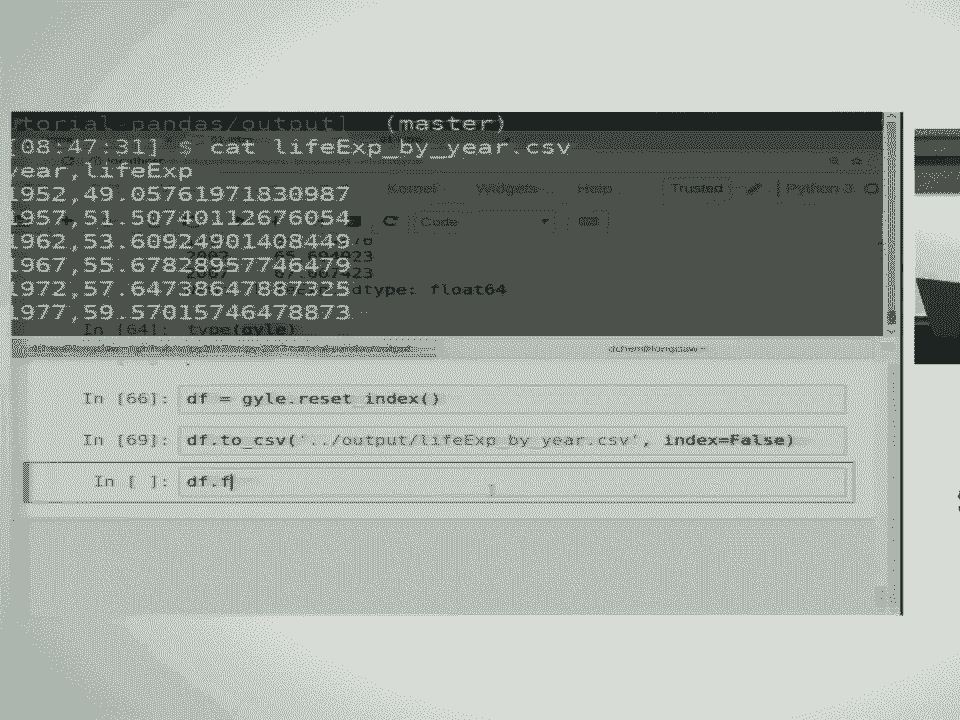

 You actually have to install this separately， but there is a file type called feather。

 And it is a binary type that will save out from from Python。

 And then it gives you a feather data type that you can load straight into our。

 And it's a binary file。 So it'll be smaller and load a lot faster than a plain CSV file。

 The rule of thumb is you can totally use this。 If you're just bouncing back between two languages。

 just don't rely on feather for long term storage because it's not that stable yet。

 So I've been told。 Yeah。 I actually don't know。 Oh。

 this looks like you give it a database connection and it'll just dump it to the table。

 Is that what it does？ That is what it does。 Yeah。 The people at continuum， I think it's continuum。

 Well， it used to be part of the Blaze project， but there is a library called Odo。 Just Google this。

 Yeah， Odo for the star。 So there is a library called Odo that essentially you give it a incoming data type and an out coming data type and it figures out all the ways to traverse the graph to make that happen。

 So your mileage will vary about how this works， but you can go from like。

 CSV is like such an easy example， but you can go from like a SQLite to like a JSON file and I'll figure out all the weird ways to convert them。

 The only issue with that is like some of those steps are you're going to lose information in them。

 So there's nothing you can do about that。 But if you just need something at the end。

 you can use Odo as a library to help you do that without writing or figuring out the intermediate steps yourself。

 Cool。

 All right。 All right， that's part one。 We're doing good on time。

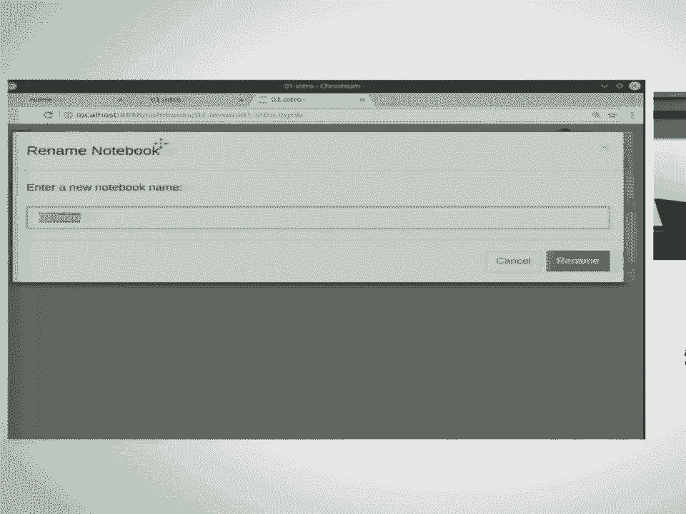

 All right， next thing。

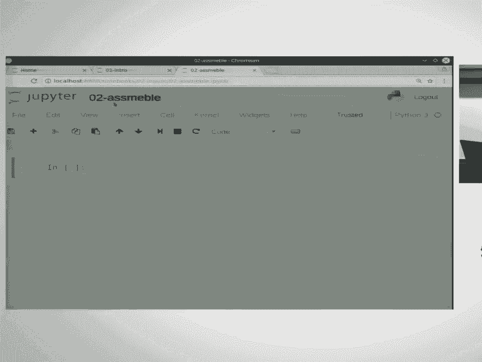

 Is data assembly。 So you have a data set and typically， or at least in the data sets I work with。

 Sometimes they're large enough that there's during separate files。

 And so your next job will be to put them together so you have a single file。 So since this is a。

 This isn't the。 I don't know what's going on。 This should be a new notebook。 So in the new notebook。

 so we have to reimport pandas。 I have three data sets。 For you guys and these are toy data sets。

 So there is a concat one concat two and three。 So this is what it looks like。

 So they're all pretty much the same。 They have the same columns。 They have the same road labels。

 But they're just three data frames that we're going to concat together。 Sorry。

 So all of our data frames look like the F one。 Just the insides are a little bit different so you can tell them apart。

 And so what we're going to do。 So this is an example of let's say you want to concatenate your data row wise。

 So that's actually pretty common。 If you have five million rows。

 a data set that's five million rows， you might have it broken up into five sets of a million rows each。

 Just because that might be the limit that you can send as an attachment and email or something。

 So however you get your data， data might come in pieces。

 Time series data if you're just collecting like logs or something。

 And when you finally do your analysis， you're going to have to concatenate your log files together so you have a single data set to work with。

 So the first thing that we're going to just raise your hand if I can move on like scroll down。

 So the first thing we're going to do is concatenate our data row wise。

 So we've been using the read underscore CSV function but Pandas has another function called concat and it lets you concatenate data sets。

 So concat takes a container of or a list of data frames that you want to concatenate them together。

 So we have our three data frames， DF1， DF2， DF3。 And if we run that。

 you'll see that all it did was concatenate our data together。

 I'm trying very hard not to say stack because that's an actual pandas function。

 If that word helps you in your mind of what's going on， then say stack。

 just realize that's an actual function in Pandas。 And so all this did was take our data frame and just append it to the end of the previous one and so on。

 They don't have to match and I'll show you that and they don't even have to be in the same order。

 It'll know and it'll realign them。 Which index like this？

 So these just come with Pandas like that's just a row number by default。 So if you never have them。

 Can you get rid of them？ I don't think you get rid of them。 Yeah。

 you can hear everyone when you save out， but they're always going to be there。

 Whether or not they're useful to you， that's up to you。 Yeah。 Those are row labeled。 So yeah。

 that's my next point。 So you'll remember that LOC subsets by row label。 So if I do LOC now。

 it's pulling out all the zero labeled rows。 So now I get three。

 Just because that's what happened when I concatenated our data。

 So if you really wanted the first row， you would have to say I LOC。 Yes。 Is there a reset index？

 There we go。 Yeah。 Yeah。 Oh。 I forgot how we。 There is a way to do this。

 There's a way to do this without making this look funky and I'll look it up during a break。

 But yeah， you can totally。 So what I did was I， yeah。 I kind of made it worse。

 but I fixed the problem。 So that's sort of。 That's also up to you on how you want to handle that。

 There's a， there's a much cleaner way to do this。 I know that for a fact。 But yeah。

 I'll just get rid of that， even though it's recorded forever。 All right。

 So another thing that you'll have， especially if you're creating data in。

 If you're building like a data collecting pipeline。

 you might end up creating a vector or a row of data that you're going to want to stack or a pen or concatenate to existing data。

 So we can create a series by saying PD。series。 And we can say， n one for new one， new two。 Three。

 New four。 All right。 So this is our series。 And if we wanted to。

 or if we expected to be able to concatenate them together。 One。

 you'll see that it didn't exactly do that。 But this behavior is actually what concatenating is doing。

 So our new row。 If we look at it。 If we， if you end up turning this into like a data frame。

 it's going to end up with a column called zero just because it never got a label。

 So it's going to just give it zero or one or two。 Et cetera， et cetera。

 And then all we're doing is concatenating by default will concatenate things。

 Just bind it to the end of the row。 So that's exactly what it did was we had this new data frame that had a column called zero and it just tacked it on and because there wasn't a zero。

 a column name zero already created a new one。 And there's stack or just tacked on our data at the end。

 So that's not exactly what we want。 So if we wanted to actually create a row of data and then。

 and then， and it or concatenate it the way we expected to。 We can create a data frame。

 So the way you can create a data frame is capital D capital F in the pandas library。

 So you can give it the values that you want so and one and two and three and four。

 And then because concatenating will automatically align the row， the column names or the columns。

 you have to specify columns。 So we can say this is a， the C。 Actually， I'll flip these last two。

 just just to show you guys that it will automatically align this。 I forget a bracket somewhere。

 And one， two， four。 That has a bracket。 Oh， I need double brackets。 Sorry。 Yes。

 even having my notes。 Okay。 Yeah。 So we have a new data frame。 That's a BDC。

 And if we run PD that concat on this on DF one and new road to。

 You'll see that it will concatenate our data and then also real line or it will know which columns。

 it'll real line based off of the column names。 So you don't have to worry about。 Oh， is。

 is the data that I'm appending in the right order？ It'll know that and do it accordingly。 Yes。 Oh。

 Yeah。 So when you end up with like a single row， it'll come back as a series。 So yeah。

 they are different objects。 So that's a behavior that you kind of see in R as well as like when you get a single vector of something。

 it comes back as just the vector， which is just the series object， not a data frame object。 Yeah。

 Yeah。 So this is actually a data frame object。 And essentially a series object is always like one。

 one row or one column。 So if you ever have more than one， then it's probably a data frame object。

 All right。 So last example。 What if you end up this happens a lot if you're like web scraping or something。

 You're collecting data and not every single web page in the site has the same amount of information。

 So you might have， you know， you might collect data that's not exactly the same or like have more or fewer rows than your actual data frame or final data frame。

 And so this works as well。 All that's going to happen is the columns that don't match will get a missing value。

 Yeah。 Yes。 So if you end up like and four and five。 Something like this， that'll work too。

 It'll just fill in missing values。 Oh， yeah。 That's， that's the next part。 Yeah。

 At least I know that like I'm， I'm pacing the lesson。 Well。

 if your next question is like exactly what I'm doing next。 Yeah。 You can。

 I don't think you can do it in this step， like in one go。

 you would have to like re replace NANs with 999。 Which is very common in like health data sets。

 So when I go over missing values， I'll show you。 All right， cool。 Catinating columns。

 So if you want to concatenate columns， so the our way is C bind。 So our robot is what we were。

 we were just doing。 It's exactly the same function。 The syntax is pretty much exactly the same。

 The only difference is there's another parameter called axis。

 And we set that to one if we want things to operate。 And again。

 you'll see that all it's doing is just mashing these things together。

 And so if you have repeated column names， it's going to do exactly that。

 None of these are like unique identifiers。 The index position is a unique identifier。

 So if you need something that's like absolute， like give me the first one。

 That's one way you would be able to get that。 Oh。 You know， I'll do it。 Yeah。

 probably fix that before you go on。 Yeah。 Or job security in your code。

 But that's segue into the next part， which is how do you rename like your columns。

 So I showed you before， if you say dot columns that gives you the columns that you have in your dataset。

 So if you can easily reassign that just by saying that columns is equal to whatever you want your columns names to be。

 So I will really assign all of them。 Actually， I kind of went through this example。 So， yes。

 we can skip this one。 So if you want， actually that didn't help at all。

 That's exactly the same thing。 So I can call this D。 So if I wanted。

 I can reassign my column names just like that。 And。 If you try to concatenate them together。

 it'll align the columns just like before。 If you want to rename the rows， for example。

 So the row index。 The way you do that is instead of columns， it's dot index。

 And you can give it whatever you want zero to。 So you can rename these as well。

 And that's when you will end up using the difference between loc and loc。

 If you want to start differentiating the first row or just actual zero。

 And then just to finish off the examples。 The rows will。

 The rows will also realign themselves as well。 So this is one of the cool things。

 If you do work with time series or time data。 And your row index is the date or some date time object and you start concatenating things together。

 It will align itself。 So you don't end up with like a mess of a data set。

 So it gets very useful for time series things。 But I'm not going to show you time series。 Yeah。

 Like sort them or。 Yeah， so the way I've been doing it is I essentially do the column subsetting。

 But I specify it in the order that I want。 And that's what I use as a column sub setter。 All right。

 so the next thing that you will do。 So this is if you just have a large data set that is broken up into pieces。

 But another common task is merging data when you have different data sets that you want to merge together。

 So for the SQL people， these are like doing table joins。 And you can do that as well in pandas。

 So we have four data sets that we're going to load。 So there is survey person。 Survey site。

 So these data sets actually come from the software carpentry SQL tutorial or a lesson。

 It's in a SQL light database， but I sort of just wrote it all out to a CSV file。 Survey survey。

 All right。 So we have these four data sets。 There's this person data set about people on this Arctic exploration。

 There's a site of where they've taken readings。 There's the survey where they actually perform a set of readings at a particular site。

 And then there's a visited data set that tells you who visited what site on what day。 Right。

 So a very common task that is if you're going to do some kind of analysis is put all these tables together into one job。

 So the way we do that is we can say。 Actually， first step is。

 I'm going to subset this visited data set first。 And this is just so I don't have to forget so I can show you the next example。

 So if any of you are familiar with joining tables。

 There's this there's a few different ways you can join tables。

 They all end up using the same exact syntax。 It's just what happens。

 So there's something called a one to one merge where if you have a series of values and another series of values and there's no duplicates in either of them and you just want to combine those two data sets。

 That's essentially what's one to one merges。 And you'll just get a one to one alignment of your data。

 Another type of merge that can happen is if you have one data set and another data set but the second or the first one。

 One of them has duplicate values in them。 So you'll have you'll end up doing a many to one or one to many type of join and what ends up happening there is the data set that doesn't have duplicates will get duplicated in the one that does。

 And then another thing that can happen is if you have duplicates in both the assess that you're trying to join and what ends up happening is what's known as a cartesian product where every pair wise thing gets created and you end up with way more rows than what you expected but sometimes that's what you want。

 So the syntax for all of that is exactly the same。

 You just have to be mindful of what your data set contains and then whether if you're doing one to one or many to one。

 etc。 That really just depends on what's in your data set。 So how do we actually do these merges？

 So there's this one to one merge。 Hand us has a function call merge so there's two ways that you can do this so I'll show you the first way。

 If you're also in a Jupyter notebook if you hit shift tab。

 it'll give you the function signature so that's how I've been seeing this。

 Another guess trick is if you say PD merge in a question mark it'll give you the actual help docs so if you just need something to jog your memory without Google or if you don't have access to the internet that's always there for you。

 Alright so when you're doing these merges this is pretty much universal that language is universal。

 There's this thing called a left data set and a right data set and then on camera it's left them right。

 So you specify a left data set or right data set how you want to join them so this is an inner join so it'll only keep the values that have matches。

 You can do a left join that will keep all the values on the left side and then merge values on the right。

 So you'll end up with missing values for example if there isn't something found if there isn't a match。

 You can do a right join you can do an outer join there's different ways of doing joins as well。

 The next parameter is on so you can use the on parameter if the columns you want to do the match on or have the same name then you can use the on parameter。

 If they don't have the same name which is I think most data sets you can say left on right on and you can your data sets don't have to have the same names for you to perform emerge。

 So， so our left data frame is going to be the site our right one is going to be visited subset and then we can say left on。

 We are joining on name and right on。 So， just showing you the data frame at the end so。 Yes， so。

 inner is the default way of how it's of how it's behaving。

 So for all my examples I'm just doing inner joins but depending on what you need you can do left right outer etc。

 The left on right on is simply specifying on the site data frame I'm using the name column as the key and then on the visited subset data frame I'm using the site column as the key。

 So， that's what the left on right on is doing。 Yes， you can do I'm pretty sure I showed you that。

 I showed you that I hope I showed you that I think I took that out。 But yeah。

 you can if you have multiple keys like everything else in Python if you have to give it multiple something surrounded in a set of square brackets and then just comma delineate them and it'll just do a multiple column match for you。

 I think I was so panicked on like trying to finish the material there was like I think they'll get the point after this。

 So， just to show you what a many to one merge or one to many again this depends on what your data set looks like。

 You can do for example this I think this is actually one to many but。 I'll just call this M。

 So another way you can specify merge is the data frame merge so you don't have to say PD dot merge I think under the hood。

 This just calls that function so it's really the same exact function that's that's being called。 So。

 during this so the left on the left data frame is going to be the one that we called merge on and then the right one is the one that's actually closer to the right hand side of the screen。

 And this performs that merge one of our data sets had a missing value。

 And so you can see that missing value getting propagated when you perform these merges。

 Just to show you what the cartesian product looks like I'm going to make two data frames。

 So you can make a data frame using a Python dictionary so the set of curly brackets。

 And the way that works is the key becomes the column。

 So the column name and then the values become that entire row of data。

 So before I specify the information row wise if you do it using dictionary you specify the information column wise。

 So this becomes a column called a one and that column has one one two two in it。 One two two。

 So this is our data frame one so you can see that if I actually different to you。

 You can see that I specified this data frame using dictionary the key becomes the column name and then the value becomes the contents of that column。

 And if you look at data frame one and data frame two。 You can see in column A or this first column。

 There are duplicate values in both sets so this is what could happen so essentially performing a many to many there's duplicates on both sides。

 And so if I do D F one merge and I merge it with D F two and the left is on。

 A and the right is on D。 One you'll notice that I got a lot more rose back than what I had。

 And if you look you'll see that。 Data frame one had one 10 one 21 30 data frame two at one 100 one two hundred so I end up with one one 10 100 one 10 two hundred one one 20 100。

 One one 22 hundred etc。 So it's creating every pair wise combination that's going on。

 So any questions about what's going on there。 Just keep in mind that's something that could happen when you're performing a merge so if you end up with like all of a sudden a million data million road data set。

 And you're like where this come from the two things I joined together we're in even close to that。

 This is probably what's going on。 Last topic before first break。

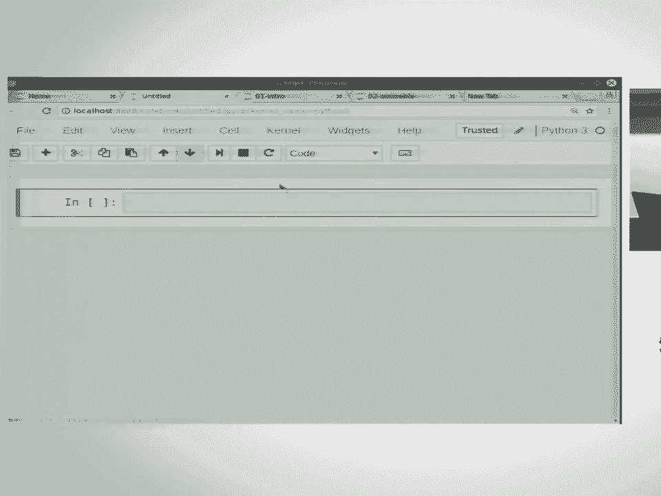

 To prevent the Cartesian problem。 If you wanted one to one said。

 I think you're going to have to get rid of the duplicates。 Right。 Yeah， that's right。 Yeah。

 that's a little I think you're going to have to get rid of duplicates because if you say。

 Left or like left join。 It's still going to keep all all it does when you say keep everything on the left side or right side is make sure that no。

 No observations on the left data from get dropped。

 Yeah。 So the easiest way to tell if you do have duplicates is if your number of rows is greater than either one of those data sets that you started off with。

 So。 Yeah， when you finish so after you do the join if you end up with like a data set with 100 rows and another one with 50 and you end up with 5000。

 Or even 101 you know that。 Yeah， that's a very。 Oh， so if you end up with oh yeah。 Yeah， that's a。

 That's that's something for you to do more data exploration on。

 I don't think there's anything that you can do in the actual merge call that will。 I don't think so。

 Wait。 Wait， can you say that again？ Oh， yeah。 Yeah。

 so you can check to see if there are duplicates in your data。 Yeah。 Yeah。

 Another way would would also like get a column and do a frequency count that I'll show you and then if a count is like greater than one。

 then you know it got duplicated。 So。

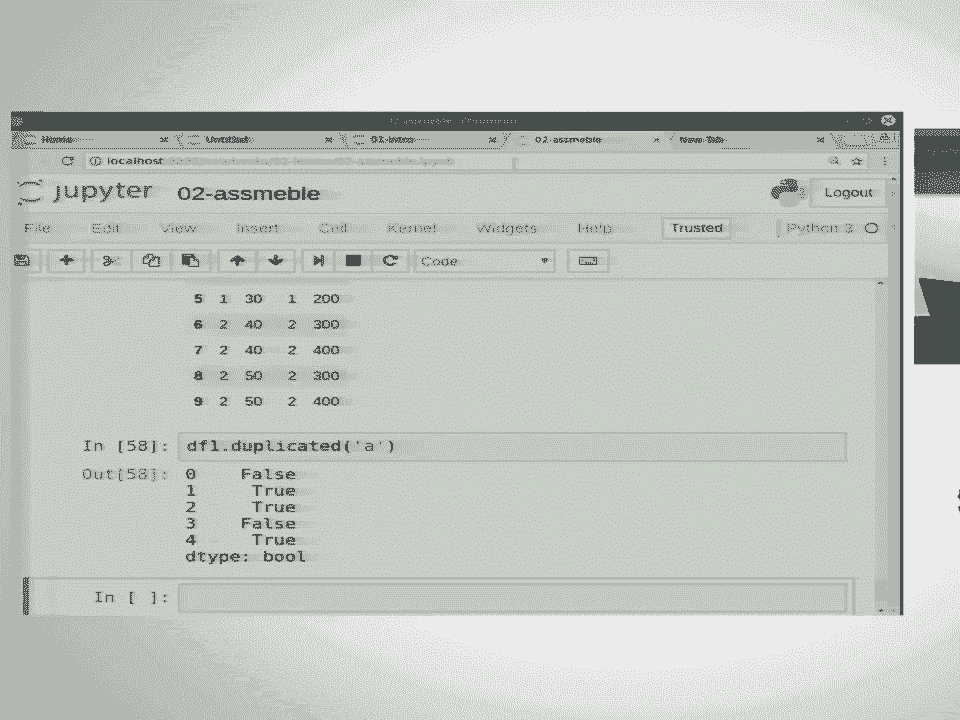

 Or you have duplicates not got duplicated。

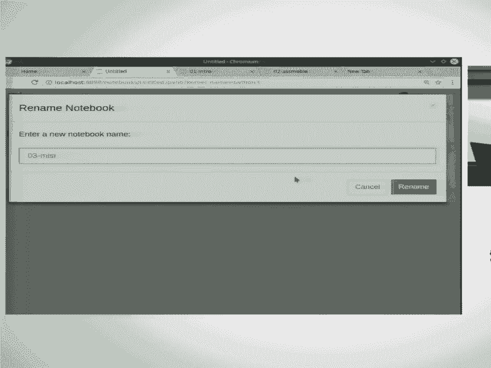

 Yeah。 All right。 So like I promised， we've seen missing values so now we're going to just work with them for a little bit。

 This is a new notebook so I'm going to have to import this stuff again。

 Missing values actually come from NumPy and there's three different ways that NumPy has missing defined。

 They're all exactly the same。 It's n a n with capital ends or all capitals or all lowercase。

 So that doesn't matter if you want to insert missing values into your own data。

 You can import the missing value from NumPy and then just use that。

 So the thing with missing values。 This is probably a little faster。 Oops。 Nope。

 I was not supposed to。 They don't really equal anything。 So they're not true。

 They're not false and they're not equal to each other。

 So and the reason behind that is a missing value could be anything。 So it could be three。

 It could be five。 You actually have no idea。 So that's why they aren't equal to each other either because there's no way to actually be certain that they are actually equal。

 They're just missing。 You have no idea what it is。 So if you actually need to test for missing this。

 There's a function called is null。 And if you give a something that is missing if you pass that into is null。

 that's when it will become true。 So if I give it something else that's not a null value or a missing value will return back faults。

 I'm pretty sure that's also a like the string dash。 Yeah。

 So if it's as long as it's not N A M it'll give you false。

 It's not but that's because I also imported all three versions of them。 Yeah。 Yeah。

 I just imported all of them just to show you guys that there's three ways that you can personally like type them。

 In the data frames you'll see it printed out as N A M with capital。 No。 Yeah。 So yeah。

 So pandas will represent missing like this， but if you want to use it within your own work。

 you can import any one of these。 And I think if you use any one of these to sign into a data frame。

 it'll always print out like that。 So depends on how far the shift key is away from your pinky。

 They would be the same。 No， no， they would be there the same missing this。

 They will be the same like there's no distinction between these three at all。

 It's just how much you would like your ship key。 Yeah。

 You'll probably see this a lot like just in the around the Internet just because the data frames themselves always represent missing values as N A M with capital ends。

 So you end up doing what you see all the time。 So。 I pretty much type it like this most of the time。

 I just。 I just showed you guys this just， you know， for completeness sake。 All right。

 So where does missing value come from？ So in our read CSV file or our function。 Oh。

 I'm not supposed to be there。 Oh。 Oops。 I should I do。 Okay。 All right。 I'll move it later。 Yes。

 you can run regular bash commands in the cells。 That's sort of what I Python。

 which is what the stuff is running on gives you。 Okay。 So when we loaded up our visited data set。

 there was a missing value in there。 So one way missing value can come about is just in the actual raw data set that you're working with。

 So you look at read CSV。 There are a few parameters like N A values。 This thing。 Read CSV。 Oh。

 there's a lot of these parameters。 Okay。 All right。 So， yeah， I'm going to use。 Yeah。 So by default。

 it'll represent if your data set has any value that is an empty string。

 it'll read in as a missing value。 You can change that if you change the value parameter to like 999 or 888。

 you can set that so that if you read your data set in any value that says 999 or 888 or something will automatically get read in as a missing value or any。

 So there's different ways you can change that as well。

 There is also a parameter for if you wanted to read the empty string as an empty string and not a missing value。

 you can change that in the read CSV call as well。 So depending on what you need。

 it would either be the N A values parameter or， or some combination between that and the keep default any parameter that you can use to change how your data set gets loaded in。

 The other way we saw missing values was when we performed a merge。 So when we did our merge。

 because one of our data sets had a missing value that got propagated when we did our merge。

 So this is exactly what we went through before。 Just with a different example。 Right。

 so in here you'll see that one of our data sets had a missing value and because it was a many to one merge that missing value got duplicated in our data set。

 And so one thing that you would want to do is， like count your missing values so changing data sets a lot。

 But here's another data set that's kind of fun。 So there here is a Ebola data set。

 So this is a data set about the 2014 West Africa Ebola outbreak。 This was curated by a。

 So there are a lot of other data set that we're going through。

 And there are a lot of other data set that we're going through。

 And there are a lot of other data set that we're going through。

 And there are a lot of other data set that we're going through。

 And so just like any new data set that we load。 We can look at the info of this。

 Like I showed you during lesson one。 So this is a data frame。

 We have a hundred twenty two rows and eighteen columns。

 These are the column names on the left hand side。 And then here in the center because there are missing values in our data。

 not every single one of those numbers is going to say hundred twenty two。

 So this is one way you can get a sense of how much missing value or how much missing data you have。

 Just keep in mind you actually have to subtract one twenty two from all these values to get the actual missing value count。

 This just tells you how many non null values there are。

 And then on the right hand side of the actual data type stored in there。

 And we'll go over data types in a little bit。 So floats are floating point numbers and our integer numbers。

 Object is pandas generic way of saying this is a string。 Sorry。

 So if you have something with a lot of missing values。

 so let's say I'm looking at this case is Guinea。 There is a function called value counts。

 This is not completely。 So you can chain head to a series or a panel data frame if you want。

 So value counts will give you the counts of whatever is in there。

 And so if you're looking just for duplicates， if what ends up happening when you do value counts is it sorts by the number of counts。

 The most frequent gets sorted to the top。 So if you're looking for duplicates。

 this is probably another way you can just say， hey， I have duplicates in this data set。

 Just because the first number is not a one。 Because this data set has。

 Because this data set has like a fair amount of missing values。

 you can say drop in a equals fault and actually count how many missing values there are。

 And in this example， it shows up at the top， but that's only because there's 29 missing values in this column。

 And that's more than any other frequency count that we have in there。 So just keep in mind。

 if you do value counts， it will just give you the count。 Yes。

 and it'll return it in descending order。 But the number of missing values will not always be the first one up there。

 It just so happens that this is。 I just have the most common observation is missing。 Yeah。

 So unique。 So one， there's a thing called unique that will give you back。

 What are the unique values in there？ And unique that will give you the count of how many unique values there are。

 And then value counts， I think I copied it。 Value counts will for each unique value give you a tally。

 So those are the three differences。 Like what are the unique values， how many do you have。

 and then what are the tallies for each is what the difference between those three are。 Oh， yeah。

 So this is the tally。 I think that's spelled right。 There is n unique。 And then。

 So this gives you the tally。 This gives you how many。 This is the actual。 Turned to click off。 Wait。

 can you say that again？ Oh， yeah。 Oh， I meant I need a turn to click off because my mouse is like bouncing off bouncing around the screen and scrolling it。

 Yeah， yeah， it won't know when I'm trying to tap complete。 If you want it to tap complete。

 you're going to have to save each intermediate that you're doing， which is probably not a good idea。

 All right。 All right。 So the next thing I want to go over is how do you recode missing values。

 So that was the question of let's say I have 88 and 99 and I just want to。

 Either turn them missing or。 Actually， that isn't the question that she had。 Yeah。

 it was the opposite。 Yeah。 I'll show you how you can recode missing and then the other way around。

 All right。 So we have our Ebola data set。 So we have our missing values in here。

 So there is a function called fill and a。 And if you give it something like zero。

 it will take every value in your data set。 This works for a column as well。

 So I'm just applying this throughout the entire data frame。

 If you give it some value in this case zero， it'll replace every value with zero。

 If I'm pretty sure if I had said something like that， it would do that。 So whatever you give it。

 it will turn all of those missing values into that value that you gave it。

 That's not always the best thing to do depending on your use case。

 So there's other ways that you can do this。 So there is a parameter called method。 And so method。

 if you look up the actual documentation， there are。 There's like two ways。 I think it's two ways。

 There's two ways that you can。 Fill your missing values， but there's four different。

 Ways you can specify it。 It's kind of weird。 I don't remember all of them。 Anyway。

 so there is you can forward fill your missing values， meaning that。 For a current missing value。

 it will take the last known value before it。 So that's a forward fill。

 So let's look at our Ebola head。 So let's say look at this case is Guinea。 We have this N A value。

 So if we do a forward fill， what it's going to do is keep looking back to the last known value and use that value to fill in its value。

 So if we want to do a forward fill， it's F fill。 And if we look at the head of this。

 you'll see that this two， seven， six point nine zero got filled in with the last known value。

 You can also see that when you do a forward fill， if the row。

 if the column already begins with the missing value。

 it's going to stay missing because it has no idea what came before it to fill。

 So when you do a forward fill， you're pretty much guaranteed that the end of your data set will be。

 will not have missing values， but the beginning， you're not guaranteed to have non missing values。

 And then the total opposite way of doing that is backfill。 So be fill。 So you can see that this 273。

69 that got filled before got backfilled。 So this used this starts looking from the bottom of the data set up。

 And you can see that the missing values at the beginning of our data frame now get filled。

 But that means that the other problem happens where the data data at the end of your data frame ends up being missing。

 So if you actually need it to fill both ways or probably again do a forward and backfill and then you have to determine which one you want to do first。

 And then the last thing before break， and then I'll look up a few things while break is running calculations with missing values。

 So， you can， for example， this case is Guinea does have missing values in it。

 So let me show you that this is actually。 So because I never saved the forward backfill stuff back to the back to a variable。

 So that never really got saved。 So you can take the sum of a column， even if it has missing values。

 Right。 So that's something that you can totally do。 That is not the default behavior in our。

 But if you want to actually throw some kind of quote unquote error when there is missing。

 There is a parameter called skip NA。 And if there is a missing value in that column。

 some will just give you back a missing value。 So that is the default behavior in our。

 but in pan does it just skip so。 So just be mindful。 When you're taking some。

 you're not totally guaranteed that you do not have missing values in there。 So。 Yes， yeah， yeah。

 I don't really use NumPy。 So yeah， I can't make that reference。 But yeah。

 it's exactly how NumPy works and I'm pretty sure it just calls NumPy。 All right。 Cool。

 So be back at。 Yeah。 Oh， question。 Oh， yes， we'll go over that。 I think。

 In about a few more chapters， but if you have text in a column， so。 In pandas。

 each column has to be the exact same type。 So if you do have text in a column。

 even if it's a column of numbers， the entire column will be a。 Object column。

 which is a string column。 And so you wouldn't really be able to take a sum of all strings just because so you actually have to do it。

 You actually have to convert the column into a numeric column， which I'll show you in a bit。

 But all right。 Yes， so be back at。 10。 55。 So that's like 10 minutes。

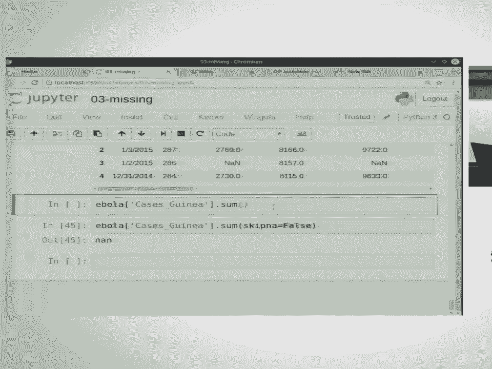

 Is that right？ 9。 9。 Sorry。 Just to backtrack a little bit。

 If you Google pandas data frame or pandas series， the first link is going to be the official documentation for a data frame or a series。

 And this is because someone had mentioned， yes， you probably probably。 I definitely misspoke。

 You shouldn't really think of each column as a。 Each a pan a series is not really a non-py array。

 They're not exactly the same。 Mainly because the methods and all of that stuff are different。

 So a pandas series is a one dimensional array。 Typically， it's a column in your data frame or a row。

 And if you scroll down， you can see everything that this series object can do。

 So the parts that say attributes， those are the things that don't need sets around brackets。

 So like， I X or I L O C。 You've noticed when I've used them。

 I just typed I dot I L O C and then I just started subsetting it right away。

 I didn't have to use a set of round brackets。 Below that are all the various methods。

 So why I was able to call mean on these functions was because there is a method called mean on a series object。

 So this entire list。 If you ever have a question like， Hey， I have this column。

 can this column do this？ Take a look on the official documentation and you can say like。 Mean。

 and it does calculate the mean。 So you don't always have to write something from scratch。

 Take a look at the documentation。 It's pretty useful。 And the same thing applies for data frames。

 So in the data frame stuff。 You have actually series has this stuff too。 Yeah。

 so all these two underscore methods。 They're in a data frame or series。

 The minute details you will have to check。 But everything that a data frame or series can do is listed here。

 So you definitely don't need to remember what can do what。 Actually， if you were like， alright。

 so Dan got something got account， like what were the different ways to get counts so you can look on this page for account and see all of the。

 The label things if you're doing your control F correctly， you can see like there's value counts or。

 Things like that。 Alright， so the next part of our pandas tutorial actually borrows very heavily from the our world。

 And it's this notion of tidy data。 And Hadley Wickham has written a paper about this。

 which is also linked on the actual page。 So you don't have to remember how I'm googling this。

 But。 Yeah， so he has this paper about tidy data。 It's the examples are in our but the concepts are going to show you what the concepts are in Python。

 And it's actually a very good read in terms of if you get a data set。

 especially if you're starting off with data processing or data analytics。

 What your first steps are in the data cleaning process right so so far all I've done is work with relatively clean data we counted we did frequency counts which is important。

 We looked at unique values to make sure there isn't anything too obscure。

 but when you actually need to start doing like quote unquote data munging。

 This paper is a pretty good read about what to expect。

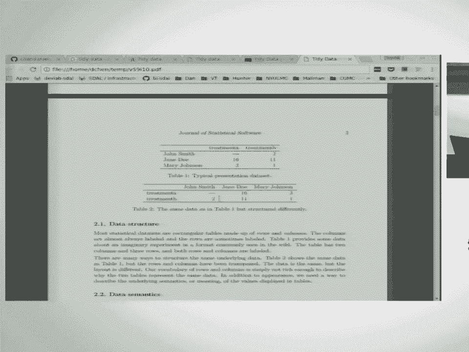

 So actually I had the data sets loaded up but I'll just use this paper as an example。

 Less typing for everyone。 Right， so he goes through。

 Some of the language about what makes data quote unquote clean。 And so he has these two data sets。

 There are for data set one you have people's names you have two different types of treatments and then a value for their treatment。

 And then you can do a transpose on this data set and you get the same。

 Information so you have treatments as your row identifiers。

 And each individual individual person as its own column and then their treatment value in there right so。

 If you're trying to describe a data set it's pretty ambiguous in terms of what is a column and what is a row。

 And so he tries to formalize those definitions。 So when I say row I mean a or he had lead describes it as a row is a single observation of data and a column contains a variable in your data set。

 So how do we want to quote unquote make this data tidy or clean。

 We want one each column should be a variable so we should have a variable called person a variable called treatment and a variable called result。

 Each of those variables are separate columns and then each row becomes a single observational unit。

 So we have a person with a treatment and a result right。

 And so this is what Hadley would describe this is a tidy or clean data set。

 But this isn't very like this isn't a table that you would put in a paper right just because it's a little hard to figure out compare different treatments。

 But the but when you are cleaning data especially when it's data for analysis。

 This is a pretty good target to clean your data to because then you can say group by each treatment give me an average result right so it becomes very easy to work with when you're trying to do data tasks。

 Also when you have a data that is quote unquote tidy or clean in this format。

 You can very easily switch to any of those other types。

 So this process of getting your data tidy also will fix a lot of other problems in your data set along the way。

 And those are very common data sets data set manipulation tasks that he describes in this paper。

 So what is tidy data he says that in tidy data each variable forms a column each observation forms a row and then this last bit。

 I'll describe but we sort of already dealt with this but each type of observational unit forms the table。

 Most of the time when you are doing data analytics you violate this last principle just because you're merging and combining data sets。

 So in our survey data each individual table was a separate observational unit。

 We had a table about a person we had a table of the readings。

 But when you actually perform data analysis you merge it all together。

 So this last bit is really more on the how do you store data and how do you give data to other people。

 Not really a use for data analysis。 So he goes on to describe in this paper here are some very common problems that you have with your data。

 And what I ended up doing is you know the data for this paper and the tidy our package are all on GitHub。

 So I essentially just downloaded those and uploaded that in our tutorial。

 And so I'm going to be going through this paper with you guys but using Python syntax instead of our。

 And so we'll go over these very common but these aren't this isn't the final list but you can have columns that are header column headers are values not variable names。

 So an example before if you had you know John Doe as one column Jane Doe is another column。

 You have this column headers are values they're not really variable names。

 So that's what that's referring to。 And then I think the rest I'll just describe as you see the various data sets because it's much easier to describe them that way。

 But I would highly recommend reading this paper just to get you thinking about what you have to do when you start processing and cleaning your data。

 This puts me in somewhere I don't want to be。 This for。 Oh sorry last thing。

 Someone over there had mentioned how do you replace all the 88 or 99s with the missing value。

 So there is a method called replace replace takes a parameter so to replace so in here you give it all the values you want to replace it with something and then the value you want to replace it with。

 In this case I'm replacing with the missing value but you can replace it with an empty string if you want or a zero if you want as well。

 So that's one way to do it。 Just be a little bit mindful because I've done this in my code where I've replaced an entire data set with 88 and 99s that NAN because that's very common in health data sets。

 You might have a column that's like ID numbers that will be from zero to something and if you do this you will replace the 88 or 99 ID number with a missing value so just keep that in mind。

 That's sort of the nice thing when you start doing analytics in a programming language of some sort is because I was able to find that mistake had I just done a final replace in Excel before processing my data。

 That would have been a much much harder error to fix so so you can replace a value with whatever value you want。

 Just be mindful of what's in each column。 So we're going to load our library again because at least I'm working on a new book。

 There is a data set called Pew for the Pew Research Center。

 And this all this all comes from that tidy data slash tidy our package。 So here's our data set。

 This is a if you're very used to looking at academic papers。

 This is probably table one of some paper right you have just some kind of demographic and count of some sort just to just to give it high level overview of what's in your data set。

 Again， tidying your data is different from presenting your data but if your data is tidy you can transform it very quickly into a format that is easily presentable。

 So this from a data analytics point of view is not a clean data set because yes we have a column called religion and that's listed。

 But these columns right here are they're actually values they're not individual variables。

 So what we would want is a column variable that says income range and then the count there。

 Some rule of thumb is you'll know that your data isn't tidy if you can't do like some kind of group by aggregate right so I can't say。

 hey， find me for each group or for each income bracket。

 give me the average number of whatever religion。 Right。

 so that's some kind of mental thing you can say to yourself to see if something is tidy or not。

 Right， so what we want to do in this case is our religion column that's that's fine we can leave that alone。

 But what we would want is for all of these for all of the other columns we want to essentially。

 The Excel term is do a pivot table pivot them into a single column and then have the values here be a another column for values。

 So how do we do that there is a function in pandas called melt。

 If you are using Hadley's ply R package in our this is exactly the same verb that's being used if you are using the tightly R package is called gather。

 So how does melt work so the first parameter in melt is in the documentation says frame so this is our data set。

 So p is our data set。 The next thing is the idea bars so this is I like to think of ID bars as this is the column that I want to keep fixed。

 I'm not trying to pivot this column at all。 So this ID bars in our case is going to be religion。

 And then just for because I'm probably someone's going to ask what if you want more put it in square brackets。

 So if we run this this will pivot our entire data set into something quote unquote tidy it might not be as easy to get a high level overview of it。

 But this is much this is in a shape that's much better for general data analytics。

 So we have our religion column which is what we want。

 We have our variable that got all of those columns got pivoted down and it got a default name of variable。

 So we have our under 10 K we have our 10 to 20 K greater than 50 K and then don't know refused。

 And then the body of the table became another column by default that column gets a name called value。

 So going to copy this row again。 But if you're already going to do this data processing step you might as well make these column names kind of useful。

 You are cleaning data so you should probably have a self explanatory data set if you can。

 So in here there's a few other parameters that we can use。 So there is the。

 So there's another parameter called value bars so what ends up happening is。

 Whatever you don't specify as ID bars will be passed into value bars and that's those are the columns that will get pivoted down so you could。

 In this process to come some kind of sub setting of your data in one step as well but typically you depending on what's easier to specify the columns you want to keep fixed and then pivot everything else or you can use this some combination of the two。

 But there is another parameter called our name。 And so this is when those columns get pivoted down by default。

 You see that it gave it a variable called variable or a name called variable。

 So that parameter lets you change that so we can call this income。 And then the same for value name。

 By default it got a value a column name called value so we can say count。

 And if we do this you can see that those two lines or those two parameters that we added to the function all it did was rename。

 Our pivoted or our melted data frame。 So what if we want to keep multiple columns fixed so there's another data set in here。

 And so this is sort of the same issue we have before。

 This week is really a variable but it's been it's being shown as separate columns。

 But again this is some balance between a data set that is for you very easy to visualize versus a data set that's made for doing kind of data analytics tasks。

 So in this set and the way the data is shaped right now is for any given song you can very easily just scroll across。

 Why does it go to 76？ I don't know why it goes 76。

 You can easily glance across and see how a particular song changes and ranks over time。

 So that's why this data set is in its current shape。

 But if you think about it from an analytics point of view you won't be able to say like does a certain week number relate to the actual ranking right。

 That's not you can't really fit a model the way the data is in its current shape。

 So if we wanted to melt this data set it is PD that melt。

 So here's an example where it's much easier to specify 5 columns versus 72 columns。

 So here we want to keep your artists track time date entered the same and then pivot the rest of the columns down。

 So we want to specify year artist time date entered。

 This is also how you know this is an our data set because there is a period in our value name is equal to rank。

 So what are we going to name these columns so far name is equal to week。 I spoke this wrong。

 This looks kind of weird。 So that wouldn't make sense on how this function works because what it's doing is it's specifying all the columns you didn't specify。

 And that's going to be its own column。 So you really only have one column that's getting created。

 So you wouldn't be able to specify multiple variable names。

 That's a separate problem we're going to address later on。

 That's another data cleaning issue I think。 And if I don't cover that then let me know。 All right。

 So， all right， cool。 Any questions？ So if you have multiple columns that you want to keep static and pivot everything else。

 This is one way you can do that。 All right。 So here's another data set that has a different problem。

 So here's a TV data set。 If you ever look at health data this is actually very common how health data is reported。

 And the problem here is multiple variables are stored in a single column。

 So we have a given country year and then over here we have a column that represents males zero to four males five to 14 males。

 So we have a column that is now storing two bits of information and we need to separate that somehow。

 Because although this is okay for maybe a table in a paper。

 It's actually a huge table so this probably would be a little bit more than a table。

 So we have a column that is now storing two bits of information and we need to separate that somehow。

 It's actually a huge table so this probably wouldn't be in a paper to begin with。 But， you know。

 we have to do something about that because we can't say how like what is the average， you know。

 TV count across males， right？ Because it's all put together in this in a column。

 How would data end up being like this？ You know， if you this is probably very easy if you're entering data manually in a spreadsheet。

 like during the data collection process， this is probably a format that made the most sense for whoever was collecting it。

 right？ So there's nothing actually wrong with this data set。

 It actually has some kind of purpose to it。 It's just you as an analyst needs to deal with making this little more useful for your analytics。

 And then again， once you clean this up， you can always come back to this data set。 So。

 and another data set that has the same exact problem was our Ebola data set。

 So our Ebola data set had exactly the same problem。 We had whether this was a case or a death count。

 and then what country that was associated with for a given date。 And the day is。

 I think it starts from like when the first outbreak happened。

 So there's like a global count versus the actual day because different countries got had an outbreak at different times。

 So there's a， I guess， a number that's counting from the very first outbreak that happened in West Africa versus the actual date。

 And that's also why there's a lot of missing values in this data set。 All right。

 so how do we clean something？ I'll just go through the Ebola data set because it's a little more complicated。

 So hopefully some knowledge will transfer to the other one。 All right。

 so what's the first thing that we have to do？ Well， we have all of these columns。

 So the first step that we're going to have to do is pivot them down。

 They'll get us one step closer into having a column that is the status。

 whether it's a case or death and in a country。 So step one。

 let's melt our data and then hopefully it gets us somewhere closer。 So Ebola。 Melt is PD dot melt。

 Our data frame is going to be our Ebola data set。 Our ID bars are going to be date and day。

 So it is case sensitive。 So I do have capital letters there。 The value name is going to be count。

 And then my var name is going to be。 I called it case status country。 I call it CD count country。

 I don't remember why I called it CD。 Oh， case case death。 That's why I called it country。

 So if you look at this， that's one step closer to what we have in a clean data set。

 We have our cases and our country and then account。 So it's not fully clean yet。

 but this looks like something that we can probably use。 And that we can probably deal with。

 And it's a little， it's one step closer。 So， so how do we deal with this problem now？ So。

 the column that we want is this Ebola melt。 So what is the column that we're looking for is CD country。

 So that's the column that we have。 If you want to take a column and treat it as a string。

 like a vector of strings。 There is a attribute called STR that takes whatever column and converts it into a string。

 So you can do regular Python string methods on them。

 And the thing that we're going to be using is you can actually use a built in Python method called string dot split to split a string by a certain character。

 So this is a data set that's kind of， it's at least in some useful or easy to clean format because we have a status on the left。

 A country on the right and a thing separating the two is a single underscore。

 So we can use that pattern to break up this column。

 And so this ends up going into the realm of doing string manipulation。

 which is going to be pretty much most of your data cleaning tasks is going to be working with strings。

 Just because it's probably the easiest way to collect data is just have unstructured text。 So。

 all right， so we have the string。 If you think about what string。

 what types of string methods are available in Python， so you can look up Python string methods。

 I'm in the string operations， you can go to whatever version you're on。 Yeah。

 so there is this string dot split。 And so this is essentially the function that we'll be using。

 For example， we have one comma two comma three。 If we say dot split， we get it。

 we get a list back 123。 That's split by the comma。 Right。

 so that's exactly what we're going to be doing。 But in our case， instead of the comma。

 we're going to be using a underscore。 So we're going to say string dot split。

 And then we're going to split by the underscore。 Right。

 And so that gives us something closer to what we want。 This looks like a list。 So。

 if we get the type of our first element， for example， it's a list。 So that's good。

 We got a list back。 We can work with lists。 And then the first element of the list is this cases or death status。

 And then the second element of the list is the country。 So a list is a。

 Regular Python built in data type。 And it's a container that stores an arbitrary number or。

 Set of things or not。 It's not a set。 It's it just stores an arbitrary。 Set like things。

 I wouldn't call it an array only because you can't say。 How do I phrase it？ Yeah。 Yeah。

 it can be heterogeneous。 It's just a generic container to store stuff。

 It's not an array because it's heterogeneous and it's not an array because you can't。

 Without doing other things perform like vectorized operations on it。

 You can't say like take the sum。 Of a list and then or you can't。

 You can't say take a list and plus one and each element will element by element add one to itself。

 So。 This list is a regular Python list。 That's a pure Python list。

 I have a bunch of lists together and that's in a Panda series。

 So this is a Panda series where each element in the series is a Python list。

 So that's that's what we ended up with。 So I'm going to。

 Save this to a variable because this is something that we want to keep to work to continue working with。

 So if we want to get a particular index out of a list。 If we have a series or some kind of array。

 And we and each element in that series is a list and we want to， for example。

 get all of the index zeros out of this at once。 And we can say， hey， use this STR attribute。

 Use this get method。 And we can use this to say get the first element out of in this array。

 Just get the first element of each list。 And we can say get one and get the second element out of this list。

 And we can use that to advantage by saying， let's look at our status values is equal to this。

 and then our country values is the same thing， but it's the second， or argument。

 So if we look at status values， this is all of the just the statuses。 And if we look at countries。

 it's just a country。 And if we look at the state of the world。

 we can use this to make sure that we're in a new column。 And if we look at the state of the world。

 we can use this to make sure that we're in a new column。 And if we look at the state of the world。

 we can use this to make sure that we're in a new column。

 And we want to do this for status and country。 So we can say， give it the status values。

 give country the country values。 Now， if we look at that， we've completely cleaned out that column。

 We have a separate column for cases and a separate column for countries。 Yeah。

 Does that give you the same thing？ So what ends up happening， I think。

 you need this here to make sure it acts in a vectorized manner。 So if you get get。

 it's just going to end up pulling the first one， but it needs some way to say， hey。

 I need to do this element for each element， not just the first element。 That's my explanation。

 So that's generally what's happening。 And that's just to go into the next step of you can actually do this all in like a fewer steps。

 So we can say， we can say variable split is our same thing that we did before。 But now if we。

 there is a parameter called expand。 And if we set that to true。

 what we end up getting back is instead of a series where each element of a series is a list。

 we get back a data frame that's already broken up for us。

 And what's going on behind the hood is if you give PD data frame， a bunch of lists。

 it will create a row for each list that you give it so that's kind of what's going on behind the scenes。

 So now that we have this data frame， let's kind of clean this up a little bit。

 So we can say columns。 We can rename the columns here for status one。 Three one。

 So all we did was rename this data frame。 And just like the example from the data assembly chapter。

 Now we can concatenate these two things together。 So we can say our final Ebola。

 Clean is going to be PD dot concat。 We give it our。 Oh， Ebola melt。 Ebola melt and then this。

 Variable split。 Right。 So that's another way you could have done that。 Or these nans。 Oh， whoops。

 Access is one。 Yeah， I meant to do that。 Concatenate the columns not rose。 Right。 Okay。

 So another type of data cleaning problem I think addresses your question earlier。

 So there is a data set called weather。 And so this is the example of variables are in both rows and columns of our data。

 So how do you know that this is a problem？ First of all。

 if you ever end up with a data set where like pretty much two or more rows are exactly the same。

 Minus like a few details， a few changes。 That's that's one。 Test that you can。

 That's something that will give away that this is the problem that you have more specifically。

 We have this element column。 There's a T max and T min and then a bunch of days。

 So the first thing we're going to have to address is these days should probably be in its own column called day。

 The values here should probably be in its own column called value。

 But the problem is this T min T max。 In our example here， those values are in the same column。

 And that's why we end up with a bunch of duplicates in our data set。 So for example， look here。

 we have ID year month duplicated。 And the only difference is we have a T min， a T max。 So 27。

34 day two and then a T min 14。44 day two。 So there's a lot of duplicates going on in this data set。

 And so this is a problem that we're going to have to address。 So how do we fix this？ Well。

 the first step is going to be melt。 So we'll do that first。 Is equal to。 So this is ID year。

 Year month。 And then first we're going to keep elements。 Say again。 There we go。 Thanks。 So our var。

 Var name is going to be day。 Our value name is going to be。 So we look at that。 All right， cool。

 One step closer to what we want。 Now you'll definitely see like the amount of duplicates that we have for each day。

 Pretty much everything except。 Element and temp is going to be duplicated in our data set。

 So the last step， which is pretty much the opposite of melt is how do you pivot up a column。

 So what we want is we want to take each unique value of element and turn that into a separate column。

 So our final data set will have an ID year month day。 T。 Max and a team in column。

 So the way we do that。 Is we take our data frame。 There is a。

 So there is a function called pivot table。 All of our data frames also you can call melt directly on the data frame。

 So you don't have to say PD dot melt weather。 You can say weather dot melt and it's doing the same thing。

 You can say PD dot pivot table。 In my case， I will show you。 I will use this syntax。

 So instead of PD dot pivot table， I'm running data frame dot pivot table。

 All it does is it lets you specify this thing and without it in the actual function call。

 So how does this work？ You end up doing the very similar syntax or concept。 You have an index。

 So that index those refer to the columns that you want to keep the same。

 So when we pivot up our element column， we want the ID year month day to be。

 To stay exactly where they are。 We will pivot up the element column。

 So that's what the columns parameter is for which column you want to pivot。

 And then as you're pivoting， those are going to be creating new columns。

 So you have to specify the column you want to populate those new columns with。 And so you use the。

 There is a， oh， I guess it's not showing you here。

 There is a values parameter and that's how you specify that parameter there。 So。 So our。

 you have an index， which is the columns that we want to keep the same， which is。 ID year month。 Day。

 The columns。 Is going to be element。 And then the values is going to be temp。 And then I will。

 Just print ahead of this。 Right。 All right。 So that's pretty much what we wanted。

 We have our ID for a given ID month。 Year。 Day。 We have a T max and a team in and then that value will contain whatever。

 TEMP was before。 So。 Yeah。 So for a given set of days， there's a T max of 27。8 and a team in of 10。

5。 And just like before， what I like to do is flatten our data set。 So I will say。 Index。

 So I get something that's a little。 More like a regular data frame that I'm used to looking at。

 Any questions。 So pretty much between melting and pivoting。

 You're going to end up doing a lot of your data cleaning processes。 Just by pivoting。

 cleaning and then repivoting back。 So it's a very important skill。

 And if you can see your data cleaning pipeline using this。

 it'll probably make your life a little bit easier。 Right。 So any questions。

 That answer your question about what I。 The data problem。 Yeah。 Or。 Yeah。 Yeah。

 I think I'm going to have you after like draw this out on the next break。 Yeah。 Oh， yeah。 So this。

 you're， you're not totally done cleaning this data set yet because you need to get rid of this D and then turn that into an integer。

 That's some combination of what we did with the Ebola data set where you did a split instead of instead of doing a string split you're doing a string slice and you're just saying。

 start from the second value and go to the end。 If that makes sense。 So。 You have a thing like D 10。

 So that's like your string。 So you'll end up doing something along the lines of star from the first and go。

 To the end。 And so you do a data cleaning step something like that。

 And then turn that into an integer。 So， yeah。 It's not fully fully cleaned yet because you really can't use this date。

 This day column yet because it has this string。 It's really a string， not a number， but。

 I'll go over。 I'll go over like data types next and then how you can write your own functions to clean clean clean data。

 Oh， yeah。 So what's cool about the pivot table function。

 So there is a function called pivot and then pivot table。 They do almost the same thing。

 What pivot table allows you to do is if there are duplicates that happen when you do this pivot。

 it allows you to specify an aggregation function so by default it will take the mean。

 But you can change it to min max something something。

 So if you try to do something that does have duplicates after you do a pivot and you use the regular pivot function。

 it'll give you an error saying that I have no idea how you want to reconcile these multiple values。

 So I typically end up just using the pivot table function just because it can handle multiple values and calculate an average by default。

 I don't think so because what ends up happening after pivot is a single cell and you can't put three cells in a single cell。

 But if you need to do if you need to do that， there's other methods which I'll go over。 Essentially。

 you'll have to write your own function to do these calculations。

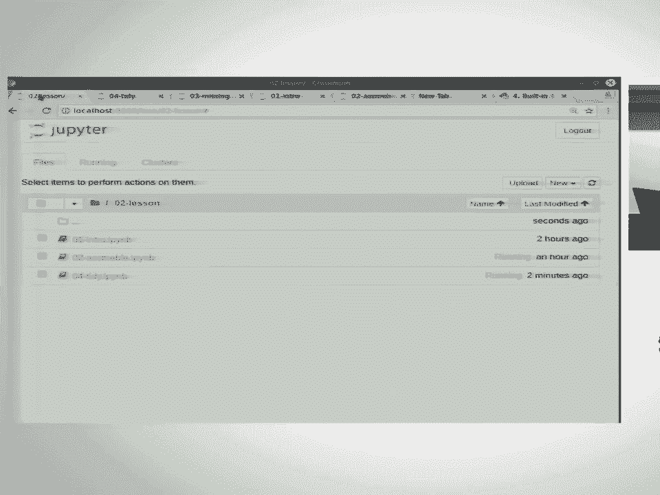

 Alright， next up。

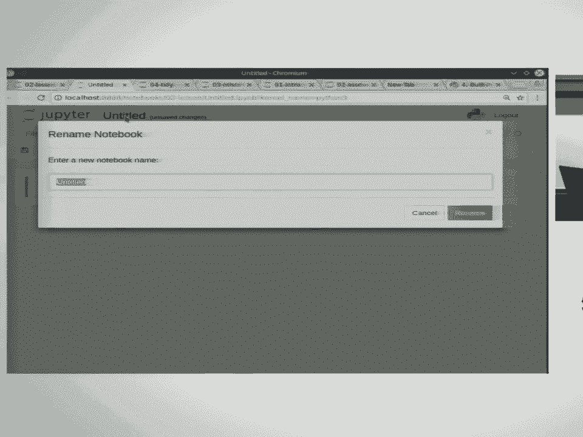

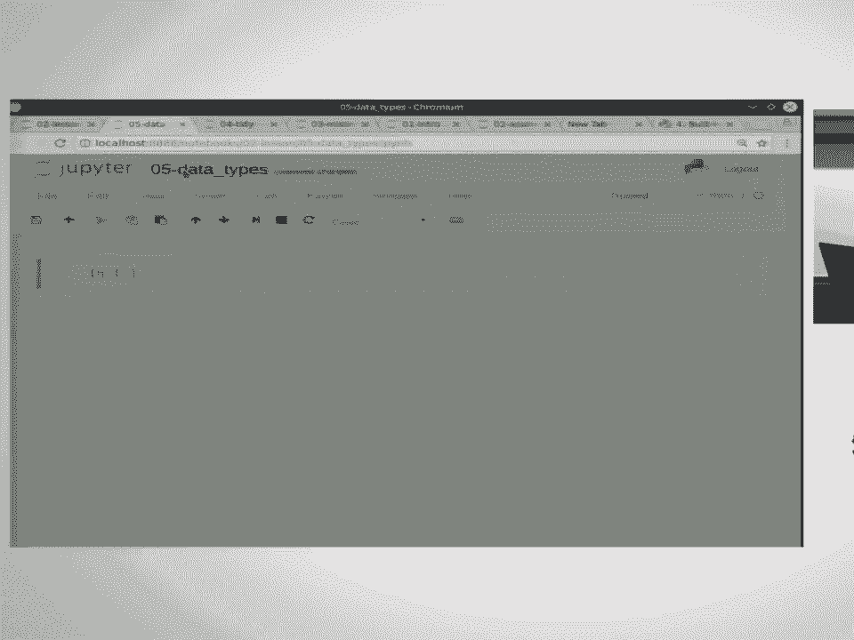

 So the next thing I want to talk about is data types。

 We will be using data from the seaborn library。 Seaborn is a plotting library in Python。

 I personally like it because it looks more like how I can plot an R and that's really only it。

 But it also comes with a bunch of data sets that are pretty cool。 Well。

 they're not cool if you've been doing data analytics for a while because they're pretty much used to death。

 And so essentially this is a data set for a given total bill。

 What was the tip given some kind of characteristics of the table？ Yes。

 it doesn't make 100% amount of sense because you can have a size of like six people but still have one gender associated with it。

 So I don't really know what's going on there。 But how do you look at data types？

 So there's the info thing that we've been looking for。

 And the last column here are the data types for each group。

 You'll see a new one here called category。 This is I think from like Panda zero that 16 or something they added the category data type。

 So this is like an R factor。 And essentially under the hood， these categories。

 they look like strings but under the hood they're coded as some kind of like integer or something。

 And it's really it makes doing analytics later on a little easier because you have this notion of a dummy variable。

 And。 And because it's under the hood stored as like an integer or something。

 it can make larger data sets smaller in memory。 Because you have the string， the I and N。E。R。

 but it's really getting coded as one。 So if you have a million of these。

 it will save a great deal amount of space and memory。 Yeah。 Mm hmm。 Yes。 Yeah， yeah。

 so I think the function is PD that categorical。 And if you give it a column。

 it'll turn it into a categorical column。 Yeah， yeah， so that's that check。

 So that's so we're going to go over how you convert data types。

 So that's how you would convert a column into a categorical data type。 But most of the time。

 especially where I prefer if you can work with strings and not categories because dealing with a category essentially。

 there's like some other layer you have to deal with because there's like this mapping that's going on。

 So when you're， you can't really just， you know， do like string split and string replays and just assume that the category got recoded。

 So there's a few hoops that I'm not going to go over。

 but categories when you actually are working with them in your data cleaning process。

 I would almost say convert it into a string and your life will be easier。

 So that's what I'm going to show you。 It's how you just convert things into a string。 And then。

 you know， typically when you're like preparing for data analytics。

 a lot of like stats models or scikit learn date， they can handle these category categorical data types。

 So when you're done cleaning with everything， that's when you would use pd。c categorical。

 So how do you change data types？ So， um， let's take this tips data set。

 And we'll create a total bill string。 And that's going to be tips that's going to take this total。

 Bill on column and the way you essentially recode a variable or a column to a different type。

 There is a function called as type and you give it the type that you want。

 So STR is Python's designation on converting into a string。

 So if you wanted to convert it into a floating point number， you can say float。 Right。

 So you can't really see when it's printed， but this column， if we look at the info is now an object。

 which is how Python or Python is going to be。 Python or pandas calls string objects or strings。

 So you can use as that type to convert anything to from one type to another。

 When you're working with numeric types， there's， I think this answers someone else's question here。

 So let's say tips。 So I'm just going to take the first 10 rows of our tips data set。

 And I am going to random， well not randomly。 Set the total bill to the string missing。

 So this warning is essentially saying that I'm making a copy。 I'm actually。

 I know I'm making a copy， but this is just a warning telling you that you might not be doing what you're expecting to do。

 but I'm totally expecting。 I know I'm doing in this example。

 So I have this data set or the subset and I converted a few of these into the character string missing。

 So what happens if we look at info or another way we can look at our types is just running D types is our total bill is now an object。

 Right。 That makes sense because it used to be all floating point numbers。

 but because we had inserted strings into it， it has to convert everything into the lowest common denominator。

 which is a string。 Right。 There's no way to convert missing into a floating point number。

 And because each column has to be the same type。 That's when we had created one had ran this line right here。

 It had coerced everything back to a string。 So if we wanted to。

 we could have said something like get the total bill and do as type。 It was a float。

 That's going to create an error because it has no idea how to convert M。I。S。S。I。N。G。

 into a floating point number。 So if that's the case。 So in our like that's kind of nice。

 Like if you say， hey， as dot numeric into something。

 it will just automatically coerce everything into an N。A。 If it doesn't find it。

 So pandas has something that's like that。 There is a PD dot two numeric function。

 So if you run that， we get the same mistake or same error。

 And it's going to say unable to parse missing。 I have no idea what to do with M。I。S。S。I。N。G。

 And that's because if we look at two numeric。 There is a parameter called errors and by default it's set to raise。

 So if it tries to convert something to a numeric and if it encounters a mistake or something it can't convert to a numeric number。

 it's going to give you this value error。 That's what is being raised。

 But there's a few other ways you can change this behavior。

 So you can say errors is equal to ignore in which case it will just ignore it。

 But that kind of doesn't help because your D type is still an object。

 but at least it didn't give an error。 And then the last thing that you can give it is Coverse。

 which will force it， force everything into a number。 And if it can't， it'll give you an NA。

 an NA and value。 So this is the default behavior in R。 So if you have a column that's that。

 you know， is only supposed to have numeric values and for some weird reason。

 there is M-I-S-S-I-N-G or something， you can say to numeric and just convert the whole thing into a floating point number and everything else that couldn't convert will get blanked out to an NAND missing value。

 Like incorrectly？ That's not like a British spelling， right？ right？

 Maybe it's such a common spelling mistake。 Anyway， yeah。 It doesn't。 All it will just go through。

 but it's not giving you an error。 I don't know if it's useful。

 It's just in the documentation that that's provided。

 I can see it being useful because you kind of don't want your code to just break if you're giving it to someone else。

 So。 Yeah。 So ignore will just silently let it go， but it never got the type never got changed。

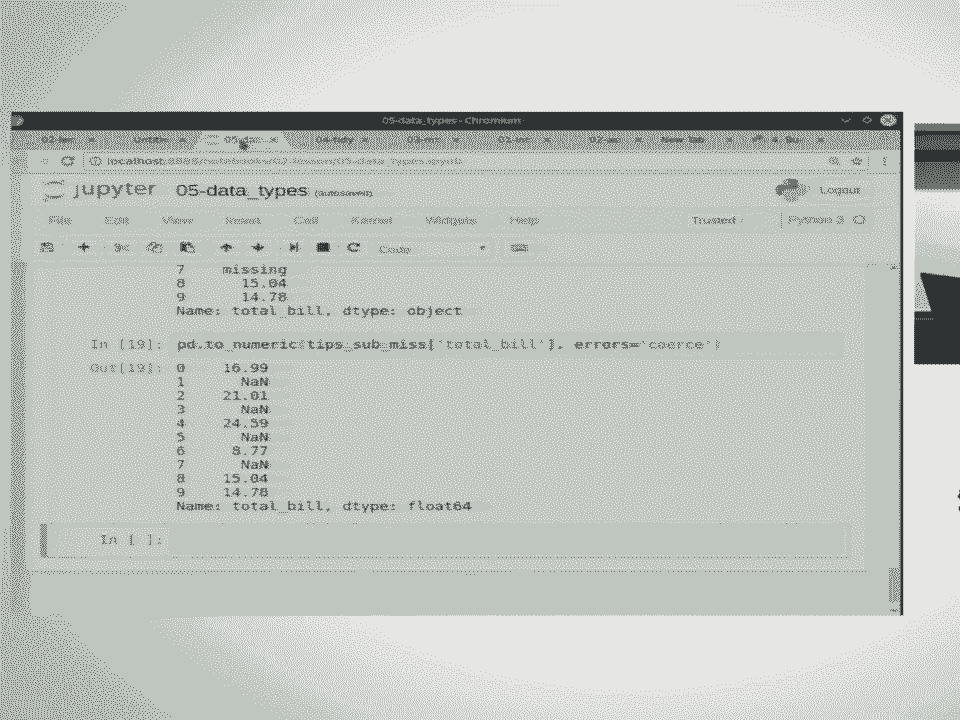

 [inaudible]， It's spelled two ways， right？ Okay。 I know I tend to in general mix my add C's and S's like on a whim to like things I type。

 [inaudible]。

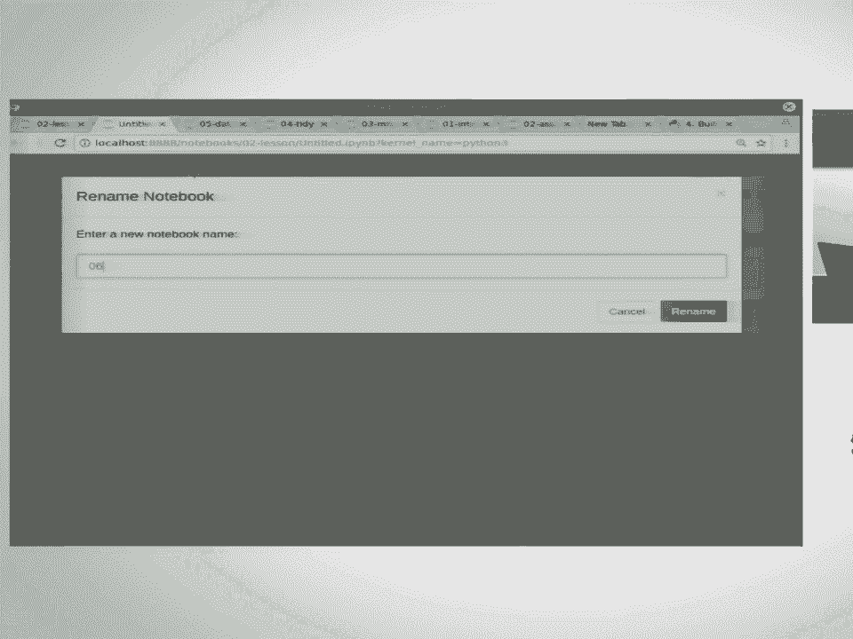

 Oh。 Okay。 Yeah。 I don't know。 Good for them。 I'm catching my spelling mistakes。 Okay。 So we're。

 can I do much is left？ Goodbye。 All right。 So I'm pretty sure I have enough time。 All right。

 All right。 So the last thing I want， well， second the last thing is this notion of apply。

 So this is what happens if you know， if you're pivoting tables。

 that's not enough to clean your data or。 For each row of your data。

 you want to perform a more complex calculation other than adding two columns or calculating the mean of the row or something。

 You know， something like calculating a z score is something that is a little more complicated to calculate。

 So you might have to end up writing your own function for。 So just to show you how apply works。

 I'm going to be using a few very simple examples， but then we should have enough time to actually do a full blown example at the end。

 So let's write。 So the first thing is。 Here is a quick。 A few seconds on how to write a function。

 You say def the name of your function。 You indent four spaces。 And then you have a function code。

 And if you have a empty function， you just have passed。

 So this is a function that does absolutely nothing。

 But let's write a function that's a little bit more useful。 So that was it。

 That's how you write a function。 That's the entire program function。

 So if you want to write a function that's a little bit more useful， like square number。

 You can say squares given value so you can write a doc stream because that's good to have。

 All this is doing is returning X and raising it to the second power。 And if we want to use this。

 we can say my square to my square four and it'll just square that number back for us。

 If you want a function that takes two parameters。 That says。 Calculates。

 Calculates the average between two numbers。 That's X plus Y。

 So this is the difference between Python two and three。 If you're on Python two。

 this should be two dot zero。 That's it。 I'll just write that there。

 And you can say what's the average between 10 and 20 and it should give you 15。 Right。

 So how does this play into the world of apply？ Typically。

 let's say for example you want to perform a calculation on each row of your data or each column of your data。

 If you are coming from where your programming background is， you might say， hey。

 I'm going to iterate through rows or columns。 Let's write a for loop。 Don't do that。

 It's typically when you're working with data sets。

 that's probably the slowest thing that you can do is write a for loop to iteratively run a calculation across columns or rows。

 Especially if each column is completely independent。 Each calculation is independent from another。

 So that's where you run and apply。 This is more of like a functional paradigm kind of thing where you write a function and then that function gets quote unquote applied across every single column or every single row essentially at the same time。

 So I'm going to make up a data set。 So I'm going to create a data frame。

 It's going to be a simple data frame。 It's going to say a is 10， 20， 30。

 and then column B is going to be 20， 30， 40。 Right。 So not a fancy data set at all。 If， for example。

 we wanted to really calculate the square of column A。 I could have said， like， hey。

 take column A and square it。 This is what I meant by a vector。

 something that's like a vector versus a list。 You can't do that to a list。

 But because the series is a vector and knows how to handle。 Hey， you told me the square。

 So I'll square each element。 So how do we do apply？ So we have this function that we just wrote。

 That says my square。 It takes a single value and squares it。 So how do we do this？ Well。

 we have this vector of single value。 So this is just 10， 20， 30。

 If we want to apply a function that we wrote， we say dot apply。 So we're using the apply method。

 And we give this method。 The function that we want。 Right。

 So these two are doing exactly the same thing， but this function is a function that we created on our own。

 So this could be any kind of crazy function that does some kind of calculation for a given number。

 All right， cool。 So what about this other example？

 We have this average two that takes two values x and y。 So can we use this to say for each row。

 calculate the average。 So give it 10， 20。 This should be 15， 20， 30 should be 25， 34 should be 35。

 I am skipping。 So that presents a problem or something else you have to think about because we're working on a data frame。

 There's two different ways we can specify apply。 Right。

 Do we want something to work row by row or column by column。

 So just to see what happens when we run an apply on a data frame。

 I'm going to say write a function that all it does is it prints whatever you give it。 Right。

 So whatever you give it， it just prints。 It's simply a print statement。

 So let's say I run df dot apply。 And I give it this print me function。

 So you can see it printed some things for us。 So it printed 10， 20， 30， and then it printed 20， 30。

 40。 So you can see when we ran apply and we look at our。 Original data frame。 It printed 10， 20， 30。

 and then 20， 30， 40。 So apply on a data frame by default is operating on a column by column basis。

 The results are none because our function doesn't actually return anything。

 So that's why we have none none。 So the other way， at least in this example。

 we know it's going column by column is because the return has two non values and we only have two columns。

 So by default apply will work column by column。 So this is pretty much exactly the same thing as the F。

 A and D F。 Right。 So it went， did something on column A did something on column B。

 So let's write another function average three fix x， y， and z。

 So this calculates the average between three numbers。

 So this is x plus y plus C and divides it by three。 And so let's say now we run D F dot apply。

 We have this average by three。 We have we're running this。 So we want to calculate for each column。

 We want to calculate the average， right？ So we have 10， 20， 30， the average should be 20， 20， 30。

 40， the average should be 30。 So we run this， that's going to be a problem。

 And that's a problem because what actually happens when you run in an apply is the entire row or in this example。

 the entire column gets passed into the first argument of the function。

 So what really got passed into this function was 10， 20， 30。

 the series all got passed into the variable x。 Nothing got passed into y and z。

 which is why the error is going to say。 I'm missing two things。 Right。

 So if you're going to write and apply function。 What typically is going to happen or the easiest way to fix it。

 Is you take your function。 You make it so it takes one parameter because the entire row or the entire column is going to be passed in。

 So I'm going to say the entire column is going to be passed in。 And then inside this。

 because it's the entire series， you can subset it just like before。 So x is column。

 And then if we say， if that apply， we can say average three， and then that will work。

 So that's actually one of the most confusing things when I first started working with the place is like I wrote this function。

 Why doesn't it work。 Because yes， when you write your function like I did before。

 it's very easy to test。 You give it three inputs。 It gives you your results。

 When you want to use it for an apply， what actually ends up happening is the entire axis or in this case。

 the entire column all gets passed into the first argument。

 So you have to actually change how your function is written if you want to use it as an apply。

 That is a good question。 That's why you unit test。

 So if we wanted to do something on a row by row basis， we can say df。apply。

 Right now our function won't actually work。 So if I say average three。

 If you wanted to work on a row by row basis， we can say access by default is zero。

 so that means work on columns。 But if we say access is one， this will work on rows。

 But this doesn't make any sense on a row by row basis because we're doing x plus y plus z。

 There's only two values in here。 So our error is going to be something like index out of bounds。

 Right。 We're trying to get a third element that doesn't exist。 So how do we fix this？ Well。

 we can rewrite our function。 That says average two。 This now takes some kind of row。

 And now we're doing row zero and row one and we're just doing x y。 Then we can say df。apply。

average two。 And then that will work on a。 Yes。 Yeah。

 So that's how you can write an apply function that operates row wise or column wise。

 So how do we like。 So that's generally what's going on。 So let's use in like an actual data set。

 See born。 There's a Titanic data set。 So here's a Titanic。

 The data set of the famous Titanic of whether some individual survived yes or no。

 What their gender was what their age was some other stuff about the type of ticket that they bought。

 And whether or not they traveled alone。 So let's look at the info of this。

 So you can again I'm not going to show you how you can do string parsing you can do really complicated string manipulations write it in an apply function。

 That's you know something that you can do。 But I am going to show you how you can for example get a frequency count of missing values or what proportion of a row or column has missing values or what proportion of a row is complete。

 So when you end up working with pandas because so many operations are going to be。

 Vectorized that work on arrays you're probably going to end up loading them pie as well just because non-py functions work on arrays。

 So you don't have to write these vectorized functions yourself。

 So I'm going to write three functions first is going to count the number of missing values next I'm going to count the proportion of missing values。

 And the last one is give you the proportion of complete value。

 This is probably something that you will end up doing when you're working with a newer data set。

 So count missing。 We're going to get a vector of some sort。 I'm going to forgo the doc string。

 So we're going to get how many about what are the。

 We're going to get a vector of whether or not an element is missing like NAN missing。

 So we have is null。 We're going to give it the vector that we got。

 And then one thing that you can do is a true evaluate to like a one and false evaluates to a zero。

 You take the sum of a Boolean vector that will give you how many true values there are。

 So that's what we are going to be doing。 So this is a vector that gives me a vector of true fault values of whether it's NAN missing。

 And then I'm summing it to get the total number of missing values。

 I'm going to write another function is proportion of missing。 That takes a vector。

 And a proportion has a numerator。 So the numerator is exactly this count missing function that we got before。

 And the denominator is the how many elements there are in that vector。

 And then the proportion is the numerator divided by the denominator。 And then the last thing is。

 This is also a lesson in functions and how you can reuse functions that you build so you don't have to keep calculating the same thing over and over again。

 The last thing is proportion of complete， which is really the same thing。

 We got the proportion of missing so it's one minus whatever the proportion of missing was。

 All right。 So now let's actually use these functions on our data set。 So Titanic。

 So we can say count missing。 So what did this do？ So this went column by column and ran our count missing function。

 So we can see that age has 177 missing values embarked has two missing values and deck has 688 and where the person embarked from has two。

 And then just as sort of like an aside。 You should always if you are working with missing values。

 you should really make sure that those values are like actually missing at random。

 There shouldn't be a pattern in your missing values。 So one way you can check is use this PD dot no。

 Let's say embark。 Yeah。 So remember， look has a comma that a left is how you are subsetting the rows and the right is how you're getting the columns。

 So I'm getting all of the columns。 And then the rows is I'm taking this embark town column and seeing if it is null。

 if it is， return me those columns back。 And so that's how this is。 That's how this is working。

 And so， you know， when you're working with missing variables。

 it's very important that you end up looking at what's actually missing because you could end up with a data set that just so happens that like 98% of your male population is just all missing and your whatever model you're going to fit is not going to make any sense。

 So this is all of the rows in our Titanic data set such that the embark town value is missing。

 So that's all it's saying。 I'm not trying to make any inference of this。 Oh。

 this is the row row number or the row index。 Yeah。

 so we only have two missing values in embark town。 Yeah， well， this isn't the entire data set。

 This is just in this one column。 Yeah， yeah。 So this one column has two missing values and that's what they are。

 I could show you this one with six hundred eighty eight rows， but that just becomes。

 it's not going to show up on the screen。 So that's that's essentially why I picked that variable。

 All right， so we can do the same thing because our function is vectorized and it's vectorized because we ran MP some so it can take any vector。

 So we can take our Titanic apply and we can say we can change the access to one and this will give us for each row。

 how many missing values there are。 Right， so the first row has one missing value。

 the second one has the third one has one missing value index number five has two missing values。

 et cetera， et cetera。 What you can do is then say value。 And you can say here。

 five hundred forty nine of our rows have one missing value。

 One hundred eighty two of our rows don't have any missing values and one hundred sixty of our rows have two missing values。

 And so you can use this substitute any of the other functions that we wrote so we can say proportion complete。

 And here are the proportion of complete value。 So when we don't have any。

 That's a hundred percent and have one。 It's ninety three point three percent or eighty six point six percent。

 Any questions about apply。 So this function that you write can be as complicated as you need。

 So like that question of before how if you have a column that is like D and a number you can write a function that porses it out。

 Just in here you have to remember that when you apply the function row wise the entire row is coming with it。

 So the first thing you're going to have to do is subset the row for the particular column that you need。

 Or the other way of doing it is this will just be more pseudo code。 Clean one column。

 It takes a single。 So remember you can also apply on a series on its own so you don't have to run if you're all you're carrying all you care about is cleaning one column。

 You don't have to write an apply that applies on the entire data frame itself。

 You can write a function that takes in a single value。

 And then you'll end up doing something like return a single column one colon。

 So this is how we ended up saying D 42 would give us 42。

 So I can then use the column and just run apply on an individual column。

 You don't always have to run and apply on entire data frame。

 So if you're really just writing a function to clean one column。

 You know extract the column and run the apply on the column。

 There's no need to say hey now I'm going to apply to the whole data frame because then you have to worry about。

 So now this entire row came in。 I have to go figure out or count like which position that road that I want my information。

 My function to work on etc。 So just think about how you're writing these functions and how you're going to be using them。

 We have time will circle back。 But the last thing is going to be circling back to。

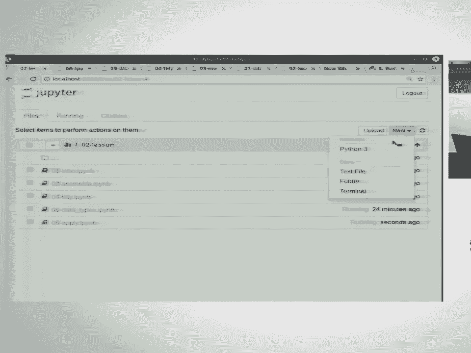

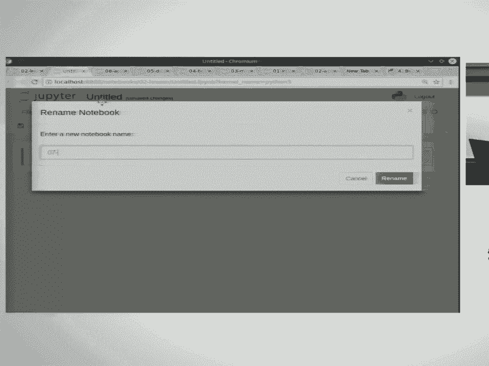

 So we're going to be going back to the gap minder。 Is it。 So we have our。 Data set。

 I showed you before we can say group by。 Our year pull out the life expectancy column from that and then take the mean。

 So that's what we did。 All the way that was the first thing that we did。

 What's actually going on under the hood is what you can think about is。

 It's breaking up each unique value in this variable that we specified here so。

 You can say that it really this isn't actually what's going on on the hood but in your mind you can say。

 It created a totally separate data frame 1952 is gap minder。

 Look such that gap binder here is equal to 1952。 So we just have a data set of 1952 data。

 for every single unique value of year。 So if you're used to thinking in four loops。

 you can think of get me all of the unique values of year， and then iterate through a four loop。

 and run this calculation， and then at the end stitch it together。

 That's essentially what's going on under the hood， of when you run a group buy。

 Let me go back to my notes。 So， mean isn't the only thing that you can do。

 so you can get for each group to account， get a size， get a mean standard deviation， et cetera。

 et cetera。 A cool thing I'll show you is describe。 So， you can say， gap， minor， group by， year， and。

 give me the life expectancy， and then describe it。 And that will give you for each year。

 the account means the energy deviation minimum， blah， blah， blah， for that column， right？

 There's a really quick way to do， to get summary statistics that actually like。

 break down your data set the smaller pieces。 Yeah。 This colon is a generic Python slicing notation。

 So， I can have a regular list， and if I wanted to。

 just like I can get the first element of the listing zero， I can say give me all of the elements up。

 until the third element by saying three， or I can say give me all the elements by saying colon。 So。

 yeah， so that's shorthand for all elements， because it's the right of the comma， it's all columns。

 So， that's not Python or that's not pan this specific。

 that's in this realm of slicing notation in Python。 Wait， say that again。 (mumbling)， Oh， yeah。

 I don't cover this in the tutorial， but yeah， so there's a group by， you can do。

 so the way we've been doing it now is we've grouping by， we're making a， forgot the actual term。

 I know in R is called summarize， but you're doing group by。

 you're calculating in aggregate statistic， and so that's a bunch of values。

 getting calculated into a single value， right？ So， group by is also have something called transform。

 which is doing a， you're grouping by some variable。

 and then the return is the same number of elements。 So， calculating a z-score is something。

 that you would do a transform on。 And then there's something called filter， which you can。

 for each group， do a filter， and filter your data。 So， there are other ways that you can do that。

 And then time permitting， I can show you offline， or in person。 All right， so。 Yes。

 so if you had done that， that work。 (mumbles)， I will have to think about that。 (laughs)， All right。

 so we can also write our own functions in them， using these group by stuff。

 So it doesn't have to be any of these summary statistics。

 although I'm going to use summary statistic， as an example， but you can use any vectorized function。

 for example， group by， continent， get the life expectancy。 So if you need to run any other function。

 so it's not dot mean or dot something， that is already built into pandas。

 you can use AG or aggregate， they both are exactly the same。 So AG is just shorter to type。

 And then in here， you can say， "Hey， I want to use the NumPy mean function。"， Or。

 "This is exactly the same，"， AG or EGAT。 You can， I don't know if another STD。 Yeah。

 so I want the NumPy standard deviation function。 So you can put any vectorized function in there。

 It doesn't have to be one of the ones that I just listed before。 That come directly from pandas。

 You can write your own。 So define my mean takes a set of values。 So how do you calculate a mean？

 Well， you get the length of the values。 And then the sum is， use the NumPy sum function。

 just because it's vectorized， so you don't have to write a for loop。

 to iterate through each to get the sum。 And then S divided by N。 Right。

 so this is a function that I wrote。 And it works on a vectorized manner。

 because I'm using the NumPy sum function。 And we can use that right here and say， "My mean。"。

 So you can create your own weird aggregate statistic， or something data transformation。

 of like parsing some string or， I don't know， some count。 Your limit is your imagination， yes。

 And then with these aggregates， what you can also do is you can provide multiple functions。

 at once and the only thing you have to do， is give it a dictionary， so a set of curly brackets。

 And then since you're doing multiple calculations， so let's just do it this way， actually， no。

 This is the old way of doing it。 So if you give it a set a list of functions， so for example， NumPy。

count， nonzero， NumPy。mean， NumPy。standard deviation。 If you give it a list， it'll for each group。

 give you the nonzero， the mean， or the standard deviation， or whatever you wanted to calculate it。

 So you can do that all in one go。 And then again， you can put a set of square brackets here。

 and just break down your data set as far as you need。 If you want to use。

 if you want these column names， to actually be meaningful， the old way of doing it。

 which is no longer will work， is you can say， number。 So instead of a list。

 you give it a dictionary， non-count， mean， standard， standard， standard。d。

 So you can rename these columns。 The only problem right now， it's gonna say， hey。

 this won't work in the future。 So I had to last night go figure out。

 how this will work in the future。 So the way this will work in the future is， yeah。

 you give it the old notation， which is using these square brackets。

 And then you actually say rename， to rename your columns。 So columns， C-O-L-U-N-S， yes。

 How do you want to rename the columns？ So count， non， count， mom， zero。

 I don't know why they made this not work， because this is actually way more typing。

 Mean will be called average STE。 Will be called， wait， what？ Oh， it's on count。 Oh， whoops， whoops。

 whoops， sorry。 (mumbles)， All right， there。 And then you can clean this up。

 because this is pretty messy。 All right， so you can also reset the index at the end。

 just so you get a nice flat table， that I'm very used to looking at。 All right。 So the last thing。

 group by pandas， just for time constraints， which I guess I knew that I wouldn't have time to do this。

 there is a page called group by split apply combine。 And so I just showed you aggregation。

 So that is calculating， taking a bunch of values， and computing a single value as its output。

 There's transform， which if the number of inputs， is equal to the number of outputs。

 and then there's filter where it's somewhere in between， I would say you should look through this。

 So calculating a z-score is an example， where the way z-score is calculated is you calculate。

 the average of something and then you run， how do you calculate the z-score？

 It's some function that requires the average， but the result is each element gets rescaled。

 such that the mean is zero and the standard deviation is one。 So each value will get a new value。

 So that's what transform means。 It's doing a one to one mapping。

 So you don't have to calculate the z-score， for the entire data set。

 you can break it down by year or content et cetera。 And then filter is for each group。

 give me the values where the life expectancy， is greater than 50。

 So you can do aggregate statistics like that， to return something back to you。

 And the reason behind， or one of the reasons behind。

 having that under the group by is if you think longer term， into distributed systems。

 the syntax will be almost， exactly the same， or you can say， hey。

 I have this five billion row datasets， sharded across five computers， I can say group by this。

 and then the syntax is exactly the same， of doing these aggregate statistics。

 So the more familiar you are with group by， it'll very， I wouldn't say easy。

 but grasping how distributed systems work， will be less difficult。

 because at least your code will not really change。 All right。

 So the last bit is stuff I am not going to type， but it is essentially a segue of two。

 hopefully you guys have learned something， about data cleaning。

 And then so at the end of your data cleaning process。

 you typically want to fit a model of some sort。 So this would be a segue into。

 how would you fit a model？ So there are two major packages used to fit models。

 So there are stats models and SKlearn， both of which I'm pretty sure were a tutorial。

 in this conference at some point。 And so this is generally how that works。 So we have pandas。

 we're importing pandas， because we're working with data frames。

 I'm using Seaborn to load up a dataset。 All of these things also have built in datasets with it。

 I just ended up using the Seaborn datasets， because at least I definitely know。

 this is a regular pandas data frame。 A lot of the， especially in scikit-learn。

 they're not like the datasets that come in scikit-learn， are not like regular data frames。

 So you have to， their examples are a little different。 It's not as simple as plug and play。

 So I tried to give you an example， of what it would be like if you worked。

 with pandas data frames from the beginning， and now you want to fit a model。

 So there's two different ways you can use stats models。

 There's a regular API and for the R-like people， there's a formula syntax。

 And so this formula syntax will look very familiar， if you fit a model in R before。

 So this is our tips dataset that we've seen。 And so to fit a regular linear regression。

 stats models has a function called OLS。 So we're doing regular， ordinarily least squares regression。

 Their naming convention is a little weird。 They use endogenous for the response variable。

 or sometimes called the dependent variable。 I personally hate the word dependent。

 and independent variables just because that sort of like， conveys that the two things are related。

 And when you fit linear regression， it's one of the assumptions is they're not dependent。

 So I don't like using that term。 And then there's another variable where you specify。

 all of the predictors of your model。 So here we're gonna say how does total bill。

 does the total bill affect or predict the tip， that you're getting？

 So that goes into the model object。 All that does is set up the model。

 So you actually have to say model。fit。 Typically you'll see people just say。fit。

 like right there directly， just chain it together。 But a lot of the tortorials you'll see。

 will just do it in multiple steps。 So you get a set of results after you fit your model。

 and to look at your results， you say results not summary。

 And here if you've ever seen statistical output， this is what you get when you run summary。

 This is sort of the benefit of using stats models， because you actually get this set of results。

 If you end up using scikit-learn， you don't get this。

 And it's just because there's two schools of thought， of how these things are working。

 Stats models are， you're actually fitting models， as like a statistician versus scikit-learn is more。

 of you're trying to do internal validation， through cross-validating and stuff like that。

 So scikit-learn is really good if you're trying， to do cross-validation and all of that stuff。

 If you're just trying to fit a model， like a regular statistician， it's easier。

 to get these tables out。 Yeah。 (muffled speaking)， No， this is not an exhaustive list of the model。

 Oh， I need to run this， that's why。 So results。tab and then you can create。

 you can see everything that's in there。 Yeah， so I would use tab complete。

 to help you get everything。 So here's the lowdown on how you interpret this。

 You have a table of coefficients。 In this case， we have total bill and then a coefficient。

 here and because this is linear regression， the way you would interpret this is saying。

 for every one unit increase in total bill。 So for every， in this case dollar。

 so for every dollar increase in total bill， the tip that the person can expect will increase。

 by essentially 14。3 cents。 So I guess that's good。 People are roughly tipping 15%。

 Although tipping can be a whole other debate， on whether we want to have tipping in this country。

 If you just want the parameters， you can say results。param。

 And so if you don't want the entire table of results。

 and you just need the parameters to go on with your work， you can say results。param。

 They just get the coefficients。 If you need multiple variables， pretty much the same thing。

 So in this case， this is multiple continuous variables。

 I haven't shown you a categorical variable yet。 So if you're doing a multiple continuous variables。

 again， put it in a set of square brackets， just realize that in this case。

 you need two square brackets。 Don't remember the exact reason for that。

 But the rest of the model will look exactly the same。 Once you create a model， you fit it。

 you run summary， and you get your summary statistics。

 And so you can see the coefficients will change， because we've essentially adjusted。

 for another variable called size。 But the interpretation for each variable， is roughly the same。

 So for each one unit increase in size， so for each additional person that joins the party。

 the tip will increase by 36 cents， assuming that the total bill is the same。

 And then for total bill， you can say for each $1 increase in total bill。

 the tip will increase by 10 cents， assuming the size is constant。 Oh。

 you can totally get the residuals， and all of the other stuff。 Yes， yeah， yeah， yeah。

 it's all in there。 It's somewhere in there。 So if we look at the tips info。

 you'll see that we have a bunch of categorical variables。 My， I guess。

 it's almost easier to just jump， to the formula syntax if you're working。

 with categorical variables， because the formula syntax will understand。

 that this is a categorical variable， and create the dummy variables for you。

 So what is a dummy variable？ So let's say I have a categorical variable， like sex， male and female。

 It would make no sense as a model to say， let's say female is zero， male is one。

 it would make no sense to say， like for every one unit increase in sex， something happens。

 Like what does that mean， right？ So it has to be a categorical variable。

 And so that's why it's a categorical variable， and not a continuous variable。

 So but how do you actually put that into your model？ So you end up doing。

 creating what's called a dummy variable。 So what ends up happening is you create a separate column。

 called male and a separate column called female， or you get， you create a new column。

 for each unique value in your category。 So in sex， it'll be one category called male。

 and one for female， at least in this data set。 And then if the person is male。

 the person will get a one and then female will get， the column， the value for female will be zero。

 If the person is female， the female value will be one， and the male value will be zero， right？

 So you created a new set of columns for each category。 And typically with dummy variables。

 you end up dropping one of them， just for multicollinear error， LIT-T。 And so you can essentially。

 instead of having two columns， from male and female， you really just need one column。

 for female because if the female column is zero， you can already assume that it's male， right？

 So that's why you'll hear when you're starting， fitting models and this isn't really a stats class。

 you'll create n minus one dummy variables。 So that's what this model will actually give you。

 So using the formula syntax， so if you've used R before。

 this is exactly how you would specify formula。 You have a tilde， think to the left of the tilde。

 is your response variable， so tip。 And then the thing to the right。

 you literally add the variables together。 So we're trying to say we're predicting on。

 total bill sex， smoker， and size， right？ So total bill and size are continuous variables。

 sex and smokers are gonna be categorical variables。 If you're using the formula syntax。

 be mindful it's OLS， in single， in lowercase， if you use OLS in capital case。

 it will be using the previous syntax。 So you specify the data， but then you fit it。

 you run the summary， and then you get this nice table。 And so here you see sex as a female。

 so this is essentially because male got dropped， because it's n minus one dummy variables。

 This is saying that if the person is female， compared to males， then the tip will increase， by 2。

7 cents。 So females are assuming everything else is the same， tipping 2。7 cents more than males。

 right？ There's issues with interpreting that， which you will see looking at this p-value。

 and the t-statistic， but this isn't a stats class。 So， but then so you can see for smoker。

 so smoker is the person a smoker yes or no。 So because this is actually nice that it tells you。

 what the target variable is， so the reference variable is yes。 So when the person is not a smoker。

 the tip will increase by 8。3 cents。 So that's what fitting a model will look like。

 using stats models。 Right， you can do the same thing with logistic regression。

 so linear regression is when your response variable， is an actual continuous variable。

 Logistic regression is one type of method， if your outcome is binary。 So in health data。

 like did the person die yes or no？ So if you have a binary variable。

 that's when you would use logistic regression。 So in our Titanic data set。

 we have a column for survive。 Did the person die yes or no？ The function you will use。

 so I'm just using the formulas syntax。 I tried to use this like the non-formulus syntax。

 and it became like something I didn't want to figure out， at two in the morning。

 So the formulas syntax， oh， another sign up。 Yeah， this is totally not a stats course。

 that I'm trying to give you， 'cause there is something like you have to create。

 an intercept that this isn't doing， and there's a whole bunch of other stuff。

 So this isn't totally like a valid statistical thing， I'm doing， more just showing you。

 how you can continue on with your Panda's knowledge。

 So the formulas syntax is exactly the same as before。 Response variable to the left of the tilde。

 so did this person survive， given sex， age， fair and deck。

 And so now you can see it creates this table of results。

 You can see deck had a lot of different values in them。 So there was one， two， three， four， five。

 six。 So there are seven values for deck， but we have six in our table。 Oops， uh oh， there we go。

 there we go。 All right。 But when you're doing a logistic regression， you actually， it's much harder。

 to just take this table of results and interpret it。 When you are working with logistic regression。

 this isn't a stats exam， so I'm not gonna explain why， but you have to exponentiate your values。

 So you can run the NumPy exponentiate function， on your parameters。

 and then you can say something like， for example， on age。 So for every one unit increase in age。

 the probability of you dying， in this case， quote unquote， increases by 0。95， no wait， that's wrong。

 The odds of you dying become 0。95 times the chances of you。 Oh wait， hold on。

 how do I interpret this？ For every one unit increase in age， the odds of you dying are 0。

95 times the odds of you not dying。 So when it's less than one， it's actually protective。

 So apparently the older you are， the very less likely you are to die。

 but if you look at the coefficients， that's probably not something。

 that you can really like interpret very well。 Yeah， so just keep in mind。

 when you're looking at logistic regression， you have to exponentiate the results。

 and you're actually interpreting them as odds ratios， and not like we did with linear regression。

 Last example， so how would you do all of this in scikit learn？

 I only really had time to do this for one example， for tips using linear regression。

 So scikit learn， you import the linear model， if you're trying to do a linear regression。

 Do you have to create dummies for this？ Yes you do。 So here。

 because scikit learn essentially expects a array， of ones and zeros essentially。

 you have to manually create dummy variables。 So in pandas， there is a function called get dummies。

 You can give it the column， that you want to create dummy variables with。

 I am dropping the first one because I only， you only need n minus one dummy variables。

 Certain statistical methods， you actually just keep all of them。

 So that's why the parameter is there for you。 And then so we get a new column for sex。

 whether this person is a female。 So if the person is female， they get a one， if it's male。

 they get a zero。 To create the linear regression in scikit learn， we create this， we initialize。

 initialize this linear regression object。 We give it the x and y's。

 So the x or our predictors are going to be the total bill， the sex dummy， the size。

 The y is going to be the tip column。 We feed in the x and y vectors into the fit。

 So we have to fit the model。 And then we don't really get that nice table of results anymore。

 with scikit learn。 So you only get， you can get the coefficients。

 by running co-f_to get the coefficients。 And then just because this vector of numbers。

 is kind of useless without some kind of variable name， associated with it。

 you have to manually essentially tie， the variable name back to it。 So if you want， you can say。

 for every one unit increase in person at the table， the tip will increase by 19。3 cents。 All right。

 that's all I have for you。 I guess I can circle back to apply。

 Is there any other questions before I like just go on？ Yeah。 (mumbling)， Oh。 (laughing)。

 I guess I didn't test that out。 Yeah， I can't explain that。

 Why didn't it work in Python two or three？ The general rule of thumb for anyone who like。

 I don't know， is listening to me。 If you're starting a new project。

 the rule of thumb is start the new project in Python three。

 but if you already have an existing project in Python two， just yeah。

 you don't have to convert it over to Python three。 Just know that Python two does have a very， very。

 has an end date。 There's like an actual webpage that is like， when is Python two ending。

 And there's literally a website that is counting this down。 So， so take that。

 that's why the general rule of thumb is， if there's a website counting down something。

 you should probably adhere to it or listen， or do something about it。 All right。 So。 Yeah， it's。

 (mumbling)， Yeah。 (mumbling)， (laughing)， All right。 (mumbling)。

 I would say most of the ones that are， (mumbling)。

 But suspicion is that there isn't that in like these， (mumbling)， Yeah， writing the wall。

 (mumbling)， Yeah。 (mumbling)， (mumbling)， What methods have I done before that Python has saved me？

 So， I come， so I got my master's in public health， and epidemiology。

 And so a lot of the data sets that at least we've worked with。

 are these national representative surveys。 So a lot of data cleaning was really just recoding in SAS。

 Essentially what Python allowed me to do， but that's also just because of the order I learned things。

 So it's not really just Python specific， was， you know， getting a random data set off the internet。

 or scraping a piece of data。 That's something I don't think I would have been able， to do in SAS。

 If I did， I don't think there would be documentation， on how to do that in SAS。 So， you know。

 stuff like we have， so we work with a lot of GIS data in my lab。 And so there's gonna be like， oh。

 we got this data set with like state names fully typed out， but this other data set is state names。

 and there's two digit code。 Like how do we find the table in between the link them together？

 So that's sort of what Python has allowed me to do is like， oh。

 Wikipedia is great for that type of information。 You scrape the data off of Wikipedia。

 and now you can do a join， use that as an intermediate to join all your data together。

 So that's stuff that Python has allowed me to do。 Not to do。

 Don't write for loops if you can help it。 (laughs)， I think like a few years ago。

 like in like a PyGothum， like Jeff Reeback， like one of the contributors to Pandas。

 he actually wrote a talk that was like， how do I make your code slower？

 And like it started off with like write and apply， and then at the end is like use the iter rows。

 on a data frame to actually iterate through the rows， to write a for loop。

 So typically if like I would say like this apply function thing。

 is really important because chances are， when you're cleaning data， you're not cleaning one cell。

 you're cleaning like the entire row or column at once。

 So the to do or what not to do is don't write a for loop。

 especially if each row is completely independent of another。 That's usually a good sign。

 Sometimes you have to， okay。 But like try to understand how apply works。

 and that will make life much easier down the line。

 'cause it will be like all of this stuff like number， and all of those optimization things。

 that make your code like faster。 Like they all work on functions。

 So if you already have your code written as a function， that is applied to your data set。

 you can do those like speed optimizations much faster。 But yeah， so like I was gonna show you。

 like one more thing that you can do with apply， is we have this function that we wrote， that is X。

 Y and it takes two values。 But we can't actually say like DFA， DFB， or we can， why does that work？

 That's not supposed to work。 Oh， I know why that works。 Okay。 Now I can't think of a good example。

 (laughs)， That's interesting。 I don't know what to do。 (mumbles)， Yeah， well， it's trying to。

 let me see if I can look this up。 This should be pretty quick。 Oh。 (mumbles)， (mumbles)， (mumbles)。

 (mumbles)， (mumbles)， (mumbles)， (mumbles)， Okay， anyway， I don't know。

 So if you end up with a function that isn't vectorized， for whatever reason。

 like the reason is like this right here， actually does a vectorized calculation。

 You can use NumPy has a way to turn any function， into a vectorized function。

 and you use this location called a Python decorator。

 So what this will do is the decorator is essentially。

 at and then something right in front of a function definition。

 And what this will do is it'll take this function， and vectorize it。

 So if I had manually calculated an average function， using a for loop or something that's not made。

 to be worked on arrays， you can say at np。vectorize and then it should work， on an array of data。

 I realized the example is probably failing， and I have to make some edits。

 but that was like the last thing I wanted to quickly go over。

 is if you do have a function that's not vectorized， and if you don't want to use the apply way。

 or rewrite it， so like the first thing it takes， is an X the entire row and then you have to rewrite。

 the code underneath， you can say np。vectorize， and then just pass in your parameters that way。

 So yeah， that's all I want to go over。 I'm happy I got through everything。

 because it was a lot of stuff。 But yeah， so keep with it。

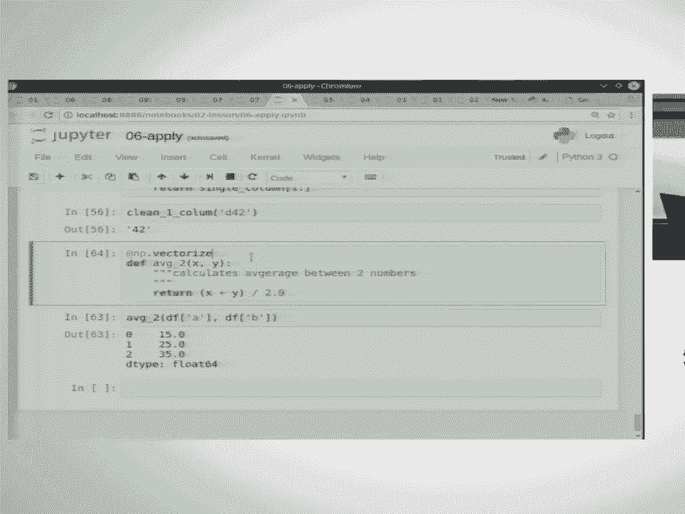

 I guess since all of you guys are here， because you're very new to Pandas。

 so it would be about three and a half years ago， I was essentially like sitting there。

 like in my own software carpentry tutorial， learning about like how to do analytics。 So practice。

 practice， practice， and you'll get it eventually。 All of this stuff really is like kind of an art the more。

 I think about it。 You are taught all of the core fundamental pieces。 It's， you know。

 with practice you'll get used， to training them together to get what you need。 So， right， cool。

 (audience applauds)， [BLANK_AUDIO]。