# SciPy 2017（合集） - P21：Interactive Data Visualization with HoloViews & Bokeh  SciPy 2017 Tutorial  Jean - 哒哒哒儿尔 - BV1Cs411A76Y

 My name is Brian Vandivan and I work with Sean Luke。

 I continue him on the Bokeh project and John Luke works on Hall of Views。

 Just wanted to say a few quick words， then really going to turn everything over to him as mentioned already。

 Unfortunately， Philip Ruttiger cannot be here today。

 but we'll try to take it easy on John Luke and I'll be around to try to help folks if they have any questions。

 And of course， Jim Bednar is also on the Slack channel。

 I encourage everyone to go there for any help as well。 I just wanted to say。

 I'm really excited about Hall of Views。 So， working on Bokeh the last several years and one of the things we've wanted to do is have a really accessible。

 high-level interface for people to do exploratory type data analysis。

 just as quickly and as simply as possible。 And I'm really pleased to say that Hall of Views has definitely filled that role。

 So， I just wanted to make a clear statement about Bokeh。charts。 Going forward。

 the endorsed sort of recommended high-level API on top of Bokeh is going to be Hall of Views。

 And so， I think you'll see today that it's really fantastic， has a lot of capability。

 it's already actually well beyond， I think， whatever Bokeh。charts used to do already。

 And I think you'll find that it's a very pleasing API to use as well。 So， I think with that。

 I will turn it over to。 Oh， sorry。 I also want to mention we have some stickers on the end of the table。

 We have some G of views， Hall of Views and data shader stickers。

 You'll see all of those things today and with that， I will turn things over to John Luke。

 And just raise your hand or anything if you have a question， I'll come try to take a look。

 First of all， thank you all for being here。 I guess， I'll just dive straight into it and。

 try and get everyone set up， make sure everyone's got their laptops working correctly。 Oh， sorry。

 this is the slack。 Oh， I think it's an invite。 You should have seen an invite to join the Slack channel。

 Just check your email。 I think that's how everyone got there。 Okay， so。

 what I'll do is I'll just say a few things that you could do just to get things set up。

 and then I'll introduce it with the introduction notebook。 Firstly， has everyone managed to clone。

 the Git repo？ If you haven't put your hand up。 Okay， great。 It seems like everyone's managed to do。

 and I hope everyone's managed to do the Condo environment YAML to set up the Condo environment。

 Is that true？ Everyone's managed to make the 8-feet tutorial environment。 Is that right？

 If you haven't， could you put your hand up？ Okay， so this one's help。 Yes， so， right。

 that's exactly right。 So， everyone who's got a Git repo and the， 8-feet tutorial environment。

 please just get one Git pull in the repo and then Condo and， create。

 you can see it on the screen here。 Sorry， that's not right。 Yes。

 so the line that I've highlighted on the screen is the thing to run after you run Git， pull。 So。

 run Git pull， run that。 It really doesn't， it's not going to put in much， it's just， Taulivis 1。8。

1 was released on Friday。 It's got a few bug fixes。 It just be more pleasant if all。

 works for everyone。 Right， yep。 Okay， also， if there are questions like that， do go on the。

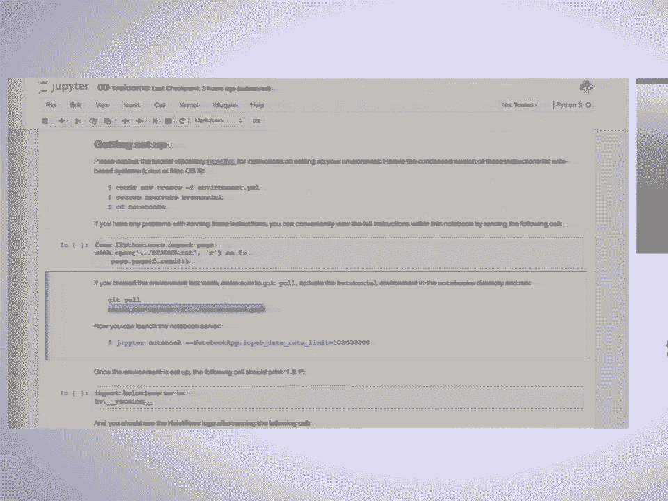

 Slack channel and there's both Chris Bull and James Bednar will be able to help you。 So， that's。

 I think it's Jay Bednar and C。E。 Bull， C。 Bull， they'll be able to help you on the Slack channel。

 So， in that case， I'm going to， I hope that everyone's been able to run that。 It should be quick。

 and then I'll start introducing the talk now。 So， right， and I suppose I should also say that。

 once you've actually got that done， okay， I guess I'll just ask again， how many people。

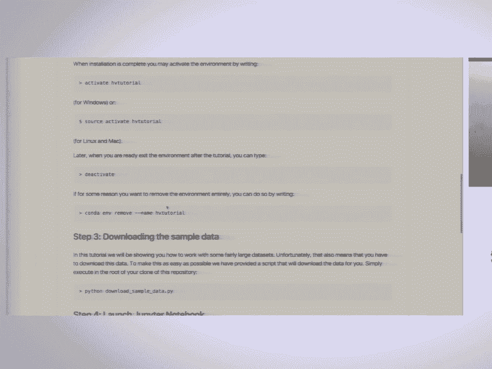

 mentioned to run the update command？ Okay， good。 That's good。 Who hasn't。

 who's still waiting on that？ Okay， that's great。 In that case。

 do CD into the notebooks directory and then run Jupyter Notebook。

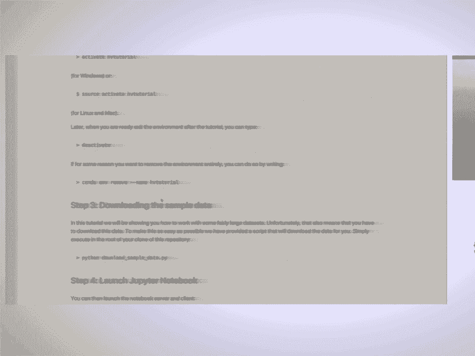

 with this command here。 Hopefully， in a few seconds， everyone will have Notebook running。 Yes。

 so this parameter is essentially to get run a limit， a sort of limiting value that Jupyter。

 Notebook now has in terms of how much data you can push at a time。 This just increases the limit。

 to suddenly large so that you can actually push large data to Notebook。 I understand that in the。

 next notebook version you want me to do。 It's a temporary thing。

 In case you haven't seen that before。 I don't， so you're running on Windows？

 It doesn't not accept it。 You can try it and see if it works。 Okay， so， great。 So。

 once you've done that， you should be able to go to the Notebook page and。

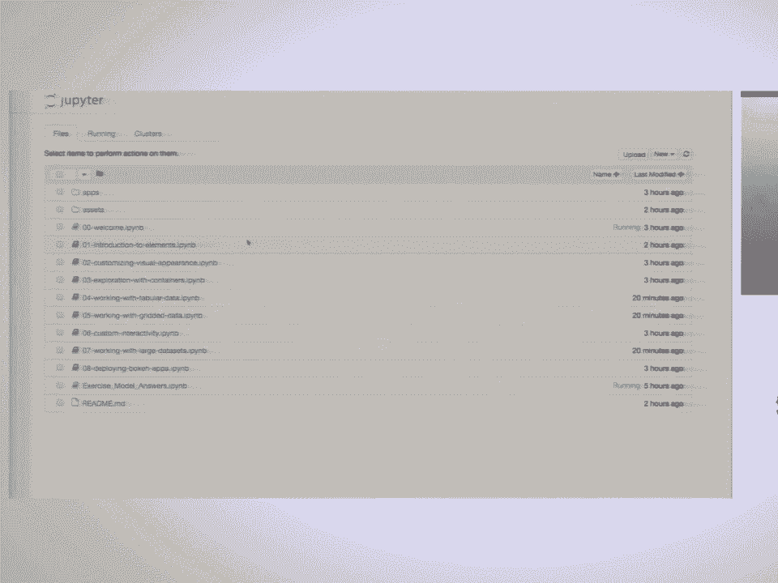

 just click on the welcome， zero zero welcome notebook and then hopefully be。

 seeing what I'm looking at now。 What you're seeing is the screen。 The last thing I should。

 mention is if you have any trouble， if you go to the repo， you can go to Notebooks and there's also。

 now a list of these Notebooks with the output in them available in MVViewer。 So， that's in case you。

 don't have a lot of things live， which hopefully won't happen。 So， that's a backup。 Okay， great。 So。

 anyone not able to run the notebook right now？ Okay， fantastic。 Great。 So， this is the。

 Holoviews and Boca tutorial and Brian nicely introduced that。 I'll be talking about how you。

 can use Holoviews together with Boca to make some really interesting interactive applications and。

 dashboards。 The thing you're looking at here， this GIF， is an example of what we're going to be。

 working towards in this tutorial。 You can see that you've got mouse interaction where you can hover。

 and you can get cross-section of some really large data sets。 This is actually rendered in。

 JData Shader。 So， this is the very large taxi data set that hopefully people might download and。

 if you haven't， we've got USB stick that we'll be able to pass around in the break。

 That's where we're aiming and you can also see that there's a little widget at the bottom。

 which is a bokeh widget which you can use to press play and scrub through a time series and that kind。

 of thing。 Okay， so I'll quickly go through the schedule。 I would recommend everyone do。

 please run through the notebook from top to bottom because at the end there's a little bit of config。

 which is just， it's optional but it helps things， makes things a bit smoother。

 It just adds a little， Holoviews RC file to your home directory。 If you don't have one。

 you can delete it off the tutorial， if you don't want it there。 So， hopefully you can all do that。

 It also runs the imports that we'll。

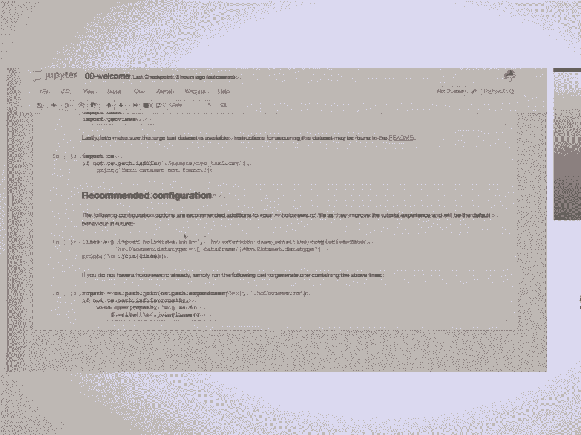

 be using。 So， make sure everything's running correctly。 Okay。

 so hopefully I'll now be able to start。

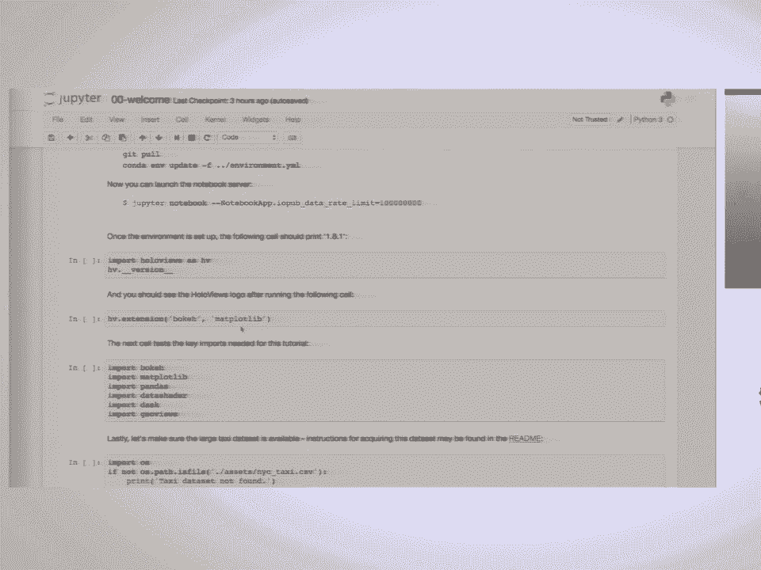

 talking about the schedule。 Well， I'll be starting with something called introducing the Holoviews。

 primitive which are called elements。 These are the basic classes that use in Holoviews that have a。

 representation。 That's a rich representation that is rendered and it can be rendered with different。

 plotting extensions but we'll be using bokeh。 I'll be introducing these elements as a way of。

 taking your data， putting them in something that has a visual representation but where you're。

 actually spending your time worrying about how to annotate your data with really important。

 semantic information。 You're not really worried about line widths and line styles and colors and。

 things and these kind of aesthetic choices。 It's all about what your data means。 It's a semantic。

 content。 So， you're talking about that。 That should be about 40 minutes and it looks like we'll set up。

 so we seem to be good。 Next， I'll be talking about how you can actually take those elements。

 and make them look the way you actually want without actually putting all that information into the。

 elements themselves。 This is the Holoviews option system and I'll also talk a little bit about。

 changing the rendering extension and a little bit about exporting files from your element。 So。

 the third section is about containers。 So， these are the things that contain elements and you'll。

 see that they'll let you explore really large parameter spaces really easily。 This is how you can。

 actually look at your data and get an intuition for what's going on and really understand your。

 data visually。 So， then we'll have a 15-minute break and then we're going to go and look at some。

 real data sets。 We have them in the repo。 There's two data sets， one's an economic data set。

 information about countries， GDP， statistics， that kind of thing。 It's tabular data。

 it's some pandas， and then following that we're going to look at a very similar tutorial but looking at array data。

 This is going to be MRI data and it's using X-ray。 Quickly， how many people have heard of X-ray or。

 use X-ray？ Okay， that's good。 So， it might be new for quite a lot of people but that'll be interesting。

 to see。 Then before the five-minute break， we'll talk about the custom interactivity。 So。

 how you can make Holoviews respond to events， that'll be quite。

 that should be really quick and that， will be showing you some stuff that's really work-specific and you'll see that in a minute。

 And then after the break， we'll have a data-shader section which is a large data section and then。

 finally we'll go to that dashboard and we'll deploy the app that you see in this GIF up here。

 Let's just click on the introduction and let's get this notebook going。 Hopefully。

 everyone can do that。 I guess before I keep going， I should ask a few questions。

 How many people are using Python 3？ Okay， great。 Almost everyone。

 Nothing we have here is Python 3 specific。 Everything would work。

 in Python 2 but the environment you have is Python 3。 So， there shouldn't be anything unfamiliar if。

 you're only familiar with Python 2。 Second question， has everyone used notebooks before？

 Who hasn't used notebooks before？ Okay， nobody。 Great。 How many people are using bokeh？ Okay。

 good number of people using bokeh。 Great。 And finally， how many people are using bokeh in。

 the notebook？ Okay， a couple people。 Okay， so this is going to show you really how you can use。

 Holoviews to really use bokeh in the notebook in a really powerful way。 So， the first thing。

 we're going to do is run the first cell here。 Hopefully， everyone can do that。 I should get this。

 little icon， the Holoviews icon and the bokeh icon next to it。 Has anyone not seen that？ Okay。

 a couple people not seeing that。 Okay， you can tell me what you're seeing。

 wrong and maybe you can go to Slack channel。 Okay， so what's the problem？ You're seeing an error？

 Okay， so you might have Holoviews 1。8。 Earlier， there was the Conda update and， commented at 1。8。1。

 It doesn't really matter。 You don't have to do that。 You might see things。

 very slightly different but you can probably follow the tutorial just fine。 Is that the case。

 for one else？ So， who's got the two little logos？ Okay， looks like a good number of people and who。

 doesn't？ One， two， three。 Okay， but do you see just one logo？ Okay， great。 Fantastic。 Okay。

 in that case， you need to go on the Slack channel and talk to Jim and he'll help you get。

 your environment working with that。 Okay， great。 So， it looks like everyone's following so far。 So。

 we've just done the standard imports。 NumPy， we've imported as NP， Pandas， we've。

 imported as PD and Holoviews， we recommend you import as HV。 It's just a short， qualified name。

 space name for it。 The thing underneath is the extension and that's where you basically telling。

 the notebook， we're going to be using bokeh to render our Holoviews objects。 And that's why you。

 get the two little logos next to each other。 So， Brian， you can help people here having some issues。

 Okay， so now what are elements？ Well， elements are essentially little containers for your data。

 They're there to represent your data and they're not there to talk about things about their visual。

 appearance。 They're meant to be what you actually work with and they happen to have very nice， rich。

 you know， visual properties。 You can actually see a rich representation of them。 But really。

 you have to think of them as your data。 And you're basically working with Holoviews to annotate your。

 data with extra information so that your visualization is actually reflecting important things about your。

 data。 One thing I'd recommend is， everyone should just maybe open up Holoviews。org and look at the。

 reference gallery。 This will give you a nice sort of layout of all the different element types。

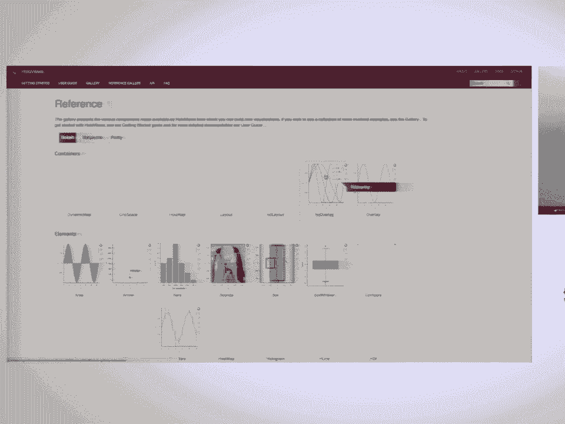

 And this will give you a little bit of an idea of what we offer in terms of elements， currently。

 And you can start thinking about what can be done with these elements。 So， we'll come back to that。

 We'll be looking at various ones of these throughout the tutorial。

 And we'll just start with a very simple one for now。 So， okay。 So， let's start off with a very。

 simple curve element。 So， I've run this and hopefully everyone can see it in a little inverted parabola。

 Hopefully that's all good。 So， essentially what we're looking at is we've got two Python literals。

 which are lists one of x values and one of y values。 And what we do is we pass these two。

 literal lists into this h3。curve。 And h3。curve is an example of one of these elements。

 And we grab a handle on it called simple curve and then we allow the IPython display machinery to。

 call Holoviews to display it in the cell。 So， this is rendered with bokeh。

 As you can see by the little， logo， you can zoom in。 You can use all the bokeh tools。

 You can pan in box， zoom and so on。 All right。 So， this is the representation of our curve object。

 Most elements or most all the， elements we're going to be talking about in this tutorial have one positional argument。

 This is where you pass your data in and it's mandatory。 We do have multiple different formats。

 that we accept。 This is just one simple example that just takes lists。 But as you will see later on。

 we can take other things like x array arrays， panes data frames and other formats too。 So。

 has everyone been able to get the curve？ Anyone not been able to get it？ Who's not already。

 being okay？ That's one question。 Oh。 Okay。 So， maybe best you just ask on the Slack channel and。

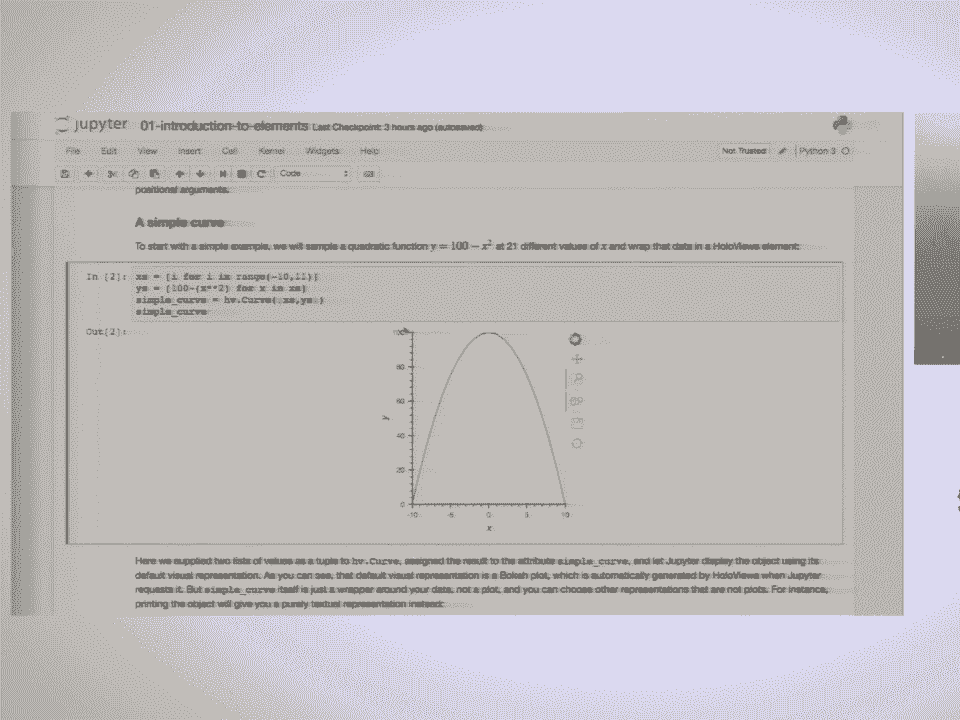

 we'll come back to you in a second。 Okay。 So， now what we have is our curve。

 And this is holding these two lists。 And what we can do is we can look at what happens when you。

 print simple curve。 Now we see that the textual representation。 So， this is the sort of thing you。

 would see in a standard Python prompt where you don't have a rich display。 And this is also what。

 you'd see if you run the notebook without loading the extension at the beginning。 All right。 So。

 this is the simple text representation of this object which has this representation of a。

 Diablo which you can actually look at。 All right。 So。

 this is sort of the first mini little exercise， it shouldn't take long at all。

 Just have a look at the dot data attribute of simple curve。 So， you can see it here commented。

 just uncommented and run that cell and see what you get。 Okay。 Great。

 There's a few more questions over there。 Okay。 Okay。 So， hopefully， okay。 So。

 hopefully you managed to do this and you can see a pan is data frame。 So， you pass。

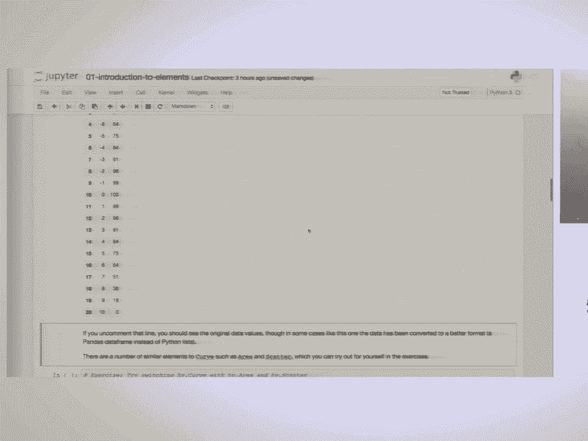

 on the lists and now you have a data frame。 Now， sometimes this has happened in the whole of。

 use where you have one format and we put it into another format but we always preserve your data。

 This is， these are the same values。 We've not lost any precision。 We've not lost any information。

 about what those values were。 We've simply cast into slightly different format。 Now。

 hopefully everyone's seeing a data frame as opposed to， for example， a NumPy array and that。

 should be the case as long as you have pan is installed。 And the important thing to note is that。

 if you take this data frame and stuck it in the element directly， that it would be completely。

 unchanged。 This data frame would be your data in the element completely untouched by what。

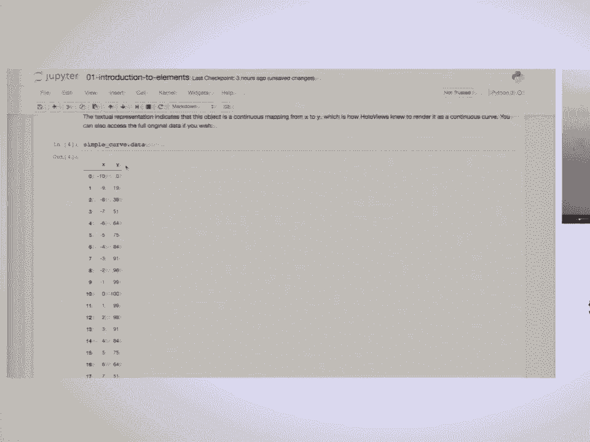

 all of users is doing。 Okay。 So， now what we have is a few links to some elements which are just like。

 curve。 They're very similar。 They take the same kind of constructor but they have slightly different。

 visual representations。 So， we can see them here。 We've got curve which we've already looked at。

 area and scatter。 So， in the first exercise， well， the second exercise now。

 just try going back here。

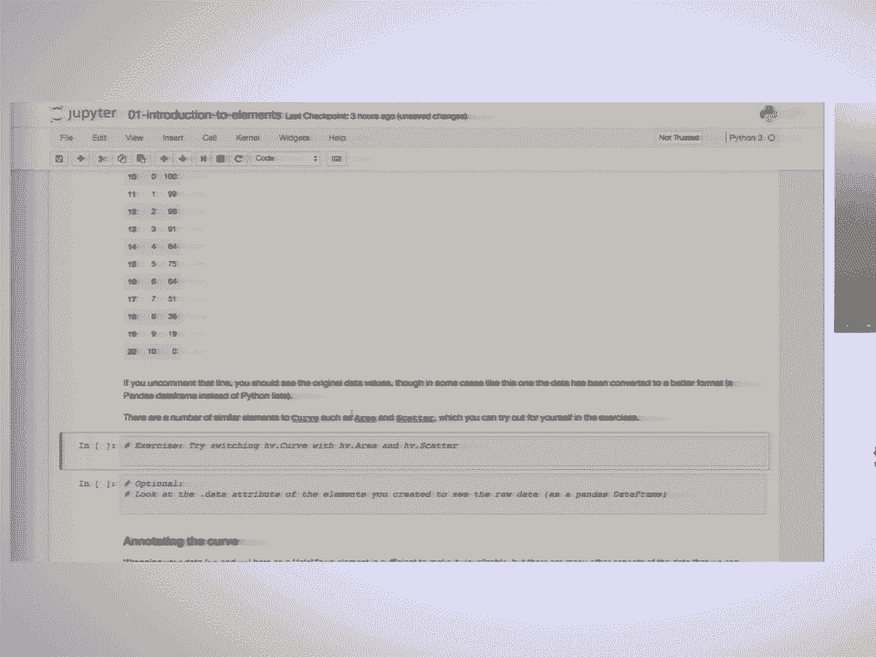

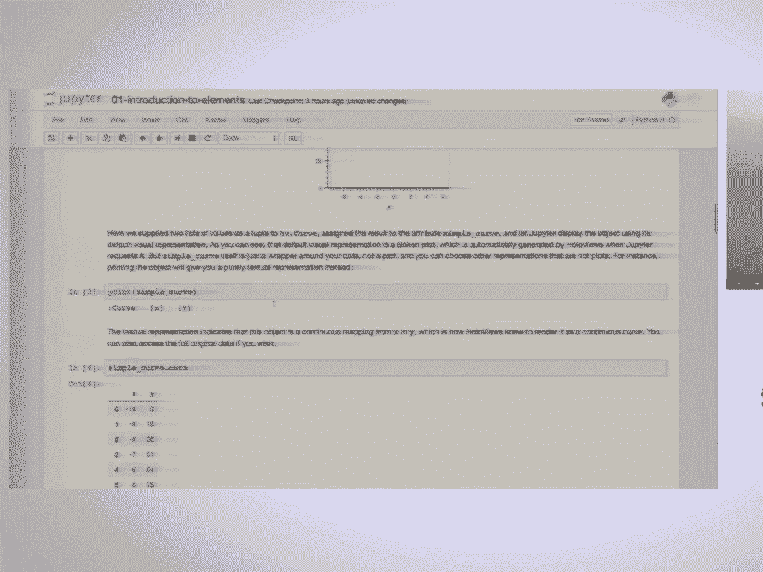

 and changing the hre。curve to an hre。area or an hre。scatter。 Hopefully。

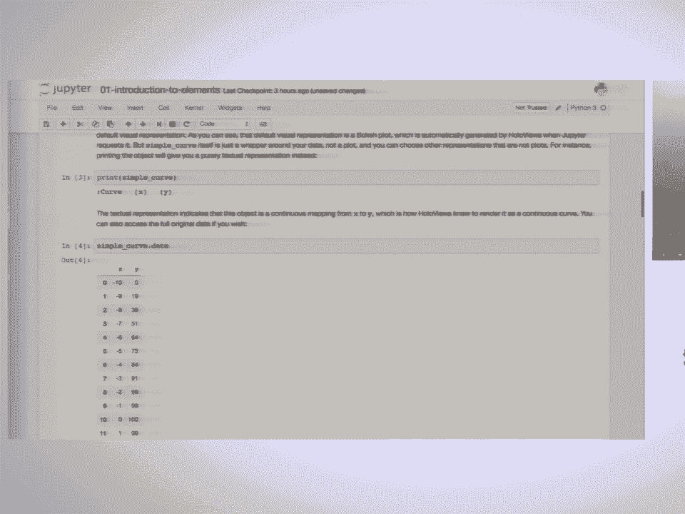

 give you a few seconds to do that。 You'll see something different。

 Okay。 So， I'm going to now actually do one of these。 It's normally， it's not misnamed， of course。

 because we call it simple curve。 I've just taken the cell to an area and this is what you get。 Now。

 you can try it for scatter。 And that's what it looks like when you do hre。scatter。 So。

 hopefully everyone has been able to follow me。 So far as anyone is loving trouble。

 maybe we can help。 So， I suggest we basically， if you have trouble。

 maybe going to be able to help you out。 And then also， I'll be able to help you in the way。 Okay。

 Finally， I'm going to just go back to a curve so that it's not a misnamed handle。 Okay。 So。

 what we've seen is three different elements and when you go to the gallery page on the。

 whole of user org， you will see a whole slew of different elements， which you can pick that have。

 the representation of your data that you want。 Right。 So。

 we've seen that this is an object and we've。

 seen the nature of the data。 Now， the optional attribute is just look at the dot data of the one you created。

 So， when you switch it to area， look at the dot data， when you switch it to scatter。

 look at the dot data。 Okay。 What you'll find is probably what you'd expect。

 It's exactly the same thing as your， sort of curve。 So。

 it's just another panel's data frame with the same values。 Really， nothing should be。

 very different。 Okay。 So， hopefully everyone's following。 Okay。 Right。 Okay。 So。

 this is the simplest way to construct a curve， an area， a scatter。

 Let's start actually adding some information that's actually more informative about our data。

 than what we've done so far。 We just have a sort of raw list of x values and y values。

 and we don't know what it is。 What does it represent？ What's the data really about？

 Let's give it some， metadata to actually say what we're actually talking about。 So。

 let's just say that in fact， our parabola is actually a ball thrown in the air。 It's a trajectory。

 You've taken a ball thrown in the， air and your actual x axis is really distance。

 horizontal distance， and your y axis is the height。 What you can see is we've done two things here。

 We've declared something called key dimensions， which is here's cadems and vdems。

 which are v-value dimensions。 Basically， it corresponds very。

 similarly to sort of independent variables and independent variables。 Cadems are the things you。

 index by and the thing that you get when you index those are the value dimensions。 So。

 those are the vdems。 So， we've just given two little strings here。

 and what you can see is that these， have been reflected in the rich visual representation of our object in the axis labels。

 We now have an， actual distance axis and a height axis for y。 Now。

 let's actually look at one of these， properties in fact。 So， let's look at the vdems。 So。

 what you can see is you gave it as a string， but it's been promoted to a dimension object。

 And this is a rich object we're going to be using， quite a lot。

 It contains a lot of information about the dimensions， and you'll see this in a， minute。

 things like units， ranges， things like this。 What we see is that the name of the dimension is。

 height， and that's for the vdems， and it's in this list。

 because you can have some elements will have， multiple vdems。 If you look at kdems， it's distance。

 So， this is information you supplied。 You will see that in a second。 Okay。

 so casting between elements。 So， that's the first part casting， we'll talk about。 Now。

 you might be thinking that， you know， I've been stating that this is about your， data。

 but why we're giving you this visual language to talk about our data already。 We're talking about。

 curves and areas， and this is all visual language， and that's true。

 but that's really trying to reflect， the shape of the data， the form of the data。

 and how you can think of it in a kind of abstract way。

 It's not detailed information that's tying you into that visual representation。 So， for example。

 because curve has a similar sort of structure to scatter， you can easily cast to a curve to scatter。

 You're simply passing a curve into the scatter， and then you will get the scatter version of the same。

 thing。 So， this is what I've just drawn。 I passed my simple curve into the scatter， and you can see。

 that now it's connecting the lines in the continuous， assuming continuous trajectory。

 now we have a sample points along our trajectory。 And you can also see， so， yes， now the exercise。

 Now， trying exactly the same thing， where you take the scatter and you。

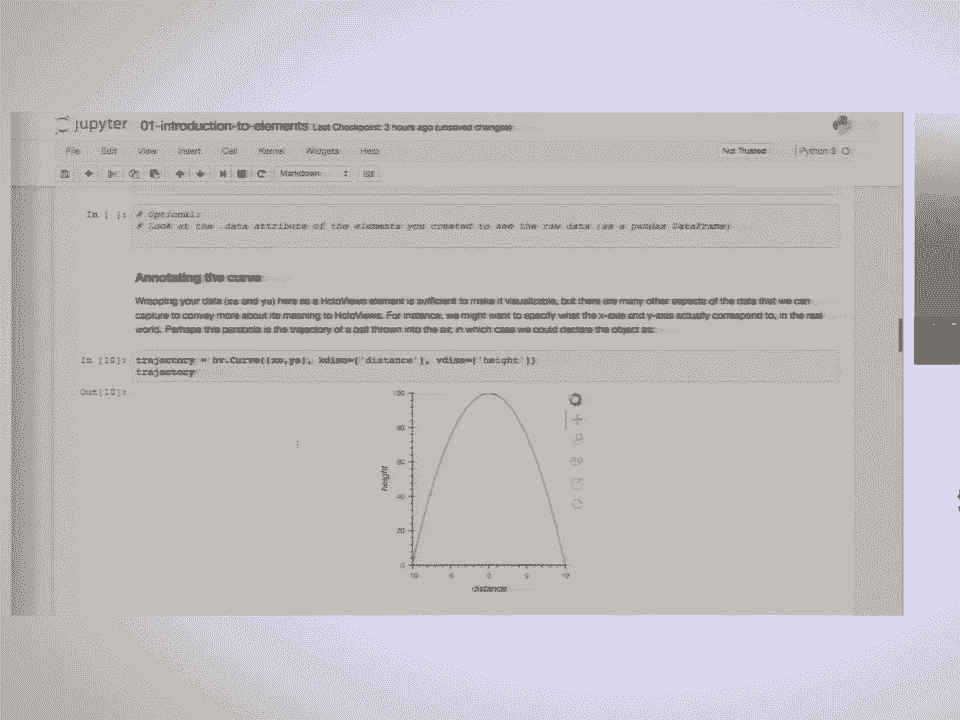

 pass it a curve， but this time pass it the trajectory curve that we had earlier。

 This is the trajectory。

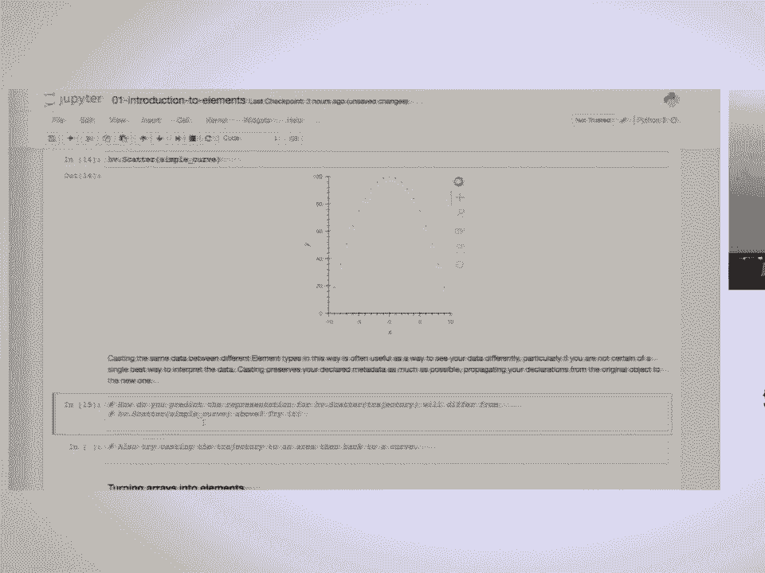

 curve that we gave at K-dems and V-dems。 Just try passing it to the scatter and see how that happens there。

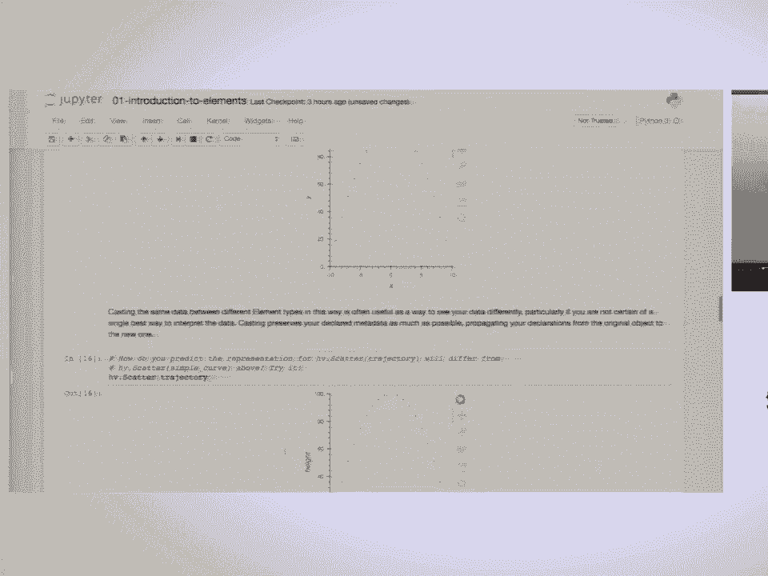

 Okay， hopefully most people managed to do that。 And what you can see is maybe what you might。

 have expected is that we have kept the information that we gave to the curve， and it's now been。

 transferred to this new object， which is the scatter object。 So， we've not lost the information。

 that you gave us about these axes。 We know it's still distance for the x。

 and it's a height for the y。

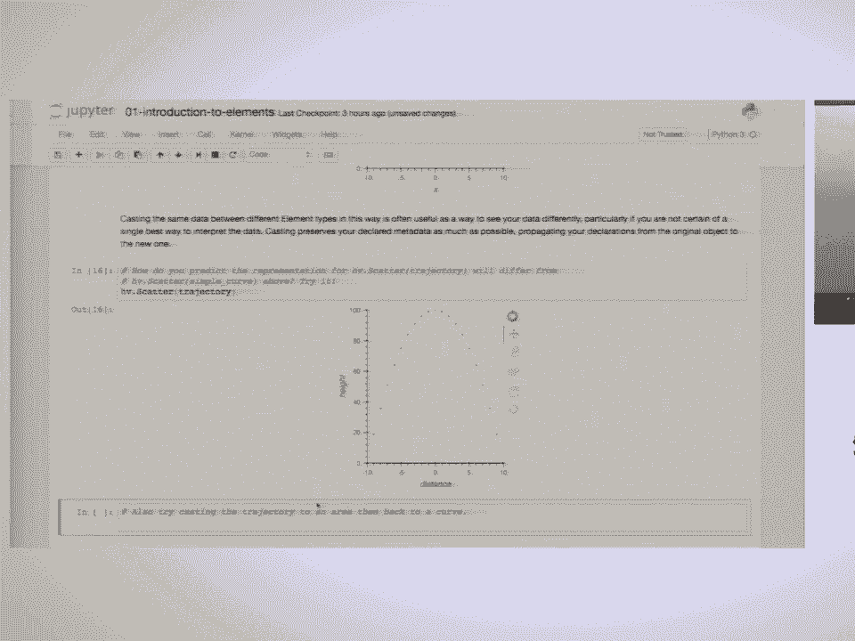

 Okay， so， yeah， the next exercise is just an elaboration of the same thing。

 Turn the trajectory into an area， and then back to a curve。 I'll give you a few seconds to do that。

 before I do it myself。 。 。 。 。 。

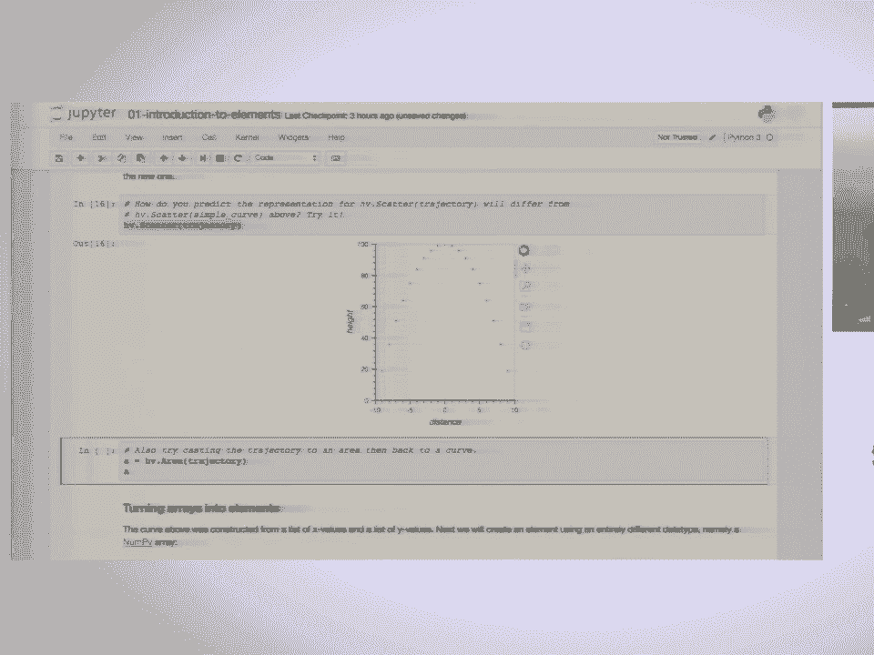

 。 。 。 。 。 。 。 。 So what I'm showing is what happens when you cast it to an area。

 That's again what you might have seen earlier。 And I've taken a handle on it and called it a。

 and then stick about in the curve。

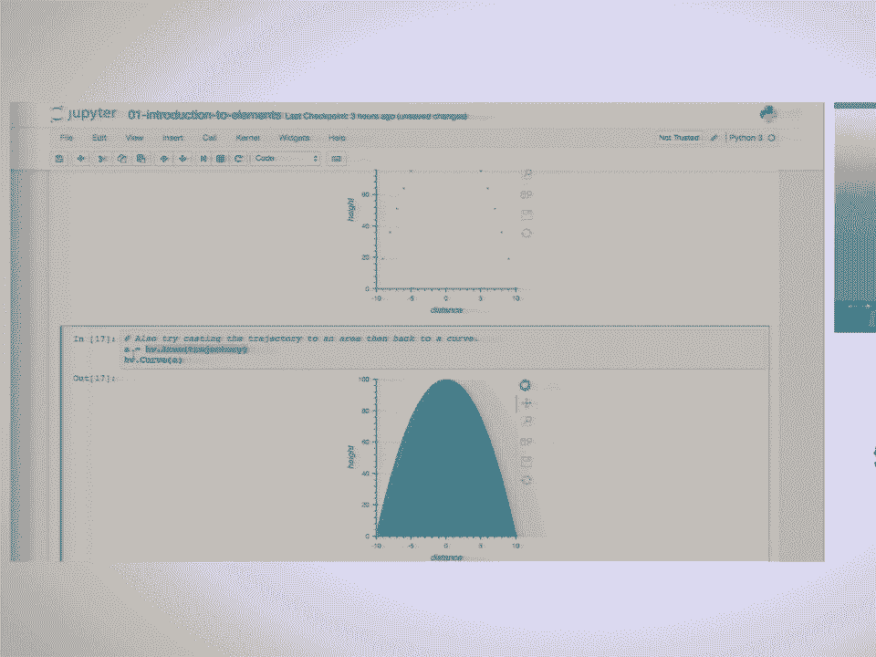

 So you can， go from a curve， through an area， back to a curve again。

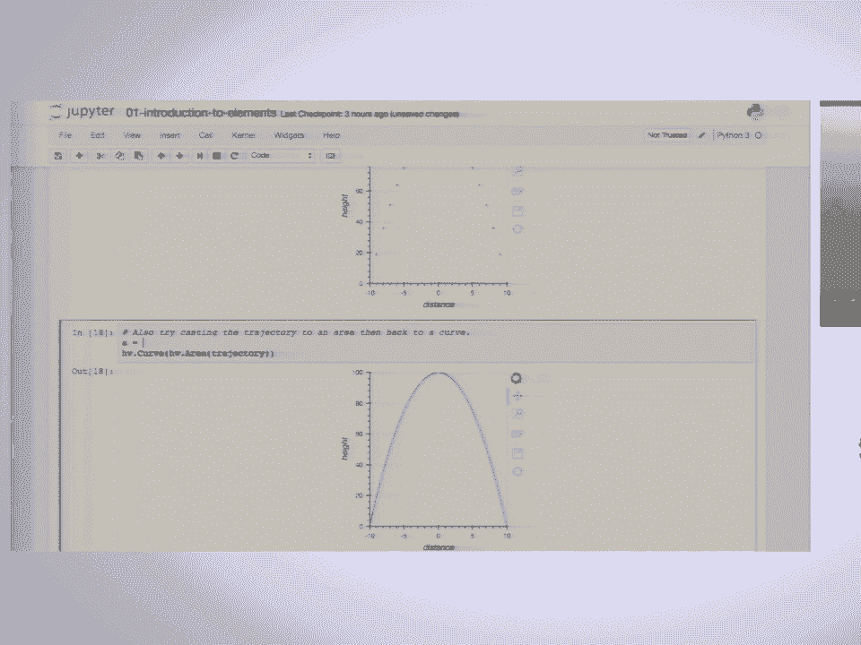

 Just like that。 We're casting these things to each other。

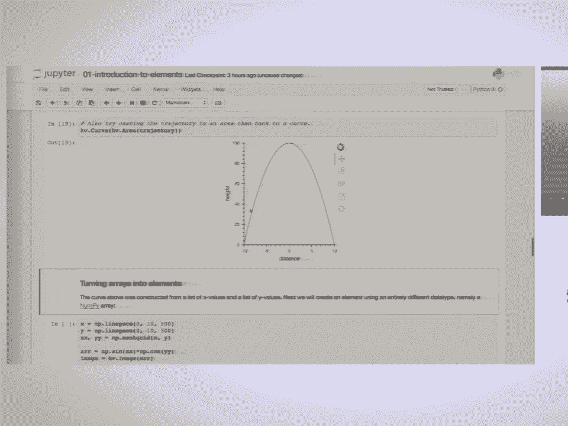

 Okay， so a curve was defined with a very simple Python float just a list of X's and a list of Y's。

 But we can use arrays。 We can use data frames， and we're going to look at those now。

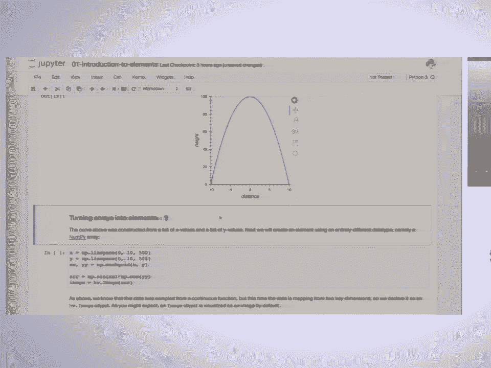

 We'll start with looking at arrays。 So with NumPy。

 the appropriate holo-view element for a two-dimensional array is what we call an image。

 If you run this cell， you'll generate a two-dimensional array with mesh grid。

 which has a function of sine and cosines。

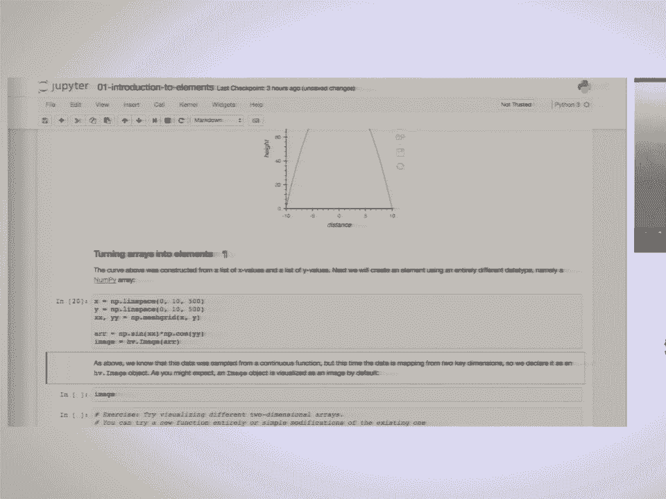

 And of course， if you look at the normal representation of the array， you just get the values。

 It's not very informative。 So we would like a rich visual representation of this thing。

 So what we do is we wrap it in an image， which is what we've done here。 We look at the image。

 And now you can see the structure。 [ Pause ]， So the next exercise is just play around with this function。

 Just try visualizing a different image where you've maybe changed the sine of one of these terms。

 or maybe squared one of these terms， something like this。

 Some very simple transformation of this expression here in terms of sine and cosines。

 to make a different array pattern。 [ Pause ]， Sorry。 Yes。

 I'll be coming to all of that in the second part。 Yeah。 Right。

 So let's just say I want to square the cosine term。

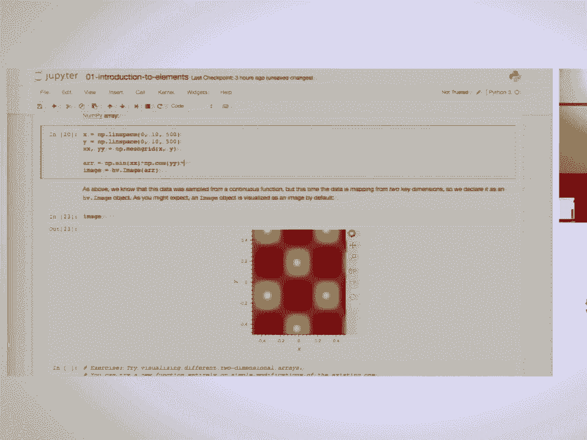

 I just square this here。

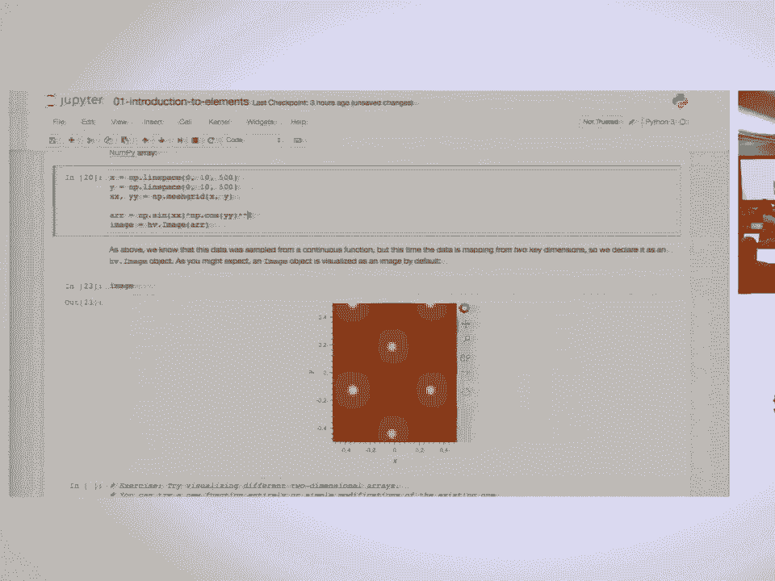

 Create the new image and we can look at the new array。 We've taken sine squared。

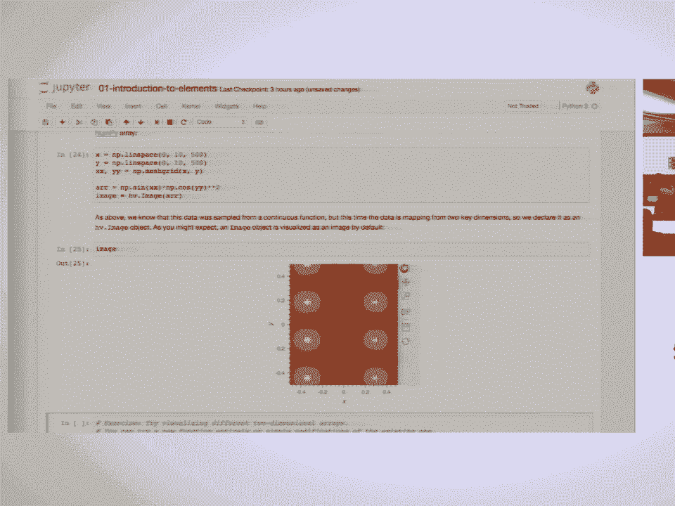

 This is an optional one I think in the interest of time。

 I think in the interest of time I will just kind of show you。 Oh， actually it's fine。

 I'll give you a few seconds to try that。 So think about how you might want to actually add a proper X label and a Y label to this image。

 Given what I said earlier about cadence and V-dems， remember that an image is。

 two-dimensional index with two numbers， two index into the array and the value is the value。

 at that two-dimensional index。 So you basically have two cadence， two key dimensions。

 So if you look at the screen you can see that I have my image there and I've just added a cadence list。

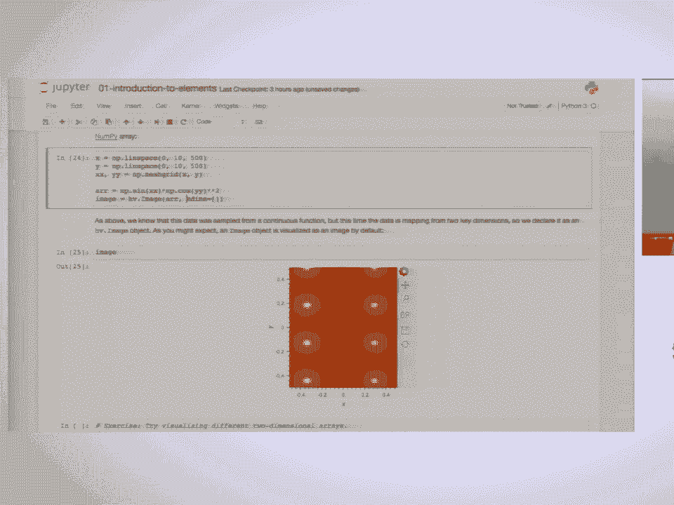

 to this image and this is following just what we did with the curve further up here。

 where we gave it cadence as a string。 V-dems is a string but this time what we'll do is we'll give it two cadence。

 So let's just say this is， let's say the X is longitude and the Y is latitude。 Right。

 So we've done that and now you can see。

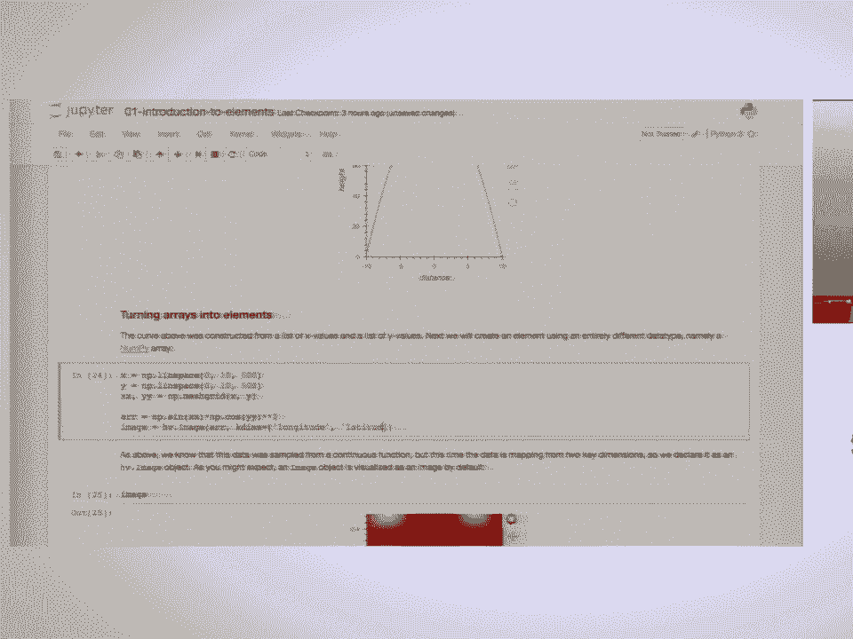

 that the image has been given different axes， different axis labels。 Okay。

 So hopefully everyone's following and this is， if you have any questions at this point。

 about what I've shown so far please。 Okay。 That's good。 Okay。

 So now this comes to the pandas data frame aspect of what you can do with elements。

 and you can just simply pass a data frame into an element。

 The thing about a data frame is it already has columns and those columns are the dimensions。

 and those columns already have names。 So there's a slight difference。

 So let's start with loading this economic data set。

 So we've got the tail of this economic data set that we have about macroeconomic data。

 Let's look at the tail of it。 Let's see a pandas table。

 It's got the country and at the end of the data set it's the Japan。

 You've got different years at which you've collected your data and you have statistics。

 like growth of GDP， unemployment rates and then these two columns that we're not going。

 to use so don't need to worry much about trade statistics。 It could be any kind of metric。

 Now because our columns actually have names already， when we do our cadence and V-dems。

 we're going to reference those column names。 We're just saying that we're going to plot this column as X and that column is Y。

 All right。 So let's just work sort of an example of this。

 First thing we can do with pandas is just select a country。

 Let's just select the data for the United States。 So this is a United States GDP growth unemployment over year。

 Now we have this little new pandas data from called US data which is just about the US。

 We can pass it to a curve and then say that the cadence， the X axis is going to be here。

 and the V-dom which is going to be the Y axis is going to be the growth and that's the GDP growth。

 Right。 So this time the cadence and V-dems are strings that you can choose yourself。

 They're picking a column out of the data frame。 So hopefully you can see this at this point。

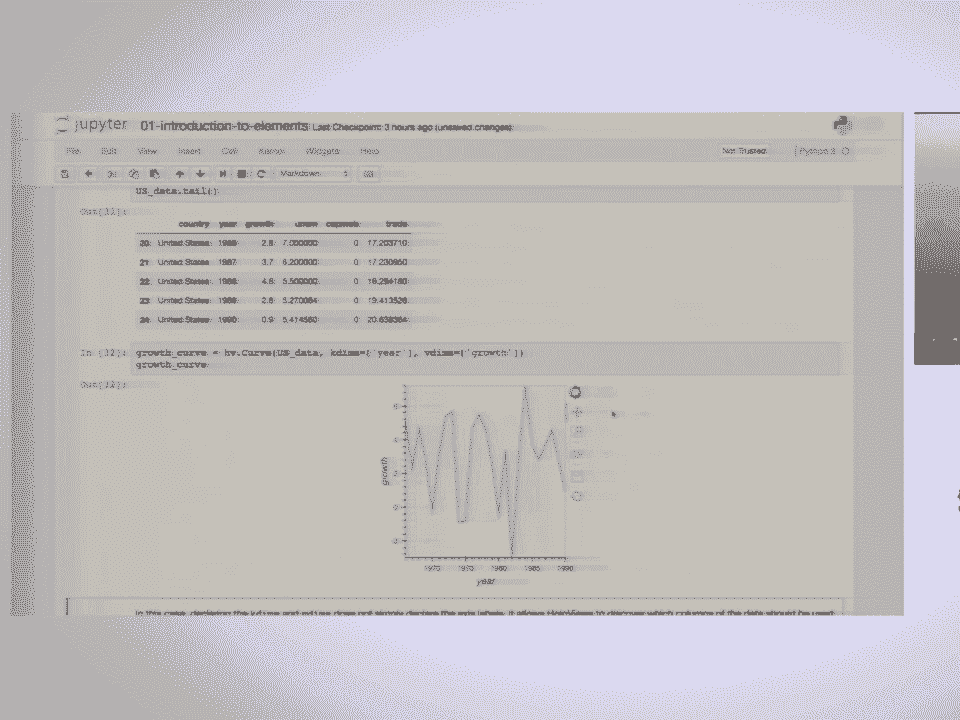

 Okay。 So for the quick exercise it's really just changing one string。

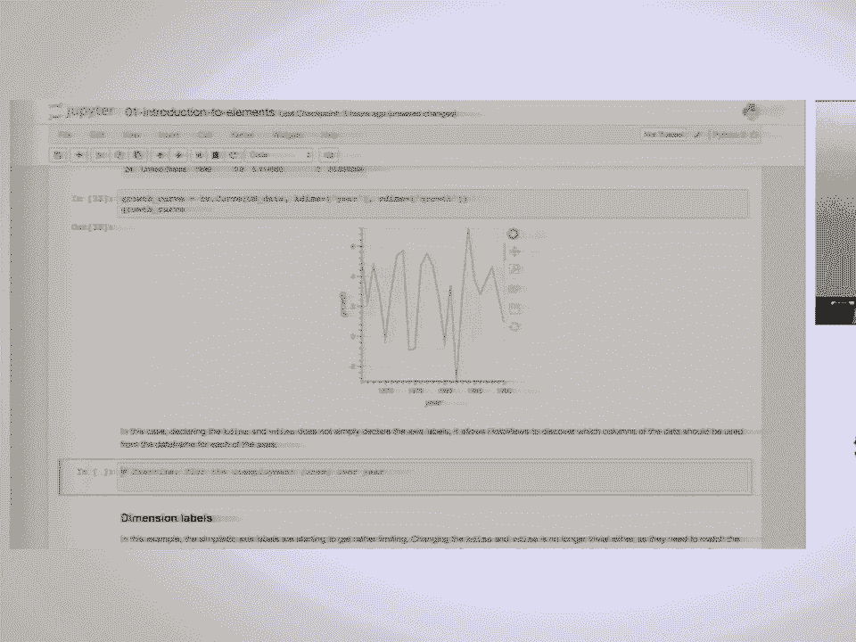

 You can just try plotting the unemployment column or the districts of the other frame。

 as the Y axis of value instead of growth。 That's just called UNAM。 So UNAM。

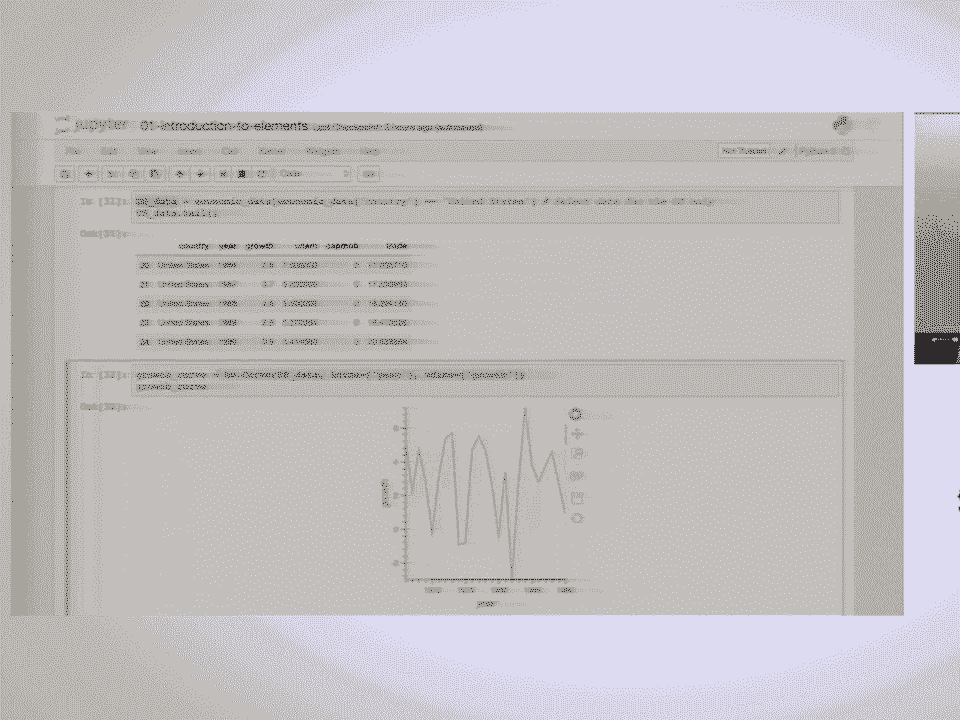

 Right。 So I've just run that。 All I did is change the growth three dimension to UNAM and now you can see the unemployment rate。

 as the Y and year as the X。

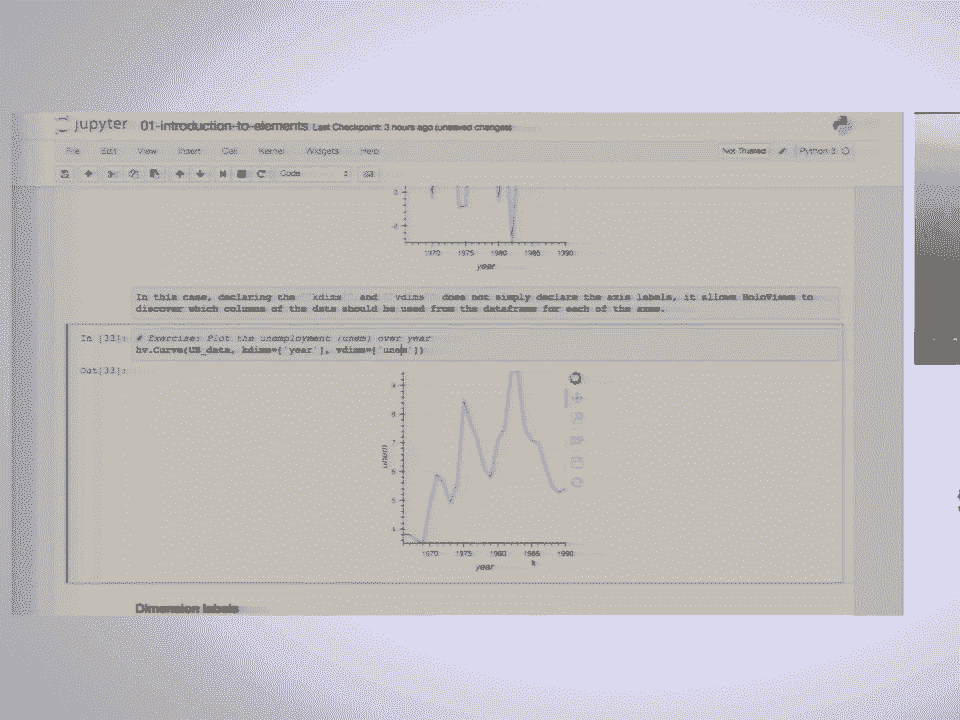

 Okay。 At this point you might be worried about these really simple labels we're giving here。

 I mean if you want to make a nice publication plot you can't just use a simple string like UNAM。

 You want to give it a proper axis label and you want to give it units and you want。

 to actually have something that actually expresses what you're actually doing properly。

 So this brings us to the concept of dimension labels。

 Dimensions have names and this is what we've been looking at so far in the short。

 sort simple identifiers and they're meant to be valid Python identifiers。

 Things that you can use as a variable name in Python。

 So what happens when we want to actually have a more descriptive label for our GDP growth。

 because it just has growth when it says GDP growth。 Well， all of these elements have at most。

 but all of these objects have a read them utility that lets you take your dimensions。

 and your element and creates a new element with new dimension with new information。

 So we're going to make a new curve called GDP growth。

 What we've done is we've taken our growth curve which didn't have these informative axis label。

 and we're going to give it a label and we're going to say it's GDP growth。

 So it's read them dot label and then you give it the name of the dimension which is just growth。

 and you give it the longer name which is GDP growth。 So just to elaborate a little bit。

 those dimension objects that you saw a little bit earlier。

 these rich objects now have the correct label。 The one which is corresponding to the read them now actually has the label GDP growth。

 and we'll see that in a bit。 But you can see it right here。 Yep。 [ Inaudible ]， Right。

 [ Inaudible ]， Okay。 So you're asking about column names which are not simple strings essentially。

 Is that right？ [ Inaudible ]， Okay。 Strings are all fine。

 So it's a recommendation that you use nice simple literals and pandas prefers it too。

 because you can do type completion on the pandas data frame。 So it's nice for pandas as well。

 But you don't have to for holidays。 You can use a space。 You can use different things。

 It makes things a little bit trickier for some of the methods。 So --， [ Inaudible ]。

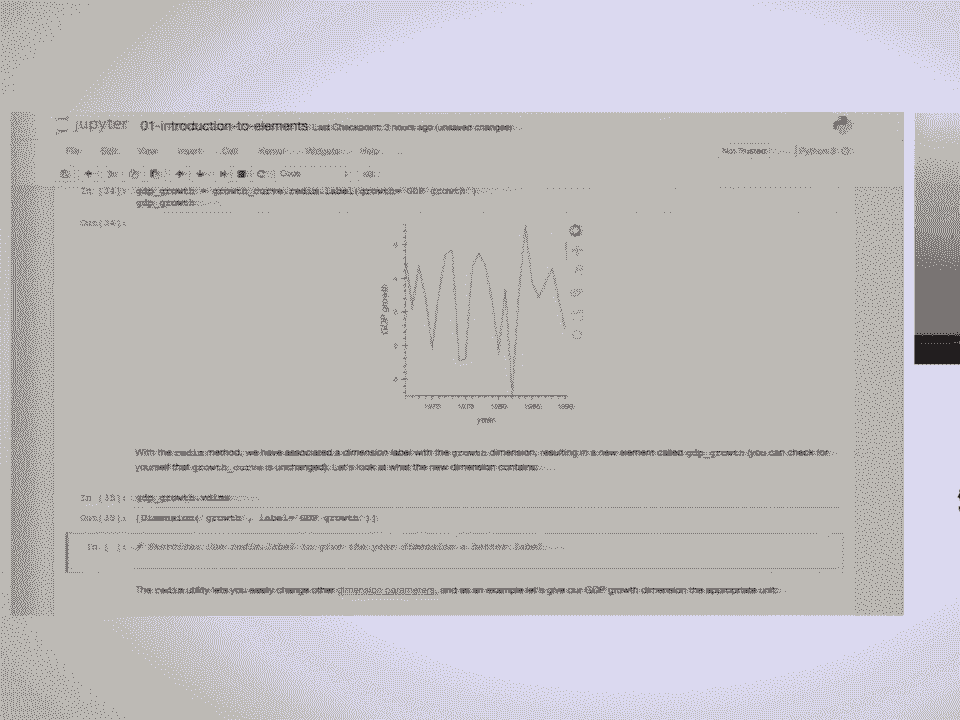

 Yes。 Well --， So as this dimension here？ Yes。 Yes。 You can do that。

 So there's a couple of ways you can do that。 One of the ways you can do it which I won't try to get too sidetracked。

 but I'll talk about it quickly is that you can just use read them itself。

 and then you can basically pass an addiction of information to the dimension。

 The alternative is you can just create your dimension object explicitly。

 and pass it in and it can have anything you want， because it's just -- you don't have to worry about keywords。

 and things not working that way。 So --， [ Inaudible ]， So here is exactly what I mentioned。

 The dimension --， the value dimension of growth has now labeled。 Okay。 So as a quick exercise。

 try doing the same thing。

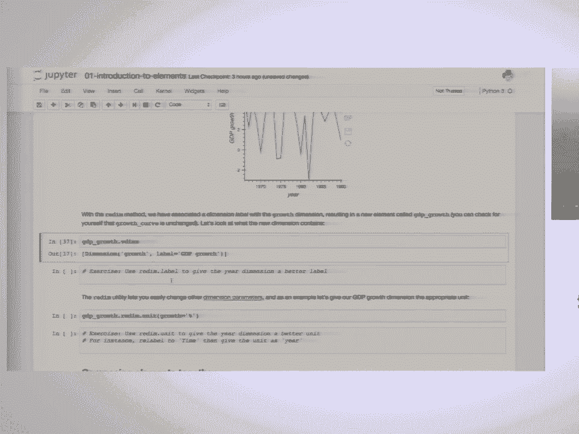

 where we have this read and dot label method， use it to give the year a more --。

 a more useful access label。 So what you might want to do is actually call it time and the unit is here。

 So maybe just call your x-axis time and then we'll see how to add year to it。 [ Silence ]。

 [ Silence ]， Okay。 So here we go。 All I did was add the next keyword which is year and we need time。

 Okay。 So I mentioned units。 All of you doesn't have full on unit support。

 It's something we do want to have in the future where you can convert。

 between different types of units and use an actual unit package that's unit aware。

 For the time being， we are doing with simple strings。 We just give it a unit as a string。

 And hopefully in the future we will be able to do fancy conversion and things。

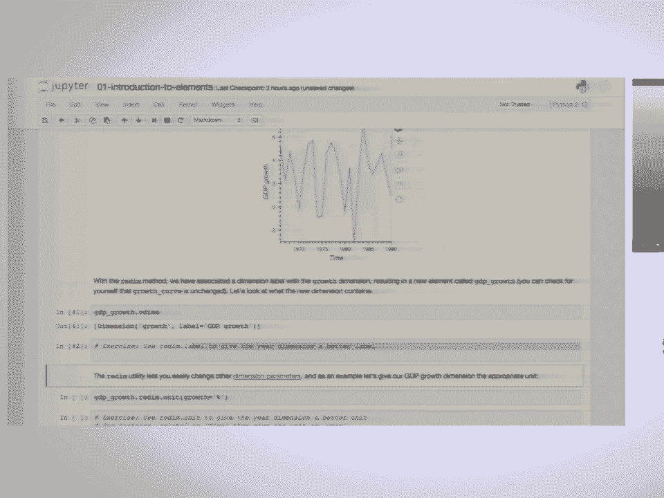

 But for now what you can do is just use read and dot unit。

 It's a read and dot label to set the unit value or the unit parameter on that dimension。

 And you can say that the growth is actually a percentage。

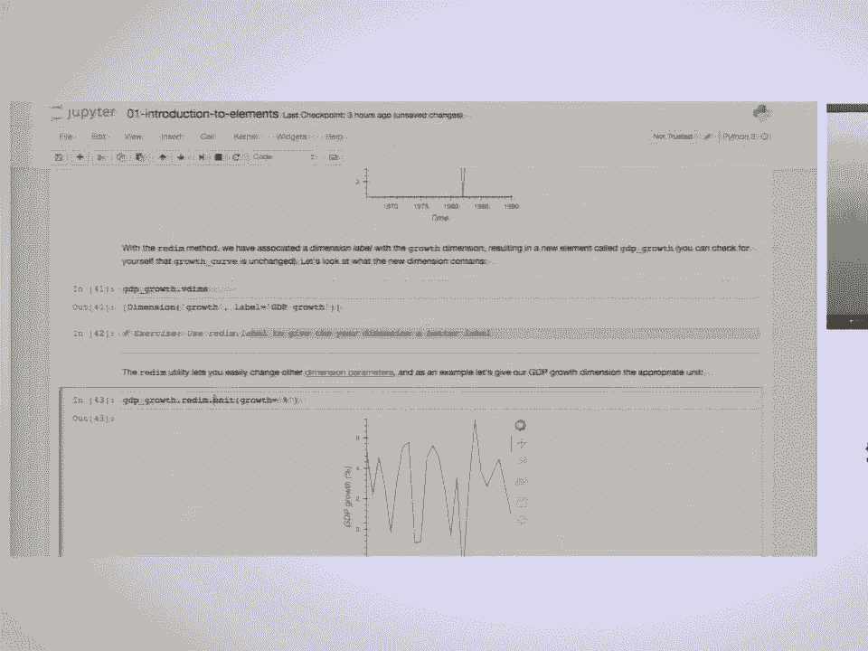

 Now we have UDP growth in percent。 And you can format everything you want。

 So you can see those parentheses。 You can actually customize that to be whatever sort of format you actually want it to be。

 So I won't be showing that right away though。 Okay。 So if you wanted to do that for the year。

 which is actually the next exercise。

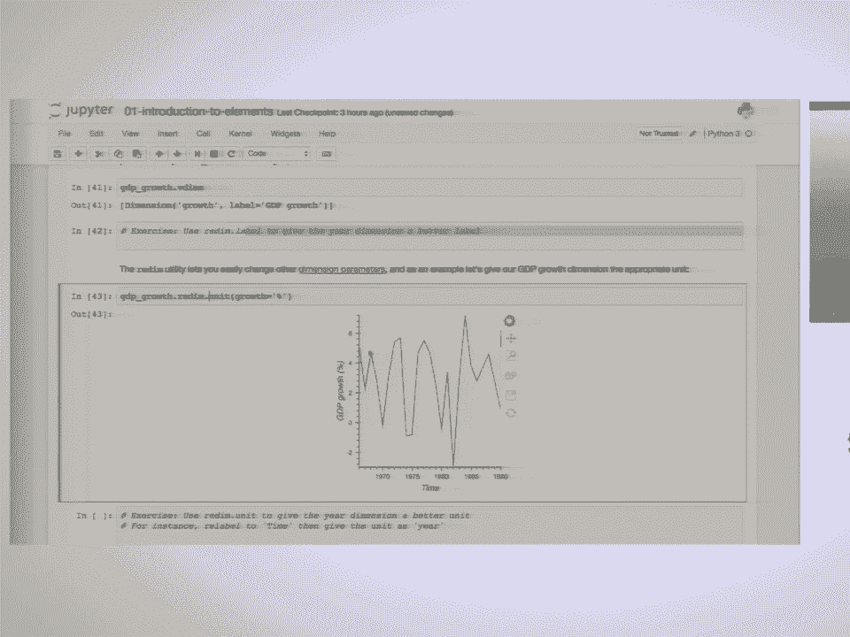

 you do the same thing。 You do read and dot unit year because the name of the dimension is still year。

 And you give it a unit of， so yes， that's right， unit of year。

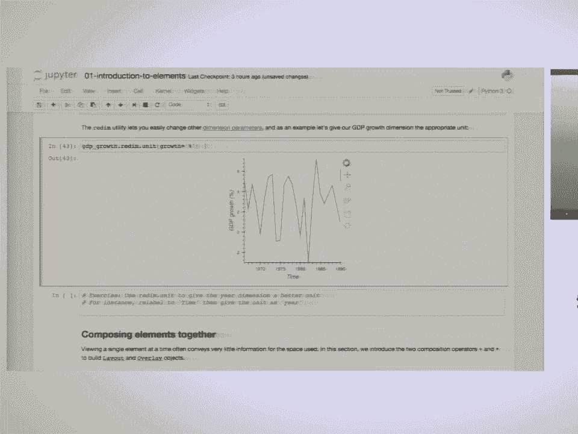

 Okay。 There we go。 Okay。 Good。

 We're coming to the next section of this notebook。 So any。

 any particular questions about what we've seen so far？ Coming right up。 Yep。

 So this is about composing elements together。 And that's exactly the question。

 How do you start showing multiple things at once？ How do you do multiple variables at once？

 That's essentially the question。 So all of you says contain is what you'll come to later。

 But there's another concept which is composition。 There's just two basic operators that we really use a lot plus and more。

 And this is something that you use all the time when you're doing visualization is you want things side。

 by side。 You want things in column layouts。 You don't want to have a notebook where you have one thing。

 then you have another， bit of code and another thing below it。

 You want to see things right side by side。 And this is what we call a layout。

 And it supports heterogeneous elements。 So you can have any kind of element combining a layout。

 Right。 There's no restriction on what the type of the element is。 So when I run this。

 we did the same casting thing that you saw earlier where you cast。

 our trajectory to different types of elements scattered area。 The new one called spikes。

 One of them is I added the plus symbol between them all， which is the plus operator。

 which generates a layout。 It's a new object。 It's still an object that is about the data。

 It doesn't have any information apart from this calls。 And this is a two column layout。

 That's really all it knows about itself is I have these things and I'm a two column layout。

 Of course， you can change it， but generally the other options are worse。 Right。

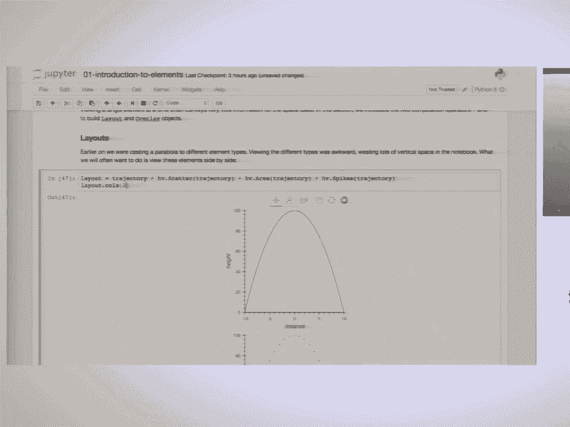

 Just show that。 Sorry。 We see move。 Oh， right。 They're probably linked。 Right。 Yes， they are linked。

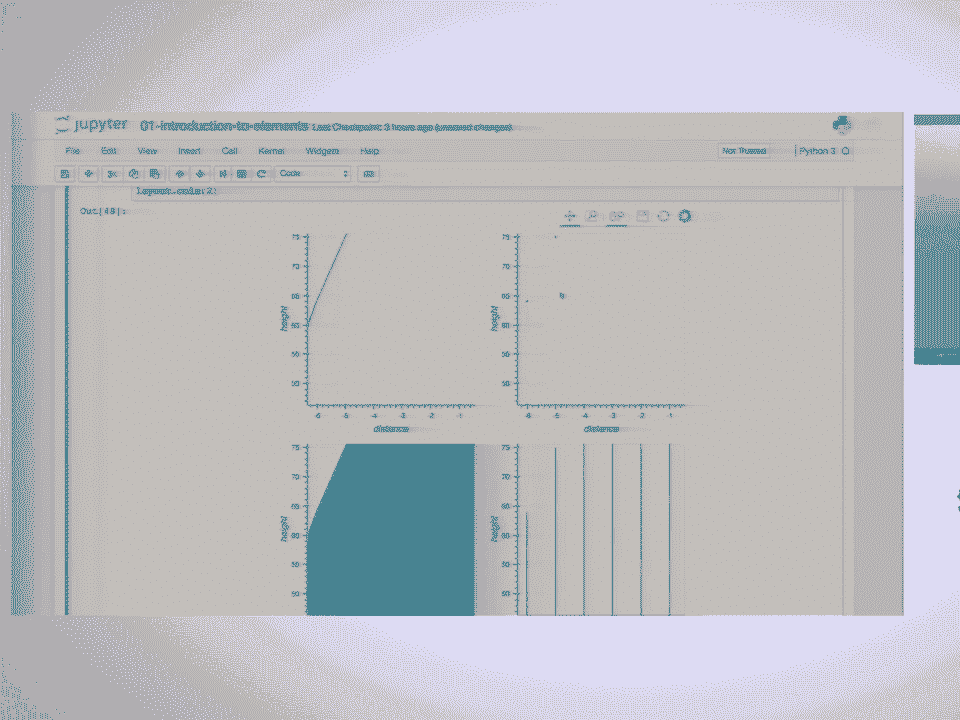

 This is automatically linked。 And this is because they're all they're all in the same space。 Right。

 They've all got the same dimensions。 It's basically it because they all linked。

 They all have the same dimension declarations。 When you zoom on one， it automatically says， OK。

 well， this plot has also got distance， and height。 So I'm going to zoom on that too。

 And it's something you can disable。 So don't worry about this is an optional talk about later。

 You'll see how to disable this behavior and you can have them completely independent。 If you want。

 So this is actually often useful because you often have lots of views of the same thing。

 You want to zoom in one place and just see everything zoom in。 Yep。

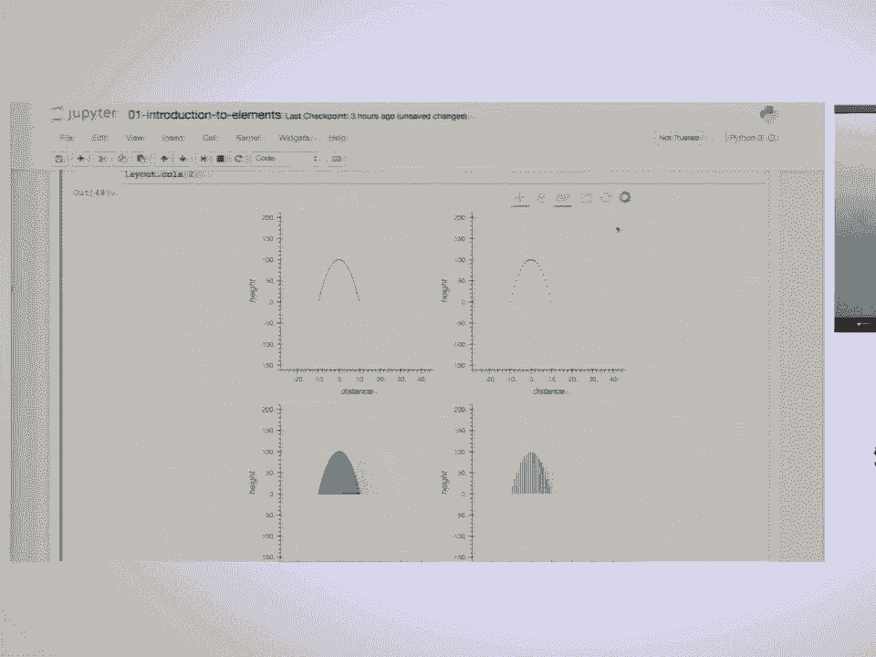

 See that in the tutorial。 The basic recommendation。

 so we have really works is we don't copy your data， unless we need to。

 which is very rarely copy your data。 We recommend that you don't mutate your data。

 It's kind of a cloud of approach whereby you actually have multiple elements。

 whereby the elements are different， the different objects， the data can be shared。 It can be slices。

 It can be anything you want。 But we recommend you don't mutate the data within a particular element。

 This is something that you can do， but it's risky and we don't recommend it。

 because we don't we often reason about things being the data in the element itself being mutable。

 That doesn't mean that you can't do animations。 It doesn't mean that you can't can't have very dynamic things as you'll see。

 But generally you shouldn't go into the element and mutate it。

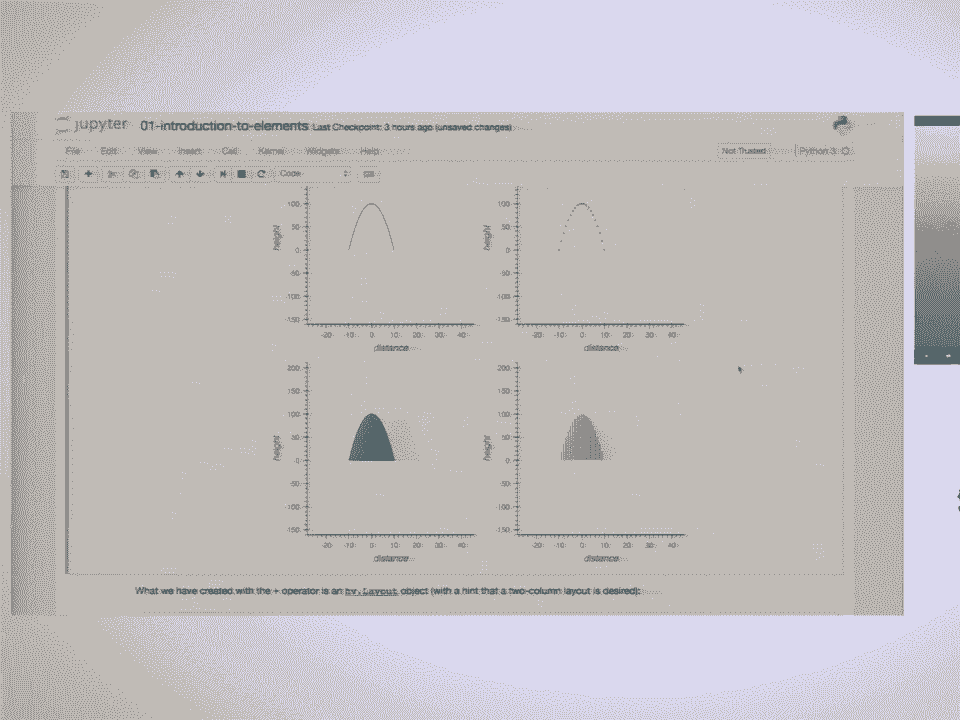

 You can try it。 It might work， but we don't give you any guarantees。 OK， so this is the layout。

 Right， so this is the default representation of the layout and it's a tab， at attributable。

 indexable thing。 So。 So if I want to select something， I can get my layout。

 Press the press period and tab attributes that I want my scatter， my curve， my area， whatever。

 And this is just default behavior。 By default， we use Roman URLs， which might be a bit weird。

 We're thinking about changing that。 But just as one， two。

 three and normally you don't go past a certain number。

 because your layout will be too big to be useful anyway。 Right。

 so let's just say that I pick the area。 I just tab completed that。

 I can pick my spread spikes and I'm just I'm just picking out the element from that layout。

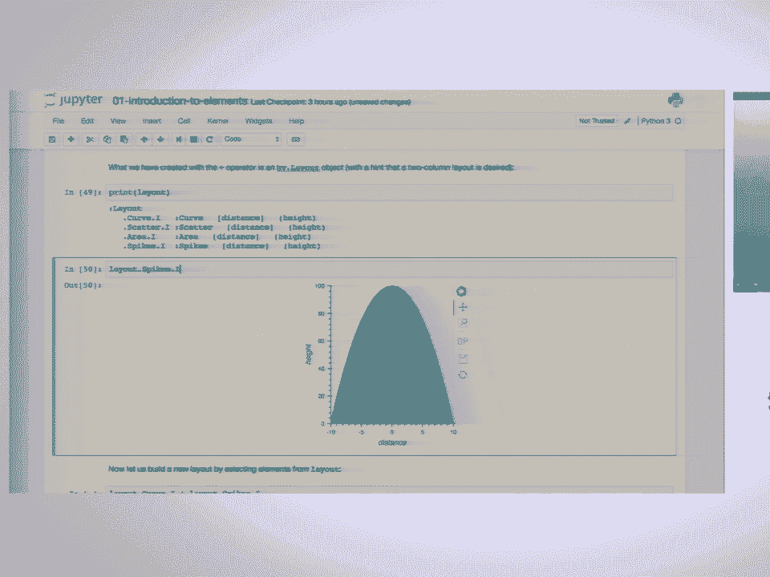

 Right。 OK， so of course I can take a layout， pick the elements， use plus on them。

 create a new layout。 So I had my four， my two column layout with four things。

 I can make a two column layout with just two things。

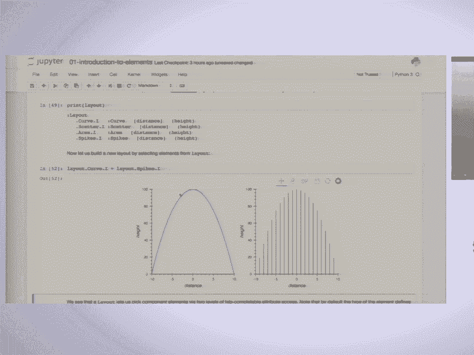

 I've just picked the curve。 And the curve and the and the spikes。

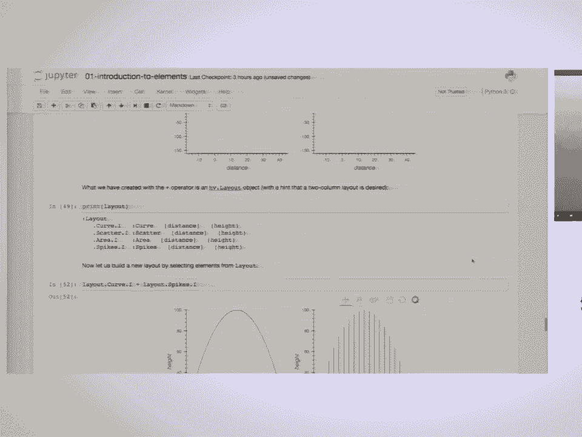

 So hopefully that's still quite straightforward。 OK。 Is that clear so far？ Yeah。 Not this time now。

 Everything is it's the original element。 Basically， I think that's right。 Yes。 Right。 OK。

 so we looked at this sort of attribute access and it's kind of awkward， you know。

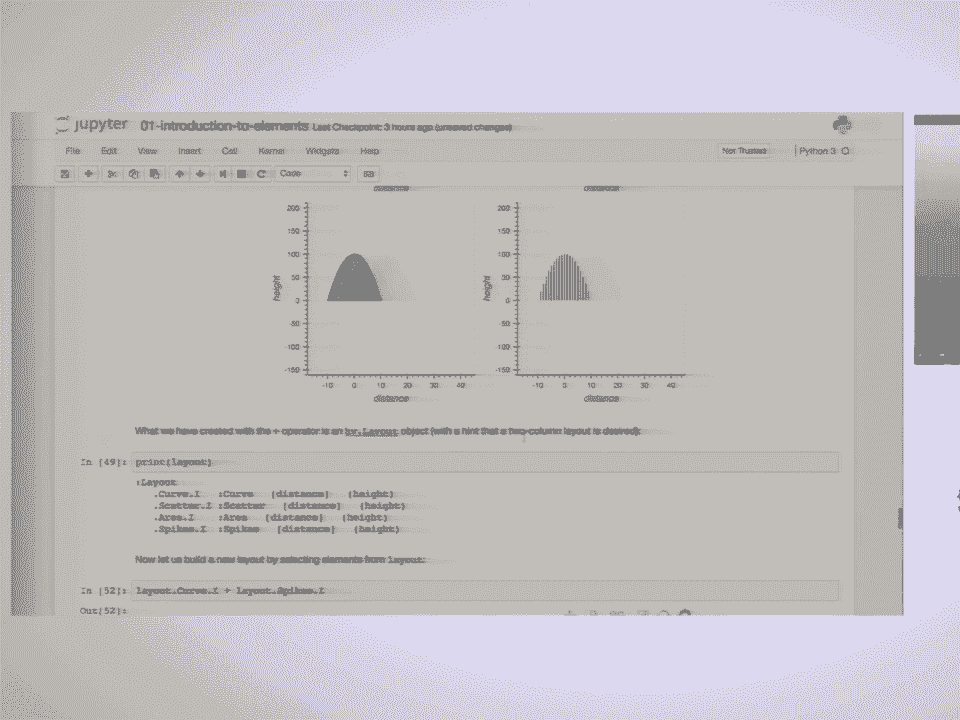

 using the name of the element and then one， these Roman numerals。

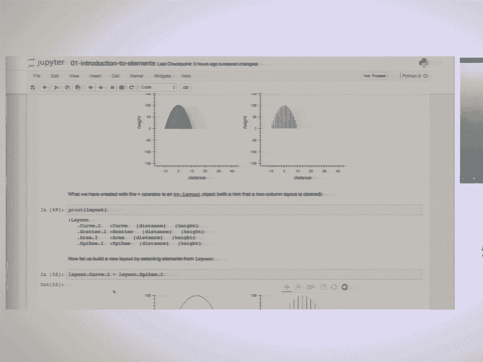

 What you really want to do is actually label your element。

 So remember that we had labeling of our data， of our dimensions， sorry？

 We label our dimensions and that was labeling the axes。

 But now we're going to give a label to the element。

 And one element can have lots and lots of dimensions， lots of key dimensions， the value dimensions。

 But now we're going to give a label to the element itself。

 So what we're going to do is going to use the relabel method on our trajectory。

 And we're going to say this is actually a trajectory of a cannonball。

 We're going to give it a little bit more information about itself。

 So it knows what it's representing。 So what we've done here is this is actually the same as this。

 You give it the label of cannonball and the group trajectory。

 So a group is a bit more general than the label。 You can have a group of things and within that group。

 you can have lots of labels。 You can， of course， have different groups。

 But essentially the granularity is group is a super set of the labels， right？

 You can do the same thing again。 This time we're going to use the area。

 So we cast the trajectory curve to an area element and then we relabel that。

 So we're going to say that once you meet an area， it's a filled trajectory。

 It could be an integral under a curve。 It could be whatever you want it to actually represent。

 That's what you give it a little group and label。 OK。

 So what you can see now is I've taken my labeled area and my labeled curve， added plus between them。

 And now we have another layout。 But this time you can see that this title has been added。

 We've actually given a little bit more information about what we're looking at。

 Because we have this information about label and group。

 We now have cannonball trajectory on the left and filled trajectory on the right。

 This is worth re-infor siding。 This is a label at the level of the element。

 not the level of the dimension。 So the exercise now is just take this label layout object。

 which is in the name space。 And just have a look at the tab completion and try picking an element out of it。

 In fact， you can try and build a layout out of things you've picked out of this layout。

 So a new layout from the one that you already have。 [PAUSE]。

 So the group is essentially two level indexing system。

 Whereby the group is a little bit more general than the label。

 And let's say you do this two level access。 It's hard to give it a very strict definition。

 You have to think a little bit about your data。 What class of things are you working with？ Yeah。 OK。

 yes。 That's probably a good idea。 So， yes， that's probably a good idea。

 We'll be able to answer that in a bit。 So we have two trajectories。

 So I'm just going to do this myself。 Label layer。 trajectory。field。plus。 So I've just swapped。

 I've just swapped the two things around as per the exercise。 OK。

 and I don't think it's that interesting to actually do。

 I'll just show you that you do have dictionary style access of these things。 [PAUSE]， Right。

 So you can do it in that style。 Tab completions is pretty useful in the notebook。

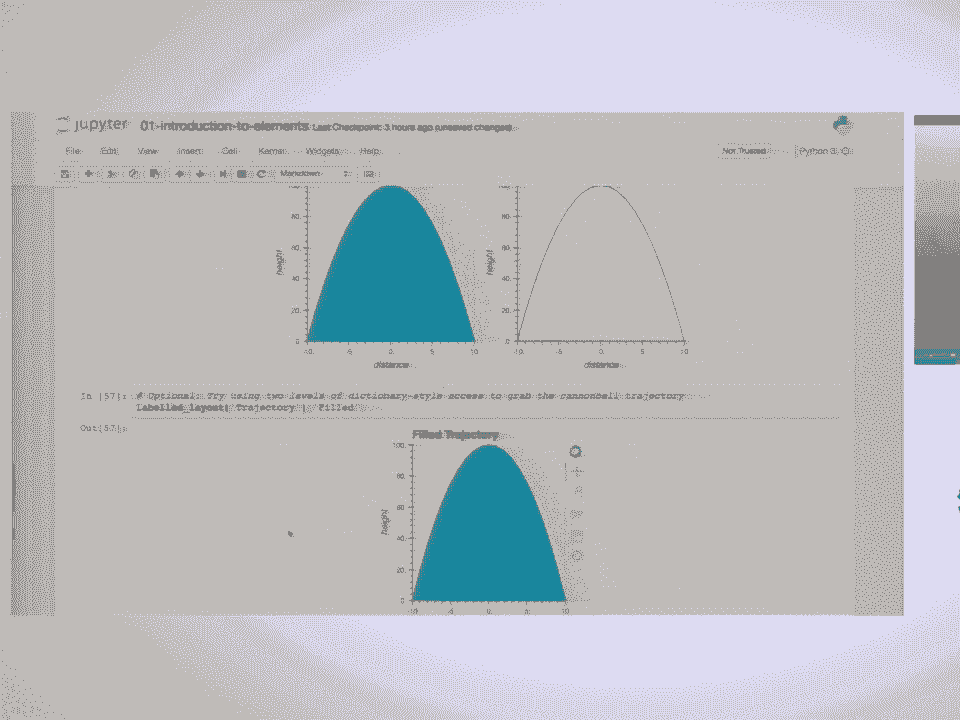

 So we tend to use that。 OK， so is everyone following？ Great。 [PAUSE]， Right， so。 [PAUSE]， Yeah。

 [PAUSE]， Right。

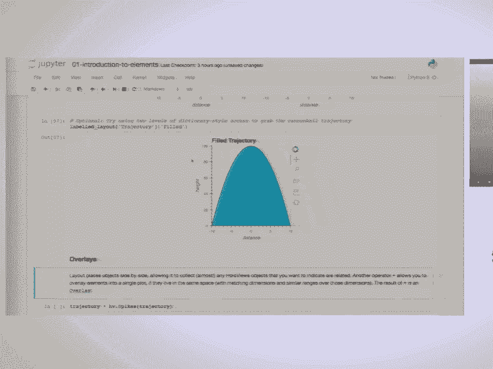

 Yes， this is the new name。 That's correct。 So， yes， that's exactly right。 So earlier on。

 you saw that you had this default system scheme where we hadn't given， the label in the group。

 We were attributing-- we're using the default access， which is the type and then this。

 automatic Roman numeral。 But now that we've actually specified a group and a label--。

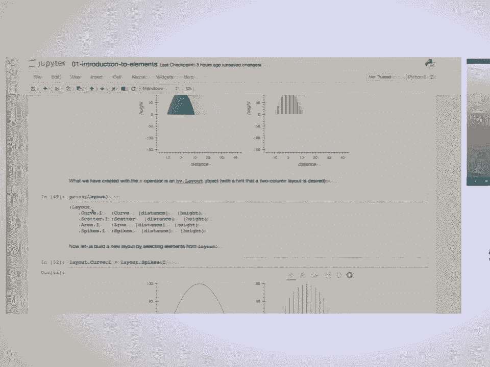

 thank you， actually， this is something I did want to say--。

 you can now use the new group and label in your attribute access。 So I should have made that clear。

 So you can see that we're now using trajectory。filled because it's the trajectory group。

 and the field label。 And it's actually using that information about group and label for your access in the layout。

 So just to be completely clear on that。 Yep。 [INAUDIBLE]， Oh， this one， yep。 [INAUDIBLE]， No。

 it's not。 This is two levels of actual dictionary access。 [INAUDIBLE]， Oh。

 so that might be an internal detail that you've actually abused。 It's not what we expect。

 but it works。 Right。

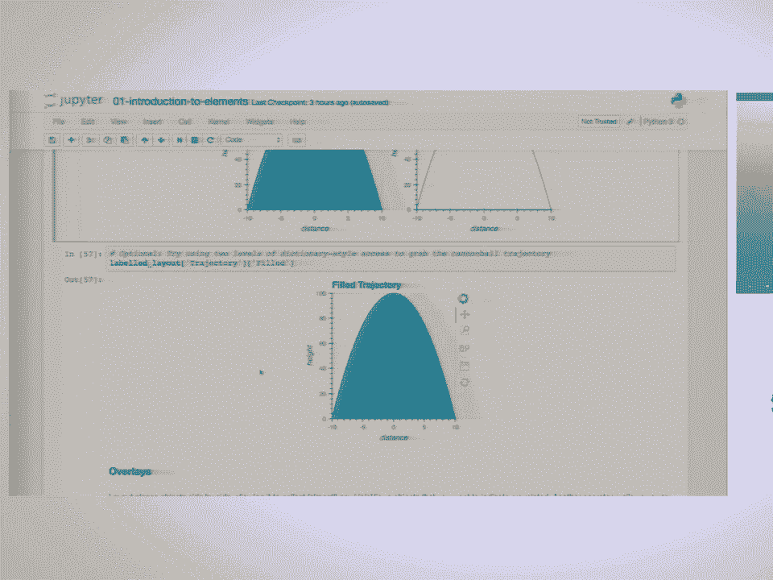

 [INAUDIBLE]， OK， so this is going to be a much quicker。

 So just to make sure we don't fold behind time too much。

 Overlays are really almost exactly the same as layout。

 There's very little different about it except what they look like。

 They have the same attribute of all indexing。 They are basically the same kind of structure。

 They heterogeneous。 You can take any element and combine it in a layout with any other element。

 The main restriction， they have to be in the same kind of space。

 So they really have to share the dimensions。 They at least need to be in the same kind of space。

 So let's take our trajectory and we use the model operator to make an overlay with the spikes。

 Now what we've done is we've taken our spikes and we stuck it on top of our trajectory。

 And because they're in the same space， they're happily living together。

 If you had something in a very different part of the space， then you'd have trouble visualizing。

 it because it would be zoomed out or some others。

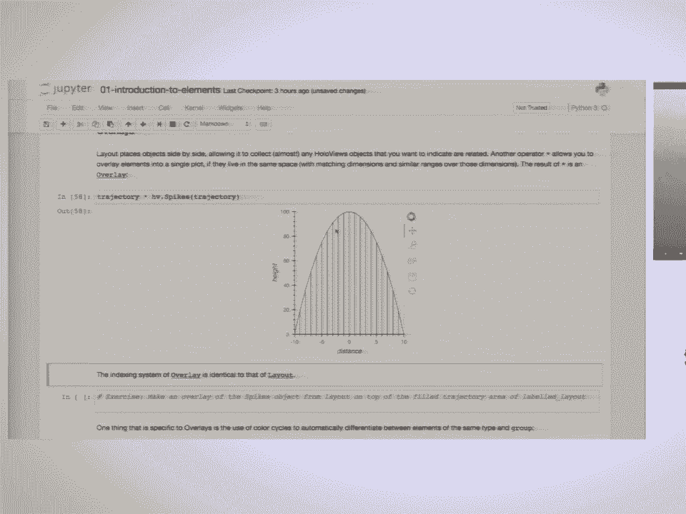

 OK。 And as it says here， this overlay has an identical kind of indexing scheme。 So。 Right。

 So you can mix and match。

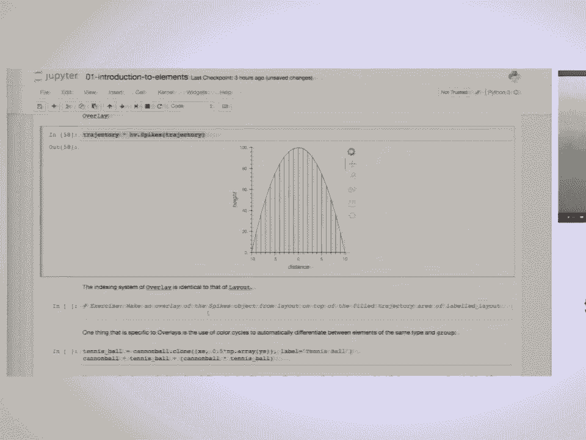

 I think we'll skip sex size just just a time。 So we're nearly at the end of this notebook。 OK。

 So this is showing you that you can actually start combining things in more sophisticated， ways。

 You can have a layout of overlays。 You can have something which are in the layout which are overlays and something which aren't。

 just elements and so on。 What we've done here is actually set the label。

 which we talked about earlier， as tennis ball， and cannonball。 So these are the labels。

 Cannonball already existed。 So we just taken cannonball and we created the use the clone method which basically creates。

 a new instance of the element。 And all we've changed is the label。

 So I don't think you've worried too much about this， but the clone method is kind of。

 a useful idea because it tells you that most things in the whole of use are clones of various。

 thoughts。 So you're getting new wrappers around your data。 So you're not mutating the wrapper。

 you're just creating a new wrapper on whatever data， you had。 So when you do this。

 you can do cannonball plus tennis ball which is the left and the right。

 And then you can do with parentheses just to make sure it's not ambiguous， mall， the。

 two and you can see them in the same space。 And here you can see the effect of the label in a layout。

 You can see that's labeled it correctly。 You have a color cycle where you have red and blue and the one which is tennis ball is red。

 and the cannonball is blue。 So that's one difference between overlays and layouts。

 You're not going to have that concept in the layout。

 It's only when you overlay things you want to use color cycles and legends and things。

 That'd be the second notebook。 Okay。 So how are we doing for time， I think？ Head of time？ Okay。

 so in that case， I'll let you try the exercise here which is to use the clone。

 Which is just the same thing you say above but let's try to make it half the height。

 And let's add it and call it a thrown ball。 So it's something you throw either hand。

 You expect it to be a shower， shallower than what you might be able to do with a tennis。

 ball and just add it to the overlay。 Thank you for your insight。 [end of transcript]。

 [end of transcript]， [end of transcript]， [end of transcript]， [end of transcript]。

 [end of transcript]， [end of transcript]， [end of transcript]， [end of transcript]。

 [end of transcript]， [end of transcript]， [end of transcript]， [end of transcript]。

 [end of transcript]， [end of transcript]， [end of transcript]， [end of transcript]。

 [end of transcript]， [end of transcript]， [end of transcript]， [end of transcript]。

 [end of transcript]， [end of transcript]， [end of transcript]， [end of transcript]。

 [end of transcript]， [end of transcript]， [end of transcript]， [end of transcript]。

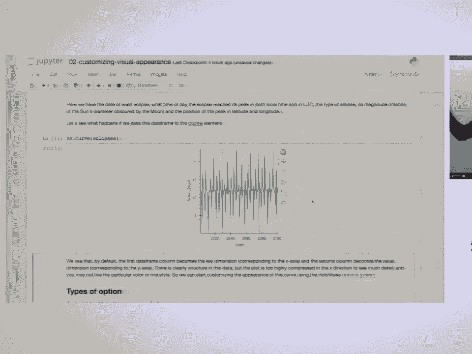

 [end of transcript]， [end of transcript]， [end of transcript]， [end of transcript]。

 [end of transcript]， [end of transcript]， [end of transcript]， [end of transcript]。

 [end of transcript]， [end of transcript]， [end of transcript]， [end of transcript]。

 [end of transcript]， [end of transcript]， [end of transcript]， [end of transcript]。

 [end of transcript]， [end of transcript]， [end of transcript]， [end of transcript]。

 [end of transcript]， [end of transcript]， [end of transcript]， [end of transcript]。

 [end of transcript]， [end of transcript]， [end of transcript]， [end of transcript]。

 [end of transcript]， [end of transcript]， [end of transcript]， [end of transcript]。

 [end of transcript]， [end of transcript]， [end of transcript]。

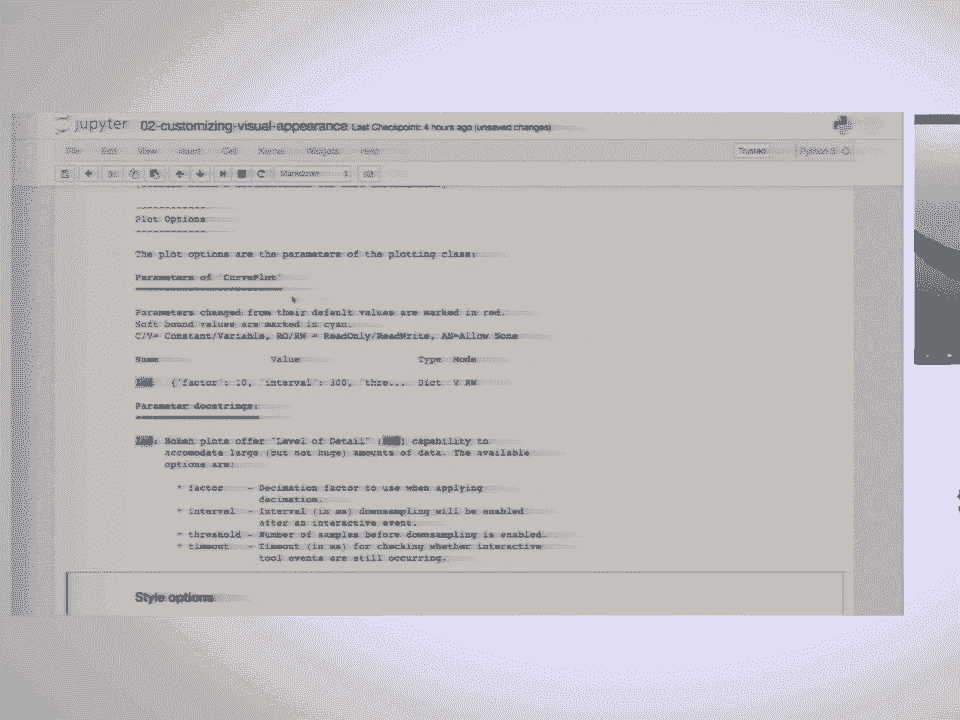

 [end of transcript]， [end of transcript]， [end of transcript]， [end of transcript]。

 [end of transcript]， [end of transcript]， [end of transcript]， [end of transcript]。

 [end of transcript]， [end of transcript]， [end of transcript]， [end of transcript]。

 [end of transcript]， [end of transcript]， [end of transcript]， [end of transcript]。

 [end of transcript]。

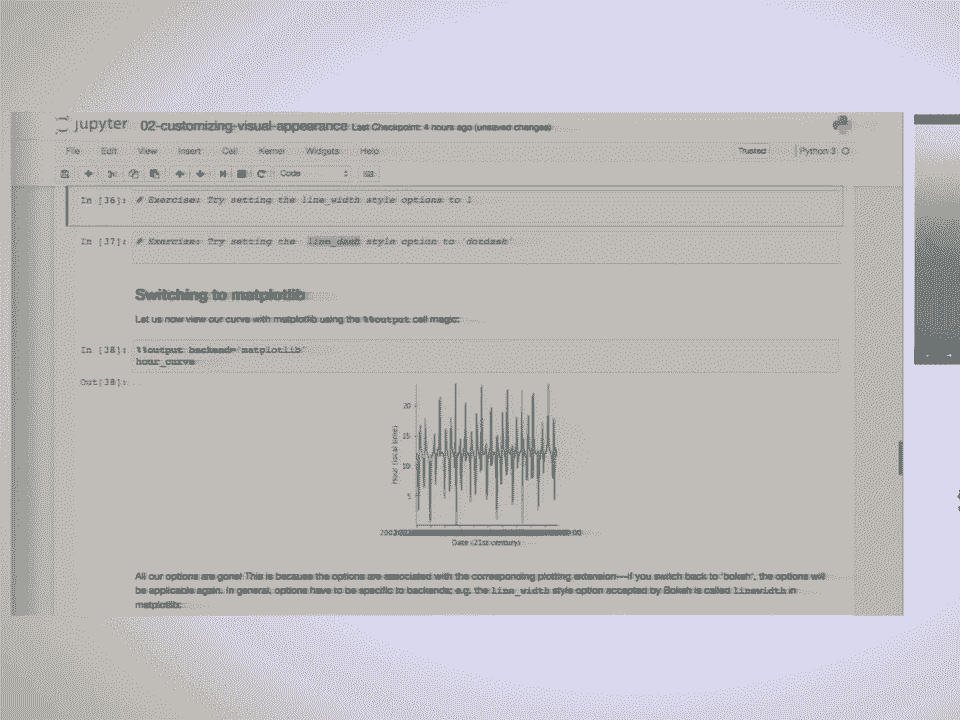

 [end of transcript]， [end of transcript]。

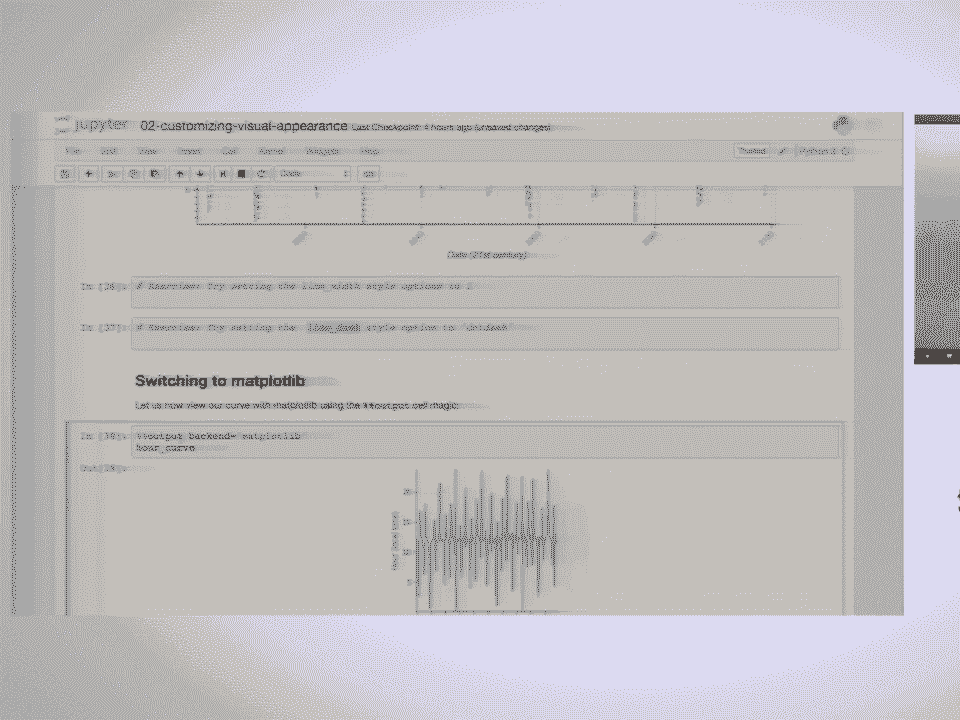

 [end of transcript]， [end of transcript]， [end of transcript]， [end of transcript]。

 [end of transcript]， [end of transcript]， [end of transcript]， [end of transcript]。

 [end of transcript]， [end of transcript]， [end of transcript]， [end of transcript]。

 [end of transcript]。

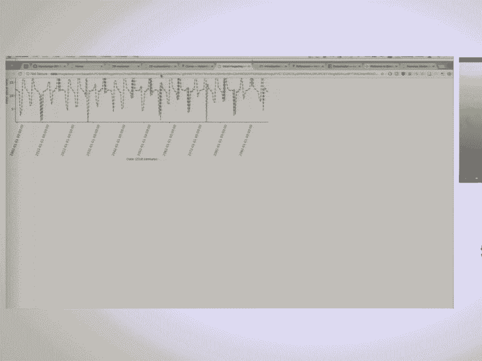

 [end of transcript]， [end of transcript]， [end of transcript]。

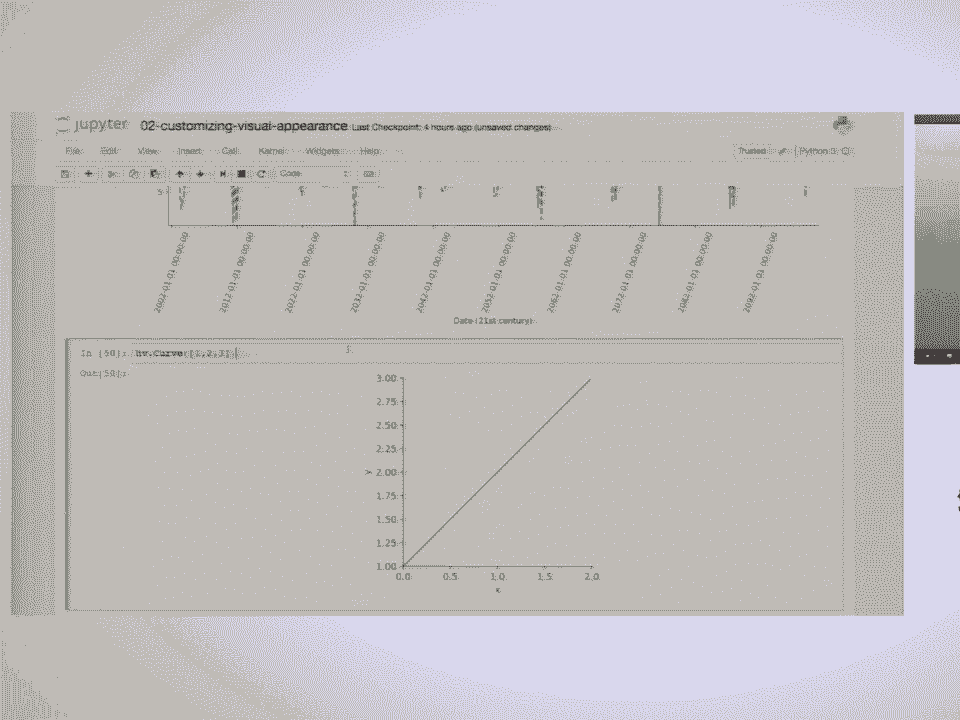

 [end of transcript]， [end of transcript]， [end of transcript]， [end of transcript]。

 [end of transcript]， [end of transcript]， [end of transcript]， [end of transcript]。

 [end of transcript]， [end of transcript]， [end of transcript]， [end of transcript]。

 [end of transcript]， [end of transcript]， [end of transcript]， [end of transcript]。

 [end of transcript]， [end of transcript]， [end of transcript]， [end of transcript]。

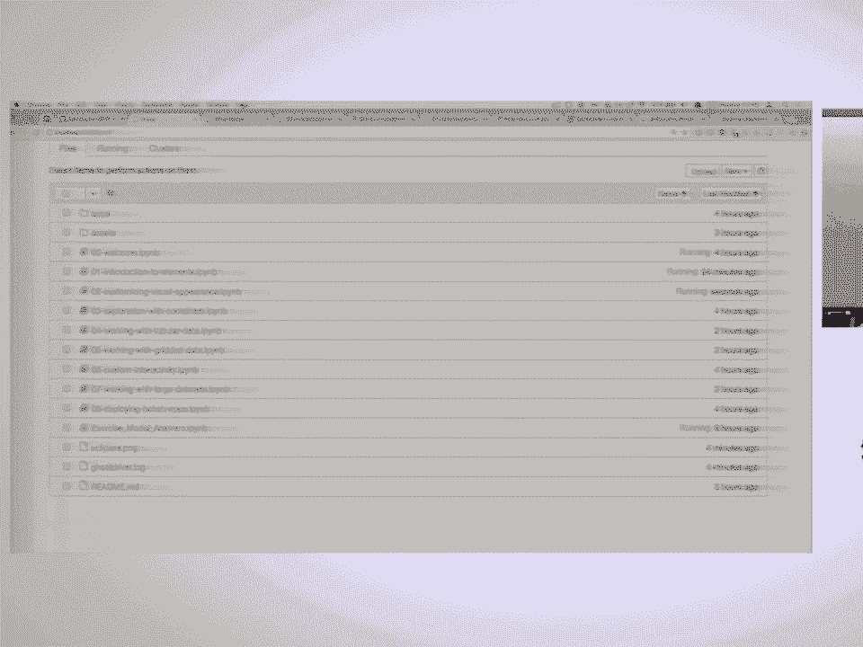

 [end of transcript]， [end of transcript]， [end of transcript]。

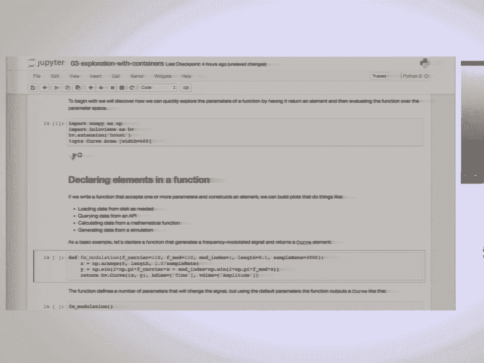

 [end of transcript]， [end of transcript]， [end of transcript]， [end of transcript]。

 [end of transcript]， [end of transcript]， [end of transcript]， [end of transcript]。

 [end of transcript]， [end of transcript]， [end of transcript]， [end of transcript]。

 [end of transcript]， [end of transcript]， [end of transcript]， [end of transcript]。

 [end of transcript]， [end of transcript]， [end of transcript]， [end of transcript]。

 [end of transcript]， [end of transcript]。

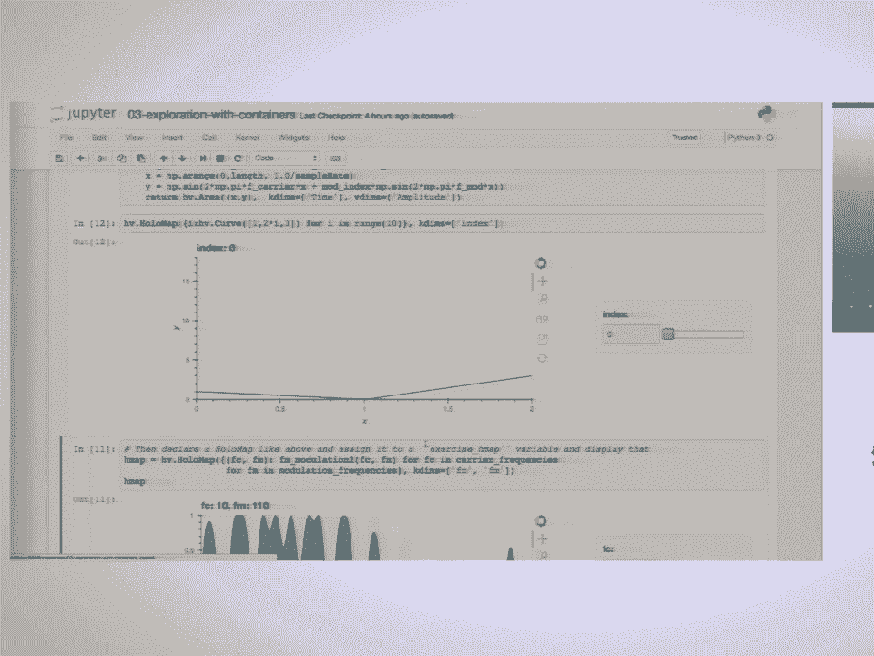

 [end of transcript]， [end of transcript]， [end of transcript]， [end of transcript]。

 [end of transcript]， [end of transcript]， [end of transcript]， [end of transcript]。

 [end of transcript]， [end of transcript]， [end of transcript]， [end of transcript]。

 [end of transcript]， [end of transcript]， [end of transcript]， [end of transcript]。

 [end of transcript]， [end of transcript]， [end of transcript]， [end of transcript]。

 [end of transcript]， [end of transcript]， [end of transcript]， [end of transcript]。

 [end of transcript]， [end of transcript]， [end of transcript]， [end of transcript]。

 [end of transcript]， [end of transcript]， [end of transcript]， [end of transcript]。

 [end of transcript]， [end of transcript]， [end of transcript]， [end of transcript]。

 [end of transcript]， [end of transcript]， [end of transcript]， [end of transcript]。

 [end of transcript]， [end of transcript]， [end of transcript]， [end of transcript]。

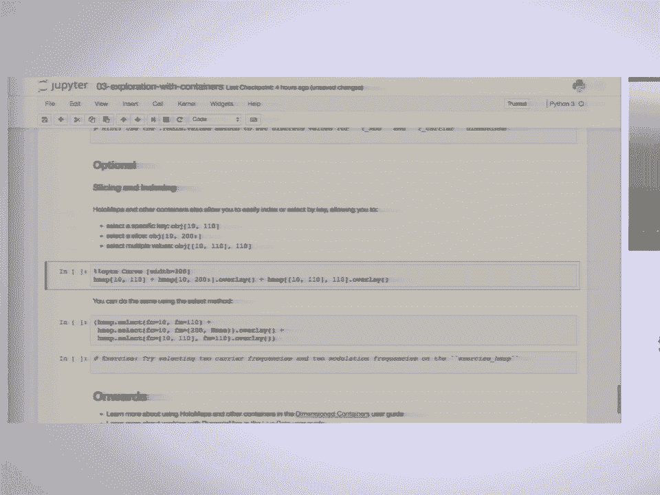

 [end of transcript]， [end of transcript]， [end of transcript]， [end of transcript]。

 [end of transcript]， [end of transcript]， [end of transcript]， [end of transcript]。

 [end of transcript]， [end of transcript]， [end of transcript]， [end of transcript]。

 [end of transcript]， [end of transcript]， [end of transcript]， [end of transcript]。

 [end of transcript]， [end of transcript]， [end of transcript]。

