# SciPy 2017（合集） - P22：Software Carpentry Scientific Python Course Part 1  SciPy 2017 Tutorial  Maxim B - 哒哒哒儿尔 - BV1Cs411A76Y

 Good morning everyone。 I'm not beginning just yet so this is just before we begin。 I had a question。

 first of all my name is Maxen Belkin。 I will be teaching the tutorial today。

 It's considered to be a workshop by Software Carpentry Standards but it's a tutorial here。

 So I had a question if you were able to install an Aconda on your peers。

 So the way usually Software Carpentry works， this is a very unusual workshop， unusual tutorial。

 The whole purpose of this workshop is that you get hands-on experiences that you type things for yourself and you try things。

 And usually there are a lot of helpers。 However， today we don't have a lot of helpers。 In fact。

 we have only one helper or maybe two。 Yes， one or two。 Yes， it's Heather Rose。 Please welcome her。

 She'll be running around this morning and afternoon trying to help you。 So， as I said。

 standard practices that we usually have 10 or maybe 15 people at most per helper。

 So we have more than 70 people in this morning session and 60 people in the afternoon session。

 So this is a rather a challenge but we're not afraid because I work in the Blue Waters Project at the National Center for Supercomptuamplications。

 And one of the challenges that I faced actually when I started that job。

 this job was that it has to， the things that I do， the training that I do， they have to be scalable。

 And scalability， if you think about it， means the least amount of human effort。

 So if I have to do everything for myself， that won't be scalable。

 If a helper has to do everything for everyone else， it's not scalable。

 But if you can help out each other， that will be scalable。 Now。

 I know that some of you have prior experience with Python 2， at least。

 How many of you actually saw Python 2 code at least？ Okay。 I guess。

 did you notice anything in particular you liked about Python 2 or Python in general？

 Was it hard to read or easy to read？ Yes。 So that's the thing about Python。 It's very readable。

 You can literally read the code if it's written well， of course。 We can write a gibberish。

 even using a good programming language。 Okay。 So I know that not everyone registered for Slack。

 And the reason I want you to register there is because I will be asking you questions in our channel。

 We have a dedicated channel for this tutorial。 And in order to get a feeling of where you are。

 what you know， what problems you might have at this moment， I will be using Slack。

 And I actually installed without permission done there。

 It's called Poly so that I can ask you questions and do some polling。 Let's see。 So， just a second。

 let me something。 You don't have to do that at this moment。 We have two more 48 people more。

 And as I said， we have around 70。 And the reason I want you to join a Slack team right now is so that you take this poll。

 You answer this poll。 How well do you know Linux shell？ I know that I see that there are nine。 Oops。

 I'm sorry。 You don't see this。 There are nine people who are bearing you to the next show。 So。

 and this is a pretty significant number。 So， I'm just debating how deep into shell I need to go。

 Because we need just some basic knowledge of shell that I need that much。 So。

 fun fact about software carpentry is that it has to have several lessons in order for the workshop to be called software carpentry。

 Well， here it's a special audience of course。 And we understand that it's people here want to learn Python。

 So， let's see。

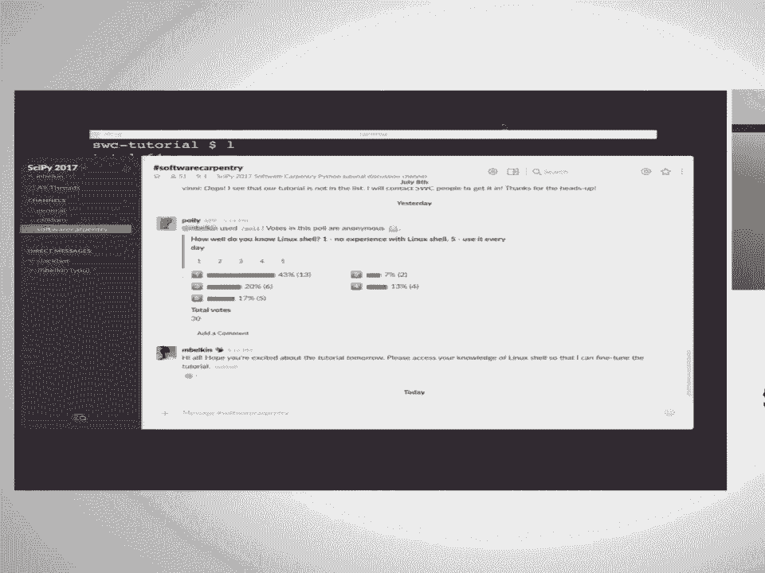

 Okay， so those of you who are in Slack can see that we have quite significant amount of people who don't know Linux shell。

 Let's wait a minute maybe and see what the result is。

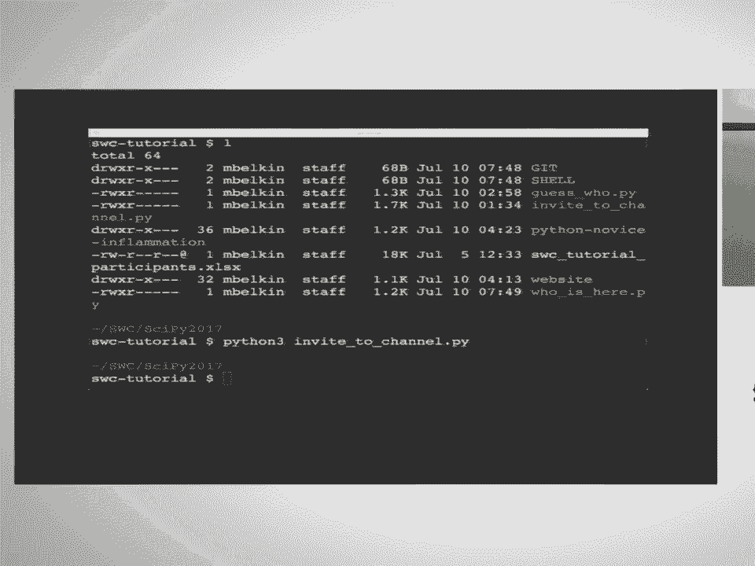

 So， the numbers I'm looking at are so this number here， how many people are in the channel。

 and the number here， how many have。 Despite it in the ball。

 I want this numbers to be approximately the same。

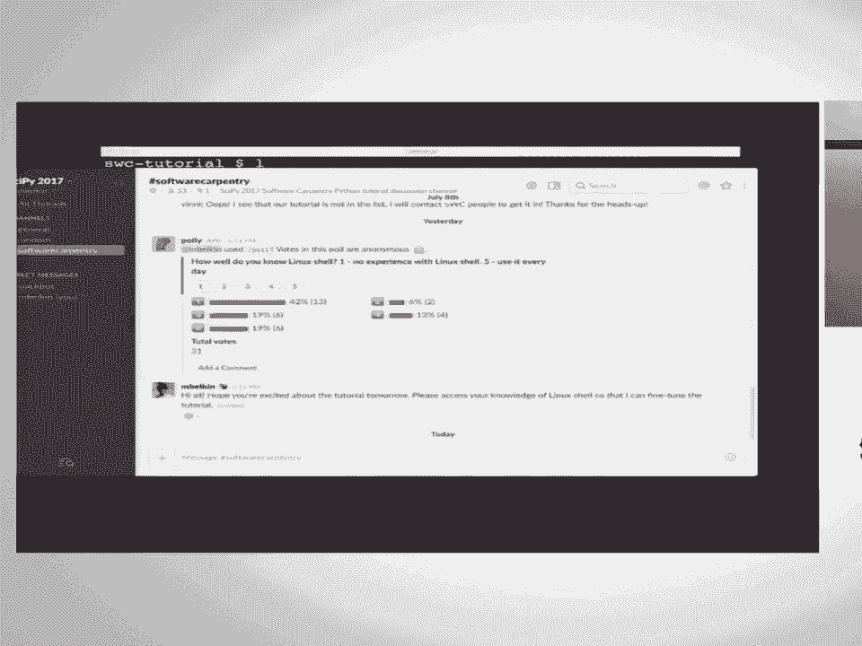

 Is under a smaller here。 I second this morning。 Okay， so the。

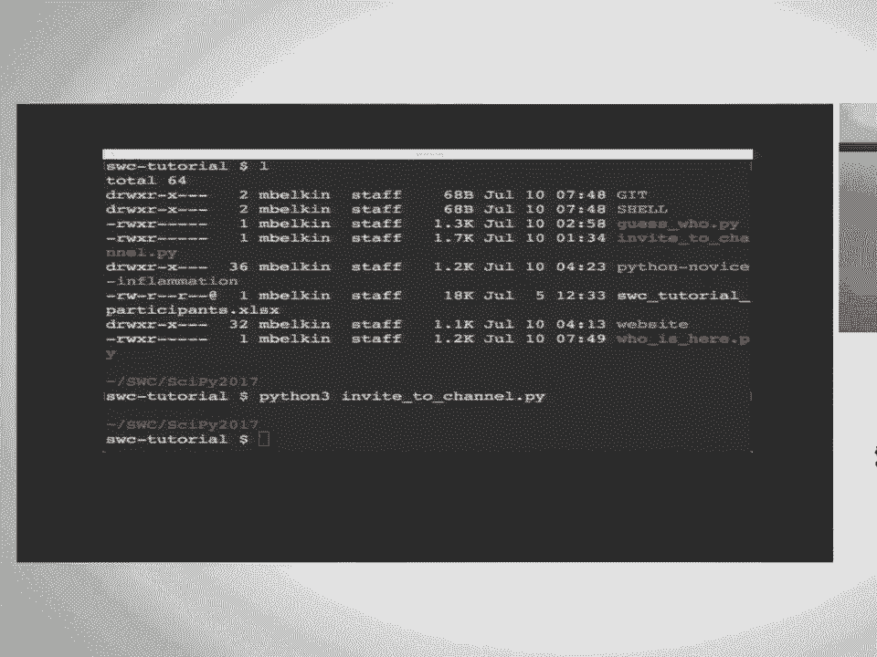

 The current result is that we have。 How many。 Okay。

 14 people who are new or never used Linux shell before。

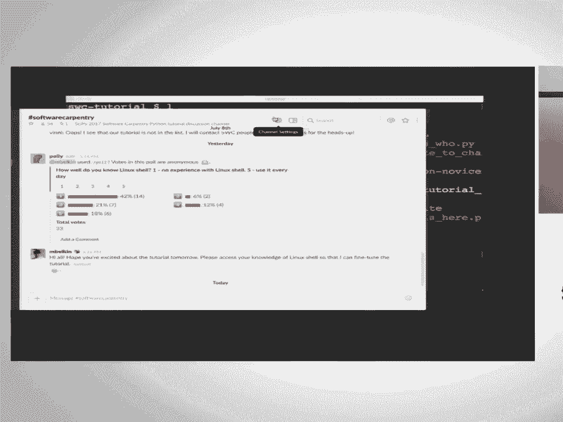

 So， I think we'll cover that in the beginning。 And for those of you who know Linux shell。

 I advise you to go and watch a YouTube video。 I posted it on。

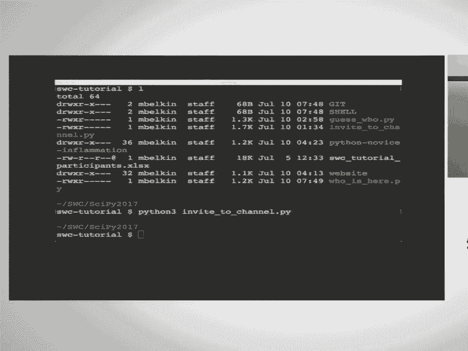

 You know， in our select。 So， this is actually a presentation by Greg Wilson from two years ago or four years ago。

 which is 2014。 And he talks about software carpentry， the ideas behind software carpentry。

 what and why software carpentry teaches。 So， it's a very。

 this is a very useful and interesting video。 And encourage you to watch it if you know shell and have。

 I guess， will spend maybe。 At most， or at minimum half an hour covering shell。

 And this is actually this video lasts， I think 37 minutes or something like that。

 Okay， so。

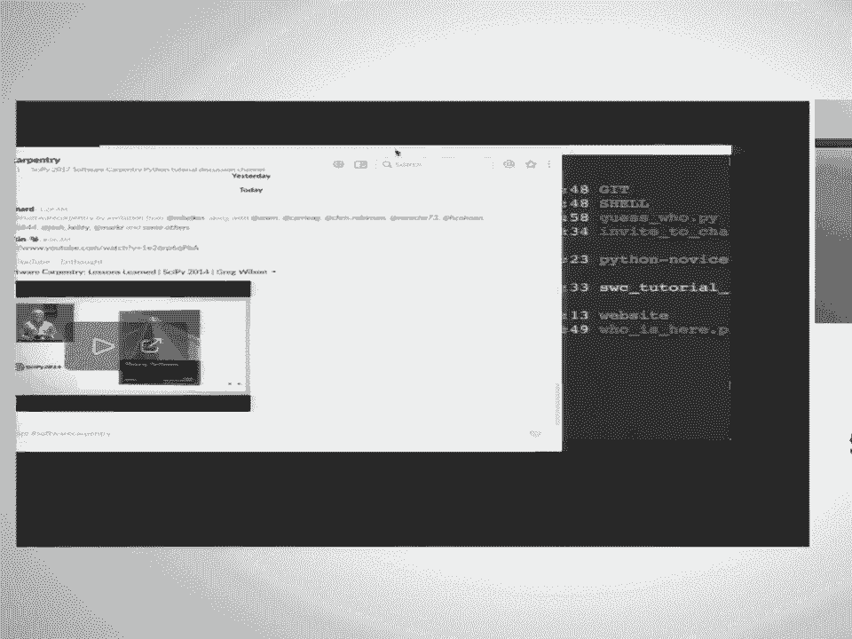

 Those of you who who will be watching YouTube video。 Enjoy。

 And those of you who will be listening to me。 Okay， let's get started。

 First thing that I want you to do is go to the website。 That again。

 I'll post it on the slide channel。

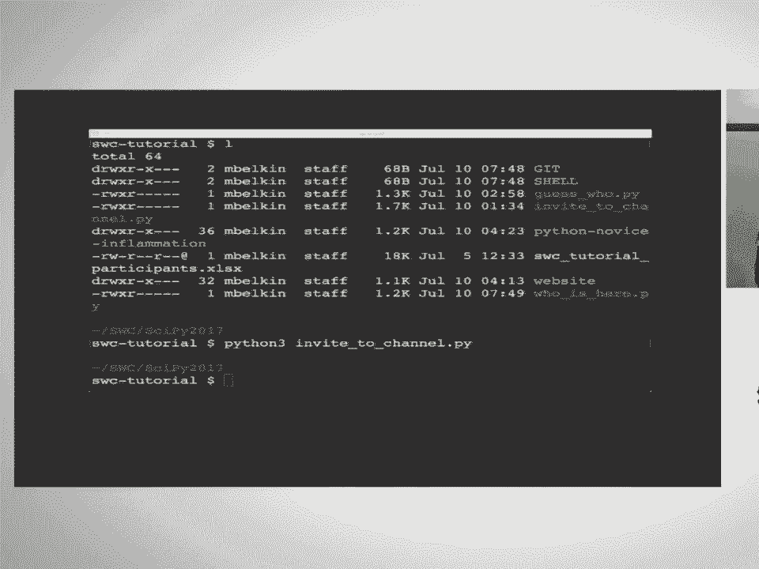

 This website。 This is the software carpentry shell lesson that will briefly go over。

 We will not cover everything there because of the amount of time。 So。

 we spent maybe four or three hours covering that。 But because we want to get into Python as soon as possible。

 we want to cover it as fast as possible。

 In parallel to Slack， so I will not be showing you this Slack window back and forth on the screen。

 So， I will be using terminal for the most part when we'll be talking about the shell lesson。

 But we will keep track of the commands that we type using either pad。

 And you can find the link to that either pad on the website on our tutorial website。 Let me find it。

 The library document。 So， the address is pad。souptware-carpentry。org/cypai2017。 So， I see people。

 I edit myself。 One of the features of software carpentry lessons is actually that software carpentry lessons use green and red stickers。

 So， green stickers， I used to show that I am done with the exercise。 I don't have any problems。

 Red stickers， I used to show I need help。 I have a problem。 Wait。 [inaudible]。

 And place it right here when I ask you to do that。 For what？ So， it's， I think I posted it。 Yeah。

 it's in the Slack channel。 SW carpentry。github。io/shell-noise。 So。

 sometimes during this lesson I will be pressing some key combinations。

 And while they are convenient， they are hard for you to see。

 You typically you can't see when I press， for example。

 if I press Ctrl L or Backspace or something like that。 So， in order for you to see these commands。

 I enabled a special tool program that will be showing you these commands。

 In the right bottom corner。 For example， when I press Ctrl L， you will see this。 When I。

 let's see Ctrl C， you will see that。 But I will be announcing which key combinations I am pressing so that I'm using so that you know。

 And we will not hurry here because it's very important that you know basics of， of basics of shell。

 Okay， so first of all， why shell？ Why do we care about shell？ Why do we need shell？

 We technically we have all of us have computers with some sort of graphical user interface。

 Whether it's Mac， Windows， even Linux。 Well， not even。

 but still all of the operating systems have recent operating systems have graphical user interface。

 For example， if I open a Finder in on my Mac， I can find some files here if I want。

 But you see that I have a lot of files in my downloads folder。

 And it's not easy to actually find the specific one I need。 But for example。

 I know that I'm looking for some zip archive or some PDF presentation or PDF file。

 Something like that。 So I can sort it by kind or type on Windows machines。

 But imagine if you are working with scientific data and you have literally millions and millions of data files。

 Of course， it will be hard for you to scroll。 It will be hard for you even to open that directory。

 But it will be hard for you even to find a specific file that you are looking for。

 That's why we need access to command line utilities。

 So Shell provides us with a way sort of access computer data on the computer using commands。

 That's why it's called command line interface。 It's frequently。

 and you will frequently hear CLI which stands for exactly that。

 Contrary to graphical user interface。 I just need to。 Sure。 Well， I cannot invite by email。

 I can send you an invitation link。 Okay。 So before first of all。

 when we're working with email and we can't access to working with you right now？ Oh。 Okay。 Yes。

 just email me and I will forward you the link。 Or you can use the same link again if you。 Oh， okay。

 I get it。 Sorry。 So my email address is very simple。 First name， Maxim。belkin@gmail。com。

 So just email me and I will send you the invite link。 And let me。 So here。 Okay。 Okay。 So。

 I cannot post it on Slack。 So， I apologize for that。 Yes。 Okay。 So， I have to request。 So， Heather。

 what if I sent you the link and use。 Can you send them？ Okay。 You don't have to add them。

 You just have to send them。 Yeah。 Okay。 Let me reply。 Because I received here。 Okay。

 Those of you on Windows machines， I hope you installed Git for Windows。

 And don't be confused by the name even though it says Git for Windows， it comes with a bash shell。

 So what I want you to do right now is open Git bash。

 Those of you who use Mac or Linux open a terminal on a Mac or console in KDE or terminal in the other desktop environment。

 No。 So， and we should be good to go。 Please put your red stickers if you have problems with Git bash or Linux or anything。

 Okay。 Good。 Great。 Well， you don't have to put green stickers right now。

 I'm just looking for red stickers。 Okay。 Heather， will you be able to help or should I have a look at？

 Okay。 No， I replied to。 Yeah。 I replied to something。 Okay。 So， first of all。

 computer actually knows who you are。 But it doesn't know your name。 Well。

 probably it does know your name， but I'm talking about a different thing right now。 So。

 the first thing that you will notice when you open a terminal， you will see， oh， oh。

 just you will not see。 Let's have a move that。

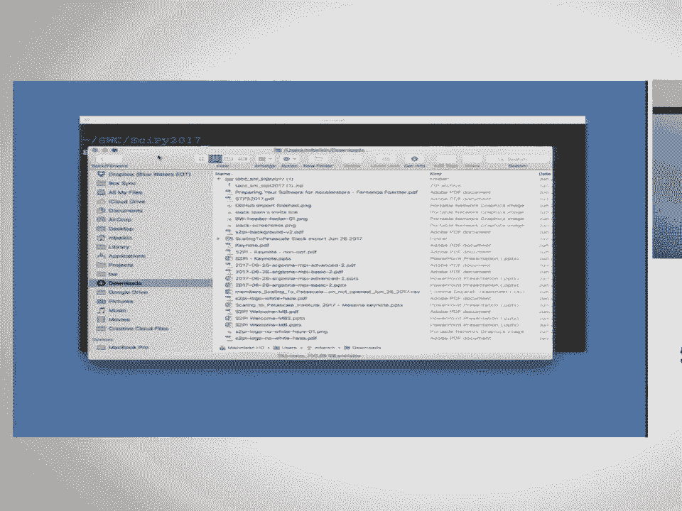

 So， you will see something like that。 So， you will see some text and then dollar sign space。 So。

 this is called the command prompt。 Why？ It's called this way。

 The reason it's called command prompt is that it is waiting for your commands。

 It's waiting for you to type something so that it would give you the feedback， the reply。

 the response。 Now， why is it convenient？ The convenience here comes from the fact that you can write very simple commands and apply。

 them in small directories or you can apply them to millions of directories， millions of， files。

 millions of your data files if you are working in some sort of dating intensive area。 So。

 you can change this prompt。 And if this prompt is very long for you， what you can do。

 you can type ps1 equals single quotes， dollars and cents。 So。

 this is how you can change your prompt。 But this will change only how it looks so that it's easy for you to follow and see what。

 you type。 That will not do anything to your file system that will not create a new file or it will not。

 create a new directory， nothing like that。 This only affects what you see on the screen。

 And usually people don't spend a lot of time looking at this， but at the same time it's。

 important because the more useful this prompt for you or the less distraction you get when。

 you look at this， the better you'll do the more stuff you'll do and so on。 So。

 if you are unhappy with what you see， you can type this command and it will change， it。 So。

 let me show you what it does。 And I can clear the screen with control L and here you go。

 That's how it works。 Now， you are probably somewhere in your home directory。 But how do we know？

 There is no way right now for us to know。 But there is a command for a to tell where we are and it's called PWD。

 All Linux commands， they follow a very simple rule that they are shortcuts for some phrases。 So。

 PWD stands for print working directory。 Some people say that this is a present working directory but it's sort of duplicate because。

 present and working， the whole purpose of working directory is that it says I'm here。 So。

 if you type PWD you will see your current working directory。

 And if you are on Windows machines and if can you use Git Mesh， you will probably see。

 something like that。 I don't remember whether it's user or so user and your user name。

 something like that。 Now， okay， I mentioned that computer knows your name。 So。

 how do we know our name？ We say who am I？ And hit enter。 So， who am I？

 Prints you the user name that you have on this machine。 Okay， that's good enough。

 You should see something like that but you will probably see your user name。 Now。

 data on your hard disk are data stored in directories。 So， there is one parent directory。

 parent of all parents。 It's called the root directory and on all Linux machines。

 Unix type of machines， this is the， directory。 This is the directory。 But don't execute it yet。

 Let me remove that。 So， that's just a single flash。 That's a root directory。 So。

 all other directories are children of this directory。

 And you can see that I'm already using a jargon。 Parent directory， children directories， so on。 So。

 this is jargon。 Okay。 How do I see the contents of my current directory？ So。

 to see the contents of current directory， we have to use a less command。

 And you can remember this command as list。 So， list me all the files in this directory。

 all the files in directories here。 And again， you type a command， you press enter。

 And in Linux and Mac and git bash， they take arguments。 These arguments are optional。 So。

 that means that you can omit them。 But let me show you an example of such an argument。 For example。

 ls-l lowercase。 And you can see that it printed me something in a strange format。 So。

 it actually outputted all the files and directories。 But it also added some user names， some staff。

 What's that？ So， mbelkin is， well， in this case， this is my user name。

 And staff is my group that I belong to。 This is size of a file。 The next column here。

 The date when the file or directory were created。 And then the last thing is the actual name。 Okay。

 So， frequently， what we want to do is we want to find some help。

 And almost all of the Linux command， they come with a dash-help。 Now， those of you on Mac will。

 if you try this command， it will fail。 And the reason is that on a Mac， ls doesn't have a dash-help。

 So， by the way， notice dash-help。 So， it has two dashes。 So。

 there are short arguments and long options。 When you see dash-to-dashes， that's a long option。

 When you see a single one， that's a short one。 Okay。 So。

 this command will fail for me because I'm on the Mac。 On Linux， it works。

 The other way to get help on Linux machines is to call a manual page。

 And the command for doing that is called man。 So， how well can you see the text here？

 Should I increase the font or are we okay？ Increase？ Okay。 Okay。 So， let's have a look。 So。

 when I execute a man space less， so I type man space less and hit enter， I got myself。

 into a manual page。 So， I can use my arrow keys up and down to scroll down or up and read about all the options that。

 this particular command has。 To exit from this manual page， I have to press Q。 And if you are stuck。

 just remember， press Q。 Okay。 Now， let's --， Download some data。

 And the data I want you to download is here。 So， because this is a very short introduction。

 I will type -- show you the command on this， screen that you have to type。 And you just -- first。

 we'll start with Mac users。 Curl， space， dash capital O， space， and then this long command。

 And I will add it to the Slack channel。 Now， Linux users can use WGet。 Both of these utilities。

 they are usually built in sort of -- they come with the system。 So， you don't have to install them。

 But if you have any problems， just copy that URL to your browser and it will download it， for you。

 Okay。 So， let me do that as well。 Let me download this data because I'm on a Mac and I will use Curl。

 dash capital O。 Do you have WGet？ Curl， get dash。 Okay。 Curl， space， dash capital O， space。 Yes。

 That's different。 That's shell notice。 So， software carpentry lessons。

 they are introductory lessons。 There are pattern， shell， get。 All of them are get。 All this shell。

 no this pattern。 Are you using git bash？ Where are you typing this？ Get， git bash。 Okay。 Okay。 So。

 here is yet another option for the last command。 It's called dash one。

 It will print a single column of all the files。 You can unzip it with unzip or you can just double click on this file in the finder。

 Or in Windows， if you have a zip installed， you should also be able just to double click on the file。

 So， I will use unzip command。 Sure。 So， while we are working on this software carpentry workshops。

 they usually ask you for feedback。 And I will also ask you for feedback in the end。

 But as you can see， the challenge is that the audience is very diverse。

 And the idea of software carpentry workshop is that they bring everyone to the。

 at least to some minimum level。 Once you know that minimum， you have that minimum level。

 you can go further and teach yourself。 What I find frequently people do。

 they rush through the introductory material。 And because of that。

 people have to spend hours at home watching YouTube videos how to do things。

 And I feel that software carpentry does a very important job in this perspective。 Okay。 So。

 once again， I will clear the screen with control L because I am going to see you a little bit more of my terminal window。

 And now， if I type a last command， I should see a new directory here called data shell。

 Let's go to that directory。 And when I say go to that directory。

 I mean that I want to change my current directory。

 And I am very specific that I want to change my directory。 That's why there is a command called cd。

 cd stands for change directory。 I will type da and then I will hit tab。 So， as soon as I hit tab。

 the full name of the directory appears。 This is called tab completion。

 And the reason it worked is that there are no other files or directories that start with da。 So。

 shell was able to identify that directory that I am interested in and edit the end of the name。 Now。

 I press enter， nothing happened， but if I execute pwd， I will see that right now I am in data shell。

 Now， if you look at this， if you look at the output of pwd。

 you will see that all directories are separated with slash。

 That's why you cannot have a directory name that has slash in it。

 You cannot create a directory called， and I am using the command that you don't know yet， a b。

 You cannot have such a directory。 In terminal。 Mac is actually fun because you can create a directory name with slash in finder and it will replace it with column。

 And vice versa。 So， it will be confusing， but that's just something。 Okay。

 so we already spent 40 minutes on that。 I will try to speed up。 Okay， so let's create a directory。

 mkdir make directory。 Sure， mkdir。 And we will call it thesis because we are future scientists and we are working on our thesis。

 So， how do I check that we have this directory？ First of all， it didn't mean any error message。

 That's a good sign。 And then if I type a less again， I will see thesis。 Now。

 we can specify directories after the last command。 A less space and then thesis。 And again。

 I type ch and hit tab to see if there are any files here。

 Either there are any files and there are no files。 Okay。 So， we don't need that。

 I'll just skip a few things。 Okay。 Okay， let's look around a less creatures。 So。

 in creatures we have two files。 How do we get the contents of these files？

 There is a command called cat。 Cat creatures basilisk。 And let me scroll up。 This is a long file。

 This is the command that I executed。 So cat outputs the content of the file to your screen to the terminal in a simple form。

 Of course， the idea behind cat， you can use manual page to look what actually this command is designed to do。

 Okay。 So cat， now we know this fun command。 We can do statistics。 Oh， and by the way。

 you can use up and down arrow keys。 I guess all of you have figured this out by now。

 I actually got to mention that because you can use up and down arrow keys to go through the history of the commands。

 Right now I'm just pressing up arrow key。 So once I see the command that is most convenient for me。

 I'll just go back and modify it a little bit。 And I will use WC。 As you could guess。

 this stands for word count。 And it gives me some statistics。

 You can look actually at the manual page and see what these numbers mean。

 I will not go into details at this moment because we want to cut it and very soon。 Okay。

 Wallet cards。 So let's say you have a number of files。 And let's go to。

 let's change our directory to molecules。 So we see a bunch of files， six files here。

 And we want to output just a subset of these files。 We can use so called wild cards。

 An example of a wild card is star。 Less space B star。 So what this command will do。

 it will print us output to the screen， to the terminal， all the files and directories。

 Whose name starts with B？ Start with B。 So star replaces everything here。 This is a wild card。

 Redirect。 Okay。 So we can do a little bit of a redirection。 Let's execute a command。 WC space。

 space， maintain that PDB。 And let's imagine that this is a very important command for our research。

 And we want to save the result of this command。 And use greater sign， greater result。txt。 Or 。dat。

 When we execute this， we don't see anything。 But if we have a look at the file result。dat。

 we will see that it actually stored the result of that command in that file。

 So this greater than sign， what it does is it stores the result of the command in this file。

 If this file did not exist， it will create that file。 If this file existed before。

 it will overwrite this file。 So the contents of this file will be deleted。 Yes。 So here。

 the result of that is arbitrary name that you -- any name。 Yes， absolutely。 That's up to you。 Yes。

 Actually -- and I should mention that this is a very important fact。

 On Linux -- and I'm not so sure about Windows， but files cannot be required to have extensions。

 So we can do that。 It will work just fine。 So directories can have 。something in their names。

 That's also a possibility。 We can create a directory。

 So I did not change the extension here because I created a new file。 So this file is --， Nope。

 Because the way you treated depends on what you do。 And you have to code。

 You have to write what you do。 So all the commands -- so what I'm going to show you is not part of software cartridge。

 but there is a command called file。 And if you execute it。

 you will see what Linux knows about this object。 So it knows that this is a file and this is ASCII text。

 So that means that you should be able to read it。 The same we can do for the result。

 That doesn't have any extension。 And this is also a file。 So the analysis that you do。

 the commands that you execute， only they define what you do with your data。

 The extension is just for us to see what kind of files these are。 Okay。 Now。

 if I want to append the results to my file， I can do two greater than signs。 So this way。

 I will append the results to this file。 If I have a look at this file once again。

 I will see that I have the same line twice。 And finally， I think we'll talk about pipes。

 So let me just figure out which data we want to analyze。 Let's remove， actually。

 an important command。 RM， I want to remove the results that I just created。

 I spent hours and hours working on this。 And finally。

 I decided that all of my results are not important。 And this is what I'm going to do。 Now。

 if you execute this command， the chances are that it will not ask you for anything。

 Like it does here and we'll just delete it。 The reason it asks me is that I sort of tweaked it so that when I execute this command。

 it does ask me。 So right now， for example， let me， I will hit just Y。 Let me hit no。

 If you want to get the same prompt before deleting a file， you should use RM space -i。 -i。

 you can remember it as interactive。 That means that command will interact with you。

 And here you should type Y or N。 Okay， so finally， we have these files。 Six files。

 Let's see which files have the most number of lines。 So WC command， again， it stands for word count。

 You can use special arguments to that command。 One of them is -l。 This is a lowercase l。

 You can confuse it with one， but this is l。 Now， I will type star。pdb。 So WC space -l space star。

pdb。 So what it means is that this command will be executed and star。

pdb will be replaced with all the files， that shell finds in this directory。

 So let me show you the equivalent way of executing the same thing。

 So these two commands are equivalent。 But you can see that I had to type only single star to do that。

 Yes？ It basically instructs WC to constantly lines。 And again。

 you can look at the manual page for WC command。 If you scroll down， you will see -l。

 The number of lines in each input file is written to the standard output。 Now， so this is great。

 We can count lines in files。 What we can do with this result。

 we can process it using a different command。 And one way to do it would be to save it to a file and then process that file。

 But instead of doing that， we will pipe the result of this command to another command called sort。

 This is what happens when you pipe one command to another。 So what we did here， we executed WC-l。

 star。pdb， and the result of this command， we added to sort。

 So sort worked with the data that it got from WC command。 Now， I'll hit the arrow queue once again。

 and I'll pipe it once again to the command called head。 And head， what it does。

 it prints the first X lines of a file。 In this case。

 I use -n space 3 to print only three lines of the file。 As you can see。

 I can pipe it as many times as I want。 So if I have a function or if I have a command that I want to use。

 I can use it in this piping process。 And the reason I wanted to get to these pipes， actually。

 is because we have an exercise in the end of the Python tutorial。

 where I hope we'll get to that exercise where we'll be using pipes。 Okay， so， and once again。

 we can save this to create a result to our result。 That's it。 So if we have a look at this file。

 we'll get three lines。 And this is a short version of our shell lesson。

 I will not go into further details， and I missed like a ton here。

 But I feel like a lot of people are waiting actually for Python not for shell。

 But I just wanted to cover these basics so that we are more or less equal。

 I'll just - there is one command that I did not cover。 It's called grep。

 It's typed like that in grep。 And it lets you get the certain patterns from the file that you're interested in。

 For example， if 10 and then tail and - and 5， let's have a look at that。 And if I grep， for example。

 this -， So what I did here， I searched file， contain that PDB for all the lines that have seen some number of spaces。

 and then one。 And grep output me these lines。 Yes？ Okay， that's a part that I actually admitted。

 but because we will not be using it， but it's actually part of the shell lesson。

 So in order to search for files， there is a command called find。

 There is a different command that does a search a little bit faster。

 but you have to update the database。 But find is the most probably wrong pathway。

 So this syntax for the find command is the following。 You say find， then where you want to find。

 And I will mention that。 That stands for current directory。

 There is yet another special directory called 。dot。

 which stands for directory above my parent directory。 But in this case， I can do that。

 And then you specify the specifics of the file or directory that you are looking for。 For example。

 to search for files only， like regardless of their name。 So I want to be sure that this is a file。

 I type -type， space F。 F stands for file。 And then， for example。

 I can add -name and something like p star dot t of pdb。

 So I will search for all files with the extension pdb and that start with p。

 And I don't care about what's in between。 The result is the directory where I search for files。

 Then， of course， slash。 And then， file name。 So， contents within file is crap and file names， find。

 Should we cover anything else？ I think that's it。 As you can see， I used several options。

 specifications here。 I wanted to find file， I wanted to file name with a specific name。

 If I want to find a name and forget - and I don't care about - I want to do case insensitive。

 search， I would use -i name。 This is a case insensitive search。 In this case。

 I don't find anything new because I have all the files here。 Okay。 So， how do you feel？

 I think that's enough。 We spent one hour， apologies for delaying our Python lesson。

 That part has to be covered。 I was asked also to mash and git。

 but let's start with Python now and we'll mash and git later。 And we'll actually use it soon。 Okay。

 And I will go back to my standard PS1 prompt so that you see where - should be specific - where。

 in the directory structure I located。 So， I want you to execute this command if you have not done it already。

 I believe I asked you to do that in my reminder， but I don't remember to be honest。 So。

 what this command will do， it will - of course， apparently it will use git。

 Git is a program for distributed version control。 So。

 it allows you to collaborate with people on code development and to distribute code development。

 What clone does， it goes to GitHub in this case and pulls the content of that repository。

 and downloads to your machine。 The GitHub addresses - your URL addresses - are very easy to understand。

 They have a very simple logic。 All of them start with HTTPS so that's secure。 GitHub。

com - then username on GitHub - and then repository name。

 And I'm so slow so that you can look at what I'm showing and also type at the same time。 So。

 the name of the repository in this case follows the software carpentry standard naming， convention。

 It's date and then the venue。 In this case， I called it "Sipi"。 So。

 you can execute that and it will create a directory called 201707-07-10-Sipi for you。

 Those of you who know that you can specify an optional argument to that command and this。

 argument will be directory name。 You can omit that。

 I will not execute it because I'm already in this。

 And you don't have to have an account on GitHub to clone。 So， if you experience this。

 I would suggest you just create an account and it will be the， fastest solution to that。

 I did not know that GitHub actually needs username to clone。

 I did not know that it needs username because the first thing we do - when we talk about， GitHub。

 we create an account on GitHub。 So， before clone。 Okay。 So， you should see something like that。

 >> I don't know about the only one。 I did the GitHub look like a download。 >> Right。 Yes。 Apologies。

 That's not the full command。 And the reason for that is this。 So， that's the correct syntax。

 Apologies。 I forgot about that。 So， by default。 Yes。 Oh， it's in any directory。

 You just execute this command。 Yes。 So， XU runs some of you face this problem。

 That stands for Xcode and you will need to install it， I think， to use Git or stuff like that。

 Or invalid。 Add to developer path。 How many of you have succeeded？ How many of you have problems？

 I don't see a right stick is at this moment， so I assume that we are more or less good to go。 So。

 there will be a break at 10。 And the reason is that at 10。30 they stop serving breakfast。 Okay。 So。

 here you will find a bunch of files and directories。 And， by the way。

 I'm using an option to a last command。 Oops。 So， am I？ Okay。 I thought I did。 Again。

 Mac does it a little bit differently from Linux。 You have to pass on Linux。

 That's just color equals auto or always two options。 But， on a Mac。

 you have to set an environment variable。 Anyways。 So。

 you see here you see a bunch of files and directories。 One of the directories is called Python。

 And now we will change our directory to that Python directory。 And I should have typed a last-one。

 Now， the command that I want you to do is called gipool。 Yes， gipool。 In the same directory。 Yes。

 it doesn't matter if you are in Python or if you are in just 2017。 You know。

 under that 2017-07 should work。 I think we are ready。 There is a permanent chat sticky here。

 which I will move on。 So， Python。 I guess you already know what this is。

 And this is actually why you are here。 So， Python is a programming language。

 And it's very convenient， very useful。 It has very easy to understand and easy to learn syntax。

 That's why it is so popular。 But not only that。 First of all， it's free。

 There are a lot and a lot tons of modules。 Basically。

 a small tool is written by other people that do things that are complicated。

 And you can reuse them easily。 You just import them to your code， import them。

 add them to your functions。 And you are good to go。 And that's why we want to run Python。 Now。

 unlike C， Python is not by default。 It's interpreted language。 So。

 the way it works is you use apply command。 Python gets this command。

 Processes this command and gives the result back。 So。

 it doesn't take your entire code and compile it into a small， very efficient executable。

 in the very beginning。 So， it goes through your code， line by line。

 analyzes that code and sort of chooses what， to do based on the code that you do。

 There is a number of ways to start using Python。 And the most basic。

 the most important one that I want you to know is by using terminal。

 or terminal emulator on Windows and by typing Python。 Now， before you hit enter。

 I should note that there are several couple of versions of。

 Python that exist out there currently and that are currently being used by people。

 Python 2 and Python 3。 I will not go into details about whether changes made in Python 3 were good or not。

 You can watch Greg Wilson's video。 He discusses in detail what he thinks about it。

 And I actually agree。 But the news is that Python 2， the sport for Python 2 will end in 2020。 So。

 even if you are hardcore Python 2 programmer， just stop。

 Because you have got three years and it's time to move on。 And again。

 I wouldn't say that I agree with the path that Python 3 chose。 But that's the way things are。 So。

 we have to learn what is convenient and the most useful。 Okay。

 so I mentioned that because on Mac computers， you sometimes may end up in Python 2。

 The reason is that something fails during your installation and your path。

 sort of a special environment variable that determines which program is chosen first。

 Something did not work and your path is not updated。

 I am saying that because I asked you to install anaconda for Python 3。

 And if everything is succeeded， then you should be good to go just with Python command。

 But if something failed， you can use Python 3。 So frequently there will be a same link to Python 3。

 so that will point to Python version 3。 And what I want you to do right now is open terminal and execute that。

 So if everything worked fine， you should see Python 3 point something and a conduct。 Now。

 what is anaconda？ So anaconda is playing by new Python plus some extra stuff。

 There are other things like anaconda， for example， canopy。

 And it's totally fine to use that as well。 The reason we use anaconda is that software carpenter participants。

 had better experience with anaconda。 That's it。 But you can install canopy。 It will be fine。

 It's just that all the troubleshooting tips on the software carpenter website are for anaconda。 Now。

 maybe you might find something for some other packages。

 But it doesn't matter which version we use as long as it's 3。4。 Now。

 you see a very similar prompt that is very similar to command line prompt。 It's a greater， greater。

 greater sign。 We are in so-called Python interpreter。 We can already use Python。

 So whatever we type will be interpreted by Python and the result will be provided to us。

 So what are the most basic things that any programming language should have or yes， should have？

 Of course， integers。 There has to be numbers。 So if we just type one， it will say， okay， one。 Hello。

 I'm here。 The second obvious thing that every programming language should have is floating point number。

 And we can do that as well here。 So far， we are just typing numbers。 That's not very exciting。

 Way more exciting are strings。 In order to type a string， we can say double quotes， string。

 double quotes。 That means that you are not in a Python interpreter。

 So if you are in a good bash and have problems with Python 3， launching Python 3。

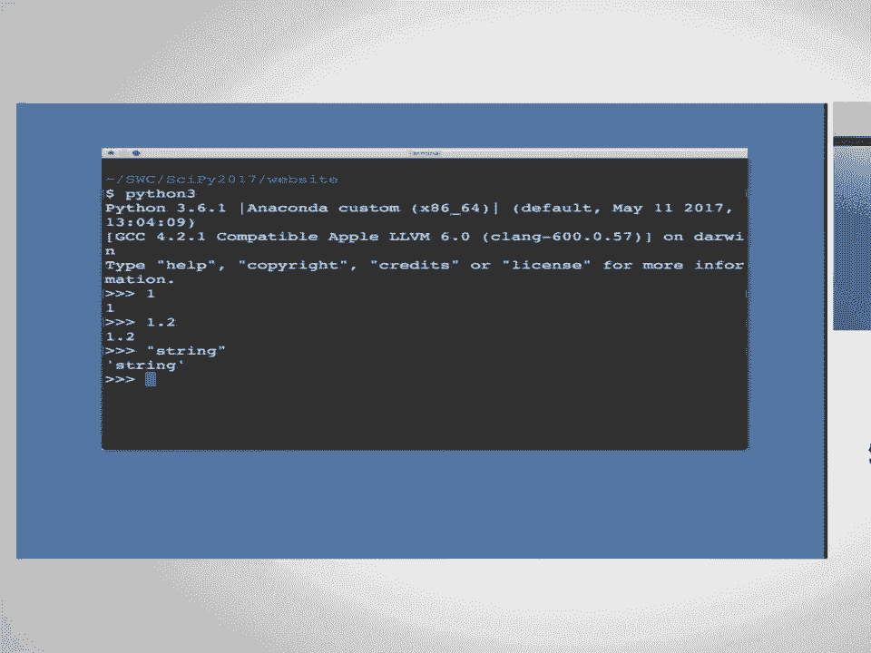

 start anaconda navigator on a Mac。

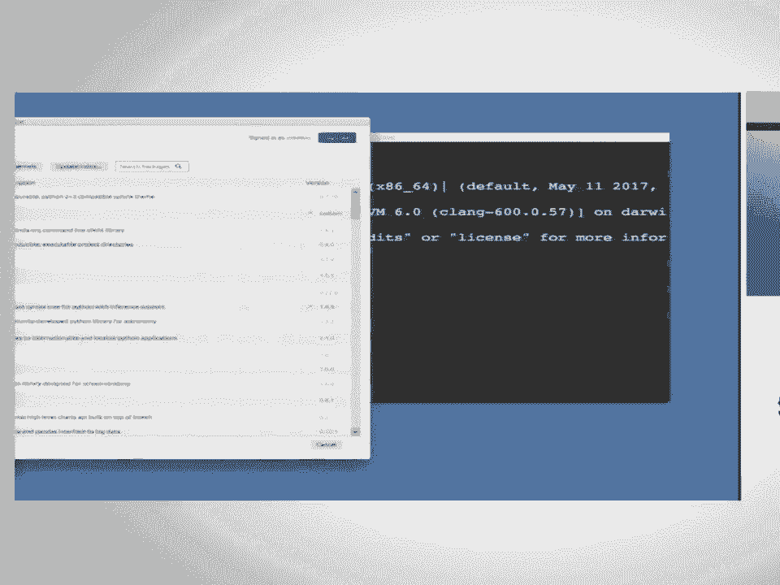

 It looks like that。

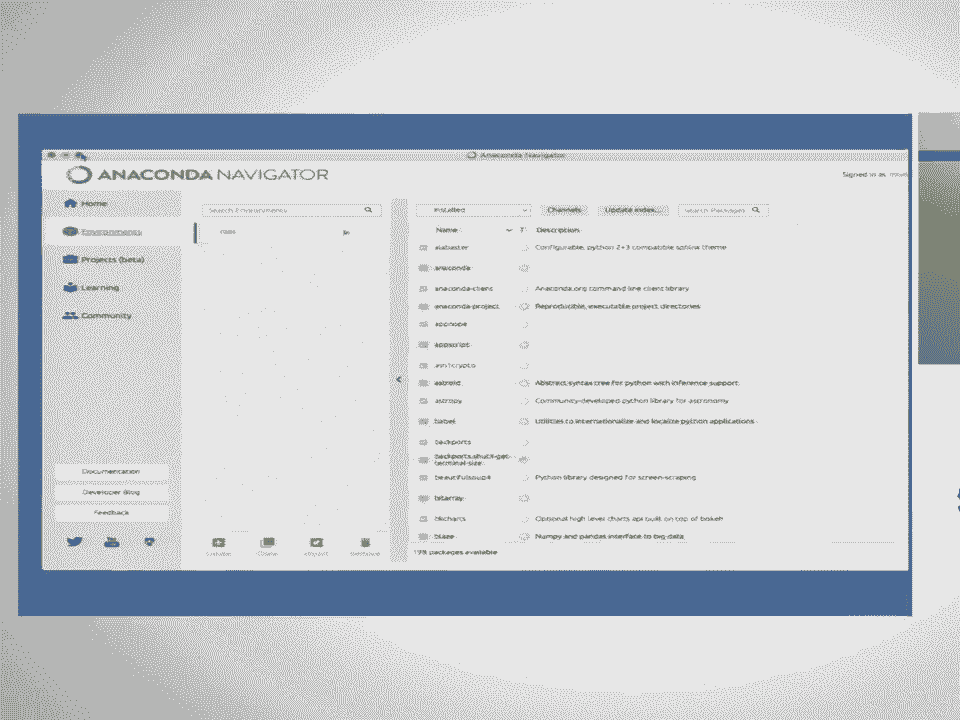

 There go to home and launch a Jupyter notebook。 So I wanted to delay this part because this is the other way to work with Python code。

 But if you can't get terminal to work， that's what you will do。 So when you hit launch。

 what will happen is that in fact it will sort of do some processing。 And in a few seconds。

 you should see a window like that。 In this window， go to new。

 And you will probably don't have these many lines。 These are called kernels for Jupyter notebooks。

 Choose Python 3。 Okay。 So as soon as you hit Python 3， you find yourself in a Jupyter notebook。

 So Jupyter notebook is different from Python interpreter in a way that it takes Python commands。

 sends them to Python， receives the result， and displays what I think it should display。

 But in order to send these commands to the Python interpreter。

 you have to press either Shift Enter or Control Enter。 For example， one， if I just press Enter。

 I will go to the new one to the next line。 But if I press Backspace and execute Shift Enter。

 it will execute Python code and then create a new cell。 So these gray lines， they are called cells。

 There are arguments for Jupyter notebooks and against Jupyter notebooks。

 I don't feel strongly about either way。 We will use Jupyter notebooks later。

 But you can choose what you use。 You can use Python interpreter just as well。 Okay。 So。

 but I want to actually start to continue with a terminal。

 Okay。 So far we typed our first integer floating point number and string。

 Strings can have white spaces and we don't have to use double quotes。

 We can use single quotes and string space。 And you can see that it takes this string and it prints it back to us。

 What else do we want to have？ Bullions， right？ So true or false？

 Something is true or something is false。 Now in Python it's just that true， capital true。

 capital T and false。 So these are like basic objects。 I forgot about complex numbers。

 One plus two J is a complex number。 If you type that it will add parentheses to indicate that this is a complex number。

 Well， this is great。 But there is no practical， anything practical in that。 So what we want to do。

 of course， is we want to assign these values to variables。 We'll have a break in 10 minutes。

 How do I assign variables？ Like in a straightforward way， A equals one。 That's variable。

 How do I check that this variable actually was assigned？ I can just type A and what it will do。

 what Python will do， it will substitute A with one。

 And we already saw what happens when we execute it。 One， we saw one。 That works。 Stay forward。

 Just some way we can do 2。3， B equals 2。3， and it works。 Now， of course。

 we can execute B and A to see the value， but we want to be able to actually， say Python。

 I want to have a look at the value of this variable。

 And Python has a special built-in function called print。 Print A。 So print A， parentheses。

 parentheses， prints us the value of variable。 And again。

 important note that this is the difference between Python 2 and Python 3。 So in Python 2。

 you would have to write print space A。 And my understanding is that one of the reasons they changed it in Python 3 was because all。

 functions， all other functions in Python 3， they have parentheses。

 This is like an indication that this object is a function。 That might be important for some people。

 I don't think you would have any difficulties remembering that， but there's probably some。

 practical sense。 Okay。 So now let's actually move on to a Jupyter notebook。

 To exit from the Python interpreter， you would have to execute a function called exit。

 But because this is a function， you have to add parentheses。 So when you execute， exit。

 it will exit。 There is other way to exit， and I will mention that。 Python 3。

 I will launch it once again。 The other way to exit is to press control D。

 And you see that on the screen。 Control D exits from the interpreter。 Okay。

 So let's navigate to the Python directory。 CD space Python。 There you will find， well， you will。

 let me use this command instead。 Give the last files， command you don't have to remember。

 I just want to show the files that actually exist in this repository that you should see。

 And the first file is 00-python-intro。 So I want you to start this file。

 Type Jupyter space notebook。 Space 00 and so on。 Okay。

 Those of you on Windows and who had problems with starting Python 3 from the command line。

 Use an account navigator to start a notebook。 Let me show how to do that。

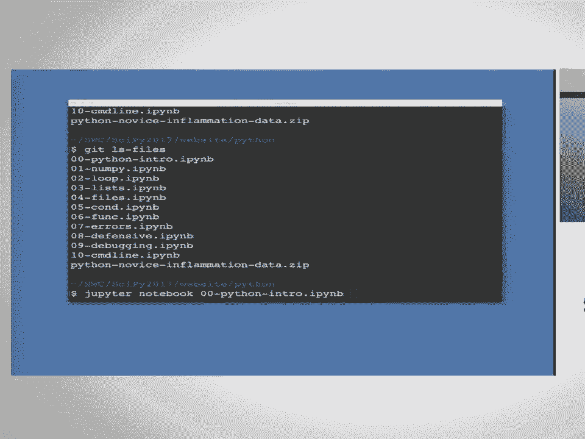

 So once you have a notebook running， go to open and then navigate to the folder with the notebook。

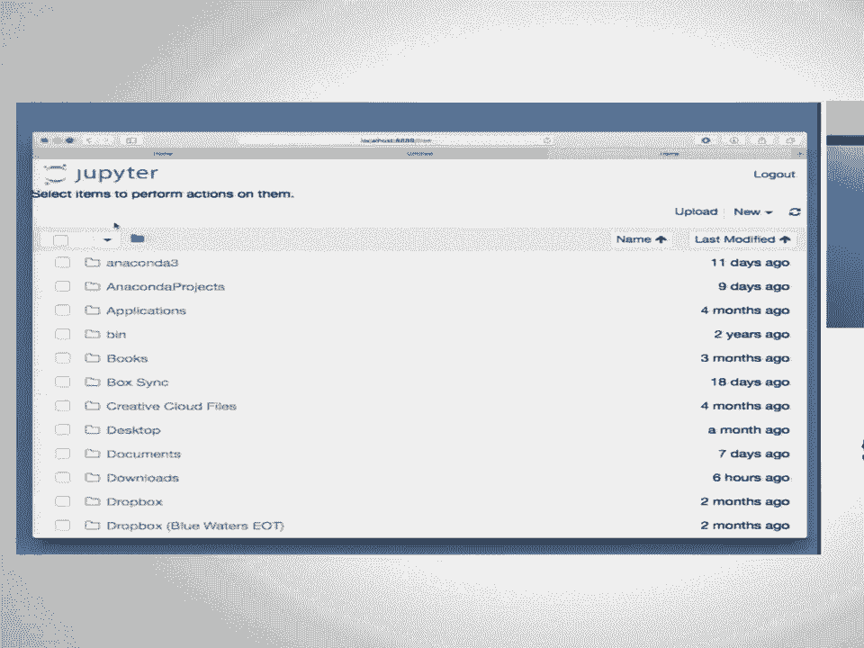

 Make sure to fit。

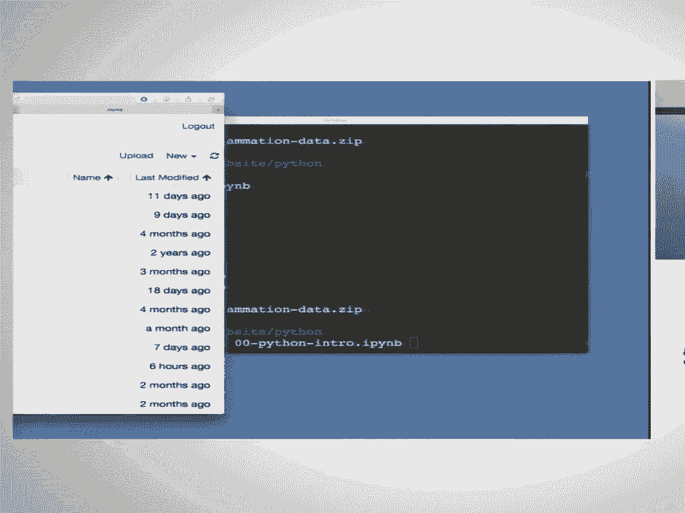

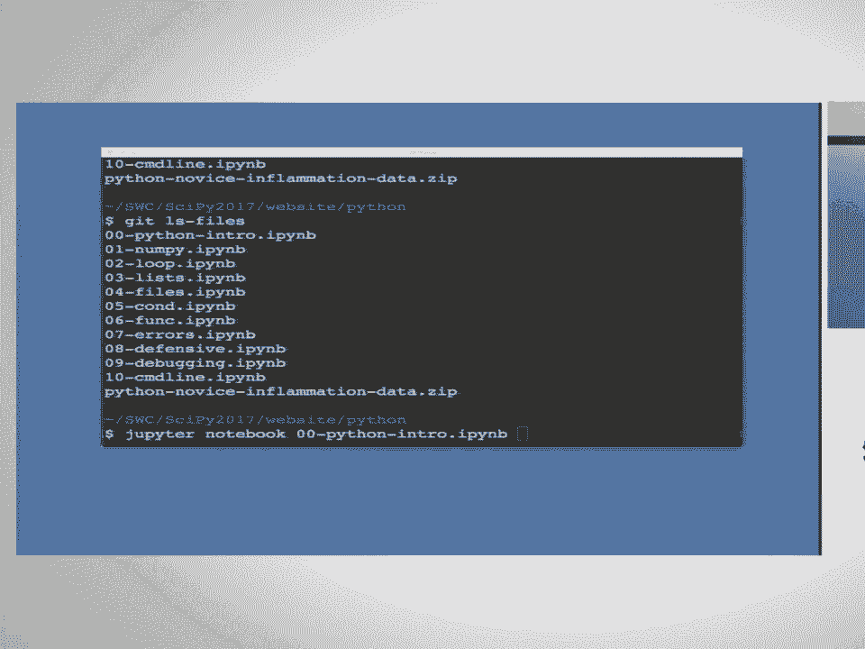

 So at the top you should see file in a running notebook。 And then open。 Let's see。

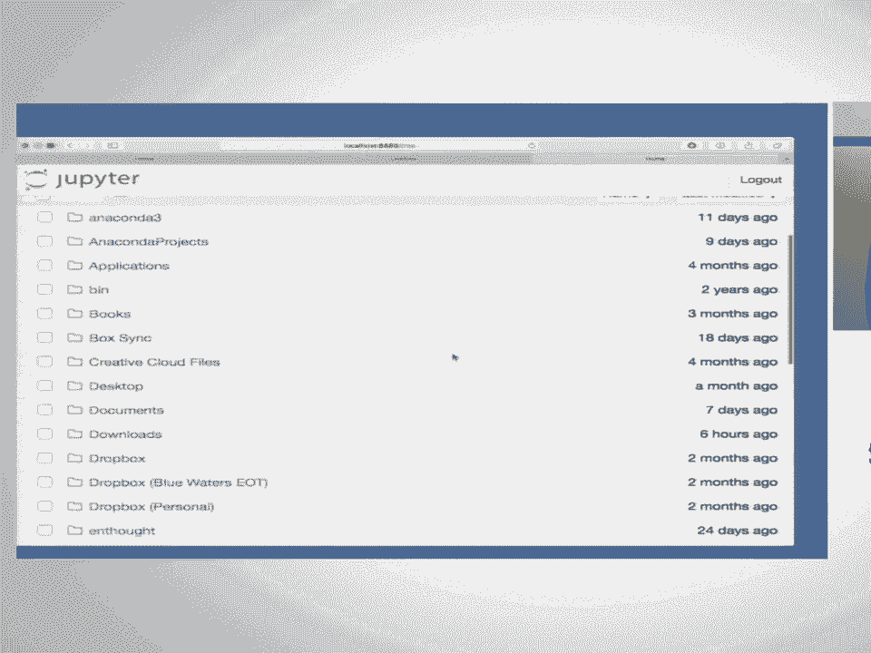

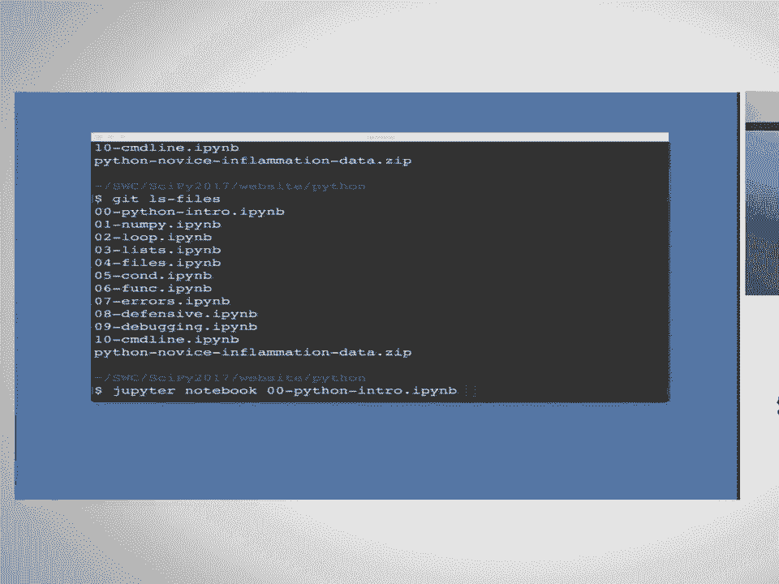

 So here， so my directory is called website。 Well， no， yours would be 2017-07。

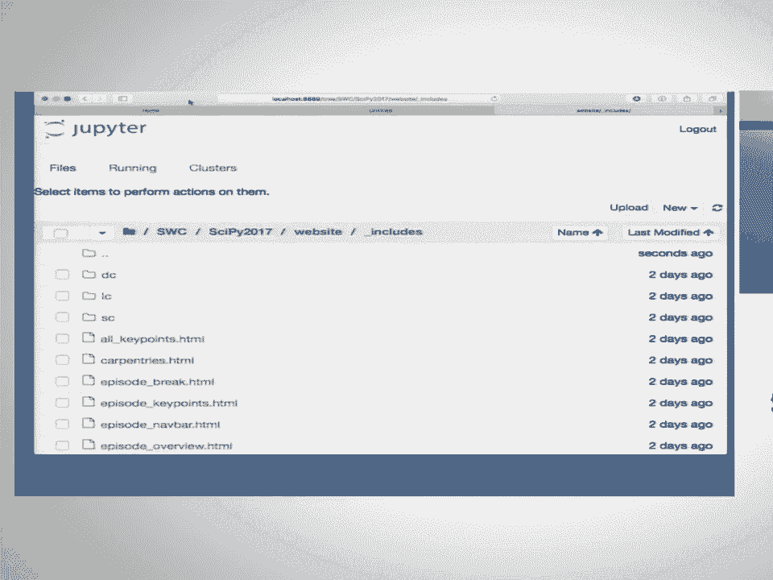

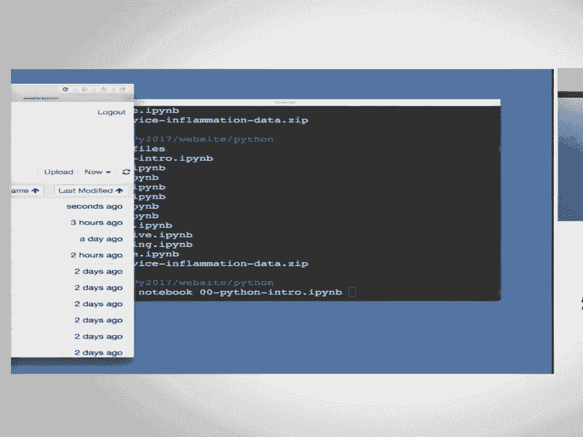

 So I called it website for。 You should see address 2017-07-10-asipy/python。

 So when I clone this repository。 So website has 2017-07-10-asipy。 So instead of website。

 we should navigate people to 2017-07。 Yes， that's my website folder。 Let's have a short break。

 We'll start with Python lesson。 Maybe 15 minutes。

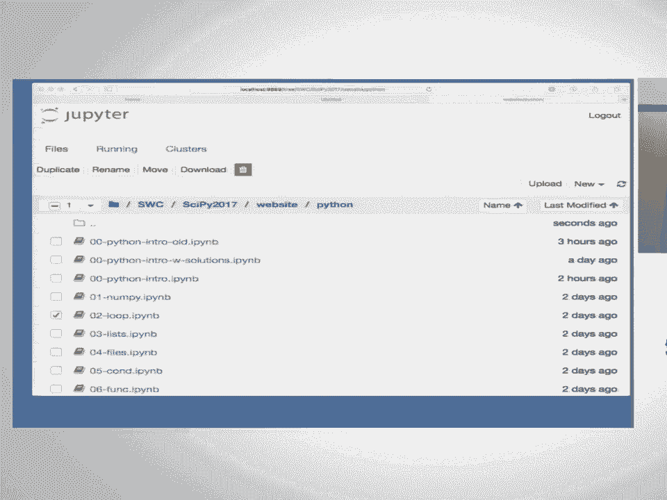

 But the first few lines that you see in this notebook actually repeat what I showed you in a Python interpreter。

 First of all， what is a Jupyter notebook？ As you can see。

 this is a web browser based access to Python。 It makes us two things。

 One is markdown and the other one is Python。 So you can double click on any cell here to see the code that is behind this cell。

 And if this is a markdown， you will see it sort of turn blue。

 And you can execute this cell using control enter or shift enter。

 You can execute any cell in this notebook， even a markdown cell。

 So markdown or this is a markup language similar to HTML。 Okay， so for example。

 here we start with things。 And the reason we start with things。

 these are the basic elements of any programming language。

 And the first thing is an integer we can execute it if I press shift enter。

 And I wonder why you don't see that on the screen。 Just a second。 Change this size a little bit。

 So you can execute any cell as many times as you want。 Okay。

 but I'm pressing shift enter to execute these cells。 Now again。

 a floating point number and we see output 2。0。 So when you see in that means your input。

 when you see out， that's what Python outputs back。 Then there is a string。

 a complex number and a Boolean。 Now we talked about the print function。

 And let's actually see how it prints things。 So it prints things in order 2。3。0。 Hello， false。

 Now this is great， but we want to write some programs， some functions in the future ourselves。

 So we need to create variables。 And the first thing you will use is equal size。

 So using equal size you can create variables。 Now when you execute this you don't see anything。

 And the reason is that there is nothing to output。 Everything has been assigned。

 You can still print the values of the variables that you assigned。

 And note that capitalization is important。 And I should capitalize C here。

 So you see there is a difference between lowercase C and uppercase C。

 Now it's important to note that I can type G equals， for example false。

 And it will still assign it just fine。 So I have to execute that。 And then print D。

 So spaces here around the equal sign are not important。 But capitalization is important。

 Now we know that these A， B， C and so on are integers， strain and Boolean and so on。

 the complex number。 But we want to have a sort of a way to print it to see it for ourselves。

 And there is a function called type。 Now when we execute this cell we will see class int class str class bool class complex。

 And this is where I think Python could improve because we are using command called type。

 What we see as a result class。 But this is something to note just。 Anyways。

 so we can see the types using the print function and type function。 So these lines。

 they show how we can use function on top of another function。 Now。

 print is a function that actually accepts multiple inputs。

 So you can print several things at the same time。 And this is an example。

 So pay attention that here， print function adds space between the objects。 Now。

 there is a nice feature of a Jupyter notebook that you can get help on any objects quickly。

 And what I want you to type now is press ctrl M and then B。

 So this way you will create an empty cell below your current cell。 Type print。

 question mark and shift enter。 And you will see a very nice help that comes with this print function。

 And note that there is a parameter called step stands for separator and it equals to space。

 This is exactly why print function adds a space。 So you can control this in the future。 Okay。

 And it actually also tells you that， okay， by default it would print to standard output。

 If you are familiar with shell nomenclature， that's STD is nothing else but standard。

 And out output。 Okay。 By the way， the same help message you can get in Python interpreter if you use a help function。

 And you basically see absolutely the same。 So that's the convenience of Jupyter notebook or iPython notebook that you can get help with a simple question mark。

 Now let's take a quick quiz。 A very simple one。 In the beginning I thought that's like not important quiz but then actually it is important。

 So when we set a variable we say that， okay， this value equals to one。 So a equals to one。 Now。

 but what if we set b equal to a and then change a？ What do you think will happen to be？

 Will it change value or will it keep the same value？ Correct。

 And the reason it's actually it will keep the same value is because this is a very basic type。

 So when we assign basic object to basic object it copies。 Okay， good。 Let's move further。

 Now using an operator。 So our equal sign was the first actually operator。

 And you can see here examples of how you can use it。 A equals two， B equals three。

 C equals four without spaces。 It will work just fine。 Capital C equals five。

 Capitalization is important。 But you can also do summation。 You can do subtraction， multiplication。

 This is exponent division。 Now when we talk about division we should again talk about Python two and Python three。

 Because in Python two simple division would mean integer division。 In Python three。

 integer division you have to use two backslashes。 So let's see。

 And let's pay attention to the last two lines right now because they are the most important ones。

 So this is a， we are using Python three。 So we are getting 0。666666 here。

 In Python two you would get zero。 And this is important because you can get undefined behavior if you're very low。

 if you're， code relies on division of two numbers。

 And it actually also suggests a very simple way to test for which version of Python you， are using。

 Just divide two integers， one， for example one by two。 And if you get zero， this is Python two。

 Okay， so strings， you can add two strings。 When you add two strings they are combined。

 You can multiply a string by an integer。 When you multiply a string by an integer it's repeated。

 You cannot divide a string by an integer and you cannot multiply a string by a floating。

 point number。 And this is an example of these two operations。

 Now if we try and execute like the first command division we will get a type error。

 And the same for the other command too。 Now， Booleans。

 when we compare two numbers and unlike in Bash this greater sign means comparison。

 and we can get the result true or false。 So one greater than three？ No， false。 Three equals three。

 yes。 And note that we used double equals signs。 Try for yourself what happens if you use a single sign。

 Oops， I will do that here。 That's an error。 What does it mean？ What does it mean？

 It means that you cannot assign three to any other value。

 You cannot change the value of three because that would mean exactly that you are trying。

 to change the value of three。 Even if you are trying to assign it to exactly the same value。

 So this type is immutable。 You cannot change its value。

 These are in fact another example of immutable type。 And we will talk about later。 Okay。

 so just a brief example。 Again， we can assign the value of comparison to a variable。

 A equals one greater than three which will be false。 B equals three equals three。 That will be true。

 Now we can do a comparison and some operations with Boolean operators like or and is not is。

 And this is a convenience of Python that it literally says is not or is be。

 So is be so is false and we get that is not be。 This is true。

 Now functions and we are going over all the basics and we will use it later。

 So I just want to introduce it to the basic concepts first and then we will talk actually。

 about everything once again。 So functions。 So I added parentheses here to denote that all functions in Python。

 Whatever you see parentheses after name that means this is a function。

 For example print is a function type is a function and you can get a help on the ease。

 If you type for example well we already did it for print。

 Let's do the same for up wedding that later。 So round question mark we get round the number to a given precision in the decimal digits。

 And you can see that there is an optional parameter。

 How do I know that this is an optional parameter square brackets。

 That means that I can admit this number。 And it also means that it has a default value。 Okay。

 Now functions。 So functions have parentheses。 Now I mentioned that there are like strings and strings。

 Every string is an example of an object that has special methods associated with this object。

 Methods the way to invoke methods is you type object like a and then put dot after that。

 And then the name of the method。 For example if we assign a to hello world and let's execute this so we see that a is。

 string and b is integer。 So we can use method capitalize on top of a on top of string and we would capitalize。

 the first letter。 So capitalize capitalizes the first letter。

 And we can replace a letter L with capital X。 And you see all we had to do we just literally。

 set that to replace L X。 So it's straightforward to read。 It's not complicated。

 Now if we try to use capitalize on top of b which is integer it would say that attribute， error。

 It doesn't have such an attribute。 It doesn't have such a method。

 Once again because we are using Jupyter notebooks we can actually avoid such a trouble。

 Just creating new cell control MB。 And what we can do let's type b dot b dot and hit tab。

 So Jupyter notebooks provides you with a list of possible completions list of methods that。

 are associated with this variable。 For example b is integer。 So there is a conjugate。

 there is real numerator and so on。 But if we hit a dot and hit tab we will see capitalize， center。

 count and code， find。 Let's actually see what count does。

 So count counts the number of letters that you specify in this string。

 By the way there is a way to actually find out what each method does。

 You can just remove parentheses and do help a dot count。 And it will tell you what this method does。

 So let's move on。 This is great。 This is very basic stuff。

 Now the most important thing that is Python is famous for， I guess， basic Python at least。

 is collection of things。 So lists and other elements that we will talk in a few seconds。

 So lists is the most basic container that contains several objects， simple objects。

 But not necessarily actually simple。 So here is an example of a list of strings。 So you use。

 you say a equals that square brackets， then element one， comma， element two， comma， element three。

 comma。 It is important that you use square brackets。 That how you can tell that this is a list。

 You can see that we printed a value of this list and then we printed a type， type A， type， of A。

 it says list。 We can access the elements of the list and the index。

 So every list sort of puts each value in accordance with a sort of index。

 And the first index is zero。 Those of you who program in Fortran will probably have to switch to that。

 Okay， the next thing is that you can access elements of the list from the end。 So minus one。

 minus first element means the last element。 Second to last is negative two and so on。

 This is an example how to print every element of the list。

 And parenthesis a equals comma a and how to get the first two， for example。 Now you would say， okay。

 so zero， one， two should print us three elements。 But in Python， the last element is not included。

 So two is not inclusive。 That's because the indexing starts at zero。 And basically。

 if you see a number here， that means how many elements it will get。

 And it works only because this is a zero based indexing。 Okay， so。

 and this is an example how you can get a slice of a part of the list by specifying。

 the first element that you want and the last element that you want。

 But you can omit the first element。 For example， you want to say you want all the elements up to the element number two。

 which， would be zero， one， so。 Or you can skip the first two elements。

 If you don't specify anything here， that would mean that you want the entire list。 And again。

 negative one is the last element。 So that would be the same as specifying that you don't want the last element。

 Because the last number here is thrown away from the output。 Now the list did not change。

 So A is still blue but a strawberry pineapple。 I should note that this。

 that list can contain any data。 They can have strings and integers and other lists and floating point numbers。

 anything。 So they can mix and match and they'll be happy with that。

 And you can see actually here immediately that this format is hard to like optimize to work。

 with if you care about speed。 Because every element can have a different size like in terms of bytes。

 So in order to do some operations on lists， you have to go over each and every element。

 and do the operation。 But we're not done yet with lists。 So we can extend lists。

 We can add elements to the list using a pant。 And you already know that this is a method。 So A。a。a。

 by using a。a。pant we would append banana to the list of our fruits。

 You can append another list as I said。 So it's nothing wrong with that。

 And you can sort of take elements out from the list。 And let's see what happens here。

 So we added banana。 This is the output here。 We append the list 1， 2。

 And then we use pop method to actually extract the last element。 Now what we did not use here。

 we did not use the assign traitor。 We can do that。

 Now what will happen now is I'm going to run this portion once again。 So I will again， once again。

 I will append banana。 So I should have two bananas in this list。

 Then I will append once again the list 1 and 2。 And then I will pop the last element and save it to a variable called b。

 So pop takes the last element and moves it from the list。 And if you assign it to anything。

 it will store it。 If we assign it to a variable e， in this case。 If you don't assign it。

 it will be lost。 So let's do that。 And as I said， our list now has two bananas。

 Of course I can do control mb to add a new cell and do a。pop。 Save to enter。

 And you see that when I pop the last element of the list， it is assigned to the output。

 But it's gone。 It is removed from the list。 Because I executed this cell twice。

 So when I executed the first time， I did a pen， I appended banana and then I appended， list 1 and 2。

 And then I did pop only once。 So I popped the last element that was appended。

 Now you can have a look at the let's create a new cell。

 And let's have a look at some other methods that exist。 So type a。A is a list and hit tab。

 And you see that there is a pen， clear copy， count and so on。 You can scroll。 Sort， reverse。

 There are a lot of methods already written for lists that you can use。 Okay。 Now。

 the same question that we had for simple integers。 So when we assign integers， values are copied。

 Now the naive question would be， well， the question is what if we do the same with lists。

 and the naive answer would be that the same happens that values are copied and so on。

 But it's not the case。 So list is not the most basic element because list is made of something。

 It's made of other elements， basic elements。 And because of that list are copied by sort of a pointer。

 So when we assign B list equals to A list， we do not actually copy the entire list to， the B list。

 But we do， we copy a pointer to that list。 So you can think of a pointer as a man with a hand pointing at someone。

 So list is actually just that。 So A list is a man standing like that。

 When you do B list equals A list， what you do， you create yet another man that points。

 at that man or a woman。 And then when you change that list， that A of A list of zero， so zero。

 the first element， of A list equals to 42， you actually change the B list as well。

 And this is what you can see here。 So I'll put here B list。 Yes？ There is a copy method。

 And that's why I mentioned here。 Well that's not why but you could see it here。 So yes。

 A should be a list。 Just second， let me see。 Okay， A equals two。 Oh， yes， sorry。

 Let's execute it here。 Let me。 That's a bad programming practice。 Work and you teach it。 Okay。

 so there is a method called copy。 Now if I type copy， please add a question mark。 It will say that。

 shall copy of L， but let's try that。 And this copy。 Oh， sorry。 So that's a shallow copy。

 The right way， I guess， is to use copy function。 So， so Dd is to delete a cell。 Notice A。 So yeah。

 a shallow copy is that side。 I'm not sure what I did wrong in my first attempt to do that。 Okay。

 but what there is a other tool called Pandas and there you should be careful about。

 the actual copy that they see that they say deep copy of a shallow copy。 Okay。

 but now let's move forward。 Okay， so you could see here that I can assign lists elements to some other values。

 I can change the lists。 There are lists that are not that you cannot change sort of immutable lists and they are。

 tuples。 The most important difference is that of course you cannot change them once you assign them。

 So you cannot append elements to tuples。 For example， if you create a tuple like that， x。

 y equals parenthesis 23，45。 You can print the first element。

 but you cannot assign it to anything else。 And you get the type error because you are because the problem is that you are trying。

 to assign element of the wrong type。 So that's why it says it's a type error。

 You cannot assign tuples to anything else。 Okay。 And the last element dictionaries。

 So dictionaries are very convenient and important。 The convenience is that in tuples and lists。

 we can reference two elements by their element， numbers 0， 1， 2， 3， 4。

 That's not always like what we want to do。 First we want to say that height of a person equals that or height of something else is。

 that length of something equals that。 So in this case you can use dictionaries。 So dictionaries。

 they use curly braces and the way it works is that you have a string， colon value。

 Well it actually doesn't have to be a string。 You can use something else and we will show you that in a second。

 But what it means here is that inches and feet are associated with value 12。

 And inches and meter are associated with value 39。 So let's execute that。

 And this is how you reference how you use dictionaries here。 So instead of 0， 1， 2， 3， you use that。

 Let me show you here for example another example of a dictionary。 A dict equals 1， 1， 2。

 and print a dict of 1。 So you can use whatever you want but it has to be useful for you。

 So the last few things， of course， yes I forgot。 So this is how you can add actually elements to dictionaries。

 You don't have to use any append method， you can just specify a new key。

 So these are called keys and these are values。 So these are key value pairs。

 And if you specify a new key you effectively add a new element to your dictionary。

 If this key does not exist， Python will warn you and will tell you that there is a key error。

 That's why this is a key。 Now finally the most important piece is functions。 So functions。

 they are so important that this is actually the reason why software carpentry， teaches Python。

 So if you listen to Greg Wilson's talk you will see that he actually says this explicitly。

 We are not teaching you Python here。 The goal is to teach you write code in small pieces functions。

 These functions can be reused later by you， by someone else。 This is actually an example of。

 so Python's are the basis for modules that are written， by people。

 This is an example of how a function can be written。

 So you type def space and then the name of the function。

 Then you use parentheses and arguments for that function。 So sort of parameters， input parameters。

 You add colon and new line and after that you add some spaces。 This is very important。

 So Python does not have any curly basis like a C or do done like in bash。

 So it uses intonation to show that this part of the code is actually under the other part。

 So whatever you do here and whatever is intended by the same number of spaces will be part。

 of that function。 For example， well return of course is the last thing that the function can do。

 It's because it will return a value。 Here you can do print X， print Y times two。

 And that will be a function。 So if I press shift enter the function was sort of red but was not executed。

 Now I can use it。 And this is what you get。 So type of multiply is function。

 And when we executed multiply four and three， first of all our function did these two statements。

 print X and print Y times two。 But it also returned the value 12。

 And because we use print function here。 So this print printed us 12。

 So to me enough you can add some text here。 And it will not do a thing to this function。

 The reason is that， let's execute it。 Nothing happens。

 And the reason is that this string is not returned。 It doesn't do anything with it。

 So if you execute the same code once again， you have this string in this function but it's。

 not used。 So I didn't mention in the beginning but there are three ways to actually have strings in。

 Python。 You can use double quotes。 You can use single quotes。

 And you can use the so-called triple quotes。 So when you use a triple quote。

 and let me show you an example。 String for example， long string equals long， long， long string。

 And print on string。 So triple quotes are used to basically write text。

 And when you see those in functions inside of a function， these are called doc strings。

 Now why are they called doc strings？ Let's see。 Let's execute this piece of code。

 So here we are defining a function， say hello， that takes two arguments， time and people。

 and returns a value。 Let's do help。 Say hello。 You see this text？

 This is exactly the same text that is written here。

 And this is how Python gets automatic documentation。 So you just type text inside of your function。

 And you can then reuse it。 Well that's a Python。 That's a Jupyter， sorry notebook。

 And when you type a quote， it actually types two。 So I did just once trust shift。

 So the same for single quotes。 Okay， so these are these beasts are called doc strings。

 Now we can use this function。 It will work just fine。 Okay。

 now how many things do you actually have to remember？ That's a good question。

 And let's have a look at our Python terminal。

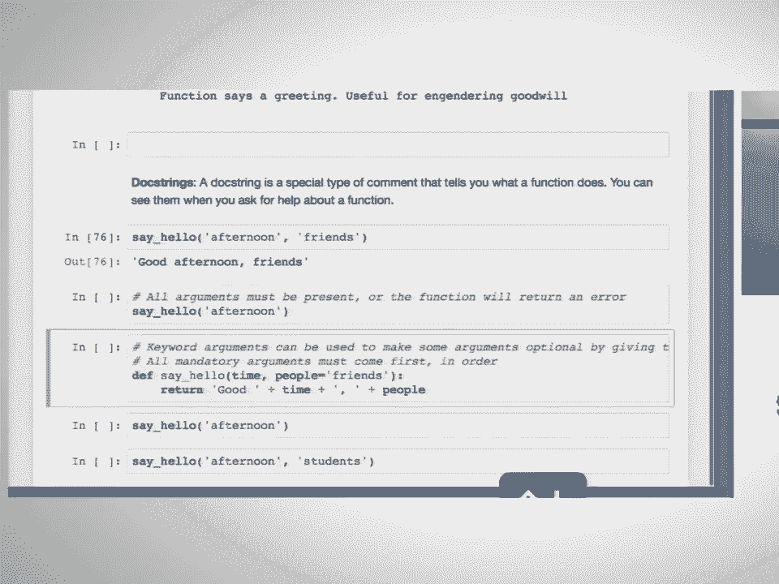

 That will show you here。

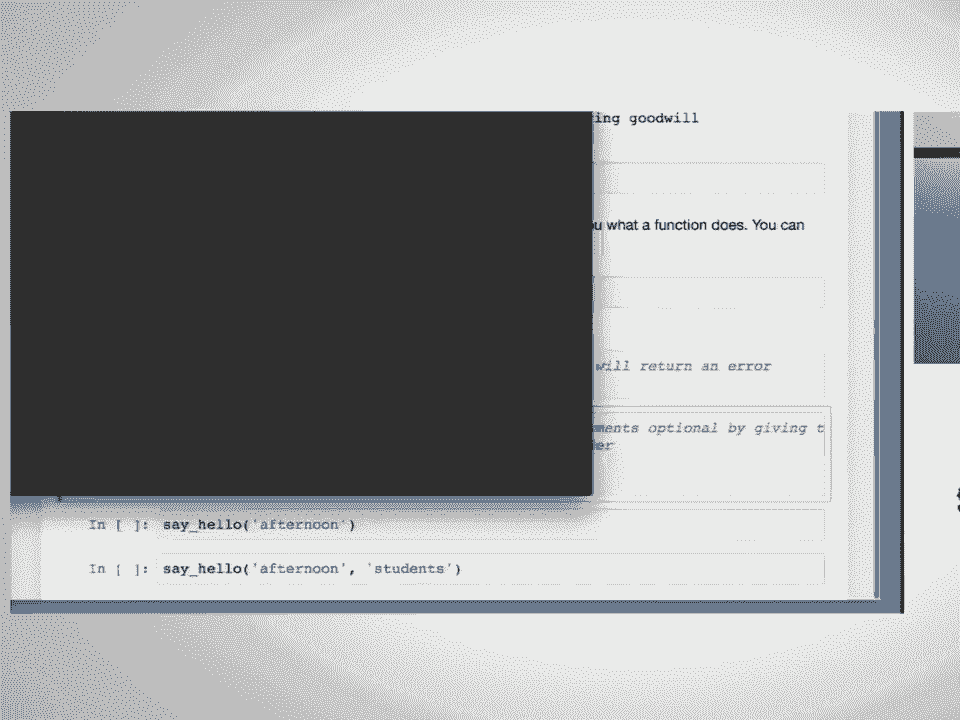

 So Python three。 So help is a function。 So you have to use this here。

 Now we are inside of a Python help module。 You can type anything you want。

 But it actually tells you what you can type。 For example keywords。 If you type keywords。

 it will tell you all the keywords that you can ultimately want， to learn。 And there aren't so many。

 There are 42 I believe。 So everything will be covered if you know all of these。

 And you can probably recognize a lot of them already。 And we will talk about most of them。

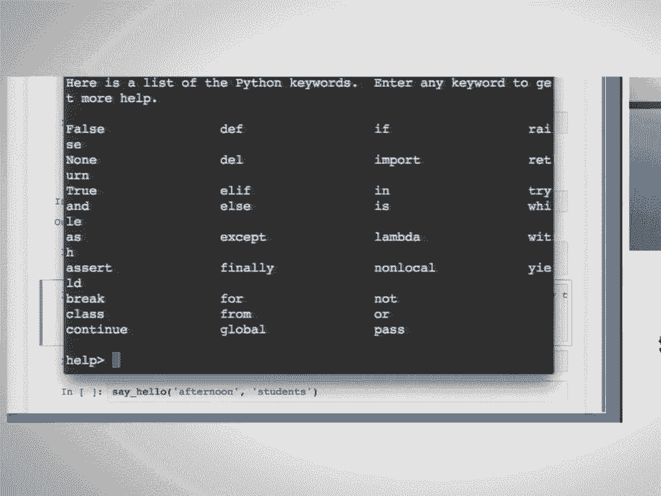

 Okay， so we are done with this basic introduction。

 So this is an introduction to class to objects that exist in Python。

 And it is important that you know this because if you plan to work with data， you can figure。

 out what you want， what kind of data you can store and what would be the most efficient， way。

 Now software carpentry lesson is actually sort of a work through a certain procedure that。

 a typical researcher does。 And the Python lesson describes the process of analyzing patient data。

 If you go to。 So， if you go to the website of our tutorial and click on reference here。

 And then episodes。 The first episode is analyzing patient data。

 So this is the basically the tutorial that we will be going through today。

 And hopefully we will go through a majority of that tutorial。

 Although I expect that we will not finish it completely。

 And you'll have basically something to do at home and test what you learned today。

 But it actually starts very in a way that we already discussed。

 So basically what we can do we can assign some value to a variable。 For example。

 weight in kilograms equals 55。 So what you can do you can actually start yet another notebook open anaconda navigator。

 and just click launch once again。 And once you've done that click on new。

 And now you'll be able to go through this tutorial and using this I Python Jupter notebook。

 The benefit of using that is that you can save this notebook here。

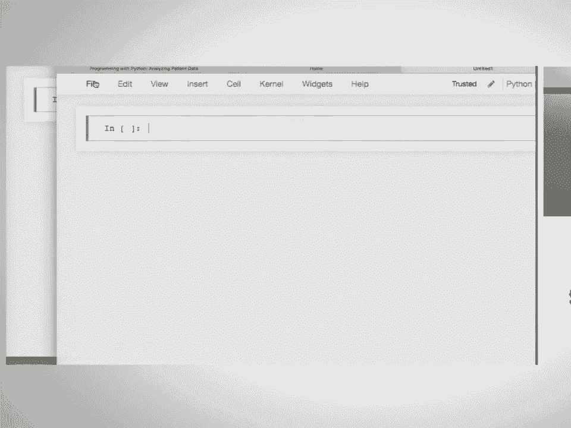

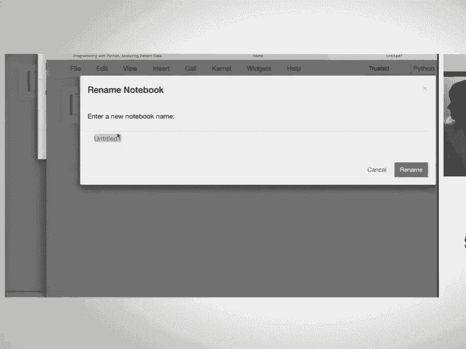

 Because we haven't typed anything yet。 So we should be able to save and checkpoint。

 So but basically we will be following this tutorial。

 And if you feel that we are going too slow or too fast。

 Well definitely not too fast because I'm trying to be as slow as possible as it's acceptable。

 And we'll be able to speed up in the end actually。 Okay。

 so you can do that or in our Python folder there is a file called 01。

 So file 01 - numpy ipython notebook。

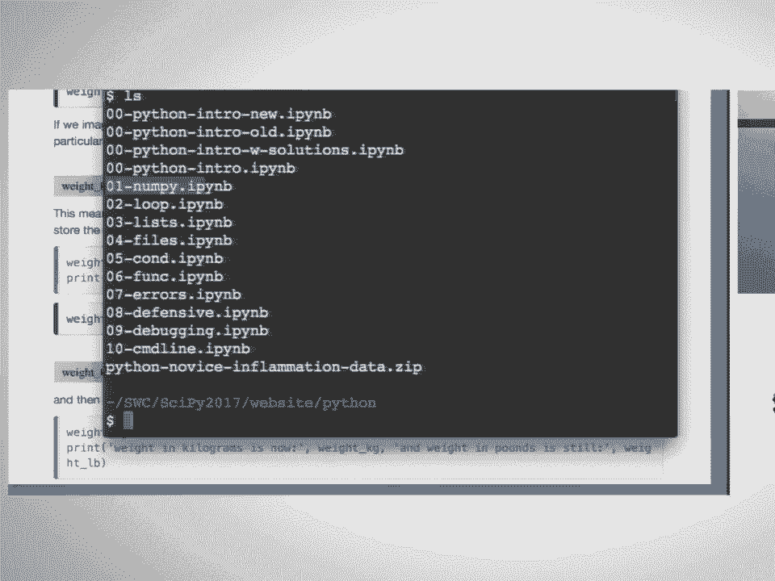

 Again， you can start it using Jupter notebook and then the file name。

 So first thing that we will do here is that we will import a NumPy library。

 And I know that we have not talked about how you can actually write this like write a library。

 but it's straightforward and we will actually I will show you how we can do that a little。

 bit later。 But NumPy library is one of the most popular ones and I'm pretty sure you heard about。

 it。 So let's do that。 And when we load this library we basically load all the methods that this library has。

 One of the methods is called loadtxt。 So they decided to use load as a full word but then savetxt text。

 So loadtxt loads you text files。 Where does it load into memory？

 Then so the arguments that you have to specify are F name， file name equals then the name。

 of the file and then delimiter equals comma。 So this is a comma separated value file that we will be working with and you can see it。

 by the extension CSV。 And this is how you can use NumPy method to load data from the file。

 Now if you notice here that I'm not assigning it to anything here。 Oops。

 Oh that's because the files are in different directory。 Okay so we need to。

 We need to extract this file Python information from the zip archive and the way to do it is。

 to use unzip。 Okay so now we should have it。

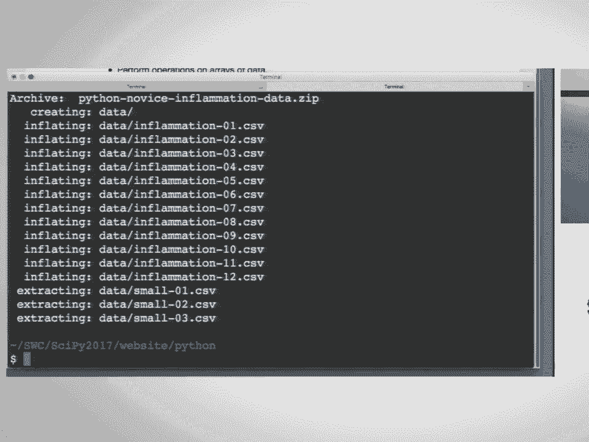

 Yes。 So as soon as we got this file in the right place and we executed NumPy。loadtxt is sort。

 of it spit out the content of that file。 And because we didn't assign it to anything we effectively will lost all this information。

 So the right way to do that is to assign it。 For example values equal。

 So the files that we will be working with in this tutorial are information data on patients。

 So these files are commissiparated value files。 Each row represents data information data for patients。

 There are X patients and Y days。 Okay so we will skip these lines where we assign and print everything else because we。

 already know all of that。 Once again NumPy。loadtxt。

 So this is the even if you don't use NumPy in a way it was designed to be used you can。

 use it's load。loadtxt method。 If you now execute data just to see what's there you will see exactly the same output。

 as we saw before。 But there is a difference is that if we execute type if we want to check the type of the data。

 it says that this is NumPy in DRA and in D stands for and dimensional array。

 So it can have any number of dimensions it doesn't have to be a two dimensional or three。

 dimensional it can have as many dimensions as you want。

 But in this case we have only patients and days so this is a two dimensional array。

 If you remember we mentioned methods。 So in this case and methods they have parentheses。

 For example they dot name of the method and parentheses that would be a method。

 Now shape is an attribute。 Shape is a basically sort of a tuple associated with that and you see tuple here because of。

 these are not square brackets regular parentheses。

 Now we have 60 rows and 40 columns it means that we have 60 patients and 40 days。

 You can get a particular element of the NumPy array by using this notation square brackets。

 once again we always use square brackets if we are dealing with lists tuples or dictionaries。

 when we want to get the value of those elements。 So this is not exactly the middle value in data because there are a zero member 60 elements。

 and we start counting with zero。 So the honest number should be here 29 and 19 of course。

 These are 31st row and 21st column。 In NumPy。 Not in this form。

 So the first thing that comes to my mind is pandas。 Like in pandas you have that。

 So the idea behind NumPy and arrays is that you have homogeneous data all integers all。

 flows floating point numbers in a compact array and you can perform various operations。

 on them very fast。 That's why this is a new type。 So this is a new type similar to integers and DRA。

 Okay。 Again counting starts with zero and the first element here is this one。

 So it's in the upper left corner。 So it's not in the lower left corner。

 In case you use that up and down a manager to sort of understand how things are working。

 Okay and another thing about NumPy arrays is that you can get parts of these arrays。

 You can get sort of bits and pieces or slices of these arrays。

 And the way to do that is to specify the beginning and the end that you are interested， in。

 So here what we are saying is that we want the first four patients and the first ten， days。

 So data that corresponds to that。 So the first and as you can see we get four rows and ten columns。

 No because there are ten columns。 So starting with zero。 One， two， three， four， five， six， seven。

 eight， nine， ten。 So if I counted them but in fact they were zero index zero， index one。

 index two and so， on index nine。 So it doesn't change here and it actually never changes。

 You can get something else of course and again you can skip， you can do that。 That will work。 Yes。

 this is yet another example that you can omit the first element。 It will default to zero。

 You can omit the last element。 It will default to negative one minus one， meaning the last element。

 It will work。 Now this is where it becomes important and interesting。

 Is that if you say double data equals data times two， what you get， well let me just， yes， okay。

 it shows you basically。 So what you get is actually every element of the array was multiplied and this is the。

 power of numpy and the arrays。 So all you did， all you had to do was say that data times two point zero equals double data。

 And you got a new array， new numpy array where all the elements are doubled。 And it might seem like。

 okay， nothing important。 But my personal experience says that if you use numpy array。

 if you use numpy arrays， your， code can be sped up by 10，000 times。

 So you can get enormous speeds up。 And you cannot predict by how much because it is so fast。

 It's fascinating， especially if you are working with data that can be put together in such。

 in the arrays。 Sometimes you work with data that cannot be put。 But if you can， that's amazing， yes。

 Yes， yes， that includes。 So when you skip something， for example。

 I guess this is not clear if you are asking， but for example， data would mean all elements of data。

 Data like that would also mean all elements。 Data zero column， zero column， the same。

 Data column minus one comma column minus one， the same。 Because the last element is negative one。

 Let's check the last statement。 The way we will check it is the following。 Oops。 This text。 Yes。

 so I was wrong because this is the last element。 So I was wrong。 I admit that。 Yes。

 and this is obvious because this is the last element。

 That means that it does not include this last element。 Yes， this is obvious。 So here。

 when you admit that， it does mean negative one， but it means that it goes to， the last element。

 Now you can， the data that is。 So let's， we'll talk about types。

 So that triple data is double data plus data。 And again。

 we can add these elements and you can see that the data is tripled。 The。

 now you can try that for yourself actually and let's do it together。 So let's create a list。 A， B。

 C， C。 And we'll say that B equals， now I'm pi dot array of A。 Now what can you do with that？

 It's a different question。 It's first printed。 Oh， yes， we printed it。 Oh， oh， oh。

 I'm not sure what you can do with that。 But you can create this array。

 But what kind of operations you want to perform with that？ It's a different question。

 And one of the other reasons I don't know what you can do with that because I don't use， it myself。

 All of that comes from a lot of that comes from personal experience， how you use that。

 I use an empire arrays for， mostly for data that has to be in floating point format。 Yes， yes。

 but it depends on what you want to do with strings。

 I'm not really sure why you would want to store them in a non-pyr array。

 So when you think about non-pi， it's numerical。 So it has to be， it has to have some numbers。

 But I will be honest， I have not used that。 I don't know what to do with the session empire array。

 Now one of the things you can do with the standard non-pi array is that you can calculate。

 some numbers， some values。 For example， to get a mean value。

 you can just say mean and this is a mean method once again。

 In the same way you can use max mean STD stands for standard deviation。 And again， as I said。

 each show means patient， so data for the patient。 So if you say that data and put zero as the first index here and don't specify a range。

 you get all the data for patient zero。 And then the maximum information。

 however we measured that is 18。 Okay， so but if we skip the first two days。

 day zero and day one and start with day two， the maximum information is 19。 Apologies。

 this is the third patient。 I did not see。 So this is the basically the third patient here because patients start with zero。

 one， two and that is not correct。 Patient three。 Okay， access。 So yes。

 this part might be a little bit confusing， but it's in fact it's not。

 So you can specify which direction you want to complete a certain quantity sort of along。

 For example， mean value， you can compute mean value across all。 Well， let's let me put it this way。

 This equal zero means this first value and the first value is the number of rows that。

 we had and each row is basically data for patient。

 So access zero means that we are going down along all the patients。 Now if you get the shape。

 you will get that we have 40 elements， 40 days。 But we remember we have 60 patients。 Now if we flip。

 if we do mean value across the axis equals one， which is the second axis。

 and the second axis as we remember is days。 So we will get mean value across the across the day。

 all the days。 Yes。 Yes， this is a two D because we have。 Patients and days。 Yes， easily。

 Let's let's show a 3D array then。 Control M B。 So the way to do that would be A equals first。

 Let's write。 I don't want to show that。 One， two， three， four， three， five， six， nine， eight。

 So this is the first column of our 3D array。 And so on and so on and so on。

 So you see how like if you want to type it manually， that how you would do that。 So here。

 So 3D array， you would have three rows， three columns and then three something else。

 But there is a more convenient way to do that and I will show you that。 So it's 11。0 and we have。

 Yeah， we'll make it。 Okay， so Matt plotlib。 So Matt plotlib is a popular library for plotting things。

 And when I say library， it means that this is a collection of functions of utilities that。

 you can use。 And just like with the NumPy that has a bunch of methods， map。

 So that is a number of functions that are designed to plot things。

 So this in this cell and this is a cell， we have a line that tells Jupyter and notebook。

 to whatever we are going to show to embedded into the notebook， yes， no into the web browser。

 so that no new windows will pop up。 And this is Jupyter thing。

 So you don't need that in regular Python。 If you are using， for example， Python interpreter。

 And by the way， this part you can use it with Python to its problem。

 So let me briefly explain what we've done here。 So we imported a portion of Matt plotlib。

 It's the portion is called Pyplot。 Again， it's easy to understand that this is a Python plot。

 Now in this sort of collection of methods， there is a method called image show that shows。

 you the data。 And you can see that it shows you NumPy data with a single command。

 It edits all the access correctly and you can look at it。 So as we said before。

 we have 60 patients and 40 days。 And this is what we see。 Yes， this is explained here。

 Does it make sense so far？ Now average values and when we use data。mean， access equals zero。

 so we go through all the， patients。 So this is a mean data across all the patients。

 We can plot that。 And this is a suspiciously looking plot。 If someone made it up。

 And this is actually part of this exercise that we will be discovering that。 Is it true or not？

 Who knows？ Okay， so let's have a look at the maximum。 Well， no。

 let's have a look first at the minimum because it doesn't matter in which， order we execute cells。

 Okay， looks like a bunch of step functions to me。 Still possible， maybe。 But this is definitely not。

 This is maximum values so straight。 Like， it's clear that something is not right here。 And in fact。

 of course， this data was generated and there is a script that does that。

 And we'll intend to remember if we will imagine that script。 Like， if I will show you the script。

 Okay， so now the part， the like coding part。 First thing that we need to do is load our data。

 So to load our data， we need numpy and to process it as well。 We will need numpy。

 That's why we do import numpy。 Frequently you will see some other commands like import numpy as something。

 It doesn't add anything special。 What it does， it just replaces the word numpy with a shorter word。

 It doesn't change a thing about the functions or methods that are loaded。

 And the same goes for matplotlib。pyplot。 It's frequently loaded what you would see as PLT。

 So it doesn't do anything special except that it replaces this matplotlib。pyplot with PLT。

 Then you will be able to call methods from matplotlib。pyplot using PLT。 Okay。

 so we saw that part already。 So nothing new。 Matplotlib。pyplot。figure。

 So and byplot as a matter of fact was created as a replacement for matplotlib。

 So in people who worked with matplotlib know the notion of figures， how you create figures。

 first and add plots there。 And one of the consequences of that design sort of strategy was that they started counting。

 with one。 And this is the most questionable decision that they've made。

 Because everything else is zero based。 They use one piece。

 But that's one little thing that you have to remember and I'm pretty sure that this is。

 the first thing that you will recall when used。 You'll start working with matplotlib。

 So it's not a big deal actually。 So still it's questionable。

 Now a fig size we just say what size of the figure basically we say the proportions of。

 the figure that we want。 Now we do say that we want to add a subplot to this figure。

 I believe inches but it will be all scaled down to the size like the browser。

 So this is basically the letter format but not the one that you have access to print。

 Maybe 10 inches。 I believe it's inches。 Well there is a way to do that to have a look at that。

 Control M V。 Help。 So first in order to get help I have to import that。

 And then I would do help on this。 I should quote question。 I should use that。

 Fig size integers optional default non with and height and inches。

 Yes but it's not relevant because it will be scaled down in our case because we use that。

 matplotlib inline thing magic。 But yes。 And apologies because when I comment out this thing it jumps back and forth。

 I actually I don't like when things jump on the screen myself but that what happens with。

 the trip to notebook when you change。 So here we say that we want to add a subplot and one and three here mean how many how many。

 rows and columns we want。 And in fact it means yes first is rose。

 Here it's the the number so we say here access one equals absolutely the same。

 So access to access three。 So when we create a figure we first have to create access instead of that figure。

 And in this case we create three stop blots。 So three access yes and you can you can read that it's a set why label。

 There is no need to explain that and we use access one so that's already like part of。

 the figure plot and then the data that we want to plot。 Just have a look at that。

 Right one one row because honestly I don't remember that because I don't use that myself。

 So in this example we plotted three plots in the same figure。

 Now try commenting out this figure tight layout and see what happens。 So not great。

 So this is actually pretty important for creating production quality figures。

 Sorry publication quality figures because you can export these plots to editable formats。

 for example PDF or some other vector formats and you can use that for publication。

 Note that we had to use that matplotlib。potplot。show figure。

 And once again we show figure so this is a matlab approach。

 I should mention that even though I say that okay they are sort of replacing matlab but。

 they are doing a great job here because they for example they started with a color mat。

 that matlab uses and then they actually did some research and they designed a better color， map。

 I cannot they are using a new color map。 So reference to matlab is just note。

 So they are calculated right here in place。 This is so we are not storing them in a separate variable we are just feeding them to that plot。

 function。 Okay。 Yes and this is where we had a note about that NP thing。

 As always people are lazy and that's actually what drives them to do good things。

 And one of them is import statement。 So when you import things you frequently you will end up doing import and unpy SMP or something。

 else。 It can be NP it can be P it can be N anything you want。 Okay。 We will not do that。 Right。

 So this is very important convenience。 So try this code and say and basically see what it does。

 So it's pretty surprising but what actually Python does it assigns grace to the first。

 So it's a very important thing。 When we do third comma fourth equals second first what it does is it put seconds it assigns。

 third to second which is hopper and fourth to first which is grace sort of swaps the order。

 So if I take this code and execute it the very end I will see that it prints hopper grace。

 By the way。 So by the way you see that when print function removes the quotes from the strings。

 And just a reminder we can add and that would be that。 Or we can do SEP equals example anything。

 So SEP is a separator。 So this is the exercise on strings。

 So very similar to a race you can take slices of sort of portions of strings and vice versa。

 depends on what much consider to be the most basic class。

 As an example here for example element zero through three so we are taking the first three。

 elements of the string element would be oh X Y and the last three would be Jen。

 Now the question is what is the value of element column four。 So how many characters we will see。

 Yes four。 Okay so and what about the next one four column nothing。

 So okay so zero one two three four four and the last one yes E and N。

 And as I said before element without anything that means everything。

 Now element negative one is the last element negative two is。 So which letter is that。

 So this is just because this is a single number。 So there is no range specification so and by range I mean something colon something it。

 can be emptiness。 Okay so what does this do element square brackets one column negative one and I made。

 that mistake when I was explaining the slicing。 Yes so it removes the first and the last elements in this case characters。

 So slicing of non-py race is exactly the same so you can do that but yes this is actually。

 very good question。 So what do you think you will get。

 What does data three column three comma four column four produce。

 You can try it instead of thinking。 It's not difficult。 So the way。 No， that's okay。

 So it's an empty array。 Important property of an attribute of an。

 numpy array is actually its data type。 And you can always check。 So let's see how it works。

 So it returns the data type of an numpy array。 It should say somewhere here。 Here。 Anyways。 Okay。

 so we are done with the most basic analysis of patient data。 So we loaded data。

 we plotted it in Matplotlib， and we did -- we computed mean average values。

 we computed minimum values， and we saw that there is a problem with data。

 So the data has been fabricated， as we would say now。 But the question is。

 can we do something about it， or can we look at individual files？

 Because so far we computed some aggregate quantities， average maximum and minimum。

 So at this point we would break， because that's almost noon， and we will continue after the break。

 So I hope that the basics are there， and right now you know that there are a lot of modules。

 and I will show you -- actually， if you are interested， I can show you very quickly。

 the idea behind modules。 Let me just change that to my terminal。

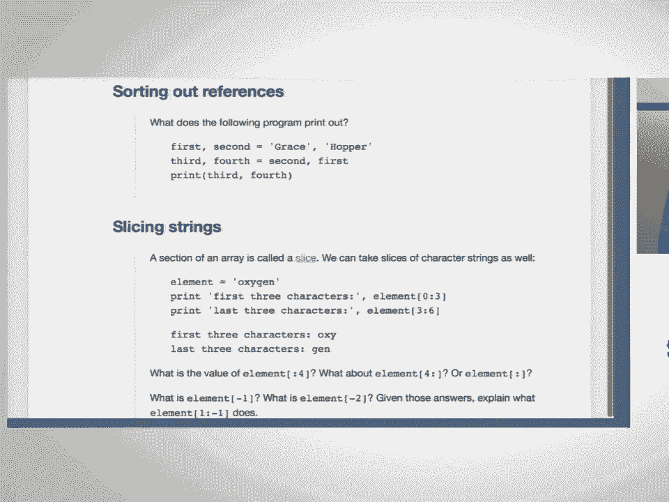

 Oops。

 I know that a few people are not coming back to the afternoon session。

 that's why I thought that maybe I should mention modules and import the thing。

 So let's create a file， a regular file， and I will use my favorite editor， VIM。 You can use NANO。

 you would type something like that。 And let's call our file mode。py。

 So in this file we will create a function， and we will call it， let's say， def。

 I think it's taken argument。 I will use just a single space here。 Okay， let's do that。

 So NAN is a way to return nothing。 And that's it。 So in NANO， in order to save， I press Ctrl+O。

 enter， so it asks me for name， and Ctrl+X to exit。

 Now I can do -- I will just start a Python interpreter。 So now I can do mode。 And if you remember。

 it takes an argument， but don't believe it uses it。 That's a module。

 So that's a file with a function。 And file name is the name of the module。 Method is a function。

 That's it。 Thank you。 In Jupyter you would have to save it to a file。 I mean。

 you can create a file anywhere。 You can do it in Jupyter too。

 but that's a special syntax like its connation point。 Thank you all。

 It's a very unusual to be honest。

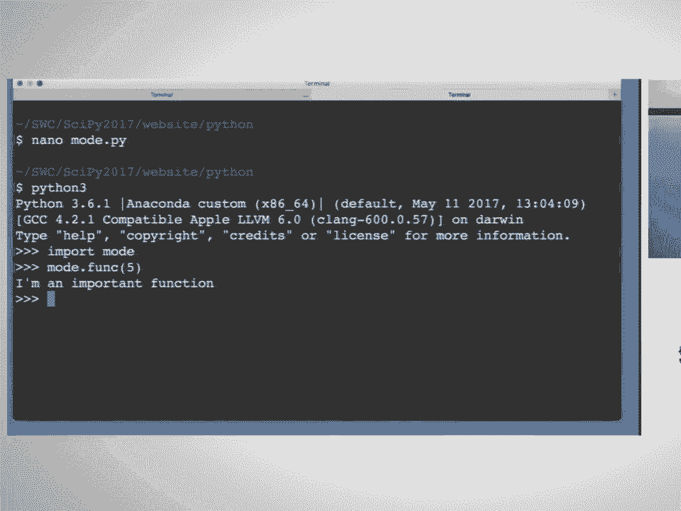

 (applause)， up for you。