# P23：Parallelizing Scientific Python with Dask  SciPy 2017 Tutorial  James Crist - 哒哒哒儿尔 - BV1Cs411A76Y

 Good morning。 Welcome to a paralyzing scientific Python with， Dask。 My name is Jim Christ。

 Over here we have Martin Durant。

 and Skipper Seabold。 We'll be presenting to you today。

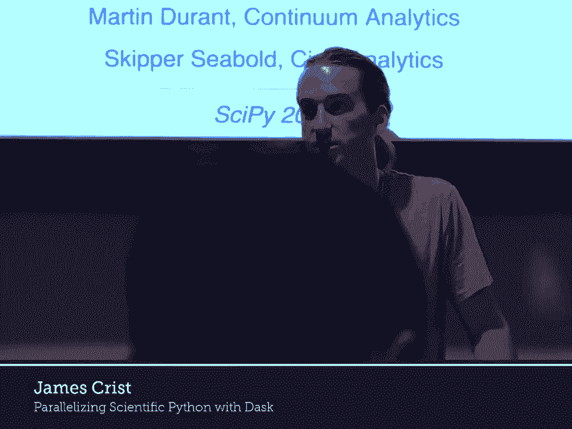

 To start things off， can you get a hand count？ How many people have heard of Dask before？ Okay。

 Most of everyone。 How many people have used Dask before？ Fewer hands。

 How many hope to use Dask after this？ Awesome。 Cool。 So we have hopefully a painless install today。

 Everyone needs to go to this web page。 Make sure you do the HTTPS。 It doesn't redirect。

 And then you'll see a big blue button。 And I want you to click it。 And that's it。

 The password is changed。 Password is PiData。 We are in the Dask tutorial folder。

 There's another tutorial going on next door。 Also taught by the Dask team。

 Plus men talking about different Python paralyzing systems。 We're not men。 Aaron， I'm a DIA。

 And so we are parallel。 Parallel tutorials。 So you're going to just be in the Dask folder today。

 We are going to start with notebook two。 Dask delayed。 So everyone can just open that up。

 Can everyone read that from the back？ Is that big enough？ A little bigger？

 I want to be able to make sure everything is -- I can do that。 A few toggle header。

 Is anyone not at this page at this point？ If you're not。

 hopefully you can get help from your neighbor。 Dask is a parallel computing framework。

 There is a lot to it。 It's used for many different domains。

 We will start from the beginning and try to work our way up。

 This is going to be by no means a comprehensive tutorial。

 We will try to get you a taste of everything。 Hopefully you can go from there。

 We hope our documentation is good enough。 We will start with some simple toy functions。 Inc。

 which increments a number and add which adds two numbers together。

 These have a sleep in there to make them take some time so we can actually measure them。

 You could substitute in any complicated computation instead。 If we run them in serial。

 so we increment one， we increment two， and then we add the results together。

 This should take three seconds。 Each function takes one combined together to take three。

 One of the tools we have in Dask is this function called DaskDelaid。 It's a pretty simple interface。

 If you're familiar with decorators， this will sit right in。 But basically。

 delayed is a function which does two things。 If you call delayed on another function。

 it makes that function lazy。 It doesn't run immediately。 It will run later。

 If you call delayed on data， you call delayed on an array。

 it makes anything that touches that array lazy。 It will run later。 We will take delayed from Dask。

 We will wrap it around ink。 We can call it on two and add and call it on the results。

 If we time this again， it runs immediately。 It hasn't run。

 This is just building up a graph behind the scenes。 If you get Dask to run anything。

 you need to use the compute method。 If we take z， it's actually look at what z is。

 it's a delayed value， and we call a compute on it， this is actually running it。

 This time it took two seconds。 Does anyone know why it took two instead of three？ Yeah。

 If we actually look at the graph here， here's z is a delayed value。

 The visualized method is on all Dask objects。 You can see the task graph that it's composed of。

 Here we can see we have incrementing one number， incrementing another number。

 and then we're going to add them together at the end。 If you were to actually try to do these。

 you can see these can be done parallel。 This task doesn't depend on any of their tasks。

 This task doesn't depend on any of their tasks。 If we have a thread pool or a process pool or some kind of worker。

 we can run those two at the same time。 Any questions so far？

 I think that you get hold of the task tutorial， but I have a different task tutorial。

 We're running in a distributed environment。 You don't have to download anything。

 If you missed the start， hopefully you can get the URL from a friend。 Otherwise。

 I'll put it up here for one second。 It's in the Slack channel。 Cool。

 We're in a specific branch for this session。 Yeah。

 You just go to the URL in the Slack and push the big blue button， password， pi data。 Cool。

 All right。 Here we're going to move right into an exercise。

 Here we're going to parallelize a for loop。 We have some data stored at the list。

 The sequential code is going to start。 It's going to start that。

 The sequential code is going to loop through the data。

 It's going to call ink on each element and it's going to store them together in a results list。

 At the very end， it's going to sum the results。 You can see the total here。

 We'd like you to parallelize this using delayed。 The code should look fairly similar。

 just adding the delayed call in strategic places。 We'll give you a couple minutes to do that。

 Disgust with the neighbor if you get stuck。 If you click on the solution button here。

 you can actually see what the solution we're looking， for is。 I'm going to copy this up。

 Looking at our previous code up here， we looped through the data。

 We called ink on each element and then we store them together in the results。 At the very end。

 we called sum on the results list。 Down here， what we do is we call delayed on ink and then call that on each element。

 We store that result in the list。 At the very end。

 we say total is equal to delayed of the sum of that results list。 If we time that。

 it runs pretty much immediately。 If you look at the result there， total is a delayed value。

 Since it's a delayed value， we can look at its graph and see the familiar map reduce pattern here。

 We're calling ink on every element and at the very end， we're summing them。

 If we were to actually compute that， use the compute method。

 You can see it took about a second because everything was running in parallel。

 We have eight elements and I have eight CPUs in my computer。 I can run one computation in each one。

 We're going to move on to a slightly more complicated example。 That's a question for further on。

 but we can talk about it now。 If instead of calling， just because I ran this before。

 this still exists， it's the list of delayed results， what happens if I call some of the results？

 Does anyone have an idea what would happen here？ >> Did the delayed objects have an initial overhead？

 >> Yeah， so delayed objects implement most operators。

 Since some is going to try to add every element， let's just see what that graph looks like。

 You can see all the different pairs added together up in a chain。

 This doesn't actually get any parallelism。 It's important to think about exactly what should be delayed and what should run immediately。

 Moving on， slightly more complicated example。 We're going to add some control flow in here。

 We have a function double which doubles a number and we have a function which checks if a number is even。

 We're going to have a new data list。 This time， what we want to do is iterate through the data。

 If the element is even and we want to double it， otherwise we want to increment it。

 We're still going to store all the results and the results list and at the end sum them together。

 So again， take some time， figure out how to delay this。

 You're going to want to delay some functions here but not all of them。 I don't know。

 three or four minutes to do this。 Without even looking at the solution， what should we delay here？

 Should I delay is even？ No？ All right， why not？ Can anyone tell me why I shouldn't？ Yeah。

 so it doesn't take time。 Is X a delayed value or not？

 No X is real data and we want to check if it's even。

 One thing about delayed values is you can't check their truthiness。

 We don't know what they actually represent。 We don't know what is behind it。

 We just know that it exists at that time。 We'd have to actually call compute to figure out if it's a true or false value。

 So you can't delay them。 Should I delay double？ Yep。 How about ink？

 And then we already talked about delaying sum。 So that again runs in one second and we can look at its graph。

 And see it's a similar map reduce pattern but this time we're only using certain functions on certain elements。

 Cool。 So here we're going to paralyze something more complex。

 So here's the case where you have an instinct to put it in the middle of something that you like to make。

 So basically what you're telling us is the drastic case。 You call it a false。 No。

 So you'd have to think about what you need to do。 Maybe you want to wrap that if statement inside a function that's lazy。

 Where do you put， so here we're trying to build up a graph and we're trying to encode those Boolean decisions inside the graph。

 They've already been made at graph build time and not a compute time。

 You could put them off until later。 You could have a function double or ink that checks internally if an island is even and does one or the other。

 That makes sense？ Yeah。 Cool。 That's going to be a term out of that。

 Could you like insert a computer in the middle？ Yes， you could。

 It will compute everything up to the graph that's needed for that element。

 But you don't necessarily often we find rethinking how you layout your code。

 slightly moving things around。 But for the most part just adding in delayed seems to work pretty well for paralyzing existing code。

 And we'll talk， we'll touch on this later in this tutorial。 So here we're going to touch。

 move on to something that's actually a real world example。

 So this cell right here is just prepping some data you all have in your cluster。

 So that's extracting some flight data。 This is the airlines data set。

 It's a set of all airlines travel in the US。 I've filtered this down to just the flights in the 90s out of New York。

 So this is going to be stored as 10 CSV files。 So we can look at those here and see you have a file per year。

 So just to look more at the data， we can open that up with pandas。

 Real quick just for our understanding how people have used pandas before。 Okay。

 This is going to be terribly pandas heavy。 I just wanted to see what we needed to explain and what we could maybe assume some background knowledge of。

 Cool。 So here we're going to be using pandas read CSV to just peek at the first couple rows just to see what the data looks like。

 So this is just one file。 This is just 1990。 So we have some columns for year， month。

 day of the month。 So that makes up the full date。 Different things about departure time。

 whether it's delayed， unique carrier。 Over here we have the originating airport。

 There's a Boolean column if it was canceled。 We can see what the D types are based on that pandas data frame。

 So you can see the year， month and day are all storage integers。

 And we can see what the originating airports were。 And as I said。

 I filtered it down to just flights out of New York。 So EWR， LGA and JFK。 On this one year alone。

 we can group by origin， take the departure delay and take the mean of it。

 So the mean departure delay per airport for just 1990。

 What we'd like to do is we'd like to compute the same thing for all the files combined。

 And we'd like to do this without loading all of the files in the memory at once。

 And we'd like to figure out some way to sequentially taking in a file， storing some intermediate。

 and at the end combine those intermediates together to get a final result。

 This is something that you could scale if you had hundreds of files and maybe run on your laptop。

 without having to load all of the CSVs in it once。

 So here I have some sequential code for doing this。 We're going to take a glob。

 so a glob string of all the CSVs and then NYC flights folder。 So you can get all the file names。

 We're going to loop through the file names， read in each file。 Group by airport。

 We're going to sum all the departure delays by the originating airport and we're going to。

 count all of them。 And then we're going to store all the sums and we're going to store all the counts。

 At the very end we're going to sum all the sums， sum all the counts and divide to get the mean。

 So if I run that right now， this should take， if I remember right， about 10， 15 seconds。 Oh。

 I did not remember right。 Four seconds and here we can see that it means departure delay per airport for all of the 90s。

 What we'd like you to do is we'd like you to paralyze this code using delayed。

 There's a couple new things you need to know。 One。

 delayed objects implement operators and implement methods。

 So if you have a method on the real world object， what it will be once it's computed。

 you can call that method on the delayed object and ask we'll do the right thing。 Two。

 we have a function called dask compute。 So from dask import compute。

 this is similar to the compute method， but you can pass in， multiple delayed objects。

 If you have two delayed objects and you call， you know， delayed object one dot compute and。

 later you call it delayed object two dot compute， if they share intermediates， if they say we。

 have these sums and the counts， if they share intermediates， they're both going to compute。

 those intermediates twice。 But if you pass both of them to dask。compute， so the compute function。

 they're going to compute， them in the same pass。 Dask will merge the graphs。

 Dask will only do each task once。 It'll be more efficient。 So using these two things。

 we'd like you to paralyze this existing code。 I've copied it down here。

 You should just need to add delayed in a couple of spots and add a compute call。

 I'll give you a couple minutes to do that。 A good question was just asked。

 Delayed plays well with existing Python structures， so if you pass in lists or dictionaries or sets。

 basically built-in objects containing delayed values， delayed will figure out how to recompose。

 those。 So if you call compute on a list of delayed values， you'll get back a list of the results。

 that they represent。 So you don't necessarily need to pass in delayed values just to compute。

 You can pass in Python structures containing them。 Just to be clear。

 you may or may not need that here。 For the sake of time， we're going to move on。

 We're just walking through this。 Where should I put delayed？ Should I call delayed on read CSV？

 Yeah？ Okay。 Yeah， we wanted to delete data ingest。

 It's best to have Dask load your data rather than load it before and pass it to Dask。

 That can help minimize memory usage。 Do I need to call delayed on group by？ No。

 group by is a method。 The DF is already delayed object。 Methods on delayed objects just work。

 Similarly， by origin， delayed。 So this works。 By our join delayed。 So that works fine。

 And we store all the results together in lists。 Where should I call compute？

 There are two different places I can think of here。 We'll start with one。

 We could say sum counts is equal to compute sum counts。 Did anyone have this solution？ All right。

 So what's happening here is we're looping through。 We're getting all the sums and computing them。

 bringing them into memory and doing the sum here and the sum there and divide all immediately。

 The different solution that also works would be to call delayed on sum。

 And then that just builds up a graph， which you then get the mean。

 You can take a look at the whole operation there。 Dask can handle arbitrarily complicated task graphs。

 It looks visually complicated， but later on we'll see some ones that are a lot crazier。

 So calling compute here。 All right。 So that took around two seconds。

 And before we took around four in a bit。 Did anyone know why we didn't get full speed up here？

 We were expected slightly more given the number of cores on this machine。 Discrete maybe？

 These are all being run in a thread pool。 Yeah。 So there's something in Python called the guild。

 the global interpreter lock， which means that in threads each thread can only execute -- or Python code can only execute in one thread at one time。

 Certain libraries like NumPy and Pandas often release the interpreter lock。

 meaning you can get true parallelism and threads， but not all operations release it。

 Particularly most things doing with strings and not all libraries release the interpreter lock。

 Not all things can。 So here we got about two x speed up。

 And that's mostly because of the interpreter lock here。

 So right in this notebook we have used delayed to build up graphs based off of Python code。

 Delayed is mostly useful when you have existing code that you want to parallelize。

 but you don't want to change much。 In the next few notebooks we're going to talk about DAS collections that will help build up these graphs behind the scenes for you for common algorithms。

 Real quick question。 Yeah， so actually that is the very next thing we're going to talk about is something called DAS data frame。

 which is a DAS implementation of Pandas data frames。 [ Inaudible ]， No。

 it has no knowledge of the functions。 Delayed takes -- the question is does DAS know anything about Pandas functions？

 Delayed just works on Python functions and Python objects。

 It knows nothing about what the functions do。 It doesn't know what resources they consume。

 anything about them。 It just takes functions and arguments and builds up a graph and then runs it。

 [ Inaudible ]， Yeah， so here we have a mean value。 This is just a general laid value。

 It's going to be Pandas series。 It will call this is not a method and we get another delayed value。

 DAS doesn't know what actually exists until run time。 At run time you'll get an error。

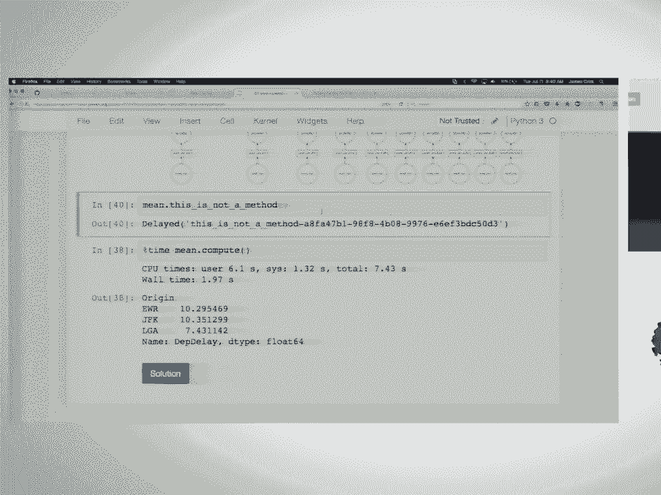

 If there are no other questions， I'm going to hand off to Skipper。 [ Inaudible ]。

 Okay， hi。 I run the first cell just to clean things up and make things look a little prettier along the lines。

 Jim showed us how we can build up bespoke paralyzed task graphs。 I never do that。

 I'm mostly a DAS copyist。 I'm not a core developer or anything。

 But the way that I use DAS is taking advantage of what Jim said of these DAS collections。

 The code that we just saw for Pandas， there was a lot of boilerplate in there。

 There's a lot of opportunities to build abstractions on top of that that are common workflows and then to use those。

 One of the questions I was going to go is does DAS know anything about Pandas？

 It actually knows a lot about Pandas。 There's an object called DASK data frame which we're going to go through here that allows you to execute code in parallel。

 It allows you to work with data that is too big to fit in memory but to use the common Pandas abstractions that we're all familiar with。

 So DAS data frames are mostly like Pandas data frames。 They're not exactly like Pandas data frames。

 We may point out a few places where they differ。 And the one thing to keep in mind。

 like the reason that we built up some of these workflows earlier using DAS delay is to fix ideas about how to think about how to do it。

 How to think about things when you're working with DASK data frames because it is a little different than Pandas and we're going to point out some of the issues around that。

 So under the hood， a DASK data frame is just a blocked collection of Pandas data frames。

 So Pandas is still doing all of the computation here。 DASK is just doing the scheduling for us。

 Doing some smart memory management and trying to keep us so that we can do， well for this example。

 computations on a single machine that maybe we wouldn't have been able to do。

 So there's a few links here around the DAS data frame documentation。

 If you want to peruse them as we're going through some of the exercises and the Pandas documentation。

 So Jim asked who is familiar with Pandas but not who is not familiar with Pandas。

 I'm curious if there's anyone in here that has never worked with Pandas before。 Okay， a few people。

 Okay， so if there are questions of any nature， just stop me and we'll go through things。 Okay。

 so we shouldn't need to run this but we will。 Okay， so reading in all of these CSVs， right。

 so we had the flights data set。 It's 10 CSVs。 We can look at them。 So we'll look at the globstring。

 DAS provides a high level read CSV function that works on globstrings。

 So we don't have to iterate through and build up the delayed read CSV objects。

 We can just call DASK data frame read CSV。 DD is kind of the import convention for DAS data frames。

 So we call DD read CSV。 We now have a DASK data frame object。

 Not too much has happened yet and we'll talk a little bit about that。

 So Pandas has an operation question。 Yeah。 So here is here。 If I'm not one。

 you're voting for the wide part。 Yep。 Do you use sorts？

 Most often it doesn't matter but it did mine。 So that's a good question。 No。 No sorting。

 We don't do anything that you haven't asked for。 So we're very， very explicit here。

 So right now this is just built up a graph behind the scenes that says， "Hey。

 load 10 CSVs in the Pandas data frames and can cap it together。"。

 If you recall compute on DF right now， that's what would happen。 The question was。

 do we sort the globes behind the scenes？ Sort the globes。 Sorry， I heard the data。 No， no， no， no。

 the globes。 No， we just take the result of the pipeline。 Whatever， yeah， whatever globes。

 So you can see it's not on the order but behind the nodes on the disk。 Sure。

 So that's no lexicographical ordering。 So yeah， be aware I suppose if you need sorted order which you may。

 And we'll talk about that a little bit。 Okay。 So head is Pandas operation for peaking into your data。

 It's exposed on the DAS data frames as well。 So we just called head on a collection of files and we got back the first five rows out of the first file。

 However， that is defined。 And we can call it tail。 Don't panic。 That was supposed to happen。

 So there's an error and we're going to kind of look at what's going on under the scene or under the hood to understand why we got this error。

 So as an enthusiastic user， when I first started using DASK， I ran into all kinds of problems。

 And it was mainly because I didn't fully understand what was going on。

 And I had to change the way that I thought a little bit about doing data munging because I was super familiar with Pandas。

 And things that I expected to work didn't but it was because I hadn't properly understood what was going on。

 So we're going to go through a little bit what's going on here。 So what happened？ So read CSV。

 So DASK read CSV uses Pandas read CSV under the hood。

 Read CSV is the best and worst function in all of Python because it does everything。

 So DASK is just going to leverage that。 But it doesn't read all of the data in。

 Pandas reads all the data in to infer the data types。

 But DASK doesn't want to keep everything in memory so it just peaks at some of the data and tries to infer the data types from that。

 So in this case there's a few data types that are incorrect based on the first values in the first file。

 We'll look at which ones those are。 There's a few ways to get around this。

 And the kind of proper easiest way to do this is to specify if possible the D types ahead of time。

 And that's what we're going to do here to fix this。

 You can also tell it to peak at more data so that there's a like sample size keyword。

 Or you can say assume missing。 So this is kind of like nullable integers in SQL。

 If you know that you're going to have missing data and in pandas in NumPy world we have to upcast to a float。

 Then you can say if you think this is an integer you're wrong just go ahead and call it a float。

 It only takes the data from the first file that is counted。 First file yeah。

 And then it only peaks at part of that file。 Right。

 Can you say keep it more data or can you get data？ More data from the first file？

 I don't know if it would spill over to the next one。 If sample is bigger than the first file。 No。

 More data from the first file。 Sure。 Sure。 Yeah。 Okay。 So tail num in this case was a string。

 A lapse time is a float and cancel is a bool。 If we look at head up here we can see that I think like oh it's oh yeah。

 Tail num here is all missing in the first file。 So it read it in as a float。

 But later it's a string。 And then when you call tail so give me back the bottom of the last file it fails。

 It chokes because it thinks it's a floating point and it's not。

 So we just pass in a dictionary that tells it what the types are going to be for kind of。

 the problematic ones and let it infer for the rest。 So now we can call tail and we're in business。

 So one more example just to fix ideas。 So what happens if we call Python function length on the data frame collection or the。

 DAS data frame？ Yeah。 It's going to look at the glob string， figure out there's ten files。

 make a set of jobs， that reads in the CSV and then calls length on each one of those and then there's a reduced。

 step that brings it all together。 Is that somewhat clear？ I think this is quite nice。

 A lot better than having to do this stuff by hand。 There is no shape on Pandas data frame。

 It differs from the Pandas data frame API a little bit。

 There's no shape because you would have to see all of the data to be able to get the。

 shape and by default DAS doesn't know about all of the data yet。

 So it collects some metadata about the data frames and keeps them around。

 That's why we had to pass the D types in this case。

 But try to avoid reading all of the data if we can。 It is not。

 It's calling length on the data frame。 I don't know if actually Pandas data frame is what it's doing。

 The dunder length is doing under the hood maybe。 It is not using size。compute。 We'll see that later。

 I think it's just -- I mean， the length dunder may be doing that。 Okay。

 So we could compute the maximum of the departure delay by using DAS delayed。

 So we've already seen some examples of this earlier。

 So we'd have to make a collection to keep up with the maxes of the intermediate results。

 go through call delayed on read CSV as we saw， and then append the max of each data frame。

 to the maxes collection and then in the end bring it all together with the reduced step。

 and call compute。 But now we can just use Pandas syntax。

 So exclamation mark because this is awesome。 And this is where like DASK is Pandas aware and just knows what to do and passes things。

 through to the intermediate results and does the reduction force。 And we have our answer。

 So some people had to wait 1，400 minutes for their flight to take off。 And just to point out。

 like we never held all of these data frames in memory at once。

 DASK knows what to do with the intermediates and tries to somewhat intelligently get rid。

 of intermediate values that are being held in memory so that you can do computations。

 that wouldn't have fit in memory otherwise。 And just like with all the other delayed objects that there's a visualized method and you can see。

 what was going on。 Read the block， read the CSV， compute the max and then bring them all together for us。

 So we're going to go through a few exercises。 This is also kind of a chance to familiarize yourself with some of the Pandas stuff that people。

 haven't seen this before。 We've already noted a few departures from the Pandas API and why。

 And often it's because we want to avoid looking at all the data。

 So the parts that are missing are either impossible， not very smart or just not there yet。

 Always good to ask， always good to think about。 Okay。

 so we've seen this already but just recall that all the calculations are lazy。

 You don't get anything back until you call compute， including errors as we've already seen。 Okay。

 so there's a set of examples here if you want to spend a few minutes to go through each one。

 Use heads to get the first 10 rows。 This is no different than Pandas。

 Figure out how many rows in our dataset。 We've already seen how to do this。

 And then use like Pandas indexing to find late and early departure times how many there are。

 And then we'll also look at the canceled flights。 So the question was whether properties on delayed objects are also computed lazily。

 The answer is that mostly they are。 So something like the size property on the Pandas data frame is lazy。

 But the D type property is something that is kept around on the data frame objects because it's something that we compute and keep around。

 So calling head should be pretty familiar to us by now。

 We just changed that in argument here to get 10 rows。

 We've seen a few ways how to do calculating how many rows there are。

 And there was a question about this earlier。 You could either call length on the data frame。

 Or we could use size compute and size on data frames is a property。

 So this is also to your question earlier。 Our property is lazily computed by default。 Yeah。

 Unless there's some reason to keep around that information。

 And I'll give you some time to go through the other ones。

 So the thing to note here is that it looks a lot like Pandas code。

 So we could still do Boolean indexing to filter the data。

 We could call length on it after we filter the data。

 So we subset the data frame and then called length on it。

 And now we know how many were negative departure delays。

 So how many flights left early which apparently happens。 Maybe it did in the 90s。

 And the late departures。 One thing to note here and then we're going to come back to you later。

 We've already seen it so it's worth pointing out。 And what we've done is that we could have shared some computation here。

 So we built up two， in the first way that I did this， we built up two separate graphs and。

 executed them to understand the early departures and the late departures。

 So that means we were doing reading from disk twice。 If we had called das。com on these task graphs。

 the graph would have been optimized。 And we wouldn't have had to。

 We would have shared computation where we could。 So the task under the hood hashes the computation that it's doing so it can understand when it。

 can share computations because it's just the same thing。

 So here you see I took a little different approach， used the size property and then called。

 compute on these results to get back。 To get back the results and share computation。

 So how many non-cancelled flights were taken？ How many flights were actually taken？

 We can also use negation here。 So more Boolean indexing。

 But it works just like we would expect pandas to work。

 So thinking a little bit more deeply about what's going on under the hood is good。

 I think to help fix ideas， help understand where problem spots are and how to organize your， code。

 So one of the departures that are additions that das has to pandas is this concept of。

 divisions and the index which is not quite the same as the pandas index。 So under the hood。

 das is just a bunch of blocks of pandas data frames。

 So in this case we have naturally partitioned data by date。

 So if we have date time data like the flights data and it's split out for us， then we have。

 natural candidates for a partition。 So each one of these is a pandas data frame and the whole thing is a das data frame。

 And there's， well， we'll see how we can set divisions to tell the das data frame about。

 how the data is partitioned to speed up certain computations。

 So in pandas you set the index because then you get things like O1 lookup， fast operations on。

 look and it's very similar with das。 If you intelligently tell it or intelligently partition your data and then tell the das。

 data frame about how you did that， then you could speed up some computations because it。

 will know that it doesn't have to go looking in other parts of the data for the data that。

 you're looking for essentially。 So operations like look。

 group by merging and joining are a lot more efficient along an。

 index than on a potentially unsorted column。 So if， well， we'll come back to that。

 So let's read in our data again。 Note that I didn't change the dates。 I don't parse the dates here。

 So we have this property called divisions and it's just a bunch of nones。

 Right now it doesn't know anything about how the data is partitioned。

 It knows that there are 10 CSVs that we've asked it to read。 But we can set the index to year。

 And now the divisions is filled out for us and the das data frame knows about how the data is actually partitioned。

 So word of caution here。 This isn't an operation that you want to call a lot。

 It's something that you want to call once at the kind of the beginning of your workflow。

 And we'll see some strategies for why this really matters later in the distributed stuff。

 Another thing to note here。 The far right hand bend for divisions is right inclusive。

 So if this weren't here， the last bend would be 98 and 99。 And in this case it's just 99。

 So we have 10 partitions。 And now we can do things like look and it knows to quickly do the right thing。

 I only want to look in the first partition because that's where 1990 is。

 Can you call that visualize on that？ And add in optimize under score graph。 The cool strip。

 >> Teachable moment。 The question was can I make this bigger？ No。

 but I can change the format so you can write it to disk and pdf or SVG or whatever and resize it yourself。

 I can control plus。 >> Is there something you wanted to point out？

 >> If you look at the graph we have 10 partitions on this。 We have 10 different files。

 >> The takeaway here is only reading from the file that it has to。

 It already knows the data you're looking for is only in a single file。

 It doesn't have to look through all the other files。 This is why we set the index。

 You can imagine why this would be beneficial to things like group by operations。

 >> Does it support multi indexing？ >> It does not support multi indexing。

 We don't support indexing operations。 >> We can talk about that later。 >> Dastat different support。

 >> This is what I was hinting at earlier when I was saying you have to change the way you think about writing。

 Pandas code a little bit。 One strategy here might be to set an index along the most expensive and natural thing and to do nested group bys within the partitions if you need to do a group by a long multiple dimensions or something like that。

 >> Sorry。 You can group by multiple columns。 You just can't treat the output。 >> Sure。

 >> When you call compute， it will get a multi index。 >> It does。 I'm not going to edit to realize。

 A few more exercises。 Now， starting to look at group by。 Work through these。 If you have questions。

 ask。 This is preferred syntax for writing group bys in Dask for various reasons。

 How many non-cancel flights were taken from each airport？ Try that。

 The average departure delay from each airport。 What day of the week should you not travel？

 In the 90s。 A few people have said they have seen dead kernel notifications。

 If it becomes unworkable。 If you don't have big data， don't use a big data tool。

 Don't give yourself another problem。 The first rule of distributed computing is the network is unreliable。

 Things can go wrong。 What you can do is computations you could have done with pan as a loan。

 If your data can fit in memory， don't give yourself another problem。 Ram is also very cheap。

 They have really big EC2 instances。 Let's start to look at some of the solutions。

 Non-cancel flights from each airport。 This should feel fairly familiar to you if you have used a pandas before。

 We subset the dataset。 We want to look at the flights that weren't cancelled。

 We want to group by the originating airport。 We call either origin。count。

 If size is available on the -- let's see -- size is available on the group by object。

 You can pull out one of the columns and call count。 A lot more traffic out of New York。

 Average departure delay from each airport。 We can index the attribute look up on the columns on a group by object。

 Get the departure delay。 I want the mean of that and compute。 We saw this before。

 We had to build up this by hand using the dash delay。

 Much cleaner and not a ton to think about here beyond pandas other than to compute。

 We're dealing with lazy objects。 A very similar solution for day of week。

 The worst day of week to travel。 This is a test。 Friday， right？ I'm sorry。 Good question。

 It's probably Monday。 It could be Sunday。 I'm trying to think。

 It's not dependent on the default in Python。 It's Monday。 Sharing intermediate results。

 We already saw this a little bit and we've hinted at it a couple times。

 We wanted to look at some statistics of the delay。 We should。 This is the worst day to travel。

 We can ask for the mean and standard deviation of the delay。

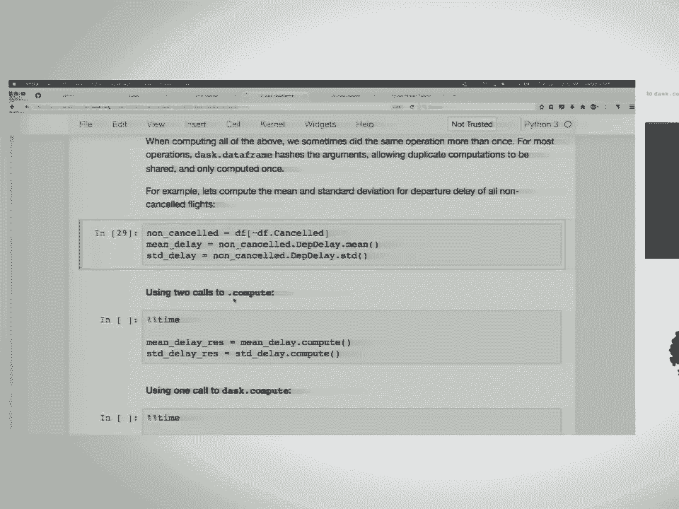

 We can get the answer to that with two calls to compute。

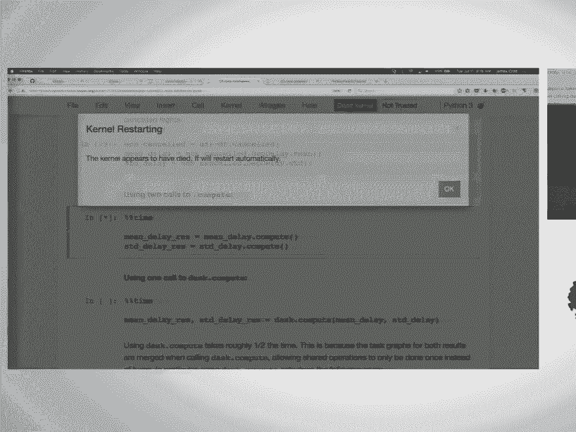

 They may be doing some crazy stuff next door。 Yeah。

 We can call compute separately on the two results and get back the mean and standard deviation。

 It's way more efficient if we put them together。 Allow to optimize the task graph and give us back the results。

 This way。 With a little lazy import overhead， we're able to save considerable amount of time。

 The question was about how the hashing works and what is being hashed。

 I think you are asking if there's a query planner and there is no query planner。

 If you ask for the same result in two different ways， you're not going to share computation there。

 It's going to share computation that's easily shareable。 For some things。

 we can talk about this later。 Do you want more details？

 I also have some questions about the hashing。 We can talk later about that。

 It's a very readable code。 I learned a lot reading this library。 We already saw this earlier。

 This is just to show that the computations that can be -- it's not going to show you anything。

 If you want to make this bigger， you can use output to PDF and look at it。

 This is the sharing of the reading of the CSV and then the computations that it can share。

 How is it going on time？ Is it worth going through？ Is it going through this？

 I think we can keep going if you want to。 I see some value。 This is again how we may -- okay。

 DAS doesn't do everything that panists can do。 What we're going to do here is look at some strategies for doing the things that we need。

 to do using regular Python code or panist code， but still smartly dealing with our data。

 frames and not having to hold everything in memory。 I actually don't know what CRS depth time is。

 >> Schedule departure time。 >> Schedule departure time。 When it reads it in。

 it treats it as an integer。 We're going to turn that into a timestamp。 Just to look。

 The departure for the first ten flights is at 1540。 One way to fix this is to use time delta。

 We add it to the departure time stamp to figure out the actual schedule departure time in。

 daytime format。 How do we do this with pandas？ >> In this case we take the first ten rows。

 We're dealing with a panist data frame。 We have 1540。 We convert that to a time delta object。

 These are objects that know how to move around in time。 These are hours。 Unit is hourly。

 Do the same thing for the minutes。 We take the actual date that we have from date parser and add the hours offset and minutes。

 offset and get back to departure time stamp。 That's nice。 As I mentioned。

 Dask doesn't have everything the pan has yet or for good reasons。

 There are some primitives that Dask provides。 There are map partitions， map overlap and reduction。

 We'll look at map partitions to figure out how we might write some code that fixes this and apply it to all the data frames。

 What does map partitions actually do？ It maps a function across all the data frames。

 One thing to note here is this meta keyword。 This is another departure from pandas for good reasons。

 With the meta keyword， Dask doesn't know what the result of this arbitrary Python code is going to be。

 The meta keyword is one way to tell it。 Give it an empty container。

 empty data frame with D types already predetermined so it knows how to catch the result and give you back something intelligent。

 Or intelligible is the case maybe。 Good documentation。

 We could do this in a very similar way that we just did on all the data frames。

 We can make a delayed object that floors the hours。

 gets the minutes and then adds everything together。 Again， lazy computation。

 That's kind of the same thing。 Now I want to have you do the same。

 make it a function and use map partitions to operate using Python code on the individual data frames。

 One thing that was pointed out that I should mention about map partitions and the various methods that take a meta keyword is that it is optional。

 Dask will try very hard to do the right thing。 In some cases it may be slower and in some cases it may fail because we can't plan for all eventualities。

 But providing a kind of a meta keyword object that will catch arbitrary results can help you get out of some binds。

 Let's look。 What we did here was just take the code that we had above and wrap it in a function。

 The function takes a data frame so when we map to partitions this maps the function over all of the data frames。

 In this case takes DF， computes what we want and then returns the answer。

 Notice that I didn't have to pass a meta keyword here。

 We could ask for this if we wanted the whole thing。

 I don't think I pointed this out earlier but head is one of the only operations that's not lazy。

 I noticed that I don't have to call compute on head。 It's about Dask data frames。

 We'll be seeing some more。 Do you want to take a little break？

 If you want to take a five minute break now that we find we're going to have a longer break at 10。

30。 We'll start back again if I see most people are here。

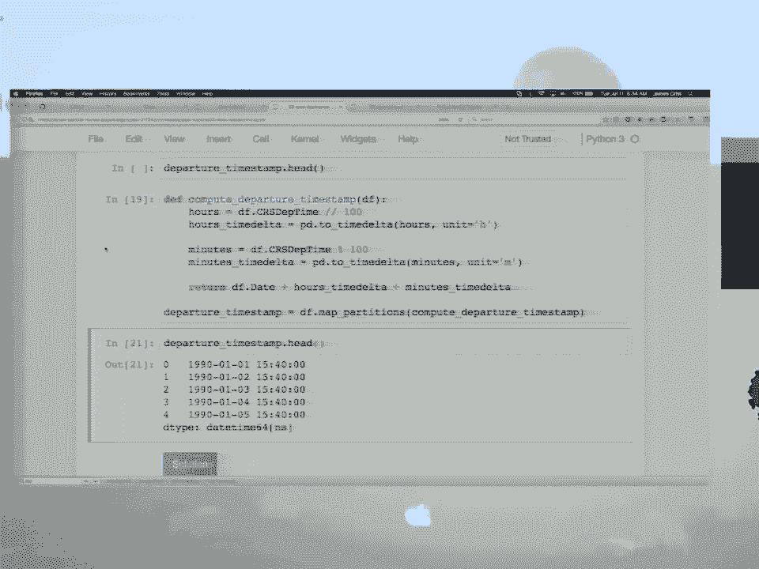

 One note before we start for the people that have seen the occasional kernel problem。

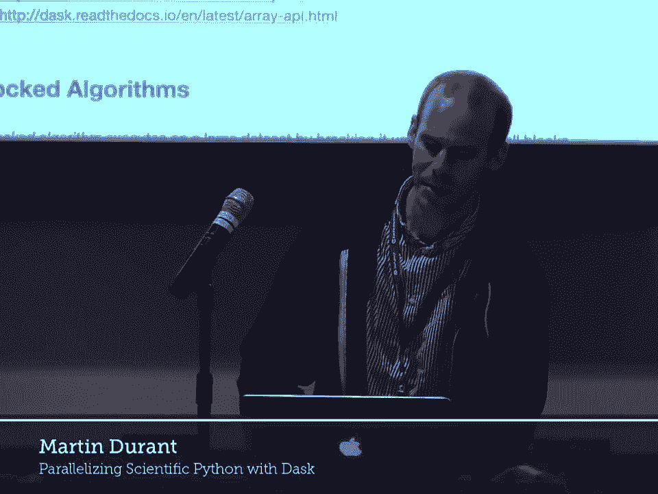

 It does help if you close down the previous note books before you start the next one。

 In this case we'll be number four arrays。 Wait a moment for everyone to catch up。

 You already saw the Dask provides primitives for basically prescribing work and then executing that work in parallel。

 The application of that to data frames which is one of the most commonly used and useful tools in Python based data management data science。

 Some of you will use only that but other people will rely heavily on arrays。

 Particularly I don't really know the mix in the room。

 This is something I'd like to find out maybe later。

 How many people here are science as opposed to data science which are now two different things at least in my mind？

 Yes。 How many people here are working as science researchers？ That's about half。

 Even if you're a scientist you might still be working with tabular data。

 However arrays underpin all of that work anyway。 It's good to be familiar with NumPy which is the way of expressing arrays in Python。

 Lots of algorithms that you'll be using use the same stuff underneath all of the machine learning。

 It's all really array mathematics。 So arrays in pandas actually came first。

 This is slightly out of order here。 It does for NumPy what Dask data frames does for pandas。

 We're talking about n-dimensional things。 It's just going to be two dimensional here。

 Whereas with the data frames you have columns and each column has a particular type。

 Here we have a single homogenous data type across all of our data and it splits into chunks along each of the axes。

 This is slightly different and the other main difference is that the chunk sizes are known beforehand。

 For the data frame we just knew what columns there were。

 We knew one of the axes completely and we didn't know how long each of the sections was going to be beforehand。

 Here we do know those things and we do know the data type but we have splitting in all dimensions available。

 The point of doing this is because arrays can get very large and you want to be able to do computations on them either just larger than your physical memory on your machine。

 This is a very common use case for arrays is that you have some maybe a laptop。

 maybe some somewhat more substantial machine than that。

 You want to calculate through a large amount of numerical data to do whatever kind of aggregations you want to do to it。

 You want to do this block by block so that you don't use up all of the memory。

 I just start with a small caveat which is that if you're in a situation where you can load all of your data into an un-py array in memory then that's usually what you'll end up doing。

 You can figure out your algorithms， you can figure out the workflow that you want to follow using subset of your data and then use this stuff to scale up to larger than memory。

 or perhaps into a distributed cluster setting。 Again， similar to the data frame side of things。

 there are some things that work well and some things that don't。

 The things that work very well are element wise operations because you can do that to every single block independently。

 And aggregations along the various axes and a subset of linear algebra and other algorithms that can be expressed in block by block terms。

 You don't need to know much about that typically but perhaps it's best if I just go on to some of the examples here。

 If you just want to add up all of the values within a larger array then that is obviously something that works very well。

 parallelizable and you don't need to keep much of the data in memory at once。

 We'll look at doing that kind of thing。 And as with the other examples we'll just create some data first。

 So the next question for the crowd is this data will be written to a file called random HDF5。

 So who has used HDF5 files or something similar？ The same number of people that use scientific arrays is the most common format for an n dimensional pure numeric array。

 It has certain problems and in fact this is taking a long time to run。

 So I'll just wait for that to complete。 It's the creating of the data that's taken the time here。

 Okay so this is the first part was to create data and then a similar kind of pattern will emerge as you've already seen。

 In this case we're going to look at the data using the HDF5 Pi library。

 So this basically analyzes the metadata in this massive file that we just created and we can point to the only array that we happen to have stored into that。

 You don't need to know the specifics of this creation function。

 But the point is that we have this array like thing that points to the array on the disk but it hasn't loaded it which is just the kind of thing that Dask likes to work with so that you can then extract chunks out of it。

 work on those chunks and create your results。 Okay so if we want to get a total of all of the values of the array so a grand sum of everything then we could do this in a blockwise fashion。

 This is just normal iterative Python code。 There's nothing Dasky in this cell。

 It just says go through the range and pick out some of the data so one chunk at a time and do the sum of that chunk and store the sum so that when we're done we can add up the grand total。

 Which works fine and the reason this works well is that the size of each of these chunks fits into memory easily and the sums themselves is just a number so that easily fits in you can store as many of those as you like。

 From the lesson on delayed you could imagine wrapping this in delayed very easily we already did similar things previously。

 Okay so the first exercise is just to get into this way of thinking if you can iterate over your data and get the sum then obviously you should be able to iterate over your data and get a mean two。

 which is slightly more complicated procedure so that will be the first thing for you to do here and I'll give you just a few minutes to do that。

 Since this is not yet using Dasky as such we'll do this quite quickly。

 I'll just display this solution and you'll see it's very similar to the example the sums we add up exactly the same and we can do the same thing but to the lengths of each chunk so that we can create the mean by dividing the two totals。

 So again you could do this kind of thing and you could do all of this with delayed trivially you've now seen enough examples that you could do that but you don't need to which is very convenient。

 You can create a thing called a Dask array using this function for example there are several ways to create arrays but this is one of the most common。

 The input here is something that can be indexed in this case it's an array on disk and the extra thing that we have to tell it is how we'd like to break that into chunks。

 There are some rules of thumb that you could assume here generally it's nice to have chunks that you roughly have the number of chunks as number of calls if you're doing element wise calculations。

 You don't want your chunks so big that an individual chunk can saturate memory and you don't want them so small that you have hundreds of thousands of chunks typically but a little bit of practice will tell you what's a reasonable value to choose here。

 So now we have this thing called X this is a Dask array and just like with the Dask data frame this supports many perhaps most of the methods that you might do to a NumPy array so for those that have done any basic things with NumPy none of the things that follow should seem a surprise。

 But the difference is once again when you do something like dot sum so just show then you get back something that again is one of these lazy objects a delayed like thing。

 Nothing actually happens up until this point we just get a prescription of the work that we would like to do which is again we could visualize this we could inspect all the tasks that make this up if we wish to commonly the thing that we want to do is actually execute the computation。

 So again you can do dot compute and what this is now doing is loading in all of the chunks one by one and it's doing some on all of the chunks and then it's aggregating those results together。

 So essentially the same thing as the loop above but all in one step so you don't need to worry about it which is very convenient。

 So now you get to compute the mean using Dask notation。

 So I hope that was straightforward enough that this is trivial for you but I'll give you a couple of minutes to think about it。

 In the meantime are there any questions about how this fits together what we're trying to do here。

 It's informative to just do a tab complete on the X and you'll see that all of these methods that exist here。

 Most of these are standard NumPy things with a few missing I suppose although I wouldn't I can't spot any of that are not here and a few that are extra specific to ask。

 So hopefully it doesn't surprise anybody that's one of the ones that is there is dot mean which is what you would expect for a NumPy array and it exists there also for a desk array so you can execute that and that would give you a lazy object again or you can then compute that which gets you the actual answer。

 So the mean is one and a bit and the mean up here was hopefully also I didn't attach the executor but I'm sure this was also one and a bit。

 Should not be a surprise given that this was the sum and by design we already knew how many elements were here beforehand but that's you don't usually know everything。

 Should be specialized。 I think so。 In general the visualized method will be used for small graphs larger graphs。

 logarithms and even sometimes your key of render。 I don't know how many chunks I put in here now I can find out。

 So there are a thousand pieces to this。 That's quite a few blobs on the screen I suppose。

 I would have thought it would cope maybe not on the remote machines which is not super powerful。

 It's worth knowing about these helper methods that are around or attributes。

 They can often tell you why things are slower but those kinds of things come with a little bit of practice I think。

 First you want to know the basics of what works。 The whole point of this is that if we prescribe the computation that we want to do beforehand which in this case is taking a lot of sums which are all independent if each other and adding them together or doing the mean which is almost exactly the same thing。

 That can take this prescription when you call compute it can schedule them on the multiple cores of your machine or potentially multiple machines you'll see that shortly。

 And it can compute them in parallel particularly many NumPy functions。

 Again there's the issue of the of the gill that you heard mentioned briefly before。

 Lots of NumPy operations will be friendly with that so you'll get pretty good parallelism in many cases。

 Now we're going to do a slightly more involved example。

 This time we will instead of creating a file on disk which as you saw was took a long time even on here and caused one failure in the room at least that I know about。

 So there is again this is obviously not real data。

 So we'll make some random data that's this big and we prescribe what chunks we would like it to have and we can do not just a simple method on this we can give a method with keywords so that it says in what direction that mean is taken and we can subselect that。

 Okay and why here is and still a desk array now where we're where we start off with a two dimensional desk array in this case after we've done the mean now we have a one dimensional desk array。

 So we have a desk nose to interpret these chunks so that the chunk size which was this big now we've taken every 100th element。

 So now the chunk size is this big so all these pieces of metadata propagate through nicely。

 So this thing if we were to make it a non-py array rather than a desk array so if we wanted to have the whole thing in memory at once then this would be this many gigabytes。

 But instead what we've done is we've said for each chunk call the random dot normal method create the chunk process the chunk and then aggregate the results so we can do this thing without choking the system and with parallelism。

 Which is what desk is all about and there we have a result so this is a set of means in a particular direction they hover around 10 because hopefully 10 was the input up here。

 Okay so this raises the question and I started with a caveat which was if you can fit all your data into memory then you're happy right and maybe then you don't need to worry about any of these but unfortunately you get more data which is good thing right more data has to mean better results but then you have to scale out。

 So when non-py starts getting slow when your system memory starts exploding then you know you have to move to the next level by using desk。

 So this very same calculation above which was 3。0 gigabytes。

 We could have done this using non-py and it would look essentially the same but don't execute this because it will probably crash your kernel。

 And it takes a while so if you have 16 gig laptop or whatever then this would work but it would still be slower。

 If you run it using desk array so again this looks exactly the same this is the same code as above but has the chunks thing and it's dA。

random instead of non-py。random。 When you do this not only is it faster but the amount of memory that it uses it's more smaller because once you've used a chunk then you can discard it you don't need it anymore in memory。

 So if you have any questions about this this step from non-py thinking to desk scaling yes。

 [ Inaudible ]， It's a tricky thing to do because it's a many to many problem right。

 You have many partitions of the desk array that you're wanting to use for indexing and you have many partitions of the outer array。

 And you have to actually do the operation before you know how many elements you'll have in the final array。

 So the prescriptive method doesn't work very well for that。 Is it likely to come soon？

 [ Inaudible ]， If they're the same shape then yeah sorry I thought you meant the go on go on。

 [ Inaudible ]， There are a couple of questions here for open discussion and again I ask you not to actually execute these。

 That's why the code is not in a cell。 So here we had a speed up from 20 seconds to four and whatever machine was used to do this timing。

 I didn't rerun it here。 And the chunks that we gave here for something of the size 20，000 by 20。

000 was 1000。 And the first question is what happens if we give this as the chunks。

 I didn't specifically tell you but this chunks parameter tells you the size of each part of your desk array。

 So that is the size of one of the non-pay arrays that constituents。

 So what happens if we put in chunks here 20，000， 20，000？ Any thoughts？ First of all， oh gone。

 [ Inaudible ]， So you will indeed have one chunk only because the chunk size matches the overall size。

 So the one constituent non-pay array constitutes all of the data and yes exactly the scheduling of that would mean that one worker works on it。

 So if you have the memory to do it it will still work but you will go at the speed of the original non-pay implementation。

 So it will either go slower because there is a waste some overhead to managing desk flow of data。

 You basically don't do it。 It doesn't make sense。 Okay and the second question is what happens if the chunk is this much smaller number 25 by 25。

 Any thoughts on that one？ Right so the question is how many chunks would you have in this case？

 The answer is a lot。 I'm not going to do the calculation。

 But that means that this Y thing which is the lazy object that contains the description of the calculations that we performed will be massive because it will include for each of these many。

 many chunks。 Do the mean， do the mean， do the mean all the way through。

 And that's just a massive piece of memory。 That's one problem。

 So it could be that the prescription of the calculation itself is big enough to trouble your system memory。

 The scheduler has to deal with this so it has to take them one by one and farm them out to workers which threads here。

 Each element of work executes very quickly。 So in a case like this where 25 by 25 mean happens in。

 I don't know， microseconds or something。 The time it takes to manage the data between the workers a lot of work and all that kind of stuff will easily dominate and you'll end up running much。

 much slower than either the original NumPy one up here or。

 even slower than the more optimal version here。 So if your chunks are a thousand by a thousand you have a million elements here。

 These are floats so that's like eight bytes per。 So having pieces of memory that are many megabytes let's say is a reasonable rule of thumb。

 You definitely don't want to be below the megabyte threshold and you don't want to be up where each chunk takes up a noticeable fraction of your system memory。

 So obviously then it depends on your system what will work well but somewhere in that regime is where things will tend to be most efficient。

 Yes？ [ Inaudible question ]， Also memory。 So if you approach the memory of your system then things can slow down by a huge amount。

 [ Inaudible question ]， Right。 Yes and we'll be getting to that。 [ Inaudible question ]。

 Okay another preparation step I'll set this running before I tell you about it。

 So we've included a small amount of weather data that's in the repose that you all have access to。

 And this task takes it and interpolates between it to make it into a much bigger data set。

 So it now looks like a real scientific data set。 Obviously it would be nice to distribute actual massive data to everyone but that would involve sucking it from some third party storage that we didn't want to implement。

 So this is a similar kind of procedure as you might actually do。

 In this case the weather is temperature。 So if it's temperatures at time steps。

 So it's a multi-dimensional but again there's a single type of value at every measurement。

 So it gets stored in this case into a set of HDF 5 files。

 Again HDF is very common in multiple branches of numerical computing。

 I don't know how many people are here from different branches of science。 I used to be an astronomy。

 We only dealt with FITs files。 I don't know if anybody is afflicted by this。

 I also worked in medical imaging so I also dealt with the DICOM。

 There are dozens of different formats that do essentially the same thing。

 They all have problems including HDF 5。 There is an HDF 5。

 The next generation talk I think it was on Thursday that maybe says that most of the problems are solved。

 So I won't go into them just in case I don't need to。 Anyway。

 so there are now once you've executed this a bunch of these HDF files in a weather big directory。

 We can tell H5 pi to open them and HDF 5 itself is also lazy by default。

 So this just says there is a dataset on disk。 It's this big and it's this type。

 Which is just the kind of thing that DASK wants to work with。

 So before invoking DASK on it you can just get some part of this data。

 And indeed if we wanted to load one of these datasets we want to load it。

 sub-sample it and display it。 Then this will do that just fine。 This is again without DASK。

 But it takes a while。 So again the data is， so this is before one of the datasets。

 The data is already quite big and it takes a certain amount of effort on Python's part to process this。

 And there is your image where you can make out the continents on here。

 And this is a part in Texas called in Toronto because that's where I live。 Anyway。

 so we will have a task now for you。 So I will set the task and then take you through it。

 So this is a bit of a pipeline here。 The solution is below so we'll come to that when we need to。

 So there was a list of H5P objects。 These desets is a list of objects。

 So can we make from this dataset using the from array function a list of DASK arrays。

 So from array takes one of these H5P objects。 You need to tell it the chugs and it gives you back an array。

 It may be informative。 Always to look at the documentation and there are some examples in here。

 Including an H5P。 This is very similar to the lines that are above。

 So I'll just give you a couple of minutes to think about that。

 So the example demonstrates for you that to load one of these desets as we call them。

 Which is the list。 You want it to load one of them。 Then you would do something like that。

 This is the chunk size that we're told to use。 So again this doesn't load it。

 This just sets up the prescription to load it。 If you wanted a set of these。

 Then probably the simplest thing to do is a list comprehension here。 For example like that。

 Obviously there are alternatives here but that's pretty straightforward。

 Then the second part is to investigate the next desk array function which is stack。

 So if I execute this and look at one of the things that I've made。

 To desk array with a shape like this。 Also there are 31 of them。

 So we would like to stack these 31 arrays so that we get one uber array that is now of the shape like this。

 So again the stack comes with da。stack comes with documentation。

 You can have a look at how to do that。 Then the final part will be to take the mean and plot it。

 Now there are a few steps to think about。 I'll give you a few minutes to work with that。

 In the meantime again any questions or discussion？ It's good to keep the room alive。

 In the interest of time I'll take you through the solution。

 The last couple of examples here will skip and you can have a look at in your own time。

 So this is repeating some of the code from above so that you can see everything together。

 Get the files。 Open them as hdf data sets。 And then create arrays from each of them。

 This was as far as I had taken you before。 So again from array you just passed this thing。 Sorry。

 You passed the chunks size in that you want。 And then the new function was stack and the only thing that you really needed to do here was decide which axis you wanted the 381 elements to be oriented along。

 This remembers the chunk size and the shape of the arrays you gave in。

 So you get this aggregate shape that we're after。 And then if you want the mean along the zero of the axis then you do 。

mean on the zero axis。 I should show this right。 And then there was a second task that maybe some people got to which was to compare day zero to the mean。

 So selection like this works。 And then we'll start the array section here。 It is interesting。

 I'm just wondering about that too but it seems to be doing it itself。

 So the data arrays implement the array part of all the things that most things that you can do in array likes。

 So map。 For example， will automatically call it a computer？ Actually， map。

live does an array or something。 Right。 So， we're going to go ahead and do this。

 And then the second one is still working。 So I'll hand over while this is finishing。 Okay。

 there we go。 So this is one particular day compared to the average。 And again。

 obviously it's called in Toronto。 I can just about see whether lakes are on there。

 Any last questions before the end of the array？ No。 Okay。 So I lied in fact。

 we're not going to take a break right now。 I'm going to go through the bag stuff fairly quickly just to introduce it。

 Make sure you're familiar with it and know the kind of last big collection in Dask。

 Then we'll have a break and then we're going to switch over to talk about the scheduler and some of the distributed stuff。

 which is super fun。 So I should shut this down， eh？

 So this is how you shut down the kernels that we mentioned earlier。 Could save you some headaches。

 Oops。 Okay， so bag， like I said， is the last kind of big collection in Dask。

 Bag is parallel lists for semi-structured data。 So what does that mean？ It's kind of a multi-set。

 It's a collection of Python objects。 So if you have like JSON data or deeply nested data or basically just really messy data。

 you may want to use Dask bag to clean the data。 Before you bring it into either different or more performant data structure like a data frame。

 So we're going to look like whirlwind two or through some of the primitives。

 what Dask bag can do for you and what more to the point it can't。

 And maybe something that you should prefer data frames for or something like that。

 So is anybody here work with Spark？ No， okay， that's fine。 And probably good。

 So Dask bag is built around functional programming primitives。 So operations like map， filter。

 things provided by the tools library。 And then like does parallel execution， obviously。 Again。

 here's the links to the documentation and the full bag API。

 But let's just get a flavor for some of these things。

 So go ahead and run the first cell to create the data。 It's done。 I will use that later。

 So first is creation。 How do we create a bag？ You could create it from a sequence。

 You probably aren't going to use this very much， but it's good for like quick getting started and fixing ideas。

 So again， lazy。 There is facilities for reading text。 So reading arbitrary text。

 So what we did above here was write a bunch of files that has some accounts data that we'll talk a little bit about like what's actually in it。

 But it's a JSON object per line in a file。 And so Dask doesn't know anything about that。

 It just knows that it's a file with new lines， I suppose。

 And so read text is a way to create a bag based on any kind of text data on disk， whatever it is。

 So we have 20 files。 The bag has 20 partitions， so it will read in a file if we ask it to。

 And like all of the other Dask objects we've seen there is a visualized method。 Where is this data？

 So yeah， we have 20 files that are GZipped JSON。 So it's not only text， it's compressed。

 So I already mentioned the bag is built around more functional API， which some people may like。

 It's a little different than working with like panist data frames and a little higher level of distractions。

 But just to get an idea so we can call filter on a bag。

 So we create a bag from a sequence and then call filter on it like we would in Python。

 So only give me back the even numbers。 At this point no computation is actually done。

 And then we're going to take the even numbers and then we're going to square them。

 So we can call map again on the object that's returned。

 So nothing has happened yet until we call compute。

 And then it blocks until it's done and we have squares of all the evens。

 So the data that we just created， it's similar。 So who is not a practicing scientist？

 I like to ask the compliment。 No， no one。 Anyone from industry or a couple people？ Sure。

 So if you work with data from like a document store or transactional data， anything。

 that's like highly nested and messy， I wish I had very clean heterogeneously or homogeneously。

 type data on disk to work with。 That sounds lovely。 But if you're if you don't。

 if you have messy data， nested data， transactional data， if you， deal with Twitter data。

 stuff like that， text， bag can be pretty handy。 In this case。

 each line is a JSON object that has an ID that you can think of as a unique。

 identifier for a particular customer， the name of the customer， and then a list of transactions。

 And within those transactions， so the transactions is the key are transaction ID amount pairs。

 So we can actually take a look at this。 So read text， you can use globs。

 and then take is kind of like head for data frames。 We can look at the first object。

 And in this case， so we didn't tell， ask， bag anything about the data。

 So what it returned was just the first line from the file。

 So you can see this is a string and there's still the new line at the end here。

 So we have the ID for this customer， the customer's name， and then the key， transactions key， which。

 is a list of， again， JSON objects with amount and a transaction ID。

 The decompression did happen automatically。 We should note that。

 So to turn it into something useful， we use map and we use JSON loads。

 There's a faster JSON loads that you may want to use if you're really trying to optimize。

 things in Python， but the standard library will work here。

 So now we have dictionaries that we can work with。 So standard kind of Python objects。

 So let's look quickly at just kind of a basic query again to get a flavor and then we'll。

 talk about some of the higher level abstractions I think。 So now that we have。

 notice that I caught the result from mapping JSON loads onto the。

 file or onto the collection of files here and now so that's， again， lazily computed， but。

 this is the thing that we probably want to be working with。

 So I kind of threw away the original lines bag and now we're going to work with JS because。

 we want to work with the dictionaries。 So we can call filter on that。

 we can pass arbitrary anonymous functions using lambda， to filter。

 So if we only wanted to get Alice， we could filter and then say give me the first five。

 just to look at and fix ideas。 So now we have the five first elements where Alice was named。

 And if we wanted to go in and kind of unest that a little bit and count the transactions。

 in each of these records， we could filter down to Alice and then use map to map a Python。

 function over the result of this。 In this case count transactions。

 we're getting back those dictionaries。 So we want to keep the name and then we want to just ask for the length of the transactions。

 key of the value and then look at the first five。 So pretty nice。

 pretty nice way to go from pretty messy data down to something that we， actually want to work with。

 One thing to note is that there's a pluck method。 So pluck method is kind of like get item right within the nested pairs。

 It's one way to pull out the results， intermediate results or keys from the dictionaries。

 So here we're going to map the count transactions like we did here and then we're going to pluck。

 We just want to pull out the count。 So we could have just only returned to the count but pluck is a way to get around that。

 So in this case， now we get back a tuple that has just the values from the key that we've。

 asked for。 I'm going to skip the examples for now。 Just want to give you a flavor of this。

 We've gotten another method of interest to de-nest the data if you have to deal with highly nested。

 data。 Two high level abstractions， I guess， on the bag are group by and fold by。

 Group by should be fairly familiar to you from the Panda stuff earlier。

 The one thing to note here with group by and fold by is that group by is not very performant。

 on bags and you may want to use， you almost certainly want to use fold by instead or you。

 want what you're really after when you're working with bags is I have all this dirty， data。

 I want to clean it up and then I want to put it into another data structure。

 I want to put it into tabular format。 I want to clean things up， throw away stuff I don't need。

 keep what I do need， de-nest， the data and then use something like a data frame。

 So if I was going to do group by， I would clean the data， put it into a data frame and run。

 group by rather than doing it and ask with the bag。 >> The group by is like， you said like。

 can this group by not like a computer？ What's the distinction？

 >> Can it as index associated with the collapse down and the group has index for as the energy。

 level？ >> Yeah。 >> So， you say group by， you give it some team。

 you never kind of find that keeps the， grades between each other。 >> Sure。

 >> And then it will be all the chunks。 >> So， Panda supports both， right？

 >> The list first and then you say they're totally going to say， make that。 >> Sure。 >> So。

 the way that you're doing this group is like Panda's group by。 >> It's like Panda's group by。

 >> Yeah。 And the reason it's not performant is for group by。

 you have to do a full shuffle because you， don't know what partition each of the keys are in。

 We're a full value adding the merging function and then you're going to have to do a full， shuffle。

 So， you actually get paralyzed results。 So， think like。

 full by is more like group by or the reduction at the end。 >> Yeah。

 It looks very similar to the array example that we just saw earlier。 >> So， yeah， I think I'll just。

 I'll leave you with that。 Like， if you're working with bags， like consider using full by。

 I don't think we need to get， into the details of full by here。

 especially if we don't have too many spark people。 So。

 the reason I'm kind of going through this fast too is， bags are very particular data。

 structure and it's not super heavily used。 It's great。

 it's a great tool if like it solves the problem that you have but if it doesn't。

 like it's not often something that you reach for。 >> Yeah。

 And the example here like just illustrates a common workflow that you might want to work。

 through like I've already said。 And from this dirty nested data to like a flattened array structure。

 a tabular structure， sorry。 And then working with a panist data frame。 Yeah。

 Any questions about that？ I know that was a whirlwind。

 I just want you to be familiar with it but yeah， there was a question。

 >> I have a question for the data frames actually。 Is there a random system？ Is there any way to。

 if you have your data frames basically pre-check， let's say you have a whole。

 bunch of CSV files and you say okay， we did this， all of the files that follow this， projects。

 Is there any way to access reach of the partitions， the name of the actual file that it was read。

 from？ >> That's a good question。 Probably right。 >> No。 >> No。 >> No。 >> You can manually do that。

 You can do it over your files yourself， build a frame， and then we can add it to the right， thing。

 >> Yeah。 There are tools that are making your data frames or any of these collections from the。

 late and in the late you can arbitrarily -- so you can put it like that。 >> That's what I think。

 >> So the question was whether when you're using read CSV on a glob， if you can figure out。

 out the actual file name after the fact for the partition and the answer was no， not very， easily。

 >> The data frames are the main part of that。 >> You could -- we don't do that。 >> I mean。

 is that an option for the DTSP？ >> If the hand is does that， they can do that。

 but we don't implement that。 >> I don't know if that's an option to hand this。

 because I don't know that。 >> Yeah， that's something。

 >> Why would you do it without partitioning it？ >> New to me。 >> No。

 you do not have partitioning it's the actual file name。 Is it that？ >> But it's not。

 >> I've never seen this before。 >> Okay， do we want to take a break？ >> Yeah。

 >> So now you can have the break， I promise， 15 minutes ago。 >> All right， well。

 in the interest of time， I think we're just going to get started。

 And people can trickle in as they do。 So make sure you close out of your previous notebooks just so we don't have -- we're not。

 going to have resources on our small remote system and open up notebook six schedulers。

 So far we've been talking about building different desk graphs。 Building task graphs using delayed。

 data frame， bag， different ways of actually prescribing， what computations need to be done。

 But these need to be run somewhere。 So a desk has multiple different schedulers that these can be run upon。

 So the next question has their own default back end scheduler。 So array。

 data frame and delayed usually run in a thread pool。 Well。

 bag runs by default in multiple processes。 This has to do with the global interpreter lock that we mentioned before。

 Most array and data frame computations do release the interpreter lock。

 And so you can get true parallelism in a thread pool。 Well。

 bag is more for general Python objects which do not release the interpreter lock。

 and you get actual parallelism。 You need to be running in multiple processes。

 So walking down through here to work around these two。 So to specify schedulers。

 we have a couple different ways。 You can specify schedulers by passing in the git keyword to the compute method。

 So here， right here we're specifying to use the multi processing scheduler。

 Or you can pass it into das。compute so the compute function also takes the git keyword。

 The other way of doing this is you can use set options。 Das。set options as a context manager。

 We use for specifying a couple parameters that usually the defaults work fine。

 but sometimes you want to tweak yourself。 So one of these is specifying the scheduler。

 So you can say I want to use the multi processing scheduler and it will be used completely within。

 the context manager。 So all code under this block will use multi processing。

 Or you can set it once globally by just calling it at a top level。

 So just to demonstrate here we're walking through the previous example we had using the。

 flights data。 And if we call compute by default it will use threads。

 And that takes a handful of seconds if I remember right。 Yeah。 I'm not going to run this cell。

 This takes a very long time。 But something we're trying to -- no， we're walking -- message lately。

 The multi processing scheduler has some flaws that are unfixable with its current design。

 It works great for bag and things that are mostly following the map reduce type paradigm。

 or are not serializing large intermediates between it。

 But for things like data frames where you might be wanting to send some data between one。

 process and another it has a flaw in that the multi processing scheduler pulls all intermediates。

 back to the main process before sending it out。 It says do a bunch of stuff。

 gets the data back and sends it out again to the workers。 It doesn't leave it where it is。

 This is fixed with the distributed scheduler。 We're talking about in a second。

 The distributed scheduler is kind of a misnomer because it runs perfectly fine locally。

 You can use multiple processes to get actual true parallelism that it fixes all the issues。

 with the current multi processing scheduler。 But for things like desk bag or simple map reduce type patterns。

 multi processing works fine。 The third single machine scheduler is just desk。git。

 It's a single thread。 It runs in the main thread。 It's mostly useful for profiling and debugging。

 Often if you want to be debugging something you want to be dropping into pdb running in。

 a single thread for that works fine。 It works fine with the threaded scheduler。

 pdb does play well with desk。 I'm going to be moving through this fairly quickly because we have about an hour left to。

 cover some stuff。 By default the schedulers will use as many cores as you have on your box。

 This is lying。 We have allocated this all with Kubernetes figuring out how many CPUs are actually on the machine。

 is what this has done rather than the small bit that I'm allocated。

 By default desk would try to use 64 CPUs。 You can set that manually by passing in the num workers keyword。

 Again that's a setting just like the scheduler that can be set globally or locally。 Skip in that。

 We have many different ways of profiling and debugging。 I'm giving a whole talk on that on Thursday。

 I'm not going to talk about it now。 These notebooks are all runnable locally as well if you wanted to download afterwards。

 I was told to mention this。 These slides have the link right here。

 I'll leave that up at the end of the talk。 People wanted to get that。

 All the stuff that we're breathing through if you wanted to take a closer look later you can。

 The distributed schedule that I mentioned。 We had the three local schedulers。

 The threaded one runs in a thread pool。 Multi processing runs in a process pool。

 The serial one that runs in a single main thread which is good for debugging and profiling。

 The distributed scheduler is a separate library。 It can be set up on multiple nodes。

 You can have multiple different computers across a whole system。 Computing the desk。

 Or you can just set it up locally。 To set it up locally we'll do that first。

 You can import from desk。distributed import client。

 Client is the access point to the distributed API。 You just create one。 That's it。

 Let's do in that here。 From desk。distributed import client。 We create one。

 It will take a couple seconds just as everything spins up。

 By default calling client with no arguments creates a cluster with one worker for every， core。

 I'm wondering if it's going to be doing that。 We switched how we were setting these up。

 If you haven't run that cell do not run that cell。 Let's quick fix that。

 Maybe I'll just run this locally。 Alright。 [silence]， Cool。 This is just for demonstration purposes。

 We have a system set up across a whole cluster for you。 It is set up properly。

 If you're running on your own laptop where we weren't getting a CPU。

 line view with what you've been allocated， just calling client is normally how you do this。

 By default when you create a client it takes over as the default global scheduler。

 If we were to run our previous cell with the largest delay which is the data frame。

 Since everything died I have to redo that。 Cool。 If we call compute here this is going to run on the scheduler by default now。

 [silence]， Are you running the cell as it was？ The issue is we use multiprocessing。

CPU to figure out how many， cores you should spin up by default。

 This is running on a distributed system where lots of you are sharing the same， hardware。

 You have it right there and you're getting a connection error。 You might need to -- I'm not sure。

 Things should just work。 Maybe restart your notebook and try again。

 It might be trying to allocate too many things on the same single node。

 This is just for a quick demonstration that things work locally。

 We'll be using the actual scheduler in a second here。

 It takes over by default to run on a distributed one。 You just need to have system set up。

 We have many different tools for doing that on common systems。

 There's a command line called daskEC2 for spinning up a cluster automatically on EC2。

 It's a nice utility for making these work。 I'm going to demonstrate how to do it locally if you wanted to see that。

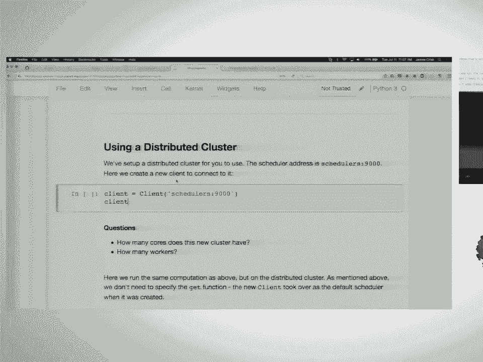

 You don't need to set it up this way。 It's just three things。 You have a dask scheduler command。

 You just hit enter。 That's going to spin up a scheduler。

 One of the things that's going to print out is the scheduler's address。 You just need that。

 In a different machine -- this is just a different tab on my local laptop -- but a different machine。

 you call a daskworker。 That will spin up by default a single worker process with the number of threads as you。

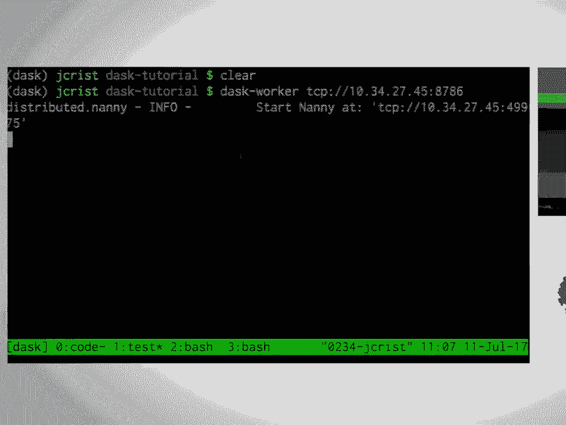

 have， of course， on that box。 These are all configurable。

 You can specify how many threads you want and if you run that on all your different nodes。

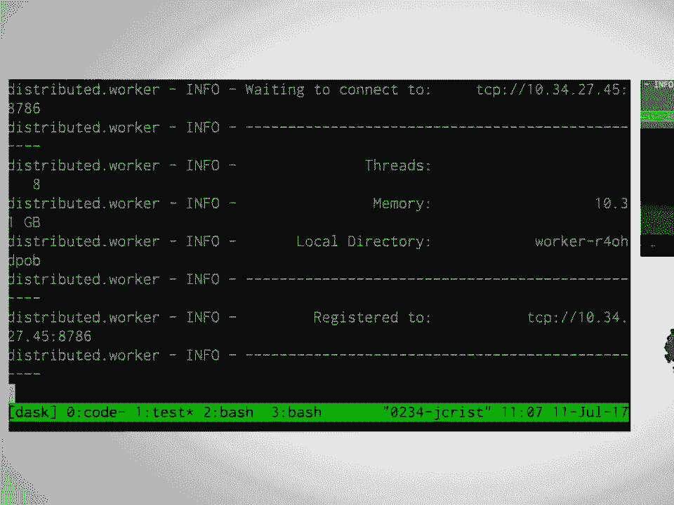

 you can connect。 In a third one， I'm going to import a client。

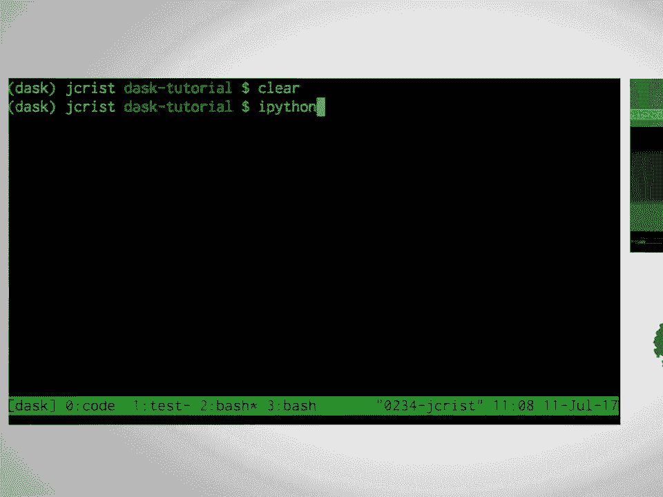

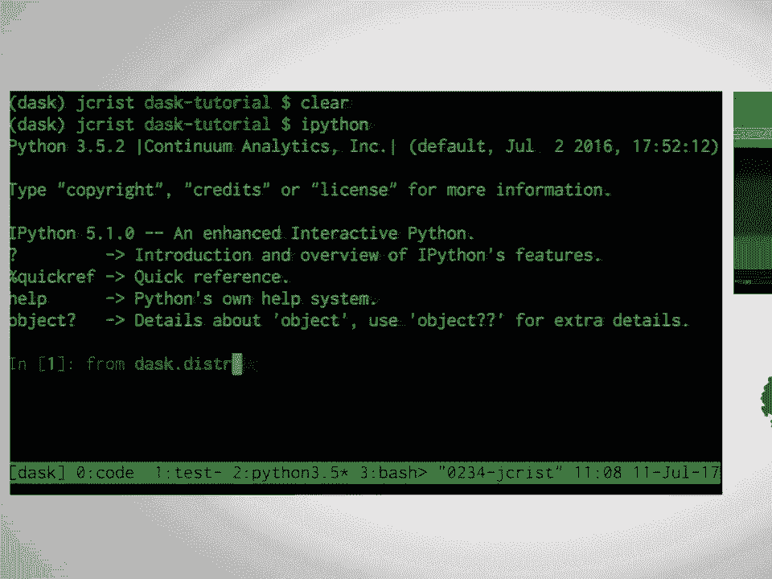

 Just a client， you pass in the scheduler address。 You can see that I have a single process with eight cores。

 We've already set these up for you。 Each of you should have your own distributed cluster running at this address right here。

 If I just run that， I can see that I have eight workers with 32 cores and 48 gigabytes。

 of memory across my old cluster。 Now we'll try running our dask computation from before。

 We have the graph building off the data frames。 The new client took over by default so this should run fine distributed。

 We get a big error。 One of the things you need to think about when you're moving from computing on a local。

 node to computing distributed is file systems。 You're running in multiple workers and they have different environments than your single。

 local setup。 Right here， all of my files that I was trying to compute on exist on my normal -- on the。

 node where my notebook is running but they don't exist where I'm actually running those。

 computations which is the worker nodes。 Often you might use some kind of distributed file system。

 You could use HDFS。 You could store things on S3。 You could duplicate everything。

 You could move your files so they exist on every node。

 There's lots of different ways to get around this。 For now， we're just going to make some fake data。

 You don't need to understand this cell at all。 This is making a data frame that looks like it but is all fake data。

 Create the same computation as before and we can run it。

 This is going to be running distributed across all of my workers， ran at about a second。

 One cool thing about the distributed scheduler is we have an awesome diagnostics page。

 There's a link right here。 This is going to open up。 This is a bokeh application。

 It's a cool plotting library。 You should use it if you want。

 It makes awesome distributed plots but it's really useful we found for plotting streaming， data。

 As things update， we can make nice charts to figure out how things are working。

 I'm going to run that same computation as before and actually just so I can talk about it。

 I'm going to run the loop。 We'll run it I don't know。 Ten times。 Cool。 While that's computing。

 we can go over here。 This plot right here， each of these rows is a single worker。 Let's see。

 There we go。 Each of these rows is a single worker。 Each rectangle is a task。

 If you hover over and you can see the actual title of the task。

 Here is building up my imaginary data frame。 I can see this is taking the max of a series。

 Red is data transfer。 Red is serialization between one worker and another。

 Data that lived on one worker might be needing to move to a different worker。

 There's all sorts of different tasks。 Down below。 We've been getting this with over the network for some reason。

 The plots aren't updating as well as they do over better Wi-Fi。

 You can see here's progress bars for every task that's running。

 You can see the different read CSV calls as they progress through。 Up top left。

 Let's run that again so we can talk some more。 You can see a byte stored on each worker。

 Every row here is a worker。 Bars signifying bytes。

 They'll turn orange as workers get filled up and eventually read when they start spilling， to disk。

 Dask will automatically spill to disk once you get enough memory in a single worker。

 It will start writing intermediate values that's storing to disk so it doesn't memory overflow。

 One caveat with this is that's all based on its estimates of the intermediate values。

 The task knows approximately how much -- like how to figure out the memory size of a NumPy。

 array and a Pandas data frame but not everything。 We're estimating how much memory is held by every intermediate value to figure out what。

 we're actually going to spill to disk。 On the worker node。 Second。 Which director does it use？

 That's a good question that I'm not able to answer。 You can specify。 It's configurable。 Cool。

 Did I have anything else？ We had some exercises running those。

 We are going to skip them to move on to more interesting things。

 Any questions real quick about setting schedulers and the different schedulers？ Yep。

 Can you access -- can you use GPUs？ Dask itself has no concept of GPUs but one thing you can do is when you're spinning up your。

 workers you can specify capabilities so you can say this worker has a GPU and then later。

 when you're saying where to run things you can say run this computation only on workers。

 that have GPUs。 Dask doesn't know the term GPU but Dask knows the string GPU that you can say it's a capability。

 of that worker。 If that makes sense。 I'm going to get the link to this diagnostic span。

 So by default it's always on the same port but if we go back to scheduler info you can see。

 after the scheduler address you have the bokeh address， HTTP。

 You can see actually here's the local directory that it's going to be writing to。

 It's just a temp folder but you can configure that。

 So by default I believe it's always on port 8787 of the same TCP as the scheduler。

 So shutting down the notebook 6 and moving on to 7。 Martin did you want to take this？ Okay。

 So we're going to be moving on to talking about distributed data frames so computing using。

 distributed on a collection of this time。 Which we'll see very familiar hopefully is the combination of the data frame concept where。

 you break up your data but now we're also splitting it across machines。 That's all fine。

 We just need a worker on each of those machines that can take instructions from the scheduler。

 Which is exactly what we have set up for you and in general it's not difficult to set up。

 in a whole different wide variety of possible cluster architectures。 Okay。

 So there was this problem of what files do you have on what machines and this is a general。

 problem when you talk about multiple machines。 You could have a file system that they can all see or in this case they could have a remote。

 data storage that they can all have access to。 This is very typical for say the Amazon or Google setups。

 You put all of your data in some kind of long-term storage。

 This particular one will use the Google Cloud Storage service。 That's an interface with that。

 It can interface with S3。 It can interface with HDFS and potentially some of those as year I think works more or。

 less for anybody that knows about those things。 But the point of it is that when you do read CSV the thing that goes in here doesn't have。

 to be local files because again you would have to make sure that those local files exist。

 for all of your machines。 So what this is doing instead it's talking to Google Storage and it's asking for a list。

 of files that matches this and it will run this through Pandas Read CSV where each of the。

 files are part of each of the files。 These are the typical things that you saw previously。

 Now instead of fake airline data or just an extract we have this real data set that exists。

 on a remote data storage and we can treat it in exactly the same way as before。

 Except when we call head of course it now has to actually talk to Google and fetch the first， chunk。

 So because network communication is always going to be much slower than this communication。

 expect startup times when you initially ingest data to take longer。

 But it's the same thing as previously。 One important thing that the distributed scheduler gives you is finer control over what is in。

 memory because the whole point of this is that whereas previously you're worried oh I might。

 fill up my 8 to 16 or whatever laptop memory you have。

 Now you have a load of machines and you can store data in memory on those machines because。

 inputting data is typically slow， cleaning data might be slow but you want the queries that。

 you run on a canonical version on the final clean thing you want those to be fast。

 If you store things in memory then Pandas is very highly optimized thing so for a Pandas。

 data frame most operations on it run very quickly so if I can split my data into Pandas。

 and store it on a number of machines then my queries can be much much faster。

 The key thing to look for is dot persist in this and that will take the prescription of。

 the data frame that you've built up so far， load it into memory and then whereas before。

 X was the prescription now instead X is a pointer to all of the pieces of data frames that exist。

 on your cluster。 Just like with compute you can also do multiple ones at the same time which is convenient。

 Okay so we defined df up here to point to this remote data and we want to persist it so I'll。

 just do this for you since it was really given to you above。

 If you're on persist on this then again df up until now is the prescription with any other。

 if you've done some addition of columns via maps or selections or whatever that's all part。

 of that prescription。 Now we turn it into a materialized in memory thing that's distributed across our cluster。

 And if we go across here then you'll see some things start appearing in memory。

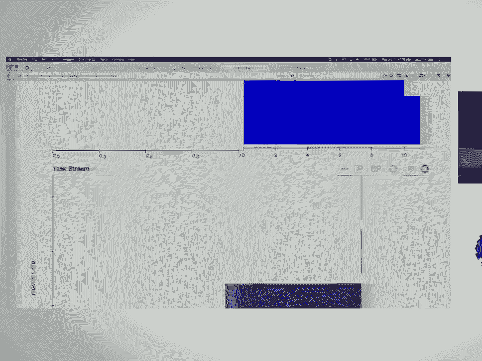

 Progress again is down here at the bottom so you can see that the time to read is relatively。

 slow but once things are in memory processing those into data frames is fast and sorry this。

 was the reading one， the one that's ahead。 Once it's in memory processing those things will tend to run much faster。

 Okay so this ends and unlike the previous one where this cleared out after we were done with。

 our operations now we have this bottom row which is the from delayed which is the interpret。

 this as a data frame。 85 complete and 85 in memory and those things show up here so the total memory usage in our。

 is 18 gigabytes。 Was the total amount available on this cluster？ 32 I believe。 Now we didn't do。

 I don't remember how long this took previously on a single machine but。

 now everything is in memory these are just， these are again optimized pandas operations so。

 when we run this， it was too fast for me， you can see on the plot all of these are the。

 little pandas operations they're fast because everything is in memory again and here is your。

 result where the vast majority of the time now it might be actual pandas computations if it's。

 being complicated but now you have to because you're on a distributed system， send， communicate。

 between the different workers so that can be also significant sometimes。

 Okay it's important to realize again and we said this before that the data frame is actually。

 a collection of pandas data frames so you can operate on them using your usual pandas。

 methods and you do expect them to be fast again it's always good to profile everything that you intend to do。

 and you can get some information about your data frame so that you can try and make rules。

 of thumb if it's likely to work well。 On the index if your divisions are known and things that involve using the index so joins。

 and the like will be much faster unless you put some effort into knowing what the index is you will not in general know。

 that so in CSVs they just files you don't know until you've analyzed each one what values you have in different。

 parts but you can always set an index if you want to which doing that at the right time for the。

 column that's going to be most important when you do your queries will really accelerate your work very much。

 Okay I will have you do this one I think because this is nice and quick。

 I already told you that here we know what the total is of the bytes in memory this is a useful thing to keep an eye on。

 but you could want to do this for yourself commonly as a precursor to running the whole big query that you might do later。

 So we have this thing D。F。 and D。F。 has a method not partitions which will take a function and apply it to each of the sub data frames。

 The thing that we're interested in is using this pandas function to figure out what the total memory usage of all of the pieces is。

 So again this is the stuff that we can do this because the pandas data frames the constituent pieces are now in memory。

 If they weren't in memory then to find out how much memory they take we would have to load it and then measure it and that would be a fairly lossy thing to do。

 So some things go in here and then you might want to do something with the output。

 I will give you a few minutes at doing that。 While you work on that I will mention that although the status tab here is the most important one and the one that you typically keep an eye on。

 There are other things in here that are worth looking at。

 So workers will tell you the state of your various workers their individual memory use for example。

 Tasks is a longer look back on all of the work that you've run since the cluster started up and so on。

 I'll leave that for you to check on。 You can apply arbitrary functions to the parts of your data frame。

 So the memory usage does this it actually tells you the memory usage of each of the columns which is why we're told that we might want to use some here。

 So if you use 。some if you apply some on to each of these which you could do as a single function that does memory usage 。

some or you could apply it again if you want to。 There are many ways that you could choose to set these things up。

 This tells you then the memory usage of each of the partitions of which there are 84。

 So if you wanted the grand total then you could do a sum before or after the computer and it would make a whole lot of difference in this case。

 Yeah。 Which is I don't know quite a big number。 But the idea is here that you can you are now farming out functions that operate on these data frames across your cluster。

 And so if you understand pandas then in general although not all pandas functionality works you can always get to where you want to go with a little bit of practice。

 So I will just mention that in the rest of this notebook there is some information about the index that I already mentioned and you heard earlier too。

 So this is going to be important depending on the types of data analysis that you want to do。

 It's a very common step after cleaning but before your major queries。

 So I'll just leave you by saying that the index is important and you should carefully consider the nature of your data before you turn to doing your queries。

 Again if profiling suggests that it may be necessary。

 The particularly interesting index that you might choose this is very common particularly amongst business oriented people as time series。

 So you have some quantity of quantities that is regularly sampled then natural things that you might want to find out is what's a monthly rolling mean or something like that。

 And if you set your index to be time series so time stamps then the normal pandas functions that deal with those time stamps such as resample in this case。

 Resample。mean this will give you the mean every month 1m for month。

 I assume rather than minute I always forget those。

 Then these will just work for you and so that's a great convenience for many people。

 So that's all on distributed data frames。 They work like normal data frames but remember persist。

 It will save you a lot of time in the right situation。 Yeah。

 All right we're going to try to quickly go through one final notebook and then we'll have time for questions at the end。

 So if we look back at the status board though this is just what I wanted to show。

 I still have all this data in memory。 That will be kept around as long as Python still has the reference to the data frame that it -- the DAS data frame that is data is from。

 If I close the notebook and then shut it down the scheduler is still running。

 The DASK scheduler is multi-tenant and you can have multiple people working on the same cluster sharing the same resources and DASK will figure out how to work that all out。

 Also one cool thing since we mentioned the hashing earlier is if you and your friend are sharing the same cluster and you both try to compute the same thing。

 DASK will only do it once and send you both different results。

 So moving on the final notebook we're going to talk about is some advanced things to do with distributed。

 So distributed -- the distributed scheduler is like any other DASK scheduler but it also has some additional API methods that you can use to do slightly more complicated things depending on if that needs to fit it。

 So one thing is -- we'll just quick recreate our client。

 Is this still connected to the same scheduler？ How many people have used concurrent futures before？

 Only a handful。 So Python has this standard library。

 a concurrent dot futures which is a way of doing asynchronous computation across thread pools or process pools。

 The distributed scheduler has an almost drop-in replacement for that but running across a cluster。

 There's a separate thing we're not going to talk about which actually wraps that and then does make it a drop-in but we change some things by default to make it a little more performant and just share it。

 So just to dive right in， we'll define some simple functions again。 Inc， deck， and add。

 Same as before in the delayed notebook adding in some sleep to make things slower。

 So the first function we're going to talk about， first method is submit。

 Submit is like apply if you've ever used apply from Python 2 or got rid of in Python 3。

 It takes a function， so any callable， and then arguments and keyword arguments and then it will run them on the cluster。

 So I'm going to run that and over here we can see it's processed。

 So right now there's one task processing and then it finished。

 What it returned was not the actual result though。 It returned a future object。

 Futures have a status so right then when it repert the status was pending and then it has the key in the graph。

 If we were to look at it again， we can see the status is now finished。 That computation is done。

 If you want to block， so if I let's run that again。

 this is still running because it's sleeping for a bit。 If I call wait on it， it's going to， oh。

 it's the same computation。 Hang on。 If you call wait on it。

 that cell will block or that call will block until that computation is finished。

 To actually get the result， you can use the result method or the gather method。

 So result is a method on futures， future。result， pulls the data off the cluster。

 brings it back to your local computer。 Gather can take multiple futures or even the same future multiple times。

 And bring it back。 So slightly， if you remember the delayed example。

 if you were to run this and -- sorry， different point I wanted to make。

 There's also an asynchronous compute method。 So if you remember we had a -- would block。

 we'd have to wait until things were done computing。 If instead I make a -- total。

 And instead of calling total。delay， total。compute， I use the client， our distributed scheduler。

compute。 That's going to return a future for that result while it computes the -- on the cluster。

 This means that locally in my notebook or maybe in my local process I can be doing other work while that work is done on the scheduler and then come back to it when it's finished。

 If I wanted that result now， I could call a future。result and get it back。 So an exercise for you。

 Rebuild the above delayed computation。 Instead of using delayed， use client。submit。

 A few things you need to know。 You can pass instead of actual arguments to submit like we did up here where we passed in one。

 You can pass in features instead。 And desk will schedule the computations to wait until those are done and then run them。

 Cool。 See， I'll give you a couple minutes to finish that。 Similar to delayed。

 Instead of calling delayed on the function， we just slightly rearrange the parentheses and we submit ink to get x。

 We submit and deck to get y。 And then we pass both of those features to submit again to call add。

 At this point， total is still a future。 But if we call total。result， it's going to block。

 And we can watch over here as things compute in our scheduler。 So we still have one task processing。

 And eventually that task finished。 And we got our result back。

 So this is a really nice set of tools。 We also have other APIs like map and a couple of other things that you might be familiar with。

 But this is nice for building dynamic asynchronous computations across a cluster。

 So instead of desk， we build up a graph at one point and then you send it off to the scheduler for things to be run。

 Using the futures API， you can build up graphs that change over time。

 You can build up computations that you can adjust as things are going。 Using bag as before。

 I'm going to make a quick larger collection just to demonstrate another point。

 If we call the asynchronous compute on the client， remember this returns futures not actual result。

 We can then use the progress bar widget to actually watch things compute in the notebook。

 So over here， we still have things computing on the cluster。 This is generally more informative。

 But in just a notebook， you actually have a progress bar。 And then at the end。

 after all those futures have finished， you can pull them back with Gather to get the result。 Cool。

 So this is not an exercise。 This is just a quick demo of a slightly more complicated asynchronous computation。

 This is going to be doing a super naive parallel optimization of the Rosenbrock equation。

 So that's just a common benchmark for optimization problems。

 The super naive optimization is we're going to iterate through。

 starting with a maximum of iterations， so we don't want to go too many times。

 And every time we find a point better than our initial point。

 we're going to scale our random search slightly smaller。 So we're going to start with a point。

 we're going to pick a bunch of random points around it。

 We'll keep evaluating that function in parallel。 When we find a point that's better than where we initially were。

 we'll use that one instead and we'll get a slightly smaller random circle around the new better point。

 And we'll keep going until we either converge or we end up with -- we've used up all of our iterations。

 This is not a good optimization strategy， but this does at least show off some asynchronous computation。

 So as things are going， we're pulling results back。 We're looking at them。

 We're submitting new ones。 Over here you can see we're evaluating in parallel the whole time on the scheduler。

 But we have a loop running here， pulling things back asynchronously。

 This has been used in several other projects。 Eric Welsh， co-worker of mine。

 wrote a project called "Dask Pattern Search" which implements the pattern search optimization algorithm in a very similar way。

 That is actually a much smarter way of optimizing in this naive approach。 Any questions？ Cool。

 So there was a few other materials left in the materials -- or folder。

 We had another one on storage。 We're not going to go over。

 "Dask has tools for rooting from different storage formats like Parquet。

 There are smarter ways to store things on disk。 And then there's a homework notebook which includes -- oh。

 notebook validation failed -- includes a couple different data sets and some example problems you might want to work on on your own time。

 So -- and if you want to see the materials， they are at this link right here up on GitHub。

 Note they are not in the main branch。 They are in the SciPy 2017 branch。 Anyway。

 we have a couple minutes left for questions。 Otherwise this concludes the tutorial。

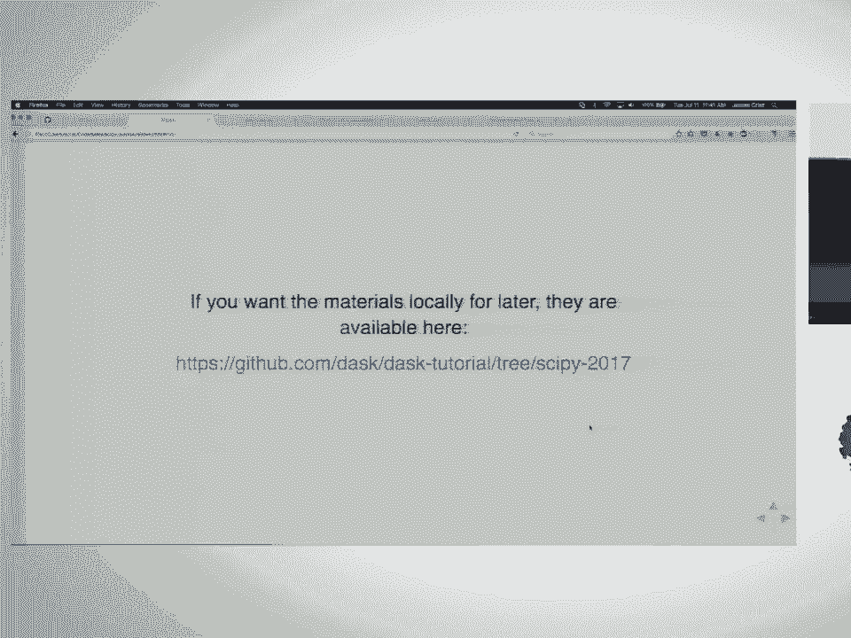

 [ Inaudible ]， Sorry， what was the first part of that question？ [ Inaudible ]。

 Yeah， it's a very broad question。 Let's see。 Let's go through a bit of history。

 So "dask" started about two and a half years ago。 That sounds right。

 And it was originally just a parallel array implementation。 And we had no distributed scheduler。

 Everything was set to work just locally on disk。

 We were designed to work on out-of-core data sets。

 meaning we want to be using data on disk and only loading small bits of it into RAM to do chunk block graphs。

 This was first picked up by the climate science community in a project called XRA。

 which is an amazing library for using data that fits that kind of model。

 Very powerful tool for labeled arrays。 And so they've been using "dask" to work on larger than memory data sets very successfully。

 You don't even have to know that you're using "dask" at that point。 Data frame came later。

 And then in the last year and a half， I believe， it sounds right too。

 We have the distributed scheduler， which at this point is fairly solid。

 We have lots of nice tools for working with it。 And it's being deployed both in industry and academia locally across several large clusters。

 I think the biggest I've heard of is 1000 nodes。 We have several ways of reading from common data formats in the ecosystem。

 So we can read from S3， Google Cloud。 It plays well with HDFS。

 So we can find data that is on a node and then move the computation to the same node as the data。

 We can run in the cloud like that。 You asked about Spark for fun and benchmark and other reasons。

 We have made a nice tool that you can spin up dask clusters from spark workers and spark workers from dask clusters。

 So if you're more familiar with one tool or the other， it's easy to set up both。

 So dask is a comparison between dask and spark。 I'm not sure if that was also your question。

 Was that part of that？ So why do you use none of these tools？ Use none of these tools。

 And I think there was a passion。 Okay。 It's just that when more and more people move。

 basically there's a distinction between the big company and use these tools。

 Some people want to use this。 And these tools are basically a deal as a recovery。

 And I know that in the zombie system you're getting better at swapping into those tools。 Yeah。

 I think I understand。 We try when we're designing API's designing tools to be as Pythonic as possible so we try to fit common interfaces you're familiar with。

 So dask data frames look like pandas data frames。 The extra API and the scheduler looks like concurrent dot futures。

 So if you're familiar with working on a single node in Python。

 hopefully these tools are familiar enough that you can at least easily learn about how to scale up to a larger cluster。

 We also try to keep setup super simple。 So if you're familiar with Python。

 we try to keep it in a way where you can set up a cluster without having to know too much about network administration。

 Yeah。 Anyone else？

 It's a website probably that the emphasis of that might be slightly different from Spark。

 which is become it's my exclusively mentor business uses。

 But that's sort of the thing that it's been making large applications of happy with data。

 That's an issue that you thought about that's because I would say that the low level ability to make your own algorithms is much easier。

 Especially if you happen to be a Python programmer。

 And so the novel things are likely to come out of the best because soon I think because to program to make something new in Spark you really have to get into the Internet。

 And then there's more than this。 A lot of the Spark people actually use it。

 Moving from Spark to Spark。 That's a problem in that self-care system。

 We also just touching on that。 We try to give really good error messages so you don't get some big Java trace back to it's just Python reporting。

 Anyone else？ Also just to clarify both are great tools。 I don't want to say competition here。 Yeah。

 You do have an error that's somewhere in the graph。 So a couple of things to touch on that。

 One for graphs of normal size。 So when people are doing competitions on real work not tutorial problems。

 Usually the graph is big enough that graph is kind of bogged down drawing it。

 So drawing it that way isn't super useful。 Talking about debugging。

 I'm going to plug my talk on Thursday again。 I'm giving a whole talk just on debugging desk stuff。

 But in just you will get if you call compute so it's a blocking thing。

 You'll get the error trace back in your process。 You'll see exactly the Python trace that led to that。

 You can see which function it ran and what line it erred on。

 Whatever message was reported there。 If you're using the futures API calling results will bring the same error。

 So future。result same error shows up。

 If there are no questions thank you。 [Applause]。