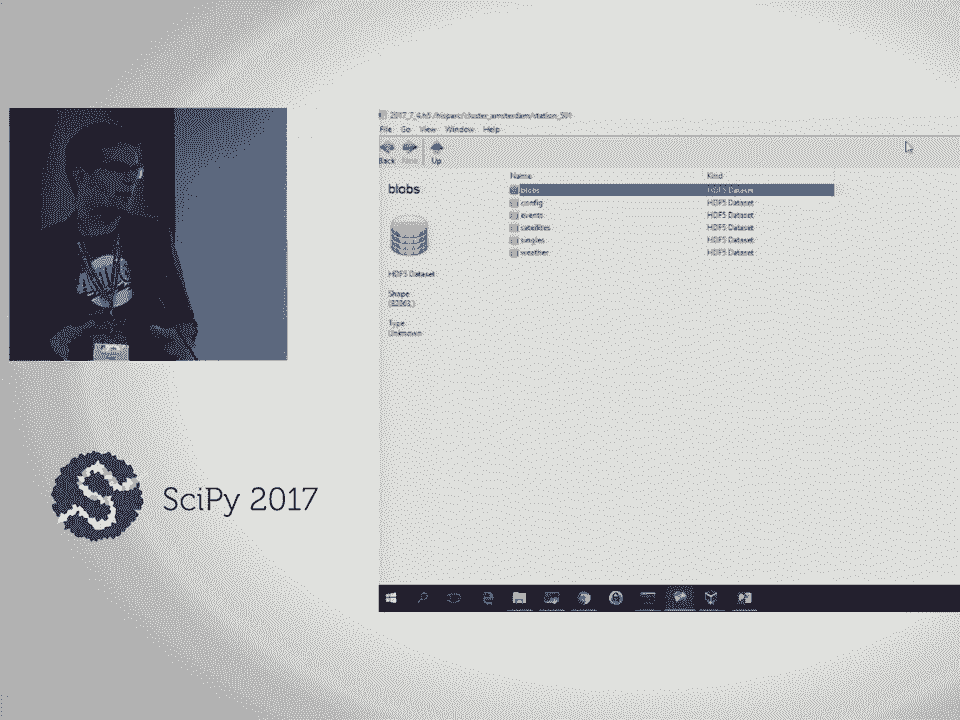
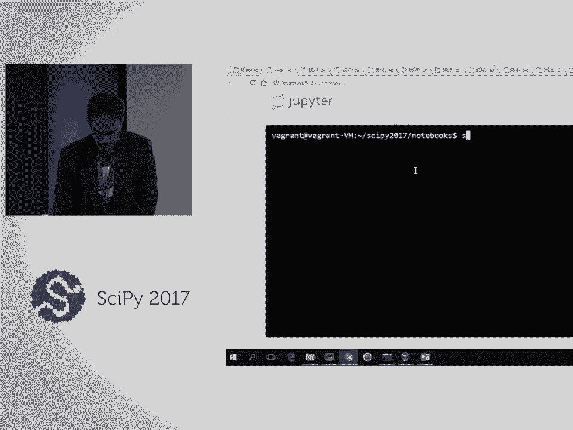

# SciPy 2017（合集） - P24：HDF5 take 2 - h5py & PyTables  SciPy 2017 Tutorial  Tom Kooij - 哒哒哒儿尔 - BV1Cs411A76Y

 Good afternoon。 You're already。 So welcome to the HDF5 Take 2 tutorial。 We'll be talking。

 about H5P and Pi Tables today。 So let's just start off with the outline。 Well， we'll get。

 to see the part， so I'm not going to explain them all。 We'll take a break around 3pm for。

 afternoon lunch for afternoon snacks and we'll probably take a short break every hour， so。

 just stretch our legs and grab a coffee。 So just about me first。 So I'm Tom Koi。 I'm a。

 physics teacher and I also work at the Dutch National Institute for Saperdomic Physics。 I。

 work at an outreach project called High Spark。 We do cosmic ray research。 I'll tell you a。

 little bit about cosmic ray research when we get into the HDF5 part。 But we try to teach。

 both teachers and high school students about research and about data analysis and in that。

 context I use HDF5 and Pi Tables a lot so I've become a Pi Tables maintainer and that's why。

 I'm here right now。 So this tutorial was made possible by the HDF group and Drigwes is supposed。

 to be here。 His flight is delayed so he'll be here in an hour or so。 So if you want to。

 know something about the HDF group be sure to talk to him。 I'll introduce him when he， gets in。

 So the HDF group is a non-profit small company focusing on my performance computing。

 and of course their flagship product is HDF5。 So just a little bit about what they're doing。

 support and consulting about the HDF5 and high performance computing。 H5 Pi tables and now。

 pandas as well。 A little bit about the industries and a few of their users。 So let's talk about。

 HDF5 then。 HDF5 as you probably know is an I/O library optimized for scale and speed but。

 very important about what we'll see back here in the tutorial is that it's also a self-documenting。

 container which can contain all datasets attributes， metadata that's needed to store everything。

 from a research and to make sure that the research is self-documenting or at least the。

 datasets self-documenting。 We'll get， we'll be talking about that later on。 So just a few， examples。

 I'll just， you know， we'll have to spend time on the tutorials and not just these things。

 So when we talk about HDF5 there's a few things。 There's the HDF5 data model， the library and of。

 course the file format。 So when people say HDF5 they probably mean the entire technology stack that。

 is HDF5。 And so what's so useful about this？ Apart from all these things that are mentioned here。

 it's really important that as I said before it's a data， it's a file container that not only。

 contains numeric data but also it's a self-describing dataset。 So let's skip through this。

 Okay so let's talk about Python then。 The funny thing is there are two packages in Python。

 supporting HDF5 and they are quite complementary。 There's H5。 So there's H5-5， which really is a。

 Pythonic interface to HDF5 and because it's Pythonic it's very NumPy-like so if you're。

 familiar with NumPy then H5-5 is the way to go。 It tries to expose the entire HDF5 API。

 and it exposes the low-level interface to the HDF5 library。 And next to that is PyTables。

 which has more of a high-level API and is more based on tabular datasets， hence the name PyTables。

 But on top of that it adds specific features， fast indexing， out-of-core calculations。

 and advanced compression which we'll all get into in the tutorial。 And as I said these two。

 packages are quite complementary but what strains that they both provide bindings to the HDF5 library。

 So at the moment you will either use H5-5 or PyTables。 So about two years ago I think here at。

 SyPy two years ago it was thought that the stack that you're seeing here on the left side where。

 both PyTables and H5-5 provide binding to the HDF5 library that's a doubling which is inefficient。

 because we can spend our time coding better developing other stuff。 We'd like to change that。

 and change it in a way that's shown on the right side where H5-5 provides the bindings to the。

 HDF5 library and the PyTables functionality just comes on top of that。 And if you're using Pandas。

 which we'll just see here in the tutorial as well。

 you can on top of that use Pandas which will then。

 use PyTables to access H5-5 which will then bind to the HDF5 library。

 So this vision was written down about two years ago and at the moment there's development if you。

 look at GitHub or at PyTables you can see that even today there are commits to make this happen。

 There's been a non-focus grant which makes it possible for someone to actually develop the code。

 right now。 Okay so today we'll use both H5-5 and PyTables。 So let's get to the first part。

 where we'll do H5-5 basics and before we'll start we will start this。 I want to ask you how much。

 experience you have with either H5-5 or PyTables so we can actually or either do this very fast or。

 just do it slow depending on the average experience。 So just raise your hand if you have。

 say if you're familiar with H5-5， you do not have to be an expert but at least familiar enough to。

 okay。 So that's a quart I guess and who is familiar with PyTables so not an expert but。

 okay so I guess we'll have to do we'll be doing this warm up slowly so we can。

 see the H5-5-5 API and the PyTables API and see how to use that to access HDF5 data sets。

 Okay so H5 is just a container that holds data that we use to persist data。

 and there are basically three types of objects that we store in an HDF5 file。

 First of course a dataset just an array of numeric or other data。 That's obvious I guess。

 Then there's groups which you can see of which you can which are。

 basically folders we'll see that there's a resemblance to the POSIX path structure。

 and both datasets and groups， databases and groups， can have attributes which are dictionary。

 like things so an attribute has a name and has a value。 You don't have to be scalars they can be。

 a value can be a dataset as well but you can if you have a dataset say with temperature data。

 you can attach an attribute just saying that it's either in Fahrenheit or Celsius or something。

 but you can also store large attributes even in an entire class in Python so we'll get to that。

 So this is a picture of the HDF5 hierarchy so every HDF5 file has a root group。

 and the root group is circled there and the root group already has an attribute so on the left side。

 it's probably unreadable in the back but there are some attributes describing this。

 this file or this dataset and then there are two groups and the groups have attributes and。

 the datasets and the datasets can have attributes as well。

 So in the HDF5 hierarchy we can organize our data objects and get them self-describing or make them。

 to be self-describing。 So I want to show you an example of an HDF5 dataset from my own research。

 so just a little bit about cosmic rays。 Cosmic ray is an event when a high energy particle。

 here's a drawn an iron nucleus with usually their protons an iron nucleus or a proton hits the upper。

 atmosphere with a high speed and in the collision new particles are created so new it's shown there。

 and the particles hit out on the nucleus as well so we get a kind of a shower where many。

 particles are created and the particles decay as well so the first collisions。

 so one collision causes a million or 10 million particles to hit the ground level。 That figure is。

 not a scale because a shower is 10 meters or 100 meters or a kilometer across and not 100 kilometers。

 across。 So what do we do？ On top of high school on top of the roof there are these boxes that you。

 use to transfer skis or to store skis on top of your car and there are scintillated detectors inside。

 there's usually four for each school and here you see some school some high school students installing。

 their equipment and we've got about about 100 of these detector stations scattered around high。

 schools and universities mostly in the Netherlands but also a few in Denmark and a few in the United。

 Kingdom and so each day we get our data and we've got we get data from about 100。

 stations and that are that already are and that also are organized into groups so there's a group。

 they're in Wales which is in the United Kingdom and they're all scattered in organizing groups。

 so let me show you a data file so I've opened up a IGF compass oh you see is it visible。

 I'm not sure if I can increase the font size， I don't think so no anyway so this is a HD5 file that's that's where that contains all the data。

 that the entire network collected on a single day so here we have just a single group it's called。

 iSpark that's the name of the experiment and if we do analysis we create new groups here so。

 this is just data because we can store here analysis as well so then you have the analysis。

 connected to the data in the same hcf file and we use here the iRookie to well here we have a geospatial。

 hierarchy where these clusters are all groups of stations so one in arhous which is in Denmark。

 Amsterdam Birmingham so let's look at Amsterdam there are about 30 stations and well there's kind of。

 non descriptive numbers but most of them either contain most of them on our rooftop of schools。

 and some are on rooftop of universities so if we look at the station then there's blobs which。

 is some kind of binary data configurations events set the lights probably I don't know if you can。

 read it whether data singles is also some events and well you can look at it if I have a look at。

 the data set but we organize them into data sets that are well that are attached to a station and。

 the main reason for doing this is to keep the data set the data set small so an event data set is。

 80，000 or 100，000 rows so it's just a few gig a few megabytes which is small and which is nice to。

 recess because the entire data file for one day is three gigabytes which is not very big but just。

 for analysis on a laptop it can become a sim so if you if you cut it up in small data sets you。

 can process them easily and fast and and the hierarchy in hf5 enables you to do that okay so。

 look let's look at our notebook so I've opened up the first notebook and we'll have a look at the。

 hierarchy how to do that so this is what notebook one structuring data sets turn off the header so。

 we have more space I'll probably have to increase the font size is this readable in the back。

 yes okay so let's look at how we can use the hierarchy in hf5 files to store and structure。

 data sets and we're gonna gonna have a look at the h5 by and by tables api so we're gonna look at。

 them side by side and so we can compare them okay the data file you just saw the groups and。

 data set structure is well piece a part of it is printed here and you can see this post-it-like。

 folder structure it really resembles the well Unix file paths so this is just a few of the groups。

 with the data sets and we'll see that later on so let's start just follow along I guess。

 so we'll import both pi tables which is called tables this pi tables and hf5 and use them alongside。

 first of all we'll create a folder called structuring and that's just not to clutter the notebook。

 folder we don't really need to but it's at least it's it's easier this way so okay so import tables。

 again we shouldn't have to and I'll create a file name layout that's just in the subfolder。

 structuring for data data there data there points to structuring and I'll open a file so I'll use the。

 open file method of pi tables and I'll open it in write mode which which means just overwrites。

 the file if it's already existing and now f is a so f is a file object that points to。

 this pi tables file or hgf5 file and we can create a group so there's a create group method attached。

 to the file object and we want to attach the group to the root folder and we call it a group。

 so let's look at that so a group is a group and it has no children at the moment and we can。

 create some data sets so let's look at this a bit so create array in pi tables means。

 just create a simpler array we'll look at the types later and attach it to this group we already。

 had you can also just type a group it's the same if I run it now it will complain that it already。

 exists but so I won't rerun it and we will store this range of numpy with objects please raise your。

 hand if you're familiar with numpy if you at least know this numpy array yeah so everyone almost everyone。

 okay so arrange is just share out to nine yeah so in in pi tables there's a few types of data sets。

 we'll get to that and you raise a simple one just a homogeneous array of of the same elements in。

 the data set it's a bit different than h5 pi I'll show that in a minute so we create this and we。

 can create another group as well and just and then just look at hgf5 file so we print the file object。

 so it looks a little bit different if you print it instead of just type f and you can now see the。

 structure within within file within hgf5 file okay so there's a thing in pi tables that's unique。

 to pi tables it's not an h5 pi it's called natural naming and natural naming means you can access。

 the groups that you see here in a kind of a attribute way to an it's a natural。

 item way so we here have the file object and there's the root group subgroups a group and we have my array one。

 okay and there's another function as well which is called get node which does exactly the same。

 and you can use either one and there's stop completion so if you're in a notebook just。

 just this you can just do a group and then complete but for some reason it won't complete on my windows。

 machine and if you're using windows it should complete but it doesn't i'm pressing the app it。

 doesn't complete so i'll just skip that but it should at least and that is does it work for you。

 no window not on back as well so i might i might have done something wrong i don't i don't。

 well just skip that and let's close the file so let's do the same thing in h5 by now。

 so h5 by i was really by tonic and numpy like so we'll just import it create a file。

 so there it's not open file here but it's it's found with a capital f and because it's non-pylike。

 we can access these objects like a dictionary or a list so we just print the list of the file。

 and it says well there's a group in this file like this is the file that i just created in pite。

 tables and we can look at that group we can access that group if we access this this way we get an。

 object that points to the group but we're not reading the data yet which is important when。

 you're accessing large data sets so let's look at that group and then i'll scroll upwards。

 let's look at that group and then list the items in the group so a group is a dictionary。

 because if we list it we get the name of the group and then the value the value is an object which。

 points to that data set and there's my array and this is just the contents of the file we just。

 created you can also list it and then we don't get the values but just the keys for the dictionary。

 and there's also a tab completion in h5 pi but you have to enable it so if you don't。

 you don't enable it it doesn't work so enable ipite in completer and now i can use。

 top completion here so at least here it works that's nice let me scroll upwards， so okay。

 there's also a create group method in h5 pi and we can close the file again。

 okay so this is just a little bit of the h5 pi and pi tabs api we haven't really stored data yet。

 we'll do that in the next next notebook but i would like you to look at attributes and。

 we'll do a little bit of an exercise so attributes are small named pieces of data that we attached。

 to a group or a data set and the syntax is shown here in h5 pi we just look at the group and then。

 look at the adders methods and we can have some name we can name the attribute and just store。

 anything we want in it basically a python object and in pi tables we use get node attributes and。

 set node attributes so i'll just give you a little assignment so use either h5 pi or pi tables。

 i would say the one you're already a little bit familiar with if you're not choose h5 pi so please。

 create the group store from attributes in the group and read them with the other packages and again。

 there's also some optional stuff you know if you're really familiar with this。

 try to write write a string in pi tables and read it with h5 pi it won't work so if we have time i'll。

 explain why and in pi tables you can even store entire classes in attributes and i will demonstrate。

 how but first let's try this and here i've got the solution already in your notebooks there。

 shouldn't be a solution but there's a folder with solutions and there's the same notebooks。

 but then with the solution i'll already say put in there so if you're you might just want to look。

 at it if you're if you're if you like i've distributed these post-its so if you're finished。

 just please just put the post-it on your laptop so we can or if you just you know if you're if you're。

 if you finish the the assignment put the posters here and i can see who is already and perhaps based。

 the the tutorial accordingly if you have a question just flag me and we'll see let's try to help。

 okay i'll show you a little bit so if you start with um write tables we just create a file and if you。

 want to know how node attributes work you can use the question mark which is just a help and you'll get。

 the signature and the description the doc string of this get a node attribute thing。

 so that might help if you're unfamiliar with pite tables what we're basically doing now is。

 we're basically um trying out the h5 by or pitebose api and we'll do that again in the next notebook。

 so we can just go go on to the next or go on here i'll show you the solution and if you're still。

 figuring out h5 by and or pitebose you'll have another you can do that again okay so this is part of my。

 solution i'm not not sure you're familiar with the with statement but this basically means that。

 we open this hdf this h5 file h5 by file and it will be called f or the object attaches f。

 and in this entire block it will be open and in the end of the block it will be closed so we execute it。

 we it will be closed again so i can also open it here and then afterwards close it that's just the。

 same thing so i know open a file in write mode so i overwrite it uh i just create a group and then。

 store a scalar attribute and i store an array in an attribute called array so let's execute that。

 and it's already open so i've done so that's better but now it's closed again because of this。

 with block and now i use a utility that's really nice to know about i use h5 dump which just comes。

 with the h5 h hdf5 library and will which will give you a JSON like not JSON but JSON like。

 contents of the file and this just means um sends the file name to the to the os because i'm using a。

 exclamation mark which means just execute this um this program so h5 dump just prints uh the。

 structure of the hhf file this the file name there's of course a root group and then there's a group。

 called a group which i just created and this attribute uh it's it's called an array here's the data type。

 and it might be a little bit cryptic but this just means in 32-bit integer。

 data space which is which is basically the same as a shape in numpy so the shape is 10 just。

 was just 10 items and the maximum shape will get to that and this is just a data set so we've stored。

 a data set inside of an attribute and we also store the scalar attribute which is a 64-bit float。

 a double and it's just one item 42 so you can use h5 dump to see what goes on inside of your hdf5。

 file and to get to know the hdf5 hdf5 library without reading the entire reference manual or。

 going into the hdf5 library source code okay so there's something with string attributes but i'm。

 gonna skip that and we'll have a look at storing entire objects into attributes。

 have somebody over here yes go ahead i'm sorry you had an array as an attribute yeah but it wasn't。

 a data set no you just uh you could populate that um well it's called an attribute but it's basically。

 the same as an as a data set but with a data set you can do things like slicing and you can extend。

 it and do a lot of things and and and data set in an array or in an attribute sorry that's just a。

 static data set but you can store a list of elements in an attribute so basically anything with a。

 with a NumPy dtype you can store as an attribute， yeah yeah so it can be of any rank yeah okay so um let's do the pite tables version。

 so what's been wrong oh i skipped something i guess i was。

 okay so just so throw me away okay so just just open a file with some file name and now we define。

 a clause somebody asked can you store a dictionary in an attribute no you cannot can you store a。

 clause no you can't but what you can do is you can pickle a clause or pickle a dictionary and。

 pickling means um turning it into a binary string and you can store the binary string into an hg5。

 file and then read it back again so you can do that with h5 pi but it's complicated and you have to do。

 it yourself but pite tables has this built-in so if you try to store a clause or a dictionary or。

 whatever into an attribute in pite tables it will automatically pickle it so convert it to a byte。

 string store the byte string and read it back um this is true no only for attributes only for。

 attributes yes so why would you want to do that for example in the project i just showed in the。

 cosmic radius research we we have clauses that describe the entire experiment describe the geometry。

 um and all kind of stuff that can vary a metadata of the experiment and we store the entire object。

 alongside with the data so we can just pull out the clause and we have all the geometry information。

 right there and these clauses also also have objects to do transformations and all this kind of stuff。

 so you can store large clauses as attributes a max an attribute can be maximum 64 kilobytes。

 so that's fairly large clause but if you store a lot of data in a class and it can become too big。

 so i've just um thought of some full clause which really does nothing just print some value that。

 you put in so it doesn't really matter this clause but it can be a dictionary as well。

 and you can just store it so we set it to this we attach it to this group and it has some name。

 and what have we done over so we have to i started over with a new um so create group。

 so at the roots we should have created a group that's called a group。

 okay and now we can store up have to go up here sorry now we can store the um group the。

 the attribute so i'll how ordered it so so we created the group then we stored the attribute。

 and we now can get it again and if we get it we print um a print this clause which was a。

 this this instance of the clause so we just execute that instance this is what it does。

 so you can store and retrieve a clause um， yeah it's transparent whatever you want as long as it's not as big as it's smaller than 64 kilobytes。

 um if you then look at the file in in h5 pi you'll see how it's really stored and now i have to。

 look at this file name again so where was i here， so let's make sure we closed it and then open it open it again in h5 pi and look at this group。

 so let's list the attributes of this group， so we have a title clause in a version these things in capital letters those are attributes。

 that by tables adds always adds um by itself so we just ignore it we'll just ignore it at this point。

 and we have the attribute that we just created attribute name and if i load it i'll get a binary。

 string and this binary string is just a representation of that clause that i stored inside it so i can。

 actually read this and then unpickle it and we'll out get the same clause back but in h5 pi you have。

 to do it by hand it's not automatic it's not transparent but it's possible okay let's close it okay so any。

 questions it's no yeah it just tries to unpickle it if it works then it says okay if it can't be。

 unpickled it will try if it's just a data set or yeah so you can run into problems actually so if。

 you really start using this um pickling is not compatible between pi two and pi three so if you。

 have a lot of things stored in pi two point seven which i had then um well it might bite you。

 because if you if you then try to unpickle in pi two three it doesn't work so there are things。

 around it and we've i've tried to implement it in pi table so it usually works but so if you're。

 using pi two point seven now pickling a lot of a lot of things then switch to pi two three then。

 now then then it might or it usually works but not always okay so let's look at data sets then。

 data sets and data types， so we look at we'll look at notebook two， that's too enough。

 and i'll just clear our output so i know what i've run and what i haven't run。

 yes okay so i will restart the kernel and we'll start off again so now we'll look at how to store。

 data sets we'll look at data types and see how h5 pi and um pi tables handle that。

 and actually pi tables has a very useful clause called its description tables。 its description。

 where you can basically get around the numpy dtype so if you're like me and you're not really。

 fond of numpy dtypes tables is description can be a very readable way of describing a data set。

 we'll look at that okay so let's start and we'll make a new folder called data types。

 and i'll just create some error to store which is just an arrange from zero to nine again。

 and now i've attached a dtype so it's an eight-bit integer open a file on h5 pi。

 so now i can actually create a data set， and that's actually the i guess the wrong way to do it or i would call it the wrong way to do it in h5。

 pi because there's a very verb verbose way to do it so in h5 pi being very Pythonic you can just say。

 um in the file this so this is the location in the file and here's the array just store it please。

 so and now it's also stored so the same same um data set is stored in my data and in my data too。

 let's list the file so there are two data sets or at least we're not sure that it's data sets。

 two groups or data sets two items in this file my data and my data too if you want to read it back。

 we can use some kind of slide thing so this means slice the entire file this ellipse is basically。

 the same thing in in this context so let's just read it and we will get back the array we just store。

 so this is this is the well the nice way of using h5 pi it's very transparent just like a。

 a number by a memory object and we just persist persist our data in a hf5 file so let's close it。

 and then we'll look at another hf5 utility called h5ls so again using the exclamation mark i'm just。

 executing that h5ls command and it'll show the contents of my data file so indeed there are two。

 groups or two data sets sorry and they're both of length 10 and we can add some options。

 v means verbose and arm in just recurs so look at all the data sets and we get some。

 some information so if you if you have a hf5 file and you want to look at the content you don't have。

 to open it in Python you can just use h5ls we can use use h5 dump again so now we get now we have。

 stored data sets and not attributes and of course there's a data type again a data space that really。

 resembles the shape in numpy again this is the shape and this is the maximum shape and then。

 that's the other one and both are exactly the same。

 okay this should work as well on windows because i've in the in the conga environment i've provided。

 or at least i've asked you to install i've let you install the git package which comes with。

 Unix-like utilities like ls so if you exclamation mark ls you'll just if the contents。

 of a folder or in this case yeah this is a folder if it doesn't work you can also use the error of。

 course which package is that it's in git so yeah the git version control git it comes with。

 a minimum package minimum sub package of bash like utilities so it's really it's really。

 nice to have especially as this thing and now work on windows and and Ubuntu and Unix and。

 Mac in the same way okay so piteable so this h5 pie is a really pytonic。

 api so let's do the same thing in pite tables let's open a file and overwrite it and a data set。

 is sub-clossed into a few different higher level objects objects so in pite tables we just don't。

 we don't have just a data set but we have an array which is the the simple or the simplest。

 data set just home again as data set so all items are of the same type then there's a。

 CRA which is a chunked array more on this later let's skip that now and ERA is an extendable array。

 meaning that it doesn't have a fixed length but we can just keep on extending it and so there's also。

 something like a pend these higher higher level of things you can do this as well in h5。

 and there's a table and a table is a compound data compound today the compound data set。

 which means that all the items or the columns of the items can have different types。

 okay so we create an array we store it in a root we can also just say。

 store it here that's the same root this is root and a file is called f2 now so f2 root is the same。

 let's call it my data and the object to store is this this thing。

 and when I use this object is I don't have to specify any dtype I just say the same as I did in h5。

 pi just store this object figure out the type yourself and just store it so we have a data set。

 that's of length 10 or shape 10 and it figured out that it has to be stored as an 8-bit integer。

 okay and we can of course read it back again which is similar to h5 pi。

 and there's also a little bit more of a higher level function just my data read it's just it's。

 the same thing so in interactive use this is very nice just just the h5 pi way or the numpy way。

 and when you write in code this reads methods can be nice to properly document what you're doing。

 so let's look at the file we store it in array and disclose it。

 and then use h5 a less again to see what's in the data set okay so and it's basically the same， um。

 no um we'll use them in an exercise and they'll we'll come back to it later on yeah so this is just an。

 if you create an array it's just a homogenous data set。

 yeah so in h5 pi you don't have to you just create a data set。

 and then you specify the dtype and that mb m again this but it can be。

 a compound as well so we'll show that now so now I'll have to define a dtype and I'll scroll a bit。

 so I'll define basically a table with a column my field one which is an integer。

 then another column my field two which is a 64-bit float and then my field three it's a。

 byte string of length five and then I'll just create put some values in it doesn't really matter but。

 here we have a structured array so we have so each row is this is a tuple and because it's a。

 structured array and it's an integer a float and a string so you can't you can't store that in a。

 pi tables array but in a non pi data set you can just store it provided you give it the correct。

 dtype so let's do that open h5 pi or open the file on h5 pi 5 5 5 pi just store it。

 let's look at it okay so it has a strange type because it's a compound type now。

 so it's the type is not in 32 or or ff8 or something it's some combined type。

 let's look at the type well this it's just of course the the type we just created but now it's。

 in well in a non-pinotation of a bit integers and etc or 32 bits in the gears actually。

 and read it back and we can just get the same same data set again。

 so let's look at the file and now if you look at h5 willess we've stored not just a single data type。

 but there's a see like structs which describes the columns of the data set we are。

 we've we've just store okay so it's time for an exercise again open up this file in pi tables。

 and just look at look at how would just look at it just so it's a short exercise just a few minutes。

 two or three minutes just here's this found them again we can use pt dump so i think that's not。

 the solution yet but pt dump is a it's like h5 dump but it's the pi tables version so this is what。

 what's in it and just open the file now and see what's inside okay we'll continue。

 so we'll just use pt tables to open the file， and look at the file handle so you can see what's stored inside and this description will。

 will look at for in a minute because i like this description this description a lot better than。

 the numpy dtype because it just says what each column actually is but let's just read it。

 the same way as h5 pi and you'll get back to your ray and of course a dtype and。

 oh sorry and of course you can look at the dtype and the shape so let's store a compound。

 data set using a dtype first so it's basically the same way it's in h5 pi and then look at the。

 tables is description way which i really like okay so we'll open a new file。

 and now we'll create the table again at the root we call it my data again and now i'm saying。

 description so i'm not using this object last time we used object obj and then just store to the entire。

 table so not the dtype but just just store to the table but now i'm creating a table and not storing。

 anything in it but just using the dtype as a description so we create the table it has zero。

 elements or zero rows the shape is just zero and here's the description and now we can actually append。

 the table the this table to store was the the array we wanted to store or the structure to。

 array we wanted to store so we use a pen we can use read to read it back again and of course it's。

 still the same table there's other high level functions remove row for example so let's remove。

 the fifth the sixth row row index five and read it again so now we have zero one two three four and。

 index five is missing so the sixth row is missing and i'm not sure what this is supposed to do。

 and do here it was used to be so we're missing this index five of course so let's close it。

 so in pi tables there's higher level functions but you can also you just use the the numpy like things。

 we saw in in h5 pi， well in hia 5 you cannot yeah so in pi tables binding to the hia 5 libraries library it doesn't。

 delete the row it disables the row because in in in hia 5 file file you cannot delete stuff you。

 cannot just or just add stuff but it was it was it was say on on disk so if you if you delete。

 delete a million rows your file won't become so smaller you have to repack it just store it into。

 a new file if you really want to be smaller in the current version of the hia 5 library so the latest。

 version there is some free space management but that's not supported yet by pi tables。

 no it's it will delete it in the hia 5 file so it will tell the hia 5 file deleted so if you read。

 it back with h5 ls h5 dump or or h h5 pi or in some other language it will be deleted but it's the。

 data is still in the in the dataset in the in the data file yeah okay okay so um let's do the same thing。

 but use the description class so let's define the the the dtype we just used but then with this。

 class called tables dot is description so we subclass subclass did we call our class my table so it's。

 the description of my table and we have three fields and four byte integer an eight byte float。

 and some string column of size five just the same dtype but it's much it's much more verbose but much。

 more easier to understand I think and you could you can use these things whichever you want whenever。

 you want so let's open the file again so let's create the table and here I'm passing just my table。

 which is the description so I could also type description is my table which is the same thing。

 and I can append the table I was going to go to store perhaps read it back or just close the file。

 now let's compare these these files and there's something strange actually because。

 these pi tables files are much larger than the h5 file file 5 version because this compound h5。

 pi is just two kilobytes and the pi tables they are identical of course but they're much larger。

 so what's going on if we just look at what you're seeing this h5 pi version as a data set of shape 10。

 or length 10 10 elements and the pi tables one has now has five has nine elements because I deleted one。

 but it's has a length a maximum length also also specified and this maximum length is now。

 infinite so this this data set is extendable you can extend the data set just keep appending。

 things to it and the data set we just created with h5 pi cannot be extended just of this of length。

 10 and it cannot be extended we can do this with h5 pi as well we'll see that later on but。

 a table in in pi tables is a column near column near data set that can be extended。

 okay so this is a nested field I think I'll skip that because of the time。

 so if you're having nested tables and it's come really cumbersome with d types and it's a script。

 you can help you but let's just skip that here because I want to before we stop for our coffee。

 I want to show you the calls accessor so if we just I'll just run this quickly so we create。

 the data set so if you are following or following along just run these things and。

 the call successor in pi tables is an object that points to a column so not an entire data set but。

 just one column so if you use this t is points to a table let's show that first。

 so t is a table in this hg5 file with the following description and if you use。

 t-call momentum we will read the entire column so I'll remove the slice first we'll just read。

 the entire column and we can slice it as as in NumPy of course etc so we can now we have a little slice。

 but what we can also do is use not call and then the name but t。calls。momentum。

 and now we haven't read the entire column we've only created an object that points to this column。

 and if we then do this we'll read this column but not at this in this at this stage before we hadn't。

 read it before so if you have a very big data set it can be very it's very important to know the。

 difference between this call and the calls accessor so this basically just means just read the entire。

 column and this just is just an object that points to the column so we can if you look at the type of。

 the column then we see that it's just a column and we haven't read the data set yet so I would like。

 you to investigate what happens if you read the small slice of elements of a column are you then。

 first reading the entire table or the entire column and then in memories just selecting a piece。

 or are you only reading the elements you're interested in it's a very important difference。

 especially when your data set is 100 gigabytes you might not be able to read an entire data set into。

 memory so let's see how that works so this is not the exercise doesn't start here yet just。

 we'll create a nested table again and create a million rows。

 okay and what you can now use is this ipitan magic let me just show you so you have time or time it。

 that will that means execute this this line and execute it 10 times or 1000 times it will。

 that will it will let's write it by itself and just tell me how long it takes so time it if I'll just。

 do well this command of course so how long does it take to fill the data set so now I won't get the。

 result I'll just get the time so it takes well almost one second to do it to do this and it tries。

 it writes seven times and gave us the average so you can use this time it to investigate how long it。

 takes to read something and you can and from from the time it takes to read you can figure out what。

 is actually reading if it's reading the entire data set or just apart you can do this in difficult。

 ways as well but this this time it functions very it's very it's very nice so what what what I'd like。

 you to do read elements 22 through 30 from the px column and the question is is the entire data。

 bill of file being read from risk but of course it's not but if escaped please and after after this。

 we'll stop for a cup of coffee so the tables here store it and try to read it okay we'll look at this。

 the solution so we created this data set that at the million rows and let's create a file open it。

 and so this is in pi tables and now we create a table at root group call it my data again sorry。

 and we'll just store the entire table this will just say well here's a table please store it for me。

 and the nice thing about that is that you don't have to specify the dtype again we've already。

 used the dtype to to to create the table well we've used this description to create a table because。

 I've I took the dtype from the description to this function transfers or transforms a description to。

 a dtype we created the table and now we can just store it so here is the result we have a table of。

 a million rows with this description and now let's time it if we read the entire data set so。

 I'd rather use time it actually so time gives the result as well but then just runs it once and。

 just gives it and it might be a bit off so time it will run it a few times and give you an average。

 so 30 milliseconds and now time it and just we'll use natural naming so we have the files f。

 then in the root group we have the my data data set and then we use the calls accessor again so。

 calls dot momentum dot bx because it was a nested column and so just this this slice of 10 items。

 and you can see that it's um 200 times faster or something so it's much faster so obviously we are。

 only reading these few elements from disk okay so sadly in h5 there's no equivalent if you want。

 to read just part of a nested column if you want to do that you also you'll always be reading the。

 entire column the entire nested column so I'll show you so we open the same file h5 file h5。

 pi let's use time it again and it's much slower and this is the same thing actually so it's much。

 slower it reads the entire thing and then just slices the 10 elements okay so um we'll stop for。

 coffee first and then we'll do a short exercise but I'll explain after coffee so let's take five。

 minutes back at five five minutes before three so let's continue um during the break drago。

 drago has walked in and he's from the hdf group so if you want to know something from the hdf group。

 be sure to talk to dogs um I was looking at the exercise that I promised we would do after the。

 break but while looking at all the parts all the things that I want to to cover today um we better。

 just go on with just chunking his compression the exercises including solutions are all in。

 in the repository so you can look at them yourself so let's look at chunking and compression um。

 this being a tutorial I hate to lecture but um to understand chunking it's really important。

 well understanding chunking is really important so I'll lecture a bit about chunking tell you what。

 it is and what you have to look at and then we'll do some more hands-on things so first of all。

 remember that the hdf5 library is a c library and that means that um objects are stored in what's。

 called row major order meaning that it's um we're indexing it with rows and columns and the rows are。

 the fast changing items and reading or writing a row is fast but reading or writing a column is。

 slow so we'll show we'll show you that um so it's important to keep that in mind when looking at。

 the way the hdf5 library access data so data set in hdf5 is really just a collection of metadata。

 the rank and the dimension of the data set the data type and other attributes and then then。

 there's a big data set it can be of any rank and in a file there's a piece that is metadata shown。

 there and of course the data set is written and if you have a contiguous data set then the data。

 set is just written in some piece of the file just row by row so what is chunking um if you want to。

 have a data set that for example can be resized you cannot use a continuous way of storing it。

 because you cannot resize it you cannot extend it so that instead of storing it's continuous。

 the data set is a cut up in in this case rectangular slabs but this can be of any dimension of any rank。

 and um the chunks are stored in the data set as separately and the chunks do not have to be stored。

 in an ordered they can be stored stored just random through the entire data set。

 and there's a chunk index so it's a B3 object which points to the location of the of the chunks。

 inside of the data instead of the data file so a chunk always has the same rank as a data set。

 so if you have a three-dimensional data set chunks have to be three-dimensional or two-dimensional。

 two-dimensional um they don't have to be they don't have to fit so chunks the dimensions do not need。

 to be factor of the the data set dimension but you can be inefficient with storing you can show。

 that shown here so we have some space left over and so it's not only inefficient inefficient with。

 storing but also with IO so just two small questions why if i want an extendable data set why don't i。

 just use chunk size set chunk size that is just equal to one so each element has its own chunk then。

 i can just extend it and no be done with it why shouldn't i do this why would it be very slow。

 because then you have to go and store each chunk at one time and get each chunk at one time。

 over and next if you go there then it won't be affected yeah so you have both overhead for you。

 need you need a table which just says where each chunk is stored but also when you're reading it。

 you have a read a seek operation first to define the chunk in the file then read it so if you do and。

 if you do that for each element by itself it will be very very slow so we have to keep that in mind。

 can we change chunk size i haven't told you so but do you think we can change chunk size after we've。

 created the data set no we can't we can repack the file so if you have a big data set somewhere。

 there's a utility called h5 repack and you can change the the chunk size just by reading in the。

 entire data file and writing a new copy copy of it with different chunks。

 okay so if we access a row in a contiguous data set so remember this is a C library we can just。

 just have one seek operation and just read the call out elements so that's very fast。

 however if we read a row in this chunked data set so there's five by two chunks。

 if we read this single row we will have to read five chunks because in hdf5 a chunk is a it's an。

 atomic object if you read or write a chunk you'll have to read the entire chunk and if you've write。

 a single item to a chunk you have to write back the entire entire chunk so if you're thinking about。

 performance or if you're fiddling with performance you have to keep in mind that you're always using。

 these chunks as atomic objects okay so how might i approve the situation。

 this is the this is the wrong picture i was actually going to show you a column a column。

 or access so let's skip this quiz and go on to the column sorry about that so this is a little bit。

 of the explanation so if i access my data in a column or fashion we'll use if it's if there are m。

 rows we'll need m seeks just to find find the data set on disc and then m reads just。

 read the single item if you do this your performance may be quite bad actually。

 with chunking you'll need only two seeks and then read the two chunks so performance can be better。

 so choosing the right chunk size and we'll do this in the notebook can improve IO performance。

 if you know what type of access pattern you're going to use but and that's very important to。

 understand or to realize you might actually worsen other IO performance so if you're hitting。

 strange IO performance or if you're if a read or a variety cert is on a large data set is for。

 some reason unexpectedly slow think about the chunk dimensions think about your data access。

 pattern and think about how many chunks need to be accessed and what is going to what what's happening。

 underneath but i'll tell you more about it but let's first do some hands-on things so。

 let's start notebook three chunking， okay so i've opened it this is notebook three chunking and in a notebook i've。

 repeat a little bit of the of the information but we'll skip that now。

 so let's import it again and oh sorry about that and create a new directory called chunking。

 the same we did last time and because creating chunk data set is what it's not too difficult if。

 you know the api by heart but because i do not want you to fiddle with the api at this moment i just。

 want you to create a chunk data set and see what's actually happening i've defined a function that's。

 called create files and you can specify size and just just the length of the data set and it chunks。

 size and it will create three different data files once called continuous which is just continuous。

 data no chunking at all then we have one which is called chunked which has chunks with some。

 chunk size so you can see here create data set of some size with chunk size with some chunk size。

 and then we have another one which is called automatic we could call it unlimited as well。

 which has a data set that can be extended and we just say or we're just saying chunks is true。

 it means we're just saying to a h5 to determine the chunk size by itself okay so let's run this so。

 we have defined this this function and now we can just create this these three files so that's done。

 let's look at it so we have the chunked file we're using h5 a less again to look into it。

 and now it says something about there's 100 chunks which are which are 800 bytes per chunk。

 and the automatic one has a chunk size of 1024 which is 800 well it's eight times as much because it's。

 eight each element is eight bytes and let's look at the file sizes and of course the continuous。

 data set is a little bit smaller just because there's no overhead of having to do the bookkeeping。

 over where all the chunks are okay how come back to this automatic chunk size and now let's read it。

 so what I've defined a function that reads the three data sets and just times this reading。

 so we first we'll read the continuous data set， now the chunk one。

 so it's a little bit slower but it's so fast that it's hardly noticeable。

 and of course it's running a thousand times so that's why it's slow here it's measuring a thousand。

 times and then giving us the average okay so in the way i'm i've shown you here set the size to。

 10 million and try to figure out some chunk size that offers a reasonable file speed file size。

 and read speed so use the function we defined this create files function so you don't have to。

 fiddle with the API API of h5 y and set the size to 10 million and just see what the chunk size does。

 to the reading speed okay so remember to put up your sticky note if you're done with the exercise。

 okay so let's look at something so i've asked you to just try so there's not just one solution。

 but let me just so we're using this we'll be using these create files with 10 million rows。

 and i've chosen a chunk size oh so and this is what these are the file sizes so it's about 77 megabytes。

 and now let's read so let me show you what we're doing for each of these three files。

 our first print reading and then the file name then i'll create the file name and i'll just use。

 h5 als to show you the contents including the chunk size and then we'll just time the reading of。

 the entire data set so let's do that so continuous is just well no chunks tall。

 and we're 65 milliseconds for reading the entire data set then we have the chunked and the chunk size。

 was 100，000 as i specified so it's a little bit slower when reading this that is of course overhead。

 and the automatic that's that needs a little bit explaining here we see the data sets it's it's 10 million。

 size the length is 10 million but the maximum size here is infinity or infinite so it's still。

 extendable and it isn't here here the maximum length is just 10 10 million and this means we have a。

 different chunk size because the way we defined this create files function i'll go up and show you。

 the create files function so that's this function create files so so here the automatic file will。

 be asked h5 to create a chunked data set but i'm just saying chunks is true i'm not specifying a。

 chunk size and this actually means h5 by just go ahead and give me any chunk size you think is best。

 however the algorithm for for choosing the chunk size needs to know the length or the size of the。

 data set to figure out the best chunk size and we haven't given it a length we just we've created an。

 infinite data set and whenever you do that if you create an infinite data set。

 h5 by will choose 1024 as a chunk size as a chunk dimension so if you have if you have a multi if。

 your data set is ranked three and it's all um x's are unlimited you'll get 1024 by 1024 by 124 by。

 124 so if you want um h5 by or by tables to choose the chunk size for to choose the chunk size you'll。

 have to specify a maximum shape so in h5 by this how you do it maximum shape and we could just。

 specify the size here but then you don't have an extendable uh data set so in pite tables you can。

 actually have both an extendable and extendable data set and a chunk chunk size that is chosen by。

 pite tables to give probably the best average performance if you specify um the max the max。

 shape and not sorry not max shape max shape is h5 by but if you specify expected rows so whenever。

 you're creating a data set in pite tables so if you use create table with uh the arguments we saw。

 in the last notebook you can pause a keyword argument which is expected rows and they say well。

 I'm expecting 10 million rows and then we'll calculate a chunk and chunk size that fits 10 million rows。

 you can also say expected rows is um just is 10 or um now any any expected rows you want so if。

 you're creating a table in pite tables and you want the best performance then be sure to provide。

 expected rows if you know it if you don't then well you you might have worse performance than you want。

 okay so we were doing this exercise and we were we were looking at the speed so continuous was。

 65 milliseconds um the chunk one is 88 milliseconds and then it's automatic with this chunk size that。

 is well chosen by h by 5 because it didn't know any better gives well it's about three times。

 worse performance or something so chunk size does matter okay um。

 again an important thing that I don't want to skip so we talked about reading just parts of a。

 data set and we saw that in a nested column sometimes you cannot read just a small slice but in general。

 you can you always can so using the 10 million data sets or the 10 million rows above just。

 retrieve this a small slice and look at the time it takes to read oh so so just two minutes or something。

 look at the time it takes to read these um this 20 000 rows out of the 10 million。

 so be sure to put up the sticking out again if you're finished with this exercise so again I've。

 got I've created a bit of the same logic so for each of these three files let's just read it。

 so I'm just opening the file then choosing the data set and the slicing these 20 000 elements。

 and again what's important is are we reading the data set first and then slicing in memory or are。

 we just reading a part of the data set so refers to be reading continuous and we'll be timing it so。

 we do it again and again and again of course we'll you we will be using um though as file cache so。

 we're we're reading it from file cache I guess I'm not from disk but the result is is the same。

 so the first so they're all about one millisecond there is some overhead from by for chunking but。

 what you can conclude from this is that we're not reading the entire data set well we can try that。

 I'll just try it for one but um if you're reading the entire data set continuous then。

 now that's there's one it will be it will take longer than oh what am I doing。

 no that's just too too let's just try continuous， so oh that's of course fast hmm hmm and now we're reading it。

 this is faster isn't it， oh I'm yeah I'm just I'm just not I'm not reading it I'm just looking in the file and。

 this essay accessing the data set and just saying oh it's here it's so。

 because that's a difference so this this means just load the entire array and now it's of course。

 luckily this time it's it's 60 or 70 times slower because we're now reading the entire array from。

 this core from OS file cache okay so very important you can always read a slab or a slice of the。

 data set without reading the entire data set into memory so here's an exercise where you can。

 choose a chunk set chunk size that fits your data access pattern we have a color columnar data set。

 and you can of course fit the chunks to your data sets and I think it's you know just looking at。

 the time it would be best to to skip this exercise and just tell you what kind of actually what you。

 would would do so if you're reading columnar data you're you want to avoid all these seeks these。

 seeks are very slow access time of a disk is 100 times or 1000 times slower than reading on disk。

 so you would want to I think I have a picture or something yeah so you have a you would want to。

 make sure the chunks your chunk size is at least columnar shaped I wouldn't I wouldn't make them。

 of with one because then you get a lot of overhead for just having a lot of very many chunks so if。

 you have a data set that's something like 10 by 10 then you don't need to worry about performances。

 anyway so if you have 10，000 rows and a million rows so don't make the chunks of with one even if。

 you're reading columnar okay so I'll go back to the sheets。

 yeah I'm going to say something about the cache， so mind the chunk hash so I'm not going so I'll tell you how to adjust the chunk in chunk hash。

 later but in hf5 so in the hf5 library not in python but in the library there's a chunk hash。

 and what that does if you read or write a chunk you'll just you'll first read the chunk into a cache。

 and then then read it into memory so let's think about what happens if you have two chunks at a。

 columnar and they are again they're emeralds long and if these things fit into the cache。

 if you want to read these elements you'll just need to access the disk twice just read。

 chichank a and chang way b and that's you're fine so what we're doing we're reading this。

 row by row if it doesn't fit into the cache you'll first read。

 that element over there then but you need to read the entire chunk from this。

 the cache is full so for the next element you'll read chang b and the chunk a will be discarded。

 and you'll do that for the second for the second row you again read the entire chunk from disk。

 and then again from this so you'll read the chunk two times m times which can give very very bad。

 performance and this is not a synthetic thing this can happen quite often so what you want to make。

 sure is that your your entire access pattern so your entire read operation reads so all the chunks。

 that are part of that read operation fit into the chunk sign in chunk cache the chunk cache is usually。

 one megabyte it's one megabyte in h5 pi it's one megabyte in the defaults for the hdf5 library。

 but it's two megabytes in in pi tables and so if you have larger chunks or your access pattern。

 is larger than one or two megabytes you want to you want to increase the cache or think about your。

 access pattern perhaps you can change it here you could read columnar as well just just do a first and。

 then be yeah yeah so you can in pi tables you can just specify the chunk cache you want when you're。

 opening a file and in h5 pi you can't but there is a way to manipulate the low level API to change the。

 chunk cache size and we'll show we will get to that in notebook nine I guess so if we don't get to it。

 you can find it there， well if you want to read an item from from a chunk you'll have to read the entire chunk so in the age of。

 you， yeah so you can roll your own reads or algorithm or something but if you use h5 pi or pi tables。

 if you use that to access the hf5 library you always have to read the entire chunk and write yeah。

 okay yeah but I'm not sure if that works on chunks but okay okay。

 yeah I'm I'm not sure I'm not sure if you're using better low hf5 then you can actually read。

 part of chunks but I'm not sure if you can use it in this this context I don't know。

 so just to conclude this there are a few pitfalls by using chunks make sure your chunks are not too。

 small because you have a large overhead we talked about that make sure they're not too large。

 and make sure that the chunk cache is not too small so think about your access pattern。

 and make sure it fits in the cache and this usually works the other way around so you're not。

 first choosing a chunk size and then doing things you have a jf5 file that already has some kind of。

 a chunk size because you cannot easily change it and if you have a new type of access pattern。

 and you get bad performance you you need to know you need to know about chunking to figure out what's。

 going wrong so if your read performance is 10 times or 100 times slower than you would expect。

 from just reading the data from this then think about chunk size or think think about chunks and。

 if look if look into that usually my advice would be just to use the default kind of chunk size。

 because if you change the the chunks for a certain access pattern you will worsen the other access。

 pattern so usually you don't change it until you need it for some reason okay let's think。

 shall we take five minutes for coffee for stress our legs yeah okay and then we'll continue with。

 compression so five minutes that's 15-38 we'll continue okay let's continue。

 so let's continue with compression just a few slides to show you some of the basics。

 and we'll go ahead and try it again so one of the important features of a jf5 is that you have a。

 filter pipeline which can add compression other stuff as well but we'll focus on compression。

 why would you want to use compression well of course you want to use less storage but one of the。

 important things is you might have heard of it is the starving CPU problem which is a name coined。

 about I think almost 10 years ago so if you look at the graph this is a well longer red。

 mid axis so the CPU cycles have in over the last 30 years have I think CPUs are about a thousand。

 times faster and memory is well about still about the same speed so what the CPU is usually doing is。

 just waiting for data so here's some numbers memory latency is a hundred times or 250 times。

 slower than processors and memory bandwidth which is not actually access time of course is a little。

 bit better but it's still much worse or it still doesn't scale as fast as CPUs CPUs are。

 and of course one of the solutions we've we've come up with is using solid state disk and level first。

 just level one cache level two cache now there's level three cache just very high speed caches。

 that have much lower latency just to keep keep up with the CPUs and making sure that CPUs are not。

 always waiting for data so just quickly when our cache is effective well there's two access。

 patterns where a cache can help if you're reusing as part of the data set so if it's time if you're。

 there's time locality so the data is scattered but you're just using it again and it keeps to be in。

 cache what can be spatially located so if you're accessing data sequentially the CPU can prefetch。

 next part and put it in the cache before the CPU actually uses it so what can you do。

 when you're doing an operation on two parts of two parts of memory so the green and the blue。

 are just parts of the data set in memory but you have to what you have to try to do is if you're。

 doing an operation you have to try to do everything in in well level two or level three cache。

 doing everything in some kind of cache because that's that's fast so here we're just doing doing。

 some operation on a and b and just reading a part that fits in cache another part that fits in cache。

 doing the operation and then writing it so we're doing everything in cache， and BloSC。

 BloSC is a compressor that is supported by byPitables so it's not a compression algorithm。

 it is a meta-compressor or compressor that uses compression algorithms to achieve high performance。

 and it uses this blocking technique that I just showed you so trying to do everything。

 in in cache it's also shuffles meaning that if you shuffle data around you can optimize it for。

 the compression libraries and then compressing it and writing it and the numbers are not really。

 important but what you can see in the in the graph is that you can achieve with BloSC faster。

 memory throughput throughput than memory copy itself so if you're copying a block of bytes from。

 one part of memory to another part then you have to deal with latency if you're first reading。

 apart and then compressing it into by using the cache and then writing it you can do almost。

 everything in cache and you'll achieve a higher performance than m-copy especially if you were。

 using multiple threads at once and that's what BloSC will offer you when you use it in combination。

 with PyTables it will both use multi-threading so it will use multiple cores and use efficient。

 algorithms so this is how you use it in PyTables but I've specified it as well in in a notebook so。

 you don't have to take notes now so there are many compressors available。

 well these are the compressors that are available through PyTables so Zlib is just。

 deflated I guess the de facto standard it's supported natively by the hg5 library。

 and there's bzip2 which is supported through Python let's skip elzadow and then true BloSC when。

 you use the BloSC meta-compressor there's some algorithms BloSC dlz which is just the。

 the BloSC version of this Zlib deflate algorithm Zlib itself elzad4 which is a very high performance。

 compressor elzad4 with high compression Z standard which is a facebook compressor and snappy which is。

 a google compressor unfortunately there's no silver bullet there isn't a best compressor because if。

 they would be we'll just we'd be just be using one yeah you will have to find out which is which。

 compressor best fits your data so that's what we're going to do let's look at notebook 4。

 so let me clear if it started let me clear the output first。

 okay and again I'm doing the user stuff just creating a compression directory。

 and again I'll have a function that creates the dataset for you so you can manipulate the dataset。

 and you don't have to store it there's the dataset we're using is the movie lens dataset。

 it's movie ratings and we'll be using the 1 million row version and this user spondas。

 read it but I'll skip that because we'll get to fund us later so this is imported and use fundas to。

 to get some information about the movies so there's a title and a genre and let's get some。

 information so this is there's about 4，000 entries and what types so titles and genres are an object。

 which just means a general Python object so you cannot store it it's a string of course you cannot。

 store it directly into an hg5 file it will be first converted to a string and then we'll store it。

 so ratings and what you're seeing here is what we're calling a normalized dataset so if you。

 know about database design， they're two tables and this is rating refers to a user that does it but。

 we're not using the user ID database but user database but we'll have this movie ID in each row。

 which is points to a certain movie that we imported so this is a normalized table with keys pointing to。

 other tables and we'll also look at denormalized tables where we just store everything in one large。

 table and just say that the user with this name rated that movie and etc。 Okay so just a little bit。

 so here you can see how we're using the hg5 filter pipeline to enable compression。

 so we'll using we'll be using the filters， clause and pi tables to specify a compression level。

 and zero means no compression at all and nine means the highest compression available。

 and the compression library we're using of course is a string it can be a Z-lib or。

 any of these libraries that are available and you can also use you can also say shuffle is true。

 or bit shuffle is true but we'll skip that for now so then if you create a table in pi tables so。

 this is pi tables only to create the table in the usual way you can specify filters is and then。

 this is this filter clause and it will use the compression pipeline to store to compress each。

 chunk because you need chunking， compressing and chunking are linked to so it will compress the。

 dataset so again I've created this function which will get you which will store the data。

 the dataset ratings and movies in an hg5 file with a name specifying what with which type of。

 compression you have used we have been using if you pass it some filter clause argument so let's。

 run that so we won't go over over the whole thing but how to use it well here I'm saying well。

 just give me the time of this entire this entire block so we define a filter we're just using the。

 default filters and compression level should be number should be five so somewhere in the middle。

 and now I'm just doing two hg5 and we'll just do that with this will create a file it's called zlib。

 five zlib is the default compressor this is the compressor name but we have used the compression。

 level five and shuffling is true so we haven't specified it but shuffle is true is the the default。

 and it took about a second and we can use ptdump to see what happens so movies is stored ratings。

 is stored and here says we're using shuffling and zlib compression with compression level five。

 okay so what we'll do is just try some of these compression libraries so basically just do this。

 and see are they fast and what is the file size so you can just just change this so。

 also come blip is bzb2 or something and shuffle is false you can just leave the。

 leaf the shuffling but i'll just want to show it and now it has created this file with。

 this file name specifying what we've done and this took two seconds okay so the exercises just。

 look at some of the compressors and then set comp level to zero which means no compression at all。

 and look at the speeds we won't take too much time so three or four minutes and then i'll show you。

 some results but be sure to try it out for yourself first so if this is not working on your。

 uh linux or Unix or mac book just look at the top of the file in this one of the first。

 cells where we're reading this and i've made an error here and on my window's laptop i didn't。

 get bitten by it but this of course should be a forward slash so if this this self-hills。

 then just be sure to fix that i'll update the the tutorial materials afterwards。

 show you some results so first let's compare the non-blosque。

 codecs setlib bzb2 and compare with the default blosque compressor which is blosque lz。

 so it will create three of these files and just say just report back the file creation time。

 so obviously this blosque thing is a lot faster i must say this is of course specific to this。

 dataset but in general these blosque compressors perform much better than the zlib or bzb2 but this。

 is only creation time this is not the size so here the size and here um is it too is。

 winning i think with the file size so let's compare some of these blosque compressors。

 again with creation time and here i think lz4 or snappy these are both very fast so again there's。

 no silver bullet you have to it's really dataset specific but lz4 is very very fast。

 snappy is usually fast so if you if you want the faster creation and the right speed usually lz4。

 is the one to choose and let's compare with the uncompressed version which is of course much faster。

 but there's a big difference with in file size of course so uncompressed it's 17 megabytes。

 and it's compressed four times basically so you so there's not that much difference in。

 file size and he's in this thing okay shall we do the reading i'll just show you the reading i guess。

 so these are the files that we're looking at and let's just in this for the same in the same way just。

 read all these data files and now if you time it so it takes a little bit longer but we're getting。

 better results because of the the reading times are so slow we can't just use time because we'll。

 have statistical things so we need to look at the average or use much larger datasets but。

 so we're not finished yet， and again i think here lz4 for reading is usually the fastest so by creating the google snappy was。

 about as fast but here lz4 really wins when reading compressed datasets。

 and no compression that shoot really win but see， so and of course reading the uncompressed dataset is still faster so。

 in for some storage containers there's b calls and czar i'm not sure if you're familiar with them。

 these are columnar storage containers that are really optimized to use these blocks compression。

 algorithms and they can actually have a negative overhead meaning that the compressed version is。

 reading of writing faster than the uncompressed version in general in hdf5 uncompressed datasets。

 are still faster although they are much much larger and will encounter something later on。

 where the compressed version is actually faster when we're doing indexing。

 but in non-synthetic datasets usually the uncompressed version is still faster。

 what we can also do is use multi-threading and in for blocks you have to set the environment。

 variable， block and threads i decided to some string containing the number of cores。

 my laptop has four so i set it to four and the default is one so the things i showed you use。

 just use one core if you have 12 cores you can set it to 12 and the compression algorithm will。

 use 12 cores and you can get big speedups so here i've used python just to write the environment。

 variable boss and threads you can also set or set end this this thing and let's just look at it。

 and i won't do everything i'll just compare one and four let's do let's do them also。

 and we'll we'll see a speedup with four cores more hopefully that should。

 so if you compare the different algorithms so there's a bit bit perhaps difficult to see。

 we'll see here some one algorithm， block with compression level 5 and shuffling and the number of cores。

 here doesn't really not sure if i've done yeah i've done it correctly but。

 now a number of threads actually number of threads。

 but here well yeah there is a pattern to be seen but we'll we'll leave that here so。

 it's something you need to think about if you're using on these compressors and you have a multi-threaded。

 system you can change the number of threads you use to compress。

 yeah let's just i'll walk through this quickly what you can do is this was a this is a normalised。

 table meaning you have a ratings data set and a movies data set and there's a key connecting the。

 movie to the rating but you can also do is just store the entire thing in just one big table。

 and the table will get will be really large we'll still need still need a way to differ just to finish。

 the table will get really large but using compression it might not get so large at all and。

 you'll get about the same performance without having to worry about creating a normalised table。

 so you just store everything in one large large table and use compression to fix the。

 large data set so we're almost finished here i think。

 now it's doing a lot of loops okay so let me just create。

 this denormalised thing i'll just skip through this and we'll use pondas again i'll show you how。

 to store a gf 5，000 pondas if you know pondas you might want to follow this or or just let's just。

 go through it because we have other things that i'd like to cover so i can just again write this。

 normalised thing and so i've again a function that creates a file with a found name that shows。

 the compression that is used and we're i think we're still merging yeah so we've merged the data。

 set in pondas so we've created one big table and if we store it now i'm using a pt dump which is。

 the pi tables version of h5 pi dump just to dump a little bit of my data set so i'm asking it to。

 show rows 0 to 10 so we have a group and this lens is the denormalised table and it looks like。

 this so it's a really big big table with a lot of duplicates because instead of just this。

 this key of the toy story movie it's storing all the information about the toy story movie in each。

 row again and again again okay so how big is it the instead of five megabytes is 156 megabytes。

 and have we stored a compressed version not yet so if you compress it。

 so we go compressed here using blossom it's 7 megabytes so this is the file we just created。

 so it's not too big and we won't compare this codec now because we don't have the time for it but。

 if you use a compressor you might just want to use a denormalised table and not bother with。

 the normalised table but you will go to indexing and in indexing i'll show you that sometimes it's。

 even faster to to query a denormalised table okay so at the end of this so we are at the end actually。

 but here we'll create a few data files that we'll need in the next notebooks so if you're skipping。

 to the next notebook you need to run these these last commands so i skipped this one and just。

 created it so the last block of the of the notebook number four you need to be able to run the next。

 notebook okay so let's look at queries so we have created a large data set with movies and now we。

 want to get information from it so we would like to query it so there's a so queries and index queries。

 which we'll look at next is a functionality that is built into PyTables on top of the HDF5 library。

 so again we'll create some folders and now here we're checking if our the files will be created in。

 the last data set the last notebook actually exists so luckily they exist here and so let's look at。

 querying this table so i'm opening the denormalised table without compression so that was this 150。

 megabyte data file and let's just see what happens so we can read the table and then we can。

 sum one for row which this this means this counts the number of ratings that's larger or equal to four。

 and well there's a you dissolve it there's a half a million so let's see how fast that is so now we're。

 basically querying in numpy we're reading the entire entire table into memory we have 150 megabytes。

 so we can still do that but just to benchmark we're looking how fast is it when we're querying in numpy。

 so in numpy it's about 350 milliseconds to read the table and then query okay。

 of course it only works if your table fits a memory but you can also do is use it or rows。

 it arose is an iterator built into pite tables that just iterates over each row of the data set。

 so table iterate will return a row which is just then a tuple or a numpy array of length one。

 and we can of course count again how many of these ratings are larger and larger or equal than four。

 and luckily it's the same same value let's time it so that's a little bit better not much。

 and in in in pite tables there's an efficient iterator built in that forms an。

 in kernel query and an in kernel query means do not load each row into python and then。

 perform the query but read the the data set inside of the hdf5 library or at least extensions built。

 into pite table that access the hdf5 library so stay out of out of out of out of python and perform。

 the query well in kernel meaning not inside of python but in fast seek out so it's a nice seek。

 python code so we can we can use pite tables where so and the type is it's on。

 it's on row extension and we can use that to do the query and it's much faster。

 and the the difference is that we're not querying inside of python with requeering in。

 a site in iced tea code there's an important difference there's also a read where and read where。

 that reads all the all the rows that satisfy the query but that's actually quite slow so it is。

 really important to know the difference between read where and and where and if you want to do。

 something with the data set only use read where when you actually need all the rows into memory。

 so we'll need well so read where actually reads all the rows returns an array with a selection。

 again it's the same length and if you time it you might have seen the time it's really bad。

 so only only use reware when you actually read the array into memory you actually need that， okay。

 okay so we'll skip this but we'll do an exercise， so we can use the denormalize table and time that again and the query well the query is a little bit。

 difficult different so we'll query the title is some value and the rating is some value and what。

 we're actually doing we're counting all the ratings and this is the ratings for the movie。

 Tom and Huck the Tom and Huck got zero stars never got zero stars four times one star and so。

 okay and let's compare that with the normalized version I'll skip through it quite quickly so then。

 the query is a bit more difficult but it is faster so it's 400 milliseconds against， 2。

4 milliseconds so in this case the index query is much faster sorry the the normalized table is。

 much slower than the normalize table you'll see when we use indexing that is actually the。

 other way around okay so let's go to indexing， that's the next notebook。

 let me first clear that clear the output because it's。

 okay so let's okay so let me tell me what we're going to do so we're using the datasets we。

 already created so it's some kind of compression and a denormalize table and a non-denormalize。

 table so a normalized table and we're copying it because we're creating an index so how do you。

 create an index we're opening the following pi tables and we're now specifying what kind of。

 filter we want to use but then we're using this calls accessor which we've seen before and telling。

 pi tables use the colon which which is great with the name title in natural naming and then create。

 this type of index sorry， create a completely sorted index and use this filter which means that the。

 index itself will be compressed you can also create an uncompressed index if you want okay。

 so let's see so the creation of the index takes some time of course for four seconds so。

 creating an index especially a completed sorted index is very expensive but then querying is。

 much faster so we saw i think 400 milliseconds for the the normalist case was two and a half seconds。

 i guess in the last the last time and now it's 14 milliseconds so an index query can give you a。

 very very big speed up when you're doing queries at the cost of creating an index of course。

 is that index now and the column in the table yeah so the yeah so i can show you the file again。

 and let's put it above here so the file was called h5 lens and you can see here that。

 there's a column index on the column title and there's some well some specification of the。

 of the index you can see it's a fully sorted index because it sees i is true you don't have to use。

 a fully sorted index but performance is higher at the cost of creating it takes longer to create。

 and this is the specification of the of the compression of the of the index so we've created。

 created index for the title only okay if you create if you compare that。

 so now we added we added another another index and we get a faster result let's just skip that so。

 and let's compare it with the normalized version so we create an index。

 well the indexing is is quicker because it's just a shorter or smaller table but if we query。

 it's not as fast so in this in this particular use case we can actually have a much better。

 performance when we use a denormalized table so a large table but due to compression it's still。

 small and querying using an index is much faster in the denormalized case just because we're using。

 just a single index and we're getting a single result okay we could use to do this exercise but。

 i'll leave it up to you so we'll take i think five minutes coffee break and then we'll go back。

 we'll go on to using pondhouse and so if you want to do this index this this is exercise use the。

 break or else just stretch your legs and bring some coffee so i'll skip in number seven which is。

 doing expressions we can do on disc expressions but we'll skip that it will be in the course。

 materials of course and we'll go on and look at pandas next in five minutes there's at least two。

 things i want to cover so that's why we need to continue this integration with pondhouse and then。

 there's the parallel hg5 so that's both subjects i really want to cover so before we start with。

 pondhouse just with a show of hands who is familiar just with pondhouse already so that's three。

 quarters okay so we can just look at the way pondhouse can use a pite tables to store data。

 frames on disc and then how we can use it to cook the query okay so we'll just do this for。

 we'll we'll we'll be using what mod plot lip in the somewhere brand let's just clear the output。

 and okay， so import a lot of things and create a new data there of course okay so most of you know pondhouse。

 so i'll just create data frame and use info and head i was wondering if i should explain this but。

 i've seen a student these are the things you can use in pondhouse to show you a columnar data set。

 and of course there are operations you can do the mean or the max or whatever。

 but there's also a pondhouse feature called hdf store which uses pite tables to persist the data。

 the data frame on disc in hdf5 in hdf5 so let's create a file name and we'll create this pondhouse。

 object hdf store hdf store which really works this kind of strange it works similar to h5。

 pi so although it uses pi tables it has the h5 pi deck like syntax so i did it twice now so。

 this regard is this this uh failure or this error message okay so i'm now going to store this。

 array in in the hdf store and just print it so this this really looks like a hdf an hdf group or。

 data set in this in this case and here's the shape um now so we can do different stuff。

 there's a hdf store put so we just use this syntax as you can also use put use my table and a part of。

 i've used a part of data frame and format is stable this keyboard argument just tells it。

 use a table so we'll do that and look at the hdf store so now we've now created an array。

 it's called a frame but it's basically a numpy array with some extra things to make it possible to。

 read it back into a pondhouse data frame because there's extra metadata and we have created a table。

 called the frame table which is basically pipe is a pendable number of rows number of column。

 this is a a pi tables table object so a compound compound data type okay and we can oh we can use a。

 pend to append data to this hdf5 object so if we look at the store again we now have uh we used a。

 five rows and now we have 15 rows so let's close it and then use ptdump to see what the content is。

 in a pi table sky of way so there's not just this group which is this array that can be read in。

 by pandas data frame but information about the axis item so there's a lot of extra things that。

 pondhouse needs to store to be able to read it back as a data frame so if you look at it again。

 with pi tables or h by pi there's a lot of extra things just adjust the table with all the。

 information so especially arrays they look a bit different when you look at it on the hdf5 level。

 yeah because there's extra information in a data frame that needs to be stored as well。

 okay and this one needs a little bit extra what i've done。

 i've abandoned i've uh appended this table and there is an index but。

 okay yeah i haven't i haven't told any i haven't said anything about indexes to。

 pondhouse so there's no index at all but there's a column called index which wasn't in the original。

 data set which is just this just the index that pondhouse always adds and pondhouse automatically acts。

 adds an index to that to that column so you can have high-performance queries okay so um there is。

 actually a new method in in in pandas that was released in pondhouse it's here 0。20。

2 that was released， in june so if you have the the newest version of pondhouse you can just use the 2 hdf method。

 which just means take an entire data frame and just store it on disk which is similar to opening the。

 file opening an hdf store and then putting everything in so this syntax yeah this before june。

 last june and now you can just do 2 hdf you can do both of course but um it's shown here you can just。

 open a file or no no you can just create a file name and then just the date this is the data。

 frame we created just say 2 hdf this is the file name please call it my table and then some extra。

 things from extra keyword arguments store it as a table and overwrite and if you look at。

 the file then indeed we've stored the table in that file。

 okay so um just a short exercise look at um， let's look at this this the store file and just look at it with you can open it with hf by or。

 or else just lose h5ls or h5 dump just to just to look at the contents so two minutes or something。

 just a short exercise so try out hdf store so i have a file called file name。

 so it's stem file name open it and look at the contents。

 okay so i'll show you so we're opening this this is the first file actually this not。

 each stem file but the first file open because this has an array in it as well open it with h5。

 pile and this had the array and the table in it and we're going to read for example this x is。

 zero thing this has the the metadata that is needed by um by pondas because these are the column names。

 so it needs to be stored somewhere and it's stored in this thing and you can also have this。

 which is just the values of i think the entire data frame okay so hf store is a very convenient way。

 to store pondas data frames but if you store an array you have to。

 it won't be easy to use it to use it again with h5 pie or pie tables。

 if you just want to store a table and then read it back again with pie tables use the。

 type is stable so the the former this table sorry use this former this table keyword argument。

 so that is just stored as a regular pie tables compound table and you can read it back again。

 with pie tables so it's not incompatible but it's just inconvenient if you use hf store and then。

 later on try to read it back with pie tables or something java hf5 thing because all of the。

 pondas metadata clutters the objects okay so let's use pondas to investigate the large。

 data set and usually data sets are in csv so this is one as well and these are a poke-em-on。

 sightings so last year this was a big hype right now i guess everyone forgot about it but everyone。

 was hunting down these poke-em-ons i actually saw one in yesterday downtown in austin just。

 hunting but it's probably the last one so anyway this is the data set that was on kegol。

 where there's just a lot of a lot of these poke-em-on sightings so there's a location the type of poke-em-ons。

 and some other information so the zipped size is 38 megabytes and if you end up zipped it it's。

 almost 500 megabytes so pondas is really efficient and really nice to read your csv files you're。

 probably you probably all you probably all do this but it still takes i think something like 30 seconds。

 or something to read it so we'll have to wait and then we'll just see what's in it and then okay。

 20 seconds so this is on my slow laptop so these are just three columns because there are there's。

 200 columns or something so the city and the latitude and longitude of this particular。

 poke-em-on and this is of course the pondas index so it's not in the csv is the index that pondas adds。

 so we'll just clean up a few things because there's missing distances and etc so never mind。

 and then at any end we have 300 000 sightings of poke-em-ons and it's 140 megabytes in memory so not too large。

 okay well what we can do is so what we can do is store it on this using hdf store and you can do。

 you you can just use the data frame dot to hdf that it just showed but this this one also works on the。

 older pondas so we choose type of compression we use z standard because i haven't told that at。

 compression but z standard is really it's usually the compression algorithm that i use first because。

 it's not as fast as elzad 4 but it gives a really nice trade-off between read speed and compression。

 size so z standard is the the facebook algorithm is well my algorithm of choice。

 okay so we've stored it and let's look at the size so the size is 35 megabytes which is really。

 nice because it's about as big as the zipped even smaller as the zipped version of the original csv。

 while the uncompressed csv is almost 500 megabytes so compression is nice here and we can of course。

 look at the the content of the file which just is just a table with all the poke-em-ons okay so let's。

 use the pondas to do a query and what i want to do is so i've there was here central park New York。

 that's a copy paste error because we'll do it later on for london um i i try to see if there are any。

 poke-mons in austin but in this data set there are no uh sightings in austin so i used london。

 which is in europe and close to my location and these are just a coordinates so it is not really。

 different but the latitude and longitude just needs to be between these coordinates for the。

 pokemon to be uh to be in london so if you do the if you use the pondas data data frame。

 and you use the query so this is a in-memory query using uh reusing pondas nothing to do with。

 hdf5 file it takes 22 megabytes a milliseconds but of course only if it if it fits at all in memory。

 and using the hdf store it's 10 times slower but this is querying on disk and this can you can also。

 use this out of uh out of course or if it is the data set it's too big for memory so you can really。

 conveniently uh query uh a data store with using this data store a select method and that actually。

 goes into the hdf5 style a file performs the query and gives you the results okay。

 so what i would would like you to do um no we'll skip this compression comparison we've done a lot。

 of enough of this so just i can skip this i think yeah um what we'll do is you respond as to plot the。

 location of these pokemon that are just selected in a query and this is um just a large function。

 that uses carto pi which is just a package that reads um a map and plot and plots things on on top。

 of it and here's just this is just some matplotlib things to actually not just put a dot or a cross。

 or something where if there's a location of a pokemon but it actually um plots a sprite of the。

 pokemon just to give a nice picture so we'll just uh not where we were here okay so if defines our。

 printing function so don't worry about it and now we'll do our query so we've queried。

 the london coordinates and we've created and we have created a new data frame。

 which only contains the rows we've queried so let's look at the info in pond us so we have。

 almost 700 600 entries oh and this is just these are just the the london coordinates that i defined。

 earlier because i have to define and extend which is uh the other way around these are this is the。

 longer toot so the eastern west coordinates and this is the latitude the north south square。

 or needs of of this uh map of us plotting and i've to specify some some kind of a detail level。

 i'll just use 10 and we'll plot it and that will give us a。

 if it finishes that will give us a nice plot of hopefully london。

 so i'm not sure if you're familiar with london but here you can see london and the tames river here。

 and you can see where the location is of all these uh ocomones you can't really see the sprites here。

 but it looks like in the city center there's a lot of sightings so i've decided to so let's。

 do this by trial and error i've zoomed into the tower of london which is an important part of london。

 so a tourist attraction and we'll plot this， so and so the plotting is not really important of course it's just the querying is so this is just。

 so gimmick to get you to use the query okay so these are the these are the the pokémon。

 pokémon sprites plotted on on top of the map of the of this tourist attraction the tower of london。

 so what i would like you to do um i was thinking oh let's plot the the pokémon's site is around here。

 but unfortunately i've done the query and there there are none um let's look at um google maps。

 coordinates of uh i'll show them to you here these are the coordinates of central park。

 in um in new york and perform the query and see how much uh how much are in and try to plot them。

 plot them up um plot a map of central park with the um um with the ocomone sightings in it so uh if。

 you don't get to them get to plotting the map that's not really important but try at least try the。

 query and see how it works okay so i'll scroll it here again so just just a few minutes look at the。

 query and see if you can get the feeling of the the panda's query so okay i think we'll continue。

 so the trick here is of course to get to the coordinates uh so what i meant you to do is just。

 take a large rectangular box then queries see how many there are and then just zoom into。

 the right coordinates i've chosen this one these these are the actual corners of central park。

 in new york and again we'll use a gf store uh we use hdf store select which remember is a uh。

 an out of core query so it queries on disk although we could do it here in in memory so because the。

 data set is not that large so we'll select um the data the rows that are uh that are in our query in。

 central park and we can have some info there are about 700 entries in this particular area which is。

 probably the densest population of pokémon sightings in the data set and i've chosen these these。

 extends and quite a high detail level because it's a small um small part。

 and let's see if if i made a mistake or if it works。

 okay so these are the oak amounts in central park uh so i think two important things with uh。

 with pondas if you store just an array then you have to have to make sure that we have to realize that。

 you cannot easily read it back you can read it back in pi tables or h5 pi but it's cluttered with。

 all this metadata so don't use pondas to store an edge of an an array that you then want to read back。

 with h5 pi but it has a very but the hdf store or the hdf store has a very efficient or can query。

 efficient because the juice pi tables were um very easily okay so we'll have some time for the low。

 level api and then uh parallel hdf5 so i'll go on with uh notebook nine low level api and just a little。

 bit about the api or the low level api and then i'll show you how to change the chunk cache size。

 in h5 pi because you might need that so if you look at the low level api meaning the the c api。

 for the hdf5 library then everything is subdivided into sections so h5a is for attributes h5d for。

 that data sets hf hf is for file interface and you can if you click the link you get the entire。

 reference manual with all the api parts and information and in h5 pi uh this these objects are wrapped into。

 partly out of generated site and modules so h5 pi dot h5a contains all the low level api calls。

 in the h5a section okay so let's import this and store something in a data set and i'll skip this。

 h5d get stored size because i want you to show you the the how to set the um the cache the the。

 chunk cache in h5 pi so unfortunately unfortunately there's no high level uh option or uh interface yet。

 just just to still h5 pi users kind of use this user's chunk cache of a certain size you have to。

 use the low level api um to do that um so you can look at the api so you have to lose well let's not。

 not do that actually that's just look at how we do it in h5 pi so you can look up the api and look。

 and then find the api inside inside h5 pi so what we're doing um where we're uh going to get。

 property so this is a you have to know the hf5 internals but we have to we'll create a property。

 access list in this way so here we will just use the h5 by create uh low level access so this is a low。

 level call to the hf5 library and let me show you what we then get okay so this is a just a class。

 that wraps this information and one of the methods of these classes get cache which means which is。

 just a call to the get the cache settings and if I execute that I get the cache settings and then。

 you have to know what it means you can look it up look it up of course in the hf5 api reference。

 um so this zero is isn't this is not for the the chunk cache there are three parameters for this。

 chunk chunk cache first of all there's the number of slots which is 521 not 12 521。

 in this case and then we will change we will change the memory size of the chunk cache to。

 in this case two megabytes and this parameter you'll have to look it up in the api reference but。

 this parameter determines what will happen if an entire chunk is read or written in the chunk。

 cache what will be the change then that will be discarded so normally when you have read an entire。

 chunk you can just discard it from the chunk cache easily or without a big penalty and this parameter。

 determines how fast a chunk that has been completely written written or read how fast it is being。

 discarded so you can just leave it at the default setting so we'll add this to the shed settings。

 and then we'll just set the cache okay so now we have set this property id but we cannot just open。

 the file with the high level h5 by dot file because because then we will we won't use this chunk。

 cache size now we have to have to use a low level api call to open the file so this is just a mode。

 this just just that's just a mode append and now we'll open the file that we create in this。

 in this statement so this is h5 file use the file。

 the file part of the the file property part of the the low level api to create the file and here we。

 have to pause a binary string because it's really just a direct call to the low level api so you。

 cannot just put a put a python string in you have to put a binary string in and the flags and are。

 set here and this is this is awesome we're passing this thing using this keyword argument so if you。

 do this then you have a regular file object with with which you can just do all the other stuff。

 you would normally do so that's quite complicated to be honest。

 and if you use it and you you you there's a chance that if you if there's a new version of the h5。

 library or a new version of hfpy then your code breaks because it's not supported to stay the same。

 so well it's not really nice in pytables is much easier i can show you actually。

 so let's create some space so in pytables i think we haven't imported it yet。

 in there's a parameters， module and then there's a chunk hash parameter so i didn't know the keyword by by by heart so i。

 just looked it up there's a parameters module and which has a list of all the parameters and。

 obviously chunk hash size is the parameter we're looking for and there's no use in changing this。

 but this is this is just the default you have to actually change it by opening so if you open a。

 file so f is tables open file open file so some file and just write it and then you can say。

 chunk you have to make sure the spelling is okay because it won't complain chunk hash size is。

 i don't know 10 megabytes just pretty large but i don't care okay so now we've opened the file。

 with this chunk hash size but if you make a spelling mistake it will just accept it as well。

 so you have to be careful but this is just a keyword argument that's this entire。

 the entire dictionary of all the keyword arguments is red and if it matches it's changed if it doesn't。

 match there's no error message at all so if you do this。

 oh we've changed it now it was already open so if i close it first。

 i should be able to open it without any yeah so it doesn't there's no there's no complaining。

 but the chunk hash size wasn't changed so it's happy to me before that i was just you know with。

 my hands and my head it was going wrong why isn't the chunk hash size and then you have here some kind。

 of stupid spelling mistake yeah i should and it's from yeah so the pull requests are welcome of course。

 but yeah so i think this is a bit of it's not really undocumented but it's really。

 it's a bit of a it's a feature that hasn't gotten enough attention yet but what really needs to happen。

 is of course we're going to stack pay pay tables on top of h5 pie so h5 pie needs a high level。

 interface with the chunk hash size and properties and then we can use it in pite tables so if somebody。

 wants to propose a pull request please do it and add the h5 pie side and just because at the moment。

 these chunk hash sizes is well in pite tables it's a little bit better but it's still a pain and。

 i've tried to explain that it can be important to actually change it so okay well won't get into this。

 it's time for some parallel hia 5 because that's the last notebook and i really wanted to show that。

 the thing with this parallel hia hia 5 is that we'll see that there are multiple versions of the。

 of the hia 5 library but it depends on the way you compile the hia 5 library if your library is。

 either thread safe or parallel or not at all or neither。

 and the point i want to make it usually in python packages or libraries come with。

 so yeah so the point i want to make is that usually in python。

 the packages come with what we call batteries included you just use conda or something or pip to。

 install a package then you import the package and it just works that's one of the big events of。

 python however with hia 5 library well that's true in most of the cases but not when you're using。

 parallel hia 5 or using modern features such as single writer model reader so what we'll need to do。

 is look at the version of the hia 5 library you guys have all installed now right now so i'll。

 talk about this later what that all means but what you actually need much what you need to。

 what you need to be aware of is the the parameters that we're used to compile your version of the。

 hia 5 library so who is using the hia 5 installed with conda right now so half of you so you are。

 the conda installer pip perhaps or you compile it yourself or so who compiled it yourself nobody。

 i guess you're all using conda no okay so， let's look at so how do you figure out which parameters we use to compile your hia 5 library。

 if you'd installed it with pip or conda or whatever so there are few options let me。

 i'll have to switch but what i'll do i'll switch to another notebook i've got a virtual machine here。

 on this notebook on this laptop and in this inside of the virtual machine it's a it's an Ubuntu。

 virtual machine where i have got different types of。

 environments and i can change two different kind types of kernels so you cannot easily do it on。

 windows so that's why i'm showing it in in Linux so there's still my windows laptop but i'm in。

 this inside of a virtual machine i'm running a Ubuntu with a different version of the hia 5 library。

 so what you need to do is now figure out which version is your hia 5 configuration and there is。

 a file that usually comes with your distribution and that's called lip hia 5 settings so you can look。

 for it but there's different ways to find it so let's try to find it so one of the ways is just to。

 say to use the h5cc that is a what is a script that uses your compiler to figure out where your。

 where your library is located and then prints the settings so if you can let's try it。

 in on windows it will probably fill but this will show you the contents of the lip hia 5 settings。

 file so in this particular thing we're using hia 5 1。8。18 with some compilation parameters and。

 on the bottom of the file it says important things parallel hia 5 no threat safety yes。

 so these are two important options and they are mutually exclusive so you cannot have。

 parallel hia 5 and threat safety and then enabled at the same time so we'll first we'll look at。

 the threat safety version and then we'll use a version with us which has parallel hia 5。

 but let me first tell you something about threat safety threat safety in hia hia 5 means that。

 the library uses some kind of internal serialization to make sure you don't have any threat problems。

 threading problems so it's not very threat optimized it's just safe what should be safe。

 so if you're looking for high performance multi-threading usually is not the way to go。

 especially in python because many program in python there's the the guild a global。

 interpreter lock which means that if you're doing multi-threading python runs in a serial way so not。

 parallel so usually you don't get any speed up from python from the python side and from the io side。

 in the hia 5 library you won't get any speed up as well because the threat safety。

 threat safety means make sure there's nothing interfering with each other so you get safety but。

 not speed okay so before we are going to talk about parallel hia 5 let's try to find it。

 so you can use h5cc have you tried it for does it work i see no okay how many of you are on windows。

 many or so i'll show you the windows first because there's a lot of eunuch tools where you can easily。

 find it on windows you're a little bit stuck this is my explorer and i've i'm using a well mini。

 konda or konda so this is the folder mini konda is in so if you look in look inside of this folder。

 there's an nth folder emps here here it is what can i there should be zoom somewhere here should there。

 i never use it actually no okay so hopefully hopefully you can see it there's nth。

 and there's a lot of environments let's use hia 5 one that i've been using today and then。

 in a mac or eunuch version of the konda environments you will look at you you want to look in the lib。

 directory but on windows you have to look in library first so not lib but library first。

 and then there's lib and you can and that should be but not with the capital l but the small l so。

 then you know that you're in the right folder and if you're here then somewhere there is this。

 lib hd5。settings it's here and so there's a different one but i have no parallel hg5 of course。

 because it's not supported on windows and thread safety is on okay so if you find this。

 i'll talk about it later so you need to find that and we'll spend a few minutes for you to do that。

 you can do other other things as well you can import hb5。5 and then use this double under file。

 or you can use parfaville i think pass as well to see where it's installed and so for me it's installed。

 in in home vagrant so this is my virtual machine in miniconda ends so here no library lib but just lib。

 side package blah blah so if you are looking in that folder and let's let's just do that。

 then there's the file here so i can open that file and then look at look at the hg5。settings。

 that are actually in that specific environment， then you might have the question no you can use paralo hg5 with a non-parallel file system。

 but you won't get as much speed up but if you're using a cpu intensive task so the bottleneck is。

 not IO then it can be very nice to have the parallel version that's that's what i'm going to show。

 because one of the biggest problems i think with hg5 if you're using just a non-parallel version。

 is that you can only open the files for writing once and if you have it open for writing you cannot。

 read it so you cannot if you have a cpu it then this task divided over 100 cores you can only open。

 the file once so you have to do some kind of multiprocessing thing where you have temporary files。

 i wasn't supposed to break it but you have temporary files and then in the end。

 put it all together so you can do that but it's cumbersome but again like writing to a large file。

 so if your file system is not thorough you don't think too much right no if the IO is a bottleneck。

 you won't you won't you won't get any speed up okay so if you're looking for the file and you think。

 you find it you can just look at least on mac or on linux you can see to watch word library it's。

 linked to so let's just use ls to see what kind of uh library so dynamic libraries there are。

 so these are all the h5 pi libraries and if you then use ldd which is just the dynamic linker。

 if you just say well please tell me where it's linked to then you can see that this lip hdf5。

 that was that's linked to this file so this is the location where you can find the hdf5 file so in。

 the same folder you will have to look for hdf5 settings and see see what kind of things are。

 configured okay and if we do that we can this is what we get if you do it right now at least on。

 conduct forge you will get one dot a dot 18 i'm not sure in a normal on a conduct channel if you。

 get 18 or 17 at least on conduct forge in through February we were still getting。

 version dot 17 and there are a lot of security vulnerabilities patched in somewhere in 2016。

 so it's it's important to know your version and normally you really have to look in the hdf5。

 settings file to figure that out okay so i'm assuming if you've already looked for this file。

 we need to take some time to look at it or just skip to to using parallel hdf5 okay so first we'll。

 do parallel then i'll show you single writer multiple reader which is a feature of hdf5 1。10。

 and well we'll see some results so i'll have to change the kernel。

 to a kernel that actually has h5 pi compiled against。

 a parallel version of the hdf5 library and the parallel version of hdf5。

 yeah uses MPI which is a library to do a not processing to do all the file locking and all。

 this other stuff and the MPI for pi package wraps that MPI library and creates a very easy。

 way to do parallel hdf5 so i'll show you， what we'll show you so i'll just explain this this piece of code so what we'll do we have。

 this line is is extra so we there's something we need to do because we're doing hdf5 import h5。

 pi we know need to do of course a rank just means give me the process ID so zero for the first。

 thread or process one is it's actually process one two three yeah so there's four processes if i。

 start four processes i can start 200 as well but this just this determines the rank so。

 which process am i well does the rank and when we open a file we can use the normal way。

 but you have to use driver is MPI IO just to tell it to open it in parallel version this can only work。

 when you're using a parallel version of the hdf5 library and just add this to use。

 to get the highest performance and this is a collective operation so if you look at this code。

 this exact exact code is run let's say on 100 100 course in parallel and they all will open the。

 dataset and actually they all need to open the dataset of course the dataset will only be or。

 this is created because it's so they all need to create the dataset but of course in reality the。

 dataset will be created once an MPI will make sure that it's actually created once but you cannot。

 open the file so you cannot do something that changes metadata so creating a dataset or open a。

 file create a file you cannot do this on a single process in a parallel environment in MPI you have。

 to do it in all you have to do it with all the process together but it happens only once so this。

 is called the collective operation and then of course when you're really writing data then you。

 have what we call independent operations because here we're just creating a dataset this is actually。

 collective sorry so this independent operation this is this is collective because this changes。

 so it should be like this this changes the file metadata but here we say well in the dataset。

 well write my rank at position rank so this is different for each and every version。

 okay so if I run it now it won't do that much well if I run it now it won't be parallel because。

 I will just run it in a notebook so I can actually see what's in the file and now it hasn't。

 wasn't running parallel because what we were doing we are creating this dataset and here should be。

 the process ID that we are writing so with four cores we are writing one zero one two and three。

 so we didn't we just run this with a single core what we have to do is to do this MPI exec that's。

 just it's just a process starter that in this case starts for processes and then we start Python。

 and we just did this demo and then demo。py is just this code you can also use some kind of a。

 multi-processing pool if you use multi-processing if you familiar with that there's the same kind of。

 pool function in MPI so you can here start 100 processes and do all the things but I'm not sure。

 it works in a Jupyter notebook that well so I'll just use this MPI exec I'll show you how that works。

 so I'll go to the Jupyter notebook and I'll just start terminal okay so I'm not sure how I called。

 my environment so source activate oh it's ag5。mpi and let's。

 that's the wrong one so it okay so it's just MPI execute let's do four cores and then we are doing。

 actually Python and then it was MPI but no that's not the right one so what was the。

 file name again oh demo underscore MPI okay so now it has started four threads in parallel and。

 written the data so if you now dump the data set then you can now see that we have rank zero。

 wrote this this was written by another process this was written by another process etc okay so。

 an exercise that I have I'm not sure if you'll get to it but perhaps is to just just change an。

 existing program this does does does something single to edit with one core to make it into a。

 Python to make it into a parallel program and the only changes you need to do is you need to import。

 this MPI change the way you open the file and then think about collective and independent operations。

 and you'll get both parallel hf5 and high performance especially if you're on a parallel。

 file system and obviously I am not so I thought of a CPU intensive task and to do that I'll show。

 you single writer multiple reader so let me change kernels okay so now I'm changing to the， 1。

10 version of the HD5 library that is supported by both h5 pi and pi tables however if you use。

 on a cone that install you won't get it so you get 1。8 and single writer multiple readers not in， 1。

8 and pi table still does not support single writer multiple reader so what single writer。

 multiple reader is a mode in a gf5 library that you can have the file open at for one process。

 and read it from other processes and normally you cannot do that so normally you just get it。

 again you get a truncated file error or something so what I've done this is in an example that's。

 very well known just some CPU intensive tasks so there's a very slow way to calculate the。

 Mandelbrot set so using Numpider much faster ways but I want it to be very very slow so that I always。

 know the bottleneck but CPU is a bottleneck and I'll just write the data set and I'll just extend it。

 just calculate a row of the Mandelbrot set extend data set write it etc okay so I can run it。

 and it just writes 10 rows however I can go back to my terminal and activate a gf5 110。

 and here I've， I've set it to 1000 rows so it gives me some time to look at so read so here I'm opening this file。

 with the latest library version meaning one dot then and I'm setting this single write a multiple。

 reader mode to true meaning that we'll use we'll be using this this mode because it's not compatible。

 with normal with the normal mode to open the file so if you use single write or multiple reader。

 you need to open it in the single write or multiple reader mode you can read it in single write or。

 multiple read or multiple read or multiple but it's not compatible with the old standard。

 okay so now it's probably a long finished and I didn't oh I skipped the import oh so we are at。

 the row number 588 and it's still writing so now we're at 649 and you wouldn't you wouldn't be able。

 to do this with a gf5 1。8 so it continues and there's actually another。

 well I won't show it but there's a if you know tail in Unix tail is a command that watches。

 if you just still -f you can watch a file a log file is growing there's also an h5 watch。

 executable that can watch the data sets growing in single write a multiple reader mode so you can。

 do the same thing that I'm doing here but then just seeing what's happening so now it's finished okay so。

 yeah， mm-hmm yeah so it's not supported by hdf5 but if you write your own yeah if you just write an。

 array to disk and you can yeah but in hdf5 you'll need single write or multiple reader to do to do this。

 no four parallel hf5 okay so the exercise I want you to do if you can is to take this code。

 this single this single threaded code for the manifold set and just change it into a parallel。

 version and so there's only minimal changes needed so we'll we have 10 minutes left and I'll show you。

 in the end you can easily change it into a parallel version provided you have the parallel。

 version of the hf5 library so perhaps not for everyone but at least think about changes you need。

 to do so please try it look at this code it's called mondo。py if you have the the course material。

 and what do you need to change to make it parallel here we are resizing the data set。

 you can just cut corner cut cut corner and just create the data set and then fried rose。

 you don't you do not really need to resize it all the time and one thing that I that we probably。

 one thing we probably skipped and it's important in this in this context here was a little bit lazy。

 I just created this dtype with just an integer and I didn't specify the size and you shouldn't do that。

 because if there is a type conversion the hf5 library will do type conversion but it's very。

 cost very inefficient well at least it takes time so if you want all performance and especially。

 we're talking about parallel hf5 so we're talking about performance you shouldn't use these i or fd。

 types you should really use f8 or i4 to specify the size and make sure the hf5 library does not do。

 any type costing because that's really expensive so if you look at parallel。

 performance and performance is really bad then the first thing you have to think about is。

 is there any type costing that I missed that are going on and killing performance。

 so I shouldn't have done this here this should be i4 or something I guess。

 okay so let's walk through the changes needed to make it parallel version so。

 line number three of course you need to add just import this MPI 4。5 library。

 so just all the same well the size is 10 here but it doesn't really matter。

 and I guess normally what you would do in a parallel environment is just dispatch。

 threads or course processes and just give them something to do and now it's your way around I。

 just have a script and as to figure out what it needs to do so the size the size is just。

 the number of processes that are started and the rank is the process number and so I'm printing。

 I'm worker three out of 27 and so that's this has changed this is added this part。

 the Mandelbrot configuration is the same of course this is still the same but I'm now。

 I've made it a little bit easier so I'm not extending the data set。

 but there's not much change here of course you need to open the file in MPI IO version。

 so that's different that's different and this is a collective operation so all。

 everything all processes need to do it and of course it's a collective as well you have to create。

 the dataset and then I changed this because I had to figure out what what do I need to do。

 so I changed this so we have an array of rows and depending on my rank I'm just picking a number。

 of rows to do so that's you shouldn't do it this way first of all you should dispatch it from。

 some master process and if you're doing it this way you should randomize this because now there。

 are parts of the of the Mandelbrot set that are much more CPU intensive than others so now not all。

 processes are equal but it's easier than this way so I added just something to figure out what you。

 what you need to do and this is not really different different so I'm I skipped the extent。

 of the dataset because I don't need it so this really matters well but anyway this is top that's。

 different than this viewer so it continues just intended once one step and we just write。

 the thing so and this part is the independent operation and we didn't need to change anything。

 else so basically you import MPI you change the way you open the file and then you have to think。

 about collective and independent operations so well I can show it but it doesn't really add anything。

 I guess yeah so to wrap it up using MPI you can get a very high performance parallel computations。

 but you need of course a parallel file system if you also want the IO performance to be to be parallel。

 and it's supported by MPI but it needs to be supported by OS and hardware as well。

 okay with that I would like to wrap this up thank you for attending and hope to see you another time。

 bye bye， you， [BLANK_AUDIO]。