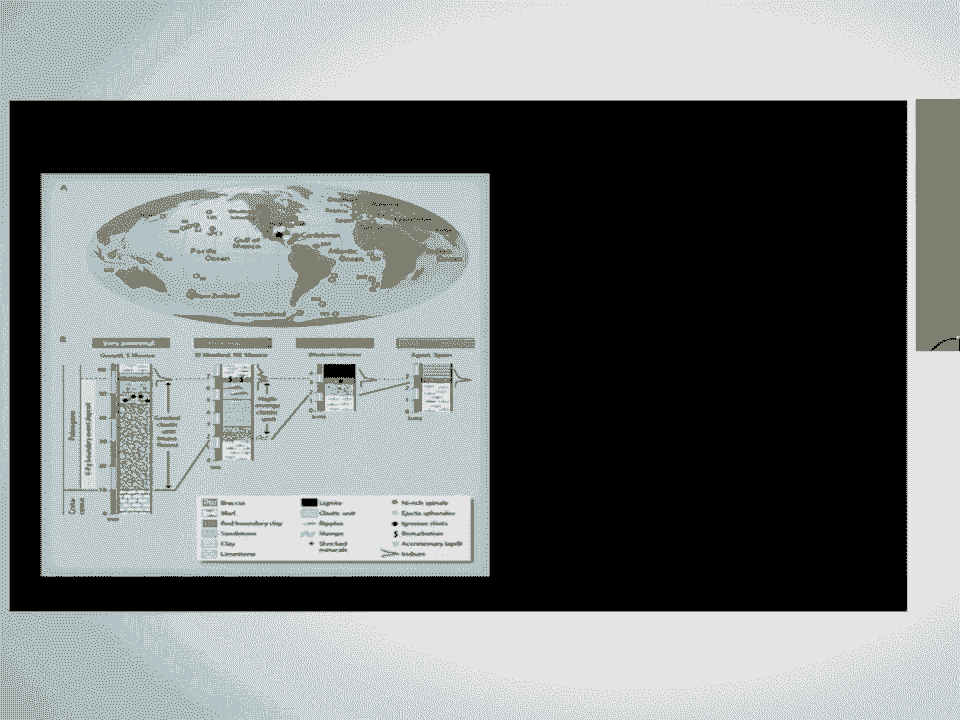
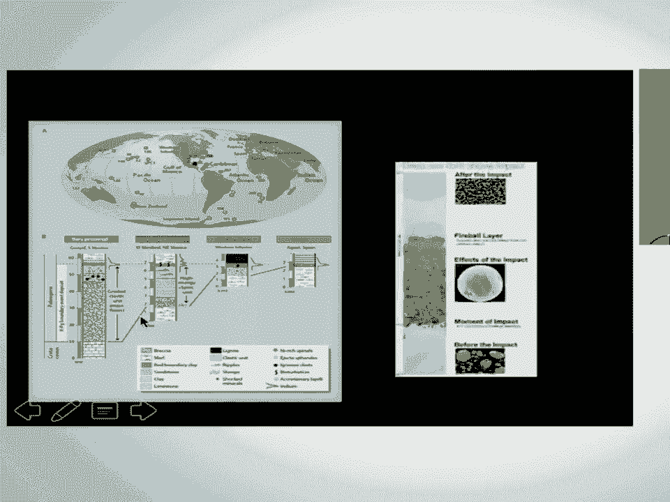
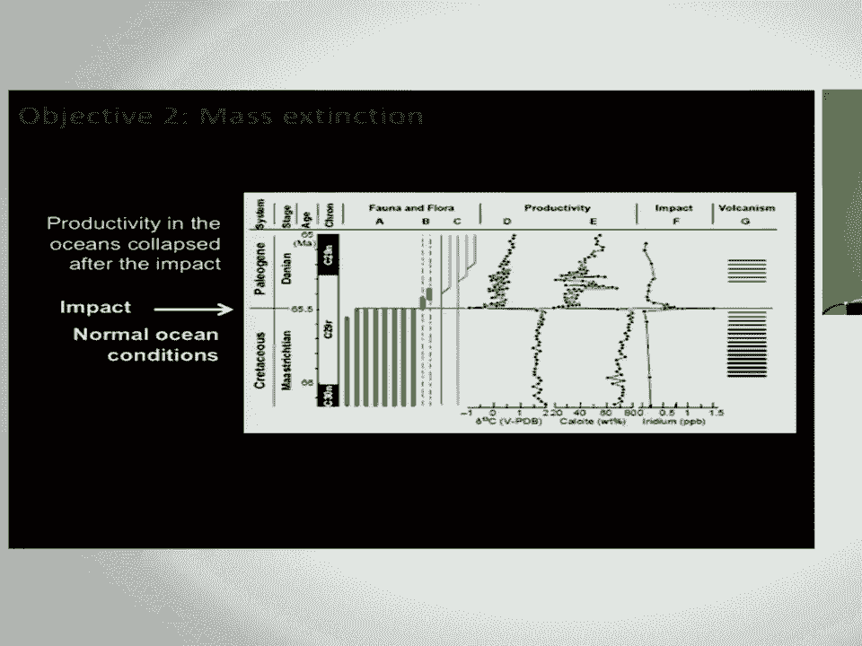
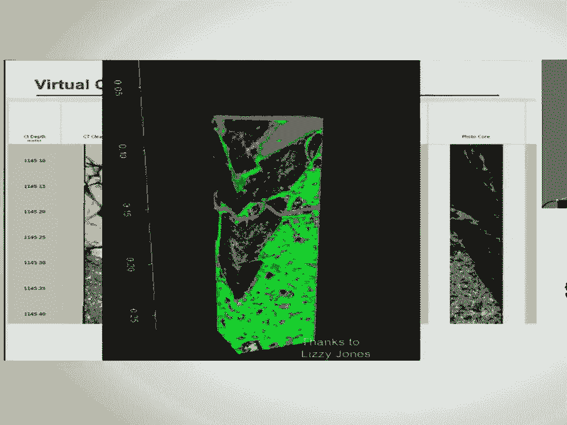
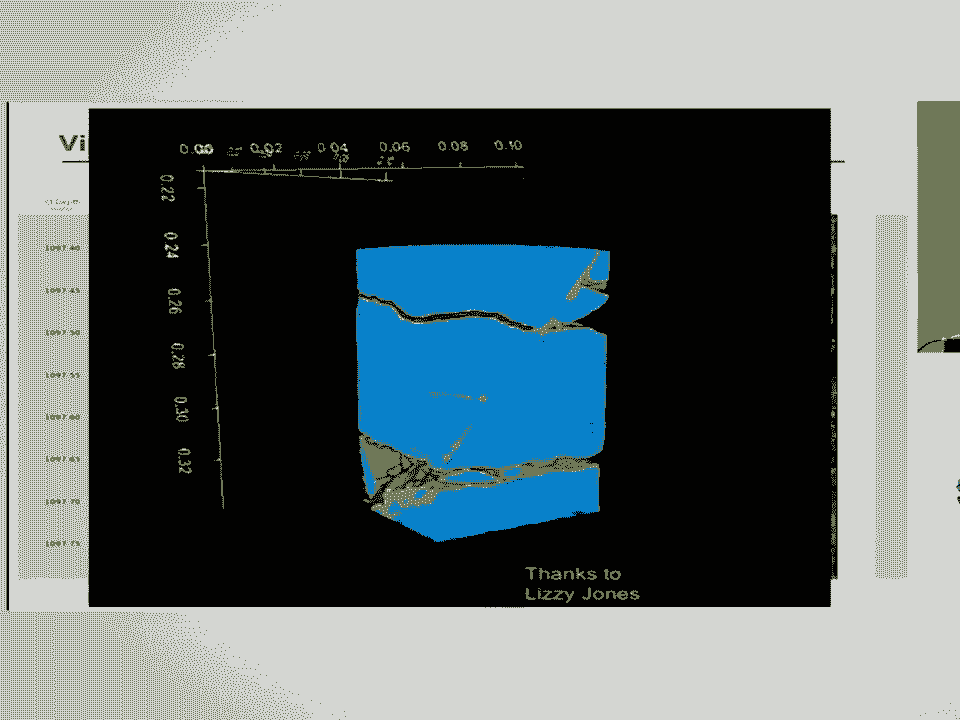
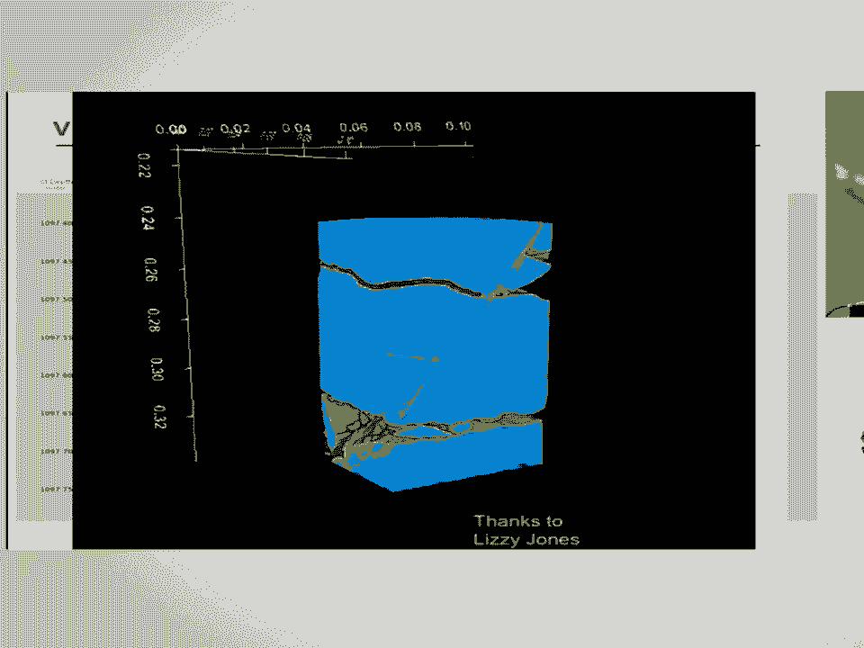

# SciPy 2017（合集） - P25：Keynote - Drilling the Chicxulub Impact Structure - Study of Large Impact Format - 哒哒哒儿尔 - BV1Cs411A76Y

 First of all， I want to thank Eric and Enthot and SIPI in general for the invite to do a keynote。

 This is always entertaining to give a talk where you guys will know more about some of。

 this than I will and the vice versa will be true for probably a larger amount of it。

 But I'm really happy to take questions and especially if I use terminology that loses， anybody。

 just ask for a quick clarification。 We can do a definition on the fly。

 I try to de-jargonize whenever I talk to a general audience but it's impossible to de-jargonize。

 yourself completely， as you all know。 Okay， so this is just an artist's rendition of the impact which is actually at a scale。

 but it's always fun to show these kind of pictures。

 I have to give credit to a lot of people and I see my slide is slightly cut off at the top。

 and bottom but this was a project funded by the International Ocean Discovery Program。

 that is a consortium of something like 30 countries that basically drill scientific drilling sites。

 around the planet。 It was also co-funded by the International Continental drilling project because we were。

 in such shallow water we were practically on land and so they gave us money for about。

 a million dollars out of the ten。 And then Enthot and Weatherford Labs came together and it looks like the labels have。

 vanished on the bottom but anyway Enthot and Weatherford Labs came together and were able。

 to help us do CT scanning at a very inexpensive rate plus a lot of donated software and developer。

 time and so on to actually directly analyze these cores in virtual core in a computer platform。

 space where we could share it completely with the science party and let everybody have access。

 to the core at the sort of 0。3 millimeter scale around the planet which was really exciting。

 to be able to do and I'll show you some examples of how that's that's born fruit scientifically。

 Okay so without further ado what is this about？ Well this project is effectively a form of comparative planetology。

 What we mean by that is that study one planet to understand all the planets or in this case。

 study one rocky planet and a process that occurs on rocky planets which are impacts colliding。

 with them over the history of the solar system to understand how impacts work fundamentally。

 and if you're going to pick an impact it's nice to pick an impact that has an effect。

 not just as a process that it changes crusts of planets over time but actually had a direct。

 effect on us and this one you can maybe make the argument if it hadn't happened we wouldn't。

 be here so you know that's a useful one to go after。

 So that was what our pitch was amazingly that pitch took 15 years to get funded but eventually。

 we got funded and maybe you guys know about these kind of long visions but it worked。

 So what am I talking about？ Well I'm basically talking about the fact that impact cratering is the fundamental process。

 that resurfaces planets everywhere else but earth as the most important most dominant， process。

 On earth we have water moving around we have plate tectonics we're changing our planet's。

 surface on a very high rate you know every time a hurricane rolls through it changes the。

 surface right but on other planets the dominant process has impacts and it has been since the。

 beginning of the solar system。 So how do these fundamentally work？ Thank you。

 Whoever just fixed that that was awesome。 And what can we learn by studying a well-preserved impact here on earth？

 And just to remind you that this is not only something in the past on the left is early。

 in our solar systems history it's a phase called the late heavy bombardment when there。

 was a lot flying around in space and everything was getting smacked with regularity。

 It's interesting to note that the first life on earth was at 3。7 billion years ago right。

 at the end of this phase so maybe there's a link maybe there was too much or maybe the。

 impacts helped life get started。 Good questions but they were very important early in the system including here on earth。

 and on the right every one of those dots is a near earth object this is today our solar。

 system is our solar system sorry our planet's orbit is this light blue circle here so we。

 are wandering through a space filled with objects and thus it's also worth from a hazardous。

 perspective thinking about what impacts can do to you and this is actually probably about。

 five years out of date I think we know another million or so objects now。

 Okay so where does this all start from a science story on earth it really starts with these。

 two guys this is Walter and Louis Alvarez Walter is a geologist or was a geologist at。

 Berkeley he's retired now Louis Alvarez was his father a physicist Nobel prize winner。

 and they had this cool idea up to look in goobio Italy at this clay layer that sits where is。

 my cursor there it is right between these two layers of limestone。

 This layer is from the Cretaceous which ended 66 million years ago this layer is from the。

 paleo gene which started 66 million years ago and there was this interesting clay layer。

 in the middle and they wanted to know how long it took to deposit this little teeny。

 centimeter thick layer of clay so why don't we look at something that's constant like。

 cosmogenic radiation always rains in from the outer space if we simply measure how much。

 is in this layer of clay we make an estimate we could probably say how long it took well。

 they picked exactly the wrong layer to do this on to ask their question because instead。

 of finding some constant background like you know point one parts per billion they sound。

 eighty parts per billion right so this thing is off the charts from a standpoint of iridium。

 which was the cosmogenic nuclei you know element that they studied which means it's impossible。

 that this was background radiation and instead it had to have an influx from outer space to。

 make it exist and thus was born in 1980 a science publication saying gee this this moment might。

 have been an impact nobody had a crater yet it was just iridium in a layer but it turned。

 out to catch the imagination there were science books written there was the you know the end。

 of the dinosaurs children's book was written it was called T-Rex and the crater of doom。

 all that sort of stuff and then one of those fascinating coincidences of science in exactly。

 the same year this guy leon smit at the bottom here was also studying a layer in tunija and。

 came to the same exact discovery only in his case he sent the sample off to a lab and。

 they came back and said we're sorry your sample has got a problem it's contaminated and so。

 he didn't get to write his paper until a year later when he said well it wasn't contamination。

 that was signal and then he wrote his paper a year a year after that so unfortunately he。

 didn't get the credit for it he should have the credit equally with the the alveres is fast。

 forward 30 years he actually got to join our expedition last year so that was pretty cool。

 kind of come back around okay so are we talking about or talking about a global boundary layer。

 that was laid down by an impact and the crater was not discovered for another decade after。

 that I'll show you that in a minute but it's important just think about what this layer。

 looks like from this perspective of what I'm going to show you in the drill course because。

 basically if you're on the other side of the planet it's a centimeter thick layer that actually。

 has evidence of the impact like a ridium in it as you get closer it's a little more complicated。

 as you get closer it's a lot more complicated you start seeing things like tsunamis and earthquake。

 evidence and things like that and as you get really close to the impact it's a mess and and。

 and everybody kind of knew that but it was an understanding of exactly what are the processes。

 that build these layers and obviously as it thickens towards the Gulf of Mexico there was some。

 knowledge the crater had to be somewhere in the Gulf of Mexico here's a great example from a core。

 off the east coast of the United States that was drilled by the ocean drilling program the。

 predecessor of the international ocean discovery program where you can see a nice example of the。

 kind of whoops come back well you can see a nice example of the sort of features in there so prior。

 to the impact there was actually less diverse life very large organisms living in the ocean surface so。

 these are actually basically plankton that we're living at the time then you have this crazy boundary。

 layer that has things like glass balls in it called spherals has shocked minerals in it that。

 have seen pressures in the millions of psi and then a fireball layer at the top with。

 your ridium and dust and ash and so it and all these kind of exciting things from the impact and。

 then after it a complete change of life 95 percent of the lower stuff when extinct only four species of。

 those guys survived and only two of them actually took off to populate the entire world's oceans。

 since then so it's a big change here's the actual impact crater which was eventually found by。

 gravity modeling so the anomalies from the impact relative to the gravity of the planet lit up and。

 you can actually see the circular structure and so we've gone out a couple of times now as。

 geophysicist to image this one of the lines is here shown in white this is a seismic line looking。

 down into the surface subsurface by about 10 kilometers and what you see are all these big faults。

 offsetting the Cretaceous layers falling into the crater and you can see this big bump here in the。

 in the crater this bump shows up as this lit up ring here and this is actually basically a buried。

 ring of mountains in the center of the crater that's exciting because only the largest impact。

 craters ever have those they're called peak rings and we don't know how they're formed or we didn't。

 until we drilled last year it's the best preserved large impact crater on the planet the other two。

 of this size or two billion years old so what we think happened 14 uh 66 million years ago。

 a 14 kilometer diameter or 10 mile wide roughly diameter and nine and a half mile wide hit the。

 yukatan which at the time was a relatively shallow sea few hundred meters deep and 75 percent of。

 life overall when extinct with even greater percentages in the surface ocean something like 90 percent。

 of the ocean when extinct but maybe to 5 percent in rivers so it's quite variable everything larger。

 than about 60 pounds goes extinct on the planet that's interesting our ancestors are amongst the。

 survivors and fast forward and you know 66 million years and we have a science party so we can go。

 study it this is good right so what were our goals this is a full waveform seismic images is kind of。

 moving into the high tech world of of of seismic imaging basically taking every bit of energy that。

 comes back when people set out energy sources from say air guns and things and bring them back on to。

 sensitive listening devices that we tow behind ships in the oceans and then create images that tell us。

 what the effectively the density if you will of the rocks are it's really the velocity of sound in。

 the rocks but it's it's an equivalent and then overlay it on a really well-made image what you。

 can see are some real details of the site that we decided to drill so this is that peak ring this。

 ring of mountains notice it's got this crazy flat smooth top notice there's a light blue layer in。

 here which is very low velocity low density what's that and then you can see all the layers above this。

 there we go keeps losing my cursor there it is you can see that the peak ring itself is almost。

 featureless you can't see a density contrast at all in it but above it you have all these layers。

 and those individual layers are the limestone layers that buried the crater in the ensuing。

 66 million years so our goal was to start drilling at about 500 meters down well drill down and。

 start coring about 500 meters down collect the limestone layers that laid on top of it to get。

 a sense of how life recovered and then drill into the peak ring through whatever that light blue。

 stuff is and down into the peak ring proper in order to ask sort of three very basic questions。

 how is it that you make a peak ring how do impacts fundamentally work what caused the environmental。

 changes that led to 75 percent of the planet going extinct and what effects do impacts have on the。

 subsurface communities in in the ocean in the crust basically we know that there's this enormous。

 ecosystem that lives below the surface of the planet it's estimated it's far larger than it。

 lives on the surface of the planet mostly bacteria and archaea and all kinds of interesting things like。

 that how do they get affected by this and the reason we ask that question is an original life。

 question is it possible life started because of energy driven by impacts and chemical exchanges。

 driven by impacts as opposed to the current prevailing theory where life started in mid-ocean。

 ridges so that's that was our third goal okay so i'm going to go through these goals really quickly。

 and then i'll show you some of our results and how we actually use this ct imaging and and the。

 cooperation with this community so the first thing to see is a picture of what a peak ring type crater。

 looks like on the moon so this is shroding or basin on the moon on the left you can see that。

 there's a basin that's largely flat probably filled with impact melt and debris and all kinds of。

 stuff but poking up in the middle of this basin you can see this ring of mountains right。

 that thing is a peak ring and there are two or were two competing theories is to how you make an impact。

 that looks kind of low and flat like this and how you make a ring of mountains now to give you a。

 sense of scale on earth those mountains were one to two kilometers high right the edge of the crater。

 when first formed might have been the sahai to the maulias before it collapsed right so these are these。

 are not small mountains the two theories are that everything is basically driven by melt and so that's。

 this theory on the left called the impact melt crater where nested melt hypothesis where it hits。

 things really melt and in this case melt is not necessarily by temperature but by pressure if you。

 hit things hard enough you can make them melt so it takes 60 gigapascals or 9。

6 million psi to do it， but impacts have that much energy just if that helps your brain i'm not sure it does。

 i'm not sure it helps mine either but uh the idea was that there's so much melt it actually。

 impedes any kind of a rebound process and the way you make a crater is basically things just。

 collapse from the side and you make a crater where things like that ring of mountains would be made。

 of just shallow material that fell in from the side that's one theory the alternative theory is。

 it hits so hard that all the way through a much larger section of the crust things act like a。

 temporary at temporarily act like a fluid like a slow moving viscous fluid um and in that world。

 you can think of it like throwing a rock in a pond where when you hit you basically make a whole if。

 you will that immediately starts rebounding upwards there is some impact melt on the top of it but。

 largely it's not enough to stop this rebound process it rises say on the earth scale maybe 10 kilometers。

 above the surface of the earth and then collapses backwards such that this ring of mountains would。

 actually be made of material that came from deep and is now at the surface that would matter because。

 if this is the way it works then planets are resurfaced by impacts over geologic time they're。

 like a giant gardening system and and surfaces of planets are constantly constantly being rejuvenated。

 by impacts if the guy in the right is correct so which is it and how would you test it well if。

 you drill into the peak ring and in this case it's shallow stuff well in the ukatan that would mean。

 it would have been made of a limestone if it's the deep stuff will be made whatever is below the。

 limestone so not to give it away we're going to go see what it's made of okay next question mass。

 extinction so you know a big impact hitting like that is bad day locally right you also know it's a。

 bad day for the entire Gulf of Mexico what you see plotted in colors here is a thickness map of all。

 the sediment all the rock that collapsed into the Gulf of Mexico because of the impact and it's the。

 largest single event deposit on the planet the estimates of the kind of energy involved or。

 magnitude 10 earthquakes so larger than tectonics can produce 500 meter plus high tsunamis hurricane。

 force winds everything's incinerated by its shockwave out to a thousand kilometers you know it's bad day。

 right but why did it kill things all over the planet that's the that's the research question why is。

 the other side of the planet care right so that's one of the things we wanted to study you know here's。

 just an example of that you know this is the Cretaceous on the bottom kind of a picture of if you will。

 fauna and flora you know plants and animals here going extinct and new ones kicking off because of。

 whatever this event is and if you measure global productivity of life whether you measure it by。

 the amount of calcite i。e。 limestone or you measure it by a carbon isotope either way everything freaking。

 crashes right this was a big deal and you can see it exactly coincides with the moment of the。

 impact and just to set something else to rest there is no major there is a single flow of the deck。

 and trap volcanism on the others not quite the other side of the planet but it is not any bigger。

 than any other ones and they happen before and after so there's not a coincidence with that。

 and this event there is a coincidence with the impact okay what are the potential killing。

 mechanisms maybe we heat up the surface of the planet by incoming fast stuff ejected out of the。

 crater maybe we cause darkness by the debris in the air maybe we cause some kind of a nuclear。

 winter scenario by release of things like sulfur in the same way that you know crack a toe it。

 caused a year without a summer pinnethobo caused a year without a summer big volcanoes can do it。

 what about an impact how long can it do it for maybe we acidify the ocean because of all the。

 carbon put into the atmosphere sound familiar today maybe just just saying or maybe we even。

 induce a whole lot of metal poisoning into the ocean so these are ideas here's just a model for fun。

 of Europe getting hit by the ejecta here comes the pressure waves through the atmosphere here。

 comes the ejecta 6000 kilometers away from chicks lube the red are the larger if i get it right。

 no the red of the smaller the yellow or the larger and the little yellow particles you'll see will。

 actually rain out pretty quickly and the red ones will get stuck up in the atmosphere at about。

 the base of the stratosphere 50 kilometers or so up and is that enough to basically cause a kind。

 of artist rendition like you see in the bottom right you know and the other question of course is。

 that when this stuff starts raining out how much thermal effect is that is that actually heating。

 things up and there's been a lot of evidence of soot and scattered wildfires associated with the。

 impact so estimates from anything from sort of toaster oven for a couple hours to a pizza oven for。

 several hours you know but it's enough to potentially incinerate a significant amount of combustible。

 material and if you're big you got a problem she can't get out of the way if you're little maybe。

 you can hide in a ocean maybe things living in the bottom of a stream do okay you know things like。

 that so these are some of the ideas we'd like to look at in the micro fossil world in looking at。

 the plankton that live in the ocean we see an enormous difference when we look around the planet。

 of these things so 30，000 years after impact is the first time we see brand new evolution of life。

 in the plankton world and if you look say three million years after impact you can see it's an。

 entirely different evolution of life so we can look in the core scale at evolution of life in terms。

 of the plankton as a proxy for life on the planet in a sense okay last one is to look at whether life。

 likes impact craters and by this I mean life living in the subsurface so this is the question of whether。

 or not when you put that much energy and that much chemical exchange rotating you know moving through。

 the crust which has probably had enhanced porosity because of being hit and fractured and moved。

 do you actually make a niche for life or exotic life to take a hold in the subsurface and we have。

 evidence that that has happened in the past this is the Chesapeake Bay impact crater I don't know how。

 many people know that lying beneath Chesapeake Bay is a giant impact crater 85 kilometers across。

 happened 35 million years ago but they drilled it they hit a giant block of material that fell。

 into it at the bottom and in that block of material right there they found an ecosystem that had。

 evolved since then but was unique to impact craters so it got kicked off by the energy the impact 35。

 million years ago and it's still living there now which makes it a really interesting question could。

 impacts get things going as far as life on earth goes okay oh and I guess the other picture here was。

 just to say pea crings might be a good place to drill for that because you can envision fluid flow。

 moving upwards into such a promontory okay what do we do so we went out with a lift boat and we。

 drilled off progresso the longest pier in the world location six kilometers long to get to。

 seven meters of water depth in order to pull a cruise ship up so we were about 25 kilometers off。

 in about 20 meters of water 60 feet or so and for two months jacked up on legs to drill。

 this is a shot of that amazingly this thing here is how you get on they call it the widow maker in。

 in Spanish so you literally hang on and they lift you up and over and they drop you onto the it's kind。

 of fun I loved it other people were not excited but anyway and then we spent two months out there。

 these are shipping containers which were doubled as our labs we live six to a room so it's not posh。

 being a scientist at sea sometimes and each one of these containers had desks and labs and microscopes。

 and you know ways to measure the physical properties of the cores etc etc so we did that for two months。

 the cores were not split offshore because there's no space to do that they were left whole。

 and they I'll show you in a minute what happened in between but once they were sent back to land。

 they eventually went to bremen germany where there was a full suite of labs set up to look at the。

 cores and the entire science party of 32 people came plus a lot of technical help and we split the。

 cores and we sampled them for research and we described them and so on and so forth to do the full。

 suite of measurements on initial measurements on these cores the fact that they aren't split offshore。

 and it takes something like three months before they get to bremen allowed a moment of opportunity。

 that through n-thoughts partnership we were able to go and get those cores CT scanned with a you。

 know state-of-the-art medical style CT scanner in this case with dual energy in order to be able。

 to do some virtual analyses of these cores as well and this was an incredible opportunity made。

 available by those logistics and then made available because weatherford gave us an incredible price。

 and n-thought donated their time to the project which was wonderful so I will show you some results。

 of those in a few minutes what did we get when we started drilling at about 500 meters down。

 sorry started coring we drilled just drilled ahead for 500 then we started getting cores 500。

 meters down and we went all the way down to 1335 meters or so so on our way to a mile and we saw。

 about 115 meters of the limestone that buries the crater then we saw about 130 meters or whatever。

 this light blue stuff is which i'll show you a picture of in a minute i'll call them impact。

 heights right now rocks made by the impact and then we actually got 600 meters of the peak ring。

 itself 580 meters i'll show you pictures of those so moving down these are just pictures of the。

 limestone turned out most of this was in what's called the eocene which is the hottest time in the。

 last 66 million years so people are interested in that for climate research i'm just going to skip。

 through that pretty quickly that we actually got what are called black shales on our way down black。

 shales are very important to study because these are the times when the ocean gets screwed up。

 it gets so hot ocean acidification takes over the ocean goes stratified lots of things die。

 so this is the the nightmare scenario of our future that people want to study by studying this。

 event something called the paleocene eocene thermal maximum that happened roughly 55 million years ago。

 so we did capture that so that's a useful piece for climate research and then below that we got into。

 the end of the limestone we hit this funny brown layer which i'll look at in more detail in a。

 minute and then we got into whatever that light blue material was this is that transition here's。

 the limestone as we come down hit this funny brown layer which we'll talk more about in a little bit。

 and then right below it we hit something that looked like a sandstone look like particles of sand。

 with black flakes turns out the black flakes are actually impact glass and when we look at a。

 ct image of these cores you can see that there's bedding that's kind of cut cross cutting each other。

 this is symptomatic of what a tsunami deposit looks like so 600 meter high peak ring has a tsunami on。

 top of it that's cool it also says that the world ocean came back into the impact crater right away。

 enough with waves of tsunamis coming in and we kind of knew there was already a hole in the edge so。

 we knew that was possible but here's direct evidence of the energy involved or the impact so that was。

 pretty neat as we move down through that layer it just got more crazy so this is again that light。

 blue layer turns out it's super low velocity and super high porosity so lots of poor space for fluids。

 to move through and the size of the particles in this thing just kept getting bigger and bigger and。

 bigger and bigger the some of these are actually impact melt rock rebroken so it melted it cooled。

 it off enough and then shattered it again in the space of minutes which is kind of fascinating and。

 there are chunks in there of cretaceous age limestone and there are chunks in there of the original。

 deep crustal rocks at the impact site we actually tried to look at this from a standpoint of thinking。

 about how it was all deposited and you can generally see that the size of these things increase downwards。

 here's kind of just a measurement of the size of the individual biggest chunks the class we call them。

 and so we are now approaching this using virtual core and a machine learning algorithm that Brendan。

 Hall is working on in order to ask the question can we kind of quantify in a real way the size of。

 every class in there and can we also quantify how round they are to ask the question whether it was。

 a water involved or not so that's a new research direction to sort of go after this this thing and。

 we can see that in the CT space you can find the class are sometimes really visible to the eye and。

 other times they're actually like buried in the impact melt and even partially digested by the。

 impact melt but they're visible to the CT which is really cool so this is a shot of that machine。

 learning algorithm where the I or just a screen where we're trying it we sort of classify the。

 different class and then try to have the machine learning algorithm go through and tell you what。

 they all are through the entire 130 meters of this that's a pretty exciting attempt at research。

 direction okay so that that is basically taking us through the limestone the barrier the crater。

 through this light blue layer right here which are these interesting broken up and melted rocks。

 what do we see at the bottom of that what do we see when we got to the peak ring proper。

 well this is what we saw which is impact melt rock so this is actually rock that has seen that， 9。

6 million psi and has actually been turned to a melt and then refrozen and you can see that。

 there's green and there's black the green has got more carbonitious material more carbonate。

 melted material the black is more salicious more quartz and things and they're all kind of swirled。

 together to give you a sense of the textures um because we had the CT scans ahead of time and because。

 they were dual energy we were able to actually make products out of these things so not just。

 images of the sea of the core so the top picture is a photo of the core the bottom picture is the。

 TCT scan of the core and the two in the middle are products one saying approximately with the atomic。

 number of everything in there is the other saying approximately with the density of everything is。

 in there and so the subscribers at braman actually had the ability to see all this up front and。

 describe their cores and with four different images plus the core in front of them which was an。

 incredible boon for science now i'm going to do a little shout out to lizzy jones in the back。

 who is doing an internship with us and it's amazing to say that a very intelligent 15 year old can。

 make 2，000 some odd images in three dimensions to show us what's possible when you have the。

 the capabilities of a three-dimensional image of of a core this is that contact between the impact。

 melt rock and the granite you can see it in sort of different slices and an unwrapped version and。

 there's the photo on the right and this is what it looks like in three dimensions with the CT scan。

 enhanced versions of different types of densities and so you can see the complexity of the interface。

 between these these two rock types which is going to be an exciting set of of research directions。

 it looks broken and that's because it is it's faulted so when it when it arrived as a peak ring it。

 didn't quit it started it kept faulting for a while which is interesting that's probably those。

 magnitude 10 plus earthquakes but the key thing is what is this here looks like your table countertop。

 right granite so that's not limestone right that's a deep basement rock in the peak ring so going。

 back to our hypothesis test what do we find we found something super deep so it immediately。

 points us to an answer and in fact we were excited enough about finding this granite that we actually。

 wrote the paper before we split the course because we kind of knew this was a big answer so it got。

 published in science last year in november um basically pointing out that the peak ring is made。

 of granite and therefore one of those two models is correct and the other is wrong you can also see。

 this granite is totally fractured up in fact you can take chunks of it in your hand and shatter it。

 it's not like normal granite anymore it's been so damaged by these processes。

 um here just some shots of it there is some deformation in the granite that happened prior。

 to the impact but most of the deformation we see in the granite is all because of the impact and。

 it's all these different kinds of things things that are uh catecla sites are like fault rocks or。

 like gouge made by moving rock past each other and things like that and again we can uh find。

 individual faults just like you saw that picture of right at the boundary with the melt and these。

 are actually fault planes where the crystal growth tells you the direction the fault moved。

 which is pretty exciting they're called the slick insides and here's some images again from。

 lizzy showing um some things like this is a pre-impact dyke this was a a dyke of injected magma probably。

 from 500 million years ago that then got damaged by the impact and you can see um all the contrasts。

 of different crystals in there as well as the actual dyke itself another shot this is of some of those。

 brittle faults uh you can see deforming the core and in three dimensions you can really get it to。

 take a look at what those fault planes look like so these are this is all just early days and we。

 have a lot of opportunity here to measure all of these things and figure out their cross-cutting。

 relationships who happened first you know did it did the faults happen late did the faults happen。

 early these are questions we're now now going after to understand how you actually move something。

 from say 10 kilometers down up in the air 10 kilometers and into a mountain range and then。

 leave it as a big pile of rocks what is that process that actually does that when we have the。

 capability by looking at these cores um we also found evidence of that high pressures um this is。

 what's called a shatter cone they're only found in impact craters they require at least eight gigapascals。

 of pressure to form it's basically runaway earthquakes so an earthquake starts here and as it starts。

 propagating through the rock it sets off a bunch more earthquakes which sets off a bunch more earthquakes。

 which set off a bunch more earthquakes and it's like a fractal pattern passing through the rock of。

 pressure that leaves behind what's called the shatter cone and if you go to impact crater museums。

 you'll find some that are like this big and we just happen to in the end of our core snagged that one。

 which is kind of amazing um but it's just sort of you know a great example of the pressures involved。

 even better examples of the pressures involved are under a microscope so these are biotite grains。

 they're micas that are kinked by the pressure wave plagicalase grains that are fractured you can。

 actually see those fault rocks at the microscopic scale and quartz grains that are shocked to the。

 point that they've been moved on planes in at least three different orientations so shock waves have。

 moved through them it's actually twin the crystal it's actually shifted the crystal at that at the。

 lattice scale um by the pressure and that lower right one takes like 35 gigapascals to happen。

 so it didn't see the 9。6 it's all like 6 million psi but that's you know nothing on earth makes。

 anything like that it requires impacts for that to happen nuclear bombs can make very small shatter。

 cones but they can't do that for instance this is a complicated slide but i just want you to look。

 at fuzz your eyes for a moment and just look at something let's just look at the the porosity。

 which is the second column um basically what we see here is the porosity up in the limestone is in。

 fact higher and drops as we move into the to the sway vites it actually it actually starts drops。

 it raises it's something like 40 percent porosity so 40 percent of it is just space in those in those。

 melted impact rock zones so there's a huge amount of opportunity for fluids to move through which。

 means a huge amount of niche space ecosystem space for life that's really critical and then in the。

 granites we're looking at 10 percent porosity granites never have 10 percent porosity right i mean if。

 you look at a granite countertop it's got at most a percent otherwise it wouldn't keep the water from。

 rolling through it right we're out of rolls off your granite this granite if you poured water on it。

 it would go right through it and that's because of this this all this shock and damage that's occurred。

 okay so how do we do with this well um the first thing to say is that because we found。

 granite in the peak ring this model that you see up here on the right is now sort of the state of。

 the art of how impact craters work you can see this concept of a slow moving response um by slow。

 moving though notice the seconds clicking by that this this picture takes about five minutes in real。

 time to to run and that is literally how long it takes to make an impact crater based on the observations。

 we have you you make a hole you rebound from the hole you collapse outwards and you make a peak ring。

 all in about five minutes which is kind of stunning um the end of that phase where it's just shaking is。

 probably another five minutes um so it it basically says to us that impact craters and other planets。

 are that gardening process right and they were here as well they're overturning the crusts of。

 planets through time um and in a fundamental way um and that was a cool result next big result was。

 this um this core here where we see a tsunami at the top of that pile of of broken and melted rock。

 so we know the tsunamis were hitting something like 600 mirrors uh high and then we see coming up。

 through this this evolution of life in the plankton that we're still exploring but it looks like that。

 some life came back right away and other life took millions of years to come back and the difference。

 of the ecosystem requirements of those different kinds of life um might actually be a clue as to。

 what happened to the environment for instance this ocean acidification a problem or not where that's。

 the next big thing we're going after to see if we can figure that out and we're also measuring it for。

 things like trace metals was our metal poisoning you know what happened one of the big things we can。

 tell is that in the pile of of rocks that lay below it there is no evidence of any sulfur rich rocks。

 and yet we know the target that hit was about 30% sulfur and we don't see any in the pile of rocks。

 left behind so one possibility of sulfur is particularly good at being vaporized and if that's true then。

 the nuclear winter scenario becomes even more promising as an impact one if all of the sulfur goes。

 into the atmosphere and we can create darkness for maybe three or five years that's a good way to。

 kill things off you know everything depends on the sun to one extent or another um we also think we。

 see some evidence of the impactor in the rocks these are lit up iron and um uh zones um at the top。

 and at the bottom of the core and we've also found lit up chromium um in there that may have come from。

 the impactor so there's a suggestion that impact dust is back in the crater the only way that's。

 possible is if it took a trip around the planet and landed back in the crater which would be cool if。

 that happened so we're still working on that um and we found lots of evidence of fluids moving。

 through these rocks these 40% porosity rocks including things like hydrothermal fluids these。

 red things and we found elevated cell counts inside the crater and they're pulling DNA off them now。

 this is basically an ecosystem living still down inside the crater 66 million years later。

 so what is it how did you know that's that's the key question and again going back to this is this。

 possibly helping us think about the origin of life so that's a pretty cool result as well。

 so i'm gonna leave it there and take any questions you guys might have but because i'm a good scientist。

 you have to always say that there are alternative hypotheses out there right so you know we'll just。

 leave that there and i'll leave you some pictures of the course thank you。

 okay we have a few minutes for questions there's a microphone here。

 if you're interested anybody have any questions or comments yeah back there。

 yeah so the the yeah he said how does the DNA not destroyed how did it remain in the course。

 so the life that was present absolutely would have been incinerated wiped out by pressure。

 you know so on but life is very mobile on earth right so if you had bacteria living in the crust。

 away from the impact then amazingly they somehow seem to be able to re-influx locations。

 um and then because of the specific ecosystem you know the energy that's present the the。

 chemistry that's present you have a quick evolution of life bacteria can evolve on scale of minutes。

 so you can actually have a new ecosystem kick off by the little bit of influx of fluids from outside。

 the crater bringing a little bit of the starting and then new life takes off and so it wasn't present。

 the life we're looking at was not what was there it's what moved in right afterwards and then it's。

 evolved since so yeah hi um i also work in the field of uh computed tomography but for material。

 science and i can say that all the data analysis that was done is really impressive and i was。

 wondering if you were able to use of the shelf tools for this such as a psychic image for example or。

 or psychic learned for the machine learning algorithm yeah if not do you have some lessons。

 for these tools that uh uh to make them more usable for big-scale projects like yours yeah so i think。

 Brennan has started with psychic learn right that's where he pretty sure that's what he was doing but。

 now he's been absolutely yeah but he's writing new you know there are things that are not in there。

 like not no there's a rounding yet right that's a new tool um so so this is all analyzed using。

 psychics learned and psychics image but we all know that those are kind of basic tools and whenever you。

 apply them to a science problem the impedance matching there you do a ton of work to make it work for。

 your own machine or whatever you do it yeah but the amount of science has been done in a short amount of。

 time is because you're standing on the shoulder oh absolutely。

 there are interesting things i mean this course for terabytes i'm not reading data and that's just。

 the ct i mean you make all of these options as well so you have to think about data size。

 yeah and it got you know some of these things were 90 percent of the way there for instance the。

 grains the center of the grains all showed up is one thing but then we had a problem that the edges。

 of the grains because they're slightly diffuse and at the edge of resolution showed up as a different。

 rock when we did the machine learning analysis and it's like we know that's not a different rock。

 it's the same rock slightly damaged right so how do we teach it to in the in a machine learning sense。

 to fit to help with that but anyway if you run into difficulties with these packages and it would。

 be interesting to to chat about it together absolutely。

 um hey that was great thank you um i kind of have sort of a secondary question i'm curious。

 what kind of drill rig you used and how hard it was to find a driller capable of doing this that。

 isn't tied up on an oil and gas rig absolutely so great question so the platform use is called。

 a lift boat um they are generally used not for drilling they're generally used to park next to。

 an oil rig and jack themselves up to the same height so you can cross deck things inexpensively。

 what we've done and this is the second time the international ocean discovery program has done。

 this is they take one of these lift boats and they attach a land drilling rig to it and it can。

 deliver it off the side so you take an inexpensive land rig put it on a fairly inexpensive marine。

 platform and by inexpensive i mean tens of thousands a day as opposed to hundreds of thousands if it。

 was a real drill rig right um the other advantage of that is the rig the land rig that we used is。

 basically mining technology so it's low weight on bit super high rpm right um and that actually worked。

 phenomenally well for going through impact materials and granets and things like that because it cut a。

 really clean we got almost a hundred percent recovery which is kind of unheard of because of。

 that rig that rig is owned by a national continental drilling project it's in utah managed by a company。

 called doasek so they already have been flying around the world taking these land rigs to do。

 science problems and we were able to you know kind of leverage within the community to get these。

 people with a lot of experience of drilling out there for two months in those of rotary rig。

 not not not a paper core rig or anything no no no you can't vibraphore something into something。

 like this yeah yeah it's a full you know in in soft sediments usually piston core and then when。

 you get down you start rotary drilling on these sediments we just wrote a drill from this top because。

 it's cemented limestone at the surface so no point in trying to hit it with anything thanks yeah。

 i guess you have to consider forms of life that aren't dna or rna based what do you look for in a。

 situation yeah so they've really been going after dna and rna but then um which is a challenging of。

 itself because contamination is the nightmare right so they they end up taking the very center they。

 check a chunk of our core and they have to break it to get that little piece in the middle and then。

 they wrap it with something that kills any dna and rna and then they do a sample in the very very center。

 of that to see if they can find something pristine and in that they've extracted dna three times。

 rna is harder they're working on it now i don't know if it's just going to be successful。

 and then the other thing looking for is what's called biomarkers so looking for evidence of life。

 and other forms um you know and there's various different ways you know different kind of proxies。

 for life different kind of isotopes for instance there's a proxy that comes off leaves leaves that's。

 a leaf wax that leaves a tracer in rocks or the kind of things that people can use so they're all。

 being looked at and also are you looking for like current life or like that might survive for a few。

 million years and then died off so the life that survive for a few million years and died off is。

 really hard to find in at the bacterial scale it's easy to find at the platonic scale if it leaves。

 itself a fossil no problems and that's that business has been ongoing for decades and they're really。

 good at it and we're doing that as a normal thing the cutting edge thing is finding traces of life。

 that doesn't leave a fossil how do you how do you you know figure out what that is um yeah。

 thank you very cool to see um i'm a geophysicist so i get very excited about seeing geophysical data。

 have any of follow-up uh 3d like geophysical surveys been done trying to actually image。

 the peacrains yeah so we had um a 1996 2d seismic experiment with a 2d uh so reflection or the 2d。

 refraction experiment on top of it then we had a 2005 2d reflection so that's looking for the images。

 in cross-section and then a 3d experiment to study the velocity of the of the rocks you know 3d。

 refraction there's never been a proper oil industry style 3d survey of this we've never got enough money。

 it's also very shallow water so it's a challenge it could be done um and i'm kind of hoping that i。

 can write a proposal to do that in the next few years once these enough results are out that people。

 get excited enough to be willing to spend that money because it'd be a few million dollars。

 has any electromagnetic been done none none okay yeah and that would be cool thanks yeah。

 all right thank you sir my pleasure， [APPLAUSE]， [BLANK_AUDIO]。

