# P29：The Spyder Ecosystem of Plugins  SciPy 2017  Carlos Cordoba - 哒哒哒儿尔 - BV1Cs411A76Y

 Well， as Antonis said， my name is Carlos Cordova and my talk is going to be about the。

 spider ecosystem of plugins。 So these are several plugins， third-party plugins that。

 we have developed during the last six months and that extend spider in several。

 interesting and novel ways。 So this is my third year work in my theory in a row。

 talking outside by and the second year talking specifically about spider。 So I'm。

 very happy to be here today。 For those who don't know me， I am at， say Cordova 12。

 almost everywhere on GitHub， Twitter and also on Facebook。

 Currently I'm working as a software developer for Continuum Analytics， working。

 all the time for a spider。 I'm also the current maintainer of a spider and I'm。

 doing a PhD in Industrial Engineering at Los Angeles University in Columbia。 And。

 for those who don't know them， these are the people that compose the spider team。

 So with the exception of Jits and Nissen， who is this guy here， who is a lecturer。

 at the University of Leeds in England， all the other developers are。

 higher by Continuum to work in Spider 2。 And it is their work that I'm going to。

 show you to you today。 So before I start talking about these plugins， I'm going to。

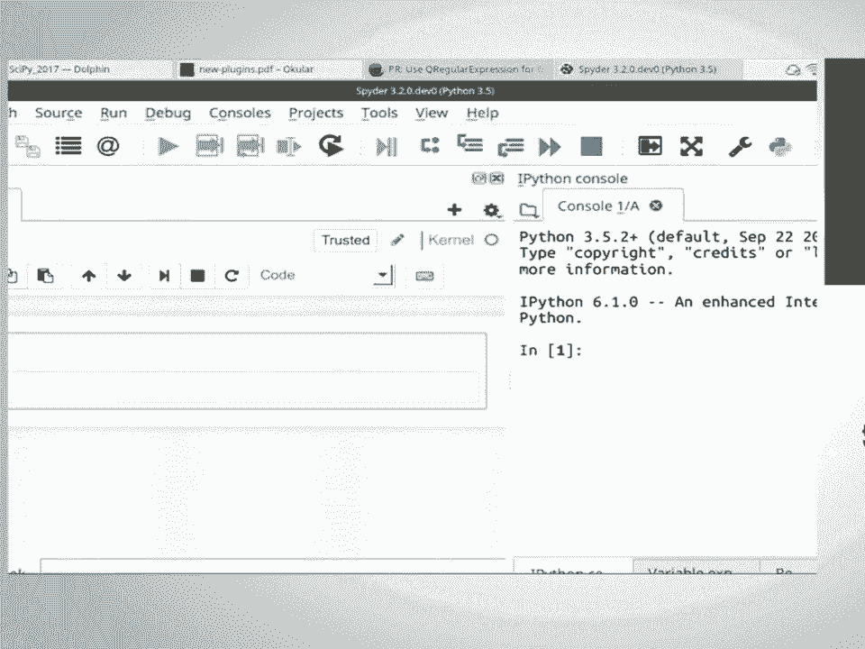

 show you a little bit very briefly how what spider is for the new beginners。 So。

 spider is basically a desktop application that tries to be very close to Madeleine。

 So it comes with an editor where you write code here in the left and a console。

 where you run that code here in the right。 And also we have a variable explorer or。

 workspace or environment for those who come from R or from Madeleine。 And we。

 have also a documentation viewer called help where you can help。 You can get help。

 of the object that you are using in the editor or in the console。 So for example。

 let me evaluate a very simple expression here in the console。

 equals 10 and we see in the variable explorer that this variable is listed here。

 So this variable explorer works for not only for numbers as in this case but also。

 for lists the lists dictionary stopals and Numbia arrays and that the frames too。

 And this help can be obtained for example let's say import a Numbi as Mp as always。

 and I want to get the documentation of Numbi scene。 So I press control I and you。

 can see that here is the documentation rendered as a webpage。 Usually the。

 documentation of the documentation of Python objects is presented as or is。

 written as plaintext so we take that plaintext and render it as a webpage and， show it there。

 Okay so let's come back to the plugins。 So the first plugin that I'm。

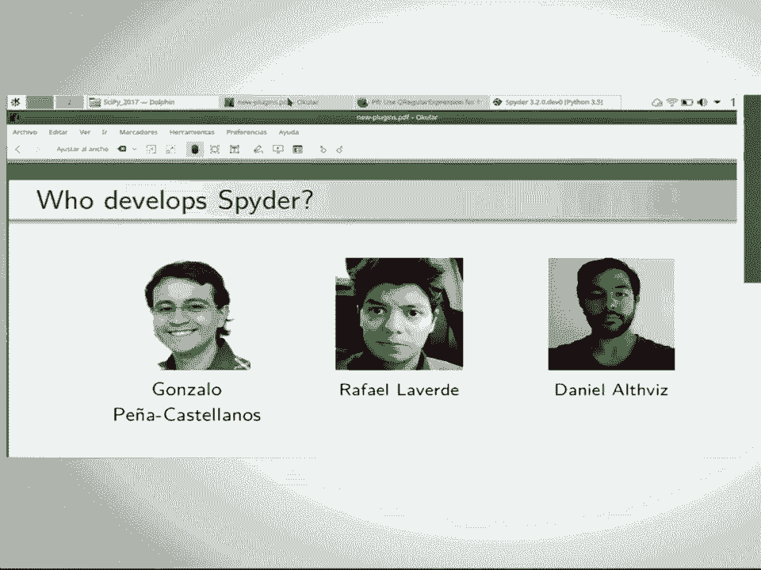

 going to show you is called a spider notebook and you probably guess what， this plugin is about。

 It's about integrating the Jupyter notebook inside。

 spider to give it a very desktop like experience to the notebook。 And also add。

 on top of that several new functionality because the notebook now is running， inside this pipe。

 So what are the advantages of this plugin？ First is that。

 you don't need to run Jupyter notebook in the directory where you want to start a。

 new notebook server。 Then you also we also provide that a。

 dysfunctionality that on title notebooks are saved in a temporary directory so。

 they don't clutter your file system while you're working with the notebook。 The。

 third advantage is that you can open and save notebooks anywhere in your file。

 system without worrying about opening notebook servers in the directory where。

 you want to save or open notebooks。 And as I say we also provide a couple of。

 additional advantages because we embed the notebook in a spider。 One of them is。

 that you can inspect a notebook variable so the notebook variables in or beloved。

 variable explorer and also that you can very easily switch between notebooks using。

 spider file switch。 So let me show you how this works。 So when you install a。

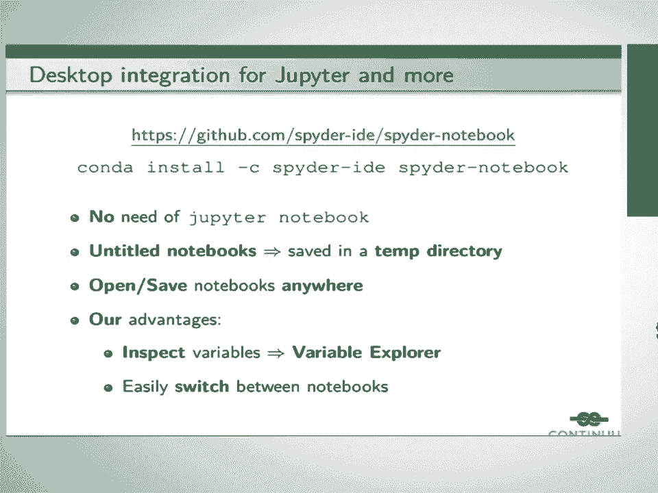

 notebook which is not really available I plan to have it for this week but。

 unfortunately I didn't have time to do it but I will do it this weekend during， the sprints。

 Well it can be seen here but next to the editor in here in the left。

 corner there is another tab called notebook and as you can see after you。

 open a spider you have an entitled notebook loaded for you。 So you can start， writing code。

 For example that one very simple one plus one equals two and if you。

 want to try to close that notebook and spider finds that notebook has some。

 contents then it asks you to save it。 If and if you want to save it you can。

 answer yes and you can save it everywhere you want。 So for example let's say we save。

 it here and save it with the test name and yeah。 So we close a notebook in the。

 background we open a new server for you and that notebook is now loaded in a spider。

 with the name test and saved where where you wanted to save it in this case for。

 example research test although it can be seen quite clearly there and you can open。

 as many notebooks as you want。 For example I'm opening there no other entitled。

 notebooks all those entitled notebooks are saved in a temporary directory as I。

 say so you don't have to worry about them and if there is no content in those。

 notebooks they are simply closed by a spider and the kernel associated with a。

 notebook is also closed for you it's also killed for you sorry。 There is another。

 advantage and is that in this menu on the right of the notebook you can see a。

 list of the recent notebooks that you have opened so you can have access to them。

 and loading inside here for example I have here another notebook called linear。

 IPMB placed in another directory and this is a notebook it has some linear。

 regression analysis for some data and some graphics using seaborn。 Well as I。

 say you can also open notebooks remember notebooks and this is the most。

 interesting functionality that we add in top of of these tests of integration。

 is that you can open a console connected to the notebook you can see here that。

 this console has the same name linear as the notebook linear and let's say that we。

 evaluate for example this couple of initial cells so we have this data frame。

 called data that it grabs some data from the internet and we go here to the。

 variable explorer and and you can see the data the data frame here in the。

 browser for your exploration you can see it contains all these columns and， etc。

 So it's a very nice way to interact with notebooks and especially if you。

 don't like to open notebooks through your web browser I think this interface is。

 much more much more better and much richer and nicer to use than than simply。

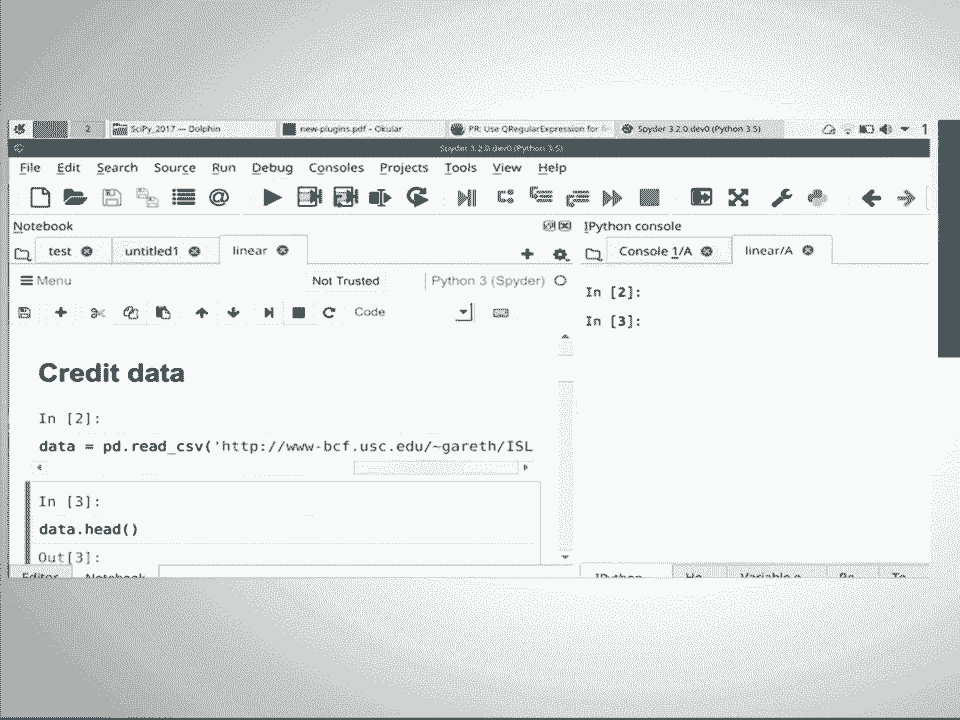

 using a web browser。 Okay that's the first plugin the next plugin is called。

 spider reports and it lets you write or allows you to write， synthetic reports in Marta。

 So synthetic reports are composed of text code， graphics and mathematical formulas and there are several people that instead of。

 writing these reports in Jupiter notebooks prefer to use modern files for。

 this task and these people usually come from the R community where they have。

 tools like Neter and R Markdown that allows you that allows them to do。

 this task well and when they move to Python they miss this kind of tool in， in this ecosystem。

 So where the advantages of this approach well first is that。

 obviously Martin files are plain text files so they are quite easily。

 versionable which is not the case for notebooks and second is that when they。

 are rendered these these files are evaluated in a linear order so there can。

 be no confusion in this case because of the current state of your or of the。

 order of evaluation of your variables so that makes which is also not the case。

 in the notebook because you can have in a linear order and you can get confused。

 quite easily because of that。 So to create this plugin we use a library called P。

 width which renders modern files then we get the output as an HTML file and。

 present them presented in a spy and this plugin only works on Python 3。

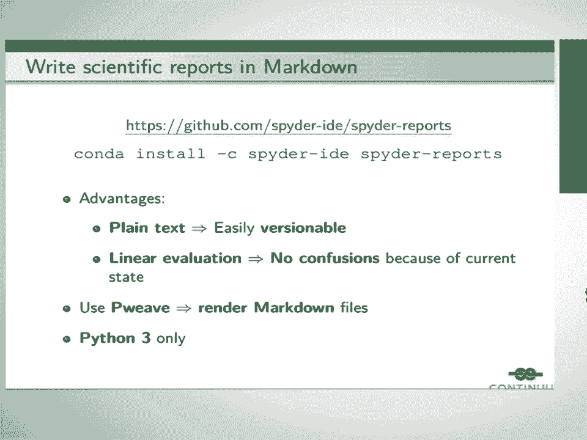

 because P width only works on Python 3 so let me show you an example of this so。

 here I have this file in markdown with special editions or special syntax of。

 the P width project which is called no no width and if I go here to the run menu。

 and run and click on this option render HTML I can see it here render。

 both rendered as as an HTML file so this this is something that was asked for us。

 for because well in conversations with the with members of the our community。

 because they miss this kind of tool a lot and we find it also very valuable。 The。

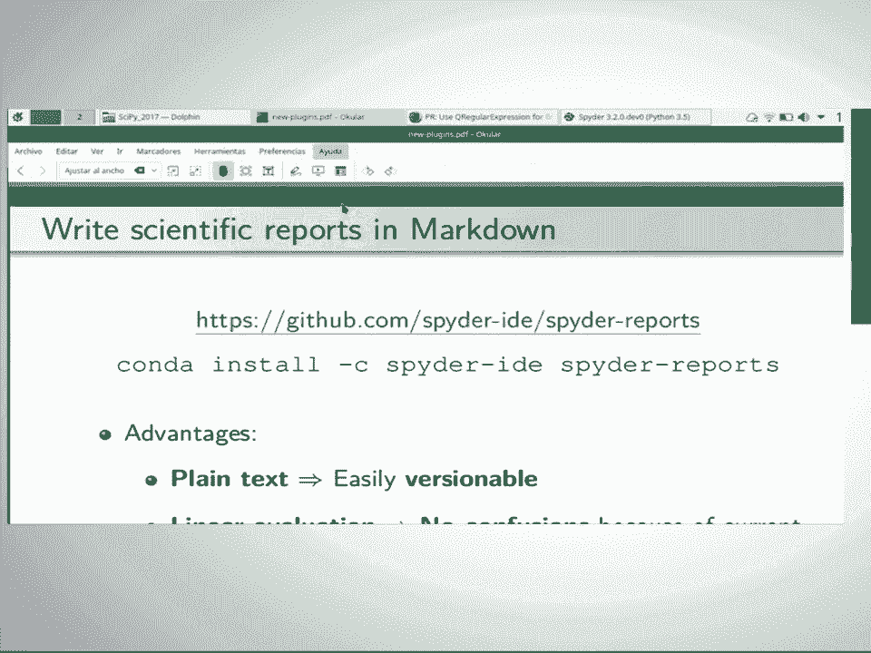

 third plugin is called spider terminal and this plugin allows you to run common。

 line applications inside the spider so not all application not all common line。

 applications can be run in a spider i Python console and for example sorry for。

 example git each top condor P need to be run in system formulas to be to run。

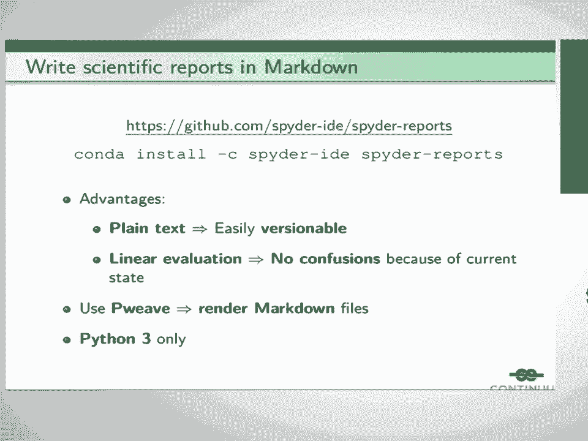

 correctly or to work correctly and that's why we created this plugin so that。

 people don't leave though doesn't need to leave a spider to run these。

 applications so how this plugin work well and essentially see tornado wave up。

 that serves extern gs extern gs it's a library in JavaScript that it's a。

 terminal emulator and the good thing and well this is exactly the same way that。

 the Jupiter notebook embeds system terminals inside inside the application。

 but the good thing about this is that is that we have made this work on windows。

 too use and for that we created a Python paintings called pink pink pink white。

 pt win pty for a library called wine win pty which is a cellular terminal library。

 to run applications on windows so that's something new that we provide over the。

 Jupiter the Jupiter terminal which only runs on on Unix file systems on。

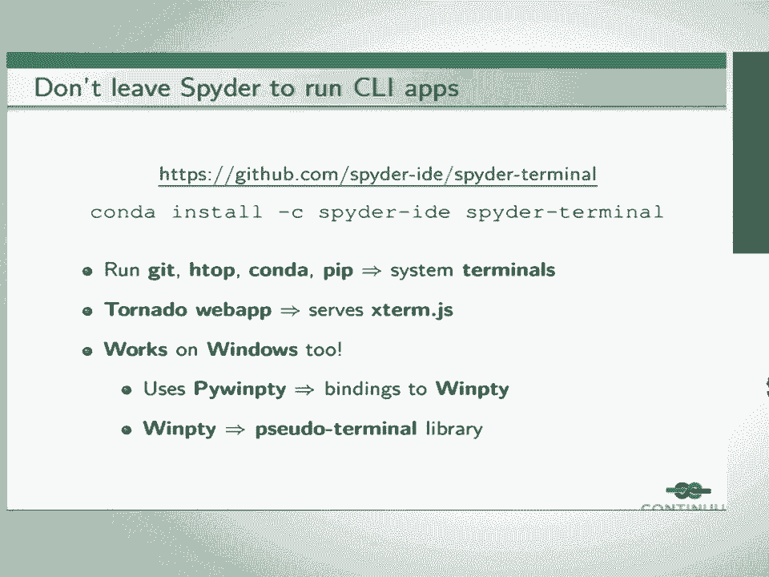

 genus file operating systems so here is the terminal well kind of be seen quite。

 clearly but it can run for example each stop there or get luck sorry I don't。

 have anything there well you basically get the idea of how these these blogging。

 works so here I have a good repo and there is good luck there so again it's just a。

 matter of convenience to run all these comments inside this pattern instead of。

 going to an external terminal and especially on windows people really like。

 to have these these kind of terminals embedded inside the application to run。

 comments there and the last plugin is called spider unit test and its name is。

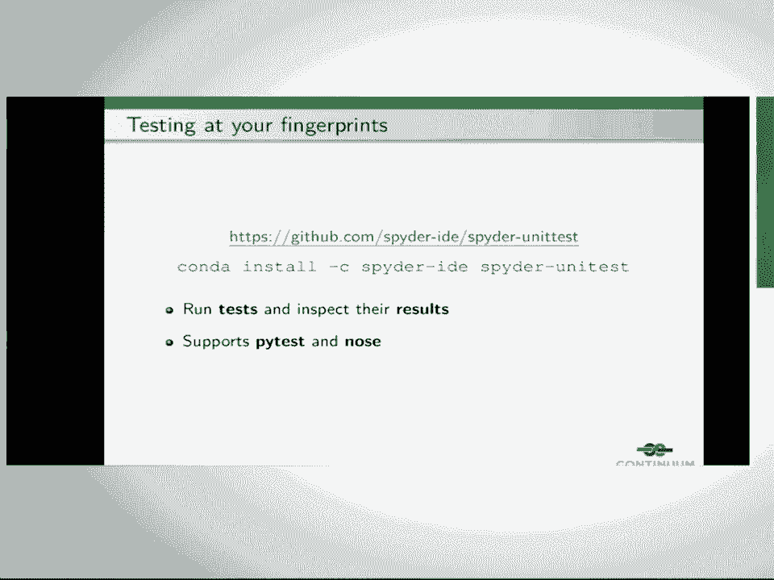

 also very simple it means that you can it allows you to run and inspect test。

 results inside spider and it supports both by test and the node framework so。

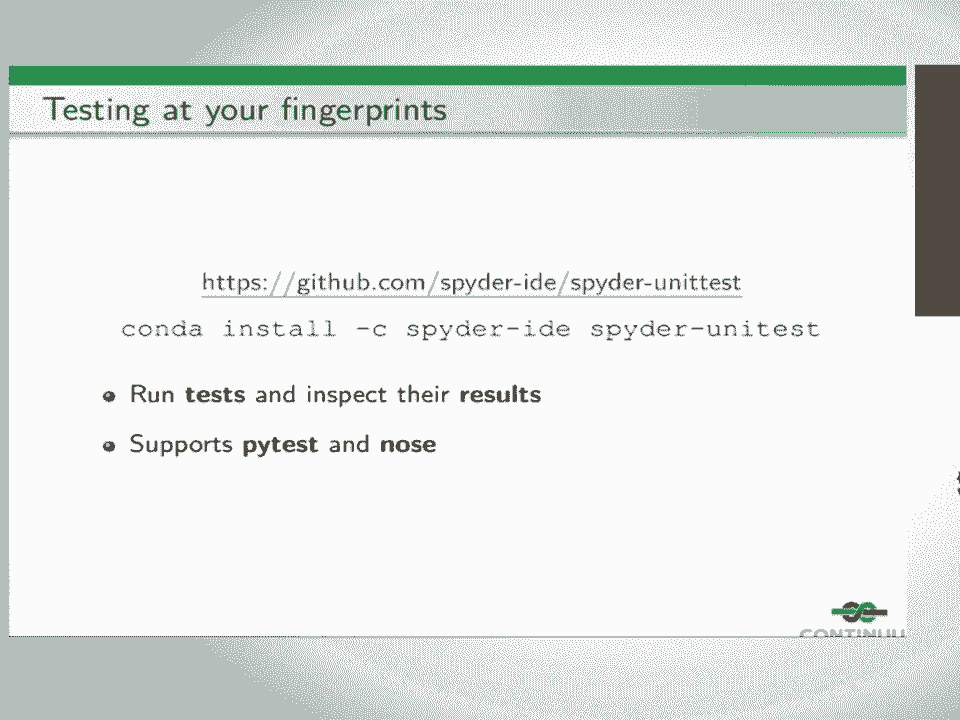

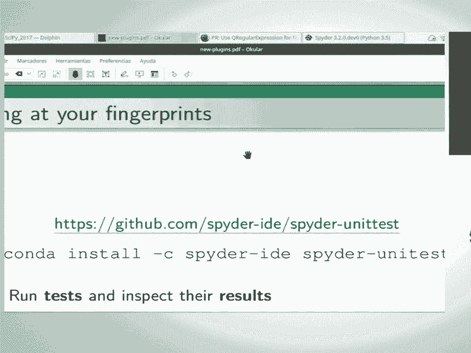

 here we can here you can see an example this is a plugin and I have here a simple。

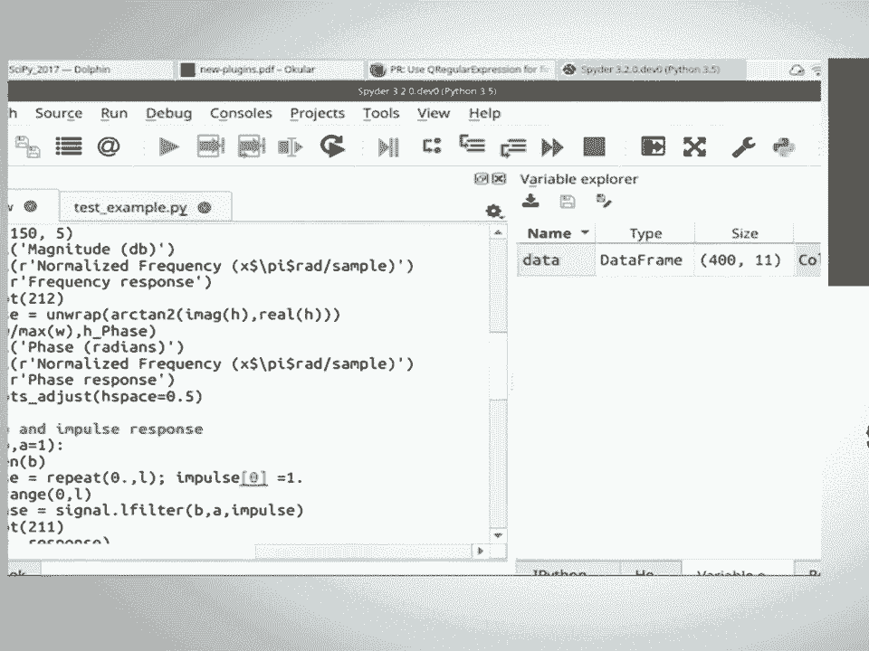

 text example with several tests that can be run by my test so to configure。

 your this plugin you have to go here and press configure and it allows you to。

 select the test framework that you want to use and also the directory where you。

 where your tests are placed and in this case it is place here I think it's here so。

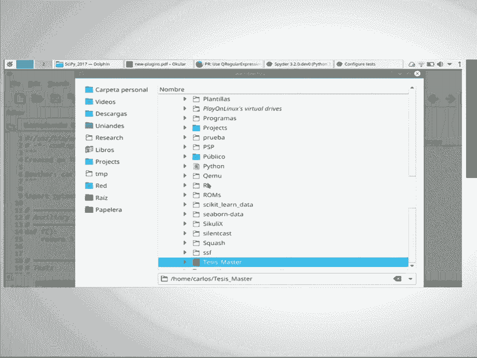

 after configuring the the plugin we can run the test and we can see the results。

 in a spider so these green lines means that this test passed correctly and we。

 have here the the test name the message generated in case in case of an error。

 and the time that the test took to complete and in this case we see that。

 this test failed and we can see where it failed and what the error message also。

 this is just a way to to give more functionality to spider and to make。

 users use these kind of tools inside the ID without I mean without having to。

 resort to a terminal to run these kind of things so these were all the plugins。

 that I have to show you today I hope you like them and you use them there are。

 well still in a bit of an alpha phase they are well I hope to release it as a to。

 release them as I said during the weekend and that's what the springs are。

 for and finally I would like to thank Travis Olifand for their support because。

 he sponsored all the spider team that I showed you at the beginning and without。

 his support and the continued support we won't be we wouldn't be able to create。

 these plots okay thank you very much。

 hey thanks I was curious if you could use spider and serve notebooks from an。

 external server into the interface yeah not right now well these I mean we could。

 probably do it but then the notebooks it wouldn't be possible to connect the。

 notebooks to the variable explorer so as you can see here there is a tag the。

 kernel name is spider tree Python tree spider so we have created an special。

 kernel to be able to transfer information between the kernel and and。

 the spider interface so it is possible to to serve notebooks from。

 certain servers but they won't be connected to the other facilities of。

 spite okay thanks okay thank you， [ Silence ]。