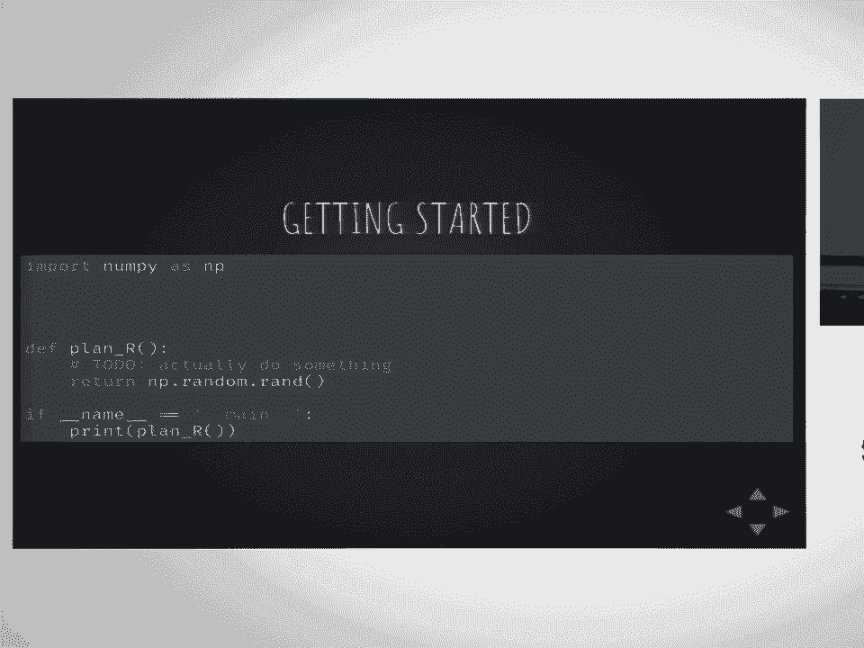
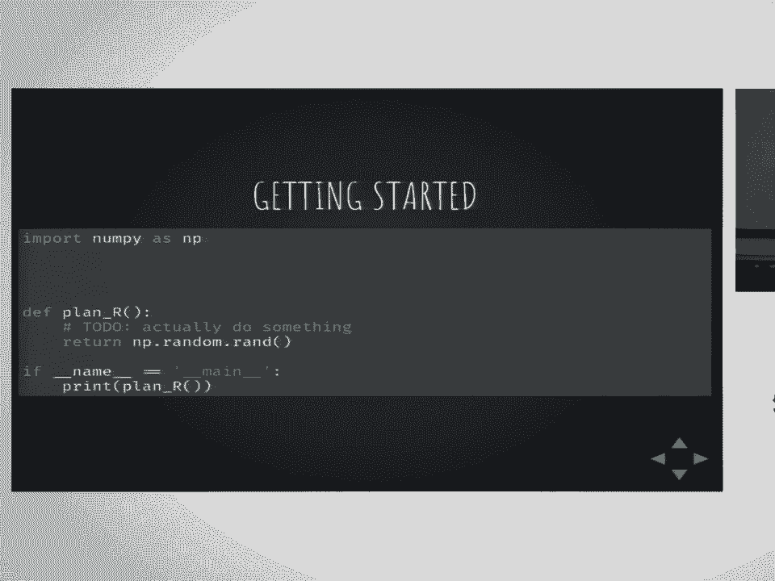

# P32：Sacred   How I Learned to Stop Worrying and Love the Research  SciPy 2017  Klaus - 哒哒哒儿尔 - BV1Cs411A76Y

 So hello everyone， welcome to my talk about Sacred or how I learned to stop worrying and。

 love the research。 So I'm a PhD student in machine learning and machine learning is really a nice topic。

 I really like the science and the research。 But running computational experiments is not always as much fun as I would like it to be。

 And so in this talk， I'd like to introduce you to a framework， Sacred， that I started。

 a few years back in order to remove all these small worries that taint the everyday nice。

 research that we're doing。 So in order to， for you to understand what kind of problems I'm talking about。

 let's， assume that you， let's imagine you have a colleague and your colleague has this really。

 amazing project idea that he wants to， that he wants to implement。

 And your colleague is a little bit on the annoying side， he gets a bit overexcited on， things。

 But you have to admit he's up to a good start。 So he sets up a private GitHub repository。

 implements a prototype of his method， loads， all the parameters from a config file。

 logs the outputs and results in numbered directories。

 And his first results actually look quite promising。

 After a while of running these experiments though， he discovers that editing the config。

 file all the time is quite tedious。 And so he finds one of the many good packages for command line tools and builds a small command。

 line interface for his program。 And then after running a few more experiments。

 he discovers some dependencies between his， configuration entries。

 So he has this alpha parameter which really most of the time he would like to set to one。

 over the square root of the number of layers。 But he doesn't want to remove it from the configuration because sometimes he would like。

 to specifically set it to a different value。 And the very same thing is true for the learning rate which really depends on the optimizer。

 So he decides to add some kind of like post-processing to the configuration process to fill in the。

 defaults for all the parameters that he hasn't set。

 And everything seems to be working and quite nice。

 Which is also when his supervisor calls in and says since you have such good results， you。

 should better submit to this deadline in a few weeks。

 And this is when your colleague needs to start getting serious about evaluating his research。

 So he queues up some systematic runs and now needs to filter and group the results somehow。

 which is slightly inconvenient because there's now so many directories with old results and。

 he has to like go in there and load them individually。 But because time is short。

 he doesn't write a framework or a set of scripts but he just。

 decides to manually pick and copy the relevant files and then pre-process them and plot the。

 results in some Jupyter notebook or something。 So at this point。

 after having some systematic experiments， he discovers that the method， clearly has some problems。

 And so he sets out to extend the method。 He starts implementing some improvements。

 passes parameters around， now starts coming， tedious because there's so many functions now。

 And so he just converts the whole configuration process to a global variable。 Can't hurt much。

 right？ And so he finishes his upgrade and reruns the old configurations and the results are worse。

 than before。 So what broke？ So he goes back and investigates。

 And this is also the moment when he realizes that he didn't quite commit as frequently。

 as he had intended to。 But at least he has some old version in Git somewhere so he just manually reverts part。

 by part back to until he has an old version that works， figures outward to the problem。

 is and fixes it。 And then he reruns the experiments， copies the corresponding files。

 analyzes them again， and they're looking somewhat okay now。 But at this point。

 he hears of some rumors。 Apparently， there's a Russian lab that's working on a similar project。

 And his supervisor makes it very clear that they cannot allow any research gap between。

 them and the Russian lab。 And so now he needs more experiments。 He prepares a new dataset。

 acquires more servers with multiple GPUs， starts multiple， experiments on each one of them。

 copies the corresponding files and now these files now。

 overrode each other because of the numbering schema they had for his directories。

 So now he fixes his data storage， changes the directory names to UODs， runs experiments。

 copies the files， plots the results and the results on the new dataset are not good enough。 Alright。

 so now he goes into parameter training。 He writes a small script to generate config files。

 distributes and runs them， copies the， results and discovers that he had a typo in one of the config files。

 Which he unfortunately only noticed after running all these experiments and so now the。

 time is lost but at least he knows how to fix it， fixes it， reruns it and tries to， copy。

 But at this point， your colleague is in slight panic mode because the deadline is now really。

 close and there's way too many directories with way too many files in them。

 And so instead of figuring out what's going on， he decides to just clean up， delete the， old files。

 rerun everything， copy it again， plot it again and then the strange pattern， emerges。

 Some of these results seem to be a little bit too good so he runs the whole thing through。

 a debugger and this is when it hits him。 Unfortunately because he had switched to a global configuration scheme。

 the metrics parameter， that he used to choose which metric to evaluate on got accidentally overwritten by one of。

 the functions midrun and therefore all of his results are meaningless。 All right， so let's recap。

 I hope that you will agree with me that this process that your colleague went through is。

 far from ideal and while he certainly could have made better choices through the whole， process。

 it is a very common pattern that especially under the deadline pressure all。

 but the strongest habits just break down and make room for chaos and desperation。

 So what can we do about that？ So let me introduce you to Sacred。

 Sacred is a small open source framework that I started a few years back after I got grew。

 tired of running through being this colleague of yours several times and it aims to provide。

 some basic infrastructure for worry free computational experiments。

 The code is on GitHub and there's documentation and one of the frequent questions that I get。

 asked is where does the name Sacred come from so let's get that out of the way right away。

 So in good old tradition， Sacred is a reference to Monty Python。

 So there's a Monty Python song about how every sperm is sacred and the rewritten lyrics for。

 Sacred are here。 All right， so the philosophy of Sacred is to make computational experiments fun and reproducible。

 Although I have to like small disclaimer here， this is not the kind of reproducible that reprozip。

 is targeting where you really want to guarantee it but this is more at intermediate stages。

 for you to like have the basics。 I'll go into details later。

 It should have minimal boilerplate and maximum convenience。

 It targets early and intermediate stages of your experimentation so not just the final。

 stage when you're trying to like package it and send it out and make it public to the。

 world but like through the whole process of research。

 And all of this should lead to it being a very useful habit to just use it in everyday research。

 And finally it should be modular and extensible so that other people can easily build upon， it。

 All right， so let's start with a small overview before we do a quick run through of how a project。

 with Sacred could go。 So in Sacred the core abstraction really is the experiment。

 The experiment class handles everything。 It collects the configuration。

 it collects the functions that you want to run， the observers。

 that you want to add to it and all that configuration。

 And from the experiment you can then launch runs。 You can do that either from the command line because it has an integrated command line interface。

 or you can call it from within Python。 And the run itself then executes the actual research code。

 And while it's doing that every few seconds regularly it fires events to the observers。

 that you add in order to collect all the information that is necessary for these experiments。

 So there's four basic types of events in Sacred。 The first one is a started event to like indicate to the database for example that the experiment。

 has started and it contains the configuration， detected source code and dependencies and。

 some information about the host that you're running on and some meta information。

 Then while the experiment is running every 10 seconds there's a heartbeat event which。

 updates the captured standard out and some custom live information。

 And finally then there's a completed or failed event depending on how well your research。

 went which at the contains the result or a stack trace。

 And then there's artifact and resource events which are used to add specific files to the。

 process which will then be stored alongside the runs。

 Alright so let's do get a bit more concrete and do a bit like a small rundown on how a。

 project with Sacred might look like。 So first for getting started let's assume that your project can actually be run as an。

 entry point as a function。 If it doesn't you should do slight refactoring before you can get started but let's say your。

 project plan R looks somewhat like this。

 Then all you have to do in order to convert this to a Sacred project is to add these three。

 lines。 So you have to import an experiment from Sacred， instantiate it。

 decorate your main method with， experiment。main and then you have to change the way you run it to experiment。

run command， line。 Actually the last bit this if block you can actually skip if you just use the auto main。

 decorator which includes that part。 And once you've basically added these three lines you're good to go。

 You have a Sacred project now that you can execute from the command line which would look。

 something like this。 And you can also import it from some other Python script and run it from there。

 Alright so now you say well that was easy。 And I want to now stop and make the point that even if you would stop right there with。

 just these three lines if you like in your deadline panic there's nothing else that you。

 would do even then it would be worth it。 So let's look at why that would be。

 So the first thing is you already have a powerful command line interface which you could。

 see if you would type help you would get some two pages of all the command line options。

 that you can use to configure this。 And one of them for example would be to add a file storage observer to your experiment。

 That file storage observer would then whenever you run that experiment would save in a directory。

 it would make a new directory with increasing numbers and write the configuration there。

 to capture it standard out of your experiment and some meta information detected dependencies。

 And it would also make a copy of your source code whenever the source code has changed。

 and copy that in there to in case you've forgotten somehow to commit to Git。

 Your experiment now also has a very basic configuration already。

 So when you run the print config command you would see that Sacred has automatically added。

 a seed to your configuration and you can already set that seed also from the command。

 line using this syntax with seed equals one。 And that incidentally would make this experiment which I've shown earlier already reproducible。

 because Sacred has a default whenever you start or run it seeds the NumPy and the random module。

 random number generators and if it's installed also TensorFlow。

 So this would now already actually be properly controlled randomness here。 Alright。

 so now you say oh that's pretty sweet but we're really just getting started。

 So let's take this a bit further and dip into Sacred's configuration system。

 Because Sacred has a very powerful configuration system which I consider maybe the main part。

 but there's many different ways in which you can define a configuration for your Sacred， experiment。

 Dictionary is config files but in my opinion the nicest one is that you can just decorate。

 some function with experiment。config and then Sacred will run this function and take all。

 the local variables from that function scope and use them as configuration variables。

 And that means that you have the full power of Python to define your configuration variables。

 and they can even have interdependencies between one another like seen here for alpha。

 and the learning rate。 Right， and so now if we print the configuration again after having added this function you。

 can see that there's now multiple configuration entries and we can again set them from the。

 command line just using this。 And you might have noticed then that when we're setting them from the command line alpha。

 and the learning rate actually adjusted alongside them because they were dependent on these。

 other values so Sacred correctly resolves that with some black magic。

 And what is also maybe worth noting is that if for some reason you make a typo in updating。

 your configuration values Sacred can detect that and can complain that you've started。

 trying to set the configuration value which is nowhere to be found in your experiment。 Alright。

 so at this point your colleague is like gee I wish I had one of these Sacred。

 frameworks and let's now look at for the next part look at how to access the configuration。

 So now we've defined a configuration for an experiment but how do you actually access， these things。

 And so for this Sacred employs the concept of configuration injection which is basically。

 just dependency injection for configuration values so that means that whatever function。

 you decorate with experiment。capture you can just accept in the list of parameters you can。

 just accept the configuration values that you would like to use in that function and the。

 missing parameters are just filled in when you call that function so you can call it without。

 parameters and Sacred will take care of the rest。 So some benefits of configuration injection here are that it can be freely combined with。

 past parameters so you don't limit actually the use of that function。

 You can still pass the parameters as you want them。

 The priority is just explicitly passed takes precedence over configuration takes precedence。

 over default values and this avoids clutter from always having to pass around configuration。

 values for your code and it avoids a global configuration which also increases the reusability。

 of your functions。 So at this point you're very happy and your supervisor clearly also notices that and he。

 grows skeptical and really wants to see some results now。

 So let's look at how Sacred stores these results。 So I've already mentioned observers。

 there's many package observers with Sacred。 Mongo database SQL， file storage。

 tiny DB but he will focus on the recommended MongoDB。

 observer which can be added from the command line or from directly inside the script。

 So let's briefly talk about Mongo database and why we're using it。

 So Mongo database is a schema free database which allows us to query for arbitrarily structured。

 configurations， change the structure of the configuration。

 It's actually easy to set up and it has powerful Python bindings which means that with just。

 a few lines you can then query your Mongo database and restrict the results that you get to in。

 this case all the ones that have been run with a number of layers of seven。

 So that means that you can do your analysis in a Jupyter notebook very quickly。

 So these are just like a few lines to get all the results that have seven configuration。

 layers and with just a little bit of post-processing you can turn that into a nice Pandas DataFrame。

 which you can then immediately plot。 All right， so all the analysis is automated and very nice and your life is good but then。

 of course there's the Russians and you need more results。

 So let's talk about what happens if you have to distribute your experiment。

 So the results are collected in a central Mongo database so there's no problems with copying。

 and queuing。 Sacred does not yet help with distributing runs but there's two more tools that I want。

 to very briefly mention that help you with parameter tuning and maintaining an overview。

 So the first one is LabWatch which provides an interface to hyperparameter optimizers which。

 is currently very alpha but it coordinates the hyperparameter optimization effort through。

 Mongo database and supports several optimizers。 So the way that you would use that is you define a search space similar to the way you。

 would define a configuration and then you just run your script with that search space。

 and it will ask the optimizer which will look at the database at all the configurations。

 that you've evaluated so far。 Pick a new suggestion and set the parameters to that new suggestion which it thinks will。

 be have the best chance to give you better results and there's good hyperparameter optimizers。

 spasian， hyperparameter optimization and stuff like that。 Alright and the second one is Sacredboard。

 Sacredboard is a web based dashboard to monitor the progress of your experiments。

 It also connects to the Mongo database and it allows you to like in real time life see。

 the runs that you've been running。 So this is what it would look like so you can see like in blue on top this is one that。

 is still running right below there's an interrupted one and many completed ones。

 It has a details view where you can explore the configuration and things like that and。

 if you use the special metrics API you can even like see life convergence curves or things。

 like that。 And of course this all leads you then to have happy state of the art results。

 Alright I'll have to speed up a little bit to conclude。

 Alright so in summary I hope to have convinced you that small logistical problems can add。

 up to disaster and it's actually important to have an infrastructure tool that helps。

 you to navigate all these small problems。 I've introduced you to the tool sacred which aims to fill that precise gap and I've shown。

 you several ways in which it can support the work flow for computational experimentation。

 I've also introduced two early tools that build on top of sacred and we hope that sacred。

 will over time grow to become the basis for some kind of default workflow for computational。

 experiments。 So I'll rush over related work so sacred is not by no means the only tool that tries。

 to like help in this rough respect。 The most similar one contender is Sumatra which is designed as an external tool more like。

 a command line tool in the flavor of Git which has the advantage that you can run non-python。

 experiments with that one which where sacred is restricted to Python experiments but it。

 also doesn't offer you the added convenience of having a powerful configuration system， for example。

 There's environment capturing tools like Reprozip which we've heard before which really try。

 to ensure reproducibility。 This is not the focus of sacred sacred just tries to like collect the things such that。

 you on your machine can reproduce things and I encourage you to actually once your research。

 is done use better tools for making sure to distribute it that they're reproducible。

 There's workflow management systems which are usually limited to some kind of framework， or domain。

 There's provenance analysis and there's dashboards which all help in the workflow but I think they're。

 all slightly different in their aim。 Yeah， there's lots of things I won't go into detail because I'm running out of time now。

 Lots of things that we would like to add to sacred and do for future versions of sacred。

 and I'll quickly like to acknowledge the research projects that have funded me over the time。

 and the people that have coded up sacred board and lab which and of course Stanley Kubrick。

 and then I conclude my talk。 You know what？ No， no。 No。 Thank you。 Thank you。 Thank you。 [APPLAUSE]。

 [ Silence ]。