# SciPy 2017（合集） - P4：Machine Learning with scikit learn Part One  SciPy 2017 Tutorial  Andreas Muelle - 哒哒哒儿尔 - BV1Cs411A76Y

 So good morning。 It's going to be a long day， hopefully a productive day。 So I'm Alex， Confer。

 I'm a researcher at Inriya in France in Paris and Andy I'd like to probably introduce， yourself。

 Yeah， I'm a lecturer at Columbia at the Data Science Institute。

 Well and we've both been spending a long， long days and long hours on the on-site。

 in and over the last few years。 So the plan for the day is actually two half days。 So。

 really briefly going over what's going to happen for you today is actually at the end。

 So this is pretty much it which we try to split the notebooks or the teaching materials。

 in two pieces。 One morning part and afternoon part， we probably have too much stuff to cover。

 So if we don't cover everything， it's I guess it's not a big problem。 You'll have time to。

 look into it and just send us email afterwards if you have any questions。 And I guess we can， start。

 Was it three years？ Many years。 Many years。 Many years。 No。 So just for the story。

 Psychitler was resurrected in 2010 by people at Inriya， including myself。

 And Andy was doing a PhD in Germany and felt that he needed to contribute。

 to something bigger than his PhD。 And started to work on Psychitler and also weekends and。

 evenings to make it what it is today。 Right。 So I guess we can start。

 So I kind of assume that you all know how to start a Jupyter。

 notebook and you can also all see what I have in my screen right now。 Do I suspect correctly。

 that you can all do this？ Okay。 Seems to be a very easy audience。 Let's see how far we can go。

 All right。 So without any surprise， we'll start with the first notebook， which is kind。

 of a hand-weighty explanation of what is machine learning。 So I guess you've all heard about。

 machine learning in various contexts。 We all try to start really from the beginning and。

 see how it connects to what you can do with Psychitler and the API， how you evaluate models。

 what it is to learn and what it is to predict and what is to have a machine learn something。

 from examples， which is the core of machine learning， which is you give samples， observations。

 to the machine and the machine tries to infer something from all these databases of data。

 in order to make a smart decision。 So it's meant to be very interactive。 So if you have。

 any questions， just feel free to interrupt me。 I guess Andy later in the morning and we'll。

 be happy to make a side conversation to see if we can clarify some aspects。

 So the idea of machine learning is to be able to generalize。 At least it's a simplified view。

 but it's kind of the big picture for what you hear machine learning， why you hear about。

 machine learning these days。 What you see in this schematic is kind of the standard setup。

 of machine learning。 At least one standard setup of machine learning will go over the。

 details later during the day， which is the fact that you have access to some historical。

 data or some data that you've collected or you've paid someone to annotate it or you found。

 a clever way to annotate the data。 In the end you have some training data which are your。

 observations and some enriched metadata that you have on top of this that we'll call labels。

 And you can give this data to the machine and kind of the game for the machine or the algorithm。

 would be to learn to predict the labels。 You can see simply as this metadata from the database。

 So giving a sample， learn to predict this metadata， these annotations。 And then if you。

 see a new observations， a new data points in the future or coming from a different place。

 then you predict the metadata for these new observations and do it correctly。 So there。

 are plenty of examples of this around you。 So predictive an email is a spam or not。 If。

 your self-driving car should turn right or left， this is typically the types of decisions。

 that you're going to ask the system to make base on historical data。 This idea of predicting。

 on new data is what we call generalization。 You want to generalize what you've seen to， new data。

 So it means that you cannot really learn by heart。 If you learn by heart you really。

 assume that everything is going to see in the future is exactly what you've seen so far。

 which is really unlikely to happen。 And then the question is how do you evaluate the performance？

 We'll cover this in great detail。 It seems like a simple thing to do。 You just quantify， a metric。

 Turns out that there are plenty of ways of quantifying the metric of about the。

 quality of performance of an algorithm。 If you look on the site on the website， there's。

 probably more than 20 metrics that you can use for evaluations that are all as pros and， cons。

 So we'll use basically today the standard ones。 But depending on your application， it's。

 kind of an open question。 What's the best way to evaluate the performance of your model。

 in order to have a direct connection between what your prediction does and how it impacts。

 your customers， your KPIs or whatever types of real life metric。 So in order to start simple。

 we'll use this very standard data set that we call Iris。 So I guess if you've read any。

 textbook of machine learning or any psychical or an example in the past， you've heard this， Iris。

 So probably the first time in your life that you hear about Iris actually was the first。

 time I heard about Iris when I started to do machine learning。 It's a very classical data。

 set where you basically have three types of Iris' so different types， like Cetosa， Versicolor。

 and Virginica。 And if you like me many years ago， it seems like the same flowers。 But it。

 turned out that for experts they are highly different。 And kind of the question is， can。

 you learn to predict what types of Iris it is based on some descriptors that quantify。

 how each type of Iris looks like？ So the way we represent a database or in machine learning。

 we're going to be using a lot of this X and Y terms over the day。 Here I'll just introduce。

 for now this matrix X。 I say matrix because it's an array with two dimensions。 So I know。

 there's a kind of a long debate you use matrix here with this NumPy。 So I don't want to go。

 this route right now。 I just say that I have a two dimensional array called X where every。

 row is going to be one observations and every column is going to be called a feature。 Okay。

 and typically one picture of the Iris would be one row and then one column of each of。

 these matrix would describe how each of these Iris' observations are respect to a specific。

 descriptor。 Okay。 So there are different types of machine learning problems。 I would say。

 that basically the main two categories are supervised learning or unsupervised learning。

 So we'll cover both today and actually in the notebooks titles you do see sometimes supervised。

 learning column blah blah unsupervised learning column blah blah。 Okay， this is kind of the。

 way to partition your minds in the two these two big categories of machine learning problems。

 The actually the supervised learning problems are usually the easy ones and the one that。

 you should try to shoot for in your everyday life。 Unfortunately， it's not always possible。

 and the supervised learning can be actually pretty necessary in some contexts。 We'll give。

 examples later。 All right， so I start from the standard very classical supervised learning。

 problems。 So supervised means that your database is annotated。 So someone spends some time putting。

 labels annotations something to enrich an existing database which is typically the information。

 that you would like to be able to predict。 Okay， so if I take this example that I see the。

 second bullet that you see here which is for example the photo， you take a picture of someone。

 and you're asked someone with his favorite applications to say is it your mom or dad， your brother。

 your sister， whatever。 Okay， so you add these tags to these images and now。

 your database is annotated。 Okay， and the game for the system in the context of supervised。

 learning would be given a new image。 Can you predict if it's your mom， your dad or sisters， or etc。

 The types of supervised learning problems are actually more than two but the classical。

 ones are these two ones which are called classification and regression。

 What I describe with the picture， of your mom and dad， etc。

 is typically a classification problem because there's only a discrete set of。

 options that you want to predict。 So is it label one which should be your dad， label two。

 would be your mom， etc。 Okay， so if you want to predict among your family which is probably。

 less than 10 people in your close relatives then you have 10 labels or less than 10 labels。

 So you want your system to predict any of these 10 discrete values。 If you have more than。

 two labels you will say that you're in a multi-class classification problem。 If you only have two。

 then you're in binary。 A typical binary example would be spam or not spam。 Okay， or what else？

 It's probably good enough。 I liked your imagination。 Think about what could be any types of class。

 chicken problem in your everyday life。 I think a lot about my emails given the amount of。

 emails I get per day。 This makes me a very anxious， but different story。 And so the other types。

 of supervised learning problem is what I call regression。 So regression is that you see here。

 highlighted， is the case where what you try to predict is a continuous value。 Okay， so for。

 example you want to predict the price of a house given a number of descriptors that say， what's the。

 how many bedrooms do you have？ What's the size of the apartment in square。

 meters and not in other units？ And otherwise I would not understand it。 And where is it， located？

 Is it close to the ocean？ Is it in the suburbs？ Any types of features that you。

 describe the house of the apartment and you want to use these features to predict the price。 Okay。

 so the price is typically a continuous value and you want to predict something which， is continuous。

 you're in a regression setting。 Okay， what you could do just to inspire you。

 with maybe think a bit more about these types of issue， maybe you want to predict if it's。

 a very expensive house or not an expensive house。 So you say if the price is higher than， this。

 then it's expensive， it's lower than this， it's not expensive。 And then you would。

 cast your regression problem into binary classification problem。 Okay， so these types。

 of decisions that you make is actually your own decision as machine learner， data scientist。

 you call it how you want it。 It's your decision to see how you frame the problem in order。

 to fit your problem into one of these boxes which is classification， regression， ranking。

 any types of supervised learning problem。 Okay， it's your part of the story。 Right， so and again。

 when you're in this supervised learning context， you have a training set that。

 you use to learn and you have a test set in order to evaluate the performance。

 The other big family of estimators， models， approaches in machine learning that we'll cover。

 today is what we call unsupervised learning。 So unsupervised is typically someone gives。

 you all the descriptors of all the apartments and the houses and they don't give you the， price。

 Okay， so you need to find a way to learn the structure of the data， to find the。

 apartments that look similar， to cluster them， to find the apartments which seems to be very。

 different from all the others。 In one case， you would try to do clustering to find the。

 apartments that look more similar or if you want to find the apartments that are very。

 different from the others， that would be kind of anomaly detection or the outliers， the one。

 that look different from all the others。 If you're in this scenario， you're in an unsupervised。

 context。 Okay， if people just give you your the data and there's no clear metadata annotations。

 label that you want to predict or that are available on your database and you just want。

 to learn something about your data in an unsupervised way。

 you have to face an unsupervised learning， problem。 The reality， I mean。

 what I see around me is that a lot of people have machining。

 problem of data problems and most of them come to you and they have unsupervised learning。

 problems because they haven't spent the time or they didn't know that they need to store。

 this information that seems obvious for the experts or it doesn't put it in the database。

 or whatever reason that pretty much ends you， puts you in a situation where you got to just。

 get the data and you know there's some information in there but nobody took the time to structure。

 it in order to pose the problem， frame the problem as a clean supervised learning problem。

 So when you're in this setup， you're basically bound to use unsupervised learning which is。

 still quite useful but somehow quite harder too。 So the examples that we wrote down are。

 actually pretty far fetched。 I'll start with the second one which is typically I give you。

 recordings for multiple microphones and you want to know who's speaking and basically。

 deconvolve or find what is the instruments or the voices that are in your recording。 I。

 just tell you there's two people speaking， you have two microphones， fine-meant the recording。

 isolated recording of the two and that people call blind source separation and they use techniques。

 like independent component analysis which is kind of a different way of doing PCA。 So。

 this is really headway the explanation but just to position this into with buzz words that。

 you may have heard of。 And another very classical topic that we'll cover I think briefly today。

 is the question of given a bunch of texts can you find me the different topics that are。

 in the text。 So that's people called topic modeling and you take all the news articles。

 and you want to find out what are the different topics in these news articles and you can see。

 this and it's actually a unsupervised learning problem。 The supervised learning approach to。

 this would be you spend sometimes adding text to every news article like this is sport。

 this is politics， this is whatever and the game for the system is given a new text can。

 you predict if it's politics， if it's sport or whatever。 This would be a supervised learning。

 problem if you have this text if you don't have the tags and you want to infer this from。

 row text your unsupervised and it's you back to topic modeling。 So we try to assemble this。

 schematic that tries to partition the world in these two sub worlds which are the world。

 of unsupervised learning and supervised learning。 So I start to introduce some jargon， machine。

 learning jargon that you will see a lot more during the day hopefully for the ones of you。

 that are not ML exposed people and I've never heard about this damage reduction， animated detection。

 clustering and all these concepts are new， all these jargon which will。

 hopefully be clear to you by the end of the day。 So clustering would typically be the task。

 or find me all the observations that look similar and go from 1 million points， 1 million。

 observations to 3 classes that are somehow consistent according to some metric of consistency。

 Damage reduction if you have data in very high dimensions and you want to visualize them。

 in two or three dimensions because that's what your limited brain allows you to do。 I say。

 our limited brains because my brain is the same as you get us in more than three dimensions。

 so no offense。 And then the other part I'll skip the animated detection so I mentioned。

 briefly this problem of anomaly detection it's again something that very， very often people。

 come to me which says can you find me what's weird in my data。 So I've got all these data。

 can you find me the things that I should look at because I don't have the time to look at。

 everything。 Somehow you can frame this properly statistically into what people can anomaly detection。

 and will go a bit about over this later this afternoon。 And then in the world of supervised。

 learning I already mentioned regression， classification there's also another one which。

 is ranking which is given a few observations give me the ones which are very relevant and。

 the one that are really less relevant。 So you can see this also as information retrieval， problem。

 This is not currently in scikit learn。 You can build ranking models using existing。

 estimators but it's not a clear topic covered by scikit learn。

 Right so I'm done with this blah blah introduction about machine learning I don't know if you。

 have any questions so far。 Yes。 I can't。 And did you have a。 The question is can you。

 comment on the connection between clustering and associative rule learning。 Yes。 One is。

 in scikit learn one is not。 I mean basically association rule learning I think you usually。

 have discrete items and you try to mine things that appear together where it's in clustering。

 you have like a continuous input space and I think that is sort of the main distinction。

 and sort of clustering only makes sense if you in a continuous space and you usually use。

 a clear distance in some sense whereas for association rules you look at what items appear。

 come together for example。 Convinced。 Okay so if you're an expert in associative。

 rule learning we'll be happy to hear more about this。 Okay so this second notebook is。

 kind of a really short introduction on scientific computing and basically the underlying libraries。

 that scikit learn use which are NumPy and Matplotlib。 So I don't know how much we need to cover。

 this we kept it the note we kept the notebook in it because it's kind of a necessary thing。

 Is there people in the audience who have never worked with NumPy。 Matplotlib。 Okay so we'll。

 just skip notebook too because either you know and it's boring and either you don't know。

 and it's too short。 Okay。 Alright let me see if there's anything。 Probably this as all。

 of you work with sparse matrices in SciPy。 So if you haven't worked with sparse matrices。

 in SciPy please just raise your hand。 Okay so maybe I'll just cover the only this only。

 part which is sparse matrices。 They're a cure alert in SciPy。 All estimators either accept。

 sparse matrices or return you of nice friendly error message telling you that you need to。

 you have dense matrices as input to make it work or it casts automatically to dense which。

 is maybe a bit dangerous。 Doesn't cast。 Okay so it just yells at you in a friendly way。

 So basically in very in a in in different context and the first one that comes to mind is text。

 Text is a typical use case where you have observations and data with this X matrix that。

 I briefly mentioned where a lot of observation actually don't have a certain feature with。

 a nonzero value。 So typically if we work with text and you count the number of occurrence。

 of words with this bag of words model that will will go over it later this morning。 There's。

 a lot of text that don't contain a certain word。 Okay so you end up with descriptions。

 of your texts where you have a lot of zeros and if you want to be efficient it's better。

 not to use a dense vampire array but rather rely on the structure that allows you not。

 to stall all the zeros。 Okay this is why the sparse matrices happened。 There's other places。

 typically if you look at neighbors and graphs of neighboring observations neighboring items。

 in your database you have these matrices that construct the graph of a Jinsens C and for。

 this you typically also have space made sparse matrices。 So I'll just execute from the beginning。

 order to have all the imports that actually working so this I'll just go really fast and。

 I'll just stop at the sparse matrices。 Okay so here I just built for now a dense matrix。

 and using fancy a dancing I just specify my X matrix which you see here。 So I'll let you。

 do the same thing in parallel。 Okay and typically if you were to use non-py arrays for these。

 types of data you would end up spending a lot of memory or using a lot of memory to。

 store all these zeros。 So scipi as a sparse module so from scipi in sparse sparse this。

 is the typical way we import it and implements a lot of sparse matrices。 So for once you're。

 allowed to speak about matrices in the world of scientific Python because really these sparse。

 matrices are matrices meaning they only have two axes。 Okay so rows and columns。 Okay you。

 don't really have this concept of a sparse and D array。 This is not there。 I mean it。

 exists if you Google it but it's not inside by。 Okay so the sparse X that you see here。

 you would like to store it in a condensed way。 So you have this you have multiple sparse matrices。

 sparse data structures depending if you want to be able to insert fast if you want to do。

 dot product fast if you want to do dot product fast with the transpose all these types of trade。

 off this is why you have all these sparse matrices structures。 The most common one is the CSR which。

 is the compressed sparse row matrix。 Okay so you store the values row by row and you just。

 have an index that tells you on your array flat array of values when you jump one row。

 to the other and then every value to which column it corresponds to。 Okay so which is。

 a bit more efficient than storing for every value the I and J indices。 So here and now I'll。

 get my CSR array and if I just print it it's gonna print me the pair of indices so this。

 is the first row and the fifth column and this is my value and etc and you see that this。

 matrix only stores the values and something that gets mapped to this I and J indices。 Okay。

 and you can go back to an empire array just using the two array method on sparse matrices。

 So if I just go down a little bit there are more of these sparse matrices you have the。

 little which is the list of list matrix you have the row compressed the column the CSC。

 the compressed on the column axis you have the CO I mean if you just if you want to learn。

 about all this just go to the site by website and you will tell you what are these different。

 sparse matrices typically internally in scikit learn for numerics you're gonna end up working。

 with CSR or CSC okay depending if you access mostly your data on rows or columns if you。

 do dot products with the matrix or its transpose so if you pass something which is a sparse。

 matrix which is not a CSC and CSR what's gonna happen internally is gonna cast it to CSC or。

 CSR enough information yes okay good so I jumped to notebook 3 which is representation and visualization。

 of the data so before doing any machine learning we're gonna realize how to cast the problem。

 and introduce some more jargon and naming convention that we use in scikit learn so scikit。

 learn has as a building approach to the missioning to represent data again as 2D numpy arrays where。

 the first row is going to be the number of samples so the number of samples is your number。

 of observations your number of images your number of texts your number of whatever thing。

 you want to work with and all of the columns are the features so the quantified descriptors。

 that describe for each of your observations each of your sample their characteristic characteristics。

 so typically these features are this for example if you work in dimension 4 because you have。

 4 descriptors of your data this number of features is kind of fixed okay so it means that if you。

 want to do let's maybe take a very simple example again with the pictures and you want。

 to classify if you want more dad and the input of scikit learn if to be able to do this is。

 going to be always the same number of features so if some of the pictures have 1 million pixels。

 and some other side of pictures have 2 million pixels you have to find a way to take these。

 different types of input and represent them with the same number of features okay this。

 kind of a built-in requirement and I think I can go back to my favorites iris dataset that you see here。

 so so quick question I'm going to read it with you let's assume that we are interested in categorizing。

 these new observations we want to predict whether unknown flowers or iris cetosa iris versicolor。

 iris virginica flowers respectively based on what would you betters what betters based on what I've。

 said or more than discuss with you since you're very quiet how would you construct the dataset in。

 order to predict this okay what would be the number of samples and what could be the number of features。

 these types of question are the recurrent problem in machining in data science in real life which is。

 carbon how am I going to describe each of my sample and what's going to be the quantitative。

 metric quantitative feature that I got to be used by my classifier on my model in general。

 so maybe I need to help you out with showing you the pictures so。

 what could be potential descriptors in order to classify the types of flowers that you are。

 type of irises that we're looking at we can take actually geometric attributes for example。

 the length of the set out the length of the flowers the whatever think whatever whatever。

 can be you think discriminant this also where somehow somehow the expert can play a role because if you。

 ask an expert in irises and you ask him how do you discriminate if it's an iris virginica or an iris。

 versicolor it's going to tell you it's simple you just measure the lengths of the sepal and that's。

 going to be your most discriminant features and this is how myself as expert I managed to classify them。

 and this is where the expert kind of plays a role to handcraft these features that are very。

 discriminant or very powerful to classify accurately。

 so for example if I have two geometric attributes then I'm going to have two features。

 and my samples are going to be just my number of pictures in my database and so if I've got 100。

 flowers that I observe and I've got two attributes my x array is going to be 100 times two。

 right so the good answer was the sepal length the sepal width the petal length and the petal width。

 of course in centimeters in what and not in other types of potential unit。

 uh right so in cycler we have a bunch of datasets that are easy to load。

 and they are in the datasets module if the dataset is not shipped with cycler and you need to。

 download it rather than doing load it's going to be called fetch okay so there's a bunch of。

 functions that are in the datasets module called fetch something and with this will typically。

 fetch the data from wherever it is on the web， all right so if I look at my dataset there's a number of keys so it tells us that this dataset。

 is a bunch object but you can see this as a dictionary where the keys are just available as。

 attributes so the iris keys are the target names so these are going to be the types of flowers so。

 versicolor virginica etc the target values so what we're actually trying to predict。

 the data to the descriptors and the feature names so if I now execute this it's telling me that's。

 the number of features so if I just do iris the data that shape and I just。

 get the number of samples and the number of features I've got 150 samples and four features。

 and if I take the first row of my numpy array by doing just iris the data square bracket zero。

 I get the first four values and you see that during data acquisition the expert clipped at the first。

 digit okay so this data is a typical use case where you see that the measurement was done at a。

 certain accuracy you only have one digit this is not a numpy configuration that only shows you。

 the first digit this is actually how it's stored in the data and what I have in my data besides this。

 data attribute I've got the target attribute with which is the thing that I'm trying to predict so。

 I've got three types of irises and this I've got to be typically described by three integers which are。

 zero one or two okay these are the things that I'm trying going to try to predict so you can see a。

 zero being probably so zero is going to be cetosa one is going to be versicolor and two is going to be。

 virginica okay and since this data set is a very some our artificial data set use mostly for。

 teaching it's a very perfect data set meaning that you have got exactly the same number of samples。

 in each of the three categories so I get 50 samples for each of the types of flowers。

 so let's do a bit of plotting in order to understand how my data look like。

 so this is a bunch of matplotlib lines just showing you the results will probably enlighten you。

 about what the code is actually doing this simple cell is just doing a histogram okay so it's telling。

 it's taking one feature which is here the petal width and it's showing you the histograms of values。

 in the data set where you color code by the target that you try to predict so you typically see that。

 the petal width separates quite well the cetosa from the rest and it's kind of overlapped in sizes。

 in width for the versicolor and virginica okay this is pure visualization of the data before doing。

 any type of clever machine learning and now I can represent it as a scatter plot where I'm going。

 to use the sepal length and the sepal width and what I was showing what I was looking at in terms。

 of histogram is kind of a 1d projection of this so by just projecting on the on the x-axis。

 and now I'm showing you in 2d so a small exercise for you in order to keep you proactive as can you。

 change the indices on the on the cell above in order to find a 2d representation that maximally。

 separates the three classes okay so we try to convert you into a very simple machinering algorithm。

 okay can you try the different possibilities and see what separates best the different features。

 okay that's good for me because I don't need to try。

 yeah that's three and zero yeah okay three and two agreed。

 okay this is not a quantified answer this is a really hand wavy okay we could try to quantify。

 this in a proper way but that pretty much would bring actually an algorithm which is not or not。

 there yet okay so if you're if you know pandas and there's actually a way to do all these pairwise。

 scatter plots in one line which is but pedestals this the scatter matrix。

 and so it's basically doing in one line what we did above which is the histogram of each of the。

 features and all the pairwise plots where here the color is the class table and you see。

 the interactions between the sepal length and the sepal width and yes so I guess you see that 3 and。

 2 which are this plot is actually something that seems to cluster very the most cleanly the different。

 colors yes you could use three and then you will have scatter plots in 3d and you would have to。

 rotate around to see something it's just a matter of your eyes that can really accurately and。

 efficiently look into the and not really more of course and typically if you if you use an algorithm。

 to do dimensionally reduction so you're in a higher dimension and it will just find a way to。

 project or in a linear or non-linear way will take find a way to project a bunch of features more than。

 two and expose them to you in a 2d representation and so if you want to learn this automatically you。

 will do this in the higher dimensional space but it's always a good idea to actually look at the。

 data to see what's happening and looking at the data is only possible in 2d or 3d but yeah if you。

 want to do it automatically you will do it in whatever 100，000，000，000 whatever you have。

 right so as I was briefly mentioning there's a lot more data sets that are available in。

 scikit-learn in the data sets module you have this basically three types of functions the load。

 function that load tiny binary file that we shipped in the package iris being one of them will。

 work with digits also later the one I call fetch gonna fetch data from somewhere so you need an。

 internet connection to to retrieve the data and we also have a bunch of functions that allow you。

 to generate data sets okay we use this for testing for illustration of algorithms to do some benchmarks。

 and all these functions start with make_ so if you're wondering where these files that you fetch end。

 up in your system they are typically going in your home tier unless you specify it otherwise and。

 here for me it's in scikit-learn data so the name of the folder is standard is scikit-learn data and。

 it's my home tier by default okay so if you work on a system when your home tier size is limited you。

 can you can change this okay right so one more data sets that will use extensively during the days。

 the digits data sets which is the day sets of images which are eight by eight and every image is just a。

 written digit okay so we'll have 10 digits from 0 to 9 and we'll do classification clustering visualization。

 we like this day sets very much because it's very visual so you can really see with your eyes what the。

 algorithm is is is somehow doing okay so the data here is just 64 integer values for the first image。

 for the first digits and here the targets are between 0 and 9 okay so it's a multi-class classification。

 problem typically with 10 classes if your game if your problem is try to predict which digit you。

 you have a 10 class multi-class classification problem。

 so in order to visualize this and also make you practice a bit about matplotlib I can take this。

 64 integer values which are just pixel intensities and visualize them as images which is what this cell。

 is doing and it's showing you basically your database okay so this is a low resolution images。

 again with slow resolution because we ship it with the package we don't have to put 100 megabytes of。

 data on pipi when we push second learn we're trying to be reasonable so this very low resolution。

 but still good enough to test and visualize things okay and you can basically see that by using this。

 low resolution we still can read the numbers the digits okay can I move on yeah so illustration of。

 the make data sets make make functions in the datasets which is the make S curve and this is。

 typically a standard toy a machining data set that you will find in a bunch of ML papers where people。

 are typically trying to recover the underlying structure latent structure of the data set just。

 from these observations which are these tiny dots okay and we'll use this in the context of。

 nonlinear dimensionally dimensionality reduction so what I propose here is that you spend five。

 minutes to play with one of these data sets so which is the face olivate dataset which is again a。

 dataset of images so can you fetch this data and typically visualize a sample using the types of。

 line that we typed about with map。lib okay so ideally you should see a friendly face when you do this。

 and of course you can look at the solution if you don't know where to start and you you're better。

 off using your time trying to understand what the solution does。 Maybe one more comment about a。

 question we get all the time so there's nothing special about the datasets we ship with scikit。

 learn you can use any data as long as you can put it into a numpy array so we have the structure with。

 data and target something like that but scikit learn doesn't depend on these datasets in any。

 way so you really just need a numpy array with your data that's all you need。

 Should we do this with you， so basically if I get a dataset with the fetchers it's the same types of a object it's a bunch object。

 with target and data so if I look at data that shape it's this size so this is typically the number。

 of pixels that they are in my image so what's the size of the images don't remember 64 by 64 okay。

 amazing okay so if I just do a plt。m show of data data this at reshape of 64 64 cmap plt。cm。

 boom okay so this is my first image okay so if I make a full loop if I want to do it fancy I can。

 make all I can see all my database okay and if you're wondering what's the label for this gonna be。

 data the target of zero and this is subject zero okay how many unique。

 person that you have in the database it's 40 okay so you have 40 labels and this is your database and。

 if I just do it accounts I've got 10 image in each of these 40 categories okay so this is not big data okay。

 I don't want to enter the debate or what's big data or not but anyhow all right so if you just。

 comment out this load and just execute this cell which basically just do the a full loop to show。

 you a bunch of images you see then the friendly faces of a bunch of people okay any questions so。

 really the take-home message of this is in the end if you want to use cycler and you need these。

 types of 2d arrays which are your number of samples number of features here the fictional。

 features are pixel values for iris it was geometric attributes you need to cast your problem in this okay。

 so I guess we can move on and start progressively going towards ml objects。

 all right so training and testing data now I assume that you have for example this。

 alleviated data sets or these digits data sets or this iris data sets and you have your x which are。

 your data and y which is what we call targets in the data set objects okay so targets is what you。

 try to predict okay this is what you are aiming for the data sets needs to be split into train and。

 test any idea why we need this train and test yes yeah so it's related to the concept of overfits。

 and also related to what I somehow related it's also connected to what I just said before which。

 is this idea of learning by heart you want your system to be able to generalize to new observations。

 okay if you don't keep some data out basically the algorithm what it could just do is learn by。

 heart all the data set okay and you don't want this so by splitting the data into train and test。

 and giving to the out to the estimator your machine learning system only access to a fraction of data。

 we call the training data and evaluating the performance on test data so left out data then。

 you're in a setup where you truly evaluate what your system can do on new data this is only true。

 if the test data is independent from the train data okay it's kind of a long conversation but this is。

 not necessarily as trivial as it seems to partition the data in train and test and we'll come back to。

 this when we mention this issue of cross-validation so here I assume that every image is independent。

 from all the others and I can just take the first 80% for train and the and the last 20% for test and。

 this is okay okay so I introduced the first a psychiatric classifier where it's a classifier because。

 it addresses classification problem okay kind of natural naming and so in cyclone you will see。

 that some estimators are called regressors and they are because they address regression problems。

 all right so here I just instantiate a classifier so k-nearest classifiers is an object that I can。

 instantiate here without any parameters and I get a classifier instance of the k-nearest。

 classifier class so here this is my target that I'm gonna be trying to predict so I'm working with。

 iris so you know now that iris has three classes I'm just gonna I'm not gonna rename the the name of。

 the iris but it's just 0 1 2 for my code right now and in order to partition the data into training。

 tests we have a very convenient function which is called train test split so train test split。

 is a function that you will find in the model selection module which is the module that contains。

 functions and object that are related to selecting the right parameters quantifying what's the good。

 model all the things that are related to the quantification of performance and the selection。

 of i-perimeters you will find it in in model selection train test split as the following signature。

 it takes x and y and then different parameters which is the train size if it's a flow between 0 and 1。

 that's going to be a fraction of train and here if I use train size of 0。5 and test out of 0。

5 without， any surprise it's going to take 50% for training and 50% for testing。

 if I specify only the train the test it's going to take the the complementary part for for training。

 okay I don't have to specify the two values is that a question yes。

 yeah so sometimes so just to repeat for the camera so sometimes you want to sub sample and not have。

 the entire data in training test you want to keep some some data out because you are。

 have limited patients or limited computational resources all right so now if I just have partition。

 my data I have now a train x train y and train y and test y okay and there's a match between the。

 rows that have been selected for training and that are the same for x and y right so。

 this is completely random partitioning there's maybe one parameter I should comment real quick here。

 which is this idea of random state partitioning is random but sometimes you want to have a completely。

 reproducible pipeline or you want to make sure that what you change down the road is not affected。

 by a change in the way you partition the data or any types of random step before so it's a good。

 practice to fix the random states for the parts of the code that you want to keep fixed and deterministic。

 despite the fact that the operations is by itself random so that's related to the concept of fixing。

 the seed or in NumPy jargon the random state okay so if I fix the random state it means that every。

 time I run this cell I'm going to find the exact same output okay if I change these random states。

 and I put a different number for example 42 which you will find many at many places in。

 secular we like random state which are equal to 42 you will find a different output okay so。

 actually I'm going to put 42 here because I think it's the best number。

 which if you want to submit a pull request and changing to 42 I'll be happy to murder it。

 okay so this this splitting is completely random and it means that for example if you are in a。

 you have a binary classification problem it can happen that you have a slightly more。

 class zero in the train set then I mean the proportion of class zero is slightly bigger in。

 the train set than in the test set okay so I mean if you have a lot of data and very balanced。

 problems this is not really an issue but sometimes you want to make sure that every。

 splitting data as every class that is represented and with an equivalent and a fraction for each of。

 the classes okay so this is this notion of stratified splitting that you will we will use。

 later and which are actually using internally to split data when you work with classifiers。

 so if you want to if you use classifiers our default way of splitting between train and。

 test is stratified splitting so we try we try to make sure that all of the classes appear in the。

 same fraction in train and test okay oops， the magic of the notebook okay so here I had typically a perfect balanced data sets in。

 the train in in the entire data but then in the training I don't have exactly the same。

 proportion of each of the class okay now if I pass the stratify argument into train test splits。

 then magically I've got one third of the samples in both of the splits that are in each of the three。

 classes okay typically if you don't pay attention to these details you can have some variations in。

 the metrics that you use for validation and you might make some draw some conclusions that are not。

 completely controlled due to this issue of not perfect balancing of your classes you may also end up。

 with like crash in your code typically if you do a random split and you're really not lucky and。

 there's some class that never appeared in the train sets and you you have a new object which is。

 in a class that was never appeared in a train there's no way your classifier can predict this。

 class because i've never seen it and you have a very huge errors just because you were unlucky。

 in your train test split so here the basic way of of evaluating the classifier is just counting。

 the number of times your predictions are correct so this is what we will refer to as accuracy and。

 here my classifier which was my dangerous neighbors and i'll come back to this later this is kind of a。

 very crude overview of the API and what's going to be doing this second i will go back to this。

 is so i'm just fitting my model and then predicting on new data so i fit on the train data train。

 x train y and i predict on test x and the output of this is the predicted y okay so if i try to。

 summarize you have x and y for training and then i don't give you y for testing so you predict with。

 only x for tests and what you return is y predicted and the game is to have y predicted which is as。

 close as possible to y test okay and this close as possible for classification is typically。

 it costs you one if you make a mistake it costs you zero if you if you predict correctly if you。

 have a hundred points and you make ten times a mistake in prediction then you have an 80 percent。

 accuracy okay this is your quantified objective metrics of performance。

 so here this is what this model is doing and sometimes when you do machinery i say very often。

 when you do machinery on real problems you're interested in trying to look why the model was wrong。

 or on what samples was the model wrong can you learn something about your data set by looking。

 at where the classifier or where the model failed and this usually brings you a lot of information。

 about what needs to be added to the training set so this error never occurs again or what do you。

 have to understand on this sample that is unique and so that can be a quite interesting insight on。

 your data by just opening the box and seeing why the model failed so i guess keep this in mind。

 i mean this is this is basically true if you have sample that you can eyeball or you have a somehow。

 way to visualize them it's not always possible sometimes you work in very high dimensions with。

 features that don't make any sense to a human and you cannot really open the box okay but if you work。

 with any types of data that a train expert is used to visualize or you as a human you've seen these。

 types of images or these types of sounds since you were a toddler then you can probably open the box。

 and figure out or try to figure out what's going on。

 so here you see the classification results classes and let me see what this is actually showing you。

 this is showing you the incorrect points in dark red so here the three dots are the dots for which。

 there was a wrong prediction intuitively it's kind of expected it basically shows you that this red。

 dot was actually certainly a green dot but it was surrounded by gray ones and the classifier just。

 selected as prediction to predict gray because it was in the middle of gray points so when you close。

 to gray points then you're very likely to be gray but sometimes it's not the case and you end up。

 making mistakes okay this is a built-in limitations here of the way we represent the irises okay。

 if you want to go around this problem okay if you if you want to find a way to discriminate this blue。

 from the the gray ones so the green from the gray ones and you don't want to have this overlap of。

 blobs which are the reason of these errors then you find a different we need to find a different way。

 of representing your data you need to add a feature you need to do some kind of transformation of the。

 input data so the model can actually work exercise print the true labels are three wrong。

 predictions and modify the scatterplot code which we used above to visualize and distinguish these。

 three samples with different markers in the 2d scatterplot can you explain why a classifier made。

 this wrong prediction i guess i gave you most of the answers right now。

 so maybe i can just repeat or i give you i give you two minutes to digest。

 so can you really have so the question is is it possible to have a perfect prediction。

 in real life it's unlikely but theoretically if your observations are well separated in space。

 and you have a low noise then you have a you can have a perfect prediction okay so if your data just。

 the blue dots are here the green dots are here and they are basically very well controlled in like。

 very little noise and the classes don't overlap then you can have a perfect prediction with a very。

 simple model okay so prediction accuracy is something that can be high and i guess the only way to know。

 what prediction accuracy you can hope for is to try。

 so the your goal is to improve the accuracy and kind of do a sort a cycle of improvements in order。

 to have the accuracy that increase you want to add something you don't have to but um i mean often。

 you have noise in the data so if people if you labeled something automatically um maybe this。

 didn't work perfectly or if the person annotated the data they made mistakes and so you can never get。

 back uh that mistake so basically you have always a base level of how bad or how good you can become。

 but actually uh there were like couple times when people asked me to do machine learning tasks。

 and I did my first try and it was 100% because the task was very very easy so sometimes it does。

 happen as a task very easy usually not for interesting problems。

 so yeah so i was saying that it was a green here that's probably that can be either。

 the features are limited or just a problem of annotation。

 and just a side remark when you build a machine learning system in real life。

 the data is not static okay your input data is something that you need to cherish love and。

 and really work on in order to keep increasing the quality of your input data okay。

 here if it's a problem of annotation you find a way to there's something on twitter that i missed。

 thank you thank you thank you， um i'll give you a free coffee at the break。

 um so what i was saying yes i was um the uh you need to really think about how you improve the。

 quality of your input data the better is the data set as input the uh the more your model can uh。

 can can can perform okay so sometimes it's the model is just what it is this is what you can。

 work on in terms of uh whatever infrastructure and limitations the runtime for train time for。

 prediction time and that you can make a big improvement by improving the quality of the input。

 data find a way to do the curation find a way to have people improving the labels do cross labeling。

 and uh multiple raters or find a clever way of of of adding this metadata i think it's kind of the key。

 in many applications， so， yeah， the classical detection of the ability to uh correctly decide depends on the signal's also a show。

 um you know signals of course your data should be raised your the error of the wall is fundamental。

 exactly so the question the the question is if you have a uh your prediction is basically tightly。

 connected the signal to noit ratio so if you have a high noise then basically there's the。

 fundamental ceiling we call the noise ceiling that you cannot basically uh you cannot do better okay。

 so i mean one type of application i have in mind is if you want to make a prediction and you have a。

 certain noise level maybe you do the experiment twice and you ask the system to predict on the。

 average because the average has the noise divided by two and then you can do better okay so。

 if you want to have a very high accuracy and use your bound by the noise levels be less ambitious。

 about the types of prediction that the system can do and ask just more uh uh data cleaner data。

 or change a bit the prediction or the task in order to have a very reliable prediction。

 right uh it's pretty much the same， so far so good yeah okay。

 classification so i guess it's time to uh to cover a few uh in in bit more detail the class the。

 the problem of classification and progressively uh bring you uh towards uh machine learning heroes。

 hopefully in one day so we'll cover a few of these classical。

 estimators or classifiers that you will find in scikit learn。

 so here i'm gonna illustrate all this with simulations uh simulated data so i'm gonna use a。

 function that's called make_ so from scikit learn from scikit learn。data sets import make blobs。

 and they also make a data sets with blobs where every blob is basically as a certain color a。

 certain label and the game is to find a way to discriminate the different blobs okay so that。

 seems probably a bit abstract but we can actually represent this with a scatter plot。

 so i've got a noisy blob that you see in red and a noisy blob that you see in blue and。

 this is the first feature on the x-axis the second fixture on the x-axis and the label is the color。

 okay so the game is predict the color from the 2d coordinates。

 so you see that you have some reds that are in middle of the blue so in typically in the scenario。

 where you see that your system gonna make errors just uh if i want to uh reduce the noise level i。

 guess i can just do let me see the doc of this， um blah blah blah center's cluster std so this is the standard deviation of the clusters so here。

 by default it's one if i put 0。3 then you have much more separated points okay so if you have a low。

 noise then you see quickly that classification is going to be easy if i have if i go back to。

 this and i put 2 which now my life is going to be very difficult okay so i'll just go back to one。

 which was the the default right so all of these dots are independent samples independent data。

 points that are generated from these blobby distributions i'm gonna separate them into train。

 test train set and test set and then i'm gonna find one of the cyclical classifiers to see how i can。

 discriminate between blue and red setup is what i already showed you you have training data test。

 data want to predict evaluate performance this you've seen already so we're gonna start simple。

 and we're gonna start with means that we're gonna start with linear models。

 linear models are simple but they can be state-of-the-art on some set-ups and they are usually very。

 efficient to train and impossible to beat for prediction in terms of prediction time so。

 you can tell me the world is nonlinear probably very complex and your data set is certainly very。

 complex but it doesn't mean that linear models are useless okay there's many things you can do with。

 linear models and so the basic classifier is going to be using is logistic regression so every time i。

 teach machine learning i'm a situation where i have to explain why logistic regression is not a。

 regression problem regression estimators but the classifiers and yes these are the types of misnomers。

 in the the taxonomy of machine learning estimators this is not my fault this is not the fault of。

 cyclical and Wikipedia agrees with us okay so logistic regression is a classifier just live with it okay。

 you can start a deprecation cycle but it's gonna take a while。

 right so i'm gonna instantiate my logistic regression my classifier and here's my train in my target train。

 one remark on this code is you see it was the same before with k-nearest neighbors。

 k-nearest classifier i actually instantiated an object without specifying any parameters。

 okay if you look at the dog of logistic regression we can do this now whoops。

 you see that logistic regression can have a lot of parameters as input okay there are plenty of。

 options kind of the strength of of cyclotron is to make sure that all the objects can work。

 decently without having to worry about parameters okay if you're not an ml expert finding is you need。

 to optimize your logistic regression in primal or in the dual if you use these types of internal。

 solver all this is really hard to know if you're not an expert what we're trying to do here is to。

 help you out and find like educated guesses on what to use based on on your data okay doesn't mean。

 it's constantly optimal it's just on average a good default so all the objects of estimate all the。

 estimation cycler can work without having to set any parameters it doesn't mean that you should not。

 set your parameters it means that you will get something that works okay and does not crash without。

 having to worry about every parameters in every option right so classifier so what you can do。

 with the classifier if you just inspect a bit the model you see a number of things but typically。

 there are some methods that we'll cover in great more details after those when we completely cover。

 the API of the cyclone objects you have this fit method and we also have this predict which is here。

 and if you type predict then you have the predict proba and the predict log proba so I apologize。

 Americans or English native speakers told us you shouldn't have been called proba but prob。

 because that would be sounds less French it's called proba because this is typically how would。

 we abbreviate probability in French and it was kind of a silly decision right so enough of this。

 I'm going to fit my models okay so fitting my models meaning learn okay so some。

 machinery toolkits called this train we call it fit okay because we fit the model parameters。

 we learn from the data so CLF that fits that X train Y train and once I have a fitted model。

 what I can do is actually predict okay so simple fit predict and the prediction is something that。

 resembles the Y train which is just this integer 0s and 1 accuracy performance is the same thing。

 I just did before it's just counting the number of times I have a good results and I take the mean。

 of this so it's the empirical average of all the accuracy and you see that on average logistic。

 regression on my dataset was doing something like 40% accuracy prediction is nice we just manually。

 evaluated the score there's also built-in method of all the class all the estimators at least let's say。

 the vast majority of classifiers exposes score method the score method is something that takes。

 data as input and returns a floating point number just a single value and the higher it is the happier。

 you are okay scores is the higher the better okay this kind of a consistency decision。

 across all the estimators but as soon as you fit you can score and this is your direct reward。

 about how good you are and you realize that if you have a classifier the score by default will。

 will be accuracy okay so there are many ways again to evaluate performance we'll go back to this later。

 by default it's going to be accuracy okay I can just say in one minute why it's not always a good idea。

 imagine you have a dataset where you have two percent of class one in 98 98 percent of class zero。

 okay so you're in a very you're in a setup where most of your observations are one class and you。

 have a very tiny fraction of of class one and typically usually it's the class that is interesting。

 okay and you want to predict if it's zero or one if you use accuracy basically the model。

 that is completely dumb and predicts all the time zero will be accurate on 98 percent of the cases。

 so this is really good on paper okay an accuracy of 98 percent accuracy is just huge。

 but in practice this metric is not at all related to what you're trying to do okay。

 and you need to come up with different ways of evaluating accuracy you can think about。

 f1 score balanced accuracy there are many ways to do this rock AUC there are different ways of。

 of finding a metric that is more meaningful for what you want to do typically in unbalanced。

 unbalanced setups or other other ones all right score score was evaluated so far。

 on the test which is what you should be doing but you can also evaluate the score on the training set。

 and if if there's any logic in what i'm doing what you expect is that the score on the train。

 is higher than on the test so your estimator should always be better on the dataset that you use for。

 training then it's going to be on actual left out data okay so ideally these two numbers should be。

 close and if any of these if the training set is much higher than the test set typically you have。

 100 percent accuracy on the train and a much lower accuracy on the test set it basically means that。

 you learn too much by heart the training set okay this is related to the concept of overfit。

 that we'll go back to this later so my classifier is a linear model and as it's a linear model it。

 means that the decision function what separates my blue dots from my red squares is actually a。

 linear function okay it means that since i'm in 2d it's just a straight line if i have a dimension。

 in arbitrary dimension then i'm gonna have an hyperplane that separates my two classes but。

 everything is linear okay so it means what it means that my separating function is just here。

 straight line i don't know if i have a pen here probably but if my data x is just my number of samples。

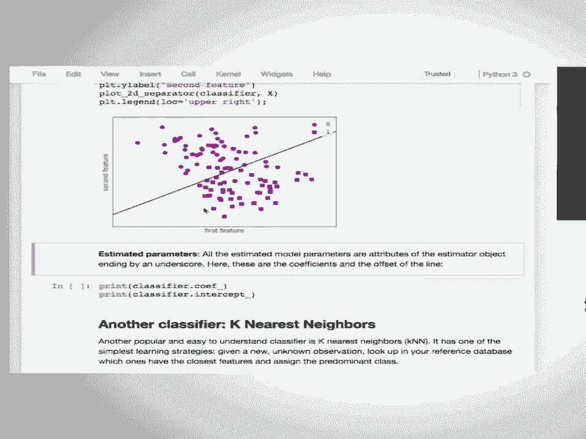

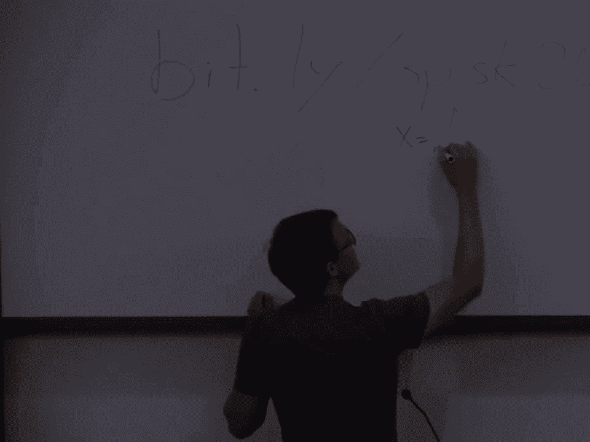

 and here i guess just two dimensions so this is x1 and x2 a linear classifier would take a linear。

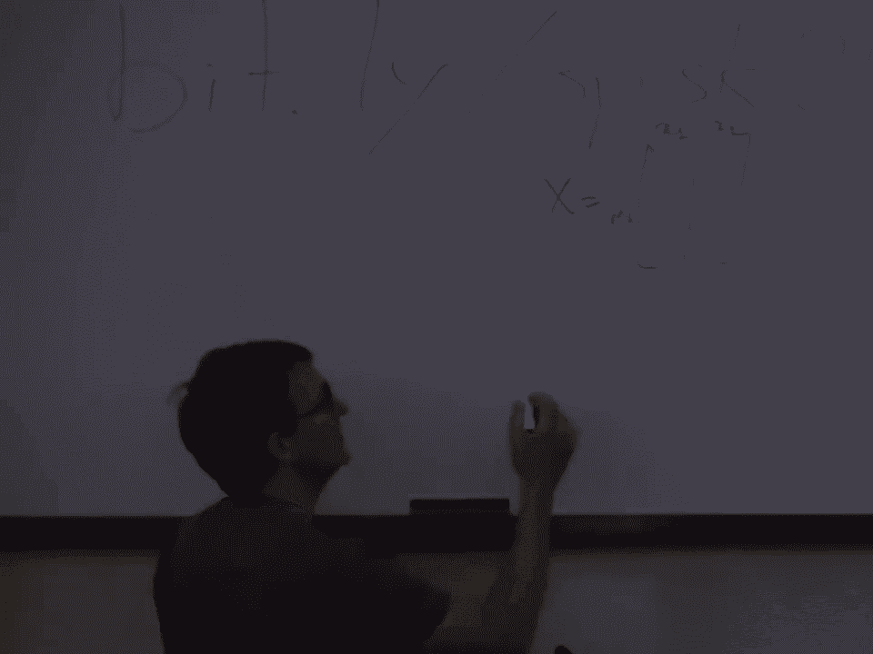

 combination of the two features so i'm gonna call it beta 1 x1 plus beta 2 x2 is gonna add also。

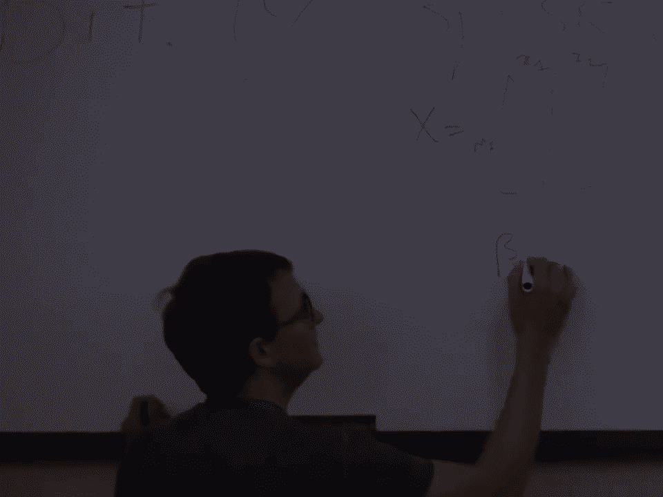

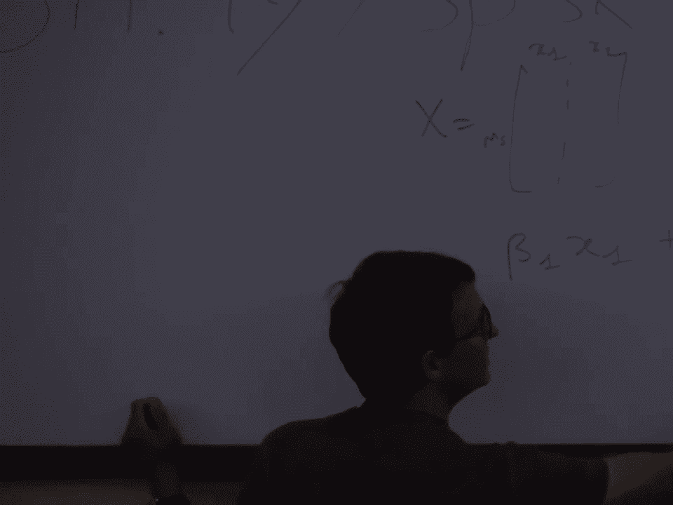

 an extra term that we call the intercept this is just a scalar value and based on this linear。

 combination it's going to decide am i blue or am i red what the logistic regression is doing when。

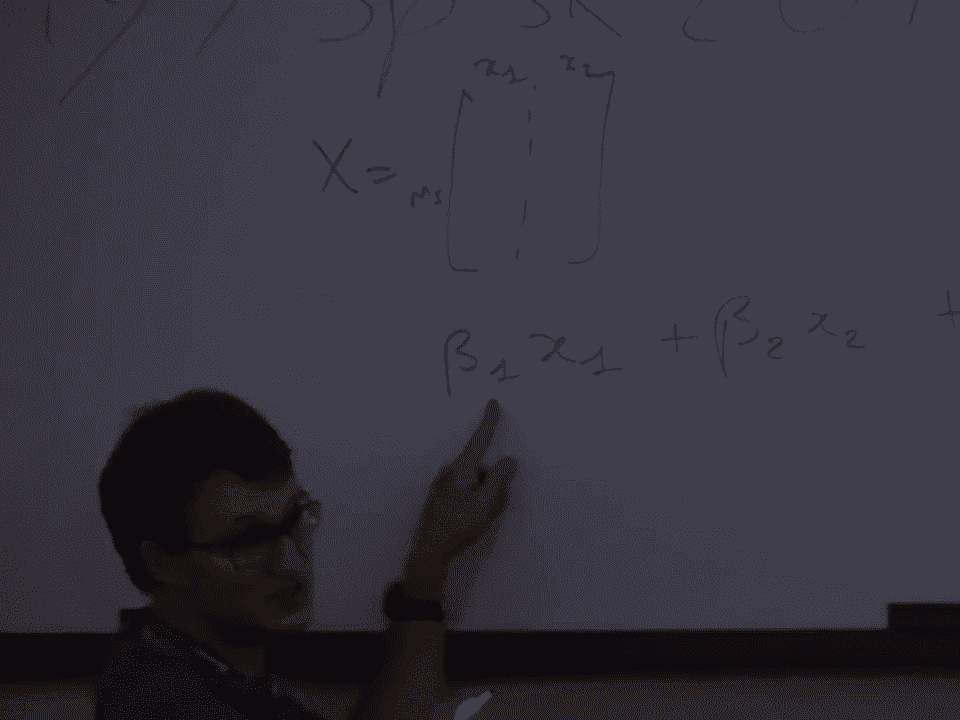

 you're in binary setup it says that if this quantity is positive that i'm gonna be of class 1 if this。

 quantity is negative i'm gonna be of class minus 1 so it means that if i just take the sign of this。

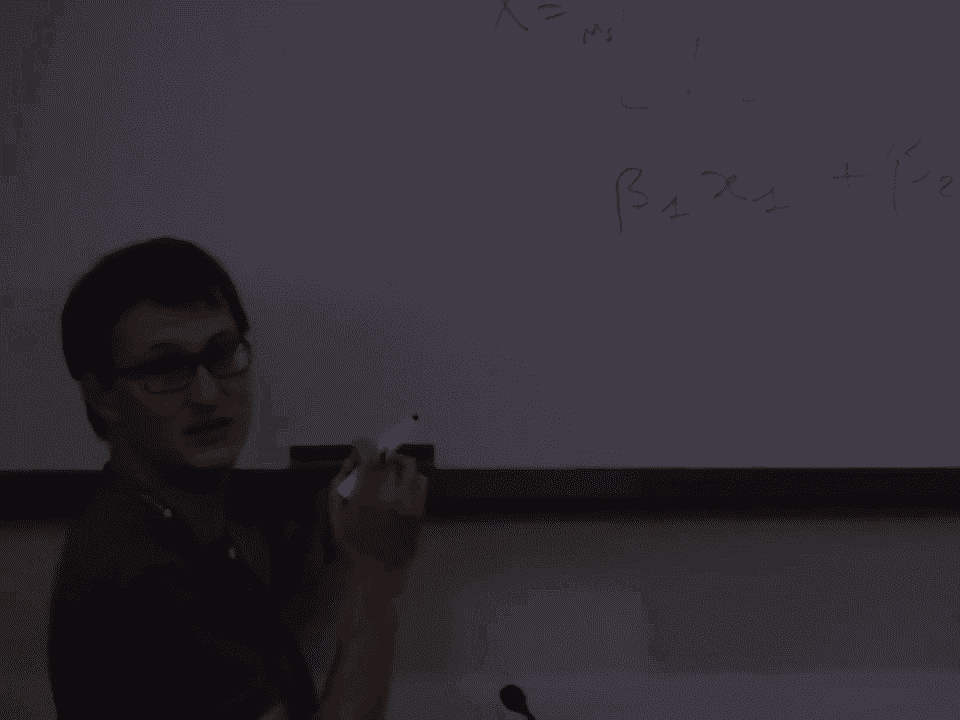

 this is basically what the classifier learns so the logistic regression is a way to learn beta 1。

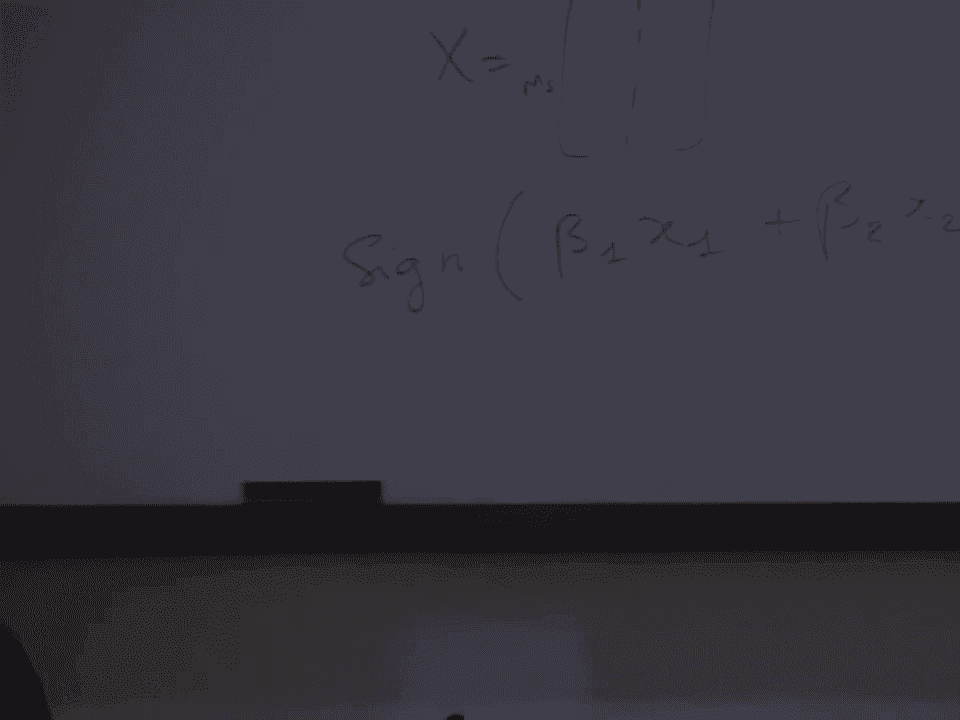

 beta 2 and beta 0 so it assembles linearly the input features add a constant term that we call。

 the intercept it sometimes also called the bias and just by doing this linear combination and taking。

 the sign of the output it tells me if i'm on one side of the hyperplane or here the straight line on。

 one side or the other okay so that's why it's linear because it's doing linear combinations。

 of the input features if you're wondering why i realized i did not speak in the microphone so。

 if you're wondering where are these estimated parameters this beta 1 beta 2 and beta 0s。

 there are somewhere in the fitted estimator in the fitted classifier。

 turns out that's these coefficients so we call it these coefficients of the linear models are。

 in the kleif underscore attributes do you have any idea why we have this underscore at the end of。

 the attributes so the question is why we have this naming that is kleif underscore as attributes。

 of the object so kleif stores this beta 1 beta 2 and intercept will store the beta 0。

 these are the parameters that are learned by the logistic regression okay。

 and we store them as attributes and somehow we added an underscore in the end。

 yes so it's because they're available after fitting it means that they depend on input data。

 if you inspect the cyclone objects you have a distinction between attributes objects that are。

 parameters provided by the users potentially in the innit or or via the set barram method。

 and what comes from the learning step so what comes from the estimation or the inference you。

 call it however you want it but this is something which is data dependent so every estimator if it。

 has an attribute which ends with an underscore will have gotten this attribute after fit it's not。

 present when you instantiate the object it comes afterwards and basically fitting the estimators。

 it means populating all these attributes so when you predict you can reuse them for prediction。

 yeah I'm saying if you like a reasonable task that you would solve with the。

 the estimator yes typically for text for classification of text documents you which are in very high。

 dimensions these are really hard to beat models typically so let me let me try to give you an。

 intuition of why I think about text or where I would think about other types of application。

 if I'm in dimension 1000 and I've got 1000 points okay I want to classify so let's say。

 probably start easier we'll start in dimension two I'm in dimension two and I've got two points one。

 blue dot and one red dot can you classify the blue and the red with only one straight line。

 you can always do this okay now you basically make the same reasoning in in high dimensions。

 if you have less samples than the dimension of your data you can always find a linear way of。

 separating them okay so if you can do a perfect classification with a simple model which is linear。

 it's very likely by going nonlinear you can achieve the same training accuracy but you will be。

 much likely to overfit on left out data so if you're in scenarios where your observations is not you。

 don't have a crazy amount of training data and you're intrinsically in very high dimensions。

 then linear models are actually very powerful typically I work myself a lot on imaging and。

 neuroscience problems and I'm typically in setups where the I have a very scarce data set in the。

 number of samples because samples are very expensive to acquire and it's training scanning time and。

 things that are expensive just meaning keeping people in the system for for a long time then。

 intrinsically the types of data that we collect are in very high dimensions okay linear models。

 are typically are models of choice for these types of setup any other question。

 all right so another classifier that gonna I'm gonna cover in probably a bit more detail than。

 what you've seen before is the k-nearest neighbor classifier here using a one-year-s neighbor and。

 this is the same logic I'm gonna fit and then here this plot just illustrates what the decision。

 function is going to be so what this code is pretty much doing is try to predict on every pixel of。

 this image and show you what is the decision function this decision function is illustrated。

 with this black line that you see here and you see that it's uh it's not a straight line okay。

 so the k-nearest neighbor is something that is a non-linear model in the same that is for。

 of us you as non-linear separating functions and here I don't know if I can zoom a bit more。

 but you see that around the blue dots these blue dots will be around the blue dot I'm gonna separate。

 I'm gonna predict blue just because I'm using a one-year-s neighbor for prediction maybe I should。

 spend one minute giving a tiny more details about k-nearest neighbors so。

 really briefly it's kind of the something that you would do naturally if you had to come up with a。

 classifier and you had never heard about machine learning or statistics in your life okay you have。

 a bunch of data set you have a data set and I give you a new observations and what you do is。

 that okay in this new observation in what everything I've seen so far which of my point is the closest。

 to this new observation this new sample and you look in your drawers and everything you've seen so far。

 and say ah so this is the one that looks the more similar okay and then you look at the metadata。

 you look at the attribute of this of the sample say oh it's a blue one so it means that if what I've。

 seen so far the one the closest observation is blue then it must be blue okay so this reasoning is。

 pretty much what the k-nearest classifier is doing it's trying to predict based on the nearest。

 point that you've seen in your training training there set。

 now there's a tiny exercise for you to which is to apply this on on iris and see how the the number。

 of neighbors affects the accuracy but before doing this just to see if there is if you have some。

 intuitions behind this here you see that the decision function is a bit noisy okay you have a。

 blue dot which is in the middle so the decision function is kind of wiggly wiggly lines in in。

 in the middle so it seems like to be unlikely to be a true optimal decision if you had to draw。

 yourself the separating function you will probably cut it here okay so you wouldn't have these。

 wiggly lines here so how how can you fix this how what would you change in the nearest classifiers。

 to fix this yes you're gonna increase the number of neighbors and so if I just do three and not 42。

 because that would be too much unfortunately for me if I take three then suddenly have a much more。

 regular line okay so this value that you can tweak is a parameter that can allow you to。

 improve the performance it's related also to the concept of regularization which pretty much says。

 that you want your decision function to be somehow simple okay smooth right so let's take five minutes。

 for you to play with a k-nierz classifiers do some fits predicts play with the number of neighbors and。

 see how much it affects your training test score so you're gonna need to call iris make a train。

 test splits fit on train after setting the number of neighbors and then evaluating on x test and y test。

 okay， and so if you want to do this with a coffee just I guess you can you can do this and and if you need。

 a break which is probably likely to be the case apparently just please have your break now and。

 and we'll continue afterwards all right so shall we try to do this so from a scalar and data sets。

 import load iris I'm gonna need also from model selection import train test splits。

 from a scalar dot neighbors import k-nierz neighbor classifier all right。

 so iris is just load iris x is iris dot data iris dot target。

 extreme x tests y train y tests train test splits x y it's let's do it by default。

 my classifier is going to be k-nierz classifier and neighbors is equal for now we set it to。

 k k equal one and i'm gonna do classifier dot fit of extreme boy train。

 and class print of classifier not score of x test and y test syntax error。

 oops all right so k equal one 97 pretty good so let's do follow 4k in range of one two。

 10 this so you see that accuracy varies so get kind of the same performance with different values。

 so i can do scores make it a list oh no it's a case now varying it's it's。

 first one the first print out is for k equal one that's a very good point so why is that。

 so i'm asking the others， yeah the train test split is not deterministic so now you know。

 that he said it to 42 and everything works and everything seems to work too well so let's 42 is。

 probably too simple let's take this one in yeah all right so it's this what is test fraction。

 test size i'm gonna take less training samples like this maybe i can go back to 42。

 yes okay so you change all the other parameters you can keep 42。

 and then i've got my scores scores is this and then i can do plt dot plot of， of， nay k values k。

 k values is this make it arrange and then i'm gonna do k values and then scores plt x label。

 and neighbors and plt dot y label accuracy， what did i mess up oops。

 all right so you see a curve you see that three neighbors seems to be better but it's kind of a。

 wiggly line so welcome to a real life of interpreting the output of your classification score。

 any idea why you should be cautious about this， if i change a random state i'm going to change the picture in the end okay that's the internal。

 variance viability in the thing that you're looking at you're in the world of randomness and。

 stochasticity of the training set and the test set it means that every value you look at。

 has a certain uncertainty which depends on the number of factors the size of your training set。

 the noise level the size of your test set the more data you have the less variance uncertainty。

 you will have on these metrics if i use a lot more test data and i evaluate on very large test。

 data then i've got very little uncertainty on the quantification of the metric。

 okay so that's why when people report stochastic numbers or random variables。

 it tends to be reported also with uncertainty or error bars okay so what you see here is just。

 the fact that it's depending on the way we randomly partition the data。

 and if i just see what the solution was pretty much doing so something quite similar。

 without plotting okay so you are showing you the training the training score and the validation。

 score all right so before i leave the stage to endy i will cover linear models now in the。

 context of regression so question yes， okay so that's a good question the question was why didn't i use predict i use score which basically。

 does internally a predict on x test so it was passed to score and then evaluates how to predict output。

 corresponds to the y passed at the score method and and use this to evaluate the metric of performance。

 okay score is doing this internally for you， supervised learning part two regression is the big the other big family of models that we're。

 gonna cover and i'm gonna start with simulated data which look like this so classical pattern。

 that would you would see in real data imagine this is x axis is time and the y axis i don't know is。

 the sales of your products and hopefully this goes up but you have some kind of seasonality。

 okay so you sell more of your products in summer or in winter time and you've got these oscillations。

 and a trend that hopefully will make you rich when it's high enough okay。

 so this is my data and the game here is going to predict the y axis based on the x axis so。

 my function is just y is equal to the sign of 4x plus x plus some random noise that gets added。

 to every sample so just to illustrate if i reduce the noise level then i'm more like this okay。

 so when we do regression what we are trying to find is a function that can capture。

 the structure of the data so can you predict what's the y axis given the x value okay this is a 1d。

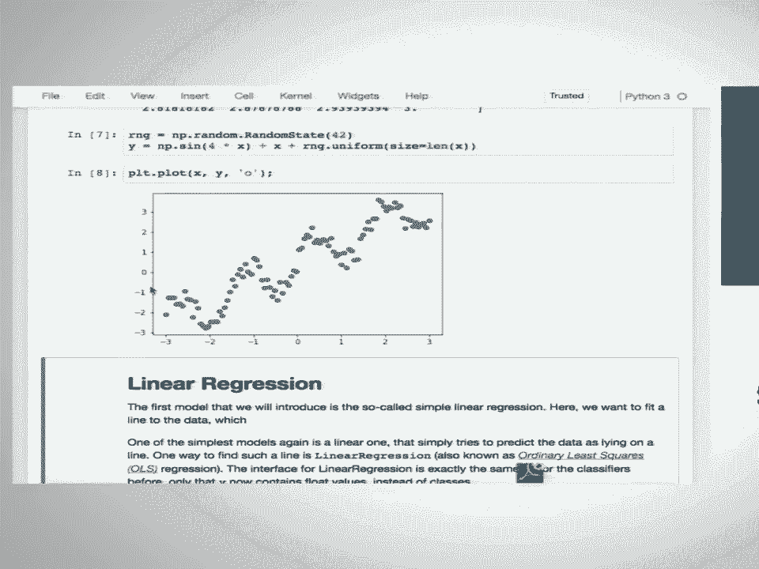

 problem we're gonna use this for illustration but think of linear models for regression as something。

 that can be applied in any dimension is the same logic so the basic linear regression model is what。

 we call ordinary least square which is just to fit a linear model to to the data and optimize the。

 models in the least square sense meaning that you want the errors evaluated at this mean squared error。

 to be as small as possible on the training set so psychic learn works with data which are 2d。

 x is 2d i mean 1d so x is an numpy array with nd equal to 1。

 psychic learn cannot work with arrays of nd equal to 1 it forces you to have nd equal to 2。

 where the second dimension is the feature dimension okay so what this cell is doing is just adding an。

 axis to your x in order to fit your x into a psychic learn x array then i'm gonna split my data。

 with 42 so you see good number again and i'm gonna use my favorite baseline object which is linear。

 regression so which is just doing only in least square and i'm gonna fit it on the training data。

 so i'm gonna fit same logic fit of x train y train and it's a linear model which means that。

 yes a co-eth underscore an intercept underscore that appeared after fitting okay so you're in one。

 dimension so actually nd removed my nice equations that are written on the board is everything that i。

 said for classification except that now it's even simpler because there's no sign on the output。

 what i'm just doing here is saying that my output y is just。

 so my output y is just linearly expressed as beta one times the x value plus a certain offset。

 a certain intercept that defines what my model actually does so i'm in 1d so i've got only beta。

 one so this is the beta coefficient which is 0。9 and and then the intercept which is 0。

 44 so i simulated with a sign which is zero mean and a coefficient of one for x so what this model。

 pretty much captured is just the linear trend in the data let's open the box and see how it's。

 perform and what it actually did it's a linear model so i tried to fit a straight line to the data。

 i can evaluate the prediction on the test data and see how it's uh so it's actually the prediction on。

 the train and you see that every blue dot was predicted as a straight line on this on this orange。

 dots i can evaluate on the test sets and show here now the prediction on the test set which are not。

 aligned exactly at the same position on the x-axis and you still see this linear prediction。

 right so how do you evaluate the performance mean squared error this is a choice this is not a。

 necessary part of how you evaluate this is the typical choice that you would use for the model。

 and i realized that this is this is not doing a mean squared error so there's actually a bug。

 not a feature it's actually an actual bug so because the score so let's let's see if the bug can be。

 isolated with a tiny snippet so if i just do the y-pred and i do regressor dot predict of y-test。

 and to np dot mean of np dot sum of y-test minus y-pred。

 oh okay so so it's it's just probably weird that we mentioned the formula of mean squared error just。

 above a line which doesn't compute a mean squared error so what this paragraph that i just skipped。

 is actually telling you is that the the score method for the regression is using what we call the。

 r2 score okay this is a score which has a maximum value of one that can be also arbitrarily negative。

 and it follows the philosophy of cycle learn which is a score the higher the better okay mean squared。

 error is an error function so a good prediction should have a very low mse。

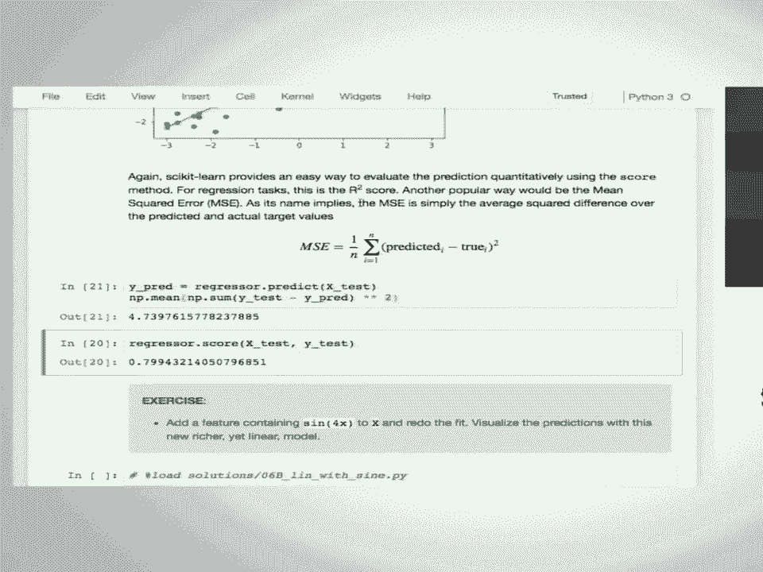

 so mse is not per se a score in the circular convention because the smaller the better we want。

 to score which is the higher the better so we use this r2 score in all the regressors。

 and and not the mean squared error there's there's actually a scoring metric that's called negative。

 mean squared error that follows these score higher is better convention right so let's uh trust this。

 this is the r2 so it's 0。8 i don't know if it's good or bad it's just close to one so it's probably。

 not completely stupid so it's just capturing the linear trend okay so the question is can you add a。

 feature so can you construct a feature and add it to your x in order to capture the oscillator。

 and oscillation trend in the data okay so how would you actually do this so。

 so in other words you can stay linear and capture something that looks like an oscillation。

 okay you just need to construct a nonlinear feature of the data that can be linearly combined。

 in order to have a nonlinear prediction from the input yes。

 so the question is what happened in my data if my in my data have highly correlated feature。

 so for most models if you want to predict the prediction will not be significantly affected。

 by just having the fact that two features are duplicated so in practice。

 it's probably better not to store both if they are really completely correlated so in terms of。

 storage or whatever that can be a good idea not to store both correlated features in practice。

 i would just keep them and it's unlikely to strongly affect the models。

 well at least most models some models that assume that every feature needs to be independent and。

 models like nave base could be strongly affected by duplicated features but i would say most models。

 will not suffer too much from this so in the linear regression the coefficients will。

 probably be less meaningful but the predictions will still be good but i think most people that。

 are interested in predictions will not use linear regression actually there's like more advanced。

 versions of linear regression models like rich and lasso and scikit learn and if you use them。

 it basically doesn't matter loaded the just loaded the solution i'm just explicitly constructing。

 this new feature which is the sign of four times the input for both training tests。

 now i'm learning with data in dimension two first column is just the identity second column is just。

 a sign function and now my predictions are what you see in orange and you see that the prediction。

 capture the linear trend and also the sign so if i look at my um regressor regressors now as co-f。

 which are two terms and they are actually both close to one you have the linear part。

 which is the identity and the um the the one coefficient that corresponds to the sign okay。

 so you you can't fit these types of non-linear functions using linear models provided that you。

 have a good way of constructing these non-linear features now you have much more powerful models。

 that can capture and infer automatically the nonlinearity in the data without having you to。

 construct this manually now if you have a sales prediction problem and the seasonality is clearly。

 12 month probably you can do already a reasonably good job by just adding a。

 seasonality which is just the the year period so real quick before leaving the stage to end the。

 k-nearest neighbors for regression is also possible this is typically how we would look like and。

 this is on the training sets so you basically predict perfectly with a one-year-s neighbor。

 the data correspond exactly to the prediction and if you want to predict you're basically predicting。

 the y value of your closest point on the x-axis and you see this this orange predictions which also。

 end up being a non-linear prediction from the input can evaluate the score and since the one-year-s。

 neighbors does capture a bit the oscillation then the score in r2 scores the same you see we just。

 call the same score method now we have point nine we add points I don't remember right points。

 eights with the the non-linear model the the nearest does better you can see how is the score。

 doing with the sign adding the sign entry it's probably even better。

 so I guess we have to hurry a bit so we're not going to do this exercise which is to do all this。

 with the data set which is called Boston you can welcome to look at the solution and if you have。

 any question one question you can ask it during when Andy is setting up。

 so in either you have a very strong hypothesis of why this non-linearity is actually the right。

 thing to do because for example you have a physical you have a knowledge of the physics of the system。

 or and you know that this is could be a quadratic function or a sine function and and this is really。

 the expert knowledge in practice if you don't know much of this you just use a more powerful model。

 all right great， that works great， there's a question。

 it's the idea behind this side feature that now you can also add other features like if you go。

 a lot of the data can we add features like bridges or edges and images as such a feature because otherwise。

 I would just use an optimized method from sci-fi and I'm just interested in a certain regression。

 how much so basically what you what we're uh fitting here is is you it's a sci-fi curve fit with a。

 linear fit in a least square sense okay if you if you really if if I mean the context of images is。

 is probably a bit different you for images you cannot hand craft features as simple as this so you。

 wouldn't typically need to use more powerful method that learned the features from the database。

 all right so let's start with the unsupervised models so before we really dive into unsupervised。

 models we're going to start slow by just doing some general transformation of the data so the。

 unsupervised models I want to talk about first are unsupervised transformations where you get some。

 training data and you build a model from the data and your goal is to extract some different。

 representation of the data so there's only an x here there's no y and then once you build a。

 different representation of the data when someone else gives you new data you can apply the transformation。

 again and get your new representation this could be the extraction of some features let's say from。

 images or it can be trying to reduce the dimensionality of the data for visualization or compression。

 so the first very simple example I'm going to do is just rescaling the data for some of the models。

 it's important that all the features are on the same scale so for example we want them all to be。

 between zero and one or we want them all to be zero mean unit variance linear for linear regression。

 it doesn't matter but if you use other linear models it matters and for some of the more complicated。

 models it matters too so one of the ways you can rescalulate data that's most commonly used is zero。

 mean unit variance and so here there's just sort of the numpy way of doing it if I start with some。

 array and I subtract the mean and divide by the standard deviation I mean that's kind of easy to。

 write down but there's good reasons why we would want to do this with psychedelic instead。

 so let's start using the iris dataset again we split it into training and test set。

 so we have 112 samples in the training data and we have the four features that we had all the time。

 we can look at the mean and standard deviation and see that right now these different measurements。

 are on somewhat different scales so the first one has a mean of about six centimeter the last one。

 has a mean of a little bit above one centimeter and they also have quite different standard deviations。

 and so if you want to rescale them the class and cycle learn to do this is the standard scalar。

 from the pre-processing module this has a very similar interface to the classifiers and regression。

 models that we've seen so far so it's also a python class and we instantiate it and it also has the。

 fit method all models and cycle learn have a fit method and so here instead of passing it x and y。

 because we only have x because instead of an unsupervised method we only pass we only pass x。

 then there's a new method called transform and transform will take the data you provide and。

 transform the data into a new representation here it's just subtracting the mean dividing。

 minus standard deviation i call this x-trained scaled the shape is the same as before you still。

 have 112 samples and the four features and now if you look at mean and standard deviation。

 maybe not very surprisingly mean a zero up to numerical precision and standard deviation is one。

 so the reason why it's useful to do this with scikit learn instead of just writing down formula。

 yourself is that you usually want to apply the same transformation to a test data set so the scaling。

 is often pre-processing to apply some supervised model like a classifier and so we first split our。

 data we computed a mean and standard deviation from the training data and then we apply the same。

 scaling to the test data so it can call transform again on the test data and i get a scaled version。

 of the test data so this didn't subtract the mean of the test data it subtracted the mean。

 of the training data so if i compute the mean of the um scale test data it's not going to be zero。

 and so it's uh if you want to use the scaling as a pre-processing it's very important that you apply。

 exactly the same transformation to the training and the test data and there's a figure here showing。

 why it's important so this is actually using scaling between zero and one i think but the principle is。

 the same this is very small， no second， there we go um so let's say you have an original latest set on the left this is a two-dimensional。

 data set um one feature on the x-axis one feature on the y-axis and the blue points are the training。

 set and the red triangles are test set so let's say i scaled the data in a way i did it above by。

 uh fitting the scaling on a training data set and then training the then transforming the training。

 in a test data set with the same values then uh the plot looks exactly the same the only thing that。

 changed is uh the labels on the x-es and that is because i use the same transformation on the training。

 and the test data set if i um scaled them separately so here on the right hand side。

 you can see what happens if you scale the training and test set separately so here again we scaled。

 them between zero and one but i trained i scaled the blue points between zero and one and then i scaled。

 the red points between zero and one separately one question one second um and so now basically you。

 can see that the red points moved relative to the blue points and so basically now you completely。

 changed how the data set behaves which doesn't really make sense。

 so um question was can i talk about splitting before or after scaling so basically you should。

 not do anything before splitting uh the point is that the test data is sort of is a hold out。

 they taught it is there um basically to measure how your model will behave on future data you。

 haven't seen yet and the future data you haven't seen yet you can't use that for scaling um and。

 you want to simulate as best as you can how will the model work on future data so you should take。

 the split the data put the test data aside never look at it again and only basically look at it。

 once to finally evaluate your model we're going to talk about this a little bit more later but。

 basically you don't want to touch your test data at all because you're not going to have your future。

 data to build a model so can you save these like the scalars that's taken。

 stay yeah sure you can save any psychedelic model um you can use either uh pickle or uh。

 job lip dump um you can find an documentation but basically just import job lip job lip dump。

 and it's just use just store the python object um yes so there are several ways to scale your data。

 and um so here are sort of the most common ones um the standard scalar so on the left you see the。

 original data the standard scalar does zero mean unit variance min max scalar does between zero and。

 one that's useful often if you have positive data where it doesn't make sense to make that make it。

 negative um robust scalar is very similar to min max scalar and sorry very similar to standard。

 scalar it does a median of zero and then scales the um quantiles to one this is more robust to。

 outliers so if you have one data point where someone said oh I don't have a value here let's put in。

 9999 that happens a lot in real world data um and uh so that can totally disrupt your。

 mean and standard deviation computation and you don't want that to shift your whole data set and so。

 if you use a robust scalar um that will basically ignore that because it looks at more robust statistics。

 of the data um so these three basically look at each feature at a time and then just rescale the。

 column of the data there's also another kind of normalization that's sometimes used um which is。

 useful for histograms or also sometimes used in text which we call normalizer which basically。

 makes all the um rows of your data set have the same Euclidean length so you compute the length。

 of each vector and divide by um yeah divide by the length that basically means you're only。

 looking at the angle and not at the lengths of the vector anymore that's only useful for very。

 specific types of data though um the main point of this was was was more to um show you how this。

 transform method works so again to build a model you have fit and to transform any data like the。

 train data or test data or any new data use a transform method。

 So the question is can you have something do you have something to show outliers and yeah。

 outlier detection will be I think the very last notebook that Alex will present later。

 um I mean so this was a very simple example usually you want to capture more complicated。

 outliers and then gets kind of tricky。 So now let's come to some uh somewhat more interesting and supervised learning um some of。

 you might have heard of principal component analysis it's a very common method to um reduce。

 the dimensionality of your data what it does is basically learns the rotation of your data。

 and then optionally you can uh remove some of the axes after rotation。

 So if you have a data set like the one here and left what BCA does is basically it searches the。

 components of maximum variance that's the directions in in the data in which the data is spread the most。

 you can think of this as fitting a big Gaussian blob and then looking at the axes um the main。

 axes of the variance。 And so here you can see um the first component is sort of this uh diagonal。

 x equal minus y or something and then the second component is orthogonal to it。

 In BCA you always find um orthogonal components so you find the first direction of maximum。

 variance and then um basically you discard everything in this direction and um you compute the next。

 direction that has the maximum variance that's orthogonal to it。

 That's the eigenvectors of the covariance matrix。 It's also the it's also the right eigenvectors of the data matrix but it's more I think it's easier。

 to understand to think of it as the eigenvectors of the covariance matrix。 But yes um。

 so here um the tarts form dataset is basically just a rotation of the data where um the first。

 axis to what's the x axis now is the direction of the first component and the y axis direction of。

 the second component。 And so we just sort of rotated the data。 And you can use this for the。

 dimensionality reduction by dropping some of the components。 Say I can drop now the y axis。 Usually。

 you want to keep the first like k components and um the ones that don't explain a lot of the data。

 that are sort of very short errors you want to drop them and you still regain a lot of the information。

 So here is what happens if you just drop the y axis you just get a one-dimensional representation。

 of the data。 And you can think about how much of the data do I capture here and what how much。

 information have I lost。 So you can go back rotate this back into the original space and you can see。

 here on the right the information that you regain by going from or the information that you lost by。

 going from two dimensions to one。 So basically we went from this to this。 Only that we're sort of。

 not storing it in the two-dimensional space but we're storing it in the one-dimensional space。

 So um this is very useful for visualizing high-dimensional data sets you can project。

 a two-dimensional dimension so you can see them。 Or if sometimes if you want a safe computation if。

 you have a very expensive algorithm you might find that only a couple principal components。

 explain most of the data so you drop the rest and then everything computes faster from then on。

 So um yeah let's walk through how to do this with scikit-learn。 The interface is exactly the。

 same as for scaling。 Here I created just some Gaussian blob data。 I colored it a little bit。

 differently just so you see how the data is mapped。 So um the principal components are the。

 same as before so you have one that's diagonal and then one that's orthogonal to it。

 We import PCA from the decomposition module so most of the dimensionality reduction and。

 unsupervised transformations are in the decomposition module。

 We instantiate it and we fit it so fitting， it on the x-blob data set computes the principal components so now you have basically have the。

 direction of the two errors and then you can transform it and you can see this is the data。

 alpha transformation so basically we rotated it so that the x-axis is the first principal component。

 So by default PCA keeps all the dimensions so you can see here there's n components equal to。

 none which means keep all of them。 I can also do n components or maybe just go below to do that。

 I can do n components equal to one and I'll drop one of the components。

 Yeah maybe I'll just quickly， do this here。 So here you can see from what was before a two-dimensional data set by setting n components to one I can。

 regain only the first principal component which is the this direction。 Questions about that？

 All right so what I want you to do is apply this for visualizing the digits data set。

 So oh no sorry here it is for the digits data set we're gonna do as an exercise we're going to do。

 for the iris data set。 So just to remind you the digits data set is the 64-dimensional digits。

 and here are some examples and so now what we can do is from the 64 dimensions we do n components。

 equal to two and we get two features out and then we get two-dimensional plot where you have the。

 first principal component on the x-axis the second principal component on the y-axis and each dot here。

 represents a digit instead of a dot we wrote down the digits so you know which one it is。

 So this is a completely unsupervised algorithm we just put in the class labels here so you can。

 see what's happening so that's just for the visualization purposes。 So each digit here represents。

 the projection of a 64-dimensional vector down to two dimensions and so I think it's quite interesting。

 you can see that some of the class are quite well separated even in this projection so。

 obviously we lost most of the information because we only went from 64 to down to two but you can。

 see that for example all the zeros are over here and the fours are over here and the ones are over。

 here whereas the two three and five they're sort of overlapped here but you can see that even with this。

 completely unsupervised projection of the data the zeros are very separated from all the rest so they。

 look very different。 And great so here is the first principal component the sort of principal。

 component is the error or the direction which the error points。 This lives in the data space so I。

 can visualize it as an eight times eight image and it looks like this。 So this is the direction in。

 which most of the variant lives。 Okay I'm not sure if I can interpret it but sometimes it's good to。

 look at these so I guess sort of the main difference is whether there's something here on the outside。

 or something here on the inside。 Because these come from some eigenvector computation and also。

 because they're sort of they just give you a direction。 Let's go back up here。 It doesn't really。

 matter if I draw the error in this direction or in this direction。 It's like it just tells me this。

 is the axis。 The axis and so designs of the of these components are completely arbitrary so I could just。

 negative this image like if I inverted it would still be as good。 So whenever you look at principal。

 components you should keep that in mind。 And yeah here this is the second principal component again。

 a 64 dimensional vector shown as an image。 And now you can do the same thing with the error。

 data set。 In the error data set you have four input features and you can try to project it down to two。

 dimensions using PCA。 And I can give you five minutes for that。 Where it says。

 compress it was supposed to say compare。 So compare the just the first two principal components to just。

 using two of the original features。 So just to go through the solution。

 So actually what we did here is， we scaled the data before putting it into PCA。

 So PCA is one of the models that does that is sensitive， to how the data is scaled。

 So if one of the features has a much larger magnitude than all the other ones。

 then this feature will just be the first principal component。 And that's not very interesting。

 So usually you want to scale your data before doing principal component analysis。 But if you。

 didn't do that now it's fine too。 So here we do a center scaler we fit the center scaler we。

 instantiate the PCA with two components and then we fit the PCA and transform it on the transfer。

 training set and then we transfer on the transfer test set。 And maybe it would have been better to。

 write this as two lines。 But and this is the visualization you can get out。 So again this was。

 completely unsupervised the colors are just there in the visualization。

 And you can see here as we saw， on the other two dimensional plots that the iris satosa is quite different from the other two and the。

 versus the color and virginica are sort of overlap。

 So this is the following training set and this is a plot on a test set。 So if you just want to do。

 visualization you might not need to split your data into training and test set。 If you want to do。

 this as pre-processing for some supervised algorithm obviously you need to split your data。

 It doesn't look much rare。 Yeah。 And the point is a little bit that you don't need to pick which。

 are good ones and also you know that you didn't really miss a lot。 In the original latest set it's。

 already pretty simple so you can't really improve a lot over that。

 And now we only have two dimensions， left。 Yeah。 Now we only have two dimensions left。

 Another thing that maybe we should have done here is。

 I want to add is you can see how important each of these components are by looking at an attribute。

 called explained variance ratio。 So let's say I fit again on the transform training data set。 So。

 So now this fit a PCA with four components because the initial data was initially。

 four dimensional and now I can look at the explained variance ratio。 And this will tell me。

 how much of the variance in the data what fraction of the variance in the data is explained by each。

 of the components。 And you can see that 72% of the variance is explained by the first component 23 by。

 the second 3% by the third and 0 0 4 by the last。 So you can see that the last component really didn't。

 add that much information。 It's mostly collinear with the other two。

 And so maybe going to do dimensions， didn't really lose a lot of information。 Yeah。

 you can also plot it if you want。 And often that， sort of looking at this often gives you a good idea of how many components you would need to retain to。

 keep most of the information from the data set。 Well。

 so that's a good idea if you have an algorithm that's very expensive in the number of features。

 If I train like a linear model， I would just use all the data。 So。 The PCA is good if you want。

 if either for visualization or if you really need to compress because they。

 have a very expensive pipeline。 If you can avoid doing that。

 if you have if you're doing a supervised， problem。

 I would usually try to keep the original features as much as possible。 Because maybe the 0。

04% of the data that you lost were the really important ones。 Because it's， unsupervised algorithm。

 it doesn't know。 So if you have a supervised problem， if you can， I would avoid， doing it。

 But if you have to， it's not that bad。 Question is， what if I append it as my regular， ax？ So。 No。

 then you basically does feature engineering， you added more different kind of， features。

 So if you use a linear model， it would add nothing because it's just a rotation so the。

 linear model could pick up on that itself。 If you use something like a tree based model。

 it would actually sort of add additional information to the model。 I would not expect it to help in。

 most cases。 Maybe you can find a case where it helps。 I wouldn't imagine it to be generally a。

 strategy that I would use。 Yeah， so doing PCA is one way to regularize and it's one that statisticians like because it gives。

 you an unbiased model。 Yeah， so yes， you can do that。 If you're more interested in predictive。

 accuracy， I would usually use a different way to reduce overfitting。 Like each supervised model。

 usually has a way to reduce overfitting using regularization。

 like instead of using linear regression， use regular regression， for example。

 Using PCA first is an alternative。 Yeah， and it has sort of。

 it has the benefit of giving you an unbiased model。 But I don't think it's， yeah。

 I usually use just a regularization of the model because it's a more direct way to。

 use the information in my opinion。 So， I mean， yeah。

 So let's come to the other big family of unsupervised models， which are clustering。

 So clustering is grouping data。 So someone gives you， again， a whole bunch of data acts。

 and usually nothing else， and asks you， well， are there certain groups in this data。

 or maybe is there a good way to summarize this data into some prototypes？ This is often useful。

 as some exploratory technique to understand your data better。 So you can， yeah， find out。

 sort of what are characteristic parts of the data。

 So this obviously depends on what does similar mean。 So the idea here is to group。

 similar points together and have the similar points be in separate groups。 And similar。

 most often is， Euclidean distance， but there's， but you could potentially use other distances， but。

 there's many algorithms that use different ideas of how to create these clusters as groups of similar。

 items。 So， yeah， maybe to make us more concrete。 So the input for an algorithm would be， let's say。

 the data， and the output would be for each point which group it belongs to。

 So here's an example of where this is very trivial。 So this is a synthetic data set with three。

 Gaussian blobs。 And so if I asked how many groups are there， what would be your answer？ Three， yes。

 Data never looks like this in the real world， obviously， and you'll never get such a， nice grouping。

 Even if it has such a nice grouping， maybe it lives in a hundred dimension， and it's。

 not immediately clear that there should be three groups。 Most algorithms require you to specify。

 the number of clusters you're looking for beforehand。

 So the easiest algorithm and the one we're going， to discuss now。

 or one of the easiest algorithms is K-means。 K-means tries to identify cluster centers。

 So these are like prototypical points in each of the groups。 And then assigns points to the cluster。

 centers closest to them。 So here， I import the K-means algorithm from a cluster module。

 I set the number， of clusters to three because someone told me that。 So in general。

 it's a very hard problem， or maybe a very ill-specified problem to say what is the right number of clusters for a。

 pretty cool dataset。 The algorithm is randomized。 It actually restarts a couple times with different。

 random initializations， and so to make sure we get the same results， we set the random state。

 So the clustering algorithms have slightly different interface again。 So they all have a fit。

 method。 So if I wanted to do the fit method， and I would build the clustering algorithm but。

 it wouldn't really return me anything， I could then look at the cluster centers。 There's also。

 a method called fit_predict， which fits the model and then the predict returns the cluster。

 assignments。 If I do this， I get for each data point in X， which of the three clusters， 0， 1， or 2。

 this data point was assigned to。 So in here， ask for three clusters， so I get out labels 0， 1。

 and 2。 So this is a very simple problem。 So we might imagine， so we had actually。

 when we made these， blobs， we had the membership variable Y that says which point belong to which blob。

 And so maybe， we think， oh， this was so easy， they should definitely be the same， right？

 But they're not。 And so why are they not the same？

 And what's wrong with the labeling that we just got here？ Exactly。 So the numbers are arbitrary。

 So it's just important which points are in the same cluster。 So here。

 this one is the clustering found by the k-means， and this is the ground truth。

 And you see that the same points belong to the same cluster， but they're just numbered differently。

 For clustering algorithm， that's basically the same outcome。

 That means you can't really measure clustering， how good a clustering is with accuracy。

 So accuracy is just how many labels are the same。 That's what's used in classification。

 And so the result here would be 0。 Yeah， so this is just implementing accuracy。

 There's other metrics you can， well， okay， well， it's going to be this exercise。

 But so there's other metrics you can use to say， how good a clustering is。 For example。

 the adjusted RAN score that takes into account that there might， be a relabeling。

 And so here you can see it's one。 One is a perfect score， which means you have。

 recovered the groups perfectly。 So there's a couple of clustering metrics in scikit-learn。

 The problem is to apply them， you need to have some ground truth labeling。 If you had some ground。

 truth labeling， it should probably be due classification instead of clustering。

 So these are sort of more， of an academic interest， mostly。

 Usually if you want to evaluate a clustering and find out what's， the number of clusters。

 what's the right algorithm to use， you need to do this very manually and。

 inspect the clusters and see if they have some meaning。 So one of the problems with K-means is that。

 you need to specify the number of clusters。 So if I specify two， the algorithms will happily run。

 and it will give me two clusters。 So this one and this one， which might be helpful， but also。

 might be a little bit misleading。 There are several methods to try to， bless you。

 Automatically adjust the number of clusters。 One of them， like the most simple one。

 is what's called the albo method。 It's not a very scientific method。 What we're doing here is we。

 start with one cluster， go up to 11 clusters， we do K-means， we fit the model， and then we look at。

 the inertia。 Inertia is basically how far away our data points from the cluster centers。

 And so the more clusters we add， the smaller inertia will be because all the points will be。

 closer to cluster centers， because there will be more cluster centers everywhere。 But if you look。

 at it， you can see that there's one point where it decreases a lot， and then afterwards it doesn't。

 decrease that much anymore。 I should have gotten my config from over here somewhere。 There we go。

 And so you can see that it decreases a lot from one to two and from two to three， but。

 here it still decreases， but stays relatively flat。 So that would be an indication that maybe。

 three is a good number of clusters。 This method works well if you have a toy example such as。

 this one where the clusters are very well separated。 For real world examples。

 this might be harder to， do。 So I think we're going to talk about more clustering algorithms later in the afternoon。

 But here are some examples of particular properties of this clustering algorithm。

 So as I said before， basically if you give it the incorrect number of clusters， it will just。

 sort of group multiple of them together if you're lucky and you get something like this。

 K-means also kind of assumes that clusters are sort of have the same extent in all the directions。

 So here there's also three blobs， but the three blobs are sort of extended in one direction。

 And so the algorithm fails to recover this。 There's other methods like agglomerative clustering。

 db scan or Gaussian mixture models that could work on this。 And similarly。

 it means assume sort of that all the clusters have the same variance。 So if you。

 have something like this here， so there's three Gaussian plops， one that's very dense here， one。

 that's somewhat less dense here and one that's not very dense at all in the middle。 And basically。

 it computed the cluster centers correctly， like one cluster center will be here， one cluster center。

 will be here， one cluster center will be here， but it just sort of cuts in the middle。

 which is maybe not what you would expect。 However， it completely。

 it's ignorant about density of blobs in the sense that if there's more， point in one or the other。

 it'll still find the right clusters or write as in the one that your， intuition might expect。

 So as I said， there's like， there's a whole bunch of them in scikit-learn。

 There's this nice example here， which compares on some Toyota sets how they all behave。

 K-means is nice because it's relatively easy to understand。 And in most cases， there's no。

 like true clustering。 There's no obviously correct outcome。 And so the differences are not as big。

 between the algorithms。 So what I would like you to do as an exercise is load the digits。

 data set and apply K-means and try to find 10 clusters。 Then you can visualize the cluster centers。

 So there's an attribute。 I think I haven't shown this so far。 Do I have a K-means instance？ Nope。

 I never stored anything。 Great。 So here， for example。

 there's a cluster centers attribute that gives you where the cluster centers are。

 So these are the coordinates in the data space。 And so if we can apply the same on the digits。

 data set， you will get a cluster center that's in the image space。 So it's going to be。

 eight times eight pixels。 Then you can visualize it with M-show。 So yes。

 I want you to apply the clustering and then visualize the cluster centers and see if。

 they are somewhat intuitive。 And think about what would you expect them to be and what are they actually？

 You can also， of course， for a digits data set， because the Spivy's data set， we have ground。

 true labels， ground true labels。 So we can compute a adjusted RAN score。 And we can see how much is。

 the clustering that we got with K-means similar to the actual digits。 All right。

 So maybe I'll give you five minutes to do this。 All right。 So let's look at the solution。

 So we just， essentially， it came means with a number of clusters equal to 10。 We compute。

 clustering and the clusters using fit predict with the digits data。 Then we get the cluster centers。

 So here the shape is 10 times 64。 So we have 10 cluster centers， each 64 dimensional， of course。

 the input space is 64 dimensional。 And then， for each of these 10 cluster centers。

 we do an M show on the cluster centers reshaped to a times， eight。 Why are we doing isome app？

 Let's not look at this。 So you can see here that maybe they reflect some of the clusters you might have expected。

 So these， actually seem to correspond to a digits。 I mean。

 even though this is a completely unsupervised algorithm， I think we have like one， two， three， four。

 five， six， seven， nine and zero。 In this， may or may not be an H。

 Maybe it's also a different kind of one that doesn't have like the thing over here。 But yeah。

 So here the clustering actually picked up on the thing that we're interested in。

 the different digits。 If we had a more realistic data set of handwritten digits， it might have also。

 been that the clustering picked up numbers written with a sharpie versus numbers written with a pen。

 And so you're never guaranteed that the clustering algorithm actually picks up on the data that。

 on the aspect of the data you're interested in。 And yeah， depends again on the clustering algorithm。

 If you look at these， I can learn examples。 I think they're somewhat faces。 And depending on the。

 algorithm， the either it might pick up cluster faces together that are the same person， or maybe。

 clusters faces together that all look to the left。 And both of them are like valid clustering。

 The question is， what is the aspect of the data you're interested in？ Question？ Okay。

 so the question was， it seems unsupervised learning is better for exploratory analysis。

 Here in the case， it really seems like you want to do supervised learning。 Usually in the real。

 world， you don't really have that much of a choice because usually either you have the output data。

 that you want or you don't。 Often also there's， I mean， though even if you have the target labels。

 it might be that it's interesting to run clustering because it might find different clusters。

 So you might have something like， will customers buy X， yes or no as a classification task？ You run。

 a clustering algorithm and the discovers that there's like， I don't know， moms， teenagers， and。

 senior citizens in three different clusters。 But these clusters don't necessarily need to。

 relate to the output that you have。 But it might still be interesting to understand that there's。

 these three different clusters。 If you are after a specific thing， I would always use supervised。

 learning。 I mean， in particular， here in the real world。

 we wouldn't have the annotation of the numbers。 And so there would be no way to assess how good is this actually doing。

 Because you have nothing to， compare to。 And if you can't assess how good it's doing。

 I would not like to do this in like a， production system。 Other questions about clustering？

 >> So in the diagram where it's comparing the bunch of different methods。

 DB scan appears to be the wellness， through best general in all of these cases。

 That just always uses four cases of these， types of methods that it would be poorly on。

 >> DB scan is pretty good。 But also， low dimension doesn't necessarily carry over to high dimensions。

 What I found with DB scan， I mean， DB scan has some nice properties。 For example。

 it can detect outliers。 What I found， with DB scan is that it often creates very unequal size clusters。

 So for example， puts most of the data， into one cluster and then creates like three other clusters that are sort of small subsets of the data。

 And whereas K-means is sort of more， you're trying to cover the data with some centers。

 that are sort of evenly spaced。 And so it has like some quality of differences in how it builds the clusters。

 So I don't think like DB scan is a good algorithm。 I don't think it's always the right answer。

 And probably you should on your task try different ones。 Probably I would try to do K-means DB scan。

 and a glomerative clustering and see what these three give me。 I can tell you to read my book later。

 but I can also tell you now。 There's like， I did a pretty。

 extensive comparison on one particular example in my book。 You can find the notebooks online。

 my GitHub， and you'll see how the results differ。 Question。 So all of the clustering。

 the question was， are these algorithms sensitive to normalization？ And the answer is yes。

 all of them are very much so。 We didn't normalize here because。

 the data sort of normalized in that each pixel is between zero and 16。 And that is sort of a good。

 scale for this data set。 If I did a centered scalar here， what would actually happen would be that。

 sometimes here the things here on the outside， I think the four corners are always white。

 This one is nearly always white， but there's like five images that have like a gray pixel there。

 If I did send that scalar， it tries to make the variance of this， to be one。

 which means it would really increase the scale of this pixel。

 which doesn't really correspond to my intuition of how the data works。 I think pixels at every。

 point are sort of equally important in my like my mental model of these digits。 And so I think。

 having the having all of them between zero and 16 is what makes the most sense for this data set。

 That might not be true for like all kind of images everywhere， but that's why I think you。

 actually lose information here if you do standard scalar。 If you don't know what your data is doing。

 use standard scalar。 Otherwise， because it uses Euclidean distances， again， if you have one feature。

 that's a much larger scale than everything else， it will just use that feature。 And that's probably。

 not what you're interested in。 All right， so let's move on to a review of the second-learn API。

 This is really too small。 This is really too big。 So as I said， I mean， so we call our models。

 you've heard us maybe sometimes estimators。 Estimator are all the classes in scikit-learn。

 They all have more or less the same interface。 All algorithms are implemented as Python classes。

 and they all have a fit method。 The fit method always gets as the first argument， the data x。

 And if it's a supervised algorithm， gets a second argument， some target output y。

 which could be for regression or classification。 There's other kinds of supervised algorithms that we haven't talked about like feature selection。

 So fit always builds a model and stores the model in this object， which we call model here。

 And supervised models， if they predict some target， they have a predict method。

 So that's for regression and classification。 You also have a predict method in the clustering。

 algorithms。 So maybe it's like caveat for k-means。 You can actually predict on new data points。

 You can just ask which cluster centers is closest to。 If you use something like dbscan。

 there's no natural way to say which cluster this belongs to。

 So some cluster algorithms have predict。 Some only have fit predict。

 which means they can only give you cluster centers for the training set。

 For classification algorithms， we also have predict-prob-a， which gives you probability。

 estimates of the different classes and decision function。

 which is an unknown-ized certainty measure。 So in a binary classification。

 decision function greater than zero means it'll predict the positive。

 class and smaller than zero means it will predict the negative class。

 but you don't really know what， like five means。 Five could be very certain or very uncertain。

 Whereas predict-prob-a is， normalized to sum to one。 Then there's the score method。

 which most commonly used for classification， and regression。 For classification。

 it's always accuracy。 And for regression， it's always r square。 We haven't seen this so far。

 but some of the supervised models also have a transform method， that's mostly feature selection。

 So this is our supervised algorithms that again give you a new， representation of the data。

 but they learn something from the targets。 For unsupervised models。

 the transformation that we talked about， like PCA and the scalars， they have a transform method。

 Transfer methods are always when you get a new representation of the， data。

 There are some models that cannot transform new data。 They can only apply transformation to。

 a training set。 They have a fit-transform method， which fits and transforms the data。

 simultaneously。 Again， as I mentioned， some clustering algorithms have predict。

 There's actually some unsupervised models that predict-prob-a， but it's like， I think， one。

 And some models also have a score method， which says basically how well does the model fit to the data。

 But the main overview that I want you to keep in mind is sort of this。 The three most important。

 methods are really fit， predict， and transform。 Fit is always to build the model。 Predict is to。

 predict the outcome classification regression or clustering。 Transform is always to get a new。

 representation of the data， like pre-processing， imaginary reduction， feature extraction， feature。

 selection。 And we're going to talk about feature extraction， feature selection， and a little bit。

 Question is， are there different scoring metrics？ Yes， absolutely。 We'll do this in the afternoon。

 The score method is always that， but there's a module called， SK-LONED metrics。

 which has like 20 or something。 And there's a way to do them very easily。

 to use them for cross-flavation。 I'm going to do them in the afternoon。 Other questions on API？

 So I think the last thing we're going to do before the break now is we're going to do。

 a quick case study on sort of a slightly more real dataset， which is the Titanic survival dataset。

 So this is a dataset that's sort of been used historically to teach some pre-processing and。

 machine learning。 This is all the passengers of the Titanic。 And it's a supervised class。

 binary classification task， and the task is to predict whether they survived or not。

 So we're starting here with basically a table with information about all the passengers。

 And so we need to sort of massage this table to get into some numeric format that。

 SK-LONED can work on。 And so this is what this is all about。 So maybe I think。 Okay。

 so before we look at the table， there are some different types of features that you will。

 often encounter。 So far， we only basically have seen numerical features。 And numerical features。

 is the thing that SK-LONED works best with。 So in the IRS dataset， you had these。

 four continuous numbers， simple lines， simple with， petal lines， petal with， and these are just。

 floating point numbers。 So another common type of feature that you encounter are categorical features。

 Categorical features are sort of discreet， where you have a fixed set of possible values。

 For example， colors that are red， blue， and purple， or the gender of a user， for example。

 or possibly the， city where they live in， or what type of account do they have。

 or anything like that。 So this is usually a fixed possible set of things。

 and they are not usually ordered。 So one simple way you could think of creating a continuous variable from these。

 Oh， so second learned doesn't naturally work with these。 And most machine learning algorithms。

 basically in themselves， the algorithms can't really handle them。 And so we need to convert them。

 to an American representation。 So one very simple way that you can think of is maybe a sign red to。

 one， blue to two， and purple to three。 And so you have one number， it's one to three， that encodes。

 this variable。 The problem with this very simple encoding， or the biggest problem with this。

 is that it creates an ordering。 So in most contexts。

 there's no natural order between colors like red， blue， and purple。 Maybe in wavelengths there is。

 but sort of in。 If you have a webshop and that's， our colors of clothing。

 there's probably not really any ordering to them。 And so you don't want to， impose an ordering。

 and you don't want to make one of them more similar to the other ones。

 So you want them all to be completely independent and all sort of be represented in the same way。

 And we're going to talk about how to do this in a second。 Oh， okay， we got it。 Or now。 Okay。

 let's do it in a second。 So， there's several ways to do this。

 So sometimes you have data that's stored in dictionaries。

 that's often if you mine data from the web， you get some JSON back， and then you might get a list。

 of dictionaries where here， it's like you have a categorical variable， which is a city。

 which could be Dubai， London， San Francisco， and you have a continuous variable， which is the。

 temperature。 And so what we want to do is we want to leave the temperature as it is， and we want to。

 encode the categorical variable in what's called one-hot encoding。 In one-hot encoding。

 we create an additional feature for each possible value。 And we set this feature to one。

 if the sample has that value and zero otherwise。 So for dictionaries， we can do this with a dict。

 vectorizer。 So here， I do fit transform， so dict vectorizer actually gives a sparse matrix。

 by default。 I can also convert it to a dense matrix。

 And so you can see that the encoded data set here， has now four features。

 I can call get feature names， and I will tell me what these four features are。

 The first feature is whether the city was Dubai， the second feature is whether the city was London。

 the third feature is whether the city was sent from Francisco， and the fourth feature is just。

 temperature。 And so now these three different cities are encoded completely in the same way。

 basically， and they're completely independent of each other。 Usually， at this point。

 there is a statistician in the audience that asks， are they not collinear？ So if you do this。

 you might introduce linear dependencies into your data set for most machine。

 learning models that doesn't really matter。 You could drop one of them because you know if。

 there's only three cities， there's Dubai， London， San Francisco， and if it's not Dubai or。

 at non-London， it has to be San Francisco， so you can remove that column。 Usually， it's easier to。

 understand models if you leave it in。 So if you don't have dictionaries。

 but you have already a table， like in a CSV file， it's often easiest to work with Panda。

 So Panda is really good for preparing your， data into a form that I could learn can use。

 So we had these two types of data continuous and， categorical。

 These are really the most common types of data。 There's other ones like， ordinal。

 where you have a sorting， or there's time features， and there's text data。 We're going。

 to talk about text data a little bit later。 We're not going to talk about time data at all。

 And so let's come to the Titanic data set。 So this is like a CSV file， and it has， we do read CSV。

 which gives us back a Panda data frame。 And we can look at the columns of the， data frame。

 Here are all the different attributes in this table。 Maybe， let's。 So there's the class。

 of the passenger， which is the first class， second class， or third class， the room。 Survival is the。

 target that we actually want to predict。 Zero one， there's the name， their gender， age， number of。

 syllabings， syllabings， and spouses on board， number of parents and children on board。

 the number of the ticket， how much they paid， the cabin number， and where they boarded。 Oh。

 I guess lifeboat is whether they made it on a lifeboat。 And body is， oh no， I think boat is。

 the number of the lifeboat they were on， and body is the number of their dead body they were identified。

 with。 And destination is where they were headed， and they were arrived。 So， if you see this。

 so the first thing， I mean， the first thing you should probably do is look at， the data。

 so you get some idea of what's happening。 And so the P class is one to a three， but it's。

 sort of a categorical variable， maybe。 There is some ordering to it， but it's not really continuous。

 Survived is the binary target。 Name is like a free string， so this is neither categorical nor。

 continuous， because each value of them is probably unique。 So there's as many different names as。

 there's passengers probably。 So this will not be very helpful for us。 Sex here， because it is， from。

 I don't know， 1920 or something， is only two values， male and female。 Sorry？ The question is。

 wouldn't last name be helpful to the English families？ Yes， yes， but probably not as a feature。

 You could try to make prediction on a family level， and maybe if a family survived。

 like if someone from a family survived， the other people also survived。

 I don't think that's actually happening because， well， I guess so。 Mostly people that are first。

 class survived， but usually the husband died， but I'm getting ahead of myself。

 But that's not really， I guess if some family members are in a training set。

 now the family members are in a test set， that would help you。

 But that is sort of peeking into a test set， I would say。 I don't think you can。

 just from the family name， I don't think it's like a very informative feature。 I guess it depends a。

 little bit on how you structured a problem。 Okay， so we have H again， which is a continuous feature。

 here。 We have a number of syllabings and spouses and the number of parents and children。 So this。

 basically tells you whether they were traveling with family or not in some way。 The ticket number。

 so actually ticket number seems to be a better way to group families if you want。

 but we're actually， not going to do this。 So ticket numbers also， you can see who brought together。

 but it's also not， really informative。 There's fair， there's cabin number。

 which again would help you to group people， but， on itself is not really informative。

 Embark is the port where they embarked， and then boat is the， number of lifeboat they were on。

 buddy is their notification number and the destination。 So boat and buddy are kind of categorical。

 but we're probably also not going to use them because， if we have a buddy number。

 then they didn't survive。 So we are basically putting the target， information already in the data。

 And I think also if they're on a lifeboat， they survived。 And you can see here these two have。

 we're on a lifeboat set and so they survived。 So， we're not going to use these。

 we're going to try to predict whether they survived or not。 I think， just from their gender age。

 filming， parents， fair and part of embarkment。 And so think age and fair are the continuous variables。

 These two， I think we also model as， continuous variables and the rest are categorical。

 So this is sort of our thinned out version of， the data set。

 This is only the things that we're going to use。 The way you can create these 100 encodings with pandas is with the get dummies function。

 that will extend the variables in the same way as a did vectorizer does。 So here we get， for sex。

 we get two new features， sex equal to female， sex equal to male。 And for embark， we get。

 three new features in bar C， embark queuing， embark S。

 And only one will be one in each of these groups。 Either one hot encoding or dummy encoding。

 So in pandas， it's get dummies and cycle learn it's one hot encoder， but I do the same thing。

 >> So is it automatically looking through the， those things， values or， or。

 >> So the question is how are these columns determined？ So what get dummies does is it looks at。

 columns that have either a panes categorical type or object type。 And it will create a new。

 column for each unique value in this。 So here， this has object type， I think。

 I think basically does it for everything as not numeric。 So sex is not a numeric column， so it。

 finds all the unique values and creates a column for each of them and embark is not a unique is。

 not numeric。 And so it creates one column for each of the unique ones。 So if we can control this。

 more explicitly by giving it the columns that we want to have encoded as dummy variables。

 So here we say we also want p class， which is an integer to be encoded in a， with a dummy variable。

 And so now it will also create p class one， p class two， p class three。 Actually。

 I don't know what happens if you do put in fair， but it probably will create either。

 it will give you an error or it will create like very many different columns that are not very。

 informative。 So actually， this is， so if you want。

 you can get out the only the NumPy error information。

 So only the data looking at the values attribute of the data frame。 This is not really strictly。

 necessary。 I mean， scikit learn only works in NumPy arrays internally。

 but it converts any data frame， that it gets。 So， but if you look at the values。

 you'll see that some of them are actually in Num。 For example。

 here you can see that this person has no h for some reason。 And so。

 the scikit learn models can generally not deal with this。 Usually you have to be explicit about。

 what you want to do if there's a NAN。 So here this NAN probably means。

 this data wasn't measured or wasn't collected or whoever put it in there made a mistake。 I mean。

 the person probably does have an h。 We just don't know it。 So this is a missing value。

 The simplest way to deal with missing values， well， the simplest way is to just either drop。

 the data point。 So drop this person because we don't know their h or drop the whole h column。

 because we don't know all the ages。 Dropping the whole h column because of this would be kind of。

 silly because it wouldn't be， we would lose a lot of information。 And dropping the person might。

 also not be a good idea because we are like in a real world setting， you might need to make a。

 prediction for every data point。 You can't say， "Oh。

 I'm not going to make a prediction for this user， because I don't know enough about them。

" That's often not possible。 So what we're going to do instead。

 is we're going to fill in the missing value with a different value which is called imputation。

 There are some--sorry， the gs and scikit learn。 Most of them are really， really simple and they're。

 implemented in imputer。 So because we're going to start doing supervised learning now， we've got。

 a first split our training--our data set in the training and test part。 Then we work only with。

 the training data and build our model。 So what the imputer does by default is it just--it looks at。

 all the columns， finds the one that has missing values and it just computes the mean of that column。

 and replaces the all missing values by the mean。 So this is like really simple because everybody。

 that has no h will then have the mean h after we do this。 So now we can--maybe we should do。

 check if anything is known。 And it's false， surprisingly。 So now all the data is finite。

 all the data is numeric and we can try building my second learn model on it。

 So what I'm going to do now is we're going to use a dummy classifier which is something that。

 doesn't learn from the data at all。 But we'll always just put the most frequent class。

 And so you can see the most frequent class is not survived， I think。 And with 69% of the data。

 being not survived。 And so if you always predict this class， you will get 63% accuracy。

 So what I want you to do now is actually use a real classifier that learned something from the data。

 So you can use logistic regression， for example， or a nearest neighbor that we talked about earlier。

 Or if you're adventurous， you can use a random forest classifier which we'll talk about in the。

 afternoon。 So maybe let's work on this for like five minutes。 And then we'll come back and then。

 pretty soon we'll go into the lunch break， I think。 Just what you want to say about it？ No。

 just one thing about this--the， domestication of the categorical variables。

 This is something that you need to do for certain， types of models。

 like linear models or k-nearest neighbors。 This is not necessarily something that。

 you must do on any categorical feature depending on what estimators you use afterwards。 Typically。

 if you have hundreds of possible categories that creates hundreds of columns and that。

 could be a big problem in terms of memory and whatever reason。 So you don't have to do this。

 there's another way of dealing with categorical features which are label encoder that tends to be。

 good enough and better in many ways when you use rich models like random forests。

 Just keep this in mind。 I mean， this， classification is not a mandatory step to handle categorical features。

 But you do need to convert them into numbers in some way。 So the label encoders basically。

 does the--just number--creates one numeric feature， gives them integers， so just numbers them from。

 zero to number of things。 And yeah， with trees that actually works。 With other models， usually not。

 that as well。 All right， so I want to briefly just test the results and then I'm going to let you。

 into the break a little bit--five minutes early， so you have your five minutes ahead of inline。

 from the other tutorials。 So here， we just import the different models。 So here， we just。

 do regression and random forest classifier。 And what we also do is we look at a different。

 encoding of the data。 For example， if you also include--wait， that doesn't make--oh， sorry。

 I don't know if you， remove the--sorry， which one is removed？ The embark， yes。 If you remove embark。

 does it make any， difference or not？ And then we split this again， here， do the imputation。

 And then--and we removed， the parents and children one。 And you can see here。

 the logistic regression score and the random， forest。

 they're both relatively similar with like 79% accuracy and 78% accuracy using the。

 data set as we prepared it before。 And so for logistic regression， it goes down like a not really。

 significant amount when using less features and random forest goes up a bit。 So like the same set。

 of features might not be good for all different algorithms。 Generally， if you can get away with a。

 simpler model， you should probably do that。 And generally， if you can get away with less features。

 that's also good。 So I would always use the simplest model that perform as well because that。

 hopefully reduces overfitting and your reliance on more features。 All right。 Any questions so far？

 So in the afternoon， we're going to start with doing the， text processing。

 Let me go to the overview。 And then we're going to talk about， cross-validation grid search。

 parameter search， and so on。 So in particular， we're also going to talk about random forest。

 So here I set some parameters。 We're， going to explain the different methods， set parameters。

 and one of the important parameters for random， forests。 So we are up to the Titanic one。

 So we're going to do text data， then cross-validation， model selection pipelines。

 And not sure how far we're going to get into this， but we're definitely。

 going to talk about more about linear models and trees and probably some of the unsupervised learning。

 methods。 All right。 If there's no more questions。

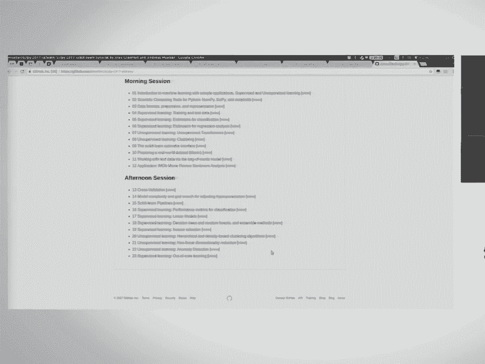

 I'll see you after the break， or maybe not。 you， You。

