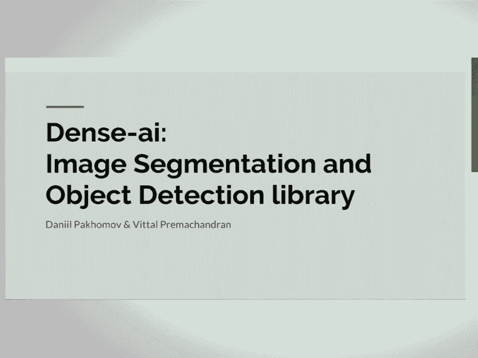
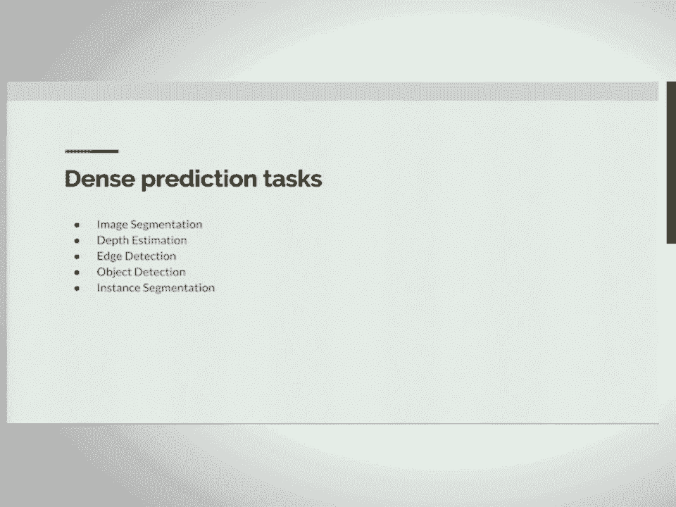

# SciPy 2017（合集） - P6：Fully Convolutional Networks for Image Segmentation  SciPy 2017  Daniil Pakhomov - 哒哒哒儿尔 - BV1Cs411A76Y

 >> I first want to apologize that I changed the name of the topic。 So first。

 the talk name was image segmentation using fully conditional neural networks， but。

 we advanced after the line of submission and extended our work， so just making sure that。

 you know that。 So， and first of all， I want to interact with the audience a little bit。

 Can people who know what is like linear regression raise their hand？ So I just get good enough。

 And logistic regression and neural networks and convolutional neural networks。 Okay， that's less。

 Okay， thank you。 So based on that， I'll adjust my talk。 Thank you。 So let me start。

 So I did my work along with my co-author and Johns Hopkins University。

 So my PhD student there and my co-author is also a post doc student there。

 So we wrote a library for image segmentation and object detection。

 So let me start my talk by first introducing you to convolutional neural networks。

 I wanted to bring it in a little bit different light。

 So I think it's a lot of material online about conditional neural networks， but I wanted to。

 bring some of my ideas about how I look at them and how they were basically， how people。

 came up with them and based on what ideas。 So I'll start with introduction of logistic regression。

 linear regression and their limitation。 Then I move forward to multilayer perceptron。

 Then I introduce Laplacian and Gaussian permits briefly and talk about hierarchical features。

 of conditional neural networks and conclude with conditional arithmetic。

 So the main idea that I will try to convey in the following 10 slides is that first。

 machine learning world came up with multilayer perceptron and a lot of ideas from computer。

 vision research like Laplacian pyramid and Gaussian pyramids were captured from computer。

 vision and combining multilayer perceptrons and not less than pyramids ideas gave rise。

 to conditional neural networks。 And I'll explain about that in the following slides。

 Let's go further。 So let's look at logistic regression and linear regression at the same time。

 So you can see that we can take any image， like in this case we work with MNIST dataset。

 It's dataset of handwritten digits。 So you can see a layer eight on the left and then we just flatten the pixels and run it。

 through logistic regression to make a prediction。 So on bottom you can see that softmax function that basically gives you predictions of which。

 digit this image belongs to。 So this is a very simple model and it's linear。

 So one of the problems with this model is that it can't model the interactions between。

 input variables。 So for example， if you go to VQPD page you can see an example that this model can represent。

 interactions between variables and more specifically if you do linear regression it won't be able。

 to represent XOR function。 So this is one of the limitations of this approach。 So if we go further。

 if it's tagged， so you can see here it's just like one layer。

 If we stack these things on top of each other and add nonlinearities in between of this。

 we will come up with multi-layer perceptron。 This model is nonlinear and it can represent very complex functions。

 So if we solve our task using multi-layer perceptron we will receive a better accuracy。

 on MNIST dataset。 So on the right you can see the nonlinearities that people use in between。

 So one of them is sigmoid function。 You can think about it as a probability。

 So it just maps input which can be any real number to a number between zero and one。

 And more recently people introduced rectified linear units。

 This model also adds nonlinearity to the model but it preserves some linear features。

 of linear model and it helps to optimize the overall model a little bit easier。

 And let's look at some models on computer vision research。

 So one of the models that I want you to point out is Gaussian pyramid。

 So Gaussian pyramid you can see it on the left。 So it's a representation of image on a multiple scales。

 It's used in computer vision research to do task on multiple scales。

 So imagine you want to find all the faces on the image and some faces are very close， to the camera。

 Some faces are really far。 So to do that you'll have to run your detection algorithm on multiple scales。

 So Gaussian pyramid basically gives you image on multiple scales and you can run your algorithm。

 on all these images which was some sampled。 And if you look at the right picture this is actually a commercial neural network and you。

 can see the similarities。 So it starts with calculations that have been applied on the full resolution image。

 Then it gradually subsamples the image and further and further going down you can see。

 that we waste to get representations of the image on a higher level。

 And then basically when we reach the bottom level we get higher level features as faces。

 or other things and based on them we can make a prediction using the logistic regression。

 on top of it。 So basically what I want you to understand so far is that by combining those two models。

 multi layer perceptron and commercial neural networks， not commercial neural networks but。

 Gaussian pyramid and Laplacian pyramid here。 We can see that it's kind of like combined those two worlds and came up with the very。

 rich feature representations。 At the same time it's multi layer perceptron helps you to make a decision at the end。

 And also you can see there is another model that's called Laplacian pyramid which is。

 a little bit more closer to what commercial neural networks learn。

 So Laplacian pyramid helps you to represent image on multiple scales but also it grabs。

 a certain frequency information from image。 So if you look at the left picture you can see the picture of Leina and the first information。

 bit， I don't know if you can see my marker。 Can you see it？ Yeah。

 so this one represents really high frequency information of the image。

 And if you gradually go and go we get low frequency information。

 So Laplacian pyramid helps you to spread your image into different bands， basically of different。

 frequency and then basically make a decision on top of that。

 If you look at the representation of image in convolutional neural network， so you can。

 see we can get an input as a picture of a cat。 And then here we can see the activations of first layer。

 So you can see the higher frequency information。 So some of them captured the gradient information。

 some of them captured the gradient in other， directions。 But if you go further here。

 I don't know if its contrast is good enough to see that。 But some neurons here。

 they activated on the place where the cat's face， you can see it， here。 For example， yeah。

 guess this one。 All of them activated where a cat has legs， so you can see it here。

 So it's very interesting to see this analogy between Laplacian pyramid that was introduced。

 already 30 years ago and convolutional neural networks。

 But the analogy is not enough but it's good enough to get some grasp of how it works and。

 basically structure your other correspondingly。 So also one of the main important features of convolutional neural networks is that they。

 learn features here， accurately。 So this network was trained on faces and you can see that first layer weights。

 first layer， weights they represent some edges or blobs。 Then we go further and we see ears。

 eyes and then we go further and we can see more high。

 level structures like the whole parts of the face。

 So this is also important because by the end of the， we want to run our image to the network。

 and get only high level features based on which we want to make the final decision。

 So just a quick recap about convolutional neural network arithmetics。

 So you can see that convolutional neural networks， they apply， they basically use convolution。

 and one of the two main things in convolutional is padding and stride。

 Padding is used to basically to adjust the output size。

 So if you can imagine if you run convolution on top of the image， sometimes you get output。

 of the different size and basically padding and stride， they regulate that and using those， two。

 you can regulate sub-sampling that you do in your networks。

 So on the right you can see just a high level picture of how the sub-sampling works when。

 the features go through the network。 So you can see on the top you can have。

 we have like really high feature information， then。

 we go lower and lower and we get sub-sample features。

 So let's go further to dense prediction task a bit， like the main topic of our talk today。

 So dense prediction tasks， we can structure them into multiple things。

 One of them is semantic segmentation。 So you can see an input image on the left and semantic segmentation basically you need。

 to label every pixel in the image with corresponding class。

 So you can see horse and the person there。 So what ideally we want as an output is this representation as labels。

 Also another task include like depth estimation from monocular images。

 So you can see that input is a table and chairs and the output is a depth map。

 Sometimes we also want to do boundary or edge detection。

 So we get an input as an image and we get an output as edges。

 So all of these tasks are very important in computer vision and sometimes they can be。

 applied as a part of the higher level， some more smart algorithm。

 So let's look at the traditional image classification commercial in the networks。

 So they get input image and then they basically give you output of 1000 dimensional work vectors。

 Which gives you basically prediction of what it thinks in the images。

 So majority of images occupied by the cat so it thinks it's a tabby cat。

 But so if you look even closer network consists of conditional layers and fully connected layers。

 And for example for task as image segmentation we have input images of different size and。

 we don't want that we want it to be more flexible。

 So one of the problems that we face when we want to do this is fully connected layers。

 Because fully connected layers they have input feature maps of fixed size and。

 convolution can have input of any size。 So we have to remove this frontier to be able to input any image size。

 So this is done by converting fully connected layers of network into convolutional ones。

 This way we can input image of any size and get corresponding predictions。

 So here we visualize the feature maps so you can see we input image of size H by W。

 And we get a feature map which is reduced by a factor of 32。

 This is just an outcome of the fact that we do sub-sambling in our network。

 So let's take any just a standard conditional neural network like VGG 16 and。

 run it through the image of bus。 And we can see that even without training specifically for segmentation it was able to。

 give us prediction map。 So you can see in the center we have a prediction for the bus but。

 on other parts we have some scattered round predictions。

 But it's very surprising because this network wasn't even trained to do segmentation。

 It was just trained to do classification。 So one of the problems with this previous approach is you can see the prediction is。

 sub-sampled so it's sub-sampled by a factor of 32。

 We don't want that because we want to prediction for the whole image。

 So one of the ways to go around this is to add up-sampling layer。

 Basically it's just like by linear up-sampling but it's differentiable so。

 we can plug it in in our network and perform training。 So this is what we do here。

 So if we just take the same network without training and。

 put up-sampling on top we get the predictions which are the same size and。

 you can see they are more smooth。 So now to perform training we only have to add ground truth on the right part。

 Ground truth is the ground truth which was annotated by professional annotators。

 And this way we can train our network to show what we actually want to do。

 So in this case we give it an image on the left and， the ground truth of segmentation on the right。

 We perform training and then we see what happens。 So just to give a bad idea of what's happening inside。

 So we get an image on the left， we run it through the network， then it gets down-sampled。

 then we up-sampled once again and， get pixelized predictions。

 So in order to show network how accurate its prediction is。

 be plug cross-entropy loss at the end and sum all the values。

 To give you a hint it's the same loss that is used in image classification。

 We just apply it to each pixel and sum it over。 So let's run our network on just one image and see what it does。

 So in this case we train it only on one image， not the one huge that is set。

 And here I will show you how it actually learns to see cats in this picture。

 And I will utilize the iterations gradually。 So on the first iteration it just gives a small prediction which is not accurate at all。

 But then if you go further， it kind of starts to grasp what's there。 And finally。

 we get some kind of good prediction。 But the problem with that is that the prediction scores。

 This is the reason because we just up-sampled the feature map that was sub-sampled by 32。

 And predictions are very coarse。 So we can handle that by using skip connections。

 Basically skip connections， as you remember previously。

 when I showed you visualization of activations of functions on different layers。

 One of them are responsible for edges。 So what exactly we want in this case is incorporate this edges and。

 lower layer of features into our inference。 So the network can actually adjust its co-arse predictions to edges and。

 very specific parts of the image and finally come up with a really nice segmentation。

 So I will show you just the final result。 We train this network on the Pascal VOC。

 It's an image segmentation dataset with 21 classes and it contains 1000 images。

 And you can get predictions of something similar to this。 So if you compare it to previous result。

 this segmentation is very accurate and it looks nice。

 So I'll quickly go through other improvements in the field。

 So I don't have enough time for this talk， but， I left a lot of information in the comments to my presentations。

 So if you go through them and read all of my comments， I leave a lot of links so。

 you can go further and dig a lot of by yourself。 So one of the reasons improvement that we're done in this field is。

 dilated conditions were introduced into field of image segmentation and。

 other dense inference tasks。 So also you can use condition render fields which can be used to refine prediction。

 And one of the recent works which was done just recently and。

 we represented in CPR next week is Moscow CNN。 The idea of Moscow CNN is that they do detection first and。

 then they regress the mask for the detected object。

 So they kind of couple two tasks together object detection and segmentation。

 So and I'll also feature one of our works。 We applied this work to segmentation of surgical tools。

 So we used dilated conditions with one of the standard architectures which was， introduced recently。

 ResNet 101。 So you can see that results that were delivered by this model was really good。

 And one of the benefits of this model is that you can train end to end。

 In the previous model that we showed you have to train in stages and， it's kind of cumbersome。

 So let's show you， let's see some applications。 So one of my core is allowed me to use his picture to make some fun of him。

 So like first of all you can just do segmentation on any images like selfies， in this case。

 So you can crop them out and just use them as any messenger like that's kind of fun。

 But also like let's go back to my friend。 So this picture looks boring。

 let's add it to some other background。 So it's actually him on the back like I know here。

 Then also if any of you have iPhones and you familiar with portrait mode。

 you can also do effects like portrait mode。 So portrait mode is for you who are not familiar with that is that it takes。

 objects that is very close and focused on the image right now。 And it blurs out all the background。

 So in this case you can see on the left that's original image and。

 on the right image everything was blurred out except the object of interest in our。

 in our case it's my friend。 So let me briefly then conclude with my talk。

 Yeah provide all the links and I think that the presentation and slide and。

 code will be shared and if you want to know more I left a lot of additional。

 information in addition to each slide and I hope you like my talk。 Thank you everyone。

 >> [APPLAUSE]， >> If anyone has questions you can ask them now。 Okay。 >> I have a question。 >> Okay。

 >> Where do you see this work going in the future？ >> What？

 >> Like what are your next steps for this project？

 >> I'm basically a PhD student and we apply it to medical segmentation images。

 So we try to couple the segmentation detection to better understand the surgery。

 So during surgery it's very hard sometimes to see what's happening there。

 And it's one of the problems that we face is post estimation of surgical tools。

 And we apply all this image processing methods to do it better。 Yeah， something like this。

 >> I'm curious， you have both implementations in PyTorch and TensorFlow。

 Which one do you recommend more？ >> Yeah， that's a good topic though。

 So first I'll tell you my story。 So first implemented in the TensorFlow。 It was。

 I spent a lot of time on it because it doesn't have a lot of documentation。

 You just have to read a lot of source codes with examples。 So I finally wrote it。

 the results were good。 But one missing thing that was missing in TensorFlow is that it's not really flexible。

 So if you want to experiment a lot， which is very common for research， I would recommend PyTorch。

 But in case if you want to do or apply this in an industry， like some real world scenarios。

 I would go with TensorFlow。 But you can always convert weights from both of these frameworks。

 So I think the good idea is to deploy when you want to actually deploy it。

 You'd better use TensorFlow。 But for research purposes， I would find a Tensor， PyTorch better。

 >> Thanks。 >> Yeah， welcome。 >> So you mentioned medical applications。

 Have you given any thought to applying this to segmentation of micrographs from material science？

 >> Oh， that's applicable to anything。 The only thing to any kind of problems。

 So the only thing that you have to provide this algorithm with is ground truth and images。

 And then it can learn everything。 So around 400 images should be enough， usually。 >> Thanks。

 >> Are there any notable limitations in the type of images it can and cannot segment？

 So regarding sharpness or color space or stuff like that？

 >> So sometimes you have to segment really， really fine objects。 Sometimes we have to segment。

 let me give you a good example。 It was just a stick that was really thin。

 And sometimes you have seen that networks have problems with thin objects because they。

 usually gave course predictions。 In that case， you probably have to use a little bit different architectures。

 But it usually depends just on your data set。 Sometimes some adjustments are required。

 But the problem that I noticed is this small scale objects。

 Sometimes they have problems and you have to use different architectures。 >> So say for that。

 in the images you've worked with medical images， pictures you haven't， noticed。

 And then you can see the same difference in what types of images it deals with better。 >> Yeah。

 The way we approach our problem is that we take networks that was trained on huge image。

 net competition。 It's like around 1 million natural images。

 So we notice that if we use this weights as an initialization for our network， it adjusts。

 really well。 So all of the features that it learned from natural images adjust to medical applications。

 scenarios。 So yeah， this is basically a high level idea。 >> Once you've trained it。

 how long does it take to segment an image？ >> Oh， yeah。 Let me actually show you。 If you can go。

 So if you go， if you follow the link for the library itself， we have timing for some of。

 the networks。 So the fastest I achieved， like just previously， it was 28 milliseconds。

 So it's on a Titan X GPU card。 Yeah， of course you will need GPU cards。 I forgot to mention。

 It's very， very long to run on CPU。 >> Okay。 Thanks。 >> Yeah， you're welcome。 Yeah。

 I think nobody else have questions。 Thank you everyone once again。 Have a good day。 [APPLAUSE]。

 (silence)。