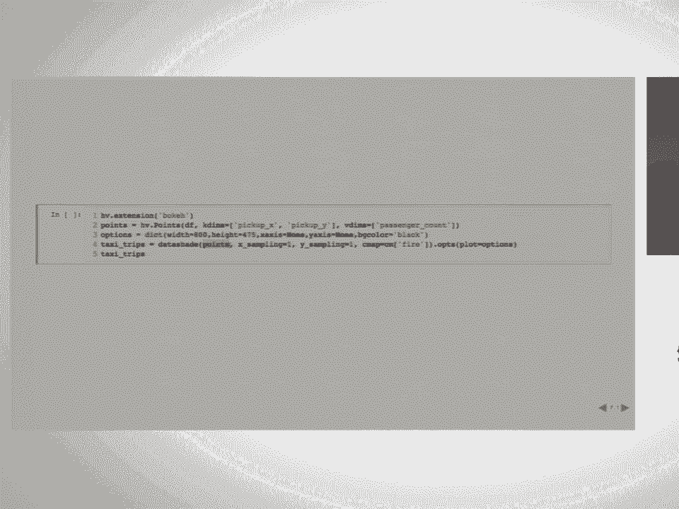
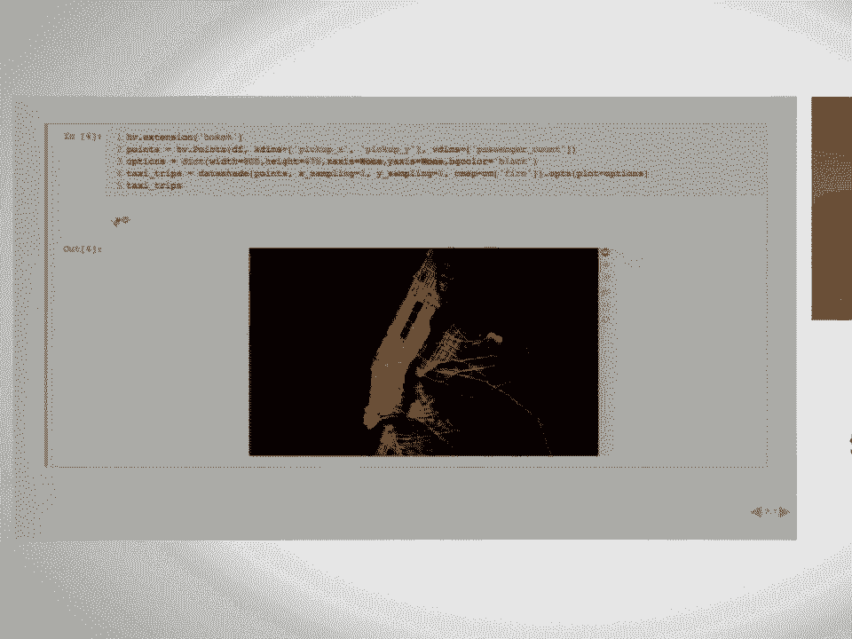
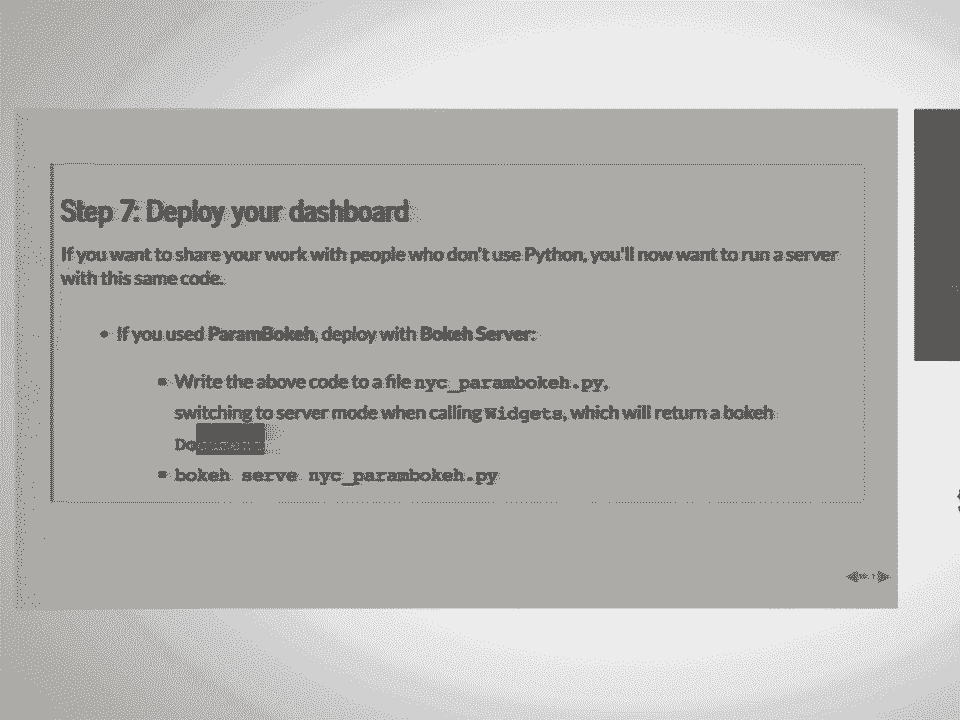
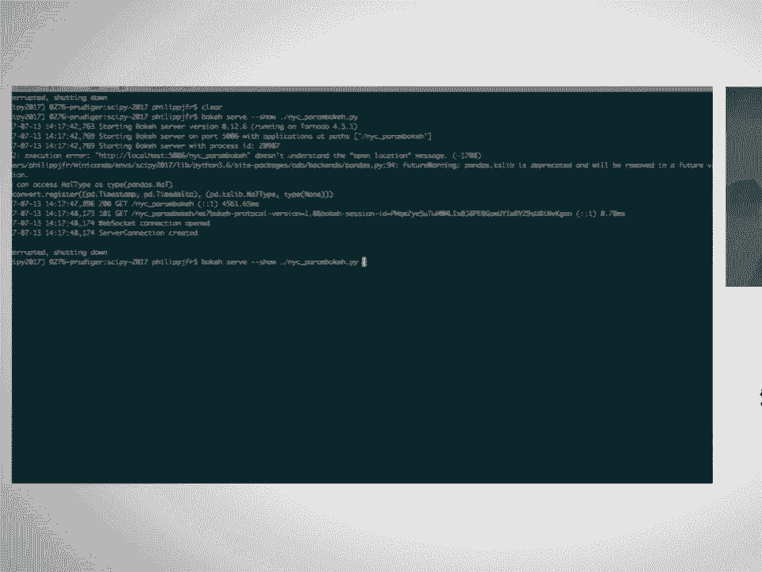
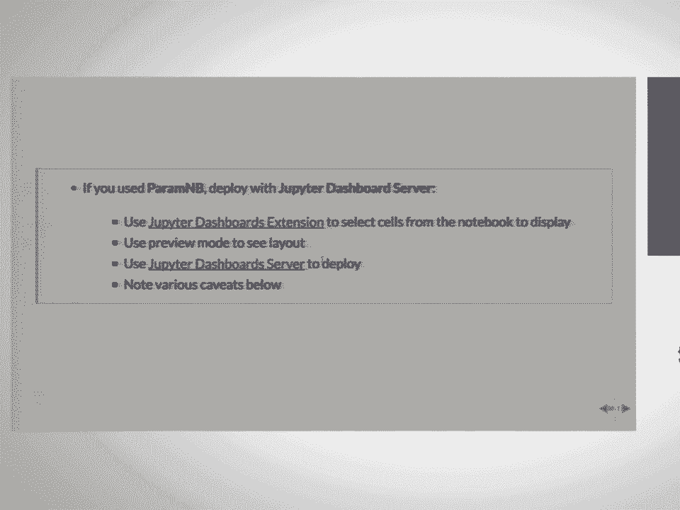
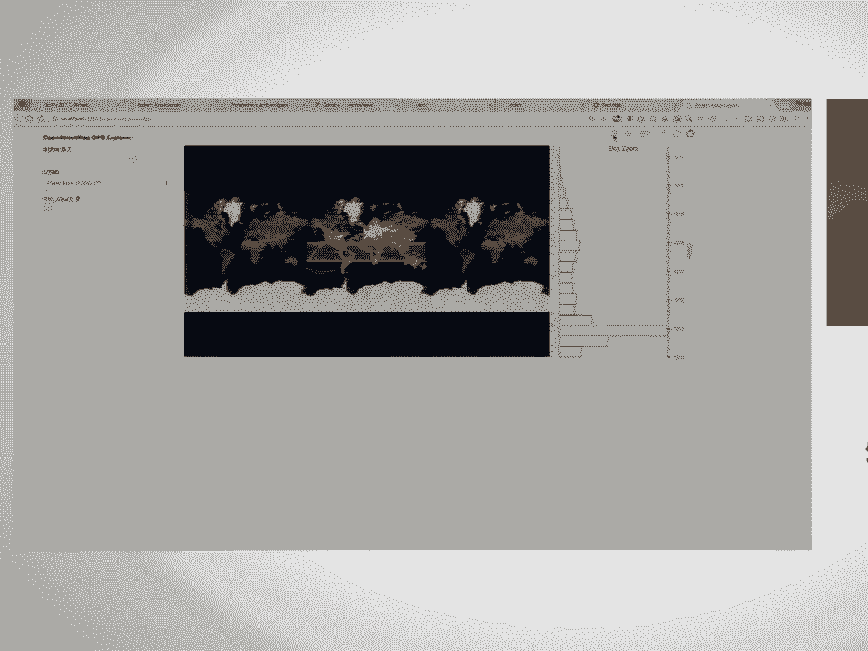
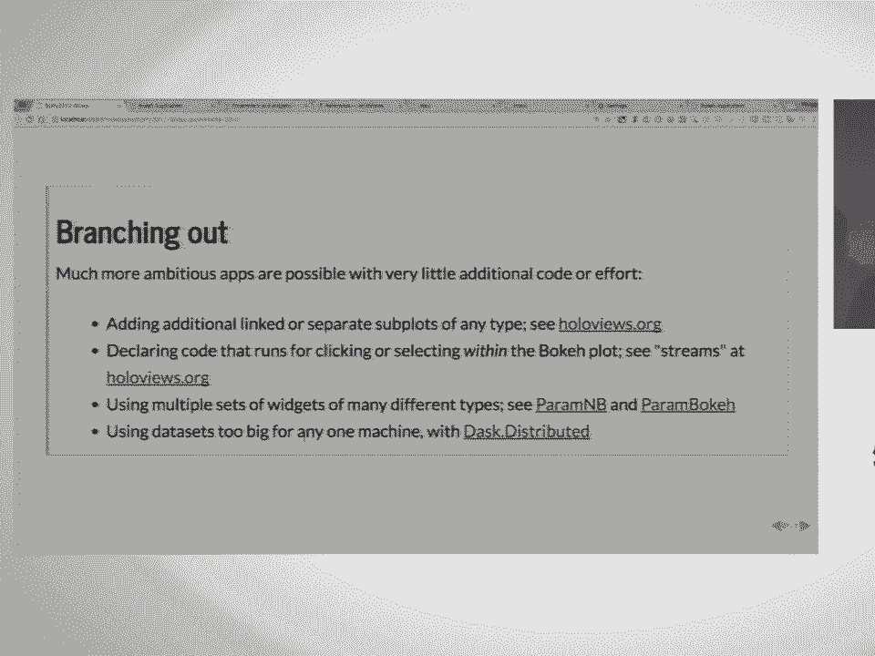
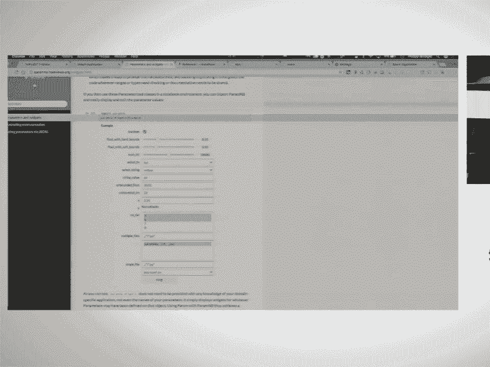

# SciPy 2017（合集） - P8：Deploying Interactive Jupyter Dashboards for Visualizing Hundreds of Millions of - 哒哒哒儿尔 - BV1Cs411A76Y

 All right。 Hi， everyone。 My name is Philip Rydiger， and I work for Continuum Analytics。

 I work on the HoloViews， GeoViews， Data Shader， and Bokey projects。

 And today I'll be talking about dashboards visualizing one billion data points in 30。

 lines of Python。 Okay。 So what's the actual problem that we're trying to address here？

 So we want to make it as easy as possible to explore data sets interactively and then。

 transition to adding widgets and deploy the whole thing as an app。

 Then you spend lots of effort building some exploratory analysis in the notebook， combining。

 some domain-specific code， widget code， plotting code。 And once you all have all that。

 you have your exploratory analysis， but it becomes really。

 difficult to actually deploy that on a separate server。 As soon as you want to change some。

 visualize some different aspect of your data， you have， to rewrite your whole thing。

 And once you scale up to larger data sets， it becomes more difficult as well。

 So before I go into those things， I actually want to show some motivating example here。

 So this is the example that you're working towards。 Here we have some widgets。 So for example。

 widget controlling the alpha level of our map。 We can control the color map of our visualization。

 We can filter our data。 So this is actually a data set of New York Taxi Tips， New York Taxi Trips。

 And we have the locations for 12 million data points。 The actual data set is a bit larger。

 And we'll actually see a larger data set a bit later。 But for example。

 we can filter it by the number of passengers。 And you can see the data update live。

 We can switch between visualizing pickups and drop-offs。 And we can also zoom in interactively。

 And you can see， as I zoom in here， it resolves and redraws the plot。

 And this is all thanks to Data Shader。 So now that we've motivated this a little bit。

 I'm going to switch back to this。 And this is actually made possible by the interplay of a pretty wide array。

 of libraries， which I won't go into immediately， because that's maybe a bit intimidating。

 So we'll see。 And in seven steps， we'll see how to use these libraries together。

 and get to what we just saw。 So we start with getting some data。

 We then build some prototype plots in a notebook。 We declare some parameters to control our visualization。

 link those to our data。 And finally， we get some widgets and deploy it as a dashboard。

 We'll start by getting the data。 So as I said， we were using the New York Taxi Data Set。

 This is just a subset containing 12 million points。 It's stored in the parquet format。

 which you saw earlier in the desktop。 And we'll actually load this using desk。 So here。

 we'll load it from disk。 And we'll actually load it into memory。 For larger data sets。

 we could use distributed， or something to distribute it a criminal cluster。 But here。

 we'll load it and persist it to memory。 And as you can see。

 it took us about two seconds to load this， which you told me in data points。

 And it might be a bit small， but we have five columns here。 We have the passenger count。

 We have the pickup x and y location， and the drop-off x and y location。

 So now that we've loaded this data into memory， we actually want to visualize it。

 And we want to do exploratory in an exploratory way at first。

 and then graduate to something more stable。 So for that， we'll be using Hall of Views。

 Hall of Views provides a set of simple， declarative ways， to annotate your data for visualization。

 And it provides a large library of elements， that allow you to wrap your data， which each。

 have an associated visual representation。 Hall of Views also makes it easy to compose your elements。

 these primitives together and lay them out on the page， overlay them in different ways， and so on。

 And it actually has different backends to render your plots。 So what we'll be using here is OK。

 which you also， certainly are ready， which allows us to interactively explore， our plot。

 But actually， our data is way， way， way too big， to actually drop its drainage to browser。

 You can't just drop 12 million points into browser。

 So what we'll be using is Data Shader to rasterize the data， first。

 And that's what I'll be showing you now。 So I'll go through these steps。

 Here we have four five lines of code。 To visualize the data， first we load the Hall of Views。

 bokeh extension， plotting extension。 We wrap this data， the Stid-Dask data frame we just loaded。

 into a Hall of Views set of points， which， isn't one of these primitives。

 I talked to element primitives。 I talked about we declare that we want to visualize the pickup。

 x and y location， and that these have an associated value， with them， which is the passenger count。

 We also declare some options about this resultation。 So we declare the width and height of the plot。

 We just able the axes。 We set a background and so on。

 And then Hall of Views provides this nice little operation。

 which we can apply to our points to rasterize them。

 So we also declare it， color map， for instance。 And then when I run this， within one second。

 we get this interactive plot。 Already， if I zoom in pan， you can see it re-rasterizes the plot。

 every time I zoom in pan as the x's range has changed。 OK。 So now we've visualized it， but maybe we。

 want to actually put it into context， see where this data is actually situated。

 We know it's in New York， in this case， but maybe in other cases we don't。

 So Hall of Views has a geographic extension called， geo-views， which allows us to wrap tile sources。

 go get tile sources very easily。 And so we do that here。

 We declare a tile server that we want to look at。 And then we overlay the set of tiles with our taxi trips。

 And we can do this really easily using this mall operator。 And if we do that， we now see our plot。

 situated on the actual map from the network。 And again， everything is interactive and smoothly。

 and quick and so on。 OK。 So now we've loaded data。 We've visualized it。

 But we want to actually declare some parameters， to customize our visualization dynamically。

 And for that， we use the param library。 Param lets you express the intent and various things。

 about the parameters that we want to express。 So for example。

 we can declare the types of the parameters。 We can apply some range checking。

 We can associate duck strings with our parameters。 And we can declare some default values。

 Param actually has some other nice properties， in that you can declare classes。

 And the parameters are always inherited when you create， your self-class and so on。

 And we'll actually see that。 So let's actually declare a class with some parameters。

 So here we'll create a class called the New York City， Taxi Explorer class。

 Associate some parameters with it。 So here we'll declare a magnitude for the alpha， which。

 basically is just a value between 0 and 1。 We'll declare an object selector， which。

 lets us pick between the pick up and drop offs。 Another object selector to select the color map。

 And finally， a range parameter， which， allows us to select between the number of passengers。

 in our data set。 And now that we've declared this class， we can actually use it。

 So each of these parameters now has， certain information associated with it。 We've told it。

 for example， that the passengers have to be， between 0 and 10。

 because we know that in taxis generally， don't take more passengers than that。

 So now that we've declared that， we can use it just， as regular attributes。 We can。

 at the class level， we can declare this parameter。 And that will persist at the class level。

 But if we， for example， try to tell it that we want a string， of 0 alpha。

 what we'll get is it'll tell us， no， that's， actually--， it's meant to be numeric value。

 so that's not allowed。 And finally， we can create an instance， which has a， different alpha value。

 So we can associate a particular value with an instance。

 And that's different from the class level default that we've， said previously。 OK。

 so we've actually expressed a lot of intent in， these parameters。

 We've told it information that now any UI library can use， to plot some widgets。 And here。

 we have some extensions for a parameter。 UI extensions for parameter。 So first of all， parameter B。

 which actually uses， ify widgets to display the parameters we just declared as， a set of widgets。

 So here， we get a slider for the alpha。 So we get a dropdown menu for the huge range of color maps。

 that we have here。 We have a range slider for the number of passengers， and we。

 can pick between the pickups and dropoffs again。 And so if we move this。

 the actual value is immediately， reflected on the parameter of the class。

 And ify widgets allows us to deploy on the Jupyter， dashboard server。

 which actually it turns out is no， longer maintained， which is--， was a surprise to me。

 So that's why we actually decided to write the， param bokeh library。

 which is based on bokeh widgets and， works in just the same way。 So previously， you saw--。

 I'll go back--， you saw we just called param B dot widgets to get the， set of widgets。

 Now we'll use param bokeh widgets， and it works just in， the same way。

 It gives us no bokeh widgets instead of the， out by widgets。 And again。

 the actual values are immediately reflected on， our parameterized object。

 And bokeh widgets has a nice property that it's based on， bokeh， which has bokeh server。

 which we can deploy as a， standalone app。 And we'll see that in a little while。 OK。

 so now what we've done is we've loaded some data， we've， plotted some data。

 we've declared some parameters， and now， we actually want to link our parameters to the。

 visualization we've made。 So again， we have our NYC Tax Explorer class， we have。

 the parameters on it， and now we declare a method on that， class。

 which actually links the two aspects。 So here we have access to the alpha， for example， which we。

 set in the tiles。 We have access to the actual column that we want to display。

 so pick up or drop off。 And we associate that with the points。

 We actually select the points that we want by using the， select method on this points object。

 And finally， we use the color map to set the， data shading color map。 And finally。

 this method will then return， once again， our， map tiles overlaid with the taxi trips。

 And so every time we change a parameter and call this， function。

 it'll reflect the parameters that we set。 OK？ Note that this class has nothing to do with widgets。

 It's entirely declarative， and we can actually call this by， hand。

 So we can make an instance of the NYC Tax Explorer， class。 We can set the alpha and select drop off。

 Select it， call the drop。 Tell it to plot the drop offs。 And then call the make view function。

 which should work if， I had actually executed this。 So I'll go back。 So if I call this now。

 it'll return this whole of these， objects， which visualizes itself。

 And we get this reflecting the alpha that we set and， plotting the drop offs。 OK？

 We're almost there now。 Now we want the widgets to actually control the plot。

 And all of these provides this nice little object called， a dynamic map， which takes a callback。

 The callback that we just declared is make a new method。 And it takes a set of streams。

 which tells it to update。 So every time a stream value changes， they make a few， functions called。

 and it triggers an update in the plot。 So if we execute this now， what we get is the set of。

 widgets from here。 And we get this plot from the dynamic map。 So now when I change the slider value。

 we get the plot， updating。 If I change the color map， we see that updating， and so on。

 So everything is just reflected。 And again， since we have both this parameter B library and。

 the parameter Bokey library， which works in exactly the， same way， again。

 the only thing I changed was this module。 We can now get the same thing using Bokey。 And again。

 it immediately reflects what we do here。 And if you notice， I've also declared a secondary stream。

 which is the range XY stream， which basically reflects the。

 current viewport range of the Bokey plot。 So as I zoom in， it now redraws the entire plot。 OK。

 so now we have this whole quite complex dashboard， and， we want to deploy it。 Using Fran Bokey。

 we can do so really simply by just， dropping this class we just made and these various calls。

 into a script file。 The widgets function that we used actually has a mode， parameter。

 which we can change。 In that case， it will return-- if we use the server mode。

 it will return a Bokey document， which means we can now。

 deploy it as a Bokey app。 And I'll actually switch just slightly different now。

 You'll remember that the title of the talk has one， billion points。

 and so far we've just seen 12 million。

 So we'll actually use a different dataset。 So while that's loading， that's going to take about 30。

 seconds to load the one billion data points。 I'll briefly talk about Jupyter-Daport server。

 The nice properties of Jupyter-Daport server are the fact。

 that it has an extension in the notebook that lets us actually。

 lay out our widgets and plots on the page， and preview mode， to see that layout。

 And it has this dashboard server to deploy the whole thing。 But it's un-maintained。

 So those are nice properties that we might want to use later。

 So at this point， this one billion data points should， have loaded。

 This is actually a dataset of OpenStreetMap data。 So this is all the GPS locations the OpenStreetMap has。

 collected over years， I assume。

 And you can see that there's a weird band here。 So we've actually added a parameter here。

 which is MinCount， which will filter the plot dynamically。 So as I drag this。

 you can see here on the histogram of the， right that updates showing how many data points we're。

 filtering。 And we can see the plot update as well showing us。 Showing us the various GPS locations。

 And you can see that even though this is now a billion， data points， it's still pretty responsive。

 And that's because thanks to Dask and Number actually， which， drive a data shader。 OK。

 so now that we've seen all that。 Where， what can we do from here？ So from here。

 we can actually add Holiviews as a promise， has a wide range of different types of elements that we could。

 add。 So so far， we've just seen RGB elements。 If you go to the Holiviews。org website。

 you can see we， have actually a wide range of different elements， which work。

 both in bokeh and Mapotlib。 So you can see they have the exact same visual， representation。

 What we can also do is actually these pram and b and pram， bokeh library and pram itself。

 declare a wide range of， different parameter types and therefore different widget， types as well。

 And we can actually see an overview of this。 I'll just put on that here。

 So here is just a class declaring a wide range of， different parameters。 And if I show that。

 you can see we get everything from， ranges。 We get text boxes。

 which will actually allow us to declare， dictionaries， for example。 So I can see C9。

 And that will actually be reflected on the class。 So if I do now do a Grace class dictionary。

 we'll see。 It actually harests our dictionary here。 We also have other things like dropdowns。

 multi-select， dropdowns， boolean toggles。 So really a wide range of different parameter types。

 And we're still working on expanding those。 So what other things can we do？ Actually。

 if your data is actually too big for one， machine， so one billion points is just on the edge of。

 what you can actually process on one machine。 If you want to scale out two larger things。

 you might want， to use DAS distributed， which will let you deploy this on--。

 well， actually do the computation on a cluster。 OK， so finally， future work。 As I said。

 Jupyter-Dashport server is not currently maintained。

 and actually requires an older IPY widgets version。 Therefore， in the future。

 we want to actually work with the， more mature and well supported Bokey server project。

 But that does not yet support the kind of nice drag and drop。

 features that the dashboard server extension provided in， the notebook。

 So that's something we're working towards。 I actually released the burst version of。

 prime Bokey this morning。 So it still needs some polish。 But it's getting there。

 and it's soon going to be ready for， widespread use。 But so far。

 prime would be still a bit more mature。 And then finally， we want to provide some more flexible。

 layouts for both prime and B and prime Bokey。 So please let us know what you think of these tools。

 what， you want out of these tools。 We're still very much developing them。 And if you have questions。

 join us on our Gator channel or， follow issues--， the Holoviews Gator channel， actually--。

 or follow issues on the various projects。 So thanks， everyone。

 Any questions？ [APPLAUSE]， (applause)， [BLANK_AUDIO]。

