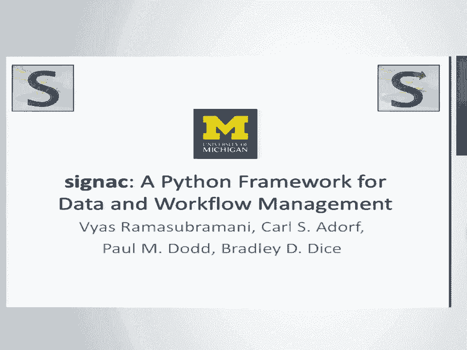
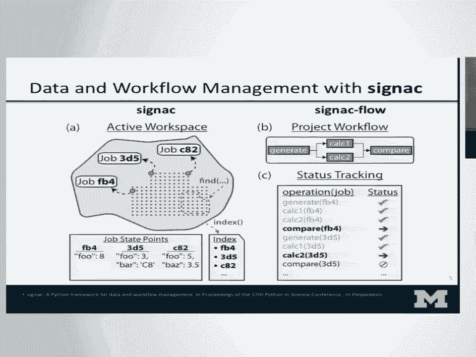
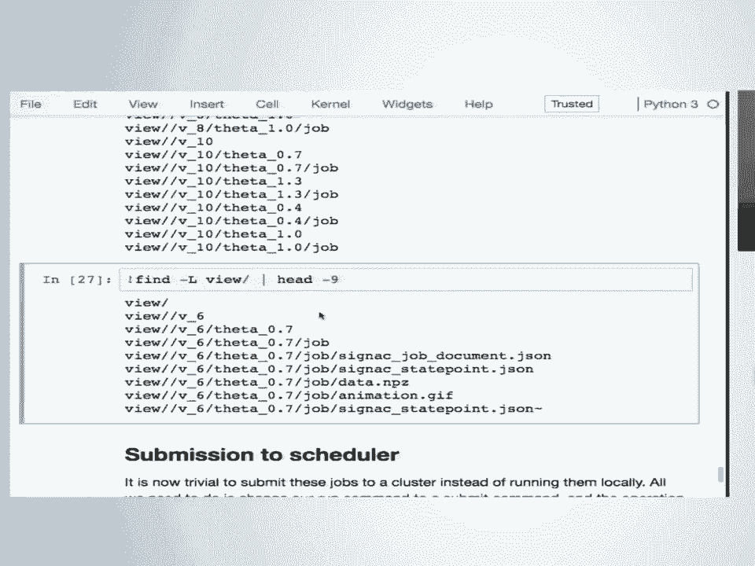
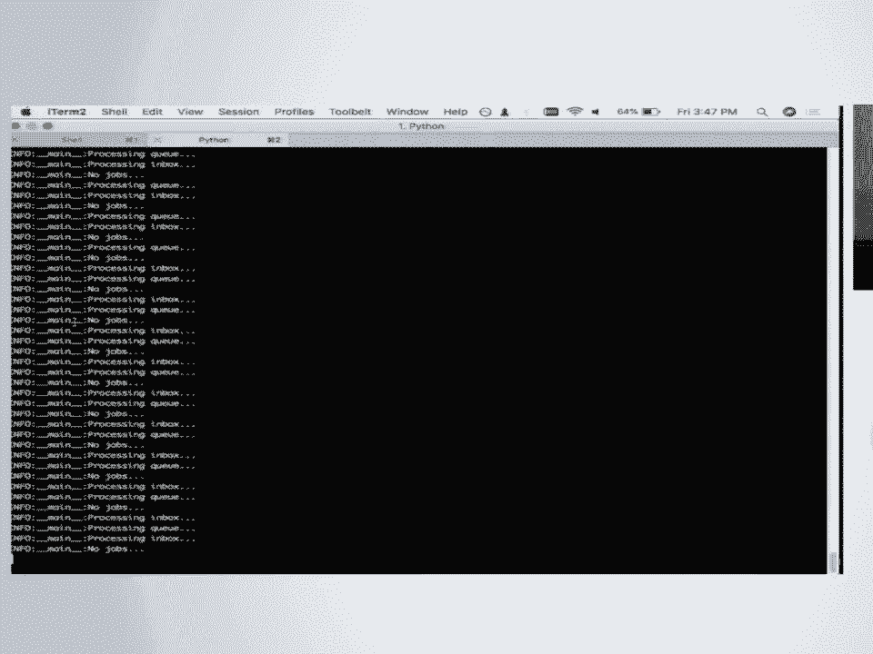
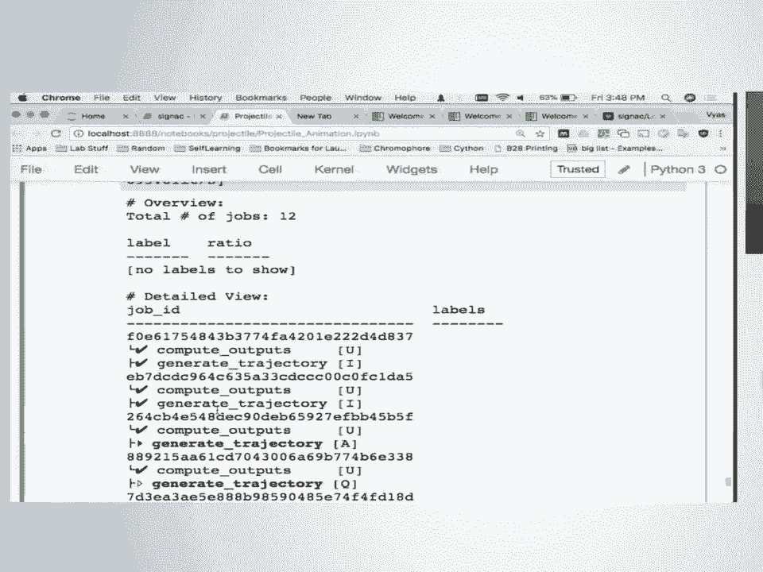
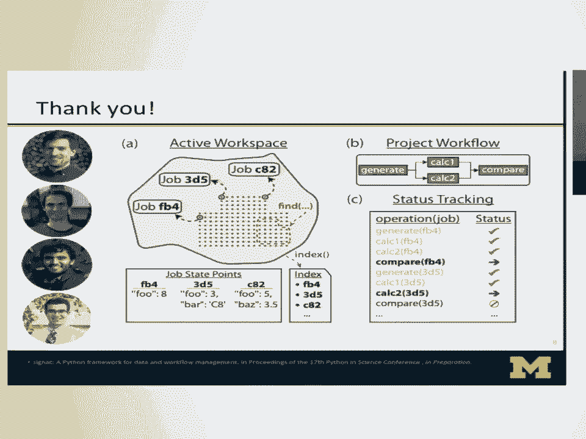

# P12：SciPy 2018视频专辑 (P12. signac - A Python Framework for Data and Workflow Managemen - GalileoHua - BV1TE411n7Ny

 So yeah， today I'll be talking about Cignac， which is a Python framework we developed for improving reproducible science through better data and work full of management。

 Now the reason that I'm in this session really is we came out of a group that does material science research。

 And so most of what I do on a daily basis is molecular dynamics and monocarless simulations sort of like what you see up here。

 Now the specifics of this simulation don't need to interest you too much at the moment。

 Really what we care about is the fact that there's a lot of different computed quantities that we're interested in。

 and most of this is getting dumped out in various files and things that we need to find a good way to store。

 Right， so as we develop this process and as we refine our system we often have to change what parameters we're interested in。

 and all of this evolves over the course of a project lifetime。

 Now the important thing that we kind of realized is we were trying to systematically grapple with this issue。

 is the fact that this is pretty common。 Anyone who's doing any sort of parameter sweep is going to deal with something like this。

 For example those of you who are using machine learning methods are probably doing hyperparameter optimization。

 where you have to test this sort of thing with a number of different parameters。

 And so the issue that we want to make sure that doesn't happen is where you generate a bunch of data。

 and then a few months later you come back and you haven't looked at it for a while and now you're not sure。

 exactly what parameters you did， what everything's associated with and it's a little bit hard to sort through your data。

 So we want to make sure that this association states tight and that it's very easy to organize and access all your data on a regular basis。

 Right， and critically we want to make sure that as I said as your product evolves and your parameter space changes。

 that you have a system that you're using that evolves naturally with your thing。

 So it's just as easy when you have a very small parameter space as it is later on when you have a very large parameter space。

 and a large set of data points。 So to kind of make this a little more concrete we can go through a simple example of what this might look like。

 Right， so imagine you're doing some sort of computational experiment and what you've got is a two dimensional parameter space。

 where you've got a binary system and you're measuring concentrations of two things and doing something with it。

 So we've got some sort of work flow set up right there。

 So initially this thing is going to be dumping out files and you decide， alright。

 I'm just going to track the concentration， of one of my species and store it like this。

 But you've already sort of made some implicit assumptions about how you want to store your data。

 For example， you might decide that it makes more sense to separate your parameter name from the value of the parameter。

 Right， how you want to set up your hierarchy。 So you could go with this。

 Or you might decide that this just creates too long of a string you just want to keep shortening。

 So you might decide， hey， conk is good enough。 I know what that means。

 Or you might say the zeros aren't really needed。 If these are just fractions then I don't need them。

 The problem now is you probably end up with hidden folders of some sort。

 So you could try and get rid of that too。 You could go ahead and use percentages instead of decimals。

 Now you've simplified this but now you've also lost some information。

 It's not as easily interpretable as it was when you started。

 And also you have some issues here with how difficult it could get as you adapt your data space。

 So for example you might imagine that you realize that below some concentration your system actually depends a little bit。

 on the temperature。 So you introduce some temperature to a couple of these points。

 But now you have something where your data space looks a little bit heterogeneous。

 If you want to parse this programmatically it could be problematic to have temperature in some places and other others。

 So you might want to go back and make this more uniform。

 This kind of problem could arise in a much more complex data space。

 And now all of a sudden if you decide that， hey， maybe in this case there's only two temperatures but there's three concentrations of interest。

 You might want to reshuffle your data space， do things like this that get more and more complicated as you have tens of parameters and thousands of data points。

 So this sort of headache is really something we'd like to help you deal with。

 This gets more and more complicated。 And so you can easily imagine this extending over and over and over。

 The other aspect of this that we'd like to help deal with is the fact that for example here I've extended this to a three parameter system。

 where you now have three concentrations。 And you might imagine that in a tertiary system all of a sudden everything gets slow and you have to run on the HPC clusters。

 So now you have to take this， test it on your system。

 but then port it over to some HPC cluster where you've got to write your job scripts。

 make sure all your data gets out there。 So to fix all these problems to make it easier for you to handle this and not have to think about it。

 we've developed CINYAC。 Which we named after a pointless painter Paul Cignac who some of you may have heard of。

 The reason we chose point-alism as our model is the nature of the painting style in which points instead of brush strokes are how the painting is created。

 And we view that as a nice analogy for data spaces and data science。

 So what you can see up there in our gray blob is our data space and in CINYAC we term this data space the workspace which is composed of individual data points which we have as jobs。

 Now the key in CINYAC is that every job needs to be associated with some sort of unique set of key value mappings which we call the state point。

 And this in general is just some set of your parameters， right？

 So in our previous example this could be the concentration that you looked at or the temperature。

 And by that you can map all of your data， all the files you have down to some set of parameters。

 And as long as you have that tight mapping we can hash that data and give you a unique ID for every job。

 And this is how we sort of organize our data space。 You can see the hashes up there。

 they give each job a unique ID。 And once you have that you can use that as a way to essentially create a database on the file system。

 right？ If you have a set of key value mappings you can immediately hash it and search for a particular data point or you can group things with that。

 And based on that you have a fully serverless and schema free really database where you can store whatever you want and it grows and shrinks as you need it to。

 Now the other piece we were showing you is like the workflow that you build on top of this， right？

 How do you automate operations on this data space？ And for that we developed an additional package。

 CinekFlow， which essentially allows you to set up a sequence of operations or really any sort of directed graph of operations where operations are dependent on one another in a particular way。

 Now typically you like these operations to be on a per job basis， right？

 Sometimes when I aggregate data points when you're analyzing but a lot of the time but your more typical operation is operating on a per job basis and that's sort of the model that I've shown here。

 although it's not restrictive。 So once you get something like this set up basically what you have to tell flow is when to run one thing and then when it's completed when to run the next thing。

 So instead of pre and post conditions for everything and we'll see a little bit more concretely in a second。

 And the important thing is once you've encoded this information you can see in the bottom right that the flow can start tracking things for you。

 So it knows for a particular job how far you've gotten in this workflow， what you have to run next。

 what's not done yet。 And by doing this it allows you to basically have a play button。

 You just hit run and it'll run the entire thing for you。

 So it makes everything immediately sort of easy to reproduce if you give this whole package to somebody。

 Now at this stage the saw sounds a little bit abstract and this is scipy so I will take time to do a bit of a demo of how this looks。

 And if anyone's interested I do have the GitHub repo up here so feel free to take a look。

 Alright so for this demo I'm doing something pretty simple。

 Don't have to worry too much about the math up here but basically just using simple Newtonian physics。

 calculating how far you might fly something。 So conveniently I found one of these at the downstairs tables and my example was of a rocket so go ahead and fly this。

 Imagine you've got a little tiny toy rocket and you want it to fly。

 you know it flies at six miles an hour and you want to figure out at what launch angle it goes the furthest。

 So your simple experiment is basically taking a bunch of angles and checking which one it lets it go the furthest。

 So before we even introduce the next to this let's just see how assuming this is some complicated calculation where you can't solve this analytically how might you go about figuring out what the optimum is。

 Well the easiest thing to do is really just try a bunch of different values and then numerically try to center in。

 So here I've defined a couple of simple functions that tell you exactly what each one is doing and once you have these functions you can maybe loop over a set of angles and see what happens。

 And you can always play with this yourself right， try it， change it。

 do a bunch of different things and see where you find something close to an optimum。

 Now the goal with Cineac is to make it easy to persist all of this data。

 You want it stored and most likely you're storing files not just numbers and so you want to persist to the file system。

 So the way you do that with Cineac is pretty simple。

 So I gave you this concept of a workspace before。 In Cineac the data and all of the files associated with it all of your maybe even scripts using to generate it live in one directory called the project。

 And so the first thing I'm doing here is initializing this project with a simple Python call and then I'm creating a job which is one data point as we said right。

 So far all I've done is basically three lines of unique code to Cineac which is this where I'm creating a project and creating a job。

 And once I've done that I'm just storing data into that job。

 Now at first glance you've got a Python object that's storing your data but the real key here is now all of this data is being persisted on the file system。

 So if we look at what the file system looks like we now have a workspace directory and inside is this large enough for everyone？

 I can zoom in a little bit。 And so now if I look inside these directories you see there's a workspace directory。

 There is a subdirectory in that corresponding to our hash value so we've now stored the data there and the parameter values as well as the information we wanted to store have all been stored into these Cineac state point and job document JSON files。

 And the thing now is in addition to storing these objects you can store any sort of file within this context。

 You can use the job as a context manager and automatically store anything into this space so that it lets you immediately associate any sort of file you generated with this。

 So let's imagine that you've done this calculation but you realize you're not just interested in how far it goes you're actually interested in the full trajectory。

 So you want to see not just like where does the block at land but what path it takes to get there。

 So if that's what you want to do here's like a simple thing you might do without Cineac or without much Cineac。

 You can do this this is just a bunch of matplotlib nothing too fancy just to generate an animation of the trajectory and so you end up with something that looks like this。

 Now the whole point of this was to optimize over a bunch of angles。

 So in order to run a bunch of different things what we might do is expand our data space and the way we can do that in Cineac is pretty simple。

 It's what we were already doing we just have to do it in a loop over a bunch of different data values。

 So let's do that first。 And the thing is now that we've stored everything it's basically in a database and so we can immediately access all of this through some sort of interface。

 In this case I'm showing the simplest one which is iterating over every single data point that we have and seeing what was the furthest any of these traveled。

 And so here you can see this four job and project gets you every single data point that you have but there is more advanced ways to actually search in it and we'll see that in a moment。

 So now we sort of get to the meat of what we're interested in right。

 It's one thing to have your initial data points but you want to advance this in some way when your parameters space changes。

 So for example let's say hey someone comes to you and says well I've developed a new rocket fuel and now instead of going at six miles an hour you can go at eight miles an hour or ten miles an hour。

 So let's see what happens when you want to make this change。

 Now in Cineac it's pretty much as simple as relabeling all your jobs with some new parameters。

 You can add parameters the way that I'm showing here but you can also just as easily remove them or do anything you like in that fashion。

 These can be nested so you can contain pretty much arbitrary information as long as it's serializable。

 So now we can expand our data space to a 2D parameter space that has a bunch of things in it and start trying to encode our workflow for how exactly want to do the computations we were interested in。

 So so far we've got two computations right。 We're looking at the distance thing travels and we've got the trajectory that it travels along。

 So here in this cell you'll notice I'm writing out a file。

 Most of the things up to about here you don't need to worry about。

 It's basically the same logic we've already looked at for the computation in the trajectory。

 The important stuff with Cineac stars around here。

 So you see we're defining two different functions the compute outputs and generate trajectory functions。

 And the key is this operation decorator which basically tells flow。

 Cineac flow that we want these to be tracked as part of our workflow。

 They're immediately added to the graph and the vertices are set with these the edges of our graph。

 So the things that tell you when something's ready to run and when it's finished running are added as pre and post conditions。

 So that's what these decorators do。 So in this case basically what I'm saying is run one thing after the previous one and it's done when certain files have been generated。

 And the content of these functions can be anything you want。

 In this case it's basically what we were already doing。

 So the calculations from the beginning and then the creation of our animation。

 So as soon as we read out this file we can now do a bunch of different things with it。

 The first thing we might want to see is how much work have we already done， how much is left to do。

 And so here I'm doing a little bit of bash but using the command line interface in this case。

 I'm just checking how many things are left to run the first operation。 Right。

 beforehand we'd already computed some of these quantities and so now you can see how many things are left。

 And there's various ways to interface with this。 So here you might try and run one thing and it will go ahead and print out what it's doing。

 I made it a bit verbose here and so you can see it ran one operation right here。

 But really what we wanted was like this play button， right？

 The ability to tell it to do a lot of things。 And so for example we could tell it to run everything that's outstanding for one particular operation。

 So anything you haven't calculated a distance for。

 have it go ahead and calculate all those distances。 In this case it's super fast， right？

 Because all it is is a couple lines of math。 But you could just as easily have it do something more complicated。

 So if we take a look now at the status of our workflow you see that pretty much for everything we've got it already done。

 computing but none of them have generated the trajectory yet。 We haven't yet stored this animation。

 And so if we want to go through and do that we can tell it to do to basically finish every single part of our workflow for everything。

 Which in this case is just the one operation。 So with a simple call of run it will now try and do everything that's left。

 Which in this case is that one operation and it's going to loop through every single job and do this。

 And so you know in this case we had a pretty simple linear two-step workflow。

 But the nice thing with what we've done is now we've set up a system where you can have as complicated of a workflow as you want。

 And it will show you pretty much as fast as how long it takes to complete everything。

 So if we take a look after this and I ask it to tell me what's left to do。

 This is a slightly different view where I'm filtering out things that are done and you can see it's pretty much empty because it's already completed everything for us。

 So at this point we've gone through sort of the basics。

 How do you persist data and how do you automate your workflow through this。

 But if the point is to have a database you really need to be able to pull data out of it。

 And I gave you a very quick example earlier of how you might do that。

 Now we can see a little bit in more detail。 So because this is a schema-free database in principle you don't have to define anything like a table structure。

 But it might be interesting for you to see what are all the parameter values within your data space。

 And you can easily get that out。 And using that what I'm doing here is basically just creating a grid of plots of these animations that we've done。

 So now you can see this is just some simple HTML。 But the key is that in here I've actually looped over and found for every single parameter combination we care about what is the file that we want。

 And you're able to get it directly from the file system。

 So at this stage you might say alright this is a nice programmatic interface maybe。

 But it's kind of hard for me to interact with the data on the command line if I just want to go C files。

 Typically if you've set up something like that folder structure you had you'd know exactly what folder to CD into。

 Where to pull out the files that you care about。 So to recover something like that we have this concept of views which basically give you another folder structure that replicates what you originally had。

 So going into this view you can see that it now has a folder for every sort of parameter combination that exists in your data space。

 Now obviously you might say well now you're just going back and doing exactly what you had originally tried to avoid doing。

 But the key here is that these views are dynamic。 So your data is still being stored in that hashed workspace type setting that we showed you earlier。

 But the key is that this view can be dynamically generated at any point and it gets updated based on the set of files that are existing at any point。

 You'll notice that at the bottom of each hierarchy there's a little job here and that's basically a sim link back into your workspace。

 And so if we tell find to follow our links we see that it's pointing back into data that's been stored elsewhere。

 Now the last thing that I sort of promised you was that we'd be able to run these jobs with a scheduler of some sort。

 And so let me show you briefly how you might go about doing that。

 Now obviously on my computer I don't run SLARM or PBS but what I can do is run a very simple scheduler that CNET provides。

 So if you see here there's this simple scheduler that comes with it just for testing purposes。

 And so we'll take a quick look at what it looks like now。

 So I'm going to delete a few of those animations I created earlier and to make sure that it worked we can run this real quick。

 And now you see there's five jobs that are missing this directory file now。

 Now what I can do is instead of run all I got to do is change that command to a submit。

 And now it's submitting these jobs to a cluster which in this case is right here。

 And you'll see that now I have some jobs queued。 And if we start checking our status here we'll slowly see that this gets updated。

 So in this case you see that it's actually in the middle of running this operation。

 There's a legend down here to indicate what each piece is。

 But now it's running it for one and you know we can keep updating it and we'll slowly see that over time all these operations get completed and eventually all this gets finished。

 So the nice thing is that you know here's a test case but if you want to submit any sort of internal cluster you have you can immediately just copy everything onto there and just change your command and it will immediately write out your job scripts for you and submit it。

 And all the tracking functionality that I've shown you for the job also immediately extends to that。

 So you'll be able to go onto a cluster and submit things and then see how far it's progressing and set up sequences such that you know when one job on the cluster completes the next job will run。

 So you don't have to manage this anymore。 Alright and so with that I think I'm running a bit low on time。

 So I'll go ahead and say my thank yous。

 This works mostly funded by my common NSF so thanks to them。 And that's a picture of our group。

 It's a pretty big group as you can tell and a lot of them have really helped with feedback and information on how we can make this tool better so we've worked a lot on that from them。

 And the last thing is of course my co-developers Simon Paul and Bradley at the bottom。

 And so thanks to all of them for all the hard work they've put in as well with us。

 And with that I'm all done and I'll take any questions。

 [applause]， Any questions for the one？ Interesting。 So you submit the cluster。

 Now if you submit multiple clusters and you're running。

 sitting back on all these clusters and your local machines。

 how do you sync this hash table between them all？ Yeah so that's one thing that we're。

 that's a feature request we've been getting。 So at the moment our typical mode of operation is not to submit the same thing on multiple places。

 And so we don't have that。 In practice the way that I typically deal with this is。

 so the workspace directory is just a directory and so you can repoint it however you want。

 And so typically if I have a need for this I'll actually just partition my data space so that some things are on one cluster and some are on the other。

 And using that I will run bits and pieces on one cluster and some on the other。

 But currently there's no way to track a class across multiple clusters。

 Is the data always reside on the other clusters or can you conglomerate it somewhere else？ So the。

 the data just resides on the cluster itself and it's just living on the file system directly。

 So typically if you want to execute this on the cluster what we do is just copy this entire folder over and then it's all。

 it's all there。 But when you copy it back to your local host though how do you deal with that？

 Copy it back。 A lot of times you'll end up， you have a certain amount of file system on the cluster you can use and you got to get it back。

 Yes。 So how do you get that data back and how does Cygnac handle that？ Oh got it。 So what we。

 we've developed a tool called Cygnac Sync that's built into this as well。 And it's essentially。

 it's not quite our sync but it's modeled off of our sync。

 So basically you can sync all your files back and forth。

 All the status information is contained within one of those JSON files that I showed you。

 And so once you sync it back everything that you've got is there and it copies the files back as well。

 And it doesn't intelligent you know diphting and stuff to figure out what should get copied and what needs to。

 To relate a question first of all how extensible is the。

 you show that you're able to do like two different kinds of schedulers。

 Is it easy for someone to add in support for another scheduler？ Sure。 Yeah。

 So all of our cluster scripts stuff is written basically in a templating language。

 And so it's the same one used in Django。 And so it's very easy to just write another script that just uses the appropriate preprocessor commands for that。

 And once you add that everything else should work just fine。

 So really there's two things that need to get added for a different type of scheduler。

 It's the base script that you use。 And then it's some sort of。

 we basically just use a reg X of some sort to identify what type of cluster you're on。

 And that's all you really need。 So it doesn't have to be a true bonafide you know clustering engine like SG or something like that。

 It could be some ad hoc thing that one might have made on their own in their spare time that follows certain conventions。

 Yes， absolutely。 All you need to tell Cignac is what command to execute and how to set up a script。

 And so yeah， for example， like if you're on， I showed a slurm script。

 if you're on Torque PBS or something， which is another well established one， you know。

 you just tell it you need Q sub。 And if you're on something else。

 you just need to tell it how to submit it。 And that's all。 So I'm curious。

 did you happen to see the parcel talk this morning？ I did。 It does look pretty interesting actually。

 I'm curious where you felt the overlaps and maybe possible synergies are between the tools。 Yeah。

 so I certainly think there's some overlap and also some differences。

 I think the data piece of Cignac， the data storage part is a completely separate piece。

 The workflow piece certainly seems like there's quite a bit of overlap。

 My understanding of what they were doing is that parcel is a little bit less focused on the sequence of different operations。

 and it's more focused on how a given thing can be parallelized。

 And so I'd have to look at the guts of their code to see how well it can be integrated。

 But I imagine that it should be possible to， you know， they're using a decorator。

 So if you just take two decorators and stick them both on。

 it should be possible to make it such that one of our operations can also be using parcel to be immediately parallelized。

 I'm sure there's a little bit more to it than that， but that would be my hope。 Yeah。 Yeah。 Yeah。

 Thank you。 [Applause]， [APPLAUSE]， [BLANK_AUDIO]。