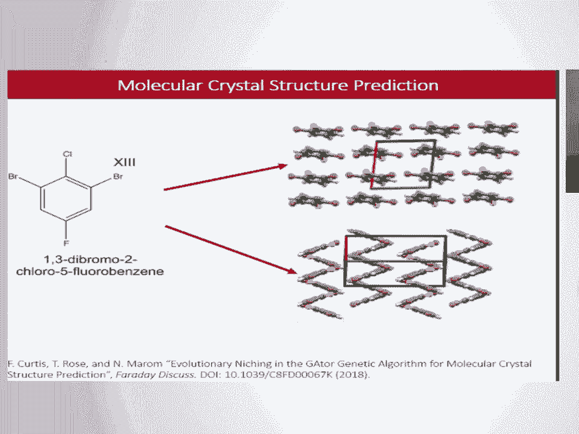
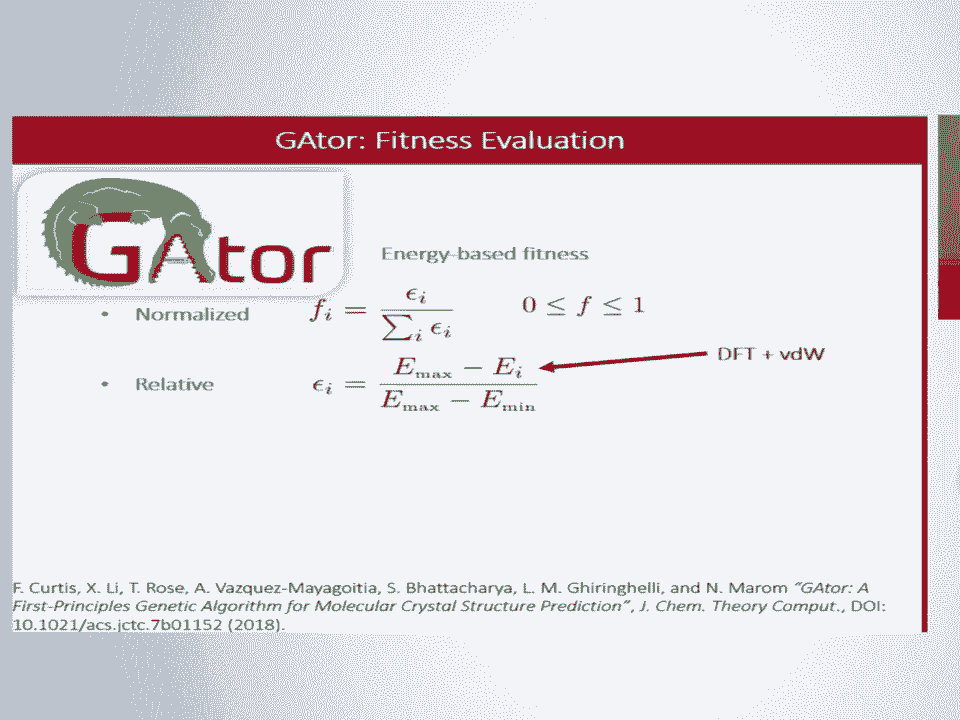
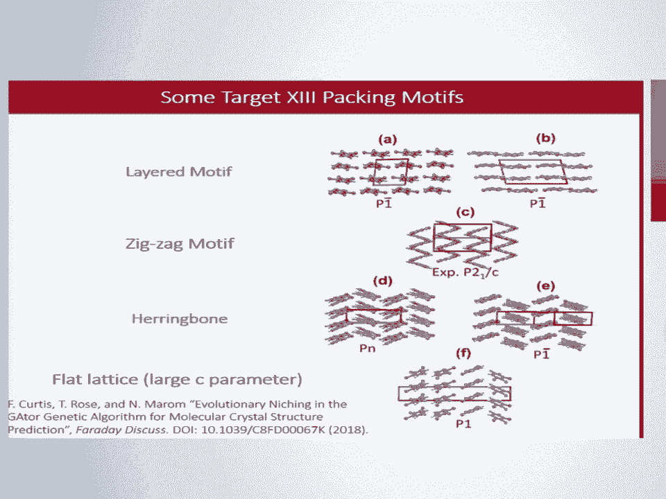
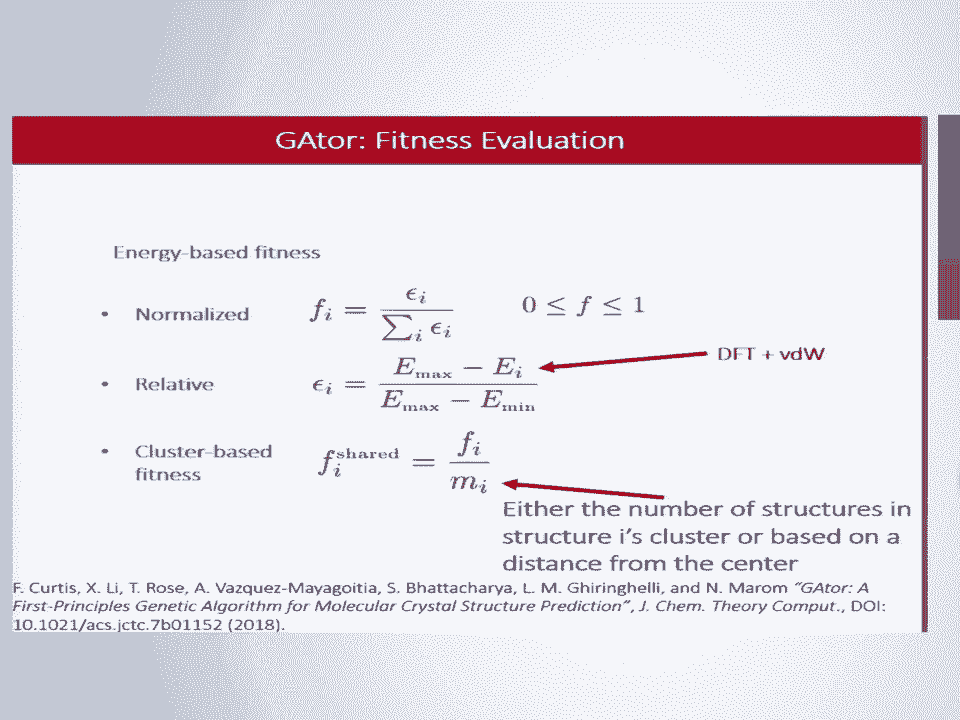
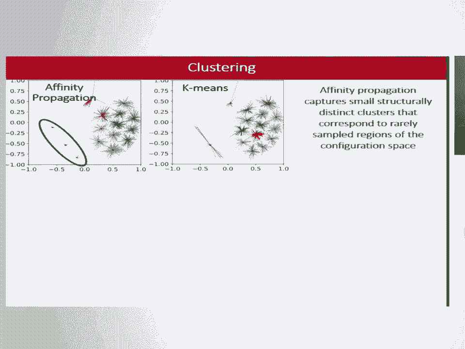
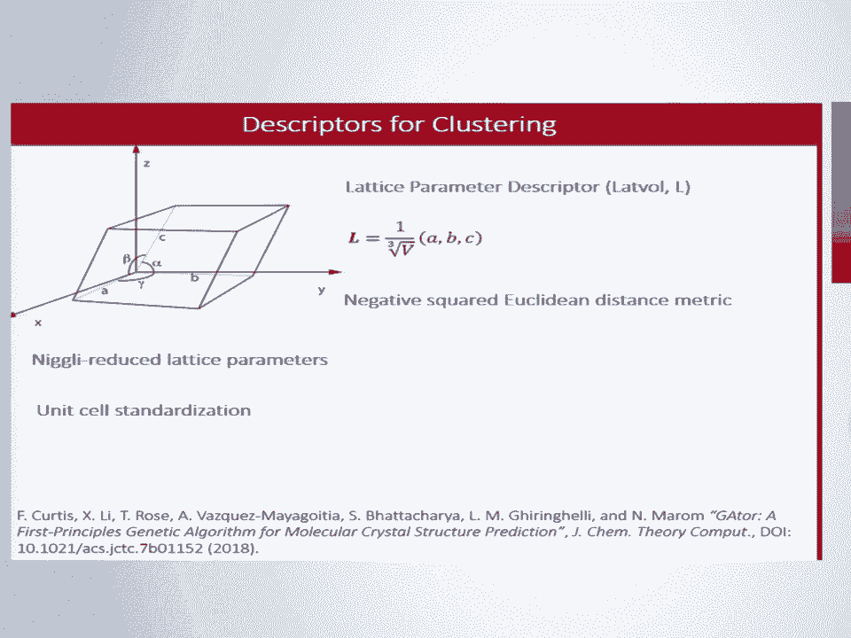
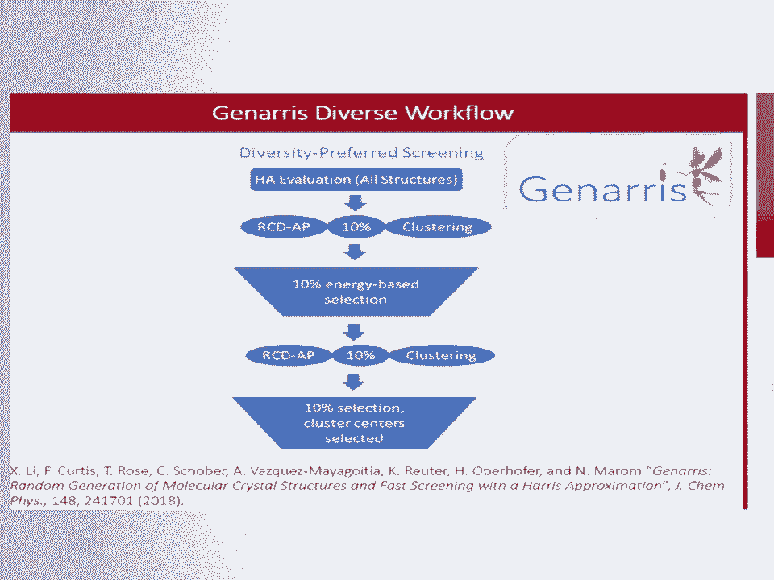

# P21：SciPy 2018视频专辑 (P21. Evolutionary Niching in the GAtor Genetic Algorithm for Mol - GalileoHua - BV1TE411n7Ny

 So today I'll be talking about evolution of an anishing in the Gator-Genetic algorithm。

 that we wrote for molecular crystal structure prediction。

 So what is molecular crystal structure prediction？ Starting from a 2D stick diagram of a molecule。

 predict what are the putative crystal structures， of that molecule when it forms a solid。

 Here we studied a target 13 which came from the Cambridge Crystallographic Data Center's。

 blind test。 So molecular crystals are used for an application such as organic electronics。

 pharmaceuticals， pigments， dyes， explosives。 You name it。 So one familiar example is aspirin。

 Aspirin crystals。 So right here we see the plot of the free energy stability versus density of various。

 crystallographic configurations that are the points。

 And the red shapes indicate putative crystal structures。

 So we notice for the graph on the right that that is for molecular crystal， for the graph。

 on the left that is an ionic crystal。 And we see that for the molecular crystal there are many structures that are very close。

 in energy。 This is because they're bound together with weak of anorals interactions as opposed to。

 ionic crystals where there really is just kind of one global minimum。

 So the ability of a molecular crystal to have to solidify in various states is called polymorphism。

 and that definitely increases the challenge with molecular crystal structure prediction。

 This is in combination with like the long computation times necessitates enhanced searching。

 algorithm。 To this end we developed Gator， a genetic algorithm specifically tailored for molecular crystal。

 structures。 And we'll go into the details of what our genetic algorithms here， except to say that。

 like Darwinian evolution， the fittest structures will pass on their genes。

 So the standard way to define fitness is just with energy alone。

 These energies are computed with light settings of DFT with the van der Waals correction FHA。

 aims code。 So the fitness here is just the normalized and relative energy values with respect to。

 the current max and min energies of the population at。 So I is like structure I。

 So what problems may arise with just an energy based fitness function？ Well for one thing。

 crystal structures pack in various motifs and we'd like to be able， to use this to aid the search。

 So some motifs include layered zigzag， herringbone， flat lattice， tenima field。

 So another thing is that the potential energy surface is typically a lot of local minima。

 And we're not sure which local minima may have viable polymers。

 So if we just go based on energy then we may be susceptible to a phenomenon called genetic。

 drift which is that basically it's the same as just being stuck in a local minimum。

 And so we need to balance exploration versus exploitation。

 This is true of any global optimization search。 So one way to do that that we developed is to introduce cluster based fitness function。

 It could be as simple as dividing by an attribute of clusters of structures。

 For instance it could be the number of structures in the cluster， in structure I's cluster or。

 it could be a distance from the center of that cluster。

 So there are a few clustering algorithms we could use。 We use unsupervised machine learning。

 And specific we have affinity propagation and k-means。 These are just toy examples of what they are。

 The key difference is that with k-means you have to choose the number of clusters beforehand。

 leading to some like out stretching like it's forcing those points to be in its cluster。

 Versus affinity propagation is able to autonomously determine which structures belong to which cluster。

 So here we see an example of how k-means and affinity propagation cluster the same set。

 of 410 crystal structures。 This is the lattice parameter space ABC。

 So yeah so each point represents a crystal structure。

 And we see a similar effect of the k-means kind of outreaching to far away points versus。

 a affinity propagation typically does better with this。

 Affinity propagation does require a descriptor and a distance metric which is true of many。

 machine learning applications。 And so I'm going to describe a few of them that we used。

 One is a lattice parameter descriptor。 We have the it's based on the cell essentially。

 You have the lattice parameters ABC and they form a feature vector when you divide by the。

 cube root of the volume。 The lattice we use is niggly reduced and standardized because there are many representations of。

 the same structure if you're familiar with the space group and stuff。

 Now another one is a radial distribution function。

 This one the equation there basically says like describes how the density of atoms of。

 type y vary as a function of distance from atoms of type x。

 And so n sub x is just the number of atoms of type x in your extended cell and i sub。

 j go over atoms of type x and y。 V is just some smoothing constant on the radial distribution function。

 So if you apply a vector of radii to use then you can get a feature vector which is our。

 radial distribution function vector say for bromine bromine and then you could do it for。

 other combinations of intertomic contacts and get a concatenated vector which is more generally。

 suitable。 You might use something like this if particular intertomic contacts such as hydrogen bonds or。

 halogen bonds are influential in determining stability。

 The last descriptor we use is one we developed called relative coordinate descriptor。

 Starting at the bottom if you define molecular axes to place on your molecules and imagine。

 those axes placed on all of the molecules in the extended cell up there。

 Now the molecule at the base of that vector is a reference molecule and all the rest are。

 neighboring molecules。 So you can compute the position vector of the center mass from the reference to each of。

 the neighbors and that's the r-con of k and then you can take the dot product of that。

 with the axes of the reference molecule。 You can also take the and that's p and then you can take the dot product of the axes of。

 the reference molecule with each of the neighbors axes and you get then q。

 So you can see it p is a measure of similarity or difference with regard to position of the。

 molecules and q is a measure of like the orientation difference。

 So if you can coordinate them together you get r which is the rcd vector and then if。

 you want to compute a distance between two structures one and two which are the subscripts。

 there you can compute a distance matrix d and so to do that you just subtract you take。

 the normalized by the bottom factors there。 So the normalized l2 norm squared of each of those p's and q's。

 And then c scales the relative importance of the difference in position with the difference。

 in orientation。 So you then sum up the m smallest entries of d to get the what is the number what is the。

 distance between these two structures。 There is some arbitrariness to this but again there's some arbitrariness to any distance。

 definition。 So I wanted to do a quick run through of how we generated the structures in the first place。

 We use a package we wrote called generous which starts off using some physical constraints。

 such as a volume range and a lot of parameter range and then uses space script symmetry。

 operations to generate the crystal structures for at least a random but physically viable， subset。

 We might generate 5，000 structures with this。 Then we use the Harris approximation which is HA to get an estimate of the energies of。

 each of those 5，000 structures。 We use the Harris approximation because it's a fast approximation。

 Basically what it is is you take the self consistent density of one molecule you basically copy。

 paste it or superimpose it to all the other molecules in the cell and then you take the。

 energy assuming non-interacting fragments。 Fragment densities。

 Then we use the RCD feature vector and affinity propagation to come up with what are the clusters。

 and then sample for a total of 10% of the total pool。 So if we have 5。

000 then we come up with 500 structures that are the lowest 500 energies。

 but they are also uniformly sampled throughout the clusters in an attempt to promote diversity。

 Then we do affinity propagation again on those remaining 500 structures and select the cluster。

 centers as the 50 structures as our final initial pool。

 We will relax them using self consistent DFT to get our final pool。

 So using those descriptors we ran Gator with them。

 Here we see the average relative energy of the structures over GA iteration。

 So an iteration is when you add a new structure to the pool。

 The R is for like a random initial pool and then D is for a diverse。

 So random is just the diverse workflow I mentioned except it's just that first part just generating。

 physically viable structures but you don't do the clustering etc。 So that's the random pool。

 And then we have control runs as well which don't utilize cluster based fitness or affinity。

 propagation at all。 We see that on average the clustering runs had higher average energies over time。

 This would be expected for a higher degree of exploration versus exploitation。

 But we do get some boons from this because they are more likely to find the global minimum。

 structure whereas the control runs， red and brown， typically plateau and do not get out。

 of that local minimum。 So one way to visualize the structures is in lattice parameter space。

 So these are plots of various runs where the left column is for the random initial pool。

 Right is for the diverse initial pool。 So we want to see how did the GA perform not just based on energy but how did it perform。

 in the search of the space。 Well we see that the control runs without cluster based fitness they exploited too much。

 And there's very dense region at the bottom there versus the region that actually contained。

 the global minimum denoted by a green X was not searched very effectively by the control， runs。

 Whereas they are effectively searched by the Nixing runs。

 So radial distribution function and relative coordinate descriptor performed similarly。

 to each other but the lattice parameter descriptor also was able to search a flat lattice motif。

 denoted by the small A parameter。 One way to visualize the result in clusters because we thought long and hard about how。

 do you visualize clusters that are so high dimensional right。

 And one way we thought is to use paired histograms。

 So these show the counts in each cluster as determined by affinity propagation at the。

 end of the dynamic algorithm run。 That's in blue。 The red is affinity propagation's prediction of the clusters of the control run so that。

 we can tell how did the control run do on these clusters as compared to the Nixing， runs。

 The orange lines and dots represent the mean and standard deviation of the energies of。

 those clusters and the green arrows where the global minimum was found。

 So we see that evolutionary Nixing like suppressed the over and under sampling of certain regions。

 For instance you can see in the hard to the point but in the top there it really over sampled。

 that region the control run did and similarly toward the bottom of the middle graph versus。

 it really under sampled other regions like the bottom of the left one and the top of the。

 middle one。 As opposed to the blue the blue bends which tend to be more uniform。

 Because of this uniformity they are able to find the global minimum。

 You might also notice the gray histograms those are the initial pool structures where they。

 ended up and which clusters they ended up in。 We can tell that the control runs at a harder time breaking out of the initial pool biases。

 versus the Nixing runs were able to break out。 On average RCD has higher energy standard deviations。

 This is possibly due to it's weaker correlation of cell volume and elongated cells with zigzag。

 and herringbone motifs are more likely to be correlated with layered cells but latvol。

 is few clusters indicate not capturing more subtle or motifs。

 So basically there is a trade-off between capturing really subtle motifs and really being。

 able to like what is a motif right？ It's hard to know how many clusters really determine or really an accurate number of。

 motifs there。 So molecular crystal structure prediction has to do with finding all the potential polymorphs。

 not just the global minimum。 So we looked at the ability of the various runs to determine the top 10 structures in。

 terms of energy。 So here we see a table hopefully we can read it of the rank in energy for various。

 or delta， e is the relative energy。 The various combinations of volume， lattice parameter， z。

 just number of molecules per， cell， the space group and the runs that actually generated that structure。

 So from this we can tell that the global minimum had a zigzag motif and it was only found with。

 Nixing。 The number 6 and 8 have a herringbone motif and were only generated with Nixing。

 Seven out of ten of these were found by at least one of the control runs but most have。

 layered packing motif and nine of ten were found by at least one of the Nixing runs。

 So because of this evolution or Nixing can be a viable tool in generating novel structures。

 that may be overlooked otherwise。 So in conclusion the polymer for energy landscape has many local minimum。

 close in energy， some， of which may be viable polymers。

 A balance between exploration and exploitation is needed to combat genetic drift。

 This is achieved by Nixing which is clustering based on certain descriptors and distance metrics。

 along with a cluster based fitness。 Nixing takes advantage of the tendency of molecules to pack in various motifs and Nixing。

 enabled discovery of the global minimum and other motifs that were harder to find for standard。

 energy based fitness。 And finally evolution and conditioning can be used as a viable tool for generating novel。

 structures that may be overlooked otherwise。 Thank you。 [ Applause ]。

 >> Are you talking for questions？ >> When you see Alvaro say hello。 >> Hi。

 >> We're going to work with the guy back at Oak Ridge。

 Question this is I guess the Kuqua question is the predicted global minimum you see， the。

 actual one you see in experiment。 >> For target the team it is。 >> It is。

 So that is thermodynamically the -- I'm always concerned about the difference between thermovores。

 is connected to trap polymorps。 >> Yeah。 >> But in this case it is。

 But you're saying if it's connected to trap polymorps there's no way we're going to get， to it。

 >> So for other molecules we noticed that the -- like what is ranked as the lowest energy。

 polymorp may not be necessarily the experimental one probably for that reason。 However。

 it is usually in the top ten or so。 And it is because of the entropic contribution that you get some re-rinking。

 We don't run the phononic calculations simply because the computational cost of calculating。

 the energies and relaxing the structures as we go through GA iterations is already quite， high。

 So it is something we could do。 But it is probably something we would do at the very end in a blind test。

 But it is computationally just more intensive if you already add it on the DFT。

 >> So it seems like your main takeaway is relating to the clustering。

 You're creating these new shoes。 Is there a reason you chose the algorithms you did？

 Because some of the features you're looking at like the RDF can be pretty noisy， right？

 So you might be interested in using an algorithm like dbscan or something as opposed to a finit。

 propagation。 It's a little bit more sense -- or will not be as sensitive to those。

 >> So you need some sort of generality with your features because it might be noisy at。

 the same time。 You need to keep it in terms that could apply to any new search。

 So developing tailored searches to every molecule that you want to search is not necessarily。

 a problem。 It doesn't make for the best search algorithm， right？ >> Maybe I wasn't as clear。

 I just meant in terms of the choice of clustering algorithms that you did。

 If you have something like an RDF which can have lots of small features and those are。

 not necessarily distinguishing very much relative to the global features， different clustering。

 algorithms might just do better。 I was curious if you looked into that。

 >> So besides k-means and finit propagation， we haven't -- we actually did look at SketchMap。

 as well as another clustering algorithm。 We have -- which I believe SketchMap uses dbscan。

 So when we did try to cluster it looked -- I don't know。 The cluster does not look good。

 So we don't know how they produced it in their paper。 So basically， yeah， we did look at that。

 >> Have you tried to apply your method to the blind test？ >> Yeah。

 So we had not actually -- so we didn't find the -- like the true global minimum on the， blind test。

 And the reason was because our angle， like the alphabet of gamma， lattice parameter angles。

 were not -- we set a certain range to those which we thought was reasonable。

 But I think the actual angle was something like 20 or 30 degrees。 So we didn't go that low。

 >> And have you tried to apply your method to the previous blind test？

 There are six blind tests just checked online。 Just to teach you algorithm probably or to pick a better option。

 >> Yeah。 So， I mean -- so we did plan to that blind test。 However， since then。

 like we've used those structures as like benchmark， like in this， case。

 trying to predict those so that we can hopefully be prepared for the next one。 Thank you。

 >> Just a quick question about termination。 So how did you decide when you were finished？ >> Yeah。

 That's a good question。 With genetic algorithms and a stochastic global optimization。

 there is no deterministic， endpoint。 And so you have to -- you have to choose a certain -- like a way to stop。

 We use， for instance， if the global minimum energy has not changed in a certain number。

 of iterations， then you may stop。 Or you could just set like a certain cap in the number of structures to generate and。

 say we're going to generate this many and then stop it there。 Based on， you know。

 just many runs that we've done， we can get a heuristic for how many that。

 should be and that is around 300 or so， you know， up to 400， which was done here。

 >> So a good people time to get down into the lightning talks。 I think it's time to wrap with stick。

 Our speaker and I'd like to thank Paul。 [ Applause ]， [ Silence ]， (clapping)。

 [helicopter whirring]。