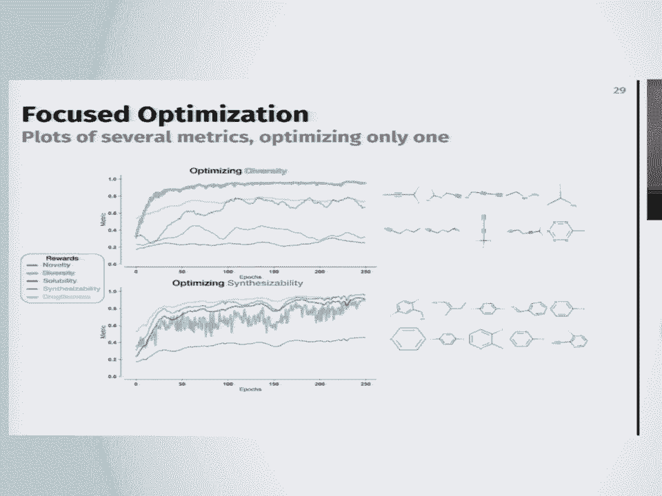
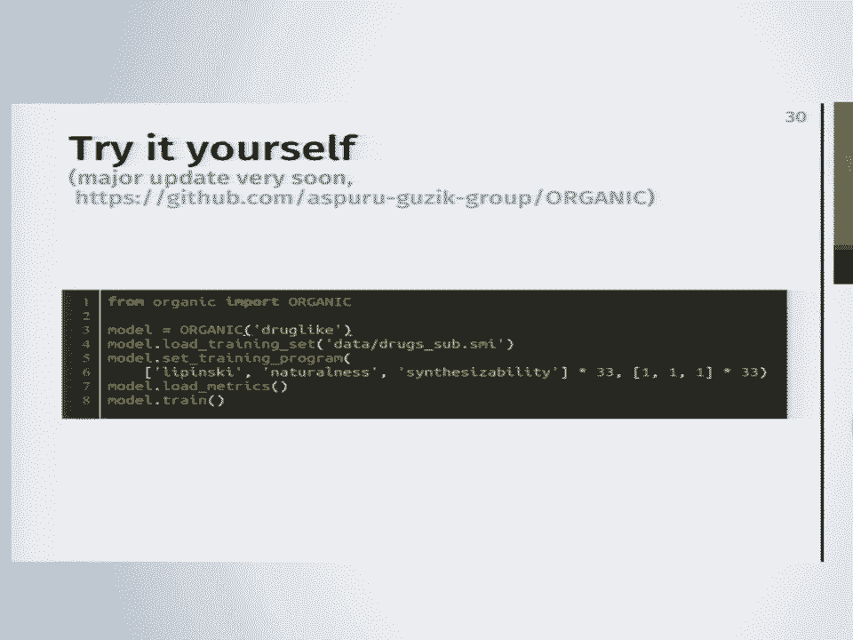
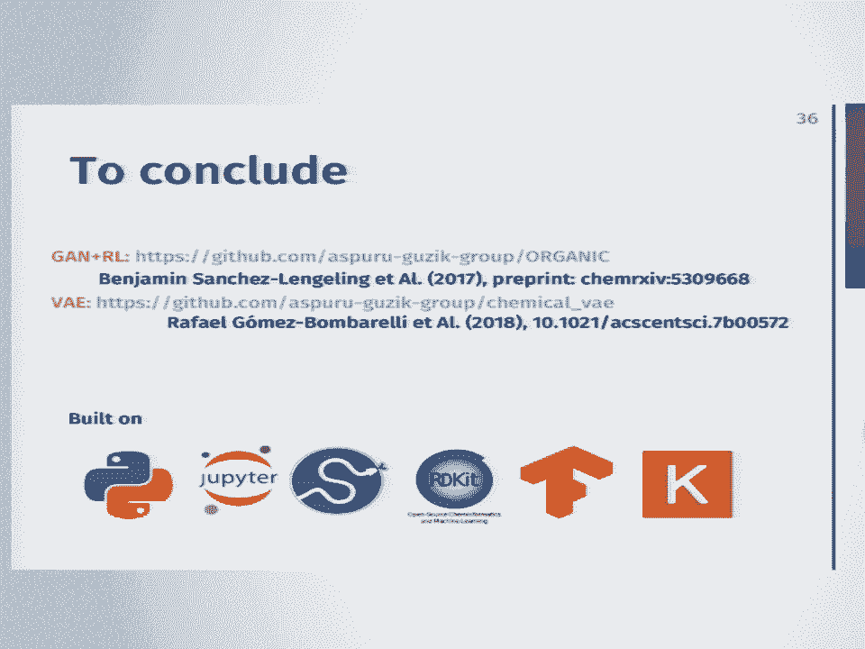
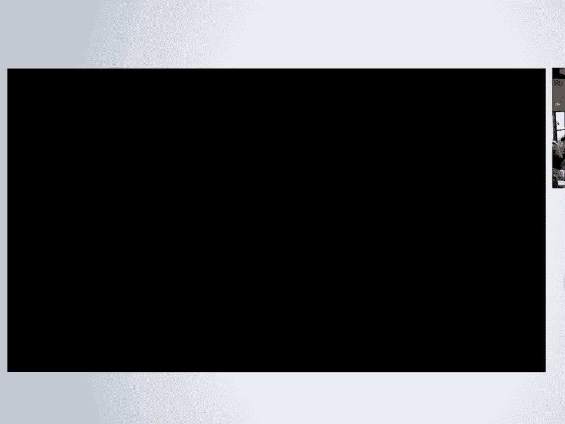
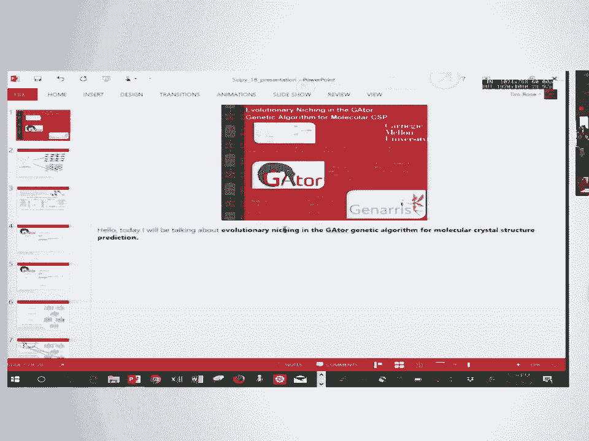

# P22：SciPy 2018视频专辑 (P22. Exploring Molecular Space with Deep Generative Models and P - GalileoHua - BV1TE411n7Ny

 Hi， my name is Benjamin Sanchez， a Ligling， I'm a grad student at Harvard University。

 I'm a member of the Aspero Guzigroup， which is now located at University of Toronto。

 I'm grateful for SciPy 2018， this is my first time。 So yeah。

 I'm going to talk a little bit about the work that we're doing in my lab。

 And particularly about deep generative models for exploring molecular space。

 And so just to give you an idea， there's three parts I'm going to talk about。

 One is what I mean about exploring molecular space， and how that relates to inverse design。

 And I'm going to talk about two deep generative models。 I'm going to talk， it's 20 minutes。

 so I'm not going to go deep into the details if you want to ask anything。

 Like you can throw questions or ask me later， or there's one article and one preprint and two GitHub repos。

 so you can check out。 And so about inverse design and molecular discovery。

 like one of the main reasons we might want to deep generative model。

 is that at the end we have materials， we would like to have a Google for molecules， right？

 If you're a pharmaceutical company or if you're making batteries， or you're making solar cells。

 it's always like I want something that has these particular criteria or properties。

 What's a molecule that will do that？ So that's essentially what you would want to find。

 And one of the reasons why this is a hard problem is because， there's just so many molecules。

 we can't enumerate them。 And so there's just this great quote from Douglas Adams， right？ Like。

 space is huge， like mind-boggling huge， right？ And he was talking about normal space。

 Molecular space is also really huge。 And so there's like attempts of trying to enumerate how many molecules we are possible。

 and there's some idea of around 10 to the 23， 10 to the 80， so it's huge。

 And so we have different ways of probing chemical space。

 And so one way that we can probe chemical space is， for example， experiments and simulation。

 And in that way we can think of it as a direct approach。

 We give a molecule and when we do our simulation we're going to get a property。

 something that we're going to measure， something we're going to get， something of interest。

 What we really want to do is maybe start in this landscape of properties。

 and navigate around it and get the molecule that we want。

 And so it's a hard optimization problem because a lot of times in this landscape。

 we don't know what it looks like。 It's complicated and in chemical space is huge。

 And so there's different ways of navigating this space。

 And you can think about high throughput virtual screening， evolutionary strategies。

 There's a lot of ways of tackling it。 And so I'm going to talk about how you can use generative models。

 to explore this chemical space and also functional space。

 And so also something to have be mindful about when we talk about machine learning。

 Sometimes I can seem like magic or like black box or something to always have in mind is that。

 we're at the end identifying statistical patterns in data。 So that's what we're doing。

 And we want to use machine learning because it informs us how to build systems that improve。

 with experience。 And it's an old idea， right？ But it's been empowered recently because there's a lot of bigger data sets。

 more affordable computation and easy software and just some really new exciting theoretical development。

 And so when we talk about a molecule in machine learning。

 you can think about how am I going to put a molecule inside of a machine learning algorithm。

 And so for that you have to think about molecular representation。

 Molecular representation is an open problem。 There's different ways that you can represent the molecule。

 And so there's really a lot of ways and that all depends on the type of information you want。

 to get out of that。 I'm only going to talk about one representation。

 which is like a very simple representation of， molecules。 You're encoding the graph。

 connectivity graph that assumes certain like covalence rules。 Vellancy rules， bonding。

 bonding valency rules of molecules as a text string。

 So you're obviously not encoding all the full complexity of molecular systems。

 You're only considering certain types of molecular systems。

 And so here we have a smile string and you can see that each part of the smile string represents a part。

 of the molecular graph。 And so this has a grammar and there's certain rules of how to make smile strings。

 It's possible to have a smile string that does not encode what is called。

 sawed as classically as a real molecule。 And another thing to think about is about the distinction between generative and discriminative models。

 And so typically when we think about machine learning， we're thinking about maybe prediction。

 or classification。 And this is normally considered a discriminative approach。

 This is because we're trying to essentially either separate or data by a boundary so we can classify。

 a molecule as toxic or not toxic or maybe a line that goes through our data。

 So if you're thinking about regression in a generative model， we're trying to model the probability。

 distribution that might give us molecules。 So the idea that you can sample from a generative model。

 you can sample molecules from the distribution and it will give you new molecules。

 And of course you can also think generative models are going to be more complicated because it's。

 much。 In one case， you just have to find a decision battery， and the other one you have to。

 sort of be able to put a probability distribution of molecules。

 And so there's a lot of ingredients for building generative models。 There's variation， autoencoder。

 there's GANs， there's reinforcement learning， there's recurrent neural networks。

 and there's a lot of hybrid approaches。 Something to think about and one of the reasons why we。

 chose Smiles is that there's a lot of advance on sequence generation models and natural language。

 processing。 So we're going to use those tools and apply it to our problems which are molecules。

 And so for the first model， I'm going to talk about adversarial learning and reinforcement learning。

 And so you've probably seen these images online。 Like let's just imagine for some reason you want。

 to learn the data distribution of cat faces， right？

 So you got all these images of cats and you want， to learn what a cat。

 you want to learn a model that can sort of， if you sample from it， you'll get a， cat face。

 Maybe you're lonely and you want a cat and you can't have it in your house。 So。

 so here we have like a grade of images generated by a neural network。 And if you actually look。

 closely， these are not real cats。 They're fake cats。 So and there's tricks， right？

 Our mind already comprehends and does a lot of the computation around what is a cat， right？

 These at the end what we're looking at is just pixels。 And it's different with molecules because。

 for example， if I get one pixel wrong here， you might be like， okay， you know， it has like a little。

 dot on its face。 But if you get a molyc， some atom wrong on the molecule， it's not good at all。

 So that's always something to take into account。 You probably also see like fake flowers。 If you。

 look really closely， you'll see like， yeah， those are fake。 Fake album covers。

 So you can apply this to a lot of type of images。 So thinking about this。

 how can we think about fake or synthetic molecules？ What is fake and what is real molecule？ And I。

 think that's where you have to think about your context， what's important for you。 And the way。

 we're approaching that is， for example， if I am interested in drug molecules， drug molecules。

 and especially small molecule for drugs， they're going to have a certain type of like shape and。

 patterns that you might recognize。 Well， if I'm interested in redox organic flow batteries。

 the molecules are going to be maybe very symmetric because you want to synthesize them easily。

 And if you're thinking of organic photovoltaics， maybe your molecules are all around building blocks。

 So in that way， we're going to say something is fake from the other one because if I give you。

 a photovoltaic molecule， you're going to be like， nope， that's not a drug。 That's fake。

 So in that sense， we can think about molecules being from certain types of chemical space。

 And so to give some motivation of how adversarial training works， we can think of two actors here。

 right？ So a cop in a robber。 So you can think about a cop in a robber game。 In this case。

 the cop in the robber is each a neural network and each one has a role。 The cop is going to。

 have data and it's going to be like， this is true or this is fake。 This is a real molecule。

 This is not a real molecule。 And the robber is going to try to create counterfeit examples of。

 the molecules。 It's going to try to generate molecules。

 And so you can put these two together in a game。 And so the cop in the end。

 he only gets to look at reference data。 He might go to the MFA。 And if he gets a fake painting。

 he'll be like， maybe this kind of looks fake， doesn't look fake。

 And the robber is only going to train in its basement making fake paintings or molecules。

 And at the beginning of this game， you might have that the robber is really bad at making samples。

 So it might make something like this。 But eventually， because the robber wants to be a better。

 generator of synthetic data and the cop wants to be a better discriminator of fake and real data。

 they're going to both improve。 And this is assuming that they actually train well。

 If you have a really good cop， he's going to bust that robber really fast。 And the game is going。

 to collapse。 So there's a lot of details around training these algorithms to work well。 And if all。

 works well， you might generate data samples that might look like this one。 And so in that way。

 you can have two algorithms playing against each other。 And you might think， well， why didn't。

 people just come up with this algorithm very recently。 This is from 2014。

 A lot of this type of algorithm， was introduced by a good fellow。

 And one of the main reasons that neural networks are differentiable， with respect to a。

 when you have， for certain loss functions are differentiable。 So you can always。

 differentiate the behavior when network with respect to the other。 So that's the main reason why。

 they're working right now。 And so this is the setup that we have for molecules。 We have Gaussian。

 noise。 So we just have noise。 And we have an algorithm that is trying to generate from random noise。

 a synthetic molecule， something that is a real molecule。 So it's trying to learn how to structure。

 the random noise into a synthetic data point。 And the discriminator at the end is going to tell。

 determine if it's fake or real。 And it can compare with its empirical data distribution。

 Something extra that you might want。 You might not just be interested in making。

 molecules that look like drugs， but you might want to actually improve their properties。

 So this is where you want reinforcement learning。 Reinforcement learning is another way of sort of。

 playing games with your networks that allows you to give external rewards。 And the idea of。

 external rewards is that a lot of times what we're interested in is not easily encapsulated as。

 a neural network。 What we're interested in maybe comes from experiment， maybe it comes from a。

 simulation。 And so for this， and in the other case you might think， well， I like art， but I like。

 very contemporary art。 I want some graffiti of Esse-Homo。 So you might want to give rewards for。

 something more modern like that。 So for this， there's one algorithm。 There are several types of。

 algorithms and flavors for reinforcement learning。 One of these that we're using is policy gradient。

 via Monte Carlo tree search。 Essentially one of the problems is that when you have a incomplete。

 smiles and you're trying to complete it， you can only give the reward until you finish making the。

 entire molecule， right？ You can't give incomplete rewards。 So in some sense you do a random search。

 of several possible completions and you're learning a behavior that will incentivize good and bad。

 completions of your sequences。 And these metrics can come from different types of sources， right？

 Computer from simulation from experiments。 At the end you're trying to learn， you have a neural。

 network that's trying to learn the gradient that will sort of push the behaviors that you're interested。

 in。 And so you can put this all in together。 You give an initial data distribution with some property。

 of interest and you have these algorithms competing against each other and also incentivizing and。

 promoting positive behaviors。 And so at the end you're going to have a new distribution of molecules。

 and hopefully a shifted goal of whatever property of interest you have。 You might not arrive to the。

 type of goal that you want but the idea that you sort of bias it towards that。 And so depending。

 on the context you might want to use different types of metrics。 If you're interested in drug。

 molecules well you might be interested in synthesizability， you might be interested in solubility。

 If you're， interested in redox flow batteries， you know， toxicity， stability。 So there's a。

 depending on the context， you have， you can think of the different types of behaviors you want to reward。

 And at the end， all these algorithms are highly dependent on the quality of your metric and type of reward that。

 you can give it。 If you have some linear model that is modeling something that is nonlinear at all。

 then you might not have a really good reward。 You might not be imposing the type of behavior。

 that you're interested in。 So you can think about something really silly， silly。 Like， okay。

 I want to find the molecule that has the highest melting point。 Maybe not the highest melting point。

 but a really high melting point。 And so we had like this distribution of molecules。 There's a。

 really good nice data set that has melting points for 40，000 molecules。

 And you can train some model， that can sort of give you some estimate of the melting point of a molecule。

 And so you might end， up with these organic molecules with aromatic groups and also like long chains。

 I mean， at the， end， this is just like， you know， this is something we were like playing around with。

 Something you， can do with these algorithms is sort of you can focus your optimization。

 So in this case， we start， with very small drug-like molecules。

 And we have some metric that we call diversity。 Diversity is a， hard metric。

 There's different ways of measuring diversity in molecules。 And in this case， we。

 arrive to molecules that look like really bad。 You know， one of those molecules has five nitrogens。

 in a ring that's going to explode。 But you could probably say the diverse but they're not probably。

 going to be good for whatever you want。 But if you have a metric that is optimizing synthesizability。

 you might have more conservative molecules that you might find in your normal data set of。

 molecules， of drug-like molecules。 We have a GitHub where you can check it out。 We're working。

 really hard to have this like very easy to use。 We're going to have a major update soon。

 probably at the end of the summer。 And essentially。

 this is what it looks like when we want to optimize， a molecule。

 We import or like default hyperparameters。 We load a training set。 We put a training program。

 In this case， I have a multi-objective training program。 I want to optimize Lipinski's Rule of。

 Five， natural productliness and synthesizability。 And so it's going to be alternating these three。

 rewards。 And you load your metrics and you start training。 And you can do this on your laptop。 Like。

 the depending on the size of your data set， on my computer， it takes like around 10 hours for a。

 hundred epochs。 And there's a lot of details around training these algorithms。 And the last。

 algorithm I want to talk about is the variation order encoder。 And so the variation order encoder。

 is also another way of approaching this problem。 The idea of an order encoder is that you want to。

 find a vector representation of your data， but you want your vector representation to be invertible。

 And so the idea is that you're going to have one network that is going to sort of map your data。

 onto some vector space Z， which is called the latent space。 And then you have another algorithm。

 another model， a decoder that's going to decode this vector from Z back to your original data。

 So these two algorithms are trained simultaneously。 And you're trying to actually， if I give you a。

 molecule， you're trying to reconstruct the original molecule。

 So you can think of it as an operation， of compression of data and then decompression of data。

 And you can also couple your molecules to， properties。 So you could。

 and because you couple it to properties， you're going to also affect how。

 the latent space is shaped。 And so that's going to give you some of the geometry of whatever property。

 you're interested in。 One of the things you can think about with these molecules is about the。

 geometry， because your molecules are now vectors。 You can think about， okay， what's the nearest。

 neighbor for a molecule in this vector space？ And so for a given radius， you can find a lot of。

 molecules that are small perturbations of your initial molecule。 So if I start with ibuprofen， at a。

 very small radius， I might find very small changes of these molecules。 And the farther away I get。

 from that molecule， the more the molecule looks like random molecules from your data set。 In our。

 case， we trained our algorithm with 250，000 molecules。 And we estimate for each molecule。

 those around like 30 molecules that are not in the training set。 So we think that if you give it。

 definitely more molecules， you're going to have like a much more diverse set of molecules。 And so。

 because you're also in a vector space， you can think about interpolations。

 If I have a given position， and have another given position。

 you can think about arcs and interpolation of between these two， paths。 And so for example。

 here we have interpolation between two FDA approved drugs。 And。

 all the small transformations in some sense could be sort of like small， smooth transformations。

 And one of the reasons that we know that our latent space is getting shaped by properties is that we。

 train it without properties。 Here we have some PCAs of all the molecules。 And we have colored。

 the molecules based on their properties。 And so essentially， if you don't train with the。

 properties， it just looks like they're all around。 The property is all around。 But for a property。

 like log p， which we use for solubility， there's going to be a preferred direction where there's。

 higher solubility and lower solubility。 And if you have that， you can then think about doing。

 optimization。 If I start somewhere and I want to optimize the properties of my drugs， I can now。

 navigate around this vector space。 And so this is what a great and best optimization looks like。

 We start with a really， really， really bad molecule。 And in this case， we're optimizing QED。

 which is quantitative estimate of drug lochliness and SAS， which is synthetic accessibility score。

 And then at the end， we end up with something that is supposedly more synthetic accessible， and QED。

 But at the end， it also depends on your metrics。 So these metrics were made for drug-like。

 molecules。 If you're using other molecules， you really have to think about if these metrics make。

 sense or not。 And， okay， so to conclude， I presented two types of models that I've worked on and。

 that we've been developing in our group。 And yeah， and so there's a link if you want to know more。

 This is built on open-source software。 It's all in Python and site by ARDKit。 So it works because。

 there's a really good community where you can always ask questions。 And there's a lot of。

 future work on this。 So there's people that have worked on improving the grammar structure of。

 your molecules。 There's also people that have improved on optimization。 And there's people。

 that are thinking not about smile-strings but actual graphs。 So there's a lot of extensions。

 and improvements that you can think about these type of approaches。 And so yeah， this is a photo。

 of my group。 And I'd like to thank Alon， Harvard Chemistry Department， Dr。 Andres Forza， and。

 the site by 2018。 And yeah， thanks for your attention。 Any questions？ So thank you for your talk。

 If I understood correctly， the main representation that you use at the。

 input and output for your neural network is a string with a specific syntax。 I tried to use。

 other representations or adaptation layers on your network to directly work on graph。

 like graph convolution neural nets。 And can you contrast that with strings？

 So we haven't specifically worked with graph， but there are several like。

 other work that has been done at graphs is very recent。 If you Google Graph-Rational Art encoder。

 I think the closest one was in 2016。 And a lot of the newer work was molecules into like just。

 like a few months ago。 One of the main problems is that first with like graphs， right now， I think。

 one of the bottlenecks with graphs is that the biggest molecule I've seen that people have generated。

 around 37 heavy atoms。 And it's more due to the algorithms。 There's a lot of progress trying to be。

 made on graph algorithms for neural networks。 Well， it's easy to do graph convolution neural。

 networks。 The inverse operation graph deconvolutional neural networks。

 I don't think they are right now。 For recurrent neural networks， you do have those type of。

 There's much more of。 There's more， series that has been developed。 So in that sense。

 it's much more robust for smile strings。 Ultimately。

 I think graphs are the correct representation you would want to work on。 Yeah。

 it's a kind of related to a second question。 For machine translations， from string to string。

 sequence to sequence， it used to be the case that people would use recurrent neural nets。

 But nowadays， the transformer architecture with self-attention is better。 And to me。

 it sounds like graph convolution。 It's kind of related to graph convolution。

 So I was wondering if it was a good way to do it。 Yeah。

 definitely putting like attention networks or any type of memory。

 Putting any type of like memory architecture on your network is going to improve。 There's。

 people that have used RNNs with attention networks and they work better。

 And we also collaborated with， a group that did。 They put like memory on the neural networks。

 so like a different general， neural computer。 And they also work way better。

 So you're going to get improvements with those， type of architectures。 Hi， thanks for the talk。

 I was wondering， did you mention if you're putting。

 all of the generated small molecules into a database of some kind？ We haven't done that。 Yeah。

 we haven't。 Yeah， that's a good idea。 Attack with meta-daughters。 I mean， a lot of times these。

 you can generate so many molecules that， you know， they're like very cheap。 Like。

 you can generate like millions of molecules and they might， not make sense， right？

 So I think it's important that like， I think what's more important is having。

 some sort of maybe experimental data， like， or computational data attached to those molecules。

 Because you can generate millions of molecules， but it's more important if you actually have some。

 sort of simulation of some sort of theory behind it that like backs it up。

 So question follow up on that one。 So I'm a computational chemist and I'm still a skeptic， of this。

 I'm sorry， George。 And one of the things that comes to my attention is， you know。

 everything we're looking at here is pretty small and flat。

 There's no geometric information embedded。 So the minute you start thinking about 3D geometries and then you start going to 40 to。

 electronics， I mean， are there paths forward to take this beyond just smile strength basically？

 Yeah， with crafts， you can embed like 3D information because your graph is annotated。

 So each node you could， for example， you could annotate the bond edges， right？

 So you could give it a distance for there。 And there's very recent work around like 3D points。

 for like molecules where you can actually use the geometry。 Yeah， so I mean， I think。

 so something else to think about is that， for example。

 I asked also like a similar question to Greg Glandrum that works on ARIKit。 Like。

 what do you think about just smiles， right？ Because they can be very limited representation。

 Something to think about is that like graphs also have in some ways 3D information in the sense that。

 if you have a graph and you optimize it with like a force field， because of the forces between the。

 atoms， you're already going to have some sort of geometry around that。 In this case， we only showed。

 all the images that we showed were 2D because that's how we plot them， right？ If you embed them in。

 3D space， they probably will have its 3D geometry。 Any other questions？

 So did this approach lead to some kind of success in finding interesting new molecules in some fields？

 So we collaborated with a medicine company in Silicon Medicine， and they had some success using。

 this algorithm to find new molecules。 I think there's a lot of improvements that are being made。

 The whole drug discovery process takes a long time， right？ So it might take a few years before you。

 actually see some hit around that。 I think also from part of it where you can actually improve。

 it's not so much thinking about like if this finds a new drug is also if you're a human and。

 you're working with these algorithms， there are no way of suggesting ideas， right？ That might like。

 make you think about it or you might find flaws because these algorithms at the end。

 depend on how well you can estimate these properties。

 and you might figure out how to make better models， around that。

 So you can have many different small screens to represent one molecule， right？ How do you deal with。

 that within this？ So normally we input all the molecules of all the small。

 screens that we input are already like kind of nice and using like what's the name？

 Can't remember where you include some of the stereochemistry information。 Isomeric smiles？ Yeah。

 but you can generate molecules that are when you generate smiles， you might generate smiles。

 that are not canonical。 And yeah， that is a problem。 It's mostly a problem around graph isomorphism。

 right？ There's different ways of representing the same graph。 And you can't get away with that。

 You're probably losing some of the predictive power or modeling power that you have because of that。

 Let's take our sticker again。

 (clapping)， (buzzing)。