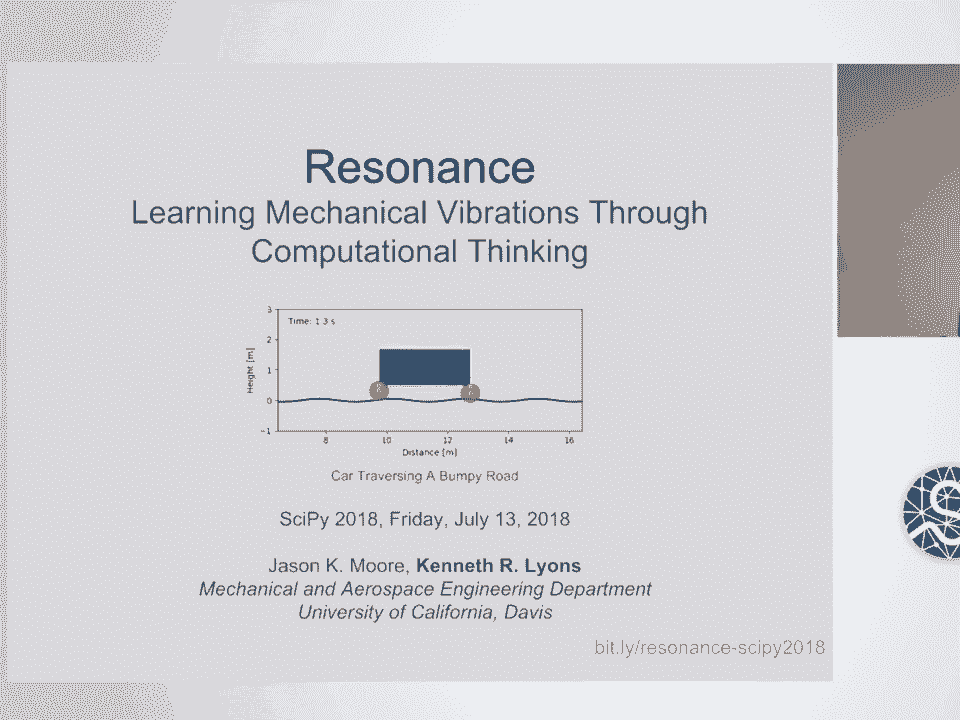
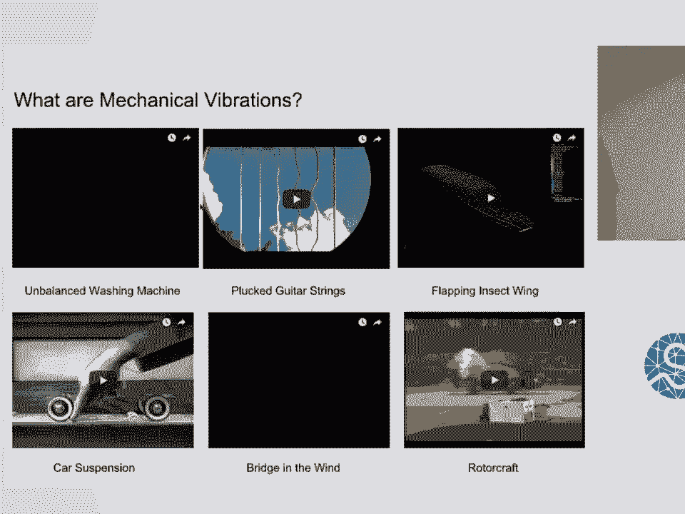
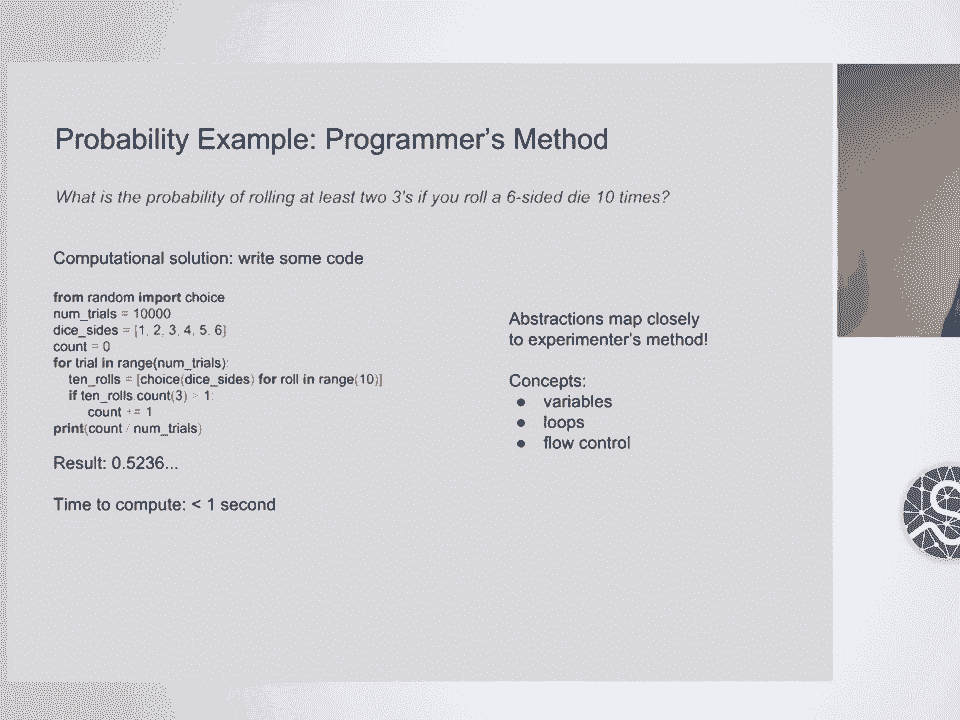
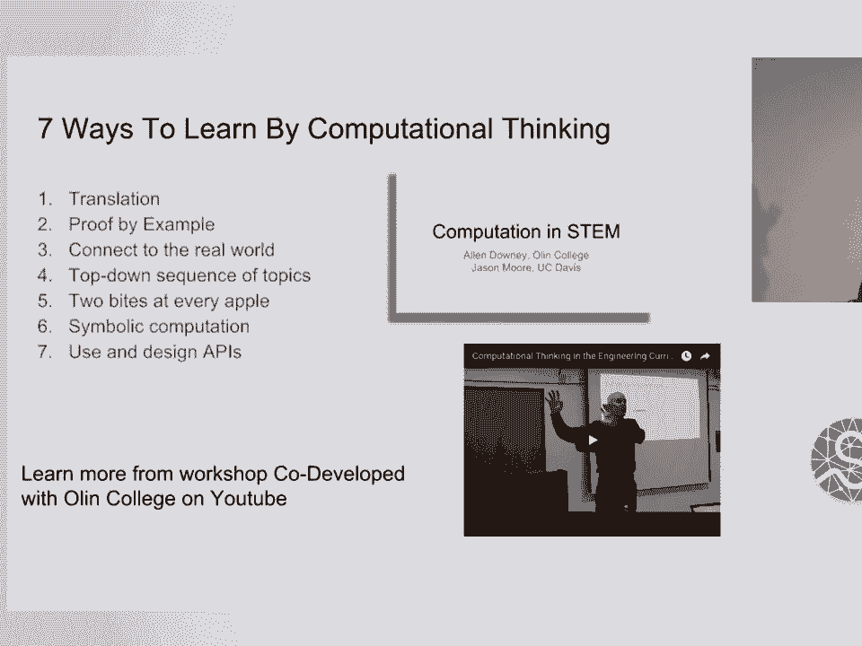
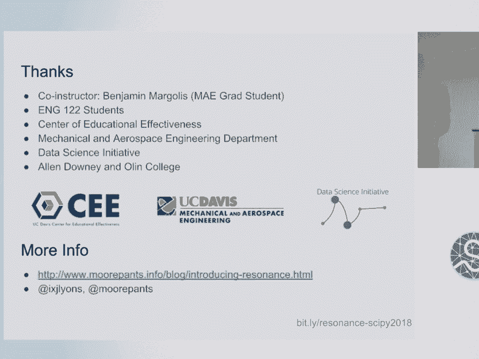

# P27：SciPy 2018视频专辑 (P27. Resonance  Learning Mechanical Vibrations Through Computati - GalileoHua - BV1TE411n7Ny

 Thanks everybody for being here。 I'm excited to be here at SciPy。 Jason Moore couldn't。

 unfortunately be here at SciPy this year， so I'm kind of giving the talk on his behalf。

 He's an instructor at UC Davis。 I'm a PhD student there and I TA'd with him for this。

 class a couple of times in a row。 And so it was pretty cool to be able to see how we can。

 integrate more computing into an engineering class over a couple different years and see。

 a couple of iterations of that。 And we're excited to present this and talk about some。

 of the stuff we did this last time to teach vibrations to mechanical vibrations to undergraduate。

 engineering students。 So， there we go。 So if you're not familiar with what mechanical。

 vibrations are， here's a few examples。 I won't click on all of them so I can save some bandwidth。

 But here's a couple of cool examples。 So there are vibrations that are desirable and vibrations。

 that are undesirable。 So instruments that are a good example of desirable vibrations。

 they create music and that's how that works。 So you can have vibrating strings or vibrating。

 membranes that create pressure waves that hit our ears and create music。 We also have。

 examples of undesirable vibrations like a washing machine that has an imbalanced load in it。

 I'm probably all familiar with that。 And then there's kind of a famous example of a bridge。

 called the Tacoma Narrows Bridge that essentially vibrated itself apart and the bottom video。

 down here。 So our task is basically to teach undergraduate engineers how to analyze systems。

 like these and work with them。 So this is a sort of diagram of what engineering is like。

 what it involves。 So we have real world systems whether it's a system we are kind of in designing。

 so it doesn't actually physically exist yet but or it's it may be something that does exist。

 and we want to work with it so we can create abstractions from a real world system in order。

 to model it and this can be useful for different domains you might have different models for。

 different reasons or different purposes。 And so the going from a real world system to。

 a model is a critical aspect of engineering and another path is to go put sensors on a。

 system and measure it and make observations of how it acts and how it behaves。 And the。

 connection between these two things is by producing simulations or analyses of models。

 we can match these simulations to the real world data and see where is it match up， where。

 is it not， is this a suitable model for the real world system or is it not。 And these。

 are all critical tasks that engineers do when they design and analyze systems。 Traditionally。

 in engineering education you'll see heavy， heavy emphasis on analysis。 So usually or。

 pretty typically homework questions are prebuilt models so they've already been kind of skim。

 out of size from a real world system and the student analyzes it they do some math they。

 make some plots things like that。 And the measurement process or the validation process。

 of a model or even just the projection of a model using abstraction is often left and。

 not really covered that well。 So one of the things we wanted to do is try and cover all。

 of these different aspects of engineering a bit more meaningfully in our class。 So we。

 saw computational thinking as one way to approach that。 So we'll talk a little bit about what。

 we mean by computational thinking。 Computational thinking can be thought of as sort of another。

 language on top of what we already do when we do engineering。 So we can talk about a system。

 using natural language we can describe it， describe how it moves， how it behaves。 We can。

 also use really concise and nice mathematical language to do a very similar thing。 We can。

 also use programming language we can use code to actually describe how something works or。

 to simulate it or to model it that kind of thing。 And so one kind of nice way to think。

 or to kind of introduce computational thinking is with an example。 This is an example that。

 Jason likes to give of a probability question。 So if you have you want to roll ten dice and。

 you want to see how many times you get at least two threes what's the probability that。

 you get at least two threes。 So one way to do this is to run an experiment。 You can have， ten dice。

 roll them， count the number of times you or count how many if you get at least two。

 threes or not and then do that over and over and over again and you'll get an approximation。

 to the real probability。 Another way to do that is kind of from first principles。 And。

 I was thinking about doing a poll seeing how many people would have been able to come up。

 with this without the internet。 It's actually a little bit tricky but you can think about。

 okay well if I roll a three that is a binary random variable with probably one sixth and。

 if I do it ten times I've got sort of a Bernoulli trial and you can get a binomial distribution。

 and then sum it over sum the probability mass function over at least two threes up to at。

 least most ten threes and you get the probability。 So this requires a lot of pre-rexet knowledge。

 and a lot of kind of background to be able to do and it is pretty far away from what the。

 question actually is and sort of the natural way of thinking about it which is the experimental。

 method。 So one thing you can do is write out some code and this pretty much exactly mimics。

 the experimental method but it does it with a computer which is really good at doing that。

 quickly and this is code that an undergraduate student relatively experienced or somewhat。

 experienced with programming could produce and run in a pretty short amount of time and。

 get a reasonable answer。 So it's not to say that you shouldn't teach mathematical modeling。

 or how to do the statistical approach but this is just another language another way to。

 think about how to do these problems。 If you want to know more about computational thinking。

 you can see a workshop that Alan Downey and Jason Moore put together and did at UC Davis。

 earlier this year and I think the links to the slides will be on the last slides you can。

 see this video and how that all went。 So also it kind of switch gears a little bit to talk。

 about what we actually did in our course。 So the course is called introduction mechanical。

 vibrations。 It's a technical elective class for engineers at UC Davis and we have about。

 four hours of in class time per week split into two sessions and let's see。 Prerequisites。

 are dynamics so kind of an engineering approach to new technology mechanics or application。

 of new technology mechanics and some engineering programming which I think at UC Davis is still。

 currently either MATLAB or C。 So they come on with a variety or kind of a range of backgrounds。

 in programming and that is an interesting issue that I think the next talk is actually。

 going to address a little bit。 Okay。 So the first thing we sort of did when we looked at。

 this class the second time around is we stepped back quite a few steps and said well at a。

 very high level what do we want students to be able to do after taking a course like this。

 and so we came up with these three main things which pretty much mimic the old diagram I。

 showed earlier where we want people to be able to come up with models of real world systems。

 make measurements of them， reason about the measurements and then do simulations and analyses。

 One interesting thing is that design is often really the most under implemented aspect of。

 a lot of engineering courses it's sort of difficult to do， difficult to teach it， difficult to。

 assess it but computational methods may be kind of an interesting way to sort of introduce。

 that a bit so we can have a model taken play around with and design and see what comes。

 out of changing parameters and things like that。 So we sort of kind of rewrote the whole。

 course from scratch so instead of following a sort of standard vibrations textbook we。

 kind of created our own。 So we reworked the learning objectives like I said we created a。

 textbook for the course that was based on Jupiter notebooks and we talked a little bit。

 about how those how those came out and we really wanted the students to learn by doing。

 in the classroom and out of the classroom so we had notebooks that they went through。

 sort of a flipped classroom approach and they actually brought in their laptops went through。

 notebooks did exercises in class that kind of thing and we also had homework notebooks。

 that they did outside of class and we tried to build the course around realistic vibration。

 systems and so every notebook kind of has a real thing that they are working with and。

 maybe just the thing that they're doing with that system might change from notebook to。

 notebook but they're all trying to analyze real systems。 We do plan to release the interactive。

 textbook in the future it's open source so it's up there now but we want to package。

 it up a little bit better and clean it up。 So the first day of class I guess traditionally。

 is a pop quiz on linear differential equations and this does a pretty good job of weeding。

 out a bunch of students on the first day which doesn't really help anyone it's maybe helps。

 the instructor kind of assess students pre-reacts that knowledge a little bit but that's not。

 really you know that's only one part of it and that's not really the point of doing that。

 So on the first day this time around we had a fully fledged notebook with some interactive。

 examples and things like that just to give the students a taste of what they would be。

 doing for the rest of the quarter and hopefully motivate them to stay and keep going and hopefully。

 not scare them off with a whole bunch of codes。 So there was little bits of code that do some。

 high level things and produce some cool plots and interactive plots and animations as a hopeful。

 hopefully to get them motivated to keep going。 So we designed a software package to accompany。

 these notebooks and it sort of serves the back end of them and so the library is called。

 Resonance and it's open source there's links up there and the main guidelines were we wanted。

 the students to be able to work with systems without creating classes we didn't teach them。

 programming they worked with objects but they didn't have to actually create classes so we sort。

 of avoided a little bit of overhead of teaching some programming concepts。 We wanted each system。

 kind of to be the central object of the library which represents a real world system so a car。

 or an airplane wing or things like that and we wanted them to be able to use these system objects。

 add measurements to them like their sensors and play around with them like they are a real。

 physical thing so we can sort of simulate what it would be like if you had an actual machine。

 sitting in front of you and you can do some analyses and measurements and simulations things。

 like that。 Okay so the primary class was the system and we built in a few subclasses of a system。

 for specific instances like a car or things like that and this is kind of the core of Resonance。

 and you can see that you import the system and you instantiate it and then you can do things like。

 set the coordinate so a coordinate is like a state variable we were a little bit careful with the。

 naming so we didn't use the term state variable we called them coordinates similarly we used constants。

 instead of parameters so there's a lot of kind of interchangeable language you could use we called。

 them constants for things that are like spring stiffnesses or geometrical constants like the。

 length of something and then the coordinates are things like position velocity etc and then so you。

 can set initial condition call a method like free response or forced response and this example to。

 free response for five seconds and then you get a data frame back out and so you can use data。

 frame methods like plot to plot the trajectories that you get and then below that you can see that。

 they set the spring stiffness something else make the plot again and you can see that the period。

 of oscillation has changed and so you can imagine probably setting up importing an ipy widgets thing。

 and then connecting that up and you can make a little slider and show what changes when you change。

 the spring stiffness or the mass or different different constants in fact we did that a lot in。

 the notebooks and not only that but the students actually learned how to do that themselves so if。

 we didn't show them the effect of some constant on the system they could actually investigate that。

 themselves interactively which is pretty cool another thing you can do with systems is create。

 measurements so we again the thinking here was make it like it's a real physical thing you can。

 put a sensor on and you can get the measurements out and so in this example it's kinetic energy you。

 create a function that computes the measurement that you want and it takes in any of the constants or。

 the coordinates that you want from the system by name and so again we kind of avoided object。

 oriented programming creating classes by having them write functions and then add those functions as。

 attributes to the object so you can see at the very bottom that you are sorry below that you。

 add the measurement like that and then you can do the free response and then the measurement comes。

 out in the trajectory that you get as kind of an auxiliary output and the measurements can be。

 things like kinetic energy potential energy things like that that might be useful to look at it can。

 also be things like just the velocity of some other point rather than the center of mass of the。

 system so you can kind of look at different what other things of the system well the parts of the。

 system are doing another thing you can do with systems is create configuration plots what we。

 call them and so you can essentially create a callback function that generates a matplotlib。

 figure and we students didn't really get into kind of the whole matplotlib API to do a lot of this but。

 we were able to create some of these for the built-in systems we also showed them how to modify them if。

 they wanted to you can create a configuration plot that kind of displays the physical thing in a plot。

 and after you do that you can write another function that updates the plot once you get new。

 coordinates and so you can create little animations of the systems and it's gonna be pretty useful to。

 look at and just see because you can get trajectories of the state variables but it's a little sometimes a。

 little bit hard to visualize or kind of imagine what that might look like visualizing it is a。

 is an interesting way to to bring that in and we can do it relatively simply with not that much code。

 actually the other thing systems have our equations of motion so we did introduce some symbolic。

 mathematics to them and so for example if you can get the kinetic energy and potential energy of a。

 system which they should already be able to do because they've had dynamics you can then use the。

 Lagrange method to generate an equation of motion and rather than do all these derivatives by hand。

 you can call some pi diff and they fall out and so after you do that you can translate those symbolic。

 expressions to numerical code add it as a again a kind of like a callback function and this is the。

 evaluating the right hand side of the first order ordinary integral equations appropriate for a。

 numerical integrator and so that's how we achieve that again not doing not inheriting from a base。

 system class they just use the base system class add the differential equation function and then it。

 behaves like a new system so I'll talk a little bit about the course materials and how we assess the。

 students the textbook that we wrote is essentially what they did in class so we generated a series of。

 notebooks about 14 clear modules for the 40 hours of class time and it's essentially an interactive。

 textbook so they would come into class fetch the latest one and then we would go through it similarly。

 to software carpentry style if you're familiar with that so Jason would kind of go through the。

 notebook then when they come to us and a little exercise it's split up in either in the group。

 sort of individually work on the exercises come back and go through those again and then move on。

 and this worked pretty well though it is difficult to time do the timing for the first run if you。

 don't have it done it before we also created some somewhat open-ended weekly homeworks so we generated。

 kind of a somewhat traditional like homework problem and they were tasked with exploring that。

 problem computationally and they could create their own notebooks essentially so we had template or。

 we had a base notebook with empty cells for them to fill in and one thing about this is we tried。

 to encourage them to generate nice notebooks with a mixture of code and text and figures and equations。

 and things this was somewhat challenging so we tried to kind of foster good habits and we sort of。

 got there towards the end of the quarter and that's that's that's that's all you can really hope for。

 and then we decided to use a design project rather than a final exam so we we had this kind of neat。

 example that I actually had also when I took vibrations and undergrad so this is a causeway。

 between Davis and Sacramento in California and the old design was like simply supported and so you。

 had these kind of peaks in the bridge and the old cars went at whatever 30 miles per hour or。

 something like that wasn't too much of an issue but they found out that when you drive about 60。

 65 miles per hour over it that happens to be kind of near a resonant frequency for a lot of car。

 suspensions so you get kind of these crazy vibrations of your car when you go over it and so they redesigned。

 it and they made a new bridge but we kind of gave them this simply supported beam bridge design and。

 a told them to come up with a some kind of car model and then design a suspension that will be。

 able to go over this bridge and suppress some of the vibrations or give some desirable vibrational。

 characteristics and so it was a pretty open-ended problem we got a lot of interesting solutions to it。

 and so I was exciting to see。 So the way we achieved the in-class exercises and things like that is we。

 used Jupiter hub we hosted this ourselves and just kind of a single machine we had a fairly small。

 class that was achievable and this allowed us to have the students come in and just on the first day。

 they went to a website and they log in to their credentials the UC Davis credentials and then they。

 can automatically start running notebooks and they don't have to install anything that's pretty。

 amazing the last time we did it we had them install condense stuff which works pretty well but you。

 still run into issues with the installation and things like that this is very nice to be able to do。

 I think I missed a slide there's also supposed to be a slide about M。E。 greater we use M。E。 greater。

 to do grading and assessment which is also nice so they can basically as an interface to Jupiter。

 hub so you can fetch notebooks and then they can submit the classwork or the homework notebooks when。

 they're done with them。 So a few takeaways from the things one of the things that's kind of still a。

 challenge and it probably will be for quite a while is that the students come in with a range of。

 programming experience and not only experience but just a willingness to do programming。 I've。

 noticed in mechanical engineering sometimes students are not so enthusiastic about programming。

 and this is challenging so we we want them to get to some point and be able to write code to be。

 able to analyze these problems and to do simulations and that's that's still an open challenge。

 And yeah the but positive things are we had a lot of interesting solutions to design problems。

 we found that students really were able to generate some interesting code on their own there was a。

 bit of using sort of code that we wrote in our notebooks during class they would kind of use that。

 as templates and not not always kind of come up with it themselves but for the most part we had some。

 really good solutions to the design problem and I think we came out with students that were。

 actually pretty enthusiastic about programming for the most part so it is challenging to sort of。

 ramp up the programming level as the course goes on so some students found that like a very rapid ramp。

 up but I think we ended up with people that are that are enthusiastic about programming at the end。

 and with that I would like to end and thanks to the CE to the Center for Educational Effectiveness。

 at UC Davis the Department of Mechanical Engineering and mechanical aerospace engineering and the。

 data science initiative at UC Davis and I'm happy to take questions。 [applause]。

 Hi thanks thanks for the talk I was curious why you decided to build this curriculum around。

 Python specifically because when I was in engineering school we were doing MATLAB and mostly excel really。

 yeah so one of the cool things that we were able to do is to kind of do the I think Jupyter。

 notebooks are actually a really fun way to do these things and they have interactive widgets and。

 things and so it being a sort of full-featured programming language and not only did this you know。

 did we write all the materials in Python but like the whole thing is implemented in Python also。

 Jupyter Hub and all that so it being sort of a full-featured language allows us to do a lot of these things。

 and I suppose you could do a lot of it with MATLAB you can do very fairly similar things but。

 this is sort of a nice way to do it it's also open source that's a nice thing it's hard to。

 forget about that and free。 Great talk just one quick question you mentioned the once or twice about issues with the students。

 let's say coding style for when they submitted problem homework notebooks I'm just curious did。

 you guys ever experiment with any like like pure grading or like peer-view or you ask students to。

 read each other's notebooks and you know maybe even give them the route give them the。

 grading rubric for a problem set and just see would that sort of thing affect their later clarity。

 because I've been my experience with students sometimes they reading code is not a thing they。

 practice it's not a thing they ever have to do and and so if you never have to do it all sorts of。

 good practices seem kind of pointless right yeah that's uh yeah it's a really good idea we did not。

 do that but that's really good feedback um and I think you're right also students I think there's。

 some some of disconnect between a level of effort willing to like a willingness to put an effort for。

 a for an instructor but if they're being peer valued they might they might actually put an。

 extra effort to kind of clean things up pretty things up um yeah that's good。

 Any other questions that I'm not seeing， All right let's thank our speaker again thank you。

 [ Silence ]。