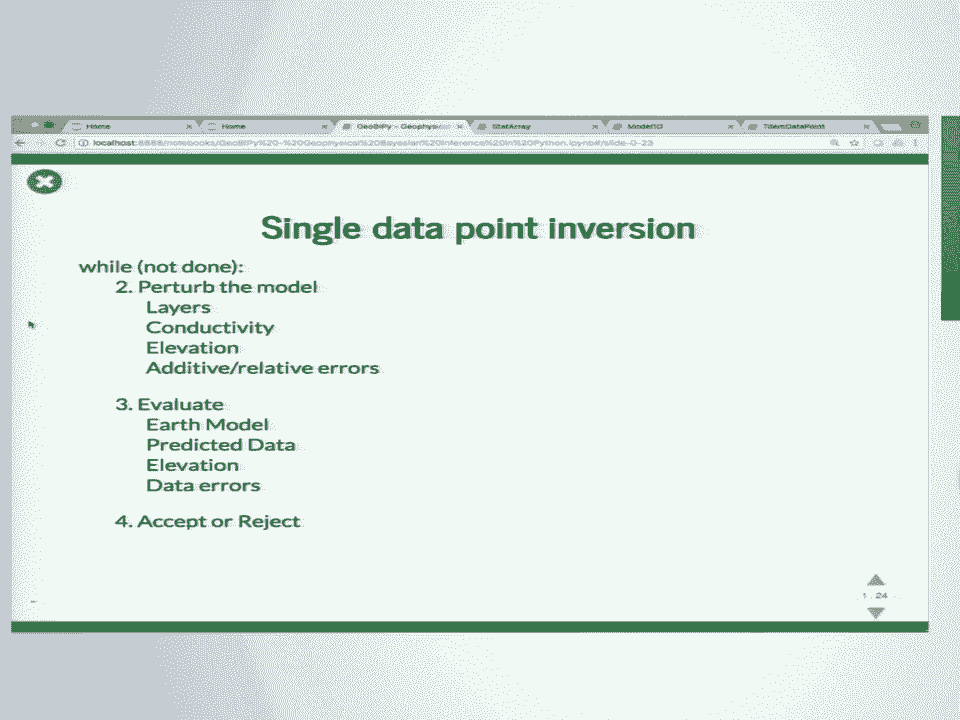
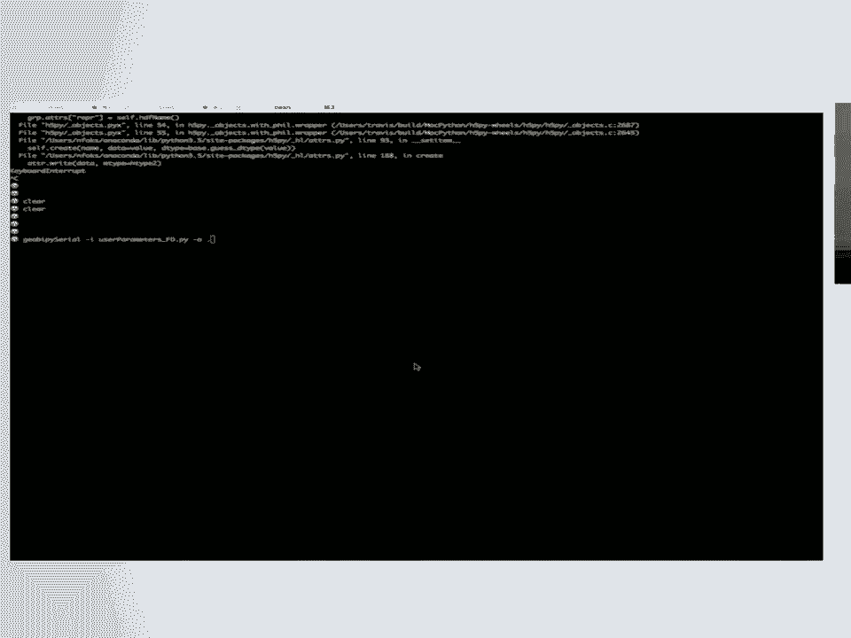
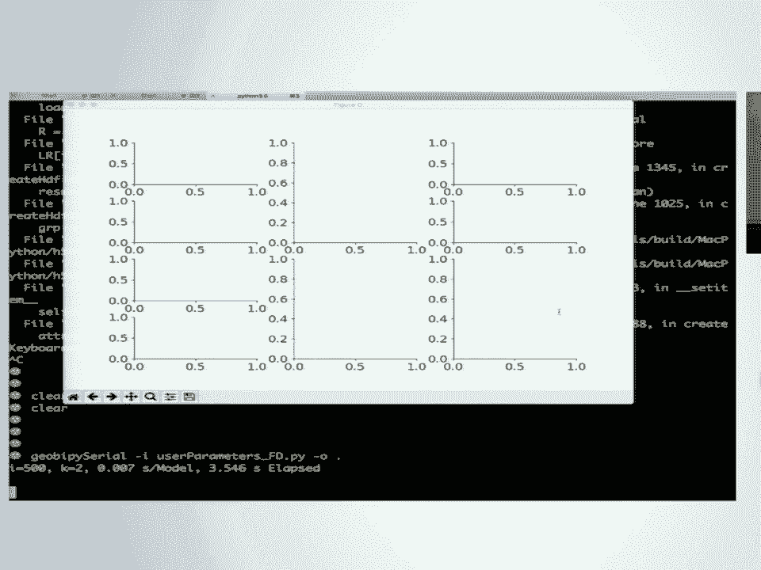
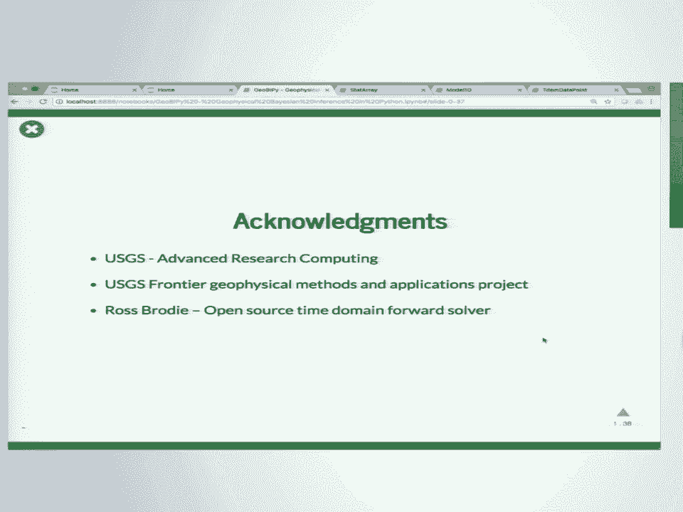

# P44：SciPy 2018视频专辑 (P44. GeoBIPy - Geophysical Bayesian Inference in Python _ SciPy - GalileoHua - BV1TE411n7Ny

 My name is Leon Fox。 I'm a contractor。 I work for Apogee Engineering， but I'm。

 contracted to the USGS， the Advanced Research Computing Group。 We have a small。

 team that do high-performance computing。 We have a small supercomputer in Denver， Colorado。

 so I get to play on that every day。 And this is some work that I've been， doing with my co-author。

 Brooke Minzley。 He's from the Geology， Geophysics， Geochemistry， Science Center。

 He's also in Denver。 And this is really his work that he sort of。

 brought me on to help him out with。 So some of the motivation。 Brooke came to， this group。

 He's done a lot of fantastic work。 He's written MATLAB code， a lot of， it。 It's sort of procedural。

 It's all over some functions。 And the idea was I， don't want it in MATLAB anymore。

 I want it in Python。 I also want it parallelized， and I want it scalable。 So that's where I came in。

 He wanted object-oriented code。 He doesn't want to pay license fees anymore。 Again。

 parallelized and scalable。 And then one of the biggest bottlenecks with this kind of application。

 which I'll， talk about in a minute， is Fylio。 It's one of the biggest causes of bottlenecks in。

 HPC algorithms。 So how do we handle that？ How do we do that quickly and， efficiently？

 And there's an image of the small supercomputer that we have on， campus。

 So just an overview because I'm not quite sure what everybody's， backgrounds are。

 A little bit about Electromag。 A little bit about geophysical， inversion。

 I'll talk about the building blocks of this package itself on a， bare bones level。

 Talk about the inversion algorithm really quick and then the。

 crooks of the matter is how this algorithm works in parallel。 So Electromag。

 this image on the right， you might not be able to see the helicopter at the， back。 It's so small。

 But there's a helicopter in there and it's towing behind， it two loops， two giant loops of wire。

 One is a transmitter， one is a receiver。 You turn on a current in the transmitter loop。

 It generates an， electromagnetic field。 It excites physical properties in the ground。 In this case。

 electrical connectivity， which in turn generate their own signal and that signal。

 induces a voltage in a receiver loop， which we can measure。 And so we take this。

 helicopter or this aircraft。 Sometimes you've got an aircraft that you've wrapped a。

 massive loop of wire around the wing。 The wingtips， the nose， the tail， it's， crazy。

 And we fly over tens to hundreds of curves， square kilometers across the， earth。

 A typical size of one of these data sets is maybe tens of thousands to。

 tens of millions of data points。 It gets pretty big really quickly。 And some of。

 the major applications of this kind of data in geophysics are ground water， modeling。 Perima for us。

 that's a real big one right now。 Alaska， Canada。 You can't。

 build bridges if there's no ground there anymore。 Contamination plumes， that's。

 good for detecting that kind of thing。 And especially the USGS， the critical， mineral resources。

 that's one area of interest。 So then what is geophysical， modeling？

 So let's say we have an idea about what our earth looks like。 We know， the physical structure。

 We use a physics， we might have integral equations， we。

 might have partial differential equations that we're solving， and we can take that。

 known model and we can generate some synthetic data。 But that's not typically。

 what we do when we're out in the field， right？ We don't know what's below the， ground。

 We take geophysical measurements in an aircraft in this case or a。

 helicopter and we've got uncertainty associated with those measurements。 And。

 what we want at the end of the day is to obtain an estimate of what the sub， surface looks like。

 Okay， and so to do that we involve the physics。 We need to use， that four-modeller。 We use math。

 we use optimization， depending on the type of， inversion we might use regularization。

 And in a Bayesian setting we might do this， over and over and over again with multiple trials。

 hundreds of thousands to， millions。 And what that provides us with is A， the best。

 most likely estimate of， what the sub surface might look like。

 but also the uncertainty that's associated， with all of those model parameters that we just try to recover。

 So this leads to， geobiopie， okay？ And that's my sort of half attempt to try to do the phonetics。

 So， it's Bayesian inversion for in this case geophysical data。 We're using a。

 stochastic transdimensional MCMC approach。 So the size of the dimension as the。

 problem progresses can change。 It's object-oriented。 It's massively parallel using。

 MPI and then the Python wrapper MPI for Pi。 And then we use HDF5 and H5 Pi with。

 their parallel capabilities to do file writing very quickly。 So I just want to。

 get a show of hands of who's done MPI。 Okay， good。 Who's done HDF5？ Who's done， HDF5 in parallel？

 Okay， cool， cool。 Thanks for being here。 So， so the， software is free。

 It's open source and it's available on GitHub。 There's a it's been， preliminarily released。

 which is really nice to obtain。 So it's at github。com/usgs/geobiopie。 Tell me what you think。

 send me issues。 It's gonna be great to get some， collaboration on this because I'm a lone wolf right now。

 It's fully documented。 So， automatic developer dot generation using Sphinx。

 I've used the NumPy style so it， should be familiar to you。 Those are all sold up on usgs github。

io/geobiopie。 And， then one of the crooks of documentation， right， is that users come in and they。

 don't necessarily want to read the developer docs。 So every single class in。

 geobiopie has a notebook associated with you with it。 It tells you how to， instantiate the class。

 how to interact one class with another， right， how to， make it perturbable。

 how to evaluate that given some statistical distribution。 So。

 that was really a focus of the docs for me。 So the building blocks。 So let's just。

 get down into the nitty-gritty。 The base building block or the base class is， called the stat array。

 It's kind of similar to an X array because it extends。

 NumPy directly so we can maintain that fast C back end。 And basically you just。

 attach a name and units to it so that the code knows what it is， what the units are。

 for plotting purposes and saving data， the metadata and the results files， etc。 And。

 it's pretty easy so we instantiate it， we just say X equals stat array and I've。

 just given it one number， it's a value of five and I've given it a name and some。

 units and when I do a histogram of that， that histogram knows what it is and it。

 can just quickly plot that。 But then the crux is we're doing a Bayesian framework， right。

 so we need to attach a prior distribution to our parameters or。

 variables that we're trying to solve for and we also need to attach a proposal， distribution。

 So if we have a prior we can evaluate the values of the stat array。

 against that prior and if we have a proposal we can propose new values of。

 the stat array given given the attached proposal distribution。 And that's pretty， easy， right。

 it's X dot set prior X dot set proposal， you give it some string， normal or uniform。

 In this case I attached a normal prior with a mean of four and。

 a variance of one and I attached a uniform proposal with a min of two and a max of， six， right。

 and you can see that in here and if I run this over and over again。

 you'll see that it will randomly generate values of the stat array and it will。

 evaluate that new value against the prior， right， and it's using the proposal to。

 generate that new value。 So we take this stat array and we use it to build other。

 classes within GeoBipy because now we have to start thinking about how we， represent the earth。

 the geophysical data， the data sets， whether it's a 3D point， cloud and things like that。

 So we take a 1D model， we use it to discretize a 1D， layered earth。

 it might contain sort of the number of layers， the thickness of each， layer。

 the interface of each layer depth， the depth of that interface and。

 then the actual value that you're interested in of each layer。 And again， it's， pretty easy。

 so we to instantiate， so we've got some parameter， that's a stat， array。

 I've said that the thicknesses are all just， every single layer is 10。

 meters thick and I create a model 1D， 10 layers， there's the parameters， there's。

 the thickness and then I just pea color it and there we are and I'd say。

 grid equals true and that creates our little image for a schematic。 But the， crooks。

 so the crooks of the MCMC algorithm is that everything that you have。

 in your framework needs to be perturbed。 You need to be able to advance along the。

 chain in order to determine whether your perturbed values are acceptable or not。

 And so in this case， one of the key steps in the terms of a 1D layered earth model。

 is we assign probabilities and those probabilities to pertain to whether we。

 create a layer or an interface， delete an interface， change the depth of an。

 interface or do nothing。 And then once we've changed the structure of the model。

 we can update the values， in this case we're using a stochastic Newton method， so。

 it's using Hessian and gradient information of the negative log。

 posterior to update those conductivity values cleverly。 And that's easy， we make。

 the model perturbable， here are the four percentages or fractions that pertain to。

 the probabilities of birth， death， change or no change。 And then there's some extra。

 parameters off the screen to make this usable。 And then we simply say mod。perturb。

 and that's generated a new model that has perturbed values。 And so if I do this。

 over and over again， you can see that， let's see what happened here。 This， interface was deleted。

 right？ Do it again， this interface was deleted， right？ So you， can see how it's random。

 So we've got the model， the next step is to take a， representation of the actual geophysical data。

 In this case we've got an electromagnetic， data point and there's two types of acquisition。

 one's frequency domain and， one's time domain。 And that's pretty simple as well。

 We instantiate a time domain， data class。 Typically the data arrives to us as an ASCII file or you know just a。

 column tabular type of data。 So we read that in and then there's also a system。

 file that describes the frequencies that were used to acquire that data， what the。

 coil separation was， all of these physical parameters that we need to use， in the form modeler。

 So we read in that data set and then I simply get the first， data point from that data set。

 And that is now a class in geobiopi that represents， time domain or frequency domain data。

 And they know， so there's a plot of that。 So in this case there's two systems。

 there's two moments of acquisition inside， this time domain system。 And so if we've got a 1D model。

 we can pass that 1D， model to some functions of the data point and it knows how to generate its。

 synthetic data and it also knows how to compute its sensitivity to that synthetic， data。

 So in this case I say p2。f the data point。forward and I pass through that same。

 1D model that you just saw。 And I say that J2 is the sensitivity and I pass through。

 that same model。 And this is what it looks like。 The yellow line are the synthetic。

 data generated from that model。 And this is essentially the sensitivity matrix。

 that you get when you differentiate the data with respect to conductivity。 Which we。

 need during the inversion。 So to do a single data point it's a really simple， algorithm。

 While we're not done， perturb the model， so change the number of， layers。

 change the conductivities of those layers， change maybe the elevation。

 that the helicopter was at when we acquired that data point， change our。

 estimates for the additive and relative errors within that data， evaluate all。

 those perturbed values and then accept or reject them。 And if we reject them， just。

 go back to what we originally had and perturb it again。 If we accept it， keep。

 it and perturb it。 So I'm going to do a demo。 Fingers crossed。 So it's pretty。

 simple。 I've created entry points into the GeoBipy package。 Hopefully you can， see that。

 So in this case I'm just going to run a serial version。 There's also， GeoBipy parallel。

 So GeoBipy serial， I give it a user input file which is， actually a Python script。

 So it's not like a text file that's typically seen， with a Fortran or a C code。

 And then I give it some output directory。 And so what。

 I'm going to do is I'm -- I've set it up to run 100，000 iterations。 I'm going to。

 output the result so I'm going to output this interactive image every 500。

 iterations。 Okay， so it actually burned in。 So if you're familiar with Bayesian。

 there's always a burn in period。 So this is where it burned in and we didn't。

 actually save any of those results。 And then as soon as it burns in， we start to。

 generate the posteriors for each of the variables that we're solving for。 In this， case。

 we've turned off elevation， which is why there's only one bar。 This is the。

 posterior for the number of layers in that 1D layered Earth model。 And。

 everything in yellow is the best or the most likely model so far。 And then this。

 might be the histogram for the relative error， the additive error。 And this is a， hit map。

 So this is depth on the y-axis and resistivity or the inverse of， conductivity on the x-axis。

 And so it's telling you how often an area of the， subsurface is being hit by what conductivity。

 And I'm sorry about the font size。 It's a little strange。

 So the reason why you want this interactive demo style is， because this is a parallel code， right？

 And you don't want to just submit a， data set that's going to take， you know。

 70 hours to run without first， investigating what your values for your priors are， right？

 So the reason why we， have this is so that you can take a few sample data points from the entire。

 data set， you know， really fine-tune your parameters on one data point first， apply， it to the rest。

 and make sure that you're actually getting something that looks， feasible。

 And so I mentioned that this is parallel。 So and I mentioned that data。

 sets come with tens of thousands to tens of millions of data points。 And so。

 because each data point when we invert that it's independent to the one that's， next to it。

 the results of one don't influence the results of another， we have。

 an embarrassingly parallel problem， which makes it very easy to parallelize， so it。

 actually made my job quite easy。 I'm on camera。 It's extremely low memory， so each。

 core only needs a maximum of 512 megabytes， but we're generating terabytes。

 of results in terms of the statistics at the end。 And there's minimal， communication。

 We do it in a master worker fashion， so we simply create a。

 random list of all of the data points in the data set。 The master sends out an。

 integer to each worker， each worker inverts its set of data， writes its results， to a HDF5 file。

 and then it asks the master for its next data point to invert。 So it's really quick。

 So right in the results， this is where a lot of bottlenecks。

 come in for embarrassingly parallel problems， especially of this kind where。

 what we could have done was taken each data point， inverted it on a separate core。

 and each separate core writes its own ASCII text file。 So if I've got 10 million， data points。

 that means I've just written 10 million files。 If you do this on a， HPC machine。

 you're gonna get an nasty email from sysadmin saying please don't， do this ever again。

 It's the biggest bottleneck for any parallel code。 It's also， terrible for post-processing。

 If you're trying to make maps and 3D models of all， of these results afterwards。

 you have to read in 10 million files just to do that。 It's gonna take forever。

 And then finally ASCII is pretty slow， so we want to use， binary files。

 So that's where HDF5 comes in。 It's a binary file， binary file format。

 It's got a balanced binary tree in the header， so it's really。

 quick accessing different chunks of data。 If you had a massive data file written， in ASCII。

 you would have to read the entire thing in or at least skip lines。

 just to access the piece of information that you want。 No longer have to do that， with HDF5。

 What's really nice is you can open a file with parallel write mode。 So， if I have 2。

000 cores all running their own process and everybody wants to write。

 to that one file at the same time， you can do that。 What we do then is we add a。

 parallel file system for the hardware so that we're not just asking 2，000 cores to。

 all write through a single gateway essentially。 So things like Lustre， GPFS。

 they have multiple heads that they can use to write things to the file in， parallel。

 One of the caveats with using HDF5 in parallel mode is you really need。

 to know the size of your file that you're gonna need。 So you need to know that up。

 from what you typically do is you open the file at the beginning in parallel， write mode。

 You create all the space within the file。 So for example， this。

 column right here might be each block represents a separate data points， elevation histogram。

 And each core as it finishes its inversion， accesses that。

 file and writes its pieces to the appropriate places。 So it writes its。

 elevation histogram to this block， etc。 for maybe there's a 2D hitmap。

 okay so everybody's doing this at the same time。 As long as nobody's trying to。

 write to the same data location， you're good。 So we have all these results， that's。

 cool and then we've got to plot them。 So we have some classes inside。

 GeoBipy so line results is one of them so we instantiate it with the name of the， file。

 We give it a system path to tell it where that acquisition file for the。

 system is and then we tell it which axis to plot it against if it's northern。

 Easting or just along the distance along the line。

 And so we can create so this is generated from a single HDF5 file and it's a full。

 line of data that was acquired。 I think this one's in Yellowstone and what you。

 can see is we've got depth here or elevation on the y-axis。 We've got， northing on the x-axis。

 Each one of these columns is a separate data point that。

 was inverted and on top we have the mean conductivity with depth for each。

 inversion and on the bottom we have the most likely conductivity with depth for。

 each inversion and you can see that in yellow we've got areas of high。

 resistivity and in blue we've got areas of low resistivity or higher conductivity。

 okay so this is electrical conductivity and what you see is that there's this。

 undulating depth bottom to this model that's because we've scaled the。

 opacity to the confidence that we have in our recovered parameters right because。

 you don't want to show you don't typically want to show data that you're， not very confident in。

 Just some other plotting functions in this case we've。

 got the number of layers in the best model for each data point and then using。

 the histogram of the interfaces with depth we can pull out likely interfaces， under the ground。

 So that's a line of data so what about if we've collected a。

 huge data set we can do that we can create maps we can export it to vdk and。

 spin it around in 3d same thing we've got some oops we've got some data set。

 result we've got a data set results object we give it a directory contained。

 in all of those hdf5 files we just generated for that one data set and we。

 can create maps of depth slices so I think this is at 20 meters and 30。

 meters you can see how those change and then we can export a vdk file and do， analysis there。

 So efficiency this was like one of the biggest things that we。

 had to deal with with this code it's all it's got to be NumPy right there can't。

 be anything Pythonic because the speed up is phenomenal we have a time domain em4。

 model that's written in c c plus plus by Ross Brody is a geoscience Australia。

 there's a frequency domain for a model that originally came to mean Python。

 Python so I rewrote it in NumPy got 10 times speed up right there and then I。

 rewrote it in Fortran because I'm actually a Fortran guy so I rewrote in。

 Fortran and so it went down from 7 milliseconds per model to 4 milliseconds。

 per model which might not seem like a lot but when you've got 670 data points。

 you're doing a hundred thousand iterations per data point it takes 62。

 hours down to 36 hours if you're using 2000 cores and we'd also don't have the。

 extra memory overhead that you get through broadcasting through NumPy。 So just。

 some timing stats if we're using two anything 2016 cores on yeti the smallest。

 example that we had was 45，000 data average time per data point is 24 minutes。

 total time 12 hours if we were to run that in serial it's 1500 times faster。

 than that and in the biggest case that we've run so far， 670。

000 data 11 minutes per model it took 62 hours which is 14 years if we ran it。

 in serial and that was 1，981 times faster on 2016 cores you never expect it to get。

 exactly the same number of speed up because of overhead so that's it so to。

 conclude we've got a highly efficient Bayesian inversion for geophysical data。

 we can fully utilize any of the partitions on our supercomputer and we。

 really interested to run it on something much bigger and it's really a framework。

 for other geophysical data we're already looking at other data sets ground based。

 time domain right now we're using a dipolar approximation for airborne so we。

 can't take that to the ground we have magnetotoleric data in the works from。

 nuclear magnetic residents seismic data induced polarizations so worlds are。

 oyster at this point and then we also want to introduce some advanced。

 functionality parallel tempering we can use inter sounding communication to try。

 and get some lateral constraints into the inversion and then we also want to。

 incorporate hard constraints from boreholes so just acknowledge the advanced。

 research computing group USGS front eogeophysical methods and applications。

 project and also Ross Brody for his time domain for a， modeler thank you are there any questions。

 how much of this would you say is applicable outside of geology yes that's。

 that's a good question right now if I mean if your problem fits then you can。

 probably use it but it's not as generic as I would have as I would hope it to be。

 we had a goal originally and that was to reproduce the results that Burke was。

 already getting and then to take that and make it and make it parallel and。

 scalable and then in doing so I kind of tailored it specifically to this problem。

 and then as we encounter new applications things that people want to try and do。

 with this then we can modify it and make it a little bit more general for those。

 applications questions thanks for the talk is great and maybe this is a general。

 more general than the specific domain but you didn't get a chance to talk about。

 testing in terms of integration or unit testing and I think particularly given。

 the hardware you're working on I'm interested in how you deal with that and。

 secondly I agree that people to devs tend to like to have notebooks as。

 documentation rather than writing docstrings how do you test the notebooks。

 and in or do you test the notebooks as part of the testing framework sure。

 yeah so a test driven development was not my background so you know my。

 background was for turn I it was PhD for turn so I didn't I didn't really you。

 know do the too much of that the testing at this point is making sure you know。

 pretty quickly with this whether the final results are or off things just。

 spiral out of control really quickly we're lucky in the fact that it is so。

 embarrassingly parallel that I don't really need to test it in parallel I。

 can test it in serial and expect the same kinds of results to happen on the。

 other cores one of the biggest things I think was the random number generator。

 because if you start to differ those that do random numbers if you're gonna do。

 them in parallel it's a whole different kettle of fish you have to be careful。

 with what your initial seed is ideally you want to use the same seed and you。

 want to jump the state of the generator but that's not always possible except。

 especially with missing twist algorithms so those are some of the things that we。

 have addressed during the development of this and the new terminology is。

 pleasantly parallel okay any other questions， yeah quick question since since this is an embarrassingly parallel problem did。

 you did you give any thought to trying to ditch MPIL together and just have a。

 parallel file system so that you could make use of other clusters that are you。

 know made more for sure no since the problems run what 11 to 24 minutes it's。

 had per per machine so that should be you know well suited for something a cluster。

 of that size for like a what kind yeah just like a cluster that doesn't。

 necessarily right right so then， sure the reason why we went with MPI was purely for the file I or and being able。

 to write read and write in parallel so you can you can take this algorithm and。

 you can actually run it on a system that's not MPI enabled it will still run in。

 more of a high throughput computing style of paradigm and you'll still be able。

 to generate a file per day a point if you wanted to so does that answer your。

 question okay just a bureaucratic question so you single-handedly got。

 Sphinx up and running imagine it did you get some form of CI up and running no。

 not yet but you got it on github working with usgs how did you find the。

 process within usgs and were they particularly supportive of having the。

 data being open sourced yes is the short answer it was I it was a little work just。

 to figure out what the process was officially because it's still a new area。

 especially on software data release is very well established is very well。

 established but the date the software side is lacking but not everybody was。

 everybody was great everybody was really gung-ho for it to happen and that's why。

 it's preliminary released right now so hasn't gone through a full release but。

 were allowed to do a preliminary release with a disclaimer stating that it is。

 preliminary so be careful did they is a BSD or what licensed did they push on you。

 so the guidelines right now are actually CC zero groans but then there's a the。

 time to make for modelers GPL version two so we have to do a release it right now。

 under under those and on that note can we thank the speaker。

 [ Silence ]。