# P48：SciPy 2018视频专辑 (P48. Image Analysis in Python with SciPy and scikit-image _ SciP - GalileoHua - BV1TE411n7Ny

 Good afternoon， ladies and gentlemen， and welcome to the， Psycad image tutorial。

 It's exciting to see so many of you in the room today。 And yeah。

 I'd like to introduce you to my co-presenters today。 So my name is Stefan。

 I'm the founder of Psycad Image and a researcher at the UC Berkeley， Data Science Institute。

 We have Juan Nunez-Eglicias， who's a core contributor to SciPy。

 and currently a researcher at Monash。 Yes。 Yes。 Yes。 Yes。 And Josh Warner。

 also core contributor to Psycad image， previously at the Mayo Clinic and currently at the University。

 of Arizona。 All right， so I'd like to make sure that everyone in the room。

 has the latest version of the material。 We made some last minute tweaks。

 So if you cloned the repository yesterday， just do a git pull。

 If you haven't downloaded the material， just go to GitHub。

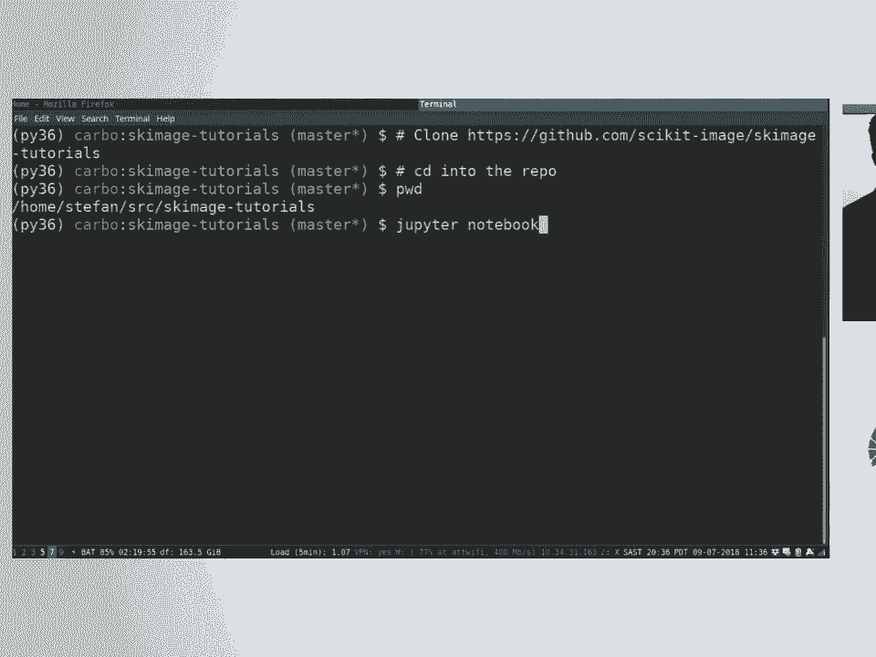

 The URL is here on the screen。 So github。com/psychit-image， 4stroke。sk-image tutorials。

 You can click on the download button。 It will give you a zip file。 Or if you have git installed。

 just do a git clone and a git pull。 So just for rough check， who already。

 has the material on their machine？ Awesome。 OK， excellent。

 So usually we go into a little bit of detail， about what SciCad image is and what it's used for。

 But I presume most of you know that since you're， in this tutorial。

 So all I'll say is that images are all around us。 It's a very common modality of imaging。

 There are very rich ways of acquiring images nowadays。

 The instrumentation is improving drastically every day。 The types of images we get out。

 The quality of those images。 The multitude of data that we can gather increases。

 And while there are certainly a growth in neural networks， and these kinds of algorithms that。

 can automatically learn a lot about your data， it still helps to be able to apply the human。

 heuristics on your data and extract meaningful insights， from your images。

 So SciCad image is a Python library， written for getting access to these image processing。

 primitives。 It's aimed at both industry and education and research。

 We focus on code that is well documented， well tested， accurate。

 and easily accessible both to users and developers。 It's a fully open source project。

 So if at any point you feel that that is not the case， we encourage you to contribute。 For example。

 you can attend the sprints this Saturday。 Or just mention it to one of the core contributors。

 and we'd be happy to help you work through any of your issues， or problems。

 I'd also like to encourage you to visit our website， scikit-image。org。

 We've got a full set of documentation there， as well as a gallery of examples that。

 illustrates the most common usage， patterns of the package。 Right， so what we presume today is。

 that you've already had some experience， in the scientific Python ecosystem。 Specifically。

 we presume that you've at least， seen some NumPy before that you might have touched on SciPy。

 and that you have made a plot with Matplotlib before。 If that's not the case。

 you'll have example code， in the notebook， but we're at least hoping。

 that we can sort of start from that level of experience。 All right。

 so I want to make sure everyone launches， their notebooks correctly because otherwise it。

 might be difficult finding the images or the paths， to the images。

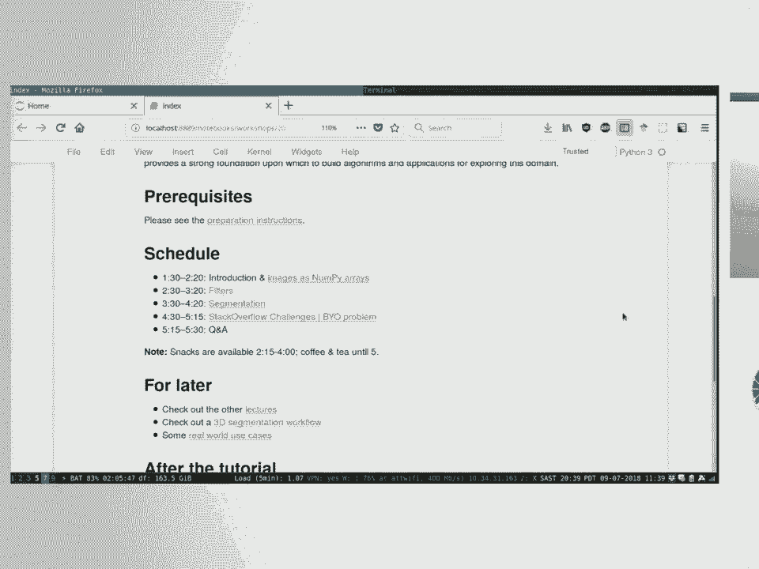

 So once you've cloned the repository， or unzipped the file you downloaded from GitHub。

 change into that directory and launch， Jipitor straight from that directory。

 So don't go into any subdirectories。 Just launch it from the root of that directory。

 The directory should be called scikit-image-tutorials。

 When you fire it up， your Jipitor notebook， should land you here。

 So you should see a subfolder with lectures and workshops。

 So just navigate into the workshops folder， navigate to 2018 SciPy， and click on index。ipynb。

 And that should bring you to this page。 So that's our launching point for today。

 You scroll down that document。 You'll see the schedule。 So schedule in certain part of the world。

 So I'm going to do a brief introduction now， into how images are represented as NumPy arrays that。

 forms the foundation of the lectures that all follow。 One will then continue showing you。

 how to apply filters to images。 Josh will continue with image segmentation。

 for extracting objects out of an image。 And then we will proceed to apply our knowledge。

 to some Stack Overflow challenges。 So these are problems that were posed on Stack Overflow。

 Real world questions that people had that they wanted to solve。

 So you can either work on those or bring your own problem。

 And we can try and help you work on your own data set or photos。 Right。

 so each hour will be 15 minutes lecture， 10 minutes， break。

 just to give you a chance to stretch your legs。 Snacks are available。 It's not 2。15。 I think it's 2。

25， 2。25， 2 until 4。 The snacks are available。 Yeah。 All right， so at the end of that first page。

 you can check if you've got all the pre-requisite software， installed。

 So if you run the setup script， it should check for you。

 that you've got the latest release of scikit image， that you've got NumPy， SciPy。

 and Matplotlib installed。 Those are the ones we'll be using today。 Thank you。 All right， everyone。

 good so far。 If you have any questions， just raise your hand， and Joshua， one， could help you out。

 All right， let's get started。 So images in scikit image are represented as NumPy arrays。

 We don't have a specialized image structure。 We use the ND array。

 which is the common exchange format， between the different scientific Python packages。

 Because we're using this generic container， it means that scikit image is interoperable。

 with most of the other packages in the Python scientific ecosystem， including scikit learn， SciPy。

 ND image， et cetera。 So I'm going to show you here how， to construct your first image。

 So we're going to import NumPy as NP， that standard convention。 And to display it。

 we're going to import the Pyplot package， from Matplotlib。 And here， then。

 is the crux of what I'm doing。 I'm asking NumPy to generate a random array of dimension， 500 by 500。

 So 500 by 500 matrix of numbers all between 0 and 1。 And I'm going to ask Matplotlib to display it。

 And that's what I get。 So this kind of follows our intuition， that we have an array of numbers。

 0 maps to black 1 maps to white。 So this was an image that I just constructed on the fly。

 but the same holds for real world images。 So if you import from scikit image the data module。

 the data module contains a few example images， that we shipped with a package， we。

 can load up the coins image。 And I'm going to both display the coins image。

 and a few attributes about that image。 Specifically， the image is type。 In other words。

 what kind of Python object， are we talking about？ It's data type and it's shape。

 So the type is a NumPy array。 Like I said， we always use NumPy arrays， to represent these images。

 The data type is u and a。 In other words， it's positive integers， running between 0 and 255。

 And the dimensions of the image， in this case， is 303 rows by 384 columns。

 So that's a gray level image。 So if a gray level image is a single matrix。

 what do you think the shape of a color image would be？ Well， we're going to need different layers。

 to represent the different colors。 So we're going to need a red and a green and a blue layer。

 There are other ways to represent images， like you can think in terms of u， saturation and value。

 And there are various other such color spaces。 But by default， we represent them as red， green。

 and blue。 So let's grab Chelsea the cat。 We'll again display the shape of the array。

 the minimum maximum values。 So there you see the image displayed。 And you see shape has now changed。

 It's no longer a two dimensional array。 But it's 300 rows， 451 columns， and three layers-- red。

 green， and blue。 So because these are just NumPy arrays， you can manipulate them in the way。

 that you manipulate any other NumPy array。 You can slice them。 You can assign to them。

 You can do reduction operators on them。 You can do whatever you would do on your NumPy arrays。

 So in this case， I'd like to set part of that image， to bright red。 So what value is bright red？

 Well， it should be a high value in the red band， and low values in the green and the blue bands。

 So my image values ran between 0 and 255 in this case。

 So I'm going to set a small block of that image， to 255， 0， and 0， red， green， and blue。

 So you see when I do that， I took this slice between rows 10， and 110 columns 10 and 110。

 That gives me that area。 And across all the color bands， that's what that colon means。

 And I assigned it 255， 0， 0。 So I get that red block in the corner。

 If you want to represent transparency in an image， you can add a fourth layer called an alpha layer。

 but we will not be dealing with that today。 There are a few other shapes that you。

 might run into in practice。 So we've now seen two dimensional gray scale images。

 Those have rows and columns。 We've seen two dimensional multi-channel images， red， green， and blue。

 So those have rows， columns， and a certain number of channels。

 We could run into three dimensional gray scale images。 So those would have rows， columns。

 and a certain number of planes。 You can think of a microscope scanning， through a certain volume。

 You'll have several planes， each with its own image。 Or you could have 3D multi-channel data。

 So in this case， for each slice that you scan with a microscope， it will be a color slice。

 In that case， you'll have planes， each consisting。

 of rows and columns with a certain number of channels。

 So for those of you who haven't used MatplotLook for a while。

 this cell is sort of meant to be a mini primer。 It basically contains everything that we're。

 going to use today for displaying images。 So again， I'm using that data submodule of cycle image。

 I'm loading two images， Chelsea and an image of a rocket， signing them to image 0 and 1。

 Then we've imported Matplotlib's pieplot submodule as PLT。 We're going to use the subplot command。

 to generate two axes for us to draw on。 We can generate an arbitrary grid of axes to draw on。

 But in this case， I just want a side-by-side comparison， of two images。

 So we're going to do subplots。 Its first argument will be the number of rows。 In this case。

 one row of axes， and I want two columns。 So that should give me these two axes side-by-side。

 And I'm going to ask for a figure size of 20 by 10。

 Nice big figure that I can display in the notebook。

 Subplots will return to you a figure as well as the two axes， that you asked for。

 And then you can use Matplotlib to plot on top of them。 So x0。

imshoe image0 will display the first image。 x0 set title will set its title， et cetera。

 So we're going to display the image， set its title， turn off the axes。 For the second image。

 we're going to display the image。 We're going to set its title to rocket。

 We're going to add an x label to that image。 And then we're going to add some vertical lines and plot。

 sort of an arbitrary line somewhere else in the image， and finally add a legend。

 So this cell you can refer to later in the tutorial。 If you need to plot things yourself。

 it sort of meant as a small summary of all the functionality， you'll need today。

 So there is the plot。 You can see two axes side-by-side。

 You can see the two vertical lines going next to that rocket， and the rocket stand。

 You can see the legend in the top corner as well as the text， captions for titles。

 as well as for x-axis。 One of the x-axis。 Right， so let's get back to images。

 We've already now seen that you get at least two kinds， of ranges for images。

 So the first image that I constructed， the values ran from 0 to 1。

 And in the second image that I loaded up from disk， the values ran between 0 and 255。

 So what's going on there？ Which is the real representation， that we use in the scikit image？ Well。

 in scikit image， we support various data types。 So you could use either。

 And what I'm going to show you here， is that you can essentially have the same image。

 in a floating point representation， or in an integer representation。

 So I'm going to do a lens space here。 In other words， I'm going to take numbers between 0 and 1， 2。

500 of them。 And I'm going to reshape all those numbers running from 0 to 1， into a 50 by 50 image。

 So what do you think I should see？ Just visually， what do you expect to come out there？ Exactly。

 So a gradient that starts from dark and goes towards light。

 I'm going to do the same thing with the integers。 Here I have to be a little bit more careful。

 I'm going to run between 0 and 255。 I'm going to again take 2，500 values。

 But those values will be fractions or floating point， numbers。

 So I'm going to ask NumPy to turn them back into integers for me。 Right。

 So I'm going to display both of them side by side。

 And there you can see the floating point versus the integer。

 representation essentially yields the same image。 Of course。

 the one is slightly more coarsely quantized。 But they're both valid representations for your image。

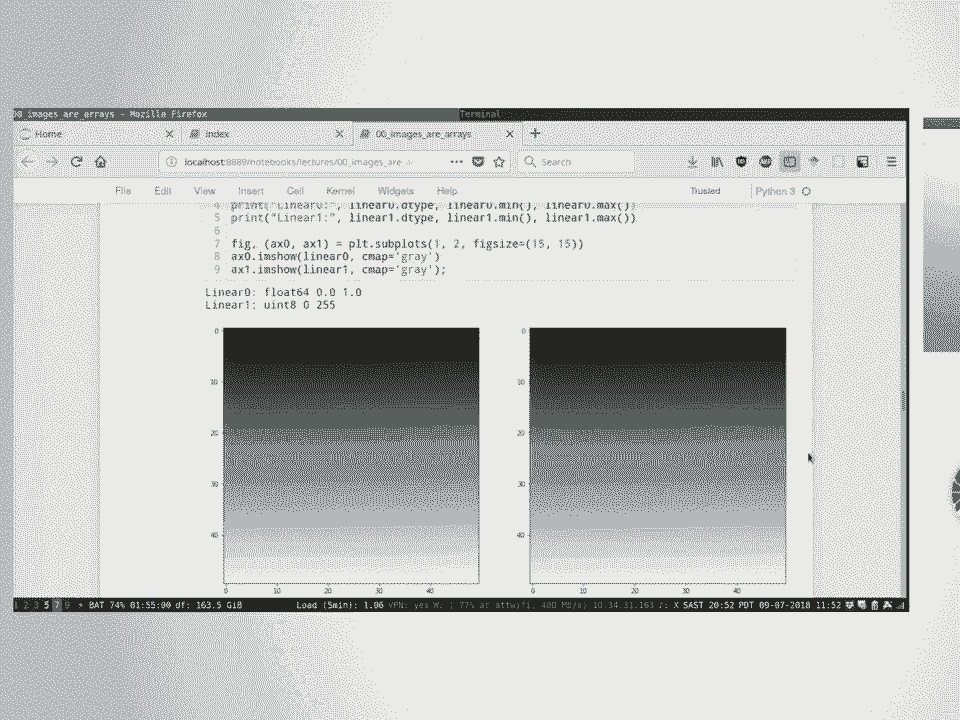

 Internally， scikin image usually works with floating point， images。

 So it's often beneficial to start off， from floating point images if that's an option。

 So for converting between the different formats， we have the image as whatever functions。

 So you'll see images float or images u-byte。 I specifically want to point to images float。

 because that's a function you will see crop up， all over the place。

 So a typical workflow would be read the image from disk。 Call images float on it to make sure。

 that it's got values running between 0 and 1， and then continue with your pipeline。

 The image is float actually on the list， or does it expect to be 0？

 So the question is whether images float normalizes。 So images float。

 if it gets an image with values between 0， and 255， it looks at the data type。

 to decide what the range is。 And then it will convert the range down。

 So if you put in the Chelsea image from before--， so what was the minimum and maximum value of Chelsea？

 So that was 0 and 231， right？ So if we now ask it to do images float on that cat image。

 to give us a new floating point image out， the question is what will the range of that image be？

 So here we go。 So it pulled it back down。 And in fact， you can see--。

 you can see how that down conversion worked， because its maximum value was 231。

 It was in a number range that runs between 0 and 255。 So that's where the point nine comes from。 OK。

 Right， so as I said， we've got these example images， but I presume you just don't want to--。

 you don't always want to do your research on the example， images we shipped from scikit image。

 It would be useful to actually pull in some additional images， from disk。 So for that。

 you need image。io。 We support various input plugins。 Basically， whatever is installed in the system。

 will try and use。 We recommend by default now that you， use the image。io package。

 but you could also， use matplotlib， pillow， et cetera。

 You don't have to worry about that complexity for now。 We've got an I/O submodule。

 And if you do I/O。imread， it will find whatever， is installed on your machine and use that to load the image。

 So from scimage， import import。io， do。io。imread of the balloon image。

 And then we're going to print these attributes of the image。 Type of object， data type， shape。

 et cetera again。 So there we have the balloon image， numpy array， uint8 runs between 0 and 255。

 And as expected， it's an RGB image with three layers。

 Sometimes it's convenient to be able to access multiple images， from disk。 So for this。

 we provide image collection。 So nothing stops you from just writing a for loop。

 and calling in read on each image and packing into a list。 But sometimes you have， say。

 2 and 1/2 thousand images， in a directory。 You want to access all of them。

 You might not want to load all of them into memory， at the same time。 So in that case。

 you use image collection。 So image collection takes a wildcard as a parameter。 So start。jpg。

 And it would load up all the jpgs。 It only loads the images once you need them。

 So it takes care of your memory that you don't accidentally。

 run out of memory because they're all loaded up initially。 Right， so in this case。

 I'm just making an image collection， of all the images included in the tutorials directory。

 If you look at the files attribute of that image collection， you'll see a list of all of them。

 And then I'm just going to display them in matplotlib， little for loop。

 So the important thing I want you to see here， is that whenever I need an image。

 I can access the image。 I guess that's not actually written down here in code。

 But you could call IC0。 That will give you the first image in the collection， as an umpire array。

 And at the point where it's accessed， it will be loaded from disk。

 You can also use the list as standard innumerable object， like a list or a tuple。

 So who here knows how to use enumerate or what it does？ OK。

 so this is like one of the most useful functions for me， in Python。

 So I like just showing what it does。 So imagine you have this list of animals that。

 contains cat dog and leopard。 If you enumerate， it basically goes over that list。

 And it grabs the items one by one and tells you， whether you're dealing with a 0， the first。

 the second， the third object， et cetera。 So it gives you out two things-- an index and one。

 of the items from your list。 So for index and animal in enumerate animals。

 I can go over that list and print out the index and the animal。 And there's what I get。

 The animal position 0 is cat。 One is dog。 Two is leopard。

 So it just counts along the elements for you。 Super useful。 All right。

 so I think that gives us enough of a background， that we can start working with images ourselves。

 And what I'd like to do in the next 20 minutes， is give you a chance to become familiar with what。

 I've just spoken about。 So we've got three exercises outlined here。 The first-- in the first。

 I ask you， to load an image from disk， like the cat image。

 and then modify that image to display the letter H in bright green。

 So that is a pure NumPy array manipulation exercise。 In this second exercise， I ask you。

 to take an image and split out the red， the green。

 and the blue layers and look at each individually， to see what they contain。

 and then stack them all back together， and display them as a color image。 In the final exercise。

 we ask you to convert images， from color to gray。 Now， it seems like that should be easy， right？

 You can just average the red， the green， and the blue channels。

 But it turns out that that's not the best way， to convert between RGB and gray。

 The different channels have to be weighed with different weights。

 So we give you those weights that give you the optimal conversion。

 and then ask you to use matrix multiplication， to weigh the channels together and convert from color to gray。

 All right， so let's try that now for the next 20 minutes。

 I'll give you about 15 minutes and then show you some solutions。

 and then we'll take a short T break before one， continues with filters。 So by the way。

 one trick in the Jibberter Notebook--， if you type something like PLT。HIST。

 and you want to know what its arguments are， just hold the Shift key and press Tab。

 If you do that once you get the signature， if you press it twice。

 you get a little bit of the doc string。 If you keep pressing Shift Tab， it。

 gives you more and more documentation， until finally you get all the documentation for the function。

 So you can do the same for any of the scikit image functions。 So color， RGB to gray。

 open the bracket， type Shift Tab， and then you have the whole doc string popping， up with Shift Tab。

 All right， so we look at some solutions to these。 So the first one， drawing the H on the image。

 There are numerous ways of doing it。 You could just slice directly into the array。

 calculate the offsets。 What I'm going to do is I'm going to just。

 grab a window out of my array or out of my image。 And then I'm going to draw inside of that window。

 just to make the coordinate calculation easier。 So let's say the H window will be my image。

 And I'm going to slice it between cohorts 0 to cohorts 0， plus how many rows should we have， 24。

 And I'm going to slice the number of columns， cohorts 1 to cohorts 1 plus 20。

 I'm going to take all the colors。 OK， so that should give me that little block out of the array。

 into which I want to draw the H。 So remember in NumPy。

 if you slice out a part of your original array， you just get a view onto that array。

 So if you manipulate the values， they change the original array as well。 Yes。 What's that？ Oh， out。

 You're right。 Yeah。 Well， I guess it doesn't matter at this point。 So--， Ah， it does。 Yes。

 All right， so H when--， I'm just going to set the first 10 by 10 block to color。

 to show you what happens。 So you see there， I drew a little block on the image。

 And then you can say， well， I want the first--， how wide do these things be？ Three columns。

 First three columns to be the color。 So there you draw the line of the H and so forth。

 For visualizing the RGB channels we read in the image。 Then we want to assign the red， green。

 and blue channels， to different variables。 So that would become image rows columns 0。

 image rows columns 1， and image rows columns 2。 Note that there's a slightly nicer syntax for this。

 in NumPy。 In NumPy you can say image。0， which， means basically like all dimensions。

 except for the one I'm specifying now。 So that gives you the same thing。 All right。

 and then we have some plotting code， that I provided。 And if you look at that， you'll see。

 that the blue channel is quite a bit darker。 Why？ Well， we have bushes here。 They're green。

 They don't contain all that much blue。 The ocean， on the other hand， has got quite a bit of blue。

 So that's bright and it's darker on the red side。 The ocean also turns out to be quite green。

 So the green channel is also bright。 And then here I stack the three images back together。

 and display them and that gives you your color image。

 Then I gave you this thing just to develop an intuition。 Say these were red， green， and blue values。

 What do you expect when you see those combined？ Well， let's stack them together。

 What are they called？ Red， green， blue， along which axis， do we want to stack them？ Long axis two。

 So we want to pack them all on top of one another。 And that's what we get up。 Finally。

 there was the exercise to convert to grayscale。 So how do you convert your image to grayscale？ Well。

 use the add operator and you multiply it， the red channel by 0。2126， the green by 0。7152。

 and the blue by 0。0722。 And you see that your RGB to gray then。

 conforms to the one inside of a psychic image。 If you， however， change those values to be third。

 then you can see that the red color is not， right。 So if you average the three layers together。

 you'll notice that they do not look the same。 Here's the one from psychic image。

 much darker around here。 And yours looks quite light in that case。

 But if you use the correct weights， they're identical。 All right， so that concludes images。

 The image representation section will take a short break now， five to 10 minutes。

 and then one will get started on。 10 minutes， 10 minute break， and then we'll get started on。

 filters。 All right， guys。 So that's 10 minutes。 Hopefully people will stream back in。

 So I'm going to talk about image filtering and what that， means。

 This is something that before I was an image analysis， I didn't understand these words。

 So hopefully everyone will learn something here。 So yeah， everyone， please open the notebook。

 Either click on filters or under lectures， it's one image， filters。

 So the first thing we do is we set up my polytoting。 Done with that。

 And then we're going to talk about what filtering means。

 and we're going to talk about it first about one， dimensional signals。

 because the two dimensional cases， are completely analogous。

 But it's a lot easier to see these things happening in 1D。 So get up some imports。

 And then we're going to make a very simple signal， which is， just a sub-signal。 So yeah。

 100 measurements。 And then halfway between， you jump from 0 to 1。

 So now analyzing a signal like this is very easy， but。

 usually signals are not perfectly clean like this。 They're noisy like that。

 So let's add some noise to that signal and see what that， looks like。 All right。

 so you can still see this step， but you can only， see it because you're mentally averaging across many values。

 So let's try to see if we can get a smoother signal。

 Let's try some simple denoising on that noisy signal。

 So the simplest thing you can do is do a running average。

 And the simplest running average is the one where you take， the average of two adjacent pixels。

 So you can do that with non-pivectorized operations like， this。

 We're going to average all of the values up to the up to but。

 not including the last value together with all of the， values from the second up to the last value。

 And plot that。 So you can see comparing that and that， but you get a， slightly smoother signal。

 All right。 So if we want to average a few more pixels， let's go with， three。

 then the expression gets a little bit more， complicated。

 So you can see that now I take three values and I have to do， a bit more funky indexing with it。

 So you get a slightly smoother signal again。 I'm plotting the orange as the mean of three。

 But again， it's a more complicated expression。 So is there a general way to make this type of nearest。

 neighbor averaging that will not require me to do all of， this arithmetic myself？

 And that way is filtering。 So I'm not going to go through what we did here， but， essentially--。

 so this is the non-pivectorized version， but another way of。

 doing that is let's take an output signal that starts at， not at zero， like in most Python things。

 it starts at one and， it ends at minus two。 And then for every position in that signal。

 we're going to， grab the values around it。 So one value before it。

 the value on top and the value to， the right， and we're going to take the average of those three。

 So with filtering， what you do is you define a kernel and that。

 size three array with values one third， one third， one third， and then the convolve function。

 which we'll see in a second， will run through the whole array and take those averages for you。

 So here's how we define it。 MP。full for those that haven't seen it， it makes an array of。

 this size full of this value。 It's slightly cleaner than doing MP。ones and multiplying。

 which is what I've been doing my entire life， basically。 So we define this kernel。

 This is an array of size three， actually， I'm going to just， show what it looks like。 Edit。

 split cell， so then， then all。 Okay， so this is what we call the kernel。

 And now for every pixel in our input array， we're going to put。

 the kernel there and we're going to multiply each value with the。

 corresponding value in the original signal， and then we take the， sum， and that's the output signal。

 So that's what we do here。 We use the function， MP。convolve， and I'll talk about the。

 mode in a second。 For now we use mode equals valid。 And you can see that they are。

 this is exactly equivalent to what， we needed before with taking the mean signal vectors and averaging。

 them together with the slicing。 Any questions， Seth？ Yep。 [inaudible]， Seth。

 would you like to -- I presume it's --， You have maybe a older question of the notebook。

 I'm not sure。 Did you update at the start of the class？ Okay。

 I can just navigate -- so just navigating from where we started。

 we were -- you launched your notebook in the root of the， repository。

 and then if you go to Workshops 2018 site where you， click on the index， it opens this page。

 and this page links to the --， Okay。 Oops。 I'll go to the lecture。 Yeah。 I'll go check。 Okay。 Good。

 So now that we have this formalism， we can take a much bigger， running mean， have 11 values。

 using MP。full， same as before， convolve it， and you'll see that we get a much smoother signal still。

 Okay， so now we're doing a running window of size 11。

 There's this light sort of kink in what we're doing， which is that。

 if you have a signal of length 100 and you want to take a running， mean of 11。

 you can only fit about 80 such means because you run， into the edge。

 So you can see that my running mean of 3 goes almost up to 100。

 but my running mean of 11 doesn't quite make it there。 Okay。

 So there's lots of ways that you can deal with this。

 One way -- so this is what mode equals valid means。

 It means only go up to the edge of the data that you have。 There is mode equals same。

 which means return the same size of， output as you had the input。

 And we will see when we do that what effect that has。 So what it's doing there。

 does anyone have any ideas based on， this thing at the end？ Yeah？ It's star for data。

 so it's just taking in zero。 It's putting in zero， so that's right。

 So at the very end it gets to the end and there's no more values。

 Here you don't notice it because all your values are close to zero。

 So here values are close to one and when you start to take the。

 running average of the values beyond the edge， you start getting。

 closer to zero as you take that mean。 So that's not ideal and we'll -- actually there's an exercise。

 right now。 So this is the NumPy。convolve。 Convolution is such a common and useful operation that there's。

 many different implementations and they do slightly different， things。 One of them is in scipy。

handeimage。convolve。 So I want you guys to import this， look at the documentation and。

 then figure out how to do this without having this nasty edge， effect using NumPy。com。

 So it'll take five minutes， so until 250 we'll do that exercise。 It's very clear to help you。

 so raise your hand if you are， lost or you need one particular bump in the right direction。

 All right， so that's five minutes。 So I think I saw quite a few of you who got pretty far with this。

 So I'm going to import that function。 And to reiterate what Stefan showed before。

 this is an extremely， useful thing to know is how to look up the documentation in the。

 environment that you're working in so you don't have to keep like。

 opening browser tabs and then suddenly the browser suggests。

 that you open Facebook and up the afternoon。 So you can do。

 in Jupyter Notebooks you can use a question mark。 This also works inside of an iPad functional。

 And then you get the documentation like this or sometimes。

 handier if you know almost exactly what you want。 You open the parentheses and do shift tab。

 You get very quickly the function signature。 You do shift tab tab。

 You get the full documentation like this in line。 And if you do shift tab tab。 Oh， what happened？

 I think I was not in the dev mode。 If you are in edit mode and you do shift tab tab tab。

 it pops out。 And it's the same thing as a question mark basically。 Okay。

 so now we see that the mode in the image。convolve is。

 something different altogether from what we had with NumPy。convolve。

 And you have this reflect mode which， so you can see it has a， whole bunch of different modes。

 The options are reflect constant nearest mirror and wrap。

 So as I explained before in NumPy when you say a mode equals， same。

 what it's doing is the same thing as handy image mode equals， constant with the constant being zero。

 Nearest just extends the final value past the end of the array。

 And reflect just mirrors the array around that edge。

 So it takes a final value than the second final value and so on。

 So over here if we want to get some kind of realistic signal。

 if you just wanted to not go to zero you can use edge。

 If you want to get some kind of realistic signal with similar， variance for example。

 then you would use mode equals reflect， which is the default。 So let's get that a go。

 What's the name of the noisy signal？ So smooth and di is equal to convolve have noisy signal mean。

 kernel 11 mode equals reflect。 And because it's the default I could just as easy have not included。

 the mode， then I can do PLT。plot。 So now you see that you don't get that drop off at the very end。

 Was that clear to everyone？ All right， so that's a smoothing that's called the mean， filter。

 Basically the simplest filter you can do。 Let's look at some slightly more complicated ones。

 And one of them is a difference filter。 So let's go back to our original step signal。

 Looks like that。 So can anyone tell me what you would predict if I can。

 involve with this kernel minus one zero one。 So don't run the cell after it and see if you can think through this。

 Anyone want to make the scope step that comes to the code？ Is it a so so what happens？

 What happens in this part of the signal？ So here it's going to be zero because you can find one on one on either side。

 And yeah， so it's going to be flat。 Any time that the values to the left and right are the same。

 and then you're going to get a spike right here。 So you're only going to get a value other than zero when the values are changing。

 and you're right。 Okay， so that's what it looks like。 Okay。

 and now I don't know if any of you predicted this。

 You'd have to basically know about convolution already if you did。

 But you can see that it's here I would have thought it's one minus one。 So it should be， sorry。

 one minus zero。 So it should be one。 But actually for technical reasons to do with filtering theory that I'm not familiar with。

 convolution actually inverts the kernel before doing the multiplication and addition。

 So if you want to do it。 Yeah， not by value， sorry。

 It changes the order of the array to the reverse。 So if I do this， I will get what I predict。

 which is a bump going up。 Okay， so this is the simplest difference filter and you can see how it would be useful in this specific scenario。

 So you can basically immediately pull out wherever there's a change in your signal。 Okay。

 so again this is the inversion that I showed you just before。

 So one cool thing about filtering is that the convolution operation is commutative and， associative。

 which means that you can do it in any order。 So if I want to do a smoothing and then a difference。

 I can actually convolve the two filters together to get a second filter and then apply that filter to the signal。

 So let me demonstrate that。 So here's， if we add noise to the signal。

 you can see that suddenly in terms of a different signal。

 it's very hard now to spot the change in the values。

 And that's because the difference filter is actually very sensitive to noise。

 So what we want to do is we want to do smoothing and then we want to do a difference filter。

 So as I said before， you can actually just convolve the two filters together。

 So here's the one zero minus one and the one third， one third， one third。

 And mode equals full will actually go beyond the edge of the array so that you have even just a value of one overlap between the two。

 And again， it's going to have zeros on the ends。 So you can see that now you get this mean difference filter which does a wider window and it takes the average of the two values on the left。

 the average of the two values on the right and then takes the difference between those。

 So now if we convolve the signal with those two， sorry with this new filter。

 you can see that the peak becomes a bit clearer now。 Okay。 So let's do an exercise。

 another five minutes。 So this is the Gaussian filter。 It's in signal theory。

 it's kind of the optimal smoothing filter rather than taking a mean。

 You take a weighted mean where the value is close to your current value are weighted more strongly than the values that are far away。

 And they're weighted by this particular function。 So make a kernel that looks like this and draw the kernel so you can see what it looks like。

 Then convolve it with the difference filter just like you did up here。

 And then convolve with the noisy signal and top the result。 So we'll take to 105 to do that。 Sorry。

 305。 Alright， so in the interest of time I'm going to keep moving forward。

 Hopefully we've got far enough to get a flavor for this。

 So we're doing these slightly complex formulas in NumPy。 I like to look at things step by step。

 right？ So if I want a filter with nine， I'm going to do a range nine and just make sure that you've got what it is that you want。

 I want the center to be four， so here I do xi minus x minus four， so I can do that。

 Now if I take the square of that， now you can see that it's a symmetric function。

 Now I'm going to do np。x of this divided by two。 So we get these values which are positive but small。

 Oh， sorry， they're not positive but small， they're positive and big because I forgot a minus sign。

 This is why you need to do this little by little。 Okay， positive but small。

 And now we do k equals one over np。scr t of two times np。py。 Times that。

 So that's the kernel and we're going to do fig x equals pilt。subplots。

 So we're going to make all three together and we're going to do x of zero dot plot。 Okay。

 well that's pretty ugly。 Let's make this。 Okay， so you see that it's a bit coarse but you get a bell curve shape and the first point。

 is weighted by 40% points to the side of it are 25% and so on progressively。

 So now we want to convolve that with a difference filter so we do a smooth is equal to np。 convolve。

 and we do k one zero minus one。 Mode equals full and x of one dot plot smooth diff。 Alright。

 and so now you get a difference filter that actually takes something close to the main。

 difference to the local difference。 So simple difference here but then it averages as you go further from the central point。

 And I may have flipped the sign here but I'm not going to worry about it。

 And so now we can do smooth signal equals ndi。 Do I have ndi？ Yes， noisy signal and smooth。

 So actually it's not smooth signal。 And let's plot that。 Okay。

 why did it auto complete for no reason？ Okay， and so now you can see our peak when the signal changes here in the middle。

 Alright， any questions about that？ Cool。 So that's 1D filtering。

 Now let's generalize these concepts to two dimensions and you'll see I hope that it's very similar to。

 different images and actually if you have 3D images you can also do this kind of thing in 3D。

 So let's start， can we start with a very simple step signal？

 Which is a byte square which is just 1's in the middle and 0's all around it。

 And that's what it looks like when you look at it as an image。

 Going back to Stefan's points about flooding quite values being between 0 and 1。

 We've got white on the middle black on the outside。 Okay。

 so now if we did mean filtering we had values of 1/3 over an array of length 3。

 In two dimensions we're going to have a 2D array and the values will now be 3 by 3 so there's nine values so we divide by 9 for the mean。

 So that's the mean kernel is 1/9 in every position in a little square。 Okay。

 so a filter in 1D was centered the kernel on the pixel。

 multiplied the pixels under the kernel by the values in the kernel。

 Sum all those results together and then you replace that center pixel with that result。

 So this is exactly the same thing in 2D， 3D， and D。 So now if we look at that image。

 if we look at this pixel it's at location 1/1。 So it's this pixel here。

 If you take the mean of the surrounds you get 1/9 and that's this value is 0。11 here。

 If you look at this pixel here it's got two pixels in the neighborhood and so you get 0。

22 as the value and so on。 Okay， so a few years ago Tony Yu who's another core developer for Scikit Image。

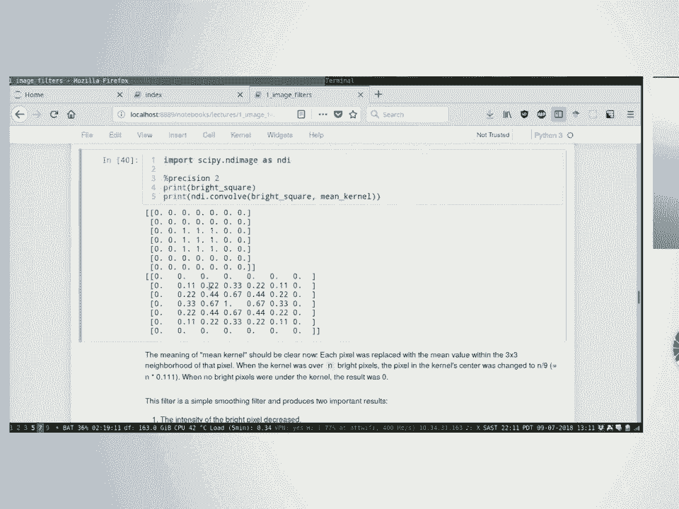

 I write this demo to show you interactively how it works。

 So we're not going to go through the code it's kind of tricky but we're going to just run the demo and show you what it looks like。

 So what we see here on the left is the original image。

 You've got zeros around it and ones in the center and then over here we have the footprint of the kernel。

 We're going to assume that we've got zeros outside of the image and this is what the mode in the MD image。

 convolve controls。 If you said that the mode was constant and the constant value was 1 then you would get a different result。

 because these values would be a CMDB one that are outside the image。

 So now we're going to take the filter and we're going to move it across the image and then we're going to update the image on the right based on the result of the convolution。

 So does this work？ Yeah。 For the first row it's only catching zeros everywhere so the result is 0。

 The second row here you can see there's still only zeros under that footprint。

 As soon as we get to 1。 That's not very visible on the project。 You can see it。 It says 1/9。

 So now it's got one value so it makes that pixel a little bit brighter。 It's got two values。

 That pixel is a bit brighter still。 Three values。 Bit brighter so that's now one third of the pixels are bright and so on。

 All right。 So and you can see here in the center it's an average of one because it's leveraging all of the bytes square。

 And you can see that it is indeed a smoothing filter。

 You had a very sharp edge in the original image going from 0。

1 and now you got this sort of nice ramp going from 0。1 over several steps。 Okay。

 Was that clear to everyone what's happening？ So I don't know how many of you have heard of convolutional neural networks？

 Large numbers。 It's the hot new thing， right？ It's not even that new anymore。

 So this is exactly what those are。 So a neural network。

 the first step of neural network is to have a convolutional neural network。

 Network is take one of these filters and pass it over the image and then you would take this image and you would apply something called a nonlinearity。

 But the principle is exactly the same except instead of designing our own filter as we did here we made a mean filter。

 You learn the values using machine learning。 And if we have time I'm actually going to get you guys to do that for a very simple toy one layer neural network。

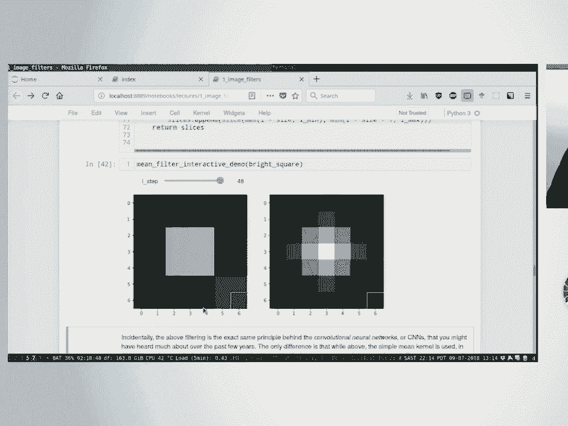

 But yeah， the basic idea is exactly the same。 The other thing that I want to mention is in all of these mean kernels we've made the sum of all of the values to be equal to 1。

 And the reason for that is so that the overall brightness of the image is not affected by our filtering。

 Because otherwise if they sum to less than 1 for example and you do repeated filters you might end up with your image sort of whittling away to nothing。

 So this is just a common thing to be doing。 So we're going to use a pixelated image because I think seeing the pixels actually makes you understand what's going on a bit better。

 So we're going to take the camera image which comes with like an image and we're going to down sample it just by sampling every tenth pixel。

 This is not a good way to down sample as it says in your notebook you should use SK image transform V scale if you want to do real down sampling of an image。

 But for us you get a nice jagged image which is exactly what we want。 And we're also going to。

 because we're going to be showing lots of images by side by side。

 we're just going to use this "I am show all" function。 It's not doing any magic。

 it's just plotting images next to each other。 So let's run that mean kernel on the pixelated image and see what it looks like。

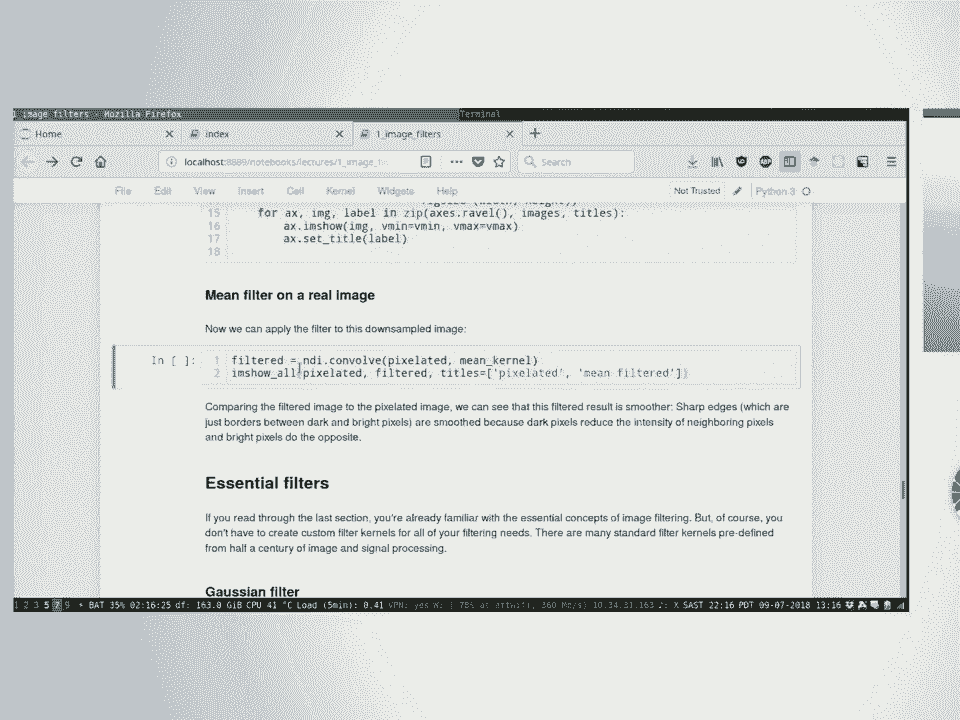

 So again as you can see you get something smooth like this。 And that's exactly what we expect。

 So now we're going to talk about the essential filters。

 The most common filter is that you're going to see over and over again。

 And the very first one is the Gaussian filter which I talked about already in one dimension。

 You can do the same thing in two dimensions using psychic image。

 So finally after all this we get to from psychic image import filters and this contains some pre-built filters for you。

 And now we're going to compare the mean of the bright square with the filters。

Gaussian of that bright square。 The comment of this top of that cells no longer read it。

 What was the comment？ I'm not reading。 Can you get in the card block？ Oh yes， totally forget that。

 We've stopped that's like ancient history。 So it's not very clear here but you can see that this is a smoother ramp than the mean filter。

 We're going to look at the pixelated image and the difference between the two filters。

 and show that you get a much better result with the Gaussian filter smoothing。

 So as the Gaussian filter upon first inspection you don't really see much difference。

 But what we're going to do is we're going to do a much bigger filtering doing mean filtering of size 60。

 or a Gaussian filtering of an equivalent size and see the results in that original image。

 And so you can see that the mean filter， even though it was doing really good for a small local neighborhood。

 it gives you all of these artifacts。 You can sort of see the repeated strut of the camera。

 Same here， it sort of spreads out。 Whereas the Gaussian filter really looks like a blurry version of the original image。

 Okay， so if you're blurring images， the mean filter is not usually the word go。

 You want to do something like a Gaussian filter。 And I think this applies to most signal processing。

 What did I do？ Okay， so I'm going to talk a little bit。

 The Gaussian filter in two dimensions is very similar to the Gaussian filter in one dimension。

 And as you can see here， it's actually just the multiplication of the two dimensions together。

 And so I'm going to look at what that looks like。 So to look at a kernel。

 you can either make the kernel yourself or you can filter a single bright pixel。

 And then the output of that is the shape of your kernel。 So that's what I've done here。

 You can see the smooth bump。 I'm just going to give you a tiny exercise。

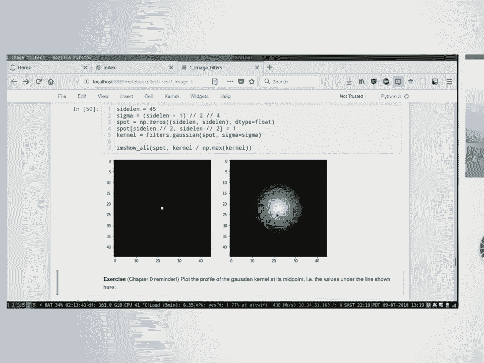

 I'm going to give you one minute， which is to plot a line profile of this line of what the brightness looks like along this line of the kernel。

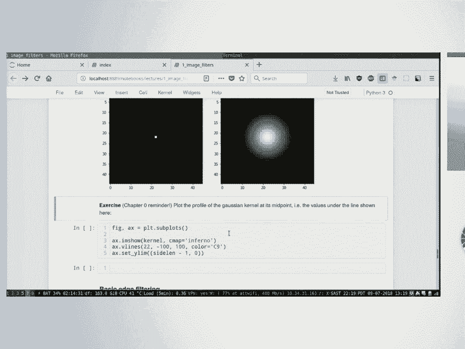

 Okay， so this is just repeating the fact that our images are only numpy arrays。

 So it's just a numpy array indexing puzzle。 Okay， so the kernel is just an npy array。

 I want to take every row and the 22nd column and just plot that as a line。

 And you can see that you got a nice bell shaped curve。 Actually， if you've done any statistics。

 it's exactly what a Gaussian distribution is like。

 And so basically this looks like a two dimensional bell bump in the image。 Okay。

 so the next thing that we're going to do， that's smoothing in 2D。 Difference filters in 2D。

 And they're a little bit more complicated because I have to do a difference in one axis and a difference in another axis。

 So I'm drawing this vertical kernel， which is just a difference taking the average of the 3 pixels above and the average of the 3 pixels below and taking the difference。

 So I'm going to look at that for the pixelated image。

 And you get this image where here you have a negative change from bright to dark as you're going down the image。

 And then here you have a positive change from dark to bright in this guy。

 I'm just going to show actually。 I'm going to show all pixelated and migrating vertical。 Oh。

 well I did that not work。 Pixelated doesn't just do pixelated， but any ideas to fun？

 I think it's because it's the negative values versus the positive values only here。

 That's what's happening。 So gradient has values not between 0 and 1， but between -1 and 1。

 And IM ShowAll is trying to normalize all of the images to the same space。

 So that's why I'm not getting the same brightness。

 Just to show that here it's going from dark to light in the original image。

 And that's what the filter is detecting。 Okay， in the interest of time I'm just going to quickly do this exercise for you。

 So any ideas how do I get a horizontal kernel from the vertical one？ Yeah。

 you just need to transpose the matrix。 What did I call it？ And then I can do。 Okay。 All right。

 so this is exactly the same principle， but now you can see that you're getting the。

 horizontal edges of the image instead of the vertical edges。 Yes。 Good point。

 But do you - all right， I'm not even going to go there。 Yeah。 Okay。

 and usually what you want is just an overall gradient。

 And we can do that by - because these are just numpy arrays。

 you can just use vectorized operations on them。 So I can do gradient equals np。scrt。

 horizontal gradient squared plus vertical grade。 What did I call the gradient vertical？

 That's pretty。 Okay。 All right， and so now you get a nice gradient around the whole figure。

 So this is your basic edge filtering。 There is a filter called the "Sobel Edge Filter" and this is probably the most common edge filtering。

 And it's kind of a baby version of the Gaussian filtering that I showed before where you instead of taking just a simple edge filter。

 you want to do a bit of averaging。 So if you click on the documentation for these。

 you can see what the kernel is。 It's taking the edge with weight two along the central pixel position。

 but it's also looking for a continuation of the edge above and below that specific value。

 but with a slightly lower weight of one instead of two。 All right， does that make sense？ Cool。

 So the vertical v-sobel is the， sorry， edge-sobel is the opposite of that。 And filters。

sobel by itself without the h or the v does exactly what I did here。

 which is to take the square root of the sum of the squares and just give you a normal gradient。

 So you can see that you get a much smoother edge than what we saw before。

 And if I do it with the pixelated image， you get that gradient again。 And again， you can do this。

 you can chain these filtering operations together so I can do a Gaussian filtering followed by a sobel filter and then get a smoother gradient。

 You can see that if you do a bit too much moving， you get a fatter line for the thing。 So this is。

 you do pay a price for smoothing， but it's just something to know about。

 You can see some of the edges along the struts are a lot cleaner。 Okay。

 So I'm going to leave this exercise for the break。 You guys are free to look at it。

 This is the one layer in your network， but since we're running out of time。

 I just want to quickly show you some more labored filters that are available in second image。

 And the first one is the median filter。 So we saw that the mean filter blurs out the image。

 but it also contains a lot of artifacts。 And we saw that the Gaussian filter can blur out your edges as well as making them smoother。

 but it'll make them blurrier。 So the median filter takes your footprint and now it doesn't apply this linear multiplication and addition。

 It just takes the median of all of those values and that's what you get in the middle。

 And that has the property of preserving your edges。 I'm not going to go through the logic of that。

 but you work through it。 It'll go quickly from one value to the other and it's never going to pick an intermediate value。

 And so I get that blurring effect。 So let's show what that looks like。

 So you can see for the pixelated image， you get some smoothing。

 but it preserves the edges of the figure。 And that's because when it gets to this pixel。

 it only has a bright patch and a dark patch to choose from。

 And the median value has to come from either of those patches。

 So it's not going to pick a median value， a value intermediate to that。

 Some gray level value that you get here。 The brightness value is the median filter dimension。

 It won't be subset of the original images。 That's right。 Yeah。 Okay。

 And you can see that it works for not just for pixelated images。

 but for images that are more detailed。 So you can get a nice smooth image with some sharp edges and it's still。

 Okay。 And then there's some very far more elaborate filters which will let you guys read about in the documentation。

 So I recommend that you look at， you can look for a scikit image， API filters。

 and it will take you directly to that module， and show you all of the filters available there。

 So hopefully what we wanted to show you is the very basics of filtering so you understand what's happening。

 and then reading up about ever more elaborate filters is not a hard step for you guys to keep doing at home。

 Yeah。 And that's all the documentation。 So take a 10 minute break or five minute break。

 What do you guys think？ How's your timing， Josh？ No， I wanted a decision on the 10 minute break。

 Alright。 So 340。 Alright。 I think most people are back and the rest will filter back in。

 I'm really excited to talk to you today about segmentation。

 It was a big part of the work that I did in my PhD and we get quite a few questions about this topic on stack overflow。

 as you'll hear from Stefan after this section。 My goal really is to give you a true overview and ability to attack a given problem from a conceptual level。

 So segmentation at its most basic level is you have an image or a data set and your goal is to usually with some meaning attached。

 extract or identify a subset of that data that is more interesting to you for some reason。

 So you've seen this in popular culture。 The example on your screen is the screenshot from Terminator Vision in one of the early Terminator films。

 The way that this gentleman in the cowboy hat， very Texan。

 is outlined is essentially a segmentation。 The Terminator Vision or the 3DFX guys behind the movie drew or calculated this outline around that individual。

 and they could have taken this individual out and maybe put them in a different frame。

 And that's something that we often refer to as photoshopping colloquially with proprietary software。

 which of course can do with GIMP and other things。

 The important thing to note about segmentation is that we basically do that via two major ways。

 We either use some sort of guiding input at which point we are the ones that are supervising the algorithms。

 so we say， "Hey， I wanted that person。 I wanted that face。"， In my field of medical imaging。

 I wanted that organ segmented out of a given image or maybe an image volume。

 We're seeding it with that data。 Maybe we have just even put a point in there and saying that that's liver and around it is not liver。

 and maybe that's the entire input that we gave to the image， but it had some sort of human input。

 And so that's our supervision of it。 Separate from this is the subfield of unsupervised segmentation。

 where we're trying to operate。 There is no information known。

 The algorithm has no idea what's going on in the image。 We haven't given it any hints or help。

 and it is going to try and identify some sort of logical subregions。

 based on contrast or local features or other things。

 We have a number of different segmentation algorithms， a psychic image。

 and here I've broken down the main ones between supervised versus unsupervised。

 You'll note that thresholding crosses the divide， and we'll talk about why that is。

 We'll use most of these in the course of this example。 First off， is that well understood？

 Does everybody conceptually grasp what the goal is， and confirms the segmentation？

 Because that's truly key to this example。 And if there's one thing I want everyone to walk away from is that there's this distinction。

 is if you can have human input or some guidance to the algorithm versus not。

 and it sends you down a completely different pathway。 Any questions about that？ No。 Okay。

 we'll move on。 So first off， we're going to just do some standard imports。 We'll get NumPy。

 mapplotlib， and then various aspects of a psychic image on board。

 And this is just a quick convenience function， like we've seen in other examples。

 to give us a pretty plot efficiently。 So on a very basic level， thresholding is segmenting。

 We've already done a little bit of thresholding， in previous examples。

 but basically we have these image values。 If we only want to look at all of the values that are above a certain point。

 we can set a threshold at that point and we just get， we get either black on one side。

 and white on the other depending on where we set the greater than or less than。

 And that can actually give you some reasonable results depending on if you actually run the mapplotlib in line。

 So， let me go back down here。 So this is just a page of， oh， actually it's a segmentation text。

 that it turns out it's not the greatest image though。 This side is kind of a little bit darker。

 but maybe we can pick a value， that will give us a reasonable segmentation of this just without any functions at all。

 just based on NumPy itself。 Now， to help us pick that value。

 instead of just throwing darts at the board， we can look at the histogram。

 And I don't think the histograms have been greatly looked at in our previous lectures。

 but basically a histogram is just where on the y-axis it's the frequency or the number of times。

 we encounter a given value。 And then the x-axis is the values that are in the image itself。

 This image happens to be an 8-bit image， so we have a total of 256 possible values。

 And we just run this cell and you can change the bins around， but the bins are the number of actual。

 the way it smooths things together within the histogram。

 And you can see that there's a concentration of pixels that are up here fairly light。

 That's most likely our fairly light text background。 But then the rest of it's kind of smeared out。

 An ideal segmentation case would be bimodal， fairly separated。

 and then you could pick a number right in between them。 So still， maybe this is our。

 most of our background that's light， and quite a few pixels are in these。 So let's just try a few。

 So just go ahead and take a minute or two， and just make a few segmented images just based on simple thresholding。

 from what we know about this histogram here。 Not bad， honestly。

 but we still have this dark area back in the corner。 If we reduce this down to， let's say， 50。

 now everything else， we start to lose the text over there。

 even though we've gotten rid of our dark corner。 We go up higher， and obviously， well。

 if I don't leave an extra zero around， this dark edge just kind of continues to encroach on us。

 So that's potentially not ideal。 There are a number of thresholding methods。

 Some of them are specifically just designed to tell us where would be an ideal threshold within this histogram and within this image without any additional input。

 So that's an important distinction。 We just did supervised segmentation because we look at the histogram and said。

 well， I think that's where it would make sense。 But we have a few that would be unsupervised。

 If you had， let's say， a database of text images of books。

 like the Google Project and Digitize libraries， they're probably using something that's fully unsupervised on each image so that they can。

 bind orize the text away from the background。 They may be using something like threshold_。

 and if you just put your cursor right here and hit the tab button。

 these are all the different threshold methods that are available in filters。

 And I would encourage you to just try a few。 Try Atsu， try Lee。

 and anything else that you might be interested in， but leave local for last。

 And when you get to local， take a look at the actual doc string。

 and then I'll give you a few minutes for that， and we'll go through it together。 So all of these。

 to answer the question for the room， all of these are going to give you back not the thresholded image itself。

 not the result， but the value at which the threshold should be taken。

 which could be one single value or could be an image that's the same shape。

 as the original image except at each point it will be the appropriate threshold。

 That's how local works。 Okay， so let's try a couple of these together。 Again， I'll just do Atsu。

 because Atsu and Lee are very similar， so we'll go ahead and put the text image in Atsu。

 and then we will go ahead and， take a look at what that threshold was chosen。 So it shows 157。

 and we can make this look more like you would expect a book to look if we do the other greater than。

 it's just reversing the ones and zeros。

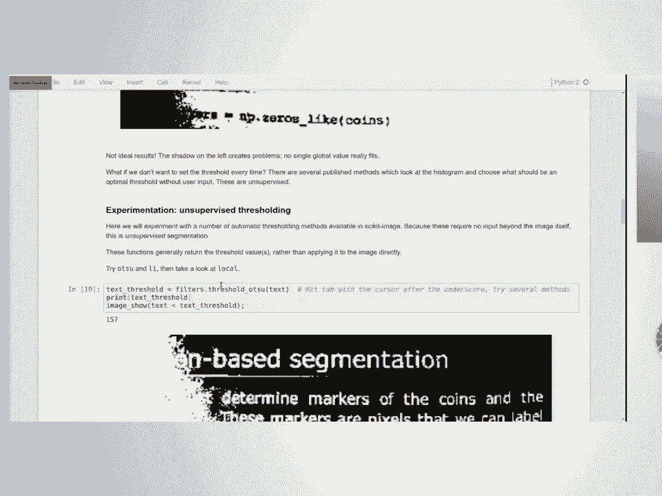

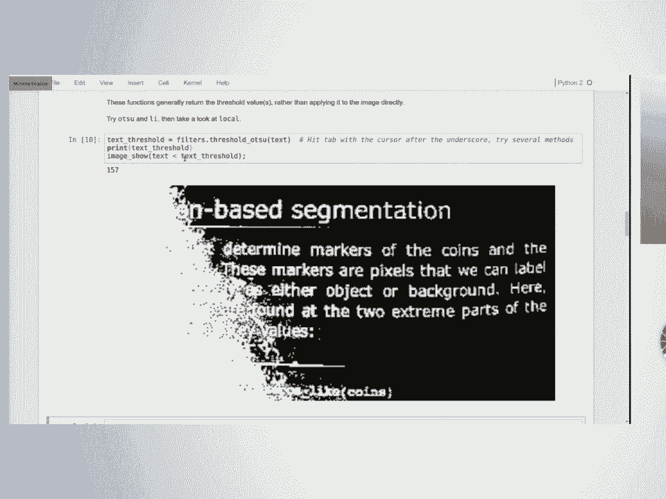

 So Atsu thought a threshold of 157 made sense， and that's an algorithm that you need to know further input from us。

 so that would work and give you the same thing in an unsupervised manner。 Lee is similar。

 so I'll just skip past that， but local is more interesting。 In the local thresholding。

 we're actually looking at each point in the image and trying to find an ideal threshold at that point。

 and you have to look in the documentation just a little bit to figure out exactly all the other things you need to give it。

 So first we need to pass an image， that's our text image。

 then we need to tell it how large of a local area we're going to use， and it has to be an odd value。

 so let's look at a reasonable sized area with something like 15。

 and then we'll go ahead and leave all the other defaults。

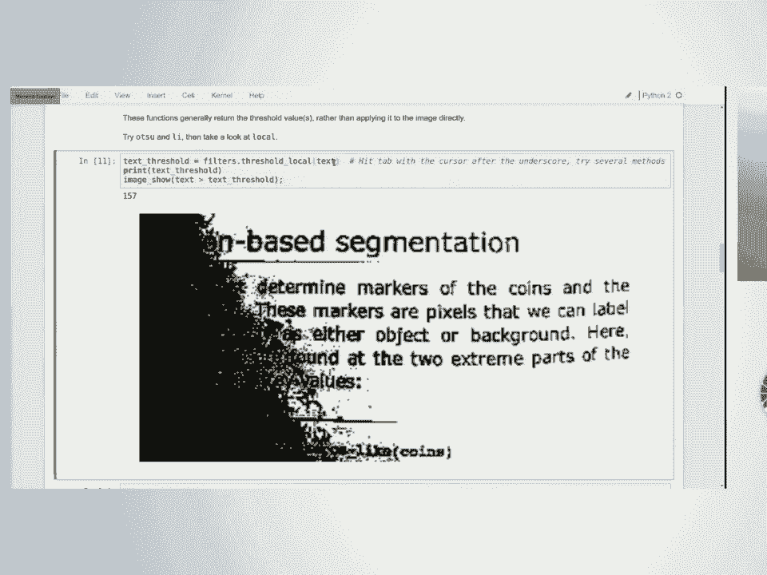

 And that actually gives us things， it's readable now。

 but we have all of this artifact that's certainly not ideal。

 but you'll note that when I printed the result， it's now a huge array。

 so at every point in this image we now have an individual threshold。

 To extract the most ideal value right out of that point。 So if that worked reasonably。

 except we just need to get rid of these artifacts that are based because our 15 point region is trying to extract something too small between lines。

 there's nothing of value there， and so it's basically giving us noise。

 We just jack that up to let's say I want to do 42， but that won't work。

 and now we're starting to get rid of some of these artifacts， but not quite all of them。

 so we can keep increasing this， and at some level it starts to actually become a problem。

 We're getting this dark corner back in because we're looking at now this entire region。

 and we have this gradient across it， so there is an upper limit。

 and so let's just settle on something around 50， and see if there's anything else we can do to alleviate this artifact。

 Well it turns out that we do have a value in here， an option called offset。

 and that is specifically designed to tune the result of the threshold slightly up or down by the default is just trying to find the ideal mean or median value。

 but the offset can tune that up or down， and so in this case let's threshold just a little bit higher。

 so that ideally we lose all of this extra values behind there in the noisy regions。

 and now that's pretty good， if we just increase the offset slightly。

 Anyone have questions about that？ So it's still mostly unsupervised。

 if we had a similar camera that was taking pictures of books in a similar way。

 we could generalize this to other images， because we're only really telling it how big of an area to look at。

 and that we'd prefer to have less noise by just increasing that offset a little bit。

 But the real point here is that we've iteratively kind of tweaked the parameters a little bit for our particular problem。

 Okay， so that's， as all I really want to say about thresholding。

 anyone have questions about thresholding or segmentation in general？ Yes？ Okay， so the question was。

 we're visually saying that this is a good image， is there a good image that is a good image？ Okay。

 so the question was， we're visually saying that this is a good image。

 is there a metric that we can use to quantitatively say that yes this is a good result？ Yes。

 I'm not getting into that。 In scikitimage。measure。

 there are a number of different metrics that I would try to apply to that problem。

 But generally speaking， what you would probably want to do first would be get a ground truth。

 and then you can compare the difference between your result and the ground truth。

 It's a little hard to do that a priori。 You could do some fancy things and look at local entropy or local variation to see if you've still got too much noise floating around a priori。

 but that's how I would attack that。 Does that make sense？ Any other questions？ Yeah。 Yeah。

 so thanks for asking。 The question was， so we've just done all this thresholding。

 but where really is the segmentation？ The segmentation is this result that we have here。

 So when we take our threshold and apply it to the image， we get a result that is all binary。

 So it's all true and false or all zero and one。 So depending on where or how we've set this less than or greater than we've selected for either entirely the background to be true or entirely the text to be true。

 And the segmentation is the zero or the ones in that in that example。 Does that make sense？

 I want to make sure we're bringing everyone on。 Great。 Okay。

 Moving on to general supervised segmentation methods。

 Thresholding is limited to only images that are in specific situations。

 The images of text are a great example where that can work。 Images of real life situations。

 let's say this room， would not be well suited to thresholding as a method of attack。

 So we need to think outside that particular simple box。

 So we're going to instead use a real image that we shipped with scikit image。

 It's a public domain image from NASA of an astronaut named Eileen Collins before she went on a space shuttle mission。

 And this is a real actual image。 Now one important step that we're going to basically gloss over in this is that every time you're doing a segmentation project。

 it's always a good idea to remove any noise before you proceed。

 So this is an excellent image that is already not very noisy。

 And so we're going to basically move forward。 But keep it in the back of your mind that when you're segmenting things。

 especially if you're underlying data， has some noise in it。 Consider dealing with that first。 Okay。

 So that's our astronaut。 And the contrast is pretty good。

 So let's consider what if we wanted to try and segment out the astronauts heads。

 This would be kind of a typical， more of a photoshop-like task where you're maybe going to identify that and then do something else with it。

 But first you have to know where the person's head of interest is。 If we're just inspecting this。

 the actual astronauts hair versus the background has decent contrast。

 This shadow versus the background has decent contrast。

 Skin versus the collar of the suit is pretty decent contrast。 Over here is also a shadow。

 So we probably are in a decent spot to just go ahead and convert to grayscale。

 This is again using RGB to gray， which we've seen before， and Stefan was mentioning。

 It uses a perceptual method to do the grayscale conversion。 As we can see。

 we're probably in a good spot here with grayscale。

 And our two segmentation methods that we'll look at here for supervised segmentation， they use very。

 very different approaches。 So one of them is called an active contour。

 which is often colloquially referred to as a snake。

 And the idea is that you've drawn some sort of a contour around outside the area of interest。

 and it is going to slowly contract but be attracted or repelled from light and edges。

 And so the idea is that each individual point along there is going to move very， very small amounts。

 and that will be repeated iteratively until it grabs a corner that it really likes。

 And then it's adjacent points might keep to move， but that one might stay the same。

 And there are a few parameters that we can tweak in there。

 but that's the basic idea behind an active contour。 Random Walker。

 I'll talk about when we get there。 That's completely different。 So， okay。

 so we're going to use active contours。 That means that we need to be able to seed our image。 So we。

 again， are supervising， so we have to actually tell it where we want the contour to start。

 And then we also have to tell it if that contour is going to be a closed contour or not。

 And the default for this algorithm is that it will be。 So like if you were to draw a half moon。

 it would consider the final point to be connected to the first point。 The。

 the tailper function I've provided here is really just a way to draw a number of points in a circle。

 And so if we just go ahead and use that and we do it circle with a resolution of 200。

 so reasonably high resolution， the center point at this point。

 we're also not going to include the last point because lint space will get us all the way to。

 and including two times Np dot pi。 And for those of us that no trigonometry off the top of our heads。

 that's the same place as we were at zero。 We're not supposed to repeat points in this。

 so we're just cutting off that last one。 So if we just look at the result of that。 [coughing]。

 Actually， I'm just going to come on out this line。 So this is the contour that we're starting with。

 So before we got here， I just identified a point that was kind of near the。

 near the middle of the forehead， and then we've drawn a circle that's large enough to completely be around the area of interest。

 And this is the only input that we're going to give this function other than tweaking the parameters slightly。

 Okay， so now then actually running the active contour algorithm itself is pretty simple to begin with。

 So if you just look at the documentation with shift tab。

 there's quite a few different options in here， but we'll start without using any of them。

 and just use our grayscale astronaut and the circle number of points that we have generated。

 Note that the periodic means that it's going to connect the first and last。

 That's what I was mentioning before， so it's going to consider this to be a closed curve。

 And the rest of this kind of， well， we'll get to those。 So let's see how it works。

 That's going to take a second to run。 It's done。 And that didn't really work very well， did it？

 Okay， so the blue is our snake， and two things happened or didn't happen。 One。

 it didn't really get very far from our initial points， and two。

 it doesn't really seem to be grabbing edges yet， although arguably it really hasn't found many edges to grab。

 So just like Stefan， Juan and I do when we run into these kind of situations。

 we're going to look at the documentation and say， well。

 it seems like we want this to move a little bit more than it has been。

 And one of the first things that pops out is alpha。 So higher values make the snake contract faster。

 So the default for alpha is 0。01。 Let's increase that by an order of magnitude。 And again。

 it's finished a little better。 Yeah。 Yeah， so if you， the idea is that the snake itself。

 it's tracking each one of those 200 points that we gave it to begin with。

 And each time those points can move up to one pixel。

 We could allow it to move a little bit more if we change this。

 but the right of the default is that it can move up to one pixel per iteration。 And essentially。

 the other things that we may or may not have tweaked。

 like how attracted it should be to lines and how attracted it should be to edges。

 define the underlying function that will say if it wants to move or not。 It's going to， by default。

 contract。 That's what this alpha parameter does。 And that's also why we wanted to make sure that we fully encircled what we were interested in for this particular algorithm。

 That won't always be true， depending on what algorithm you're looking at and how you're trying to approach the problem。

 But for active snakes in this particular one， we needed to include the whole thing and then think about it sort of slowly shrinking and then grabbing edges as it narrows in。

 So it computes edges along the way。 It's at each point it's looking at the local region。

 And there's a fairly complicated function because you can see there's waiting for the smoothness of the snake。

 And it's saying， well， I don't want to get too far away from my neighbors because that would make this really weird。

 hard， acute edge。 But you can set it so that that's okay if you reduce the smoothness parameter。

 which is beta as it turns out。 So it's a little bit more complicated than just running a gradient and then sliding down it because each point is almost independently but not quite because of these parameters like beta。

 Trying to figure out how it can tweak itself to get a more optimal point。

 And then the entire algorithm looks at a convergence criteria which is basically how much have I moved and my pretty stable here。

 And it will stop earlier than 2，500 iterations if it thinks it's getting to that point。 Make sense？

 Any other questions？ Okay。 So that's a pretty decent result for an active contour。

 The result of what we got out was the actual perimeter here but we could use in the draw sub module。

 we could define this as a polygon and then fill within that polygon。

 At that point we've got an image that has the face segmented out and that's exactly what we wanted to begin with using an active contour。

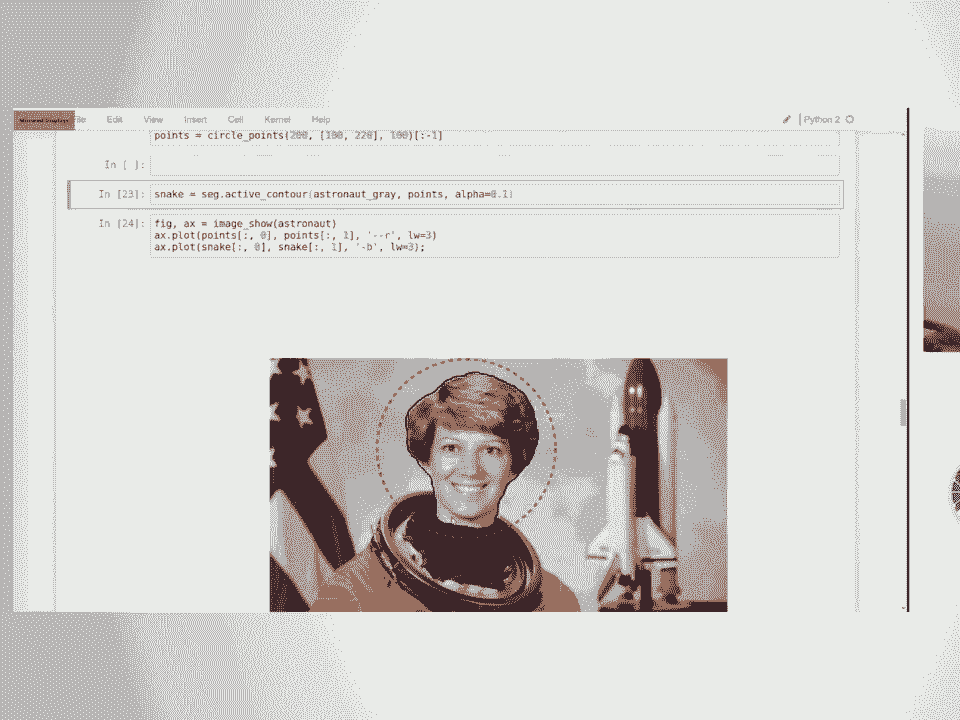

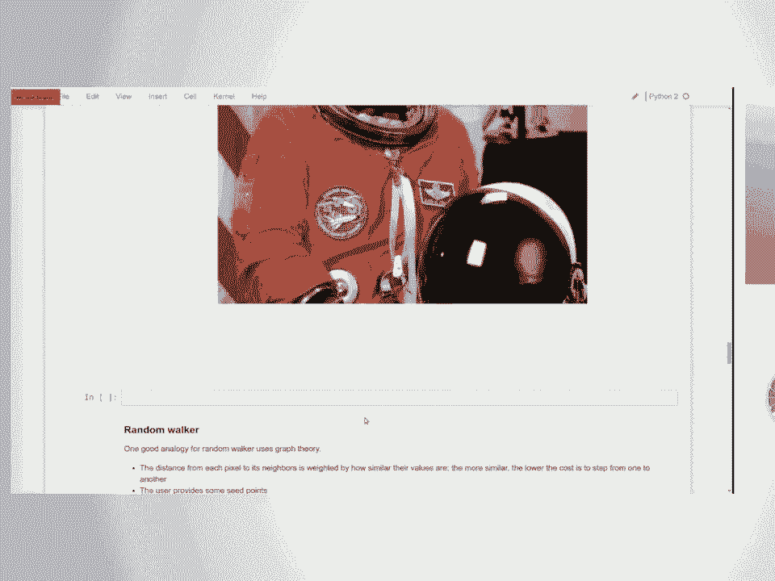

 So if there's anything， if there's any other questions about active contours we can hang around up here otherwise I'll move on to random walker。

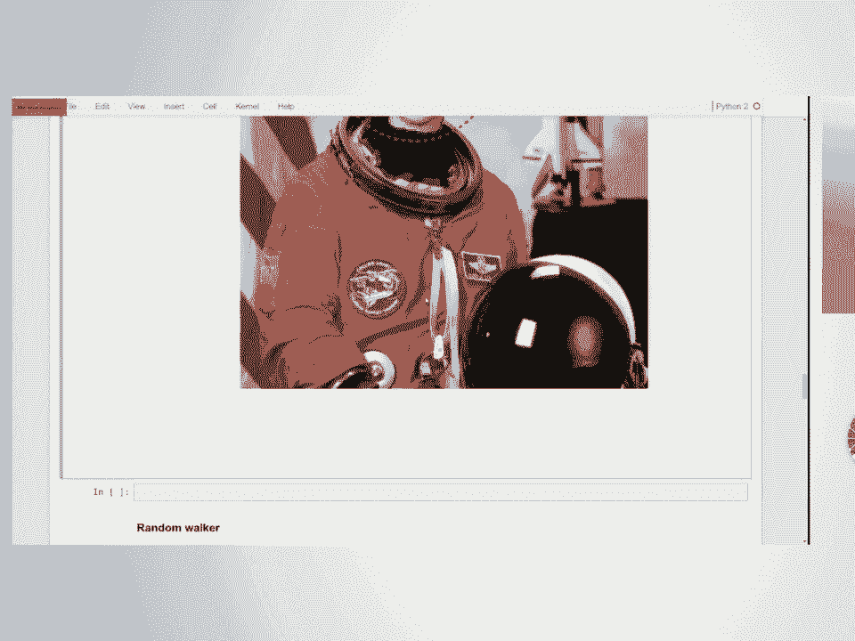

 Yes？ [ Inaudible ]， Sorry， so the question was if you just wanted to pick out the skin。

 Just the face or just the hair。 So you would change a couple things。

 One that would help would be narrowing that circle so that it would start in the hair and then narrow down from there instead of starting outside everything。

 Then the hardest edge that it might find would be the edge of the face instead of the edge of the background in the hair so that would help。

 So you can change your initialization。 You could also change its attraction to lighter dark。

 So there's a W underscore I think its edge changes how much weighting it thinks it would like to find lightness versus darkness。

 And you could use that to try and find， basically exclude the hair or exclude the face if you were interested。

 Yeah？ [ Inaudible ]， Most of the time snakes contract but you could set that alpha to a very low value and I know that you could use the hair。

 And I know that you can have it where it will expand locally from where it started if it feels like that would be a better edge over in that local area。

 Stefan， do you know if this one can actually be reversed fully？ Yeah。

 we'd have to look into that for you。 Okay， in the interest of time I'll move on to random walker。

 So random walker works completely and utterly differently than active contours。

 The idea behind random walker is that you've provided some random pixels。

 They do not have to be connected。 They do not have to be so it's no longer a contour。

 You can just sprinkle them throughout the image if you feel like。

 And then they have some sort of labeling associated with them。

 The algorithm is then going to determine a penalization cost to move from each pixel to the neighboring pixels。

 And it's going to iteratively figure out what the cheapest path is back to each label type。

 And whatever is the cheapest is the one that owns it。 So the result， it's a little bit more general。

 This is where you can have a GUI that instead of having to draw circles around things。

 you can just sort of draw a line down a middle of an object of interest。

 maybe a squiggle outside of it， and it's going to segment the whole image based on that。

 Because everything is just what's the cheapest path back to all of the labels and whatever at every point whichever one is actually the cheapest wins。

 So we need some labels。 And in this case， I'm just going to see the labels array that starts all the zeros。

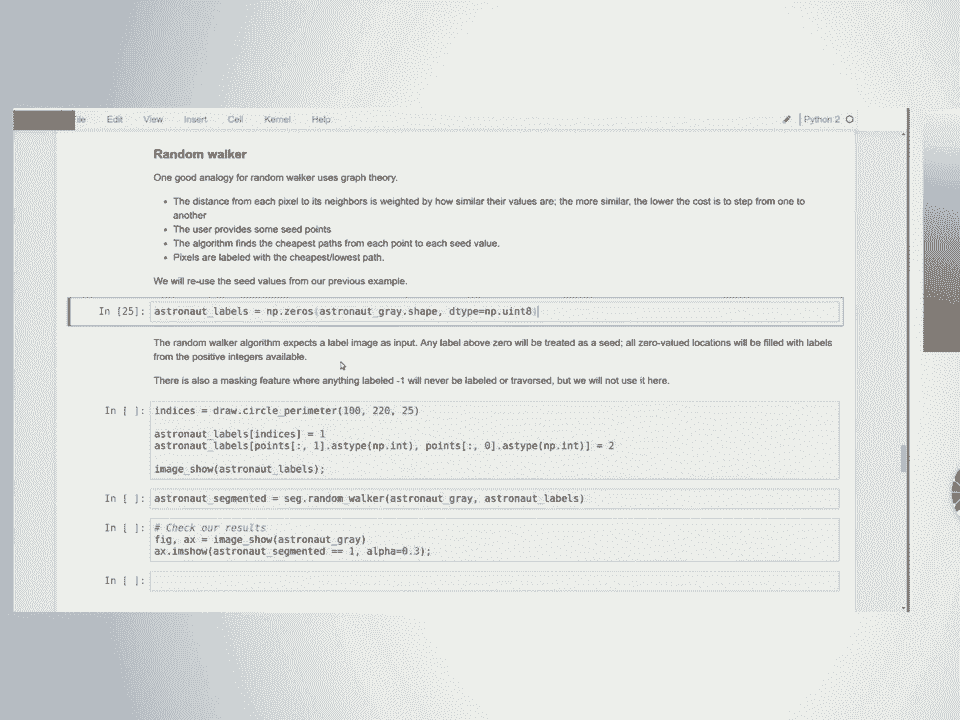

 Now we've already got our circle that we drew before。 And in this case。

 we're just going to borrow that same idea from our。

 We're going to borrow those indices that we used previously and set them to one。 Sorry。

 we're going to borrow our points that we used before and set them to two。 So the outside is two。

 And then we'll use the draw function within scikitimage。draw。

 and we're just going to draw a smaller circle near the middle of the astronauts face。

 So we could have done different initializations， but in the interest of time。

 basically now we have this circle in here， which is fully inside the astronauts face。

 but does slightly cross into the hair over in the top。

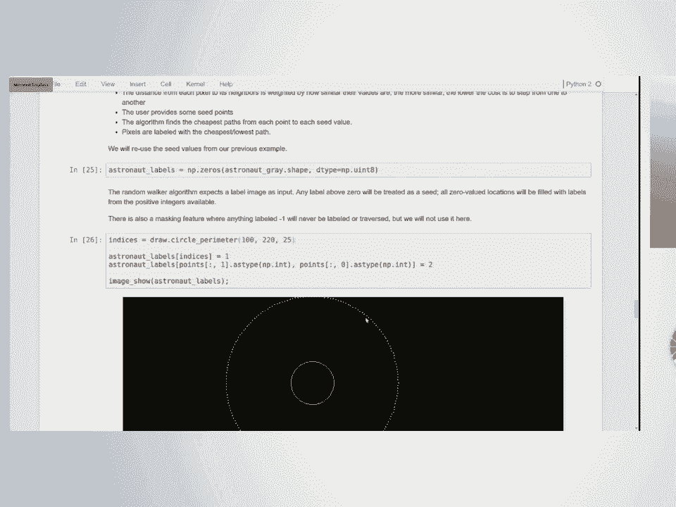

 And then this is the same circle that we had previously。

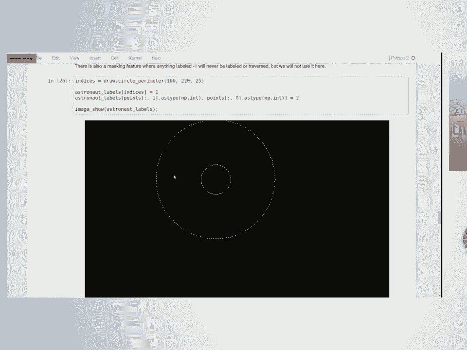

 And then we're just going to go ahead and use random walker on that and see what happens。 Again。

 just default everything except using the grayscale astronaut and the labels。

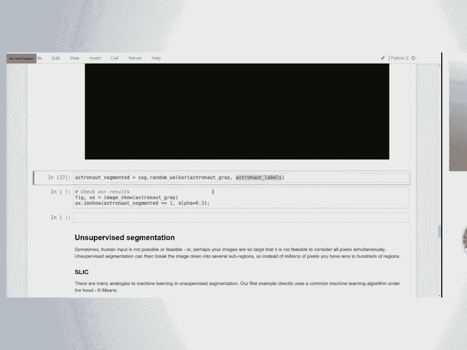

 Alright， so let's see how that worked。 Not perfect， is it？ Kind of expanded the circle。

 but it's mostly still a circle。 It doesn't look like it's grabbing edges like we would hope。

 So that's maybe a problem。 Let's look and see if we can fix that。 Okay。

 what's available in this function？ So the main tunable parameter in random walker is this beta parameter。

 And that is what weights the differences in the pixels to penalize pixels that are farther apart。

 And the greater that gets， the harder it is for them to actually cross over that pixel in order to get to their next point。

 So with a very low beta value， which as it turns out our default value as applied to this image is fairly low。

 it's actually pretty reasonable when you apply it to floating point images。

 but we put in an unsigned 8-bit integer so we've got 256， it's a bigger range。

 So it actually makes sense that we would need to change our beta here。

 And we want to increase the beta。 So let's increase that。 The default was 130。 Let's try 400。

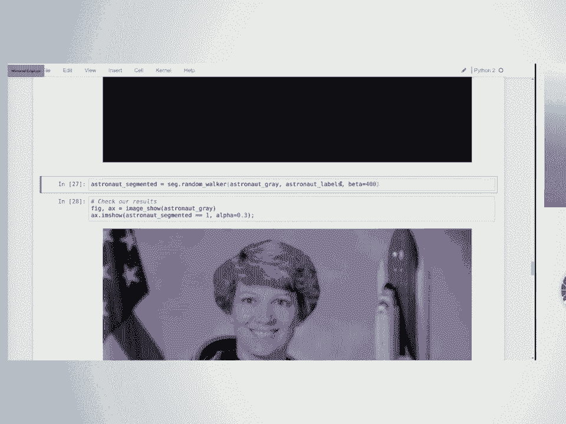

 I'll take a couple seconds。 And it's better。 It's not quite where we want it to be。

 but it's improved。 You can see that it is， and I should say that the way that I'm showing this is that the actual segmented image。

 I'm just extracting the face labels from the segmented image。

 And it's defaulting to the viridus color map， so the lower values are on the bluer side and normal values are a little bit on the yellower side。

 except I've put an alpha blending so you can see through it。

 And that's why it kind of looks like a sepia tone， if you will。

 But this area in here that's a little more sepia-like， that's our actual segmentation。

 So we're getting closer， but it's still not quite where we want it to go。

 so let's keep increasing beta。 And you can see what you figure out as the ideal beta value here。

 Alright， now we've got the entire face。 We're missing a little bit of this ear and still not quite gotten through the hair。

 so let's keep going。 Alright， that's very similar to before， and if we just keep increasing it。

 That got a little bit further in this area。 And in the interest of time， I'll just jump to 2500。

 And now， similar to before， we've basically fully identified exactly what we'd like。

 It's actually still missing a little bit of this earlobe because there's not enough of a gap here to keep it out。

 so you would expect that。 So again， supervised segmentation， we gave it our inputs。

 and then we had to tweak the parameters a little bit。 It's a common theme。

 But we would have expected to need to tweak this。 If I ran that as float to begin with。

 the beta would not need to be changed as much。 Okay。

 that's going to be all I have for supervised segmentation。

 Any questions about supervised segmentation？ Alright， in interest of time。

 I'll go ahead and move forward。 So we're just not always able in our analyses to have the luxury of a human looking at an image and interactively saying this is where you want to start。

 this is where you need to go。 And so we have a number of algorithms available。

 A lot of them are based on， and there's a lot of correlations here to machine learning。

 including this one。 So SLIC， which stands for。 We didn't even put it when one stands for。

 The algorithm is called Slick。 And it uses K-means。 What do I want to say？ Simple linear。

 iterative clustering。 It uses K-means under the hood。

 So it's basically using scikit-learn under the hood in order to take the space of the image。

 which is all of the pixel values， and try and separate them out into a given number of subregions。

 And we can just put that image right in here。 And all we're doing is labeling via labeled RGB。

 We're just setting each sub-image or sub-region that we found to the average of that region。

 which makes it look less like a patchwork of randomly assigned colors。

 and more like an image that has just had。 It had been decomposed into areas that are kind of similar。

 And this is actually pretty reasonable。 So we've taken an image that started at。 Well。

 several thousand values， 262，000 pixels， down to a total of 100 regions， which is the default。

 You can tell it if you want more or less， and it'll give you more or less regions。

 but that's very helpful if you're needing to decompose your data down as a first step。

 And they're pretty logically relevant。 The face came out pretty much as one。

 but you would have to go in and then interactively pull out what you wanted to。

 But it's certainly a good decomposition step to begin with。 Anybody have questions about simple。

 iterative linear cascocations？ Okay。 Sean Vies is a different algorithm。

 which is based on a level set。 And level sets are going to give us a binary result。

 So you wouldn't want to use this if you were trying to get multiple sub-regions out。 It's very。

 very different than slick。 So， Chan Vies is going to give us。 Basically， it's going to threshold。

 but it won't necessarily have to be connected。 And it has evolved this level set over。 Actually。

 it takes several seconds to run。 It also requires a grayscale image。 Josh。

 can you say what a level set is？ Yeah， so a level set is basically a function that's working behind the image itself。

 And instead of like the snake moved pixels over time， the level set。

 you could think of it as sort of a bendable piece of rubber paper。 And then over time。

 instead of moving the actual individual points around。

 it's changing the way that it's bent in space， positively and negatively。

 And then the level part of the level set is where you threshold that， usually around zero。

 And so the positive aspects of that level set end up being the result of your image。

 the ones that were a little bit higher， and the negative aspects end up being excluded or vice versa。

 It's a very powerful technique， although it does take a few seconds to run。

 And it initializes using a very general。 It's just a checkerboard that's applied to the image。

 So it starts off with random positive and negative values everywhere and then smooths out to the result that you see。

 So in this case， it's kind of interesting。 It's basically gotten all of the。

 Either all of the shadows or all of the light tones。 So in this case。

 I've chosen the zeros out of it。 But the zeros were all of the lights and the shadows were what it picked out for all of the darks。

 So if you had an image that you wanted to do that， it'd be fresh holding on。 You could go back。

 You could try this on the text。 I think I'm a little pressed for time or else I would have。

 Or else I'd encourage you to try that， but feel free to。

 So Chanvie's unsupervised based on the level set must be grayscale input and it will give you a binary result。

 You can take your time。 You can take a few more minutes if you need。 Okay。

 Let's just go ahead and try it on the text。 A little faster on the text because that was a smaller input。

 And that didn't work quite as well。 Did it？ This is that checkerboard initialization that I was telling you about。

 No， I think I've got it。 Because it's still the Chanvie's result that I'm showing。 Alright。

 This one I haven't prepared。 So。 [silence]， [silence]， [silence]， [silence]。

 I'm going to let it run a little bit longer and increase the speed that it runs。

 And hope that that evolves a little bit faster。 It's still having some difficulty。 Yes。

 I tend to try to order magnitude on the primary scan。 Sure。

 Because then you can see if you have a shoot to do it again。 Or double。 Okay。

 We're going to have to get back to you on this one I think。 [silence]。

 I think the issue is that it's looking for large features。

 And these are all such small features that it's having trouble identifying them as individual things that it should grab hold of。

 And the idea that the way to get around that live I'm unsure of。 Yeah。 [silence]， Yeah。 [silence]。

 Well， it could be because I am still running Python 2 on this laptop。 [silence]。

 Didn't want to change things up right before the actual presentation。 [laughter]。

 Thank you for that。 We'll see if my colleagues can get that working in Python 3。 Okay。

 So one more algorithm that we're going to go over today is called。

 I'm probably going to butcher this。 I think it's Belgian Schwab。

 And this one is again using machine learning under the hood。 It's using minimum spanning trees。

 And this one interestingly does not guarantee the number of clusters that you get。

 You just get to basically at a high level say what scale it's going to consider。

 But it's going to run and generate as many as it thinks is appropriate for that given scale or zoom factor on the image。

 Also it full requires a color image。 We cannot use a gray。

 So we'll just go ahead and use the astronaut， the original astronaut image。

 And take a look at the results。 And that's quite a lot of different segmented regions。

 How many actually is it？ [silence]， So here I'm going to introduce a very handy function。

 a NumPy called unique。 So the number of unique labels in our result here。 Just the size thereof。

 Okay， so we've got nearly 3，300 sub regions that we've found in a very short period of time。

 And all we're going to do is then just recolor them using the region averaging that we like we did。

 And that previous example。 So just go right back up to slick where we took this region coloring。

 Coloring in with the averages。 We use that except we're going to use the result we just got based on the original。

 [silence]， Takes a minute to do it because there's 3，300 regions。

 And this almost looks more like a posterized image。

 Posterization is just a reduction of the number of colors that you started with。

 Except we started with 255 times 3 channels。 And now we've got 3。

300 so we haven't really helped ourselves there yet。

 But there is a common technique in image processing which is where you over segment。

 You actually get more regions than you need。 But lesser than the original number of pixels。

 And then within those sub regions you can more easily select between them or define which。

 sub regions you're interested in or want to look at。

 And one of the ways to combine them is with a region adjacent to the ground。

 And we're looking at these because they're conceptually very similar to random walker。

 So before random walker we were looking at the penalties of moving pixel to pixel back to wherever we were starting。

 With the region adjacency graph we're looking at the penalties of moving from region to region。

 And seeing which ones are kind of hanging together。

 And the only real catch here is that we're going to add one to this because in a step that we do with the region properties。

 Which is a really helpful function。 It doesn't include zero but we do want to actually include zero。

 That's a useful value that comes out of a feller swab。 So we're importing from the future。

 Rags are in the package but they're not actually the API might change。 They're stable。

 They're robust。 But we might change the way that we interact with them in the future。

 Or we might not。 We might just move them right into the base scikitimage。graph submodule。

 But right now we have to import them from the future if we want to actually use them。

 So based on color， so we'll do the mean color is what this entire region adjacency graph is going to be based on。

 So this time it's not local contrast or anything else。

 It's literally the mean color like what we just generated。

 And now we have our region adjacency graph。 Now the graph itself is conceptually a little bit difficult to understand。

 So the next all we did in this step was to for each region we're going to tell the graph where the center of that region is。

 And that'll help us plot the center of that region so that we can show how it connects to all the other regions around it。

 And this particular function iterates through the graph。

 And for each edge between regions that it finds it's going to plot it between the centroids of those two regions。

 That's really all that's going on here。 And then it will only include the ones where that the weight of that connection is above a certain threshold。

 Yeah， above a certain threshold。 Okay， so if we just set the threshold to infinity we get every edge in the graph。

 That's pretty complicated but we've got 3000 plus sub regions in here。

 And the interesting thing is that we can。 Yes， I think a lot of people might run to the initial here because of different versions of network X。

 Okay。 Oh yeah。 Do any of you see， see there right here？ Yes。 Okay。 All right。 Do we need。

 It's just the center of the edges。 That should be done。 Yeah。

 it just it just becomes edge with this。 All right。

 I'm not going to hit shift enter on my screen because this works for me。 If this works for you。

 don't do that。 It doesn't work for you。 Make this change。 It should。 It's just going to be a list。

 Instead of a。 Oh， great。 You worked out。 Being brave。 Yeah。 Thank you。 All right。

 If there's issues like that， please be careful。 Okay。

 So this is obviously too complicated and too convoluted。 But if we just threshold at some value。

 and in this case， we have to basically just iterate here。 So let's try。 Interesting time。

 Let's try 40。 So then we're going to display only the edges that are below 40。

 So there's the mean color differences below 40。 So we're actually sort of thresholding below。

 And the goal is to find similarity。 And this does directly edit the graph。

 So if you want to change this， you've got to go back up and recreate your graph。 Here。

 And then rerun this and then get back down there。 But with around 40。

 you can see that now things like this stripe have hung together but aren't really connected to other adjacent。

 This is similar but isn't all necessarily connected to its adjacent areas。

 And when we are happy with the way that this looks， we can continue to threshold down。

 So we can't ever go back up iteratively unless you recreate the graph so we can go down to 30 here。

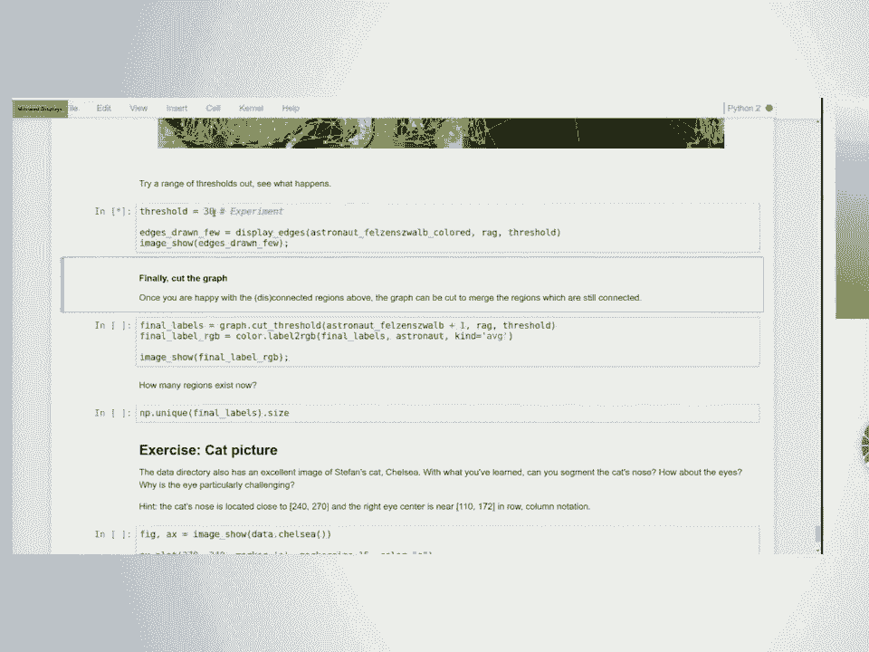

 And now that separated things out even a little bit better。 The face no longer connects to the hair。

 for example。 And so let's consider that our final cut。 And again， we can cut based on a threshold。

 So it's just like what we came up with here。 And use this label to RGB coloring that we've done just in the past and see how that looks。

 And we've lost a lot of detail in the face but again we have logical subregions that we've managed to combine。

 So we've reduced from 3，000 to under 400 individual areas。

 And some of those could be further reduced because they're fairly small just in the middle of other things。

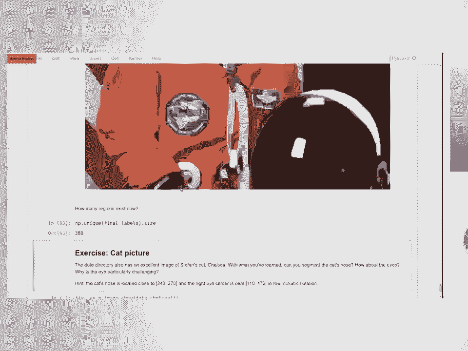

 Okay， I'm not sure we really have the example， the time to do the exercise with Stefan's cat。

 But on your own time or if you're at home and watching you。

 I've basically given some starting points that are in the middle of the cat's eye in the middle of the cat's nose。

 And then you could use this to iteratively attempt to segment out just the cat's nose or the cat's eye。

 And think about the challenges you might encounter along the way there。

 Because you've got the black eye and maybe you wanted the iris as well as this and how would you do that。

 Which algorithms would be more appropriate as an intellectual exercise。

 So any other questions about segmentation？ We get a lot of questions about this。 Okay。

 I'm not sure if silence is golden given the issue that seemingly half the class had with networks。

 But what I really would like everyone to take away is that there's this large distinction between supervised and unsupervised algorithms。

 And that given the approach and the problem that you have and the luxury you may have given the ability to have a human involved in the process。

 you are down in a entirely different pathway in terms of what you're trying to do。

 And then show you just kind of iteratively how any one of us would work through a new problem when it doesn't quite give us the result we encounter。

 The first time or that we wanted the first time， we look into the parameters， see what we can tweak。

 Because for a given problem or for given input data。

 there's a good chance the defaults might have to be changed slightly。 Okay。 All right。

 I'm going to assume silence is golden but you can hit me up at any time。 All right。

 so we're going to switch gears a little bit now， get our hands dirty on some real world problems。

 And this should be kind of a little bit more relaxing。 It's a last section for the afternoon。

 So if you click through to that Stack Overflow Challenges notebook。

 these are questions that were posed on Stack Overflow。

 Real questions that people had in how to apply a psychic image to their problems。

 So I've grabbed a few that I thought would be fairly easily。

 easily solvable and maybe off a guard to a few hours。 But we only have off an hour。

 So let's run through the different ones here。 So we've got the first one is from an NIH challenge that we participated in。

 And the idea was to build a mobile app for the cell phone that would allow people to photograph their medicine and then identify the medicine that they would take the right pills。

 So the images look pretty much like the one displayed up here and the challenge is find that PIL identified。

 segmented and calculate its area。 So that would be a first step in identifying the kind of medicine there。

 And then you can imagine， you know， later on you would measure its exact shape。

 You would measure maybe some attributes of the PIL itself。 But for this exercise。

 just try and isolate the PIL and calculate its area。 And I gave you some advice on how to do that。

 So a good start is like equalize the image to get the brightness up。

 So play around with the exposure dot equalize methods。 Once you've brightened the image up nicely。

 do some edge detection on it using the Canny edge detector。 I think that lives in the feature now。

 And then you can fit a circle model using the Ransac model fitter。 This is like， you know。

 all these problems are thrown out there and we kind of use the heuristics to solve them。

 So just use whichever creative method you want to solve them。

 But this is one example that I happen to know works。 One pathway that I happen to know works。

 In the second example， you have a photo of a bunch of coins。

 I asked that you count the number of coins automatically。 In the third example。

 you've got this image of a bunch of snake-like lines。

 And the question is identify the start and end points of each of these。 In this picture。

 we've got a bunch of M&Ms。 The question is how many blue ones do we have？

 And we want to count them automatically。 In this real world experiment。

 we have some liquid that goes through some phase change。

 And it's actually a pretty tough image to work with。 It's very noisy。

 The boundaries aren't very clear。 Everything's translucent。

 So all I ask here is that you try and find some kind of meaningful boundary of that snowflake-like object。

 So just try and see if you can segment some of those segments out that boundary。

 And you'll see that the noise makes it quite hard to do。 So pick one of these and give it a try。

 If you have a problem in the back of your head that you brought along。

 maybe some of your own data that you want to play with， feel free to do that。

 And we'll be here to answer questions as you try and apply these tools。 All right。

 So we'll give you 25 minutes to try and solve one of these problems。

 And then we can quickly run through the solutions and maybe do a five minute Q and A at the end。

 All right。 So it's about time to wrap up。 So let's run through a few of the solutions。 Like I said。

 there are many， many ways to solve these problems。 But we have a few sample solutions。

 So it's a collector's solutions。 I'm looking at these。 Right。

 So for establishing the parameters of the pill， you want to use IOM read to load the image。

 I equalize the image using adaptive， adaptive， Instagram equalization。 And then on that image。

 calculated edges using the Kenny edge detector。 So here's the original image。

 Here's the equalized image。 And here are the edges that you get from Kenny。

 The plotting doesn't show that very nicely。 It's just because the picture is shrunk in the browser。

 You change this to something else。 Yes。 You can see that you've got nice edges out there。

 And then you can use Ransact to fit a circle to that data。

 So Ransact is a really nifty method for if you've got noisy data， for fitting a model to that data。

 So it basically chooses three points at random from your edges。 And it tries to fit a circle。

 And it sees how many of my data points lie on that circle。 Then it randomly chooses another points。

 repeats the experiment， fits the circle， keeps doing that several times。

 And it looks back at the history and it says like where did I do best？

 And gives you back that circle。 So if you do that。

 then you get a nice circle that fits perfectly to the pill。

 And then you can use the circle to calculate its area。 I also applied morphological snakes。

 So that's similar to what Josh shared you earlier on。 It's a newer addition to scikit image。

 They take a while to compute。 And I haven't tuned the parameters perfectly yet。 But when it's done。

 you'll see that it sort of grabs the pill plus -- there we go -- pill plus the shadow。 Yeah。

 that makes sense。 That's sort of where the edges lie。

 And then you saw early on that you've got parameters that you can tweak to say like stay away from the dark areas。

 stay closer to the edges， that sort of thing。 This would also be useful if your pills aren't necessarily around。

 So if you have hexagons or triangular pills， that sort of thing。 For the coin counting example。

 the procedure that we do is we equalize the image to get the lighting up。

 We threshold the image to get a black and white version。 In this case。

 we just use or two thresholding to do it automatically。

 We remove all objects close to the boundaries。 Then we close the binary objects。

 which means basically we fill in all the small little holes。

 And then we count the objects that we get。 So。 What am I seeing？ Edges did not come out here。

 Where did I get rid of edges？ I did， sorry。 What？ I made these changes。 You made these changes。

 Thanks， Juan。 All right。 I'll have to fix that。 Okay。 So。 But it's binary two that you want。

 It's what？ It's binary two。 Oh。 Oh， here。 There we go。 Because they're not edges。

 That's why it's changing。 Yes。 That makes sense。 Okay。

 So there we have the coins labeled different colors and counted 24 coins。

 So this is sort of the easier version of the problem。 And the M&M one。

 which looks easier is the harder version because you've got the M&M touching one another。

 But this one you can get away with a fairly simple strategy。 So with this。

 the snake example is kind of cool because it uses the filtering that Juan told you earlier today。

 So we have two issues here。 So first we want to know like how do we define an endpoint of one of these snakes because those are the things we want to count。

 So what is an attribute that an endpoint would have？

 Like can you think of any attribute that an endpoint would have？

 There is white space to the most side of it。 Yes。 What was said about the white space？

 There's white space to the most side of it。 Most sides of it except for one。 Exactly。

 So that's the definition you need。 So the endpoint is like it's part of a snake but it's only connected to the snake in one direction。

 So to the sides up and down， et cetera。 Right。 So how do you find those in the image？

 Well you could write a for loop and you could say at each position go and check。

 First is the pixel dark。 Okay， great。 Then it's part of the snake。 Now check all its neighbors。

 Does it have only one neighbor？ But this sounds an awful lot like the convolution that we saw earlier on。

 Convolution can help us do this counting。 So indeed what we do is we define the following convolution。

 the following kernel。 We have once with a zero in the middle。 So this。

 if you convolve the image with this kernel， it basically counts the number of neighbors that each point has。

 So， right。 So that's one part of the problem is convolve the image count the number of neighbors。

 Now I've got a map。 For each pixel we know how many neighbors it's got。

 But then we're only interested in the pixels that are actually part of snakes。

 So to do that we have to do an "n"。 So we have to do give us the number of neighbors but only if that pixel is actually part of the snake。

 So for that we use that "and" operator。 So let me show you first the count。

 So we have the whole solution here。 So that's the whole solution。

 So you can see it finds the endpoints but I just want to show you this intermediate result that you get just after you do the convolution。

 Just counting the neighbors。 So you see that it gives you back this map where most of these points that are part of the snakes they have two neighbors。

 One to either side。 And then right to the ends the color goes down a little bit。

 So you can't see that on this image but it goes from two to one because it only has one neighbor。

 So then we're interested in this image in the positions where it's got only one neighbor。

 For the M&M one one came up with a better solution during the tutorial but I did something fairly simple which was denoise the image because we don't really care what's going on inside the M&Ms。

 So denoise the image using any method available I chose to use denoise nonlinear means。

 I calculated the distance away from blue to get an idea of where the blue ones are。

 This I call the "mask" my mask。 So I'll show you how that looks。

 So just calculating the distance away from blue and segmenting that distance gave me a very nice mask。

 And then you can go and count the number of objects you see inside of this mask。

 You have a bit of a problem because some of these touch。

 So in order to disambiguate those you can use watershed segmentation。

 And if you apply watershed segmentation then it counts。

 yeah gives you a count of 12 and there are 12 M&Ms。

 For the fingers here you convert the image to grayscale because it is a grayscale image really。

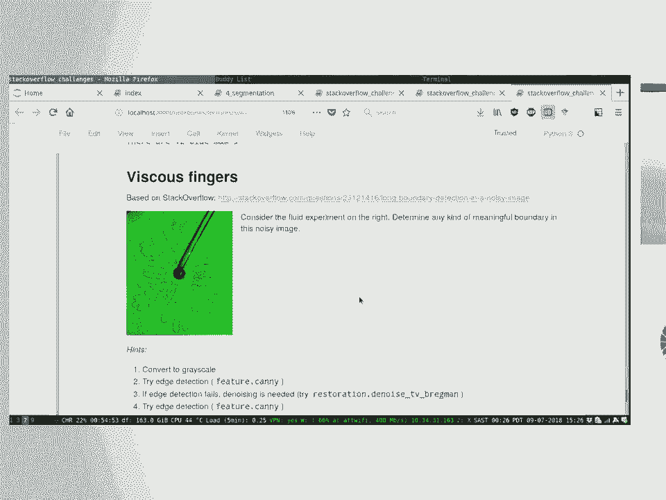

 They just add some odd lighting there。 And then if you tried candy edge detection you would have noticed that it's an extremely noisy image。

 You get noises edges all over the place。 So what you definitely need to do some smoothing of the image。

 So I use the total variation denoising algorithm and then apply the candy edge detector。

 And when you do that with the right parameters you get something like this。

 So you can see it's not a done task。 You still need to do a lot of cleanup on that result。

 But at least you have a nice boundary that you can work with from here on forward。

 Alright so I hope that gave you sort of a good overview and a bit of a taste for a psychic image and the tools surrounding it in the scientific python ecosystem。

 If you have any questions we'd be happy to stick around and answer them。

 But otherwise thank you for attending and we look forward to meeting you during the rest of the conference。

 [Applause]， [ Silence ]。