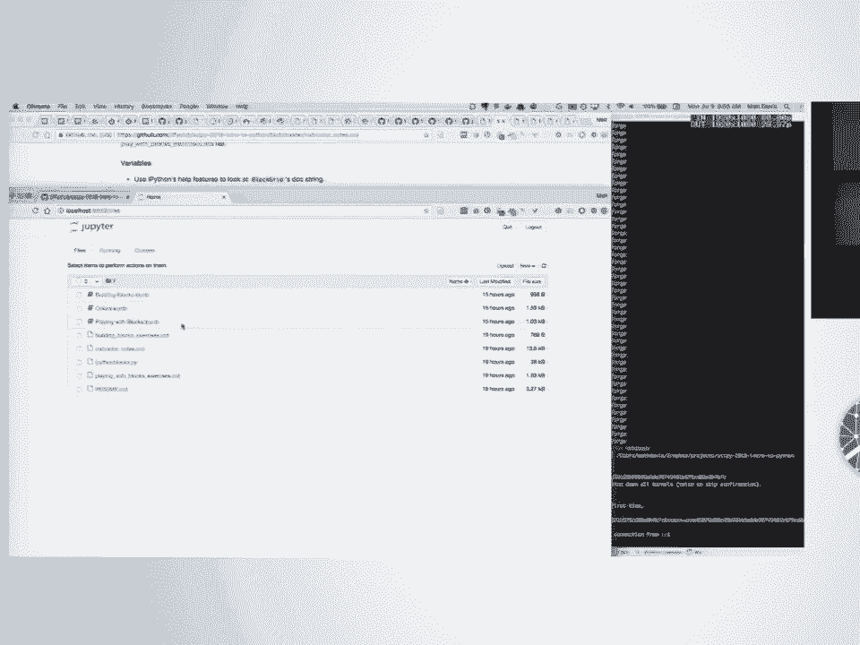
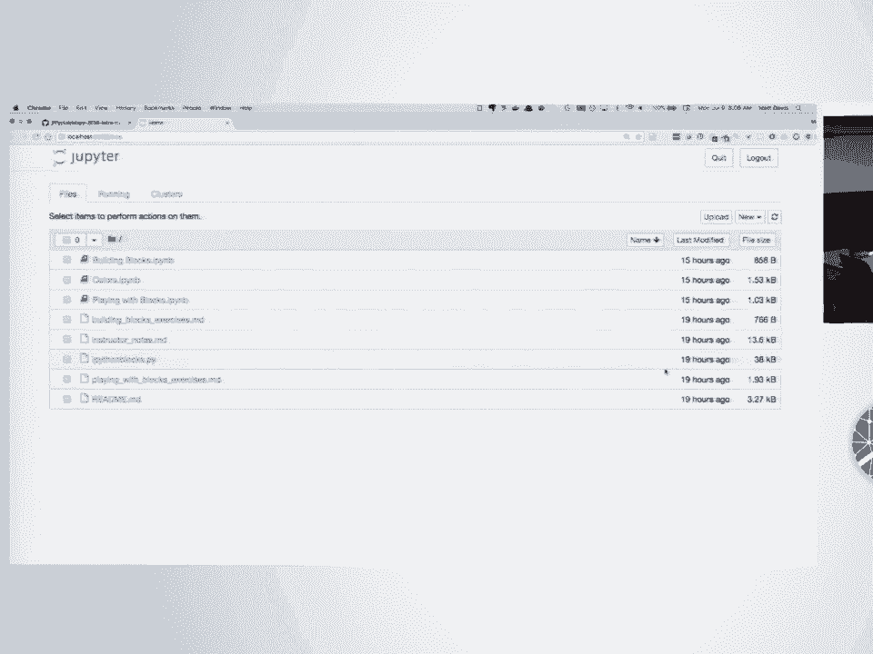
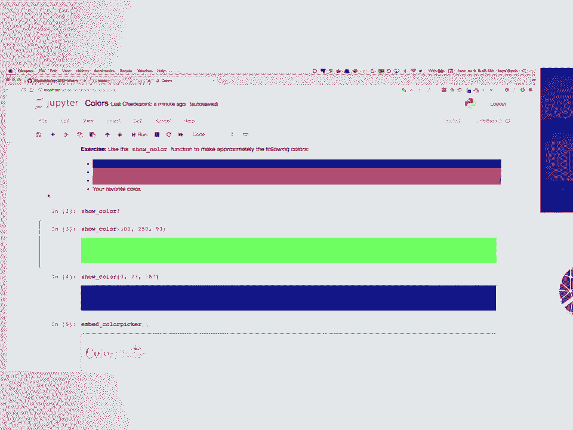
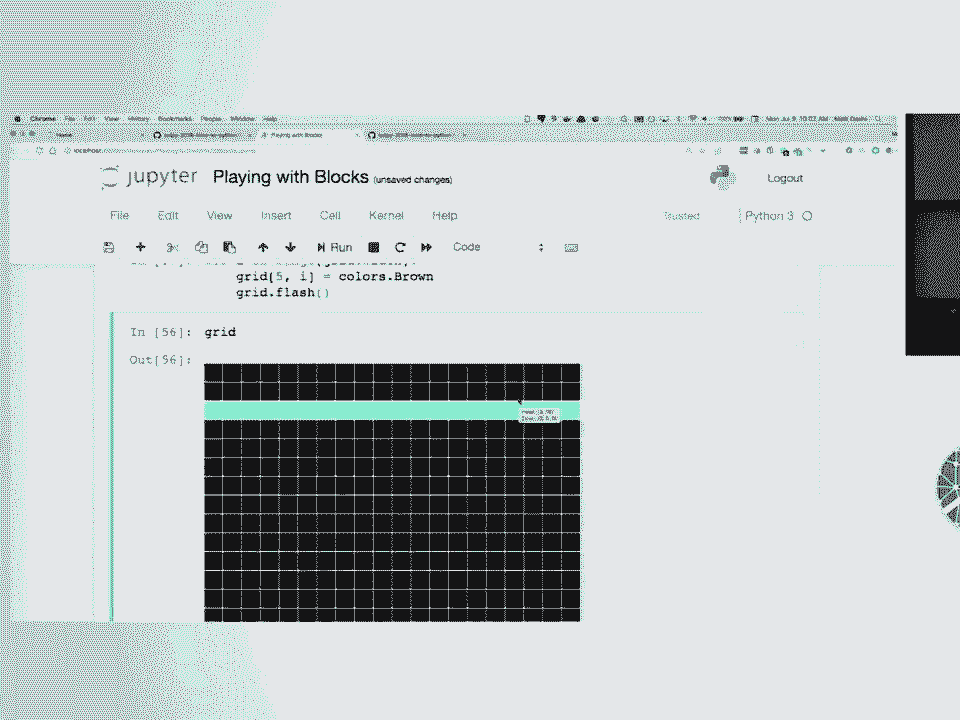
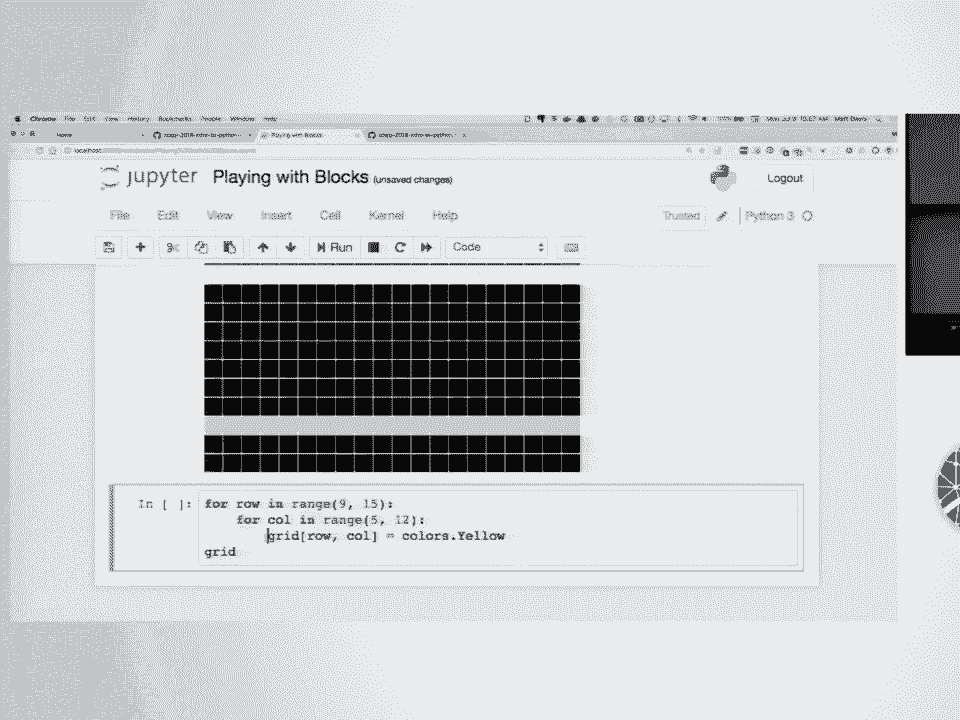
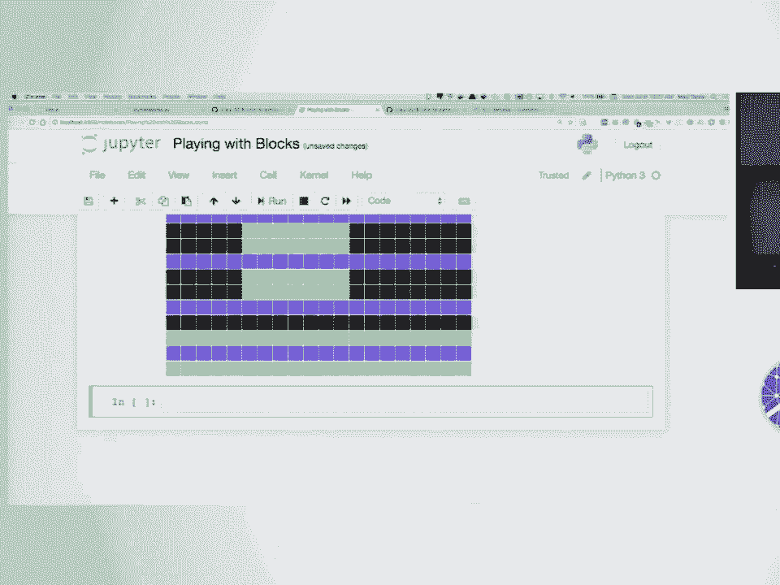
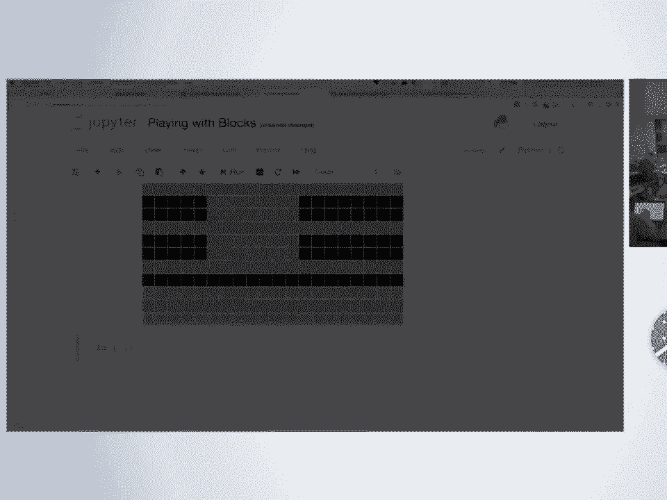

# P53：SciPy 2018视频专辑 (P53. Introduction to Python and Programming _ SciPy 2018 Tutoria - GalileoHua - BV1TE411n7Ny

 We're the intro Python channel in Slack。 I'm gonna be like putting instructions and。

 links in there so you'll want to join that slack so you can get prepared。 [SOUND]， [BLANK_AUDIO]。

 So I put a link in Slack to a zip file to download of our Git repo。

 The zip link will download a whole archive for you。

 The goal we're gonna be getting to for you before we get started is being able to open。

 up a Jupyter Notebook in this directory so that we can work on them。 [BLANK_AUDIO]。

 So if you know how to do that， go ahead and download and。

 unzip this and open up a Jupyter Notebook where you're in this directory。

 And you'll see a couple of notebooks。 [BLANK_AUDIO]， If you don't know that。

 how to do that will be coming around to help you。 So start with getting that downloaded and unzipped。

 [BLANK_AUDIO]， [BLANK_AUDIO]， Do you happen to know the Slack URL for the sci-fi？ It's， let's see。

 [BLANK_AUDIO]， Yep。 [BLANK_AUDIO]， [BLANK_AUDIO]， Mm， good。 >> Not quite yet。 >> Cool。

 that's just a second。 >> I would probably， more or less， yeah。 And。 [BLANK_AUDIO]， Okay， cool。

 thank you。 [BLANK_AUDIO]， [BLANK_AUDIO]， Was everyone able to install anaconda before coming？

 Anybody not have an anaconda installed？ That looks good。 >> Is anyone able to？ >> Yes。

 but you will need to install。 >> Like if you have Jupyter installed， you're good to go。

 That's all you need。 Okay。 >> [INAUDIBLE]， >> There are intro Python channel in Slack is where it will be。

 Yeah， there's， for all of your tutorials， there was like a Slack channel。 Which one？ Okay。

 Someone not having anaconda？ Okay。 [BLANK_AUDIO]， >> So for folks that came in。

 if you check the Slack channel， it's intro Python on the， site by 2018 Slack。

 There's a download link of a zip file of the course contents。

 Download that and then we're trying to open a Jupyter notebook in that directory。

 And I paste it in a screenshot into the Slack channel that shows kind of what。

 you'll see if you're in the right place。 >> So for anybody who's uncomfortable with Git on the command line。

 you'll probably， need to use Git at some point and during the rest of this conference and。

 another tutorial。 Git Hub has a desktop。

 Do we have a patient from Mac and Windows that I posted in the Slack channel？

 So hopefully that can help。

 [BLANK_AUDIO]， [LAUGH]， >> And again， this is what you'll see when you've got Jupyter open in the right place。

 [BLANK_AUDIO]， [BLANK_AUDIO]。

 >> Okay， we're gonna get started。 My name's Matt Davis。 Alyssa is our other instructor。

 Michael is gonna be here to help us out。 We'll always， whoever is not at the microphone。

 will be here and， available to help you， so feel free to raise your hand or say something in Slack。

 We'll be keeping an eye on it as we go。 The lesson today is really to get you oriented in Python the language。

 We're not gonna dive deep into scientific Python or anything like NumPy。 Mapplotlib pandas。

 there are other tutorials for that stuff。 We want to get you ready to write and understand Python。

 And as we're going， feel free to ask questions out loud。

 You can raise your hand and ask the instructor something。 You can， like I said。

 you can do it in Slack。 If you just need help and you don't have a question。

 just try to flag one of us down， me or Alyssa or Michael。 Yeah， you ready？ All right。 [BLANK_AUDIO]。

 Any questions before we get started？ [BLANK_AUDIO]， I will get started。

 So you should almost all of you， I think， are at the point of having。

 the Jupyter notebook opened in our lesson repo。

 Like this， we're gonna start off in this colors。ipi。 So if you click on that， the ipi and。

 the files are ipython notebook files。 So you should hopefully we'll see something like this。

 We're gonna be working with a library here called ipython blocks that。

 kind of visually shows you colors in the notebook。

 And we're gonna get practice doing things like writing functions and。

 for loops and if statements using these。 So to get started。

 we want to kind of get oriented in the notebook。 The first thing to kind of know is that there's text and code in here。

 So these cells are what are called the markdown text。 If you were to double click on one of these。

 it would turn into like the raw text。 And to execute a cell， you do shift enter， not plain enter。

 It goes back to rendered。 This with the word in next to it is a Python cell。 So this is Python code。

 we're gonna import ipython blocks。 So I did shift enter on that。 So after you've executed a cell。

 a little number appears here。 This is the order in which cells were executed in the notebook。

 So that's the first Python cell we've executed here。 So it's got a number one next to it。

 Did this work for everyone who has gotten this far？

 This is like test one that you can execute Python code。 >> What do you mean by it does do to work？

 What should it appear to be？ >> So basically that this number one appeared next to it。

 I'm not like when I ran it， nothing appeared in the notebook except for， this number one。

 so that meant it was successfully executed。 >> It was shift and enter。 >> Shift enter， yeah。

 >> At the same time。 So the notebook has a lot of fun help features that I want you all to use a lot today。

 So you'll notice we imported a few things， show color and， bed color picker and colors。

 So now these things are available to us to use。 So， Python has tab completion。

 so I typed out show with an underscore and， hit tab and that completed for me。

 One of the help features is you put a question mark at the end。

 So you like type out one of these variable names， hit a question mark and。

 do shift enter and a box pops up at the bottom of your screen with like the help。

 text for this thing。 Show color is a function。 It says it shows a color in the notebook。 It takes。

 this is how you call it。 So it takes three arguments and they're all going to be integers in the range 0 to 255。

 We're going to be working with RGB colors today where you provide a red value。

 a green value and a blue value and those get combined to make a color。 So as an example。

 I'm going to make something up。 Got a very green color。 So play with this。

 Another way to get to that help is if you start with the parenthesis here with。

 your cursor in the parentheses like you're going to call it and， you hit shift tab。

 a little floating help box shows up。 And if you hit shift tab again， while that's open， it expands。

 And shows you essentially the same thing that happened when I did the question mark。

 But now it's not in your way and you can keep typing from here。 For example。 >> [INAUDIBLE]。

 >> If you're really excited to find your favorite color combinations。

 the embedded color picker function will actually， so。

 that the help text here doesn't have a lot in it， which means you can call it， with no arguments。

 So if you're calling a function that doesn't accept any input， you put empty parenthesis there。

 This will actually embed a little color picker in here。 So that if you really。

 really need to find your favorite color， you can do that。 The red green blue are over here。

 so this RGB。 These are the numbers you would want to use to get to use your favorite color。

 So I want you to spend two， three minutes fippling with this and。

 just kind of getting used to running things in the notebook and。

 picking out some of your favorite colors and getting a sense for how this works。 Just a moment。

 not too long。 >> Can you scroll so it gets to be a bit similar？ >> Yeah。 >> Mainly。

 I want verification that you can call these functions and stuff like this shows up。 >> Yeah。

 >> So when you said you use visual color， can you just write that green blue there as well？

 >> If those were variable， like if those were named variables， you could。

 The function is going to interpret those as integers。

 So here I've been literally writing out integers。 If we try to。

 you're thinking of something like this。 So if we try that， we get an error that red is not defined。

 We could fix that though。 If we give those names some associated value， now we can use this because。

 I forgot an equal sign。 Now that'll work because there's an integer associated with those values that this function can work with。

 Does that make sense？ A couple other things to note about the notebook。

 There are a lot of keyboard shortcuts。 There's like menus up here。

 A lot of keyboard shortcuts that you're used to will work。 Like on my Mac。

 I can do the same save command I used in any other program， command S， and it will save this。

 You can add new cells。 So if you wanted to put a new cell in between these two up here in the insert menu。

 you can do that。 And some of these are shortcuts for rearranging things or running things。

 You can cut and paste entire cells into different orders。 You can move things up and down。

 There's short keyboard shortcuts。 How do you do the keyboard shortcuts H？ Okay。

 So I pressed H and I got these keyboard shortcuts help menu。 There are zillions of them。

 So you can peruse those at your leisure。 But if you ever see me magically appearing things into the notebook。

 I'm probably using keyboard shortcuts。 And the other thing to note is that there's kind of two modes。

 There's like an edit mode and a command mode。 When the little bar on the left side of the cell you're working on is green。

 you're in edit mode。 And you'll see your cursor。 And if it's blue。

 you can press escape or like click outside of the cell。 So you get back into command mode。

 which is where most of the keyboard shortcuts work。

 There's like some keyboard shortcuts work all the time， like command S。

 because they're like key to a special key。 Some of the other ones only work in command mode because they don't have a special key associated with them。

 And in the pressing H to get the help menu only worked when I was in command mode。

 Otherwise it would be typing H's。 Yeah。 Okay。 All right。 Yeah。 So that would。

 so this is embedding an entirely different website。

 So like all of that would be associated with this color picker。com website。

 Not something that would be very helpful to you in the notebook here。 Okay。

 So anyone who is not able to run a little bit of code here。 Cool。 Okay。 So when we're going to。

 I'm going to close this here in the Jupyter homepage where it lists things。

 You'll notice this is green now。 This means that there's like a running IPython process associated with this notebook。

 You can shut that down if you want。 If you save it， like you can reopen this later。

 It's a document now。 Every， all the work you did is like save there。

 But if you shut down the kernel and like reopen it later。

 you'll have to re execute the cells in order to kind of get back into the same state you were in。

 But all of that code and all of that output is saved in there。 So I'm going to shut that down。

 And then the next one we're going to get into is this building blocks that IPython be。

 There's not a lot in here。 We're going to be working through a series of exercises that you'll want to have up the building blocks exercises file。

 I will paste this into Slack。 You can also open it up as a file out of the same directory that you downloaded。

 If you want to open it up on your computer。 Oh wait， no， I'm sorry。 Playing with blocks。 This one。

 Should look like this。 Okay。 [inaudible]， [inaudible]， Okay。

 So I'm actually going to close that one and going to play with block playing with blocks。

 Even though they're basically the same。 Okay， so same deal here。 Shift enter in this first cell。

 When you run Shift Enter， it creates a new cell for you at the bottom。

 If you're at the bottom of the notebook or it moves your cursor down to the next cell if there's more stuff in the notebook。

 If you ever need to get a new cell because you didn't get one where you wanted one for some reason。

 use the insert thing and it'll wherever your cursor is。

 So I have this cell selected so I could insert new cells above or below this second cell here。 Okay。

 so the main kind of thing we're going to be working with here is something called the block grid。

 So you can follow along with me here or watch。 So remember the help so we can see that the arguments this thing takes。

 It takes a width， a height， fill color。 Block size and some other arguments。

 You can read about those。 Don't worry about those。 The width。

 the height and the fill are the main ones。 And even the fill。

 These ones that have values next to them mean that there's a default for those。 So you don't。

 they're optional。 And if you don't provide them， this default is what you'll get。 So like 0， 0。

 0 is black。 So if you don't provide a fill color here， you'll get black。

 I don't know if I can make this a little bit。 It's better。 It's better。 Yeah。

 it comes in a little bit smaller than my main text。 How do you call it that？ Oh yeah。

 So when I have my cursor in the parentheses here， it's Shift Tab。 And then Shift Tab。

 this gives you kind of like the first three lines of the documentation。 If you do Shift Tab twice。

 you get the full thing。 So here， you can't， if I do it once， if I do Shift Tab once。

 I get this little bit。 If I do it twice， I get this big thing。 So you have to do it Shift Tab。

 Shift Tab。 And it will hopefully open up a bigger screen that there are bigger display that then is scrollable。

 And remember the question mark too。 If you want that help to open up in a holy。

 like in a whole different part of the window， you can also do that with the question mark。

 But then it takes up a bunch of your screen with the help。

 So we're going to make one of these grids and save it in a variable。 I'm going to do a 5x5 grid。

 I'm not going to worry about the fill color。 So this equals sign， the assignment。

 this is called an assignment。 The thing on the right side of the equals sign is getting associated with the name on the left side。

 So now I can refer to grid and it has what's that grid。 You saw me a minute ago do numbers this way。

 So I could say red equals 200。 And now the name red is associated with the value 200。

 the number 200。 We'll get later into some other types of things that you can make in Python。

 You'll notice here that when I put a variable all by itself on a line and ran that。

 I Python essentially echoed it back to me。 And if I did this is another example。

 So this is kind of a feature of IPython that whatever is when you have a variable。

 and by itself on the last line of a cell， it echoes that back to you and displays it to you。

 So you can use that to kind of see the state of your grid。

 Grids also have a show method that we'll get it to show up to。 So I need my notes。

 So comments in Python have a hash sign at the beginning。

 So anything after a hash sign on a line of Python code is a comment and is ignored by any kind of execution。

 You can put them on lines by themselves。 You can put those at the end of lines anywhere in a line。

 But once you have a hash mark， nothing after this code。

 Do you use the same kind of comments in text for SQL for comment blocks with a slash asterisk？ No。

 So there's a couple of kind of ways of doing the block comments。 For kind of inline code。

 the most common thing is to put a hash at the beginning of every line。 And in fact。

 most editors and even Python have a shortcut for that where you can select a bunch of things。

 On my Mac， it's command forward slash and it turns all of those lines into comments。

 There's also something called triple quotes that you can use to create really long strings。

 And they are used to create documentation for certain things in Python。

 But for the kind of comments that show up in the middle of a function。

 the hash sign at the beginning of the line is the way to do that。 Okay。

 So kind of everybody have a grid。 So they've created a variable。

 So that's your new vocabulary word here。 Is "variable。"。

 Is saving the result of executing something and associating it with a name that you can use later。

 Variable。 Cool。 So that was exercise one。 We're going to keep going。 Okay。

 So we're going to look at indexing。 So this is getting things out of the grid。

 And I intentionally kind of made these grids work a lot like NumPy arrays。

 So you're kind of learning NumPy array indexing syntax here。

 And it's similar to how it works too with Python lists， which you'll see later。

 But these are like containers for things。 So if you want to get one block out of here。

 we'll do grid square brackets。 And this is a two dimensional grid。

 So you have to give a row and a column。 Python is zero indexed。 So the first element has index zero。

 It's a little black square。 We can change its color by assigning a new value to its RGB attribute。

 So block， again， I'm throwing a lot of new terminology at you。 So I want to go slow and revisit it。

 Block is a variable that contains the result of doing this indexing on the grid。

 And these are indices。 This is the -- this dot RGB is an attribute on the block。

 So an attribute is a data attached to a variable that you access with this dot syntax。

 So block is my variable。 And then dot RGB is a piece of data associated with this。

 It has data in it right now， actually。 If we echo that， we see that it echoes back its color， zero。

 zero， zero。 I can change it。 Another -- actually an example of this。 At the top here。

 we imported something called colors。 That is a bunch of preset colors if you don't want to have to make one up on the spot every。

 time。 This is another example of ipython's tab completion is that when you're kind of wondering what。

 are the attributes or methods -- methods is another thing we'll get to -- associated with。

 a variable。 Again， we're going to -- for tab completion -- so， I -- sorry。

 tab -- if you want to see， kind of -- ipython uses tab completion to show you kind of what's available。

 So if I hit tab here -- so， I'll -- this was not shift tab。 This was plain tab。

 It showed me the things that I can kind of complete off of this color's variable。

 And this is scrollable。 And then you can click on one and it will fill it in for you。

 Or you can like scroll -- you can use your arrow to go through it。

 Or you can keep typing and hit return to have it populate。 So if I echo that， it's a color tuple。

 But I can use one of these so I can assign a new color to this block。 Execute that。

 So I didn't get any output from this one because I wasn't echoing a variable at the end of。

 this -- in this execution block， I was saying， assign the thing on the right to the thing。

 on the left。 And that's it。 But if we look at the grid now， you can see which one we changed。

 So we're starting with -- so， remember， this was the block at zero， zero。

 So that started in the top left。 So the zeroth row is the top row。

 The zeroth column is the leftmost column。 And it goes zero， one， two， three， four。 Right？ Question？

 >> Yeah。 That's a good question。 So the question was。

 when I pulled out this one block and then kind of changed its color， in isolation。

 when I went back to the grid that block's color had changed， why is that？

 And that's a good question。 In a lot of instances in Python。

 when you pull something out of a container， you're getting， not a copy of that thing。

 but you're getting the both the container and the variable which， you assign it to。

 So a block in this case are holding the same thing。

 So this variable block and the block that's inside of the grid are the same。

 Not just variables containing the same data。 They are literally the same object in Python's memory。

 So when I change one， I change the other。 >> It would depend on what you had available to you with the things you're working with。

 >> Okay。 I didn't put a copy method on blocks， but some kind of data types that you work with。

 may have a copy thing associated with them that allow you to copy them。 In this case。

 we would want to write probably a little custom code that created a new block。

 using the data from that one。 Some things you don't have to worry about this because they cannot be changed。

 They're immutable。 Emutable means cannot be changed。 Mutable means can be changed。

 Sometimes you don't have to worry about changing something that you pulled out of a container。

 because it intrinsically cannot be changed。 Integers are an example of that。

 You can pull an integer out of a list and add things to it without changing the integer。

 in the list because you cannot change an integer。 It can be a little bit tricky though because you put a variable in a list and then change。

 the value associated with that variable。 You can change the value in the list。 Okay。

 So as an exercise， change the color of the block in the third row。 Oh， yeah， question。

 Good question。 The question was， can we do this the other way around？ So if I did grid 0， 0。

 dot RGB equals， we'll do turquoise this time and then look at block。 Yep。 So in either case。

 those are the same， what we call object or the same instance of a block。

 I'm trying to think of a good way to illustrate that。

 So what you're really going to do is create a variable。

 You're not making a copy or creating a new variable。 You're simply aliasing an existing。 Yeah。

 So Python has a， when I created this grid， Python create， like part of creating a grid。

 is that it creates a bunch of blocks。 And when I pulled out， when I did this assignment。

 Python created a new variable called block， that pointed to the same block that already existed inside the grid。

 So it's not making a new copy of that block。 It's making a new name that's associated with it。 Yeah。

 I don't have a， if I had a whiteboard， I could do a good illustration of this。 But like。

 you can kind of think of it as like， oh， I do kind of have a whiteboard。 I'm going to change。

 So we have like x equals one。 And I'll try to be loud because I'm not on mic。

 And then let's say y equals two。 One and two are numbers that exist in Python。

 And then there's x is associated with this and y is associated with this。

 I think this is a good example。 I don't know if I love this example。 Do a list and make a。

 and then assign it to another variable and then change value in， the first list。 Yeah。

 You could actually demonstrate that in a book too。 Yeah。 So let's say， we'll see list later。

 but the list is a Python sequence of values。 And then if I say like， y equals， yeah。

 this isn't going to work either。 Well， so just two y equals x。 Yeah。 So if I do y equals x。

 I don't get a new list。 What's happening is that both x and y point to the same list over here。

 And if I change y， I do something like y is zero equals 99。

 Because these both point to the same list， it'll change， changing y is the same as changing， x。

 They're different names for the same thing。 So that's very different than other programming languages。

 So is there a way to just get a copy of x？ Yeah。 Yeah。 So there's a lot of techniques for that。

 So I can demonstrate that here。 All right。 So that's illustrating that。

 If you want to make a copy of a list， the usual thing is to， if we instead did starting， over。

 if I wrap that x in a list， that copies that makes a new list containing the same。

 values that were in the first one。 Yeah。 So this is something to keep in mind when you're working with Python。

 This comes up in the context of NumPy and pandas and Python lists some dictionaries that we'll。

 see later。 It's like whether you're working with a copy or with data or with the original thing。

 It comes up less often than you would think， though， in my experience。 Okay。

 So I wanted to do an exercise so you can practice this indexing a little bit more。

 Exercise two here is to take your grid and change the color of the block in the third。

 row and fourth column。 Question？ When I was doing this one？

 So the ID is like an arbitrary number associated with a Python variable。

 The point here is that these two things return the same arbitrary number。 So again。

 illustrating that these are literally the same thing as far as Python is concerned。

 So I give you a minute or two to do exercise two here。

 So I'm going to do the color side of the bunch of color。

 So I will import the color paper and that thing and still show。

 And then I'll just go ahead and do the color。 And I'll just go ahead and do the color。 Okay。

 So third row fourth column。 So to refresh my memory， my grid looks like this。 I can kind of。

 instead of pulling out the block and then changing the color of that block， variable。

 I can kind of string everything together and do the indexing。 So third row is 0， 1， 2。

 Fourth column is 0， 1， 2， 3。 RGB equals colors。 Red。 So third row fourth column。 You look puzzled。

 And to keep you all going， we're going to go through a couple more exercises and then。

 we'll take a break。 So probably at about 9。25 or so， we'll take a little break。 Michael。

 do you remember or have heard about the official coffee and snack break？ Is that a thing？ Yeah。

 Thanks。 Have you come up with a question？ Okay。 Okay。 So here's what's happening。

 And I just skipped things。 I was a little behind you， I think。

 And what I'm getting is just the block itself that I changed the color of。

 So I need to change the grid name too。 Like I can kind of see what--。

 So did your grid variable get associated with a block instead of the entire grid？ Okay。

 So let's see。 You can always go back to the top and copy out the grid equals block grid thing and make。

 a new one。 Coffee is available all day。 All day。 No， special snack break or anything。 I mean。

 I think they're going to have snacks。 I think it goes away at 10， 30 or something。 Okay。 Cool。

 Where are my extras？ Okay。 Can you say that says checkpoint creating？ Uh-huh。 Is it special？ Say。

 I think that's--， Honestly， yeah， okay。 Here it is。 Nice。 Yeah。

 So I just asking about the--when they did save， it does this checkpoint and then--I don't， know。

 It doesn't seem to keep all of them， but you can revert back to like a certain checkpoint。 Okay。

 And then--Okay。 And then exercise three is to change the color of the block in the lower right corner of the。

 grid。 So that's to the max in both the row and the column。 So 0， 1， 2， 3， 4。

 And when you're working with Python sequences like lists like these grids， Python has like。

 a special syntax for indexing from the back of a thing using negative indices。

 So I could have done the same thing with a negative 1。 So negative 1 is the last one。

 Negative 2 is the second to last one。 Negative 3 is the third to last one。 Yeah。 Well。

 0 is the first one。 So we couldn't reuse that for things at the end。

 So it starts at negative 1 going backwards。 This is handy when you want the like last thing or the last few things off of something。

 without knowing how long it actually is。 So you don't have to do like length math to get like the last four things off of a Python。

 sequence， which is nice。 And finally， the last exercise for here is to use negative indexing to change the color。

 of the block in the second row and first column。 So you're actually going to change something near kind of the front of the grid using indexing。

 from the back。 Melt your brain。 We'll take a break afterwards though。 (inaudible)， (inaudible)。

 (inaudible)， (inaudible)， So let me see if I can make that happen here。

 So my grid goes from is five by five， so in positive world it goes zero， one， two， three， four。

 So if I throw in some numbers bigger than four here， I get an error saying list index out of range。

 because I've asked for something that is beyond the bounds of this grid。

 So the exercise was second row， first column。 Because my grid is five by five。

 I'm going to have negative indices， negative one， negative two， negative three， negative four。

 negative five。 Second row would be negative four。 And first column would be negative five。 Yeah。

 any questions about kind of like we've covered like variables and indexing and attributes。

 that's an attribute。 This is an attribute。 When we。 let's take like a。 Let's come back at 9。

30 on the dot and get started。 So take a break， get some coffee， et cetera。

 We'll start talking about kind of looping over the contents of the grid and getting to。

 operate on everything in there instead of having to pull them out one thing at a time。 Cool。

 I'm gonna have to eat in the back room。 Yeah。 Okay。 That's probably about as piecing。

 One of you all discovered a fun little gotcha with Python， which is that if you mess up。

 one of the attribute， if you mess up the attribute name， for example， into RBG instead， of RGB。

 you don't get an error， but also it doesn't work。 This is because。

 And it doesn't work because you're not assigning to the expected thing， but you don't get an。

 error because Python lets you set arbitrary attributes on objects。

 You can just take most any old variable in Python and attach something to it with your。

 own fancy name。 And that's a feature。 But it also can lead to bugs。

 So if you're typing something out here and you're like， "I'm not getting an error， but。

 also the thing I expected is not happening， you might want to look for typos。"， So if I typo grid。

 I'll get an error because that top level variable is not defined。 In fact， if I typo。 Well。

 let's see。 And if I try to read an attribute that hasn't been set， I'll get an error。

 And now I could do RBG because I don't know because I was here。 If I did this。

 this would work now because I set that。 It wouldn't have worked before I set it because it's not something that's part of the program。

 I realized that it kind of forgot to introduce us beyond our names。 I'm Matt Davis， Alyssa Whitwell。

 We both work at Clover Health， which is a Medicare Advantage Health Insurance Company。

 We're based in San Francisco where we work。 We use Python for everything there。

 Alyssa and I are software engineers， though both of us have worked in data backgrounds， as well。

 At Clover， we use web applications that run in Python， data systems that run in Python。

 and machine learning and data analytics in Python。 Everywhere it's Python。 It's great。

 I've been coming to SciPy for close to 10 years now and always enjoy it。 It's a lot of fun。

 You should come back if you haven't， if this is your first time。 I hope it's great。

 I'm going to turn it over to Alyssa to start teaching you about doing loops and getting。

 to work on all of the blocks with just a little code。 As a software engineer。

 I use notebooks occasionally for prototyping， testing things and being like， how does this work？

 How do this does it work？ I see notebooks all the time up on the computers of our analysts and data scientists and machine。

 learning people， though， all the time。 Copy and paste it。 It's usually nothing so big。

 but it's usually a fairly small chunk of code， so I'll copy， and paste it back over to a text file。

 I have a question about RGB。 I tried it， but without the RGB， it still takes the opportunity。

 You did something like this？ Yeah。 Yeah。 This is because I wrote it this way。

 When we do the dot RGB， it's pulling out that block and then doing an assignment to the block。

 When we do it this way， a special method， a special function attached to the grid is getting。

 called with -- it's called setItem。 So it's setting set the variable at this index to this value。

 And it's doing -- it's grabbing that block and assigning the color to it under the hood。

 I didn't have to write it that way。 I could have made this not work and required you to do the dot RGB and get out the grid。

 but I wrote it so that this works。 Okay。 Alyssa， take it away。 I'm shorter than Matt。 Oh， good。

 Okay。 My name's Alyssa Whitwell。 Like Matt said， I'm a software engineer at Clover。

 and I used to be on our data science， team。 I've been in healthcare for a pretty long time。

 so I worked a lot with healthcare datasets。 This is not a healthcare dataset。

 So far we've been talking about how to individually change a single block at one time， and we've。

 been using this indexing function。 But if you're using something like Python。

 you probably want to do this in a more systematic， way because you're using a computer。

 And so we're going to talk about four loops now。 So if we wanted to actually go through and programmatically change all of the blocks。

 in our grid， we can actually do something like for block in grid。

 So that's cycling through every block in the grid， and then we can set the color to something。

 like red set colors。 And then I picked a cool green color。

 So one thing you'll notice is you start with， you basically create some sort of variable that。

 represents all of the blocks that you're going through。 So I picked a block。

 but you could pick something else。 We already have our grid instantiated。

 so you're cycling through all of the items in your grid， which are these blocks。

 And you're saying at each one that I arrive at， set the RGB values to this。

 And it systematically goes through and then turns all of them into this color。 Yes？

 So is there a syntax where you can put grid after your core statement in your line 33。

 such that it shows up grid with a single execute？ Are you saying that you wanted to show at the end？

 Yeah， like so after you get your block to RGB statement， once it would be the syntax。

 to add grid after that to have it show the grid in this hit shift and it wants to stay。

 and have to go out。 I think I can do it just here。 Do you mean like this？ Or。 I'm sorry。 Yeah。

 so I just did that to put it in a separate block， but you can totally put more。

 code after a four block。 One other thing to note， the Python way is to have pretty indentations。

 So if you start the for loop， you have to have an indentation here and then we exit the for。

 loop so that's why the grid is now back on the starting point of the for。

 It's because I'm tapping out。 So if I don't know what will happen if I do this。

 Nothing that's what I did。 So yeah， you need the tab。 There you go。

 You can have certain things like we'll talk about if statements and things like that where。

 you can have different conditions and they will break out or you can return things。 But yeah。

 this is basically all you need to do。 It's implicit。 So if you were to do more things here。

 it would happen at the block level rather than， the entire grid level because you're going through the for loop。

 That's a good question。 I don't know。 Do you know that？

 It's essentially because I remember this is a picture of Python that it's like echoing back。

 out that last value when it's inside the block， I Python's not picking that up as something。

 to show you。 I wonder if you did like great that show。 It might show up in there 25 like 25 times。

 Oh， there you go。 Okay。 So because Matt wasn't miked。 This is an IPython feature。

 So IPython will print the last thing that you had in the cell and since it was not the last。

 thing in the cell， that's why it only printed once。 Cool。 Now I have a lot of amazing blocks。 Okay。

 So let's see。 So we were kind of talking about like what if you want to have other behaviors here like。

 break statements or things like that。 You can actually add more conditions and you can loop over with an if statement。

 So if we did， oh， sorry。 There's another thing that you can do。

 You can actually see it happening in real time。 So when it's looping through。

 it's looping through the function and then you see the end， result。

 which is the fact that we changed every single block。

 But if you actually want to see the feature of it looping through and changing the colors。

 you can use this function called animate。 And then you can do alternate back。

 So this is essentially a visual representation of the for loop。

 It's going through every single block and changing the colors。 The animate function。

 I believe is built in so it will display。 So instead of us having to show something over and over again。

 it's built into the function。 And it's actually like refreshing every block color as you go。

 And when we are updating things， there was like a weird， like a good thing。

 So it was like flashing before。 So Matt fixed that。

 So what happens if you want to change only certain blocks but still use a for loop？ In this case。

 we can use the row and column attributes for a grid。

 So if we do something like animate and I have an if statement， so if the row is equal to， two。

 only change the color。 Just kidding。 Oh， I did。 Okay， cool。 There's a lag。 Okay， cool。

 So we are using our animate feature again， which confused me。

 And we are adding a second condition so we are looping through every block。

 And now we want to know if the block belongs in a certain row。

 So it's going to cycle through each block one at a time and it will see is it in row 01234。

 For the first two rows， for instance， it will not meet this condition。

 So it essentially ignores anything that's inside of the if statement。 So as it's cycling through。

 it says is block。row equal to zero。 It's not so ignore and then finish that cycle loop through the next block。

 For anyone that meets that condition， it will then look at this also indented condition and。

 change the colors to the green color that I picked。 I'm not sure if you did double equals yet。 Okay。

 Cool。 So you'll notice that these are double equal signs instead of a single equal sign。

 So when you have one equal sign in Python， that's assigning something to a variable。

 So this is what we've been doing。 We've been saying the RGB values of this block will be assigned to this green color。

 which， is the red green blue values。 But here we're not assigning anything。

 We actually want to see if this statement is true。

 So we're checking if the attribute row is equal to the value two， which is different and。

 extremely confusing。 Any other questions？ Cool。 Yeah。 Okay。 Yeah。 Okay。 Yeah。 Same thing。

 You got it。 You got to change the refresh time to be a little bit faster。 It's kind of。 Also。

 I've been typing RBG because I like Ruth Bader Ginsburg。 So I really don't want to do that。

 And yesterday， all I was doing was typing RBG。 But， you know。 Cool。 Let's see。

 So another thing that we can talk about are and statements and or statements。 Okay。

 So I'm going to talk about our and statements。 Okay。 Let's see。

 So another thing that we can talk about are and statements and or statements。

 So for doing our for loop。 What if I only want to have certain coordinates that meet the row and column values？

 I can do something if block column is to and oh， sorry。 If I want to do just certain columns。

 I can use an or。 Right。 That doesn't show up very well at all。 Try this。 That's slightly better。

 Can you see that？ Okay。 So I've used the column feature instead of the row feature。

 And now I've said the column can be two or it can be four。

 So it's filling in two of the different columns。 Really you can use an and。 Right。 This。 Cool。

 So in this case， it's different because it has to meet both requirements。

 So I want my column to be two and I want the row to be zero。

 So it only fills in one of the coordinates。 Cool。 Any questions？ Any questions？ Yes。

 I think I can do this。 Can I do this man？ Yeah。 Okay。 No。 Oh， yeah。 Got it。 I don't know。

 I don't know。 I don't know。 I don't know。 I don't know。 I don't know。 I don't know。

 I don't know if I can do it。 Yeah。 So the square brackets make it a list rather than a tuple and tuples can be named and have other。

 things。 I think a tuple is the same as a set。 You had a question？ The colon is Python syntax。

 So when you run your code， it will tell you it will not be correct and it will error。

 So if you want to put it at the end of whatever condition you're working with， a four statement。

 has some sort of condition because you're saying cycle through this thing and each cycle。

 or iteration is called some sort of variable。 So then you would put the colon and then you need some sort of condition to do the if。

 and else if or statements as well。 So you would want to state your condition and then have the colon to indicate you would。

 go in to do some other logic。 Yeah。 Your colon ends the conditional statement。

 If you're working with a list or an array you would type in instead of an equal sign or。

 two equal sign。 Yeah。 So if you did an equal sign。

 they would assign it and I don't think you can assign a column。

 value to a list of integers and then the equal equal would be a comparator。

 So you'd be saying that the block column is the list itself and the attribute can only。

 be an integer。 So you can also do additional conditions inside of an if statement。

 So I've said if the column is equal to one， set it to my green color but maybe I want。

 other different conditions so you can use an e-lift which is an else if basically。

 So if it if it didn't meet that condition， it doesn't meet this next condition that I'm， looking at。

 So it could be something like this and then make up some and then I can also add a final。

 terminal else statement。 So if the column is not one， set it to my green value。

 if the column is equal to four， set， it to my magical mystery value that I've made up。

 otherwise set it to something else。 So basically what I've done is I've set column one which is actually our second column to。

 my green color if the block doesn't fit that attribute then set it to my color which is。

 purple so it's this last one here and then all of the other columns will then get assigned。

 to my hipster peach color that maybe doesn't show up。 Any questions？ Sure。

 So the question was why can't we just set the values the RGB values of the grid and so。

 the grid is a block grid object。 So if we go back and look， there is no attribute called RGB。

 There's a fill that you can start with but if you're doing things like specifying the。

 color of an individual block， the RGB attribute is an attribute of the block itself so that's。

 one thing and then if you want to go in and assign parts of it， you have to do it at the。

 block level。 You can't individually change cells of the entire grid object。 So that's the answer。

 We'll get to it。 There are ways to do like one minor expressions to like the entire grid or parts of the grid。

 We haven't got to that yet。 We're doing the basics first。 We'll get to that。

 There exercises for this。 We've already done it。 Okay。 Yeah。 Cool。 We're back。 Sure。 Okay。

 We're going to give it back to Matt now。 Thank you。 Okay。

 Any more questions about like kind of the basic for loops and tags？ The or the ifs and tags。 Yeah。

 So colon start blocks essentially anywhere in Python where you're going to have like a。

 block of code that has some kind of scope。 So it's inside a for loop。 It's inside a function。

 It's inside an if block。 That's always started with a colon on that first line。

 So like starting a function， starting a for loop， starting an if you always terminate the。

 like definition of the for loop or the definition of the if or the definition of the function。

 with a colon。 Does the colon on that first line after animate brackets or is that terminate the conditional。

 or is that initiate？ So this kind of initiates the block of code that's inside the for loop essentially。

 Yeah。 So you'll see it on for loops， any kind of loops and the if statements though there are。

 like one liner for an if statements that don't have the colon because they don't have。

 a block scope or function definitions or class definitions or the other places that you'll。

 see the colon。 Yeah。 So you're quite a question here。 So those are not attributes of the grid。

 They are attributes of the blocks within the grid。

 So I think I don't know if this is going to work but if we do grid zero zero。 No。 Okay。

 So if we do my block， no wait， that's not what I meant。 I did two question marks。

 Two question marks is also valid。 Two question marks shows you the source code in addition to the documentation。

 I meant one question mark。 So the block is different than the grid。 Yeah。

 So if you're looking at the grid， you're only looking at what's available on the entire， grid。

 To get at what's available on an individual block， we have to look at the documentation。

 for an individual block。 Another way of getting a list of what's available on something is like the one is the。

 tab completion。 So here's all the stuff that's available on blocks。

 There's also a DIR function that will print out a bunch of stuff。

 It also prints out a bunch of stuff that is like implementation specific。

 So this is all like built in Python things that you are not going to probably be fiddling。

 with for a little while。 So there's a lot of extra stuff if you look at this。

 But these are all things you can look at or call。 But the ones that start with underscores。

 the leading underscores mean they're special， kind of private things。

 even though there's nothing saying you can't look at them or fiddle， with them。

 So there was a good question about changing things without kind of going through the entire。

 grid the way we've been doing。 So we've seen some examples where we've looped through every block in the grid when we only。

 wanted to change values in one column。 So there's a couple of different ways of doing that。

 One we're going to learn about the range function。

 So range lets you loop over a sequence of numbers which can be useful for indexing。

 So this is built in。 It takes a start， it has kind of two forms。

 One where it only has a stop value in which case it starts from zero and counts up to。

 the stop is exclusive because Python is zero index。 So if you do zero。

 so if you do a range three you'll get zero， one， two。 And then you can also optionally。

 there's another form where you can specify a start， a stop and a stop。

 So if you want to like start at twelve and count by fourteen， you can set that up。

 The way we want to use this is， I'm going to make a new grid that's a little bit bigger。

 than the one we had。 And then I want to loop over the width of the grid。

 So I'm going to change up this a little bit and say， let's see if I really wanted to be。

 I think this will work。 So before when we did four blocking grid， we would go through each。

 like we would get， the first block and then the second block and then the third block。

 Here we're going to get numbers in i， so we'll get zero， one， two， three。

 And now to do operations we have to use this number in our indexing。 So we're not getting blocks。

 we're going to work on the grid。 So if we wanted to change the color of all of the blocks in the。

 I'm looping over the， width， so let's change， I don't know， the third row。 We don't。

 if you want to have the， let's see， show this， we'll see if it worked。 Yeah。

 So here we only looped over 20 things instead of looping over all 400 blocks in this grid。

 If you want to animate these， so we don't have that handy animate method anymore。 If you want that。

 there's， I'm going to change the parameters of this a little bit。

 But if you throw a grid dot flash in there， I think it will， okay， I didn't fix the horrible。

 flickering in the flash。

 Sorry about that。 And then if you use flash， it's nice to put the grid at the end because the flash removes。

 it at the end。 But that would work。 Okay。 So there's an exercise 10 to kind of use this logic with range to change this suggests changing。

 the color of the blocks in the third， tenth and 18th rows。 You can pick different rows if you want。

 but practice a little bit with the range。 Okay。 (audience member speaking indistinctly)。

 (crickets chirping)， (crickets chirping)， (crickets chirping)， (crickets chirping)。

 (crickets chirping)， (crickets chirping)， (crickets chirping)， (crickets chirping)。

 (crickets chirping)， (crickets chirping)， (crickets chirping)， (crickets chirping)。

 (crickets chirping)， (crickets chirping)， (crickets chirping)， (crickets chirping)。

 (crickets chirping)， (crickets chirping)， (crickets chirping)， (crickets chirping)。

 (crickets chirping)， (crickets chirping)， (crickets chirping)， (crickets chirping)。

 (crickets chirping)， (crickets chirping)， (crickets chirping)， (crickets chirping)。

 (crickets chirping)， (crickets chirping)， (crickets chirping)， (crickets chirping)。

 So more or less what I had shown already。 So here I typed out the different rows I want to change。

 like one at a time。 Before we would have used an if block to say like if， block。row = two。

 turn it this color， if block。row = nine， turn it this other color。

 Here we can do it all out of go and we'll see that the sort of， see， I'm sorry about that。

 that it's like each time through， it's changing every column。 Yeah， every column。

 (crickets chirping)， So range comes up， it's a very common one。 We can do， combine these。

 like we can do a nested one if we， want to change like a 2D， two dimensional section of the grid。

 So we're going to do one range over like a span of columns and， another range over a span of rows。

 So I'm going to do like four， I'm actually going to use better， variable names now for row in range。

 Let's say nine to 15， nine for a call in range。 So one level of indentation for that outer loop。

 another level of， indentation for that inner loop。 So we end up over eight spaces over here。

 (crickets chirping)。

 (crickets chirping)， Yeah， so if you did the grid。flash here， you would get the animation。

 So if I change the color to something else。 You know what， I'm going to， well。

 I would have to rerun everything。 I was going to fix this， but I would have to rerun the whole。

 notebook to re-import it。 (crickets chirping)， So doing two lines of four loops is kind of like saying。

 for row in range and for column in range。 Yeah， so the inner one is getting cycled like a full cycle through。

 for every one cycle of this。 So like this starts out with nine and then while row is nine。

 we do column five， six， seven， eight， nine， ten， eleven。

 then it goes back out and this executes six times。

 And then it goes back out to here and row becomes ten。

 and then this comes in here and cycles through six times。

 Does it make more sense to do that or could you put that in one line？

 You can put it in one line。 Not with the word and， though good instinct， but and is reserved。

 for logical combinations of things。 There's a function called zip that is useful for this kind of thing。

 So we can do for row call in zip and then we put in both ranges here。

 I'm going to make up some new ones。 Actually this won't work because it will pair them。

 We want the product of these which you can also get but we have to import something。

 This is a good opportunity to talk a little bit about the Python standard library。

 Way up here at the top we imported some stuff from iPython blocks。

 iPython blocks is a file here in this repository。 It's a file we can look at。 It's right there。

 We can open it in fact and look at it。 So that's how you're getting this code is because this file is right here。

 I'm going to do from iPython blocks or import iPython blocks。

 Python is reading this file and interpreting it and loading all of the stuff for you。

 There's a lot of other stuff you can import from Python standard library。

 The readme of the repo has links to a bunch of this stuff。

 This global module index is a list of all of the modules that are built into Python。

 There are a few。 A lot of functionality that ships with Python is not exposed。

 The instant you are working in Python it requires you to import it。

 This is to name space things to make sure it's not a huge volume of stuff that gets imported。

 with names colliding and stuff when you first start at Python。

 It allows you to pull in only what you need and pick and choose。

 The thing I'm thinking of for your question is in the inner tools module which is definitely。

 in my top five favorite Python modules built into Python。

 The product function here allows you to kind of on one line put together several different。

 things and simulate a nested loop the way we did。 We could do that。

 This as thing says import this but give it this name so I don't have to type out inner tools。

 Then if we do for a row call in it。product and then we do our ranges。

 The rows near the top columns near the mid to rights。 That is so annoying。 >> Good question。 Cool。

 Any more questions about range？ >> Can you go back and type something off？ >> I have a question。

 >> I can type the square bracket and send it around and range。

 >> There are -- you'll have noticed probably that we're using -- sometimes we're using。

 square brackets。 And they mean different things to Python。

 Parentheses are calling something which means -- and they kind of actually both call something。

 under the hood。 But I think of the parentheses as like take these inputs and go execute your code and come。

 back。 The square brackets have a specific connotation related to indexing， pulling things out of。

 a container or putting things into a container。 Did that help？

 >> I think the way -- I think of the square brackets as a special case of where you have。

 a variable in our case grid that is a container for other things and you want to get things。

 out of that container or put things into that container， square brackets are probably how。

 you're going to do that。 >> So， parentheses are inputs or outputs but where brackets are locations within something。

 else？ >> Yeah， you can think of it that way。 Both of them kind of mean -- I keep wanting to say like parentheses means go do something。

 but they both do something。 So， I kind of think of the square brackets as like the subset of something that is like。

 getting things out of or into containers。 >> So， what do you say container？

 Do you mean like container with a stronger container？ >> No。 No。

 so I mean a Python data type that holds other things。 Yeah， so in our case grids hold blocks。

 We talked a little bit about lists， lists hold other things。 We'll talk about dictionaries。

 We also showed you tuples which is another kind of container。

 Variables that hold other variables or other data。 Awesome questions you all。 Thank you。 Okay。

 so last thing。 We've kind of had you working like in the weeds to kind of get you to look at all of the。

 syntax of Python。 We're finally going to get to the like magical way of doing things which is how you would。

 do it in NumPy and pandas where like you put it all on one line and say you select data。

 and do assignments all on one line with slicing。 Slicing is a syntax for selecting more than one thing but using the same kind of a very。

 similar looking syntax as we have used to select one thing。

 So here right we're selecting one thing one item one row one column。

 You can also select out more than one thing。 So I'm trying to look for an interesting subset of this grid to grab。

 So it'll look， say square brackets。 Now we want a range of rows so I'm going to grab like five to ten。

 So separated by a colon。 So the start and the end。 As with range the end is exclusive。

 So it starts with five but it will end with nine。 It's the sixth item in the。 Yep。

 And then over here maybe we'll do like zero to six。 Okay。 So that was， so I was。

 I got them my rows and columns backwards。 So we got like this slice right here。

 I didn't print out without， oh， because we did say grid at the beginning。 That's。

 that can excuse me that I didn't have to repeat grid at the end of things。 Yeah。

 So this kind of gives a new grid that is a， a view on the original grid。

 And because it's the last thing in the cell at the kind of top level of the cell， I， I。

 I thought it was it for you。 So this works for both assignment and for retrieving。

 So I can take the same thing and change the colors here。 Or sorry。 That's a good one。 Okay。

 And here I will need to echo back like the grid。 Okay。 Okay。 There's。

 there's some special syntax for like everything along one of the dimensions。

 So if you wanted to change all of the， all of the columns in a particular row or a set of rows。

 So we could do a negative indices work in， in slices to so we could do like grid。 Okay。

 So let's take a closer look at the close look at this。 So I've omitted some of the numbers here。

 So minus three colon is going to mean from the third to last item all the way to the end。

 And then a colon with， with no numbers means everything。 So like from the first row。

 or from the first column to the last column， all the way across。 So it turned the last three rows。

 Aquamarine。 So again， like this， this kind of slicing is like integral to NumPy。

 Like working with NumPy arrays like you do so much slicing and pandas too has slicing but it has。

 because it， it works with non positional indexes。 A lot of the time slicing works a little bit differently but there are similar。

 similar things。 I should extend， I pipe on blocks to have like。

 a lot or like Boolean fancy indexing。 So if we wanted to write code。

 what color everything here would be more efficient to use this one line of code versus leaving through everything to that。

 And so the reason I'm hesitating is that it depends what happens under the hood。

 So when we do this expression in， it's more efficient in the line。

 in terms of the number of lines of code you have to write。 In I Python blocks under the hood。

 it's doing a for loop。 Essentially the same for loop you would have written。 So in NumPy。

 that operation usually goes， is not executed in Python but is executed in C。

 which makes it a lot faster。 So that's why a lot of times in NumPy you're encouraged to use slicing and other forms of fancy indexing because it allows NumPy to handle the loops at its discretion。

 usually in C instead of in Python。 Which is where the performance improvements come from。

 If you wanted to in nine。 So doing two different rows that are not like in adjacent to each other is tricky。

 I would do that on two different lines， probably。 There is a syntax with slicing where you can give it。

 slicing works almost exactly like range where you can give it a start， a stop and a step size。

 So I might be able to change every third row。 I don't know if this is going to work。 It did。

 If you can， but you need some kind of pattern with range and with slicing。

 you need to be able to say it's going to be like this one， this one， like it's this range。

 like it's these adjacent rows or it's like start a stop and doing every second or every third one。

 You have just like an arbitrary set of ones of rows that you want to change。

 So not with IPython blocks， IPython blocks is not going to support that。 So with NumPy， I think。

 I don't know exactly off the top of my head how to do it。

 but you can kind of do something like this。 Yes， that's exactly one of those times you want to do。

 Yeah， yeah。 So this is not implemented in IPython blocks。

 I feel like they've got sufficiently to play with。 Yeah， yeah， so here。

 let me do another example of this where， so that's kind of a。

 as with range where you can have like a start， a stop and a step。 With slices， you can also do that。

 So you can do like， or sorry。 So this means start it for a stop at 11， go in every other row。

 If I want to say start at the beginning and go all the way to the end。

 I take out the start and the stop， but leave the stop。 Okay。

 so if everyone feels like they have gotten to play with range and slices sufficiently。

 I think we could take a quick break and come back around 1035 and we'll keep learning。

 Was there a question？ What you can negative in this is broken。 So you had even in the negative step。

 Negative， yeah， negative indices and slicing is a mind bending exercise， but it does。

 it is possible。 Just go have fun with that。 Yeah。

 All right， quick break， 1035， we'll get started again。

 So we've been through for loops and if statements and kind of the reason。

 even though we kind of ended up in a place where you didn't end up needing to use them to do a lot of the things that we were having you do with them。

 The reason we have you use work with those so much is that they're like really foundational to getting anything done in programming。

 Computers are like， we're literally invented to do repetitive things。 That's loops。

 And then your if blocks allow you to do different things depending on different values in the data。

 So like the four loops and well， there's more than one kind of loop。 Four loop is one kind。

 Python also has while loops。 Loops and if blocks， the conditionals is like the core to getting things done in computing。

 So we kind of wanted to get you down in the weeds for a while。

 Another really important thing is reusing code。 Is getting to write like a block of code that you can call repeatedly with different inputs and say。

 do the thing you're designed to do。 Do it on this one。 Do it on this one。

 Do it on this one without having to like manually write all that out。 And that's functions。

 So we're going to start talking about functions now。

 As an example of a function like you might encode a temperature conversion function Fahrenheit Celsius。

 And then instead of every like every time you want to convert to a temperature conversion。

 instead of having to type out this， instead of having to type out the math， you call the function。

 So it's going to be like 90 something today。 So let's see what that is in Celsius。 33。

 See what it is back in the Bay Area。 20 something。 So instead of typing out this like of math thing。

 we can replace that with a function that has a really useful， easy to remember name。

 And kind of looking at the syntax of the function， it starts with this def keyword。

 That's important。 The name of the function。 Then parenthesis。 You'll put the parenthesis there。

 even if the function doesn't take any arguments。 It doesn't have to。 If it does take arguments。

 you put them in here。 And then you end the whole thing with a colon that indicates you're starting the block of code that is inside the function。

 This is a short function。 Functions can have as many lines as you like。

 As with the for loops and if blocks， the indentation matters here。

 So if I was to put something down here， that would not be considered inside the function because it's back out an indentation level。

 The return keyword is how you get things back out of a function。

 And that's how these are showing up here。 We can capture these too。

 And now we have that in a variable that we can reuse later。

 But this return keyword is how we do that。 And you can put code in here。 You can create variables。

 I'll get back to you。 If we wanted to break this out into different things。

 we could do factor equals 5/9 and replace this with the factor。 And so on。

 My point is this is arbitrary code。 You can write whatever code you want here inside the function。

 Be mindful of the indentation。 >> So where do you think your functions are saved？

 Sometimes you have to write the function and save it in a code。

 >> So the question was where is the function saved？ In this example。

 this function is only available within this notebook after you've executed the cell in which it's defined。

 There are other -- when you've written code that you want to reuse in multiple notebooks。

 you kind of have to take a different strategy。 Put it out in a Python file that you can import in the same way the IPython blocks thing we're importing here。

 And it can get -- the ways in which you kind of share that code across different places can be very a little bit like Bysys type of system。

 Usually this is why you end up writing a library。 You figure out how to package and install your code using Python's distribution methods。

 That's a whole other topic。 One thing I did for years。

 my first software job was I had one directory that contained all of my code in dozens of Python files。

 And I set an environment variable called Python path on my computer that pointed to that directory。

 And then I could import any of those files from anywhere on my computer。

 And then you end up with dozens of Python files in one directory and it gets kind of messy。

 >> What is the -- >> I was wondering if you have it here， how can we save it？

 >> You can export these as Python files。 But they're pretty messy。

 Usually you want to be a bit more deliberate in your organization than that。 So as I said earlier。

 I usually end up copying and pasting stuff out into other files。

 >> What if you want the function to return more than one structure？ >> Absolutely。

 >> What the function does， you might return a list or dictionary that we'll get to。

 But you can also do stuff like this。 What this is doing is returning a tuple of those values。

 But Python has kind of nifty unpacking that it does so that this syntax works。

 >> In your expression for -- >> What do you mean by expressions？ >> You had a file in it。 >> Yeah。

 absolutely。 You could do this。 The parenthesis here allow you to organize things in Python。

 Anything inside this outer parenthesis is going to get reduced to one thing as Python execute。

 If you make a list of these and have parentheses around them to help organize them。

 Python will reduce all of that。 The way you would expect。

 >> You could write multiple functions in the night。

 Choose which ones you want to print in the return statement。

 You could just factor and then you could also have something else。

 >> If you had a stats function where you calculated the standard deviation， the mean， and mode。

 you could calculate all of those and return all of them at the end。

 >> So you have a tuple as an input。 Use a four statement inside your function for i in。

 >> Your inputs can be anything。 This is the first time you're seeing the print function。

 If I try to call this with only one thing， it errors because this for loop doesn't work。

 I have to put it inside some kind of sequence like a list。 You can have a list with one thing in it。

 >> Yeah。 >> So this is going to be a little bit of a longer exercise。

 I want you to write a function that takes a grid as input and returns a new grid that inverts the colors in the original grid。

 >> To think about inverting a color， black becomes white。

 It might be useful to know that blocks have separate red。

 green and blue attributes that you can access。 We can quickly think about what is the inverse of this color。

 It might require some math operations too that you haven't seen yet。

 Let's work through that a little bit。 Heck， we could write a function that inverts a color。

 What is the inverse of 32 in color space？ It's a 255 minus 32。 Our color space goes from 0 to 255。

 We want to flip all of these colors around the middle of that range。

 If something was right in the middle of that range at 128 ish。

 it wouldn't really change in an inversion。 The other thing is that the extremes change by a lot is what happens。

 If we do 255 minus this number， does that work for all cases？

 I just want to see what this looks like。 That's plausibly the inverse of a nice purple。

 We could say to invert the color of a block。 I think it's like a plausible inversion。 Python。

 you mean like to group these？ No， no。 That should be a graphic。

 These parentheses do two jobs in Python， which is kind of fun。 They group things。 In this case。

 they group things into a tuple。 In this case， they group things into an order of operations like you're used to from math。

 Parentheses also show up in calling things。 You have to pay attention to the context of parentheses to figure out what's going to result。

 Because there are commas in here， this is going to turn into a tuple。

 Now that we've now had to convert a single， I'm going to give you a good ten minutes for this。

 You might need to create a new grid that has the same shape as the first one。

 Then fill it with the right colors， the resultant and inversion here。

 I see some puzzled looks on people's faces。 That's okay。 I want you to dive in and try some things。

 You're not going to start a fire or break any -- your computer will survive any errors that occur in this process。

 Feel free to try some stuff。 [ Pause ]， >> Why switches it to a code cell？

 I think M switches it to a markdown cell。 >> So if you do escape and why。

 it will turn it back into a code cell。 Why is the keyboard shortcut to convert something to a code cell？

 >> I'm going to start to walk through how I would do this。 >> First thing I want is a new grid。

 It's the same size as the old one。 I can use the input grid with the height to make a new one of the same shape。

 A tricky thing here is looping over both of these。 We can use range。 Like we did before。

 I'll break it down a little bit。 I was doing everything on one line。

 I saw some of you all trying to figure out how short you could make this。 That's fun。

 I'm going to break it down a little bit and say outgrid。 Red equals grid。rho。red。 Then copy。

 paste that to green。 And blue。 Make sure I go back out to levels to get out of my for loop and return the other grid。

 Pass it in the grid。 That's plausible。 Black became white at least。 If we -- first of all。

 like any questions about that。 I used a little bit of a new interface here that you hadn't seen yet。

 Instead of using the RGB attribute， I was directly getting the red green and blue values off of these。

 Using and assigning directly to red green and blue to split it up。 I saw one person， I think。

 had the neat idea to do something like this。 I want a new tuple that is the result of subtracting this from this。

 This doesn't work with Python's built-in types， but it does work with NumPy。

 This was a NumPy array and this was a NumPy array。

 This would work because NumPy is for maths and it understands when we want to do the subtraction on two arrays。

 It means make a new array where the first element is the result of subtracting the first element of this array。

 Python's built-in types are not math aware。 There are some short ways you can do this in Python too。

 I mentioned briefly that you can do one-lighter for loops。 I can do 255 minus color for color。

 I don't know if I look in grid。rowcall。RGB。 I'm doing a one-line for loop here where it will loop over this。

 This part looks the same as the loops we were doing before。

 Now we're only doing one thing with that loop variable。 We're using it in this expression。

 We put it in a tuple。 This is going to create a new tuple that is the result of evaluating this expression while looping over this。

 Another way of doing it on one-line。 If you were really hoping to do that。 I'm going to delete that。

 Can you type the top line again？ Sorry， it's really long and doesn't fit on my screen with this one size。

 I guess it does。 Any kind of questions about functions in general here？

 Making that out for the beginning is just so you don't replace the original one。 In my opinion。

 and this is only an opinion， but it's good hygiene not to change inputs to functions unless you explicitly tell your users that you are going to do that。

 Can you clarify what we talked about earlier today about how when we make copies something。

 is that not happening here？ If you were to do， so I saw in your code that you had， like。

 "outgrid = grid"， this would not create a copy。 This would be operating on the same thing because --。

 Yeah， so this is a brand new one with the same dimensions。

 It sounds like there was also a copy method on grids。 Hey， look at that。

 This returns a new copy with the exact same colors， same size and colors， or like。

 same -- everything the same。 Actually， there are other attributes of grids that we haven't talked about。

 but this would have missed， like the fact that you can turn these lines off。

 or you can change the size of these blocks to be smaller or larger。

 This would have missed all of that。 Using grid copy would be a better solution here because it would bring over the data identically。

 Michael mentioned that somebody tried this and forgot to put the parentheses at the end of this。

 That's something to watch out for。 We've kind of seen both attributes where you did access things like this。

 like the 。RGB thing we've been using， or the 。red and green and blue you see here。

 Some things attached to these variables are data， the attributes。

 Some things attached to these are functions。 And copy is one of those。 If this is valid Python。

 you can do this。 What you get on this side is a reference to that function。

 You can assign variables -- you can assign functions to variables in Python。

 What we really wanted to do was call that function and say execute the code inside there and then put the result over here。

 We have to make sure we put the parentheses on here to make that happen。

 Is there a limitation of the number of returns you can have？

 A return -- do you mean the number of things you can list here or the number of returns you can have on a function？

 I'm putting in multiple things to do return or multiple returns and that's only spitting out one thing。

 You're doing something like this where you have a return after in another part of the function。

 So returns terminate the function。 As soon as you hit return。

 it goes back out to the code that called the function。 It does not run anything after that。

 There is a way to do that with the yield keyword that you can read about later。

 But it works a little bit differently。 [ Inaudible ]， Inside of this method。

 it's going to create a new grid with the same properties as the original grid and make sure it has all the same colors and then return that so these are completely different。

 They would look exactly the same but be completely different things in memory in Python。

 [ Inaudible ]， I don't have a great way to explain this but I was saying there are different grids in memory。

 Python has like -- you can kind of think of inside your computer in the memory。

 There is some space allocated to storing the state of your grid。 If I do out grid equals grid。

 no new memory gets devoted to holding information about your grid。

 What you end up with is two names that point to the same grid in your computer's memory。

 But when I do dot copy， all of that data gets copied -- literally copied in your -- in your side of your computer so that there is one chunk of memory associated to storing data about one of the grids and a whole other set of memory devoted to holding information about the other grid。

 And when you do operations on one， it has no effect on the other because there are different things in Python。

 >> Is there a reason I hesitate to use justification。 Is there a reason why Python does this？

 For example， in MATLAB， if you say x equals y， x just is a numerical copy of y。

 It doesn't affect y in any way。 You can do the multiply x by zero。 It doesn't affect y。

 What is the reason why the authors are in context of Python 1？

 How great equals grid to be just pointing at the same location？ >> Efficiency。 Copying things。

 It's not -- it would be safe to copy things like safer to copy things every time you did a new assignment。

 But it's inefficient。 You have to allocate new space for all of that stuff and make new pointers to all of it。

 And how deep do you go？ If you have a list that contains lists， that contains dictionaries。

 do you go make a copy of every single one of those things？ If you have a list of things。

 it requires making a copy。 The default in Python is to not because it's more efficient。

 But there are capabilities for doing so fairly easily。 For example。

 one of the standard library modules is called copy。

 And it has functions that help you make copies of things if it's necessary for you to do that in your application。

 So interestingly in MATLAB， at least for passing arrays into functions in MATLAB。

 they actually pass in --， so MATLAB is in a word but a reference to the array。

 Unless in the code change one of the values in the array。

 in which case MATLAB detects that and makes a copy inside the function of that array and then changes that。

 So Python doesn't try to be anything as smart like that。

 So it's a little bit of a sneak thing for MATLAB to do。 But I guess it must be reasonably efficient。

 It's pretty well。 But yeah， there are other languages that do this。

 They just sort of hide it from you。 And even here we can see the words like deep and shallow and copy。

 right？ So it's probably getting to what you're saying， but how much of the image you're taking。

 Yeah， so like a shallow copy only makes a new -- like if you do a shallow copy on a list。

 it makes a new list that's still pointing at the same variables， but it's a different list。

 And then a deep copy will actually try to like go for every thing in that list。

 also make a copy of it so that they're like wholly independent。 So then what the shallow copy。

 if you were to change data in the first list that the shallow copy referred to。

 that would then loss of teams to data in the shallow copy？ Yeah， yeah。

 So if you make a shallow copy of like a list of lists。

 you still could -- and then change one of the value of the lists inside the list。

 like that would still be reflected in both of those。 So is that the copy here a shallow copy？

 For us， this is a deep copy， like because it returns a completely new set -- a completely new grid with new blocks in it。

 Is that how do you know if something is a deep copy。

 something in the shallow copy or do you not feel like this is function always do deep copies？

 This always does deep copies。 You have to read the documentation。 Okay。

 The last thing I wanted to do， which I think I will maybe demonstrate instead of having you work on it since I want to leave some time at the end。

 We're going to end it noon。 I want to make sure we have some time to kind of give you a little bit of an overview of like the scientific Python ecosystem and then take any questions。

 I think if you're like， I do this thingy， like what parts of the scientific Python ecosystem are going to be most interesting to me。

 I can try to answer those questions。 I can't make promises。

 But I did want to -- but kind of before we get into that。

 I did want to show a little bit more of the lists and dictionaries we keep talking about and another useful Python data type strings。

 So let me kind of get into that。 So you've seen tuples。 You've seen lists a little bit。

 So this is a tuple with the parentheses。 And a list is -- looks pretty much the same but has square brackets instead of parentheses。

 But these are both ordered sequences。 You get things out of them using numbers。

 zero base sequences kind of in the same way we did with the grids。

 The key difference between tuples and lists is that tuples are immutable。

 I cannot make an exchange to a tuple。 And the list is -- I can change to my heart's condund。

 Both lists and tuples can contain anything。 These are not arrays。

 If you've worked in a numeric language where you're like。

 this is an array of integers and you can only put integers in it。

 And you can put lists and tuples and dictionaries don't work like that。

 You can put anything in them。 Even other lists or other tuples or dictionaries or grids。

 You can have a list of grids。 Anything you want。 Strings you put in quotes。

 They can be single or double quotes。 I don't have to press shift in order to write them。

 But if you -- it can occasionally be useful to use double quotes if you're writing something that has single quotes inside of it。

 In this case。 Something to note about strings is that they work a lot like sequences。

 I can pull parts of a string out。 You end up using strings a lot。

 Python is not interpreting the contents of your file。 It's giving you strings。

 You work with strings a lot。 Do you have to have the escape characters in strings？ To escape。

 The backslash is the escape character。 If you need to escape something。

 You can safely pass them around and know that nothing will ever change them。

 Python has oodles of facilities for working with strings。 Especially string formatting options。

 You can go read about that。 I think we linked to it。

 If you're doing something where you want to convert a lower case or replace all of this character with this other character。

 That's all there。 Dictionaries are what's called a mapping where you associate one thing with another thing。

 Often strings are the -- you give something a name as a string。

 On the other side you have whatever it is。 You use curly braces for this。 This is an association。

 We're associating the string capital A with the number one。

 We're going to use the square brackets again for getting things out。

 We're using names instead of positions。 We can also put new things into the dictionary。

 Or change the value of things that are already in the dictionary。

 You can remove things from a dictionary if you so desire。 To put this together。

 I'm going to make a function that will follow a path in a grid from a starting point changing the color as it goes。

 I want to be able to define the path as a list of directions。 Go right down， left， up， so on。

 I need to be able to translate that into coordinates in the grid。

 I'm going to make a little mapping here of a dictionary。

 You'll notice I'm doing a new line here so I don't get things like spilling off the right side of my screen。

 Inside of things like lists and tuples and function calls and dictionaries。

 you can put in new lines and they don't end the line。

 Going up means reducing the row index by one and not doing anything to the column index。

 Down is the inverse。 Right is increasing the column index and left is decreasing the decreasing the column index。

 If we have a path， we can say the current position equals the starting point。

 Then for direction in path。 I'm going to say the grid position equals color。

 Then we're going to update to the next position in the list。 The first element plus direction。

 let's say move equals directions direction。 We don't need to return anything from this function because we're changing the grid that as it came in。

 we're not making it copy。 We could make a copy and return that instead。 Let's see if this works。

 It's going to make my life a little bit easier if I make a copy。

 We can do path color grid and do like down down rights down。 We can start from say 1-1 and make it。

 That worked。 List a nice ordered sequence of things。 I could have used a tuple here too。

 You can pick and choose which one you want to use。

 I think the square brackets call out it's a sequence a little bit more than the parentheses do。

 Functionally in a lot of cases they would be the same。

 Using the mapping here to map a semantic name to a movement so that our users don't have to remember all of this。

 They can just say go down down and left right up。 I think it's because I'm doing this update after changing the color。

 I think what we should do is getting to the last item and updating the second to last one。

 I think what we should do is change the starting point right off the bat and change this after we do the update。

 The trick is we want to change one more block than in this path。

 When we were looping over this path we would do four moves but we wanted to change five blocks because it includes the starting point。

 That would hopefully get there。 Any questions about lists， dictionaries？

 I know I haven't done much more than make you aware of their existence。

 Renaming to the same variable。 Does renaming stay purely within the function？

 Any variables you create here inside the function stay inside the function and are not accessible from outside the function。

 That's a good question。 One more thing we didn't get to was reading and writing files。

 Another good thing to research when you have a chance on your own。 20 minutes left。

 I wanted to give a brief overview of what's out there。

 In terms of the scientific Python ecosystem it is massive。

 There's tons of stuff out there that can get very domain specific。 At the core of it all is NumPy。

 How many of you are taking the NumPy tutorial this afternoon？ Almost all of you。

 It doesn't have a big feature set。 What it has is arrays that are implemented in a low level language see that can do operations on those arrays of numbers at C speeds very fast。

 Python does a lot of operations as it works and especially in loops that adds up to a lot of overhead。

 It's checking things like are you indexing outside of an array。

 When there's an error it can show you a big list of where you were and when that error happened。

 C doesn't do a lot of those nice things by default。

 It runs blazing fast through whatever you tell it to do。

 It's fast but when things go wrong you have almost no clues about what went wrong。

 It's a lot of fun to debug problems and C。 NumPy tries to give you the best of both worlds by giving you an interface written in Python where they can check some stuff before it goes down to the C level。

 But then when they need to run a bunch of loops because you're trying to do an operation on millions of numbers it runs and C in a super fast。

 Depending on what kind of field you work in you may not actually end up using NumPy directly very often。

 A lot of fields for example use pandas instead as their main data interface。

 Pandas is built on NumPy so under the hood a lot of operations in Pandas end up using NumPy。

 You're not directly working with NumPy and that's true for a lot of operations you end up doing。

 You get an array through some other library and don't even care that much that it's an array but then you pass it off to something else。

 It cares that it's an array and uses that interface to do stuff for you。

 Even if you don't end up using NumPy directly it will be worthwhile to go to that tutorial and learn about the basics of it。

 Because it gets referenced a lot and used a lot in other libraries。

 There are a number of plotting libraries in Python。

 Mapplotlib is the main one for making figures for like publication or kind of images。

 It kind of depends what you want to do。 A lot of people want to do data visualization on the web now like in browsers。

 Mapplotlib is not great at that especially if you want interactivity。

 It's because it's kind of specialty is like making high quality output graphics like PDFs。

 Other options for making web native things are like bokeh， alt-hair now， plotly。

 Those are the main ones I think。 And then even Mapplotlib actually has other libraries on top of it。

 For example， seaborn that provide a kind of a different plotting interface and different sets of defaults and different plots on top of Mapplotlib。

 I mentioned pandas。 They don't have it listed on this page。 It's --。

 Pandas is really useful when you're working with tabular data。 For example。

 a CSV file that has rows and columns。 Especially when the columns have a label associated with them。

 some kind of identifier。 Pandas lets you grab label data very quickly and transform it。

 A lot of spreadsheet operations and a lot of SQL operations。

 I for a long time did not use pandas because I worked in astronomy。

 And astronomers work with images which are just arrays of numbers。

 I was working with people who are actually implementing a tiny subset of pandas called tables where they would ultimately kind of end up with a bunch of data that was in a table but they wanted a tiny subset of the functionality that's in pandas。

 So I wasn't really using it。 But then I got a job where they were using pandas all the time because they were working with these data where there was a bunch of columns and a bunch of labeled rows。

 And they would want to do things like join them， like do a SQL like join in Python。

 So pandas is super popular。 You see it all the time。

 I assume a lot of you are doing the pandas tutorial tomorrow。 Also map。lib。

 How many of you are doing the map。lib tutorials tomorrow？ Good chunk。

 You are getting a very good base there。 SciPy is another one of these foundational libraries that depending on your field you may not end up using directly all that much。

 It's full of algorithms。 So a lot of numerical work。

 whether it's statistical modeling or machine learning or anything depends on optimization。

 like doing minimization routines。 SciPy packages up all of that old stuff。

 even like ancient four-tran routines for doing minimization and stuff get packaged up in SciPy。

 And then a lot of other libraries like scikit learn， pandas or something。

 any other kind of library where they need to do a fitting or optimization usually ends up depending on SciPy because those core algorithms are there。

 even though they are putting a different interface on top of it。 Linear algebra， some statistics。

 other libraries for doing statistics too。 Some image， signal processing。

 numerical integration stuff if you have to do that kind of thing。 But pretty low level。

 So a lot of times other libraries are built on top of this to do domain specific things。

 Like I said， I worked in astronomy。 There's an AstroPy library that contains a lot of that。

 And just depending on your field， there is almost certainly a library or more than one library devoted to doing that stuff。

 And so you'll need to Google for your field plus Python and see what you find。

 Any specific questions about anything you're like， I want to do this。 What's out there？ Michael。

 do you have a favorite Python， scientific Python library？

 So I work with seismologists and so it turns out there's a psychological data processing package called opsPy that's built heavily on a lot of the stuff that sci-fi is in the single processing stuff and use that all the time。

 And it's replaced a whole bunch of really gd-holder packages。 Thank you。

 In terms of spreadsheet data。 I started an emergency department physical therapy program at my hospital at Colorado Springs。

 the busiest emergency department in the state of Colorado。

 And I was about three years ago and I have all of this data and in grad school I used SPSS which was terrible for my project because I had a lot of strain data。

 And I'm curious， it sounds like at Clover， dealing with the same kind of health care related information。

 I'm getting a lot of pushback about what is this open source means。

 This means doing some communication data and that's the case。

 I guess just advice on talking to IT and information and security people about that because they're afraid。

 I think they mostly know what I'm talking about when I say I'm going to a sci-fi conference but just for health care data。

 Right。 So that's the first thing you need to do。 I mean in lots of ways to get friends or freaked out but it's just a joke。

 Yeah， at this point there are one of the easiest things to point to is maybe like the vast number of places that are already using Python in sensitive environments。

 In health insurance it's huge in finance。 Tons of finance companies and banks are using Python and especially numerical Python for doing machine learning and analysis。

 There's a bunch of people here from Bloomberg， there's people from Capital One。

 It has a big Python contingent。 That's a great idea。

 I can say well I went to and this is all about Python and they use it safely and they protect the information just fine。

 That's a good question。 That's kind of the big thing that we have to tick off。

 Where is this running and who has access to it？ If you can answer that question you can work with your people to see if they're satisfied with that。

 I worked in healthcare for about eight years and I worked in consulting for pharmaceutical and biotech companies。

 A lot of consulting firms that handle pharmaceutical data are moving toward more open source tools and modeling。

 I would actually argue because I worked at an old school insurance company that the environments within which you are storing your protected health information are more dangerous and something like that。

 If we had non-de-identified data sets in tables and anyone who had access to it could pull the information out。

 Most people don't realize how if you've ever had a claim paid by someone not you and were employed and had insurance。

 Your data is in a ton of different databases and a lot of them are running really old windows stuff。

 Things like hospitals getting targeted with ransomware。

 It's so much easier to get that data out that way。 I think I could chime in。

 Something that they might be really concerned with is that。

 let's say you're using something like SAS， when a lot of healthcare industry and medical device and that sort of thing are used。

 one of the big differences between using an open source tool and using much software as a service like SPSS or SAS or whatever。

 is that if there's some sort of glittering problem。

 you cannot then go back to the manufacturer and say help us。

 Or we've got a big problem with a client or customers or whatever because it is an open source tool。

 So that puts a greater concern in terms of liability with your organization。 If you get it with SAS。

 they're going to be there because you're paying for it。

 If you have time to come in and pre-ment what have you。

 So that would be a big area of concern and a difference。 Have you dealt with SAS support？

 I'm not endorsing one new member。 I'm just trying to distinguish the organization that could be a concern。

 I've worked both in the private sector and the federal state。

 I make no judgments about service or the life they're of or anybody's pride or color。

 I would sooner turn it to open source。 I'm a big open source for part of myself。

 A big chunk of our job is go out and google it in the first place anyway。

 When in change you're running down， when in circles， you're going to shout "Go go in！"。

 So we make a pipeline into an executable code called this way nobody can change。 It was verified。

 And then after it was a very good state， it would be a boy ever。

 I think the big thing to make it that is suitable。 I've never played。 I've never had to do that。

 There are things for packaging things up into one-tar ball that you can then hash and have an identifier associated with。

 People nowadays， I think this happens a lot more at the execution level。

 People are using containerization systems like Docker， where they say code。

 I deployed this Docker image， which has a specific identifier and I know what went into that。

 I can say that Docker image is what's running on this computer and associate a deployment with a specific set of code。

 And not even only code， but an entire execution environment is another way of going at that。

 Even if you package up Python or even if you package up Python into an executable。

 there's a whole bunch of other stuff that goes on around that in the execution environment。

 It's like part of your audit trail too。 There are different ways to approach that。

 especially now that containers are a thing。 And that's part of at least。

 I started a project before as the main-ger shift and how we deal with research related data。

 And before I just had a giant share point that I pull off whatever I wanted all the time。

 but now it's something called Redcap。 I can't remember if it's Vanderbilt or some of them。

 but there are certain columns that they've made so you cannot export them。 Which is a good， I think。

 way of answering that。 And there's probably better in many ways。

 but it's really slow things down because now there's one group for the entire University of Colorado that is spinning out of the report。

 so my data can deal with it。 And so it's like this and it's trade-offs。 But again。

 you need to draw the distinction between the data that you're dealing with and the code that you're using。

 If you have non-ammised data， you can hand that somebody with a spreadsheet and that's just as dangerous if you handed them to Python or SAS or anything else。

 So the data's the problem not the code。 So when you visit it from something where you run the code。

 are you talking about like if being a production environment or something like that？ Or yeah。

 And more to the point around access control。 When stuff is running here and Michael is saying it's really the data that you're worried about usually。

 well， I mean， code can be proprietary too， but for regulatory purposes it's usually the data。

 It's like who has access to that data。 So when you have data in a database， who has access to that？

 And on a computer too， if you can get access to a computer， you can watch what's running there。

 watch what's flowing over the wires and look at the memory。 And stuff。

 So it's like who has access to that computer and are we monitoring what they do there and stuff like that。

 So usually like at Clover we have several different environments where we have like we have a production environment where we have obviously protected health information because it's what we do。

 We also have staging test environments where we also have PHI in order to test things on realistic data。

 We also have non PHI test environments that have fake data so that we can like share that more broadly with people because like if we want to show somebody real data like we can't unless they're like internal。

 So we have like special when we want to show external people like how our stuff works。

 we might have to set up a fake thing to show them so that they don't， the legal stuff works out。

 But then you can have different levels of control or different levels of access for those different environments if you've set up your systems in the right way。

 Also you might write different code if you're in different environments。

 If you're talking about like man line tools and somebody's you're going to give to somebody。

 you might write the code differently than if this code is being called by a web server somehow。

 Where all of a sudden the code and data that's accessing are much more vulnerable。

 There's a question here。 Yeah， I've looked at it a little bit。

 It hasn't been something that's like ended up being sensible for us。

 I've looked at Anaconda Enterprise for example and we were like too small of a company for it to make financial sense for us。

 But it looks very useful。 There are also like hosted things like Google has products like Cloud Data Lab which are like notebooks that run on Google。

 If you're doing machine learning Amazon has a whole suite of machine learning things where they have hosted notebooks and stuff。

 Did you have a specific question about those things？ I'm looking at that。

 Why should you go to Anaconda where you can basically create anything that you need with an open chip department as long as you have the thing that you're using。

 I know Anaconda is very enterprisey where they're like we'll give you auditing tools， logging。

 we'll do accounts management。

 I don't know anything about open shift。 I can't compare to open shift。

 I've only compared like Jupiter hub like the open source project to like Anaconda Enterprise。

 There was another question。 The same way you select a block in an array or this is for instance in a grid。

 You can iterate that over like a real data table with an actual data。

 Can you select a block to point to another data table or another function or information？ Not sure。

 I totally understand that question。 Like a hash table you can't have a block that you selected a grid point to another set of information。

 So grids might be a bad example of this because they're homogenous。

 Things like Python lists or dictionaries you can change them to point to any arbitrary thing。

 It would depend on the underlying implementation of like the thing you were using。

 NumPy actually has an array type that can contain anything but it's basically a list。 We're done。

 This is my contact info。 Feel free to get in touch with me if you have more questions later。

 Thanks for coming and I hope you enjoy SciPy。

 [Applause]， [ Silence ]。