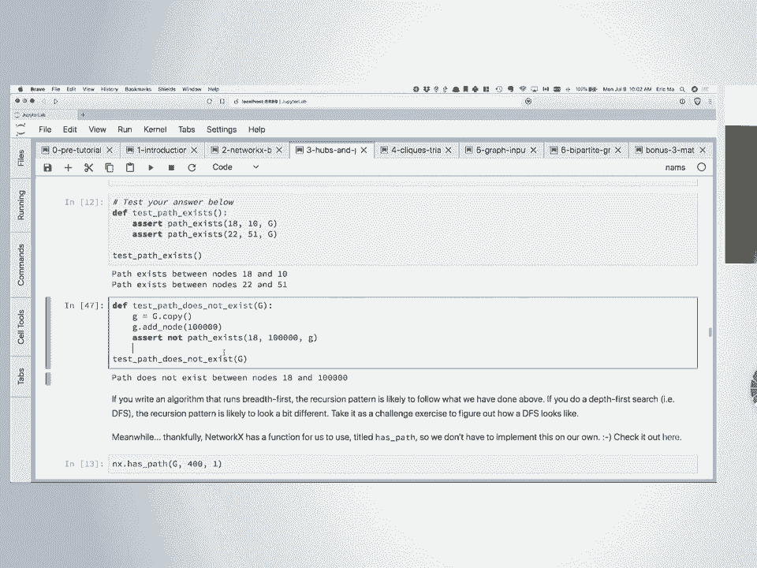
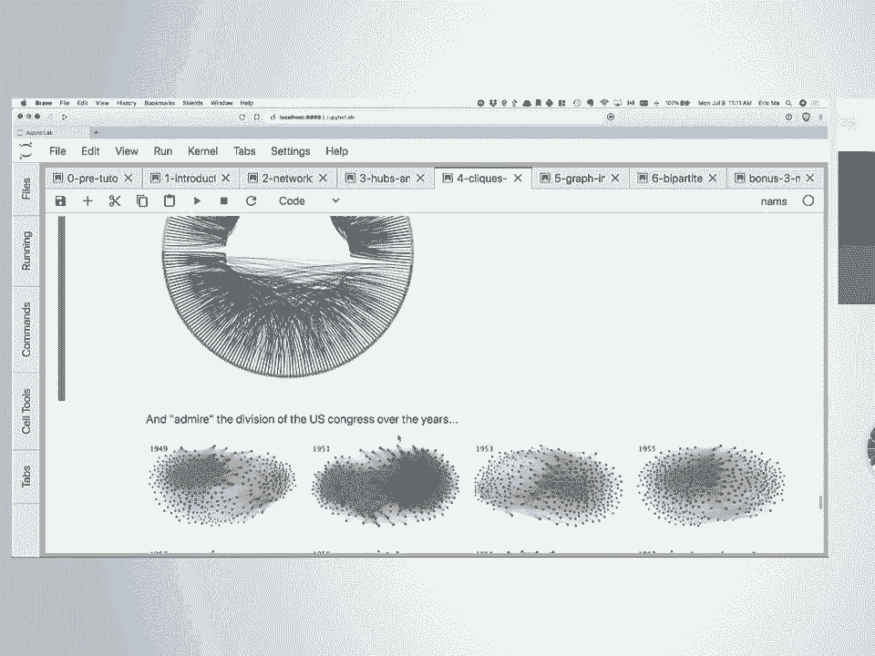
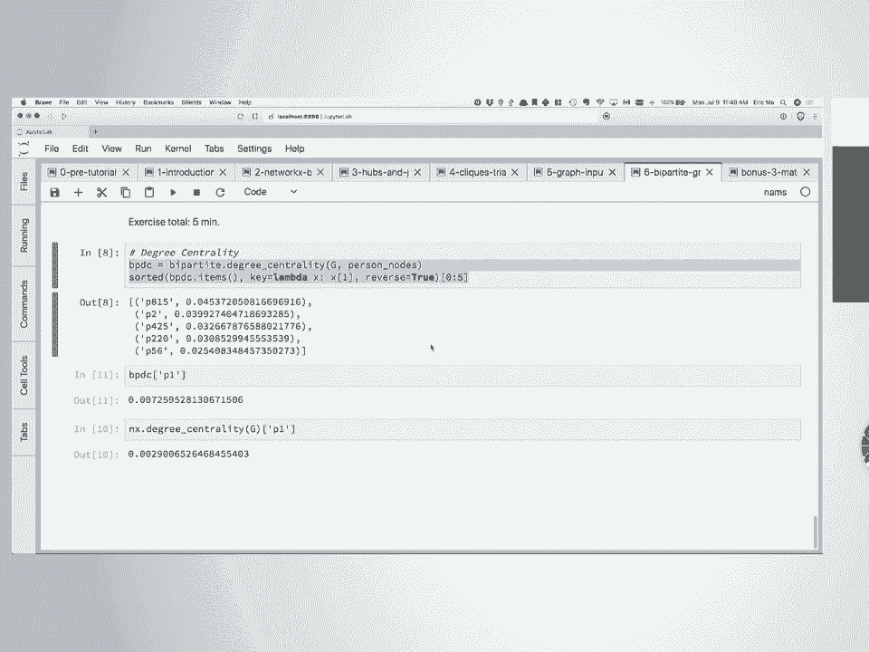
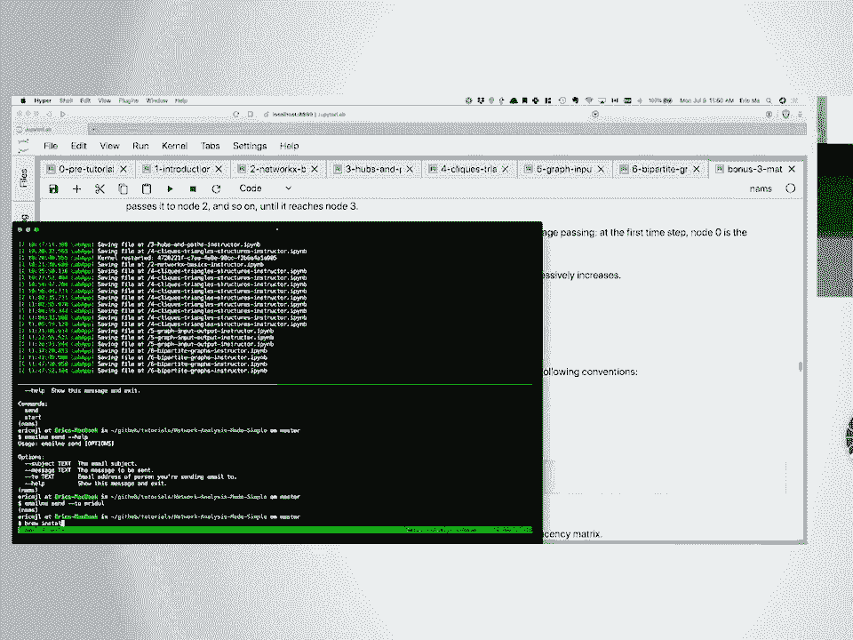
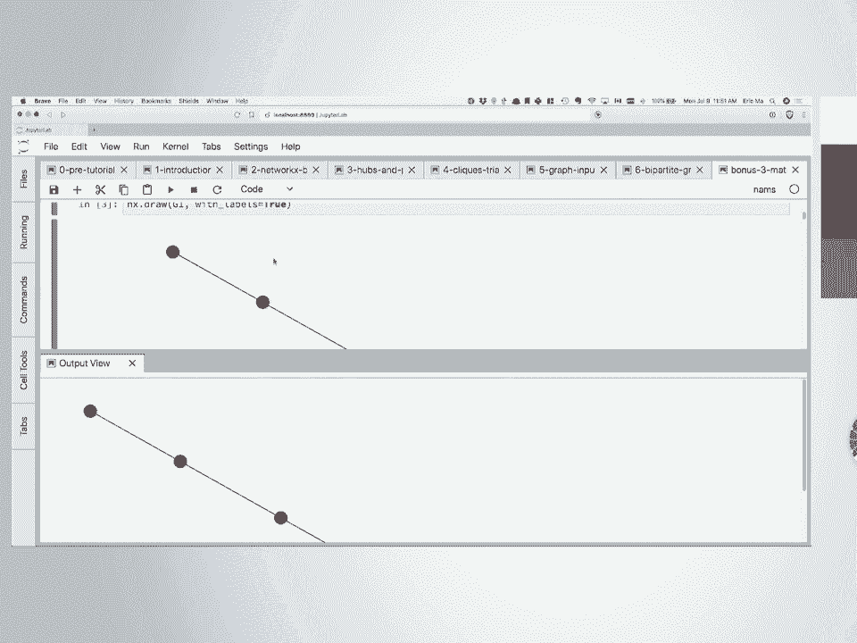
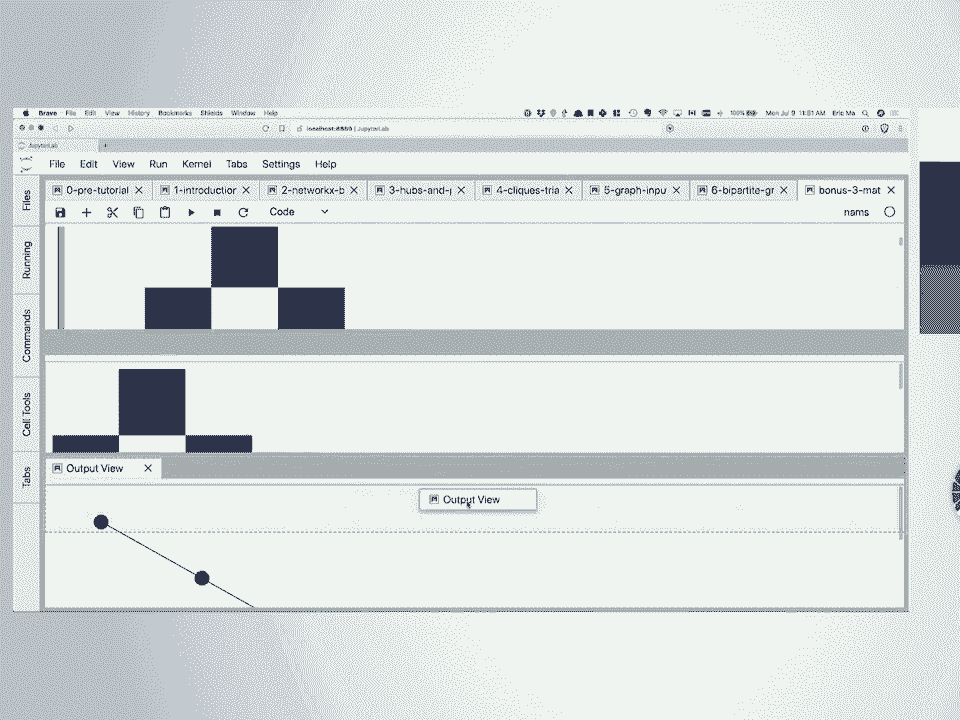
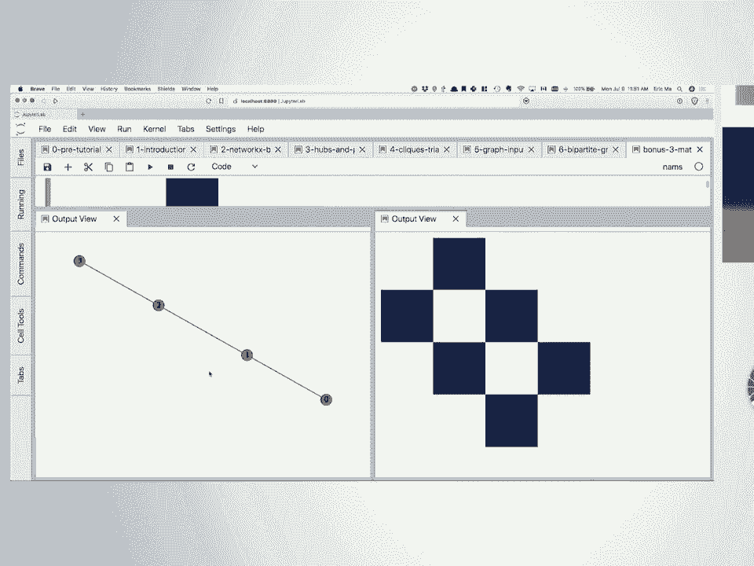
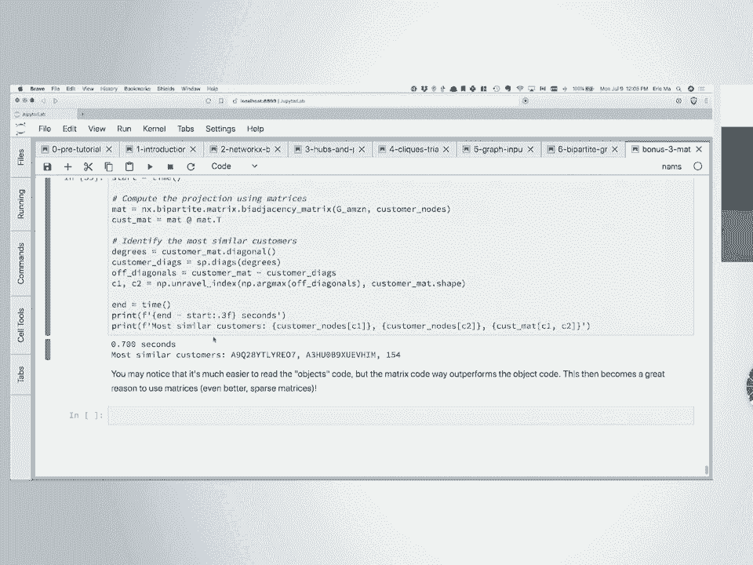

# P58：SciPy 2018视频专辑 (P58. Network Analysis Made Simple - Network Fundamentals _ SciPy - GalileoHua - BV1TE411n7Ny

 Thank you everybody for coming。 We're all here to talk about network analysis。

 I'm really glad to be able to share some of the knowledge， that I've gained over the past few years。

 A lot of this records my learning journey， into network science。

 And so the way I've put the material together， is intentionally designed for people who are autodidax。

 people who want to learn on their own， people who learn by code， people not necessarily--。

 it's not necessarily going to be very mathematically， oriented， like lots of algebra and stuff。

 I myself am algebra blind， so you give me algebra。 I'll make a sign error at some point， right？

 So that's me。 So a lot of this works with code。 And it's basically my way of trying to package up。

 what I've learned and share it with everybody here。 So before we get started into the tutorial。

 I want to do a final， final， final， final pulse check。 First off。

 who already here has Jupyter Notebooks--， the Jupyter Notebooks running on their computer。

 Please raise your hand。 OK， good。 So if you have that running， we're good for this。 We're good。

 Secondly， it's 2018。 How many of you are still using legacy Python？ Yes！ Nobody--， [INAUDIBLE]， Oh。

 OK。 So using as in daily programming in legacy Python。 Oh， it's OK。 It's OK。 It's OK。 I--。

 [INAUDIBLE]， Pardon me？ [INAUDIBLE]， You have to use both。 OK， so if it's part of your work。

 then whatever。 But if it's your personal projects， and you're still using legacy Python， Hannah？

 [INAUDIBLE]， Ah， yes。 Legacy Python is anything 2。7 or earlier。 2。7。X or earlier。 Ah， gosh。

 I broke my cardinal rule。 I refused to name that version， because in 2020。

 legacy Python is end of life。 So you should not be using it。 You should be moving on to Python 3。

 because there's a lot of new good features in the language。 A few we'll see over here。

 like formatted strings， F strings--， sorry， string interpolation， F strings。

 Matrix multiplication operator， right？ The Add symbol， right？ Like。

 those are new things that are in the language that， are really useful， and they're not。

 going to be backported to version 2。 Plus， everything is Unicode， which is an awesome thing。

 We don't have to worry about byte strings anymore。 So， you know， move over。 It's 2018。

 It's time to move on， all right？ But if you're using Legacy Python。

 and you get stuck during this tutorial， which really shouldn't， happen。

 because if you set up with Conda， you're automatically getting a 3。6 environment。

 But if you do get stuck on it， then just， pair code with somebody if you're using that， all right？

 Some of-- again， on this pair coding thing， some of these activities are actually intended。

 to be kind of hard。 So they're going to flex your brain muscles quite a bit。

 So be sure to get to know your neighbors even more， by pair coding with them， right？

 So that's going to be something that I'm， going to encourage people to do。

 For those of you who have issues with the notebook， environments and the likes， there's always。

 the static HTML versions that are available on the GitHub， repository website。

 There's always the binder environment that you can use。 So I've used that successfully a few times。

 at prior conferences。 And if anything goes wrong in the middle。

 you know you always have these backups for you， all right？ The final thing before we go on is。

 that you'll notice that almost every notebook comes in pairs。 If you look inside there。

 there's the instructor version， and then there's the student version。

 And I hope it's pretty obvious which one I'm using， and which one's you're supposed to be using。

 However， in the event that you do get stuck， you and your partner， do get stuck。

 No matter how much drawing on paper， you can't solve that problem at hand。 Don't worry。

 That's what the instructor notebooks-- that's， why the instructor notebooks are actually provided as a package。

 as well in the GitHub repository。 So you can always go look up the answer to the solutions。

 and sort of mull it over。 Sometimes I found that's a really effective way。

 of learning something new， right？ So I bang my head at the problem for a few hours。

 I can't figure it out。 And then I go and take a look at someone else's solution。

 And then I stare at the solution for a few minutes， mull it over for a few more hours。

 and then I got it， right？ So that's a perfectly legitimate way of learning new things。

 So if you need to use the instructor notebooks， they're all provided for you as well， all right？

 Do we have any questions at this point？ Not really？ Yes， no？ OK。 Looks like everybody's ready to go。

 So let's get started with a little class quiz。 I have this list comprehension in notebook one。

 I'm going to start with notebook one。 So I'd like to invite everybody to open up notebook one。

 And if you look at that section called quiz， you'll see this。 There's this list comprehension。

 which， reads s for s in my favorite things if s select name， Boolean equals， raindrops on roses。

 So I have a few questions for you。 What is a plausible data structure for s。

 and what is a plausible data structure for my favorite things？ Any volunteers？ OK。

 my favorite things could be a list。 And s looks like a dictionary。 And s looks like a dictionary。

 So that's one plausible answer。 Apart from a list， what else could it be？ You're right， exactly。

 So you have a fixed length tuple of dictionaries。 That's a possibility。 And how about s？

 Is there another possible data structure for s， inside the Python standard library？

 I think named tuples is an answer。 But that would be-- that's something I just thought of。

 So that might be subject to verification。 We can always try that later。 All right， so-- but anyways。

 anything for which you， can have a selector syntax to index into a particular key。

 is a plausible data structure for each element inside here。

 And my favorite things is just something that， has an iterable and it's a container that。

 contains a list of dictionaries。 So here is one example of how we can construct my favorite， things。

 and it's just down there。 The reason I have this as a quiz at the beginning。

 is because we're going to be doing a lot of these list， comprehension-like things in the tutorial。

 And this is a very common idiomatic pattern， that will come up when you're working with the network x。

 package， which we're going to introduce in this class as well。 All right？ Any questions on this？

 Everybody OK？ Give me a thumbs up if you're OK。 Cool stuff。 All right。

 Let's now talk a little about networks or graphs。 So where have you seen networks in your life？

 That's my first question to the class。 Let's discuss this a little bit。

 Where have you seen networks in your life？ Any volunteers？ Driving on the highway。

 Driving on the highway。 How is that a network？ Yeah， so roads connect places。

 So that's a type of network。 We would call that a transportation network。

 Are there other transportation networks？ Subway is also connect places。 There are fixed tracks。

 There's fixed tracks between stations， so that's another network。

 What else can you think of besides transportation？ Pardon me？ Phones。 How so？ Just， you know。

 this is all the hours and all the work， here。 Yep。 OK。 So we have communication networks。

 Nodes probably are of the cell communication towers。 Phones are also nodes。

 And then there's some wireless invisible edge-- physically， invisible。

 but existent edge between phones and phones， in the communication towers。 Anything else？ Facebook。

 How is that a network？ It's a social network of people。 People and their relationships， right？ OK。

 Anything else？ Municipal services。 And municipal services， can you elaborate？ OK。 Yeah。 Yeah。

 definitely。 So when we think about networks， let's make this a little bit， more formal。

 So in a network， there's entities that are connected， by relationships， right？

 So in a social network， the entities are the individuals， right？

 And the relationships are defined in a very stringent fashion。

 So let's go back to the social network example。 In Facebook， when would you consider。

 drawing a relationship line between two individuals？

 There's one specific action that has to be taken in order， for that line to be drawn。

 Friend request。 Friend request followed by an acceptance， right？

 So only if someone is on Facebook a friend with another， individual can we then draw a line。

 It sounds obvious， but it's really important。 Otherwise。

 we get murky on what the definition of an edge is。 What about place networks？ Right。

 so let's say we take the major cities in the United， States and Canada。 So let's take Vancouver。

 which is close to my hometown， Toronto， which is pronounced Toronto for people in Toronto。

 and Toronto elsewhere。 Boston， New York， Austin， San Francisco， and ignore LA， for the time being。

 Let's call these the so-called major cities in people's， consciousness。

 How would you define a network between these cities？ We could do transportation networks。

 In the definition of an edge here in a transportation， network。

 how would you guys go about defining that？ [INAUDIBLE]， OK。

 we're getting very nice and precise here。 We can define an edge if there is a flight from one city。

 to that other city。 That's one way of defining a place network。 What else is there？

 How about the highways？ Highways are also possible， right？ So we can define a road network。

 We can say that these two cities are connected， if and， only if。

 There is a path on the highway system between those cities。

 So the definition of an edge really matters。 And if you think about it。

 what makes graphs interesting is， not the particular nodes that are inside there， but how。

 they're connected。 It's how they're connected and the definition of connectedness。

 that gives rise to the interesting parts of a graph。 Now let's think a little bit more。

 We already heard that term directed graph。 So a transportation network of airplanes， right？

 We would call this directed or undirected。 Directed， why？ And a destination。

 Are there circumstances that we can call this an undirected， graph？ What are those？

 We don't care about direction。 Potentially， OK？ If you have community。

 you have like one way of flight， of other directions。 Yes？

 We treat that as like missing a other direction。 Yes。 That was what I was thinking of。

 That is to say， if we make the assumption that there is。

 always a return flight to and from one city， then we can， consider this an undirected graph， right？

 But it only holds under that specific assumption， right？ OK， good。

 So let's summarize this discussion a little bit。 Networks or graphs。

 as they're known in other fields， they're comprised of two main types of entities。

 One is the node set and the other is the edge set。 The nodes are the entities inside the graph。

 That is， you know， the things that you can count， the things that you can measure。

 And the edges are--， sorry， the physical things usually， right？ And the edges are the relationships。

 between these entities。 So whenever we do graph analytics and stuff。

 we're talking about relationship problems， basically。 I'm not intended， right？

 So edges-- there's this quote that I really， like that I heard during a seminar while at the Harvard。

 School of Public Health。 "The heart of a graph lies in its edges and not its nodes。"。

 And I've mentioned that earlier。 That is， the node set isn't what matters for a graph。

 As much as the edge set， the edges， and how they connect the nodes give rise。

 to what's interesting about the graph， right？ You can think of the nodes as sort of like my rows。

 of data points， the entities for which I've measured stuff。

 But the edges are the things that really make graphs really， interesting。 All right。

 And we also talked about directed and undirected graphs。 Just to make this point one more time。

 Facebook is an undirected graph， right？ And that's because as soon as I accept a friend request。

 we are both immediately connected。 By contrast， what is Twitter then？ It's a directed graph。

 and that is because--， yeah， I can follow someone， and that person。

 doesn't necessarily have to follow me back， right？ So the Twitter graph is a directed graph。

 All right， cool。 So with that little bit of introduction。

 I wanted to put some take-home messages out， for this tutorial。

 The first one is that my expectation is that， by the end of this class。

 you'll have some basic familiarity， with the NetworkX API。 NetworkX is a Python package that's。

 used for data modeling， modeling of graphs。 It provides graph constructors， traversal algorithms。

 and the likes。 It's also got some rudimentary visualization capability。

 So one thing that I hope you will also take away， is that we commonly tend to think of graphs as nodes。

 and circles， and we expect， oh， we put in a graph。

 and then we get back this diagram that shows us the graph。 There's a separation of concerns there。

 right？ We do the graph modeling。 We think of it in abstract sense。

 and then we bring it to life with a visualization。

 and there are multiple visualization tools that are out there。 So first off。

 I want you to be able to take home， the use of NetworkX in a Jupyter Notebook environment。

 interactive computing environment。 The second one is then this separation of concerns。

 that we have this visualization capability provided， by multiple packages。

 and the take-home message， is don't use hairballs。 You will see hairballs all over the place。

 in graph visualization， and they're not pretty。 There are multiple rational ways of visualizing networks。

 and I'm hoping you'll take that away。 The third is that you'll be able to write these basic algorithms。

 do computing on a graph that is being traversals， finding interesting nodes and the likes of things like that。

 And the final one is that you'll be able to compute， basic statistics of a graph。

 so like number of nodes， number of edges， distributions of certain properties， of the nodes。

 distributions of properties of the edges， for example。 And finally。

 my hope is that in a broader sense， you will come to be able to think about your data。

 whatever your data is， not only in terms of like， what are the data points， but the relationships。

 between the data points。 So that's really what I'm hoping at the end of the day。

 you'll be able to take home。 OK， so some people I want to acknowledge， in this tutorial session。

 First off， Mritil at the back， raise your hand， wave for everybody。 Mritil is much too humble。

 I invited him to teach this session， and he said he'd like to see me in action instead。

 But he is very， very knowledgeable about this stuff。 He's helped。 He's co-taught with me at PyCon。

 so if you have any issues， you can always look to him。 You will be starting PhD in September？ Oh。

 already started。 Wow， congratulations。 Or should I say condolences？ No， no。 Went through it。

 I know the process。 So congrats to Mritil。 He's in a PhD program now and is really focused。

 on network science。 So you can ask him all sorts of stuff。 All sorts of questions。

 He'll be helping me。 You can walk around。 Also， I had lots of help from a bunch of people。

 So really want to thank them for helping me put this stuff， together， lots of inspiration。

 particularly teaching methods， and content from Alan Downey。

 Alan Downey is a well-known in the Python community， as an educator of technical materials。

 And he teaches at the Olin College of Engineering， and so lots of stuff I've learned from him。 Also。

 one of my committee members in grad school， J。P。 Anella。

 who helped teach me a lot of this basic network science， stuff。

 both directly and through his research group。 OK， let's see。 A few last administrative things。

 Once again， if you're not on the Slack channel， you can join in。 This is a great forum for， like。

 I need help。 I'm a little too shy。 We can ping。 Mritil will be looking out over there。

 Hopefully some of you might have the same questions， that other people would have。

 And you can share those questions with everybody。

 so we can all learn together。 Is the room too cold？ Yeah， OK。 All right， give me one moment。

 I think I know how to space this。 What's 72 Fahrenheit in Celsius？ I don't know。

 I keep hearing 72 is a good temperature， but I'm from Canada。 So I don't really know that scale。

 I hear 72 is good。 I've said it's centered to hopefully the temperature， will go up in a little bit。

 So bear with the temperature for a little bit。 All right， I'd like to invite everybody now then。

 to open up Notebook 2。 We're going to get started with hands-on stuff， in this Notebook。

 This Notebook is intended to help you， get familiar with the NetworkX API。

 So we're building up in terms of complexity。 We'll start with simple things。

 and then we'll build on， to harder things as we go along。 All right， in this Notebook。

 as in every other Notebook， we've got one focal point data set。

 that we'll use to sort of illustrate some points with respect。

 to how to use NetworkX or with respect to network science， sort of more theoretical stuff。

 In this Notebook， what we have is， we're going to be doing some basic， basic， basic first things。

 that you should try kind of analyses on a data set。

 And this data set is a social network of seventh graders。

 So what do you mean by social network of seventh graders？ I took this data set from that URL that's。

 available in your Notebooks， but here's the short description。 Basically， there are students。

 and these students， are asked on three separate occasions， who's your favorite friend？

 So then you can have kids who really， like hanging out with other kids。

 and you can have kids that get isolated。 And actually， how many of you have heard。

 about that story of the math teacher who discovered socially， isolated kids in her class？ No？

 This was-- yes？ OK。 Would you like to share it real quick？ I don't remember the details。 Yeah。

 I don't remember。 Yeah， OK。 Just recently I worked with young controls。 Yes， yes， yes。

 It was part of this gun control thing， a series of articles。

 There's this teacher who had this hypothesis， that students who are isolated in class。

 are the ones who are most likely to go on， to become emotionally unstable and so on。

 That was her hypothesis。 And so the way she did try to combat this。

 was essentially every week she would ask her class， who would you like to sit next to next week？

 And this was not an exercise in trying to find out， who you want to sit next to。

 This was an exercise in finding out， who nobody wanted to sit next to。 But of course。

 it was disguised perfectly， which is so we don't have this Heisenberg scenario where。

 you prod a system and suddenly the system behavior changes。

 So she was able to figure out who was the socially lonely kid。

 And so through that measurement of how many people want， to sit with a kid。

 she could then figure out， sort of who she needed to direct more attention to。

 And it's not academic attention。 It's more emotional attention。 So this is a really cool thing。

 So I saw this data set as having parallels， to that problem once when I saw that article come out。

 So we're going to do this thing。 We're going to do some simple stuff first。

 We're just going to look at the size of the graph， and that sort of thing。

 And if we have a bit of time later， maybe we can do this analysis of who。

 is the most socially isolated in this class。 So in network X， graphs are depicted。

 as dictionaries of dictionaries of dictionaries， as dictionaries all the way down。

 So we have dictionaries of dictionaries， and then the nodes are stored as part of a graph。

node attribute。 And then there's some dictionary that's inside there。

 And then the edges are stored as part of the graph。edge attribute。 Now in network X。

 there's a new 2。0， 2。x。 There's a new syntax for accessing any particular edge。

 So it's no longer select one node then select the node。

 I just realized I have to update this part over here。 This syntax is incorrect。

 I am going to invite you all to change that line， to look something like this。 So it's g。edge。

 You select the first node comma second node， rather than select first node， select second node。

 So this will come in later。 And so what this means for storing anything inside a graph。

 any node object inside a graph， is that your nodes all have， to be what we call hashable objects。

 They cannot be mutable。 You create them and they're fixed。 Then they can be considered hashable。

 So our strings OK。 Strings are hashable， so they should be OK。 They are not mutable。

 Strings in Python are not mutable。 And if you change a string。

 you actually create a new string object。 Are tuples OK for node objects？ Yeah。

 I see some nodding heads。 How about lists？ Are lists OK？ Lists are not OK。

 I see people shaking their heads。 Lists are not OK because you can mutate them in place。

 and change their representation thereby changing the hash。

 So that's a few important things that you'll need to know。 OK。

 So I'm going to have you all run this cell which， says Load Seventh Grader Network。

 I have a series of custom functions that load data for you。

 So we won't concern ourselves with data formats until Notebook， 5。 For now， let's get that going。

 So everybody's run that cell。 So we're going to do some very basic queries on the graph。

 The first one is let's figure out how many students， are represented inside this graph。

 It's sort of like doing a sanity check。 Now if you want to know what nodes are available。

 or are present inside a graph， you can start with g。nodes。 It's a class method。 You run that cell。

 All of the nodes will be listed there。 You'll notice it's wrapped in this thing called a NodeView object。

 This is intentional。 We don't want the networkx developers， have made sure that a view on the data。

 is different from the data itself。 It's a bit like NumPy Views versus the NumPy data。

 structure underneath it。 So there's this NodeView thing。 If you want to get the length of it。

 you might be tempted to think of doing landg。nodes。 And that works， but for some other things。

 for example， accessing a particular element， I don't think， if I remember correctly。

 that should not work。 Yeah。 So you cannot access a particular element inside that NodeView object。

 So this is intentional。 If you want to do so， you have to pass the whole thing。

 into a list constructor。 And that will give you back instead of the NodeView object。

 it will give you a list of each of the nodes that， are present inside there。 And there。

 from then you can then， access the first few elements inside that graph--。

 0 or 0 through to 5 or 0 through to 10。 People OK with that？ So let's start with this first really。

 really simple exercise。 Get the length of the graph。

 Get the number of nodes that are present inside this graph。 OK。 I think we're there。

 So if you wrote landofg。nodes， that works。 There's an alternative。

 This comes from the definition of the size of a graph， which， is you can do landofg。

 which will give you the same answer， as well。 Now。

 I've run my notebook all the way through to the end。 So if I rerun the cell， I'll get 31。

 which is a mutation。 I've done a mutation on the graph， but you don't have to worry about that。

 Yeah。 So you should get 29 at this point。 All right。 Likewise， with the edges， it's the same thing。

 If I do g。edges， I will get what we call an out edge view。

 That is to say edges going from one node to another。 For now， it's not worry about directed。

 undirected。 This is just a view。 If I tried to do 0 to 5， and I wanted。

 to select the first-- oopsies-- first five edges in there， that will be a problem。

 So I do have to cast this as a list。 And then I'll be able to get the first five edges that are。

 ordered inside this out edge view。 So likewise， I would like you to do the next exercise， which。

 is find out how many edges or how many relationships， are represented inside this graph。

 So it looks like we're sort of at quorum。 So if you did ln of g。edges， you are correct。

 And if you want just as a reminder， if you wanted to select the first five or first k。

 or do a random sample of this edge list， then you'll have to cast the thing as a list first。

 before you're able to do that。 OK。 So now we saw that the graph can be composed of two--。

 this is the one way of representing a graph in memory， on a computer。 You keep a node list。

 and then you keep a separate edge list。 And the node list is just a list of nodes。

 optionally with their attributes。 And the edge list is nothing more than just a list of tuples。

 indicating which two nodes have a relationship， and edge between them。 Everybody OK with that？

 So let's say we wanted to add in--， or we wanted to view the metadata that's stored on the graph。

 If you pass in data equals true into g。nodes， then you'll get a view on the metadata。

 So let's do that。 g。nodes data equals true。 You get the node plus data view。

 It's not a node view only。 You'll notice that it is a key。 It is a dictionary-like thing。

 So it's got the node ID and then the metadata dictionary。 That's associated with it。

 And if we pass this into list of g。nodes， then we get a list of--， well， actually。

 let's describe this data structure。 So what is this data structure？ It is a list of--。

 it's k tuples， technically。 So what is k？ Two tuples in which the first element is the node ID。

 and the second element is the metadata dictionary。

 So that is how we store the information of a graph。 Everybody OK with that？

 So what I would like you to do is you'll notice we've got boys， and girls in the class。

 And so we'd like you to count the number of boys， and the number of girls that are represented in the graph。

 OK。 So I'll talk through the answer。 If you're not done， don't worry about it。

 Here's the answer that I have in the instructor notebook。 And so basically what we're trying to do。

 is we're trying to simply extract out the gender attribute。

 of each student after iterating over all of the nodes。 So if you pass this into a list。

 that was fine。 If you didn't pass it into a list， that is fine as well。 You can do tuple unpacking。

 You can do tuple unpacking in a for loop iterator。 So that's what this for n comma d。

 The n will be assigned to the node id。 The d will be assigned to the metadata dictionary。

 And then from the metadata dictionary， we can select out the value that's keyed on the key gender。

 And then we pass the whole thing into a counter object， which。

 will automatically create key value pairs for each element， inside there。

 and how many times it's shown up inside that list。 So this is what it is。

 And that's sort of the answer。 You should have 17 girls and 12 boys inside the class。

 I'll go with that。 Any questions so far？ So you'll notice why I had this question about list。

 comprehensions， because list comprehensions， are going to feature quite a lot inside。

 It's already started to feature inside this workshop。 Question？ [INAUDIBLE]。

 But why is it that this node， the view， you can iterate here， in this list comprehension。

 You're basically iterating over that view， which you can't， slice。 Yeah。 [INAUDIBLE]。

 Because I was just going to slice with just， [INAUDIBLE]， Yeah。 If I remember correctly。

 is there a special dunder method， that you have to implement for slicing？ There probably is。

 And as to why the network X developers， decide to omit that from the node view and edge view。

 I'm not 100% sure on that decision。 But that's the reality we deal with。

 So I'm happy to just deal with it。 Yeah。 OK。 Cool。 So we have that for nodes。

 We can do that for edges as well。 Likewise， we pass data equals true into g。edges。

 And we'll get back the metadata dictionary as well。 There's one change。 Instead of a two-tuple。

 we have a three-tuple。 So this is a list of three-touples in which the first two。

 elements are nodes。 And the third element is the metadata dictionary。

 Everybody cool with that so far？ Cool with that？ So I would like you to then attempt the next exercise。

 which， is simply verifying that the maximum times that any student。

 had said that this other student is my friend is three times。

 Because that is exactly what the setup of the data collection， effort was like。

 These are basically just sanity checks on the data。 OK。 All right。

 So I think people are grasping the programming pattern。 The answer I have is shown up on the screen。

 You can see it in the instructor notebook as well。 Basically， there's another list comprehension。

 The only difference being here is that I have an unpacking， of a three-tuple。

 So I can assign it to three variables。 If I was unconcerned with the node。

 I can do this thing where I do this underscore， assign it to the underscore。

 It's literally just overriding the underscore variable over， and over and over。

 It's just convention。 All right。 And then I take the max of that。 And max is three。

 And that we're all happy。 Nobody had corrupted the data file。 So that fulfills our expectations。

 And by the way， if you're doing data analysis， I'm a very big proponent of writing tests。

 automated tests， for your assumptions in the data。

 If you're assuming-- if someone provides you a description。

 of the data and says max times we've asked is three。

 You should not have anything that's greater than three。 Like， yeah， that's the sort of things。

 you should be able to write automated tests for。 All right。 What we're going to do now is we're。

 going to do this next exercise below in which we found， that there are two individuals artificially。

 of course， for the purpose of the class。 Two individuals who are left out。 And there's one boy。

 one girl。 And they are a pair that love hanging out with each other。

 but also love hanging out with this other individual seven。

 I know it breaks the rule of how this data collection effort， was happening。

 But I would still like to have you both implement， the answer to the solution。

 which is to add this relevant， information into the graph。

 Keeping in mind that you do have to add it in both directions。 This is a directed graph。

 So keep that in mind。 And I've got， I think， starter code for you。

 to figure out that will give you a feel for the API。 OK。 So for those of you who finished。

 here's the answer above。 Basically， you have two add node calls。

 And because we have bidirectional edges， that we have to add explicitly， we have six add edge calls。

 You can do count equals something。 Anything that's-- basically anything。

 that's assigned a keyword after the two nodes， gets passed into a metadata dictionary constructor。

 So you basically-- you can add more stuff。 You could have count equals three， comma。

 Let's see what else would be an edge attribute。 You could do length of time is equal to something。

 or the dates collected equals some list of stuff。 And all of this will be assigned appropriately。

 inside the metadata dictionary。 OK。 All right。 I have an exercise that came up during this year's Open Data。

 Science Conference。 That is to say， which students had like one-sided friendships。 Poor chaps。

 the ones who like， I like that person， but that person doesn't really like me back。 [GROANING]。

 So go ahead。 Feel free to take an attempt at this during the break。

 or if you're feeling a little adventurous during the class， you can do that。 OK。

 So a few things about that。 You saw this coding pattern with tests。

 You can write assert statements for your data。 Testing is not limited to just software engineering。

 Testing can be done when you're doing data analysis。 I really like to encourage people。

 You do some operation inside your data。 Make sure you write a test for it。

 You do some major thing with the data。 Make sure you write a test for it。 You have data coming in。

 Write data。 Write tests for your data schema， for your columns。

 just so that you have an automated suite of things。

 that you can call upon as your backup reminder system， in case something goes wrong。 All right。 OK。

 Now， we saw the coding pattern thing， list comprehensions。

 I hope it's like familiar to everybody by this point。 You can do it for the nodes。

 You can do it for lists， for the edges。 And we're just going to look through， finally。

 a few examples of how you can draw graphs。 This is the thing that most people might。

 have the biggest confusion with。 This was also the biggest confusion。

 that I had when I first started using network X。 That is， I was like， yeah， I got a graph。

 but it's called G。 Wait。 I can't see it。 So what happened？ So this is this separation of concerns。

 thing that I had to learn early on。 You can have a graph。 It can exist in memory。

 You can have the node list and the edge list。 And yet you still can't see it。

 And that is a perfectly normal situation to be in。 If you want to draw a graph。

 you have to figure out， how to lay out， lay things out。 How do you draw。

 where do you place the nodes， and where do you place， how do you， draw the lines between the nodes？

 So there are lots-- it's a very diverse field active research， field open active research。

 So the first thing that you could try， is to use the built-in functionality。 And thankfully。

 there is this built-in functionality， into network X。 You use NX。draw of G。 And if your graph is。

 anything bigger than maybe a dozen nodes or 10 nodes-ish， you soon get into this hairball land。

 That looks exactly like a hairball。 And I'm not sure what I can use。

 What I can do to make inferences on that visualization。

 apart from the fact that we just added two nodes。 Like that's probably the only thing。

 that I'd be able to glean by looking at this thing。 On the other hand。

 there are other ways that are usable。 Oh， wow。 OK。 I did not have the right kernel here。

 That must have been why。 If you look inside your notebooks， they're not showing up， right now。

 But if you look inside your notebooks， you'll see a representation of the graph。

 as what we would call a matrix plot。 So what is this thing called a matrix plot？

 It's basically taking advantage of the fact， that we can have matrix representations of every graph。

 If we take all of the nodes and list them， along the rows and columns of a matrix。

 we can then fill in that matrix according to whether or not。

 there is an edge between those two nodes。 So if you look at this， suddenly。

 this starts to tell us a bit more useful information， about the graph。 Tell me what you see here。

 You see-- do you see symmetry in the diagonals？ No。 No， right。 The answer is no。

 And this comes from the definition， of the graph being directed。

 Directed graphs do not have to have symmetric edges。 Therefore， they do not necessarily。

 have to have a symmetric adjacency matrix。 That's the first part。 Second thing。

 what do you also notice， that's interesting about this graph？ Hint。

 don't look vertically or horizontally。 Sorry？ [INAUDIBLE]， Ah， yes。 There are no self loops。

 And how did you gain that piece of info？ Yes， the empty diagonal means we're。

 not breeding a new generation of narcissists， right？ We don't have students labeling themselves。

 as I like being with me。 So good， good， very good。 So already on a matrix plot。

 you can gain much more inferences， than you could on that hairball。 That hairball was just-- yeah。

 you can't tell much from that。 OK， so the art plot is the next version。

 next thing about-- next thing that I want to show you。 The art plot essentially says。

 let's lay all of the nodes， in a straight line。 We can group them and order them according to whatever。

 criteria we want。 In this case， we've grouped them by the gender of the student。

 And we can also group them and color them， by the gender of the student， all right？

 And so this art plot， therefore， forms， the basis of many other rational visualizations。

 The whole principle behind a rational graph visualization。

 is that we prioritize the placement of the nodes， in a way that we can understand。

 And then we look at the edges and how they are structured。

 according to the organization of the nodes。 Does that make sense to everybody？ So in this case。

 I have what there are more girls。 So you have the girls on the left， the boys on the right。

 And we have the edges that are inside here。 And what can you tell about this？ No。

 we don't have the directionality。 But we can still make some inferences on this。

 What can you tell about this？ There are more connections on the green？ Yeah。

 there are more internal connections in the green。 And then there are more external connections。

 from the purple than there are on the green。 We could possibly define a metric。

 which is the density of connections within one group， versus two other groups。

 That's another way of defining that that's one thing we could do。 So this is， again。

 my point being you do a rational viz， and suddenly these inferences become a lot more clearer。

 that you can perform on just by looking。 So visualizations really help。

 So if we take this arc plot and we just， do this thing where we join the edges together--， sorry。

 join the term and I of the line together， then we get the circle spot。 And it looks kind of nice。

 And so this is another rational visualization， that builds on top of the arc plot。

 And we can use this again for more inferences。 And finally， this is the hive plot。

 And this hive plot thing is really， good for visualizing intra versus intergroup connectivity。

 So we can see how dense we connected these nodes are。

 between within one group versus across the group。 So the way a hive plot is constructed。

 is we group our nodes according to some criteria。 We have a maximum of three groupings。

 that are available inside one hive plot。 We then draw lines between groups。

 And if we have lines that are within groups， then we clone the axes。

 And then we draw lines between those cloned axes。 Does that make sense？ It makes sense？ OK， cool。

 So that's this thing with hive plots。 Now， you'll notice there's this package called NXViz。

 I created it and have accepted lots of PRs from other people， including enhancements on it。

 The thing is right now-- sorry， hive plots currently， are missing from NXViz。

 And that's because I just haven't had the time to do it， to reimplement it inside NXViz。

 The thing that's nice about NXViz， in my opinion， is that it tries to be the seaborn for network visualization。

 So you do declarative styling rather than imperative， sort of styling。

 I just tell NXViz's visualization constructor color， according to some keyword。

 group according to some other keyword。 And we just figure it out under the hood。

 So that's sort of the thing that I'm， trying to accomplish with NXViz。

 And I just haven't had the time for hive plot， if you all are feeling good with matplotlib。

 and maybe other backends。 What is this？ Altair and et cetera， bokeh。

 Love to talk with you about this afterwards。 OK， dokes。

 Do we have any questions about visualization basics of network， X API at this point？ OK， if not。

 I'm going to do a very， very， tiny experiment。 Let's see if this works。

 I'd like you to talk with your neighbor 30 seconds， to a minute。

 tell them something new that you learned today。 This is a network analysis class。

 You should be networking。 All right， it's 9。10。 Let's come back。

 So you should all feel hopefully comfortable， with the network X API。

 I've provided a link to the documentation， in the previous notebook， which you can always come back。

 and refer to for the rest of this tutorial and also。

 beyond when you're doing your own thing with network X。 We're now going to move on to notebook 3。

 So I'd like to invite everybody to open up notebook number 3， if you haven't already done so。

 And we're going to think about in notebook 3， what we're going to do is we're going。

 to think about this question of what's， an important node inside a graph。

 So just before we get started on the actual content， let's do a pulse check。 What do people think？

 What are ways of measuring important--， figuring out in a graph what are important nodes？

 Any volunteers？ OK。 So the number of other nodes that that node is connected to。

 there are other ways that you can think of。 [INAUDIBLE]， OK。 What do you mean by that？ [INAUDIBLE]。

 [INAUDIBLE]， OK。 So are you sort of a bottleneck type of node。

 in which information always has to flow through you， versus to other places？

 Do people know of any others？ So we've already shown-- talked about the two。

 that we'll go through today。 Do other people know any others？ If not， then yeah？

 Eigenvectors centrality。 What's the intuition behind that one？

 The is a measure of how connected the nodes that， is connected to more。

 So how connected are my neighbors， right？ Yeah， basically that's what the eigenvector centrality is。

 about。 OK， cool。 So we have some ways and intuitions behind how we can， measure them。

 What we're going to do in this section of the workshop， is to figure out。

 sort of demystify and uncover， what's going on with respect to these。 So for this data set。

 what we're going to--， the data set we're going to analyze-- for this notebook。

 the data set we're going to analyze， is what is called the social patterns network data set。

 So what is this social patterns network data set？ It's basically-- there was this exhibition in a gallery。

 in-- what is it？ Ireland， Dublin Ireland。 It's about infectious diseases。

 So nodes represent visitors to the exhibit。 Edges represent face-to-face contacts。

 that were active for at least 20 seconds。 Now， multiple edges between two nodes are possible。

 I think for simplicity's sake， I've， basically just condensed all of those edges。

 down to a single edge。 Now， and also the network contains data。

 from the day with the most number of interactions， at the exhibit。

 So after running that first cell with all the imports， please run the second and the third cells。

 and you should verify that the data are not corrupt。 You should have 410 nodes， 2，765 edges。

 Everybody's got that？ Yep。 OK， one way that we just talked about。

 for figuring out which nodes are important-- oh， sorry。 Before we go on， this kind of graph。

 would you expect it to be directed or undirected， for this particular problem？

 What would be an appropriate modeling choice？ Undirected。 Undirected， and the reason being？

 Is this an icon fact that it makes？ Yep。 So if we have contact by definition， it's bi-directional。

 It is not unidirectional。 I can't have a face-to-face contact with you。

 without you having a face-to-face contact with me。

 So that's sort of the premise behind the modeling choices， for this graph。 Cool。 All right。

 so the number of other nodes， that are connected to this node is equivalent。

 to the number of edges that this node is involved in。

 And that is equivalent to counting the number of neighbors， that this graph-- this node has。

 So if you look at network X， every graph object， has a dot neighbors method， class method。

 And that allows you to pass in a node that's inside that graph。

 And it will return to you the exact list of neighbors， that that node has。 So if I did g。

neighbors of 9--， ooh， I get a dict key iterator。 If I really wanted to figure out what was present。

 I'd have to pass that into a list。 That will tell me that these other nodes are。

 the neighbors of node number 9。 g。neighbors on itself doesn't-- well， you have to pass in a node。

 You cannot not pass in a node into there。 And if we looked at the signature--， actually。

 the source code for g。neighbors--， I don't know if you knew this。 I recently learned this。

 You can put g。neighbors and then put double question marks， at the end。 And in line。

 you will get the source code， which is in the Jupyter lab and notebook environments， I think。

 So you can then take a look at what is the signature--， g。neighbors。

 what are optional and mandatory arguments， that are inside there？ So you'll see yes。

 And is the neighbors for the node for which we， want to know which neighbors are present。

 And it's a mandatory argument。 So then if I wanted to know the number of neighbors。

 I pass that entire list back into the LEND function。

 And I'll get back that node number 9 has 14 neighbors。 So should be simple enough。

 And on the basis of this， we already can rank the nodes。 On the basis of what you've learned with g。

neighbors--， g。neighbors-- you can already write something。

 that will rank the nodes according to the number of neighbors， that they have。

 So I'd like you to attempt the next exercise below， which。

 is to create a rank list of the individuals based。

 on the number of neighbors that each individual has。 So let's attempt that。 OK。

 so in the interest of time， I'm， going to talk through the solution and how。

 we build it up to this one-liner， two-liner， kind of sorted， list comprehension thingamajig。

 We start first--， sorry-- we start first with g。nodes。 So we have this node view。

 If we were to simply pass in sorted g。nodes into sorted。

 we would get a list of nodes sorted by what they are。

 So this is sort of the first pass as it at this problem。 However， we don't want the nodes。

 sorted according to what they are。 We want them sorted according to how many neighbors they have。

 So the sorted built-in function has a key that we can pass in。 So what is this key？

 You can think of it as being like， I want to sort my nodes on this thing that I pass into it。

 So what could I pass into key？ One thing I could pass in is a list of the--， another list， maybe。

 that has all of the number of neighbors， that that node has。 But we can construct this on the fly。

 by using a lambda function， anonymous function， which simply returns x。

 which takes in a parameter x， and simply returns the length of the list--。

 the length of the list of the number of neighbors of the neighbors， of that node x。 So what is x？

 x is every element inside g。nodes。 People will get that。

 This is how we construct this lambda function。 The final part of this is that we don't want it in ascending--。

 sorry， we want it in--， yes， we don't want it in ascending order， which is the default。

 We want it in reverse order。 So therefore， there's this verse equals true。

 And that should give us back node 51 as the thing。 If I did not pass in reverse equals true。

 I would get node 135。 I'm just exploring the length of the number of neighbors of--， [INAUDIBLE]。

 I can't take today。 The length of the number of neighbors that node 135 has， is only 1。 For node 51。

 it was 50。 It had 50-- node number， person number 50 had 50 contacts--。

 50 different contacts with people。 So this is how we build up to the solution that's provided。

 Being able to sort conditionally on something else。

 is kind of a useful thing when we're trying to do network， analysis。 As you can see。

 this is one example of where it comes in handy。 All right。

 So from the definition of the number of neighbors， that I'm connected to comes the next definition。

 which， is the degree centrality metric。 So what is this degree centrality metric？

 It basically is the number of neighbors， that I'm connected to divided by the total number of neighbors。

 I could possibly be connected to。 Now in this case， we have to be very careful。

 with what the definition of the denominator is， because there are at least two scenarios that I can think of。

 What are those two？ Here's the first one。 That is， I'm allowed to be connected to everybody else。

 in the graph。 And therefore， if n is the total number of nodes， in the graph。

 what is the denominator then？ n minus 1。 What is the other scenario then that you can think of？

 Pardon me？ What do you mean one node？ So then we get--， if in that case our degree centrality。

 is a black hole forming on Earth， like you divide by 0， apart from that edge case。

 I'm talking about the denominator really。 There's two scenarios。

 One where I'm allowed to be connected， to everyone else in the graph。 What is the other one？

 Where you're only allowed to be connected to individuals。

 that are nodes that are connected to nodes， that you're connected to？ Not exactly。

 That's a smart guess。 What about those narcissistic kids？ [INAUDIBLE]， Yeah。

 so if you can have self loops， then suddenly the denominator changes from n minus 1 to n。

 And so therefore， that definition--， I'm really careful。 The definition of the number of nodes。

 that I could possibly be connected to， is dependent on whether you allow。

 self loops in the graph or not。 Degreced neutrality， if I remember correctly。

 from the network x-docs， it is assuming that self loops are， not allowed。

 And I don't know of a flag that you can turn on and off， or I don't-- sorry。

 I don't know of an automatic--， whether it automatically detects that there are self loops， or not。

 so we can always go and check that later。 But anyways。

 that is the definition of degreced neutrality。 The number of neighbors that I have。

 divided by the total possible number of neighbors， I could have。

 in the scenario that self loops are allowed， I am my own neighbor。

 In the scenario that self loops are not allowed， I can never be my own neighbor。

 So this is a very important， important thing， to keep note of。 Now， thankfully。

 we don't have to just implement， a degreced neutrality function， because network x。

 provides a degreced neutrality function inside the package， already。

 And all we have to do is pass in a graph g。 And what that gives us back is a dictionary。

 a dictionary in which the keys are the node IDs。 And the values are the degreced neutrality of that node。

 So it's already--， we've already got a very convenient function implemented， inside there。

 This being a dictionary， if I want to get it out as a list， I have to pass dict。

items and then cast that into a list。 And then I'll get a list of stuff。

 and then I can access them individually。 So your choice on how you want to access things。

 And if you inspect this dictionary closely， you'll notice that node 51 does have-- you can sort this。

 dictionary literally， and you'll find node 51 is the one， with the highest degreced neutrality。

 So with that， we're going to do this following set of， exercises。

 And it's about wrapping your head around what， we call distributions of metrics on the graph。

 So every node has a degreced neutrality， which means the。

 graph has a distribution of degrecedentralities。 So we're going to make some plots to characterize this。

 distribution。 How many of you have heard of ECDFs？ Yes。 Yes。 How many of you use ECDFs？ Yes。 Yes。

 They're the way to go。 You should not be using histograms。 ECDFs stand in contrast to histograms。

 So ECDFs are the empirical cumulative distribution， function of your data。 And histograms， yeah。

 like hairballs。 They all start with H。 And they all have some problems。

 that are associated with them。 So for example， in an ECDF， what we do is we take every， data point。

 we sort them， and we plot on the x-axis their， value， and the y-value is the cumulative fraction of。

 data points below that。 And that gives us a view on the distribution of data。 With histograms-- oh。

 one thing that's cool about the ECDFs， is we use all of the data points。

 There's no hiding of data points。 And finally， we can characterize very easily things like。

 the median， the interquartile range， et cetera， et cetera， off the ECDF。

 And that's not something we can do with a histogram。 If you use a histogram。

 how you bin your data has a， profound influence on how you might， interpret the data。

 So if you have too wide of a bin， suddenly everything looks， like a uniform distribution。

 If you have too thin of a bin， suddenly you have weird， spikes in places that you would not--。

 that might look spurious， really。 So there's a lot more nuance to using histograms。

 And we can just avoid all of those nuances by switching， over to ECDFs。

 The unfortunate part of this whole scenario， though， is that。

 nobody really is trained to look at ECDFs。 When you make the plots later。

 I will show you how we can， interpret them for all of these interesting。

 statistical properties of the data。 So let's go attempt the exercise below。

 And there's a bunch of hints inside there。 And really， the point of this exercise is two-fold。

 Get familiar with ECDFs。 The other part being convincing yourself that。

 degree centrality and number of neighbors should be， perfectly correlated。 So go ahead。

 Let's do this exercise below。 So just in the interest of time， I'm just going to very。

 quickly walk through how you can gain a bit more information。

 from an ECDF as compared to a histogram。 So there are a few things。 If you look at-- so first off。

 I am a sloppy scientist。 I have not labeled my x and y-axes。

 I don't know how many of you had undergrad physics professors。

 who would bash you on the head for that。 But I definitely did。 So on the x-axis。

 we plot the sort of values that we have， observed。 In this case。

 x-axis would be the degree centrality metric， of every node。

 The y-axis is the cumulative fraction of data points， smaller than a given value。 So in this case。

 this data point down here， there are no， points smaller than it。 And therefore。

 it is at the zero point。 This point up here， they're 100% of data points that are， smaller than it。

 And therefore， it's placed right at 1。0。 That's the first part you need to orient yourself around。

 Secondly， let's think about this。 Where does the median fall？ Can you read this off from the graph？

 What is the definition of the median？ 50% are below， 50% are above。 So we literally。

 all we have to do is draw a straight line， from 0。5， hit the curve， drop it down， and roughly。

 we'll， get an estimate of that's where the median is。 Could you easily glean this from a histogram？

 Maybe if you had the right binning。 But with an ECDF， you never had to worry about the binning。

 So no binning bias。 You can read this off straight from the graph。 Cool。 Next。

 what about the interquartile range？ How would you read that off？

 So you'd find which particular percentage points？ 25 and 75。 25 and 75。 So you draw a line from 0。

25 across， drop it down。 That's where it is on the x-axis。 Draw a line from 0。75 across。

 drop it down。 That's where it is on the x-axis。 Roughly， this region is where the IQR is。

 All makes sense？ Cool。 Again， could you read this off the histogram？

 Now this is even harder to read off from the histogram。 Yet all of the distributional information。

 that we would want from the histogram， is available inside the ECDF。 Next one。

 do we have low lying and high lying outliers？ How about let's start with low lying outliers？

 Does it look like we might have low lying outliers？ Not really。 You wouldn't really see that there。

 How about high lying outliers？ Probably like these three points or four points， whatever it is。

 But immediately from this distribution ECDF chart， you can glean that information as well。

 Could you glean that from a histogram？ Maybe if you， again， had the right binning size。

 but if you had the wrong binning size by accident， it would just completely be obscured。 Finally。

 do we have repeat values inside the data set？ Yeah， how'd you tell that？

 They're vertical lines that are induced from the scatter plot。 Exactly that。

 There's nothing more than that。 Already， you can see four things that we can read off。

 from an ECDF that would be harder or nigh impossible， with a histogram。

 So I'm hoping to convert you all to just plot ECDFs instead。

 And if anybody wants the source code for an ECDF， like it's available， well。

 you can actually find that out。 ECDF， question mark， question mark。

 And it's literally just a two liner。 You need NumPy to be inside there。

 or you can actually implement this without NumPy。 You can implement this in pure Python if you wanted。

 So it's a two liner。 It's a no brainer for me to simply include this。

 I have this ECDF function on a text expander shortcut， that I use it all the time inside my code。

 I think I do not want to learn from the JavaScript， land where a package is one function。

 it would be a bit too， ridiculous to do that。 So for that reason。

 I have not decided to package this， into something that you put on PyPy。

 That doesn't sound right to me。 So that's why I have it on my text expander keyboard shortcuts。

 All right， cool stuff。 If you got this， then that should be visually convincing。

 that follows exactly trivially from the definition。

 of number of neighbors and the degree centrality metric， that they should be perfectly correlated。

 That's really it。 Finally， just to get a little bit of practice with a NXVIS API。

 you can do something like this where you can visualize the graph。

 We've sorted the nodes according to this metadata property。

 called the order at which the node entered into the person， entered into the exhibit。

 So just looking at this， what can you， tell about the exhibit and the dynamics， the human dynamics。

 associated with the exhibit？ I mean， it's extremely locally connected。

 So two people came in a close time and changed， the start of the label。 Yeah， yeah， exactly。

 And that's literally what--， you could glean this from a circus plot。

 where you did the ordering correctly。 If order is a proxy for time， you。

 could glean that from the circus plot， you could not see that inside a hairball。

 That would be quite difficult。 Is there a way to color them those based on something， like the--。

 [INAUDIBLE]， Yeah， totally。 So what I want to do inside NXVIS。

 is to implement a few special keywords。 Right now， a user has to go in and annotate each node。

 with a degree centrality or between a centrality thing。 What I really want to be able to do。

 is have some special keywords where you say node color equals， degree centrality。

 And that would be really convenient。 You wouldn't have to construct that。

 I just haven't had the bandwidth to implement it。 But it seems to me that this would。

 be a fairly trivial set of things to put into NXVIS。 OK。

 so that's just the thing that you can use to--， so circus plots are just the thing。

 that you can use to visualize graphs。 And again， trying to hammer home the point。

 if you use hairballs， some of these visual inferences， are not really going to be made easy for you。

 If you instead use a rational layout， for the visualization of a graph， some of these things。

 become a lot more easily discoverable。 Cool stuff。 We're now going to take a short detour away。

 from simply counting the number of neighbors that a node has。

 and go into this thing called pathfinding。 Pathfinding is a very important core idea in graph theory。

 and in applied network science， which， builds on top of graph theory。 It has a lot of uses。

 And so what we're going to do is we're， going to figure out how we can do this computation on graphs。

 OK， this is a really fun thing to do。 Now， finding paths on a network to find paths。

 between one node and another node。 Like a human can just look at a graph and go， yeah， it's there。

 to there， to there， to there， to there。 A human can do that， but a computer can't。 A computer。

 when it's figuring out， how to get from one place to another， only。

 knows itself on a graph at least。 It only knows itself and the other neighbors that node has。

 And that poses some challenges for programming a computer。

 to navigate and traverse from one place to another。

 So one of the things that we're going to implement。

 so that we can get practice thinking like a computer， is to implement the shortest path algorithm。

 How many people know about this finding shortest paths problem？

 It comes from where have you heard of it？ I don't know if traveling sales problem is the classic one。

 Where I think it was-- there was another--， did Euler pose this as a slightly different problem。

 where you want to see whether there was a path in--， yes， that city where you have the bridges。

 Yeah， ironically enough， there's a company， that I know of called Seven Bridges。

 They have a graph--， they have a graph based technology。

 And it's Seven Bridges because that city had seven。

 Like Seven Bridges Genomics is the company that I've heard of。 [INAUDIBLE]， It's a circuit thing。

 OK。 [INAUDIBLE]， OK， OK。 So finding a cycle--， [INAUDIBLE]， Yes， yes， OK， got it。 [INAUDIBLE]。

 Cross any bridge twice。 [INAUDIBLE]， [INAUDIBLE]， Ah， OK， OK， cool stuff。

 So how many approaches do people， know of for finding the shortest path between any two。

 given nodes in a graph？ Breath first search， what's the other？ Dijkstra。

 which I'm blanking for a moment， is it equivalent to depth first？ It is， right？ Yes， OK。

 So there's the breath first approach。 And then there's the depth first approach。

 The key difference is the breath first approach， doesn't follow one path all the way。

 to its logical end before searching again on another path。 So that's the depth first search。

 The breadth first search goes literally， like in concentric shells around a given node， right？

 So what we're going to do is we're， going to take a stab at implementing the breadth first。

 search algorithm。 And this is an exercise for which I would encourage--。

 highly encourage you to talk with your neighbor--， networking， right？ Network， networking， network。

 Talk with your neighbor。 There's paper and pen if you need。

 to be able to draw things to help you think through the problem。

 And what the exercise that I'm asking you to do， is right below there。

 It's called this path exists function。 This is not about finding the shortest path。

 between any two nodes。 It's just finding out whether there is a path， between any pair of nodes。

 All right？ If you want to do shortest path， if there's。

 a complicated scenario where you have a weighted graph， you'd have to evaluate。

 So the weights of the graph， the sum of weights and stuff。

 But if you do it in this way where you have--， we're just looking for a path。

 then it's a lot simpler， of a problem。 So I'd like you to try it out。

 Use the breadth first search algorithm。 I've got the pseudocode or the description。

 of the algorithm in the notebooks for you all。 Use that to try to implement this function。

 And this room should be noisy。 You should be talking with your neighbors。 If you're all so quiet。

 you shouldn't be here。 You already know your stuff。 So give this a shot。

 For those of you who want to have some test examples。

 you should be able to use the test examples below。 And someone has already asked for an example。

 where a path does not exist。 And I will search through the graph for you to find one。

 You should keep talking。 Don't be disrupted by me。 Pardon me？ It's better to get adopted。 Is it？ Oh。

 yeah。 Next time。 [INAUDIBLE]， Oh， yeah。 That's right。 Every node is connected。

 So if you artificially add one node--， Pardon me？ [INAUDIBLE]， Yeah， well。 I mean。

 if you really wanted to overfit to this graph， yes。 [INAUDIBLE]， Sure。 Let's add one。 [INAUDIBLE]。

 Yeah。 I didn't think that is。 Yeah。 Yeah。 Yeah。 I think this is the biggest thing to just say。 Yes。

 Yes。 Yes。 [INAUDIBLE]， [INAUDIBLE]， [INAUDIBLE]， [INAUDIBLE]， [INAUDIBLE]， [INAUDIBLE]， So here。

 if you're interested in it， I have a quick test on a copy of the graph。

 so the original is not mutated。 And so we have add a node， assert that it does not exist。

 That should test that your function is correct。

 And for those of you who would like this snippet of code， for testing。

 I will place it in the Slack channel。 [INAUDIBLE]。

 And those of you who are done feel free to move on。 If you're not， actually， so how many of you。

 are done with this problem， please give me your thumbs。 OK。 This one will hit 50% quorum。

 and then we'll move on。 [INAUDIBLE]， I think the intent is you just have to replace the blanks。

 but if you do extra stuff--， [INAUDIBLE]， Yeah。 Yeah。 Yeah。 I think the-- yeah， the intention。

 is you just replace the blanks。 However， if you're doing--。

 if you need a bit more verbosity in your code， that's totally fine。 [INAUDIBLE]。

 Or if you have something less verbose than what I have， that's even better。

 This line that I'm highlighting up there， is that right？ Yeah。 That throws an error for you。 Yeah。

 I need your structure。 OK。 All right。 Yeah， I think that it would just have--。

 You're having a list if you're not on the show。 OK。 That might have been--。

 I might have been running a--， what network X version am I running？ I'm on 2。1。

 You all might be on 2。2。 That might be the issue。 I think it's just that the inverse does not mean if I--。

 Yeah， it's g。daf neighbors。 Oh， g。nabers。 You're not defined that as the--， Ah， so sorry， my bad。

 I have not been looking at the student versions。 Let me just open that up。 [INTERPOSING VOICES]。

 But if the confusion is like not in that line， like in the else statement， the neighbors still。

 it's very something g。daf neighbors to be very comfortable。 Let me just see what I've got here。

 But in the else we've got--， Yeah。 [INAUDIBLE]， [INAUDIBLE]， OK。 So I have-- let me see。

 Looking at line 10 in the student version， I have neighbors equals g。nebers。

 And in the-- let me split the view here。 OK， yes。 And in the instructor version， I just。

 have list of-- or originally really it was this little bit， inside there。 Can you look at-- yes。

 right？ Or you can fit it。 Mm-hm。 We didn't really find that。 We mean， right？ Yeah。

 You can look at the else。 This is the neighbor。 It's just neighbors were not defined。 Thank you。 Oh。

 It was far？ On the left-hand side。 Yeah。 In the else statement。 In the else statement。

 And when you're looking at it， you can--， Ah。 OK。 OK。 Yes。 That's right。 Thank you。

 This is-- that's a good bug catch。 OK。 Thanks a lot。 Thanks for the catch。

 That's probably-- interesting。 So I had problems running it， but you have it now。

 Because I don't know if like hand works。 It's not a list。 Let's see。

 I don't think if law and administrator works。 It does。 It goes there。 Nine should not be in g。

neighbors nine。 And three in that--， Yeah。 So it does work。 It does work。

 And I think I used a bit of trial and error， to figure that out。

 So I used a separate cell and did a few things。 I'm all for making my code look a little bit more concise。

 Yeah。 So--， Yeah。 Right。 If you say the two variables， something happens to it in your。

 hands on the--， [INAUDIBLE]， Is that right？ I feel like this is some kind of weird， like。

 assignment that I heard you say。 Probably。 Yeah。 OK。 So I get to do the core。 Yeah。

 If you run that code right， if you run--， With the list。 If you run it with less than a word。

 if you get out， then it doesn't work。 Then it errors out。 And it actually doesn't-- it didn't work。

 It doesn't error out。 It does an error out here。 It's just a test count。 Yeah。

 It gives you a method。 It gives you a--， Yeah。 OK。 That makes sense to me。

 given the oddities of the current， version of that。

 I'll probably raise this to on the dev channel as an issue。 Thanks for pointing this out。 All right。

 So we should move on。 I think people are stumbling not on the conceptual things。

 but minor little things that are differing， from what you'd expect with respect to Python syntax。

 which， is a good hint for me that you actually， get the concept we can safely move on。 Yeah。

 The visual way to think about breadth-verserch， is concentric shells around a given node of interest。

 until you hit the node of--， that you're in the destination node that you're interested in。

 And of course， you would do a bit more complicated， fancy things， like summing of weights。

 on the edges that you find to figure out， what would be the shortest path in a weighted shortest path。

 for a problem。 OK。 So yes。 All right。 My friend John Furrier， he's over there。

 We'll just point it out what's going on here。 Yeah。 When you assign that iterator and then use。

 entity， class it。 I see。 OK。 That's why。 We still assign it to a variable that is re-instantiating it。

 Every time。 OK。 OK。 OK。 OK。 Cool。 This was a detail on Python that I had not considered earlier。

 So thanks a lot。 So who's John？ Thanks for pointing that out。 All right。 Cool stuff。

 So let's move on。 I made you implement an algorithm that actually， is president-side network X。

 Again， not because I'm evil， and want to torture you， but really it's just because--。

 if we learn how to think about problems as like--， think about computing on a graph。 For example。

 traversal is an example of what I would consider， computing on the graph or like prize collection on the graph。

 So I move to a node。 Is my prize there？ Find the path that involved maximal number of prizes。

 at each node， prize collection is another problem。 If you think about--。

 so if you think about these problems in this particular。

 fashion where you're thinking like the computer， it actually helps you think through other problems。

 that you might encounter with graph analytics， formulating exactly what you would want。

 a very specific way。 But network X has path function。 It also has shortest path implemented。

 So we can actually take advantage of that stuff。 So now I'm going to skip over the next two exercises。

 especially， one that's at home。 And that's mostly because this is mostly an exercise。

 in composing the functions that network X provides， to help you answer questions about the graph。

 Now this is one in this exercise below。 You will see an example of the use of g。subgraph。

 and then you pass in a list of nodes。 And that's just a way of creating a new graph object that。

 is the set of nodes plus all of the edges involving。

 those set of nodes and creating a new graph object from that。

 And this is a really handy nifty thing， that you can use for extracting parts of a graph out。

 and visualizing just that part。 Now again， if you're only involving a handful of nodes。

 up to a dozen nodes， countable on your fingers， then there should be no problem with extracting out。

 that set of nodes and then visualizing them， using the built-in draw functions。

 I'm going to skip over that other ones， the other set below。

 And we're going to come back and revisit this idea， of important nodes。

 So let's think about important nodes。 We had the degree centrality metric， which。

 is correlated with the number of neighbors that I have。 We also have on the basis of shortest paths。

 we can define a new metric called the betweenness， centrality metric。

 And the way betweenness centrality is defined， is the number of shortest paths that flow。

 through a particular node divided by all of the shortest paths that。

 exist-- the number of shortest paths that， exist inside a graph。 Does that make sense？

 So you can visually think about it， as information bottleneck nodes。 Information bottleneck nodes。

 Information that flows from one part of a graph， to another part of the graph will very likely pass。

 through nodes that have a high betweenness centrality。

 Information-- and so nodes that have a very high betweenness， centrality。

 you're very likely to have messages going through them。

 Information nodes that have very low betweenness centrality， are very likely not to have that。

 So here's a little bit of a brain teaser。 Do you expect betweenness centrality and degree centrality。

 to be correlated？ Think about that。 No， and why？ Like betweenness is like a global property of the graph。

 It depends on a global property of the graph， yes。 How things are connected？ Yeah， yeah， exactly。

 Whereas on the other hand， degree centrality， is just a local property。

 So those don't necessarily have to be correlated。 Well， let's look at this graph that we're doing。

 Why don't you make a plot-- skip a few of those plots， that you're supposed to make and make-- oh。

 yeah， sorry。 That exercise down here， plot between a centrality。

 against degree centrality for this graph that you've got。 And let's take a look at what you see。

 All right， I see some people looking like they're done。 How many of you have that scatter plot made？

 OK， one or two。 Exact details of implementation don't really matter。

 What matters most is the concept。 So if you didn't finish it， don't worry about it。

 I really just wanted you to see this。 So scatter plot of degree centrality。

 against betweenness and trality in case they， don't have to be correlated。

 Can you think of a graph structure， in which you can have high between a centrality。

 and low degree centrality and maybe vice versa？ OK， so a path graph is just a set of nodes。

 And then a complete graph， every node， would have high degree centrality low between a centrality。

 And in the path graph， every node should have a--， well。

 not every node should have a high betweenness， and trality。

 The term and I will have very low degree， and betweenness and trality。 Right？ [INAUDIBLE]， Yeah， OK。

 OK。 How about--， [INAUDIBLE]， [INAUDIBLE]， Yeah， like a bridge connecting two communities。

 [INAUDIBLE]， [INAUDIBLE]， [INAUDIBLE]， [INAUDIBLE]， [INAUDIBLE]， Yeah。 [INAUDIBLE]， Yeah。 Yeah。

 exactly。 That's the example that's shown below。 And this is a special kind of graph called the barbell graph。

 So it looks like a barbell， which is why it's called， the barbell graph。

 You can have this node over here that， has a very high between a centrality。

 But it won't have a very high degree centrality。 So that's an example of that。

 And so this inside here actually makes me think， philosophically about a life lesson。

 I don't know if that has become evident to you all。 We look at nodes。

 And nodes might be individuals。 And we're evaluating them on this metric called， degree centrality。

 But you look at degree centrality。 And some node isn't really important。 Yet by another metric。

 it looks important。 So we humans have this tendency to evaluate people， on one thing。 And really。

 we should be evaluating people holistically。 I think there's just a nice life lesson in that philosophically。

 OK。 So we're at the end of notebook three。 Talk with your neighbor for a minute。

 Something new that you've learned。 Let's continue this experiment。 So go ahead， do that。

 And then once you're done with that， let's take a bathroom break for another 10 minutes。

 This room should be noisy。 Talk with your neighbor。 What did you learn？

 So we just went through a notebook， that talked about important nodes， finding paths and the likes。

 And that's one interesting aspect of graphs， that is finding the important nodes， finding out。

 how to get from one node to next。 We're now going to go through another notebook that will。

 deal with this question of interesting structures， in the graph。 So to motivate this。

 we're going to do a data set that， is called the Physician Trust Network Data Set。

 This is a directed graph。 I've converted it into an undirected graph。

 just for simplifying the problem a little bit。 This captures trust between two physicians。

 And this was， what， 1960s America。 This is four towns in Illinois。 This is Peoria， Bloomington。

 Quincy and Gillsburg。 Each node is a doctor。 The description of the edge is that one doctor said。

 that I trust that other doctor for advice。 For the purposes of this graph， we're。

 going to say that it's an automatic edge between the two， although in reality it wasn't。

 This is just for a simplification of the problem。 So please open notebook number four。

 and run the first three cells such that you， get to this visualization of the graph。 All right。

 Everybody there？ So in the interest of letting other people who've just come back。

 run that first few cells in notebook four， let's do a discussion of what you see in this graph。

 It looks like there's four groups of doctors。 [INAUDIBLE]， OK， so you're thinking like maybe these。

 this bottom half， is one， this cluster is another， this cluster is another。

 and that cluster is the final one。 OK， anything else？ Maybe in the absence of other information。

 I really wouldn't be able to think of anything else myself。 Sorry， trick question。

 So my answer is that the structure is interesting。

 It looks like we have four sub-communities of some sort。

 And it looks like it could be just comprised， of discrete sub-networks。 OK。

 so when we think about people， when we think about people， social networks， trust networks。

 et cetera， we commonly might think about things like cliques， for example。

 So the cliques in a network are a very special structure。

 A clique is defined as a subgraph in which every node， in that subgraph of that larger graph。

 is connected with each other。 All right， that's the definition of a clique。

 And it follows sort of like from the social network， definition of a clique where you have。

 an exclusive group of individuals who know each other。

 and any other individuals outside of that group， might not know everybody。 OK？ So question then。

 what can you think of as the simplest clique？ Two nodes who are connected with each other。

 an edge is the simplest clique。 And what about the simplest complex clique？ Triangle。

 So you have three nodes and they're all connected to one， another。

 So this gives rise to this definition of this k-clique。 Right？

 So let's think about-- so if we think about what a clique is， it's everybody knows everybody。

 And if we think about the simplest complex clique。

 it's sort of like my neighbors are also neighbors。 I am a node。 I have neighbors。

 I have a pair of neighbors。 And they are also neighbors to one another。 So that's sort of like a--。

 that's a thing that we can do to figure out， what are the cliques in a graph。

 So we can look for triangles。 Now， there's an example code that you should be able to see。

 inside the student versions of the notebooks that says， is a graph-- is a node inside a triangle？

 And we take advantage of that structure， that information that's encoded。

 My neighbors are also neighbors of each other。 To figure out whether a given node is in a triangle。

 relationship。 All right？ Now we don't mean love triangles here。

 We're dealing with physicians who were in the graph is trust。 The graph is not like romantic things。

 So network X already has a function， by the way， that counts the number of triangles that a node is in。

 So if a node is involved in zero triangles， then it is not involved in any triangle。

 And if a node is involved in any more than one or more， triangles， then it is。

 So let's try this exercise below in which what we're trying。

 to do is to take a node and its associated graph， and return a list or set of itself plus all other nodes that。

 it is in a triangle relationship with。 That is to say， give me a node， give me all the other nodes。

 I'm in a triangle relationship with， and add myself back in。 All right？ Just for clarity。

 So let's give that a shot。 It'll be five minutes-ish。 [VIDEO PLAYBACK]， - All right。

 Just want to get a show of thumbs。 How many people are done？ OK。 In the interest of time。

 we'll move on。 Don't worry if you didn't get to the plots。

 The more important part is this coding part。 I'm going to talk you through the code。

 just so that you have a few more hints， a few more tricks。

 that you can use in your toolkit when dealing with network， data。 So first off， you'll notice。

 the goal of this function， is to return myself plus my neighbors that I am in network。

 in a triangle relationship with。 The way to a really nice way of iterating over pairs。

 of my neighbors is to use the combinations function， from iter tools。

 So what combinations of iterable comma two， will return is a set of pairs。

 The pairs of unique pairs in my neighbors。 So I can iterate over all of the unique pairs of my neighbors。

 and then ask if it has an edge or not。 So graph。hasedge is a thing that we can query。

 I'm going to ask you if there is an edge between neighbor one， and neighbor two。 Finally。

 we then take-- if it does， then we simply add neighbor one and neighbor two。

 to the set of nodes that I'm in a triangle relationship with。

 having already initialized the node set with myself， the neighbor， the node that I'm interested in。

 The most important thing that I think， will come in handy for you all if when you're。

 doing your graph analytics things， to think about using iter tools to iterate over two sets of two。

 sets of three， sets of four of nodes inside the graph。

 It could come in handy and it can help you write more concise， code。 That's readable。 OK。

 Simply for verification， we have this guy over here。 I have node three。

 I have all of the nodes that it's in a triangle relationship， with。 You can visually verify it。

 And we can also verify that we haven't simply just， grabbed out all of the neighbors of three。

 There are neighbors of three for which it's not involved， in a triangle relationship with。

 People OK with that？ OK with that。 Cool。 All right。 So if you were done with this， you。

 might have gone on to the open triangles thing。 So do people know where this friend recommendation。

 thing originated？ Yes， it was LinkedIn。 LinkedIn was the first one to develop this。

 And the core logic， it's since then been extended。 But the core logic has always been。

 if I am connected to that person and I am also， connected to that other person， then there's。

 a chance that these two people also know each other。

 It stems from how people tend to know one another， if they're in a social networking。

 So if the social network company wants， to capture that real life social graph， they'll say。

 let's take these two people and recommend， that they get connected。

 And that becomes a friend suggestion。 So we're going to have a little bit of fun。

 trying to re-implement the basics of this。 So I'd like you to try implementing the open triangles。

 finder。 That is to say， finding all of the open triangle relations。 Now， if you are pedantic。

 you will say， oh， but an open triangle is just a line。 Right？ I don't know。 In triangles。

 just a line， which you are absolutely correct。 But we're going to call it open triangles for the time being。

 So I'd like you to think about this problem。 There are at least two scenarios that you have to consider。

 One of the scenarios is the case where the node of interest。

 for which I'm trying to find my neighbors and whether--。

 one of them is that I want to find open triangles， conditioned on the node that's in the middle。

 And then the other one is the case， where I'm interested in open triangles。

 but conditioned on using one of the termini nodes as the seed， node。

 So the one I'd like you to try for now， is just the one where we're interested in the middle node。

 because that's the simpler one。 But if you're up for it and you're， done with the middle one。

 go ahead， and try implementing the open triangle， finder or the line finder， if you would。

 for the case where we start at a termini node。 So give that a shot。 OK， Dokes。

 So in the interest of time， we're going to move on。 Just wanted to talk you through this solution。

 that I have up here。 So if you iterate over-- if you take a given node。

 and you iterate over all of its neighbors， and we're simply looking for the opposite case。

 of what we had originally。 So we had this-- originally with the finding triangles function。

 we asked if there was an edge between the two neighbors。 And in this case。

 we're asking if there is no edge between the two， neighbors， then we say， OK。

 this node plus its neighbors， they're in an open triangle。

 What about-- let's think a little bit about that other case。

 where we start our search looking at the termini nodes。 How would you approach that？

 So you have a line。 There's a node in the middle。 There's two nodes at the termini。

 Pick any one of them。 How do you figure out whether-- how would a computer。

 have to figure out that this is an open triangle？ If you have three nodes。

 you know you have three nodes， and if the song connections is two。

 then it doesn't matter which node you look at。 OK， that's a smart way of doing it。 Any other way？

 You look at neighbors and neighbors。 Yeah， very meta， right？

 Neighbor of neighbor is not my neighbor， basically。 So I go to my neighbor。

 and then I go to my next neighbor's， neighbor， and my neighbor's neighbor is not my neighbor。

 having excluded myself from that second neighbor's set， of neighbors， right？

 Like it's sort of meta that way。 So there are multiple ways you can approach this question。 Now。

 if we had a weighted graph， though， then that approach that you had suggested。

 might not necessarily work because we couldn't simply， take the sum。

 We'd have to be a bit more careful about this。 So your solution is a very efficient solution。

 if and only if we have edges that are unweighted， or therefore we have binary weights on the edges。

 all right？ But it's a smart way of approaching a problem。 Cool。

 So that's the thing about finding triangles， finding open triangles。 More generally。

 we can find all cliques inside a graph。 NetworkX has a clique finding algorithm already implemented。

 If you pass in a graph G into find cliques， it will return all of the maximal cliques that。

 are present inside there。 A maximal clique is defined as I have a set of nodes。

 and there are no other set of nodes， that I could add into that sub-set of nodes。

 and still have it become be a clique。 Does that definition make sense to people， right？

 So what it will do is find all of the maximal cliques。 And here's why maximal cliques are the best。

 I think they are the right way to approach， finding all cliques inside a graph。

 It's because of this thing called what we might call clique， decomposition， right？

 So if I have a clique that's composed of two nodes， that is called a two clique。

 A three node clique， the triangle， is a three clique。 A four node clique is a four clique。

 So we can have this thing where we call the k clique。

 The definition of a k clique is a clique of involving k nodes。

 Every k clique is decomposable into its k minus one， k minus two， k minus three cliques。

 So I have an example up here on the board。 If you have a triangle， if you have a triangle。

 you can decompose that triangle into all of its two cliques， the edges， AB， AC， BC。

 If you have a four clique， they are decomposable， into their respective three cliques。

 which are also， decomposable into their respective two cliques。

 This is a reason why finding all the maximal cliques， is a good thing。

 Because then if you find all of the k cliques， maximal cliques of size k， you've already。

 found all of the cliques involving those set of nodes， of a smaller size。

 So that's what network X provides。 So the next exercise is simply just an exercise。

 on composing network X functions for some particular queries。

 So try writing this maximal cliques of size k function。 So we won't spend too long。 Give it a shot。

 Use whatever Python knowledge you know of。 And let's move on after that。 [VIDEO PLAYBACK]。

 All right， so let's move on。 The most important line inside this function。

 is simply a list comprehension that， does a filtering operation on the size of the maximum clique。

 That is all that's going on inside here。 So I have the max cliques listed out。

 We're simply checking for the length of that maximum clique， is of that particular size of interest。

 OK？ So now we've talked a lot about cliques。 This is an important structure that's present inside graphs。

 Cliques naturally happen in social networks。 Cliques can take particular meanings。

 in other types of networks。 The definition of a clique and how it's relevant really。

 depends on the problem。 We're now going to move on to this next thing， which。

 is about connected components。 And revisit， which is another type。

 of interesting structure in the graph。 So earlier on， if you remember， there was this--。

 we thought that this physician network might， have four distinct subgraphs。

 So let's see if that is true。 The way to look at this is to look。

 at the connected component subgraphs that are present inside， this bigger graph。

 So what do you mean by a connected component subgraph？

 It means that we can find a path between every pair of nodes。

 inside the graph and that other nodes that， are outside of that graph， they're not connected in。

 So it's like in this case in the physician graph case。

 our hypothesis was four connected component subgraphs。

 which would correspond to four isolated groups of physicians， that don't talk with each other。

 If we look at this over here， this line of code here， the list of the connected component subgraphs。

 gives us exactly four connected component subgraphs。

 And we can actually go in and inspect properties of that graph。

 if we had extra metadata attached onto it。 These guys all are graph objects。

 So they have all of the same methods and properties。

 that you would become used to in the network X package。 So it's pretty cool。 So now。

 what we're going to do is， we're going to do this exercise down below--， sorry。

 I revealed the answer a little bit。 We're going to draw a circles plot of the graph。

 but then color and order their nodes， by their connected component subgraph。

 This thing that you might have to do， is you might have to go in and annotate each node with the ID。

 of its connected component subgraph。 You can assign an arbitrary ID to it。

 And then you would declare in NXViz， that we want node order by this key。

 node color by that particular key。 So go ahead， give that a shot。 And if you get stuck。

 I'll have the answer up， on the screen anyways。

 All righty。 So that was mostly for practice with the circles plot， NXViz API。 If you didn't。

 don't worry about it。 The notebooks are always there for you， to get some practice with。 Really。

 all I wanted to say was yes， our intuition， originally about this made sense。

 Let's think about this graph though in its historical context。

 The way it makes sense to me is that this was 1960s America， communications were mostly local。

 We have four towns。 So it makes sense that there are four connected component， subgraphs。

 If this was 2018 in Illinois though， would you expect the same structure？

 Would you expect it to be four isolated groups？ Not really， right？

 And the main reason is because now we， have more advanced ways of communicating across geography。

 like the internet， which nobody can live without。 So cool。

 That's all that it is with respect to this。 So now you have under your belt two more things。

 that you've gotten inside your toolkit， this idea of cliques， triangles， complex and simple cliques。

 You also have this notion of connected component subgraphs。 Now they can potentially explain stuff。

 for example。 Just now， earlier in a previous notebook。

 when we were asking about finding paths between nodes。

 I actually did a check on the length of the connected， component subgraphs and found， oh yeah。

 it's impossible for us， to have nodes that are not connected to one another， in this one graph。

 because in the previous graph， everybody was connected to someone else somehow， right， by some path。

 The length of the number of component subgraphs， connecting component subgraphs， was one。

 So every node was connected somehow to another node。 Whereas in this case。

 we have a fragmented graph object， where we have multiple component subgraphs inside there。

 connected component subgraphs。

 So something that's getting more and more relevant。

 in this land of the free is you can look at the connected， component subgraph of the US Congress。

 and see how it's getting more and more fragmented over time， which does not bode well。 There。

 you could possibly do an analysis of this graph， and ask， like。

 who are the high between the centrality nodes， and who are the high degrees centrality nodes inside there。

 right？ Cool。 I don't want to end the note on a depress--。

 and this note-- and this notebook on a depressing note。

 So please talk with your neighbors about something， new that you've learned from this notebook。

 Besides the US Congress getting more and more fragmented。

 something positive that you knew that you learned， from this notebook， right？

 And then we'll do another five-minute bathroom break。 Let's get talking。 All righty。 Kay。

 pulse check。 How are people doing？ Are you up for more coding？

 Or would you like a little bit of a break and hear me talk， for about 10 to 15 minutes？

 So if you'd like more coding， please raise your hand。

 And if you'd like to hear me talk for 10 to 15 minutes， please raise your hand。

 And how about those people who are kind of undecided， and don't know what they want？ OK。

 so on the basis of the number of hands that were raised， for each。

 I will do a little bit of talking。 This is a notebook， which actually when reviewing it just。

 now I discovered it is a bit more suited to a bit more， lecture style notebook 5。

 which is on how do you get data， into and out of network X， right？

 So we're going to talk about Graph。io， which is probably。

 something you've been wondering all this while， right？

 Because we've had these convenience functions that， load data in for you magically。

 If you were really curious， you could go in and peer， at the source code。 And oh my gosh。

 you will find there are a whole family， like a wide diversity， of numbers of ways。

 that we can get data into network X， numbers of ways。

 that we file formats that can be used to represent graphs。 There's just so many of them。

 You have to sometimes write custom parsers for them。 It can get really。

 really hairy for a little bit of time， to look at the number--。

 and when you look at the number of formats there are。 Thankfully though。

 there are some general principles behind， how people design these formats。

 The first one comes from the fact that we can store graphs， as a node list and an edge list。

 which actually means we， can store a node table and an edge table。 If we have a node table。

 every row is a node。 Every column is the node metadata that's attached to it。

 And if we have the edge table， every row is one edge。 And we only have to represent--。

 in store inside the edge table the index of the nodes， in the node table。

 And then the rest of the columns can be the edge metadata。 So we'll see an example of this。

 But if you would like to， you can follow along， in the instructor version of the notebook。

 notebook 5。 If you'd like to take a hand at some of--， or explore some of the exercises。

 you can open up the student version。 So if you look at this notebook over here， notebook number 5。

 this notebook deals with a data set from Divi。 How many of you from Chicago？ Or have heard of it？

 Yep， you've heard of Divi， right？ It's the bike sharing。 Boston has now called Blue Bikes。

 Seattle has its own big major cities all have their own。 I think Austin has one as well。

 So this comes from a data set of trips， that have been taken by Divi riders in 2013。

 And so we have the data really stored as a CSV file， which， means we can read it in with pandas。

 If you come in knowing some pandas， then you can write--。

 you can use Brit's CSV to read in the data。 And you'll get something that looks like this。

 So this really is the node list with its metadata， right？ So if we're in network X。

 we have a few modeling choices， that we might want。 So for example， since ID and name are unique。

 we could choose to store the node as either ID or name。 And depending on the application。

 it might be more convenient to store ID。 Or if you're trying to do explicit searches。

 on the graph for a particular node， you might want to store the node as the name， the string。

 while keeping the ID as a metadata attribute， for example。 So that makes sense。

 Everything else here， logically， looks a bit more like metadata that you might。

 want to put inside there。 One of the most recent pull requests into AnnexViz。

 was actually a thing that I pondered over for quite a while， which was。

 should we allow a user to take in a table， and basically incorporate input output function？

 So what this guy PR'd in was essentially， a way to automatically discover what。

 might be a list of nodes， right？ So basically looking for the columns， that have unique IDs or。

 for example， users can also specify that， right？ So there's some functionality inside there。

 It's got some tests。 I haven't tried it out myself， but I've seen the implementation。 It looks good。

 So if you want to， you can give it a shot。 This is the stations table。

 So stations represent nodes in the graph。 And trips between the stations are the edges， right？

 So the trips that are taken are the relationships， between these nodes。

 And we have a separate CSV file for that， for which we can store， again， every trip that。

 has been put inside every trip that， has been taken between any pair of stations。 As you can see。

 there is a key to the--， there is essentially two columns which。

 serve as keys back to the station table， the station ID， and the from and to station ID。

 Or if you had used names， you can use fromstation name， and to station name， all right？

 To get this into network X from a Panda's data frame， as of network X 2。x。

 we have this thing called， from Panda's data frame， right？ And so if you read the documentation。

 you'll get a feel for what's going on underneath the hood。 Sorry。

 you'll get a feel for what you can specify as the node。

 what you can specify as the edge metadata attributes， and the other functionality that's provided。

 Really， what's going underneath the hood is we're simply， iterating over every row inside the--。

 so we're iterating over every row inside the station's--， not the station's table--。

 and then adding the nodes with their metadata， and then iterating over every edge in the edge table。

 and adding the edges alongside their metadata attributes。 So really。

 that's all that's happening inside here。 So I have provided some example code inside the instructor。

 versions of the notebooks。 And I can show you how we can construct the graph manually。

 if we needed to。 It looks like there's a question。 No， OK， good。 Now， always beware of large graphs。

 which have lots of edges。 So if you did this block of code that I'm showing up， on the screen， yeah。

 you'd take a long time， to iterate over all of the rows。 Depending on the modeling question at hand。

 we actually can condense the graph a little bit。 So let's think about this。

 If you had a record of all of the trips， taken between stations， but you only。

 wanted to know which stations were most popular， what。

 is a thing that you could do to this data table， right？

 The trips data table to help you condense that information， into what you wanted。 We could。

 though it's not yet in that form。 Keep in mind， I just want to know how many trips。

 were taken over this period of time。 But I have all of the trips that are taken。 Yes， exactly。

 So all we had to do was to count the number of rows。

 in that data that had this start station as the start， and that station as the end， right？

 So that's a thing you can do with the trip counts data， frame-- sorry， with a trips data frame。

 and use that to get a feel for， OK， how many trips， were taken between there？

 And so then this actually raises a very interesting problem。 So we can have graphs。

 So we've already introduced the fact， that we can have directed graphs and undirected graphs。

 And what we've assumed in these graphs， is that there is only one edge--， in the undirected case。

 there's only one edge。 In the directed case， there's only one edge of each direction。

 that exists between the nodes， right？ So visually-- visually， it looks like that， right？

 So visually， we have just one edge or one edge of each direction。 That's the base case。

 We actually can do this thing where， we have multi graphs and multi directed graphs in which。

 I'm allowed to have multiple edges between nodes， in the undirected case or even multiple edges of one direction。

 and the other direction inside that graph， right？ So this is all implemented inside network X for you。

 So in this case， though， for brevity， we would just want it to be a directed graph with weights。

 And actually， if you think about it， a multi graph， can be condensed into a graph， right。

 non-multigraph simply， by counting the number of edges that， occur between each pair of nodes。

 right？ People OK with that？ Cool？ So in this case， since we're only interested。

 in the number of trips between stations-- and that's the thing--。

 so we simply record one edge and we， attach the metadata， the number of rows inside each group。

 by in the Panas DataFrame， all right？ If you look at the graph below， we can--。

 so this is merely a demo of the things， that you could be able to-- you could do。

 If you were doing spatial network analysis， you could take the longitude and latitude。

 and then plot them on GIS coordinates， for example。 I did a very rudimentary thing over here。

 just plotting latin land。 Long and latitude， sorry。 And already， we see the shape of Chicago。

 it sounds right， looks about right。 And this is probably the downtown area。

 This is probably the suburban area， right？ People ride along the river， right along the lake。

 Is that right？ Sorry， Cambridge has a Charles River。

 so I'm always used to a body of water being rivers。 So people riding along the lake。

 coming from home， to work， et cetera， right？ That sort of makes sense。

 And what I've done already here is， I've already filtered the graph for edges。

 that are above a certain number of trips threshold。 So we're not seeing every single trip。

 We're just seeing things greater than a particular value。 We can do the same with circles。

 circles plots， although in this case， even though I am a proponent， of nice visualizations。

 in this case， because there's a nice spatial component。

 I would much prefer this visualization on the screen， over the circles plot that's shown below。

 all right？ OK， final part of this notebook。 The final part of this notebook is that we。

 have this function called G pickles。 How many of you are familiar with Python pickles？ Yeah。

 so they are a serialization format， for a graph object。 And all of the information that's。

 required to reconstruct that graph， is present inside that pickle object。

 I've done a really dumb thing before where， I saved about 3，000 graphs to disk。

 And each graph ended up being about 20 megabytes。 Reason being is because all of the information that's。

 needed to recreate that graph is stored inside there。 So all of the functions。

 whatever you need to serialize， is all inside that little bundle。 So I got like 3。

000 of them is really， really painful to deal， with on my old MacBook Air。

 which was running low on space。 All right， so it's available for you。

 Write G pickle and read G pickle。 And if you write the G pickle to disk and reread it from disk。

 you will get back the exact representation of that object。 It might not be the same memory location。

 but that exact same representation will be available。 So it's a very nice way to preserve。

 the fidelity of the graph。 If you're moving from one notebook to the next notebook。

 to the next notebook and you're using the same underlying， graph for analysis。

 but you need to do different things， inside each notebook。 All right， how are people doing？

 Do we have any questions so far on graph I/O， and how you can read and write graphs from and to network。

 X， pandas， et cetera？ [INAUDIBLE]， Ah， no， I do not know。 I do not know about any of that。

 And I think the most likely scenario， we'll find ourselves in when doing network spatial analytics。

 would be we'd have to write custom things for ourselves。 [INAUDIBLE]， There are。 [INAUDIBLE]， OK。

 cool stuff。 Anything else？ Any other questions regarding this？ OK， if not， as promised， I've only。

 blabbered on for about 15 minutes。 So we're going to move on to notebook 6， which。

 will be the final notebook that we will cover。 And it's a really cool topic。

 It's on bipartite graphs。 How many of you have heard about bipartite graphs？ All right， where。

 in what context， have you heard about them？ Volunteers。 Like what examples？ [INAUDIBLE]， OK。

 [INAUDIBLE]， Cool stuff。 [INAUDIBLE]， That's right。

 So we have people as nodes and then items as nodes。 And then we have edges between people and items。

 indicating， that a person purchased a particular item。 All right， anything else？

 How about back there？ Yep。 Yep。 So the nodes are the students and the classes。

 And what would define the relationship？ OK， so I attended a class or I'm registered for a class。

 I had a friend who was visiting student at MIT in the Media Lab。

 and she did an analysis of students who， were registered inside MIT classes。

 And so it naturally had this bipartite representation。

 So what exactly do we mean by a bipartite graph？ So unlike a regular graph， a bipartite graph。

 has specific rules for how things are connected。 In， say， for example。

 a customer and items purchase， bipartite graph， we can only draw an edge from a customer。

 to an item。 It would not make sense because the definition of an edge。

 is a customer purchased an item。 It would not make sense of an item purchased an item， or worse。

 a person purchased a person which kind of regresses， back in history。 We don't want that happening。

 So， yes， so anyways， we have-- so the definition， of a bipartite graph is a such。

 You have two partitions， hence the name bipartite， two partitions of nodes， two node sets。

 in which the graph， the nodes from one set， can only be connected to the nodes in another set。

 People OK with that？ All good？ Right， so this naturally then generalizes to tripartite。

 tetrapartite， and so on and so on， K-partite graphs。

 But bipartite is usually the one that we'll see。 All right？ Visually。

 they should look something like this。 I have a truncated version because I'm not zoomed out。

 There we go。 So they should look something like that。 That's a bipartite graph visual。

 So what we're going to do is we're， going to load this data set down here。

 This is a crime data bipartite graph。 Comes again from the same network analysis repository。

 connect that I've been using throughout this tutorial。 In this network， it's a person who。

 appeared in at least one crime as a suspect， victim， witness， or both at the same time。 All right？

 There's people OK with the definition。 So therefore， there's one node set that is people。

 and one's node set that is a crime event that happened。 All right？

 If you look at the crime network edges， we can look at the fact that there are people and crimes。

 I've encoded this already inside the nodes。 P something is the person。

 C something is the crime event。 And then there's a metadata dictionary。

 for the role of that person in the crime， whether they were suspect， victim， witness， or something。

 Something else。 Also， we have node attributes。 And one thing that's important to keep in mind。

 when we are constructing bipartite graphs， is that network X's bipartite algorithms。

 look explicitly for the bipartite keyword that， describes the partition that that node is in。

 So the bipartite keyword is an extremely important keyword， that network X will look for by default。

 no matter what you do， just try not， to overwrite that thing with something else。 All right？

 So P all gets the bipartite person。 C nodes all get the bipartite keyword value crime。

 So if you think about this bipartite graph， there's an interesting thing that we can do with it。

 We can compute what we call the projection of the bipartite， graph onto one of the node sets。

 What does this mean？ In the crime case， it would mean two people。

 if we compute the projection of the bipartite of this crime， person graph onto the person node set。

 what we're trying to figure out is how， are people connected based on their connections to crime？

 Does that make sense？ So think about it in the other way。

 How are people in the case of a customer item purchase graph？

 We're interested in knowing what people are related， to one another conditioned on the items。

 that they have purchased。 We would expect people that have purchased similar items。

 should be more heavily--， they should have higher weights between their edges。

 or they should cluster together as nodes inside that projection， of the graph。 So visually。

 this is what we're trying to do。 We take-- let's say the purple nodes are the person。

 and the green nodes are the crime graph。 We're saying this individual and this individual。

 in the person projection， they would have an edge。

 because they share a crime that they were both involved in。

 And that's what it means to compute this projection。 So we literally flattening--。

 you could think of it as like a splashing operation in which。

 we simply trace paths from one node in that partition， to another node in that partition。

 And they can only be two hops away。 So one hop， two hop。 One hop， two hop。

 So you guys see that there and there。 So that's how we're constructing the bipartite partition。

 So projection， sorry。 So what I would like you to do is to try the next exercise， below。

 which is to find the bipartite projection function。

 in the dots and use it to obtain the uni partite， the single partition projection on each of the nodes sets。

 the person nodes and the crime nodes。 So give that a shout out。 OK， so bipartite degrees centrality。

 is not necessarily equal to the raw degree centrality， of that node。

 So can anybody think of a reason？ Can you think of a reason why this might be？

 Think about the definition of the degree centrality metric。 [INAUDIBLE]， That's right。 That's right。

 Exactly that。 The definition of the degree centrality metric。

 is the number of neighbors that I have， divided by the total number of possible neighbors。

 I could have in a uni partite setting。 The number of total number of neighbors。

 I could possibly have is generally n minus 1。 In a bipartite setting， the number of neighbors。

 I could possibly have is only the number of nodes， in the opposite partition。

 I'm not allowed to be connected to nodes in my own partition。 Does that make sense？

 So that's why these two metrics are different。 So when you're computing your degrees。

 and traveling metric for bipartite graphs， be very clear on what you're trying to accomplish。

 Is it the bipartite degrees and traveling， or is it the raw degree centrality in the graph？

 They can have different meanings。 OK， cool stuff。 All right， so we are 10 minutes early。

 to the end of this tutorial。 And so I have， again， a bifurcation choice for you all。

 I have a particular notebook that I myself， am particularly excited about。 Notebook 3 on matrices。

 It will involve a lecture。 Or we can just take off now and go for lunch early。

 So if you would like to take off now and go for lunch early， please raise your hand。

 And if you'd like to hear me lecture on matrix ops， please raise your hand。 OK。

 looks like overwhelmingly people want to hear me。

 OK， so let's think about this。 Let's talk about this。 Oh， give me one moment。

 Let me add one more thing。 OK， it will do its thing。

 All right， so let's think back to that first plot， that we made。

 that first rational plot that we made of a graph。 That was called the matrix plot。

 And that came from the definition， of the adjacency matrix of a graph in which we ordered。

 all of the nodes on the columns and columns of that matrix。

 and filled in a value conditioned on whether there was， an edge between that pair of nodes or not。

 So if we think about this particular toy graph， a linear chain graph。

 what would its adjacency matrix， look like？ It would look something like that。

 Node 1 is connected to node 2。 Node 2 is connected to node 1 and 3。

 Node 3 is connected to node 2 and 4。 Node 4 is connected to node 3。 Put side by side。

 I can't do it side by side。 Actually， wait， no in JupyterLab you can。 Watch this。

 I need a new view for the output that's there。

 and a new view for the output that's there， and drag them side by side and sort of increase that。

 Does that make sense？ That's pretty awesome。 I like this。 So this is the node。

 This is the matrix representation of this graph， on the left。

 So the fact that we can create this matrix view。

 means we can do some fun things on that matrix。 First off， to get the NumPy array version。

 of a particular graph， network X， provides 2 NumPy array。 To NumPy array。

 we'll give you basically something that， looks like that。 And that's behind the scenes。

 That's what NXViz is using to create this matrix plot。 Now， here's an interesting thing。

 If we take the adjacency matrix and do a matrix， matrix， multiplication against itself-- so that。

 means taking matrix power 2--， we'll get back a new matrix that has very interesting properties。

 Take a look at this。 So we can do this with np。linouch。matrix power。

 Or if we wanted to do it just one time， we would do a1 at a1。

 And this is one of the reasons why you should be at least using， Python 3。5。

 because this was recently added in 3。5。 The core devs added the at operator， the in-fix operator。

 to specifically as a nod towards Python's use， in the scientific computing world。

 So we now have this convenient thing， rather than doing np。dot or whatever。 So we can do np。

 We can do either linouch matrix power， or we can do a1 at a1。 And this has interesting properties。

 So first off， look at the off diagonals of the new matrix。

 And what that corresponds to is the number of paths of length。

 2 that exist between that pair of nodes。 Does that make sense？ Actually， every element inside here。

 is the number of paths of length 2， that exist between any pair of nodes。

 Let me bring back the toy chain graph on the side。 And this guy， new view for the output。

 Put that over there。 Raise that up a little bit。 How did I get there？ No， I got the wrong one。

 Sorry， my bad。 This is completely unscripted。 There we go。 OK。

 Every element in this entry is the number of paths of length 2。

 that exist from that node back to that node， back to that node。

 back from that node to the other nodes。 So node 0。

 How many paths of length 2 are there from itself back to itself？ There's only one。 I go from 0 to 1。

 and I come back from 1 to 0。 That's a path 2 length。

 Path length 2 path from a length 2 path from itself to itself。 And from 0 to node 2。

 which is this entry over here， there's also only one path that is of length 2 from 0 to 1。

 then 1 to 2。 Then if you look at the diagonals， this guy， is， say， this node over here。

 It has two paths that are length 2 back to itself。 So you go to there and back。

 You also go from 1 to 2 and back。 So there are two possible paths to itself。

 What's really interesting is， if you take the matrix multiply。

 of that particular-- so if you take the second matrix power， of the adjacency matrix。

 the diagonals correspond， to the degree。 They correspond to the degree of that particular node。

 And it's a really cool property。 More generally， it is the number of paths。

 that I can take of the two paths of length 2。 I can take of length k between this node。

 and the other set of nodes， including myself。 So that's the general form of what's happening here。

 So it's a really neat thing， because you can very quickly。

 take advantage of this matrix representation， to do other fun stuff。 So with this。

 we can actually do another thing。 So let's actually-- sorry， let me-- let's backtrack， a little bit。

 Let's look at， then， the directed case。 Let's do a matrix power thingy。

 So this is the directed graph of interest。 And this is the second matrix power of the graph。

 So what is this one saying？ Oh， no， this is-- that's not-- sorry， my bad。

 This is the second matrix power。 Thank you。 The second matrix power of this graph。

 is telling us that there is only one path of length 2， to go from node 0 to node 2。

 There's only one path。 There is also correspondingly no path from node 2 back to node 0。

 So the bottom half of this matrix is actually empty。

 So we only have two things that are of path length 2， between within this graph。

 Does that make sense？ So we can very quickly compute that。

 without having to iterate over node lists and edge， lists through this search。

 So the matrix form is pretty cool。 The next thing that we can do is--， so down below。

 we have this matrix plot of a real data set。 This is friendship ratings between residents living。

 at the Australian National University campus。 So a node represents a person and edges。

 contain ratings of one friend to another。 For now。

 I'm just going to assume they're all positive ratings。 I haven't looked at the data set。

 I really hope nobody's gotten given negative ratings， from one person to another。 It'll be horrible。

 But we can visualize simply whether there was an edge or not， in matrix form。

 We can compute all of that stuff。 And we can compute all of the usual path finding things。

 usual matrix power things。 We can look at that。 And what's really cool is this。

 Let's assume that this data gave us， a hint into the actual physical lives of these students living。

 in the residence hall。 If we needed a message， or if we wanted to model a rumor passing。

 from one student to the next， we could do this explicit。

 simulation where we're dealing with objects and the likes。

 Or we could take advantage of the matrix representation。

 So message passing is also another cool thing， that you can do with matrices and graphs。 Again。

 we're going to come back to this toy example。 So let's say I have a message that starts at 0。

 And I want to see how many steps it， takes for this message to be propagated out to node 3。

 Or let's say I wanted to just visualize the propagation， and so on。

 We can take advantage of matrices， to do this message passing operation。

 And message passing is sort of otherwise termed as， say， network propagation is another term。

 that you'll find out in the literature。 And here's how you do it。

 You start with an array that is the message， that you're trying to pass。 We start with a number。

 say one representing the message， is at that node and 0， saying the message is not。

 at that other node。 So I can have a message array that looks something like this。

 I can do a round of message passing， where we multiply the message by the adjacency matrix。

 And in this directed graph case， it will be passed on。 The result of this matrix operation。

 is the passing of the message from the first node， to the second node。

 You'll see that the one has now moved from the first slot， into the second slot。 We do it again。

 Now the one has moved from the second slot to the third slot。

 And so now we can message pass into infinity， as many times as we want and see， for example。

 how a message， would look like having being spread through the network。

 after an infinite number of steps。 Does that make sense？ Does it make sense？ OK， cool。

 I think I wrote an animation that failed to run。 Did it install？ Yes， the FFmpeg was missing。

 So that-- yeah， OK。 I made an animation that failed to run。

 But if you have it running locally on your computer， and you have FFmpeg installed。

 which map_pot_lib requires， for animations， then you'll see the visualization of that。

 Where this yellow dot is dot--， that's colored--， I'm sorry。 Could I get some water， please？

 Where there's dot that is yellow is being passed on， from one dot to the next。

 So that's really what we're trying to visualize here。 So likewise， we can do the same thing。

 with the university dorm network。 And you'll see condition on that network。

 within very few steps a rumor can-- thanks， Moodle。 A message can get passed from one student。

 or a rumor can start from one student， and get passed to the entire dorm really quickly。 All right？

 OK， final part。 Final part is on the bipartite graphs。 Now bipartite graphs are really cool。

 Instead of putting all nodes by all nodes as the rows and columns。

 you put one partition's node set on the rows， and the other partition's node set in the columns。

 And now you have this thing where you， can do a matrix multiplication against the transpose。

 to get the partition--， to get the projection on one of the partitions。 It's a really。

 really cool property。 And if you're doing this with matrix operations。

 you will see that you can get really big speedups from doing。

 with matrices as opposed to using the matrix--， the bipartite implementation in network X。

 So for example， let's say we have a customer purchase graph， a toy graph。 It looks like this。

 I hope you are a little accustomed to this。 So the rows are customers。

 This customer only purchased one item， which， was this guy over there。

 This customer purchased two items。 And this customer purchased all four items。

 Setting it up that way。 If we take the customer purchase matrix。

 and multiply it against the transpose， we get back a 3x3 matrix in which the diagonals tell us。

 how many products each customer purchased。 And the off diagonals tell us how similar these customers are。

 simply counting the number of items they shared， in terms of purchase。 So this guy。

 number two and number three， both purchased， two items。 Basically， that's it。 So really。

 the diagonals are just how similar am I to myself？ And the off diagonals are how similar am I。

 to other people， other people in this graph。 You can do the same for the product's matrix。

 And in this toy graph， which is the Amazon graph， which is really。

 big-- and I can't even remember why I have three progress bars， on that thing--。

 it's a really big graph。 And if I were to compute the buy at Jsonc matrix for this one--， sorry。

 if I were to do the--， sorry， my bad。 Let me backtrack a little bit。

 If I were to do a comparison of the performance， between the bipartite projection from NetworkX。

 versus this matrix operation version， it will be pretty evident how long each one takes。

 So this one up here is the projected graph from NetworkX。

 So this is the built-in function from NetworkX。 And it's taking its own sweet time。 And down here。

 we'll see that the matrix version， will take like a big one really small fraction。

 of the amount of time。 I can't remember how long this one took。 This one took 24 seconds and 0。

7 seconds。 So there is this， of course， trade-off between readability。 For readability。

 this is very readable， as to what I'm trying to accomplish。 Whereas over here。

 I have to do a lot of NumPy magic， or let's not magic。

 So I just have to be really familiar with NumPy syntax， to understand what I'm doing。

 So I have to have the problem framed nicely in my head， before I can translate it。

 But what we gain is this massive speed-up， over the object-oriented approach。 All right？ Cool。

 So that's really what I wanted to share about matrices。

 Formulated this notebook just recently at PyCon。 So we're middle， middle， and I taught together。

 And it was-- so Elon Musk's Roadsters traveling， in however many miles per hour in space。

 this idea hit me at that speed。 Like that's-- that was like， oh， wow。

 This is really powerful that we can actually， translate some of these operations in network。

 X to their appropriate matrix operation。 If we remember them， we can gain a lot of speedups。

 Cool stuff。 So thank you， everybody， for coming。

 We are done with this tutorial。 I would like to invite you to fill in the--。

 there is a link that points towards a feedback URL， which， is this one。

 It's on the GitHub repository。 I'll send a reminder by Slack to fill out the feedback。

 SciPy will also ask for feedback on the tutorial。 They use this to decide whether this tutorial could。

 be done next year or not。 So your feedback would help them make this decision。

 I'll leave this in your hands。 Finally， thank you for coming， and I。

 hope you enjoy the rest of SciPy。 [APPLAUSE]， [BLANK_AUDIO]。

