# P64：SciPy 2018视频专辑 (P64. Scikit-build - A Build System Generator for CPython C_C--_F - GalileoHua - BV1TE411n7Ny

 You can call me J。C。 Jean-Christophe Finroben。 It's a bit like long。 Okay， let's get started。

 Today we're gonna talk about packaging binary extension。

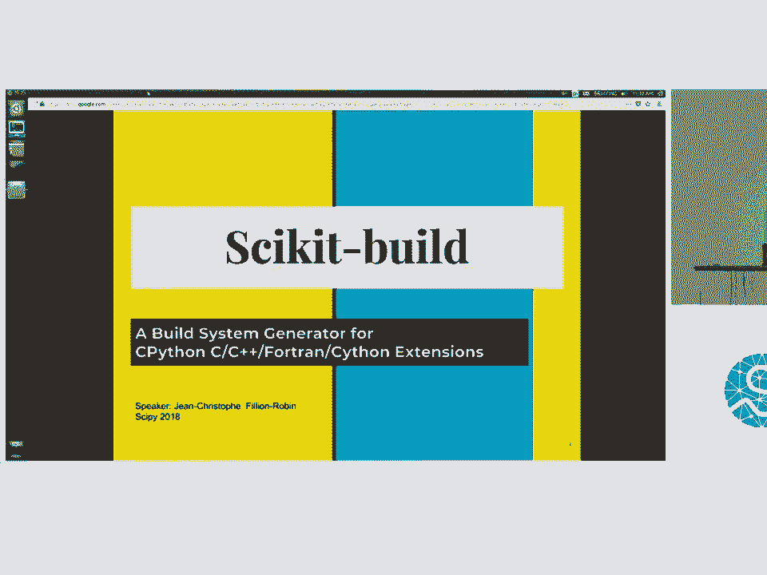

 for Python。 But first， let me describe what my， I work at Kitware， in our North Carolina office。

 I'm also a Lead Developer of Freelis Lyser。 I'm a medical imaging and a medical visualization platform。

 I'm the maintainer of scikit build， CMake and Inja Python packages。

 I'm also the maintainer of the Python CMake build system。

 It's an alternative build system to streamline， the building of CPython。

 And I'm also the maintainer of Docross。 Okay， what is the goal of this talk？

 Today we're gonna identify the requirements， for building CPython binary extension。

 We're gonna outline the limitation of the current approach， and we're gonna introduce our solution。

 The tool gonna be organized in a few sections。 First we're gonna review the packaging lifecycle。

 Then we're gonna talk about binary extension。 What are the problem？

 What would have impact the state of the current tool？ The requirements for a solution， our solution。

 the feature， and then what's next？ Okay， if you haven't done so。

 you should go check the packaging user guide。 It's a must read。

 it contains a lot of useful references。 This is a pretty complex diagram。

 and through the course of the presentation， I'm gonna bring back that slide， I like some boxes。

 and I'm gonna clarify， some of the terminology。 Okay， first， what is the source distribution？

 The synonym is also SDs or source release。 It contains some metadata， source file。

 and it's needed for installing by tool like PIP， and also for generating a build distribution。

 But where does that fit in the big picture？ If you look back at our packaging lifecycle。

 at the top you have the development tree， where we manage the revision of our source code。

 And then from that， we can generate， a source release， source distribution， usually using setup。

py as this。 Then you have the build distribution。 What is that？ It's also called BDS or WIL。

 It provides some metadata， also with some pre-built files。 And the only things we need to do。

 is to extract the content of the distribution， into the target system。

 There's no build process involved。

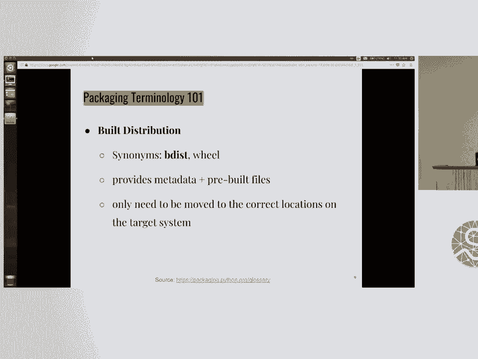

 also gets a build distribution。 Where does that fit in the big picture？ Developed Montreal。

 the work on it， then you have the source release， and from that we create the build distribution。

 Now let's talk about ABI， application binary interface。

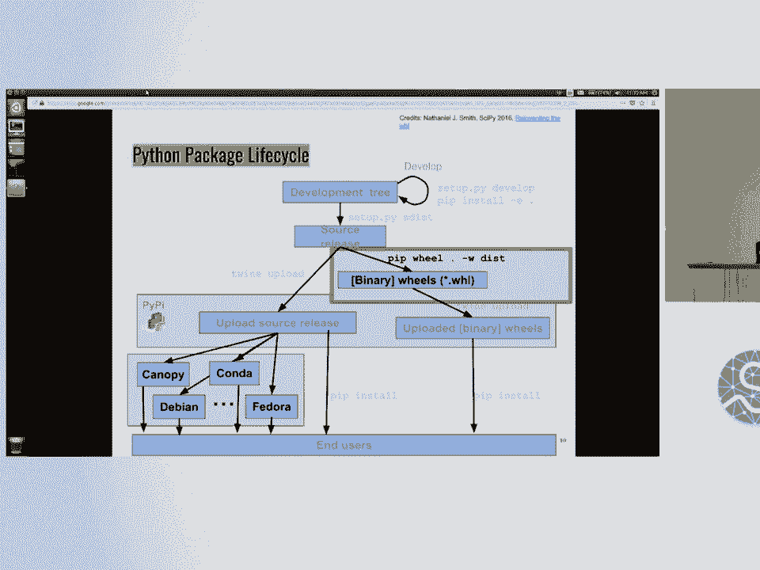

 This is an interface between two binary program modules， and making sure like module。

 have a compliant ABI is usually the work of the compiler， and also the package maintainer。

 And why is that important？ A Python distribution could be either pure or non-pure。

 And pure distribution， it means it only include， a 。py file basically。

 And it's not specific to any CPU architecture。 There's no ABI for the pure distribution。

 And then what you call non-pure， it's what include basically compile extension， site and module。

 compile for trunk code， and so on， and splat form specific。 And then what is a binary distribution？

 You have the build distribution that can be pure or non-pure。

 and the binary distribution is a build distribution， that is non-pure and it's splat form specific。

 and contain compile extension。 And then the other wheel， what is the wheel？

 The wheel is a format that describes， how do you layer out the different files。

 in your build or binary distribution。 It's basically a zip file with the 。whl extension。

 and it's described by PEP427。 And in my presentation， there's a lot of link。

 and at the end I will have a short URL， that you can get back to it and click。

 on the different link and explore。 Few example of wheel， they usually are named like that。

 For the one， one non-pure， you have the name， of the target system， any Linux， my OS X。

 and for the pure wheel， some are not specific to Python 2， some are not specific to Python 3。

 some other one can work on both， without any specific CPU or platform requirements。 Okay。

 but where does the wheel fit in the big picture？

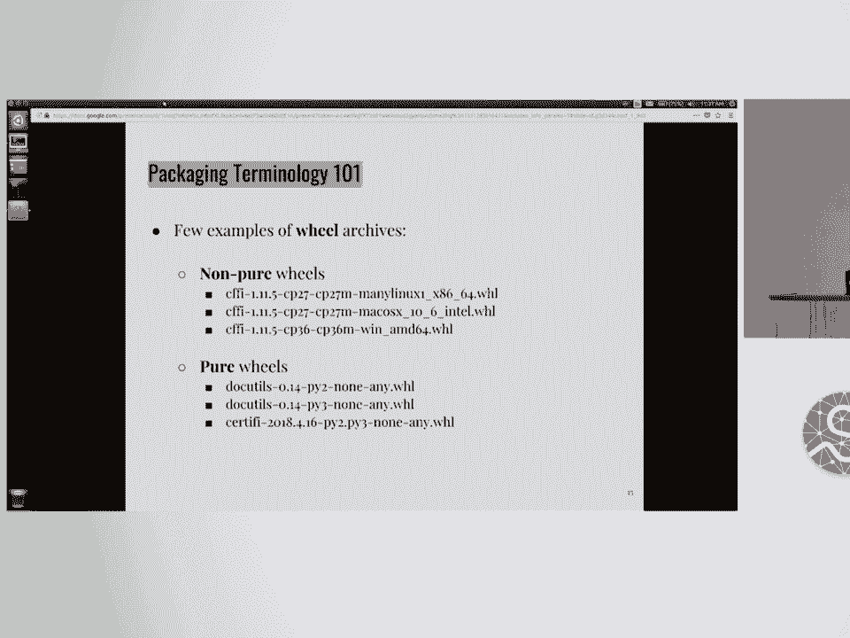

 We have the package lifecycle， and on the top right。

 we can generate the wheel usually with PEP will command， and then we get our wheel。

 they can be binary or not， meaning pure and non-pure。 And then on the bottom left， we can also see。

 canopy， Debian， conda， and fedora， and to generate the package， you will install。

 with the usual package manager， Conda or like Appetigate。

 or whatever package manager is using your distribution。 We also。

 part of the process is also to generate wheel， and then repackage。

 and to so that we can distribute them， and make them available to the user。

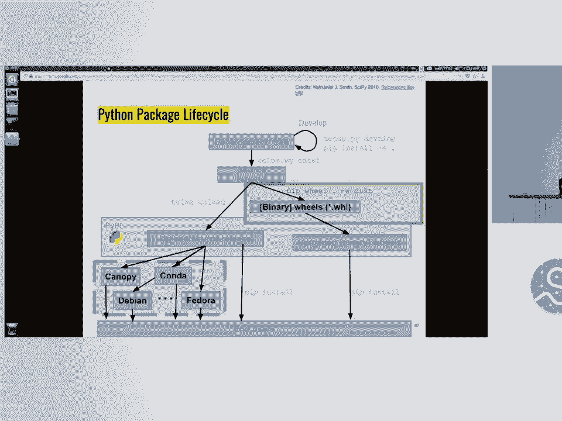

 What is the caveat of all of that？ We have the packaging user guide。

 we have a section packaging a binary extension， but this section needs some tender， low-end care。

 It's label as incomplete， life reviewed in 2013。 But fear not， few days ago。

 we submitted few requests， to help improve， and they got accepted。

 thanks to THE code for reviewing and integrating so promptly。 And other good news， yesterday。

 we gave the tutorial， about packaging， it was well received， and here you have the URL。

 and you can go look at it again。

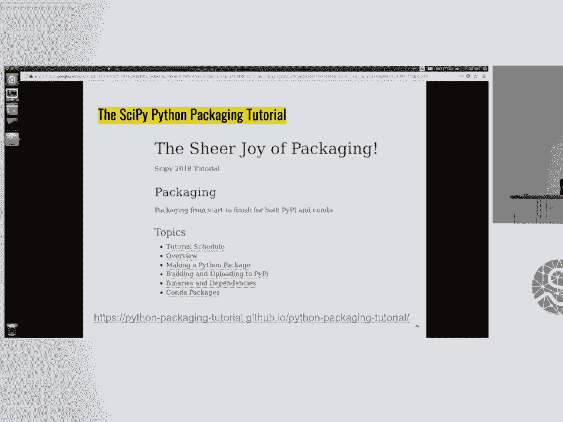

 Okay， now let's talk about binary extension。 You really matter for science。 Yes， trust me。

 Now let's look at the details。 The speed up competition， the intensive code。

 they're allowed to create wrapper module， they're allowed to access lower level feature， of OS。

 hardware， work with C Python， they're allowed to leverage multi-core， many core GPU， and so on。

 What else？ They're allowed to leverage existing scientific code。

 We don't want to reinvent the wheel。 We want to be able to compile rush code， or fortune code。

 or site code， and then access that from Python。 It will also careful and precise memory management。

 and it will also avoid the parallel computing issue， related to the global interpreter lock。 Okay。

 but you have some examples of wheel？ Yes， just to name a few， SyPy， scikit learn， C manging， MiAVI。

 Matplotlib， PyZMQ， all these package include compiled binary extension。

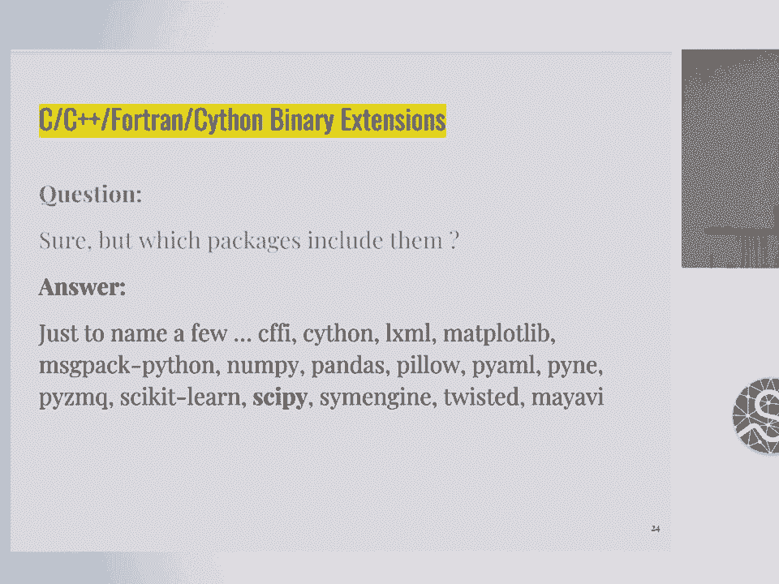

 and are then qualified as non-pure。 What other problem？

 Specifying the correct compiler and link flag is error prone。

 Finding built-time dependency is difficult。 Leveraging build tool like make or ninja is not possible。

 Building multiple extension in parallel is not an option。 Using your preferred ID。

 like Visual Studio， QUT creator， you name it， to develop CRS++ code， is not easily possible。

 Setting up a project with compiled module-y stead-yuse。 Cross-platform development and distribution。

 of extension module is a complex topic。

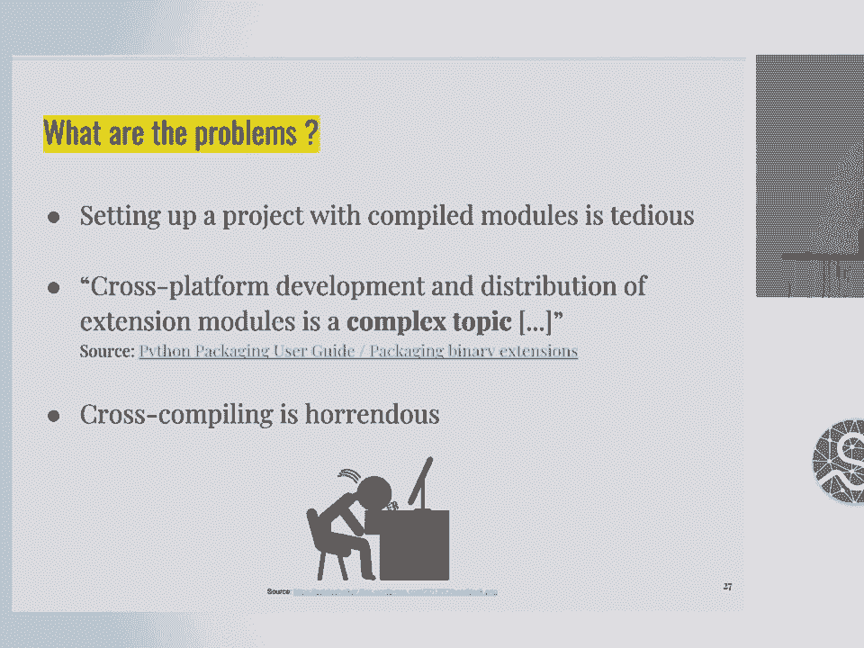

 Cross-compiling is a random。 Who does it impact？ Every one of you， you're writing the code。

 you maintaining the project， you're installing the package。

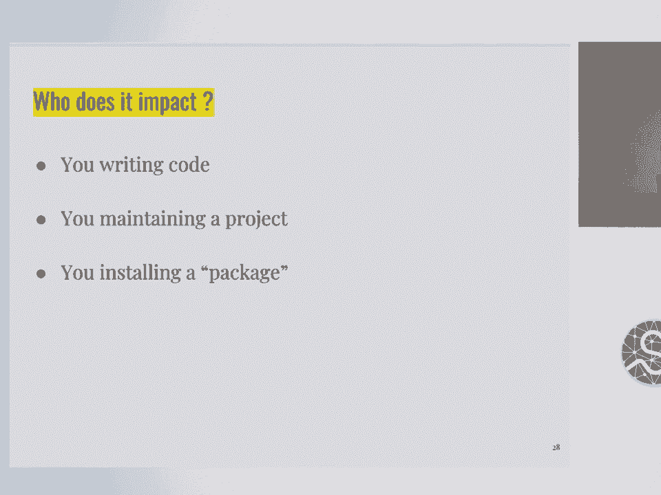

 But we are now at our very psychic build， a realable and easy way to package。

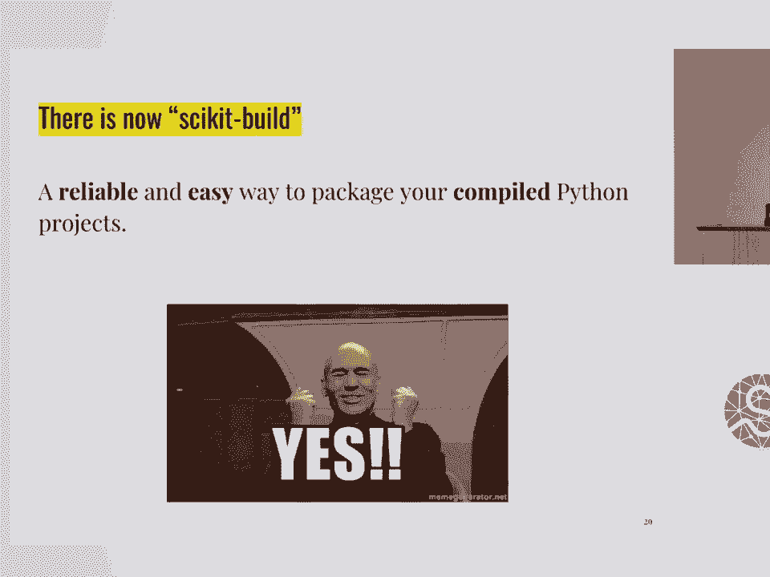

 your compiled Python project。 State of the current tool， they handle the common needs。

 but they allow to be desired， and they are not specialized for compiling。

 Whatever requirements for the tool， a realable build native code。

 First-class support for system introspection， creating extension module for Python script。

 Dynamically and statically linking extension module， for using embedded application。 Compiling。

 packaging and publishing。 All integrating with the Python ecosystem。

 First-class crowd platform support， and also cross-compilation capabilities。 Basically。

 I mean for a cross-comp platform building， and packaging solution that support project using。

 compile module and value user。 Our solutions I could build， it basically a bridge between CMake。

 your surplus plus project， your surplus plus fortune， C and site on project。

 and also the Python ecosystem involving P and set up tools。

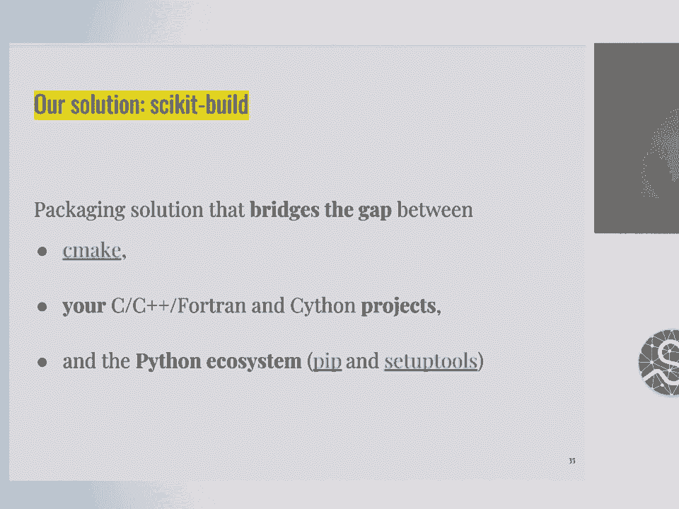

 But what is CMake？ We're gonna cover that in the next slide。 First。

 let's go back to the big picture。

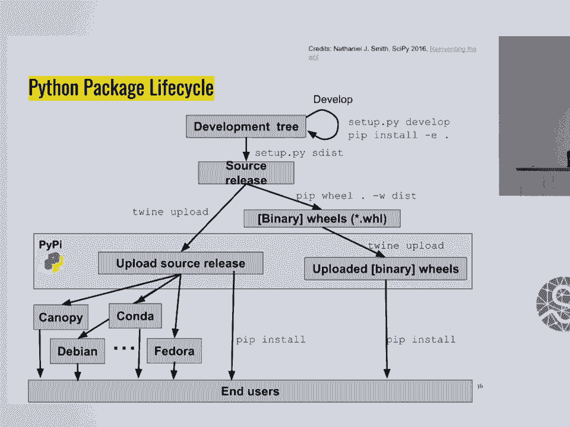

 with the packaging life cycle， and see where psychic build fit in the process。

 It allowed to integrate with the existing tools， when you， for example， do P in Sol-E。

 to develop your extension。 Or when you generate the wheel with P will。

 psychically integrate with the existing tool set up tools， in that matter。

 And it also brings CMake which is specialized， in generating build system and compiling code。

 And it also integrates with the generation， of specialized package like Conda， Fedorade。

 Debian and Canopy because to generate this package。

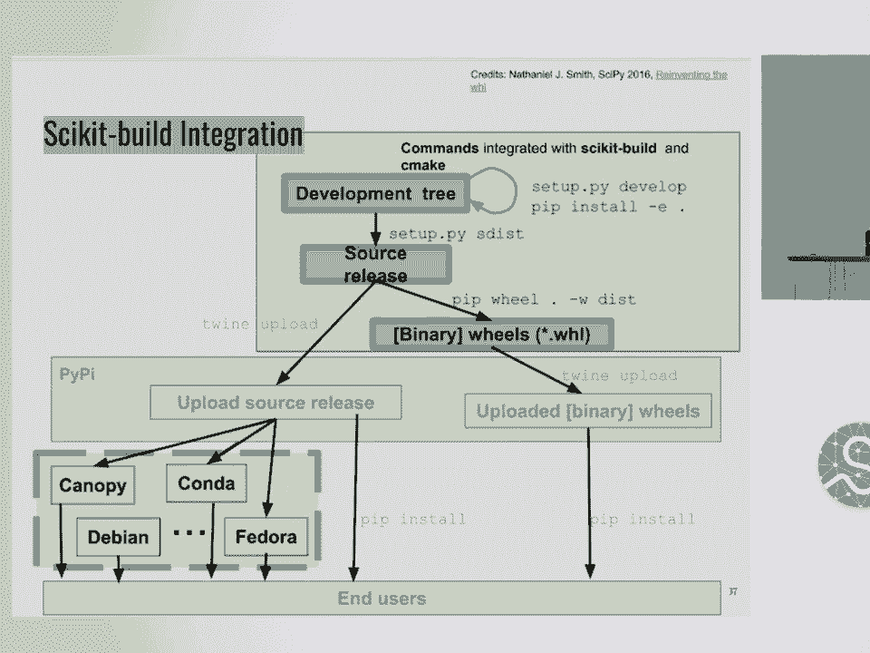

 you also have to build code。 What are the benefit of using CMake？ It's an open source。

 well maintained and supported tool。 Cross-platform build with first class。

 support for cross-compilation。 System introspection capabilities。 Support for native build system。

 Music can generate build system for visual studio， for Xcode， for Ninja， for make file。

 And there's also Python extension module support。 And it doesn't depend on anything。

 it's available on super compute， you can compile it on supercomputer， and also available。

 the binaries are available， in PyPy by P-P install in Conda。

 You can download the binary for any operating system。 Okay， let's look at the trend of build tool。

 We have CMake， AutoTools， Automake， Basil， Scans， and the blue line basically is according to Google。

 The popularity of CMake across the past like 15 years。 And we clearly see the trend。

 CMake is gaining more and more momentum， and it's used in a lot of projects。 What is CMake build？

 CMake build is not reinventing the wheel。 It's not a new paradigm。 It's integrated existing tools。

 It's not using set up tools extension， or this utils。extension。 But it can be used alone。

 It's not a replacement for Canopy， Conda or PyPy。 It doesn't manage package。

 It only makes building them easier。 It's not magic， you're still compiling extension module。

 but only with much less guesswork。 CMake build is a drop in replacement。

 Basically you remove the form set up tools in port setup， and you do from SKB simple setup。

 And then you only need to write a CMake list， and describe what you build and how you build it。

 For example， layout of LOR project， with a surplus plus base extension。 We have the CMake list。

 we have the LOR。CXX， they need the py， the set up the py， and the pyproject。tomel。

 Let's look at the content of the set up。py， from SKB in port setup。 We describe our package LOR。

 that's it。 And then we write the CMake list， but gonna be automatically be picked up by the system。

 And here we describe the name of the project。 We include the py extension module， the other library。

 We associate all the property to the library， and we install it。

 And that allows to describe the build system。 And then we also have the pyproject。tomel。

 because since we need site build during the generation process。

 we need to install it before we have a call setup function。 But with the pyproject。tomel。

 all of that happen under the hood。 And you can also specify， if you don't want to use。

 the tool on your system， CMake and the Injave's， Python will have a label and you're gonna all install。

 all the requirements gonna be installed for you， and transparently。 And then how do you build it？

 People will dot and then where do you want， to generate the will。 That's it。 What are the features？

 Super for Python 2。7， free for and above。 Compiling environment。 By default。

 we look at the compiler matching the Python version。 You don't have to guess， okay， you need to use。

 a sepeface compiler for Visual Studio 2008， and for Python 2。7。 Visual Studio 2015 for Python 3。5。

 It is gonna expect that by default， but you can easily override that。

 It provides recommendation if the compiler is not installed。

 If you run the command and you don't have Xcode， you don't have Visual Studio installed。

 it's gonna show you a meaningful error message。 We have to download and how to install it。

 It also understands the command environment variable， CCCC， C flag。

 It means you can just set that and then build your will， and gonna inherit from this flag。

 It also supports an Injave's tool online， works in my CSS and Windows like Ninja and Ninja。

 a lot of very efficiently build your code。 When you have only one extension， it doesn't matter。

 but when you have a more complex project like TensorFlow， that would matter a lot。

 And you also don't need to toy around with VCVars， all that bad。

 You can just call it from your term in all on Windows， and it's gonna set the environment。

 by leveraging existing code that was doing that。

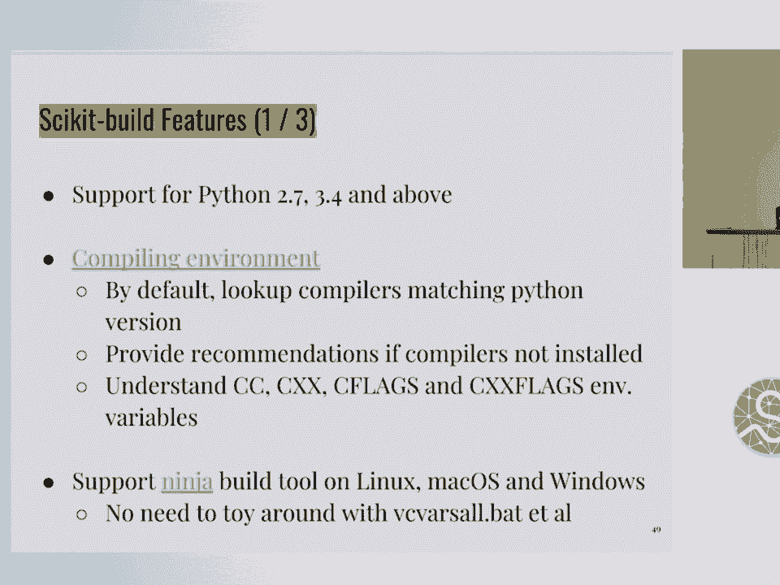

 It's also super the developer mode。 If you do PPCN， Sol-E or set up the Py develop。

 it's gonna copy the library in your source tree， and then you can easily develop your Python file。

 You don't have to always generate a will to use it。

 They see make a Ninja Python package you can install， as I mentioned earlier。 By default。

 if you don't have a manifest。in， it's gonna automatically package all the source using Git。

 within your source distribution。 It also supports fast incremental rebuild。

 by skipping reconfiguration if relevant。 It's a part of the usual keyword in your setup function。

 package， the include package， etc。 etc。 And it also extends that with additional setup keyword。

 you can specify CMA argument you want to use， you can specify another relative install directory。

 you can specify where the CMA list is located。 You can ask always to run CMA。

 when you create your source distribution， you can change the amount of language。

 that are associated with your build system。

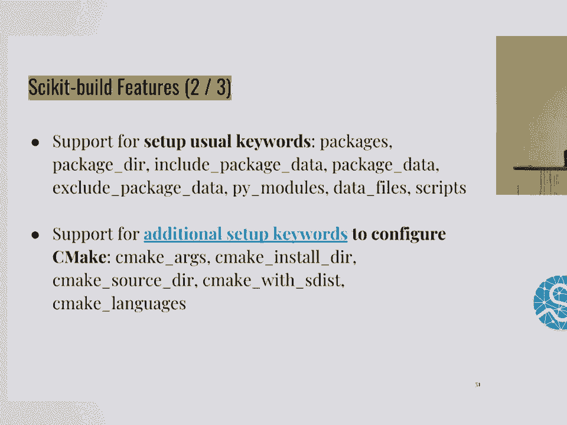

 CCXX， but if you're on Fortran， you can specify that。 It has a nice command line interface。

 You can pass option to CMAIT， but also pass option to the build tool。 For example。

 if you do Python setup the py， Bdswill， dash dash， the CMAK option， and then another dash。

 the build tool option。 And the build tool option will be， for example。

 the option you will give to MS build。

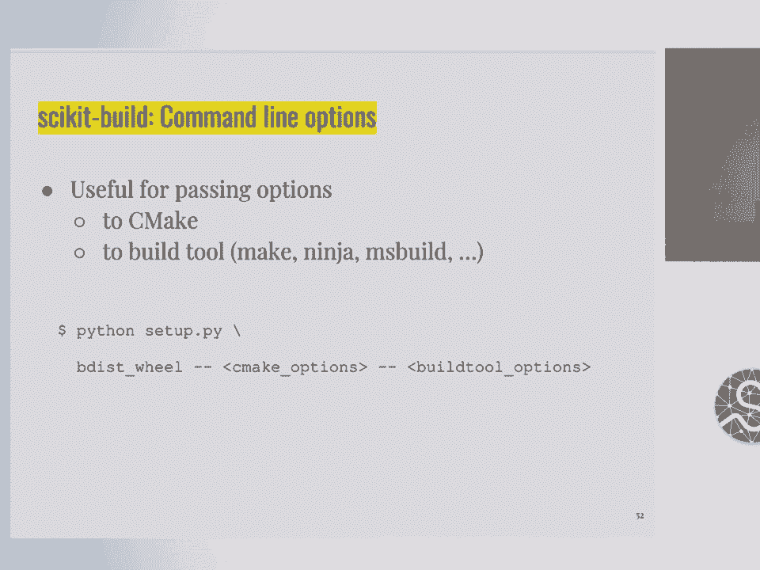

 if you build with Visual Studio， or you give to Ninja， or to make。 And so。

 Kit Build also provides some specialized module， Python extension， to easily find out which flag。

 you need to use to build your module。 There's also a Python module to bridge。

 with the Python ecosystem and generate the code。 And then， py module to easily find。

 whether you need to create your extension。 And also， a F2Py module to easily。

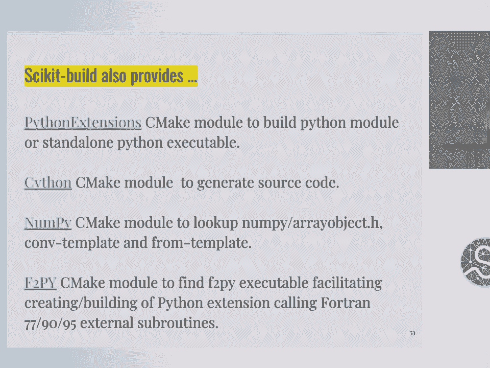

 more easily build a Fortran-based extension。 It has an extensive software process。

 CI and documentation， there's around 194 tests， running on free platform， in fact four。

 because we also run tests on 32-bit Linux。 From Python to seven， including Python to seven。

 and then from Python three four to three seven。 Documentation read the dots， contributing document。

 release note， MIT license， mailing list， package available on Conda， and coverages like 90%。

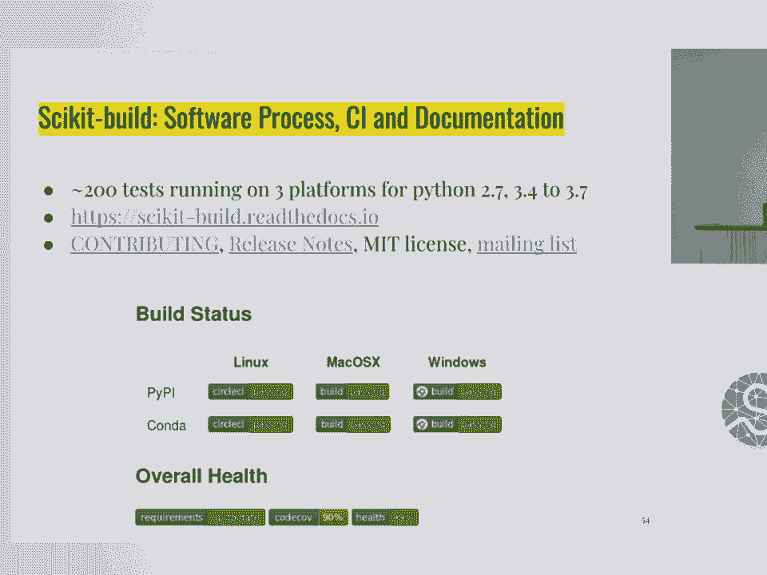

 What's next？ Sci-Pys prints will be on such a day。 We're gonna finalize the Conda package。

 associated with the latest release。 We're gonna improve the documentation。

 and add more example project， provide guidance to integrate， psychic building existing project。

 But long term， we can also reach out， to an empire and Sci-Pys folks。

 It's clearly some more work that could be done。 We're gonna help with the proposal。

 for packaging native libraries in two Python wheels。 Right now， when you create wheels。

 if your module are statically linked against your dependency， everything go well。

 But now if you have shared libraries， there's not yet an easy way to package them。

 We're gonna work on implementing the PEP 517， to have a build backend。

 where the decoupled from set them tools， and leverage the new disk-lib libraries。

 Thank you。 Thank you all the contributor。 Some of them in the room are at the conference。

 who help work on that project。 Thank you to all the issue reporter。

 and also thank you to the PEP as a Python packaging authority， the PEP contributor。

 and also the wider community。

 Psychic build， the link for that talk on Bitly， Psychic-Build-Talk， and the source code。

 is available on GitHub。 Voila， if you have any questions。 (audience applauds)。

 There's another microphone over here， and I'll run around the room if I see your hand up。

 And I was wondering if we could get， our first questions from someone who is either。

 first time attendant of SciPy， maybe a student， a lady。

 someone who didn't understand anything about this talk， who is completely new to all of this。

 and once a pointer were to start， I wanna see your hand。 We have， I think， 10 minutes。

 I've found a hand， very good。 Okay。 Okay， thank you very much。 This is actually my first time here。

 Based on what you said， it's something that will be helpful， to me in what I do。

 So I build a lot of software， some computers， for faculty， some of my institution。

 So you talk about Scikit build and being different， from CMake， but towards the end。

 it sounded a lot like they are very similar， because you still have to set some of the environment。

 parameters to be able to build your software。 You have that option built in， which is exactly。

 what CMake does。 So can you explain that a little bit more？ Yeah。 But basically。

 if you give a CMake list to someone， working in the Python community。

 they don't know what to do with it。 The interface is PEEP， WIL， or setup。py， BIST， WIL。

 And there's a lot of work you need to do， between you have a CMake list that builds some library。

 and then you can package them in the WIL and deliver them。

 And Scikit build is here to bridge setup tools with CMake。

 and make sure everything is packaged in a meaningful way， and available to the user。

 Does that answer your question？ Go ahead。 Another question there？ My question is。

 are there any libraries that are， using this yet？ Yes， we use that， for example。

 to create the ITK WIL。 ITK is pretty exhaustive， say， plus plus template-based， say。

 plus plus library。 But Matt is going to describe in multi-tail this afternoon。 And now ITK。

 for example， is integrated with the Jupyter Notebook。

 and that's made possible by generating ITK WIL， and the U-Scikit build for that。

 Have you seen any issues with Scikit build interacting， with build isolation in Pip-10？

 I've tried it for the tutorial， and we didn't have any particular problem。

 Want me to hear another question？ Thank you。 Hi。 I'm not super familiar with binary extensions。

 so excuse me if this is a trivial question。 But I was wondering why it is -- you mentioned that IDEs。

 are not typically supported in building binary extensions。

 I was wondering why it is that that is so， and what Scikit build has done to change that。

 if anything。 Yeah， for example， right now， when you want to build your extension。

 you import Accenture from this utility， so set up tools， and then you list the 。c file。

 But to go from the 。c file to managing them in a meaningful way， in your ID。

 your ID needs to be aware of the compile flag， you need to be able to rebuild in your ID。

 you are missing something here。 You can still open them in emacs or VI。

 and sort of craft your script to build it in the same way， but it's very prone。 With CMake。

 you can choose -- you have a concept of generator。 It means you say generate a build system。

 or a given version of Visual Studio， and then you will have， for example， a solution file。

 And then you can open that and you can rebuild your extension like that。

 You can also debug it more easily。 And what a real thanks。 Thank you for your question。 Over here。

 So if I have an existing project using set up tools， for example， that builds already。

 if I switch to Scikit build， would I get any cool new functionality from that switch？

 Or is it mostly just -- they do the same thing， and just alternate ways of doing the same thing？

 Are you asking for regular -- for pure package？ No， no， no， no。 I mean， like。

 I have a Python project that has， like， scython extensions and C extensions。

 and we use set up tools to build that right now。 But if I wanted to use Scikit build。

 would I get any cool new features if I wanted to use that？ Or do they mostly just do the same thing。

 and I wouldn't really get anything out of it？ Now， if it works well for you right now。

 there's no need to transition to Scikit build。 It's now if you start to have， like。

 some site on extensions， some compile codes， some fraud from code。

 then you want to more easily manage， that full set that will be useful。

 So it's more -- if I'm starting a new project， that has a bunch of compiled extensions。

 then I should look in Scikit build instead of setup tools， for managing all that stuff。 Yeah。

 And basically you will write one of multiple CME's。 We can have multiple。

 They include -- you can recursively include them。 And then you will describe in each folder。

 how you build your code。 And also， it's also useful if you have， for example。

 a library that is not only using Python， but provide， like， a back-end that can be used in Julia。

 or in other language。 It means you build your back-end with CMake。

 and then you want to link and get that back-end。 And when you link against libraries。

 you want to inherit of all the build flag， the requirements。 If you set us to 11， set us to 17。

 you want to make sure that the requirements， for building your project are transitively propagated。

 and with CMake you can benefit from that。 It's more useful for， like， larger project。

 I know you mentioned a little bit about --， it doesn't replace Conda as a package manager。

 I was wondering if you could comment on how it may compare， to， say， Conda build。

 which also allows you to build Python packages， or not just Python other packages with C extensions。

 and other stuff。 Yeah， basically， in Conda， you have your recipe。

 and you call whatever you need to call to build。 It means between the source code and what you do in your recipe。

 there is room for improvement。 And， for example， what we do to create the ITK Conda package。

 in our recipe， we just extract the content of the wheel， and the package in the Conda package。

 But you could also directly build the wheel on Conda， using the compiler available on Conda。

 and then repackage that in your package。 I see。 Thanks。 Time for one last question。

 Any burning question？ Short one， though。 Okay。 Coming to you with the red over there。 Red best。

 All right。 Thanks。 So， I have never written a CMake file。

 and is there a template that I could build can provide， if I just have a simple， you know。

 Python package？ Yes， we have a few Hello World， Hello-Pew， Hello-Cpp， Hello-Scyton。

 and there are very small examples， that you can build on。

 And we are working on cookie cutter template， that includes the full integration with， Veyar。

 Travis， and CQL CI to build the wheel on all the platform， in a very easy way。 And also。

 upload to PyPy and also upload as a GitHub release。 It means every day you do your nightly build。

 your daily build， you automatically have a smaller， another project named GitHub release。

 It's a Python package that allows you to have the latest tag on GitHub。

 and we follow the add of your repo， the master branch。 And it's like a bleedy-ish release。

 And then when you want to set up the CI for all your other project。

 you're going to specify the HTML page corresponding to that GitHub release。

 It means you can build all your dependency using the bleeding edge。

 by automatically downloading the wheel from the GitHub release。

 And it's more to it than just a cycle build， but to provide a meaningful ecosystem。 Thanks。

 everyone。 And if you have questions， come talk to me。 Again。

 we're going to be at the sprint on Saturday。

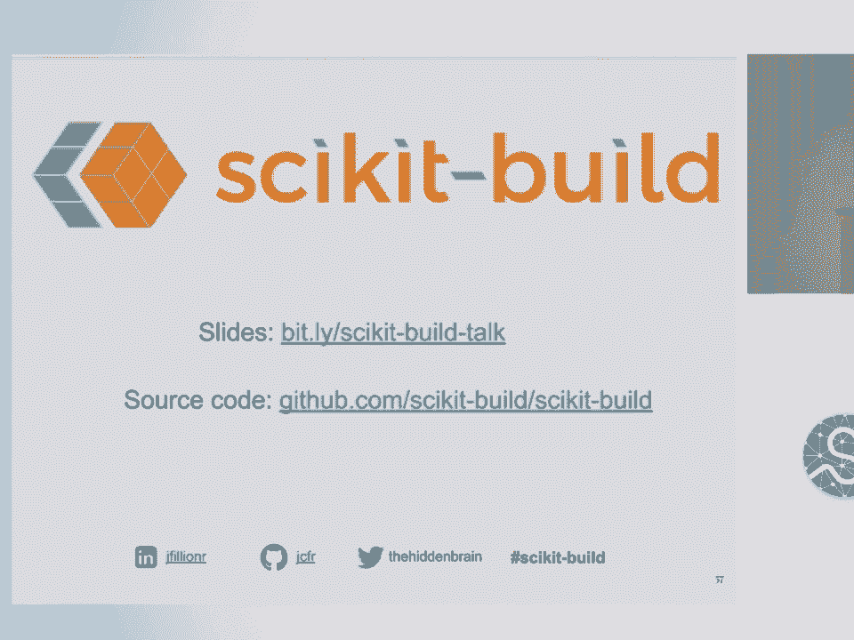

 Thank you。 Thanks。 Thanks。 [BLANK_AUDIO]。