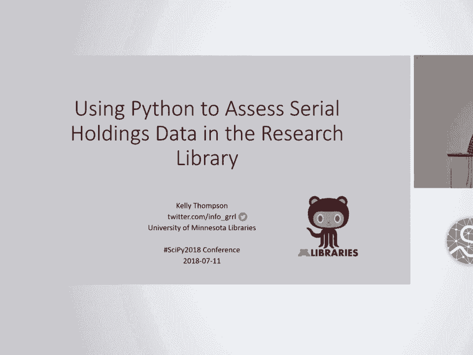
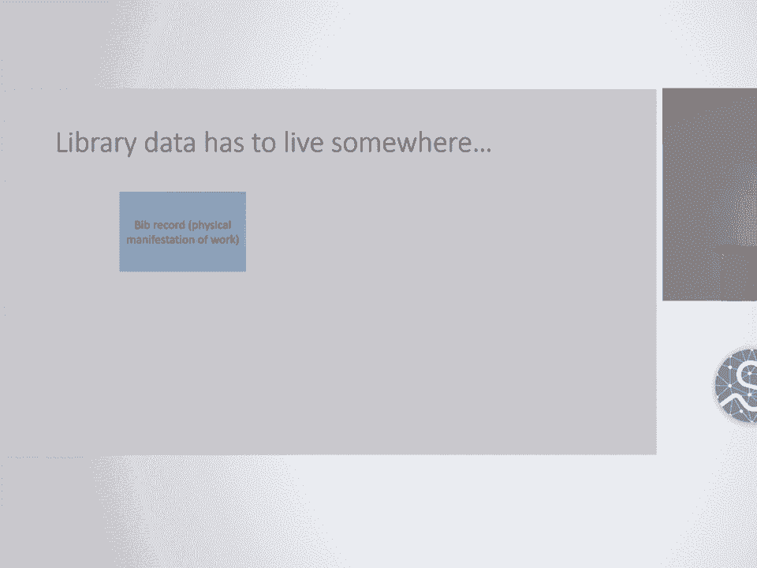
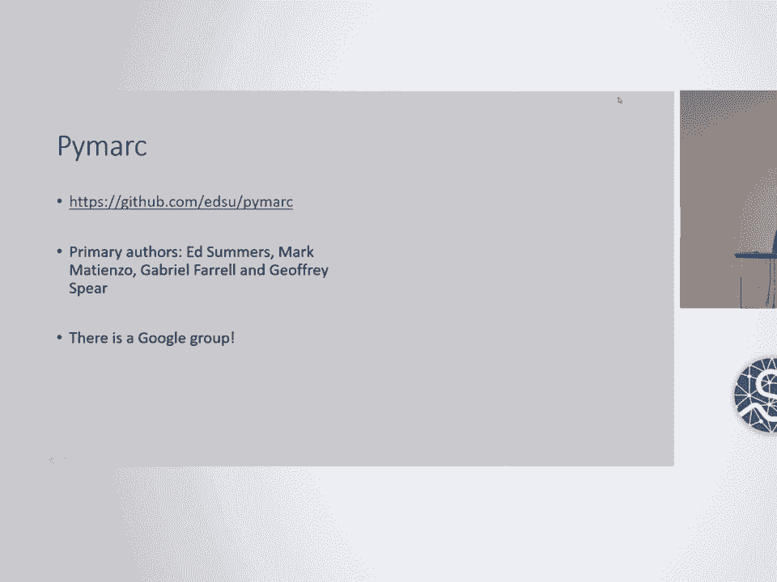
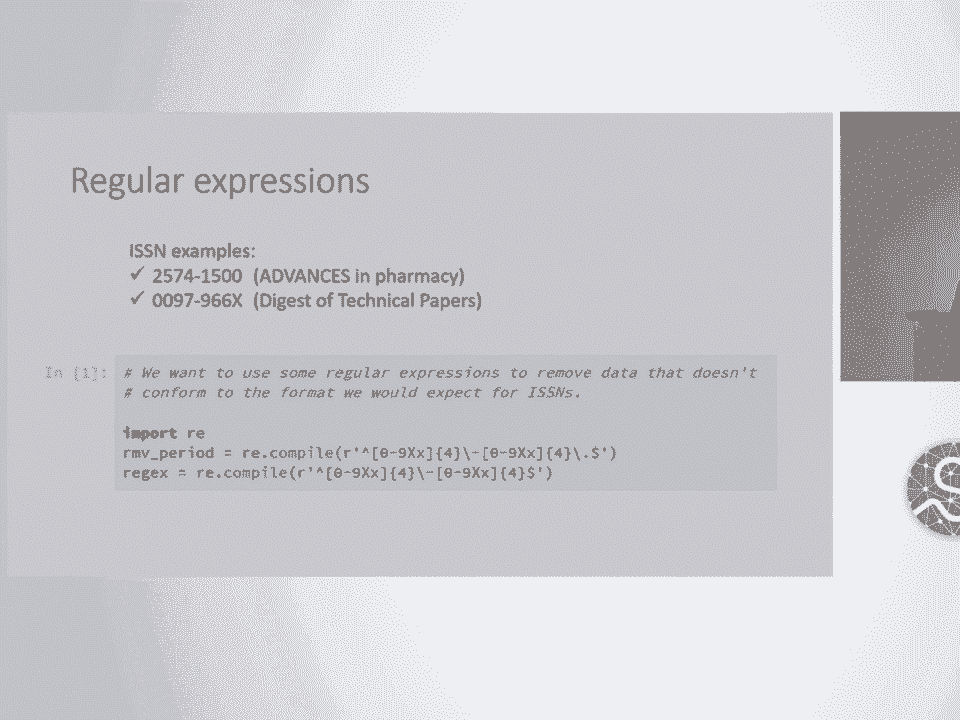
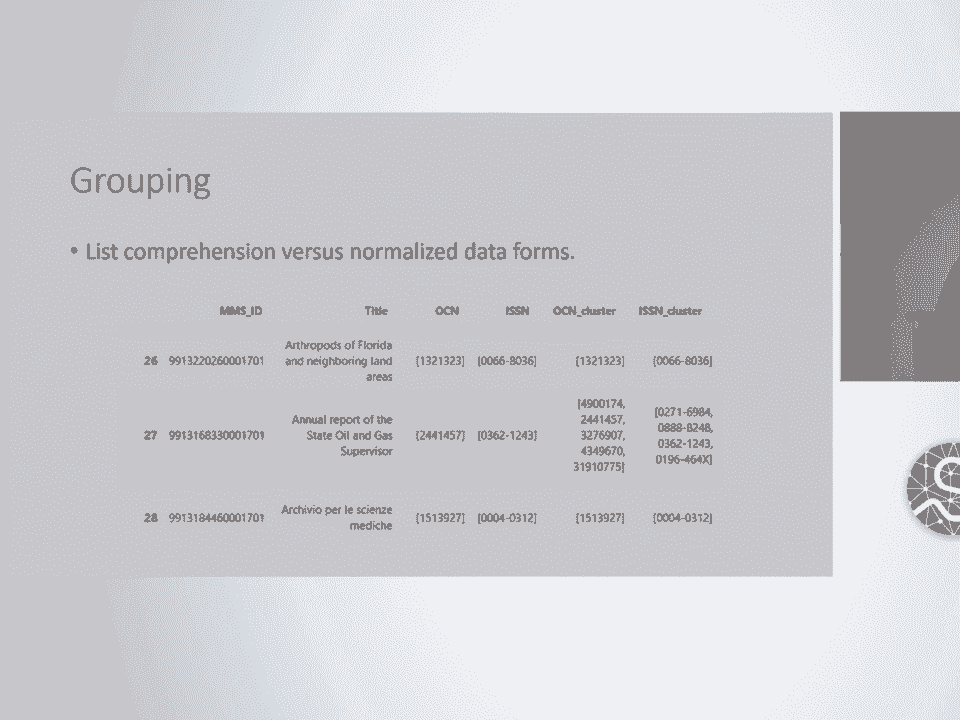
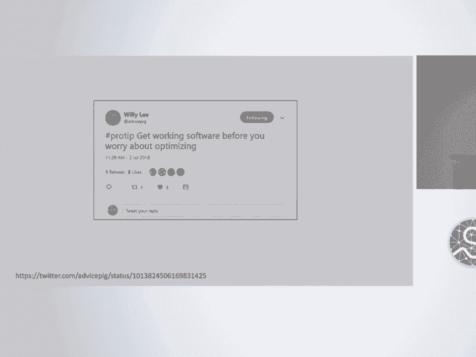
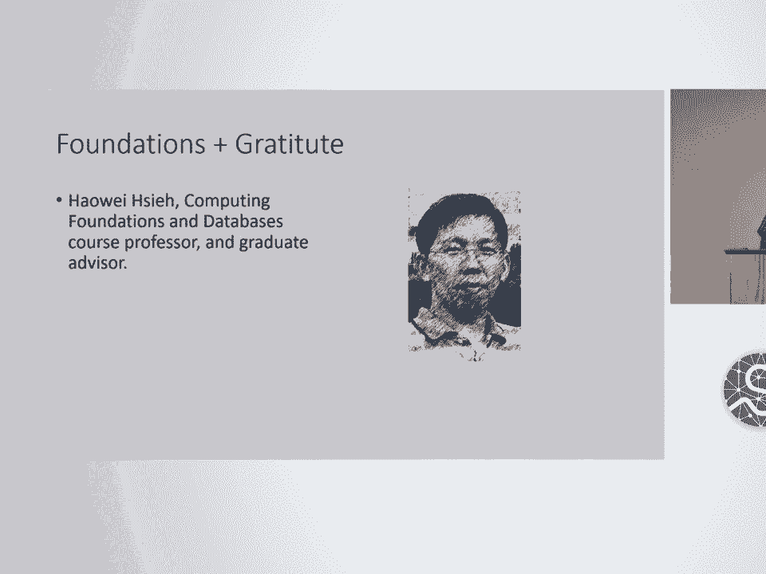
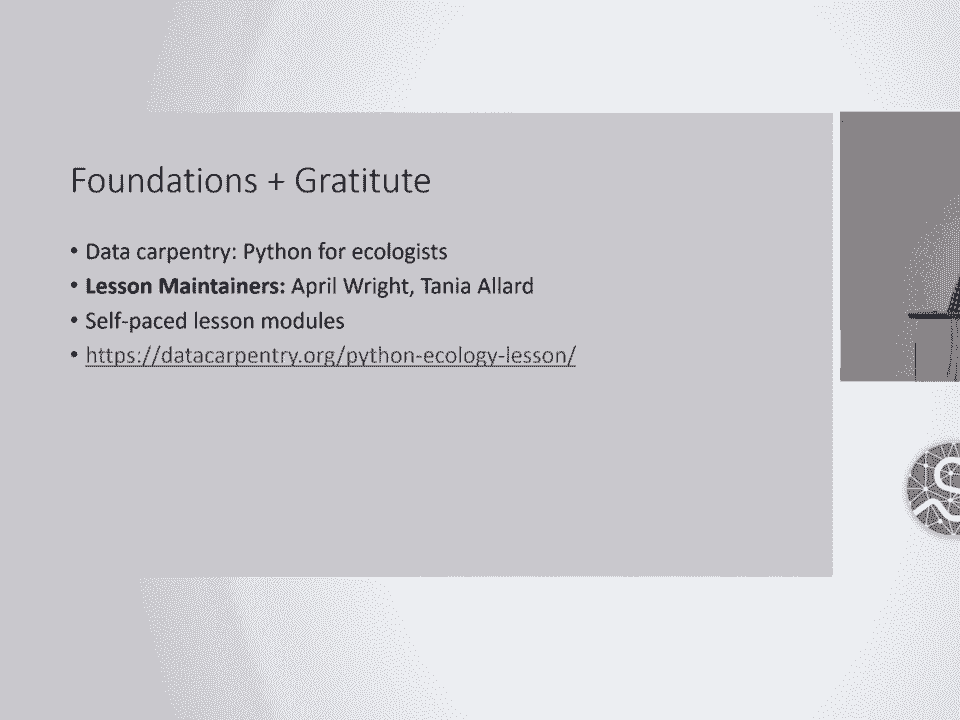

# P72：SciPy 2018视频专辑 (P72. Using Python to Assess Serial Holdings Data in the Research - GalileoHua - BV1TE411n7Ny

 Hello， SyPy。 My name is Kelly Thompson and I work at the University of Minnesota。

 Libraries in Minneapolis and I'm here today to talk to you about libraries。 Data。

 I had one of those stickers earlier that said ask me about and I had written。

 libraries and then I realized that at a Python conference that maybe wasn't the。

 most clear thing to suggest。 So I'm going to be talking about serials。

 holdings data in the research library and I'll tell you what that means as we go， along。

 So I work on the secret fifth floor of this building， Wilson Library。 By。

 title I am a data and systems analyst but by training and background I am a。

 metadata librarian and before that a seed scientist。 I was recently reclassified。

 into an IT track as I've been doing more and more scripting and automation of。

 workflows in particular using Python。 Let's see。 So I've been using Python since I。

 was a graduate student in library and information science but I've really been。

 over the last two years incorporating this into my regular workflows and for。

 the sake of scope I'm going to talk about one particular problem in the。

 environment of the large academic research library which is collection。

 management and we use scientific Python libraries in a lot of our workflows now。

 so thanks to the community but I just want to focus on one particular problem。

 where we're applying this set of tools to keep that scope manageable。 So libraries。

 have been collecting， stewarding and providing access to information objects。

 for decades in some cases centuries。 Our collections cover an incredible， time span。

 Some of our oldest materials are cuneiform tablets from。

 between 3000 and 2000 BCE to the most recent electronic medical journal article， indexed in PubMed。

 We are stewards of physical resources yes but more and more。

 we are facilitators of access to information and scholarship services。

 increasingly in digital formats。 And because we are stewards of centuries of。

 physical manifestations of intellectual outputs you can imagine that we have。

 reached capacity in our physical spaces despite the fact that we have built a。

 giant cathedral to books in a cavern and a cliff overlooking the Minnesota。

 Mississippi River which runs through our campus seen here。 This problem comes at a。

 time when our space as many on campus are challenged to be more creative and。

 flexible with our physical space。 We are being asked by our administrators to。

 create more student-friendly study spaces。 Flexible spaces for teaching and。

 learning supporting new modes of pedagogy， cafes， group study spaces， data。

 visualization labs and so on。 At a time when our physical footprint of resources。

 is at its largest we need it to be shrinking。 For the majority of disciplines。

 we serve electronic resources have become the format of choice。 Most of these。

 resources are in the form of cereals or continuing resources。 A broad category。

 used by librarians to encompass publications such as journals， society and， conference proceedings。

 government documents issued on a recurring basis， book series， etc。

 Cereals published by for-profit publishers have price tags that。

 continue to climb at rates much higher than inflation at a time when our。

 budgets are stagnant or reduced。 The number of publishers and vendors who。

 can provide provide us with these resources has shrunk to less than a。

 handful affectionately known as the big four。 This environment is leading to a。

 louder call to critically examine our practices in this area。 Libraries have。

 identified a number of actions we can take to work in this problem space such。

 as forming open access publishing units to keep the means of production of。

 scholarship in the hands of scholars。 Educating researchers on their。

 intellectual property rights as authors。 If you are about to sign a contract。

 signing away or copyright and you work at a university please contact your。

 librarian because we are happy to help you with boilerplate language for。

 negotiating to keep as many of your rights as possible。 And we are critically。

 examining our relationships with our vendors。 It is with the vendor relations。

 the negotiations of the contracts we sign in order to access electronic。

 resources or license them that we encounter a big question of access。 If we。

 decide to discontinue purchasing a title how much if any of the content we。

 have been licensing will we retain access to？ The answer can range from， none to unknown。

 This post cancellation access also brings up the issue of， digital preservation。

 If a journal publisher is acquired by a larger， publisher or goes out of business do we trust that they will continue to。

 provide indefinite access to the retrospective electronic resources we。

 previously had contracted with them to provide。 Ongoing access to these。

 resources is a big question and library consortia have been working， together to address it。

 And in the meantime we have to keep moving forward。

 with our work and providing access to our communities of library users。

 fulfilling our other roles on campuses。 Fortunately now is also a time when。

 additional inter-campus collaborations are springing up to address these， questions。

 One example is the increasing movement among library。

 consortia and membership organizations to collectively inventory。

 disparate resources and create shared catalogs or meta collections of national。

 consortia collections。 Drawing from the collections which individual local。

 institutions steward and agreed to preserve in place。 These types of。

 sharing arrangements have existed for a long time。 Our library users have been。

 fondly familiar of our interlibrary loan service for decades but these。

 consortia relationships have become even more important in today's environment。

 These relationships can offer us new decision-making frameworks in our。

 collection management policies。 Through these sharing arrangements we make。

 commitments to retain specific titles on behalf of the larger community of， libraries。

 We gauge the type and expediency of access we could expect to。

 access materials retained by other institutions or through post cancellation。

 access via our vendors or digital repositories。 And we balance these。

 assumptions as we make retention or withdrawal decisions and policies。 So we。

 need to get rid of non-unique， non-rare， unused resources to make room for ways。

 of using library spaces in support of new ways of teaching and learning。 We need to。

 know which titles we hold in a physical format on our shows in an electronic。

 format。 We need to know if we have ongoing access if we cancel our。

 subscription and we need to know if the title is preserved in a trusted， repository。

 We have made commitments to consortial efforts to retain certain。

 materials on behalf of a larger community and we are hoping to rely on。

 the other community efforts to supply materials outside the scope of outside。

 the scope of what we wish to retain。 Only then can we start looking at these。

 candidate titles to see if they are in any of our weeding target locations。 And。

 ideally we would like some kind of measure such as number of volumes since。

 the bosses are thinking in linear feet of shell space。 That's my joke about measuring。

 Okay so our goals for this data analysis are to， compare physical holdings of resources to electronic resources。

 Filter those， matches for post cancellation access from back files lists maintained by our。

 electronic resources librarians Sunshine Carter who is amazing。 Filter for items。

 held in trusted repositories which our administrators have approved as part， of this policy。

 This includes portico and BTA ASPR stands for Big Ten。

 Academic Alliance Shared Print Repository and we may be adding JSTOR but this is， fluid。

 And then we would of course want to exclude any titles where we have made， retention commitments。

 Currently this is mainly through HATI Trust Shared Print。

 Repository which is a preserve in place arrangement and our government。

 documents since we are a federal depository library。 And we need to keep。

 track of everything that we're doing as we do all of these weeding or withdrawal。

 or deduplication projects because we are one of the libraries who send。

 resources for scanning to the Google Books project。 And as part of our。

 agreement with them copies of those scans are deposited in HATI Trust and if。

 we can establish that we at one point had ownership of those materials our。

 authenticated users can access those。 So there's a lot of data stuff going on。

 under the hood of all of these scenarios。 So to make it even more complicated we're。

 taking not about monographs or books but about cereals resources that continue on。

 and have their own sorts of lives。 The life of the party。 Cereals yield what I would。

 consider to be some of the most complex bibliographic inventory data in our， library systems。

 It's important to know that cereals are complicated works。 They're。

 born， they merge， they split up， they change their names slightly on every issue， cover。

 they spawn sub-series， sometimes they die and sometimes they just kind of， ghost on you。

 Cereals have volumes， issues， their frequency of publication， varies， editors retire， etc。

 This all means that cereals have complicated， relationships with each other that are challenging to represent with data。

 It also， means that when we want to look at a title and compare it online versus print。

 we often need to look at a cluster or a family of records。 While print cereals。

 usually have one record per major title change electronic cereals often。

 have under provided records which often compile an entire run under one title。

 regardless of title changes。 Usually the most recent form。 We hope that our records。

 have what we refer to as linker fields or 766-77-X and 7-8-X if there are any。

 catalogers listening which describe a relationship between the title described。

 by the record and another title。 Each field describes a specific type of。

 relationship which is further described by what we call indicators and sub。

 fields in the data structure。 The most important data in these fields are， identifiers。

 We also have what are called a numecron or enumeration and。

 chronology data for each cereal run which include issue and volume numbers， dates。

 of production and whatnot and these are as much of a hot mess as you would expect。

 Library data is legacy data all of it is kind of a long tail。 It's it's been。

 around for a long time and it's continually worked on data set。 Most。

 libraries use a large data system referred to as an integrated library。

 system or ILS to manage the majority of their data about library collections。

 Almost all libraries purchase rights to use these systems from an。

 ever decreasing number of vendors for large sums of money。 The system that we。

 use has what I think of as a tiered inheritance data model。 You have。

 bibliographic or descriptive data。 You have holdings which indicates libraries， and locations。

 item level data in the form of record for every barcode and。

 then bibliographic records for a loss to my mouse for every barcode in the， system。

 That's electronic and then our app barcode and this is every work that's。

 electronic and to that there are portfolios or carriers of URLs and。

 associated access data and those may or may not belong to an electronic， collection。

 We're also transversing trees in addition to having really messy， data。

 A bit about the format of libraries data。 Library data is started in a。

 format called mark which is an acronym for machine readable cataloging。 It was。

 developed in the 1960s by a systems analyst at the Library of Congress。 It。

 was developed to facilitate the transition from paper card catalogs to the first， computer catalogs。

 So this is a system that has been around since the 60s over。

 50 years and we're still using it and while some aspects of the standard have。

 changed in particular the content standards， the majority of it including， structure have not。

 Here's an example of a typical mark serial record as I would， interact with it in the wild。

 The standard prescribes the mark record structure of， leader， directory。

 fixed fields and variable field data。 The standard contains。

 rules for which content to put in which field。 Two indicators for each field that。

 carry coded data and subfields。 The content of these data elements is， robust standard。

 It's previously a CR2， now RDA， off and not hybrid。 The。

 resulting records can be serialized in a number of formats binary， mnemonic and。

 XML are the most common。 Series are typically registered for an ISSN or。

 international serial number。 This typically an in-care identifier for。

 digits followed by hyphen than four more digits or the letter X。 These are some。

 examples of the many identifiers in the mark record that I just showed you。 So， onto the Python。

 Now is the time for some caveats。 I am a domain knowledge expert， when it comes to library data。

 However， I am not an expert when it comes to all， things Python。

 This is not a talk about how we created the most advanced and， genius thing。

 It's a talk about how we've applied these open scientific Python。

 tools in our particular context and it's saved us a lot of time and helped us。

 get answers that we were unable to get in a timely fashion otherwise。 So most。

 libraries undertaking these kinds of analyses have had to struggle through a。

 lot of manual work to do this。 Our catalog right now I think our bibliographic。

 records are like over four million and our individual items are over seven， million。

 So this is way too big for Excel。 It's not big data but it's too big for， Excel。

 So we need new tools and I'm here to say if you are a library and you can。

 do this too。 So one of the first steps in a Python analysis of library data has to。

 be getting the data into a form appropriate for analysis。 For this work I。

 have been extracting the data into pandas data frames。 So in order to get。

 something that looks like this into a data frame we can either manually use a。

 program called market it to extract tabbed limited values from the fields we're。

 looking for and read the text file。 While this method is very fast and provides a。

 handy user interface it doesn't give us the same control that programmatically。

 parts in the records does where we can implement conditional loops and pre-filter， the data。

 Primark has an active Google group where people are happy to answer。

 questions and the primark authors were Ed Summers， Mark Martinso， Gabriel Farrell and。

 Jeffrey Spear and I think Ed Summers does a lot of the ongoing maintenance for。

 that so that's a good resource。 So this is an example of what Primark call would。

 be this is the beginning of one of the functions in the script that I use to。

 parse the serials data so for each record in a batch of records pull out the。

 identifier look for an 035 field which I know is where the OCLC number is。 There's。

 a lot of acronyms in jargon and I only want the subfield A because I know that。

 is the actual identifier not a linked identifier a canceled identifier a。

 previous identifier etc but if I do find any of those other subfields capture。

 that data because it's a related OCLC and I might want to try to link that when I。

 do all of my clustering so you get the sense that there are a lot of。

 conditional that we're looking for in this data and I know this is quite small。

 so hopefully if we have a little bit of time at the end I can run you through a。

 notebook or in a jubiter lab and we can zoom in on some more of that but this is。

 basically I've read in some work records I've got them in lists in the。

 data frame because that is what made most sense to me as I was working on this a。

 lot of records have multiple identifiers and if you're new to Python and you。

 haven't worked with pandas yet allow me to plug it for you because you're in for。

 a treat it's like a spreadsheet with magic powers they're like database tables in。

 that you can perform database style joins on them but there are also a lot of。

 built-in methods that make the work really nice， another tool that I use a lot is just regular expressions so we're looking for。

 ISSN's but a lot of times the data is older messy so I want to get rid of。

 anything before I do any matching that might give a false positive match。

 there we go got my mouse back okay so like I said our database is over it's。

 probably about 50 years old and people with varying knowledge levels and。

 experience levels have entered that data so I'm always doing these checks on the。

 data before I'm trying to do any grouping， so I'm also using replace functions to clean data and then I'm working on。

 grouping so I had original this is also a story about refactoring code I had。

 originally started trying to do this with list comprehension because I had the。

 data in the form of lists because there's multiple identifiers per record。

 this was incredibly slow and I wanted I learned about the pandas group by。

 function and I wanted to be able to use that but you can't use that on a。

 multi-valued so you need tidy data so I was doing a lot of research I came across。

 all of the stuff about split apply combined and thought about theoretically。

 that so I had filtered out into just the records that I knew had matches and。

 tried to do that but it's still too slow but I had something that worked and I。

 needed a deliverable for my boss to take their committee so as my colleague at。

 the University of Minnesota willily writes hashtag pro tip get working software。

 before you worry about optimizing so I took their advice and I did what I needed。

 to do but I wasn't satisfied with that solution because I knew we're going to。

 keep having to do these types of matches and clustering so I ended up finding on。

 a stack overflow post in high view and use a function called explode to take。

 multi-valued data points and make them into individual rows so I was able to use。

 that to reform at my data in order to use the built-in functions which are so。

 much faster than trying to do by hand kind of clustering algorithms so and。

 this is kind of like I think of it like normal forum when you're doing database。

 design so shout out to my databases professor how I share but and this is。

 also related to tidy data one observation per cell and then repeating。

 that as necessary I'm using indexes as temporary record identifiers there these。

 records do have actual identifiers but they're long and unwieldy and this makes。

 it easier once I have a data the data in the format I need call the pandas group。

 by a function parse the group object to get the group numbers and put them into a。

 data frame with the record IDs because we've split out those multiple identifiers。

 this is going to yield multiple group numbers per record ID so we've come back。

 to a problem again of multi-valued cells so we need to reduce the multiple group。

 numbers into a single group number then what I refer to I'm sure there's a real。

 term but defrag that list so instead of 0 4 and 12 you have 0 1 and 2 as your。

 group numbers and then start by group number for display so I know this is。

 probably really rudimentary but this is a thought process that took me a lot。

 trying to process through and I think it was helpful for me to think about it。

 but if you know of a better way to do any of these things please approach me I'm。

 very open to learning all those things I'm excited about it so I run this algorithm。

 multiple times over the data clustering by ISSN and OCLC number we get。

 theoretically do other things after clustering I add in my other data and do。

 the filters that I talked about on that goal spreadsheet the other data lives in。

 totally different systems it often comes to us in the form of tab limited or。

 comma separated values or spreadsheets and so pandas is also really nice and。

 then I can read in those CSV's do what I need to do get the identifiers I need。

 and then perform those database style joins on my data I also use pandas to do。

 slices as I'm filtering for those different indicators and another thing I。

 want to mention is that a lot of the outputs that we're looking for are。

 spreadsheets that will be read by humans and that's another reason why I opted to。

 put a lot of the data in lists within the data frame because I knew that the。

 people who would eventually be making the final decision about whether or not to。

 retain a title would want to see all of that data and there's a lot of validation。

 and checking that goes on so it's kind of a unique scenario and that our and。

 consumers actually want to look at spreadsheet data it's not going into。

 like a visualization or something so so far what I've been working on with the。

 anum-cron data that you remember is mostly working with the dates as years so。

 the standard date time library cannot handle the messiness of what is cereals。

 anum-cron data but I've built a suite of regular expressions so working on next。

 trying to do that with the issue and volume number inspired by the package。

 pi-call number which was presented about at code for lip conference this。

 year so next steps my electronic resources librarian has requested a。

 output of data that says percentage overlap so this percent of the physical。

 volumes are represented by electronic access are represented by post-cancellation。

 access are represented by preserved things that's really complicated but。

 I'm working on that as well so that would give us more granular coverage data。

 I'm investigating querying these data sources on the fly because right now we。

 extract all of the data and then process it and these are living systems stuff is。

 added and withdrawn every day so being able to have data that's not instantly。

 old would be an advantage in this process I'd like to turn some of these。

 functions into a Python package for other people who are working with。

 cereals data this would be an extension maybe of the pie mark and I would like to。

 try out some different data structures so maybe trying out you don't have to put。

 everything into a data frame the benefits of this are reproducible work。

 flows it's extensible and it uses actively maintained tools the challenges have。

 been chugging through those large data sets and the data sources themselves we。

 do have a Jupiter hub on campus through the high-performance cluster at the。

 super computing Institute Mike Mulligan I think presented on that here like two。

 years ago so I'm interested in seeing if we can get some space on that cluster to。

 try running these to improve the speed when I first was trying to do the list。

 comprehension grouping it would take overnight to run this group now it's just。

 a couple of hours to run all of the cleaning and the grouping and the。

 re-indexing so thank yous and sources Sean and， Gabriam got me started on metadata in Python when I was a grad student and she。

 was my supervisor she also did a really great workshop called measure your。

 metadata with Sarah Rubenow Matt Miller and Josh Hadrell which you can find on。

 github and that was my first foray into pandas so if you're looking to get。

 started that's a great place my database professor and grad advisor how I。

 share and then I also use data carpentry Python free college is quite a bit in。

 learning especially with the database style joints and then my coworkers Stacy。

 Trill and Sunshine Carter who also work on these serious projects so I don't know。

 if we have time for questions but feel free to reach out I'll be around and I。

 will be at the beer garden this evening if you would like to talk about。

 libraries data and I'm on Twitter， we are out of time but we're running up against a break right now so if anybody。

 has a quick question they'd like to ask and our speaker is willing to answer it。

 then we can do that I would just remind you to ask your questions in the form of， a question。

 hi are you concerned about possibilities of misentry or surprise book loss or。

 anything like that are you doing anything to prevent that sort of thing yeah so we。

 have flags within the database that let us know if something has already been。

 withdrawn if it's lost or missing different statuses like that so I filter。

 for that when I do the data export from our main library system we're always。

 concerned about the possibility for false positives in the matching but at。

 this point none of this is like the final decision maker someone is actually。

 looking at all of this and we have staff who specialize in that and this is this。

 is the most useful as a tool as a way to create candidate lists for someone to。

 look at so instead of starting with like a giant batch of things to say like here。

 are some candidates that it makes sense for someone to actually spend some human。

 time with so but that's a really good question that we think about a lot。

 awesome great let's thank our speaker one more time， you， you。

