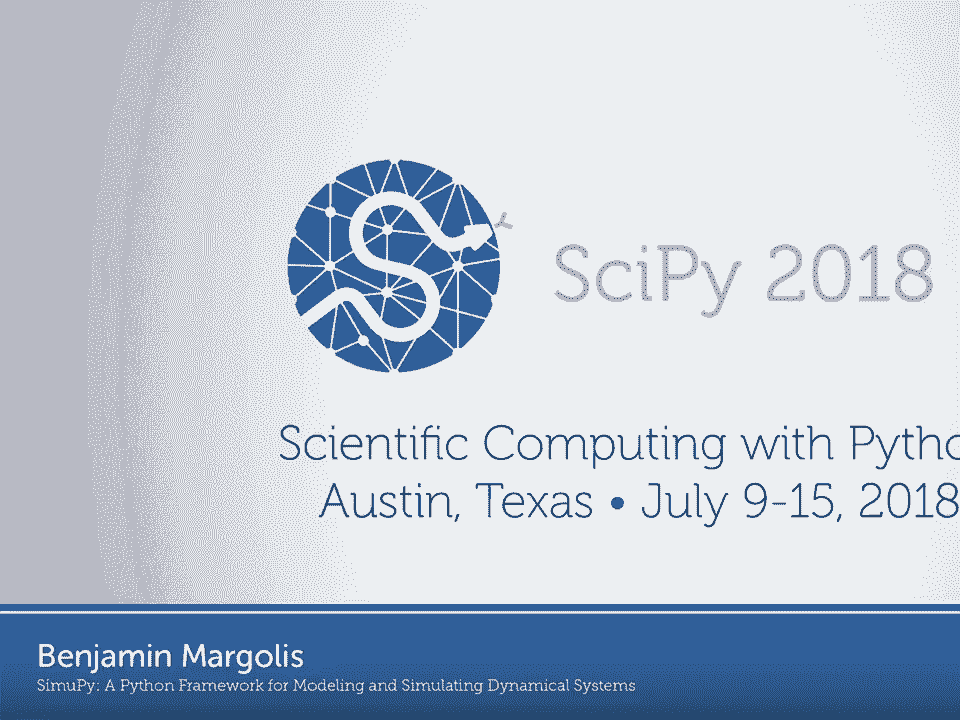
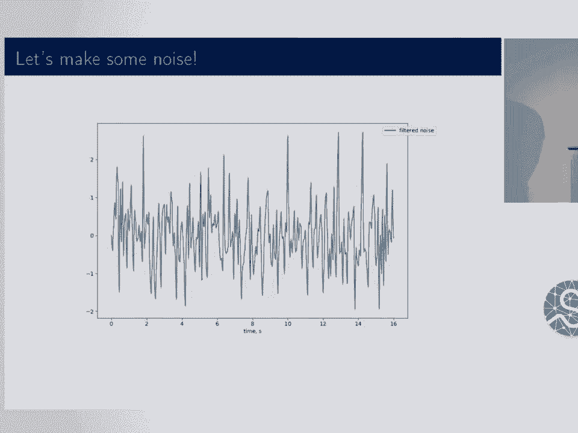

# SciPy 2018视频专辑 - P13：SciPy 2018视频专辑 (P13. SimuPy -  A Python Framework for Modeling and Simulating Dy - GalileoHua - BV1TE411n7Ny

 >> Good afternoon， everyone。 Thanks for coming。 My name is Ben Margolis。 I'm a graduate student。

 at UC Davis and I'm excited to share a project that I've been working on for the last four。

 years or so。 It's called Simupai。 It's a Python framework for modeling and simulating dynamical。

 systems。 So just to define it， dynamical systems are either a differential equation with an。

 output function or just an output function。 And they're pretty much how we model everything。

 So for any particular system， you could have a state and that might be represented by a。

 point in RN。 You could have an input which might be a point in RM and then possibly that。

 state equation if there is a state and an output equation。 And one thing you'll know is I don't。

 allow in this model of dynamical systems， I'm not allowing feed through for systems with a state。

 so that output equation for the system with a state does not have a U in it。 And that makes。

 some of the integration that we'll be doing later easier。 So if you have a model of a system。

 a dynamical model of a system， you can put those together in block diagrams。 Block diagrams。

 are conceptual tools to build complex systems from simpler models。 The block diagrams that。

 I'll be talking about are general form of field specific diagrams like circuit diagrams or。

 even free body diagrams。 And one of the key features is that it allows you to work at。

 different levels of abstraction which is very useful for analyzing problems and learning about。

 them。 And the key thing is that a block diagram has different models and different connections。

 between the possibly subsystems。 And if you have a block diagram， you could solve it。

 algebraically which would so that you could create one system out of that block diagram。

 But that's a lot of work。 So for example， this is a circuit diagram of a op amp。 And so。

 that is very field specific。 If you know the details， it tells you a lot。 But sometimes。

 you don't care about the details so you want to abstractify it a little bit and go to something。

 more like this。 Now the details are lost but you get the same conceptual flow。 And it's。

 even easier to see the conceptual flow。 So you don't have to do Kirchhoff's current law or。

 anything like that。 And one of my favorite types of block diagrams of op amps is you have。

 to parse it a little bit differently。 But this is a block diagram implemented with op amps。

 So there's a couple op amps in here that are different models that you might put together。

 to create a block diagram。 And this is actually from a 1985 video。 I don't know。 From a course。

 on control systems which is my field and the professor， this is pre computer simulation。

 So simulation is all being done with analog electronics which I think is pretty awesome。

 So instead of Matt Plutlib， he's got a little oscilloscope。 And you can't really talk about。

 block diagrams without talking about Simulink。 Simulink is the proprietary MATLAB block diagram。

 based simulation software package。 It's extremely prolific。 I don't think if you know what。

 Simulink is， you know how popular it is。 And as scientific Python has been taking off。

 people are wondering where the next -- where the Simulink alternative is。 And that's what。

 I've been motivated to build。 And I don't think it's a full replacement。 But I think it does。

 a lot of the things that I needed from Simulink。 So to introduce you to SimuPy， I'm going to。

 be working with a simple pendulum in hanging down a simple pendulum。 So this would be a。

 free body -- this is a free body diagram。 I'm using X as the angle。 The angular position of。

 the pendulum。 It has a length， a mass， and gravity is acting on it。 So there's a lot of。

 ways to analyze this。 But we can go ahead and turn it into a block diagram。 And here I have。

 a block that represents the inertia。 So that's a system with state that would be the position。

 and velocity and an input which would be a force acting on the joint。 And it has two， outputs。

 I just let it output both the position and the velocity。 And we connect it into a。

 model of gravity which is a position dependent force。 So it's MLG times X。 And so now we want。

 to put this into SimuPy。 So this is a bunch of importing and a couple of helper plot functions。

 But this is how we define a symbolic dynamical system。 We'll also be defining dynamical systems。

 using just functions。 But so if you define -- declare your symbols from SimuPy， you have。

 the dynamic symbols which would be basically signals， your state variables or forces that。

 are -- or other things that are being transmitted。 You could have constant parameters。 Then you。

 can tell it what your state equations are。 So I've written a symbolic version of the， np。r_。

 So this is just creating an array of expressions。 So it's the same X dot equals。

 v and v dot equals u over nL squared。 Your state is X and v。 The input is u。 And you can。

 define your parameters。 And then for gravity it's the same thing。 So now for gravity there's。

 no state。 So it's just the output equation， the input and the constant parameters。 And。

 then we put them together。 So you declare a block diagram and you pass it your two systems。

 You connect them。 So gravity has only one output and the inertia has one input。 The force。

 that's being acted on the joint。 The inertia does have two outputs。 So we have to tell -- when。

 we connect -- when we tell the gravity， the position of the pendulum， we have to tell it。

 that it's the zero output which is the position and not the velocity。 And then we can go ahead。

 and do block diagram dot simulate and time。 And then I am passing that straight into my。

 plotting function。 And I get something that doesn't look so great。 But then I remember。

 if I have a pendulum hanging there it will still just hang there。 So that's okay。 So instead。

 we can change the initial conditions。 And so if we set it to 60 degrees then re-simulate， it。

 So I can change that just by setting the parameter of the initial condition and passing。

 in a numeric array for the two states。 And then I get the oscillations that I would like， to see。

 And so now we are going to start taking advantage of the actual block diagram approach。

 of system analysis。 So the inertia system is a linear system in the state and the input。

 And that makes a lot of things really simple。 But the gravity term is not -- it has that。

 sign of X so that makes it nonlinear。 But a common linearization we do is to just approximate。

 sign by X。 And so what's nice about block diagrams is that we can just change the input。

 back and forth。 And we don't lose track of all the different parts that are happening。

 that are going on。 And we can represent that quite easily with SimuPy。 So I can create。

 a linearized gravity system。 So I just do a negative G。 I should have an M in there but。

 I set it to one。 So it's okay。 Negative GX over L。 I can just add it to the block diagram。

 And then I can connect it。 And when I connect to one input it clears the other inputs。 So。

 I can also loop over the initial conditions， the angles。 So I'm looping over that here。

 And then inside in each loop I connect one of the gravity models， simulate it。 And then。

 connect the other one and simulate it。 So it's really this exact thing that we would draw。

 We can do in code quite easily。 And so this is the output。 And this is something that。

 you would see in undergrad perhaps in controls。 So if your initial condition is small， as it。

 is here the linearized gravity model is quite good。 You know， it's several oscillations before。

 it's starting to diverge a little bit。 But at large amplitudes the linearized and nonlinear。

 models are diverged much quicker。 And the other thing you'll see is that the linear。

 model has a constant period independent of the amplitude。 So it's just fun to see all。

 those features come out from such a simple example。 So now we can introduce viscous damping。

 This is -- so I'm going to go ahead and keep the nonlinear gravity and add the damping。

 So it's easy to create the viscous damping system。 But then the inertia only has one， input。

 the force。 So we need someone to help us out。 And luckily I know someone who can， help us。

 So I can create a summing system using a linear time invariant system。 So it's just。

 a helper function that makes it easy to create systems using matrices， non-py matrices。 So。

 by creating a gain matrix， a one by five gain matrix， the result is that it sums the five。

 possible inputs。 Unfortunately right now， semipy does not resolve the flow order。 So if I added。

 the summer to the block diagram， it would never actually see the outputs of the other， systems。

 So I need to create a new block diagram in an order that will resolve correctly。 So， I do inertia。

 the summer gravity and viscous damping。 And then I can do all of the same， similar connections。

 So I connect the velocity to the viscous damping because it's a force， that depends on the velocity。

 I connect the summer to the inertia。 So the sum of all the， forces goes to the inertia。

 And then I can connect the gravity term to the summer and， the position back to the gravity。

 And then I can also sweep over different values of the， damping coefficient。

 So I have a little iterator and I plot over that。 And you get something。

 that even in SimuLink might be a little bit tedious depending on the amount of programming。

 experience someone has to feel comfortable enough to get to the programmatic approach。

 Whereas by being in Python directly， it's kind of obvious what the right thing to do。

 is to play with these types of parameters。 So that was fun。 Let's add another input。 We。

 can make some noise。 And to do that， since I am using the integrators from SciPy which。

 sample the derivative of the systems， if I need to have a noise model that will give。

 the same result from the same condition。 So to do that， I'm going to sample and take。

 N samples from zero mean Gaussian distribution。 I'm going to distribute that over time and。

 take a zero order hold as my first step。 So that's what all this does。 I use a discrete。

 interpolating function which is just a previous neighbor interpolating function to do that。

 So just to plot it， so this is what the noise I got on this run。 And now I want to filter。

 that through a low pass filter。 So as a controls person and not a signals person， the easiest。

 way for me to do that is to run it through a low order， a low pass filter system and just。

 simulate it in my block diagram。 So that's what I'm doing here。 So I can create a system。

 from my function that my interpolating function connected to the filter， simulate the filter。

 and then use a continuous interpolating function to take the trajectory that's continuous trajectory。

 and get a noise function and system from that。 So this is the slightly smooth noise trajectory。

 that I'll be pulling from when I simulate with noise。 So then I just take that interpolating。

 function of that smooth noise， add it to my block diagram and I can connect it to the。

 summer and now if I set the initial condition to zero， I can just see what happens to the。

 pendulum as if it were hanging in the wind。 So it oscillates a little bit up to four degrees。

 But that wasn't very exciting。 So we could do a more exciting input like a sinusoid at。

 the natural frequency of the pendulum。 So taking out that white noise and putting in， the sinusoid。

 I can create a function， a lambda function that gives the output of the sinusoid。

 create the system from that and then we can just look at the output of that。 That's not， it。 Oh。

 well， the sign on top of the noise figure didn't come out but I made it about。

 the same amount of power that's being put into the system and this is the output。 So it's。

 exciting to see that the exciting system actually generates the larger amplitude like you would。

 expect even though the power is about the same。 And actually the power from the noise is a little。

 bit more but because it's not resonant， it doesn't excite the system to the higher amplitudes。

 that the sinusoid does。 And then a feature I didn't quite know how to put in with the。

 pendulum example are events。 So with this continuity to get a good solution to a differential equation。

 with discontinuities， you need to have an events handler。 So I've added that to the integration。

 loop。 So this is a bouncing ball with， which is actually the example simulink uses for。

 their event system。 And it works quite well。 So this is the code for it。 So I have a helper。

 function to make it easier to write some classes of discontinuous systems。 So it's a very similar。

 model。 We have basically the double integrator。 And what I'm doing is I'm creating a boundary。

 at zero for the x， the position variable。 And whenever it crosses， I change the position。

 to the absolute value， which should be a small number because it finds where the impact。

 happens and interpolates to get a pretty accurate approximation of where that impact occurs。

 So it should be very close to zero。 And then have a bounce multiplier， mu， which flips the。

 sign and reduces the， takes some of the energy out。 And then it is a harder problem。 So I。

 did have to change some of the integrator options。 But you can simulate it。 And that's the previous。

 figure I showed。 And you can also get an analytic calculation for when the impact should occur。

 And it's right on the dots， which is great。 Yeah。 So that's just a brief introduction， to Simupai。

 I hope you guys enjoyed it。 I totally want people to check it out and help me build， it。

 I've been doing this alone for the last four years。 So just some concluding remarks。

 I want the API to really serve system and model-based analysis approaches。 So even the function。

 names match kind of the more rigorous naming schemes and things like that。 And I also want。

 to point out I'm not trying to make this a full fledged simulator。 Having some events is really。

 useful， especially in control systems。 You need saturation blocks and things like that。 And but。

 I don't want to be mujoku or anything。 The other fun thing is that the linear analysis works。 So。

 in my tests and in some of my examples I have comparisons of the autonomous system of if you。

 did the analysis manually and created a single system compared to a block diagram with a system。

 in a controller。 And those match up perfectly。 And you can also do things like for a linear time。

 invariant system。 Get the discrete time systems using the little plus transform。 The documentation。

 and test coverage is pretty good。 But I've been working on a couple new features。 So I just。

 changed the way discrete time systems are handled。 So they have basically an internal clock in the。

 event system handles it now。 And I also want to make it -- give you the ability to create systems。

 from block diagrams so that you can get those different levels of abstraction that are so useful。

 Yeah。 So it is fairly stable。 But I do have a slightly premature 1。0 on pi pi。 So that's it。 Thanks。

 Any questions？ So any questions？ Oh。 Hi。 So I noticed that you -- you know。

 you dealt with discontinuities by turning down the。

 tolerant -- or turning upward -- I don't know -- upward down the -- changing the tolerance is on。

 the solver。 How did you manage the fact that noise will cause similar small-scale discontinuities？

 Yeah。 So I do actually cheat a bit。 So I simulate all the way to 25。

 And it only simulates to like 21， because there's chatter at the end。

 So I don't have a system for clamping that chatter。 But。

 for these bigger -- when there's bigger breaks between the discontinuity events， it handles it。

 quite well。 Yeah。 That makes sense。 It's the -- when you -- you had a place where you added noise to the。

 system？ Yeah。 That's -- I didn't have it for the bouncing ball。 Okay。 Yeah。

 So -- I was just wondering， how you made that work。 Like。

 did you -- what did you change about the -- how did you put the noise。

 in or where did the noise enter？ Yeah。 So that was the -- I created -- I took samples。

 distributed that， through time。 And then from that。

 I had just treated that like a -- I assumed it was a zero or， a hold。 Okay。

 And then I passed that through a first-order system to smooth it a bit。 So that --， Oh， okay。

 I see what -- so this is a trajectory of noise that the integrator calls so that it's。

 at the same time， the same noise is present。 No。 Okay。 That makes sense because otherwise you。

 have -- yeah。 You know， just continuity。 Exactly。 Yeah。 Okay。 Yeah。

 So I just want to say first of all， thanks for doing this because， you know， simulation is hard。

 But like， you know， doing it generally is really hard。 So -- so two quick， questions。

 The first thing was， you said you're using the SciPy integrators or -- or do you have， a custom？

 Okay。 All right。 The SciPy integrate ODE。 Is that the one or -- yeah。 Integrate。 ODE。 Yeah。 The old。

 Do you run into stiffness problems with that often or is it not -- into what？ Problems。 Stiffness。

 Like， problem is stiff。 You -- sometimes -- I found that if you define the models well。

 they -- you can avoid some of them。 And some also go away if you convert it to like an event based system depending on what you're。

 trying to do。 So if it's truly a stiff problem， you need a stiff solver， but you can pass in -- you。

 can say， ODE 15S or whatever。 I forget which。 So any of the variable step size with dense output。

 will work great。 I used to be able to support Elsota and fix step size solvers， but right now。

 it's broken in service of the discrete time systems being handled by events。

 And then the other question is， I had some API ideas。 So should I post like an issue or --， Sure。

 Yeah。 That'd be great。 Okay。 Cool。 Any other questions？ All right。 If not。

 let's thank the speaker again。

 [Applause]。

 [BLANK_AUDIO]。