# SciPy 2018视频专辑 - P14：SciPy 2018视频专辑 (P14. Yaksh - Facilitating Learning by Doing _ SciPy 2018 _ Prabh - GalileoHua - BV1TE411n7Ny

 So as the last talk， I hope I don't run over and bore you。 So I'm going to be， talking about Yaks。

 which is a tool that we've built at Fosse。 So the team。

 that's been involved is basically Prathamesh， Aditya， Hardik， Ankit and， Mahish。

 Hardik used to work at Fosse but then went on to join Bank of， Merika。

 This is the current team that's working on it and on the left is， I want。

 to do this early because I didn't want to run out of time。 On the left extreme， this， is Aditya。

 this is Mahish， that's Ankit and that's Prathamesh who's the senior。

 most in this group and they have worked on this application that we put together。

 So before we go on， I want to talk a brief bit about Fosse and I hope I don't。

 again overstep that as well。 So Fosse stands for free open-source software for。

 education and it's a government of India funded project。 It's been around since。

 2009 and the goal of this project is to spread the adoption of free and open-source。

 software and education。 In particular， we don't want people to use commercial。

 tools so much so we want to encourage them to be aware that there are these。

 free easy-to-use alternatives that they should try instead of buying expensive。

 licenses and this is especially important in India where funding is scarce。 So I。

 had spoken about this in some detail in 2016 right here at this conference so if。

 you want you can check out that video but you could also check out our website。

 which actually covers various software packages that we promote and we spread， information about。

 In particular relevance to the last talk， the excellent talk by。

 Lorena about how to do these things a lot better。 We also have a collection of。

 about 500 textbooks solved examples in pure Python and all of these are in。

 Jupyter Notebooks so if you go down to our from fosse， python。fosse。org you can。

 actually go down to our textbook companion project and you'll actually。

 find Jupyter Notebooks for every chapter for like 500 books which is like an。

 awesome resource that you can use for your solved examples。 This is available and。

 it's all been crowd-sourced in India by a bunch of undergrad students who've been。

 contributing this over the years。 All right so let's get back。 So we also have a full。

 length paper on this on this tool that I'm going to talk about。 Go ahead and。

 check it it's out it's live on the conference's， conference proceedings site。

 All right so let's get on with the tool itself。 So。

 there was a recent survey done in India and they found that by a company called。

 aspiring minds and they found that only five percent of the computer science and。

 engineering graduates are able to write programs with the correct logic。 This is a。

 very disturbing statistic because I'm not talking about general engineers I'm。

 talking about computer science engineers and these people are just not able to。

 write a program that's able to be written with the right logic so this is a massive， problem。

 Now in my own personal context I've found that programming is in just。

 about syntax so you can't just teach someone saying that's the language go。

 figure it out it doesn't work that way and I find that it's a little difficult。

 to do to expect folks to understand this because I was myself like this when I。

 started off as an undergrad when I learned CS I would be like oh this is like。

 physics if I understand the concept I can go write the answer paper it doesn't。

 work that way so then I realized the hard way by getting very poor grades in。

 my end semesters that you know I have to actually write programs and when you do。

 this you also need to be able to give students feedback it's not enough if I。

 say I give an exam today and then get results tomorrow it's not enough I need。

 instant feedback and also it's obvious that you learn a lot better by doing so。

 when I was teaching programming as an instructor in IIT Bombay as a part of a。

 data science course but I was teaching them programming to learn teach them。

 Python and sneak Python into the curriculum I gave them a bunch of。

 exercises my material is all entirely hands-on I gave them a lot of homework。

 but I didn't really test them you know I didn't really assess how well they are。

 actually doing by actually looking at the numbers to actually know whether they。

 are able to get these concepts or not and they didn't really get it you know they。

 they did all of the stuff they did all the typing they did some of the stuff and。

 students don't always do the things you ask them to do right you give them。

 homework you give them assignments you give them a lot of information but they。

 have enough stuff to do and they you know they don't always follow through。

 with everything you give them so personally I didn't get any feedback on。

 my performance I didn't get any feedback on the students performance so I。

 couldn't identify which students are strong with students a week I couldn't。

 even pair them up I could do nothing basically I had no data and I didn't want。

 to kill my TAs by giving them you know 300 assignments and then having them to。

 generate you know grade them every three days that doesn't work so so。

 measuring performance in a non-threatening way is very very useful and。

 it's an I so the idea was to somehow help us grade without because none of us。

 enjoy is grading and be able to scale this up to a larger number of people so in。

 2011 we were teaching a teacher training course with about thousand teachers and。

 this was obviously done online the remote connections and things like that and we。

 wanted to test them to offer a certificate and we didn't want to test to be just。

 multiple choice questions and things like that so at that time I actually built。

 the basis of what is currently this tool that I'm going to talk about which is a。

 Django application to help facilitate this grading so it started off as。

 grading so we created this thing called yuck it's available on github it's a。

 Django project there's also a live instance here on this link maybe I will。

 put this IPython notebook up somewhere this is an IPython notebook and we also。

 have set up a demo instance so that you can actually go as an instructor or as a。

 teacher or as a student and then you know explore this the tool itself and I'll。

 also show you that it's I shouldn't say this it's relatively easy to set up I know。

 easy is not the right word to use but I'm doing advertisement here so it's okay so。

 yuck is an open-source Django application it's bsd license you can do what you want。

 with it and primarily it has been a grading or you know quizzing tool but we。

 realize that it's also extremely useful for practice exercises and later on we。

 found that it's easy to just add a small bit of HTML to it and you can actually。

 host lessons on it so now it's actually become a full-fledged course。

 environment although our selling point is not that we want to replace modal or。

 anything else it's still an environment to do assessment and practice exercises。

 and the nice thing is it supports Python CEC++ Java bash and soil app so a whole。

 bunch of programming languages are supported and you can you can do a。

 bunch of fairly complicated tests you can set up you can do programming。

 questions which are like standard input output which is easy and this is what is。

 supported in all the languages and in Python you can do more test case-based。

 programming so you can say write a function that given these arguments does。

 this and then you can test that you can create a class because it's basically。

 Python you can also do MCQs you can do fill in the blanks and if you don't if you。

 have an audience that's not really comfortable programming you can even give。

 them code blocks and then say arrange these code blocks if you want to you。

 know see if they're able to understand control flow and things like that to make。

 sure that the ordering of these blocks of code is correct stuff like that we can。

 also do more complex things like assignment upload which you can either。

 grade offline or you can write a script and grade online directly so why should。

 you use it well it's relatively easy to set up it provides automatic and。

 manual grading it provides instant feedback to student submissions and I。

 will show you by a demo hopefully if everything works fine and it provides。

 almost real-time monitoring of course sessions and its scales very well so let。

 me explain what this instant feedback means so usually when we set up these。

 programming assignments normally when we do tests in an exam you basically have。

 to write the right answer and then submit the right answer right there's no option。

 of saying I give you code then I test whether it works and then I immediately。

 get feedback saying no that's wrong correct it so what we do is in our tests。

 for the programming parts you can submit as many times as you want until you get。

 it right and you will know when it's right because you'll move on to the next。

 question otherwise you skip the question and move on to the next so what it does。

 is it makes students comfortable with the fact that their code may not run it。

 makes them comfortable experimenting so basically they they type in submit it。

 it passes some of the tests maybe it doesn't pass some of the tests then they。

 say okay I've made a mistake here fix it submit again so it becomes interactive。

 and the nice thing is the system logs all of their attempts so I'm able to。

 actually as an instructor to keep track of oh these set of students are actually。

 struggling with this concept or those set of students are doing well or maybe。

 I should have a special class for this set of students and give them the same。

 set of problems and sit down with them and help them with some of these things。

 so as a tool it becomes an extremely powerful way for me to assess performance。

 and do grading on the side which is you know it's an sort of a necessary evil we。

 have to do but as an assessment tool it's also use a very powerful tool to use。

 when you're teaching and it helps me give me immediate feedback oh I maybe didn't。

 cover this concept well enough maybe this is not clear enough the instant I see。

 feedback and I'm able to look at that it's kind of like the clicker technology。

 but it's maybe a bit different in this case all right so there are two ways in。

 which you can use yuck one is as an instructor obviously and the other is。

 as a student to set it up it's pretty easy we use a docker container to evaluate。

 all of the code so that if a student does submit malicious code it doesn't you。

 not destroy your entire system and for production deployments we use docker。

 compose as in you could use docker compose which makes it very easy to set。

 it up on a Linux machine or a Mac OS machine so I'm gonna do some live demos。

 I don't know how well this is gonna go so let's see so setting it up on a local。

 machine is fairly easy so here are the instructions pretty much straight I've。

 done some of this already on my machine but I'm also going to do some of them。

 live so the first thing is you clone the repository and then you see it into the。

 directory and then you just pip install the requirements and once you're done。

 with that we have py invoke scripts which make this whole process of setting up。

 the docker instance and things like that relatively easy so you just say invoke。

 start and then you say invoke serve so invoke start what it does is it starts。

 up what's called what we call the code server which basically is responsible for。

 taking user given code evaluating it and spitting back letting you know whether。

 it ran or did not run and then you just open the HTTP local host 8000 exam this。

 is just for the demo instance so if you want to run it obviously in a production。

 instance you have to configure your setup so that you set the right URL and。

 setup engine X or whatever it is that you have to do but basically that's the。

 essence of the setup so let's try that I don't know how well this is gonna work。

 all right so I'm inside the online test repository is that too small so I make。

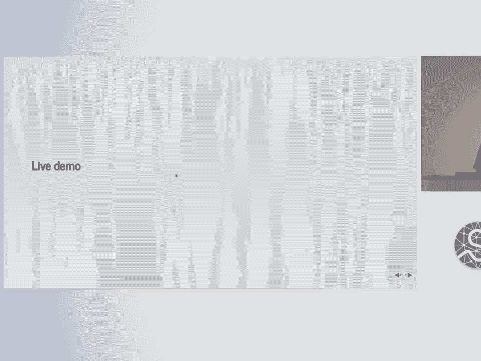

 it bigger is that okay okay so I say invoke so this is just pretty much checked。

 out a couple of hours ago I now say invoke start now it's gonna prompt me for a。

 password because it's gonna run this whole code server as nobody so that it。

 doesn't have any privileges so it doesn't wipe out stuff on my machine so I have。

 to log in okay so now what it will usually do is it'll fetch the docker。

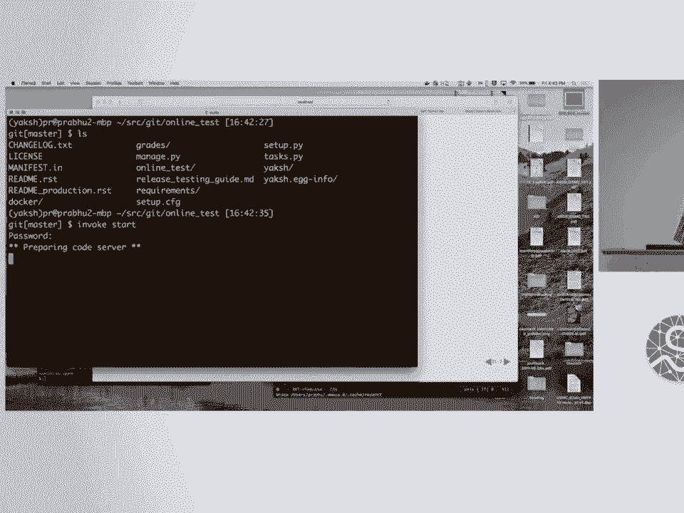

 image for yux and then set it up copy the current version of the source code。

 into that yux environment by creating a separate directory which is mounted。

 inside this makes it easy so that we don't every time we release a new version。

 of yux you don't have to get a new docker image and then it'll start up the。

 code server the code servers ready now if I say invoke start and cross my fingers。

 oh boy so what did I do oh sorry in books serve I typed the wrong thing so now。

 it's basically setting up a local Django database doing all the migrations for。

 the entire project and then it's basically saying the Django servers。

 running now obviously if you're doing this in production that would be so I go， to local host 8。

000/exam and that's the interface that you can log in by default。

 for this demo instance so this is the idea of making this easy enough is that。

 anyone who just get clones it should be in five minutes the idea was to make them。

 five minutes you should be able to set up a simple thing on your machine play。

 around with it and then say all right let me figure out how to do this in for。

 real so I'm gonna just log in as a teacher and then the password is also。

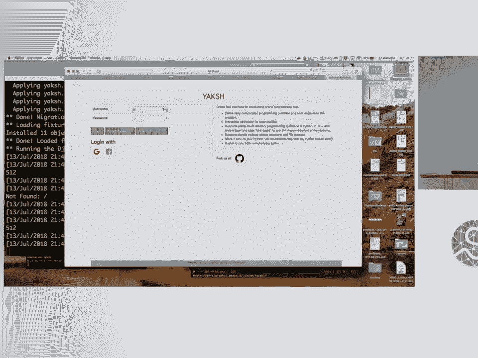

 teacher in this case and I'm doing it on my machine so it should be okay make， this a little bigger。

 so notice that you can switch to a student interface so but what I'm gonna。

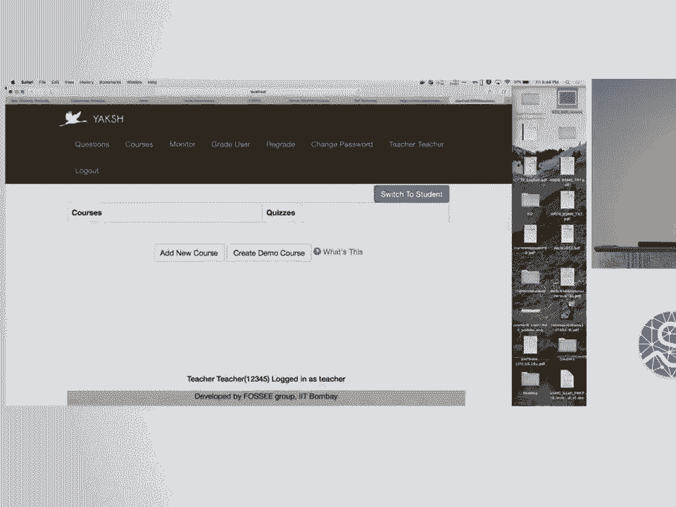

 do is right now there are no courses on the system it's just created the user。

 logins so I'm gonna create a little demo course which we build bundle we add。

 that fixture in when you set this demo instance up and it's created the actual。

 demo quiz so that I could demonstrate to you how this quiz is gonna look and now。

 I'm gonna switch to a student interface so this is how a student is gonna see。

 when a student logs in you're gonna see this and then you'll see oh there's this。

 course we can also do course codes so that if you know you have five six。

 courses running and you don't want everybody to see everybody else's course。

 and start enrolling all over the place you can build in a course code so that。

 two students has to type a course code in order to see it and now student can。

 enroll and you can enroll either manually or automatically that's again an option。

 you can center a whole bunch of bells and whistles but now that I've enrolled I。

 can see hey this is the course that I have and now it says you know I have only。

 one module in this case I can now go down to this demo module and the first thing。

 we've set up is a quiz just so that I can demonstrate the basic features so if I。

 go to this and say okay I'm gonna start this quiz it says all right this is the。

 online test instructions and rules so you can you know specify whatever rules。

 you're allowing do you allow Google searching because I usually do I allow。

 students to say Google do whatever you do as a normal developer but don't cheat。

 don't cheat for the exact answer and then type that okay don't find that or you。

 can read the documentation you can open up an IPython session that's all fine but。

 then they start an exam and then so you can you can control this however you。

 want you could do it live in a class you could have it offline I've even done。

 this when students do this in their rooms and for a practice exercise I'm。

 sitting in a chat room somewhere and they are typing away and I'm monitoring。

 the whole thing and then this they asked me and I type back hey you didn't get。

 this right send them the code so that then that whole experience was a lot of。

 fun because the students loved it because they were able to interact with me in a。

 very different setting they were they understood that I was helping them and。

 things like so here's a simple fill in the blank question I'm gonna just say。

 okay the answer is what three yeah three so I submit the answer or I could attempt。

 the question later I can say all right attempted later attempt this later and。

 now here's an is palindrome I'm supposed to write so write a function is palindrome。

 with an argument which will take one string argument return true if the。

 argument is a palindrome at false otherwise function should be case sensitive。

 all right so let's try that so let me say written while true pass all right this。

 happens a lot you'll be surprised that students sometimes make infinite loops。

 very easily right so I'm gonna just try checking this answer and I hope it works。

 on my machine so it it should what it all happen okay so it's gonna say。

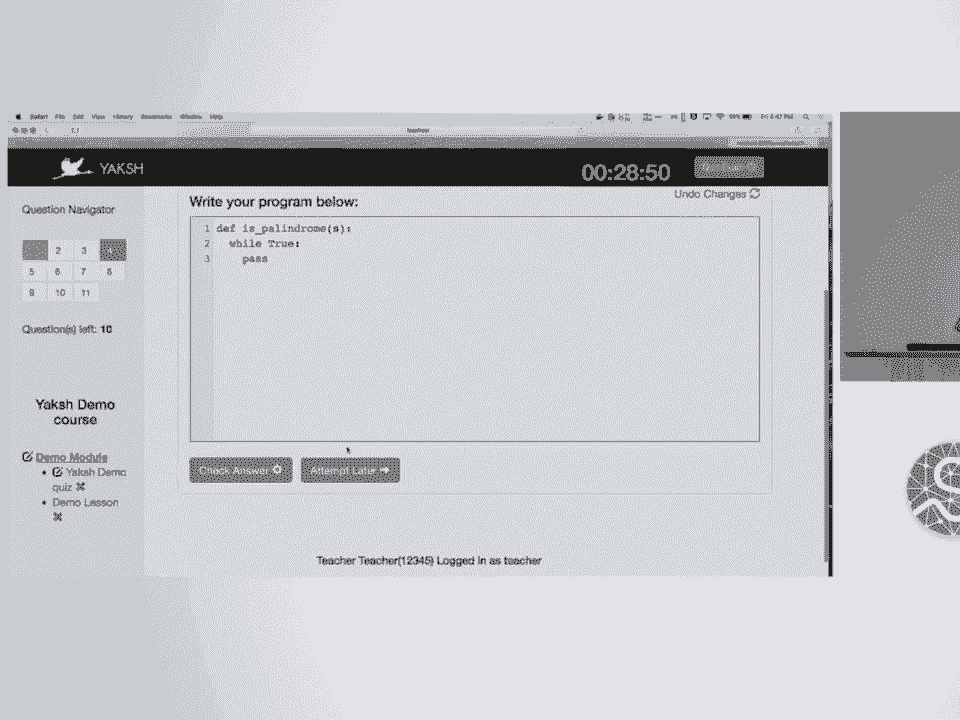

 checking it's gonna wait for a while and it's gonna say four seconds later。

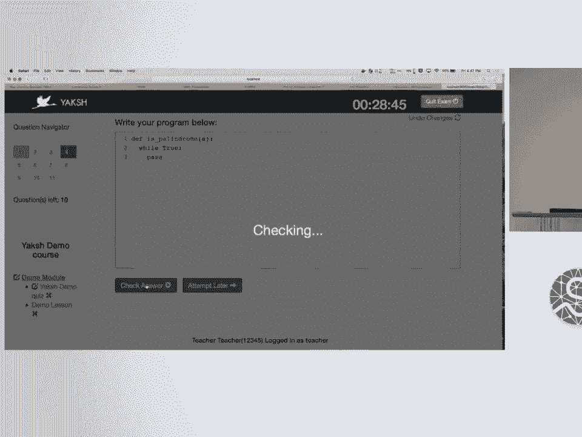

 saying hey you know time out exception you code took more than four seconds to。

 run you probably have an infinite loop in your code so it actually checks for。

 some of these simple things that student run run run into so let's now give a。

 wrong answer let's say okay yeah nothing so let's try that it's gonna check this。

 and it said look we tried that we got an assertion expected answer from the。

 test case did not match the output so what I tell students open up your editor。

 type it out there do whatever you want to do submit the code when you're done。

 here so it's a nice way for them to play around with this and say oh I got it。

 wrong it doesn't matter go back and then say all right and sometimes I'll walk。

 around and say if you know students particularly doing badly I'll say it looks。

 like if mistype something here and they'll go fix it and do it so it's a nice way for。

 me to actually get a feel for how the things are going okay so let's take the。

 right answer return s equal to s colon colon minus one okay that should be。

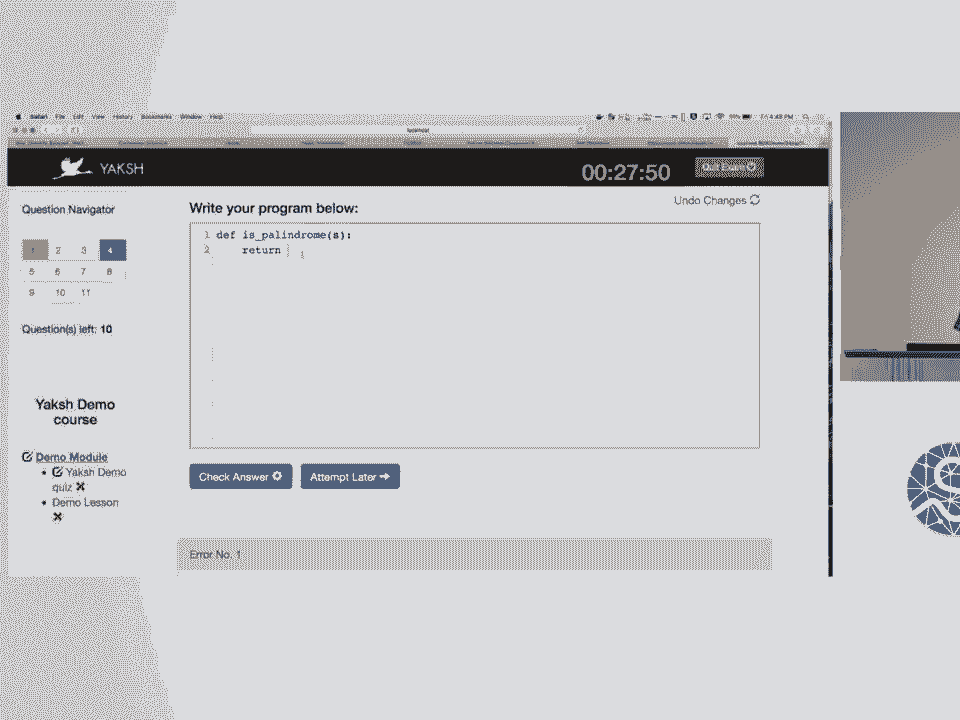

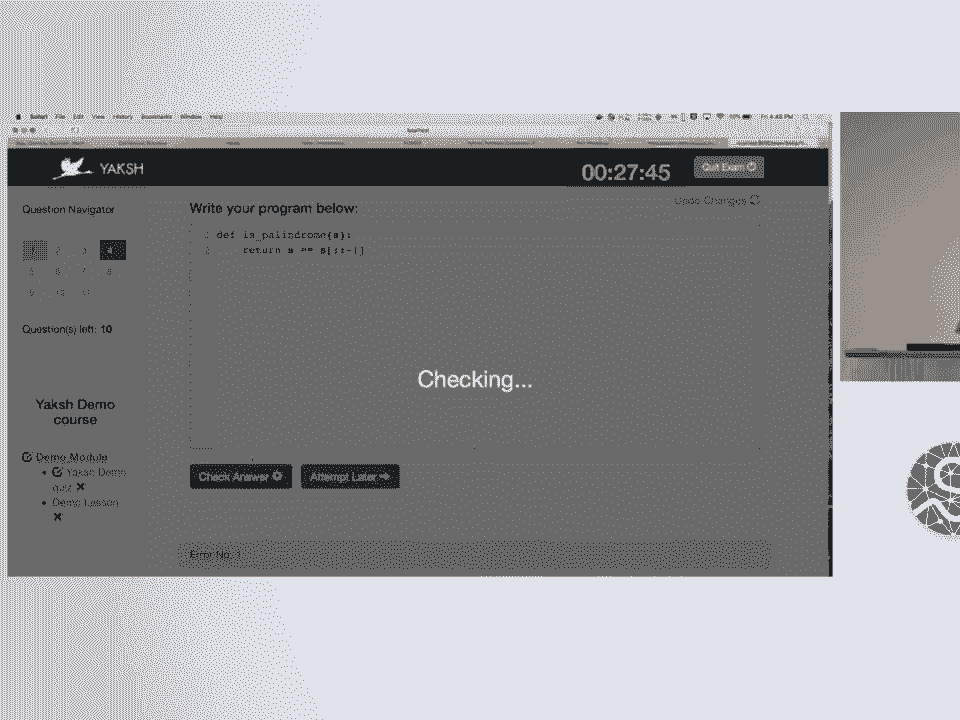

 fingers crossed to get it right yes I got it right so now it's moved on to the。

 next question so you can basically frame a whole bunch of things like this is an。

 input output test so saying you know write a Python script that accept a。

 string as an input script must print each character of the string using a。

 follow all right so this is trivial I'm not going to sit and demonstrate this but。

 you get the idea right so I can actually do a whole bunch of different programs。

 like this I can do a hello world assignment so I can say assignment upload。

 create a text file with the word hello world inside it and submit it and upload。

 this it would you can try and evaluate that you can do multiple choice and you。

 can have multiple correct choices and we'll also do randomize the order of these。

 questions and things like that that's also doable and here's an arrangement of。

 this oh boy what happened so I can arrange this in the right order I don't。

 know why the UI is a bit of a mess here okay but basically I can rearrange these。

 code blocks to make sure that the logic's right yeah you can do bash。

 questions so I can say write a bash script to print hello world that's okay。

 you can obviously do a lot more complicated things you can also do Java。

 things like this you know right Java but I'm not going to do that here so all。

 right so if I'm done with this I just say quit it'll tell me what I got right。

 what I didn't get right and then here I'm gonna say hey you know I'm done with。

 this and very often what happens is students sometimes lose Wi-Fi。

 connection their programs crash because they created an infinite loop and we're。

 adding something into a list this happens a lot and there's another problem。

 with the Jupyter notebook you know you'll do shift enter you enter something with。

 an infinite loop it just blows up your computer crashes and especially if it's。

 on Windows it makes it really bad and run into this several times so the。

 students lose a connection during an exam is an extremely traumatic event so。

 what we've done is we've made it so that if the student loses a connection they。

 can always come back and connect to the same thing and it'll resume from。

 the marathon off anyway so that's the interface for a student and now when you。

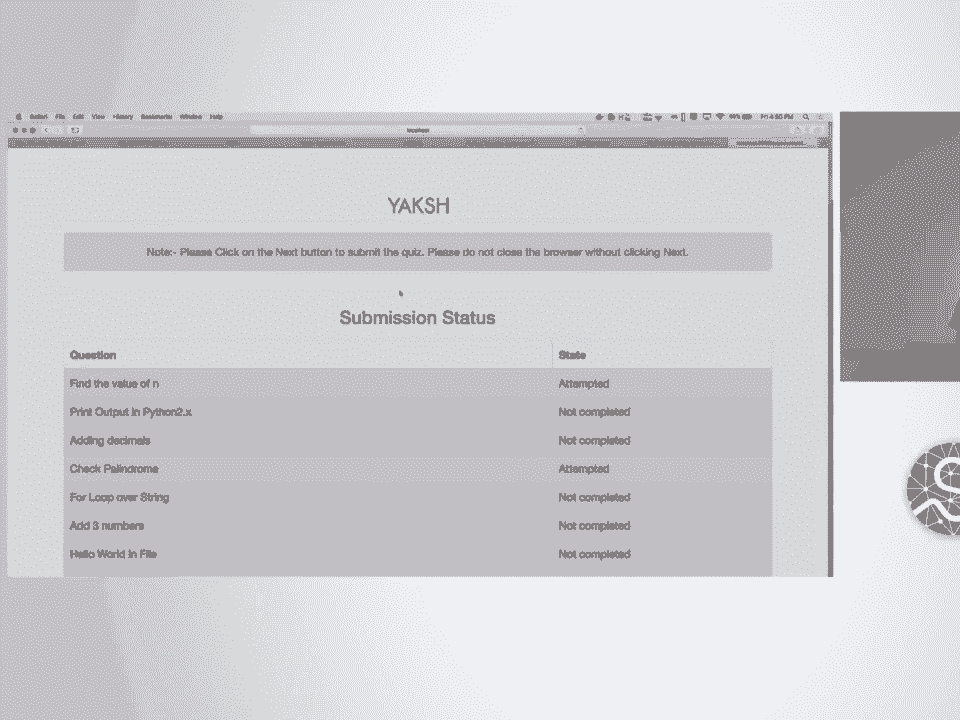

 go on next you could see you know this is a lesson this is our keynote speaker so。

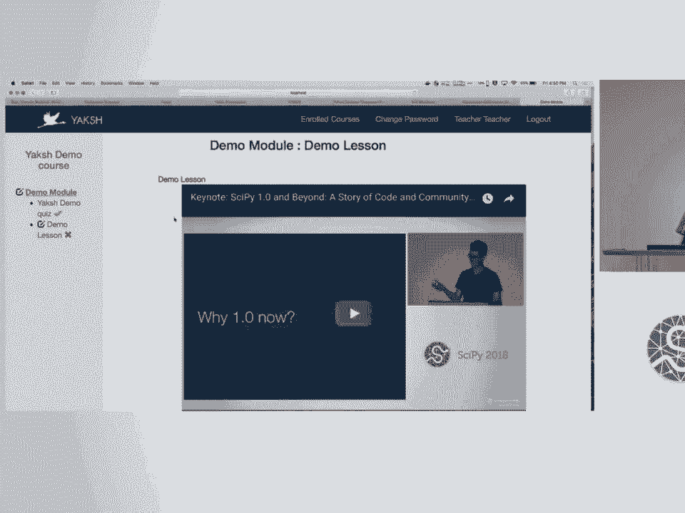

 you can embed videos it's a markdown text based format so you can embed。

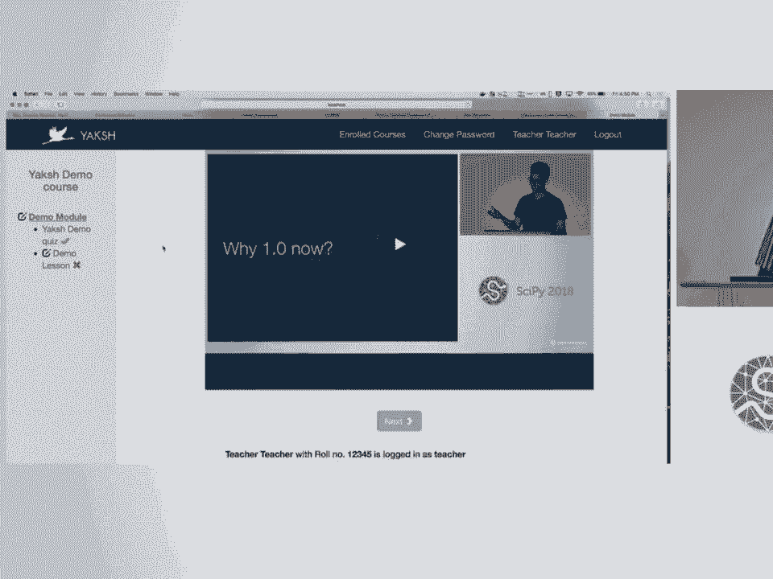

 videos so you can actually run host of full-fledged course you can do it in a。

 sequence you can do it however you want and the nice thing is I'm hosting this on。

 my machine so I'm gonna get back to my slides。

 all right that didn't go too badly so we also have a demo website yux dash demo。

 https important don't do https not gonna you're not gonna see anything there。

 dot fussy dot in slash exam it's live it's available and we have 50 accounts of。

 students 50 accounts of teachers teachers please feel free to go and play。

 with it it's a demo instant we'll trash it maybe tomorrow or something like that。

 so play around with it create your own questions you can host your own course。

 you can go create demo courses for yourselves the only one caveat here is。

 because I have set the password unless you go in and change the password if。

 another student logs in with the same password you will be logged out so just。

 beware of that yeah so basically I invite you to play with this and use it as you。

 see fit and it's relatively easy to actually install this and use it by。

 yourselves so this is how it actually works inside so as a user the user。

 basically submits the answers to the Django server that's seen here I know。

 this picture isn't the greatest but so this is the Django server sitting in the。

 middle here that's you know marshalling between everything else the user。

 submits code here as soon as the user submits the code it's basically saved to。

 a database oh one of the things I didn't show you was。

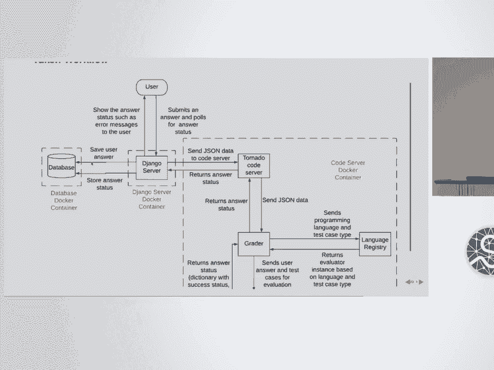

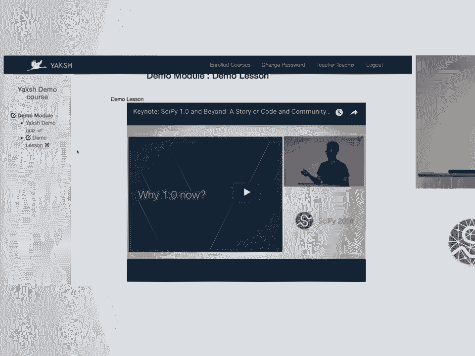

 let me get back switch to moderator if I go to my monitor interface it says it'll。

 actually show me live who's submitting how many people have submitted what are。

 their current answers what are their current scores so I could even use this。

 as a game I could even use this as a competition if I wanted to so basically。

 it's up to you it's a tool you can use it to either say all right these students。

 are doing fine those students are weak so pair them up so that you know those。

 they can help each other there's any number of ways in which you can use this。

 you can dig into this and then say all right you know these are the answers。

 they submitted you can see hey you submitted this thing first so you can。

 actually see how someone's learning if you see someone making repeatedly the same。

 mistake you can you know help them there as well okay let's go back real quick so。

 basically the Django server takes the inputs submits it to a tornado code。

 server that's sitting in the inside a docker container that then sends JSON data。

 to a grader which evaluates the code in a safe context and then sends that。

 information back to the tornado server and the Django server every so often。

 there's a JavaScript piece which hits the server saying are you done are you。

 done and when it's done it based so it's completely asynchronous so it scales。

 really well so when I have been teaching this myself we use this fairly heavily。

 in inside FOSI so we have several Python workshops that we conduct and several。

 courses at IIT Bombay we also do some recruitment tests and self-learning。

 workshops which we run so we actually use this as an kind of like an。

 edX replacement just because we have this powerful way of doing the exercises。

 and the rest of it is just video so it's not a big deal to host on our setup in。

 terms of what we've used this for over the last year we've taught about 6，000。

 users either a one-day workshop equivalent content for about eight hours。

 worth of material you could do online you could either do online or we also do。

 this as you know remotely controlled workshops we've you know covered about。

 hundred plus institutes of doing this sort of training we have about 13，000。

 active users and interestingly in our case this I'm sorry this picture is so。

 small here you can see that there the women are about 51。3% visa we males being， 48。

7% in our the number of users so we're actually reaching out to a。

 good fraction of you know reasonable fraction of representation from both。

 genders in our in our courses and it looks like most of the folks are between。

 18 and 24 who are taking our course material so that's about the tool as。

 regards going forward we want to provide a stable web API our current。

 statistics that we provide based on you know the number of students who've taken。

 stuff is very bad you can dump the marks and things like that into a CSV that's。

 fine but we don't kind of automate given that we have so many users we don't have。

 any detailed analysis reports and that we're gonna build it that I also found。

 that chat support is useful so supposing you're doing an online session with say。

 500 people and you can monitor how well people are doing if you can look at say。

 some of the people you want to send a general announcement saying hey you know。

 this first assignment question most of you got wrong here's the actual answer。

 go retry it you can do all of that yeah the other thing that we find useful in。

 India especially is sometimes internet connections are not very good in fact。

 some places they don't have any internet so if there's a school in some remote。

 corner of the country they don't actually have much internet they probably have。

 one machine with internet access so one of the things we'd like to do is do。

 offline support in two ways one is we could have you know give teachers a USB。

 stick and say that's a machine plug it in and you can sort of run an entire。

 course with the material whatever that you know anybody provides for them the。

 second is as a student sometimes it's known that a lot of people when they。

 learn they're actually on the move and they're they download videos and they。

 watch these movies these videos on the move so what we're trying to do is have。

 an offline support so you can actually download the course so if you actually。

 go to the user interface you'll see that you could possibly download it obviously。

 you need to have the videos available not hosted on YouTube you need to host。

 them on the Django app but basically those are small things as the the point is。

 the tool will allow you to download the course and view it locally which is a。

 big big win our UI UX is also not so great so we're gonna work on that so。

 thank you I leave you with these links please feel free to use the software it's。

 completely open source file issues send us PRs and we are happy to help thank you。

 so we have about five minutes before questions before the lightning talks， come in so any questions。

 hi thank you you showed a demo of a of an exam I was wondering how if you use a。

 different format if you're teaching live and you want to have people work stuff。

 out as you're teaching oh you mean to say you you so let me and make sure I。

 understand exactly as you're teaching you want people to try things out and you。

 want to monitor it live is that what you're saying so yeah what you can do is。

 you can set up things as a practice exercise in which case it's not a exam。

 so it doesn't count so you can tell students look this doesn't count for。

 anything and give it a time so basically all of these exams have a finite time。

 that you can set you can change that and then students can just use it as so we。

 use this actually for our practice exercises so we give the exercise so even。

 if you're doing an online course we split it up into here's the problem try it。

 out that's the solution try it out move on to the next so you can actually use， it that way also。

 what format are you sorting these questions in and do you think that format。

 is stable okay great question thank you so we actually you can enter the questions。

 on the UI and that's very clunky so it's a pain in the neck so you can also。

 upload questions in a yaml format so it's not too hard so we also have a。

 template that you can download and then you can edit it so usually that's how I。

 upload my questions it's not I won't say it's super stable because as we add new。

 things we have to keep changing the format and yaml surprisingly you know。

 dumping clean looking yaml is surprisingly hard I know the libraries。

 that we have are not they're not too amenable to you know trying to remove。

 white space or making sure that it's as key friendly or reader friendly but yes。

 we do support yaml and in fact you could download an entire course the next。

 feature we'll add is you can download a course and actually perhaps write it。

 entirely on a github repository and upload it directly that's on the cards。

 it was supposed to be done this week but perhaps not this week maybe maybe soon。

 so I have a question is there a way to specify extra libraries for the。

 environment your students could run against so all of that is so the question。

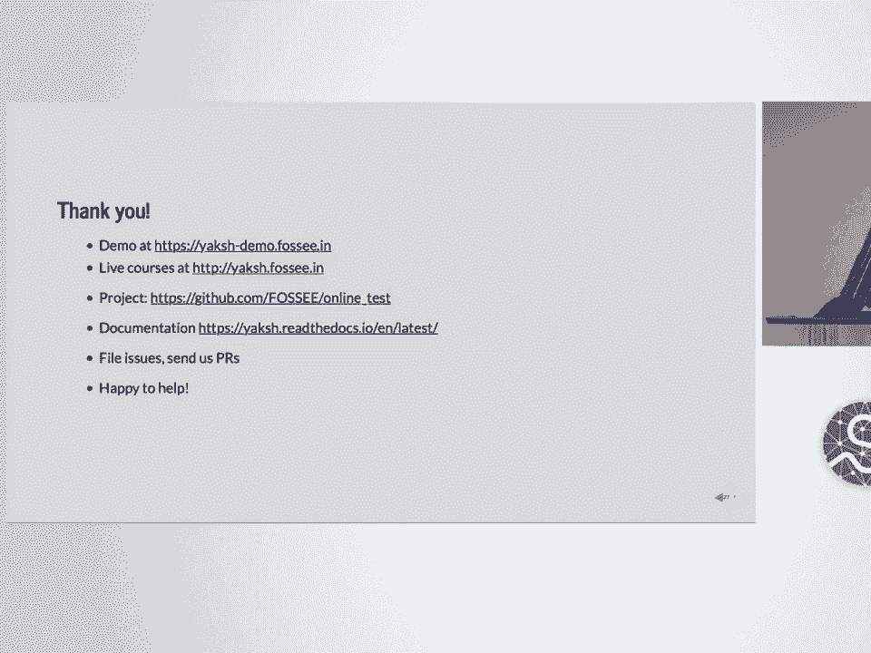

 is is there a way to specify libraries that you want to run so that you can。

 test you know against a particular library yes it basically is the。

 configuration of your docker container so you can just say use a different docker。

 container and the everything is there on the repository and you can tend just。

 do it there any other questions， let's thank the speaker one more time。

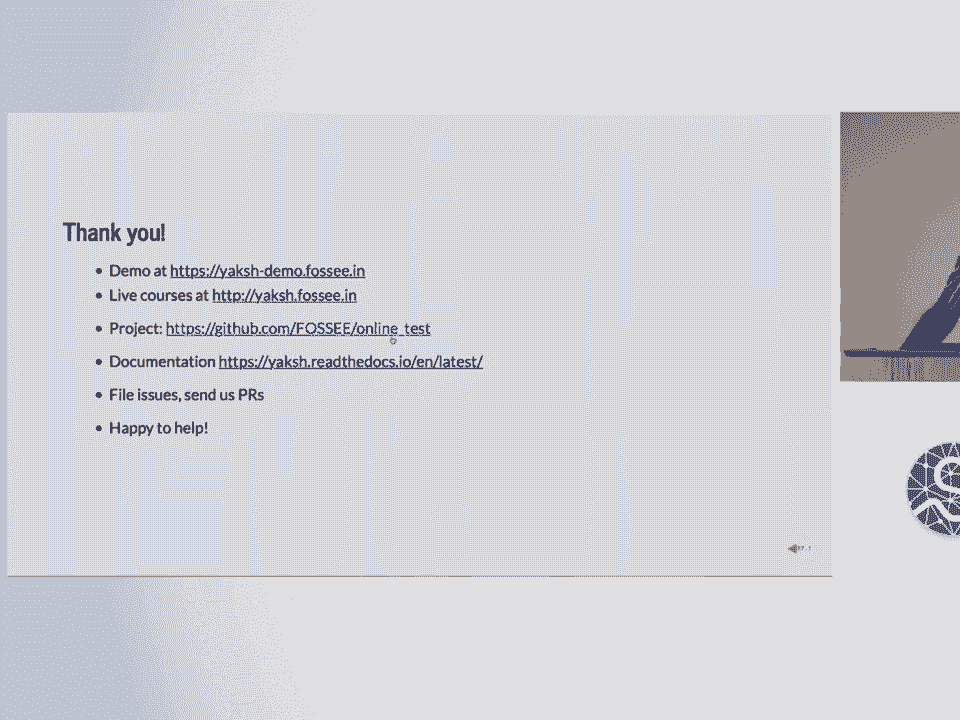

 thank you。 [ Silence ]。