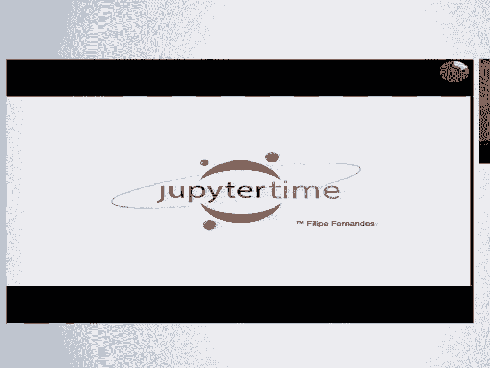
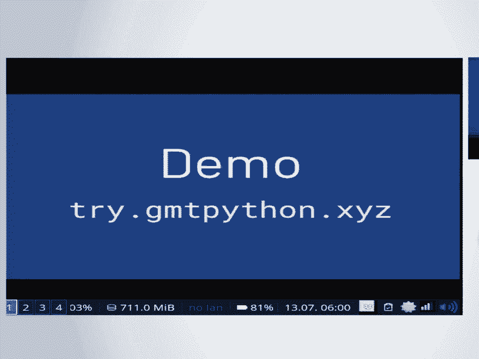
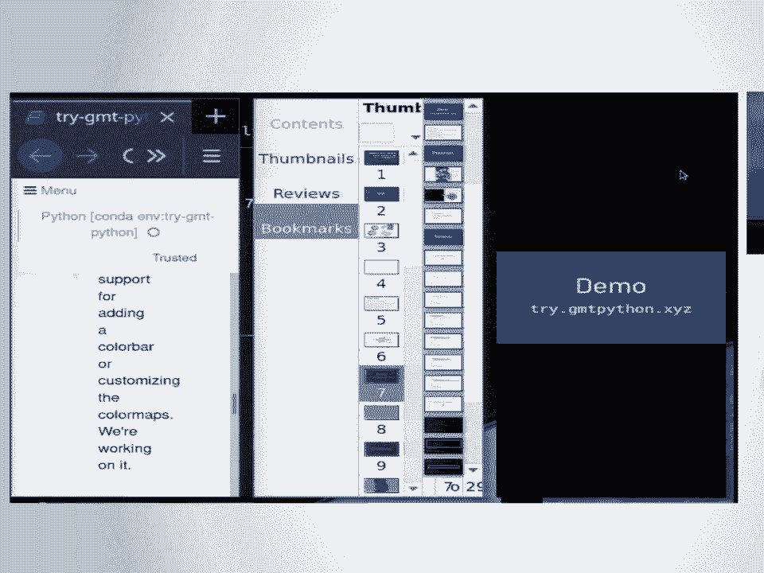
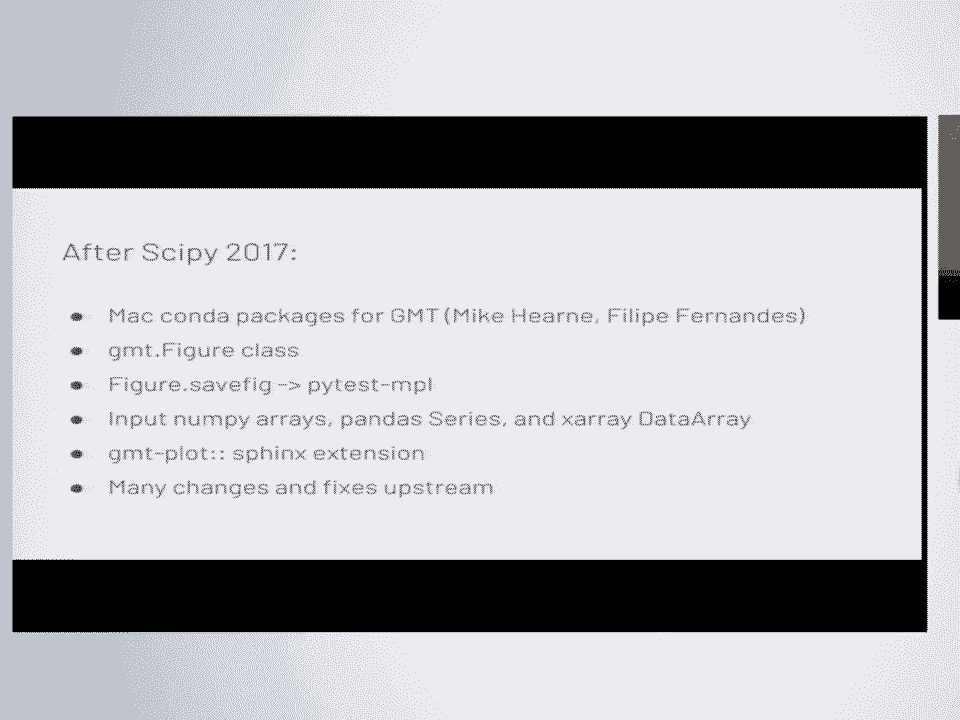
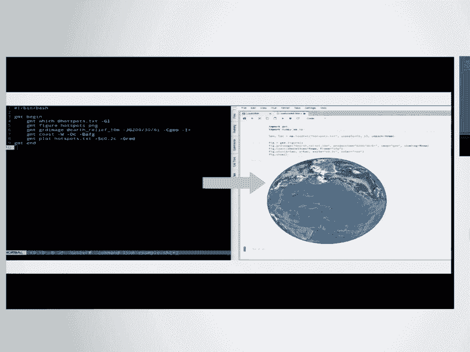
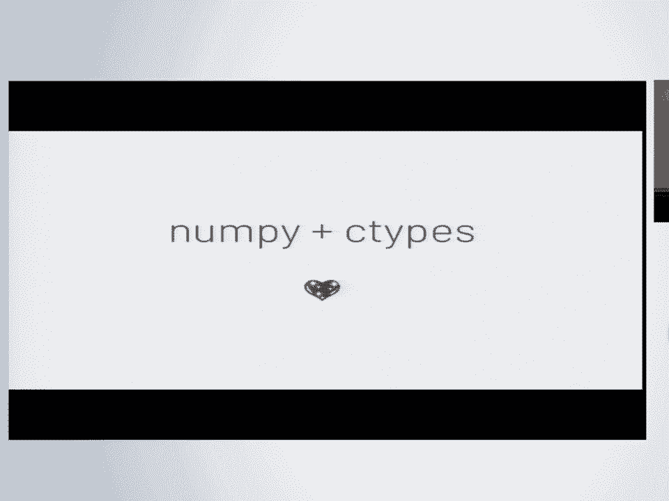
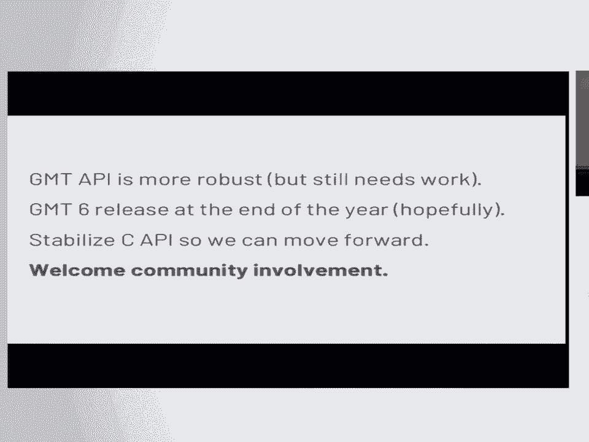
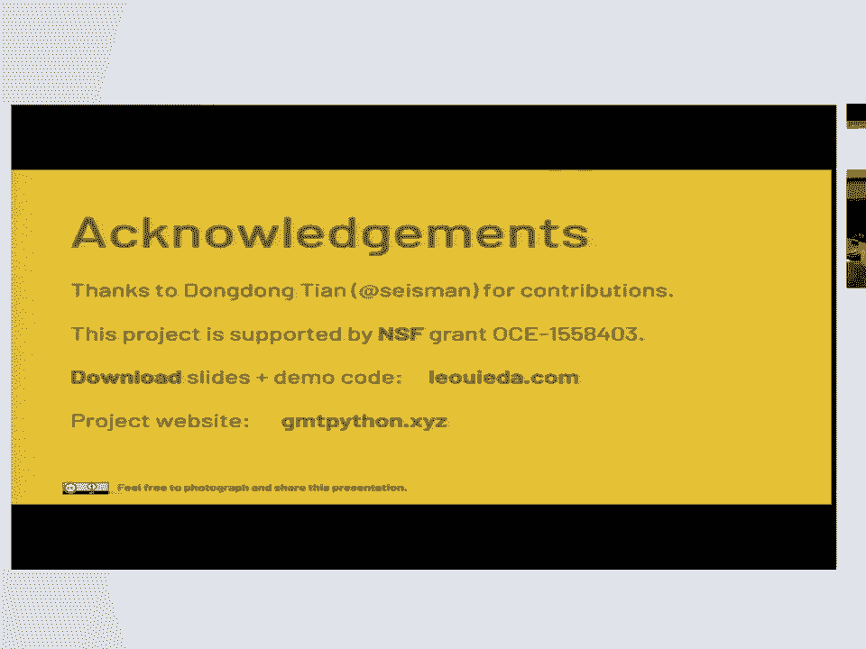

# SciPy 2018视频专辑 - P17：SciPy 2018视频专辑 (P17. Building an Object Oriented Python Interface for the Generi - GalileoHua - BV1TE411n7Ny

 Okay， good morning。 Thank you for coming everyone。 My name is Leonard O'Yeda。

 I'm a postdoc at the University of Hawaii and I'm working with Professor Paul Wessel to。

 build a Python wrapper for the generic mapping tools or GMT。

 Of course your free to photograph or share any part of this talk。

 So first off I would like to give a brief overview of what the generic mapping tools or GMT。

 What that's all about just in case you're not familiar with that。

 So GMT has been around for almost 30 years now and。

 It's heavily used in the geosciences for making maps and。

 plotting data and also processing data like patimetry and gravity and magnetics。

 but also in meteorology and also all stratography and， It makes some very nice。

 figures and it has a lot of work put into it to be very。

 Performing and also very detail oriented into the quality of the figures， GMT since version 5。

0 from about six years ago， It's a single command line program and it has a whole bunch of modules。

 So each of these is a GMT module。 It does something different and they have a whole range of configuration options。

 So there's a lot there and it would be a shame to not use this in the Python ecosystem as well。

 And this is all backed by a C API， So that's what I'm trying to tap into and get it working on with Python。

 So some of the goals of this project， The primary goal is to make GMT more accessible to new users。

 It's notoriously difficult for new people to come in and pick up the project。

 So we're trying to make it more accessible on the seaside as well as through the Python interface and。

 Part of that means writing a Python wrapper that actually looks like Python code。

 so you don't want to write Python code that looks like C or， Well， yeah。

 you don't want to write Python code that looks like C。

 And part of that is also integrating with the side by stack。

 So that you can use your data that you loaded with NumPy or pandas or XRA and you can pass that to the plotting library。

 And also we want to have more comprehensive documentation with galleries of examples and。

 Tutorials with examples that you can copy and paste and that includes having some sample data in。

 built into the software， so to use Felipe's trademark it's Jupiter time and。

 I'm gonna start off with a demo and you can follow along。

 If you go to try dot GMT Python dot XYZ that will forward you to binder and then we can all。

 Stress test the binder service together， So。

 So how's the font size， Okay， Okay， let's let's see if that works， okay。

 so the first thing we can do is import the GMT library and， Once we yes。

 it worked so all plotting GMT。 That's that's the first step is getting the import。

 Now hopefully we won't get any segfolds today， So the first thing that you would want to do if you're making a figure is instantiate the GMT figure class and this will take care of。

 Laying on everything that you want in your figure and then exporting it and showing it。

 so if we create create the figure class we can make a map and， here we're gonna try to。

 We're gonna make a mericator map that's six inches wide and we're gonna color the land。

 With a chocolate color and we're gonna also have automatic frames and all that。

 So if we run this coast command， Now we can run fig dot show and that'll show us the figure on the notebook and。

 This is running all the GMT stuff in the the background using C types， Okay。

 so having the figure in the notebook is good， But if you want to save the figure we implemented a safe fig function that tries to mimic the map plot lib a safe fig。

 so you can call safe fig central America dot PNG and if we Ls the directory we have here the。

 The figure file and you can also export this to PDF or KML or geotiff and a whole bunch of other formats that GMT supports。

 so now we can try some sample data and GMT started including sample datasets and they are downloaded automatically to a cache directory and。

 We provide access to those datasets as， In this case it would be a pandas data frame。

 Through special functions in the datasets module， So if we call that we get back quakes which is a pandas data frame and this has information about。

 latitude longitude depth and magnitude of， An earthquake catalog。

 Now we can plot this data so say we want to make a global。

 Moir projection map which let me cut things off here， so we're gonna。

 plot the coastlines on this global map with a Moir projection which is the capital case。

 W here and we can call the plot function or the plot method to tell that you plot latitude and longitude and。

 Give it a style。 We're gonna have a point one inch circles color them yellow。

 So if we want that we get a coastline map， With the coastlines shaded in and our little earthquake plots。

 We can do more than that。 We can also adjust the sizes based on the magnitude of the earthquakes。

 So if we pass in the sizes argument， it'll use that， That data to scale the size of the earthquake。

 So here we have a very large magnitude here somewhere in Mexico， Probably you can't really see。

 And we can also color the earthquake by the depth for example and we can set the color maps and we even have access to。

 A lot of the new map lot live color map so you can do where it is magma and I forget what the other one is。

 Sorry plasma。 Yes。 So if we run that we get， The very this color map mapping to the earthquake depth now。

 there are still some some things we haven't done， So we have no way of putting a color bar there yet just because haven't gotten around to doing that。

 And we can also communicate grids now to GMT。 We are adopting the x-ray data array object as our default。

 grid representation and， GMT also ships now with earth relief data in various resolutions。

 so you can get from anywhere from 60 arc minutes to one arc second srtm data and。

 We recently started shipping the srtm data blended with bathymetry as well。

 So you can get instead of getting zeros in the oceans you can get nice。

 15 arc minute 15 arc second bathymetry， So when we load that we get back an x-ray data ray and we can pass that to our drd image method and。

 That'll plot this， global earth relief， Data set in the projection and you notice that it's pretty fast and we can also layer on the called plot again and layer on the earthquakes。

 And we got a nice map with built-in topography data。

 You don't have to worry about it and if you don't want to load the data set and then pass it along。

 You can use these special GMT file names。 So anything that's at something is gonna be downloaded from the remote server。

 so in our case we can say at earth relief 30 meters and。

 It'll GMT will take care of downloading that data and then loading it into memory and。

 So you can make the same plot without loading any data。 Just give it at earth relief and。

 a new also features that GMT now does automatic hill shading。 So if you just give the。

 Keyword shading equals true that will， automatically he'll shade your data based on the input grid and。

 New thing that we're experimenting with as well is having these maps be somewhat interactive。

 Because it's kind of bad that you can't zoom in or anything。

 So we are experimenting with this NASA web world wind。

 library that is basically a goo-worth in your browser and if you， give it some。

 It's a bit finicky with the configuration， but you can get a topography grid in a interactive globe。

 And then you can zoom in and zoom out， It doesn't have a lot of layers that as many layers as Google worth。

 but it's good enough for just a quick， visualization， all right， so。

 All these changes they happen， Before sorry after。

 Sypi last year where I gave a talk with the initial。

 Initial prototype of what we were doing and we got a lot of great feedback。

 And for example the figure class was something that was suggested to us to not use functions instead have a figure and。

 That was very good because it allowed us to use pytest mpl for testing without any sort of modifications。

 We just give it our figure and it knows to cut called the safe fig method and does all its magic and。

 We also I want to thank Mike herney and Philip Fernandez for。

 Helping us make Mac builds of GMT on Conda Forge， That I would not have been able to do that myself so that they were a great help。

 and now we can also import numpy arrays panda series and。

 XRA data array we can load the memory from that and pass the memory block directly to GMT。

 So if you didn't do any slicing on your array， We can pass that memory directly and we don't need to copy anything if you do a slice。

 then we do have to copy because GMT needs， C contiguous memory block and。

 Recently I've also adapted the out air sphinx extension to make a GMT plots finx extension。

 so you can， Automatically generate a plot for for your Sphinx website and we made many many changes。

 upstream to GMT itself to make all this work and we're still working on that。

 Because a lot of this ended up we ended up running into a few challenges。

 which is the the next topic a。

 lot of these challenges were because I am now exercising some parts of the API that had never been touched before and。

 Trying out some different configurations that weren't really used on the command line。

 So in a sense， I had to sort of see how the sausage is made and look into the GMT API C source。

 Which actually it isn't really that bad。 It's pretty legible C code if you can read see I。

 Understand that that's a pretty big gift， but it is very understandable the code base is not not。

 It's not a terrible monster， but it is very large。

 and part of these inconsistencies is because we're trying to adapt a， Traditional command line。

 Interface even though， There is an API the API is built around the command line and we're trying to use that in a highly interactive medium like the Jupiter notebook。

 and a lot of the paradigms that were used for the command line interface don't really apply when you're doing interactive stuff。

 So we're not， Well， when you're doing an interactive figure you don't want to save it right away。

 You don't care about generating a file at first， You just want to see it and then if it's the way you like it then you want to save。

 so not going through files was a big issue at first and。

 Another problem we had was keeping Conda install GMT alive， I。

 Imagine this is a common problem for most C libraries out there on Conda Forge。

 Because it's a bit finicky with the dependencies and a lot of users had trouble。

 People who wanted to test this out they had trouble with mixing Conda Forge and defaults。

 Dependencies， but I hear that that's all changing for the best and for Felipe can probably say more about that。

 Now some of the successes that we had first of all context managers， they are awesome。

 I had never really used them before but any time you have any sort of operation where you have to build something up and then clean it。

 Afterward context managers are the way to go， The way we're doing that in the API as an example say we have that XRA grid。

 so how do we actually pass that to GMT？ most things in GMT are built around the operate in a GMT session in the API and that's because GMT has its own garbage collection system。

 because they， They wanted one and they just implemented it in C。

 So we have to create a session and then clean up the session every time we want to run any call to the API。

 So to do that I made this session class which is a。

 Context manager and it does all of the setup and the cleanup actions when you leave the context the with block automatically。

 then， Part of the the things that bleed in from the command line paradigm is that if you want to pass data into GMT。

 You need to create a virtual file， Which is a special file name that GMT allocates so that it knows to read。

 From a memory block instead of reading from a file。

 So that's also that also involves setting up the virtual file and then cleaning things up。

 So that memory gets deallocated， So that's also a context manager and we can do， session。

virtual file from grid and give it an XRA grid and it'll know how to set up the virtual file。

 grab the memory block from the XRA grid and pass that into a。

 GMT data structure and what that gives us is this weird looking file name and。

 The magic of that is that we can give this to GMT and it'll pretend like it's a file。

 And it'll know where to look for the data。 I， Have no idea how that works。

 Another thing sometimes you want to do is capture output and many of these modules。

 They just write to standard output， So one thing we can do is just give it a temp file and tell it to write to that temp file。

 And then we read it back in so we also made a context manager for that and then most of the API calls。

 Involved this call module function， which you give it a module name and the command line arguments。

 And it'll do what it needs to do， so here in this case we're giving it the。

 this weird file name for the virtual file and it everything happens by magic and it'll read the Python allocated memory。

 from the underlying NumPy array in the XRA class， So another thing that surprised me was that NumPy and C-types they work very well together。

 I， Was expecting a lot of pain from doing this in C-types。

 But it turns out that it's actually very good and a lot of stuff just works out of the box。

 an， Example of that is that we were trying to get the error messages that GMT prints to STD air。

 we wanted to get that back and include it in the trace back for a Python exception and。

 One way to do that in GMT is you can give it a function pointer that it'll use to print out messages。

 so I mean， Yeah， it wants to see function pointer。

 How would you do that in Python turns out that you can write a Python function and give it a decorator and。

 this Python function it's， reading in a string， it's storing that in a class attribute which is a Python list and then it's using the Python print function to print that to。

 STD air and I can just pass this along， Oh， sorry forgot that there and I can just pass this along to the C-type function and。

 It works and that Python list is populated by the C code somehow and， Yeah。

 I found this to be some very dark magic， but I'm glad that it worked right out of the box。

 So in conclusion and well I have a lot of time。

 We're still working out a lot of the kinks in the GMT API and we're actually predicting some。

 Future trouble that we're gonna have so we're trying to adapt to that already。

 This is like from last week， And we're still experimenting with the Python API。 Nothing is set yet。

 We're trying to figure out better ways to make this more。

 user-friendly and more intuitive part of that was replacing the command line arguments of the traditional GMT with。

 longer form names and we're， Experimenting with what names would be better how to make them more compatible with the existing Python tools and。

 We also need some improvements to the current documentation a lot of the C API wrapping code is is kind of set。

 But that's not well documented and this GMT plot Sphinx extensions gonna help a lot with that。

 And we're also looking into using Sphinx gallery to make our galleries。

 I saw that there's an open issue for them to capture， the， IPython rich display。

 For Sphinx gallery and that would just work right out of the box for us because we're using the IPython rich display。

 mechanism to plot to insert the plots in the notebook and。

 We also need some help setting up the Conda forge windows build。

 I haven't really used windows almost at all and I have no idea how any of that works rightfully。

 So because of all this we're stress testing the GMT API and we're taking it to。

 Places that it hasn't gone before so we're making it a lot more robust。

 So in the future if anyone wants to wrap GMT in Julia or any other language。

 I suspect that they will have a much much easier time because of all this work。

 We're expecting a GMT 6 release which would stabilize the API by the end of the year and。

 That will include all the changes that we're making also to the command line to make it more user-friendly。

 if you still want to use it in a scripting sense and we really welcome any kind of community involvement in this either by。

 Helping us write the code or just telling us how would you want to use this？

 What what API makes more sense for you？ What are your current pain points with the existing software so that we can maybe try to fix that and。

 Or just file in issues or trying out the demo and seeing if anything breaks on your machine。

 which happens quite a lot。

 So a few acknowledgments， For thanks to you Felipe and my currently for helping out during the sprints last year and Felipe is also like the。

 The Amazon - button right and I've used that - button quite a lot the past year。

 And also big thanks to Dong Dong Tian whose name I probably just mangled。

 for many contributions is making to the the Python code and。

 This project is supported by an NSF grant， That's what pays my my salary as a postdoc and you can download the slides and find links to the demo code on my website。

 And the project website is gmt Python dot xyz。 Thank you very much， Questions。

 Thanks for that that was neat my uninformed impression is that people use gmt for historical reasons that may not be true。

 But why would a person who doesn't use it for historical reasons switch over to gmt？

 What's great about it？ So， First of all would be I would say the speed and the quality of the plots that you get by default。

 Is a lot better than most of the current Python tools？

 The Python tools are generally easier to set up and use but it takes a lot of configuration to try to get them looking as nice and。

 I think that that is mostly because Paul has an incredible attention to detail and he'll fuss about like the tiny details of no。

 This ellipse it's bleeding out of the plot by an imperceptible amount if you zoom in like a million times on the postscript。

 It's out and he'll fix that， so， it has 30 years of love and work poured into it and。

 It's hard to match that with anything that we can come up in a year or two， So I I used gmt。

 20 years ago or so and it made nice plots。 There were a lot of other nice utilities in there like。

 Gritting packages and things like that is there you didn't talk about those。

 What's the plan to wrap those into， Pythonic type packages the plan is you have all of that into this package？

 The reason I didn't show any of that is because that's one of the key parts of the capi that we're still missing。

 Which is getting the data out of gmt？ So passing data in is is fine。

 You can just give it a memory pointer and it works。

 But then getting data out then we're getting into conflicts with the gmt garbage collector。

 So we we're probably gonna have to duplicate memory on that。

 I don't think there's gonna be a way out， But we're still working on ways to do that better。

 But then once that's done then we can have all the the gridding。

 Which is actually one of the things that gmt is heavily used for still is all the data processing and gridding。

 That goes on in the background a lot of modern tools are built on top of that， Okay， um。

 I brought this up on slack last night， But what would it take to have a projected raster image put into your python wrapper？

 So， um， I don't remember when this was introduced， but gmt supports anything that gdall can read。

 Uh， and you can usually give it images。 It does have an internal gmt image。

 Class which I guess is what their reading mechanism populates， Um。

 I haven't implemented access to that yet。 So you could pass it in as a grid。

 but then you're limited to one band， Um， so if you have three bands and you want to plot rgb。

 We would need to make， Um， one of those virtual file wrappers。

 For some sort of image format and that that could be a， numpy array or or something else， but。

 It's probably not a whole lot of work passing data in it's surprisingly easy。

 Compared to getting it out。 Yeah， Um， I did you guys so can you hear me？ Is that coming there？ Okay。

 um， With the command line tools sometimes， Trying to wrap these things in python and such。

 You kind of have to add new functionalities like what you're talking about getting data out。

 Are you concerned about maintainability where you're basically adding functionality that the main。

 Library is not exactly using？ Um， like keeping that alive basically， So the。

 That that is a very good point and one thing we've been trying to do is every time I come across one of these issues。

 Um， it's generally because there wasn't a test case for that， So， um。

 I just ran across like the the grid the actually passing grid data in， Was causing some weird。

 Flows like in gmt， And we fixed that a couple of actually paul fixed that a couple of weeks ago， Uh。

 and right after that added a test case for that。 So now we know that that is working， So。

 They they are pretty good in making test cases and even for the capi。

 So I guess once we fix all these bugs， they're probably not coming back， Um about building a nice。

 Uh gallery on your documentation， You're probably gonna have to have a lot of test input data。

 Are you worried about the size of that data and where are you storing it remotely？ Okay？

 All that data is stored on the gmt servers at the university of wal i and gmt uses， Um。

 I think it uses curl， To download that data and they're very concerned about optimization。

 So if you if you get the srtm tiles for example， Those are stored in the server in this weird。

 Jpeg format which turns out to be， A lot smaller than anything you could get with uh net cdf and then when gmt downloads that to your computer。

 It'll unpack those in tune at cdf files， So you get all these net cdf srtm tiles。

 but they were transmitted in this weird jpeg format because of the compression， but uh。

 so that we are conscious about that and， If you have enough space in your hard drive。

 but if you want to do a global srtm one arc second map。

 If you're having a space in your hard drive in it enough time to sit around while it plots you technically you can do that。

 but， Might not be the best option， I think I had one really quick final question。

 So you said this is 20 or 30 years old roughly the gmt package or or， Yeah。

 I think their first release was in， 88 I think you said this most release one was the one that was stabilizing the api finally。

 Yeah， the the release five wasn't they actually made the api okay because the。

 Before it was just a whole bunch of separate command line programs and they were each their own program。

 Um with like a few things that they shared and for version five。

 they actually put in the effort to make one api， And so they have now one command line program that has all these modules。

 but since they had so many modules they have like 100 modules， Uh。

 it takes a while so that that's why the api is not really calling specific functions。

 I'm calling one function that calls the module， Uh because that's kind of how how it was built。

 Okay， let's go ahead and thank our speaker， Thank you， [BLANK_AUDIO]。

