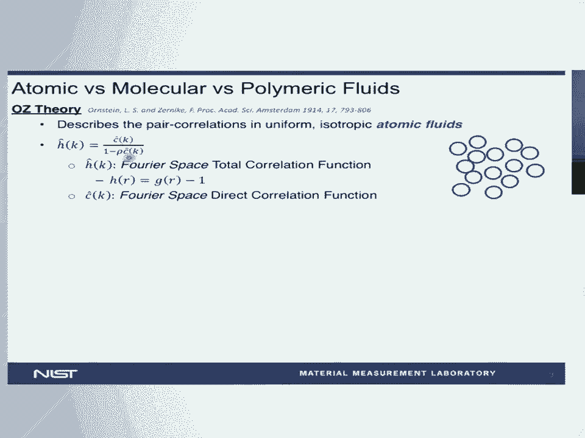
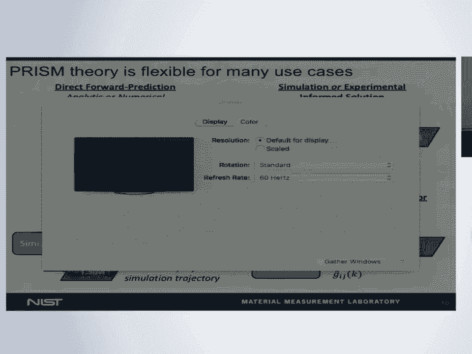
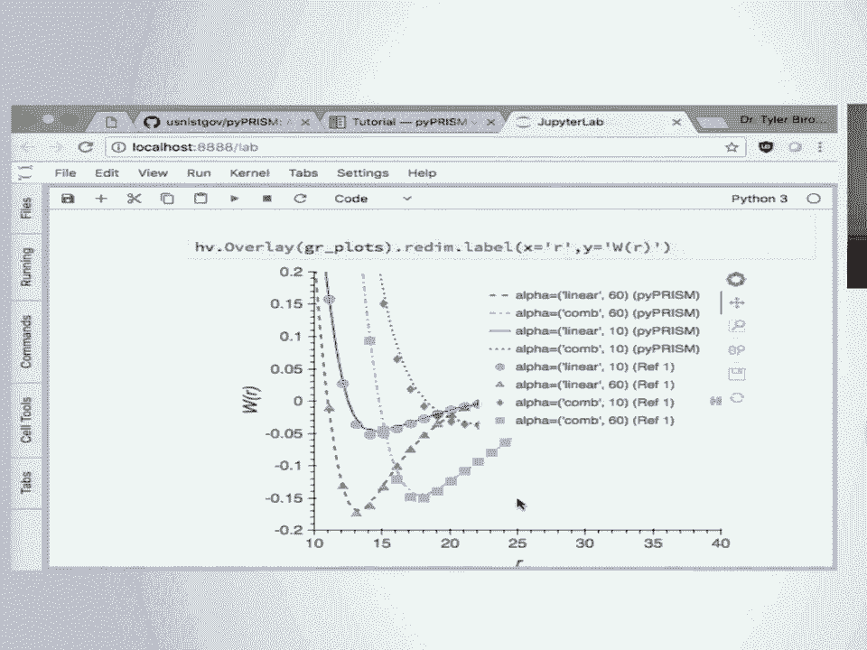

# SciPy 2018视频专辑 - P18：SciPy 2018视频专辑 (P18. Design and Implementation of pyPRISM  A Polymer Liquid Stat - GalileoHua - BV1TE411n7Ny

 Okay， so to get started， first I want to thank the organizers and the reviewers for their。

 work in selecting me and helping me review the conference paper we put together。

 This is a really different conference than a lot of the other conferences I go to and。

 it's exciting to be here and be able to contribute and talk about a tool that I put an awful。

 lot of work into over the past year。 Before I even start。

 I'd like to recognize some of the other people who are on the team。

 that helped me put this together and so I am Tyler Martin。

 I'm a postdoc at NIST in the Material Science and Engineering Division。

 I've been a postdoc for about two years and my postdoc advisors are Ron Jones and Chad。

 Snyder also in the Material Science Division。 Ron Jones is the Director of the Industrial Ensoft Consortium。

 So as part of the development of this tool， we were heavily engaged with industrial participants。

 in particular， Proctor and Gamble and so this is a tool we're not necessarily just developing。

 for academia， we're developing this for everybody including industry。 And finally。

 we developed this tool in collaboration with my PhD advisor， R。T。J。

 Raman at the University of Delaware and in particular one of our very talented graduate， students。

 Thomas Gartner。 And so as my title indicates， today I'm going to be talking about my PyPrism tool which is。

 a framework for conducting prism calculations。 Prism stands for Polymer Liquid State Theory or Polymer Reference Interaction Site Model。

 and it is a Polymer Liquid State Theory。 And so the first question you may be asking is what is a Liquid State Theory？

 And so Liquid State Theory has come in many forms and I'm not going to harp on the details。

 of what a Liquid State Theory is and what it isn't but many of them deal with what are。

 called spatial correlation functions。 And so these spatial correlation functions again come in many flavors and so for example。

 we can consider this sort of coarse-screen representation of a Polymer Nano composite。

 shown in this diagram here and we can consider this correlation function between the monomers。

 in the polymer chains and the nanocomposite。 So in the Nanocomposite matrix。

 we have some spatial correlation function which is related。

 to the probability of finding two monomers at a given distance。

 And so we have another type of correlation function called the direct correlation function。

 which I'm going to skip the details on but as an illustrative example， we can also consider。

 something called the intramolecular correlation function。

 And so this correlation function rather than describing the correlation between different。

 molecules， it's describing the correlations of monomers within the same molecule。

 And it is this separation of the intramolecular correlations that is the foundation of prism。

 theory and allows us to do the kind of calculations that I'm going to show you。 And in particular。

 if you have any experience in small-angle x-ray or neutron scattering。

 this is going to sound an awful lot like form factors， instruction factors and it should。

 because it's more or less the same thing。 And we're going to talk about how we can use prism theory to predict x-ray and neutron。

 scattering experiments。 And so what exactly is prism theory？

 I've introduced these correlation functions but what is the theory itself？

 And so before we get to prism theory， I like to do just a brief sort of historical walk。

 And so if we start a little over 100 years ago， we have Ornstein-Zerniki theory which。

 describes the pair correlations in uniform isotropic atomic fluids as shown by this diagram。

 over here。 And we can see that in Fourier space we have a relatively simple algebraic expression which。

 describes the relationship between our total correlation function which again describes。

 the correlations between monomers on different molecules and the direct correlation function。

 which again without going into details describes the correlations between molecules in the。

 absence of many body effects。 But overall this formalism is limited to atomic fluids represented by spherical molecules。

 that are isotropically ordered。 And so Chandler and Loudon extended prism theory in 1973 or extended OZ theory to rhythm theory。

 in 1973 so that they could handle what they call molecular fluids。

 So originally these were fluids like O2 and N2 and later they were able to extend it even。

 further to small molecules such as acetoneitrile。 And the way they did this was by introducing a third type of correlation function which。

 now describes just the intramolecular correlations and that's this omega function here。

 And you can see again the formalism has gotten a little more complicated but it's still algebraic。

 it's still relatively straightforward in Fourier space。

 So finally Schweitzer and Kuro again extended rhythm theory into what we now call prism theory。

 which allows us to apply the same mathematical formalism to high polymer systems。

 So now we can describe the correlations of molecules with many many in some cases you。

 know thousands of monomers and you know predict the thermodynamic and structural properties。

 of these systems of these macromolecular systems。 So what kind of things can we predict？

 So just as an overview you know I've been talking a lot about pericorrelation functions。

 we can also predict things like structure factors so again if you're a smalling， alexorator。

 neutron scattering person you know this should immediately excite you because。

 we can we can predict the exactly the things you measure in your experiment。

 We can predict thermodynamic properties such as the potentials of mean force between the。

 various species in our system second virial coefficients， chi parameters， binodal transition。

 temperatures， equations of state and so on。 And so prism theory isn't a theory which you know just gives you one piece of information。

 it's a theory which opens the door to a whole host of thermodynamic properties that you。

 can you know rapidly calculate for your system。 You know I'm showing two examples in the bottom which I won't go into the details of。

 but essentially we're predicting the structure factor of a polyelectrolyte system and the。

 chi parameters of this nanocomposite which has coded which has modified filler material。

 as a polymer graph and nanoparticle。 So you know I've shown you the basics of prism theory。

 I've shown you what we can calculate， with prism theory。

 now what kind of systems do what kind of systems can we study with， it。

 And so again if we just you know if we just do a brief overview you know we can study。

 systems like my cell my cell solutions and so here we're using prism to model the small。

 angle neutron scattering data of these worm like my cell systems and we can see that we're。

 modeling the data quite well and if you go back and you read this paper you'd find that。

 they don't have other ways or they don't have other good models to model this system。

 and so this is really the only way to extract meeting from this you know very expensive， experiment。

 We can also we can we can do systems like nanocomposites or nanoparticle solutions so。

 here rather than fitting the neutron scattering data where we're for predicting the neutron。

 scattering intensity of these silicon nanoparticles and solutions so now we're not taking。

 the data into account when we're constructing our model we're just putting into putting。

 in a description into the prism formalism and getting out of prediction for what we think。

 the structure factor should look like and so even though there are some deviations between。

 the data the experimental measure data and the prism prediction overall I would say this。

 fit is it was qualitatively quite good so nanoparticle solutions are accessible I already。

 mentioned you know complex nanocomposite systems we can even do blank screens。 Okay let's do。

 Okay we can do even systems which are sort of biological in nature these polyelectrolyte。

 systems so here they're modeling the structure factor of these tobacco mesoic virus particles。

 We can do copolymer systems of all kinds of different sequences and so you know prism。

 again is not just it's not just a theory for a small range of systems it's a theory for。

 an entire domain of systems and even in going beyond that okay we're going to one more time。

 Okay so going beyond that prism is quite flexible in its use cases so a lot of the examples。

 I showed you on the last several slides were simply for you know for predicting the properties。

 of a system but and you know that's represented by this diagram at the top left but we can also。

 do things where we couple prism theory to experiments or simulation in order to extend。

 this applicability so now we can gain the power of you know the rich metrolities that。

 we've developed and feed them into prism theory in order to make more accurate and better。

 predictions for these systems。 One can also be coupled with simulations and a self consistent formalism which can allow。

 us to study highly non-ideal high highly non-ideal behavior in various polymer systems。

 One of the one of the use cases of prism that I'm most excited about is as an IQ model for。

 scattering data and so in the world of x-ray small x-ray neutron scattering one of the。

 biggest challenges is understanding the data that we measure and with prism theory we can。

 take all of these models which we already have which work really well in the dilute limit of。

 systems and use prism to introduce intermolecular interactions and greatly extend their applicability。

 and so prism takes theory that we already have and makes it better and finally recently prism。

 has been developed into a coarse-graining engine which allows us to take detailed atomistic。

 models from simulation and sort of rapidly construct liquid state theory based coarse-grained。

 models which can allow you to do simulations over much longer length and time scales。

 And so to summarize everything I've said you know in this first half of my talk I would。

 say prism theory can calculate many thermodynamic properties it can calculate it can characterize。

 the material structure of many liquid like polymer materials is applicable to a wide range。

 of polymer systems in the liquid like space and integrates well with experiments simulations。

 and theory and if you've never heard of prism that's probably not your fault because prism。

 is you know woefully underused across the across the community and you know the question。

 I want to ask and answer is why and so you know we can put up some explanations but I。

 would say in particular would be the fact that there's no open source tool there's no。

 accessible way to get into prism theory so if you decide tomorrow that you think prism。

 theory would be really good for you in the absence of the tool which I'm which I'm about。

 to talk about you would have to spend a significant amount of time learning theory just to decide。

 whether or not it would actually be useful for you we're hoping to greatly reduce the。

 barrier to that so that you can at least explore the tool without having to take the sort of。

 penalty of digging through the extraordinarily dense and technical literature that is liquid。

 state theory and so this tool is called pie prism and it's a computational tool for prism theory。

 and as I said the main goal is to lower the barrier to accessing this powerful theory and。

 so you know as I showed this this isn't a tool which is you know just predicting one。

 thing for one system it has it has the potential and it is is broadly applicable and so we。

 want to give people the opportunity to ask themselves and to answer for themselves you。

 know can this enhance my research can this you know help me get to better answers more。

 quickly and so you know I've already put up the github so we a pie prism is up on github， in the u。

s。 Niskov organization it's up on read the docs under pipe prism dot read the， docs。

io there's an interactive tutorial which we're going to be going through in just a。

 second so you all be able to follow along if you want and try out pie prism for yourself。

 via a binder instance which I have set up we have a review article which goes through。

 the details more of the theoretical details of prism theory is a formalism but the cyprite。

 proceedings we wrote to accompany this talk go into great detail or go into much more。

 detail on the code side of things so depending on your interest we have two papers out on。

 pie prism that have a whole lot of information both about the theory and the tool itself。

 and so one of the things that I want to highlight is one of our focuses with pie prism is very。

 much on pedagogy and so we recognize that in developing a scientific tool we have additional。

 challenges which don't necessarily exist for you know every computational tool that's developed。

 because on top of teaching people or API we also have to ask ourselves whether or not they know。

 the theory that they're going to be used and whether or not they need to know the theory。

 that the tool uses and so you know we've really tried to put a lot of effort into not only giving。

 people access to materials that teach them pie prism but also guiding them towards the right way to。

 apply and use the theory。 So towards that end we've developed a series of Jupiter notebooks which again。

 are going we hope to grow and to continue to change but we've developed a series of Jupiter。

 notebooks which teach people these different features which I just outlined and so you know we discuss。

 things we you know we start out very general we've explained how you know how do you use a Jupiter。

 notebook and what is Python and what is numpy we move on to the details of prism theory and how。

 to use pie prism we have several notebooks which focus on case studies so if you know a little bit。

 about prism theory but don't know how to use it for a nano composite we have you know two very。

 detailed case studies which I'm going to demo for you in just a minute which can show you how to use。

 it for an nano composite system and we intend to grow this we tend to add more case studies and more。

 systems so that everyone should have a starting point a detailed explanatory starting point for。

 the kinds of systems they're interested in and finally for our advanced users you know it's the。

 goal I think of every open-source project to have people contribute back and we have a couple of。

 notebooks which go through the details of the you know the guts of pie prism and how you know we put。

 together the class structure and the choices we made and also how to do some more advanced things。

 with prism theory and so I'm going to jump out of this presentation and move to a web browser and so。

 if you navigate to github。com/usnascove/pyprism and you scroll down there's a binder button which。

 will launch you into these very notebooks that I'm about to talk about you can also go to the。

 documentation and if you go to the tutorial page and you scroll down there's a binder button here as。

 well and so these will both allow you to follow along with the next several over the notebooks I'm。

 about to talk about so how much time do I lift seven minutes okay so plenty of time okay so。

 you know right off in the notebook you know I right off in these tutorials we wanted to make。

 sure the user's got a sense of whether or not they were moving in a direction that was going to be。

 useful for them and so here and you know in the very first notebook so this is nb0。introduction。

 you know we talk we immediately discuss you know what kind of systems can be studied with pie。

 prism because if you're doing something that where if you're studying a system that's not。

 applicable to the tool you know we don't necessarily want to waste your time with learning the details。

 of pie prisms so we tell you you know what what can you study with pie prism what kind of things。

 can you calculate what are the benefits of using prism theory over another molecular simulation or。

 theory method you know and these are things I didn't talk about but prism theory as I'm about。

 to demonstrate can be solved in seconds this isn't something where it's going to take days or weeks of。

 sampling to get an answer we can literally get an answer in about between one and 30 seconds。

 generally you know we don't have finite size effects like a simulation method does we don't。

 have to worry about a calibration if we get an answer it is equilibrated and we're mostly free。

 of incompressibility assumptions unlike a lot of SCFT methods that you might apply you know but。

 an important question is is where can't you use pie prism and so pie prism is not applicable in。

 its base form for macro phase separated systems for nonisotropic phases systems with strong。

 directional ordering or if you're interested in dynamical properties it's an equilibrium theory。

 predicts equilibrium equilibrium static properties okay and so to move on to the tool itself so in。

 the fourth notebook we're going to skip two of the notebooks three of the notebooks in between。

 but in the fourth notebook and before we actually introduce pie prism and how to use it and so。

 you know we start off the notebook with a we assume a base level of not we assume no base level of。

 knowledge with python or with any of the python tools and so we explain to the users immediately。

 you know I think one of the first things we realize with a lot of the people we tested with is that。

 you know this import cell can cause a lot of problems if if you know sometimes the cryptic error the。

 import errors you get here are completely foreign to people who don't do programming and who aren't。

 aren't python programmers and so assuming that your environment is working we move on you know we。

 instantiate a system we say you know this system is going to be at a thermal temperature thermal。

 energy level of 1。0 when we're only going to consider one component and so for this first example。

 we're going to be considering the classic Leonard Jones fluid which is not a polymer system but。

 it's still accessible with pie prism so we we create a system we define our solution domain so。

 pie prism is essentially a set of equations that we're solving and so we need to find the discrete。

 domain that we're going to solve the equations over and so we define a grid spacing and a grid。

 length so we're going to solve with a real real spacing of 0。005 and a length of 32，768 and we can。

 see that this automatically creates our real space and our Fourier space solution grids that we're。

 going to solve over we're going to define the interactions of our system and so I said a Leonard。

 Jones system but instead we're just going to do a hard sphere solution and so we set the monomer。

 monomer potential to be hard sphere and we set the monomer diameter b1。

0 we define the system density， the site density of these monomers and we see that that's set to 0。

8 we define the molecular， structure through the omega and I'm kind of going fast through this the point is just to sort of。

 demonstrate the tool these these notebooks are online you can go back through and read them in。

 more detail if this is of use to you we define closures approximation and finally we solve the。

 system and so this is one of the things I wanted to highlight because even for a relatively simple。

 case like this if you were to take and you said I want to do a molecular dynamic simulation of a。

 Leonard Jones fluid that that's a trivial a trivial task but it still takes a finite amount of time。

 even on modern resources this is probably going to take you for a size a reasonably size system you。

 know minutes to hours to maybe a couple hours depending on how big you're going and I just saw。

 the prism equations on my laptop in about a second and I can get predictions that I don't have to。

 worry about sampling I don't have to worry about finite size effects and as you'll see you know。

 my curves are very smooth they're not histogrammed and so to show you you know we can plot the。

 results from that calculation and so this is the pair correlation function for this hard sphere。

 fluid that we calculated in about two seconds with py prism and we built these notebooks using bokeh。

 and hollow views so users can go in and play with the plots and zoom in and explore the data。

 the cool another benefit of py prism is that once you've done the calculation the solved the solved。

 correlation functions are stored in memory or stored in a memory object so that you can do。

 multiple calculations in a row without having to redo the calculation so we just calculated this。

 pair correlation function we can say okay py prism give me the structure factor now and we can get。

 the structure factor out without having to repeat that calculation it's just a different way of。

 mashing together those correlation functions we can also calculate scalar data like second。

 virial coefficients so here i'm using prism py prism to calculate the second virial coefficient for。

 the system and it's 0。6 so you know this this notebook is designed to walk users through in a。

 step-by-step manner all the different pieces of the py prism tool but you know at the end of it we。

 want to give them sort of a sandbox to play with and so if we scroll down we can see that that entire。

 calculation if we take away all the explanation is about 12 lines of code and so in about 12 lines。

 of code we specify all the details we need to about this uh this relatively simple system and we're。

 able to solve solve it and we can overlay that solution so here i'm overlaying the solution a。

 slightly different set of parameters over that uh the the the pair correlation function we solved for。

 our original way and again as you saw this this this case took just a little bit longer but uh it's。

 still we were still able to rapidly achieve a solution and so i'm running out of time but。

 just to show you that py prism is applicable to systems which are you know non-trivial if we。

 scroll down one of my t phd one of the last studies i did during my p hd was to study。

 this composite system so this is a polymer graph in nanoparticle where our polymer graphs have。

 this rather complex uh uh comb polymer architecture and we were interested in how the properties of。

 this compound architecture affected the interactions of these nanoparticles and so using py prism we。

 can rapidly uh solve the properties of the system and calculate the potentials of mean force between。

 these graphed nanoparticles for these different architectures and i want to highlight this is a。

 really non-trivial system and one of the things we're showing here is that we for for the users we。

 overlay data that we've extracted from the literature with the prediction that comes for the notebook so。

 if the users start playing with parameters or they start trying to write this code themselves they。

 can instantly get an idea whether or not they're uh that they're they're doing the right thing that。

 they're making predictions which have been vetted and reviewed in the literature and so just to wrap。

 up i want to say that again all of these notebooks are online and if i go to my closing slide i'll have。

 all of that information there again we have uh the review article we have the scipy proceedings。

 so i unfortunately have to run right after this talk because my flight is in about a couple hours。

 so i put my email up on the slide if you have any questions if you'd like to use py prism please。

 contact me we want users for this we want suggestions and uh you know we're pretty excited for the。

 future of this tool so thank you， real basic question i'm new to polymer chemistry what do you mean when you talk about correlations。

 between molecules is like intermolecular forces or does that mean something else it's really。

 spatial correlations and so those those correlation functions are related to the probability of finding。

 those two those two those two sites at a given distance and so yeah and there's you know you can。

 imagine that you can have two monomers that are in the same and the same in the same molecule versus。

 in different molecules and so those are different probabilities right and so but rather than tracking。

 the probabilities directly we're tracking the correlations which is a ratio of those probabilities。

 if that makes any sense yeah， thank you tylor um one of the suggestion for us to think in nanometers and stuff would be nice。

 of you in the tutorial somewhere you can build something that good from reduced units to real units。

 so uh if we go to the documentation and we click api you till we have this unit converter package。

 oh nice which does exactly that and so this allows you to define you still have to define。

 your reduced unit systems you're going to have to define your energy scale your length scale。

 but it'll automatically do your conversion back to the real units that you like okay great this。

 comes to my question so where are you getting your potentials from is this the leanest is fine up front。

 uh sorry what's the last part where are you getting your potentials yeah so right now we're using sort。

 of just the the classic potentials that everyone uses in the coarse grained world we have the。

 Leonard Jones potential we chamois understand hard sphere these sort of things but there's no。

 reason why you couldn't use tabulated potential from any force field that you can imagine and so。

 as long as your potential can be expressed as a two body pair function then it could be used with。

 by prison so all along those lines what happens if you plug in a reacts or still under wepper or。

 something that doesn't oh doesn't obey the guidelines you said are for validity so it's more of a。

 I would have to think more about that but the myoptica fancer would be it's it's more of an answer of。

 how the mathematics work and so at the end of the day we have you know vector representations of。

 these potentials and we sort of mash them together in the prism formalism and so if you can't give me。

 a function of radial distance I don't know I would have to think really hard and I'd have to know more。

 about how that would be input into prism because at the end of the day I need a one-dimensional。

 vector that represents the value of the potential on my solution grid otherwise yeah because one of。

 the things that's really different about pipe prism than most molecular simulation methods is at。

 no point in time do I have access to a coordinate trajectory so I only have the correlation functions。

 it's not my field at all my sense is things like embedded atom potentials many which I think do。

 give you that potential versus distance but they clearly support crystalline materials and things。

 like that so just curious what happens in a paradigm or something what's so focused on liquid like。

 behavior that'd be interesting if it can you say tell it that all you have to do is put in your。

 epsilon and just say yes it figures out the angle of the potential for it yeah so if we if you go to。

 the potential set package these are the potentials we have so far so we have exponential hard core。

 line of Jones hard sphere one of Jones yeah so yeah so yeah so this is a good question。

 so depending on exactly how you define free energy the potential I mean force is a free energy。

 curve it's a free energy is it's the free energy of bringing two particles from an infinite distance。

 to that to that distance in space but in terms of a generalized free energy is a function of。

 the number of particles or something like that I don't think that's accessible with pipe prism。

 but I can tell you that with the thermodynamic correlation functions which are what you solve for。

 you can do an awful lot so I can calculate things like I can't wow I can't remember。

 chemical potentials and things like that so I have access to a pretty broad range of。

 thermodynamic properties but the raw free energy I think is difficult for me to access。

 so so those are so those are two separate cases right so for non equilibrium prison。

 theories and equilibrium for molesome so it's derived for the equilibrium grand canonical ensemble。

 and so it's not it won't be applicable to anything that's non equilibrium but in terms of inhomogeneous。

 systems prism in its base form is not but prism as I demonstrated can be coupled to other theories。

 and so what people have done is they'll do sort of a DFT or an STFT calculation for a global system。

 in order to get the the the different the phase separation but then the the structure of each of。

 those individual phases can be calculated using prison theory oh okay if they keep phase-operated。

 yeah and so different domains yeah so you can so prison theory can handle the individual domains。

 it just can't handle the interfaces and the interactions between the domains but you can couple it to a。

 theory that can okay and one more question have you heard about this integral equation course。

 grading theory so actually I reference that in my talk somewhat indirectly so this is exactly。

 integral equation course grading oh it's included so so it's we don't have features in prison theory。

 in pyprism to do it yet but there's no reason why we we want to work towards it so I should I didn't。

 say this but pyprism is about two months old in terms of it being released I started writing it in。

 August and so it's very new but I met a couple of the developers of IECG at a conference a few。

 months ago they were very interested it's more of a bandwidth thing at this point but we are very。

 interested in developing that angle for pyprism okay looking forward thank you。

 if there are no further questions I like thank this great question questions here we are on break。

 now until 3 30 I hope you'll all come back we've got three more speakers this afternoon。

 and this materials me and symposium track thank you。

 [Applause]， [APPLAUSE]， (silence)。