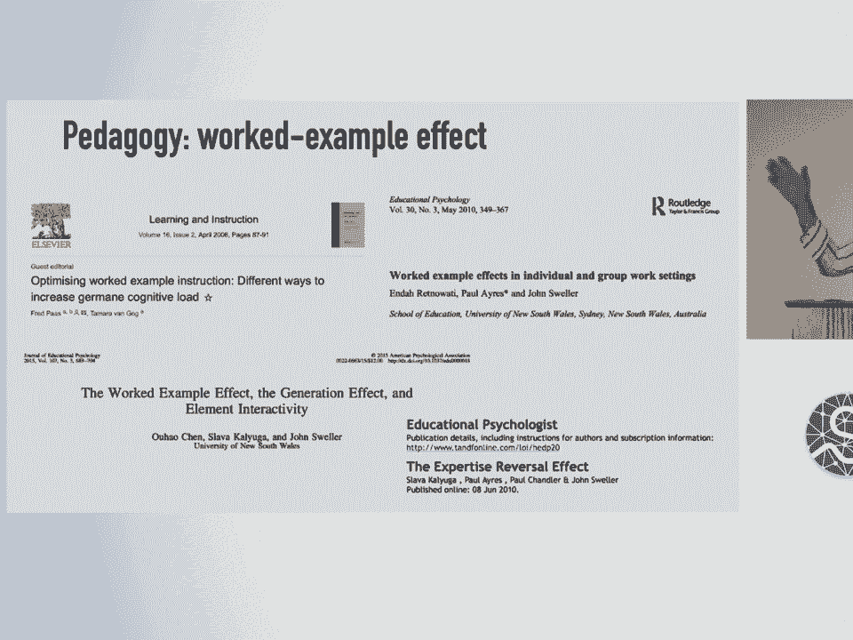
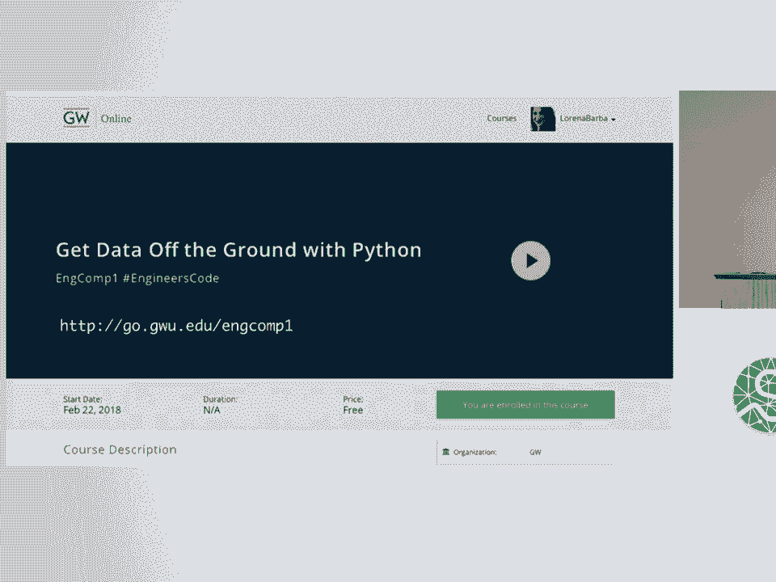
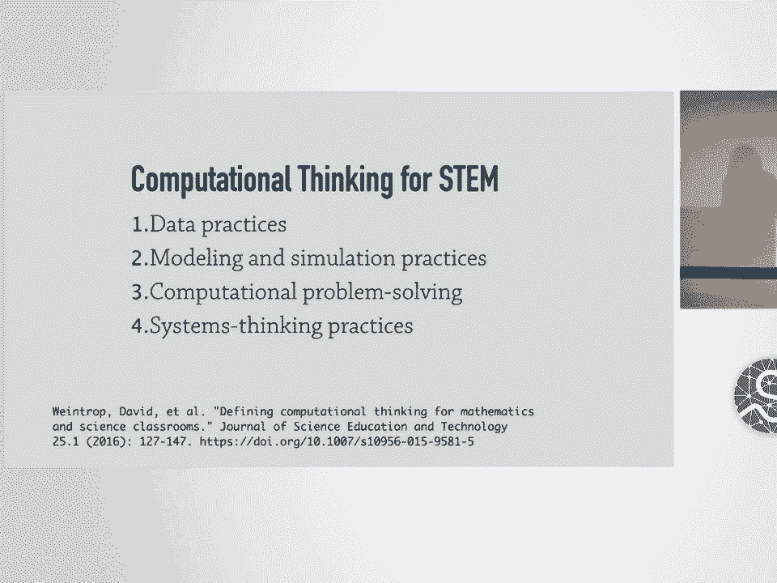
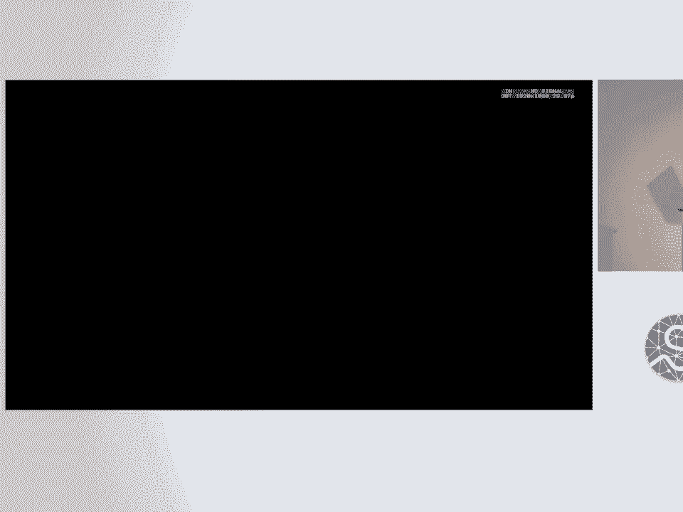

# SciPy 2018视频专辑 - P20：SciPy 2018视频专辑 (P20. Engineers Code  Re-usable, Open Educational Modules for Eng - GalileoHua - BV1TE411n7Ny

 All right， I'm going to take 30 seconds extra。 And I'm going to use them to thank Kenneth for his talk。

 because it's a perfect antecedent to my talk。 In fact， I am perfectly in tune with Jason Moore。

 and what he's doing at UC Davis， and other--， like Alan Downey as well， and other people。

 who are attempting to bring computing to the engineering。

 classroom or to other STEM fields as a vehicle for teaching， other subjects。

 for teaching technical subjects in a way， that is more effective and more interactive。

 So my work that I want to share with you today， is perfectly in tune with that previous presentation。

 And what I would like to do and the inspiration that， what's behind this presentation today。

 is the hope that we can actually get together， and start sharing our efforts in the model of open source。

 software development。 Because there's no reason to be reinventing the wheel。

 And there's some topics that are taught at every university。

 and we could be developing some of these materials collaboratively。 That's what I would like to see。

 So that's the idea behind this project。 And it is the case that many in the SciPy community。

 are also educators， not because you're a professor， like me， in academia， but you--。

 we have tutorials every year。 And so we are also educators in other informal ways。

 But in engineering education in particular， it is still somewhat rare to find， for example。

 the efforts that Jason is doing at UC David。 It's very rare to find good quality Python instruction。

 or programming instruction embedded in the curriculum。

 And this is something that I would like to see， embedded in the undergraduate experience。

 of the traditional engineering classroom， so that students， when they graduate。

 with their engineering degree， they also， have all of these skills that allow them。

 to continue learning using Python， of course。 Now， one idea-- I've been asking myself， why can't we。

 do this？ Why is it so hard？ I mean rattling the doors in my university。

 to try to introduce Python for probably five years。

 And I can't get my colleagues to buy in for some reason。 One of the reasons is MATLAB， of course。

 and how they've kind of penetrated the academia， with their fancy tool and somehow made everybody addicted。

 to it。 So my question is， how can we transform engineering， education and integrate curriculum。

 and integrate computing across the curriculum？ One idea is making some open instructional materials。

 that are designed to be reusable--， what a concept-- in community and to share good practices。

 on how to teach with these materials。 So this is what's behind this project， engineers code。

 We sometimes use the title， the code maker， to try to think of the maker wave in education。

 and bring some of the ideas of how we work in this community， back to the classroom。

 The key concepts and design principles， that we are using here are the following。 First。

 the idea of computable content。 The idea-- I like to use this term。

 to mean educational content that is made powerfully interactive， via the computer engines。

 via Python， but in the learning platform， in the learning environment， for the students。 Of course。

 using Jupiter， that's our choice。 Second， the idea of open pedagogy。

 So reflecting in our teaching practice， the ethos and practice of open source software。 Third。

 modularization-- so creating stackable modules， that break up the standard course format。

 Because whenever somebody is asked in a university， to teach a course， a whole semester course。

 you want to teach it in a certain way， and you pick different things。

 And it's really hard to adopt a whole course from somebody else， but from another instructor。

 But if we break this down into smaller units， like one third of a course or one fourth of a course。

 and you make it stackable， then you make it easier， for another instructor to say， well。

 I'm going to teach a vibrations class， but my students have some programming experience。

 or have less， have more， and I'm going， to put this introductory module。

 or I'm going to jump ahead to this other part。 So the idea of making it more modular， I think。

 is going to allow us more easily， to share and collaborate。

 Number four is harnessing the work example effect。 This is a thing。

 It turns out that cognitive science has studied something， that's called the work example effect。

 It's a cognitive load effect， and it's empirically shown。

 to be superior to just free form problem solving， when the learners are beginners。

 and they're facing a very complex topic， like Go Figure Engineering Programming。 In this topic。

 having a worked example， with sufficient scaffolding actually allows the students。

 to use their limited short-term memory to progress in a way， that is more effective。

 They learn more because of the fact， that they're concentrated in the steps。

 in a step-by-step fashion in what you want them to focus on。

 So there is research that backs this up， so I think we can use it to build better lessons。 Five。

 using live coding to structure active learning， in the classroom。

 we know live coding is fun for everybody， especially in the podium， and using it in the classroom。

 is very， very effective to keep everybody engaged。 And last。

 guiding learners to document their own work。 I think I find that very effective as well。

 So in addition to giving them worked out examples， then you have to also give them the opportunity。

 to use the Jupiter notebooks and all the same tools。

 to document their own work so that they are also creators， of open materials。 So last fall。

 we developed three modules that are for， they could be used in even a freshman class in engineering。

 but we were teaching sophomore students。 They add about to one semester course。

 but they could be used separately。 If somebody wanted to adopt them。 And the materials， of course。

 are openly available on GitHub， and we're also creating an open online course。

 as that anybody could use。 They're free on our own self-hosted open edX platform。

 Open edX is the same software that is used by edX。org， to provide free， well， it's no longer free。

 but to provide these works， these learning opportunities， around the world。 It's very scalable。

 and it's an open source platform， and so we've adopted it and we have our own self-hosted site。

 So in this talk， I want to share not only the concepts。

 and the design principles that I've just shown you。

 but also some practical suggestions about adopting， these modules or how to create your own。

 and also to invite you to this conversation。 How could we gel a community around teaching。

 with Jupiter with Python in the engineering， or a science classroom？ Open education， in fact。

 is a separate movement， from open source software。 There's their conferences。

 I just attended a conference a couple of months ago。

 in a global conference with a few hundred attendees。

 The open education movement has focused a lot of their efforts。

 in what's called open educational resources， OER as an alternative to expensive textbooks。

 There's a lot of people very interested， in lowering the price of education。

 and textbooks is one of the reasons why， at least in the United States。

 the cost of education has increased quicker than inflation。

 It took its inspiration from the open source world。

 So the open education movement was inspired by Foz。

 and by the free and open source software initial efforts。

 but somehow it missed something very important， about free and open source software。

 which is this idea of open development， of collaborative open development。

 and some of the ethics that comes with that， in terms of transparency and governance and so on。

 This is what has， I think this is a connection， that I made that I'm trying to now use。

 in the development of my teaching materials。 Now let me tell you a little bit about engineering education。

 Engineering education used to be very different， than it is today。 100 years ago。

 engineering schools， emphasized practical skills。 Faculty were expected to have industrial experience。

 They were not expected to do research。 After 1920， there was an。

 started the influx of European educated professors， of engineering， like Timoshenko von Karmand。

 We have these classical textbooks now from these names， in engineering education。

 They all came from Europe， and they brought a very different view。

 because they were mostly applied mathematicians。 They brought a different view。

 of how engineering education needed to be。 Mostly it was mostly more focused on engineering science。

 and theoretical content， and they started to create transformation。

 And this was enhanced in the 40s， of course， with the influx of engineering professors from Europe。

 So there was a major reworking of engineering education， in between 1945 and 1965。

 which moved completely from this practical engineering。

 training to education that was focused on theoretical content， and engineering science。

 We now continue to educate engineers in this way。 And we've seen a lot of complaints from industry。

 for example， about engineers not being practical enough。

 and them having to be retrained when they go into industry。 And this is the source of that。

 But the reason I want to point this out， in the beginning of this talk is。

 we have transformed engineering education before。 It didn't used to be this way。 Okay。

 there were reasons， but historically if engineering education， was transformed before， then why not。

 why couldn't we think of engineering education， in a different way today？

 It can be transformed again。 And I think with the penetration of computing。

 throughout every aspect of our lives today and industry。

 then it's kind of time to rethink how we teach engineers。

 And this is very much in alignment of the previous talk。 This is our inspiration。

 computational thinking， the idea of computational learning。 I gave a keynote here at SciPy in 2014。

 with "Inspired By This" by this concept， and originated by this one visionary wise man。

 Seymour Papard， who was a pioneer， of artificial intelligence， who spent most of his career at MIT。

 And he had this idea of education， where humans and computers learned together。

 He was the first to use this phrase， computational thinking。 It was used in this book， "Mindstorms。

" 1980 book。 He said， "My interest is in universal issues。

 of how people think and how they learn to think。"。

 This is what his inspiration was for computational thinking。

 I've taken a screenshot there of the one page， with that phrase， computational thinking。

 appears for the first time。 And here， I think I have another citation， of what was his inspiration。

 I can't not read it because I'm looking at notes here。 But you see here that he was interested。

 for memory， I'm gonna try to get through this， that he was interested on using computers。

 as a way to help people think in a different way， to make people more effective in their learning。

 Now， as I announced in 2014， the killer app for this， in my opinion， is "Jupiter。"。

 It has become a new genre of open educational resources。 People write lessons， courses， modules。

 and whole books now， in Jupyter Notebooks， I'm published them online。

 It's an open educational resource。 But now my concern is integrating all of this。

 in the formal classroom， because we're doing this all informally。 And we haven't really。

 so I'm thinking， that every engineering class， every engineering course。

 no matter what it is that you're teaching， should make， could make learning more effective。

 if we are using computing。 I have a very good example， I can tell you。

 in the hallway afterwards about Galileo， who it turns out didn't know algebra。

 This is the idea of computing computable content， educational materials that are powerfully interactive。

 in the learning platform。 And the first， learning module that we created was called CFD Python。

 This was a set of notebooks based on a practical module， that I was using in the classroom。

 in the CFD's computational fluid dynamics course， between 2010 and 2013 at Boston University。

 And we wrote this as a collection of notebooks， and published it in 2013。

 And this was a turning point for us， for me， in particular。

 this idea that you could create content that is media rich， but is interleaved with computer code。

 that can be interactively executed by the students。 Each lesson then contains text， figures。

 equations， and executable Python， of course， as we know。 All right。

 so let me tell you about this project。 At George Washington University last year。

 I taught a new course called engineering computations。

 that's just the name that they had for this course， completely rewritten for second year university。

 engineering students， and who come in with essentially no programming background， at all。

 Not only no programming background， they don't understand a file system。

 They don't understand that if they click download twice。

 that the files go into their downloads folder sometimes， and one has the parentheses。

 one and the other has parentheses， two and they have two copies of the file。

 This is the level they don't， of lack of understanding of computing that。

 these 18 year old students have。 So we aim to create a foundation in computational thinking。

 for engineers and to develop confidence， because they also turned off from computing。 There。

 many of them， I talk to them in office hours， and they say， "I'm not good at this。

 "I'm not good at computing， especially the women。"， And they frown and they say。

 "I'm just not good at programming。"， So we wanna make it also fun。

 We want to make them love computing， and you probably also experience with some of the students。

 when you put things in context， and make it relevant for the engineering students。

 they start appreciating the power of programming。 So the motto that I like to use is not just learning to code。

 which is， we've heard all over the place， but coding to learn。 So the course orbits， of course。

 around a series of Jupyter notebooks， that we're creating as these learning objects。

 for the students to play with us， discussion springboards for our classroom as well。

 as an artifact for them to interact with in their homework。 And each course module。

 as is the whole course as you write in three modules。

 each course module consists in about five lessons， in each lesson is a Jupyter notebook。

 And these lessons are really detailed， with what we would call lecture notes in the old-fashioned way。

 containing these notes and step-by-step worked examples。 So let me just give you a quick overview。

 of these three modules。 Module one is called get data of the ground。

 It assumes absolutely no coding experience， so that the first three lessons are focused。

 on creating a foundation in Python programming， and with essentially no mathematics。

 So one of the things that was a design decision at first， and I think was very successful is。

 we're gonna do the first module， with essentially no mathematics。

 Even though these are engineering students， and they're taking calculus。

 they've already taken calculus the previous year， I just wanna focus there。

 this is cognitive load theory here applied。 We wanna focus on their programming patterns。

 and just not waste any extra neuron on recalling calculus， even though they've learned。

 and they've passed their calculus course already。 The only mathematics here appears。

 in the final lesson of this module， which is a simple linear regression example。

 And this example with linear regression， uses some real data of earth temperature over time。

 so that also we are engaging the students， in a topic that they might feel is authentic。

 and we take the opportunity to discuss global warming， as a side discussion with them。

 But mostly no mathematics in this one。 Module two is called take off with staff。

 So essentially we still have no calculus， because this is a basic statistics。

 Hands-on data analysis using this computational approach， and real data applications。

 real life applications， real data， that we scoured from the net。

 So one piece of data is on canned beers， with information about the bitterness or the alcohol level。

 and we plot in different ways， and introduce pandas here as well。

 So all of this is getting data practices in place。 The whole module is about getting data practices。

 All hands-on。 One of the lessons is about the lead content in lipstick。

 and I'm also pleased with that， because it's a topic。 I try to get some balance into the。

 it's not sports。 It's lead content in lipsticks， so I get a little something that might engage。

 the curiosity of the young women there。 And it also gives me the opportunity。

 to debunk some fake health claims and the media。 And finally。

 module three is called fly at change with systems。 It's actually an introduction。

 to solving ordinary differential equations， and this is the first time。

 that we are doing some calculus based applications。 But this time is the final third of the course。

 So the students are already quite familiar。 They've got some confidence already in using Python。

 using Jupyter Notebooks and all of the technology， of the classroom because we have a Jupyter Hub。

 and they have to learn how to connect， and all of those things。

 Every extra tool is more friction for the students。 In one example， this is one lesson here。

 So short URL if you're interested in pulling up this lesson。

 which I think reflects all of the design practices， that we've tried to maintain in this course。

 We are actually going to develop in this lesson， the concept of integrating an ordinary differential equation。

 but we start with a very hands-on example， where we've taken a video published online。

 from MIT where they have a falling ball， in front of a plate that has these lines。

 And so the students， what they're going to do， is grab an image from the video。

 then we use Matplotlib events to capture the mouse clicks， on the image of the ball。

 Then we get the coordinates of those mouse clicks， and then we face with this challenge。

 that we have actually pixels that we have to turn into meters。

 And so all of this is slowly introducing， sort of like， okay， we have to。

 is the problem solving now， computational thinking pattern， right？

 To get to the point where we can get the information， of the vertical positions of the ball。

 to compute the acceleration of gravity。 And essentially what we're doing after a few steps。

 is computing a numerical derivative。 And then at the end of the day。

 we have the students progress from that， to solve ordinary differential equations。

 and that's the end of the course。 And so this essentially could be a first year course。

 or at least the first two modules， I would like to see every single engineering student。

 go through the first two modules。 And how to develop lessons？

 So this is the best practices that we've developed。 We have to break things down into small steps。

 Then chunk the small steps in a logical way。 Then add narrative and context。

 then link out documentation to articles， to things that the students can explore。

 interleave easy exercises， spice up with challenge tasks， for the more advanced students。

 And finally， of course， publish everything online。 So this is our recipe for developing lessons。

 And in class， live coding demonstrations， where students follow along。

 but also encouraging always the students， to create their own notebooks to do homework and keep notes。

 So as others have mentioned， students if you give them the worked examples。

 if you don't give them the opportunity， to actually put fingers to keyboard。

 they will shift enter their way through that exercise， and that's just not gonna be enough， right？

 So in the classroom， I start with a clean notebook， and I make them all open up a clean notebook。

 and we go line by line through the example， and they have to type it out。 And of course。

 they forget the colon， or the indentation is wrong， and then errors start to appear。

 Or I make mistakes live coding， of course。 And those things help us through the errors。

 get them in the problem solving， and more actively engaged with the coding example。

 And I have a couple of learning assistants， running around the classroom answering questions。

 So live coding， this is a way to implement， active learning in the classroom。

 This is a very important concept， and it's been backed by ample research。

 This particular meta study I like to cite， because it is very comprehensive。

 It took 225 other studies on active learning， and it found that students who were。

 in lecture based courses， and experienced just direct instruction。

 in the classroom were 55% more likely to fail， their courses compared to their counterparts。

 who experienced active learning。 So it's a very important concept。

 that as educators we need to learn to apply。 In fact， there's one particular code from this paper。

 that I really like to share with you， because it really brings home。

 what is the importance of active learning。 They say， they were doing a randomized trial of course。

 If the experiments analyzed here had been conducted。

 as randomized controlled trials of a medical intervention， they may have been stopped for benefit。

 Meaning that enrolling patients in the control condition。

 might be discontinued because the treatment being tested， was clearly more beneficial。

 So that's the important， if it was a medical test， they would have stopped it。

 because the control group， was actually being damaged。 Anyway， so this is。

 these are some papers on the pedagogy， of work example effect。

 And I just had some screenshots there to share with you。 You can certainly go to Google Scholar。

 and pull up the same papers， but there is plenty of evidence about this particular effect。

 And I think we can take advantage of this， when we design our lessons。

 And I wanted to point out that I'm creating， some online course with these modules。

 They're free and open for anybody to enroll。 And this is our open edX site。

 The first module is already live in our open edX。 And I know I have only one minute。

 So without scaring Thomas， I'm gonna show you just flashed through a couple of extra slides。

 that I don't have time for to tell you。

 that we created some integration of Jupiter and open edX。

 so that we can create these online courses， without duplicating content。

 So we write the content on Jupiter， and we can pull the content dynamically。

 from the Jupiter notebooks on GitHub via this X-block， it's called the plugin system for open edX。

 And I'm gonna skip that and tell you， that we also have an X-block for grading using。

 and be greater on open edX。 And I think I wanna finish with this one。

 which is the taxonomy of computational thinking， that we are applying in the design of this course。

 Thank you。 (audience applauding)， - So any questions？ - We got five minutes because this chair。

 is not to be mess with。 (chuckles)， - Hi， thanks。 - Tristan， thank you。

 - Can you explain a little bit about， you said that you have the students。

 start with a blank notebook during class， but you also showed。

 I mean you obviously have the modules too。 What， how do you play both of those？

 When do they use the pre-made modules， and when do they have to start from a blank notebook？

 'Cause I definitely have that problem in class， where the students， even， I do exercises too。

 but they're just like blah， blah， blah。 And then when they get to the exercise。

 they have no idea what just happened， in the material kind of。 - Right， the shift enter method。

 right？ - Yeah， essentially I'm treating the notebooks， and they work the example as the textbook。

 It's like an interactive textbook， but as you would with a textbook。

 the students may read the textbook before coming to class。

 and if you assign some parts of it for them to read， they do if you have a quiz。

 because they're made accountable for it， otherwise maybe they don't。

 But in the classroom I'm going through， the materials and the way I do it is。

 I tried before using the notebooks that we had written。

 and I observed how they were just mindlessly shipped enter， going through it。

 So that's when we stopped and we say， okay， wait a minute。 So that we started with a live coding。

 with a blank notebook and it worked。 It really made a difference。

 and it's literally everybody connected， to the Jupiter hub right now， okay。

 we start input numpy and then line by line， we're going through and explaining。

 and then at some point I will have an exercise， which is maybe three steps or four steps。

 that's written in the notebook， that has the whole thing worked out， and then I would say， okay。

 let's go， to our official class notebooks， and they know how to find them。

 but I've kept them occupied previously， with the live coding where they have to follow。

 and things are happening。 People make mistakes and they're getting errors。

 not many because they're following along， following along character by character。

 but there's a gain from them actually having to type， with their fingers， input numpy， whatever。

 and rather than just reading it。 Now then when they go home， they can do it again。

 or they can read from the notebook。 It really becomes an interactive textbook。 Thank you。

 - Thank you， great presentation。 Have you noticed a classroom size limitation。

 for an interactive model for teaching like this？ - I don't have a lot of data to go on。

 but my classroom was 50 students， and we managed that with myself。

 and two learning assistants walking around。 Maybe Kenneth has some other data to share。

 Previously in my graduate class， we had 20 students， and that was better。

 But with 50 students it's possible if you have help。 - I think we have time for one more question。

 while progress sets up。 - So one thing I kind of forgot to mention。

 because I couldn't read my own slides was， we tried to create sort of useful exception messages。

 and things for our own library。

 but I still found an off-sour is that once they see， a big trace back。

 they kind of throw out their hands， and say， "What， something didn't work， what do I do？"。

 And so it was， I found it a little bit difficult， to kind of foster like read their message。

 What does it say， you know， in guiding them that way？

 You have advice on how to kind of approach that， when they come up with that。 - Yes。

 you have to train your learning assistants， very carefully to ask questions。

 rather than giving the answer。 So I tell the learning assistants because there。

 I'm actually in front like I am here， and when they have problems they raise their hand。

 or we have to stick the posted notes， and the learning assistants are running。

 So they're the ones who are going to work with the student， whispering to solve their error。

 And I train the learning assistants， that they should not give the answer but ask questions。

 Why do you think that is？ What does it say there？ Or why did you have， you know。

 so a chronic method。 So that was Tinkerina。 Lorana one more time。

 (audience applauding)， [ Silence ]。