# P23：SciPy 2018视频专辑 (P23. Parallelizing Scientific Python with Dask _ SciPy 2018 Tuto - GalileoHua - BV1TE411n7Ny

 This is the setup instructions。 The URL is a bit small， but you can see it here。

 If you want to look at the readme， you can go to the URL here。 There's instructions for Conda。

 as well as other Python distributions， to get all the materials for your local machine setup。

 So if you want to start doing that， if you haven't already， if you have already。

 maybe do a Git poll in case there are some updates。 And then， yeah。

 if you have any troubles getting the environment setup， I'll come around and help you out。

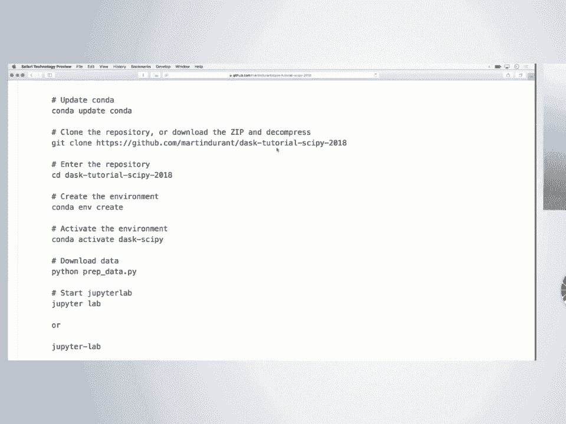

 Hello， everybody。 Good morning。 This is the DAXT tutorial for those that have ended up in the wrong place。

 The text is probably just about legible to you。 I'm expecting people will follow along on their own laptops。

 So ideally， you should have an installation locally。

 if you've followed the instructions on the readme that was sent out。

 And you should get a JupyterLab instance running。 It will look something like this。

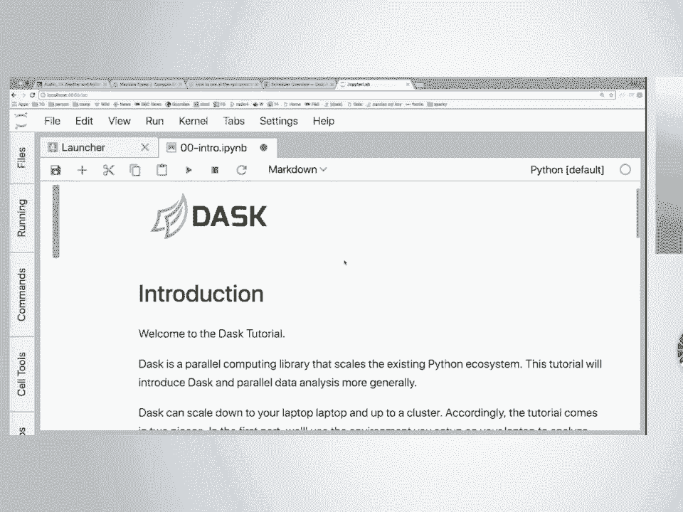

 You will have files here。 This is the first notebook of the tutorial introduction。

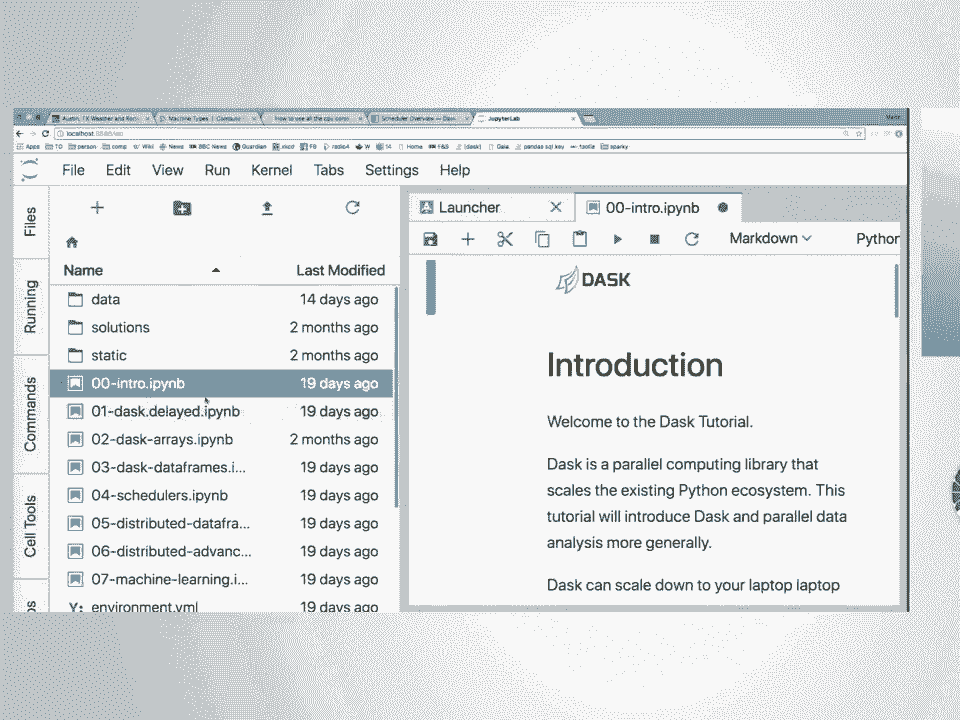

 I don't seem to be able to make the text much bigger than this。

 without it looking funny on the screen。 So if you have trouble， then maybe Tom will。

 Tom is here to help out。 Raise your hand， and hopefully we can get around to each of you。

 There will be a fair amount of talking to start off with。

 so plenty of time to get things up and running。 Don't worry， if you are having trouble。

 we'll get around to everybody。 Also， there will be a cluster that we can jump to as soon as it's ready。

 and everything's working fine。 And if you are having trouble with local installation。

 then the cluster will be using it all together later anyway。

 So people can transition to that if they need to。 For those people that are not used to the notebook interface。

 there is code and text in here and the outputs of code。

 So we will be running through and executing things as we go。

 and you'll be able to see the outputs within here。 We will be running through a set of notebooks。

 and demonstrating a desk from the ground up。 All of the things， hopefully。

 that you're interested in。 Any time you have a question about why did it happen like that。

 or what's going on， just put your hands up， for a general question to the room， and I'll answer。

 If you have a more specific problem like， hey， something's gone strange on my particular machine。

 then try to get the attention of--， there will be a couple of us in the audience。

 going around helping people。 Any questions or comments before we get going？ Oh。

 I hope everybody stayed dry。 So the notebooks will have this common format。

 This is what a code tell looks like。 This is ordinary Python， so you can enter things in here。

 like if I put in one， then it evaluates one， and the output is one。 It should not be too surprising。

 And there will be frequent exercises， which will say something like， hey， write some stuff。

 to do with whatever we've just been talking about。 And then these cells starting with a load。

 which will get a pre-prepared solution for you， once you've given up， or you want to compare。

 what you've done with what we think is a decent solution。 So in this case。

 the task is to have Python output， Hello World。 I hope everybody knows how to do that。

 But just to demonstrate， you would load the solution， and， oh， look， you say print Hello World。

 If you execute this， and you can do that by shift and enter， which will execute and move on。

 or control and enter， which will execute and stay put， then here we have Hello World。 OK。

 I hope everybody is happy with this format。 So I will move on。 By the way， this is running locally。

 If you should not have all of these weird things， on your main screen， so just ignore that for now。

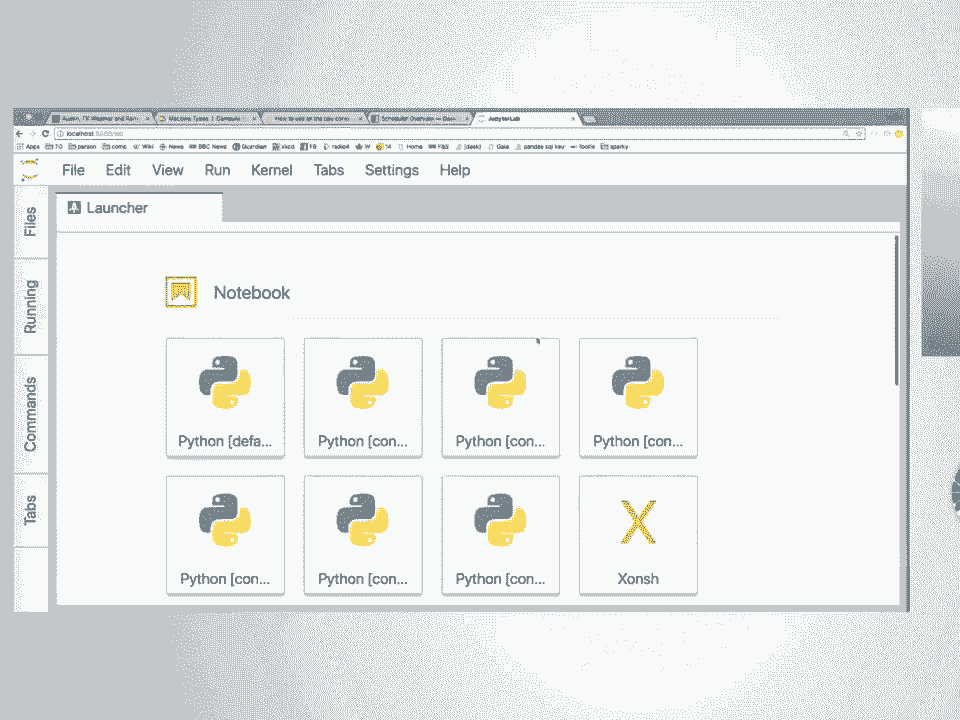

 I will move to the first no book， and we'll actually get going。

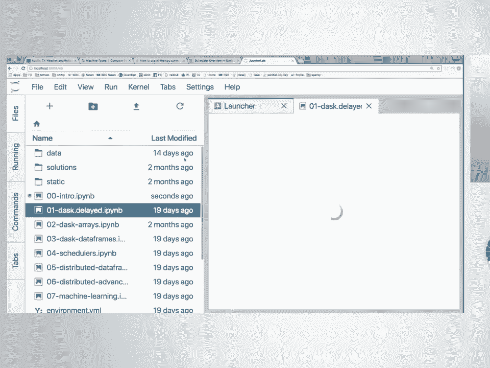

 So now we'll be talking about Dask。 You will all have heard about Dask。

 and you're here to find out how to use it。 So there is a function in Dask called delayed。 It is。

 in some situations， the only thing， that you will need to know about Dask。

 and you can use it to trivially paralyze all kinds， of arbitrary code。

 So here we're going to demonstrate some simple things， with delayed， and in breaks， maybe we。

 can talk about how you can use that for some of your own code。 Also， for those that are interested。

 there will be birds of a feather session on Friday， I believe。

 for people who have had some experience with Dask， to talk about that experience。

 You can come along and see how other people are using Dask。 And also on Saturday Sunday， there。

 will be a code sprint around Dask if people feel， like they want to contribute something。

 because of what they've learned here。 I'll be repeating those at the end of the session。

 so you don't need to remember them now。 OK， so let's get stuck in。

 Here is some ordinary Python code。 This is simulating work。 In fact。

 it's doing something very trivial。 Here we're going to add one to the input。

 Here we're going to add together two inputs。 And there is a sleep command in here。

 to make it seem as if something is really happening。 OK， so now if we're going to add one to one。

 and add one to two， and then add up the two results because each of these functions， has a sleep in。

 this is going to sleep once， sleep twice， sleep three times。

 It shouldn't be too much of a surprise how long this takes。 Three seconds。 This， again。

 I won't point out the features of the notebook。 I expect that people generally know this。

 but in case you don't， this thing at the top of the cell。

 just says measure the time it takes to do whatever is in the cell， in this case， three seconds。

 And z will be the output of one plus one plus two plus one。 So the delayed function。

 which is also a decorator， is a way of getting dasked to execute things in parallel for you。

 without having to worry about how that actually happens。 So there's a single function， dasked。

delayed。 We're going to import it。 And now， instead of calling ink of one。

 we're going to call delayed of ink of one， and so on。 For each of the two functions， we're。

 going to call delayed and then call it on an input。 And z has the output of that。

 Now this ran and it took basically no time at all。

 And the reason is that this thing z is not actually the output。

 It's a prescription of how to make the output。 And I'll demonstrate what that means in a moment。

 To actually execute the code here， the thing that z prescribes， we call dot compute on it。

 So this is now actually going to run the work。 It's going to call ink twice， and it's。

 going to add together those results。 And this takes two seconds instead of three seconds。

 The reason is that back here， the two calls to increment， are completely independent of each other。

 so they can be run at the same time。 To demonstrate this-- so I already mentioned z--。

 is this weird thing that contains--， it remembers all the things that we wanted to compute。

 And we can， in fact， look at how that is。 I'll raise a warning here。

 This thing-- let's make that smaller too--， so that you can see it。

 Not everybody will manage to get this to show up， because the program that is called in the background。

 to make this show is a tricky to install。 So don't worry about it。 It's a nice feature。

 but it's not important to actually， making that run。 You can see what I'm doing at the front。

 We can sort out installation problems， around Graphiz later。

 I don't want to get bogged down in that now。 If you run it on the cluster， it should just work when。

 we get to the cluster， so you can go back and run these。

 And everybody can get Graphiz running eventually。 It's just a bit tricky。 Anyway， this is showing。

 We have two functions， Inc， and they're， going to produce two results， Inc-- 1， Inc-- 0。

 And we're going to pass them both to add， and then we're going to have a result of ad。

 It's trivial to see from this that these two things down here， this processing of the Inc function。

 can happen in parallel， which is why it took a short amount， of time。

 Any questions about what happened there？ I know it's early， and probably the coffee hasn't quite。

 sunk in for everybody， but we want questions。 We want discussion。 Yes？

 First something like a seemingly trivial like this， is there really a big difference between what。

 Dask is doing here？ And let's say if I did a similar thing， I did it with--， Did it with--。

 Number or some other parallelization？ I don't want to talk about number。

 because that's actually really complicated what， that does in the background。

 But if you wanted to do this with a thread， then that would be totally fine。 In fact。

 Dask here is using a stretch pool。 It's just providing a convenient syntax。

 around making that happen。 And really， the point of Dask is to take away that pain of having。

 to write your own parallelism stuff， because it scales from trivial computations。

 like this to rather complicated things。 OK， so we can have some more discussion in a moment。

 because I'm going to introduce you， to your first real exercise， which is we're。

 going to have some data， a simple list of numbers like this。 So let's execute that。

 Now we have some data。 And we have a sum of one plus each of those。

 So we're going to take the numbers in turn， add one to them， put these numbers into a list。

 and then we're， going to call a built-in function sum to add up that list。

 Because ink contains the sleep statement。 Again， it's going to sleep for each of these。

 So I'll set this going， and it should take eight seconds。 And it's running in a single thread。

 obviously。 So it takes eight seconds plus a bit for actually calling， sum and other things。

 And the result is 44。 OK， so you've seen delayed。 You're going to need to call it in some way。

 And I know it's early， but just a little touch of thinking， should get you there here。

 And if you get stuck， then there is the solution， that you can look at afterwards。

 And I'll give you actually 10 minutes for this， to try out a couple of things。

 The result should be 44， and it should run in less time than 8。

 How fast it runs will depend on how many cores， you have on your machine。 In the meantime。

 further questions are anything。 Any thoughts？ Has anybody succeeded？ Few hands？

 Some people still working on it？ Nobody。 Some people given up？ Maybe。 OK。

 so I will show you the solution。 It would not be surprising from what。

 we've seen that you should probably， have a delayed of ink。 That's going to feature here。 Now。

 how many people also did a delayed of sum？ Most people。 OK， so the solution looks like this。

 So ink has simply gone to delayed of ink， and sum has gone to delayed of sum。

 and nothing else has changed except to actually get an output， you need。compute。 So if we run this。

 I should time this。 The output is 44， as before。 And it runs in one second because I have eight threads。

 available on here。 And so all of the ink statements ran in parallel， for my case， for your case。

 it might be different。 Now， what would happen if sum was not delayed？ It still works。 Now。

 any guesses on why that is？ So if we look at total， it looks like this。

 When we've been doing eight completely independent things， they produce results。

 They all go into this one function called sum。 In other words。

 sum actually gets a list of numbers to add up。 If I take away delayed here， did anybody try this？

 This gets a bit crazy。 So what's going on here is the built-in implementation of sum。

 works by taking the first two things and adding them together。

 and then taking the next thing and adding it onto the result。

 Delayed objects like this are clever enough， that if you do delayed thing plus one。

 which in this case， they were all called a y， these things， if you do the first y plus the second y。

 and they both happen to be delayed， then Dask realizes this and it produces a delayed third thing。

 that is those two things added together。 So delayed objects， you can do lots of the normal things。

 that you do with Dask objects and they will still remain lazy。 They won't get evaluated。

 they'll just remember all of the things， that you've done to them。 So down here。

 we have the result of the first increment， and then we're doing an implicit add on it。

 with the output of the second one and then more implicit adds。

 as the built-in Python function is building up the result。 So this is okay。

 It's obviously better if you do the previous version。 It's not better in terms of execution time。

 but it's more obvious what you're doing here。 Something that is delayed。

 if you pass it delayed things， then the function when it gets run sum。

 will actually get those things。 In this case， the numbers。 So I'll put this back to how it was。

 Okay， so a little more involved now。 The reason delayed is so useful and gets around some。

 of the problems and quirks of working with threads。

 and processes and things that people might be used to， is that you can A， just add them together。

 and expect Python to do the right thing like that。 But also you can involve logic in there。

 and decide what to do。 So here this is called flow control。

 And here is an example just to run straight to it。 So we have something that is called double。

 again simulating some work and it's just going， to do two times the value。

 And we have another which is called is even， which it will give true or false depending on。

 whether X divides cleanly by two and some new data。 And now we have a slightly more complicated。

 computation in which we're going to go through our data， and we're either going to double it。

 or we're going to increment it， and then we're going to sum the results up。

 So this is running sequentially in a single thread。 So again， it should take eight seconds。

 Or a bit more。 And then we're going to again do the same thing。

 We're going to parallelize this using delayed。 And the question is which of the functions here。

 do you want to apply delayed to？ Off you go。 While you're still working on that。

 I will show you the solution， and I hope that you will come back to this in the future。

 and try a few different ways of doing it。 As soon as you have more complicated processing patterns。

 there are often different ways in which you might apply delayed。

 and it's going to depend on how fast， each of the individual functions work。

 Whether you want to delay the whole thing， or delay parts of it， whether they're independent。

 it does require a little bit of thinking about。 In this case， it was not that complicated。

 So the clue， if anybody noticed， was to delay things with sleeping them。

 because that's where the work is happening here。 So we want that to happen in parallel。

 So we delay this double it function， and again， delay the ink function。 We did not delay is even。

 Because we want to decide which of the heavy functions to call。

 calling is even takes essentially no time。 So there's no point in delaying that。

 And we actually need the result of it， in order to know what to do。 So if we call delayed。

 we would have to compute it， in order to know which of these two paths to go on。

 So there's no point in doing that。 But we can delay these once we've made the decision。

 and we can again do the same thing as previously， append the results， delay the sum。

 and now we have a total。 The result was 90 and it took 10 seconds。

 So now it takes two seconds and the result is 90。 Again。

 now we have something that is pretty trivially， paralyzed again， we have， well you can see。

 we have some ink calls and double calls， and there's an equal number of them。

 because even numbers are as common as odd ones。 So there are some questions here。

 I already alluded to。 We mentioned delaying sum on what happens here。

 And the actual logic of your problem， won't delay easily in this case。 But in general。

 you should read up on delayed objects， or the flexible， you can do lots of things with them。

 So there's documentation on that。 And then finally， on here is a slightly more involved example。

 So for those that haven't already done so， if you run this prep data file， this will take a while。

 because it's going to prepare some fake data， for all of the exercises in one go。

 If you've already run it， then running it again like this， won't take any time at all。

 which is good。 So set that running and it could take actually， up to five minutes， I think。

 to run through。 Meanwhile， I'll show you what is here。

 You don't need to do anything until your data is ready。 Oh， I am running some。 Okay。 In that case。

 this will take a little while for me too。 I just saw this。

 but that was the first trivial part of it。 Okay， so what's happening here is that。

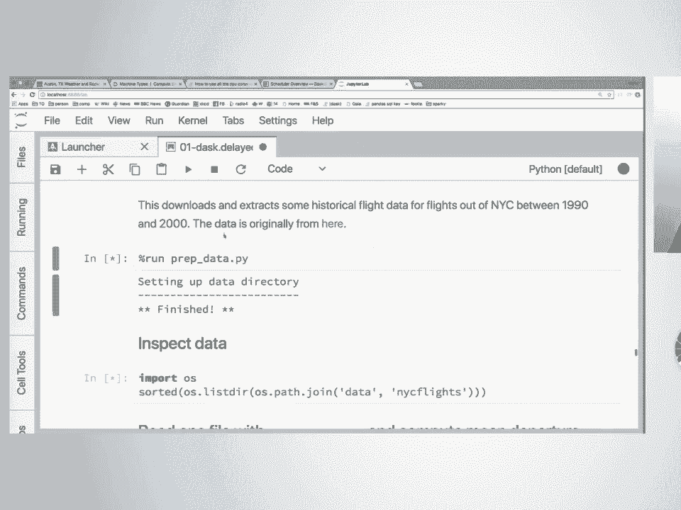

 as a data directory and it's being populated， with various things that we're going to run through。

 for the different parts of this。 And in order to make the desk interesting。

 this is a problem that we have to deal with all the time， there's not much point in parallelizing。

 something that runs quickly， right？ So instead of putting sleep statements in everywhere。

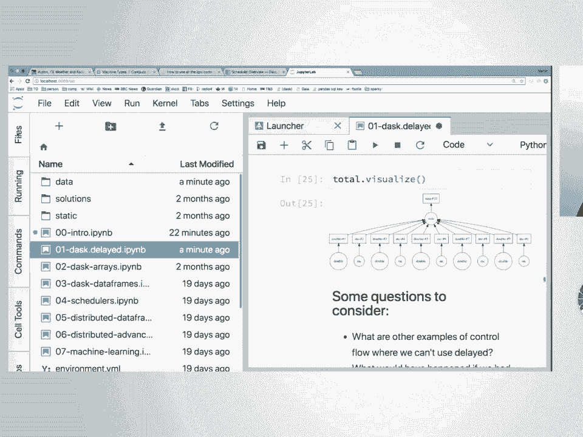

 we're going to actually deal with some rather large data。

 And the first one of these is going to be some CSVs。 Okay， they have arrived， which are flights。

 out of New York City。 There are three airports there， and lots of flights for every year in the 90s。

 I'm sure you're all familiar with how a CSV file looks。 I'm not going to look at them yet。

 But we know if you've ever used pandas， and I expect most people here have at least seen it used。

 pandas is good at reading CSV。 And it does it in a tabular fashion。

 So here are some rows from the first of those files。

 and you see there's lots of details about each of the flights。

 So flights on the very first of January， 1990， so that's when the data starts。

 But sometimes departure， arrival， whether it was late， what the carrier is， etc， etc。

 lots of stuff here。 And we can look at what kind of data this is。 Again。

 don't worry too much if you're not a regular pandas user。 There will be a section of this tutorial。

 dedicated to pandas like functioning。 Depending on the kind of， I guess。

 lots of people here are actually scientists at SciPy。 Depending on what you're doing。

 pandas can be hugely useful。 And Tom here is a core developer， I'm not。 Okay， anyway。

 so this particular data you see has many， many columns， and each one of them has an associated time。

 Most of them are numbers。 Some of these， like the one that says object here。

 is they're actually strings。 So a string in Python is a type of object， so there are a few of those。

 Okay， if we， now this is， if you remember， one of the files only。 I can hear some laptop fans going。

 so other people are prepared to do。 And computations with pandas for something。

 that is sitting in memory really fast。 So pandas is great。 If you can fit your data in memory。

 you can， for example， do this。 What are all the unique origin efforts in this case？

 So these are the three New York City efforts。 And we can do various pandas like things with them。

 which are sort of， if you don't know pandas， you probably do know SQL， so this is a SQL like thing。

 I'm going to group by this， these three。 And look at the departure delays and get the means。

 as a function of those groups。 This runs in essentially no time。

 But what happens if you have a lot of files？ So there were 10 or 11 of these， I think。

 And we want to do the same thing， but we want to do it for all of the years。

 So we're going to do this thing， this group， I think， and we want to add them together。 In fact。

 we want to do some kind of average。 So we're going to have some sums。

 and we're going to have some counts， so that we can do a mean afterwards。

 The sequential way to do it， and I'm sure you've all done this kind of computation， in the past。

 we're going to loop through the file names， we're going to load each of the file。

 We're going to do the group， and then we're going to take the sum。

 and we're going to take the count， and then we're going to add up the sums and add up counts。

 and then at the end， we're going to sum the sum， sum the counts， and then do a grand mean。

 It should take a few seconds。 The time here is actually being spent， in loading the data。

 not in adding it up。 So it takes seven seconds-ish， and here's the totals。

 So it seems that it's best to fly from here， for those that have visited， yuck， I don't know。 Okay。

 and we're going to go through， how you would parallelize this。 Again。

 this is closer to the kind of thing， that you would actually do in your day-to-day work。

 handling data， and here it goes through some of the things， that I already mentioned。

 that these delayed objects can do lots of things。 So once we have a delayed object。

 then we can do things to that delayed object。 So here we have a built-in add。

 we have an item selector， and we have a method call on it。

 And if the thing that we started off with， which is just x here， is delayed。

 then everything here will be delayed。 Why will be a delayed object to that encodes all of this？

 Okay， second， there is this dot compute that we've seen。

 because we've only ever had a single output， for each of the computations we've done so far。

 However， often computations share some common elements， and it's wasteful to have to。

 for each output， compute those shared elements。 So there is also a dask。comput that you can call。

 and you can pass it multiple delayed things， and it will compute them all。 At the same time。

 and shared things， will only be computed once。 So there's a big saving to be had there。 Okay。

 so we already， I think， imported that。 And we need to， again， there will be a solution here。

 We need to apply delayed， and this is the last of your delayed exercises。 So give it your all。

 We need to delay the running of this thing， such that it's much faster than it was before。

 and again， you have options on how you do this。 The solution follows， and the answer is this thing。

 This is what you should get out。 If there are people who have not succeeded。

 in running things locally， there is a cluster which is now running again， 'cause， you know。

 obviously it would break， just before people arrive， in case you didn't know。

 what we were whispering about。 So this is the IP。 Again， run things locally if you can。

 We'll be switching to the cluster later， when we're demonstrating some real distributed。

 larger scale computations。 This IP is available if you need it。 The login is your anything。

 Actually， you can just choose a username， try to choose something that's unique to you。

 so we don't have people stepping on each other， so nobody used one， two， three， four。

 - Do you want me to do data frames then？ - If you like it。 - Take a break， sure。 - I don't mind。

 Let's do data frames next。 All right， erase。 - So you can do your eyes on the data frames。 - Okay。

 - While you're working， I'll tell you a little bit， about this cluster。

 Aside from the fact that occasionally it breaks， which we think is down to Google。

 and not the infrastructure we wrote， it's really nice that you can set up。

 an auto-scaling JupyterLab based thing in 10 minutes。 I think。 We're just a few commands。

 There is a thing called JupyterHub， that's the front end where you log in。

 which when people get to it， in this case has no security， but it could have。

 so you might care about that。 And each person then gets their own unique Jupyter server。

 within which you have your own unique workspaces， and as you'll see， it's trivial to set up。

 desk clusters， which are several virtual machines， that are containers within the same framework。

 which are unique to your workload， so it's isolated from everybody else。

 So if people are looking to teach desk， or want to make a scratch cluster for people to try desk。

 with reasonably heavy workloads， that kind of work， it's a very nice way to do it。

 There is a public use one called Pangio， which is made for general scientific work。

 It was created by a team that focuses on planetary science， including meteorology， for example。

 earth imaging， that kind of stuff， so real science involving real data。

 And people go on there all the time， and they do heavy workloads using desk。

 and they produce results， which is very nice。 And anybody can use it if you have something。

 that seems somewhat legitimate。 For the time being， there's plenty of money。

 Eventually they'll have to tighten it up。 Okay， getting back to this。

 so we'll finish off the delayed section。 I hope people have some kind of idea here。

 I will show you the solution， in which we have delayed one function。 Oh， nothing else。

 So we started off this particular section， by saying that you can do lots of things。

 to delay things and they remain delayed。 So that was the hint。

 Also I hinted that typically you end up delaying， the things that actually take time。 In this case。

 that's the reading， and you don't need to do anything else。 Actually look at that。

 There's your output。 (mumbling)， Okay， now it completed immediately。 Oh， sorry， thank you。

 So it took a factor of three-ish faster， a bit less。

 The reason it's not a full factor of eight faster。

 is because everything is being read from the same disk。 So you will often find you have bottlenecks。

 somewhere along the line， whether it's your disk or the network， or even the display in some cases。

 as you'll see in the array notebook， which is next。 Okay， any questions on delayed？

 So when we did the， what did this even have been， to depend on the output of some competition。

 like when you were able to make a true decision， that students didn't know。

 There are lots of things you could do。 You could paralyze those things that is even needs。

 and then got the result there， and then did something based on it。

 and then you're keeping the logic in your session， in your normal process。

 or you could form a function which in lines， all of those things as well。

 and which you do will depend on what exactly it is。 Yes？ - So in the first exercise。

 I actually delayed the Panda function too， and it's getting much faster。 What's the reason？

 - In the very first call， we didn't actually evaluate anything。

 We just declared that it was delayed， which makes this graph。 - No， no， no， sorry。 Then the second。

 there's the formal， and there's like， beta numbers， and then you do the kind of sound。

 - I would follow。 The first of formal times。 - No， not this。 This one？ - So， see。

 I can wait to the Panda， and then it's getting much faster。 - You delayed the Append？ - Yeah。

 I don't know what's the reason。 - You probably didn't evaluate anything。 I can look at it。

 It's quite common in delay oriented things like this。

 Very typical workflow is that you have a bunch of input files。

 You're going to do one thing to all of them， then you're going to do another thing to all of them。

 then you're going to combine the outputs， or maybe write all of the outputs to another set of files。

 Those things really work very nicely with delayed。

 And you use it typically with arbitrary functions， that you have lying around。

 You don't want to change those functions， to make them more dusky。

 So you can delay them and hope that， they separate out the logic nicely enough。

 for delay to be able to do a decent job。 Yeah。 - Is it supposed to visualize the logic that we need？

 - Maybe this might be big though。 Where is， oh， here's my computer。

 So we have two things here that we could visualize。 (computer beeping)， Sums， which is， oh， sorry。

 let's see。 Oh， we overrode them， okay。 So not immediately， one second。

 So now we have this listed delayed things。 So it's a list of delayed things。

 We can visualize any one of them。 And it's fairly straightforward because we're reading。

 then we're grouping， and then we're getting something， one of the columns， then we're summing it up。

 So these are completely independent paths， for each of the files。 Are you in next？ - In my version。

 I didn't use Dask Compute， for some kind of do the combination sum to counts compute。

 and then I'm taking about the same amount of time。

 So I'm assuming it's just the kill of multi-threading， being saturated。 But the question is。

 it looks like the savings also comes from， read CSP not being called multiple times。

 So is there a sum to that compute is able to read， the graph and figure out that it gets--， - Yes。

 yes， exactly。 So there's sums and the count。 Both depend on the same underlying data。

 so that data is only being read once in this case。 - Okay。

 - And then the saving is from read CSV itself。 The passing of the text is quite CPU heavy。

 So the loading you don't really save on， because it's coming from the same IO source。

 But on the passing of the text that does run in parallel， you can't tell the difference。

 but that's what's going on。 - No， I'm just saying that's amazing。

 I don't have to think about storing or caching， all the intermediate media or something。

 - I hope it's amazing， yes。 (laughs)， Those are question。 Yeah。 - Is there any。

 take the difference between doing the compute， on some accounts and delaying the sum。

 on each of the different ways？ - There is not in this case， this was， it was really， sorry。

 where is it？ This line was to demonstrate that you can share。

 the inputs to the two of these in the call。 If you had done some on them or delayed some on them。

 and then this and your final answer mean， could have also been delayed。

 and then you just compute that， they would have been fine。 - That's what takes longer。

 - It takes longer for you？ - It takes longer。 If you don't call compute on some accounts。

 accounts it will read the CSV for a count。 - It would read the CSV if you had done。

 separate calls on each of them， then it would take longer。 - Yeah。 - Okay， we will move on。

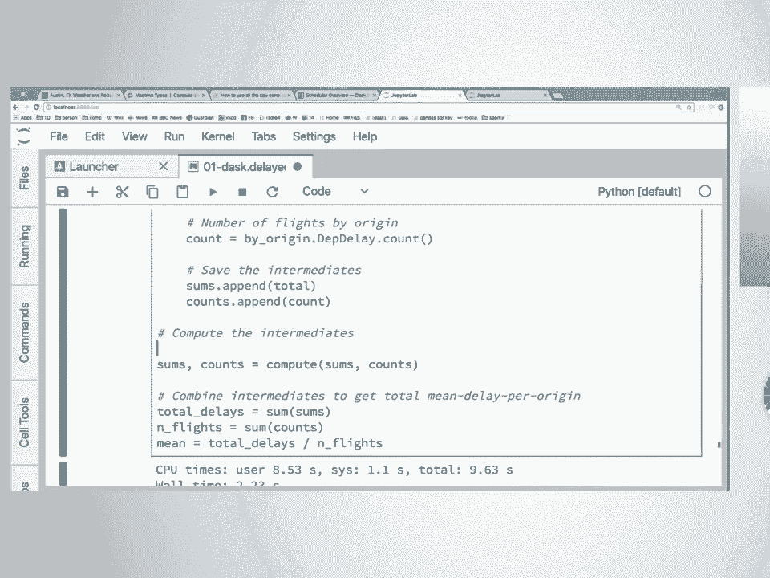

 So how many people in the room would consider themselves。

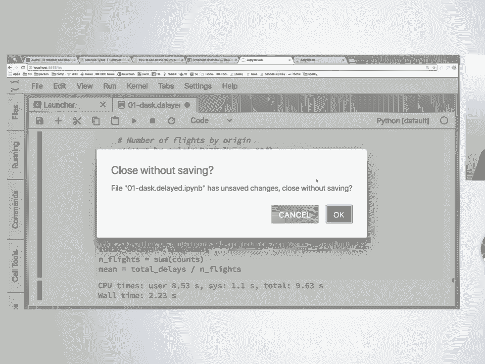

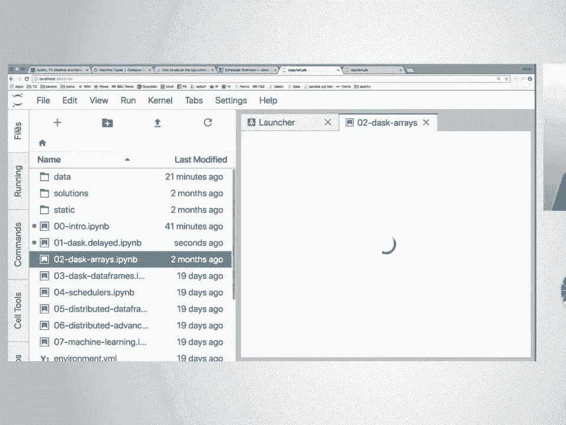

 to be scientists？ This is for my curiosity。 In more than half。 Okay， I used to be a scientist。

 Now I just pretended that。 My particular science was astrophysics。

 I used a lot of arrays in that time。 I never used pandas for research， but people love it。

 So we'll get to that in a moment。 First， we'll talk about arrays。 Okay。

 and we're going to get to this kind of concept here， this image。

 which is you know what a NumPy array is， even if you're using pandas machine learning。

 whatever high level tools you'll know what a array is。 It's a bunch of numbers of the same type。

 that are laid out in a nice way in memory， so that you can do things to them in a very optimized way。

 NumPy is great， but NumPy at the very best， can handle memapter arrays sometimes。

 but really you want to be able to chunk up your computations。

 so that you can do high road things to them， for data that doesn't fit in memory。

 You also get some speed up if you， depending on the kind of computation you're doing。

 if you can run it in parallel。 And finally， what we'll get to later in the tutorial。

 you can spread your data out across a cluster， so that you can fit a lot more in memory。

 than you would have thought。 And actually be able to do things to it。 So。

 Dask has a way of accessing chunked set of NumPy arrays， as if it was a single NumPy array。

 and it will feel the same or work the same。 And in many cases， it will just work。

 with something that doesn't fit in memory， and it will just make things faster in a common case。

 Now it is parallel and there's lots of magic going on。

 in the background so maybe we can touch on some cases， where it doesn't do what you would like。 So。

 the overview is like this。 This whole block here is supposed to be。

 a two dimensional Dask array in memory。 And we can split it up so that each of these smaller pieces。

 is an actual NumPy array somewhere。 Maybe it's a NumPy array that needs to be loaded yet。

 or it's a NumPy array that resides on a different computer， or however it is。

 Dask will do that marshaling for you， but you can understand that you can process an array。

 in chunks and then view the whole thing， as a single logical array by doing that。 So。

 we're going to demonstrate some of these things。

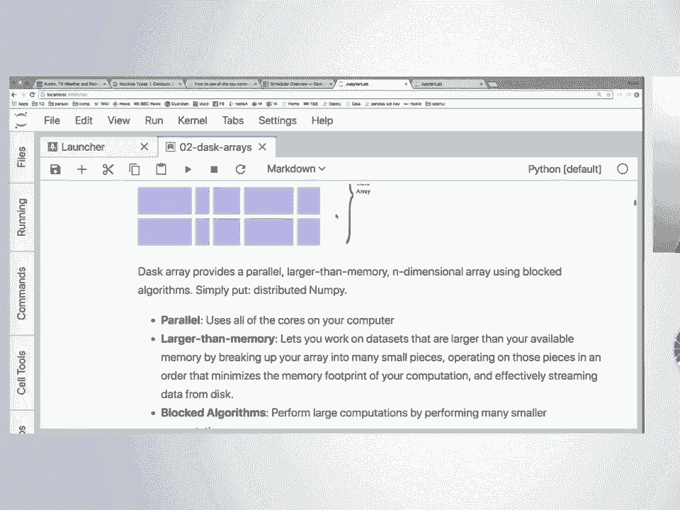

 if what I said wasn't too clear。 But first we'll look at the idea of chunking up。

 your computation in general。 This is the kind of thing that you might already be doing。

 before using Dask perhaps with threads， or perhaps just in a for loop because the data。

 is too big to hold in memory it was。 So， we're going to make a really big array。

 and we're going to add it up。 If you run the prep script then you will have some。

 large file on disk called random， and it is made of random numbers。

 as the name suggests and let's see， I should find out how big it is。 It's four gigabytes。 So。

 it would fit in memory but maybe not so comfortably， depending on how new your laptop is。 Okay。

 so if we want to add this thing up， then this happens to be in an HDF5 file。

 There are lots of different ways of storing data on disk。

 HDF is pretty common in scientific contexts。 And what we can do is this thing called D-set。

 is pointing out the file but it's just metadata。 You can access pieces of the data like this。

 using normal NumPy indexing and we can make some， on each of those bits and do usual thing。

 keep a set of sums， add the sums up and print the total。 So。

 this takes a little while to page through， for gigabytes of stuff on disk。

 And we're having to load all of that。 At some point we'll have to load all of that anyway。

 It completes in a few seconds。 The trouble is what you would normally do is load。

 if you're thinking about a NumPy processing of things， you would normally say， "Oh。

 I have a whole load of data on disk。 I want to load the whole thing into memory。

 so that I can do NumPy like things to it。"， Here we're doing a sort of roundabout way to cope with that。

 We're saying I'm going to load some pieces of it， I'm going to add up those pieces。

 and add up those subtotals to make grand total， so that I don't have to burn away my memory。 Okay。

 I don't think I will ask you to actually do this exercise。 It's pretty trivial。

 Since we can do sums， we can do other things， in a similar chunkwise approach。

 So the sum of each block， the length of each block， in this case we actually know。

 we provide beforehand what the length of each block is， so this is kind of silly。

 But you could imagine having to do this。

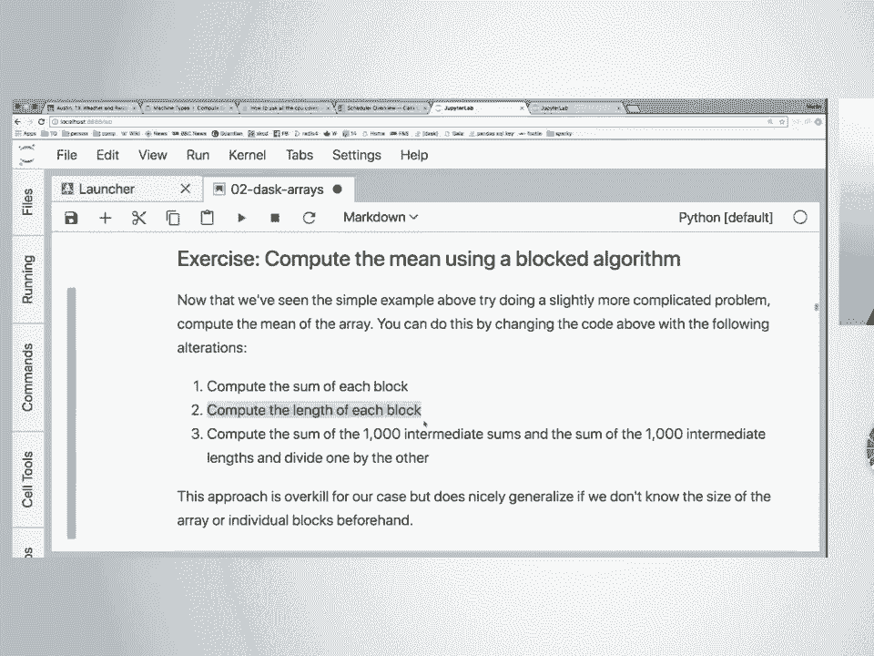

 for calculating mean。 And then we're going to add them all up， and we're going to make a mean。

 So I'm just going to show you this is not desk， right？

 This is just how you might have done things in the past。

 And then I'll show you that desk can do this， for you automatically。 Again。

 you page through these pieces。 You add the sums， you get the sizes， you accumulate all these pieces。

 you add them up， you get a grand total。 And I believe the total should be about one。 Yeah。

 'cause it's random numbers， that are normally distributed about one， I guess。

 But desk has an array module that does stuff like this for you。 In particular。

 we're going to create a dash that array， and we're going to use this function。

 If you look in the desk array， a desk array is usually abbreviated DA。

 If you look in the desk array namespace， you will find a lot of familiar looking things。

 from NumPy like zeros， ones， random， that kind of thing for generating data。

 There are some ways of loading data also。 Possibly the simplest way of loading data。

 is to use this thing called from array。 Which takes an object that supports NumPy syntax。

 which as you already saw， these HDF5 loader objects do。 So when you do that。

 it fetches some of the data。 And that's exactly the kind of thing that from array expects。

 You can also give it an array if you just want to play， with how that's gray works。

 but you probably won't be winning very much there。

 because we already know that NumPy itself is fast。

 If you can fit it in memory without worrying about it。

 then maybe you don't need to decorate in those cases。

 So we say that we're going to load from this object， which points to the file on disk。

 The only thing that we need to tell the desk is how big， we would like the pieces to be。

 This is a one dimensional thing。 So we provide a single number for the chunks。

 You can chunk in each dimension， like the diagram further up the page showed。

 And we will operate on real NumPy arrays， and we will do NumPy like things to them。

 and we will not know that they're being loaded， successfully from desk for us。 Okay。

 so here's a demonstration。 Some， this is what we started off with， with the for loop。

 So here if we call execute this， then X。 Then X is this array thing。

 So it just tells me it knows the D type， it knows the overall shape， and it knows the chunk size。

 But it's just an object in the usual way of desk， and we'll come back to this again and again。

 It's a lazy thing that points to the work， that is to be done。 It is not a memory。

 it's just the prescription。 When we call sum on it here， then we get something else。 This now。

 it's another array， but it has a name aggregate。 It has a shape of nothing。

 because it's just going to be a number， but we do know that it's float， and because it has no shape。

 it has no chunk size。 And again， you see the themes coming back， to actually make this happen。

 we call compute。 And there's our answer， which is the same answer as before。 This is the sum。

 not the mean， the mean is one， I think。 So it's very convenient to be able to just call dot sum。

 not have to write for loops to pass through your chunks。

 but that's really what's happening in the background。 Okay， so I jumped over the trivial。

 how do you actually compute the mean， because there's a really， really easy way。

 to compute the mean of a desk array， and I hope that everybody can do it in 10 seconds。 Accounting。

 you may notice that you have this， this convenient autocomplete。

 All of the things on here are typical NumPy methods， that you expect to have on a NumPy array。

 and they should look pretty familiar to you。 So what would mean be called？ It exists。

 we can call it。 Okay， but it produces one of these。 So what you need to do when you have some。

 some dasky object that you would like want， to know what it's actually worth。

 rather than how it's made， you compute it。 And it's one， as it was before。 Okay。

 so now this was doing two things， through each of the chunks。

 actually it's calling mean on all of the chunks， because NumPy already knows how to do mean。

 but imagine that it's doing some， an account on each of the chunks。

 and getting the total of all of that。 Okay， a bit of an aside。

 NumPy is good at not holding the gill， we mentioned the gill before。

 if anybody doesn't know what the gill is， we don't need to talk about it now。

 but NumPy works fairly well with running things in threads。 NumPy is fast anyway。 Obviously。

 dask has some overhead for whatever you're doing， so something that would be really fast in NumPy。

 you don't want to bother， but for many things， if they're like this， and they're heavy on memory。

 or they're actually really heavy on CPU usage， then it's often worthwhile calling the dask version。

 of whatever it is that you would have been doing in NumPy。 Okay。

 so we're going to go into an example here。 This is using an in-memory dataset。

 again another random number， so we'll be looking at some real data shortly。

 in case you're bored of these。 It's difficult， as I say， to come up with useful examples。

 that actually look like look impressive， as if they're doing something。

 but are big enough to make dask interesting。 Okay， so what we've done here。

 this is again the dask array version of random normal。

 The only difference is that we provide us a size， as you would do for random normally。

 and we also provide a chunks， so that we specify how we would like this to be split up。

 and you can do things like this to it， which shouldn't surprise anyone after what we just did。

 So you can take the mean， you can say which axis， you can do some selections on it。

 Now the total size of this， again， is similar to what we just had， three， three and a bit。

 Google bytes in this case。 And if we want to compute this mean and selection thing。

 this will paralyze， okay。 It will take three seconds， it's actually generating the data too。

 when it's doing doing this， not loading the data like the previous one。

 it's generating both quite fast。 But it did need to consider all of the， this is 20，000 by 20，000。

 so it's a pretty big thing。 And it did means along one of the axes。

 and it did some selection and there's your output， so a bunch of numbers。 Let's get rid of this。

 (audience member speaking off mic)， Okay， now we're going to talk about this rather than do it。

 You can experiment at your own leisure。 So first of all， it's good that。

 we don't have to create this thing in memory， and then do NumPy things to it， although we could。

 certainly on this laptop， on all laptops that you might have bought， within the past few years。

 But NumPy takes a while because it's running， in single thread。

 and it needs a lot of memory to do it， because the whole thing is a memory at one go。

 Dask says it should have taken four seconds， how long did it actually take me？ Three， okay。

 close enough。 Dask in this case is faster， and it takes a lot less memory。

 because it's working on the chunks independently， there are quite a few chunks here。 Okay。

 so there are some questions here， and these are actual questions that I'm going to ask you。

 We could have specified different things to chunks， remembering the overall size was 20，000 to 20。

000。 So any idea， what would happen if we said this？ - No， fire is on。

 This people would be the same as NumPy。 It would run exactly the same as the NumPy version， yes。

 Because one of these chunks would have been all the data， you would only have one chunk。

 and really what Dask is doing is calling NumPy。 So it would make this one chunk。

 it would call a NumPy thing on this one chunk， and get the result。

 So it would incur all of the time and memory overhead。

 of having the whole chunk and working on the whole chunk， in one go。 There would be no parallelism。

 'cause you only have the one chunk。 So in some ways， Dask is kind of stupid。

 It's not going to automatically split things up， without you saying something about it one moment。

 And in fact， Dask will only add some overhead to it。 Not very much overhead in this case。

 it would run essentially the same time。 Yes？ - So I'm using that as an answer to my question。

 And when you have the idea also， we have to get into a little bit of the idea， of the other one。

 so we have to get， where you call the cutting or that or the cutting。 - Okay。 - Obviously。

 in the view that we've asked。 - It says possible to over-script subscribe threads， yes。

 So if you're depending on Dask， because you want to have the out-of-core。

 low-memory solution to whatever you're doing， then you may want to restrict the number of threads。

 that there are actually a few things， that use threads together with NumPy arrays。

 And you may want to restrict them to one thread， so that they're not competing with each other。

 - Yeah。 On the other hand， if all that you want is parallelism。

 and there's already something that you're using， that solves the threading problem for you。

 then in those cases where it fits in memory， maybe you don't need to switch to Dask。

 So it's a choice。 Second question， what happens if we set this chunk size， to be rather small？

 (mumbling)， - It's time to take longer because of the overhead of Dask。 - Yes。

 I didn't see who said that， but yes。 It's， that's quite right。 So in this case。

 the time spent on calculating， the sum and size of each of the pieces， is very。

 very fast because NumPy is an optimized thing。 And the overhead associated with Dask's part。

 of deciding which to call and setting up all those things， becomes important。

 And so the total amount of time taken will be much higher。 Another way of thinking about it is that。

 the total number of chunks， and therefore the total number of function calls。

 that this will involve will be massive。 And each of those function calls requires。

 some time to happen。 There is a minimum time even for the simplest of computations。

 And so the total time taken will be very large。 Also the graph。

 so the prescription of how you go about， doing this computation will be very large。

 And the graph itself will take a lot of memory， which is something that it will take a lot of time。

 to create and take up a lot of memory， which is something that people often don't think about。

 But it's worth keeping in mind。 Okay， if you run prep， then this should run very quickly。

 I'm going to demonstrate some real data。 So again， this is a CF5 data in this folder called。

 WeatherBig， which is， I believe， actually rather big。 Again， let's find out just how big。

 So this is 17 gigs， which doesn't even fit on this laptop。

 It may fit in the memory of a real workstation。 And we can do things to it。 We can sub-sample it。

 get one of the subsets of data， and sub-sample it。 And if we do that。

 then we can actually make an image。 So， sorry， this is just the first few elements， so that's fast。

 But if we actually want to read the whole one， of one of these data sets and sub-sample it。

 so that we can make an image out of it， otherwise map that they would choke。

 But this still takes a while just to create an image， out of one of the pieces of the data set。

 So this gives you an idea that this data now， is fairly hard work。 And it looks like this。

 So this is temperature。 We are in this hideously hot place somewhere over here。

 So this seems to be the winter， so it was， I suppose， climbing at the time。 Okay。

 so here's your actual Dask array exercise。 The first one， make an array out of the set of data sets。

 And we will be using the from array function。 So go ahead。

 In a moment we'll be making a single array， out of the set of arrays。

 So you'll end up with one array per input data file。 These things。

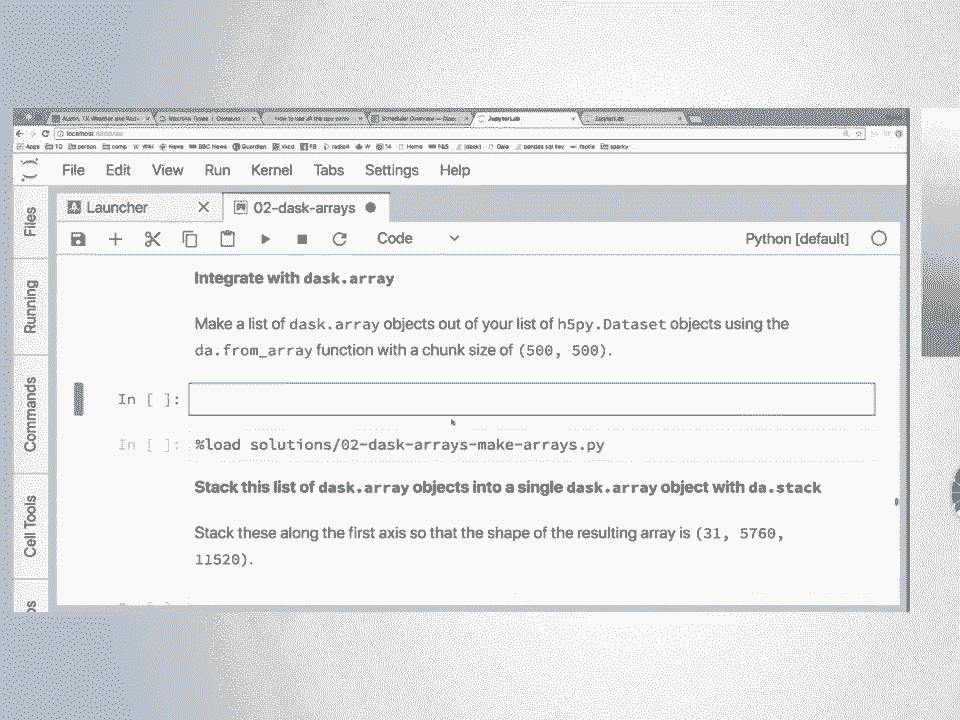

 these are the file names。 Sorry， they were the open file pointers， these H5 pi things。

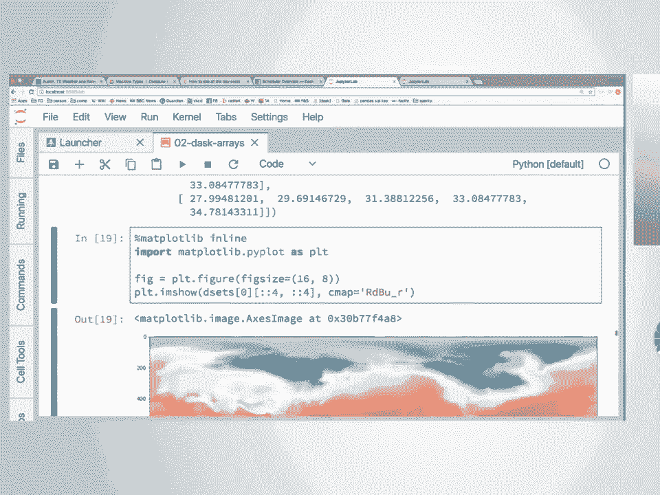

 (mouse clicking)， We'll be having a break in 10 minutes， so that you can all get coffee and snacks。

 before they take them away。 (mouse clicking)， Actually to the end。

 I won't leave you waiting on this one， because we already saw the solution essentially。

 This call from array on each of our， HDF object things。

 The request here is to have a chunk size of 500 to 500。 Don't worry about the particular numbers。

 that you should be using here， just take those。 And we're going to do it for each of the certain number。

 actually， I don't remember how many of these there are， for the certain number of dataset objects。

 And having done that， we'll have these things。 So now it's just a list of Dask arrays。

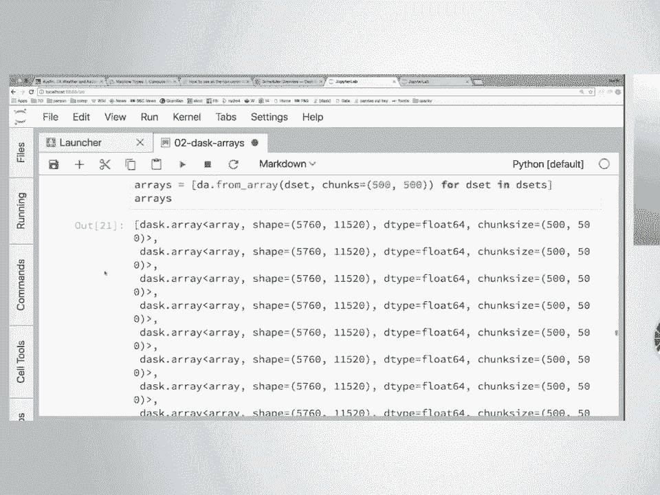

 And the second part of this， that's quite a few of them， about 20。

 The second part of this is we're going to look， at a new function stack。

 which does this stack an array along a given direction， so that we have an overall aggregate array。

 of those arrays。 The only thing that you need to worry about here， is each of these arrays。

 you see its shape。 Isn't that size？ And we would like， sorry， it was 31。

 apparently 31 of these files。 We're going to stack it such that the overall array。

 has this shape when we're done。 Given the call signature here。

 I think it should be fairly obvious how to do that。 I'll give you a moment。

 And keep asking questions if you have anything。 (keyboard clicking)， Okay。

 and it should look like this。 So the thing that we made conveniently was a list of arrays。

 the thing that DADOT stack needs is a list of arrays。 And there are 31 of them。

 and we're told that we're going to need something， that's 31 and the rest of it。

 So axis zero is the direction in which we want to stack this。 Okay， and now we have this thing。

 So this is rather， this is the full 17 gigs。 Being referenced， there's a single object。

 on which you can do normal non-pil things， and it will， anything like that。

 will be computed chunk by chunk from each of the set of files。

 in a way that you don't need to worry， about how that actually achieved。

 Computations will be in parallel， but you still need to hit the desk。 So things will run slowly。

 There are a couple of exercises here。 I think this is a good time to break， so that you can refuel。

 I would like you to try these exercises， possibly get some coffee and then try the exercises。

 and we'll start again at about half past。 - Okay， so for the rest of my book。

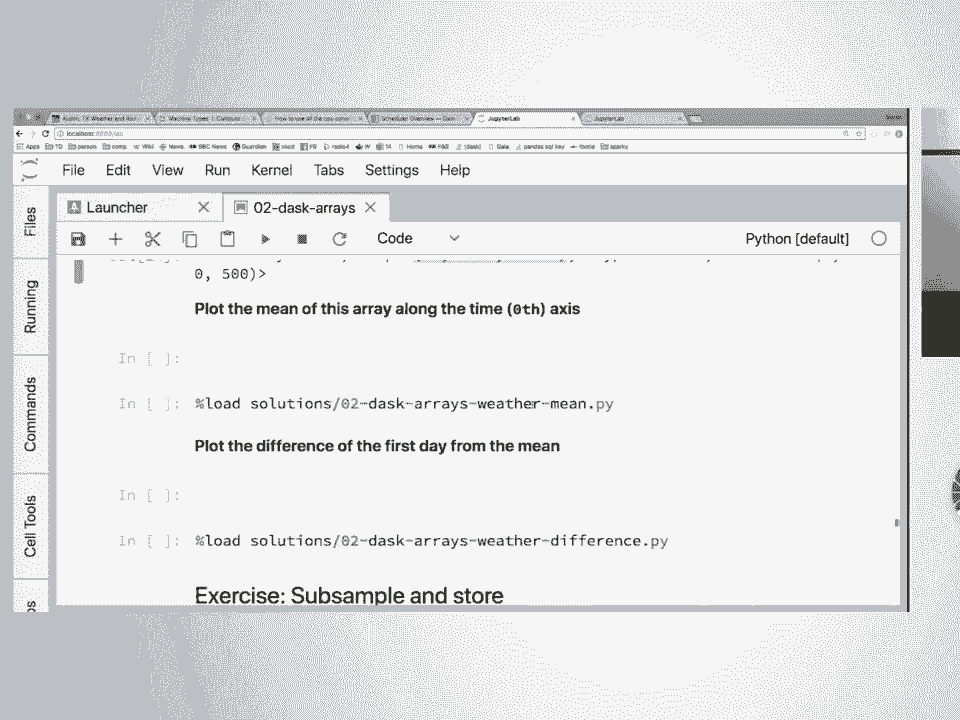

 there's data frames scheduler， distributed the data frame， distributed data frames。 - Yeah， yeah。

 and machine learning， we never get to the end。 That's the only thing。 - Yeah， yeah， yeah。

 if we get there。 Is there something that you want out of that？

 - I honestly don't think we'll get there even if， well， four hours is too long。 I don't think we'll。

 - Yeah。 - Yeah。 - Okay， I just want to thank you。 That's distributed。 - It's distributed。

 - Didn't you mention it？ - Mm-hmm。 - You know， we're talking about that。 - We can't talk about that。

 - So it's das， github。com/dask/dask-tutorial-infrastructure。 That has the setup。

 and then that'll point you towards Pangio， which is the project that did all that。 So。 - Yeah。

 if you do search on Pangio， just Pangio？ - Probably。 - Pangio data。 - Yeah。 - Yeah。

 there's a fair amount of information there， on how you would go back in your browser。

 and if you don't want to follow us specifically， SAS app。

 - It's very specific to Google Cloud Platform， which is where it's all running。

 but if you have like an HPC cluster or something， there's。 - Yeah， there's a research。 - Okay。

 perfect。 - So。 - So。 - I would go straight to Pangio data。

 and there are people who've done it on a bunch of systems。 - Yeah， most of it is Jupiter-5。 - Yeah。

 - Really， that's how this works。 - Yeah。 - So whatever。 Have you had any direct code in that？ - No。

 no。 It's just configuration。 - Jupiter-5 is on。 It's nice。 (laughing)， - So people will need it。

 - Oh yeah， one person is asking。 I think you got it。 You're good。 So yeah， you can go back。 - Okay。

 The IP after cluster is up in front of you， in case you're having some local troubles。

 Some people seem to have had corruption in their HGFI files， for some reason。

 It's not very important。 You can go back and recreate them。

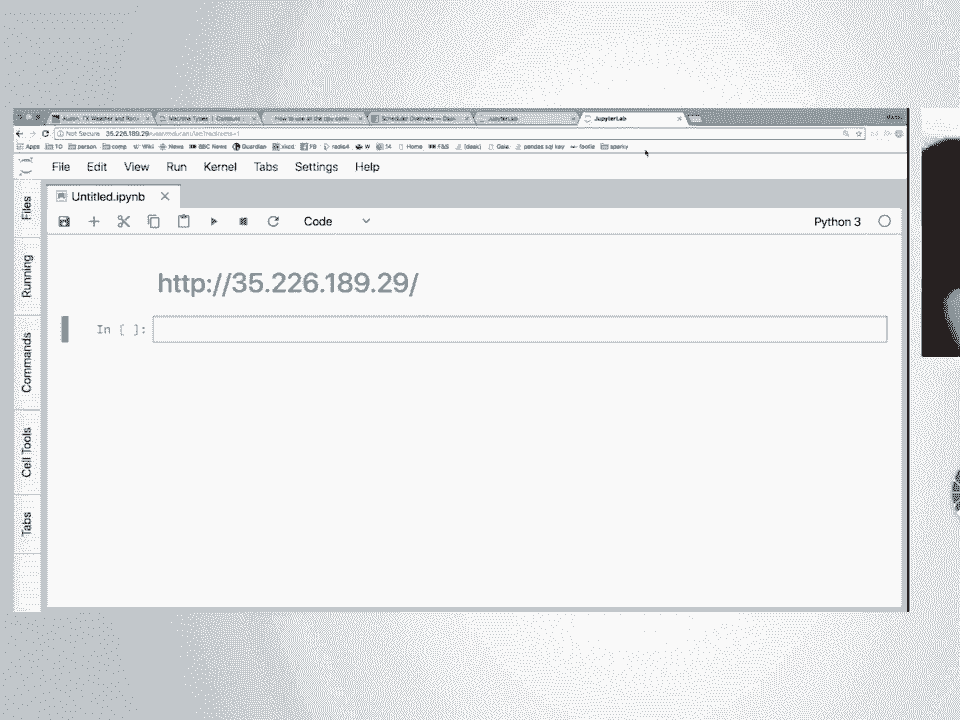

 and redo this at your own time anyway。 As people are filing in， I will show these。

 which are fairly straightforward。 But I don't think I'll add one more。 I'll run it。

 This takes a little while。 So there are two things here。 One of them was the mean。

 A longer particular axis。 The axis here is between datasets。 They're separate times。

 I actually don't know what the timescale is。 Don't ask me about the data。 It's just pretty。

 but showing to you people。 So this is reading through all 17 gigs again。

 And it's doing sensible things with the chunks， so that it can create an average without having。

 to load all of the data into memory once。 Because there's quite a lot of it。 It takes quite a while。

 Even rendering it onto the screen， takes a little while here。 So while that's going on。

 I can keep chatting。 And then the second one of this， is going to be， difference between the mean。

 So now it's ready to show it and then it shows it。 Okay， so this is the mean。

 And you can see that at this particular time， Australia was extremely hot。

 And then if we want the difference of one of them， from the mean。

 we can just do something like this。 This result is also a desk array。 When you call compute on this。

 which you notice actually， we're not explicitly calling compute。 It just so happens that image show。

 tries to convert whatever it's given directly， into a NumPy array。 That's something to keep in mind。

 There are functions out there， that will undaskify your arrays。

 So keep that at the back of your mind。 So if I set this running， this is taking。

 is doing a NumPy like thing to our array。 It's resulting in another desk array。

 And then when we compute it， it's again sharing intermediates。

 all that good stuff working job by chock。 So that when it's done。

 we'll get a another image that won't log that， different from this。

 but it's just to demonstrate that you can do several things， in a very NumPy like way。

 While that's running， I'll introduce the next bit。 We won't actually run this exercise。

 We'll get onto data frames。 Yes。 - Is that the way to visualize， the pass graph executing。

 or at least some of the processes？ - Yep。 It will be very big。 First。

 I have to wait for it to compute。 You can do this。 If you have graph is running。

 which we didn't get to yet。 Then， there we go。 Okay。 So on this particular day or whatever it was。

 compared to the overall mean of this data， it was very cold in Canada and hot in the Goby desert。

 I'm guessing。 I don't really， there aren't any border lines on here。

 So let's say that's where that is。 Let's see if this actually renders。

 We have a very many pieces of this， 'cause the chunk size was moderately small。 So we'll see。

 This might fail。 The final part of this is going to be。

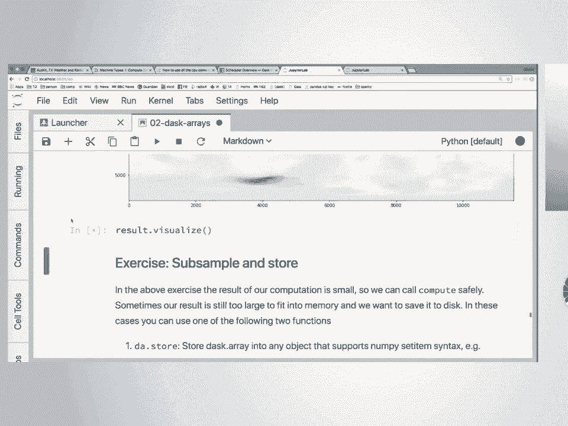

 so if we make this， we can also store it。

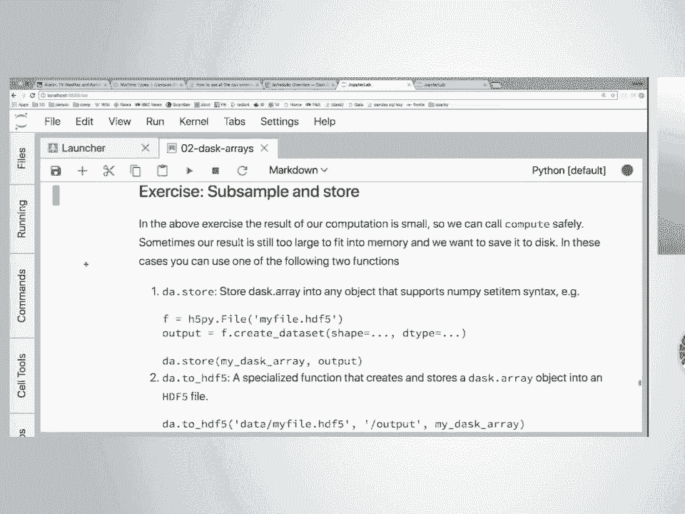

 This is something that you will commonly want to do。 HDF5 is again， typical format。

 I'll also like to mention a data format called XAR， which I personally like very much。

 which is very convenient for working with Dask， because the individual data pieces。

 are stored in separate files。 So it works very nicely with storing your data。

 to remote services like S3， and accessing it in parallel with Dask。

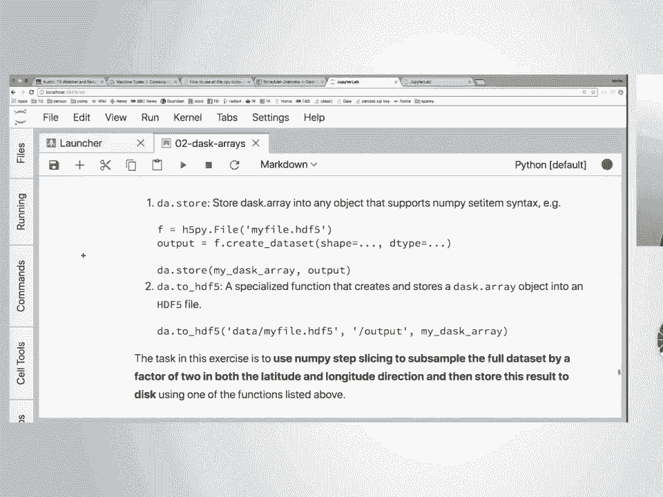

 So I encourage you to lock that up。 Not many people use it。

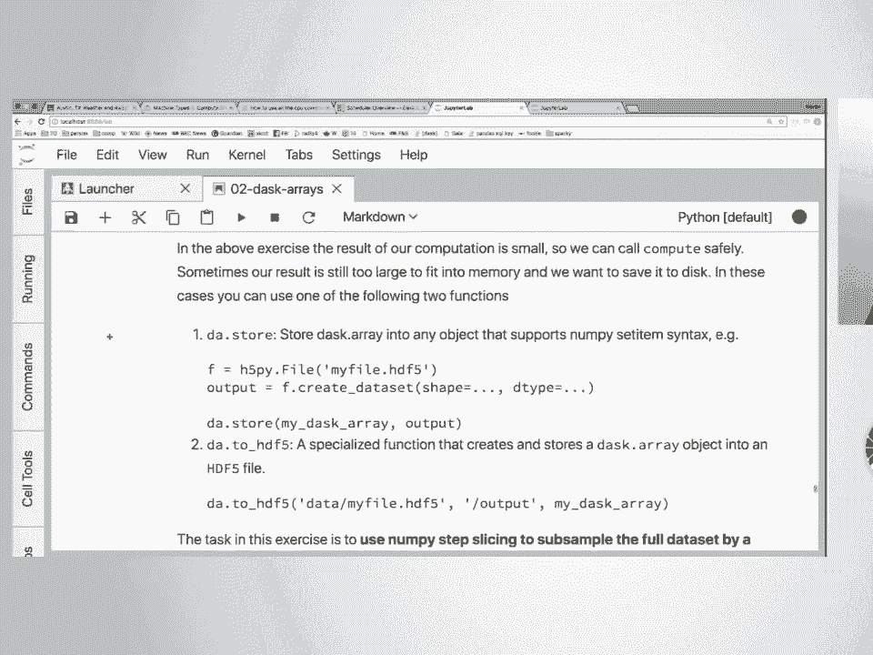

 so it's not very good to send data into change format， but maybe it's convenient for you。

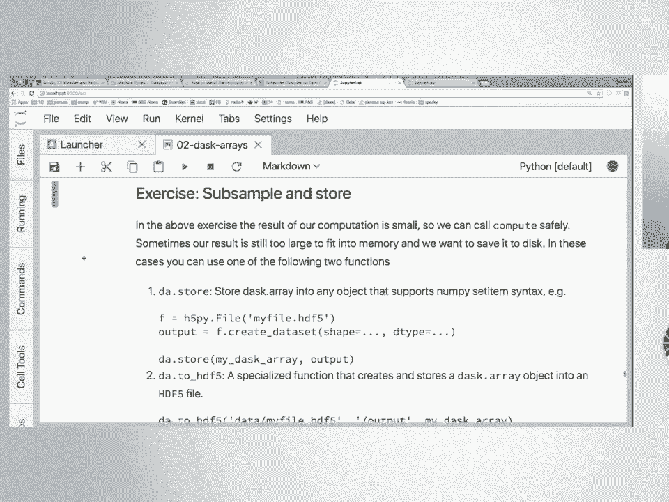

 I don't think this is going to complete。 Yeah， so it's too big。

 There are limits to what graph is can do。 It is just a Unix utility。

 It probably would have visualized， okay， we'll get onto the distributed scheduler。

 and it comes with its own dashboard。 And that also visualizes graphs。

 in a rather more simple fashion than what graph is does it。 I'm sure it would have shown up。

 okay on that。 Okay， this is quite long。

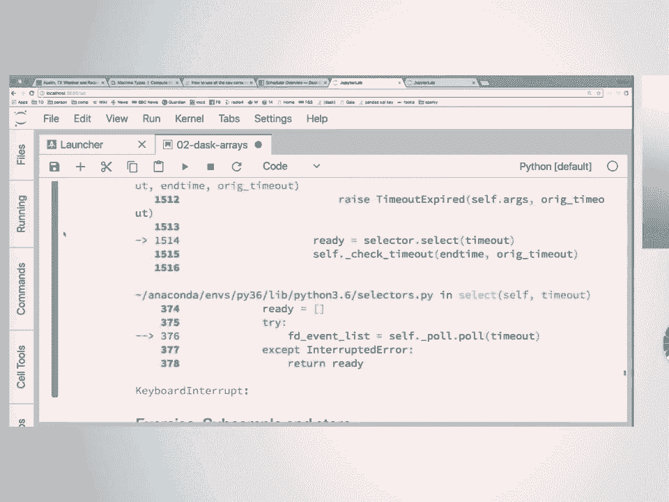

 All right， so I'll go through the rest， of this notebook quite quickly。 So yes， you can store these。

 and I'll just show you the code of how you would do it。 And it's essentially just calling。

 that's grader two， hf5， you're going to give it your result that you make before。 This is some。

 the exercise asks you to do some sub-sampling， so this is simple sub-sampling。

 Uses all of the data as input， but only writes out every fourth pixel。 Two hdf5。

 you give it a file name and it goes， and you don't need to worry about the chunks or anything。

 like that， it's all handled for you。 And then the final part， which is actual physics。

 here is the physics。 We have some one over r2 to the six and one over r3b。

 This is a particle-particle interaction。 If you're not into physics， that's fine。

 The point of this is that it takes a while， because if you have lots of particles。

 then particle-particle interaction， has to be between every single pair of them。

 there's quite a lot of them。 So the basic， this is a value of the potential energy， of the system。

 don't worry about it。 That's what it is， you can believe me。 And it takes this long。

 And if you run this， which I won't bother now， for the sake of time， I think I'll just wrap up。

 this array stuff， you will notice that all these functions。

 that are required to actually compute this value， the thing that takes the most time happens to be this one。

 because we're doing some kind of fancy numpy things， to calculate the set of clusters here。

 set of clusters there and find the pairwise differences， between all of them。

 That is the distances between every pair of particles。

 which you then use to calculate the potential。 So that's what takes the time and that's the bit。

 that Dask will want to parallelize。 And to do it， the only thing that we need to do， is again。

 cluster is our input， it's an array， we turn it into Dask array by saying from array。

 we assign some chunks。 In this case， we're explicitly saying chop it up。

 into however many CPUs we have。 So that we can run those separate chunks all in parallel。

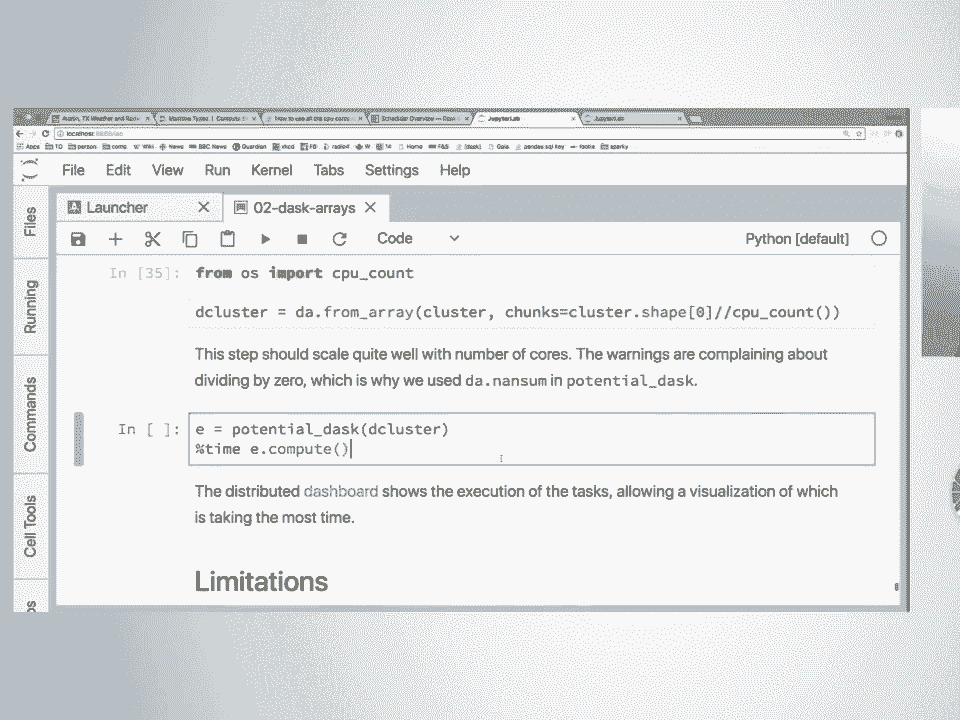

 they're all independent of each other， and this runs in a fraction of the time。

 It was five and a half seconds。

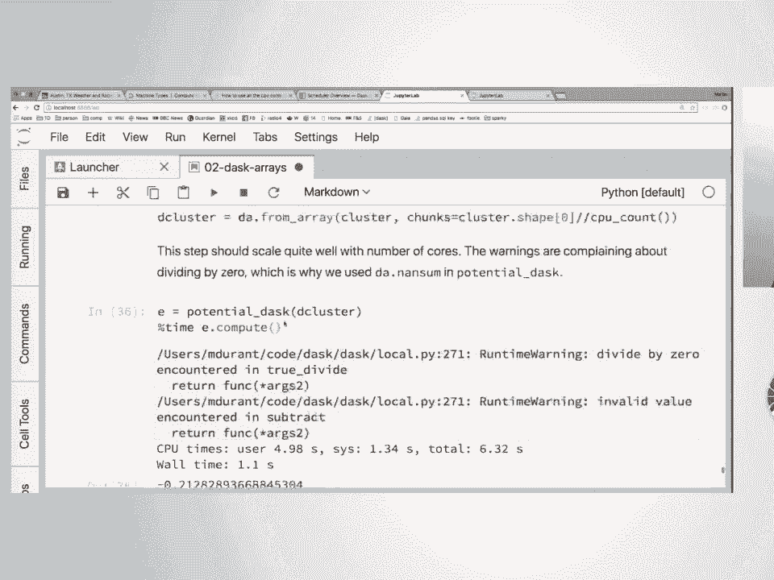

 Here is one second， so good speed up there。 And some general text about when Dask array might fail。

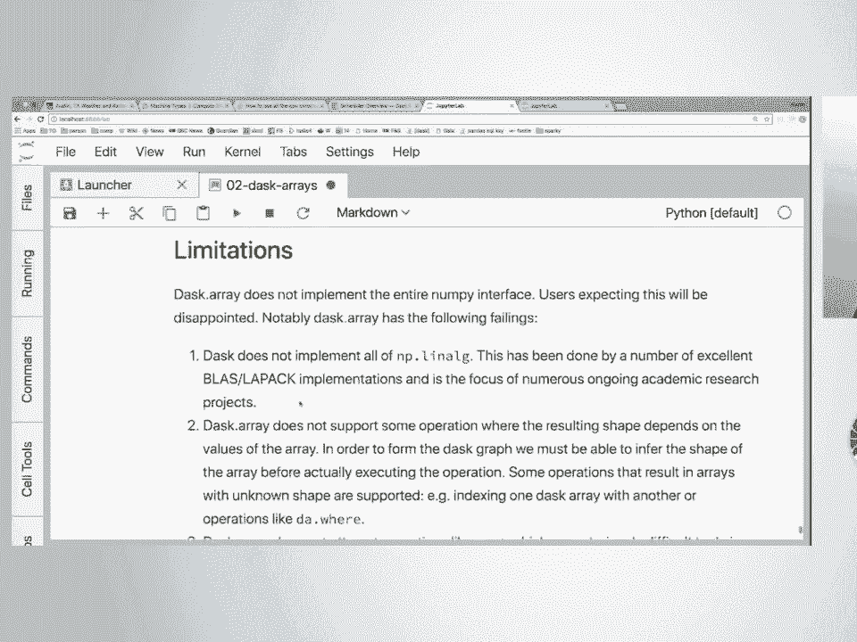

 I leave this for you to read again。 There's a lot of detail here。 If you have array heavy workloads。

 then I encourage you to read this in detail。 Of course。

 the documentation has a specific array section， to it that you should look at。

 Part of the reason that this is complicated is， because there are already many optimizations under the hood。

 Some of which use CPU wise tricks。 That when you split the data into sections， those tricks go away。

 So it's possible to have worse performance in Dask。

 than it would be in something that is heavily optimized， to knowing how to handle your CPU cache。

 or something like that。 Okay， so I will stop that and hand over to Tom。

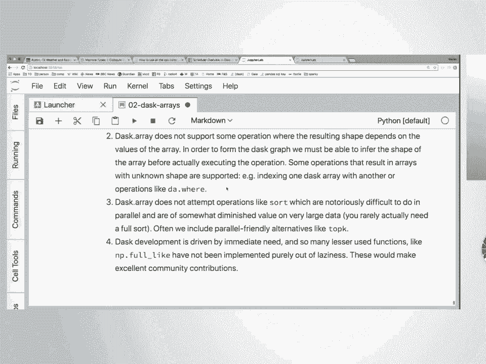

 who will take you through data frames。 Were there before I close this， any last questions on arrays？

 - Yeah， that's a question。 - The chunks parameter seems to be pretty important。

 for using a few of the modules of time for two matter， because it's kind of improving and seeing。

 finding a nice balance for your particular--， - Benchmarking is always a good idea。

 for what you're doing。 The rule of thumb is that the time to process each chunk。

 should be significant compared to the Dask overhead， which on the simple thread based scheduler。

 that we're using here is of the order， hundreds of microseconds。 Couple of， it's small。

 but not pie as fast。 Another rule of thumb if you're doing something。

 that is memory heavy is you don't want， whenever you do something with non-pilutant。

 to have intermediates created as you go。 So whenever you add together two non-pilaries。

 you usually have some temporary array， that you fill in with them。

 So if you have several threads that are running， eight typically or something like that。

 if each thread has an input chunk or multiple input arrays， that it's working on。

 each of those will have several copies。 So it's worthwhile to have things of the order 100 megabytes。

 is a good place to aim for so that you don't run out， of memory while you do these things。 Also。

 it depends in which direction you mean， to do your computation。

 So if you're taking means or whatever it is， along particular directions of your array。

 then it can make sense to set your chunks that way。 - On that deck， can you just chow us。

 based on memory of di-loin？ - Sorry。 - Is there a way to directly specify。

 what chunks turns a path to the anxiety？ - There is recently a magic re-chunk。

 which will aim for a target memory size。 So yes， there is such a thing。 In most cases though。

 you know the data type， that you're dealing with， so you can figure it out also。

 There is the startup chunks to think， like random does already support。 - Thanks a lot。

 - It did go a little bit too。 Yeah， I'm pretty sure that we just put it in。

 so that we were using random here。 The chunks parameter there， you can have auto in there。

 So you typically need to specify something， don't just leave it completely up。

 but it could be interesting to see， what automatic does for you。

 - Is it possible to use that with a C extension， that operates when you move by race？ - Yeah。

 NumPy itself is already a C extension。 And so yes， anything that Python can do， that's can do。

 the things that you don't want to do， is alter the values of a race in place。 Generally across desk。

 most desk things expect you to give an input， produce an output separately。 And generally speaking。

 you should always try and keep away from mutation in place。

 - You probably cannot pass the late object， - The C function。 - No， what happens is that you delay。

 the Python function that calls the C code。 Okay， so we'll leave on。

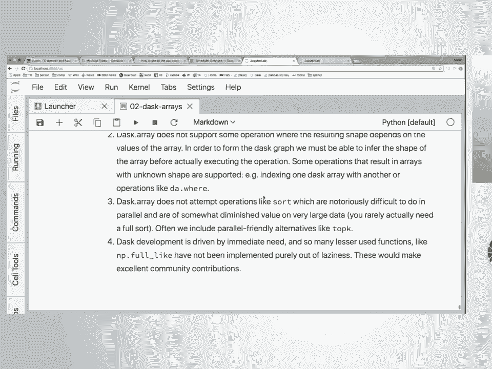

 - Alrighty， so yeah， so if everyone wants to get the third notebook， opened up。

 talk about data frames。 I know Martin asked this already， but who here has used pandas？ Okay。

 I'd like to see that。 That's great。 So yeah， so this is another collection。

 So we saw a desk delayed， which is a way to take your own custom code。

 and get it working well with desk， get it paralyzed building up these task graphs。

 We saw a desk array， which is one of these high level collections， like desk data frame。

 That kind of does that task graph building for you。 So we'll see another thing。

 where it feels like pandas， only it's doing these kind of delayed task building stuff。

 that you come along later， and compute stuff in parallel。 So same idea。 Okay， great。 And yeah。

 so when to use desk data frame， you know， pandas are still great。

 And if your workflow fits well on a single machine， your data isn't larger than memory。

 then continue to use pandas。 There's probably not much of a reason to use desk。

 if you have an in-memory data set， that fits on a single machine。

 If you're doing stuff with strings， pandas is really slow with strings。

 So maybe a desk can help out there， but in general。

 a desk is useful when your data set grows larger than memory。 Okay。

 So we'll do our usual imports here。 And so this will import， a desk data frame as DD instead of PD。

 And most of the things in， you know， DD dot in the DD namespace， is gonna look like pandas。

 So there's like， you know， two date time， things like that。

 And then this is gonna make a desk data frame。 And that has most of the same methods， as pandas。

 a pandas data frame。 One thing to call out here is that， you know。

 desk is all about operating in parallel。 So whereas pandas reads CSV takes a single file。

 desk data frame will take a， you know， a list of files or a glob string。

 pointing towards a list of files。 Okay。 Any questions on that？ All righty。 And then again。

 just like desk array， uses NumPy to do the actual computation。

 desk data frame uses pandas to do the actual reading， of CSV， parsing the text。

 all these various things。 Okay。 So most things in desk data frame are gonna be delayed。

 One of the exception is df。head。 It's useful to be able to get a concrete result。

 So this computes immediately。 And we can see that this desk data frame structure， you know， is。

 we have our， a bit of info about the columns， about the data types。

 But then if we wanna actually look at some data， we can call df。head。 And this takes a bit of time。

 'cause it actually has to start reading some data， parsing it and so on。

 And then we get our first five results here。 We're on the next cell。

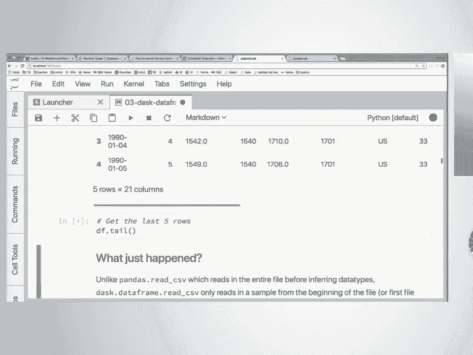

 and we get an exception。 So I think if you scroll down to the bottom here。

 there's some intermediate desk code here that's a bit ugly。

 But if you go all the way down to the bottom， you'll see this nice little exception message here。

 Telling you is exactly what went wrong。 So we have this collection of files。

 CSV files don't have types associated with them。 So pandas just tries to infer。

 Dask leaves all that to pandas。 And we run into the situation。

 where the inference for the first file， inferred something different。

 from the pandas inference for the last file。 So we get this tightness match。

 Those would happen if you were using pandas by itself。 Only Dask is checking it for you。 Okay。

 so how do you solve this with pandas？ - For what is the type？

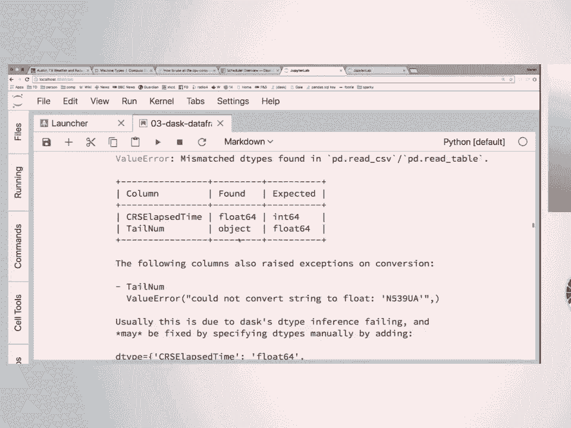

 - Yeah， exactly。 So pandas has a D type keyword， which we'll scroll on。

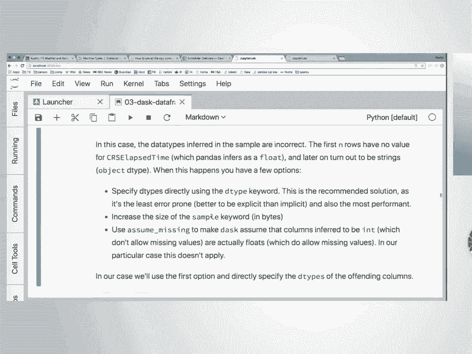

 Oh yeah， so the exact error is that， yeah， it's a fun one。 There's a couple for like this first one。

 Pandas doesn't currently have integer in a support。 So pandas marks missing values as in P。NAN。

 which is the float。 If you have a column of integers and one missing value。

 it's gonna become a column of floats。 This is being worked on soon。 It may be merged today。

 actually。 So optional， but yeah， maybe merged today。 Anyway， so for now。

 we just have to deal with this， by saying， oh， this column， you know， it's actually floats。

 since there are missing values。 Maybe there weren't any missing values in the first set。

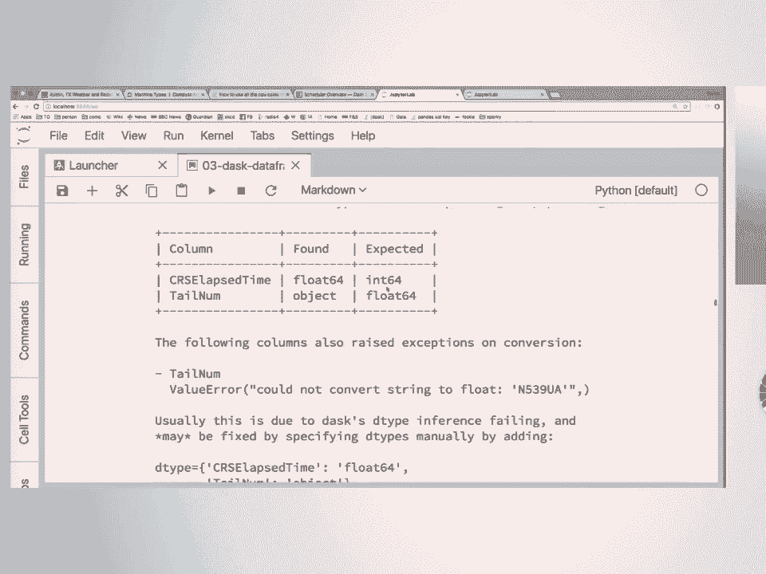

 and there were some in the last one， and that's what messed it up。 Similar sort of thing here。

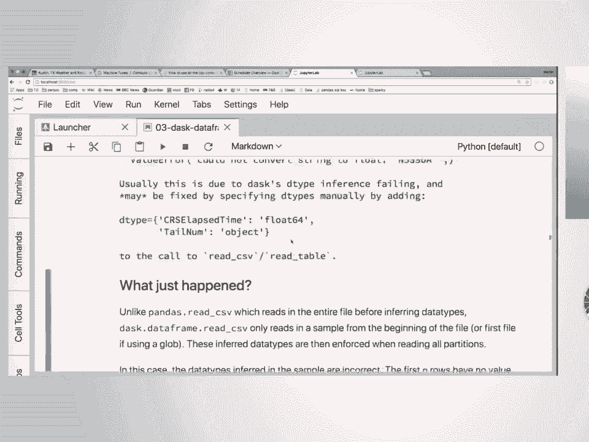

 So we'll just be explicit about our D types。 Okay， so we'll specify these exactly。

 and then tail will now succeed。 This is important when you're working。

 with multiple sources of data， where you wanna basically remove all the inference。

 'cause that can very easily go wrong， if you have multiple files， or switch to a better file format。

 Okay。 All right， so earlier in the Dask Delay notebook， we saw an example。

 I think we're gonna do the exact same thing。 I'm only using Dask DataFrame now。

 So usually you won't use Dask Delay， and Dask DataFrame together。 Typically it's one or the other。

 You might use Dask Delay to do some pre-processing， of your data。 You know。

 that's very special for your data set， and then convert it to a Dask DataFrame from there。

 But once you have a Dask DataFrame， you're not gonna be delaying functions on it。 Okay。

 so in this case， we wanna compute the maximum delay， over the entire data set。

 So we can go ahead and run that。 You know， again， just like Dask Array。

 most of the methods on Dask DataFrame， are gonna match their Pandas method。

 Only they're gonna be lazy。 They're gonna have a delayed result。 Okay。

 so I think this is in minutes， seconds。 Yeah， I think it's in minutes。 That's a long delay。 Okay。

 so this would be the delayed results。 DD。scaler， we know it's a single value result。

 that we can then compute。 Any questions on that？ Yeah。 (audience member speaking off mic)， Okay。

 (audience member speaking off mic)， Interesting。 If you change this， was it canceled， I assume？

 That canceled this column。 You can try Ant here。 Right， you're on a Mac。 That's strange。 I mean。

 that's coming directly from Pandas。 Yeah， yeah， it could be。

 You can check that with heavy imported PD。 Whoops。 You can check your version among 0。23。

 That could be。 Otherwise， you could try changing this to an Int， which will mess up things later on。

 So you do something like Df of canceled。 You can't hold equal to Df。cancelled as type bool。

 This might work for you。 Yeah。 (audience member speaking off mic)， It may be encoding， if any。

 tax that it's a new question。 It could be。 You try this as well。 So change bool to Int。

 and then as type it。 That might work。 Might not。 But worth shot。 (audience member speaking off mic)。

 So， I mean， you can see， you know， desk， data frame。 This is how if you add this issue in Pandas。

 you would solve it exactly this way。 Same thing with that data frame for most things。 Okay。

 Anyone else having any troubles？ I'm gonna change that back to bool。 Okay。

 And just to see what Dask is doing here， same thing we have this visualize method available。

 on all the delayed results。 So the IO， there's some number of files here。 I'm not sure how many。

 And all the IO can happen in parallel。 So， well， depending on your disk， if you had multiple disks。

 it would be even better。 But in theory， it happened in parallel。

 All the parsing of these bytes into actual stuff， that Pandas does into a data frame。

 that can happen in parallel。 And then there's a bit of intermediate maxes， that can be taken。

 and then you take the max of the maxes。 And that's， yeah， that's your result。 Let me。

 so this is again something you could do， with a bit of effort by looping over the files。

 and then having like an intermediate list of maxes， and then doing the max at the end。

 You could do this yourself。 It just gets tedious doing that for every Pandas method。 All right。

 let's do some exercises。 First one， actually we have like four or five。 Five exercises here。

 I think we'll give five to 10 minutes， to go through all of these。

 and then we'll walk through them as a group， in five to 10 minutes。

 So if you're familiar with Pandas， hopefully these are also the same way。 Yeah。

 as you're going through these extra stuff， okay， how would I do this with just Pandas。

 and see if it works。 If you have any troubles， raise your hand。

 and Martin and I will come around and help you out。

 There was a question earlier about the return type of， like whenever I do dot compute。

 what's that gonna be？ So in this case， if I call df。comput， what type is this gonna return？

 Pandas data frame， right。 So it's gonna be like the in-memory counterpart。

 of whatever it's standing in for。 So if you have like a big dash array dot compute。

 you're gonna get that back。 So this would be a large， I can't remember。

 how big the full data set is， but this would be the full data set in-memory。

 So you always have to be careful about that。 Typically what you do is do some operations on this。

 to filter it down to something that does fit in-memory， and then compute on that。 All right。

 so how many rows are in our data set？ How would you do this with Pandas？ There's two ways， probably。

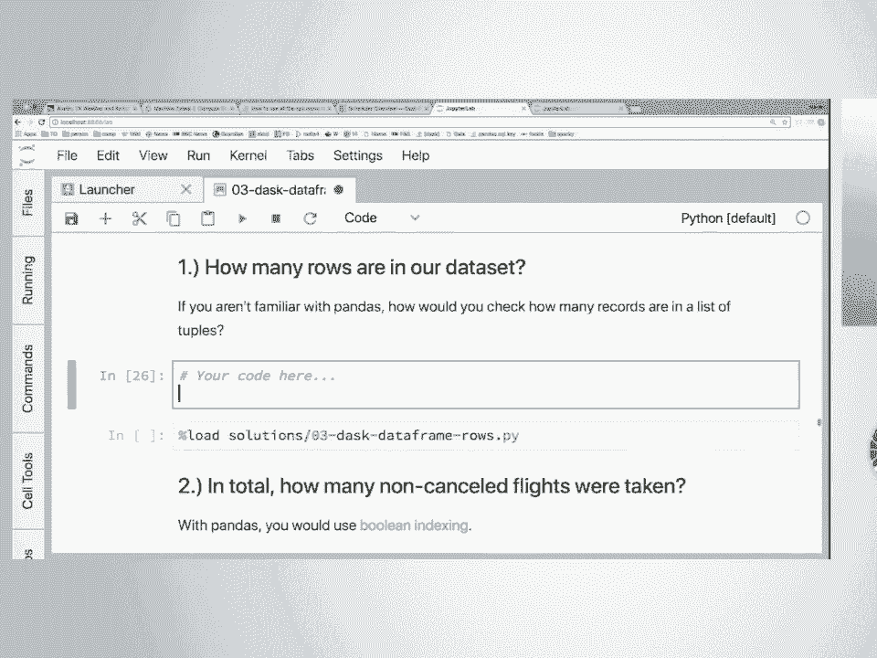

 You do shape。 This would not give you what you want。 It's going to shortly have a shape attribute。

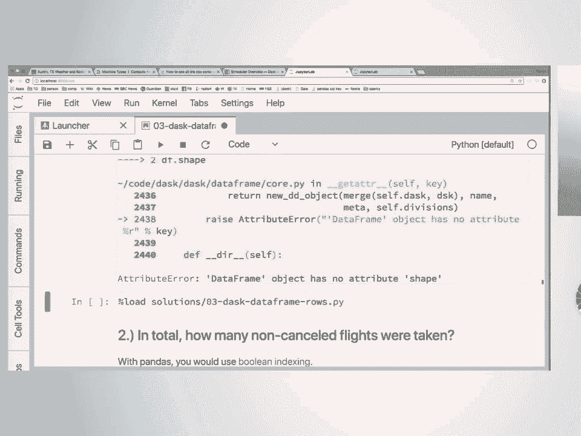

 This kind of hints at an issue with dash data frame。 I'm not sure how best to say it， but what's。

 I'll talk about it in a second。 What's the other way you do it with Pandas？

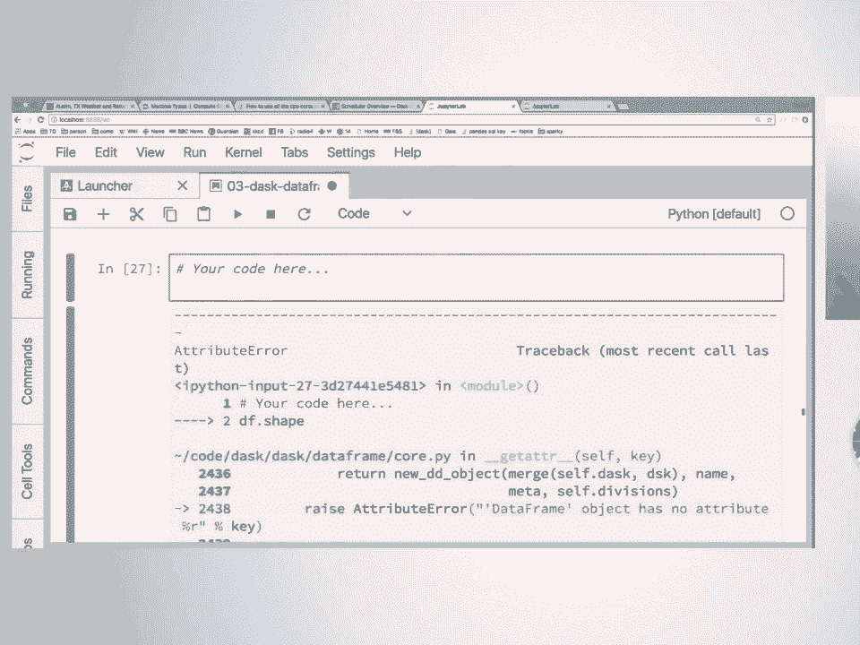

 Link， yes， so we'll do lendf。 You notice that this takes a bit of time。

 What do you think's happening right now？ Yeah， so we're having to， dash data frame is lazy。

 We just have these tasks to do。 At some point in the future， when I require it， read in the CSV。

 parse it into a Pandas data frame。 So we're doing that when we call lend。

 So dash data frame doesn't know statically ahead of time， how long your data frame is。

 To compute the length， it actually takes some time。 You have to go through your entire data set。

 Which if you think about it for like a CSV， there's no way to tell how long a CSV is。

 without actually reading it。 Some storage formats do write their sizes。

 like Parquet you can get to that， but for some of our CSV， there's no way to tell ahead of time。

 That contrasts with something like Dask array。 Here's the auto we were talking about earlier。

 We make this large Dask array。 Computing the length of X is immediate。

 So Dask array does know its length most of the time。

 unless you do something like X of X of zero greater than 。5。 At this point。

 that doesn't work because， I don't know why， we'll ignore that。 X of X of zero， oops。

 What shape is that？ Greater than 0。5。 Okay。 So this has a shape of NAN。

 It's unknown at this point because we don't know， which of these values are actually greater than 。

5。 So we've lost the shape。 Most things in Dask array will keep their shape around。

 So we're able to tell ahead of time。 With Dask data frame， we don't know that。

 because most of the time with pandas， you're working with CSV。 These are some of these file formats。

 or doing these kinds of operations， that don't have a guaranteed length attached to the result。

 So something you keep in mind。 In the future， Df。shape will return， you know， like mp。

nan and then land out Df。columns。 There's a pull request that does this right now。 Okay。

 Boolean indexing。 So a number of non-cancelled flights。 What did people do here？ Boolean indexing。

 We're gonna have， first of all， let's do dft。cancelled is the column， that we're looking at。

 This is， we'll take a look at the first five rows。 It should be a Boolean。 And with pandas。

 you can pass that into that。 So this filters it down and then we can compute， the length of that。

 And again， this is， you know， having to read the data in at this point。

 Read the data and do the filtering， and then do the length computation and parallel。

 Questions on this first too？ - Excuse me， there's a number of canceled flights， and not yet。

 - I believe so。 Oops， sorry， thanks。 You could also do that， yep。 If you do the sum though。

 this is a good point。 What is this going to be？ Okay， so it's gonna be a， oops， sorry。 Sorry。

 not this。 Do you have to cancel？ Dot sum。 What is this gonna be？

 A delayed result at which point you'd have to compute it。 When we interact with like Python。

 Len is always supposed to return an integer。 So that's why it's immediate。

 Len should not return a delayed result。 Okay。 Group by。 So， if you think about it。

 computing the length of something is， computing the length of this delayed thing。

 is pretty easy to do。 You compute the length of each chunk， and then sum those lengths。

 Something like group by， you have to do a bit of thinking about。

 If you're gonna try and do that on your own。 But Dask has done it for you。 So in this case。

 we want the number of non-cancelled flights， per airport。 So with Pandas， we would say。

 Df dot group by， what is the capital A？ Or origin， it's origin。 Yeah， origin。

 And then we'll say the， I think Pandas， anyway， we'll filter it down。 Df dot canceled。

 Till the Df dot canceled。 And then we'll group that by origin。

 And then we will take the count of that。 This will do it for each column。 See if that works。 Yeah。

 let's just count some column like。 Nope， I don't。

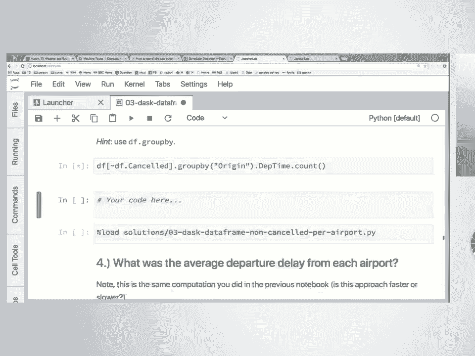

 - You can't put canceled。 You can group by origin。

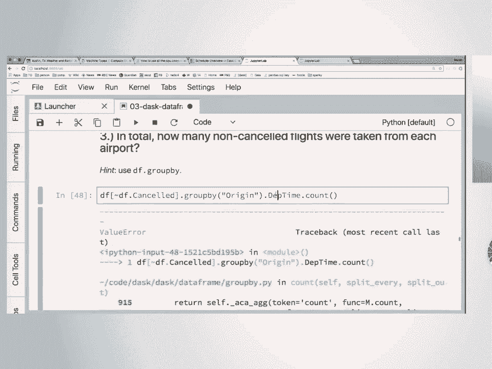

 - Gotcha。 Anyway， we'll compute the， like this。 We'll just load the solution。 Origin count count。

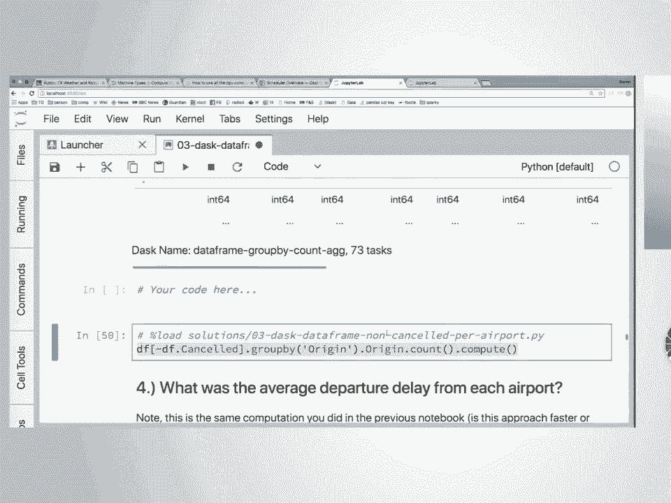

 I thought I tried that。 Martin。 And then length must be positive。 That's a strange one。

 I'll look into that later。 ACA。 Pandas is supposed to do that。

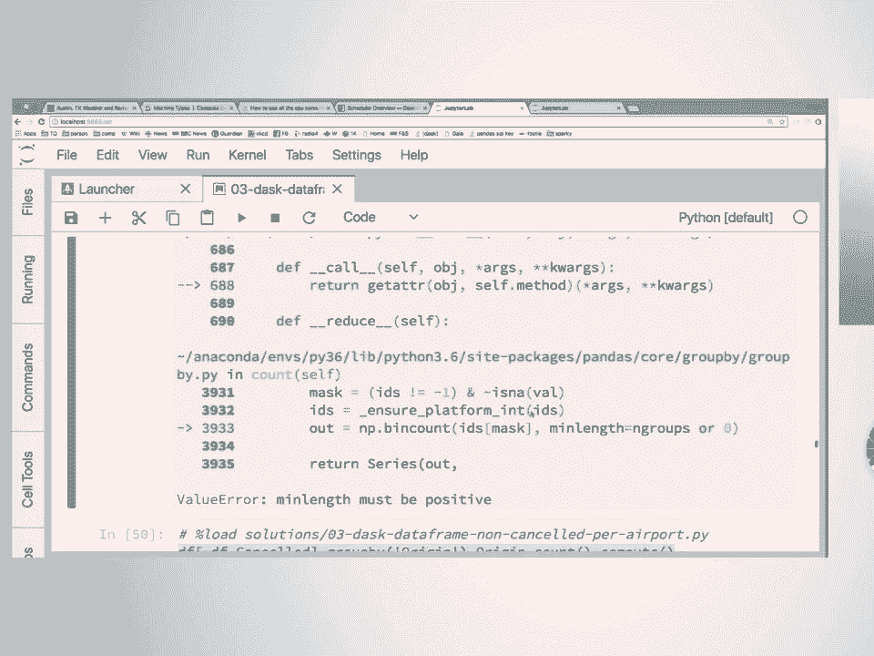

 This is like one of my least favorite parts of Pandas API。 'Cause like you're repeating origin。 But。

 I'm just gonna do it my way。 So we'll group by origin。 There's too many ways to do stuff in Pandas。

 I can say that。 I'm allowed to。 Okay。 So size is the number of non-noles I believe。 So yeah。

 depending on which one。 So I believe it's the number of non-noles。 I could be wrong about that。

 - No question。 - Yeah。 - Why can't you use the Df。org in the group by function？ - You're saying。

 - The order， Df。org。 - Say here。 - No， no， no。 Before that， the group by。 - Df。org。 Group by this。

 - Yeah。 - Does this work？ So I think that's the same as Pandas。 Whoops， I lost my place。 Okay。

 So these are equivalent Pandas operations。 You can pass a key to the column or the series itself。

 And yeah， I'm not sure what the error is。 It's in Pandas。 So it's a test tutorial。

 so I'll blame those Pandas developers。 (audience laughs)。

 - The size that three was the number of entries。 - Three。 - Okay。 Yeah， anyway。

 - You could press this with value count straight。 - Wow。 - Yeah， probably。 - Oh yeah。

 - And I think we'd drop an A by default。 - You dropped a dot before code。

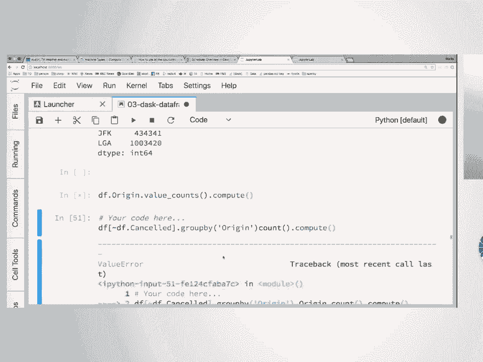

 - Yeah， yeah。 Lots of ways to do stuff。

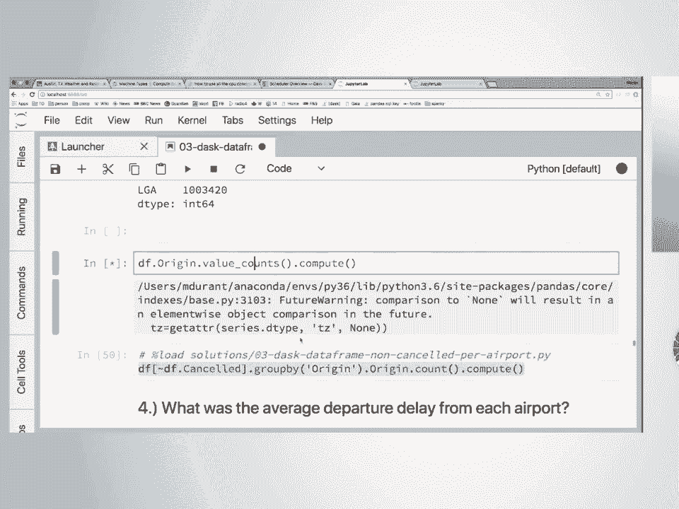

 So， yeah。 Any questions on that one？ Sorry， sorry， the solution don't work。

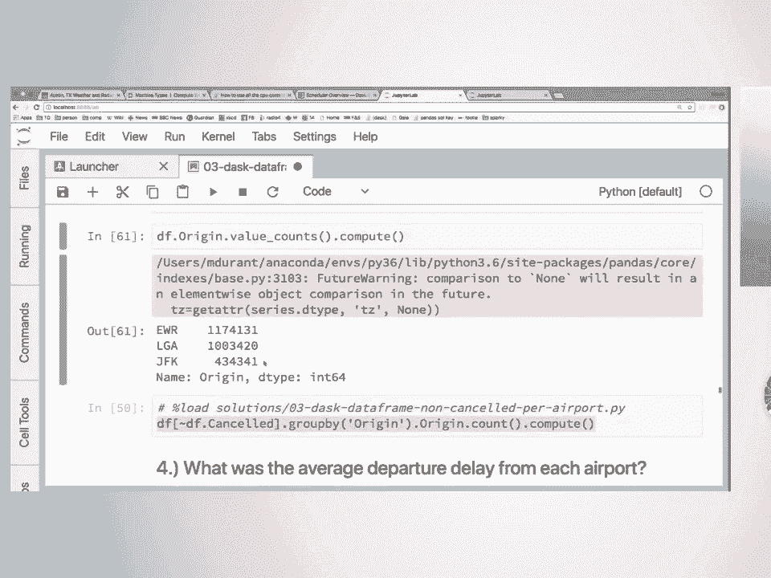

 Okay。 Oh， I did。 Yeah。 - It works。 - Anyway， whatever。 All righty。 So。

 - It has to be a new version of Pandas。 - It's gotta be。 - It works last week。 - We did。

 We've had two releases in the last four days or something， 'cause apparently packaging is difficult。

 So， and there's still an issue with C++。 So， let's see， what was the average departure delay。

 from each airport？ So， similar sort of thing。 In this case， we will， I think， use a group I。

 And I'll hit in the same error。 Why that would be。 I love Pandas。 I don't know。

 I honestly don't know。 But， see， so this is doing a data frame group I。

 This is doing a series group I。 So， those are different code paths in Pandas。 Just for some reason。

 And this is not broken。 So， if you're having issues， maybe this will work。

 And I'll file an issue after the tutorial。 - 23。0。 - Yeah。 - At 23。1。 - No。 - It's free。

 - I don't know。 I do not know。 Yeah。 Any questions on that one？ And then the last one。

 Day of the week。 So， there's， in Pandas， how do you get the day of the week， of a date time？

 We're looking at， what's the column name？ - There's a day of the week column。 - Yeah。 Yeah， there's。

 makes things easier。 So， we'll take a look at this。 This is a zero through six， day of the week。

 or one through seven， I'm not sure。 So， group by that。

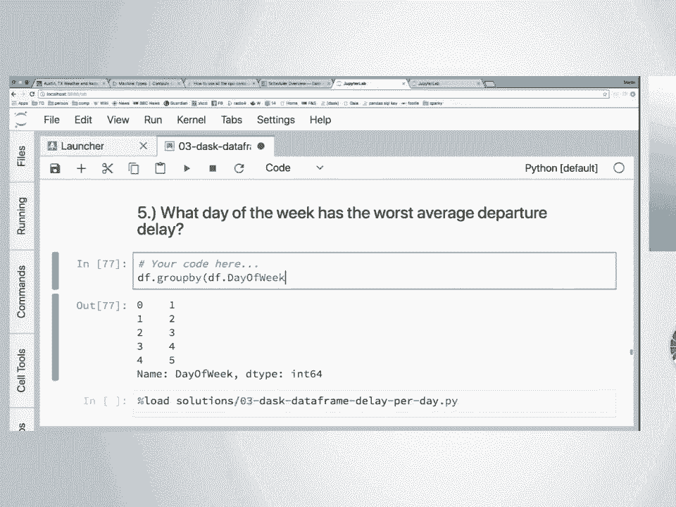

 Oops。 So， group by that。 Dot dip。 Depth delay。 And the average。 Okay。 So。

 that's the laser result and then compute that。 So， if you're familiar with Pandas。

 hopefully this feels the same， only the computation will be happening in parallel。 It is one， two。

 seven。 - I like this one。 It says no travel on a Friday。 But most people might know that。 - Yeah。

 Okay。 Alrighty。 So， every time we've done these examples， let's think about the first two exercises。

 Compute the length of the entire data frame， and the length of the number of non-cancelled flights。

 There's a lot of redundant work between those， right？ We had to read the entire。

 all the CSVs for both of those computations。 If we wanted to compute both of those。

 like at the same time， there's a lot of shared， shared， intermediate computation there。 So。

 similar sort of thing。 When you're working with Dask。

 deciding when to compute is an important question to answer。

 Or it's an important thing to think about。 So， in this case， we're gonna build up some results。 So。

 selecting the non-cancelled flight， and then getting the mean。

 and the standard deviation of the departure delays， for the non-cancelled flights。 So。

 these are lazy， delayed results。 And if we do those sequentially。

 we're gonna have to recompute everything that's shared。 So， all the reading from CSV。

 all the filtering。 If we were to use a single call， to the top level Dask。compute。

 all that intermediate computation， which takes up the bulk of the time。

 is gonna be shared between the two。 So， you get a slight speed up here。 Oh。

 a large speed up since it takes basically all the time。 So， that makes sense to people。

 It was like a very important， but very subtle thing to think about， when you're using Dask。

 This whole delayed computing is like， a completely different mindset。 Okay。 Alrighty。 If this works。

 you'll see that basically this is all fused， or shared between the two。 Alrighty。 So。

 earlier on I said that Dask data frame， does not know its own length， unlike Dask array。

 That kind of comes down to the Dask data frame data model。

 where the idea is that you have a data frame like thing， a table that's partitioned along the index。

 So， PANDAS has an index。 It's very important for lots of operations。 Dask has index as well。

 And in addition， it keeps track of the partitions， of this index。 So。

 this can be important when you're thinking about， like how do I get quick lookups？

 If I wanted to select all the flights for February 2016， there's a couple ways you could do that。

 You could filter， do like a filter， so select the， there's like a departure date column。

 Give me the ones where that's equal to February。 And that would have to scan the entire data set。

 and then do the filtering， which would take a while。 There's another way to do it。 Ah。

 we need to make the date times first。 So， if we look at Df。cscrs， step time， and then do the。

 two ways to do it。 Okay， these are in some weird format。 I think this is like。

 hour in the first two， and then minutes in the second two。 That makes sense。

 but they're currently inse。 So， we gotta do some work there。 Okay， right。 So， yes。

 so this is an example of how to use， that pandas has a large API， like we've discovered。

 Dast doesn't cover all of it， because that'd be insane。 So， if you do need a bit of pandas API。

 that isn't implemented yet， how would you do that？ So。

 here's an example of something that's used to。 We used to not have a dd。2 date time。 We do now。

 because we've fixed that， but suppose we didn't have a dd。2 date time。

 to convert these two date times， what would you do？ So， in this case。

 how would you do it with pandas？ And then we'll see how to do it with that。 So， this is pandas。

 We're gonna take a look at date。 So， our goal here is to take this。

 We wanna get the departure date time， so the date and the time。 So。

 we have the time here in this weird format。 We have the date here。

 and we need to join those two together。 So， how would we do that with pandas？ That's here。 So。

 we're gonna do this weird stuff on the debt time。 Not super important。

 'cause this is the only data set， I've seen where it has this weird hours and minutes。

 in the same format， in the same field。 But， so we're gonna truncate this， run down by 100。

 and then call two date time on the hours， and then two date time separately on the minutes。

 on the second two digits， and then add those two together。

 to get the actual hours plus minutes from midnight， and then add that to the date。 So。

 this is a date plus a date time， plus a date time。 Sorry， a date plus a time delta。

 plus a time delta， which gives us a date time。 And that's how it's， so we're doing this。

 on the first 10 rows with pandas。 And this is the actual time that it left。

 If that didn't make sense， apologies， we're going too fast。

 We're gonna do the exact same thing in Dask now。 Okay。 To do that， we're gonna use， we could。

 now that Dask has two time delta， we could just change this PD to a DD， and things would work fine。

 this exact same code。 Let's suppose that you didn't have that， 'cause it wasn't implemented。

 This will happen when you're using Dask data frame。 You go， you file an issue on Dask。

 on the Dask GitHub repo， and say， "Hey， could you implement this？"。

 And we can probably do it quickly。 But in the meantime， if you wanna work around。

 you can use map partitions。 So we can take a look at this。

 This takes a function to apply to each partition， of our Dask data frame。

 So we have our Dask data frame here， with these various blocks here。

 Each one of these is basically a pandas data frame。 So this is a pandas data frame。

 this is a pandas data frame。 And if you're doing operations that， you know。

 operate independently on each block， you don't need any cross-block communication。

 cross-partition communication。 For example， two-date time， just operates on each scalar element。

 and returns the same size thing。 That's a date time， or a time delta。

 So that's a good example of what we can use， with map partitions。 All right， so we're gonna map PD。

time， two-time delta， over each partition of hours。 Let's break this up。 Nope。

 I don't know how to control。 There we go。 So hours time delta， we haven't really done anything yet。

 but Dask data frame knows that we have a time delta here。

 And then we'll do the same sort of operations here， with our minutes time delta。 So again。

 we have a date， date time， plus a time delta， plus a time delta， which gives us a date time。

 And at that point， we can actually compute it， you know， in parallel。 Questions on that？

 Go back here。 So the key takeaway there is you're gonna come across things。

 that are not implemented in Dask data frame yet。 For many of those cases。

 map partitions is going to enable， to you to take your normal pandas workflow， and adapt it to Dask。

 so that it runs in parallel and out of core。 All that。 All right。 That's slightly inefficient。

 'cause we do these two separate map partitions。 You can fix that up if you wanted。

 but I think we'll skip that in the interest of time， to get onto a more interesting topics。

 Schedulers。

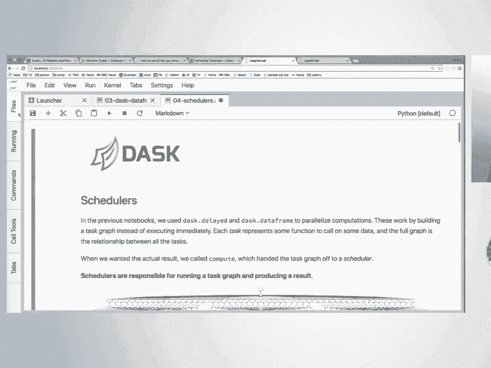

 Martin， do you want to do this one？ All right， so schedulers and then--。

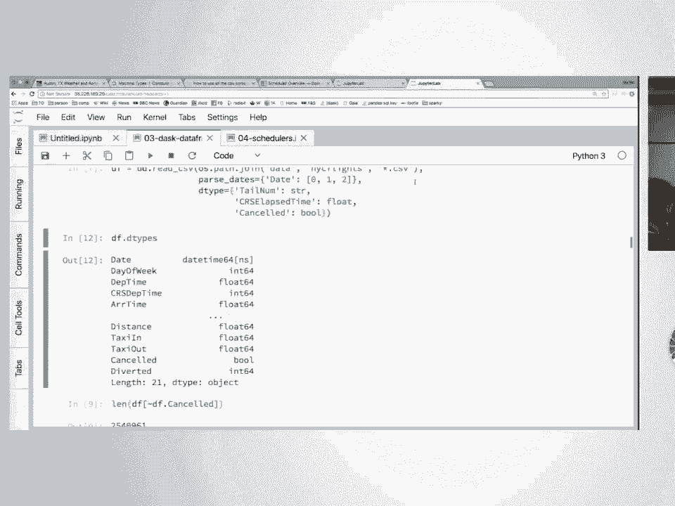

 Yeah， I think running。 Everything's okay。 All right， I haven't checked for all two。

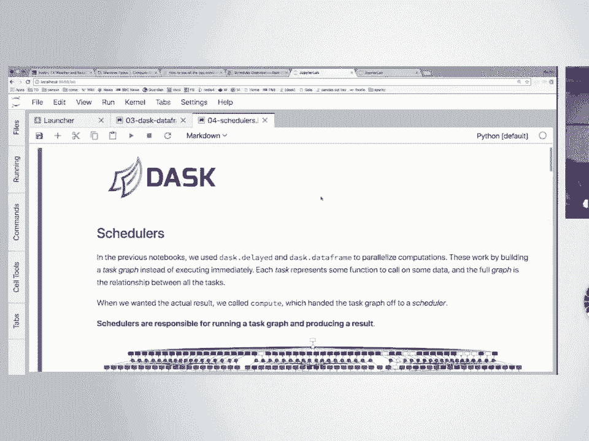

 But I think so。 Yeah。 Yeah。 So you'll do schedulers all the data frames。 And then--。

 Just read the script。 And then I'll be back。 Yeah， perfect。

 And I still don't think we'll get to numbers。 Yeah， thanks a little。 Okay。 Okay， we are back。

 So into some more juicy， exciting Dask stuff。 Thank you， Tom， for stepping in。

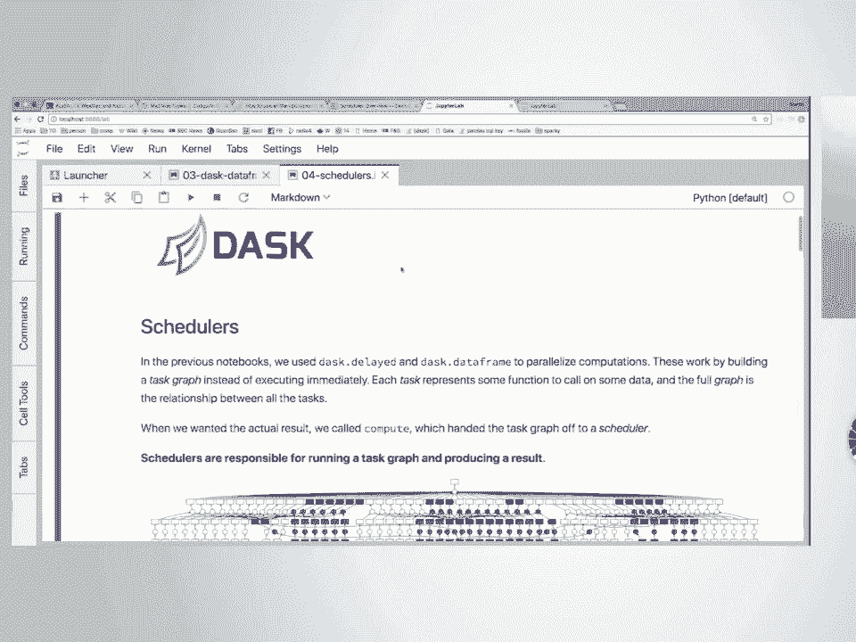

 and taking the place of Jim today。 He'll be back with distributed data frames， which is data frames。

 but bigger shortly。 Okay， so now I'm going to talk about schedulers， or schedulers， if you prefer。

 which is， we've been executing some stuff， and it's been running in parallel。

 and Dask has some magic to make that happen。 Here's a nice little diagram of some computation。

 And Dask， the scheduler is handed one of these graphs， of whatever it is that you want to compute。

 And it takes some logical decisions， about what to run when， how to pass intermediates。

 from one task to the next， and how to basically turn all of this red。

 so you get that your final output at the end of this。 I think blue ones are ones on here。

 that have been computed and already forgotten about， because they're no longer needed。

 So Dask cares about getting stuff finished， and out of memory so that you can run more stuff。

 It cares about running things in parallel。 It cares about all of the things。

 that you would like parallelism framework， to do for you。 But there are some options。

 So in this notebook， I'm going to talk about the options available to you。 First of all。

 we've been running things locally， which was the original use case for Dask。

 which is that you have your computer， you want to be able to use all of its cores。

 and you want to be able to compute against， data sets that are larger than your memory。

 And for those things， it runs very efficiently， and it's splitting the work into threads and processes。

 We have these things。 This is the old nomenclature。 We'll show you how to use these。

 and how to use the new way of doing things。 But basically， there are some functions， sorry。

 some functions called get。 And these are the ones that given a graph of stuff to do。

 will go about executing them and giving you back an answer。

 And you can see there are three built-in local ones。 These are executing in separate threads。

 executing in separate processes， or executing in a single thread。

 as if you were running everything sequentially， normally in the notebook。

 This last one might be a bit of a surprise。 Why does Dask have that？

 When the whole purpose of Dask is to parallelize things。 Well， it's really good for debugging。

 obviously。 So you can， if you have an error， the first thing that you usually do。

 an error beyond typical things we saw with data frames。

 where you need to change types or something like that。

 where you really don't understand what happened， and you want to run the debugger。

 that won't work if your tasks are being executed， in a separate thread or process。

 So this exists for that。 And this get keyword can be used in various places。

 but as we'll see in a moment， there are some examples of this， but I'll show you that there's a new。

 easier way of doing this。 So first， the demonstration， and then I'll show you the new way。

 So this is the same thing again， as we've been dealing with， because we don't want this one for you。

 with too many data sets， in which we're going to make a largest delay。 Now let's just see。

 does this compute？ Or do we need the thing？ This does compute。 (sighs)， Okay。

 maybe I should have just timed it。 So there's your answer， and this takes a few seconds， obviously。

 and it's using threads in the background to do that。 That is the built-in default。

 That's what happens unless you specify it otherwise。 And when it's doing this。

 it's opening some files， it's loading some files， it's passing them， it's evaluating this boolean。

 it's filtering， it's selecting a column， and then it's taking maxes of each of the data frames。

 and then combining them。 So that's all of the work that's going on in the background。

 That's quite a few tasks。 And， well， I don't know if you think this is fast or not。

 but we did see some examples using sequentially， a set of pandas data frames。

 and it's faster than that。 Now， if we want to run this on processes instead of threads。

 and you can see the nice， handy， so the version， that's version has been updated。

 but not all of the code， but this is interesting， saying that get is perhaps the other way of doing this。

 I'll show you in a moment what the new way of doing it is。

 So now we're using processes to do the same thing， and we'll immediately notice this has already。

 ran for more than six seconds。 Any thoughts about why that might be？ Why would it be doing that？

 So it's still going to be running eight processes， so one per core。

 and each of those processes will be running one thread。

 So it's not not overloading the CPU in that sense。

 but what is happening is that we have dependencies， between the various parts of this computation。

 so there's a lot of communication， between the processes that's going on。

 Whenever you have data that's passing from one process， to another。

 it's going to need to be serialized， sent across a pipe or something。

 and then deserialized at the far end。 That's one definite cost。

 that you always have associated processes。 Another cost is starting processes slow。

 especially if you're on Windows， which I don't think too， does seem to be mostly back in here。

 but some of us might be on Windows。 Windows process start-up time is particularly slow。

 And also you need to communicate with the processes， from the scheduler。

 which in this case is running within this process， so all of those add overhead。 However。

 some computations will only run well in processes， if they use the gill。

 in which case threads won't help you。 Okay， and then the final one。

 this is running things sequentially， in the current thread of the current process。

 so it's not actually doing anything in parallel。 It does still give you the memory savings。

 because it's still working chunk by chunk， as much as possible， and you see it's actually faster。

 than multiprocessing to run things in a single thread， and that's a clue that in this case。

 there's a lot of serialization and communication overhead。 When you're in a single thread。

 you don't need to do that。 When you're in threads in a single process。

 then normally you don't need to serialize anything， you just pass a reference to the memory。 Okay。

 So， rules of thumb that you always need to think about。

 when you're hoping that something can be paralyzed， is what's the maximum speed up。

 that is possible at all？ This will depend on your number of cores。

 How much work can your CPU be doing at all？ And it will depend on a graph。

 of what it is that you're doing。 It should be somewhat clear from the graph itself。

 if it's small enough to display， how much parallelism。

 how much completely independent work there is that you can do。

 And then there's a question between threads， and how much speed up you can get。

 will depend on whether the gill is released for threads， and for processes it will depend。

 on how much communication needs to happen。 Okay。 We're not going to read this。

 but you can read it at your leisure。 There's a lot of discussion of this kind of topics。

 I did not show you how to do this now though。 So I'm just going to show you one of these。

 So instead of having to pass around these get functions， having to import them in the first place。

 and then having to pass them， you can use special keywords that do the same thing。

 So this is a usability enhancement。 I hope you like it。 So there are quite a few synonyms in here。

 I think this full name of this is single threaded， or something like that。

 I just use sync because it's the one that I remember。 The other options are threaded and processes。

 or multi-processing。 Those are both the same thing。 And yeah。

 that's a slightly simpler way of doing this。 You can also set what the default is。

 and we'll get to that in a moment。 However， these days the default is nice。

 The default threaded thing， we've used it throughout。

 and we've seen a lot of nice speedups and nice behavior。 It's not necessarily the default anymore。

 It's the one that you'll get， unless you do anything else， because it has fewer dependencies。

 but there is now a thing called the distributed scheduler。

 The distributed scheduler does not need to run， in a distributed way。

 You can run it on a single machine， and get benefits from it。 So I'll show you。

 This is the easiest way of setting up a distributed cluster。

 That is a cluster that's using the distributed scheduler。 You just call client。

 and this will by default set up eight processes， and a distributed scheduler to run them。

 There are a whole load of optional parameters， that can go into here。

 So you could have chosen two processes each with four threads。

 or whatever you can set various memory limits。 There are lots of bonuses in here。

 that we won't have time to go into， but maybe I can show you a bit of a flavor。

 One thing is that we have this cluster object， and most of the ways of setting up a cluster。

 come with one of these。 You'll see the Kubernetes one in a moment， when we run on the cloud cluster。

 and you can change the number of workers you have， dynamically as you go。

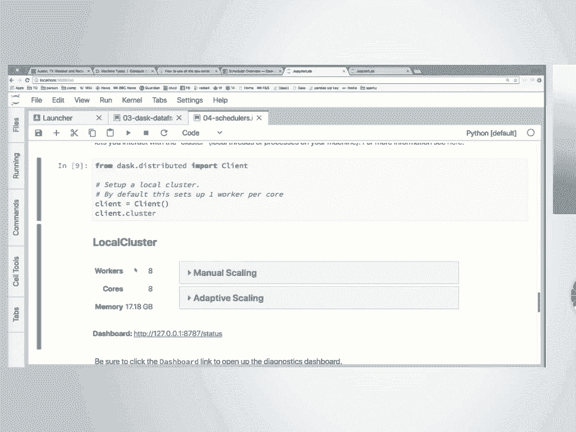

 Also you get this rather nice dashboard， which if you've seen any of the desk talks。

 then people like this a lot。 It's really helped with the popularity of desk。

 There's nothing here to see yet。 You can see that our eight processes。

 are taken up a half gigabyte of memory amongst them。

 There are quite a few panes of information here。 This is information that's not available。

 using the built-in threaded or multiprocessing schedulers。 You can get some of it with some effort。

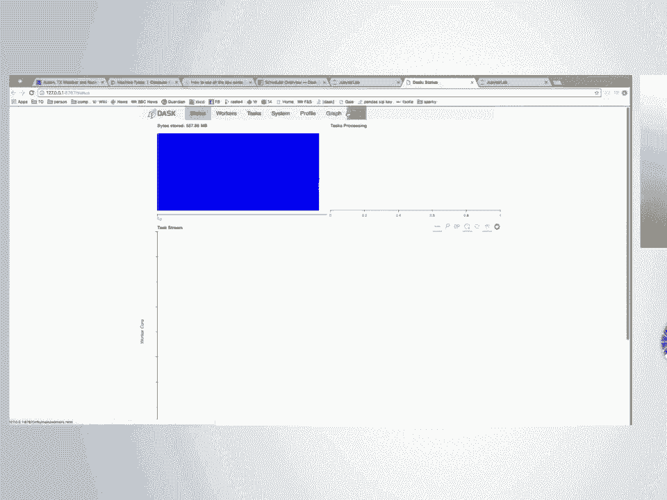

 but here it's provided as a bonus。 Since we now have a cluster distributed client set up。

 if you make one of these， then it will become the default， without you doing anything else。

 By the way you can also actually connect， to something that's truly distributed if you。

 Whatever IP it may be in here。 If you have a cluster that's been set up for you。

 or you have the means to set yourself up a cluster， on a cloud provider or on your local hardware。

 whatever it may be then here is where you would put， the address of the scheduler to connect to。

 Again we'll get to that shortly。 So now if I compute this thing。


 things happen over here。 Stuff happens which is really nice to see。


 And when it's done here we have a result。 You'll notice that this is the fastest。

 that we've seen yet。 Which might be a surprise because this is using。

 processes in fact so there's communication going on。

 but the distributed scheduler is the next generation scheduler。

 It's much smarter about making sure work happens， where the data already is。


 so that there's the minimum of communication， between the processes going on。


 And in fact you can see like this， we skipped over it rather quickly。

 These are all the tasks as they happened in here。 So we started up with some read things。

 and then we have some pandas passing stuff that's going on。 Those are the biggest blocks here。

 And then we have the actual getting items grouping， and all the rest of it。

 The red pieces here those are communication。 So there is occasionally some communication going on。


 but there's very little of it in total。

 Any questions there？ That was quite a lot of information， in a short amount of time。 Yes， yeah。

 there are eight here。


 for the eight calls of the machine。 If none of what is displaying？ - [inaudible]， - Oh， this thing。

 - Yeah， I'm there。


 - Oh， okay， then you're missing IPY widgets。 It's fine。 It won't matter。 You don't need this。

 I'm not actually going to use it。 If you run the standard notebook instead of the Drupal。

 to lab notebook then maybe it works， because you need the extension to be built。

 This is from the standard environment。 There is a command that I won't be able to remember。

 That is the Drupal notebook extension to install it。 If you look up Drupal to lab and IP widgets。

 IPY widgets then it will tell you how to do that。 You'll need to restart the process for it to work though。

 Sorry about that。 It works on the provided cluster。


 So that won't set up。


 In any case， this always works with any luck。 Okay， and it's faster， which is cool。

 - Can people just spend all your work on this？ - Sorry？

 - So people are getting a little bit of a play to play。


 - Yes， yes。 So this will come up at localhost8787/dasis。

 If you don't have the status then you'll have an index thing。


 And it's the status one。 Most of these you'll never use。


 They're for special cases。 But the status one you'll use all the time in。

 Actually it has some of the information is duplicated on here。 - Tom。

 do you remember the MB extension command to actually get IPY widgets running？ - I do not。

 - But as I said， you don't need it。


 - So there is an exercise to run some of these and look at what the diagnostics thing is doing。

 I'm just going to run them and view it。


 So if I run length。 Okay， things go by。


 Oh， by the way， the things in flight appear here at the bottom。 They came and went quite quickly。


 So again， each time you run these on this particular set of data。

 passing the data is the thing that always takes the longest here。


 But it's all running in parallel， which is really nice。 There is more information available here。


 In particular profile。 So this is like， I don't know if you used to flame graph source or snake viz or any of these tools around。

 This is telling you on a statistical basis what the CPU was doing for each of the workers in your cluster。

 So the H processes here。 So this is a very useful way of finding it。


 It's not quite a full profiling of your code， but it's actually really nice。 So you can select。

 I happen to know this was my latest little batch， the length call。

 And I can look through here at what was going on。 So mostly I was calling， well， this is apply。

 So that's the thing that's actually saying do some work。

 And almost everything here is pandas retext。 So it's a pandas function that's taking all of the time up to here。

 which is just the thing called read。 And then there's some extra stuff down here about data conversion。

 which is some kind of list comprehension， over all of the dates that you have in each of your data frames。

 So passing the data takes the longest and then converting some of those date times because if we go back here。


 wherever the F was defined。 This thing saying that these three columns are going to become a date time。

 This actually takes a significant amount of time。 And now we know that before we wouldn't have known that unless we explicitly wanted to pull this out of the ask。

 and benchmark it separately， no profile， I should say。 So that's quite useful。

 Now if we run another one， this is taking the length of a filtered data set。


 Go back here。 There we go。


 There we go。 You actually saw that I'm sorry， these are going too fast。 That's too good， obviously。

 You can also get progress bars in here to see the tasks go if you want。

 We'll show them about this one's more complicated。


 So this should take a little longer， except that we have the same problem as before。

 So presumably this does it。 Okay， now you see there's lots of tasks still loading takes the longest time。

 but then there's lots of these。


 little pieces on the end here。 You can zoom in on them if you want to。

 You can hover over these different tasks to see what they are。


 So here's the getting of items， group by count chunk and then some。

 You shouldn't be surprised by the kinds of things that are required to make this happen。 And again。

 these red boxes are communication。 If you have a workload where you see a lot of red cropping up。

 then you might need to think about if there's a way of doing it with less communication。


 How did I end up with two？ Okay， and the last one， this is going to look quite similar。

 except now we're doing some date time thing。


 Did you file one yet？ And again， things progress pretty quickly。

 Basically the time is dominated by how long it takes to read the biggest of these chunks。

 The time it happens to take might not be because it's biggest。

 It might be just because the disk is busy。


 Okay， and here's the。 So we'll be coming back to this。

 This is just the flavor of basically saying that you have this option。 In the next section。

 you'll see that you can run now using the distributed scheduler， your jobs on a distributed cluster。

 It was built for that reason， but it turned out that it was better at most things。 So use it。

 It takes in the simplest case the single line of extra code to make the distributed scheduler happen。

 That's that client line， but it comes with lots of options。 Options mean complexity。

 so it can take a little bit of getting used to。 But not only is it quite smart and efficient。

 it also enables a new API， which I will come to after Tom's next section。

 We will be moving to the cluster。 So this was the IP。 Now Tom will come and start talking。

 but you should all go to this IP and log in with something some name that's unique to you。

 Everybody has access。 And hopefully the cluster keeps going。 Clust is happy。

 This is running on the cluster currently。 So our worker nodes were auto scaled down。

 Everyone should get a Jupyter Hub pod very quickly。


 Okay。 We'll be making Dask workers shortly。 There's auto scaling enabled by Google。

 so it can take a number of minutes for those workers to appear。

 Quite a lot of complex stuff is done when that happens。 New machines are started。

 as Kubernetes installed， and then a whole bunch of containers are initiated from some very large image。

 So a little bit of patience when we get to it。 Connect to the address。 Do you want to use that？ No。

 I'm just going to have the stats over here。 See if anyone's pods do not come up。

 Was there anything else about scheduling in general that people wanted to ask？

 When you go to this IP address， you'll get a log in box。 And then when you get past that。

 you say start my server and that will drop you into JupyterLab， only now running at this IP address。

 When you get there， open up the fifth notebook about distributed data frames。

 Does everyone have the IP？ Can I change？ Who still needs the IP address？ All right， I'm going。 Okay。

 Close this。 Yes。 Did I just close the。 All right。 Just to kick things off。

 can everyone run these first two cells？ Oh， hopefully I ran mine soon enough。

 I did not run mine soon enough。 So now we're。 Here， I'll put this in here in case people need it。

 Yeah， so now we're on this cluster and everyone's getting their own Dask cluster isolated from everyone else in theory。

 When you run this cell， we can actually take a look at the code。 It's not doing anything special。

 And Dask works with a ton of different or many different resource managers。 In this case。

 we're on Google Cloud Platform using Google's Kubernetes engine。

 So this is like a managed Kubernetes service。 If you're not familiar with Kubernetes。

 don't worry about it。 It's a thing that takes care of running these applications。

 these containerized applications。 So we are interacting with cube-class Dask Kubernetes here。

 It provides a cube cluster object。 All of these cluster objects。

 there's one for HPC systems like Yarn or sorry， Slurm or all the other ones。 I don't know them all。

 There's ones for Yarn。 If you're coming from the Hadoop world， there's other ones。 And like I said。

 this one's using Kubernetes。 Separate from that， there's the actual underlying machines that this compute is actually happening on。

 Like Martin said， we're on Google Cloud Platform which does auto scaling。

 I had made a bunch of machines and then they're just sitting there idle for an hour and it got auto scaled down。

 But they're coming back up now， I think。 Yeah。 Okay。 So， yeah。

 The machines are coming back up now and this is like an IPython widget。

 And so when the machines arrive， you'll see the workers pop in here。 Once the machines are ready。

 we're still not quite there yet。 We have to get the environment in place。

 So Kubernetes is based around Docker images。 And so once a machine is ready for this desk worker to show up。

 it has to download a Docker image。 I don't know if you're familiar with Docker but the scientific Python stack is huge in terms of like megabytes。

 So that also takes quite a bit of time。 So we have a collective action problem that we all have to solve where we need to reduce the sizes of our library so that we can quickly。

 you know， scale up and scale down these clusters。 So if you maintain a package that uses like scython code or something。

 then think about this。 There's a GitHub thread on scython about how we can solve this problem as a community。

 Yeah。 Is there any way to make a new login because it doesn't like to undersell it？ Yeah。

 if you go to -- sorry。 So take that URL and go to /hub/home。 And then there's a log out。

 And then you can log back in。 Anyone else having issues？ I have workers。 I have four workers。

 I asked for nine。 So they'll come in。 It kind of shows a cool thing about Dask。

 It's adaptive where workers can come and go。 Sorry， this is Dask distributed。

 Workers can come and go。 And there's actually a mode you can set it to where it will be looking at your computation and noticing。

 hey， you're low on memory or you have a ton of tasks。 You don't have enough CPUs。

 Let me auto scale up quickly。 Give you some workers for this large burst of work that you submitted and then I'll scale down。

 It works out quite nicely。 But again， you have to download that large docker image。

 Not as good as it could be。 Okay。 And then make sure to open this dashboard。


 And I'm going to try and do this on this side here。


 It's going to not work perfectly， but that's okay。


 I'd recommend whenever you're working with the distributed scheduler to have these open side by side。


 Okay。 I'm going to make it a bit smaller since you all have it。 Okay。

 So the rest of my workers will come in。 But I have a cluster with some workers and then I connect to it by passing that cluster。

 Who has successfully created a cluster and has some workers？ Okay。 Is anyone having issues？ Yeah。

 this is good。 You're having issues？ What sort of？ No workers yet， hopefully。

 I'm going to quickly scan through here。 We have some containers creating。 Is there anyone？ Okay。

 This is good。 Yeah。 Okay。 There are no errors yet anyway。 If you don't have workers yet。

 they will show up， I think。 That's cool。 Okay。 Yeah。 So distributed computing is somewhat complex。

 There are things that change when you go from local to distributed computing。 First of all。

 environment， making sure that your environment exactly matches between all。

 of the machines that are in this cluster is something you have to worry about。 So with Kubernetes。

 typically you're going to provide an image for your scheduler and your。

 workers and it's good to have that image be installing the same environment in both places。

 File system。 So if you're working on a laptop or a large workstation， you have a file system。

 When you're working with multiple machines， they need some way to all see the data。

 So that can be like a network share or in this case we'll be working with a cloud storage。

 Google cloud storage。 So all of these workers can talk to that bucket。 And then communication。

 it's not such a huge deal on a single machine。 Things can be sent between processes pretty quickly。

 It's slow relative to copying data。 But when you're on a network。

 sending things between machines takes much， much longer。 So， again。

 if you have a lot of communication， maybe think about how your workflow can be， restructured。 Okay。

 So earlier we worked with a subset of this New York flights data set。

 Now we're going to be taking a look at the larger thing。 So we have more columns， more years here。


 And we'll take a look at the first five rows。 Again， no。 Adjust this slightly。 Can't click。


 Sorry。


 And I'm going to make it a bit smaller still。 Sorry。 Okay。 So we have these workers here。

 And we're basically doing similar things to what we did before， but on a cluster now。

 So able to scout to larger data sets。 One thing earlier we saw like to get a concrete result you call compute。

 But maybe the data set is so large so you don't want to do that。

 When we were working in that first notebook we had computing like the length of the whole， thing。

 like the length of the subset of non-cancelled and maybe doing some group by。

 Every time we ran that computation and did the compute we had to read in the CSV from， scratch。

 With a cluster sometimes your data set will fit in the clusters RAM。 Okay。

 So it doesn't fit in any individual workers machine。

 And it doesn't fit in any individual machines RAM。

 But when you spread the data set across the cluster it fits in distributed memory。

 And so that's what we're going to do here with persist。 So this is kind of like compute。

 It doesn't give you a concrete result。 But it gives you a much much simpler result if that makes sense。

 It's still going to be a data frame。 But it's going to have done all of the steps up to that point。

 It's like a checkpoint。 So how would you， I mean this is a， yeah， we're just going to do it。

 Df equal df。persist。 Okay。 So a couple things to notice。

 You'll see first of all that this returned immediately。 So an IPython's running， you know。

 when the kernel is doing something it's busy up here。


 This ran immediately。 But in the background we have a bunch of stuff going on。


 I'm going to refresh this。 I don't know why。


 Ah， that's why。

 Okay。 So in the background we're doing all of that work。

 So this df had some task graph that involved things like reading CSV， parsing text。 Streaming。

 actually even before that， streaming bytes off the network。 Reading from Google Cloud Storage。

 So it's doing all of those in the background。 And at this point we have a very simple， you know。

 graph behind this thing。 It's really just， you have a whole bunch of pandas data frames in memory somewhere on the。

 cluster。 And then right here， back at the client we have this das data frame object that knows。

 about all of that。 Any questions on that？ Yeah。 Yeah。 So the question was。

 is there a configuration for setting up the cluster？

 In this case we're at dasque tutorial infrastructure。

 This has all of the stuff for setting up this specific cluster aside from like our keys。

 our private keys and stuff like that。 But in this case it's a helm chart。

 So it's pretty simple really。 We're just saying I want this version of a pan geo which is， you know。

 a helm chart， helms like a Kubernetes。 Like this is a rabbit hole of stuff。 But you know。

 for most of these like with dasque Kubernetes you have some configuration， file where you specify。

 you know， what you want like the number of machines， things like， that。

 There's one for yarn as well where it's similar。 So depending on your specific one you'll have different setup but yeah。

 that's how we did， it for this one。


 Okay。 So at this point things like computing the number of non-cancelled flights。 Again。

 this is still a dasque data frame so this is a lazy result。

 And then we can go ahead and actually compute it here and that triggers some computation。

 So there's like a whole bunch of index。 This is like doing the filtering and then there's some counting of chunks and then some。

 communication of those intermediate results to the final aggregation there。 That's some。

 Notice that there's no network stuff here。 There's no reading stuff from Google Cloud Storage。

 I don't know what just happened。 Did I？ Yeah， yeah， yeah。 So this， I don't know why。

 A worker was killed。 I'm not sure why。 The das scheduler maintains some state of which workers have which data。

 If a worker disappears that's fine。 Dasque is going to recompute the stuff that was lost。 So yeah。

 that's cool。


 I guess that that happened。 I'm not sure why but it's a yeah。

 I'm going to rerun this to finish my point。 Is it's a， I'm not sure what happened。 Anyway。

 there they are。 So when we're doing this count here， there's no reading from Google Cloud Storage。

 There's no parsing of text that's already been persisted。

 Which is important when the IO takes up a significant amount of your workloads time。 Okay。 Exercise。

 Oops。 I forgot to comment this out。 This probably won't work because of this or does it？


 I don't know。 Okay。 Yeah， so again， it's just pandas like code and then， you know。

 happening on a cluster。 Any questions on that group？ It's the same as what we did before。 Yeah。

 Is there a way to see in the profile tab of this？ Is there a way to see just the profile of what we just did？

 Yeah。 I was like， I was like， oh， my first reason。 So this， along the bottom。

 there's a little scrubber for the time。


 So let's rerun this computation。 Okay。 I'm going to refresh this page。

 And so this is the computation we just did for the group by。 And then you can。

 that filters it down to just that computation。

 I'm assuming this is the read CSV， the persist。


 Yeah。 Okay。


 All right。 So we said earlier that desk has a site， desk data frame， sorry。

 has this idea of partitions， that gives， it's important for a performance。

 We're going to take a look at that。 So we have 85 partitions that comes from the 85 original files that we read in。

 And we do not know the divisions。 Okay。 And so， you know， depending on what you're trying to do。

 this can have pretty significant， performance implications。 Uh。

 depending on like if you're doing indexing lookups on the index or merges and joins， this。

 can have performance implications。 So basically what that's saying is that， um， these boundaries。

 so every data frame has， these different partitions where， you know。

 it's always going to be partitioned and each， individual partition is a pandas data frame。 Uh。

 but this known divisions is saying does desk know like the start and the end point of。

 each partition。 In this case， we don't because we just read it from CSV。

 CSV's don't have any kind of partitioning schema that we can look up ahead of time。

 To get an index with， um， uh， so yeah， we're going to see an， an example of， uh， how it。

 can affect performance。 Okay。 We want to， uh， compute the memory usage。

 How would you do this with pandas？ We can do it as a group。 So again， I heard this memory usage。

 What's this？ What type of object？ Pandas series， Dask series， scalar number。 It's a Dask series。

 So this is a memory usage per column。 We'll sum that up。 Again。

 we haven't done anything and then we'll compute that and maybe we'll divide by， uh， 1。9 to get gigs。

 Oh， so this is a pretty small data set。 It's only eight gigs。 But anyway， uh， I think so。

 Maybe we need a deep equal true here to get those strings。 Eighting gigs， perhaps。

 Strings are weird。 Okay。 Yeah。 Alrighty。 Okay。 So now we're going to see partitioning。 Uh。

 so let's take an example。 Uh， I want to give all the flights that were on， uh， the fifth of May。

 sorry。 Uh， you know， all the flights on this date。 Okay。 So how do I do that with pandas？ Uh。

 probably Boolean filtering。 It's just some column。 It's a string column。


 Uh， so with pandas， I do it like that。 And just kind of like for your mental model。

 what is Dask doing at this point？ Um， it's doing a whole bunch of individual， um， uh， you know。

 these Boolean comparisons， on each of the class， uh。

 on each of the partitions scattered throughout the cluster。 Right？ Uh。

 so there's a bunch of qualities here。 There's a bunch of filtering， get items here。 Uh。

 and then we collapse that down to a single result back to the， the client here。

 Does that make sense to everyone？ Okay。 So this is kind of expensive。

 It has to scan the entire data set。 Um， maybe if you're doing this with pandas。

 you would have date as your index and then， use dot look to look it up。

 So that's what we're going to do next。 Uh， we'll take a look at the graph to verify that it is indeed expensive。

 This is going to be a large graph， but you can see there's a whole bunch of， uh， get， items。

 some equality checks here。 And then again， another get item。 That's the Boolean filtering。

 And that leads back to， you know， this is all producing this single result。


 Okay。 So with pandas， what does set index do？ Yeah， so it creates a new index。

 It takes a column from the data frame， moves it to the index。 Um， that does the same thing for desk。

 It does a bit more though。 Uh， this is going to be。

 this is like a surprisingly expensive computation in desk。 So we're， we're doing all these send it。

 set index calls。 This one set index call， it's triggering a lot of communication。

 And what's going on now is we， we have these， uh， we're basically shuffling data between， workers。

 Um， so set， set index is， uh， sorting the index and computing the divisions of， uh， so basically。

 the start and end points of each of these， uh， partitions。

 We're going to end up with the same number of partitions， 85。

 We are going to know the divisions and I'll wait for this to finish。

 A little concerned about our memories to cheer， but hopefully things work out well。 Okay。

 So we have， uh， finished that set index and now we know the start and end point of each。

 of these partitions。 And so now with， uh， we'll take a look at， do you have that head here？

 Now that we have our dates in the index， we can， um， look up these flights again by using。

 "loke"。 And now notice how quick it was this time。 So 58 milliseconds versus the， uh， one。

 one and a half seconds from the Boolean filtering。 I'm going to collapse this。

 So everyone see the difference there？ Make this smaller。 If we look at the graph here。

 we'll see that it's quite a bit simpler。 Like a lot simpler。 It was comparing with the one that was。

 you know， scanning the entire dataset， doing all， of these equality checks。

 all of these Boolean filterings， producing a， a dash series that， we eventually computed。

 Now we know exactly， we know that all of the flights for this date are in some partition。

 I'm not sure which one， but "dass knows which one it's in"。

 So it can skip directly to that partition， say， "Hey， do this operation on your partition。

 completely ignoring the rest of the data。"， Because we know there's none， uh。

 there's no flights on this date in any other partition。 So it's like a， an important， uh。

 performance consideration to have when you're working， with Dass DataFrame。 Okay。 Um， I think we'll。

 uh， we'll do this operation quick just to show， you know， Dass DataFrame。

 implements a lot of the Pandas API。 So something like resampling， um， again。

 you have a daytime index。 Uh， so we're going to resample to one month here， uh。

 and then take the average。 So the monthly average of the departure delay。


 Um， this is， you know， a cooperation。 You can see some communication between， uh。

 workers as we get to the end of one， um， you， know， one partition。 Uh， the month may spread part。

 uh， span multiple partitions， right？ So there's got to be some communication between partitions there。

 Uh， but Dass takes here before you。 So you get to write this Pandas code， uh。

 and then compute it here before plotting。 Cool。 Um， okay。 So at this point。

 if you're done with the error， so yeah， we， we have some time to let。

 you play with the cluster just because it's fun， I think。 So， uh， we've got the flight dataset。

 which you can do a bit more exploration with。 Uh， we have the， uh， this taxi。

 New York City taxi cab dataset。 Um， I would recommend not having them both in memory at once。

 just because our cluster， is a bit small。 So if you restart the cluster， that'll， um， delete the。

 uh， the airline's dataset。 Um， you might be able to， uh， uh， Dell， DF as well。 I'm not sure。 Um。

 depends on if there are any other references to it。 Um， but yeah， uh， take like， uh。

 what time is it？ Um， I would five minutes or so to play around with the cluster。 Uh。

 and then we'll talk a bit about the advanced， uh， distributed scheduler API。 So， yeah， five minutes。

 if you have questions， I'll come around。 Yeah。 Um， so is there an opposite to persist？

 My color is the minimum。 Um， so typically， uh， if you're all done with it， you can delete it。

 And in theory， this will collect some。 Uh， there may be other references to it somewhere。 Uh。

 if all is the usual Python rules is if， if it will get garbage collected， dask will。

 garbage collect it。 They're probably otherwise， but。

 Can I go ahead and decide what you have to run your system？ Uh， did we？ So yes。 Um， so this is a。

 when do persist is a good thing to think about。 In this case， uh， set index was quite expensive。

 right？ It did all of， uh， this communication earlier。 I've lost it。

 but it did a whole bunch of communication， a whole bunch of computation。 Uh。

 so that's probably a good point to persist to at。 If you hadn't persisted。

 you'd still have the data in RAM。 Uh， but this operation here would have taken quite a while because doing。

 um， so if you， think about the chain， you have DF from before the first persist that's in rant， uh。

 distributed， memory。 Uh， and then this DF equal DF dot set index without the persist。 Uh。

 and then when you do DF dot log here， that's kind of doing the chain of set index， date。

 which is expensive， followed by dot log， which is very quick。 Right。 Uh， you would not have lost it。

 It would be， um， uh， so DF， if you do anything to DF， it's still on this set index。 Um。

 so it would be the different index， but each time you do an operation on it， it'll。

 have to redo the set index， which is expensive。 So it's just like with reading it from disk。 Uh。

 if you don't persist it， then you have to redo it later。 Yeah。 The dashboard has the profile tab。

 which shows， uh， the， uh， play chart。


 Um， does it introduce any overhead from this book？ Um， maybe a bit， uh， not much。 It's， it's。

 it's just a separate thread that runs occasionally， uh， to see what the workers。

 are currently doing。 Um， so it's， you know， relative to like the cost of communication， uh。

 you know， sending， data。 It's， it's not going to be real over it。 I， I， I， I mean， you could try it。

 but I doubt it， it， it maybe depends on your computation， but I doubt it。 Um， it's。

 it shouldn't have any effect。 Any noticeable slowdown？ But it， it， it'd be at least， uh。

 performant is made by a task itself。 Right。 Uh， well， yeah。

 So it's a separate thread that's monitoring， uh， what the worker thread is doing。


 Worker threads。 Yeah。 Okay。 So， playing with the taxi cab data set here， uh。

 this is slightly concerning。 So， desk will spill to disk if needed， um。

 if the data sets too hard for your cluster。 Um， so it looks like， uh， you know。

 ideally I would have a few more workers here to， analyze this data set。 Um。

 I'm not even sure if this computation will complete or not， or if it will run out， of RAM。 Um。

 but you know， desk has， um， you can track those events and then， uh， at that point you。

 might want to turn to like Kubernetes or whatever resource manager is actually killing your。

 workers to figure out what's going on there。 Um， but I think we're going to complete， uh。

 grouping by the， uh， sitting in the taxi， cab， filtering down to ones where the。

 they actually tipped， uh， grouping by the hour of， the day， um， which is just an integer， uh。

 and then take finding the average tip amount， um， which， uh， yeah。

 There's a couple of peaks here maybe。 4am is a nice time to be a driver I guess。 Cool。 Um。

 so I think， uh， unless there are any objections， people are， of course， welcome to， keep， uh。

 playing with the cluster。 Otherwise， I think we'll go on to the， uh， next notebook。 Um。

 if you could just be kind， uh， go ahead and close the clients， um， and close the cluster， as well。

 This will free up your， uh， workers for the next notebook。 So， uh， when we get to this notebook。

 which I'm going to do quick for Martin so that he， has a cluster。

 you should get your workers much more quickly this time because the machines。

 are around and they're free since we just closed them。 So， uh， yeah， turn it back over to Martin。

 When you， when you do that， plan， respond， run the， uh， if your workers， if you're， on the laptop。

 um， actually it doesn't need too many resources。 It's not really the point of that， but， uh， yeah。

 I think it should be okay。 Uh， interestingly before we go on to it， I don't know if anybody。

 so we had the peak， sorry that's not the right one。 Oh yeah。 So。

 the peak at four o'clock happens to be when the bars close in New York。

 I don't know if people knew that。 There is a reason for that to be there。 Uh。

 this one is people going to the bar， maybe。 I don't know。

 Because that's all that happens in New York， right？


 Okay。 Well， were there any other problems with what we were doing before moving on？ We're， uh。

 it's been quite a long session。 We're getting towards the end of it， don't worry。

 If this is hazy now， maybe it'll ring some bells when you come back to it later。

 It's best we can hope。 Okay。 Um， so now， again， oh， we restarted a cluster with， uh。

 default nine workers again， and。


 it came back up quite nicely because it just released a load。 Um， so when we， this thing。

 what shows up here， the details of the cluster and this view of。

 the cluster with its controls are not that different。

 If you're not going to be changing your cluster， it's fine。 If you're just using a local cluster。

 you don't usually bother with this。 Okay。 So， uh， coming back to some stuff that looks quite familiar from ages ago when we did delayed。

 things。 And here we have increment。 Now decrement also an ad and these， um。

 have some sleep statements in them。 So there is an alternative API for getting work done by Dask。

 which is not delayed。 Delayed is really good and it does loads of stuff。

 but it's not necessarily the solution， to whatever you're doing。 Also， we have the， uh。

 submit map API。 So this may be familiar to people who are used to using concurrent futures。

 It's something that crops up in lots of other places too。 Uh， general map reduce type algorithms。


 Um， but the main point of it is not that。 The main point of it is that everything that happens in this notebook happens dynamically。

 That is instead of creating a body of work that we want to pass to the， uh， for execution， or Dask。

 instead we're going to execute stuff and check on the results in real time。 So to see this happen。

 I'm going to use this， the C as the client and I'm going to use submit。

 I passed to it the function and some arguments。 In this case。

 there's only a single argument and you see something happened over here。 You're wrong。

 You notice that here we got back immediately this thing called a future。

 It's called Inc and its status is pending and it has some kind of identity。

 If I check on that future again， now it says it's finished and it has an integer type。

 which is cool because， oh， it was waiting because of course there's a steep。 So it was。

 it was there for five seconds waiting for that to happen。 And now after five seconds。

 we have this thing foot， which is a future and it points at a。

 result that happens to be an integer that is being stored somewhere on the cluster for， me。 Um。

 had it not already finished， I could have waited for it to finish， which would be typical。

 in some places where I say this future comes back immediately and it's working。

 Sometimes you want to wait for work to finish and sometimes you want to get the result back。

 or get the result back。 These two are do the same thing。 This one gets。

 this is similar to how compute works。 Dot result gets the result of a particular future or we can use gather with any number。

 of futures to wait for all of them to finish and get all of their results。 So， so far。

 none of this is any different from what we were doing with delight and you're。


 used to this。 So we could have done delayed of the increment， decrement。

 they are together and we saw this。


 before。 The difference is that we are now passing client。compute here。 So before we just dask。

compute or even total。compute was what we were using， but now we're using， client。compute。

 This is passing the same graph to the scheduler again， but now instead of getting the concrete。

 result， we get this future。 Again， this came back immediately with state pending because it hadn't finished yet。

 Now it has finished。 I can get the result back。 So this adds an extra step。

 You might think what's the point？ The only thing that really this is enabled is that whilst the cluster is working。

 whilst， there is work to be done， the notebook here is free to do more stuff， submit more work。

 potentially。 We can also keep checking on the result。 Again。

 this status in the meantime changed from pending to finished。

 We could keep polling that result and only submit work when the previous result is ready。

 So that gives you a hint of how this can be a real-time system now。 We can submit work at any time。

 The cluster will go away and work on it。 Our system is free to submit more work whenever you like。

 You can keep checking on results and so you can build up a dynamic real-time system。

 This still uses delayed。 There was only one block of work that was being handed to the cluster to do here。

 But we could have used submit instead。 So the two are somewhat analogous。

 This says build me a graph which contains this functionality。 If instead we use submit。

 that's going to say take this function and start working on， it on the cluster。

 The first exercise is to do exactly the same thing except using submit instead。

 If this all seems a bit weird， it might take you a little while in experimentation to make。

 this work。 Again， the output of this is not any different。

 So we haven't really made a huge stride into the future yet， but you'll see in a moment。

 why this is useful。 As usual any questions？ I'm sure everybody is wishing for their lunch and to be out of this room。

 But we're nearly there。 Yes？ In the communication overhead talking to him from the scheduler is very low。

 So it's not going to task the cluster just because you happen to be waiting。

 In fact doing that in the background anyway。 That's how the future status gets updated。

 While you're typing away at this， I do want to comment on the previous notebook。

 I don't know if people were impressed that you can put your several 20 gigabytes I think。

 it was for the biggest dataset。 You can put that on your cluster。

 You can do operations against it exactly as if it was pandas and you get a result back。

 in a few hundred milliseconds。 I think that's quite impressive。 Impressed me when I first saw it。

 This notebook is fairly short so we can take our time over discussing the implications。

 Many of you will not use this API but I think it can be something useful to bear in mind。

 If all you ever use is client。com then that's already useful。 So I will show you the solution。

 Anybody still awake？ Some of you。 So basically all that happens to run exactly the same work but using submit instead of。

 delayed is that we use the client。submit in the place of where the delayed things were。

 It is similarly smart in the way that delayed is smart。

 When we do submit here any inputs to it are futures because of the previous submit calls。

 Then Dask knows this and it won't evaluate them here。

 It will go to the cluster and it will take this task this ad and it will put it wherever。

 X or Y is if they're in the same place then it will go there。

 So Dask cares about moving the computation to the data not the other way around。

 And then instead of computing using this gather to get the result back。


 Otherwise this is going to look the same。 So we're sleeping because we had sleeps in the functions。


 The only other difference is that this total is held in memory。

 So anything that's a future that we've used with submit this is going to be data that's。

 held in memory on the cluster so I can keep gathering this。

 It's always there until I get rid of total。 So total is the pointer and once it gets garbage collected then the result which in this case。

 is a small integer so we don't care。 It would not be removed from memory until total is。

 So we can use this API。 Submit is the one function the other function that you need to know about is map and this。

 does what you might expect。 It takes each of a set of inputs。 Sorry this is this is back。

 We didn't touch on back actually at all。 If you're interested， yes？

 Question about through task around my implementation then try to run your implementation。

 I see that there was no computation the second time。 How to force it to recover？

 If you already have a future that's pointing to a result there is a unique key involved。

 that is a hash of all of the inputs of that。 If the result exists then that will get you the result without recomputing it。

 You would have to delete the result using del and all references to it until the cluster。

 has forgotten about it if you wanted to。 I'm not going to talk about bag。

 Bag is something that you can look up yourself。 You used to have a bag section to this tutorial but people don't use it that often。

 It's a functional programming paradigm so some of you maybe use that。

 The point of it is that wherever you had a collection， so this could be array or data。

 frame or in this case bag， you can use those with a client。computs just the same as you。

 could have used a delayed thing like we had before。 Basically everything works。

 An added little future is that you can watch these things progressing here。


 This output on here is part of this output here。 Sometimes it's useful to seal the different parts。

 Basically there are quite a few bells and whistles built around the distributed scheduler。

 that will be useful to you。 And then again we can get the result back。

 So here is the del and this should get rid of some data on the cluster。

 Unfortunately in Python it's easy to have references of things around。

 For example I just deleted F but especially when I'm running in the notebook， output 17。

 is that very same thing。 Now output 22 is also that same thing。

 So you would have to delete all of them or more realistically run these things within a。

 function because when functions end then the things that they were working on get a garbage。

 collected。 So a little bit of care is useful。 In a case like this where I'm trying to demonstrate what everything looks like then it's not。

 really tractable to actually get rid of anything。 Unfortunately none of these things actually take up any memory so don't worry about it。

 for now。 There is only one last piece of this notebook and this is an actual asynchronous computation。

 and again it's physicsy because this is scipy。 You're supposed to like this kind of thing。

 This is an optimization problem and a really stupidly simple way of finding the minimum。

 of this function which is called Drosenbroke。 And this function is too fast so there's another sleep in here just to make sure that this。

 does take some time。 In fact I'll put this up a little。

 And a certain amount of boilerplate that you don't need to worry about。

 This is making some input so that we'll have an array X and Y grid to evaluate this thing， on。

 And the output， the reason is so that we can visualize it。

 None of this has anything to do with the computation itself。

 The computation is here and it's kind of long。 And it looks a little bit complicated but you don't need to worry about most of this。

 Most of this is what we're going to be doing is to evaluate the minimum of this function。

 We're going to choose random numbers and evaluate the function and see if the output is smaller。

 than the best lowest value that we've had so far。 It's a very simple way。

 brute force way to try and minimize a function。 So what we do is we pick a point and we pick some start scale around it。

 So uniform is going to make us some points， some random points， between scale is just a。

 search box size。 So we're going to pick ten points in the vicinity of zero zero。

 Zero zero is not the minimum。 And then we're going to submit each of these as inputs to rows and brack function to be。

 evaluated on the cluster。 We're going to use this new magic that we haven't seen so far which is also imported。

 from DAS distributed called as completed。 And we're going to use this to view the results as they become available。

 Each time a result is available we are going to investigate its result。

 We're going to see is this point better than the best point we've had so far。

 If so we're going to update the best score and the best point so far。

 Also each time a result becomes available we're going to submit， well we're going to。

 make a new point， again randomly distributed and we're going to submit it to the cluster。

 also to be evaluated。 So we're always going to have ten points in flight at any given time。

 Which as they come back we're going to， each time one comes back we'll submit a new one。

 until we are close enough to our best smallest value of the function。 Other stuff in here。

 there is plotting。 So this is to do with bokeh plotting。 This is to do with bokeh plotting。

 Don't worry about it。 This is just going to show up on here and hopefully show up fairly nicely。

 The reason for using bokeh is that you can dynamically update the plot。

 So now you can actually not only dynamically run your computation as the results come in。

 you can also visualize the output as it gets completed。 So let's make it go。


 You can see here the points and they are converging towards this value。

 You also see this bar never gets completed， there are always more points to be evaluated。

 until we reach a stopping criterion。 And you can see basically we've already found the best point here。

 And there we go。 Now we've stopped。 Now we're right down here and the best value at the end of all of this is one one ish。

 These were the best values as the function values and the point at which they were evaluated。

 as we were going on。 Each time we had a better point。

 So we didn't actually get that many better points as we went through a handful of times。

 But we did still manage to converge down to this spot。

 This is just a logarithmic version 2d view of the same thing that is plotted here。

 This is the matlab view。 This is the bokeh view。 This is probably more informative。

 Many function evaluations。 So this is not any way or shape an efficient way of finding the minimum of this function。

 But it's a nice little example。 This is the last thing that I'm going to show。

 We're going to wrap up here。 So if you have any comments or questions about this piece。

 then we'll have those first and， then we'll leave you with a few words。 We can do machine learning。

 People honor。 We have the notebook。 We have the notebook。 It runs。

 Do people urge people interested in machine learning？ Yeah。 We can run it。 I think it mostly works。

 It's a little out of date。 So apologies。 But yeah。 Questions on this first though。

 I'll take this moment to remind you that there will be the birds of feather session and the。

 sprints for those that are interested。 Dask is going to crop up mentioned in a few of the talks that are happening as well。

 Do you know when those are？ Okay。 So check your calendars。

 There's a talk on DaskML Friday morning by Olivier Grisell。 That's the only one I know of。 Okay。

 Yeah。 Jim Chris is also giving a talk on debugging desk。

 Matt Rocklin is giving a talk on advanced desk techniques。 Yeah。 There's a few others。

 Dask is also -- so it's not just like Dask the library and Dask data frame。 Those sorts of things。

 Libraries like X-ray。 People may have used -- uses Dask internally to paralyze their -- and make their computation。

 drawn out of core。 Psychic image is giving a tutorial in this room later。

 Has some new stuff for applying functions in parallel using Dask。 Okay。 I'm going to -- oh yeah。

 Before you move on -- oops。 You can close down your cluster。 Sorry。 Yeah。


 From the previous notebook。 Just to free up those workers。 I think it was closed。 All right。

 Machine learning。 So there's a library called DaskML that we've been working on。

 Trying to see what a large -- what scikit learn on a cluster looks like basically。

 So that's what we've been playing around with。 And this notebook goes through a bit of that。

 In front there's two types of scaling problems that you might run into when you're working。

 with scikit learn。 So scikit learn is basically down here where the data set fits in RAM。

 The model isn't too big。 By large models I'm thinking really large ensembles。

 So random forest with a whole bunch of estimators or grid search over a ton of different parameters。

 Things like that。 That's a large model in my mind。

 scikit learn works really well for things that aren't too big along either of those dimensions。

 Once you start getting into a very， very large model， so big grid searches， randomized searches。

 then you might want to -- you're happy with scikit learn。

 You just want to distribute the work across more workers。 So that's what we'll see first。

 And then when your data sets are larger than RAM， you know， things like numpy start breaking， down。

 So in that case we kind of have to think more about， okay， what's it mean for an estimator。

 to take a Dask array that's larger than memory and what can we do with that？ Okay。

 So who here is familiar with scikit learn already？ Okay。 If not， there's a tutorial tomorrow。

 full day tutorial。 Oh， I guess you have to sign up for tutorials。 So maybe you signed up for it。

 Has a pretty， you know， like a simple， small API I guess for how you fit models。

 So the idea is that you have some data， typically numpy arrays。 And you have an X in this case。

 We're just going to make random data here。 So we have an X and a Y。 These are small data sets。

 So X dot shape is just 10，000 by four。 So it's a small data set。

 We're talking first about this area here where you're with a small data set but a large， model。

 Okay。 And we want to fit a support vector classifier， sorry， not a linear regression。 Okay。

 So scikit learn the basic idea is you specify the estimator ahead of time。

 It has some hyper parameters that control the fitting。 And then you。

 when you're ready to actually train it， you do estimator dot fit with the， X and the Y。 All right。

 So that's scikit learn。 And then it learns some stuff like the support vectors of the SVC。

 And you can check the score。 Things like that。 So we're not really talking about scikit learn but that's a basic idea is you specify an。

 estimator， maybe with some hyper parameters。 And then call fit with some data。 Okay。

 So estimators have hyper parameters that affect the quality of fit。

 These are specified before training。 So they affect the fit but they're not actually being learned during the training。

 So in this case， we've set the C here which is some parameter for SVC controlling the。

 regularization I think。 And it's made our score much， much worse since we set it way too small。

 It affects the fit but it's not actively learned during training。

 One way to find good hyper parameters is with grid search。

 So this is basically going to try out a whole bunch of different hyper parameter combinations。

 and then pick the one that does best。 So again， grid search CV is a way of doing that。

 You specify a grid of parameters or， you know， a list of parameters that you want to try out。

 for each hyper parameter and then fit it again just with the X and the Y。 Okay。

 So that's like it learned。 Sorry if you're already familiar with it。

 This is going to take a little bit longer because it's trying out all four of these combinations。

 It's doing some cross validation that we're not going to talk about but it ends up fitting。

 eight different models and then telling us which one was the best。 Okay。 All right。 So second learn。

 If you've used it before you've probably seen this in jobs keyword here。

 This controls how things are fit in parallel。 So if you think about this grid search， right。

 we're fitting four different combinations， of parameters and two CV splits of each of those。

 So there's eight models fit in total and those can be fit completely independent of each， other。

 We can fit all eight models in theory。 We could fit all eight models at once and then just pick the one that has the best score。

 Second learn does really well at that for single machine。 Okay。

 So you say I want in jobs equals to minus one and this will take， you know， it's not quite。

 times eight。 It's not quite eight times as fast but it's faster。

 I don't know if I time the whole thing。 Oh， I think I did。 Yeah。

 It's refitting the final model here。 Anyway。 Um， sometime before so 32 seconds and this time it took 15 seconds。

 So about twice as fast。 All right。 That is single machine parallelism with scikit learned which works well for data sets that。

 fit in RAM and models that aren't too big。 What if you have a much larger model？ So again。

 we'll connect to our cluster here。 Hopefully I get some workers should have done this earlier。 Okay。

 I got my workers。 Connect to the cluster。 I'm going to open up the UI。 Okay。

 And now I have a bigger cluster。 I'm actually， this is taking too long。 So I'm going to cheat。

 You could get a bigger cluster or I'm just going to make a smaller grid here。 So。

 so now instead of like a eight combinations， we're going to have 90 different ones。


 And the only thing like the API is the same， you're still going to specify your estimator。

 And you're still going to call， you know， estimator。fit with the X and the Y。

 The only thing that changes that we're going to do this inside of this parallel backend。

 context manager。 So I kind of skipped over it， but scikit learned internally uses joblib to parallelize。

 things on a single machine。 And there's a way for projects to say， hey。

 I can also do stuff in parallel。 We ask has done that work to talk to joblib to say， hey。

 I know how to run your tasks in， parallel so that when scikit learn reaches this section of code that can be run in parallel。

 it reaches it checks the context and says， okay， what back into my under？

 It's going to be under das back end。 And so your stuff will happen on the cluster， basically。

 So what this means is with this change to your code by just changing this grid search。

 dot fit to run inside of this parallel backend， your computations happens on a cluster instead。

 of a single machine。 So pause for， yeah， that's nice， I think。

 So that's good work by the scikit learn team to make this pluggable。

 The slight thing that matters there is we have the scatter argument。

 I think in the next version of scikit learn， this won't be as important。 So briefly。

 what's happening is this is a das thing to say， hey， the data set fits in。


 each of my workers RAM。 So remember we have a small data set here。

 So go ahead and send that data out to all of the workers once。 Every worker has a copy of the data。

 And so then when they say， hey， I need this subset of the data for the CV split， it's already。

 local。 If you didn't have it， you would get to that point where you say， okay， I need this subset。

 of the data for the CV split。 It would have to go back to the schedule and say， okay。

 where's this data at？ And then we would send it。 So there's extra communication there that you avoid by scattering it ahead of time。

 All right。 Any questions on that？ Okay。 Cool。 Thoughts？ Comments？ Yeah。 Okay。

 So the key thing with this is it only works for data sets that fit in RAM。

 We're still using scikit learn to do the training。 And yeah。

 so that just works for scikit learn only works on in memory data sets basically。


 So what do you do when you have a larger data set？ We're going to generate some data here。

 Like I said， I didn't think we would get to this notebook， so I didn't update it。 But this stuff。

 it's using DASTA-led to do a bunch of generating some random data。 We can also do dascomel。

datasets and do dascomel。datasets。makeblobs。 Similar sort of thing。 Same thing with one line of code。

 But oh well。 So we have 16 gigs of data on the cluster。

 Each of our workers has I think four gigs of data maybe。

 So it's the data set is larger than any of our individual workers RAM。

 So we're definitely like in an out of core distributed regime here。

 So dascomel reimplements some things from scratch。 There's things like from dascomel。preprocessing。

 Ordinal encoder， robust scalar， standard scalar。 These sorts of things work quite well。

 There's like decomposition。 There's like PCA， truncate， SVD。 So we've done some things。

 We've done k-means。 This is a lot more work to reimplement an estimator basically。 But yeah。

 it's a k-means。 It's going to run on the cluster here。

 And you'll see there's some initialization stuff that's happening where we're picking。

 a set of initial clusters here。 And then there's going to be some your basic k-means algorithm where you're doing the points。

 of the current set of clusters。 Find the closest point。

 the closest cluster center to each point and then updating the。

 cluster so that usual k-means algorithm。 It's going to be happening on the cluster。

 I'm not sure what happened here。 Do I still have a kernel？ I think I still have a kernel。

 So that's happening in the background。 And it'll finish。 I'm not sure how long it takes。

 but it'll finish eventually。 Yeah。 So I guess at this point， I'd be curious in talking to people。

 So this is all at dascomel。


 It's all at dascomel。 So if you're interested in doing scalable machine learning。

 I'd encourage you to check， it out。 And then we have a lot of different types of things。

 And we're going to be able to do a lot of different things。

 And we're going to be able to do a lot of different things。

 And we're going to be able to do a lot of different things。

 And we're going to be able to do a lot of different things。


 And we're going to be able to do a lot of different things。

 And we're going to be able to do a lot of different things。 We have some things on this issue here。


 So yeah。 This is a very scattered version right now。


 But if you want to help define the roadmap， please comment there。 We're interested。

 So any other questions？ General questions。 Yeah。 Cool。

 So Martin and I will be around all week if you have feedback on the tutorial。

 Especially critical feedback。 We would greatly appreciate that。 So yeah。 Otherwise。

 thanks for joining us。 And I'll see you around。 [APPLAUSE]， [BLANK_AUDIO]。

