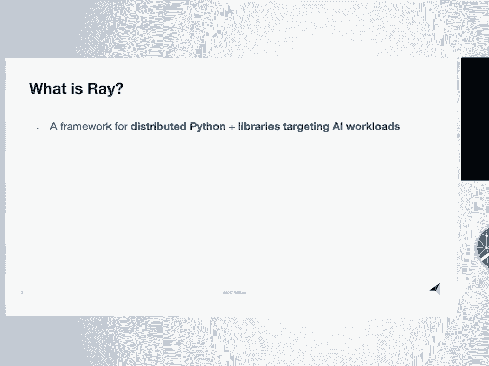
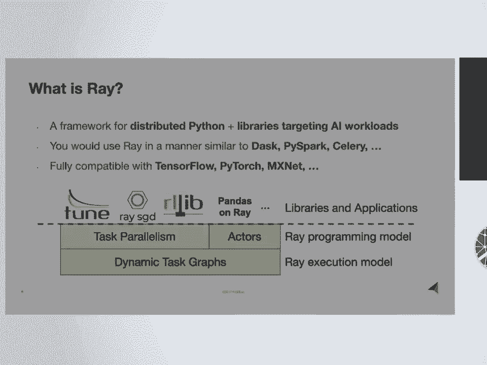
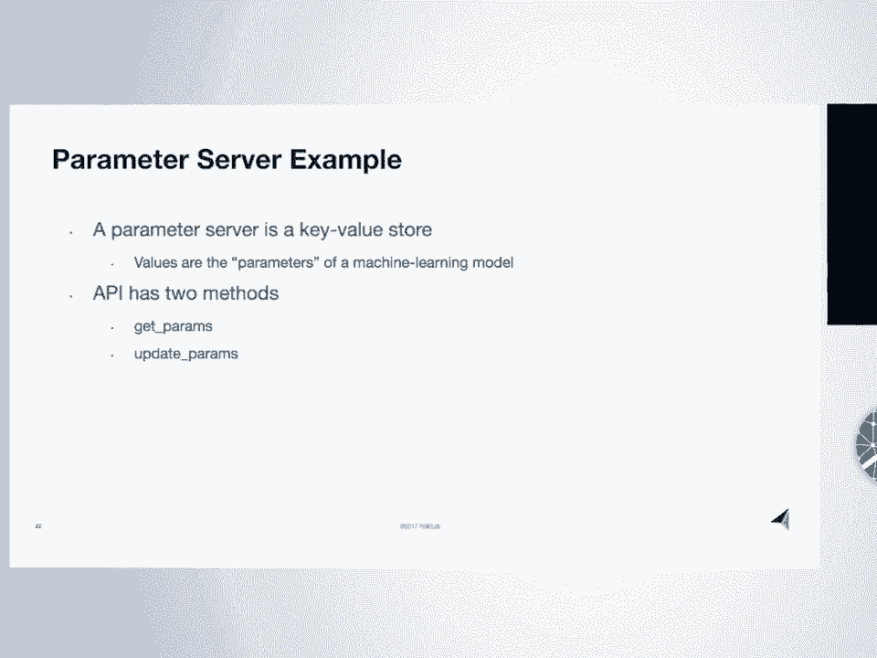
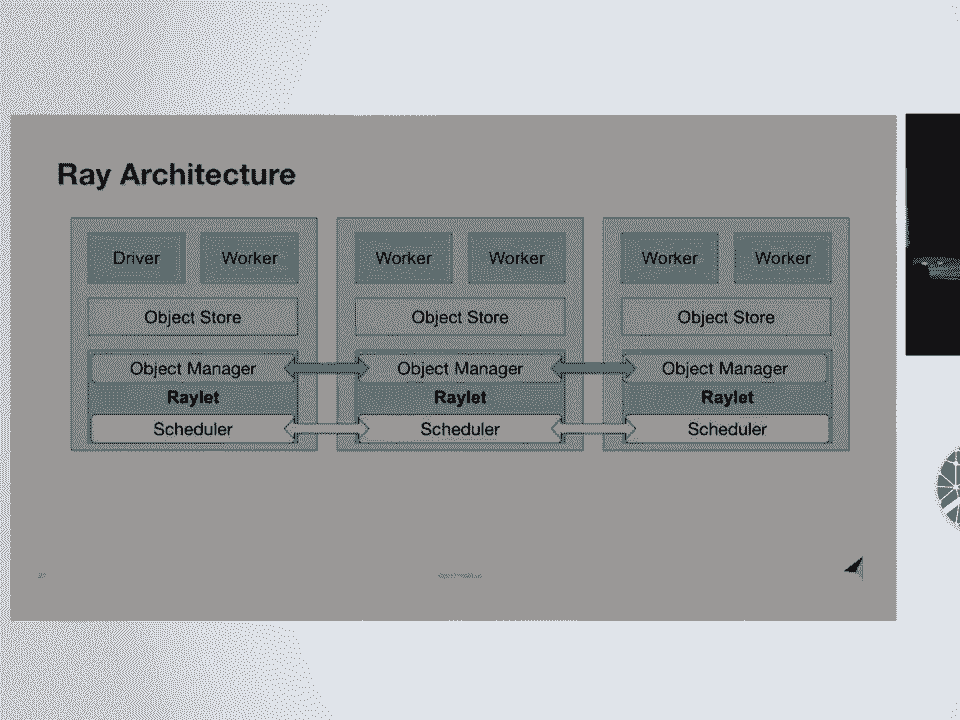
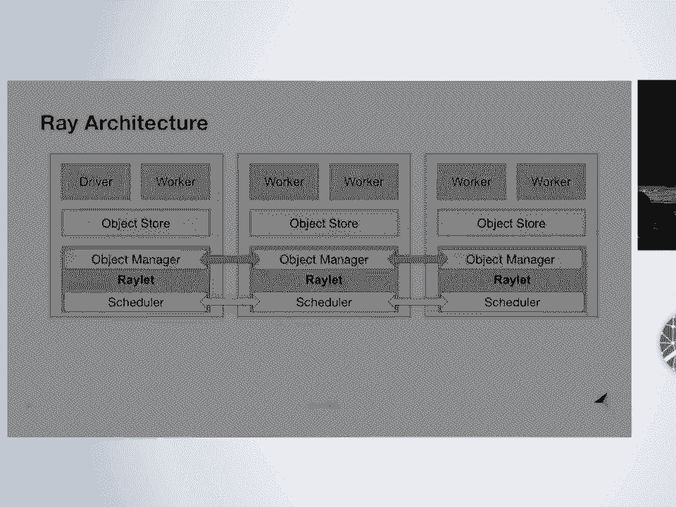
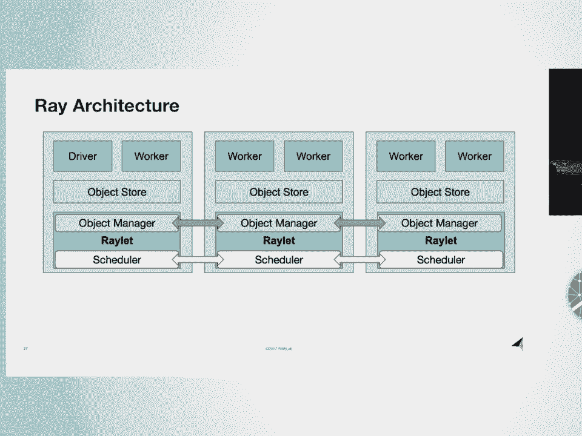
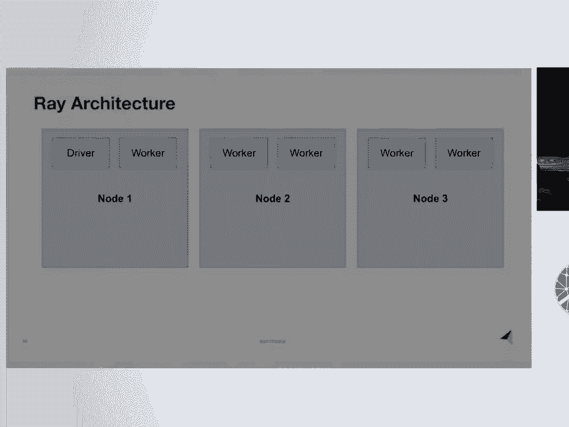

# SciPy 2018视频专辑 - P26：SciPy 2018视频专辑 (P26. Ray - A Distributed Execution Framework for AI _ SciPy 2018 - GalileoHua - BV1TE411n7Ny

 I'm Robert and I'm really excited to be here。 I'm a grad student at UC Berkeley。

 and my primary research is in machine learning， and algorithms for optimization and reinforcement learning。

 and things like that。 And I'm gonna tell you about a distributed system。

 called REI that we've been building， which is directly motivated by a lot of the pain points。

 encountered while doing research， in machine learning and in practice。 So what is REI？

 So REI is a general purpose framework， for doing parallel and distributed Python。

 along with a collection of libraries， targeting machine learning workloads。

 And here machine learning workloads， means things like hyperparameter search。

 reinforcement learning， distributed training。

 and I'll talk more about these libraries in a little bit。 So to situate REI and the overall stack。

 the way you would use REI is similar， to the way you would use DASK or PISPAQ or Celery。

 It's an execution engine responsible， for scheduling tasks and executing tasks。

 and things like that。 In relation to the rest of the machine learning ecosystem。

 REI is fully compatible with deep learning frameworks， like TensorFlow and PyTorch。

 And this is super important， because a typical application would actually use REI。

 along with TensorFlow or other deep learning frameworks。

 You would use TensorFlow to define your neural networks， and then you would use REI to distribute。

 and schedule the computations。 So here's a depiction of what's the different layers。

 of REI look like。 So at the bottom level， the back end reasons that construct。

 dynamically constructs a graph of tasks， and task dependencies。

 And these tasks are scheduled around the cluster， and executed by the back end。 In the middle。

 the two abstractions， that are exposed to the user。

 are a task parallel abstraction and an actor abstraction。 So here the task parallel aspect。

 is basically the ability to take an arbitrary Python function。

 and to execute it asynchronously in the background， and to do this in parallel。

 and to construct dependencies between tasks。 And the actor abstraction is essentially the ability。

 to take an arbitrary Python class， and instantiate it remotely as a service or as an actor。

 And I'll give examples of both of these in a little bit。 And on top of these two abstractions。

 so that's the core API， these the task parallel and actor abstractions。

 And you can use those directly to build applications。

 but we're also building higher level libraries， on top of those two abstractions。

 So that includes things for hyperparameter tuning and so on。

 So the natural question is why build a new system？

 And the answer is that we have a new workload today。 So machine learning today represents。

 a different kind of workload than the， say， batch data analytics in previous important workloads。

 And you can think of， and these workloads， have new and often very demanding performance requirements。

 And so you can think of AlphaGo from DeepMind， or DOTA from OpenAI as two example applications。

 but keep in mind that machine learning applications， are very diverse。

 And so to fully support machine learning applications， you need a very general purpose system。

 So it's not enough to just handle machine learning training。 You also have to handle model serving。

 data processing， streaming data and things like that。 So the pattern that we've seen over and over。

 when talking and spending time with people at DeepMind。

 or OpenAI or Facebook AI and these kinds of places。

 is that existing systems are not meeting the requirements。

 their requirements for these kinds of applications。

 And what they're doing is they're often building， their own infrastructure or their own tooling。

 for each of these applications， and to get the flexibility or the performance that they need。

 And so what we've seen is that there's a need， for a general purpose system that can efficiently。

 support these kinds of applications。 So before I dive into the details of how Ray works。

 I wanna mention that it's an open source project。 Our goal is to grow it as an open source project。

 And it's a relatively young project， but it's growing quickly。

 We have an increasing number of contributors。 So the green line shows where we had our first release。

 about a year ago and we've just released 0。5。 We have a growing number of production use cases。

 at companies of different sizes。 And one of the reasons we're so excited to be here。

 is that we're looking for new use cases， and new ways to contribute or to collaborate。

 And if this project is going to be successful， it needs to seamlessly integrate with the rest。

 of the Python ecosystem and the open source ecosystem。

 So that's something we're excited to talk with you about more。

 So now let me say a bit about the Ray API。 So here are two example Python functions。

 The details don't matter， they're just example functions。 When I add the Ray。remote decorator。

 what this does is now I can invoke these functions， with 。remote and what that will do is it'll。

 immediately return a future in a non-blocking way。 And then it'll create a task that is scheduled。

 and executed by the backend。 So this should look fairly familiar。

 And you can see that there's a graph， of dependencies being created。 So the third task， the 。

task depends on the first two tasks， because the futures from the first two tasks。

 are passed in as an argument to the third task。 The first three lines are all non-blocking。

 And then if you want to block and wait， for the computation to finish and retrieve the results。

 you can call ray。get and that will do that。 And so that's what the futures。

 the task parallel part of the API looks like。 And this is already really powerful。

 There's a lot you can do here。 But one thing you can't do with what I've described so far。

 is have shared mutable state that is shared， between multiple tasks。

 And this is important for machine learning applications。

 that can be things like the weights of a neural network。

 the state of a simulator or some encapsulation， of an interaction with the real world。

 And so the way we handle that is through an actor abstraction。 So here's a regular Python class。

 It just has a counter that counts from zero and upwards。 When we decorate that with the Ray。

remote decorator， now when I instantiate one of these counter objects， that creates a new process。

 a new actor somewhere， in the cluster。 And then method invocations on the actor handle， these c。

ink calls， are turned into tasks that are scheduled， and executed on the actor process， serially。

 So the method invocations can come from the process， that created the actor。

 they can come from other processes， or even other applications。

 but they're all executed on the actor process。 And similarly。

 these method invocations return futures， and we can retrieve them with Ray。get。

 And so this is what the two dynamic task graphs， look like for these two scripts。

 And I'm presenting them， these two things as separate parts of the API。

 but really they're quite unified， and because they share this dynamic task graph abstraction。

 and you can use actors within tasks and vice versa。 So now I'll give you a quick example。

 of how you can use these Ray to do something interesting。

 like build a parameter server and do distributed training。 So for those of you who are not familiar。

 with the parameter server terminology， it's basically a key value store。

 where the values are the parameters， of a machine learning model。

 So that can be a neural net or a linear model， or many different things。

 And the parameter server abstraction， basically provides two methods。

 so one for getting the latest parameters， and one for updating the parameters。

 So now I'll show you how you can do that in Python using Ray。 So let's see。 Okay。

 so first I'm gonna import several things。 And then I'm gonna call Ray。init。

 which essentially starts up the relevant processes。 This is starting a scheduler。

 and an shared memory object store， and a couple other things。 It's， this is all on my laptop。

 but it would be the same code on a cluster。 Okay， so as a Python class。

 a parameter server is essentially pretty simple。 I'm going to initialize the parameters to be。

 I'm gonna initialize the parameters， to just be a vector of zeros。

 And then the parameter server has two methods， one for getting the latest parameters。

 and one for updating the parameters。 So here the update function is gonna take in a gradient。

 and then it's gonna add the gradients， to the vector of parameters。 Okay。

 so to turn that into a Ray actor， I can add the Ray。remote decorator。 And now if I instantiate this。

 what that's doing is it's creating a new process， somewhere in the cluster。

 And I can invoke methods on it by saying PS。getPRAMS。remote。 That will return a future。

 And if I call Ray。get， that will actually retrieve the values。 So now， okay， so now I have started。

 this parameter server process。 So say I want to start some workers。

 that will compute gradients and update these parameters。

 The way I can do that also with another actor， or I can do it with a remote function。

 So here I'm gonna define a Python function， that takes in a handle to the parameter server。

 And then it's just going to loop， say， for a little bit， and do three things within the loop。

 So it's going to get the latest parameters， compute a gradient update。

 and then update the parameters。 So to get the latest parameters， I can say Ray。get on PS。getPRAMS。

remote。 Then I can compute a gradient update。 And here I'm just gonna make up a fake update。

 but this is the step where you would use TensorFlow。

 and you would have some data that you would take as input， and compute the gradients。

 And then I'll sleep for a short amount of time。 And then we're gonna update the parameters。

 which with PS。updatePRAMS。remote。 And we're gonna pass in the gradients。 Okay。

 so we define this worker， which interacts with the parameter server。

 Now I can start up a couple of workers， by saying worker。remote and passing in the parameter server。

 And I'll start two of them。 So that starts these workers' tasks。

 and their training and interacting with the parameter server。

 And now if I go back to the parameter server， and get the parameters and call Ray。get。

 then you can see that they're sort of updating， in the background。 So what we've done here。

 so we started a parameter server process。 Then we started two worker tasks。

 that have taken a handle to the parameter server， and iterate between getting the parameters。

 and updating the parameters。 And then we started those two workers。

 and then we're running them in the background， and they're updating the parameters。

 So what's so powerful about this， is that a parameter server is something。

 that's typically implemented and shipped， as a standalone system。

 And in similar to the way like a database， or a key value store would be a standalone system。

 And here we're able to implement a parameter server， with a dozen or so lines of Python。

 And because we implemented it ourselves， it's much more configurable。

 So if we wanna change the way the update works， we wrote that line of code。

 so we could change it ourselves。 One thing you often have to do。

 if network bandwidth is the limiting factor， you often have to shard your parameters。

 across multiple parameter servers。 And that would be done by starting up multiple。

 copies of this actor。 And similarly， if you wanted to change the updates。

 from synchronous to asynchronous or vice versa， that would be again like a certain or ignore stragglers。

 or things like that。 These are all a few lines of code， that you would need to change。

 So that's how you can use actors and tasks together， to implement a parameter server application。

 Okay， now I'm gonna go back to the slides。 So now I'm gonna say a bit about the right architecture。

 what the backend looks like。 Here， each of these gray box represents a physical machine。

 So there are three machines。 And like many Python libraries。

 the backend is written primarily in C++， with a thin Python API。

 And so the workers here are Python processes， that execute and tasks。

 The driver is also a Python process。 This is your application that's running your script。

 And you can have multiple drivers， and multiple applications running in the same cluster。

 So on each machine， there's a shared memory object store。

 So this is something that's being developed， as part of Apache Arrow。

 And I'll say more about that in a little bit。 But it's absolutely critical for the kinds of performance。

 that we're able to get。 Because it allows， you often have， very large machines these days。

 And it allows you to have all the workers， on the same machine access the same data。

 without deserializing it or creating copies。 So that's very important。 We have an object manager。

 which is responsible for streaming objects between machines。 And each machine also has a scheduler。

 So we take a distributed approach to scheduling， because for applications that require。

 very high task throughputs with a millions of tasks per second。

 then a centralized scheduler would often be a bottleneck。 One other thing I want to highlight。

 is our global control store。 So this is a sharded in memory key value store database。

 which is used to hold， not， it doesn't hold data objects， so data is held in the object store。

 But it holds like the control state of the system， and metadata。

 things like specifications of the tasks， and the task dependencies。

 which can be used to reconstruct lost objects， if a machine fails and things like that。

 So this is actually also really important， for building debugging and profiling tools。

 because since the control state of the system。

 lives in a database， you can query that database at runtime。

 or after the fact to see what's going on。 So that's a bit about what the architecture looks like。

 And there's more to say here， but we can talk about this afterwards。 So that's the core array API。

 and architecture that I just described。 We're also working on building higher level libraries。

 on top of that core system。 So one of these is Pandas on Ray， which is part of Modin。

 which is a project that Devin Peterson is in charge of。

 and he's here at SciPy and has a poster later tonight。 So I'd encourage you to chat with him。

 And the goal of this project is to speed up， your Pandas workloads by changing just a single line。

 just the import statement。 We're also work， we have state of the art implementations。

 of reinforcement learning， of a library for reinforcement learning， and hyper parameter tuning。

 So you heard a lot about hyper parameter tuning， and auto ML in the previous talk。

 So these are our important and growing use cases， within machine learning。

 And if you have hyper parameter tuning， or reinforcement learning applications。

 I would encourage you to check out these libraries。 This is work by Richard and Eric。

 One thing that's a very preliminary work， is we're working on a library for distributed training。

 So this is basically using the Ray backend， to implement a fast all-reduce， that's competitive with。

 essentially with MPI， all-reduce performance but on top of the Ray API。

 And that's being used to build a easy-to-use， distributed training library on top of Ray。

 And that's a very preliminary work at the moment。 So those are some of the libraries we're working on。

 and we want to continue fleshing out this sort of ecosystem。

 of all the aspects of the machine learning pipeline， from data ingest to model serving。 Okay。

 so another thing I wanna talk about， is Ray's relation to other open source projects。

 and the open source ecosystem。 So we use Apache Arrow very heavily。 I don't know if you。

 there's a talk later today， by West McKinney about Apache Arrow。 And like I said。

 Arrow has been absolutely critical， for getting the kinds of performance that we're able to get。

 And so Arrow is the underlying data serialization format， that we use to store our data in。

 And this enables the， so several of the components， that we initially developed as part of Ray。

 have now been contributed to Arrow， and are being developed in Arrow by a larger group of people。

 and are being used by other projects as well， as there's somewhat stand-alone projects。

 So that includes the shared memory object store， which we use to access data through shared memory。

 between multiple workers on the same machine。 And another is our zero-copy serialization libraries。

 which map arbitrary Python objects to and from the Arrow format。

 So that means if you have a dictionary of strings mapping。

 to neural network weights as a NumPy array， and things like that。

 you can put those in the object store， and serialize them using Arrow。

 and then get them out instantaneously in another process。

 So that's a bit about our relationship with Arrow。 Another thing I wanna mention。

 is that we have preliminary support for Java as well。 So if you are a Java developer and interested。

 in trying out Ray through Java， you should check that out。 This is an external contribution。

 and later on Arrow will enable even more interoperability， between Python and Java。

 because the underlying data layout is language independent。 Great， so overall。

 so Ray is a general purpose framework， for doing parallel and distributed Python。

 We really care about machine learning and AI workloads， and so those are the workloads。

 that have really motivated our performance requirements， and design decisions。

 It's an exciting open source project， and we're looking for new ways to collaborate。

 and new use cases and generally want to get your feedback。 So any thoughts you guys have。

 I'd love to hear and I'll have a poster later tonight。 So please stop by the chat。 Thanks a lot。

 (audience applauding)， All right， thanks for the great talk。 We have a few minutes for questions。

 Quick reminder， one question， please phrase as a question。

 and we'd love to take questions from women first。 I see in the green shirt。 - Thank you， Robert。

 I have a question。 So you mentioned you can make dynamic task graphs。

 So to what extent can you make dynamic co-routines？

 So have co-routines call other like Ray co-routines？

 - So one thing you can certainly do is you can call， a remote function or actor method。

 from within another remote function or actor method。 I don't know if that's exactly what you mean。

 - I think creating like a dynamic graph， that looks back upon itself。 - So the question is。

 can you create a dynamic graph， that loops back upon itself？ I see。

 So you can have a remote function， that recursively calls itself。 So for instance。

 you can implement factorial recursively。 So there's some ability to do things like that。 Yeah。

 - Thanks。 Great talk。 You mentioned at the Ruby getting something about failover。

 but didn't really talk about it。 So can you maybe explain briefly。

 what your thoughts are on failures in say the afternodes， when one of those nodes goes down？

 How would you do for a stateful actor？ - Yeah。 So how do we handle failures？

 So both for actors and non-actors。 So handling machine failures is super important。

 Not just because of hardware failures， but if you want to use cheaper spot instances。

 or preemptible things like that。 And or if you want to automatically scale up。

 and down your cluster。 So the way we handle regular task failures。

 is by rerunning the tasks that created the objects， that are lost if they're needed in the future。

 So this is a lineage based fault tolerance， similar to what Spark does。 For actors。

 we've been so far。

 we've been doing the same thing where we， because they're stateful。

 you have you essentially have to rerun the。

 you have to recreate the actor， and then rerun the methods from the beginning。

 And that's of course prohibitive。 So you can checkpoint the actor state at different points。

 and then reload from the checkpoint， and then rerun the tasks from that point on。 However。

 that's something we're exploring。 We're experimenting with different approaches。

 So one another approach is， and a good example of this is if you have。

 a large cluster and a bunch of GPUs on each machine。

 and you want to do some sort of distributed training thing， you may create one actor per GPU。

 And then if you're， if your machine fails， and you want to keep running the application。

 you may actually want to have the application， adapt to the failure and just shrink the number of actors。

 And so one way we're thinking of handling that， is essentially just raising an exception in the application。

 and letting the application handle that however it wants。

 But this is something we're still experimenting with。 - Thanks for the talk。 I just wanted to check。

 I don't know if you mentioned this。 Does Gray have built-in like deadlock prevention。

 or de-risk prevention or is it something， you're going to have to extrinsically program。

 once you've started setting up your system？ - So there are a couple different ways。

 you could imagine getting deadlock。 So are you imagining with two actors。

 that each invoke methods on each other， and then each and then block and wait for the results？ - No。

 or like do you have to conflict， in your resource health vision？ - Right， so another。

 so if one thing you could do， is to have a deadlock， you have to have tasks。

 that are sort of blocked somewhere and can't proceed。

 And one way that can happen is if you're calling， if one， so let's see。

 If one task creates a new task， and then blocks while waiting for the results， well。

 so just quickly。 So if I do something like ray。get of f。remote here。

 so this will work but what will happen， or it didn't return anything。 But what will happen is。

 so when I start executing g， that creates a task， that's executing on some worker。

 And then it creates a new task f， which will start executing on another worker。

 and the g won't return until f returns。 And then if you imagine continuing to do this for a while。

 all your workers could sort of be occupied。 So when a worker blocks in ray。get。

 it sort of releases its resources， and that's how we deal with that。 Yeah。 - Just a quick question。

 Thanks for the talk。 I had the impression that tensor flow， is distributed kind of inherently。

 but you mentioned something that ray is compatible， with tensor flow so。 - Yeah。 - Clarify。

 - So tensor flow does have built in support， for distributed training but not general purpose。

 distributed computing。 So that's the basic answer。 And actually even on top of that。

 there are a lot of things that can be improved。 For instance， Uber built Horavod。

 which is a built on top of tensor flow， but doing the distributed computing sort of out of band。

 And there are a lot of things that you could want to do。

 that are not easy to do with distributed tensor flow。

 - What kind of performance penalty are we talking about。

 with the workers in the cross communication？ - So what， yeah， performance penalties。

 So there's overhead with using multiple processes。 And so for basically， right now， there's。

 I think there's a lot of room for improvement， but right now the minimum amount of time to create it。

 that from invoking a task， it gets scheduled， on another machine or it gets scheduled。

 say on the same machine。 And the results are stored in the object store。

 and then you retrieve those results。 You're touching a bunch of different processes right now。

 It's about 300 or 400 microseconds。 I think there's a lot of room for improvement there。

 And right now， scheduling something on another machine。

 getting the results back is more like a millisecond。

 But I do think there's a lot of room for improvement。 - All right。

 thanks to Robert and all our speakers， for a great presentation。 (audience applauds)， [no audio]。

