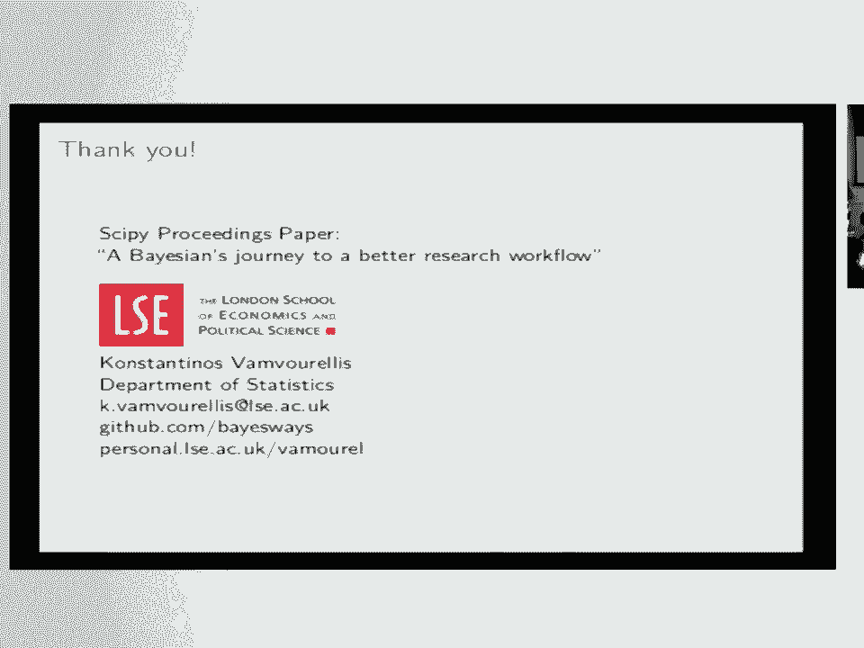

# SciPy 2018视频专辑 - P33：SciPy 2018视频专辑 (P33. Should this Drug be Approved A Bayesian’s Answer with Stan - GalileoHua - BV1TE411n7Ny

 Hello everyone， my name is Konstantinos Ramburalis。

 I'm going to be presenting my work together with Marjan。

 and the result of our collaboration that started not that long ago is a paper that was submitted。

 and it's part of the proceedings that I invite you to read at the end。

 I'm a student at the Department of Statistics at the LSE and I work in Bayesian inference。

 and I'll be presenting some of my work， but there's a lot more of the paper that we just don't have time。

 I'll present here， so I'll pass you to Marjan for the first slides and then I'll talk more about。

 drag approval and Bayesian models for that。 Hi everyone， so I am Marianne Carvelak。

 I am a data scientist in industry and also an， independent researcher with Ictor。

 Ictor means Institute for Global Distributed， Open Research and Education。

 So as most data scientists in the room， I would guess， I spend 90% of my time cleaning up data。

 reformating data and plotting histograms， right？ But sometimes I eventually run models to get predictions or other kinds of results。

 That's great， but it's not enough。 I want to know how confident I can be about those results。

 about those predictions and ideally before I communicate those results。

 And I'm a physicist by training， so I'll try a few things like perturbation type of approaches。

 to test the robustness of my predictions， but I didn't know of a consistent， well-defined way。

 to quantify uncertainty。 So that's what got me interested in applied Bayesian statistics。

 because when you do Bayesian statistical modeling， the quantification of uncertainty is built。

 into the data analysis framework。 So let's go over what Bayesian inference entails a little bit。

 First of all， why are we talking about inference？ So assuming your data D is generated by a process。

 so modeled by a model with parameter theta， data generation would be the forward direction。

 and inference would be the reverse direction。 So inference is about determining the parameters theta。

 that are compatible with the data D that you're observing。 So the likelihood is a function。

 that expresses the model that you're choosing for data and what distinguishes Bayesian approaches。

 is that you're modifying this likelihood function by the prior knowledge you have about your parameters。

 So for example here， you may know that all the values have to be above 18， so those typical。

 range knowledge， min/max values， you bake into the so-called prior distribution。

 And this takes this way， you get the posterior distribution， so really that's your result here。

 That's at the heart， of the Bayesian approach。 And what can you do with a probability distribution？

 Yeah， because once， you normalize the posterior， you have a proper probability distribution。

 So what you can do， with probability distributions is compute expectation values。

 So for example here if A is a quantity， of interest with this integral you would get the expectation value for A。

 And now how do you， evaluate numerically this integral？

 Well just to give you an idea of the big picture， maybe you've， heard of HMC。

 Hamiltonian Monte Carlo， that's where those kinds of algorithms come into play。

 to approximate the value of this integral。 Oh， sorry。 That's fine。 Okay， great。

 So I'll talk a little， bit about how we， a case study in clinical trials data and how I use Python to get the results。

 to get， the posterior distribution。 So the question is how do we model clinical trial data？

 The data looks， like this。 We're interested in various things。

 Most of the time we want to know the effect of a， treatment。

 There's a lot of questions one can answer。 The point is that Bayesian inference will give you。

 the joint posterior of all the variables of interest。 So you can then choose how to evaluate that。

 So if， our data is like this is a sample data set。

 we're looking at the case of diabetes and a treatment for， diabetes。

 That's why we're interested in glucose levels and two adverse effects that are binary。 So how。

 can we model these together and understand the posterior distribution of these three effects。

 condition on the data we see in the clinical trials？ That's the question we want to answer。

 And we see， here that we have various subjects。 Obviously more than this is just for illustration purposes and we have。

 two groups。 One receives a treatment and the other one receives a control。 So to model this。

 there's， various approaches。 The simplest one I'll take here is just model one， the data set of the。

 control and model also the data set of the treatment separately。 And then we can compare them。

 So the， two matrices I will have of the data will be YC and YT。

 And if I do two inferences for each group， then I'll。

 have a set of posterior samples for the control， the samples for the treatment group。 And I can。

 compare them。 And the parameter theta here is really a vector of three different things。 In my case。

 it， will be the mean population effect， the variance。

 and would also be the correlation among the three， effects。

 which is actually a very important variable and it's not easy to capture with simpler models。

 That's where Bayesian inference really signs。 It can allow you to get the full posterior distribution。

 of all the variables of interest。 So a little bit of how does this work。 This is a kind of cross。

 course of Bayesian inference。 It's based on Bayes rule。 And this is a rule。 It says that the。

 beautiful simple formula for the posterior distribution theta given the data we see。

 That's really the， question here。 We have data in the clinical trials and we're going to know what is the parameters。

 And， it's expressed as a function of the likelihood。

 the probability of the data given the parameters， times， the prior divided by the constant。

 This is the rule。 And sometimes this is also written as a。

 likelihood as a function of the parameters。 We'll keep it simple in this format。 In reality， the。

 denominator is actually an integral over the parameters。 This is a very complicated formula。

 usually to calculate because theta is multidimensional and the data is big。

 So calculating this interval， usually is very difficult。

 The good thing is that if you integrate out theta， this becomes a constant。 So you see。

 integrate over the overall uncertainty on the parameters， this becomes a constant。 And when。

 it becomes a constant， we can simplify a formula and use it up to proportionality。 That means that。

 the posterior distribution is proportional to the likelihood times the prior。 Very simple。

 And these are， the key ingredients of Bayesian inference。

 And these are the ingredients that you give to a computer。

 for a program to calculate the posterior distribution。 So I'll show you how we do this。

 In this case， we use stan。 And when we give the ingredients。

 we program it in the computer and we pass the data， then we can get back samples from the posterior。

 We can get exactly what we want。 So in my case， the， data is the clinical trials data for diabetes。

 The two groups。 I'm going to simplify the annotation， here。 Just talk about one group， while。

 although I'll have to do it for both y and t。 Sorry， c and t control and treatment。

 But it's for both is the same。 So t is going to be my matrix y and， the parameters。

 Theta is going to be a three vectors。 The mean， the variance and the correlation。 These。

 are the three things I'm interested to know here。 If we wanted to introduce more structure in our model。

 we could。 And once I identify these ingredients， then I need to express the ingredients for the。

 algorithm。 This is the likelihood。 Which is a function。 This is a probability or a function of。

 the parameters that are fixed for the data that they observe。 So this is a function given fixed。

 values for the parameters。 And I can express it like this。 I don't think anyone really wants to see。

 this， but this is something I can give to the computer。 And that's what I do。 That's like I。

 actually give this to stan in its language。 And this is the one ingredient。 So going back， we got。

 that done。 Now we have the prior。 So the prior is also a probability distribution。 It can be as。

 complicated as you want。 Here I'm going to just assume that the parameters are independent of。

 each other。 So they factor out。 I have a product of three distributions here。 Mu， sigma and r。

 And I， can also write it down。 I can also pass it to the computer。 stan has pre-programmed。

 distributions that you can just name。 And it's very easy。 For example， if you've tried to work。

 before with Bayesian inference， you know that correlation matrices are kind of tough to handle。

 There's a very nice implementation of the LKJ prior in stan that you can just write LKJ。

 prior and it's there。 And it's very convenient。 You don't have to think too much about the。

 structure of your posterior， which is the case if you work with Gibbs or conjugate priori。

 and so on。 I won't go into details， but you just describe the priori that you want。 For example。

 the sigma is a half cosey because this is a positive constant and I want to give it a little longer。

 tail。 So the results。 If I do this， I get results from my posterior distribution。 So I get。

 uncertainty。 I get whole distributions for the parameters。 And with that， I can now see various。

 metrics of interest。 For example， here I'm interested in the prediction of the effect on a new patient。

 And I want to see what's going to happen on the patient with the treatment and without the treatment。

 Conditioned on the data， so at the clinical trials。 And I'm going to propagate the uncertainty from。

 the parameters all the way to the final result for a new individual。 So here in my data， as I said。

 this diabetes data， these are subjects that are being given two different drugs and we want to see the effect。

 Control is a more established older drug treatment。 It's a new therapy。

 And I'm looking at just three， effects now。 There's more， but just for illustration purposes here。

 I'm talking about nausea。 Here， dyspepsia is the two adverse effects and glucose is the efficacy variable that we want。

 to reduce。 And you see that there is actually difference。 In some cases like glucose。

 the effect is actually， pretty easily observed。 There is a little bit of a difference here in the value of glucose。

 The treatment， seems to be doing a little bit less than the control。 When we come to binary effects。

 the probability， of the new patient having the effect is characterized fully。

 You see a full distribution here and we see， the difference between the two treatments。

 We see that the probability under the treatment for this effect， here is actually a little lower。

 Whereas for this one， dyspepsia， it's very similar。 And this is all。

 conditioned on the data and is taking into account the correlation between the different effects。

 which is， actually not an easy thing to do unless you do a full Bayesian hierarchical model。

 So I think that this sort， of approach is much more comprehensive in order to understand the effects of a drug and can help。

 regulators answer the question of whether a drug should be approved or not。 Of course。

 it's up to the， regulator to decide what is important and what is not。

 but at least this kind of gives you a more， comprehensive picture of the effect。 So what is Stan？

 How do we do this？ Stan is a compiled C++， language for Bayesian statistical inference。 Okay。

 so why do we care about Stan？ Well， it automates the。

 posterior distribution part that it's notoriously hard to get。

 And it usually requires lots of tuning and， custom-made algorithms that I've actually spent a lot of time building with Stan。

 It can be a lot faster。 And you don't have to think so much about how to be clever about getting the posterior。

 It's more， automatic。 And then how does it work？ Well。

 you give it the ingredients and it just gives you the， posterior。

 You give it the likelihood and the prior， which are choices that the modeler makes and it。

 gives you back samples from the posterior。 So in practice， there is a lot that can go wrong。

 Obviously， it's a -- so it takes a lot of effort actually to understand Bayesian modeling and actually coded。

 but， there are great resources online。 There is， first of all。

 Python is the interface to Python and has its， own sort of ecosystem and its own website。

 These are links that you can -- it will take you， but you， can also Google it， obviously。

 And then I want to also talk about the excellent resources that the Stan。

 team has put together for people who want to understand a little bit more。 First of all。

 the manual is an， book basically of a thousand pages that has different models and it kind of guides you through how you。

 can build Bayesian models and the choices that you can make。 There is an excellent resource of case。

 studies that has a ton of different examples， pretty involved case studies。

 And there's also a forum， an， active forum where you can post questions and get advice not just how you code things but how do you。

 do it -- how do you build Bayesian models？ We've also written a paper， as I said。

 with Mariana about how， to go about doing computational research and specifically in the Bayesian way。

 but I think it's actually， helpful for anybody who is doing computational research。

 we kind of try to do it in a principle way and make， it also reproducible。

 which is a very important part of computational research。 And finally， I just didn't。

 want to leave this without mentioning that Stan is one of the two tools that actually right now available to。

 do Bayesian inference in Python。 The other one is PyMC3。 PyMC3 is a native Python。

 Stan is a language， that stands alone and you can interface with it and actually there's a lot of it outside Python。

 which is， our Stan。 But I think it's actually good that you can have a language that you can communicate with。

 developers outside Python。 It's slightly different communities。

 I don't have time to go through all the， details， but obviously it's important。 And also。

 I would like to invite people to contribute if they want， to Stan and PyMC3 specifically。

 It's an active area of research， both in the theoretical and applied， side。 And with that。

 I'll pass it on to Mariana。 >> Yes。 So like Konstantinos was saying， there is more in the。

 computational research world than just Bayesian approaches。 So the Bayesian way is about sampling。

 but machine， learning is about optimizing when you descend gradients and minimize a loss function。

 for example。 So how does， the work fit in the broader picture of reproducible computational research？

 First of all， we are， adopting the definition that I think has become the standard in our communities here。

 So by， reproducibility， we mean that we can recover results using the same datasets and the same methods。

 I can point you to references for this if you're interested。

 Our motivations and aspirations to zoom out， a bit and make sure that the work fits into those best practices were both very day-to-day low level。

 like making the research process more enjoyable on a day-to-day basis and less frustrating。

 But also in the， big picture， we care about the work being auditable， improvable， debatable。

 and that other people can， build upon it。 So the key practices for making a computational research project reproducible are three。

 One is project organization， by which we mean file and folder structure。

 And you'd be amazed at how many， statisticians and academics in general don't really know about it。

 don't know how to go about this。 And so I put together， like。

 how we went about it in our experience to share， to spread the word。 Then documentation。

 we mean this in a really broad sense because even a good naming convention can be。

 self-documented in the first place。 But of course we also mean more traditional， like。

 written documentation。 And automation， also a lot of researchers don't actually know what this means。

 So what this means is that， you really identify each processing step in your data analysis。

 usually that starts with loading in input data。 And once these steps are well identified。

 you chain them together in a processing pipeline。 And then that pipeline can be run automatically。

 let's say， by a build script。 So also， we were given the opportunity through this conference and the paper submission to interact with the community。

 in a really constructive way。 And also we keep interacting with， you know。

 broader communities in general， like other statisticians， other bio-informaticians， et cetera。

 So for example， porting software， like having， you know， controlled。

 reproducible research environments， is still kind of an open question。 Like， yes。

 we use Kanda and we've had a great experience。 But sometimes there are some platform differences。

 So that gave rise to some interactions with our paper reviewers， for example。

 And sharing data is also a hot topic。 I would say， especially in human subject research。

 because you cannot and you should not just share the raw data like this。

 So we are really open to conversations around this， if any of you wants to approach us。

 And the conversation will keep going also， you know。

 over GitHub through papers and through conferences。 So， yeah。 Okay。 Thank you very much。

 We can take questions and you can read more on our paper。

 I'm happy to answer any questions now also。 [applause]， Do we have questions？ [inaudible]。

 This is probably too detailed， but in your prior distribution。

 you assume that your standard deviation， and the correlation structure are independent with each other。

 Can you justify that？ Because that's kind of contraindative to me。 Yeah。

 so maybe the first idea would be to just have one big covariance matrix。

 There's a lot of details I didn't talk about here。

 We're talking about binary data and continuous data。

 So it's a mixed type data which is actually a reality。

 but from a modeling perspective that's kind of harder。 So there is a few details。 For example。

 we separate the scales， the variances and the correlations。

 So that we can impose structure and the variances for the binary data that is not defined otherwise。

 So that's why we kind of like see them separately。

 It's also better for computational reasons when you're programming it into a stand。

 We can talk more about it， but there is not really a priori or reason why this should be correlated。

 You can have different variances and different correlations。

 It doesn't necessarily need to be the same， but it's actually a good question。

 It's all part of the modeling choices。 I have a question about reproducibility work that you talked about。

 So when it comes to sharing codes， I think we all agree that the best way to share code is GitHub or Bitbucket。

 What would you recommend to share data？ Is there a solution right now where you can put data and it will be available five。

 ten years from now？ Is there something you would recommend or is this open？ Yeah。

 that's an ongoing question and I guess still open。 I try to follow conversations about this。

 It really depends on the size of your data。 So for small data sets。

 we've come to the conclusion that GitHub is also a good solution even though there was not the initial design。

 but there's also Git LFS that can be helpful。 And more particularly here。

 there's the privacy concern。 So when we are talking about data sets that can be shared publicly without any ethical or legal issue。

 clearly I would say look at the size of your data， but then when there's the privacy issue。

 that's like yet another level。 But yeah， I'm happy to continue the conversation on this。

 I think it's still open-ended。 So I have one question。

 So my question is actually should this drug be approved？

 Bringing me back to the idea of does your stand， by stand。

 give us enough basis to understand what's the reference？

 Because you ended up saying that the regulators get to decide， but how do you give them a guideline？

 Can you give them a guideline？ Well， yeah， so the answer is that the regulators are the ones who own the utility function。

 They have to， at the end， decide what is important and what is not。

 But a model that is not taken to account all the aspects of the data can bias the results and the regulators might force to make a decision without all the information or even worse with bias information。

 So I don't have an answer and I don't think it's my job to give an answer specifically。

 but I find that scientists can provide more information and better models。

 so that the discussion about a drug can be more transparent and take into account all the available information。

 Can I just add that there are lots of platforms for sharing non-sensitive data sets， like data hub。

io and stuff like that。 So yeah， again， I'm happy to send you pointers as they resurface in my head。

 but there are platforms that I have some popularity in some communities。

 and not even just for tabular data， but even for graph type of data。 Yeah。

 this is a question more for the Bayesian inference method in general。

 Could you talk about how Bayesian inference methods are superior to say a traditional just pure logistic approach and why that's appropriate for such a question？

 I mean， you touched on this， but I'd like to hear a little bit more about it， please。 Yeah， no。

 that's a great pass。 Thank you。 So I think that I actually work， I've worked in the industry。

 I still work， and there are two ways。 There is optimization and sampling。

 there is machine learning and more like generative modeling。

 So I think there is a good reason to use both。 In this particular case， we want， first of all。

 we want uncertainty。 That's the problem for this particular drag we're talking about。

 This drag has been on and off the market quite a few times because regulators cannot decide whether it works enough。

 and if it works， whether the risks are not big enough to。

 kind of small enough to sort of justify the treatment effect。

 So we want uncertainty around our parameters。 That's something that you get with Bayesian method。

 The other thing you get is interpretability。 You can understand， you know。

 you can put in the correlation， you can put in the mean。

 So if you cannot just take this data and optimize for a loss function and get interpretability out of that easily。

 So this is another way。 Another big important reason is hierarchical models。

 You can build several layers and try to understand what is the individual layer。

 like what is the variability of the individual level。

 what is the variability of the population level。 Oftentimes。

 regulators care about the population level， but if the variability from the individual is huge。

 that could be a reason for somebody to kind of refuse to take the drag。

 And I think that as we're moving into more sophisticated discussions about regulation of drugs。

 then the patients also will start having more assay。

 And I think having those different aspects of the problem distinguished for all the stakeholders。

 it could be really helpful to kind of build better rules for drag regulation。

 So it's more interpretable and generally a lot more flexible。

 Let alone the prior knowledge that you can use also。 So there's a lot of ways， I think。

 Prior knowledge is also important because you've already seen lots of data。

 you've already had lots of clinical trials， you should put that into the new study。

 So it's not the only way， but I think a simple Bayesian model can go a very long way。

 in sort of like giving you a very good answer。 And as far as I understand it's a big step forward compared to what we currently use。

 So I'm happy to talk more about that。 So we can take one more question。

 but I will ask Zachary to already set his computer。 I'm going to press this。

 - Thank you。 - Thank you。 So you mentioned that Bayesian inference techniques are not widely in use for analyzing clinical trials。

 What are the primary barriers to getting them adopted and approved by regulatory bodies？

 - Is the question how can we get this to be adopted by the regulators？ - Yeah。 - Yes。

 - What's the barrier against？ - Well， actually， I'm not a regulator and I don't really。

 I can't really have a very informed opinion about this。

 But I do know that there is actually interest。 I've presented this work to bodies of researchers that are affiliated with the regulators。

 Sort of settings。 And I think there is actually a lot of interest now building in Bayesian methods。

 So I think it's a matter of spreading the word more because the results are pretty clear。

 But it's a thing， it's just time。 It takes time to spread the word and for people to change their minds。

 Maybe regulators should attend some of these meetings too， but I can't force them。 - Okay。

 let's thank Marianne and Constantine。 Thank you so much。 - Thank you。 [APPLAUSE]， [BLANK_AUDIO]。

