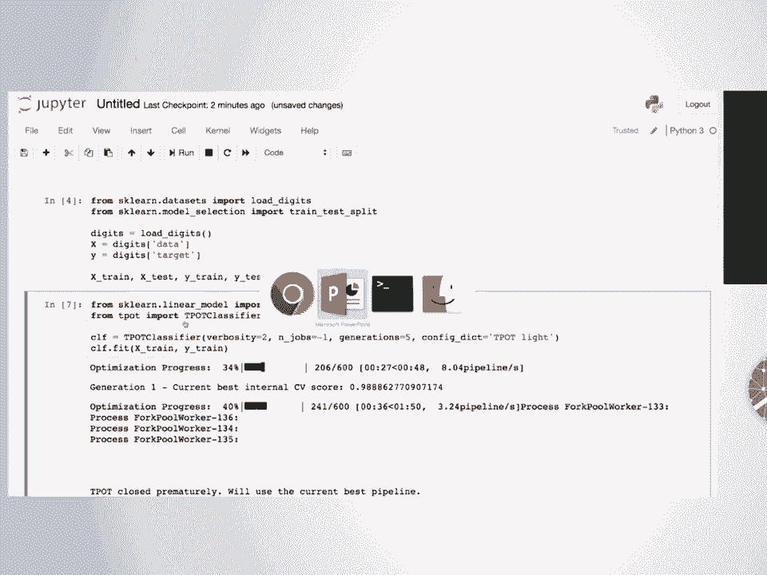
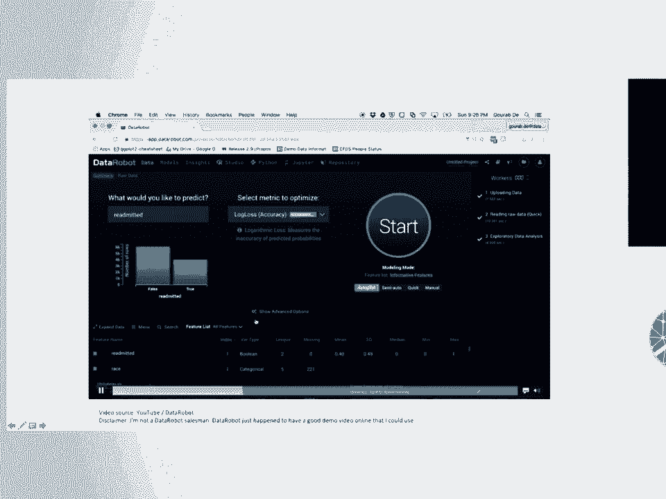
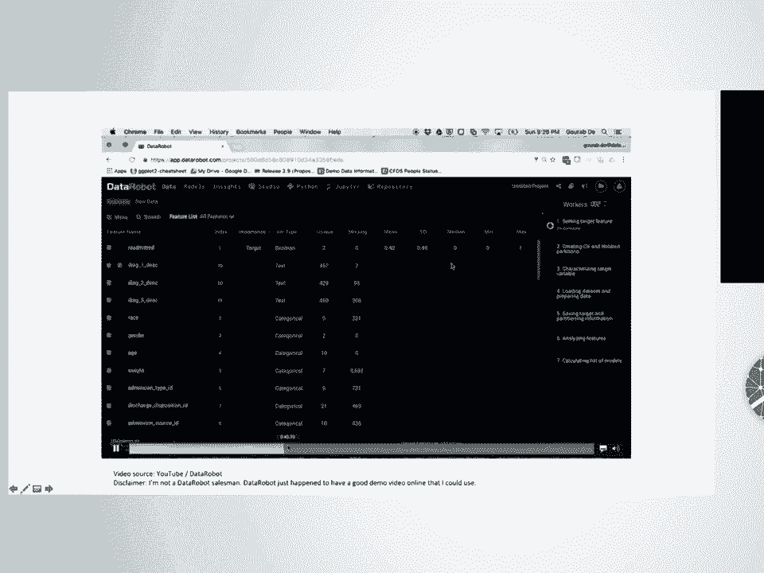
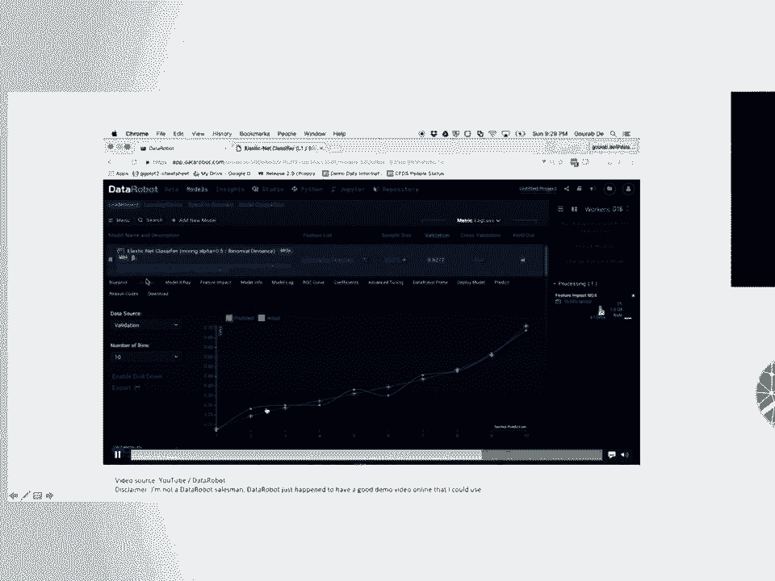
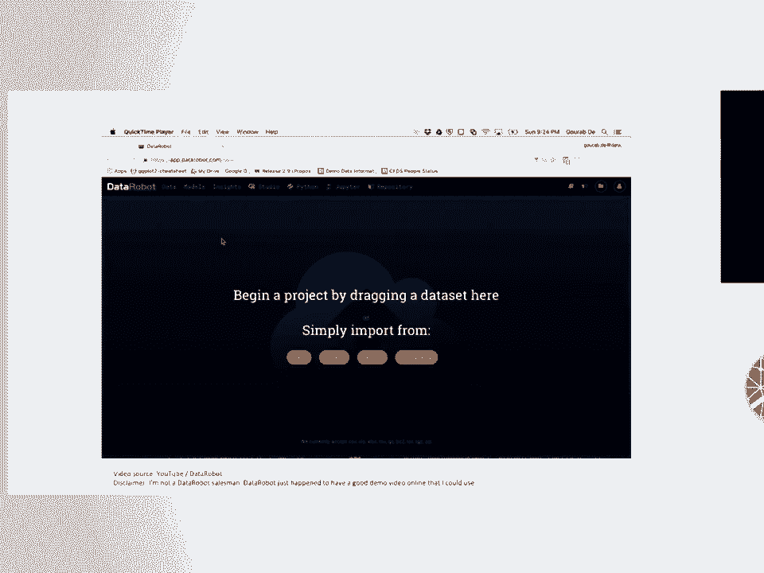

# SciPy 2018视频专辑 - P34：SciPy 2018视频专辑 (P34. The Past, Present, and Future of Automated Machine Learning - GalileoHua - BV1TE411n7Ny

 Today， I want to talk about this new and exciting field called AutoML。 And hopefully， you know。

 give you some insight into what's going on there。 You've probably heard about it。

 but maybe you don't know what's going on with AutoML。 Why it's so exciting， why it's useful。

 And also， what are the tools around it， right？ Like， that's what we're most interested in here。

 I think is like， what are the tools we can actually use from this new research field？ So。

 like I said， you know， AutoML has been written about a lot in the media and in blog。

 posts and all over the place， some of it by me。 And you'll see these headlines， you know， like。

 "AutoML is a quiet revolution in AI， some really great blog posts coming out of companies talking about how AutoML has been。

 useful for improving productivity in their day-to-day workflows。"， And then， of course， you know。

 the New York Times has to jump in and they get some cool。

 headlines like building AI that can build AI， you know， and talking real about AI。 Like。

 really sci-fi， futuristic and whatnot。 But you know， I talk to people about AutoML， you know。

 I ask what they know about it， if， they heard of it， and people are still asked like， "Okay。

 I've read these articles， I've， seen what， you know， the press is talking about。

 but what is it really？ What's going on in this field？"， So today I'm going to tell you， you know。

 what it is， why you should care about it and， why you should use it in your day-to-day workflow。

 Put simply， if you're really like， you know， Jan for time and you got to head to another。

 talk or something like that， you can listen to this next sentence and then you can go。

 because this is basically the answer。 AutoML aims to automate the process of applying machine learning algorithms。

 the data sets。 That's it， really， right？ But really。

 it's much more and that's why we have a talk about it that I'll be going， over now。

 So AutoML is the realization of a growing need in the tech industry， right？

 So this is a data set that I pulled from a company in Philadelphia， blog posts down there。

 and it's basically looking at the number of self-reported data scientists on LinkedIn， over time。

 There's some estimation around this and whatnot。 You know。

 but basically we see an interesting growth curve here， right？

 And one thing they pointed out in the post was， wow， there's roughly two times as many。

 data scientists on LinkedIn in the past five years， right？ And that was back in 2015， right？

 So of course， I wanted to do， you know， I'm a machine learning guy。

 I can fit a linear model and do a little extrapolation。 So， you know， I was like， all right。

 what if we extrapolated that out to 2018？ You know， okay， yeah。

 we definitely see a growth curve there， you know， maybe four times as。

 many data scientists in the past eight years。 And I decided to go crazy with it。 You know。

 I was like， well， I have a linear model。 I can plug in the year and let's just see how far we can go。

 And I calculated it out and by the year 33， 47， we will have as many data scientists as。

 there are people on Earth right now。 And by the way。

 maintaining the site is such a pain in the butt because every year I have。

 to update it based on the population number。 But anyway， so joking aside。

 we all know that data science is a hugely popular field， right？

 It's why all these conferences that are remotely relevant to data science are becoming so popular。

 we're all getting into the field。 There's a lot of exciting things we can do with these data science techniques。

 So really， the people who have gotten involved in this AutoML field have realized this growing。

 need that we need to help these people that are coming into the field that maybe don't。

 have years and years of experience， you know， analyzing data and especially applying machine。

 learning algorithms， we need to help build technologies and tools around those workflows。

 to help them be more productive。 Oh， man， I missed -- I bombed on this part of the job。

 Lots of interesting things happen before that。 Whoops。 Oh， well。 Anyway， yeah。

 so if we jump into it， if you look into any machine learning book， you'll。

 see some definition of machine learning like this， right？

 Machine learning is a field of study that gives computers the ability to learn without。

 being explicitly programmed。 But just by a show of hands here。

 who has applied or used machine learning at all and， their work are just for fun？ Yeah。

 a lot of people， of course， we're in a machine learning session。

 So you know that that saying is total BS， right？ We wish that were true。

 But when it comes down to it， there is a lot more than just giving data to an algorithm。

 and magic comes out。 There's -- we typically start with some form of raw data that's very ugly。

 Some of us are lucky and don't have to deal with this for many years in computer science。

 I was lucky and didn't have to deal with this。 Now I have to deal with this and it's not fun。

 And I do a lot of this。 I do a lot of the data cleaning， right？ You have to wrangle the data。

 I have to make sure that it's in a good format。 I have to make sure that it's reliable。

 that we can trust it and we can build models off， of it。 Then you get some -- you know。

 some more of the fun stuff， but it's still sort of grudge work， of doing， you know。

 feature selection， feature pre-processing， feature construction， all these。

 other things to basically change the data set into a shape that's more conducive to machine。

 learning， right？ And then of course， this is the part we all love to focus on。

 which is the model selection。 What machine learning model are we going to use and what parameters are we going to use。

 for that machine learning model and for all the other steps that came in the pipeline before， that。

 right？ And it's typically at that point， after we train our model。

 we realize we screwed up somewhere， and we have to go all the way back to the beginning。

 hopefully at least our data cleaning， steps were good， so at least we can start from there。

 And then we do this iterative process over and over and over again， right？ We try a new model。

 we try a new pre-processing technique， whatever else。

 So the idea of AutoML is that we want to automate this entire workflow， right？

 We want to take -- we basically want to make it so you can give raw data or semi-raw data。

 to an AutoML system and then it's going to -- and you provide it some way of doing the。

 model validation and it's going to just crank through very similar to how many of us would。

 do in a systematic matter trying different ways of analyzing the data。

 And I'll go into more detail on that later。 But first， let's talk about the advantages of AutoML。

 Okay， a little splash there。 So as part of my AutoML research。

 I of course wanted to motivate why AutoML。 So I worked on a project last year where I basically took scikit learn and all the algorithms。

 that at least I was familiar with in there， did a whole bunch of experiments with them。 First off。

 I wanted to look at what is the average improvement in performance if you take。

 the default parameters in scikit learn and compare them to a tuned version of those algorithms。

 right？ And then I'm going to look at that by grid search or random search， whatever else。

 And you can see that on the y axis here， these are the different algorithms。

 On the x axis is the basically distribution of improvement in performance by tuning the， algorithm。

 And that's across 160 odd data sets， you know， so we're not just looking at a few problems。

 or we're looking at a bunch of problems。 And basically what we see is that， you know。

 for some algorithms there's a small improvement。 For other algorithms， there's large improvement。

 on average， just by tuning the parameters， of your machine learning algorithm。

 you can expect about a 5% accuracy improvement， you， know， so like not huge but notable， right？

 You know， it's definitely worthwhile to tune your algorithms。

 So I think one major takeaway here is that we know that default parameters are almost， always bad。

 So don't rely on them， you know， just because you threw an algorithm at a problem with default。

 parameters and didn't work well， try tuning the parameters and see what happens。 Oh yeah。

 an AutoML handles that for you。 Another interesting experiment that we did。

 because we had all these data sets， all these， algorithms， is we basically， you know。

 threw them in a gladiator ring and saw what would。

 happen if on the same data set we tuned those algorithms， which ones， which algorithms outperform。

 the other algorithms。 So that's what this little grid here does。

 where basically on each axis we have the various， machine learning algorithms and then we have the same algorithms here。

 It's blank when it's the same algorithm and then this is basically showing out of 165。

 data sets what percentage did the algorithm on the left or what percentage of data sets。

 of the algorithm on the left outperform the algorithms on the bottom， right？

 So we can see that gradient tree boosting， random forests， SVMs， the algorithms that we。

 generally know are pretty solid machine learning algorithms， they come out on top most of the， time。

 The naive bays， at least in scikit learn， are really not very good。 But even we。

 an important thing to point out here is that even on 1% of the problems， which， is， you know。

 one to two data sets， but even a small fraction of the problems， naive bays。

 achieves at least 1% more accuracy on that problem than gradient tree boosting。 By the way。

 I've since run more experiments on this with XGBoost and it's basically XGBoost。

 dominates everything， but still naive bays does better on some problems。

 So the important takeaway here is yes， you know， gradient tree boosting， random forest。

 typical tree ensemble methods are great， but there's no best algorithm for every problem， right？

 So it's very， very important when you're approaching a machine learning problem to consider many。

 different machine learning algorithms for that problem。 And this is significant too。

 because I don't know about you， but I get bias towards specific， machine learning algorithms。

 You know， I know XGBoost is awesome and that's one of the first things that I want to try。

 if I'm approaching a prediction problem。 But you know， my human bias can be bad， right？

 XGBoost might be terrible for this particular problem。

 And so it's good to have an auto-ML system that doesn't come in with those preconceived。

 biases and we'll try different algorithms for you。

 Actually another advantage of auto-ML is it can be a huge time saver。 All right。

 so this is a survey that surveyed， gosh， I don't have the number， a large number。

 of data scientists。 And ask them， what is the most time consuming part of your job in terms of。

 in terms of， you know， the data science tasks， right？

 They obviously didn't include meetings because that would be 100%。

 And what we see is perhaps not surprising to experienced data scientists， right？

 We see that 60% of the respondents said that cleaning and organizing data is the most time。

 consuming part of their job。 Then of course if we have other things， you know， collecting the data。

 maybe the more， I guess these are some of the more lucky people， right？

 They get to work on the actual machine learning algorithms and that's a large portion of their， job。

 Most people are doing the cleaning and pre-processing and all that。

 And so auto-ML can handle some of this for you， right？ You know。

 we're slowly expanding what auto-ML can cover， but it will handle a lot of the。

 data cleaning for you as well。 So an important takeaway from this section here is really that auto-ML is intended as。

 a productivity tool， right？ It's going to help you as a data scientist or as a machine learning engineer be more productive。

 when it comes to applying machine learning algorithms and machine learning pipelines， to datasets。

 There are some people out there， I won't name them， who say that auto-ML is going to replace。

 data scientists， you know， and they're usually saying this to like executives and stuff like。

 that because they're trying to sell software。 Do not believe them。 They're full of it。

 at least right now。 That's total BS。 AutoML is a productivity tool， right？

 Just the same way as like scikit-learn when it first came out， at least， was a productivity， tool。

 right？ It saved us from having to rewrite all these machine learning algorithms from scratch every。

 time we wanted to do machine learning in Python。 Okay。

 so let's talk a little bit about the early days of auto-ML。

 So the early days of auto-ML mostly focused on parameter tuning， right？

 So if we go back to that sort of machine learning pipeline diagram， it was basically you choose。

 a machine learning algorithm and it will tune the parameters for you。

 Maybe if they're really advanced， you know， and I knew this was like the 90s， they do like。

 limited model selection for you， right？ So they'd have basically a list of models to try and a list of parameters to try and。

 they do that tuning for you。 We mostly used grid search and random search back then because that was those were the tools。

 of the trade。 But importantly， we wouldn't really call that auto-ML nowadays， right？ You know。

 that's just choosing models and doing hyper-parameter tuning， right？

 It's pretty basic common stuff nowadays。 So that's not auto-ML。

 That's an important differentiation because there are a lot of tools out there that basically。

 just do that and they try to sell it as auto-ML。 Maybe there's just a misunderstanding in the field there。

 but at least if you ask the auto-ML， researchers， we will not say that that's auto-ML。

 Maybe we're being elitist but whatever。 Yeah， so times were simpler back in the 90s。 Nowadays。

 and the modern auto-ML were a bit more ambitious。 Basically。

 it's auto-ML if you're trying to tune an entire machine learning analysis， right？ So pre-processing。

 data cleaning， model selection and all the tuning。 So we sort of expanded that goal there。 And so。

 yeah， basically modern model accepts that parameter tuning is an important model， selection。

 cleaning the data， pre-processing the data。 All that is important。

 So we'll also include that in the optimization process。 Now of course。

 the challenge of that is when it was just tuning parameters of a model。

 maybe you have two to three parameters to tune， that's relatively easy。

 You can even visualize that in a nice two or three D plot。 But nowadays。

 machine learning analyses can get pretty complex。 So this is one that I sort of made up。

 But one example of a more complex machine learning analysis where you may be taking multiple。

 copies of the data， maybe casting one and two polynomial features， applying PCA to another， one。

 combining those together， doing some sort of feature selection， and then throwing。

 into a random forest， right？ And so if we were talking about tuning a whole pipeline like this。

 that's a lot of parameters， and that's a lot of potential pre-processing steps to tune。

 So that means that the search space that we're looking through here， you know， the set of。

 possible solutions that we have to consider is much more vast， right？

 So we cannot get by with just grid search， or even random search anymore。

 We need smarter optimization techniques like meta-learning， basing optimization， my favorite。

 genetic programming， and also multi-arm bandit approaches。

 And there are many other approaches being published on even just this year in ICML and， NIPs。

 which it's still TBD if they're worthwhile or not， but hey， they're getting published。

 So just to give you a visual example of what the general idea of this is， and this is just。

 for two parameters， is on the top here， or sorry， on the bottom here， this is basically。

 the global search space， if you will。 So the redder in area is the more promising。

 the algorithm currently thinks that the more， promising or the higher accuracy score the algorithm has gotten with those parameter settings。

 And then the top grid is basically where the algorithm thinks based on what it's seen from。

 the bottom， where it thinks it's the most promising to try next。 Right？

 So basically all of these algorithms are trying to do that in some way， right？

 We sample the parameter space or the solution space， and then from what we've learned from， that。

 we try to guess where to try next。 So I'll go ahead and play this graphic here。

 so you're going to see basically that， whoa， this is moving a little fast。

 you're going to see basically it identifies a hotspot over， here， it says， okay。

 let's try that parameter setting， and you're going to see that parameter， setting update over here。

 and it's going to slowly narrow in on a set of parameters that。

 seem to be working best for this problem。 Right？ So。

 I'm going to see how this is going to be a little bit more， and I'm going to see how。

 it's going to be。 And I'm going to see how it's going to be。

 And I'm going to see how it's going to be。 And I'm going to see how it's going to be。

 And I'm going to see how it's going to be。 And I'm going to see how it's going to be。

 And I'm going to see how it's going to be。 And I'm going to see how it's going to be。

 And I'm going to see how it's going to be。 And I'm going to see how it's going to be。

 And I'm going to see how it's going to be。 And I'm going to see how it's going to be。

 And I'm going to see how it's going to be。 And I'm going to see how it's going to be。

 And I'm going to see how it's going to be。 And I'm going to see how it's going to be。

 And I'm going to see how it's going to be。 Oh， it's just not even showing。

 Hey， demo's going great， guys。

 All right， let's try to view， enter full screen。 Good？ Maybe zoom a little more。 Okay， great。 So。

 wow， I'm really nervous。 Okay， let's try this。 So， let's first code up a typical machine learning。

 analysis， right？ A very， very basic one。 So， we're going to say， like， let's get our data set first。

 Oh， my God， I'm already making way more typos than normal。 Okay， so we're going to load our digits。

 All right， so if you're not familiar， this is just the MNIST data set， actually。

 which was conveniently talked about in the last talk， right。

 where you're classifying 01 to all the way up to 9。 Based off of images。

 this is like a simplified subset of that， but hey， whatever。 Good for a demo。

 And if we want the features from that data set， it's going to be， data。

 And if we want the labels for that， it's going to be target。 All right。

 so let's go ahead and take a look。 All right， great。 So， we have a nice little feature matrix here。

 You know， not much really cleaning needed， but maybe some， pre-processing can help for this。

 Let's also take a look at the targets。 Right， so we have zero。 One， two， three， four， five， six。

 seven， eight， nine。 And then we have the other。 Okay。

 another important step now is of course we're not just。

 going to like throw all of that data into our model and train， and validate on that。 All right。

 that's cheating。 Maybe we have to make like a trained and test split on the， data。 All right。

 so we can do X train， X test。 Y train， Y test。 I type that way too often。 X and Y。

 we're splitting on that。 And then of course， remember this， it's always important in my， opinion。

 I think in most people's opinion to stratify your data by the， label。

 So you can conveniently do that with the stratify option there。

 Not sure why there isn't just a true thing here。 You have to give it the labels。 But anyway。

 so that's going。 Now we have a -- oh no。 Thank you。 All right， great。 There we go。

 It must not have tab completed。 Okay， so now we have our train and test splits， right？

 And then like， let's just do a very simple model like logistic， regression。 All right。 Okay。

 so we have our logistic regression there。 We'll do fit on X train。

 Y train takes like a second and then score on X test Y test。

 And then so that's sort of like our validation accuracy， right？ Of course。

 we're way better ways to do this， but you know， I like， cross-validation， but hey。

 let's stay simple here。 So the idea now is with teapot， one of the autoML tools that I've。

 developed is we want to just have a drop-in classifier， right？

 So you can say from teapot import teapot classifier， I'm literally， going to copy paste。

 And then I'm going to set some parameters here because we're on a， time limit。

 And then I'm going to make it run a little faster。 And we also want some， you know， verbosity there。

 So verbosity equals two。 Let's use all my cores。 Let's not run it very long。 Oh yeah， importantly。

 you can set different configurations of， algorithms that you look at or that you try or teapot tries。

 And so I'm just going to use the light version， right？ This is like the diet coke of autoML。

 And then you just run it the exact same way。 And it's going to start some optimization here， right？

 So it's going to have a cute little progress bar。 And what teapot is doing right now is it just took in the training。

 data and it has a whole set of possible pipelines to try out。

 And it's basically just running through them in a initially， random but eventually guided way。

 right？ So it's going to do an initial sampling of the possible。

 solution space and then use the results from that initial sampling。

 to guide what pipelines and parameters that it tries next。 So we see that already， you know。

 because we use genetic programming， it has this concept of generations。

 So within the first generation， it's already doing pretty decently。

 according to five-fold cross-validation。 I'm running one time， so I'm going to interrupt it。

 so I just， sent like a keyboard interrupt there。 And it's going to say， okay。

 I'll use the best one I currently have。 And look at that。 It already improved， you know。

 based off of a basic analysis that， approved up to， you know， 98% accuracy now。

 If you give it about five or ten minutes， it'll usually get up to， practically， you know。

 100% accuracy on this basic MNIST dataset。 So that's basically the gist of AutoML tools in Python。

 right？ Is it just， it will just drop right into your standard。

 scikit-learn machine learning workflow。 We're building it directly into that ecosystem。

 And a lot of the tools that I'm about to mention do the same thing。

 So let's jump back。 Let's see， where is my presenter view？ There you are。

 So I'm running one time， but there's also like commercial versions。

 like data robot you might have heard of， where I'll just show， this really， really quick。

 where basically you can like drop in your， CSV file， it's going to automatically parse it out。 H。

 And then you see on the side that it starts running a whole bunch of。

 different pipeline solutions to the problem。 And then at the end of it， oh my God。

 that five minutes went by fast。 And then you can even see what kind of solutions come out there。

 Right？ So the commercial solutions， typically they're a little more。

 simple than like teapot or these other more research-y prototypes。

 but they're really paying too。

 Okay， let's quickly talk about available AutoML tools。 I'm going to， unfortunately。

 have to go through this very， very quickly。 So AutoSK Learn and Auto WECOs were kind of the first ones that came out。

 AutoSK Learn， they're basically the same thing from the same group。 One was in Python。

 one was in Java。 AutoSK Learn， as you can guess， is built on top of scikit learn。

 Then teapot came along around 2015 after I came back from scipile。

 energized and decided to give that a try。 This company called H2AI has a really great open source AutoML solution called AutoML。

 It has all kinds of bindings in different languages。 They have a great， really。

 really great web interface， well worth trying。 And then also there's actually a package for deep learning as well。

 Here's the commercial ones。 I guess I'm out of time。 Yeah， so I guess I'll just wrap up here。

 I had a little section about the future of AutoML， but that's cool。 So thank you。

 I'll be glad to take any questions。 [applause]， All right， thank you， Randy。 As a quick reminder。

 one question per person， please phrase it in the form of a question。

 we'd love to take a question from a woman first。 Don't see any， so go ahead。 Hi。

 thank you for a great talk。 In practice， it seems like basically the size of your search space grows exponentially。

 as you have more complicated features and expand on the number of possible models to try。

 In practice， how long does it take to come up with the right set of fine-tuned parameters。

 for maybe some practical problems that you've seen？ Yeah， I mean。

 I would say it's highly dependent on the size of your data set， of course。

 But I would say at least give it an hour。 And for me。

 I'm very patient with these tools because I know the nature of them。

 so I would give them even a day or two。 And the way I think about it is these are like assistants。

 So you kind of just fire off these AutoML tools off on the side。 They're going to go do their thing。

 And then you keep working on your normal analysis workflow。 You keep doing what you do。

 and then come back a day later or whatever and see what comes out of it。 And that's going to， yeah。

 and hopefully it comes up with something useful that you can learn from。 But yeah， a lot of them。

 actually what I talk about in the future of AutoML section is like they're very slow right now。

 So you have to be very patient with them。 Time for one more。 Hi， Randy。 Sorry， I was giving this。

 Go ahead。 Hi， Randy。 Thanks for the great talk and congrats on the great live demo。

 What can you tell us about the future of AutoML？ Oh， great question。 Thank you。 Thank you。 Very。

 very briefly。 I appreciate that。 Yeah， so like I mentioned。

 AutoML is working very hard on encapsulating more of the data cleaning process。

 Because taking on structured data is very， very difficult right now。

 We're also working on tackling deep learning。 You might have heard of Google AutoML。

 Basically the idea there is that they want to use this whole AutoML concept for designing neural network architectures。

 We're scaling it to larger data sets thanks to technologies like Dask。

 which I am very happy to learn more about here。 And yeah， I think we're。

 it's also just becoming more human competitive too as we start putting it in Kaggle challenges。

 and comparing it to what just human researchers are doing on existing data sets。

 Thank you for that question。 All right。

 Cool。 All right， I'll unplug。 Thanks。 Randy。 [BLANK_AUDIO]。

