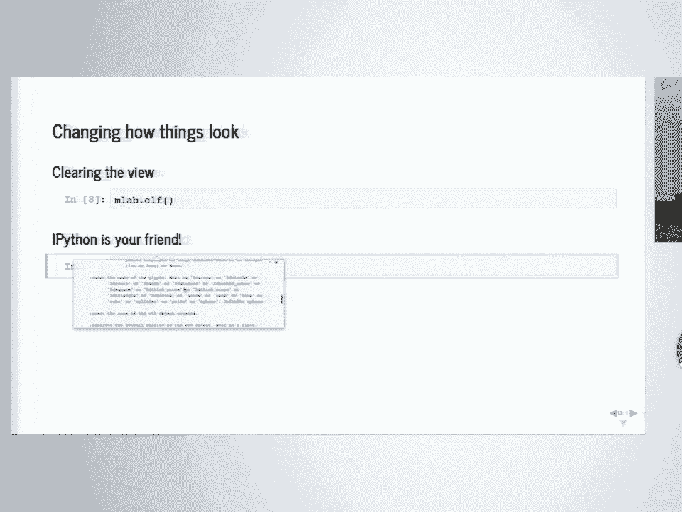
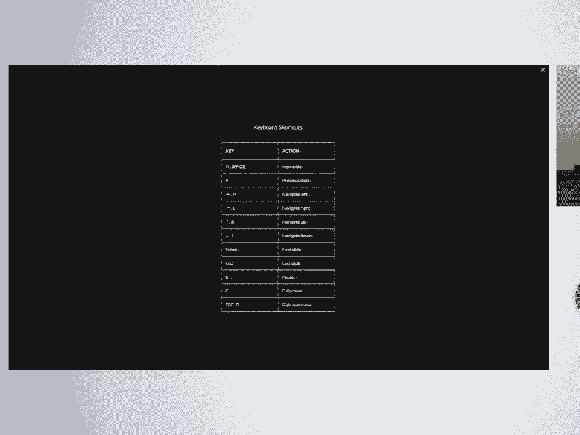
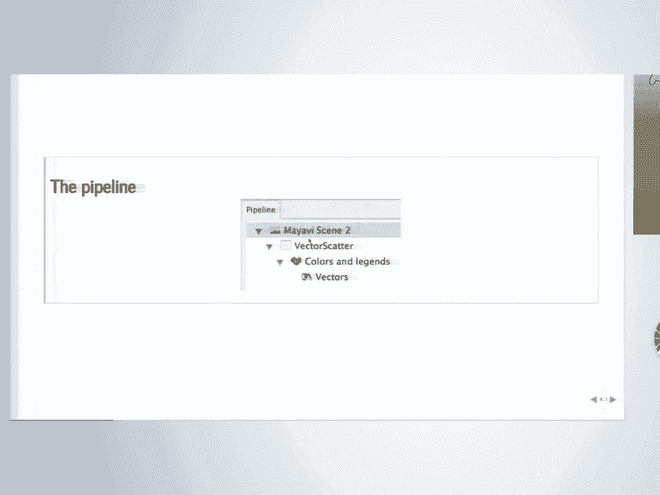
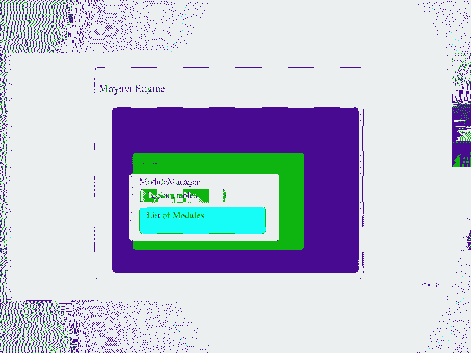
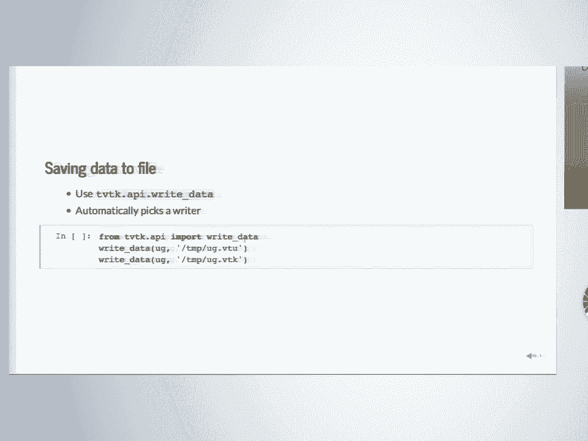
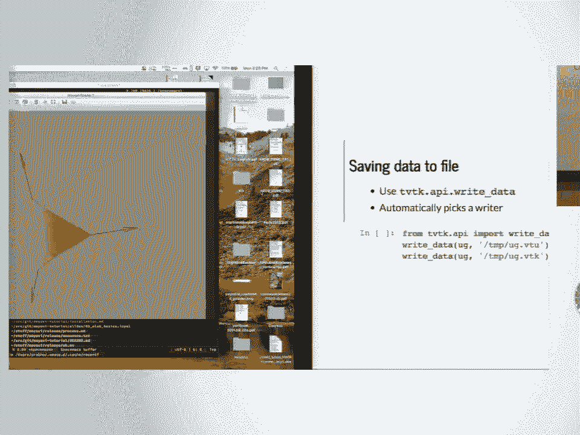
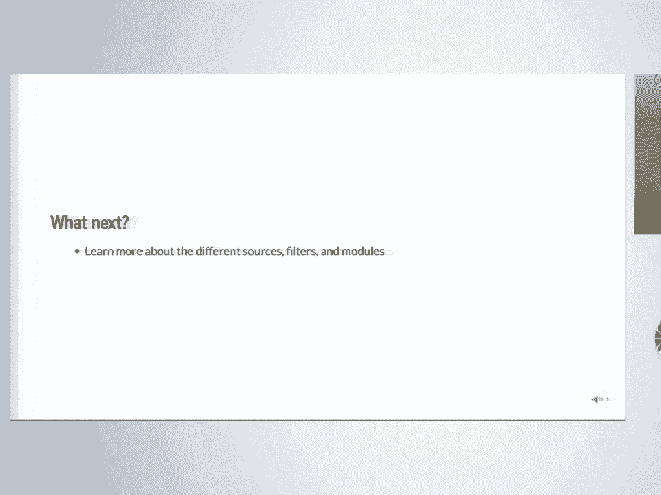

# SciPy 2018视频专辑 - P35：SciPy 2018视频专辑 (P35. 3D Visualization with Mayavi _ SciPy 2018 Tutorial _ Prabhu - GalileoHua - BV1TE411n7Ny

 Hello everyone。 Welcome to this tutorial on using my RV for 3D visualization。

 My name is Prabhu Ramachandran。 I'm from India， so I have perhaps a bit of a strange accent。

 I tend to speak a little fast， so if you don't understand， please tell me to go slow or。

 alright or I'll enunciate better。 I'll try my best to enunciate as clearly as I can。

 We have two generous folks who agreed to help。 I was originally supposed to do this alone。

 There's Matt who may have just stepped out。 Sorry。 And there's Hannah there at the back。

 She will help as well Matt as soon as he comes in I will introduce him。

 So the workshop is primarily going to be hands-on。

 but I will take the first 10 minutes to give you a broad introduction about my RV。

 But before you start， I hope you have the material installed and that you have my RV installed。

 It's usually a difficult package to install。 It's traditionally been one of the hardest packages to install。

 but it's been getting a bit easier。 So I hope it wasn't too hard to install。

 So if you're stuck with installation again， this would be a good time to raise your hand or let us know that something's not working right and somebody will come down and help you。

 Alright。 So I'm going to do a brief introduction about my RV for the first 10 minutes。

 And then when I guess the crowd comes in， the room settles down。

 I'll ask you all to do introductions to each other。 Alright。

 so the theme of the first say 10 minutes is to tell you what my RV is。

 because I don't want to go through the slides and just do a bunch of stuff without giving you an overview and a perspective of what you can do with my RV。

 So one of the things with my RV is it is many things。

 My RV also gives you an application that you can run like a normal visualization application。

 And if you run it， it's called my RV2。 We'll get to this later。

 but it'll essentially give you a full-fledged user interface like you see there on screen。

 And on the left is a full-fledged UI。 You can click the buttons， manipulate the views。

 and whatever you do will be reflected pretty much instantaneously given。

 module or the size of your data on the right panel here， which is your 3D visualization。

 You will also have an embedded Python session which you can use to script your visualization live on the application。

 But that's not all。 Most of the time， Python folks who use Python for all of their data analysis and their research work end up using what's called the MLAB interface of Python。

 which is a completely scriptable interface for Python， where if you start up by Python。

 this is just a quick demo。 We'll be doing a lot of this so you don't have to do any typing for this first 10 minutes。

 Basically， you can type these three lines with generated data and then with one single line that is here。

 sorry， that one line here， you'll end up producing a plot that looks like that。

 So it's kind of like my plotlibs interface where you can quickly take your data， plot it。

 and immediately get something that you can look at and play with。 But you can do more than that。

 You can also build your own customized UIs。 Now， none of these are web UIs in the sense that they're not things that will embed nicely in a Jupyter notebook。

 but they are full-fledged desktop dialogues。 So you can't do this on a remote machine。

 but you can't do it if it's on your own machine。 And you can build a customized UI and this code is probably about 100 lines of code。

 And I don't know if any of you recognize the surface that you see there。

 The vents are trapped there。 Yes， thank you。 So basically。

 those are the equations on the right-hand side。 So you can actually tweak those equations as you go and look at the vector field live。

 So you can build a UI like this pretty easily with my heavy。 So it's not just an app。

 It's not just something like， you know， you can just make one line as in plot。

 You can build a full-fledged dialog with not too much code。 What is the answer for that one？

 I'm sorry。 Oh， so this is sorry。 This is the Lorentz attractor。

 So these are the equations that govern that system。 It's a set of three differential equations。

 We'll be looking at this a little bit later on as an example。 And essentially。

 it's the vector field that's being visualized there。

 It's streamlines plotted for that particular vector field。 That's what you're looking at。

 We'll spend a lot of time， you know， exploring things like this later on。

 But the key point here is that this dialog， again， is fully interactive。

 You can click on those things and drag it。 This is a standard example that's available in my RV。

 You can play with it if you want later on。 You can also build like a full-fledged application。

 embedding bits and pieces of my RV that you want。 So this actually happens to be used a lot at Enthought。

 for example， for a lot of their visualization tools。

 They use tools like this and they build it into their application。

 So you can embed my RV as well in your apps。 And finally。

 this is a fairly recent feature that you can embed to some extent interactive plots in a Jupyter notebook。

 But this is a bit iffy in the sense that if your data is very large， it may not do the right thing。

 And it doesn't give you all of the bells and whistles that the normal my RV app。

 the desktop app has for various reasons。 But you can embed it in a notebook with those lines of code and you can interact with that。

 It's not just an image there。 You can actually click， drag， rotate it and stuff like that。

 So this is available in my RV， but your mileage may vary depending on what you're trying to visualize and how you're trying to do it。

 Now， my RV is a pretty old package。 It started off as my PhD procrastination project in 2001。

 It was completely rewritten in 2004 and 2005 when I learned a little more about。

 the various mistakes I'd made the first time around。

 And then there are several people who contributed。 I don't know how many of you know Gail Bahaukou。

 is one of the Sypai， sorry， Syc， Syk， Syk， it learned co-creators。

 So he actually was a heavy contributor between 2007 and 2012 until he got busy with Syk， it learned。

 I guess。 Then several folks from Enthort have contributed fixes。 And of course。

 I'm grateful for support from Enthort and NIT Bombay for， my RV。

 So some of the key features of my RV is that it basically integrates seamlessly with NMPai。

 It's fully scriptable。 It has a UI。 So a lot of packages out there essentially either force you to。

 do everything on a script or have a UI。 My RV allows you to do both。

 And hopefully by the end of the， workshop you'll understand how to do both。

 It's available at GitHub and underneath the covers my， RV uses VTK。

 So it doesn't do any of the heavy lifting graphics itself。 It basically hands。

 everything over to this library called VTK。 VTK is a massive visualization library。

 Probably one of the largest open source visualization libraries out there。 It's an extremely well。

 maintained， very mature library。 It's implemented in C++， but it has Python wrappers and it can be。

 pip installed as well as of this year。 So essentially what my RV does is it puts a UI on top of VTK。

 So you can go down to VTK if you really want to or you can just use the my RV at a higher level that。

 we provide。 Now it supports a variety of data sets。 So it's not just pure scripting。 If you。

 have data files， whatever we have exposed from VTK is available。 Some of them are not yet exposed。

 I'm happy to take pull requests。 Or we can sprint on those。 So basically it does support stuff like。

 polygonal data， structured grids， unstructured grids。 It supports a whole variety of visualization。

 algorithms。 So it's not just limited to a few things that are exposed on the UI。 You can do pretty。

 much anything you want。 It supports scalar visualization， vector visualization。

 and a bit of tensor visualization。 And we'll cover each of these with several examples during the course of this tutorial。

 It also does a little bit of volume rendering。 So if you need that。

 you could do it with my RV as well。 One very powerful feature with my RV that I'm going to demonstrate later on。

 is the fact that you can do this thing called automatic script recording。 So let's say you set up a。

 visualization and you now want to configure it。 But you don't want to have to do it on the UI every。

 time。 So it's often easy when you're exploring。 You can just click on the UI， click some buttons。

 and then figure out that this looks nice。 So sometimes you want to know how to do that with。

 a script。 So it turns out that you can just turn on a button with my RV and start doing your UI。

 interactions and it'll actually spit out the Python code that you need to execute in order to。

 exactly reproduce what you did。 So this is a nice way to learn how to script it。

 It's a nice way to use the app and it's a nice way for you to script the app。 So it's a nice way。

 to learn my RV as well。 So this is a feature that I'll try and demonstrate with a later half of the。

 course。 You can embed my RV in WX Python as well as QT。 We support QT4， QT5， PySight， PySight2。

 and WX Python 3。 And that's one of the reasons why it's a hard package to install because you can。

 see how many ways that can go wrong。 So the my RV app also supports powerful command line options。

 which means you could， if you just know， I want to visualize this data file， there's a little data。

 file there。 I want to quickly plot an ISO surface of this with this， this， this。

 You can just launch， that on the command line without having to fire up Python or anything like that as well。

 It also has some preliminary off-screen support， so which means if you want to do batch processing。

 and things like that， you can do it， but it's a bit of work to set it up because you have to make。

 sure that your VTK and the rest of your builds are configured exactly right。 But you can use my RV。

 to drive those visualizations as well。 So all in all， the architecture kind of looks like this。

 There's Python at the bottom。 There's NumPy。 There's VTK。

 There's a package called traits that kind of， facilitates this UI and the reactivity that my RV provides。

 And this traits connects us to， WX Python and QT。 Actually， this is not just QT4， it's QT5 as well。

 And on sitting on top of this is， this layer that my RV provides called TVTK。

 It's called Trated VTK， which provides that interface， for you。

 And built on top of that is the rest of the my RV infrastructure。 So essentially， my RV。

 is sitting on top of these powerful building blocks underneath and allowing you to do things very。

 simply by talking to these powerful tools underneath。 Okay， that's how it's constructed。

 Just to give， you a mental model of how things are set up inside my RV。 All right。

 so that's about it for the blah， blah， about what my RV is。 We'll get started with MLAB。

 which is the simple interface， how to start， visualizing stuff。 Then we'll look at animation。

 some simple animation。 Supposing you have a plot， you want to quickly animate that data。

 How do you do that with my RV？ Then we will understand more。

 intricate details about the my RV pipeline。 I'll explain to you what that means。 I'll explain to。

 you how you're supposed to interpret these pipelines。

 And then we'll go on to looking at making your， own data sets。

 So very often the simple visualizations that we provide are not enough for your data。

 And you want to make your own， in which case it kind of helps for you to understand how to make。

 these data sets yourself。 And we'll walk you through that with a bunch of examples where we'll take。

 numpy arrays and then make the visualizations and you'll see the visualizations yourself。

 So hopefully， you can use those as templates to build and visualize your own data。 And then finally。

 there's a， slight set。 I think that's the zero， seven， ipi， and b。

 which basically exposes there are about 15， or 20 filters that we expose on the UI。

 There are about 10 modules that we export on the UI， I explained to you what these are。

 I'll show each of most of these with examples that you can run。

 And I would encourage you to kind of type along in those cases。 All right， so before we move on to。

 the next， when we're actually going to start typing， I'd like us to do a round of brief。

 introductions to your neighbors。 So I'll go first。 I'm Prabhu。 I don't have someone next to me。

 But I， don't want you to do this aloud。 I'll give you two minutes。 Find a person to your left。

 introduce yourself to them。 Because part of this whole conference is for you to get to know a bunch。

 of people in SIPI and make friends for life。 That's how I found a lot of good friends。 So meet。

 someone on your left first。 Please introduce yourselves。 So I hope you know the person to your。

 left， their name， maybe the first or second name to the left， as well as to their right。

 maybe behind， you as well。 I'm not going to quiz you on this。 That's okay。

 But I would hope that if you run into， problems， if you're stuck somewhere， if you have doubts。

 you don't just have to ask me。 You can， also ask your friends next to you。

 not just for this session， maybe for the next sessions as well。

 You can also raise your hands and Hannah and。 Okay， so Matt's here。 So Matt's at the back。 So again。

 if you have issues， he'll help you with this。 All right， so thank you for that。 Let's start。

 We're going to start with using MLAB， which is a tiny part of my AVID sitting on top of。

 the rest of the my AVID infrastructure。 So here's the outline of what we're going to do in this session。

 This is probably going to be the longest session that we're going to have， because this is where。

 you're going to be doing a lot of typing。 And you'll notice that if you've downloaded the repository。

 that the ipinb file， I have ipinml files， if you know how to open those， good for you。 But。

 I would imagine you'd be using the ipinb files。 The ipinb file for this particular one， this is 0。

 2， basic MLAB basics or something， has a lot of blank sections， and that's on purpose， because I。

 want you to type that out。 I will upload the completed ones at the end of this workshop anyway。

 All right， so our outline is as follows。 We're going to get started with MLAB， so I'm going to。

 expect you to start typing and making plots as we go。 Then you'll use MLAB， you'll understand the。

 basics， and you'll understand the basics of doing simple animations， really simple ones。

 And then we'll go deeper and try and understand the pipeline， the my AVID pipeline itself。 And then。

 we'll understand my AVID data sources at this kind of high level， 40，000 feet kind of perspective。

 And the next session， we'll actually go a little deeper into the pipeline and then deeper into。

 the data sets。 All right， so let's get started with MLAB。 So just because I'm saying MLAB is this。

 simple， easy thing to use， it's also full feature。 Don't get fooled by it。 You can actually script。

 all of my AVID using just MLAB。 So it's a good starting point， but it also lets you tunnel down。

 so you can go a little deeper。 All right， so the first thing to get started is you need either a。

 Jupyter console。 So is anyone here going to use this on a Jupyter console or all of you going to。

 just use the Jupyter Notebook？ Some of you are going to just use the Notebooks。 Raise your hands。

 please。 Oh， okay。 So if you're stuck with Jupyter itself。

 I don't think I'm going to have time to cover， all of that， but maybe you can ask。 Yeah， Greg， okay。

 All right， you can ask Greg maybe do。 I just have to say Jupyter。

 so you can start in any number of ways。 If you want to just a console， I find this convenient。

 maybe I'm old school， but you just say Jupyter console and you'll get a。

 prompt with IPython and that gives you just a terminal access。 The problem with this is you can't。

 quite save all of the stuff you're doing。 So it's usually nicer to type it in a Jupyter Notebook because。

 you kind of get to retain all the stuff you've typed。

 So you can do this or you can just start up the， Jupyter Notebook and I've already typed out some of the cells and then you can just shift。

 enter each of those cells and it'll execute those cells。

 Now it's very important that the first thing， that you type or maybe the second thing that you type is this particular line saying percentage。

 GUI QT。 You're just telling Jupyter that allow me to pop up QT widgets， all right， so that you can。

 pop up Windows。 That can be interactively used， okay， so I'm gonna run that and that should work。

 And it's gonna pop up something else somewhere。 You can just get back to your Jupyter Notebook。

 That's， fine and then continue on， all right。 So please make sure before you run any of the new notebooks。

 going forward as well that you execute this line first。 If you do not do that， what will happen is。

 when you pop up a window， you'll have an inactive window， you'll get strange things happening and。

 you'll get into trouble。 The first thing you do is this always， all right。 So make sure you type。

 GUI QT first and that should run without error。 Yes。

 So I think I did that before and I got an error unless you do the MLAB， you can put the MLAB first。

 I think someone actually did this。 Okay， I'm using Python 2 or Python 3。 All right。

 it's okay if you do the MLAB import first and then you do the QT import。 That's all right。

 Because what's happening here is you're like， this is an IPython thing。 You're telling IPython。

 load up QT for me in the background。 And sometimes you can trick IPython to load the right QT library。

 because all of them are doing strange things to figure out which QT you actually want。

 And then sometimes if you import MLAB first， then it kind of tricks QT into importing the right。

 library。 So it's all right if you do that， all right。 Now when you're troubleshooting。

 if you're running into trouble， I don't think I can monitor Slack， right now。

 But maybe the assistance will maybe Hannah will and Matt may look， you're on Slack。 Okay。

 so if you have issues， you can always post on the Slack channel。 You can tell us which version。

 of Python， which version of VTK and which version of QT。 I know that's a bit of a bunch of details。

 but you can， if you can tell us those， it'll make it a little easier to figure out what's going on。

 That's wrong。 All right。 All right。 So henceforth， I'm going to expect that you either type along。

 in a fresh Jupyter notebook or you can do it in the same notebook because I have deleted a lot。

 of those cells， all right。 And many of those cells are going to be empty。 They will be appearing on。

 my slides， of course。 And I will expect you to type it along on your sessions。 The reason is。

 pedagogically， if I teach something with just Jupyter notebooks， people tend to just say shift。

 tend to shift tend to nothing then goes into the brain。 So I feel that it's a lot better if you。

 actually type a little bit。 And later on going forward， since you understand the basics， I'm not。

 going to force you to type。 You can just shift tend to understand what's going on。 All right。

 So the first start， we're going to import from Maya V import MLAB。 That's the first thing you need。

 to import。 So I'm going to run that。 This will take a while because it's importing a bunch of stuff。

 all right。 So just be a little patient and the machine will probably cache it for the next time。

 All right。 Everyone done with that？ Now， the next thing I'm going to ask you to do is to type， MLAB。

test_ and hit tab。 When you hit tab， IPython will do tab completion and show you a bunch of。

 possible options。 These are a bunch of test functions that you should feel free to explore。

 later on， not right now。 I just wanted to expose you to the fact that there are a bunch of these。

 20 odd test functions that you can explore。 There are simple examples that show you how you can quickly。

 cook up a little visualization， all right。 But then don't， obviously， this is not going to work。

 Test， underscore doesn't mean anything。 Execute the next line。 You should get something saying out。

 something blah， blah， blah。 But then you have to all tab out to that Python thingy that shows up here。

 I don't know。 It may be behind your browser。 It may be ahead。 I don't know where it's going to be。

 And that's a 3D visualization you should see。 You should be able to interact with it like this。

 I'll explain to you how to interact with it in a second， but it should not be a dead window。

 It should not have anything black on it。 It should look something like this。 Okay。

 So this is the first thing。 If we can't do this， you can't quite move ahead。

 So I want to make sure that everyone gets this right。 I'll go back。 Just test underscore contour 3D。

 You've seen the picture， so I'm going to just， show you this so you can type it。

 So can all of you who do not have that window。 Okay。 Great。 All right。 So I'm going to。

 I'm going to carry on。 Let's get started。 All right。

 So the next thing I'd like you to look at is if you do MLAB。test， test_contour， contour， 3D。

 question mark， question mark， do all of you know about this， trick with IPython？ If you do that。

 it's going to look tiny here。 It'll look hopefully nicer on， your screens。

 You can see the actual code that that function is executing。 So it's a nice way to。

 look at the source code。 And in this case， it's like three lines of code。

 The important line is this， contour 3D you see at the last。

 And that contour 3D line is usually going to be called with MLAB。contour， 3D in your scripts。

 Most of the test scripts assume the MLAB in the current namespace， all of， those commands。

 All right。 So that's the only difference。 But you can read that code and use it。

 if you want an example to play with。 All right。 So let's move on。

 Let's look at the view that we have。 So there are multiple ways you can interact with that screen。

 The first is the mouse， and I'll show， you all the things you can do。 So left， click。

 and drag will let you rotate the camera， which means， if the object is here。

 you're moving the camera around the object in the direction that you drag。 If you shift left click。

 you pan the camera， which means you're moving laterally in that direction， that you drag。

 If you control click， you zoom in and out。 You can also use the keyboard。 Left arrow， right arrow。

 up arrow， down arrow， shift left arrow， shift right arrow， plus minus， without the shift。

 So it's equal to and minus， I guess。 Okay。 But the zooming there will not be as。

 smooth as if you did control click。 All right。 If you have a 3 button mouse， then you can right。

 click and then drag， middle click and pan， left click and rotate。 So if you're doing things like。

 blender， this kind of flips everything on its head。 I hope nobody here is doing blender。

 So all right。 The next thing is the toolbar。 So on the， you see these bunch of icons。 So this X。

 if you hover on， it will say look along the negative X axis or look along the positive X axis。

 That's positive X axis， minus Y plus Y minus Z plus Z。 And this is an isometric view。 All right。

 This one is parallel， projections。 So if you know what that is， use it。

 If you don't know what that is， don't bother。 This guy will give you a little axis here that gives you a sense of the orientation。

 This， the little access icon you see here， that'll give you an access。

 This will make your screen full， screen。 If you want to get out of this， hit escape or queue。

 All right。 This guy is full screen。 This， will let you save the image。 Yeah。

 you can save it to a variety of formats。 Sometimes it's an image。

 Sometimes it'll actually export the scene itself into something that you can import somewhere else。

 All right。 This one will let you configure the window itself。 You can change the background。

 you can change the foreground and things like that。 Oops。 And this also lets you configure the。

 lighting of the scene。 So you can basically change the lighting to make it look something。

 different。 You can configure the lights。 You can move them around， stuff like that。

 There's something else called movie， which I'm not going to do right now。 We'll talk about that。

 later。 Then on the left， you see this icon here。 That's the Miavi icon。 That's the Miavi logo。 You。

 click on that and that will give you a full UI on how to manipulate the objects themselves。

 So you can actually manipulate everything that you see on screen pretty much on the UI。

 So you can close this。 So now we'll come back to this in a bit。 All right。 So is that okay？

 So we saw how to navigate the scene with the mouse with the keyboard with the toolbar icons。

 and we looked at the Miavi icon itself to show you the Miavi UI that you can use to navigate。

 All right。 So now let's start started typing。 So the first thing we're going to look at is。

 try to plot zero dimensional data， which basically means I have a bunch of points。

 disorganized or organized。 I don't care。 I want to plot those in three dimensions and render them。

 quickly。 And I want to do this with numpy arrays。 So go ahead and type out this code that you see on。

 screen on your Jupyter Notebooks and execute them。 All right。 You can close the previous MLAB。

 contour 3D window that you had。 Otherwise， what's going to happen is it's going to plot it on top。

 of that。 It'll be a mess。 Just close that。 It'll pop up a new window for you when you need it。

 All right。 Close your windows。 Close that and execute these cells。 All right。

 So let's just look at the what we typed。 All I did was I created some parameter T。

 then created another one。 Use cosine T into pi。 You could have done anything you want。 Then x， y。

 z is simply sign new， cos u and sign T。 You could have done anything you wanted。

 But the idea is the next line is the key。 The MLAB。points 3D takes the arrays that you have。

 given it and just places points at each of these。 All right。 Is everyone done with this？

 Can I move on？ All right。 Awesome。 Okay。 So the next thing we're going to learn is how to clear the screen。

 If you made a mistake， something went wrong。 You do MLAB。CLF。 So in this case， I had this。 If I run。

 MLAB。CLF， it's just going to blow it away and keep everything clean。 And if you were to actually。

 keep this open， which I think I will just for the heck of it。

 you'll see that it's kind of cleared out， everything that was there below that。 Okay。 That's fine。

 All right。 So now if you want to find out more， about points 3D， if you're on a console。

 this question mark is useful。 But in the notebook， I can just say shift tab。

 When I'm when my cursor is at the points 3D player shift tab， it'll give you the documentation。

 at least a small bit of the documentation for that function。

 You can click on this plus sign here and it'll expand out into a longer bit of documentation。

 telling you how you can use this function， what are all the parameters， so on and so forth。 All。

 right。 And usually most of the MLAB functions have a lot of documentation。 So you should be。

 You can it'll also pop this up here on the side that you can keep if you really want。

 it。 If you don't want it as a pop up， you want to keep it embedded in your notebook， you can have。

 it like that。 And you can look at the documentation。 So there are several things。

 So the first thing is， I just called plot points 3D with xyz。

 You can also pass in another quantity called scalars。

 which will let you color those points as per those quantities。 All right。

 So you can pass in a third， quantity， which is either an array of the same shape as xyz。

 or you can pass it a function， which will be called with xyz， f of xyz。

 and the return value of that will be visualized as， your scalars。 All right。

 So it's useful to have to know how to use ipython。 So let's move on。 All right。

 So there's an extra argument called scalars and it supports keyword arguments。

 and it also can be manipulated on the UI。 So does the function have to be， what's it？ Now。

 how do you universal function？ So it's vectorized？ That's up to you。 Basically。

 the return value that it gives us has to be an， umpire array of the same shape as your xyz。

 That's it。 Yes。 Oh， so one question mark is just going to give you help。 Oh。

 except this guy is going to keep popping， up for me because I'm doing slides。

 This will just show you the help information。 So if I did this， if I did this， it will show me。

 if I executed this， it will show me the source code for that function。 Yes。

 So one question mark is basically just the help。 It'll just give you the doc string， formatted it。

 pop it。 Or shift tab will also give you the same thing， okay， as a pop up。 So now execute this line。

 I don't think you have this code。 You should type it。

 So I've just used a few of the additional arguments that are many as you saw。 So if you， do xyz t。

 I'm giving an additional scalar called the time in the or whatever the parameter t in this， case。

 And I'm saying scale mode is none。 So just run that after running clf。 And you should see this。

 All right。 Now， if you want to change the colors， we haven't gotten that part yet。

 You can on the UI go to colors and legends， click on the look， and you can pick any of the colors。

 including Viridis， which is here。 And show that。 All right。 We'll come back to coloring and stuff。

 like that in a bit。 But you can do that。 You can also pass this as an argument。 It's one of those。

 many arguments that it takes。 Um， it's color map and you give it a name， a string。

 which is the same， as the strings in PiLab， my plotlib， and it will plot it with those colors。

 Is that clear？ Everyone？ Can I move on？ All right。

 So the next thing that you can do is one dimensional data。 So the idea is。

 right now we just had points。 So the dimensionality is basically each point。

 There's no connectivity， information that tells us what's next to it。

 So it's just a bunch of isolated points。 That's zero， dimensional data。

 Now we're looking at one dimensional data， which is essentially a curve。

 So point plot 3D will give us a curve joining those points。 This is all right。 But before we go。

 there， maybe I'll tell you what happens if I did scale。 Sorry， I just wanted to do this so。

 that you understand what's happening here。 I'm going to re-execute MLAB CLF。

 I'm going to just run it with， the extra argument first。 Notice that the values are actually scaled。

 So if you say scale mode is， none， what it does is it doesn't scale those balls that it places at each of these points。

 All right。 I just want to illustrate what that was doing。 So if I did scale。

 As per the value of the scalar。 So it's kind of like matplotlibs C or S argument。

 For a scatter plot， if you do S is equal to something。

 it will scale the size of the glyph that it puts on。 Whereas here if I say a scale mode is none。

 you're going to get this。 All right。 Which is completely， unscaled。

 Can you have different scalars for the coloring？ Vsavi the scaling？ There is a way to do it。 Yes。

 we'll come to it later。 Yes。 Basically you have to scale it on one。

 and you have to color it on another。 You can do it， but it's a bit more work。 We'll get that later。

 All right。 Can you type this out please？ Nothing much changes。

 It's just plot 3D instead of points 3D。 And you should see this。 Have you one done？ Okay。

 Shall I move on？ Okay。 Fine。 So the idea here is same points， but now it is going to implicitly。

 connect first point of the second， second to the third。 Oh God。

 So it's going to connect the first to the second， so on and so forth。 All right。 Zero to one。

 one to two， two， three， so on and so forth。 All right。 All right。 So your first exercise。 Mike。

 visualize a helical spring with a spherical mass on one of its end。

 and of its ends with a fixed color for both。 All right。 What's your exercise？ There's a solution。

 but I don't want you to look at the solution。 So hopefully you'll try it out。

 So insert a cell before the load command， run it。 So I'll give you about。

 five minutes or a few minutes。 If you have doubts or questions， I'll come around。

 I just want a helix。 So think about it first。 Think about the data you need because the visualization is just a command。

 Think about how， you would parameterize an ellipse。 Sorry。 Oh， helix。 So is everyone done with that？

 Sort of。 So how many of you still stuck？ Anyone still stuck？ All right。 Okay。

 So shall we look at the solution then？ Okay。 So CLF， that's easy。

 Then I just parameterized it with some t zero to 10 pi， thousand points。

 And then I just use the fact that it's sine theta， cos theta to get x and y coordinates。

 and then use t， the parameter itself along the z axis。 So it's basically x， y is 0。2， sine t。

 I'm using a tightly coil。 And then z is just 0。1 times t。 So I have mlab。plot3d xyz。

 And here is the key which you probably could have found out by looking at question mark。

 It'll say that you can give a color。 So the color has to be specified as a RGB triplet。

 So in this case， it's just purely red。 And to get the ball at the end， I use just points 3d。

 and I give it a single point， which is the last point。 All right。 So that gives me this。

 Is that okay？ Just color is equal to an RGB triplet。 All right。 Is that okay？ Is that clear？

 All right。 So you need some， idea about how you want to visualize the data。

 and then it's pretty much straightforward。 All right。

 So now before we get on to two-dimensional data that we want to visualize。

 is everyone here familiar with numpy's mgrid？ Is anyone not familiar with numpy mgrid？ All right。

 Okay。 Good。 So you probably don't need the first line。 But do all of you know about， arrange？

 What is arrange？ Arrange basically is like range， but it gives you a numpy array。

 And your step size does not have to be integral。 It can be also fractions。 All right。 Tesimals。

 Or not even decimals。 Floating point。 Sorry。 Okay。 So if I did arrange 0， 3， 1， that gives me 0。

 1 and 2 does not include 3。 Is that clear？ It's just like range。 Right？ Range。

 does not include the last value。 So if I did mgrid， mgrid is not a function。

 mgrid is an object that you slice with square brackets。 All right。 So here I'm saying mgrid 0。

 colon 3， colon 1。 What that says is started 0， go all the way up to 3， but don't include 3。

 in steps of 0。1， steps of 1， just like arrange。 This is all right。 So which means start step。

 until you just don't hit 3。 All right。 Is that fine？ And this number could also be fractional。 So。

 I could make this 0。1 and I could make this say。 So if I run this， I'm going to remove the second。

 guy and run that。 It gives me exactly the same thing。 All right。 So it now seems like why on。

 earth am I doing this？ Well， if I did this， I added the second slice。 This will give me a。

 graph sheet of values。 So it gives me two arrays。 The first is the coordinates of the x coordinates。

 along a graph sheet。 So what does it say？ The i。 So what is this is the row and these are the。

 columns， right？ So which means if the row is fixed。 So if I move along the row。

 the coordinate doesn't， change。 So which means this is listing out the points along this direction。

 right？ Along the y axis because x is fixed as I write。 On the other hand， the y axis is increasing。

 So if， I say this is x comma y， I actually have the coordinates for the points along a graph sheet。

 Maybe I'll draw it out。 So this is my graph sheet。 That's x。 That's y。 So this is 0， 0。

 So if I lay out the points， this is all 0， 0， 0。 That's the first row of our first return value。

 So you can think of this as the x coordinates for the points laid out in this order。 Is that okay？

 So if I said， I now have the coordinates for these x and these y values。 Now it's a numpy array。

 So I can start， doing things like gimme sign of this， gimme x squared plus y squared。

 So now I have basically， a graph sheet and a set of scalar values on that graph sheet。

 which I can do numpy stuff with。 All right。 So this is really handy and convenient。

 But now comes a small trick with mgrid， which， makes it even more convenient。

 So you all know Lin space， right？ Lin space basically gives me， values from the start。

 including the end， that many numbers in between。 So if I did Lin space， minus one to one five。

 I'll get five points starting at minus one， going all the way to plus one。 Unlike arrange。

 it does not include the last cut。 And very often it's much more convenient to do。

 Lin space rather than arrange because you want the last point and you want n points in between those。

 So if you did the same thing with mgrid， if you say minus one colon one， which means started。

 minus one， go all the way to one， and you give a complex index。 If you say five j， then numpy says。

 oh， you want Lin space syntax。 So I want five points in between minus one and one。

 and that will give me exactly the same thing。 But now the beauty is I can create a graph sheet。

 with the Lin space like syntax with five values。 So now if I did this， and this。

 the second set doesn't have to be the same as this， right？ It could have been zero to two。

 for example。 It doesn't matter。 And now I will get the x coordinates in that region。

 and the y coordinates in that region。 Does this make sense？ So it's a quick way with which you can。

 just like mesh grids， matlab mesh grid。 But here there's also a mesh grid available， but this works。

 for multi-dimensional arrays。 You just keep adding slices。 All right。 So is that okay？ Um。

 it's not quite a product。 It doesn't take a product。 It's actually two separate things。

 It's a tensor product。 Yeah。 It's a tensor product。 Yeah。 Yeah。 It's a different terminology。 No。

 no， no， I understand。 But I don't think it's actually doing the tensor product。 No， it's not。

 If it was a tensor product， I'd have to actually give you this and multiply this。

 and I have to be very careful about what I multiply。

 So here I'm explicitly saying I want a graph sheet， from here to here。 This is my Lin space。

 and yeah， I can think of it as a tensor product。 Okay。 Is that okay？ All right。 Let's move on。 Okay。

 So now we'll do a small example with this。 The nice thing is if I want now x squared plus y squared。

 and I want say， i so contours of x squared and y squared on that graph sheet。

 it's super easy to do because， at one line I can give you x and y。

 and then I can say z is x squared plus y squared， and it looks like that。

 So it's very convenient to start quickly putting things together with， this syntax。 All right。

 So now we'll actually do something useful。 Go ahead and try this out。

 So what we're doing here is we're doing a carpet plot。 So you have a graph sheet。

 and you have z values indicating a height field， and you want that carpet to be essentially bumped。

 up according to the height field， and that's what it's doing here。 All right。 So。

 stick a CLF in there so that you don't。 So here I'm creating a mesh of minus three to three hundred points。

 minus three to three hundred points。 All right。 You should get something that looks like this。

 Is that okay？ Everyone get that？ All right。 So let's move on to the next thing。

 You can do the same thing with， a contour surf。 All it does is it'll give you a set of ISO contours with the same data。

 All right。 So I'm generating the same data here。 So you don't have to re you don't have to type this first。

 block here。 You already have it， but I'm just putting it there so you can see it。 All I've changed。

 it instead of making it surf， which is what we had before， I'm making it contour underscore surf。 X。

 Y， Z。 Now the key thing here is mesh when you do contour surf or surf， it assumes that the points。

 are rectilinear。 All right。 Which means that X， Y are from a mesh。 They are a graph sheet that。

 you're essentially bumping up and down。 All right。 And now you should get something that looks like。

 this。 Not quite what I have on screen， but you get the idea。 So that's a using a different color。

 I think I'm using the hot color map for this。 All right。 Is that okay？ Shall I move on？ All right。

 So now there's another function called mesh， which does not assume that this should be。

 on a rectilinear。 They don't have to be regularly placed。 All right。 So in this case， if you ran。

 this function， in this case， there's going to be no difference because the data was on a graph sheet。

 All right。 So you get exactly the same thing， but this is using something different。 All right。

 Internally。 It looks the same。 All right。 But I want to tell you that it does not have to be this way。

 So here's an example。 I have the same thing。 I have X and Y is M grid minus three to three。

 hundred points minus three to three， hundred points cross product of those。 I get the graph sheet。

 And now I'm saying Z is X squared plus Y squared into point one。

 But now I am not doing M lab dot surf， X， Y， Z。 I am doing cosine sine of X and cosine of Y。

 Now that sounds weird。 Don't worry。 You're， going to get a weird looking plot anyway。

 But notice that this is no longer a， you know， a graph sheet that's just sort of been stretched upwards。

 It's actually this funky shape。 All right。 Essentially， if you think about it another way。

 if you look at surf and not mesh， if I draw a line。

 dropping parallel to the Z axis onto the x y plane， it will intersect only once。

 This guy is going to intersect as many times as it wants depending on how complicated your。

 surface is。 This is all right。 However， the assumption is that X and Y are mapable to a graph sheet。

 Which means there is an ordering between the points， which means I can do an indexing and say this。

 guy is next to that guy just by looking at the matrix。 Am I making sense？ If I take a graph sheet。

 I take this guy here。 I pick a point here。 I pick a point here。 I know my neighbor is。

 one to the left here， one to the left here， one to the left， right here， one down here。

 Now these points on with， if I use surf， have to be on that graph sheet。 But if I take a sheet。

 of paper and crumple it up， the neighbor still remain the same。 But they are not on the surface。

 which means I can actually wrap it around like this。 Does it make sense？ I can still identify the。

 neighbors as whose neighbor by an index。 Which means if I can take a graph sheet and I can take。

 something that maps onto that graph sheet， I can use surf。 Does this make sense？ So you can start。

 off with an M grid， do something crazy to that M grid。 All right。 Sign， cosine， product of those。

 guys。 And then end up with a surface that really looks pretty complex。 So you can go ahead and。

 experiment with other functions。 I have tried one more here， which is mlab。mash sin x cos y sin x y。

 Let me see how that looks。 And you can see that looks like completely bizarre。 Is this okay？

 So this may be a little bit， wow， why is this guy doing all this， crazy stuff？

 The next exercise will make it clear as to why this is useful。 This is your exercise。

 So I'll give you five minutes。 Try this。 It's straightforward。 All right。 So is everyone done？

 Shall we move on？ Can I have a show of hands for moving on to the， solution？ All right。

 So in the interest of time， we'll just move on。 There's a lot more to cover。

 So let's look at my solution， which is this。 So the first thing I did was I used phi and theta as my。

 graph sheet。 So I just created a flattened out globe from 0 to pi， 20 points from 0 to 2 pi。

 20 points。 You can increase this， the number of points that you want。 Then I say x is sin phi。

 cos theta， y is sin phi， sin theta， z is cos phi。 And then I'm going to have Clf， mesh， x， y， z。

 y-frame。 All right。 And that。 Is that okay？ So the only thing different perhaps that we learned new is this representation is y-frame。

 which tells you don't render it as a surface， but show it as a y-frame。 All right。 Is that okay？

 Any questions at this point？ So the nice thing is again， it's still a graph sheet。

 but it's kind of warped by the coordinate transformation。 So it's a convenient way of doing。

 interesting things。 So you can imagine you can do cylindrical pole R。 So you want to create a。

 cylinder， it's easy to do again with the same thing。 Is that okay？ Shall we move on？

 So the idea is it's， I mean the plotting is just one line。 The bigger problem is wrapping your head。

 around the coordinate system and actually getting the points right。 That's the harder part。

 and that's， what requires a bit of thought。 So you can， yeah。

 So it's essentially picking the matrix。 Yes。 I don't think they'll be corrected。

 They just come over that。 Yes， because I can't， assume that it's going to be a closed surface。

 right？ Yeah。 So in this case， you are a bit stuck。

 So your data probably has to have the same values of the same point。 All right。 Now， if you want to。

 do， if you want better control， like that question is a great question， because now supposing you。

 really know your data set and you know that this point zero is next to 100， for example。

 there it's actually a torus or whatever， then you can construct a data set that does exactly what。

 you want。 But that requires obviously a lot more intricate knowledge， which we will get to later。

 hopefully， if we move fast off。 All right。 So let's move on。 So now comes the next phase。

 which is so far， remember that when we did plot 3D， I said first point connects to the next。

 so on and so forth。 So there's an implicit connectivity between the data， right？ Now we're。

 going to go to a place where we have to explicitly say here are three points。 These three points。

 constitute a triangle。 All right。 So you can do that with what's called triangle， triangular mesh。

 So what we have here is the x coordinates， the y coordinates， and a list of lists specifying。

 each triplet of triangles。 Does that make sense？ So I have one triangle。 So don't be fooled by the。

 fact that there are two brackets here。 It basically means there is a single triangle。 So if I want。

 to two triangles， I just basically make a list of two lists。 All right。 So each list inside that。

 list is essentially a set of indices into these to give you the triangles。 Now very often， we don't。

 think about coordinates independent of each other。 I think of a point as 0 0 0 1 1 0 1 0。

 things like that。 I think of them as a triplet。 I don't think of them as， oh， this is x is this。

 then why is this and z is this。 So it's often easier to think about this by using numpy。

 and just creating the triplet of points and then yanking out the x coordinates from those。

 So in the second case， I've done the same thing， but I'm doing it in a more convenient way so that。

 I can write the points out easier。 So I can write the triplet as 0 0 0 is one coordinate。

 1 0 0 is the next。 1 1 0 is the third。 So this is 0 0 0 1 0 0 1 1 0。 All right。 It's easier for me。

 to think of that and then yank the x points out。 So all this does is it sets up that set of points。

 transposes it and yanks out the x y t columns。 Is that okay？ So I've just done the same thing in。

 two ways。 So you kind of know of a simple trick with which it's easier to type this out。 And then。

 you run that you will get this。 All right。 Let's look at it down the plus x axis and then you have。

 the view you expect。 So this is 0 0 0。 Let's put that as the x y plane and that's 1 1。 All right。

 Next exercise， create a simple pyramid composed of triangles and plot it。 So pyramid basically。

 you can even if you want to keep it simple， make a tetrahedron。 All right。 So just take these three。

 at a single point on the top and then spell out the triangles。 All right。 You want to do this？

 So it's half 3 0 1 2 and some 0 or whatever could be 3 2 1 or 0 whatever。 It doesn't matter。

 The order in which you want to mark those triangles off。 Yes。

 So a billion points is going to be tough。 I'll tell you that。 Yeah， a billion points is tough。

 You can do a million points or tens of millions of points， depending on obviously your hardware。

 And if you're using BTK 8， it actually does use the GPU。 So it'll push all the data to your GPU。

 and render it。 So it's actually reasonable。 But if it crosses the GPU's limits， then you're。

 so well。 Then you have to do other fancy things， which there are other tools to do。 But my heavy。

 doesn't do that。 Shall we move on？ Is this？ Shall I show you the solution real quick？

 Or do you need， some more time？ Okay。 I need an answer either way。 Move on。 Let's keep going。 Okay。

 Great。 So that's， the solution。 I did it the brute force way。 Listed out the x points， the y points。

 the z points， listed out the triangles， made some mistakes and ended up with this。 All right。

 That's my pyramid。 Okay。 Is that okay？ Straight forward。 Okay。

 The next thing is we can also render images。 We can， do images pretty well。

 So here's a case where we have 8192 by 8192。 That's a large matrix。 And if you ran this。

 don't try this with matplotlib。 The last time I tried it just， locked up my kernel。

 but it will work on。 Yeah。 Okay。 And if you navigate down to this image actor here。

 you can basically say don't do， interpolation。 And you'll see that， yeah。

 it just shows you the dots。 Okay。 So but if you interpolate， it， it's gonna do that。 All right。

 But it can handle a non trivial number of points， but， not points in this case。

 but this is just an image。 So that's pretty good。 All right。 All right。 So you can do。

 I'm sure it's kind of like， by labs， I'm sure， but it's in three， dimensions。

 So you can mess up your view。 Now let's move on to three dimensional data。 Okay。 Now。

 just like we had a graph sheet in 2D， I now have a graph cube。 I have a volume。 All right。

 I have a volume inside which I want some scalar field。 So let's say I have the temperature inside。

 a cube of data。 I could ask， give me ISO surfaces of 100 degrees， for example。 All right。

 So this example， does this for 3D data。 So now notice， I'm using something called O grid。

 Forget I used O grid。 I'm using M grid。 O grid just does what you're saying。 It doesn't fill out。

 the matrix。 It just does numpy's indexing。 So it makes the matrix 2 cross 1， and then use。

 broadcasting so that it doesn't have to actually generate all of those points。 All right。 So when。

 you add those two， it'll automatically broadcast it， and then generate the numbers。 So you can use。

 treat it as equivalent to M grid。 All right。 So what it does is notice that I have three slices。

 specified here， 64 by 64 by 64。 So it's a volume minus 5 to 5， 64 points in each x coordinate axis。

 All right。 That gives me a volume of points inside which I am looking at the scalar x squared by 2。

 plus y squared plus z squared into 2。 So if I ask the question， what are ISO contours of。

 that scalar field， which means at every point I have a scalar， which is determined by x squared。

 by 2 plus a y squared plus a squared into 2。 If I say ISO contours， what does it mean？ It means。

 find a surface that has the same scalar value on that surface。 All right。 So think of it as。

 x squared by 2 plus y squared plus z squared into 2 equal to some constant， which is your。

 contour value。 So what does that look like？ So what would this represent？

 That's an ellipsoid in three dimensions， right？ So any ISO contour taken of this， so your graph。

 your plot should look like an ISO contour， but sliced off at minus 5， minus plus 5， minus 5。

 that cube， right？ So essentially you take an ellipsoid and put it in a box， minus 5， minus 5。

 minus 5， plus 5， chop that off and you'll get that surface。 All right。 That's what you have here。

 That's what you're seeing here。 Okay。 So if you run this， you will see that。 Okay。

 Now if you reduce the contours， so if you say I'm right now it's making 5， contours automatically。

 so I'm saying don't do that， just give me one。 And if I start squeezing， it down。

 it'll start looking more and more like an ellipsoid。 So if it's completely contained。

 it will look like a full complete ellipsoid。 Is that okay？ Does this make sense？ Okay。

 So I'll do that slowly。 I turned on this， the MiAV pipeline。 I navigated to the ISO surface。

 and then I shut off the auto contours and then drag this guy wherever I want it。 Is that okay？

 Now the contour 3D also takes an optional argument called contours， which can either be a number。

 telling you give me 5 or 10 or whatever， or you can say explicitly give me the half。

 value or give me 0。5 or 0。6 or whatever it is that you want。 All right。 So if you do。

 contour 3D shift tab， it will tell you how to do that。 Contours， integer list， specifying number。

 list of contours， all right？ So you can do that and configure it。 All right。 So moving on。

 so now that we have three dimensional data， we can actually do some interesting things with this。

 So there's another function called volume slice。 What this does is you have a cube again。

 notice that we have NP dot M grid， same cube of data。 And here what I'm saying is I'm saying。

 XYZ and I'm passing the scalars， the same scalars that we had as before in here， but I'm giving it。

 to a function called volume slice。 So let me run that。 You can do the same。 Notice this。

 you get a boring looking plane， but it shows you surfaces， right？ The interesting thing with。

 this volume slices， you click on this guy， it'll immediately turn on a margin， you drag it。

 it will move。 So essentially you're slicing through that volume interactively。

 And you can click on the margins to rotate that plane。 And then you can slice through it。

 So these are called 3D widgets in the VTK world。 So essentially。

 Miami wraps those up so that you can script it and create these widgets and interact with the data。

 All right。 If you go to the UI， you can， there are some clunky ways in which you can。 Yeah。

 so you can set the orientation to x axis， then it'll reset your orientation to XYZ。 So if。

 you messed it up， you want to get it back， you can always use the UI and everything you do on。

 the UI can be scripted。 So we'll come to that shortly。 All right。 But is this okay？ You get the。

 idea， you have a volume， you want to slice through it and you want to look at the scalars in that。

 volume。 And now you can change the color mapping of how that color is represented and stuff like that。

 That's easy to do。 Now let's move away from scalar data to look at vector data。

 So if I have a vector， field， which means that every point in space， I have a vector field。

 I want to define and I want， to visualize this， I can do it with a bunch of functions that we have。

 The first of which is quiver。 So quiver basically gives。

 given a set of points and a set of vectors as in XYZ UVW。

 it's going to create a vector field for you。 So here， setting up a vector field is a bit more work。

 than a scalar。 I cannot just say x squared plus I have to do all three components or whatever。

 So there's a function that already does this work for you。 So if you just run this。

 you will get that plot。 And you can see that it has some arrows representing a vector field。

 All right。 Is this okay？ So what this does is given these points XYZ， so how you use it internally。

 is if you looked at that code， you'll essentially say mlab quiver 3d。

 This represents the points XYZ。 And this represents the scalar。 So for example， if I just ran this。

 I don't know， let's see what it does。 You see that strange arrow poking out there。

 This is red guy poking out here。 That's this fellow。 Quiver 3d 111055。

 So I just gave it one point and said， draw it in that direction。 So it does that。

 So you can give me any set of points。 It doesn't assume anything between these points。 You give me。

 a bunch of points and telling me the value of the vector at these points。 Just going to draw a。

 bunch of arrows or vectors or some sort of a glyph。 You can configure all of these。

 There are arguments， to do it on the command line or on the UI。 All right。 Shall I move on？

 Is that okay？ So the next one sets up。 This is a bit of code。

 So I've typed out all of the stuff except the， last line。 Is that correct？

 On my notebook that you have。 I think it has the XYZ， R， U， V， W。

 It doesn't have the last two lines。 So go ahead and type this and execute it and see what it does。

 So what I'm doing here is I'm just creating vector， effector field， which means I'm taking a cube。

 and I'm grid here and I'm just creating some UVW which looks pretty。

 I mean the same thing as before， but I have a different way to visualize it in this case。

 And if you don't want just 10 points in each， oops， what do I do？ I want 100 points in each。

 So I'll get。 So I'm going to increase the number of points so it looks nicer。 I'm going to run this。

 And I get this。 Nice UI。 And there is another widget here。 Notice this guy can be configured。

 You can drag this through the field。 And what it does is so you have a vector field， right？

 Which means at every point in space I have a vector。 So what it does is create this。

 plane you see here is a source of seeds。 So think of it as somebody smoking there。

 There's a vector field which is pushing the air in a particular way。 This is basically。

 integrating those the smoke and visualizing the smoke for you。 So essentially this is called。

 streamlines。 If you do CFD these are basically streamlines。 So think of it as I have a vector。

 field at a point in time， I freeze time and then take a dot， track the evolution of the trajectory。

 of this piece and plot that trajectory。 Is it actually integrating a differential equation？ It is。

 It's not。 It's integrated。 It's actually using Rungekuta of 4， 5 underneath or 4 underneath。 Yeah。

 So it's integrating the differential equation which is essentially dx by dt is u， dy by dt is v。

 Yeah。 And then setting up that field for every single point that you have on this。

 And you can configure this。 You can rotate it and make it bigger or smaller。 You can make that a。

 sphere if you want。 So you can go on the UI and set up a bunch of different things for this。

 You can， say， give me。 Oh， and you can say， give me ribbons。 So it looks nicer in three dimensions。

 You can say， no， give me a tube instead。 So it looks even prettier。

 You can do a bunch of things with that。 You can then say， I don't want a plane。 I want a line。

 Then it will just make it a line which you can drag around or you can say， give me a sphere。

 and you have a sphere。 So it's a nice way to basically generate data and visualize it interactively。

 Is that okay？ Shall I move on？ Yes， please。 Yes。 So if you go to。 What did I do？ Oh。

 actually I don't have to do this。 There's a button here on this UI。 I think， yes。

 that question mark。 Help。 That gives me the documentation。 Yeah。

 you just click on that question mark button on this pipeline。 It will show you the My， Where am I？

 Oh God。 What did I do？ Do I close this？ Safari？ Oh， okay。 All right。 So is that okay？

 There's a lot of documentation。 It's not enough。 I know， but it's something。 All right。

 So here's an exercise for you， which introduces you to， the Lorentz famous Lorentz equation。

 So if you didn't know， if you haven't， have you。 Is anyone。

 here who's not heard of the Lorentz equation？ Who's not heard of it？ Okay。 So have you heard of。

 chaos， chaos theory and things like that？ Okay。 A fancy word。 Basically saying there's one excuse。

 why we can't predict whether is that these differential equations are highly sensitive to perturbations。

 in the initial condition。 So if you have two initial conditions that are really close together。

 in a finite amount of time， they will diverge pretty far apart， okay， to the size of the domain。

 basically。 And it turns out that you need at least three dimensions for this to happen。 You need。

 at least three。 Otherwise， all of these orbits are integrable。 So what happens is this is the。

 smallest system that exhibits a chaotic behavior。 And these chaotic systems have very interesting。

 features。 So the first person to explore this was Ed Lorentz。 And when he explored this， he started。

 seeing when he was doing simulations， he would basically start with two different slightly different。

 initial conditions and get completely different results。 So that's when it was discovered this。

 whole thing。 So these are the equations。 So there are simple set of equations。 And what we want to。

 do is we want to see， can we explore this given that we already know how to visualize data。

 So here's the domain of interest。 This is the cube in which we want to look at this。

 So before you do that， just to understand what's going on， this is basically a system of three。

 coupled ordinary differential equations， nonlinear。 Look at the terms， there's an Rx。

 there's an xz here and there's an xy there。 So it's basically a nonlinear set of differential。

 equations。 They're coupled。 So now what you have is， so think of this as dx by dt。

 you can think of it， as u。 The velocity along the x axis， dy by dt along the y， sorry。

 this speed along the y， and dz by dt is along z， which means that each point in space。

 I actually have a vector field， that I've defined。 I have a vector。

 which means I can do all the visualization that we did just before。 Is that okay？

 So if you take this field， you sample it and now you just say， okay， tell me the。

 velocity at each of these points， you get u， vw and now you can use all the stuff you've learned。

 before。 So I'm going to just go ahead and do it instead of having， you want to do the exercise or。

 should I just solve it？ Because we are running a bit short of time。 Just follow along， is that okay？

 So I just created the same set of points。 That was the exercise。 So it's easy to do。

 just use quiver and sample this vector field。 So how do you do that？ So I've made it a bit。

 I could have done it simpler， but I just made a function， okay， called Lorentz。 I give it xyz。

 and give it the parameters s， r and b。 I think this is typed out， right？ This should be there in。

 the notebooks I've given。 Yeah， okay。 This is in the notebooks that I've shared。 Yeah。 The slides？

 Yeah， okay， I won't go there。 Let's stay here。 All right。 So now I'll just get on with the solution。

 So all I'm doing is I have xyz， which is an M grid。 So I already have， I don't need that。

 Then we have uvw。 I simply call Lorentz with this。 So what does this do？

 This gives me the u velocity， at each point， the v velocity at each point and the z velocity at each point for this set of parameters。

 And then I just do quiver xyz uvw。 But then I've done a bit of more customization， which was the。

 idea behind the exercise that you explore these parameters and you customize it。 I said scale。

 factor is 0。1， 101 and mask points。 So I'll just explain to you what this is doing。

 So when you draw the vectors， Mairi tries to look at the data and scales it somewhat based on。

 the point and the data that you give。 But sometimes it doesn't quite get it right。

 So sometimes you need to scale it explicitly and say use this scale factor to give me the right。

 looking plot， all right。 So this is something that you can tune yourselves。 The second argument is。

 mask_points。 So what this does is when you do quiver， it basically at every single point that you。

 have specified。 That's 20 by 20 by 20。 So that's like 8000 points。 So if I draw 8000 arrows。

 it's going to be a mess， right。 It's not going to be easy to figure out what's going on。

 So when you mask it， it basically plots one in five points or one in 20 points， if they argument。

 was 20。 And that will end up looking like this， which is still pretty hard to look at。 But again。

 you can configure this。 You can say I don't want it to look like this。 I want say arrows。 So you。

 can do that on the command line and just doing it quickly here。

 And this may make it a little easier， to look at。 These are arrows。 Sorry？ No。

 You could have just sampled it less。 But this， there's a subtle difference。 Because。

 you're using quiver， we have no information about who's whose neighbor。 If I used something else。

 if I use flow， for example， I need to know who's whose neighbor。 Otherwise， I cannot do an。

 integration through that field。 There it makes a big difference if you have a larger set of points。

 Is that okay？ So it's not a lot of code to generate that， but it does take time for you to tweak。

 the parameters to get it to right。 All right。 All right。 So the next thing is to try the same thing。

 with mlab。flow and use the UI to configure how you want it。 So the answer is simple。 It's just a。

 single line。 So maybe I should make。 Or should I keep it on the same plot？ Maybe I'll keep it on。

 the same thing。 So there's our Lorentz attractor sitting in there。 All right。 I'm gonna go back。

 So now， obviously， I can configure this a lot more。 I can increase the number of points。

 Or I can say， do the integration more。 So there are a bunch of argument。

 There are a bunch of things that you， can configure on the UI， as well as on the script。 Okay。

 So I'm not going to explore that right now， because we have a lot of ground to come。 All right。

 Is that okay？ Is that fine so far？ So we've looked at zero dimensional data scalars。

 We looked at one dimensional data of lines。 We looked at two dimensional surface plots with surf。

 We looked at contour surf。 Then we looked at， mesh。 Mesh does not assume that they are rectilinear。

 but it should be mapable onto a， graph sheet。 Okay。 Then we looked at contour 3D。

 which is for three dimensional volume。 We looked at volume slice。

 which lets you slice through a cube of data。 We looked at quiver 3D。

 which lets you put arrows wherever you want。 Then we looked at flow。

 which lets you integrate a vector， field。 Is that okay？

 And then we just did an exercise to look at an actual ordinary differential， equation。

 So here's a digression on the same exercise theme。 How many of you are familiar with。

 SyPy as in using the library SyPy， not the conference SyPy。 Okay。 So here's a simple exercise。 So。

 the exercise is plot the trajectory of a point。 So I've given you the differential equations。

 I'll show it again。 Starting at 10， 50， 50 for 50 seconds。 So do you know how to solve this？

 The first hint is use SyPy integrate ODE int。 You have a differential equation。

 So I just walk through this。 How you want to do it？ Okay。 Fine。 So if you use ODE int。

 it's actually very easy to do this。 I'm just importing ODE int。 Let's look at the solution。 Yeah。

 Why is this not scrolling？ Okay。 So I just defined another function called Lorentz ODE。

 because ODE int requires a function， which is essentially going to give me the right-hand side of my differential equation。

 And what it does is at every time it wants the right-hand side， it's going to give me the state。

 of that differential equation， which is governed by x， y， z。 Right？ Okay。 Go back。

 I'm seeing a lot of blank faces。 Okay。 So this is our differential equation。 If I were just naive。

 I don't know anything about anything。 I just see this differential， equation and no basic calculus。

 I can say， all right， hm， if I give you x0， y0， z0， I should be able to say， okay， x1。

 the next time step should be simply the right-hand side。

 x0 plus delta t into that should give me the next value。 Right？ That's a stupid way of doing。

 it because it's inaccurate。 But there are fancy ways of doing it。 And ODE int takes care of all。

 that for us。 So essentially， it's going to integrate the system。 But I need to give it， that x0， y0。

 z0。 That's your starting point， which means I start with a point here。

 and I'm going to integrate through the field， which means I have a vector field。 There's。

 the air conditioning here。 I have a small， someone smoking， and I want to see where that smoke is。

 going to go。 All right？ Slightly different， but you can imagine that the velocity field is frozen in。

 time。 So the idea is， the integrator requires the right-hand side at every time。 The right-hand。

 side is that Lorentz function， which I already wrote。 But it has a particular syntax。 It says。

 "Give me the state。" And it'll also give me the time value because you can have non-autonomous。

 systems。 We have time varying right-hand sides。 So all I do is I collect yank the state out， which。

 is x， y， z。 That's the state。 Call that function， put it in an array， send it back。 That's it。

 Then I say， "This is the time I want。 I want 2，000 points because I want lots of points。 I want to。

 show trajectory。 That's nice。" From 0 to 50 in space。 And then just pass that ODE int saying。

 "Give me the solution that should set solution equal to ODE int Lorentz_ODE， that function。

 starting value， and all the times at which I want the solution。"， So let's run that。

 And then I'm just going to yank out the solution because it's going to give me， the state at 2。

000 points， which is a 2，000 cross 3 matrix。 It's just going to take the transpose。

 and yank out the rows。 Is that okay？ That gives me x， y， z that I require。

 And then I just plot that。 So let's do that。 And that's the trajectory。 I'll shut this guy off。

 That's the trajectory that I just plotted。 So if you have a three-dimensional set of。

 three ordinary differential equations， you can integrate it and just plot it with a single line。

 So most of this was actually about scipy and not about my array。 But that's okay。

 I have a few more slides and then we can break， spend a couple of hours。 So， sorry？

 So maybe you want to break right now？ Yeah， I just don't have much。 I can， the next few。

 I can wait for this。 So if you're worried， about the coffee going away， we can just break here。

 So I just wind up with this slide。 So the， important thing here is visualization is not easy even though you have a bunch of functions。

 You have， to sit and tweak the thing。 You have to make sure you get the right parameters。

 You may have to， meet points。 You may have to mask the points。 You may have to scale things。

 And you still have to， think about your data before you visualize them。

 So we can only facilitate you making those， visualizations。 So we'll get back。

 We'll look at the next thing will be a bunch of utility functions， and then we'll move on。 So let。

 can we break for 15 minutes？ Is it okay if I eat into your break time？ Is 15 minutes okay？

 All right。 Okay。 So folks still have installation issues。 I can still help。 All right。

 So shall we get started？ Okay。 So in addition to those functions you saw just now， there's like GCF。

 just like， PiLab has GCF。 It'll give you the current figure。 This is useful。

 Sometimes you want to script it。 You want to change the background and things like that。

 There's Save Fig。 So if you can just do， mlab。savefig。

 give it a file name with a png or jpg or whatever， it'll dump it into that file。

 It'll dump your scene。 So if you want to create a stack of images， you want to do an animation。

 you can use this。 You can use figure if you want multiple plots。 You want to create two different。

 plots and you want to interact with them。 You can do that。 If you do access， it'll give you an。

 access around the data that you've created。 An outline will give you an outline box。 Title X label。

 Y label， Z label will label the axis for you。 And then you can do color bar， scalar bar， vector bar。

 which are again analogous to what you have in， my plotlib。

 So it'll give you a scalar bar that you can， you know， shows you the colors corresponding。

 to the scalars that you've visualized or the vectors that you have。 Finally， there's one command。

 called show。 So supposing you did this script， you wrote a little script and you want to just run。

 that script not within Jupyter but as a Python， as a standalone Python script， you need to add an。

 mlab。show so that it actually stops and interacts just like matplotlib。 And matplotlib as well has。

 the show which will basically allow you to see the plot。 Otherwise， it'll just dump the image and。

 then die as it disappears。 So show is useful for standalone mlab scripts。

 There's also an orientation， access 3D。 So if you remember， you clicked on that axis at the bottom。

 it showed you a 3， axis。 But if you just do mlab。orientation access， it'll do it as a。

 so you can script it。 You can， create 3D text as in text placed at a location in three dimensional space。

 So you can basically， place text where you want。 There's also show pipeline。

 So let's say you did something mlab， something and you wanted to see the UI。

 you can say show pipeline， it will pop up the UI for you。

 You can also configure the camera by doing mlab。view。

 It'll tell you what the current state of the camera is。

 And then you can call these and you can set it。 So you can say set the yaw， the azimuth。

 the location， of where you are and it'll set the camera position like that。

 You can also roll the camera， yaw it， and move it。

 You can place just again simple mlab functions that you can use to script the camera。

 There are a bunch of others。 We're not looking at all of them。 You can look at the user guide。

 It'll list all of these。 So setting the view is done using this， as I said， mlab。view。

 You can get the view。 So if you give it with no arguments， it'll tell you what the current state is。

 If you set it， you can actually configure where the camera is。 And the way this looks is like a。

 spherical coordinate system again。 So if I have an object here， so you can define， phi and theta。

 So you have azimuth is this direction， phi is this direction。 So you can go around。

 to the object and then you have a distance from the focal point and you have a focal point。

 So given all of these， you can basically orient your camera and place it where you want。 So it's。

 convenient if you want to set up a visualization and you want to look at it in a particular way。

 and dump a plot， it's useful to be able to do that。 This is an exercise which I'm going to skip。

 Basically it says create a standalone python script complete with access， label， color bar。

 and save a png image of the rendered scene。 Also show the window for a user to see the final plot。

 and interact with it， use any existing plot you've already made for this。 Straight forward。

 I have a simple solution that you can just quickly see。

 Basically pretty much everything you've seen so far， except if you look at the bottom here。

 we have color bar， I have title， sphere， and I'm saying title， then outline， axis， x label， y label。

 and save fig and finally show。 So essentially what this will do is it'll dump。

 an image and then also you show up the UI for me to see。 Is that okay？ So pretty much everything。

 you've learned， the only thing is these new single functions。 Is that okay？ All right。 So。

 we're done with the first thing which I knew is going to take a long while and。

 we shall move on to the next。 So is it going too fast， too slow？ So too fast。 Okay。 Too slow？

 No one。 Okay。 That's not good。 Okay。 Just write， anyone？ All right。 Okay。

 So I think the next set of all of the next material you don't have to do much typing。

 just have to do shift enter。 So I'm hoping that you get an overview of what you can do and what's。

 possible。 So I'm now on the third slide set。 I have all the way up to seven but this should go。

 up quickly。 So what we've done so far is we've gotten started with MLAB。 You have some exposure。

 to typing these things out and getting something shown on screen。

 We've looked at the basic functions， that we had。 What we look at now is how to do animation。

 So basically if I want to generate a， set of images and then generate a movie from it。

 so my way is not going to generate the movie itself。

 you're not going to get an impact or something out of it。 But you can generate a set of PNGs or。

 JPEGs that you can then convert into a movie or a GIF or whatever you want。 So again， we're going。

 to start with the same two things first。 We do import， we set the GUI to Qt。 Then we do from。

 import number as MP。 So I didn't do the star this time。 And why are we import MLAB？

 So all that I'm discussing now is specific to MLAB， which means many of the MLAB functions do。

 some magic to make it a little easier for you to do these animations。 So which means things like。

 points 3D， plot 3D， all of these things expose a little bit of additional functionality to make。

 it very easy to do some animations。 So if you remember， when you do plot 3D， it returns something。

 So Python basically said out something something something something right。 That object has an。

 attribute called MLAB_source。 That attribute allows you to configure what you can do with。

 this animation。 You can say， okay， change the scale loss to this， change the position here to。

 all of this stuff。 So setting those attributes will automatically update the plot。 And this is。

 not just the attributes that you saw on the UI。 This is the underlying data。 So there are two。

 things happening。 When we set up those numpy arrays， we gave the visualization system some data。

 and that data was then shown to you。 Once the data was loaded up， you could change the， contours。

 you could do a bunch of stuff， but you couldn't change the data itself。

 So what we are looking to do is say， can I change the underlying data and generate visualization？

 So to do that， you need to do this MLAB_source。 So here's a very simple example。

 So start with MLAB_CLF， generate an M grid， and we just have a， surf。

 So what do you think this surf is should look like？ Quick guess。 So it's essentially a plane。

 so it's a plane because it's a graph sheet， and z is just x into 0。1。

 So essentially along the x-axis， the plane is going upwards。 It's a ramp。

 Now what I'm going to do is I'm going to say for i in range 10。 Notice what I did here。

 I say s is MLAB。surf， then s。MLAB_source。scalars is x into 0。1 into i plus 1。

 So what this should do is it should see a plane like that， and the plane should just go up like。

 that。 So let's just run this。 The problem is it finished too fast。 I mean， it just。

 sort of moved everything up。 So there's no animation for you to see。 So let's try and slow it down。

 So I'm going to just import time。 All the change I've made is， import time here， and I added a time。

sleep。 I'll make it even slower here so I can see it even。 Oh， too slow。

 But it still didn't look like it really animated。 It looks like it just showed me the final solution。

 So just to be sure that it is doing something， I'm going to basically say dump the stupid thing。

 into an image and then see whether it does that。 It still doesn't look like it's done much。

 But it should have put some bunch of images here。 So let me see how I can get that。 Yes。

 it did something。 So let me see if I can。 Oh， sorry。 Okay， so it did do something。

 but it just didn't look visually appealing。 It didn't look like an， actual animation。

 So what's happening here？ All right， so is this code clear？ I mean， I haven't done anything fancy。

 I just added this one line， where I'm just using this trick to generate a stack of images ordered correctly so that it has。

 enough zeros。 I only have 10 values， so it's zero padded with zero ones。 So it'll be 010203040。

 so on and so forth。 Okay， so how do I make this animate so that actually on the UI， it looks like。

 something happens。 So if you're running Maya v 4。6。1， which I just pushed a few days back。

 which you， probably are， if you run this script， it will basically。 it's going too fast， so。

 So maybe I will make this 100。 That's too much。 So notice that it's moving or it's finished。 Okay。

 but I could see that it was moving and in fact I could interact with that window。

 So what's happening is essentially there's a UI， right？ So when I run a for loop， the UI can't。

 do anything。 It's kind of stuck， right？ Because I'm doing a bunch of stuff。 So if I just say mLab。

 go and process UI events， it'll allow people to still interact with them and it'll actually be。

 it'll look prettier。 So if you want to just make a visualization and you want it to appear as if。

 it's a visualization， just stick in this one line saying mLab。process UI events， it'll look better。

 But if you didn't care about how it looks， you just wanted those set of images， this is perfectly。

 fine。 Is that clear？ So I mean you can animate the data， it just may not look， you may not get the。

 correct result。 So just keep that in mind。 Okay， now sometimes。 yes， please。 X3D you can。 Yes。

 you can。 So if you just did， dot X3D， it would save it as an X3D。 It will work。

 The only thing is you have to be careful about， some of these because if you have a lot of polygons。

 your file is going to become massive each time。 So that's the caveat。

 The other thing is some things don't quite render exactly right on X3D。

 because VTK's exported to the X3D is not perfect。 So there are certain things that may not work as。

 you expect。 But for the most part it will do， for the pretty simple visualization that we've done up。

 to now it should work。 All right， so now sometimes you want to animate but you want to set multiple。

 attributes。 So then you can just use s dot mlab source dot set and pass it whatever keyword。

 argument。 So let's just try this。 Let's rerun this。 Okay， ran too quick。 It's okay。 Yeah， okay。

 Is it doing it？ Is that fine？ So you can basically set multiple things at the same one one shot。

 So it's convenient。 But sometimes you change the data completely， right？

 So supposing you start off with a data set， that has like 10 points。

 But you increase the number of points， right？ In this case you've got。

 to be careful because if you just go and set an attribute for the wrong size you will end up。

 blowing things up。 So if you want to reset the number of points you use something called reset。

 So supposing you say I have 10 points to start with and I'm going to increase it to 20 and then 30。

 You just do mlab dot mlab source dot reset and it'll essentially allow you to reset the same number。

 of points。 So this may seem like why are we doing all of this？ Why is this additional， you know。

 something changed？ Supposing you didn't have this facility， what would happen is you'd。

 essentially have to do a CLF every single time。 Reconstruct that data and redo the whole thing。

 For these small examples that I've been showing you， that's okay。

 But if you have a massive data set， you have like hundreds and thousands of points or 10，000 points。

 you don't want to keep on doing， that thing。 If you just do a quick set or a reset it's a much faster way so that the rest of the。

 pipeline remains the same。 Is that okay？ So I'm not even going to execute these。

 So here for example we started off with a plane with just three cross three elements。

 Now we have something with 10 cross 10 elements and it'll essentially allow you to do it completely。

 seamlessly。 Is that all right？ So essentially if you change the shape of your data， supposing。

 you created a bunch of points， if you increase the number of points you've got to use reset instead。

 of set。 Otherwise set will not do exactly what you expect。 All right， so just a recap。 So mlab dot。

 mlabsource。set will do multiple attributes for you。 If you change this shape use reset。

 So if you're looking for a bunch of examples to do the animation， if you look at mlab。test_anim。

 there's an anem at the end， that's usually an animation example。 Is that okay？

 And it gives you a bunch of these examples that you can tinker with if you。

 you know looking for inspiration。 All right， now sometimes you want to do a little better than this。

 If you write it up as a function which is a generator。

 so how many of you have ever written a generator？ Okay， cool。 Okay， so this is for you guys。

 So if you just convert this function into a generator， and then decorate it with this mlab animate。

 So let's just run this for what it's worth。 So notice that I have an animation。

 I could stop the animation and I can stop the animation。 Okay。

 and I can change the timer so it'll allow me to control this on a UI。 So this is sometimes。

 convenient。 If you want to set up something and you want an animation to be running and you want。

 it configurable。 All right， so you can just use that example to play around with this。 Is that okay？

 So again this is just convenience so that if you want to have a function that animates。

 your data and you want to play nicely with the UI， you can do so with this。

 You just write a function， stick a yield statement at the end。 All of the examples。

 the anim function test and， em functions will do exactly this。

 There will all be generators that you can just call， decorated with this mlab。

animate and it'll essentially allow you to control the animation a little bit， at least。

 You can also call the anim， the decorator with additional arguments。 If you say I don't want。

 the UI to pop up， I want it to be 100 milliseconds and not 500 milliseconds， you can configure it。

 All right， so we've looked at two things。 mlabsource。set reset and then we looked at。

 process UI events。 We looked at animate， these four things。 Is that fine？ So this makes it pretty。

 easy for you to create your own animations。 There's an exercise which I'm not going to ask you to look。

 at with a simple exercise。 All it does is it starts with it。 You want to try this？

 Or should we just move on？ Because we have now one and a half。 That's a good question。

 That's an excellent question。 So let's try and answer that question。 So here if you notice。

 so one way is to look at the documentation， unfortunately。 The other way is if you do this。tab。

 you'll see a bazillion options。 That's too many options。 If you did print traits， s。mlabsource。

print traits， it will show you a bunch of attributes。 The data set is something。

 if you don't know what it is， don't mess with it。 m data is the underlying MiAV data set。

 So if you want to go and futz with that， you can mask， ignore， that you can mask points。

 Scalars is available。 X is available。 Y is available。 Z is available。

 So usually when you call the original function like points 3D， you add x， y， z， scalars。 It will。

 mimic that。 So usually this is a nice way for you to find out exactly what attributes are available。

 on each of these m lab source。 And it's documented in the user guide， I hope。 If not。

 you can file an issue on MiAV and you can fix that。 Is that okay？ All right。

 So you want to do this exercise or should I just move on？ I leave it to you。

 So basically we have this。 We start with this。 The exercise does the following。 I want you to。

 animate this so that this looks like a moving wave。 All right。 So let's say you want to make a。

 picture like this and put it up somewhere or whatever it is you want。 Can we use the animation。

 stuff we've learned to do this？ It's not very hard。 So I'll just go over the solution quickly。

 Is that okay？ All right。 So let's look at the solution。 So all I do is just to make it a pretty。

 animation。 I say import time。 I do range 25。 So what I do is I just add a phase to the Np。sine。

 So look at our original thing was z is Np。sine x squared plus y squared。 I just add a phase to， it。

 multiply that by i and that just sort of moves。 So if I run this， it looks like that。

 And it's actually gone and dumped a bunch of PNGs。 I could convert that to a movie if I wanted to。

 Yes， please。 Let's say you have a lot more x values than y values。

 Is there only a force that is sort of， this to a square of one？

 So the dimensions that you have along the， don't have to be the same along x and y don't have to be the same。

 I've been using the examples， that way but you can have 10 points and y and hundred。

 So I have a data set that's like 100， data points one dimension and 30 the other。

 That should be fine。 It shows up as a rectangle instead， of on a square。

 But because they have completely different axis。 Okay。 One's two to eight and the other。

 one's minus five to 120。 Okay。 And the z value is actually like 0。01。 Okay。

 I can't see any z resolution。 Because it's too small。 So you can。

 The x and y are still completely different。 So you want something where you want the data to be。

 But there's no automatic thing like in what the command says put the x and go to square。 No。

 So it doesn't do an axis on a square but you can specify an extent and basically say fit。

 this into this extent。 So if you look at the documentation for any of these functions like mesh。

 or whatever。 There's something that says extent which will allow you to kind of。

 scootch it along one direction or any direction you want。 Okay。

 So you can just check the documentation， for that。 There may be some examples floating around。

 You can search for it。 Is that okay？ Yes。 That doesn't have the process UI events alone。

 The rest of it should work。 I just added that， thinking it would be a nice easier way than having you to write a decorator for everyone of these。

 So。 Any other questions？ Can we move on？ All right。

 So one nice feature when you write the decorated， version is if you have a figure and if you just set the scenes movie maker。

 So if you remember when， I was configuring the background for the scene there was a movie dialog there。

 If you check that on。 That will basically record movies when you run an animation。

 So it'll automatically dump a stack， of images for you in a predetermined directory which you can configure。

 So for example I'm going to run this。 It's running this。 All right。

 The view is bad because I've not done any fancy setup of the view。 But if I go to。

 I'm in my documents directory。 There's a the default is my。

 av underscore movies in your documents folder。 And that has this stack of images。 All right。

 So it's just a convenient thing if you if you have an animate function you just wrote。

 that you decorated you can just turn on the record and it'll automatically dump a stack of images for。

 you。 Is that okay？ It's just another convenience。 Okay。 All right。 Okay。

 Any questions because now we're going to take a bit of a deep dive。 Hold your noses and just。

 type in the island。 Is that okay？ Okay。 Yes。 So all of these are you don't have to do much typing。

 But the idea is I want you to understand， what's happening underneath。 All right。

 So once again we start with these two。 We've already， we're familiar with this。 Okay。 Quick recap。

 So what I'm doing is I'm just going back to the， old example we had of the Lorentz system。

 Same equations I've just put the code here it's complete。

 I'm sampling this volume of points and I'm finding a set of vectors at each of these points。 So you。

 can think of it as this room。 There's an air flow。 I'm looking at the air flow inside this room。

 Could be another example。 Okay。 So I'm going to run this and now I have a set of points x， y， z。

 And I have u， v， w。 All right。 Now I can visualize it in one of two ways。 Right。

 We learned two things。 We learned quiver， and we learned flow。 Is that okay？

 So I'm going to run this。 And we have this。 Which looks okay。

 I'm going to turn on the pipeline view by clicking on that。 Move it to the side。 Adjust it。

 All right。 Two ways to activate that UI。 One is on the UI， click the button。 Or I just do， MLAB。

shope-ipeline and it'll launch that UI。 Okay。 So when you look at this。

 there are two things I want you to pay attention to。 If you look at this， guy。

 it says vector scatter。 Okay。 What do you see at the first？ So this first thing is it says。

 there's a Miavi scene。 The scene is this thingy。 All right。 That window。 The 3D visualization that。

 you have。 So you can configure the parameter。 So each of these objects， you click on them。

 you can configure that object。 The first object you see is called vector scatter。

 That is a data source。 Which means it has， it manages the data pertaining to this visualization。

 Is that okay？ Indented to the right below that is colors and legends。 Which lets you configure。

 how any scalar or visual or vector is going to be colored inside that view。 So which means you。

 click on that， you should be able to configure or show me the load， the lookup table。 Don't show。

 me reverse that lookup table。 Use very days or whatever it is。 Is that okay？

 Below that is what we call modules for visualization。 These are not Python modules。

 They're visualization modules that basically say given that piece of data that comes in。

 visualize it with something。 All right。 Either glyphs or arrows or surface or iso surface。

 all of those。 All right。 So the terminology is you have data sources， you have something else。

 called filters will come to later。 And then you have these modules that actually do the visualization。

 So if you see something on screen， that's typically a module。 All right。

 The data behind that is not， something that's seen directly。

 You have to visualize it before you can see it。 All right。 So this thing you see here， on the left。

 is called the Maya v pipeline。 That's the， pipeline of how data is flowing and how it's visualized。

 That's a pipeline。 Okay。 So basically， says the scene。 There's data inside that scene。

 So you can have multiple pieces of data。 You can， have multiple modules。 All of that you can do。

 Okay。 So I'm going to skip this。 This is basically。

 internally the architecture。 So there's basically a engine which can contain multiple Maya v scenes。

 Each scene can contain multiple data sources。 That data can be then filtered through。

 And then finally， it can be visualized。 All right。 All right。

 So now if you want to change this pipeline。

 there are multiple ways you can do it。 One is you can right click on a node。

 So if you right click here， you get a bunch of options。 So if I say hide this guy， it's gone。

 It's hidden。 You can show it back。 You can also delete it。 All right。 So click on delete。

 It'll just remove that particular visualization。 You can also add things here。

 So if I right click and say add a module and say， okay， show me an， outline。

 It'll actually create that module from here right here。 So I can manipulate this pipeline。

 completely on the UI。 Is this all right？ Okay。 You can also do some drag and drop， but I'm not。

 going to get into that right now。 The other option is you can use something called mlab。pipeline。

 Because now over here， you can see there are many things you can do， right？ You can add a module。

 You can do all of these things。 There's like 15 different things you can do with it。

 So all of that is exposed on the UI， but it's also scriptable by using mlab。pipeline。 If you do。

 the pipeline， you can actually go navigate， create each of these individual objects raw by hand。

 by yourself。 You can also do more。 So if you have， if it's a data source， you can right click。

 you'll， say add a filter to it， which means I can filter this。

 And there are many more options to filter。 So all of that is available and is all of that is scriptable。

 So for example， if I wanted to pop， up an outline， I can simply say mlab。pipeline。outline。

 give it a source and it'll place an outline for， that。 Okay。 So we look at a lot of this in a bit。

 Okay。 Here's another example pipeline。 If I do， np。random。random。4， mlab。clf。

 surf away and then show the pipeline， I would end up with a pipeline， that looks like this。

 I'll have an array 2D source。 So notice that the source is very different in， this case。

 That was a vector scatter。 This is an array 2D source。 All right。 And then these。

 things you see below that are filters。 So one of these guys takes the array data。 It warps it。

 So if you remember what did surf do， I took a graph sheet， I gave it z values and I kind of。

 displaced it along the z axis。 Right。 So the filter warp scalar essentially displaces stuff along that。

 direction。 Then it calculates normals for that to make it smooth and then visualizes it with a。

 surface that you see here。 Is this all right？ So this is why we're going deeper in the sense that。

 you've done the one liner。 But if you want to do something more， you need to understand how。

 things are wired up underneath。 And this kind of tells you how that's wired up。 Is that okay？

 So I'll just run that and show you that。 That's how it looks。 Which one is that？ All right。

 All right。 So instead of doing what surf did， I did this with just surf， right？ Previous command。

 I just did surf away。 If I want to create this by， hand so that I don't do what surf does。

 but I want to do something slightly different， you can do it this way。 You can say mlab。pipeline。

ra2d_source。 Notice that the names that you see on the UI pretty much。

 are replaced by lower scores with underscore and lower case with underscores。 All right。

 That's the convention。 So anything you see， ra2d_source， it'll be ra2d_source。

 Warp vectors will be warp_vector。 All right。 Is that clear？ So if you see something on the UI。

 it's like relatively easy to do this。 So now if I run this code， it'll reproduce that same thing。

 that surf did， but everything done by hand， which means I can choose to say， "Hey， I don't want the。

 polydata normals。 I just want the warp and I want to show the surface。" And you can do that if you。

 want it to。 And this will exactly do the same thing and I'll get the plot。 Is this clear？

 So essentially what surf does with one line， you can do with three lines。

 but it's just still only three lines。 And you can completely configure this how you want。

 And there are a bunch of filters。 There are a bunch of modules。 There are a bunch of data sources。

 Is this clear？ Okay。 All right。 Okay。 So， you want to try this exercise？

 It's just a simple exercise。 It's basically creating contours。 You just run the code on the UI。

 modify the contour parameters so you'll know how to manipulate the UI。

 hide the existing contours using right click。 Do these with the UI。 Okay。 You can do this with。

 scripting。 All right。 And I will show you， maybe just do it on the UI and I'll show you how to do。

 the scripting。 All right。 So here are some will just do this on the UI and then I'll show you some。

 nice tips and tricks that you can do to automate this on a script。 So you want to take two minutes。

 for this？ Is that okay？ I just run this。 So what is the first thing？ I think， okay。 So I go to the。

 isosurface tab and I can configure this with， increase the number of contours and things like that。

 Then I right click on this and I can hide it。 Or I can show it if it's hidden。

 Then I right click on this and I can say add a scalar cut plan， which gives me that widget。

 which I can click and drag。 And if I want to change the orientation of， this。

 I can click on that and rotate it and slice through the data。 Yeah， you can。 The only thing is。

 then when you click on one or the other， you may kind of， it can become a little inconvenient。 At。

 which point， you can set this to disable。 So you'll just have the cut plan。

 but you can't interact with， it。 Is that okay？ So basically click on the enable to turn on that widget。

 which you interact with。 So most of these widgets will have this enabled thing。 It shut it off。

 It will basically let you， it will not let you interact with the widget。 Yes。

 And when you want to say， I have one， I've configured it that looks about right。 Done with that。

 Keep it fixed there。 Then you just disable it。 It will still show you the visualization。

 What else did we have？ Yeah。 So we did them on the UI。 And now how do you do them with scripting？

 So， well， is there a way to hide the part of this figure that's before the cut plan？

 You mean to say you want us， well， show only stuff is behind the cut plan。

 You only want to show stuff behind the cut plan。 There's a way to do it， but it's not。

 it's easy to do， but you need to learn how to manipulate the pipeline。 So basically。

 if you have a data set， you can filter it and then say there's a data set clipper。

 which will let you clip that data。 And then you can say， okay， don't show me this。

 But it requires again manipulating the pipeline。 So， so if I wanted to script this。

 let me close this。 I assume this。 So any object that you have has a visible， trait。 So if you say。

 o。visible is false。 So for example， I have the contours here。 If I run that， it's gone。

 It's basically made invisible。 So hidden is basically just a visible。

 flag that you can set on and off。 Every object has a parent。 So you can walk up and down that。

 tree of objects that you have。 So if you have a visualization object， you can go to the colors。

 and legends and you can go up the filter， then you can go all the way up to the source by just。

 dot parent dot parent dot parent。 If a thing has something below it， like a module has no children。

 but sources have children， so do filters。 All right。

 So if I walk up the parent tree and I look at the， children。

 you'll see an array of objects that it has， which you can manipulate。 So you can kind of， walk up。

 walk down however you want。 Is that okay？ So basically you have all of these objects。

 these Mojave objects， you can walk up the chain using parent， you can walk down using children。

 Now sometimes when you have a visualization， you made something instead of having to see a left。

 you want to just remove one thing and you don't want to right click and then delete that object。

 That object has a method called dot remove and it will remove that object for you。 So if I did， yes。

 actually yes， it will remove all the children。 So now what I did was I removed one of these。

 and then I added another module called MLAB。PIPELINE。GritPlane on that parent object。 All right。

 So you can basically given an object， you can add objects below it by just saying MLAB。PIPELINE。

 whatever you want。 If it can connect those two objects， it'll underneath do that for you。

 So here we have something called a grid plane， which basically shows you the actual grid points。

 on a mesh。 Is that okay？ So again， this is low level， but it's very useful when you want to do。

 stuff that's not obvious how to do on the， on， you know， with the simple commands that you've been。

 exposed to so far。 All right。 One more handy trick is sometimes you've done something。

 you don't want to navigate the whole UI。 You just want the UI for that one guy， you can do object。

 dot edit trades。 That will pop up a UI just for that one object。 Is that okay？ So if I just want。

 to say， Hey， I want to change the coloring to this。

 it'll just pop this up and then you can click on it， and manipulate it。 Is that okay？ Okay。

 So recap， we have object dot visible， we have parent， we have， children object dot remove。

 then you can use mlab dot pipeline to manipulate and add more objects， into it。

 And then you can do object dot edit trades to pop up a UI for a specific object。 All， right。

 And these are you can do the same thing with right click or you can do it with the script。

 Is that okay？ All right。 So now you've got to a point where you can do stuff， you can create。

 things， but you're now at a point where you do stuff on the UI， you clicked a little button。

 say you， increase the number of contours。 How do you know what Python code to type on an object in order to。

 manipulate that？ Do you follow what I'm saying？ So supposing you say， I know I want， I have this。

 data， I want contours， but I want five contours that look like this。 I want to represent this with。

 a wireframe。 I want this color to look like this。 You've， you've gone through the motion doing this。

 but you want now a script。 So let's demonstrate that。 I'm going to just start with some stupid data。

 Okay。 Let me delete this。 All right。 So now let's say I want to know when I manipulate this object。

 on the UI， what code should I be typing if I wanted to simulate the same thing in the script。

 So you see this little red button here that's called the script recording button。 You click on that。

 you'll get a little UI that has some Python code for you。 Oops。 You see that？

 Now I'm going to click on the ISO surface and I'm going to say don't do auto contours。

 It spat out some code here。 ISO surface is something something。 ISO surface。contour。

auto contours equal to false。 That's the actual code you'd need to run on the UI。

 And what is this ISO surface？ That is the engine's first scenes， children， children， children。

 children。 So it's actually completely legal Python code， which you could run。 And it also tells you。

 that this ISO surface is basically this object here。 This guy is that ISO surface。 So that object。 。

contour。auto contours。 We'd have done the same thing。 So to see if that is indeed true。

 I'm going to try this object。contour。auto contours equals true。 I said it to false。 It got back。

 Is that okay？ So the nice thing is whatever I do here。 So let's， say I say oh， I like this。

 but I want to see it as Y of frame。 So I go to the actor and I say， show this to me as Y of frame。

 It'll actually show you the code that you need to type in order， to do that particular action。

 If I'm making sense， you can do better。 So supposing I say， hey， I want an outline here。

 It'll actually go do the import for that module。 Now this is even more， low level。

 It's not using MLAP。py。 But if you expose a slightly lower level API。

 but technically you can save this script， edit it， and shove it into your own Python script。

 Is this fine？ Yes。 Oh， this red button here。 Okay。 Is this fine？

 Now you can go and save this script and it's pure Python。 You can run， this script。

 Does it make sense？ So in fact， it's a this is pretty powerful because what you can do。

 is you can start with an empty frame， load up a data file， do a bunch of visualization。

 it'll record all of those actions into a script that you can just execute。

 So this is like convenient for two things。 One is you quickly want to put together a script。

 The second is you have a complex visualization。 You don't know how to script the whole thing。

 You set up the basics。 You configure it on the UI， record those actions， and then make a script。

 So you can completely automate your workflow。 Yes， please。 You can't undo。 If you can't undo。

 In this case， you can't undo because we don't have like。

 I don't record all of those actions and then allow you to undo all of those actions。 No。

 So it's basically just going to keep dumping it as a stream。 It's up to you to go back and。

 you know， go and edit it however you want to it。 So I use it most。

 So if you went back and forth 100 times， it's going to do it 100 times faithfully for you。

 It's not that smart， but I think this is good enough。

 So the utility of this is I tend to use it because I can't remember everything myself。

 So I basically will try this and say， Oh， this is how you do it and then go and type it out。

 So it's handy to basically explore the UI。 And the nice thing is it doesn't make the UI。

 something which you're completely reliant on and it doesn't make you completely reliant on。

 scripting either。 So it allows you to mix both of these in a nice way。 So it's a powerful feature。

 and it's worth using and beware that it's also going to spit out some junk lines。

 So if you see a bunch of crazy lines that it does， feel free to ignore it。 It's just Python code。

 Because I try to record as much as I can and sometimes I can't quite figure out which one it， was。

 which came first。 And therefore， you know， so there are some limitations to it。 But it pretty。

 much most of the time it does what you expect。 Is that okay？ So this is a useful feature。

 especially， if you're trying to script my RV a little more。 All right。 Let's move on。 All right。

 So now we're， going a little deeper。 So I want you to do this exercise。 Let's close this。

 So close your existing， visualization。 So maybe I'll do the exercise for you or you want to do it。

 It's actually easy。 So run mlab。test flow。 Okay。 Now add a vector cut plane to your data。

 So I want you to go ahead， and try this。 Give you。 So you can do it on the UI。 That's fine。 No， no。

 no。 I don't want you to do this。 This exercise has a reason。 I want you to go through the， process。

 So did all of you get something？ All right。 So I'm going to do it here。 So if I add a vector cut。

 plane， so I go to streamline， right click， add module， vector， cut plane， I see the vectors， right？

 You see something on screen。 Right。 That's good。 Now do the same thing with quiver。 They're both。

 plotting vectors， right？ But flow， when I do a cut plane， I see something。 So let's do this with。

 the next。 So I'll close this。 I'm going to try the squiver。 I'm going to hide the vectors。 I hide。

 that and I'm going to add vector cut plane。 And I see nothing。 You make it an error。 It's fine。

 That's part of the exercise。 Okay。 Is that fine？ So I've done the following。 I did test flow。

 I took a vector cut plane。 I got something， right？ On the slice you would have seen arrows。 I did。

 the same thing with quiver。 I did not see arrows。 I saw nothing。 Right？ I just saw tube and blank。

 So you should be surprised because well， they're both vectors。 Well， why didn't you show me a cut。

 plane？ Okay。 So what's the problem？ So let's say I give you this data。

 What can you tell me about this data？ Not much。 It's just a bunch of points， right？

 But it turns out that if I connected them with lines， it looks like a curve now， right？ Actually。

 it looks like a surface， but you can think of it as a， line。 So it could be a curve， all right？

 Or it could be a surface or it could be the interior of， that sphere， right？

 So if you give me a bunch of points， you also need to tell me how I'm supposed。

 to interpret those points。 Does this make sense？ So just giving me a bunch of points。

 doesn't give me， enough information to tell me whether they are actually just to be treated as points。

 Or do I treat them as a line connecting those points somehow？ Or should it be a surface？ Or should。

 it be a volume？ Is that clear？ So this is where it actually gets hard to do 3D visualization because。

 you have to just， you can't just say here are a bunch of points visualize it。 I can't do that。

 because I need to know how those points form a surface or a set of points or a volume。 Is this。

 clear？ This is a very， very important idea that you have to understand when you're doing 3D visualization。

 and you're dealing with your own data， right？ So the question I ask is， in each of those cases。

 supposing I just had points and I intersected a plane with those points， what will you get？

 You'll get nothing because the surface is not going to intersect with any of those points。

 unlikely it's not going to intersect with anything。 So you'll get nothing。

 which is what happened with the quiver。 So basically you had a set of points and the visualization。

 system didn't know anything else about it and it's like， okay， I don't know what to do with this。

 you gave me a bunch of points， you want me to slice the points， there's nothing to slice。

 That's what it's doing。 If you gave me a curve and I sliced through that， what would you get？

 You'll get a bunch of points。 The intersection of each of those curves with that plane， right？

 If I took a surface and now I took a slice， I'd get a curve， right？ Essentially， you're losing。

 one dimension each time which slice。 If it's a sphere， the interior of the sphere and now I slice。

 it， what will I get？ I'll get actually a surface， I'll get a two-dimensional surface。

 Does this make， sense？ So which means when you give a bunch of points into a 3D visualization system。

 you have to， tell it how those points are organized， okay？

 And that's what brings us to data sources。 Is that okay？ So when you did quiver。

 that was on the left-hand side。 That's the pipeline you had。 It had vector scatter and then vectors。

 When you did flow， it created a vector field。 So the data source in each of these cases is fundamentally different。

 A vector scatter， is a scattered collection of points， all right？

 A vector field has implicit information about， whose neighbor。 It implicitly says this is a surface。

 this is a two-dimensional surface， or a three-dimensional cube。

 which means I have defined now a volume inside which I can say take， contours， do an intersection。

 all of that stuff。 Is that clear？ Which means the data set has。

 something to do with how you get to visualize stuff， all right？ And that's very important。

 All right， so this is intimately connected to what are called VTK data sets。 So this is。

 pretty low level， but it's not too hard， okay？ So what I want to do is the next 45 minutes。

 I want to give you a broad overview of data sets so you understand what's going on so that you can。

 construct your own if you need to and visualize this stuff。 Does it make sense？ And I'll show you。

 how you can do this with numpy arrays。 And then you can use all the MiAV stuff to visualize your。

 data。 Does this make sense？ Okay， so data sets fundamentally have two things。 One is geometry。

 the other is topology。 The topology basically is like how are things connected to form the volume。

 or the surface of the set of points， okay？ On top of this you have attribute information。

 which means， so let's say I have this surface of this remote control。 Let's say I have。

 temperature values on the surface of this。 The temperature values are attribute information， all。

 right？ Or if I have a vector field， at each point in space， I have a vector， all right？ UVW。

 at each point。 That is vector attribute data associated with some set of geometry and topology。

 Am I making sense？ So there's a data set which tells you the volume and then there's attributes。

 on top of that。 Now in MLAB， you've already done this and we have already created data sets for。

 you automatically。 Okay， we did the dirty work for you and said okay， here's the data。 You give me。

 the data and I'll give you something from it。 Okay？ So there are three broad categories。 One is。

 unconnected。 The values that you give us have no connectivity information。 There is no information。

 of what happens between two points。 They're just arbitrary points in space， all right？

 The second is there's implicit connection。 The first point is connected to the second。

 second is connected to the third， so on and so forth。 Or I have a volume， in which case I have。

 something like a graph sheet， in which case I know ijk is my index。 So I know who's whose neighbor。

 i plus 1， i minus 1， j plus 1， j minus 1， k plus 1， k plus 1。 Is that clear？ So there。

 because I'm giving you a matrix or something that maps onto a matrix， I have an implicit。

 topology associated with these points。 Is this clear？ Okay。

 The third is the triangular data sources， the triangular mesh， right？ There， I gave a set of。

 points and I said connect that point， this point and this point to form a triangle。

 That's called an explicit data set， explicitly connected data set or an explicitly connected。

 source。 Does this make sense？ So how many of you have done any CFD or finite element methods。

 computational fluid dynamics？ All right。 So class two here， implicitly connected corresponds to。

 structured data， structured， structured meshes。 Class three corresponds to unstructured meshes。

 but you have to specify everything out basically。 So we look at what we've looked at so far。

 What was this？ That was points 3D， points 3D and quiver are unconnected sources。 The source。

 corresponding to this is scalar scatter and it generates what's called polygonal data。 All right。

 The next is scale of fields。 This corresponds to what's called image data in BTK。

 And it assumes that the data is actually orthogonal oriented along the axis。 So it's a cube with an。

 xyz axis。 Vector field is similar。 So again it's a cube or a surface。 So you can basically think of。

 a two-dimensional。 So if I squeeze one of the dimensions to one， essentially it becomes a single。

 plane and that's also fine。 That's also a scalar or a vector field。 Is that okay？

 This is the image data again。 I am sure creates what's called an array 2D source。

 which is also implicitly connected。 These two， the lines plot 3D and triangular mesh are both。

 explicitly specified。 Now as far as you're concerned， you didn't specify anything for plot 3D。

 But internally when we do it in my array， we have to explicitly say how things are connected。 So we。

 do the dirty work for you。 But under the covers， you have to realize that line source that we use。

 here is also a low-level data set that is explicitly connected， which means I have to say connect。

 one， two， two， two， three， so on and so forth。 So we had implicitly connected and explicitly connected。

 data sources。 Is that okay？ Alright， ready for the last half hour？ Alright。

 so I'll try and do this a little quickly。 So the idea here is I'm going to talk about。

 BTK data sets， how you can create them with just numpy arrays。

 So I'll walk through this and there are a bunch of examples that you can execute and play with as well。

 Alright， so the big issue here is as I explained 3D data。

 the difficulty is you need to spell things， out a little clearly so that the visualization system is able to do the right thing for your data。

 So most important in this is basically your topology。

 You need to basically specify how the points are， connected to form a volume。 Alright。

 so I'm going to skip all this stuff。 So basically how are the。

 points of the space connected up to form either a line， a surface or a volume。 That's basically。

 the most important piece of information that you need to hand over to a 3D visualization system。

 So a grid， when you do scientific computing with FEM or CFD or any of these things。

 what they do is they take the space that they're interested in， break it up into little pieces。

 and then solve fundamental equations in those pieces。 So the process of breaking it up into。

 these pieces is really what we're doing here。 We're basically saying that's a space， that's a cell。

 this cell is constituted by these three points or these five points or whatever it is。

 and then it defines either a surface or a volume or whatever it is。 So essentially space is broken。

 up into these small pieces called cells or elements， which are finite elements。

 depends on the terminology。 And then you can associate data either with the points or with the cells themselves。

 So for example， you specify the points of the space， you specify connectivity with the points。

 that's topology， and then you specify connectivity to create the cells and then you specify attribute。

 data at points of cells。 So let's look at this。 So this is a set of points。

 so this is a set of points。 So you can specify either one rectangular cell that connects these four points or two triangular。

 cells and then you can do two things to specify the attribute data。 You can either say point data。

 which means I have the value 10 here， 20， 30 and 40 at those vertices or you say that triangle as。

 a whole is at 10， that triangle as a whole is at 20。 So that's the difference between cell data。

 and point data。 So are points， topology， attributes。 So when you have an implicit topology。

 you're basically saying I'm going to give you a bunch of points， but we have an implicit。

 understanding of how they're connected。 So I'm going to give you a set of points one， two， three。

 four， five， but there's an， we understand that they're connected this way。 Okay。

 that's what you're saying， when it's an implicit connected topology。 So in this category。

 there are three data types， in the VTK world， which are available。 The first is image data。

 Image data， I'll give you an example very shortly。 We look at each of these。

 Image data basically says the spacing between two points in any direction is the same and it's。

 rectilinear。 Okay， rectilinear grid says along a particular axis， I may have variable spacing。

 but if I go in a different direction， it's going to be the same。 As in。

 I say there's a spacing along x， there's a spacing along y and a spacing along z。

 The third is structured grids where it's completely up in the air。

 All of the points can be scooched up， so you can take a volume and I can scoosh this completely。

 but it's still mapable to a cube。 Which means I can still treat it as a matrix。

 I can still index it into it as an ijk index。 Is that okay？

 Kind of like the difference between machines of。 Explicit topology is polygonal data。

 which means here are a bunch of points， connect triangles， triangles， triangles。

 Here are a bunch of points， connect， some kind of cell like tetrahedron， hexahedron， pyramids。

 wedges， so on and so forth。 Is that okay？ Cool。 All right， I'm going to skip this。

 This is just a recap of the stuff you have seen before。

 So scalar scatter vector scatter would be no connectivity。

 Scalar field implicit topology explicit topology explicit topology。

 So here's an example of structured grids。 So on the left is a。

 this is image data basically on the left， right？ Each point， so essentially I have same spacing。

 I have the same spacing on each axis。 So if I look at x0 to x1， is the same as x1 to x2， all right？

 The same along each direction。 But that doesn't mean that the spacing along x is the same as the spacing along y。

 Notice that this is， closer space than this， but it's a constant。

 So basically there are three constants， to specify the inter particle， inter point spacing。

 Does that make sense？ I just need to give you three numbers and you can tell me where all the points lie in the space。

 So I give you an origin， I give you three numbers and I give you an index。

 I can tell you exactly where， that point is。 Make sense？ The guy on the right on the other hand。

 I can't do the same thing。 Each of these points in this。

 so imagine this is a volume full of those points， each of them is mapable onto a cube。

 but clearly I can't tell you the points。 I have to specify all。

 the points manually because it's now scooched in this， this is actually a combustor。

 So it's essentially， something like that and it scoochs like this。

 So I can't quite tell you there's a formula or， anything for this。

 but I know that I can unscooch it in some sense and make it a cube。 Does it make， sense？ All right。

 Unstructured grids are like this， like all of these points。 There's just a。

 bunch of points and then somehow there's some connectivity that you have to manually say。

 Otherwise there's no way to figure out how they're connected。 Okay。 When you do unstructured grids。

 there are a whole bunch of different types of cells that you can specify。 These are unconnected。

 This is like a vertex and then you have a bunch of others。 Okay。 I'm not going to get into details。

 of this。 Is that okay？ But each of these means like I took the four points， I could have sped them。

 out as a cube， sorry， a square or a polygon with four vertices or as two triangles， right？ If you。

 remember the example I had， this kind of does the same thing。 I can give you， you know， a bunch of。

 points and either represent them as tetrahedron or as hexahedron。 That's up to you。 You have to。

 specify that。 Okay。 I'm going to skip this association of attributes with these points。

 Now you can associate them。 So examples would be like I have temperature distribution on a rod。

 pressure distribution in a room， temperature distribution in a room。 Each of these is like an。

 example of attribute data associated with points or cells。 Is that okay？ Now a word of warning。

 most of the VTK visualizations work on point data。 That means you have to specify。

 the data at the vertices and not at the cells。 Now if you happen to have cell data but you still。

 want to visualize， you can always convert it。 There's a filter called cell to point data。

 which is available in Miami as well， which will convert the cell data to point data and then you。

 can do all your fancy stuff。 You can slice and do all of that。 Is that okay？ Okay。 Exercise。

 You don't have to type anything。 You just have to tell me。 So what would this data constitute？ I。

 mean， seen this before。 This is unconnected。 Actually we didn't have any data。

 We didn't have any attribute data associated with this。 We just said xy points 3D xyz。

 But you never know， I may have had scalars and just colored， it constant。

 but I'm assuming that we're not doing that。 This one。

 explicitly connected with scalar data associated with the points。 What was this？ So yeah。

 in this case， you could say both actually。 But it's implicitly connected。

 because essentially I took a graph sheet and then did a height map of that and then。

 WAP scalar and then viewed that。 That's what we did。 That one。 Again implicit because it's a cube。

 Excuse me。 Any associated scalar data with the points in that， cube？ What happened there？ Okay。

 Missing image。 Okay。 That's a missing image。 No data set there。

 I must have made a mistake somewhere。 Okay。 All right。

 So now I'll give you a brief overview of VTK data sets。 So you kind of understand。

 what's going on and then we'll get to doing numpy arrays generate our own data sets。

 So this is based off an older file format in VTK， but it's kind of the heart of the data sets that。

 they have。 So it's a nice way to understand the data sets。 There's a full PDF file documenting this。

 in gory detail。 Probably don't want to read it， but if you want a reference， you can go there and。

 read this。 Okay。 It's linked here。 So the VTK data basically supports structured points。

 rectilinear grid， structured grids， unstructured grid and polygon data。 So all of these you can。

 represent in VTK。 It also supports binary and ASCII， but I'm only going to talk about ASCII data so。

 that you know how to create a file if you really want it to recap with everything we've done。

 I'm going to skip。 So typically， if you look at a dot VTK file， it's going to look like this。

 It's going to say first line is a comment， okay， which says VTK data file version something。 It。

 could be four。 I think four is the latest， but it doesn't matter。 Then there's a long string。

 to 256 cars describing your data set， whatever。 Then you can say either ASCII or binary。 I'm only。

 going to show you ASCII examples。 Then you say here's the data set。 That's the type of the data set。

 Then you specify the data set。 Then you specify the point data and you specify the cell data。

 Same thing I've been saying so far， but this is just a text file that does it。 So it looks horrible。

 Here's a simple example of a structured points or an image data。 Structured points example。

 ASCII data set structured points， kind of obvious。

 Now notice it has dimensions telling me what's this， dataset look like。

 It says it's two dimensions in X， two values in X， two along Y， one along Z。

 That tells you it's a plane along X， Y with two points。 So essentially four points。 It's a product。

 of NX into NY into NC。 The origin is at 000 and the spacing is 111， but it could be not 111。

 It could be 123 also。 It's up to you。 So essentially I give you an origin。 So。

 white handed coordinate。 So if we pick that corner point there as the origin。

 I give you a spacing of， one meter。 I'm going to use metric units。 I'm sorry。

 So one meter in each axis and I say， only XY。 So there's two points here， two points there。

 I've told you everything about all the points， here。 Is that okay？ Right？

 I've specified all the points。 So I know every point。 If I tell you， an IJK index。

 I can tell you exactly where that point is。 Is that okay？ So this is an implicitly。

 connected data set。 Then I say point data 4， which means that each point I've specified。

 So there are， only four points， right？ Two cross two cross one。 And I'm saying 100， 200， 300， 400。

 And this is， where things get tricky。 Because which does 100 correspond to which does 200 correspond？

 Is 100 that and 200 this or is 200 up there？ So you may end up transposing your data if you do it。

 wrong。 So this is where VTK has an implicit ordering which goes as follows。 Oh yes， it's up here。

 X coordinate increases first。 Y next and Z last。 Which means the for loop for X is the innermost。

 for loop。 So which means the ordering is that is 100。 That corner point over there。

 This would be 200。 Then Y goes up。 So that would be 300。 And that point would be 400。

 So if I had this， maybe I'll， draw it out here。 So this would be 100。 300。

 And if I had two of these， the next value would be here。 Say 500， 600， 700， 800。

 Does that make sense？ So the ordering is basically exchanges first， then Y， then Z。

 And you write out all your points， your point data in that order。 Okay。 All good。

 Now you know how to create any implicit data set in VTK。

 Explicit is easy because you have to basically say this is how they're all connected。 So it。

 doesn't matter。 Okay。 So now let's try and create these data sets from NumPy and MLAP。

 So we'll start this usual imports。 So supposing you already did all the hard work。

 you created a file that MiAV supports。 You can just say MLAP。PIPLINE。OPEN。 If it's a supported file。

 it will open and view it。 VRML， files are peculiar and they're not really data files。

 They just give you a scene with some， information， right？ And VTK can import that。

 So this is a VRML file describing a room inside， which there's supposedly a fire here。

 The fire information is not yet stored。 All we have is the， actual room itself。 Okay。 The next line。

 which I'm going to run is fireUG。VtU。 That's an unstructured， mesh。

 So there's nothing to view here yet。 But notice that on my pipeline， there are two things， open。

 The first is the VRML。 The second is a VTK XML file。 And then I'm not visualized anything。

 So if I want to say， okay， I want to quickly visualize this with ISO surfaces。

 I right-click on that， ISO surface， and I get an ISO surface。 Is that okay？

 So if I have a file that I've already， written， I can just say MLAP。PIPLINE。OPEN。

 But that's not what I'm going to talk about here。 What I want to do is talk about creating them from Python。

 Okay。 So I now do a super fast introduction， to how to do this。 But it's not too hard。

 I think the hard work is already done。 So if you want to do this with VTK。

 it's going to be a lot of work because it doesn't seamlessly。

 integrate with NumPy the way MiAV does。 Okay。 So what we've done is we've created a library。

 called TBTK， which is part of， you don't have to install a new package， don't worry。

 It's part of MiAV。 So if you have MiAV installed， you have this already。 You just import this。

 you just say from TBTK。API import TBTK。 Don't ask me why we've done that。 But。

 there's a bit of magic going on under the covers。 But basically， once you do this， you have all of。

 VTK but with the fancy traits stuff to go with it。 So you can pop up a UI for any one of these。

 VTK classes。 And there are probably about 2000 of these classes。 So automatically， we have a UI。

 so you can click it and change parameters and stuff like that。

 So the first example is I'm going to create a structured points two dimensions。 Okay。

 So this looks a bit complex， but the first cell is just creating NumPy arrays。

 I should have done it slightly better。 I should have used M-grid。 I'm doing it in a slightly。

 different way。 But I've got to replace this whole thing with an M-grid。 Okay。 So I could have done。

 x， y is Np dot M-grid。 Okay。 I'll simplify that code out so it's easier for you to follow。

 Just an M-grid。 I'm just doing， x squared plus y squared square root。 So I'm finding the radius。

 And I'm doing this， special function which is essentially that sombre row function that you have。

 So I have now created just NumPy arrays。 So this I have now essentially created with an M-grid。

 right， which is uniform， which is basically a matrix。 So how do I now shove this into VTK？ Well。

 you can just create a TvTK dot structured points or an image data。 You specify the origin as。

 -10 plus 10 spacing as a， what is the spacing？ 0。5。 That is correct。 This is two-dimensional data。

 I just created a mesh grid on a plane。 And I'm going to give the number of dimensions as。

 so this should be 20， 20 and 1。 Is that okay？ This is exactly the same as what we've done。

 That's the TvTK data set。 And now the data set is created。

 Now I want to associate scalars with this。 I want to say， okay， at each of those points。

 give me some scalar values。 The problem is， NumPy's array ordering is not the same as VTK's x going first。

 then y and then z。 Does that make sense？ So I need to transpose this data。

 So that's all it does here。 Just， does transport， transpose。

 But notice that I can simply say this data set dot point underscore data。

 dot scalars equal to that array。 Is that fine？ So first thing I've done here， this cell。

 just tells me what the data set is and tells me how these points are organized。

 The next thing says with each of these points， here are the scalars。

 I just have to do this transpose to make sure that the ordering is right。 Otherwise， I'll get。

 a transpose or a flipped image。 Is that okay？ Then I set the name of those scalars because I have。

 to tell you， hey， is that temperature or pressure or whatever it is。 Is that okay？

 So it's just setting， the name and that's it。 All right。 Now visualizing it is super easy。

 I do m-labs clf。 m-labs dot pipeline， dot add data set to data set you created。

 And then you're good to go。 You can do everything else from， the UI or from scripts like this。

 So I'm just saying， okay， warp this， do a surface of this。 So， let's run that。

 I only had 10 cross 10。 So it looks pretty crude。 But notice if I turned on， poly data normals。

 this might have been a smoother filter。 All right。 So all of the power of the。

 stuff that you've learned so far is usable。 Just that I've shown you a low level way with which。

 you can create the raw data set if you really want to。 Is that okay？ All right。

 And now we'll build on this。 We'll do this in 3D。 Nothing changes。 I add another。 Okay。

 I don't know why I did this stupid line。 I'm sorry。 Okay。 And on that。 Now I say structured。

 points origin minus 5 minus 5 minus 5 spacing is this。 Dimensions is 128 cross， 128 cross 128。

 And that defines the topology and the geometry。 Now I simply associate the scalars。

 I create that as S， a ravalet。 So I have a one dimensional array。 Set the scalars， run that。

 And now I should be able to run。 I have that。 Is that okay？ Any questions at this point？ Yes？

 You can。 So if you in fact， I made this easier in 5。4。6。1。 On any of these data sets， not the。

 Miami data set， you can say。 Let's see if I can do that here。 So SRC dot add attribute。

 You can give it an array。 Make sure it's the right size。 Otherwise， your mileage may vary。

 Give it a name and tell me whether it's point or sell。 And it'll add it for you。 So if it has。

 if it's a three component thing， it'll treat it as vectors。 And now that will be available for you。

 So then you can start， you can choose that scalar or something like that。 Okay。 All right。

 So that's done。 Now we'll do something a little more complex。 We will create what's。

 called a structured grid， which is still mapable to a cube， but it's not a cube。

 It's not orthogonal。 So I'm going to create data set。 So for a cylindrical polar coordinate system。

 So I'm going to have， a cylinder。 So imagine I'm doing a CFD symbol。

 I'm doing flow pass the cylinder。 I place it on the， ground。

 I now want to discretize the space around this with circles like this and radial lines going。

 out that way。 All right。 I want to create a volume now， but with points in this fashion。

 So I can do it with just that much code。 So all I'm doing here is I say R， theta and Z is an m grid。

 So R varies from 1 to 10， 25 points。 Theta is 0 to 2 pi， 51 points。 And Z varies from 0 to 5， 25。

 Is that okay？ Then I'm just saying x， y is n p cos theta into R， and p sine theta into R。 Right。

 R cos theta R sine theta。 Right。 Now I just say， because I want， a scalar that I can make sense of。

 I do x squared plus y squared plus z squared。 Isosurfaces of this should look like spheres or hemispheres because I don't have the full volume。

 I'd see kind of things like that。 Now I need to put these together as points。 So I say。

 create an empty matrix with the shape of Z。 The be spheres because the scalar's field is still。

 so the volume I have described， the scalar field， is still x squared plus y squared plus z squared。

 So I basically， this is a test。 So I know that if I， get spherical looking isosurfaces。

 I got my geometry right。 And my transformation and all， of that stuff。

 So now I'm just creating points and I'm going to just set x， y， z to these as， each of the columns。

 So I set that， that's done。 Now because of the ordering， I have to transpose， try to over transpose。

 And now I can just create the structured grid。 In the structured grid。

 I don't need to say origin and all of this stuff because I'm giving you all of the points。 I've。

 made all of the points for you。 So I just say that's the dimension of the data set。

 These are the points， point data。scalars is ravel this fellow and transpose it。

 Set the scalar name and I'm good to go。 Makes sense。

 I know it's a lot of stuff here but it's not too difficult。 I just built on the same。

 things that we were doing from the get go。 And now same structure， CLF， MLite。pyplant。add data set。

 structured grid。 So again， the same thing MLite。pyplant。add data set。 Then take a grid plane。

 So I want， to see the bottom grid set the access to Z。

 create a contour grid plane and then do an ISO， surface。 So let's just run this。 All right。

 This is the grid plane by the way。 This guy is not an， ISO surface。 That's this grid plane。 No。

 sorry。 That's this contour grid plane。 So if I， let's just the grid plane。 Does that make sense？

 So the grid plane basically shows me how the， grids are organized。 Is that good？ All right。

 So that's a structured grid。 So you know how to take。

 data that's not necessarily orthogonal but that's mapable to an orthogonal set and generate。 So。

 supposing you're doing like， you know， geophysics or you're looking at。

 data sets that are on the globe， you're doing weather modeling and you want to visualize stuff。

 like that。 You can just do the same thing but now you have to do spherical transform， generate。

 those points， shove it into VTK and off you go。 All right。 Okay。 So now the next which is。

 explicitly connected and this is not too hard。 Basically， I'm spelling out the points。 All right。

 These points， those are the triangles connecting those points just like before。

 Then I say create a polydata。 So it's just a few lines， right？ Polydata set the points。

 Then set the triangles。 Set the array data。 So in this case， there's no implicit ordering， right？

 The exact order of the points is the same order in which I have to specify the scalars or the vectors。

 because I'm giving you the points。 There's no implicit information， right？ This point is 0。0。

 scalar 0。0， 0。1， scalar 1， 0。2， scalar 2。 Is that okay？ In everything before this。

 there's that XYZ ordering that we had。 We don't have that in this case。 So now again。

 same structure mesh。pointdata。scalars。 Set the name。 I can do the same thing with vectors。

 So I can say pointdata。vectors。 Set the vectors。 Run that。 Add the data set。 And there you go。

 Make sense？ All right。 And now we go to the last one which is unstructured grids。

 So now what I'm doing is again， I have the same set of points but no longer is it a set of。

 triangles that are the surface but it's the entire volume。 So in this case， this is a tetrahedron。

 I'm defining a tet。 So which connects four of these points。

 The only thing extra here is you need to tell VTK this is the data set。 This is the cell。

 So you need to find the tet type。 This is a， you can look at that PDF file I've sent you to find。

 these constants or you can just say， TVTK。tetra。 If you want hexahedra， I think it's hex。

 Open close。cell type and it'll give you that number， magic number。

 And then you can just say unstructured grid points。 So let's run this。

 So remember in the previous example， had I taken a slice of this。

 I would just get the edges because it is not a volume。 It is just a， surface。 Over here。

 this is a tet。 So if I take a slice through this， I will get the scalars on a。

 surface which means I can actually slice through that tet。 Now I can say unstructured grid。 Here is。

 the one thing you need to remember here。 There's this method called set cells。 You say， give me the。

 type and say， give me the tets that you want。 And in all of those would be associated with that data。

 type and that cell and your set。 So you can do this nicely。 And then what？ Yes。

 And then we just set the temperatures and the vectors for the velocity。 The plot looks the。

 same in this case because I didn't take a slice。 I'm just showing you the surface。 But if I did。

 take a slice， you'd see the difference。 That's an exercise for you guys。

 And that's the unstructured， and notice that on the data set also it shows you the unstructured grid。

 And if you had added more， data sets， you would actually see them up here。 All right。

 You can see the vector。 So we have multiple， scalars associated。 You should be able to select them。

 Had you added them。 All right。 Now that you know how to create them。

 you want to save these as files。 Let's say。 So if you just say from TV TK dot API， write data。

 you can just say write data， give it a file。 And it will dump it to a file。 So if you did a VTU。

 it'll actually do it compressed。 It'll do， it'll use Zlib to compress your data and make it compressed storage。

 If you just did VTK， it'll probably dump an ASCII file。

 So you can read it if you really are interested in details of the file。

 Okay。 So， all right。 So that brings us to the end of the data sets primer。

 You want to take two minutes of your time to just show you how to use this in a Jupyter Notebook。

 Okay。 So there's the app。 You can actually launch the application itself if you want a view file。

 So you can just launch， MiAV2 and it'll launch the app。 So you can script it。

 which means you can basically say， stuff like this。 I'm seeding into data。 Fingers crossed。 Okay。

 There you go。 So it actually set up the pipeline， loaded up some data。

 and set up a scalar field visualization with that one line。 So if you want， you know。

 you have some data， you want to just quickly load it up。 You can say MiAV2 minus D this file。

 You can load three， four data files like what we've done here。 I've loaded up the VRML file。

 loaded up the unstructured grid， then put an outline around it， put a scalar cut， cut plan。

 around this。 You can actually do better。 You can script it。 You can say -s and give it some block。

 of Python code。 It'll actually run on that for you。 So you can use that。 You can， so on this。

 there's a Python interpreter， which I'm going to suck out here。 Okay。 Sorry。 Okay。

 If you want to script， you can actually click， drag and drop it here and script it。 All right。

 So you can like， tab complete， all of that stuff should work。 Most important， Jupyter Notebooks。

 So if you want to just do Jupyter Notebook support， this is an optional part。

 So if you're flying on an airplane and you want to visualize it on， your Jupyter Notebook。

 it's not going to work because it's going to hit some Java script resource， outside。

 So we install it。 It'll put that locally on your machine。 But once you do it， if you just run， this。

 wow， what was that？ There's a truck going across。 It looks like。 Feel that， right？

 Hope it's not an earthquake。 Oh， I should close this。 I wonder。 Okay。 So see that。

 that's embedded in my Notebook。 Don't ask me why it's so tiny。 I don't know。 Okay。

 But I think it should show a little better on your Notebooks。 I think that's because。

 Rise is doing something funny with my CSS。 But you can do stuff like this as well。 So you can。

 embed your 3D visualizations inside my own。 Yeah。 So it works fine for small data。 Doesn't。

 support all those widgets and things like that。 But it's at least something that you can use。

 All right。 So I'm going to skip this。 There's one more slide set which I'm not going to do。

 Don't worry。 But if you're interested in using Miavi to do a bunch of things and you want to script it。

 it has， it illustrates a lot of the filters and modules that Miavi has。 And you can basically。

 it's a Notebook so you can execute all of those cells。

 and see examples of how to use various things。 So for example， if you want to take。

 isosurface and then color it with a different attribute， you can do stuff like that and it。

 shows you examples about that。 All right。 So thank you。 I hope it is useful。

 [Applause]， [BLANK_AUDIO]。