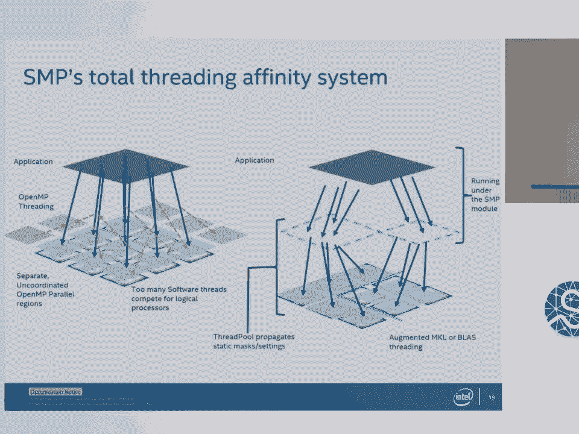
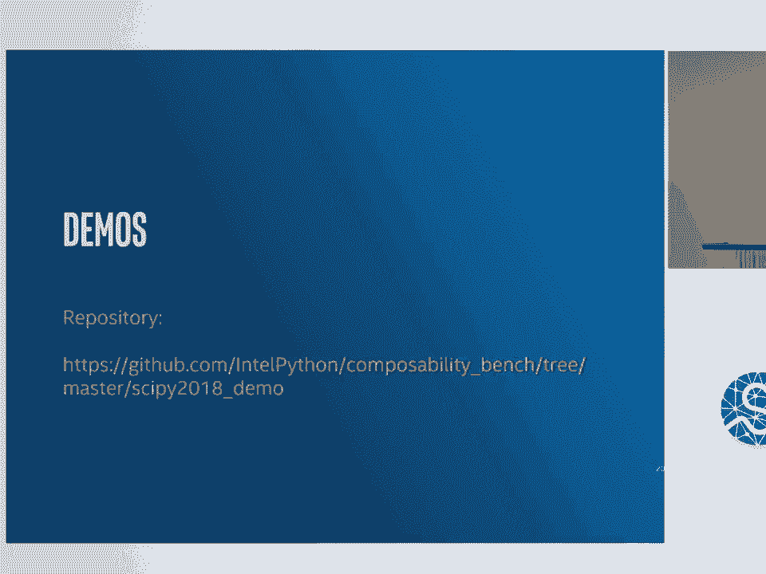
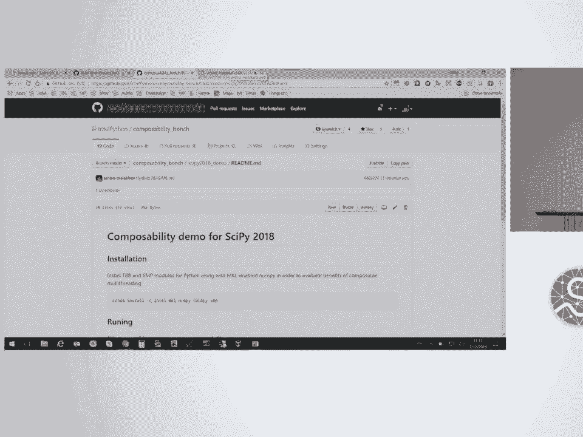
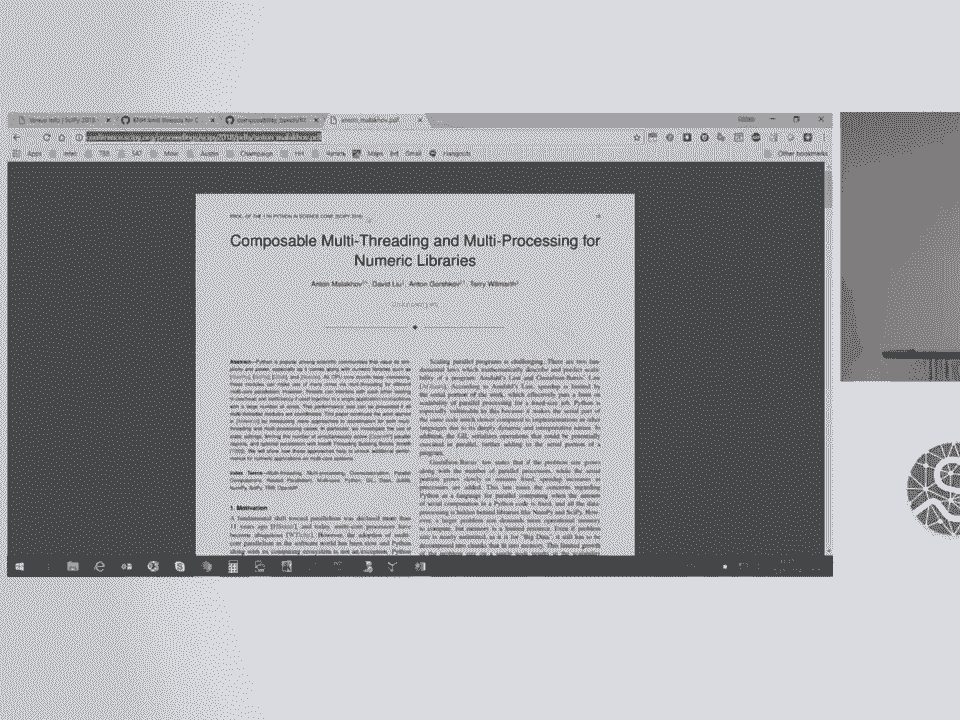
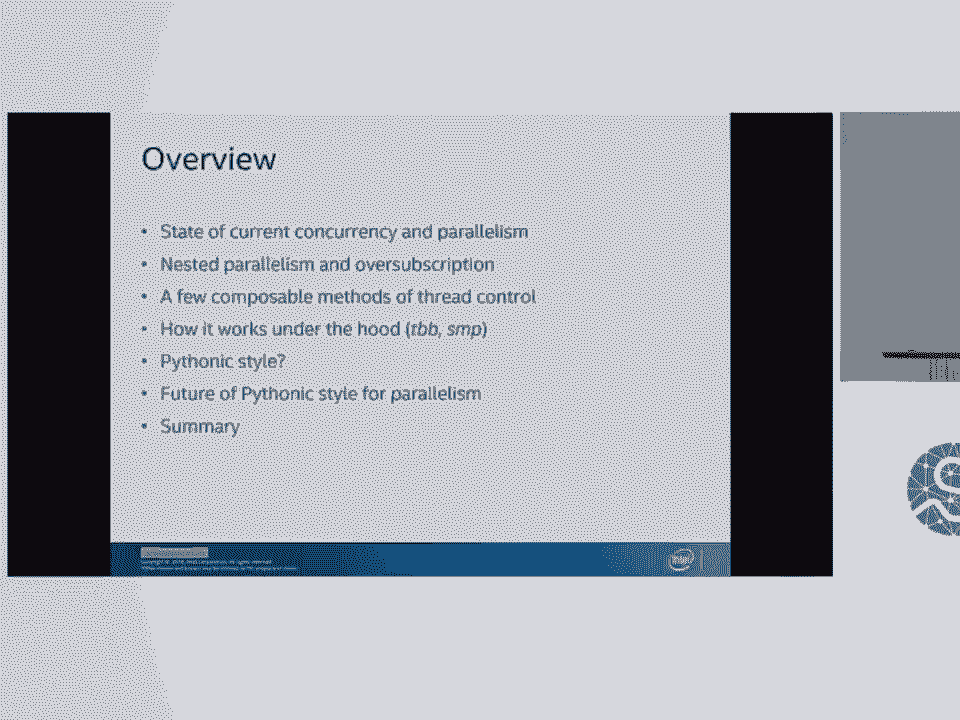
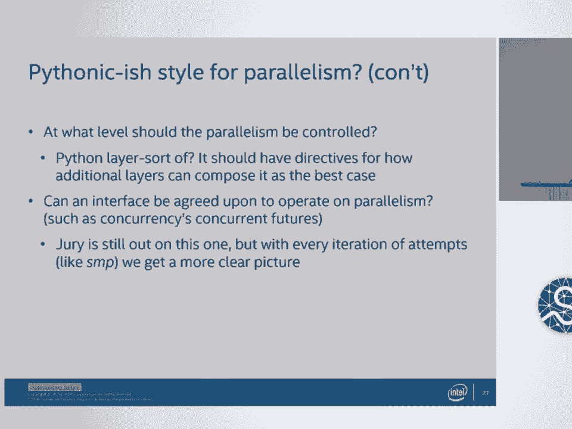
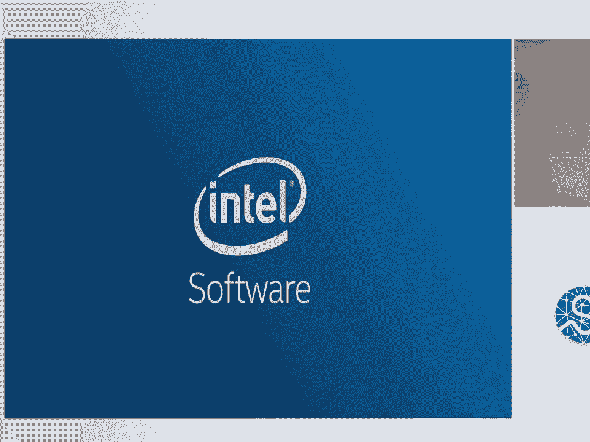
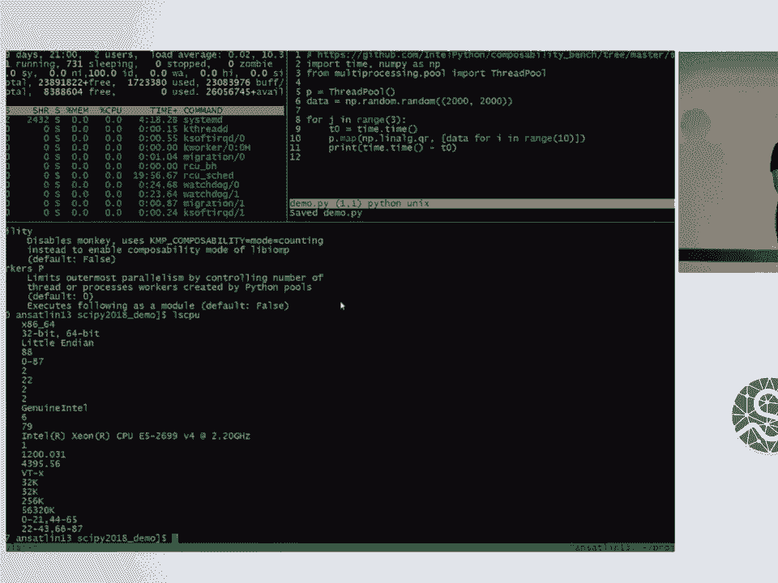
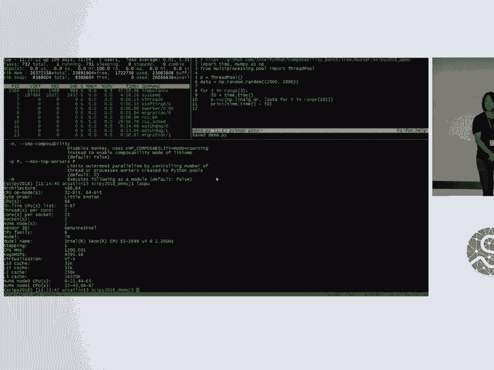
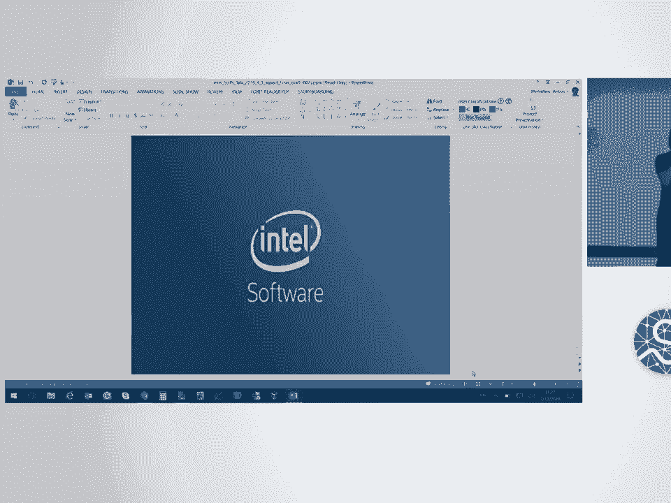

# SciPy 2018视频专辑 - P36：SciPy 2018视频专辑 (P36. Addressing Multithreading & Multiprocessing in Transparent - GalileoHua - BV1TE411n7Ny

 All right。 Thank you for the introductions。 Again， my name is David Lu。

 I'm the Python Technical Consultant Engineer for Intel and with me is Anton Malkoff， which。

 who works on a lot of the topics that we'll be talking about today。

 So to kind of give an overview of the area that I want to speak about， there's a lot。

 of packages and developments that have gone into the concurrency and parallelism fronts， in Python。

 Then we'll talk a little bit about kind of what nested parallelism and oversubscription， is。

 And then a few methods of composable thread control that can be applied to them， how some。

 of these packages and efforts can work under the hood。

 A little bit about what Pythonic style actually means for these packages as well and what the。

 future of the Pythonic style for this type of parallelism is。

 So to kind of give an overview of what the current state of the Python concurrency and。

 parallelism is， we've had a large amount of packages over the ages that have been developed。

 and this is just a short list of them of the kind of the big key ones that have developed。

 since then。 And you can see from all the way from 2008 up until now。

 there's just been kind of consistent， level of frameworks that meet in different areas that have been applied to concurrency。

 and parallelism。 So with a few， we have， I believe we actually have a few of the developers for some of these。

 packages here at this conference as well。 So this is kind of an exciting time。 So again。

 we actually have the options in this space for parallelism and concurrency are。

 very good compared to other ecosystems。 And majority of these play well with the global interpreter lock or the gill and walk or walk。

 around it with distributed or vectorization techniques。 And in the more domain specific areas。

 typically you can rely on high-end C implementations that。

 actually harness parallelism at the C level。 Like scipide and numpide do a great job of this。

 And the recent trends have shown that there's an increase in core count being applied towards。

 the things that we're running Python with。 So nested parallelism and over-description are now quite possible in these kernels。

 And I'll go into that in a little bit。 But first I'd like to talk about kind of the gill and why we use it and what it's good for。

 So I'm sure as many of you have been in this space， many complaints have been filed against。

 the gill in the Python space and many efforts have been tried to remove the gill。

 Sorry if any of you came to hear like a gill removal talk， this is not one of them。 As it stands。

 there's a lot of maintenance of what the gill guarantees that we really， really like。

 It's a predictable behavior， read/write safety for Python object access and ensuring like。

 the reference accounting doesn't get kind of borked or anything。

 And it also makes extension module development easier for those of us who are writing the。

 extensions。 So you know the guarantees that the gill provides really make it a strong suit for you know keeping。

 it in。 So you know for that reason the gill is really a non-issue when it comes to the development。

 and the use of these frameworks but the reason I say that is because there are many ways。

 of stepping around the gill itself。 So again， scipy。

 numpy are great examples of this where the command is sent to scipy。

 and it gets dispatched to the blossom implementation such as the MKL or open blossom where things。

 are then vectorized and parallelism is applied at that level。

 And there's a lot of frameworks in that space that operate to try to directly access vectorization。

 and bring that to an even lower level in a Python， Python-ing manner。 So numpy， numpy expression。

 scipy， they all do this。 So you know for that type of control we do have an extraordinarily great set of frameworks。

 in that space that a lot of other languages don't have。

 Multiprocessing frameworks are also you know a big advantageous area that Python has provided， us。

 You can separate things into separate processes so the types of abstractions that are provided。

 are pretty good for this space as well。 So exiting the gill is you know generally the best way of being Python-ish。

 right？ So like if you say okay instead of removing the gill we're just going to step around and。

 we're going to drop into a mainline like numpy or scipy and then get around it is kind of。

 the most Python-like way possible。 The composition of abstracted flows is where I think things can get a little more complicated。

 especially if you split off into multiple processes and multiple threads based on all。

 of those processes。 And again it's quite rare to absolutely necessitate you know a language to be completely thread。

 safe you know and that's where a lot of the advantages of Python's type inference and everything。

 else would be would go away if we did that。 So with that being said let's talk a little bit about the spaces that are covered in this。

 area right？ So if we were to split into three different areas we have application level parallelism。

 data parallelism and then single threaded concurrency and you can see where a lot of。

 these packages end up sitting in these kind of this Venn diagram of what the spaces will， cover。

 And as you can see over here on the right side with numpy， scipy， numba and scython。

 numb expression， as well you have a large set of data parallelism focus items at our high vectorization on the。

 other side you have multi-processing on the bottom left you have a lot of the asynchronous。

 frameworks that are commonly used， our concurrency based frameworks that are commonly used in。

 not just numerical space。 So if we were to remove that bottom one and just focus on these two right here and expand。

 it again we'd end up with this which is one that's Python multi-processing， one that's。

 Python multi-threading and then one that's just focused on data parallelism。

 And if Matthew Rockland is in the house here he'd probably really happy that like。

 Dask is sitting in the middle of all of that。 But now taking a look at you know where going back to the original topic you know why am。

 even coming up here to give this talk today about multi-processing and multi-threading is。

 that there's a problem that now can exist if you kind of travel in between these areas。

 which is that nested parallelism and over-subscription can occur because of the way that we are composing。

 these levels of parallelism right。 So you know let's take this area of focus here so this area where it's between multi-processing。

 and between data parallelism and between multi-threading and kind of all the areas where it falls in。

 between and expand that。 So to kind of give you a good idea of what this parallelism will look like here's a great。

 example you know you have your pool with this is a multi-processing pool then extends。

 to a thread pool and that you do you then do a pull dot map but within that pull dot map。

 you're then calling NumPy well then what does that actually do？

 You then have P threads P number of threads and then you have the ones that are then called。

 by NumPy and then you start getting a lot of threads that you really didn't think we're。

 going to occur or you didn't intend for this reaction to occur and what that gives is a。

 whole slew of things that then end up in over-subscription oops there we go so some fun。

 diagram here you go from threads and then you go to a kind of tangled mess of threads because。

 now it's trying to spawn off many many threads where it shouldn't be because you don't really。

 have control in that format of composability。 So the overheads that then occur from that right you have the direct OS overhead for switching。

 out a thread the CPU cache becomes cold lots of not so great things right and a lot of。

 these machine learning frameworks actually implement this multi-tiered type of composable。

 parallelism and you know they run into these problems and you know we do work with a lot。

 of them to try to identify these problems and try to find ways of solving it。

 Right now kind of before you know our efforts in this space the most of them would just set。

 you know OMP num threads to to one or KMP block time to to one or something and SMP ironically。

 addresses this which I'll go into later so again let's talk about now the composability。

 models that we've been working on at Intel to kind of address the space which is that。

 TBB 4 Pi which is a free package comes with the Intel distribution for Python is a C extension。

 package manager for managing nested parallelism and it does it through the dynamic task scheduling。

 of the threading building blocks that Intel has and it's stand sheets being via monkey。

 patching so you actually call that the TV before Pi package and then you call your normal script。

 and then it actually monkey patches in the thread pool to be able to have that dynamic。

 task with the threading and everything and then it dynamically maps task on the coordinated。

 polls to avoid the excessive threads。 The other package that does this is static multi-processing and this was kind of premiered。

 last year it's a pure Python package that manages nested parallelism through coarse grain static。

 settings so what it does is it takes the settings that were meant from each of the。

 multi-process level areas and then continues to pass those settings down to the threads。

 that get the processes that eventually will take those and create more threads and it uses。

 a bit of infinity mask and open MP settings to statically allocate the resources to avoid。

 excessive threads。 So now coming back to the nested parallelism again now if we take this trouble spot and。

 we look at what these two areas are trying to solve it with， TVB thread coordination。

 system is doing it by limiting itself to a pool so all of the threading will go through。

 the given pool and then if one ends up finishing a little early it can actually be transferred。

 back and it can take one so for things that are dynamically tasked where you have threads。

 finishing way earlier than other threads it's a really good use because it can handle。

 these types of constraints。 SMP's total threading affinity system does it through a slightly different way so again。

 remember what I was saying about passing those settings down is taking what you have for。

 your application and then if your thread pool you want to apply those settings all the way。

 down SMP will actually take those and apply your settings and augment your MKL or loss。

 threading at that point while maintaining your settings so it accomplishes the ability。

 to fight over subscription in a very different way and that is running under the SMP module。

 So now I'm going to bring Anton up and he's going to show us a demo of what that looks。

 like and so here you go。 Hello， I'm glad to be here and here again and basically I'm glad that I can finally。

 show some live demo here if it works。 So first of all let me show that the demo will be it is already published on the GitHub。

 and for like more technical details please refer to the paper published in the proceedings。

 of this year。 So what we have here we have several packages installed so first of all MKL is needed for。

 like this composability mode with TBB。 First we have NumPy built with MKL and we have this SMP package and TBB for playing。

 packages。 And let's right away start this one and I will explain what it does。

 So I can see on this corner of the screen that it's basically very simple program similar。

 to what we have on slides。 We have some thread pull we prepare some data and we just map like basically Iranian in parallel。

 linauq QR decomposition three times and as David explained we have nested parallelism。

 here because we have this pull of threads thread pull patterns and we have MKL parallelism， here。

 So it works kind of very slow so let me interrupt it here probably so we have like 14 seconds。

 to run。 So now let's start some SMP。 Yeah， fast。 That's pretty much it。

 The models have like kind of help command line and like they have some like fun options。

 like to set key in people of time。 SMP also introduced recently a kind of helper to enable open and pick composability which。

 I described last year。 Well thank you。 David。 [applause]， All right。 Thanks on Anton。

 So now to go all the way back。 So kind of in review you know what you saw in the demo there is the ability to handle。

 with a very large amount of cores on your system you know what you saw was taking 40。

 seconds was the fact that it was getting oversubscribed in the fact that it was passing。

 one level of parallelism to the next one and it wasn't being able to communicate or pass。

 down the settings and both of the two that were shown TBB4， PI and SMP are able to handle。

 that type of large amount of core work by then providing a mechanism for control and either。

 that or passing down the settings。 So they do so by different methods。

 So again now much of the concurrency in async areas you know going back to original topic。

 here are rich with packages that solve in those areas and you know true parallelism。

 is you know a small but strong area so focus is generally been towards like concurrency。

 and asynchronous offerings。 So most of the ways of achieving parallelism are generally through vectorization frameworks。

 and multiprocessing or distributing you've seen that through a lot of the packages that。

 I listed at the very beginning there's been kind of a big push for those packages。

 So I think one of the main questions that I want to bring up in this talk is like how。

 do we do so in a semi-pythonic way right because you know at some point you're either going。

 to be negotiating C you're going to be negotiating something that is not the most。

 Python to implement and you know as build complexity so you know that's why I wanted。

 to bring up that topic。 So I kind of came up with this question of Python-ish right does it have relatively few。

 code changes you know does it modify current behavior do you have to modify your current。

 behavior framework to fit your need do you have to is it directly in the Python standard。

 library is it rightable from the Python layer is an easy interface to understand like do。

 I need to read the huge manual for this and do you know do you keep yourself in the Python。

 layer as in in terms of what you're writing right so if you say oh this is you know this。

 this package does parallelism but then now I need to drop into like you know a completely。

 different language to do to do this or you know I need to drop into an intermediate representation。

 that's kind of painful as well so the question is is how close we can get right so if we take。

 that this rule and look these rules and then look at it under under the lens we can then。

 analyze a TB before pie so for a TB before pie it has you know it meets I think like four。

 out of the six it's not in the standard library it's not directly rightable from the Python。

 layer so that's kind of you know it shows one way of attacking it but not exactly the。

 the most obvious the interface is relatively easy to understand because you're using you're。

 using just you're just calling it and then you can you can have a command line argument。

 that just then defines the size of your pool keeps you and also keeps you in the Python。

 layer when we look at SMP it's a little better because it has it is semi-writable through。

 the Python layer again both of them are not in a standard in the Python standard library。

 so it still is like a different download used though there still is thing there still are。

 things that you do have to learn about it when you utilize it most of it is about which。

 rules it passes down so that's that's when we look at the lens of Python ish it does an。

 okay job and then I think that then brings up the question of like what is the Python。

 like a style for parallelism right so like how realistic is it to have a firm requirement。

 on for a pure Python implementation like SMP is pure Python TBB is not like is it a high。

 requirement is a low requirement I think that's like a community kind of a community thought。

 process that we need to might might have to go through and also what is the best way。

 to modify Python code I think that question came up a lot like we both of the TBB for。

 Python and SMP both do monkey patching so at that point is monkey patching the right。

 way of doing things should be looking at a different type of framework at what level。

 should the parallelism be controlled like should it be at call time should it be at the code。

 level like where should it be it should be programmatic and can an interface be agreed。

 upon to you know operate on parallelism I think this is where concurrent futures do。

 a really good job of stating you know this is the way that we like to have it said these。

 are the causes of the behavior if you can fit this and you're compliant with it then your。

 framework can be kind of used in that space do we have you know anything that we've come。

 to consensus to on this so you know looking at these questions again you know for in the。

 lens of what we have and I guess a bit of the work that I've been doing how realistic。

 is it to have a firm requirement for pure Python probably not required but highly recommended。

 about modifying you know how much to modify the Python code through monkey patching seems。

 to be the new normal right from all the sense of purposes a lot of people have said monkey。

 patching is okay a lot of the framework developers said so I guess we're gonna run with that。

 what level should parallelism be controlled that I think that that question always comes。

 up because at the Python layer it seems to be a good idea some people say it should be。

 a lower level some people say it should be like you know in your environment I don't。

 know it should have directives for how additional layers can be composed for best case like that。

 that is one way that other languages have accomplished it can an interface be agreed。

 upon to operate on this parallelism right so you know I think the Jerry's still out on。

 that one and every iteration that we of these attempts like you know both of both of these。

 are attempts at trying to solve and trying to propose you know where should the direction。

 of concurrency and parallelism be going especially this parallelism level that deals with over。

 description right and hopefully through these efforts we have a more clear picture so in。

 summary TVB at TVB for pie and SMP attempt to address you know the Python ish mentality。

 and methods by augmenting the way that we use multi-threading and multi-processing so we。

 again we try not to change the underlying code and in I guess it's best to have these。

 two forms of multi-processing and multi-threading at the same level so Python level and C level。

 and leave them you know kind of semi-separated and then leave the domain specific stuff to。

 the frameworks and perhaps another weird thought is like well if you're leaving threading and。

 multi-processing directives doesn't it just sound like you know saying pragmo open MP or。

 something leaving directive so it's like that I think these type of questions are really。

 interesting to think about as we progress farther in this space and then having more。

 augmentable threading behavior is pretty useful and you know but that also means that putting。

 a lot of the the bulk of the responsibility on the framework developers and the users is。

 that's where a lot of that response we will then then fall to and is that correct that's。

 still a thought to be put out there and then threading for numerical is has there's a lot。

 of frameworks in this space and I think for non numerical it might be possible but there。

 would probably be some concessions to you know the data type you may not be be as open。

 as just standard Python object so the ecosystem is a you know at a critical mass of good framework。

 so you know I'm really excited to see what comes from it so hopefully you know from the。

 two packages we've shown today and some some more work in the industry let's see what we。

 can come up with。 Alright。 [applause]， Anton if you want to come up for the questions。

 So we have time for some questions。 There's a mic there and I can also come over to anyone nearby。

 I can't quite see too well because the lights are on me so if you could just raise your。

 hand I can come by。 Question。

 Thank you for the nice talk and this goal to have the shared parallelism across the whole。

 Python process is good or in across processes is great。

 The whole issue and the kind of question about and TBB you can only build it statically or。

 shared has to be shared which makes sense as a shared library and then this works in。

 Kanda but for wheels Python packages and sharing that sharing a TBB the parallelism the scheduling。

 across the whole process is there a way to approach that or ever a way to tackle that， problem。

 So am I interested in it correctly that statically do I mean the scheduling statically or linkage。

 of TBB static or what do I do。 Yeah so they're related right the it needs to be all the Python modules need to be using。

 the same shared library and so then the scheduling can be shared across the process but right。

 now wheels don't support shared libraries as well。

 So I mean the TBB is dynamic library and actually they don't want to be as a static library because。

 otherwise like the promise of singleton is lost and actually TBB want to have one single。

 thread pull across like all the models which link against TBB that's why it's like advertised。

 to be a dynamic library and by the way it's available on Kanda moreover it's available。

 on like many channels right now so Kanda Fortun has TBB as well and we actually talked about。

 the Python model for TBB so it leverages TBB library itself to like expose this composability。

 to Python world。 Am I answering the question？ There's a Python wheel for TBB。

 Yes but there is a wheel already。 Yeah。 It's available， become available recently。

 And is there any documentation related to how other C extensions can use that wheel？

 So that's an interesting question。 Pretty much related to what David was talking about。

 So right now the Python side of like TBB so the part which represented in Python it is。

 pretty much like this common line and it's up to like you guys if you have some requests。

 for us like what kind of API you actually want。 So it's not about like TBB brings like the new parallel programming。

 predicting to Python， it actually just solves this composability problem here specifically。

 Thus the Python model for TBB just has this common line interface。 Yeah。 That's pretty much it。

 Hi on your last slide when you were saying well you know just sort of putting comments。

 or decorating a loop to make it parallel and you know saying well isn't that just going。

 to look like open MP。 I think open MP is awesome but I have a hard time imagining how you know an elegant you。

 know clone or counterpart of that in Python because of how complex Python is as a language。

 Have there been any successful or what attempts have there been at you know sort of an open。

 MP like way to achieve parallelism in Python？ I don't think we've seen a successful case。

 I think that's why I posed the question。 I think with the comment was there mostly just to kind of state this is an idea。

 I've seen it done in other languages obviously they've done it in C it's just we can play， with it。

 I've yet to see anybody else in the community think that it's a good idea but if you think。

 it's a good idea it may be worth a shot and if you come up with some use cases you know。

 we can talk afterwards of like what your thoughts are on it。

 Sure I mean it's just been my experience with like numerical astrophysics type applications。

 that you know open MP is just like it's just a great way to take you know a code and instantly。

 you know it's just so easy to use。 Okay。 Yeah let's talk。 Yeah thanks。 Thank you。 Thank you。

 Thank you。 [BLANK_AUDIO]。