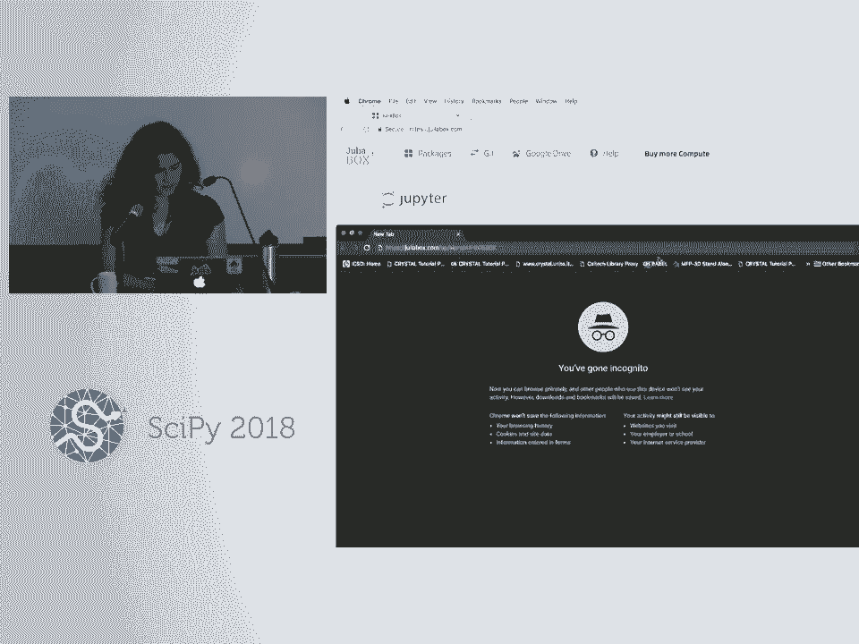
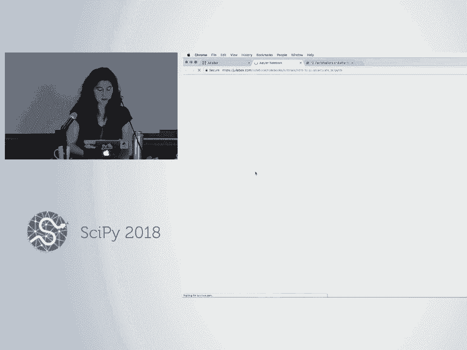

# P37：SciPy 2018视频专辑 (P37. An Introduction to Julia (Beginner Level) _ SciPy 2018 Tuto - GalileoHua - BV1TE411n7Ny

 Before we dive into the tutorial， notebooks themselves on Julia Box， I have a few slides。

 to take us through to sort of introduce the language， Julia， and talk a bit about why。

 we might be interested in learning the new language， Julia。 So first off， my name is Jane Harriman。

 I work for Julia Computing and I'm also a graduate student in Materials Physics。

 And I'm very much a user of the language， Julia， rather than a developer， whereas Sasha here。

 Sasha Vivei is with us from both Stanford University and the Julia Project。

 He's one of the core developers of the language itself。

 And so he's here to help answer questions and hopefully address any interest you might。

 have in going sort of deeper into the development or design philosophy of the language。

 So I came to the language just a couple years ago as a Python user and I still use Python。

 for some of my research。 It was actually in graduate school that I started teaching myself to program for the first time。

 so I'm only a handful of years out from writing my first for loop and all of that。

 And I'll talk a little bit about how I got into Julia from Python while introducing the， language。

 But I first wanted to get a sense of who's here today。 Are all of you primarily Python users？

 Is there anybody that has another language that's their primary development language？

 What languages are you using？ Okay， see？ And what industries or fields are you coming from？

 Are many of you engineers？ How about in the physical sciences？ Life sciences？ Cool， economics？ Math？

 What fields I haven't mentioned yet？ What are you in？ Geography。 Okay， great。 And I saw other。

 Logistics。 Okay， cool。 And how many have tried Julia before or played around with the language of it？

 All right， I'm happy to see that you're here after having looked at the language of it。

 That's a good sign。 Yeah， so good that you're finding it attractive after playing with it a little bit。

 So let's see。 So what I wanted to go over with you before we dive into the books themselves on Julia。

 Box are， you know， this idea of why do we want another language？

 Why is the language getting developed in the first place？

 And then we'll talk about Julia in practice or an application of Julia and then we'll dive。

 into the tutorial itself。 So this first question of， you know， why do we want a new language？

 And what I show here is this sort of periodic table of different programming languages。

 color coded by the features or the characteristics that those languages might bring to the table。

 And so the question is， with all of these existing languages out there， you know， why。

 is Julia getting designed？ What niche does Julia fill？ The idea is that， you know。

 even with all of the existing languages out there， we still。

 have something called the two language problem。 And for those of you that aren't familiar。

 this two language problem comes from the classical。

 divide that exists between the performance of a programming language and the productivity。

 of a programming language。 And so classically， there's this trade-off between what we think of as lower level languages。

 like C or 4-tran that generate really efficient machine code but take longer for us as programmers。

 to get up and running in。 And then on the other hand。

 we have these traditionally higher level languages like， you know。

 Python or MATLAB that are easier for us to work in and to be productive in as， programmers but that。

 you know， don't generate machine code that runs as quickly。 And so then traditionally。

 we're forced between， you know， this trade-off between writing efficient。

 code and writing code efficiently。 And the trade-off though isn't really a true dichotomy because the third variable to consider。

 here is the generality of the programming language that we might use。 And so， you know。

 it is possible to generate fast or efficient code easily if we're working。

 with domain-specific languages or， you know， special libraries like NumPy， for example。

 But when we're working with those domain-specific languages or special libraries， the scope of。

 the tools that we've chosen to work with will be limited。

 And so our real trade-off here is a trichotomy between performance， productivity and generality。

 when we're choosing a tool to program with。 And so this is what gives us， you know。

 the two language problem where the idea that we， often have to start prototyping in one language to get something working and up and running。

 rather quickly。 And， you know， after we've got a working prototype。

 it's common for people to translate their code， into a traditionally lower level language to get the speed that they might want to really。

 have something running， running at scale。 And so Julia was designed to address this two language problem where the tagline that。

 we have for Julia is， you know， looks like Python， feels like Lisbon， runs like C or， 4Trans。

 So the idea here is that Julia has been designed to offer you， you know， a high level language。

 that gives you both， you know， power and generality and ease of expression all at the same time。

 And so when I say that Julia offers productivity， generality and performance， I'm going to talk。

 through what I mean when I say that Julia offers each of those features。

 And so we can start by talking about performance。 So one of the things that we'll do in the tutorial today is a notebook that's called。

 Julia is fast。 And so that's a benchmarking notebook where we'll look at a bunch of different implementations。

 of the SUM function。 And so we'll look at some built in versions of the SUM function in Python and in Julia。

 but we'll also look at handwritten implementations of SUM using the same algorithm in C， Julia。

 and Python。 And so the SUM function is just going to take a vector and then add together all the elements。

 of that vector。 And when we implement this in a handwritten way in C。

 we are going to see that to add together， the elements of a 10 million element vector。

 it's going to take order of 10 milliseconds。 When we do the same handwritten implementation in Python。

 we're going to be at order of 500， milliseconds。 And then when we go to Julia from Python。

 we're going to be back down to order of 10 milliseconds。

 So the purpose of this benchmarking example is to give us a sense of when you're writing。

 something custom in Julia and just， you know， sort of out of the box， implementing something。

 yourself， it gives you a sense of how close Julia can get to C speeds。

 After talking about performance， the next thing that I like to show is productivity。

 And one of the ways that we can sort of show off the productivity of Julia is by looking。

 at how closely Julia code resembles Python。 And so we're going to look at those two implementations of the SUM function in Python and。

 Julia side by side。 What we see is that they're really not that different。

 So here all of the differences between these two implementations are in bold。

 And so we see that there are a couple of different required keywords like in Python， we have。

 the deck keyword and then a couple of required columns， whereas in Julia we have the function。

 and the end keyword。 But other than that， we can express ourselves in pretty much the same way with a huge speed。

 up in Julia。 And it was this sort of difference， a difference in performance based on such small syntactic。

 changes that got me really excited about starting to learn Julia as a Python user。

 And so I was using Python in my graduate research。

 And Sasha actually had come to Julia from a C and MATLAB background。

 So that was his incarnation of the two language problem。

 And having come to Julia recently and been very excited about the language， he was raving。

 about the language to me。 And at some point he took a piece of code that I had written in Python and then translated。

 it to Julia for me。 And what I saw was that even though on the surface he had only made a few。

 you know， miners and tactic changes to my code， the code that he had written ran more than an order。

 of magnitude faster。 And seeing that with such minor modifications I could get this huge speed up was really what。

 got me excited about learning a new language。 So the third thing that we say that Julia offers series generality。

 And what I mean by that is that Julia is sufficiently general and powerful that Julia。

 is mostly able to be written in Julia itself。 We also say that working in Julia feels like working in a list。

 And what we mean by this is that Julia offers meta programming facilities like working with。

 macros and the design paradigm of Julia is multiple dispatch。 Oh， I did mention this already。

 The most of Julia is written in Julia。 One of the things that's cool about this is that the fact that Julia is mostly written。

 in Julia means that the line between users and developers of the language really starts， to blur。

 And so a lot of our most important contributors to the language and generally to the package。

 ecosystem are people who came to the language as users often， you know， other graduate students。

 That's a very typical story。 And what they find is that once they know the language well enough to write their own code。

 in Julia， they know enough to also be able to look under the hood and start tweaking the。

 performance of things or tweaking the functionality of the language to better suit their needs。

 And that's how they typically get progressively more entrenched in the language。

 And so the point there is that there's not a significant learning curve as there might。

 be in other languages that are implemented in C under the hood。 Okay。

 so what does actually working with Julia look like in practice？

 An application that I really like to talk about for Julia is the Celeste project。

 And so the Celeste project took data from the Sloan Digital Sky Survey， which was this。

 effort to collect data on 35% of the visible sky。 And so， you know， in generating this data set。

 it came up with 178 terabytes of data， which， I'm always forgetting what these prefixes mean。

 So Terra， as a reminder， is 10 to the 14。 So this is a data set of 1。78 times 10 to the 14 bytes。

 And in a sense of scale， if you wanted to store all of this data on DVDs， it would take。

 you over 25，000 DVDs to store that much data。 If you wanted to be extremely silly and store this data on written paper。

 I did this conversion， back in the envelope conversion using some information I found online that said that。

 we would take over 150，000 pickup trucks to store that amount of data on printed paper。

 if we wanted to do that。 So this is a relatively large data set。

 In the first 10 or so years that it was around， there wasn't a whole lot done with it。

 There wasn't a systematic approach， I guess， to going through all of this data set and trying。

 to catalog the astronomical objects that had been， that had data collected on them in the， survey。

 But what happened then was that a team of researchers came together to form the Celeste。

 Research Project。 And this brought together people with various backgrounds from， I think， MIT。

 UC Berkeley， Lawrence Berkeley National Lab， as well as Julia computing。

 people that came in with statistics， and physical science and also computer science backgrounds。

 And they decided to write software exclusively in Julia that would run on nearest super computers。

 And so harnessing them both the power of Julia's software and the super computing machines。

 is their hardware。 What they were able to do was catalog 188 million stars and galaxies from this data set。

 And they were able to do this entire calculation in under 15 minutes。

 Now in running this calculation， Julia actually became the third language to join the Petaflop。

 Club after seeing Fortran。 So hitting over 1。5 petaflops per second。

 And this calculation made use of over a million threads in 9，000 nodes。

 So this gives us a scale or a sense of Julia's ability to parallelize or distribute on next。

 generation machines。 So this project in and of itself is impressive， but the natural question is。

 what did Julia， actually bring to the table here？ And what would this project have looked like in the absence of Julia？

 And because we say that Julia has been designed to solve the two language problem， maybe the。

 first answer that you would come up with is， well， if Julia hadn't been the language of， choice。

 maybe two different languages would have been used in the project。

 And maybe there would have been some sort of natural redundancy or inefficiency in needing。

 to translate from one language to another。 And while that's true。

 really the impact of using Julia on this project was more profound， than that。

 Because in bringing together a group of researchers with various different backgrounds， those。

 again， coming from the physical sciences and those coming from those statistics and then。

 computer science， the incarnation of the two language problem in a diverse environment。

 like that is typically that the team would have sort of fractured into one team of domain。

 scientists， for example， who would have then done that first implementation or that first。

 prototype of the software they needed in a higher level language and then another sort。

 of sub-team that would have taken that code when they were done and then done a translation。

 to a lower level language。 And so the way that the two language problem would have looked in this environment probably。

 would have been that one team would have finished their work for passing the baton off to the。

 other sub-team。 But instead of the fact that everybody was working in Julia from the beginning meant that。

 everyone was working in the same code base and that meant that the team was really able。

 to function as a team and work more closely together and iterate more rapidly so that。

 really the science and the implementation of the science were able to sort of evolve together。

 And so with that， beyond academia we're starting to see Julia uptake in various places in industry。

 Now that we're approaching the 1。0 release of the language very quickly it's going to。

 be released in August and we're seeing what's starting to look like exponential uptake of。

 the language and these statistics are from several months ago but we're now well over。

 over 2 million downloads and so we're hoping that your interest in the language will continue。

 beyond this tutorial and if you find yourself looking for additional resources to learn。

 more about Julia after today we have really active communities on Slack， Discord and GitHub。

 over there are lots of friendly people out there to answer your questions。

 I'm also providing my email here and I have both business cards and Julia laptop stickers。

 up here so if you have any questions after today if I can't answer them I can probably。

 direct you to somebody who can so don't hesitate to reach out if you would like additional assistance。

 And so with that we can dive into the tutorial itself。

 The link that I'm having you log in today is this one so juliabox。com/up/aipro/aipro500k。

 Alternatively if you are able to log in just a juliabox。com but time out time juliabox。com。

 happen after an hour and a half and you have to log back in whereas logging in here should。

 give you a solid four hour sessions so you can get through the tutorial without needing。

 to log in multiple times。 Are most people logged in already or is there anyone that's not logged in yet？

 There's no if you have Jupyter notebooks in the tutorial and then you're good to go you。

 don't have to log in here but yeah if you haven't done local installations of the language。

 or the tutorials then you can get all of that online。

 Yes yes you can use either github linked in or google I think to log in so whichever is。

 most convenient for you。 Switch from presenter mode quickly。

 These are your three options you're seeing to log in are those working alright for you？

 Oh okay thank you I hadn't encountered that。 You're good？ Okay。

 Alright so once you logged in then and there's this tutorials directory and let me make this。

 slightly larger。 Are people in the back able to read at this font size？ Yeah okay great。

 Alright so there's this tutorial subdirectory and then what we'll be working in today is。

 this intro to Julia tutorial and so the first numbered well 13 notebooks technically are。

 what I'll be doing sort of presenter style for you and then we have a few exercises for。

 you to work on on your own to get more comfortable playing around with the language after we've。

 gone through the presentation and for those of you that might have missed in the beginning。

 Sasha's primarily going to be addressing questions so he's going to come around if you need any。

 additional help and then if there's a question that you know broadly benefits the audience。

 I'm happy to answer what I can as well and so with that we can get started then。

 So how many of you are familiar with Jupyter notebooks having used them in Python？

 Okay so a lot of you is there anyone I it's I seem like everybody or almost everybody。

 is there anyone that hasn't seen Jupyter notebooks before？ Okay cool。

 In that case yeah the purpose of this notebook is really just to show you how to work in。

 a Jupyter notebook so in this this one I'm just showing that you know you get whatever。

 output is on the last line when you run a given cell that you can suppress output with a semicolon。

 A couple things that are more specific to Julia here if you proceed any function that you're。

 unfamiliar with in Julia with a question mark either in a Jupyter notebook like this or at。

 the ruffle then whatever doc strings are tied to that function will print to standard out。

 So if you were to proceed any shell commands with a semicolon again either in Jupyter notebook。

 or at the ruffle you'll be able to work in sort of a shell mode so here I'm you know。

 listing all of the files in my current working directory and you know asking for the name of。

 my current working directory here。 So that was just to get us familiar with this environment but since most of you have seen。

 Jupyter notebooks before we can dive that into the first notebook which is our first one。

 that's more Julia specific and also just to give you sort of a high level overview of。

 the structure of the notebooks here really the first you know six notebooks on the language。

 notebooks one through six are meant to sort of give you a high level tour of the syntax。

 of the language and then we start getting more into I guess Julia specific features talking。

 a little bit about for example performance the language design paradigm and then also。

 some special linear algebra functionality down in the later notebooks here nine through twelve。

 and we have this sort of interlude with notebook seven and eight where we talk about how to。

 pull packages in into your environment and how to do some basic plotting。

 So we'll start with the sort of whirlwind tour of the language syntax in books on two。

 six and so notebook one here getting started and here I'll show you know how to print in。

 Julia how to assign variables how to comment and then we'll look at syntax for basic math， quickly。

 So first up the most common way to print in Julia is to use this print ln function and。

 then for assigning variables in Julia we don't need to just just as in Python we don't need。

 to specify the types of the variables and when we declare them so for example we see。

 that you know my answer 42 is in it 64 my pie is a float and then here I've assigned。

 a string to the smiley cat emoji and once we have assigned a value to a variable and there's。

 no issue with reassigning that variable as another you know dynamic or high level languages。

 to a to another value of a different type so smiley cat emoji used to be a string now。

 smiley cat emoji is an integer and programming with with emojis is one good example of no。

 Julia being rather generic so you know in Julia I could assign for example numbers or。

 whatever values I might like to our cherry emojis and then I can create true statements。

 like this one where we see that you know smiley cat emoji plus a frowny face turns us into。

 a happy face。 Yeah。 Yeah。 So I'm really bad at this what you're supposed to be able to do is hit back slash。

 And then for example if you type smiley cat and hit tab but I'm really bad at holding the。

 tab the appropriate amount it seems like it only works for me like 50% of the time。

 What should happen is that you hit tab and then something comes and then there should。

 be a drop down that allows you to select the smiley face。 Does that work for you？ Yeah。 Yeah。 Yeah。

 I can never get it to work when I'm demoing in front of people。

 I think I like exactly hit the character incorrectly and then someone always explains to me how。

 to do it and they do it for me and it works。 But if it's working for you then I guess the instructions are sound。

 Uh huh。 That should work for me but it's I'm glad of the instruction work。

 The instructions are sound so if you do if you do backslash and then for example smile。

 or smiley cat you can do emojis。 I just can't do them because my fingers are broken。

 See yeah you would hit tab at this point。 Oh okay。 So it's two tab hits really。 Right。 Okay。

 Thank you。 Yeah。 Alright。 So for commenting in Julia we can comment with a single line just using a hashtag or a。

 pound sign。 If you want to do a multi-line comment then you can do two hashtags and equal signs inside。

 of those hashtags and then you sandwich your comment between those。

 And then for basic math the syntax will look pretty familiar with the exception that to。

 exponentiate things we're using the carrot symbol here rather than the double star that。

 we would use in Python。 And then at the end of every notebook I have a couple sort of basic exercises to walk you。

 through where the idea is just that you start executing code in Julia right away。

 And I ask for volunteers to answer the questions for me。

 So first off if I wanted to look up documentation for the convert function how would I look。

 up docs for that in Julia？ Yeah question mark。 So if I do question mark convert we'll get our documentation。

 So what this is telling me is that to convert X to a value of type T I'm passing the type。

 that I want to get as the first input argument and then the value that I want to convert as。

 the second input argument。 And so then here our next exercise we say that we're starting with some variable called。

 days it's 365 and give myself some extra boxes。 So this is an integer but if I wanted to convert it to a float how might I use convert。

 to do that what would I type？ Yeah I think what we should do here is specify a float 64 and then we'll get that conversion。

 Thank you。 And then this last exercise is just to play around with what happens when we try to convert。

 for example a string that contains a one to an integer and there we get an error so that's。

 not doing what we might want it to do。 If you wanted to actually sort of pull a number out of a string you can use the parse。

 command。 And one thing I'll point out this will be relevant for one of the exercises later。

 This is sort of starting to overlap with the next notebook but if the one had been in close。

 inside single quotation marks then it would be a character rather than a string and if I。

 tried to do this conversion here where I'm converting the one now inside the single。

 quotation marks to an int what I'm getting there is the ASCII representation but we'll。

 see more of that later。 Any questions on the first notebook？ Okay cool and we'll go to notebook two。

 Oh yes。 Oh no but often if you try to look up docs for something that isn't the correct name it'll。

 make suggestions for you。 So maybe that's relevant to your question。 Oh okay。

 Oh there's one way to find out。 Okay。 Alright yeah cool yeah thanks。

 Okay so then we'll go to notebook two on strings。 Okay so the purpose of this notebook is to show you how to create a string in Julia and。

 then also how to interpolate and concatenate them。

 So first off to get a string in Julia the first way we might do that is to enclose some。

 text inside a pair of double quotation marks and the second way is to enclose text inside。

 three sets of double quotation marks。 One of the differences that we'll see between these two types of strings is in the second。

 type we can add some additional formatting。 So for example if I add a bunch of basically new line characters here Julia can tell that。

 I wanted those new line characters that formatting within the second type of string so I just。

 added a bunch of backslash ends here to my string。

 Also in the first type of string we're not able to quote inside the string itself because。

 it's ambiguous you know where the string actually ends whereas we don't have that ambiguity in。

 the second type of string so we're able to use quotation marks there around the word errors。

 And then what I started to show in the last notebook is that we can't create strings using。

 single quotation marks in Julia。 So single quotation marks around a character gives us a char type and if we try to enclose。

 multiple characters inside single quotation marks we're going to get an error。

 So that's maybe one notable difference if you're coming from a Python background。

 And then for string interpolation in Julia and here we're starting off on creating a， few variables。

 One for my name and then two for my numbers of digits。

 And to interpolate you know these variables or others inside a string we just throw a dollar。

 sign within a string next to the variables of interest。

 So here I'm throwing the name variable inside this string here the num fingers and the num。

 toes variables。 And if I wanted to actually interpolate an expression within Julia I could put a dollar。

 sign next to parentheses enclosing the expression that I want to actually have evaluated within。

 that string。 So here we're adding 10 and 10 together before throwing the number 20 then inside the string。

 And then to concatenate strings I'll show you three different ways to do that in Julia。

 Again we'll start off here with some new variables。

 We've got this string S3 and the string S4 and we're bringing back the smiley cat emoji。

 as the number 10。 Here if I use the string function I can concatenate these two strings S3 and S4 together to get。

 the single string how many cats is too many cats。 And then I can respond with a second call to string。

 Here we see that I'm passing three input arguments to string rather than two。

 So string actually takes arbitrary numbers of input arguments and it will take not just。

 other strings as inputs but also whatever type you might like to pass。

 So here's smiley cat emoji which is an int is getting passed。

 And we get the single string output I don't know but 10 is too few。

 We could have created this first string a couple different ways。

 So we could have used the star operator to concatenate strings together。

 So when it looks like we're saying S3 times S4 we're really getting the single output string。

 We can't do string concatenation in Julia with the plus operator by default。

 Though I'll show later in one of the exercises you'll see that you are able to define that。

 method if you like it。 And then the third way that we might do string concatenation is to just use string interpolation。

 So here during dollar signs next to those strings S3 and S4 to get this single string output。 Yeah？

 [ Inaudible ]， You mean if I just wanted to display the text without。 Yeah。 I don't know。

 If you do print on it is that。 Yeah。 Yeah。 So I guess if you don't want to see the string character or sorry the quotation marks then。

 that'll work。 No。 Yeah。 Those are just to denote for you that it is a string。 Yeah。 Other questions？

 Okay。 All right。 So this first exercise then the hint here given that if we call the star operator or sorry。

 brother what am I to say？ All right。 If you were to exponentiate something in Julia two to the three for example what you're really。

 doing is calling the star operator multiple times under the hood to do multiplication。

 And so given that piece of information how might you create a string that says hi a thousand。

 times in Julia？ Yeah。 Exactly。 Thank you。 Let's see。 Okay。

 So then this next one I'm starting off with these two variables a equals three and b equals。

 four and what I want to do is create two different strings。

 The first string that I want to create is one that says three plus four using these variables。

 a and b。 How would I create that string？ Exactly。 Okay。

 And then how would I modify this if I wanted to actually get the number seven？ Yep。

 If I throw in parentheses and get rid of that second dollar sign。 Thank you。 All right。

 Then we'll go to notebook three which is on data structures。

 So in this notebook we'll cover how to create and work with tuples dictionaries and arrays。

 in Julia。 And for those of you that might not be familiar about a high level set of differences between。

 these three data structures tuples are immutable so once we've created a tuple we can't update。

 their contents whereas dictionaries and arrays can be updated。

 Then both tuples and dictionaries are ordered collections of elements whereas dictionaries。

 are unordered and give us sort of associative relationships between two different sets of， data。

 Okay。 So with that to create a tuple in Julia we can throw our ordered collections of elements。

 inside parentheses。 So that's just like in Python。

 So here I'm creating a tuple called my favorite animals。

 And one thing to note here is that Julia is one index。

 So we start counting from one rather than from zero。

 So the first element of my list here is the item penguins。

 And again because tuples are immutable we can't update them so we will forever be stuck with。

 penguins now as our first favorite animal rather than otters。

 Then to create a dictionary in Julia we can use this dict keyword and we can either initialize。

 an empty dictionary just by saying dict and then with parentheses and nothing inside or。

 if we want to initialize a dictionary to have key value pairs we can use the syntax that。

 I'm showing here where we proceed an arrow with the key that we want to add to our dictionary。

 and then follow that arrow with the value to be associated with that key。

 And the arrow that we have here is just an equal sign followed by a right pointing arrow， head。

 And so here I'm creating this dictionary called my phone book that has two entries one for。

 Jenny and one for Ghostbusters。 And now that we've created this dictionary if we want to perform a look up on the dictionary。

 we can just throw the key of interest inside square brackets after the dictionary name。

 So we can look up Jenny's phone number by throwing Jenny inside my phone book and the syntax that。

 we would use to add additional entries to this existing dictionary are very similar where。

 we're now throwing the new key inside square brackets and the new phone number to the right。

 of an equal sign。 Having done that if we look at my phone book we're now up to three input entries。

 If we wanted to remove an entry from a dictionary we could use this pop bang command and I'll。

 explain in a later notebook why some functions end with a bang or an exclamation point。

 But for now we'll just use pop bang where the first input there is our dictionary， the。

 second is the key from the key value pair that we want to remove and then we see that。

 we're back down to two entries now。 And again because dictionaries are not ordered if I were to try to look for the first entry。

 like this in my phone book Julia thinks that I'm looking for a key called one and so returns。

 a key error。 Question on this stuff so far？ Okay。 And then to create arrays in Julia we could enclose our ordered collections of elements。

 inside square brackets。 So here I have this array called my friends and one of the things that we see here when。

 we get this output。 So this is telling us that we have a five element array and then the signature here is saying。

 that this is a one D array or rather here it's a one for one dimensional here array and。

 then the elements enclose inside this one D array then are strings。

 Similarly if we were to look at the second array called Fibonacci we're getting a similar。

 sort of output we're now we're seeing this is a one D array that contains integers。

 Now if you want an array that has multiple types inside of it that's perfectly fine。

 So mixture here has you know both numbers and strings inside of it and what we're seeing。

 here is that it's a one D array that takes any as its input。

 So the type hierarchy in Julia you know sort of you could imagine at the bottom of this。

 tree we have concrete types like float 64 and 64 and string and then we have a few sort。

 of abstract types on the next level like you know number for example is going to encapsulate。

 anything that's an integer or a floating point or the like at the very top of our tree then。

 is the any abstract type where any concrete type will fall under that category and so。

 that's what Julia is defaulting to there。 Now if we wanted to grab the third element of a list we could do so with this syntax so。

 it's just like you know indexing into a tuple。 If we wanted to edit an existing array we could use this indexing sort of syntax and。

 add our new value to the right of an equal sign here。

 And just like on dictionaries we have the pop bang command to remove items from arrays。

 and now we have the push bang command to add items to existing arrays where just like in。

 Python you know pushes is adding here the number 21 to the end of this array Fibonacci。

 and pop bang is always going to remove from the end of the array。

 You can check here that that's worked by looking inside Fibonacci。

 So all of these examples so far on arrays were on one dimensional arrays of scalar values。

 but we can also create you know arrays of other arrays or generally arrays of other data structures。

 or we can create multi-dimensional arrays so and one thing I didn't mention so far whenever。

 we're working with a one D array like you know Fibonacci or Mixture for example。

 In Julia one dimensional arrays are aliased as vectors so I could equivalently refer to。

 this as a vector of integers or a vector of type any here。

 And so moving into this next section there one thing to note here is just vectors of vectors。

 are distinct from matrices for example so matrix is a 2D array and multi-dimensional。

 arrays generally are different from arrays of other data structures。

 So here I'm creating a vector of vectors called favorites and the signature that we're。

 getting here can be read just like the ones we saw before sort of from the outside in。

 So what this is telling us is that this is a 1D array where the types inside the 1D array。

 are other 1D arrays that take strings similarly numbers here is going to be a vector of vector。

 of integers。 One command that allows us to create multi-dimensional arrays is this rand function and so rand will。

 take arbitrary numbers of input arguments where integer input arguments to rand will。

 specify the dimensions of the array that you want to create。

 So when I call rand on 4 and 3 I'm getting a 4x3 matrix and the values inside that array。

 are by default going to be floating point numbers between 0 and 1。 Rand on 4。

 3 and 2 is going to give us then a 3 dimensional array or a 4x3x2 array。

 And then the last note to make about arrays before we move on to the next notebook is。

 just to be careful when you're trying to copy arrays。

 So here we've already seen this array called Fibonacci。

 If we wanted to copy Fibonacci and say that we tried to do that by saying some numbers。

 equals Fibonacci what we would see is that if we were to update this array called some。

 numbers by for example indexing into it and then changing that first element to 404 we。

 would see that if we were to then look inside Fibonacci， Fibonacci also is altered。

 And the reason is that when we did this assignment here we weren't actually copying Fibonacci。

 we weren't actually creating a new array， we were just giving a second name to an existing。

 data structure and then it doesn't really matter which name we use to edit that data， structure。

 So if we want to actually perform a copy we're going to want to use the copy function。

 So what I'm doing here is just restoring Fibonacci to its original state。

 Now if we properly copy Fibonacci using the copy function to get this new array called。

 some more numbers we see that we can update some more numbers here again at the first。

 element and then look inside Fibonacci and see that Fibonacci is unaltered。

 Okay so we have a couple exercises here for going to the next notebook。

 So first off we're going to start for 3。1 with this data structure called array and then。

 say that we want to add and subsequently remove the number 4 to this array。

 So first adding for to array， how would we do that？ Push， yeah， so push bang。

 Our first input then is going to be the name of the array， array and then our second input。

 is that number 4 that we want to tack onto the end。 And now to remove that for from array。 Pop bang。

 yeah。 So this one only needs one input so we're always taking it from the end so if you return the。

 4 there and if you wanted to check that that worked you can add a new cell and look at， array。

 Okay so then in this next one we already have this phone book called my phone book lying。

 around and let's say that we wanted to add this key value pair to it so the key emergency。

 and the phone number 911。 Any ideas why this doesn't work based on the error message or intuition？

 Yeah， right， yeah。 So what's happening here if we look at my phone book we see that this is a dictionary that。

 has strings as both values and as keys。 And this type of dictionary was created at the moment that we initialize the dictionary。

 so if I scroll back up here to where we created my phone book， yeah Julia looked at these first。

 inputs that we gave to the dictionary when we created it and used that information to。

 decide that this was going to be a dictionary that only took strings and strings。

 Alternatively if we had initialized for example an empty dictionary Julia wouldn't have any。

 extra information to go on so in that case we're defaulting to creating a dictionary that。

 has any type as both the key and the values。 There will of course be cases where maybe you want to start by initializing a dictionary。

 with a couple entries but maybe you want your dictionary to be more flexible than would be。

 indicated by just the initial entry that you're starting with for example in which case say。

 for example I'm creating a dictionary that I know has this particular key value pair but。

 I want this to actually be in any type and any dictionary。

 What I could do is that when I create this dictionary I could annotate it to tell Julia。

 that I explicitly wanted to have a particular type so I do that by using these curly brackets。

 after the call to dict and in this case I'm both initializing with a particular key value。

 pair and manually controlling the type of the data structure that gets created。

 I think that sort of covers the last couple exercises let me see if I missed anything。

 Yeah that was the purpose of these next couple exercises just to show you that the way that。

 you initialize a dictionary is going to impact the type of data structure you get where here。

 for example we're getting strings is the key type and any is the value type based on。

 having different types passed as values for these two different entries。

 Any questions on any of the data structure stuff？ Yeah。

 One way to do that would be if you were you can also create an array using the array function。

 or constructor so actually I'm going to look at the docs for this quickly。

 So to create an array yeah so the docs here are telling us how to specify the input type。

 there or rather the type that you want the data structure to have so if I have an array。

 of I'm putting both the types that I want to occupy the array and then also the dimensionality。

 so this is creating a matrix or if I wanted a vector we could do this and we're just sort。

 of randomly initializing the entries here or taking I don't know just that randomly initializer。

 just takes whatever is in memory how does yeah okay。

 Yeah so if you were creating an array in this way for example you could control the types。

 Oh whatever is in memory yeah。 Yeah if I had for example would I just do that like this？ Yeah。 Okay。

 Yeah right。 Actually I can't tell is it creating a distinct object when I do this？

 Yeah I guess I have to do something like this。 I don't know if that actually gave me any information。

 Yeah。 Under 0 7 is it copying？ Sorry under。 Okay all right yeah so in the so we're working right now on Julia 0。

6 the most recent release， is Julia 0。7 which is going to be functionally equivalent to Julia 1。

0 the difference between， 0。7 and 1。0 is that any changes that have been deprecated between 0 6 and 0 7 will generate。

 warnings in 0。7 whereas you'll just get errors in 1。0 but otherwise 0。7 and 1。0 will be equivalent。

 so in 0。7 if you were to do something like this you would then get copying of the array。

 A to create B whereas in 0。6 the version that we're working on right now I'm getting the。

 same object if I wrap array here sorry the array A here in the array command to create。

 B so A and B here are the same。 Right。 Yeah。 But when that is so A after I've done this。

 or after I've done it， I've done it in half。 So do you。

 you would want to update A to have the number 1。6 and what I would do that probably won't be expected。

 Right。 Well I guess how， I guess I wonder if I did something like this。 Oops sorry。 Should that。

 yeah it's not going to leave here。 Right okay but I guess that error message there isn't particularly helpful。

 Yeah okay right。 Oh that's why you get that error okay yeah so you would after create a new structure then。

 So with that I guess we can go to notebook 4 then。 So notebook 4 is loops syntax in Julia。

 So this I'll just， I'll show the syntax for writing while and for loops。

 First off the syntax for writing a while loop we have just the while keyword and the。

 end keyword with typically our conditioning going on the same line as the while keyword。

 and then the loop body starting on the line in between the while and the end keywords。

 And Julia were for the most part white space insensitive and so you know if I could write。

 a while loop that counts from one to ten like this alternatively you know if I wanted。

 to add arbitrary numbers of spaces it's unambiguous what I'm trying to do here since I have the。

 end keyword so I don't need to rely on indentation。

 I guess the way that we might say that Julia is not white space insensitive or is white space。

 sensitive is that Julia is reading the new line characters here so alternatively you know。

 I could put all of my loop body on one line if I added a semicolon to separate lines explicitly。

 Moving beyond the syntax for while loops four loops are looking sort of similar where。

 now we've got the four keyword and the end keyword we're taking our whatever variable。

 we want to loop over over our loop iterable using here an in keyword and again we're typically。

 putting our loop body there between the four and the end keywords。

 So again now we're counting from one to ten。 One thing that I didn't show before is that you know to get a range in Julia we would。

 use syntax like this where we have a starting number and then an ending number for the end。

 of our range separated by a colon。 Alternatively if we wanted to you know take non well steps of different than one by default。

 we could add the step size explicitly between our starting and our end points of the array。

 and also add another colon there。 You're looking at only the odd numbers and similarly using a for loop here just to iterate。

 over all the entries of this array called my friends。

 In the next couple examples I'm going to create addition tables with a couple different ways。

 of writing nested for loops in Julia。 So when I say addition tables what I mean is that I'll be generating matrices that have。

 as each entry in the matrix the sum of the row and the column indices。

 And so we'll start by doing that by creating this matrix called A that starts off as a。

 matrix of zeros and we're creating A with this fill command here where fill takes as。

 the first input whatever we want to fill the subsequently created array with。

 As the second input to fill is a tuple that has as many entries as we want dimensions in。

 our output array。 So here m and n are each five and so we're creating this five by five matrix。

 And then with this nested for loop here we're iterating over all the entries of A and then。

 updating them to again the sum of the column and the row indices。

 Now with some syntactic sugar that we have in Julia we could write exactly this for loop。

 the nested for loop using only a single for keyword and a single end keyword。

 So we do that here again we're initializing now a matrix B to fill the zeros and now we。

 have that same nested for loop here where what we've done is that we've brought that。

 second or the inner for loop onto the same line as the first for loop。

 So we have a comma now separating whatever we're doing with I for whatever we're doing。

 with J and otherwise the loop body is looking the same。 And the third way that we， oh yeah。

 >> [INAUDIBLE]， >> Yes， yeah， yeah。 So this I can from one in Julia。 [BLANK_AUDIO]， >> It's lazy。

 okay。 [BLANK_AUDIO]， Yeah？ [BLANK_AUDIO]， Sorry， could I？ [BLANK_AUDIO]， Yeah。

 it was broadcasting and yeah。 Is broadcasting， I guess I only know the term broadcasting in the context of Julia。

 So is that a widely used term or yeah？ [BLANK_AUDIO]， >> And if I do， okay。 [BLANK_AUDIO]。

 >> [INAUDIBLE]， >> All right， and the third way that we could have created an edition table like this is。

 by using an array comprehension just like a list comprehension that you might see in Python。

 Where now we're taking basically the condensed syntax from this nested for loop here。

 throwing it inside square brackets like there and then have our loop body effectively to。

 the left of the for keyword。 And so this is the first way we created an edition table where we didn't have to pre-initialize。

 a matrix of zeros to get things going。 Yeah。 [BLANK_AUDIO]， >> Yeah， this is just syntactic。

 You'll get same performance for different ways of doing this under the hood。 [BLANK_AUDIO]， Okay。

 All right， so the first exercise， if I wanted to write a loop that goes over all integers。

 between one and 100 and then we'll say it prints their squares。 How would I write this？

 And it could be a while loop for as you will。 [BLANK_AUDIO]， Yeah。 [BLANK_AUDIO]， Yeah。

 that'll get us an array of what we want， so that's great。 Thank you。 [BLANK_AUDIO]， Yeah。

 and then the next one was just to do something similar but updating a dictionary。

 So the idea here was to create a dictionary called squares that here I'm just initializing。

 as an empty dictionary。 And then for example if I were to say for x in again， 1 to 100。

 then on every iteration， of the loop I could add an entry to squares that is the square of the entry I'm adding。

 So something like that。 And one thing that you'll notice if you're working in a Jupyter notebook by default if。

 you execute some code of interest for example in a for loop again because Jupyter。

 notebooks are not printing， they're only printing the last line。

 We would need to explicitly call after running the for loop the object to see what's inside， it。

 Let's see。 The last one here was just to do an array comprehension which we already did。

 So we'll be bad up for a second。 Any questions on the loop syntax that we just saw or anything else？

 [BLANK_AUDIO]， You mean like in terms of performance differences or something like that。 No。

 not some of my knowledge。 Yeah， no。 [BLANK_AUDIO]， Okay。 [BLANK_AUDIO]， Okay， yeah。 [BLANK_AUDIO]。

 Anybody just generally like a style guide for writing Julia code is what you're asking about。 Yeah。

 We don't have anything super extensive。 We have a couple of recommendations but。 [BLANK_AUDIO]。

 Yeah。 Okay。 So in the syntax real-run tour we have two notebooks left。

 number five on conditionals and then six on functions。 So going to ten。

 up with five on conditionals。 First off if you wanted to write just a sort of traditional conditional statement like this。

 we need the if else if else and end keywords。 And then my first use of all of these keywords is my implementation of the FISBUS test。

 Who's heard of the FISBUS test？ Is that a common？ Okay， so some of you。

 So the idea of the FISBUS test is that it's a common question that you hear about on the Internet that entry-level programmers will get when they're looking for a new job。

 The idea is that you're told you're given a number or a set of numbers and you want to print FISB if each of the numbers in that set is divisible by three。

 BUS if the numbers are divisible by five and then FISBUS if they're divisible by both three and five。

 So a couple new things we're seeing here to say and in Julia we use the ampersand。

 And we're checking for equality with a double equal sign and then otherwise doing the modulo operator with a percentage sign here。

 And so this is my implementation of FISBUS where with the number 42 we're printing FISB。

 And one fun thing that I like to show in Julia as the use of ternary operators。

 So if we had in Julia a conditional statement like this where we have if a then the LC end we could rewrite this statement just like this with a question mark B colon C。

 And to give you an example of that then if we say X is let's see X is three， Y is four。

 Here we have a conditional statement where we're just printing or at least returning whatever the larger of the two numbers is。

 And we could rewrite this statement just like so where again X greater than Y is the thing that we're checking to see if it's true or false。

 X is what we do or return if this statement is true and then Y is what we return and the absence of X being true。

 So there we're again returning four， the larger number。

 And one last thing that I like to show when we're talking about conditional evaluations in Julia is the use of short circuit evaluations。

 And so I told you that in Julia we use the ampersand to say and。

 Really we could use either the ampersand or a double ampersand where the difference is that by default when we're using just a single ampersand in Julia we're doing a sort of eager evaluation of this statement。

 So that's to say that Julia will look at A to see if A is true or false and then independent of whether A is true or false。

 Julia is going to look at B to see if B is true or false。

 So for example Julia might read the word false and then carry on to print high in this next clause。

 Alternatively if we use a double ampersand to say and then we're asking Julia to do short circuit evaluation。

 So in this case Julia would exit this evaluation as soon as it sees false。

 So in that sense we can use A ampersand and ampersand B to conditionally evaluate B based on the veracity of A。

 So for example if we say X greater than Y ampersand and ampersand print L and X we just get to false and then we stop。

 And in this case when we've reversed here we actually get to the point where we print Y because Y is the larger number。

 Similarly we can say or in Julia with a vertical line or a double vertical line with the difference being that if we're doing sort of eager evaluation we carry on to actually print high in the second clause even after we've already seen true。

 Whereas if we short circuit we end up just returning true and stopping there。

 So what I can do is apply to Y。 That's the single vertical line would be the Y's lower。

 Other questions on this stuff so far？ We don't have case。 I'm sorry I didn't。 Yeah， I'm just saying。

 What do you mean when you say array comparisons？ I guess I have not。 Yeah。

 and we'll talk a little bit more about broadcasting in the next notebook。 Let's see。 Quick。

 we hear the exercises。 Okay， so let's say that we want a conditional statement that prints a number if the number is even and prints the string odd if the number is odd。

 How might I do this？ And then last we do the same thing with the turnary operator so we can just start with the regular。

 If keywords for the first one。 You take it。 Yeah， sorry with that。 Add some extra lines。

 So you were saying if what？ Yeah。 Two times equals。 Oh yeah， yeah， sorry。 Yeah。 Cool。 Yeah。

 Thank you。 And then if I wanted to do exactly this as a turnary operator。

 I'll bring this down so I can see both on the same screen。 How might I rewrite that as a turnary？

 Yeah， so if I copy this clause and then question mark and then what did you say？ Yeah。

 So that's our turnary operator implementation。 Yeah。 So for example。

 if you can't get any of your [inaudible]， Yeah。 One thing you could do if you use the sort of bull constructor and wrap that around an integer。

 you could get that sort of interpretation。 Yeah， similarly bull one is giving us true。 But yeah。

 by default。 Yeah， by default there is no， if I said zero。 Yeah。

 this won't work if I tried to actually evaluate a number as a bull。 But no， or no。 Okay。

 other questions off from？ Okay。 All right， so we're going to book six then on functions。

 So in this notebook on functions we're going to talk about how to declare a function in Julia。

 And they'll talk about duct typing。 Then mutating versus non-mutating functions。

 So that's going to bring us back to how we saw earlier there's some functions that end with a bang or an exclamation point and others that don't。

 And finally we'll talk about higher order functions and it's in this last section four where we'll talk about broadcasting in Julia。

 And so first off how to declare a function in Julia。 I'll show you three different ways to do that。

 Where the first way is to use the function and the end keyword。

 So what I'm doing here is I'm putting the name of the function I wish to declare on the same line as the function keyword。

 I'm throwing my input arguments to that function and inside parentheses after the function name。

 And then on the line between the function and keywords I've got my function body。

 So one thing that you'll see here is that I'm not explicitly saying return。

 So by default in Julia whatever is on the last line of the function body is getting returned。

 If I wanted to I could explicitly say I want to return the square back here for example。

 And then I'll do exactly the same thing as if I just said x squared on the very last line。

 And then calling either of these functions I would just throw the input arguments of interest in parentheses after the function names。

 And the second way that I could have declared functions exactly like this is without using the function or the end keywords。

 And I could do that by declaring a function like so。

 And then I have the function name again followed by parentheses encapsulating my input arguments。

 And then to the right of the function name and input arguments I have an equal sign。

 And to the right of that a function body。 And I could call either of these functions now in exactly the same way that I called functions declared the first way。

 And the third way that I might have declared declared a function in Julia is using an anonymous function。

 Who is familiar with the concept of anonymous or Lambda functions in Python？ Okay。

 so the reason that these are called anonymous functions is because we can actually declare a function that has no name。

 That subsequently no way to access the function after having declared it。

 The syntax that we're using here to do that or to create an anonymous function is just putting the input arguments that will go to the function to the left of an arrow sign。

 Where this arrow is just a dash followed by a right point arrow head。

 And then to the right of the arrow head we're putting the function body that makes use of whatever inputs are to the left here。

 Now though this is an anonymous function if I wanted to I could bind a variable to a function like this such that I can access the function thereafter。

 So if I say say hi three equals this I again declare this anonymous function but now I have this variable called say hi three。

 That I can use to access the function with the same syntax that I use to access or call functions that I've declared by the other means。

 Similarly here I've got this variable called f three that's bound to this sort of function map or this map that's taking input access and squaring it whatever access that I can call f three the same way。

 Any questions on this syntax for declaring functions？ Yeah。 Yeah you can。

 The only thing you need to do then is just enclose them in a tubal。

 Yeah that's how you would do that。 Oops oh yeah。 I'll just show it a little。 Other questions？ Yes。

 Yeah so the reason so I could have redefined f as a different function but yeah it's getting angry when I or sorry that's a little confusing。

 When I tried to define this function as f what I was really trying to do here was create a variable called f that would be bound to this function。

 If alternatively I'll show you if I had just said f is a function that prints this。

 Now I've redefined the function f but I'm not trying to change the type of f whereas if I had added an f here f would be a variable rather than like a real function definition and that's what's making Julia angry。

 It's that distinction I guess。 [inaudible]， Thank you。

 So the next section is on duck typing in Julia。 Julia functions tend to work on whatever inputs make sense or whenever there's an unambiguous way of calling a function the function should just work。

 So for example the say hi function that we defined above takes some input and then interpolates a string with that input。

 Previously we were calling say hi on other strings but if we were to call say hi on an integer string interpolation is defined to work on integers and so it's unambiguous what we want say hi to do。

 Similarly we have this function sitting around called f which I redefined and we don't want to do that so bring f back to our squaring function。

 Okay so we previously called f on integers if instead we were to call f on a matrix for example。

 You know this just works because it's unambiguous what we want when we say that we want to square a matrix we can just get the output of or rather the matrix times itself。

 Similarly we saw earlier in the tutorial when we were talking about strings that string interpolation is defined for the star operator and that the star operator is called under the hood when we ask for exponentiation so if I call my scoring function f on the string high I get this output string that's high high。

 On the other hand you know if we were to call f our scoring function on a vector or just a oh yeah。

 Is it accurate？ Oh okay。 Another question I had is if you want to divide one divided by two。

 So yeah by default you're going to get if you do one divided by two you're going to get a float point five just like in see。

 For integer arithmetic。 I guess you mean like there are ways to get like floor and ceiling division but I'm not sure。

 [inaudible]， [inaudible]， Yeah so here we're doing is you know we have a one D array or a vector here called V if we tried to call f on V or try to square a vector then we're getting this dimension mismatch or this error message where the reason is that it's unclear what we want if we're asking for a vector times a vector it's not clear if we want like the inner product or the outer product or if we want to do element wise operations。

 And so Julia doesn't guess Julia just tells us that doesn't know how to deal with the ambiguity。

 Okay so this section then on mutating versus non mutating functions。

 So mutating functions are functions that will alter some of the inputs that have been passed to them。

 Whereas non mutating functions are creating a distinct output without actually altering the state of any of the inputs that you've given to that function。

 And by convention and Julia mutating functions are followed by a bang or an exclamation point。

 Whereas non mutating functions don't have an exclamation point at the end by convention。

 So we can see the difference then between a mutating and non mutating function by looking at different of the behavior between sort and sort bang for example。

 So if we do that here here we have a again a one D array or a vector called V and if we call sort on V we are going to get this sorted output vector。

 It starts with the number two now rather than number three。

 But after calling sort on V if we look at V itself V is still that original unsorted vector。

 Whereas if we instead called sort bang on V we get the same output of two three five。

 But if we look at V after calling sort bang V itself is the sorted output vector。

 So we did an in place sort there using the mutating version of sort。

 And then in this last section in this notebook we talk about higher order functions。

 So you can start by talking oh yeah。 [ Inaudible ]。

 They yeah there are separate functions but for most functions in Julia there is a muting and non muting function。

 Or for many functions in Julia。 Yeah。 [ Inaudible ]， Right yeah。 [ Inaudible ]， Yeah。

 Other questions？ Okay。 No。 Okay。 All right。 So in this section we'll talk about mapping and broadcasting。

 So first off mapping and broadcasting are both higher order functions。

 And what I mean when I say higher order functions are just functions that take other functions as their inputs。

 So with map being a classic example of this map as the first input is typically taking a -- well it's map is taking a function as the first input。

 And then as the second and subsequent inputs it'll take collections。

 And so what map does then is that it takes the function you've passed as that first input and applies it element wise to the collections that are passed as those later inputs。

 So if I call map on F and then this vector holding the elements one， two。

 three I've just element wise squared the entries of this vector。

 And higher order functions then are a great place to make use of anonymous or lambda functions that don't actually have variables bound to them。

 So we call that we could define you know for example a function that cubes things without giving it a name。

 And if we're passing a function as an input to a higher order function and that input function doesn't actually need a name in order to be useful to us。

 So here we're telling map to do element wise cubing on this vector with elements one， two， three。

 Now for the purpose of this tutorial I'm going to talk about the higher order function broadcast like it's basically a clone of map。

 And though broadcast actually does exhibit or is able to handle more complicated situations than map。

 But for our purposes we'll start with just you know calling broadcast the same way we called map。

 So you know here again doing element wise squaring of the entries of this vector。

 One of the things that's cool about broadcast is that we have some special or syntactic sugar for calling broadcast without explicitly saying the word broadcast。

 So if we wanted to call broadcast on F and then this vector one， two。

 three instead of saying broadcast we could just put a dot after the function that we wish to broadcast。

 Then passing this collection as an input to to F dot。 So we'll see that behavior here。

 And just to sort of drive home the point in you know what we're doing when we're broadcasting and what this dot syntax does for us。

 If we had for example a matrix A and we call F on A then we're again getting matrix matrix multiplication and returning the square of A。

 Whereas if we were to call F dot on A then we're doing element wise squaring of all the entries of that matrix。

 Where the idea there are one of the reasons that this dot syntax might be nice is that once we start writing more you know complicated mathematical expressions it gives us a way to write something that looks a little bit。

 Maybe more natural or closer to the math that you would actually write down on paper。

 So here we have a dot associated with each operation to do broadcasting。

 Whereas we could have done this exact same thing you know saying broadcast and then you're generating a lambda or anonymous function and passing the collection that we want to broadcast over。

 But I think at least you know there is some controversy over this but but for me and many other people have talked to it's a little bit more natural maybe to look at this first expression and see what's going on right away。

 So there are some people that find this syntax more natural I guess it's a personal preference。

 Yeah so I didn't go over that the difference is that map requires that so if you were to map a function over multiple collections。

 So for example you want to do element wise addition of the entries in two majors for example。

 Map is going to require that those collections that you're broadcasting your function over have the same dimensions。

 So there's a clear one to one mapping between all those entries。

 Broadcast doesn't require that the collections that you pass have the same dimensions they have to share a common axis。

 But for example if you you could with broadcast add a matrix to a vector and the common dimension you know if you go three by three matrix and a three by one factor you could add that vector to each row of the matrix that is your first collection。

 Does that make sense or do you want to say that in a for maybe anyone that didn't follow me。

 I think context based like whichever axis is shared is the one that it uses that information to generate an output where it's able to broadcast over the dimension that's shared。

 I don't know。 [inaudible]， [inaudible]， So if you'll look at exercises with me for a moment。

 There's fun 6。1 is just declare a function that adds one to its input and then we'll say it returns that the value of the input plus one。

 How would we write this function in Julia。 A few different ways to do it so answers choice。

 You take us。 I guess。 Sorry you want to meet it。 Thank you。

 If I wanted to explicitly use the word map or broadcast。 I've already got a matrix A。

 Or rather return an object that has incremented all the entries of this matrix A using a call to either map or broadcast。

 And now this function add one。 How might I do that。 Yeah。 Yeah。 You could do map add one A。

 Thank you。 Yeah。 Exactly。 Thank you。 So now if I wanted to do this exact same thing one of these using the broadcast。

 syntax。 How would I do that。 Yeah。 Thank you。 Any questions on any of the function stuff。 Oh。 A。

 Plus one like this。 Sorry。 Was that what you said initially？ Oh。 After that you wanted this。 Yeah。

 So that is a sort of strange inconsistency at first。 So yeah。

 If we called -- we use the dot on any function we've declared like add one。 We're putting it after。

 But then with the plus sign we're putting it before you could alternatively -- let's see。

 The dot does come after if you were to add like this。 For example。 But yeah。 Is that the word？ Yes。

 Each element。 Is there -- did that answer your question or is there a follow-up or --， No。

 So I guess we have a distinction then between like vectors of vectors for example and then。

 matrices are higher dimensional arrays generally。 So yeah。

 The elements of a matrix would be the entries of that matrix。

 Whereas -- I mean if you were for example to try to -- if I did like add one。

 If I had a vector of vectors so something like this。 If I tried to do that it's going to -- oh wait。

 That did work。 Oh。 I think this is an '06 thing right？ Sorry。 Add one is defined here。 Okay。

 So I think this is an '06 difference。 Yeah。 So on '07 if you were to do something like this。

 This would not work。 So here we're sort of automatically broadcasting。

 On this version of Julia this works because this works where it's inferring that we want。

 the dot there in the older version。 But yeah。 In '07 if we were to run this command that's highlighted here we would be trying to add。

 vectors as the elements of this collection to integers and getting an error。 Okay。 So with that。

 Yeah。 [ Inaudible ]， Okay。 So now we'll carry on with notebook 7 through 12 before letting you work on some of these。

 exercises on your own。 First off， notebook 7， the purpose of this notebook is to show you how to load in packages from。

 the broader Julia ecosystem。 At this point Julia has about 1700 registered packages so we still have a relatively small。

 ecosystem but it's quickly growing。 If you're interested in seeing all the packages that are out there we have these websites pkg。

JuliaLang。org， as well as juliaobserver。com and those will show you all the packages that are out there。

 and what they're for。 But the purpose of this notebook is to show you how to use a package。

 So if you weren't on Julia box whenever you work with a new package for the first time you。

 have to install it and you would do that by calling the package manager pkg and running pkg。add。

 and put the name of the package that you want to install inside parentheses and inside quotation。

 marks after this call to pkg。add。 On Julia box you won't need to do that and so we can skip that line but in general whenever。

 you're working on a local installation you only have to run this once。

 It's just the first time for a given julia installation that you're working with a new package。

 Then every time you're using a package in a new raffle session or in a script or a new。

 notebook you would need to use this using command to load the package。

 So here I'm saying using example to load the example package stored at example。jl here on。

 github and if you were to actually go to this link you would see the source code for the。

 example package where that just includes this definition for a function called hello that。

 takes a string and then does a string interpolation here to greet whatever input you've passed。

 So now that I've used the example package I have access to this function called hello and I can。

 call it here to print some Adele lyrics。 Another example here of using a new package is this。

 my use of the colors package。 Again we don't have to install colors today but we can load the colors package with using colors。

 And now that we're using the colors package I have access to this function called。

 distinguishable colors which here I'm telling it that I want 100 different distinguishable colors。

 and so I'm getting this output color palette。 One sort of fun thing to do here is we've seen this rand command a couple times to generate。

 arbitrarily dimensioned arrays and by default rand is populating the array that it creates。

 with floaty point numbers between 0 and 1。 If we wanted to we could pass a collection as the first input to rand and then it will。

 populate the array that it creates with elements from that collection。

 So here I'm creating an array that has integers between 1 and 10。

 Now that we have the colors palette， or what did I call it palette， the palette of colors。

 I could create a random matrix populated with different colors from palette。

 So this is sort of a fun one to run。 We are getting different colors every time。

 So if you do project Euler at all， a very useful package for you to be familiar with is the。

 primes package here primes。jl。 It will allow you to do things very quickly with prime numbers。

 So given that the package I want is called primes and it's located here， how would I actually。

 start to get working with this package called primes？ Using， yeah， just using primes。

 assuming I've already installed it。 And now that I have this package。

 I have access to functions like a function called primes。

 that allows me to get all of the prime numbers up until whatever input I've specified here。

 So I get to see that for example the largest prime number under a million is right there。 It's 999。

983。 Any questions on loading or working with a new package？

 One thing that I didn't say here is that one of the， I guess， the design philosophy of。

 Julia or one thing that has been made of priority is making sure that we can offer first class。

 function calls to other languages。 So for example we have a package called PyCall that would allow you to use whatever functionality。

 from Python you might want。 And I guess more generally you're able to load in。

 not only built in functions from Python and， Python libraries but also you have code that you've written in Python and you want to start。

 playing around with Julia without rewriting all your code at once。

 You would be able to import your Python code into a Julia environment and use it from within， Julia。

 And if there aren't other questions on packages we can then move to notebook 8 which is our。

 intro plotting notebook。 So what I'm going to be using to plot in this notebook is the plots package。

 There are a bunch of different ways to plot in Julia including calling Pyplot for example。

 But one of the things that's nice about the plots package in particular is that it gives。

 you a common set of syntax to work with a bunch of different backends such that you could generate。

 a plot with GR for example as your back end。 Thereafter you could change the back end that you want to use。

 And maybe you want to move from using GR to using Pyplot。

 But without actually changing any of the syntax you use to write the code that generated your。

 plot in GR you can just change the back end and keep the code and get a different plot using， plots。

 And so here we're loading the plot package。 And here is some data that I'm going to be using that I data thief off the Internet that。

 we'll use to generate our first plot to get practicing with plots。jl。

 And so we have for a few years between 1860 and 2000 global temperatures for those years。

 And then pirate populations corresponding to the same years that these temperatures are， listed for。

 And we are going to plot one against the other to see if we can't find any underlying relationships。

 between pirate populations and global temperatures。

 To get started we will load our back end of choice here GR。

 And once we have a back end loaded we are now using this plot command and then scatter bang。

 to create our first version of the plot totally unannotated。

 One thing to note here is that I'm using scatter bang and then just regular plot。

 And the reason here that I'm doing that is that I'm calling the mutating version of scatter。

 because I'm trying to mutate the plot that I create here to generate an overlay。

 If alternatively I just ran plot and then scatter what I would get would actually be two separate。

 plots。 And you can play around with that if you're interested。

 But scatter bang is again creating this overlay between our scattered points and then our default。

 line plot that we get with plot。 We also will use now mutating commands to annotate the plot that we created in this cell above。

 So x label bang is creating our x label。 y label bang is labeling our y axis and then title bang is giving us that title at the top。

 So now we get to start to see the influence of pirate populations on global warming with。

 a little correlation versus causation joke。 But one of the things that is a little unintuitive here or one of the things that makes this plot。

 a little weird is that the third variable that we have here besides global temperatures in。

 pirate populations is time。 And by default Julia is plotting our number of pirates here on the lower axis increasing。

 from left to right。 But actually pirate populations have dropped since 1860。

 So our third variable of time has it such that the way that things are plotted it's kind of。

 like we're looking backwards in time as we go from left to right。

 So if we want to look forward in time we would want to just flip the x axis。

 So here I'm using this x flip bang command to give us a view of temperatures versus pirate。

 populations which allowed us to work clearly see that we need to reduce the number or sorry。

 rather increase the number of pirates。 If we want to save the seals and whatnot。

 And now that we've generated that plot we can use exactly the same code with a different。

 back end just by calling here plotly js copy and paste the same code and then get a very。

 similar looking plot with the difference that plotly js is going to give us more interactive， plots。

 So now if I drag my mouse over the data we can actually see what the values of those data。

 points are。 Yeah。 [ Inaudible ]， Right。 So that's just a jupiter notebook thing where it's just displaying whatever is on the last。

 line。 So if you were actually to label the plots that you created。

 So for example like here if I said P1 you could put them in different cells or if you said。

 like P1 is the plot and P2 is the scatter plot then thereafter I could display P1 like， that。 Yeah。

 Other questions of one？ Okay。 All right so for exercises real fast。 So I want to generate let's see。

 I have a range here of for x from negative 10 to 10 and lots of extra cells and then what。

 if I want to plot a quadratic function over this range how might I do that？ [ Inaudible ]。

 I can show you two different ways。 First way if I were to first create an array called y and what I'll do is I'll just square。

 x here to generate that output so you're using broadcasting and exponentiation to get my， y。

 So I could just say plot x and y to get the quadratic that way。

 Alternatively without actually explicitly creating y what I could do is I could say plot and。

 I could pass the quadratic or rather this squaring function x to x squared and then pass。

 x is my input data or my range on which to call this function like so and generate same。

 plot that way。 So in this case my first input is a function and my second input is a range or an array。

 and in this other way of doing it I had two input arrays x and y。 Okay。

 I have an x now so if I just execute this code I'm showing here a way to generate a plot。

 with subplots。 So what we did was we created first these four plots each with a different variable bound to。

 it and then we have this fifth call to plot where we pass all the plots that we want to。

 be used as subplots in that greater plot。 So if I wanted to get instead of a two by two grid of arrays if I wanted to have a four by。

 one grid for example how might I rewrite this or recode this？ Yeah exactly it's this layout keyword。

 So yeah the tuple that I'm passing to the layout keyword is specifying the dimensions of my subplot here。

 Are there questions on plotting？ Okay so our next notebook then is the one that I talked about at the very beginning。

 Notebook nine， Julia is fast but we're going to talk about performance and do some benchmarking。

 So I'm going to run the whole thing once again。 So in this notebook we are going to be looking at different implementations of again this。

 subfunction where we're just adding together all the different elements of some vector called。

 a pass to sum。 And to get started with that， oh and I guess maybe in particular what I should say is we're。

 going to be looking at a handwritten implementation of sum in C。

 a handwritten in Julia and a handwritten， in Python。

 We'll also be looking at built in versions of sum from NumPy from Python itself and then。

 also a handwritten version or sorry a built in version from Julia。

 At the very end this one we added recently is a handwritten of Julia that's explicitly using SIMD。

 So with that we're starting here by declaring this vector called a using that random function。

 and we're asking for a vector that has again 10 million elements and it's just sort of a。

 sanity check that the sum function in Julia is working the way that we think it should。

 If we call sum on that vector A we're getting an output that's equal to about 5 million。

 So we've got about 10 million times roughly 0。5 is the average element in this array。

 So that seems to be working。 We have a couple different ways to benchmark functions in Julia。

 By default just in the base language we could use this at time macro to see how long it takes。

 to run sum called on A。 But we will see that just using this built in macro at time we're。

 going to get a lot of variation from one call to another。

 And so one way to get more consistent results or have a better idea of how long it actually。

 takes for a given operation to execute we can use this package called benchmark tools。

 So benchmark tools is going to give us macros like we'll see this later but add benchmark。

 for example which will give us sort of a printout of statistics from multiple runs on a given。

 piece of code。 So I'll tell us I ran this piece of code 100 times and the fastest time it ever was was。

 this and the slowest time was that。 And so we can get a better sense of what's going on and how long something might take。

 So now that we're using benchmark tools we can start by looking at the handwritten version。

 of sum in C。 And I didn't create the original version of the snowbook so I don't know much， C。

 But the important point here is that we can actually write C within our Julian environment。

 So we can for example declare some function called C or start called sum from within C and。

 then subsequently compile from again within our Juker notebook generally within a Julian。

 environment and at the end of the day we have this function here called C sum that will。

 call C code under the hood whenever this function is run。

 So if we call C sum now on this vector A we're again getting about 5 million。

 To be a little bit more precise and make sure that C sum is working the same way that the built-in sum in。

 Julian is working we can use this as approximate function to check that within maybe floating point。

 error by default or so the output of these two things are equivalent。

 And we see that C sum and sum are behaving similarly。 Another sanity check there。

 And once we've done that we can then actually benchmark C sum with this at benchmark macro。

 What we're seeing here is that in the best case scenario for this 10 million element array it's taking。

 about 12 milliseconds to add together all the elements of this vector。

 So what we're going to do to just keep track of all the different implementations do here。

 We're going to take that minimum time from our benchmarking output and then add it to this dictionary。

 called D so that we can see how at once how everything is doing。

 And so if we then move to Python's built-in sum we can grab the built-in version of sum from Python。

 using the Pi call package。 So the Pi call package that we're using here is providing us with this functionality array to Pi。

 and then the Pi built-in function。 Pi built-in is allowing us to specify the function from Python that we want and then within our current。

 scope we're renaming Python sum as Pi sum。 Once we have Pi sum we do the same sort of sanity checks to make sure that Pi sum is performing the same way that。

 sum is， so it's the function that we want。 And then we can benchmark Pi sum and again grab the best case scenario or the best time which here was about。

 156 milliseconds。 So once we've done that we can then look at the built-in version of sum from Python's NumPy。

 So to grab functions from NumPy here we're using the kind of package and then importing the function that we want from NumPy。

 Here we're calling this NumPy sum with our current scope and then we're benchmarking NumPy sum here。

 And we see that the minimum runtime for NumPy sum is only about seven milliseconds and we're adding that then to our output dictionary D。

 So one thing to point out at this point is that NumPy is doing a lot better than C but the reason is just that the C code that we have here is just。

 the fastest or the easiest thing that we could write up to write our own implementation of sum。

 So there's no optimization here for this C whereas Python's NumPy is obviously going to have a lot more optimization under the hood from people that know what they're doing。

 So before moving to Julia we can then look at the handwritten version of sum in Python。

 So this one we're calling Python_sum， sorry， here we're calling it Python and then it's kind of confusing。

 We rename it in our current scope to NumPy。 So we're declaring here using this Py， yeah。

 P-wide and then the triple quotes to tell Julia that we're writing Python code here。

 And then we're benchmarking some Py and seeing that our best case scenario with our handwritten version of Python is giving us about 463。

 464 milliseconds。 Okay， so when we look at Julia's built in version of sum。

 one of the first things to note is that Julia's built in version of sum is actually just written in Julia。

 So it's not implemented in another language under the hood and you can see that if you were to go to this reduce。

jl file， line 359 is where the sum function in Julia is defined。

 When we benchmark sum in Julia using the benchmark version。

 we're around seven milliseconds as our best runtime and so we'll add that to our output dictionary。

 And then here if we write our own version of sum， again looking pretty similar to the code that we used to implement sum in Python handwritten and then benchmark our version。

 we're a little under 13 milliseconds now for Julia。 So this final example in Julia。

 I'll talk about all the results one by one at the end， but this final result we're explicitly using。

 you know， SIMD or single instruction multiple dispatch multiple data using this at SIMD macro。

 And we're seeing that we're again at about seven milliseconds when we explicitly call that SIMD。

 Is that a question？ Okay， so when we look at the output of all of these in the summer at the end。

 there are a couple takeaways。 One of the takeaways is that if we look at the handwritten version of sum in Julia in C side by side。

 they're performing pretty comparably。 Julia's is approaching C speech there。

 Another thing to note is that Julia's built in is taking about as much time as Python numpies built in。

 Again， so yeah， benchmark tools is getting us a better way of benchmarking than just using that out of the box at time macro。

 but there still will be some variation from time to time。 So， Julia's， yeah。

 basically the difference that we're seeing between Julia's built in and Python's numpies built in。

 this like 0。3 millisecond difference there。 That's really not meaningful from one run to another。

 like sometimes numpies being Julia and sometimes Julia's beating numpies。

 So they're really neck and neck。 But beyond the fact that Julia's built in， for example。

 which again is written in Julia itself， beyond the fact that that's really fast and the fact that Julia's handwritten is doing pretty well。

 One of the things at school here is that we're getting most of the performance that we might want when we just write the easiest version of sum or implement sum in the most basic way out of the box that we could。

 We have roughly a factor of two difference here between the Julia handwritten and the Julia built in。

 But I've got a factor of two differences。 In this case， I'm outing to a handful of milliseconds。

 So that's another one of the takeaways。 Also， I'm actually one of my colleagues added this SIMD example recently and I'm not totally sure what the takeaway from the SIMD example is supposed to be。

 I'm not sure if you have greater insight there。 I don't know if the point is that you don't get a specific or a performance boost and therefore the point is merely that you do really well without explicitly asking for SIMD。

 I guess you got a performance that was relative to your handwritten。

 So I guess just using the SIMD macro， you basically got to the performance that the built in version has。

 So I guess that's the takeaway。 Okay。 Any questions on this？ All right。

 So the next notebook then is on the design paradigm or multiple dispatch。

 So trying to answer the question why is Julia fast now that we've talked a little bit about performance。

 Who has heard of multiple dispatch？ Is that a little bit of you？

 One thing that helped me a lot with starting to understand multiple dispatch was thinking about multiple dispatch in sort of the context of object oriented programming。

 So before I go through the notebook on multiple dispatch。

 who is familiar with the concept of object oriented programming？ Those people。 Okay。 Cool。

 So in object oriented programming， object oriented programming is making use of single dispatch and where the idea。

 I guess what we should say， is in object oriented programming。

 the method that you use when you make a function call is determined by some privileged class of objects。

 So for example， if for example， I defined two different classes， one called cat and one called dog。

 and I defined some say hi method for each of those classes。 Say that for example。

 when I call say hi on a cat instance of， sorry， an instance of the cat class。

 I'm going to get a meow。 Whereas if I call say hi on some object created from the dog class。

 I'm going to get a bark。 So then what's happening。

 when I'm calling say hi and then subsequently getting either a meow or a bark。

 is that effectively the type of the object， its status as being either a cat or a dog。

 is determining at the end of the day what version of the function say hi is actually being dispatched。

 So I've sort of given this privilege status then to one of the input arguments to the function say hi。

 where when I call say hi on a cat or a dog， often the syntax is a little bit different from the other inputs that get passed to the function say hi。

 like maybe I have Fido is my dog and I'm saying Fido dot say hi。

 but fundamentally Fido is still an input to the function say hi。

 and Fido's status as a dog is what's ultimately determining what happens。

 So this is an instance of single dispatch in the sense that this one input is determining what happens。

 In multiple dispatch， all of the input arguments to a given function and the types of all those inputs will determine ultimately which method associated with that function is getting dispatched。

 So there's no like privileged input argument like the class of an object that would determine what method you get at the end of the day。

 And so we'll walk through some examples of multiple dispatching this notebook hopefully to clarify what's going on with multiple dispatch a bit more。

 I like to start by talking about things we've already seen。

 So we've already seen that we could declare a function called F for example that squares is input and without giving any information to Julia about what inputs we want F to take。

 Julia can figure out that it's able to square numbers and matrices and strings but not vectors。

 And you know if we wanted to though we could actually specify the types of input arguments that get fed to a given function。

 So for example if I were to declare a function called foo。

 I could say all right foo is going to take two inputs x and y and I can restrict the types that are acceptable for x and y to both the strings。

 I'm doing that here just by saying colon colon string after the input x and colon colon string after the input y。

 And when I call foo now on two string inputs I want this print out to come to standard out which is going to say my input x and y are both strings。

 So once I've declared foo in this way I could call foo on the input to low and high get this expected print out。

 And if I were to call foo on three and four I'm going to get a method error because I didn't define foo in a way that allows it to accept integers。

 Now if I wanted foo to be able to work here if I wanted this call to work then I might define foo in a way where foo will take integers。

 So now I'm specifying that x and y each have to be of type int。

 And in this case now if I call foo on two integers I want the print out to tell me that both x and y are integers。

 So I'm declaring foo this way。 Now if I call foo on three and four I'm getting that x and y are both integers in my print out。

 But the thing is that if I go back and I call foo on the input to low and high I'm still getting this print out that x and y are both strings。

 And so what's happening here or the idea that I'm trying to convey is that when we declared foo to take two integers up here we didn't actually overwrite the definition of foo。

 We didn't redefine foo to replace the first definition of foo that we had。

 What we've done is we've added a second definition to foo and we can see that here when we declared foo this second time we're seeing the foo is a generic function that has two methods。

 So we can have many different methods sitting around tied to a particular function。

 So at sort of the heart of multiple dispatches this distinction between methods and generic functions。

 Where generic functions are sort of， we think generic functions is like the abstract ideas that get tied to particular operations。

 So we have in our minds for example the idea of what it means to add two things together。

 And we typically associate addition with the plus operator。

 But on a computer if you actually want to add two things together then you need particular implementations for like how do I add together to float 64s or how do I add together to in 64s。

 So in Julia making use of multiple dispatches we can have many different methods or many specific implementations tied to one function A。

 And then the compiler is going to dispatch the appropriate method or the appropriate method for the input types that we passed to a generic function call。

 And then the other thing is the users don't have to think so much about which implementation we need but we're still able to get the benefits of working with methods that are written for very specific or for concrete types。

 And to give you a sense of what methods might be tied to a generic function we have this methods function。

 So if we call methods on foo we see that there are two methods there are two different definitions for foo lying around the two that we declared。

 If we were to look at methods on the plus operator we see that there are a hundred。 Oh， yep。

 [inaudible]， [inaudible]， [inaudible]， [inaudible]， [inaudible]， [inaudible]， [inaudible]。

 [inaudible]， [inaudible]， [inaudible]， [inaudible]， [inaudible]， [inaudible]， [inaudible]。

 [inaudible]， [inaudible]， [inaudible]， [inaudible]， [inaudible]， [inaudible]， [inaudible]。

 [inaudible]， [inaudible]， [inaudible]， [inaudible]， [inaudible]， [inaudible]， [inaudible]。

 [inaudible]， [inaudible]， [inaudible]， [inaudible]， [inaudible]， [inaudible]， [inaudible]。

 [inaudible]， [inaudible]， [inaudible]， [inaudible]， [inaudible]， [inaudible]， [inaudible]。

 [inaudible]， [inaudible]， [inaudible]， [inaudible]， [inaudible]， [inaudible]， [inaudible]。

 [inaudible]， [inaudible]， [inaudible]， [inaudible]， [inaudible]， [inaudible]， [inaudible]。

 [inaudible]， [inaudible]， [inaudible]， [inaudible]， [inaudible]， [inaudible]， [inaudible]。

 [inaudible]， [inaudible]， [inaudible]。

 [inaudible]， [inaudible]， [inaudible]， [inaudible]， [inaudible]。

