# P38：SciPy 2018视频专辑 (P38. Anatomy of Matplotlib (Beginner Level) _ SciPy 2018 Tutoria - GalileoHua - BV1TE411n7Ny

 So it's 8 o'clock it looks like we got fairly decent sized crowd。 Hello， welcome。

 This is the Anatomy and Matplotlib tutorial。 I'm Ben Root。 I'm one of the core， developers。

 I may not be very active but I have been involved in Matplotlib for。

 almost 10 years now and this will be the fourth time I've given this tutorial。

 here at SciPy so people seem to like it so I hope you guys enjoy it too。 Helping， me out is Hannah。

 If you could raise your hand back over here Hannah will also help。

 out in presenting some of this but also she'll be around helping her out。 Just。

 wave your hand if you want to ask me a question or raise your hand and you。

 try to get her attention or post a question on slack and maybe Hannah or。

 somebody else will notice it or why don't you turn to the person to your left。 Say， hello。

 Turns the person to your right。 Say hello。 Of course that doesn't quite。

 work because they're also looking to the right and left at the same time so but， just say hello。

 But yes those are another there's other people you can help that can help you out。

 and you can ask questions you can talk with that's perfectly fine get to know。

 each other get to know all this so what are we all here for we're here for。

 plotting we're scientists we like visualizing our data。 Matplotlib is the。

 library in Python to do scientific visualization and this is why we are all。

 here so to get started you would have done launching a Jupyter notebook which I。

 hope everyone here has figured out by now this is a second day's tutorial so you。

 know how to start that up if you have not been able to figure that out please get。

 Hannah's attention she will help you out because you will be in for a very。

 boring four hours okay so we get that launched and we'll end up and so you end。

 up at this page and you'll see a bunch of Jupyter notebooks there's a part zero。

 I originally created this tutorial for my co-workers at atmospheric environmental。

 research where which then I had to basically teach everything from scratch。

 so I created a part zero just kind of give them a quick little primer into。

 NumPy we're not gonna go over that today this kind of I wouldn't even call it a。

 sheet sheet it's just more of just getting the idea of that there are these。

 n-dimensional array objects that they exist and you can do math with it so we。

 are gonna start with part one figure subplots and layouts okay when you click。

 on that you get to this page right here and so this is this large enough for。

 everybody it is not please raise your hand I will make it larger okay or you。

 also have it on the screen right in front of you all right and then for those。

 of you who maybe this may be your first day is a conference whatever you may not。

 have learned the wonders of shift enter you so you don't have to actually click。

 on the cell and then go to hit the play button or anything like that now you。

 can do shift enter and that will execute the cell all right so you are all。

 scientists at the very least I hope of one former another a researcher or you。

 know or publishing scientists or you're an engineer or something like that you're。

 all doing visualization in one way or another I I don't even care if you're。

 blind I'm nearly blind it's doesn't matter you're doing visualization one。

 way or another and so my plot is gonna be the thing that gives you that tool。

 it gives you that ability to make publication quality plots but in addition。

 to making publication quality plot plots it's also great for the quick and dirty。

 plots as well and so you can do the quick visualize your data don't even bother。

 with all the axes labeled if you just want to take a look at what what you have。

 for a quick moment it's great for that it's also great for those really pixel。

 perfect got the font right in the size and everything you get all that right it's。

 good for both map plotlib does not get in your way to doing either of those。

 things it's what I call not stupidly unhelpful so it lets you gives you as much。

 control as you want but you can concede as much control as you want in order to。

 get the job done we have tons of documentation online at mapplotlib。org。

 we have galleries frequently asked questions API documentations and。

 tutorials another tutorial that isn't listed up there's a fantastic one by。

 Nicholas Ruggier I'll post the URL to this at some point but it's another。

 fantastic tutorial that he has made it's not a Jupiter notebook anything like。

 that but it's wonderful and then he's also working on some online books as well。

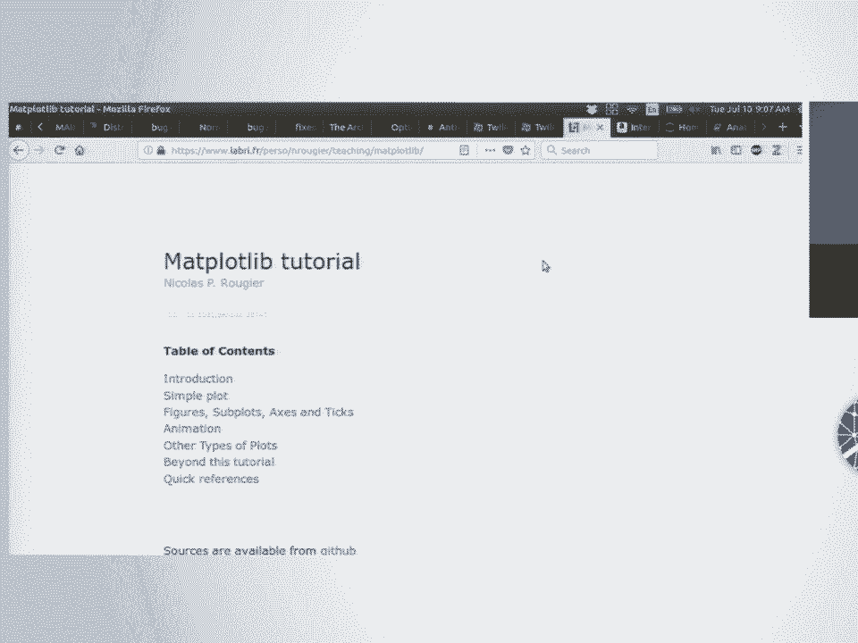

 freely available that you can get this fantastic for examples and and just kind。

 of get an idea of the things you can do so what often unlike other libraries。

 where in which you go okay I need to know how to do a Gaussian filter I need to。

 know how to do some sort of a skeletonization of my image I need to do you。

 know this sort of processing and you know make how to make a neural net you。

 go look up those words and you can go find the documentation for that you just。

 all you have to say is Python and then neural networks and you'll get what you。

 want or you do Python and the map visualization a lot of times you're just。

 kind of like well how do I have the plot so that I have the dots over here and。

 labels over here and the color bar hordes on a label but on top how do you enter。

 that into Google you know then again there was a presentation yesterday。

 showed me that sketch up stuff that was pretty cool so I so maybe you could draw。

 it out maybe Google then tell you but we have the gallery that's sort of a poor。

 man search engine and many respects where which you can go through that gallery。

 and you can see thumbnails of many many different kinds of plots and you might。

 see and you click on any one of those and it takes you to the code used to generate。

 them and they're very well commented very well explained so that you go okay I。

 need this piece and that piece but you know this piece from this thumbnail this。

 piece from that gallery example and this piece from that so that you can then go。

 ah okay now I have the plot that I want we also have the mailing list very very。

 useful resource where in which most of the developers and power users of matplot。

 lib frequent so we can definitely answer questions that way and what's great。

 about that you can just kind of post an image of what you have so far and you。

 kind of say I kind of want to get this way we can help you out with that we have。

 stack over we have a bunch of people who are active on stack overflow and we also。

 have getter getter is more used for more technical questions or at least to help。

 direct you to a correct place but it is a useful place we're very welcoming we're。

 not you know someone we're not a group of people that tells you go away no we're。

 we're at least I certainly would hope that we're we seem very welcoming at least。

 no one can claim to me so um so the project is hosted on github and so。

 that's where you'll file any bug reports things like that if you're not quite。

 sure you have you found a bug go ahead and post a question on the mailing list。

 first and go is this a bug is behaving like this maybe I'm just doing it wrong。

 or sometimes we'll decide that it's not a bug but we need to improve the。

 documentation something better things like that so if you're not sure you don't。

 want to open up a bug report on github go ahead and ask a question on the mailing。

 list and we'll we'll direct you when you file a bug report often what happens is。

 we're gonna ask you what is the back end you're using or more specifically we also。

 want to know which python you're using and when we say that what we want to know。

 what we want to know what version of map plot live you're using obviously but we。

 want to know whether or not you're using the normal python in an interactive。

 setting or just to be running a python script or if you're using iPython or。

 Jupiter because things behave a little bit differently in the different things。

 and so some things that may look like it's a bug in one situation may actually。

 not be a bug in in the others so we want to know all this stuff but the other。

 important piece of information we know is your back end and while most of you will。

 never care what back end you're using it's important for the bug report and so。

 the back ends is what allows you to use map plotlib on basically any system it。

 works on Linux Windows max I've had people report they're able to get to。

 work on a raspberry pi I've had you know people say that you can do this and that。

 great you can do use GTK you can use WEX you can use TK tinker and you can use。

 QT QT4 QT5 doesn't matter you can use all these things and it brings and。

 that's your GUI interface or you can just not have any interface whatsoever and。

 you're just simply creating PNGs or SVG files you're just creating files right。

 out so you're not picking any back end you didn't explicitly choose any back end。

 but if you're filing a bug report or something like that we need to know。

 which back end you're using because sometimes the back end it may be a bug in。

 a particular back end so this little thing right here will report to you the。

 information that we want to know when you file a bug report so in this case we're。

 using the inline back end for for IPython that's our back end but in other。

 cases you'll see GTK egg QT egg or WEX egg don't worry so much about the name。

 just tell us which one it is and it'll be a huge amount of information for us a。

 little bit more about the back end in Jupiter Jupiter the browser is your GUI。

 not GTK or WEX or QT things like that so we have a special back end well we don't。

 actually have it no no we we have it but Jupiter also has one as well and it。

 helps determine whether or not it's interactive and stuff in for the browser。

 for Jupiter is a back end called MB egg and so for that we're going to see up。

 here that the back end here was back back end in line that's the Jupiter。

 built-in back end is not interactive all throw any images of stuff made or。

 static and stuff and so it's not very useful so we want the interactive one and。

 so we're gonna explicitly say MB egg map putlib。use MB egg and you'll see that。

 now the back end has changed to MB for notebook and egg is the anti-grain。

 graphics so don't worry about that best or S or S or ender now once you have done。

 that use most of the time you will never need to do this and I'm just doing it。

 here just to explain to you because you may come across example where in which。

 these things are used and such so you may need to know what this is or you're。

 least familiar with what you're seeing but most of the time you will never need。

 to select this and you should write your codes in such a way that you don't bother。

 with this that only if you know that you need to use it do you ever call it so。

 Jupiter and IPython you have the thing called the IPython magics they're。

 basically when you have the percent sign and then some commands or you may have。

 seen it in the past few days or percent time it or percent p-run or something。

 like that you may have seen them somebody think there is a Jupiter magic。

 an IPython magic percent map plot lib that triggers everything necessary to load。

 up a back end that is for Jupiter or if you want to say to use something else you。

 can do that it's a back end magic to specific to IPython and Jupiter you。

 wouldn't have this in any of your regular Python scripts by default when you just。

 simply say percent matplot lib it will turn on the interactive version of the。

 Jupiter back end or the IPython back end and what that means is that plot ion is。

 is also triggered and what that means is that as soon as you issue a command for。

 plotting the figure shows up and that is not the default behavior when you're。

 executing matplotlib code through a Python script or something like that so I。

 find that kind of confusing to that's a confusing point for many people when they。

 first learning this because usually they're using Jupiter first to learn matplotlib。

 and then they go to write Python scripts and then they find out that does not。

 behave like the Jupiter no that's because Jupiter is the exception and IPython is。

 the exception because they're meant and designed for interactivity whereas Python。

 scripts and the Python REPL is not designed for non-interactive interface so。

 I want to try and make this feel more like Python script scripting and Python。

 REPL rather than the Jupiter interface so so what ends up happening is that when。

 you do percent matplotlib in Jupiter you do not need to call plot。show to。

 finally show the figure whereas in normal matplotlib nothing shows up until you， say plot。

show so how many people here previously previously used matlab。 What I。

 like is this number has been getting less and less each year I like this in。

 matplotlib in matlab you have to keep saying everything will time you do a。

 plotting call of some sort something shows up on your screen right and so you。

 every single call and you have to say I off to stop it well the default is I。

 off whereas matlab the default is I on so if you want to think of things that way。

 all right let's move on with the show so first things first we're gonna get it。

 we're gonna go over some terminology so that way you guys aren't confused when。

 I'm describing things later and that's the anatomy of a plot so we have here。

 which is obviously too big for my display here a figure window that would， show up when you do plot。

show and so it looks like a normal GUI window you have。

 yourself a toolbar some gooese the two bars at the bottom other gooese the when。

 I say gooese the back end some back end to goo the two bars at the bottom other。

 back end to two bars that's top minor difference but is composed of the axis。

 subplot which there may be one or more axi subplots so sometimes we call them。

 axi sometimes we call them subplots it's basically interchangeable officially。

 they're axes the plural yes I know it's even though right here I have one subplot。

 it's plural axes and I'll get into it a second it's because it's made of two or。

 more axis so you have the y-axis and you have the x-axis and so a subplot is。

 composed of two or more axes and so they're axis z's kind of love English and so。

 therefore we call it an axes object because it's an object to contain multiple。

 axis z's and for a figure window that you have the GUI window you have one。

 figure and so the figure object is the thing that contains one or more subplots。

 and so it's very much like MATLAB in MATLAB you're making a figure and then you。

 make an axes you know you call GCA or something like that in MATLAB is a。

 subplot and axes is the same thing in MATLAB John Hunter who originally wrote。

 this library he is he was a refugee from MATLAB so a lot of the design of MATLAB。

 live comes from some inspirations from MATLAB for better or worse there are some。

 things I like from MATLAB and there's some things that really bugs me in MATLAB so。

 hopefully the things that bug me don't overwhelm the things that are really。

 good here so all right so and then this description here kind of displaying。

 what I have so an axis object you almost never actually deal with an axis object。

 directly but to know you need to know that the axis object is the thing that has。

 the tick labels the ticks the limits and the and the axis label things like that。

 so that's where all that stuff is contained but you almost never interact。

 with that directly you'll interact with the axes object you'll say set X label。

 set Y label set X ticks and things like that we'll go through some examples of。

 that shortly so let's actually make something and hopefully some of this。

 examples you're going to help clarify some of the things I've been saying so。

 first things first what you'll typically find for your imports you guys have if。

 any of you here are brand new to Python okay so we have a couple people here so。

 you know that with Python you're importing packages that's something you。

 don't do in MATLAB but you do do that in Python so the two most common packages。

 you're going to be doing when you're doing plotting is going to be NumPy which。

 you typically imported MP and then you'll import mapplotlib。pyplot as PLT these。

 are common conventions other people have done it different ways but this is the。

 most common and generally accepted thing some people will you know do from。

 mapplotlib import pyplot I'm lazy I'm a developer I'm really lazy I don't like。

 typing all those actual letters so I just do PLT for plot so all right so we're。

 going to create a figure fig equal plot dot figure I gave it a face color here。

 just to try to make it visible by default is the the back is white so one。

 and since the background of the Jupiter notebook is white you wouldn't even。

 notice it there so I made it slightly red so let's execute that oh I forgot to。

 whoops forgot to run that all right now we're execute that nothing happened。

 remember what I said the back end that I chose the MBAG back end acts more like。

 how you do think with normal Python scripts nothing is going to show just。

 because you created a figure in MATLAB if you created a figure you would get a。

 figure right away but you may not want that but it does show up once you tell。

 it to mapplotlib will do what is told much more cooperative of my children but。

 so here you see a figure slightly red here is kind of big and all that but there。

 is a figure and then you have yourself a toolbar down here for the MBAG back end。

 looks a little bit different than that image I showed you earlier but it's still。

 basically the same idea but it's a blank figure it's not useful also noticed that。

 the size of this thing is you know huge you have to scroll and all this stuff and。

 it's just not useful there's a useful function you can you can define the size。

 of your figure window but oftentimes I never want to remember that I just kind。

 of know that I want something that's twice as tall or maybe it's twice as long。

 then it is tall or something like that you can use a nifty little function called。

 fig aspect and you say that I wanted twice as tall as wide so you say 2。0 for。

 fig aspect and it will provide the fig size arguments for you， nice and useful。

 so the question is you you notice it that the face color thing was four numbers。

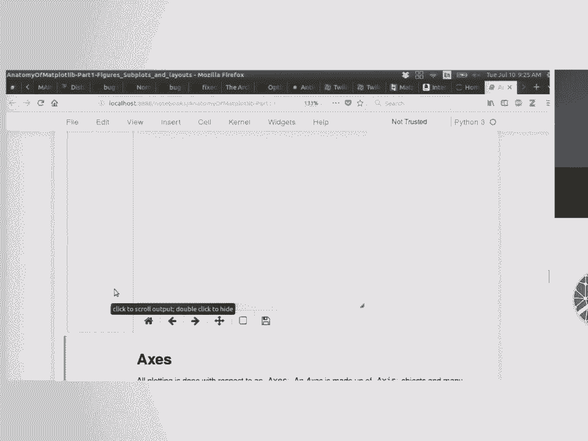

 right yeah RGB alpha the alpha is a transparency yeah so if I took that out。

 yeah you're like well the color change will actually know the transparency。

 change so because what's behind it is white so anyway so that you're still not。

 very useful thing but you have a figure that's fantastic and figures objects you。

 can resize all you want things like that so axes now you actually want to get to。

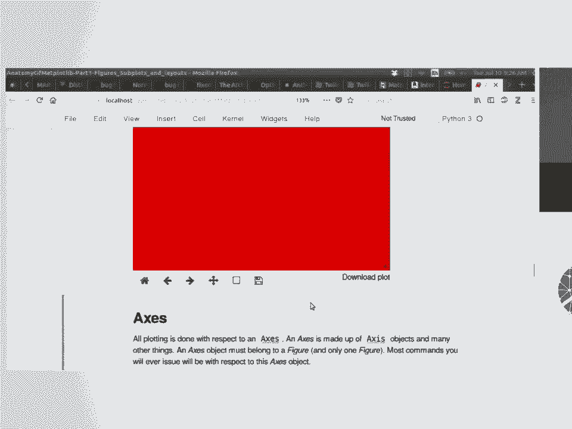

 nitty-gritty of actually plotting stuff so we're all the plotting happens to an。

 axes object now you're not going to actually create you're not going to call。

 the axes constructor for those of you know what that is now we we don't make you。

 guys do that now you call a method on figure or or a function on pi-plot to do。

 this so this is a typical example there's also fig add axes that's like the。

 base level stuff don't worry about it very rare that you ever actually use it。

 what typically is used is at fig dot add subplot and one one one those of you。

 from MATLAB that should look very familiar to you so yes we duplicated that feature。

 quote-unquote and you can also do one comma one comma one if you wanted to what。

 it just means one row one column first subplot so if you did one two one one row。

 one two columns but the first fig first subplot so so here we're going to add a。

 subplot just a single subplot and we're going to set the x limits we're going to。

 set the y limits we're going to give it a title we're going to give it a label for。

 the y-axis we're going to give it a label for the x-axis a whole bunch of stuff。

 all in one command and then show it right see there's a title right there at the。

 top notice you didn't need to tell it which font you didn't need to tell it。

 what size you didn't need to tell it really much you just gave it the relevant。

 pieces of information you could change the font you could change the color。

 things like that but there's plenty of good defaults in there that most of the。

 time you never gonna care about that here's the y-axis note the limits went。

 from negative two to eight which if you go up to the command the y-limb negative。

 two eight it's like it's magic x-axis there's the label there and it went from。

 point five to four point five what's the limits that I specified 0。5 to 4。5。

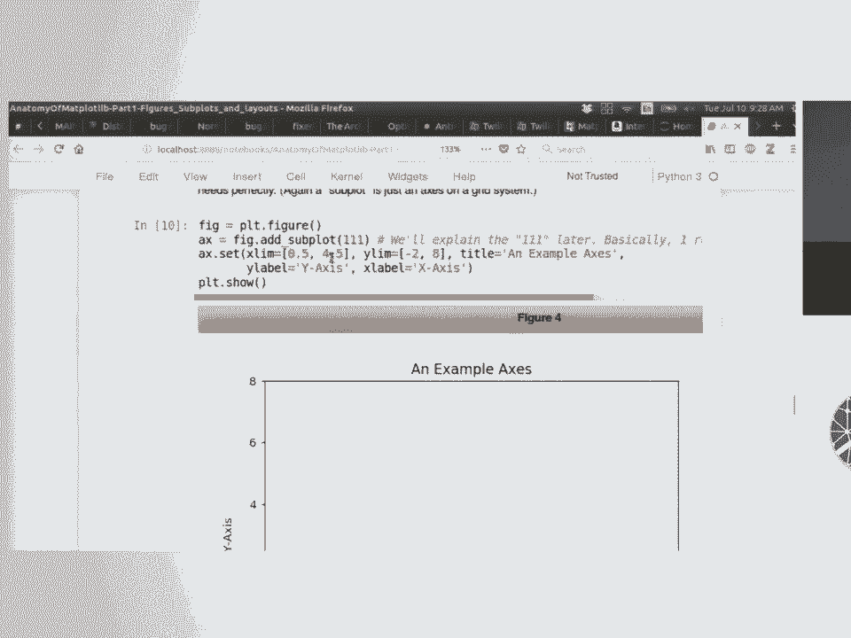

 magic right the aspect ratio did change here because I didn't specify the fix。

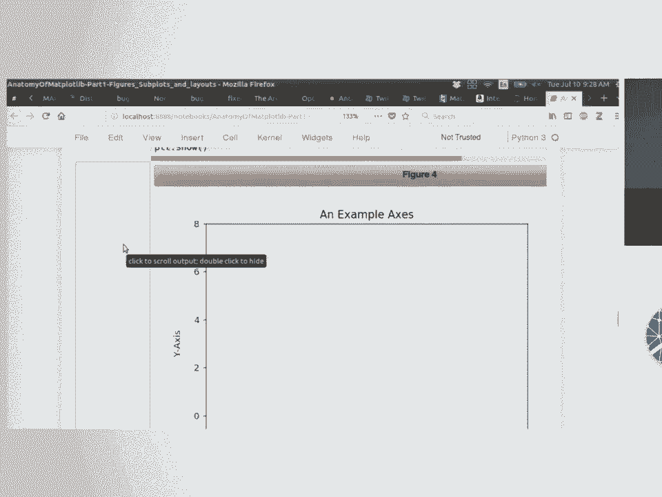

 size so it went to the default which is different than the fig the aspect ratio。

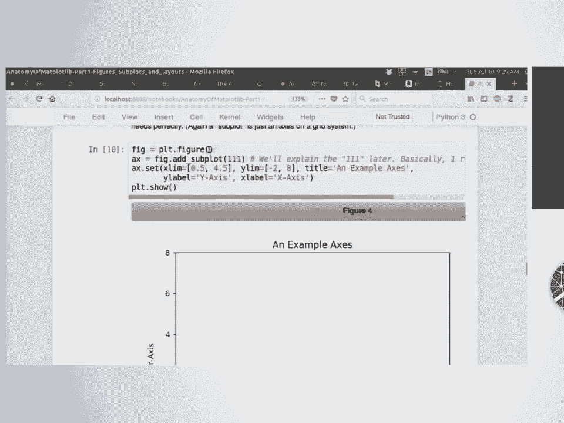

 that I had here when I use fig aspect because I'm saying I wanted it to be。

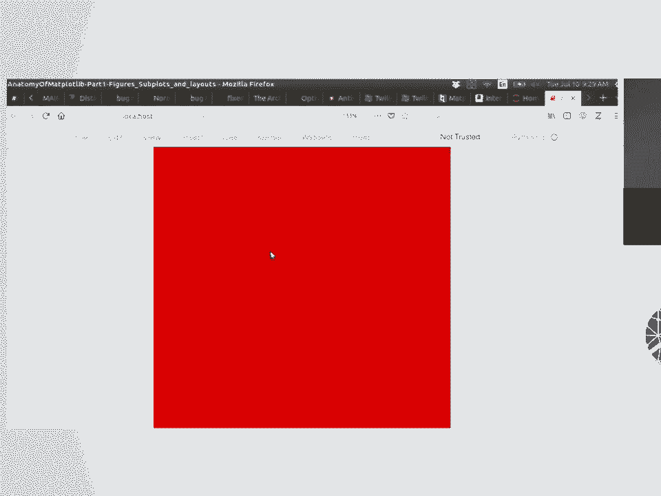

 twice as tall then it is wide well we have default values for fig size which is。

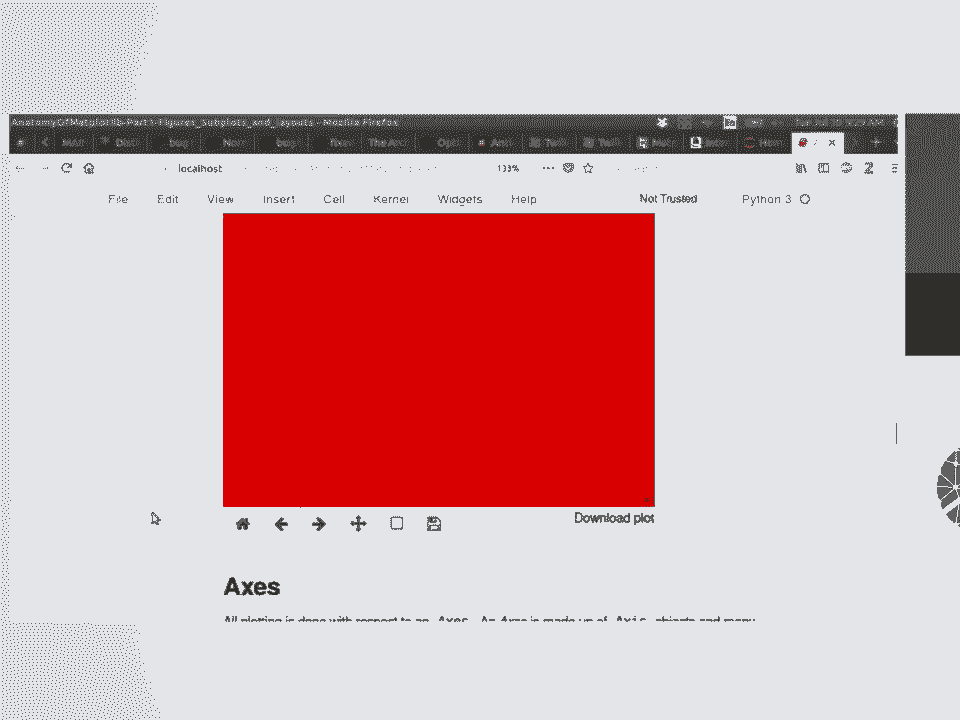

 something like 6。5 by 5。5 or something like that I can't remember the exact。

 values yeah so because I call fig equal plot that figure that's a brand new。

 figure and so it forgot about the old one， I have a maybe general question I was always confused why I would call a lot。

 dot show so I would always think I would call show on the figure on plot do you。

 get the question so you call plot that show when you actually want a figure。

 window to appear it would do all them so you can make multiple figures ahead of。

 time nothing will show until you tell it to show unless you have ion unless you。

 call plot ion which is makes it like the matlab behavior it's the global yeah。

 it so map like the track of all the figures that were created and then when。

 you do plot that show it all appears now this leads into a very important。

 point once you do that plot that show execution stops when interactivity mode。

 is off which is the default behavior format lab map map map plot live so you。

 won't execute any more Python code it's gonna stop right at that plot dot show。

 so if you have anything else after that it's gonna wait until all the figure。

 windows are closed by closing those figure windows you have destroyed those。

 figures so you can make more figures after but then the next time you call。

 plot that show only the new figures will appear the old ones are gone。

 real quick question so if you call fig dot show does it only show the figure。

 currently or does he show all of them so there if I remember correctly there is。

 a big guy show that is limited to just that figure however if you get a little。

 dicey with that we that's more of an advanced usage to specifically do a。

 particular show it does kind of mess up some things internally so you do it。

 yeah do plot dot show to be safe it's always safe to do that also if you happen。

 to be using a non interactive back end such as the ag back end plot dot show。

 is basically a no op and it's not a blocking call so it'll just keep going so。

 it's perfectly safe to call plot dot show when you don't even when you're in a。

 non interactive back end which you know you might run into let's say if you're。

 running your code on a headless server or something like that so again that's。

 one of the beauties of map plot live is that it doesn't I mean it's the same code。

 this code here fig equal plot that figure add subplot set all that that's going。

 to work on windows on Linux on a Mac it's going to work on your web server it's。

 going to work on your Jupyter notebooks it doesn't matter which GUI toolkit。

 you're using any of that it will work and that's one of the beauties of map。

 plot live is that you guys don't have to care about it you know you just want that。

 figure to show up you just want that figured produced those PNGs and things。

 like that which we'll get into how to make PNGs later you don't care about all。

 that detail but you also don't want those details to impact your code so you。

 don't want to have to write an if statement oh if I'm being if I'm using a。

 QT after member to size this thing this way and I have to remember to do this and。

 that if it's I'm in wax or something like that or or that if you're in you。

 know a JavaScript environment like Jupyter notebooks you don't care about a single。

 bit of that you just want to plot your data you're the sciences we recognize。

 that you want to get to where you want to go you don't want to you don't want。

 to worry about those details that's the power of map plot lip so we have that。

 call to set so you were able to in this way you're able to say axe dot set X。

 limb Y limb title this is the nifty little feature of objects such as axes。

 objects you could have also done the same exact thing by saying axe dot sex set。

 X limb axe dot set Y limb axe dot set title axe dot set Y label she's kind of。

 need a pattern here could have done the same exact thing would have ended up with。

 the same exact result it didn't show below here because it's still had a。

 reference to it appear and so notice that here I change the label here got a。

 different example axes title Y axis change access change so it's different。

 from what was set up here this figure window got updated。

 and the F D that's something that you can do in normal Python environment if you。

 have a plot that I on turned on or if you do some other more advanced or you。

 can do it this way in the Jupyter notebook because I'm not closing any of。

 these figures so those figures aren't destroyed so right because notice I did。

 not create a brand new figure and I did not create a brand new axes so axe dot。

 set X limb the Jupyter notebook remembered the axes object I created。

 over here above I called plot that show yeah and so under normal Python。

 script stuff like that once you call plot that show is a blocking call and you。

 wouldn't be able to execute any more Python outfit because this is a Jupyter。

 notebook that concept kind of breaks a little bit so you can actually execute。

 more code afterwards and so now I'm modifying the existing axes that I had。

 already showed so that's why that's happening this is something you could。

 only do in a Jupyter notebook or if you have the interactive mode turned on so。

 I on as opposed to I off so it's usually a distinction you don't have to worry。

 about usually you prepare everything ahead of time and your plot that shows。

 you like your last thing you do so most of the time I would say 95% of the time。

 that's what happens so you don't have to worry about this most of the time but。

 know that you could all right so why would you use this particular interface the。

 act at set X limb act at set X Y limb or in particular acts that set title because。

 in this form you could have it can take additional arguments such as the font。

 name or title size or things like that you can't do that up in this nice。

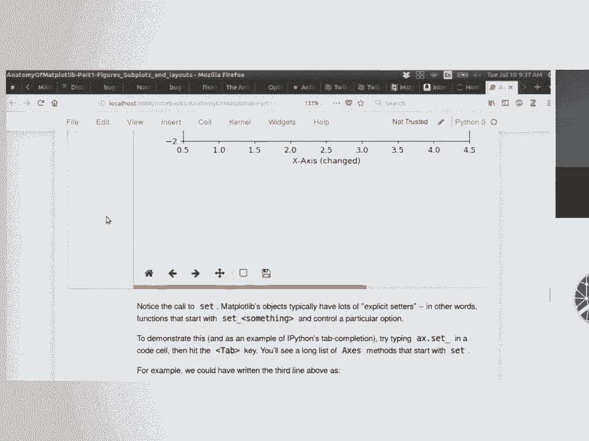

 concise form so this is useful for the quick and dirty you know I don't need to。

 control everything a little detail things like that whereas the more。

 explicit form lets you have more power so both both of them are perfectly。

 valid they're just good for different uses okay so yeah here's one that axe。

 dot set X label some label comma size equal 25 you do that with the set X label。

 form rather than the axe dot set so all right this actually plots something you。

 guys are all champing at the bit aren't you you know get on with it so here we're。

 gonna create a brand new figure and we're gonna do fig dot add subplot 111 and。

 we're gonna plot some data so X so values of X one two three four the Y values are。

 gonna be 10 20 25 30 and I want this plot to be light blue because I feel like。

 it and align with a three you don't have to specify all these things we have。

 default values for them but you can and then we're also gonna do a scatter again。

 the first set of values are the X values the second list are the Y values and then。

 I could say that I want to see in this case is the it's sort of a data。

 parameter so gonna you'll see what it does one two three five and then also。

 specify the kind of marker don't worry we're gonna go into more examples of this。

 later and I'm also gonna set X limits and let's show that let's see what does it。

 actually produce what I say to produce yes it does note that in that in that。

 case I only gave it the X limits I did not give it the Y limits and yet it's。

 still magically new what limits to do but so there we have the track the。

 triangles of different colors and we have ourself a nice thick light blue line。

 from the plot call so what this demonstrates is that you can compose your。

 axes just like in MATLAB where you can say I want to do a plot I want to do I am。

 a show I want to do all that that oh wait no you can't do that easily in MATLAB。

 that's one of the things I love with MATLAB in MATLAB the default is hold on。

 hold off right it's it's hold off the default in MATLAB live is hold on so we。

 hold on to each of your plot calls in MATLAB by default every plotting call。

 replay gets rid of the previous one which is so annoying so if you want to compose。

 your thing so let's say you want a image so you do an I am show on it but then on。

 top you actually want to put some scatter points on it that works it does。

 exactly what you expected to do all right so you notice I did a whole bunch of。

 axe dot plot axe dot scatter well you you're gonna the points it's those。

 triangles it went out see the x limit went， to 4。5 but the oh wait one two three oh that's right yeah the first one wait no。

 x limit went from 0。5 to 4。5 so it should have all right yeah yeah the first。

 scatter point I'm looking at the plot first scatter point is at 0。3 and so。

 that's beyond the limit that you specify here so we're gonna do exactly。

 what you say well check this out so the toolbar down here the one that I'm really。

 been talking about click on pan， magic， and then the other feature of the toolbar is you can zoom in。

 okay and then you can go back to the original view by hitting that home button。

 or you can go back to the previous view go forward yeah neat features。

 that yeah that that was the plot call and then the scatter created the。

 triangles so I'm gonna give you an an identical set of calls and you'll see。

 this a lot and this is gonna feel more like matlab for those views that want to。

 feel comfortable with that PLT dot plot PLT dot scatter PLT dot x-lim note is not。

 set x-lim PLT dot show this is gonna feel more like matlab where in matlab you。

 didn't necessarily have to explicitly create a figure if you just simply call。

 plot the figure was already made the axes object was already made all that。

 stuff so the GCF and the GCA for those of you who come from matlab that may be。

 bit familiar to you those things are automatically made for you the pie plot。

 interface follows that and so you can have a so you can write up code that just。

 simply calls basically the same thing and it will assume a default figure it。

 will assume a default axes now remember what happens when you make an。

 assumption make an asset you and me right so this is useful for quick and dirty。

 scripts this is useful for working at a an interactive prompt or things like that。

 where if you may only be dealing with a single figure you may only be dealing。

 with a single subplot but if you start dealing with more subplots or multiple。

 figures this starts to break down and so unless you're very careful you could。

 actively be plotting things on the wrong code or let's say you're writing a。

 function you really should be passing in the axes object that you're using that。

 way you're explicit so remember pep 20 the Zena Python explicit one of the。

 entries remember those who aren't familiar pep 20 or pep Python in。

 hands-on proposal which usually just a very documentation or various features。

 things like that pep 20 particular talks about the Zena Python which is 20 useful。

 things to know about Python of which only 19 were written I didn't even get。

 chuck on that I didn't even do that joke it was it was Greedo all right so but。

 one of the entries is explicit is better than implicit so by saying axe dot plot。

 axe dot scatter things like that you're being explicit you're saying I want。

 the scattered plot to be on this axes object there's no confusion whatsoever。

 but if you say plot dot scatter and you have multiple axes objects that are in。

 play it's gonna use whichever one was the last one that was used but you don't。

 know which one that is only map plot live knows that so some that may or may。

 not be something you want but it's less code to write so people like it for the。

 interactive prompts so now that I'm talking about multiple axes let's do。

 multiple axes let's show you how to do that so before I showed you fig dot add。

 subplot that's a bit outdated but if it feels a lot like MATLAB so a lot of。

 people like it we have this feature called plot dot subplots with an s there。

 is plot dot subplot with no s at the end that behave more like fig dot。

 add subplot this is plot dot subplots and you say that you want two rows and two。

 columns you will get a figure object and a it's actually a NumPy array of axes。

 object that are oriented in the way you specify so this axes thing would actually。

 be a 2 by 2 array so two dimensional array that's size as shape 2 comma 2 so。

 let's take a look see what that does look at that nifty note again default。

 axes limits note that the ticks are automatically chosen you didn't。

 bestify that it all just shows up so useful to do everything in one。

 fell swoop sometimes you don't want that sometimes you want to just add an axes。

 object to a figure could you maybe given just a figure already you know so both。

 them are perfectly valid let's show you how to use it so here I'm creating a new。

 figure and 2 by 2 axes 2 by 2 subplots and I'm going to set the title on each of。

 those four and I'm also going to turn off the ticks just to clean up the just。

 to clean them up so that way less confusing but note I if those you might。

 learn just yesterday in the NumPy tutorial that axes dot flat lets you go。

 over each element of the axes object or each element of the NumPy array because。

 that's what you get so look at that upper left upper right lower left lower。

 right useful and then if you don't give plot that subplots any arguments it。

 behaves exactly like doing fig equal plot dot figure ax equals fig dot add。

 subplot one one one so if you ever come across code that says that you can。

 replace it with a one-liner fig equals ax plot dot subplots and you might be。

 going well isn't ax a NumPy array in that case technically yes but it is。

 what's known as a zero-dimensional NumPy array so you can treat it just like a。

 scalar so you don't have to worry about indexing that all right so we're gonna。

 do an exercise quick little thing I want you guys to recreate this figure right。

 here where which is going to be three rows of subplots it's got a nice little。

 sign you saw it there and it's gonna have three titles I'm gonna give you guys。

 something a little bit to start with I'm giving you the imports just to just。

 simply make it this would be as if you're doing your own independent script so。

 that's why I'm importing NumPy and map plot live here I'm gonna give you the。

 data so you have your cosines you know slightly shifted around and I'm gonna。

 give you even the title by once you guys to create the figure and the three。

 axes object and and plot the data appropriately all right you guys got。

 five minutes to do that so and we'll see how that goes okay， I'm sorry what oh yeah yeah。

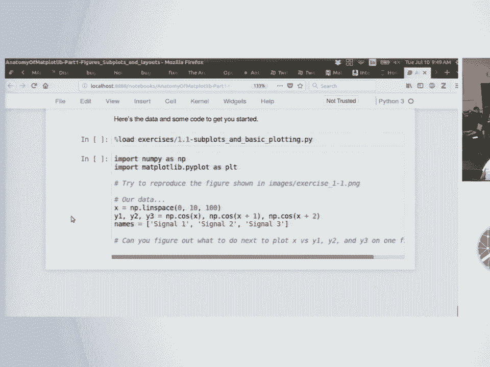

 is anyone else having problem with a getting an error message of library。

 incompatibilities okay we seem to be having some people on Mac's that are。

 having this issue we're not going to show what's going on there I don't totally。

 get it we're gonna try to set up a collab thing for you guys follow along。

 meanwhile however I can't keep waiting here you get it all sorted out so we're。

 gonna move ahead hopefully we get this off sorted out so all right， all right so。

 let's take a look at the result that I have， yes I know the figure doesn't look exactly the same as up here I forgot to。

 update it so older versions of map plotlib particularly version 1。5 and lower。

 they did not pad the plot area so this is the answer your question they did not。

 the older version did not pad the plot area while newer versions we do。

 automatically pad the plot area a bit so that way to make sure the entire plot。

 is always visible there's no clipping or anything like that so what what do we。

 do here well we did plot dot subplots and rows equal three and then we made a。

 little for loop where we looked over the axes and looked over the data y1 y2 y3。

 and we also looked over the names so we had x y a name available and we did。

 x dot plot x and y which came from the for loop and we just said color equals。

 black we didn't have to say black actually no the default is blue so yeah。

 and then if you want and then we we also notice we turned off the ticks you don't。

 see the ticks here so then therefore you turned it off up here and we also set。

 the title to the name that we got from the for loop and then we showed it。

 pretty straightforward once you think about it。

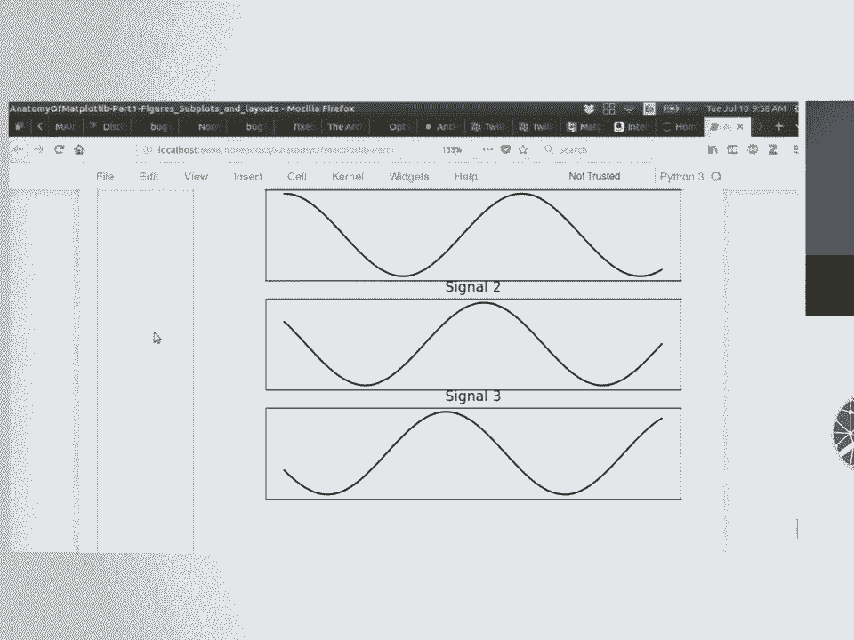

 by the way to get the show you get the code you might have saw that there was。

 that percent load exercises slash 1。1 all that well you change exercises to。

 solutions and then you execute that and it will replace it with the solution so。

 all right let's move on to the next thing if you got to get moving here yes。

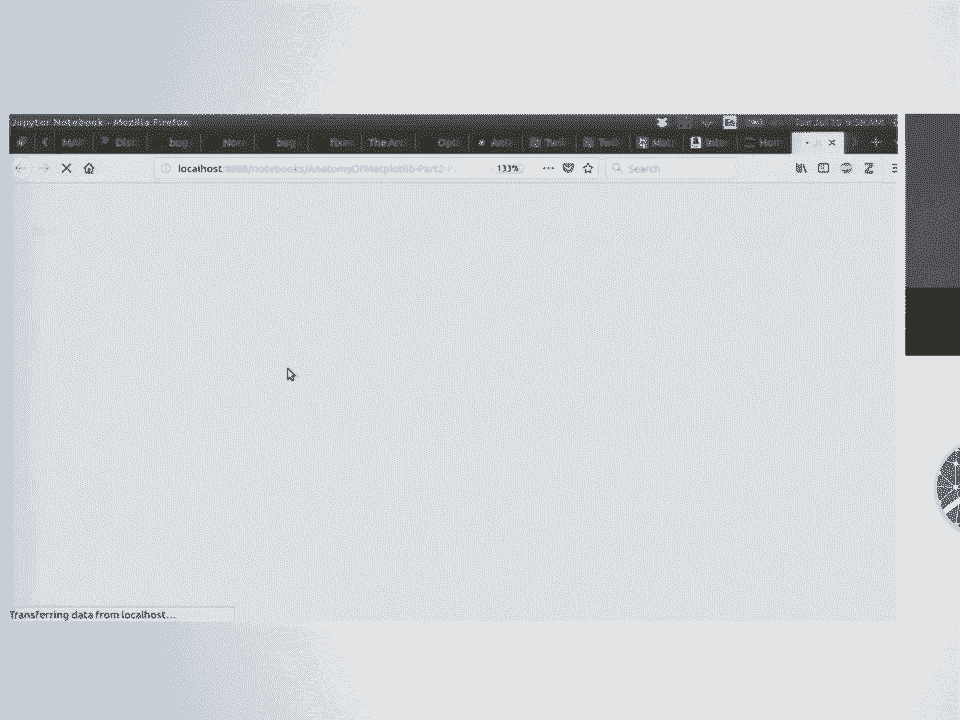

 in Jupiter well so in Jupiter there is that stop button it's read yeah I know。

 this is something that a bunch of people argued for a few days over whether or。

 not we have an X for the juke for the figures that show up in the Jupiter。

 notebook or if we should have a pause button that's how you close a figure in。

 Jupiter because in Jupiter you don't ever really actually close it in the。

 sense that it goes away the Jupiter notebook when you do that it will save。

 a static image to the Jupiter notebook but the object the map plot lip figure。

 object is now gone so that closes the figure for you far if map plot。

 lip is concerned so but then in a normal GUI setup or or whatever you just hit。

 the X also the you can you can sit I believe you could do a plot that close。

 and then in parentheses the fig object itself and that will close things as。

 well when you're in an interactive type setup but again most of the time you're。

 going to create your various figures ahead of time and close and then get。

 rid of them or you can recycle your figure by clearing it first and then。

 reusing it that's more advanced usage you'll see examples of that in the gallery。

 all right so kind of give you the taste of the overall idea you have a figure and。

 a figure contains one or more axes or subplots and that is what contains the。

 display the plotting display whatever it is that you want to show but I haven't。

 and I talked to you a little bit about how you can set some of those properties。

 such as the titles the limits things like that and gave you a quick example of。

 plots and scatter but didn't really get into them because that is what you really。

 want right you want to be able to plot you want to do an I am show you want to do。

 a P color you want to do a stem plot or things like that you at the scientist at。

 the engineer or whatever you know what it is that you want to display now we're。

 going to talk about how what they are and the many different kinds of plotting。

 stuff we have mapplotlib come with many many many many plotting functions I'm。

 not going to cover them all here we have it all documented online but I'm going。

 to kind of talk about the overall the overall set that most people tend to use。

 so 1d data series or points things like that we've mentioned these is the plot。

 for X and Y and you could do lines you could do various styles and you can have。

 markers for those lines things like that by the way any of these pictures I'm。

 going to show you can click on them it will take you to the code that took to。

 make them you can do scatter which is not quite the same a lot of people like to。

 think that scatter is plot without lines no you could use it that way but it's not。

 really meant to be used that way it is meant to be used as scaled markers or。

 colored markers based upon some data value so so if you really want just。

 simply to plot a bunch of markers without a line then you just simply say， ax。

plot the data and you'll say line style equals in quotes none that way it。

 will not plot a line there are various efficiency reasons for that I'll。

 blame that in another section later all right some other plot type we have bar。

 plots we have bar bar h we can do bar plots with error bars in it you can do。

 kind of like what I call the Manhattan plot it kind of looks like city blocks。

 whatever you can do it it it works they'll be tweens stack plots things like。

 that then you have 2D type data so you have your IM shows so they can be color。

 map which I will talk about a little bit or actual RGB optionally a for alpha。

 arrays things like that。 P color P color mesh their color map 2D arrays a lot of。

 people like to think that IM show and P color are basically interchangeable。

 they're not I'll go into a little bit more detail about that but recognize that。

 IM show is far more efficient but it doesn't have the same flexibility as。

 P color so P color you can do these fancy little grids and things like that you。

 can't do it in IM show but IM show will plot a whole lot faster than P color the。

 other difference is that the coordinates for IM show refers to the center of the。

 pixel whereas the coordinates for P color are refers to the corner and so if。

 you try to put do like display the same data using IM show and P color and you。

 put one and one supply and one the other supply and you put an extra each other。

 one of them gonna look shifted by half a pixel okay so and that's because of the。

 various use cases for because I mean the people who fight over this it's it's。

 like the crypts in the blood seriously it's it's crazy but you do need to watch。

 out for it because there are functions out there that think that they're giving。

 you coordinate corners while other functions think that you're giving it。

 coordinate centers and then there's contour contour F and then there's also。

 C label for those contours again click on that to see the example of how to do。

 it but all very useful and typical things that one might do if you have vector。

 data so stream plots or wind fields and things like that we have arrow quiver。

 stream plot if you have some statistical type data that you want to do we have a。

 histogram we have box plots we have violin plots all available very very flexible。

 and it interfaces very nicely in with NumPy because NumPy has various。

 resampling type stuff for histograms and stuff for box plots and things like。

 that so we have it all explained in the documentation for that all right let's。

 try out a few of these you're gonna try moving along here and then we'll get into。

 a break in a moment so the bar plot we're gonna quickly do so we're gonna I'm。

 gonna just make some random data I'm gonna make some x data so this is just。

 simply 0 1 2 3 4 and get some random y data I'm gonna create my figure and。

 subplots so two columns so that me but by default is one row so gonna be two。

 subplots I'm gonna make it be twice as wide as it is tall using the fig aspect。

 I'm gonna call the bar x y for for the vertical bars on the first axis and the。

 second axis I'm gonna call bar h which is the horizontal bar plot and we'll。

 see what that does hmm that they equivalent to what。

 I can't remember it's been about 10 15 years since I've done matlab so you actually。

 can't honestly remember maybe maybe one of your fellow attendees here it might be。

 more familiar with matlab again could tell you I actually honestly don't。

 remember then we're gonna do this little thing just just I'm gonna create a。

 horizontal line for the axes and a vertical line for the axes just simply to。

 help kind of give you a point of reference and then we're gonna show that。

 so see we have our self our horizontal line here you have a scroll we have our。

 horizontal bar here with the vertical line same data just simply oriented。

 differently all nice and good and it's all light blue because I told it to you。

 as told and now also note in this situation I did that vert bars equals the。

 call to bar and the horizontal bars equals the call to bar h you don't have to do。

 this most of the time but I wanted to do I wanted to show you guys that all these。

 plotting functions return an object for you guys use or a list of objects for you。

 guys to use if you want to do additional things and I'm gonna show you what you。

 might want to do so let's say I want any negative any bars that are below zero to。

 be a different color well I can do my bar call and I save it to vert bars and。

 then I can loop over convert bars here it's just a list of the individual bars。

 I can loop over the vertical bars and the data and I could say okay if the height。

 was less than zero I'm gonna set the edge color to dark red I'm gonna make the。

 color of the bar itself salmon because I can and I'm gonna set the line width for。

 that edge to be three tada very very useful you know in case you wanted to do。

 that sort of coloring or whatever how is the three manifest how is what oh okay。

 yeah so gets back to I actually do need to update this example as well in the。

 older versions of map plot lib particularly version 1。5 and below we by default had a。

 different color edge and so you could see the edge so right so right I completely。

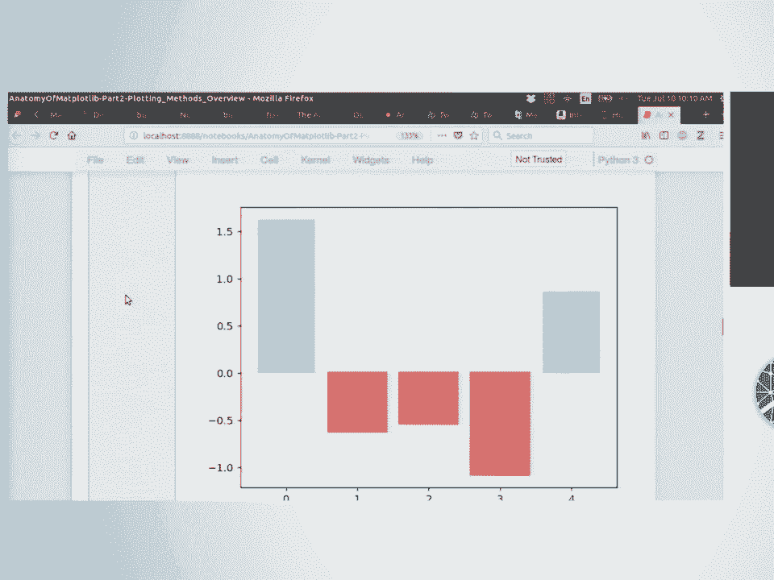

 forgot about that the edge color that's right yeah it's something weird yeah。

 there that's right because color is overriding some stuff so here me there we。

 go that's right so if you just best and we'll get into this a little later if you。

 specify just the word color color is so generic it will it will it will。

 clobber any other values referring to color whereas you could say specifically。

 the face color specifically the edge color line color things like that that then。

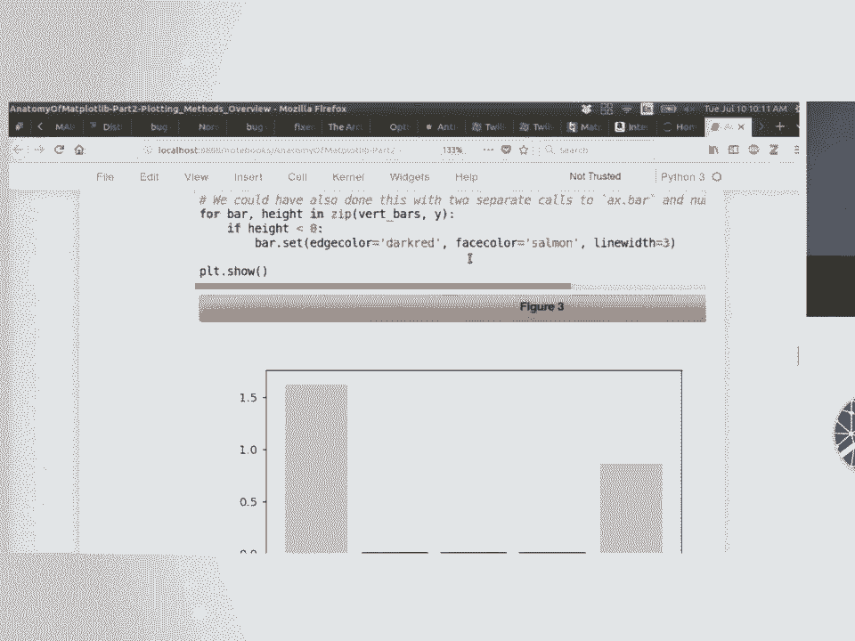

 does that and so when color shows up in it it just obliterates everything whether。

 or not that behavior is a great thing or not yeah but it is the it is the。

 behavior that it is so sir fill between， so we have just trying to move along here so created a bunch of data and we。

 called fill between on it and showed it you can also use fill between to go。

 between two curves so here I've created y1 as being a curve and y2 as being。

 another curve and then here's the mean value of that curve well not the mean。

 value but some value that would be in between there I'm gonna fill between X。

 for the domain of X I'm gonna fill between Y1 and Y2 and give it a color of。

 yellow and then I'm also going to plot that other function I made up here on top。

 of it and ta-da so I have a fill between that was between two linear functions so。

 you have that yellow wedge and then you have that cosine in there as came from。

 that plotting fantastic question。

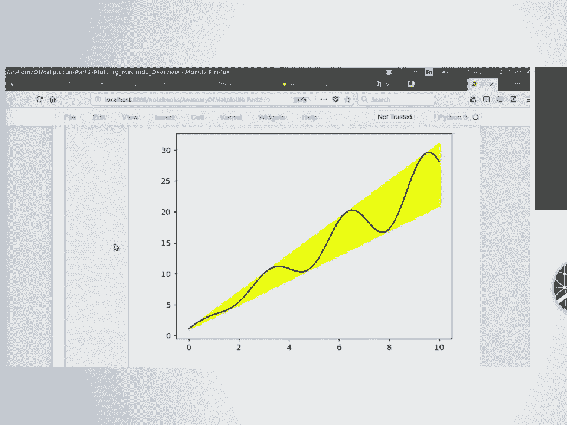

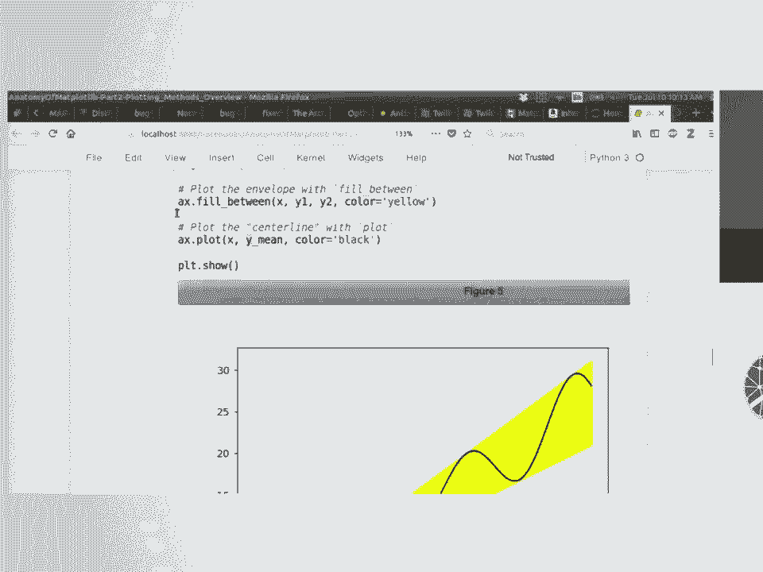

 that's what I loved you put a notebook for so you can try that out and see what。

 happens now so this is a little bit of a quirk is that you didn't specify the Z。

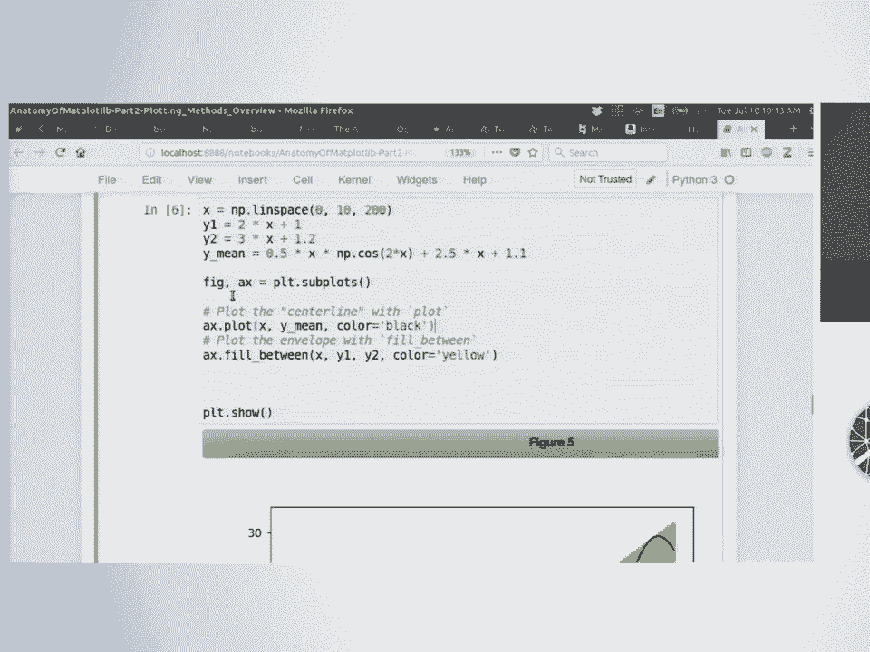

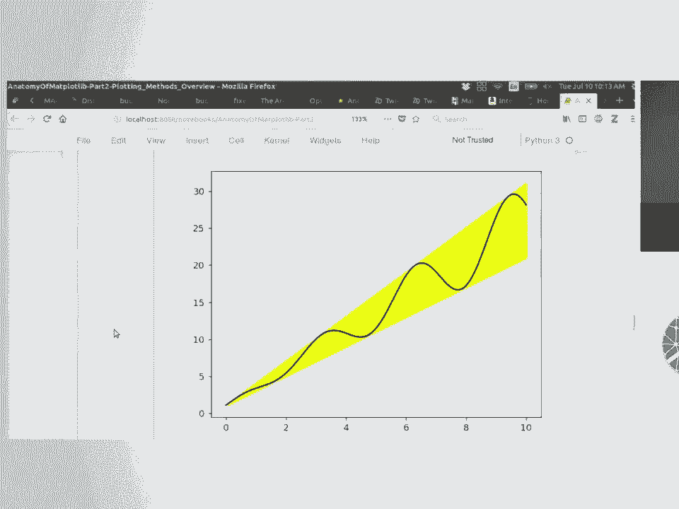

 order and so we have it so that so this fill between it produces a polygon and so。

 we draw certain things after other things so yes you can specify Z orders and so。

 the default there are default of Z orders for polygons and default Z orders for。

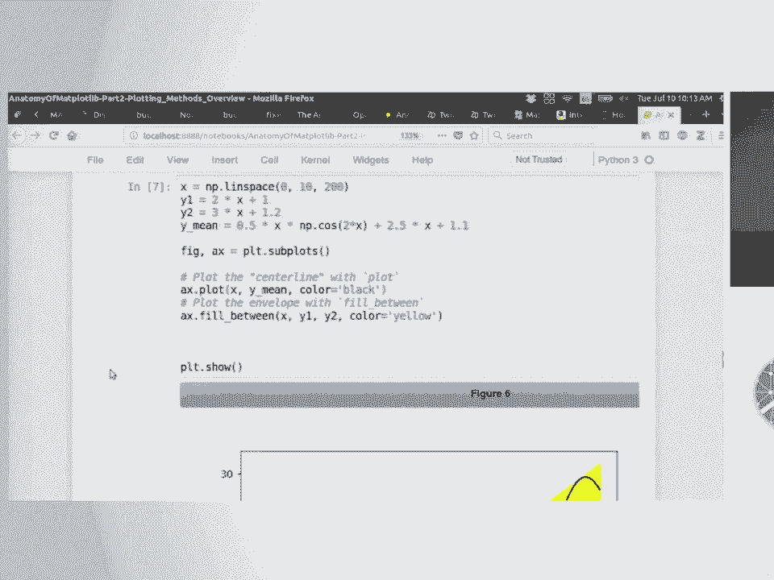

 plots but let's say I said Z order equals one and then here Z order equals two。

 it disappeared but then if I flip it around。

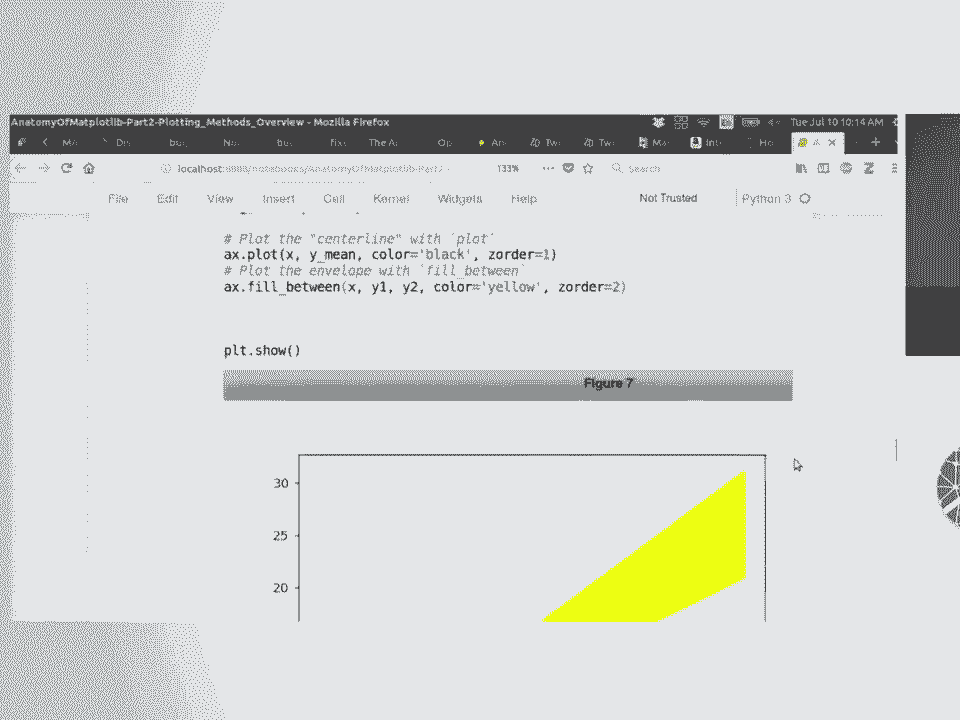

 lefty so with the advent of pandas and X array and other tools like that any。

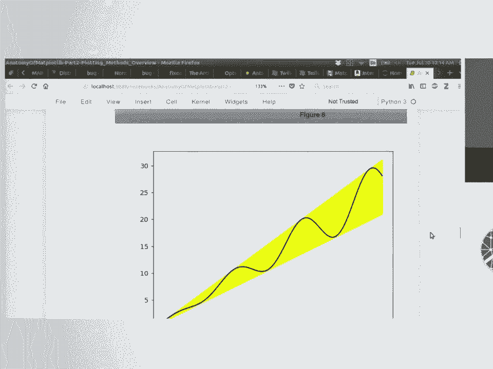

 of you here played around with pandas or X array no okay not a lot of you but。

 some of you have they all present to you a dictionary like interface it's not。

 quite the same thing it's a dictionary but it's very very similar and what I。

 mean by that is that you can access values inside of them based upon some。

 string name and so you could have a single data object that has many many single。

 dictionary a single data dictionary that may have many many pieces of。

 information such as let's say latitude and longitudes and then channel one channel。

 two channel three something like that and you're working interactively and you。

 don't want to have to type out all that every single time you just simply want to。

 say I want you to use this dictionary and grab the X data and channel one the X。

 data and channel two and you just want to be able to say that so in this case here。

 I have a dictionary it has an entry for X has an entry for Y1 Y2 and mean this is。

 the dictionary it looks it's the same data that you saw up above right there I。

 just simply put it in a dictionary then I can call act up feel between and I look。

 I give the name the string X the string Y1 the string Y2 and I provide data object。

 data object this is you know it may may or may not be useful to you what some。

 people find it useful for is that let's say you want to display a figure that had。

 just X and Y1 okay you did that fine then you did you then you know press the。

 up button in your interface and you just simply want to try Y2 now all you have。

 to do is just change the string to Y2 you don't have to go and read you know。

 grab a whole nother variable or something like that it might be useful in a few。

 other context and things like that so it's there for you to use many not all。

 the plotting functions support this but many of them do all right so this is。

 going to be a an exercise where we'll also take a ten minute break as well but。

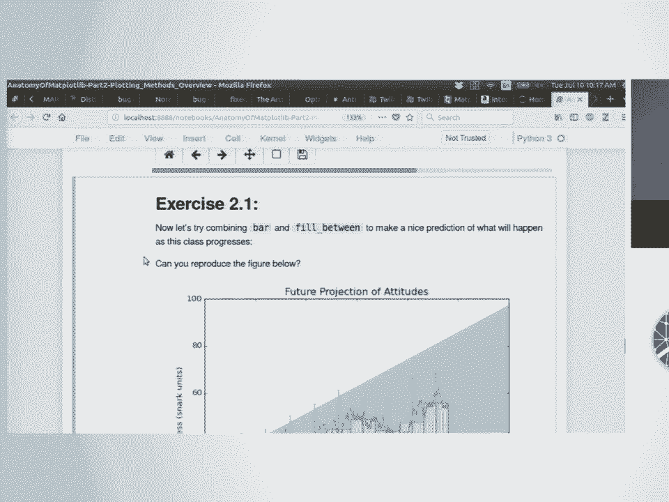

 we're gonna try to take some of the stuff we learned here and we're gonna make a。

 projection project a prediction of how your attitude for this class is gonna go。

 over the next few hours so I'm just if you can reproduce this which is the。

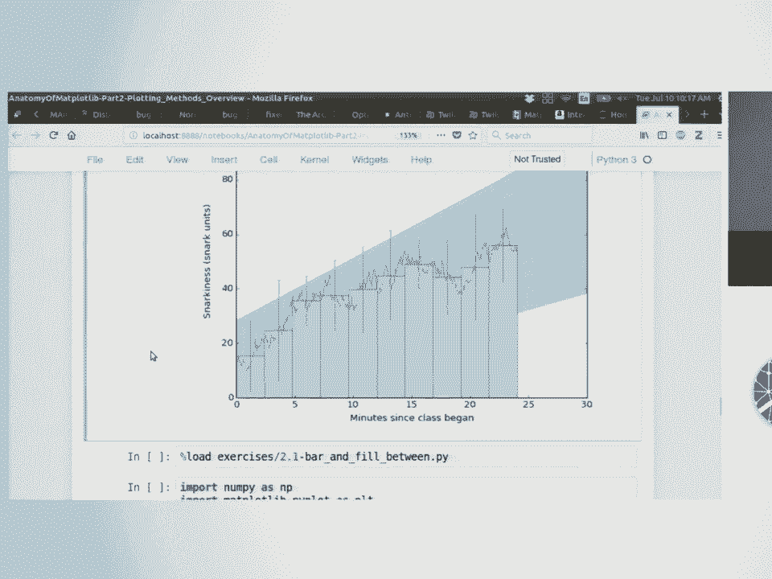

 snarky is snarky is snarkyness index and then how long it's been since the。

 class began which I believe we already passed the 25-minute mark so we're。

 going I'm gonna give you guys some data to start with you guys can play with。

 what I like to see you guys try to do I even give you guys the colors is that。

 try to call bar with the error bars do the plot and to do the fill between。

 right there and see what you get so ten minutes you can work on this you can go。

 grab a drink or something like that go to the bathroom or something but come。

 back in ten minutes all right all right so I've loaded up the solution so。

 everything below here is all the new stuff here so here obviously we created。

 our figure and axes you know the example here only has a single sub plot so a。

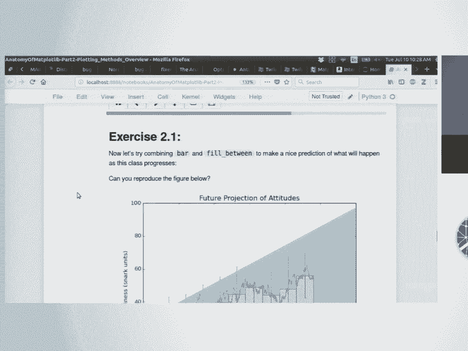

 single axes object we're gonna first do our plot so the raw x and y data and we're。

 gonna give it the line color that should be pretty straightforward and then we're。

 gonna do the bar plot with the error bars okay so we have the the x position。

 which was the the averaged out it's the minimum it's this whole regrouping thing。

 it's averaging and stuff like that so don't worry but we have to have it all be。

 the same shape as everything else so you have the average value for the y so。

 that the bars are all gonna follow those grouped average values and then we gave。

 it a width we gave it a color and then the error bars we gave it the y-error which。

 I have already supplied to you and e-color the edge color sorry e-color is the。

 error the color for the error stuff then there's edge color I know it's totally。

 clear isn't it we're making that gray we're gonna make both of them gray so。

 that's a little bit of a mess um fill between we have the x-pred the y-min-pred。

 prediction and the y-max prediction so you have your bounds for your fill。

 between and we're gonna give it a color and we're gonna set the title on y and。

 x label and we should then produce that wonderful plot I wonder if this is。

 measuring my snarkiest snarkiness level we'll see we'll see if it matches up。

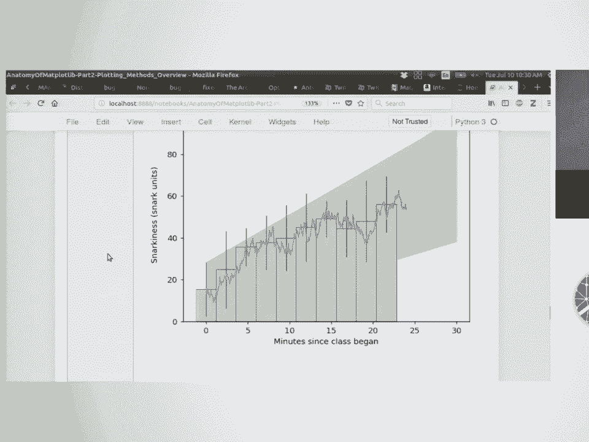

 okay any questions on that or is there anything really confusing or you're。

 just giving up and just going along with the flow okay。

 so I wanted to grab this solution outside of， Jupiter are they in the it's all in the repository there's a directory called。

 solutions hmm all right next image data this is the part that I like I tend to。

 deal with a lot image data I'm a meteorologist by training I'm dealing with a。

 lot of temperature data satellite data stuff like that so I'm usually not。

 dealing with one-dimensional data I'm dealing with two three four dimensional。

 data so this is sort of my bread and butter here it's quick so we got the IM。

 shows and the peak colors hmm， was on the example for the first bar chart that you created。

 you assign you create like the bar and for the bottom is well on the top you。

 don't know about the bar the bar you talk about these things。

 no no more more more this work hard than you created for this stuff more more yes。

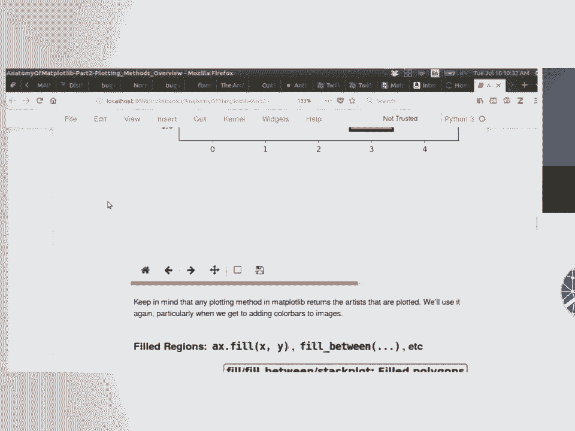

 there so you create you in the second the second line mm-hmm the。

 verb bars yeah so what is happening there is because in the last example you。

 you need to assign that to a variable right in this case I assigned it to a。

 variable because I'm going to modify the these are called artists so anything that's。

 visible on a plot is called an artist in fact the plot itself is called an。

 artist so you can modify after the fact any of its properties and that's what。

 this example was and so every plotting function returns an artist or a list of。

 artists of some sort and so you can go in if you wanted to do special modifications。

 to some of these artists that's what this example was about you don't have to。

 capture this thing if you're not going to do any additional modification you can。

 just let it go you don't have to save it to a variable that makes sense okay so。

 most of the time plotting functions you will not see them save anything they're。

 not going to bother because it's you're not doing anything special you just。

 plotting anything up but if you wanted to go and modify something which is what。

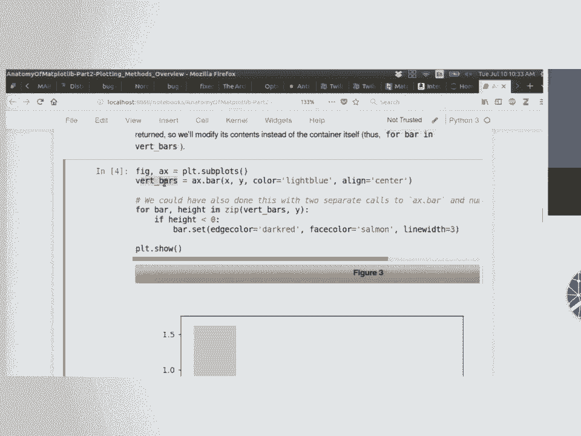

 this example showed you could do additional things on top of the standard。

 plotting methods and then actually you go really further with that is that you。

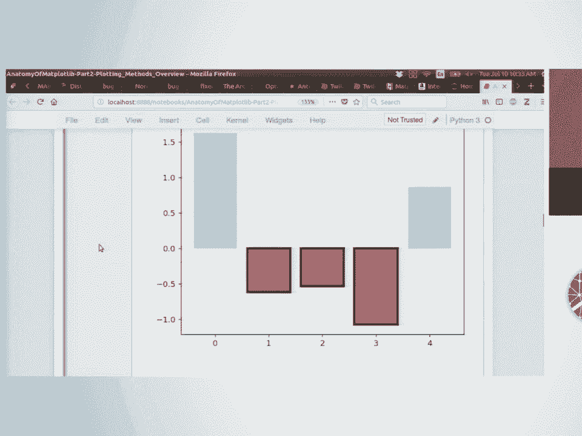

 can create plotting methods that calls other plotting methods and will take。

 those artists objects that you have you go and fut surround with them however。

 you like then you return those artists objects to someone else can make another。

 plotting function that builds on top of that if you want。

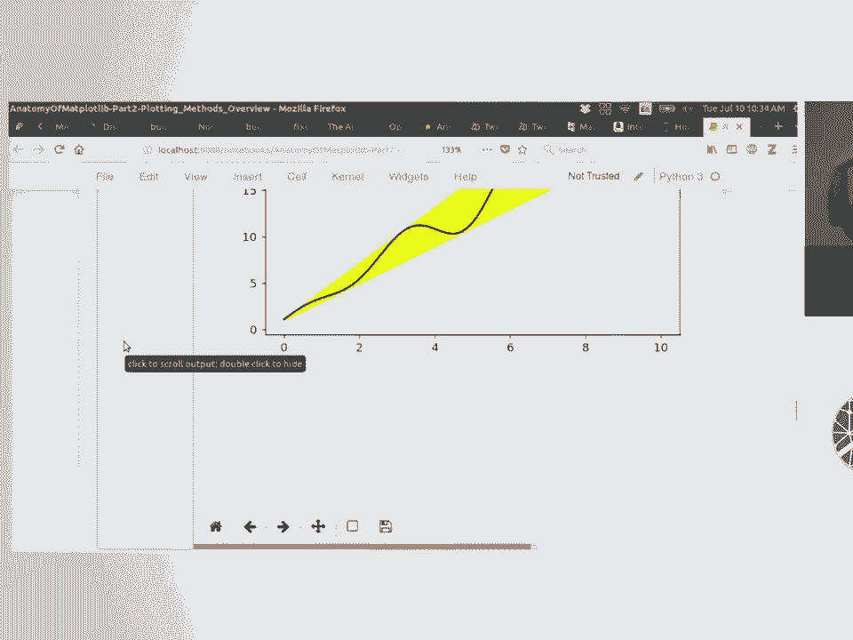

 all right so I am show a peak color things like that we talked a little bit。

 about the coordinate centers versus coordinate corners but the other thing。

 that's important about them is that and it also includes the scatter function is。

 that their what they're dealing with is what's called a scalar mapable and what。

 that means is that based on some scalar value or array of scalar values you can。

 map that value to a color or to a size or some other property and so that's。

 called a scalar mapable and mapletlib most of the time you're dealing with。

 mapping a value to a color and that's and that sounds like a color map and color。

 map tends to be involved with color bars and you know a color map walks into a。

 bar and the and the orders of drink and the bartender goes why the long bar and。

 anyway years about two more hours of these bad jokes so just hang on so here。

 oh and this is the part where which if you did not do that kind of install NPL。

 sample data thing this is gonna break it's not the end of the world it's just。

 simply some some data just to show some things so I'm gonna grab some data that。

 comes from here it's just a bivariate normal function that's slightly offset。

 things like that I'm gonna and so all that is just a 2D array of values and I'm。

 not gonna I'm just gonna do an I am show and I'm gonna want a color bar based。

 off of that so this is just one way to do a color bar there's actually a few。

 different ways to do it I'm gonna take that I am object that that image object。

 that come from I am show and I'm going to give it to the figure I'm gonna say。

 hey make a color bar based off of this scalar mapable that I have and display。

 it for me and I'm gonna specify a color map a C map color map of just earth。

 because why not there's a whole bunch of them we'll get into color map。

 shortly so note that for I am show zero at the top 14 at the bottom so it's。

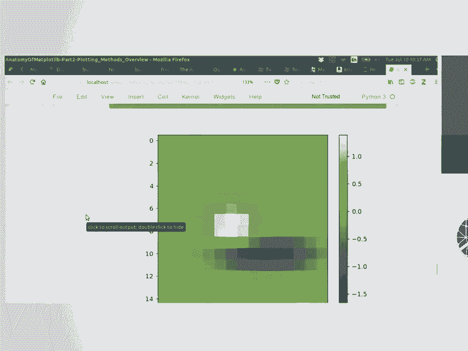

 inverted it follows a lot of conventions with a lot of image analysis type。

 systems don't blame me for that it's just just the way it is and also these。

 these axes limits refer to the pixel number so this was a 15 by 15 array。

 the limits went from 0 to 14 and it has a color map associated with it values go。

 from more than 1。0 to less than negative 1。5 but you got the color bar there and。

 that was pretty straightforward to do you just simply plotting out that data and。

 you told us to do the color bar if I did not tell it to do the color bar。

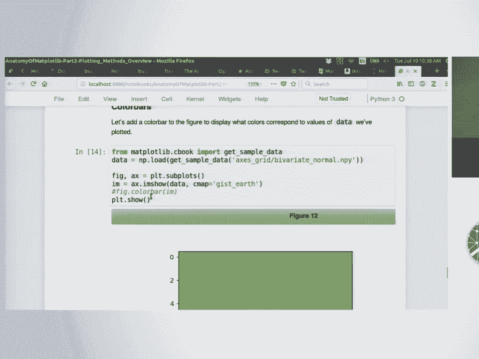

 no color bar right you told us to do the color bar and gave you a color bar note。

 note that you call color bar on the figure object you don't call it on the。

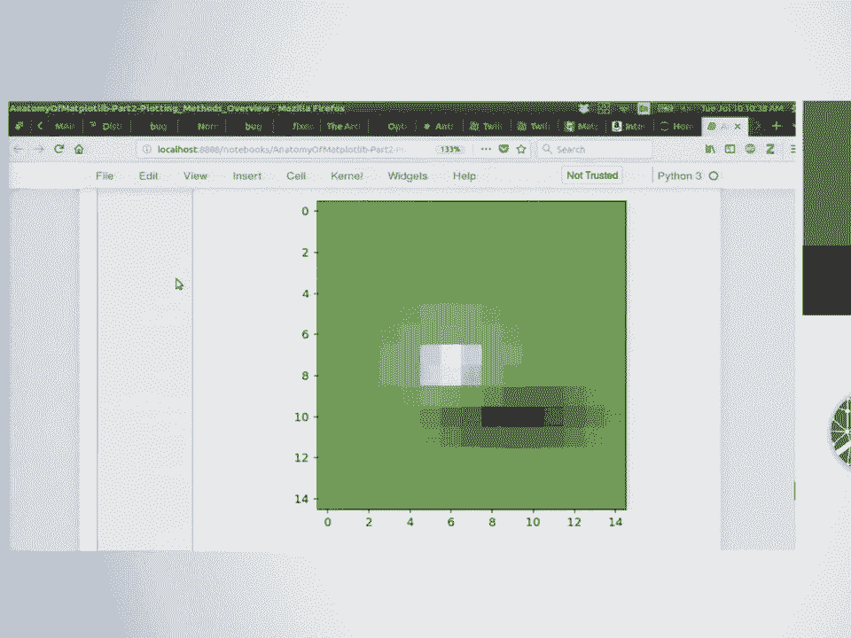

 axes object because the way how color bars work in matplotlib is that when you。

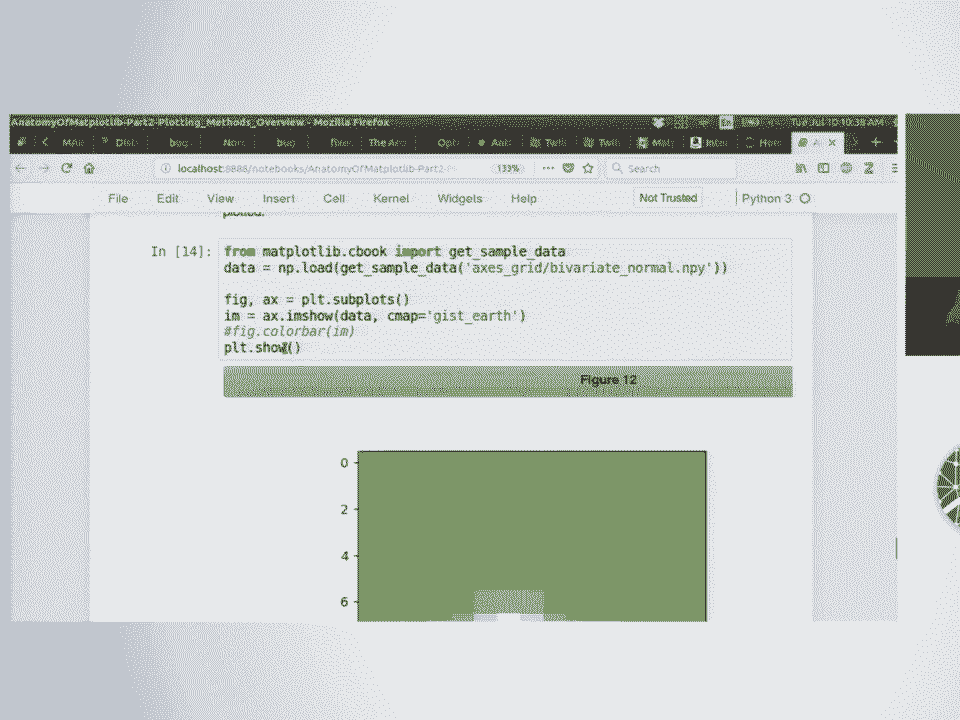

 you tell the figure I want a color bar it's gonna steal a little bit of space。

 from the existing axes object actually technically the current axes it's gonna。

 steal that space and and allocated to this new color bar object so yeah so you'll。

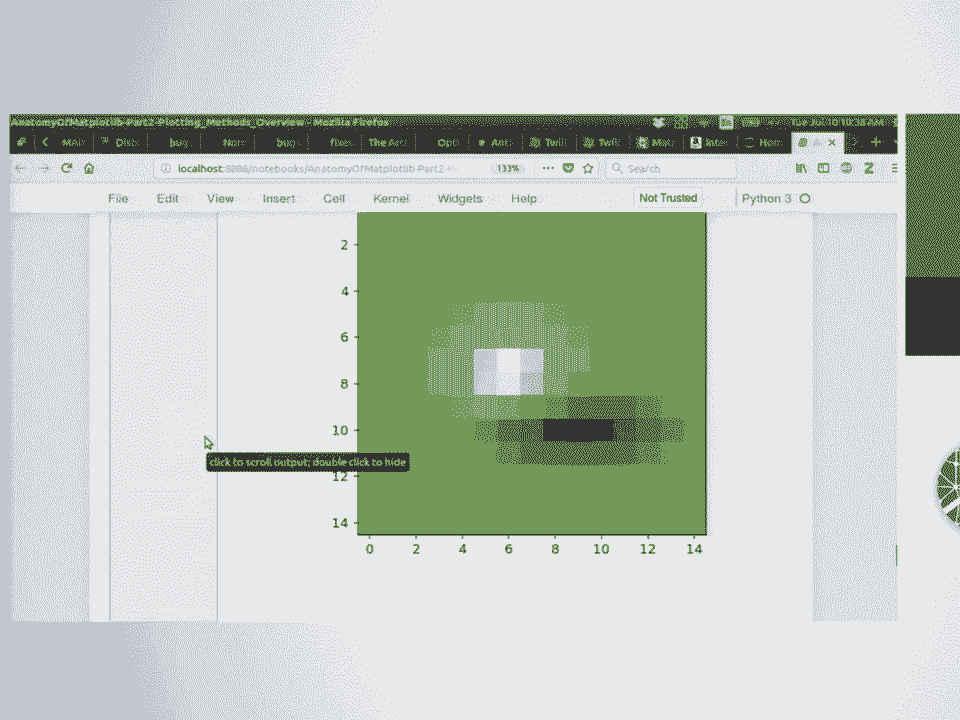

 notice it is this wide in this case but then if you do the color bar now the width。

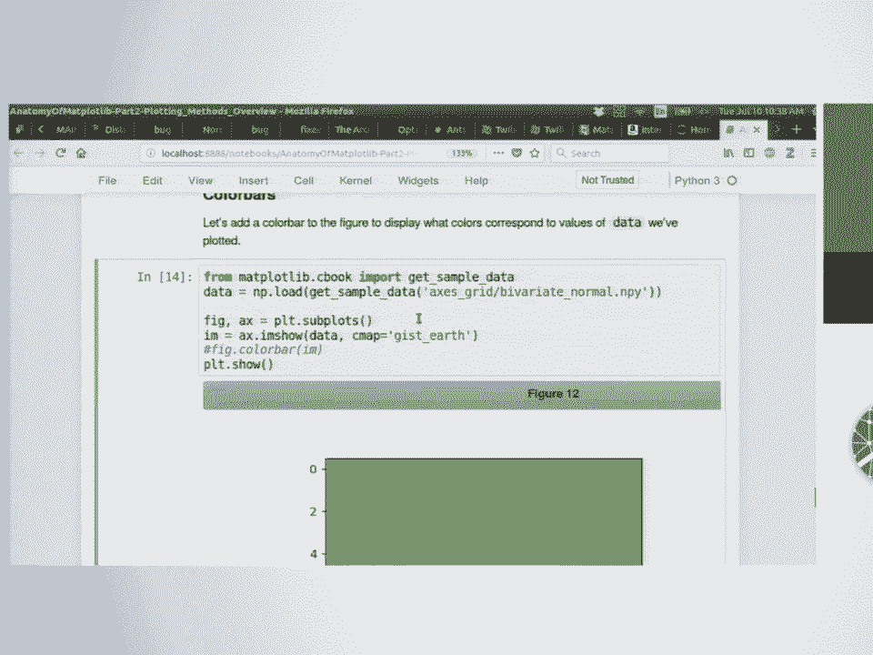

 of that image has actually been reduced a little bit and now you have the color。

 bar that there stole the space from that color bar newer versions of matplotlib。

 actually been this way for a while now probably about version 1。3 or something。

 like that you can actually specify exactly which axes objects you want to。

 steal the space from and it will do its best to do that this is useful so if。

 you have let's say three images in a row by default if you don't specify which。

 which axes to steal space from it's gonna steal space from the last one and。

 so you'll have two images that are the same size and then one image that's。

 slightly smaller and then the color bar next to that and so if but if you can。

 tell it I want you to do I want you to steal space from all three you'll steal a。

 little bit of space from all three and allocate it to the color bar that makes， sense。

 so by default the origin for and I am show is in the upper left-hand corner。

 okay you can and then if you just to be flipped the data is still the origin is。

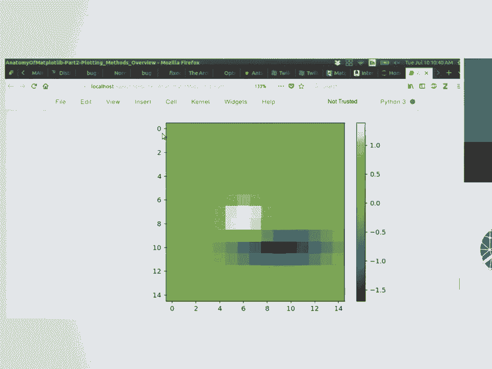

 in the upper corner just that you passed it in a flipped data but you can say， origin equals lower。

 there origin now in the lower left-hand corner and the 14s at the top and the。

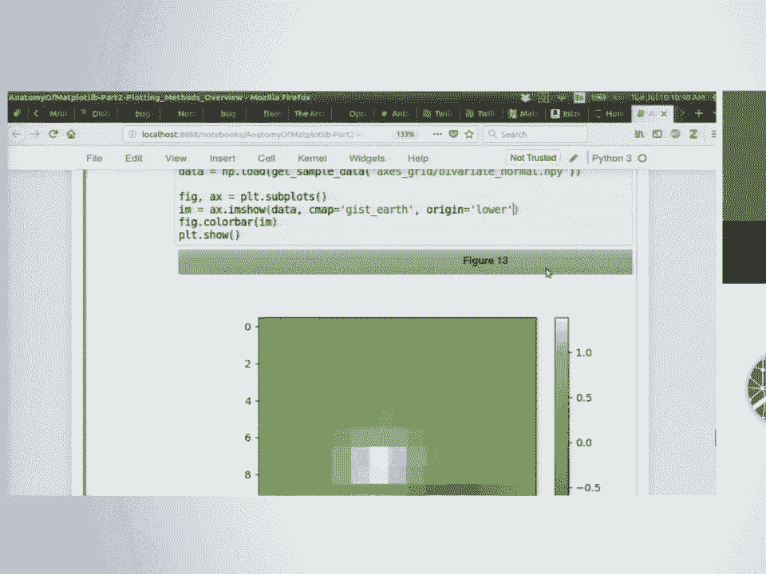

 data is flipped around and then there's other if you read the documentation for。

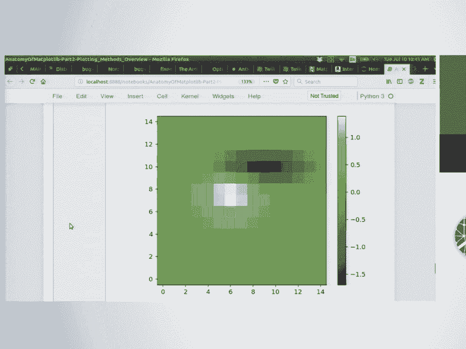

 I am show you'll see you can you can specify the extent of your of your image。

 so that way knows that oh so let's say you had latitudes and longitudes for。

 example so you don't want the the limits to be referring to pixel。

 coordinates you want them to refer to some other type of coordinates you can。

 specify the extent of your image so that way the limits make sense to you but if。

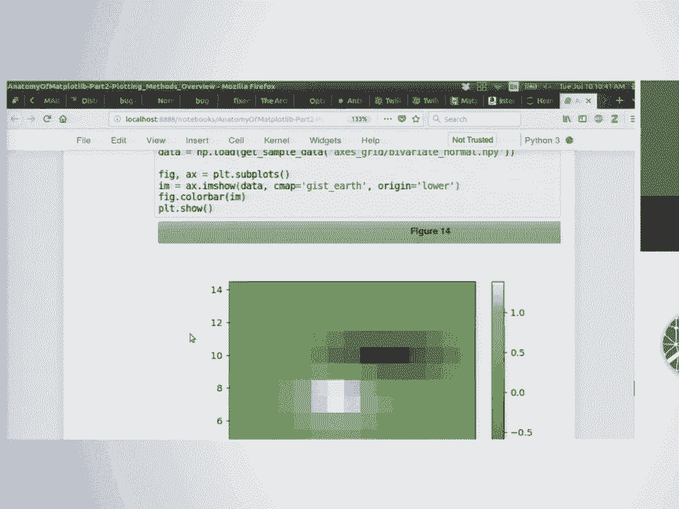

 you read the documentation I'm not gonna go into that right now so there's another。

 thing you can manually create the axes where you want the color bar to show up。

 so let's say you want the color bar to be on top of your plot I've seen people do。

 this I honestly don't know why they do this but they do it so they want the。

 color bar to actually be in the supply area well you can manually do that you。

 can use this big that add axes which is that method I mentioned earlier that。

 you'll never ever ever use yeah you do use it sometimes and so you specify the。

 extent of the axes object in a fractional figure space if you look up the。

 deck is as specified with the order of it I don't remember but it's like the。

 left the left right top bottom and the fractional so between 0 and 1 so it's。

 that spot in the figure that it will use up and then you'll and you also go ahead。

 and do your normal I am show but then for color bar you say CX and so you're。

 saying the color bar axes that you're going to use will be the one that you。

 created up here if you don't specify it steal that space so if you don't want it。

 to steal steal space and you want to have total control over that you can。

 specify what axes you want your color bar to show up in and that you can even。

 then say that it's going to be a horizontal color bar and it will put the。

 labels in the ticks in the right place so if you wanted to do that that's how。

 you do it and then in part six if we get to it I'll explain to you axes grid which。

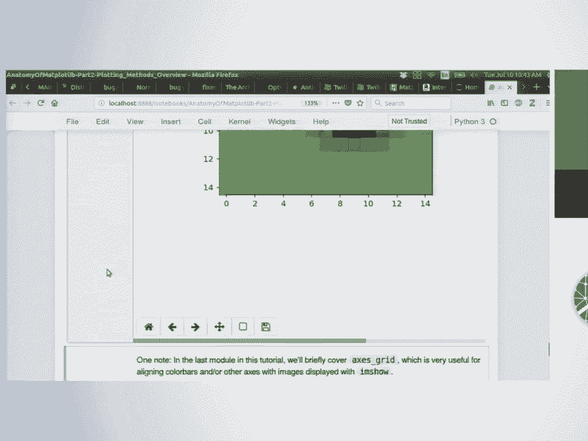

 you can go ahead and pre-allocate stuff for you and it gives you more control。

 over certain things so so other things for scalar map of holes you're going to。

 want to be able to define which color map you want the minimum so if you don't。

 specify color map it's going to use this default which is the wonderful。

 varietas for since version 2。0 it's been varietas which is a fantastic color map。

 before that it was jet which has been scientifically proven to cause harm harm。

 to your family members you think I'm kidding there was a medical study found。

 that people that technicians were misdiagnosing people because the jet。

 color map was making them see gradients that didn't actually exist I'm not kidding。

 so it will harm your family members if you use jet so varietas is much much more。

 sane of a color map to use I'll talk a little bit more about color maps later。

 but you can specify which color map you want you can specify vmin and vmax one。

 or the other if you don't then it's going to look at the data that you。

 provide it and do an assumed vmin and vmax to normalize over and then you can。

 by default it's going to assume that you're talking about a linear。

 normalization so it will take a look at the min and max and just do a straight。

 out normalized between 0 and 1 for scalar mapping you could instead maybe you know。

 that the data is going to be logarithmic but you don't want to log scale it yourself。

 you could just simply say it's going to be a log norm or some power norm or。

 something like that you can specify those sort of things I don't have examples of。

 it here but it's in the gallery but the vmin and vmax is the one that most people。

 end up using at some point so in this case I'm going to use a different color。

 maps seismic same data let's take a look at what happens you'll note that seismic。

 color map if you look at the color bar in the middle of it it has white but the。

 data for bivariate normal for sample data is not centered the range of it is not。

 centered around zero so it took the default vmin and vmax which with the。

 extent of the data the range of the data and it just simply assumed that and。

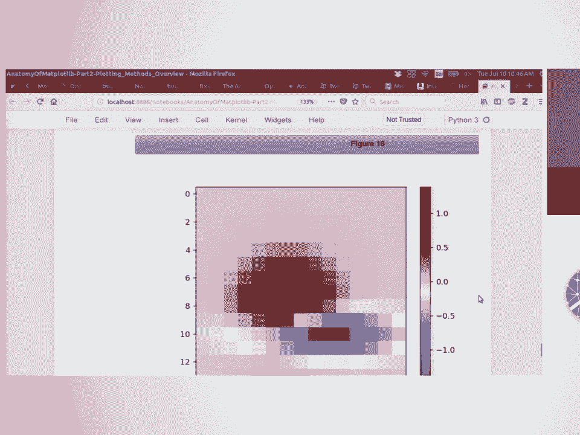

 normalized it that way well now because of that the white isn't at zero and so you。

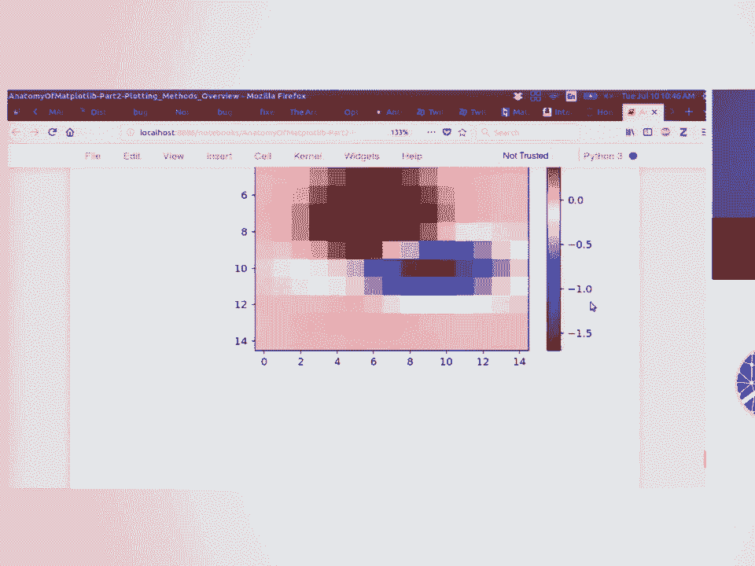

 get this kind of reddish hue well that may not be what you want so what if I did。

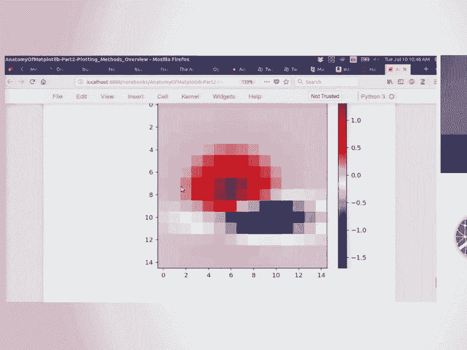

 the same exact thing but I say vmin vmax negative two and positive two I forced。

 it to be centered around zero ta-da this is also very useful if let's say。

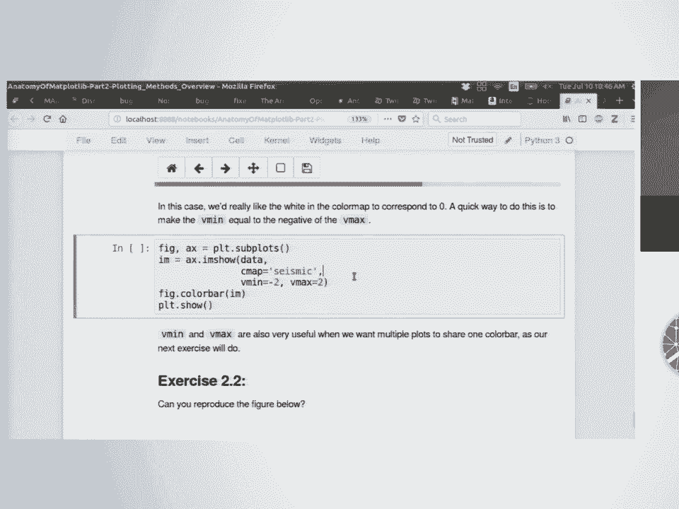

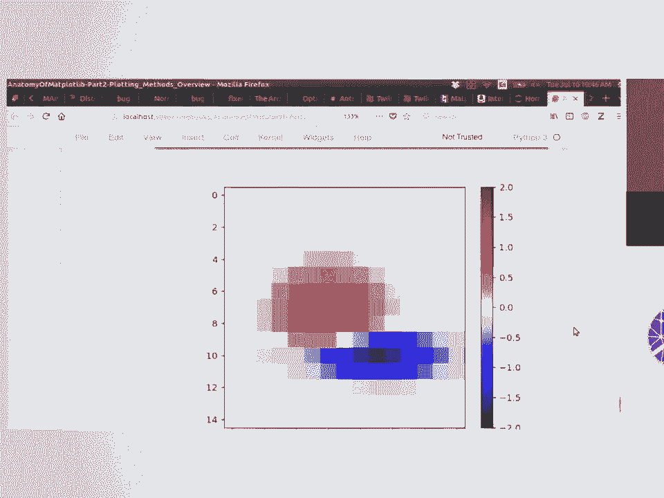

 you're plotting an animation of images where in which each image may have a。

 slightly different range if you specify ahead of time that I want vmin vmax to。

 be between zero and eighty now as you go through that sequence every single。

 image is the the color is going to mean the same thing at every single image so。

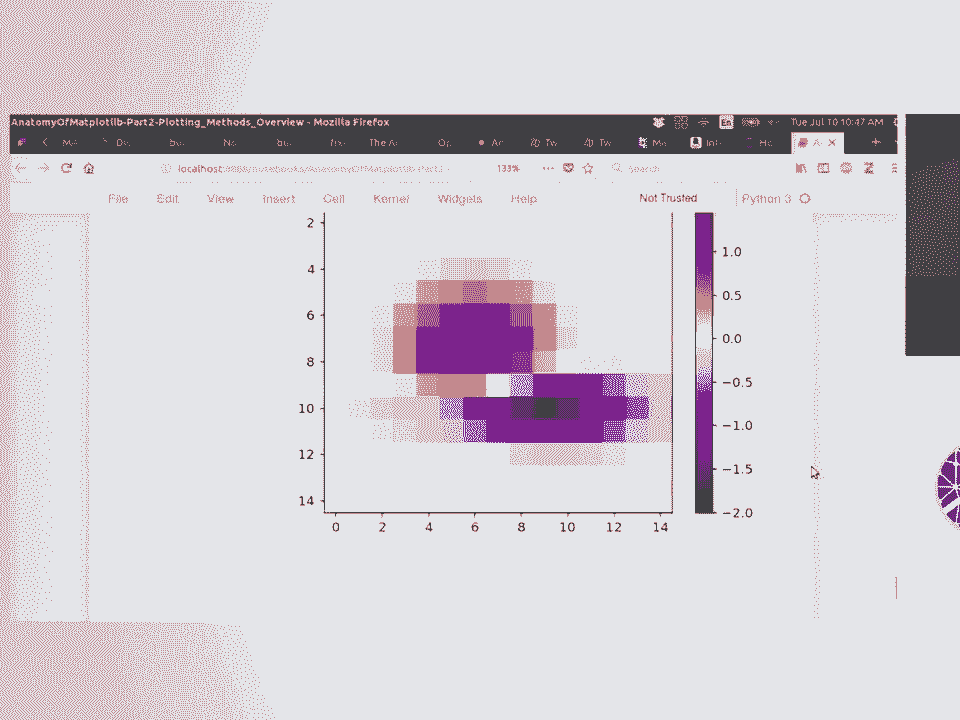

 it's useful for things like that all right let's reproduce this figure here。

 where in which we have three subplots they were going to spend five minutes on。

 this we have three subplots and I'm going to provide you the same random。

 data it's a no there's three random data different。

 magnitudes of that random data you're gonna have a horizontal color bar and we'll。

 see what we make we're gonna spend five minutes on this and I provide you the， data you'll see plot。

style。useClassic is an old it's a thing if you did actually。

 like the way how your plots look back before version 2。0 you could use that I。

 did that here just simply to show that you can do it you don't need to have it。

 but then we're gonna create subplots we're gonna do a tight layout step by I want。

 you to do the IAM shows and the color bar and note that I even provide you a。

 color bar axis so spend five minutes on that and we'll move on from there。

 all right so the solution to this was actually pretty straightforward this was。

 this is all the new stuff right here a for loop going over the axes we could we。

 got ourselves three subplots here so we're gonna go over the axes here and we。

 have a list of the data one data two data three and we're gonna do an IAM show on。

 each one of those and we're gonna specify the beam in the VMAX this actually is。

 not necessarily more interpolation equal nearest that is now the default for map。

 plot live in version 2。0 since version 2。0 but however because I said this used a。

 classic mode earlier it's gonna do that so that gets you your three subplots。

 then I want that color bar well I only need one of those scalar map apples I。

 don't need all of them so I just keep the last one and then I specify that the。

 color bar axis is gonna be the one that I created for you already and then the。

 orientation could be horizontal and with that you generate the image yeah it comes。

 out huge yes because of the yeah the figure aspect so any questions on this I。

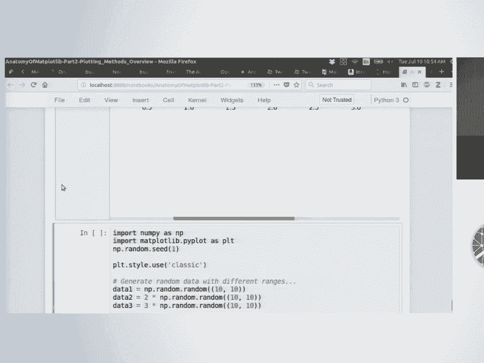

 know it's exciting stuff yeah， always very similar but they must put it every day for that yeah so yeah yes for。

 your case you know we did specify the interpolation and because we're in a。

 classic style yeah so mine looks a little bit different if you had the。

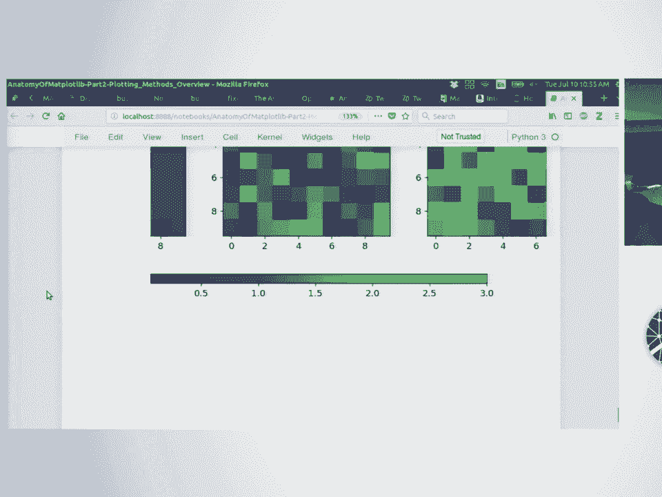

 if you had the classic dial but if you specify the color map then at all or。

 well actually this is the veritas so yeah I really should update that part that I。

 took that out okay but you get the general idea that you created those three。

 axes and you did the I am shows on that and you created your horizontal color。

 bar and that you shared the V men and the V max across all three of them so it's。

 all good okay so let's move on to part three， how to speak MPL so you learn what a figure is what axes are you've learned。

 what the various plotting functions are you know everything you need to know。

 right why are you still here you know it worked the first year I did this and then。

 someone know okay so the issue is is that you've seen hints of things in all。

 these other examples where you saw me mess around with the line color you saw。

 me mess around with the color map you saw me mess around with other things but。

 didn't really get into the nitty gritty detail I haven't talked about how you。

 specify line styles how you specify markers and things like that there's a。

 whole system is a basically an entire vocabulary within map plot live on how。

 to specify all these things that I hadn't even gotten into there's a whole。

 another part of map plot live that you have not even seen and you just didn't。

 you start realizing just how much control you have for your plots and how much you。

 can do just remember keep in mind all the stuff you've done so far you haven't。

 needed to specify a lot of things and the plot look decent you specify a thing。

 here you specify a color there stuff like that but most of everything looks。

 great you haven't needed to specify all your texts you haven't needed to specify。

 all these others it all looks fine and you know what for most of your uses you。

 don't need to but you I remember I said that map plot live is not you know。

 unhelpful it's not going to be getting in your way but it's also not going to。

 keep you from doing the things you want to do so if you want to control certain。

 nitty gritty details you can first things first and probably the most。

 important thing is the colors so we have many many ways to specify colors first。

 things first you can do the shorthand notation that we borrow from a lot of。

 places it's just RGB for red green blue CMYK for cyan magenta yellow black and。

 then W for white so you can say or any place where you want to specify color。

 you can say the string black or you can say the string K they're the same。

 pretty straightforward easy we also recognized 140 additional color names。

 they're the HTML CSS color names such as Barely Wood and Chartreuse I didn't。

 take French so I'm probably butchering that but and you can look up with the。

 full name we recognize all of them in addition to those 140 color names if any。

 of the color names contain the word gray in it we also recognize the English。

 spelling of gray as well so if a G R A Y or G R E Y because I never keep them。

 straight in my head which ones which so if you say light gray with an E or light。

 gray with an A they both work you're welcome all you British people is this。

 yeah I'm just a terrible speller so that's it and then for the there's well。

 sometimes back there was this famous a KCD user survey thing where you tried to。

 determine what colors people thought things were and he then published that so。

 if you specify a color based on a KCD colon blue it's the it's using the blue。

 basically from that palette so if you consider it that way we have this palette。

 concept it's not fully developed yet in map plotlib but it would follow syntax。

 of some name colon and then the official name and you can then grab a blue color。

 or a red color or green color whatever from that palette and so it would be that。

 version of it we also for those who are familiar with tableau we have a palette。

 for tableau so tab colon blue tab colon orange green red you can get that version。

 of it as well so that's what it is you can specify a string of a hex with or。

 without the hash sign so a hex for if you're an HTML old-school person you may。

 be completely used to this and hexadecimal you can specify the R the G and the B。

 channel so this would be blue and then we also now support as a version 2。0 an。

 optional fourth channel for the transparency as well again this is not。

 something that most of you will run into but you might run into it from time to。

 time and you can do that different ways to specify gray you can do you can provide。

 a floating point number between 0 and 1 as a string we recognize this as a special。

 representation so 0。0 or just simply 0 as a string would be black whereas 1 so。

 in other words if you if you use the float constructor on the string that value。

 you get back would be the thing between 0 and 1 0 would be black 1 would be white。

 anything in between would be some variant of gray does that make sense sort of an。

 obscure corner of map that little but some people like it so with version 2。0 we， added a version 1。

5 we added property cycles we've always had color cycles we。

 now have property cycle but with that we went a step further and we started。

 coming up with a system for referencing elements of a property cycle right now。

 we only have color implemented so if you have a color cycle which those of you。

 from map plot lib the default color cycle was a blue red green and then CMYK and。

 and if you call plot over and over it utilizes that cycle it went through if。

 you didn't specify the color we'll get into that a little later but here you can。

 say I want the first color of that cycle so if you don't know what the color is。

 you just know that you want the first one of it this this might be for a。

 situation where you're dealing with a schema of some sort or someone might be。

 switching out the different color cycles or something like that you and you're。

 writing up code that goes I want the first one to be the first color I want。

 the second one to be the second color there's various use cases for it we can。

 do the first 10 cycles using this notation of a C and then a single digit， number。

 RGBA a optional tuples so rather than specifying the hacks you can specify a。

 tuple of values between 0 and 1 and then so 3 or 4 tuples you can。

 some places is a list of tuples as well some places you can't do this and then。

 also this is the fun thing where in which some plotting functions except an。

 alpha argument but if you specify an RGBA tuple the alpha argument takes。

 precedence over the alpha channel in your RGBA tuple so it gets a little confusing。

 sometimes it's called the two truth problem you got two truths and so if they。

 conflict you have to choose one or the other so we chose the alpha argument。

 let's quickly do an example let's just have fun go freestyle I'm not gonna tell。

 you what to do I want you to take this plotting thing and if you notice right。

 off the bat by default it's going to cycle through the colors the default color。

 cycle I want you to modify this plotting command here so that it used。

 different colors a different sequence of colors instead we just do a quick。

 few minutes thing if you don't figure out that's okay we'll be going we're。

 gonna be doing a pretty quick pace here for the next few examples。

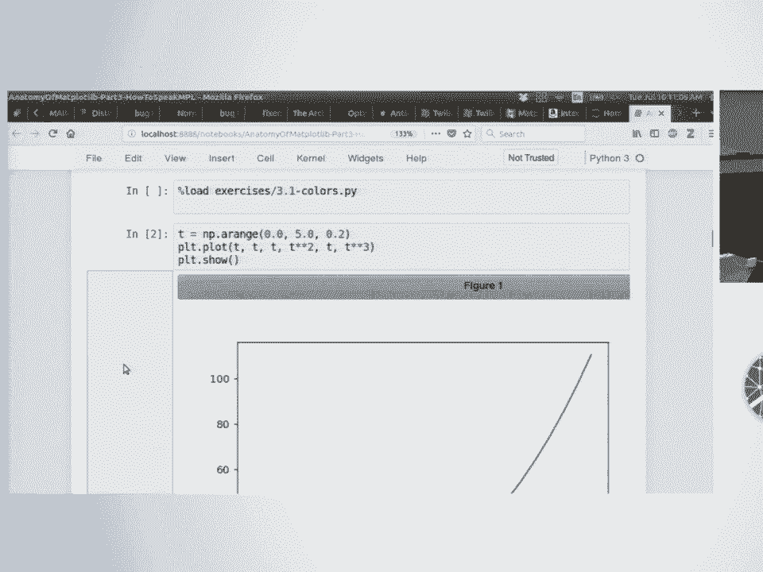

 anybody stuck still working go ahead raise your hand if you're still stuck I'm gonna。

 assume the other half of you all just racing ahead and just trying to get out。

 of this okay so take a look to the plotting function for those of you who。

 come from the matlab background they're going hey this looks a lot very familiar。

 this is one of the most dreaded beans in my existence the plot the call。

 signature for plot is insane there are professional companies that actually。

 have poured money into trying to figure out how to interpret the plot call。

 signature pie charm hates us absolutely hates us because of the plot call。

 signature because it's so flexible and you can do so many things with it and you。

 can totally blame math mat lab for it so here you see the original example I gave。

 you TT the that would be the X and the Y for the first thing you're gonna plot。

 T and T squared the second thing you're gonna plot T T cubed is the third thing。

 you're gonna apply and if you don't specify the colors or any other information。

 with it it's going to assume the default and the default being here the the blue。

 red and green from the default color cycle but just like you can in matlab。

 you can do a plot specification after the two XY values so here I'm gonna say。

 that I want the first one to be red I want the second plot line to be cyan I。

 want the third plot line to be a level of gray the string 0。7 note that you you。

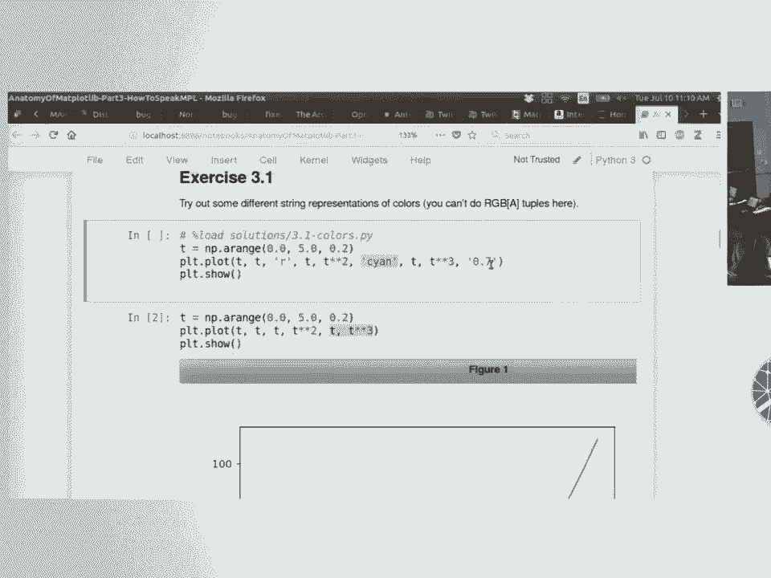

 have to do these things as string because of the plot call signature and with that。

 mind you I told you you could do anything you want that's fine but I what I did。

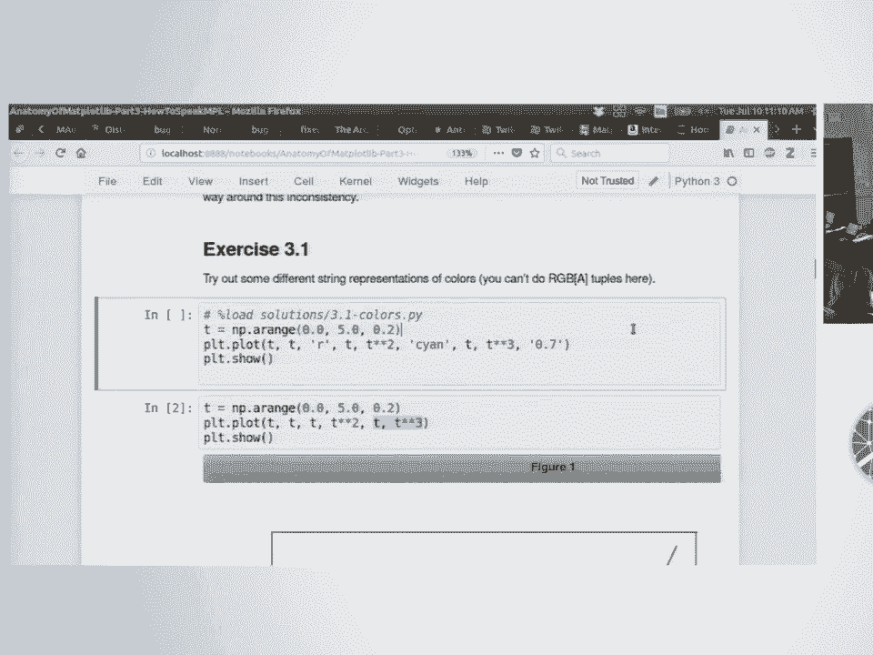

 here and we see we have read for the first one cyan with a second plot line。

 and gray for the third one now let's take this a step further with markers。

 commonly what you're gonna do in matplotlib and plotting also true with。

 scatter is you're gonna define a marker what things are gonna look like by the。

 default for plot there are no markers but scatter there obviously is a marker。

 we have a default marker for scatter it's just a circle but we have a whole。

 specification system a lot of it comes from matlab we have a few additional ones。

 but so you could do a dot and that's supposedly a pixel point is not but。

 this is a small circle basically you could do an O for circle a plus sign for a。

 plus sign X for a cross and then so that's basically the plus sign but。

 oriented rotated 45 degrees you can do an octagon that's a string of an 8 you。

 can do square so that's a an s there's a whole bunch of them you can do that's。

 all available some of these don't really quite make sense they belong they actually。

 come from other parts of the code but it's available so like for the the tick。

 left tick right thing it's actually what the tick markers are when you when you。

 look along the axes and you see that but you can use them too if you wanted to。

 is this in that case it's actually the number 0123 things like that you can't。

 use that when you call plot because plot expects a string but in other places you。

 can we also have the string none which means nothing we have the Python object。

 none which means use the default that use of the default when I talk about。

 defaults we'll talk about it a little bit later there is this whole RC。

 peram system where which you can encode what you like it to be by default like。

 something to be by default you can also do a space a string with a space and a。

 string an empty string and they also the same thing is saying none as a string so。

 there may be cases where you want to do that don't get too hung up on this code。

 this is just simply to show you what it all looks like so the point circle。

 oxidon octagon vertical bar carry up care down the default in this case then。

 diamond pentagon things like that all available right there it's all this table。

 here matches up with this table here so if you wanted to know which letter was。

 which string it was that did that you can see the color of the marker would。

 because I didn't specify it went with the color cycle it's implicit yeah it's。

 not specified here I could have so I could have said color equals R now。

 they're all red so let's try some markers just for fun just a quick little。

 thing kind of like how I did before where you could specify different colors。

 why don't you specify different markers in this case here I gave you a little。

 bit of space I gave a little blank area here you can enter in different markers。

 just for you to have fun with， and then the other thing you can do with this is you can combine a color spec with。

 a marker spec to the marker spec come first and then a color spec comes all in。

 the same string you don't have to specify everything you could specify one or the。

 other but you can specify both together in one string。

 so again this should be very very familiar to people coming from the mat。

 lab background I suspect IDL does something similar as well I don't remember。

 so can I only allowed to use the basic colors with one letter yes because I'm。

 in trouble with yeah you are limited in these platforms so you can override that。

 by explicitly stating that the color equals Burley would things like that but。

 then you can't do this notation where you can specify multiple plotting things。

 in a single plot so again it's why but you can easily bypass that by calling。

 plot multiple times to so it's just you know six of one half a dozen of the。

 other you can do different ways it's the same thing。

 all right so for my particular example here I did yellow stars so you see the。

 asterisk and a Y so yellow star for the linear portion then I did and I'm got some。

 thinking the wrong word yeah that reddish one gosh I'm blanking on the name octagons。

 and then I'm doing square green squares so SG and guess what did you get yellow。

 stars and the say and magenta magenta magenta octagons and green squares all right。

 line styles no not Ryan's dials line styles it's gonna be a long tutorial so we。

 have line styles I particularly like using line styles so why do we use。

 color in our plot so that's to help distinguish things right do you you know。

 that you got this is your time series for temperatures from Philadelphia this is。

 your time series from temperatures from some other city in steps you give them。

 different colors you can distinguish them but how many of you published in a。

 journal that did not do color yeah line styles are fantastic for getting。

 around that problem so you can do different line styles that you can then。

 help distinguish which plot is which and so we have a way to specify a different。

 line style so a single dash a string that's a single dash is solid two dashes it。

 well dashed is not complicated people then you have - dot so that's a dash in a。

 period and then you have dotted which is a colon then you have the string none not。

 the python none the string none and again a string that's just a space and a。

 string that is empty all three of those things draw nothing so no line at all。

 okay and then there's actually this whole other system for creating your own。

 sequences your own line dashing patterns and stuff I'm not gonna get into that it。

 exists it's an interesting API that some people have utilized but this should get。

 you through most of your needs those four different styles one thing I want to。

 point out that when you're doing this in when you call when you're trying to。

 specify your line styles watch out for dot dash and dash dot to complete。

 different things if you did dot dash in a plot call you're gonna get a solid line。

 using the point marker but if you did in a plot call dash that dash dot you're。

 going to have a dash dot line with no markers so they're two completely。

 different things so that's something that I mix up obviously I just mix it up in。

 my head right now it is a very common tripping point they are two very。

 different things yes what's what's the use case of draw nothing。

 ah very good so oftentimes so and I'm gonna cover this later in the artist。

 section but we implement plot and scatter very differently with plot the。

 assumption is that the artist has all identical markers with scatter you can't。

 make that assumption so with plot there's an optimization where in which we can。

 reuse the same marker over and over when we render scatter you can't do that and。

 so if you're going to plot something that has many many many many points and you。

 don't want the line but you also want the markers all be identical you would use。

 plot with a draw with a line style of none string none or empty string or。

 whatever so that you don't get the line you only get the markers and it's highly。

 optimized and so it renders very very quickly if you want all the markers to。

 be identical if you don't want the market to be identical you want them all to。

 be have different colors you want them all that different sizes or something。

 then yes you have to use scatter fantastic question any other questions so。

 let's play with them with the line styles a bit so again we're going to go back。

 into the plot call signature again I want you to do a few different line styles。

 with a few different markers and a few different colors all under the same or。

 I'm sorry this is not as if I already made this one so here we have four plots。

 here each one of them with a different style involved one nice feature that。

 came about and my plot lived 2。0 and later is this the line with equals let's give。

 it a ridiculous line with 10 the spacing for the for the for the pattern。

 scales with the line with back before version 2。0 if I specified a line with。

 of 10 each of those dashes would have the same amount of white space in between。

 them in the same length of the dash regardless of what the line with was and。

 it looks terrible now the spacing of all this stuff scaled with the line width so。

 it actually looks pretty neat so in this particular case the colors were not。

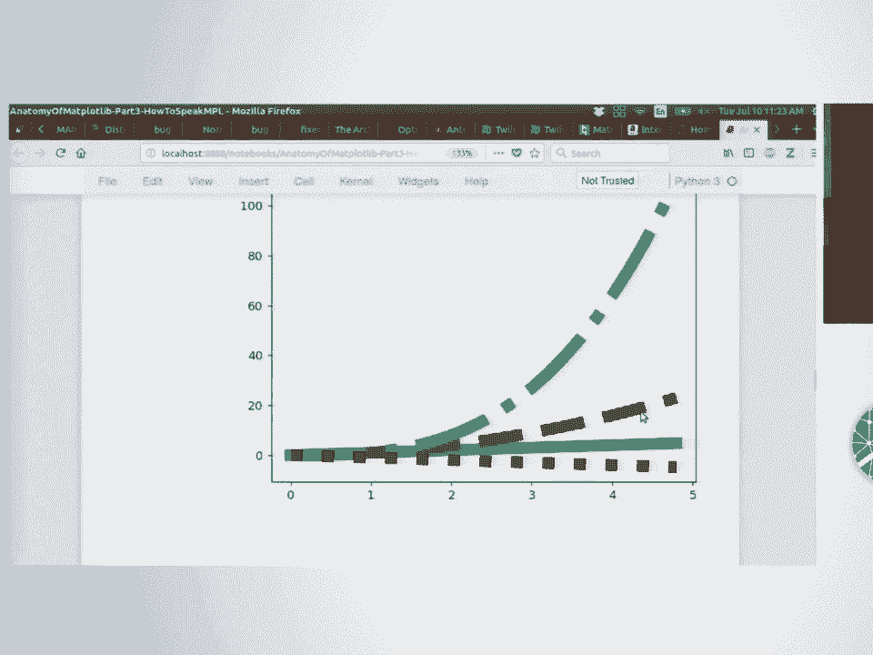

 specified yes you can。

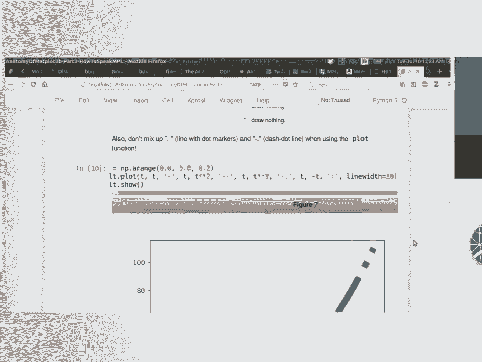

 yeah oh this little point that I make here that the line styles mentioned above。

 are only valid for lines whenever you're dealing with line styles of the edge a。

 patch object you'll need to use words instead of the symbol so solid instead of。

 dash dash dot if dead of well a dash dot， version 2。

1 we fix that so it used to be that that you had so if you said for a。

 bar plot since bars use patches not polygons or whatever or not line 2d then。

 for bar you couldn't say - - you couldn't do this before now you can if you have， version 2。

1 and greater so now you can use them interchangeably for the most。

 part so wherever you're doing with line 2d or patch objects you can say one or。

 the other it doesn't matter so yeah so this table up here solid - - dot both。

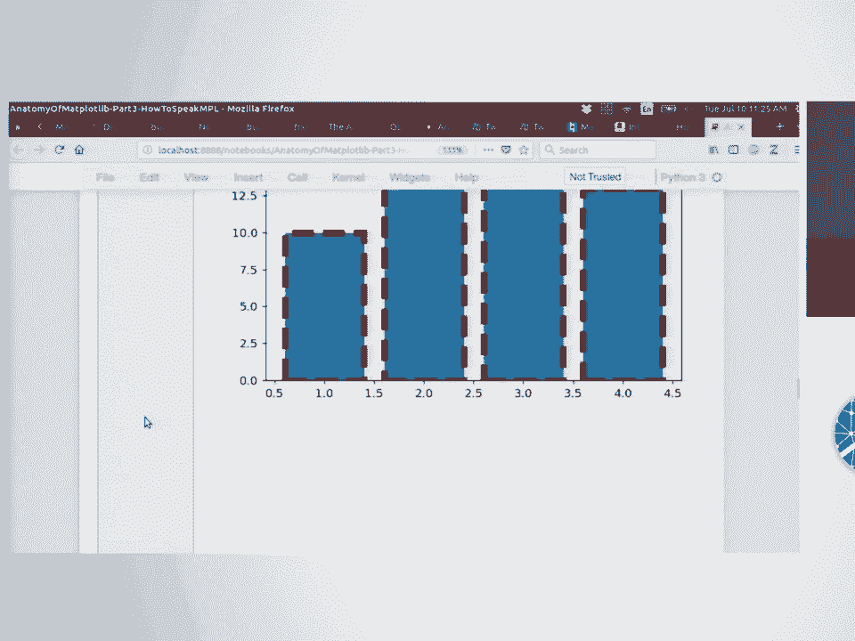

 these strings are valid strings to use obviously not the word draw nothing that's。

 it doesn't recognize draw nothing but all right so let's put and I did this。

 example here okay plot attributes this play around a little bit here red - is。

 blue squares green triangles so here I said red - - b s so blue squares not。

 certain brown things and then green that and then the carrot so g carrot that's。

 the green triangles and so you get that so now you can see how powerful the system。

 is within the plot specification now you can't do this sort of stuff and let's say。

 scatter and you can't do this in some of the other parts of the API but you can do。

 that here in plot other properties that you can mess around with you do as a。

 keyword arguments you can specify the alpha you can say color or see as a keyword。

 argument - cap style so when dealing with lines and they go around a corner。

 stuff they have cap styles and joint styles that would be miter to be ever。

 beveled things like that the features aren't perfectly there some places it。

 works some places it doesn't but most people don't need to deal with that but。

 in particular that's needed for when you're doing - type plots so that way the。

 the dashes look right best fight again the dashes so that's the API if you want to。

 do the more advanced type of inking sequences draw style so default is so。

 what draw style so any of you anybody here does finance finance okay so stock。

 market plots sometimes you'll have it quantized based on what time so you you。

 don't have so the lines are only horizontal or vertical when you plot it。

 kind of look kind of like a bar plot but not quite you can do steps and step。

 pre and step mid and step post so steps is step mid it's just that was the old。

 way to say it now we're more explicit we could say steps pre so it means so when。

 it does a step function and you say that the value is going to be at x1 y5 the。

 stepping would happen either before that point at the middle for that point or。

 after that point so step pre step mid step post most people don't need to deal。

 with this but some people want that and that's the draw style line style or LS。

 recovered that line with or LW the floating point value or integer between。

 zero and however large you want it the units are points so draw points it's。

 some unit of measure the different kinds of markers so you can specify that as a。

 keyword argument marker edge color or MEC marker edge width or MEW marker edge。

 color and marker face color or MFC so you think about the marker itself some of。

 the markers are filled markers so the square circle things like that they have。

 a face to them you can specify the color of just the face meanwhile things like。

 the cross and the plus things like that they don't have a face they have an edge。

 only but the filled ones have both edge and face there's caps dials and joint。

 styles for solid lines as well so I mentioned before the dash styles there's。

 also them for the solid one again that feature doesn't quite always work quite。

 right there's some examples of it in the gallery if you want to look at it if。

 you care whether something's gonna be beveled or not but it's there you can also。

 always specify whether or not it's gonna be visible this is the thing you might。

 use you go well I plotted it I want it to be visible right this is a feature you。

 tend to use more with animations so you might go ahead and just plot everything。

 but then the animation code will make things be visible or not visible on demand。

 things like that so you can change that or if you're gonna do interactive type。

 application which I wrote the book on interactive applications using matplotlib。

 go ahead and buy it it's fantastic book I might say so myself but so I mean the。

 author just fantastic he really should made a music it so he with interactive。

 applications you may have something like when which you do an action and that。

 might make something disappear and something else appear or things like that。

 that's what you might use the visible feature the visible attribute for and then。

 Z-order which we touched on earlier by default different types of things have a。

 certain predefined Z-order so you know Tim tend to want plot lines to appear on。

 top of bars and stuff like that so we predefined a lot of other things but if。

 you want to override that you can you can specify your own Z-order so that。

 lower values that show up below and higher Z-order values show up above so。

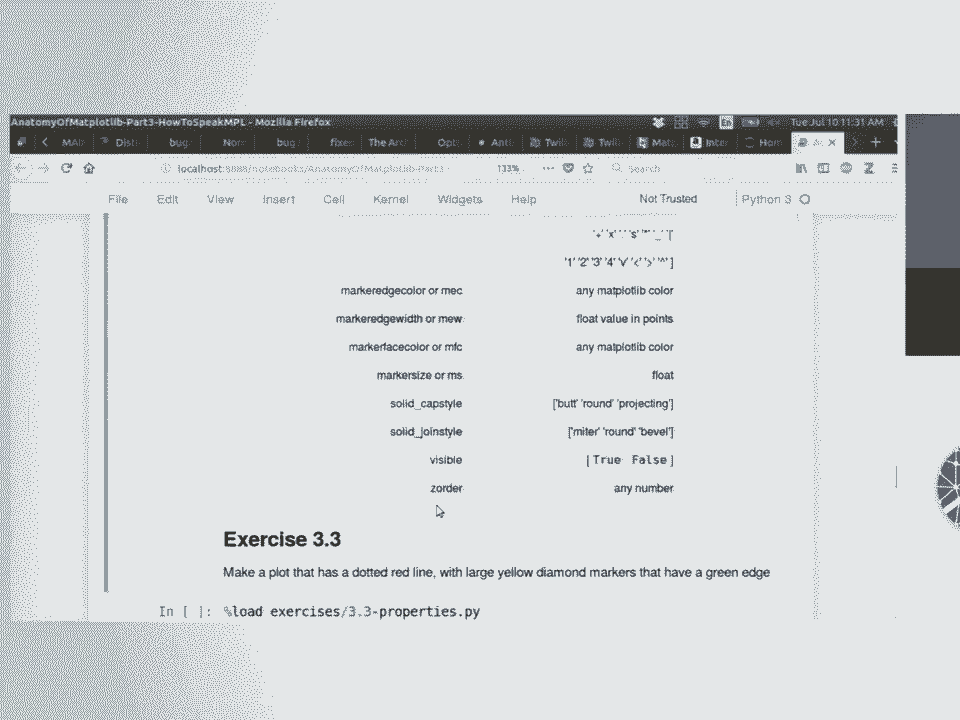

 let's do an exercise where I want you guys to create a dotted red line with large。

 yellow diamond markers that have green edges okay I give you guys the data I。

 give you guys part of the plot call make that plot have a dotted red line and。

 large yellow diamond markers with green edges， all right so you know a red dotted line so we do an R colon so that gets you the。

 red dotted line and then the marker can be diamond the large diamond remember if。

 you go back to the table there were two diamonds in that table。

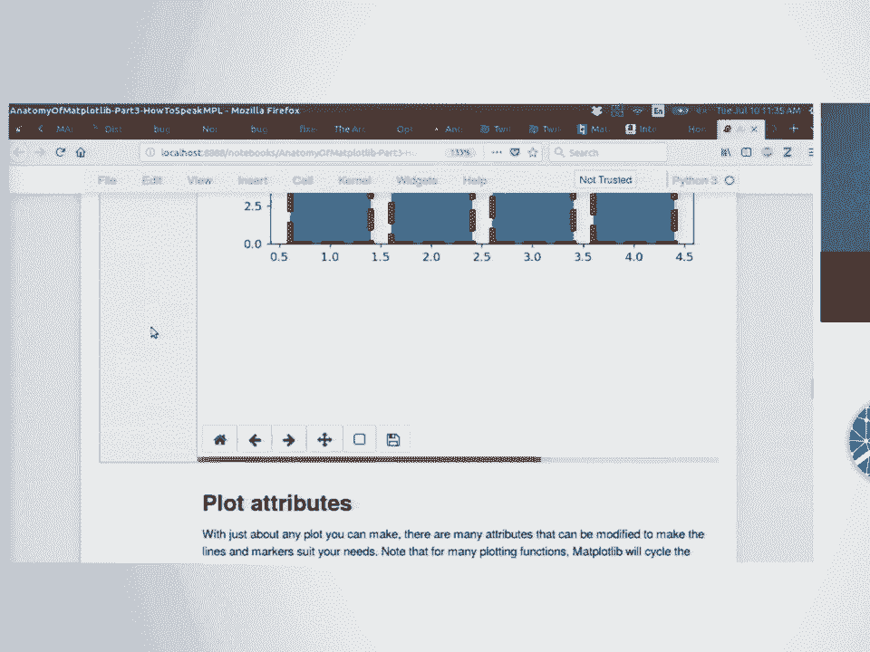

 there was thin diamond and diamond， yeah thin diamond and diamond so capital D is the big large diamond。

 over shot my landing so so that gets us the markers there and then we need to。

 define some colors for the markers because if you don't the markers are。

 gonna get the same color as it was specified for the line so we're gonna。

 say it's a marker face color because these are diamonds they're gonna be filled we're。

 gonna say that they're gonna be yellow and the marker edge color MEC equal G for。

 green and there we go so now you see how you can control all those little。

 itty-bitty parts you get the exact detail you need and some you're gonna go。

 like when am I ever gonna need a plot like this well that's not the point it's。

 to demonstrate that you can control the individual features so that you know。

 let's say you wanted let's say for example you're plotting something on top of an。

 IM show and your markers are disappearing into the background of the IM show so。

 you want an outline for it well now you know how you can add an outline to that。

 marker by specifying the MEC you know the marker edge color so that you can do。

 stuff like that so there are circumstances where such things are needed and then。

 also now you know how to have different color marker than the plot line itself。

 things like that there's another feature I don't go into this here in the。

 documentation but for there's mark every so if you don't actually want if you。

 don't actually want you know I guess all crowded right here and everything and。

 maybe you don't actually want to marker at every single point here you can say I。

 want to mark every five data points or something like that and you can do。

 something like that just kind of neat it's available I don't I don't remember。

 exactly the keyword argument there whether it's mark underscore every or。

 mark everyone where that but anyway let's move on to color maps the other very。

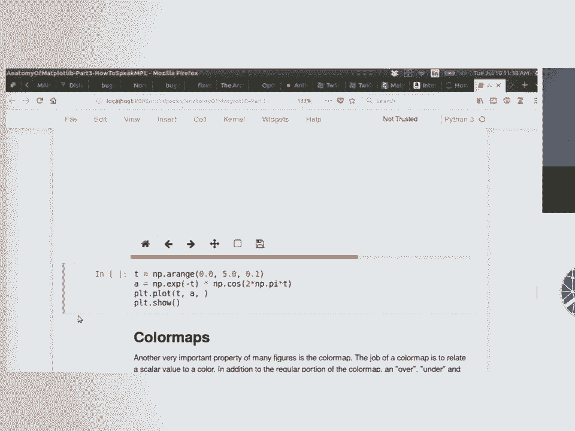

 very important thing in plotting you know we just talked about how to deal with。

 the 1D you know time series or other type of series type data which you know。

 many of you might be using you know whether you're in finance or you're。

 dealing with temperature data or or whatever or have you but a lot of us also。

 deal with image data in which case you need a color map for it or you might be。

 doing your plot scatter plots and you need to map values to a color for the。

 marker that's what the color maps are for color maps are extremely important to。

 define don't take it lightly because how your brain perceives color and。

 interprets color is very important we do color maps and utilize the color。

 spectrum to denote our data because it actually expands it gives us more。

 gradations be able to understand our data as opposed to just simply doing a。

 simple straight out gray scale from white to black white to black if you if you。

 imagine you know the color spaces like this is really weird shape thing but。

 white the black might be vertical but meanwhile the color spaces actually。

 stretched out a bit horizontally so if you can kind of map a bit through that。

 color space you can actually get more gradations and understand your data at。

 a higher resolution in a sense perceptually that's why we do color maps。

 that's why we have colors before version 2。0 I mentioned this that where was the。

 jet color map there was a fantastic talk at sci-fi 2015 I gave I give the link。

 right here it's through a YouTube video for that it explains why jet is so bad。

 and it also explains and introduces the new default color map called veritas and。

 and apparently comes from the Greek word for green or maybe the Latin word for。

 green I don't remember but the it was known as perceptually uniform and so。

 what it is is that it goes through the color space in such a way that is not。

 that every step through there perceptually your brain is going to see it。

 as the same amount and so you're not going to see gradients that don't。

 actually exist so in jet for example you go from a yellow to red or something。

 like that your brain sees that as a much tighter gradient than let's say moving。

 from blue to green and so in which the jet color map also does and so it's moving。

 through that jet color map you're going to see gradients and you're going to。

 think that things are happening that aren't actually happening and so the。

 choice of color map is very very important if you want people to not die。

 so don't worry too much about this bit of code here I just put it in here it。

 comes from our gallery and it shows off the many many many different color maps。

 that we have and kind of organize them a bit so these are the perceptually。

 uniform sequential color maps that we have the veritas plasma inferno magma。

 they all came we were added in version 1。5 and veritas was made default in version。

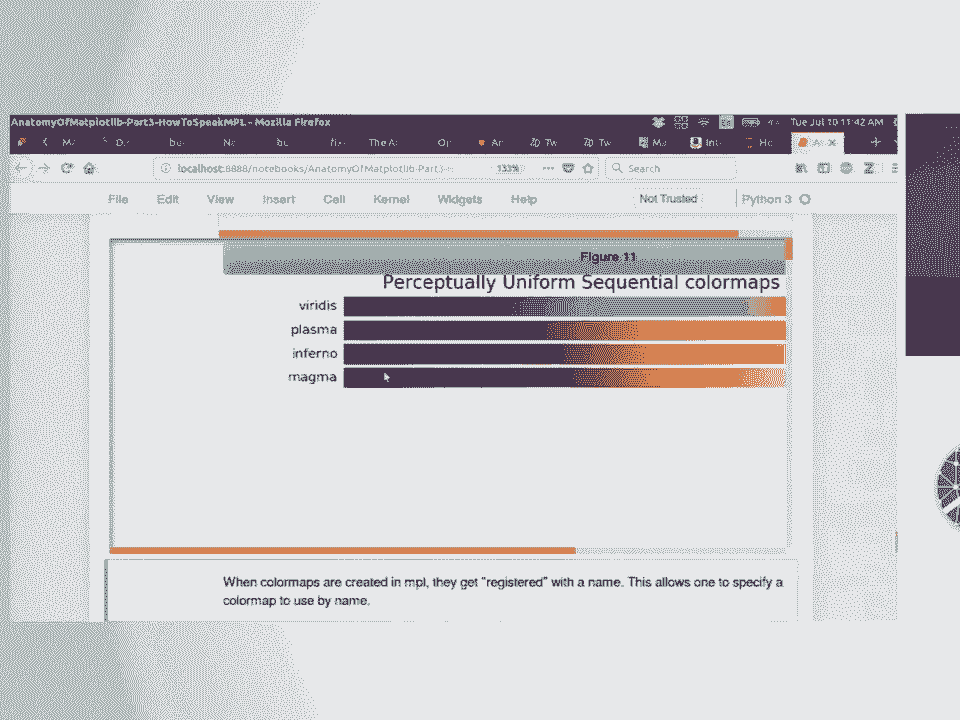

 two we have the sequential color maps so these are the simple monochrome you know。

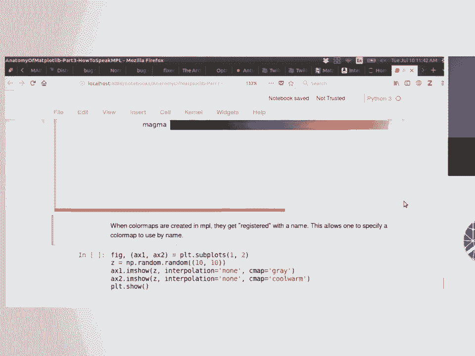

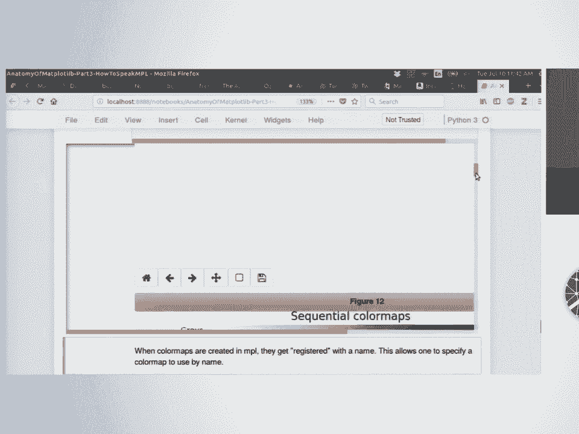

 go from light to dark in a particular color some of these are not monochrome。

 but you know they do orange to red yellow orange red things like that these are。

 not guaranteed to be perceptually uniform but they're very very close to。

 being perceptually uniform by the way these names all match up with names you'll。

 also find a matlab and ideo and stuff like that there's another set of。

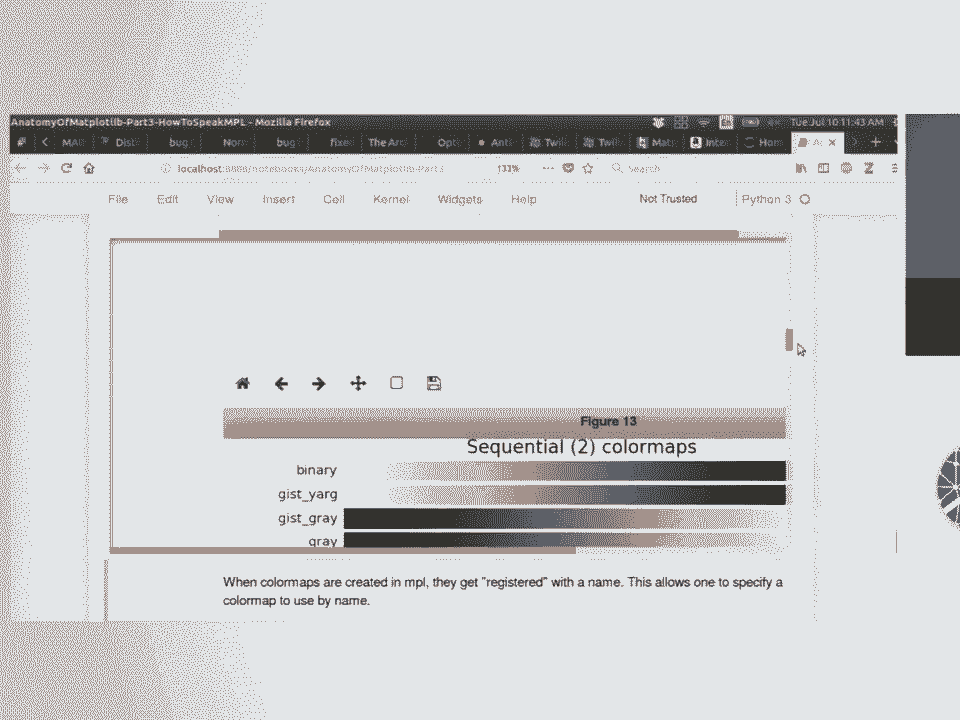

 sequential ones binary is just another gray scale then you have some others and。

 then you have gray that's reverse a binary pink spring summer autumn winter。

 because matlab had it I actually have no clue with stea can I have no clue where。

 that came from copper hot these are all different again these are not guaranteed。

 to be perceptually uniform but they're pretty darn close they weren't designed。

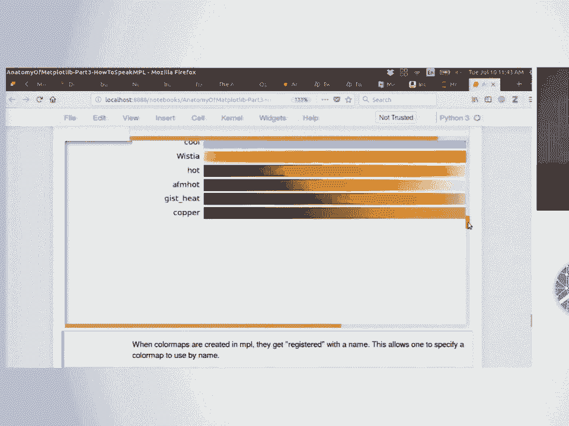

 to be that way divergent color maps these things are great for doing anomaly so。

 values that are negative and positive things like that they're fantastic for。

 doing that and like bwr is I think the brewer ones so comes anyone if anyone。

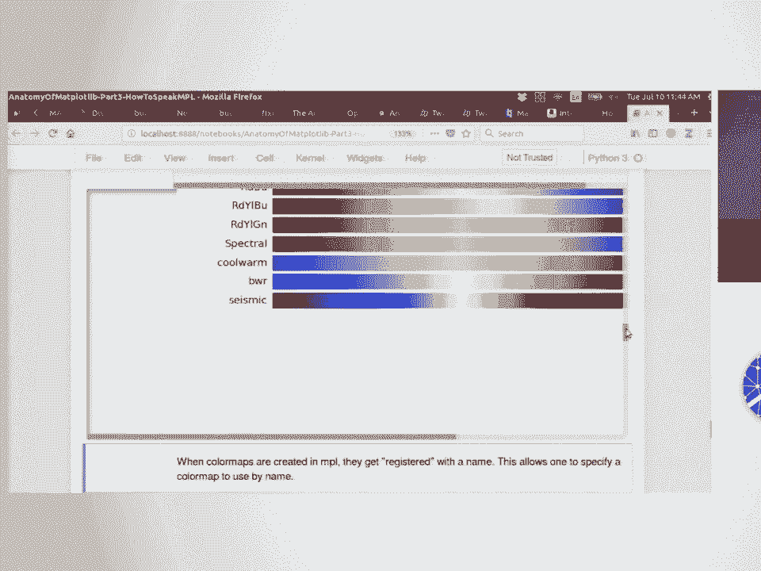

 familiar with the brewer brewer come from a professor dr。 Brewer she did a whole。

 analysis on color analysis so she came up with a bunch of more color maps they're。

 not in matlab we have some qualitative ones these are discrete so various。

 tableau so tap 10 tap 20 so tap 10 means it's there's 10 colors tap 20 means there's。

 20 colors from tableau then you have the bad ones well okay they're not all。

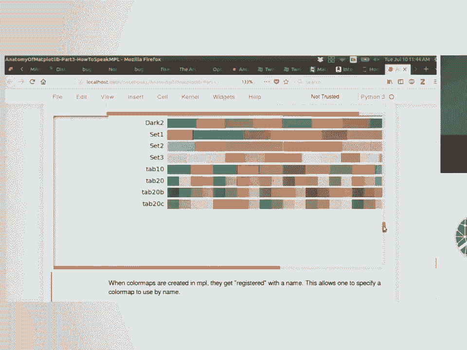

 bad there's just some of them are just different I have no freaking clue what。

 flag is ever meant for it come from matlab I'm gonna blame matlab for that I。

 don't know why anyone ever added flag in there but is there so if you're French。

 or you're American it works great prism again is another terrible one I mean I。

 know these are utterly I don't the only time I ever use prism was when I needed a。

 quick and dirty way to color a whole sequence of polygons and I didn't know。

 where the polygons would be so I wanted I wanted to increase the chance that。

 neighboring ones weren't gonna have the same color it looks like the only time I。

 ever done it so you have your HSV which the hue saturation value just rainbows it。

 and then there's the dreaded jet mind you you know I we rag on jet but just not。

 the only one others are bad too but you see like here you're perceiving these。

 deltas differently so here you think that things are changing a lot more rapidly。

 than it is over here and that's not true so that's just wrong and so you can。

 cause problems that way I'm guilty of using the just NCAR because it's very。

 very close to the official next rag color map for radar images so the radar。

 images that you see on TV that actually derives from the FAA because people people。

 FAA if you're you're allowed to fly in your things that were green so low。

 reflectivity values you're supposed to stay away from the things that we are。

 at least be very cautious and then the things that were read you weren't put the。

 plot by your plane anywhere close to that so that they ended up coming up。

 with something a color map like that and they ended up doing the next rad maps。

 that way and it's terrible you're not supposed to do that but anyway so let's。

 look at the same data but done with two different color maps so it's the same。

 thing so the first one was done using a grayscale but the color one actually a。

 lot more interesting to your eyes it's interesting to see it that way so but。

 mind you one thing to remember when you do publications and you're gonna publish。

 and something that's gonna do grayscale only don't submit a colored image。

 submit it black and white submit it using a grayscale because if they were to。

 convert this image that's here on the left on the right right into black and。

 white they're gonna assume some sort of saturate you're gonna use some sort of。

 black white conversion thing which you're probably gonna look completely wrong so。

 you want it to so basically you're trying to ask it's like the person it's。

 like the map the publication is colorblind and so it's not gonna map correctly so。

 just do it correctly yourself when you submit it。

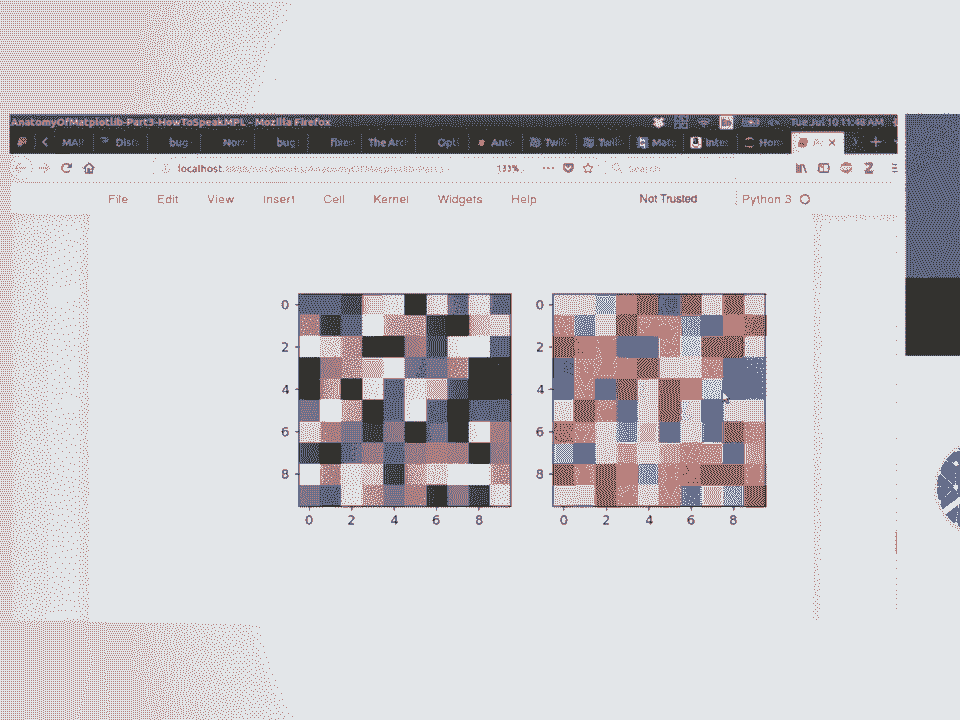

 another fun thing here who here is a latex user or latte you can do many。

 latte in matplotlib so dollar sign backslash sigma i sigma underscore i equals。

 fifteen dollar sign that looks like a little bit of latex to you doesn't it。

 just looks like that little bit of math text that you might be so familiar with。

 the thing to remember in python is that you need this R before the string what。

 it means is tells python to treat this as a raw string because if I didn't do。

 that there is no backslash s and so in python 3。6 and later 3。6 it， warrants you on this after 3。

6 it will actually error and say that if this is， not a valid control sequence the other reason why you want to do that is let's。

 say you did say I take away that R and I do backslash I do new。

 well it you see the dollar sign is up here and then it went down to the next。

 line because it's all the backslash and it's all in a new line rather than and。

 then put it in a U then if you do the R， oh that's the Greek letter new with a subscript of i equal 15 this is gonna be。

 something you're gonna use a lot okay so any any place where you can specify。

 some tax if you do the dollar sign inside of there we will do a basic。

 latex interpretation is our own little built-in parser it's not a real latex。

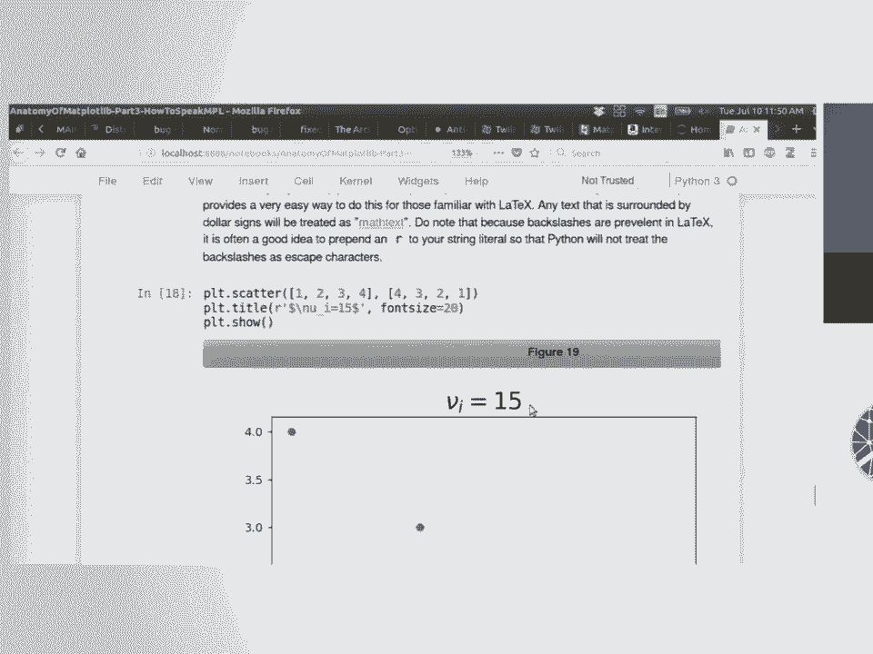

 parser if you wanted to do real latex parsing it's possible to trigger that but。

 at least this will satisfy most of your needs， hatches this is nice this is another thing so we talked about line styles as。

 being the alternative to distinguishing data not using color you know in case。

 you're putting you're publishing in a black and white publication or something。

 like that or you have an audience where in which you know there's gonna be some。

 colorblind people in there hatches is a way to deal with this problem when you're。

 dealing with let's say bar plots and things like that you can hatch instead of。

 color your bars so that then this obvious which one you're doing so we have。

 this whole specification for hatches you can combine the letters to utilize。

 multiple different kinds of hatches you can repeat some of these characters to。

 repeat to increase the density of it so I'll have an example of this in a moment。

 and then we get to what the feature I live property cycles so I added the。

 property cycle feature in version 1。5 before that the only thing you could。

 cycle was color and it was explicitly a thing called the color cycle I got rid。

 of that because I wanted to cycle line styles I wanted to cycle hatches because。

 I was publishing in different places that they weren't publishing colors they。

 wanted it it's definitely I just wanted to be able to cycle the same way as I could。

 with color so I created this thing called the property cycles it's not like the。

 property but brothers it's it's not even a chug I'm really doing terrible so here。

 we're gonna define a property cycle that's gonna cycle through our G and C so red。

 green and cyan and it's gonna cycle through line width of 1 4 and 6 and it's。

 gonna cycle through line styles of a solid a dash dot and a dotted so note。

 three values so I'm gonna have three lines and it's gonna be thin red thicker。

 green even thicker cyan of the different line styles using what's。

 called the cycler objects they're pretty cool so here I'm gonna do three。

 plotting and so each one of these is gonna be if I if I did not define the。

 property cycle it would use the default property cycle so the first one will。

 come out blue the second one would have been green and the third one would have。

 been the second one would have been red the third one would have been green that's。

 the default color cycle and they all would have been solid and they all would have。

 the same line width but now I can define a property cycle and it's gonna iterate。

 through those three properties there we go solid dash dot and dotted in red green。

 and cyan and different line width so and you can do this with hatches for bars and。

 stuff like that it works great so we're gonna do a little bit of a break but also。

 an ugly tie contest so I have provided data in the form of X and Y that forms a。

 shape of what kind of looks like a tie okay trust me on this and then we're。

 gonna call plot dot fill and we're gonna cycle through different colors and。

 different hatches so you see here so red orange cyan yellow okay that makes。

 sense hatches I'm gonna do the X hatches I'm gonna do X X dash so X X dash if you。

 go up here is that you have the across diagonal having two of them means is。

 more dense and then dash it could be horizontal hatching as well and we're。

 gonna have plus and oh and dot and stuff so you can mix and match these。

 different hatch specifications you can repeat them it's up for more density。

 things like that and and what I want you guys to do this we're gonna take a。

 break as well but go ahead and play around with this and you can muck about。

 with these specifications so here I could do a little O and rerun this and。

 look I got little circles now in there and in that first in that red tie but then。

 if yeah I know it's warning me about having so many figures open I know but。

 let's say I increase the number of those the more o's you put in or the more of。

 anything to hire the density of that hatching is so we're gonna take a。

 break so if you feel feisty or whatever go ahead and make some ugly time。

 and then post it on slack on the slack channel and we'll laugh at them or。

 something good they're funny ties hmm fantastic looking to eyes and I see。

 someone here figured out how to increase the number of ties because you can。

 never have too many ugly ties nice， yeah， what happened to that image okay all right。

 whoo-hoo and I see my popularity increased double before it was like 30。

 members of this group when I started so I'm really winning here who I liked that。

 one that that's a good one， that one reminds me like the Sears Tower or something you just okay we got a lot。

 more to do so and a very little time to do it so okay。

 I'm gonna talk about a quick little concept here that's rather complicated。

 I'm gonna preface this with you most likely will not need to deal with this but。

 it's important to know that it exists and this is the thing that makes matplot。

 live work besides the whole back end system we have this transformed system。

 and you may not have thought about this much but when you look at these plots。

 here and I zoom in yes I know there's a bug we're gonna have to talk to the。

 Jupiter people but I zoom in and the size of these things didn't change there's。

 still the same line with there's still space the same way I zoomed in but it's。

 still the same magic meanwhile you know it's still gonna place everything in the。

 right place it's still gonna put things in the right place later you're gonna。

 have an example where there's a legend and no matter where you pan and stuff like。

 that that legend stays in the same place and when I pan around when I pan。

 around my grid you know the numbers all move around for the tick labels but yet。

 other things stay in place it's the transformed system news is whole system。

 where we have this hierarchy of transforms we have the transform for the。

 figure we have the transform for the axes object we have the transform for the。

 data we have a transform and we have inverses of those things as well and and。

 then we also have them as separable transform so some things may so no matter。

 how much I pan around this stuff up and down these x tick labels don't move up。

 and down but they do move side to side and then it's separable for the y tick。

 labels because as I move up and down they move but if I move left to right they。

 don't move it's all part of the transform system it exists and it's for that。

 purpose and so some things you may find that you need to use it in some places。

 most of the time you shouldn't but if you need some things like where you want。

 to be able to zoom in on something and that there's a circle there and you don't。

 want that circle to move you can do that with the transform system you can do。

 various if you want things to behave differently you want them to be placed。

 differently and you want them to behave differently to the interface system。

 there is this whole transform system that you can work with you can define and you。

 can do much more advanced stuff and it's also how。

 this thing is able to do everything is able to do in the first place。

 the other thing we're going to talk about we're not going to get in too much detail。

 but we'll let you know that exists it's called the matplotlib RC it's the whole。

 RC system don't ask me why we call it RC apparently it comes from。

 the name name of some config systems some old program like 30 years ago I。

 I never even heard of it but apparently everyone calls config systems RC for。

 some reason I don't know I'm not old enough for that。

 so so we call this the matplotlib RC there's actually a matplotlib RC file。

 that gets created when you first time use matplotlib and gets put。

 in a place and it's different for different os's to find out where yours is。

 you import matplotlib and you'll print matplotlib。mapplotlib_f name。

 and that will get you the name of your RC file and that's right here。

 and you almost never need to actually edit this thing。

 or you can even have your own copy that has your own entries and these are all。

 the default values that are used so remember how I said。

 you didn't need to specify your line width you didn't need to specify your。

 color cycle you didn't need to specify this or this or that。

 that's because it's all in the RC file you can override any of it。

 and you can even define your own RC file so that way is your default every。

 single time you use it we even have some RC file， package with matplotlib that follow various styles。

 we're also inviting people to submit styles that conform to different。

 publishing house so if you have one that's for， the i。e。 i。e。

 or if you have one that conforms to publication from， a。g。u。

 or things like that read actually would love to have。

 a style sheet that's for that so that way someone could say， you know matplotlib。use。

au and now all your plots you're going to follow the， a。g。u。

 style specification so we'll have the right font so we'll have the right。

 sizes we'll have all the right colors and things like that。

 wouldn't that be wonderful we have this system in place we're still working on。

 making it better but it's the functionality is there and it's through。

 this RC system it's also this function here called， mpl。rc。

defaults what it does is it resets all any changes you've made it。

 resets it back to what it was when it started， so here we're going to do a quick little example i'm going to run this thing a。

 couple couple times that's why i have the RC default。

 i'm going to mess around with the line width and line styles i'm going to mess。

 around and you'll see what will happen， so the line width two line styles dash dot so i first did a plot。

 a regular plot so it's going to use the default， style then i mess around with the RC things and then i did the same exact。

 plot call but to the second axes and it's going to have。

 a different style it's going to look different it's the same plot call。

 i didn't specify line width in here i didn't specify line style。

 but i specified it in the RC you can either do this programmatically within。

 your program or you can have the RC file that's sitting in your home directory。

 or something like that and so it'll be picked up every single time you use it。

 so it's all there ready for you to use we have documentation that explains it a。

 lot more so customizing matplotlib so you can， learn how to do that you can also learn how to。

 invoke your own styles invoke pre-packaged styles that exist as well。

 okay so i'm going to move on here now you know that this thing exists。

 it's something you can really get yourself in the weeds on but it exists。

 and it's there to use okay we got a zoom we got 45 minutes left。

 part four limits legends and layouts oh my， so we've talked about what makes an axes and figure stuff and we talked about。

 that hierarchy you have figures a figure can hold one or more axes。

 and then an axes object or subplot can have multiple。

 axes and you do your drawings and there you can and then we talked about。

 what sort of plotting you can do inside those subplots。

 we talked about how to modify the properties and modify。

 you know colors and line styles we talked about the vocabulary the。

 language of matplotlibs edge colors and line widths and。

 all these sorts of stuff talked about all this stuff。

 there's still a few more things that we have not talked about we have not。

 talked about legends we did color bars which is one way to。

 annotate your stuff but we have legends as well， we also have limits how do you specify your。

 what range your domain and your uh why and x limits should be。

 are there different ways to specifying limits and then how can you lay out。

 your subplots and and weird and funky ways， first we're going to talk about the limits so you may have noticed if we。

 actually did touch on this a little bit earlier where we saw that。

 padding that didn't exist in my example photo， that was because we uh ought to be uh that's basically the auto scaling and the。

 automatic padding that now occurs that wasn't always there。

 in the past so for plots and scatter there is a default margin。

 that we apply so if you don't specify your x and y limits。

 we're one going to figure out what the x and y limits should be based upon the。

 data you've given it two we're going to figure out how much。

 we're going to pad based upon whether or not you did a plotter scatter or if you。

 did an image like a contour or um or an iam show， so in this case here we're going to do a plotter scatter。

 and we had given a bunch of data we noticed we're not going to specify here。

 the x and y limits okay and for those of you might get a little。

 confused this is the automatic unpacking so i'm calling subplots and creating。

 two axes objects or it would have been a numpy array。

 of two elements this would have unpacked it to， two axes objects right there so here my calling x or y limbs。

 is going to figure out for me what those limits should be。

 again it's uh scaling this thing way more than it should but。

 so it figured out what the x and y limits should be。

 and it even padded it a little bit so that way the lines and the dots don't go。

 right up against the edge of our box our plot area。

 why am i pointing at the screen i just realized that you guys can't see my。

 screen you're going to see it up here， i wonder how long i've been doing that um so you have this little bit of gap here。

 so by default we apply a bit of a margin so that way uh do you think don't run up。

 against the edge of your bounding box， uh but and so if you don't specify your x and y limits that's what happens。

 but you can specify you can let's say you still don't want to。

 specify your x and y limits but you know that you want more padding or less。

 padding you can specify what the margins are going to be。

 so here we're going to say we want no margin for x but a 10。

 margin for y for the first axis but the second axis， i want uh across the board 5% both x and y。

 there we go no padding in the x direction for the first axis。

 but there is a 10% padding in the y direction there in that first axis。

 and then as we scroll over here we see 5% padding here so i still did not。

 specify x and y limit that's the beauty of it that this is really great for。

 automation and stuff that you don't need to know ahead of time what the。

 what the x and y limits is you don't have to do， mp。min and mp。

max on the data first we'll figure it all out for you。

 um you can another way of specifying the x and y， limits is through this x。

axis method which i know i'm so sorry it is， confusing this has nothing to do with axis objects。

 which you still don't actually play with so yeah， and yes it is a singular noun to refer both to x and y so。

 yeah um so you can get the x min x max y min y max。

 you can ask for it but then you can also provide it as well， and it will be applied。

 um but most of the time what you'll do is the tight or equal options。

 and what that will do is uh it's basically the aspect ratio。

 uh and and also whether or not it's always going to be tight。

 whether or not the spacing in the x and y are going to be equal。

 i mean not necessarily equal limits but that they would be。

 spaced equals so let's say the x limits go from uh 10 to 100。

 but then the y limits go from 20 to 30 it's going to be a very thin。

 uh thing because it will use up the the y uh axis will use up the same amount of。

 space for those 10 units that the x axis would have done for 10 units。

 over the course of the entire hundred for its range。

 um so i showed that in example so here i'm going to create。

 three subplots i'm going to plot three things， um you know set titles and we're going to show different。

 things are here first one is going to be completely normal。

 the second one is going to be tight the third one is going to be equal， to the equal concept。

 so you got your padding and auto scaling tight， um it actually doesn't really um do that much different now in version 2。

0， it basically was the same thing it's tight doesn't mean that it gets rid of。

 the padding it's uh it's just a little bit different but equal。

 um yeah so here the amount of space it took to do。

 those five units and y it's going to do the same amount here。

 so the distance here for going from negative 15 to 10。

 it's going to be the same it's the distance here， so now the aspect ratio but it's not the aspect that the data。

 aspect is going to be equal and so this is important when you draw a circle。

 and you want their circle to look like a circle， which is funnily enough going to be one of our examples。

 uh uh you can also um let's say um do we have any meteorologists in here。

 atmosphere scientists um oftentimes you know that the bottom of the atmosphere。

 is or or your plot is going to be at height zero， but you don't know what the top level is going to be。

 so you can set one side or the other you don't have to specify。

 both sides of your limits you can specify one or the other。

 so you can say set y-lim bottom equals negative 10。

 set our x-lim at the right 25 you don't you still let the other。

 side of the limit be auto scaled that's totally allowed。

 so i specified that it's going to be the bottom the y limit was going to be 10。

 i'm still pointing at my monitor um so but meanwhile the top of it got。

 auto scaled and auto-limbed but the right and the left。

 uh you know followed exactly what i told it to do。

 so the right the limit or on the second axis the right。

 was defined at 25 but meanwhile the normal padding， happened over here on the left。

 now something that tends to happen it confuses a lot of people。

 is if you best if you do these sort of x and y-limb， specification before you call plot and scatter。

 so when uh in that case uh the x and y limits are going to be。

 figured out based upon the data that you have so far。

 well you haven't given it any data so it's going to be really really confused。

 so here it stopped at the y limit here stopped at zero because that's the。

 default the usual default range is zero to one， and so since you had a negative since you specified a negative 10 the other。

 limit is going to be zero even though your data went up to here。

 by calling set x-limb you have forced it to make a decision。

 and then the same thing happened with the uh with the second plot as well。

 or similar thing i've really got to talk to the Jupiter people。

 so it got all messed up so you got that one marker there。

 it was all cut off and everything because the x limit started at zero。

 because it couldn't figure out how to scale it because you hadn't provided。

 any data legends so this is the other important thing。

 with plots is that you're sure you could put up a graph of something。

 but and sure you can explain to all you want in your caption。

 but really you want a legend there so people can quickly reference。

 okay this thing i see here refers to that this thing i see here refers to that。

 so let's say i do a plot of some data i can label that data。

 so most of the plotting functions you can give a keyword argument of。

 label equals and you can give it some string to be a label。

 so we're going to pretend these are temperature values。

 here and so we're going to say label equal philadelphia。

 and second plot label equal boston and we're going to set our y and x。

 labels here and then we're going to call ax。legion， seems simple enough right see what that does。

 they put a legend right here philadelphia boston， and now you can see what it is they figured it out automatically because。

 you gave it those labels and so the legend when you don't give it any。

 arguments the legends are going to go okay well what data do i have that's been。

 labeled and it will come up with labels for them， and it will build a legend based off of that。

 um by default in version 2。0 and later if you don't。

 specify the location it will pick the best location。

 it will try to put the legend in a place where it does not obscure data。

 but however you can also specify a specific location for it to go。

 so upper right lower left center if you wanted to put it in the center， whatever you can do that。

 and then there's also a specification of best that is now the default。

 so but it used to be not let's say you're plotting something and you。

 don't want it to show up in the legend you can give it a label of。

 underscore no legend underscore this is rare but it's just useful to have。

 because if you don't because if you don't specify a label legend is still。

 going to do something you just give it an empty entry。

 if you really didn't want it to show up then that's how you make it not。

 show up at all so here we have just the bar， foo bar and meanwhile the line plot there did not show up。

 so real quick question on that so so MATLAB had the notion of handles。

 which don't get into that but you would pass in， since these handles these references to the objects are the only the ones that。

 you wanted does does MATLAB lib support that we can。

 yeah in a slightly different way but yes it does and there's documentation。

 explaining there's documentation in the legend in the gallery for it。

 and then there's also these things called proxy artists。

 they're much more complicated but basically it lets you so let's say you have， um。

 uh artists that you you want something to show up a certain way。

 in the legend that doesn't show up you know it is complicated so let's say you。

 want something a different size or something so， things like that it's complicated we're also still working on。

 expanding this so for example one day it would be nice if we can have a legend。

 for scatter plots let's say so that way you could show。

 it would be kind of like a color bar but for the different size markers。

 you know so it kind of used something like that we haven't done that yet there。

 are people who can manually make it but we don't have like a built-in function。

 to do that one day we want to get there but we have to。

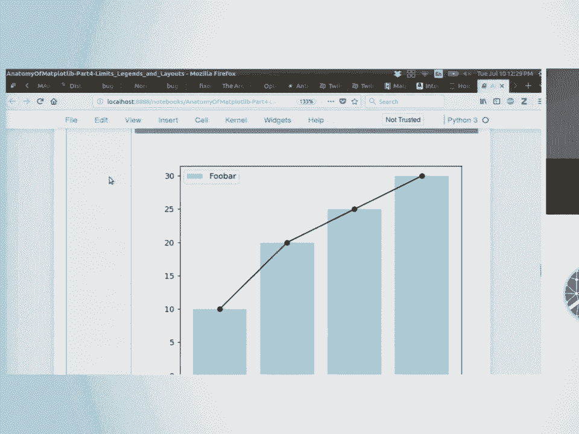

 go work on that a bit okay thanks um i'm going to kind of move through this。

 talk a little bit about that aspect that aspect equal thing so we have data。

 here we want to make sure it looks like a circle we have a legend。

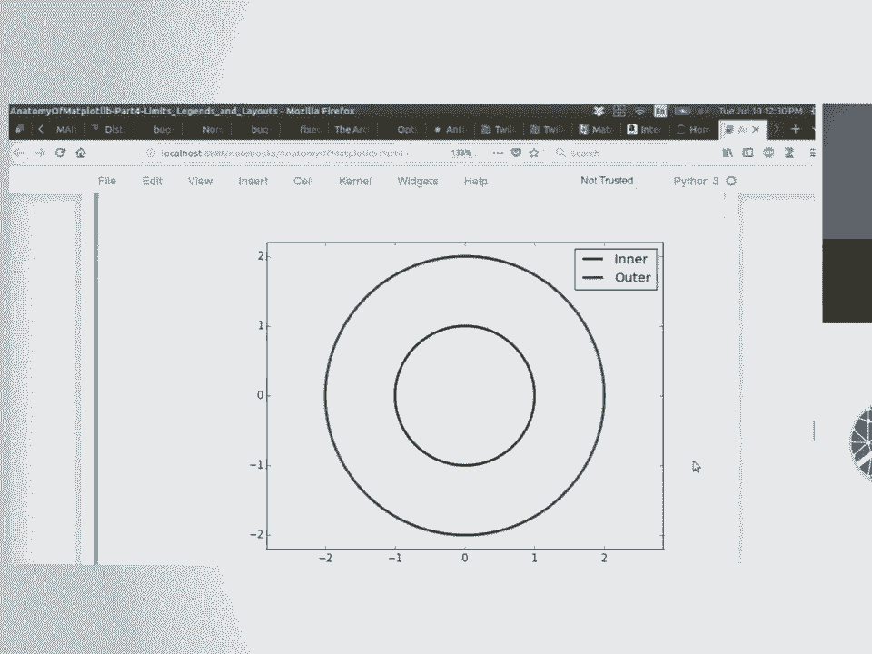

 uh so i'm not going to stop for this example but， we got to make sure we have different circles here。

 so again label inner label outer different line with。

 we said that ax dot axis equal so now it's going to show up as a circle。

 if you didn't do that you'll see what it looks like in a moment。

 see it doesn't look like a circle it looks， skewed but then if you say ax dot axis equal。

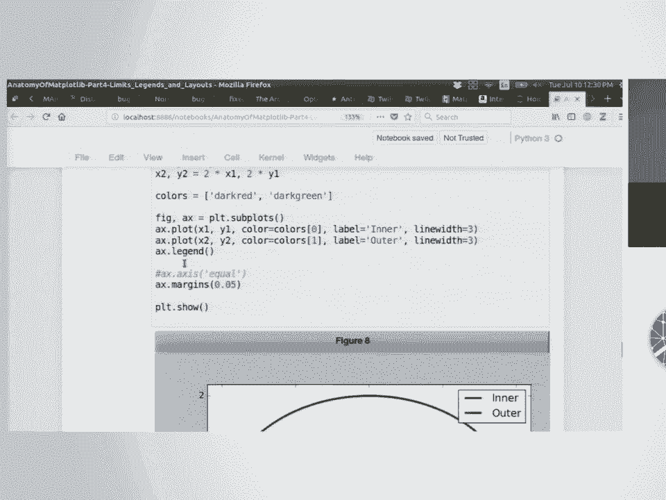

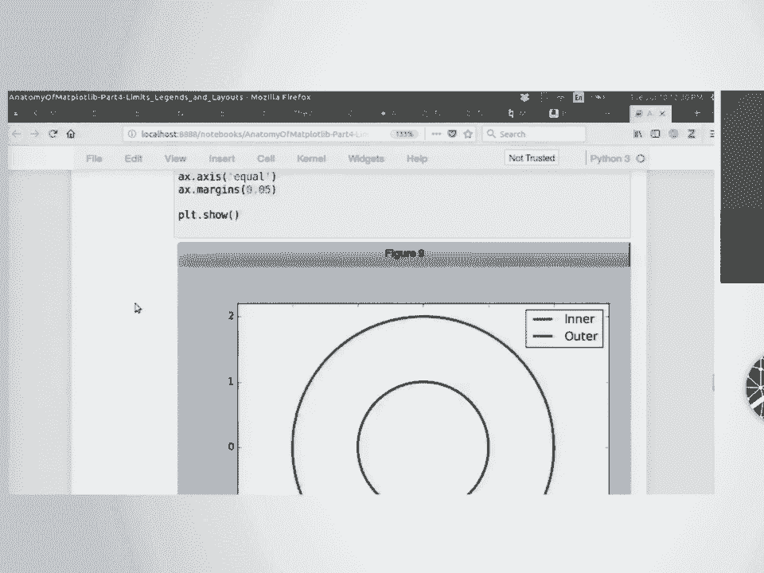

 ta-da they look like a circle because it scaled everything in such a special。

 way now if you went in and specified the x-limits then that overrides that。

 so if you and so that's the philosophy if you use specify that something is going。

 to be a certain way that overrides any of the automatic。

 automatic type stuff so but then if you want to kind of tweak how the。

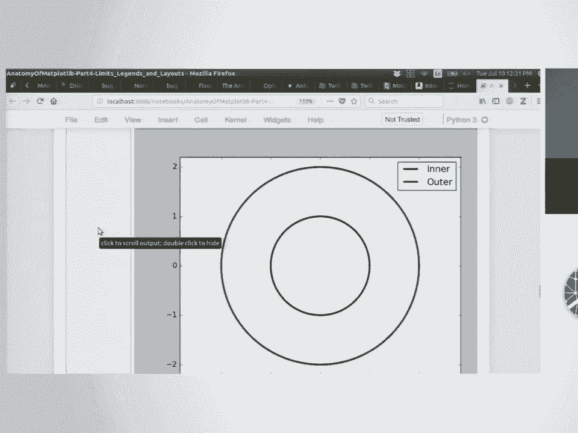

 automatic magic stuff works that's how you would do it。

 this is fun so uh the layouts ticks and spines um。

 you know i'm not talking about bugs and body parts stuff uh。

 so one thing that gets people very confused is what。

 is different what are ticks what are tick lines tick labels and tick gurs。

 okay so a tick is the location in data space of a tick label。

 the tick line is the actual line that you see that displayed so the little。

 mark tick labels the label that goes nearby that tick mark。

 the tick girl is an object that determines， which ticks to do automatically so if you give it。

 um a limit of uh 10 and 20 it's going to decide， i'm going to need a tick at uh i'm just going to pick another 12。

 14 16 and 18 it's going to decide that for you automatically。

 and they'll also do some things where which it can help uh format。

 the uh the ticks uh labels and you can play around with tick。

 params to help configure that oh sometimes you get。

 get really advanced and start playing around directly。

 with uh some of these things this is now they don't know how i kept saying how。

 you'll never play around with the axis object， i don't know if you realize this by now but i do a lot of lying。

 um this would be a situation where yes you do play around with the， axis objects so here ax。x axis。

set this is not too different from， ax。set but there's ax。x axis。

set so you're setting the properties for the x axis。

 object that belong to the axes object so here we're going to say that the ticks。

 the locations in data space it's going to be the range one。

 two three and four we're going to range one through five， late but the labels are going to be three。

 one hundred negative twelve and a string foo， because i can so i understand that distinction so at the locations of one。

 two three and four i'm going to put the labels of three。

 one hundred negative twelve and foo by default the labels are going to be the。

 data values but you can override that and that's what we're doing here we're。

 overriding it the other thing we can do is those， marks for the ticks we can say by default they're uh well they used to be in and。

 now out or the other way around i never remember， you can say that you want the ticks to go in in and out just in just out。

 whatever you can also say how far you want the ticks to go。

 you can say on which axis you want them to be on， so here on the y-axis you have your ticks going。

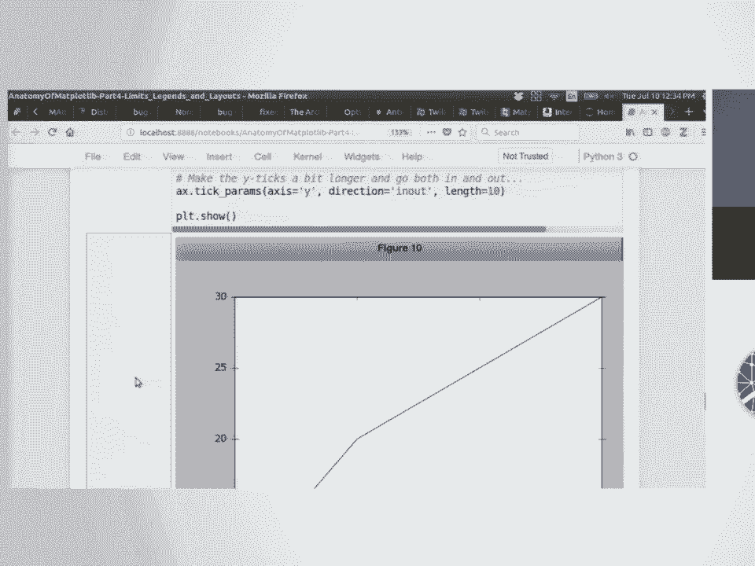

 both ways both in and out and then three， one hundred negative twelve and foo。

 can i ask a question so for that axis you have for the x-axis using one two three。

 four correct the location is so the x limits are still。

 one through four correct on the second line when you set。

 x dot x axis set you specify the ticks and the ticks label。

 tick tick labels right because by default the label would。

 be derived from the data values so if you take off the ticks and the range。

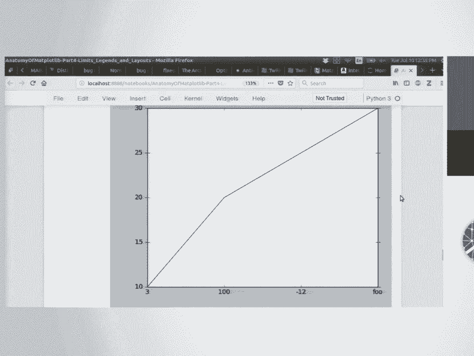

 that you've given it and you just use tick labels。

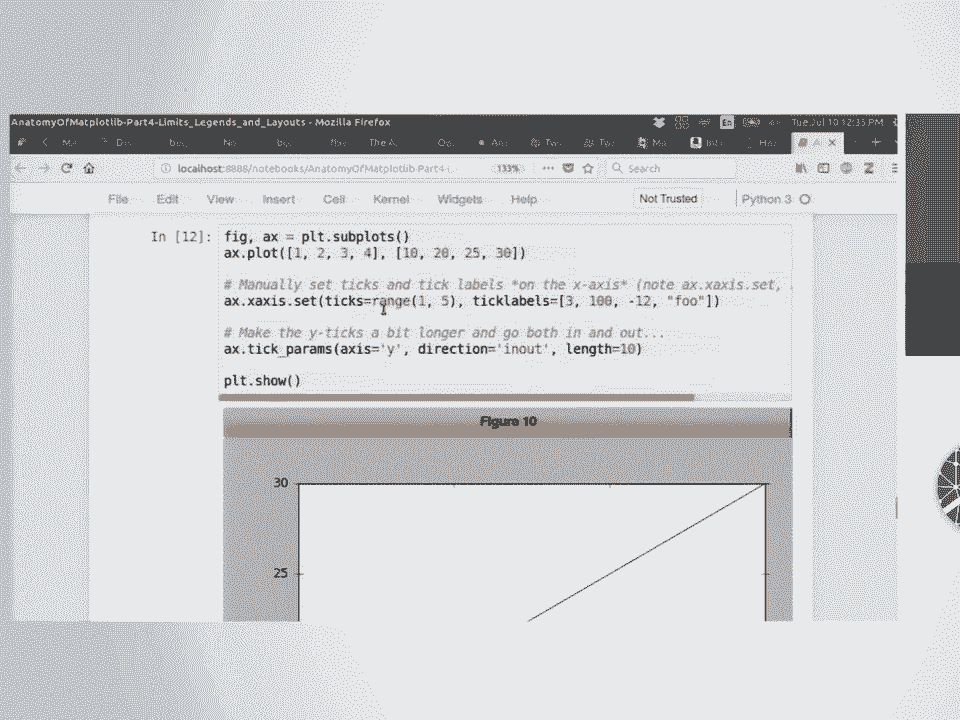

 it squeezes the ticks i would avoid doing i know what you're。

 getting at i would avoid doing it because then there's no guarantee。

 that the ticker will choose the same number of ticks as the list of values。

 that list of labels you gave because it's automated。

 and so if it comes out different than it's probably not going to work。

 so let's say the ticker choose that it's going to do， five ticks but you only gave it three values。

 three tick labels it's going to get confused so in that case you want to。

 control that so you want to specify both， yeah yeah you can get away if you're lucky。

 do you feel lucky do you， um catacoracles um so i have a bunch of lovely fruits。

 okay i have two apples three oranges and one peach。

 so back in the old days at maplet lib you had to do a really。

 awkward way to do this is a lot easier now you literally just plot it the same。

 way you always did but as if it was numerical so don't get confused by this。

 zip here all it is i'm having myself a list of， strings for fruit and a list of integers for value。

 so i'm going to pass in a list of strings for fruit and a list of。

 uh you know integers for how many i'm going to do a bar plot。

 it's going to look nice if you have version 2。0 or higher。

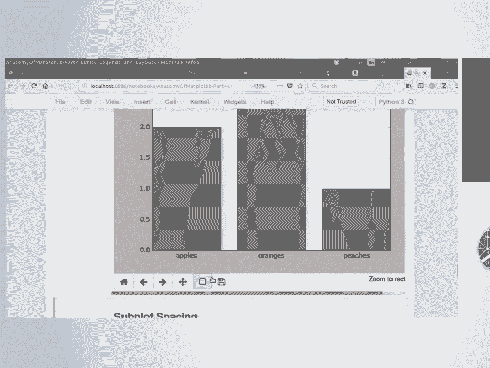

 apples oranges and peaches， when you zip that what the star means and i have used that the star but oh the zip。

 thing um you can so you can think of this here as a 2d array if you will。

 a python 2d array if you do zip star of something it's like doing a transpose。

 and it was really fun if you do it again it puts it back to the way it was it's。

 really cool i like it， all right so spacing in between subplots this is also something important that。

 uh comes out a lot um you can use this uh method for adjusting how much space is。

 in between each of your subplots um by default we have certain default values。

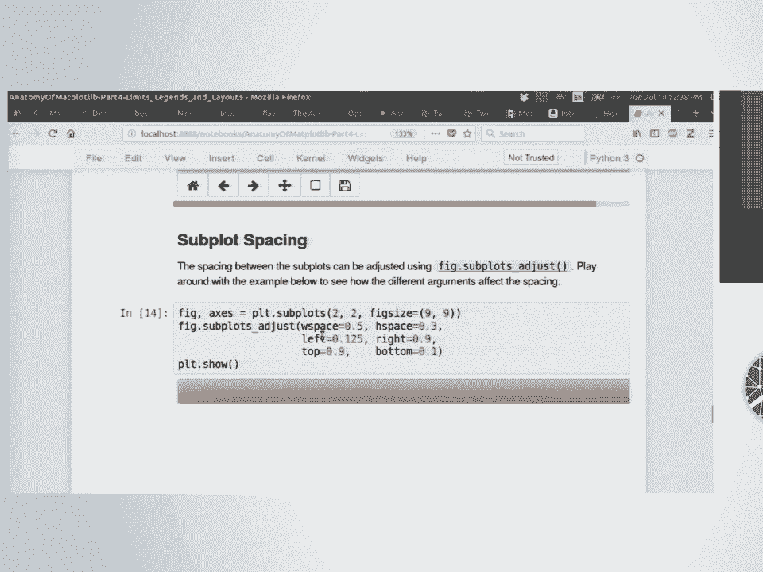

 but you can make increase it or decrease it however you want。

 uh what tends to happen a lot um is that by default let's say you do a 2x2。

 thing and you have your uh title for each one of these。

 subplots what ends up happening a lot is that the title ends up going right on。

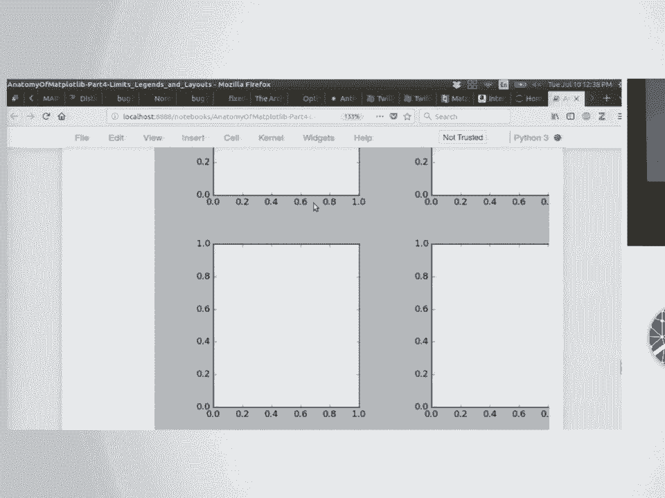

 top of the tick labels for the subplot above or the y label will。

 will kind of blend right into the plot area for the one next to it is。

 just bad sometimes so we have a method that helps。

 um deal with that it's called tight layout you can call big。

 dot tight layout this is a magical thing okay so if you're let's say doing the。

 animation or something like that and you may have things that may change or。

 something like that you shouldn't use tight layout you should explicitly say。

 what the spacing should be but this is useful for。

 i'm just making one plot and i want it to look good。

 so let's let's show you what happens when you don't have tight layout。

 this is how bad things can get sometimes that looks terrible doesn't it。

 all right but this magical little method， ta-da magic。

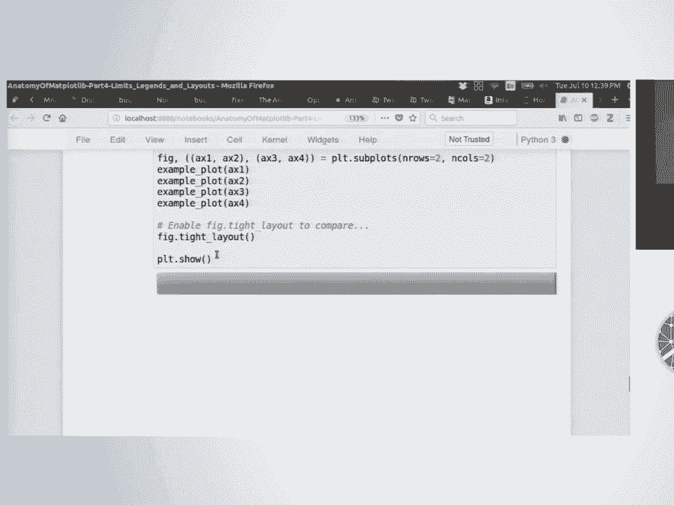

 okay it will automatically adjust things in such a way， so that way things don't overlap okay。

 um let's say you have a more complicated layout so。

 you know these are very simple grids and this satisfies most people。

 needs but let's say let's say you have a need you want two。

 subplots up here and the third subplot to span this distance down here。

 you use grid spec for stuff like that okay and then there's also the uh。

 there's also a few other things uh available in mapplotlib to do that。

 um i'm not going to get into it but you can do it。

 another feature i love is sharing axes especially i do this a lot because i。

 might be viewing multiple images so i might have let's say。

 an image of some processing result from an old version of my code and an image。

 of the processing result from a new version of my code and i'm trying to。

 look and see what the difference is do a qualitative analysis。

 um and so i want to zoom in and pan well i want them both to zoom into the。

 same place i want them both to pan together and move。

 this is what share x and share y is for so now we have here two subplots。

 and i'm going to pan the sucker around see they both move together。

 before without it if you had let's say let's just set。

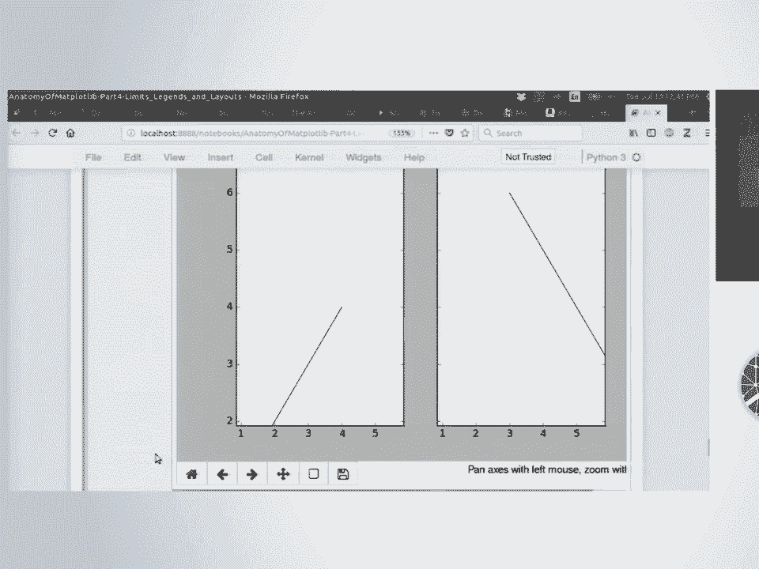

 share x so fault which is the default。

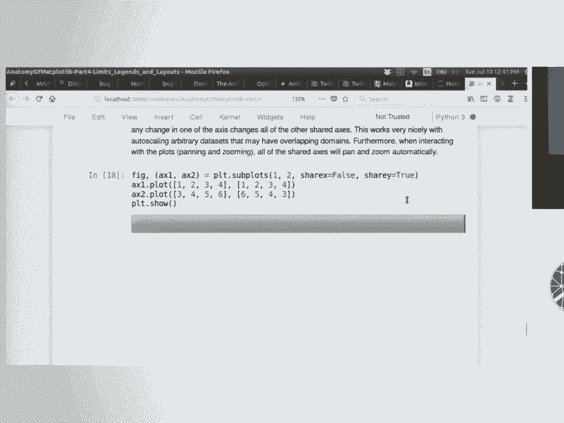

 and if i did that pan， it moved together in the y because i did share y but share x i turned off。

 they're independent so， twinning axes uh this is a lot of people don't know what this is called so。

 they don't know to find this but it's called twinning。

 so i have the normal so the first uh y-axis is here but then the twin。

 axis may have a different scale or might have something different so it's a。

 separate plot but it's put on the same plot area， something some people like to do for some various reasons。

 uh you may want to play around with the axis spines。

 so uh show some examples here uh so this first one is going to be this。

 i'm going to mess around with the spines a bit so i took away。

 the top spines so you see that that black line is now gone。

 usually the black lines on here is now gone， um what else did i do there i uh yeah i set the visible to false。

 but i said that there were uh that the tick positions were going to be。

 that's right yeah so there's no black line and then there's also no tick marks。

 here so that's gone so now let's do， so now i'm going to move the spine so that um that they're away from the plot。

 area by uh ten points， ta-da so now they're not actually on the plot area they're off of the of the plot。

 area you can then also， uh， oops， you can have the spines be intersected at a particular spot in data space。

 this gets into the transforms that we're talking about before。

 you're not doing any transform but you're telling it to use the data space， and now。

 you're moving around your x and y limits and such but。

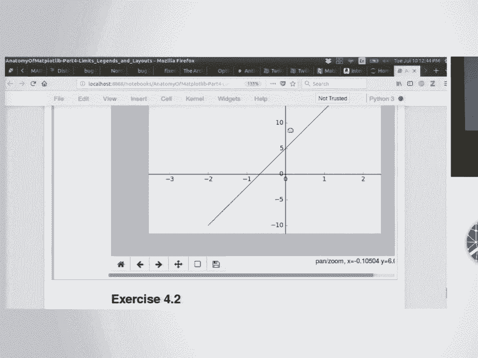

 the spines are staying intersected at zero zero。

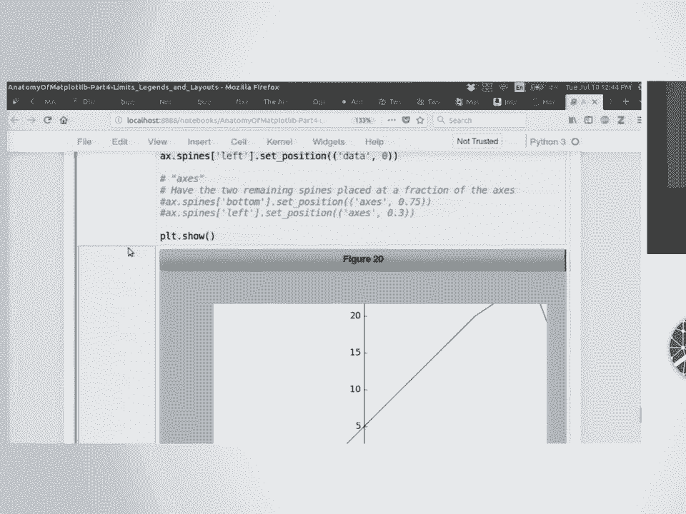

 and then another thing you could do， is to have it set to a fixed spot in the plot area。

 so there i'm saying i wanted some fractional spot in the plot area， and if i then hand around。

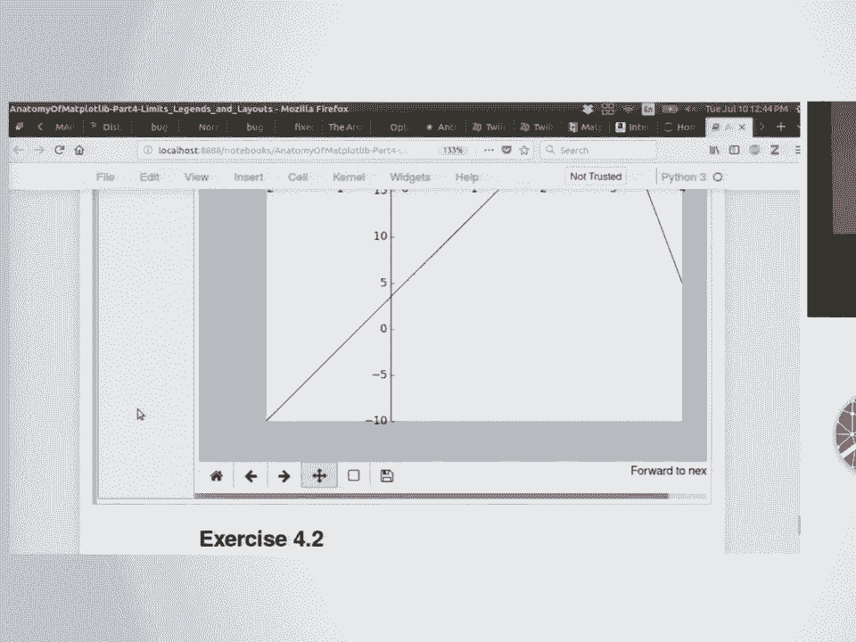

 nifty all right i'm gonna be zooming along here i'm。

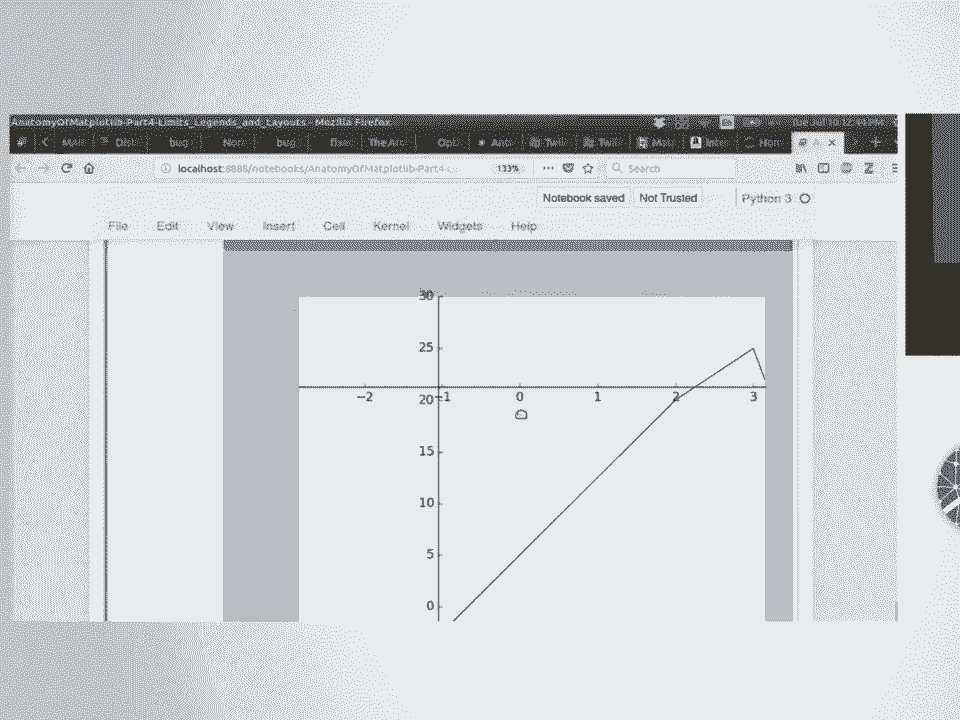

 not gonna worry too much about this but here what i have here are two sub plots。

 but i took away the space i got rid of the spacing in between there。

 so that they would come up right next to each other。

 and then i mucked it out with the spine so that way the x-axis spine showed up。

 here and had the labels put in but then um is all normal down here。

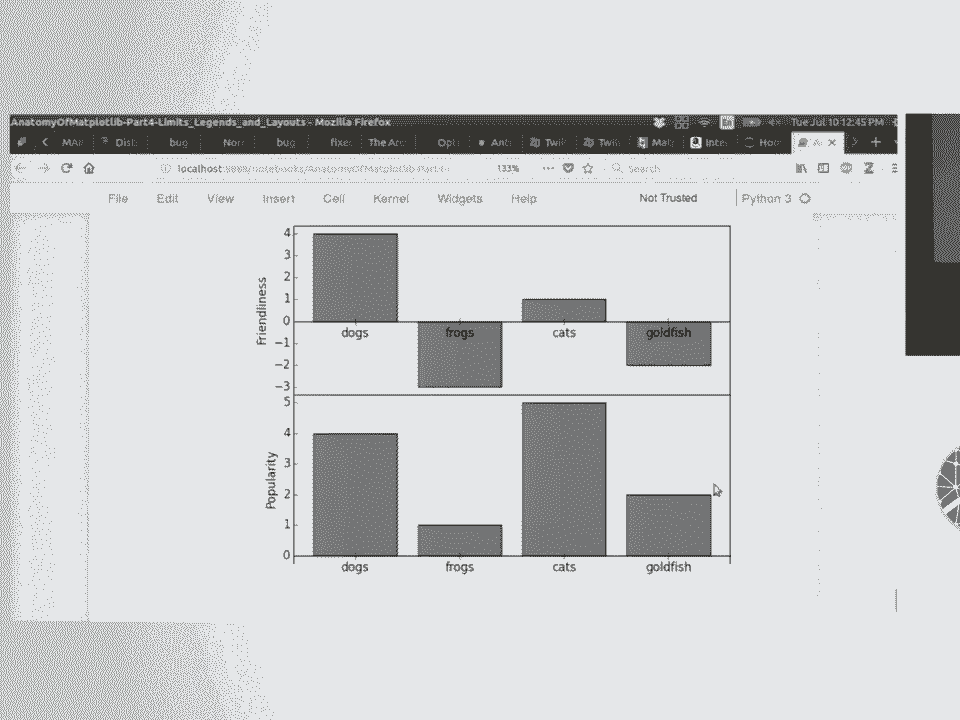

 um again we're not gonna get into this because we got to move on but you can。

 load up that example later in your own uh free time。

 the copious amount of free time that we all have， all right part five artists uh should be pretty straight so we i i've hinted to。

 about artists before it is anything that is visible。

 if you can see it it's an artist all right and so。

 uh artists is is a major underpinning and so don't worry too much about this。

 code but this is just to kind of show you what some of the artists that we have。

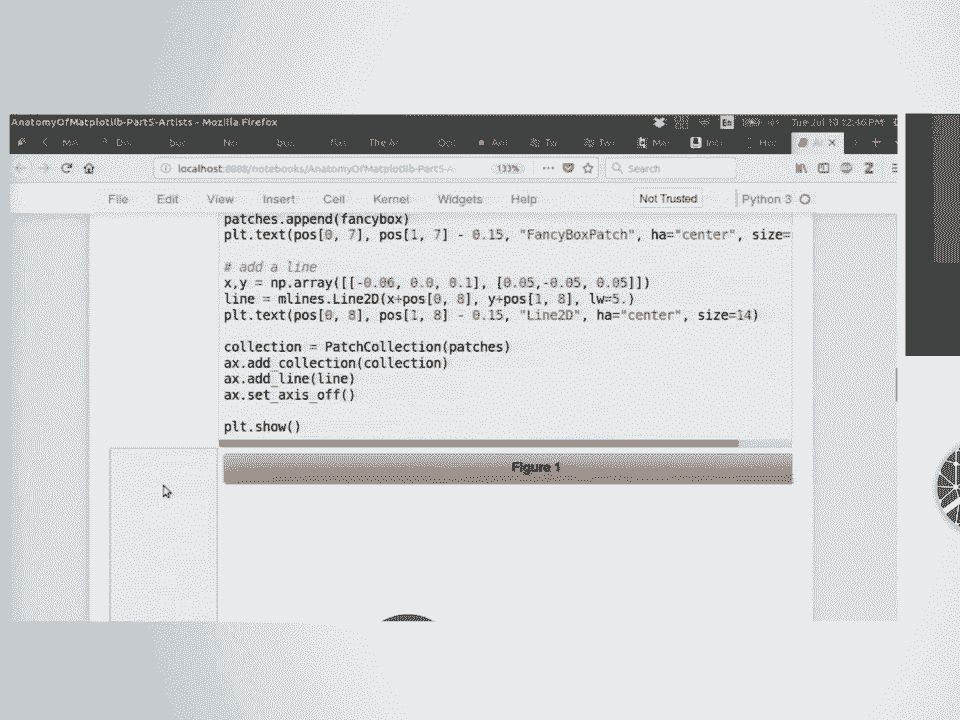

 we have wedges arrows lying through the fancy box patch。

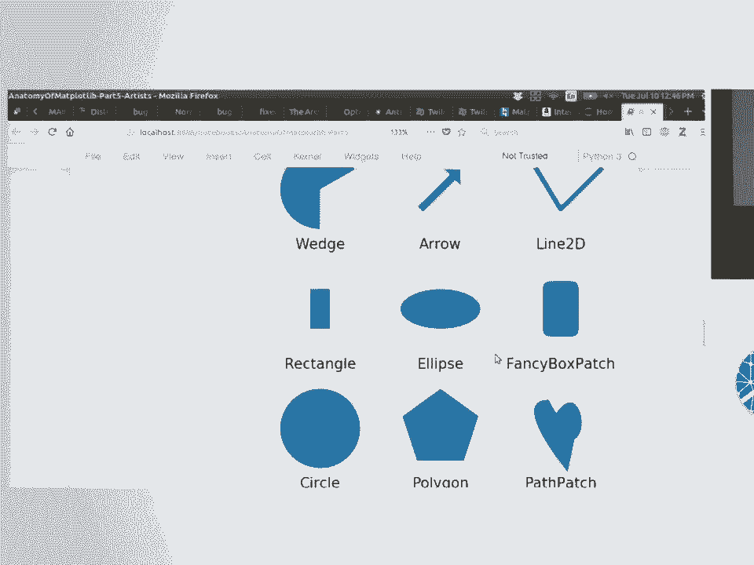

 ellipse rectangle circle polygon path patch we actually have a few others as well。

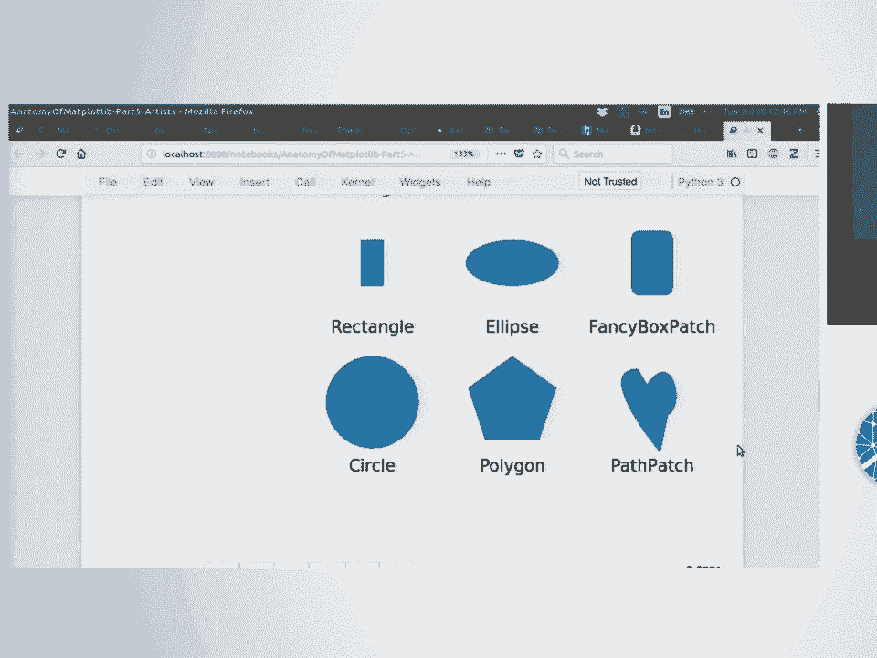

 um these are all available to use these so all the plotting functions you've。

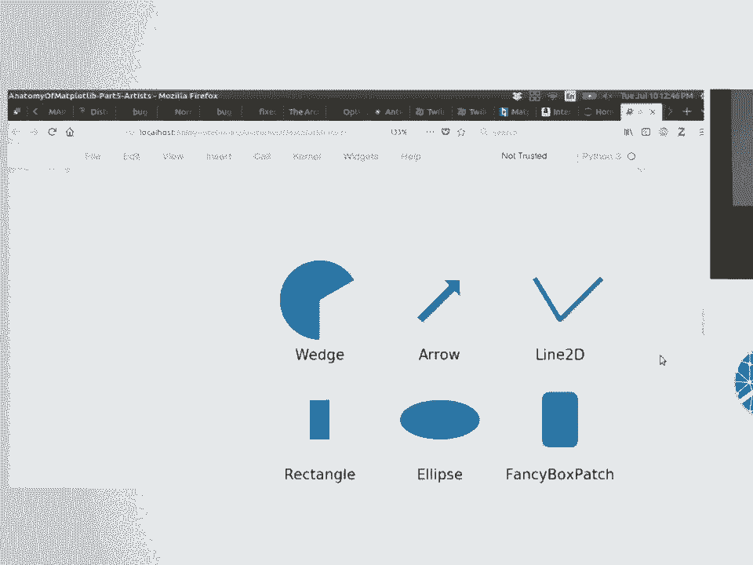

 seen the bar plot scatter things like that they take the data that you provide it。

 and all the properties you specify and it's creating all these artists for you。

 and that's what gets returned by those plotting functions so you can imagine。

 you could create your own plotting function that takes in a bunch of data。

 you instantiate a bunch of artists objects and attach them to the axes。

 that uh that has been specified and well uh you've had your own。

 plotting function just like matte plot lip functions do。

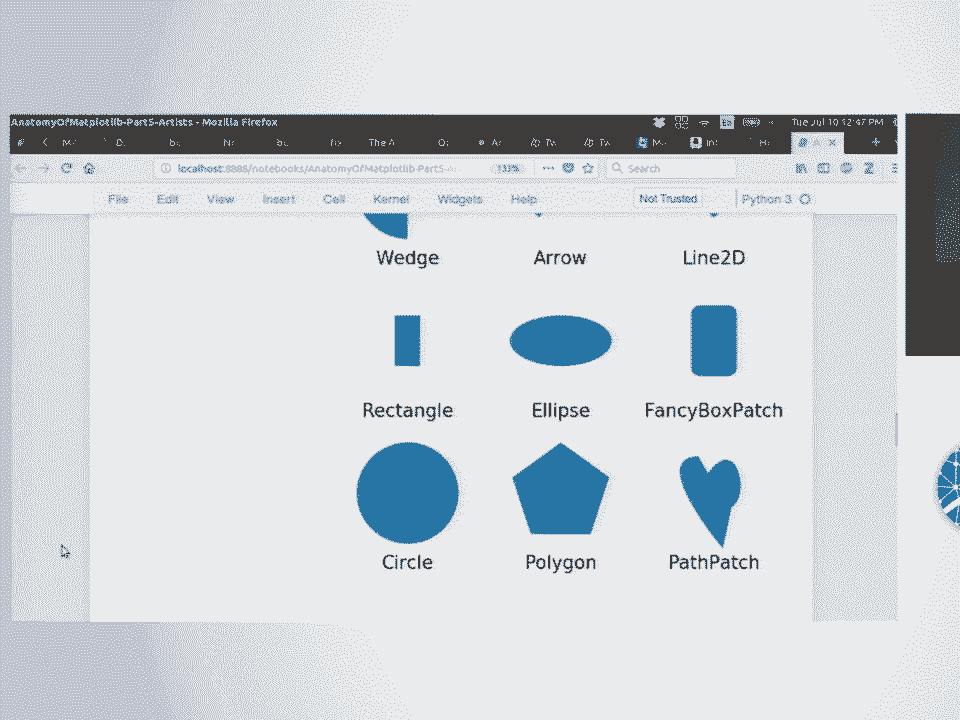

 um and some people do this they come up with these specialized。

 uh plotting functions that maybe they do a bunch of statistical processing。

 first and then display something or whatever so here。

 we we played with this so plot dot plot we get the tuple of lines and we're going。

 to muck with the line with and maybe the alpha this kind of just。

 reminds you of what we've done before we did this earlier with the bar plots。

 where the negative bars where we colored a different way。

 so here you do the same thing with plot you can do things like that。

 you can find out what properties are available to you， with the get p um function。

 so you can see all the different things that are available some of these things。

 you wouldn't actually be playing with yourself but uh do these other things that。

 you can muck about with and change if you wanted to。

 okay so then now i talked about individual artists but then。

 for optimization purposes we talked about that with the plot the。

 difference between plot and scatter and why you would do。

 line style none uh for optimization purposes we have a。

 collection of uh markers that all are the same， or we would have a collection where in which uh they might have different。

 values but we're able to share a bunch of other properties and stuff。

 so a lot of things we have are actually line collections。

 which is just a collection of line 2d object we have patch collections and。

 polygon collections and things like that， um and we're able to muck about with these things so that way you don't。

 have to set all the individual attributes you could just say。

 i want this collection to be red i want this collection to follow the size or， something like that。

 there you go so this is one line collection but it's made of three lines。

 and they all have the same color now and all the same line with。

 now you can some cases in some situations you can specify an individual。

 um a property so in this case here for this line collection you can say。

 i want the first one to be red the second one to be blue and the third one to。

 follow this rgb tuple and i want the line width to be。

 four three and six for the three lines that i have。

 there you go these are esoteric advanced features most of the time you're never。

 going to need it but you know that it exists is is possible to do， um so here uh。

 we're going to do some pentagons here， so you're able to take in a bunch of data and you and you can say i want。

 the date so set off by offsets and then here we have the trans。

 you know you specify the transform it's going to be the。

 data space to treat it all in so that way when you zoom。

 both through the offset the pentagon didn't get any larger。

 but they're in the correct space but meanwhile i could have done it i could。

 have specified a different transform it would have followed something different。

 all right so as a uh reward give yourself four gold stars。

 um so i mean we're wrapping up here there is actually one more part but。

 there's more talking more about the toolkits if you guys uh they're nifty little。

 things you can go and look at it yourself um and you're on free time but if。

 anybody have any questions if you just want to play around with this。

 example uh here feel free but um this is pretty much。

 the entire tutorial so hope you guys enjoyed this i hope you guys have a。

 better understanding of map hot living plotting and i。

 hope you guys uh i wish you all happy publishing， so happy data interpretations all right so you guys want me to do this example。

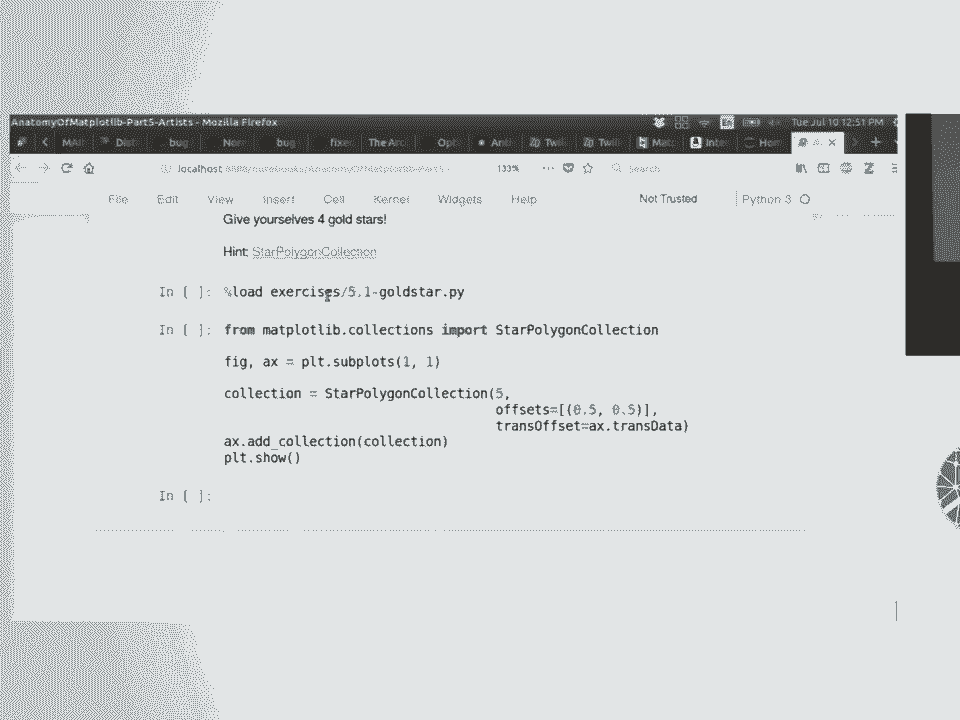

 thank you， (buzzing)。