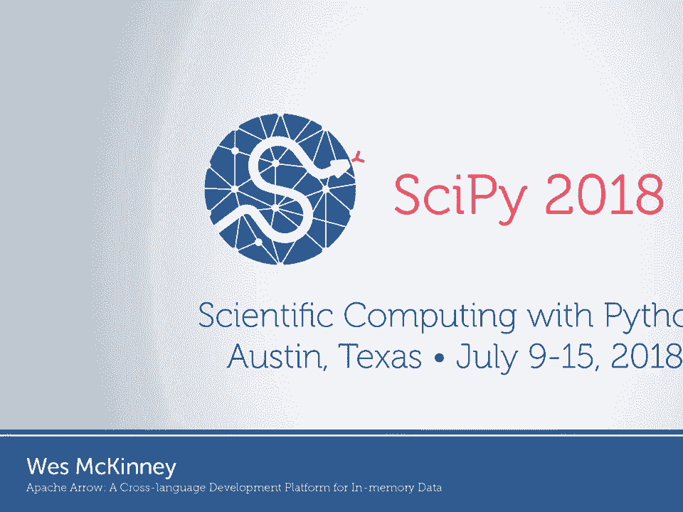
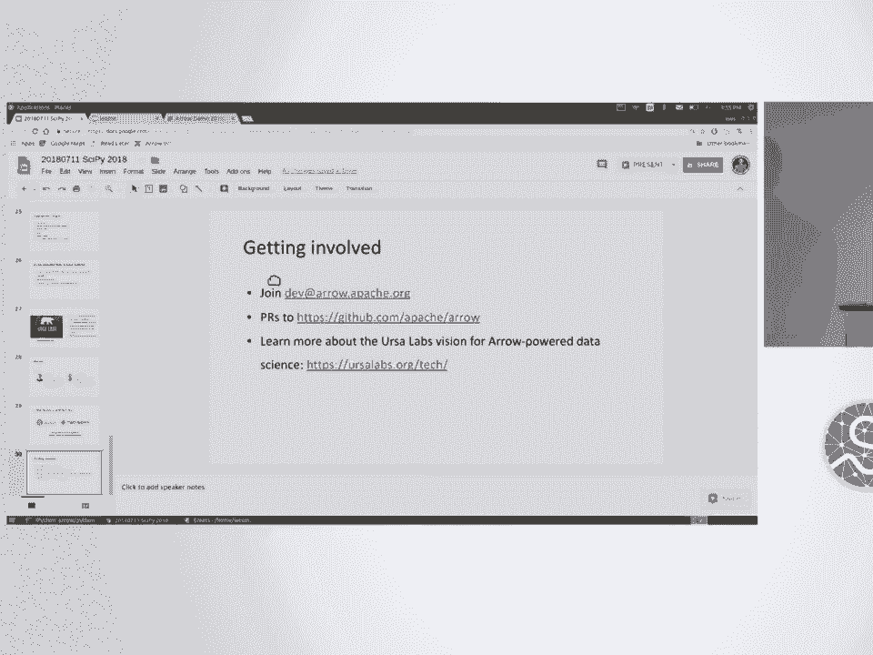
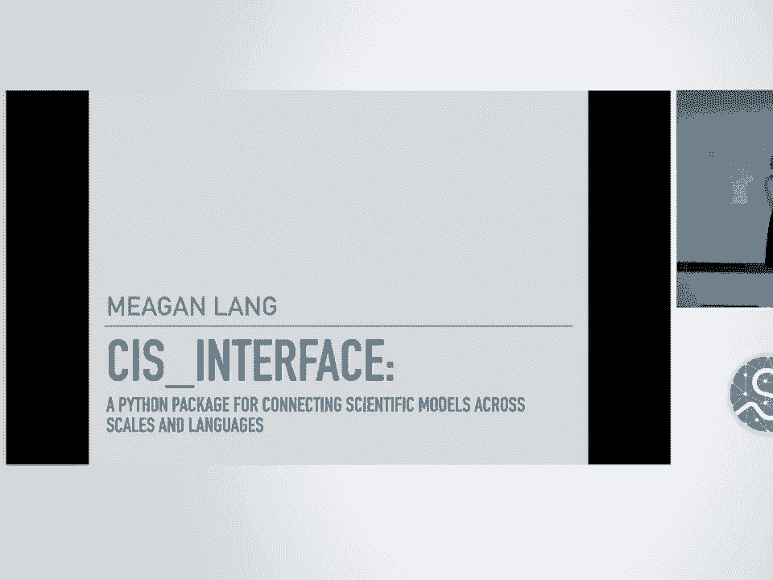

# SciPy 2018视频专辑 - P39：SciPy 2018视频专辑 (P39. Apache Arrow - A Cross-Language Development Platform for in - GalileoHua - BV1TE411n7Ny

 I understand that many of many people in the room know me。

 I've been building software for data analysis in Python for a little over 10 years now。

 It started out as kind of an experiment to see if I could clone some features from R。

 in Python and I kept going down the rabbit hole。 And so here we are。

 In the last five years I've moved on from maintenance work in pandas to -- well， I had。

 a startup for a little while， but after I finished up my startup， I started to look at。

 systems problems that were making -- systems problems that made pandas more difficult to。

 build and systems problems that are making it more difficult for the Python ecosystem to。

 be a first-class citizen in the big data world。 And so my work of the last three。

 three and a half years has been around those themes。

 So this talk is mostly about the idea of open standards。 Why do we want to develop them？

 Why should we use them？ Why are they important？ And you hear about open standards and many of them we use and we take for granted。

 but， in many cases it was a complex and very difficult process that resulted in those open standards。

 existing in the first place and being adopted。 So maybe these reasons are obvious。

 but I often am telling people about this。 So you use open standards in your application to make your architecture simpler so that。

 you do not have another piece of software that you have to design or another interface that。

 you have to design。 In ecosystems that are federated， it can make the ecosystem less fragmented。

 So if two systems have a -- you know， use an open standard， they can make talking to each。

 other a lot simpler。 So that makes systems more interoperable。

 And there is also a code reuse point here that if you use an open standard that other。

 people have used and they write libraries that operate on that standard， you can use。

 their code in many cases。 So having -- being able to reuse code in many cases is one less problem you have to solve。

 So just as an example of an open standard， you know， Jupiter adopted zero MQ at one point。

 in its life and having this standard protocol for systems talking to each other helped to。

 make things a lot simpler。 So here are some open standards you may have heard of。

 Human readable structured data like XML and JSON。 Note that CSV is not an open standard despite what anything anyone might tell you。

 If anyone claims it's an open standard， they're lying。 I really do mean that。

 Sequel is sort of a standard， although every sequel database has a slightly different flavor。

 of sequel and they name their functions differently。 So maybe if we could do sequel over again。

 we would also write down the names of all the， common functions so that you don't have as many deviations from database to database。

 We have many different kinds of ways to store binary data which are used in different parts。

 of scientific computing。 The big data world has developed column oriented storage formats intended for analytics and。

 analysis of log data primarily。 Many different people have created generic serialization protocols for sending binary。

 blogs from system to system。 So examples are protocol buffers from Google。

 So when Google stores logs whenever you type a query into Google， that query and I'm sure。

 all of your activity and where you clicked and where your mouse hover is logged in a bunch。

 of protocol buffers someplace in the Google Cloud。

 Avereaux is another example of this type of system which was developed for the Hadoop ecosystem。

 Practizing on in memory data is another problem that people have worked on。

 So you could argue that the whole reason that we're here and that the whole scientific。

 computing ecosystem in Python exists was because we've united ourselves around the NDRA concept。

 which is also being now called tensors in some communities and that's making some people， angry。

 We have NumPy which implements the Strited NDRA model which in the mid 90s was well known。

 in Fortran and is also in heavy use in the APL community。

 And so if you think about what influenced the design of NumPy， it was Fortran and APL。

 And so we got NumPy and Python as an interpreted way to use those tools。

 And one of the forcing functions in adopting that standard memory layout was to be able。

 to use all of these decades worth of scientific computing algorithms that were written in， Fortran。

 So if you had a different sort of NDRA layout， like memory layout， you wouldn't have been。

 able to reuse the Fortran code to do linear algebra。

 So the things that you get when you standardize your memory format is that you have zero overhead。

 sharing so you can maybe with some pointers swizzling or some metadata conversions you。

 can hand off data between libraries without doing any memory copying。 If you're clever。

 you can arrange to share data without any copying between processes。

 You can reuse algorithms which we've all seen is a good thing。

 Another thing you can do is that systems can reuse each other storage subsystems and。

 IO so if you know how to read data from a file， you can in some cases adapt that code to another。

 application。 So which brings us to talking about data frames and tables and so you might wonder like how。

 did I get interested in this problem in the first place？ Well。

 it is true that Pandas is internally a twisted chimera of NumPy arrays but we over。

 the years have had to develop our own essentially proprietary way of representing data frames。

 using NumPy arrays。 And so even though we use NumPy arrays， you can't， you know。

 the guts like what's inside， a data frame is not intended for you to really look at。

 It's kind of this sausage where you know the more you know about the internals of Pandas。

 data frame， the more horrified you are。 And I know that I am to blame for this and so I can only point the blame at myself but。

 the reason was that we were solving problems in a different domain in the area of in memory。

 analytics and database style computing things that you might do in SQL。

 And so these weren't things that people did in Python in the past and so we had to develop。

 new data structures and new tools to be able to represent the kinds of analytical datasets。

 that appear in the wild。 And if you look across the ecosystem， there are no open standards。

 at least there were， no open standards for tabular data。

 So you know you find the different you know implementations of tables inside SQL databases。

 the big data systems， they have their own memory formats that they've defined。

 You know in Pandas we have our own， our has its own， Julie has its own。

 So there's all these things which semantically we call data frames and they， we call them。

 tables and they you know you write df。column name and you get a column but the way that。

 the bytes are represented in the DRAM in your computer is different。

 So if an R programmer writes an algorithm that runs against an R data frame， I can't take。

 that code and run it against a Pandas data frame except in very rare cases。

 So why do we care about column-oriented data？ So if you look at tabular data and data frames。

 they aren't all column-oriented。 So a lot of SQL databases have row-oriented tables in their run time and they do that。

 for different reasons。 So Postgres for example， Postgres SQL has a row-oriented format。

 I've worked quite a bit with the Impala and Apache Impala project。

 That also has a row-oriented table format。 But there's a lot of benefits。

 there's trade-offs but there are benefits to column-oriented， tables。

 Pandas tries to be column-oriented depending on what the NumPy arrays look like when you。

 give them to Pandas they may or may not be column-oriented。

 But the reason we care about this is if you think about the memory access patterns of。

 running queries， they often look like I want to perform an operation for every element。

 in a column of a data frame or a column of a table。

 Or maybe you have a really wide table and you're performing an operation that only involves。

 a few of the columns。 So the column orientation makes it so that you only need -- so A。

 you only need to visit， the columns that are relevant to your analysis and B。

 when you do access all of the values， in a column， they're all next to each other in memory。

 So this means that whether you're computing on a CPU or a GPU， you are going to have fewer。

 cache misses and so in practice， going from an algorithm that has a lot of cache misses。

 to one that doesn't could mean a factor of 10 or 100 times performance increase in an。

 algorithm even though you might be comparing one linear time algorithm to another。

 So big O doesn't help you， it really comes down to your memory access patterns and all。

 of this has been。 Whenever you have the strides oriented in the wrong way in a NumPy array。

 this can burn， you。 When you arrange data in a contiguous fashion。

 you can also use SIMB instructions assuming， that you pad your data。

 perhaps some padding at the end。 In databases， vectorization is a common technique。

 So if you're writing C code and you say if condition this value， otherwise this other， value。

 so what they will do is they rather than have a branch in the algorithm， they'll。

 evaluate both sides of the branch without an if statement and then merge them in a vector。

 operation at the end。 So by eliminating the branching from the algorithm can make the CPU a great deal more efficient。

 A lot of analytic databases have also employed column oriented compression techniques to。

 be able to represent more data in smaller space and then they write specialized algorithms。

 to compute on column oriented data to get a lot better performance。 So anyway。

 a lot of us had experienced this problem and I'll tell you about how this project。

 got together but the idea of the arrow project at its outset was to define an open standard。

 for column oriented tables， data frames， that's language independent and so the idea is that。

 we'd want to be able to use it in Java and C++ and JavaScript and to have languages be。

 able to move around large amounts of data and perform computations directly on that data。

 without any additional conversions。 So it's not enough to just build a specification for this beast。

 We also need to have libraries and tools to do something useful with it。

 So over the last two and a half years the project has grown into a development platform。

 for building data processing systems。 So if you can think about just schematically like what are we trying to do。

 we all have， these non-portable data frames where we can't reuse data， we can't reuse algorithms。

 we， want to have a standardized way to represent data frames where we can share data and share。

 code。 So stepping back a little bit， if you think about the architecture of pandas or let's say。

 an analytic database， so if you go inside pandas and you root around to say， okay， how。

 is this thing put together？ So at the bottom layer of pandas。

 let's say your goal is to pandas read CSV and then perform。

 a set of computations on that CSV and then maybe make a plot。

 So you're going through this integrated stack of tools where we interact with files， we read。

 CSV files， we convert to our in-memory storage which is the internal representation of a。

 pandas data frame， then we have a computation engine so we have algorithms which know about。

 the way that the memory is arranged inside a pandas data frame and is able to perform。

 things like group by dot column dot sum。 So we've written a huge amount of custom code to under to perform computations on pandas'。

 memory layout。 All of this is tied together through pandas' front-end API which is the Python code that。

 you write。 So whether it's pandas or it's R or it's an analytic database， they're very vertically。

 integrated systems where these components are essentially inseparable。

 So a lot of the internals are from your perspective a black box。

 So if you wanted to reuse code from inside pandas， I will say to you， good luck。

 So these components don't have a public API and having a public API was never the goal。

 So if you wanted your in-memory storage subsystem or your computation engine to have a public， API。

 you would need to make that decision pretty much at the outset because it would。

 affect materially affect the way that you go about your software engineering。

 So our goal in building the ARO project is to essentially deconstruct these vertically。

 integrated stack。 So for the components of the system where we started out with what is our memory format。

 we want that to have a public API。 We want to have computational tools to compute on that format that have a public API and。

 we need to have an I/O and data access layer that is able to produce data in that format。

 Turns out that the front-end we're less concerned with and so the project has remained front-end。

 and agnostic and the intent is that different systems will build different front-ends and。

 that is a good thing。 So here's kind of， you know， anyone likes Vietnamese fa soup。

 This is deconstructed fa， you know， take what you like。

 So it's been about two and a half years since we started the project。

 We started out with a group of about 25 people who were leaders and different open source。

 mostly big data projects。 We established the project。

 We did it in the Apache Software Foundation because many of the people working on the。

 project work for companies that are in direct competition with each other。

 So by doing it in the Apache Foundation， we diffused that problem from the get-go。

 Over the last two and a half years， which is not a lot of time in an open source project。

 we're approaching 200 contributors。 We've made a bunch of releases。

 We have some amount of support in eight programming languages and just in Python， the libraries。

 are being stalled more than 100，000 times per month， which is about a factor of 10 away。

 from what Pandas has but it's still for a young project。 We're doing pretty well。

 Just to give you an example of the really cool stuff that's become possible with this project。

 so Dremio， which is one of a company that has many contributors to Arrow， they've just。

 started developing an LOVM compiler that generates native Arrow functions in C++ but they're using。

 it from Java。 So they have these tables that are in memory in Java and we have an Arrow Java library。

 we， have an Arrow C++ library。 They compile functions with LOVM。

 hand off the data through JNI but without actually copying， the data。

 evaluate the function in C++ using LOVM and then send the data back through the， JNI bridge。

 So the data lives in Java off heat memory and is never copied。

 So this thorny problem of JVM interop between the JVM world and the native code world is。

 essentially solved by the tools that we've developed in this project。 Assuming your data is tabular。

 So I'm about to go a little bit faster since I don't want to run out of miss some of my。

 slides but there's many use cases where Arrow is being used。

 So to use it as a runtime format for analytical query processing is one of our primary objectives。

 You can just use it for data interchange so there's plenty of applications where that's。

 already happening。 We are building some streaming client server messaging system so if you want to send large。

 data sets over the over a network， we're developing tools to enable that to be done as。

 easily as possible。 You can build file formats with it and it's intended to help get access to large data sets。

 on disk。 So if you're interested in the details of the format， you take a look。

 We have a network of native implementations and bindings so bindings in C， Ruby and Python。

 I hope that R is added here soon。 I need to add a bubble for Rust because we now have a Rust library which is pretty cool。

 Being used in a number of different interesting places so if any of you were at the Ray talk。

 earlier， Ray built a shared memory object store which they donated to the Arrow project。

 And that's now being used in a bunch of places so if you can store a collection of tensors。

 or NDRA's in plasma and then read them with zero copy and that's all enabled by the technology。

 we've been building。 There's Arrow on the GPU so last year NVIDIA and a group of startups including Anaconda。

 and Mappd and Grafistry and some others decided to use Arrow to build a GPU data frame so they're。

 building libraries of analytics and tooling to enable zero copy workflows while leaving。

 the data directly on NVIDIA GPUs。 So as an example you can run a SQL query and Mappd。

 get a handle to the data still on the， GPU and get access to it in Numba through CUDA IPC and then run Numba code on it。

 So really very cool just recently the plasma object store got GPU support。

 So we're piling up corporate contributors and open source contributors and that's been really。

 exciting to see a lot of names that we've all heard of so the industry adoption of the。

 project is great and so to see integrations happening in downstream big data projects。

 So we have a lot of work planned to make developers more productive and to expand the。

 surface area of the development platform but a lot of work happening and if you ever， see me。

 if I seem stressed out it's because I'm maintaining a lot of pull requests so。

 if you would like to get involved in the project I would appreciate it。

 We are going to be building libraries of computational functions so there's an LLVM project happening。

 called GANDIVA which may become part of the ARRO project at some point but we're also。

 writing non-LOVM based computational kernels in the project。

 We have a great deal of work to do to build data ingest and access layers so we've spent。

 a lot of time building parquet support so recently anaconda contributed org support which is a。

 different columnar file format to the project but really there's a project called Terbode。

 BC which does ODBC database access directly to ARRO but really we're just scratching the。

 surface of what we need to do to be able to access data in all of the places where it， lives。

 So my goal in all of this is over the horizon of the next 5 to 10 years is to make。

 sure we're laying the foundation for data science systems that are powered by ARRO preferably。

 to have common libraries and common run times which can be used in many different programming。

 languages whether in Julia or R or Python or Ruby or Java so to be able to write the code。

 in one place and use it in many places。 So to help with this you know I've just started。

 an organization called Ursa Labs to build out this ecosystem so I'm raising money to。

 support this work and to hire full-time developers to work with me building open source system。

 software for data science so if you would it be interested in joining this effort as a。

 developer or if you have money burning a hole in your pocket that you would like to contribute。

 to the project please please do let me know it would be much appreciated。 I partnered。

 with RStudio and Mr。 Hadley Wickham of the AR community to make sure that we have a strong。

 alliance happening between the AR community and the Python community。 So my former colleagues。

 at Two Sigma also supporting this project so very grateful for their support and funding。

 of this work。 So this is a big project and I've crammed a huge amount of information into。

 24 minutes but I just wanted to give you you know a flavor of what's going on in this。

 project and if you've seen things on Twitter or if you've seen slide decks or talks that。

 I've given hopefully this gives you maybe some better idea of what this project is about。

 and why I care so much about it。 So I think given how difficult it is to produce open。

 source software the more that we can defragment the ecosystem and work together to build reusable。

 libraries and portable systems it will make all of us a great deal more productive and， successful。

 So thank you。 Okay we have time for one or two quick questions while the next speaker gets set up。

 Okay yep。

 Okay。 Wait quick question for you。 Will you be around the sprints and if people want to get started。

 with the arrow and help you out can they do that then？

 I won't be at the sprints unfortunately but I'm around today and all day tomorrow and。

 part of Friday so if you want to chat just come and find me so I'm not too scary。

 So what's the timeline on the computer interfaces？ Can you say anything about that？ Like right。

 now it's hard to use it from Python right？ Yes so what's in the Python libraries at the moment is primarily interop with pandas and。

 the rest of the Python ecosystem and data access so there's relatively little computation so。

 as far as the timeline I don't know you know it will get built as soon as it gets built。

 and so you know I don't know but I hope soon so the more people that contribute to the。

 project in particular the more people that help maintain it so that I can spend more time。

 coding and less time maintaining I would like to spend more time writing algorithms and。

 less time scrubbing pull requests。 Good luck with that。 Thanks。 [ Laughter ]， [BLANK_AUDIO]。

