# SciPy 2018视频专辑 - P40：SciPy 2018视频专辑 (P40. Around the World in 80 Ways - An Introduction to Working w_ - GalileoHua - BV1TE411n7Ny

 You've made it hopefully to the right room。 This is the Cut by Tutorial。

 And the tutorial is entitled Around the World in 80 Ways。

 And that's a play on the excellent book written by Jules Verne， Around the World in 80 Days。

 And your hosts today are myself， Phileus Elson， and my useful assistant， humble servant。

 Bill Passper， too little。 We're both software engineers at the UK， Metaphys。

 the National Weather Service， for the UK。 We work in the analysis， visualization and data team。

 And for our day job we do lots of carte pi and data type stuff。 So this is right up our street。

 So I've already highlighted the repository with the content。 It's in github。

com/citals/cartified-tutorial。 And I've just spotted， honestly。

 we weren't pushing things like four hours ago or anything。

 So if you have been organized and actually cloned this repository before today。

 you're going to need to pull and get the latest updates。

 So that's basically just a git pull on that repository and it should bring in changes on master。

 Yeah。 Yeah， maybe one o'clock in the morning or maybe five o'clock in the morning。 We're not sure。

 So it's a bit of a blur。 If you're having any issues， there is a Slack channel。

 Neither Bill nor myself have access to that Slack channel while we're presenting。

 But we've got a couple of helpers around the room who will happily do that。 In fact。

 I'm going to point them out。 In this corner we've got Juan， Nunez and Glizzyos。

 who have asked for leap over here to look out。 And I can already see there's a couple of other。

 ringers in the room， like Joris in the background。 If any of you want to just help out。

 kind of contribute， if there's any questions on the Slack channel， that would be really useful。

 Thank you。 Great。 So there's a question from one of our Slack helpers asking how to use Slack。

 I would say ask on Slack， but sort of a problem。 Okay。 So let's get going without further ado。

 So this tutorial really is about giving you some background on Cartify， predominantly。

 But we're not going to shy away from using kind of geospatial terms。

 I'm going to talk you through some of those concepts。

 And I guess Cartify doesn't sit on its own in an island。 It is part of a bigger ecosystem。

 And we want to give you an experience of using those tools， as I say。

 Cartify and friends in a kind of cooperative way。 So that's basically what we're trying to get out of this。

 So， as I say， the repository is there。 GitHub。com/citals/cartify tutorial。

 And for those that have just walked in， if you've been organized and pre-cloned this。

 please pull because we've made some recent changes。

 There'll be a couple of handouts coming around for some of the exercises that we do。

 There's a requirements。txt to kind of get all the dependencies installed。

 Can I get a quick show of hands who's already got a working， con-der environment？ Okay。

 that's pretty good。 So it's super useful if you've already done that because it takes quite a while to kind of get。

 download everything and install it。 And if you haven't。

 there are some instructions on the readme of this repository。 And if you get stuck。

 throw it on Slack and hopefully someone can help you out。 Yeah， so that's the channel。

 #cartify on scipy2018。slack。com。 If all goes terrible and you're not able to install on your machine。

 there is also a MyBinder link on the repository。 I'll click on that in fact。 As I say。

 it wasn't recent or anything。

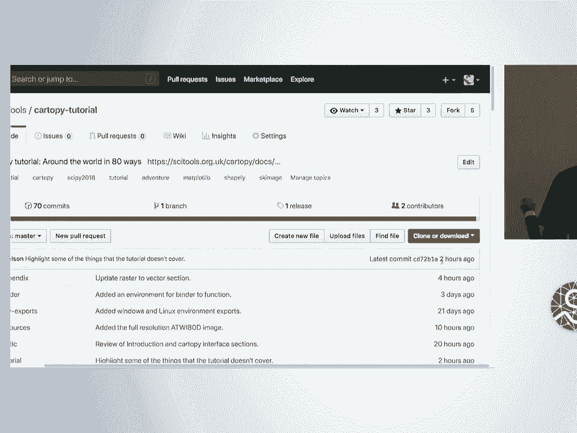

 If you don't have an environment working and it's taking too long or it fails for any reason。

 there is a binder option that you can kind of click on this and get an interactive version of the notebooks online too。

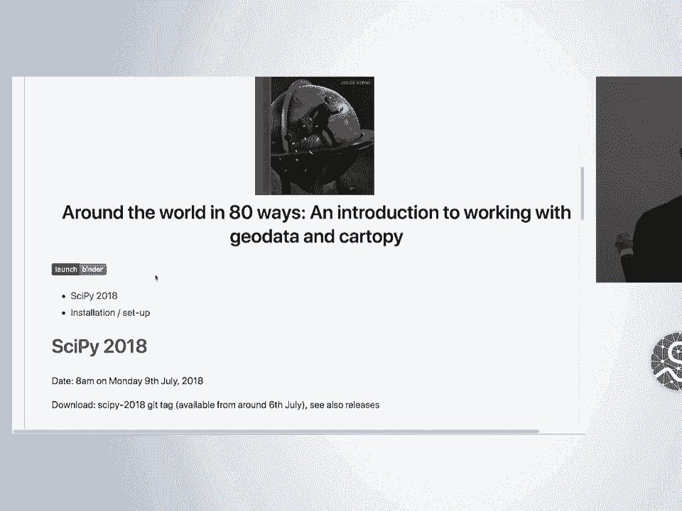

 Okay。 So this is pretty much the outline of what we're going to try and do today。

 We're going to start with some basics about what projections are and not shy away， as to say。

 from using geospatial type words。 Actually， that whole section is pretty much not going to touch Cartify at all。

 It's going to be an interactive learning experience that hopefully will set us up for the next section。

 which is about castify and the map of the interface。

 And then we'll start looking at this is where really castify and friends come in。

 We'll then start looking at how you interact with some of these tools that are part of the wider ecosystem。

 to do quite powerful things。 I guess before we go too much further。

 we should say that neither Bill nor myself are particularly experts at geospatial stuff。

 And in fact， writing this tutorial has been quite an eye-opener。

 even though we were able to kind of write Cartify。 So take that to heart。

 Don't feel like this is some complex thing。 We can hopefully get through it and， yeah。

 we'll all be able to use kind of consistent words and understand what things like projections really are。

 Okay。 That is that。 So there's some background。 I'm going to stop for a second， stop speaking。

 Is everything going okay in terms of installations and getting the materials？ Do we need to？ Okay。

 So this really focuses on map projections more than anything else， if I'm honest。

 We'll use some of the geospatial terms whilst going through that。

 But it should give you a sense of what projections there are and why there are different projections。

 I guess。 So again， the purpose for this really is to help you understand the terms used in Cartify documentation and the wider geospatial literature。

 And just as importantly， given that there are lots of map projections out there。

 to help you get a sense of when a projection might be appropriate for your work。

 And so the question might be appropriate for your particular application。 Okay。

 So I guess we should start with this statement。 The world is not flat。

 despite what some people seem to insist。 And there's lots of ways we can prove it。

 Whereas quite surprised when I looked up Flat Earth and they gave me this picture here which is an azimuthal equidistant projection。

 And the ice wall of Antarctica is what holds us in on this Flat Earth apparently。 Yeah。

 What can you say？ We'll get into some of the details of what this projection actually looks like in a bit。

 But the reason we have to have map projections is because the Earth is not flat。 Unfortunately。

 most of our media is flat。 So paper， screens， they're all pretty two dimensional。

 There are exceptions like a 3D rendering engine or you can buy these globes that have projectors in them。

 that kind of stuff。 But they're pretty niche。 So we need projections。

 And a map projection is a systematic transformation of the last two longitudes of locations from the surface of a sphere or an on to the locations on a plane。

 Great。 But there's a problem with map projections， all map projections。

 And that is that in order to go from the sphere onto a plane， you have to cut somewhere。

 There is no way of not cutting。 And not only that， no matter what you do。

 you're going to distort some properties of the underlying representation。

 So the kinds of distortions we're talking about there。 Area， shape， direction， distance， scale。

 These are kind of fundamental things that we want to be able to represent in our visualizations。

 And yet all projections mess some of these things up。

 So the reason you have to understand what a map projection， when to use a particular map projection。

 is so that you can preserve the things that are important to you。

 I'll give you some examples of when you might want particular preservation properties in a minute。

 So， Philius Elson， the host of this tutorial has coined a quote。

 which I think is going to be massive。 And that quote is， "All map projections are wrong。

 but some are useful。"， By wrong， this means they're going to break some of your metrics。

 So you have to understand that。 So as I say， there are lots of map projections out there。

 And there are a couple of approaches to classifying them。

 so you can actually talk about these things。 And they are essentially by how you form your map projection。

 or you classify based on what metrics they preserve。 Let's start with surface classification。

 So there are three main types of surface classification that map from the sphere onto a plane。

 You can use cylindrical type projections， which the name kind of gives it away。

 It's constructed cylinder and you map the latz and lalons up onto your cylinder。 There's azimuthal。

 which is a plane that you put on top of your sphere and project out， or there's the connect form。

 which I'm not even going to try and describe。 The thing is。

 this is a really nice kind of simple way of separating your types of projections。

 But there's only a small number of projections out there that actually fit nicely into these categories。

 After that， you start having things like pseudosilindrical， pseudosilimuthal。

 or you have all sorts of random things like things that are basically bolted together that are non-of the above。

 So this approach is only kind of so good。 But cylindricals， as I say。

 is basically a cylinder mapping to the latz and lalons。

 And one of the defining features of a cylindrical projection is that meridians and parallels are straight and perpendicular。

 So， as you can see on the map there， your meridians and your parallels are perpendicular and straight。

 And this image is really nice because it gives you some of the other words。

 I'm not even going to use them， but you can rotate the cylinder。

 It doesn't have to be aligned with the poles and you end up with a bleak or if you go entirely rotate 90 degrees。

 you get a transverse。 As a muthal projections， again， there's some words there。 So。

 you've got the polar azimuthal projections。 You've got the pictorial which are planes touching the equator and then a bleak azimuthals aware they're touching somewhere that's not the pole or the equator。

 And some of the interesting properties of azimuthal projections is that the parallels are complete circles。

 And what's kind of interesting about azimuthal 2 is that。

 so there's normally one or two central points on an azimuthal projection。

 And from those central points， all great circles are straight lines。

 Just to be clear what a great circle is， the greatest circle is the shortest distance on the sphere。

 I have a handout in a minute with lots of these words written down。 So。

 if I'm using too many words too quickly， then hopefully that will help。 And finally。

 the conic projection， again， not going to talk too much about it。

 but what's interesting about conic projections or what's kind of iconic about conic projections？

 Sorry。 Meridians are straight lines， so they're not parallel， but they are straight。

 And the parallels are circular arcs and they're not fully circular。 They're just the arcs。

 So that's kind of a very obvious feature of conic projections。

 It's kind of normally results in you having that curve at the very top of the projection and at the very bottom。

 obviously。 So at that， I'm going to hand over to my handsome assistant， Bill Plastis。

 who's going to talk about projections by preserving metric。 OK。

 so we're going to mix things up just to keep a bit of different cadence so you don't fall asleep in your seat。

 But we know that you're probably going to be touchy， you're not writing code just now。

 but we're leading up to kind of interested in exercise， the paper exercise。

 We're going to force you to get up and chat and meet people， but that's a good thing， right？

 So all this nomenclature， that's a double word for me to say， with some jet lag。

 is that we try to build up a common language that we can use later on。 So if things come。

 we know what we're talking about。 First time using the Mac。

 I just found out it scrolls the opposite way for it to be out。

 So if you're saying things are a bit clunky， I'm just going to press buttons so you can just laugh at me。

 OK， so we're going to talk about some of the things that Phil was saying that gets distorted and you've got your sphere and you project on a plane。

 you're going to lose some behavior， whether it's distance， shape， scale， all these types of things。

 And there's names where if you want to， you know your data and you have to think about it。

 let me kind of cool kind of map projection that looks nice and show people。

 but you want to actually represent your data in some way and you want to focus on it in a certain way。

 So you want to preserve some of those behaviors。 So with conformals all about conserving shape。

 you might care about that， the outlines of boundaries of countries or anything that you care about。

 And there's some examples there of Macquarie， transverse Macquarie。

 that actually preserve that shape anywhere on the projection because you care about it。

 But it might be at the compromise of other metrics or other like distance or area， things like that。

 So there's a compromise to be had but you need to be set up wise to what projection you need and when to use it。

 Keep using the cartridge keys， space bar。 Right， so zooming in， zooming out。

 When you zoom in dense for large scale maps， it's preserving shape so you want to preserve the shape of that。

 Maybe the drawback is that the lens scenarios can be distorted and there is。

 you put that in a famous example where Google kind of shot themselves in the foot somewhat where they use the projection that just didn't work。

 So they address that so they choose a projection that wasn't suitable for all areas。

 So you have to be careful what you want to choose。

 It's got to be representative for everybody that want to use that projection。

 Zoomed out so this could be something like Macquarie and it's used for like nautical charts where you're keeping a wrong line。

 your distance and bearing。 It preserves that。 So you have to think about how you want to use that。

 how your shape works。 Equidistance， so as it says it's preserving the distance。

 So if you care about measuring distance between points on your projection。

 then you might pick a equidistant， but it might be compromised as a said of something else。

 So the projections preserving distance between standard points or lines。

 And there's examples that will come across。 And there's an example later on where we're going to look at some projections and you have the guess which is what's preserved。

 what's lost。 Okay， so equal area。 So， talked about shape。

 talked about distance and you match the care about area for whatever reason。

 So there are projections that preserve this and there are a lot of them。 But again。

 you have to pick the ones that you want and hopefully minimize the distortion of the other kind of metrics that are there。

 So it's such a need to have to pick and choose really。 And of course， nothing as Phil said。

 Philius said， it doesn't fit neatly into buckets like that， like just not like that。

 So there are compromises that you can make and there are projections out there that will。

 they might not cover all the bases， but they're good enough to show your data in a way that you can make。

 And you just have to find them and pick them。 So， a lot of words and it's nice and quite visual I like to see what we're talking about and we have the TESOS index tricks。

 which is basically， it's a way in which you can see for projection what is happening。

 what's going on。 How has it been started in terms of distance。

 shape and area and basically you're drawing on projection。

 on your chosen projection circles of circles that are there that can get distorted depending on the projection。

 So here we see that we've got， ah， yes it does。 So with this kind of example you've seen that you've got nice circles here。

 but as you're going up in near the poles and latitudes。

 there's some squishing and stretching of the circle。 So that tells us a lot of information。

 And how does that help？ So going back to the few things， conformal， equal area and equidistance。

 So given that circles in this sphere will remain as circles because they've been preserved to the shape。

 So that's a hint that that projection can be conformal， okay？ Pretty obvious。 Equal area。

 so circles of constant area in this sphere will be， so it could be distorted。

 but you could sort of guess that we might cover the same sort of area by the concerned。

 So they might be stretched， blue to the shape， distance might be lost。

 but the area is roughly the same。 You can kind of judge it by eye。

 And another sort of heuristic that you might want to use is that when you look at Greenland。

 it should be in a racial-14 with Africa。 So if you see it really stretched。

 then you know it's not equal area。 So these are little hints that you're going to have to use later on for coming up to。

 So the distance， these are preserved along the meridians。 So in your projection。

 you'll see a predictive view， look at the meridians and the parallels。

 The distances will be the same， they're not going to be stretched。 Okay。

 that's not a little hint there。 Okay， so this is the fun part。

 This might actually blow up on our faces or it might actually be fantastically good。

 So Phil is going to go round， he's handing out some handouts， obviously。 Basically。

 this is going to be a collaborative effort。 You're going to have to get up and chat to your neighbors because basically you've got the sheet。

 And on the sheet， there is a table。 And on the table， you'll see there's a projection name。

 We talked about things being formal， preserving shape， this equal area， if it's equidistant。

 and the type of classification that it was。 Now， there are eight actual projections labeled A to H。

 Okay， you've probably either got three or maybe four of them。 You've not got all of them。 Okay。

 so what you've got to do is you've got to fill out this table。 So you'll probably got three images。

 but your neighbor might have a different three。 And then the other neighbor's got another different three。

 Okay， so what you've got to do is you've got to figure out。

 fill out the box in terms of is it conformal？ Okay， is it equal area？ Is it equal distance？ Okay。

 and once you've got that， then you can work out for each plot， A， B， C， D， E， F， G， H。

 If it matches up with this， you should be able to write and complete the table and see projection A is more cater or whatever。

 Okay， is that clear？ Any questions？ So you're going to have to chat or hold me on this。

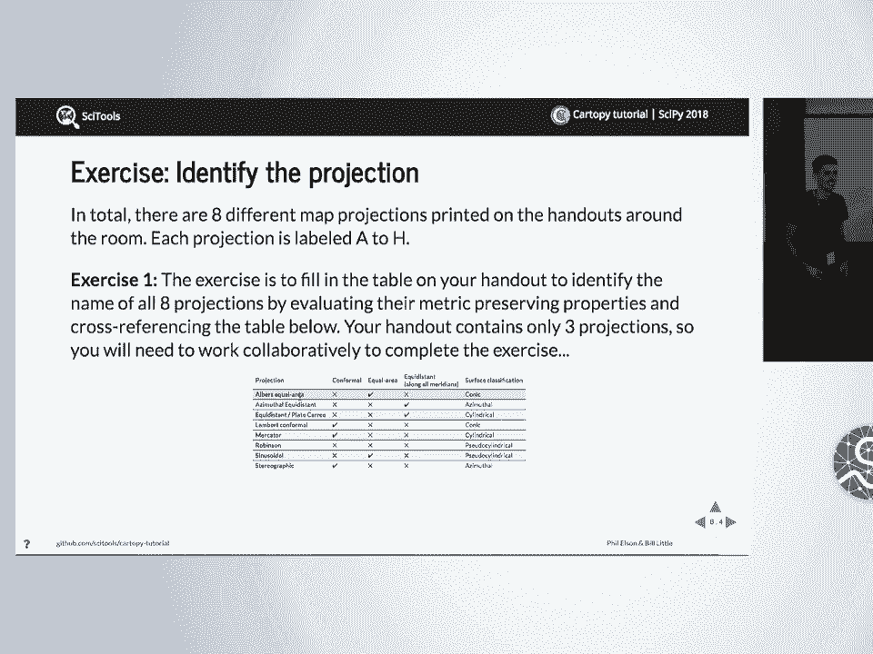

 Okay， so in the interest of kind of giving you all the same information。

 how about we talk through this number A， and then we can build up from there？ How does that sound？

 So， does anyone want to talk us through any of the particular properties of this projection？

 So I guess we want to find out first about whether it's conformal。

 then we'll talk about equal area equidistant and it's tight。

 So is this projection conformal and why？ No， no。 Okay。 Same size。 Okay。

 so someone said no because the circles aren't the same size。 Okay， yeah。

 and has corrected because they're not circles， right？

 So conformal is about whether these are circles or not。 So on the sphere， these are circles。

 but when projected onto this map， they're clearly not。

 We've got an awful lot of stretching going on if I can find a mouse down here。 Okay。

 so quite clearly this projection is not conformal。 Okay。 Everyone happy with that conclusion？

 Equal area。 This is slightly harder and because humans are kind of notoriously bad at determining area。

 So this is why we got this exercise wrong when we were kind of doing it ourselves。

 But this one hopefully is kind of visible。 Are these circles on the sphere represented in an equal area on this map projection？

 Okay， no。 Again， the obvious ones are， you know， we've got this circle here and this great big thing over here。

 Okay， so definitely this projection is not equal area。 Okay， equidistant。 Okay。

 and I'm going to put a condition on equidistant along the meridians。 And I've already had a yes。

 so talk us through it。 Why is it equidistant along the meridians？

 What visual clues have you got there？ Okay， so the distance to the latitudes is the same along the meridian。

 So you're basically looking at the gap between these parallels and it looks roughly the same。

 all the way along this meridian。 Okay， and another meridian。

 the distance is roughly the same all the way along。 Okay， so that's a good indicator。

 Are there any other visual indicators that we could be looking at？ Right angles。

 that's interesting but I think that's a property of conformal more than， equidistant。

 So it's a similar trick。 You can look at the height of the projected circles along the meridian。

 The height of this circle might not look at but is the same as this height。

 which is the same as this height， which is the same as this height。 If you had a ruler。

 you could verify that。 So I agree this projection is equidistant along the meridians。

 So let's try and classify the developable surface， the type of projection that this is。 Any guesses？

 So I've heard cylindrical， that sounds sensible。 What evidence do you have for that？ [ Inaudible ]。

 Okay， the good word there is rectangle， definitely。 And meridians and parallels are straight。

 cross at right angles。 This is without a doubt a cylindrical projection。

 And hopefully if I bring up that tab， if I can actually escape from here， maybe I can。

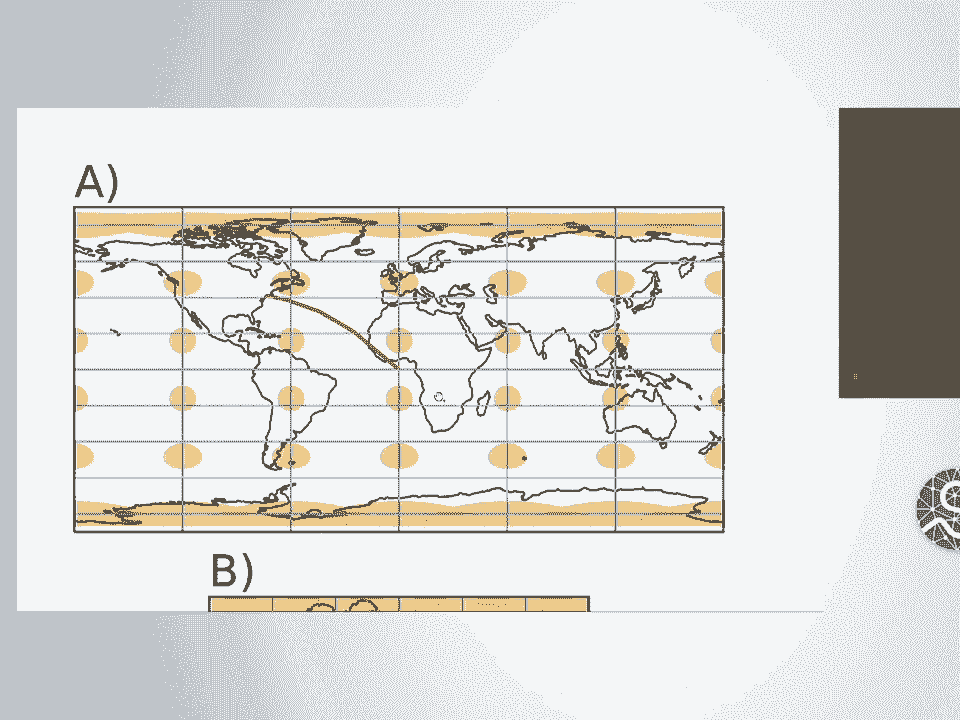

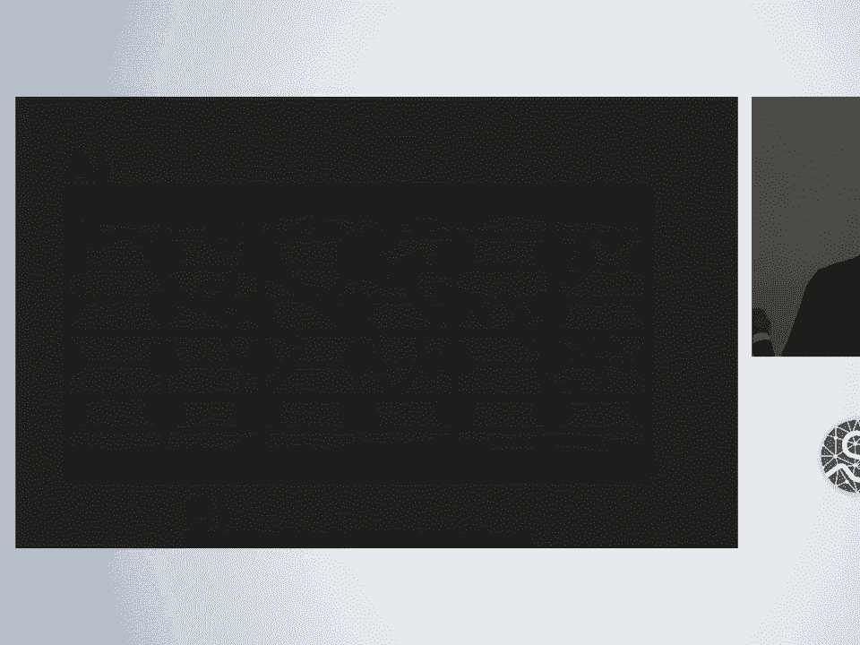

 Hopefully if we cross reference this table， we should be able to see that we said no to conformal。

 no to equal area， yes to equidistant and that it's a cylindrical。 Okay。

 and the no no yes cylindrical turns out to be an equidistant black carry projection。 Okay。

 so you've got now one-eighth of the exercise complete。

 I might talk you through one other projection before we go too much further。 No， I won't。

 I'll let you go too much further。 [ Inaudible ]， If there are any questions。

 just put your hand up and we'll keep coming around。

 But keep going on this exercise and there's still quite a lot to be got out of this。 Okay。

 so there was a natural lull in volume there and I think that's a signal that probably we've kind of done this one enough。

 So let's talk through what you found。 Hopefully you'll have made the same mistakes that we made because we're all human。

 we make mistakes and we'll learn from that。

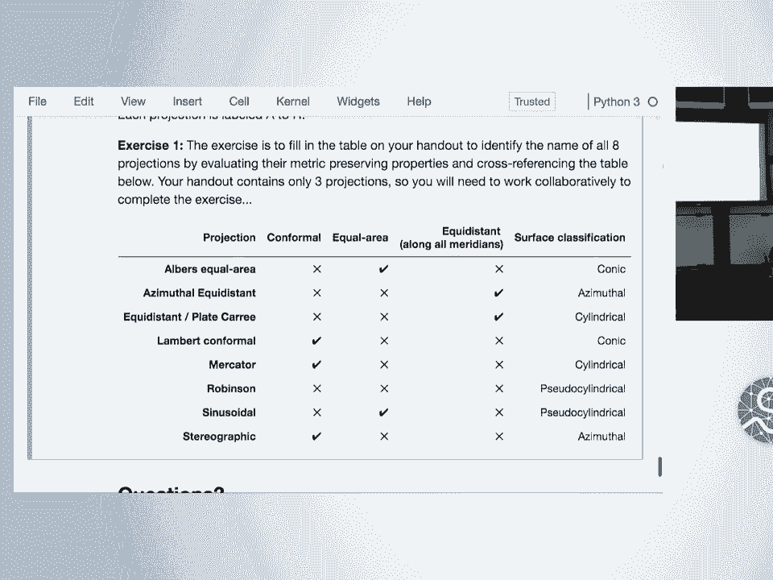

 That's kind of the idea。 So we've looked at A。 So I just wanted to say thank you as well for engaging in that exercise。

 It was great fun to see everyone kind of talking and not using computers。

 I know this is a tech conference and everything but it's about people as much as anything in this conference。

 So B。 Does anyone want to talk us through some of the properties of B？

 There's a suite for anyone who does。 Candy， candy。 Okay， so the suggestions can form。 Excellent。

 I would say it's not equal area given as you say that circle and that circle don't really look that equal area。

 Good， great。 There's a good hint at excellent well spotted。

 Greenland and Africa are definitely not the same size but they look it on this map。 Okay。 Okay。

 and not equidistant because this length and this length are definitely not the same。 Great， okay。

 And what type of prediction do you think this is？ Okay。

 and what clues do you have to say that it's cylindrical？ Okay， yeah。 Yep。

 so the case of projection and that's a very good guess I would say not guess。

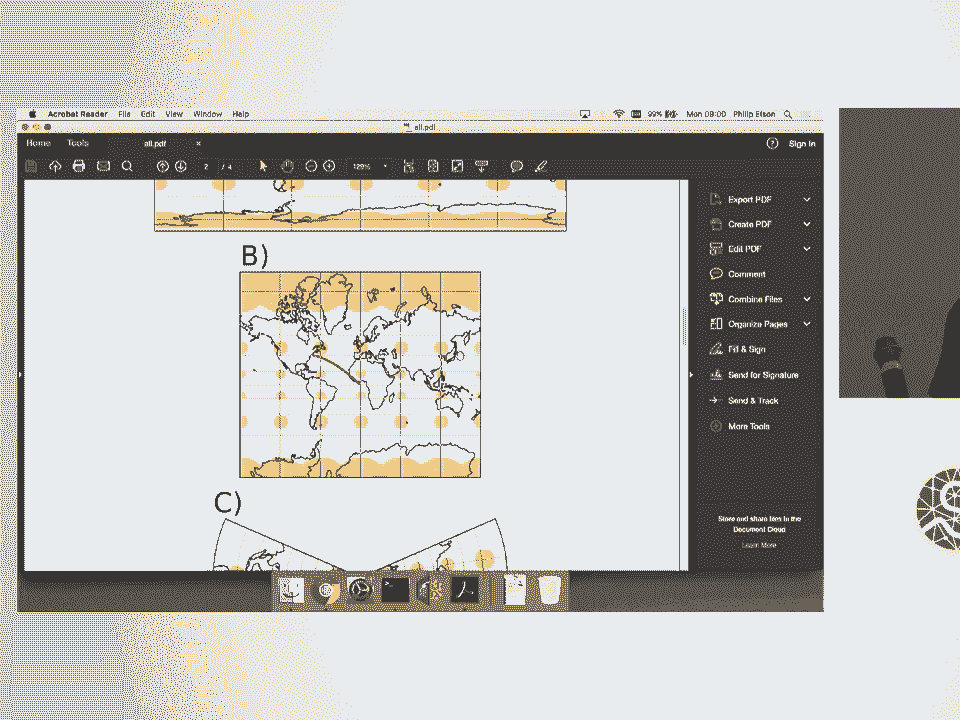

 Well， well in the industry。 So where are we？ Can formal not equal area not equidistant cylindrical it's a macator。

 Great。 And you know， truth to my word candy。 So you can run up all the stairs for everyone so you'll have to come down and get it if you want some candy。

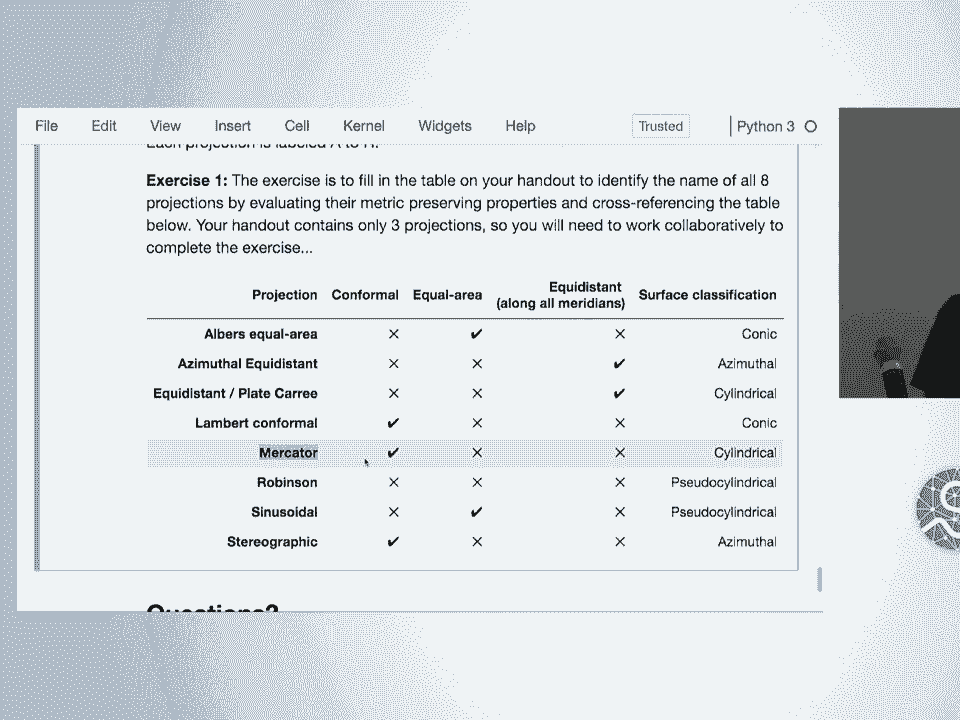

 So next plot if I can not get lost。 Right。 So slightly different。

 Anyone want to talk us through some of the metrics？

 You don't have to talk us through all of them if you don't want to。

 So it's conformal because circles are circles on this map。 Yep， great。 Yep。

 so not equal area that circles definitely smaller than that one。 Okay。

 not equidistant because these lengths are getting bigger and bigger that way。 Okay。

 whatever it is you have to say that it's conic。 Yep。

 It's not full circle or rectangle that's a good way of kind of getting there。

 The other clue is that the parallels are arcs。 Not complete circles but they're arcs。

 And you get that kind of very obvious arcy baseline here。 Right。 It's very arcy。 So great。

 So you said equal area but nothing else and it's conic。

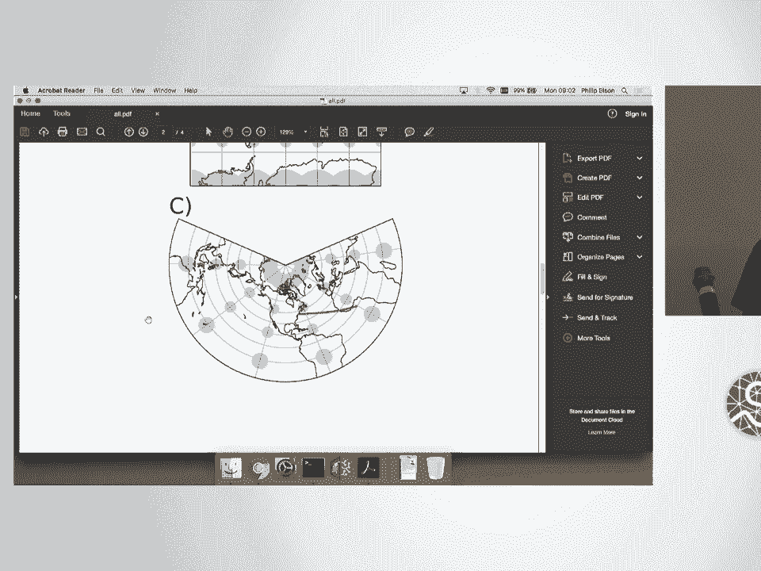

 So what projection did you determine that to be？ Okay， so sorry。 Yes？

 I didn't catch what you said I think。 So we found it basically on the list of direction in the economy with this component。

 Okay。 The same one but I think it's my criticism。 Right。 But you said it wasn't equidistant。

 So it's definitely not equidistant conic。 Okay。 So， okay， let's talk through the lesson。

 So you said it was conformal because the circles were circles。

 You said it wasn't equidistant because we were getting bigger circles。

 You said it wasn't equidistant。 So we're looking for a tick here and crosses elsewhere and a conic。

 Well， the first one here is the conformal not equal area and not equal distance and it's a conic。

 I think that's a good way it's the Lambert conformal projection。 Great。 Thank you。

 Please come and treat yourself to some of the finest candy that AT&T Conference Center can offer。

 [laughter]。

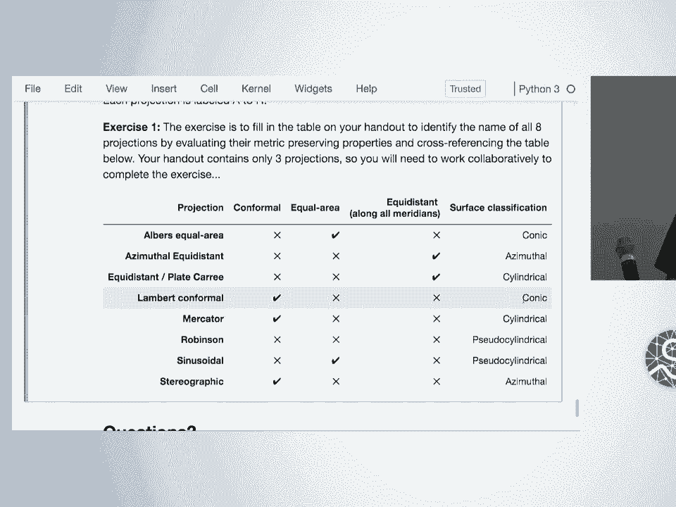

 Okay。 Again， very different projection。 Anyone want to help us through this one？

 The circles aren't circles。 Okay， so it's not conformal。 Okay？ [inaudible]， Okay。

 so they're getting thinner。 So it could very well be equilera。 And as we said before。

 humans are terrible at guessing whether it's equilera or not。 [inaudible]， Okay， yep。

 So this is definitely longer than that length there。 So not equidistant。 [inaudible]。

 So it's a pseudo cylindrical parallel， but meridians become curved。 Yep。

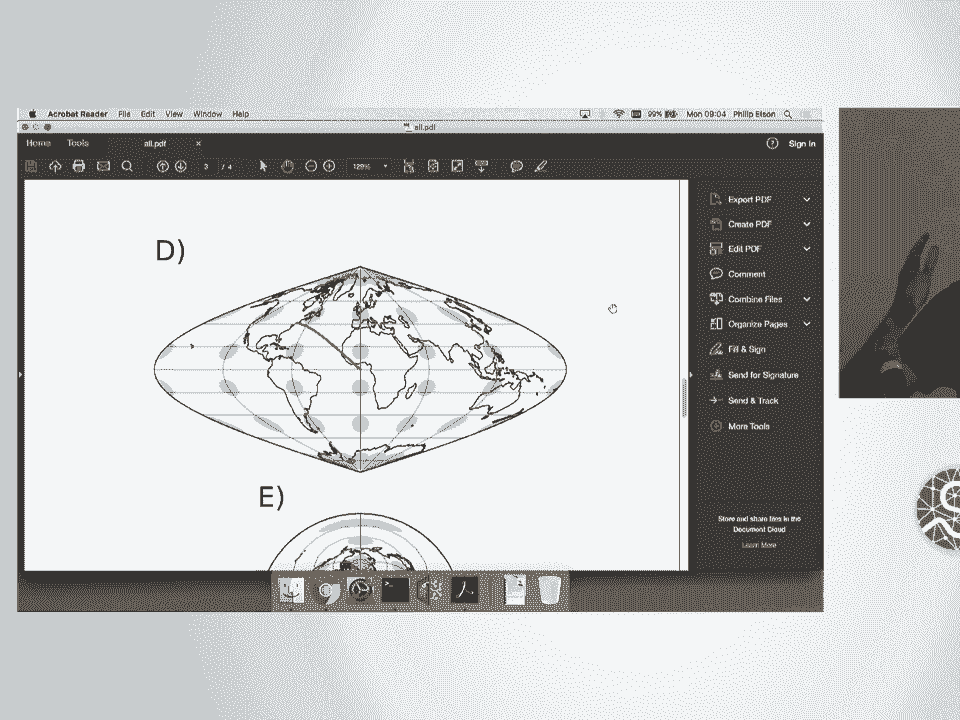

 [inaudible]， Okay， good。 So not conformal， equal area， not equidistant。

 pseudo cylindrical sinusoidal projection。

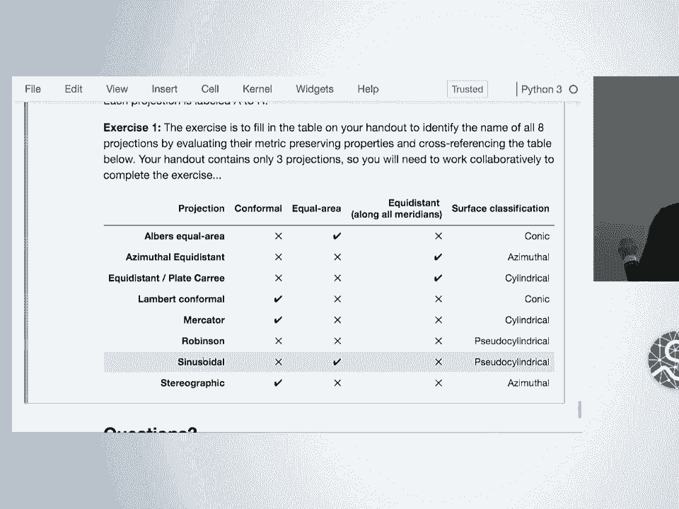

 Great。 More candy。 Okay。 E。 Any volunteers？ Okay。 Yeah， so definitely not conformal。

 That circle is not a circle。 Yeah。 Sorry。 Okay， it doesn't look to be equilera。 I think， yeah。

 that's fair。 Yeah。 So long meridians are saying equidistant。

 So this came up a few times in conversations。 So we're following a single meridian and along that single meridian。

 looking for the distances to be the same。 Okay。 So the size of this。

 that distance there is definitely not the same as that distance there。 You can see my cursor or not。

 But along this meridian， they're all about the same。 So equidistant is a good shout， I'd say。 Yep。

 As a muthl， because we've got complete circles for the meridians。 Yep。 The naming。

 the more obscure we get， the easier the naming gets， right？ So as a muthl。

 equidistant is the name of the projection。 It's also an as a muthl equidistant projection。

 which is great。 Did anyone spot that red line？ Okay， so this red line。

 we didn't really talk you through， is a great circle from last year zero， long to zero， to New York。

 Okay。 And in every other projection we've seen so far， there's been a slight curve to that red line。

 Okay。 Slightly curved here。 Definitely curved there。 Curved here。 Okay。 But thus。

 this as a muthl projection that we've just seen is the first one where it's actually been pretty straight。

 Okay。 And this as a muthl projection is centered at zero zero。

 And all great circles out of zero zero on this map projection are actually straight lines。

 Which is a really nice property in some situations。 Okay。 Okay。 F。 Any？ Yeah。

 The circles are definitely circles。 And yeah。 Can form all？ Yeah。 Not even yet。 Not even glaring。

 I think you're doing with this one。 The suggestion is that it's equidistant。

 But I'm going to zoom in a little bit and try and take a little look at that。 Okay。 So， yeah。

 I think that circle there， if you use the little hand cursor， kind of。 Yeah。

 Definitely that circle there is significantly taller than that circle there。

 And it's on the same route。 So， I think it's not equidistant。 Okay。

 And the classification of that projection。 As a muthl projection， yeah。 Again。

 that same property that we saw last time。 That red line is a straight line。 The great circles。

 Straight。 And as you say there， we've got the complete circles。 Complete。 So。

 The distances on that great circle is zero zero。 The distance of the great circle is not preserved。

 Zero zero zero。 The direction of the great circle is preserved。 The center of the earth。

 if you're at that location。 Yeah。 If you want to know how far is New York City？ Yeah。

 Or how far is it from Antarctic？ Yeah。 You can measure it。 Okay。 You sound very confident。 So。

 I'm going to take you on your word for that。 Because it always blows my mind。 Okay。

 That's good fact。 So， it's at the core of the airport。 Yeah。 Right。 How far are you from？ Right。

 Okay。 It's good knowledge。 I mean， you said no， but from the front of the front of the front of the front of the front。

 You said yes to conformal。 Because the circles were still circles。 So， the name of the projection。

 There we go。 Yeah。 Okay。 Let's try and get through these last few。 So， g。 Okay。 So。

 you went backwards on this one。 So， you knew the name of the projection then。 Yeah。 So。

 you know it's a Robinson。 Yeah。 So， it's not conformal and you can definitely see that。

 That's not a circle。 Okay。 So， you said about equidistant there。 Did anyone get that wrong？

 Because I did。 When I did this one。 Because that looks quite equidistant to me。

 Is everyone else get this right？ Yeah。 They kind of look like it to me。 So。

 the one near the pole here is。 Okay。 Yeah。 That's fair。 I didn't have a good eye for that。

 I'll get this wrong。 So。 But no one else did。 So， that's excellent。 We should come to these guys。

 Yeah。 Yeah。 And you were about to tell us the classification of the surface。 Okay。 Yep。 That's fair。

 Did anyone get more specific than other in the end？ Pseudis cylindrical。 So。

 what properties did you pick out that suggests that this is pseudos cylindrical？ Okay。 So。

 parallels are actually parallel and the meridians are curved。 Yeah。 Okay。 Great。

 He did the same for figuring out this is Robinson。 And then you're like， okay。 So。

 what properties is Robinson？ Yeah。 Yeah。 So， the question can't come and get candies。 Yeah。

 You take two。 Right。 Last one。 Someone is not already been offered candy。 Anyone？ Oh， yeah。

 You should come and get candy。 I'm putting your hand up as well。 Yes， please。 Okay。 Yep。

 Clearly not the formal。 Yep。 Roughly equal area。 So。

 you're stating the equidistant along the meridians。 So， let's just take a look at that。

 Would everyone agree with that？ Yeah。 So， my little hand cursor thing here is roughly the height there。

 And then there's nowhere near the height there。 So， I'm pretty sure that's not equidistant。

 And you can also see that the distance between here and the distance between here are definitely not the same。

 So， yeah。 Not equidistant。 Okay。 So， I'm going to go ahead and put it in。 Yeah。 So。

 a conic projection that's equal area， the Albert， equal area conic projection is right。 Excellent。

 That's exercise。 Thank you for engaging and making that a fun exercise and communicating。

 That was really enjoyable and could have been less enjoyable， definitely。

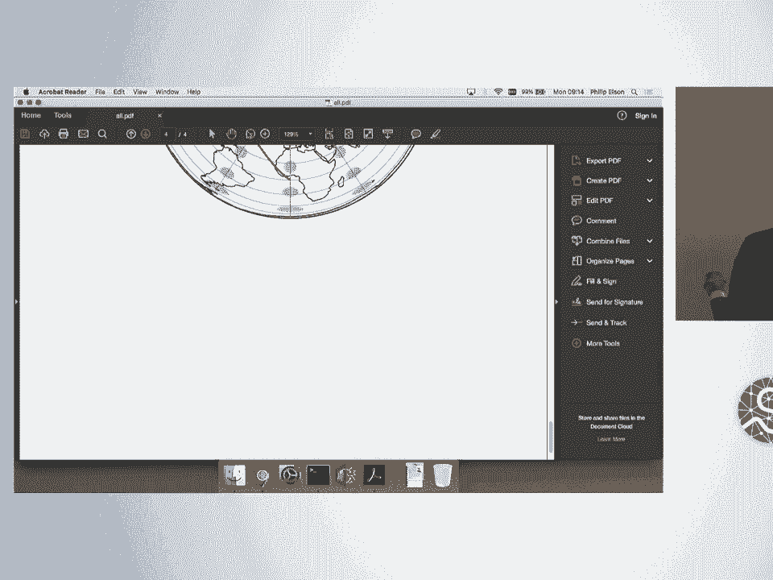

 So， I'm going to hand that to you， I think。 So， all right。 Can you get to the top？

 Did you get to the top？ Yeah。 There you go。

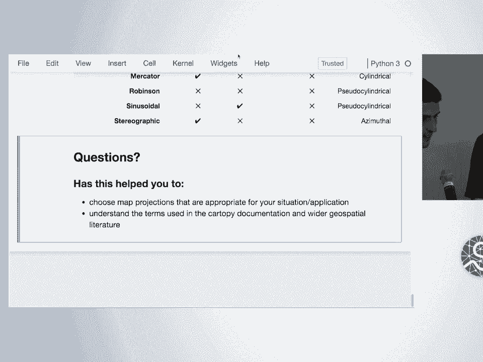

 Okay。

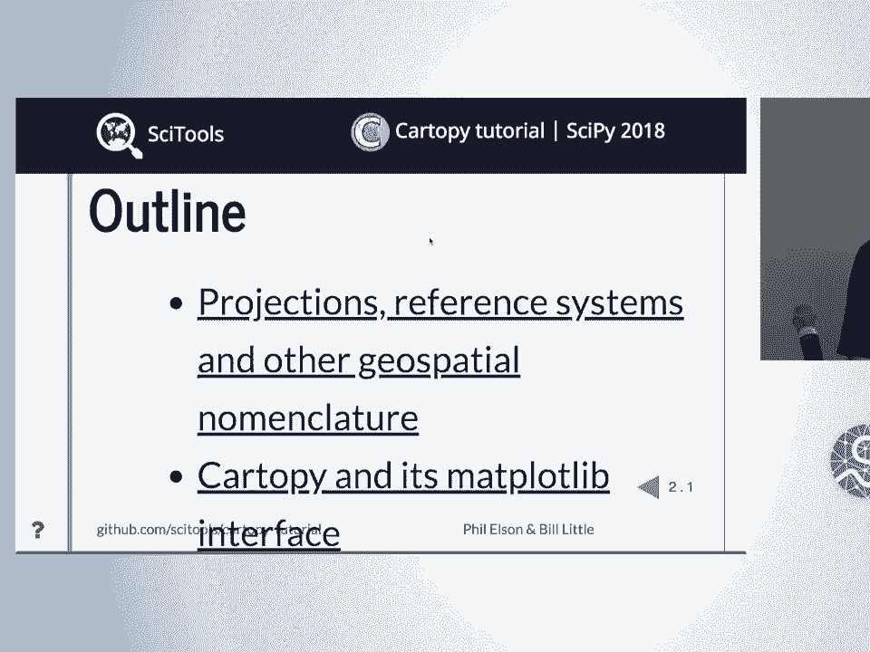

 Okay。 So， that was fun。 Phil says， thanks very much for engaging in there。

 We've now got a basis to go forward。 I understand a little bit about the language of projections。

 There's different features there， different metrics。 So。

 what we're going to do now is we'd like to start dipping into a Cartipi。

 That's basically why we're here。 So， in the interface of Cartipi with my cart line specifically。

 The good thing about Cartipi is it integrates really well with mapportlibs。 If you use mapportlib。

 hopefully you do， it's not a bolt on top of it or a wrapper around it。 So。

 there should be no surprises when you're using Cartipi in mapportlib。 So。

 we're going to look at some of the documentation that we've got there for Cartipi。

 It was matured over the time。 There's lots of gallery examples and tutorials and information。

 that we've been talking about。 It's worthwhile。 Normally it's there。 They've got a projection list。

 You can go and have a look at things like that。 And also get familiar with how Cartipi and mapportlib play together really。

 Okay。 That's the opposite way。 Every time。 I'll get used to it by the end。 So， documentation。

 We've also got site tools。 Like I said， there's a ton of stuff there。 It's worthwhile going。

 We're not going to -- we'll dip into bits here and there。 As I say， there's another introduction。

 There's a definitions list。 There's some installation guides， but we're on Conda。

 If you can use that。 We talk a little bit about mapportlib， how it's structured。

 the class hierarchy。 Some of the key words that we use for mapportlib to integrate within mapportlib。

 using the transform and projection keys。 We'll touch on that later on。

 And there's rich features that are in there。 Shaped readers can touch on that later on。

 And how you can get involved。 So， you can take the time and have a look at that。

 We'll dip into some of the bits later on。 But Cartipi itself。

 it's -- what we try to do is that there are a lot of projects。

 We're really engaged with open source。 And there are a lot of projects out there that do things really。

 really well。 And Cartipi is joined with dots and some of those things that stands on the shoulders of giants。

 because we're building top of Proj 4。 So using projections， we project things like that。

 You're going to need to Proj 4 NumPy， of course， and shapely for which is。

 GOS to control your geometries。 And of course， if what you get with mapportlib。

 you get your publication quality maps， you kind of get that for free with Cartipi。 It just works。

 So it's additive to it。 So it might have some specializations and extra behavior。

 that plugs in quite nicely。 We'll point that out as we go along。 And it's object-oriented。

 We'll point that out later on。 But basically what it comes down to。

 we understand projections a little bit more now。 So what we care about in this world is that， well。

 we represent our data on our projections。 So what we're thinking about here are five things。

 which are points， lines， vectors， which are like your special case of lines with direction and magnitude polygons。

 and then raster images。 And Cartipi can handle all of these。

 It's got some smarts under the hood that can emit your life easier。

 particularly when dealing with some interesting projections。 So we're talking about projections。

 So there's a class that represents projections， and we sort of specialize them。

 We've got some classes of that that represent each of the projections。

 These are all certain different behavior。 And we've tried to kind of make it easier to interface。

 humanize， or make it rather than using a bubble project for parameters up。

 We've tried to make it easy to use with the keyboard arguments。 So it's sort of obvious what we do。

 And we sometimes you have to get stands on defaults。 We try to make sensible defaults。

 but you can change them， obviously。 But we're going to start with something simple like a flat carry。

 So we looked at that before。 So I guess you guys are either watch or you can sort of run along。

 As I'm going through the notebook， but if you've got your everything set up。

 So we're going to talk about projections。 What we tend to do is everything lives in the CRS package。

 So we just call it CCRS。 So we're going to import that。 And there's a whole bunch of projections。

 We just jump into the documentation。 These are the kind of things that we just saw in that exercise。

 We've got information about each one。 Keyword arguments that come in。 So a flat carry。

 We've got a can change the central longitude。 And the globe is there。

 The website data that's underneath。 There's lots there。 You've got each of the representation。

 And then you can see how you can control that projection。 For keyboard arguments。

 you can pass in to control it and manipulate it in the way that you want to visualize your data。

 So that's all there。 We're not going to go through them all。

 But it's worthwhile knowing that you can keep going back to that。 Again， again， as developers。

 So it's useful for kind of resource to have。 So， okay。

 So we've imported CRS and now we're going to instantiate a class。

 So simply we just create a prediction。 And sure enough， the cut-wise come back。

 It's created a projection。 We've got one。 So what can we do with that？ We've got a model projection。

 So we want to see what we've got。 So let's， this is where we integrate with map plotlib。

 Map plotlib。 Needless to say， just as inside， you don't need to use map plotlib as a cart of height。

 You can just use it for projecting your data。 And if you want to visualize it。

 you can use map plotlib。 But it stands on its own in that regard。

 I've got some exercises later on that show that。 Because you might not want to actually plot your data。

 You just want to change the numbers and project it。 So we're talking about map plotlib。

 The currency there is axes。 But in axes， it doesn't understand any geospatial information。

 So this is the kind of cool thing about cart of height is that it understands the language of map plotlib。

 And it gives you back an axis-like thing， but it's got the smarts in it that understand how you want to plot on it for maps。

 And it's a geo-axis。 So we can， we can have documentation。 But there's one information about that。

 And there's methods。 Let's， let's go there。 And then， quick。 There we go。

 So we've got a class of geo-axis。 And there's a whole bunch。 We've added extra methods in there。

 Which some of them will dip into。 You'll see throughout the tutorial。

 And there's other ones you can go off and can explore in your own time。 Adding raster images。

 All sorts。 So these are going to inherit it for each axis。 And you can use them because they're。

 because they're there。 So we can find out about those later there a little bit later on。 Right。 So。

 okay。 So， enough。 Let's see the projection。 Okay。 So we're going to use the map plotlib。 So。

 the key thing here really。 And this is what's kind of nice。

 The way that it interacts with map plotlib is that there's nothing new here。

 You can create a normal axis in map plotlib as you would normally do like this。

 But we've used a projection keyword which was already existing。

 And you pass in your cartipi projection。 So this is telling you this is the， this is how you want。

 this is what you want the projection that you want to see。 When you do the plot。

 So we're saying we can access and the target projection is plot carrying。 So。 And there we are。

 That's the tutorial finished。 Thanks so much for coming。 I hope you've enjoyed yourself。

 There you are。 There's not a lot there。 It's just an axis。 You can't actually see anything。

 But what we'll do。 How can I get out of this field？ Can I go back？ No， it's not scrolling。 Oh。

 that is right。 That was a Mac panic mode there。 Okay。 So we've done our plot。 It happens。

 So there's nothing really that's just an axis。 Nothing different。

 But it is actually a dual axis that we've got back。

 And you can do plots and you can do supports as well。 So it just works。

 But we want to see something make life a little bit better。 So there we go。

 So there's some stock things that I said， some of the methods that are on the axis that are kind of useful。

 So here again， create an axis。 A bog standard thing in my plot lib。

 You're saying what I want to see is a plot carry projection that you all know and multiply now。

 And we're saying， well， actually now I've got the axis。 Just draw some coastlines。 In the borrowed。

 we sort of lean heavily on natural earth to provide some real solution coastlines。

 And you can change the resolution。 So here we have got our plot。 It looks like a plot carry。

 Got some coastlines。 Fantastic。 So it's that easy。

 So you can change that projection to anything that you want in a projection list。 Okay。

 And of course it said it should be no surprise。 It's actually what we've tried to aim for with this integration of cart API and that plot lib。

 So it should just work for subplots。 Same deal I'm going to use my plot lib vanilla subplot。

 We just created our path in our projection again。 Subplot keyword argument。

 Adding our coastlines again。 We've got subplot。 So it's all good。 No surprises。

 So that's what we've been kind of aiming for。 So for you guys。

 hopefully you've got an environment that's running。 We've got a little exercise for you。

 So we've got time for this。 I've only got maybe a couple minutes now。 Give it a try。 Okay。

 So what we want you to do is to go to the documentation。 There's a link there。

 You'll see information about plot carry projection。

 Use that information to help you to create a global plot carry map with coastlines。

 But the difference is we've just done that。 But the difference is I want you to center it on the date line。

 which is 108 to be longitude， rather than Greenwich Prime Meridian。 Okay。

 So use this sale in here to write your answer。 If you clicked on that。

 you'll get the answer so you can click on it and have a look if you want。 Just try。

 It's not a moon mouse away from the example that we're using here。

 But you have to do something different to tell the projection where the central longitude is。

 So we give that a try。 Or is it enough people who got their environment up and running？

 Hands up if you've got your environment up and running。 But you want to get that crack。 See？

 Five minutes。 Time for that。 Okay。 Let's not later this one too much。

 So hopefully you managed to get to the documentation。 So classified docs。

 There is a projection list document which Bill pointed out。

 And the plot carry projection is the first one because it's kind of a pretty common map projection。

 And there's this keyword on the map on the plot carry class， central longitude。

 It's that that we want to change。 Completely lost now。

 So we've already imported cartify crs as CCRs， which is kind of a common pattern。

 I'm just going to put it into a variable。 CCRs。blackcarre。

 And that central longitude there we can just set it。 Before I go too much further。

 it was suggested that I point out that you can look at the documentation for this class in the notebook directly if you want to。

 So you just put a question mark after the object that you want documentation on。

 And Jupiter will pop up a little bit of information and you can also see there central longitude can be set。

 So that simply can be set like that。 Plot。axes projection。

 So this is that dance that Bill showed us。 The projection keyword argument when you're making an axis you just pass it a projection object。

 I'm going to capture that。 And finally， I'm going to make use of that super useful method。

 coastlines。 If you actually do a plot。show。 And don't。 Right。

 so one of the issues is we're using the notebook back end and you need to remember to make a figure each time you want to make a new figure kind of sensible but easy to get to do it。

 And the result if you're not as zoomed in as me is a map centered on the anti meridian approximately the date line in black carry。

 And same issue of scrolling out of there。 Any questions on that？

 Have I done what the solution told me to do？ Yeah。

 so it captured a flat carry object 180 and used it in exactly the same way。 Any questions？

 Observations？ [ Inaudible ]， Right。 No， the key is that the axes that you're getting back here is a cart by geo axis。

 It's not a map live axis。 So this function here， this plot axis is basically a map。lib。

factory function。 It constructs an axis for you。 And it's the key arguments that you pass which determine what type of axes you get back。

 So the result is a cart by geo axis。 And I'm going to actually just talk about the useful methods of that geo axis in a bit。

 So we'll actually get a bit more experience of what you can do with one of these things beyond just calling the coastlines method。

 Any other questions？ Okay。 So let's do that。 Let's find out more about that geo axis object。

 I guess maybe before I do， I should just do a type on that axis just to really prove to you that this isn't a map。

lib axis。 This is a cart by map。lib geo axis。 The thing that cart by defines。

 And that's documented in the cart by documentation。 We make that a little bit bigger。

 It's a geo axis。 And it's a subclass of an axis。 So you get all of that behavior plus a bunch of other behavior on top of that。

 Okay。 I'm going to start tidying up a little bit because it's too much stuff。

 That's a really good suggestion。 Yes。 So that instance we can also get some docs on using the same trick。

 the question mark at the end。 And it kind of gives us some information there about what's available。

 Yeah。 I learned about that the other day。 That's a good trick。

 If you really want to see how this has been implemented， you can do it。 Do a double question mark。

 And it kind of gives you this source。 Never done it before。 Didn't work。 Maybe that's similar。

 We found a bug maybe。 Scrap what I just said。 One question mark will give you the help on that object。

 Okay。 So we've already seen one of those methods on the geo-axies which definitely doesn't live。

 in the map with low back sees and that's the coastlines method。

 It doesn't make sense for that to be a generic coastlines on an axis in map with low but it completely makes sense for a cartopied geo-axies。

 In addition to that， there's a couple of other really useful geographic type methods。

 The gridlines method allows you to kind of draw graticals， so parallels and meridians。

 And there's also a really low resolution natural earth image that you can just throw on to the axes using stock underscore image。

 And that'll give you basically a bit of blue and a bit of green just so that it doesn't look quite so white。

 [inaudible]， Yeah， so the question is how low is that and it's really low。

 So at a global scale it'll look fine。 Not great but fine。

 But at any kind of zoom you're going to want a different image。

 And the main reason for that is that we ship some very basic coastlines and we ship this very basic image with the package and we don't want the package to get too big。

 So there are a bunch of other interfaces which I'm not actually going to show you to get higher resolution coastlines and higher resolution images as well。

 I guess on that front you would normally add an image to a map with axes using the in-show method or the in-show pipe plot function。

 The same's true with Cartipi， you can just use that in-show method。

 But with Cartipi we've added some extra behavior which we will look at shortly。

 But there are a couple of other new methods that don't exist so there's add geometries。

 And for those familiar with shapely， basically you can directly add a shapely geometry onto the axes and it will project it for you。

 And then finally a little note about these two。 So set global basically will zoom out the map as much as the projection allows。

 So global is kind of a questionable word but that's what it's trying to do。

 It's just zooming out as much as possible。 And set extent allows you to set a bounding box for how zoomed in you want or the extent of your map that you want。

 So again all of these except in-show are new to the geo-axies and even in-show with kind of over ridden in the geo-axies。

 Question。 [ Inaudible ]， So there's a question about geo-pandas and it would be remiss of me to answer that when we have Joris sitting in the room who's the resident geo-pandas expert。

 So Joris。 Okay， fine。 [ Inaudible ]， Okay， thank you。 Great。

 so let's take a look at some of those things。 So there's a little example here。

 We make another plakari projection because it's so easy to see things in plakari。

 And the axes object that we make we use the set extent method and we pass a bounding box through。

 Okay， and I always get them mixed up。 It really upsets me that I always get them mixed up。

 This is Xmin， Xmax， Ymin， Ymax， I hope。 Now that I've said this publicly。 But yeah。

 On top of that we're also using this new gridlines method which you can basically pass map or live type keyword arguments through。

 And so these are fairly standard kind of interfaces for map or live。

 You can change the alpha because of the line style like and stuff。

 And there's also a magic draw labels keyword on here which will kind of basically give you the words。

 And we're also going to see that lowish resolution background image。 Okay。

 let's run that and then I can show you a picture。 And let's do something about that figure size。

 I'm going to zoom out just a little。 Right， so I was right after all。

 So it's from minus 170 longitude to minus 50 longitude。 Yep， minus 10 to plus 80 latitude。 Good。

 And you see the labels have been drawn。 We've got a grid line going over the top and we've got a fairly well you can see how poor the resolution is there。

 It's not a particularly high resolution but it gives you a nice splash of blue and green。

 I think is probably all you can expect from stock image。 Okay。 Right。

 So there are a bunch of kind of tools on top of what cut by tools that cut by provider guess。

 And better ways of getting more data。 But let's kind of start fairly manually。

 So Natural Earth is basically a collection of really amazing data sets that they have。

 And I have pre-downloaded an image in the resources folder which is a slightly higher resolution image as it happens。

 And there's nothing stopping us using standard map lip stuff to load in an image。

 Or you could use stuff like scikit image， pill， pillow。

 Anything basically that's going to give you a NumPy array to represent this image。

 And it's a thousand by two thousand by three color channels。 And in addition to that。

 I'm going to replace it。 Excuse me。 I'm also going to load in a state shape file。 Okay。

 So this is a shape file which contains the outlines of the， I think it's just US states。 Okay。

 And we can use Fiona for this。 Geopandas would work just as well if you're familiar with that。

 Or you can do the really manual approach and use Pi shape。 In this case， I've just used Fiona。

 Basically， I now have an array up here which represents an image。

 And I have a list of shapely geometries。 Okay。 These are pretty fundamental geospatial data types that have got nothing to do with Cartipi really。

 And you just add them to a Cartipi Geoaxes by using fairly standard methods。 So。

 Imshow will do the trick。 You add an image。 That's the array。

 This is a map of libism to tell you that the pixels start at the top rather than starting at the bottom。

 Again， with map of lib you can control the location of where this image should be plotted。

 So we do precisely that。 But this is a really big important thing that you have to also know about when it comes to Cartipi。

 And it's this keyword here， the transform keyword。

 And this is basically one of the major points with Cartipi is you can specify the map projection that you want and the transform of the data that you're adding when you add it。

 And we'll see this time and time again。 So keep coming back。 I'll point it out again， I'm sure。

 But we're specifying the transform of the image。 And then this geometry method。

 add geometry method basically， we pass that list of geometries。

 The coordinate reference system that those geometries are in。

 And very standard map of the keyword arguments when you're making any type of patch or map of the patch。

 Okay， I'll stop talking。 Let's look at picture。 So we have now definitely。

 I hope you can see it from back there， a higher resolution image here， which is much more pleasant。

 And I've overlaid US states on top of that image。 So all of this is basically additive on top of map that lives standard axes methods。

 We're just adding geospatial aware data on top of that。 Yes。 So the question is。

 is it assuming they're in lat slons？ And the answer to the question is definitely not。

 So you're telling it that the geometries are in lat sermons by providing that coordinate system。

 Okay。 And there could be anything else that you can represent in a cast by coordinate reference system。

 [ Inaudible ]， No， so the question is， are we specifying here the target coordinate system？

 And the answer is completely not。 This is the coordinate system of these geometries。 Okay。

 And if you want to change the target coordinate system， you do it in your map projection。

 So you're setting up your axes。 Okay。 So the map that you're producing is defined in the axes。

 The axes knows what map it's making。 And when you're adding data。

 you're telling it what coordinate system your data is， not what it should go to。 Okay。 Thank you。

 That's a very useful thing to get clarified。 We'll talk about this again more。

 but does that make sense？ Is it really comfortable with what's going on there？ Okay。 [ Inaudible ]。

 So the question basically is， if I have a satellite image， what map projection is that in？

 And there may be satellite experts in the room， and I'm sure they will all wish you good luck。

 If I'm honest， because it's really hard to find out what projections things are in。

 Often you will be able to get satellite products that are projected for you。

 and that's always a healthy place to go from。 There is a good example in the gallery。

 and that sego is nicely -- let's do that。 So the Cartipite documentation has a gallery。

 It could always have more pictures， definitely， but there is an example of that。

 And I'm going to actually -- I think I'm going to be brave and show you the code here。

 Because as I recall， we've got an image， but the image projection is actually a geostationary object。

 It's not flat-carri， these aren't lats and lons。 These are crazy extents。

 They're not lats and lons in extents either。 And we end up just simply using image show。

 and you're setting the transform is geostationary。 It's not flat-carri。

 And yet the map that we're looking at is a flat-carri。 So a bit more scrolling， sorry。 No。

 there we are。 Got myself in a puddle。 It's not flat-carri。 It's a miller projection。

 The projection of the image is not the same as the projection of the map。 Great。 So then。 Right。

 So the question is， the three examples I've put forward now have made three separate instances of flat-carri。

 Does it make sense to consolidate that in some way？ Is that representative of your question？

 Actually， there is a bit of a cost to creating a flat-carri object。 It's not particularly high。

 but if you were in a for loop and you were making thousands of these things。

 you would definitely be considering putting it into a variable and reusing it。

 The only reason I'm not done that here is it just makes things much more readable to see exactly what's going on。

 And it also means I can do crazy things， I think。 And this is never a good idea。

 but I'm going to do it anyway。 Hello？ Oh， no， okay。 That was a terrible idea。 Let's not go there。

 Oh， yeah。 Oh， okay。 Right。 Okay。 Right。 This is interesting。 Right。 So that image that I added。

 if you remember， was flat-carri。 The data I added was flat-carri。

 but the map we're looking at is definitely not flat-carri。 So something's happened here。

 and the reason that took a little while is that the image had to be re-projected。 So。

 quite by not the fastest， it's quite general in its ability to re-project images。

 but it does it eventually。 And so that's what's actually happened here。

 But it's also re-projected a bunch of other things like the states outlines。 Okay。

 Because they were in flat-carri， but now they're clearly not。 Good。 Don't go off-piste。

 is that right？ Right。 So some interesting notes from here。 So we're doing more work than we need to。

 So Caspy already has already knows how to draw states。 And it's actually quite simple。

 You just add the states feature， and it'll just do the right thing。

 One of the really nice things that Bill was pointing out earlier is that we're building on top of Map。

lib。 We're not kind of re-implementing our own interface。

 So if you want to change the color of the face that Map。lib is drawing， you use the Map。

lib keyword argument face color。 And if you know Map。lib。

 then you know what keywords you need for Caspy。 Nice and consistent and all that kind of stuff。

 And yeah， this key thing which I'm going to keep laboring throughout this section I think is the transform keyword argument that we used。

 is what specifies the coordinate system of the data that you're adding。 So when we added geometries。

 we're specifying the coordinate system of the geometries not of the map that we're making。

 It's when we use that projection keyword argument to make the axes。

 That's when we're saying what projection this map should be in。 And they're two independent things。

 Right， again， keep laboring this。 So why it's important to specify the coordinate system of the data as well as the projection of the map。

 So these things are independent and I guess one of the most important things that I'd like you to take out of this really is that。

 Caspy is designed to reproject your data for you。 On the whole。

 Caspy will do the right thing when it comes to polls and some roodians and interpolation and map boundaries。

 Which if you've ever tried to kind of project a line that crosses the date line or something like that。

 you realize that it's very easy to get it wrong and mess up。 Caspy tries to do a better job。

 So it's a nice feature。 Okay， so I guess a little bit more about that transform keyword argument is in order。

 Sorry， question。 [ Inaudible ]， Okay， so why the question really is why would any image not be just Black carry？

 Why is there any other projection out there， I guess， or how is it encoded in some way？

 So Black carry is the simplest of simple projections because one degree of longitude is the same as one degree of latitude。

 Okay， and in an image that's really kind of convenient property and you'll find an awful lot of images are handed out like that。

 Fundamentally， if you're just， yeah， I guess fundamentally they're laid out differently in an image for different projections and it's just different properties。

 I'm not sure that's a great answer but hopefully that。 Right。

 so let's dig a little deeper on this transform side of things and let's start drawing a line between two points。

 Okay， now on the sphere， there are several ways of drawing a line between two points and in a projected space。

 there are several ways of drawing a line between two points。 Let's pick two of the most common。

 So between two points on the sphere， you probably， or often I guess。

 will pick the shortest distance on the sphere。 Which as you saw with that red line in the projection exercise you did earlier。

 doesn't always result in a straight line in a map projection。 On the other hand。

 sometimes you might actually want a straight line in the map projection。

 Perhaps because the map projection has a particular property and you want to preserve that in your line。

 So there's a little example here。 We've got picked out some coordinates of two cities。

 We've got the lawns and the lats， picking them out。 And we're just using map。lib here， axes。plot。

 I should say that could equally be PLT。plot。 It doesn't really matter。 If I were to use the axes。

 object method， pass the x's in the y's。 And again， pointing out lawns and lats， not lats and lawns。

 You'll find that ubiquitously in Cartipi that pretty much lawns can be for lats， x's and y's。

 So standard plot with the transform keyword argument。 And I'm saying， "Plat-caré。

 these are lats and lawns。"， The default "Plat-caré" instance represents lats and lawns nicely。 And。

 yeah， I guess I've added a label and we'll see what that looks like in a second。

 Let's plot this and go from there。 Let's look at three a bit more。 Right。

 so we've got something to talk about now at least。

 So we've got two lines between two points and then not the same line。

 One is clearly a straight line between the two points in this projection。

 And the other is clearly not a straight line in this projection。

 But it turns out that this not straight line thing is the shortest line on the sphere。

 It's a great circle， whereas this thing is not。 So， just talk a bit more about that。

 So the line that the equirectangular straight line is "Plat-caré。"。

 Plat-caré is a projected coordinate system。 It's Cartesian。

 And a line between two points in a Cartesian coordinate system makes an awful lot of sense。

 to draw a straight line in that coordinate system。

 So that's why we're seeing a straight line in Plat-caré。 On the other hand。

 there's this other object in Cartesian。 The geodetic coordinate reference system。

 It's not a projection。 You can't make a map of it。

 But it tells Cartesian that when you're drawing a line between two points。

 it wants them to be a straight line on the shortest straight line on the sphere。 A great circle。

 So this geodetic thing is quite magic in that it's kind of。 telling Cartesian how to draw the line。

 It just so happens， both geodetic and Plat-caré， understand the lots and lots。

 It's just how the line is interpreted， which is different。

 The only other thing that's worth noting here， I guess， is。

 You know that work we did earlier to add the states using our geometries？

 You can actually just import Cartesian feature states and add it to the axes， and it'll just work。

 Useful。 Any questions on that？ Okay。 [ Inaudible ]， Yeah， okay。

 So you're pointing out that the great circle is pretty ugly。 It's not particularly smooth， okay。

 which is great。 And I'm going to move on to that right now。 So let's fix that in a second。

 Any other questions for that？ Onstespreter， no？ Because you gave me chitole of the day。 Right。

 Actually， I'm not going to go straight on to that。

 I'm going to go on to that in a second after this section， if that's all right。

 Remind me of the question if it's not answered。 Let's do something slightly different with this map。

 Okay。 Let's pick a projection where the great circle is a straight line。 Okay。

 And that naturally will mean that this straight line here will re-plot it。

 It won't be a straight line in the projected space。 Okay。 Bitmind-warpy。

 But can anyone put forward a suggestion for a projection that would preserve the direction of a great circle。

 a great circle， a circle straight from a particular point？ Mecate is a suggestion。

 That's interesting。 It's not quite right。 But I can see why someone might have said that。

 Who was it？ Is that it？ Right。 A stereographic would do the trick。

 What kind of projection is stereographic？ What's the developable surface of a stereographic projection？

 Yeah。 As a muthl， someone said， "Yeah。" Right。 And all as a muthl projections have this property where from the central point。

 the great circle is a straight line。 Okay。 So we can pick any as a muthl projection。

 Stereographic is a great example。 And we can do precisely that， in fact。

 So let's construct one of these stereographics。 And I'm actually going to pull up the documentation because it's worth going there。

 So that projection list is the second one down and we're getting started。 And eventually。

 if you can see down the list， there is a stereographic。

 And there's a bunch of keyword arguments you can change。

 including the central latitude and the central longitude。

 And all I'm going to do is set up a map projection。

 which has the central longitude at one of the points that I care about。

 I think I've picked New York。 Okay。 And that means that any great circle out of that point is going to be a straight line。

 So we should see some interesting properties coming out of this。

 So a stereographic centred on New York set the extent in Lats and Lons， add some grid lines。

 add the stock image， add the states， and draw the great circle and the straight line in flat caray space。

 Okay。 Let's take a look。 Okay。 Taking some time because it's re-projecting that image in stereographic。

 but it came out again。 And this time， that great circle， as we hoped， is a straight line。 Okay。

 But that equirectangular straight line that we drew before， which used to be a straight line。

 isn't a straight line in this coordinate system。 Okay。 If we cross-reference it， though。

 we'll find that it actually goes through the same points as it did before。

 I'm not going to jump around too much， but if you're following this on your own machines。

 then you can see that。 It kind of like definitely goes through here。

 And it definitely goes through here。 Okay。 So this is just the same data being presented in a different projection。

 Okay。 And I guess this is the key point about Cartifiers。 You tell it what projection you want。

 and you tell it when you're adding data， what coordinate system that data is in。

 and the rest Cartify will deal with。 Yeah。 So core principle Cartify gives you map projection portability in Cartify enough context to project your data for you。

 It's the key take-home message from this section， really。 But in answer to your question。

 the big downside of automatic read projection is in reality， you don't have an awful lot of control。

 It's not easily controlled。 And there is a performance cost。

 and we were seeing that when we were re-projecting that image。 Okay。 So， for example。

 the lines in the previous spots in this were low resolution。 So this is demonstrating the Cartify。

 whilst it looks like it's producing curves， it's actually making straight line segments。

 It's just having to approximate and interpolate an appropriate resolution。

 And it turns out actually that resolution is probably not appropriate for the plot that we've produced。

 So right now there's a little bit of a workaround to improve that。

 There's this threshold property on a projection object。 And basically。

 I'm sub-clasting the stereographic projection， and I am giving that threshold and just making it。

 Yeah， getting the threshold lower。 And I guess this is interesting because it shows us that we can also create map projection。

 Cartify projection objects ourselves。 You don't actually need this to kind of be built into Cartify。

 This is something you can actually extend yourself if you need to。

 So I make a higher resolution stereo， I'm doing exactly the same things I was doing before。

 not changing any of the code， that function which draws the line is exactly the same。

 And the result is working。 A much， much smoother curve on that line。 So to be clear。

 just to continue answering that question fully， we've increased the tolerance， the threshold。

 on the target projection， not on the source projection。 So when we're converting our lines。

 there's an iterative process that's going on and it figures out， for this map that I'm making。

 how many times do I need to refine this line so that it looks nice and smooth。

 And that's precisely what we're controlling with that threshold keyword。 All right。

 that's the geoaxies and some of its methods。 So we saw Imshow， we saw add geometries。

 we saw that useful cosines method， we saw set extent and set global。

 And basically we can throw data onto a map in pretty much the same ways that we can with map。

 Plus a couple of useful ones for common geospatial type stuff， including shapely geometries。

 So I'm going to rest my voice a little bit and let Bill talk about the main theme of this tutorial and that is around the world in 80 days。

 So around the world in 80 days or 80 days， that was just been out。 So it's set up quite nicely。

 So we are building up in layers about understanding projections of what they are。

 different types and how in car-pyed， So we're going to pull this back to our whole kind of abstract which was around the world in 80 days。

 So anybody read the book？ Long time ago， seen the cartoon or something like that。 So， Jules Verne。

 So we have Mr。 Falk here who has taken away during the world and it's quite nice。

 It's just a means for us to kind of showcase car-pyed because we want to show his route that he took in his 80 days around the world。

 Different projections， how we can control that， how that works。

 So we're going to sort of tug on that theme a little bit and explore different parts of it。

 So for you guys who have got an environment， we're going to do a little exercise here。 So。

 Philly's fog， let's hand some chat here， on the run with these carpet bag and 20。

000 pounds to go around the world。 So we set off in October and then he got back in December。

 He planted the part from London and his main stops。 The main route to the 22， Bombi， Calcutta。

 Hong Kong， Yokohama， San Francisco， I think Gerspell of San Francisco is a bit flaky。

 Some places but we're British。 New York City and then back to London。 Okay， so knowing what we know。

 we want to be able to draw a map to show this route。 Okay。

 so we've set you up with here are the places and here are the lawns and lats。 So。

 drawing on what village is showing you to do a plot。 Can you draw。

 I think we've got it in Blackcurry perhaps？ Yep， that's the one we've shown。

 Can you show the route of Philly's fog when you went to the end of the world？

 So this is going to help you so you know the places and you know the lawns and lats。

 So we'll give you a lot of time to think about it。

 Essentially you're going to use print the right projection for Blackcurry and then you're going to plot these points and draw the line。

 Okay。 So we've just realized that with the break we thought the break was at half past。

 But snacks are safe until half past。 So we've got a nice light on。

 So what I'll do is quickly zip through this answer name and break。

 You guys can have a comfort break。 So， not to get too hung up on this。

 Simply we're thinking about drawing a line on a map。 So you've just plot basically a plot lid。

 What it definitely says is that you're kind of pushing it into space or thinking about projections。

 So you know that you want to have， you get used to cut by， you've got geo access。

 So we know we want to set it to plot carries。 You should be thinking these two things。

 the projection and the transform。 So we want to create an axis that's plot carry。

 Then we get a bunch of flats and lawns like X's and Y's。

 You should use a map plot to plot it and you can tell it that it's in-platform。

 So let's look at the solution， step through it， come backwards。 Okay， so here we go。

 And there's a little bit of mangling of the data to get it in the form that you want。

 So we do create a figure that we want to do and then here's the bit of magic。

 So here's where it comes in。 You create your instance of your plot carry and you'll get back your geo access。

 So we see some coastlines。 So you cannot use the method coastlines on it。

 And now what we know is that we've told you the route from London to New York and that we're at the background。

 And you've got your lats and your lawns。 So we just， there are several ways to skin this。

 So we've decided to unpack things with this set。 Essentially for each destination， we get the place。

 And then we take out looking up the dictionary for this place。 We get the lawn and we get the lats。

 So we've created this tuple。 So you have a list of tuples， lats and lawns。

 And you're using leverage and unpacking and zip to get the list of all the lawns and all the lats。

 You could have quite easily just cut and paste them and put them in if you want it to。 Okay。

 so now we've got lawns。 We've got lats。 We've set up our access which we've created。

 So let's add our stock image which is Blue Resolution。 We've added a title。

 And this is where we're just creating a line now。 We've done all the hard work。

 So we've got our lawns。 We've got our lats。 We're using plot on our geo-axis。

 So it could be on a geo-axis。 It understands about lats and lawns。

 We plot your line in the right place。 We're adding some styling which is just vanilla， matte potlib。

 We'll make it orange， bling with。 And here we're saying it's geodetic。

 So this is going back to what Phil's saying。 If it was in plaque kind， watch straight lines。

 then you put plaque kind。 But here we're saying it's geodetic。

 So the great circles we're expecting to see if you've got two points。

 and join the line that's on plaque high we're expecting to see some kind of carving there。 So。

 let's compare this。 Here we go with the Mac。 Yes， that copied something。 Yes， I'm proud。 So。

 command V。 Thank you。 Thank you。 Thank you very much。 Right， so， and it should be working hard。 So。

 we're going to run the lines。 We're done run。 Create a figure。 And something's going wrong。

 Puffness is on there something。 Yep， COVID done。 Places are， oh， idiot。 Right， we're done wrong。

 Not running this out。 That does help。 I think it's for that。 So， I hadn't created the， please。

 didn't know about places。 Let's rerun that again。 Just getting too excited。 Okay， so there we go。

 We've got something。 There's what we want。 But there's something about going on there， right？

 What's going on？ Anybody？ Was kind of obviously， but weird with that。

 One's noting and grinning in the back。 Yeah， something weird's going on there。

 I remember I was going through this。 I was like， "Pill， what's going on？" So， basically。

 we've deployed our roots。 We've got it in Black Hairy。

 We've got some kind of curving going on there， which is what we were expecting。

 But you'll see just as it went around the anti-medriadian。 This went up here。 This went along。

 It just went back down there。 What's going on？ So， this is something。 This is， yeah。

 some things work， some things don't。 So， what we've actually done is there's a bit of cleverness in Cartipai。

 And it's basically saying in a route we've started at London。 Went to Suez， went all the way around。

 which is fine。 But if you're starting an end point， that's exactly the same。 It'll think， "Aha。

 you're not putting the line。 You're putting the polygon。"， This is what it's done。 Thank you。

 That's for free。 So， that's clearly wrong。 So， we're going to fix that。 So， you could either just。

 at the moment， request。 We organize this print？ Yeah， we have。 So。

 let me add something that we can fix。 So， if you were to ignore that part。

 that would be what we're kind of looking for。 So， yeah。 So。

 we had a heuristic in there that's not doing the right thing。

 And it's kind of a healthy thing when you actually become a user of your own software。

 You actually discover something's not quite worth the way it's expected。 But that's good。 So。

 we can fix that。 That's fine。 And there's other examples we've used much later on。

 that do this in a better way。 But we still have to fix that。 So， that's the example。

 Conscious of time。 You guys need to get some snacks， have some comfort break。

 and then we'll crack on with the rest。 Okay。 Yeah。 So， to add to that， let's take ten minutes。

 Hopefully that's enough。 So， there's tea and coffee and things and cold drinks out here。

 And I did a little recce a second ago because I can tell。

 I can just get the sense that you've got a sweet tooth as a group。 You know， we like our candy。

 There is some snacks， but you have to go on a bit of a labyrinth mission to find them。

 As far as I can see， the only snacks that I could find are down the stairs。 And then。

 as you come down the stairs， you turn left， and then there's another left。

 and there there's some goodies。 So， if you have to snacks。 There's food and breakfast room too。

 That's good knowledge。 Thank you。 Yeah。 Okay。 So， I think I'm going to start back。

 I know there's a few people missing， but we'll crack on。 So。

 we've actually had quite a lot of material to do。 That's okay。 We're just about to start。

 There's quite a lot of material in there。 We were actually fearful that we didn't have enough。

 I've got loads。 So， we're going to start picking two some things。 So， rather。

 what we'll do is we'll rather do some of the exercises in here。

 We're keen to get to some of the juicier bits later on。 So。

 what we're going to do is I'm going to go through them。

 top through the solutions that are already there。 You've got questions， ask， try and answer them。

 and then we'll sort of catch up with ourselves。 Yeah。 Sounds like a plan。 So。

 previously before the break， we discovered that the world was indeed flat。

 and it went round the back。 No， I'm joking。 So， this was our estimate of Folks' route that went round。

 But， we've done a bit of digging， and we found that if you've read the book。

 what you'll realize is that here's London， and you went down to Suez。

 but you went down to Suez Canal， took a boat， went across to Bombay。

 and then here from Kolkata to Hong Kong， took another boat。 So。

 you went around this kind of peninsula here， so， and that's not quite representative of what's going on here。

 We've just taken the greatest circle-shorts path between the points。 So， we didn't go down here。

 and it's not going round there。 So， it'd be nice if we could kind of look at that。 So。

 this is an interesting map。 We searched it from Wikipedia。 So。

 let's say the aim of this is really to use this image to the raster， and geo-reference the image。

 so we can display our route over the top， but we've got a question。 So。

 given the work we've done this morning， a little bit of knowledge there about projections。

 What projection could this image be in， and why？ Given you know a little bit about some of the metrics and some of the classifications。

 So， this is a bit of guesswork， and maybe you've seen a projection that was on the sheet that this looks familiar。

 similar to what you're thinking。 [inaudible]， [inaudible]， Robinson， right， okay。

 That sounds close here because there's a bit like a curvature。 [inaudible]， So， okay。

 so there's a bit of guesswork there。 You can almost， you're honed into that quite quickly。

 We've done a bit of digging。 I feel a little bit of digging。

 It turns out that it is actually a Robinson projection， but you'll notice that it's slightly weird。

 It's got this bowing， but things are a little bit compressed at the top。

 and it's a bit odd because there's a bit of continent missing here。

 and it's a little bit of a static half who goes there anyway。 So， it's not quite right。

 There's something a bit strange going on， but there was a bit of compression there。

 and it was centered on the merging of 11 degrees in 15 minutes。 So。

 we're going to give you an exercise， but we'll walk through it， just ask questions。 So。

 the exercise， given that image kind of looks like I've opened since。

 and it's a little bit of a limitation， which you know， love now。

 There's the list of projections we're focusing on Robinson。 So。

 the task was to draw Robinson with the map of the coastlines， which we know how to do。

 because that'd be a method just on our geo-axis。 But center it on this meridian， 1。25 degrees。

 and plot that。 So， none would be known。 There's not a lot involved， so we create a figure。

 as before。 And we know we're interested in Robinson's， so the projection， the target。

 what we want to see for the plot axis is the Robinson， and how we control where the meridian goes。

 There's a keyword argument， and you'll get the documentation that allows you to set that。 So。

 it's quite intuitive。 So， we know that now。 We're adding our stock image。

 our decimated low resolution， we've got your splash of color in there。 We're adding some grid lines。

 We've seen this before。 Remember， this is a geo-axis。 So。

 it's got this extra geo-spatial loveliness， so you can just add in your grid lines。

 and then you set your title， but a little title there， and that just works。 So。

 let's see what that looks like。 Command。 Yeah。 There we go。 So， it's kind of similar。

 We've got this Boeing effect going around。 I think we're on to the one here here。 So。

 we've done that。 But， you know， unfortunately， that map that we were looking at is not quite the same。

 as I said before。 There's a continent missing， and we know that how the diva-visis has been drawn。

 and this line's been slightly extended longer， and this one's slightly shorter。

 We'll see that when we plot it。 So， it's kind of close， but it's a little bit fruity。 So。

 what is it？ Showed it。 Okay， so， there's something we're going on。

 You can get that with some projections。 It's went slightly off piece。

 and it's done some customization。

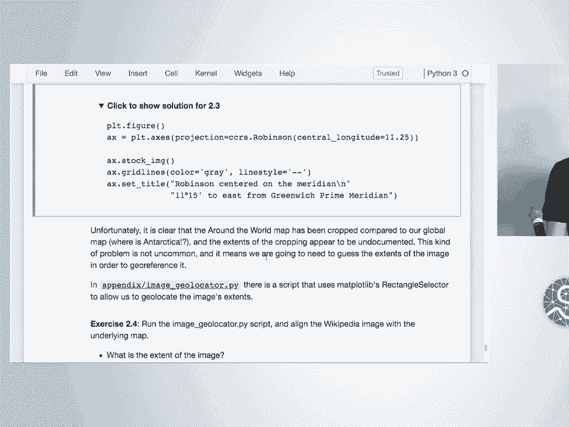

 So， there's a fun exercise， assuming that the east of Russia passed it。

 Where we want to take that image and try and geolocate it to work out what the extents are。

 And we've got a little script that allows you to over plot or run it， which will take the image。

 We've got Robinson。 We're going to try and correct it and line it up to work it with the extents are。

 Guess what the extents are， and then we're going to use that to make the plot。 So。

 see if I can do this right。 So， here we are。 So， I'm going to run this image geolicator。

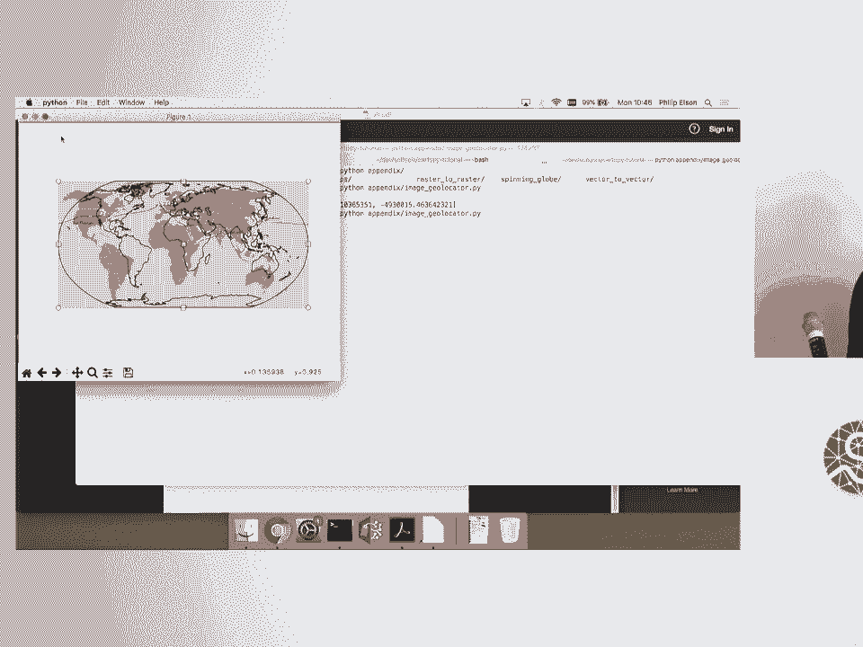

 Ah， that one。 There we go。 So， here we are。 So， we have got our map that we got from Wikipedia。

 It's got the correct route that goes down round and under it。 We've got our Robinson。 So。

 what we can do is we can drag and drop。 This is where you get to laugh at me。

 where I'm really rubbish at this。 Oh my gosh， what the。 Where's it going？ Yeah。

 Can you do it with the mic mouse？ It'll be quick， easier。 Yes。 Defitted by the Mac again。

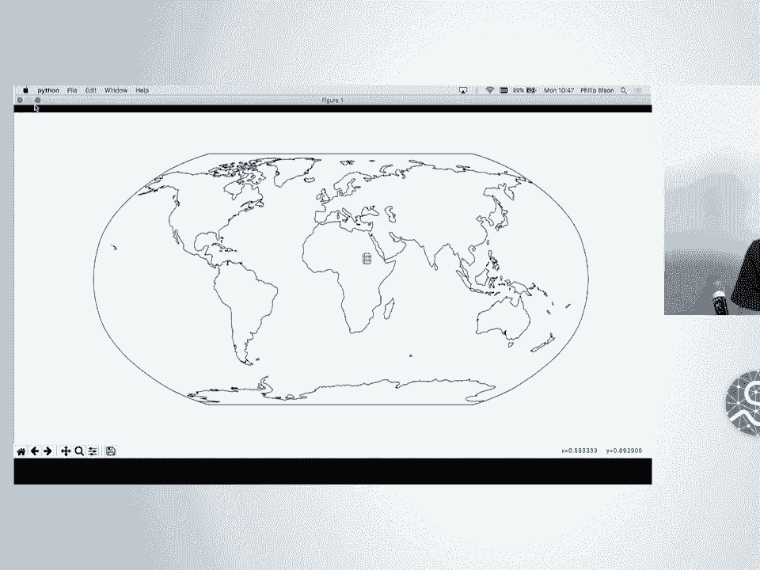

 What？ In my head machine。 Let's start that。 Might be the screen mode， essentially。

 Because that seems to work now， isn't it？ Yeah。 There we go。 That would just go wrong again。 So。

 we kind of。 This could take me forever。 So， the trick is we're trying to。

 A bit of fabric to blame these up。 The green one's coming down。 It's kind of close。

 It's attached to the right。 Oh my goodness。 This is perfect。 It is。 I'm having fun。

 I don't know about UCF。 Anyway， so that was exciting。

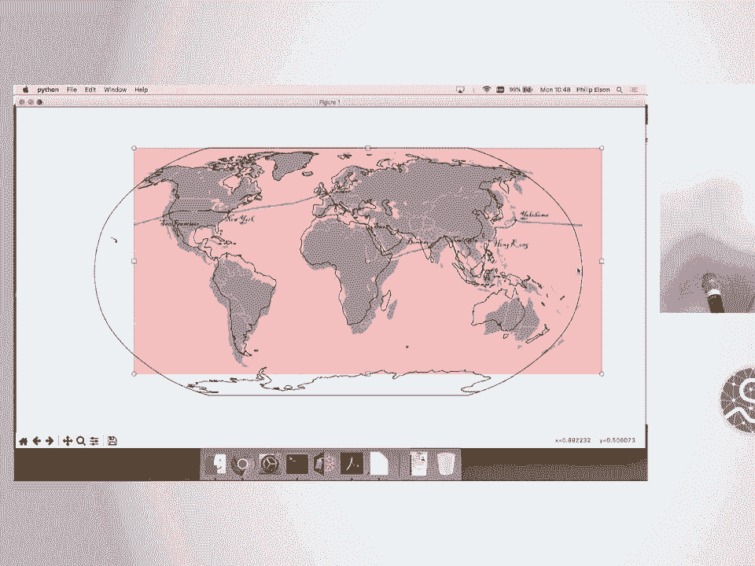

 I was kind of doing that。 And as it's running along， it's printing at the extents。 So， you do that。

 so it's kind of close enough。 We're just playing around here to get four fingers。 I'm going for it。

 There we go。 Ahhh。 Right。 So， when we do that， we got the extents。 So。

 that was the magic that we needed to take that image and then get the extents right。 So。

 we worked with the extents using that program， the example there。

 And the coordinate systems of these extents， so what do you think the coordinate systems。

 of these extents would be in？ [inaudible]， Okay， that way。

 I can get at this。 Right， okay。 Can you see this language？ So， they're kind of not lat longs。

 are they？ Kind of weird not planning。 So， the suggestion is， they don't look like lat plans to me。

 What do you think？ So， what kind of projection are we in？ Robinson。 Robinson， exactly。 So。

 we were in Robinson。 These extents are in Robinson。 So。

 we just need to appreciate the data that we're using and what it passed in the extents。

 That means we're setting the extents on the Robinson projection。 So， let's go back。 So。

 we've worked out for extents。 We think they're in Robinson。 And we're looking at the chords。

 We add over to the image add that we're using。 Let's look at the chords。 We use， so。

 we worked out the extents。 We're doing our geo-location。 We create a figure。

 We know it's all about Robinson。 We're thinking of Robinson as a target projection that is。 So。

 we have created an instance of the Robinson projection。 Remember。

 there was a shift in the central meridian。 I put it into reason 15 minutes。 So。

 we've got our target projection that we want to show our map in。 So， we create our axis。

 We get back our geo-axis。 This geo-axis will be in a Robinson projection。 We've set that up nicely。

 We've added some grid lines。 We can add our coast lines again because it's a geo-axis。

 And this is the magic。 So， this file that we saw， you can use image read。 So。

 Phil was talking about that。 So， we can use plot image read， which we load to get the image。

 We load the image。 It's just bunching numbers， right？ And then we're saying， well， actually。

 we want to take this image and want to plot it onto our target projection， which is Robinson。

 which is in shift。 So， you use them show on our geo-axis， which will set all up。 You take your data。

 We add it。 That's the raster。 Our extents。 That's the extents that we just calculated by pledging round。

 trying to get things to line up。 This is our transformation。 So。

 transformation in numbers we're getting out of Robinson。

 We didn't think that we're laxing along with our Robinson。 And this is my plot left。

 just in the origins of the top。 We've set it as global。 So， let's have a look at that。

 See what that can be。 Okay， so， that looks kind of similar。 So， if I scroll up a little bit。

 see what the original looks like。 There it is。 We think we've created done with best endeavors。

 And you see there's a bit of weirdness going on here。 This line， as I said before， is。

 it's went past outside the boundary。 So， that's like someone's hand drawn that。

 or they've done something a bit strange in this one。 It's almost like that's not quite right。

 but that's， that's like， that's the way it is。 That's done the right thing。 Okay。

 any questions on that？ I'm really kind of happy that I can zit through that。

 but the fact that you can take an image， you can know the target projection you want it to be in。

 You can geolocate it， book it， the extent。 The extent will be in that target projection。

 And then you're just using the things that we're building up in the layers using Matplotlib。

 using your friends that you know about。 Image read， tweeting the image。

 and then ensure your geo access with your extents。

 And you make sure that you have these magic words of transform and projection that you set them right。

 This is your data， and that's the target。 Yeah？ Okay， happy to move on？ Yeah， oh， sorry， yeah。

 I think I'm just going through the XY and the amount of， um， map the entire layer。 Yeah。

 The extent of the cell and elbow comes to the first and next slide。

 The extent of the map is the extent。 So we're talking about these numbers here。

 These are the numbers when I was questioning the image。 Yeah。 Okay。 So， yeah， so that was， um。

 so this， this， this program that we read written image geo locator that was working out for you as you moved it because you were it was in the。

 it was in the Robinson projection。 It was as you moved the image。

 it was recalculating the extent in Robinson's as it was going along。 So as you moved it。

 these numbers were coming out。 And once it all lined up， that was the extent of。

 of the image in Robinson。 Yeah。 And you just， and it was just cutting and pasting those expanse into the notebook。

 Yeah。 Yes。 [inaudible]， See it again。 [inaudible]， So is that like drawing， uh， but。 Right。 Okay。

 So the question is， um， filling in regions in different colors。 Yes。 Yes， you can。

 And we've got examples of that later on。 So， uh， it's， it's the same as the map pop lip。

 You can just change the face color of a polygon。 As you can change the properties of a line or a point。

 It's the same kind of things。 We have the same controls。 There's examples of that later on。

 Is that okay？ Yeah。 Okay。 So that was， well， that was fun for me。 So I got to play with that。

 Particularly if there's are any further questions on that。 So。 Quite happy with that。 Yeah。 Yeah。

 So the， the， so questions about the extent， what they actually are。 So that was just the。

 the bounding box of that image。 And it was in， it was the X min X max。 Y min Y max in that order。

 And the units were in the units of that projection。 Which， probably since meters， I don't know。

 You know， we could find that out。 That's what they were。 Any other questions？ Yep。 Okay。 So。

 So that is that section。 So， introduction。 Okay。 So we've been here。 In there。 So。

 Swap over to Phil now。 Okay。 Okay。 So， we've now seen the。 What's going on here？ Made out this more。

 We've now seen the how projections work and what projections are。

 We've seen how you add some data with Cartipi to your， to your axes。

 And we want to now talk about kind of treatment of， of that。

 Those classes of data that we're adding and kind of look at interoperability between those data types effectively。

 So， I guess maybe I'll iterate what some of these， what the purpose of the section is。

 Mostly to try and get some clarity on， you know， the types of data that we are dealing with。

 And once we know what kind of data we have， we know what。

 hopefully can know what kind of tools that are， that are our disposal。

 And also knowing what kind of data you have kind of gives you knowledge about what types of methods on the geo-axis you can make use of。

 So， I don't want to take too long over this， but maybe we could do this interactively in fact。 So。

 what I really like to start thinking about is the two classes of data that we've already been looking at。

 Vector data and rusted data。 So， rather than working in small groups。

 that's working in one big group。 What examples of vector and rusted data have we already seen？

 And perhaps also maybe you want to kind of give examples， but we haven't already seen yet。

 What kind of vector and rusted data have we seen so far？ [ Inaudible ]， Okay， you said two words。

 you said lines and points。 I'm going to take both of those words because I think they're both valid。

 And what class， right， so this is kind of well and truly vector data in the geospatial term。

 the vector。 The cosines， yep， so what kind of data we're looking at there？ Right， yeah， polygons。

 yeah， expect the data。 [ Inaudible ]， Yep， we have that stock image and we have the Wikipedia image and that's the example rusted data。

 Yep。 We've seen anything else。 Any other kind of examples of rusted and/or vector data？

 [ Inaudible ]， No。 States， yeah， it's kind of like the cosines， yeah， vector data。

 Any other sources of rusted data that you can think of？ Yep， that natural image was definitely。

 So thinking about stuff that we've not already seen。

 is there any kind of sources of these kinds of data？ Sorry？ Television。 Right， okay。 [ Inaudible ]。

 Right， yeah， I've never put it on the cartridge by geoaxies， but you could。

 It's an example of rusted data， right？ I've had a hand there and then I'll -- right， weather maps。

 okay？ So that's interesting。 So weather maps themselves are typically what？ Right， maybe。

 So it's a good example of a weather map， which is going to be rusted。 Maybe。 Yep。

 that's a good example though， so weather map is going to be rusted， typically。 You're right。 Cool。

 Yep。 Okay， so continuous type models type things。 So where might you get that kind of data from？

 How might it be stored？ So is it -- do you get it as an image or do you get it as some of the format？

 Right， right。 Cool。 Okay， so there's clearly a separation here between kind of a vector and a rusted data and we kind of have already seen that you can add vector data with that --。

 we've had geometries and the pi plot dot plot function and you can add images with image show。

 You can actually do stuff like pcolor mesh in map。lib。

 There's a bunch of tools for working with these types of data。

 Sometimes you want to interoperate and sometimes you want to convert from one to the other。

 And even sometimes you want to convert within that class， so you might want to say。

 if you've got two points， draw a line between the two things， so the two subtypes of vector data。

 And that's what the purpose of this -- I guess the main remaining section of this tutorial is about is that interoperability。

 So， yeah， as I say， that's what this is about。 We're going to now look at Cartipi plus -- and this is where we're going to change our focus a little bit and start looking at some of the kind of wider ecosystem and bring in some of the tools that are at our disposal。

 So， we're going to start by figuring out how we can do raster to raster conversions in various ways。

 vector to vector。 We're going to look at some interesting application turning raster into vectors。

 And we could， obviously， be completely into the final bullet point。

 but we just don't have the time for this tutorial， so we just pull it out of scope。 So， with that。

 I'm going to hand over to Bill to talk about raster raster。 Is that right？ Yeah。 Okay， thanks。 So。

 okay， so we've got to understand what raster is。 So。

 we're just going to tenuously pull on this filious fog theme again going around the world。 So。

 we've done a bit of work and we found some data from our metal-force-hardly center。

 the climate research。 There we go。 Climate research unit。 Okay。

 so we managed to find some data that was representative of the cadle-mean surface temperatures during that period when fog was doing its journey。

 Just a bit fun。 So， we've got some data。 It reminds me we had to do a little bit work to do that using iOS。

 And there's a notebook there of how we can put the climatology and the normalies together using iOS。

 We're not going to expose that just now。 You can do that in your own time if you want to have a look at that。

 But what I thought we'd do is we have a quick peek inside that they are， see what's there。

 understand what it is and then generate some plots。 And as you come up with no surprise。

 it's also said that we are kind of standing shoulders of giants with my plot lead。 So。

 my plot things just kind of work with a little bit of cartilite added to it for the geospatial understanding。

 So， we've got our file。 We're now going to use an entity dump just to have a peek inside the file just to see what's there。

 You guys are familiar with NetCDF？ No， no， no， no。 Okay， it's just a。 Yeah。

 it's a little bit strange。 So， what we've got， it describes things in terms of dimensions and variables。

 So， it's the same， I've got some dimensions here and that's the extent。 We've got some time。

 some latitudes， longitudes and some bounds。 Okay， some variables。 Okay。

 we've got mean surface temperature。 It's three dimensional and it's the dimensions here。

 There's some metadata there as well。 It's describing some fill values。

 Got a long name which is a description mean surface temperature。 It's got some units， SI units。 So。

 it's in Kelvin。 That makes sense because it's mean surface temperature and there's some extra cell methods about something。

 Some processing's happened on the data and that makes sense because we noticed the Keto monthly means。

 And it's also given some connective tissue to say， I've got this data。

 That's my payload but there's other information that describes that。

 It describes the dimensionality in its same decade and month number and also time。 So。

 this describes the time。 It's since an epoch。 The calendar's got a calendar and there's some bounds of the time you've got a point and the bounds of the point bounded time。

 And here's a variable here that describes for the latitude dimension or the latitudes。

 It's in degrees north units。 Okay， but information there。 Same with longitude。 So。

 there's a bunch of information in there that we can pull out。

 It's got surface temperatures and there's a little bit of extra information that NetCDF keeps global attributes。

 It's like a dictionary。 It's just a comment， history， things that happen， source in the data。

 things that happen to it。 So， there's various ways that we can read this in。

 We did explore a bunch of other things using NetCDF Python back to basics， used XRA。

 but we studied too much。 There's too much。 So， in the appendix there's a notebook there where we explored and done the same exercise here。

 But we were decided we're going to use Iris。 Because Iris goes hand in hand with Cartify and allows you to load your data up and analyze it。

 And it uses Cartify itself to do its visualizations。 So， let's pull in that thing。

 And we'll use Iris and Cartify together。 Iris in a nutshell。

 you could just see it deals with monthly dimensional data。 So， let's just think of a NumPy array。

 And a wrap to round that is the metadata that you hear about。 So， data is just data。

 But what gives it meanings the metadata？ So， times latitude， longitude， information like that。

 It describes where it is。 And that's information that we need if we want to do a plot。 So。

 we have surface temperatures， we have units， information like this。 So， Iris can read NetCDF files。

 grid， phrase other formats。 And we can ingest it， examine it， and then we'll re-plot it。 So。

 that said， we're going to import Iris。 And then we're just going to load our file。

 which would be just add a peek inside。 It's a bit noisy。 And there are three months in there。

 because if we looked at time， time was three。 And we process it to cover the three months of October。

 November， December to cover the duration of fog's journey。

 And but it's a decade old means for the 1870s。 So， read this and we get back a cube。 So。

 think again， like this non-pairy with metadata wrapped around it。 You can do various things。 So。

 let's have a peek inside the cube。 And it's saying， okay。

 this kind of maps on to what we saw inside the NetCDF file。 It's saying there's three dimensions。

 And it's kind of pulled together some of the metadata to make it a bit more readable。

 Mean surface temperatures， the units are in Kelvin。

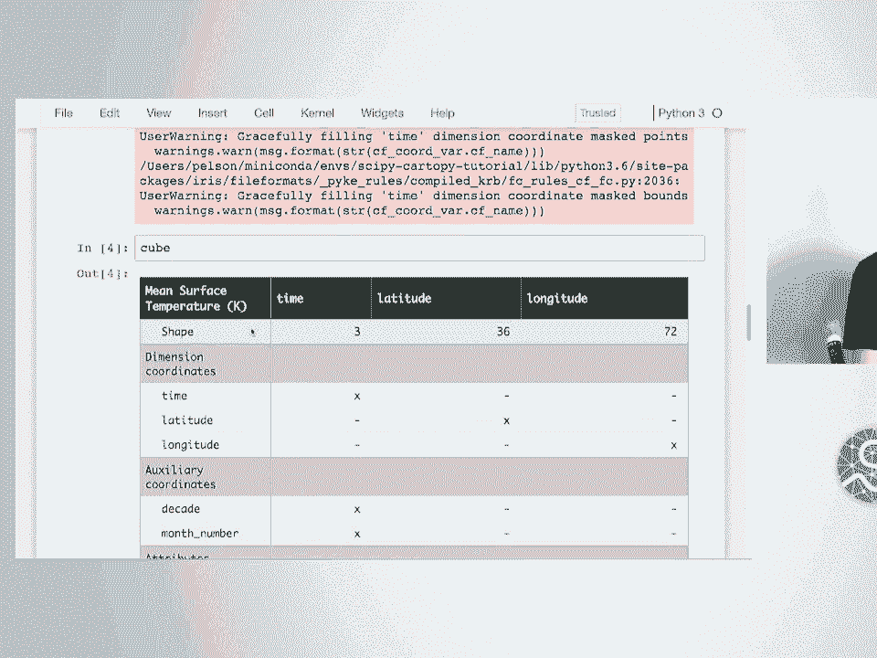

 That's the extents。 And it's saying I've got some coordinates that describe those dimensions。

 We've got time。 We've got latitude and longitude。 So。

 there are coordinates that describe those dimensions。 And there's some auxiliary coordinates。

 One on time that's saying I know what the decade is。

 And one on time saying I know what the month number was。

 And then there's these extra enormous attributes that it collects and say， well， I know about them。

 And here are the boundaries。 Okay。 So， let's just make sure knowing what we know。 Yeah。

 that's right。 So， we've got three decades and they're all coming 18/17。 That's what I expected。

 And we're hoping that these are the three months of October November/December。 The numbers。

 so that makes sense。 That's good。 And time。 You can have a look。 It's got points and bounds。

 It's a bit noisy here。 So， you've got three points。 You can simplify。

 You can actually ignore them because the way it's been actually means and aggregated。

 But what we're interested in is one of the bounds here。 That's the first one。

 That's the beginning and the end of this bounded point。 And it's from October。

 It's in November and that's December。 And also because it's time coordinate。

 it knows what calendar it's in。 That's useful。 So， we've got a bunch of information here。

 That's great。 So， we want to see it。 Okay。 So， let's， um， cherry pick out。

 Let's focus on just October and say， okay。 So， this data is going to be raster data。 So。

 let's do some inputs first。 So， we know about cartipi， our coordinate reference systems。

 We're going to leverage some benefits of virus because we've read in a CUBE。

 And we give some convenience functions that just wrappers around my portal lip that do things。

 might plot lip things， which we'll see。 I mean， put map up plot lip itself。 Okay。 So。

 what we're going to do here， we're going to create a figure。 And here we're going to say， well。

 give it my cube。 Just give me back the tenth month。 We could easily have done this， say， well。

 give me back the， you could easily， if you wanted， to do a toolbar。 Don't go off-face， right？

 Equals， cube， or a blowup。 No， you do something like that。 Okay。 It's all the same。 So。

 once we've now got our October cube， we've got the month， the decade， it will mean surface。

 temperatures for October。 So， happy with that。 Maybe we want to see it。 So。

 here we're focusing on going raster data to raster data。 So， how is this going to work？

 We know we're going to have a couple subplot， but what we're going to do is we're going。

 to show a peak-color mesh of that data and we're going to show a contour F。 So。

 these are just map plot lip things。 There's nothing different going on here。

 What is different is that we've added this projection word again。

 Keep on seeing this again and again。 But this is just saying， okay， this is standard map plot lip。

 but the projection is in Robinson。 I get back a geo-axis。 And here we're just。

 we're using iris to say， because iris speaks in cubes。 Okay。 It'll say， well， here's my data。

 I'll give you my cube。 Can you do a peak-color mesh？ And essentially。

 it's going to call carpi in map plot lip to do that。

 But it does a little bit work for you because it understands all the metadata， the last， the longs。

 the time， all that kind of stuff。 That's fine。 Nothing new there。 We get the title。

 We add a coast line because this is a geo-axis。 It's in Robinson and we're setting it global so we've got two extend。

 So， that's a peak-color mesh。 Our first subplot。 Let's do the same again。 Same deal。

 We've got another subplot。 Projections in Robinson。 We're going to contour F。

 We're using iris because it's easy in one line。 We pass in our cube of the data that we care about。

 We add the coast lines to a type layer from here on it。 And there we go。 So， we've got some data。

 It's Robinson's。 It's as we expect。 It's kind of the consular to that Wikipedia raster that we had。

 But here we've got a block plot of our data。 And here we've got our contour F plot of our data。

 So that's kind of useful。 That's kind of handy。 But， you know。

 we've said several times that you can take data and。

 repject it into a different projection from its native projection。 And you can do that。

 That's quite easy。 But we know that， from back to the example we had with the wiki。

 image that was in Robinson。 Okay， so let's change that。 So here we calculate the extent。

 We create a figure。 And with the wiki image。 Remember it was off。 The meridian was offset。

 Our target projection is Robinson。 So we've got back our geo axis。

 We're going to add our grid lines because we can do that。 We've got a geo axis， quite a coast line。

 Now we've set that projection up。 And we've got a few minutes in the format that we had for the wiki。

 Because we've got our extents and things。 We're going to read our image that we had before。

 And we're using， which is just a map plot-live image read。 So we've got our data。

 That's our raster data。 And now we're just going to see we've got our geo axis。

 And we're going to plot that with our extents that we've done before。 We've seen this before。

 This is not new。 We've got a transform word saying this data is in Robinson。 We've had a global。

 And okay。 If I run this， it might be absolutely helpful to see what we see。 [ Inaudible ]， Oh。

 we're here。 Yeah。 [ Inaudible ]， Yeah。 [ Inaudible ]， Yeah。 [ Inaudible ]， That's right。

 [ Inaudible ]， Okay。 So now we created our plot。 As before， we knew the extents。

 We've used our Robinson's。 And we've got the wiki image as we've already before。 So in Kappai。

 we can repurject this raster image。 It's said to a non-native target projection。

 So our data was all in Robinson's。 But we can easily say， well， actually， let's see that image。

 But we can put it in Plakkari。 And the way to do that is say you set the projection to be what you want it to be。

 which is Plakkari， our data， which we'd loaded previously in the previous cell。

 That's in Robinson's。 That still stands。 Kappai will repurject it into your target projection。

 which would be Plakkari。 And there we go。 Okay。 So there's a little bit of work there because it was working hard to just。

 reject in that whole image。 So there are a lot of things that can do that raster。

 You guys heard raster。 No， it's kind of built on G-DAL。

 So it's got all the smart stuff of G-DAL in there。 It can do that kind of thing。

 But Kappai is a good option to use。 Do we want to run series？ Can I exercise these？

 I don't see great value in that in talking about those， but it's just taking the image。

 and you're just doing the same thing。 You know that it works for images， for rasters。

 all the exercises， which is over-plopping the temperature data on top of it。

 So this should come as no surprise that you can do a contour。 So in this image here。

 it'd be quite easy to then change your projection if you want to。 And the temperature。

 the K-DAL temperature surface temperature that we've had， we can just do a contour F。

 We can do a peak-color mesh on top of it， so you can mix and match。

 So that's the power of being able to re-project， creating the projections that you want using raster data。

 Is that too fast？ Is that okay？ Or is it worth while going through some of these examples？

 What do you think？ Yeah， okay。 So we know about how we do our plotting with our image。

 So what is the exercise？ The exercise。 Iris is doing a lot of the heavy lifting for you， okay？

 Because we've loaded the data as a cube。 So what you plot， the decadal。

 mean surface temperatures for October， which we've done before。

 using either a block plot or a contour plot over a wiki image in a plackeye projection。

 So here we go。 So what we're interested in， what's the target projection？ It's plackeye-ray。

 So we're thinking， let's create an axis。 We're interested in plackeye and we set the projection keyword。

 so we've got the right geo-axis back。 We've had some grid lines。 We've seen this before。

 and we can add some coast lines。 This is reading our raster image， which is the wiki image。

 We read it in。 We've done this in this before。 You then use on your geo-axis the image show。

 We have Fort Tite， our Extents， which was in Robinson。 We set it to be global。

 so we have full image。 And this was all the difference。

 And this exercise was looking for you to use was to， once you'd set all this up。

 which we'd seen previously， was to over plot the temperature data for that decade of 1870。

 And you use NIRIS to do that。 So we're bringing together those two examples。

 So we've got our cube data。 We do our peak-colour mesh。 And we plot it。

 so let's have a look at that。 And here。 Okay， so I had to do a little bit of work there。

 So here we go。 So we've got， as we expected， we wanted to be in a plot carry projection。

 It's done that。 And we've got her， which was Robinson data， it's re-projected into plot carry。

 And we've used Iris， because with its data to do a peak-colour mesh of the temperature data。

 Is that what you were expecting？ We just kind of started to join these little bits of the jigsaw together in terms of what you want。

 Getting your data， being able to get a geo-axis， set your projection to be the target。

 projection that you're interested in， understanding what projection you're sourcing as in。

 And then setting these up correctly。 Any questions？ Is that too fast？ Okay。

 Should we look at the extension？ The other thing is really worthwhile。

 The main point here is that you've done plots before， you've done contour F。 And with cartorappii。

 it's just allowing you to do the same thing with a little bit of minima effort。

 We did lean on Iris to get the data， but there's nothing really radically different there。

 None of the hood is using that plot lid in cartorappii itself。 Okay。 Now we're doing for time。

 so give them that。 Okay， so we're talking about this interoperability。

 So we've talked about getting appreciative of going from raster to raster。 The next section。

 Don't need that。 Let's do some tidying up。 So we're happy with going from raster to raster。

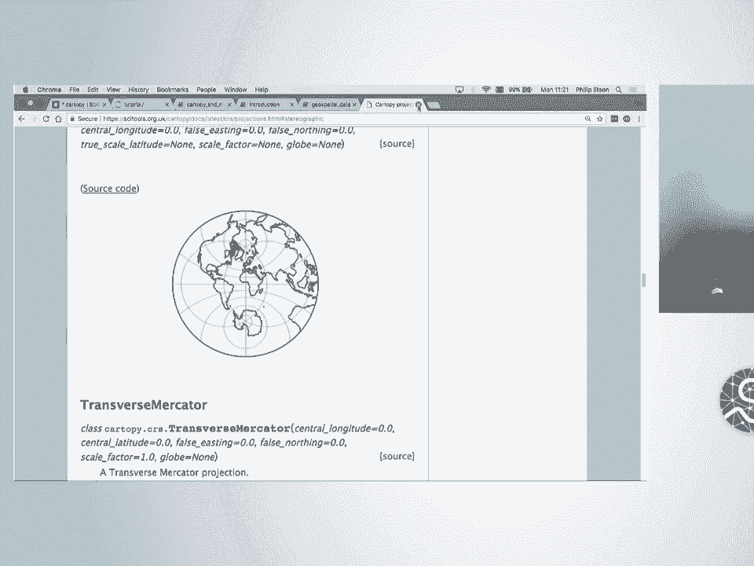

 So we're going to depend a little bit to vector to vector。

 We kind of appreciate now what vectors are。 We're talking about points。

 we're talking about geometries。

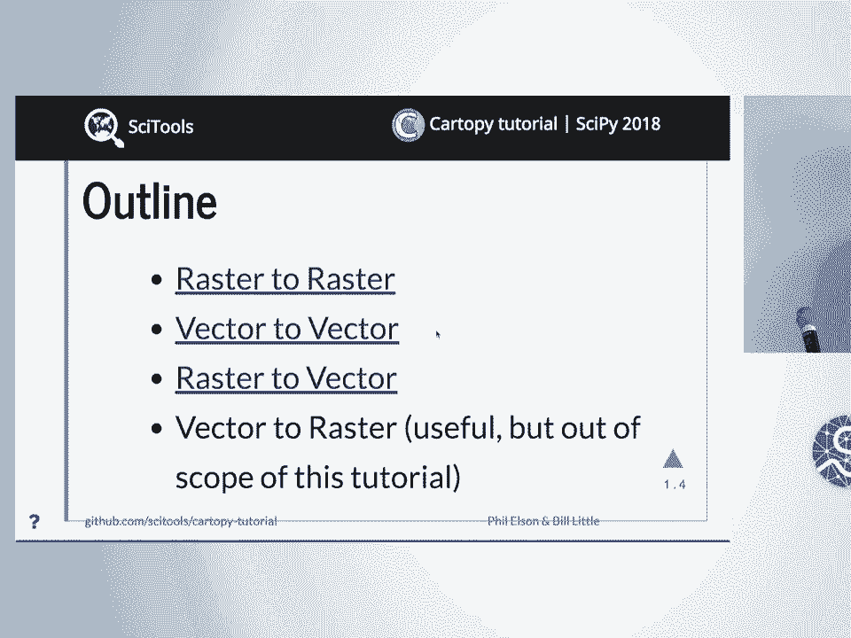

 What might be involved in those kind of operations？ What can we do？

 What can cartorappii offer that makes our life easier？ So let's first talk about points。

 Let's start there。 And move forward until we get to geometries and lines。

 So if you want to take the cartorappii as a coordinate reference system。

 and on the other some methods that help us， that does the hard work and it uses Podge4。

 to do these transformations。 So it's easy for us to。

 these methods transform points and transform points。

 So let's see how easy it is to transform one point from one coordinate system to another。

 So we're going to again import corner references from cartorappii。

 And as an example something slightly different。 OSGB， everybody had a OSGB。

 It's like the ordnance survey for a great bit。 It's like a projection just around Britain。

 Because we can。 So that's one that's used generally for some of our weather。

 We've got a geodetic so that was the spherical coordinate system。 So we'll go from one to other。

 So convert from ordnance survey GB which I think is in meters。 It's a bit weird to lat long。

 So we've got a point which are in Eastings and Narlings。 We have our geoid。

 So we're introducing this transform point so let's。

 maybe it's worthwhile jumping to the cartorappii documentation。

 So we've got a whole bunch of methods that are on our coordinate reference system。

 And one of those is transform point and the plural is transform points。

 So here you simply pass in your X and your Y point and your source coordinate system of those points。

 So that's almost akin to when you're doing a contour F。

 You pass in your lat and your lungs and use the transform word。

 That was a way to say that's what the coordinate system of the source data is in。

 So that's the same as transform points。 Let's see if we can jump back。 So we have transform point。

 Our X and our Y point here they are。 These things and Narlings in its same actually these are OSGB。

 What's OSGB？ That's our OSGB projection。 So it's in transform。

 These X and Y points in OSGB and the method is called on geoid。

 So that is the target that you're going to go to。 So this is projection。

 The domain from and the domain to you can run that。 So I guess that's right。

 That's the lights and longs of that point from OSGB to geodetic。 And that it connects stands。

 You can do that for multiple points。 So that's a point。 The next thing up from there is lines。

 So that's connecting two points to make a line。 So it's subtly different。

 You can project a geometry。 But use the word project instead of transform because what's actually happening under the hood is that if you imagine having two points in a line。

 And if there's a boundary you see that the line was going to cross the anti meridian。

 Cartipi is not precise but it uses a numerical and numerical tolerance。

 To work out where that cut might happen。 Remember the orange that we can flatten out。

 So if you had a line that was going to cross in the northern hemisphere。

 Cartipi works out where the brakes are。 And it's not precise。

 If it was precise transformation we'd use a transform where the bit of cleverness is going on。

 And that's why we've hinted at that by using the project keyword。 Let's have a complete example。

 So we're going to lean on like I said Cartipi uses Jios and uses Shiply。

 So we're going to put Shiply geometry。 And then what we're going to do is we've got New York to Honolulu。

 And we're going to create from there a line string。 So we've got our longs and lats。

 We put the line and we'll create our Shiply line which is a line string。

 And we have got our Platt-Carry projection。 And okay we want to convert this from Platt-Carry or this line to Platt-Carry。

 So there it is。 Nope。 Yep it's that exciting。 Thanks Juan。 So yeah I wasn't too excited。

 So let's put it in some context。 Just this line here。 So the question is what is that thing？

 So that's just a Shiply line string。 No， no。 You've got clear definition of that。

 That might feel answered Juan's question。 Yes， it's the line string。 Yeah it's not a string string。

 Yep。 No， no。 So it's like a Shiply thing。 Like a primitive that understands that's a line。

 So we're going to use that and cut up how it understands that。 So here。

 yeah let's put that into context。 So okay you've seen a pattern here。

 It's almost like a factory of a way that we bolt these things together。 We create a figure。

 We create our axis。 We're interested in Platt-Carry。 We get back our geo axis。

 And what we can do is we can add geometries to this by using the add geometries method on the geo axis。

 Here's our line。 It's in Platt-Carry and these are just standard matte plop lid keyword arguments that are going to describe that。

 We're going to add edge color， face color。 So this probably goes back to your question。

 The gentleman at the back about if you have a geometry and you want to change the color。

 This is kind of the way you would do it。 Let's add some coast lines and let's do a plop。

 Slightly more exciting。 Okay， so it done as we expected。 New York， Toronto。

 And that was not just a line but our jump she line。

 So if you wait to rip that line is a great circle。 Okay。

 so you might start thinking what could we actually do， but I want a straight line。

 We're going to take our line in seats。 Remember at the beginning we created a geodetic projection。

 We've seen this line is a geodetic line。 We project it to a platt-Carry line and plot it in a target projection that is platt-carry。

 We're using that geometry， so we'll start that line again。 Let's see what that looks like。

 So it's before it was a straight line but now we're saying it's actually a great circle。

 which we know is going to be a curve line on a flat platt-carry。

 So it's kind of behaving as we might expect and have sort of seen that behavior before。

 So there is an exercise。 How do you want to just walk through it？ Let's do it。 Yeah。 Okay。

 so I've done a lot of talking and used on a lot of sitting and listening which we kind of don't want that to because it's a tutorial。

 So let's kind of try and consolidate some of that altogether。

 We'll give you some time to do this exercise。 We'll be walking around so we can help you。

 So what we've got to do is we're going to construct a line string。

 So this line string is a shapely object between Yokohama and San Francisco。

 And we've got the lats and longs there。 Project this line using a project geometry using both platt-carry and geodetic as a source coordinate systems。

 Put the lines using a cartipite and observe how they differ or so。

 Probably guess what they might look like。 But let's find out what they do。

 And if you've got time when you nail that you understand it and you're happy with it。

 The extension is to devise a way to construct the line string such that it crosses the anti-mideridian。

 when using the project geometry。 So there's a little bit of thinking about there。 It's a bit sneaky。

 So have a think and try and tackle the exercise。 I just wanted to add if it's not clear the wording is pretty terrible。

 We're asking you to call up project geometry in multiple times。

 Basically project it for your first line string and then project it again for geodetic。

 And we'll get two results。 And what we want to know is in what way are those results different。

 I guess that's the point of this exercise。 Okay。 Great。 Okay， so I'm going to crack off。

 Let's have a peek at what we've got。 Let's see if it's kind of close to what you had。

 So we know that we're going from Yokohama to San Francisco。 Provided with those lots and longs。

 So we create our cheaply line string。 Plug in those coordinates。

 We've got our Create Now Black Carri projection。 And then we create our two projected lines。

 So we're projecting the geometry。 So we create our geometry which is our line。

 We're saying okay this guy here， this line here is actually a flat carry line。

 And this one here actually this is a geodetic line。

 And we're using the project geometry for this line using this projection。

 And we're projecting from flat carry to flat carry， geodetic to flat carry。

 And we create these two projected lines。 Okay， so now we've done the hard work。

 Hopefully that was close to seeing that was part of the exercise。

 And then we're going to again do the same thing。 We create a figure。

 And we're going to have a target projection for this axis to be flat carry。

 And then we're going to add our lines to that axis。 Remember this is our geo axis。

 If you want to add geometries， there's the adjumatories method that you use on it。 Okay。

 it's needed， pass in a nistrobulb， rather than a single thing。 So that's why we pass in a list。

 So we've got your flat carry line， you've got your geodetic lines。

 So we pass in our flat carry line。 And we're saying okay this is a flat carry line。

 That's the flat carry projection。 We're going to add some color to it so we can just discriminate between the two。

 Blue line for flat carry。 Face color non-blind width。 And then we do the same for the geodetic line。

 Same deal。 We've done the hard work up here， create our geodetic line。 We say okay。

 add it to the same geo axis。 And then we meet that red as some coastlines。

 And then let's see what it looks like。 So here we are。

 So what's interesting here is that you've got San Francisco， Yokohama here。

 So flat carry line is the blue line。 And as you'll see， it understands straight lines。

 And this is joining as a straight line between these two points。 The red line is the geodetic line。

 Geodetic lines are thinking spherical。 So we're thinking if you join two points at a great circle。

 always takes the shortest distance。 The shortest distance between these two points is not the root that the flat carry line is taken。

 It's actually gone round the back。 But again， cartopies。

 clever to know where the boundaries of the map is。

 And then this can't use our anti meridian and it's clipped properly and it's brought it back。

 So that is the short distance that's the geodetic line。

 You might have thought that the geodetic line would have bent and gone across here。

 Did some people think that might happen？ No， they'd go round the back。 Did anybody get that far？

 That's good。 Did you want to do the extension？ Okay。 Projection jumpsies？ Okay。

 So we've seen projectionary and it'll show it as projecting lines。

 The same method works for polygons， shapely polygons。 So we're just going to construct。

 this is pure shapely， no cartopies here。 We'll just make a polygon and sign in cause of some number between 0 and 2 pi。

 You end up getting a circle。 Shapely renders it for you， which is kind of neat。

 We're going to project that。 So I'm going to say that these coordinates are spherical coordinates。

 The lines between those coordinates are great circles。 And I'm going to project it to flat carry。

 Okay， not that exciting。 We get a circle， a circle when it's good at it。 However。

 if we change the projection of our target slightly。

 so instead of us having the central meridian at the middle of the map。

 we switch around by 180 degrees。 So we're going to create a circle that's centered at 0-0 actually because that's what our implementation does。

 If we project that to some different projection， we'll see a different result。

 And what's happening here is that polygon now covers one half of the map， an other half of the map。

 and castifies， and then it's going to realize that and fill it in for us。

 So let's follow that same old pattern， add geometries。

 the projected geometry in the target coordinate system， and have a look。

 So there's that circle centered on 0-0 and it's cut around。

 One really important kind of subtlety detail that you need to know about geometries on the sphere is that you need an extra piece of information to determine which bit you should fill in。

 So on the sphere， just imagine you had a polygon that was defined。

 that tracked all the way around the equator。 Which side of the hemisphere should an algorithm color in？

 Okay， and we need to figure out or have some convention to determine that。

 And I guess we can demonstrate that quite nicely by simply reversing those coordinates on that circle that we were manufacturing。

 And I'm going to call it in verse circles， so hopefully this has given you a sense of where this is going。

 I'm going to use the same call I did before to project the geometry to that projection that requires a cut。

 And we don't get two halves of circles。 We end up getting the whole thing minus those two halves of circles。

 So I hope that makes sense as to what's going on。 Polygon's on the sphere。

 the winding order is really， really important。 And when you project it， castifiers honouring that。

 There are some shapley's great for dealing with this stuff。 You can change the order really easily。

 You can check what your polygon is in。 So these tools are out there and super useful。

 Any questions on project geometry？ Basically what you're seeing here is what's happening when you're adding data to a map led geo-axis。

 What we're demonstrating is that this doesn't need map led in order to project those geometry。

 This is actually a really general purpose algorithm that can project geometries for you。

 So we're running low on time。 And I'm thinking there's a nice section here about distance and distance on the sphere。

 But I think we're just going to move over it。 Basically。

 cast by has the functionality to do distances。 There's material here for you to have a look at。

 And I think we've not got the time to go into that in too much detail。 If I'm honest。

 I will touch on geometry predicates though because that's kind of useful。

 One depends on the other doesn't it？ I could just execute the cells and walk through it。

 I don't want to go crazy with them up but they'll make you dizzy or anything。

 But I'll follow you guys。 So basically let's construct a line string with lots of lots and lots。

 Just pulling it out there。 And this is using the same pattern as just seen。

 Project that line is geodetic and give me back a geometry which represents the geodetic line in black carry between those points。

 This is basically all that's happening here。 The other thing that I want to show you is that kind of interplay within shapely really or you know。

 geopander if you use in geopander or some of the tool。

 And so what I've got hold of here is some natural earth land data。

 The shape file here containing the polygons of all the land。 On the globe。

 And there's some functionality in Cachpai that will do that for you。 There's shape reader module。

 But geopanders would work just as well。 Fiona would work just as well。 High shape。

 You know there's a bunch of different options here。

 The important thing is we end up with a list of shapely geometries。

 However we end up there it doesn't really matter。 Right。 And let's fix them up a little bit。

 Okay so that is the shapely representation of the kind of the geometry that is land。

 And what we can do is kind of do a shapely intersection to figure out of that track。

 that great circle track that we just produced。 Pick out only the bits that cover land。 Okay。

 And you know now our geometry starts to get a bit speckledy because this is I think North America and this is the Atlantic perhaps。

 So we end up breaking up the path。 The great circle path。

 And this is where I kind of was tendrils into the previous section because now we can compute the distance of that track。

 Don't go off-east is the moral of the story。 Yeah， let's move on from that。

 So I guess what this was hoping to get out was that there's a really nice interplay between shapely and cart by here。

 Cart by will give you an awful lot of functionality in terms of spherical work。

 It will give you distances。 And hopefully will give you really powerful predicates including intersection to kind of join。

 you know， mash together， vector data sets in a really intuitive and powerful way。

 And they come together and form some really nice behavior。

 So I encourage you to take a look at this exercise offline。

 It will kind of hopefully be self-explanatory。 Yeah， but we're running low on time。

 We're running low on time to show you anything about Follium and IPLite。

 So maybe this should just be a little run it and see what happens type activity。

 I won't even talk about the code。 If you have any questions about Follium， Philippe。

 could you put your hand up please？ The person is looking the other way。

 So it's some really cool functionality web based in the browser type visualization。 Check it out。

 There's also similar tools like IPypen Leaflet and GeoViews， both awesome tools as well for。

 visualizing this interactively in the notebook。 You might like to check those out。

 That is all we have time for for vector to vector。

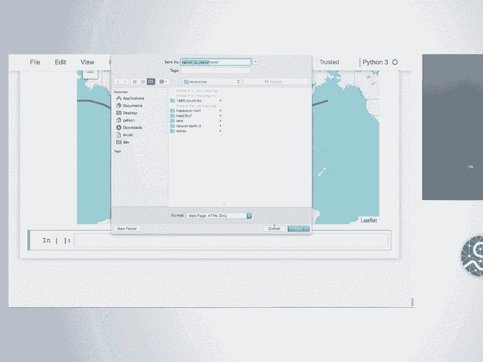

 Okay。 There are two more sections。 And less than ten minutes。 Yeah。

 So one of the things that we're going to do with this tutorial is bring in a guest speaker。

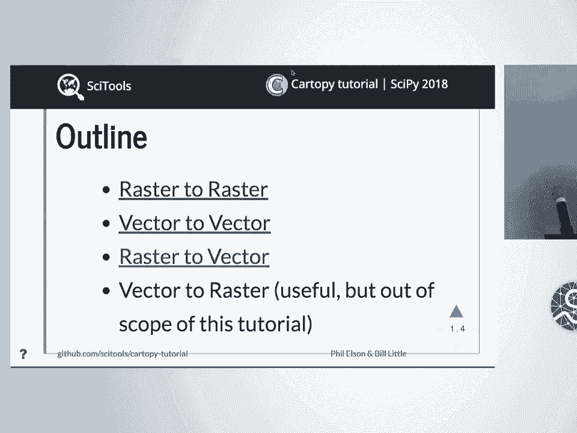

 Juan in the corner。 And I think we should bring him down in a second or even now maybe。

 Come on down。 Juan is using Glazias。 Hopefully these notebooks are useful to you。

 And if you're into this space， take a read over them。 We're here all week。

 We'll be here for sprints and stuff。 So check them out。

 But basically that Wikipedia image that we've got there would be really great for us to pick。

 out that track。 And we asked Juan， who's psychic image fame， good guy to do this for us。

 And he packed it out last night。 And if you want to talk us through。

 >> Hopefully I'll remember what it is that I did。 Okay。 And this is weird。 Okay。

 So the first thing you need to know， which we haven't -- this is not my code。 Okay。

 Let me have a weird European keyboard too。 Okay。 So I can skip all this。 That's interesting。

 What is all this？ You've thrown me ahead of time。 Okay。

 So filled with something here that I don't understand。 CCRIS is not defined。 Oh。

 you haven't run all this。 We're in business。 Awesome。 All right。 So here's what happens。

 So if we look at the image that we got from Wikipedia， which is here， it looks like there's。

 actually five colors。 White， grey， black， yellow and blue。 But if you zoom away in on these pixels。

 there's a bit of anti-aliasing going on。 You've got some blue and light blue on the edge。

 And here you've got some light grey on the edges and so on。 So we can't just go and look for blue。

 black and yellow pixels to get the track， which is， what we would want to do。

 But there's a cool sci-fi function called vector quantization。 And what that does is -- where am I？

 Here。 So this is sci-fi。cluster。vq。 If you give it an array of colors and then you quantize -- you give it an array of pixels。

 which are sort of three values。 So it's an array of number of pixels by three values。

 The vector quantization function will tell you what -- which of those colors is closest。

 to each of those values。 And then we can transform back and just say， all right。

 make that pixel that color。 And we can wrap up with an image of only five pixel colors。

 which are white， grey， black， and yellow。 So that's what all this code is doing。

 And I can't -- don't have time to go through in more detail than what I just did。

 But let's just see that it worked。 So you can see that we've got the two images and they look the same。

 But thanks to this fancy map， the little notebook mode that I can scroll， zoom to rectangle。

 If I zoom in here， let's zoom in even a bit more。 So do you see that here， this pixel here。

 this is the original image is some weird， intermediate grey。 Or as ever here。

 it's gone back to the background grey。 And so on。 So you've also got some light blue colors here。

 They're gone。 So now that's good because we can say， all right， to get the track。

 I'm just going to get the， blue pixel and the yellow pixels。

 And the other thing is you've got the names of the cities and we're going to get rid of。

 those in a second。 Okay。 So if you look back at my colors， let's see。

 All of the colors that I'm interested in， which are black， yellow and blue， have zeros in the。

 values。 Whereas the colors that I'm not interested in， which are grey and white， they don't have。

 zeros。 So I'm just going to find all of the places in the images where some channel is equal to。

 zero。 Then I am going to use mdmich。label to find the connects sets of pixels。

 And then we're just going to discard all of the pixels that are all of the pixel groups。

 that are not part of the largest pixel group。

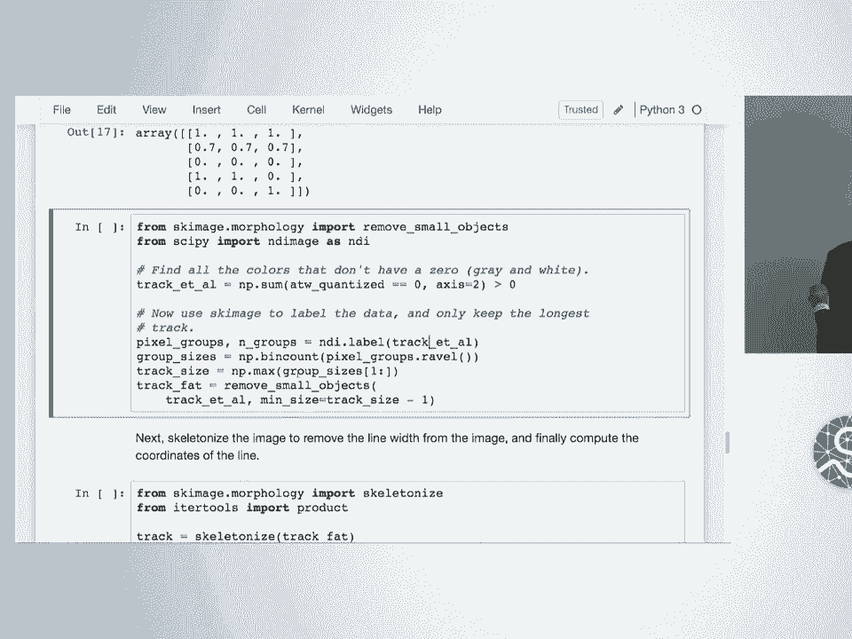

 So if we do that， it would be nice to actually just show the track。 We'll just do it。

 And the reason I call it fat。 Why did that not do something？ I'm not a figure。

 So I'm just going to do sub-pots。 Cool。 Okay。 So this is our track。

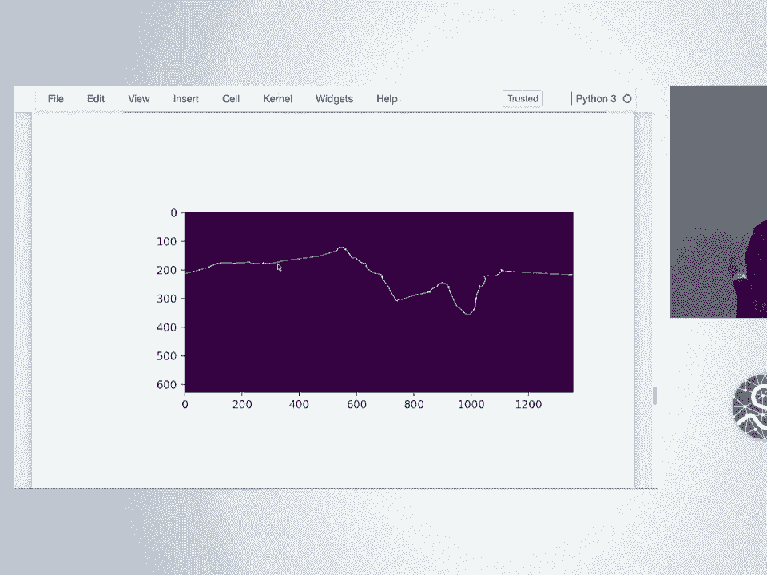

 It looks perfect。 Except if you look at it， it's a little bit fat in places。

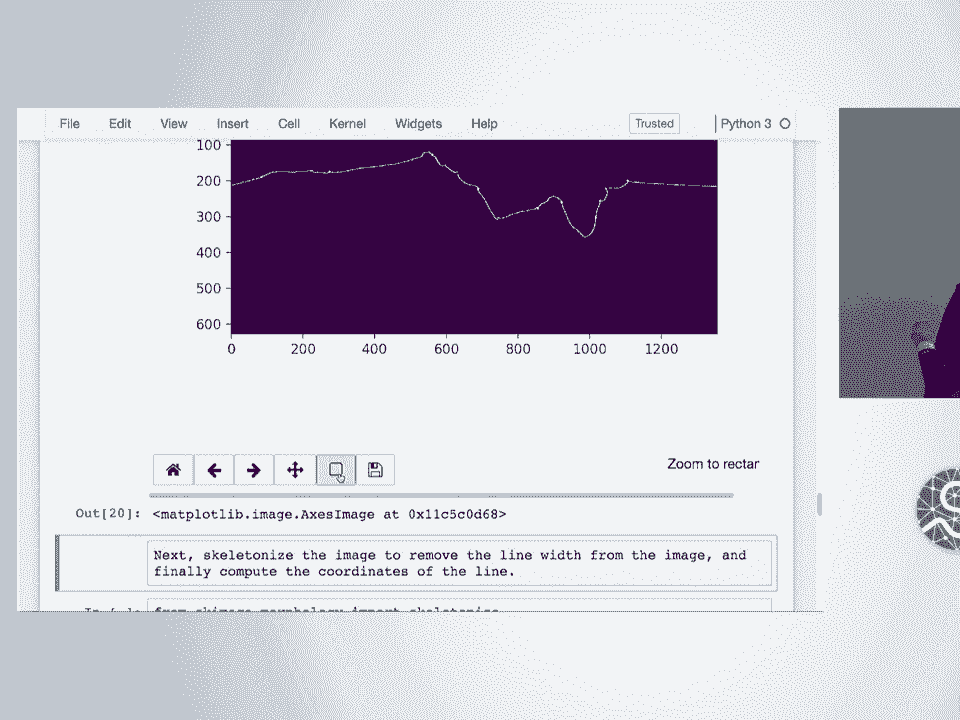

 Let's go here。 You can see that it's thicker than one pixel。

 And we want to have a track of single pixels。

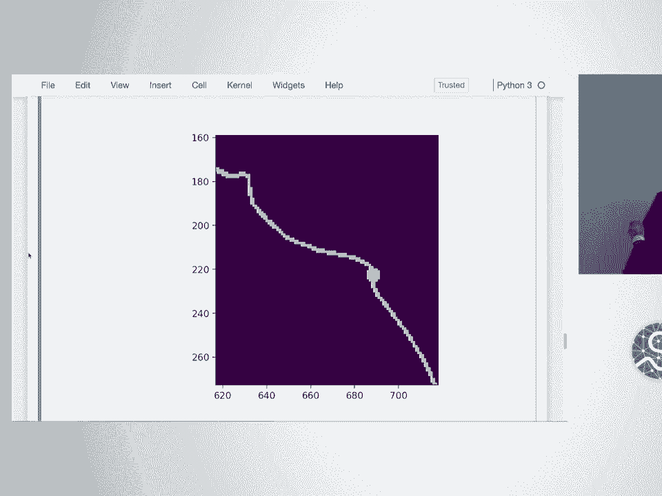

 So scikitimanche has a skeletonized function。 And that's what we're going to do。

 So probably I would do this in two steps， but that's fine。 So we take the track using skeletonize。

 And then what we're going to do， and I definitely don't have time to get to this in， detail。

 is for every pixel we're going to look at all the neighboring pixels。 And then first of all。

 we find the leftmost pixel。 And then from there， we look at the neighbors。

 find the point in the track， and then we add， that to this list of -- I'm going to call it path -- to this list of point coordinates。

 And that ends up giving us our point-to-point path around the world。 Okay。 And now we can plot it。

 So point-to-point， now we have latitudes and longitudes。

 And we can use -- so this is now longitudes and latitudes。

 We can use all of this cardipi niceness to plot this as actual map plot lead lines。

 And you can see that these are lines now and not pixels。 So it's a nice -- yeah。

 Now it's vector data。 And now Phil can take over。 So I guess the -- there's more work we can do there。

 right？ So this gap is very clearly there。 It would be nice if it wasn't there。

 But it's an artifact of the actual image。 That is a gap in what's represented in the underlying image。

 So I kind of hack away at that and basically compute the missing gap using a bunch of really。

 powerful shapely functionality， not really iris -- cardipi functionality itself。

 And we end up with the root。 And I guess really the point of this section is about showing you that we've got access。

 as a community to a really diverse and powerful set of functionality。

 Psychic images is a good example of that。 But there are so many others as well。

 And we can kind of bolt these things together and build some really powerful tools。

 So the tool that we've built here is using some image processing to pick out the track from an image。

 Which is kind of cool。 We need to do a round up basically。

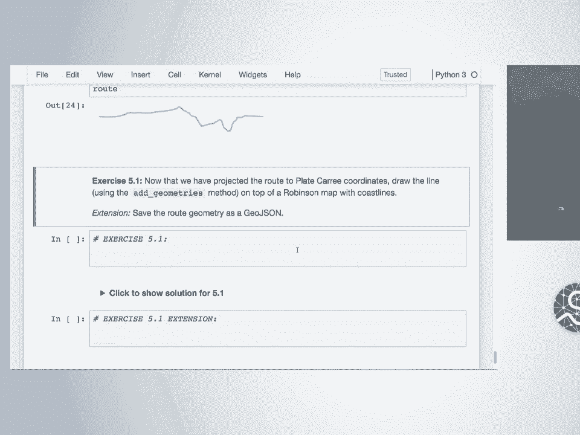

 So the final thing really that we wanted to get to is the round up。

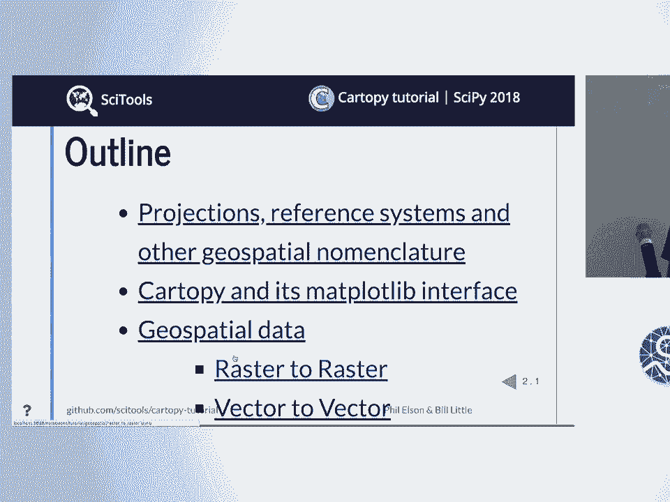

 Obviously we have kind of needed to rush through this at the end。 Just a bit of a shame。

 But hopefully you've got a sense of the kind of broader scientific Python geospatial community。

 kind of what's there and what's available to you。 Ironically even though we've run out of time we've not even touched the sides really in terms of what's available in cardipi。

 Like it makes it a bit bigger。 Cardipi does kind of web map service， web map tile ingestion。

 It's got some interesting kind of digital elevation model access in there。 Yeah。

 even like wind vectors and transforming wind vectors is kind of an interesting thing。

 So a bunch of tools that cardipi has that would not even have a chance to talk about。

 If any of those are of interest to you then as I say Bill and I are here all week and have to talk at any time。

 There's a final exercise here which obviously we don't have the time to do。

 Which basically tries to recreate this image。 You may enjoy having a go at that if you find the time and be happy to help out if you get stuck。

 Yeah that really wraps up mostly what I wanted to say。 There's a huge。

 huge kind of collection of people and tools that have come together to form a really powerful ecosystem。

 And we can just exploit that and it's fabulous。 I love it。

 Cardipi just bolts some of those things together， gives you a bit more geospatial richness。

 Project geometries for instance and imagery projections to play that。 A big thanks to Kelsey Jordan。

 who's not here but who gave a really great geospatial tutorial back in 2015。

 You might like to check that out。 It's free。 We will be sprinting this Saturday Sunday on Cardipi and Cardipi and friends probably。

 There's a few bugs that we want to fix， there's a few features that we want to add。

 And if you're interested then come join us。 It'll be a lot of fun。 Yeah， any more Bill？ Okay。

 just like to say thank you to Juan for coming down and giving us a lightning tour of how he did his image processing。

 And thanks to Bill for being here。

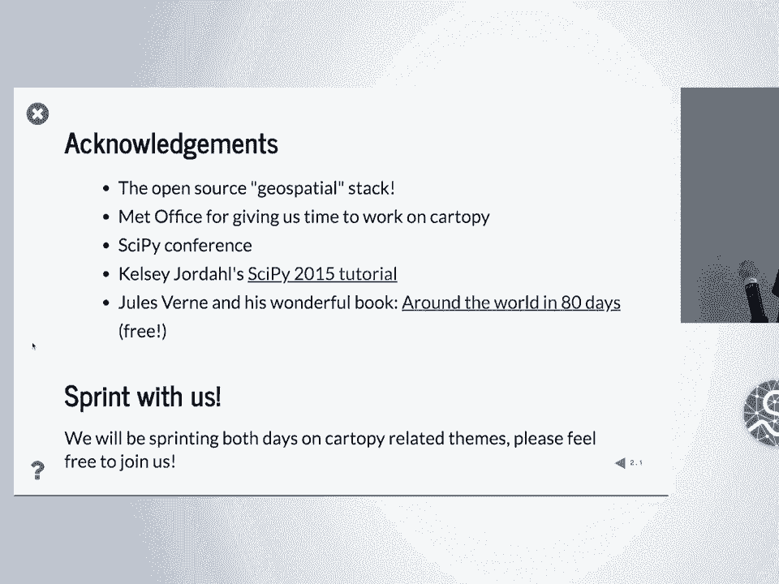

 Great。 Have a great。 [APPLAUSE]。