# SciPy 2018视频专辑 - P41：SciPy 2018视频专辑 (P41. Connecting Scientific Models across Scales & Languages w_ P - GalileoHua - BV1TE411n7Ny

 So I'm Megan Lang。 I'm actually a research scientist。

 at the University of Illinois in their band of champagne。 Sorry。

 At the National Center for Supercomputing Applications。

 And I'm going to be talking about a package CIS interface， that I have been working on。

 So that Python package for connecting， different scientific models across languages and scales。

 So first， I want to go into a little bit of the background， about why this package was created。

 So a common problem for crop biologists， that they want to address is ensuring。

 that there is enough food under climate change。 So as the environment changes， temperatures。

 CO2 levels， the amount of water that's available， it's expected that this will impact。

 the amount of food that's available。 So these crop scientists want to figure out。

 if there are ways that we can intervene in order， to ensure that crops continue to produce at a level。

 that we need to feed everyone。 And so these interventions could be things， like new crop genetics。

 things at the field level， such as plant spacing， when to apply water， when to apply fertilizer。

 these kinds of things。 And so already there are tons of computational models。

 in the crop biology community for different parts， of the plant。

 They're designed for very specific problems， at the genetic level， at the molecular level。

 at the plant level， at the root level， and exploring how different processes。

 within the plant behave in response to changes， in the environment。

 But we don't have a full way of modeling an entire crop。

 So you could imagine what these crop scientists， want to do is actually take all of these individual pieces。

 that they have for each level of the plant， and combine them to get an overall picture。

 And so this is the goal of the Crops and Silico project。

 at the University of Illinois in partnership with Penn State。 And it's funded by FRIC and NCSA。

 And so we're trying to build a community， around providing these crop scientists。

 ways of bringing their models together， and working with each other。

 to actually build an entire crop in silico， in order to answer these questions about。

 what can we do to make sure that there's enough food。

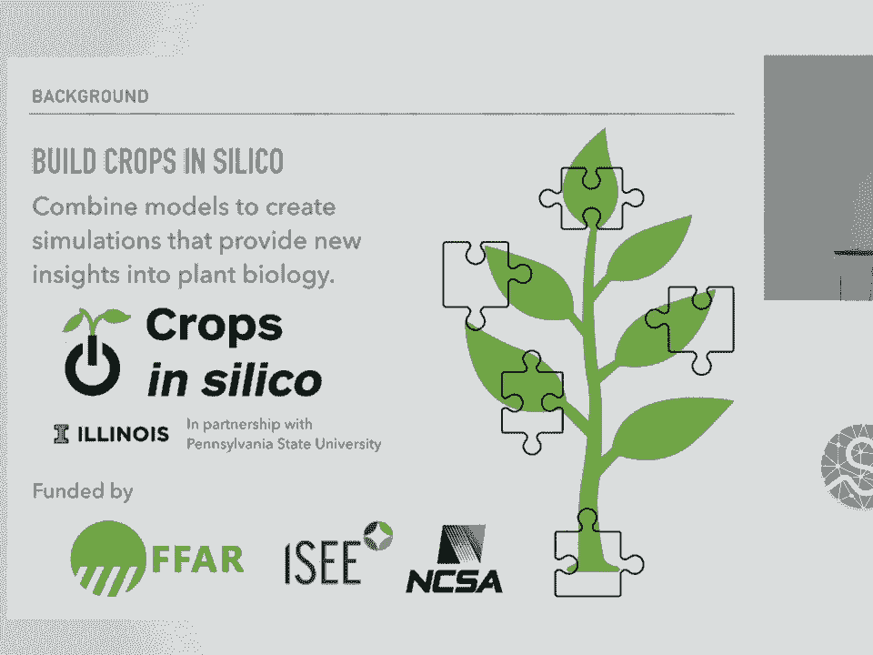

 So all this is well and good， but there is a problem。

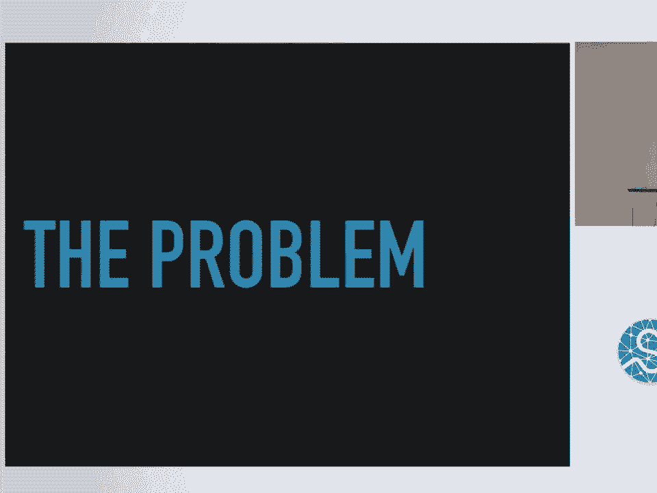

 So these models seem complementary on the scientific level。 You have， say， a model of a root。

 and you model of a plant。 And it should be pretty easy to stick those together。

 But because these models were not developed， with each other in mind。

 they're not necessarily compatible out of the box。 So you， for instance。

 they're often in different programming languages entirely。 And so this is not ideal。

 It makes it really hard for these models to communicate。 And essentially these models are pieces。

 from completely different puzzles， that we're trying to jam together。

 And so without the package I'm going to talk about today， there's really only two options。

 You could rewrite one or both models， to be in the same language。

 so that they can actually directly interact。 But this can be really time consuming。

 especially if the model is really complex。 And also this is on the domain scientist。

 which a large majority of biologists， might not have formal programming training。

 So this is a really large task to put on them。 Next， you could run one model。

 and then transform the output， into the format accepted by another model， and then run that model。

 Again， this requires writing code， to do that data transformation often。

 These data formats are very domain specific， not often self-descriptive。

 so you don't know what units， you don't know what columns are in the data。

 And so this is really hands-on and requires a lot of time。 In addition。

 this requires running the models in serial。 So you have to run on one set of parameters。

 with your first model， run the transformation， then run your second model。

 which is fine if you're only running， on one set of parameters or maybe two。

 But if you're doing a parameter search， which is often the target of these kinds of models。

 then this quickly becomes a time-consuming process， that is really not computationally efficient。

 So this is where CIS interface comes in。

 to try and solve this problem。 So the requirements for building the CIS interface package。

 was that we wanted to allow communication， between models written in different programming languages。

 We wanted to allow the models to run in parallel， so that we can take advantage of computational resources。

 And we wanted to automatically transform data， between the models so that this is not。

 on the domain scientist。 So as far as communication goes。

 the way CIS interface works is it provides an API， in the models in native language。

 And currently we support Python， MATLAB， C， and C++。 So these calls are all in the language。

 that the model writer already knows。 And they're simple send and receive calls that they add。

 It requires minimal modification of the source code。 So this means that you can reuse the same code。

 that's already been written and already exists。 And the code interface is flexible。

 So those API calls work the same regardless， of what models you're connecting that model to。

 Or if you're just connecting it to files。 And the domain scientist doesn't need to know anything。

 about what is actually doing the communication。 And there's actually multiple methods。

 that we include for doing this communication， which I'll talk about at the end。 In addition。

 we are running the models in parallel。 So this means that for our same problem set。

 where we're running one model， then the interface is handling that data transformation。

 So that's no longer on the domain scientist to do that。 Then that model can continue running。

 on the next set of the parameters， while the second model takes over。

 and completes its portion of the calculation。 Continuing so on， which is much more。

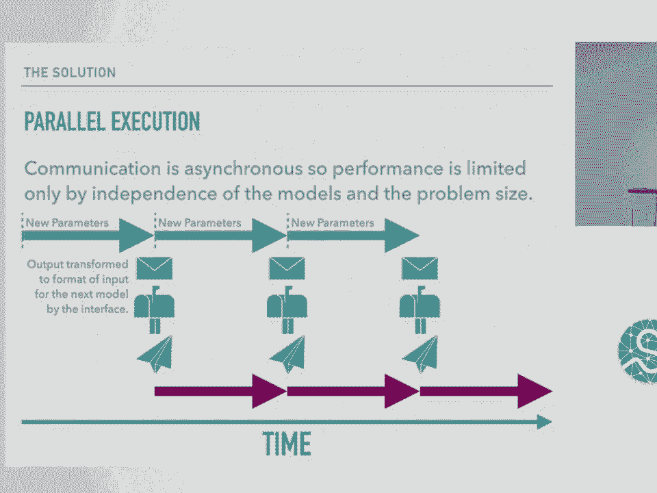

 computationally efficient。 So the way CIS interface works is it takes in information。

 about computational models built by the scientists。

 from YAML files that declare properties of the model。

 As well as YAML files declaring how models should be connected。

 So say you want model A to output to model B， model B to output to a file， et cetera。

 And then it launches the models on new processes， and then coordinates communication。

 between the models as they run in parallel， asynchronously using threads。

 So I wanted to walk through a quick example， of what it would look like to transform a model。

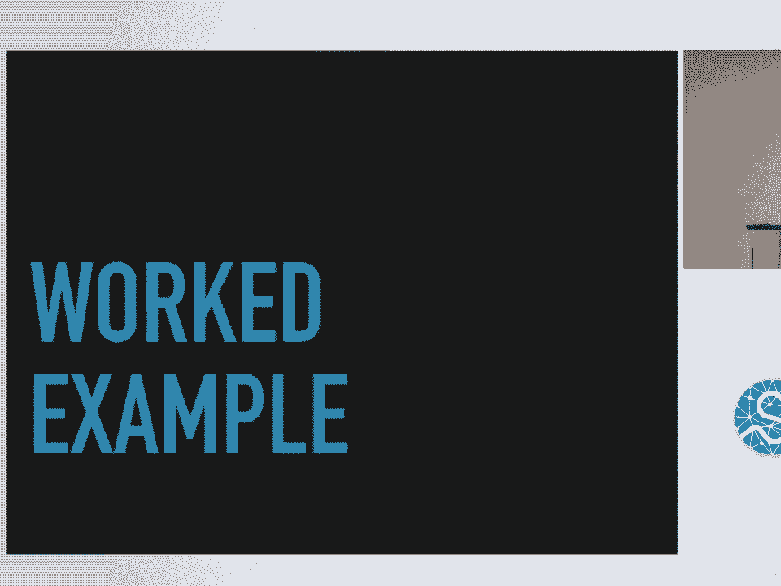

 So say we want to rebuild this model integration network， where we have a model for photosynthesis。

 which takes three inputs， temperature， carbon dioxide， and light intensity from files。

 and outputs photosynthesis rate to a file。 So first we would write our model YAML describing the model。

 then add the CIS interface API calls to the model source code。

 and then create a YAML file describing， the actual integration network。

 So these connections between the model， and inputs and outputs。 So first our model YAML。

 So a model YAML specifies exactly what it sounds like， a description of the model。

 So give your model a name， you say what language it's written in。

 and you point to where the source code is located。 Then you also specify inputs for the model。

 So for this one we have temperature， CO2 and light intensity。

 And these are the names of input channels， which will then be referenced by the API calls。

 And then we have one output channel， our photosynthesis rate。

 And this code only has to be written once per model。

 and then can be reused in any number of integration networks， that you want。

 And I'll show you an example of reusing this code shortly。

 So then on to transforming your model code。 So say we have this very simple model， photosynthesis。

py， where we are calculating photosynthesis rate。 This is of course not the correct way to calculate photosynthesis。

 and apologies to the biologists out there。 So this very simple model reads input from files。

 with our pass via the command line。 It then calls its calculation function。

 and then saves it to the output file。 So what this would look like using the interface calls。

 So first of all we need to import our API。 Then we need to instead of these file names。

 we're going to declare these channels， input and output channels， from the interface。

 And again you can see the name we're using the same names， from the model yamels。

 So we have temperature， CO2 and light intensity as inputs。

 And then photosynthesis rate as an output， with a format specifier saying that it's a double。

 So then instead of loading from the text file， we're going to call the receive method。

 And the receive method returns a flag， that tells you whether or not the channel is open。

 and the resulting data that was received。 And this is in the format expected。

 So the double or integer。 So then we call the same calculation function， that we call before。

 And then we will send the output to the output channel。

 by calling the send method which returns a flag， and it's specifying if the send was successful。

 So the final piece of the puzzle is actually the connection yamel。

 So a connection yamel basically is saying， what of those input and output channels for your model？

 What do you want those connected to？ Do you want them connected to another model。

 or do you want them connected to a file？ And so for this example we're connecting all of the channels to files。

 So our first example we have the temperature。 We're taking from temperature。txt。

 and passing it to the temperature input channel， for the photosynthesis model。

 and also specifying that the file type is a table。 Similarly for the CO2 input。

 light intensity input， and then for the output we take from the photosynthesis rate output channel。

 and pass it to photosynthesis rate。txt。 To actually run this， you would call from the command line。

 CIS run with the model yamel and the connection yamel。

 and you would see whatever print statements you have， and then your output file。

 So that's all well and good， but we basically just recreated the code that was already there。

 So what's really powerful is that， yes， you can run your original code which took input from files。

 and turned it into output to files， but you can also now use the exact same model code and model yamel。

 connected to another model。 So say we have another model， a growth model。

 and your growth model is now written in MATLAB。 And so we have some source code associated with the growth model。

 We have an input which is called growth photo rate， and an output which is called growth rate。

 And we want to connect it to our photosynthesis model like so。

 so that the photosynthesis rate calculated by the photosynthesis model。

 is passed as input to the growth model。 So we would use the same input files that we use for the photosynthesis model。

 from before。 And now instead of sending that output to a file。

 we just send it to the input channel for the growth model。

 And we send the output from the growth model to a file。

 Then we can run the integration by calling it on the two model yamels。

 the same photosynthesis model from before， and the new growth model plus the connection yamel that we just created。

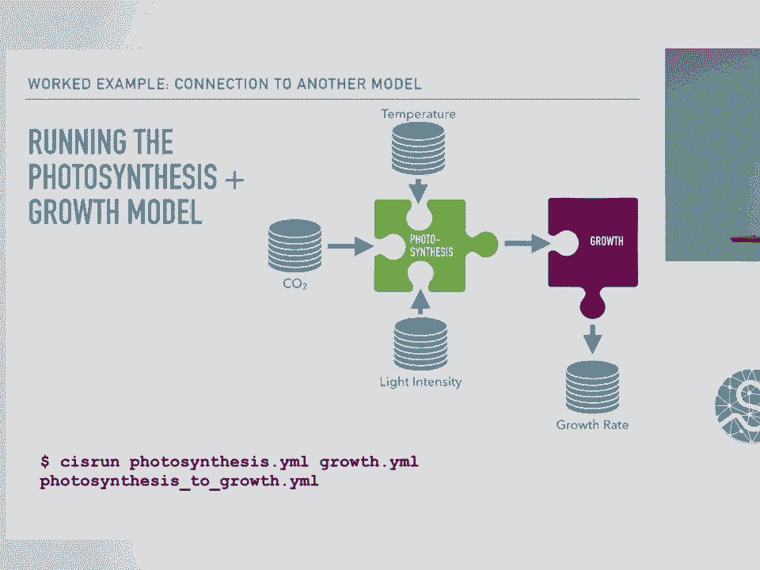

 So that's fine。 These are all very simple toy models， but does this actually work in the real world？

 And the answer is yes。 So within the crops in silico group at the University of Illinois。

 we have nine models that we are trying to connect in order to build this crop in silico。

 And we have been able to connect many of them。 The black arrows are models that are already connected and have results。

 The gray arrows are connections we're working on。 And I'd like to focus specifically on one connection。

 because yes， we're able to connect them， but does this produce anything scientifically valuable。

 other than just it's nice that we were able to connect them？ And the answer is yes。

 We got new scientific results from being able to connect these models。 So looking at， in particular。

 the combination of the genetic response to CO2， and a photosynthesis model of metabolites。

 and sorry， my background is astronomy。 So I am trying to model my way through the biology。

 But these model integration was actually able to replicate a phenomenon。

 that's seen in experimental measurements called CO2 acclimation， where under elevated CO2。

 you actually see a decreased efficiency， in photosynthesis in experiments than you would expect。

 And so the photosynthesis model on its own could be forced to replicate this。

 but it doesn't tell you anything about why it's happening。

 But if we integrate it with the genetic response to CO2。

 we're actually able to see that it reproduces the CO2 acclimation。

 and also identifies two new genes as candidates for regulating photosynthesis。

 So I'm told very exciting。

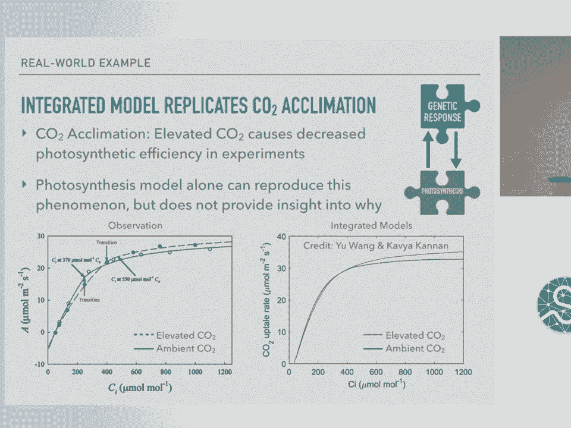

 So on to the technical details of the package。

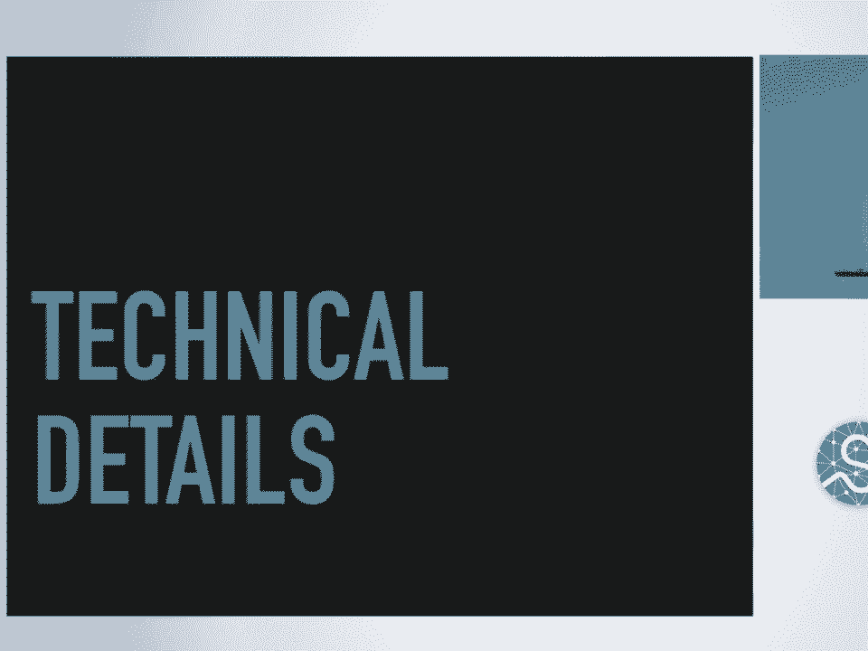

 As far as the package goes， it is completely open source， available on GitHub。

 You can pip install it。 I am currently working on getting it on CondaForge。

 We support models in Python， MATLAB， C， and C++， as well as writing and reading data to and from comma separated value tables。

 to have delimited tables， Python pickles， OBJ and PLY， 3D structures， matlab files。 We also。

 as I said before， there's multiple communication mechanisms。 And so within the package。

 you can use three different methods， for sending messages between two models。

 These include System 5 IPC Qs， Zero MQ communication， or Zero MQ sockets， Rabbit MQ。

 Brokeboard communication， or a combination of these if you want。

 But this is all hidden from the model API。 So the user doesn't need to know about this。

 You can specify it through a config file， but the domain scientist。

 doesn't actually need to worry about it。 There's also support right now for units using Pint。

 and I'm moving over to using unit， which Nathan Goldbaum will be talking about。

 during his lightning talk。 We have support for Python 2。7， 3。4， 3。5， and 3。6 on Linux， Mac。

 and Windows。 And so how do we ensure our package health？ So we have 100% test coverage。

 We have continuous integration on Linux， Mac， and Windows using Travis CI and App， there。

 as well as documentation with automatic inclusion of docstrings in each， of our languages， Python。

 MATLAB， C， and C++ using a combination of Sphinx， Doxygen， and Breathe。

 And we have examples of use cases that are replicated in each of the supported。

 languages and are run as part of our test suite。 So this means that a new user can find a test doing what they want to do in the。

 language they want to do it in and know that it will work。

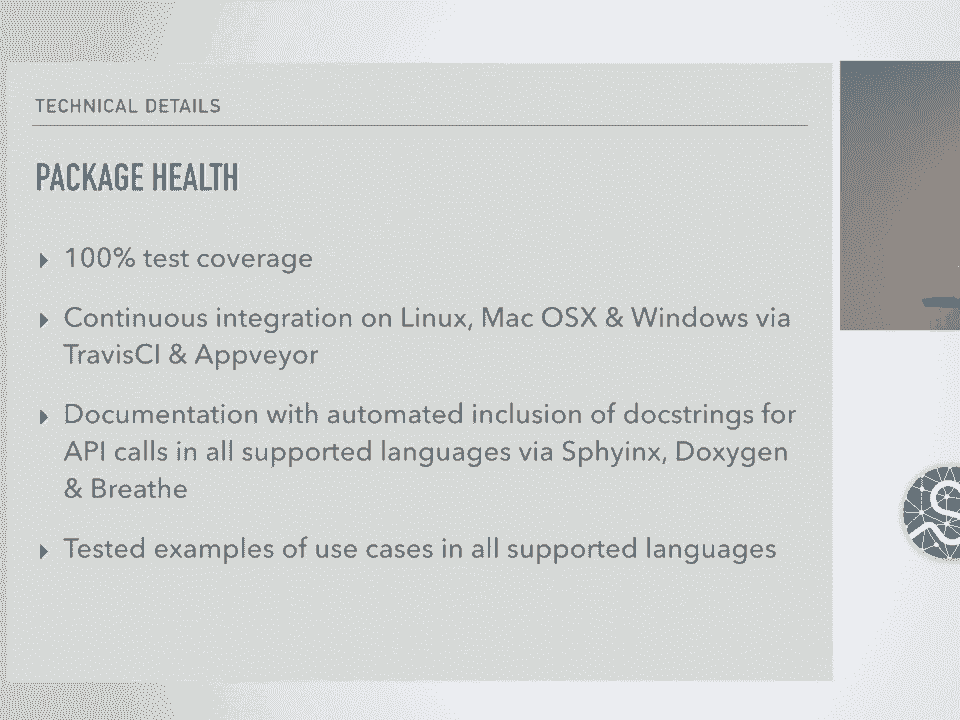

 So as far as where we're going， first you could imagine that， well， the example I。

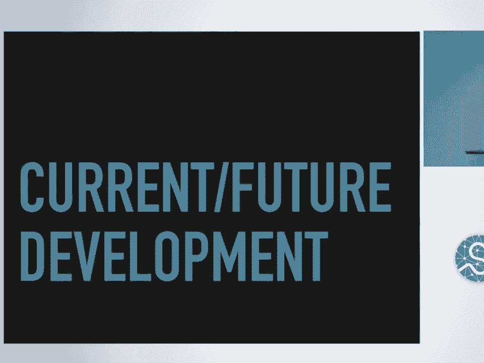

 showed was relatively simple for creating that YAML。

 If you have a really complex integration network， like the one I showed that we're。

 working on at the University of Illinois， that YAML can get really complicated and。

 is really hard to parse in terms of imagining what that network looks like。

 just from a list of connections。 And so a better way of doing this is to compose this visually。

 And so we're doing -- we're trying to do this through a combination of two things。

 First is having a model repository where domain scientists can submit their， models。

 So it might look like this is preliminary work from Mike Lambert and Craig Willis at the NCSA。

 And so you would submit a form that describes your model giving it a name， the。

 location of your source code， the language it's written in， how to run it， and。

 input and outputs for your model。 And once you've submitted your model to the repository。

 then we can use a user， interface that populates a model palette， such as here on the left。

 And this one is populated with models from our group at the University of， Illinois。

 And so then a user could select the models that they want to integrate， add them to。

 their canvas on the right， make the connections visually by drawing these。

 lines between the models or between the models and files， and then hit this。

 generate manifest button which will generate the YAML for the user to run， using CIS run。

 without ever having to actually look at the details themselves。

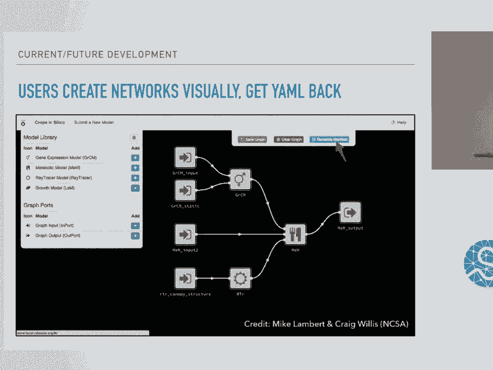

 which should make things a little bit easier。 In addition to this user interface。

 we're also looking at expanding so that more， domain scientists can use CIS interface and connect their models to existing models。

 So we want to expand based on community feedback models in our Fortran and Java。

 We want to be able to run MATLAB models using Octave。

 So right now this is a big limitation especially for testing because you need to。

 have that MATLAB license and that's not always great for collaborations。

 So we'd really like to be able to run those models using Octave instead。

 Also looking at domain specific data formats， running on distributed compute。

 resources such as HPC clusters and cloud computing， using the units to actually。

 validate the connections that we make between models so that we are not just。

 passing something that's grams to something that expects length or something like。

 that which would produce garbage。 So those units can be really valuable there。

 Also looking at automated aggregation and transformation of data and control flow。

 for the models such as loops and conditionals。

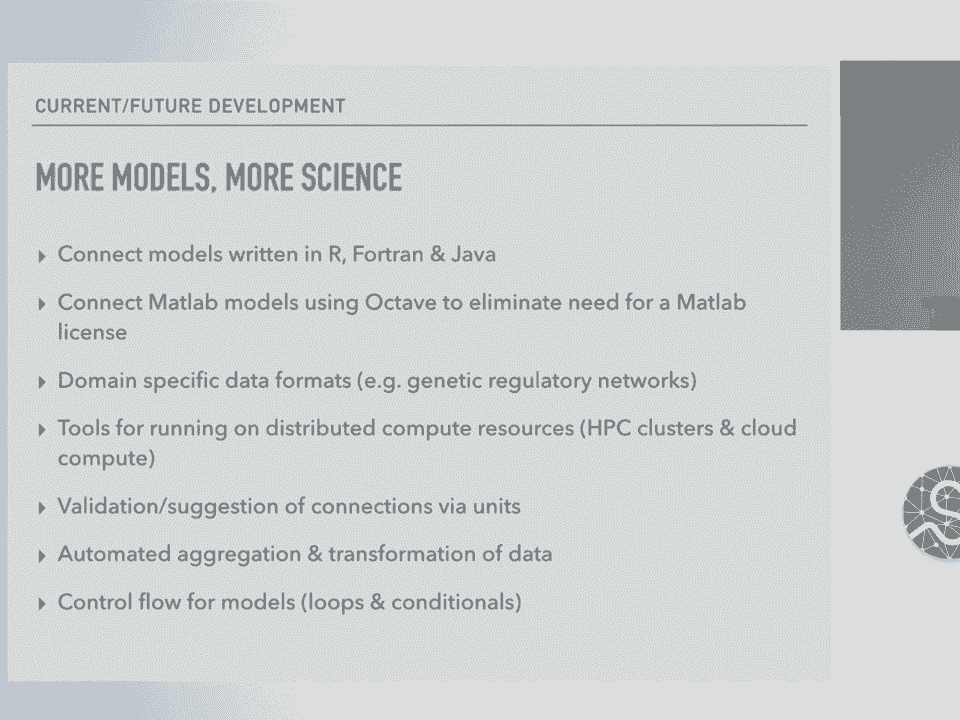

 So finally I want to really emphasize that although this project was created to。

 connect models in crop biology， this can be applied to any model。

 There's nothing inside the CIS interface code that is specific to crops at all。

 So if you are a domain scientist and you have a model or a syllamels that you want。

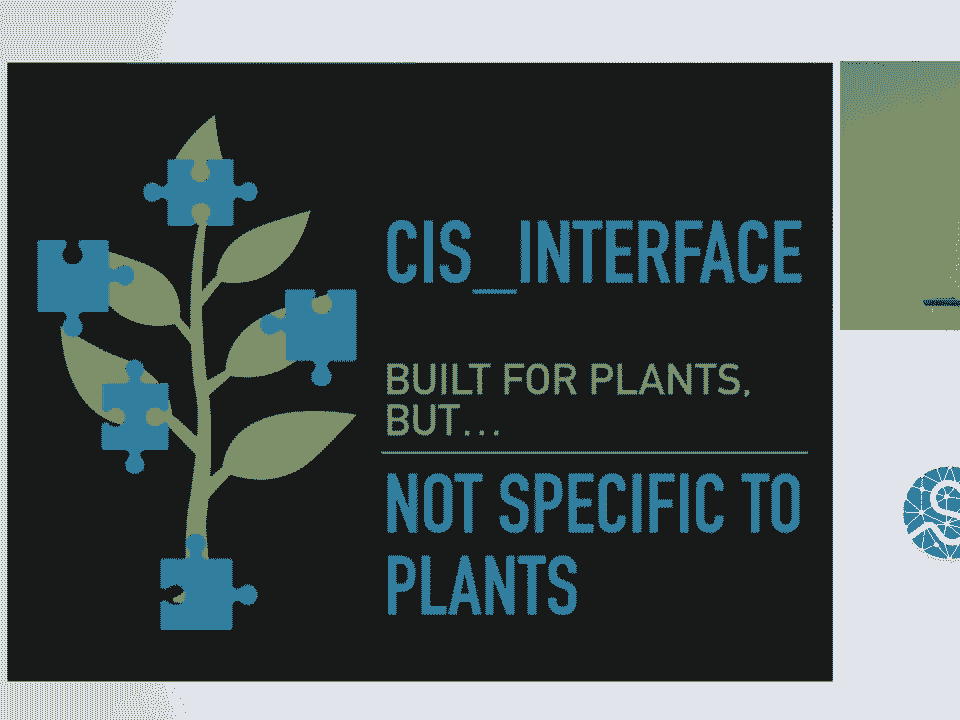

 to connect， please come talk to me or check out some of the resources either on our。

 GitHub page or documentation or a project website。 All right。 Thanks。 [applause]， Any questions？

 So I noticed that you had ways of integrating with Python files， MATLAB files。

 Can you integrate with more complex documents like Jupyter notebooks as well？

 I guess do you have an imagined use case？ I mean models are written in notebooks all the time。

 You're talking about reading a model that's in a notebook？ Yeah， exactly。 Yeah。

 that would totally be plausible。 I mean you can treat it just as Python essentially and load the Python API in。

 If you were on it sprints I'm happy to work on that with you。 Thanks。 Any questions？ [inaudible]。

 So you're talking about the speed of sending messages back and forth。

 I had a backup slide and I removed it。 So the speed seems to be all right。

 The actual biggest slowdown with MATLAB is starting up a MATLAB engine in the background。

 As far as the actual， like， there doesn't seem to be an overhead associated with MATLAB itself in the message passing。

 At all。 This is probably just because we're actually using the Python library in MATLAB。

 We're importing the Python functions into MATLAB and using them。

 So it's really Python running under MATLAB and Python running MATLAB。 So yeah。

 there's not really a slow down there。 So we saw that you're going to be adding R as one of your languages。

 What about other traditional statistical packages like SAS， data， SPSS， anything like that？

 Right now there aren't new plans for those just because we haven't encountered anyone that wanted to -- you？

 All right。 So yeah， if that's something that you're interested in， please come talk to me。

 I don't know anything about SAS， but I would love to hear about your model。 Any other questions？

 I have one。 You mentioned that building a community around these shared models is one of your goals。

 Can you speak to how that's going in terms of getting adoption from domain scientists？

 So the Crops in Silico as an organization is in year three， I think。

 And we've had three annual meetings with attendance from -- I had the numbers on this recently -- like 15 different institutions。

 And we're actually having another workshop this -- actually in two weeks。 Two， three weeks。

 And so I think people are coming to the group。 Right now we actually are within our Crops in Silico group at University of Illinois。

 We're working with at least two other groups with models outside of our internal groups。

 So I think we're slowly building it。 I was intrigued by the graphical user interface to connect the YAML files together。

 And I took a little quiz at your website。 I couldn't actually see it there。

 Is that another project or is that part of the CI center face project？

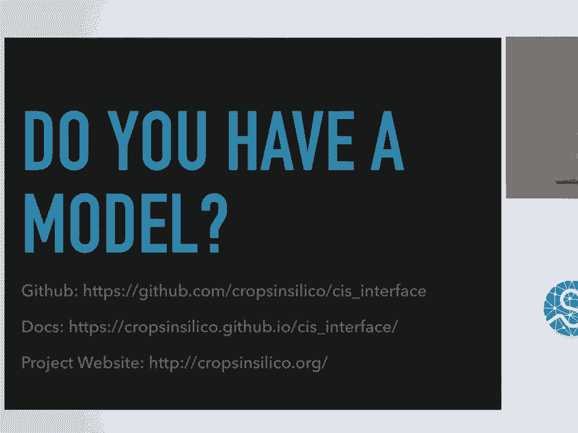

 You're talking about -- this one？ Yep。 You're talking about the address。

 So this is work developed by members of the NDS Labs project。 And it's very preliminary。

 This isn't available to the public yet。 Just wanted to show what's up and coming。 Cool。 Thank you。

 Okay。 Let's thank the speaker。 [applause]。

 [BLANK_AUDIO]。