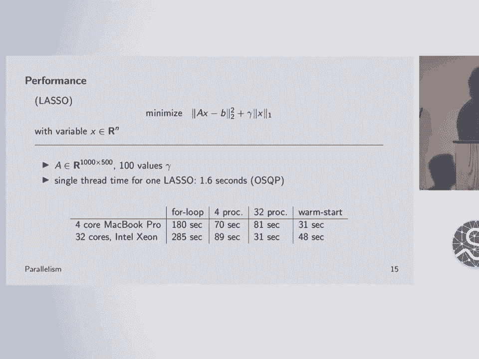
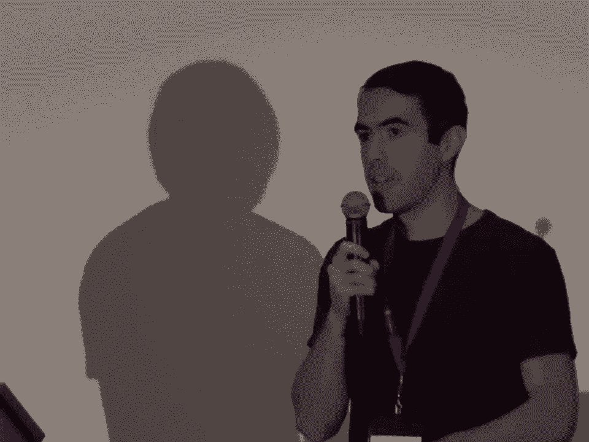

# SciPy 2018视频专辑 - P42：SciPy 2018视频专辑 (P42. Convex Optimization in Python with CVXPY _ SciPy 2018 _ Ste - GalileoHua - BV1TE411n7Ny

 Hi everyone， I'm Steven。 I'm a grad student at Stanford。

 I work with Steven Boyd on convex optimization。

 and various applications and tools。 And I'm going to be talking about this package CVX。

 Pi that I developed and have been working on for a while。 So first， let me introduce convex。

 optimization。 A convex optimization problem has the following form。 You have some variable。

 X that you're solving for， some decision variable。 And you have an objective function that， let's。

 say， are minimizing。 F not。 You have inequality constraints where these functions， Fi of X， are。

 less than or equal to zero。 And then you have linear equality constraints。 And in addition， you。

 have the restriction that all these functions， F not through FM， are convex。 And so there's a。

 formal definition of convexity here， but essentially it means that they have positive curvature。

 They curve upwards。 Right？ Like a parabola。 And this is a very interesting， so this is a restricted。

 class of convex of optimization problems。 A restricted class of optimization problems。 They're。

 you know， an infinite number of non-convex problems。 But this turns out to be a very useful。

 restricted class to consider for many reasons。 One reason is that you have very elegant theory。

 explaining how to analyze these problems， algorithms that can be used to solve them efficiently。

 how to guarantee that you've achieved the solution of the problem， how to analyze things like the。

 sensitivity of the solution to the constraints and things like that。 There's all kinds of work。

 that's been done to develop this system， this framework， and make it as useful as possible。

 And corresponding to that， you have an enormous amount of really， really high quality software。

 that's been developed to solve these problems。 It's very robust。 It just works。 You can plug。

 in almost anything that fits the form that these solvers require and it'll give you the solution。

 And an interesting fact is that， again， this is a restricted class of optimization problems。

 but it turns out that it applies to essentially every field that we've looked at。 Machine learning。

 statistics， this is a major application or at least it was before deep learning， but all the。

 classical machine learning algorithms are based on convex optimization。 So things like SVM， all the。

 regressions。 Control， this is a massive application。 So good example is the SpaceX rockets。

 the landing。 That's just， it's more or less just convex optimization。

 There was actually somebody in our group who， wrote that。 A signal and image processing。

 medical imaging， scientific imaging， these are major areas， where you are， say。

 reconstructing a volume or something from measurements using optimization。 Networking。

 so optimal flow problems， engineering design。 You can think of things like designing。

 circuits or laying out circuits。 There's interesting applications。 They're finance。

 I'm going to show， an example later of how you use this for finance。 Many。

 many applications across many， many fields。 Okay， how do you solve these problems？ Well。

 there are different ways。 One is to use someone's。

 standard software that's been developed for a particular form of the problem。 And examples。

 of these standard forms that you might have heard are linear programs， quadratic programs。

 A more specialized one is second order cone program。 There are many。 But essentially， this is some。

 particular subset of convex problems that somebody has taken out and maybe developed a particularly。

 effective algorithm and package to solve these problems。 And then the benefit of having this is。

 that many problems can be converted into these standard forms。 And so it's worth investing a lot。

 of effort in these solvers because that's amortized across all these different use cases。

 And so this， is where the really high quality solvers have come from。 Now。

 another method is to write a custom， solver for your particular problem。 And this。

 you might do if you have a super large problem or you。

 have some special structure that's not going to be exploited by a standard solver。 And this is。

 obviously more effort。 But if you have particular needs， real time constraints， that'd be another。

 example。 This can be worth it。 And then the third approach， which I'll be talking about， is to use。

 a modeling language。 And this sort of gets the best of both worlds in the sense that you don't。

 have to worry about mapping into one of these standard forms， which can actually be quite far。

 from the original problem that you started with。 It's not necessarily obvious at all how to arrive。

 at these standard forms。 It can require a lot of expertise。 And even if you do know how to do it。

 it's a very tedious and error-prone process。 So this automates this for you。 Just like a compiler。

 will automate the translation into， say， assembly。 It's the same idea。

 And so it allows you to write， things at a high level that follows the mathematics。

 And then it will automatically translate it into， one of these standard forms。

 And it can make decisions about what standard form is most appropriate。

 Just like a compiler has optimization decisions it makes。 So this comes from a long tradition of。

 modeling language。 There's a long tradition of these modeling languages。 Going back to things like。

 ample in games in the '80s。 Recently there's been a number focused on convex optimization in particular。

 CVX is a big one in MATLAB。 And that's with inspiration for CVX Pi。 They're very similar。

 especially on the surface。 And the function of these model languages for convex optimization is。

 twofold。 One is to verify convexity， sort of like type checking。

 And the other is to convert it into， the standard form。

 So the way convexity verification works is through something called discipline， context programming。

 So this is like the type system。 And it's not too complicated。 Basically。

 you view your functions as expression trees。 Everything， your objective， your constraint。

 everything is an expression tree。 And then you try and determine the curvature of every node in。

 the expression tree。 Using some very simple rules。 In fact， just one rule。

 And in some cases this will， fail。 It will be indeterminate what the curvature is。

 That means basically that you have a type error。 Right？ You're not allowed to do that。

 And so you have to think a bit about how to express your， problem using primitives that we provide。

 So the expressions are formed from variables， constants and parameters at the leaves。

 And then a library of functions with a variety of properties， that we have enumerated。

 And these are provided。 You can't define new ones。 You can contribute to， the library。

 But otherwise you can't -- there are no user defined functions。 And that's what makes。

 this like a well organized and effective system。 So this is the basis of the different convex。

 model languages。 If you want to learn more about the rules， there's this website， dcp。stanford。edu。

 It's pretty fun if you're into this。 Let me talk now about cvxpy itself。 So cvxpy is a。

 modern language developed in Python for convex optimization。 I started it about four years ago。

 when I first started working with Stephen Boyd。 It uses design and programming as well as certain。

 analysis of things like the signs of expressions。 And there's a bit more now。

 But that's essentially， what it looks at。 Signs and then curvature to verify convexity。

 It's open source。 It -- all， the way down to the solvers。 So it itself is not a solver。

 That's an important clarification。 It's， a modeling framework。

 But it connects to many different solvers， including many open source ones。

 It supports some interesting features like -- one I'll talk a little bit about is parameters。 So。

 these are symbolic constants that you can modify after the fact。 And that can -- that can be useful。

 for a variety of reasons。 It makes us easily with general Python code。 I'll show more examples of。

 that。 I think this is a big advantage that we get from being in Python versus in MATLAB， for。

 example， where this kind of thing is a bit more difficult。 And it's been used in many different。

 areas。 Research project classes， companies， certainly thousands of people。 It's hard for me to tell。

 but there are a lot of issues that they post。 So there must be a lot of users。 There are a variety。

 of solvers that uses。 It comes with three open source solvers。 Ecos， SES， and OSQP。

 I'm not going to， say too much about this。 Basically different solvers have different strengths and weaknesses。

 They handle different problems in some cases。 And it's useful to support many different solvers and。

 to give people the ability to plug in their own solvers。 And again， SESP is not a solver。 So you。

 can't say， "Seevix， pie didn't solve my problem。" You can only say。

 "The solver didn't solve my problem。"， Here's what SESP looks like。

 So here we have some sort of weird regression problem。 So some sort。

 of lasso problem with constraints。 So you have this AX minus B least squares term。 So that's just a。

 linear regression term。 And then we add on this penalty of the absolute values of X， the sum of。

 absolute values。 So this is encouraging sparsity， meaning encouraging entries of X to be zero。

 Then we have some other random constraints， like the X sums to zero。 And the largest absolute value。

 of X is no more than one。 And this doesn't represent anything particular。

 It's just a convex problem。 And here's what the code looks like to express this problem。

 So note how similar it is to the math。 So here you declare a variable。

 So you have this variable functions or variable constructor from， SESP。

 You give it a dimension and that creates this sign。 Then that's assigned to the name X。

 You have this sum squares function here。 This is one of those predefined functions in the library。

 Right？ This is not a user defined function。 This is predefined。 And that's applied to A times X。

 minus B。 We've over A and B would be NumPy arrays。 We've overloaded times minus plus etc。

 All that stuff， to construct expression trees。 And then here's the L1 norm term。

 which is using a Cvix Pi function， multiplying by some float。 And then again。

 they're added operator overletings。 So then we get this， expression tree， which is assigned to cost。

 It represents this term。 Then we make an objective， out of that with this minimize constructor。

 Then we have constraints， which is just a list。 We have again more predefined functions。

 And then we've overloaded these relops to construct， constraint objects。

 And then we construct a problem with an objective， constraints， we call dot solve。

 And that returns the optimal value and then populates the dot value field of the variables with。

 the solution。 And so I think it's worth dwelling on this dot solve。 Like this is it。 Dot solve。

 That's the whole thing。 You don't say which algorithm it uses。

 You don't say what hyperparameters uses。 There's no learning rate。 There's nothing like that。

 You just do dot solve。 And then it works。 Right？ Because the problem is well defined。

 Like it's known how to solve these problems very well。

 And this is really the primary benefit I would say of convex optimization。 It's that you can just。

 focus on what you're trying to solve and not how you're trying to solve it。 Right？ If you， for many。

 of these non-conduct problems， the two get intertwined。 Right？

 Because you end up in cases where the， method you use will change the solution you get。

 And that becomes very， very confusing。 And I think。

 can really make it much harder to actually address the real problem you're trying to solve。

 Whatever， that may be。 The real application。 Okay。 Here's an example of mixing Python code with。

 CVX pi。 So just generic Python code。 So first a little bit more about parameters。 So parameters。

 are symbolic representations of constants。 And so they have known sign shape， etc。 And here we have。

 a for loop where we assign various values to this parameter gamma。

 And we iterate over this for loop。 And we call the solve function， solve method。

 And we get the result。 So we're just iterating。 Right？ We can also approach this in a parallel way。

 I won't go over this too much。 But essentially， we have a， this is using a basic， well。

 a processing library from Python。 You can use whatever you want。

 This is just a basic one that fits on the slide。 We have this function that does the same thing as。

 the loop。 We map it over this array of values for gamma。 And then that's it。 So that's parallelism。

 And this is a little numerical example solving a lasso problem。 And so we have 100 different values。

 of gamma。 We want to do a trade-off curve。 So you have this parameter gamma， this hyperparameter。

 And you want to see how the solution changes as gamma changes。 And just to summarize this， you have。

 you can see that there， you get， you do get some advantages to parallelism。

 It's not perfectly parallel。 It's not linear。 But there's some benefits here even with this one-slide implementation of parallelism。

 And so this is a nice example of mixing， you know， other Python libraries with CVXPy。 And all。

 some more examples later。 So now an example， something you can， you can go and try out at home。

 So portfolio optimization。 How do you， you want to buy and sell some stocks？ How do you do it？ You。

 have some， you got some tips。 How do you exploit them？ So this is how it works。 This is what people。

 actually do， more or less。 So you have variable w， which is your allocation among your portfolio。

 So this is， so this is like what fraction of your assets are you investing in each stock。

 And then you have this vector mu， which is basically if you're saying whether you think a stock is。

 going to go up and down in value， right， it would be positive or negative， more or less。 And then。

 you have this matrix sigma， which is， so you can think of it as a covariance of the returns of the。

 stock。 It's essentially just some measure of the risk， right。 It's stopping you from investing。

 everything in the stock you think is going to go up the most。 And then we have some other。

 constraints that the allocation sums to one， right， because it's a fraction， right。 And so。

 and then we have， we might have some other constraints on our allocation。

 A common one is that it has， to be positive， so you have to。

 you can only have a positive number of a stock。 This is called a long， only portfolio。

 Shorting is when you have a negative amount of a stock。 And then we have this， gamma。

 which trades up， this is a parameter here， trades up risk in return。 And we can see what this。

 looks like。 So this is a simulation with 10 different assets。 And we have this green curve。

 which is the trade-off between risk and return。 So you can see we go from。

 so this is plotting return， right。 How much， how much my portfolio increases in value under some simulated model versus the。

 standard deviation。 So， right， under different， different realizations， how much variance is there。

 And so you can see as we increase the risk， as we increase the variance， we get more return， right。

 This is a classic risk return trade-off。 But it has an interesting shape because of this。

 positivity constraint， right。 It's not just a line。 And then these red dots are what happens with。

 if you just hold one， if you just hold in one asset for the 10 different assets。 So you can see。

 this， this optimization is doing something for us。 And if we blow up two of these points on the。

 risk return trade-off， you can see it makes a lot of sense。 So here， this green one， this is less。

 risky， right。 The expectation is more concentrated or the。

 the probability is more mass is more concentrated， versus the more risky one， it's more。

 it's less concentrated， right。 It's fatter tails， but it has a slightly higher expectation。

 All right。 Another example， power management。 And again， this is。

 this is something you can really use。 This is actually， at least how it should work in theory。

 In practice， it's not quite this nice。 But I think they could do this if they wanted。 So here。

 imagine you have a bunch of different， devices， like generators， loads。

 meaning things that use power， storage systems， like batteries， thermal， HVAC。

 So these you can vary， for example， how much， you know， how， what level the air conditioning is on。

 if like power is really expensive。 Transmissions lines， those lose some power。

 So you just have these different devices and they each， have objective functions and constraints。

 like， so like how much energy the power generator can。

 produce and then how much it's costing to run the generator， that would be the objective and。

 the constraints。 So you just give them all objective and constraints and you just make them convicts。

 and then you connect the devices， sort of at， I think we call them terminals with these nets。 So。

 this is just， these are sort of ideal wires。 So they conserve power。 So whatever， if power goes in。

 the power comes out。 Right？ And then you can just aggregate everything。

 just sum everything together， do dot solve and then you get your power grid， you know， planning。

 So another， you would also， I'm going to， you could also incorporate time horizons into this。

 So you need to do that really to use， the battery。 It doesn't make too much sense to just， right。

 to really think about a bat using a， battery。 You have to have some prediction of how the power is going to be used。

 at least over the， course of the day。 And so you end up getting this sort of a control problem because you're。

 you're managing all these different resources with some expectation of what's going to be needed。

 And some planning into the future。 And actually you also get from this prices， these are， these are。

 real， these are part of how the grid is managed。 They're called locational marginal prices。 It's。

 just how much power should be charged。 How much you should charge for the power at the different。

 locations。 And so here you can see a little visualization。 So we have three devices here。

 a generator， a battery， and then a load。 And they're connected by a net。

 So this is meaning just this ideal wire， right？ So that's this little dot here。

 And you can see that the， this is， so this is the planning， horizon for these different devices。

 You can see we are planning to， so this is how much energy we're， going to。

 how much power we're going to sink into these different things。 So the load is going to use。

 a certain amount at the beginning of， say the day， and then it's going to use less， more。

 less than a lot。 The battery is being used， you know， charged and discharged。

 So negative is being discharged， and positive is being charged。

 And then the generator is always providing power， but it sort of varies。

 And you can see that we were able to， so we had a lot of load demand here， right？ But we're not。

 actually， oh no， we are using our generator a lot。 Well， you can see the generator and the battery。

 are working together to supply this load。 And then this price。

 this is the location of marginal price， right here。

 So it's basically how much everybody should be paying for power。 And you can do a cool。

 thing where like the generator pays the battery and the， or the load pays the generator and the。

 battery and the battery sometimes is paying money and it's making money。 Anyway。

 you can do fun stuff with， this。 And we did this in a object-oriented way。 So you just。

 we just have different classes that， sort of have， in their constructors。

 they have objective functions and constraints， where you just。

 give them a few variables or a few inputs and then they construct everything。 And so here you have。

 like the load， you have a generator， you have storage and then you connect them all， you make this。

 network and then you do dot optimize which is essentially just summing everything and calling。

 dot solve。 Again， no， no， you don't say anything about what algorithm is being used。

 Like we consider， that our business as the experts at convicts optimization。 As the users。

 you should not need to， know anything about that。 Just like you have no idea how the compiler is compiling。

 right？ And then yeah， you can get the prices。 So in summary。

 the main takeaways here that I hope you， leave with is that context optimization is something you can do easily with CVX Pi。

 There's a lot， more material on this on our website CVX Pi dot org。 There's a nice tutorial。

 There's a little， short course that goes through this in more at a best slower pace and more detail。

 Lots of examples。 We have some other packages that build on CVX Pi at this。

 this GitHub group looking at different， domains and sort of non-convex problems。 Thank you。

 We have time for a few questions。 Yeah， just say anybody。 Yeah， or you。

 So CVX Pi is awesome and everybody should try it。 It's really great。 Especially if you like。

 globally optimal solutions。 It's good。 But question is， so after CVX Pi canonicalizes everything。

 is there some way or have you thought of some way of freezing that or like caching it？ So if。

 you want to do a bunch of solutions really fast？ Yeah， so we were working on code gen and it's。

 actually almost there。 OSQP， which is a QP solver， it actually has code gen。 So if you're solving。

 and we've been trying to sort of bring that up the stack， another student， Nick。

 I think has it working or almost has it working。 And so hopefully we'll get that out at some point。

 And so then， yeah， you can use it for things like control problems where， yeah， go ahead。

 There's also a mic there in case you want to step in。 I think the question， the main question is。

 you mentioned A and B can be in empire rates。 Can they be something like， well， sparse rates。

 that's one obvious question。 The other is structured rate。

 I know it's a diagonal plus one rank update。 Can I specify that somehow to solve work？ Yeah。

 that's a good question。 So， they can be sparse。 They can be， in terms of structured。

 there was another sort of package that I did， which was。

 more focused on structured linear operators and trying to sort of generate solvers in some sense。

 that were exploiting that。 For a lot of cases， like the one you described， you can get all the。

 advantages if you just sort of express things correctly。 But that is a good， that is an area that。

 we're trying to bring more into the main package。 And I also hope you could say a few words as to。

 what is available to a user sort of out of the box。 Say， I'm on Windows， can I use your solver？

 I mean， CVX pi comes with certain solvers。 Yeah， they should be any， they should be。

 installable anywhere you can install CVX pi。 And you can install it on Windows。

 so you can use it on， Windows。 Yeah， you have somebody out there？ All right。

 my question is related to the previous two。 I noticed， like， some solver。

 about solver optimizations。 I noticed on one of your slides you mentioned you had a warm start。

 Is that a feature for CVX pi now？ Yeah， yeah。 So that's a new one we added。 Let me go to that。

 So we had a big update， which I didn't really talk about。 But it actually， there's a lot of new。

 stuff in the last， I think we pushed that a month ago， including warm start。

 So particularly for QPs， it caches a lot of things now。 And so that can be advantageous。

 And so essentially， if you're， solving the problem multiple times with different parameter values。

 like in this case you have， like you have everything's the same except for this gamma。

 then in theory， the work of solving the new problem will be minimal， will be much less。

 And I know your group has written a bunch of specialized solvers that take advantage of the。

 linear algebra structure and warm starts and stuff。 Has anyone in your group converting some。

 of that old C， C++ code to Python？ Or？ Yeah， well， we did。 Yeah， I wrote something for structured。

 linear operators。 And it does connect to CVX Pi。 There were some more algorithmic issues， you could。

 say， or robustness issues primarily。 I think that's a really big thing with these actually。

 deploying these solvers is robustness。 It's sort of under appreciated。 Like， it's not easy to make。

 them really work for all the crazy problems people throw at them。 All right， well。 Oh， okay， great。

 Yeah， there are more questions。 It would be great。

 But if you can just， oh， okay。 Yeah， you can go ahead and ask。 I think， I just。 I have one question。

 Are there any restrictions on use outside of academic with， the commercial solvers？ You mentioned。

 are there license restrictions on it？

 Okay。 If you， so it's all a patchy too， essentially， with the solvers that are built in。 And so。

 that should be no issue。 Yeah， with the commercial solvers， which are quite good， actually， in many。

 cases， I'm in worth looking at， they usually have academic license。 I think they all do。 So。

 that should be possible。 But for someone who， some commercial user who has access。

 who has licenses for Grobee， say， you can use CVX opt without it。 Is there a different license。

 you have to get？ Oh， no， there's no different license。 No， no， no。 There's， if you have the， solver。

 you can use the solver。 There's nothing else。 Thanks。 Yeah。 So， I've used CVX quite a bit。

 I just want to say thank you very much。 Thanks so much。 I did want to ask about the 1。0 release。

 maybe just some notable differences， and then maybe future plans as well。 Yeah， so， that one was。

 really fun。 We had， the biggest difference was on the inside。 We basically， so it was sort， the way。

 it worked before， it's like being a pilot， right？ And it basically had sort of one way of converting。

 the problems to standard form， like one method of compilation built into it。 And so， everything was。

 sort of organized around this one particular way of doing it。 But we made it more like LLVM。

 where there's like just different things you can do to the problem， like different passes。

 and you just link them up， and that gets you to the final form。 And so， this made it easier to have。

 like QPs versus cone programs， and in theory， like many more things。 I think there's a lot more。

 we can do with that。 So， that's one area。 Like， for example， can you like rewrite a problem to make。

 it easier to solve， or like better conditioned， or something like that？ The cogent thing， that's a。

 feature that I would really like to have in there that hopefully will make it in。 Okay， well。

 thanks so much。 All right。