# P43：SciPy 2018视频专辑 (P43. Detecting Anomalies Using Statistical Distances _ SciPy 201 - GalileoHua - BV1TE411n7Ny

 Thank you for the introduction。 It's a good morning everyone。 My name is Charles。

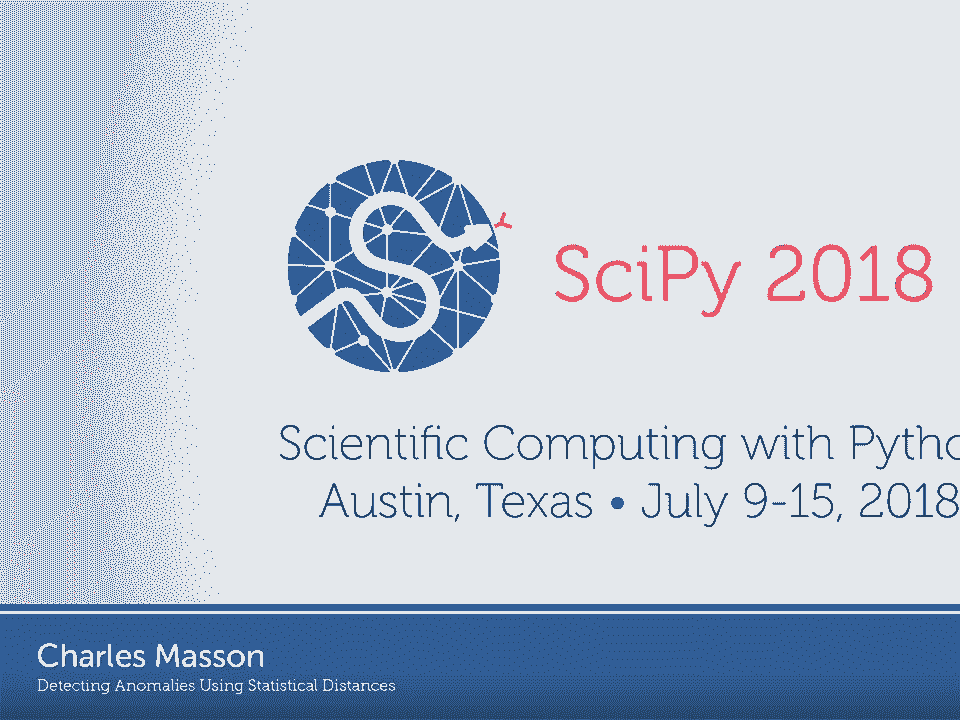

 Mason。 I am a Data Scientist Data Dog。 And today I'll be talking about statistical。

 distances and specifically how we can use statistical distances to detect， anomalies。

 So last year at Data Dog we as we were designing new anomaly detection。

 algorithm we started experimenting with statistical distances and as some of。

 them are not implemented in libraries or open source projects we decided to。

 implement them and we decided to submit them to contribute them to a， side-pye。

 So in this talk I explain why and how we use statistical distances to， detect anomalies。

 So I start with a few words about Data Dog to give you some， context。

 Data Dog is a size-based monitoring platform for infrastructure， and applications。

 Customers can send time series data application traces and。

 logs and they can see all of them in dashboards such as this one on the right。

 All of this is processed so it's about three months of data points that are。

 processed every day and we offer algorithmic alerting such as anomaly and。

 data detection and predictive alerting which is about notifying the。

 customers before something goes wrong in their infrastructure。 So as I mentioned we。

 work with application traces which means that concretely customers can have web。

 application and they can send traces for their web requests so that they know。

 how much time is spent processing each request and what you can do with those。

 requests duration with those latencies is plotting the person ties over time so。

 you have time increments and within the time increments you would plot the 50s。

 the 75th 90s and the 95th percent as you can see here。 What you can also do is。

 consider considering all the requests within a given time frame and you would。

 plot that as a histogram as you can see here we still have markers for the。

 person ties and when you see this distribution this latency distribution you。

 might ask yourself if this distribution is anomalous so we might。

 imagine that we have a baseline we can constitute this baseline from a time frame。

 during which we know that nothing wrong happened in the infrastructure or in。

 the application and then we look at the distributions of latencies over the。

 last minute here's what we get and here we can clearly see that there is a shift。

 towards the higher values so qualitatively we can say that there is a。

 anomaly here but this is only a qualitative observation and we need a。

 quantitative way a technical way to say that it is anomalous and so the first。

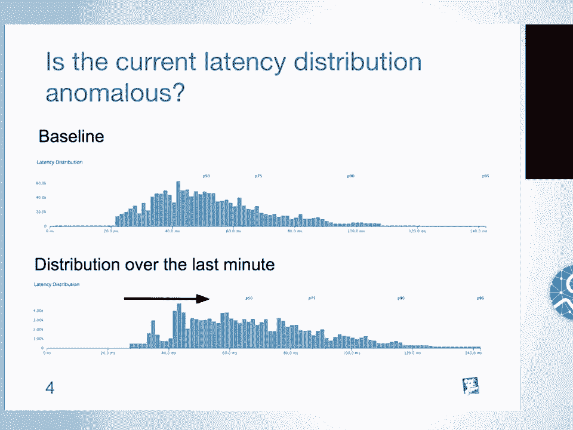

 idea that we might have is working with sample statistics so very basically we。

 can look at the average of the distribution so here we have our two。

 distributions B which is the baseline and T which is the test distribution and if。

 we look at the average of both of them it's clear that the average 40 is。

 significantly higher than 4B so we can flag this this test distribution as。

 anomalous we can have a threshold of 1。2 for example and if the average of T is， 1。

2 times at least higher than the average of B then we flag this as。

 anomalous of course this is not going to work in all cases so for example we might。

 have distributions that don't have the same shape and here we can see that for。

 the test distribution we have a significant share of requests in the tail that takes。

 more time than usual so we should flag this as anomalous however if we take。

 the average we get almost the same so the average is not correct here to。

 detect this anomaly we could imagine using the maximum of the distribution but we。

 will have issues when we have long tails and so when there is for example one。

 single request that for some reason took much more time than the rest so the。

 maximum might not be great but we can still take some percentile we can what's。

 commonly used is the anti-fierce percentile so if we look at the anti-fierce。

 percentile of the distribution we see we do see the difference and we can flag。

 the test distribution as anomalous but you probably imagine what the next slide。

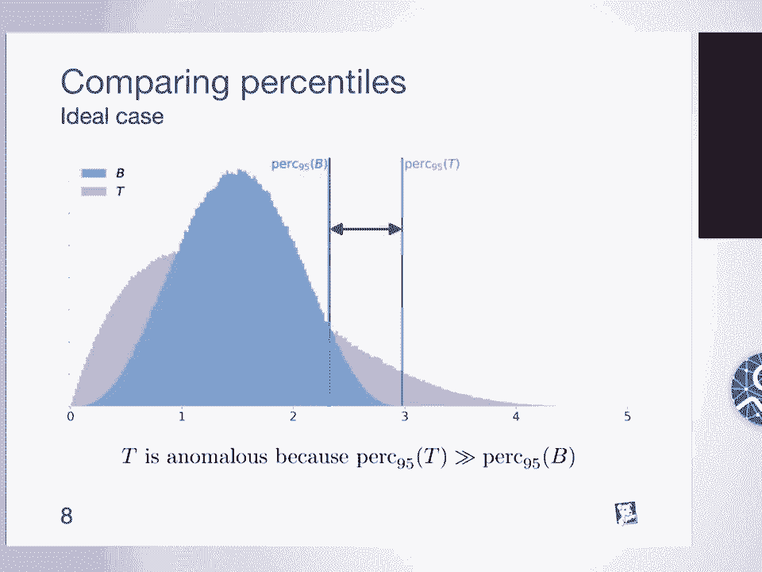

 is we can still imagine distributions that don't have the same shape but still。

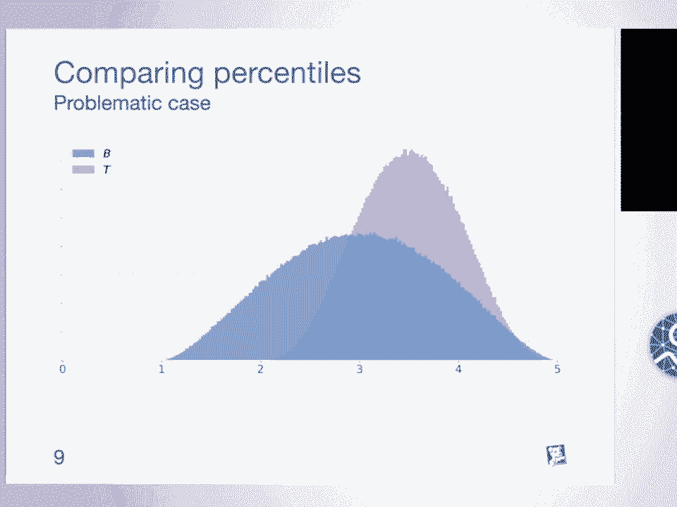

 the percent are the same so at this point it's clear that using a single。

 sample statistic is not enough to detect exhaustively all the the anomalies so。

 what we could do is using multiple sample statistic maybe we can combine the。

 average maximum to some person ties but then we have to come with a criteria。

 criterion to to to merge all those sample statistic and say whether or not we。

 should consider the test distribution as anomalous and the other solution is to。

 use statistical distances so in short statistical distances are。

 distances between statistical objects and to explain that I start with something。

 that's commonly known which is the comogorose min of test so this is a。

 statistic statistical test that's commonly used to say whether a sample is。

 drawn from a reference distribution or whether two samples are drawn from from。

 the same distribution so we consider the latter case here so we have our two。

 distributions here and the way how the comogorose min of tests usually works。

 you would plot the cumulative distribution function you could you would。

 consider the maximum difference absolute difference between the cumulative。

 distribution functions this would give you an number between 0 and 1 and then。

 what you would usually do is considering the newly hypothesis h0 which is that。

 both samples are drawn from the same distribution you would have a critical。

 value at significance a far so based on how confident you want to be on the。

 test you would use that critical value that's usually that is usually。

 tabulated or you can also compute it from the comogorose distribution and then。

 if the value that we computed in the previous slide is lower than this。

 critical value we would accept h0 otherwise we would reject the null hypothesis。

 so we can use this to say whether or not the test the test。

 distributions should be flagged as anomalous so if we reject the null hypothesis we。

 can say that the test distribution is anomalous however this only answers a。

 yes or no question and we might be interested in having a measure of our。

 anomalous the distribution is maybe we have different distributions or we have。

 timeframes and we want to pinpoint the most anomalous timeframes or。

 distributions and we can actually easily do that here by simply keeping the case。

 value the number between zero and one which is the absolute difference between。

 the comparative distribution functions and the great thing about this case value。

 is that it is a distance so if you have x y and z three distributions case。

 verifies the non-negativity it's zero if and only if x and y are the same there。

 is a symmetry and we also have the trionial inequality so the great thing of。

 that is that now we have a metric space so we have this abstraction where where。

 you can forget about the distributions and just consider that you have points in。

 some metric space and you can apply all kinds of algorithms so for example at。

 fire detection or clustering what you could do for example is that if you。

 notice that the point is far away from all the other ones well you can flag this。

 one as anomalous there is probably something wrong with that point which is。

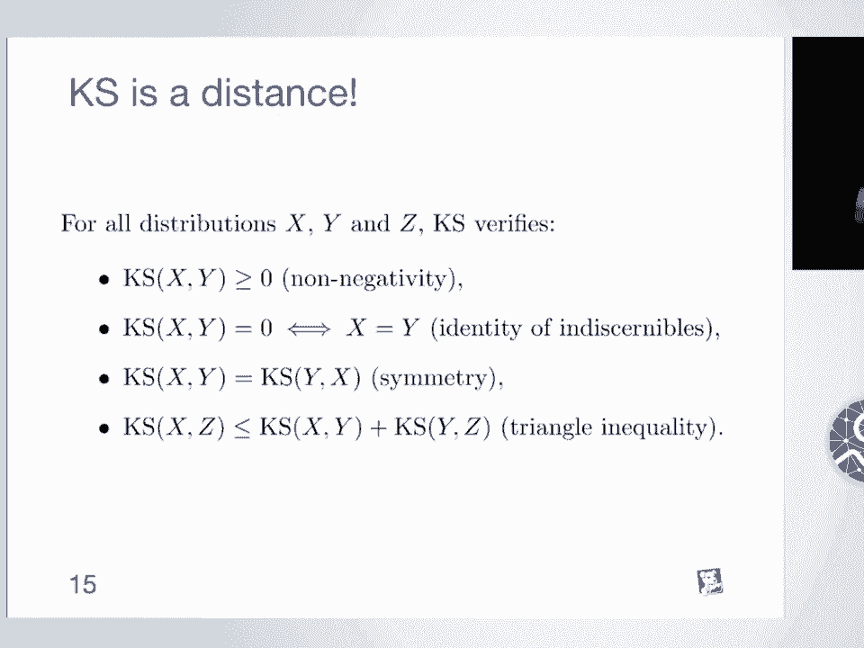

 that distribution however we still need to make sure that this comogorov smir。

 of distance is strong enough reaching off that it will catch exhaustively all the。

 anomalies that we're interested in so we need to understand how this distance。

 works what we can do is looking at what it looks like on some basic。

 distribution so here we have uniform distributions u1 and u2 they are。

 shifted from each other if we plot the cumulative distribution functions we get。

 that that and we get the comogorov smir of distance this way now if we shift one。

 uniform distributions with regard to the other we can plot the distance as a。

 function of the shift and what we see here is that it increases linearly。

 until one and that one it plateaus and state state at one which makes sense。

 because that distance is always between 0 and 1 but the thing here is that it's。

 not great because we we can say how different the distance the distributions。

 are when they are close but beyond a given threshold specifically when the。

 the uniform distributions are not overlapping anymore we can say anything。

 anymore we can say how far away they are from each other so we need another。

 distance yeah so so you might imagine that this uniform distribution case is an。

 artificial case but in practice we we could have this so we have three。

 distributions here be which is again the baseline and two test distribution T and。

 T prime with the small bump on the right for T prime the bump is further away we。

 could imagine that in practice so we have those web requests and for a small。

 portion of this web requests we have a higher latency this is the small bump and。

 what we'd like to see here is that the prime should be further away from B than。

 T however if we look at the community distribution functions and the case。

 distance this is not what we see basically the distance is same for in。

 both cases so what we need is a distance that's more appropriate for this kind of。

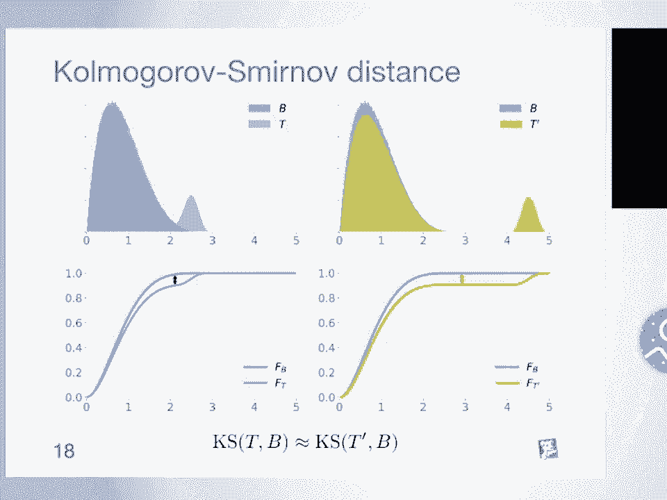

 case of cases so we need a distance that somehow and cause the fact that there is。

 more work involved to make T match B to match T prime sorry match B rather than。

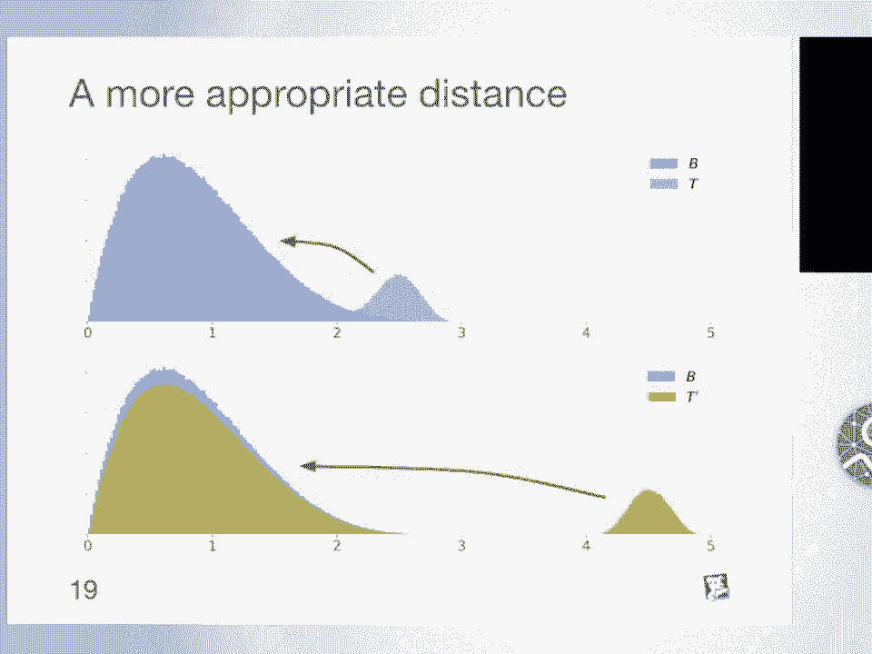

 to make T match B and this is actually the idea between the Earth's move as。

 distance so we can imagine that all two distributions here are hips of Earth and。

 that our job is to make one distribution match the other by moving this Earth。

 from one place to the other so when we do that we define a mapping gamma and this。

 mapping gamma of X and Y is the amount of Earth that we move from X to Y and the。

 conditions on the right just translate the fact that we start with the B。

 distribution and with the T distribution we can consider all search possible。

 mappings and for a given mapping we can look at the work that is involved in。

 moving the distribution following the mapping so basically this will be the。

 distance the amount of Earth that we moving times the distance over which we。

 are moving and with some of our everything and if we consider the the mapping。

 that is the most efficient that that is to say that involves a least work we。

 define the Earth's move as distance so in other words the Earth's move as。

 distance is the minimum work that is involved when we move one distribution to。

 the other where work is the amount of Earth that we move time the distance over。

 which we move it so now if we look at the Earth's move as distance and our。

 uniform distributions we can see that the Earth's move as distance keeps。

 increasing nearly even when the support of the distributions are not developing。

 anymore so there is an issue though with this Earth's move as distance is that it。

 is an infimum by definition and it's probably going to be quite expensive to。

 to compute however in the one-dimensional case there is another way。

 to define the Earth's move as distance which is using the cumulative distribution。

 function so if we look at the cumulative distribution functions of both those。

 distributions we can prove that the Earth's move as distance is equal to the area。

 between the cumulative distribution functions so this makes it much easier。

 to compute this is actually the way how we implement implemented it and what。

 we contributed to scipy and the so another great thing is that we have an。

 intuitive way of understanding what the Earth's move as distance is here so on。

 the bottom graph here if you flip the x and y axis you will get the quantile。

 functions of both distributions but you're not going to change the area between。

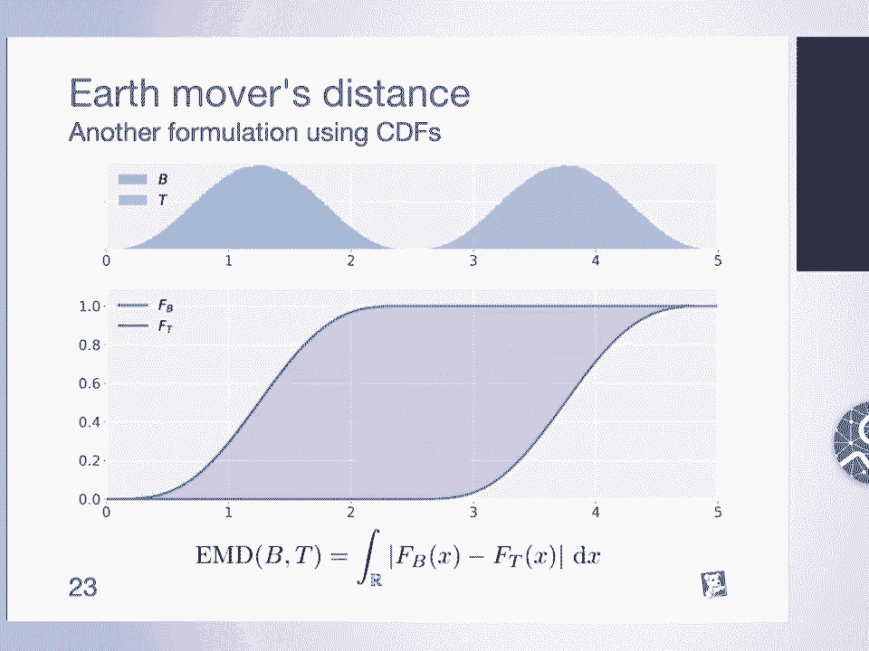

 the functions which means that we can also compute the Earth's move as distance。

 using the quantile functions so now we can look at what the Earth's move as。

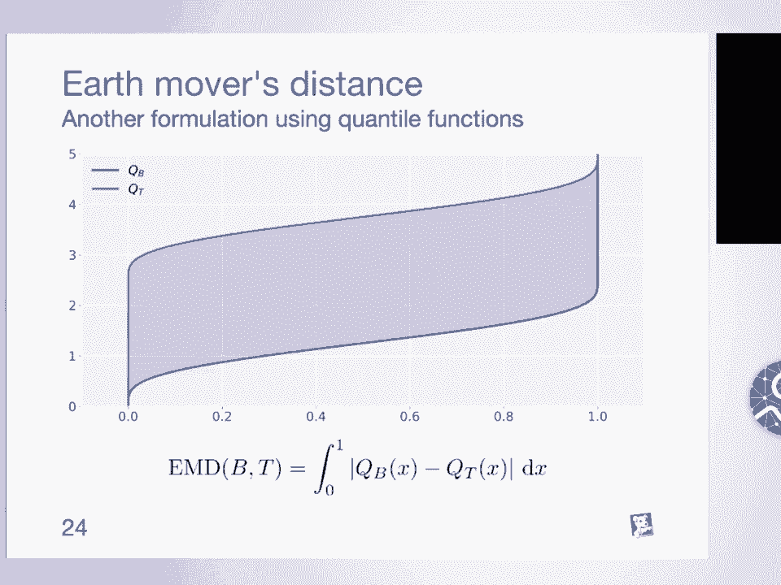

 distance looks like on those examples and now it's clear that using the fact that。

 it's the area between the cumulative distribution functions we're going to。

 have a higher distance on the right than on the left so this distance seems。

 better than the comogorosmial of distance to catch this kind of。

 phenomenis however there are still some cases for which we still don't catch the。

 deformation or deanimally so here on the right we have two uniform distributions。

 and on the on the left so we were to the uniform distribution and on the right we。

 generate t prime by accumulating mass in a single point now if we plot the。

 cumulative distribution functions of those and we look at the area it's clear。

 that by doing a bit of geometry we have a most the same value here so we are not。

 catching the anomaly in this case but we can work from the Earth's move as。

 distance which once again is also the first first question distance so as a。

 reminder so this is the formula for the Earth's move as distance which is also the。

 area between the quantile functions what we could do here is instead of taking。

 the absolute difference between x and y we could take that absolute difference to。

 the power p so we give to a more way to to more we penalize more the larger。

 the larger differences and if we do so we define a new family of distances which。

 is actually the family of assertion distances and the piece of assertion。

 distance is defined as this and the great thing is that we can still prove that we。

 can compute this distance from the quantile functions so it's still easy to。

 compute in the one-dimensional case so if we look at this last line we modify。

 the formula with the quantile functions what if we do the same thing with the。

 cumulative distribution function so what if we start with this and we decide to。

 build this new family of distances well we define actually those are also。

 distances statistical distances and if we take p equal to two we define the。

 grammar for one-missus distance which is sometimes just called the criminal。

 distance it's actually related to the grammar of one-missus statistical test。

 so if we look at the grammar distance on with our uniform distributions this is。

 what we would get so basically it increases like a square root so now that。

 we have the the intuition and the theoretical background between behind all。

 those distances we need to implement them and in our case we want to compute。

 distances between practical data not between theoretical distribution so we。

 we need to compute distances between data samples histograms empirical。

 distributions and all of these in one-dimensional space and what we can do is。

 and call all of those all of these data with values and weights so if you work。

 with data samples the values are the basically the values of the data samples。

 and the weights might be the number of occurrences for histograms you could have。

 been positions which are the values and the height of the the beans which is the。

 weight and we can do the same thing with the empirical distribution so we。

 implemented those distances more specifically the vast fashion distance。

 and the grammar of one-missus distance the comogorose mean of distance is already。

 implemented in sci-fi so up here got merged last summer and now you can。

 basically use those distances in sci-fi so here we generate two samples from。

 uniform and normal distributions we can compute the distance between those。

 samples and if you walk with weights so maybe we have a histogram with the。

 height of the the beans that are the weights here you can also compute the。

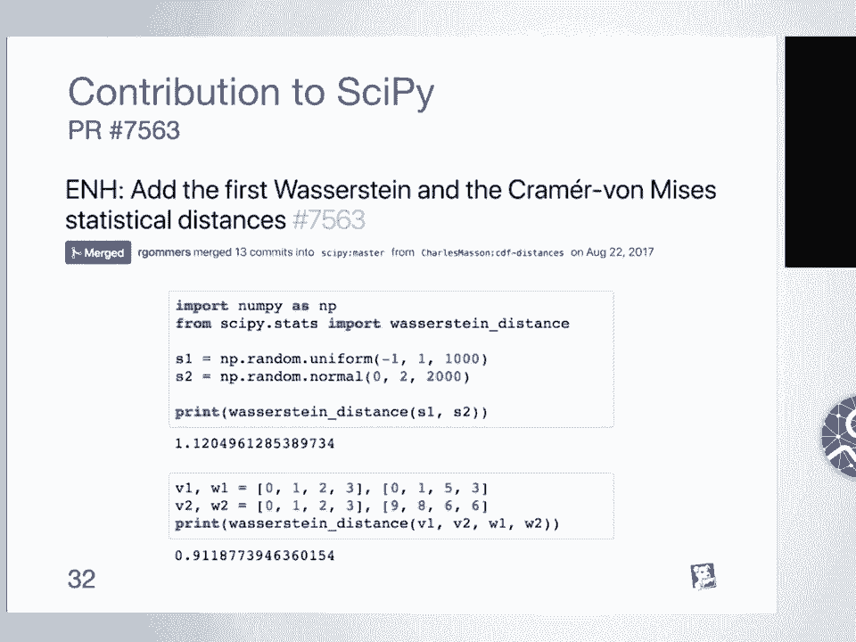

 distance between those histograms so we can do actually much more with statistical。

 distances I focused on specific cases especially on the one-dimensional case。

 but there is actually much more that we can do so the first thing is that statistical。

 distances can be defined for some of them in a multi-dimensional spaces and also。

 in metric spaces and applications of that are pattern recognition image。

 processing so for example if you work in a two-dimensional case to the。

 emotional space you can actually use the earth's movers distance to say how close。

 to images are there is also a weaker notion of distance which is the divergence。

 the divergence only verifies the non-negativity and the fact that it is zero。

 if an only if x is equal to y and one specific divergence is the cool back。

 clear divergence between two distributions which is defined as this。

 we are small p and small q as are the respective densities of p and q and we。

 can show that solving the maximum likelihood like legal estimation。

 problem is equivalent to minimizing the callback labor divergence so the maximum。

 likelihood estimation is used in variety of problems and machine learning。

 models and when we do that we we are to just doing the same thing as minimizing。

 the comeback area divergence which is this value and if you look at the the。

 formulation of the of that divergence we can see that we look at the at the。

 densities at specific points so we look at how different we have this ratio。

 between q and small q and small p and then with some over everything which。

 means that if we have distributions that are that have high densities in very。

 small very close areas but not exactly in the same area the could back。

 labor divergence won't be able to to catch that because it only looks at the。

 ratios between the densities in a single point and then some over everything and。

 this is actually something an issue that we saw in the literature for some。

 machine learning model especially generative adversarial networks so I。

 won't go too much into details but basically generative adversarial networks。

 are machine learning models that generates data and that can be used to。

 general data that would look real so this the first publication that we saw about。

 generative adversarial networks was in 2014 and at the time the loss function that。

 was used is the Jensen-Shannon divergence which is a symmetrized version of the。

 could back labor divergence and so one issue that we saw is that as I explained。

 the previous slide sometimes we have images that are very close who actually。

 we have distributions of images when we generate images with these models that。

 are very close but not exactly the same and the this loss function is not able to。

 to to catch this to model how close those distributions are and that's why a few。

 years later we saw the research in generative adversarial networks where the。

 loss function is now the research in distance and this was partly to solve the。

 issues that we saw in the in the previous models and the previous loss。

 functions and a few months later we saw the primary generative adversarial networks。

 now in this case we use the primary distance which also solves some other。

 issues that we have with the research in distance including some buyers that we。

 might have when we work with samples and so this is also a reason why statistical。

 distances got quite commonly used and well why used in the in the literature。

 over the past years so that ends my talk so we have a blog post with more details。

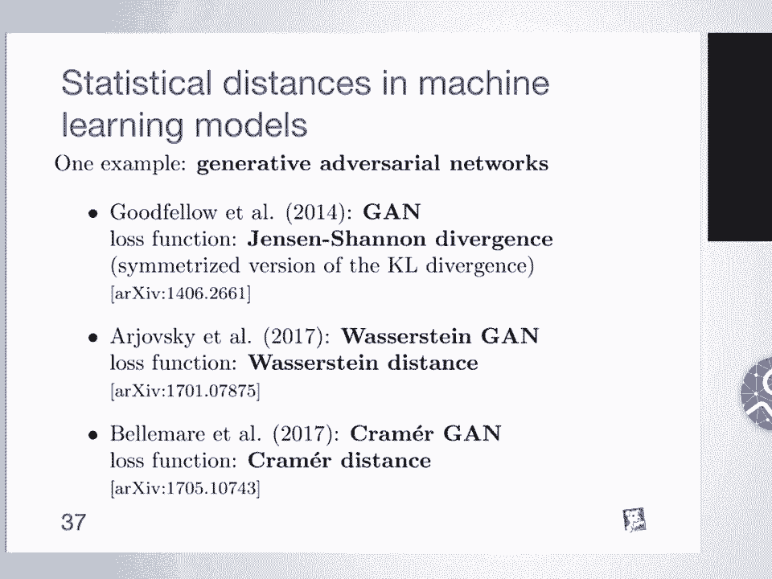

 about the statistical distances with references and also with animations so。

 that you can try for yourself and compute distances between some。

 distributions if you have any questions or feedback you can get in touch with me。

 and by the way if you're interested we we're hiring thank you。

 Thanks Charles that was great we have time for a few questions again please ask。

 only one question and phrase it as a question I'll take the mic to the side of。

 the room and for the side of the room again please line up and I can signal to。

 you from the line questions。 Thank you Charles very interesting talk the when we do the sample computation of。

 lacer-stained distance for instance you do this quantile differences。

 interpolation between quantiles for integration does it influence the。

 complete value of the distance and if so what type of interpolation have you chosen？

 So we don't actually need to do any interpolation to compute the distances so。

 what we would do is working with the empirical distributions and we can。

 actually compute the distances from the empirical distributions we we don't。

 need so we would have tests basically in the distributions but we don't need to。

 do any interpolation between the points that we have。

 We could yeah yeah but yeah when we work with some empirical data we we don't。

 need to I don't think we need to。 Other questions？

 Well maybe just for as an easy example you brought up with very static system。

 behaviors as you know in the in the plot。 Have you guys also applied like a bit。

 more you know non-static system behaviors and you know checking the。

 anomaly based on your statistical distance？ So on real data？ Yeah some real data。

 actually just a varying over the time and system degree date and you know there。

 is something changes some changes in the system so they are not necessary， anomalies but yeah。

 So I think it all depends on how you actually use the， statistical distances。

 I'd say this is more of the the lower level， bricks of your algorithm and then it all depends on how you would actually use。

 that。 So if for example you want to be a resident to shift over time you would。

 probably want to take a baseline that is far in the past to make sure that you。

 not like adjusting to the latest behavior and this is something that we。

 actually do but yeah for the statistical distances by themselves I think yeah。

 there are more just bricks that you can use the way you want in your in your， models。

 Any other questions？ Yeah just a quick question about incorporating。

 information additional information that you may know about two sequences or， two distributions。

 So for example if you know that the sequences are being。

 acquired from some kind of band limited process so is it possible to。

 incorporate that that sort of information into the computation of the。

 distances sort of in a constrained way。 So I'm sorry what kind of information？

 So for example if you know that the data is coming from some sort of band。

 limited process it's acquired through a data acquisition card or something like。

 this so you know something about the smoothness of the data for example。 Can。

 you incorporate that as a kind of constraint in the computation of your， distances？

 I'm on the top of my head that I think of maybe maybe we can talk about。

 it more into details afterwards but I am not sure I exactly see what we can。

 what we could do in this particular example。 Sorry。 Any other quick questions？

 All right let's thank Charles。 [BLANK_AUDIO]。