# SciPy 2018视频专辑 - P45：SciPy 2018视频专辑 (P45. Getting Started with JupyterLab (Beginner Level) _ SciPy 20 - GalileoHua - BV1TE411n7Ny

 I'm Jason Groun。 I've been working on Jupyter Lab last three。

 years and this is Matias who has been working with， Jupyter for many， many years as well。

 Short note of business， please pull from the repo to update， your files。

 If you've get cloned the repo then just do a， get pull to pull in the latest updates。

 I think we're at， commit FA69。 We're going to start out with just a short talk。

 about Jupyter Lab to orient ourselves and short demonstration， of Jupyter Lab。

 Then we'll go into step by step， walk you， through a lot of ways to use Jupyter Lab and you'll be able。

 to practice a lot of these things that you're going to see， in the initial talk。

 We plan on covering using Jupyter Lab， and some of the new workflows that are available in Jupyter Lab。

 over the Jupyter Notebook and then wrap up with writing your， own extension。

 So we should have like 60， 70， 80 extensions， written by the end of today。

 How many people have used the， Jupyter Notebook？ Oh good。 Okay。 And how many people have。

 used Jupyter Lab？ Oh fantastic。 How many people currently， have Jupyter Lab installed？

 Well before the tutorial。 Okay fantastic。 Okay great。 How many people are， if have。

 everything installed according to the instructions for the， tutorial at this point？ Okay great。

 During the first， exercise we'll be able to help with any insulation problems， as well。

 So let's just start out with a short talk about， Jupyter Lab and we'll go back to sort of where Jupyter Lab came。

 from and the genesis of Jupyter Lab。 But first I'll。

 note there's a bunch of names over on the left hand side of， this slide。

 You have a ton of thanks to the people that have， been involved with Jupyter Lab。

 It started out as a collaboration， between Anaconda， Bloomberg and Project Jupyter and since。

 then is blossomed into a work by many many individuals。 Chris， Colbert。

 Steve Sylvester and and Afton Darien put a ton of。

 work onto this early on and Ian Rose and I've worked on it， and Brian Granger。

 you can see the name there's been a number， of people that have worked on this quite heavily and then。

 it's blossomed since then to include a huge number of people。

 But let's go back to the Jupyter Notebook。 So the Jupyter。

 Notebook has really taken the world by storm you might say。

 become a de facto platform for doing data science and doing， scientific computation。

 The idea is you want interactive， browser based computing environment that lets you explore。

 your data interactively and it provides a way to have an。

 interactive workflow but also provides a way to have document。

 format that makes it very easy to share both code input。

 code output as well as narrative all combined in a single， notebook document。

 One of the fundamental ideas behind Jupyter， is that the workflow for doing this sort of thing is language。

 agnostic and so we have a number of kernels that are for。

 programming languages so over 100 I think at current count。

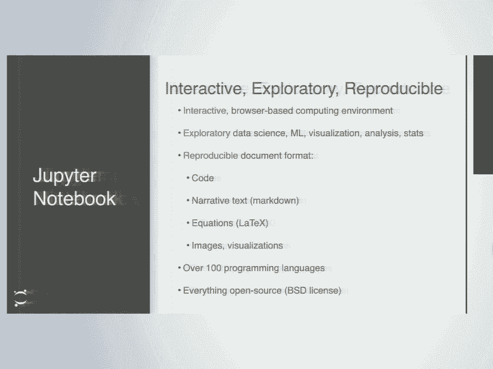

 of course everything is BSD licensed。 So here's an example。

 of the Jupyter Notebook I think everyone's fairly familiar， with this based on the show of hands。

 So where are we today？

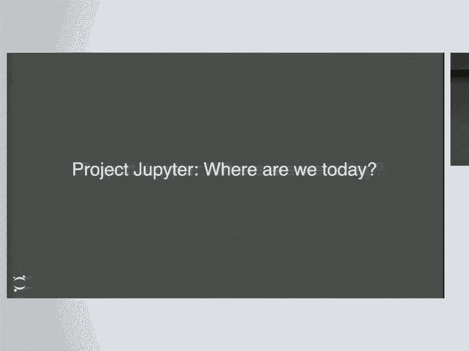

 We still have millions of users more than we had last year， even。

 We still have millions of notebooks， millions on GitHub。

 alone and then I'm sure plenty others off of GitHub。

 We've been enabling reproducible science so one of the things， that we love。

 One example that we love is the LIGO collaboration。

 and we put all their data up online in Jupyter Notebook so you。

 can reproduce one of the most significant physics discoveries。

 in the last century by downloading Jupyter Notebook and being。

 able to run their analysis on their data。 We allow you to and。

 this is an example of being able to using the binder project to。

 be able to download their notebook and there's a link there。

 on there at the bottom to actually download the actual scientific。

 competitions that form the basis of one of the most significant， physics discoveries recently。

 We've been enabling open data。

 journalism so an example for example is BuzzFeed who put up。

 Jupyter Notebooks for all of their articles backing up their。

 articles including for example this one on the tennis racket。

 Interactive textbooks rightly has a platform based on Jupyter Notebooks。

 for writing interactive textbooks and so and then many of you have。

 been using it of course throughout your work。 One of the things。

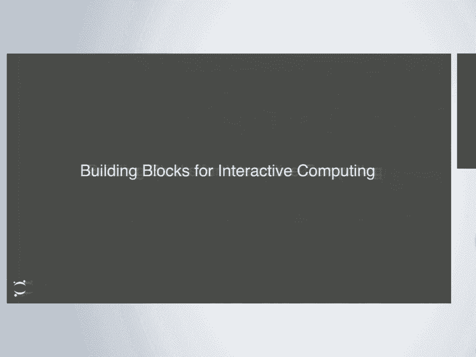

 we realize though with the Jupyter Notebook is that in the workflows。

 that people have been using it's more than just a notebook that they。

 need so we have the notebook but we also needed a file browser， a terminal。

 text editor and of course the notebook and so what we。

 have seen is you need a lot more components of course than just the。

 notebook and so we started putting these into the notebook and we。

 have a bunch of these components that are sort of completely。

 separate tools and one of the things and we call these sort of the。

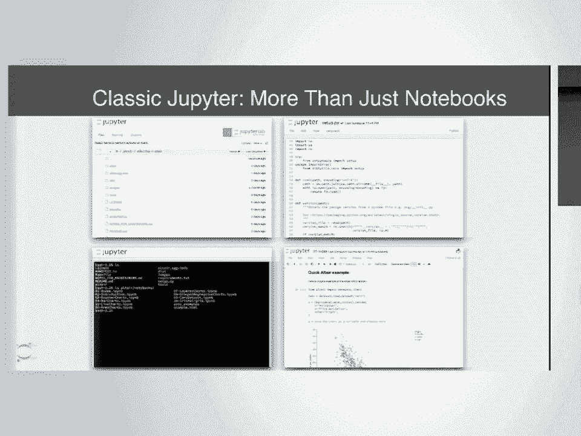

 building blocks of our workflow the building blocks of our scientific。

 computation workflow and one of the ideas behind Jupyter Lab is to。

 take all of those things and put them into one integrated experience。

 So the next generation of the web interface for the Jupyter Notebook， takes these tools and others。

 puts them together in an integrated， interface and then there's a ton of possibilities that you have based。

 on this architecture that's things work together。 So here's a screenshot， of the Jupyter Lab。

 On the left we have a notebook。 On the right we have， a Python file。

 The notebook is importing the Python file and we can work， with both together。

 Jupyter Lab has lots of buzzwords in it。 It satisfies all the boxes for all the buzzwords but really beyond the。

 buzzwords。 We tried really hard to make a flexible architecture， an extensible architecture。

 a high-performance architecture。 We， paid a lot of attention to design early on to try to get the UI and the。

 UX right and we really tried to make it very clear what the APRs are。

 for extending Jupyter Lab so it can be a foundation for many different。

 workflows and many different tools built on top of it。 Today we have。

 about -- it's been going on development for about four years now。 We have， about 150 contributors。

 There's about 60 components， 60 separate components， that make up Jupyter Lab。

 Last count we have around 2，600 releases。 This is kind of inflated。

 It feels like because there's each of these 60， components every time we make a release is a release on each of these 60。

 components and so one release of Jupyter Lab involves actually 60。

 some odd releases of each component separately。 But we end up with about， 2，600 releases to date。

 About 13，000 commits。 So to put this in perspective， the classic notebook in the repo。

 the current repo for the classic notebook， is about 11，000 commits。

 So we're on par with the development commit-wise， of the classic notebook。

 And we're currently -- what we're calling， beta， but I think that what you should take away with this is user 1。

0。 And， this came in January or February。 So in February we released what we called。

 Jupyter Lab beta， beta series of releases。 And what we're saying this is。

 now ready for users to use。 You can imagine it is user 1。0。 Use it in your， day-to-day work。

 We've been using it for a long time。 We're still stabilizing， the extension API。

 And so we called it beta。 So we'd say it's for all users， but for adventurous extension developers。

 And we'll talk a lot about， extension development later today。 The plan is for 1。0。

 which is a stable， API for extension developers this year。 And eventually the classic notebook will。

 be retired and replaced with Jupyter Lab。 Before I go into a short demo。

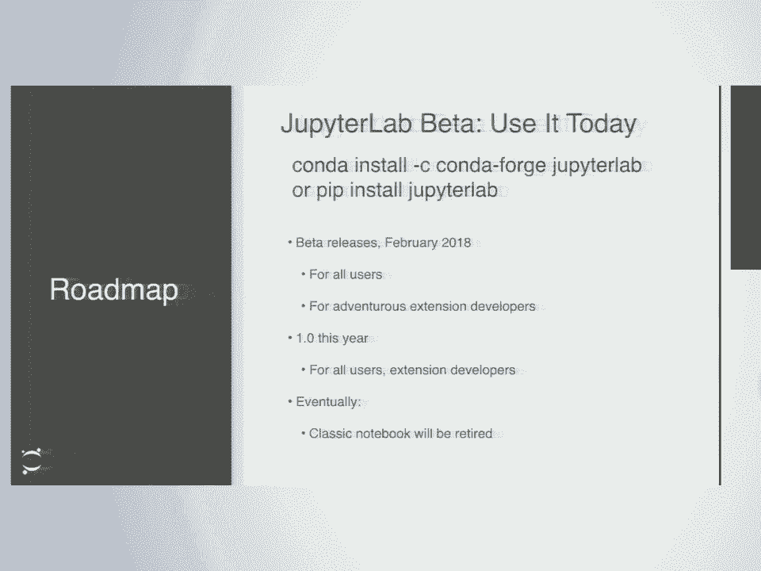

 and we'll mention this later too， but we invite everyone to come to Jupyter， Con in New York。

 August 21st through 25th。 The 25th is a Saturday。 Come and sprint with us。 We'll have a code sprint。

 a contributor sprint on， that Saturday。 All right。 So let's do a quick demo。 All right。

 So can we get a。

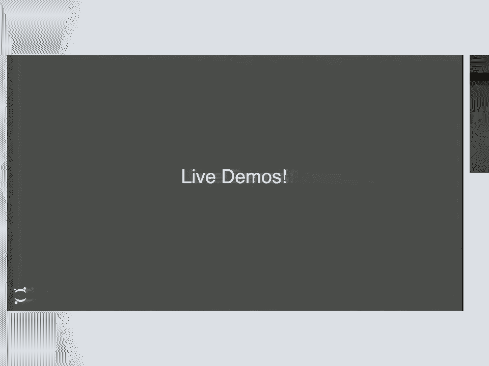

 show of hands again？ How many people have used Jupyter Lab more than just like。

 opening it up for the tutorial and making sure that the install worked？ Okay。 So it。

 looks like maybe a quarter of the people。 Okay。 Fantastic。 So this is Jupyter Lab。

 Over on the left-hand side， we have a file browser。 And we have a main area that。

 we call the main area， main working area。 And on the left， we have what we call the， left sidebar。

 Sometimes we'll have something appear on the right， called the， right sidebar。 In the left sidebar。

 we have a file browser。 So this is a typical， file browser that gives you a lot of the operations that you expect。

 So if you， right-click on it， you have a number of file operations that you can do。 You have。

 a breadcrumb up at the top。 And you can click on the breadcrumb to go back to the， right side。

 And you can click on the breadcrumb to go back up a directory。 In fact， you can。

 use a breadcrumb even more to move things around。 So for example， if I wanted to move， a file。

 I can drag it up to here to move it up to the home。 Let's put it back into， the data directory。

 At the very top， going in reverse order， we have a refresh button。

 to refresh the file listing and upload button to upload files into the current， directory here。

 We have a create button， a new folder button， and then a new， launcher。

 The launcher is this tab in the main work area here and allows you to， create various items。

 So going down to the left-hand side， we have the files tab。 We， have -- clicking on the tab。

 it toggles the left sidebar here。 The running tab， which。

 keeps track of what kernels you have running。 A command palette with many commands。

 They work throughout the system with keyboard shortcuts， noted， et cetera。 A tabs。

 list of all the open tabs that you have。 And I installed one of the extra extensions。

 It's a table contents extension， so extension can add things to the left-hand side。 All right。

 So let's create a new tab using a plus button。 So you notice it created a， new launcher。

 It's the same sort of idea as a browser where you create a tab and。

 then you pick what's going to go inside of that tab。 We can create a new Python 3， notebook。

 clicking on Python 3， and then we've got a new notebook。

 This notebook is a complete rewrite of the classic notebook interface。 We tried to。

 maintain compatibility with the classic notebook， with the keyboard shortcuts and。

 with the mouse interactions， et cetera。 And it uses exactly the same file format as the。

 classic notebook。 So the same file format， the same workflow that we all have got， come used to。

 but a completely new implementation that allows us to do a few， new things。 So as an example。

 here's a notebook from Jake Vanderposs's book。 Shift-Enter still works。 Wow。

 I didn't install Seabarn。 Okay， I guess we should have put Seabarn as one of the things to install。

 but you， can see down here that it works。 Shift-Enter works。 I can run by clicking the。

 "Run" button up at the top at the toolbar， or I have a "Run" menu where I。

 can have a number of run options。 You still have "Markdown"， you still have， "Math"。

 you still have "Rich Text"， you have "Interactive Jupyter Widgets"， etc。

 We've also taken opportunities since this is a new rewrite to do a couple of new， things。

 like you have collapsible cells now。 So any cell you can collapse the output。

 You can collapse the input， or you can collapse both。 You can collapse them as， well。

 You can drag cells around。 So here， I'm dragging the cell to move it。

 Just grab on the prompt area and drag it。 We have a vastly better extension mechanism for the notebook as well to add。

 things to the notebook。 One of the things we can do in JupyterLab is create a new， view of a file。

 So here， I'm going to create a new view for this notebook。 So this is two notebooks。

 and I've dragged the tab so that they're side by side。 And this is kind of nice。

 I can do stuff at the top of the notebook， and I can do。

 stuff way down at the bottom of the notebook。 I can fact drag cells in between the， notebook。

 So here， I'm going to drag this cell up to the very top of the notebook。

 I'm moving something from the very bottom to the very top of the notebook。 In fact。

 if you scroll in this view here， you'll see that the two views are completely， synced up。

 so you can see two parts of the same file。 So that's a view but not a copy。

 It is a view into the same notebook。 That's right。 The same underlying model is serving both， views。

 Is there anything other questions？ Yeah， good question。

 One of the things we really wanted to do in JupyterLab is make it easy for。

 components to interact with each other。 So， for example， one of the things we can do。

 here is right click， and we'll have some more experience with this in a little， bit。

 We're going to create a new console for this notebook。 And what this is is it's a。

 console that is tied to the same kernel as the notebook。 And so if I press shift to。

 enter in the notebook， I guess I need to run the cells that if I press shift enter into。

 the notebook and you can see over here， my kernel is displaying the results as I'm。

 executing the console here is displaying the results as I'm executing in that kernel。 And in fact。

 I can go over here in the console and I can run things in the console。

 which means I'm running it in the kernel behind the notebook without messing up the。

 notebook so I can try to explore what was that data frame here again without messing up。

 my notebook。 I have two different tools， the console and the notebook talking to the same。

 underlying kernel and interacting with each other。

 So here's another notebook demonstrating the Jupyter widgets。 Widgets work just great in， Jupyter。

 So here's my widgets， a classic example that we have in the notebook of， the Lawrence Attractor。

 But we also have some new workflows here as well。 If I right click。

 and create a new view for this output， it can pull justice output into a separate tab。

 I can move it and you can see that the output inside the notebook is responding exactly。

 along with the output inside the tab。 These are really two views of the same output here。

 But it does allow me to sort of replace the notebook with my tab and now I have sort of。

 a very simple dashboard like UI， web app like UI that's powered by a notebook behind it。

 So that's a notebook。 Same interface you know and love。 Same file format that you know and， love。

 Complete rewrite to make it much more extensible， much more powerful and work with。

 other components inside Jupyter。 Let's see the editor。 Let me close some of these。 In fact。

 I can go to File， Close All， to get back to the initial starting state。 Let's see the， editor。

 So here's a markdown file for example。 And I'd like to see this markdown file not。

 just as text but I'd like to see it rendered。 So we have the concept of being able to have。

 multiple viewers for the same file。 So I'm going to open with a markdown preview and put this。

 over to the sign。 And notice that I have some code in here as well。 So I can also create a。

 console for this editor。 And now what we have is a very common workflow you see in other tools。

 where we have a file and we have a console， executable console associated with this file。

 But this file unlike many tools， this file is a markdown file。 It's not a code file。 But。

 that's fine。 A console can be associated with any file。 I press Shift Enter and it sends。

 that line to the console and executes it。 And then go over to the console and see yep， A is。

 equal to 10。 In fact in markdown files there's a logic to go ahead and send the entire fence。

 block over to the console。 And so I can work through my markdown file and see the outputs。

 from my code blocks。 So again I have three different tools here working together in one， workflow。

 In fact these tools are live real time editing here。 Again we have the same view。

 of the file in the editor and in the preview so I end up having live preview of my markdown。

 So this enables a really fluent workflow of executing code from a script or even a code file。

 I'm teaching my daughter how to program。 On Raspberry Pi we installed JupyterLab and this is one of the。

 best ways to teach how to program。 We have a code file on one window in JupyterLab。 We have a。

 console in the other window and it's very easy to experiment with our code file by Shift Enter to。

 execute it inside the console， play around in the console with it to try to understand the。

 programming concept and then go back to the Python code file。 You can check your library files， etc。

 by hooking them up to a console。 You can also， and again this works with any file。 You can。

 have that a few lines and just execute those lines as well。 You can see that one of the nice。

 things about JupyterLab is you can have lots of tools that work together and pretty soon you。

 can find yourself like down into this little corner of this little side over here。 So we。

 provided a UI for being able to blow up one of the tabs to the entire tab to the entire， workspace。

 So if you go to view and single document mode， bam， now I can focus and concentrate on。

 just one single tab。 And then this tabs view over here becomes a little more important because I。

 don't have the tabs anymore。 We've gotten rid of them to clear our workspace off。 But I can still。

 switch between things with this tab view。 And I can just exit back out of the single document。

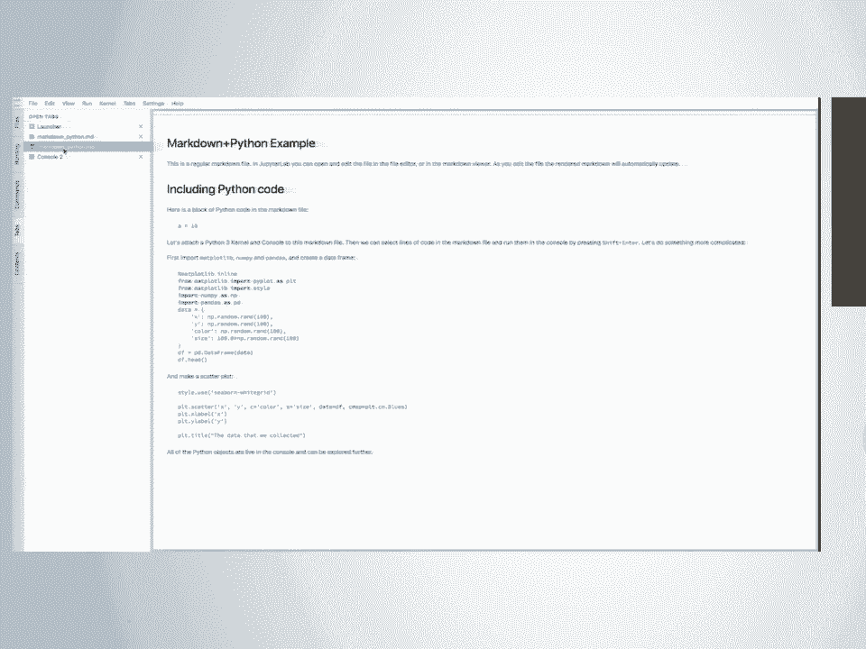

 mode and there's a keyboard shortcut there as well。 All right， a terminal。 So let's go ahead。

 and open up a new launcher。 I will start up a terminal。 So this is a full terminal。 I can even。

 start up VI。 I can exit VI。 I think that's the first time it did it on the first time。

 Full terminal， you can run EMACs， do whatever you want。 We have a number of settings that you can。

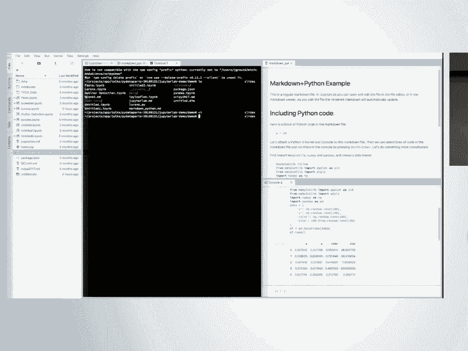

 customize。 And again， we'll talk a lot more about these during the tutorial。 You can see some of。

 these in the settings menu。 We have an advanced setting editor that lets you do all sorts of。

 things like keyboard shortcuts and settings in your text editor， et cetera。 In fact， any extension。

 here can provide a settings interface to customize it。 And we'll explore that a little more in the。

 tutorial later。 One setting that people may like to do right away though is the theme。 You prefer a。

 dark theme。 We have a dark theme。 If you prefer a light theme， we've got a light theme。 And this is。

 completely extensible。 You can write your own themes and distribute your own themes and install。

 your own themes。 Keyboard shortcuts are completely extensible。 We'll deal with those a little bit。

 later。 And then there's a number of other things that you can customize。 One of the things we deal。

 with， of course， a lot in our workflows is lots of different kinds of data files。 And so， again。

 the， idea behind JupyterLab is an extensible workflow， an extensible tool。

 a platform that we can build， on。 And so we have a number of viewers for different kinds of files。

 So we have standard things like an， image plus and minus， zoom in and out。

 the right and left brackets。 Rotate the image。 I hit the。

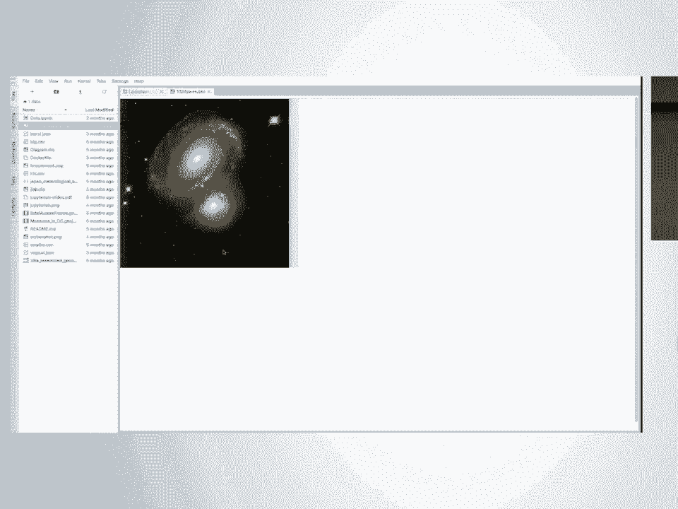

 end verse of the image。 So a little bit of a nice image viewer for you。 We've got PDF viewer。

 So this is， using the browser PDF viewer。 Here's some of the slides in order to version of the slides that we。

 saw。 We've got even GeoJSON。 Let's see if we go to the museums in Washington， D。C。 You know。

 typically this。

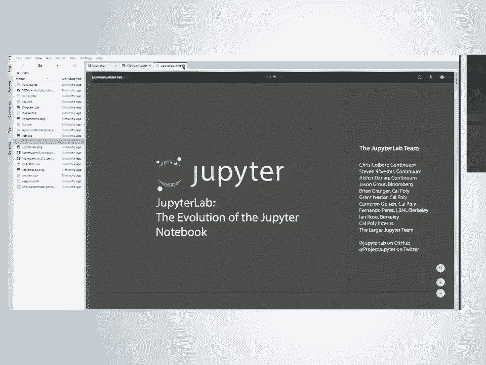

 is what we are dealing with， right？ But it's certainly a lot easier to be able to double click on this and。

 see it as an actual map。 So again， this is a plugin。 Actually， this plugin was written at。

 SciPy or at least the initial version of this was written at SciPy in like a couple of hours or。

 polished over a night or something like that。 And it gives an indication of how easy it is to。

 write some of these viewers。 In fact， by the end of today， we'll write our own viewer for our own。

 file format。 We've also got the VegaLite file。 So this is actually a JSON file。

 So let's see what it looks， like in JSON。 So we can open this。 This is a graphics format。

 a JSON graphics format that's becoming， pretty popular out of University of Washington。

 And actually， that's open with the editor as well。

 So we've got three different views of this file here。 Sort of JSON tree view， the actual graphics。

 view and editor view。 And again， all of these are lives。 I think if I change that to circle。

 you can see， the graph updates， the JSON viewer updates， and of course the editor updates。

 I can save my file and， be on my way。 We also have one of the file formats， of course。

 that we deal with quite a bit is a， data grid sort of file format。

 So CSV or some sort of tabular data format。 So this is a brand new。

 CSV viewer that was written specifically for being able to be used in JupyterLab。 It's in the。

 underlying library called PhosphorJS that Chris Colbert wrote that forms a basis for JupyterLab as an。

 application。 And of course， we've got small CSV's， but it handles even bigger CSV's。 So this is a 1。

2 million， row Excel chokes when it tries to open this thing after taking a long time to try to open it。

 But JupyterLab， opens it just a few seconds to load the 200 megabytes into your browser。

 And then you can scroll on it as smooth as， it's better。 And in fact。

 200 megabytes is sort of small here。 In Chrome， in see， in Chrome we can handle。

 files up to 800 megabytes or so in Safari we're limited basically by the browser's memory。

 the memory， allocation that the browser allows for strings。 So in Safari and IE you can open up a 1。

5 gigabyte file。 Firefox you have about a 200 megabyte limit。 But any one of these 1。

5 gigabytes CSV as soon as it loads the， data over to the browser you can scroll through it。

 Just smooth as better。 All right。 Those are some of the file viewers that come with JupyterLab。

 It's an extensible system。 It's straightforward to add your own file viewer。

 So for example last year at SciPy we showed off JupyterLab and， somebody said， man。

 I work with fasta files and doing genomic analysis and it would be great if there was a。

 fast viewer。 And so we sat down in just an hour or two。

 found a library online that takes fasta files and， renders them。

 And it just was a couple dozen lines of code to wrap this library。 And now we've got a。

 fasta viewer。 So here's a fasta viewer。 This file actually looks like this。 And so you can imagine。

 you know， would you rather work with this or would you rather work with this？ They preferred this。

 And it's not just the， file viewers， the system's extensible enough that it's very easy。

 This exact same， a couple dozen lines of code， that made this possible also makes -- also automatically becomes a viewer in the notebook。

 Looks like something， went wrong。 I think this is -- there's a memory issues with the browser when you open up to。

 200 megabytes CSV files and keep them open。 So I close out that big CSV file。

 And you can see here the， exact same couple dozen lines of code that took like an hour or two hours to write that wrapped this。

 JavaScript library that had already been -- already was available。 Not only let you view the file。

 but let， you view that data inside the notebook。 And again。

 it will wrap up today with you writing one of these， extensions。 As another example。

 in January we had a workshop in Paris and somebody said， man， I would。

 love to be able to draw a diagram in JupyterLab。 And there's this really cool library called draw。

io。 And it's a。

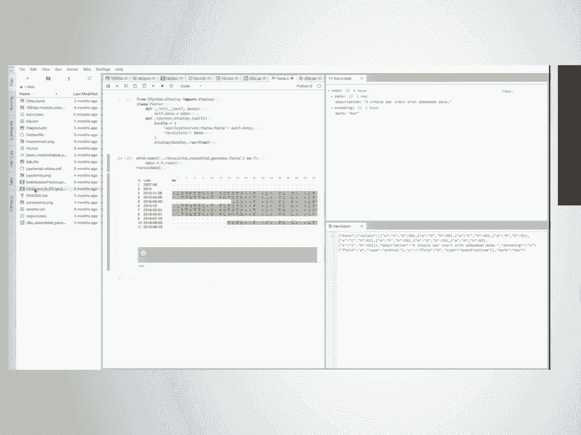

 JavaScript library for doing diagrams。 Can we wrap it？ And it turns out you can。

 And amazingly talented person。

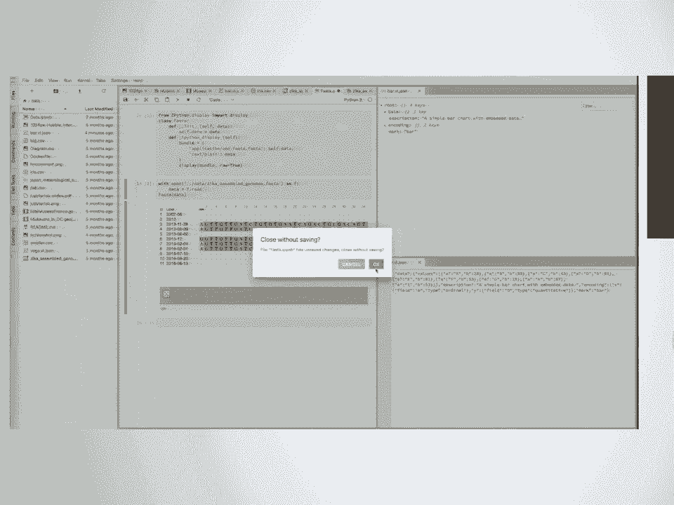

 Wolf， Wolf， Brackett and Quantstack made a new draw。io diagramming plugin。

 And so what we end up with here is a， full-featured diagram editor using wrapping the draw。

io JavaScript code that lets you do a diagram。 So this is a， full diagram here。 You can edit it。

 You can save files。 You can open up new files。 Here's one that I like， for， example。

 But it really is a really nice diagram editor。 Took it like maybe a week to try to figure out how to。

 wrap it， interface with the code base， et cetera。 And now you have a full-featured diagram editor in JupyterLab。

 And it's a really cool idea。 In fact， this -- this particular plugin really opened my eyes to some of the。

 power that you see in JupyterLab。 While we were sort of talking about this plugin and things。

 because， of course， you can open this file not just with the diagram editor but with also the actual editor。

 And these are live， models。 Martin Bredles over here mentioned， wait a second。

 So that means that in JupyterLab， you can have a， diagram editor。

 That's a JavaScript diagram editor。 And you can have a text file that are linked。 You can have。

 a live updating text file model。 And you can have any editor hooked up with a code console。

 So that means， it should be totally possible to have a Python process like being able to manipulate your text file and have。

 it automatically show up in your diagram editor。 So now all of a sudden you have Python plugins for draw。

 Oh， JavaScript editor。 JavaScript diagram editor。 And I thought， wait。

 that is the kind of power that you'll see， I think。

 with JupyterLab is once you see how these components can work with and interact and play with each other。

 like I had to sit down。 I was stunned。 Wait， you can have Python plugins for your JavaScript editor？

 Like， wow。 But this is illustrating some of the things。

 that having a platform that is very extensible and allows components to talk to each other and work together。

 all of a sudden you have the， synergy， if you want to use that word。

 the possibility of things interacting in ways that make everything way more powerful。 Okay。

 so that's some of the exciting new things with JupyterLab。

 But here's maybe one of the most exciting things with JupyterLab。

 And that is everything that you see here。 Let me open up this file here。

 This is a JSON file called package。json。 This is the packaging format for， JavaScript。

 which we use in JupyterLab。 And if I look at the dependencies for JupyterLab。

 the JupyterLab application， what you'll see here is everything， all the plugins。

 everything that you see basically on the screen。 Here's the CSV viewer。

 Here's the code mirror editor。 So that's the code editor。

 Here's the cells inside of a notebook and the code editor。

 Here's the underlying component keeping track of the documents that are open。

 Here's the main menus for all the menus system。 Here's the PDF extension for viewing PDFs。 You know。

 the notebook somewhere in here。 Here's the notebook extension。 Here's the theme extension。

 Every single thing that you see here is a plugin。 An extension in JupyterLab。 And we really。

 really worked hard so that any extension you write is just as privileged and just as powerful and just as capable as any of these extensions。

 It's totally possible for you to completely replace any one of these extensions with your own version of that extension。

 It's totally possible for you to extend these extensions， to replace them。

 to package up your own distribution with your own custom spin。 I don't like that。 You know。

 a particular extension right there。 Let me take that out and distribute my own version of JupyterLab with my own custom extensions。

 We tried to build everything so it's completely extensible。

 And we're seeing as people start to extend it and adopt this as a platform that the design is really solid here。

 And I think that's one of the things I'm most excited about JupyterLab。 You know， open source。

 One of the reasons I love open source is it lets you play with your own tools。

 It lets you modify and extend your own tools for your own workflow。

 And so as excited as I am about the plugins that we wrote。

 I'm even more excited about the plugins you guys are going to write to support and develop your guys' workflow that we hadn't even thought of。

 But the point is that we're giving you a platform。

 It's a solid platform that you can extend and collaborate on。 All right。

 so two resources before we move to the next part that you should know about。

 One is the JupyterLab documentation。 If you haven't seen this。

 we spend a lot of time really trying to get people familiar with the interface。

 get people familiar with some of the workflows that are possible in JupyterLab。

 I highly recommend the JupyterLab documentation。 And I also highly recommend the JupyterLab blog post that we put up in February when we went to the beta releases。

 which were the users ready， you know， ready for users to use on a day-to-day basis。

 This again explains a lot of the philosophy behind JupyterLab and some of the capabilities we're most excited about in JupyterLab。

 And we'll mention it again later， but seriously consider coming to JupyterCon。

 It'll be a lot of fun。 We'll have more things to announce with JupyterLab by that time。

 and we'll have a fun time。 Okay， Matias。

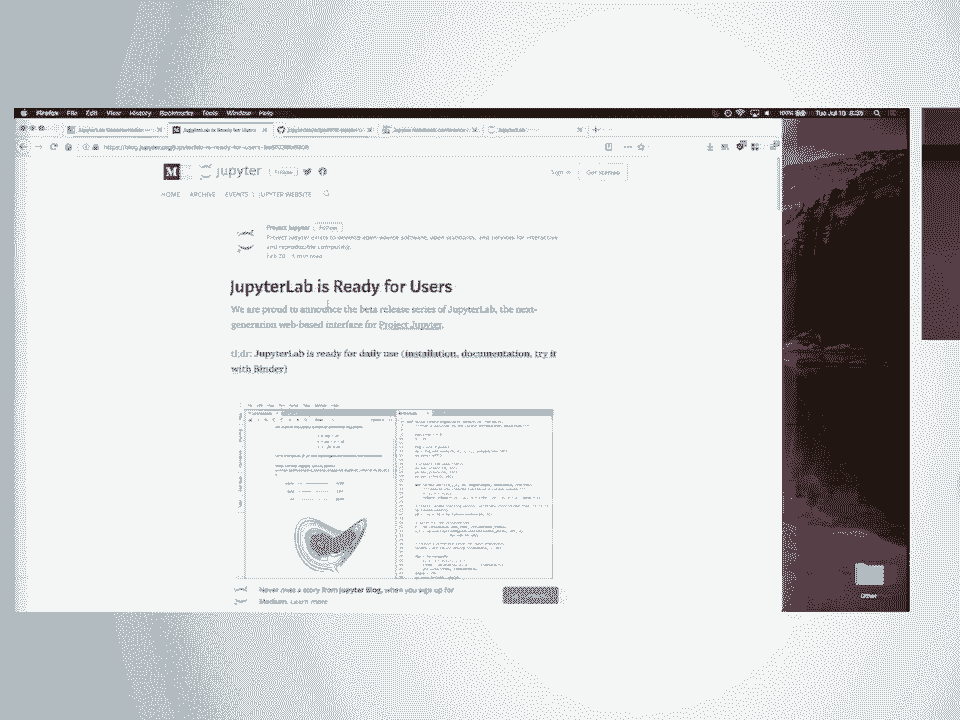

 Okay， thank you。 Thank you， Jason。 Well， welcome everyone who was not there at the beginning。

 I'm going to redo an introduction about the sticky notes and everything。

 One more first is that JupyterLab is still highly in development。

 and especially if you're a new user who have never used JupyterLab， you can have a huge impact。

 When you're doing exercise and when you're trying to do things here， try to things first。

 how would I do that， try to remember how you would do it。

 then try to do it and try to tell us or give us a note at the end of the tutorial。

 where did it not match your expectation？ Because because we've been working on JupyterLab for a long time。

 we basically are blinded by how to do things， and especially if you're a new user。

 you still have this feeling of how things should work。

 and that's where you can bring us something to do。 Okay。

 so for those who arrived during the presentation， you should have two kind of sticky notes。

 red one and green ones。 When something is wrong， if you don't have an installation problem。

 if you don't understand something， stick the reddish sticky note on your screen so that we can know that something is wrong and we can come and see you。

 And if you're using it's fine， put the green sticky note so you can move forward。

 If you have any questions， we have a helper in the room。

 If helpers can stand up or raise their hand so that you can see that you have an helper near you。

 So we have three helpers， two in the back here， one in the front and also Jason speaking there。

 There has been a couple of installation problems on Windows， apparently IPY volume is not working。

 so if you can't create the environment， just remove a IPY volume from the thing that you need to install。

 you can figure the rest。 Oops， I forgot to activate。 Activate。 What's the name already？

 So just to remind you， when you want to start JupyterLab。

 you just get in your Condemar environment and you do JupyterLab。

 If you have already JupyterLab not book running， you just change your URL here to Lab and you will be able to see Lab。

 Like right now if I do that， I have the normal notebook running at the same time。

 That's just to tell you that you don't have to server running in parallel。

 So what we can do now is try to go through one of the first exercises， take our time。

 You don't have to exactly follow the instructions。 If you have a workflow that you want。

 which is slightly different， that's what we are doing in Exercise 1。

 try to go through that and see how JupyterLab matches your expectation。 Okay。

 so let's go to Exercise 1。 And now you have Exercise 1。md， which is a Markdown file。

 And in this Markdown file there is a number of things to try to do， see if you can get them to work。

 Try to find different ways of doing things， try to find different ways of breaking things。

 And you can break things。 And you should try to find a couple of bugs that are fixed now in the next release。

 which is in RC that we will see later today。 And so the first task is relatively easy。

 It removes a sticky note from your screen， so I'm going to do that。

 and let's give you a couple of minutes to work through the example。 And so remove the sticky note。

 And if something is not intuitive， so for example the sticky note was hard to remove。

 you can grab a pen here， ask a friend one， and write on the red sticky note。

 It was hard to remove the red sticky note。 Okay， so first thing is。

 I'm just going to go through the first one and then let you do the rest。

 is try to view this Markdown file as a rendered Markdown。

 And so the way I would do that is right click here and say show Markdown Preview。

 And now I have the Markdown Preview。 One thing I could have tried is to click on the tab。

 and you see here that something that surprised me when I was preparing the tutorial is here。

 I don't have a creative preview。 So that's something that I would write on the red sticky note。

 Well， I was expecting to right click on the tab and have a new Markdown Preview。

 but it was not there。 So you see you can be surprised by Intrepitala。

 And one other here is you can do open with Markdown Preview and then you have your preview which is slightly nicer to see the Markdown file。

 And now I will give you ten minutes to go through that and ask questions。

 And then we can do a pseudo correction and have the first break。 I'm going to go slowly。

 I will not go with time， maybe faster through what was to be done for Exorcist One。

 I'll make some comments for the question I had and then we can move on。

 So to create a new notebook we are going to create a new launcher and in the launcher we are going to say。

 "Hey， I want a notebook here。" So now I have a notebook。

 If I don't need a sidebar here anymore because I'm on a really narrow screen and I'm not on my 42 inch at my work。

 I can click again here and it will hide the sidebar。

 So either you can switch which tools you have on the side here or you can click a second time and it will hide things。

 And now I can drag things around。 So you have to get used to exactly how to move things around。

 The blue rectangle gives you an idea of where you are going to have to drop things。

 So to really become efficient I suggest you try to learn keyboard shortcuts。

 If I came to your machine you probably saw me touching a keyboard and the layout completely changing。

 There is one nice thing in JupyterLab that all the comments that you can do everywhere are accessible in the comment palette here。

 And you can search for anything。 So for example I want to make this cell markdown。

 I'm going to look for markdown here and you can see that it says change to markdown cell type。

 And on the right side there is M。 And on the right side here is basically this color is a shortcut you can use to do this command without having to search for it。

 When you have modifiers， this modifier will appear hopefully with a normal symbol when you are on MacOS。

 It will have the weird thing which is the apple or the carrot to take control。

 And also I'm going to look at code and change code cell type to code。 It's why。

 And so now if I hide this command here I just learned that if I want to change this cell to a markdown cell I just need to press M。

 And you can see that the prompt disappeared。 And if I want to make it a code cell I can press Y。

 I'm going to change that a couple of times so you can see the prompt blinking。

 And one thing that you may notice is that this is a thing above here I'll change between code and markdown。

 And this is the other quick way to change styles from code to markdown。

 You can go here from code to markdown。 If you're not familiar with a notebook interface it's a model interface。

 Maybe more models and other editors you've used but most of our model。

 So when you have several cells you may want to either manipulate the cells themselves or edit what is in the cells。

 And so what you can see here is that when I'm pressing up and down you can see me pressing what you can guess。

 I'm actually moving which style is selected。 And if I want to edit a specific cell I'm going to press enter and I will go into that cell and I can type markdown。

 With bold， bold is two-star and italic is for example underline。

 And when I want this markdown cell to be rendered I'm going to do the same as if I'm executing a Python code cell。

 That we'll see later in this example I'm going to press shift enter。

 And when I do shift enter I'm going to select the next cell and render the cell above。

 So you can do math in line with single dollars and display math with two dollars。

 So you've probably seen the difference。 One is rendered in line。 So this is in line。

 And this is displayed。 You see that display will be on its online centered。

 And if you want to have some code snippets that are non-executable either you can put them in between the back tick。

 In range 10。 And so that will render in a markdown cell and you can even put a language here。

 The other thing you can do when you want to edit a cell is double click on it and it will switch to edit mode。

 So now I have code cell below。 Create code cell and evaluate it printing hello-sci-pi。

 So print hello-sci-pi。 So I can do shift enter to execute and select next。

 It's ask you after what you can do。 So you can do shift enter to execute and select next。

 Control enter to keep executing the same cell。 So if I do for example A， create range。 10。

 And I do next A。 Every time I do， oops。 Not an iterator。 I need to write it on it。

 I don't know my Python。 Every time I press control enter it will go to the next value and then it will raise the stop iteration error。

 So if you want to iterate on something you can use control enter。

 And if you want to execute something and add a cell we have a command shortcut which is alt enter which is execute and insert below。

 So now if I press alt enter it will execute this cell again。 Print hi。

 So I will insert a cell just in between。 So alt enter and now I have a new cell to add something before continuing my analysis。

 I personally also know the keyboard shortcut to add a cell above and below。

 So A is for insert a cell above。 So A will have a cell above。 So here， I'm going to write here。

 If I do A， I insert a cell above and if I do B， I insert a cell below。

 I'm choosing it's above and below and not before and after。 [laughter]。

 And now you don't know which one is which。 [laughter]， I'm now going to import pandas。

 So what you can do is -- that's my machine so it's something weird。 It doesn't work。

 I have some weird things on my machine。 I have JDA installed because I'm working on tab completion。

 You should when you press tab be able to have a tab completion of。

 what you're typing of your modules of your methods of everything。

 Depending on exactly which version of software we have working on that。

 you may even have in the tab completion have type inference。

 So you will have in front of each possibility you will have a small square with a color and a letter。

 And that will tell you whether something is a class or is an object or is a method that is relatively nice。

 And that's weird。 I don't know why it doesn't work on my machine。 Why？ [inaudible]。

 So if you put a question mark it will give you some extra information that's based on the IPython kernel。

 If you put two question mark I invite you to look at the IPython in depth which has been given at site by a couple of years ago。

 Nothing in IPython is changed。 You can use the same shortcut everywhere。

 Two question mark will actually try to give you the source of something。

 And if you do shift enter just after an opening parenthesis you can have a quick help that will be dismissed immediately when you start typing。

 In JupyterLab something which is new is the inspector that I just opened here by pressing comment I on max。

 You can go here and search for inspector here and it says that the shortcut is command I。

 I don't know the shortcut on the window。 What the inspector will do is it will automatically pull the documentation for the things you are typing。

 If you do pandas up as soon as I'm in pandas it will show me the documentation on the site here。

 You can see that the documentation could be rendered way nicer。

 We still haven't implemented that maybe you can do that as a sprint。

 And that frame I have the documentation about。 About so that frame。 What else there was to do？

 Question mark tab。 Okay。 One of the exercises is what to use。 Read csv。data。iris。csv。

 And that's my data frame。 And you can see that your data frame is nicely rendered as HTML。

 Here a slight difference between returning something as the last expression of a style。

 So here you have out 29。 If you do display， if you won't have out 29。

 it's the same difference as having some sprint， except the display is able to display rich representation。

 So prints can only show text to display and show HTML images， et cetera。

 And if you do something magic that if you do matplotlib in line， now you can have directly。

 in line plots in the notebook。 It told me how to hook some things。 And you can let's do plot。

scatter。 Cpl length versus Cpl with no key error。 Length。 Big finger。 So now I have my flowers here。

 And try to color that by species and you will see that it's not happy because species is。

 not a category yet。 And we'll try to fix that in an exercise further。

 So more advanced we're going to see just after is that you can drag things。

 Some of you have questions about that。 What we can do now is take a short break because it's already 907 and we can go through that。

 quickly after the break and take questions and resume。

 Don't forget to write something bad on the red sticky note， stick it outside the door。

 So something good on the green one if you want and take new sticky notes when you're coming。

 Go get coffee。 [inaudible]， [inaudible]， Be back in 10 minutes。

 So break is supposed to be until 905 which is already passed。 Or here it's fine。

 Wherever we can find them relatively easily。 Thank you。 Okay， two more minutes。

 Still a couple of people grabbing coffee so we can -- so we had some really good questions。

 and comments。 I saw on the sticky note that a couple of people made the same suggestion。

 Let's see if it's again the same subject。 That you will be able to do on your own at the end of the tutorial。

 So for example， something that came across a number of time and the sticky notes were。

 I want to rename my file or something like that。 I want to double click on the tab while we're going to open an issue and see if we can get。

 that to work。 So we're about on time。 Let's try to go again through what were the more advanced notebook tips that you can do。

 So you can move a lot of things by dragging。 So you can drag both output and input。

 So if you want to rearrange a notebook， you can use something else。

 You can grab a cell and move it to another spot。 Something that you can do especially if you have a really long notebook is to make a new。

 view from notebook as Jason showed earlier。 The way I know to do that is more not busy only way is to right click on the tab and make a new view。

 And so everything is backed by a real-time model。 So every change you make on one side is reflected on the other side。

 One thing we haven't done yet but which is coming， working on it， we need help。

 We need lots of things。 It's to actually back that by actually something like Google Drive and real-time collaboration。

 and not only have real-time collaboration on the same machine but you could for example。

 right click on something and share with this person and then share the cross computers。

 So that's coming。 It's not there yet。 And so because it's actually the same view on both sides。

 let's say I want to move this， matplotlib in line from the bottom of the notebook to the top of my notebook。

 It's relatively hard to grab that and scroll at the same time。

 I can't do that but I can also drag it in between view and now it's there and I can scroll up here and here。

 So if you want to drag things you can drag things between view of the same notebook which。

 makes some workflow easier。 When you have something like that。

 show a plot or you have a question here。 [inaudible]， First copy instead of moved。 [inaudible]。

 That might be a bug on this version。 It should move it。 Is it a bug？ [inaudible]， Okay。

 so that's my bad。 Maybe it shouldn't be， I don't know， like we can make it say it's otherwise。

 It used to be moved。 At some point。 Then someone said it was a bug and then we made it copied and then someone else said it's a bug and now we need to discuss。

 So if you know when you hold control it's hit， it's really fast and there is no case of the idea about that。

 Well then just learn the shortcut to delete something。 Command， delete， delete cells is D。

 which means press D twice because we don't want you to delete something by mistake。

 So if you go on this cell， well let's look if it deletes in both at the same time。

 I'm going to go here， I'm going to press D twice and it disappeared。 Is there undo for delete？

 Undo cell operation。 There's one。 Oh yeah， I'm just there。 [inaudible]， Well file new notebook。

 grab print high， grab print high and put it here。 Seems to work。 There is also。

 I don't know how to do that but you can have comments。

 We have a Google plug-in but Google duplicates their API so even if it works we can't release it。

 It's complicated。 You basically can have a slack channel on the side of the notebook and say hey this cell is wrong。

 I believe what you mean is， blah blah blah blah with a long equation and you can drag from the command that person made into the notebook to fix your notebook。

 So it works between any plug-in as long as you just tell your plug-in with the right hooks into JupyterLab。

 It should just work。 And this one should。 Using the view menu or click the blue bar to collapse and expand input and output so when you have a long output like that。

 probably like a student that did a for loop with 10，000 print high。

 You can click on the blue bar here and you see that it collapsed the thing。

 Now you have dot dot dot and you can click it to re-show it。

 Or if you have a really long input you can also collapse the input cell。

 And here is the output still there。 If you collapse the output it completely disappears and you can re-click on the ellipses to re-show the input and re-click on the output to expand it。

 If there is some graph you're working on and you want to iterate on that。

 you can create new view for output in a context menu which is create new view for output here。

 I'm going to put this view there。 And so now I have always this graph which is shown here and if now I want to have。

 let's do the F-head to see what we have available。 We have petal length。 So let's change petal。

 And because it's basically again a shared model， when I shift enter there or control enter to not select the next cell。

 this graph should update。 And it does。 So what you can do is actually have different view not only on full notebooks but on specific graph。

 And so again everything you do here with the mouse which is relatively slow and you need to point the right pixel。

 what you can do here is search for the command you want to do under notebook celebration。

 And on this side here you can see the shortcuts that are bound to that。

 So you can actually press those keys to do the action and gain efficiency。

 So what is correct is that it tracks things and enables crawling output。

 So for really long output you don't have to only have hidden output but you can enable scrolling。

 So for I in range 100 print I， or let's let's be small， I， squared is 3 hard。 And that's quite long。

 So one of the other thing you can do is to right click and enable scrolling for output。

 So now you basically have all that in a more compact way and you don't have to scroll for hours to figure out what is on the next cell creating new view。

 So one of the slight difference that you will see in between Jupyterla and notebook and normal notebook is that JavaScript output is disabled by default。

 So if you remember and if you play with normal notebook you've learned that object can have several representation。

 HTML， PNG， GIF depending on how you pronounce it。 But it's spelled the same。

 And also JavaScript which is what's used for things like widget and so on and so forth。

 One of the differences is that now in Jupyterla you may have several notebooks on the page and there are also security issues with JavaScript。

 So right now if you have a representation that displays JavaScript it won't be shown in Jupyterla but will still be shown in notebook。

 Speaking of normal notebook， if you have something that does work in normal notebook but not yet in Jupyterla of course you need to open a book and say hey this doesn't work。

 And you may tell you know we won't make it to work but we'll try our best。

 You may want to basically go back temporarily to the normal notebook。

 So what you can do is go to help here and do launch classic notebook。

 It's actually not launching it， it's just opening a new tab that points to it。

 And you can find exactly the same notebooks that are currently running。 And let's do。

 hey I modify that from classic notebook。 Save， close， go to Jupyterla and refresh。

 And hey I modify that from classic notebook。 So you can access things from classic notebook as well。

 The only difference is that it's like when you open a file with two editors is first。

 last save wins。 So don't have Jupyterla really open and saving things while you have classic notebook。

 But what you can do is open classic notebook， change something， see how it affects something。

 save and go to Jupyterla and refresh。 So if you have something that don't work in Jupyterla that's a way of bridging the gap。

 So we've seen some workflows that are really similar to what you can do in normal notebook。

 But because Jupyterla is everything in a single UI you can do way more things。

 especially you can attach kernel to any kind of documents。

 You don't need to have a notebook to attach to have a kernel。

 You may have seen in the launcher here that I have many kernels we have console。

 So for those of you who knew the Qt console it's something which is similar but is in a web browser。

 It's a more linear， you can't edit what is before。 It's like a terminal but can display things。

 And so you can execute code， you can't do markdown。

 And so these things are basically just executing code。

 And what you can do is actually attach such a console to any document。

 And with binding a shortcut or using a command you can send code to this document to the console。

 And execute code。 So one of the things you can do， I think I've put it here。

 You say you have a markdown file because you like markdown file and you want to try to execute the code which is in there。

 And you may have been used to actually create a new terminal， you know。

 And you put it on the side here。 I prefer white things。

 And you used to be able to open IPython here which takes some time and say， "Well， okay。

 I'm going to try that。 I'm going to copy past here and enter and yes it works。"， And keep on going。

 That's one way of doing it。 What you can do now is actually right click and create console for editor。

 And so when you create a console it will ask you to either create a kernel or attach to an existing kernel。

 So here you have new kernels。 Or you can use already running kernels。 So let's attach to this one。

 I don't know which one is。 I probably should name my notebook。 And let's see。 Panda is not who。

 Who else？ So ADFI and Panda that are defined。 So the F is my data frame。

 So I can actually attach a console that we put on the side here in small。

 And now if I want to execute code from this markdown document。

 the only thing I have to do is select the piece of code I want to run。

 Press shift enter and it will be sent to the console on the side here。

 So here it has no side effect。 If you are in a fence block that have code。

 it will automatically detect that's what you want to send to the console。

 So you just need to be on this line and press shift enter and it will send that and execute。

 And so now I can just quickly verify that my document is doing the right thing by pressing shift enter and see how the results are appearing on the security console。

 So that's kind of convenient。 And most of the time when you're starting to build bigger software。

 you need to move things from a notebook or from a markdown file or from anything to a library that you can import and reuse。

 But it can be quite cumbersome because you need to restart the kernel every time。

 So you can do the same here。 If you want to have your data frame here， you can press 0。

 0 twice to restart。 Click restart。 And now Gf is not defined。

 So you actually need to re-execute everything。 So import pandas， read that。

 back block in line and scatter。 And so when you're developing a library。

 you might want to automatically reload your Python code。

 That's an IPython specific feature that we have been having for quite some time。

 which is called auto reload。 And so if you do load extension auto reload and then you say auto reload one。

 now everything you import with A import something。

 will automatically be reloaded every time you try to be reloaded because you can't always really reload things。

 Try to be reloaded every time you execute code。 So now I have this Python library file here。

 That basically just take my data frame and mutate it to make my last colon。

 which is which species my flower is a categorical value。

 I should be able to basically do scatter with color。

 And so I have each species be a different color in my scatter plot。

 And so right now I'm going to make a mistake in my library。 It won't work。 So I'm going to -- ooh。

 no， I'm going to be a bit of a bit。 Let's just kill that and restart。 Create console for editor。

 Put it on the side。 And we run thing。 And that's load my thing。 I'll put it in nine。 Scatter。

 How much you might be buying。 I don't know why it's doing that。 Let's do C exercise two。 No。

 Exercise one。 Okay。 So now I'm in exercise two。 I should be able to do that。 Yeah， it works。

 And if I try to read my CSV and plot something， it will throw an error because I have an error in my library file。

 I'm not going to go through the error。 But now the only thing I can do is fix my library。

 I don't have to restart my kernel and hopefully everything works。

 Now my Python file has been really automatically in my environment。

 I haven't lost any of my current variable。 And I can directly run this。

 And now I have my nice graph with different species of flowers。

 And so obviously I can attach a markdown file like this one。

 But I can attach a console to any Python file。 So if you want to try snippets of code in your Python file。

 you are developing a library。 You can do the same。 You can create console for a editor， Python 3。

 I'm going to put all the console on the same tab。 Make the type small。

 So my console 4 is attached to libpy。 And I can check that category， it's not defined。

 And now if I'm going to this line and press shift enter， it sends this line here and now。

 I can have category here。 So if you like me and you like to iterate over something quickly to figure out how it works。

 you can now attach a Python file。 Actually I need to do that to have more space。

 You can iterate quickly over this code and see how it works。 Attach to a kernel。

 To the other thing you can do is to open a terminal and have something that works。

 But it's up to you to have the workflow you like。 You can of course now also attach multiple notebook to the same kernel。

 I don't remember how to do that。 Change kernel and I can attach notebook b to kernel notebook a。

 And so now if notebook a， I do a equal -- this is new。 Now notebook b， I also have this is new。

 If you have two notebooks， workflows that are doing analysis on two different assets。

 you can now attach， to notebook to the same kernel。 And I have one question here。 [ Inaudible ]。

 So the question was， you have your IPython set to automatically load the auto reload extension。

 Will it automatically work in JupyterLab？ The way Jupyter works is it's not really aware of the kernel specific configuration。

 And IPython is just a specific kernel for JupyterLab。

 So you may have several IPython kernel for JupyterLab that each have the different configuration。

 If your default configuration is not changed， usually the default configuration for IPython。

 will affect the normal kernel of JupyterLab。 And so if IPython is set to automatically load an extension。

 then JupyterLab will see the same， extension。 But it's up to you and it's up to how you configure your specific kernel。

 And again， kernel is not only languages， they may be different condor environment。

 they may be different， machines。 So for example， if you see my JupyterLab launcher here。

 you see that I have many kernels。 But for example， two Julia kernels with different versions。

 And this one is a specific project I'm working on， which is launching a kernel in a specific。

 condor environment with specific configuration。 And it's up to you to define what these are。

 What you can have here is， for example， a kernel that runs something on a cluster。

 It will take some time， you click on it， but it will actually SSH and launch a cluster remote。

 And again， the auto-reload extension is not enabled by default because it cannot always reload。

 everything。 It's the best effort。 And so we prefer to make it opt-in because otherwise it can be a surprising result for people。

 The next section was。 So now we have exercise two。 We have two minutes to start。

 so we can go slowly。 So you can go again in the exercise two， exercise two folder。

 You have exercise two。md here that you can again try to not new view what I want。

 It's a markdown preview and you have a number of things to try to do， to try to attach multiple。

 kernel to a multiple document to the same kernel and also try to learn about single document。

 mode because when you may want to have many documents on a single document， but you may。

 want to have a distraction free environment to work， and that's nice to have。

 So let's work 15 minutes on that， slightly more， and after we will do a correction。

 And you can again go to the break。 I think the snack are removed at 10 past 10。

 So you have 25 minutes to get snacks。 Okay， so I think almost everyone is ready。

 so we're going to restart five minutes early， and go into customizing JupyterLab。

 Based on what I've seen around， there was one thing which was unclear is that you don't。

 need to copy past between a markdown file and a console。 So if I close all of that。

 remove it and it has no name， and create console for editor here。

 I don't have to copy that and paste it here。 The only thing that I have to do is to bring my cursor in the fence block and press shift。

 enter and it does send things by itself。 You can also select just one word and press shift enter and it suggests this world。

 And if it's a full block， it sends a full block。 So basically you can iterate directly。

 And if you want to send non-python code， you can also， but you will get a syntax error。

 Syntax error not always obvious， especially if you have beginners。

 Some people have started to look in advance into how to do shortcuts and everything which。

 we're going to do now。 And we even had feedback on things like， "Hey。

 I want imax key binding for my editor because， I'm an imax person。 First thing， you're wrong。 No。

 I'm just kidding。 I just have one figure per hand so I can't use imax。

 I actually have a real reason that I used to use a French keyboard and the shortcut of。

 imax would basically prevent me from typing accents on the French keyboard。

 So I learned them and now I'm a Vm user。 I'm sorry。 But if you want to have imax shortcuts， you can。

 You can go to settings here。 You can go to text editor keymap and select imax， Veeam or Sublime。

 The JavaScript library we use for editing code is called CodeMirror and have that already， built in。

 You don't have to use CodeMirror if you're using something else。

 You can actually switch all the text editor for Monaco， I believe， which is behind VS code。

 or things like that and have different features。 And so one other thing which might be hard at the setting level in JupyterLab is that。

 there are JupyterLab level settings and then you will have settings for specific and downloading。

 library we use for which we don't expose UI。 You're basically， well。

 there is an underlying library with just pass configuration down the， way it is。

 We cannot really make UI for you to configure that。 Here at FODK。

 the keyboard shortcuts or the theme if you prefer to have a dark theme。

 That's where here you can see that you can separately change the editor themes to dark。

 or change the JupyterLab theme to dark which is here。

 And you see that it refreshed and now I have it in dark but I can have， for example， the。

 editor themes to still be the -- okay。 So interacting in a weird manner。

 You can have the editor which is clear and the JupyterLab which is dark because we just。

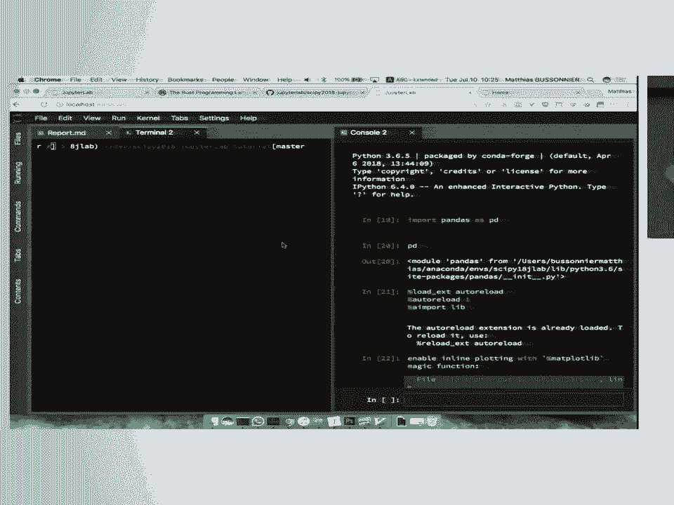

 don't really have a cross integration with underlying library。 So for those of you who say， hey。

 I want Emacs key binding， well， you already have them here， in the setting key map。 Okay。

 so that's how to change to change editor settings。

 For some reason something that I just realized yesterday， the color settings for the editor。

 are in settings but if I create a new terminal， for example， which is clear here and you want。

 it to be dark， it's in view。 Or use dark terminal theme。

 And so the terminal also you can switch from light to dark。

 So depending on whether you like to be awake late at night or sleeping during the day。

 you can change your theme。 So if you look around in the menu。

 you will see that there is a number of convenient way。

 of changing settings for different components。 But as I told you。

 there is a large number of underlying library where we can't write the。

 code for every option and the situation is some option are really complicated to edit。

 So what we have is the advanced settings editor。 You can go there。

 And I'm going to switch back to light because I can't read dark。

 The advanced setting editor allow you to edit JSON files that are powering the configuration。

 of everything under JupyterLab。 And so if you want to do any advanced configuration of things you don't find in menus。

 you will， have to go there and write some JSON by hand。 It could be easier to edit。

 We still haven't had the time to write a better editor or something that provides more UI elements。

 So we've tried to do some classification。 So CodeMira is underlying library that's power text editing。

 So if you're using default JupyterLab and you want to specify how CodeMira under things。

 you can go look at the CodeMira documentation， look at the options that are available， copy。

 and pass them there and they will be passed down to Conneur。 So for example。

 this handles automatically closing brackets when you press either a curly。

 bracket or a square bracket or an open bracket， whether you highlight brackets， some option。

 about the theme， some option about type completion in Conneur。

 So that you would have to go to this library in particular。 Look there。

 see what options are available and change them here。 So for example， we expose KIMAP。

 If you change the KIMAP here to Emacs， you should see on the side here that's the default。

 value you see on the right that the KIMAP has no change to Emacs。 And if I change the KIMAP to Vim。

 it's changed to Vim。 And if I hopefully do Emacs here and I go to Settings and KIMAP。

 it's changed back to， Emacs， going to put back the default。 And for Conneur， yes， question？

 >> So if you close your lab， open your open access to Emacs， you can use it for a change。

 of the department。

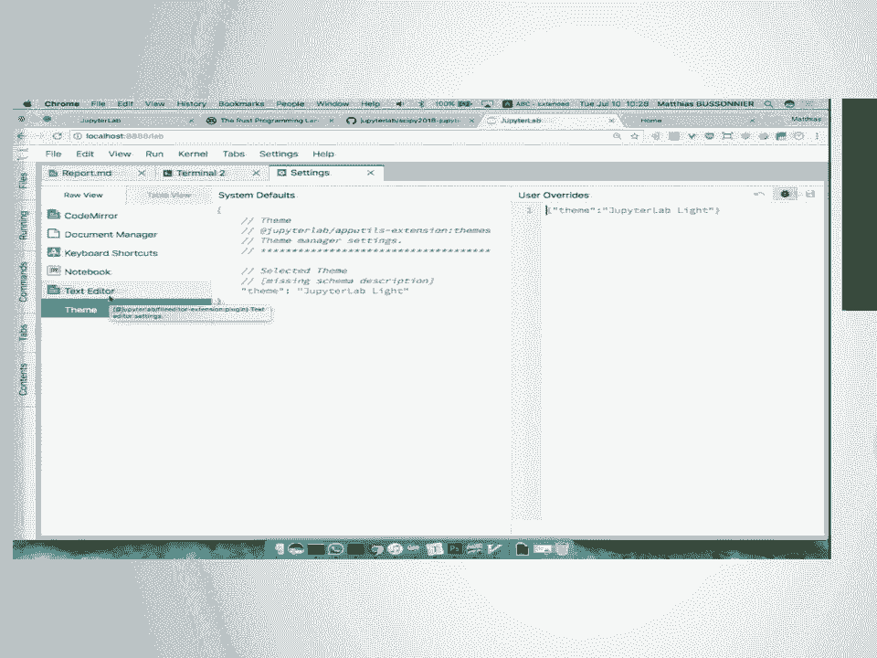

 >> So is that saved on user disk？ So if you close your Jupyter lab and reopen， it will be saved。

 I can， for example， just refresh the page。 You see that it kept the layout for things。

 A couple of versions ago， it would just try to layout and you have to reopen everything。

 That's the configuration state。 That's， I don't remember。

 is that stored on disk or on local storage？ That's stored on disk。

 There is other things that are stored in your browser。 So if you change browser。

 you won't have this configuration， but that's stored on disk。 So it's per machine per user。 KIMAP。

 for example， in Conneur may be something more complicated than strings that you can。

 have your own key bindings。 So you can develop your own KIMAP。

 If you don't have an English keyboard， most of the default shortcuts are planned for a。

 quality keyboard， you may want to have a JSON blob here。

 And so you have here a configuration for every component of Jupyter lab， a global text。

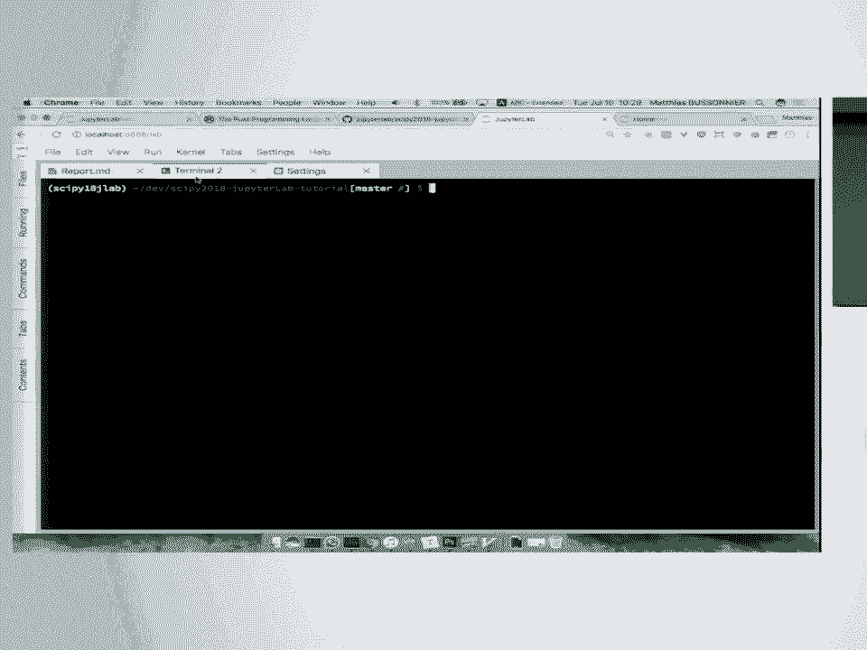

 editor， not book keyboard shortcuts， and document manager。

 One of the part I'm going to focus on is keyboard shortcuts， because if you want to be efficient。

 with Jupyter lab， you basically want to customize your keyboard shortcut to not have to reach。

 for the mouse and find in menu。 I forgot to remove what I was going to do。

 so you have a spoiler here。 So what you see here is system default。

 And the way this work is you can define a number of commands that can be executed in。

 some contexts and then attach them to a specific key world。 And so for example。

 if you want to switch to previous or next tab， you see that there。

 is a command here in the system default called application activate next tab。

 which does application， activate next tab。 And the shortcut that will trigger that is control shift square bracket。

 So if I do control shift square bracket， it selects next tab。

 And this is available when basically what I have in focus is body。

 We are not going to focus too much on what this selector means， but you will get used。

 to that by copy and testing。 Basically telling you when I have this in focus。

 I want this shortcut to be available。 So that where you in a marked-down file。

 shift enter executes the current fence block， but。

 while you in a console shift enter executes what is in the input prompt and when you're。

 doing a notebook， shift enter will render a marked-down。 A marked-down， marked-down cells。

 And so for example， if you want to have custom keyboard shortcut， like restart kernel is。

 already bound to 0， which is pressing 0 twice。 So if you want to have something twice。

 you will basically in keys here， you would put， two entries and you need to do each entries in sequence for the keyboard shortcut to be。

 triggered。 And so what you would do in user override， you will write something that will be merged。

 with a default value。 You say what you want to do， for example， hide cell output。

 I give it a new name like I already did -2。 You tell it what to do。

 I want my current notebook to hide cell output and I bind it to a specific key I will share。

 is minus。 When you write a shortcut， you don't give the actual symbol you want。 You want the key。

 So for example， on my keyboard， if I want plus， I wouldn't write plus here， I would do shift。

 equal because plus is when you press shift and you press equal。 Shift is a modifier。

 And now that you have that， it should automatically apply to your current session。

 So if I do 4i in range 10， print i。 And now if I do minus， it should collapse the output。

 And if I go to setting here， let me just hide that for you to see better。 If I do shift equal。

 which is plus， it should not show cell's output。 So it should expand what I have。

 And so if I'm here and I'm doing shift plus， it expands things。 And so right now。

 that's how you go to advance configuration of JupyterLab。

 You have to figure out what is the command you want to run。 What is a selector you want to run。

 usually what you go is you go into a system default。

 and you look for something which is similar to what you want to do and you copy and pass。

 the selector。 We're not going to go too much into detail into what it is。

 And then you bind a specific shortcut and give it a name so that someone else can use。

 it if they want to。 And with that， you should be able to customize JupyterLab in the way you like。

 And what you will see is that this system， this is not really JSON because there are。

 these commands。 So the thing that we have here， we automatically strip commands。

 One thing I saw earlier today that I was pointed to is what you have to write as a user is valid。

 JSON。 What is on system default is not valid JSON。 So if you copy and pass。

 don't forget to add training commands at the end of each section。 So here。

 if I were to copy pass that here， I would have to put a command at the end and， put a command here。

 And that's going to be stored on disk on your computer。 And now you have a custom keyboard shortcut。

 And that's where we start the next exercise where we are going to try to change keyboard。

 shortcut that already exists。 So that's in exercise three， I believe。 Well。

 you remove your sticky notes because everything is not fine now。 You need to write JSON。

 And so you will have missing commands and everything and missing quotes。

 And try to not look at what I did on my computer and reduce the same try to bind custom keyboard。

 shortcut to a four-cylinder book。 Try to， for example。

 see if you can do a restart kernel and run over。 You might not be able to do exactly because you may need a bit of plug-in that you will。

 see later with JSON。 But try to， for example， bind the keyboard shortcut to run all cells to be able to quickly。

 check that the notebook is reproducible。 And I'll give you something like 15 minutes。

 And after we switch back to JSON that will show you how to do extension。

 And then you will write your own extensions that can create you for mastering Jubitale。 All right。

 so I wanted to first give a short overview of what these extensions are and。

 how extensions basically work in Jubitale。 But actually。

 let me say one thing that we've noticed people have questions about before。

 And we tried to emphasize in the documentation。 But you might come up with as well。

 And that is when you're-- oops。 Maybe that's not the right Jubitale。 I'll close that one down。

 This one probably works better。 OK， so when you're in the notebook。

 sometimes you have an image or whatever。 Sometimes you want to copy some text and stuff。

 especially like opening images and stuff。 And if you right-click to like view an image or copy an image or something like that。

 you， get the notebook menu。 And our convention is if you shift right-click。

 then we give you the browser menu。 So if you want to ever get to the browser menu to actually do like a copy or a view link。

 or whatever， shift right-click。 OK， right-click gives you the sort of notebook context menu or the Jupitale。

context menu if， there is one。 And shift right-click is our convention for passing through to the browser context menu。

 So hopefully that saves you some frustration in the future。 OK。 Oh， yes。 Yes。

 useful for terminals too。 Yes， thank you for running that out。 Yeah。

 shift right-click is sort of our convention。 There's various shortcuts for pasting into terminals that people have noted on Windows。

 Shift insert， I think， and stuff like this。 Yeah， so there's various browser shortcuts for pasting and they work in the terminal as。

 well。 Yeah。 Yeah。 Shift right-click always gives you the browser context。

 And it should always file a bug if it doesn't give you the browser context menu because that's。

 our convention sort of across Jupitale。 OK， so extensions。

 So first I want to just briefly talk about what extensions are， how they're installed。

 You notice there was a bunch of weird JavaScript commands that were run when you were installing。

 extensions and how to manage extensions。 So Jupitale is based on the concept of extensions like we said before。

 If you go to the Jupitale。 repo you can see the actual extensions。 So if you go into， or is it。

 I guess you can probably go into， let's see， Jupitale package， that's where the Python stuff is。

 Staging， the staging directory is where the actual JavaScript application is built。

 And this package JSON right here lists the actual JavaScript packages that go into Jupitale， app。

 And these are the JavaScript packages I mentioned at the very， very start。

 So each one of these is what's called an NPM package。

 NPM is the JavaScript packaging solution that's out there。 It's widely popular。

 And so every extension for Jupitale is an NPM package。 So for example。

 here's some NPM packages that we were looking up just a few minutes ago。

 to see if there was a way to get restructured text preview， et cetera。 So NPMJS。

com is the repository for NPM packages。 So basically if you have a Jupitale package。

 it needs to be packaged up in the standard， JavaScript way， which is an NPM package。

 And that's what you were installing when you were doing Jupitale lab extension install。

 So when you do Jupitale lab extension list， it gives you a list of all the custom packages。

 So it omits the core packages and gives you a list of just the custom packages that you've。

 installed。 And these are the packages that you've installed with Jupitale lab extension install。

 When you do Jupitale lab extension install and then give it a name， that name is the。

 NPM package name。 That's why it was sometimes a weird name that had like @Jupitale lab slash something or other。

 That was a NPM package name， a JavaScript package name。

 Lab extension list shows you the NPM packages that were installed and tells you if they。

 were enabled。 We have the concept of even if something is installed， it can be disabled or enabled。

 And whether the files look like they're okay， so it looks like your package is installed， correctly。

 So I guess a caveat on that， not all NPM packages are Jupitale lab extensions， but all。

 Jupitale lab extensions are NPM packages。 Essentially。

 Jupitale lab extension is an NPM package with specific metadata in the package。json。

 and a metadata file that says I'm a Jupitale lab extension and then we know where to go。

 find the code and load it into Jupitale lab。 Question。 >> Do I just don't know how to add that？

 >> Good question。 In NPM， we have the concept of a package name。

 but we also have the concept of an organization。 And the @ signifies an organization。

 So in NPM package terminology， this particular package lives in the Jupitale widgets organization。

 and the package name is Jupitale lab manager。 So it's just a convention for NPM package names。

 You'll notice that a lot of packages， for example， this one lives in the Jupitale lab， organization。

 So we developed this one， the Jupitale widgets。 So I'm part of the Jupitale widget organization。

 So the Jupitale widget organization owns this Jupitale lab manager package， et cetera。

 Other questions？ How many people have dealt with JavaScript in general？ Okay。

 How many people have dealt with NPM specifically？ Okay。 Well。

 get ready because it's one of the things we're going to do。 Okay。

 So a little bit more about the extension。 So you can install or uninstall。

 You can also enable or disable。 So Jupitale lab extension -h gives you some examples。 Here it is。

 Enable or disable。 So you can enable or disable any package。

 Disabling a package basically loads the JavaScript up， but then Jupitale lab doesn't call into。

 that package and load that extension。 So you can have a lot of extensions installed and actually loaded on the page。

 but without， them actually being activated inside of Jupitale lab。

 And I guess there's a check command too to do some sanity checks。

 So what happens when you actually install a package is that if you type Jupitale lab path。

 it gives a bunch of paths and the application directory is essentially the equivalent of this。

 staging directory， this staging directory。 And this is where the JavaScript is actually built。

 And if you go to that application path， which I've done here and look at it， you'll notice。

 a couple of subdirectories。 Now this is all details about the build process。

 but it's probably useful to have an idea about， this， even if you don't know all the specifics。

 just to understand better what Jupitale lab， is doing when you install an extension。

 If you go into this extensions directory， you'll notice that here's all those extensions。

 that have installed。 This is how Jupitale lab keeps track of what extensions you've installed。

 And if you go into the staging directory， this is where Jupitale lab is actually built。

 And so what happens is essentially we run some JavaScript commands that build an entire， you know。

 huge JavaScript file that has all of the extensions inside of it basically using。

 the commands in the staging directory。 And it pulls all the JavaScript from that extensions directory and pulls all the core extensions。

 and builds like your JavaScript web application。 Every time you install an extension。

 it has to rebuild this JavaScript application。 That's why it takes so long to install an extension。

 You see the line that says Webpack。 That's the thing that's actually assembling the entire application。

 So that's how sort of JavaScript packaging works and there's a lot of reasons why we need。

 to do it that way， et cetera。 But just be aware that that's sort of what's happening。

 We're putting the extension in some place and then we have to build this entire JavaScript。

 application。 That's what all those， the code， you know， the process lines that are flashing by are。

 And then you reload Jupitale lab and basically it sends an entire application to your browser。

 again and your browser starts running it。 Okay， questions just at least on a general level about what happens when you install an。

 extension and what that rebuilding step is， et cetera。 Yes。 Good question。 Yes。 So node typically。

 node is the thing that's running the JavaScript to build all this stuff。

 and node has some memory limits that are pretty low for what we want。

 And so if you look in the repo instructions， we have some ways to get around that。

 Where's our repo instructions？ If you look at the read me and the troubleshooting。

 if you experience out of memory error error， there's a couple ways to do it。

 I found the easiest way to do it is to just define this variable。

 You can also just pass this option directly and then you have to like figure out what the。

 right command is to pass the option into。 Essentially， what I do is I run this。 Okay。

 so this is actually a new command Jupitale lab build。

 What Jupitale lab build does is it just redoes that building process for you。

 So it's not installing an extension， it's just sort of rebuilding the application from scratch。

 with the extensions that are already installed。 So if you ever have a problem with the extensions。

 here's what you can do。 You can do Jupitale lab clean。

 And what that does is it deletes the application。 And you'll notice that the staging directory is now gone。

 So I deleted my built bundle and then you can do Jupitale lab build again。

 And what that does is sort of clean everything out and rebuild the application from scratch。

 to sort of try to reset things。 And this will go for a while。

 This is figuring out all the dependencies， it's pulling in the applications， it's dedupping。

 all of the dependencies and dependencies， use the dependency tree。 And then it's web hacking things。

 So that's consolidating all of the JavaScript into sort of one file or just a couple of files。

 that are sort of linked together and building your entire application。

 The other command that is useful to know if you need to reset things is in a second。

 you'll be able to do it。 The web pack takes a little while here。

 This is where we can take a coffee break if you want to end。

 We do have some logic in Jupitale lab to try to understand when an extension has changed。

 if you're developing an extension or if you install an extension but it hasn't rebuilt。

 And it sometimes offers to rebuild for you and then reload the page when the rebuild is， done。

 Sometimes it seems like it's a little finicky too， just FYI。

 And eventually this finishes building that application。 I mean it's doing a lot。

 It's basically assembling a 5， 6， 7， 8 megabyte JavaScript bundle that's sent to your browser， here。

 It's going to parse through all the files。 If a file requires another file。

 it has to modify the files so that they can put them， in one big huge JavaScript bundle， et cetera。

 So one of the commands that you can run is Jupitre lab dash dash core mode。 Here it is。 Okay。

 So this lab just works。 This is the Jupitre lab。 And you see my extensions are loaded。

 Like I have the stable contents extension。 I can open up files， et cetera， you know。

 with the extra extensions。 So what I can do is do this。 And what this does， the dash dash core mode。

 is it says don't use this staging directory。 Don't use this JavaScript that you built。 Instead。

 Jupitre lab has a Python package comes with prebuilt JavaScript so you don't， have to have node。

 you don't have to have all these JavaScript building things on your， computer。 As a Python package。

 we build all that for you with the core set of plugins and then we。

 ship that with the Python package。 And so you can always fall back to that core JavaScript that was shipped with the Python。

 package using dash dash core mode。 And essentially what this does is it all your extensions are gone。

 Your custom built Jupitre lab with all your extensions is gone， not gone， but it's not。

 being run here。 What's actually being run is the actual original JavaScript that came with your Python package。

 with just the core extensions。 And so you'll notice here with this version of Jupitre lab。

 there's not that contents， extension， et cetera。 So if you ever， this is an equivalent of safe mode。

 If you ever get messed up and your extensions are causing problems， et cetera， it's not loading。

 you can run it in dash dash core mode to fall back to the original JavaScript that came。

 with the Python package without building anything。 And it's just running that JavaScript。

 It's not deleting your other JavaScript， so you can just run Jupitre lab again and it'll。

 pick back up your staging directory。 Okay。 Questions about basic extension management before we go into actually writing our own。

 extension。 Okay。 So to write your own extension， it's actually just basically a couple dozen lines of code。

 and then a bunch of boilerplate。 And the boilerplate。

 we essentially packaged up into using a templating system called cookie， cutter。

 And so if you go ahead and open up exercise five， so let me get somewhere in here。 Let's see。

 Which Jupitre lab did I open in that directory？ Here we are。 Oh， sorry。 Exercise four。

 So if you open up exercise four and there's some instructions in the markdown file and they'll。

 involve running some terminal commands， go ahead and start and we can pause halfway through。

 or we can pause at the end and take a look at sort of the bigger code。 What you'll see。

 maybe I'll just give you a brief heads up， so what you'll see when you。

 generate this cookie cutter is something that looks kind of like this right here。

 I can make this bigger。 Guess I can't make it bigger。 Pull it over to Chrome。 Oh， my。 That's weird。

 I don't know why I'm not able to make it bigger。 So what you'll see is a bunch of directories。

 a source directory， a style directory， et cetera。 The key file really is the index。

ts file inside the source directory。 And you'll see a bunch of JavaScript code in here or this is actually a super set of。

 JavaScript called TypeScript。 It gives basically static typing to JavaScript and it's what Jupitre lab。

 the language Jupitre， lab is written in。 Essentially JavaScript but it gives you extra type checking when you compile the TypeScript。

 And here's the import statement for JavaScript。 You don't have to pay attention to a lot of this stuff。

 It's standard programming。 You're declaring a variable。 You're setting it equal to this value。

 et cetera。 What we're going to do is we're going to make something that will pop up a new tab and it。

 will interpret and render a particular file type。 And the end result is a class that essentially has this render method and this render method。

 is responsible for putting something on the page。 So putting something in a new tab。

 And down here at the very bottom of the file is the boilerplate for registering this with。

 Jupitre lab。 And so registering it with Jupitre lab essentially involves creating a new file type for our。

 particular file type that we're going to create here。

 It's going to be a file type that has extension。cert。json。

 It's going to be a JSON file that has just a couple of fields in it。

 And so when we double click on this。cert。json file in Jupitre lab we want it to come up and。

 sort of render really nicely。 And so to register with Jupitre lab we have to tell Jupitre lab we have a new file type。

 with this extension。 We're going to call this file type certificate file type。

 And then we're going to register our plugin to be able to handle the certificate file type。

 and say hey for our plugin we need to call this function which essentially calls this。

 class and this class renders the stuff。 So a lot of boilerplate。

 Don't worry too much about the boilerplate right now。

 Instead the cookie cutter generates all of this for you and then the instructions walk。

 you through what parts to replace in order to have an extension that renders files of， these types。

 And then the end result is if you， let's see if I have my， yeah there it is。

 So this file right here， let's open it in an editor as a JSON file。

 It's just got two data fields in it。 And Jupitre lab recognizes this。cert。

json file and uses that plugin to render that as， a nice little HTML thing。 So that's the end result。

 Okay。 So we'll pull up exercise four。 The first command is running something at the terminal called cookie cutter that creates。

 this new directory and it gives you the values to type in for the questions it asks。

 And then you'll go into the boilerplate command， or boilerplate files and replace a few sections。

 here and there。 All right。 I want to show you some cool things。 So we'll probably move on。

 But I am curious how many people got to the stage where you had a working extension， not。

 necessarily with a pretty certificate but with like just the raw text just generated。

 Congratulations。 I think today we've written more Jupitre lab extensions than any day in history。

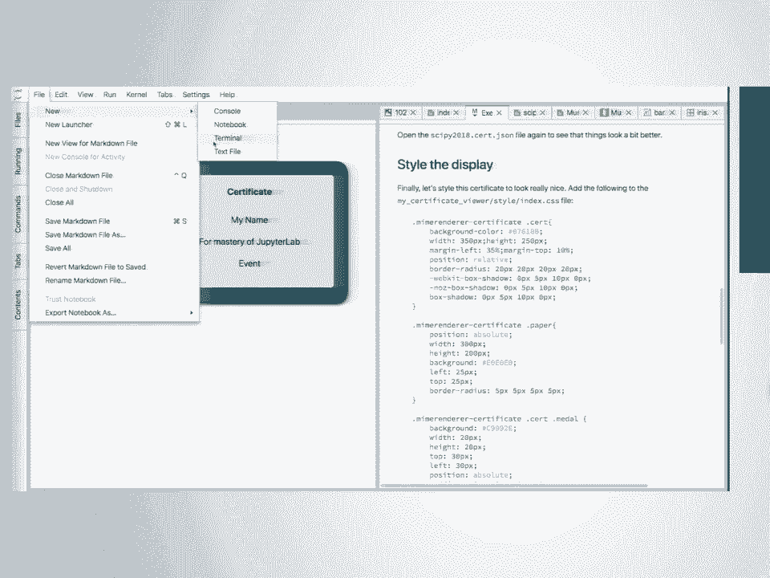

 That's awesome。 Okay。 How many people， how many people got to the point where you， you know。

 copied and pasted， this HTML code wherever it was down here into the right place and rebuilt the。

 and then， the CSS and rebuilt it and actually got a certificate。 Nice。 Good job。 Okay。 Well。

 congratulations everyone。 I want to move on after。

 is there any big questions from this that we can address？

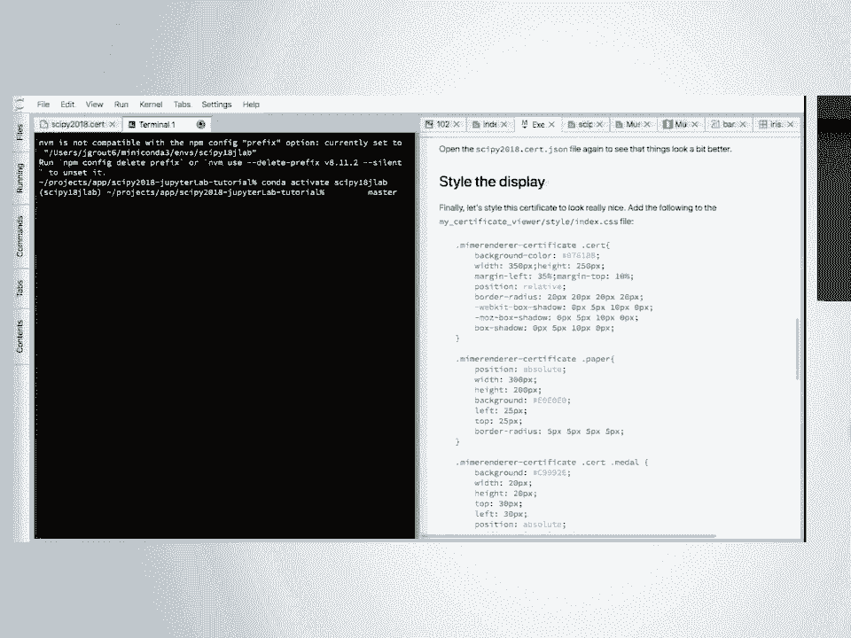

 Yeah。 So what Matias for the， for the camera， what Matias is saying is when you open a new terminal。

 this new terminal is not in the scipy tutorial environment。 So you have to explicitly first thing。

 Conda activate scipy 18 JLab to get into the environment。

 Now the Jupitre lab build that I do here is the actual Jupitre lab inside that environment。

 instead of some other Jupitre lab and some other environment， et cetera。 So。

 always work inside of this environment when you're doing this。 Any other big。

 any other big questions？ Okay。 So， so that's the general pattern actually for doing file rendering and it's more than。

 just file rendering。 That same， same segment of code that just knows how to render things of this particular。

 MIME type works in the notebook too。 So here's a notebook。 Here's a notebook。

 And I just made a small little Python class that essentially constructs that MIME type， here。

 And so this is like the IPython display， HTML， et cetera。 And now I can just display it here too。

 And the exact same code runs in the notebook， it runs in the file display。

 And if anything else in the system wants to be able to render that particular MIME type。

 then anything else in the system that wants to render rich outputs can use that exact same。

 code to render in their particular environment。 So we tried to make this system very extensible and sort of general and abstract and reusable。

 things。 So congratulations to everyone。 And I know a lot of people made really good progress on it and were happy to help you out。

 in other places。 I wanted to finish up with a couple of things that are coming up in the next version of。

 JupyterLab。 So this is what you're running is JupyterLab 0。32， which is our second beta release。

 We are just about to release our third beta release and just give you a taste of sort。

 of what's coming up in the future。 Let me make sure I'm running it。 So here's the next pre-release。

 You can install this with pip install-pre JupyterLab。 So a couple of things are extension manager。

 So this is a new extension， a core extension that basically lists the extensions that you。

 have and it does do some searching。 If I just search for space。

 we have to fix something with the searching。 And it actually lists all NPM packages with a particular keyword。

 JupyterLab。extension， that was sort of by convention used for JupyterLab extensions。

 And so we still have to figure out how we're going to tell people that these are not our。

 extensions。 Don't blame us if they break your computer and run off with your dog or something。

 But the point is we will have some graphical way of managing extensions and at least you'll。

 be able to uninstall and disable graphically and see what extensions you have directly inside。

 of JupyterLab。 So this is the same guy that wrote the dry O plug-in。 He wrote this in the same week。

 He's a pretty productive guy。 And so it's making its way into core。 Another thing， let's see。

 I have to bring up my list somewhere。 Where's my list？ Where's our repo？ Here we are。 Another thing。

 Oh， yes。 Workspaces。 Right now JupyterLab doesn't work very well。

 The version you have doesn't work very well。 If you open the same JupyterLab in the two different windows。

 essentially what JupyterLab， tries to do if you open up a bunch of stuff。

 so let me open up a couple of files， et cetera， and I lay out。 If I refresh this window。

 say whatever， refresh the window， it opens up the same files in， the same layout。

 It really tries to make your workflow so you don't have to reset up everything。

 And the way it does that is it stores this data somewhere and then it brings it back。

 when you open up the browser page。 But of course if you have two tabs open。

 it doesn't work very well because which tabs， should we restore。

 And so what we have is the concept of workspaces。 And so if I open up a new tab with this same JupyterLab in the next version。

 it comes up， and says， wait， wait， wait， wait， wait， you already have a tab open。

 we want you to give， a name to this tab's workspace。 And so you type in a second tab or new project。

 whatever switch workspace， and you notice the， URL slightly different instead of just slash lab。

 it's slash lab slash workspaces slash new， project。 And what this does is it allows you。

 and you don't have to open up a new tab that does。

 you could just change the URL to use this workspaces URL。

 What this allows you to do is to have multiple projects open， each with a different layout。

 of your windows， each with different files open， et cetera。 And easily switch between them。

 easily pick up where you left off。 It's a really powerful feature that we have and it's much more accessible and much more。

 sort of much more accessible in the next version of JupyterLab。

 So next week we're going to release the next version of JupyterLab， you'll know what's， coming up。

 Okay， another thing is that we changed the default behavior of the consoles。

 So you notice that if you start a new console for this notebook， before if I press one plus。

 one up here， then the log appears down in the console。

 That's handy if you want a log of all your computations， but a lot of people are like， wait。

 but now the console is not useful because every time I run something， all the output。

 in my console disappeared。 So the default behavior changed so that the console doesn't echo what happened in the。

 notebook。 What this allows you to do is to look at it， if you define a variable up here。

 then in your， console down here you can plot or whatever and have that plot stay in the same area on。

 the page while you keep working in your notebook。 If you want to revert back to the previous behavior。

 then you just right click， show all， kernel activity and then it starts showing everything that's happening in that kernel。

 So it's very easy now to switch that console to be just show what I actually executed in。

 that console versus show everything that's going on in the kernel so I can log things。 All right。

 let's see， what else？ Oh， yes， somebody。 And so that was a feature that came from a new contributor that came in and said。

 this， work full makes a lot more sense to me。 Here's another feature that came in from a new contributor。

 Right click， open a new browser tab。 What this does is it opens a new browser。

 Here my browser is trying to download it。 Let me open something that the browser can see better。

 I don't know what does a browser understand here。 JSON probably， yes， open a new browser tab。

 And what this does is it just opens the file in a standard browser tab so it's easy to。

 open an image in a new browser tab， et cetera。 Again。

 this was a new person that came on the list and said， hey， this makes a lot of sense， to me。

 I'd really love to have this feature and we got them started or got the person started。

 and pretty soon they contributed this feature。 Let's see。 Oh， longer tabs。

 You'll notice that sometimes your file names get cut off。

 Finally I'd annoyed somebody long enough that they changed the min width and the max width。

 And now your file names show a little bit better。 So many， many upgrades。

 We upgraded a ton of stuff all through JupyterLab。 We upgraded Webpack。

 We upgraded a lot of dependencies， et cetera。 So there's all new brand new shiny things all over。

 Some extensions that are in the works。 So these aren't in the next version of JupyterLab but these are being actively worked on by。

 for example， students at Cal Poly under Brian Granger， a keyboard shortcut editor。

 Many of you probably would have loved to have that today where basically it lists the commands。

 and you just click in a box and you type the keyboard shortcut you want and it listens。

 what keys you pressed and that's the shortcut it is and you're on your way。

 So a good keyboard shortcut editor is in the works status bar。

 So a status bar at the bottom of JupyterLab that basically anything can talk to and put。

 stuff in that status bar and you can click on something in the status bar to change the， setting。

 et cetera。 Big plans for the status bar and having a notification API maybe or something like that。

 And one of the biggest features that's been in the works for a very long time and is progressing。

 is real time collaboration。 So this involves actually a lot of even research level work to enable Google block style real。

 time collaboration with your notebooks and basically any file and any sort of data that。

 you have in JupyterLab。 That's a longer term thing。

 But anyway lots of exciting things in the pipeline and we hope that as you got some ideas。

 today that you come and join us and participate and contribute your exciting ideas and help。

 us to work out whatever sort of remaining UI issues。 I know we have a bunch of notes here。

 But come and contribute your own extensions or write your own extensions and basically， have fun。

 And really I think that's the genius of open sources。 You get to modify the tools for your own use。

 I'm really excited about seeing what you guys do with this that we never even thought， of。

 Let's see。 I guess there's a couple things to mention。 JupyterLab works really well in JupyterHub。

 in JupyterLab docs。 There's a setup for JupyterHub and the sprints Saturday and Sunday this weekend。

 There will be people there that can help out with people that want to sprint and work on。

 a JupyterLab extension or want to help fix some of the dark theme issues or whatever。

 There will be people there helping out and anything else？ JupyterCon。

 Don't forget JupyterCon in August in New York。 JupyterCon is on the 25th event。

 If most of the day is 24th or 25th， we'll have an open day for anybody who is around。

 We'll have registration， but it's going to be free and come and hang out and work on JupyterCon。

 or on project related to Jupyter。

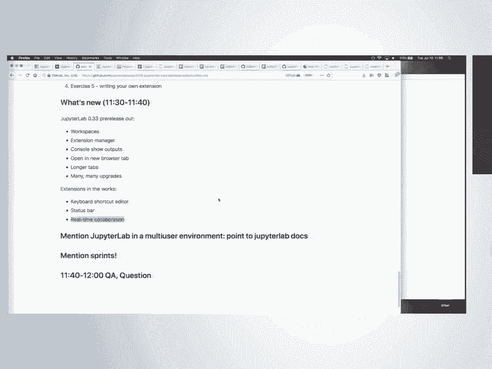

 One word about JupyterHub， if you want to deploy or have remote access to Jupyter， you。

 need to use JupyterHub。 You say to you look at JupyterHub but not what it was。

 If you have many users or if you have students or if you have a lab for a 3% JupyterHub， you。

 need to look at。 I think that's about it。 There is a lot of sticky notes already。

 sticky notes around with nothing written on it。

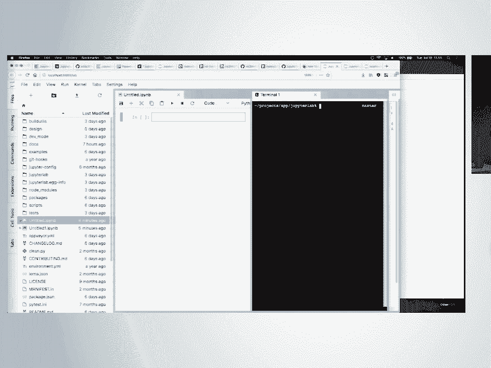

 There are pens at the end of the tables。 Feel free to give us feedback and we have a few more minutes for questions。

 Feedback not just on JupyterLab but feedback on the tutorial as well。

 We'll be giving more versions of this tutorial at JupyterCon and stuff like that and we'd love。

 your feedback on pacing or material depth and things like that。

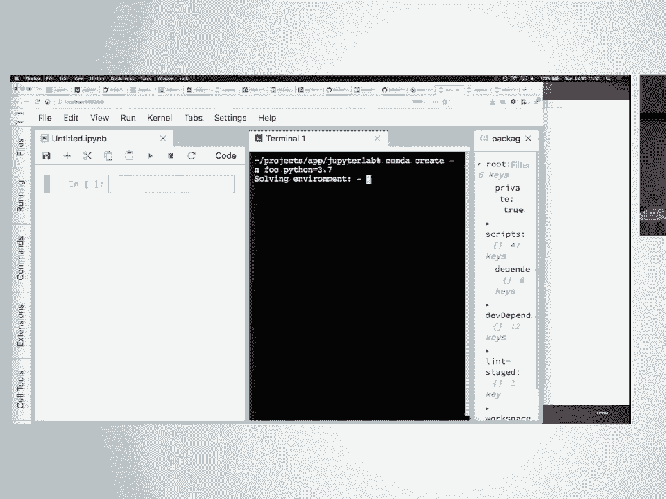

 And don't forget， if it was great， it thanks to you。 If something is wrong， it's awful。 >> So when。

 I think I can get you a JupyterLab。 If you create that， you basically have many。

 many kind of analysis。 Kind of this is often a language but not always a language is how do you get those。

 It depends on which language。 So basically for the Python kernel， you need to create an environment。

 You would need to create an environment。 So for example， I would do Conda， create。

 maybe zoom in so that you can see what I'm doing。 If you do Conda， create minus n， foo。

 Python equal 3。7。 Let's be crazy。 It's stable now。 >> I don't know if you can do this one。

 >> It's not for it。 So once this environment is created， in this environment。

 I would install a Python kernel。 So that's 2， 3， 6。

 You install a Python kernel and then you tell a Python kernel， install yourself under a specific。

 name。 And now you will basically register a kernel with Jupyter。

 And now everything with Jupyter and the bundle will see this kernel。 Right？

 >> The thing to Google is how to install a Jupyter kernel for whatever language you're。

 interested in。 And that's totally separate from JupyterLab， Jupyter Notebook。

 That's part of the decoupling that we have in Jupyter。 You install kernels。

 Those are back end things。 And you have front ends and all the front ends talk to all the kernels。

 But installing a kernel is a separate issue than the front ends。 >> Does that make sense？

 >> I can finish that here。 You just Google install Jupyter。

 >> I just took both the Wikipedia page and the list of Jupyter kernels。

 >> So if you Google for list of Jupyter kernels， you will have many kernels。

 Fortune and Cebell is new。 Spark， SAS， IPY kernel， Ijulia。 You will go to， for example。

 one of these one。 Ij kernel。 The R kernel will have instructions on how to install。

 It tells you here is how to install and making the kernel available to Jupyter。 You need to， for R。

 do R， Ij kernel install spec。 That will basically drop a file somewhere on disk and say， well。

 here is how to find， your kernel。 Maybe I can finish that。 Python， minus M， IPY， kernel。install。

 >> How many TSP finishes any other questions？ >> We're running through the files in one。

 So how do you make sure it's only available for any of those methods？

 >> So I think the question was how do I secure Jupyter Hub deployment？

 And the answer is talk to your system administrator。 That totally depends on your network。

 And there's some very good guides for setting up Jupyter Hub。

 It's a guide called Zero to Jupyter Hub that walks through the process of setting up a。

 production level Jupyter Hub。 But if you're talking about any sort of security things。

 you really should talk to your network， administrator。

 >> And it's not because you install Jupyter or Jupyter Hub only on your machine that you。

 shouldn't set a password。 Because if you don't set a password。

 any other program on your machine that have network access。

 could run code on your machine via Jupyter。 So always set a password on your installation。

 even if you're local。 >> Other questions？ >> Yeah， other workspaces。 >> Yeah。

 >> Other than persistent， you mean， possession of the stack？ >> Workspaces are saved to your disk。

 If you type JupyterLab path， like we saw the staging directory， then you'll see one of。

 the directories as a settings directory。 And so basically what happens is JupyterLab talks to the Jupyter Notebook server and communicates。

 the settings and the Jupyter Notebook server has a special extension that saves those settings。

 to disk。 So yes， those are persistent。 And if you type JupyterLab path。

 you'll see where they're persisted to。 >> [INAUDIBLE]。

 >> There is one issue with NbConbar that it works only with the thing where you would。

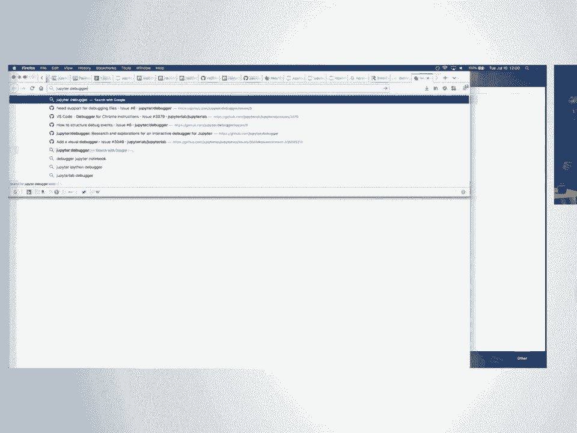

 install the extension。 So one of the things we discovered is that if you have NbConbar。

 it would work with Jupyter， Notebook and JupyterLab。

 But as soon as you use Jupyter and BConvert command line or if you use something like。

 Interact or you use hydrogen， then NbConbar will not be seen。

 And that leads to frustration with users， which is one of the reason why we actually want。

 to drop things on disk。 So there are some distributions。

 We are not sure exactly what the acceleration will be， so we are not going to say anything。

 >> I think we have time for maybe one more。 >> Is there any plans for where it's submitted to the debugger？

 >> Ha。 >> [INAUDIBLE]， >> Yeah。 >> [INAUDIBLE]， >> Oh， our favorite pet subject。

 Question is a debugger。 Yes， lots of plans。 In fact。

 the problem with the debugger is that it requires deeper level support in the Jupyter。

 messaging protocol for dealing with debugging messages back and forth to a kernel。

 So here is a repo that starts talking by a guy that's written several Python debuggers。

 like these people know what they're talking about。

 What a Jupyter debugging protocol would look like。

 And once that sort of messaging layer is in place， we can build a UI on top of that。 That said。

 there are people that are working on variable inspectors to have just a watch， list of variables。

 That takes you a long ways。 There is command line debugging already using PDB。

 So it works like in the classic notebook where you can use percent PDB and you can step through。

 with the command line。 So there's various solutions that get you a lot of the way there to do a really proper。

 debugger support。 We need a protocol and there's active discussions going on about a protocol。

 So we invite you to join the discussion。 All right。 Thank you everyone。

 And feel free to contact us during the conference or any of the people that were helping out。

 during the conference。 And give us any feedback。 We appreciate it。 And have a wonderful conference。

 [ Applause ]， [BLANK_AUDIO]。