# SciPy 2018视频专辑 - P46：SciPy 2018视频专辑 (P46. Getting Started with TensorFlow (Beginner Level) _ SciPy 20 - GalileoHua - BV1TE411n7Ny

 Hey everyone， my name is Josh。

 I'm here today with Amit and Yash， who are deep at work。

 but you guys want to raise your hands and say hi。 We're all from the TensorFlow team。

 They're both super smart， and they're， happy to help answer your questions。

 and we'll switch back and forth presenting。 So today we're going to cover how to get started with TensorFlow。

 1。9， and we have lots of good news for you， especially， around ease of use。 So from my perspective。

 this release is all about ease of use。 Here's what we're going to walk through。

 This is more of a beginner's tutorial， so obviously deep。

 learning in TensorFlow are both very large subjects。 And the goal today is not to be comprehensive。

 but my goal is to give you the most effective way possible。

 to start writing your TensorFlow programs， meaning the shortest path to--。

 shortest amount of code to train networks effectively。

 with the least amount of hair pulling and confusion。 So I hope this will be useful。 So basically。

 we're going to do four beginners notebooks。 These are all inspired by a book。

 and I'm going to butcher the name， because I don't speak French by Francois Chole， Chole， Chole。

 Chole。 Who's the author of Keras， which is a fantastic high level， API for deep learning。

 Then we're going to do a couple advanced notebooks， which。

 shows some new things that weren't possible before， and we'll do some games on the way。

 and it'll be fun。 This is mostly hands-on。 I'm going to start with probably like a 10 or 15 minute。

 just quick overview of what's new in TensorFlow， and then the rest of the session will be hands-on。

 What I really want to focus on is TensorFlow--， actually， just so I can calibrate-- who has written。

 any TensorFlow before？ All right， so about a third of you。 OK， so this is great。

 So if you're not aware， TensorFlow has a large API stack。

 It powers almost every machine learning project at Google。

 which means it runs both its scale as well on small devices。 It runs in JavaScript， on Android。

 on iOS， on GPUs， on TPUs。 Anyway， it's a large framework with a large stack。

 So there's a lot of different moving pieces。 And what I want to point you to today is the best APIs。

 to start with， to get rolling。 We're going to do everything in Colab。 So this is SciPy。

 So I assume a lot of folks are familiar with Jupyter Notebooks。 If you're not。

 I'll give a quick overview。 All of the code from today is going， to run in something called Colab。

 And I'll just show you what that is right now。 It's basically a free web-based Jupyter Notebook。

 You can actually pull it up right now。 It's a really good resource to be aware of。

 If you go to the URL， colab。research。google。com。 So co-lab。research。google。com。

 Let me actually stick that on as well。 I have that on a slide later for you。 But colab。research。

google。com。

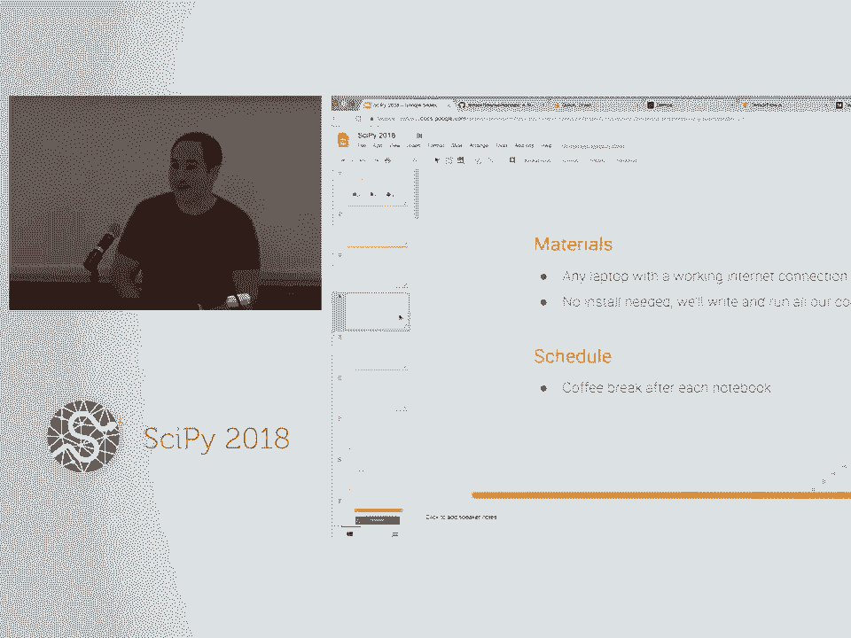

 And this will open up a web-based Jupyter Notebook。 And it means it has TensorFlow pre-installed。

 so there's nothing to install。 You'll be able to jump right into writing and running code。

 What's great about Colab， too， you can download anything。

 you write in Colab as a regular Jupyter Notebook。 There's no lock-in。 You don't like it。

 You can just run everything locally。 But anyway， it's great for education and demos。

 and stuff like that。 So we'll come back to Colab。 It's awesome。 It also comes with a free GPU。

 which is great。 So this is the sequence of notebooks we're going to cover。

 So we'll start with something called MNIST。 And I know people have been doing machine learning。

 for a long time。 They're probably going to grow when we do MNIST。

 But the purpose of this is just to show you a quick way， to write it。

 Then we'll do some text classification， some basic， progression。

 we'll explore a few machine learning concepts。 And then we'll look at text generation。

 And we probably won't have time， but we can look at something。

 really fancy at the end that you can continue reading on home， for machine translation。 All right。

 so quick slides。 And then we will get started。 So basically， the only key point I。

 want to make about TensorFlow-- so it's been around for about two， years。

 We've been developing it really rapidly。 But I wanted to mention there's-- I think now we're up。

 to about 1，500 total developers who have committed， to the TensorFlow code base。

 About 500 are from within Google。 And over 1，000 now are from outside of Google。

 So TensorFlow is very much an open source community project。 And it's extremely important to us。

 to keep it that way and get more and more engagement， from the community。

 One of the things we're working on for the 1。10 release， where 1。9 now。

 is we're trying to pull some of the docs， and the tutorials into a separate GitHub repo。

 And the reason I want to do this is a great way， to make contributions to an open source project。

 even if you're new to it， is helping， to write just basic tutorials that explain the parts that you。

 struggled with to other people that are new to the library。

 And I think by having this in their own repo， make it easier to contribute。

 So that should be really cool。 And as I was saying earlier， because it's a large code base。

 there's a lot of moving parts。 So the main takeaway today is what to focus on。

 and what not to focus on。 Anyway， it's being developed rapidly。

 I don't really have anything specific to say about this， that you can't find online。

 So I'm just going to blaze through that。 As I was saying earlier， it runs on many different devices。

 So at a high level， almost everyone， writes TensorFlow code in Python。

 TensorFlow is powered by C++ backend。 And today， we're not going to worry。

 about the backend too much。 In the same way as when you write Python programs。

 you don't need to worry too much about how they compile down， into byte code and execute。

 So we're going to focus just on the Python front end。 There's also something called TensorFlow JS。

 which is fantastic。 And you can write really， really excellent TensorFlow， programs in JavaScript。

 If you look on the website， in truth， TensorFlow says it supports many， many different languages。

 including things like Java。 And it does。 But almost always， when you're training models。

 when you're writing code to train models， you're pretty much doing it in Python。 JavaScript are。

 A lot of the other languages， the support， is mainly for serving models that you've already trained。

 So almost everyone should begin writing TensorFlow in Python， unless your JavaScript developer。

 TensorFlow JS， is awesome。 Or if you're an R developer， TensorFlow in R， is also very， very good。

 All the other languages are， I think， are still in the oven。 So basically， start in Python。

 If you can， you'll have the easiest time。 This is stuff that I was just talking about。

 So TensorFlow is not just a Python API， for training and serving models。

 There's a giant collection of projects， everything from putting code into production。

 And this is exactly the same code base， we used to serve production code at Google。 By the way。

 with TensorFlow， there's no secret sauce。 So the open source code is exactly what we use internally。

 which is one of the reasons why it's a giant code base。 But it's great。

 So things we care about and we're focusing on today， is making all this easier to use。

 So we're a week ahead of this。 But I hope early next week we're updating the TensorFlow。

 Getting Started page。 And it's going to have a lot of the materials， that we're looking at today。

 But basically， it just contains more beginner-friendly exercises， for the different APIs。

 And I think it's a much more sensible way to dive in， than it is now。 But broadly。

 the exercises we're going to look at today， are the ones that I know this is tiny from the top left quadrant。

 which is the easiest way to start learning and using machine， learning。

 So we're just going to preview this before it comes out。

 TensorFlow also offers APIs for things like research。

 which we'll look at as well as training and deploying， giant models。 And all these are compatible。

 but we're， going to start with learning and using ML。 So broadly， here are the four API styles。

 If anyone has used a library called Keras， we have really， really good news。

 So has anyone used Keras， by the way？ Have you liked it？

 Have people had-- it's generally a very positive experience， working with Keras。

 So if you're new to Keras， basically， when， you define your neural networks。

 one task you have to do， is lay down a sequence of layers。 And one way to think of Keras is it's。

 broadly an API for defining and training networks using， Lego-like building blocks。

 What's interesting about Keras is it doesn't actually， have an implementation to execute it。

 So Keras is an API spec。 And traditionally， it runs on top of other deep learning， libraries。

 So you can run Keras on top of TensorFlow。 You can run it on top of MXNet or CNTK。

 But in addition to that， we've also， incorporated Keras into TensorFlow。

 And that means you can write Keras code， vanilla Keras code。

 in exactly the same way you wouldn't standard Keras， inside TensorFlow。

 And that's just as good as writing any other TensorFlow code。 And that's what we'll look at today。

 If you care， you can also greatly extend， that with these other bits of the API。

 to do fancier things that I'll show you later。 So cool。 I just said stuff like this。

 So Keras is Lego-like building blocks。

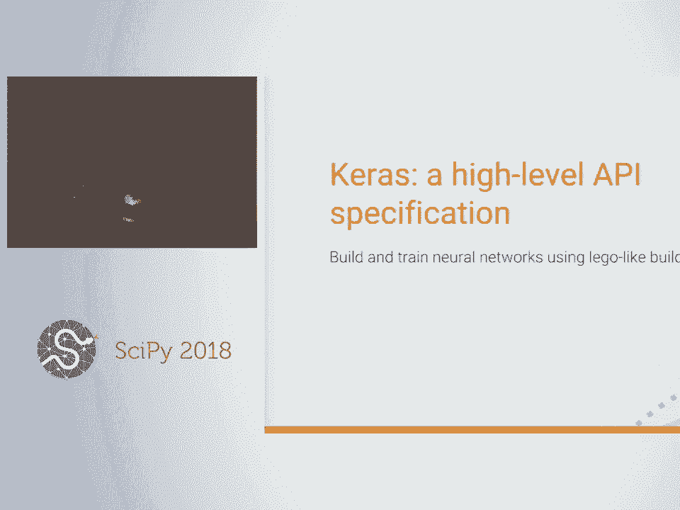

 for defining and neural networks。 If you wanted to use Keras outside of TensorFlow。

 this is how you would install it。 You just do pip install Keras。

 I have the bang there because all this code and pretending， would run inside a Jupyter notebook。

 So you just do pip install Keras and then you're good to go。 And by default。

 this would also install TensorFlow， behind the scenes and use it as the back end。

 That's not what we're going to do today。 So we're going to start using something called TF。Keras。

 And this is TensorFlow's implementation of the Keras API。 It's a super set。

 So it's everything you're used to from Keras。 Plus integration with things like eager execution。

 and estimators and distributed training and all this jazz。

 that we'll get into later if we have time。 And the thing that I'm most excited about， is。

 in my opinion， this is the easiest way。

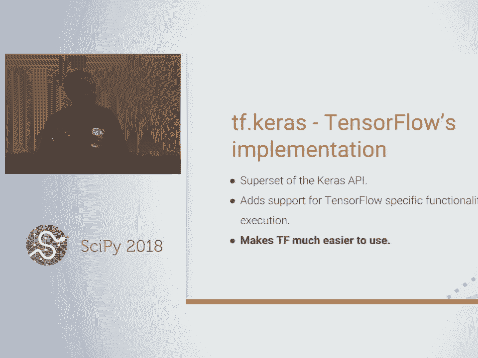

 to write TensorFlow code for sure， while you're getting started。

 So here's how this looks using Keras inside TensorFlow。 So you don't need to do pip install Keras。

 You can just do pip install TensorFlow。 You won't even need to do this when we're using Colab。

 because it's already there。 And then you just import Keras from TensorFlow。 And you're good to go。

 So I'm not going to walk through this step by step。 We're going to do this in the first notebook。

 But I just want to show you briefly， what the complete code looks like to train your first neural。

 network for MNIST using Keras inside TensorFlow。 Would anyone like an intro to MNIST who has not。

 looked at MNIST before？ All right， I'm going to do it。

 If you have looked at MNIST and you don't need this intro， I would go to colab。research。google。com。

 and just start reading some of the doc there。 Anyway， so basically， actually， I'll tell you what。

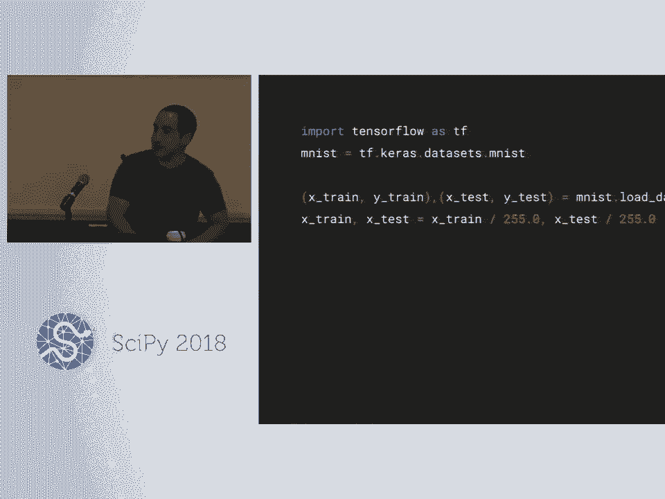

 the best way to introduce MNIST instead of me walking you。

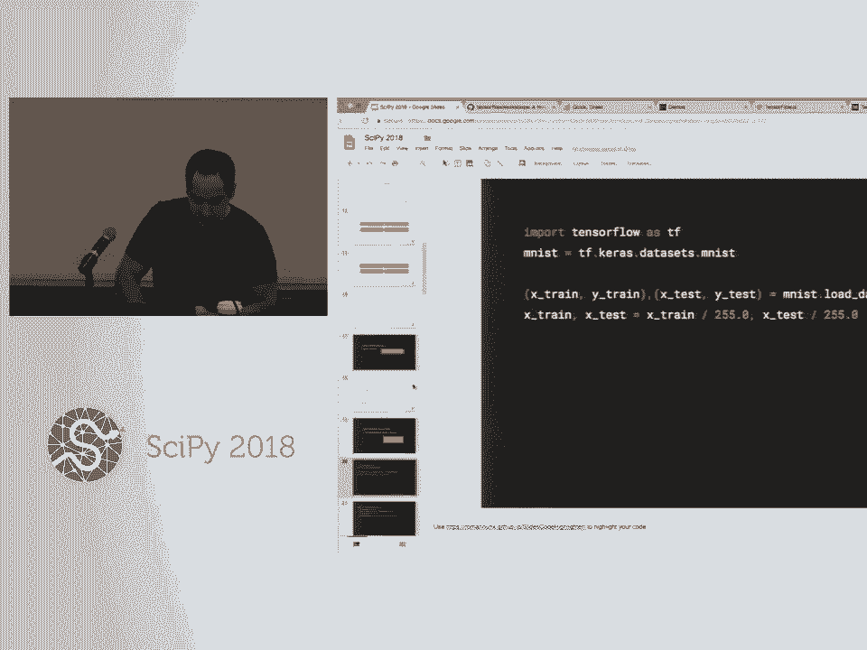

 through it， let's just go straight to hands on time。

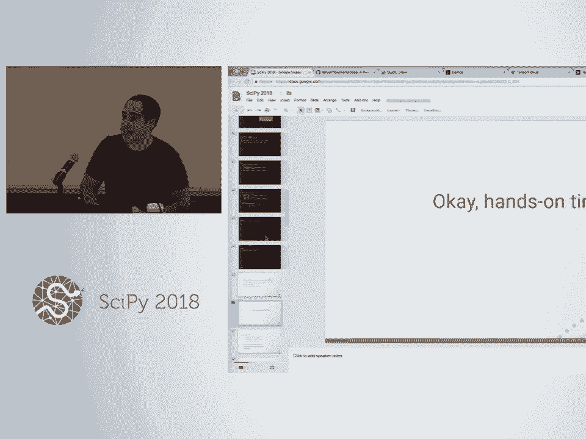

 because it's the very first notebook anyway。 So this will be more efficient。 So to get started。

 if you go to github。com/tensorflow/workshops。

 And then there's nothing to clone in this repo。 What you should do is just scroll down and look at the readme。

 So if you scroll down， these are links to the exercises， for today。 And if you click on them。

 they'll open up directly in colab。 So all these files are also on github。

 I know my URL bar is incredibly tiny， but if you look at your URL bar， there's。

 this cool trick you can do in colab， where the first half of the URL is the colab URL。

 And then the second half is a path to a notebook on github。

 So you can actually see where these are hosted。 So these are all living in the TensorFlow。

 getting started examples that haven't published on the home， page yet。 But yeah。

 so it's a great way to open up a notebook from GitHub。

 So this is the first exercise we're going to do today。 And I'll walk you through it briefly。

 And then let's take 10 minutes， and you all can read through it。

 and run this on your own and try and modify it a little bit。 So I wish I could make this bigger。

 By the way， a couple of features of colab， in case you're new to it， that are super useful。

 First of all， it's a Jupyter Notebook。 In 10 seconds， for people who are new to Jupyter Notebooks。

 there are a list of cells。 Nothing to do with TensorFlow。

 This is just a wonderful part of the Python ecosystem。 Broadly， there are two types of cells。

 One is a markdown cell。 So this is markdown。 And all cells can be edited or executed。

 If you edit a markdown cell， edited and executed， and you execute it， it renders the markdown。

 And you can execute a cell by hitting Shift Enter。 And code cells， if you hover over it。

 will have a play button。 Code cells， if you edit it， you're writing code。 And if you execute it。

 you're running code。 Now， just like the Python interpreter， colab programs have a state。

 So it's best to run these cells in order， just like you would any Jupyter Notebook。

 If you get hosed and you need to restore this， to a clean state， the easiest way to do that。

 is runtime restart runtime。 And that will restart your Python session。

 Let me show you some other things， too， before we get started。 One thing you might want to do。

 although it's not necessary， for these exercises， is to enable the GPU。 And to enable the GPU。

 if you go to Edit， Notebook Settings， and then if you look at the hardware accelerator。

 you can hit GPU。 If you're seeing things that are not GPUs， that's because it's logged into corp。

 But you should just see GPU。 So in this thing， in this button in the top right， connect。

 if you hover over connect， click connect。 And then in a moment。

 it should connect to a Python back end， backed by GPU。 If we run out of GPUs。

 you should get an error message。 It doesn't matter。

 We don't need them for the exercises we're going to run today。 One thing to avoid in deep learning。

 A lot of one mistake a lot of beginners make， is they find out that， oh， the GPUs。

 are a big deal in deep learning。 So they run out and they buy a machine with a fancy GPU。

 and then find out that you really don't need it， unless you're running large scale experiments。

 So my advice would be just start--， if you need hardware acceleration， save your money。

 start on the cloud。 If you decide later， you want to buy something， go buy something。

 But no one should feel the need to buy any hardware， just to learn tensor flow。 All right。

 So let me just walk you through this， sell by sell， and then you guys can do that。

 So this is the complete code to train a neural network， on what we call the fashion MNIST dataset。

 And I'll get to that in a sec。 But the very first-- oh， one more thing。

 I wanted to show you before I start running this code。 Another great feature of CoLab is snippets。

 So there's this table of contents thing， but if you click on snippets， these。

 are little code snippets that you can search for。 So let's say I wanted to upload a file from my local file。

 system into CoLab。 I have no idea how to do that。 But if I search for upload。

 so here's a code snippet， and I can scroll down with my funny resolution。 And anyway。

 I'll see the code that I need to copy and paste in。 So CoLab is really sweet。

 You can also save these notebooks to Google Drive。 If you feel like it。

 you can also save them to GitHub， if you feel like it too， which is great。 All right。

 So the first thing we're doing--， if I run this sell， as you might imagine。

 it's importing TensorFlow。 If you want to install TensorFlow locally。

 and you don't want to use CoLab， if you go to tensorflow。org， there are installation instructions。

 But for right now， I'd recommend just using CoLab。 It's easier。 The next thing we're doing。

 as I mentioned earlier， is we're importing Keros。 And what you can do is， just for now。

 think of Keros as an API， style。 That's all it is。 You're probably because it's SciPy， NumPy。

 and Matplotlib， as always。 And then this is important to do， because TensorFlow is。

 being developed rapidly。 And so what we're looking at here is this is 1。9 RC2。 So 1。

9 should be final in about a week。 But this is the second release candidate。

 So we usually do release candidates， while the releases are baking。

 And they're usually pretty much bug free， but not always。 If you have issues with the releases。

 we happen to have Ahmed here， who is our release manager。 So he's the expert。

 This code will only work， by the way， in 1。9 or higher。 So if you try and run this locally。

 just make sure you have that version。 So the reason we're starting with MNIST。

 is it's basically the hello world of computer vision。 And what MNIST is。

 it's a database from Jan Lekun， who's， at NYU now。 It's almost 30 years old。

 And it's a collection of 60，000 handwritten digits that are 0， 1， 2， 3， all the way up to 9。

 So it's basically-- you can think of it， as a task from the post office。

 where somebody writes a zip code。 And your job is to machine read the zip code。

 except we're reading one digit at a time。 It's a good data set for hello world of computer vision。

 because it's very small。 Each of the images are 28 by 28 pixels， and they're grayscale。

 so it fits into memory nicely。 And you can quickly train models。

 Because MNIST has been beaten to death by thousands， of tutorials over the years， there's。

 a version of it called fashion MNIST， which， is a different data set in exactly the same format。

 meaning that any code that works with MNIST， you can just swap the data set to fashion MNIST。

 without changing your code。 And fashion MNIST is 60，000 images of articles of clothing。

 And so it's slightly harder than MNIST。 And so basically， we have dresses， skirts， hats， shoes。

 sandals， stuff like that。 And our job is to train a model from the training set。

 I'm going to keep the machine learning， by the way， in this tutorial to a minimum。

 and just try and focus， as much as I can on TensorFlow。

 So our job is to train a model from the training set， and evaluate it on the test set。

 If you're new to ML in general， we're， going to close with a lot of educational resources。

 to help you get rolling there。 All right。 So the next block of code， the good news。

 is this data set is built in to TensorFlow。 So there's nothing for us to do。

 So we're going to import it， and we're going to download it。

 And I think we'll find out if this is still hilariously， hosted。 Yeah， so we have a cloud too。

 But I guess it wasn't quite up to this。 So our friends at Amazon have this data set hosted for us。

 And so we've downloaded the data set。 The labels-- one thing you're going to find out really quickly。

 by the way， when you start developing with Keros inside。

 TensorFlow is that machine learning is very， very concept， heavy， but it's a very， very code light。

 So this notebook is small， and it， does a lot of really interesting things。

 So where we are right now in ML， and I'm really happy about this。

 is most of your time is going to go to understanding， what and why are we trying to do。 The how。

 meaning how do we get the syntax， is super important。 And there's still a lot of work to be done。

 If you're new to this， nobody's going， to run this code for the first time。 Be like， oh， I get it。

 I totally understand how to use Keros now。 But it's nothing compared to what it was even two years ago。

 So the APIs are getting much， much better。 Anyway， just for convenience， the class labels。

 or the name of the images that we're， trying to predict， are not included with this data set。

 So we're just going to manually enter them inside the notebook。 So this is just for our convenience。

 About half of your life when you're developing networks， is spent understanding the data type。

 and the shapes of the data that you're trying to work with。

 So it's good programming practice when you can， as you go。

 print out the shapes of your different objects。 Print out the data types。

 Print out one of the objects。 And just poke around with the data and understand it。

 And this will make your life much easier when， you're debugging down the road。

 So what we've done is we printed out， the shape of the train images。 By the way， TensorFlow。

 you can think of TensorFlow as array， flow。 A tensor is an end dimensional array。 So a scalar。

 a vector， a square， a cube。 They're just arrays。 And all tensors have a shape。

 And this is the dimensions of the array。 So what we're looking at here， this。

 means that there are 60，000 images in this data set， each of which， is 28 by 28 pixels。

 And there's a dimension here， 1。 It's just they're all floats。 We can also look at the labels。

 So when you do your machine learning， you always start with data and labels。

 And the labels tell you what you're， trying to predict given the data。 And so here we have 60。

000 labels。 You always have to match the number of labels with the data。

 And if we look at the format of the labels， we can see that the very first label is a 9。

 And that's telling us the first image is a 9。 So so far， we've done no machine learning at all。

 We've just imported the data set。 Here what we're doing is we've given some code。

 to print out the first element from the data set。 So this to me looks like a shoe or a boot。

 And if we scroll up into the labels， this is a 9。 Yeah， that's a 9。 That's an ankle boot。

 [INAUDIBLE]， Other things we're going to do is we're still working with the data。

 Neural networks prefer when you're classifying images。

 one of the things you want to do is preprocessor， normalize your data。

 And networks prefer values to be between 0 and 1。 So as imported。

 the pixel values range between 0 and 255。 And we're just going to normalize them to be between 0 and 1。

 So here， what we've done is we've just written some， debugging code。

 And this is just iterating over the data set and displaying， some images。

 And later when we train the model， we're going to overlay。

 this plot with the predictions we make to see what we get， right and see what we get wrong。

 All right， so now we actually get to write some TensorFlow。

 So and this is where things get really helpful。 So Keras has different APIs。 Broadly。

 there's the sequential API。 And sequential means I am going to define a neural network as。

 a stack of layers。 It's literally a stack of layers。

 And this is great when you have one input and one output。 And so here。

 our input is an image and our output is， going to be a label。 Keras also has the functional API。

 which we might get into， later。 And it has something called model sub-classing， which。

 we'll get into later。 But 95% of the time， the simplest API is almost certainly。

 going to be enough for use cases。 So this first line of code， we're also publishing a。

 programmer's guide for this， which explains Keras in a lot， of detail， which is great。

 So the first thing is， hey， I'm using this sequential API。 Here comes a stack of layers。

 The first layer is not doing any ML。 This is just pre-processing。

 So what we're doing is these images are images， meaning， they're 2D。 And just to make life easier。

 we're saying， there are， neural networks that work with 2D images。

 They're called convolutional networks。 For this Hello World exercises， we're just saying， hey。

 you know what？ I actually don't care that it's an image。 I'm going to turn this thing into a vector。

 This is just to make our life easier。 So we're unrolling the image。 We're flattening it。

 which means unroll all the rows， line， them up into one long vector。

 So now we just have a list of numbers。 When we do this， we lose some information。

 about the 2D structure。 But for this data set， it doesn't matter all that much。

 The next thing we're doing is we're adding a dense layer。

 And so this is our first neural network layer。 And if you want to learn more about what these dense layers。

 are doing， I have a talk from Google I/O， which， goes through a slightly older version of this code。

 with diagrams of the dense layers。 Here， I'm going to keep the ML light so we can just。

 move through TensorFlow。 But anyway， you can think of broadly。

 a neural network is a stack of layers。 And broadly speaking， every unit or every neuron in a layer。

 is computing features of the input。 So what this-- what every single neuron-- here we have 128。

 By the way， that number is pulled out of a hat。 One of the major tasks-- and this is kind of hilarious--。

 when you're developing networks， there's， different knobs that you can tune and you can play with。

 One such knob is how many layers would I， like to add to my network？

 The more layers you add to your network， the greater the capacity。

 And what that means is the larger the number of patterns， that your network is capable of learning。

 So larger networks can learn more complex data sets。 But there's downsides too。

 So when we're training a network-- and in machine learning。

 there's a fundamental tension between memorization， and generalization。

 We have a bunch of training data， 60，000 images。 What we're using these to train a network。

 what we really want to do is have a network that's accurate， on images it's never seen before。

 So we want to do well on new data。 Now， if we define a network， say we use five layers。

 and each layer， let's say we have 500 units， this thing is going to get 100% accuracy on our training set。

 And that's called memorizing the data。 It's going to learn it super fast， no problem。

 The problem is it's going to do something called overfit。 So when we try it on new data， ideally。

 we want it to learn patterns。 Like， oh， sevens have a shape， eights have two circles。

 A giant network will literally just memorize。 I know of 8，000 different eights。

 They look exactly like this。 So it won't be useful on new data。

 Smaller networks are more likely to learn patterns。

 that generalize because they have less memory to work with， so they have to focus on patterns。

 So what we often do is when we do our experiments。

 we'll start with a reasonable design from a network。 And no one has intuition for this。

 when they start using deep learning。 So I would never expect somebody to look at a problem。

 and be like， oh， this is a reasonable network， designed to start with。

 We know that this is a reasonable place to start with empirically， meaning this data set's very old。

 We've run different experiments。 So we know this is an OK place to start with。 So anyway。

 here's our first layer。 And all layers have something called an activation。

 which I'm not going to go into right now。 Broadly， this is not something you。

 need to spend too much time on just to get going。 All layers， with MNIST。

 we're doing multi-class classification， meaning we have one input and it can get dropped。

 into 10 different buckets。 When you have 10 different buckets， the output layer。

 you can take it on faith that it needs to be softmax， for right now。

 And what that means is output a probability distribution。 So this last layer。

 let's start from the bottom。 The last layer is going to be a probability distribution。

 over all the classes that an image could be classified as。

 And softmax just means convert the evidence， into a probability。

 And all the interior layers can end with Raylu。 And that's just the right activation function。

 to use for your interior layers。 Anyway， we have more details in the notes。

 One problem with these concepts and one thing that's。

 both a blessing and a curse of doing machine learning。

 tutorials is we could do a whole class on just how， any one of these pieces works。

 So we need to move a little bit fast。 Anyway， in Keros， there's broadly three steps。

 The first is you define your model architecture， which， we've done here。

 The next is you need to compile it。 So when you compile a network， there's really two things。

 you need to provide。 The first is the optimizer。 And so networks are trained by back propagation and gradient。

 descent。 And the optimizer is the thing that's going to do that。

 There are different optimizers with different strategies， you can use。

 The good news is this particular one called Adam， is basically the right place to start。

 So when you're getting started， just use Adam。 Move on with life。

 The next thing you need is a loss function。 And this is a long and complicated word。 Also good news。

 there's a bucket of loss functions。 And over time， you learn which is the correct loss function。

 for the problem you're working with。 What we're doing with sparse categorical cross entropy。

 the reason we're using this is the labels we have are 1， 2， 3， all the way up to 9。

 And what happens is when the network makes a prediction， there's 10 units in the last layer。

 We get a probability distribution。 So let's say the image is a seventh。 Ideally。

 what we want is there to be very low evidence， on all the nodes for 0， 1， 2， high evidence on 7。

 and low evidence everywhere else。 And what TensorFlow does is it compares the thing。

 the network predicted， which is some distribution， to the thing you wanted it to predict。

 And that's an output layer with all zeros everywhere， and a 1 on the 7。

 So it basically looks at your loss。 Loss is a fancy word for error。

 And then what it does is it tries， to optimize the weights in your network to reduce the loss。

 And sparse categorical cross entropy， is just a function that tells you。

 how to look at the label you wanted to predict， compare it to the thing you did predict。

 and get a number that represents how bad a job you did。

 And TensorFlow will try and optimize that number， by adjusting the weights in your network。

 So after that， by the way， as we're going， one thing that's important to understand。

 is this is super concept heavy。 So I've mentioned things like loss， optimizers， all this stuff。

 Here's a really good resource。 If you search for Google Machine Learning Crash Course--。

 so this is going to be super helpful。

 So Machine Learning Crash Course-- this is a free class， from Google。

 Here's some useful things about it。 So it does a great job explaining what is loss， what。

 is an optimizer。 And I think it's your best resource。 It's not a full course。

 We're talking maybe 10 hours of content。 But it's an excellent resource for understanding concepts。

 I mentioned here that you're not already familiar with。 However， I would skip all the code。

 So use it for the concepts。 Don't bother with the coding exercises。

 because the APIs used in this class， in my opinion。

 are much more complicated than what we're going to do today。 So just concepts， no code。

 When we're fitting， fit is another word for train。 At this point， we're ready to train our model。

 And if we train it， we're passing it the training images， and the training labels。

 There's only one parameter we need to provide。 And this is one of the few parameters in machine learning。

 where there is a right answer and it's your job to find it。 So I mentioned earlier。

 and I know I'm a little hand wavy， when we're defining the network， I'm。

 like the activation for the intermediate layers。 Ray-lu is just the right answer。

 There's a box of things you can try。 Almost always， it doesn't matter。 Almost always go with Ray-lu。

 So that's something you can just take on faith and just do， and you'll almost always succeed。 Epox。

 though， is something that has， to be set properly for every individual problem you work on。

 And there's no way to know it in advance。 So epochs means what an epoch is。 We have a training set。

 And an epoch is one sweep over the entire training set。

 where we're updating the model as we go over the data。

 So another word for epochs or another-- you could think， of epochs as meaning。

 how long should we train this network？ And if you train it for too short a period of time。

 the network won't do a good job at classifying data。 It won't have learned enough patterns。

 If you train it for too long， it's， going to learn overly specific patterns。

 and it will start memorizing the data。 And it will perform badly on the test set。 And so basically。

 somewhere between is a balance。 And we'll go and have how to find this with notebook 4。

 But what's cool is if you look at the output， as we train this network。

 there's really two things to look at。 So the first is loss。

 And this is the loss or the error on the training set。 And lower numbers are better。 So ideally。

 we want this to go down。 The next thing to look at is the accuracy。

 And this is pretty much equivalent。 This is the accuracy on the training set。

 And higher numbers are better。 And so when we finished training this thing。

 we can see that it was about 90% accurate， which is OK。

 And then what we're going to do here in the last cell， or second to last cell， is we're。

 going to see how accurate this model is on the test data。

 So this is data that wasn't used to adjust， the weights in the training process。

 And this is the number we actually care about， because it's more representative of how useful this thing is。

 in practice。 And so in the test data， it's 88%。 The takeaway here。

 we don't really care what that number is。 What we care about is that the accuracy on the testing set。

 is similar to the accuracy on the training set。 And what's that's telling us that the model--。

 we have a good balance in terms of--， we have a reasonable size for the number of epochs。

 If this number on the testing set was way lower， that would have meant we overfit。

 or we train the model for too long。 And if both the numbers were low。

 that means we haven't trained the model for long enough。 And so literally。

 the way you find the right number， of epochs is you run experiments。

 You pick five or six different numbers， run experiments， make plots。

 you find the right number empirically。 And we'll do that in a book four。 Yes？

 So if our numbers are exactly the same， it's your assessor because it's just。

 a kind of randomization going on。 Yes， great question。 So there's random initialization。

 and there's a couple sources of randomness。 The biggest one is in the weights。

 which I haven't covered。 But internally， the network has a large number of weights， or parameters。

 Broadly， the way to think about a network。 So machine learning means learning from data。

 The simplest example of learning from data， is linear regression。 So you have some plots。

 and you want， to find the best fit line。 You always have something called a model。

 And an example of a model could be y equals mx plus b。

 That model has two parameters that you want to learn， and has the slope and the intercept。

 So those are parameters you learn from data。 And given your training set， you try different values。

 Neural networks do exactly the same thing。 But inside the layers， instead of m and b。

 we have hundreds of parameters， or thousands。 And we set those from the data。

 Those parameters all start life as random values。 And there's different random initialization strategies。

 for different reasons。 But when you run this， the numbers， should be similar， but not identical。

 So that's a great question。 And then we show you some mechanics， at the end of this notebook。

 So how do you actually use the thing to make predictions？ And so in this cell。

 we're making predictions， on all the test images， and we're just， showing what they look like。

 So if you print out the first prediction， what we're looking at， this is a list of numbers。

 And it's a probability distribution， over all the possible labels for this image。

 And what you want to do， the highest one， is the actual prediction you would use。

 And most of these are tiny。 And we're just showing you here how， to get the actual prediction。

 which is a nine。 And here's a bunch of plotting code。 And what it's going to do， it just。

 takes the first 25 images from the testing set。 And it will display the label in green。

 if the network got it right。 And it will display it in red if the network got it wrong。

 That's the end of this notebook。 So basically， the takeaways are this。 It's not a lot of code。

 If you wanted to-- what we've done here， is we've written a network with a single hidden layer。

 And what I want to show you is one of the nice things。

 about Keras is if we wanted to switch our design， like let's say， all right。

 we got whatever 89% accuracy， on the training set。 Let's see if we can get higher。

 One of the nice things about Keras， is to go to a deep neural network。

 We can literally just copy and paste this line。 And now we have a deep neural network。

 So it makes it extremely easy to develop and test your models。

 And so that's a preview of what Keras can do。 If you're totally new to this excellent， excellent。

 excellent， API， for people that have used TensorFlow before， behind the scenes。

 this is laying down graph level code。 This is laying down symbolic code that's， being compiled。

 optimized， and executed behind the scenes。 But one of the nice things is when you're。

 developing with Keras， you don't need to be aware of that， at all。

 And it feels perfectly imperative。 Yeah。 So there's between that twice versus just putting 236？ Yes。

 So here's what networks do when you--， let's say we were using a different style of network。

 called a convolutional network。 And we were classifying pictures， like cats and dogs。

 What happens is the first layer learns patterns of pixels。

 What that means that each of these units inside the network， might learn to detect different edges。

 The next layer learns patterns of patterns。 So each of these units starts to detect textures。

 And our intuition breaks down， like who knows， what the seventh layer is doing。

 But it's patterns and patterns and patterns。 And so the more layers you have， you。

 can learn more complex patterns。 And the more units per layer， it's。

 a greater number of patterns of each type。 One of the horrible things about if you're new to machine。

 learning， neural networks are probably， the worst possible model to learn first。

 Because there's very-- we have very poor intuition， for how they work。

 If you want to learn a lot about how they work， the very best resource I know is distill。

 So if you go to distill。pub， d-i-s-t-i-l-l。 So this is a series of researchers， who do wonderful。

 wonderful work investigating， really， precisely， what is actually happening inside these networks。

 And the very first article they have， is an exploration of what are different neurons doing。

 in image classification networks。 But if you're new to machine learning。

 the place to start canarys neighbors for sure， decision trees for sure， and really understand。

 how those models work。 And then you can move sort of into the black box， land of neural networks。

 OK， so why don't we take 10 minutes， try this notebook， to reset it。 You can do runtime restart all。

 and see if you can run it once， as is， and see if you can add another layer to the network。

 run it again， and just compare the accuracy。 And try and look at the main parts of the code that。

 are just defining the model。 So we'll keep going at 8。55。 Oh， if you have questions。

 just raise your hand， and we'll walk around and help。 Is it first to make more neural networks。

 you should charge the clock control of the tree？ Oh， good question。 So canarys neighbors？ Kate？

 Yeah， so one sec。 I actually have a very old video that walks through canarys。

 neighbors from scratch that I don't usually， plug my own content， but this is a good one。

 I haven't looked at this for like two years。 If you search for--， you go on YouTube。

 and you search for machine learning， recipes， I think I called it writing our first classifier。

 Yeah， this is really-- yeah， two years now。 I know this is a weird title。

 Look for machine learning recipes number 5。 And this will walk you through just in Python。

 so there's no libraries at all。 It's just Python。 Just end-end writing a machine learning based model。

 using something called K-nearest neighbors。 And the great thing about K-nearest neighbors。

 it can classify these images。 You wouldn't want to， but it could classify these images。

 just like we have here， and it uses only high school math。 It's really powerful technique。

 After K-nearest neighbors， the other thing to learn， is decision trees。 I have a video on this too。

 but if you search for decision， tree， there's all sorts of tutorials。

 The reason I like these models is we， have very， very strong natural intuition。

 for exactly how they work。 And so once you have those， then I would go to neural networks。 OK。

 so questions for the group or individual？ So Colab is available to everyone？ Yes。

 Colab is available to everyone。 It was launched to support that machine learning crash。

 course that I showed you。 We use a very similar version of it internally， to develop code。

 It's great。 And it's for free？ Yes， it's free。 So there's some limitations。

 So the GPU memory is shared。 So sometimes they're fast GPUs it's shared。

 Colab is not appropriate for--， if you want to train giant models。

 this is probably not the best solution。 But it's perfect。 If anyone's doing any tutoring。

 any kind of education， work on the side， if you want to give demos at work。

 if you want to share code so people can easily run it。

 you don't have to use it for machine learning， by the way。

 It's just just a Jupyter Notebooks in the cloud。 It's great。

 And Colab supports installing other language。 Yes， yes。 Colab。

 you have-- it's running inside a container。 Some are Google Cloud。

 You have root access to the container。 So you can run any command you want to run just。

 start with a bang and you'll run shell commands。 So it's great。 3， 2， 7， which Python--， Oh。

 great question。 There's both Python 2 and 3。 You can also， by the way。

 connect it to a local runtime， and use it as an IDE。 But if you go to Edit， Notebook Settings。

 you can swap between Python 2 and 3。 So I think people need like five more minutes to work on this。

 So you can continue doing it。 But one thing I want to mention is I want to show you--。

 if you're new to deep learning or you haven't used Keras， before， I just want to communicate。

 like how incredibly awesome this API is relative to how， TensorFlow began life about two years ago。

 So I want to show you what the exact same code looked， like a long time ago in a galaxy far。

 far away。 So I'm going to go to TensorFlow。org。

 And we're going to go back in time。 So I'm going to hit Versions at the top， maybe 1， 1。

 So this is version 1。1 of TensorFlow。

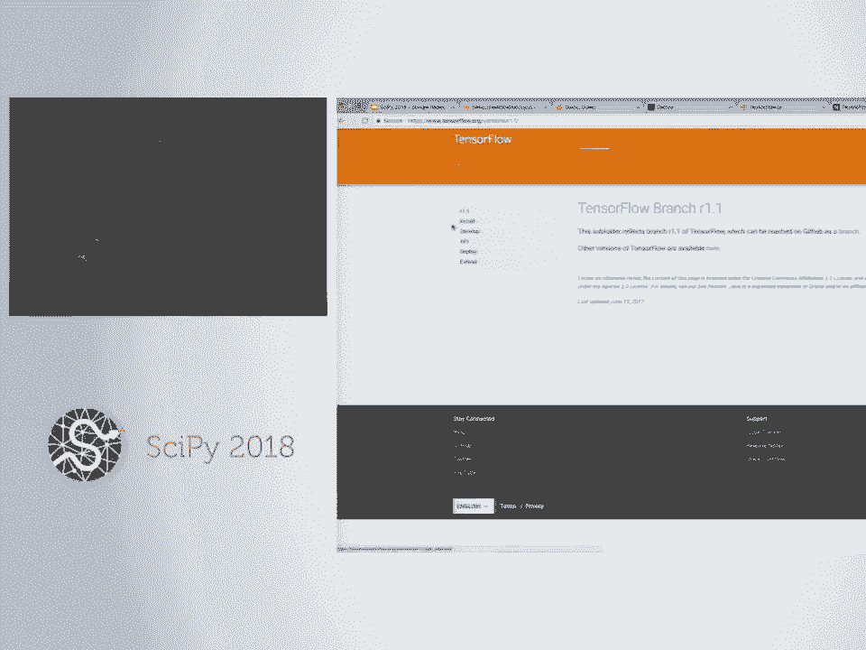

 And this is the exact same program for MNIST。 It happens to be MNIST and not fashion MNIST。

 but the code is identical。 And I just want to show you what--。

 let me see if I can find this file in Python。 Yeah。 Let's see if this links still work。

 So I'm going to go back to the next one。 And I'm going to go back to the next one。

 And I'm going to go back to the next one。 And I'm going to go back to the next one。

 And I'm going to go back to the next one。 Yeah。 Let's see if this links still works。 Yeah。

 So you'll see code that looks like this。 So just to input the data--， so basically， actually。

 let me show you。 I have a couple slides to show you， what this looked like a long time ago。 Ooh。

 they got reordered。 So this is something that might be valuable to learn。

 a very long time down the road if you have a specific reason。 So you don't need to learn this now。

 but I just want to mention。 So under the hood， TensorFlow is the word TensorFlow or Array， Flow。

 You can also think of it as Dataflow。 So behind the scenes， when you define a neural network。

 what you're really doing is defining a Dataflow graph。 And your Python code is defining this graph。

 And it gets passed to a back end， which， compiles and optimizes it， distributes it， optionally。

 and executes it。 So it's a Dataflow graph。 And graphs-- we don't have to go into them。

 They're great for lots of different reasons， because they're generic， they're easy to optimize。

 and all that jazz。 So graphs are great， and we like them。 The problem is。

 when you first started writing TensorFlow， what you would do is directly write this graph。

 So the first version of the TensorFlow API， was basically an API to define a Dataflow graph。

 And this is what the data flow-- this， is what the code would have looked like to add two numbers。

 So you'll never， ever， have to write code like this at all， you don't want to， for a lot of reasons。

 But we could import TensorFlow version 1， and then we want to add two numbers。

 So we're going to create two constants of 2 and 3， and these are nodes on the graph。

 And then we're creating a some node。 And when we execute some node， it。

 will pull down the values of its parents， add them together， and return it。 But what's funny is。

 this is Python that's defining a graph。 It's not actually-- this is a meta programming language。 If。

 on line 5， we just did print some node。 The output would be， like， TensorFlow， like， addition。

 operation， undefined value， because it hasn't actually， executed。

 This code is called deferred execution。 To actually run the addition， you。

 had to create something called a session。 And a session is an execution environment。

 for a Dataflow graph。 And then you say， TensorFlow， please， evaluate the value of these nodes。

 And that will actually do the computation。 And so this is all behind the scenes now。

 And there's different ways to push it behind the scenes。 So if you're on TensorFlow。org。

 and you see any code that， has things like TF constant or TF placeholder or TF variable。

 just run away。 And just ignore it。 And you should basically just focus on things that have， tf。

keros or the other APIs that I'll show you later。 There's still a lot of value for this。

 But it comes way down the road。 So this is the wrong way to learn machine learning。

 There's value in this when you have experience， if you really want to do something low level。

 It's sort of the difference between assembly and Python。

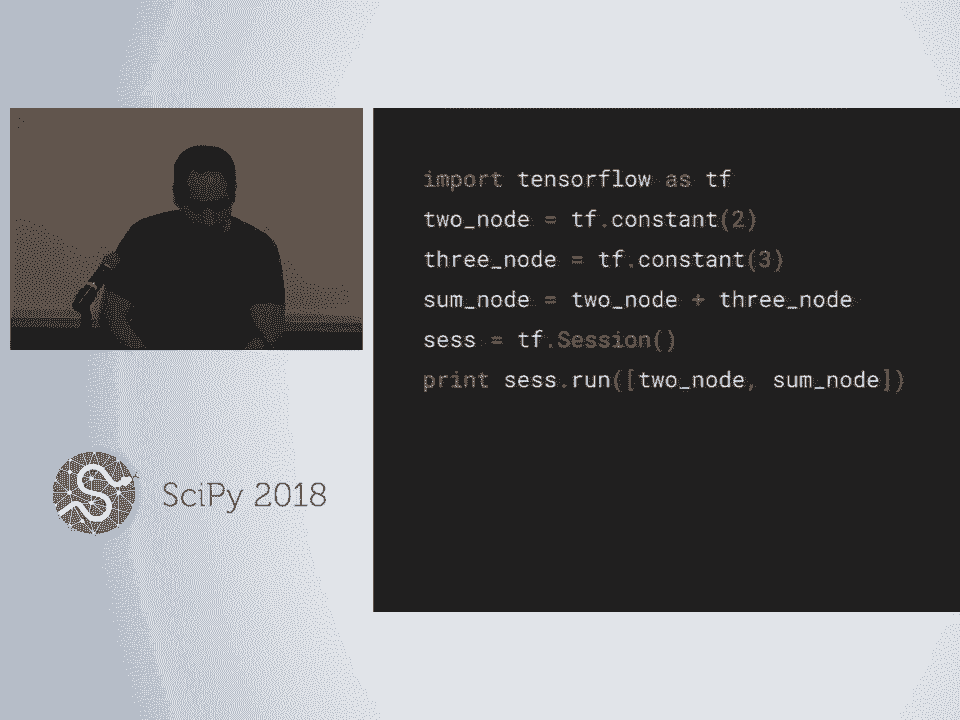

 Like you wouldn't take a first year undergraduate， and teach them assembly for a long time。 Yeah？

 Are there any actual projects that use TensorFlow for non-neural， network things？ Yes。

 So are there examples of projects for TensorFlow， for not-neural networks？

 So the truth is TensorFlow is basically， for deep neural networks。

 It also supports things like we have an implementation， of gradient boosted trees。

 We have an implementation of random forests。 We have a couple of mathy implementations。 Oh。

 there's actually a giant package called， TensorFlow probability。 So the correct answer is yes。

 So the reason I was making funny faces， is six months ago the website was like， no。

 it's for everything。 It's for neural networks and also super math。 And then we're like。

 here's how you do the Fibonacci sequence。 We now have a package called TensorFlow probability。

 I'm not a statistician。 But if this is sort of like PhD level。

 here's a giant collection of really interesting stuff。 It's out of my area of expertise。

 But if you search for TensorFlow probability， and you have a stats background， I hope it's useful。

 Anyway， so let's do this。 Does anyone have any more questions before we keep moving？

 Let's keep moving。 So we're going to do notebook number two， which is IMDB。 Before we do that。

 let's take two minutes。 And I could use a volunteer。

 And this will be like a two-minute game we're going to play。 And we have a sequence of games that。

 are going to conclude with code you， can run to build a similar version of the games we've tried now。

 So can I have a quick volunteer， somebody who's， good at drawing things？ And this is recorded， so--。

 [LAUGHTER]， Come on， scipy。 I'm bad at drawing。 Me too。 You might-- you want to try it anyway？

 All right。 Thank you for your bravery。 Hey， so I'm Josh。 I'm Audie Ba， thanks a lot。 Yes。

 So this is a game called Quickdraw。 And has anyone seen this game called Quickdraw before？

 So Quickdraw is awesome。 So basically， it's going to ask you。

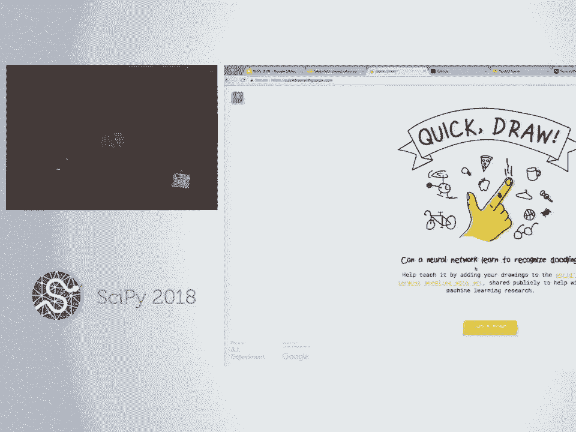

 to draw something using my trackpad。 I will do this。 OK。 Good luck， sir。 So draw a hat。 Oh， no。

 Say you hit OK。

 The hat， like a top hat， maybe。

 I see line。 Oh， I know。 It's hat。 Actually， that's great。 So nicely done。 So--， [APPLAUSE]。

 Let's do one more。 Oh， the sun。 That's fun， by the way。

 I see circle or hockey puck or blueberry or apple。 I see cherry or unicycle or snow light。

 [LAUGHTER]， I know。 It's song。

 You got it。 So nice job。 So thanks a lot。 I really appreciate it。 All right。 [APPLAUSE]。

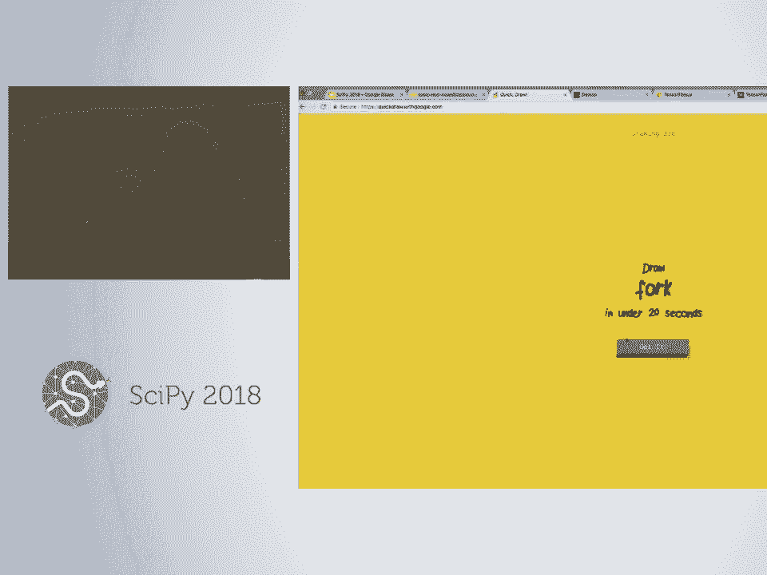

 So here's where I get fired。 So because we're Google， we have logged your data。 [LAUGHTER]， So--。

 [LAUGHTER]， So on TensorFlow。org， there's a data set called Quickdraw， which contains， I think。

 20 million drawings now。 And they're anonymized， of course。 And they're exactly like that。

 So it's 20 million drawings of people in 20 seconds or less， trying to draw simple objects。

 And this is a really useful academic data set。 What's interesting about these drawings。

 is there's two ways to think of a drawing。 One is it's a static picture。

 So you can look at the finished picture。 And that's what we're doing with MNIST。

 A much more interesting way to think of a drawing， is as a sequence。 And so if you think about it。

 people often， draw sun in a certain way。 They might start by drawing a circle。

 And then they'll draw little lines extending from it。

 And there are different types of neural networks， that can actually process sequences。

 And those are called the current neural networks。 And anyway。

 I'll show you a couple more variations on this game， and then some code you can use at the end。

 to train your own Quickdraw model。 So anyway。 Question？ Yes？ I'll talk about the sequence of pixels。

 or the sequence of the geometric objects。 Great question。

 Are we talking about the sequence of pixels or geometric？ It's a sequence of vectors。

 So what the data set contains is pen positions， started at these coordinates and moved to these coordinates。

 So it's vectors。

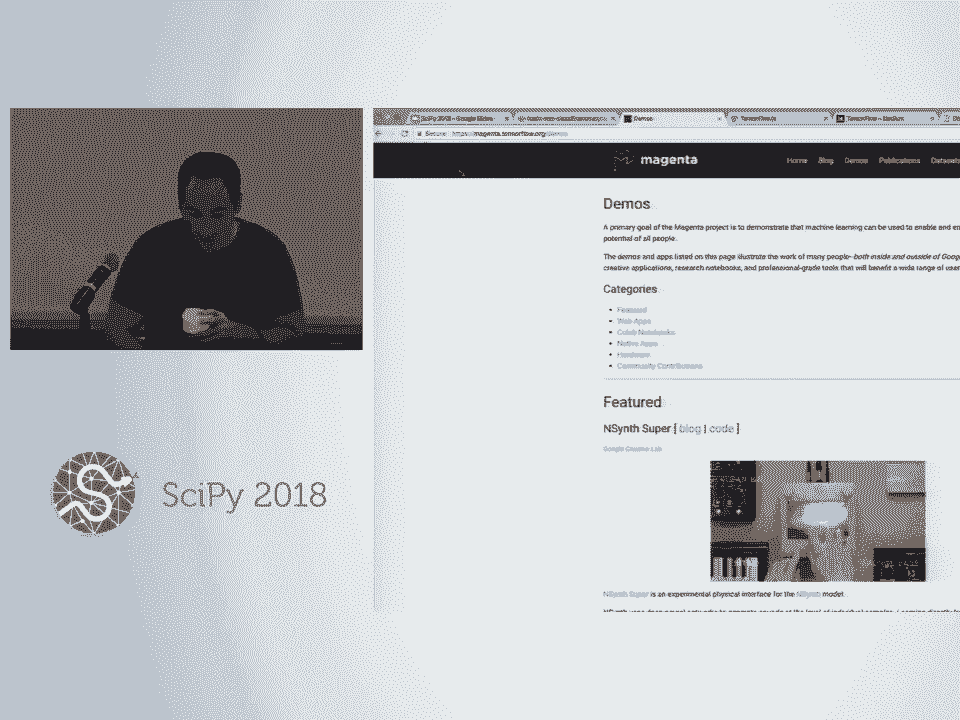

 All right。 So let's look at the next notebook。 And this is going to be-- if you go to github。

com/tensorflow/workchops， this is going to be the IMDB。 And I'll admit would you like to-- yeah。

 Thanks。 So I think this is it。 Yeah。 Next out of the-- all right， everyone。

 I just had a quick question before I get started， so I can tailor how I give my presentation。

 So I have basically two big reasons， for why you might be in this tutorial。

 Raise your hand if you have an ML problem already。

 and you have your data and you know what you want to predict。

 But you're just not sure how to kind of codify， whatever you want to do。 So quite a few of you。

 And then how many of you just want， to learn the basics of TensorFlow and ML？

 And you've heard about TensorFlow， but you just didn't know what it was。 OK， cool。

 So a lot more of you want to learn TensorFlow。 So I'll kind of like tailor a bit more towards that。

 So Josh just did a basic image classification。 The tutorial I'm about to walk you through。

 is going to be text classification。 So we're going to start off the same way。

 Feel free to follow along。 We're going to import TensorFlow， import Keras。

 And we're going to be working on what's， called the IMDB dataset。

 So that's basically a dataset where， you have a bunch of movie reviews。 And their tag。

 the label is basically a one or a zero。 One being very positive。 Zero being negative。

 Or like a negative review。 So let's download the dataset。 If you notice。

 I'm providing the num words argument。 So that's basically going to truncate。

 the amount of separate words that we care about to 10，000。 So any word， let's say the 15。

000th most popular word， we're just going to treat it as we're just。

 going to bucketize all the remaining words。 That's all that means。

 So let's take a quick look at the data。 So we have 25，000 training entries。

 And let's print the first training entry。 So as you can see， it's just basically a list of numbers。

 Each of the numbers represents a word。 Can everyone hear me OK？ Cool。

 So one problem that you can immediately， think of is that each review is of a different length。

 Like as we see right here， 1 is 218， 1 is 189。 And neural networks kind of want standardized format。

 So what we're going to do is we're， going to pad each of the reviews and either truncate them。

 at 256 or pad them to 256。 And I'll do it in a second。 First。

 let's convert the integer back towards。 This is not helpful for the actual machine learning。

 portion of the tutorial。 It's just so we can kind of better grasp， how the data is formatted。

 So we're going to download the reverse dictionary。

 And then we have a basic function called decode review。 And this is what a review looks like。

 So we have a start character or a start word， and then a bunch of actual words。

 So here is where we're going to pad the data。 So we're going to use something called pad sequences。

 If you ever have any issues with--， you want to know what a function is doing。

 the documentation on TensorFlow is fantastic and Keras， as well。

 So you just Google the string and then you， can just find it in the TensorFlow docs。

 And they're versioned as well。 So as 1。9 comes out， we'll have a 1。9 version。

 But that's just how to figure out what any function is doing。 So here we go。

 Going to pad the data sets。 OK。 So now we expect each of these to be 256。

 And now when we look at the first review again， we're going to see a bunch of numbers。

 And we're going to see zeros padded at the end， which is kind， of what we specified to pad with。

 Word index with the index pad， which is zero over here。 Everyone following along so far？ All right。

 cool。 Looks like it。 So now we're going to build the model。 And yes？ The indices that we use 0， 1。

 2， 3， but already reserved， or did you re-reserve them and move all the indices out？

 So good question。 So the way that the data was formatted， was that they were reserved。

 And so we've now created our own word index where， in this dictionary， we kind of give these values。

 to those indices。 But that was how it was formatted。 And then once again。

 if you look up the data set， and go to the docs， it'll show you， why those are separated out。 Yeah。

 Good question。 Cool， so now we're going to build the model。 Our vocab size is 10，000。

 So that's all that is--， I'll keep that aside for now。 Last Josh mentioned。

 we're going to build these layers， on the fly using sequential。 So you're going to notice。

 I believe Josh's tutorial only， had dense layers。 We're going to have two separate layers that you might not。

 have seen for。 The first one is an embedding layer。 So what that's basically doing is。

 it's adding a new dimension to our data， that we're going to be feeding in。

 And then the global average pooling layer， is just going to be averaging that across the new dimension。

 that we have， essentially。 We can go into more specifics later。

 One thing to kind of keep in mind when you're doing ML。

 for the first time is not to get too involved， into the math and into the weeds of what each layer is doing。

 And I know as engineers， that's really difficult， because we're programmed to understand exactly what's。

 happening behind the scenes。 But for learning right now， I suggest kind of just stepping。

 back and just trusting that the models that you see， are doing what they're supposed to be doing。

 And then just looking up the docs and then kind of getting， a high level understanding of what's。

 happening behind the scenes。 So that's exactly right。 And that's a really， really good point。

 So excellent， excellent point。 So the goal of these networks， the goal of these tutorials。

 is not to be， let's understand exactly how the dense layer， works。

 or let's understand exactly what the global average， pooling one div is doing。 Not important。

 What's important when you're learning ML is the flow。 And the flow is important to set， understand。

 the format of the data， define a model。 And that's the black box， the black box portion of today。

 How the model works is black box。 But how you train it， how you evaluate it。

 how you make predictions is what you want to walk away with。 Yeah。

 rather than walking away with exactly how， the embedding layer works， I think。

 it would be better to know that， hey， if I， have a text classification problem。

 I should start with an embedding than a global average， and then feed it into dense layers。

 So go ahead， question？ You know， if you're adding layers， but you're using different syntax。

 I was wondering， is it the same thing， or are you doing something different？ Yes。

 so we are doing something different。 So in the previous tutorial， we only added dense layers。

 Now we're adding an embedding layer， and a global average pooling layer。

 So if you want to find out more about that， you can always refer to the documentation。

 but you are correct。 The layers are a bit different this time。

 We have two new layers that you haven't seen before。 And like I said before， the embedding。

 is just adding a new dimension。 And then the global average pooling。

 is just going to be averaging over the previous dimension， that we're cutting out。

 And I can go over that in more detail later on， but there's a lot going on there that I。

 don't want to gloss over really quickly， while we're building these layers。

 while we're building the model。 It's cool。 So let's run this。

 You're going to get a nice model summary， capturing， exactly what's happening。

 And here's some more information about the layers， if you want to read more into that。

 So as Josh mentioned， there are three stages， to creating a model。 First you create the layers。

 then we compile it。 So compiling is just done in one step。 As Josh mentioned， if you're new。

 just use the atom optimizer。 It's awesome。 There are a bunch of different optimizers。

 that you can use each with their own paper， if you really want to get more into the weeds on that。

 Our loss function is a bit different this time。 Since we're using just two outputs now， 0 or 1。

 we don't need a categorical cross entropy function。 We just need a binary cross entropy function。

 a loss， function。 And we're going to keep track of the accuracy as well。 Cool。

 So we compiled our model。 I'm not sure if we did this in the fashion MNIST tutorial。

 We're going to create what's called a validation data set。

 So there's three types of data sets essentially。 There's training， which is what we're。

 going to learn with and learn on。 There's validation， which is part of the training usually。

 We're just going to keep validating our model， and kind of mimic the test set。

 And then the test set is exactly what you test on in finality， or when everything is done。

 Once you get your test set numbers， that's it。 You don't want to keep training on that。

 because then you've essentially contaminated your test set。

 So that's a concept that in case you haven't heard of it。

 that's really important to know just for ML in general。

 So I'm going to make the validation the last 10，000 of the 25，000。 All right。

 so here we're going to train the model。 We're going to provide the x training and the y training。

 which are just the reviews and the labels。 We're going to train for 40 epochs。

 which is a bit longer， than we've trained before。 We're going to provide a batch size of 512。

 So we're going to be evaluating 512 reviews at once。 And the validation data sets are over here。

 So we're just going to train。 This is going to take a while。

 Keep in mind we're running throughout the entire training， data set。

 and we're going to do that 40 times。 That's what 40 epochs means。

 You're going to notice our loss is slowly going down， our accuracy is increasing。

 And our validation accuracy is just trailing a little bit， which is expected。

 because we're learning， about the training accuracy， and we're just， evaluating validation accuracy。

 Does anyone have any questions on this difference， between training and validation？

 How do you make the initial case for the table？ So why I chose 40 epochs？ Once again。

 that was just random。 You might find that if you only train for 10 epochs。

 you might only get to 60% accuracy。 And if you train for 50 or 100， you're going to overfit。

 So I'll go back into that。 Just table your question。 I'll answer that in just a second。

 Good question。 Yes？ So why are you comparing the validation and accuracy。

 and the training accuracy as opposed to the loss？ We can compare the losses， but accuracy。

 is just easier for you to grasp in the sense of being--， you know exactly what it means。

 If you saw 100 reviews and you have 89% accuracy， you were like right 89% of the times。

 where there was positive or negative。 But loss is more-- it's just a theoretical metric。

 It's harder to understand exactly what it means。 So that's why I'm comparing them。 But yeah。

 you can decide to stop training， based on your loss。 So usually they go hand in hand。 Yeah。

 they're not necessarily-- they don't have one。 No， the loss in the accuracy do not add up to one。

 Loss is just basically a mathematical way， of saying how off we are。

 And accuracy is just given the 512 how accurate we are。 Yeah。 Yes？ So again。

 this is how you do this time。 That in the previous one， you just。

 studied with the exact value you did in the base layer。

 but show you how to do the end layer and the--， what do you want this to do？

 So that comes with practice。 Do you have--， Yeah， that's exactly--， Yeah。

 so that comes with practice， essentially。 So you could actually theoretically feed this directly。

 into a dense layer。 We just want to show that with text classification， you can do different stuff。

 But that's an intuition that just comes with practice， and seeing different models。

 So seeing another text classification model and saying， oh， they started with this layer。

 Let me try that。 And you might find that some techniques that you're using。

 will get you better performance than what we're teaching you。 Yeah。 Yes。

 one thing can I add to that real quick？ That's exactly right。

 So another reason we used an embedding layers， for memory efficiency。

 So this notebook was inspired by a book called Deep Learning， with Python。

 And if you search for deep learning with Python， there are many books by this name。

 but the one true book is the one by the author of Keras。 And this notebook is very。

 very similar to one， you can find on GitHub called classifying movie reviews that。

 does actually solve this problem just using dense layers。 But it's much， much less efficient。

 And it has to do for how much memory you， have to take up to represent all the words as vectors。

 And embedding is a way to compress that greatly。 Cool， so our model is done training？ Yes， question。

 So the evaluation accuracy and evaluation， of the model on the evaluation actually。

 goes back to the free entity or model， or is it completely independent？

 It's a completely independent evaluation。 That information is not going back to into the model input。

 Yeah。 OK。 So why was the one with the concern about using desktop？ So let me clarify again。

 The training loss we are using to tune the model， using some really advanced calculus。

 The validation loss and accuracy， it's just for us。 It's just to mimic the test set。

 The test set is completely separate， and your final evaluation。 See， right now。

 if I notice my validation accuracy is low， I can increase or decrease the amount of epochs。

 and keep training。 But you can't do that in the real world。

 So the test set is basically your one shot。 Try。 Yeah。 Cool， so I'm going to move on。 All right。

 now we're going to evaluate the model。 So we ran the model on our test data。

 So we can't train anymore after this， if we want to actually utilize these as our test metrics。

 So our test accuracies are on 87。5%， which is fairly close， to our validation accuracy。

 Our training accuracy， as you can see， is 94%， which is much higher。

 And this basically means that we've overfit。 And I'll get to that in a second。

 One great thing about using Keras， is that it keeps track of all the metrics。

 over the amount of epochs in something， called a history object。

 So we're going to plot the history using matplotlib。 So as you can see over here， our training loss。

 which， is represented by the dots， gets lower and lower。

 But our validation loss slowly stops decreasing。 And that essentially means that we're。

 finding patterns in our training data that aren't necessarily， there。

 So that means you're overfitting。 So that means maybe your training data just。

 happened to have some pattern that you didn't know about。

 And you're generalizing and applying that pattern， to the entire--。

 to anything that your model sees， which is obviously bad。

 which is why it's really important to get randomly， distributed and training data。

 A lot of ML is getting good training data。 Question there。 Yes。

 I know you don't want to look at the hood。 How can you actually determine that if you're just。

 looking at your valid--， so this is your validation set。 Yes。

 Because we weren't training and we weren't learning， on the validation。 Like I mentioned before。

 it was a completely independent metric。 So if my training numbers are higher than validation。

 I can safely make the assumption that I'm， looking at patterns that aren't there。

 So we took the last 10，000 as your validation set。 So if it wasn't randomly distributed。

 it would only be the fault， like the original data。 Yeah， yes。

 So it is randomly distributed in the data set。 So I didn't need to randomly shuffle。 But tf。

data set offers-- if your data is from your own thing， you want to randomly shuffle it。 tf。

data set has great APIs for doing that。 So over here， once again， you can。

 see that the training accuracy is rapidly increasing， but the validation accuracy isn't。

 And so one way to avoid overfitting， is that maybe we could have just stopped training after epoch。

 20， and then our model would be better able to generalize。

 rather than overfitting to our training set。 Overfitting and underfitting are very common problems。

 And there are a bunch of techniques to kind of combat them。 I'm not sure if we're going into this。

 Oh， we'll-- OK， perfect。 So there's going to be a great tutorial。

 later that kind of deals with some more， math-y approaches of how to combat overfitting and underfitting。

 because those are problems anyone studying and practicing， ML will face。 So yeah。 So yeah。

 that's the basic-- just a tech classification。 Does anyone have any questions？ Yes？ [INAUDIBLE]。

 [INAUDIBLE]， [INAUDIBLE]， Yeah。 [INAUDIBLE]， I think right now it's just the validation loss validation。

 accuracy and training loss and training accuracy。 Yeah。

 it's just the dictionary of those objects over time。 And then this is the best way to plot them。

 Yeah。 [INAUDIBLE]， Yes？ [INAUDIBLE]， Oh， good point。 Yes， you're right。 [INAUDIBLE]， Thank you。

 Perfect。 Thank you。 Yes？ [INAUDIBLE]， [INAUDIBLE]， Is it possible to get caught at a local minimum？

 And how does that--， how would the model handle that？ Would it just keep--。

 would it just stop there？ Would it stop or would it just keep showing the same accuracy。

 as it's involved？ In theory， it's definitely possible。

 It could happen that you keep adjusting the weights， keep tuning the weights。

 and then all of a sudden， you get a big change in weights after maybe five。

 epochs of like stability。 And as you can see， that's kind of happening a little bit。 But yeah。

 that is possible。 It also all depends on the random initialization。

 of the weights and your training data。 But yeah， that's theoretically possible。 Yes？ [INAUDIBLE]。

 [INAUDIBLE]， [INAUDIBLE]， The validation and training and starting to work。

 looked like around the loss of about 0。5。 Is there any significance to that with the binary classification？

 I mean， does that basically mean your--， it's like looking at coin？ Once again， that's loss。

 not accuracy。 So the loss is just a metric that's kind of--， it's just a numeric representation。

 It doesn't mean that， oh， we're just at a coin flip。 The accuracy were 50% exactly。

 Then you essentially know that you're only， classifying one thing。

 You're always saying that it's like positive or negative。 And then obviously。

 you're going to be 50% wrong。 So yeah。 Key distinction though， that's a good question。

 to note that the difference between loss and accuracy。 The loss is not based out of one or anything。

 Cool。 One last anecdote real quick， if any of this， seems like a little intimidating。

 So when I learned TensorFlow， I just， wanted to do a very basic linear regression。

 And all I wanted to do is I took a bunch of lines in Excel， and I wanted to plot the--。

 I wanted to basically reverse engineer the points to a line。 And I couldn't figure out how to do it。

 So the guy who sat next to me， he was training--， this is really complicated。

 like convolutional neural network， on resnet with a bunch of GPU。 So I was like， all right。

 if anyone knows， it's going to be this guy。 So I go over to him and I say， hey。

 can you help me with this basic linear regression？ He takes a look and he looks at me， and he says。

 I can help you classify resnet with a GPU。 I can't help you do a basic linear regression。

 So my point of the story or moral of the story， is that TensorFlow is a huge library。

 and it's almost impossible to know exactly what every single API， does。 Even I by no means。

 I'm an expert on all of it， or even any of it。 But the documentation is great and the community is really great。

 So please ask questions on Stack Overflow， GitHub。 My team and I will be sure to get to you soon。

 Thank you。 [APPLAUSE]。

 So really nice job。 I just want to summarize one or two takeaways also。 So a huge。

 huge thing in this notebook， that wasn't in the first one is the validation set。

 There's lots of questions on this。 So here's the basic idea。 You can kind of think of when you're。

 training a model， whether you're using a neural network， or anything else in machine learning。

 is imagine you're going to Vegas。 And in Vegas， you get to use your model exactly once。

 And the higher your accuracy on the test set， the more money you get。 The lower it is。

 the more money you pay。 So to start your experiments， you always have training data。

 And this is the only data you ever get to work with。 And your friend Rachel。

 who owns the casino in Vegas， she has your test set。 And you never。

 ever get to see it until you literally， show up at the casino， give your model to Rachel。

 and she runs it on the test set。 So the test data is gone。

 So what you do is when you're developing your model， you need to find the right value for things。

 called hyperparameters。 Hyperparameter is a fancy word from a parameter。

 you define when you train your model。 And there's lots of them。

 How many layers you should use as a hyperparameter？

 How many epochs you train for is a hyperparameter。 And that's the main one。

 So you have to find a good value for that。 The way you do that is you take your training set。

 and you pull some data off of it called your validation data。

 And another word for validation data is dummy test data。

 And so you pretend that your validation data is the test， data。

 You train a model and you evaluate the accuracy， on the validation set。

 You make plots and you use that to find good values for epochs。 Then you give your code to Rachel。

 she runs it， and you find out how well you did。 So that's the experiment that we're simulating。

 And it's super， super important。 And yeah， that's the main takeaway。

 So why don't we take 10 minutes， try， and run through this code， poke around with it。

 look at the plots， and then let's take a break for--， let me get the timing。 So I'll tell you what。

 let's start again at 9。45。 So that's 15 minutes。 So use as much of the time as you want。

 to poke around with this notebook or get some coffee。 And then we'll start again at 9。45。

 We'll do a couple more notebooks， play some more games， and continue onward from there。 Oh。

 and if you have questions， just raise your hand， and we'll come around。 OK， let's get started again。

 So we're going to do another quick game。

 So I need a volunteer who can also draw。 But this one's a little bit more complicated。

 than the last drawing one。 So this person will need to draw a duck。 And there's a reason for this。

 Come on down here。 Thank you。 Yeah。 So there is a project in TensorFlow called Magenta。

 And if you go to magenta。tensorflow--， what the hell？ magenta。tensorflow。org/demos， or just search。

 for TensorFlow Magenta。 Hey， I'm Josh。 Hi。 Thanks for your help。

 So this is a giant research project super amazing， and they study deep learning for art and music。

 And so given that we have this data set of 20 million， images that are 20 million vector sequences。

 and people trying to draw things like ducks， can we actually use that to build drawing auto suggest？

 So let me show you what this looks like。 So there's one such demo called Sketch RNN。

 And Sketch RNN is drawing auto complete for all the different。

 objects that people have drawn in Quickdraw。 So if you wouldn't mind， and you click and hold。

 and start drawing a duck， and you can draw as much of the duck， as you like， OK。

 And then Magenta is going to try to auto complete your duck。 And you're like， oh， that's awful。

 Yeah， it's pretty bad。 So sometimes it works well。 Sometimes it doesn't。 But what we can try again。

 too。 All right， clear。 But what's-- yeah， if you hit clear， we can try it again。 Oh， nice。 OK。

 now let's see what happened。 Hold on。 I'll tell you what。 Let's-- yep。 Let's try again。

 See how you drew the first part of the duck with the big？ That was smart。 Let's try it again。

 If you just draw the beak in the head， yeah， my mouse is a little funny。 OK， great。

 Now let's see what happens。 It's trying。 It's not terrible。 So let me try this， too。

 Because I've used Magenta a lot， I， happen to know that if you draw a beak--， well， I suck。

 If you draw a beak in a head--， all right， that wasn't any better。 But-- so thanks very much。

 So as crappy as this is， it's also super， super cool。

 Because if you think about the complexity involved。

 of the network understanding that if somebody draws a circle。

 they've started drawing the body of the duck。 Or if they've drawn a beak like this。

 they've started drawing the beak。 And it knows ducks have eyes and legs。

 And so what's cool is there's autocomplete models， for all the objects that are in Quickdraw。

 And the complete code to train this sketch RNN， is published on the website。

 It's a little bit beefy， but it's super， super cool。 But it's just a great example。 Anyway。

 all right， so let's look at Notebook 3。 And this is going to be for structured data prediction。

 So if you click on Housing Prices--， so there's two big differences with this Notebook。

 and the previous ones that we've been working with。 The first is this is for regression。 So broadly。

 there are two big categories， of machine learning-- classification， predictive thing， regression。

 predicted number。 And that number can be a price or a probability， or anything you like。

 The more interesting difference， the other two notebooks， worked with high dimensional data。

 And what I mean by that are images and text。 So people。

 when we look at all the pixels from an image， it doesn't mean much to us。

 We have to zoom out to get intuition。 So it's high dimensional data。

 Even those tiny little MNIST images have 784 pixels。

 And any single pixel doesn't tell us a lot about the image。 Text also-- there's 10，000 words。

 Any individual word usually doesn't tell us， that much about the sentence。 This is structured data。

 though。 So here， we're working with a data set。 And our goal is to predict the price of a house in Boston。

 And this is an old academic data set from the 1970s。 It's small。

 There's just a couple hundred examples。 But it has 13 different features or columns in the data set。

 So this is a spreadsheet or a CSV file。 And the difference with the other notebooks。

 is each of these features tells us a lot about the problem， because they're engineered by people。

 and they're human meaningful。 So a really strong feature for the price of a house。

 would be how many floors does it have？ What's the square feet？ How many bathrooms？

 Is it near a really fancy college？ These things tell us a lot about the domain。

 And so where deep learning really， really shines， is when you're working with high dimensional data--。

 images， text， sound， sequences。 It's also good for structured data like this。

 And in business situations， like if you're， working at a financial company， you'll。

 probably have an enormous amount of data， in your database of this form。

 And you can also use deep learning to work on this too。 And so here， what we'll do is demonstrate。

 how to train a TensorFlow model to predict the price of a house。

 in Boston in the 1970s based on this particular data set。 And the flow is very。

 very similar to the other notebooks。 It's just a different type of data。

 So it's a useful skill in practice。 What's cool about these is you'll。

 start to get the pattern of how to do these little experiments， in TensorFlow pretty quick。

 Because these notebooks， it's different data， but the flow is very similar。 So as before。

 we're importing the data set。 It comes predivided into train and test。

 We're taking a look at the format。 So this is extremely small。

 So this is not enough data to train an accurate TensorFlow， model。

 And how much data you need always depends， on the data set and the domain you're working in。

 I happen to know this isn't enough， because I've done some experiments with this。

 But this is enough for us to demonstrate the workflow。 Usually， a question you'll get a lot--。

 or I get a lot， or you'll get a lot when， you start working with ML is how much data。

 do I need for your problem？ And the answer is always more is always better。 And over time。

 you'll develop intuition， for the right number of examples for a particular problem。 Here。

 I'd want to see 10，000 examples ballpark。 Maybe 100 examples for every feature that we have minimum。

 And here， we just have way less than that。 So when you start working with structured data。

 there's different things you want to do。 The first thing you'd want to do is--， here。

 I'll tell you what， let me show you something much cooler。

 So I'll come back to this notebook in a moment。 There's a really useful tool。

 If you search for facets， FAC， ETS， Google research--， and we'll link to this from that notebook。

 when we update it later。 This is a really valuable tool for basically， visualizing spreadsheets。

 And so if you scroll down， there's， a demo that's preloaded。 And this is a data set。

 It's a structured data set。 So it's a CSV file from the 1990 US census。 And what this is。

 it describes， I think， it's a subset。 So there's like 50，000 people here。 And each dot is a person。

 And if you click on a dot， you'll see the row in the spreadsheet， that represents them。

 So this particular person is 31。 They live in the US， probably all of them。

 This must mean country of birth， not current residents。 Did they report capital gains？

 Jazz like that。 Are they working full time or not？ And this particular data set， we。

 want to predict if somebody is making more or less than $50，000， a year。 And so this is 1990。

 So in this data set， the blue dots are people making less， than $50，000。

 And the red dots are people making more。 And the reason I'm showing you this tool。

 is when you think about a problem like this， where you're collecting features， you。

 want to think about what features we have to work with。 And your intuition really counts a lot。

 Which features are meaningful and which features are not？ Because almost always for structured data。

 you'll be collecting your own data set， or involved with creating it。 So if we think about it。

 age is usually， a pretty predictive feature of income。

 meaning people under 18 are extremely unlikely， to be making a ton of money。 And so what we can do。

 we can fast it or bucket， the data set by age。 And so now we're looking at age buckets。

 And if you look at 17 to 24， it's almost all blue。

 And you see adults later in their working careers， tend to have a little bit of a higher percentage。

 And then a retirement dips a little bit。 Other features you could think of are education。

 is pretty important。 So we would not always， but on average， people with a master's degree tend。

 to make more than people with only a high school degree。

 And what other things you can do that are interesting。

 and facets is you can facet by multiple things at once。 So we could facet by education。

 That's not a great one。 I mean， some features are going to be super， super predictive。

 So here we're bucketing by people that reported， capital gains and education。

 And if we look at some of these， I don't know， there's going to be certain common issues。

 and features that are super， super important。 So what's cool about facets and the reason。

 I'm showing it to you is it has this upload your data thing。

 And you can upload a CSV file and it will visualize it for you。

 So it's a great way to just poke around your data， and explore it。 It's good for presentations。 Yes？

 What's the URL？ Oh， it's weird。 But if you search for facets， Google research。

 What are you trying to search for？ Oh， include the phrase pair P-A-I-R。 Here， I'll project the URL。

 It's just a useful tool。 It's super useful。 The reason I'm showing you this before I go in the notebook。

 is almost always with structured data。 It's not like， hey， I have some toy data set。 It's， you know。

 I'm collecting my own。 Anyway， for this notebook， we already have a data set。

 And what we're doing is we're just visualizing it in pandas。 So it's a CSV file。

 Each row is an example。 And each column is a feature。 And here we have the labels or the target。

 that we're trying to predict as a separate object， as always。 And these are in thousands of dollars。

 So it would have been good for us to buy houses in the '70s。

 Other things we're doing is we're putting all these features。

 on the same-- we're normalizing all the features。 So we're subtracting the mean and dividing。

 by the standard deviation。 So at this point， we have vectors that， can be fed into a neural network。

 as always。 So the next thing we need to do is define a model。

 So there's a couple small differences with before。

 I think I'm going to change this notebook a little bit。

 So one difference is we're using a different optimizer。

 The only reason we're using a different optimizer here， I'm going to actually get rid of it。

 I would just use Adam。 You can use a different optimizer。

 Here another thing is we're specifying the learning rate。

 So optimizers actually have a whole bunch of parameters。

 Almost always-- and this is one of the things I， like so much about using Keros-- is it。

 has something called good defaults。 Meaning， if you just don't specify the parameters。

 usually it has the behavior that you want。 Actually， you might have to specify them here。

 because we're using a test flow optimizer。 Close enough。

 The loss function we're looking at is mean squared error。

 This is a good loss function for regression。 So what we want to minimize is the squared difference。

 between the price of the house we predict。 And the actual price of the house。

 And that just means that we're penalizing large mistakes， or penalize more than small mistakes。

 As before， it's a fully connected dense network。 Again， as always。

 we've found these numbers of units， experimentally。 So literally， try a bunch of different designs。

 with network， make plots， compare the performance， on the training and testing set。 Yes？

 [INAUDIBLE]， Great question。 So why are we using powers of two for the number of units？ So yeah。

 that's for numeric efficiency。 So efficiency is a whole topic。 What happens is， ultimately。

 with larger models， we'd run them on an accelerator like a GPU。

 GPUs have a certain amount of memory。 And usually， it's much， much smaller than system memory。

 And so there's different trade-offs， to make between you want your model to fit in memory。

 and then you're also copying data back and forth， between system memory and the GPU。

 And you want to find efficient values for all these。 But to answer your question， this。

 doesn't have to be power of two。 This can be 99 or whatever you want。

 I think it's just because these are numbers， that are familiar to us。

 It also could be that we might want， to do a search for the right number。

 and so we're just using powers of two。 Also， by the way， to be aware of， don't get stuck。

 So this is sort of a-- this is a black hole。 So first of all， there's no right answer。

 So there are many possible designs for this network， that will perform equally well。

 So don't get sucked into-- a lot of students， when they first start learning about deep learning。

 they'll focus all their time on defining the model。 And this is one of the least important parts。

 because it's something that's perfectly encapsulated。 What you should spend your time on。

 is understanding the data， setting up your experiments。

 That's basically thinking carefully about train， validate test。

 think about how your network is going to be， used， how you use it in practice。

 All that matters much more， because you can come back， to this later and try different designs。

 What we're doing here-- so before we， were training for a very small number of epochs， like 20。

 here we're training for 500。 And the reason is that this is a really， really， really tiny， data set。

 And so what we're doing is， as always， we're making these plots of our loss on the training validation。

 data。 So here's one useful technique。 So when you're training these models。

 you always need to figure out， how long should I train the， model for， and when should I stop？

 A good to prevent overfitting。 A good strategy to determine your stopping point is to stop。

 training your model when the loss on the validation data is， no longer decreasing。

 So you train until the loss on the validation data， stops decreasing。

 And in this particular notebook， that happens pretty early。

 So we're reaching close to our minimum loss around here。 There's a way to do this automatically。

 So what I recommend doing for your own experiments， I would。

 literally make plots like this and just look at them。 There's value into making these plots。

 Debugging is a big one。 But you can also do this automatically。 So here in our model。fit method。

 we can also provide a， callback。 And this is a callback called early stopping。

 And this will tell the model to track the validation。

 loss over time and stop training when it stops decreasing， for a certain number of epochs。

 And there's a parameter for that called patience。 And so here， if it hasn't gone down for 20 epochs。

 it will， just abort the training process。 And this is just to save us time。

 And so here it stopped training after about 150 epochs。 Another thing we can do is。

 because this is regression， we， can actually look at our average error over the entire， data set。

 And so on average， we're off by about $2，700 on the price， of a house。

 And then the last part of the notebook shows you how to make， predictions on individual houses。

 We are predicting the price。 This notebook I actually personally don't like as much。

 as the other ones。 It's useful。 The reason I don't like it so much is this data set is--。

 I wouldn't do some work on this。 There's more we can do with structured data。

 So when you're working with structured data， there are。

 lots of important questions that you want to ask。 One such important question is。

 which features are important？ So often， you really want to know， of the structured data。

 it's one of the few chunks of machine learning that you can。

 actually look at the features that are being input to the。

 model and try and understand which are valuable and which， are not。 And this is really。

 really important， because usually， what you don't want is a black box model that just tells。

 you the price of a house。 You want to understand what's happening， so you can use。

 that to make business decisions， or so you can think。

 about additional features you can add to the model。 There's different ways to do that。

 Decision trees are a great way to understand your data。 So if you train a decision tree。

 if you use Scikit Learn， if you train a decision tree on this data， it will show you a。

 tree which describes exactly which features the model looks， at and in what order。

 And that has enormous value just looking at。 The model that is spit out by the network might end up。

 having slightly higher accuracy if you train on an， enormous amount of data。

 But I would do a tree first to understand what is， happening and why。

 And there's a lot of value in this。 This is more of a FYI。

 If you wanted to train a much more-- if you wanted to use， deep learning on structured data。

 we have a different， tutorial which I'd recommend over this one。

 The problem is it uses a different API which I like， less than TF。Kara。

 But if you search for TensorFlow Wide and Deep--， so TensorFlow Wide and Deep is a tutorial we have on TensorFlow。

 at org that goes into structured data classification。

 Using that census data set that I showed you earlier。

 And it looks at it has tons of utilities to look at。

 different combinations of features and see how that， affects the performance of the model。

 So this is a much better tutorial for structured data， than predicting housing prices。 Anyway。

 just to get the flow of things。 This tutorial went through this。 I'll throw the GPU on it。

 [INAUDIBLE]， Thank you。 I'll have to take a look at that。 Do you know what area you get？ Yeah。

 The last GMM launch failed。 Nice。 I'll come over and check it out。 Thanks。 Yeah。

 so I take five minutes。 Go over this， see if you can run it。

 Pick some housing prices just to get a sense of the flow。

 And then we'll look at notebook number four， which I think， is much more valuable because that。

 teaches overfitting and underfitting， which， is a super good concept to know。 [SIDE CONVERSATION]。

 [SIDE CONVERSATION]， [SIDE CONVERSATION]， [SIDE CONVERSATION]， [SIDE CONVERSATION]。

 [SIDE CONVERSATION]， [SIDE CONVERSATION]， [SIDE CONVERSATION]， (inaudible)， By the way。

 it's also important to understand if you look at these graphs， you'll notice。

 that they're not smooth。 And it's important to think about why these graphs are not smooth。

 So let's look at the training data for starters， which is in blue。

 So you saw a parameter for learning rate earlier in the network。

 Usually when you're training a network， what it's doing is it's making small adjustments。

 to the weights at every iteration。 And the size of the adjustment that it makes to the weight is scaled by the learning rate。

 Higher learning rates means it makes larger adjustments， meaning hopefully it converges， faster。

 But with too high of an adjustment， your loss can actually start increasing again because。

 you've moved too far in the wrong direction。 And the reason this is bumpy is issues with the learning rate。

 If we used a really， really tiny learning rate， the model would train slower， but this。

 would be much smoother， usually decreasing。 It's bouncing up a little bit。

 just from learning rate problems。 The reason the validation loss is super bumpy is basically where it's bumpy and it's bouncing。

 up again because we're beginning to overfit。 So at every iteration。

 we're testing this data on the validation set。 And although we're optimizing it using the training data。

 And so the performance on the validation data varies depending on our parameters。

 And so that's why that's bumpy。 I have a question。 Yeah。

 How important is the normalization of your data？ Extremely。

 So the question was how important is it to normalize your data？

 So if your data are not normally distributed， then here's why。

 And the mean and dividing by standard deviation isn't necessarily best。 Yeah。

 there could be more sophisticated strategies to normalize it。

 So the reason that it's important to stick your data on small scales， basically every。

 unit inside a dense layer network， what a single unit is doing is it's taking a linear。

 combination of the inputs， each of which has a learned weight。 So every feature from your data set。

 let's say the square foot of the house is literally， multiplied by a number。

 And so the problem is if you， as you scale that number， you get much larger or smaller。

 impacts depending on the scale of the feature。 And if you put them all on the same scale like between negative one or zero and one。

 it makes， it easier for the network to learn similar size weights。

 So all the weights are of the same order of magnitude？ That's， yeah， exactly。

 So let's work on this for about five minutes and we'll do over thing under。 Yeah。

 [ Inaudible question ]， So great question。 So can the model give you outputs beyond the range of your data？

 And the answer is yes。 So a regression model can predict yes， you can get huge ranges。

 And that's a problem。 How well does it extrapolate？ So how well does it extrapolate？

 So the answer is models， the most important thing is your data set。

 So to train more accurate models， always， always， always more data。

 In this special case of working with structured data， it's how thoughtful are your features？

 So the network only gets to look at features which we've engineered。

 So for giving it things like square foot of the house， number of bathrooms， distance。

 and miles to a fancy school， those are all very informative。 If we give it uninformative features。

 like what's the color of the roof？ Or like， you know， that tells us a lot less。

 So how thoughtful are your features？ Quantity of data， thoughtfulness of features。

 properly designed experiment。 After those three， it's the model architecture sufficient to learn the data。

 In practice， when you're doing ML， 95% of your work goes into data collection， data cleaning。

 and feature engineering for structured data。 A much smaller amount of work goes into building the model。

 >> A question about the money rate。 Does one of them like， and all the terms of low implement。

 how adaptive money rate？ >> Great question。 >> It's not the degree of the loss function。

 just the adaptive adjuster the data rate。 >> Great question。 So the question was。

 why can't the learning rate be adaptive？ And the answer is it is。 So by default。

 Adam will use an adaptive learning rate。 So that's why we like Adam。 One of the reasons。

 That's exactly right。 Yes。 >> So what about your code makes it a regression model？

 What about using an MSC loss？ >> Yeah， so there's a couple things。 Thank you。 Yep。

 so what about the code makes it a regression layer， a regression model？

 So the loss is mean squared error。 And we haven't gone into network design。

 But if you look at the very last， if you look at the lowest layer of the network。

 so the output is a dense layer with one unit。 And what that literally means is this will be some number that ranges between negative。

 infinity and positive infinity。 It's just a single number。 And that number is the output of network。

 And what we do is we compare the output of that number to the squared error of what it。

 should have predicted。 We can constrain the value of this。

 So let's say we were doing a regression model， but we wanted to predict a probability。

 instead of an unbounded number。 What we would do is just say。

 activation equals tf dot nn dot sigmoid。 And what that will do is that will squash that value to a range。

 But with no activation， it's unbounded。 Other bumps that you can specify by custom functions？ Yes。

 You can write a custom activation function。 So all of these are just functions。

 You can implement one in tf dot keros。 Or if you look at notebook number five。

 you can do one with eager。 It's much easier。 In general， that's the way you're away from that。

 But yes， you can。 Yeah。 Yes。 [INAUDIBLE]， Thank you。 Excellent question。

 So you just brought up what you said just to repeat it。

 Is the word normalized can be tricky in this context because it has multiple meanings。

 So it can scale in terms of the answer to one。 Or it can be a gassing distribution。

 So assuming that you get gassing distribution， how important is that distribution of data？

 Thank you。 Excellent question。 So you just brought up what you said just to repeat it。

 Is the word normalized can mean different things in different contexts that you could， talk about。

 Normalizing， standardizing， what kinds of distributions？ It depends on the problem。 In general。

 networks are happy when your data ranges between negative one and one or zero， and one。

 And it's consistent throughout all your features， if possible。 For your particular problem。

 I would think about what types of distributions make the， most sense。

 But I'd say that's domain dependent。 But it's a great question。

 And answering stuff like that is exactly where you spend a lot of your time for your。

 different problems。 So just to compare， if you think about properly normalizing your data。

 whatever that means， for your problem， is much more valuable than spending that same time tweaking the number。

 of layers in your model。 Like massively。 Yeah。 Good data。

 Good features and a lot of data and a simple model will always always beat a lot of data。

 crappy features and a complicated model。 In the previous example。

 we explicitly made a validation set。 Here we're calling validation split。

 Is there a difference between those two？ Yeah， great question。 So。 And is that if it's split。

 is it the same set each other？ So here， basically， a giant caveat about this。

 I think I'm going to change the notebook， a lot。 This is not showing best ML practices。

 The previous notebook was。 What we're doing here is， I'd have to read this code more carefully。

 but what we're doing， when we're， this is convenience。 When we're training the model。

 what we're asking TensorFlow to do is take 20% of our， training data。

 And I'm actually not sure if this is consistent across that box or if it's different every， time。

 I'd have to check。 And it's using that to validate the model as we go。

 This is purely for convenience。 What's going to be a model that's trained in your head？

 Can you convert it？ Can you ask a different question about it？ So interesting question。

 So when you have a model that's trained， can you use it to ask different questions？

 So the answer is yes in special cases。 So there's a field of ML called transfer learning。

 And the best example we have is for image classification。 So let's say we trained。

 there's a common dataset in ML called ImageNet。 And ImageNet has million images and a thousand different classes。

 So cats， dogs， flowers。 And a common task is given that we've trained a model on ImageNet。

 can we customize it to， work with new images？ And there's different ways of doing that。 But yes。

 >> What if you have a network that， you know， you're using paint and you're going to get。

 a color at the end of the process， right？ And so you have different colors going into the normal network and then you've got one。

 color coming out。 And what's you have that normal network trained？ And then you invert and say。

 well， I want this color。 So what do I have to put into the front end？ >> Great question。

 So the question was， can you invert a network？ So let's say in this case we're going from a CSV file of housing prices to a number。

 Can we go from a number to the maybe？ I don't know if you're familiar with it。

 We'd have to talk offline a little bit。 Interesting question though。 We could go into GANS。 But yes。

 it's a great question。 But we'll punt on that right now。 So let's spend five minutes。

 Let's go over this。 Then we'll do one more game。 We'll go into overfitting， underfitting。

 which is super， super valuable to understand。 And then we'll go into some more advanced notebooks。

 >> All right。 If everyone's ready， we can get started with the next notebook。

 So as I mentioned before， overfitting and underfitting are problems you're going to see a lot whenever。

 you do any sort of ML。 So we're going to figure out a few ways to combat those using some math approaches。

 I'll try to stay more on the API side rather than dive deep into the math。

 But it'll be natural if you have a lot of questions。

 So we're going to look at the IMDB dataset again。 This time we're going to do it a little bit differently。

 I think I had a question about this。 We're going to use one hot encoding。

 which is basically we have -- earlier we represented。

 each review as a list of numbers based on which word popped up。

 Now we're going to be representing them。 Since we have 10，000 possible words。

 a vector of zero of length 10，000 with -- if any -- if， the index of -- if a word appears。

 the index of that word will be one。 So let's say a word number 250 appears。

 the 250th index is going to be one on that 10，000， length vector。

 So you don't need to worry too much about that。 Just follow along because I'll be mostly spending time on how to reduce the overfitting。

 and underfitting。 So over here we download the dataset again。

 I won't be running through this because it takes a lot of time。

 And then this is kind of what one vector will look like。 As you can see。

 the more popular words are all very -- like all seen。 We have one word that's like 7，500 over here。

 So that's going to be how we represent the reviews now。

 So we're going to be making three different models。 We're going to be making a baseline model。

 So that's going to -- if you notice， we got rid of the first embedding in the max pooling， layer。

 So we're now feeding it directly into dense layers。 As I mentioned earlier。

 which is possible for us to do。 So the baseline model is going to have 16 units in the -- or hidden units in each layer。

 And we're going to use the atom optimizer again。 We're going to use binary cross entropy loss。

 And then we're going to make -- we're going to plot that over 20 epochs。

 We're going to make a smaller model with only four units。

 And we're going to make a bigger model with 512。 So the same amount of epochs for each one。

 the same function， same optimizer， everything， the only differences will have four units， 16 units。

 and 512 units。 So let's see how they perform。 So this is what the output is going to look like。

 Let's talk about the loss first。 So the loss of the solid lines， not the dashed lines。

 You see that the green model， which only has four units in each layer， is struggling to。

 really lower the loss， but the larger -- the larger model， which has 512 units， got the。

 loss almost to zero。 So here -- the green model is basically underfitting。

 which means it doesn't have enough weights， to adequately learn anything。

 But only four hidden units， it's not able to really capture all the information that's。

 given in all the texts。 But when you have 512 units。

 you can kind of -- you can pretty much memorize the reviews。

 So you know what review is positive and negative。 So that's how the loss is almost approaching zero。

 because it's gotten so good at learning。 But the problem with that is now you're overfitting。

 It's essentially memorize the review。 And you're never going to see the exact same review again。

 So even though your loss is zero， your performance in the real world is probably going to be not。

 that great。 If you look at the accuracy， it tells a similar story。 The green line。

 it's basically at 50%， basically not learning anything with just four units， with 16 units。

 which is the blue。 The accuracy actually does better in the end。 But the red has overfit。

 So it gets really high really quickly。 But then it doesn't improve after that。 So yeah。

 So that's one of the ways you can kind of tune overfitting and underfitting is you change。

 the amount of weights。 Another strategy we can use is weight regularization。

 So that's basically penalizing a large weight in the model。

 Though it's as simple as just adding regularizer in the-- when you instantiate the layers。

 as you can see over here。 And you can read more， like I said， by just looking up the documentation。

 And then you can kind of see sample-- this is the actual Keras documentation， not the。

 TensorFlow documentation。 Sample values for the regularizer as well。 Cool。

 So we're going to run this for 20 epochs。 And then we're going to compare it with our original baseline。

 You'll see that the loss is a bit higher。 And the accuracy doesn't really-- hold on， is this--。

 [INAUDIBLE]， Oh， sorry。 I'm sorry。 This is training and validation。 Sorry。 My bad。 So yeah。

 One second。 So this is both-- this is both lost， you're saying？ OK。 Pardon？ [INAUDIBLE]， Yeah。

 So we just regenerated all these notebooks。 Actually， Amit wrote the first version of them。 Yeah。

 We just updated all of them。 So basically， green is also trained。 Now， if you value。 Oh， OK。 I see。

 I see。 Yes。 The green is the regularized model。 Regularized model。 OK， perfect。

 So as you can see here， the regularized model is not going to perform as well as the baseline。

 model， but it's less likely to overfit。 Because you have essentially penalized way too large of a weight。

 and you've kind of， distributed the weights better。

 So this model is more likely to be better for your test set， but it's going to be not。

 as powerful for your training set。 Does anyone have any questions？

 I can see why this would be a little confusing at first glance， but I'd be happy to explain。

 it in more detail。 Yes， so the Y axis is lost。 I see。 I see。

 So regularization is one of the techniques， and then the last technique we're going to。

 look over is dropout。 So you might have seen the dropout layers if you were like。

 thumbing through the tensor， flow Keras layers。 Dropout basically means that you are dropping out or randomly setting to zero some of the。

 weights。 And here's an example。 If a given layer would have returned a vector of this。

 we randomly set some of the output， to zero。 And then with a test time。

 instead what you do is rather than setting anything to zero， you just scale down。

 because now all the weights will be activated。 So it's as simple as just adding a dropout layer after each dense layer。

 And that's how usually the weights are， or like dropout weights or values are set between。

 point two and point five。 So once again， not as it won't perform as well as the baseline model。

 but once again， you're less likely to overfit to your training data。

 I think it's a traditional context。 Yeah， go for it。 Thanks。 Yeah， nice job。

 So some additional context。 So one problem these graphs is there's so much on them。

 they're hard to read。 So let me see if I can take our giant mega graph and let's look at the， yeah。

 it's going， to work。 So let's look at what happens with each model individually。

 So this is our big model。 And in the solid line， like Amit was saying， we have。

 this is the accuracy on the train， this is the loss on the training set。

 So lower numbers are better。 And what happens is when we train this model， you know。

 after like three epochs， it's basically， going to zero。 And when we look at this， we're like， oh。

 great， it perfectly learned the training data。 But then in the dash line。

 we're looking at the loss on the validation data。 And this is like， oh， crap。

 it is doing horribly on the validation data。 And you see how these lines diverge almost immediately？

 What this means is the training accuracy is going down。 I'm sorry， the training loss is decreasing。

 which is good。 And the validation loss is skyrocketing， which is horrible。

 So this is classic overfitting。 It's memorizing the data。

 So this big model is terrible and it's too big。 So one thing we can do to increase the accuracy on the validation set is reduce the size of。

 the model。 And so if we do that， we can plot our smaller model and compare how it performs。

 So now we have a ton of stuff on the screen。 So smaller is in blue。

 So what's interesting is that the peak loss on the training set is not as good for the。

 smaller model。 It hasn't memorized the data or gone to zero。

 But what's interesting is the peak loss on the validation set， which is what we actually。

 care about， is better。 So even though the smaller model hasn't gotten its high accuracy on the training data。

 it's， actually performing better in practice on new data。

 And all of these models are vastly too big for this data set， even the smaller model， because。

 you can see how quickly they're beginning to overfit。 And then later in the notebook。

 there's other strategies we can use to prevent overfitting。 And dropout is a great one。

 It's a really funny idea。 It's one of these ridiculous things that tends to work really well in practice。

 So what dropout is doing？ It's a silly idea， but it's ridiculously effective。

 So as you're training networks， on the left we're looking at a cartoon diagram of a fully。

 connected neural network。 And it dropout while we're training the network at each iteration。

 we're randomly selecting， a subset of the neurons or the units， and we're just turning them off。

 So they're gone。 And it's random which subset gets deactivated。

 And what is happening is this forces the network to learn redundant representations。

 So any individual unit， it can't rely on two heavy leaks， it might not be there。

 So it has to learn redundant representations which tend to generalize better。

 That's what dropout is doing。 Anyway， what I would do is I'd run this notebook。

 I'd look at the plots。 If you want， you can play with it a little bit。 But basically。

 what this notebook is showing is when you're training these models， a key。

 key parameter to find a good value for is the number of epochs that you train the model。

 And in the previous notebook， early stopping is a great way to locate that， making plots。

 like this and looking for the point when overfitting begins to happen is a great way to locate。

 that。 And also adjusting the size of the network and seeing how that affects overfitting and。

 underfitting is super， super important in practice。 So a lot of machine learning is experimental。

 It's hugely experimental。 And so making plots like this in practice is super common。

 Any questions on stuff like this？ Yeah？ >> For the dropout， is there an exploration period？

 So if you're sending things to zero， are you giving it time to accumulate a number back。

 yet or a weight to it back yet？ >> So what happens when we set the weights to zero？

 When we set the units to zero？ So basically， they're turned off for one iteration of training。

 So we don't delete the weights。 It's just they're just not used in computing the output for one iteration。

 And they're not updated in that same。 Yeah， exactly。 Yes？ >> [INAUDIBLE]。

 >> So it's an excellent question。 So the question was。

 is tuning the value of dropout a hyperparameter？ Because there might be a sweet spot。 Yes it is。

 So this is why it's experimental。 So all of these parameters are hyperparameters。

 Basically knobs that can be set appropriately when you design your networks。

 So there's two for dropout。 Well， there's actually four。 One is where you use the layers。

 Here we happen to be using them after the dense layers。 We don't need to。 We could just delete that。

 Now we have one dropout layer。 Dropouts always apply to the layer right below it。 Or I'm sorry。

 above it。 And the other parameter is the dropout rate。 So here we're dropping out 50% of the units。

 We could drop out 80%， which is probably way too much。 Or 10%， which is maybe too little。

 The way to find the right value for this parameter， try different values， make plots。

 It's not rocket science。 It's just a lot of compute。 >> There are empirical best practices。

 So typically， broadly when you're doing machine learning， there's going to be two outcomes。

 One is you have a generic problem， meaning I want to classify images。 If so。

 or I want to classify text， if so， you're usually not writing your own model。

 So the way to classify images is not to write a custom image classification model。

 What you do is you go to the research papers and you find the latest one that works well。

 and then you find an open source implementation and you just train it with your data。

 You can do this too。 This is more fun for learning or for experimenting。

 but often you don't have to write your own， code。 You would probably write your own code if you're doing something like structure data classification。

 Or if you're trying to train a really small image classification model that runs on your。

 Raspberry Pi， although we have a giant collection of those shared as well。

 So you don't always have to write， you should， for sure， when you're learning it。

 But if you're working at a giant enterprise company with a team， you don't usually have。

 to write your own models。 So anyway， to answer your question， to find recommended best practices。

 look at the latest， models from highly cited research papers and see what they do。

 I think we're a few years away from having a really， really awesome resource that I heard。

 somebody working on， but I don't think it's anywhere near ready to go， is a universal。

 machine learning guide。 And this is basically， here's text classification。

 Here's a whole box of best practices from the following papers。 Here's image class。

 but we're a little bit away from really understanding exactly the。

 right architecture of each problem。 Yes？ >> So I'm trying to imagine the case where I have structured data。

 but I don't actually， have data for some of the fields for a record of trying to classify the web or on。

 Is a dropout technique appropriate for something like that， or does something else need to。

 be provided？ >> So great question。 So you have structured data and you have missing values。

 So you have a spreadsheet and some cells are missing。 There's different ways to handle that。

 So dropout is independent。 So dropout will prevent a model from overfitting。

 And it's almost always best practice to use it。 To handle missing data。

 you have to feed the network something and there's different strategies。

 One strategy would be fill in the missing value by taking the average of the entire row。

 Another would be set all your missing values to zero。 And there's or a special character。

 And there's different consequences of these different things。

 But basically you need a strategy to handle missing data。

 Another one is just delete all the rows with missing data and just say your model can't。

 handle that。 But those are the broad things you can do。 >> Thanks。 >> Yes。

 >> Does the revenue itself have sort of a dropout built in？ So if it goes below zero。

 does that or do？ >> I wouldn't。 Yes。 So Ray Liu is a funny looking activation function。

 So we're not going to get into activation functions today。 It's a great question。

 But it's too deep in the woods。 Great question。 We can talk offline though。

 It's slightly different than dropout。 It's a great question。

 But it's basically ignoring values that are less than zero。 That's a great question。

 That might be why it works。 Basically the reason I'm punting on that。 So these guys。

 there's a giant bucket in the same way there are many optimizers。

 There's a bucket of activation functions you can use。

 Ray Liu is the one that in general works best in practice。

 If you want to get into research and neural networks， sometimes you'll see a paper every。

 six months， there'll be a paper or blog post that comes out。 Which is aha。

 I have the Josh activation function。 And I ran a bunch of experiments and Josh function tends to perform better than Ray Liu。

 And then a bunch of people will try and look at and understand why。

 And then eventually it will either be discarded or people will find out that it's better。

 And then it will be implemented inside these libraries and you'll be able to call it with， you know。

 Josh fun。 And this happens on and off。 The reason I'm saying just basically just always use Ray Liu on intermediate layers is。

 it tends to work the best in practice at the moment。 Previously。

 Sigmoid was the standard and this was found to be less efficient in practice， on most problems。

 So now we're using Ray Liu。 And there's others you can try to。 Yes？

 >> So we've looked at the structures spreadsheet like data and we've talked about image data。

 But it seems to me like there wouldn't be initially exclusive to put them together in。

 a model because they want to have attributes that are subsumed with an image。

 Are there best practices or best approaches to doing that kind of thing？ >> Yeah， so great question。

 How can I combine structured data with high dimensional data？

 So a good example of that is visual question answering。

 And so Keras also has something called a functional API which is really good for this。

 We don't have an example today。 Maybe we'll write one down the road。

 But what you can do is you can take an image and you can also have some text。

 Text to ask a question about the image。 We've showed you actually it's not so bad。

 We could write this if we had a few hours。 So we've showed you how to rep networks just take vectors as input。

 In MNIST we've seen how to represent an image as a vector。

 In IMDB we've seen how to represent text as a vector。

 Literally all you have to do is use a merge layer and you just concatenate them。

 The network doesn't know that some is image， some is text。 It just gets glued together。

 And you can train a network to ask or to answer questions about an image。 Anyway。

 let's keep moving but we can come back to that。 That's a great question。 >> [INAUDIBLE]， >> Oh yeah。

 >> [INAUDIBLE]， >> [INAUDIBLE]， >> It's always applied to the layer right above it。 >> Above。

 >> Yes， it's the one guy right above it。 >> Just the one above。 >> Yes， exactly。 Good question。

 Let me see where we're at right now。 So by the way， are there any JavaScript developers in the room？

 I know it's SciPy。 All right， awesome。 At least one。 There are more。 Okay， this is the， yeah。

 stupid question I know。 So the reason I'm mentioning JavaScript and R。

 this is actually still useful even if you're， a Python developer。 So if you go to JS。tensorflow。org。

 so this is a TensorFlow and JavaScript。 And the reason I'm showing it to you is it uses exactly the same API that we've looked。

 at in these notebooks。 So it's Keros based inside TensorFlow。

 The difference is obviously it's JavaScript。 But the reason this is valuable is you might want to deploy models for。

 let's say you want， to deploy a model。 There's two ways to do it。

 One is you can use like a full production serving system like TensorFlow serving， but。

 you can also stick your model in the browser。 And it's really good for demos。

 So you can train a model in TensorFlow and Python。 You can do model。

save and that will give you a binary on disk。 And then you can actually stick it in the web page。

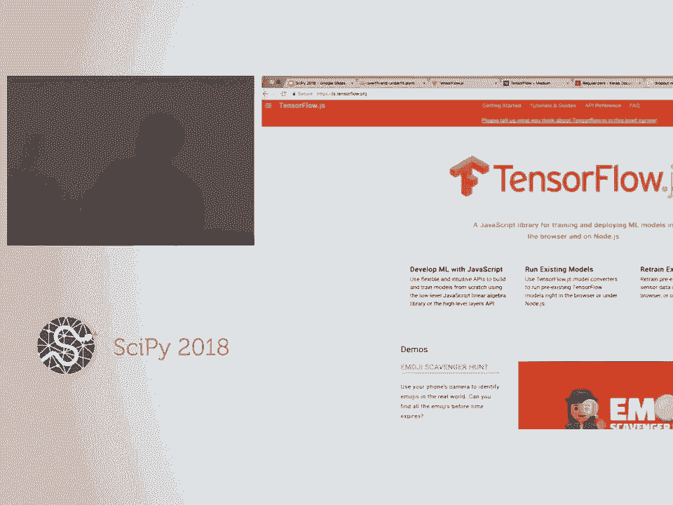

 And this is probably the wrong stuff for this audience， but I just want to show you some。

 things that this lets you do。 And it's all server side。

 Has anyone seen the Pac-Man TensorFlow Pac-Man？

 So I can show you this quickly。 We could get a volunteer if somebody wants。

 So what we're going to do is this is using an image classification model that we're going。

 to train in the browser。 And this is all client side。 So nothing sent to a server。

 And then we're going to use it to control Pac-Man。 And it's really， really cool。

 The reason I'm showing you this is that when I heard about TensorFlow JS， this was a classic。

 moment。 I'm like， oh， that seems silly to me。 Because training machine learning models is all about huge amounts of data and Python。

 developer。 And this didn't make sense to me。 And after I started seeing their demos， I was like， oh。

 giant fail。 It's extremely valuable because it means that for developers that want to try your models。

 they can just go to a web page。 There's nothing to install。 The models are just running。

 It also is really， really， really good for interactive ML。

 So ML is no longer-- it's just transitioned in the last year from basically desktop only。

 to also web。 And it's a huge difference。 Can I have a volunteer to try this？

 And then we will go to text generation with eager， which is really cool。 I can do it。

 but you've already seen my face so much。 I'm not sure you want to watch my face anymore。

 Thank you。 So the way this is going to work-- by the way。

 this uses a technique called transfer learning。

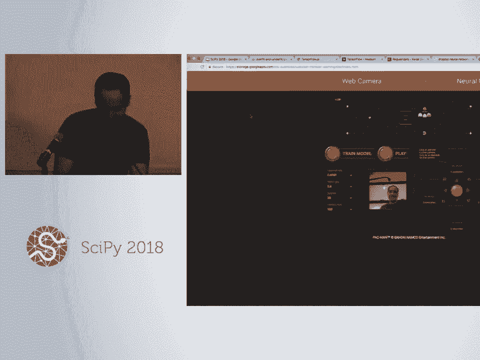

 Hey， I'm Josh。 W。 W。 Thanks for your help。 Yeah。 So under the hood。

 this is using a large image model that was trained on a generic data set。

 And what's going to happen is when Dobby trains it， he's going to customize it。

 So normally training a quality model takes a huge amount of data， but we're going to do。

 it with a small amount of data。 So the way this works is-- and unfortunately。

 you're going to have to get really close to， the webcam。 OK。

 So you're going to make-- and this is-- yeah。 So OK， so this is-- when you smile。

 you're going to have the model go left。 So what I'm doing-- so continue。

 And if you move your head around a little bit， you've got to collect lots of-- if you。

 move a little bit， so it's not perfect。 So we've collected 50 pictures of Dobby's smiling。

 So now let's have you step out of the frame entirely。 So when you're not in the frame at all。

 it's going to go up。 So I'm going to collect 50 pictures of nothing。 OK， smile。 So smile is left。

 Nothing is up。 And then we're going to need right and down。 So it's kind of dumb。

 So you might want to hold a phone in front of it or something。

 Or you hold your badge in front of it would work。 OK， so hold on a minute。

 Stick it in front of the webcam。 And now we'll make that--， I stick it right in front of the webcam。

 It's going to be a dumb model。 So badge is right。 And then we need something else for down。

 I don't think the model is that smart。 It might not be sensitive。 How about profile？ No。

 but then I won't be able to see。 You can put your hand。 You can go like that。 Oh， yeah， there we go。

 Do hand。 Hand is down。 OK， great。 So now we're going to train the model。 So if I just hit train。

 and we'll give it a second。 And so now the model is trained。 OK， I've got to grin。 And so yeah。

 so let's come up with a plan。 Because this is harder than it looks。

 So we're going to want to go left and then up。 And then left again。 OK。

 so it's going to be smile out of the way。 Smile。 OK。 All right， you ready？ Yeah。

 What could go wrong？ The record is surviving 10 seconds。 We'll start a second。 Oh， OK， it's up。

 So you want to go--， I was thinking。 I'd smile for a while。 Keep smiling。 Keep smiling。 Yeah。 OK。

 now you got to go right。 Oh， you got to go right。 [LAUGHTER]， [APPLAUSE]， All right。

 Thanks for your help。 Appreciate it。 But it's cool。 So yeah。

 the reason I'm showing you that is there's， a lot of value into running models in the browser。

 that I think is just not obvious。 It wasn't obvious to me。

 And it's probably not obvious to a lot of Python developers， too。

 So it's a good thing， FYI。 js。tensorflow。org。

 TensorFlow。js will bring it up。 All right， so I want to briefly mention Iker。

 And then Yash is going to show you， Text Generation， which is really， really fun using--。

 it's basically an example of how you can use lower level， tensorflow APIs on top of TF。

Kara's to do cool things。

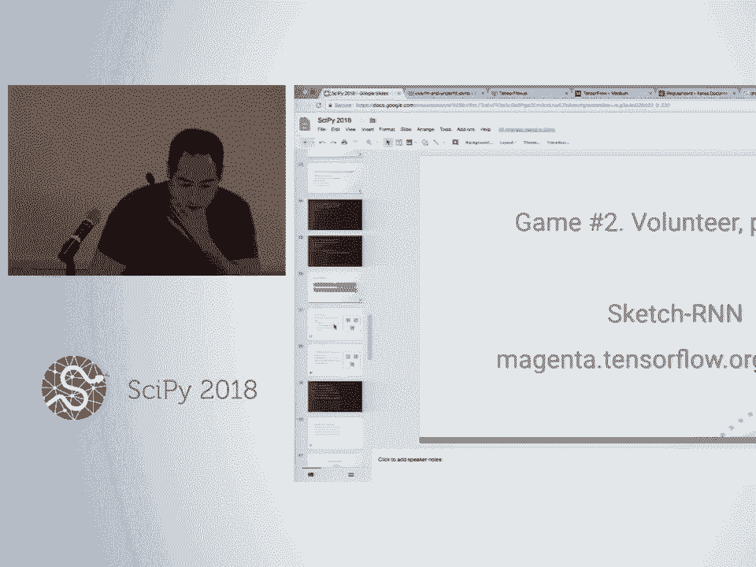

 So if you remember back--， so I showed you the evil way of writing， tensorflow。

 which you should forever ignore， unless you have a specific reason。

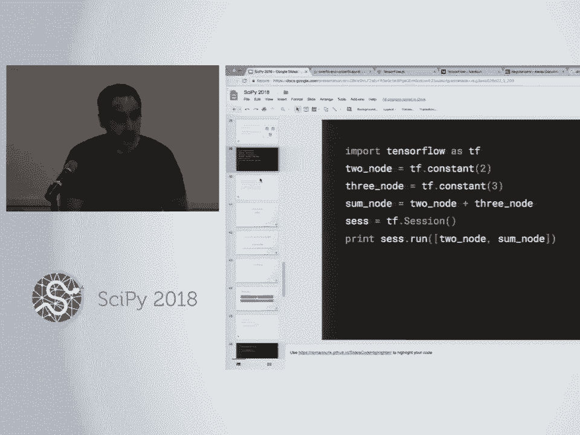

 And that's using deferred execution graph based code。 So there's something called eager execution。

 which， is a different style of writing tensorflow。

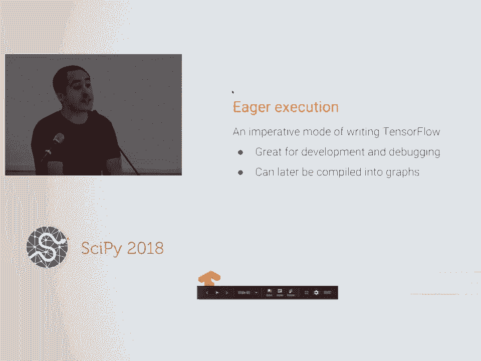

 that you can enable to turn off deferred execution。 So basically， when you import tensorflow。

 there's a magical line of code you can write， which， is enable eager。 And right now。

 you have to turn this on that might change down， the road。 But right now， you have to opt into it。

 So if you enable eager-- and this， has to be run immediately after you import tensorflow--。

 it will switch off this deferred graph based code， and just run like normal Python。

 So here's code where we're multiplying two matrices。 So we're using the low level tensorflow API。

 to make some constants， and then we're multiplying them。 But what's different in eager is you never。

 need to create a session。 So when you run code， it just executes， as it normally would in Python。

 So we've turned off the meta programming language。

 Eager basically means tensorflow just works like regular Python。 It's as you would expect。

 There's times when you want to turn this on。 Right now， there's a performance penalty。

 It's significant。 But it enables you to write certain classes of models。

 that are very difficult to write otherwise。 And it makes debugging much， much easier。

 because it's just regular Python debugging。 There's ways-- if you need to， there's。

 ways to interleave eager and graph level code。 So you can mix and match。

 but we're not going to go into that。

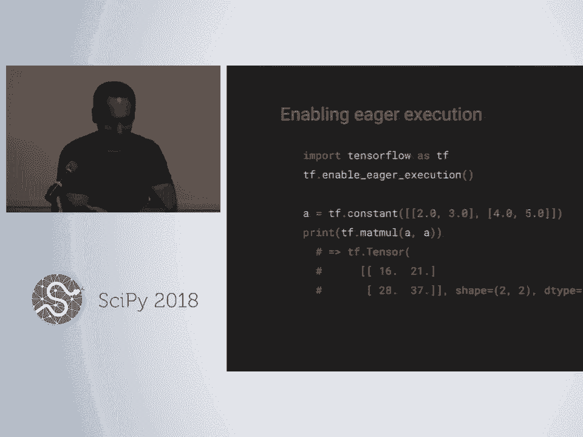

 But it's stuffing you down the road。 That's eager。 But if you want， I'm not going to hit the mic。

 And Yash is going to show us how you can use eager， with TF。KARAS。

 which is pretty unique and powerful。 Text generation。 Also， by the way， Yash is a summer intern。

 who has done ridiculously valuable work。 So in addition to writing this notebook。

 he also wrote notebook number six in this list， which shows you。

 how to end to end train in English to Spanish translation， model。 So it's awesome。

 It's really good to have you。 So in text generation， we will generate text。

 based on the Shakespearean style。 So the data set， which-- so here you。

 can see a sample output of what the model did。 So it's pretty Shakespearean。 According to me。

 I don't know that much Shakespeare。 But yeah。 So here we start off by importing TensorFlow。

 and enabling eager execution。 And then this is what the data set looks like。

 So this data set contains plays from Shakespeare， not the entire set， but some set。

 So we'll start off by downloading the data set， and then reading the data set。

 So the data set that you just saw was Unicode。 So we use this Unity code library。

 to convert it to Ascii。 And then so in text generation， what we are basically doing。

 is we are trying to predict each character。 So you just saw the text。

 So we will just give the model one starting character， and it will predict the next character based。

 on the previous character。 And then it has those two characters。

 and then it will predict the next character after that。 So that process just goes on。 So for that。

 we need all the unique characters， in the data set。

 So we just to sort it and create a character to index mapping， and reverse mapping。

 which does index to character。 So the model that we saw doesn't expect strings。

 So it expects numbers。 So let me just start this off。 Oh， sorry。

 So this is how you can download as Josh mentioned earlier。 So once you enable eager。

 if you run this cell again， it won't allow you。 It'll just throw an error。

 So you just have to restart the runtime and run that cell again。

 So this is what the character index looks like。 Yeah。

 So each character has a corresponding mapping index to it。 So the model expects numbers。

 So each character in the data set， will be converted to its own index。

 And that's how you'll train that model。 So here we said the maximum length of our data set to 100。

 So at a time， the model will get 100 characters， or 100 length sequence as an input to it。

 So here we create that。 So for example， let's say your max length is 9， and your input。

 your data set contains tensor flow。 So the input will be this thing。 Sorry。 Your input will be TNSR。

 SOR， FLO， and your output will be the next characters， each next character after that。

 So the model will learn to predict if you input T。 So the model will predict E。 If you input E。

 the model will predict 10。 So you'll learn those patterns basically。

 So we create the input text and the target text。 And then tf。data is a really cool data set API。

 that you can use to batch， shuffle， and do， you know， all sorts of things。

 And it has parallel-- so if you have a huge data set， you can do parallel processing using that。

 So yeah， I hope you try that out。 So we'll just create batches of data。 So right now。

 the batch size that we have given is 64。 So it will create 64 by 100 batches of data from this thing。

 So now here we create our model。 So we have an embedding layer， we have an RNN layer。

 and we have a dense layer。 So I'm not going to go into the details of what， an RNN does。

 but Amit has already explained， what an embedding layer is。 So in short， what embedding layer does。

 is if you have a word， say W。 So each word， will get a 256 dimension representation of that。

 So here we have defined embedding dimension as 256。

 So each word will have a 256 dimension representation。

 So TensorFlow has this really cool word to work thing， in which man-- let's say， for example， man。

 has some representation， woman has some representation， king has some representation， and queen。

 has some representation。 So if you subtract king to queen， king minus queen， and you do-- oh， sorry。

 not subtract。 If you calculate the distance of king to queen and man， to woman。

 they will be same or close to same。 So that's what embedding is。 So in our data set， each character。

 will be given a specific embedding。 So a 256 dimension representation of each character。

 and that will be passed via RNN layer。 In this case， it's a group。

 So GRU and LSTMs are two kinds of RNN that we use。 So the GRU will output--。

 will give an output as the output and state。 So output is the bad size--， as I mentioned-- sorry。

 the shape of the output， will be bad size by max length by the hidden size。

 and the output of states will be bad size by hidden size。 So this is complex。

 but let's run through that。 And here we'll initialize the model now。

 The main thing you have seen that in tf。kira， is the last layer has an activation as softmax。

 Because when you use model。compile， you put loss equal to categorical cross entropy。

 So the loss that kira's expects is softmax。 But when you do-- when you use tensorflow losses。

 like here we are using tf。losses， it， expects logits and not a softmax output。

 So whenever you use tensorflow losses， be very careful so as to not specify softmax activation。

 as softmax。 Otherwise， your model won't fail。 And it will fail， and you won't know why it will fail。

 Because it doesn't give an output like， hey， your loss is not wrong。

 So you have to be careful as what you give the output。 So let's set the output。

 And this is what a training loop looks like in eager mode。 So in eager mode。

 you can do all this funky stuff， or all sorts of flexible stuff that you want to do。

 Like loss masking as someone was asking me。 And doing gradient clipping and all those things。

 So you can do all that stuff in eager mode。 I'm not going to go into the detail of how this works。

 But yeah， we just loop through epochs。 And we loop through the data set that we created using tf。

data。 And we predict using--， we predict the input-- we send the input to the model。

 and we get its prediction and the hidden state。 We calculate the loss of the input and the prediction。

 and then we calculate the gradients， and we do a backprop and an updation step。

 And each epoch right now will take 23 seconds。 Give out， take-- let's just train it for 10。

 And this will take some time。 But--， OK。 So resource exhaustion。 OK。 So should I shift your account？

 [INAUDIBLE]， Yeah， yeah， OK。 OK。 So when-- as we have been running a lot of notebooks。

 the ram-- we didn't clear the ram at all。 So if this happens to you， you just， to bank L-9-1。

 [INAUDIBLE]， And if you want to know what's happening inside the training， loop。

 you can read this part。 Because this is pretty interesting。 We couldn't do this before。 In Keras。

 we can't do this stuff。 You can do this in normal graph execution tensor flow。

 but it's very difficult to do that。 So the eager mode allows us to do this flexible stuff。

 So you can read through this stuff， and you'll understand what's going on。

 But I would recommend reading what an RNN is first， and what it returns， and how the states work。

 Yeah。 Should I just switch the account？ Rather， we just exhausted the memory。

 on this particular collab instance。 I open everything weird open。 I'm on Reddit。 Nice。 Working hard。

 Oh， it's good。 Oh， great。 You might have to restart and run all the holding。 Great。 [INAUDIBLE]。

 Yeah， bang kill， hyphen 9， hyphen 1。 Any questions up till now before you start training？ Yes。

 Why do you have to create batches？ OK。 Is it because it's the giga-molden you have to do？ No。

 So the previous notebooks that you saw， those notebooks also did batches。

 We do batches just to speed up the training， because if you do one input at a time。

 you're not utilizing GPU to its full efficiency。 Right， but why do you have to do it like this。

 because you come to it like Keras， where you split it while you--， maybe batch one。 Yeah。

 so good question。 We are not using model。fit。 So in Keras， model。

fit has a parameter known as batch size。 As here， we are doing our own training loop。

 We need to create a data set before that and batch it， and then give it as an input to the model。

 [INAUDIBLE]， Yeah。 OK。 Now we're going to make effects。 OK。 I'll just switch。 Yeah， sure。 Yeah。

 yeah， yeah。 [INAUDIBLE]， Is it in full screen mode？ [INAUDIBLE]， Yeah。 [INAUDIBLE]， Yeah。

 [INAUDIBLE]， Yeah。 [INAUDIBLE]， Another quick question。 Yeah。 [INAUDIBLE]， Yeah。

 so that's a hyper parameter。 You can choose 128， 64， 1。 Yeah。 You just have to expand。 Yeah。 Yeah。

 there is no other option。 [INAUDIBLE]， You wanted five？ Five of us。 Yeah。 OK。 Let's do a run-off。

 Oops。 Nice。 So these are all hyper parameters that I've done。

 So units is the number of RNN units or grew units here in this case。 Bad size is 64。

 You can use 128 if your GPU or if Colab allows it。 It'll just train faster。 And embedding dimension。

 Yep。 And max length。 Yeah。 You can play with the max length。 You can either make it 64。

 That might lead to a good output than 100。 Yeah。 OK。 So we're just training right now。 So。 Yeah。

 So basically there's going to be two。 This is going to be coming。 So this is awesome。

 So basically there's going to be two takeaways from this。 The first is that it's fun。

 So there's a single line of-- so we'll be generating Shakespeare。

 when this trains because this is our first non-trivial model。 So it takes a little while to train。

 But the fun part is in addition to generating Shakespeare。

 you can have it generate text of any sort you like， by just changing the text dataset。

 So the only input is a giant text file。 So you can actually give it the source code that the Linux kernel。

 and it will generate Linux kernel like source code as an output。 It's really fun。

 And then-- so there's the fun takeaway。 And then the other takeaway is exactly like I was saying。

 this is a demonstration of how you can use the tf。charos layers。

 in combination with the rest of the tf stack。 And so in truth。

 this is something you'd only do really as an， undergraduate student like towards the end of a deep learning。

 class or if you're doing research or if you really want to go under， the hood。

 So it's always optional。 But it's as far as this is the best way I know of doing research， today。

 It's a really， really good combination。 What I like about tf。

charos is it's both the best API for beginning， and I think in this mode it's also the best API for research。

 So it's hit this really cool sweet spot。 Anyway， while this is chugging away。 Yeah。

 And to add to this point， you can also use this for debugging。

 So suppose you don't know the shape of an input to embedding， or what embedding outputs。

 So you can't particularly get shapes in sequential model。 It's difficult to do that。

 But here you can just do print x。shape and you'll get a shape in。

 the call method where you define the model。 If you just do print output。shape。

 it'll just print out the shape。 So basically it's just Python。

 You write code as you write in Python and it just works。 So it's really cool。

 You can use this mode for debugging and then just turn off。

 the trigger execution and you can use it using simple key rows。 So yeah， we have trained now。

 Let's do the prediction。 So for prediction here， here we are just giving the start string， queue。

 And as I said， we'll use this start string to predict the next， word。

 So it'll predict something and then we'll use the context of those。

 two words and we'll predict the third word。 So it's just feeding what it predicted back into itself and。

 predict the next word again。 Yeah， so that's what's happening here。

 So here we will predict a thousand characters。 Yeah。 So， okay， so as we've just trained for 5e box。

 But it did learn that Romeo should be capital and then you have a， semicolon after that。

 The first word begins with a capital letter of every sentence。 Yeah， I figured that out。

 There's a comma。 Yeah， and it's pretty -- it is Shakespeare-like。 So， yeah。 >> So it's interesting。

 So one thing to notice about this， so it looks like we're， stuck in some sort of loop。

 If we train for longer， that would go away。 I see it same time as you can again。 But what's really。

 really interesting， it ran for what？ Like two minutes。

 So remember when we started training this model， it's character， based。

 So it doesn't have any knowledge of what's a word。 It doesn't understand the notion of a word。

 It doesn't understand the notion of a valid English word。

 So in the amount of time we've trained it for， not only does it， have Shakespeare-like structure。

 but there's words -- some of them， are not words， like cursed with a cue。 But if you look already。

 the majority are English-like。 And so if you train it for a 30e box like we have it， it。

 generates text。 It's obviously not Shakespeare。 But if you squint your eyes a little bit。

 it's not terrible。 And if you run it on the Linux kernel source code， it will。

 spit out code that looks a lot like C。 Probably won't compile or mean anything。 But it's like。

 you can also try to wrap lyrics。 It's really， really fun。 It's a really powerful thing。

 And it's super fun。 Just get an ASCII data set and just replace the link and this。

 model will work out of the box。 So let's try W。 Print out something else。 Yeah。

 So that first line is not actually bad， right？ I mean。

 if you think of like a crappy poetry contest or something， but it's not that bad。 So if you want to。

 you can try adding another RNN layer making， the code more complex。 Yeah。

 Is it limited to the concordance that made up the primary， text or does it extrapolate？

 So the words that it has predicted are， you know， strange might be in the text。 So it might have。

 you know， learned from the text， but it's， character based。 So we don't know how it works。

 You can generate a word。 Yeah。 Unique word also。 If you just train it for one epoch， yeah。

 it'll generate a， unique word that you might not have seen。 Just like any other model。

 let's say we trained it for like 5，000， epochs。 Eventually， we just memorize the--， Shakespeare。

 yeah。 Something from the text。 But what's interesting about these models is before they've。

 memorized data， they're generating unique。 So they're really fun。

 Just try training it for one epoch and you might see one word， that as you saw previously。

 it coerced something like that。 That's not a word。 It just did something。

 There's also really a resource called Project Gutenberg。

 And Project Gutenberg has thousands of open-- I think they're， open source。

 I don't know what the license are。 I mean， there's thousands of open source that you can download。

 for free。 Do you have a license？ They're public domain。 They're public domain。 They're awesome。

 Expire。 Awesome。 So it has thousands of public domain books。 Thanks， Stephen。 Download it。

 You can train like an Alice in Wonderland text generation model。 Yes。 Hi。

 When I try to run that training step， it gives me the search stack， overflow。

 Is there anything I can do about that？ Can you repeat that， please？

 The training step gives me an error of search stack overflow。 Yeah。

 I can walk over and see what the problem is。 What option is Stephen restart the--， Yeah。

 restart the runtime。 Start the run like this。 I'll take a look。

 I just grabbed this link by the way off your GitHub。 It's like some。 Yeah。 Yeah。

 You might try switching to a different account or just do， bank kill， hyphen 9， hyphen 1。

 and then check if it works。 If you do bank kill， hyphen 9， hyphen 1， exclamation kill。 Anyway。

 what I recommend doing， let's take 10 minutes。 If you want， run it on Shakespeare。 It's fun。

 If this is your first time playing with R&N， you might as well。 If you want to swap out。

 try it from the set and you can run it， when you get home and generate some cool text。 Yeah。

 And then we'll figure out what to do next。 Do a next job。 Thank you。 Yeah。 [ Inaudible ]。

 One thing I wanted to point you to also -- oh， nice microphone now --。

 is for people that are working with structured data， building， models and structured data。

 especially in production， there's， a really excellent paper that I wanted to point you to， which。

 is related。 It's not really a paper in their traditional sense， so it's。

 what's your machine learning test score。 And I really， really like this paper。

 It was a workshop paper at NIPS a few years ago。 And what it is。

 it's just a collection of best practices and， bullet point form。 So it's not academic。

 but what's your machine learning test score？ And what's cool。

 it's just a bunch of tips and tricks for， developing models that you're actually going to use in。

 production。 And some of these will be obvious， like when you're running your， system。

 just make sure that your features aren't suddenly zero。

 So just have a test to check for all zero features。 And some might be not obvious。

 And they talk about different distributions of data and stuff， like that。

 But machine learning is relatively new still in production， and。

 best practices are still being understood。 And this is just a really excellent collection that's just。

 super， super useful。 And it's an easy read。 So just FYI。

 Another thing I wanted to point you to learning resources。 So these will be。

 or some variation of this will be on Tensorflow， at Oregon， a week or two。 But anyway， sadly。

 these are all Googly。 Man， I need to sleep。 You can Google all of them。

 I'm trying to say that you can't click on the links because I'm， projecting a Google doc。

 But here's some good educational resources。 So MLCC or machine learning crash course， my personal。

 opinion is it's excellent for concepts and skip the code。

 And you should wait a week and just use TF。Keros instead and， you'll be happier。

 This is a really nice course from Stanford that walks through， Tensorflow。 The instructor is great。

 Her name is Chip。 It might not be totally current。 Actually。

 it's almost certainly not current with our latest， APIs because we're just publishing them now。

 But it's still got a lot of really valuable content， especially。

 for background on how the other APIs we have uncovered today work。 This is a really。

 really excellent course from Stanford that， obviously goes into detail on image classification。

 But it also has a great section on K-nearest neighbors。 So it's a very。

 very high quality educational resource on， just ML101。 This book you should absolutely read。

 It's a book about the Keras API。 Wonderful。 It doesn't touch Tensorflow at all。

 It's just straight Keras。 But the Tensorflow version of the Keras API is a super set of。

 what you learn in this book。 So there's no wasted energy by reading the book。 That's great。 Yeah。

 This one is also very， very good。 But the Tensorflow section is now out of date。 However。

 the first half is awesome。 And scikit-learn is another really excellent library that is。

 worth your time to take a look at。 And then if you're academic， this is a really great book too。

 So this is more for PhD students or people that have months to， spend。

 But this is machine learning mathematically built up。 It's really great。

 Let me think if I have any other content for you right now。 Yeah。 And about whenever 1。9 is final。

 we'll update the docs。 So give or take a week。 Another good resource。

 I know I'm throwing like a million links at you。 Another good resource we recently had a developer summit。

 And if you search for Tensorflow developer summit， there's a， bunch of videos that are on YouTube。

 And you can listen to people like Jeff Dean talk about。

 There's actually some really good content here。 The keynote's worth a watch。

 And then there's also deep dives technically into areas that， might be of interest to you。 Then。

 yeah， this is basically the next steps。 It's way to week than go to Tensorflow。org。

 And then there'll be more content too。 So yeah， I think I'll be around and we'll all be around for a。

 while。 Basically and definitely happy to take any questions offline。

 I'm going to end this 20 minutes early because I know it's been， a long day so far。

 Thanks very much for coming。 Everybody really appreciate it。 Hope this was helpful。 And yeah。

 we'll be around。 Thanks。

 [APPLAUSE]， (applause)， Thank you。