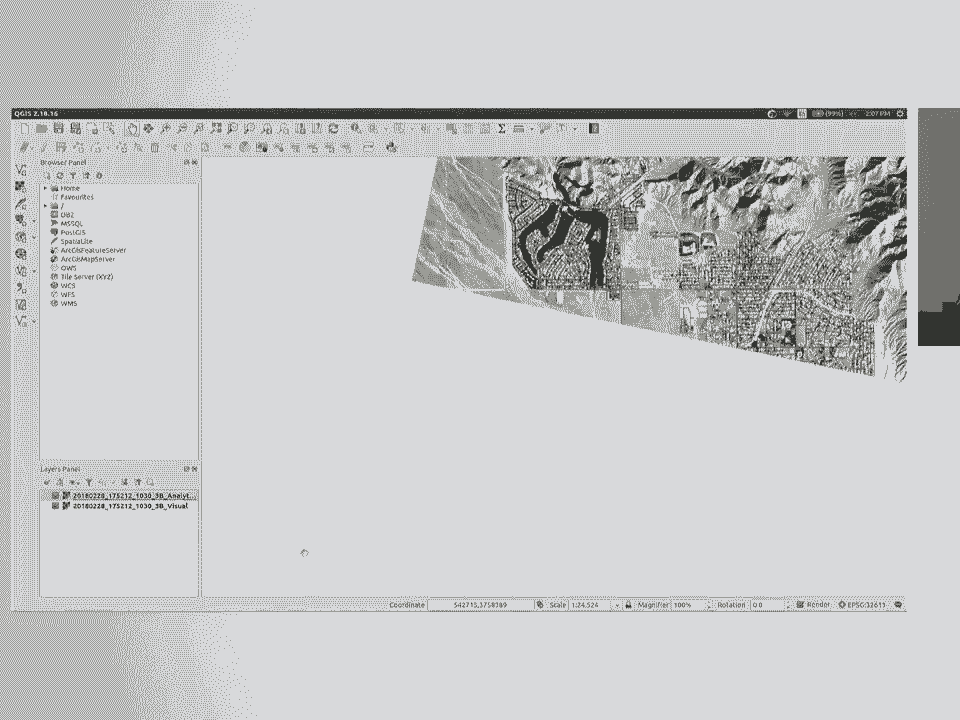
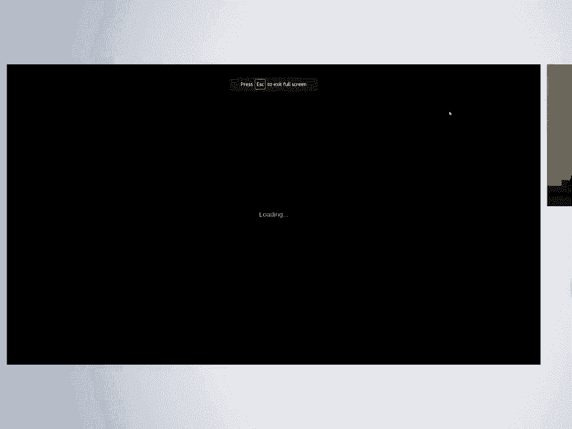
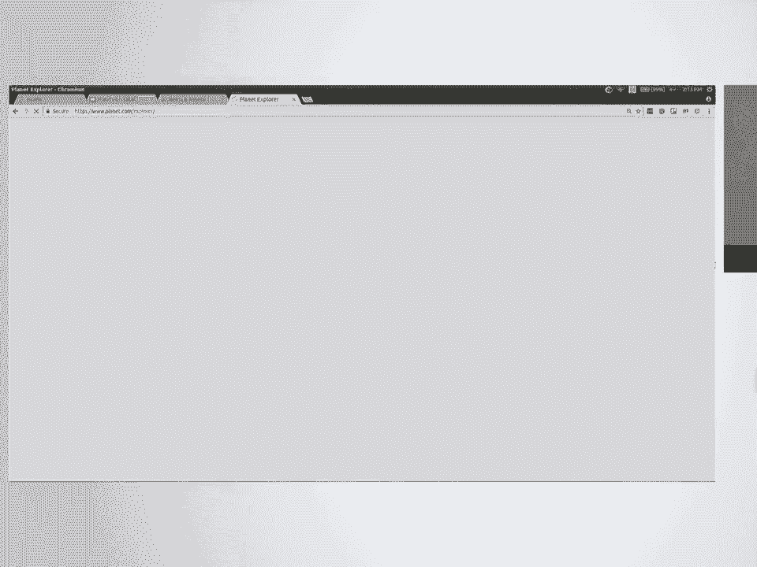
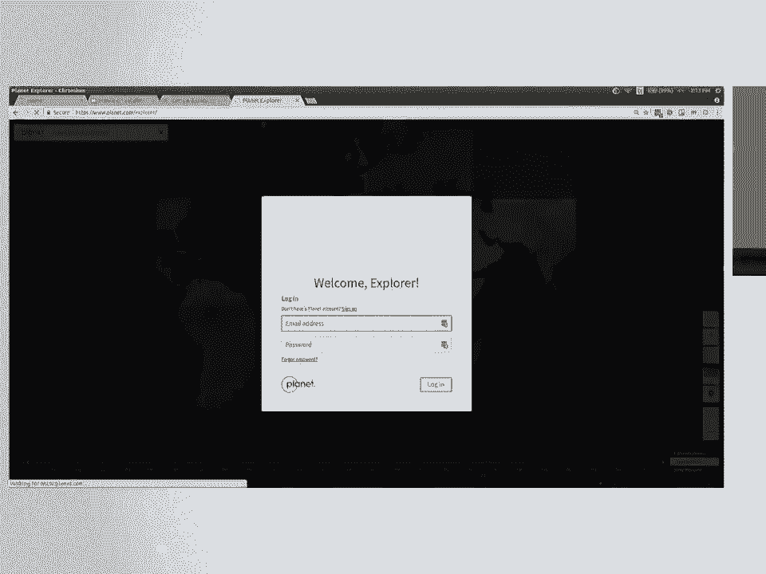
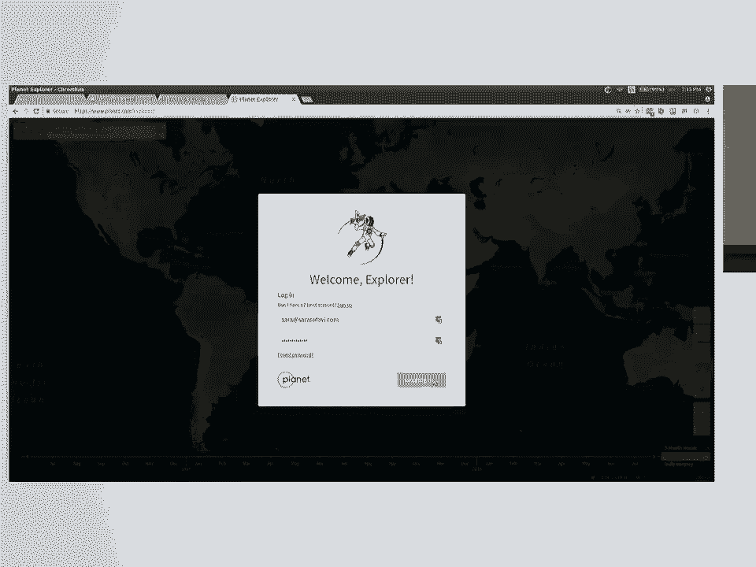
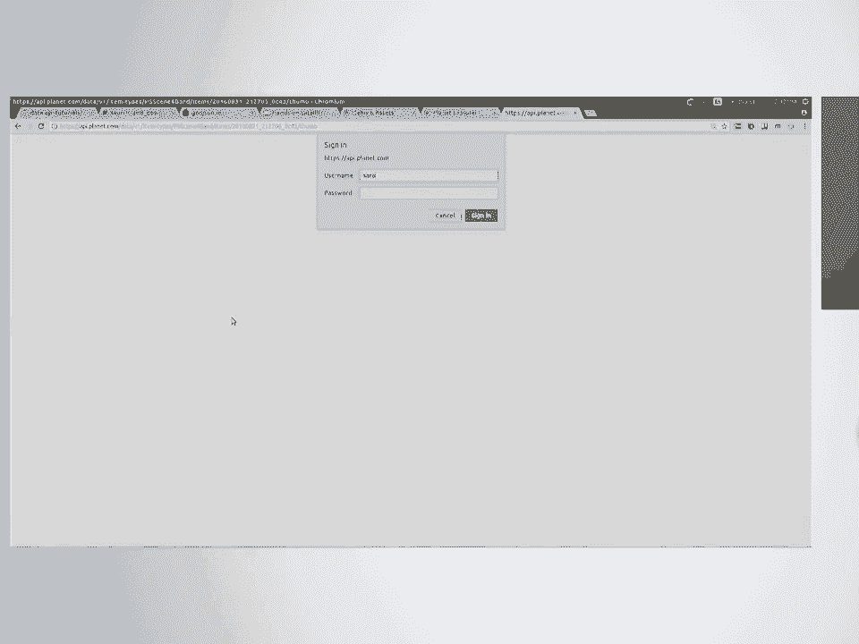
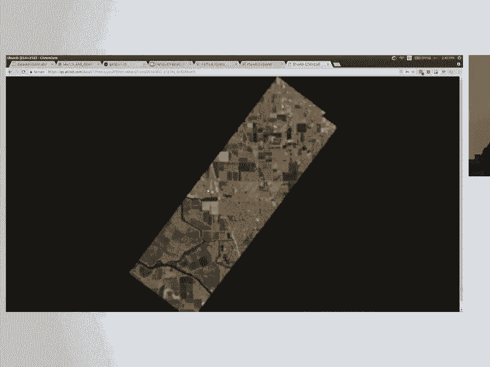
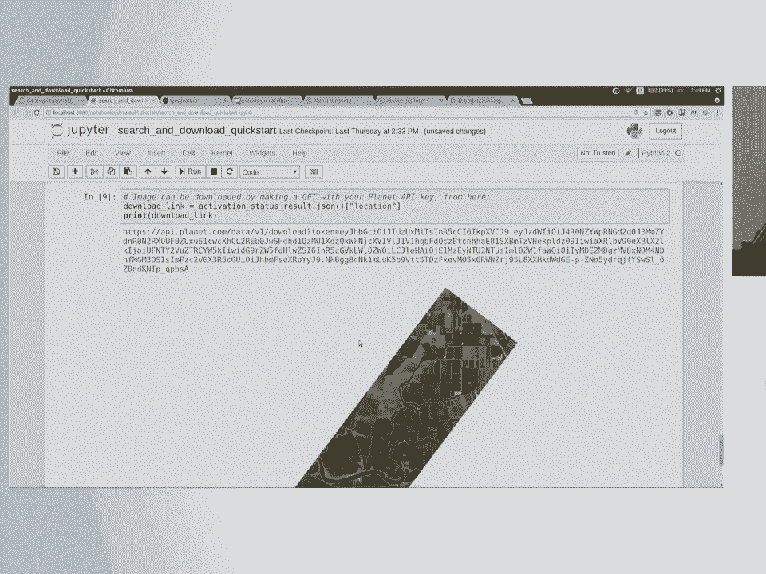
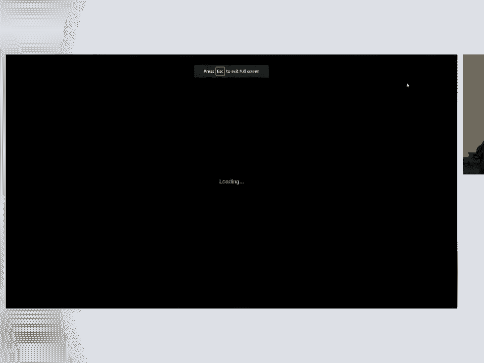
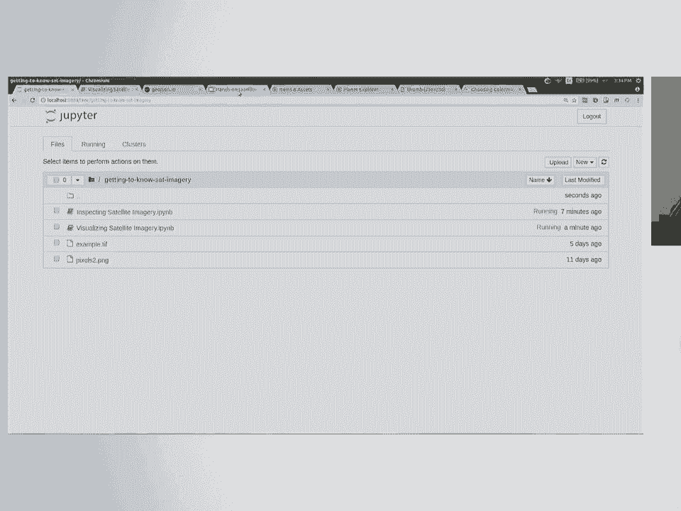

# SciPy 2018视频专辑 - P47：SciPy 2018视频专辑 (P47. Hands-on Satellite Imagery Analysis _ SciPy 2018 Tutorial _ - GalileoHua - BV1TE411n7Ny

 Welcome。 Thank you all for showing up。 I'm not Dana Bauer。 I'm Sarah Safavi。

 Dana Bauer was supposed to be here。 Unfortunately， she felt ill today。

 So she is currently either in her hotel room upstairs， hopefully sleeping or at the doctor。 So。

 I'm going to be doing my best to walk you guys through it。

 Please be a little bit patient with me since there's just one me and a lot of you。

 But if you do have trouble and need help and I don't immediately see you， feel free to yell。

 be really， big with your waves and all that because I might miss you。 But yeah， I'm Sarah Safavi。

 I'm a software engineer at a company called Planet。 And just to make my ego feel good。

 how many people have heard of Planet？ Awesome。 How many people have heard of Planet before you signed up for this tutorial？

 Hey， double awesome。 Cool。 That's really neat。 So for those of you that aren't familiar。

 Planet used to be called Planet Labs， also known as Planet Labs。 Basically what Planet does。

 Basically， what Planet does is they're a mature startup， I guess you could say。

 that builds and launches tiny satellites。 And they're not quite this tiny。

 but this is like a 164 scale model。 So they're basically the size of a large shoe box or I like to say a small corgi。

 And they're like， I think， 8 kilograms。 So Planet builds and launches these tiny satellites that look like this。

 more or less。 And what they do is they do Earth observation imagery collection。

 And I'm going to talk a little bit more about what exactly that means later。

 But basically the satellites are capturing imagery of the entire Earth's landmass every 24 hours。

 So we've got the entire Earth being imaged at about 3 meter resolution every day。

 And that's really amazing and unique and that's part of why I'm interested in working at the company。

 as a geospatial software engineer interested in spatial data。

 So today we're going to learn a little bit about Earth observation and satellite imagery in general。

 Broader than just the idea of planets data， but we're going to use planets API to access data。

 because we can get data that's not only planets data with one API。

 And so it's easy just to have one system to download all kinds of data。 To give me a baseline。

 anyone in here already worked with or familiar with satellite data。 Okay， why are you here？ No。

 I'm kidding。 Cool， that's good。 If you have no experience with satellite data at all or geospatial raster data of any type and if you don't know what that means。

 that's cool。 That's fine。 We're going to start basically at the beginning。

 I'm going to give you a quick and dirty introduction to what kind of data we're going to be working with。

 Then we're going to take a look at some of this data in a graphical interface。

 that QGIS program that hopefully y'all have installed。 We're going to use that to look at some data。

 And then in the second half of this tutorial after the break。

 we're going to use Python to work with satellite data。 So we'll start out by acquiring it。

 Hopefully some of us can use the API， but there's a demo data download that you've all been working on in case the API gets bogged down or this room's Wi-Fi gets bogged down。

 And then we're going to start actually manipulating satellite data and get interesting information out of it。

 So before I get started， anybody have questions？ Yes。 Yes。 Yes， there is。

 I'm going to get to this in a second。 I'm going to go ahead and pass these around。

 These are blank USB sticks。 I did not have time to put the data on it。 However， you can take one。

 copy data on it， and hopefully it helps。 I really hope there's enough USB keys to go around。

 If there's not， I will like buy you guys a coffee if you don't get a key because I feel really bad。

 Yes， question。 So if you type， if you copy paste that entire HTTP line with the token， it doesn't。

 what does it？ You shouldn't need Wi-Fi。 It's a local， local host。

 And I just might have a good idea that the user would not be able to use the phone。

 You could use different ports if for some reason that one's in use。

 You could change the 888 in your run command。 Thanks。 Dude back there's got you。 Awesome。 Thanks。

 Alex， by the way。 He's an awesome person who is helping us in the last minute。 Okay。 What's that？

 Oh no。 Okay， there's way fewer than I thought。 I was told there was 40 in that bag。 Yeah。

 I owed like a lot of coffee。 I'm sorry。 I did not count them。 If you don't get a USB key。

 definitely please come get swag and stickers。 People that didn't get USB keys get first pass。

 I'm real sorry。 I thought there was 40 in there and I was hoping that would be enough。

 Talk to me later if you really want one of those。 I'll try to get one mailed to you。 Okay。

 so any other questions before we get started on satellites？ Yes？ Okay， so a couple weeks ago。

 sometime in June， you guys got an e-mail。 You guys got an e-mail from SciPy organizers and it had information about prerequisites。

 The prerequisites were Docker， a clone of this repo， I believe， and QGIS。

 I believe that was the first set of instructions。 You got a reminder about that also from SciPy organizers a couple weeks after。

 Then last week you got two e-mails from me so you can search my name in your inbox that has additional information about going ahead and getting Docker built。

 If you're in the Slack channel for our thing， our tutorial， there's a bunch of information。

 If you run into problems you might be able to search somebody else had the same problem。

 I'll say it one more time for the benefit of the video and the class and all that。

 If you are starting from scratch right now and don't have anything set up from that prerequisite list。

 you might not， you probably won't be able to get it done in time to fully participate in the code when we get to that part。

 You're still totally welcome to stay。 There's a lot of things that are pain to set up which is why we use the Docker config。

 I can't guarantee that you'll get it done in the next few months。 But， Godspeed， if you're trying。

 hopefully most of you have it done so that we can write some Python in this class at SciPy。 Alright。

 a little bit about satellites and Earth observation。 I'm not going to go too deep on this。

 I just want to give you a basic idea of what is over our heads right now。 So， like I said。

 Planet has a bunch of these teeny tiny satts。 Planet has about 150 of them in geosynchronous orbits right now taking images of the Earth。

 But beyond planet， there's a bunch of other satellites out there。 Some commercial。

 a lot of government， and a lot of Earth observation sensors of different varieties。

 Anybody familiar with Landsat？ Most people have heard of it。

 Landsat is the longest running Earth observation satellite program。 It started in， I think。

 '71 or '72。 Had a different name back then than they renamed it， but it's the same stuff。

 So right now it's NASA and the USGS that run it， and there's two of them up there。

 Landsat 7 and Landsat 8。 Landsat 9， I think， is coming next year or the year after。 But yeah。

 that's the longest running Earth observation program。 It's pretty cool。 And that's US Gov。

 So all of that data is free and available to everyone。 The Sentinel program。

 I'm less familiar with the numbers there， but that's the ESA， European Space Agency。

 So there's Sentinel-1， Sentinel-2， and probably others that I'm not familiar with。

 But they are also government-run。 The data is accessible in different portals， obviously。

 than you would get US Gov。 data， but it's also out there。 And then， like I said， planets got 150。

 And there are other commercial， yeah， commercial， private， non-government satellites out there。

 Digital globe， for example， runs satellites that does Earth observation and so on。

 So different types of sensors。 Again， I'm not going to go deep on this。

 but the general idea that you should be aware of， is when I'm talking about satellite imagery。

 especially in the context of this class， you have to realize that satellites capture more than just light that's visible to your eye。

 So when we talk about imagery， we think about cameras on our phones， for example。

 But that's only capturing what you can see with your eye， so red， green， and blue color。

 But when a satellite sensor captures an image， it can see farther into the light spectrum。

 than we can， so it captures more light。 So there are a number of different bands of light spectrum that are captured。

 but today we're going to be talking about red， green， blue， and also near infrared。

 So near infrared is really commonly used in satellite data analysis， remote sensing。

 especially if we're talking about natural features of vegetation versus a natural man-made。

 like for example roads or buildings。 Near infrared light makes it really easy to distinguish those things on a satellite image。

 because of how much near infrared light is absorbed or reflected by the type of thing on the Earth。

 So again， you can go down a Wikipedia rabbit hole for days on this if you're interested。

 and there are a lot of cool things out there to learn more about light spectrum。

 and the type of sensors that are available on satellites， but just the TLDR is like。

 you can capture more with a satellite than you can with your camera on your phone。

 like beyond what your eyes can see。 And that's part of why Earth observation science and the act of creating Earth observation data。

 can be so useful to us。 But I guess I should define Earth observation data。 I've said that a lot。

 but you're like， what exactly does that mean？ It's probably pretty straightforward。 I mean。

 you're thinking about it's data that has to do with observing the Earth。 And that's basically it。

 But when we talk about Earth observation data， we're talking about data collected from a distance。

 over the Earth， which due to the shape of the Earth means that it's going to be either flying over the surface or in orbit。

 So Earth observation data is going to be captured usually by satellites。

 so it could be by airplanes that fly with cameras， cameras capturing imagery， that sort of thing。

 But we're talking about data sensed about the surface of the Earth from a distance。 Yeah？

 [ Inaudible ]， No， we would capitalize it as remotely sensed data or Earth observation data。

 but satellite data is captured by satellites， which are spacecraft in space orbiting the Earth versus an airplane。

 But the sensors could be similar and the type of data captured could be similar。 [ Inaudible ]。

 For the most part， we're going to focus on processing of satellite imagery。

 Some of those steps cross over to， for example， aerial imagery captured by an airplane。

 And I'll get into the similarities in a minute when we talk about rest or versus vector。

 but that is a good question。 In fact， let's go on。 How satellite data is captured？

 I talked a little bit about sensors already。 I talked about satellites being spacecraft orbiting the Earth。

 Characteristics of satellite data。 That's basically -- that's basically -- it can answer the question you're asking。

 Satellite data is just another flavor of what we call raster data。

 So if you worked -- anybody worked with geospatial GIS data at all。 Okay。

 so you're familiar probably with the terms raster versus vector。 Raster data。

 if you're not familiar， is just anything that's an image made up of pixels。

 just like a JPEG that you open up when you download cat gifts and open cat memes and stuff like that。

 Rasters are pictures。 Vectors are vector data made up of points lines and polygons。

 So it's the more geometric type of data if you're more familiar with thinking of geometry versus geospatial data。

 But satellite data is a type of raster data。 Specifically， it's a type of geospatial raster data。

 And it's unique in those respects in that -- as raster data， it's made up of pixels。

 It's not made up of points lines of polygons。 As geospatial data。

 it's not the same as a cat meme that you download and as an image。

 It has location information attached to it。 So cat gifts don't have location information。

 Satellite images know where they are -- where they are in relation to the surface of the Earth。

 So they have spatial information tied to them。 They have a coordinate reference system。

 And they are located somewhere on the surface of the Earth。

 That's the unique quality of geospatial data。 That's the only unique quality of geospatial data。

 So it's just data that has location information attached。

 So today we'll learn how to work with that specific type of raster data with Python。

 And we will try to stay a little bit on the surface of the morass of coordinate reference。

 systems and projections， but just know that they exist and nobody understands them。

 And they have to do with location information。 Any questions so far？ So far so good。 All right。

 cool。 Quick check-in。 Is the data still going around on our pin drive？ Awesome。 Great。 Good。

 Anybody having any trouble downloading it？ Let me know。

 I'll try to copy it off of my laptop and give it to you。 But it sounds like we're good。 Okay。 Oh。

 wait。 A little bit about geospatial data basics。 I talked about raster versus vector。

 I talked about what makes spatial imagery special。

 And I'm going to talk a little bit more about metadata。

 So I told you that spatial information has location information of some kind attached to it。

 It has other information attached to it in what we call the metadata。

 You're all probably familiar with the concept of metadata as far as files go。

 Specifically in GIS data， metadata is going to contain generally some of the same things。

 no matter what the data set or data type is。 So it's probably going to contain its coordinate reference system or projection information。

 So you know the mathematical formulas to apply if you want to transform the coordinates into。

 another projection。 It's going to contain for raster， it's going to have， for example。

 the extent like how， big， how much space does this image cover on that surface of the earth？

 How many pixels is it？ That sort of thing。 And this is all useful to us if we're working with it。

 And when I get you guys using the Python notebooks， we're going to mess with that metadata to。

 learn more about the information in the image。 So I wanted to get everybody looking at an image using QGIS。

 So let's see if this actually works。 If you've got data of any kind from that demo directory on your laptop。

 you should be， good to go。 We're going to open that QGIS thing that you guys installed and we're just going to take。

 a visual look at some of this data。 And we're going to see if my QGIS works because I haven't opened it in a couple of weeks。

 And I downloaded an update for it。 Okay， it works。 Cool。 So when you've got this open。

 raise your hand so I get an idea of the room。 What's that？ Okay。 About halfway。 Cool。 Cool。

 Getting there。 Awesome。 They came with QGIS？ I don't actually know what comes with it。

 I think it depends on where you get your installer from。 So sure， if you want to。

 So while people are maybe opening it for the first time or finishing downloading， I'll tell。

 you a little bit about what this program is。 Anybody in here worked with ArcGIS？ Okay。

 This is the open source version that's better than that that you should use instead because。

 ArcGIS is proprietary。 But basically， for those of you that aren't familiar， QGIS is， as I said。

 an open source， project。 It's a desktop GIS analysis tool。

 So you can do everything we're going to do on Python today here in QGIS if you prefer。

 but because it's a side pie， I'm not teaching you QGIS。 But it's really awesome， super convenient。

 And I highly encourage you if you work with spatial data of any type， whether vector or， raster。

 to use it or try to learn it。 And as an open source project。

 there's a ton of resources on the Internet。 There's some great YouTube series if you're into that type of learning for getting to。

 know it。 What I've got running right now is a little bit of an old version。

 This is the LTS that I recommended in Slack for UMac people。 I'm running Ubuntu， so I'm just lazy。

 I don't have any excuse for not upgrading。 But there's a newer version and it looks a little bit different。

 But we'll go ahead and get started。 So when you first open it， it's pretty complicated。

 Every button on the tool bar is already turned on。 It kind of is overwhelming。

 You don't really know what's going on。 What I want us to do is add a raster layer to our current workspace just so we can look。

 at it with our eyes。 So on the left-hand side， there's two things here。 If you hover over them。

 the top one is an add a vector layer。 It looks like a V。 It also looks like points and lines。

 Below it looks like a grid of pixels says add raster layer。 That's what we're going to do。

 I'm just going to pull up some random data。 You can use whatever you have。

 If you have anything that's a demo data file that you acquire today that has a 。tif extension。

 that's what we're going to open。 I'm going to open a couple actually。 Just codes。 So so far。

 this doesn't seem groundbreaking。 The reason I'm showing you QGIS is these raster files。

 these data files that you've gotten from， that demo set。

 if you tried to open them in your favorite image viewer， like Windows。

 image viewer or whatever you use， they might not -- they might look a little weird。 In fact。

 some of you might have tried to open them because you're like， this is a 。tif。 I know this。

 I can just open it。 It might look a little weird because those programs can't read all of the data that a。

 spatial satellite image has。 We're going to open it here in QGIS to get a better look at it。

 What I've pulled open right now is what we call a visual asset type and I'm going to。

 talk more about that later。 This is just data that contains red。

 green and blue spectral information。 There's nothing contained in this particular data set that's beyond what our eyeballs can。

 see。 I've talked about satellite data has， for example， red， green and blue data or multiple parts。

 of the light spectrum represented in the same image。 I haven't really told you yet how it does that。

 Think about raster image。 It's a grid of pixels。 Each pixel has a value。 Each pixel has a value。

 So far so good。 What do we want to do if we want each pixel to have multiple values？ For example。

 a value for red light out of the red spectrum， a value for near and for， red。

 a value for green and blue。 For geotiffs， geospatial raster images。

 we divide information into what we call bands， the A and Ds。

 A band is essentially a layer of the same image so we can stack information on the same。

 pixel area on the surface of the earth。 So each pixel can have one value for each band。

 This image that I told you has only red， green and blue light。 It's going to have three bands。

 a red band， a green band and a blue band。 It's actually going to be blue。

 green and red in the order of this image but it doesn't， really matter。 The order of the bands。

 by the way， is something contained in the metadata that I was telling， you about earlier。

 Usually also in the documentation that comes with the imagery。

 So this one here that we're looking at in QJS has red， green and blue。

 Each pixel will have a value for red， green and green and blue。 Because it's just an RGB image。

 QJS does a pretty good job of representing that to us。

 It looks like this is somewhere in the desert。 It looks normal。 The colors are right。

 But because those values are just numerical values for an amount of light reflected off。

 the surface of the earth， you could technically represent them any way you want it here。

 And QJS is something that allows you to do that。 We're going to use Python to do that as well。

 Let's right click on the data that you have and click properties。

 We're just going to inspect it using QJS。 And I apologize。 I say QJS， QJS， QJS。 Same thing。

 They just， people pronounce it different ways and I haven't caught up to the modern way of。

 pronouncing it yet。 So the first thing you can see on this general tab of the properties of the image。

 it's going， to tell you the coordinate reference system attached to this image。

 Now I know I told you I'm not going to drag you too far down this rabbit hole， but I'm。

 going to tell you that when we're talking about coordinate reference systems， there's。

 a universally accepted norm of using what we call EPSG codes to represent a system。

 So this code here for example is EPSG 32611 which is the Wigs 84 UTM zone 11 North。

 You probably can't even see that actually so it doesn't matter that I'm reading it because。

 it's so tiny。 But basically the EPSG code of the coordinate reference system related to the data you have。

 will be displayed here。 Hang on a second。 Let's see if I get this URL right。 I did。

 So I'm going to search EPSG 32611。 It comes up here。 Let's make it bigger so you can see it。

 It tells me it's that Wigs 84 UTM zone 11 North。 I can click it and get representations of it in different formats。

 So if you're working with spatial data and this is meaningful to you， this will be useful。

 If you're not working with spatial data frequency， this is not as meaningful。

 But it gives you well-known text format， gives you a project for JSON， different formats。

 for the production information。 So it's a useful site。 But I won't drag you much further down there。

 Can I see a hand or -- sorry。 I'm seeing things。 All right。

 So that's something you can get out of the properties here。 Let's see what else we can get actually。

 It tells us that it's a multi-band image。 It has three bands and it has automatically detected a red。

 green and blue band。 You could change it to different types of color schemes。

 You could define the values。 I'm not going to do it here because it's kind of a pain。

 But you can define， for example， exactly what you want red to look like in this image， which。

 we would call false coloring because you're adding a false color to represent it。 Later on。

 we're going to do some false coloring in Python to deliberately make certain information。

 in an image pop out visually。 But QJIS， most of the reason it's useful is you download a data -- a data set。

 a raster， file。 You can't just double-click the TIFF and open it in your image view。

 It's not going to show you anything。 So being able to open it in this QGIS desktop thing is how you're going to be able to take。

 a quick look at it， sanity check， make sure -- I thought I was downloading an image of， a dozen。

 This is all for us， so it must be the wrong thing。 Something like that。

 So QJIS is what you're going to use to do that。 I'm going to turn on a different layer real quick。

 So this image here looks a little weird。 It's the same location。 By the way。

 QJIS understands the spatial information attached to your image。

 So if this was not positioned on the same place on the earth， it would not overlap like that。

 So if you hover over an image at the bottom of QJIS， it has -- I'm pointing at my screen。

 That doesn't help。 At the bottom of the screen it says coordinates。

 It's going to tell you literally the coordinates of where your mouse cursor is on the earth。

 So if you're looking at projection that has latitude longitude coordinates， you can copy。

 that into Google Maps。 Go look at it。 This is not a lat long projection。 This is -- uses meters。

 It doesn't matter。 We'll talk about it later。 But basically your mouse cursor。

 QJIS knows where it is on the surface of the earth。 So I've opened another image here。

 Same location， same exact thing。 Let's turn that other one back on。 Remember。

 we were looking at the desert。 There's like a city over here on the west。 In fact。

 let me zoom in to show you that that's a city。 So yeah， there's a city， there's some water。

 some buildings， and then some really cool-looking， mountains。

 So I've got this other version of the same area， but it looks weird。

 So what I've got here is the first image we were looking at has three bands of information， red。

 green and blue。 The second image has four bands。

 It's got a near-infrared band added。 So the reason it looks weird right now is QJIS is assigning an arbitrary value to that near-infrared。

 value so that we can literally see it on our screens。 But it makes it weirdly colored。

 If you know nothing about the data you've obtained and you want to look at it visually。

 that is something you can look for。 If the colors look off， you've probably got more than just red。

 green and blue band information， going on here。 Let me look at the properties of this。

 Let me not look at the properties of this because I don't remember how to find it in， QJIS。

 But we'll do it in Python and I'll show you how to pull out that near-infrared information。

 But basically that's all I care about you guys learning about this particular application。

 how to open imagery， look at it with your eyes and get a very quick ballpark bit of information。

 about what you're looking at。 Does anybody have questions about this？ Cool。

 So I'm going to go ahead and close QJIS for now。 Close spatial reference， go back to the slides。

 Let's talk a little bit about getting data which we've kind of been working on already。

 I'll start at the bottom。 SneakerNet is a great way to get data。

 You guys have all been doing it in the last hour。 You're passing around data by walking it from one person to another。

 State imagery， geospatial， raster data is huge。 It's very。

 very convenient to just walk it over to a person versus emailing it to them。

 That's something that happens。 But beyond that， obviously you don't necessarily have physical proximity to the people with。

 the data that you want。 There are other ways to get it。 AWS， everybody here know what AWS is？ Cool。

 Good。 AWS has a great open data registry。 It's a bunch of S3 buckets that host data。 In fact。

 let me pull that up real quick。 It looks like this。 It has Landsat 8 data。

 I told you about Landsat earlier today。 It has Sentinel 2 data。 I told you about Sentinel from ESA。

 It has other things， but those are the main data sets of satellite imagery that I know， of。

 Let me click into Landsat for you。 There's documentation you can read。

 But basically everything is going to have a very long S3 URL。

 The problem with getting things out of this registry is it's a really big pain to figure。

 out the indexing scheme and acquire lots of search for and filter data。

 If you know exactly where you're going， that's cool， but it's hard to search and filter。

 It's just a bunch of static files in S3。 But it's great because this is a mirror of all of the Landsat data。

 So it's free。 It's available。 It's easy to get。 Same for the Sentinel data。

 So what was I going to talk about here？ VFS and Cogs。 So VFS， a virtual file system。

 Does anybody know what I'm talking about when I say that？ Kind of sort of。 Don't worry。 Nobody does。

 S3 uses a virtual file system to serve a special type of satellite data called a cloud。

 optimized geotiff or a cog。 And the thing that's really cool about that is， as you might expect。

 it's optimized for， the cloud。 It lets you access sequentially-- trying to figure out how to explain this。

 Sorry， forgive me。 Basically you can use ranges in your Git request to obtain a part of the image。

 So like the beginning of the image， for example。 This is really useful when you've got giant files and you don't necessarily need to get。

 the entire thing。 So cloud optimized geotiff makes it easier to organize the data and serve it to get requests。

 based on a range being requested。 So this data that's in S3 under the AWS Open Registry is all-- as far as I know it's all。

 at least the newer stuff is cloud optimized geotiffs。

 There's a tool that we are using tangentially today called GDAL。

 We're actually using a wrapper around it called REST-ERI-O。

 And it natively understands these cloud optimized geotiff resources by URL。 So the driver in GDAL。

 if you use GDAL， is called VSI-Curl。 I'm not going to go too far down-- well， yeah。

 I'm not going to go too far down VSI-Curl， today。 But I just want you to know that it's there。

 It exists if the idea of cloud optimized geotiffs interests you。 It's a keyword that you can Google。

 It's an open source thing。 Lots of good documentation。 But we're going to use REST-ERI-O today。

 And if you were using REST-ERI-O to fetch imagery from something that serves cloud optimized。

 geotiffs， it's going to use that driver in the background。 Questions about the AWS registry？ Cool。

 It's a really great resource if you need Landsat or Sentinel data。 It's all there。

 It's all served as Cogs。 Well， most of it。 It's just hard to find what you want。 But for example。

 if you need a test image to test something out， you'll have a reliable。

 URL that you can use to reference it。 But now I'm going to move on and talk about Planets tools for searching for data。

 because， I work for them and they pay for me to be here。 And you guys all got API keys。

 I'm only going to talk about CC by SA data， so Creative Commons license data， so it's all， open。

 You have to get an API key to get it， even though it's open， just so we can limit your bandwidth。

 But we're going to only talk about open data today。 A little bit about how data works in Planets。

 Actually， I'm not going to do this yet。 I'm going to change my own mind。

 Everybody that has an account to get an API key should be able to go to this website， planet。

com/explorer， which is not going to load because I'm showing it to you live， because。

 it's all slow here。 So I've got to log in。

 All right。 This is the browser interface to the API we're about to use。

 I'm starting here just so we can look at things， because when we're talking about spatial。

 information， it helps to orient your brain by looking at literally a picture of the earth。

 So you all should be able to see this if you go to planet。com/explorer and log in。

 What it's going to do is allow you to zoom in and search for data through the browser。

 So I talked about the CC by SA data。 Planet has this--sorry， I was loud。

 Planet has this thing called the Open California program， and that's what we're going to use， today。

 You can read more about it on developers。planet。com/open， which I wrote。

 But basically the idea of the Open California program is that all of the data in the state。

 of California is released as CC by SA data on a two-week delay。 So planet--remember I told you。

 does this daily cadence earth observation， so you can。

 get everything starting two weeks ago going back in time to the beginning of our data collection。

 for California。 And all of that is CC by SA， which means if you're an academic or a student and you want。

 to do research， you can do everything you want with that data， publish it， no problem。

 If you're a developer or an MLAI， not an MLAI person， and you're interested in that sort， of thing。

 you can develop your programs or your algorithms using this data and publish， it at will。

 Or you can learn about it in a tutorial like today。 So this Explorer interface。

 this browser interface， I'm going to zoom into California， because like I said。

 we're talking about California data。 It's going to let me tell you a couple concepts。

 keywords that we're going to use later。 So the first thing we want to do if we want to search for data。

 and this is not a planet， specific term， this is a term that applies across anything you do with geospatial data。

 information， we want to define our area of interest。 So as you would expect。

 it's the area of data that you're interested in looking at。

 The AOI is the bounding box that of the part of the earth， the footprint on the earth that。

 you want to get information about。 This is how we constrain searches， for example。

 or constrain searches or filters， that sort， of thing when we're acquiring or looking for data。

 So we're going to define an AOI here in Explorer using the tools here。 So does anybody in Explorer。

 by the way？ Hey， cool。 All right， so if you want to follow along here on the right。

 there's going to be this tool， that's drawn an area of interest。

 You can hover over it and draw different shapes， but I'm just going to do a rectangular one。

 because that's easy。 And where do I want to go？ I'm just going to kind of zoom in here。

 I'm going to draw a rectangle here， and it's going to zoom in。 So this allows me to begin a search。

 Now， interest， I can search for data in this area。

 I'm going to walk you guys through this a little bit because later on there's going to。

 be an exercise where you can choose to use Explorer to visually acquire data yourself。

 But basically， I'm just going to show you the interface。 On the left。

 you've got filters that you can apply here。 Let's see if it makes this a little bigger。 All right。

 cool。 On the left， we've got filters。 Up here， I've got a date range selected。 Remember。

 I told you there's daily data available。 It goes back to like-- ignore that。

 It goes back to like 2015， I think， we started collecting imagery。 So it's not complete。

 2017 is last summer's where we started having complete daily coverage。

 But you can get patchy deep info back to like 2015。

 But I'm going to constrain this to the month of-- well， that's not good。

 I'm going to go like the month of July of the last summer for really no reason。

 I'm just setting an arbitrary date range。 I'm going to let it load some results there。

 But then I'm going to-- in this dropdown， you can pick daily imagery。 You can also pick mosaics。

 I'm going to explain a little bit more what a mosaic is later。 But essentially。

 it's just a bunch of imagery aggregated and stitched together into a single， flat base map。

 But right now， we're looking at daily。 I'm going to set some filters here。 You can click this。

 I'm interested in information or data that doesn't have much clouds。

 So let's say less than 30% clouds or less than 31% clouds。

 I don't want information with clouds in it because that's not very useful to me and it's。

 not pretty。 So I'm going to ignore that。 I want information that covers my area of interest at least halfway。

 So I'm going to set my coverage 51 to 100%。 All of these little sliders I'm demoing here in Explorer right now because in a minute when。

 we start using the API， you're going to be specifying these filters programmatically。

 So this helps you understand visually what they're doing before you apply them in Python。 And also。

 if none of this makes sense or it's boring， feel free to let me know。

 I'm going to ignore these filters for now because I don't really care about them。

 But if you did care， you could set those as well。 And then the last thing I'm going to look at is the source。

 So something to note about imagery that you're getting out of the planet API。

 It's going to be categorized based on item and asset。 Let me see if I've got that on the slides。

 Yep， item and asset just so you know what I'm talking about。

 The item is basically going to be the type of sensor that it was captured with。

 The asset is going to be the type of image that came from that sensor。

 These words are a little confusing， the reason I define them is they're planet specific。

 not Python specific， planet specific。 And when you're searching for planet data。

 you're going to come across the words item， and asset a lot。

 And it's just a quirk that you have to have to learn。

 So an item is going to be this type of sensor that captured it basically。

 It's a catalog entry in our giant data catalog。 The satellite sensors that we have are these sources here。

 So planet scope， when I talked about these tiny satellites that we call doves， the sensor。

 is a planet scope sensor。 So planet scope is talking about these satellites。 Forband。

 like I told you earlier， is going to be red， green， blue and near it for red。

 Three band is going to be that visual data that's just red， green， blue。

 So that's the two kinds of item that you can get out of this satellite。

 We have other satellites that you can get information on。 Like I said。

 you can get Landsat information here。 You can get sentinel information here。

 But then planet also owns rapid eye and sky set satellites。

 They're just different types of satellites。 Rapid eye and sky set don't have the global coverage on a daily basis。

 So I usually ignore them。 But they're cool。 But right now I'm going to look at four band planet scope data。

 That means I want to look for data that has red， green， blue and near it for red。

 Comes out of one of these and covers my area of interest， doesn't have much clouds， meets。

 my time box of July 2017。 So these are the filters I want to apply。 I'm going to let that go。

 And what's going to pop up here on the left is going to be that data。 July 31st looks like that。

 July 30th takes a minute to load。 Looks like that。 Should load completely。

 It tells me it has 100% coverage。 I'm not going to click a lot of them because this is so slow on this Wi-Fi。

 But basically what that lets me do is preview every single day that matches my results。 For example。

 look， we've got actually July in this area wasn't very cloudy at all because。

 we've got imagery almost every day。 5， 4， 3， 2， 1。 Oh。

 the 20th must have had some clouds because we skipped it here。 The 18th had some clouds。

 That's what you can see there。 But let's say I want to download this imagery here。

 Let's download the 31st for no reason。 I'm going to hover over。 I'm going to click this button。

 gray button on the right， tells me how many images are， in this stack。

 And then I can hover over each one。 Notice that one image doesn't completely cover my area of interest。

 It takes two in this case to cover it。 This is because when any satellite adubber anything captures imagery。

 obviously it's， not taking one seamless video。 It's taking pictures。

 So just like if you're taking a picture in your phone， what's it called where you do。

 a mosaic and stitch it together， that sort of thing。 Anyway。

 it's going to take a bunch of images that slightly overlap with each other and。

 they're side by side。 And that's just how image collection works。

 So if you want to work with the large area of interest， you're probably going to end。

 up stitching images together。 So when I said I was going to tell you what mosaic means。

 that's what we're talking about， here。 These images that are adjacent。

 taken by the same sensor at the same time， well within， a few minutes。

 but they are not yet stitched together。 That process is called mosaicing。

 We may also call it compositing。 We're compositing images。 So here in this Explorer interface。

 July 31st takes two images to cover my area of interest。 If I wanted to download them， by the way。

 there's another set of images on July 31st that if， you can go down here， they barely cover。 Well。

 this one barely covers and then this one covers at a different angle。

 They have a different timestamp。 But let's look at this one here。 If I want to download it。

 oh that's not what I want。 Sorry。 If I want to download it。

 I go down here and I click this order items button。 It's called making an order， which is confusing。

 but you make an order in order to download it。 And what you can do here is select which of these pieces of imagery within your area。

 of interest you want。 You type in a name for your order and you click place order。

 It takes a few minutes and then it pops up a message if you're still looking at Explorer。

 also sends you an email saying your order is ready to download。

 The reason this takes a minute is all of this imagery is stored kind of in cold storage。

 It's not immediately hot and ready to download。 So it activates it and makes it accessible on a public download link which is temporary。

 link and then it tells you where that is。 The reason I'm telling you all that is when you use the API。

 you're going to have to do， the same thing。 Activate imagery， make it downloadable。

 then access the download link。 All right。 Yes。 Oh， good question。 Analytics is going to be。

 well actually it says it down here at the bottom。 Good， so I don't have to remember。

 Analytics is going to be orthorectified which means it's corrected for the position of the。

 earth that it's on in the coordinate reference system and it's going to have that four bands。

 of information。 Basic is just not corrected yet， not orthographically corrected or the rectified。

 So if you want to do that yourself you would get the basic。

 For our purposes here and for my purposes on my own I never download the basic。 I never get it。

 I just let the post processing take care of the orthorectification for me。 Yeah。

 Any other questions？ Okay。 It's been about an hour。

 Would you guys like a break now or go on and work a little bit with the API？ All right。

 I was going to say first person to speak gets to vote。 So cool。

 We'll do a little bit with the API and then we'll take a break。

 I think they'll like put out the snacks and stuff。

 So those of you that have the notebook server up and running， make this bigger so you can。

 see it real quick。 Can you read that bottom line？ Okay， good。 The yellow shows up。

 That's the notebook that we're going to use。 I'm going to walk you through that just to do an example of using the API to get familiar。

 with getting imagery。 I'll leave this up a second so you can navigate to it and then I'll pull mine up。

 Cool。 All right。 I'm not used to teaching a tutorial where I have to stay behind a podium。

 This is very weird。 I used to walking around。 Oh， is mine running？ It is。 There it is。 All right。

 Ignore the fact that this is a Python 2 notebook。 It's just because I wrote it like last year but you can totally do all of this in Python。

 3。 Is that legible？ Let's go a little bigger。 So things we're going to do。 Oh， by the way。

 raise your hand if you need a few more minutes to get this notebook up。 All right。 I'll wait。

 I'll talk to you about what we're going to do。 What's that？ You don't need the data to do this。

 In fact， this is going to acquire data， which is why it's a good thing to do before you。

 go take a break because you hopefully it will download while you're using the bathroom。

 and getting a snack。 Hopefully。 If it doesn't， that's why we have the data。

 So what we're going to do once you get this notebook up is we're going to define an area。

 of interest like we saw that I did in that browser interface。

 We're going to save the coordinates of that area of interest。

 So what we're going to do is format it as GOGson data that we can send over the wire， to the API。

 We're going to set up a couple filters just like I did in that browser interface。

 We're going to search for things that match those filters。 We're going to activate。

 which is the step of basically placing that order via API， telling， it， hey， I want this data。

 pull it out of cold storage， bring it to me。 And then once it's activated and ready to download。

 we're going to initiate the download。 I'm using requests for this。 This whole notebook is requests。

 If for some reason you prefer like our look to or whatever， go for it， but I'm not going。

 to walk you through that。 I know satellite data is boring。 It's fine。 Okay。

 Anybody still waiting on the notebook to get up？ Cool。 We're ready to go。 All right。 This is a demo。

 I'm using an arbitrary location near Stockton， California because that's what happened when。

 I zoomed in in the browser or in the thing I'm going to show you in a minute to define。

 the area of interest。 Could be anywhere。 To get an area of interest and get GOGson coordinates。

 I'm going to use a website called， GOGson。io。 So you can click the link in your notebook。

 You can type it in。 Do， do， do。 Slow。 GOGson。io is really great。

 You can do one thing really well with it。 You can draw a box and generate a GOGson file。 It's great。

 You can draw more than a box。 You can draw shapes。 Oops。 And also great。

 Everyone here is probably familiar with JSON。 Cool。

 GOGson is JSON with location data added to the spec。

 So you can put data in it just like with JSON but then the spec also handles coordinates。

 What it calls geometry。 I used to have a nice URL。 I guess it's just。org。 Yeah。

 You can go to GOGson。org and click through and read the RFC if you're into that to figure。

 out more of how it goes。 But bottom line what we're doing is putting coordinate information into JSON format so。

 we can send it over the wire。 So GOGson。io is what I use to generate a square area of interest for this demonstration。

 I'm not going to make you guys do a separate one although you could。

 You could also download the one that I got here。 Actually feel free。 Take a minute。

 Define your own area of interest。 I recommend something small。 Notice how zoomed in。

 I am on the city because you don't want to get like a thousand images in your result。

 Remember to keep it in California so that you can make sure you have CC bySA results。

 And when you have an area of interest to find that you like there's a save menu at the top。

 of GOGson。 I owe save it as GOGson。 I'm going to give you guys like two， three。

 five minutes to do that。 Okay。 Anybody want a few more minutes for this GOGson work？ All right。

 Sounds like we're good。 Cool。 So hopefully you have either defined an area of interest or decided to just use the demo。

 one here which is fine either way。 But bottom line you want to be able to grab out the geometry。

 So we want only that coordinate information。 Here's my Python line where I'm saving that geometry that coordinate information to GOGson。

 geometry far。 This is my bounding box shown up here。 You'll notice I have five points。 One， two。

 three。 Let's make sure I didn't lie to you。 Yeah。 You'll find the box because you've got one， two。

 three， four and then you end at the same， place you started。 In fact。

 if you compare the last line of numbers to the first line， it's the same。

 So if you drew a rectangle you should have something like this。 But basically go ahead and do that。

 If you want to use the demo data that's in this notebook just run that block as is。

 If you want to insert your own AOI just replace those coordinates， no problem。 Being copacetic。

 awesome。 So now let's set up some filters。 I'm going to talk you through what this block is doing before I actually run it。

 But I cheated by writing it out so I don't have to type it while you're watching me。

 So first what we want to do， we want to make sure we get images that overlap with our AOI。

 We don't just want to search every image forever on this globe。

 So we want to make sure we attach our GOGson geometry object or dict that we just made， above。

 And we want to set up the filter to filter for that。 Now you can go read the API docs later。

 In fact， I highly encourage you to do that。 But you can just trust me that this is the name of the。

 this is the JSON keyword that， you pass to set up a geometry filter。 It's camel case， it's ugly。

 geometry filter。 Then you just stick your coordinates in there。

 So this is going to set up a filter to only search for imagery in our area of interest。

 Now let's set up a date range。 Date filters are kind of a pain because you have to use the long date format string。

 So you can copy this one if you feel like searching。 What am I doing here？ Everything between。

 everything that happened on like August 31st， 2016。 So I've got a one day window I'm looking at。

 You can expand that window if you care。 You can change the dates if you want。

 I did not bother specifying specific times but if you really felt like it you could。

 And what we're doing is looking for date acquired。

 So captured by a satellite on this or within this window， this date range filter。

 That acquired key is a metadata field value attached to the image itself。 Which is nice。 But yeah。

 that's pretty straightforward other than the fact that it's ugly。

 And let's also set up a cloud filter just like I showed you in the browser。

 Let's only get things that have less than 50% cloud coverage。 So less than 。5。

 That's the annoying way of setting up a filter here。

 We're going to call it a range filter over the field cloud cover specifically。

 And the very last thing we're doing in this block is just combining all our filters together。

 so that they all apply inclusively， not exclusively。

 So it's like the cloud filter and the geometry filter and the filter all apply together。

 So we combine them in what we call an and filter。 All these filters are defined in the documentation。

 Don't worry you won't memorize them。 You'll just go look it up every time。 That's what I do。

 But I'm going to run this。 See if it ran。 Okay it ran。 So now I've set up filters。

 I haven't done anything yet。 I've just saved a bunch of text and JSON。

 So let's actually do a search。 So I already talked to you about items versus assets。

 For this demo I'm going to search PSCEN 4-band。 So I want that 4-band planet scope image and I'm going to get analytic。

 Now again you can go read the documentation and find different types of assets。

 Don't worry I don't expect you to remember that。 You should be able to click this link and it will load and tell you all the different。

 item types and asset types that you can request。 Actually that's the old documentation。

 I should give you a link to the new documentation。 That's fine。

 Now let's actually set up the search。 Now before we do this any questions about what we've done thus far。

 Everything makes sense。 We haven't really done anything yet so it should make sense。

 Alright so we're going to pull in what we want which is request like I said。

 If you're using the Jupyter Notebook environment your API key is already there because of that。

 Docker run command you did。 It's already there as an environment variable for you to access so you don't need to type。

 it in here。 I don't need to see it。 You don't need to see it。 Just access it like so。

 Can you see this code？ Well you can see it on your own screens。

 Alright so we're going to pull in our API key to make our get request。

 We're going to specify that we want PSC4 band so we want to plan scope 4 band item type。

 We're going to set up our request object。 So if you recall when we were looking and exploring the browser that drop down you can。

 select daily imagery or one month mosaic or three month mosaic。

 Those are the different intervals of data that you can request。

 So here I'm going to define day as my interval because I want daily imagery。

 We're going to make a list of all the item types that we want。

 In this case we only want PSC4 bands and we're going to apply our filter。

 Then we're going to just set up requests requests request and then we're going to look at it， here。

 So let me write it see if it works see if I get an error。 Great。

 This is what you should get back something like this。 If anybody does not get this yes what's up？

 Okay。 It does。 Then make sure you are using the correct environment variable name here。

 It is make sure print planet API key here make sure you've got something there。

 And make sure you're calling putting planet API key here。 And you're getting an error？

 Everybody else were you able to get results or error？ I want to know results cool。 Error。

 Couple errors couple results what error？ It's a string but it got injected into your docker image with that run command。

 If you're not using docker yes just a string。 Yeah API key between quotes。 Yes。

 Oh yep yep those of you that are getting errors you probably ran that run command。

 Using the square brackets make sure you've only got single quotes and then your API key。

 No square brackets。 I need to update that command and read me because it's very confusing for people who。

 aren't sure what it's doing。 Yeah what you want to do is control see you're I don't know how you do it on windows but you。

 want to kill that run command and then rerun it。 It won't take but a minute and make sure you delete the brackets the second time you run。

 it。 Oh yeah you know what actually just for now just put your API key in the code block and。

 save it。 Never mind that's dumb。 Yeah we'll get there。 Quotes good brackets bad。

 All right yes of course just paste your API key in there it's just a string。

 We'll rerun your docker later。 Online everybody should be able to get a JSON blob printed out。

 GeoJSON even。 Yeah that's fine it's JSON。 As long as you've got something that's not an error。

 So what this is going to return is metadata for every image that matches your search。

 There's probably a lot of images。 You scroll through here there are a lot of images。

 Metadata let me just look at one to show you。 It's going to have an ID each image has an ID。

 You can actually dissect this and figure out what day it was taken and what time it， was taken。

 That's basically what its ID is。 It's going to have links to itself permalinks to its metadata。

 If you have your API key you can actually load this thumbnail and get a preview of it。

 Let me see you should be able to do this in your browser and log in with your password。

 Let me see if that works。 Oh crap。 Don't do what I do。

 That's very bad。 There thumbnail。 Yeah so you can log in with your username and password if you feel like seeing that thumbnail。

 you can also make a request with your API key。

 That sort of thing。 So that's going to be part of the metadata that's permanent thumbnail URL。

 All images have permissions on them。 You really don't need to worry about these because if you can see it your account has。

 permission to see it。 But yeah permissions is also where you can see all of the asset types that you have access。

 to here。 So assets。whatever。 That whatever is going to be the asset type that you can download。

 Then scrolling on it's going to tell us some more about this information exactly what time。

 it was acquired。 So what time time stamp it came out of the satellite camera with basically。

 The satellite itself was 0C43。 Every satellite has an ID。

 Which I think they should have names but whatever。

 Sentinel elevation doesn't really affect anything I do so I ignore it。

 Pixel resolution is always the same for a dove。 It's going to be three meters。

 But that's good to verify how many rows are in it。 EPSG code。

 This is the project or the coordinate reference system that you can go look up if you care。

 One type instrument。 A lot of this stuff I don't care about came out of Planets Go。

 It doesn't have any anomalous pixels。 Sometimes it might have an anomalous pixel updated。

 Last time it was updated even though it was acquired in 2016。 It was updated last October。

 Post processing gets run on imagery and creates new types of assets occasionally so it could。

 get updated。 But it's still the original image itself was from 2016。 This has zero cloud covers。

 That's pretty cool。 And it was published to the catalog if you compare the time stamps it would probably be。

 like a couple hours later。 And then here's going to be the coordinates of its bounding box。

 And then we see ID。 That's another image。 So all of these are images。

 All of these are metadata on images。 Now just for the sake of this data I'm just going to extract one ID arbitrarily。

 If you were actually looking for something specific you wouldn't do this。

 But I'm just going to pull the first one basically。 Well first let me pull all the IDs。

 These are all the IDs。 So if I counted these that would be the number of images that matched my search。

 But for the demo purposes we're just going to like pick one of these。

 Everybody following it's all good so far？ I don't want to like run code blocks and run away with you。

 Alright。 So let's just grab that first ID and use it as our demo to activate and download。

 So you can see I'm just grabbing the first one。 It has the URL already in here。

 Basically we just stick item type in here。 Asset type there。 I'm sorry item ID there。

 And this format is in the documentation。 Don't worry about remembering it。

 Just copy it out of this code block。 So what we want to do is we want to get specifically the metadata for all assets that belong to。

 this ID。 Now you remember I told you we're looking for analytic assets。

 Every image captured by the satellites has multiple types of assets。 You've got that basic。

 He was asking me about basic versus analytic。 You might have visual also。

 And there's a couple other things。 So there's going to be multiple assets for this same capture over the same piece of the。

 earth。 So let's look at all of them。 So here's all of the asset types that you can get here。

 Basic analytic RPC NIDIF， analytic XML which is going to be a metadata file。 Basic analytic DN。

 all of these are documented。 Not all of them do。 I know what they do。 So don't ask me。

 But what we want is just an analytic。 Straight analytic which is here。

 Anything else of interest that I can tell you about here？ Not right now。 So don't worry about it。

 We're just going to look for that analytic。 So this confirms that that asset type does indeed exist for this ID which it should because。

 we searched for it。 So let's activate it。 Place our order， have it pulled out of cold storage。

 First let's check it status。 Somebody else has already run this in this room with the demo。

 So usually this is going to say inactive the first time you run it because this piece。

 of data is not yet active for downloading。 However。

 somebody in here is working ahead which is awesome， good for you。

 And you've already run the next step which is going to activate it。 So that's what this does。

 We're going to， well， two more steps。 We're going to pull out the links to actually trigger the activation which is just buried。

 in that GOG song and then we're going to actually do a get to request it which I shouldn't have。

 done it again because it's already active but that's cool。 Excuse me。

 This is just going to give us the status which we already know and it saves the link in a。

 JSON blob。 Seems like everybody's good。 I'm not going to talk you through what's going on here。

 All these code blocks are doing is making requests， parsing the responses。

 The response body formats are documented so you can go read about it if you care。

 Bottom line is the process we're doing， activating then downloading。

 So I'm actually not going to trigger this download。 Y'all do it if you want it。

 I'm not going to do it because I don't need to download this and I won't bother sucking。

 down the bandwidth。 But if you run this last code block it's going to download whatever arbitrary image ID。

 you just activated。 So this is a thumbnail of the one I've got going on here。

 That's a really basic introduction to the API and searching for data。

 With that I'm going to break us。 Not break us but stop for a break and let's say like。

 well questions first then break。 What's up？ I'm going to clear up the sequence and download the stuff that's coming up here。

 Maybe my notebook is bad。 What you're going to need to do。

 you can't skip running any of the previous ones。 You have to run those first。

 Still give you a key here？ No。 You're running it out of the notebook， right？

 How many people got a key or on location？ What？ Oh， because you're doing different ones。 Yes。

 if it's still activating， right， right， right。 You have to wait until that status says active。

 So step eight has to print active before you can run step nine。 Yes， thank you。

 Because not all of you are using the demo ID。 Those of you that are doing data that's not already here。

 yeah。 Cool。 Now normally you're not going to sit here and rerun the same line。

 If you're writing a script to do this you're just going to have a callback and keep checking， it。

 But that's the process。 Gotcha。 Any other questions？ Okay。

 I'm going to say let's break for like 15 minutes。 Those of you that are waiting on a thing to activate if you want to chill here and then。

 kick off the download before you leave， that's cool。 But let's do like 305。

 First everybody's back， not quite。 I'm going to give it like one more minute just so everybody gets back。

 Yeah。 So what is normal color for Neurom for red？ About three bands。

 Then you download a three band image。 Oh， it's a business。 Yeah。 We don't know。

 Only if you want a three band image， but you don't need it。 Necessarily。

 I mean it's up to you what you want。 Okay。 No worries。 Okay。 We're going to start back up。

 People will trickle back in slowly from break。 Any questions？ Any problems downloading？

 If you do not have some kind of geo-tiff image， whether it's from the demo data or download。

 it just now， raise your hand please。 Okay。 Good。 Everybody has some kind of geo-tiff image。 Right？

 Okay。 Good。 I'm going to take silence as a yes。 The reason I asked that is because let's write some Python to learn about this image。

 Is everybody ready for this？ I know some people are still looks busy。 All right。

 I'm going to move on。 If you need me to stop， yes。 Just raise your hand。

 Activate could be like up to 10， 15 minutes。 Sometimes it takes a while， unfortunately。

 Still not activated。 If it's not activated in like half an hour， let me know， but it should work。

 Then I'll just check our API and see if it's down。 Which I should be on call right now。

 but thank you guys for getting me off call today。 But if the API is down， I wouldn't know。

 All right。 Yes。 Let's use Python to inspect one of those geo-tiffs。 So what we're going to do。

 first we're going to inspect it。 We're going to learn a little bit about it and then we're going to visualize it in a notebook。

 So in your notebook server and the running notebook thing that you did with Docker run。

 navigate to this directory， this is getting to know that imagery directory。

 Which I will pull them up。 And we're going to start with inspecting satellite imagery。 Yep。

 no problem。 All right。 If this doesn't exist， y'all need to do that pull down the latest master step for my very。

 first slide today because I put it in there Friday at like 6 p。m。

 Because there's nothing like last minute work。 So go ahead and just get pull origin master or whatever you need to do to pull down the。

 latest master。 Yeah， no problem。 What link？ Well， go in your repo directory where you cloned it。

 I don't know where you put your directory。 And then wherever that is。

 you're going to pull latest master。 So however you prefer to do that。

 whether it's get gooey or command line。 So once you pull that down。

 you shouldn't need to restart your Jupyter server。 It should show up if you just refresh the tree。

 I will wait a minute more。 Once you do have that， I feel like this whole room got brighter。

 Once you do have that， you should have -- let me double check this real quick。

 I don't remember what's in that demo data。 Right。 In the demo data directory， there's an example。

tiff in data/raster。 If you want to stick that in here， you can。

 I can't remember if it's in the get repo or not。 I can check。 Disregard it in the repo。

 The data we're going to use for this next step is going to come with the -- everything。

 that you cloned out of that notebook's repo。 When you're able to and when you pull down the latest master。

 go ahead and open the inspecting， satellite image notebook。 This is a Python 3 notebook。

 If you are following along in your own local environment， like using an con-dara or whatever。

 Python 3 is good to go here。 All we're doing is messing with rest stereo， so you should be fine。

 But if you don't have -- well， you should have -- even if you're not using the docker。

 you should have the repository with the example。tiff。

 but if you don't use any geotiff you want here。 Makes sense？ Mostly？ No， not at all。 Okay， cool。

 Awesome。 So far， we've learned how to -- well， we've learned what satellite imagery is like。

 We've learned a little bit about Earth observation， and we figured out how to search for filter。

 and download satellite imagery and/or how to acquire it in other ways like sneaker net。

 from a USB key that somebody brought over to you。 So let's take some of this data and learn a little bit about it。

 So we're going to use this library called rest stereo。 I mentioned it earlier。

 Anybody here ever heard of it before this class？ Awesome。 That's super cool。

 Just because I'm curious， how did you hear of it？ Google。 No， nobody else？ Well， you've heard of it。

 which is cool。 But yes， rest stereo is super great。 It wraps around jeedal。

 which you may or may not have heard of。 Jeedal itself is super great。

 but it's kind of a pain to use from Python。 It's native bindings are not super pythonic。

 Rest stereo is a lot more comfortable to use and a lot more friendly to a python programmer。

 So rest stereo tangent。 Anybody used numpy before？ Most people here I figured have。 Good。

 Rest stereo is very familiar if you're familiar with numpy and numpy arrays。

 Everything in rest stereo is essentially represented as a numpy array， which is super nice。

 It's just data。 Just happens to have location information attached to it。 So first thing。

 let's open a geotiff using rest stereo。 Some examples here I am referencing this example。

tiff that comes in the repo。 If you're working out of the repo。

 if you're working from the docker image， you should be， fine。 If you want to use your own data。

 that's cool。 Just change the path here。 Does anybody mind if I shut this door？ No， good。 Awesome。

 I'm going to run this assuming we're using example。tiff， but again， you can put in whatever。

 you want here。 All we're doing right now is reading it in。 Rest stereo。open is opening this file。

 Let's learn a little bit about this file using rest stereo。 Let's get the bounding box。

 Dot bounds on the file that we've opened。 It's going to tell us what the bounding box is。

 What this is， it doesn't really matter， but what it is is the coordinates for each corner。 The left。

 bottom， right and top， which gives us the area that this image covers。 This specific example。

tiff that I'm opening here， yours might look different。 That doesn't make much sense to us。

 Let's get the dimensions。 How big is our image？ This is going to use map units。

 Depending on your coordinate reference system or your projection， your units might be different。

 For this example， it's going to be meters。 Most of you all probably。

 it's going to be meters as well if you just got data or if， you're using the demo data。

 What we're going to do is we're going to just do basic math on these numbers here。

 We're going to take the difference between the width and the height， figure out what it， is。

 This example。tiff has a width of 5，976 meters and a height of 7，269 meters。 That's better。

 It's about 5 by 7 kilometers on the surface of the earth， this image that this particular， example。

tiff。 That's nice but it doesn't tell us much since we're looking at an image。

 How many pixels do we have in this image？ What we're going to do is pull width and height here。

 Instead of pulling bounds and doing math， we're going to directly access these width and height。

 attributes。 That's going to give us the pixel dimensions。 Using that information。

 now we know how wide our images and pixels and how wide our images， in meters on the ground。

 You can probably guess what we can learn next， especially since it's already in the notebook。

 How many meters to a pixel？ The reason this is an important and interesting question is the number of meters or units to。

 the pixel is the resolution of this image。 If you hear people talking about 1 meter resolution。

 10 meter resolution， that's how many meters， go into a pixel。 Here， let's just do some math。

 We've got 3 meters to a pixel width and height is the same。 It would be weird if it wasn't square。

 It's just in case。 We've got 3 meters to a pixel which is good because I already told you these satellites。

 capture 3 meter resolution。 We're just confirming that we know how math works and it does what we expect。

 Does that all make sense so far？ Cool。 Let's figure out what that coordinate reference system is。

 Remember we opened a file in QGIS and looked at it？ Let's get that information here。

 Same thing we saw in QGIS and it's an EPSG code but you can get it here。 It's a lot faster。

 Nothing very interesting。 We're going to do with it right now but you could use that information to do more。

 Now we're going to do something a little bit more complicated。 Maybe here -- sorry。

 raise your hand if you're not using the Docker thing。

 Y'all might have different restereo version in which case this is going to throw an error， for you。

 If it does， let me know。 I used to have both versions in here。 Anyway。

 what we're going to do is we're going to take advantage of the fact that this， dataset。

 this example。tiff has a coordinate reference system attached to it and we're。

 going to ask restereo to compute the coordinate for that top left corner。

 Not just the position literally on the earth or the amount -- number of meters it is away。

 from another point。 We want the coordinate。 We're going to use this transform function and transforming is just doing math on a specific。

 point based on the coordinate reference system。 Those of you who get an error here。

 I think if you change -- you got an error？ Yep， transform。 Do。afine， A-F-F-I-N-E。

 I believe the prams are the same。 Aafine。 I should type this out。 Oh， it is。 There you go。

 You should be able to do -- a fiend times foo， etc。 Whoops。 That wasn't good。

 I just completely deleted -- what？ It doesn't work。 Don't -- I wouldn't delete it。 Thank you。

 Don't do VIM shortcuts in a notebook。 I do this all the time。 It's like DD， your cell is gone。 No。

 it controls E didn't work， but thank you。 Oh， Z。 Oh， okay。 Thank you。 I don't use notebooks enough。

 But yeah， basically what this will do if you're able to run out whether you're using transform。

 or a fiend。retired。 It's going to compute the coordinate for that top left and bottom right corner。

 which gives， you the extent and coordinates of your area， your area of interest。

 Now that I've walked you through step by step getting all this information， I'm just going。

 to show you that you can do access the meta attribute on the file object and -- or the opened。

 file object and you can get all this stuff。 Also gives you a little bit more information that I didn't tell you yet。

 With noting the D type， which is the array type here， we'll use that a little bit more。

 later so I won't talk about it much now。 The driver that it was used to open it was Gdall's GeoTiff driver。

 which makes sense because， it's a GeoTiff image。 If it's a different type of image。

 the driver will be different。 And the count for means that this particular example。

Tiff has four bands。 Count is referring to the number of bands here。 Does that make sense？ All right。

 cool。 So let's talk about bands。 Any questions before I talk about bands？ All right。 So yeah。

 that was neat。 We looked at some metadata but that's kind of boring。

 Let's do something specific to a geospatial raster。 All right。 The number of bands， like I said。

 we already know there's four。 Let's list them and their indices。 Yay。 As you might expect。 Actually。

 no。 As you might not expect。 Notice that our indexes start at zero。 Don't start at zero。 Sorry。

 They start at one。 This is just a rest your your convention。

 I think it's a Gdall convention that they're inheriting but basically it makes more sense。

 If you want to talk about band four in English then you want rest your yours reference to。

 band four to match up。 You don't want to have to do zero based indexing in your head。 Makes sense？

 All right。 So because I told you or if I hadn't told you you'd go read the documentation you would。

 know that the planet scope for band data the band order is BGRN。

 This is just some traditional trope。 I don't actually know why that's a normal band order for four band images but I'm sure。

 there's a reason。 So let's go ahead and assign these bands to variables。

 So we're just going to read each band here by index。 You could also do it this way。

 We're just going to pull them in。 In being near infrared I'm just calling it NIR here to be easier but just to let you。

 know that's what we're talking about。 So I keep telling you about how rasters are essentially grids of pixels and this is just。

 a little visual reminder of what we're talking about here。 So think about an image。 It's a grid。

 If you zoom in enough you have that pixelated look。

 And then if you think about it in a simplified way it really is just a grid of pixels。

 Each pixel has a single value。 Pixels that represent equivalent data have the same value even if they're not in the。

 same location。 That seems very basic and straightforward but it's the essential concept to get your。

 head around。 And the reason why that's so essential to understand is in rest stereo bands are just。

 read in as non-py arrays。 It's just a grid of data。 So think about a two-dimensional non-py array。

 It's just a grid。 So that makes it really easy to work with and do math on and get information out of。

 And then rest stereo because rest stereo knows the coordinate reference system making you。

 do transformation。 You can still hang on to that geospatial quality， that location based， sorry。

 that location， aspect of your data while manipulating it as a non-py array without really thinking too。

 much about the fact that it's a geo-tiff versus a non-py array。 Makes it really nice to work with。

 Well I already gave away the answer to this but anyway how many dimensions does a raster。

 have as a non-py array？ Two。 Somebody want to explain why？

 They're like this is only day one of sci-fi。 I'm not ready to explain this。

 Right now we're talking about the two-dimensional array essentially being rows and columns。

 So think about it versus a cube。 We're just talking about literally a flat image。 Yeah。

 So that's why。 It's just like the -- I'm pointing at my screen again。

 It's just like the image on the left。 It's just rows and columns of data。 It's just flat。

 So it's always a 2D array。 So let's just look at the summarize array which is not very interesting or useful to。

 us but if it printed the whole top row it would be however many pixels wide that we saw。

 earlier when we computed the pixel width so that would be a lot。

 And then there's as many columns as the pixels wide as many rows as the pixels tall。

 If that makes sense。 Each one of these is a pixel value。

 So 6891 for the blue in the rightmost pixel in the top row -- top right corner of this。

 image doesn't mean much to us yet but later we're going to understand -- figure out how。

 to understand more about it。 But let's use NumPy itself to get some min and max values just to see the range of。

 for example， blue in our image like how much of -- how big is our range。

 So what I'm doing here is I'm pulling in NumPy itself just so I can use amen and amax。

 Amen and amax if you're not familiar it's just going to give me an array min and array。

 max so because it's a 2D array I need to use a ray min and array max。 Yay。

 So again this still doesn't really tell me too much other than proving that we can manipulate。

 these as easily as we could any other in PRA。 Let's do something slightly more interesting。

 So putting together what we've done so far。 Let's walk two kilometers in and two kilometers down from the top left corner which is going。

 to be east and south and let's get the pixel at that specific spot。

 So because we want to use -- we want two kilometers we're going to use our map units of meters。

 so we're going to do 2，000。 We're going to add 2，000 to the leftmost corner and subtract it from the top so we're going。

 to in two down and then we're going to grab the pixel at that index and print its value。

 for every band。 Now remember sat-dad is our entire image that we read in。

 Then we read each band out of that but sat-dad has four bands。

 So again it doesn't really mean much now but the fact that we can get a value there confirms。

 there is a pixel there。 It doesn't have trash data。

 It has actual data for each value and we know exactly what it is for each band。

 Is everybody able to do this who wants to do this？ Cool。 Questions on this。 Yeah。 [ Inaudible ]。

 That is correct。 Yes。 These -- when we use the transform up here these coordinates are actual on Earth coordinates。

 based on the fact that resturium knows that it's EPSG 32 Blarty Blart。

 So to briefly take you down the projection rabbit hole that's a UTM projection。

 I think it was UTM 11 North or something which means this is going to be 544，000 meters I。

 think in east of the west boundary of this defined UTM 11 zone。 Don't quote me on that。

 It's been a long time since I remembered how they work but that's basically it's describing。

 an actual defined place on Earth， a knowable place。

 So you can use transform on the maps coordinates against the known CRS to get the knowable place。

 on Earth。 Does that make sense？ That was a little complicated。 Okay。 Other questions？ Yeah。

 [ Inaudible ]， It's a really good question。 The raw information I couldn't tell you。

 What I can tell you is that ratios between these measurements are where we can get interesting。

 information。 I actually don't know like what is that a unit？ What is it telling me？

 And different processes can normalize it against another scale。

 So it kind of means nothing but processing it or comparing it to other values is how。

 I can get information out of it。 Another question？ All right。 I thought I saw a hand but no。

 All right。 So we used rest stereo very briefly。 My main purpose there of that little exercise was to number one let y'all get a little bit。

 of time becoming more literate in rest stereo itself which is a really great library even。

 though we didn't use it that much yet but also to recognize how easy it is to think of。

 a raster as just an umpire array and a bunch of numbers。

 And then start thinking about how you might use that to do more interesting things。 All right。

 So let's go to the other notebook that's in the same directory called visualizing。

 So we're going to use anybody use matplotlib already？ Piplot？ Cool。

 We use Piplot to visualize this image in our Jupyter notebook。 So we already used rest stereo。

 We inspected it。 We learned about it。 We figured out oh yeah it's just a grid of pixels it's easy。

 It's a multi-dimensional array no problem。 So matplotlib is really good at plotting arrays values so let's do that。

 So we're going to use the same example。tiff here or your own image if you want。

 I'm going to pull in rest stereo as well as Piplot。 Sorry。

 Still working with forband imagery because that example。tiff is and I think all of you。

 probably also have forband。 So this is the same step from the last page opening our file。

 Why is it taking so long？ Okay good。 We're going to load the bands。

 This time I got lazy I just called them BGRN。 All right first thing we're going to do。

 Piplot will very happily plot a two-dimensional array for us。 So let's do it。

 There's our blue band for this image。 Right now I didn't put a sign a specific color map to it so it just kind of has arbitrary。

 colors but it looks good。 I'm going to take a minute for anybody who hasn't worked with Piplot。

 This might seem magical but all it's doing is displaying the values and then coloring。

 them or displaying the pixels in their grid form and coloring them based on their value， so higher。

 lower and it assigned an arbitrary color map to it you know farther up one end。

 of the color ramp or not。 The axes labels here kind of don't mean anything because our raster is not a nice uniform。

 grid of progressive data it's just like scattered。

 So you kind of should just ignore Piplot's axes labels here if that makes sense。

 Isn't too confusing。 So does that make sense to y'all？ All right I see heads nodding。

 Let's plot another band but this time let's use our own specific color map。

 If you haven't worked with color maps in Piplot you can copy this URL and look at it。

 and you can just pick your own favorite one by name。 There's a lot of pretty ones。

 But I'm just picking one here。 What I'm doing I'm plotting G which is what I called my green band array and then I'm。

 applying， I'm setting the color map to be this thing called GIST Earth。

 Felt appropriate says GIS and Earth in it。 So it's green。 Yay。 So that's the green band values。

 Again you can see we're looking at the same terrain it's just we're looking at different。

 values here。 But basically there's not much else to see here。

 But I do like how easy it is to display a raster in a Jupyter notebook when you remember。

 that it's just an array。 It's kind of magic。 All right let's do some more magic。

 Let's put a color bar on this and use another color map because I like color maps。

 All right so we've， this time I'm plotting by the way R the red band here array。

 This time I put a color bar here so I know my red band goes from zero to like 19，000 or， something。

 If you recall in the previous notebook when I was getting the range I was using like a。

 AMEN and AMACs to get the range。 If we compare this to that for the red band then these values are going to match up like。

 our color bar is showing that range。 Makes sense？ Cool。 I like a side by crowd。

 Y'all can follow this。 And the last thing is I'm going to take off those axis labels because like I said they're。

 useless and let's plot the near-infrared band with another color map and a color bar。

 So there you go。 So now it's beginning to look actually kind of useful。

 Like the axis labels I don't like them because they make you confused as to what you're looking， at。

 But now I can see like oh my near-infrared values go from here to there。

 This is what my terrain looks like。 This is the shape and orientation of my image。 This is cool。

 I'm going to use it in a notebook when I'm writing some kind of data analysis。

 But that was just a really quick walk through of the type of things you can do， some of。

 the type of things you can do with Matplotlib and Pyplot。

 I don't use Pyplot very much beyond basically this level of facility like I stick rasters。

 and notebooks。 Some of you I'm sure do a lot more。

 So I would love to see if you guys do some cool things with satellite imagery， what you've。

 got going on。 Like please email me by the way， everybody get my email before you leave。

 Please email me， show me， that would be really neat。 Any questions here？ All right。

 hang on a second。 Okay。 We are a little ahead of schedule which is actually really good because I give this more。

 time to write other code。 But I already did a check in， you guys say you're fine， so let's move on。

 All right， the main thing that's remaining， I wanted you guys to have at least an hour。

 and a half of them on this。 And what we're going to do now。

 and this is great because there's only one of me， there。

 are in class exercises in these directories。 Go in the notebooks， go to in class exercises。

 I've got three different things here。 Each folder is going to have two。

 each of these like band math generate in DVI， Mosaic and， masking。

 Each of these bullet point directories has two files in it。 One says key in the name， one does not。

 You probably can guess that the key one has the answers in it and the other one does not。

 What you're going to do is open the one that doesn't say key and try to fill in the code。

 blocks until they run and give you the information you want。

 I'm hoping everybody can get through all three and if you guys are great you'll probably。

 get through it in 30 minutes and leave and then we can all go home early。 But if you don't。

 take it home for homework。 What these three in class exercises are doing is taking the very basic rest stereo and mat。

 plotlib concepts that we just learned and applying them to actual analysis。

 Instead of making you all frog marks through the same one， I'm going to let you do it on。

 your own and then like I'm going to be walking around for the next hour and a half。

 Does that make sense？ All right， cool。 You can pick whichever one you want to start with or not in any particular order。

 So pick whatever sounds interesting to you。 Highly encourage you to use your own data if you got it。

 Otherwise this is where that demo data is going to come in handy。

 The demo data drive that was going around。 There's going to be data/raster/in class exercises and then there's a directory for each one of。

 these。 Any questions before I step away from the mic？ All right。 So now you're on your own。

 Have fun。 I'm going to， no。 But I'm here。 Put up your hand。 I'll walk around。 Otherwise。

 feel free to work together on your own。 And by the way， thank you for being an awesome class。

 I'll come back in a little bit and wrap up and give you guys some more links and information。

 But that's basically it for the listening to me。 I'm going to go ahead and put the last slide up since some people want to leave。

 There's my contact info。 There's Dana's as well。 You can email her until her get well soon。

 But the website there has tutorials that you can use。

 A lot of the stuff you're doing here is based on content from that site。

 All of the API docs and API references up there。 That's the GitHub URL。 But my email address。

 somebody was asking， "Is it okay to email me？"， Yes， yes， please email me。

 I would love to hear from you。 Any questions you have？ Definitely reach out。 If you want to leave。

 that's cool。 If you want to sit here and work， that's cool。

 I'm going to hang out through the end of our slide。 If you have any questions。

 just put your hand up。 But basically， thank you all for coming。 [applause]， [BLANK_AUDIO]。

