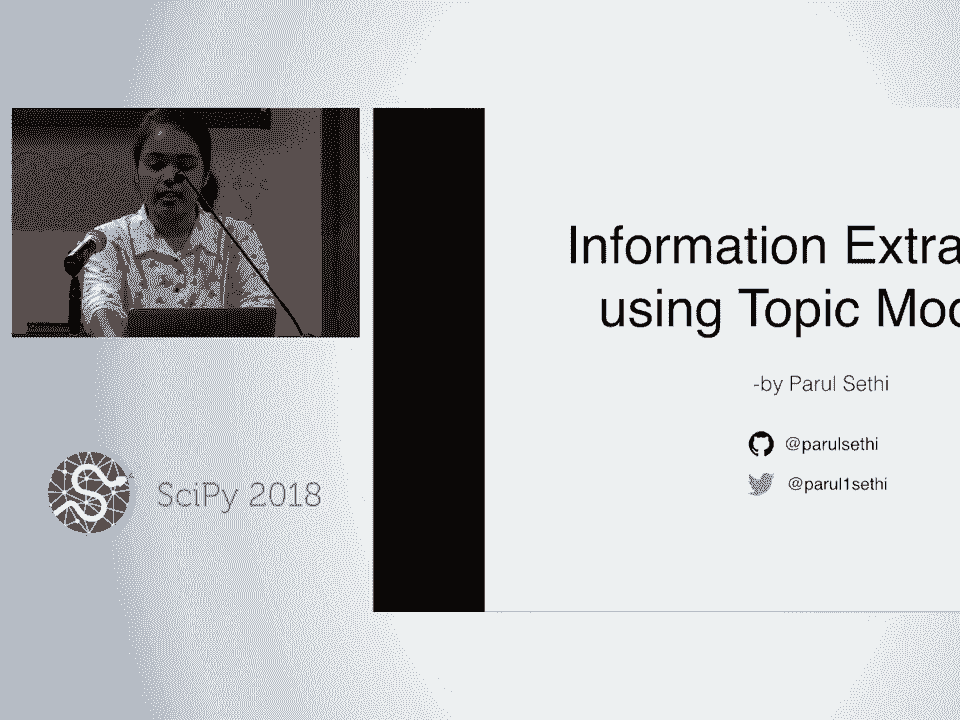
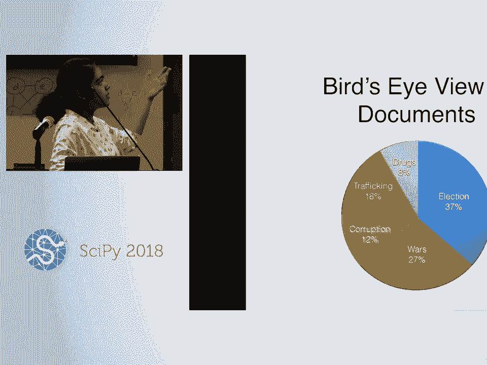
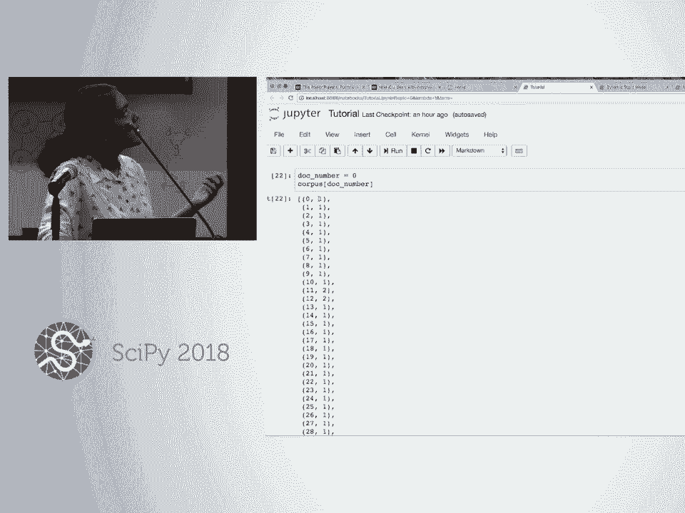
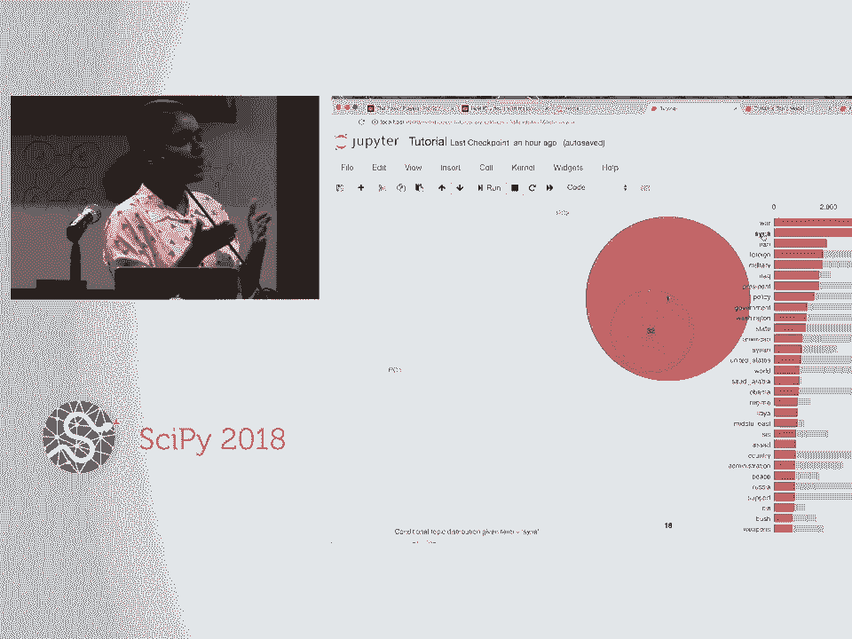
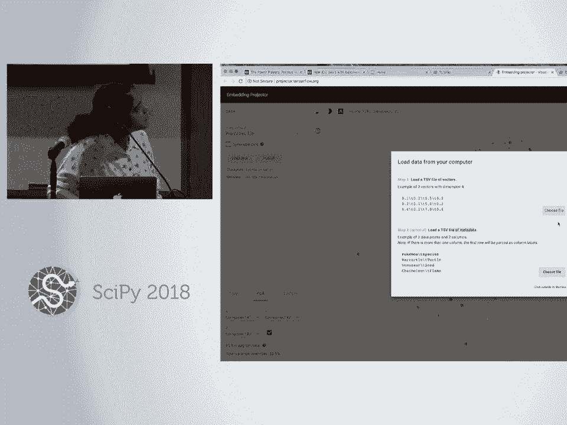
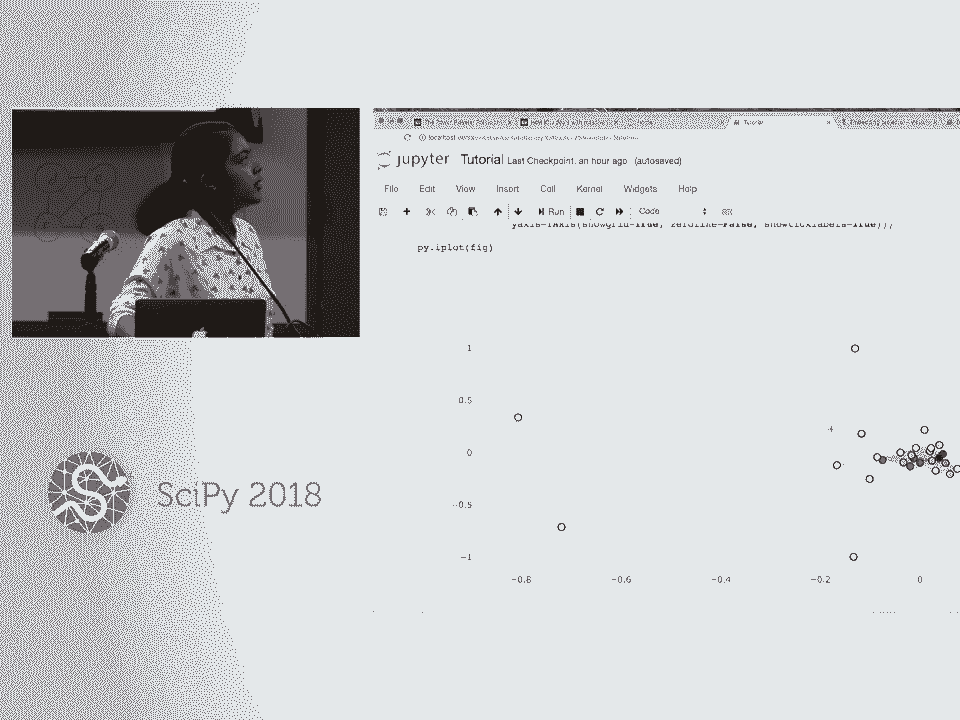
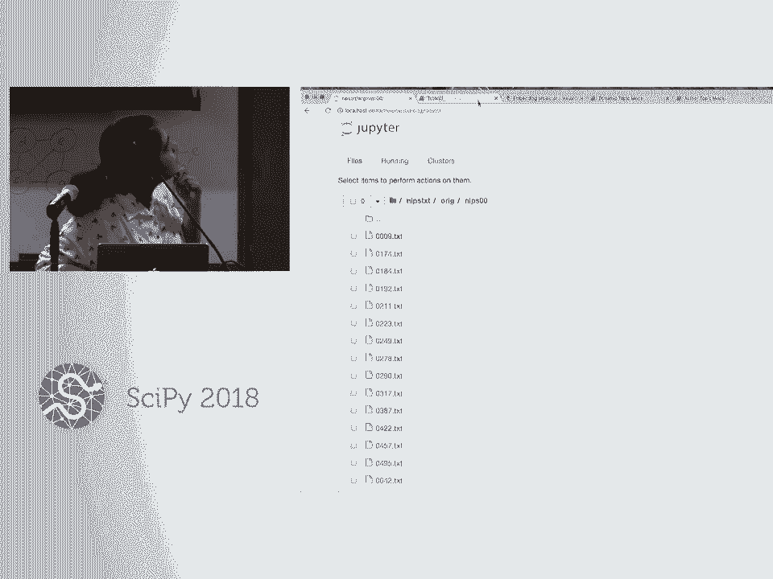
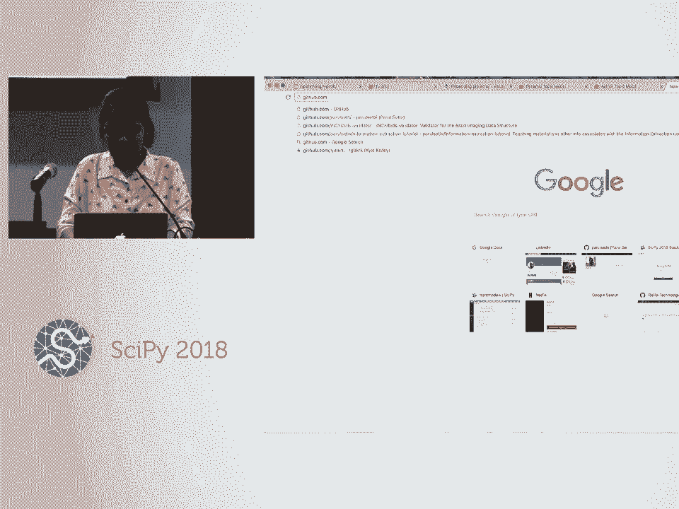
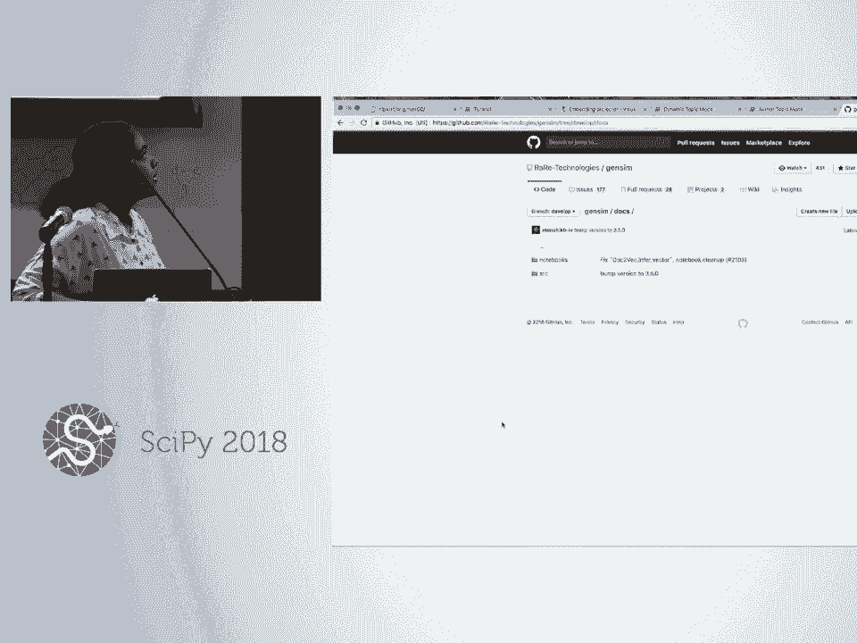

# SciPy 2018视频专辑 - P49：SciPy 2018视频专辑 (P49. Information Extraction Using Topic Models _ SciPy 2018 Tuto - GalileoHua - BV1TE411n7Ny

 I'm Paru Siti from I'm a final year undergrad at University of Delhi studying maths and。

 IT and as you know I'm here to talk about information extraction。 So firstly I would。

 like to know from you that how will you define information extraction？ Anyone？ Yeah， exactly。

 So yeah， the first step is exactly that and then it's about organizing。

 and systematically organizing the data into a readable form like web has a vast data so。

 basically organizing that。 So yeah， let's start with a scenario for use case。 Imagine you。

 are a journalist in our news organization and someone leaked millions of documents of。

 internal communications of some corrupted organization to you and your editor is asking for an。

 article by yesterday。 So how can a single person or even a group of people can manually。

 go through million of documents？ Yeah， so information extraction is basically about。

 organizing this data set and so that we can journalist can， I mean the users can manually。

 go through this， did say to analyze the main points。 So it's about automating the process。

 So how many of you know about the Panama Papers scandal？ How many of you know about。

 the Panama Papers scandal？ It's like， yeah， so it was a similar case like some lead million。

 of documents。 They were basically internal communications like emails and so on to a。

 news organization and they also used like automatic text analysis to sort that out。

 So we can see the example on their site also。 Yeah， so first one was like， first step is。

 basically to extract out the main entities like organization or names in the data set。

 So named entity is one of the widely used NLP tool to analyze。 Yeah， so as you can see。

 that they have this first article about the power players that they found in these documents。

 So if we click on someone， for example this， so they recognized these names using named entity。

 recognition and then they used some graph models to basically plot the relationship between。

 organizations。 So for example， yeah， these are two organizations and there is also a。

 it also defines the relationship on their edges。 So yeah， this is what are some use cases of。

 information extraction。 So we start with the tutorial now and the technique I am going。

 to talk about is topic models。 So for example， you have a newspaper based corpus and it has。

 millions of documents of news articles。 So what topic models will do is it will give you a。

 bird's eye view of the documents。 So yeah， so it outputs several different topics or you can。

 say themes of what that corpus consists of。 So for example， it can tell us that it has 37。

 the corpus is 37% about elections， 27% about wars and so on。 And how it does is that it doesn't。

 give us the direct labels like election wars， corruption and so on。 It rather gives us a list。

 of words for each topic from which we can manually infer that yeah， these group of words。

 belongs to this topic。 So for example， if our topic model outputs this list of words， which。

 the first one is vote party campaign and candidate。 So we can manually easily infer that this is。

 something related to elections。 And if we have a list of words like army killings， terrorist bombs。

 so we can infer that it's a talking about war。 So what it does is that the topic models， it looks。

 through the corpus for cluster of words and the one co-occurring frequently， it groups them。

 into these topics。 And a good topic model should， the words in a good topic model should make sense。

 So for example， there are many， there can be cases when you don't get a list of words which could。

 make sense together。 So yeah。 And then yeah， about the basic entity of our corpus， like it consists。

 of documents。 So we can analyze the documents also using topic models。 So basically we can。

 get the topic of each and every word in the document。 So like as you can see in this example。

 like yellow ones is doing DNA， genetic and so on。 So we can get this topic for every word。

 And after that， we can easily calculate the topic distribution of a document。 So for example。

 the histogram shows the topic distribution in this example document。 So yeah。

 this is what basically， topic models does in the information extraction pipeline。

 So we'll start with the tutorial next。 And don't have to go that out。

 There's no way we can see that。 Yeah。 So for this tutorial， we'll be using the。

 So it's visible for everyone at the back also。 So we'll be using the fake news data set from。

 Kaggle for this notebook。 It basically contains the text and metadata scrapped from the web。

 And there was a Chrome extension named BS detector which tagged the article as bullshit， which it。

 thought that consists of fake news。 So yeah。 So we'll use pandas for loading and loading the。

 data set。 And firstly， we read the CSV file。 And then there are many columns in that data set。

 But for now， we'll only need the title text and language。 And yeah， we pick out the null， call。

 null values in the data set and we'll be only considering the English language articles。

 And this is just to reset the index because we eliminated the rows in between。 So and this is。

 what our data set looks like basically。 It has titles， the article text and language。 So yeah。

 pre-processing is one of the most important part in any text analysis application。 And。

 because if there's a lot of noise in the data， then our algorithm can't really do much。 So， yeah。

 we'll first do the pre-processing step。 And first step will be tokenization。 It is basically。

 splitting up a sequence of characters or you can say a sentence into individual tokens or words。

 And then the next step is stop word removal。 Stop word are basically most frequently used words。

 in any language。 For example， in English， they are A and D and so on。 Then we strip the punctuation。

 And then we use limitization in our data set。 Limitization is basically reducing a word into its base form。

 So yeah， and another question that I come across often is that what is the difference between。

 stemming and limitization。 So in limitization， the process looks up in the dictionary for the base form。

 For example， the word better has its lemma as good and limitization will capture that。

 But in stemming， the stemming process used crude heuristics to find the base form。 So for example。

 if we have words like walk， walk and walking， it will eliminate these suffixes or like A。

 D and I and G。 But if we take the words of good and better， the stemming won't capture that lemma。

 So that's， basically the difference between them。 Yeah。

 the next would be by gram collocation detection。 By grammar basically two adjacent words。

 Collocations are frequently co-occurring words。 And yeah， so for example。

 if we have a word in our data set like machine learning， so they can be。

 considered as a one entity rather than two separate words machine and learning。 So that's what。

 diagram collocation detection is。 So yeah， in this cell we do the basic imports。 We use the。

 gensym's pre-processing pipeline and then we use NLTK's limitizer。 Yeah， so after this function。

 they find the pre-processing。 And so I'll first explain the basics and theoretical part of it。

 And I'll then give you five to ten minutes to go through the coding part。 So yeah， after the。

 pre-processing steps， this is what basically our data set looks like。 Like for example。

 if we want to see the first document in our stored data set after the pre-processing。

 it's basically a tokenized list of words。 And this is the API for training for。

 diagram collocation detection in gensym。 And so for example， if you have， yeah， so if you have。

 this list of words， white， house， million and money， which two words， which two adjacent words。

 do you think could be considered as one？ Yeah。 So yeah， so that's what the， diagram detection does。

 Yeah， in this step， we merge the detected collocations with our data set。

 And then we create a dictionary mapping for our training data。 So it basically creates the index。

 for each and every word so that we have a numerical mapping for every word in our data set。

 In this cell， we remove the extreme frequencies of words。 So for example， if there are words。

 occurring in more than 60% documents， or we can say quite frequently words， we remove them to。

 reduce the noise。 And also the very rare words， which occurs in less than 10 documents。

 And we basically convert the data set into a vectorized form in this cell。 It's something that's。

 required by gensym as an input。 So yeah。 And before just before the training part。

 this is what our data set looks like。 This is the first document and it's a list of tuple in which the first part represent the。

 dictionary index of a word。 And the second part is its frequency in this document。

 And yeah， I uploaded my already trained models in the repository because training can take a lot。

 of time。 So you should not execute these two cells， the training one and the same one。 You can。

 directly execute this loading model cell for simply loading the model。 But yeah， in the training。

 API， the main three inputs are corpus， which we defined above the dictionary and the number of。

 topics。 Yeah， so for the number of topics， we have to do some experiments to basically。

 infer that what would be the good number of topics for our data set。 So yeah。

 we'll see how to do that， in the next section。 Yeah。

 now you have 10 minutes to go over the notebook till this cell。 And let me。

 know if you have any questions。 So does anyone have any doubts till now？ Okay， so we move on。

 Now this is what our typical output from the topic models look like。 We can use the show topics。

 API to un then one input is to print the number of topics。 Like we initially gave the number of。

 topics as 35， but we'll just print the five of them for ease of visibility。 Yeah。

 so it basically outputs a list of topics where each element is a tuple。 And the first part。

 of that tuple is the topic number。 So this is the second topic。 And the sequence after the second。

 part of the tuple is the sequence， which mainly describes this topic。 So these are the words。

 that are there in the topic。 And the numeral value that is that can be seen as being multiplied。

 in front of them is their probability value in this topic。 So for example， text has a probability。

 of 0。062 in being expressed in the topic number two and so on。 And， yeah。

 so then we have other APIs to explore the topics。 The next one is get term topics using this。

 We can get the probability distribution for， each word in our corpus。 So for example。

 if we want to see the topic distribution of money， then we can use get term topics。

 And it says that it has a probability of 0。017 in being expressed， in the topic number 13 and 0。

012 in topic 25。 So yeah， and the next API is to get the topic distribution。

 of documents in our corpus。 So yeah， for that we use the get document topics API。 And the in。

 the parameters are the document document number in the corpus。 And per word topics is basically to。

 get the probability distribution of words also we'll get to that later。 So yeah， this is what。

 document topic distribution looks like。 It gives us the list of topics and their probability of。

 being expressed in this particular document。 That is our first document， the zeroth one。 Then yeah。

 as you can see that there are three values that we get from this API。 The first one。

 doc topic gives us the topic distribution of document。 Then the word in the word topic。

 we can get the probability distribution of each and every word in that document。 So。

 this is the list of every this is the list of words in our first document。 And， in the tuple。

 the first part represents the dictionary index of that word。

 And the second part is the list of topic numbers， which are ranked according to the probability。 So。

 the word which has a zeroth index in this document。

 let's say its money has a probability distribution。

 not the distribution but the largest probability of being expressed in the 32 topic and then the。

 three and so on。 So it's ranked according to the probability。 And then the third element is the。

 phi value。 And in this one， we can get the probability distribution of the word。

 So it is similar to， this word topic， but the additional part is this probability values。 So yeah。

 so as we saw that 32， was the first element in this list and three next。

 So we can see that this has a higher probability， than the third topic。 And yeah。

 so using the phi value element， we can get the exact distribution， also for the words。

 So next part is the evaluation because we would like to see that if the， yeah。

 Can you please be a little bit louder？ >> I was wondering if the order was considered from the original list of words that we have。

 >> Yeah， it is。 Like the dictionary， it's conserved in the dictionary variable。 So yeah， there are。

 two parts in the evaluation。 One is manual and then other one is automatic。

 So for manual evaluation， we have a really nice visualization for topic models that is PILDOS。

 And it can be used not， only for evaluation， but also for exploring the topic models。 So yeah。

 and it has a Jensim plugin， too， so that we can easily input the Jensim outputs which are model corpus and dictionary。

 to the PILDOS and it will directly give us the visualization。 And yeah， another thing。

 So if you want the topic numbers that are there in the Jensim to be。

 exactly represented as same in this PILDOS， you will have to set the value false for sort topics。

 So yeah， in the left panel of this visualization， we have these circles representing the topics。

 And the size of the circle basically represents the prevalence of that topic in our corpus。

 So larger the radius of the circle， it's more prevalent or you can say important in our corpus。

 So the ninth topic seems to be the largest and yeah。 So yeah， and the， coordinates。

 the 2D coordinates of these topics are plotted according to the intertopic distances。

 So the topics which are plotted closely together are actually semantically related。 And yeah。

 so using this we can also see the cluster of similar topics together。 And yeah。

 sometimes we might want to see the exact differences between the different topics。

 So for that we can actually use another visualization that is topic difference heat map。

 So the x and y axis are basically the topics and if we hover over a particular cell。

 the x and y values are our topic numbers。 This is between the tenth and second topic。

 And z value represents the distance between them。 So 0。9 is a large difference。 So these two topics。

 are distance， quite distant。 And the words which are written after the three positive signs。

 they are basically the intersecting words in these two topics。 And the words that are written。

 after the three negative signs， the trial file and so on， these are the words that are different。

 in these two topics。 So yeah， this heat map visualization can be used to see the exact differences between。

 our topics。 And yeah， coming back to our pilot with visualization。

 In the right panel when we don't select any topic， we get a list of our top 30s salient terms。

 which can be said to be most frequent or you can say the important terms in our corpus。

 So observing these words， we can actually infer that our data set was mostly about politics。

 And the next step is if we select a single topic， for example this。

 now it gives on the right panel it gives the top 30 most relevant terms for this particular topic。

 So in this topic， war， Syria， Iran and so on are the top words。 And yeah， the next thing is。

 what does these blue and red bars represent。 So the blue bar is the total frequency of that word。

 in our corpus。 So for example， if we have this word， we can see that it's a quite general word and。

 might be， might be available in many， can be used in many different topics。 So it has a very。

 large length of the blue bar and the red bar represents the frequency of this word in this。

 selected topic that is first topic。 So yeah， when if we take a different word， for example， Syria。

 it has a larger red bar and a smaller blue bar because this is not that general word which can。

 be used in different context。 So yeah， it is particularly restricted to this topic。

 And yeah， another thing， if we select the word， we can see that in word topics， it's occurring。

 So it's first and 32nd topic。 And then， yeah， now you can see that there's a slider over here in the right panel at the top。

 So using this， we can get the different rankings of words to， explore this。

 explore these topics more。 So for example， if we set the slider on one。

 it basically gives us the most general words， like I'll show you with an example。 Now。

 if we set it to zero， we get the words which are completely exclusive to this particular topic。

 That's why we are getting the complete red bars and barely any blue bars。 And if we。

 move the slider to higher values， we start getting a normalized list of ranking of words。 So yeah。

 And yeah， so for example， if we select the zero value in this topic， we can get some。

 rare words which might make it difficult to interpret this topic。 So for example， we might not。

 not know what Baltic or BRICS means。 So zero is not usually the optimum value for this。 And。

 if we select one， we might get two general terms that could make it difficult to differentiate。

 between the different topics。 So for example， when we set it to one， we have these general words。

 which can occur similarly in some other topic also。 So it makes it difficult to differentiate。

 between topics。 And yeah， so the suggested value for this slider is 0。6。

 It was suggested by the authors of this visualization。 So yeah。

 that's it about this pilot-based visualization。 And， yeah， another thing。 As we saw。

 there is a ranking that Jensim use for ranking the topics。 So， for example， in this。

 in the Jensim output， we have the second topics as the most， salient or prevalent and then the 24th。

 So how does this ranking relates to the one in the visualization？ Yeah。

 so it's basically equal to the ranking which we get at the by setting the value at one。 For example。

 if we select the 25th topic， we have a word， oil， gas。

 energy and so on in the 25th topic in this ranking。 And we can see that。

 it's same in the 24th topic of the Jensim。 And yeah， the index is behind by one because。

 PILT of is take the topics from the index one and Jensim does it from zero。 So this 24th topic is。

 equal to the 23rd topic in PILT of is not 23rd， 25th topic and so on。

 And the next section is about their automatic evaluation。 We have a major called coherence。

 for evaluating the different topic models。 It simply gives us a score value and the more that score is。

 the more good or coherent that topic model is。 So yeah， I came across one of the。

 explanation in a pi data Berlin talk where， for example， in this sentence。

 there are some words marked which can be said to belong to the ice hockey。

 But if we see these words， on the face of it， they might not occur to us as belonging to ice hockey。

 For example， if we， have a word shot， we can't really say that it belongs to ice hockey until we see it in this。

 in the context of this particular sentence。 So yeah， that's what coherence basically do。

 It tries to measure the coherence given this partial description of topics in the context。

 And it calculates the coherence of the group of words in a reference corpus。

 So if we choose some non-relevant reference corpus like patent applications from earlier， century。

 so it might probably not mention about ice hockey even once。 So then we might not get。

 this coherence value for this topic。 And yeah， that's what basically coherence is。 Yeah。

 let's take a break of 10 minutes here and you can grow through these two evaluation parts。

 that I just explained。 And let me know if you have any questions。

 You should try playing around with this visualization to understand it more clearly。 Okay。

 let's move ahead with the application section。 And yeah， the first one is document clustering。

 We saw above that we can get the topic distribution of every document also。 So we can use that。

 distribution as a vector embedding to plot the documents in such a way that。

 this ones that are semantically similar are plotted closely together。 We'll see it in the example。

 We'll be using TensorBoard for this visualization。 And it would basically take the two input files。

 The first one is containing the tensors or the vectors which represent the topic distribution of。

 documents。 We define it in this cell and the next one would be for the metadata which in this case。

 we can take as the title of documents。 So yeah， if you execute these two cells， you'll have these。

 two files created。 DokLDA tensor and DokLDA metadata。tsv。 And after that you can open the link。

 In a new tab and yeah， so we'll be uploading our own data for this visualization。 And here we。

 choose the tsv file containing the tensors。 And in the metadata one， we'll choose the metadata file。

 And just click outside this box to see the visualization。

 See the 2D one for visualizing them easily。 Now in this plot， each dot represents our documents。

 And yeah， and we like the ones which are which， can be said to be semantically closer or which will have similar topic distribution will be plotted。

 closely。 And yeah， and there are different ways to reduce the dimensionality of this dataset。

 So for each document， we originally have a dimension of 35 in our vector because we chose the。

 35 number of topics。 So TSNE and PCA are basically the two techniques we can use to bring down that。

 dimensionality。 And yeah。 So this is a bit small dataset but with our data sets。

 we can get the different clusters of， documents。 And yeah， that's a tomorrow。 And yeah。

 the next application would be， the topic connections。 So like quite often。

 the sheer size of data could be difficult to navigate， through。 So for example。

 if a researcher search about some particular research article。

 and he belongs to a narrow discipline。 So he might not know about some different。

 another article which is in some different field， which could be quite relevant to his or her research。

 So using that， using the topic connections， we can get these relevant topics also。 So the search。

 becomes like in a topically guided manner。 So let's see the example。 Yeah。

 we first get the topic distributions using the get lambda property of our model。

 And then we define the number of words which we want to use in the annotation。 We'll see about that。

 And in this line， we get the terms in each of our topic。

 Then we first calculate the distance matrix which will store the distance between every topic pair。

 using a distance matrix。 I use Jensen-Shannon in this one。 And。

 this is similar to the distance matrix which we saw about。 And yeah。

 the nodes of the network graph will represent the topics and the edges between them。

 will be based on the distances between them。 So we can use a threshold value that， for example。

 if we have a value of 20 which I use in this case， then the topics which have a。

 distance value above this percentile will not be connected through the edges。

 And the ones below it will be connected。 So we plotted using the plotly library。

 So on hovering over the nodes， we can see the topic number and it's top 10 words in that topic。

 And on the edges， the words after the three positive sign shows the intersecting words in the two。

 connected topics。 So for example， in the 31st and 24th topic， the words like state administration。

 and so on are the intersecting topics and words like energy post memo and so on are the ones that。

 differ between these two topics。 So that's how and yeah， another use case of these。

 network graph is that there might be some topics which are not related directly。

 But we can discover some common factors between them using the network graph。

 Like it can simply be used to analyze any network flows that we usually use for network graphs。

 And yeah， the next one is topic dendrogram。 Now the topics can be related in a hierarchical form also。

 For example， if we have a corpus based on research papers， so it will have。

 domain domains like physics， maths or biology， then it will have sub domains like calculus， algebra。

 in maths and then in physics it will have electronics， mechanics and so on。

 So this basically becomes the case of hierarchical structuring in the dataset。

 And we can use dendrogram to visualize these types of structures。 Now in this cell。

 we similarly get the topic distribution first。 Then we get the topic terms for， annotations。

 We calculate the distance matrix for the dendrogram。

 Then this is used to calculate the hierarchical clusters or like it's an internal。

 API in the SIPI library which can be used to build the linkages which will be used in the。

 dendrogram。 And this is a customized function to calculate the text annotations。

 So in this dendrogram， the x-axis represents our topic numbers。 The y-axis is the similarity value。

 and sorry not similarity the distance values。 And。

 yeah if we hover over the merging node on the first level of two leaves like it has child nodes。

 as leaves。 So we get the intersecting and different words between the first and 12th topic。

 Then similarly if we hover over on these merging nodes in upper hierarchy also。

 we can get the intersecting and different words of its child nodes。 Now on the。

 second hierarchy and above， the words that are treated as in the topic are the intersecting words。

 of its child node。 For example in this level we have one node as a one leaf as the fourth topic。

 But for this child node we have this merge node like it doesn't directly have the topic words。

 So we treat the intersecting topics that is the words after the three positive signs as its。

 topic words。 And we calculate the intersecting words based on these two lists。

 And yeah so that's it about the hierarchical clustering。

 And the last application could be is document coloring。 So like， we just see。

 Yeah it's just a visually easy way to explore our documents like what is the topic。

 distribution of our documents。 So it basically colors the each and every word in that document。

 according to the topics。 We assign the colors in this line of the code。

 It's simply using a matplotlib， API to create a list of 35 different colors because we have we had 35 topics and colors them。

 accordingly。 So in this one we the parameters are our model and the document which for which we want。

 to see the document coloring output。 And so yeah that's it about the this notebook which explains our。

 basic topic models。 And the next part would be the dynamic topic models and orthotopic models。

 But yeah you have 10 to 15 minutes to go over this notebook and let me know if you have any doubts。

 Okay so does anyone have any doubts regarding the previous notebook？

 So we'll continue with the next notebook which contains the dynamic topic models。

 So for now we understand that topic models are basically used to understand the themes or。

 understand the themes across the dataset。 But in many cases the data is collected across a timeline。

 So we might want to analyze it according to that time period。 For example if we have a newspaper。

 corpus and we might want to see that how a particular new story is proceeding with its events。

 So that's what dynamic topic models are precisely aimed designed to do。

 Yeah so this image okay this image illustrates in the use cases of dynamic topic models which。

 yeah this is from the original paper on DTM by Blay and LaForty。 And。

 in for this one they analyzed the articles from science journal across the century from 1880 to。

 1990s and when they applied the dynamic topic models over that they got these topics across。

 the timeline。 So the first one is belongs to atomic physics and yeah now we can see that。

 initially in the decades of 1880 or 1890 we have words like force， energy and motion defining this。

 topic。 But as we move forward let's say in 1940 we have words like electron atom particle。

 So the topic is basically maturing as the research advanced through the timeline。

 And then in the 2001 we can see words like quantum physics， field and system and so on。

 So this obviously makes sense because as the field advances the context remains same。

 that is atomic physics but the words change。 So， yeah then there's this another graph where he the author plots the frequency of word matter。

 electron and quantum。 And we can observe that the usage of word matter decreases over time。

 And electron and quantum increases which makes sense as the last two terms are a bit more advanced。

 in terms of this area。 Yeah then there's another example from the neuroscience field。

 Where in the earlier decades we can see words like brain movement， eye， hand like the basic words。

 And as we move on we can see words like cell， neuron， receptor， synapse。

 So this represents the similar matureness of this field over the time。

 And similarly the graph shows， that the word nerve the usage of word nerve decreases over time。

 And neuron and CA2， CA2 is， technique used in a neuroscience field。

 So yeah it basically came in the later decades。 And yeah so by having this time-tapped dataset dynamic topic models are able to analyze these。

 types of topics where the context remains same but the words might change。

 A very good application is， finding the similar documents。

 Like yeah the author gave a good example in his talk a while back。

 where he picks up a paper from the brain of the oram which was published in 1880。

 And it's about analyzing monkey brains basically related to neuroscience。

 And then he picks up another， paper in the 1990s which is called representation it's a long name。

 And so yeah these two papers， belong to the same context that is analyzing the monkey brains and related to neuroscience。

 And you would not really expect these two papers to have similar words but when we calculate the。

 their similarity using a distance metric we get a very high similar value。 So and yeah。

 we use the topic distribution of documents to calculate this similarity。 And yeah basically。

 dynamic topic models are aimed to capture this time corrected topics in the dataset。

 Yeah so we'll be using the same fake news dataset for this tutorial also。 And now we'll consider。

 another column from our dataset that is the published。 It has the dates and times of the。

 articles when they were published。 Yeah because this is a very important input in dynamic topic。

 models it does need a time tag dataset。 The pre-processing part is exactly same as in the earlier。

 notebook。 Now yeah the additional input that is the time。 The way we create the input for the。

 Jensim API we first convert the published column into a pandas date time object。 Then we。

 calculate that like in our data set was collected across two months October and November。 So we'll。

 have we'll be having two time slices for this dataset。 And yeah with this line we calculate the。

 number of documents that were published in October and with the next one the ones that were published。

 in November。 And yeah the number of documents in the first time size is 5710 and in the next one。

 5967。 So we create a time slices list which contains these two time slices and this is what。

 is required by the Jensim API for the DTM model。 Like you can see the all the parameters are same。

 the number of topics dictionary corpus。 And yeah I'm using the wrapper in this。

 notebook because it's quite fast but Jensim also has its python implementation of DTM but it's。

 quite slow。 So it's usually better to just use this wrapper and yeah the only additional input。

 is the time slices。 And so you won't need to execute these two sets。 Similarly because I。

 uploaded my train models already。 So you can simply execute this set and load the model in this notebook。

 And yeah now about the results。 So we can similarly print the topics as we did earlier。

 for this topic model also but the additional parameter would be the time slice。 So like。

 the first one is topic ID the time and the number of words we want to print。 And if you want to see。

 the topics the topic words in the next time slice you can import one。

 Now it's mostly the same because this dataset is quite small and it's just collected across the。

 two months。 So it doesn't really provide us the diversity to actually know the。

 value of dynamic topic models but yeah it will do for the tutorial purposes。

 Now we can print all the topics with its time slices to see the topic evolution。

 So we have topic zero here。 The words with their probability value in the time slice zero。

 and in the time slice one。 They would mostly be similar as I explained earlier that the。

 dataset is not that diverse but yeah we can use these values to see the evolution in our topics。

 And yeah about the distance between the documents we can get the topic distribution of the documents。

 using the gamma property of dynamic topic models。 And then we import the distance metric。

 from the Jensen to calculate the distance between them。

 Now similar to LDA dynamic topic models can also be visualized using pi LDA list but the backdrop is。

 that it will only visualize a single time slice at a time。

 For example here we visualize the first time slice。

 and in the next cell we visualize the second time slice。 Yeah like we have we'll need to manually。

 compare these visualizations across the different time slices。

 So yeah there's not really any particular， visualizations that has been made for dynamic topic models still here。

 So yeah and yeah that's it for this notebook and you have around 10 to 15 minutes to go through this。

 and let me know about any doubts。 Okay so let's start with the last remaining notebook that talks about orthotropic model。

 And orthotropic models are basically an extension of LDA that allows us to learn the topic presentation。

 of authors also。 Like till now we had three entities the words the documents and the topics but for。

 this model we have an additional entity called authors and now these authors can also be some。

 labels or tags on the web like in this tag overflow we can see many tags defining the type of question。

 So this type of labels can also be used as authors。

 So the application of this is like if we want to， predict the author or that label depending on the content of the text。

 And yeah so these are the four entities in this orthotropic model。 We have the document。

 its words then we have authors and we have the footage like which author which author is。

 contributed to the particular document。 Then we have the topics。

 Now for our documents also we can get the topic distribution and for authors also we'll be getting。

 the topic distribution based on the content of the they write or the documents they have authored。

 We'll see it with an example。 So for this tutorial we'll be using the NIPS conference dataset。

 It consists of scientific papers from years 2000 to 2012。

 Yeah we first crawl the dataset into the memory using this cell。

 We create the array for the years that are present in the NIPS dataset and。

 append the particular word in front of them like for example。

 So at first level the dataset is sorted according to the years。

 Then we have different text files in it。 The papers that were published in that year。 So。

 yeah we see the dataset in the after executing the cells only。

 And yeah in the next cell we get the all the document text with their corresponding IDs。

 So after executing this function you can we have the array of dog IDs。

 Where their ear is appended with the document ID。 And after this step this is what our dogs look like。

 It's simply a sequence of sentences。 And yeah then the other input that Jensim requires for the orthotopic model is the mapping。

 Which basically has the authors and the list of documents containing the IDs that they have authored。

 After executing this function to create the author to dog mapping we have a。

 we have this dictionary that contains the author and the list of documents that he or she has authored。

 So we'll require this mapping while training the ATM model。

 And as you can see that these dog IDs are not really that sequence。 So we simply replace them。

 with a order sequential order like 0 1 2 and so on。

 And yeah so this cell just replaces the dog IDs in the sequential manner。

 And then the pre-processing is similar to the earlier notebook。 It has the similar steps。 And yeah。

 So at the end we have a 2 4 7 9 number of authors in this corpus。

 Number of unique tokens are basically the unique words in our data set and 1 7 4 0 as the number of documents。

 Now for training the ATM model the main parameters are the corpus the number of topics。

 the dictionary and the author to dog mapping。 So you don't need to train the model you can simply upload it from the repository。

 Yeah so we print the topics for this model。 Now the way the author topic model outputs it that it。

 outputs the 10 number of topics that we created。 And then we can have the topic distribution of。

 different authors also but we but in this case but first let's label the topics according to。

 the field that we think they belong to。 So we can see what each and every topic consists of。

 So in the zeroth topic we have words like noise density weight regression and so on。

 So we label it as Bayesian modeling and if we see the words for some other topic。

 Okay so yeah it's a notebook that was loaded previously but if you execute this as right now。

 you'll be able to see all the topics。 And yeah so based on those topics I created this array。

 containing the labels for topics and if we print them like this。

 we can see all the labels for the topic words and。

 yeah so after that we retrieve the topic distribution for every author。 So if we want to see。

 the topics that Jan Likon mainly writes about we print it like this using the API。

 Yeah now in this selfie we would replace the topic numbers with the topic labels that we gave。

 initially to like see that if the authors and their topics make sense like these are some popular。

 researchers which you might know in which field they work。 So if we see the topic distribution for。

 Jan Likon we can see the documents in the dataset that he authored and the topics。

 and the topic distribution of this author。 So it's neural networks， numerical optimization and。

 speech recognition which is quite spot on and similarly for Joffrey Hinton he also works in the。

 field of AI and hence we get the similar topics belonging to this field。 And yeah now about this。

 author he's a neuroscientist but we so we would expect to get the neuroscience level for this。

 author but rather we get the object recognition。 So either we have labeled this topic incorrectly。

 or the model is not that good or another point could be that he worked in the visual perception。

 pipeline of the neuroscience field。 So for example this object recognition might not relate to the。

 recognition in the machines but in humans。 So， yeah so these could be the cases and then for Christoph Kosh we get the neurotech which is also。

 a spot on topic for this author。 And yeah now we'll plot these authors in a 2D plot using their。

 topic distributions and we use the TSNE algorithm for creating the 2D vector embeddings and。

 yeah so this is what our embedding looks like。 It has a vector for each and every author。

 So the circles in this plot represent the authors and the size of the circle are the number of。

 documents that documents that this author has in this corpus and yeah now we can see that some。

 authors。 I mentioned with the different names in this corpus for example there's。

 Terrence Sesh Noofsky。 This is the full name and then we also have his initials at position minus。

 yeah so we can see that teaches Sesh Noofsky and the next one are the same person。 So they are。

 plotted on a similar position and are closely。 So this is an indication that the model worked。

 the model was good and yeah there are some other observations like we can discover the clusters of。

 authors which write about which belong to the same research topic。 For example at the position。

 minus six。 Yeah here we have the cluster of machine learning researchers。

 Like Jan Lee Gwen Yoshua Benjio and Joffrey Hinton should also probably be nearby。

 Okay and here we have the cluster of neuroscientists and so on。

 Yeah and the another point that we observed that we got the object recognition topic for。

 Sesh Noofsky but now if we observe the clusters around him they are of neuroscientists only。

 So from， that we can actually infer that it was probably about the visual perception or object recognition。

 in humans rather than in machines。 So yeah these are the applications of author topic models。

 We can， predict the authors or labels depending on the content of the text data。

 So that's it with this notebook and let me know if you have any doubts regarding the coding or。

 the theoretical part here。 I thought we could talk about the LEA that high variants put on different runs in LEA。

 they don't， set a fixed seat or which is on average。 Variance between the coherent score。

 Between the topics。 Okay。 I get very unstable times with local runs in LEA training from scratch。

 Have you found any other ways to do LEA that's kind of a problem？

 Okay so for how many epochs you trained？ It's very pretty innocent but I think it's very reliable。

 I suggest just train longer and longer until you get it。

 Like yeah the the cases that I have observed is that the topic numbers do get different but。

 they do belong to a similar context。 So yeah it might be the case that it might not have converged。

 and this actually a API engine sim for plotting the graphs as we train the topic model which plots。

 some metrics like coherence， perplexity and so on。 So using those graphs you can see if the model。

 has converged or not and if after that also you get different topics then。

 Okay so does anyone have any doubts regarding the ATM notebook？

 So then that's it with this tutorial and I would like to inform about some additional resources for。

 topic models。 Yeah so Jensim is basically an LP library in Python which has many different implementations。

 of an LP methods like there are word embedding， dog to wake embedding， document embeddings。

 take summarizations and so on and it has a quite good notebooks for its different implementations。

 and including the topic models。 So you can refer to these notebooks for understanding the theoretical。

 and also the implementation part of these topics。 So yeah thank you。 [BLANK_AUDIO]。

