# SciPy 2018视频专辑 - P54：SciPy 2018视频专辑 (P54. Keynote - Democratizing Data _ SciPy 2018 _ Tracy Teal-gMW9 - GalileoHua - BV1TE411n7Ny

 Okay， so what I want to talk to you about today is a little bit what we talked about。

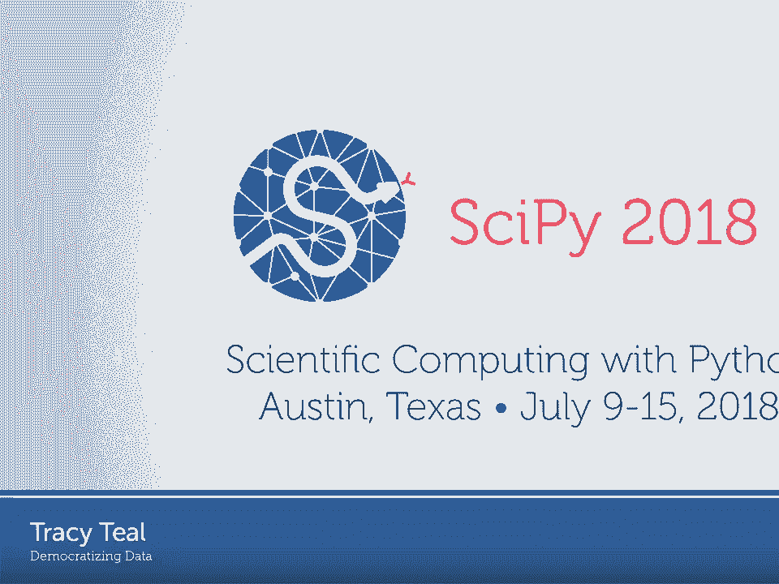

 at the end of that introduction， which I really appreciated， and this idea of democratizing。

 data and how we bring the skills and perspectives that we talk about in this meeting to more。

 people to have an impact in science and society and empower the people who have questions。

 to ask for them to be able to ask these questions themselves。

 So I want to start out though by thinking about in this community some of the things。

 that you're most excited about， if my slides will advance。 So the question is， there we are。

 What are you most excited about working in scientific Python or programming？

 So think about it for a second and then turn to the person next to you， introduce yourself。

 to them and tell them what are you excited about in working in scientific Python or programming。

 And I'm going to clap to bring you back together because this is going to get loud。 Okay。

 so go ahead， talk to your neighbor。 What are you excited about working in scientific programming？

 Okay， clap once if you can hear me。 Clap twice if you can hear me。 Three times if you can hear me。

 Okay， so when you talk to your partner， those of you who have computers， what are some of。

 the themes that came up？ You can go to this URL and enter them in。 It only takes 50 responses。

 so the first 50 people to put them in。 So what are some of the things you heard when you talked to the person next to you that。

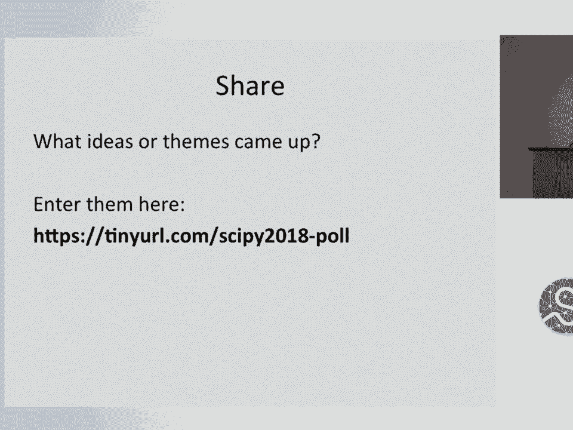

 people were excited about？ It's still there， hopefully。 Come on， computer。

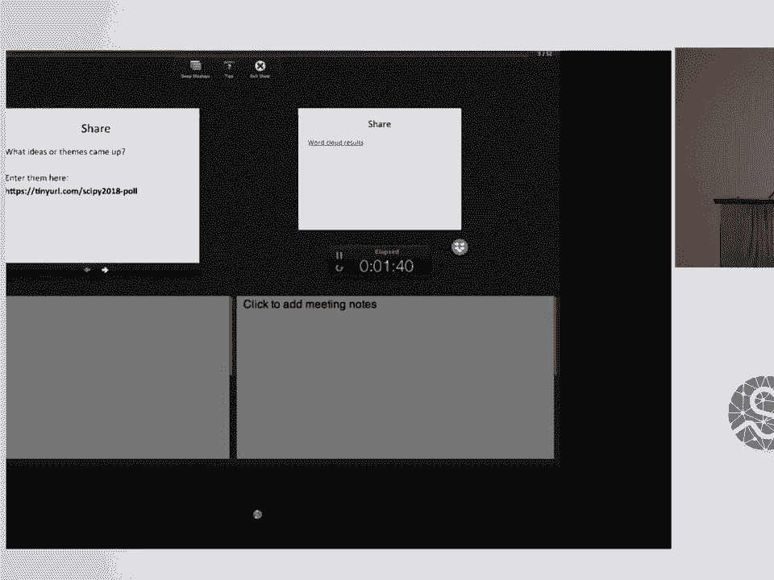

 Okay。

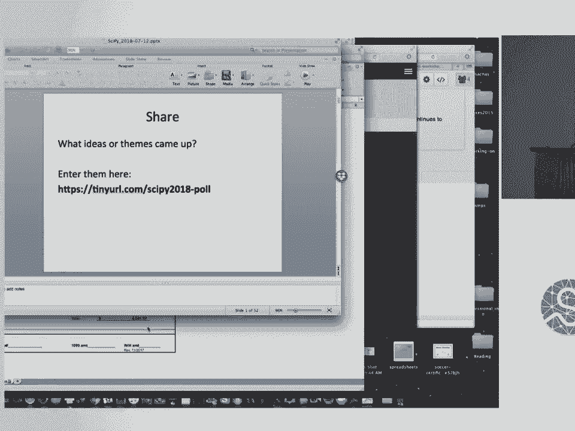

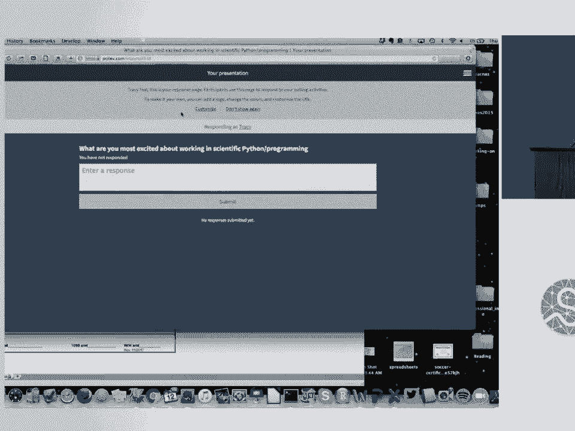

 Let's have a word cloud here。

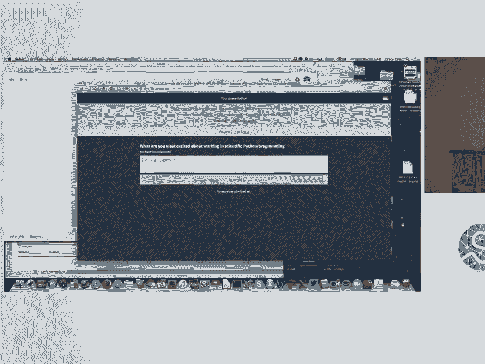

 Well， I'll put this in， but it's supposed to generate a word cloud of the things that。

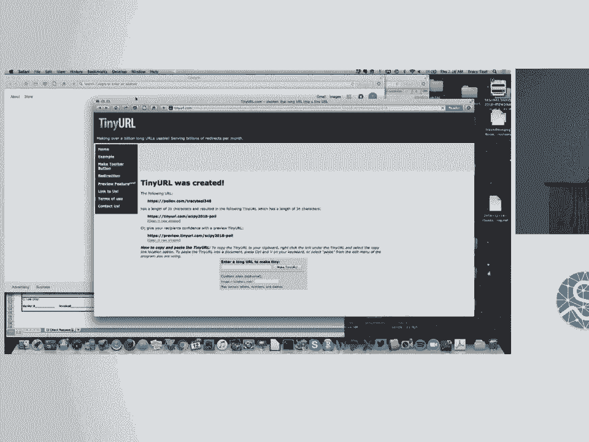

 you're excited about。 So some of those things that we've heard in the past， there we go。

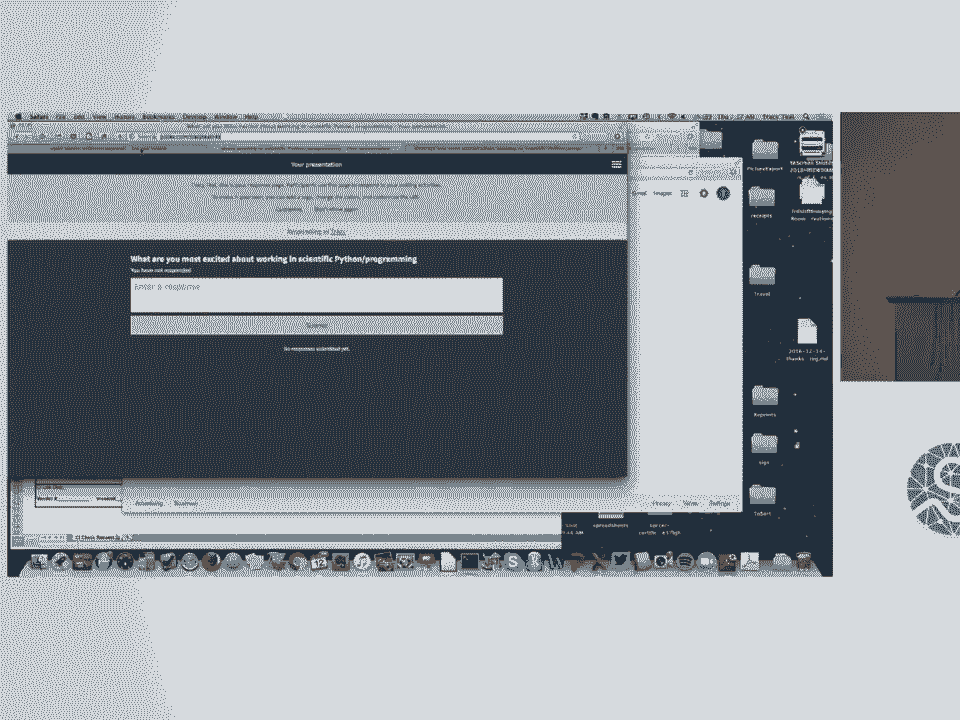

 Excellent。 I knew it would work。 It's all about the software。 Right。

 so some of the things that people are excited about learning， data visualization， pattern， tools。

 I love that learning is there big in the middle。 Community code growing， right？ So development easy。

 I'm interested in the easy one there。 Right， so a lot of words about the growth and the potential that you think about when。

 you think about working in scientific programming。 So now talk to the person next to you again。

 And instead of talking about necessarily what you're excited about， what are some of the。

 things that frustrate you about working in scientific programming？

 And there's no fill in the poll here。 So no one will see what you're going to say here。

 [BLANK_AUDIO]， [BLANK_AUDIO]， [BLANK_AUDIO]， Okay， clap once if you can hear me。

 Clap three times if you can hear me。 Okay， so we'll skip the poll。

 But so what we see is that it's not necessarily， it might be some of the data and the tools。

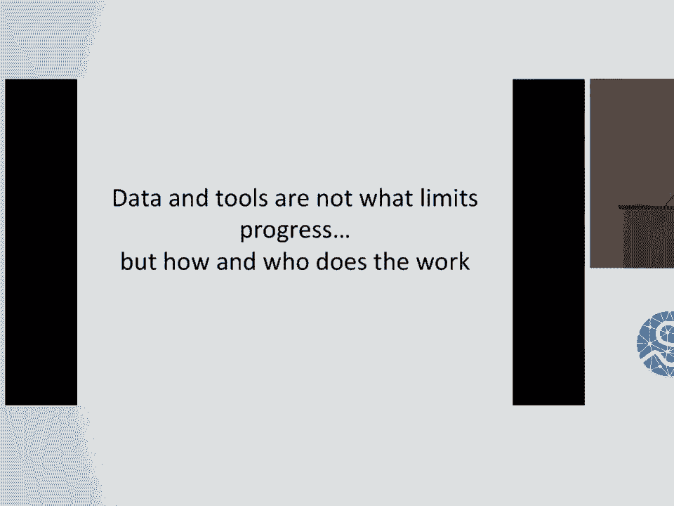

 that just came up as a theme around frustration。 But a lot of it is how we do that work。

 And so we're excited about the potential of these skills。

 But there are some things that frustrate us in the ecosystem。 And part of that is how we've emerged。

 And I'm going to use the words data science， not to mean anything in particular， but sort。

 of the general effort around working with data in science and in research and to solve。

 other problems in society。 And so as data science has emerged as a field， and we really see this。

 I was reflecting on having spoken here four years ago。 And just four years ago。

 the growth is just amazing。 It was four years ago that Fernando in a lightning talk， Perez。

 announced about Jupiter， changing IPython to Jupiter。 And we see now that across our ecosystem。

 We see the development of tools like pandas， the tidy verse and。

 are that are making it easier to work with data frames in these programming languages。

 We've seen all kinds of amazing things about visualization。

 There's so much that has created opportunities in these last four years。

 But we still sort of have this model of having a wonder woman in data science that is going。

 to solve all of our problems。 So we look to hire this person in our companies or in academia as our post-acts。

 Anyone who knows all of the domain， who knows the full stack of the software， who communicates。

 with other people。 And that's amazing。 And these people do exist。 And we should value them。

 Please say thank you to your Wonder Woman in your midst。 But that only scales so well， right？

 And not every problem requires a Wonder Woman。 Not every thing is a crisis that requires her to come in and save the day。

 What if instead we can think about bringing more people to computing that can answer some。

 of the questions that we have in front of us that don't necessarily require everything。

 that Wonder Woman brings to the table？ So we talk about bringing compute to data or data to compute。

 but we really need to bring， people to data。 So how can we scale the number of people who can work with data along with our data。

 production？ Another thing that has changed in these past four years is the amount of data that we're。

 generating。 We started with a few industries。 Now almost all industries are generating data。

 Looking at how they can use it。 We heard some great examples about in healthcare in smart buildings。

 We're thinking about it in humanities and social sciences as well as genomics and astrophysics。

 So how do we scale the number of people that can work with this data that's available， to us？

 And so I'm going to talk about three approaches that help bring people to data。

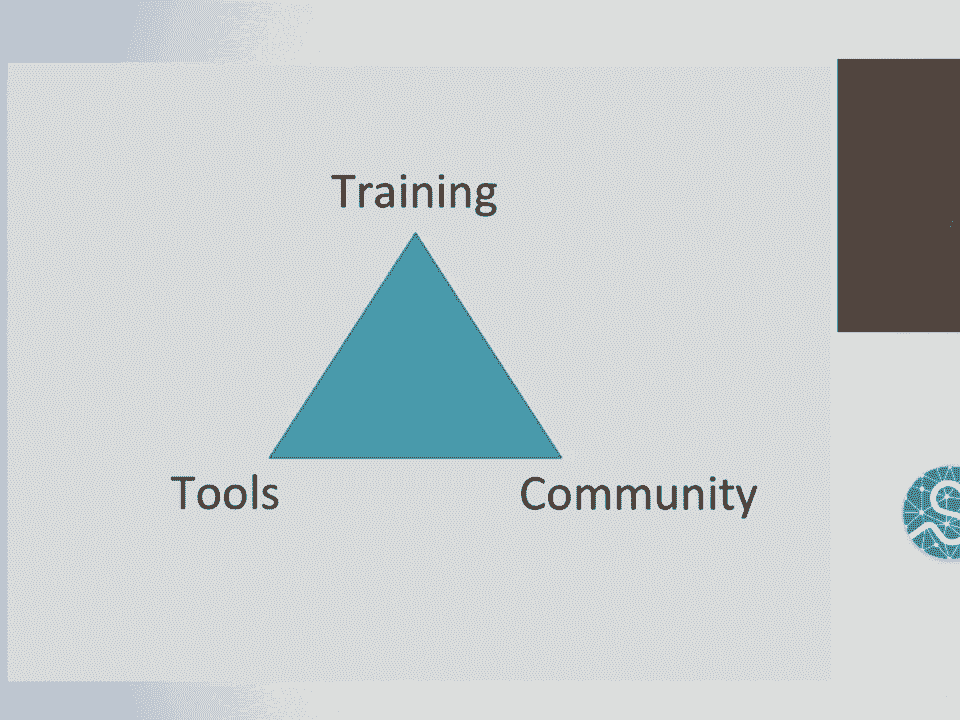

 So that's tools， training and community。 And I'm going to start with tools。

 And I'm going to talk about tools not necessarily from the perspective of everything that we're。

 talking about in this meeting and the lines of code。

 There's kind of this idea that pervades because of how people view the internet as software。

 as a service。 A lot of companies， they're developed with this model。

 And that's a great model for a lot of things。

 But research driven software， software developed in the pursuit of a research question is fundamentally。

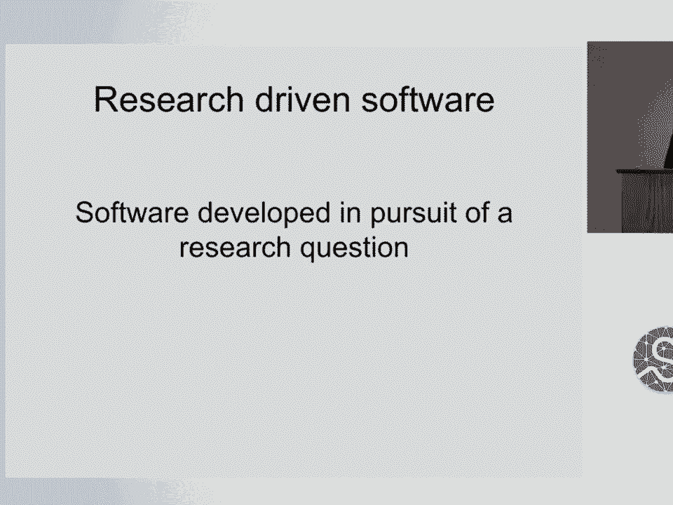

 different than software as a service。 In software as a service。

 the number of people with the problem is many。 You can't build a business usually if you don't have many people with a particular problem。

 The understanding of the problem is usually pretty good。

 There's a lot to figure out but there's a general sense of the problem。

 The need for the users to understand the software implementation is low。

 It's not important for people when they're using it to understand how it's implemented。

 You could argue against that potentially。 But in general， that's true。

 This contrasts with research driven software where the number of people with the problem。

 is one to not that many。 In some spaces it might be a lot of people。

 We see a lot of general packages。 The understanding of the problem is typically pretty low at the start。

 We don't necessarily sort of know what we're getting into when we develop the software。

 We're developing the software as a part of solving the problem。

 And the need for the users to understand the software implementation is high。

 We can't obfuscate the details when we're developing scientific software for the sake。

 of reproducibility and scientific progress。 I want to think about the tools in a way of software not as a service。

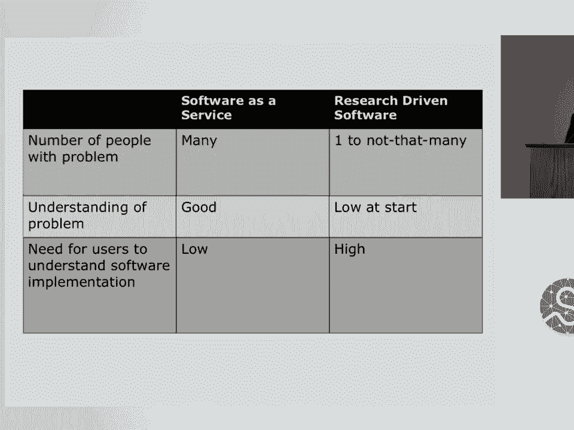

 What does that mean if we think about software not as a service？

 It means that we change our thinking about tools being just lines of code to valuing the。

 skills and the people as integral to the research process。 I am preaching to the choir here。

 And so that's from two different perspectives。 The developers and I want to talk about how we can think about valuing developers but it's。

 also the leaders and we'll refer back to Ralph's great talk from yesterday morning。

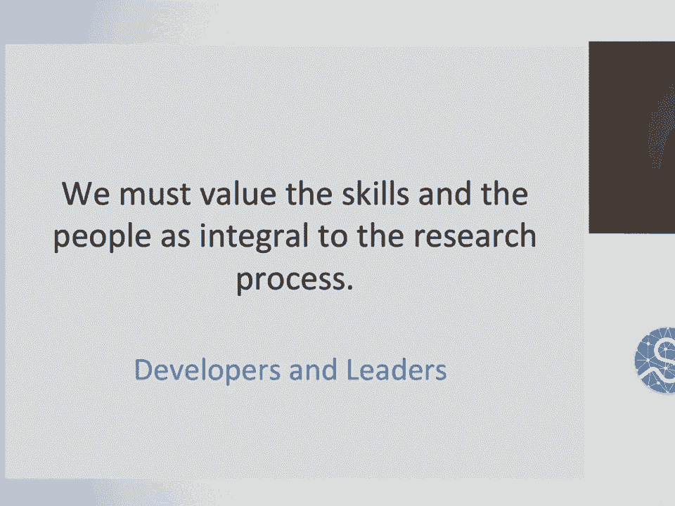

 So first let's talk about the developers。 We envision them as these happy people。

 No we don't really envision them this way。 But maybe other people envision developers as happy people coding in their labs or whatever。

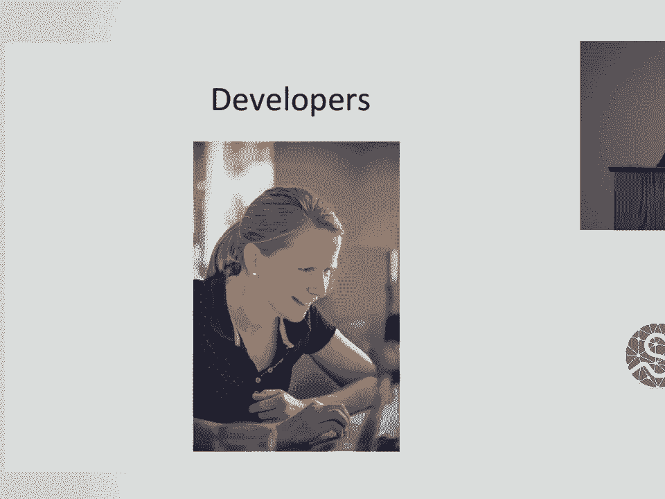

 it is。 Instead probably this more reflects the reality whether you're upset with your lines of code。

 or just your general state of being。 So how is it that we can think about valuing developers？

 I am going to talk a little bit in an academic environment because it is where a lot of the。

 scientific code comes from。 Some of the incentives might be different in an industry setting but the general ideas。

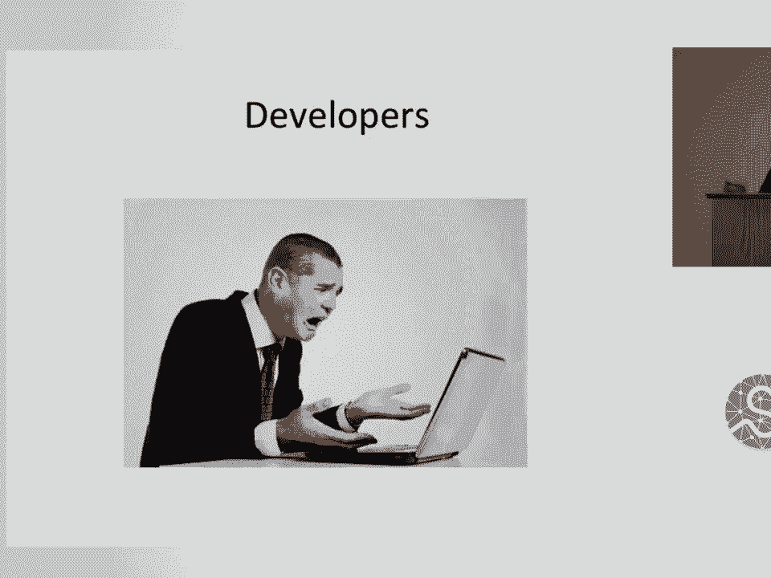

 hold。 So the first is giving credit for software and good software development practices。

 So we know that in academia the software itself is not valued in the same way as a research， paper。

 And so one thing is to start treating software as a research product。

 And I'm not going to talk about changing academia because I don't have that ability。

 If you have that ability please go do that and put it on top of your list as a priority。

 But that's something that we can do。 But along with giving credit for software is valuing good software development practices。

 When we see the software as service to the research the idea is get the software done as。

 quickly as possible and give me the answer。 It doesn't value the process of doing the development and the work that you need to put。

 into making good code code that you can share， code that's documented， code that's reproducible。

 and all of those things need to be valued as a part of the research process rather than。

 a service to the broader mission。 Career paths for research software development so this is the sort of change academia part。

 that I think there's a few people working on and I'll talk a bit about that。

 Information or access to resources on better and best practices。

 So I think in this room what's great and we've seen this in a lot of talks there's a lot。

 of great resources on how to do these things well。

 But what happens is that we learn them by ourselves over and over again。

 So where resources that we can go to as developers to look for guidance on best practices。

 A checklist we can use when we're developing our software or those templates oh that cookie。

 cutter thing was awesome。 So something like that so we saw a talk yesterday on cookie cutter where you could just go and。

 get basically the whole infrastructure for how you would want to put together your project。

 Everybody started learning that on their own。 Those kinds of projects really make a big difference in the learning curve and the good。

 practices。 And finally pay for open source software development。 I like this。

 This is a good audience。 So to the first couple of points around getting credit for software and career paths。

 So the Journal of Open Source Software and there's a lot of the people that founded this。

 project here is a journal that you can submit your software to so it rewards good practices。

 in software development。 You submit your software if it has documentation and tests and read me in a license。

 You submit your software with a brief description and that becomes a publication。

 I think we're over 200 publications now in the Journal of Open Source Software。

 So that's a way of giving credit for software through the paper and publication system。

 So it's maybe a little bit of a hack but it's another way of demonstrating the value and。

 getting credit for the work that you do。 Then in terms of thinking about research career paths and also some of these other things。

 around things like this credit through documentation or through these journals is the Software Sustainability。

 Institute in the UK。 We've done a great job creating research software engineering paths in the UK。

 There's a complementary effort that's at the conceptualization phase in the United States。

 or C that looks to do a similar thing within the United States and looking at the landscape。

 here and what's the potential and academic institutions for these as career paths。

 Similarly the Moore and Sloan have funded some data science environments at Berkeley。

 NYU and University of Washington to explore these ideas of creating opportunities for。

 data science and programming within universities。 They develop differently at the different universities and there's some great blog posts。

 coming out of there talking about the different challenges and opportunities through that system。

 But to the point which you appreciated in paying people for open source software development。

 so this is really important because I was just at the Bioinformatics open source conference。

 meeting a couple weeks ago and Fernando Perez was also giving a talk there。

 This is a point that he made。 When people are expected to work on open source for free only the people who can afford to。

 work for free can participate。 It's a real privilege to be able to work on open source。

 We need to create opportunities for people who don't have that time to work for free。

 to be contributing to this process or the people who are working for free who value this。

 as their important work to get paid for this work。 There's no easy solution here。

 It's been great to talk to people here and talk about this as an idea。

 But we can't keep thinking that this work is free because it limits who's involved and。

 it limits the sustainability of anybody working on these projects。

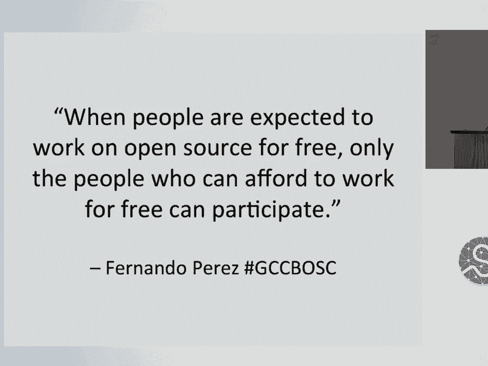

 So leadership。 That was the other piece of talking about tools。 We talk about lines of code。

 We talk about developers。 I thought Ralph talked yesterday about the path to SciPy 1。0。

 A lot of that path to SciPy 1。0 was about lines of code。 But a lot of it was about leadership。

 He was talking about that time when he disappeared from his email which I think we all want to， do。

 He needed to just take that step back。

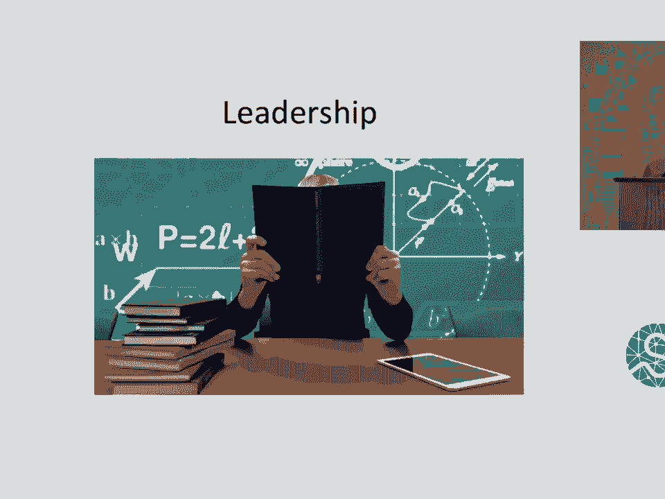

 We are all familiar with the peer mid of maintainers and you have only a few people at the top。

 who are helping to maintain the code。 That's sort of natural。

 You're always going to have a peer mid structure in any of these things。

 The thing though that we're not doing is we're not valuing that leadership level。

 A lot of our maintainers are working for free or as side projects。

 Maybe they are getting paid at a company but on 20% time。

 It's not only valuing these people and potentially paying them for their work but training them。

 to be leaders。 We all come in as software developers and that transition from being someone who is contributing。

 to a project to maybe this approvers， maintainers。 What does this pathway look like？

 How do we help make that easier for people？ How do we train each other？ This is another situation。

 I think we're doing a lot better job around helping train other developers， sharing resources。

 maintain code， offering training but what we're not yet doing is supporting each other in。

 these leadership roles。 How do you become a maintainer？ How do you think about it？

 How do you have your backup maintainer？ I think that we're at a situation and maybe this is one of those things that people have。

 been saying this for 10 years but where a lot of the people at those maintainers and those。

 chief maintainers are essentially burning out and that's going to really have a big impact。

 on the projects that we all care about。 How can we support those leaders。

 help them in their jobs and bring up new leaders in our。

 community because I know everyone I've talked to here is a leader in this space。

 You all have opportunities to do these things。 If that's something that you're excited about you should be able to be supported in that。

 pathway as well as being supported in writing lines of code。

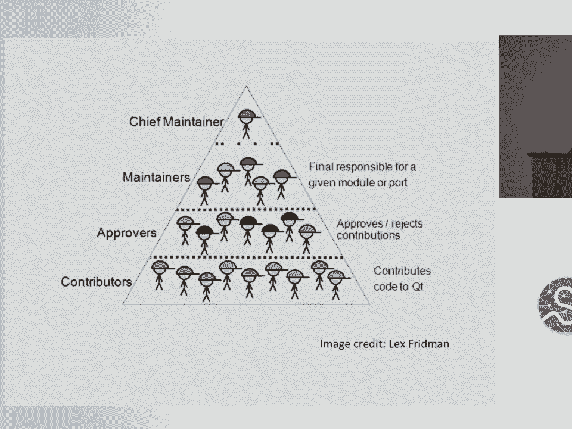

 So the second part of the triangle is training and with the caroprene trees this is of course。

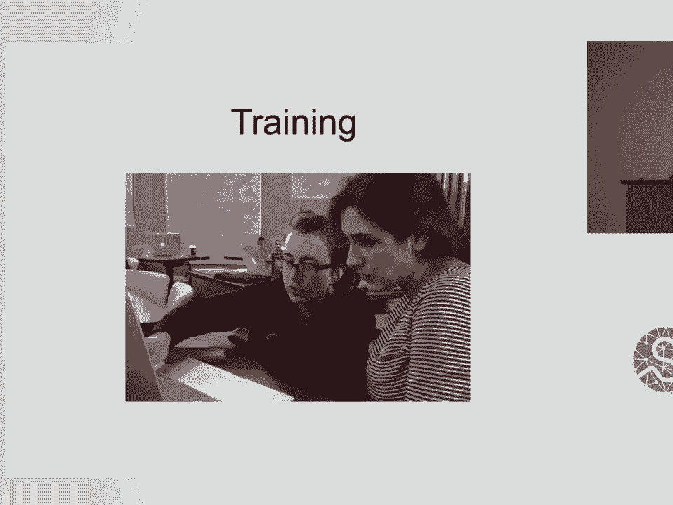

 near and dear to my heart。 And so one thing that's really interesting about current researchers and we'll talk again。

 about the research base is that they have actually many of the qualities of the super， woman， right？

 They understand the research problem。 They have ability to learn new things。

 They're motivated to answer the questions。 What they don't have is computational skills and that's often because they haven't had the。

 opportunity to learn them。 If you're a postdoc it wasn't even on the radar when you were an undergrad。

 potentially， even a graduate student。 There weren't training opportunities。

 Even now if you're an undergraduate there aren't a lot of opportunities outside of。

 say computer science or a sort of traditionally considered computational fields。

 To learn these skills the Berkeley Data 8 program is one that's emerging and on Coursera。

 But most universities are still trying to figure out how to implement something like this at。

 a broader scale。 And the great thing though about these folks is that they're also very motivated。

 They really want this training， right？ So this is a survey of resource。

 bioinformatics resource Australia and they asked what is， the most useful thing that we can do？

 And 50% of respondents said offer training。 And this is one of the few plots I've ever seen where something is more important than。

 funding。 And so this is something that you know we're not trying to come in and say you need to。

 learn these things， right？ This is something that people want to learn。

 They're looking for opportunities。 Similarly a survey in the United States of PIs at the National Science Foundation and。

 biology projects。 They said what are the current unmet needs？

 So the font is a little bit small here。 But the top three of these are training。

 So we have a community of people who are excited about the potential to learn。

 So how do we offer this training？ And because we've talked about undergraduate curriculum and that it's still sort of catching。

 up。 But also because a lot of the people that are here write their active researchers， they。

 don't have time to take a semester course。 So we need to think about training in the gaps。

 And what does training in the gaps mean？ It needs to be accessible and aligned。

 So by accessible that means a lot of things。 It means accessible at your location。

 It means accessibility in terms of accessibility requirements and being accessible to all people。

 It means accessible in terms of the time that it is。 Does it need to be weakened？

 Should it not be weak ends？ So it needs to be training that's accessible to you when you need it。

 And it needs to be aligned。 It needs to be aligned with the problems that you're facing。 The things。

 all those questions about being motivated。 It needs to be aligned with the motivation that people have to learn these skills。

 And so that can be different in different domains of research at different career stages。

 So we need to think about these training and the gaps opportunities as meeting these， criteria。

 So some of the ways that we can do training in the gaps are workshops， short courses。

 self-guided learning， MOOCs， integration into existing courses。 And I'm going to talk about。

 there's a lot of great options in lots of these different， areas。

 I'm going to talk about workshops because that's what I know most about from， the carpentry。

 And also because we've shown that they really have an impact。

 So I really appreciate the introduction this morning and that kind of qualitative sense。

 around the impact that these workshops and the carpentry have had in people's lives。

 So I want to talk a little bit about how we do that and the impact that we're seeing。

 So in January of 2018， Software Carpentry， which was founded by Greg Wilson， and Data， Carpentry。

 which was founded later in 2014， merged to become the carpentry。

 And so we're now a joint organization teaching foundational coding and data science skills。

 for researchers worldwide。 And we talk about our training。

 but you'll hear it's also really about our community。 And I think as we've grown。

 what I'm really excited about with the joining of the organizations。

 is not so much about the curriculum， but the building of the community and contributing。

 to build a broader community around these practices in lots of different domains of research。

 and different tools。 So with the carpentry， we teach core skills for effective research computing。

 We have trained instructors， volunteer instructors。

 Our general format is two-day hands-on workshops， and we use collaboratively developed openly。

 licensed materials。 So the first piece around the collaboratively developed openly licensed materials。

 So Greg started out Software Carpentry， and he started out these lessons in this way。

 And having all of the materials online in GitHub repos essentially like a software project。

 So all of our lessons are online in GitHub。 And so you can contribute to them in the same way that you would any software project。

 You can put file issues， create pull requests。 So most of our lessons have hundreds of contributors。

 And because we teach them so frequently， different people are seeing them and using them。

 So they have a lot to contribute to how things change。 So it keeps them relevant。

 So this model around collaboratively developed openly licensed materials has really allowed。

 us to scale the numbers of lessons that we have and maintain their quality。

 So we now have over 41 lessons， including a recent translation into Spanish。

 And so what's really great about this is that scalability。

 It also means that we have essentially 41 open source projects that we maintain as a part。

 of the carpentry。 Volunteer instructors。 When I talk about community。

 this is really the core of the carpentry。 So last night we had the opportunity to have dinner together。

 some of the carpentry folks， and people are spread all over the world。

 So it's always great to get to meet with each other。

 And so we have an instructor training program that trains people in how to teach。

 So this is part of that scaling is that we're investing in people and people are investing。

 in each other to spread the ability to teach these skills as well as the kinds of curriculum。

 So you can see some familiar faces in this particular photo， Katie Hough， last year's。

 SciPy keynote and Matt Davis， now at Clover， one of the organizations sponsoring the Diversity。

 Lynch。 So the carpentry has really been tied to the SciPy community for a really long time。

 And so we still really see this as one of the conferences that's the heart of our program。 Oh。

 and there's Anthony too。 So look at that。 That looks just like him when he's up here too。

 So since this started， so Greg restarted this in 2010。 We've really grown our workshops。

 You can see now increasing every year the number of learners that we're reaching。

 And we have a global community now as well。 So these are workshops where we've taught all over the world。

 We finally taught on the seventh continent in Antarctica。

 So now we've taught on all seven continents。 Yes。 [APPLAUSE]。

 It's really one person Harriet who gave that。 And I feel like she should always just get the credit for that。

 It was one like a two day delay because of weather。 So I was like。

 so sad you can't get home to see your family。 But could you teach a workshop while you're there？

 So that's been really exciting the global reach。 And just last night。

 Mowika was talking about bringing more to Argentina。

 So people take the carpentry with them to different places。

 And it's able to have a global impact that way。 So these are just some numbers around our impact。

 We have 1，480 more than that now instructors。 We've taught 1，332 workshops， 37。

000 learners in over 44 countries。 And so those are just the numbers of who we reached。

 But the question is， is it having an impact？ So we do both short term and long term studies。

 surveys of our learners。 So we do a pre workshop survey and a post workshop survey。

 So that's to get people's ideas around the workshops and also around what they've learned。

 in those two days on the short time scale。 We also follow up with a six month survey。

 So six months after the workshop to see if the kinds of things they learned are still， persisting。

 if they still saw it as a valuable experience。 Maybe it was just a great two days。

 And so right after the workshop， we see that 77% are more comfortable with the tools。 54-- oh。

 sorry。 This is the long term。 So this is-- and so when we talk about the six month survey。

 six months after a workshop， 77% of the respondents are more comfortable with the tools than they were before the workshop。

 54% say they have made their analyses more reproducible。

 65% have gained confidence in working with data。 And 74% have recommended the Carpentries workshops to friends or colleagues or say they。

 would recommend them to friends or colleagues。 And so this evaluates-- you can see we're not asking like。

 can you write a script？ Right？ What we're talking about is do you use these tools and do you feel comfortable and confident。

 using them？ Because if people don't feel comfortable and confident using the skills。

 they're not going， to use them。 So in our two day workshops， what we really focus on。

 we teach the syntax， we teach the， programming， right？

 But we can't teach everything about programming in two days。

 So what we do is we try to build confidence for people to go on and continue to learn。

 Because what we've seen is that a lot of people's first experience learning to program has been。

 a negative one， a disempowering one。 One that made them feel like it was something that they couldn't do。

 And we want to turn the tables on that and make it a positive experience。

 So something that people are excited about， something that they feel this kind of self-efficacy。

 this idea that it's something that they can do。 And so when we talk about our two day workshops。

 we use a lot of practices in our two day workshops， to make that possible。

 So we try to make them very inclusive and welcoming environments。

 We have code of conduct for all of our workshops。 We talk about using motivational language。

 not using the word dismissive language， like， just。

 We get feedback from learners during the workshops。

 We use a sticky note system to figure out how people are doing。 Green if they're doing well。

 answer the question。 Red if they want some help from helpers。

 So all the things that we build into the workshop around how we teach is the important thing。

 about the workshops rather than necessarily the content， although the content is important， too。

 And we can see that this confidence persists long term。 This is going back to the short term one。

 So this is one of these， we now have paired pre and post analysis so you can match the， same person。

 So we look at some of these things in just two days。 The top one， it says write program。

 I am comfortable writing a small program to analyze my data。

 So before the workshop is the green and then the blue is after the workshop。

 So in just two days a full point move in how people feel like they could write some code。

 They can search online to find their problems。 They know to keep their raw data raw。

 We talk about reproducibility practices too。 But they can use programming to be more efficient and effective。

 So those are about perceptions。 That they have， they are confident in using program。

 more confident in using programming， in their work。 That they can overcome problems。 Right？

 So it's not just about knowing how to cut and paste but people are feeling like in just。

 two days that I have a better sense about overcoming their problems。

 And finally that they think that this approaches can make analyses easier。

 So this is really just all an approach to democratizing data skills。

 So what the Carpentries really does by having this community， the strong community of instructors。

 who teach other people peer led instruction， building confidence， teaching skills。

 It's bringing these skills to more people。 You can see around the world Africa is one of the biggest growing areas in the Carpentries。

 right now。 And we're really as an opportunity to democratize these skills。

 And that's important because it allows people to answer more questions。

 People have questions they want to answer data they have。

 If they have the skills they can answer the questions that are important to them。

 We can engage a more diverse set of researchers and computational analyses。

 We can get more creative approaches and questions right by having more people with different。

 perspectives that can bring these skills to their problems。 And so really everyone wins。

 There's no downside。 Our money ball is not identifying under appreciated talent but creating a program that builds talent。

 So rather than looking under to find the perfect person， if we build a program that creates。

 this talent not only do we have more people but we have a more diverse set of people and。

 more questions and approaches that we can use。 So finally the third part of that triangle is community。

 And this is a picture from our first Carpentries con in Devlin Island this year which was amazing。

 And the community is really key。 And I think that was what when I came to SciPy I really felt like I found a community。

 And it's about that community of practice。 And creating a community of practice that is inclusive and accessible。

 I think one of the challenges in learning to program is that when you go and you look。

 for your community online and you find stack overflow you maybe think this is not a community。

 that is for you。 So how can you practice？ How can we think about creating a community of practice that's inclusive and welcoming？

 And that requires work and intentionality。 These things don't come easily。

 Opportunities to fail while learning。 This goes a little bit to that inclusivity piece。

 So many things seem high stakes。 If you're contributing to an open source project you feel a lot of pressure。

 This is production code。 There's people looking at it。 Or you're just publishing your research code。

 You're like oh my gosh people are going to read it。 See what a terrible programmer I am。

 So how can we think about opportunities to fail while learning？

 We're not going to get this stuff right the first time。

 How can it be okay to learn and not feel like we need to be best right from the start？

 This idea of lifelong learning。 So I loved at the beginning that learning was top of the list and things that people were。

 excited about。 Because communities of practice they learn from each other。

 Local in person communities as well as virtual networks。

 And this is something I think in the carpentries that we're learning。

 We've had a lot of virtual networks and emphasis on calls and online resources。

 But as communities are getting bigger we're finding that people want to get together locally。

 and connect about things as well as virtually。 And finally collaboration is key around communities of practice。

 So open code， open data， open science， all the things that we value as part of being part。

 of the research process。 They're also just really important in supporting each other。

 Because you know if your code， even if your code is not perfect it's an example for someone。

 else for something that they can try。 So sharing how we work and the things that we work on helps our community as a whole。

 And this is back to the word cloud。 So this is a word cloud from a twitter analysis of the carpentry con meeting。

 And you can see what people really value as instructors is the community。

 You can see things like workshops and things。 But the big words are the community and the people。

 And at the end of the day as much as we value the lines of code I think lots of times we。

 stay for the people。 And so that community and supporting that community is really valuable and important。

 and not just in the side。 So it's interesting to see the community manager role get more appreciated in open source software。

 And along with thinking about leadership， thinking about supporting and developing community。

 management and community support。 So if we want to go fast we can go alone。

 But if we want to go far we can go together。 And I think this speaks to Ralph's point yesterday too。

 Is that when we have these single people going forging ahead。

 You know sort of only so far you can go。 But if we go together that we can support each other in this pathways that it makes a。

 difference in where we can go。 And this is a proverb。

 But I feel like in academia we need to maybe embrace a slightly different model。

 Where if we want to go fast go alone we want to go in a lot of different uncoordinated directions。

 at once go together。 And this is a say that we don't necessarily all need to do the same thing。

 But actually by working together we can pursue a lot of different pathways。

 It's also cute kittens which is important to incorporate into any talk especially after。

 my specializations。 So just coming back to that idea of you know what's this triangle。

 How do we democratize data？ How do we scale the number of people that have these skills that can answer questions。

 that they care about。 And so this combination of tools training and community but really all about at the end。

 of the day people empowering people with these skills to do the work。

 Supporting the people who are doing the work。 And because we always have data and we can have tools and you can turn it into information。

 but to turn it into knowledge you need the people that are going to do that work。

 So I want to acknowledge here at the end here this real sense of going together I think。

 in this community but in the Kubernetes。 So right this is our global conference we have 120 people from all over the world come。

 together and really emphasize how important that community was。

 So I really want to thank all of the instructors the helpers people who've hosted workshops。

 and helping to bring these skills perspective this confidence empowering their communities。

 to do their work。 And the Kubernetes also have over 61 member organizations。

 The more foundation and the foundation have provided some grants and NSF was helped with。

 initial funding for data carpentry。 And so this is you know I talked a little bit about the carpentry。

 There's lots of ways to get involved in all of these elements right the Journal of Open。

 Service software you can be an editor with the carpentries you can be an instructor who。

 is to workshop become a member organization donate you can donate to any of the kind of。

 causes that you see here。 You can have workshops and companies you can do all sorts of different things to be a part。

 of this community to support these communities。 And I'm excited to hear what opportunities and things come out here we have some more。

 buffs we have a a buff this afternoon around data and computing education at one o'clock。

 to talk more about these ideas。 One of the things people are talking about is bringing these kinds of like workshop type。

 things into the classroom rather than everyone writing their own semester long class using。

 breezing materials and semester materials so if you're teaching in a semester long course。

 it would be awesome to have you there and talk about ideas。

 So thank you to all of you for the work that you do when we say value and contributions。

 Thank you maybe you don't hear it enough but what you do is driving research and making。

 innovation possible as well as maintenance of the important things that do the day to， day work。

 So thank you for this opportunity and thank you for being here in the work that you do。

 We have some time for questions if you raise your hand I will find you or step up to the， mic。

 Thank you so much for the great talk and I have been wanting to join the carpentry as。

 an instructor for quite a few months so I'll talk to you afterwards。

 One thing I want to mention is this is my first time being outside pie。

 I did have the mental imagery of all the core developers being the stack overflow type and。

 I personally had some mixed experiences on the site and one thing I really want in the。

 community to make an effort and make this message clearer saying we are open source software。

 for science。 We are nice。 We are really open ancient beginners or intermediate levels we are not one of those coding snobs。

 and so I think in the long term that will help the entire ecosystem to be more sustainable。

 and like I said yesterday as a user for quite a while we all have the desire to give back。

 eventually and also teaching other people really is the best way to improve ourselves。

 too and so really saying that we are nice we are open and we need help and make it really。

 explicit will be really helpful and thank you so much。 Thanks。

 So what I heard from that is openness， niceness and helpfulness equals sustainability。

 Is that right？ Okay。 That's the best take home from my talk right there。 Hi Tracy。

 Thanks for a wonderful and inspiring talk。 One really interesting point you raised is that as educators we are training people who。

 are postdocs and faculty members and people who are further on in their careers than perhaps。

 we essentially like to be training people at an earlier stage as well。

 How do we make room in curriculum at an undergrad level for example？

 So how do we make room in undergraduate， you know we are training in the gaps how can we。

 maybe not train in the gaps？ Right。 So at an undergraduate level I think one of I like to think about what we can do now not。

 the aspirational five years from now but what we can do now is we can start to incorporate。

 some of this training into our regular classes。 So right my backgrounds in biology and genomics if I am teaching a genomics course to start。

 incorporating how do you do genomic analysis into my genomics 101 course。 Right。

 So not needing to create a whole new course but adding modules to existing course that。

 include these skills。 So that's one model。 Another is if you do have an opportunity to do a new course to look at existing courses。

 in similar space and not feel like you need to write all the materials。

 So Ethan White has a data carpentry semester for biology course。

 And Fernando Perez just put together a course last year upper division course that included。

 testing。 So there's a lot of materials out there。 Oh one thing I didn't mention。

 A complementary to the Journal of Open Source offers， the Journal of Open Source Education。

 So one of the challenges in finding good materials is discoverability。

 A lot of people have them all over the internet。 And so when you type learn R， right。

 well actually you get data camp。 But when you type learn R。

 you know it doesn't really help you narrow it down。

 So the Journal of Open Source Education idea is that people can submit their educational。

 materials for a publication credit but that also it lets you find high quality materials。

 in particular fields。 So sharing materials， looking for reusable materials。

 incorporating them into existing， modules are three of the things that I think we could be doing now to bring this to。

 undergraduate education。 Time for one more question。 Yeah。

 well thank you very much for a really great talk。 So I agree with the idea of teaching computational skills in a spot of the course you're teaching。

 But sometimes I think you already have a lot to cover in the subject area you're teaching。

 So why not in a department or across department， sit down and look at different skills that。

 get into biology， chemistry， physics， mathematics and then design a course that goes across a。

 course line。 Because if we look at computing， so we have different problem sets but very similar tools。

 Python for example is not only in biology， it's in chemistry， it's in physics， it's in， mathematics。

 So at the foundation we can have something like that from my experience。

 So the question right is why instead of incorporating into a class you already have a lot to teach。

 in a genomics class， why not build， look across departments and see what's needed and teach。

 sort of one course。 So that's what Berkeley is doing with their data aid program。

 That's actually very rare。 So the challenge is this。

 In that departments have a lot of different ideas about what course requirements can be。

 So getting departments to coordinate just from a logistical perspective can be challenging。

 I agree that's the ideal and I hope that's where we are in five years is that we think。

 about these cross-cutting courses that can be available。 Because you're right， absolutely。

 They're important in every domain and everyone should have the opportunity to learn them。

 And you shouldn't require every professor to figure out how to teach them in their course。

 necessarily。 So I think that's the ideal。 I like to see what different universities are doing around this but it does require a。

 coordinated effort that I think is still coming together at most universities。

 Alright with that it's time for the break。 So let's thank Dr。 Teal and all the questioners。

 [Applause]， [BLANK_AUDIO]。