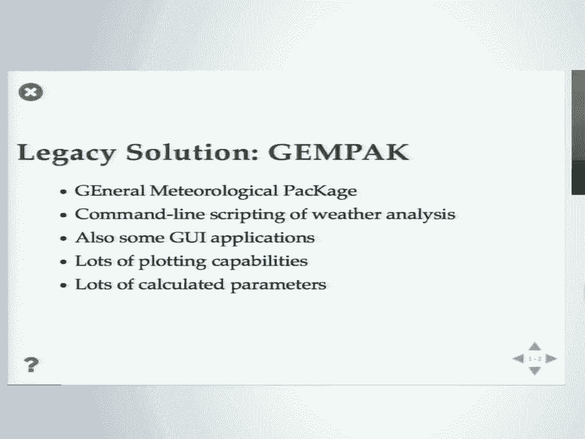
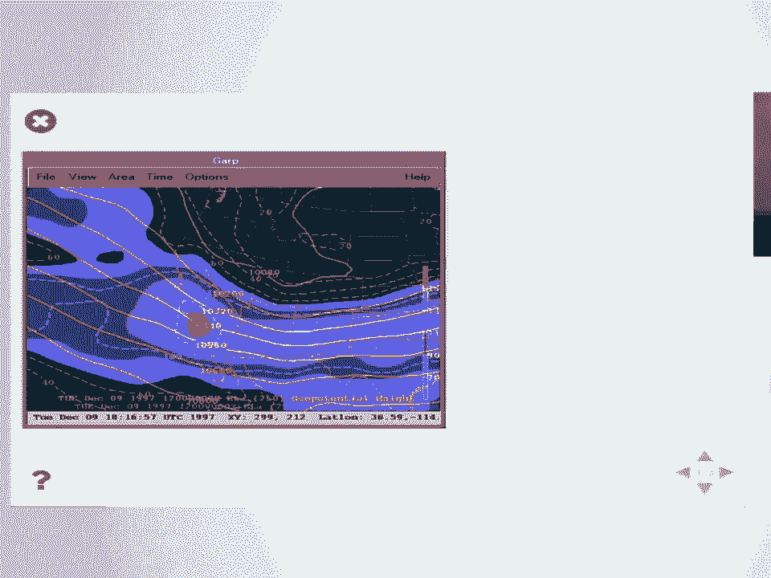
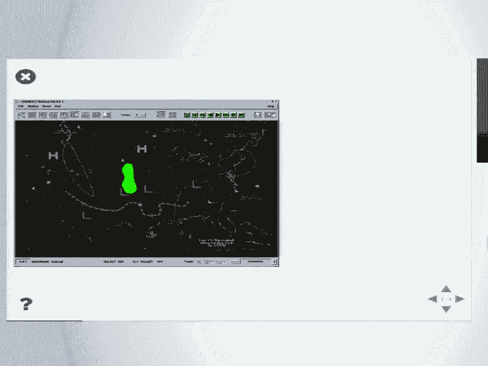
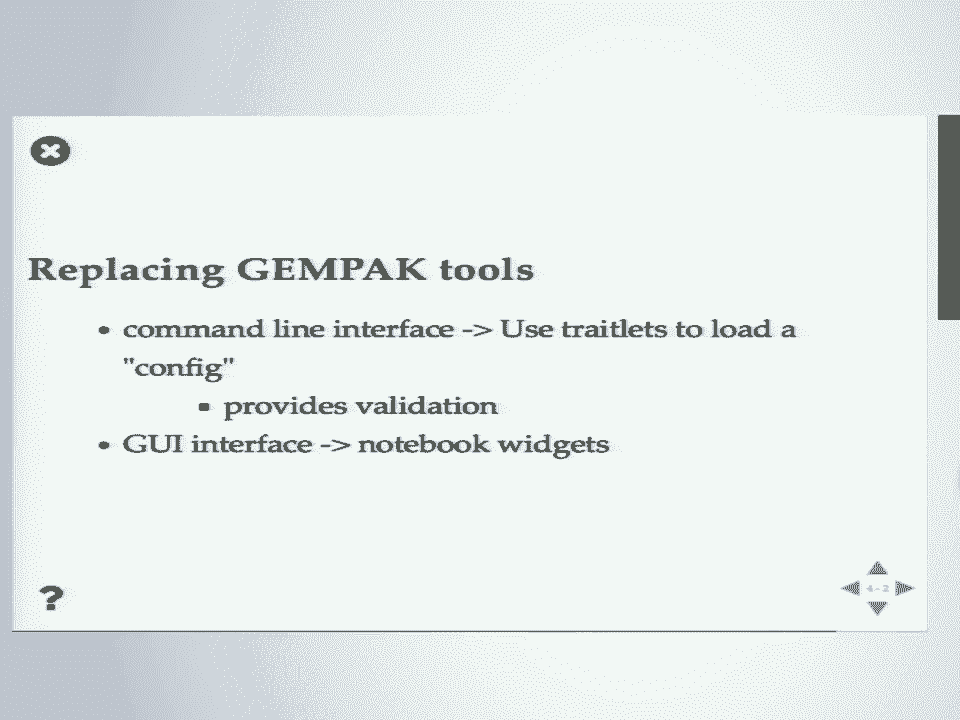
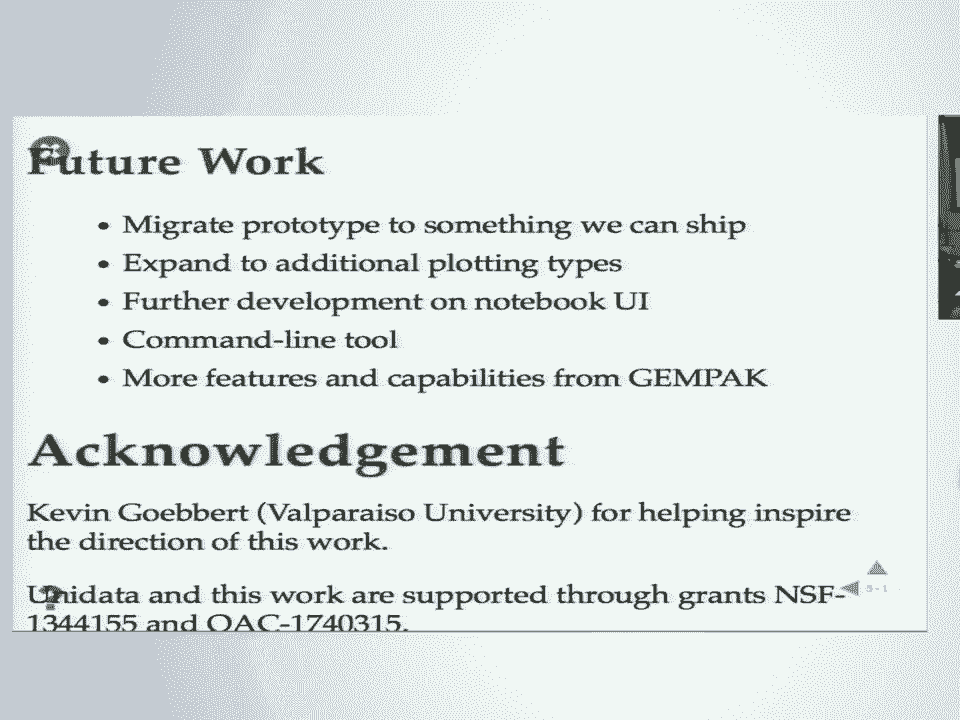

# SciPy 2018视频专辑 - P5：SciPy 2018视频专辑 (P5. Development of MetPy’s Declarative Plotting Interface _ SciP - GalileoHua - BV1TE411n7Ny

 Good， well it's not quite afternoon yet， but I don't want to be the last thing standing between you guys and lunch。

 So let's get to this and I'll keep it as brief as I can。

 The problem meteorologists make lots of weather maps lots of them。

 So many weather maps that's what we do all day every day is looking at weather maps to see what's going on。

 See what happened it's the bread and butter of meteorology， and it's great and you know。

 Tools to produce maps are important to our field and so here are some examples of。

 Kind of things we're doing with map pie today， The legacy solution to this problem is a tool called gem pack which it stands for a general meteorological package。

 So just based on that name you kind of get a flair for what area of computing this this tool came out of。

 It was the 1980s， It's a command line scripting tool kind of in the vein of GMT where you have these individual tools that you are。

 Piping and scripting together to generate analysis graphics， It also includes some。

 Graphical user interface type applications as well。

 It has a lot of plotting capabilities in terms of the different。

 meteorological specific analyses we do and， Also has a lot of calculated parameters。

 and that's one of its core features is what we call the grid diagnostics。

 you take grid of data and calculate some kind of， quantity on their say taking temperature and relative humidity and maybe calculating dew point and。

 So here's an example out of the tool ships with Gen Pack called garp。

 This is one of those graphical applications， and this is this is its state-of-the-art in terms of graphical output the UI。

 Well， that's what it looks like， Another example from Gen Pack of N map to I'm just trying to give you a flair for these are the kind of graphics that this tool。

 which is beloved by meteorologist for its power and and， ease of use and the。

 rapidity with which you can create new graphics and you know just explore what's going on in today's weather。

 Here's more of a static type image you'd be using Gen Pack to generate with script。

 So now that we're in 2018 and not the 80s， Gen packs kind of really you've been creaking under its age here。

 You've got an ancient technology stack。 It's built on I mean those gooeys。 It's motif。 I。

 Don't even most platforms you can barely get those on anymore。

 It's not flexible with regards to data formats， So getting data in net CDF for instance is non-trivial to get into Gen Pack and then as new revisions come on。

 it you have to， You basically pre-process all your data to get it into Gen Pack。

 Makes its data model nice and flexible and gets to a lot of power。

 But you do have to do a lot especially if you want to use it for research applications。

 Now you've got some arbitrary data you've you've been working with and getting into Gen Pack is。

 Well， especially for the average meteorologist nigh impossible if you're really dedicated。

 You could get in there and hack the for-tran or see and get it working and the big。

 The big problem with Gen Pack these days is that the National Weather Service and the National Center for Environmental Prediction have moved on to。

 new， tool packages for graphical use by forecasters and so they are no longer。

 developing Gen Pack and so the resources that were going to it are no longer there and so that leaves a。

 Lot of legacy code that if it's going to be continued forward has to be picked up by the community and you know。

 That's has its own challenges， So I work on a package called Met Pie it's a Python toolkit for doing meteorological things。

 We do things like file format support plotting calculations all in Python and its mission in life is to。

 Gracefully replace Gen Pack and just provide a nice place to we'll move into Python as we move away from these legacy applications。

 So this is all nice logical following here。 We'll just swap out Gen Pack for Python， So。

 Gen Pack scripting analysis you're literally using shell scripts here as your scripting language。

 You're also then it's a command line tool that you would set a bunch of variables in so using input redirection to actually do your programming of。

 the Gen Pack tools， an， Important note here it is more of a。

 declarative style versus imperative or or， Yeah， it's an imperative style of programming。

 So you're setting individual variables。 You're not calling functions。

 You're not telling Gen Pack what to do。 You're just telling it what you want and it goes about generating the plots。

 And so here's what this looks like and let me try and zoom out so we can get the full， beauty here。

 So this is actually seashell that even bash and so you're sourcing an environment file that contains a bunch of other things。

 You're using you know the Unix command line date utility to try and figure out what today's date is and doing some manipulation to。

 Turn it into the date format you want and then here we're gonna call the gridded contour routine and。

 Say okay until then we're redirecting input， I'm gonna tell you all the variables you should be doing so technically speaking you could just start the app and sit there and。

 Execute these lines one by one and generate your map， And then at the bottom here。

 Just because I like showing this here's where it tells it to run the utility and actually do it。

 And then you have to have two blank lines not one not three well three might work。

 but not one two blank lines and then eat exit and then you hit the end of your your input so that's what。

 That was state-of-the-art scripting weather analysis from the 80s and 90s。

 So we'll just use Python Python's a clearly superior scripting analysis solution here and we'll just drop in。

 The Python code and life will be easier， right？ This is great。

 There's a page of code I don't expect anyone to be able to read that but just get an idea for the magnitude we went from。

 That which is crafty， But that's much longer， 43 lines of code and that's without any of the white space and wrapping stuff that is just。

 individual statements being executed and 30 different function calls and methods to get something comparable to what JMPAC was doing for us in。

 Well a third do I half the code size？ this， Does not make me happy it makes me even you know I'm writing it myself。

 I'm not a forecast or a mccoder， so I don't mind writing code。

 But when I get into workshops and have to teach this kind of thing。

 Then it drives me nuts because then having to walk students through that much。

 It takes us an hour just to get the most basic of analyses done。

 So the Python stack is really powerful and it has general functionality， which is great。

 with that much flexibility and power comes just in generally a lot of。

 verbose-ness to what it takes to accomplish even the most basic attacks and， you know。

 it's a real quote-unquote programming language and so。

 You don't want to be trying to introduce this to freshmen in your intro to meteorology course who haven't really encountered any kind of programming。

 And but you want to hit the ground running and get them。

 used to generating their own weather analyses and just getting acquainted with。

 The processes we go through in meteorology， So how can we make Python more like JMPAC？

 So let's go back to our configuration here， We see this we're setting some variables and then we're running something so let's do a quick。

 conversion here and， That's what just a， Just a bit ball in here and just trying to turn this into Python we turn it into getting something out of the date time module。

 And use date。 Today and maybe use some F strings to format some of the code and you know。

 that's not bad， That's it's a decent start， Now， It's all just setting variables and running something which would mean these would be global variables and you know。

 That would be an abomination against nature to have all these global variables。

 We don't want that we're in modern structured code， but， Well， maybe this。

 just a few simple classes， Make a map and set these attributes， We want a contour analysis， so。

 We'll set create contour and set a bunch of attributes in that and that still looks a lot like what we did with JMPAC and a lot less like the。

 43 line monstrosity we started with， So that's a nice theoretical thing there was no code that we really did to get there。

 We just kind of threw some things together， but you know if you go through the effort of doing this and then do a little more to。

 Talk about getting remote data here download some data from a thread server using open DAP and XRA。

 But this is actual live code in the notebook and if I was to run it。

 I'm not testing the demo gods here， Here's what you can get out you can actually use that those few lines of code and get out a nice weather map。

 And then we can add to it and， This time I've taken what was contouring some。

 Forecast model output and now I've added a satellite image underneath and that's not quite showing up as large as I want。

 Again adding to it。 Okay， we can image plot and set a couple attributes and BAM now we've got this more complicated analysis where you can。

 Combining different sources of data together and it did not take that much effort to get there。

 So how do we get up get there we started you know a matplotlib cardify at least。

 That's my core stack on things and of course I work on met pie so that's underpinning the meteorology here。

 So we have XRA under there and that's doing we have some custom。

 XRA accessors doing the CF metadata interpretation that handles。

 Setting up our projections based on what's in the data rather than requiring users to do it。

 So there's some magic there that's going on also picking out some dimensions based on the CF。

 metadata and then we also have traitlets sitting under there， So if you're not familiar traitlets。

 it's an， attribute framework that lack of a better term I could come up with that is started with IPython and Jupiter。

 And that's how they do their configuration management and a lot of other things。

 So it provides validation for attributes to make sure you use the proper types。

 It also provides event notification so that when attributes change their values。

 You can get notified of those values being changed and you can do some event driven style programming。

 now， All those things I just did to make those images that was completely overkill。

 I don't need a vent notification。 I just need you know set attributes and generate a plot。

 But some of the part about replacing GenPAC tools， it's not just about scripting analysis。

 It is this simplified command line interface where we don't want programmers。

 We don't want people to have to figure out I need to import these six names from these three different modules。

 We come on we'll drive this just as a configuration file， essentially。

 So that one thing traits let's give us theirs the validation for when users make things。

 It'll validate that you gave things the proper type within those files and then the GUI interface。

 There's something about treatlets and the ipython widget framework that just sounds interesting。

 So let's see what I touch， All right， so as the theme of the day goes。

 It's Jupiter time， So， Here I will tempt the demo gods， So this looks a lot like what we did before。

 I'm just combining the two data sources here， This is using the Jupiter matte plot lib or the ipi MPL。

 Plug in so this is running a matplotlib figure as a widget within the Jupiter。

 Jupiter lab environment here， and so this is just our static figure well。

 Somewhat static we can you know zoom in if we want and do things， but。

 Most important here now is I can import a few widgets from the ipi widgets project。

 Create some very basic user interface type things a。

 quick set of link up each of these UI elements to the attributes we were setting before in the script。

 But now I have a UI I can play with here and so I can for instance change， the。

 Plot of data you can't really see the contours right now because I've only have one so let's connect that up to maybe 50 contours。

 And let that turn through and， For temperature maybe blacks not appropriate。

 We want red color so we can go in there and change that。

 And now I mean we've seen these kind of things a lot of this week。

 But what I like here is I've taken the same scripting analysis that I'm intending to teach freshmen or sophomores or early。

 College meteorology students and now it's a very easy gateway into now doing these into an interactive setting and developing some more。

 canned widget UI tools that we can use with that same framework and we're not having to move very far from where we started。

 So I think that's all right there， So I don't know how to start that back where it was。

 Just do this the slow stupid way， All right， So， Just wrapping up what I've done here is base。

 I have implemented you know a beginning of a declarative plotting interface here based on that plot live in Cartipi。

 I mean it's practically trying to put together a domain specific language here in terms of meteorological plotting。

 and X array works really well in terms of hiding a lot of these details and allowing us to have some。

 magical functionality at least in terms of taking CF metadata for projections and turning that into。

 Cartipi objects hiding that detail away， you know， it's too too clash initial class initializations。

 But it's also probably one of the harder parts to get people to understand how to take that metadata and turn it into。

 Cartipi objects， so that's a great magic that hidden and treatlets。

 Especially once you get your head wrapped around it turning that into things you can easily link up with the ipi widgets is amazing。

 I was blown away with just as three lines。 I mean a small sale and I had a GUI， Oh。

 that's all didn't get split。 Okay future work， I need to migrate this prototype code to something that we can actually ship because I took careful pains here to not show you guys。

 Any of that code because it's its own special abomination。

 But it just you know something you just sit there and hack together till you get the interface you want and then we'll go back and。

 Clean it up。 I need to add some more plotting types， we have image plots and contour plots。

 but maybe some p color meshes or， Quiver barbs type plots are going to be important for meteorological analysis。

 we need to further develop the， notebook UI here and play with expanding the you know just。

 See what's useful here in terms of what attributes to expose or maybe how to go about。

 Baking that into the different plot types as far as a you know automatically popping up in the notebook。

 And then there's the command line tool aspect of this in terms of just having this。

 Python file that no one actually importing anything and it looks like a Gen Pack script and then have a just a basic。

 Driver program that uses as a configuration to do the plotting。

 And then also just all the knobs Gen Pack does a lot of things where I want New York。

 And so it knows how to draw a map that goes right to New York rather than you having to specify manual bounding boxes and a lot of those。

 Quality of life type improvements we need to implement in this interface。

 And with that I want to acknowledge Kevin Gobert at Valparais Valparaiso University did a lot to help inspire this work and help。

 bounce ideas off of him in terms of the Gen Pack thing because he's a big Gen Pack guy and then acknowledge the。

 generous NSF's， Funding we've had to work on this work at unidata and met by itself。

 That'll take some questions， I， Were quite a few questions who wants to go first， Hey。

 yeah great stuff Ryan and John as well。

 Just wondering， Maybe I missed some of this but how allied is this into the Met Pi project is and if it's not terribly well。

 allied， I mean does this kind of。

 Kind of split the resources and like you're having a Met Pi development and then you know。

 maybe something， It's almost like a Gem Pi development。 This is very much going into Met Pi。

 What we're thinking here is I want it to be an honor and I probably should have talked about this a little more is。

 One of the things about the simplified interface that I don't like about Gen Pack is it's going from there to programming is a big step。

 Whereas with this the same map plotlib objects are underpinning all this and so it is my intention that we're not going to have all the。

 Customization you could ever possibly want to expose as you simplified attributes， But you have hey。

 just grab just grab the map plotlib， Axis object out and then you can go through the same API that exists and so you have something that you know is。

 Intentionally limited in terms of its initial feature scope in terms of the Gem Pack declarative interface。

 But is a ready spot that you can extend then using the traditional？

 Imperative style of programming and so it should be something that scales up from the basics up to more advanced things and。

 My intention at least right now is for this just to live within， Met Pi's plotting functionality。

 Great talk Ryan。 I'm right here， so it looks good when you when you're able to。

 Have the declarative interface and then also create the the widgets to so you can mess around with it。

 Have you gone full circle so you can go back to the declarative interface after you've fiddled with it？

 That is one of the other things that has occurred to me is be able to yeah。

 You fiddle with something you get the attributes and then you want to save serialize that back out that state so that you can get the script。

 Like that and that has occurred to me。 I haven't tried it yet。

 I don't think the current iteration of the code is， Good enough to do that well yet。

 Anyone else if not， I have a few but， Okay， so first I would highly encourage peak alert mesh support as a radar person and。

 For people doing plotting libraries in general always peak alert mesh supports nice。

 And then also I just want to say that you know anything that wraps cardify for us to make life easier is really。

 Any other questions， Thanks Ryan and so following up on I guess it links to both prior questions。

 That that gap between the their declarative to imperative style。

 Do you have any kind of thoughts on being able to？

 Take the the form that you've got there and turn that into， Code that people could， Good， right。

 At least that was my thinking of that's what Paul was asking about and that's absolutely my thinking is turning that back into code。

 At least in terms of the declarative style should be very straightforward if you're in the imperative one and turning that back into code that's。

 Yeah， I don't know that we could get there， No， I don't think if you're if you're doing imperative style things it'd be better to maybe。

 Slightly expand the declarative API to include another attribute or two that would be readily。

 tracked and serialized rather than to try and do some other god awful hacks I can think of。

 Are you thinking of， Making something like this for the processing steps as well so that you could do the declarative and then。

 Straight into plot so initially I want to get the plotting just working first。

 We do have ideas in terms of not so much， Turning calculation functions into these because there's just too many of them but doing something along the lines of。

 you asked for， Forticity and so you can go back through your data set you see the wind components and so you can。

 automatically do that calculation based on what you have and so kind of making some kind of。

 Graph-type solver for getting the calculation that you want based on the data you have but that's a。

 That's a next year or two years long-aligned problem right now。

 It's just get get this into a state because I think it'll really help。

 Our users migrate from Gen Pack into the world of Python。

 Have you made or thought about making a mime renderer for that declarative type。

 for your users so that so that， Users could just double click in the Jupyter lab interface on the in the file browser and then have have it open up the plot。

 I've thought about many ways of integrating better into the notebook of that kind of thing in terms of display。

 I've not thought about that one。 That's an interesting idea in terms of double clicking though。

 Can you actually do that with something that needs to run Python code？ You can do it。 Yes， okay。

 Any other questions， it's in。

 Okay， cool。 It looks like it's lunchtime then go ahead and thank our speaker again， You。

 [BLANK_AUDIO]。