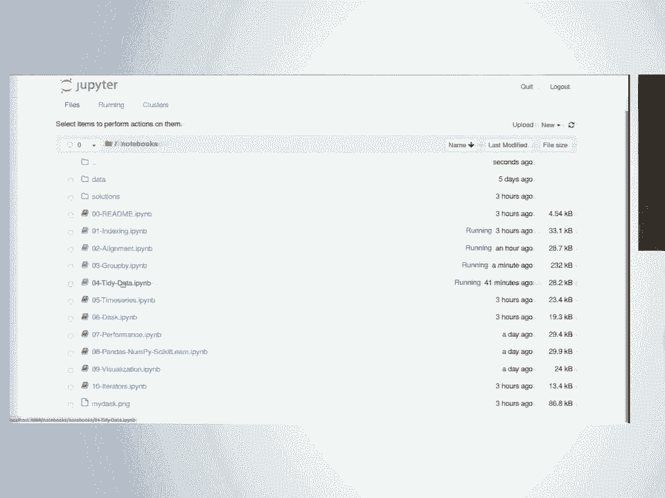
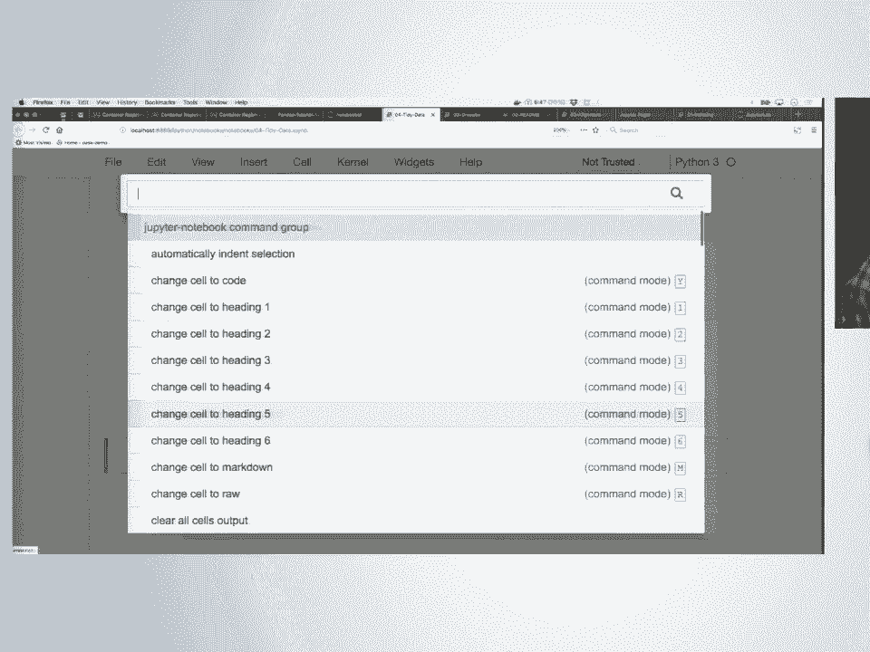
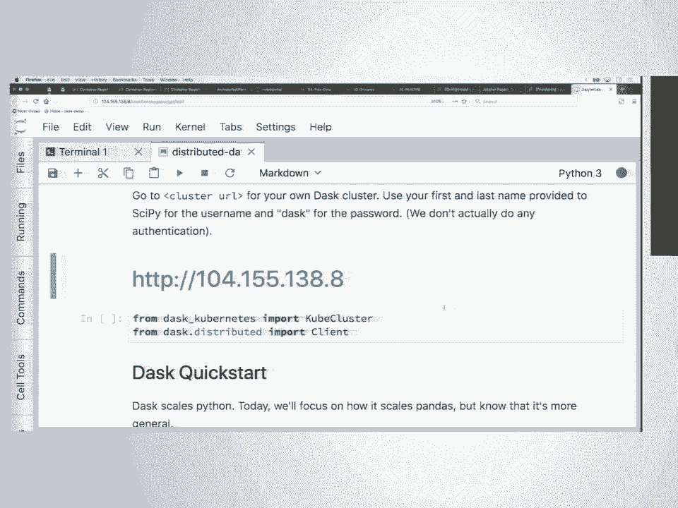
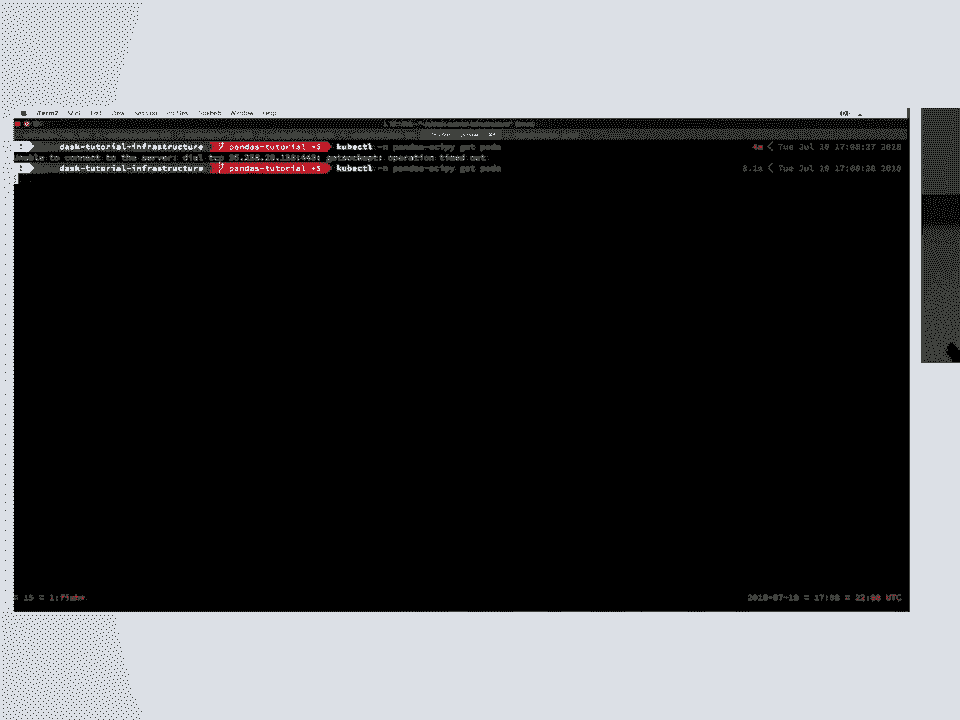
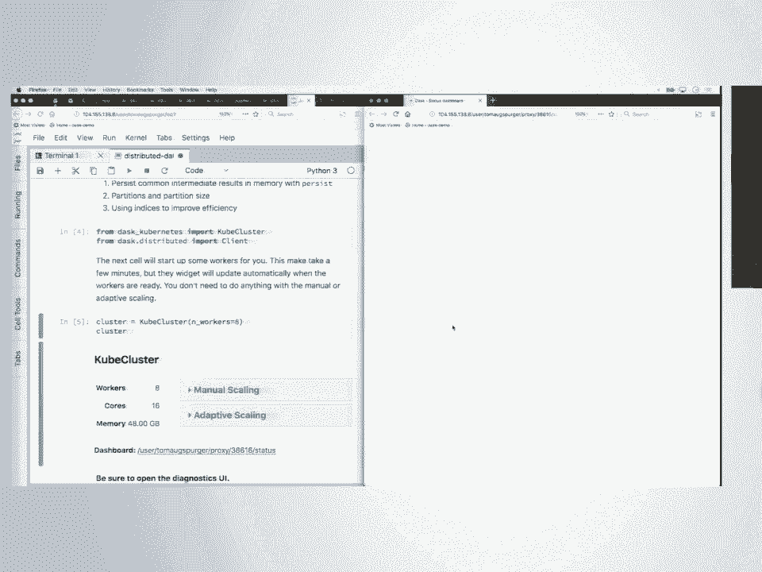

# SciPy 2018视频专辑 - P60：SciPy 2018视频专辑 (P60. pandas .head() to .tail() (Beginner) _ SciPy 2018 _ Augspur - GalileoHua - BV1TE411n7Ny

 Good afternoon， everyone。 Thank you。 It certainly is because we're here to talk about a library。

 that's pretty phenomenal。 In sort of the world and the ecosystem of Python。

 if you deal with any kind of data at all， you're going to be using Pandas at some point in your workflow。

 So it's good that you're all here。 We're going to learn some really， really practical stuff。

 some really useful stuff。 To help me think about the language， that I should use in talking to you。

 could I see by a show of hands？ How many of us would feel comfortable。

 explaining to the other people in the room what slicing is？ I'm not going to ask you to do it。

 but just a show of hands。 OK， that looks like about half of us。

 How many people would feel comfortable explaining。

 what method chaining is to the other people in the room？ OK， very good。

 And if I were to ask you to demonstrate two-dimensional， indexing in NumPy， how many of us。

 would feel comfortable explaining that？ OK， maybe like a third。 Excellent。

 So we can cover all these topics as we're going along。

 You don't need to know any of that to get started。 We're going to be in here and we're。

 going to have a good time。 And we're going to start by talking。

 about the fundamental data structures that we're， going to be using during this class。

 And there's going to be two of them。 One of them is called a series。

 And the other of them is called a data frame。 Now， a data frame is going to be composed of series。

 So it's sort of one thing is built out of the other。

 But we want to make sure we understand what we're dealing with。 And when you're learning a program。

 sort of one of the first things you start with， is by looking at your data structure。

 how you put stuff， into it， and then， of course， how you get stuff back out。

 we call this our access pattern。 So I'm going to do some doodling on the board here。

 We're going to play a little game of picturing。 What we talk about what these data structures are。

 And then we're going to use the things that we've， talked about here in the notebook together。

 And then you're going to practice using them on your own。

 with little exercises and we'll be wandering around the room。

 to help you work through those together。 All right， so in the world of Pandas。

 we have two kinds of data structures， that we're going to be dealing with。

 One of these is going to look much like a one dimensional， NumPy array。

 And what this means is that it is homogeneous in its data， types。 So if I have integers in there。

 it can only be integers。 If I have one floating point number in there。

 it can only be floating point numbers。 If I have one Python string in there。

 it can only be Python strings。 So we are homogeneous in our data type。

 And we have a compact on disk representation。 These two things together are also。

 going to give us access to NumPy's fast， vectorized， mathematical operations。 Now。

 one of the key differences between a Pandas， series object， which is what this is。

 and a NumPy array is that when I'm working inside of NumPy。

 I am required to know the position of everything。 Everything is about shape and location by index。

 So are you the zero thing？ Are you the one thing？ Are you the two thing？ But frequently。

 when we're using real world data， what we would really like to have is some sort of label based。

 access into that data。 So I don't want to have to remember。

 that Tom is in position three in my series。 I don't want to have to look it up every time。

 I sort my series。 Where did Tom go？ I would like to be able to ask， just where is Tom？

 I want Tom's data。 And the data structure that provides this for us。

 in the world of Pandas is something called an index。

 Any time you create any data structure in Pandas， you get at least one index attached to that data structure。

 And more specifically， you're going， to get one index for each dimension。

 So if I have a one dimensional Pandas series object， that means I get a one dimensional index。

 And this provides me my label based access。 So when we're working in Pandas， we have two options。

 We can get things in NumPy way by knowing it's in position 12， or it's in position 0。

 And we can also get things the Pandas way， by knowing that I've labeled that piece of data Tom。

 Now typically， when we're importing data into Pandas。

 it's not going to come in as a single series of data， as a one dimensional stream of data。

 It's usually going to come in the form of a table。 And a table is a very particular kind。

 of two dimensional data structure that， is homogeneous within a single column。

 but is heterogeneous across columns。 So I might have one column in this data frame that。

 has integer data。 I might have another column that has floating point data。

 I might have another column that has string data。 If you look at the data types in Pandas。

 you'll see that this is called an object。 We may or may not explain to you why that's true。

 And just like before， when I had my one dimensional Pandas， series object in my data frame， I also。

 have an index here on the left-hand side。 Now this index is going to give me label-based access。

 across a row of my data frame。 Because I have a two dimensional data structure， though。

 I now have two indices。 I have the normal index that we're， used to thinking about， which we'll now。

 call either the index index or the row index。 But we also get a second index for our second dimension up。

 here。 Now this is also strictly speaking an index object。 We will frequently call this the columns。

 And this columns index is going to give us， labeled access down into a single column of our data frame。

 Now we can combine indexing operations across the rows。

 and down the columns to extract very exacting pieces， of information in all the flexible ways。

 that we're used to using Python using NumPy。 Now there are a lot of ways that we could do this。

 Panda supports many， many， many different ways of indexing， into my data。

 We're going to talk about the four most common ones。 If I'm feeling really extravagant。

 maybe we'll do five。 [VIDEO PLAYBACK]， So the first way that we're going to think about how we can。

 extract data from our penis data frames is using something， that is called dictionary-like access。

 How many of us have used a dictionary in Python？ Excellent。 This is everybody。

 If I want to extract a value from a dictionary given that I， have the key。

 what little symbol on my keyboard， do I have to use？ Square brackets， exactly。 In Python。

 we call this the get item syntax。 And this is what we mean when we say dictionary-like syntax。

 in Panda。 So if I have some data frame， we'll abbreviate it df for short。

 I can use my square bracket syntax， to extract one column given the name of that column。 Now。

 there's a second way that I can interact with the syntax。 That's going to be much， much。

 much different than you would， with a dictionary。 In Panda。

 I'm allowed to pass in more than one column name。 So inside of my square bracket syntax。

 I can pass in a list of things like column one， column two。

 And this is going to return to me a data frame that， has those two columns， column one and two。

 In the first instance， when I'm extracting a single column。

 the type of this data that gets returned to me， is a Panda series object。 In the second case。

 this is a Panda's data frame。 Now， for those of you who are used to working in NumPy， in Panda's。

 we follow the conventions of get item calls， collapsing the dimension they come from。

 So if I apply this get item call to the column index， of my data frame。

 that column index disappears， and my two-dimensional data structure。

 goes down to a one-dimensional data structure， a one-dimensional Panda series object。

 The second way I have of extracting data， of accessing data inside of my Panda's data frame。

 we're going to call NumPy like。 Now， this strategy for putting data into my data frame。

 or getting some data back out， this， is going to be indicated by the use of a special accessor。

 ILOC， ILOC。 And this is how we're going to provide integer-based access。

 in one dimension or in two dimensions into my data frame， just like we would inside of NumPy。

 So again， we're going to use our square bracket syntax。

 And if I supply only one number or only one slice。

 the slice is going to operate across the rows of my data frame。 On the other hand。

 if I provide two integers--， forget item calls-- or something that has a colon in it。

 two slicing calls-- this first one will operate across the rows。

 the second one will operate across the columns。 There is no way that I can supply one slicing operator。

 and have it apply across the columns。 Now， if you're used to working in NumPy。

 this follows all the same rules that NumPy does。 If I have a slice here that preserves this dimension。

 if it is a single integer that's a get item call， it would be collapse that dimension。

 And when I get returned back to me， it's going to be a one-dimensional Pandas series object。

 I promise I'm almost done talking。 That's a great question。 So there's this really。

 really famous George Box quote， that all models are wrong， but some models are useful。

 So what we're presenting to you here， is not the way that any of this is actually。

 implemented under the hood。 This is what Pandas exposes to you， as its user-facing interface。

 And it mimics a lot of what you see in NumPy， and that is very， very much on purpose。

 Consistency in our APIs is how we make our libraries more， accessible to other people。

 So it is not quite exactly the same thing， in its implementation as a NumPy slicing。

 but as far as you are concerned， its behavior is going to be close enough。

 that you can pretend that it is。 There will be a couple of hiccups。

 We'll see one of those in just a second， where these rules don't quite line up。

 But for the most part， we can pretend it's true。 It's a great question。

 And if I'm throwing out words that people don't recognize， feel free to go ahead and ask。

 So we have a third way of accessing， data from our Pandas data frame。

 This is something that is unique to Pandas， and this is label-based access。

 So this is what's going to be using the row index， the labels that are inside of there。

 It's going to be using the labels that are inside， of the column index。 Now。

 we know that we're using label-based index， every time we see this 。loc accessor。

 So this is a way of saying to Pandas， I would like to have something that looks kind of like NumPy。

 slicing。 So the syntax is going to look the same， where I can have this one square bracket with a colon。

 and this is going to be applied across only the row index。 Or if I have two。

 it's applied across both the rows， for the first one and the columns for the second one。

 But the difference is it's going to look in that index， and only in that index for where things are。

 So if my row index consists of a bunch of people's names。

 like maybe Tom is in there and Joris is in there， and I'm looking for position number one。

 I'm going to get something that should look very familiar， to you from Python。

 I'm going to get a key error， saying there is no one inside of this index。 Now。

 before we get to some code to see what this looks， like in practice， I'd like to say one more thing。

 And maybe we'll write this in another color， so it stands out especially。 In pandas。

 indices are not the same thing as keys。 When we work with dictionaries in Python。

 there's this one very particular rule， about the keys that are supplied to that dictionary。

 those keys have to be unique。 For a pandas index， this is not true。

 So you can have repeated index labels both across the columns， which I don't recommend。

 that's super annoying， but it's very common to see this across the rows。 So for example。

 if I had four rows， all of which were labeled Joris， and I used my。

log access looking for just Joris， even though I might expect that dimension to be collapsed。

 I will get all four of those rows， with the name Joris attached to them。

 So the proper way to think about this is less like keys。

 in a dictionary and more like a database index。 It's a fast way to find and retrieve data。

 All right， now that we've had some fun doodling， let's start looking at code。

 And our notebooks are going to start with some imports， that we see up here at the top。

 And in this import， you'll notice that we're importing pandas， with something called an alias。

 We don't just import pandas， we don't from pandas import data frame。

 and we are importing pandas as PD。 We call this a canonical import。 This is not required by Python。

 it's not required by the Python syntax， but it's such a strong。

 colloquism is not quite the right word I'm looking for。 Convention， thank you。

 It's such a strong convention in the scientific programming， community that if you do not do this。

 when other people look at your code， they're going to be very， very confused about what's happening。

 So it's not syntactically required， but it's very important。

 And there's a couple more setup things here， at the top of the notebook。

 One of these is a matplotlib magic。 We're not going to talk about the internals of matplotlib。

 or threads of control in this particular class。 All this is going to do for us is going to let us look。

 at plots inside of the notebook itself。 And we're going to set some options inside of pandas。

 and then also inside a matplotlib， to make things appropriately sized。

 for the notebook that we're working in。 And for those of you who haven't used Jupyter before。

 the way that we're executing these， is I hold down the shift key， and I hit enter， one， two， three。

 (muffled speaking)， For our example data for our practice indexing。

 we're going to be reading in some data about airplane flights。 So they have some flight code。

 They have an arrival destination。 They have a departure。 They have a time they leave。

 They have a time they arrive。 We have like the ID number from the airplane。

 What we have right here in the next cell， is some code that's going to read that in for us。

 We can take a look at the table that's output。 Just to give ourselves sort of a sense。

 of what it is we're working with。 We see that we have this row index here on the left-hand side。

 These are all the numbers that are in bold。 Because we have not put in our row index。

 or asked for one to be created for us， we get the default index in Pandas。

 which is a sequential integer 01234。 Now this is not the same thing as the position of these data。

 So if I were to sort this data frame， maybe by the tail number of the aircraft， the positions。

 so the I look calls， for each of these would change， but the labels would stay the same。

 So my labels follow my data when I move them。 For those of you who are coming from a language。

 like R or Stata， this is going to feel a bit weird at first。

 but I promise you it's going to make your lives easier， in the long run。 For our column index。

 we have these are actually， some pretty nice column names。 So we have the data， the flight。

 the characters。 This is American Airlines， an airline ID， which is a little redundant。

 and we'll look at that more later。 Tail numbers for the aircraft。 From flight， coming from JFK。

 going to LAX。 The departure time， and this is in hundreds of hours， so this is 914。

 so that's in the morning。 And if we sort of scroll over， there are some more columns。

 that were sort of hidden off the screen here。 We have the actual， like date time。

 timestamp objects for the arrival and departure。 For doing things like timestamp operations。

 this is going to be the kind of data， that we want to work with。 And then finally。

 we also have the delays。 Both it's delaying departure， delaying arrival。

 and then whether or not the flight ended up being canceled。 All right。

 so we talked about the structure of a data frame。 So a data frame is a collection of series objects。

 that share a common row index。 And we talked about ways we can get some data out of there。

 So for example， if I wanted to extract just the column。

 that has the departure delay for all of these aircraft， I can use my square brackets syntax。

 my get items syntax for dictionary-like access， into this data frame， and extract just the column。

 with my departure delays。 I'd like to ask you， what is the data structure。

 that is being returned back to me here？ This is a series， very， very good。

 We'll notice it has a length。 So this is the number of elements that are in this series。 We have 20。

000 data points here。 It also has a D type。 So this is float64。

 For those of you who have not used NumPy for quite a while， NumPy has its own data types。

 separate from the Python native data types。 Paint is used as these data types。

 So this is telling me that I have a 64-bit floating point number。 Now。

 if I want to extract just those column labels， or just those roll labels。

 I have access to these as attributes， that are defined on my data frame object。 So for example。

 if I wanted to pull in， only the columns of this data frame。

 I can ask for the columns of the flight。 We'll see this is an index type object。

 It also has a D type。 And this is object， which for our purposes here。

 just means that it's a Python string。 And here are the names of all of my columns。

 So we can extract the column index。 We can do the same thing for the row index。

 And this is an attribute called index。 Now we're going to use both of these。

 when we want to have label based access， into this data frame。

 And that's what we're going to work on next。 Almost next。

 Before we're gonna have like a little teaser， I guess is what this is。

 So let's say that I would like to know， the average number of flights。

 that are leaving the New York metropolitan area per hour。

 I'm not going to ask you to raise your hands， to show us how you might do this。

 This is here in the code cell for us， but we can execute this to get a sense。

 of the kind of things that are available to us， when we're using pandas。

 So I know that doing all this upfront talk， about like indexing and how you get data by label。

 is where you get data by location， can be a little boring。

 But at some point we're going to be generating plots like this， which is hopefully the motivation。

 to keep listening to me talk。 And not switch over to Facebook。

 We can do things like plot the number of flights per carrier。

 We can do things like look at the correlation， between the delay from the departing airport。

 and the arrival delay。 As you might expect， this is pretty close to a one-to-one linear relationship。

 However， flights tend to be a little bit later on arrival， than they want on departure。 (silence)。

 All right， so the idea behind indexing， is that it is very， very handy to do things。

 like subset our data。 So I might want to only perform some set of comparisons。

 or some set of tests on data from a certain timeframe， from planes from a certain carrier。

 I might only want to be able to look at， flights that have been canceled， for example。

 or compare canceled flights and uncancelled flights。

 And we're going to look at each one of these things in turn。 To start with。

 we're going to make a new data frame。 And this is going to be one that does not have the 01234。

 as its default row index。 It's going to be a sampling of flights， that are indexed by their carrier。

 (silence)， So this is the first flights， the first set of flights that are leaving out of New York。

 in 2014， from airlines like American Airlines， Delta。 Not sure who F9 is， United， U。S。 Virgin。

 Southwest。 (silence)， Now let's say to start with， we like to grab just two columns。

 Now those two columns we have to give us information， about how delayed the flight was。

 One for departures， one for arrivals。 We can do this using that get item syntax。

 for the square brackets。 This time， instead of just asking for one particular column。

 we're going to ask for two， and this means we have to pass in a list， to that get item call。

 What's going to get returned back to us， is a two dimensional data structure。

 This is a painted data frame that's been sort of， subsetted down to just those two columns。

 For those of you who are used to working， in a language like SQL。

 this is very much like a select call。 If it's a little bit easier for us。

 we can do this in two separate steps。 (silence)， We can combine those strings。

 the departure delay and the arrival delay inside of one list， and then pass that list by name。

 into my indexing operation。 And we'll see that I get the same thing。 (silence)， Yes？

 (audience member speaking off microphone)， That's a great question。

 So the question was in input 15 here， I have these double brackets after the name。

 of my data structure。 And the reason for that is these inner brackets。

 is Python's list literal syntax。 So I'm constructing a new list object。

 The outer brackets are getting translated， into a get item call， and this is what's providing me。

 that dictionary like access into that data frame。 So in Python， you can think about。

 what I have just the square brackets on their own， and there's not stuff around them。

 So this is constructing a new Python object。 When I have an opening square bracket。

 that is either immediately after an object literal， or immediately after an object name。

 this is providing me some sort of label based access， into that object。 All right。

 so we're going to have， our first little code exercise。

 to make sure that everybody is on the same page。 Now， what I would like you to do is to extract。

 from the first data frame the columns named origin， and destination， which is a shorthand just dest。

 Now， the way this works is you're going to put， your solution here。

 and you can hold down the shift key， and hit enter to see if it does what you expect。 Afterward。

 you can compare your answer to Tom's answer， by going to the cell below and again evaluating it。

 So holding down the shift key and hit enter， and it's going to import some Python code。

 you can look at for comparison。 And just a reminder， once you think you've solved it。

 go ahead and put your green or red one up， or probably your green one。

 And then if you need more time， we'll ask you， and you can put your red one up。 And then。

 is there anyone who's still， having trouble installing the environments？ There's your other one。 OK。

 We have a cluster for later on。 I need to get the IP address real quick。 All right。

 so it looks like most of us have got there。 Congratulations on solving your first exercise。

 in the Panist Tutorial。 We're going to come back together as a group。

 and think about how we might solve this particular problem。 So I know I had this data frame first。

 so I'm going to go ahead and type the name here。 I'm probably going to be performing some actions on it。

 by name。 What I would like to do is extract two columns specifically。 Now。

 there's a lot of ways I could do that， but so far in the notebooks， we've only gone through one。

 And that one way is to use a dictionary like access。 For dictionary like access， I'm going。

 to use my open and close square bracket。 And this is my Python get items syntax。

 But I don't just want one column， I want two。 And so what this means is I'm going。

 to pass in a list of column names， and those names are origin， and dest。

 And if I evaluate this cell， what we'll see， is here I have reduced the number of columns in my data。

 frame down to two。 Do we all feel OK about this？ Yes？ Is there a reason that two points do not。

 work in the list that I guess？ That is a good question。 Typically。

 tuples and lists are interchangeable。 I know that there are some places， even in NumPy。

 where they perform two different functions。 And there's an explicit type check on the data structure。

 I don't know why the choice was made for the get items syntax， in Pandas specifically。

 So for posterity here， the question was， I couldn't use a tuple here。 And why is that？

 And the answer was that in Pandas， there is something called a multi-level index。

 And this is much like a joint key inside of SQL。 The idea is I can have a row that has two labels attached to it。

 I mean， Pandas does a type check for the tuple， to see if it should be using the lookup on some sort。

 of multi-level index with both labels。 Other questions about this？ All right， seeing none。

 We're going to go on to sort of the fourth one， which I did not， write up on the board here。

 but we can do this now。 The fourth way I can access data that we'll be doing actually。

 quite a lot in this class is in an attribute like way。

 So what that means is when I'm working with objects inside of Python。

 I have this dot syntax that allows me to access public data。

 and public methods that are defined on that object。 Now in Pandas， the columns themselves。

 are not technically speaking public data。 They're defined as attributes。

 But what Pandas does is when it can， it will create an attribute on that data frame that。

 gives me direct access to the column。 Now， given that we already have our square bracket get item syntax。

 it might seem a little--， like， why is there this additional option？

 And the reason for that is to make it easier for Python。

 to support attribute lookups on Pandas data structures。 So when we're working in Pandas。

 it's very common to see syntax， that looks like this， where I have some data frame。

 And then I'm going to grab some column by name。 Maybe I am selecting some data from that column。

 and I'm chaining on a method。 And what you'll notice is every time you have these square brackets。

 inside of a Python， the tab completion， that you're used to using stops working。

 And the reason for that is Python has no way， of knowing in advance the type of the data that comes out。

 of that call without evaluating it on its own。 That would be very expensive to evaluate in advance。

 every single thing that you're doing as you're typing。

 So what we can do instead is use this dot attribute lookup。

 and IPython does have the ability to see through these attribute， lookups。

 So if I type in value and then hit tab， you'll see that that option for value counts does auto expand。

 If I was extracting this column with the square bracket get， item syntax， this would not work。

 [VIDEO PLAYBACK]， Now， there are a couple ways where this will not work。

 where you will not be able to have this attribute based， lookups into columns in your data frame。

 One of these is if your column name is not a valid Python， identifier， the most common thing。

 is if it has a space in it， for example。 You cannot use it as an attribute。

 The second thing is if your column name， collides with the name of a public method that's already。

 defined on a painted data frame object， that your column access will not overwrite the public method。

 So for example， if I create a column on some data frame called， mean。

 and I try to access the column named mean via that， attribute lookup， what we'll see here。

 is it's returning to me that public method。 It's not returning to me my data。

 So as a recommendation， when you're working in real life。

 and you have code that you're putting out into production。

 it's always safer to use a square bracket syntax that is。

 guaranteed to always return to you a column given that you， have provided the correct name。

 But this dot attribute lookup can be very nice when you're， working interactively。

 One more thing to be aware of is you cannot assign a new。

 column into a data frame through that attribute lookup。 So for example， in this data frame x。

 if I try to insert a， column named wrong using my dot attributes syntax， what we'll。

 see when we look at the column is that this failed。 And the reason is that most objects in Python。

 if they have， a class that's defined at the Python level and it's not， something imported from C。

 allow you to assign arbitrary， attributes on that object。

 So what we've done here is we've created a new attribute。

 attached to my data frame and it's an attribute named wrong。 All right。

 so far we've seen our dictionary like access， using that get item syntax。

 And we've seen the attribute like access into columns that， sometimes works。

 And the next thing that we're going to look at is label， based access。

 So this is access using that dot look method。 So let's take as an example。

 what we would like to do is to， sort of filter our data frame so that we are only extracting。

 data from a small number of carriers。 So only from， what is that， American， Delta， US， and。

 Southwest。 I can use my dot look access， supplying only the row， index。

 In the data frame that gets returned back to me， has all， the columns of the original data frame。

 but only a subset， of those rows。 Now if I supply two different sets of indexers， so one for。

 the rows and one for the columns， where the rows is always， the first one。

 the columns is always the second one， I can， subset in both dimensions at the same time。

 So in this case， I were extracting just the same for， airline， so American， Delta， US。

 and Southwest。 But in this case， only the origin of the destination and。

 how long that departure was delayed。 And as a reminder， just like a numpy， whenever I pass in a。

 single label， so I'm not slicing， I'm simply sort of get， item call that dimension gets collapsed。

 what gets returned， back to me as a one-dimensional data structure。

 So since I'm only asking for the tail number column， that， columns dimension gets collapsed。

 what's returned to me as a， painted series， where the index of the series shares the。

 index of that original data frame。 Now we can do this another way， where for example， we ask。

 for just one single row label。 But we're also slicing across all the columns of my data， frame。

 and in this case， we still get that one-dimensional， data structure。

 It's still a painted series object。 But in this case， the index of the series that's returned。

 to us is being pulled from the column index of the data， frame。 So just like a numpy。

 where my one-dimensional vectors are， neither row vectors and not column vectors， the only。

 exist in one-dimensional space， in Pandas， a series object， is not always a column。

 It can correspond to things like data from a row。 Yes？ Are we creating， in that example。

 a new object or a， new object or a new object or that's just a view into the， original person？

 That is an excellent question。 So the question was， when I supplied this get item call， am I。

 creating a new copy of the data structure or am I being。

 returned of you into the original data structure？ And this gentleman was at the numpy lectures yesterday。

 which， is possibly motivating the question。 And the answer here is it depends on what it is you're。

 doing with it。 So when I am setting data into this object-- so let's say， for example。

 that I don't want this whole column， what I， would like is something like the origin。

 And let's say that I know for a fact that this particular， flight didn't come from JFK。

 it came from like LaGuardia。 When I execute this， this data will be inserted into the。

 original data structure。 So this dot loc call is referring to some location in， memory。

 and I'm allowed to modify that location in memory。

 So if I execute this and look at that American Airlines again。

 we see that I modified the data in place。 I have not generated a new copy of my data anywhere。

 Down here， where I'm asking for this specific object。

 Panus is going to create some new object in memory and， return a handle to that object for me。

 Now this is going to be like next notebook or the notebook， after。

 What's particularly handy about this is that in Python， there is no such thing as a piping operator。

 So there are a lot of statistical software languages。

 that allow you to pipe data structures across a series， of transforms。

 This does not exist in the world of Python。 What we can do in Panus， though， is chain methods。

 together one after the other by virtue of the fact that these。

 calls are all returning the data structures as new objects， to us。

 Now one of the things we may or may not talk about later is， that most of the methods。

 I think almost all the methods now， that are defined on Panus data frames have an optional。

 argument called in place。 And these are operations that will occur in memory without。

 generating a new copy of the data。 So if something like memory efficiency is something that。

 you're concerned about。 [INAUDIBLE]， We'll say with an asterisk to be followed up on during the。

 break。 All right。 In the finish of this section， if we supply in two of these， get item calls。

 I collapse both of my dimensions and what， gets returned back to me here is a single scalar value。

 So just to follow up on the comparisons of NumPy， not。

 why we were told yesterday that if you use the Boolean to， subset a century or a year。

 you are creating a copy。 That's not true here because you're just using the Boolean。

 and you're modifying the original for you。 No， no， I'm sorry。 You weren't using the Boolean。

 Sorry about that。 Incorrect。 You're using the assignment。 It's OK。 It's OK。

 We'll talk about Boolean asking a bit。 But just to note， an important difference is also。

 that on the assignment--， So you're as if I can interrupt。

 They can't remain like that you unless you're using the， microphone。 OK。

 An important distinction here is you need with the Boolean。

 indexing that the limit explained directly。 You make a copy if you select the subset， but you can。

 still， if you directly use it in one construct， and， assign a new value。

 you can still update the original， data frame。 So what you get if you would assign this to another。

 object can often be a copy。 But that doesn't mean that you can use this syntax to。

 modify the original data frame。 And the same goes for a name pi。

 So can I kind of like ask for a clarification？ So is first another copy or is it a modify of this view。

 into the original？ So the question was， is this data frame first some new。

 thing or is it a view into the original data frame that we， read it and way back when？

 Now this is a new data structure with its own data。 So then by changing it to LGA。

 it does not change the， data frame。 Correct。 So by inserting this LGA value in here， we have not。

 modified the original data frame。 OK。 But has you hinted there is a way to not get a copy？

 So not in--， so the question was that I had said earlier that there was a， way to not get a copy。

 There is a way to avoid generating copies when， calling methods on data frames。

 So this kind of subsetting will return a copy。 OK。 Thank you。 Mm-hmm。

 So now that you've assigned LGA to that data frame， in order， to run the rosiex。

 you have to go back and rerun this， for making sense， right？

 So created a copy and put it in the location。 I'm sorry。 I'm not sure I understand the question。

 All right。 So there， where is--， can you scroll over a second here？ Absolutely。 Right there in 27。

 So you assigned LGA to that first level of correct。 So now that first level of review running。

 the LGA， is just going forward， correct？ So if I understand your question correctly， yes， so。

 that the data frame first， when we modified it to include， LGA as the departure airport。

 that is now true forever。 Unless we go back all the way to the top of the notebook and。

 reimport the data and do not run the cell。 [INAUDIBLE]， [INAUDIBLE]， [INAUDIBLE]， [INAUDIBLE]。

 [INAUDIBLE]， Well， I know that just for the picture， that's where--， [INAUDIBLE]， [INAUDIBLE]。

 [INAUDIBLE]， [INAUDIBLE]， [INAUDIBLE]， So yeah， so you just confused me by adding the additional。

 comments of the sentence。 No。 No， I got you。 But I mean， this thing answers。

 So first is subsetted from an original data set， right？ No。 >> [inaudible]。

 >> The first was created with the Kubera operation。 >> So first is brand new operation？ >> Yeah。

 first first -- oops， sorry。 First was created with the Kubera operation。

 It calculated a full noting， we come later on the Kubera， but indeed it's on an object。

 >> And you've just permanently modified the， that position first with that。 >> Correct。

 so we have permanently modified that position， in first。

 The original data frame that we read in has remained unchanged。 >> [inaudible]， >> I'm sorry。

 I'm a bit confused when you say it like there is no different， count because you want to have --。

 I mean if I run first， that's like the time， that you're doing the data frame， like this cell。

 has a change of data first。 >> Correct。 >> But it's located in a different memory set。

 about it's been sent。 >> So that's a good question。 So the question was when I look at first。

 I have this new data frame。 Where is the original first？

 And the answer is that there is only one data frame， in memory called first。

 So when we have this assignment operator， we're inserting new data into a memory location。

 that's owned by this data frame。 So I think the point of confusion might be that when we're。

 referring to like the other data frame is unchanged。

 The other data frame we're referring to is like way， way up here。 >> What？

 >> If I scroll all the way to the top。 Is this one？ >> Lights。 >> Lights。 >> Lights。 >> Of course。

 >> Lights。 >> All right。 So mostly we've been doing one of two things。

 We've either been supplying just some single label using。

 that get item call or we've been supplying a list， of those labels。

 We have another option though and that option is sort。

 of the NumPy strategy of slicing ranges of data， out of this data frame。

 And it works exactly the same way as it does in NumPy， but with like one asterisk。

 And the asterisk is that when I'm working with labels。

 in Pandas so when I'm using my indices that the slices， that I use are inclusive at the upper bound。

 So in the rest of Python and in NumPy I include the lowest value。

 and I stop before the ending value and when I'm using labels。

 inside of Pandas I include both that lower bound， and that upper bound。

 The rest of it though including the syntax is going， to look the same。

 So for example on that first data frame I can slice。

 from American Airlines down to and then also including Delta。

 and we see that we've excluded here airlines like Southwest。

 that were below Delta in that data frame。 Now this is also a cue to you that when I'm slicing of course。

 it depends on the order of the labels in my data frame。

 Typically you want to make sure that your data frame has been， sorted on its index first。

 Particularly because if you have repeated index labels， that are in different locations。

 the slicing operation will fail。 All right and now it's time for another exercise。

 We've been talking about indexing using label based access， into rows and columns。

 What I would like you to do is to select the columns。

 that are called tail number origin and destination， but only for the carriers US Air。

 Virgin America and Southwest。 [ Inaudible ]， All right I'm seeing green flags everywhere。

 [ Inaudible ]， So that's good news。 Maybe I'll ask you this time。 So I have this task here。

 I want to select columns tail number origin， and destination specifically from US Air。

 Virgin America， and Southwest。 Now what do I need to type into my cell to make that happen？

 Yes I need the data frame first。 That look very good。 Mm-hmm。

 Yeah so I have rows that are called US， VX and WN。 And what else do I need？ Mm-hmm。

 And another list for the columns。 Perfect。 So we have tail number。

 We have origin and we have destination。 [ Inaudible ]， Yeah。 No this is okay。

 So at least two of you asked me about this。 So we can also have this as a discussion as a class now。

 I'm seeing this exception here that says if I pass。

 in a missing label I'm going to get a key error in the future。

 and it might be not super clear what's happening until I sort。

 of look down at my data frame and say I have this column here， that's filled with NANs。

 So I haven't talked about missing this yet but NANs are， what PANs uses to represent missing values。

 I mean the reason I have this whole column of missing data。

 is I've asked for a column that does not exist anywhere。

 So if I come up here and correct my typo from Tynum to tailnum， we get the expected solution。

 And the error message means right now we get a column。

 and NANs and then the future we're going to get a key error。

 So the question was that error message means that right now。

 I'm getting a bunch of missing data in the future it's going。

 to raise an exception that is exactly correct。 All right so we have a couple more topics that we want。

 to cover before we move on。 One of these is Boolean indexing。

 So like many statistical software languages in PANDUS。

 we have the ability to filter our data by applying some。

 conditional expression to a column to get a Boolean mask back。

 So this is a PANDUS series object that is filled， with trues and falses and we can use that to select just。

 certain rows from our data frame。 So to get us started let's look at flights that are leaving。

 the top five airports from the state of New York。 And this is returning to me a series where my row index is。

 the key code for the airport so LGA for LaGuardia， JFK for John F。 Kennedy。

 And what we'd like to do now is to extract just those， most common labels so that's the first five。

 Now we can create a mask from these data。 So from our original flights data frame we can ask if the。

 airport， so the origin airport is in one of these top five。

 by using the is in public method that's defined on PANDUS， series object。

 So flights is the data frame origin is one specific column。

 and is in is going to return a PANDUS series object。

 the same length as the origin column and with the same。

 row index as the origin column filled with true and false。

 values where I have true values for all the locations。

 where the data in that cell is in this list of my top five。 And it looks like this。

 Now I can take this mask this PANDUS series with true and。

 false values and I can pass it into this dot loca call。

 to select out just those values that are coming from one of。

 those top five reports the top five busy starports in New， York。 So here's my dot loca accessor。

 Here's that mask。 We're also selecting out the origin and the destination here。

 but we can remove those and see that I can use this just a。

 subset of the rows in the state of frame。 Now the safest way to do this is using dot loca。

 We haven't talked about alignment yet but one of the。

 coolest things about PANDUS is that does this matching based。

 on index labels and column labels for you。 But you can also use these masks using something like dot。

 loca keeping in mind that your data your mask has to be of。

 the same the same length as the data frame that you're trying， to index into。

 So I'm going to show you how to do this。 So I'm going to show you how to do this。

 So I'm going to show you how to do this。 So I'm going to show you how to do this。

 So I'm going to show you how to do this。 So I'm going to show you how to do this。

 So I'm going to show you how to do this。 So I'm going to show you how to do this。

 So I'm going to show you how to do this。 So I'm going to show you how to do this。

 So I'm going to show you how to do this。 So I'm going to show you how to do this。

 So I'm going to show you how to do this。 So I'm going to show you how to do this。

 So I'm going to show you how to do this。 So I'm going to show you how to do this。

 So I'm going to show you how to do this。 So I'm going to show you how to do this。

 So I'm going to show you how to do this。 So I'm going to show you how to do this。

 So I'm going to show you how to do this。 So I'm going to show you how to do this。

 So I'm going to show you how to do this。 So I'm going to show you how to do this。

 So I'm going to show you how to do this。 So I'm going to show you how to do this。

 So I'm going to show you how to do this。 So I'm going to show you how to do this。

 So I'm going to show you how to do this。 So I'm going to show you how to do this。

 So I'm going to show you how to do this。 So I'm going to show you how to do this。

 And I think I saw a hand。 Yes。 >> What is the mask？ The mask is modeling this。

 Is it the effect of your form to data series？ Or what is the mask？ >> Yeah， that's a great question。

 The question is what is mask？ So we can scroll up to where we do created it。

 When I ask for mask to be output from my data frame， we see what's returned to me here。

 This is a Panda series object。 So it's a one-dimensional data structure。 It has a data type。

 So this is my Boolean data type because it only has true and， false values。

 And the crucial thing about the masks that get returned in。

 Panda is they share -- I can't just highlight the index here。

 but they share the row index from the data frame。 So when we use that label based access like 。loke。

 it's going to rely on these labels。 And what that means is if your data frame has gotten like。

 missorted at some point between when you have created this mask， and when you apply it。

 those true and false values always go to， the correct row。

 You don't have to worry about realigning things yourself。

 >> So this mask contains false values that you're not seeing， in the list。

 And it is a part of the game。 It's a great question。 And the question was why are they all true？

 Are there false values in order that we don't see？ And yes， that's exactly right。

 So there are false values in this mask。 They're just between where these 。 。 。 。 those are meant to。

 signify that some of the rows have been elided for space。 If this printed all 20，000 data points。

 it would blow up our， browser。 Another question。 >> Regarding the Boolean animation， any will be。

 corresponding to or and all of the -- if I regularly check with， additional two statements。

 which they have with or and， this， would correspond to any and to the all would correspond to。

 go to the same sort of correct。 >> So I think there's two different questions in here。

 So maybe I'll try repeating the question。 Is he ever understood correctly？

 And the question was if I have two kinds of masks that I'm。

 creating and I would like to have them combine together， how do， I do that？

 And so you are correct that you are going to use or and， but， with a very， very strict caveat here。

 that when we combine， masks in pandas， we cannot use Python's logical operators。

 which are the English words and and and and not。 In pandas。

 what we do is rely on the same behavior that NumPy has， and we use the bitwise operators。

 So the ampersand is and the pipe operator is or the tilde， isn't exactly not。 It's the inverse。

 but for Boolean arrays it gives you the same， thing。

 And these are going to be performed not bitwise， but， element wise across the elements。

 So the non inclusive or is going to be the hat operator in Python。 Python。

 So I think I would need to see this in fact you're referring to。

 to give you a definitive answer about this。 Can we push this offline？ Okay， thank you。 All right。

 so now that we've seen some Boolean indexing， we're using dot-loke with a mask and that mask is a。

 painted series object that shares the row index from our data。

 frame and contains the Boolean values true and false。

 We would like to give us a chance to practice this。

 We have two exercises here for using Boolean indexing in， Pandas。

 For the first one I would like to see all of the flights that， were canceled。

 And in the description here is sort of the hint about the code， you would need to make this happen。

 And in the second one we're going to ask you to find all the。

 flights that is departing before the hour of 6am or after the， hour of 6pm。

 So this is one of the ones where you need to combine those with， one of those bitwise operators。

 All right， so somebody is going to check usgs to see if the。

 building will actually fall down on our heads。 And in the meantime the rest of us are going to politely。

 pretend that nothing is happening and move along with the， exercise。

 So we have this data frame flights。 We want to know all the locations we're going to use dot-loke。

 And specifically those locations where that cancelled value is， equivalent to one。

 So I can ask for all those locations where my cancel column is， equal to one。

 And this gives me all of those cancel flights。 Now this is not the only way that you could have solved this。

 problem。 Instead of using sort of the square bracket dictionary like。

 access how many of us use the dot attribute look up。 Awesome。

 you are spot on that is also 100% correct。 Did somebody do something that was neither of these two things？

 >> I did it not。 >> Oh， that's a good one。 So instead of using the operator we can ask very explicitly for。

 the method instead。 >> So I simply cancel dot each and move along。 >> Mm-hmm， perfect。

 And that would work too。 Is that what you did？ >> Now that you want that in zero。

 >> For things that are greater than zero this also works because。

 in this case the values are only one and zero。 >> Yeah， it is。 >> Awesome。 We had one more。

 This was a little bit trickier。 I'm an exercise number two。

 We want to find all the flights that are leaving before 6 am or。

 after 6 pm and there were sort of a couple steps to this one。

 So just like before we are asking for some locations from our， data frame。

 So this is going to again be flights dot look。 But in this case we are going to be sub-setting based on two。

 masks that we would like to combine together。 Now to make things a little easier for ourselves we are going to put。

 these masks that we generate inside of parens。 I'm going to be using this to force the order of operations of。

 evaluation to be the way that we want。 So we want the masks to be created before that operator is applied。

 The operator that we are going to use is going to be this pipe， operator。

 So if you haven't seen this before it is in the top right hand， side of your keyboard。

 In Python this is the bitwise or operator。 In pandas it is the element wise or。

 So we want these two masks where either one of them is true。 So either before 6 am or after 6 pm。

 And now we can use our masks。 So for the things that are before 6 am we are going to ask for。

 the departure time。 And then there is one little extra step in here which is， dot dt dot hour。

 So when we are working on this exercise quite a few of you ask。

 me about this about what this dot dt is。 And this is a place where we can hide some functionality that。

 is specific to one type of data。 So this dot dt namespace is going to contain a lot of。

 attributes and methods that are specifically for working with， timestamp data。

 Now as you get on in pandas and you do some more complicated。

 stuff you will see that there is also text processing。

 So like regular expression patterns you are going to find， inside the dot str namespace。

 So we have dot dt dot hour is less than 6 or 10 or 10 or 10。

 or flights dot dt dot hour is greater than 18。 I did forget to put the depth in there。 All right。

 When I have combined those two masks here I get all these。

 flights that are either leaving early in the morning or， they are leaving late in the evening。

 Now there were some of you who composed these two masks。

 separately so you gave each one of these a name。 And then combine those names together and use that final。

 name inside of that indexing operation that is also 100%， correct you are on the right track。

 Now we do need to move on but I would like to pause for a。

 minute to appreciate that the ground is shaking and to ask。

 if there are any last minute questions you have before we。

 move away from the indexing notebook to our next topic。 Yes。

 Because we are still looking on that row index。 And there was another question。 Yes。

 >> That is a good question。 So the question was and we can sort of really quickly take a。

 look at just the top couple rows from this data frame。

 There is this depth time column that has in hundreds of hours。

 when flights are leaving and the question was why couldn't I。

 just ask for things that are less than 600 or greater than。

 1800 and the answer is you also could have done that。 There are quite a few people who did。 This dt。

hour was like a cool way to sneak in some advanced， panness functionality into our indexing section。

 So you all learned something like extra extra new。 Yes。 >> They don't match up。 >> [Inaudible]。

 >> [Inaudible]， >> It's just 19。2， 19。00 a second minute。

 So you have to be very careful if you're comparing it to --， >> It's not minutes per second。

 >> I'm not sure why。 We can look at this offline and I'll get back to you。

 From what I see these match up fairly one-to-one。 So 852 for 852 hours。

 >> You're arriving before you depart。 >> But for like， dip time to dip。 >> Yeah。

 that should -- >> Those seem to match up。 So we'll look into this later。

 Any other last minute questions in the back？ Yes。 >> [Inaudible]， >> Yeah， I think so。

 So the question was -- so we're using this index with sort of。

 strings in my label or later we'll see timestamps in the label。

 Can I have just integers in the label？ Yes。 And you can think about that as representing the original。

 ordering of your data。 And this is separate from i-look which is the current， ordering of your data。

 And we'll make this the last one。 >> The question was does date time deal with nonstandard or。

 non-gravorian calendars？ And the answer is not as far as I know。

 So you may or may not at some point in your life have the。

 need to count from like one business quarter to the next， business quarter。

 And this is something that date time operations will handle。

 If you want to have support for something like a lunar calendar， or something like that， yeah。

 All right， so it's now time for us to move on to the alignment， notebook。 Ladies and gentlemen。

 may I present Tom？ >> If you still have the read me notebook open you can go back。

 to that and click on alignment or in the main tree here you can， click on alignment。

 And then you can click on the other one to work。 Give you a second to get that open。 All right。

 And yeah， I should say we had to cut that last notebook short。

 But there's a bit more on i-look which we talked about briefly。

 and then a bit on indexing with date times。 So if we get to the date time section we'll come back here and。

 we'll go back to the next slide。 But for now， yeah， for now we're going to move on to alignment。

 All right。 So alignment is all about making your job as an analyst or whatever。

 whenever you're working with data， making that easier。

 Just increasing the flow of your data as you're working with， data。 Okay。

 So it's not a thing that you actually do explicitly really。 In the background。

 Pandas is going to be doing it for you。 But it has some implications for what operations do。 Okay。

 So we're going to start off by doing our usual imports here。 NumPy Pandas and a few others。

 And then we're going to take a look at doing things the wrong way， first。

 Which I hear is a bad teaching strategy。 But oh well。 So we have some data from Fred on GDP and CPI。

 CPI is a measure of inflation。 And each of the two data sets are in a separate CSV。

 And there's two columns in each CSV。 There's a date and then there's the actual values。

 Either the CPI in this case or GDP and the other one。 So we're going to go ahead and read those in。

 We saw a PD。read CSV earlier。 Pars dates is new。 We're saying these columns， you know。

 there are strings in a CSV。 Everything's a string。

 So we tell Pandas that these strings are actually dates。 And we'll take a look at those first two。

 So we have the GDP， date and the actual value of the GDP。 And then for CPI。

 we have the values and the date。 Any questions on reading in the CSV's？ Okay。 All right。

 So let's do a little task here。 Our goal is to compute real GDP。

 So for those of you who've forgotten their economics courses。

 we have nominal GDP is just some number measured in dollars。 In this case， in the US。

 we measure in dollars。 Total output of country。 Then real GDP is nominal GDP adjusted for inflation。

 So it's in constant dollars。 To compute that， you take nominal GDP and divide by some measure of inflation。

 Typically the GDP deflator。 We're not doing that。 So I can make a teaching point。

 So we're going to use CPI instead of the GDP deflator。

 So that is our little task here is to compute real GDP。

 And the operation that we need to do to do that is division。 If you're familiar with SQL。

 maybe you have two tables here。 One for GDP and one for CPI。

 This is basically how you would write it。 You would select the date column。

 You would have the operation。 GDP divided by CPI。 Maybe give it a name。

 So you have to explicitly say， I'm going to join these two tables using the date column。

 So here's familiar with SQL。 I think you would do this in R。 I'm less familiar with R。

 But I think this is roughly how you would do things。 We can do it in pandas that way as well。

 So to do joins， joining multiple tables， you can use PD。merge。

 You give it your left table and your right table。 You say on。

 So this is kind of like the using column keyword there。 And then we're going to do an interjoin。

 Just to be explicit about it。 Then we can go ahead and do the join。

 And once we have that table that's joined together here with all three columns。

 we can go ahead and do the division。 So we're going to do GDP。

 We're going to select the GDP column and divide it by the CPI column。 Yeah。

 >> Can you merge what if your join columns are the same thing。

 their name differently and your data range？ >> Then you would do left on equal that right on equal to other。

 Sorry。 The question was what if you're the same thing。 They represent the same thing。

 but they have different names。 So that's how you do it。 Okay。

 So we've done the merge and we've computed that。 There's a couple things that aren't great about this output。

 So first of all， we lost the dates， right， in this M column and both of our original data frames。

 We have the date next to our values， our GDP or CPI。 After we've done the computation。

 we've lost the date， which is kind of annoying。 It's not at the end of the world。

 We can add it back， but it's annoying。 And then the second thing is we had to manually think about joining these two together。

 That's just an extra step。 Our goal was to compute real GDP。

 which involves taking nominal divided by CPI。 Nowhere in that nominal divided by CPI。

 there's nothing about merging。 So why do we have to think about that？ Okay。

 So there's a better way to do this with pandas and it relies on using your index labels to do alignments。

 So we're going to take a look at that。 So again， we're going to read in these CSV's。

 We're reading in the data set fresh and we're making a couple changes。

 First one is we're saying index call equal date。 This is the first important change。

 That's saying I want my row labels to be date。 Everyone see that？

 Remember that this is the series output here。 We have the index， the row labels and then the values。

 Previously， when we read that in， we had just our review。

 We had just our default index of zero through length of the data frame minus one and then。

 they had two columns。 Now we have our row labels are the actual date。

 The second thing we changed was the squeeze。 So if you leave that off， you get a data frame。

 Do you see the HTML output here？ The nice pretty table。 And with the squeeze。

 it squeezes that one column data frame down to a series。 So this is a series。

 And I'll talk about why we did that in a second。 So we have one series called GDP。

 We have a second series called CPI。 Again， the same index call equal date and squeeze it down。

 So now we have two series and we want to compute real GDP。

 And remember the formula for that is nominal GDP divided by CPI。

 We just write that and we do it and we get our output。 Kind of。 First of all。

 we'll reflect on that for a second。 So there's nothing involving joins here。

 We're just writing our formula for real GDP and we're going ahead with it。

 And the key to that is that we used our date as the row labels。 All right。

 So before we take questions， first of all， let's talk about all these nans。

 So we saw these earlier on。 These are not a number。

 It's Panda's missing value indicator for numeric data。 Okay。 So this。

 where did these missing values come from？ If we look back at the original data， we can look at GDP。

head and we can look at CPI。head。 You'll notice that the two dates don't align exactly。

 GDP is quarterly。 So there's one month one， four， seven。 Whereas CPI is monthly。 So one， two， three。

 four。 Okay。 That's kind of why we have to go through this whole business of merging or aligning in the first places。

 They're at different frequencies。 They don't have the same index。 With SQL。

 you would explicitly say， "I want to join these two on this field。"， With Panda's。

 we're going to let Panda's do it for us by setting those to our row labels。 So like I said。

 you don't typically do this kind of alignment explicitly。

 Typically it's happening in the background for you。 But just to see what Panda's is doing for us。

 let's actually write it out。 So we're going to take GDP。index。 Remember。

 this is the ones where the date is our row labels。 We're going to take GDP。index and union it。

 You can use pipe or you can use 。union。 Maybe we'll do that。 Maybe this is clear。

 We're going to union it with CPI。 And so this is the full index。 And this is monthly， right？

 It's got the， it has all of the observations from either the GDP or the CPI series。

 Any questions on that union？ That's like a set union。 Get there？ Okay。

 So we have this new full index with all of the dates for either one。 And then do a reindex。

 So again， typically you won't be doing this manually。

 But this is basically what Panda's is doing in the background。 It's doing a union of the row labels。

 It's reindexing both GDP and CPI。 So you can take a look here。 Reindex full index， full IDX。

 And then this will be the same output as what you get when you do just the GDP divided by CPI。

 But this is nicer to write than having to do the reindexing。 Any questions on that？ Okay。 All right。

 This comes up in a lot of places。 It's， you know， it's， it's， I think unique to Panda's。

 So if you're familiar with R， when you do， when you have differing row labels。

 I don't think it does this kind of alignment for you。 I think it ignores them。

 So it's a kind of weird thing， but it ends up being quite useful。 Okay。 Let's do an exercise。

 So we're going to be computing real GDP in 2009 dollars。

 So this is going to be doing a couple things。 Previously。

 I think the index for CPI was like the average of 1982， yeah， 82 to 84。

 So that was like CPI is an index。 So we've arbitrarily said that some value is equal to 100 and everything else is relative to that。

 So we're going to shift that arbitrary value to the， be the average of 2005。

 So we want to find the average CPI for 2005， which I'm now realizing we don't know how to do because we skipped that section。

 Apologies。 I'll show you quick。 How do I select the values for just 2005 from CPI？

 This is the date time indexing section that we skipped。 So typically， you know， locus。

 we look up by label。 So maybe you're thinking， okay， I need something like， you know， 2005 to 2000。

 you know， maybe something like this， but this is going to look up the integer 2005。

 So what do I do here？ You could do something like PD。time stamp， but we're not going to do that。

 We're just going to do the easy thing and put that in the string。

 So Panda makes a special case for date time indexes。 This is not looking up the string 2005。

 It's looking up the year 2005， or you can do the month 2005 January。 Okay。 Everyone okay with that？

 That's a bit of magic that we skipped over， but everyone see what's going on？ Makes sense。 Okay。

 Okay。 All right。 So now we have CPI for 2005。 Sorry。 We want 2009， right？ For the exercise。 Okay。

 So we have the CPI for 2009。 Now we need to rescale CPI the entire series to be base 2009。

 So we want the values in 2009， the average value there to be 100。 Okay。

 So if you're familiar with NumPy， you might know how to take an average or a mean perhaps。

 So I'll let you work on this exercise now。 We'll give it a couple minutes。

 maybe three or four minutes。 And then when you're done， put up your green flag or if you get stuck。

 put up your red one。 And yeah， I'd recommend struggling with a bit if you need and then we can take a look at。

 the solution。 And then we'll do a break at the end of the notebook。

 which will be in about 15 minutes， or so at 3。30。 Okay。 I'm about to set this。 Okay。

 Let's start on the first step of this。 So we saw selecting the 2009 and maybe this part wasn't clear。

 I have a warped brain because of my economics background。

 But the average value for 2009 is just some number。 It's 214 arbitrary。

 And so what we want to do here is take this number and then to do the actual rescaling。

 it's just something we do as an economist。 So sorry about that if the instructions weren't clear。

 But we're going to rescale a series to a new base。

 The idea is you take the original series like CPI。

 You divide it by the new thing that you want to call 100。 And we're calling 100。

 We're making 100 equal to the average for 2009。 Okay。 So this is our new base。

 214 is going to be become 100 essentially。 So we're going to say CPI divided by average。

 If you look at the scale， it's a bit off here， right？

 So our numbers are basically centered around one。 Everyone see that？ So it's a little less than one。

 a little more than one。 That's because when you do this dot mean here。

 we've got shifted basically down by a， factor of 100。

 So to rescale it back up to be an a proper index。 We'll multiply by 100。 So this is our new CPI。

 Okay。 So again， just breaking that down。 Average is just some number。

 Notice when you take a series divided by some scalar like this。 Panda has broadcasting like NumPy。

 So you can divide arrays by scalars and it works how you would expect。

 And then we need to rescale it to make it an index。 Any questions on that？ Okay。 Okay。 Let's hear。

 Okay。 So for the next bit， remember how earlier when we did the read CSV， we had that squeeze。

 at the end and I promise we would come back to it。 So this is why。

 We're going to make a new thing called GDP underscore and we're going to， this is the。

 same as before only we've removed this squeeze。 So we've gotten rid of the squeeze。

 And remember I said that takes a one， a data frame with one column and squeezes it down。

 to a series。 So this is a data frame， GDP underscore and CPI underscore。

 At some point this will just happen to you。 You're going along doing your analysis and all of a sudden all of your data is missing。

 And the likely cause is that pandas aligned something when you didn't expect it to。 Okay。

 So what do you think happened here？ Yes。 So， and data frames have two indices， right？ Somewhere。

 yeah。 So we have the index index and then we have the columns index and pandas has aligned on。

 both of them。 Which is sometimes what you want， not always。

 but pandas is consistent and it's going to， always align on both。 Okay。

 So if you end up with all missing data at some point， maybe check your indices and see if。

 it maybe had a data frame or you expected a series。

 So the reason it didn't happen earlier is because series only has one index， just the， index index。

 Questions on that？ This will happen to you at some point。 Okay。 Pending data。

 we've seen that in both notebooks so far I think。 It happens often depending on your data sets。 So。

 pandas has a lot of tools for working with missing data。 So first of all。

 for detecting missing data， you can use is and a or is null， same thing。

 This will give you a Boolean mask where the values are missing or not。 So true word is missing。

 false word is not。 Not nay is the same but reversed。 True word is not null。 False word is in a。

 We saw Boolean masking earlier。 So give me the rows where it is missing or GDP is missing。

 You can use either dot loke or since pandas considers Boolean masking special， you can。

 also pass it in to get item。 I had a question about that earlier。 And when you have Boolean masks。

 this is like a nice little numpy thing。 When you do operations on them like some or， yeah。

 some are probably the most useful one。 Those count as true counts as one and false counts as zero。

 So if you want to count the number of true values， you can do dot sum or dot mean if you。

 want the percent of the values that are true。 And so in this case。

 how many missing values do we have？ We have 552。 Questions there？ Okay。

 So that's detecting missing data。 Maybe you've detected some missing data and you want to do something with it。

 One option is to drop it。 The preferred option if you can。

 Make your problems go away with dot drop and a。 All right。 So in this case， remember real GDP？

 We introduced some missing values when pandas did the alignment。

 There wasn't an original GDP observation for this month。 And when we did the division。

 pandas aligned and we got missing values。 You can drop the missing values with drop and a。

 One common question， point of confusion is what do we think this is going to be？

 I'm going to execute this cell。 Will the missing values be there or no？ They will still be there。

 So drop and a does not mutate data in place。 It's going to be a new result。 Yeah。 Yeah。 It does？

 Yep。 So the question was does drop and a have in place equal true？ It does。

 I recommend never using it。 So there's confusing because in place has two meanings。 First of all。

 there's two ways to change our， you know， my variable， our GDP。 What does that refer to？

 There's the concept of variable names and then there's a concept of copying memory and in place。

 currently you can flates those two。 So it's possible when you do something like drop and a in place equal to true。

 this is， going to update our GDP and we don't have to reassign it or something。 We can also。

 you know， update our variable called RGDP by reassigning it like this。 Okay。

 So this is taking care of the what is my variable called RGDP reference。 We can update that。

 The second thing is copying。 I think RG， um， no， no。 I think drop and a will， yeah。

 So this kind of is， I don't know if this copies or not。

 We would have to look at the implementation and you know， it's going to be horribly confusing。

 So it may or may not。 Most many of the times when you have drop and a， sorry。

 when you have in place equal true， what Pandas does is makes a copy of your data internally。

 updates the thing and then updates， your reference to it。 So self becomes this thing。

 this newly updated thing。 So if you're looking to avoid memory usage， um。

 in place will not always do it for you。 Sorry。 We're working on it someday。 Any other questions？

 Alrighty。 Uh， so we just saw drop and a， when you have a data frame， things are a bit more complex。

 Because you have to specify， do you want to drop it， you know， what's considered missing， uh。

 missing enough to drop it。 If just one is missing， do I drop it？

 Does all the values have to be missing in this row？ Um。

 do I want to drop along columns or the index？ So that's， um， uh。

 data frame drop and a has a few extra parameters。 Okay。 By defaults， these are the defaults。

 So if you just get rid of all the arguments， this is what it's going to do。

 It's going to drop any row that has any missing data。

 So the other way to say that is is access equals index。

 So I'm dropping values along the index vertically。 And how I'm dropping if any values are missing。

 An alternative is to drop the row only if all of the values are missing。

 And the difference there was specifying how equals to all。 Okay。 In this case。

 no values were dropped because we didn't have any rows that were all missing。 All right。

 I think we have an exercise here。 So if you want to go ahead and take a look at that。

 when I drop any columns from DF that， have at least one missing value。

 Maybe take one minute or so for this。 I'll put the doc string for drop and a up on the screen。 Okay。

 Okay。 Okay。 Okay。 Okay。 What should I put here？ I have two parameters I can specify。

 First one's access。 What should that be？ Columns。 Columns。 Thank you。 I could just do this。

 But let's be explicit。 What should how be？ Any。 All right。 Drop the rows or sorry。

 drop the columns that have any missing values。 Questions there？ Okay。 Cool。 All right。

 Filling missing values。 So we've covered detecting missing data。 We've covered dropping it。

 Sometimes you might want to fill it with some strategy。 So one strategy is to forward fill values。

 So take the last valid observation and fill it forward。 We can do that。 That's going to be a series。

 So just to take a look at it。 This is a series with no missing values。

 Everything's been filled forward。 And then we can plot it。 So you can take a look at df。filling。

 There's other strategies like you can fill in a value， a scalar value， pass a dictionary。

 or series to specify a specific value per column。 Or you can do things like back fill， F fill。 Okay。

 We'll cover those when we get to them。 So we've seen both of these already。

 I really quickly sped past concat when we made df。 Sorry about that。

 But let's talk about that in detail now。 So first thing， merge。

 We saw this when we wanted to replicate that SQL example。

 So those SQL experts in the room have an advantage here。

 But go ahead and see if you can join the two data frames。 So gdp bad and cpi bad with an outer join。

 So earlier on we did an inner join。 If you want a little hint。

 you can scroll up to one of the first few cells in the notebook。

 So we're going to join these two and then we're going to see how to sort them as well。

 So take a minute to work on that。 And if you get stuck， take a look at our first example。 Okay。

 You're going to start again。 The next topic， the next notebook that you can open is a goodbye notebook。

 number three。 So for this notebook， again， I'm going to import pandas and the other libraries。

 This time we are going to use a dataset on beers。 So there are beer reviews。

 All the reviews apparently by the top 100 reviewers。 So what is inside the dataset？

 So there are beer names here， beer style and then reviews on the score from 0 to 5 of some。

 different things， appearance aroma palettes。 I'm not sure whether this tastes overall score。

 We also have a textural review， so really a review in text。 When they did a review。

 the name of the reviewer， alcohol percentage。 So a bunch of data about people who reviewed a lot of different beers。

 So here you also see the different columns。 I'm going to skip those two exercises。 We will see。

 we will use that later on and we will explain it when we need it in the exercises。

 I will start with explaining the concept of goodbye and why we would need this。

 So if I take a look at data frame， a typical question that you would like to answer， given。

 that we have many different people reviewed the same beer。 So a logical question could be， okay。

 what is now the average review is correct。 So we will use the score for a certain beer。

 What we could do is， given what we already learned today， we could say， give me， I want。

 to select with a Boolean mask。 So all the beers that are equal to。

 well just take the first one here， make a Boolean selection， of that。 So all the beer reviews。

 apparently the 17 people reviewed this particular beer。 So let's say that are my stills， then I can。

 of this one， the overall review and I can calculate， the mean。

 I can now repeat this for another beer， but of course if you want to do this for all the。

 beers in the data sets， you want to not do this manually but you want to do this automatically。

 So this pattern where you want to do a certain operation， in this case， taking the average。

 of the overall review for each beer， for each group， that's where a goodbye operation will。

 help you。 So you can see a group by operation as different steps。

 We are going to split up our data frame in different groups。

 That's what I did here manually by here， taking a subset of our data frame。

 So that will be one group。 So we split in all those different groups， for example。

 all the different beer names。 We apply a function to it， in my example it was the mean。

 And then in the end we want to combine those results， all those average overall reviews。

 for each of the beers， we want to combine that again into a single data frame。

 So that are the three steps of a group by operation and pandas provides the group by method on。

 a data frame to do this。 The first step is splitting。 How does this work？

 You specify inside the group by method， you can specify the column name on which you want， to group。

 So this will look at the beer name column and it will calculate all the unique beer names。

 and create all groups for each beer。 If you do this， this gives us a data frame combined object。

 So it's not really a new data frame because we first need to apply a function and combine。

 the results again。 So the applying combine happens together。 And for example。

 to do what we did above， we can use aggregate mean here。 So what is happening in this part。

 in this line？ So this we already have seen。 We want to say group my data frame by the beer name and calculate the average。

 That is what this is doing。 I will just leave out this to show you。 So this will。

 for each beer name， I now have an average of all those columns。

 What was originally there was maybe I'm not interested in the average of each column。 For example。

 the average ID or the average alcohol percentage。 I'm not interested in so I can select。

 similarly as how you would select columns on a normal， data frame using a list inside the gets item。

 add dictionary access brackets to select a， few columns so we only calculate the average on that one。

 So now this line， date for each beer name， calculate the average of those review columns。

 and combine the result in a data frame。 There are some different ways to specify the groups。

 They are listed here above。 So typically you provide a single A private string referring to one of your columns of。

 your data frame but it can also be a full series that has the same length as your data。

 frame or it can be a function that is first applied on the index and then the result of。

 that function will be grouped。 If you have multiple levels in your index you can provide the levels but we didn't see that。

 yet so that's not important in this case for this notebook。 And then how to apply the function。

 you can also done in some different ways。 So the aggregate method is very generic method。

 If you want to do an aggregation and you want to calculate a single value for each group。

 for each column， you can use aggregates。 You also have an alternative syntax where you can simply use the mean method。

 This will give you the same。 And either in the aggregates or directly with the method。

 there are the typical methods that， also work on a normal data frame will also work on this group by object。

 For example， the minimum of each， the minimum review for each beer will give you the minimum。

 for each one or we can maybe we want a median。 So those typical aggregation functions。

 they are all provided on this object。 Yeah， so that's why they explained here using the aggregates or the mean that is in this。

 case equivalent。 Okay， so let's try that yourself。 So a small exercise to find the beer style。

 So it's another column with bigger groups。 And we want a beer style where there is the greatest variance in the alcohol percentage。

 within that group。 Okay， I will go quickly through the exercise。 So what did you want？

 You want the beer style with the greatest variance in the alcohol percentage。 So how do we do that？

 With group by， we first specify by which column we want to group。

 So we want to know something for each beer style。 So we call， goodbye by beer style。

 Then we want to calculate something for the ABV column。 So we can select ABV。 Oops， that's not ABV。

 And that's。 And then what do we want to calculate？ We want to calculate the variance in this group。

 So we can both use either VAR or STD， so the variance or the standard deviation。 In this case。

 we just want to know the one with the biggest。 So here it doesn't matter which one of the two that you take。

 So this will now calculate for each beer style， the standard variation or the variance， within。

 for the alcohol percentage within， for all the beers， all the reviews in the data。

 frame for that group。 So the question was now， we want to know the beer style with the greatest variance。

 So for that， one way to do this is by sorting the value so we can inspect the results。 So I can。

 for example， give this a name for a moment。 We can do then， oops， ABV， sorted values like that。

 And you normally should see that American double here in pure start has the largest variance。

 In case that's enough， you just want to know that one。

 In case that you want to have it on the top of your data frame， so don't sort ascending。

 but descending。 We can use the ascending keyword and specify false。

 So now the value here is on the top。 Another thing that I wanted to note， so here， in this case。

 I gave this a new， I assigned， this to a new variable and then on that variable， ABV。

 I called sort values。 That's fine。 But we could also have learned like this。

 putting everything on one line。 So that's what in the beginning Dylan asked about method chaining。

 So this is what middle chaining is because each， because this part returned a new panel， object。

 a series in this case， we can always directly call the next method that we want， on that object。

 So in this case， this also gives us the result we want。 Okay。 That was a basic example of goodbye。

 Goodbye gives， yeah， has a lot of more power to goodbye multiple things， calculate multiple。

 things at the same time。 So here， I'm going to give you just a small taste of that。

 We don't explain everything because we don't have the time to go very deeply into multi-indishes。

 But here， I group by a single grouper and I calculate something on a single column， then。

 I get a series back。 If I do it on multiple columns。

 either by not selecting a single column or I could here， have put。

 multiple values inside the square brackets， I get back a data frame。

 And you will notice that at the beer style has become my index。 But with goodbye。

 you can also go by multiple groups。 If I would simply get the review overall and then the min。

 we will see now I have here two， levels of the index。 So both groups。

 both columns that I group by have become a part of my index。 So that's called a multi-index。

 You can do a lot of powerful things with multi-indexes， inishes， but that's a bit out of scope for。

 the current tutorial。 What was originally not only can you goodbye multiple columns。

 you can also in one minute， go calculate multiple functions by giving here a list to the aggregate function and do。

 that for different columns。 So in that case， you get multiple levels in the index from the multiple groupers and also。

 multiple levels in the columns。 So for each column， for review appearance， review aroma。

 we calculated the different functions。 So that way you can create a very complex data frames。

 but in many cases the exercise we， have seen out now is typically what you will use most often。

 Okay， we're first going to do some extra exercises on goodbye。 So the first one。

 what is the question here？ We want to make a visualization。

 want to make a plot of the relationship between the review， length。

 the number of characters of the review and the average overall review。

 Just to give you a hint for the first one， so what we are actually interested in， if。

 you look at the data frame， there is a column called text。

 This one which has some textural review and we want to know in this case the length of， that review。

 And that's something that I want to explain now that I skipped in the beginning。

 So if you have a text column， a column with strings， pandas provide some additional functionality。

 to work on those strings。 Similarly， as we have seen in one of the previous notebooks that you can。

 if you have a daytime， column， that for example， my date that you can with the dot dt accessor。

 for example， get the hour。 And so this is something that we have seen before。 On a text column。

 on a column with strings， we have something very similar dot str and which。

 groups all methods that you typical methods like capitalize or count， find converted to。

 lower or upper strip certain things。 So typical string operations are here。 And for example。

 the length is also available。 So with that， you should be able to start this exercise。 Okay。

 I will quickly go through the exercises。 So I already gave away that you can use the dot str length。

 So let's look at what that gives。 So this gives you the length of each text review。

 And then you want to group by this length so that we calculate the average review for。

 each possible length。 So up to now we always have given if we did group by。

 we gave here a certain column， a， certain column， but referenced by its name。

 But you can also directly pass a series。 So I can group by this one。

 And then I want for the review overall， I want to know the average like this。

 So this will calculate for each text length that is in there the average。 Of course。

 you have many possible lengths， so it will not be very big groups。 But this does that calculation。

 And now we want to make a plot of this to have a visual idea of the relationship。

 And we can use plots for this。 There is a small hint here to use style equals k dot。

 What does this do？ The k means I will make it black。

 I suppose they use the k because the b was already for blue。 So that's something you remember。

 k is black。 And the dot means I want to make points and not the default of lines。

 So this gives us this plot where you can see some in here in the middle， some relationship。

 I'm not fully sure about that。 There's rather some variation on the tails。 Wow。

 So here we did the group by by again a series or something we calculated on the fly。

 The next exercise is very similar to the one above， but just instead of calculating the。

 number of characters in the review， the number of words。 Since it's a bit tricky one。

 I will just show this。 So instead of here we had before， in this part we had the length。

 Now we have a count。 What does it do？ The syntax， this will count the number of times we have this pattern。

 I'm also not fully familiar。 Does this mean a word or is that white space？ A word。

 So it's a pattern for a word。 I suppose surrounded by white space or new lines。

 So this will count the number of words。 But yeah， that's something you need to know。

 There is a link here to the documentation about regular expressions。

 And for the rest this is completely the same。 Apparently it takes a bit more time for this to calculate。

 but we get a very similar plot。 Maybe something I think we didn't explain that yet using the brackets around it。

 So what I did above here， I put this all on a single line。 You can see that I will put it here。

 I put this all on a single line。 But certainly if you have even more things you want to calculate on that result。

 And if you like this method-chaining instead of each time defining an intermediate variable。

 and then going further with that one， if you want to do this method-chaining but you get。

 a bit too long， typically in for example in style guides for Python we want to limit。

 the line length， for example to 80 characters。 So the above， the below here。

 the way here is one way to wrap such a single method chain， over multiple lines。

 So for example I can do this， I can just put each call on the next one like this。

 The only thing is that you need to tell to Python that it needs to go a look further。

 on the next line instead of already executing this statement and seeing that as a single。

 line and putting then brackets around it is one way to say to Python， this is a single， statement。

 this is a single expression that you need to calculate in one go。 The last exercise for goodbye。

 so here the question was find the relationship between。

 the number of reviews of for a beer and the average review overall。 So in general for a beer。

 so I will group by the beer name。 Beer name it was。

 I want to calculate something for the review overall and one of the things。

 I want to calculate is the average， so the mean。 But there are actually not a single thing that I want to calculate for each beer。

 I also want， to know the number of reviews there are。

 So that means the size or the size of each group。 Now we mentioned a little bit before that we can use。

 if we use the aggregate syntax， so this is equivalent to the one that we just just saw before。

 In this case I can give multiple things to calculate at once。

 In this case that's something you need to remember， you can use count to indicate that。

 apart from taking an average of the group you also want to count the number of values。

 in that group。 So now I have a mean and account for each beer。

 If you want to then actually look at the result， create the visualization for it。

 One way to do this， what we can do is here we can use plot and similarly as the STR and。

 the DT special attributes， plot is also section attributes and we can use plot。scatter to create。

 a scatterplot where say X is the count and Y is the mean。 Like that。

 So now we have a scatterplot here， the count about a number of reviews and the average。

 review overall review。 So plot is a bit a special case because it can both be a normal function like that。

 but， then the X and Y in this case will not work。 But we can also use the 。

scatter to create scatterplot or a barplot， boxplot at the。

 different plotting options that panel provides。 So what we have seen in this example。

 we calculated two things at the same time by providing at， least two aggregates。

 Any more questions about goodbye？ Then so the rest of the notebook。

 there is still some material on transforming using。

 goodbye where you only want to transform your data and not aggregate。

 So transforming could be a one for each group， normalize it by group。 So for example。

 subtract the mean of that group but keep the original shape of my data， frame。

 That's the transform operation and apply with goodbye is very generic that you can just apply。

 any function you want on each group。 So if you want。

 you can always look at that part and there are some exercises solutions， are provided。

 But time wise， we will now go to the next notebook and that is one on tidy data。

 You probably want to switch。 I think。 Yeah， I think。

 Is there something wrong with your laptop？ Yeah， it's a 30。 Yeah。 Okay。

 OK， thank you very much。 [inaudible]， All right， so we have at least two more topics that we want to fit into sort of the next hour here。

 So we're going to pick up the pace a little bit。 The next topic for us is what is called here tidy data。

 If you studied computer science like ten years ago you would have called this normalization。

 I would bet that most of you have not heard of this at all。

 Not because I think something special about you because nobody ever taught this stuff to me when I was in school。

 So could I see you by a show of hands how many people have been told that there is a wrong way and a right way to make a table？

 That was a lot more than I was expecting actually， so that's about ten， twelve maybe。

 So for the rest of you this is super， super exciting because I get to be that person who steps in and is like this is the way to do things。

 So there are a couple rules for how to make a table that works well。

 There are actually about four of them we're going to focus on sort of the first two in the first rule for making tables。

 Is that every row in your table should contain all。

 so all of the data and only the data from one observation。

 And we'll see like a concrete example of this in just a second。

 Rule number two here is that every column in your table should contain again all and only one source of information。

 Now what you mean by this is that when I am recording a table there is some distinct moment in time where I am recording a set of values that describe something。

 So maybe what I am recording is some particular contest and in that contest I have this many participants that occurred in this location。

 These are all different sources of information。 So everything about that contest goes into one row and each one of those columns contains each one of those different kinds of things。

 How many people were there？ Where did it occur？ And I think sort of the easiest way for people to see what this looks like is if we see a table that is not following these rules。

 And then we can see in Python in Pandas how we can transform it into one that's a lot easier to work with。

 So let's imagine that we have a table that is showing the relationship between your tutorial presenters and the number of pies they can eat in like a hypothetical pie eating contest。

 So here we have Dylan， we have Tom and we have Joris and let's say we have contest number one and I ate like ten pies and Tom ate five。

 This didn't actually happen in case that's clear。 We are making up numbers and in contest number two I got really sick because I ate ten pies and I didn't show up。

 So this one is missing。 Tom had another strong showing this time with six pies Joris though skipped ahead to the leading contest number two with nine。

 So congrats to Joris on winning the second one。 So here is a table and we've all seen tables that look like this and these are nice in this format。

 This is very， very human readable。 The problem is this is a little harder for a machine to understand。

 And the reason is that it's breaking these particular rules。 So if you want to subset this。

 like if I want to subset this as a painless data frame and I want to find all the participants who have eaten more than let's say five pies in any contest。

 Like that's at least three steps in pandas with this table as it's formatted now。

 So let's start with rule number one that every row should contain all of the data from one observation and only data from a single observation。

 Am I breaking that？ Yes， some of you are nodding yes， other people are saying yes。

 yes I am breaking this。 What specifically is happening here in this table that is breaking that rule？

 Two contest per line， that's exactly right。 So if we think about me eating pies in this contest as one observation。

 we have snuck in two different observations in this one particular line here。

 And it's also true for Tom and for Joris。 We're also breaking rule number two here that each column should contain all of the data from one source of information and only the data from one source of information。

 And this one we're actually breaking in two separate ways。 One of these is easy to see。

 The other one is really tricky。 Like unless you've seen this kind of thing before。

 So that seems okay to me， so like this column right here， this is only people。

 this column here is only pies， this column here is only pies。 Eventually we'll get to that。

 So how many columns contain the source of information of the numbers of pies？ Two。

 how many do we want？ One， so that's one of the ways that we're breaking this rule。

 The other way we're breaking this rule is there is actually a secret column in this table。

 You can't see it， but it's there。 There is a second source of information that I'm recording and I've hidden it。

 Time， exactly right。 So time is another source of information that I'm recording。

 but I have put it up here as text in my column labels， which is absolutely terrible。 And again。

 this is great for a human to read。 We can all look at this and instantly know who won contest one。

 And we can look at it and instantly know who scores are improving over time。

 But this is not going to be an easy table for a computer to work with。

 A computer would much rather see a table that looks like this， where I have three columns。

 this should be like name。 The name of my contestant， the contest number， and the number of pies。

 where I have Dylan and contest one had ten， and I'm going to have ten。 And one had ten。

 Tom and contest one had five， Tom and contest two， had six， and so on。

 You will often hear these called the wide form and the long form。

 where the one on the left is the wide one， the one on the right is the long one。

 Long because it's going sort of up and down like this。 Now， let's not to say the first one is bad。

 And in fact， even in Python， there are some functions that will expect you to pass in data frames that look like this。

 So for us， what we need to know is how we can transform from one into the other and back。

 And the way that we're going to do this is using one of two strategies。 The first one。

 we're going to call reshaping。 I don't know that the rest of the world groups it this way。

 I've made this up just now。 In the second one， we're going to call transposing。

 So in this first strategy， and this is the first function we'll look at。

 I'm going to do one of two things to my data frame。 I'm going to melt it。

 and that's going to make it long。 Or if I have a long one and I want a wide one。

 I'm going to pivot it， and that's going to make it wide。 So let's look at a concrete example。

 and actually let's put in code in Python。 The same thing we've just written on the screen up here。

 So I'm going to put some empty cells here at the top of this notebook。 And together。

 we're going to make a data frame。 That matches this one we have here on the screen。 Sorry。

 there's two on here。 We want the one on the left-hand side to start with。

 So I'm going to use the dictionary way of initializing a data frame with some data。

 which means we're going to have a name column。 And then we're going to use the name of the data frame。

 And then we're going to use the name of the data frame。

 And then we're going to use the name of the data frame。

 And then we're going to use the name of the data frame with some data。

 which means we're going to have a name column。 We're going to have a contest one。

 And we're going to have a contest two。 For my names， we have Dylan。 We have Tom。 And we have Yoris。

 In contest one， I had 10 pies。 Tom ate five and Yoris ate three。 In contest two， I didn't need any。

 Tom had six， Yoris had nine。 So here on the screen here we have this data frame that looks just like the one。

 we wrote up on the whiteboard。 And our task together is to go through the steps of transforming it into the one that looks more like the one on your right-hand side。

 So to do this， we're going to use a function in pandas called melt。

 So melt is a function that lives in the main pandas namespace， so it's PD。 melt。

 And in this melt function， the first thing we have to pass in is that data frame we've just created the pie's data frame。

 Now， what melt is going to do is it's going to take some arbitrarily large number of columns in my data frame。

 and it's going to smoosh them down into exactly two。

 where one of those columns is going to contain all of the column names that were there before。

 and the other is going to contain all the values that were below them。

 So if we execute this right now， this is not going to do what we want。

 We're going to end up with one column named variable， one named value。

 And we see here all of my column names on the left-hand side。

 all the values associated with those columns on the right-hand side。 We don't need to change。

 we don't need to sort of smoosh this whole table。 The names are fine the way that they are。

 So the next piece of information that we're going to pass into this melt call。

 is which variables I'm considering as ID。 This ID virus means don't mess with these ones。

 Now I can put in a list of as many of these as I want。

 Right now we've only got one column that we have to keep the way that it is。

 and that's the name column。 Now this is getting pretty close to the data frame that we wanted。

 This is pretty close to the format that we wanted。 The shape is actually right。 So we could。

 you know， like my work is done， but this looks kind of ugly。 So first off。

 variable is a terrible name for a variable。 Value is also a terrible name for a variable。

 So we can fix both of those。 And there's a couple more things we might want to do。 Personally。

 like I would drop the NAN value from Dylan and contest two。

 And we might also want to use some of those fancy string methods。

 those vectorized string methods that we just saw to change this from being like contest one。

 contest one， contest one， contest two， just being one， one， two， two。

 So we'll do all those things because why not？ I'm the one with the microphone。

 So the first thing we're going to do is we're going to specify our own variable name。

 So by var name we mean the name of the thing that is now called variable。 What does this represent？

 [ Inaudible ]， It's which contest？ Sure， so we could call it contest。

 And the next thing we're going to do is we're going to specify the name of this value column。

 which is the value name argument。 And what do those values represent？

 The number of pies are very good。 So we could be like n pies or just put pies。

 So now this is already looking better。 I can look at this table and sort of make sense of what is there。

 Just by virtue of the fact that we have column names that make sense now。

 We'll do one more thing here。 And that is to add on a drop and a call。

 And since I'm running out of a width here， I will use that super fancy put everything inside the syringe trick we just learned from your s。

 So here I'm melting this down into a new data frame。

 We're dropping the value from me in contest too because I wasn't even there。

 And this looks pretty decent。 Now we want to give this a name so we can do some work with it。

 And we'll call you long。 So now here is my long data frame。

 Our next task is to fix up this contest column to remove the string data from it。

 And there are at least three different ways that we could do this。

 We're going to go ahead and skip to the third one， which is the best one。

 And that's to grab this contest variable and look at the vectorized string methods on it。

 In particular， we want one called extract。 And this is going to allow us to supply a regular expression pattern。

 It only does this when I'm the one talking。 We're going to supply a regular expression pattern。

 The voice that shook the hotel。 That's going to allow us to pull out just the data that we want。

 And specifically we just want anything that's a number。 So inside of our regular expression string。

 the R in front of the opening quote stands for raw。 If you work with regular expressions in Python。

 you'll see this a lot。 We're going to have parens to say I want to extract a whole group。

 Inside of our parens we're going to have square brackets。 This is a character set。

 And inside of the character set we're going to say I want to extract anything that's between the digit 0 and 9。

 So 0-9。 After the closing bracket， but before the closing paren， we're going to add a plus。

 This means consume as many numbers in a row as you can。 If you want to impress your friends later。

 this is called a greedy operator。 It's also a great man name。 And we're going to do one more thing。

 Now we're going to set expand equals to false。 So because PANIS doesn't know how many sequences of numbers exist in this column。

 by default it will pass back a data frame that has one column for each one of those possible numbers。

 We know there's only one number in each of these。 So we're okay getting just back a series。

 And if we run this， here are those ones and those twos。

 Now I haven't done anything with this series。 I've sort of dumped out to the screen here and because I haven't given it a name。

 it's sort of disappearing into the heat noise of my computer。

 What we would like to do is reinsert it back into our data frame。

 And specifically we would like to overwrite the column called contest that already exists and we can do this。

 With my dictionary like access to say that the column called contest should be this thing that I've just done all this cleaning to。

 And when I look at my data frame now， this is just what I wanted。 It's nice when things work out。

 So now that we've done this， we've gone this way， we want to know how can I go and get back the old table that I used to have。

 I'm printing this out to put on the bulletin board at work so I can brag to all my colleagues about。

 in this case I guess how I ate too many pies and got sick。 But that's fine。

 So the way that we're going to do this is by a method defined on data frames and pan is called pivot。

 Now when I type pivot and hit tab， you'll notice there are two options that show up。

 One called pivot and one called pivot table。 There is a slight difference between these two。

 We're okay using pivot。 If you have data that you're flattening out into a table where you might need to aggregate your data using something like I want the mean of all these values。

 you would use pivot table for that。 But for us we can use the regular pivot and what we're going to supply is the index of the new data frame with the index should be and what the columns of my new data frame should be。

 And it's going to fill in all the values there for me。 So in this case， our index column before。

 it wasn't actually the index， it was just like a regular column。

 but it was serving the same purpose。 This was the names of my contestants。

 And the columns before were my's at the contest one or is it contest number two。

 So for columns here we have contest， C-O-N-T-E-S-T。 And when we execute this。

 here is something that is not quite exactly but almost the same as a table that we were looking at before。

 So columns for this world has to be listed。 So if you pass in a list。

 what you'll get is a multi-level index。 Okay， so do we feel okay with this？ >> Sure， sure。

 So regular expressions are their own whole language。 If you deal with text data a lot。

 it's worth the day it takes to learn for the amount of time you get back when you do text processing。

 What this is doing is we're starting off with a different kind of Python string literal。

 So that R is a raw or a W string literal in Python and this is a string with no escaping behavior。

 This makes our lives easier when we use regular expressions because the regular expression escape character is a backslash and Python's escape character is a backslash。

 So to have a literal backslash in a regular expression without the raw notation you need to have four backslashes in a row。

 Two to escape Python and then one to escape the regular expression one。

 In this case it's not really required but it's a good habit to get into。

 Now when I extract or I'm extracting our regular expression groups and a regular expression group is defined as all the stuff from inside those parentheses。

 Inside the parentheses we're saying I want to match any kind of this range of characters。

 So the square brackets represent a character set。 Sometimes you'll see ones that look like this which is like the lowercase a through z or you can have like uppercase a through uppercase c。

 For us we want the numerals which is zero through nine。

 And for those of you who know regular expressions we also could have used like the D for this but we won't worry about that for now。

 And then the plus here is that greedy operator that means we want to grab as many in a row。

 And what this is doing for us is if we have like contest number 12 like these Python contests go on for a long time it will grab the one from the string and the two from the string and return them to us together as the number 12。

 And I think there was one more hand。 Yes。 [ Inaudible ]， That's a great question。

 So the question was when I do the when I do the info look up on this table I see that there are actually two column indices and that's correct。

 So the one that we care about is the innermost column index which is the contest number one and contest number two。

 At the upper level here the outermost index is just that these are all data about pies。

 So in a -- I'm sort of looking for in a less well thought out library this pies information would just sort of disappear into the ether and I wouldn't know what these numbers are anymore which would make it easier for me to make the case that the long data format is better。

 The pandas here is letting us know that oh like I remembered what these numbers actually represent and it's storing that for us in that multi level index。

 [ Inaudible ]， Unfortunately we're not going to have time to get into like the multi level index so much。

 There is a method for cross slicing that will let you extract just from inner labels instead of outer labels。

 We could also just drop that outermost index and we can point you to places to read up on in the documentation。

 All right。 So this was one strategy that we had for making long tables that are down this way and wide tables that are across this way。

 There's another one though that depends on manipulating those index objects themselves。

 And these are two methods。 One of these is called stack and the other one is called unstack。

 [ Inaudible ]， So in this particular example where I have my now rewinded data frame if I wanted to make this long again in the long format。

 [ Inaudible ]， We can add on a call to stack。 Now I wouldn't leave the data frame like this。

 I would probably do some index resetting here but to sort of illustrate what happened before I had to do this。

 Before I had this data frame looking like this where I have one and two as my column labels。

 When I call 。stack that moves the column index from being a column index into being a row index。

 Where the values one and two get repeated as necessary across the levels of the index that was already there。

 Unstack is the opposite of the operation where it's going to move the innermost row index up to being back in the column index。

 Anything that you can do with this molten pivot you can also do with stack and unstack。

 And whichever you use is whichever makes more sense to you。

 So I feel very strongly that melting and pivoting is more intuitive but I have a co-worker who feels just as strongly in the opposite direction that stacking and unstacking is something that makes more sense to him intuitively。

 So whichever way works for you is the way that you should go with。 Now that being said。

 We have some time to go through some of the material in the notebook。

 So we're going to look at just one example of sort of the complex。

 The complex stuff you can do with data when it's in the correct shape。

 So we won't talk about this in detail but if we run through this quickly。

 We can pull in some data that represents sporting events。

 So these are basketball games that are occurring a couple years ago。

 And for each one of these games for each one of these contests I have like my home team and I have my way team。

 I have the number of points scored by each。 Now this is the data it's already in the right form I want to work with。

 If the relationship that I'm interested in is the contest if that's my level of observation。

 If I want to know like how many people were at that particular basketball game this is perfect。

 If I want to generate summaries based on the teams this isn't so great。

 From a teams point of view each one of these observations should have who the opposing team was。

 Things like whether they were home or away how many points they scored did they win。

 So we can use melt to get the data into a format where the team is that level of observation。

 And now that we've done this we can do things like calculate how many days are these teams spending on the road in between games。

 So two days between games three days between games。 [ Pause ]。

 So we have some really cool stuff coming up and how you can use a library called Dask to do some crazy cool super fast out of core computations on data frames。

 Do we have any questions before we leave the tiny data section to move into the core nifty stuff？

 Yes。 [ Inaudible ]， So probably not。 I'll hop on the slide channel and put up a link to the Wikipedia page on normalization。

 There's about 50 years of research into how you make good tables。

 And principally what they're concerned about is not necessarily the ease of subsetting like we are heater。

 But they're more strongly concerned with things like update anomalies。

 So if I update data once it should update everywhere which means only one piece of information stored relating to some set of attributes for a particular key。

 Which is a little mouthy。 Yeah it has like its own language database stuff does。

 So sorry if that was disappointing。 Yeah。 It's super cool stuff though if you do database work you should look into it because you definitely need to know it。

 And then you get all the jokes about like normalization and there's a bunch about cod too。

 CODD for the record。 Other questions？ One quick question。 Yes。 [ Inaudible ]， Yeah。 [ Inaudible ]。

 Yeah。 [ Inaudible ]， Yeah。 [ Inaudible ]， Yeah。 [ Inaudible ]， That's okay。 Keep going。 Keep going。

 [ Inaudible ]， This one。 [ Inaudible ]， Now do the stack。 [ Inaudible ]， Yeah。 [ Inaudible ]。

 That's a great question。 It has more than one index。 Multiple indexes。 Multiple indices。

 [ Inaudible ]， Correct。 [ Inaudible ]， That's a great question。

 So the question was when I look at this index， I have like Dylan and one and that's fine。

 I have yours and one and that's fine。 I get down here and there's like a nothing and then a two what's going on。

 The answer is that this is a yours too。 Having yours is name repeated。

 It's just being sort of a lighted for nice presentation purposes。

 But this is definitely still data that belongs to yours。

 Even though it's not being highlighted on the table that way。 [ Inaudible ]。

 So to follow up with this question， if we took this data frame and then did a 2CSD on it。

 would yours and Tom would they fill in or would they still appear blank？ [ Inaudible ]。

 They would definitely fill in because they're there in the index。 Okay。 Yeah。 All right。

 Seeing no further questions， I give you once again， Tom。 All righty。 Let's see。

 So if you go back to the GitHub repository， there is now a URL here for the cluster。

 If you want to go ahead and click on that link， that will drop you into a somewhere。

 I think I have this open。 A Jupyter hub login where you'll be presented with like a username password box。

 You can put in whatever you want there。 We don't actually check it。

 So put in whatever you want for your username and your password。 Once again。

 this is the URL for the README。 This is the URL for the cluster。

 I'm going to put that right here and make this markdown and a bit bigger。 So if you go to this URL。

 you'll be dropped into a Jupyter hub login。 And once you do that， I want you to do two things。

 I want you to scroll down to where you see a cell called this。 Cube cluster。 Run this。

 And then you'll get it。 I'm going to copy paste this up here。 All right。 There's the URL again。

 And look for a cell that says cube cluster。 We've got to get some resources allocated for you。

 So I'll step back for a second and explain what's going on。

 But go ahead and go to this URL login with whatever credentials。

 And then put in a search for this cube cluster and execute those cells。

 And that will get you some workers spinning up in the background。

 How do you get back to the Jupyter hub？ You can just put in this URL maybe。 Can you read it？

 Is that big enough？ Yeah。 Right。 Sorry。 There will be a green button that says start my server。

 If you go ahead and click that after you login。 Say again。 Yes。

 So I'll talk about what's going on here in the background。 I forgot to hit yes here。 Sorry。

 That's why it's taking so long。 So what's going on in the background？

 A whole bunch of pods are spinning up on this cube or natties cluster。

 It should come up here in a second maybe。 The cluster is also being resized right now as we all log in。

 So I'll talk a bit in general about Dask as you are logging in。

 There should be pods coming up in the background。 So if it's spinning， don't worry。

 It'll come up eventually in theory。 Okay。 So Dask。

 Dask is a library for parallel and distributed computing。

 So everything we've seen so far with Pandas has been working with relatively small data， sets。

 The beer reviews data set had a decent number of observations。

 But Pandas is fundamentally an in-memory library。 So you can't have a data frame that's larger than your machines RAM。

 And so one of the questions we get as Pandas developers is how do you scale Pandas to large。

 data sets？ One option is to use Dask。 So Dask is not just about Pandas。

 It's about scaling Python in general。 But Dask is -- Pandas is one of the libraries that Dask scales。

 Sorry。 Dask -- yeah， Pandas is one of the libraries that Dask scales。 Okay。

 So I'm going to start working through the Snowbook。 And then when your pods come online。

 which -- we've got some people。 Yep。 So I'll talk a bit more about what's going on here。

 But once we -- after we talk about Dask a bit。 So if you're still -- pods still coming up。

 it should show up eventually when it does， search for this cube cluster and run these two cells to get some work。

 Oh， I should do that。 So I get workers。 Before you all take them。 All righty。

 So run those two cells。 Look for cube cluster。 So in this case， Dask has several components to it。

 At its heart， it's all about taking big problems and breaking them into smaller problems。

 and then running those small problems in parallel。 Okay。

 So that's the key idea at the heart of Dask is to take big problems， break them into small。

 problems， run those in parallel。 So in this case， we're going to make -- use Dask data frame。

 We're going to use this from Pandas。 Usually you won't be using this because if you think about it。

 Dask is about scaling， out to large data sets。 Pandas is about， you know， small， you know。

 in memory data sets。 So usually you're not making it from Pandas。

 But just want to see the API that it provides。 And then later on。

 we'll see how to read in from like a cloud file system。 Okay。 So we have this DF。

 It's a Dask data frame。 And it kind of looks like Pandas。 It's a little different。 But same ideas。

 We have columns。 We have an index。 We have some values that aren't present right now。

 And we'll talk about why in a second。 But first of all， let's see some operations。

 So we just have some random data here。 We have some strings， some floating point numbers， again。

 some floating point numbers， for B and C。 We do an operation with Dask data frame， you know。

 select a column， B， add it to another， column， C。 With Pandas， what would this be？

 Adding two series。 You get back a series， right？ Same sort of thing with Dask。

 Only instead of a Pandas series， it's a Dask series。 And then we still don't have any values here。

 right？ So something a little weird going on there。 But let's keep going for a bit。

 So we'll select B and C。 We'll take a sum。 Again， if you have a Pandas data frame and take a sum。

 what do you get back？ Collapse the rows。 We get back a series。

 Where the index is the original columns。 So same sort of thing。 We don't have a value here。

 which is getting even more strange。 But let's keep going on。 What's going on here？

 We're selecting these two columns。 We call sum。 Dask hasn't computed anything yet。

 It's kind of building up this chain of operations。 And we can look at that chain of operations。

 I'm going to make this a bit smaller。 So you can kind of see what's going on here。 In this case。

 this is not right。 Oh， sorry。 Here， I'll just do it。 Vijulize。 Sorry， I think I overwrote my graph。

 OK。 So you can see there's this get item call。 Remember get items for the square bracket stuff。

 So we're selecting some columns。 Then we're doing a reduction。

 And then we're doing this other reduction aggregate。 So by writing this sum。

 we've kind of built up this series， of steps to compute this actual value， which。

 will be a series in parallel。 And we can go ahead and compute that。

 with by using the compute method。 So about sum， remember this is a Dask series。

 And we can actually compute those things in parallel， and get the concrete result。

 So that's the kind of idea behind Dask data frame。 There's a similar sort of thing for Dask array。

 where you write NumPy light code。 It's going to build up this task graph of things。

 to do in parallel and then run it in parallel。 Any questions on that？ It's kind of weird right now。

 But we'll see an example of actually using it， on some real data， which might help out。

 How are people doing on pods？ A lot of running。 And we got-- it's looking pretty good。

 I don't see any errors， so I'm happy to see that。 OK。 Yeah。

 So when we're ready for a concrete result， you go ahead and call compute。 OK。 So we've run this。

 We've asked for a cluster。 Dask is nice。 You can use it on a single machine。

 If you want to analyze a data set that's， like on your disk or on your hard drive。

 but larger than memory， Dask can take care of doing， these kinds of computations in。

 like out of core。 So you don't read all of the data in it once。

 Just reads in the chunks that it needs， to do the actual computation。

 So you can analyze a larger tens， 20s， up， into hundreds of gigabytes of data on your laptop。

 in parallel， just out of core。 So Dask is able to do that。 It's also able to do those computations。

 So all of this kind of task building stuff， it works well for out of core and it also works well。

 for distributed computing。 So when you run this command--， let me make this bigger again。

 sorry about that--， asking for a cluster， this is going， to set up a Dask cluster for you。

 And you'll have eight machines ready to do your work。 So they're kind of small machines。

 but each machine has two cores each and four， some number of gigs of memory each。 So in total。

 our Dask cluster has， in this case， 16 cores， 48 gigs of memory， so not huge。

 But you can have bigger machines。 You can have many， many more workers to do your work。

 And then we'll go ahead and connect our client。 So this came from Dask as well。

 I'm not going to talk about it too much， just so we can get back to pandas like stuff。 But yeah。

 that's there。 I'm also going to skip over this。 There's just some text about things。

 that are different when you are doing stuff and distributed。 But this is a pandas， of course。

 So let's get back to pandas stuff。 So pandas had a read CSV。 Dask data frame has something similar。

 a dd。read CSV。 In this case， we're going to be reading stuff， from Google Cloud Storage。

 It's like S3。 And it comes as some public data that you can download。

 And the main thing that's different here， is we're going to pass in this glob string。

 So with pandas read CSV， you pass in a single file。

 Dask is all about doing stuff on large data sets。 So you pass in a glob of files。

 And we can go ahead and look at that。 One thing I would recommend is opening up the dashboard。

 So below your cluster， there's a link to a dashboard， that you'll want to have open。

 And hopefully， mine comes up here。 OK， so we've done this dd。read CSV。 If you do this。

 you'll notice it finishes pretty quickly， basically instantly。 We have not read in all the data。

 Remember， Dask is about lazily building up， these trees of stuff to do in parallel？

 We can take a look at the first few rows with head， and you'll see some stuff happen over here。

 I'll talk about what's going on in a second。 But we've read in the first five rows of data。

 And this is the same--， or sorry， this is the-- yeah， similar data set。 It's got a few more columns。

 so a bit larger data set。 And it spans a longer time period。 We saw just 2015 or 2014。 All right。

 so the first thing we'll do， is persist our data and distribute it in memory。 So again。

 this is kind of like with pandas， you read stuff into memory。 In this case。

 we have a cluster worth of memory， where we can have our data。

 So I'm going to call this df equal df。persist。 And what that's going to do is it's。

 going to kick off a computation where， in the background， all of our workers， our eight workers。

 in this case， will start doing stuff。 So this isn't something that's available in pandas。

 because it doesn't make sense。 Pandas stuff is already in memory。 All right。

 so what's going on on the side here？ Vertically， so on this main task stream plot here。

 we have each of the cores of our workers。 So we have 16 vertical bars here。

 And each of these colored blocks here is an individual task。 So think about a function。

 If you think about reading a CSV from some network file system， from some cloud file system， you're。

 going to be reading bytes off of the network。 You're going to be parsing those bytes into some actual thing。

 In this case， pandas is doing the actual parsing for a task， and then constructing a data frame。

 So that's basically what we're doing。 So we've just read this 12 or so gigs worth of data。

 into distributed memory。 And one thing to point out is each of our workers。

 has like four or eight gigs of RAM。 I can't remember what。

 This data set is larger than any of our individual workers RAM。

 It's sitting in our combined distributed memory。 Once you've done that。

 things will feel a lot like pandas。 And so that's what we want to do for the rest of this notebook。

 is just play around with pandas like stuff， on these large data sets。 So as an example。

 we can do something， like give me the number of non-cancelled flights。 So canceled is a Boolean。 OK。

 I want to filter out the ones that are true or not true。 So do you have that canceled？ See yield。

 And then count that。 So you could count it。 You could some do whatever。 Again。

 we're building up this lazy evaluation。 We could try and visualize that。 It might be a bit big。

 But then you compute it。 On the right， if you think about something， what， is pandas doing here？

 What is das doing？ It's doing a whole bunch of indexing， a whole bunch of Boolean filtering。

 And then it's doing some counting。 In red here， we have communication between workers。

 So we do these small counts on each of our workers。

 And then those communicate those to a single machine， which， kind of sums those intermediate counts。

 So if you think about how do you do a count on many machines， that's how you would do it。 All right。

 So we've got about 10 minutes or so。 I would say give--， forgot to comment out this exercise。

 Ignore this。 Try and get the average departure delay for each airport。

 So when you see this for each， what do you immediately turn to？ If you're doing this with pandas。

 group by。 So give that a shot。 And then we'll check in about five minutes here。

 And we'll take a look at a bit of time series stuff。 If you have trouble making a cluster。

 you might have--， it could be if you have a space in your name。

 I'm not sure someone else had issue with that。 So if you do have that。

 you can go to just the IP URL/hub/home。 And then that'll let you log out。

 And then you can log back in with a different username， without a space。

 So if we're doing this with pandas， and we want the average departure delay per airport。

 we'll say df。group by， it's just origin。 And then it's going to be depth delay。 So again。

 this is just like pandas。 We'll take the average with mean， again， just like pandas。

 We haven't computed anything yet。 Now that we're ready for the result， we can go ahead and say。

compute。 That kicks off the computation。 I mean， it's pretty to look at。

 Some notable things is that there's some communication here。 So getting that result。

 we have to communicate。 We have to move data between workers， which。

 is kind of expensive on a distributed machine。 So it's worth highlighting here。

 But that's our result。 So it's doing a computation on a larger than memory data set。

 with pandas-like syntax and pretty quickly。 I think that's pretty cool。 I don't know。

 So we don't really have time to go into details， but if you're interested， you can go to das。py。org。

 This has links to various notebooks。 So you can try out pandas on your own little cluster。

 There's some details with working in a distributed environment， that are interesting。

 Things like looking up a key can be very expensive， depending， on how your data is laid out。

 That's what this is going into。 We're not really going to go into it。

 but I'm going to run this cell here。 Call out set index。

 So I don't think we saw that in the tutorial， but set index moves a column into the index。 OK。

 and that's all it does in pandas。 With das， it kicks off a bunch more computation。

 I think my cluster is too small。 I should have asked for more workers。

 We're saying we're getting a bit close to the memory here。 That's OK， though。 With das。

 it does more。 It actually triggers a sort， partial sort anyway。 And now。

 das is able to know a bit about the divisions。 So we kind of skipped over the data， das， data。

 data frame， data model， that's hard to say。 But basically。

 das knows the start and end points of all these， partitions。

 So das is about breaking large problems into small ones。 So in this case。

 das data frame is made up of a bunch of， pandas data frames。 And after we've done the set index。

 das knows what， das knows where each， basically， the start and end point of each。

 of these partitions。 So for all of our pandas data frames that make up this das， data frame。

 we know the start and the end。 And now we can do things like give me all of the flights for。

 you know， 1990-02-10， or let's say 15， all of the flights on， February 15th in 1990。

 And now this operation will be quite quick to compute because， das knows exactly where this data is。

 Thanks to that set index。 If we hadn't done that， we would have to do something like， you， know。

 df of df。date equal to 1990， 90-02-15。 And if you think about this。

 if this is just a regular column in， our data frame， to do this computation， we have to look。

 through the entire data set， which takes a while when it's， distributed。 All right。

 And just for fun， you know， we can take a look at quick， you， know。

 das supports a lot of the pandas API。 We didn't get to resample。

 but there's a notebook on time series， which I would highly encourage you to check out。

 But das data frame does some of that as well。 So resample is like a group buy。

 but for time series data。 So group this into months， take the average， fill forward。

 compute that and plot that。 So this would be like the monthly average departure delay。

 So you can see there's like some， maybe， you know， monthly stuff， that you're putting on。

 but also a maybe longer time series， trend towards more delays， perhaps。 Okay。 I think with that。

 you're， of course， welcome to keep playing， around on the cluster。 But otherwise。

 I think we're all out of time。 So thank you very much。 Yeah， yeah。 Questioner。 [inaudible]， Yeah。

 yeah。 So just a brief bit of background， if you care。

 Dask works with a bunch of different resource managers。

 This one's working with Google Cloud Platforms， Kubernetes Engine。

 So we have a Kubernetes cluster set up。 It has a whole bunch of machines。

 I'm not sure how many right now。 But that's basically what's going on。

 Is there's a bunch of virtual machines and then a Kubernetes， application。 If you're interested。

 you can go to pangeo。pydata。org。 This is a group that kind of developed this whole workflow for。

 working with large data sets on the cloud。 And that's what we're using here for the Jupyter Hub and then some。

 of the stuff that we built out there。 Yeah。 Yeah。 This is primarily about increasing memory space and not about。

 more processors。 So it's both。 Yeah。 So in this case。

 all of this computation is happening in parallel， on all of these processors。

 But there are -- but E-TEL has a version of Python and you can。

 download which sort of does sort of automatic parallelization。 Oh， okay。 I'm not sure。

 This is all -- you know， it's all explicit。 It's nothing happening at the processor level。 Okay。

 Yeah。 Gotcha。 Yeah。 So you're saying it's vectorized operations until it might be， parallelizing。

 Same thing with DAS。 If pandas runs faster because of something Intel is doing。

 then DAS will as well。 Any other questions？ All good？ All right。 Yeah。 Yeah。 Yeah。

 So DAS works with Kubernetes， Yarn， all the HPC systems like， Cerm， SG， a whole bunch of them。 Yeah。

 Yeah。 All righty。 Well， thanks to Dylan and Joris。 Yeah。 Thanks to you。 [applause]， [BLANK_AUDIO]。

