# P61：SciPy 2018视频专辑 (P61. PyViz - Easy Visualization and Exploration for all your Dat - GalileoHua - BV1TE411n7Ny

 I'm Jim Bednar。 I sort of manage the PIBIS project that you'll be hearing about。

 Jean-Luc is one of three people who do all the real work。 He's expert in many areas of it。

 He's still helping you with installation problems during the first part of the tutorial。

 That's what it always is going to be。 And then after that with any actual questions about PIBIS or。

 the topics we cover。 So the expectation is usually during the first hour 45 minutes or so。

 I'm going to present material that doesn't matter。

 Whether your laptop is working and during that time。

 you're going to get visited until everything works。 Okay so you want to see。

 Just take the handheld here if you want to walk around。 Okay just click it on what you said。

 So when I do a part I'll take this television at 195。 You need -C PIBIS right here。

 So there is the latest tall views on the default channel is always， behind。

 That's up to Anaconda as a company and PIBIS is up to us。 So when you install anything。

 you need -C PIBIS。 Certain parts of the things in PIBIS are updated on Condaforge but for this。

 tutorial we're not using anything from Condaforge。 It's all from default or the PIBIS channel。

 If you want to use Condaforge you can but you have to be very careful not to mix any packages。

 between Condaforge and defaults that have binary interfaces that might matter whether it was compiled。

 the way default does it or the way Condaforge does it。 It's very tricky and to avoid that we do。

 not list Condaforge in anything we're doing here。 This is the easy case。

 If you want to use Condaforge， it's fine you just have to make sure don't use it make sure you always have specified。

 Condaforge every time you install something。 Then it's fine but you have to be in one world or the。

 other。 For this tutorial we're not in Condaforge world。 We're in defaults world and hopefully I'm。

 trying to get people together at this conference to look at each other and agree on how to compile。

 because basically you just have to set the compilation flags exactly the same and then you're binary。

 compatible they're different。 They're different compilers different versions different flags you。

 can't mix and match。 So you need to make sure follow these。 So I highly recommend making this new。

 environment here so you're independent of whatever else you're doing。

 Okay does anyone else need the， Post-it notes to indicate your status？

 We're bawling copying this idea from， Software Carpentry。 Seems useful。

 If you have one of these color if you put a green one it indicates。

 you've got it installed and running and you're happy。 If you have a red one it means you're having。

 trouble。 If you have anything else you're working on it。

 And if you don't have Post-it notes just raise， your hand which I'd like to give them to you。 Yes？

 Oh you're just waiting for the notes。 Sorry I was a professor for 10 years I'm gonna call on you。

 Okay I think I'll go ahead and get started with the introduction。

 Is this a level of microphone okay？ Okay so， the for the purpose of this tutorial you should start with the special index page that we put together。

 for SciPy and well you'll be presented once you launch the software you'll get something like this。

 Actually you'll get the previous。 You'll get something like this once you launch Jupyter Notebook。

 So if you have green on your laptop I would expect that after running Jupyter Notebook you've got。

 something like this。 If you have windows and you haven't told it to use a decent browser by default。

 you may have to cut and paste from the place where you started wherever you're。

 around the command Jupyter Notebook it's going to print the URL you may have to cut and paste that。

 into whatever browser you're actually running if you haven't told the system that you don't like。

 Internet Explorer。 I don't recommend you run any of this on Internet Explorer so don't just don't do。

 it。 It does work in certain cases it is possible but it's just not worth it。

 So run it on Firefox or， Chrome Safari probably works。

 We have not tested this on Safari at some point in the past it has， been tested。

 So you should be getting a friendly and helpful and mysterious page like this you just。

 click on Notebooks and then there's a special index here called SciPy 18 that's the one that we're。

 going to follow during this tutorial。 If you go online you can get to the SciPy 18 page but the。

 main index is slightly different。 Basically this is a day's worth of material even with me leading it。

 let alone self-paced。 So we've designated certain sections that we're going to skim and so this。

 these are all there we'll show you what's there we'll make you avail you know what's available but。

 we won't step you through it。 Otherwise this would total up to a day worth of material。

 Okay so this is the the index that covers everything。 I guess to start with just some background。

 how many people here use Python？ Okay let's go start。 How many people here use Pandas？

 How many people here use Pandas plotting？ Pandas dot plot。 Okay how many people use， Matplotlib？

 Okay how many people use Plotly？ How many people use something else to do plotting？ Not many。

 Okay well present a slide that's interesting in that context of that answer with。

 only three people saying something else that's interesting。 All right。

 Okay so the idea here is that we're going to present a certain set of packages and we're。

 going to tell you all about how to use them and I guess we'll come back to the schedule in a。

 minute but let's go ahead and start everyone who has it running should probably run this。

 tutorial zero set up that's part of getting your green sticker here。 So if it all works it should。

 look like this it should tell you you have this version。 Someone just ran and found you got， 1。9。

5 that's not going to run this this material because we're showing off some of the。

 features that have been added more recently and these will make sure that you have the data sets。

 installed。 All right so for the first part of this tutorial as I said what I'm going to do is give you an。

 overview and introduction to some basic concepts see what's possible and then in each of the。

 later sections of the tutorial we're going to drill down in certain topics and show you really。

 how to do it。 So in this part don't worry if you don't catch oh how did you do that we'll come back。

 to it this is meant to be an overview and you see you get a whole idea of what's going to be there。

 and then we'll go step by step through the sections of it and the whole the whole motivation for。

 for PIVIS is to try to make things make visualization not be a nightmare。

 There are many online posts if， you just search for probably if you search for Python visualization nightmare you'll find posts。

 but certainly if you search for Python visualization you'll find a lot of unhappy people。

 And in my opinion actually making progress in science and analytics in general it should just be。

 easy to visualize things it shouldn't be hard there's nothing inherently difficult about it。

 and we're focusing on the idea that you have some sort of data and eventually you need something。

 to happen you have to you have some some data that's relevant to you in some way maybe you。

 started with a question maybe you started with the data so maybe these first two bullet points。

 could be flipped here maybe it's interesting data and that prompts a question or maybe you have。

 a question you get data either way we're going to focus on exploring the data and that's a highly。

 visual thing if you do it the way we're recommending and then potentially modeling the data in which。

 case you need to visualize what the output of your model is and then communicate you need to be。

 able to share it with somebody else and often that is visualization as well so basically all the。

 last three stages here are highly visualizable highly visualization based but a lot of people。

 postpone visualization because it's hard it's annoying it's like you have to write a lot of code or do a。

 lot of manual steps I'll do that later and one of the things that that I do I work at Anaconda。

 as does Jean-Luc who's going around helping you and as do most of the people involved in PIVIS。

 and we work with corporate and government clients who have problems they come to us they have problems。

 they want to use Python to solve them and often they have imagined a solution it turns out that。

 because we're visualization experts every time we work with them the answer to it is visualization。

 they think they have a machine learning problem they don't have a machine learning problem because。

 we show well actually your decision boundary is just right here you can see it right here in this。

 picture just do this in this case this in this case you don't need to train some fancy models just。

 obvious it's right in front of you oh your bug you look there's your bug right there you don't need。

 to do anything so obviously if you came in with a different background and tried to make the。

 problem fit your background you have similar thing but anyway that's our background so we're。

 trying to make it be everything you do all the time should be super easy to visualize and is that。

 currently the case it is for us it can be for you but instead this is what you get this is Jake's。

 beautiful picture here which is interesting in the context of people use mapplotlib a little bit。

 of plotly how many people use bokeh i forgot to ask okay a few use bokeh a few use something else。

 there's a ton of stuff out there all of which is in some way nearly all of which was designed to。

 count to make up for some deficiency of mapplotlib my mapplotlib did something and it's been doing。

 it for a decade it's been doing it for a very long time mapplotlib is the reason that i am using python。

 back in 2002 we were trying to decide which language we're going to use there was no good。

 plotting library suddenly there was mapplotlib it was like oh okay we can use python we will not use。

 scheme for all of work so that would have been a nightmare ahead of my life gone down that path。

 but the the presence of mapplotlib was crucial for python being taken seriously as a data analysis。

 platform but it did what it did it does what it does and there are lots of other approaches to do。

 things that it doesn't do such as deep interactivity or 3d visualizations things that are based on。

 so these three are 3d this is 3d i'm sure there are others things that are very good in web browsers。

 so things that are based around a javascript library either built in javascript themselves。

 or built around an existing javascript library outside of python and then of course things that。

 are built on top of mapplotlib to add new features and make it easier to use sometimes。

 but you have but if you're a user you just look at this and you just think i don't know what to do。

 i'm going to use mapplotlib because all the web is going to tell you to do that all the everywhere。

 you can find every problem that could ever be had with mapplotlib has been had by somebody it's。

 not you so you can find that and you can find the solution to it so basically the world can。

 struggle and be miserable but it's okay but we don't want that to be okay we want it to be easy we。

 want it to be fun and nice so we're working hard to change that what we did is identify it as。

 subset of the packages here and we said okay we're going to say we can't do everything。

 number one we don't do 3d well i would do a tiny little bit of 3d exactly as necessary but almost。

 almost no 3d and so that cuts a lot of things out and we want and we also wanted things that work。

 well in web browsers therefore they're highly interactive but where python is not a second-class。

 citizen and a lot of the things that are built around some of the existing。

 javascript libraries they look great but they don't go very deep because the javascript development。

 happens over here and you have a rough exposure of some parts of it into python but it's not full and。

 deep and if you're working in python you're a second-class citizen you're not a true user of that library。

 and so we focused on ones where that was where there's not true bokeh in particular is written。

 from the ground up in javascript but javascript in service of python not javascript being。

 papered over and wrapped up so we identified this subset and said okay we're going to try to make。

 make it easy to use map potlib which is normally those sentences that sentence。

 could never exist right easy and bot and potlib no reliable yes long-standing venerable。

 easy no and certainly not easy and powerful in the same sentence but yes we'll we'll offer you that。

 we're going to try to make it not matter a lot whether you're doing geographic or non geographic。

 data and those communities have been split for the geo plotting community has been working on the。

 same tools for decades these legacy tools in many different languages are patched together to。

 to present a processing framework for geo data that's fairly hard to get all work together but。

 it's important because often data is situated in the real world you want to show that so we want。

 to make that easy data shader here we'll talk about allows you to deal with the fact that if。

 it's javascript it's running in your browser if it's running in your browser there's very little。

 memory and so you can't handle very large data sets data shader addresses that because we want。

 everything to be in the browser because we want to focus on this last step here of communication。

 we want to make sure that once as soon as you see a visualization you can share immediately。

 and there's no problem with that okay so that's that was our goal and we are being supported。

 normally by anaconda but largely by external companies and government agencies that have。

 contracts with us so the the very vast portion of the budget which is I don't know if I'm allowed。

 to say it a million dollars a year or so I guess actually that's a rough guess I haven't totaled it。

 but it's a substantial amount of funding from basically a series that's in total across a。

 variety of different funders and these are people who say oh this almost solves our problem almost。

 but I need this okay well that's all free you pay for that and you say that to everyone in turn。

 so we've had a series of of different agencies and companies paying us to make this come together。

 for them and so that also will explain some holes 3d for instance nobody has wanted to pay us for。

 3d we didn't need 3d don't have 3d。 Simple as that there's no fundamental reason that we can't have。

 it it's just that it's historically been different sets of tools that handle 3d and non 3d。

 Okay so to dive into it most people said that they have nearly everybody's tried pandas so。

 let's assume you're starting there let's say you've read oh I haven't run it yes I'll run it。

 okay so go back to where it was there we go now we have an actual result okay so we've loaded a。

 pandas data frame in this case this happens to be one containing disease incidents so it's。

 counts for a hundred thousand people of people who got various diseases and as you can see this is a。

 tabular data set data is arranged in columns it's not a very tidy data set you have week one。

 of 1928 week two it's got it's it's a bit of an odd structure but it but it is all arranged in。

 columns so we can deal with it so immediately let's just do what pandas suggest let's do。

 data frame dot plot and say okay it should be easy right that's that plotting should be easy so。

 let's see what happens when you use something easy you get this plot this plot indicates the。

 data was collected from a certain range in the past to the present and that it's arranged in that。

 order in the file so this is not a very useful plot right you can't really do anything with this so。

 we actually have to use some thinking unfortunately we can't just have the magic plotter and that。

 comes back to the way this data was organized had it been organized in a way to support plotting。

 which it was not you could you can magically plot it so let's reorganize it。

 if you know enough pandas and i'm just gonna soon you know pandas for the。

 purposes of this portion of the tutorial so let's for instance group it by year so that。

 you see how it's got year week basically it's got a bunch of observations across。

 different weeks in the year let's collapse those per year so they didn't do weird things。

 and then let's um so we're grouping that by year and then let's plot the overall incidence of。

 measles across all the states this has data per us state let's um aggregate that ignore the state。

 information and just get a single plot out of that so if we have by year you can see what that is。

 by year is basically year and measles incidence makes sense this is nice straightforward data now。

 designed for plotting and you get a plot out of it right away。

 and if you actually care about the underlying data this particular one is showing that measles。

 was a thing that happened to a whole lot of people until right around here which is uh and if you go。

 to wikipedia you can find out that in 1963 there was a vaccine for measles like okay。

 that vaccine seemed to have worked okay all right data real world and they're related to each other。

 great um however if you look at this what have you gotten you drag this around this is a an image。

 this actually is uh you can save the image this is a png um that's what you got out of it that's what。

 mapplotlib inline is going to do turn your mapplotlibplot into a png allowed this is running in a。

 jupiter notebook right now and so it's going to allow the jupiter notebook to use its rich display。

 to show you the image immediately and you can do nothing with that image other than look at it or。

 save it to disk um first off we say okay well that was pretty easy is there can we set up our tools。

 in a way that allowed to will allow it to be that easy but now you can actually do something with it。

 so here's the first demonstration of a piebiz tool this is a new project and it's it's actually。

 quite brand new um and it's uh i haven't got my i haven't gotten entirely comfortable with it。

 because it's uh basically what this project is called hvplot um newly released it is an implementation。

 of the pandas api for plotting but implemented on the piebiz tools so you can do exactly the same thing。

 for this simple case but also for quite complex cases it's it's quite complete um implementation of。

 the pandas plotting api so if you already know that just before you do the plotting type this in import。

 hvplot。pandas and then when you do dot plot instead do dot hvplot and if you do that you get a plot。

 that looks the same but the difference is that because this is actually a plot generated by bokei。

 it's an interactive plot which means that you can hover over it you can zoom yeah you can um set up。

 to look at some particular region of the data whatever it is so you can find out the numerical。

 values and so on so this is now for the same um api cost um as the previous plot where you get an。

 image you get something that you can use to explore the uh the data and the advantage there is if you。

 just get an image if the image isn't right you have to go back and edit your code here if the image。

 isn't right oh i don't care about i only care about the the region right down here and i want to zoom in。

 there and really see what's happening um after the the vaccine is introduced you don't have to go back。

 to your code and try to think about it and relate relate the numbers you saw with with the code you。

 can always do that but it's pain you're trying to actually explore and you want to have as little。

 as possible between your data and your brain you want to just be able to explore it without having。

 to write code being able to write code is great being able to customize it is great having to write。

 it at every instant is not is uh often much slower than other things okay so that's the first thing you。

 get as you might guess by this dot pandas uh pandas is not the only thing hbplot support so。

 also you can import hbplot。xra and it'll be able to plot anything in xra using same interface um。

 xbplot hbplot。 streams will handle streaming data from the streams library um there are three or four。

 others that are supported um so hbplot is designed to give a rich a pandas style plotting interface to。

 any data package so there are i think there are six data packages supported so far so we're going to。

 end up for this talk for this section i'm going to be focusing on hbplot and that's so if you can。

 take away nothing from the talk if you've got to go to the bathroom and you just bail for the day。

 you will have seen hbplot。pandas and you'll know that i'm looking at my pandas plot just a few。

 characters you can type that you can start to interact in the browser things you couldn't do before。

 okay so you'll have something to take away um but that is nowhere near the goal that we want to get。

 to so let's show you that in a second here um but it is at least one way in which uh we're。

 designing uh plots that are not dead ends um what this plot is here is this particular。

 let's just print this this is not an image or a plot in any in any in any way what this is。

 is a declarative object that when when Jupiter goes to try to display it there is a way to display。

 it as a plot but this is actually your data it's kind of weird so uh what you get what hbplot is not。

 an image at all it is uh it is a thin wrapper around your data that declares certain things about your。

 data which is that it should be plotted as a curve with year on the x-axis and measles on the y-axis。

 so this is a declarative way to say that you have data in your pandas data frame and now it is data。

 that is visualizable but it is still your data and why is that important like why do you care what's。

 what's under i just want to see my picture right giving my pretty picture back。

 okay so there's your picture but the thing is that now since this object is not just an image。

 it has your data you can do lots with it not just zoom and click you can lay it out you can add。

 them together you can um overlay things you can slice them you can sample them you can fiddle with。

 the options until you like it you can bring certain things out subtract certain things and so on。

 so we'll just show you a series of those um so uh here's an example of something um starting out I。

 guess with something I think I skipped one dude let me go back to the underlying um， oh sorry。

 somehow that has been reverted so， nothing need the home page。

 go back to our slideshow okay so um so what you got here is uh is from the library called。

 hollivus so hb plot the hb stands for hollivus hollivus is a library for wrapping up data in a nice little。

 chunk with declarative information that allows it to be visualized but also allows it to do all。

 these other things slicing and dicing and sampling and and so on and so um in this case um。

 back to our actual view， okay so in this case for instance let's say you noticed on that day when you're looking at that。

 data that it was 1963 and you looked it up in Wikipedia and you don't want to forget that。

 which having had children my brain doesn't work anymore I can I can have an experience and then I。

 can have the same experience the next day and the next day I'll look at that that's where the。

 vaccine was and I can keep doing that but it with hollivus because you've preserved the data you。

 can actually build up things that capture your understanding and preserve them and eventually。

 communicate them but first off they capture it just right there in the notebook while you're。

 working on it um and in this case the way this is what we were just looking at that I showed you。

 was not an image and not a plot it was it was actually an object you can do something with。

 here's one of the things you can do with it which is to take it overlay a vertical line on it。

 in this case it's a vertical line in 1963 which is when the vaccine was introduced we can overlay。

 some text on it to say that was where the vaccine was introduced and then these little stars here。

 mean to overlay that mean take this overlay with this overlay with this and then the result is still。

 just not a plot it's still just an object in this case it's a declarative object that has some。

 hierarchy and we'll get back to that but it's still something that displays and what it displays is。

 the plot with this overlaid information that makes sense by the way I'm loving all the green。

 stickers I see of or it's very reassuring so I won't have to just talk up here forever。

 okay so here this is here was using the plot API for pandas so that's where we got this。

 object but it doesn't matter how you got that object if it's a holovious object you can combine。

 it in other ways with other with other holovious objects in this case we're making a holovious。

 objects explicitly you import holovious as hv um hvv line uh could be um we could make a um。

 hv dot h line it's gonna be crazy but， need one more star though。

 and so on you're gonna have as many objects as you want you're gonna other data sets whatever you。

 want to show um and in particular uh so the idea of this is that it's captured your understanding。

 and the next next slide uh was trying to be a little more ambitious which is to say okay well。

 I'm gonna turn the massage this data and work with it a little bit let's take our our data frame。

 and let's group it by um uh by year and state and we're gonna plot measles again so we're。

 basically instead of um uh aggregating over state and collapsing all the state information。

 let's preserve that state information because we want to see how it differs per state let's say。

 so if we do that um if you did uh the f dot plot I have no idea what's gonna happen。

 uh it's still useless uh it's still the but measles eggs might be better I doubt it。

 okay well that gets you gets you something uh that gives you a plot by year and state so all the。

 states are overlaid together okay that's not particularly useful uh what does holovious do with this um。

 instead what holovious does if you if you ask it to do hv plot of a year you can tell。

 to group by the state and once you group by the state uh you haven't uh indicated anything that。

 should happen to the state the state isn't on the x-axis it's not on the y-axis it's not。

 collapsed nothing happened to the state so where this where's this state dimension gonna go。

 well holovious if you have a dimension and doesn't uh a uh um independent dimension。

 and you haven't told it what to do with it it gives a widget because the user has to tell it。

 basically how have you is is declarative it's saying all sorts of things about the data set。

 and one of the things it knows is that it has to know the state before it can plot it you saw。

 what pandas did it crammed all the states on there said okay you want the states they're the states。

 they're all in one plot what holovious does is say you want the states which state what state do you。

 want you know you can do other things with the state information and by default if you haven't。

 told her what to do with something you're gonna get a widget out to the right that tells that's the。

 user what do you want to do with it from this case you just select whatever state you want and then。

 it's still the interactive thought you could always have um but it has this automatic thing that comes。

 up and this is super good when you're exploring a data set the idea is to make it very quickly。

 obvious to you that oh you're right i didn't tell it what to do with the state or maybe you wanted。

 this widget either way it's great either it's there and you know oh well i guess i better pick a state。

 maybe i want to collapse across states immediately you can see you need to do that。

 so if you want to um like i said it was indexable uh sampleable sliceable so in this case let's just。

 pull out texas and compare to new york um when to this plus operator lays things outside by side。

 and when things are laid outside by side and have the same end same dimensions it will normalize them。

 together so you'll see that new york isn't going all the way to the top because it's the same。

 dimension again it's declarative so it knows that in this plot this is the measles axis and this other。

 plot it's also the measles axis and therefore if you're showing them together they're better uh。

 match up yes the same scale yeah like 800 800 and the same good。

 uh they are in this case because they are linked uh so if i were to choose um。

 kinetic no i don't know how to spell kinetic it， Rhode Island uh it was relabeled New York but you'll see that now it's a different scale so it's。

 all the ranging to the max but they're normalized to have the same range and that's that's what i was。

 saying that because they're both measles if one of them was measles and the other ones pertussis they。

 wouldn't be normalized together but because they are the same axis you can make it not normalized。

 together but by default if you're putting in the same figure all of yous assumes that you meant。

 them to be compared to each other yes um layout is one of the things we have been paid a lot of。

 money to work on and have not done anything about we will we haven't used up the money yet um but in。

 this case we can do that so basically things are laid out left to right um up to a certain number of。

 columns and you can tell it that number of columns whether you want it one column uh what we don't have。

 is hierarchical sub-setting of you can pack three vertical things next to three vertical things next。

 to that we've we've shown it but we've never been happy with the api and we can't get everyone to。

 agree but we're being paid to agree so we're going to agree on that so in any case uh the plus。

 indicates not side by side oh sorry it indicates side by side as in not overlapping it doesn't indicate。

 exactly where they are on the page that would be a different type of hint so there could be another。

 system on top of this that controls hinting um on the final location what it does mean is they are。

 not overlaid yet they are in the same figure and that information is enough to know how to do the。

 scaling of the axes and that's the whole design of everything i'm going to talk to you about all。

 hollabuses designed to can we get the information we need okay i don't need do any more i know i'm。

 going to do it so it's designed to make use of the information that has been declared not make any。

 assumptions not make any unwarranted um assuming that it's a certain way but whenever it has been。

 declared that it's a certain way there's lots of implications of that and it implicates those implications。

 uh the vertical axis label good question um i think probably because we relabeled。

 yeah i don't know there's no um oh in this case uh it's gone because it's part of the。

 uh entire figure i think that if they were two different things they would have an axis label。

 just to distinguish them otherwise you can put it in the label to figure what it is um that。

 i'm not totally certain because this is hv plot that is uh doing this right now and i'm used to。

 using hollabuses by itself and i know deeply know the behavior of that hv plot is newer。

 so i can't answer that question right away um so here um all we did is um add a uh remember if we。

 didn't have anything special we were going to uh oh this has already been subselected sorry um in this。

 case uh let's let's tell it to um if we do this group by。

 we would get this is what i showed you a minute ago uh there's a variant of it that doesn't that um。

 takes the fact that it was that does one step further it's basically group by plus overlaying。

 it's just a shorthand for buy this it's kind of a shortcut so if you just tell it by state。

 it'll cram it all together that probably isn't necessarily what you wanted maybe you wanted to see。

 uh um separated out um in which case uh in hv plot again i i'm very familiar with the hollabuse。

 interface for this in hv plot it's fine to follow the pandas interface so here you'll specify that。

 you want it to be in state no longer to be a widget you want it to be a column which is kind of a row。

 uh the column is state there's a column per state in this case so there's a California column。

 a new jersey column a new york column in a texas column so uh basically you can explore the data。

 however you feel like oh and notice the one thing here is that we overlaid the vertical line because。

 those were all the same type of plot and have the same uh the the x-axis was the same it's。

 meaningful to put the line on everything and it just does that automatically because you're。

 putting a vertical line on an entire uh object here which is you can see what the representation。

 of that object is it is a grid space indexed by state of items that themselves are curves indexed。

 by year and providing measles information this makes sense so this is just a convenient way to。

 understand the dimensions that are involved here a grid space is literally a space that is laid out。

 in a grid this is a one-dimensional grid but it can be a two-dimensional grid the data this data。

 doesn't have the other dimension and so that whole object here if we overlay it with a vertical line。

 you get another object hopefully you you can start to see where these are going now it's a grid space。

 of overlays of curves with the vertical line got it and you see all these uh this dot one here。

 it's just because you haven't named this vertical line and in python you can't have a number as。

 it ended in fire so it's using roman numerals john looked at that so blame him i thought it ought to。

 be item one but that's one choice um all right um or you can uh hvplot you'll have to dive in if。

 you prefer if you're comfortable and happy with the pandas plotting api go to hv plots website uh。

 which you should be able to find from well it's hvplot。pyvis。

org i don't know where you'll see that um but， that'll take you through everything so it should be the familiar and facial use to in this interface。

 you want if you don't want the default of a curve you can switch to a bar if you want to do that then。

 you end up with a bar chart and oh and here this is rotating the text this is not how hella bees does。

 things so you'll see that in a minute okay um if you want more complicated things you can compute。

 the air bars here these are all this entire talk is focused around um uh the pandas way to do things。

 so here you're going to use pandas to do all your data munging all your flipping things around here。

 using pandas group by uh pandas ag numpy functions that you're giving to pandas pandas function that。

 pulls out the axis in the plot um and you're using the hvplot to turn that into something。

 visualizable and then over here this is the hall of use interface which is to explicitly say what。

 type of plot you want um and then you're passing in what you're computed from pandas and we'll get。

 we want to spend much time on this but this is basically how you tell it that air bars below zero。

 aren't useful because the measles incidence was never below zero so you can calculate an air bar。

 that goes below zero but it doesn't mean anything so it's not not doing anything useful not doing。

 anything terribly important other than avoiding having the plot look like that。

 okay and as always we can overlay things no problem okay so um this data actually i don't。

 know if anyone out there is savvy enough to recognize the data and where it's from it's from a particular。

 wall street journal article um it's taking public data videos i'm saging in a certain way um um。

 and if you want to replicate um that uh plot this is the code to do that and this is a little more。

 complicated code than we've been dealing with so far but it's still what this plot will have。

 and it is three things it'll have a heat map which we haven't shown yet um but it'll be obvious。

 it'll have the same thing we just looked at this air bar and then it'll have a text marker。

 so let's show you the plot and then come back to it this is the whole thing it's a heat map on the top。

 plus an overlaid aggregate so this overlay this aggregate here is basically everything above it。

 collapsed so it's collapsing across all states and that gives an error bar so in that year。

 how did the measles incidents vary well some states had high measles some states had low measles。

 this error bar shows you that uh variants across the states um the aggregate itself was a combination。

 of the average and the error bars and then we overlaid so it's already an overlay we also overlaid。

 a marker on top of that which is this guy and we told that that to be 900 pixels wide and then。

 we put it next to a heat map and we told it to be one column so then you get this whole thing。

 where you can now hover over and find your favorite state and see during a particular year。

 whether it had any measles and so on and you can see that um even accounting for the errors no。

 matter how you look at it if you look at the colors in the heat map if you look at the air bars here。

 if you look at the means something happened in 1963 where that vaccine was introduced very quickly。

 measles became a thing in the past so and this was the original original inspiration for looking。

 at the status that um the code involved with the Waspute Journal was not did not look like this。

 it was very complex in the original but uh but they were working directly with uh JavaScript tools。

 I assume because that's what they ended up with um but here you can look back at having seen it。

 you can say oh this kind of a complicated messy plot is a lot going on but basically it's a heat map。

 a um a mean with air bars and a marker and that's what what you see here the heat map。

 the mean which is the ag with some error bars over light here's so here's the um the mean。

 which is what we got out of this aggregate operation and then the air bars overlaid with that。

 and the text so it's not anything crazy we do have to set some options we have to make sure to rotate。

 the text uh oh yeah yeah I haven't really discussed options but here are all sorts of options um if。

 we didn't have the um colors be um a log they wouldn't be very um visible。

 and so on but you can just fiddle with that however however long you want to um you can change。

 the um here it's turning the x-axis off because um there was already an x-axis here it's actually。

 off the screen but there is um there is an x-axis there， okay all right makes sense。

 um just to get back to map hotlib um remember I've said that hall of uses a declarative um。

 library hall of use is not actually a plotting library hb plot is maybe considered the。

 plotting library all of them are uh but what hb plot does is give you hall of use objects what。

 hall of use objects are are declarative data structures that can be visualized but can be。

 dived into sampled and whatever and because of that they don't actually know what plotting library。

 you might use to plot them in this case let's take the same data and then tell uh hall of use that。

 we want to use the map plotlib backend not the bokeh backend and you can still get interactive。

 plots you can still uh work with it just fine it's just that this little thing here is now an。

 image you can no longer zoom into that we can still do all the same things and you'll see that in the。

 next uh tutorial um which is that anything that hall of use is done is all the same the things。

 inside the plot that that's up to bokeh and map plotlib just gives you an image bokeh gives you a rich。

 plot but you can use either one you want and so uh particularly if you want to get spg output for。

 some fancy um publication quality plot you can start with hall of use end up with spg from map。

 potlib publish that or and you can use the bokeh one while you're exploring and then switch to that。

 for publication if you want to have a simpler uh thing that doesn't involve any javascript and is。

 very straightforward to export uh one more little example here before the look at the last section。

 which is um how many people have used seaborn so for um for a while uh hall of use had a seaborn。

 interface but now uh what it's done is kind of subsume what's in seaborn and the reason for that。

 is uh is a bokeh which is that you can now um you can have seaborn style plots from uh directly from。

 hall of use uh in this case it's to be a hv plot you can get it either way um and that gives you the。

 ability to have interactive exploration of the plots that would have been static in seaborn and。

 so in seaborn you'd be going back and forth it's not quite what I want code not quite what I want。

 code and go back and forth and spend a long time doing that here it's just you want to see everything。

 compared to everything just dump it out and explore it and have fun。

 um and this this particular one uh in bokeh you have to enable different tools but by。

 default it enables a little um a selection tool that lets you track the same points across everything。

 and hall of use knows that every one of these little plots are linked because they're all。

 well not everyone who knows which ones are linked because you can see that they're declaring their。

 axes so whenever you zoom it's zooming only the ones that are that particular quantity。

 okay so that's the the first this the main part of this talk then there's one little。

 pointer out of here it's gonna branch out in different directions and then we'll move on to。

 you try it out yourself so um that was just the standard out of the box functionality it's。

 there from for anything you want if you want something special。

 PyViz is modular and so you can bring in other packages for things you need for instance if you。

 need geodata you bring in the sister library to hall of use called geo views geo views is just。

 like hall of use in that it wraps up things that makes them easy to use and also just like hall of。

 use that it does very little itself it's just a friendly declarative interface on top of decades。

 of work in the geoscience community right now you could be at the carto pie tutorial um。

 yeah a lot of what's in geo views is based on carto pie but it's presenting it with a hall of。

 use interface so you'll see an example of that uh look at data shader very briefly which is um。

 yay i'm using JavaScript and i'm putting things in the browser oh my data is big my browser just。

 crashed data shader deals with that um param if you saw that we had widgets though those weren't。

 custom widgets those were automatically deduced by hall of use but what if you want widget that。

 does the one thing you wanted to do or the seven widgets do the seven things you want to do。

 you need a way to be able to customize that to really control and explore so the param。

 related projects do that and we don't spend any time on it but uh we have a lot of uh。

 perceptually uniform color maps for when you're dealing with large data so it's not um misleading。

 so um so let's uh first we'll look at a larger data set this the ones you've had so far i've been。

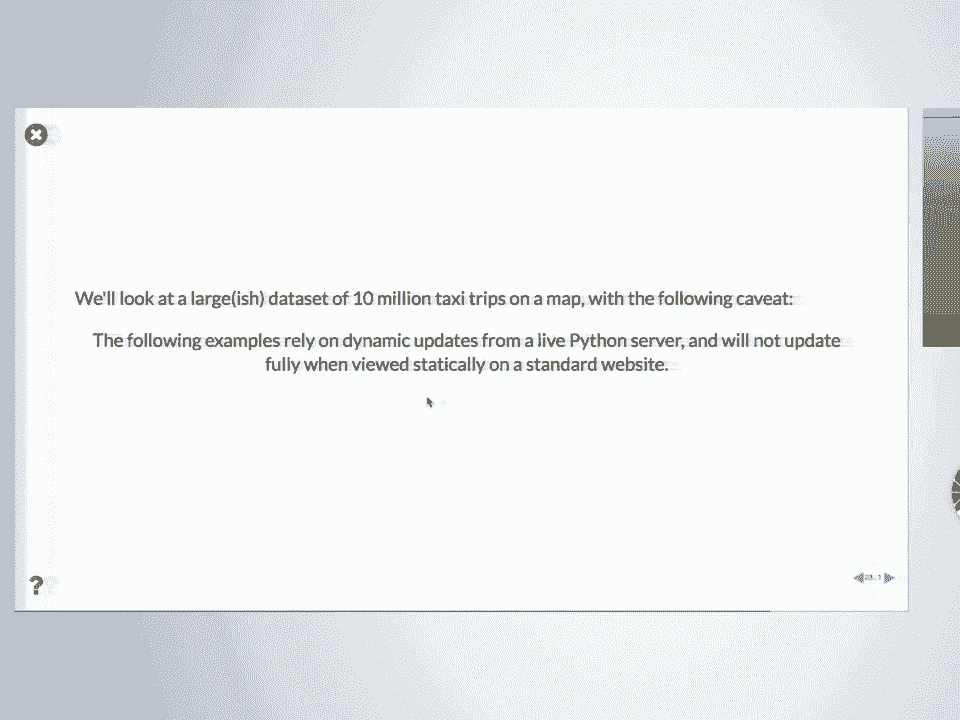

 quite small data sets this particular one is largeish for us um it's 10 million points um。

 i'll switch to 1 billion point one that i hadn't running earlier it'll probably have to swap back。

 in though but this is a 10 million point data set um this is just a sub sampling of the the standard。

 New York City taxi data set so all it does is show in this case uh GPS locations of pickups of。

 taxis in New York City but it illustrates what data shader does which is um well it also illustrates。

 uh geovius so here geovius is easier to explain maybe so here you have background of um map tiles。

 this is all coming from an external um server at Esri we have nothing to do with this we're just。

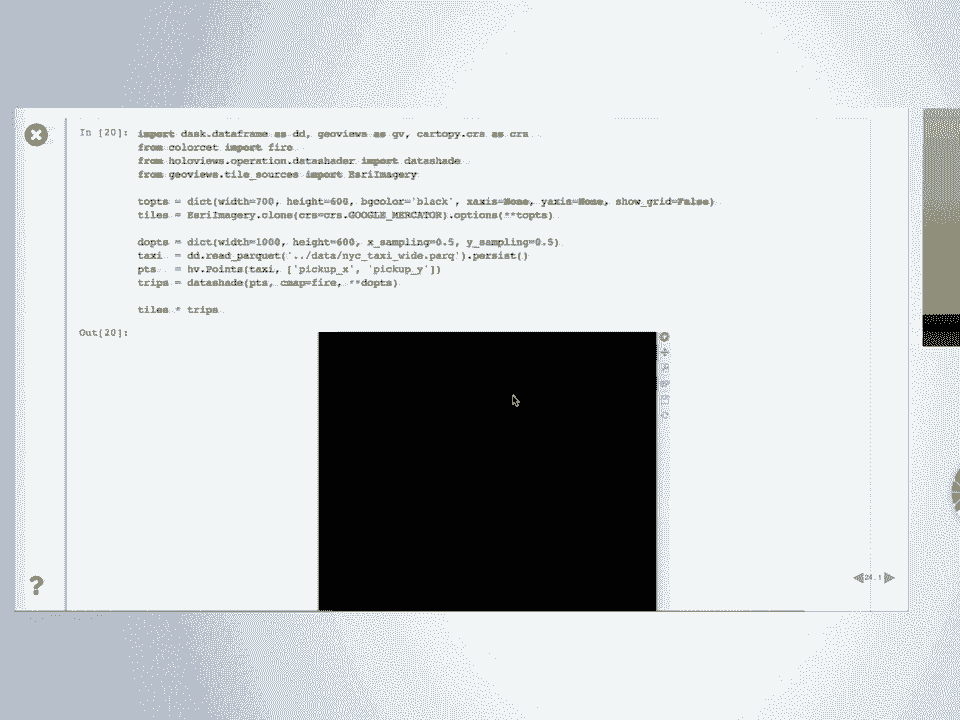

 pointing to their server and whenever we need to it pulls map tiles which is little chunks of images。

 from their server and puts it on the plot and so if you want tiles behind your work if it's situated。

 in geographic coordinates then you just um this came from geovius there about um 10 different。

 tile sources in there and you can use anything that has a URL um just pick one and then uh create。

 a holobi's object and if it's a holobi's object you can overlay it so that's what's in the background。

 here and then a foreground is something from data shader this is our 10 million points overlaid on。

 top of it and uh that this is being read from a file and then we create a holobi's point subject。

 but if we were to I'm not going to press return but if I pressed return here it would try to display。

 this points object in the browser and as soon as I pressed return here it's going to say okay。

 tell me any points it's going to encode them as Jason it's going to give them to the browser。

 it's going to feed them in and somewhere about a third of the way through or a tenth of the way。

 through everything's going to die so I'm not going to do that I'm going to keep myself safe。

 by erasing that so all I did is I took that point object and I wrapped it in an operation this is a。

 dynamic operation so it's not a function call it's an object that repeatedly can be called whenever。

 the plot needs to be updated and this object will take this points data set and it will turn it into。

 an image this is an image with um alpha so that you can see through it so wherever there's data。

 it basically counts the number of taxi points per pixel and the brighter the color the more。

 taxi drop pickups there were in that location and if there were zero it's clear and you can see the。

 background so and this this is done per pixel so that when I zoom in I can arbitrarily see all of。

 the data as far as it goes and so each time I let go of my mouse here it's re-render is going through。

 the 10 million points rendering it into a fixed sized image that has been chosen to be the size of。

 the viewport that I'm looking at and then passing that to the browser the 10 million points never。

 go to the browser but I can see all 10 million points every one of them I want to it was not at。

 the same time there I'm always looking at aggregation of it it's just that if I zoom in enough I can see。

 every individual little trip including the ones that picked up in the middle of a building。

 which are presumably noise but mostly they follow the streets it's pretty good um。

 I don't know in New York so I don't know if that's a stadium or whatever it gets a lot of。

 trips you can also see that the data is quantized in some ways you see how it's laid out in the。

 little grid here I don't I don't know what that is something from the GPS data or maybe just how。

 it was packaged up as CSV didn't have enough digits I don't know but it's certainly quantized and in。

 most other ways of viewing the data you'd never see things like that you can see the total you。

 can't see differences between local regions you'd really tweak it notice there's no special numbers。

 here the numbers are for changing the size of the image and then here this was determining at what。

 point do I bottom out and just get a square that doesn't go and zoom any further this number here。

 is 0。5 meters so this box is 0。5 meters in the world in the real world on the map and so it's saying。

 don't zoom in closer than 0。5 meters because if you don't as you zoom in your points disappear so。

 that's just a little hint to the visualization for you but that's a choice that you can make as a user。

 you don't have to have any hints for how to handle the data data shader knows how to handle it per。

 pixel and it knows how to map that onto colors in ways that makes things makes things visible and so。

 you can just explore your data step okay so basically okay for makes sense all right so the last thing。

 to illustrate is to take that same example and add some widgets on it so that you can do custom。

 things to control it the way you want to and so first show the widgets and then go backwards so if。

 you wanted to change things about it this is the same the same example you can choose between。

 something about the data which would be which data do you want to plot you plot the pickup or drop off。

 you can choose things about the visualization these are all completely custom you can do whatever you。

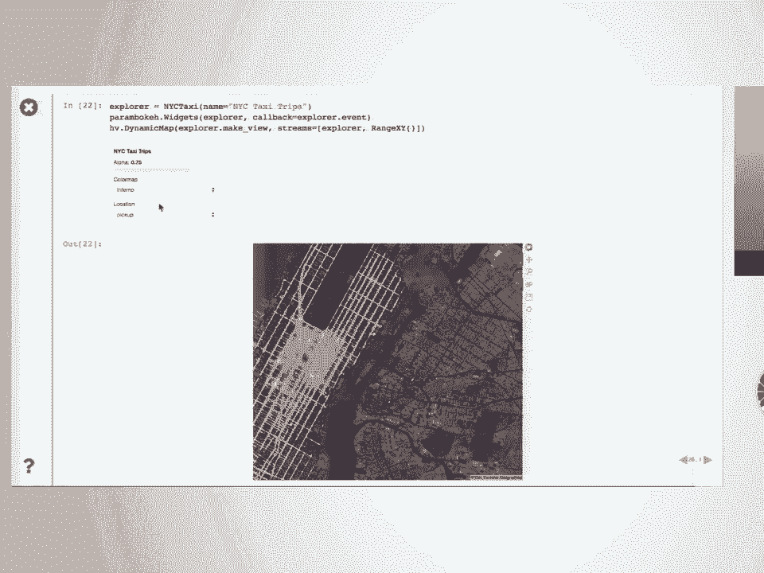

 wanted in this case what you did is declare the options you wanted so there were three widgets。

 here you declare three things these aren't actually declared as widgets these are just。

 declared as parameters there is a parameter it is called alpha it is a magnitude which means a value。

 from zero to one there's another parameter it's called color map it can be one of these color maps。

 there's a parameter called location it can be either drop off or pickup and that's not about。

 widgets it's just saying this is declaring something about your data and it's also。

 declaring then it's defining this function which is given these values what would it take to make。

 something viewable well you can make a points thing with the right location you can make that。

 you can data shade it with these options here's where this function gets the zoom when you zoom。

 it causes an x-range and y-range to be computed and passed to this function so all this function。

 does is consume the fact that in the browser you zoomed and then whenever you do it'll return。

 the tiles with the appropriate alpha and the trips makes sense okay so this is basically the。

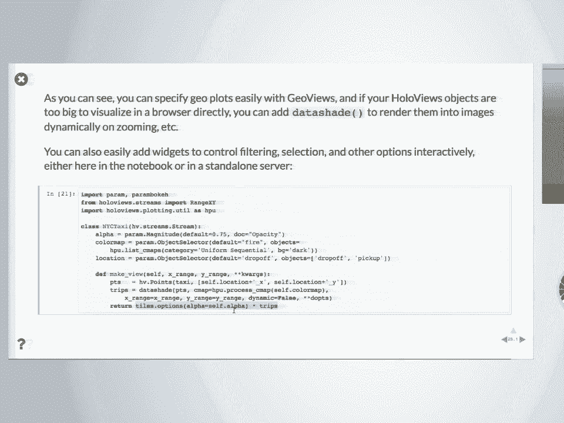

 start to a dashboard and then i did start up on one earlier here but this is the dashboard using。

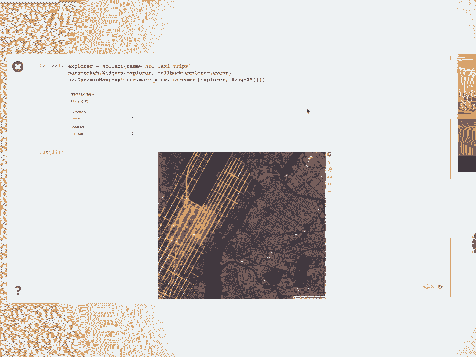

 GPS data of a different type this is just from open street map all their users took all of their。

 phones and collected all their GPS things that all got uploaded all got pulled together。

 therefore anonymized and so this is one billion of their of their locations i'm going to zoom in but。

 this one billion fills up my laptop here i've got a 16 gigabytes so that's roughly at the edge of。

 what can be done in this laptop so while i was giving the rest of the talk it all swapped out to。

 disk the the one billion points that i'd read in earlier are all now back on my disk so as i zoomed。

 in here this actually helps illustrate what data shader is doing so you see that it looked like an。

 image here as i zoom in um you can see the underlying pixels are not updating but now they are。

 it's triggered looks like seven or eight passes depending on how many times i stop with my mouse。

 through the one billion points so it'll catch up at some point and then i'll be able to explore。

 the one billion points interactively so okay so that's that's now properly rendered at this resolution。

 and so if i pull out you can see the see it re-render each time each time it does that。

 it's going through the entire one billion points it's not smart it doesn't know that it's only looking。

 at europe and can ignore the rest of the world that's also something we're being paid to do。

 and have not done yet uh right now it's just brute force processing power this is based on number。

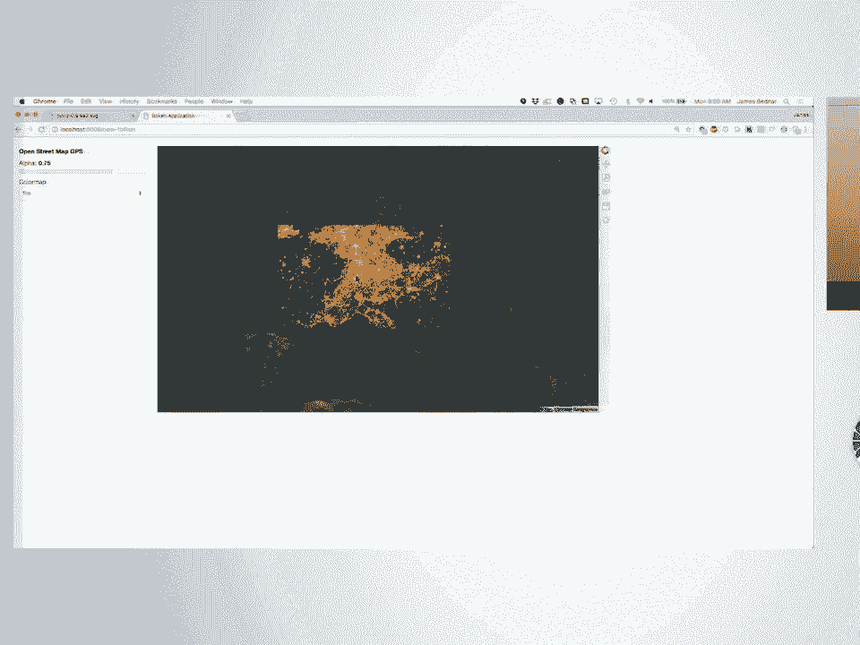

 and desk it's using desk to use all the cores on my laptop it gets quite hot it's using number to。

 run this at machine code speeds and it's basically just blittering its way through a billion points。

 and putting every one of the points in a pixel if they didn't land in here they don't they just go。

 away they land it in here they increase the count and every time i zoom it does it again it is totally。

 stupid totally brain dead but it reveals the data like this is the data that's what's there if i。

 want to see what's over here i zoom in over there it's gonna uh run through it and then that's the data。

 so you can't get a billion points into your browser but you can get a rendering of a billion。

 points to whatever resolution you have because it doesn't matter what data is there this is the。

 resolution i got right this is as good as it's gonna get so okay so hopefully that makes sense and in。

 this case it's a um it's a very simple dashboard just trying to be as simple as possible um。

 showing you the um that you can have uh range widgets with your plots and this is basically the。

 output of it this is the output as a something that needs a live python process backed by a server。

 almost everything else i showed you if you go to pivis。org and you click through the same notebooks。

 that i've showed you if it works on pivis。org that means it works in static html and that's all based。

 on how bokeh works bokeh is written in javascript it has python ways to invoke the javascript。

 the javascript gets embedded into your html page and then you can save it and so any time where the。

 data actually is in your web browser page you can export it you can put it on your home page you can。

 email it to somebody with full interactivity you can give a presentation like i was giving that one。

 does have python backing but even if it didn't i could explore everything but this part this part。

 needs python right because the data is only in python's process it's iterating through making an。

 image passes that over to the javascript and that's what's displayed so we kind of had the best of。

 all worlds here is you have python backing when you need it the power of python raw machine speed。

 number to make everything as fast as possible but that's only when you need it if you're dealing。

 with small data and you're willing to pre-aggregate it to subset it or whatever then that final result。

 can go in your static html file and be passed around and be on your website and communicate。

 all right that's it for this part i'm ready for a break。

 um i see lots of green out there this is great you're ready to write yourself um while i take a little。

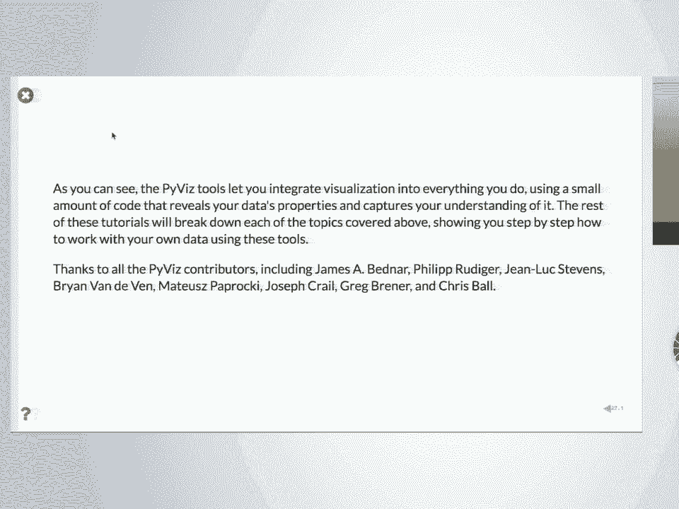

 break you can take a break too but uh load up the next uh notebook which is o2 and well as soon as i。

 come back from break we'll start on let's start in with questions if you have private personal。

 questions talk to me and uh jon luke and break uh i think the break was five minutes well what in。

 ten i don't know let me see um five minutes okay。

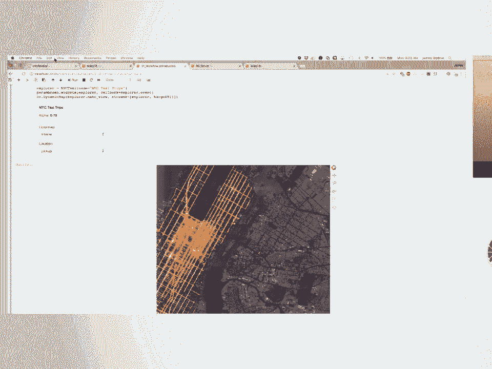

 okay so uh there's a download data step uh that somehow we last minute must have screwed up there's。

 there's a fix to it but that didn't get in there you don't actually need it it's all right you need。

 it to replicate the talk i just gave you and so you will need it if you want to go home and make。

 things work you have to get the data in the right location where the notebooks find it so you'll get。

 if you try to run the tutorial i just gave you'll get an error but it's only um it's it's used in one。

 other tutorial that's marked skim so it won't matter for today so and don't worry about it's a big。

 file it's gonna crowd everybody else's uh Wi-Fi so if you don't already have it don't worry about it。

 it'll be fine you'll you'll be able to do all the exercises um at some point there may be one little。

 thing oh yeah i forgot that does need it it won't matter just skip over that you'll see it。

 the one thing that file is useful for is exercising your machine so i've got a nice machine here it's。

 kind of old it's several years old but it's it's a good solid machine it's got 16 gigabytes of RAM。

 it handles 10 billion point it handles a billion points fine if you want to exercise your machine。

 to find out how much your machine can do that's when you need the bigger files i'm not even suggesting。

 you download the billion point one you can it's the how to do it is in there but you should at least。

 try the 10 million point i've had people who have an eight gigabyte machine who are happy with that。

 i have had some that are not depending on how they've configured their machine i've never heard。

 from anyone who had less than eight gigabyte machine i don't know whether they're working out i've。

 guessed not so i wouldn't i would not try it while right before you're about to do something else。

 so in any case you don't have to try that we're not going to push your limits on uh。

 data set size during this tutorial unless you want to recreate what i was doing。

 the rest of the data set should just be there and could should come up with it so。

 okay so back to this um so i what i showed you in that first section was about hvplot。

 and that's something new last time i get the tutorial it didn't use hvplot。

 but the idea is that you can use that the pandas interface you're familiar with you can go off with。

 it the rest of the work here is all going to use the native interface of holoviews and it doesn't。

 matter how you get a holoviews object if you got it from hvplot great it's a concise declarative。

 structure that has your data and you can work with it if you use a holoviews interface it's exactly。

 the same it doesn't matter how you got there if you have a holoviews object you can lay it out next。

 other holoviews object you can overlay it you can sample it you can slice it you can animate it。

 whatever you want so the rest of it is going to focus on the native holoviews interface i like it。

 much better but i never grew up on pandas i grew up before pandas so uh my brain didn't reorganize。

 according to the pandas way of doing it um so i'm much more comfortable with this but if you grew。

 up in pandas and that's your what your go-to tool for aggregating and sampling and slicing great。

 use hvplot so either one is fine it really doesn't matter um hvplot is newer so it matters a little。

 it's it's not as well exercised um as uh as uh the standard holoviews way。

 but in principle it shouldn't matter， okay so this is tutorial two in this part you are expected to follow along with it and you're。

 expected to do it as we do it and if you start if i start seeing a bunch of red go up i'm gonna say。

 oh okay sorry what's going on okay so alert me if you're trying something and it doesn't do what it。

 does for me uh it should just be the same okay so tutorial two it's about saying the situation here。

 you're supposed to imagine is i have data i want to see it in order to do that you have to take some。

 data some metadata that's in your brain you have to give it to holoviews it's just a bunch of bits。

 you have to somehow take that data the things that you know about the data set and and declare it in。

 order for it to be properly visualizable so um here you'll notice we are not doing import hvplot。

 dot pandas instead we're doing the holoviews um wait imports so you import holoviews at hv and then。

 this line declares that you want to be using bokeh you can do the same thing with mapplotlib which。

 you can rerun at the end with mapplotlib um i'm gonna go ahead and start this running。

 that first uh notebook actually was a set of slides it uses rise and it's a way to show a。

 javascript package for showing your uh jupyter notebook as slides the rest of them haven't been。

 set up to use rise they can be if you feel like it but uh it's a little more work it's constrained。

 to a certain shape of slides so the rest of them are not slides they're just a jupyter notebook。

 um and in this case what hv。extension bokeh does is set up the jupyter notebook to generate the。

 plots using bokeh and show them in javascript okay so let's start with some um uh much simpler。

 data frame where you can actually see all of it here we've got a data frame it's got some x's and。

 y's and if you just look at the data frame itself not using holoviews what does it look like it looks。

 like a bunch of numbers and this is a problem right these numbers could be anything right and you。

 can't look at that and know what those numbers are just numbers it's not that's not the way human。

 beings brains work you can't look at it well probably certain people with messed up brains go。

 into certain fields of science and accounting and whatever because they can look at those things。

 and things jump out of them great being autodir or something uh we're not i'm talking to normal。

 humans to normal humans is just a column of numbers and notice this is a this has got 40 pairs of。

 numbers here and even that doesn't even fit on the screen you can really can't you have to scroll back。

 and forth or try to appreciate it it's totally useless as a representation um let's turn it into。

 a holoviews object holoviews uh doesn't make any assumption about the form hv plot does because pandas。

 did pandas assumed if you didn't tell it it's gonna be a connected curve and we'll a polyline it's。

 gonna connect the dots that's actually something pandas shouldn't legally do because panda doesn't。

 know whether this is a continuous function or not it just does it so hv plot follows a pandas。

 interface holoviews doesn't is not gonna show it unless you tell tell it what to what it is here。

 you've declared it's a curve that means that you the curve is actually a graphical concept but what。

 it really means is it is something that displays as a curve what displays as a curve samples from a。

 continuous function so there's an underlying you're there's an assumption that this set of numbers up。

 here is a continuous function when i declare it to be a curve and if you see what the representation is。

 the curve from x to y oh that's new information too because here we just had two columns you and i。

 can see that they're labeled x and y and probably the x goes on the x axis and the y goes on the y。

 axis but that's a lot of assumption um here we've declared uh this is an object it's going to take。

 some data it's going to take some independent dimensions key dimensions is what we call them。

 and some value dimensions which is their dependent dimensions so you have to separate those you。

 have any number of key dimensions any number of value dimensions here's one of each and if you。

 look at this object simple curve it's oh now that you can look at in one second and know a whole。

 lot about that database complete that data set unlike this one right this is useless as a。

 reference representation it's great as an algorithm it could go through this but for a human immediately。

 this one shows you a lot and the way we can get to this is just declare these three things that。

 we as humans know about this data why do we know that well we we actually can look back we know that。

 because of how we created it I know that this is a quadratic function where the y is computer from。

 the x so since I wrote that I actually am quite it's quite valid for me to write this as well。

 it was in my head that this is a continuous function from x to y but I didn't tell panda's that that's。

 the thing I created it I created this pandas dataframe and pandas doesn't know it is a continuous。

 function x from x to y that information was in here and it never made it into python until here。

 having made it into python now it is visualizable it got from my brain which is a sieve。

 on into the python space and now forevermore this will be visualizable as a curve。

 makes sense it's not amazing but it should be very straightforward there's data that you have。

 that needs to be given to the computer before the computer can do something automatically with it。

 so you've created this object as a hollaby's object and so immediately you know that you can do。

 crazy things like put it next to each other and have two of them and so on because it's a hollaby's。

 object you can do this kind of thing and that's of course it's a interactive object because we chose。

 bokeh and you also saw already that it is an object that includes the actual raw data this is not a。

 copy of your data this is your data your data as long as it's in one of the supported formats。

 there's some other form this could be a dictionary it could be a numpy array x array pandas。

 dask array all sorts of supported formats and then there are other formats that are converted。

 into supported formats if it's in one of those natively supported formats it just is your data it's not a。

 copy some formats like a list of dictionaries or whatever might get converted into a numpy array or。

 a dictionary of numpy arrays there are certain ones that are less supported but the typical ones。

 that people will have their data in like pandas are just raw and just completely a pointer to that data。

 and so this is a cheap object the actual memory cost in for this object is approximately zero。

 it consists of precisely what you see this in representation the fact that it's a curve。

 the fact that it has a string for the key dimension and a string for the value dimension。

 okay so it's a very lightweight thing， and all of the hollebuse this is called a curve is one example of a hollebuse element if you go to。

 the hollebuse。org website and you look at the gallery the reference gallery you'll see dozens and。

 dozens of hollebuse elements this is one i guess i should probably pull it up， so um， hollebuse。

org reference gallery these are the various types of plots we are not going to cover。

 almost any of these， as you can see there's a a dearth of 3d ones we actually do have a few 3d things under。

 um matplotlib and plot the back ends so those will be interacting the matplotlib。

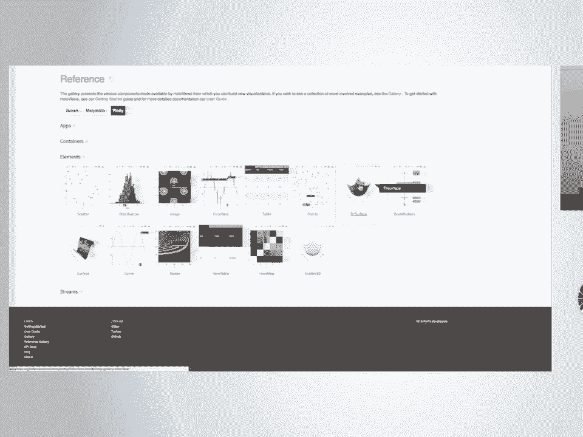

 the plotlib ones will be interactive 3d matplotlib will be static 3d but we're focusing on the bokeh ones。

 just to avoid having your brains go to mush and so we can uh we'll only look at a tiny subset of the。

 things available， okay so all of these elements have the same way to invoke them uh whatever the name of the element。

 is or just element in this case so which is just the the base class they have some data。

 and they take a lot of different options for the data and then a list of k-dimensions the key。

 dimensions which is either one or a list of them so if you have a two-dimensional index data。

 it would be a list of two dimensions and then a few things take some extra options but it's very rare。

 so um starting with this data option here's just an illustration when we did the data the first time。

 the data was a data frame so this what you looked at before and I think almost everything you've。

 seen so far as a pandas data frame here's some other options for that data you can have a list of。

 two numpy arrays that'll you remember it has um the curve is something from an x to a y。

 one dimension to another dimension so here it's just showing you the first dimension the key。

 dimension and then the um the value dimension or you can have lists or you can have dictionaries or。

 you get up all these other types that's the same thing either way it doesn't matter okay。

 okay so the first exercise though let's see a lot's and lots of green so try to run this yourself。

 um try to say remember everything took the same interface so try to feed the same。

 approach to one of these other types so here's what we had before try it out yourself with some other。

 type so copy that put it here that's going to get a curve what happens when you put something else。

 there or whatever I haven't tried that， let's try whatever if you open the hall of use that or page you'll see lots of other ones you can。

 try those two but uh uh not every element is going to work basically all of the same signature。

 signature but this particular one needs at least one key dimension and at least one value dimension。

 in order to plot anything that's what a curve is uh this spike is the same way。

 area same thing um scatter these are all the same fundamental dimensionality。

 uh it's got a 3d probably has no way to be plotted in in bokeh yep so if you have something。

 that's not supported by a given back end I selected bokeh all of you supports 3d objects bokeh doesn't。

 so it just gives you the representation this is all there is because there's no plotting support for。

 it but you can still work with it you can still slice and dice and do everything you could before。

 it just won't be visualizable unless you've selected the map plotlib back end that has a 3d。

 scatter or the plotly back end that has a 3d scatter yes。

 is it possible easily to change say to a log scale on one axis or the other two that could be able to。

 score or if you're interested uh that will be an option so let me go back to something visualizable。

 so curve uh scatter let's say um and then we'll get to that in a minute but options。

 log uh which is uh it starts at zero so it's not quite suitable for log access so you're getting。

 helpful warning that that's not quite kosher but you can do it and if you want to somewhere else。

 I showed how to redo the ranges so that you avoid the warning don't don't show zero if zero is not valid。

 and and also not valid for x but can be done okay so in general what what's happening with these options。

 is that uh we'll get to that in a second but basically there's a class of options that hollabews。

 understands and those will be supported across back ends and then there's a class of options that。

 only the certain back ends understand and those will be passed down and you'll get a helpful warning。

 in some cases but it won't die it won't stop you from so basically if you've supplied an option for。

 the wrong back end it won't affect some other back end but you'll still get something you'll still。

 have your data you'll still be able to work with it so the um if you stick to only the options that are。

 that are valid across back ends you can switch back into anytime you want otherwise it's gonna um。

 that option won't apply to the back end where it's not defined and uh we'll get to that in a minute。

 but basically the idea is that hollabews keeps your data and the metadata that describes it。

 completely separate from your trivial options that are your whim of the day those are totally。

 different they're actually stored differently internally and if you pickle it you'll get that。

 object by itself it's you'll get the data separate from the options that it may apply to it we'll。

 see all that in just a second this one's about the first category here the actual semantic metadata。

 the descriptions of your data that you've captured from your brain and put it in there the things。

 that are just never gonna be true about your data not the options so in this case let's capture a。

 little bit more from your brain um here yeah you call it x in the code but what is it really well。

 here you don't know it's just a parabola but let's say the parabola represents horizontal distance。

 uh well you need to be able to capture that right so in this case we're saying the variable x。

 has a um has a richer label associated with it so this dimension notice this is a tuple not a list。

 so it's saying that there's not there aren't two dimensions x and horizontal distance there's one。

 dimension it is a tuple of the python identifier so you can type it in as keyword and dot attribute。

 access and so on and a longer label that when you need to display it use this label and so as you。

 can see that makes horizontal distance come up here and y gets relabeled height so this is this。

 is still about your data this is not in the caption most this is a very important point most。

 plotting libraries when you're coming to start relabeling things that's in the controlling my plot。

 stage that is not true here this is about your data your data is horizontal distance the y-axis is。

 height that's capturing something about your data it is not bitling with the plot you capture it here。

 you'll never need to type it again you combine it later you slice it you do some segment of it it。

 knows that it you declared it was height so you pull out a sample of it it'll say height 80。

 because it knows that it's not a that is not a plot option plot options are for the trivial stuff。

 just about appearance whereas height and horizontal distance are in no way about appearance they're。

 about what is this data what does it represent to me what did i put in and so it's capturing that。

 that's why this tutorial is called annotating data you're annotating with stuff in your brain。

 that needs to get in the computer so the computer behaves properly and after it's in there it。

 automatically will have that label because it knows that that's the real name of it。

 um all right so the exercise here is pretty trivial but it'll probably explain what's going on here。

 if i can spell trajectory， okay trajectory dot vdems vdems was value dimensions that was the dependent variables。

 there depends on your field whether you call this actually the independent dimensions are。

 sometimes called keys the value dimensions are called values that's why they're called values。

 here they're also called dependent variables it depends whether you're a mathematician or a。

 database person or whatever there's no way to make everybody happy so we made nobody happy。

 called them vdems and kdems so kdems that should be what you expected right it was a dimension。

 whose identifier is x but it displays as this text so it has one key dimension it's a list of one。

 thing you see this as a list it's always a list even if only you have one thing this a particular。

 one has one key dimension and one medium dimension and the concise way to see that same information is。

 just to look at to print it the brackets here the the square brackets mean it's key dimensions。

 trying to think think of this as a bracket when you're indexing into an operation。

 i mean to a piece of data in python you have some data you bracket to get into it that's what this。

 is meant to make you think of and then the y will be what you get back okay。

 because we remember this is not a plot and i'm going to say this over and over。

 because it totally looks like a plotting library hell of use is not a plotting library and here's。

 another example why that's true if you have your simple curve it's a declaration of the about the。

 data you can override any part of the declaration you want if you change your mind is a no oops。

 in fact it shouldn't be connected that that is totally wrong for it to be this this is a quantum。

 universe where the the ball that was thrown only existed certain strobe light positions。

 okay fine you say so you're the you're the boss so we're going to turn your simple curve into a。

 scatter plot or you can turn the simple curve into an area plot anything like that works as long as。

 they're the same the right number of dimensions and if you got too many dimensions when you turn。

 into one those other dimensions are just going to sit there they'll be there they're in the data。

 it doesn't hurt anything you're only going to be able to see some of them depending on the type。

 okay so here's a bit of um uh try to predict what this is going to look like， so the um hv。

scatter trajectory why would that be different from hv。scatter simple curve does。

 anybody remember what the difference was for trajectory here's the definition of trajectory。

 notice it's longer than the definition of simple curve which was already messed with it but here it is。

 okay so what what's the difference there um where are we um okay so。

 let's see why will they look different trajectory and then simple curve。

 the only difference is that the dimensions have been labeled right。

 so it's just the simple curve has less information it's defaulting to the identifier name。

 which itself defaults decks and why so， hv。area trajectory oh yeah by the way there's tap completion so。

 area if you don't know all the um all of you all of these objects area， um so that's an area。

 okay you're back to where you were for the data just happily went along the swum along the。

 pipeline it's fine okay this was all um tabular data。

 columnar data arranged in columns that panda's no subtle deal with um the uh there are several。

 main types of data and we'll touch on each each of the main types but another type is。

 gridded data also called multi-dimensional in dimensional data um i have a more hard sciences。

 background so i'm i in fact all of you has came from a background of gridded data primarily。

 columnar data came only later we were starting with imaging data of various types in neuroscience。

 10 years ago or so but the so it's full support for gridded data is not just pandas so in this case。

 this is data where there are two key dimensions they're x and y in this case are just completely。

 x is not a function of y y is not a function of x they are both key dimensions independent。

 dimensions and then there's the third dimension the value dimension that's typical of。

 multi-dimensional data it'll have any number of key dimensions potentially any number of value。

 dimensions in this case it's got three total so if you um if you print that。

 you'll see it's got two key dimensions one value dimension， that's why it's an image。

 okay and again of course this is interactive whatever。

 this is just a useful thing but it helps you get a color key color bar if you just do dot hist。

 on just about anything you'll get a histogram over the value dimension or so in this case it's。

 the one value dimension you get a histogram if you want to relabel those those are fine x-axis。

 here before i showed you you took x and y and you um put a longer identifier here it's just changing。

 the identity sorry you're putting a longer description of it here it's changing the actual。

 identifier probably not important to worry about um so for an exercise try it yourself。

 try um visualizing something here all copy the original just um。

 well you don't need to copy x and y they're already fine in fact x y y you just need this one。

 so I'll copy that one and then the thing that um that makes something out of it this one。

 okay so that should be the same you can do anything you want here all right。

 I don't know whatever you can play with it you'll see yeah。

 gridded data doesn't assume that the image element does there's also a quad mesh element that。

 doesn't assume that it's um that assumes it's rectangular but not regular um it'll have different。

 so that was image if you got a quad mesh you'll see that you can have a regular sampling。

 irregular sampling with a rectangular um alignment and if you don't even have that then you need a。

 trimesh um these are not entirely sorted so somewhere in here is trimesh um。

 there we go um so trimesh can render any arbitrary mesh whatever it is。

 that's right that's right uh each halibuz element is a statement about。

 certain aspects of the data and one of the things about it and it the number of them corresponds to。

 the number of different representations that are meaningful an image has a certain representation。

 that's meaningful literally as an image like a png um but if your data isn't like that you can。

 take the same data and visualize it different ways uh with a quad mesh where you relax that。

 assumption and so on so the uh the particular type is a statement about what you want to see out。

 of it at the end it isn't a plot but it is a saying it is saying this is in fact so image what it。

 means is a doubly regularly sampled continuous function of two variables that's what an image is。

 image is a lot shorter so we say image but really it's not an image because it's not it's not displayed。

 immediately it will be displayed someday probably but what it really is it's got continuous coordinate on。

 x continuous coordinate on y and the sampling is regular that's an image and so on so each one of。

 the halibuz elements will have a similar set of semantic interpretations it is it is whatever it。

 is a an area chart is something that is a continuous um value that is that ranges from zero to the。

 indicated value and so on okay um so anyway that's as much as we'll get into a gridded data um。

 we'll focus primarily on pandas because most people are from pandas background but you can follow。

 through the gridded tutorial um just one little bit more in here um which is the load another data set。

 this particular one has more columns in it so we can illustrate some things we couldn't。

 illustrate a minute ago this particular one is um economic data um gdp unemployment and such。

 across different countries across different years so it's macro economic data that's what the macro。

 stands for so you get a data frame um again it's just a bunch of columns right which ones are the。

 key dimensions most people here can probably figure that out i think if you look at this。

 which ones are indexes and which ones are what you measure which ones are what you're measuring。

 about that's a key dimension i'm going to measure about japan that's a choice the answer to nothing。

 the answer to no question was japan that was the question what is the unemployment rate in japan。

 so japan is one of the variables that you have to choose you have to choose which countries you're。

 going to measure you have to choose which quantities you're going to measure the quantities you measure。

 are going to be value dimensions the choices you made that determine what your value dimension is。

 is our country year what about growth key or value value right you don't choose the growth you。

 measure the growth you choose the country you choose what your care about you measure the growth you。

 measure their employment you measure whatever capital mobility is and you measure whatever。

 trade is okay so this has um two meaningful key dimensions plus an extra one that's not meaningful。

 which is just the index in the array that's another key dimension but we're going to ignore it because。

 it's just they're in no particular order so it doesn't mean anything okay so country and year are。

 good key dimensions in this data you might look per country in collapse across year you might。

 look per year in collapse across country you might keep them both up to you um so in this case let's。

 pull out one country and then that leaves just year right if you have two dimensions but you've。

 pinned one of them to only be the United States that's this so note so the country column is always。

 going to be United States now so you're just going to use the year one and so now um you can look at。

 growth per year or growth over year and so year is going to be your key dimension that's the only。

 one you have left because you got rid of country and we can choose whatever we want we chose growth。

 and we get a growth curve right so you get year and growth very straightforward okay so having。

 understood that hopefully you'll you'll be able to do this one which is plot the unemployment。

 and a good good bet is copy whatever was done before， and then you're going to do something to that。

 nonsense right you didn't want to do that you can do it you just wear what is un how does。

 all employment relate to growth using a plot that is a continuous function made no sense at all。

 keep your key dimensions and value dimensions separate keep year your only thing left it's got。

 to be here you can't plot anything else in this data set so now you get to choose here。

 ah okay unemployment per year that's a meaningful plot and it's just and it matches the type of。

 plot you have which is this continuous curve okay you whatever you want to see you can say that。

 that's what the data is that you care about um we can once we've created it we can。

 take our growth curve which is we got right here it's not a dead end remember it's never a dead end。

 so if we didn't want it to have these labels we're going to fix that we're going to declare that。

 growth should have a representation of gdp growth because otherwise what does it mean growth。

 and you're just gonna be here and so now we took our object that we already created we don't even。

 remember how we created it doesn't matter we relabel it we can always keep working with it。

 um we can add um the units for it here we said as gdp growth we didn't say what units it was bad plot。

 bad gotta have units okay so we we missed it out for the first time doesn't matter you can always。

 keep adding more metadata this is more metadata first in it okay um in the interest of time i won't。

 go through this you i'll give you a couple of minutes you can try it yourself i'll play with it um let's see。

 i mean i won't wait for you i'll just go ahead， so first relabel that to time。

 okay that works and then the unit， okay so i'm still using the identifier year because that's the underlying identifier it only。

 changed the label of it the label of it is time that python identifier is still year。

 that's still what's there in the data okay so i'm saying okay this is time in years。

 make sense okay this is still not options this is only about the data。

 everything we've seen so far was only kind of brain dead dumping some aspects of the data right。

 on to your screen um often you don't want to do that the data shader plot was arguably not doing。

 that it was aggregating per pixel but there are lots of ways to aggregate and here's an there's a。

 way to aggregate as a histogram which is to look at um the frequency across all values of growth of。

 gdp growth um you create a here it's using numpy to make a histogram um and then it's。

 by itself that's just gonna be a bunch of numbers and then you well two sets of numbers。

 and then you pass that to all of us to just and it becomes visualizable of course you can get to the。

 data the data is um the underlying values for the bins the locations of each bin and the height of each。

 bin or you if you take that same data you can pass it to a function that does everything instead of。

 calling numpy you can use a different hall of use elements that makes a different assumption。

 which is that it's going to compute everything um it's you don't have to pass it up computer。

 histogram you just pass it the data and it will do a kernel density estimate that's fine too another。

 way to aggregate it um another way to aggregate it would be to take you the same data and create。

 box whiskers those are um going to show you the mean and the the top of the box whiskers shows the。

 the largest value and the smallest value the size of the box shows you the um some measure the tendency。

 the the central part of the distribution i don't remember whether it's uh one sigma two sigma。

 this away from the mean or something like that and then the line will show you the average。

 so that's a good way to take a whole bunch of data collapse it into something you can see。

 oh and we're illustrating options again so in order for these to read these things nicely you can。

 specify details about plotting and this is a separate thing from specifying what you're plotting。

 okay we already looked at composing things side to side by side and the calls operator。

 we already looked at when you use plus what you get is a layout we already looked earlier at an。

 overlay those are both containers they're almost identical it's just how they look。

 and this is a overlay of a bunch of different objects but so the key here now is that let's say。

 you've got this overlay and you had made this great plot but later on you want to work with。

 some bit of that this is what you're doing here first you look at the layout and see what。

 how do you index into this this is actually telling you this earth presentation tells you how to index。

 into it layout is your object in that object that's here it's showing you the type of that object。

 here it's showing you there are four things in the object you can choose between layout。curve1。

 scatter1 area1 or spikes1 these and here it just shows you the type of the type of curve one is。

 curve the type of scatter one is scatter but you could these are your labels that you've put on it。

 here it's just defaulting to the type but you can put whatever label you want in a second。

 so we can select whatever we feel like if there were two areas there would be area one and area two。

 so that's why the numbers are there to distinguish them here we've plucked out curve the curve in the。

 spikes this curve and this spikes we plucked them out and put them side by side and made a new layout。

 so if we print that， again we only selected a few of them so the idea so again not a dead end you've got a plot you can。

 always anything that's still there in the plot you can grab it and do whatever you like with it。

 and you can still look at the data this will probably be an error yep because we didn't。

 uh the data can't be added to a plot but you can always get the data okay um let's put a little bit。

 more information in here this whole thing here let's say there's one version of it another version。

 of it both of them are trajectories but one is a trajectory from a cannonball and one of them is。

 from something else uh the thing is so this is a little bit weird about holovius basically everything。

 i've said till now is just provably demonstrably correct nobody could argue with it here it's got。

 an arbitrary level of support for um uh two level indexing system that is useful it is not the best。

 or the it's not the only thing you could do but what it is is that every holovius object has an。

 associated group an associated label you can just ignore the group all the time if you feel like。

 if it's led to the default it won't matter um but if you want to you can group things in a way that。

 these are both trajectory plots and one of them is a label of field so they have the same group。

 trajectory this particular one has a label of cannonball and this particular one has a label。

 of field now why is that important it shouldn't matter right why don't you just do the plot title。

 well the reason it matters is um you can specify options per group and so if you have a bunch of。

 related plots you can just say that they are all in the same group and then now you can change their。

 option those are all going to be red you can make another group those are all going to be green you。

 mean many groups as you want and you it helps you having this two level thing two is all of you kind。

 of need because you can have any number of them and so you can have any number of combinations of。

 um different parts of your plot that you can very easily control the options for and determine。

 whether they normalize together whether they um layout their colors their properties whatever。

 so in this case um let's see it says top to position you don't need to do that that's too easy。

 two levels of dictionary style access that's a little harder so let's say uh so cannonball。

 so looking at the label to layout print okay so there's a labeled layout you can see it's got two。

 things here so let's uh let's grab trajectory sorry label layout let's use dictionary style。

 access instead of dot attribute so you could do this trajectory dot cannonball that's the easy。

 way but let's do it the hard way which has no tab completion and you have to fight ipython。

 okay what's that gonna give you that's the whole thing because um those are both in group trajectory。

 so you were able to basically I selected the the sub thing sub group that has trajectory。

 they're both trajectory so that didn't do anything so do again and then um cannonball。

 okay so normally we use the attribute access because it's way more convenient because you can。

 type and it has less syntax and you can just press tab but if you want to do it the hard way。

 you can do it and this way is important of course if you want to have a drop down with a widget do。

 you want cannonball or field you can do it this way so this way is important if you're automating。

 things or making widgets and so on so otherwise the same okay we already talked about overlays。

 um okay here this will illustrate the normalization um that we showed earlier um if we take and it。

 also illustrates you can also change not just the options or the declarations but also the data if。

 you want if you've got everything right you just want a different set of data you do something。

 called clone that gives you a copy of the data of the um hollabus object and you can replace。

 anything you want in this case you're replacing the data so it's remember these are cheap little。

 objects you can clone in as much as you want you have lots of them around just generate a thousand。

 of them no problem they aren't they're all pointing to the same data so they are not expensive and so。

 we made a copy of it the points the same data and then we said oh override the data as well now you。

 have a new set of data a new object in this case it's one with the uh same x's but the y's are half。

 as tall and we're gonna call that tennis ball so we pull all those together and now you have three。

 plots the cannonball the tendon ball tennis ball and then the overlay of those two now this is a。

 little tricky notice what happens when you overlay them cannonball trajectory that's because it has a。

 group of trajectory and a um uh label of cannonball this is a group trajectory labeled tennis ball when。

 you overlay them only the group matches so these are trajectories and it knows that you can know。

 longer tell the difference between these two things so you get a key in different colors that make。

 sense because you you overlaid two things and they used to have different labels and you could see。

 them you know which one is which but now you overlay them you can no longer tell them all of you's。

 knows that you just did that and it knows that okay i'm going to use the default color cycle you can。

 change that color cycle but by default it's going to go through some list of colors and it's going to。

 read make them visible make sense okay you can um i totally don't remember the options for that。

 um we'll get to the options in a minute uh there's a um there's a way to set that where you can use。

 tabs so if we can move that in a minute so i can find out maybe there are different legend positions。

 inside or outside of the plot above below left right whatever so all the different locations。

 okay so um to keep it moving let's copy this one um。

 we're gonna do the exercise well it's optional we don't need it so let's not do it。

 that was a note to me okay so um i promise slicing and dicing right okay here is slicing。

 at least i don't know what dicing even means but um you're slicing um so if you've got your cannon ball。

 you can slice it and you can slice it not in index but in coordinates notice that your numbers go from。

 zero to a hundred here that doesn't have anything to do with how many data points you have that's to。

 do with the height in whatever units that was inches or we haven't declared the units but if we did it。

 would be in some value it might be in um fractional quantities it doesn't have it doesn't have anything。

 to do if they're underlying numpy array somewhere there is a non-pyowy we don't care we as users don't。

 care uh we want to select in um the all the values of cannonball where the first dimension the key to。

 mention goes from minus 10 to 0。5 we're going to relabel that from here to here as ascending and if。

 we just look at ascending by itself uh would we get that if we like it the sending by itself we get。

 that and if we look at them overlaid we get that it makes sense exactly the same thing as we're。

 doing before except now we've selected bits of it and we can paste them back together you can see。

 that again it knows that those need to be different colors you won't know where they are separate。

 okay and so again this will be selecting across whatever key dimensions you have。

 oh and here it's showing the bracket notation you can also use a different notation called select that。

 is sometimes it has slightly different properties won't go into that but you can't use none in this。

 case you can in this oh and uh notice that we are putting these things it's keywords if it were some。

 long thing with spaces we couldn't do that right so that's why we have this separate description。

 and identifier so i'm supposed to remind you of that okay I think that's that's it so basically the。

 whole point of this section was you've got data turn it into something that is not at end there's not。

 on something you can see but it's not at it end something is visualizable immediately but you can。

 mix and match and slice and do whatever you want okay all right where are we on our index。

 okay we are time for a two-minute blitzkreat through grid grid data i'm just going to show you this and。

 run it and not just so you see that it's there you're not going to do any exercise with it but um。

 you'll be able to um see that there is such a thing it's gridded datasets as well um okay and then。

 then you go on to an exercise so that'll be a sort of break okay so here's the dataset。

 particular it's a multi-dimensional dataset of xyz so x y z we'll see in a second which it is。

 this is a particular one is MRI scan of a brain here it's converting it into an image it's multi-。

 dimensional if you want to see it in two dimensions you have to tell it okay i want to slice of it。

 and what does it do with the rest of it well you get a you get a slider for the thing that wasn't in。

 the slice um or several slices um if you want or aggregate across basically however many。

 dimensions you have i can't draw in hyper dimensions but however many there are you can you can slice。

 you can sample you can sub you can select uh you can reduce or aggregate depending on how you。

 think about it and so on okay so that's gridded data basically whatever you can do for pandas。

 style columnar data you can do for gridded data but you can do it across many dimensions many key。

 dimensions typically and many value dimensions so that's as much as we'll say。

 okay so now time for exercise two that is self-paced that is you working if you get in trouble but。

 the if something doesn't work the way it says it does put your red sticker up um i am not going to do。

 it um i'm gonna start it make sure it works but this is self-paced and you have 10 minutes。

 during that time you can ask questions if you think they're really relevant to everyone else。

 if not you can talk to me personally so okay tutorial three customizing visual appearance。

 which you have to do all of the time even though i was saying bad things about it is trivial you。

 always have to do it it's not something you're ever going to get away from you just should never。

 confuse customizing from um actually declaring things about your data those are different tasks。

 even though declaring things about your data does change the way it appears。

 they're still totally different things okay so sorry about that now it all makes sense。

 okay so as soon as you got your data in you're gonna want to mess with it that's the thing。

 and i totally skipped over the things that tell you how to do that。

 if you get these buttons saying that you need to to allow um。

 access access i just clicked them away reflectively but they say something um they something about。

 any access what that means is that it needs bokeh needs to be able to render to a png in order。

 render to a png it does that separately in a way that needs to access the file system so the answer。

 is do you want bokeh to render off screen and save to disk that's what you're clicking yes to。

 in order to do that it's running it's sort of a separate junior browser so if you don't you won't。

 get your png output that's all right so if you if you don't feel comfortable clicking that button。

 it's not it doesn't matter oh one more thing i should do right before i go back there was supposed。

 to be a motivator on x on number one no number two there we go okay at number two it said we should。

 rerun this with both with matplotlib just to just to see so let's do that this is all bokeh。

 let's change that to matplotlib and rerun the whole thing。

 remember those were all interactive plots that we got when we did all our annotating。

 so this hasn't been updated， so it's not supposed to be there there are several recent changes that are not here in this。

 release and look that fixed right there is something i emerged earlier so somehow the the。

 very latest changes that make everything actually work or not in there。

 and i'll tell you why that change doesn't didn't work okay so this is now exactly the same notebook。

 we were going through before i went off on the gridded data tangent that had nothing to do with。

 anything this is about this is the same notebook i showed you earlier but now because we have matplot。

 lib background back in when you type simple curve you get an image totally what you should get with。

 matplotlib in a browser context it doesn't have any interactive features it's fine it makes an image。

 all the same plot should work but what that error illustrates is that the options aren't necessarily。

 the same wherever that was all these same things this is now wherever the default matplotlib location。

 of the key is it was up here for bokeh whatever and in matplotlib we're assuming this is for print。

 by default if you're using matplotlib because it's not interactive and so it's helpfully labeled。

 um your sub figures for publication you can turn that off if you don't like that otherwise it's the。

 same um and there was well i lost track of something somewhere but don't worry about it okay so now we。

 need customizing okay so the the reason that was that i did that just now is that it switched between。

 bokeh and matplotlib and the reason that was okay is that i didn't specify any options that were。

 specific to one or the other the one thing i come in and out was an option that was specific to bokeh。

 somebody put it on there so oh that should we should make that better you if you make it better it doesn't。

 you're customizing something it's only about bokeh and there are ways to do that where you declare。

 that it's only for bokeh and then it doesn't matter if you switch back ends but i didn't want to get。

 into that complexity there where you tag every option which back end it's for because most people。

 don't want to switch back ends all the time so i presented the simple way to do it so um。

 bear in mind there is a more complex way to do it where you're declaring different options per。

 back end and that's what you want to do if you want to support multiple back ends most people。

 don't want to support they just want to get their job done so i'm not making that complex but um。

 in this case we'll switch back and forth between bokeh and matplotlib to illustrate um and we've got。

 yet another data set this is all about data um so in this case it's uh data set about diamonds。

 and uh the reason it's important is it has a lot of uh dimensions here so let's let's。

 when you try to visualize a lot of dimensions of the same plot you are you should know that you're。

 going to be fiddling with um with how to do that and so we'll see how to do that so if you do the。

 simple thing uh you do a scatter plot of um five thousand of these diamonds um each one was sold at。

 a certain value and had a certain cut and clarity and so on you want to see what relationship there。

 might be to the between the size and the price so anybody who knows anything about diamonds knows。

 that there ought to be some relationship there right the more carrots the higher the price you。

 would expect and that's roughly true there are also these boundaries here in the data that are。

 interesting like um when you can say it's a two-carat diamond um there are a lot that are cut to be。

 two-carat and very few that are cut to be 1。9 carat it sells much better as two so you don't cut it as。

 that maybe you make two smaller ones but you don't make a 1。

9 carat diamond because nobody boasts of that， so you can see that all coming out in the data all sorts of interesting stuff i won't talk about that。

 that's for somebody interested in diamond story about um okay but let's um let's start uh messing。

 with this plot uh this is an ugly plot it's all over plotted here you really can't see how many data。

 points there are there it's kind of a mess why is it all crammed into one little thing well that's。

 just the default so that you can lay several things out without changing their sizes but that's not。

 what you want here you only have one plot so let's stretch it out let's start to make this a useful plot。

 okay um suddenly you start getting into crazy stuff okay what's going on here earlier i mentioned。

 that um i'm able to figure out do tab completion on the options this is how you can do tab completion。

 on the options um okay this tells me all that now i can figure out what options are available。

 this is all the options are available for this particular type of scatter so this helps you figure。

 out all the options it's a special ipython syntax it is not required in any way it's concise and it is。

 tab-completable that is that helps you not have to remember it otherwise so people look at this。

 up what is that crazy stuff not python it is not python that's true it is ipython it doesn't have to。

 have it be in the notebook it can be ipython can deal with it and appropriately use them and you。

 don't have to it's not specific to the notebook format specific to ipython so if you launch a separate。

 ipython process it can handle this usually we don't ever do that usually we're either in a notebook。

 and we use this or we're in a standalone thing like that billion point dashboard that was pure python。

 no ipython nonsense okay and you'd normally start in the notebook and move to that anyway so you've。

 already explored your options and literally and then um you just take them out of here and you。

 convert it to the pure python variant there are ways to make the pure python one tab。

 completeable there's a special project for Jean-Luc but it hasn't hasn't happened yet。

 it's tricky but this works well and lets you explore the options okay and so here we。

 basically it says for any object any object of type scatter in this cell。

 this is a these two parentheses the percent signs mean these options apply to this cell。

 if I only had one it would mean these options apply henceforth that's not usually a good idea。

 um you can do it if there's something do you want to put it at the top of the file usually and say。

 this applies to everything that's fine but usually you'll modify it for whatever's in this cell。

 and you say that for any object of type scatter in here or you could even do scatter you can。

 you can do stutter。group those groups come and play here they also allow you to specify。

 which options but i don't think we'll get into that but basically whatever level of detail you。

 need to you can always relabel things so that you can specify exactly what you want in the syntax。

 and here we said to change the width which we said use a y-axis enable hover oh yeah i didn't。

 show that so you can see all the things that you're hovering over and of course it's okay so you can。

 you can always zoom if you want to see the individual points to hover。

 so presumably this price axis here will vary between um good no ideal at the top down to fair。

 and that makes sense right the if the size if we're given size the cut is going to determine the。

 price a good bit that in this one random sample i happen to pick it seemed to match so i'll go。

 with that i won't look any further but you can so that's those are additional value dimensions。

 in this case look we had price on our y-axis but we also had cut well cut isn't in the plot what。

 happened to it do we get a widget for it no because it's not a key dimension what happens to it well。

 if we've got hover it shows up in the plot because any number of extra dimensions can just be hover。

 dimensions so this lets you take arbitrarily many dimensions and do something with them。

 maybe you couldn't figure out how to cram it onto this plot but you can still hover it and find。

 that information out and we just use it to discover things which is that the cut determines the price。

 for a given carrot and so on and sure we can come up with a better plot to show that but we just。

 explored and found that i've never actually done that i just guessed it'd be true um okay so here we。

 have our holo views object and though the other advantage of this um this syntax is that it clearly。

 separates what's about the object and the annotation about the object and what's just about how we're。

 going to see it whether you see it in a log axis well that's your choice whether you have a hover。

 tool that's your choice it's not about the data um what is what the data is is not your well it is。

 your um statement the data that i care about is going to be the carrot the price versus carrot and。

 the cut versus carrot and the price is the first one so that's the one that's going to show up in。

 the plot because the scatter has only one um such dimension um by default and then we relabel it。

 and these options apply so these are the options about annotating it these are the strictly options。

 about modifying the appearance of it okay all right so so far so good um。

 notice that once we've done this object here even though that applied only to that cell。

 let's see here um， even though the options applied to this cell it applied to the objects in that cell so if i。

 look at that same object and i don't specify any options about it down here i get the same options。

 i had before so those options have become associated with this object it's so this is not saying how this。

 will appear it's saying what options will be associated with this object now if that object is not displayed。

 those options will still be applied to it for when it later is displayed so that notation is saying。

 these are the this is how i want to see this object oh maybe i don't want to see the object now but。

 eventually if i ever want to see the object this is how i want to see it make sense so you're declare。

 it's it's all declarative and that's what you're declaring about it in this case。

 okay in this in here we're taking that thing that was annotated that had the extra information。

 and we're overriding some of it so we didn't override the fact that it had hover that's still there we。

 did override the size you keep doing as many times as you want this is a brand new object。

 this is not this is not modified scatter doing this it's just um there's scatter is still the same as。

 it was before this is a new object which is why it's important that these are lightweight objects。

 every time you apply a set of options it's a new object brand new and you can do whatever you like。

 it won't hurt your original and if you do clone if the data that'll copy everything。

 here it's just lightweight copies of the same data and as many pointers as you want to it do。

 whatever you want to them throw it away so it's uh it's not um destroying it in any way。

 okay so if you want to use this syntax they're a gesture size uh the curve above。

 so let's just put scatter down here how are we gonna change the height of it using oh this was using。

 the keyword option this is the pure python way not tab-completable here let's use the tab-completable。

 way unfortunately there's one complication that we have not fixed yet use remember I said there。

 are options that are only that are applied by holoviews and then there are options that are。

 passed to the down to the plotting library the one down stall of this particular tab-completable。

 approaches you have to know which is which you have to know whether it's a holoviews option or。

 whether it goes down to the plotting library so in this case um you're just gonna have to guess。

 this height a plotting option uh or is it a uh styling option。

 and unfortunately the tabs completes on both of them why is that it doesn't show up here。

 it's weird it should only tab complete on one of them right there must be a plotting option of height。

 that's weird because normally there's no overlap which is allows this to not have to specify。

 it appear whether it's for holoviews or not so that's slightly confusing but um。

 anyway the parentheses just means plotting option versus um which means holoviews option。

 or versus uh underlying so if you change these I don't have any idea what's gonna happen。

 okay I didn't think there was a height option that goes down to the back end so I don't know why。

 that tab completed that is somewhat alarming you should get an error though which is what we did at。

 least so it won't hurt you for long and you just know okay I need those damn um brackets okay all。

 right uh we we need to have a syntax that makes you not have to distinguish them because we found。

 in practice is very important that the code knows the difference is not very important if you know。

 the difference don't worry about it um but it's very important we keep them separate because those。

 are the ones that are across all back in I mean if you want to support multiple back ends it's worth。

 knowing the difference but as long as you're just trying to get your job done you don't care whether。

 it's bokeh implements it holoviews implements it whatever just get it make it look the way you want。

 all right it becomes pretty straightforward to mess with all the options this way particularly。

 when you can have complete if you can't have complete or you want to know more than just the name of it。

 then you use hv。help also brilliant this is all of the style options all of the plot options。

 you'll see more information about the plot options those are the ones how the ones hv deals with。

 we're very we'll tell you anything we'll tell you the name the value the type the bounds whether you。

 can mess with it or not all these things and then after that we show duck strings of all of them。

 so you can find anything you want about the plot options the style options we helpfully give you a。

 list we do not deal with these options we just pass them down these are the ones that are accepted。

 by the current back end for the scatter object if you switch back ends you get a different list。

 here and that's all we tell you about them because we don't deal with them we just pass it right down。

 now there are ways that we can parse those libraries and pull out the information and put it into the。

 help and i would like to do that we just haven't done that it's not our job but it'd be super helpful。

 to do you guys so we haven't pulled it out of bokeh and pulled it out of matplotlib in bokeh it's。

 in a discoverable format Jason somewhere so it should be straightforward i don't know if there's。

 something like that for my plotlib but we should be able to give you more help than this and validation。

 and so on so you know you can't do that but here it's just saying this is all we know ask bokeh。

 if these names don't mean something to you then you got to figure it out。

 okay whereas we wrote all this text here and on look and me and uh fillet。

 by the way i should mention fillet brooderger he's the one who wrote most of the first version of。

 most of these tutorials he and i worked on most of it together don't look as done some of them。

 don't look at the uh foundation work to all of it a long time ago。

 this is very much a collaborative project， okay so like i said earlier you want to uh if you're gonna use you got all these dimensions。

 if you want to get more data crammed into that plot you're gonna have to do some work。

 so in this case let's say we've got remember we had we kept a couple of value dimensions cut。

 and clarity cut only showed up on the hover um oh we cut sorry we kept price and and price。

 we had one independent mention of carrot we had price and cut well earlier we had price and it。

 was a cut yeah yeah it was cut so anyway um we can do more with cut because these are dots we can。

 control their size and their color uh let's go ahead and map their color the cut onto the color。

 and that's a good choice it turns out because there are five different um cuts and that's。

 categorical information categorical information works very nicely onto our color because we can。

 distinguish between um different colors and so if we um hover over things you can see patterns uh。

 developing you can maybe see there's a bunch of the very goods down here i don't know you can。

 explore it and so on so anyway color makes sense to to map onto and here we're going to choose the。

 color map the so if we left that off i think that might be the default no the default is this。

 color set so that's not very useful in this case because it's categorical so we choose a categorical。

 color map um better idea and then we chose to make it uh somewhat transparent um and so on okay。

 exercise oh this is a tough one display scatter without any new options。

 okay that was hard all right so it's the same thing and remember these have been associated。

 with that object now and now set the style option oh this is the handy clear look when we do this it。

 means filling the options up here so you don't have that thing happen to you that happened to me。

 and do the styles option we have to do it by type and so what is the type of this thing scatter。

 a style option that means it's not the brackets it's the parentheses size equals。

 it works not too spry then， whoops i didn't mean 110 all right um you can switch any of these options that were this size option。

 okay calls it size map potlib calls it s okay so if we switch the back end to map potlib we。

 get a plot just as we did before now we need to use the word s instead of size we could do a。

 project and we could make mappings between these two backends at least we have two main backends。

 book and map plotlib we could do it it could be done we could try to translate between the。

 two conventions we don't we haven't it's work， i'll skip this exercise you can do that if you want if you want to do what we did for the bokeh。

 and apply them here i don't think they're actually they're any different because i think they're。

 spelled the same so it's not， um that was one magic this uh oh we just showed you the output line magic where we switched between。

 backends we can do that also switch between different supported completely different types of output。

 in particular for map potlib we can switch to between png the default and spg and now if you use。

 spg now now is when you actually get your publication quality plots if you um save your image from that。

 that's going to be um spg image so i mean it looks like a um it looks the same but it's uh。

 it's now spg it's got little weird markers um for whatever reason。

 oh and we just did that okay um if you want to export bokeh supports exporting to png and that's。

 what you got that little checkbox for it's to support this one cell here um it displays this is now an。

 image so if we're telling it the output um for figure this means the output for static images is。

 going to be png you can also make the output for animations be gif or gif i haven't done that yes。

 there is um kind of annoyingly using some old syntax like this um oh but the new options still。

 apply because i just reset them in the same cell there's that's clearing all of the options。

 but we're not planning to keep the syntax forever so it's kind of annoying that we haven't provided。

 another syntax ops is a more complex way of setting the options that we're trying to deprecate。

 now you would do something like um yeah so yeah to clear we just override that one option if you。

 want uh i don't think there's a way to clear it back to the default zunluk on if you're in here。

 is there a way to set a particular option back to its original default value。

 right but that that resets everything could you okay there is a way to do it it's complicated you。

 can actually look up the default value and set it to that value there's no easy way to say just get。

 rid of what i did except to rerun your notebook okay um okay that's book a png um if you actually。

 are going on your disk you're gonna have a file that's png uh bokeh also supports spg but we haven't。

 what it does is we have a complicated layout it gets you a different file for each one and that。

 can be useful but we haven't supported it this map potliver one will give you the whole figure as a。

 as an spg and that's and so we're figuring that if you're no pun intended if you want a multi-pane。

 figure um you're probably going to use map potliver to compose that and given how bokeh generates it。

 but we can revisit that okay like i said uh i think this is the last bit of this notebook which is。

 using the group and label to determine how you can customize things so in this case we've got some。

 more complicated plot here we're overlaying a couple of um four different things we're overlaying some。

 dots and some spikes for no particular reason and some other dots and some other spikes in each。

 have different colors and the reason they have different colors is that we have set the um not。

 just per type which would be for the spikes but for the groups for diamonds and for diamonds uh。

 that are grouped low and so there are two categories here we labeled these guys low the first two low。

 clarity diamonds we must have pulled them out somewhere oh yeah so we pulled out the low clarity。

 diamonds we pulled out the high clarity diamonds and now we're going to overlay it all and we use these。

 labels to basically send the right option down into the right thing we could have done the same thing。

 by editing each one and putting the options right there on that object doesn't matter what you do。

 this way is good if you're trying to do it across a whole slew of things you want to control everything。

 at once whatever okay um i'll leave these uh for your own work okay now you've gotten to where you。

 should have gotten to be able to do an exercise you deserve a break though um so let's look at the。

 schedule for that but the um the you've you've made it through to the other side basically you can。

 do anything in halavus now if you order so the first like i said at the end of the first section that。

 was okay you can go off and use haloplot uh hv plot you can use that you don't have to worry。

 about anything else the same thing at this point you come to the second checkpoint the first checkpoint。

 was use hp plot second one is now you can use haloplot uh halavus hp plot was briefly called。

 haloplot till there was a trademark dispute so it's not called that anymore um but it's hv plot。

 so you can use hv plot and that's fine if you use halavus but this point in the tutorial you now。

 have that is the this is the meat of halavus which is be able to take your data wrap it up make it。

 visualizable do stuff with it and then customize how it appears that with that you can do just about。

 anything everything else is more advanced topics so um at that point so let's give you a break we've。

 covered this thing in somewhat random order now but uh take a five-minute break or you can get right。

 into exercise one either way either way you'll have 15 minutes now break plus uh exercise one。

 okay so um if you get started again does uh anyone have a deep fundamental question about。

 really why does it work this way what is going on or did anyone discover something really surprising。

 that you looked and you saw what the code did and like whoa what's going on there does anyone want。

 to ask a question about that yes， pandas has enforces a certain structure to the data that can be indexed in certain ways and。

 we make certain assumptions about the intent of whoever set up that pandas data frame and we。

 don't make those assumptions about lists because the list can be anything so uh sometimes for the。

 list case you need to pass in additional metadata to match what we assumed about the pandas data。

 frame like surely you wanted that to be true because you set it up this way is list we don't know so。

 yeah there are differences like that they're subtle yes yes。

 i've got a picture of that where is it now this used to be plot part of the tutorial and。

 i moved it here so that everyone would see it thereby skipping it so uh here's the diagrams showing。

 the whole relationship of some tiny subset actually first let me show you something fun。

 this is the uh this is piebiz um each of the dots here is a library we've written about。

 ten of these libraries maybe the rest are all some random person in the world and maybe some。

 of you guys have written these libraries these are all showing piebiz at the top depends on each。

 one of these things and each one of these things depends on things and these one of these things。

 depends on anything right and so this is the part this is what we did with how all when we made when。

 you do a conduct install dash the piebiz piebiz it's traversing this entire chain of dependencies。

 and installing all this stuff so that's what piebiz gives you it gives you this this bucket of stuff。

 here so we've taken some tiny bit of it and put it in this diagram this tiny subset of it and part。

 of the complexity there is the geo stack anything to do with geo it's just this whole bunch of legacy。

 code all package on top of each other it brings up a whole bunch of dependencies if you don't need。

 geo cut that out in your graph becomes a lot simpler if you don't need uh data shader you。

 get you miss some other things and so on but here's here's a tiny chunk of that designed to make sense。

 in the way that the chart just showed you doesn't make sense um here we're saying there are two。

 different kinds of users and let's say if you are a user who uh is not a developer you're not a。

 hacker or a hardcore coder you care about your data and how to understand it uh what you would do is。

 you would take either small data or big data put it into hollow views hollow views doesn't do anything。

 to it it just wraps it up in a little bit it makes it something makes it uh something you could do。

 something with and the output of hollow views is a rich object an object that displays itself。

 and can do other stuff the other stuff is all done by other libraries though and what happens depends。

 on whether it's small data or big data if it's small data you wrap it up with hollow views the。

 entire set of data gets passed into bokeh you cast passed into bokeh python there's also a。

 corresponding library bokeh js that is pure joe's uh javascript and once you give it over to joe's。

 to bokeh the output of that is going to be html javascript css that sort of thing that can be。

 displayed directly by a browser um or so you can use bokeh with hollow views plus bokeh and feed it。

 directly to get html and put that in your browser and in that case the html contains the。

 javascript created by bokeh in response to the python commands generated by hollow views so。

 that's one path you can take you use hollow views to create bokeh python objects bokeh creates from。

 the python objects the javascript object embedded in html and passes that to a browser you can。

 display it that's one thing you can do or you can fire up bokeh server that's what that separate。

 dashboard did um that's the javascript then gets passed onto the bokeh server which responds to。

 hdpp requests in your browser or what we've been doing once this whole time is bokeh to jupiter。

 bokeh gives javascript into jupiter jupiter embeds the whole thing in a whole nasty snarl of。

 javascript and then that goes to the browser or if it's data shader then you take your big data。

 it goes through hollow views data shader turns it into images you can either take that image and。

 display it directly in our browser so you don't need any javascript or anything data shader will。

 take either via hollow views or straight data shader can take in data and turn it into images like pngs。

 and that can go straight to it or a data shader can do that in jupiter or data shader can do that。

 and pass it into bokeh and make it into zoomable bokeh will add the javascript on top and then you。

 can zoom it and the result is a plot where plot means javascript an interactive plot and then。

 you can either go straight to the browser or through the server that makes sense it's a mess。

 but these are all valid paths these are all things you might want to do and if you're not a data。

 analyst in your developer you might directly code in data shader you might directly code with bokeh。

 but in our group at least we try to make sure hollow view covers the cases where you're analyzing。

 data and bokeh covers the cases where you want to build something where you're fundamentally。

 starting out i want to build something today bokeh is a great way to build stuff one of the。

 things you can build with it is hollow views if you have hollow views that's a great way to deal。

 with data so that's our basic so you can use bokeh by itself bokeh syntax will be often very concise。

 and nice for other things like in hollow views when you put the widgets on there doing that。

 and bokeh is going to be very like pages and pages of code for things that are just a one-liner in。

 hollow views because hollow views is trying to get it what is it you're doing with your data。

 and if you can do it in hollow views you're not going to be programming you're just going to be doing。

 and whereas if you're doing it in bokeh you're going to be programming you're going to be creating。

 this this this architecture but eventually if you want it to be interactive in a browser it's。

 going to be javascript and it's going to come from bokeh if you take bokeh and replace it with map plot。

 live in this picture images will come out the other end of that box and then we can do a similar box。

 for all of those other things in that big complicated dot graph okay anything else great questions by the。

 way yes this is all piebiz piebiz is all the stuff that we can manage together so on the front page。

 here piebiz I've zoomed in so it's messed up the things piebiz is these things but piebiz is this。

 this is piebiz some of which we control and the key thing that we control is hollow views it must。

 be in there somewhere we we make your life make sense at the hollow views level and we paper over。

 a lot of things that were like written a hundred years ago or don't know that there is such a。

 thing as a browser or all sorts of other things and we paper that together into something usable。

 at the hollow views level so hollow views is the key thing that makes piebiz possible but piebiz。

 is hollow views plus all of the things that make any of it actually work hollow views provides the。

 experience the user data it's the interface between all this stuff all these packages and you that's。

 hollow views and piebiz is the project where we maintain where we make all of this actually work。

 you install piebiz and you get all of that together and that requires coordination between。

 John Luke as a hollow views developer me as day so i'm primarily responsible for data shader。

 john luke and philip are primarily responsible for hollivus the peram library that does the widgets。

 that's our colleague chris ball bokeh is done by uh brine vandivan and mittias pakbrocki those are。

 there's a separate group also within anaconda and we neither of us tell each other what to do we。

 work together to make sure that whenever there's a new bokeery release we make sure everything else。

 and we work together with the dask maintainers x-ray maintainers pandas maintainers some of whom。

 from anaconda in another room giving vast dask and pandas tutorials right now and so that's the。

 great thing about anaconda is that we're so many of these things are coming into the same banner and。

 we're all working on these projects and we are down the hall or we're right on the chat button。

 and we make them work together oh you just did a new x-ray release what happened why did everything。

 break oh that's good oh great and we'll fix that so we work back and forth to make everything work。

 together so pieviz is the coordinating project that has a website it has an installable package。

 and these are the ones that we verify all work together because we made them work together we。

 made them work together we checked that they work together we delivered them to you as a usable。

 package pieviz and we got the domain by weeding somebody who already had it like okay we can use。

 this yes Chris ball the one who's doing um um peram and um well actually that's another answer to。

 the question what is pieviz pieviz is all these packages plus we have all of these developer tools。

 and i'm not going to tell you anything about there's a whole dozen other packages that are not even。

 in this chart that are how we maintain all of these things to work together and one of them is called。

 picked dev python common tasks and then there's a version for developers and non-developers。

 and there's a command in there that Chris ball wrote that does this so that we can figure out。

 our environments and he gives you both a text file he wrote it three days ago um so it gives you a。

 text file in this document in this image and is not ready for release we're not telling you about all。

 that but we have all the things that build our websites that build the live um no websites that。

 everything our website is just a notebook and it's automatically converted into a website published。

 on the web and it all builds when you tag something all this great stuff it's all a mess。

 it's all wonderful and we're not ready to tell you about it so it's working for us and we need to。

 make it better before we try to have anyone else get in on the good action okay all right another。

 great question um that's why i was doing that to get out of my own head for a second okay so um。

 we've kind of uh said in this i've given this tutorial maybe four different times it's been。

 completely different every time it's covering some of the materials the same but a lot of the。

 materials new and so what i've noticed today is we've actually covered a lot of things early that are。

 that are done late and so here we're always said 30 minutes working with tabular dare i just。

 checked through we've already covered nearly everything and partially in response to these。

 people's questions so i'm going to pull out a couple of things there that we haven't covered。

 and then make sure you're aware of those it won't take 30 minutes and then we can get on to do some。

 of the other things and so okay so um how many people have heard of tidy data except when i。

 mentioned it earlier okay uh tidy data is the opposite of wide data uh in tidy data you have a。

 if it's a columnar data set where you have columns and rows in a tidy data set each row is one observation。

 it's a very simple of all the things that you can cram into a table tidy data is one of those。

 possible ways you could organize things and it's one row equals one observation some key dimensions。

 some value dimensions the whole row is an observation the next row is a different observation like it。

 might be one measurement if you have a scientific device it might be a measurement in a particular。

 time so that row will have a timestamp and everything you measured at that timestamp make sense if your。

 data is like that it's tidy if it is not like that it is not tidy it can be extremely not like that。

 or it can be a little not like that but if it is exactly like that it's tidy and tidy uh all of。

 you is built around making things super easy if it's tidy and pandas has great ways to make things be。

 tidy pandas as can handle anything but in particular it has really good tools for making things be tidy。

 and just to make the difference clear here is a wide data set here these are each every column。

 here is an observation in 1966 what was the unemployment in Canada well that's a measurement。

 about Canada what was the unemployment in Denmark that's a measurement about Denmark those are。

 independent measurements of each other those are not this is not tidy data because these were not。

 something you can measure it one fell swoop this is wide data and if you pivot it around you can。

 turn it into tidy data where you have only one thing per line basically one measurement that you can。

 and once you've got that then you can pass it to almost any hall of use objects and just plot it。

 directly because it knows what goes on which axis very easily so anyway assuming you've made。

 thing you've used your pandas food to make things be nice and tidy let's say you've taken some data。

 set in this case it's the uh data set we are already covered about unemployment and such。

 if we take that uh there's a concept in hall of use it's just a step above element it's actually a。

 base class for element it's something that's very much like an element like a curve but it's not。

 got quite enough information to be visualizable so elements are an example of a data set。

 um but it's uh it's a weaker assumption about it so here's an example of something that's not。

 directly visualizable so we took this data frame and we've declared that it's got some indexes。

 but we haven't declared how do you want to see it so here it's just a it's a data set it's very。

 generic it's uh it's indexed by country and year those are key dimensions and it's got these。

 viewable dimensions but we haven't mapped any of them onto the screen in any way we don't say one of。

 them is on the x-axis of any type of plot right so this and when you usually i use print to get a。

 representation like that here you can just type the name of it because it's all that's the only。

 representation you've got so the data set is a good start if you got a data frame you can slap it into。

 a data set without thinking much about it you just got a hall of use object that you can now work with。

 it's not yet visualizable you need to do one more little thing uh here but you can already start to。

 work with it you can already plug in things that you know about it and that's the key use of it。

 is that you can if you plug in things now it doesn't matter what you choose later how to visualize it。

 you've already captured that um uh growth is GDP growth and employment is unemployment and so on。

 so you can capture things even before you've thought about how you want to plot it so it's a good way to。

 sort of tame a data set that's sorry a data frame you got a data frame you can wrap it in a data set。

 put in what you know capture it and then think about how you want to see it later so it's a good。

 start and in particular it lets you choose all sorts of ways to slice and dice things um here in。

 particular there you can group it by year let's say you can do that group you have with an element。

 but you can do it even before you get to the element stage so you can work with your data that's why。

 it's got that name and then once you're ready to view it then it has a handy um handy little thing。

 it's there's always you never have to use this but it's handy you could always build a holovious。

 object just like we've been doing so far hv。curve whatever instead we build hv。data set that's not。

 viewable and then we use the 。2 method to turn it into something that is viewable in this case um。

 will turn it into a curve and the advantage of that is that it's really flexible you can turn。

 anything into anything you want you can group it and slice it and so on however you like so in this。

 case let's take our macro which was a data set remember not visualizable but indexable and now。

 let's map it on to um let's map the year and unemployment onto a curve that makes sense so we're。

 picking out a couple of the things this got lots of dimensions we're going to pick out a couple of。

 them um the year and employment and we're going to group it all by country and that will give us。

 this plot okay so that's what i was leading up to here showing that there's this handy two。

 both the idea that there's a data set and there's a two that when you get something out of it is。

 a holovious object in this case it's actually a holo map of holovious objects every time you saw。

 one of these things uh it was actually this object called a holo map what that is is a。

 multi-dimensional dictionary it's a dictionary you know how a python dictionary you have one。

 dimension you can you've got a key and a value a holo map is a any number of keys and any number。

 of values so holo map is a generalization of a um of a python dictionary that allows you to address。

 multi-dimensional data sets of however many dimensions you want so and it lets you work with。

 things that you're not ready to display on screen which is where you get these um uh widgets so the。

 default the way to display a hollum map is as um uh widget but we can do other things with it i'll。

 just scoot ahead to that which is that um let's say we've created a bunch of bars instead of a bunch of。

 uh instead of a bunch of curves and oh i haven't run this notebook it's just whatever i run before。

 um， okay so here i took off this little grid note and so all i'm showing you is they were starting。

 where i was just a minute ago which is starting with a holo map uh of bars plotting your。

 unemployment versus year and now we can do things with it just like i showed you in the introductory。

 talk with a tree plot this is now with um all of your's objects if you've got a holo map you can。

 tell it to give it a grid you could tell it to um i don't need that um oh this is this is what two。

 is a shorthand for so just look at that and say oh i'd rather use two that's all you need to know。

 so you can do it no problem um and once you have it you can use um。

 again we can always you can always show things of the holo map but you can choose to have them as a。

 layout um you can choose to aggregate them and think that's it okay so like i said this didn't take。

 30 minutes um all right so this was just a little bit extra on top of what we already showed you in。

 the introductory part and most things have now migrated towards the start of the tutorial it。

 turns out and we already covered number five and in the interest of time i'll skip exercise two。

 is worth doing it's fun it's not hard it's the only thing that's new in it really is um。

 is the uh well you skipped a part to do it's graded data so just the parts with tabular data。

 um and uh the the dot two method is in there all right so i will very quickly um let's through a。

 couple of things just to show you and then i'll switch over to Jean-Luc because i'm my voice is。

 getting tired and he wrote this section anyway number eight or most of it um and then um so uh。

 we've mentioned two types of data there's a there are several types of data uh tabular。

 and tabular can be either tidy or not gridded another type is uh network data and i'll just。

 basically show you that bokeh allows you to do interactive working with um um connected graphs。

 um in hall of use it's a kind of a weird object that allows you to separate it into two sub-object。

 it's inherently a pairing of nodes and edges um it's fairly straightforward i don't go into it you。

 can read it and look at it um the interesting things are that there are um there are multiple。

 ways to lay out the uh graph graph data this is just directly connecting it this is um connecting。

 it uh with a different um way to draw the curves and then um there's another one um you can use。

 network x to create this as a totally separate independent package where we have an interface。

 to it because it's a handy way to create all sorts of networks um and then you can create the。

 thing with network x bring it in here and now you've got interactive visualization where you would。

 have a static one with uh the default network x。 Jean-Luc can you write down that we should have a。

 network x hvplot interface that would be fun um so you can naturally work with network x objects。

 and then just do dot hvplot doesn't exist but could um you can have an algorithm uh you can for instance。

 here you can use network x uh force directed layout um to determine which uh where the nodes are。

 here's the starting point but because we can easily map things onto widgets uh we can use that to show。

 how the algorithm actually works um it's quite straightforward you can look at it later um and。

 those were artificial graphs but if we use something uh like face some data about uh connections in a。

 social graph in facebook uh you can plot it using the existing um the positions of these were。

 determined by a force directed algorithm but then things are just connected up or we can bundle the。

 edges so that it's uh and then now you can um pick each one and see who's connecting to what。

 and so on so at that point if we graph data is really hard to understand anything sort of ever but。

 especially if you don't have anything uh interactive interactive at least the fact that it's just a。

 bunch of nonsense you can piece out one by one because you can see oh what is that node here it。

 doesn't really tell you much about it we can tell you an arbitrarily number of columns there。

 exactly what that node is and then you can see all the things it connects to and so on so um。

 graph stuff either tends to be a pretty picture that is meaningless or it's a process where you。

 interact with the data and having even bokeh is great for that so you can explore and understand。

 how things relate um and it works with data shader so that you might keep the nodes in。

 bokeh but because the number of connections is usually much greater than number nodes you might。

 data shade the nodes in the background the connections in the background so that they are only passed。

 in as an image so you can handle extremely large graphs that you couldn't bring in your browser。

 so that's it for um um um and you can select into whatever so that's it for graphs。

 geographic data you've always seen some examples of i just mentioned that those are just a tiny tiny。

 bit of what's available for geographic data um geographic data that the key thing is that the。

 earth is a globe and your screen is not you got to do something about that and the number of things。

 you can do about that is infinite and it's all a mess and there are lots of things you can do。

 we support certain things that make them super easy standard typical things you want to do。

 which is you've got something like google Google Maps and you want your data on top of it that is。

 super easy to do no problem um if you want to have some shapes uh you can you can choose how。

 everything is protected you can dive into all the details like that pieb is itself isn't handling。

 any of that it's just passing it down to the cardipi libraries and all the libraries on which。

 cardipi is based and so projfor and gdell all these venerable libraries are handling the task if you。

 want to just show the shapes of the countries and their coastlines and you want to put your data on。

 embedded on a map like that that's a lot of calculation that went into that that's all handled。

 by other libraries and then you can choose all the projections you want and then in this case we're。

 just sticking three points on it but um uh you can choose any um any uh tile source that's available。

 um these particular ones uh it's going to use a lot of Wi-Fi when i do that look at that they all。

 fill in good Wi-Fi here um so basically anything that's available you can just get its URL and pass。

 it in um uh you can work with shapes you can work with geo pandas you can have data that's。

 parceled out per shape and so on um you can have multi-dimensional data uh grids like sampling。

 satellite data or sampling everything you can use data shader to take very large data sets。

 rendered in something that can be in a web browser and then explore it graphically and so on we don't。

 show that here because you have to get the very large data set and people don't want to do that。

 but it all works um okay so eight that's you um and so then now we're going to switch into truly。

 uh deep dive i guess um these are things that people don't need every day but it's super important。

 that you know that they're actually not that hard there you can you've showed you lots of things。

 about zooming into one plot which i'm looking to say about what happens when you do step in that。

 plot and all sorts of ways that you can set up to be custom make everything happen anything you want。

 to do okay um so what i'm going to talk about is essentially how you can add lots of interactivity。

 to your plots and it's really nice to be able to sort of hover as you've seen already that's just。

 kind of built in functionality but you often want to have your own interactivity that you want to。

 define yourself so actually i'm going to um go back to this tutorial that Jim just talked about um。

 where we had these drop-down menus and it was mentioned that these are called holomaps。

 so as Jim mentioned it's like a multi-dimensional dictionary where all these extra dimensions。

 become widgets it can select um that was one of them which is just this country drop-down but we also。

 have um things like sliders we have all these different widgets now the thing about these is that。

 uh like a dictionary in python everything in memory so you have your keys you have got your values。

 and um if you have if you have let's say three different sliders or three different drop-downs。

 you need a Cartesian product of all the possible number of values and that explodes so you can basically。

 if you have quite a number of different things you want to explore at the same time you can run。

 out of memory just by having lots and lots of elements all of them all of which are using。

 uh a memory and you end up with i don't know 10，000 or 100。

000 million different elements so this can， be a problem um the nice thing about this type of thing is that you can export it to static html。

 so you can make a little a web page out of it you don't need to serve or anything and you could start。

 browsing it so um that's the holomap and there is a um appendix which is all about uh holomaps and。

 what i'm going to be talking about now which is dynamic map um and and um there'll be some。

 links to that in a second so um so here what we have is uh another type of thing which is the。

 replacement to to holomap that's dynamic what that means is that you write a function that。

 returns an element and every time you want to like say change a value in a slider what it does is。

 it just passes in the argument to the function the function returns the element and then you。

 dynamically render it which means that you avoid this whole problem of your memory exploding by。

 having to have everything in memory at once uh which you would do for holomap so here's something。

 called a dynamic map and what you do is you have a call back here it's really really simple it's just。

 an oval in a in a square that's rotated um it's a really simple function all it does it takes an。

 angle and it draws your your uh oval and a bit of text which is zero degrees right now um and it um。

 lets you create the elements overlaid to to be like a little figure here so if you if you actually。

 call this directly um i could uh sorry that's all right i could actually just call annotations with。

 an angle and i just get a simple uh overlay but by using dynamic map i can actually um pass in this。

 call back and now when i move the slider um i created some custom interactivity where i can move at any。

 angle that i want right so if you imagine this is a holomap then for every single angle we have here。

 which goes up to 360 you'd have 360 different overlays but here we just need um this this little。

 function that returns what we want to look at so this is um quite simple and it's just a much more。

 memory way what memory efficient we have doing like a holomap um so so this is not too exciting。

 because it's not something really new in terms of what you are able to do it just saves your memory。

 but um dynamic maps can let you do a lot more interesting things so we have a system in。

 holovies called streams and a stream is really just a parameter it's just a value that you can change。

 and when that value changes you you pass in the argument to the um to the call back like for example。

 uh the angle here um would could be a parameter that you want to control and with the stream all。

 you do is you set that the angle to a value you want and it will just dynamically update the。

 visualization so um so i don't know if i'll go into detail about how you set up a stream it's really。

 easy you just import a stream of capital stream from from the streams sub-module or sub-package。

 and you just define define it you just say it's going to be called angle capital A and you just。

 initialize it with the default value of zero so this this parameter angle is just zero right now right。

 um right so this is just showing you that we have a integer angle um let's start at zero。

 so now what we can do is we can just display our dynamic map again it's just a like a it's a simple。

 container it has a call back you you have a default value of angle zero and it returns the。

 overlay at angle zero which was just that simple function above which is just this simple box and。

 lips and a text um as an overlay but now what i can do is uh now i have keep a handle on this。

 dynamic map i can call this event method and change the angle so it was initialized with zero but let's。

 say i want it to be 90 so now just watch the plot above as i hit this i can actually dynamically change。

 my um my angle to be whatever i want uh in a separate cell by just saying what angle i request so i can be。

 45 degrees for example or anything i like um so this is kind of useful you can it works map bot lib。

 too because it's um it's simply just asking map lib to re-render with a new angle whenever hit the。

 event method um okay so is it a little exercise um we generate it initialize an angle to 15 degrees。

 well um i could just copy this and then set it to be 15 and i guess it's not too interesting。

 in the exercise so i'll actually skip that um use event set the angle to be 145 well i kind of。

 40 showed you jumping around oops， ah not used to these key bindings okay so um let's say 145。

 yeah well i see but the text tell you it's now 145。

 um all right so actually i mentioned that you can use map bot lib so actually i will actually do。

 that so here it's still bokeh you can still zoom in you can still pan around and do all the things。

 you can do with bokeh but just to demonstrate i'm going to make this into a map plot lib。

 and that's what it looks like map bot lib um the colors changed i don't think that's supposed to。

 happen but this is just a small discrepancy between the two backends oh actually uh yeah that's not it。

 anyway so with map bot lib i can still set my different angles i'll do it to 145 again。

 and with map bot lib you don't normally get interactivity but using this sort of thing you can。

 kind of control a map bot lib plot to be um whatever you want with python code。

 so um let's see yeah this is um this exercise uh we can come back to it if we if we have a little bit。

 time is is really a simple generalization of what i just showed you it's simply um sort of just a。

 simple angle you can also set the size of things so you can set the size of your lips right so you。

 can just imagine that it's got two parameters um actually um uh yeah i'll i'll come back to that in。

 a second i think um right so what else do we have your periodic updates now what does that mean so。

 we you saw that you can set the angle and by hitting the cell but what if you want to do a loop。

 what if you want to kind of dynamically change it based on some of the code and you just kind of。

 want to refresh it um as rapidly as you can so here what we have is we have again um same thing。

 this little little lips in the box starting at zero but now what we're going to do is we're going to。

 use this periodic method to kind of do a sweep um of the angle from um from basically um zero just。

 what's initialized to um incrementing it um basically every 0。

01 seconds so now what i've got is a little， plot which is rotating right um and this is all custom interactivity this is something i decided to。

 do for myself um we might call back and all it is is essentially a function where i've got parameters。

 which i've decided to would parameterize the way i've been using my elements right um so we can。

 hit it again i can try to make things faster it's recommended that you do periodic and you could。

 make it like a for loop and place them but the problem with that is that can be really really。

 fast you queue up lots and lots of events and your plotting system can't actually keep up。

 um and that might cause trouble so it's kind of recommended use this periodic thing so let's just。

 try 0。01 it's about the same speed really um that's about as fast as it can refresh but let's just say。

 now i can see much slower so um yeah i can end it complete i can also stop the kernel um i might as。

 well do that now so just oh that thing's done so um the timeout is the maximum amount of time you。

 want it to spend so that's eight seconds so after eight seconds it's gonna stop no matter what。

 and you can have an infinite timeout if you want it to keep going if you've got like um a visualization。

 that you just want to keep display on the on a big screen sorry big screen that you want to um。

 always show people with some live output for example um so this is just simple you just increase。

 let's put it back to 0。001 you can increase the timeout and then you can play around with it to。

 make it do a full full circle um let the 180 but that's but i could actually make it go up to 360。

 okay so those are some very simple things i'm just playing around with this these parameters of。

 periodic to determine how fast you want to refresh things yep yep。

 right well you could there's a there are things you can do there um i think actually there's a later。

 notebook which shows you kind of how you can push push data um that way so you could pre-compute。

 everything and once it's already you can just push it through the dynamic map and then yeah um。

 yeah sure so that's all been driven by python code so far where i've had this periodic method and so on。

 but i can listen to me really really cool if i use bokeh because bokeh's a javascript library i get。

 there's a an event system in bokeh which lets you do also you know live direct interaction with your。

 plots and all of you has the support for this and these are called link streams where instead of me。

 just doing this event method and saying i want you know um my angle to be 45 degrees or whatever。

 i can actually get it from the mouse or i can get some interaction with it so let's just have a look。

 at that so here this is a dynamic interaction i've just created in a couple lines of code whereby。

 again a very very simple callback it's an ellipse and an overlay of an ellipse a horizontal line。

 and h-line and a vertical line called v-line and they have an x and a y value and that's those are。

 the arguments dysfunction and that's what it returns and that's just i could i could call this。

 function so i actually try and do that um so i can do crosshair and i can just say zero zero。

 and that's just a simple simple function that returns an overlay of elements and it could be a。

 single element it could be anything in whole of you is basically a scatter plot uh histogram whatever。

 you like so um let's just say it not too right so this is just a function um。

 but because what i've done here is i've used something called streams point xy which hooks into。

 bouquet i'm getting my x and y value from where i'm hovering on the plot so i now have some actual。

 direct control over the interactivity offered by this plot um and the point xy is just one there's。

 other ones we have we arrange um streams we have all sorts of different things。

 in the docs you can see quite a few different examples of different ways you can just add。

 interactivity based on bouquet tools that you can just directly interact with the plot with so。

 okay so again it's all the same kind of thing where you create the stream you give it initial。

 initial value so let's just say i wanted to make my initial value not point two not point two。

 which should mean that when i initialize the plot it shouldn't be at the sort of center the。

 process from the origin there we go i'll just initialize it with the values i want and now as。

 soon as i hover it it just snaps to my cursor so i hope that all makes sense。

 um so let's make a red point of size 10 that follows the cursor this should be fairly straightforward。

 so what we want is a number of points we really only want one point here。

 so what we can do is we can give it just um a single point of xy let's see if that works um。

 okay it's probably probably can't see it because it's probably a really small point um i think。

 let's just add make it bigger， there we go now a little blue point uh little blue dot which is that before on the cursor as well。

 and i can make it so using the option system it was introduced um sorry this way。

 i can tap complete it decide i actually want it to be a red um cursor can make it whatever color i want。

 i think purple exists let's see there we go purple points following my cursor along with the cross。

 hairs so again a very simple way of doing interactivity um with all of you once you can just define a。

 function that's parameterized the way you want it okay um that's done so here i was talking about。

 the different sort of linked uh streams we have so point of x would just do the x or the position of。

 the point i would do the y point of y just as the y point xy is what we just used which follows。

 both coordinates your taps so you can tap on things and select things um double tap tap。

 bounds which is through the bokei select tool um really the best way to find out about these is。

 to go to the website and have a look at some of the examples we have um and also to um maybe look at。

 some of the bokei docs and get a bit of feel for what bokei offers in terms of the different tools and。

 so on okay so here's a here's a couple of lines of code but it's a pretty cool example i think。

 where we have some stuff at the top which is going to customize how it looks the aesthetics we're going。

 to read in some data which is about eclipses and this is a data set about all the eclipses in the。

 21st century it's got all sorts of different information about the eclipses i got this one with。

 Wikipedia it's got dates of eclipses it's got things like the magnitude of the eclipse and so on。

 so i'm creating a scatter as you can see it's this hv。scatter that reads in this eclipse data。

 and i've chosen a key dimension of hour which is at the local hour the time at local time of that。

 position on the earth which the eclipse is happening and the peak eclipse magnitude and latitude。

 are two virtual dimensions um sorry uh valley dimensions now here's my little call back。

 which returns the scatter with some text and the text if you look carefully is this string。

 that's formatted by the length of the index and what's the index is just what's selected。

 there's another string that i have um so i'm going to show you what it does so here's this little plot。

 it's got some structure to it and it's not too surprising because it can think of orbital mechanics。

 and um how you know how all the orbits are kind of regular so this is showing you the magnitude of。

 the eclipse which is basically how much of the um of the sun that the moon is covering um based on。

 the local time of the position of the earth at which it's happening and you can see that i've also。

 colored it um we've colored things based on the uh let's see what color index latitude so the color。

 is telling me the latitude i could have scrolled down and she's showing me the color bar so the。

 latitude goes from minus 90 to plus 90 with red as minus 90 and blue at plus 90 and you can see。

 there's some sort of structure going on here and where's the link streams come in i can actually。

 do selections and because i added this little text i can see how many eclipse surf selected so that's。

 134 eclipse is selected so i could do for example how many eclipses are between 5 o'clock or 5 a。

m and 10， a。m local time in the next century and it's 28 so um again there's not much code here but you've got。

 pretty cool little custom visualization with not much um not much to write um so here i have some。

 suggestions to of how you could adapt it um there's lots of different things you could do but。

 hopefully that gives you an idea of how you can use this dynamic map to dynamic create elements。

 parameterized by um whatever you want to change about the visualization dynamically。

 and then make it interactive so i don't know how i'm doing for time is that okay。

 though i suppose i could take some questions about that um anyone have any questions about how。

 you can use dynamic maps and make making the directive yeah。

 yeah so if we go back you can see here in the call back the selection example it's got。

 len index because index is actually like a list of all the points it's a list of the index of each。

 point that was selected so you can actually find out which points were selected by there by their。

 by their integer index and here i'm just counting them and i was saying okay well we have a here in。

 20 28 eclipses that were counted um and and then that's how that actually works here we go back to the。

 index okay um so once you've got all of this one of the things you can do with it is again an。

 advanced topic but again people want this they just don't want to do the work so that would be。

 number nine here operations and pipelines and so we already introduced streams we already。

 introduced dynamic maps one of the things you can do is um something like this plot i'll just sort。

 of skip right to it which is that you had some data you can actually overlay multiple dynamically。

 computed things on top of that data that are about that data in this case it doesn't uh what it's。

 showing here is outliers by some definition of how far a data point is from the mean so at every time。

 of day this is apple stock over given it's probably just totally made up it used to be apple stock。

 where we were downloading it but then y'all have financed turned off the plug and so we just made。

 it up so it normally was real data but uh so that we could stream that in here but um。

 anyways the idea is that we could get this uh data we can plot it that's fine now we can do an。

 operation on it where we do a rolling mean of it um over averaging over a certain window put that。

 out here that's the smooth portion we can take a rolling outlier computation based on a uh the。

 same window and say give me everything larger than one you can control it by by default one sigma。

 away from the mean and so it's going to put a little dot there um uh showing uh the location of that。

 at that how variable it was at at that moment so this is kind of a boring one because we we created。

 it but if you actually took apple from some period where there was some big announcement。

 there's going to be a lot of volatility at some point and so you can you can use this to um。

 automatically compute a pipeline of operations on your data where you start with some data。

 and you have a series of things that are applied to it automatically regardless of what the data is。

 and so often that's backwards you start with some data you do some stuff and then you plot that。

 here you can set those things up independently this the pipeline of operations can be set up。

 that can apply to anything um these operations are already been defined you can make your own。

 operations that do anything you want and then be able to apply them to whatever data you feel like。

 so again this makes good sense in the context of a dynamic map where you might have data rolling。

 rolling in which is what we'll get to in just a second um so this is kind of preparatory to。

 dealing with live streams of data um and in this case uh you might have so much data that it's going。

 need to be data shaded data shader which we showed before that's actually an example of an operation。

 that you can have in a pipeline the data shade operation is something that doesn't it doesn't。

 happen when you type it it happens when it's displayed and so every time you zoom in it's all。

 based on data it's a data shade is a type of dynamic map we didn't tell you that but it is。

 it's a very specific kind of dynamic map i mean it's one example of a dynamic map and what it does。

 is watch for range events he pointed to that as one of the things you could do when there's a range。

 event when the range changes or the um or the resolution it needs a resolution and then in the。

 range in the data from that it knows to create an image and so whenever those change it busily。

 recomputes and shows you that dynamically as an operation in your pipeline uh there could be。

 many operations here's an example of data shading um uh and applying the outlier actually this is。

 the residual data shading the residual after the smoothing so the difference between the smoothing。

 and the actual the smooth value and the actual value so it's showing you how but how different it。

 is and then you see all of the um uh all of the data points that are outside so each one of these。

 points is an actual data point it's not showing you the range it's showing you everything that is。

 larger than the sigma so everything that's outside of it so this blue line is well it was a good。

 characterization for everything except the red points that makes any sense so you're getting the means。

 in this case it's the residual but back when it was the mean you were getting the mean plus the。

 points that are not well characterized by the mean hopefully that makes sense in your field i'm sure。

 you have something like that where you can take some massive data set aggregate in certain ways and。

 you often work with the aggregation but you want to understand how the aggregation differs from the。

 actual data and understand what you've lost from the data or what's different from the data and so on。

 and you can set up these custom pipeline specific to whatever it is you're doing and apply them to。

 whatever data you get in so once you've set up a halibuz operation like this it'll do that and you。

 can actually take this pipeline um that we had above that is taking the price data taking the。

 rolling mean data shading and then doing this thing called spreading that makes it visible you can。

 pull it back apart and because this is the halibuz everything is captured nothing is you can always go。

 back you can peel apart the different parts of your pipeline and and recombine them in other ways。

 so as always in halibuz it's encouraging you to build up stuff and reuse it over time because you。

 can always build up on other stuff out of it nothing is a dead end including these pipelines and operations。

 so that's pretty uh setting one up is not something you're not the first thing you're going to do。

 but if you work with a lot of data you're going to want to do this to make your life easy and we give。

 yourself give yourself power okay and then one reason you're one I want to do that like we said。

 before was the data shader that was a lot that's why that's tutorials before this one we don't need。

 to go into this one because we already um have discussed data shader several times the only thing。

 to mention is that everything we said with data shader has been a count data shader is actually。

 much more general than that it doesn't just count it can compute any quantity when it's aggregating。

 it can compute standard deviation it can compute the count is as a default if you'd means it can。

 max men all sorts of things you might want to do per pixel it can do that and you can choose that。

 so we won't get into that but if you want to find out you read that um and with uh thanks to。

 workers on look did the other day uh you can now take your data shaded stuff bokeh didn't used to。

 be able to hover over an image you could hover over points or lines all the things you can never。

 under over hover over an image which means you couldn't hover over a data shader output now you。

 can thanks to Jean-Luc and so now you can hover and find out how many points fell in that pixel or。

 how many points uh what's the actual standard deviation of that pixel or whatever it is you've。

 computed and so um and um you can use um color bars and so on in bokeh um it's all still um。

 dynamic because all again these are all things that are done on top of it okay all right so we。

 don't need to cover that because we already did that this part is new and this part i'll just show。

 you you don't have to try it out but it's fun so this is streaming data streaming data is considered。

 a very advanced topic it actually is quite straightforward if you use these tools。

 it's the hardest thing is getting your head around it exactly what's streaming where。

 um okay we already have the notion of uh of a pipe uh here we're setting up an empty plot。

 so i'm not going to get too much in detail but this is very similar to what Jean-Luc was showing。

 but uh here we set up uh it's pretty similar so it's probably not um probably not that relevant。

 it's not the same thing but i'll I'll skip over that but let's just say um we wanted to make a um。

 here we've got another empty map and we're going to create some simulation of browning in motion。

 this could be data the right now the data is coming from it's a this is a python generator。

 the data is coming from the same python process but it could be coming from anywhere you could be。

 polling some external data source and piping it in here in that sense it's streaming um so this is。

 just the general support it's mind the illustrating some of the things that Jean-Luc was doing the。

 next step is if you make if you want to make your life easy you add in the streams library。

 which helps you take streams literally about streams it's basically it's a generalization of pandas。

 streams supports hbplot so you can plot things immediately that's not shown in here but it does。

 you have to go to hbplot website to see that but you can have a streaming data set just as easily。

 as you can have a pandas um thing it's all following pandas api but for things that if you check them。

 they're always different so um if you use the streams library um。

 here's a here's where we're forcing some streams to come in this is probably not。

 i probably don't want to get into that explain that there's probably a better one down here。

 that's worth explaining okay this is probably a more easily visualizable it's easy to understand。

 what's going on here so this uh in this case we created a stream that could easily have been。

 pulling yahoo finance if they would not if they had not closed it off it can be any sort of。

 information in the world you if you set it up as a streams uh data frame a streams um actually。

 maybe that's um i think this works uh if we just uh yeah so streams data frame is like a pandas。

 data frame except it's changing all the time so that's the streams data frame if you can find a way。

 to get data into a streams data frame everything else is easy it just works the same as as a non-streaming。

 one it's just that the the plot just keeps on going and then there are certain things that you might。

 want to have it do like be able to zoom in and not um not keep rolling away from you there are ways。

 to do that and there are ways to make that better and so on those are more we're still working on。

 some things there um but anyway just making something that plots in hall of views basically if you。

 want a streaming plot you just feed it a streaming thing a streaming data frame rather than a regular。

 data frame that's really the simple story that's what you get and if you do that you're going to end。

 up with a dynamic map obviously this when you export it to html is not going to be static html it's。

 it's not going to stream it needs the ongoing running process。

 okay and you can stop it just the same way it's unlike with uh stopping things it's all it's all。

 based on the same underlying um stuff here's another one where where this is illustrating the。

 combination of incoming streaming thing overlaid with the pipeline so it's a stream and it's。

 own um averaging own smoothing you can see that it's very straightforward to set up the the object。

 and its own rolling average and then overlay the two so it's all the same concepts you've been using。

 it's just they happen to be things that change underneath you other than that it's just the same。

 um I think that's um， and you can combine your um the values and so on and then the last。

 what else is there are more examples of that um， and of course you can data shade it。

 and you can use that there's a separate example that's a CPU monitor let's say that's actual。

 streaming data coming in there because that's an external source but it's a set it's just this is。

 just a gift yeah it's not running um there it's a it's a dashboard so it's not embedded in the。

 notebook and i haven't fired it up but that's you can build dashboards like that interactive。

 things that you can zoom in on that are also streaming okay so streaming makes sense。

 you know it's there for when you need it you'll find it it'll be fine it really won't be horrible。

 typically would be assumed to be， okay the same for parameters we've already introduced those i'm just going to show you that。

 those are declared this is how they work and you can get through you can basically set up parameters。

 you can set up plots and you can marry the two actually you can set up parameters you can have。

 widgets for those parameters if you want or not so you declare them separately you declare that。

 there are these parameters and that they have these properties but you can just use that in your code。

 that just gives you range checking it gives you bounds checking type checking declaring the。

 parameters is great everything in hollabus is all based around the parameters whether or not you。

 ever see a widget for them but if you want widgets they're free because you've declared what your。

 parameters are and so you can hear having created this object with these parameters if we feel like。

 it we can show widgets for them totally up to you if you feel like it and then separately you can。

 and you can do so using ipi widgets which we don't recommend because we just have so many problems。

 and it also we're always being unable to display ipi widgets but you can you can choose between ipi。

 widgets and bokeh based widgets bokeh widgets you can use in a standalone dashboard that's like。

 a great thing about bokeh widget so we almost we focus almost all of our attention and time and。

 development effort on bokeh widgets because they can be a notebook or a non notebook context。

 and they always work anyway you can set things up we already showed this in the very first part。

 and here what it's saying is that you can set up widgets in the same cell control any plot you want。

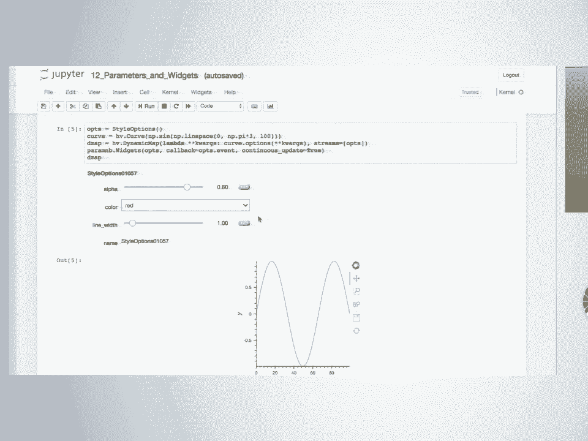

 and you can do the same thing in the little apps that i showed you actually i didn't show you the。

 source code for the app which is probably the last thing to show here which is that 1 billion。

 um osm doesn't need to be such a small font because it's。

 uh that's all the code there is this is the code for the 1 billion um point uh street map。

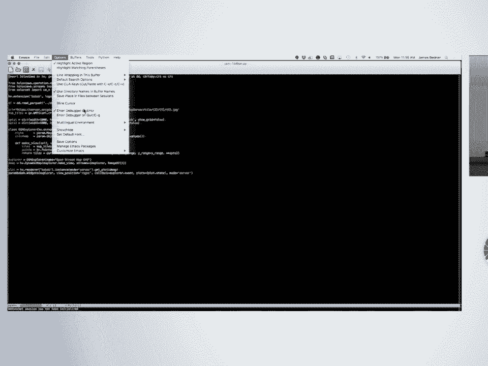

 dataset and so this is code that should be familiar to you by now you import some stuff。

 you know you tell it's going to use bokeh you don't need a bokeh logo because you're not in the。

 notebook you don't need to know that it worked it's going to work and then you read in the file。

 um in this little thing tells me that i want to keep it all in memory if i took that off it would。

 be paging it in from disk it'd be very slow but you can handle an infinitely large data set。

 i could also set up a desk distributed scheduler here where i distributed across multiple machines。

 i'm using the default one which is just local machine here because i don't need anything but this。

 machine to handle a billion points if i had a hundred billion points i would need more machines。

 one machine is enough for a billion and then i specify the um the map tiles i want a bunch of。

 options that i felt like i'd have to declare that there are a couple of widgets that i want。

 the function that is used look that's a stream i didn't mention that earlier but this is a stream。

 object and it's important that it's a stream because that way we get notified when something。

 happens otherwise it's just an object that has parameters and we have a function that turns those。

 what we've got is a stream which is a range down here we're going to have a range stream that。

 whenever it changes this function is going to be called and when it's called we update the tiles。

 to the new range and the new alpha value from the from the widget and then we get the plots and then。

 we plot it this thing is going to give us an instance of that class um this bit is going to give us the。

 widgets instantiating that class um this bit is going to connect the range and explore to this。

 function here don't have time to go into that and this is going to make it work outside the notebook。

 so together this adds up to that that app that you saw and you can hopefully you can imagine oh。

 i can put any widgets i want there i'll just put new lines there i can put any data i want i've。

 put any plot i want just use the structure you can put anything in to make any apps you feel like。

 now that said the app is pretty simple we don't have a whole lot of。

 control over where the widgets go and how it's arranged it's going to be kind of the way it is。

 it is not it is made it is all designed to make it easy to go from things work for me in a notebook。

 to i can share an app it is not designed to my app is better than any javascript app that people。

 have been working on for six months is not going to go there it is designed to get you out of the。

 notebook and sharing with people so we're trying to get it as easy as possible to get out of there。

 and share it and make an impact so so that's probably the let me just check the um。

 index to make sure we didn't miss anything um yeah so we were just discussing the deploying book。

 apps if you want to know how to do that how to launch the apps that's in there and we already。

 talked about that and we're emitting that so cover everything in some random order。

 sorry for that but thanks to john luke and thanks to all the five is developers and all the people。

 have done bug reports and all of the people who hung out with us on gitter and give us suggestions。

 it's all and all of the corporate and government sponsors who have made all of this possible。

 and anaconda for letting's do it and the academy and everything thank you， [Applause]， (no audio)。

