# SciPy 2018视频专辑 - P65：SciPy 2018视频专辑 (P65. Setting Up Your Own Open Source Project _ SciPy 2018 Tutori - GalileoHua - BV1TE411n7Ny

 Good morning。 Welcome to the second day of Sci-Fi tutorials。 I'll be your host。 My name is Ryan May。

 I'm a software developer at Unidata。 The focus today is on learning how to set up your own open。

 source project。 I'll jump。 My colleague introduce himself。 So I'm John Lehman。 I'm also a software。

 developer at Unidata and a geophysicist by background。 A little bit different than Ryan。

 who's got a meteorological background。 A couple of notes on the way we're going to run things today。

 Unlike some sessions where we're going through Jupyter Notebooks and that sort of thing。

 you will not see a single Jupyter Notebook today。 This is highly interactive， which means we can。

 all fail together when we're trying to get some of these things to work。 So there's going to be a。

 lot of sections where you need to help write some tests or set up an online service against。

 a repository。 So make sure that if you're having trouble， you flag us down and we'll get you the。

 help that you need。 We've got stickies。 Are people familiar with the software carpentry sticky method？

 Okay， so the green in quotes。 This is the closest thing we could find to target。 Blue sticky when。

 we're doing exercises and things。 If everything's going great or you're done with the exercise。

 you put this up on the back of your laptop。 Our stand-in for red， which is this orange， is your。

 stuck。 You need help。 Something's wrong。 Put this on your laptop。

 One of us will see it and we'll come， by and help you。 These are not colorblind safe， unfortunately。

 So if you're having some trouble with， it， ask us and we can annotate on here for you。

 There's also a Slack channel。 It's Open Source， Project and the SciPy 2018 Slack。

 whichever one of us is not teaching， will be in there。 I've also。

 got the links that are on the board posted in there。 If you don't want to have to type them in。

 so you can go ahead and join that。 I saw several people already have。 And then again， we'll be。

 running things mostly off this website， which I will let Ryan introduce。 But a brief outline of。

 some of the stuff that we're going to hit today。 At first。

 we're going to make sure everybody is set， up。 We're going to get a Git repo for your project set up。

 The project we're going to be working with， today is called HUGS。

 which is the hugely useful geoscience stuff to play on Matt Hall's， bridges。

 which is bag of really useful geophysical equations and stuff。

 Then we're going to talk about testing and setting testing up using Travis CI， Flake8。

 building docs with Sphinx， and getting them online with Read the Docs。

 as well as testing the docs with Travis。 So just to start， as a show of hands。

 how many of you have Git installed in your computer？ Okay， excellent。 And then what else did I need？

 How many of you already did the， install and set up your environment with Conda？ Okay。

 we are in good shape here。

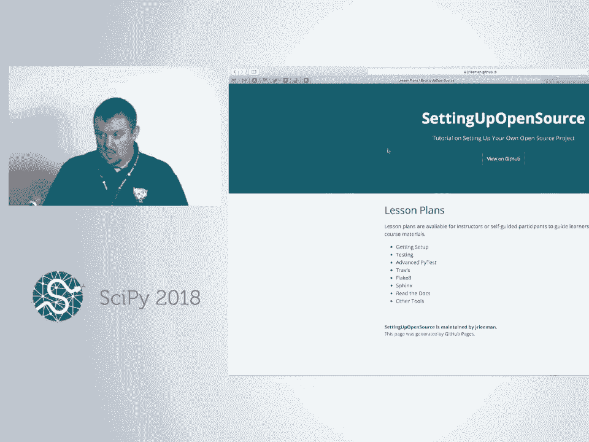

 So what John's doing that， I'm going to go ahead and start my install just to be thorough here。

 And let that go。 So has anyone out there never used GitHub before？ Okay， so we have the basics。

 of that installed。 So we're going to use GitHub to host this project。

 We're just creating a hypothetical， project here。 We're not hypothetical。

 We're just creating a toy project here。 John's Hugs， and we'll。

 set that up and we'll go through the steps of selecting all these things。 So while that。

 environment finishes creating， the first step in setting up any open source project is。

 what's your license going to be？ So what are some of the licenses， software licenses you guys。

 have heard of or are familiar with？ Just throw them some out there。 Okay， MIT， Apache， BSD， GPL。

 I mean， we don't need an exhaustive list。 Anyone else want to throw out their favorite？ Government。

 yes。 So the important part of any one of these is that they dictate the terms under which anyone can。

 use the code you've posted online。 You may think that just throwing it up on GitHub is enough to。

 open source it， but without a license file in your repository， legally speaking， you maintain all。

 rights to the code。 Just because you put it up there doesn't mean people can use it will。 So。

 it's very important to actually go through the process of putting a license on there so that。

 other people can be sure that yes， they have permission。 You're not going to come back and。

 sue them later for using your code or whatnot。 And so it is important to choose a license。 I know。

 a lot of people think， oh， I don't care。 I just don't want to deal with this。 I'm not putting。

 anything up。 But if you don't have a license， no one should be touching your code technically speaking。

 So I'm going to come up here。 First thing we want to do is let's create a repository on GitHub。

 So if you go to github。com and you're logged in， this is what you should see。 Or something like it。

 depending on what your account looks like。 And step one here is we want to click this big green button here that says new repository。

 And we'll blow this up a little bit。 There we go。 So create a new repository。

 I'm going to leave myself as the owner。 You leave， put yourself as the owner。 For purposes of this。

 because we're going to be putting some documentation， up on read-to-docs。

 we need to have unique names for these projects。 And so I'm going to call mine。

 "hugs-stoppler-shift"。 You can call it really， the name is not important。 So if you want to call。

 it something else， by all means just pick a name。 But if two of you have the same name when we go to。

 put things on read-to-docs， they'll collide。 I'm not sure what will happen actually。

 So choose my repository name at a description。 I'm just going to type something here。 Okay。

 Make this public。 I'll go ahead and initialize this with a read-me。 So that's a nice feature on。

 GitHub。 If you've not seen， that's where you can get all that text by default that comes up when。

 someone visits your repository page。 So it's a nice thing to have。 You can put other useful links。

 links to your documentation。 You can put all sorts of these little icons。 We call badges for。

 that point to other online services， things about the project， links to where you can find。

 for instance， the PIPI package。 As I'm making， since we're doing a Python project。

 I'll go ahead and select Python for my git-ignore。

 There's a large number of languages supported here。 And then the license。

 So besides selecting license， we didn't actually cover the two main types of， licenses。

 So they largely fall into two categories。 One of those licenses are what's called。

 copy-left licenses。 That would be something like the GPL， the LGPL。 What those say is， in the case。

 of the GPL， any code that derives for a project， any code that derives in this code must also。

 fulfill the terms of this license。 So essentially， that means if I'm using the GPL library。

 my code must also be GPL。 That's what it comes down to。 And because of that nature of。

 anything that derives from it must maintain that same license， they kind of call it a viral license。

 because it just kind of perpetuates through this chain of dependencies。 Some people really like。

 that aspect of it， and some people aren't so hot about it。 The other class of license are what's。

 called permissive licenses。 That would be the MIT， BSD， Apache， those ones。 And essentially。

 what those say with some variation is do what you want with this code。 I'm not responsible for it。

 And just make sure you keep the license with the files and make it clear to people that， yes。

 I'm basing this on some open source code。 That's more or less what the permissive license is doing。

 It's allowing pretty much anyone to do whatever they want with it as long as they maintain a license。

 So those are your two big classes。 Usually in the scientific Python community。

 the standard is to use one of the more permissive licenses。 The one I see most often would be the。

 BSD， I think three clause license。 So that's what we'll select down here is， I'll go ahead and use。

 the BSD three。 You see GitHub already promotes a few of the ones here， Apache， a new GPL， MIT。

 For consistency， I'm going to choose BSD three。 This is a toy repo， so feel free。

 to excuse whatever you want。 But first thing first， we choose a license out of this selector。

 I have this here because I have an app installed on my account。 We'll get to that in a second。

 So don't worry about that。 So we got our options selected for our new repository。 We can go ahead。

 and click Create。 Let that chug and here we go。 Voila， my own home for my new open source project。

 I've already got the ReadMe file populated where I could put content in there。

 I've got my GetIgnore file， which we click in there。

 We see a whole bunch of Python-y things being ignored。 All sorts of， things for packaging。

 spider project files， virtual environment files， all sorts of things。

 Anything you could possibly not one checked in is in here。 It looks like。 Okay， that's good。

 So if I go back， the other thing I want to look at is， okay， there's my license file。

 If I look in there， GitHub for all the license files on GitHub， if it understands it。

 it's able to give you more， of a rundown of the features of the license。

 which is nice for your users。 And then here we see。

 here's the standard text of the BSD three-clas license。 I chose Python。

 It's not going to be critical for this。 So if you didn't choose it in our， created， it's fine。

 We can also update the file later if we need to， but not going to be critical。

 for what we're doing this morning。 All right， so there's our license。 GetIgnore， ReadMe。

 already set up and ready to rock and roll now。 So， last step here， now that we've created something。

 online is we need to get that locally。 So let's go ahead and bring it down to our computers。

 So I'm going to go over to my terminal here。 Where am I？ I'm in here。 So go to wherever。

 how many of you are not going to be using the GitHub GUI， like the GitHub desktop app？ Just curious。

 All command line or？ Whichever you prefer， we just need to get the repository down locally。

 So I'm going to be doing things in the command line。 Get clone。 You don't have to follow along。

 that you don't want to， but the important part is we want to take， we want to go over here。

 and get this repository downloaded。 So I'm actually going to take the shortcut here。

 If you click this green button here on your repository says clone or download。

 we can go over here and just click this and it'll copy the URL to your clipboard。

 Come over back to my terminal。 I can say get clone and paste that in。 And so don't clone mine。

 You should be going through and making your own clone your own locally。

 So as a first run through here， when you've got your repository cloned locally， can you put up。

 your green sticky？ Okay。 Okay， so see lots of green sticky。 So go ahead and take those down。

 next we're using them。 So the next thing that we're going to talk about is testing in your repository。

 So we're going to set up the sample project。 We're going to copy some canned library code。

 into the repository that you just made and talk a little bit about the types of tests and then。

 actually write a few tests。 So this will be a pretty hands-on session。 To save time， so we don't。

 have to write some library code ourselves， we're going to copy in some library code from this。

 github。com/jarlingen/settingupopensource。url here on the board。 So if you want to。

 you could clone this or since we're not really going to do any， git magic with this。

 you could download the zip。 Either way is fine。 So you can download zip here。 So it's github。

com/jarlingen/settingupopensource， and it is in the slack， yes。

 So then go ahead and unzip that file or open up the the folder that you， downloaded here。

 So I'm going to go to downloads。 There we go。 It's always fun using someone else's machine that has slightly different。

 shortcuts set up。 So I've got this setting up open source master。

 I'm going to go ahead and open that。 And we're going to need this hugs directory which has our sample code and the setup。

py file。 So copy those into your repository that you created， which， ever way。

 is most convenient for you。 You can do it from the command line or you could just。

 drag it across either one。 The whole folder， so the whole hugs folder and the setup。py file。

 But you don't need the environment to read near license。 You'll already have the getting。

 or in license and towing。 So everybody good there？ We have any problems copying those things across。

 Okay。 So the next thing that we're going to do then is activate our environment that we created earlier。

 on。 So in this case it's going to be CondaActivate。 If you're on a newer version or source activate。

 for an older version or just activate if you're on Windows， have our environment name。

 So source activate and our terminal here。 S-U-O-S setting up open source to activate our environment。

 And make sure that you are in the directory of your repository on your terminal。 So if you do a PWD。

 you should be in hugs dash your last name or whatever you call the repository。 What is that？

 It's source activate S-U-O-S or CondaActivate for the most recent version。 Okay。

 So once you're CDID and to the appropriate directory here， we need to go ahead and install。

 into our environment the hugs library but we need to make an editable install because we're。

 going to be doing changes and we want that to propagate。 So do that。 Run the command pip install。

 And with the flag e for editable。 And then a period because our setup。

py file is in the directory that we're in currently。

 So at the end you should see successfully installed hugs which is a very nice little message。

 So if you got that put your green sticky up if you're having a problem。 Red sticky。

 Okay so it looks like everybody's got the the pip install command to work。

 See lots of green stickies。 So the next thing that we're going to do is go ahead and commit this。

 code that we've copied in to the repository。 How many folks are very familiar with Git you would say。

 Okay so decent amount。 The first command that we're going to want to run here is a Git status。

 Let me make this a little bit wider so the text wrapping is not so bad。

 Okay so what you should see here is Git's telling us that there are untracked files。

 There's a hugs directory that's in turn has a lot of content in it and this setup。py file。

 that it doesn't know anything about。 So we want to go ahead and track those files。

 We're going to add them to version tracking using the git add command。

 git add and then in this case we can use flag capital A to add all untracked files。

 This is not necessarily the most common command that you'll use but when we're first getting set up。

 It's pretty handy。 So now if we do a git status。 You see that we have all of these new files that are ready to be committed。

 They're staged。 Does anybody have any problems getting to there？

 So again that was a git add dash capital A and then git status。 All untracked probably。

 Don't know if it's， and then git add dash capital U is going to be add files that have changed but are already tracked by version control。

 That'll be another common one that we'll use。 So now that these files are ready to be committed we can go ahead and do our commit。

 So git commit， dash M which is the message that we want to put with this the commit message。

 One of the most important things when you're working in an open source project with lots of other people。

 or even just yourself is to have good commit messages because you will thank yourself in six months or eight months or a year。

 down the road when you want to know exactly why you did that change。

 This though is just an initial code dump into the repository so we're going to have a not very helpful message which is。

 initial commit。 So we should see that nine files have changed 225 insertions。

 Now this has all happened locally on your machine。 None of this is up on GitHub yet。

 So just put it on to GitHub。 It means use the command git push。 After we do our push。

 I'm going to go back to my repository page on GitHub and refresh it。

 And now you see that there is our content there our hugs directory our setup。py。

 and we see that the latest commit was 42 seconds ago。

 So anybody have a problem getting pushed to GitHub？ Yep， okay。

 You're having a problem put your red sticky up。 Okay so I think everybody is squared away now with git。

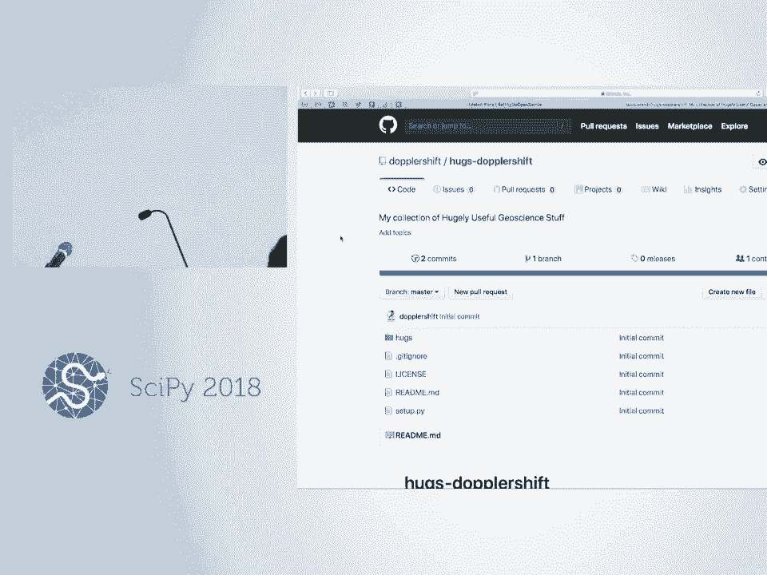

 You can always be a little bit tricky especially if you are not familiar to use and get from the。

 command line or working with GitHub。 So now we can actually get on to talking about testing。

 So testing is a very important thing for your open source project。 It helps ensure that you're。

 getting correct results that changes to other libraries that you depend on aren't breaking you。

 It helps make sure that bugs don't come back and there are a lot of different types of tests。

 I'll very briefly hit the high points of it but the point here is not to talk about the semantics。

 of testing so much is show you how to do it。 So we're going to use PyTest。 That's one of the most。

 common frameworks for doing testing in Python and we'll actually write some tests for the Hugs library。

 and then we'll look at our test coverage which is another important metric that you might want to look。

 at for your project is how many lines of your code are actually being hit by tests。 There's a lot。

 of nice tools that will help you look at that and maybe you realize that a certain case or a certain。

 path through your code isn't being tested and you can then write that test up。 There's a lot of。

 different schools of thought when it comes to testing but for our purposes we'll just cover three。

 types of tests。 So unit testing which is testing a single unit of code this is a function or a method。

 something very simple does it work in isolation then there's integration testing。 Now we have。

 multiple pieces of code that are working together to perform a certain task。 Is that working or are。

 we getting expected outputs from that and then a really important one which is regression testing。

 This is a user's reported a bug or we found a bug and we're going to write a test to make sure。

 that that bug doesn't come back in some way。 Another buzzword that you'll hear quite a bit。

 is test driven development does anybody here practice TDD？ A couple。

 So the rough idea here is that you， write the test before you write the code so you know exactly what you want the output of this new。

 function or this new method to be。 So I'm going to write a test that will have the API that I want。

 and I know what output I want and then I write the code to make the test pass。

 And it's always good I， like that methodology because you then know that your test and your function are both working。

 So ideally you would need to install a pi test if you're doing this on your own from scratch。

 with command like conda install pi test。 We've already have pi test installed after you made the。

 environment setting up open source environment。 If I do a conda list you can see all the things that。

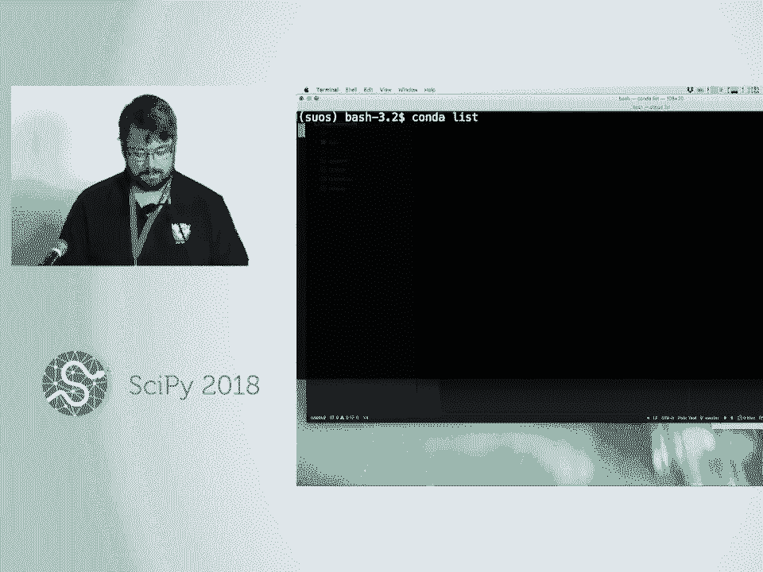

 are installed and up here we have pi test as well as cove flake and a few things that we'll get to。

 later on today。 So what pi test is going to do is crawl through our directory structure and look for。

 files named test anything test star dot pi。 And it's going to run all the functions in those files。

 that are named test anything。 So we can go ahead and look in the hugs repository open up your very。

 favorite editor doesn't matter what it is the s code atom by emax whatever you choose。

 And if we look in the hugs directory we'll see that there are two more directories。

 So you can make this little bigger for you。 It doesn't look like we can make the navigation。

 bar any bigger just the code。 But if you look in hugs there are two directories calc and plots。

 Now if we look in calc for example you'll see that there are two python files geology and met。

 two different types of calculations and there's a test directory。 In that test directory we have。

 test geology and test met。 So when we run pi test it's going to start crawling through here go to。

 hugs go to calc go to tests and then find these two files。

 If you look at one for example test geology。

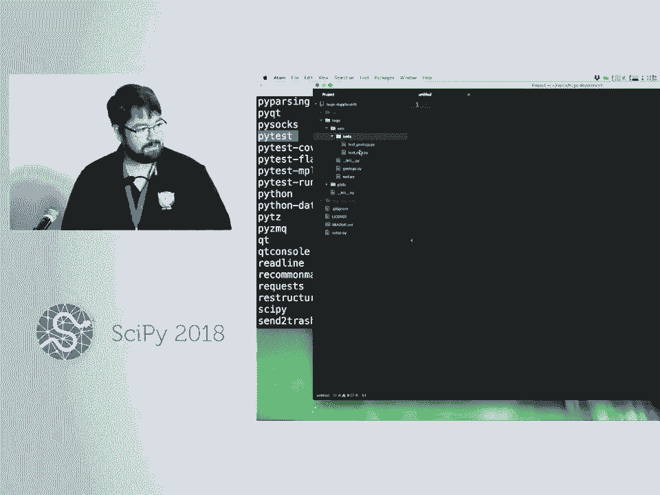

 this is a short one right now we'll be adding to it。 See that we have a function。

 Snell angle in the geology sub module that we are going to be testing。 So function test something。

 So， pi test we'll see this function it will run it。

 So Snell angle with these arguments is going to be。

 called and then we assert that the result is almost equal。 So it's floating point comparison is。

 hard as you'll see。 So we take our result and we say that it should be equal to 19。43022。

 to four decimal places。 So if that function does not return that result the test will fail。

 It's a nice simple example of a unit test。 So if you go back to your terminal。

 we're going to run the existing test so there is a small test suite in hugs right now。

 and to do that you just have to type pi test。 So pi test and press return。

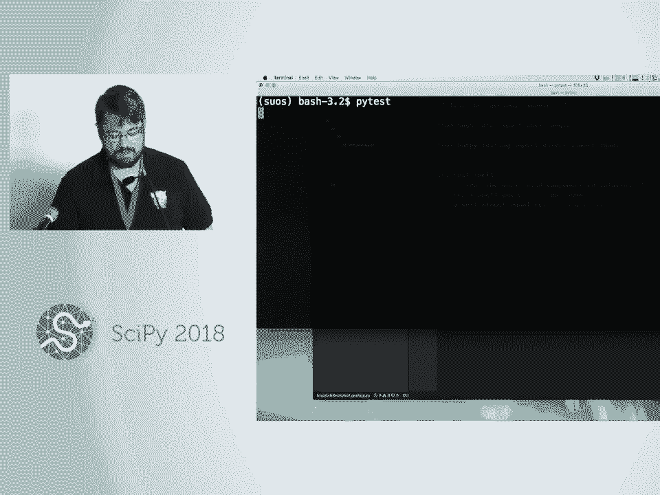

 and you should see that there were four tests and then they all passed and just。

 on the system a little over a quarter of a second。 Did anybody get a test failure？

 Excellent because you shouldn't have so far they should all pass。

 So we're going to do a little activity now。 So the Snell angle function on my system is called geology。

 If you import from hugs。 Now it works。 Snell angle has been worked。

 So in Calc there's a dunder in it file and from there we import star from geology and met。

 It's just a nice way to break up for example and met pi which is the package that we both work on。

 We have hundreds of calculations so we have them broken up into。

 let's say kinematics and basics and dynamics and these kinds of。

 files that make it easier instead of having one giant mini thousand line file with hundreds。

 and hundreds of calculation functions。 This is a nice way to structure your project。

 That's an excellent point。 Any other questions so far？ [inaudible]。

 It's test and then anything dot pi。 Right。 And it looks for functions in those files that are test and anything。

 And if we have time at the end of the day we'll get into some advanced。

 pi test things like doing image comparison tests and all that。

 If we don't have time to get there there are some notes for this on the website as well though。

 Okay so now that everybody has their test suite and they've run it and it's passed。

 we're going to add a test。 So if you look in the Calc folder close these out and met。

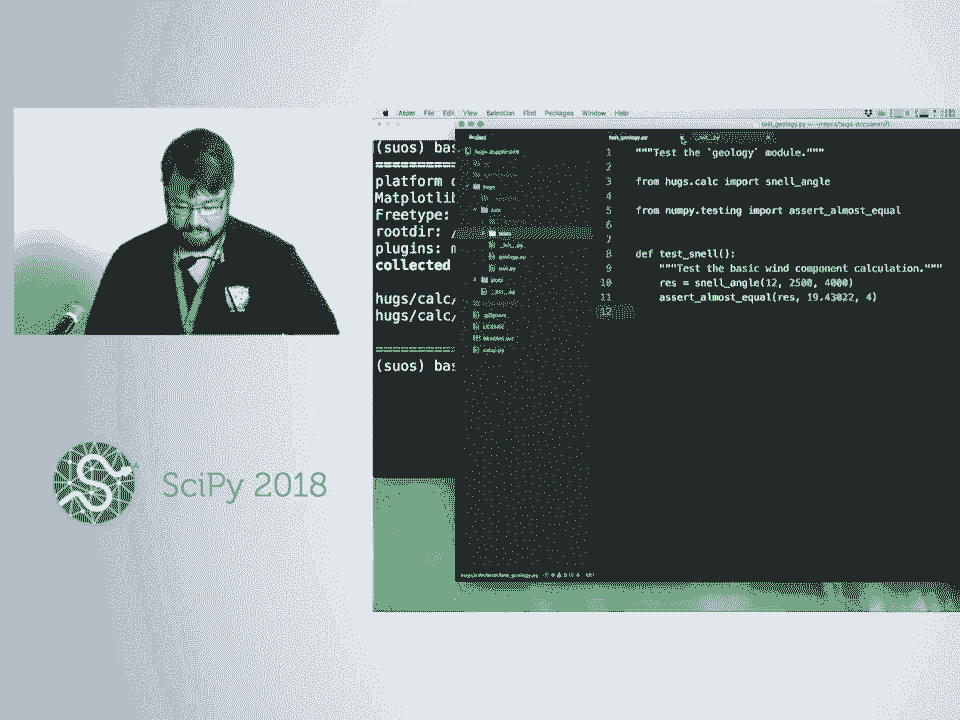

 there is this function line 65 of met dot pi get wind components。

 So what this does is takes a wind speed and a wind direction and tells you what the U or the。

 east west component and the V or the north south component of the wind is。 This is just breaking。

 the wind vector down into its components。 And we have a little warning in here that's。

 if the wind direction is greater than 360 degrees we're going to warn you about that and say something。

 might be wrong。 Otherwise this is a relatively simple and straightforward calculation。 So what。

 you do is to write a test to verify that scalar values work with this。

 So pass in a scalar for speed， and a scalar for direction make sure that works。

 And then write another test to see if it works on， an array of values。

 So pass in an array of speeds and an array of directions。 You should get an， array of output。

 So go ahead and try to write those tests。 They will be in test met right here。

 There's some patterns that you can look at there。 When you get done put your green sticky up go。

 ahead and take it down if it's already up though。 And red stickies if you have a problem。

 Okay so in the interest of time we're going to go ahead and move forward here。 So did anybody。

 encounter any problems when they were doing this？ Everybody should have encountered problems when。

 you're doing this。 This is the great thing about writing tests is you catch weird things that happen。

 in your code base right。 So the first test that we'll look at down here is this test。

 wind comp scalar。 So I've got a little doc string here that tells me what the test does。

 That's always， a nice thing。 And I'm calling get wind components with a speed of 8 in a direction of 150 and I use。

 two assert almost equals to check that u and v are indeed correct in this case out to three。

 decimal places。 Yes。 Also these solutions are on the website。 If you click on lessons and testing。

 you can get this code as well。 Any questions on how that test works？ No？ Okay。

 So then this test wind comps basic。 Here we create an array of speeds and array of。

 directions every 45 degrees in this case from 0 to 360。 And then we are passing those。

 To get wind components and we have arrays for the true u and the true v that we should be getting。

 out you could just put values in there here since we know that one in one hypotenuse is square root。

 two we simplify a little bit here。 Now if you try to run this with pi test。

 you see that we get a failure。 This is why we want to test with scalars and arrays because users might。

 pass either one to us。 In this case it's not working。 Does anybody know why？

 So it's down here in this if wind are greater than 360 so that's ambiguous if I'm passing an array。

 So what we can do is wrap this and mp。any。 So now if any element of that array is greater than 360 we'll get the warning。

 If you run pi test again now we should have six tests that are all passing。

 So it's one of those things that you may not think about but when you're writing a function。

 if you intend it to be able to accept scalars and arrays you should test that it can indeed。

 do both of those things。 Right so you just passing a list or some tuples。 [Inaudible]， Right。

 And it just gets worse when you use things like unit libraries to add further testing。

 Okay so there's a couple other common tests that we might want to do。 One would be to test if a。

 warning is raised or you might want to test if an exception is raised。 Somebody would ask me。

 during the activity how do I test and see you know is the file not found there raised here。

 So the first thing that we'll do is write a little test to make sure that our warning that we just。

 fixed here works。 So if you want to follow a long open test。mit。

 You bring the bottom of this up so you can see it in the back a little better。

 Everybody in the back see this okay big enough。 All right so we're going to write a test that。

 makes sure that the warning is raised on the wind direction is greater than 360。

 I'm going to define a new test test warning direction， give myself a little note about what it does。

 So test that warning is raised and wind direction greater than 360。

 And so we're going to use a context manager here with pi test dot warns。

 Then we can tell it the type of warning in this case if we look back and met。

 This is just going to generate a user warning。 When you do warnings dot warn that's the default。

 And then we're going to call get-win components， with speed and ideally we're going to put a direction greater than 360。

 First I'm going to put a direction less than 360 and to make sure that my test is working。

 It's always a nice sanity check to make sure you understand how to use the test set up here。

 I'm going to go ahead and save that， and then go run my test suite。 And we're here and run pi test。

 What we need to do is add， an import of pi test up here at the top。 [silence]。

 Okay so the test failed it did not warn that is what we wanted to see。

 So now we'll go back and make this something over 360 say 480， and run the test suite again。

 Now I have seven tests that are all passing。 So we now successfully tested improvement to ourselves that we're successfully testing。

 whether that warning test works or not。 The other test that you might want to perform is test if an exception is raised。

 So that's very similar。 Instead of pi test dot warns it's pi test dot raises and then the type of error or the type of。

 exception that you want to test for。 So what I want you to do and I will pull this up on the website。

 They'll try not to cheat and look at the answer。 So your activity add a test to ensure that a value error is raised on the SNL angle function。

 when the top layer velocity is zero。 So a zero velocity makes no sense in this problem。

 So we want to make sure that we get a value error on that。

 So go ahead and take your stickies down if they're up。

 Green stickies up when you get this test working。 Red stickies if you're having problems。

 Okay so we're going to go ahead and put this test in。

 So I'm going to add a new test to not test met but test geology。

 We're going to go ahead and import pi test。 Then add my new function here。 So def test， SNL。

 zero velocity top。 It's nice to be descriptive with your names since you're not going to have to type these。

 Definitely helps when you're looking for the tests later on。

 So test that error is raised with zero velocity top layer。

 So again using a context manager with pi test。rases。

 I told you that you're going to be looking for a value error。

 You can see if that's what's raised in the code。 So value error。

 We're going to call the SNL angle function。 And we'll give it a zero value。 So this is incident。

 I believe it's incident angle， angle， top layer velocity， bottom layer velocity。

 So we want to give it zero for the top layer。 Save that and run pi test。

 Now we have eight passing tests。 If you wanted to make sure you were using that right。

 you could give a non-zero， velocity there。 And we get it did not raise value error。 Okay。

 so any questions on testing for warnings， exceptions， and so on？ Okay。

 the last thing that I want to show you is how to check coverage on the command line。

 And then we're going to take a little break and then we'll move on。

 So I'm going to use pi test again。 And this time I'm going to use flag flag COV equals hugs。

 This says I want to look at the coverage of the hugs library。

 And this shows us how much coverage we have on each of the files in the library。

 So for example right now， special plot has zero percent coverage and we'll address that later on。

 So this is how much of that Python file is actually getting hit by your tests。

 Do you have lines that are not being hit？ So for example， if I go into my met module and I add。

 you can see right now， met is it 100% coverage right here。 I add a function that does nothing。

 And then I run this coverage check again。 See now that my coverage is dropped because I have a function that has untested lines of code。

 This is a good thing to keep an eye on as you add code and make sure that for example a warning。

 path is covered。 You may not have thought to check on。 Yeah。

 you can put out our HTML coverage report as we'll also look at some of that this afternoon。

 in terms of the automating this test。 Oh， we're not going to do it later this morning。 Yeah。

 we're not going to keep you here all day。 Okay， so if there are no other questions， take 10 minutes。

 So we'll come back at 950， go out， get some coffee， stretch your legs， get some fresh air。

 All right， let's get this show moving on here。 So tests are great。 I love tests。 They help。

 We just saw found bugs。 We proved ourselves that things are working correctly。

 What really brings out the power of tests is when it's run automatically all the time so that you。

 know when things break。 So how many of you have ever heard of a term called continuous integration？

 Okay， a lot of you。 How many of you actually use continuous integration？ Fewer。 Okay。

 So if you're not familiar or you've heard the term but you're not really clear on。

 what continuous integration is， what that term comes from is it means that changes to a code base。

 are continuously integrated into the main part of the project。

 In terms of our open source projects here running on Git and GitHub， what it means is。

 master is always kind of in this state where things are working。

 You don't have this half broken thing because all your tests are passing。

 And this process called continuous integration is enabled by essentially running your tests。

 every time you make a commit。 And you have a system that runs the test for you so that you're not。

 doing it manually but you can ensure that things are staying broken or if things break you immediately。

 get notified。 And it's not， you know， six months later when you're trying to get a release out。

 the door that you finally are aware that things are broken。 Instead your tests are always being run。

 And so there are a wide array of tools and online services that support continuous integration。

 There's a tool called Travis CI that we'll be working with today and that allows you to run。

 your code， run your tests on Linux and Mac。 There's a service called AppBear that runs。

 tests on Windows or now they have Linux support。 There's also CircleCI that does Linux and Mac as。

 well using Docker containers。 And so all these nice online services exist to provide continuous。

 integration services。 And for open source projects they generally give you free access。

 It's very nice to have。 And so we'll run through setting up Travis now。 One of the other things。

 that makes these services so powerful is when you have pull requests。 So you have an open source。

 project someone wants to contribute changes。 And so they open up the pull request to get your， code。

 And without these services you get the pull request and you're kind of staring at the。

 code trying to understand does this look good？ Is it going to break things？

 If you're really feeling， energetic maybe you check out the code and test it because you're trying to do your due diligence。

 The beauty of these services is that they will automatically run your tests on the pull request。

 give you status notifications within the pull request。 These changes are good。 These changes。

 broke some things。 And so it really helps give you peace of mind on pull requests。

 Are these changes， good？ I use it all the time even if I'm not making pull requests to other people's projects。

 Our， development workflow on MetPy and other things we work on is exclusively through pull requests。

 because of this infrastructure that exists。 So we open up pull requests on our own code。

 All the tests run automatically on Windows， on Linux， runs a bunch of other checks。 And so。

 the code that we're committing on a regular basis we know has already been tested。

 more fully than we probably do locally。 And so that's kind of the power of using services like Travis。

 So let's start by getting Travis set up here。 And so the first step here is we need to。

 you guys will need to create an account。 I'm going to go to Travis-ci。com。 Why am I still logged in？

 All right。 This should be what looks like for you out there， right？ This is what you're seeing。

 So if you click the big green button here that says sign up with GitHub。

 you're going to get an authorization screen from GitHub。 It's going to say Travis Pro wants to。

 access your account。 It needs your email address， access to your repositories， organizations。

 whatnot。 The request on an organization just means you're requesting from whoever is managing the organization。

 that Travis gets access to the repositories for that organization。 Not necessary right now。

 since you only need to worry about your personal accounts for this， purpose of this tutorial。

 So you should be able to just come down here and click the green button to， authorize Travis Pro。

 Might need to log in again or at least confirm your password。 So I came up with this for me。

 I'm going to guess from most of you， it came up with kind of a blank。

 screen or asking you to choose some repositories。 So let me get back over here。 Here we go。 Okay。

 So this is kind of what you guys are seeing this screen。 Sure。 So if you go to TravisCI。

com and go to sign up with GitHub， you get that one？ What was it？ Travis-CI。com。 It's actually 。

com now。 Was there a dash？ That's strange。 Basically， there's one difference。

 They're working on moving now from 。org to everyone being on， Travis。com or TravisCI。

com and changing some of the features。 So I was trying to get everyone， on the 。com version。

 It should work either way。 So I got here because I have some existing projects sitting here。 But。

 I can go over to my profile and I can manage repositories on GitHub。 So。

 everyone else seeing this screen when they log in？ Yes， no， maybe。 Seeing some yeses。 Okay。 I mean。

 this is going to be the tricky part of this right now is getting this all set up。 [inaudible]， Well。

 it's， you don't have to give it access to all your company's organizational accounts。 If you just。

 should be able to just give it access to the， really。 I don't know any way around that。

 Other than we're going to select only one repository for， things to be running on right now。

 I don't know if that works for you。 If not， then， right。 [inaudible]， This is activated。 Okay。

 Sorry， for purposes of the tutorial， I was not willing to nuke my， and try your Travis account。

 So you can get to access and get here where you're selecting， GitHub repositories。

 What we want to do here is come down repository access。 I'm going to say， only select repositories。

 Do I want this activated on and I'm going to choose my new。

 hugs repo that we created or whatever you called it。 So you said click。

 So we'll make sure everyone gets through this part。 I knew this was going to be the。

 most challenging step in this process was getting the initial configuration of a web service that。

 I've used before and you guys haven't。 So the quick one I went to was Travis CI。

 I had to go to my profile。 I know when you go through。

 the first time it does pop up some things that should lead you here but I'm managing my repositories。

 on GitHub。 You're not paying them right now。 And since all my only ones I care about are my public repos。

 it's not a big deal。 So the quick manager repository is going to bring up this screen right here。

 and saying it needs read access to your code， read access to some metadata in pull requests。

 and then it needs write access for checks and things。

 So down here you can say just run in all my repositories。 That's way too many。 I just want。

 certain ones to run on so I'm going down here and saying only select repositories and so I've。

 selected。 I don't need that one anymore。 And so I just have it doing hugs， doppler， shift。

 You should select the repository you created this morning that we've been working with so far today。

 Once you've done that click the big green save button。

 So now all the settings should be saved and if we come back to the Travis page here， refresh。

 it should be there。 If you've got it please put up your green sticky。 If you are having problems。

 put up your orange one and we will get you caught up because I know this is the sticky part。

 All right I don't see any orange stickies。 Cool。 Cool。 All right。

 So now you have Travis installed in your repo。 What are we going to do with it？

 So the first thing I want to do is I'm going to come back over to my terminal here。

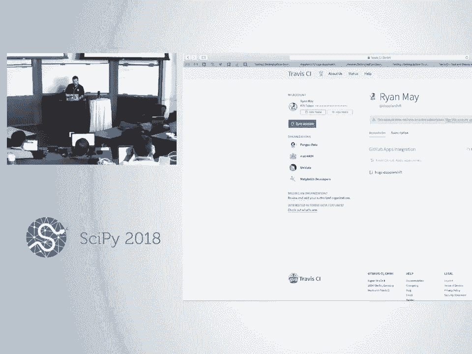

 I am what？ I'm back here。 If we run get status we've been sitting here。

 We wrote a bunch of tests before。 Let's go ahead and commit those changes。 So get add， get add。

get status， get commit， add more tests， and then get push。

 All right so we saved that work from before。 So， the first thing I want to do here is I want to。

 I want to go work on a branch so we can see how， this pull request aspect works here。

 So create a new branch to work on。 If you're working from。

 the command line then let's get checkout space dash b。 I'm going to create a new branch。

 I'm going to call my branch add Travis。 You can call your branch whatever you like。

 So now I'm working on Travis。 So to configure Travis what we do is we create a plain text file in the repository。

 called dot Travis dot yml。 So I'm going to come over here to add them and in the base of the repository I want a new file。

 Actually let me do this from the command line so you can see what I'm doing。

 Adam dot Travis dot yml。 So that's the name of the file。 That name is important。

 If it's not named correctly it won't find it and you won't get any of the cool stuff。

 So now I have a blank file。

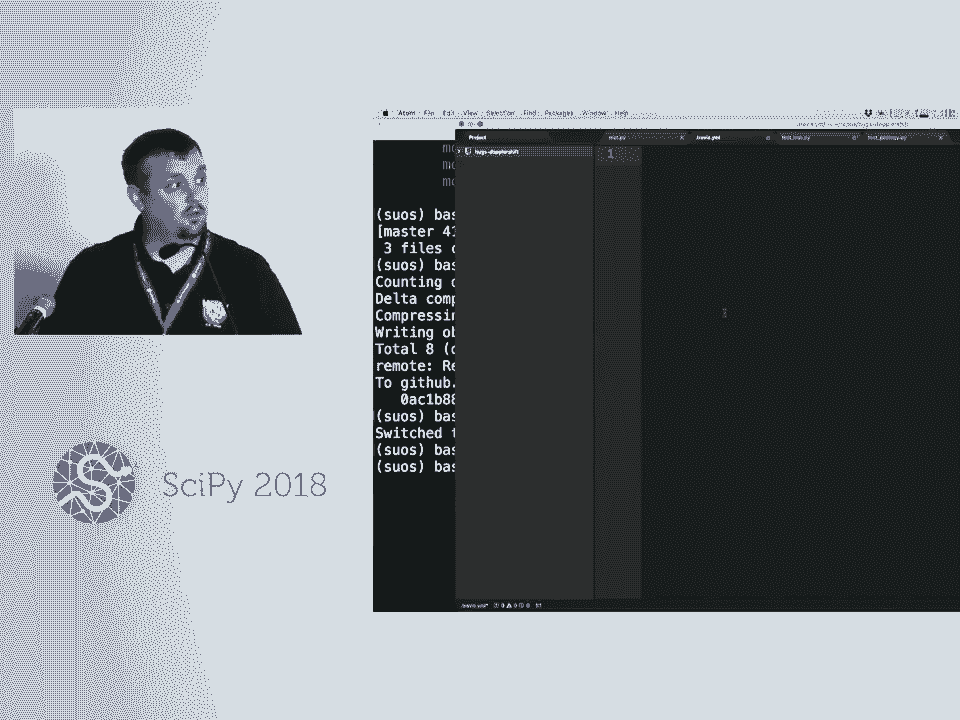

 Current working directory is there。

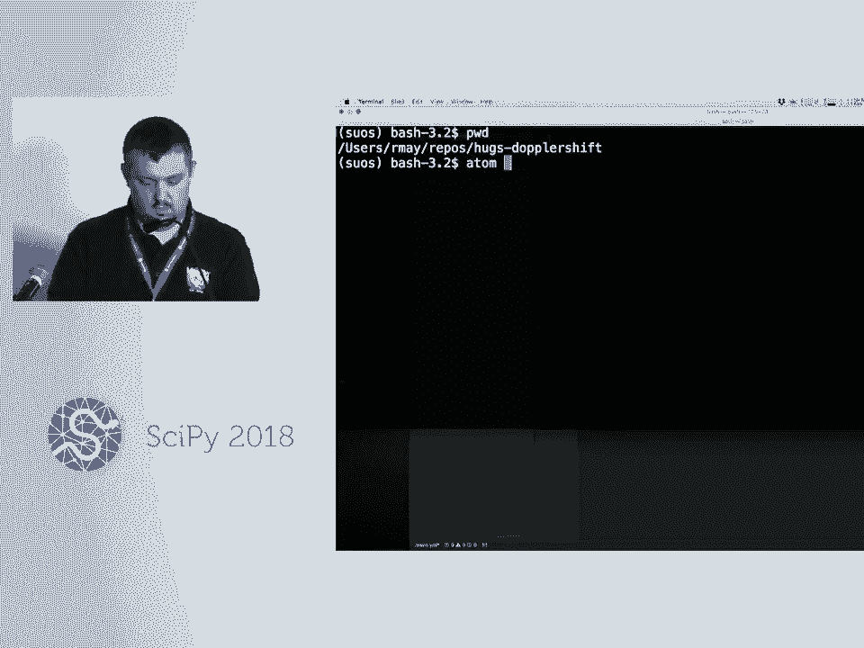

 Okay so a new file and so we're going to populate with a few things and。

 I have you guys typing this along so that you get used to typing these things up and。

 you will probably make typos and we'll get to work through debugging what's going on with these things。

 So first line I'm going to write here is tell Travis what language we're using。

 This allows it to use some bacon features and defaults things for different types of code。

 so it knows what types of things Python usually uses。 It sets up a default Python install。

 We're going to say sudo false。 Essentially has different infrastructure and if you're doing sudo false then you don't。

 it'll run on Docker containers and it starts up much more quickly than provisioning an entire。

 virtual machine for you。 Also going to say branches here say only master。

 What that's telling is I only want Travis to run， on the master branch in the repository。

 Since we're making pull requests against our own repository。

 we have to be pushing branches up there to our repository and I don't want it running twice。

 once for the pull request and once for my branch。 So I don't only run as far branches are concerned on master it'll also then run on pull requests。

 You don't have to have it set up like this if you have you're part of a bigger project or。

 something that you're collaborating with that has one main repo then you could run on all the。

 branches if you want to test different feature branches or whatnot but either way the pull request。

 will be getting tested。 So we're going to start here for Python。

 I want to say I want to run on Python 3。6。 Okay so that's set up in the environment and so I didn't explain this earlier what happens here is。

 every time these tests run it starts a clean environment so it goes through a whole set of。

 steps in terms of setting up the machine installing that your software installing the dependencies。

 around your software then running whatever script you want so everything starts in a clean state。

 so it's also a nice check that you're you know you might work locally for you because of some。

 something about your environment that you might not have captured in terms of your install steps。

 going through CI like this then goes through every step is explicitly listed here and so。

 allows you to catch certain configuration type things or dependent unstated dependencies and。

 things like that。 So how do we install our project？ Okay so we say pip install dot so we're doing。

 dash e earlier for an editable install so that allows it to point to your code so you can make。

 changes and rerun it finds it we just need to install the thing here we're not making changes。

 to the code just do pip install and then the last part we need is we need to tell it what we want it。

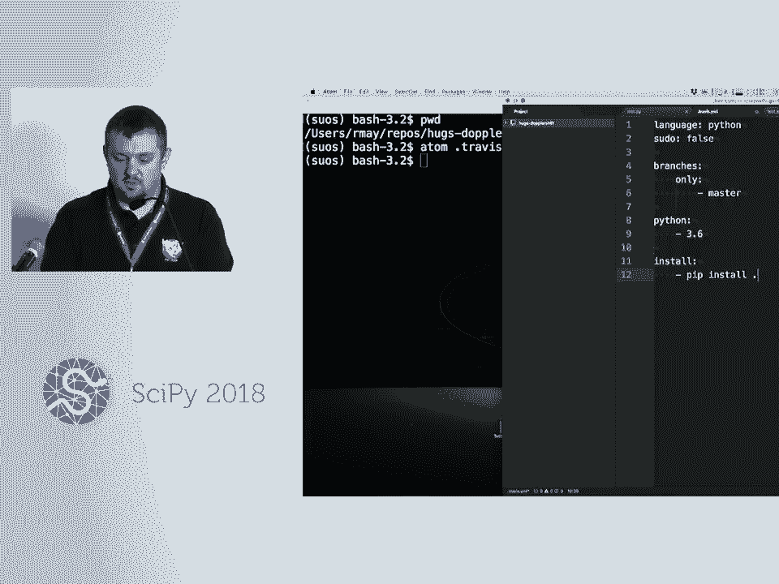

 to do so that goes under this script heading and we just put a line here that says playtest。

 so that's the entirety of our initial Travis configure here configuration here we tell it。

 what Python version we want we tell it how to install our package and we tell it how to run the test。

 in this case no we're not actually using that， those should be set up i believe specified in the setup。

py， so this isn't even using conda right now this is actually just using straight。

 stock python that Travis gives us we could go through the steps and if we have time。

 i'll show you there are ways to tell it to install conda as well and do things that's not。

 baked in a Travis it's just essentially you're writing a bash script here is what finally gets。

 generated out of this configuration is a big bash script that it runs and so you can put any step。

 you want in here but the basics here is just a Python version pip install and pytest。

 in the root of the repository so i have it in i'm in hugs。goshift here if we do an ls。

 there's dot Travis。YML so that's in the base top level directory of the repository。

 so if you had your text editor in the hugs directory then you should go one level up。

 all right so i've saved it i do get status it's not tracked so i'm going to do git add dot Travis。

 git commit， add rows configuration， and then we need to push up our changes now if you're following along i had you make a。

 separate branch for this so if we need to push that branch up get push i'm going to say dash。

 u because i wanted to basically set things up so that it's tracking back and forth between what。

 i pushed to github and what's here so that in the future i don't i can just say get push essentially。

 it's what i want it to set right here so that's what the u is going to do i need to push to。

 origin because that's where i cloned from and then i want to push my add Travis switch。

 so if you're trying to follow along that was the magic push command。

 so we use it self-recognize the setup screen， i don't know the the first one you're talking about i've not used that one。

 i may just have been using git way too long， it might be the same oh sorry i set upstream you i think is short for setup stream。

 okay yes then yes they're exactly the same so for future note then yeah that's。

 sure already we have to date yep okay so if i come over here to my github repository。

 where is it there it is okay so i'm back here my， hugs repository on github i'm going to refresh here。

 so we see it already says okay you you pushed a branch here。

 if not we could come down here and see the branches。

 does everyone been able to push and they see this green button over here for create pull request。

 so i'm going to compare and pull request， i only have one commit so i already pulled the name of the pull request from here。

 and i'm going to say create pull request， everything works right this is what you should see you should get these yellow。

 status indicators what the yellow means is it hasn't completed yet it's running。

 if i come over here to the details tab， we see a whole bunch of information here this is in the checks tab on github。

 i see i got a failure that's pretty much par for the course。

 and i can come down here it said the build failed so let's go see what's going on。

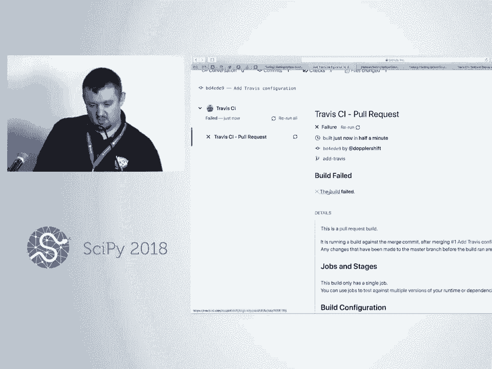

 then put up your own sticky and work will run through it because i'm sure there's going to be a few。

 so actually let's go ahead and get everyone there before i diagnose what's going on here and walk you。

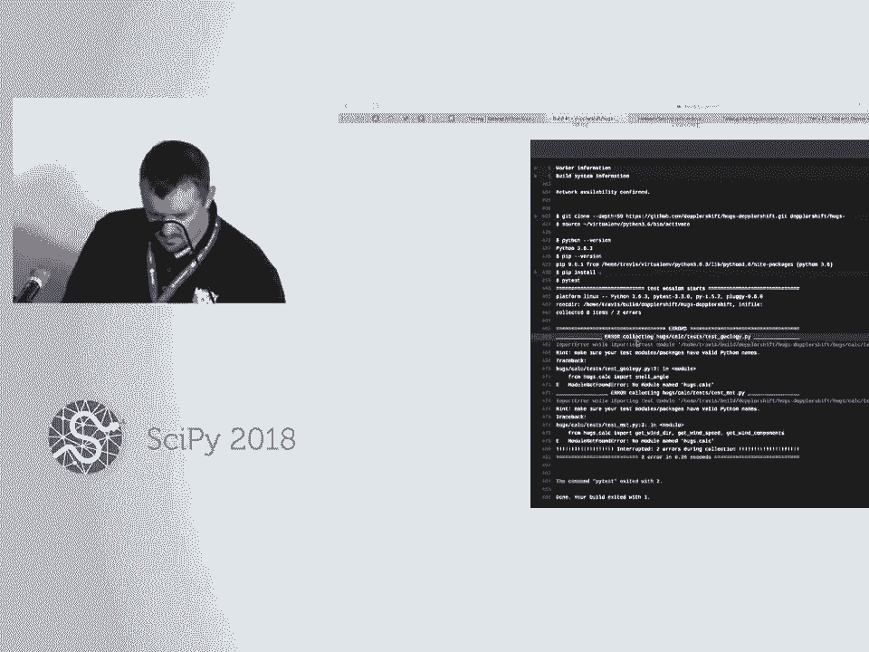

 through how to figure that out let's get everyone trapezoid。

 all right so we got everyone squared away here for now i mean。

 we managed to to learn many ways of how to fix trapez configs it's not failures this is。

 believe it or not this is a regular occurrence for me of like okay why isn't trapez working this time。

 it just can be a little picky and it's not a computer you can just log into and do things with so。

 you know you have to it's a lot of get commit and push and see what happens。

 so now we've got everyone let's go back here to my pull request。

 which is over here so i'm over here on this i'm going to go to the conversation tab on my pull。

 request and so we see okay the pull request the build failed and then it also gives me this one。

 down here saying to build failed so i got a details， i get a log of what's going on here。

 all right and so it gives you a nice log of what the machine was doing the whole time so you can。

 try and trace back go through what was going on， and so i opened up this pip install to see what happened there when it tried to install pip。

 or install hugs and it's collecting map lot lib wheels whole bunch of dependencies there。

 okay so it installed hugs just fine， so now the next question is why can't it find hugs。calc。

 and i don't understand why you can't find hugs。calc， you know why？

 oh okay i think i know what you're saying， so i come over here to my edder and open setup。py。

 you mean here okay so i've opened up setup。py so this is again why testing is great and why。

 you need to why these things are good it works our hugs package work just fine with a。

 pip install dash e but actually doing a regular install it's not picking up everything。

 so we need to do hugs。calc and hugs。watts， save that。

 come back to my git terminal here and say git add setup。py， git commit dash m， fix voggy setup。

py and git push， change， sure so the changes are whoops where's my there we go so in setup。py。

 there's a line here that says packages and we are only listing hugs before we need to list。

 all the sub packages as well that we want it to install because pip install dash e is only setting。

 up a sim link more or less and so what that does is basically points to our directory and。

 repository where it had hugs and the rest of the python import machinery took over and allowed。

 it to find the directories when we're doing just pip install it's copying files but because we didn't。

 list hugs。calc and hugs。plots it didn't copy those files when we did the install so subtle these。

 of python packaging i'm not sure if the tutorial this afternoon is going to cover things like this。

 or not but welcome to your exposure to details of python packaging and fun the quick work around。

 on testing to get through this on Travis if we hadn't if you hadn't pointed out what the problem。

 was would have been just to do the pip install dash e on Travis but i like when i do my Travis。

 configs i like to do things like the users would be doing in terms of how they install things so。

 that you can catch things like this i wish i could claim that this was a intentional teachable moment。

 you're kind no need to look at the man behind the curtain all right so that's a change so if i come。

 back over here to my pull request here let's see this tab had it so if i go go back so if i refresh。

 this page okay we see the new commit shut up on the pull request so if you hadn't used pull request。

 before one of the great things is you can just keep pushing commits to your branch and it keeps。

 updating the pull request and in this case notice we got a green check mark if i can expand this and。

 say show all checks but now now Travis is happy i can come down here again go to details。

 and i can go back and look at the log and see okay this time pite s ran and we see the same screen we。

 were seeing locally in terms of the pite s output so good everything ran just fine on on Travis。

 if you have it Travis green right now please put up your blue stickies so we can get an idea。

 orange stickies if you are not green yet um the next exercise just so i get an idea so i can keep。

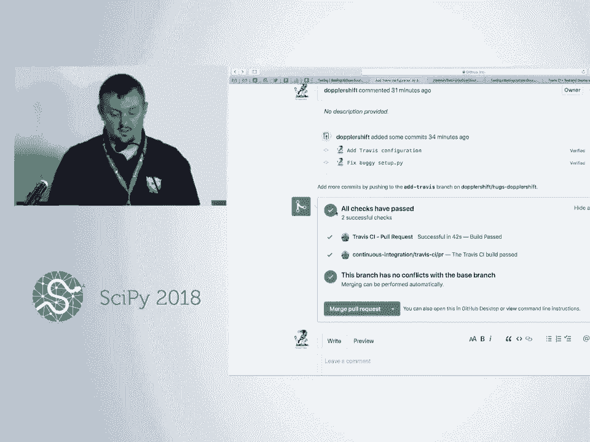

 things moving along you can get to play with it um is great we have Travis running on one version of。

 python let's expand it and let's run on three versions of python so we can catch any issues that。

 come from running on python two seven if we're still supporting that or running on python three five。

 if you're going to do that all you need to do is modify what's under this python line and you can。

 just add an additional line and say dash two seven so make that change put two seven there put three。

 five there commit the change and push back up there and see if it runs on your multiple versions of python。

 and then for those of you're not there yet we'll get you fixed up。

 all right i think we have a couple builds in progress but i think we're doing all right here。

 so i'm going to finish off mine here um let's say at my python three five here。

 so here's my full configuration。

 get status get diff okay get add dot travis dot yml get commits。

 test on more python versions get push， okay so we'll come back over my pull request tab。

 go let that run so now we see when you add those python versions you get three builds here。

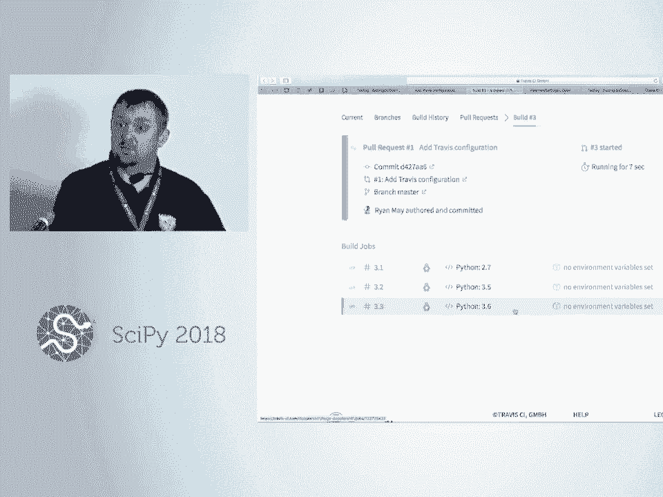

 and it does them all in parallel so we can see what's happening on python two seven。

 okay it's downloading all our packages， oop you clicked a little button over here to actually follow it for you。

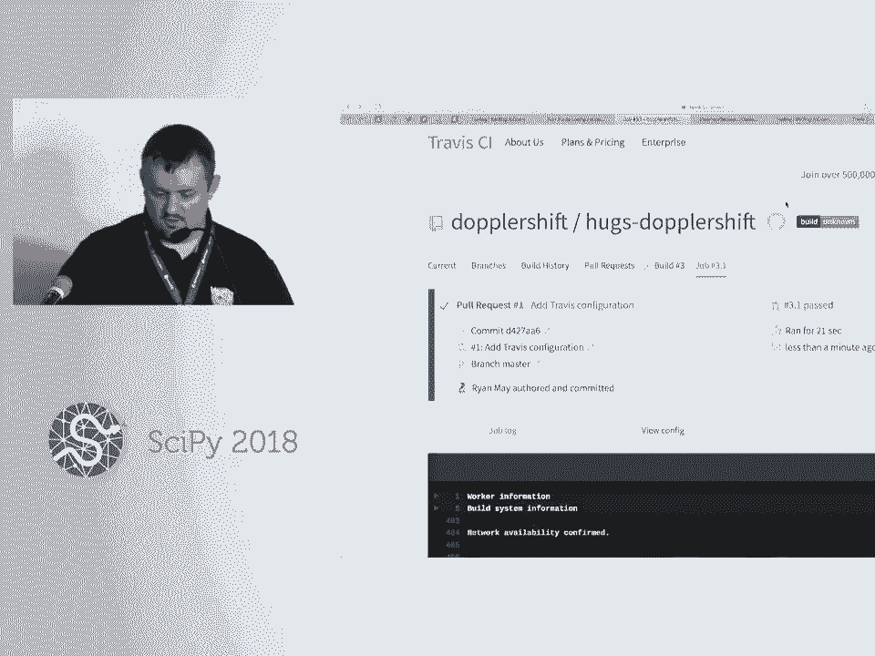

 although it's already done so two seven succeeded。

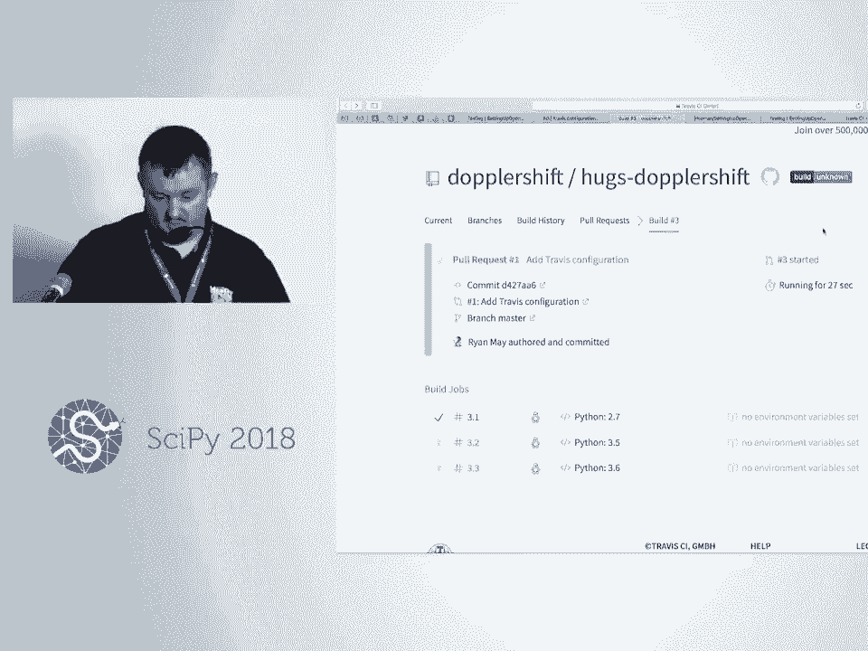

 three five still running three six， is running and not doing anything， three five is tired。

 sadly part of the course oftentimes it's just sitting here like wondering what what's going on。

 here why is it going but um okay well。

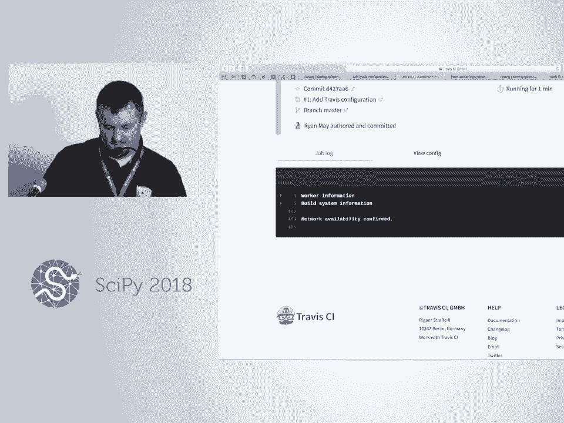

 so three two sometimes it's just waiting for the output to come in it's actually running it's just。

 the log hasn't shown up， i could it's not hugely important i mean and you guys have all big green buttons right it's all。

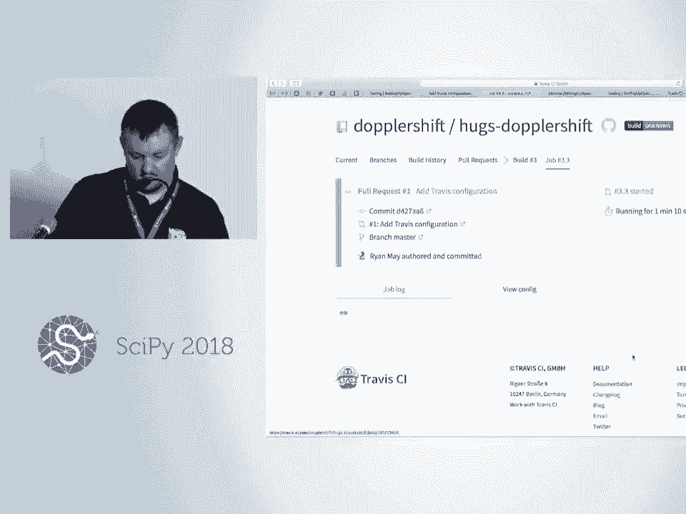

 showing green on your pull requests so i'm just going to ignore mine the status of it because it's。

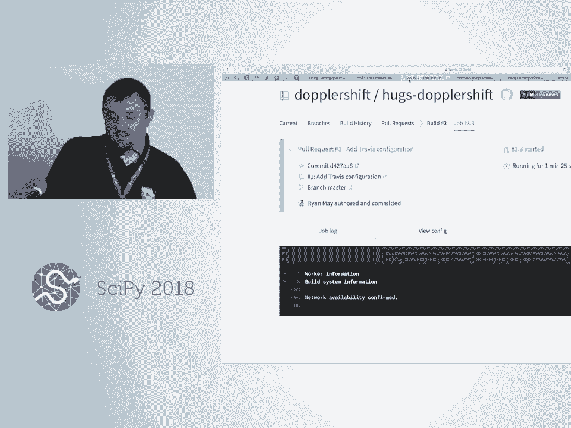

 fine so mine doesn't look green yours should look green and so you can just click the big。

 button down here it says merge pull request and say confirm merge。

 so so that's setting up Travis and there's a lot more you can do。

 i mean like i said before what this configuration ends up being come over to。

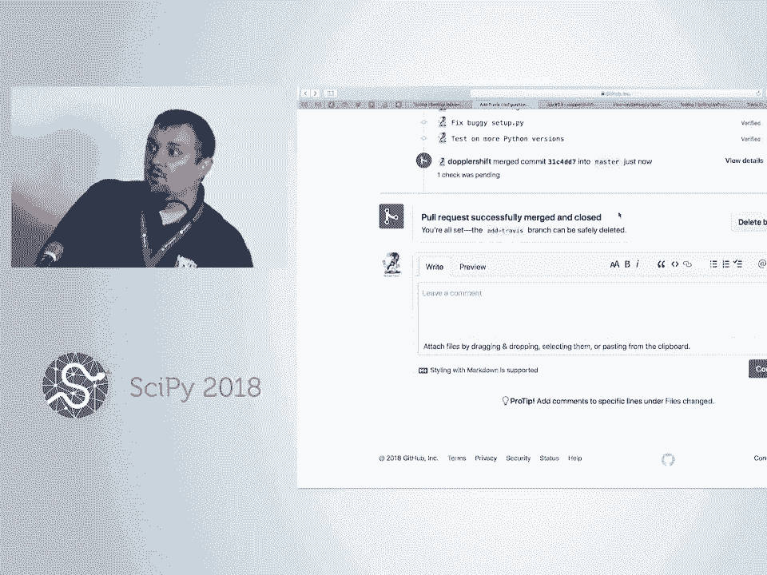

 Travis the YML these like these install and script lines。

 Travis is essentially generating a bash script from this so you can put bash syntax in here and do。

 all sorts of shell scripting type thing you can have conditional jobs running in here you can put。

 things environment variables set up up here and do things conditioning on environment variables。

 you can you can deploy you can build things on Travis you don't just have to do tests you can。

 build your docs we'll talk about that in a little bit later at least building them you can deploy。

 things to github pages from here you can build things and upload them to s3 you can do almost anything。

 and just treat this as a when i get a pull request do these things and so this is a real you know this。

 is the basics and it took some some finagling to get this set up but i wanted to at least get。

 everyone's hands on with this is how you set up Travis here's your configuration file here's how。

 you fix you know fix when things go sideways but it's really powerful and already off the bat we've。

 got all our tests running on three versions of python with that i want to get john moving on to。

 flake eight real quick， who's our last break like 50 let's take a five-minute break get up structure legs clear your head。

 i've seen a lot of places yeah using that deploying when you。

 yeah yep because you can using this you can make sure your tests pass and that everything is green。

 and so it should be a safe deployment emphasis on should but that encourages make better tests。

 then because it's really nice to have everything automatically happen。

 okay so we're going to go ahead and get rolling again we've got quite a bit to do so we'll。

 take a quick look next at doing things with flake。

 okay so one thing that we want to make sure if we're if we've got a library that's got a。

 lot of contributors as many open-source projects do is we want to make sure that the code style is。

 something that's maintainable and clean we've got minimal variations in the style and one way to do。

 this is to use flake eight to automatically run these checks there are a bunch of different。

 plugins for flake eight on the website i have some of them listed there's also a bunch of them。

 in your environment。yaml file that we installed from this morning things like we can automatically。

 check for copyright notices at the top of our file we can make sure that everything has a dock。

 string that you didn't forget to write it we can check the import orders are proper。

 there's you can check for so-called bad quotes the double quotes and make sure that you don't have。

 those or you can look for print statements because you probably don't want to have print statements。

 in your library code that you're shipping so there's lots of lots of different plugins that you can do。

 first we're just going to run flake locally and look at the output and see what kind of shape。

 the hugs library is in so we're going to do this we're going to type pi test again on your terminal。

 space dash dash flake eight this is because in that environment file。

 pi test dash flake eight was installed so this is already enabled for you if you go ahead and run。

 that it runs our tests and we see that we have some flake failures in here so。

 scroll up here we have a line too long so 79 characters is the default line link that。

 wants your lines to be shorter than missing new line between some imports here we expected two。

 blank lines found one there's a lot of things in here that are all very minor and aren't keeping。

 our code from running but they are keeping the style from being consistent so running this locally。

 is always nice now before you go ahead and push that way if you add this to your Travis build。

 it doesn't you don't have to wait on that to fail you can see it locally。

 we're going to do a little bit of warning suppression though for example the max line。

 length restriction of 79 characters is in our， is it similar to pilot yeah yeah so we're checking the same basic types things。

 I think the line length of 79 characters is a little bit restrictive so we're going to go ahead。

 and bump that up to 95 and we're going to ignore this 403 doesn't like our star import that we're。

 using in our dunder in it so we're going to ignore that as well if you go ahead and open up your。

 editor in the top level of the repository the same place we put our Travis file we're going to。

 create another new file and this one is going to be called setup dot cfg。

 and this is a just configuration file so sort of the in e file format so we're going to first say。

 we have slate eight thing that we want to configure， and we want to change the max line length。

 and I'm going to set that to 95 characters so that will just capture that line that we've got。

 I also want to ignore， f403 so go ahead and save that file。

 then we're going to go back to our terminal， I'm going to clear this output and we'll run that same command again so pytas dash dash flake eight。

 so we still have failures but if I scroll up my line length failure that was up here is gone。

 because we're at the maximum and I don't see any of those f403 star import errors。

 so did anybody have a problem getting that to work for them on their system。

 now here we go one anybody else having issues green stickies up if you're good red stickies if。

 you're having problems okay so we can go through and we're going to fix a couple other of these。

 errors real quick give you an idea of what some of the common ones are that you might see。

 then we'll add this to our Travis build which since we don't have all of them fixed the Travis。

 build should be failing if it's not failing then we know that we're not doing that check properly。

 and then we'll move on to talk about documentation it's the last thing for this morning。

 so you can go back and scroll through all of those errors that we got。

 and most of them are relatively self-explanatory we're going to start out by looking in， calc met。

py make our text a little bit smaller there， so we have a missing new line in between imports here warnings is built in numpy is external so。

 once a new line there so you go ahead and insert that。

 and we will save that in the test for the met functions so test underscore met。py。

 we have a complaint in there about a white space issue so if we go back。

 and find our test met here's test geology， okay so missing white space after comma so that's the end line 11 and 12 we'll go back and look for that。

 ah there we go so here we're missing a white space after these commas so we had a white space there。

 add white space there see this is a very finicky check but it's nice for making sure all of your。

 code looks the same let's go ahead and save that and then one thing that it is complaining about。

 that we're not going to do for the sake of time so we can try to get through as much of the material。

 is we can go back in the special plot。py we are missing a doc string in a public function this。

 is telling you you have a function we can go look at it over here in plots special plot。py。

 we have this function random plot and there is no doc string which is not something you want to。

 ship so we could go through and add a doc string to that and that would get that particular warning to。

 go away any questions on any of those that you're seeing or anything that's unclear about half lake。

 works。 So I'm saying what it says so that if I got an error a lot of them used a variable in the way they were concussed so I'm going to put it on your shoulder。

 I'm understanding what that is the same sort of throwings and then they're saying local variable。

 The reason why it's important is because they're not using a single return method。

 So you know these are all right。 Yeah。 I mean because you don't have to do where there are something you don't want to do。

 If you're referring to the value of the all one one。 And they're in。

 And there are definitely cases where your project can be passing the build and then flake updates and there's a new rule we see this all the time and then your cron job goes through and all of a sudden you have a lot of failures because of a new rule。

 Okay。 So now we're going to add this to our Travis file here and we're going to run the flake checks on Travis。

 Go ahead and open up your Travis dot yaml。 And we need to add some things here。

 So first of all on pi test it's going to be just like we did locally pi test dash dash。

 Flake eight that alone will not work because remember every time Travis starts up we have a new machine with nothing。

 So it does not have any of these flake checkers。 So we need to add to our pip install here。

 So we're going to add pi test dash flake eight。 I'm going to add a couple of the optional packages flake eight docstrings。

 and flake eight import order。 So once you do that go ahead and。

 commit that you can I would recommend making a branch so just like grind it before you check out dash b。

 make a branch commit this push create a pull request go through that whole cycle so you can get。

 yourself a little bit more use to it。 So put your green stickies up when you get this running on Travis red stickies if you're having a problem。

 I'll put this back up in just a moment I'm going to go ahead and commit。

 Okay I'm assuming everyone's seeing an error message when they run on Travis right now。

 because yeah packaging is fun。 I'm going to take a crack at this but。

 you seem to have flake eight to the Travis， example right there the piped this like a stuff not flake eight itself。

 I'm I don't understand why pip installing there isn't picking up flake eight on its own but that makes sense。

 Again packaging it's there's a tutorial on it this afternoon。

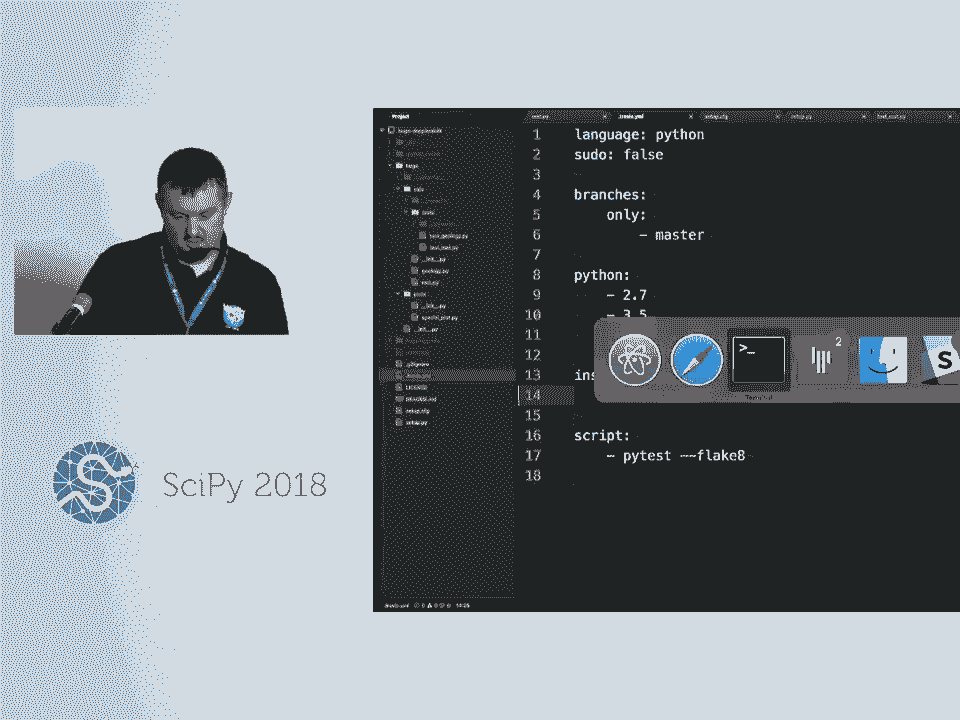

 Okay good。 Okay so put this back up the change you need to make is it wasn't just enough to have piped。

 as flake eight flake eight dock strings and flake eight importer import order we also need to have。

 flake eight explicitly installed for for reasons。 [ Pause ]。

 Well since it's about a utility that we use when we are checking it it's not an install requirement to run hugs it's just。

 So you could make an extras install on your setup。py and list it like for dev or something。

 I've done it in a few tools。 [ Inaudible ]， Right so part of it except we haven't installed Conda yet here so this is all running off of。

 Travis's Python installs which is just stock。 You can install mini Conda in Travis there are recipes out there。

 I use a few things like when we do continuous integration tests of our workshop materials。

 and so we're running these Jupyter notebooks every time we change them and there I installed。

 mini Conda and set up an environment stuff。 It's also nice for some of our projects to also test how pip install works because Conda and。

 pip are different packaging and sometimes things work on one and not the other。 [ Inaudible ]。

 Yes we do packages for both and test both。 Excuse me at least test the install both。

 All right see more blue stickies。 [ Inaudible ]， If you wanted to see the coverage numbers with Travis you could just add to your script down here。

 like we did earlier。 You'd also then need to add that to your install line but yes we absolutely do that on a regular basis。

 You still need this。 You still need to run your test with coverage but then yeah but then an additional thing which we。

 won't get to but I'll preempt at least talking about later while we're finishing up here。

 You can use a service called code cove。io。 Another one of these web services you can set up for repository and so you can add。

 This is where Travis has all sorts of stuff and I encourage you to look at the docs but you can。

 say after script so when I'm done testing I forget what the command looks like but essentially it's。

 something like I'm making up something here but they have a utility you'd pip install and it uploads。

 your coverage file to their service and so you can also do you know have Travis power automatic。

 test coverage reports and so the test Travis YAML for MetPy at this point I think is if not 100。

 if not just 100 lines it might be 150 lines of things because it just there's all sorts of。

 build variations we have like 13 different jobs that kick off on Travis when the pull request comes in。

 [inaudible]， Yeah so when I have it set up so the way if I tag a MetPy release not only does it run the test but。

 it automatically generates wheels and uploads them to PyPi。 So yeah we could spend a day just doing。

 Travis things so I just want you guys to have an idea of these are where you can expand these are。

 the kind of things you can do with Travis I encourage you to if you're interested go dig into the docs。

 and another good thing is to go look at open source packages you like and go see if they're using。

 Travis and look at their configs and borrow their configuration because that's kind of how a lot of。

 us do these things is just oh that's a really good idea I should be doing that and expand that way。

 [inaudible]， Good so everyone happy with their Travis flake 8 ready to move on we're coming up to lunch here so。

 we're gonna finish up here with Sphinx and documentation。 [inaudible]。

 So how many of you have ever used Sphinx？ I'm so sorry。

 So Sphinx is a documentation tool for Python。 I guess it can technically work for the languages but it's really using Python。

 [inaudible]， As opposed to using things like Markdown which GitHub natively supports and does nice things with。

 Sphinx is a few things that help it make it the documentation tool it seems of choice for the。

 community versus Markdown one of those being that Markdown doesn't really know about multiple。

 documents I mean you can put links between them do you full URLs but you can't really just say。

 here's another regular Markdown file when you're generating docs linked to this file find where it。

 is the other thing that generally just doing Markdown docs doesn't do is it doesn't do anything for。

 API documentation for taking these doc strings you write with Python functions and turning those into。

 web documentation that's one of the things Sphinx excels at is you can point it at parts of your。

 code and say I already wrote these nice doc strings for Jupiter notebook type things please pull them。

 out and include those in my web documentation and so that's that's probably the big killer feature of。

 Sphinx and why it's why people don't in the Python community don't just generally。

 rely on Markdown to do documentation and so we'll run through here setting up Sphinx real quick。

 and then I'll be at that point have you take any other questions before we let you out for lunch。

 so setting up Sphinx。

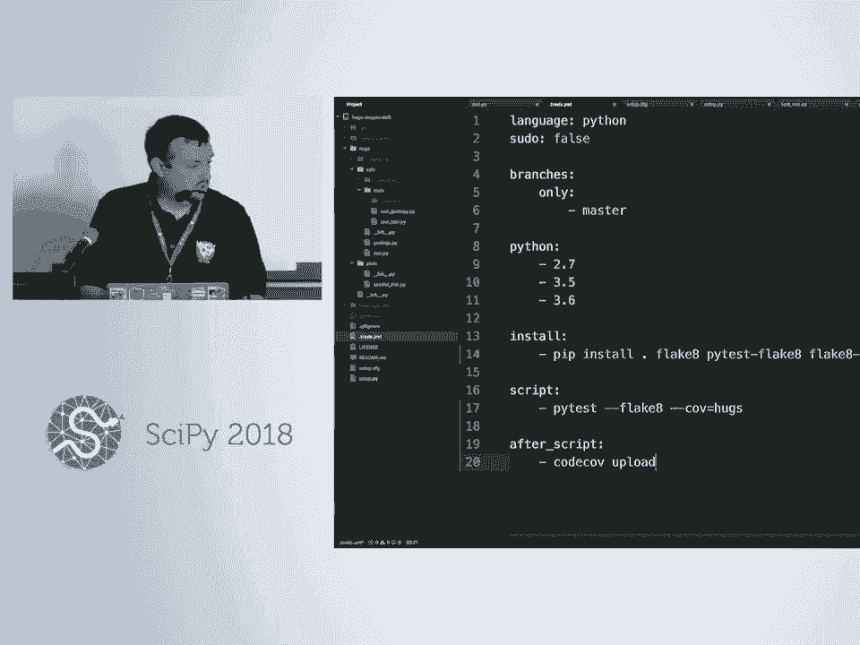

 so I'm over here my terminal and I am in the base of the repository。

 so I'm going to create a docs directory so miktor docs。

 and I'm going to change into that documentation directory。

 and Sphinx comes with a tool that helps you get started it's called Sphinx quick start。

 and so we can run that here so sphinx-quickstart， and so we're going through various settings here do you want separate source and build directories。

 sure name prefix or templates and static yeah that's fine project name。

 or project name hugs or whatever you you really want to call it。

 author name sure project release we'll call this the 0。01 release。

 it's in English what suffixes do you want for files here so we're just going to use 。rst。

 that stands for restructured text so that is the format of。

 that's the markup language you use when you're trying to write things for Sphinx。

 it's kind of like Markdown with its own variations。

 just another of these it's you can write text with a few other special things。

 name your master document yeah index is fine you want to use e-pub builder so it can generate。

 not just HTML but it'll do PDFs or e-pubs or mobi we don't really need the e-pubs right now so。

 I'm just going to be best no auto doc automatically insert doc strings or modules yes。

 doc test no intersphinx interesting so that lets you link to other projects documentation files。

 they have it up there they publish this kind of manifest of their functions so for instance。

 if I have code that relies on does some NumPy things I can mention the NumPy classes in there。

 and it will generate the links to the NumPy documentation for that so that's a nice thing。

 to have turned on to do entries I don't care coverage no I'm not going to write that right now。

 image math no math jacks yes no depending if you're going to put nice equations in there it can。

 automatically include math jacks so you can write latex style equations in your documentation and。

 have them rendered on the web if config no view code sure so that includes links to。

 view dot to actually to the code for certain objects github pages I'm not going to worry about。

 that right now but apparently this is a new one that it'll automatically set things up or do some。

 things to make it easier to push things to github pages but we're not dealing with that today。

 create a make file yes create a windows command file yes all right so that's quick start just。

 ask you a whole bunch of questions and set sets things up so if I do an ls now we see it generate。

 some things for me I've got a make file here I've got a make dot bat by looking source I've got some。

 directories including a conf dot pi and an index dot rst so。

 we look at the index dot rst that's kind of what it looks like the default so it generates this basic。

 puts a comment up here says welcome to hugs documentation and then everything else if you want to see。

 what the conf dot pi looks like so this is the gen it generated this configuration file for us。

 and so it's just a full it's a regular python file it's set some variables project copyright。

 author loads some extensions so here's where it put things like we said yes do auto doc yes。

 interesting since it puts those in there so it generated that for us and we'll go back and we'll。

 edit that to include some things as we go on but it did those right out of the box so right away。

 we should be able to build our documentation how do you do that with Sphinx when we have this make。

 file so from the docs directory or where we ran six quick start we could say make html。

 you hit enter， it does its thing and it generates some html files for your project。

 at least on my Mac I can say open build slash html slash index dot html。

 and voila we have just beautiful html documentation for hugs。

 so the last command I ran was I just had open， at least on the Mac that opens it up in my web browser。

 yeah you can， if you use your file browser here you can。

 from the repository go into docs and go to build an html and they're all the generated files。

 and then there's an index dot html file here， so that's the process of quick setting it up and that's how you build the docs。

 nope because we haven't told it to find anything it hasn't anything it just gave us the barebone。

 skeleton that you could do a make html and it doesn't break， so if I come back to my add a metader。

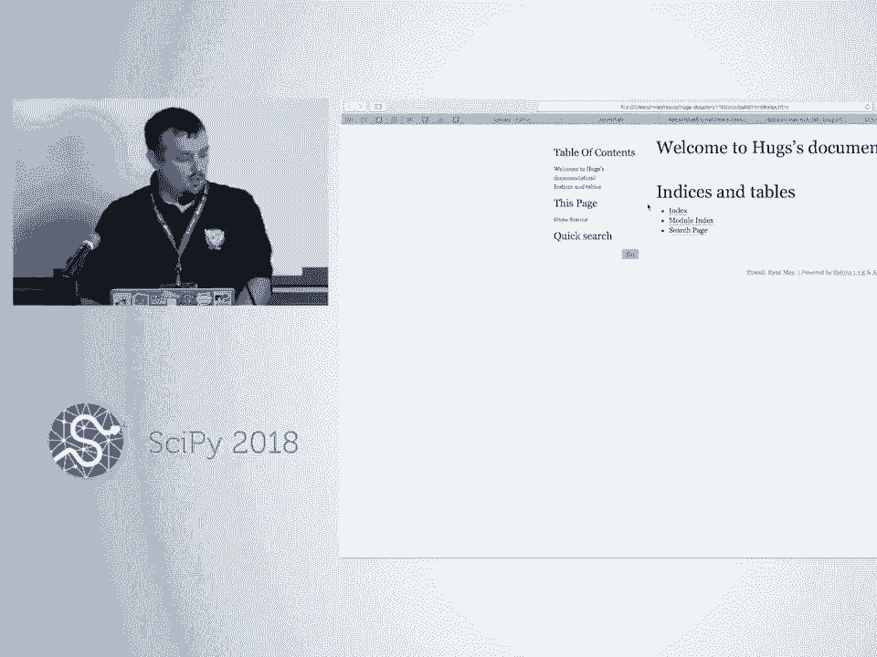

 I can go into my docs directory or use your editor of choice but if you open docs source。

 index dot rst， you can see this text file here and we can start adding things。

 so maybe you know clean some things up I don't need that comment up here that this was quick start generated。

 so I'm going to delete that， um I don't need to say welcome to hugs documentation I just want to say hugs。

 so I can take that out and shorten that， and then I can start writing some actual text hearing content so I can say you know。

 hugs the hugely useful geoscience stuff is a library of calculations， spell calculations。

 for geophysics， and meteorology okay but that there， index dot rst it is under docs slash source。

 and then maybe for instance I want to， in here at a section about our license that we chose let's say so notice here this is an important。

 part of rst so we're under hugs here we put equal signs underneath it。

 so that defines hugs is a top level heading down here I'm putting license I'm using。

 single dashes so that's kind of a lower level of heading here that we're putting license under。

 and we'll say you know hugs is released under the terms of the bsd3 clause license。

 all right so that's the editor type made if I go back over to my terminal I can say make html again。

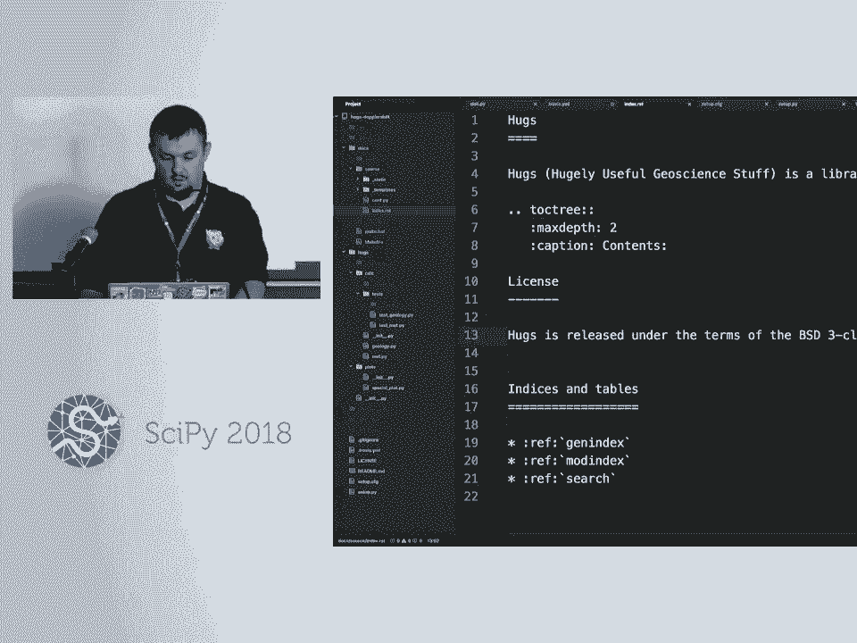

 go through it and come back over here to my web browser and refresh and now we see。

 much more beautiful content， so so that's just editing this one file now often you're going to have lots of other files。

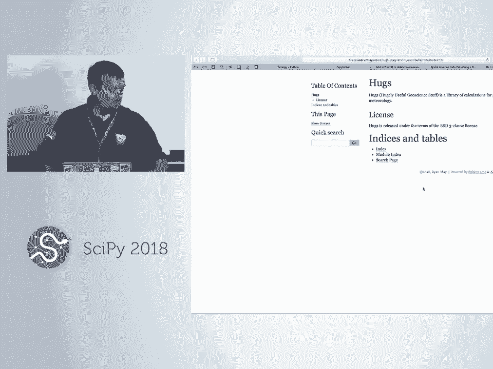

 so what I want you to do is create a new file called let's say contributing dot rst。

 put in the same directory as index dot rst， and put some content in it and then we'll add it to our docs and have it show up there by adding it。

 under this this part that says talk tree that's table of contents tree so that's where you can put。

 links to other documentation files in here so under here we'll just put just a name contributing。

 no dot rst here just contributing and then if you make the file contributing to rst and put stuff in。

 it when you build the docs it'll link it no calling or anything and actually there does need to be I。

 think a blank line between the two so take you know a few minutes and put some stuff in a file。

 called contributing dot rst and then we'll uh we'll build docs and see it show up。

 though what three spaces you know like lots of things use。

 and seriously keep it to three because it does look for it。

 again part of the whole purpose of this workshop is to run through the errors that you run into。

 and figure out how to fix them so the one thing you're going to have to have in this contributing。

 file is you have to have a title which is done by doing。

 and then you do the like that I believe what else you also have to have let's see I'm going to try this。

 out， and there'd be a whole lot more content here but I'm not doing that right now so docs source。

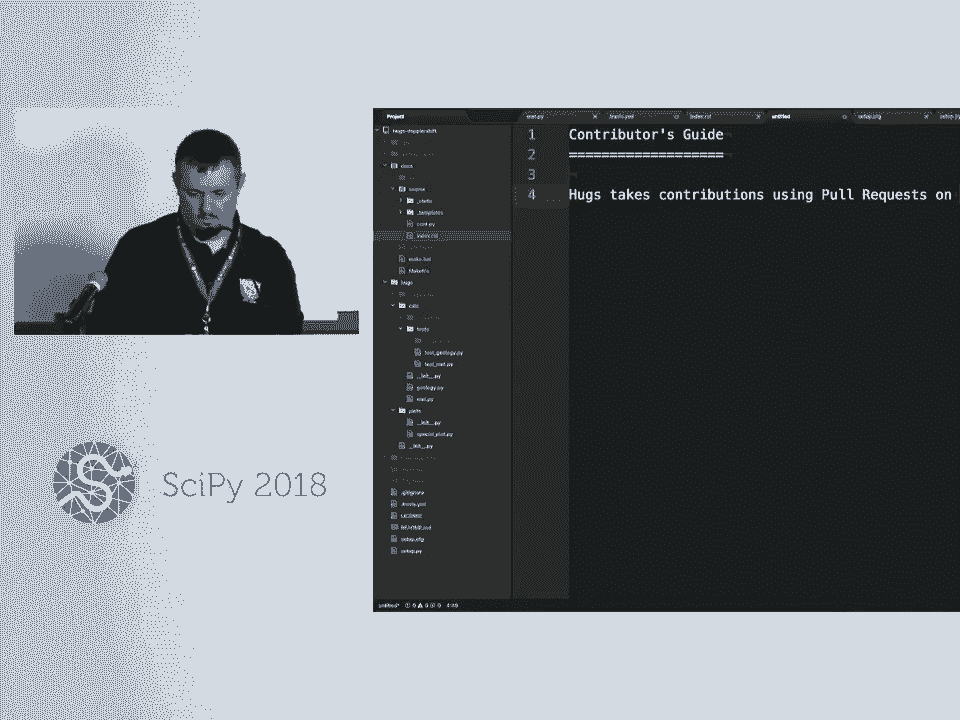

 contributing that works to make html okay so yeah you just have to have an actual title block up here。

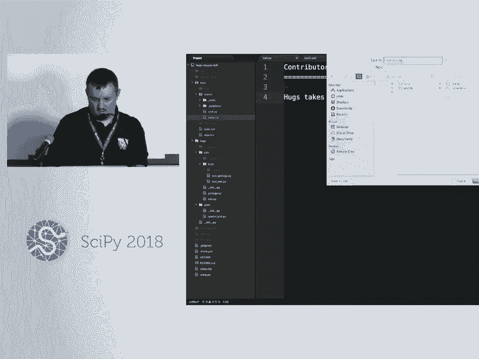

 text up here equal signs underneath it and if we come back to our html page and refresh。

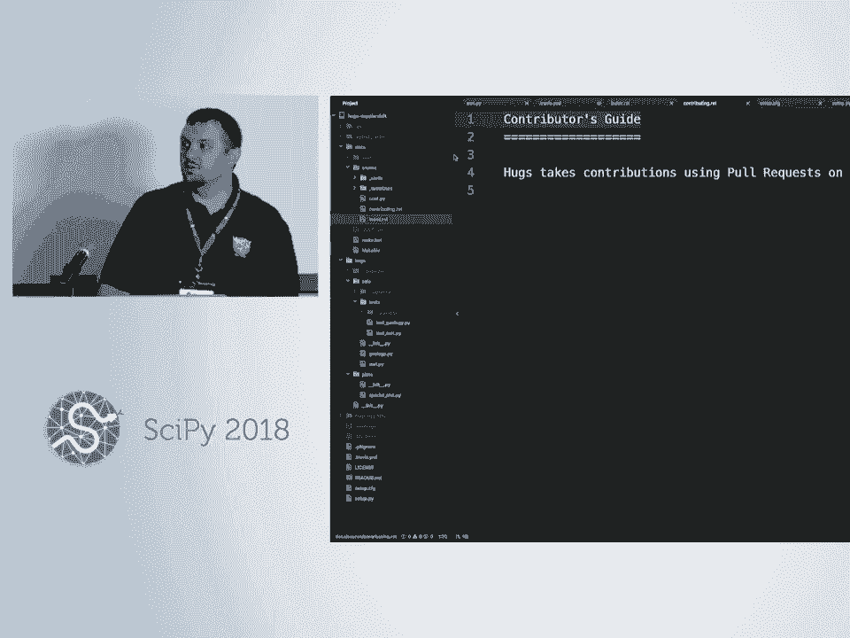

 now we start to see we see our table of contents and we get a link to our contributors guys。

 all right the last thing I want to get to right here on Sphinx is I did mention it will pull your。

 doctrines for you which is the most important it's a reason to use Sphinx and not mark down really。

 so we're going to need one more file we're going to add so I'm going to come over here my index to。

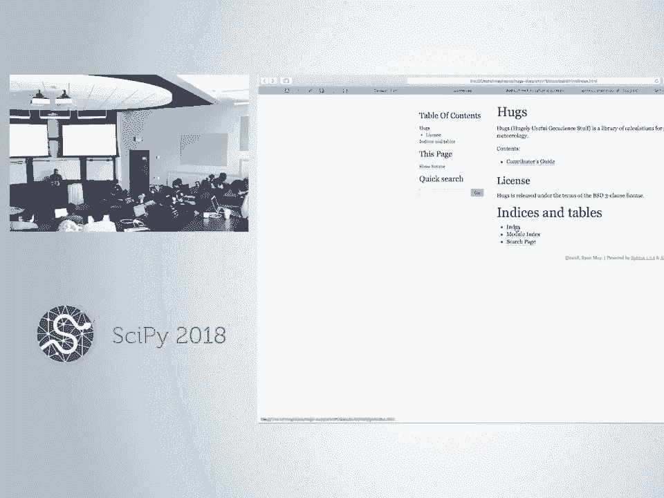

 rst and add api we're going to create a new file called api for the api documentation the。

 application programming interface if you're curious okay so there's that。

 we're going to add a new file， the hugs api is what I'm going to call it you can title it whatever you want。

 so give it a title again and here's the magic incantation here， dot dot space auto function。

 two colons because one is just silly， kid you not if you try to put one you will sit there wondering forever why it doesn't work。

 two colons and then we get rid of function name so I say hugs dot calc dot get wind speed。

 so that's what we write there， so that's your magic incantation。

 and I'll leave it up there but you're going to want to save that to api dot rst in the source directory again。

 so。

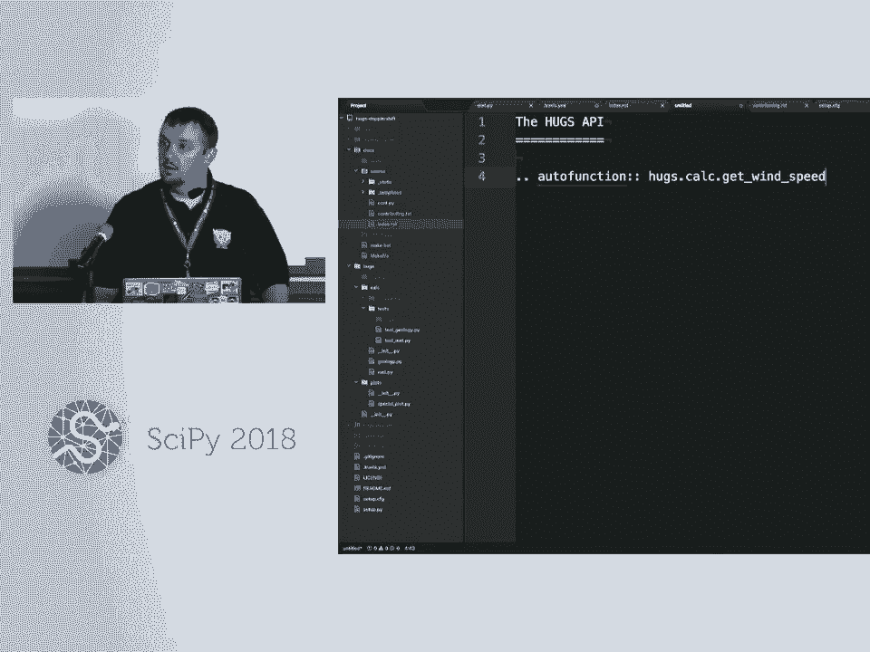

 what's the warning， so when you went through quick start did you say yes to auto docker no okay。

 i'll show you where to look for that and we can solve that so api to rst save it。

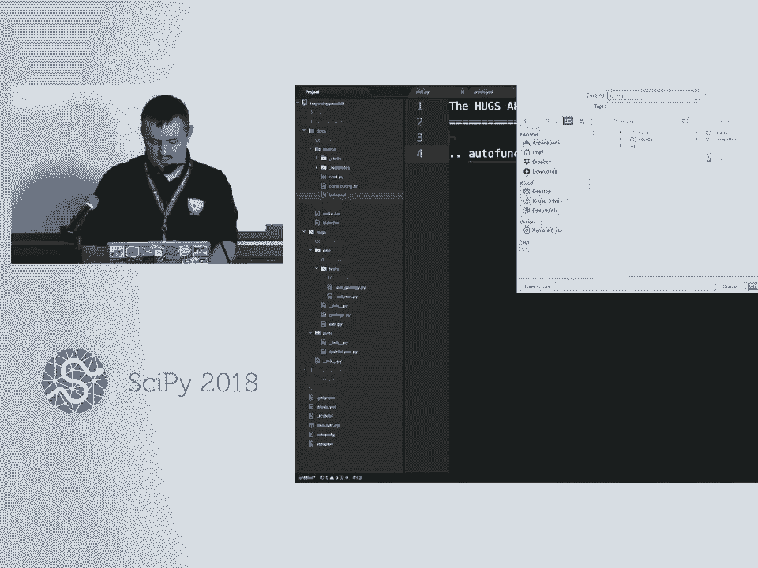

 so in， under the source directory there's conf dot pi。

 so in there this is that python pilot configures everything if you come down to extensions。

 the extension you need is this one the sphinx dot ext dot auto doc。

 it's called auto summary it's finicky um i started trying to set it up for this and it just was going to become horribly painful。

 also on met pi we're actually moving away from it once you get to a certain amount of calculations。

 you actually don't want one gigantic cable of calculations。

 so it's nice to try and group them put them in tables logically arrange things。

 yeah i mean there's a downside in that you've got to remember to add them i completely like i like。

 automation and i like auto summary that it can pull all the things but。

 it is a rickety part of syncs sure yep， we can do that but like we have a cact we have met pi dot calc。

 and there are mod sub models in there but we expose that the api level just met pi dot calc。

 and all the things and when you have 150 of those it becomes tedious for people to scroll through。

 so but yeah what you're looking for is auto summary that's the it has an extension。

 there's an option there's a script that has to be run to generate things and then。

 it just becomes a pain and i'm happy to talk more about it but it's。

 honestly without copying over met pi's configuration i could not get it to work for this tutorial。

 if that tells you anything about how much more complicated like i could get a table what i。

 wouldn't get links you could click on so whereas auto doc it just worked so there's that。

 there's my api rst that has that in there and index has api mentioned so i should be able to。

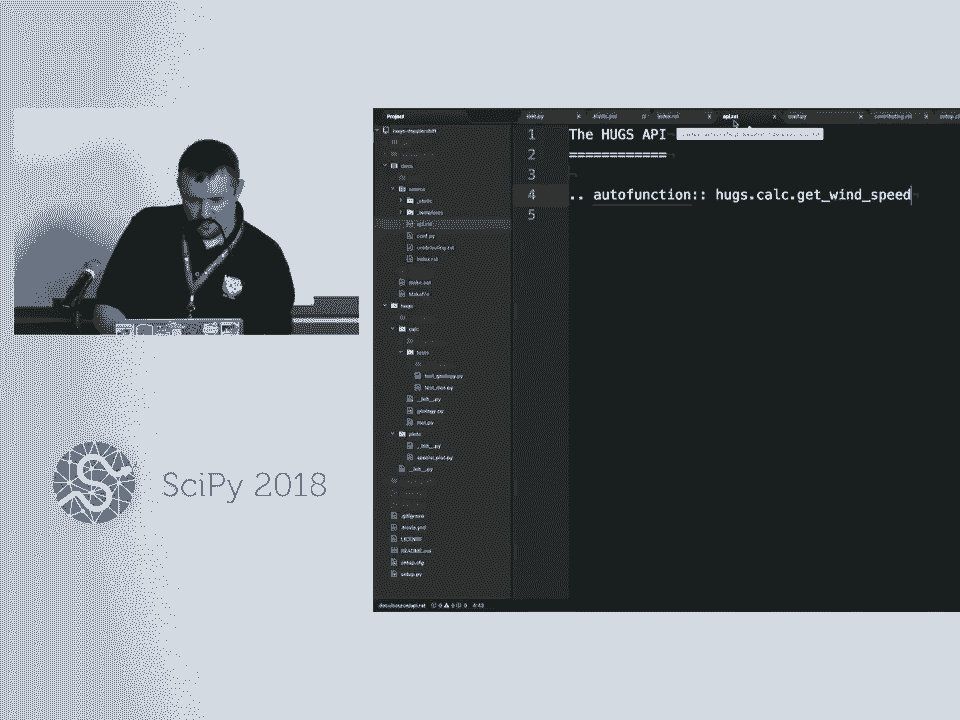

 come over here and do make html i get some warnings unexpected section title that's fine we'll。

 ignore that for now you just come over here to the browser refresh there's our link to the hug's api。

 and there you get here's get wood speed gets pulls the documentation string out of the code for us。

 and even gives me a link to the source code so that's nice uh the one thing is it's not really。

 well formatted in terms of how it understands the doc string it gave us stuff so what we used。

 for the doc string that we wrote for this hugs project it was a format called numpy doc it's。

 the documentation standard that numpy uses and so we want to tell sphinx to understand that。

 so if i come back over here to my conf。py we just need to turn on one more extension it's called。

 nepholean so i had a new line here after view code put in quotes syncs。ext。nepholean。

 nepholean beyond， the， see that if i do make html again。

 yeah absolutely can let me just make sure that actually worked first。

 yeah okay so i'll put that back up there you go， i think it might install understand multiple formats but it's certainly what the easiest way to。

 enable sphinx to parse and understand the numpy format of docs。

 sphinx might use that automatically i'm not sure， there's a different way of writing the documentation where all the types are listed a little weird。

 and stuff that's how sphinx does it by default it's much more verbose that way。

 i think i think the default of understand that one i think so i'll show you the difference。

 made now if you look here it lists the parameters it lists the returns the return type and it also。

 gives you a c also here and if we had listed get win components in our api doc。

 so another auto function line this link would actually to see also it'll actually be clickable so。

 you could you know produce this nicely navigable api documentation for your project。

 so there's a real brisk introduction to syncs as everything else。

 so just like we did if well i won't show you how to upload yet because that's a more involved。

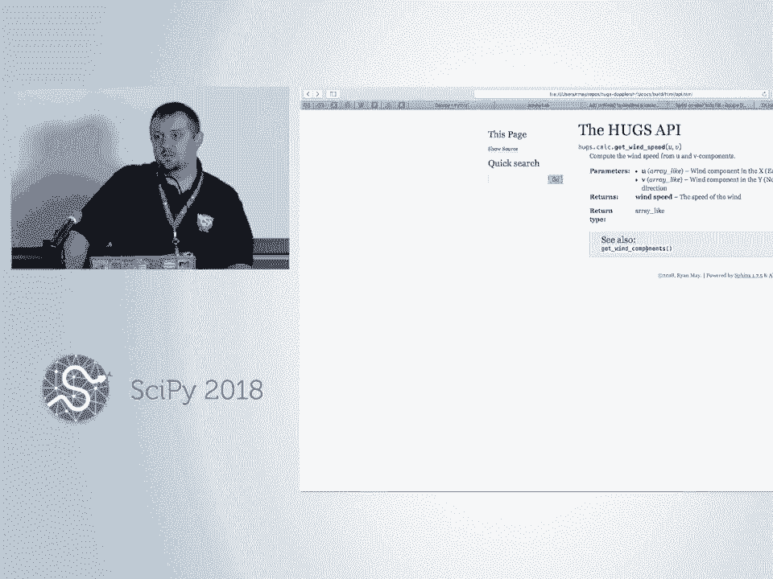

 step there's a tool called doctor doctor if you're wanting to push it to， doctr。

 that's not for read the docs that's for sorry i was going to pages for read the docs that's a separate。

 service that you can look at read the docs。org you create an account and put it at the repo and it。

 will just build syncs docs like you tell it where the conf that pie is and it just makes them and。

 loads them that's pretty。 So what's the thing？ Doctor doctr。

 I think doctr it might have just started or just came out we don't use it either we have our own custom。

 keys and whatnot pushing to github pages it's a complicated process as far as just testing your。

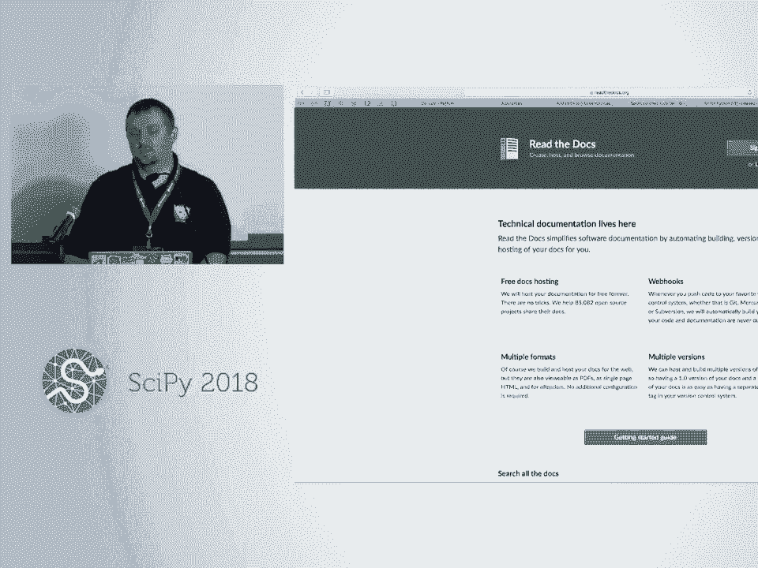

 documentation build which is really good to have to make sure it passes that's as easy as i mean。

 depending how you feel about Travis。yaml go into Travis。yml after your test cd into docs。

 make html and now your docs are building on Travis and so you can make sure they still pass。

 documentation build。 Any other questions before you guys run out of here？

 For sync stuff anything that needs to go on the getignore let's look。

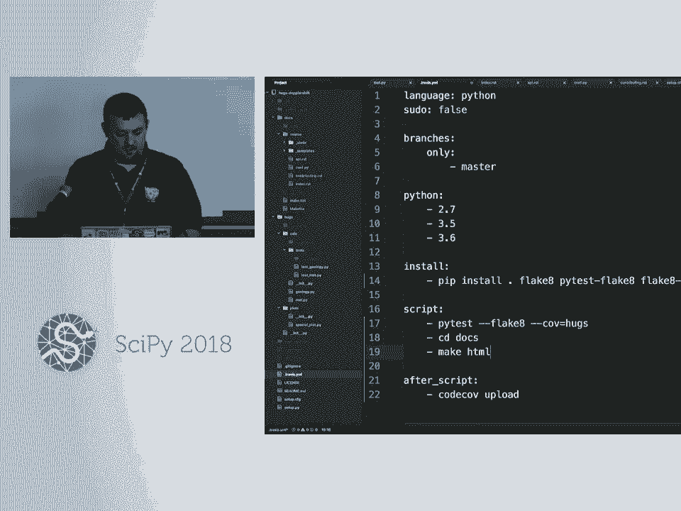

 get status okay if I get add docs I bet there's a lot of stuff that comes in。

 No actually apparently the getignore that get gives us is already ignoring the build directory。

 in their docs but essentially yeah you just want to build ignore the entire build directory。

 any other questions， what was that？ On Napoleon the purpose of Napoleon is to understand NumPy formatted docstrings。

 so there's different formats different standards for how documentation strings are listed so if you。

 look at met。py we see this is what docstring looks like where it has its parameters and this。

 is have the name of the parameter of the type and the description and the return section of C also。

 Napoleon knows to look for these certain sections and then formats them nicely so that if we look at。

 our web documentation we get the you know bolded list and we see this C also section the return type。

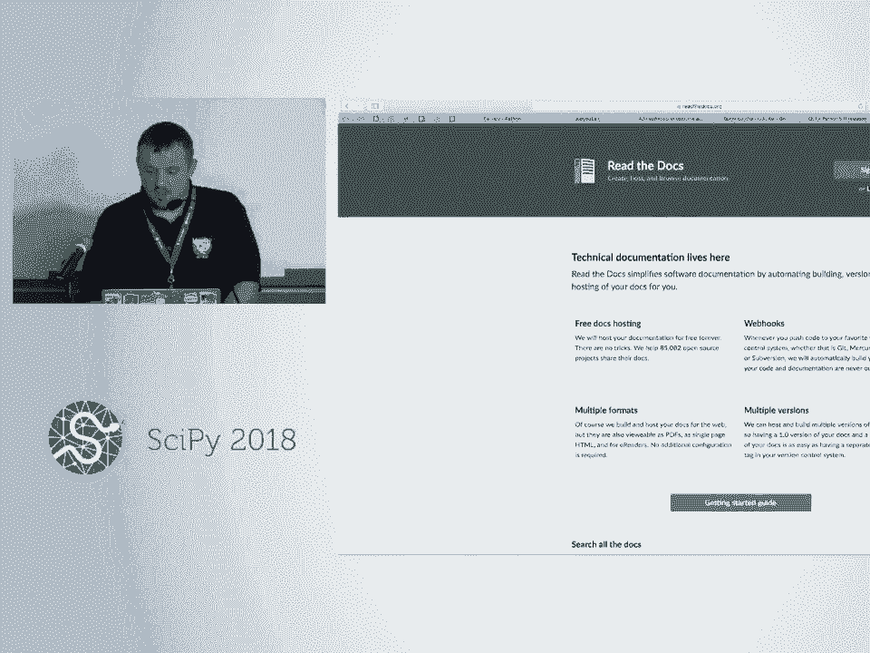

 so Napoleon is what what parsed that apart and generated slightly nicer HTML。

 okay one favorite to ask you if you would take your stickies you're not meant that's okay we have more。

 on the green sticking right something that's useful today or something like on the other stickies。

 red sticky write something that you think you're doing better， and brutal。

 Just drop this off on your way out。 Yep you guys been great thanks for coming and if you want to you'll be around all week if you。

 want to talk more about setting up various things like this happy to help share the knowledge。

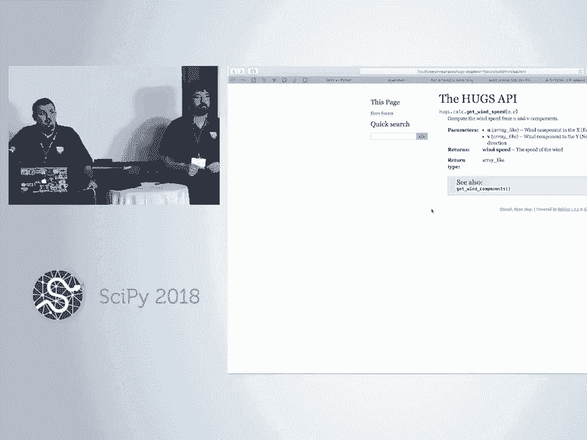

 [BLANK_AUDIO]。