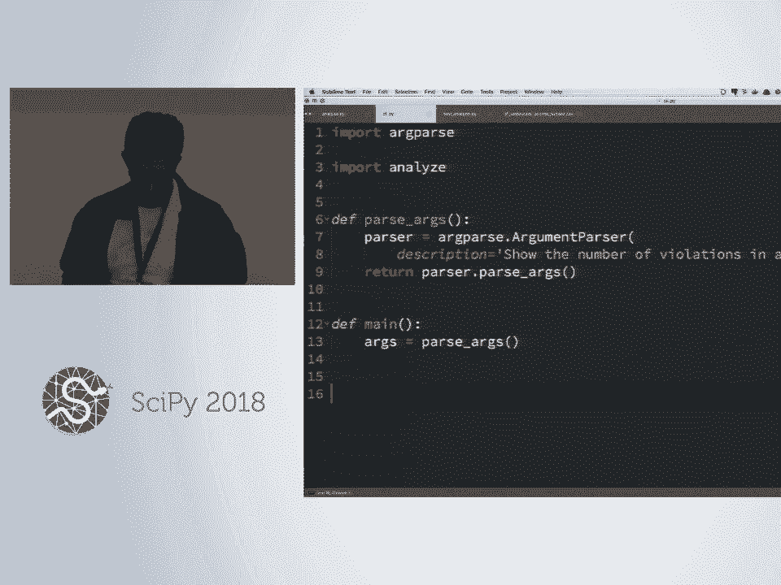
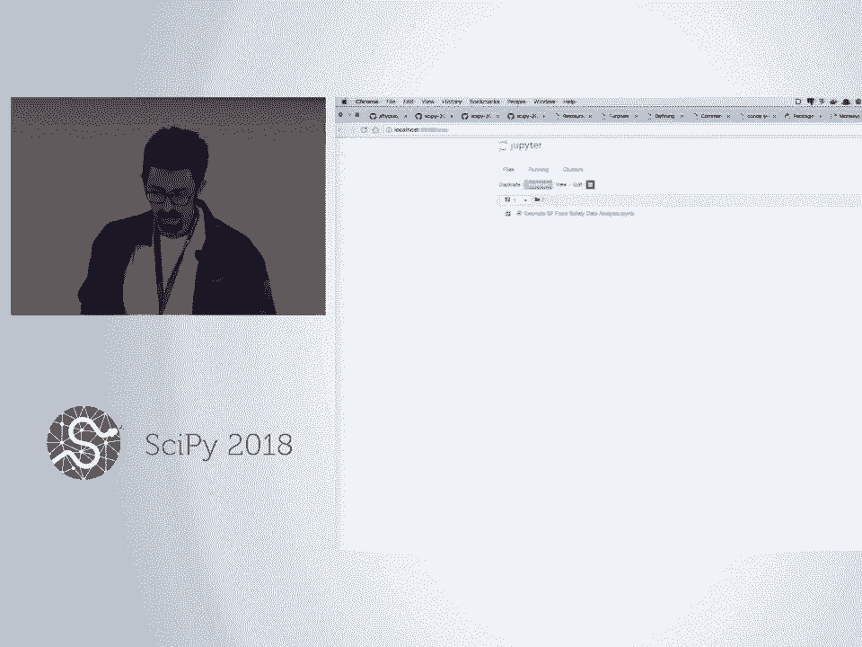
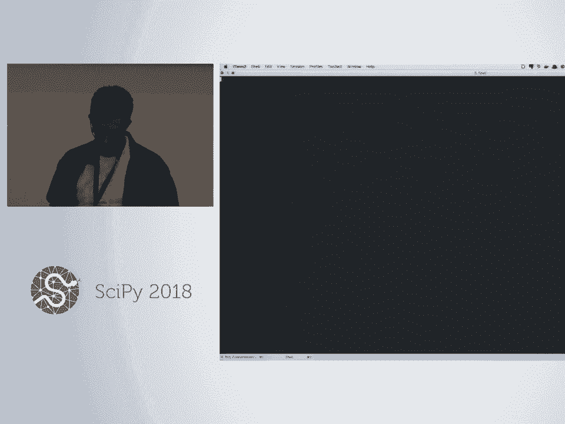
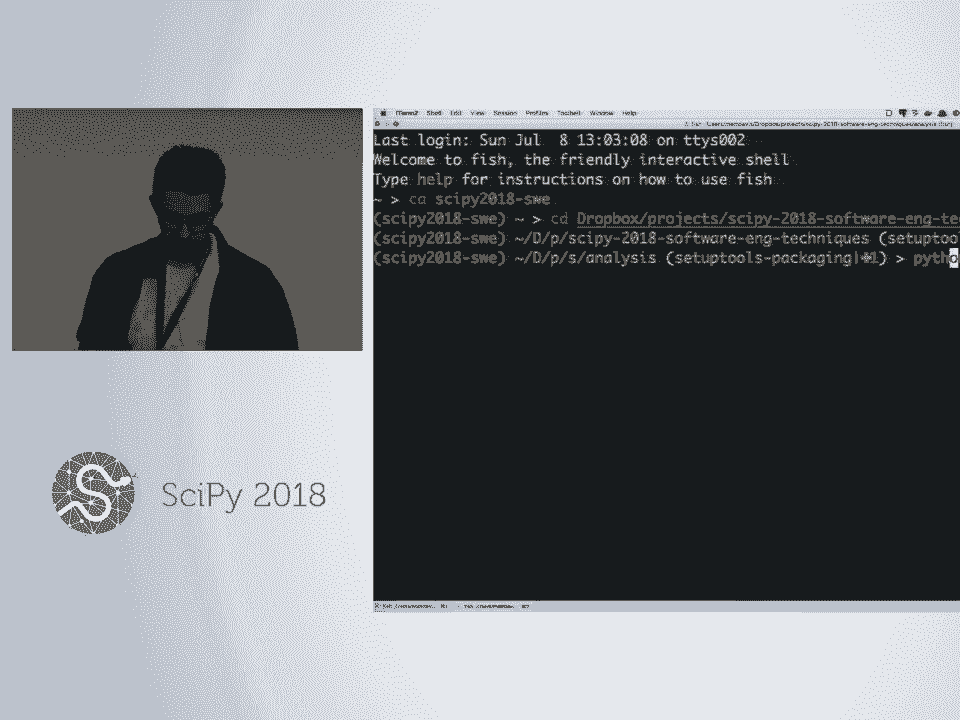
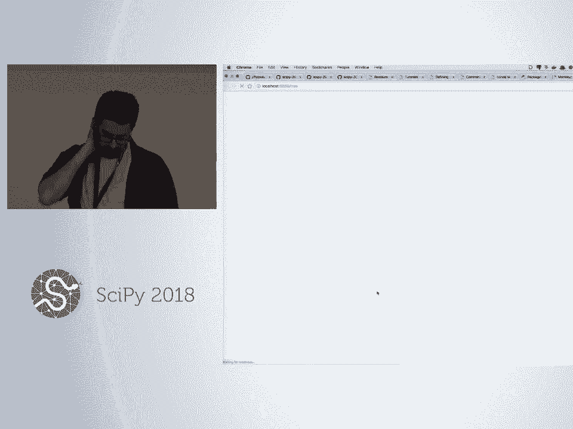
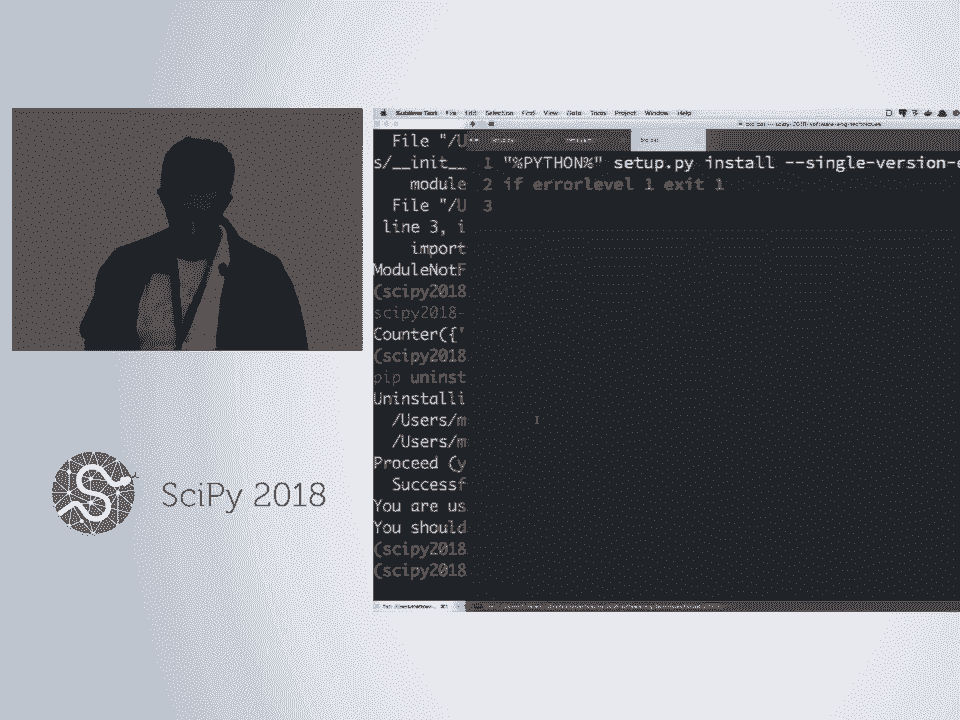
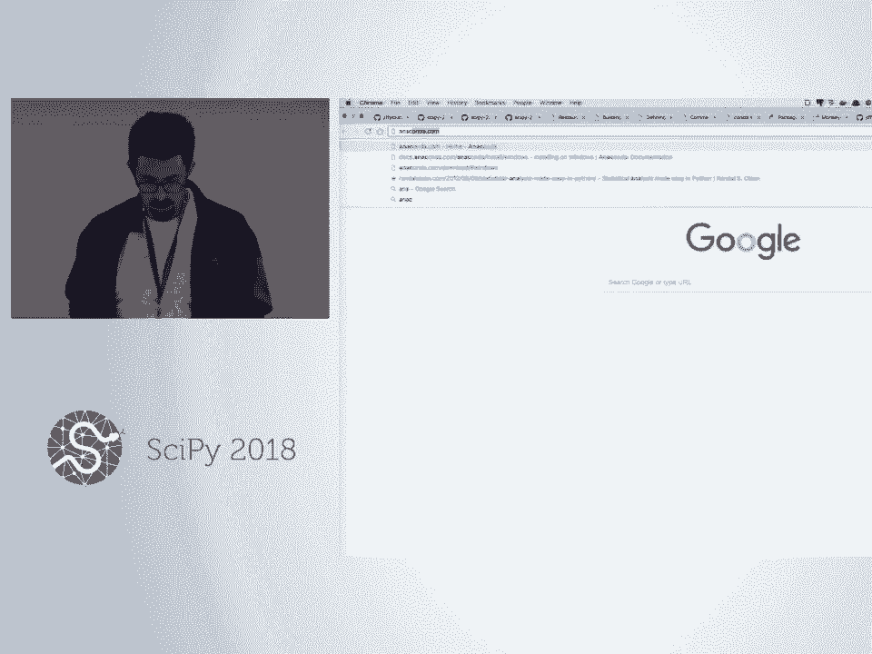
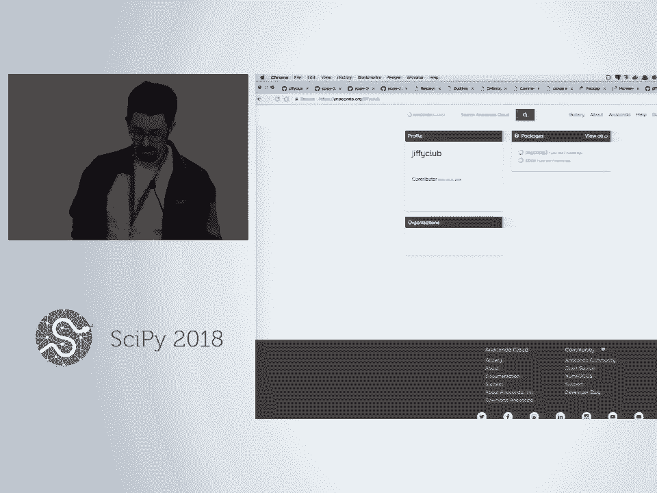
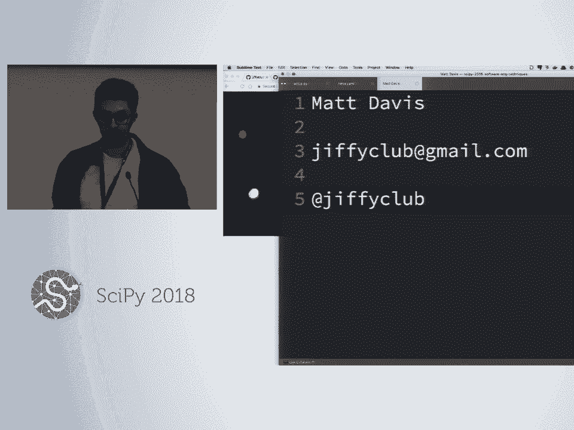

# SciPy 2018视频专辑 - P66：SciPy 2018视频专辑 (P66. Software Engineering Techniques (Beginner Level) _ SciPy 20 - GalileoHua - BV1TE411n7Ny

 My name is Matt Davis。 Alyssa， up in the back there， is also helping here。

 We both work at Clover Health， an insurance company， based in San Francisco。

 We're software engineers there， but both of us， also have data backgrounds。

 I've been using Python for about 10 years， and coming here to the site icon for almost as long。

 Enjoy it every time。 It's great。 You're going to love it if this is your first time。

 Our goal here for today is to show you a little bit。

 of the process that Alyssa and I go through when， we're writing code that's going to be shared with other people。

 going to run in production environments。 They thought and process that we put behind the code。

 that makes it so that we can trust it and change it， and other people can work with it。

 And then a little bit--， and that includes things like how you design the code。

 how you think about writing the code。 It includes things like testing and debugging。

 and performance profiling and packaging， which， is how you get code out to other people。

 or even on your own computer， how you reuse code， that you write in different environments。

 because you might write code that you， want to reuse in many analyses。

 So we'll talk a little bit about that。 As we go， I am totally happy to take questions。

 So feel free--， raise a hand to shout at me if you have a question as we're， going。

 There's going to be plenty of opportunities for you to work。

 And Alyssa and I will be walking around to help you。 If you run into trouble。

 feel free to flag one of us down。 You can use the Slack to talk to us or to each other， even。

 Like posting a question in Slack is great， because one of the other people here。

 might have run into the same problem， and have an answer for you。

 So I hope that will be a good channel。 Any questions before I get started？

 So we have in our little project directory， a couple of data files。 What they are is--。

 this might be hard to see。 What we downloaded was this data set。

 of restaurant inspection data from the city of San Francisco。

 that contains a bunch of data about these restaurants， their location， contact information。

 when an inspection happens， what kind of inspection it was， a score， if there was a violation。

 an identifier for it， kind of the description， of the violations。

 And then a classification of whether it's， like a high risk or low risk or moderate risk violation。

 So we're going to be working with this data set。 We want to write in our toy example here a command line。

 utility， where we can pass in a month， and have it print out a summary of the different risk。

 scores from that month。 So there were this many low risk inspections。

 this many high risk inspections， and so on。 In reality。

 you would not write a bunch of custom code for this。 You would write two lines of pandas。

 But for the purposes of not writing， some really complex code in the course today。

 we're going to go with this little problem that， is not too difficult to describe to you。

 And we can write in a reasonable number of lines of code。

 So the first thing I want to talk about is--， let me make sure I have minutes。 Everything on。 OK。

 OK。 I've got the one。 Cool。 So I'm refreshing memory of everything here。 So this data set。

 there's the full file of all of the data。 And then we created a little subset of it。

 that will be useful for testing， because we， can open up this test data set and with our eyes。

 like count what we expect results to be when we run things。

 which is a lot harder with this full data set， because it's many thousands of lines。

 So the first thing I want to do is open up a text file。

 or you're going to be doing text files and command， line for a lot of this。 So I use Sublime Text。

 Whatever text editor is your favorite， or whichever one you picked randomly。

 from the recommended set， we'll use that。 I use Sublime from the command line。

 You can use-- if you want to have--， if you have a different workflow for opening。

 you can just open up the application， Sublime， VS code， whichever one you use。

 Do like new file and save it into this location that will work too。

 And this is going to be my working file for all of my code。 And I will make this as big as possible。

 And let's-- I want to just give a second for everybody， to kind of get a text file in front of them。

 [ Pause ]， Raise your hand if not getting there。 Want some help？ [ Pause ]， [ Pause ]， [ Pause ]。

 [ Pause ]， Yeah， so I think when you install VS code。

 it has like a command line interface called code， I think。 I haven't tried that。 If you use Sublime。

 it doesn't automatically install， like a command line interface， but you can create one。

 If you Google how to do that， it'll get instructions。

 But it's also fine to like open up the application。

 and say file new and then save it into this directory， to with a name like this。

 It's called analyze。py if you can't read that。 Okay， so kind of defined our problem。

 We're going to-- we want to write code where we have a data， file and a month。

 And our goal is to calculate how many of each risk score show up， that month。

 Documentation is really useful。 It's actually a convention at the top of a file to do a doc。

 string instead of the style of comment to do the triple quoted， comment style。

 And then put a summary in here of what this module does。

 These comments are more me thinking out loud， but I'm kind of putting up a reminder for us。

 But we could call this like a high level description。 You can put a lot of document--。

 you can put a lot of information here as much as you want。

 When you go and read stuff like the Panda's documentation， or the NumPy or SciPy documentation。

 a lot of it is generated from strings like this written， into code files。

 And we're not going to cover that today。 How to do a lot of those projects use Sphinx and Sphinx。

 Autodock， which will pull these doc strings out of code files， and format them into HTML。

 But whenever you're reading much of the documentation， for a lot of libraries。

 this is how it's generated， is from stuff like this。 OK， so given this problem。

 let's think about what functions， we want to write。

 Let's figure out the API for this before we even get started。

 I'm going to write a bunch of function signatures down。 So there are some ideas that I made。

 What are we going to need？ We're using-- and by the way， we're using pure Python here。

 We're not going to use any pandas for this。 We're probably going to need to read the file。 OK。

 so I'm--， [SOUND PLAYING]， So reading a CSV file of--。

 and I even want to describe what it returns a little bit。 For doing the doc strings， there's。

 a whole special format with Sphinx。 There's a whole special format to how you write these。

 that you can go read about。 But that allows you to say， like， these are the arguments。

 This is what it returns。 A lot of them can use the new Python type annotations。

 or they have their own way of specifying types and stuff。

 that you can put in here so that users know， like， this argument is this kind of thing。

 This argument is expected to be a number。 This is a string。 This is a list and so on。

 What should this return？ A file object。 We want option。 A list of lists。 OK。 List of dicks。

 All good suggestions。 Like， everything is trade-offs。 There are no right answers。

 I'm going to go with a list of dictionaries where each--。

 so each dictionary represents one of the rows from the file， and it's keyed by the column name。 OK。

 All right， so we've loaded our data。 What else are we going to need to do？

 Having looked at the data a little bit， I happen to know。 So we want to calculate the--。

 we want to aggregate these risk categories。 Not every row has a risk category。

 It comes down to a couple of things。 It looks like these two rows have an inspection type。

 of new ownership or re-inspection。 And those don't seem to come with risk categories。

 And then this row， they got a perfect score。 So that also did not come with a risk category。

 So we're going to need to want to filter--， in order to aggregate these risk categories。

 we're going to want to filter on inspection type down。

 to the rows that have this routine unscheduled inspection， type because only those rows have this。

 That also includes these rows where they got a perfect score。

 But that's actually information we want to capture。

 So we're going to keep those rows and figure that out later。

 So I might have a filter inspection type， where we pass in the data and the inspection type。

 And it will--， [SIDE CONVERSATION]， [SIDE CONVERSATION]， OK。 So now we can reduce the data set to--。

 well， once we've written this， we， can reduce the data set to only those rows that。

 have the data we're interested in， useful thing。 We're not quite done though because we。

 want to do this on a monthly basis。 So we'll also need to be able to filter the data by a month。

 to a given date。 [SIDE CONVERSATION]， You could have different APIs for the month and day。

 This could-- we could say a date time or a date object， or something。

 We're going to go with strings for these or integers， we'll handle either way。 By the way。

 if you're curious， this is valid Python。 This is a valid Python function definition。

 You don't need any code in here if you have a doc string。 It counts。 OK。

 So we can filter down to-- essentially， we can filter this down to only the rows we want to count。

 Now we're ready to-- any ideas， thoughts？ A main function？ What's a main function do？ [INAUDIBLE]。

 So we're-- so far， we've been doing these very low level， special purpose things。 At some point。

 we're going to need to tie it all together， is where that is going。

 But the utility of breaking things down like this。

 is that you can reuse these in different higher level。

 functions that tie things together in different ways。 For example。

 the ability to filter inspection type， and to filter date can be composed in different ways。

 You may have applications in which you want to do one， but not the other。 Our application。

 we want to do both。 So we'll get to that kind of composition part of this too。

 The next thing I was thinking of was we need to count。 We're counting those risk categories。

 so we need to write some code that will count。 And--， [SIDE CONVERSATION]， [SIDE CONVERSATION]。

 Any thoughts on what this should return？ [SIDE CONVERSATION]， Dictionary。

 I like the dictionary idea， a key of the risk category， with the number to count。 Cool。

 And now I think we're actually ready to tie this stuff together。

 with a count risk categories by month or something， where we'll have data a month and a year。

 [SIDE CONVERSATION]， OK， and this is about as far as I wanted to go。 Kind of outlining things。

 We'll come back to the command line interface later。

 I'll give everybody a few minutes to catch up here， but we're going to start writing code。

 [SIDE CONVERSATION]， Just in case anyone's not familiar with the CSV module。

 that's built into Python， I'll kind of walk us， through this first one。 It's a lovely little module。

 I recommend it。 So up at the top of the file， I'm going to import CSV。 And here in Read file。

 load this data。 We've kind of QAed this data file for you。 It's very well behaved。

 So we're not going to have to do any ugly error handling， or data cleaning here， really。 Lucky us。

 not always the case。 [SIDE CONVERSATION]， We're going to use the CSV dictator， which is nice。

 The nice thing about the dictator， is that it assumes， well， you can go without the assumption。

 but it looks at the first line of the CSV file， and reads out the header line。

 assuming there is one。 And then you can iterate over this。

 and each row it gives you is a dictionary， where you can pull out things by the header。

 And conveniently enough， that's exactly what we wanted， was a sequence of dictionaries for each row。

 So this is actually really a fun shortcut。 We're done。 [INAUDIBLE]， Well， so the question was。

 if I understand this right， what it-- actually， I don't know if I totally get your question。

 [INAUDIBLE]， OK， yeah。 So the question is about pandas。

 This is a very pandas natural thing that we're doing。

 We're going to be doing this with no row-based labels， which。

 is one of the nice things about pandas。 So we're going to have to do everything the hard way。

 essentially， and do all of the filtering ourselves， by looping over the entire data set。

 doing it ourselves， and not getting the advantages of pandas。

 either with the indexing or with the fancy filtering stuff。 Cool。

 Does anybody believe that this will work？ [INAUDIBLE]， Question？ [INAUDIBLE]。

 Why is it inside the row with--， so the width-- if you haven't seen this before， the width open。

 make sure--， [INAUDIBLE]， Oh。 Why not， I guess？ If you wanted it to be outside， you。

 would have to do this inside of the thing， because you need this to stay open。

 You need the file to stay open while you iterate over this reader。 So that's why it's in here。

 Otherwise， you would have to get this into a variable。

 and then go back outside of the width and return that variable。

 It's totally fine to have returns inside of context blocks。 All of the proper stuff still happens。

 Anyway， so I want to test that this works。 Right？ [INAUDIBLE]， No。 OK。 Yeah。

 and in case this looks very magic， creating and calling list on this is going--。

 when you create a reader for a dictator， it doesn't read the file。

 It just wraps up the file handler。 It reads the first line and wraps up the file handler。

 You still have to iterate over the file， to get all of the lines out of it。

 Calling list on it does that。 Calling list on it will iterate over the whole thing。

 and load it all into a list。 And to be honest， when I did this， I was like when we first wrote this。

 like kind of practicing， I thought this was pretty magic。

 and was a little dubious that it would work。 So we should probably test it。

 So I'm going to make a new file。 I'm going to call it testanalyze。py。

 So however you made your file the first time， do the same thing this time。 [VIDEO PLAYBACK]。

 - So we need to import our code。 And we need a test file to run against。

 That's why we put that little data set in there。 So I'm going to make a global variable in here。

 with the test file so I don't have to write this out too， many times。 Data slash。 OK。 Copy this。

 I'm just going to put that in Slack。 Cool。 And then-- so the convention in these test files。

 is to write your test functions。 So there's a lot of conventions around the testing。

 The naming of these things matters。 So tests live in files that either start or begin。

 or start or end with the word test。 And then within those， tests live in functions。

 that begin or end with the word test。 Actually， I'm not sure about the end。

 I always put it at the beginning。 One exception to that is if you're。

 using the built-in unit test framework within Python。

 it will pick up anything that is a subclass of the unit test。test， class。

 I don't love using classes for testing most of the time， and I really don't love unit tests。

 So I use PyTest。 And one of the nice things about PyTest。

 is that you can write very simple functions for your tests。 So that's what we're going to do。

 So usually， the convention is like test。 And then our function is called read file。

 So I'm going to say read file。 And when we run this， PyTest is going to look at this， and be like。

 I found a file that says test in it。 So that's a test。

 And then it's going to read this file and process it。

 and find all the-- look at all the functions and say， like these functions。

 I'll say test in their names。 Those are the things I'm going to run， and they'll be tests。

 So it's all based on the naming。 So we need to call our function。 So data equals analyze。 Read file。

 So this is a good start。 If this-- actually， why don't we stop and run this？

 Go back to my command line。 Say， pytest， test， analyze。py。 It actually said one pass。

 The way PyTest asserts-- or kind of the way PyTest thinks。

 about passing and failing tests is that passing， is the absence of errors。 So I didn't write any--。

 we'll come back and write some asserts in a moment that， actually say， like。

 this thing must be true in order， for it to pass。 But you can write tests that don't have asserts if you want。

 At least my code didn't error is what this says。 And it counts as passing because no errors happened。

 In testing， often-- I don't know if pytest is--， I think it does-- distinguish between failures and errors。

 Failures are usually assertion errors， because we're going to write asserts。

 And when assertions are false， they raise an assertion error。 And then-- so that's a test failure。

 because your assertion was not true。 And then other kinds of errors that can happen。

 because your code has a bug or something happened are errors。

 because it's not related to the assertions in your tests。 Terminology， really。 OK。

 so let's assert some things。 If I look at this subset file， it has 10 lines， plus the header。

 So there's the header and then 10 lines of data。 So one of our tests could be assert-len data。

 It's time。 Any other ideas of things we would test in this？ [INAUDIBLE]。

 What does it mean for all of the data to be there？ Like， I guess right now we're checking。

 to make sure all the columns are there， but maybe we want to make sure that all the rows are there。

 or maybe we want to make sure？ This is the other way around。

 We're testing that all the rows are there， but not whether those things in this list。

 are actually dictionaries that have all of the data in them。 Yeah。 Yeah。

 so we could look at the number of keys。 Like， I think this is like 17。 Hey， that worked。

 And just to show you what it looks like if it doesn't come out。

 So this is what it looks like when you have a failure。 It prints a lot of stuff at you。

 So it highlights the line where the assertion failed。

 If you-- when you have multiple asserts in a test like this。

 only the first one where there's an error， it jumps out。

 So any asserts that are after that one don't even get tested。 They don't get looked at。

 You only get to the first assertion failure as it heads up。

 And then Pytest here is actually substituting in， and saying there were 17。 Like。

 the result of this expression was 17， which shows up here。 And then the 15 on our side。

 And then it says 17 equals Len this thing。 So Pytest actually kind of puts a lot of metadata out here back。

 on the command line when there are failures， so that you can diagnose what happened and kind of try。

 to understand what's going on。 Hopefully you'll have many opportunities to work with that， today。

 Yeah。 And if we really wanted to go kind of a whole hog on this。

 we could actually write out by hand the expected answer。

 and assert that those two lists were exactly equal。 For example。

 that would be a pain with this data set。 But our function actually doesn't have any assumptions。

 about the underlying data set。 We could make a file with four columns and three rows。

 and use that and hand code the results of that， loading that。

 and then assert that this list of dictionaries equals。

 this list of dictionaries and said those things must。

 be exactly equal if we wanted to take this a little bit farther。 We'll go with this for now。 Cool。

 Any questions so far about this？ We're using assert equal。 You can do other comparators here。

 You can use greater than less than in is all of the usual stuff， is instance you can use。

 If you're working with NumPy， NumPy has a testing， NumPy。testing module that allows you。

 to do assertions between arrays。 Like assert array equals， assert array almost equal。

 or something like that。 So you can do testing with floating point numbers。

 is its own special thing because you get different results。

 of different computers and different times a day。 So NumPy has utility functions for saying。

 like assert that these things two arrays are the same， to within a certain tolerance。 For example。

 pandas also has some testing utilities， to assert that series and data frames are equal。

 though they're a little more well hidden， because they're kind of not part of the public API。

 I use them anyway。 OK。 So this is testing。 Now I want to kind of flip things a little bit。

 and do a little test driven development， because we've given so much forethought to the API。

 that we expect for these functions。 We can write tests for them without having written。

 the actual function。 We know what's going in。 We know what's going to come out。

 Why don't we write the tests first？ That way， when you're writing the actual code。

 you get to find out whether you've done it correctly， very quickly。

 by switching over to the command line， and running testanalyze。py。

 And then if you kind of trust the tests you've written， you very quickly find out， hey， I'm done。

 And let me tell you， it's a really great kick of endorphins， when you work for a little bit。

 And then that test comes up green， and you move on with your life。 So I want you to do it。

 Write the test inspection type， test filter inspection type， function。

 And you'll be able to import it and call the function， because it exists here。

 But obviously the test won't pass。 But you'll be able to actually run the tests。 Just in case。

 is anybody not able to run PyTest？ OK， I've got a couple of people。 We'll come。 Cool。 OK。

 so here's my little go at a test。 I am going to say that I don't need a whole lot of extra data。

 in my data in order to test this。 I'm really only worried about this one column。

 So my test data can be minimal and doesn't necessarily。

 need to look exactly like my actual production data。 That's a judgment call， for sure。

 Depending on the application， you might say， no， we really need to run production data through this。

 or production like data through this in order， to feel confident about these assertions。

 So that's something you'll have to think about based， on the complexity of what it's doing。

 We're not doing anything super complex here， so I feel OK with fairly minimal abbreviated tests here。

 But the other flip side of that is， that we can， instead of here where。

 we're using production like data， it was more painful to write out at an exact assertion。

 And we were doing assertions about slightly data， about the data， not like the size of the data。

 but not the literal data。 With a simple test case like this， I can say。

 assert that these two things are exactly equal。 They will be compared in length and in value。 Again。

 there's trade-offs。 There's no right answers。 I'm not getting a assertion error， of course。

 So we haven't written anything into our function， so our function returns none。 So we get that。

 but it ran。 And now， like I can say， OK， this suite of tests fully。

 specifies the API I expect to write for this function。

 Or does it-- anybody think of some different tests， that you can put on this？ [INAUDIBLE]， Sure。

 But that is tested here implicitly。 Like if the result of this has a length other than 2。

 these two won't compare equal。 So you will still be notified， even。

 if this came back with the right type of value， but three， of them。

 this would still be an assertion error， because the lengths weren't the same。

 I was thinking about some--， I did use a question， suggestion？ [INAUDIBLE]， Yeah。

 so that's a good one。 An edge case， like you pass in an empty list。

 What is-- so first you have to think， of what is the appropriate behavior when a user does that。

 and then assert that your function does it。 So we might do have an assertion on an empty list。

 Returns an empty list， for example。 Or error handling， if--。

 I don't think we should put any special error， handling on this just now。

 But if the inspection type that's specified here， doesn't exist in the list-- oh。

 you'll get back an empty list， for example。 That might be another thing to test， actually。 Like， OK。

 With something that's not there， also returns an empty list。

 So these are what are called happy path tests。 We're putting in data that we expect to work in the function。

 and expecting that the function works as expected。 It's also good to think about edge cases。

 and how it can go wrong。 Edge cases are things like no data， for example。

 It's a good example of an edge case or missing data。 And kind of think those through。

 And you might decide inputting an empty data set is an error。 You want to raise an error on that。

 That's an acceptable choice in some situations。 So you would put an assertion around that and say。

 my public API for this function is that it raises an error， when you put in an empty data set。

 And then you would test that that happens， so that an engineer coming along later。

 doesn't look at your function and go， what is this error？

 We should return an empty list when they pass in no data。

 and change that which is a change to the public API， of your code that your test would catch that。

 And the engineer would be like， oh， this was tested。 And we meant for this to be the case it is。

 And you could change it， but you would， have to know that you were changing the public interface。

 of your code。 OK。 So now that anybody go write the function， after they wrote the test。

 how far along are people？ It's like a lot of people wrote the function also。 OK。

 I will go ahead and do that then。 OK。 OK。 So that worked。 Like， see how satisfying that is？

 Feels good。 OK。 So we could do the same thing for a filter month。 Now though。

 we are going to want to look at the data。 And know， what is the format of the month in the data？

 I can copy this into Slack if that would help people。 So for the filtering the month。

 we kind of need to know what we're working with in the data。 A couple of different ways to do that。

 right？ We could go look at it over here in the web UI。 This is dangerous though， because you never。

 know what interpretation or what they're showing you here。

 is what they sent you in the file that you download。

 especially if you're doing this with things like Excel。 If you open up a CSV in Excel。

 it may not show you， what is actually in the file。 It will do interpretation to it。 Thanks， Excel。

 So we can go look at the file。 Here's a date， for example。 They're all consistent。 We checked。

 So date， prime place for things to be different on different rows。

 especially if humans did the data entry。 But it's month， day， year， space， midnight。

 I think they're all midnight。 We don't care much about the time。 We care about the date。

 But we need to figure out a way to match up the user。

 entered stuff to this in order to do the filtering。 But I want to copy something like this。

 So this might be a case actually where we do want to use， the production data。

 because we want to know that when data， with this actual file format is flowing through our code。

 the expected thing happens。 So what if we use this actual data instead of test data。

 like I did here？ Hard coded test data。 I'm trying to think of the best way to do this in PyTest。

 So we could do this， again， like we， asserted that this function works， so we could do that。

 PyTest has a really fun feature system， where a test fixture is like it can be set up。

 or it can be data that you load that is shared by multiple tests。

 and it's nice to load it once instead of every time。 So instead of reading this file for every test。

 we could read it once and then share， that list of dictionaries between all of these tests。

 Let's do it， because PyTest is cool。 So we'll need the import PyTest at the top here。

 And then I always put fixtures at the top。 Use a decorator to label something as a fixture。

 and you write a function。 I'm going to call it data。

 And whatever this function returns is your like fixture。 So I'm going to do return that。

 And then the way you use fixtures， or one way you use fixtures。

 is you put the name of this function， as an argument to your test function。

 and then I can take out that row。 And I'm going to put another argument to this decorator， actually。

 So fixtures have different scopes。 Module means only run this fixture once。

 and then cache the result and reuse it， which， is only safe if none of your test functions。

 are going to modify it。 So think about give that some thought。

 The default is function level fixtures， where PyTest re-evaluates the fixtures for every test。

 function。 So this should work the same as it did before。

 So now when I go write a new function like def tas， filter， month。

 I can pass in that same data set and get to work。 [INAUDIBLE]， [INAUDIBLE]， [INAUDIBLE]。

 [INAUDIBLE]， [INAUDIBLE]， OK。 So this way I can look at the dates a little more easily。

 This is a sublime text extension for CSVs。 It calls advanced to CSV， but we'll do this for you。

 The thing to watch out for is that it's still a text file。

 and all it did was insert a bunch of spaces。 So if you save it。

 it saves all of the spaces with your file。 So you have to undo this before you save it if you use this。

 But now I can look at these dates and be like， OK， there's one in May 2017。 There's one in May 2018。

 There's two in December 2017。 Now I can make assertions about the results of this function。

 I'm going to write。 And we'll say， like， assert。 [INAUDIBLE]。

 And I'm not going to use Len again for brevity here。 And 12。

 2017 should be-- it looks like three of them。 And then we'll put in something from like 1，400。

 and assert that that's zero。 And in fact， that's an easy one。

 So we could actually assert that that is an empty list。 [INAUDIBLE]。

 Any other tests people can think of that they would want， to do on something like this？ Yeah。

 So what happened with fixtures was， the name of the function。 The fixtures is being passed as--。

 [INAUDIBLE]， Yep。 Yeah。 So the naming this-- the name of this function。

 has to match the name of this argument。 So in the function-- in the next functions。

 we'll put all of this--， Now that the refialized in the fixture instead of in a test。

 if we break that， we'll hide that still to handle that properly。 Yeah。

 but it's not actually in the test。 It's in the fixture。 It'll still get-- you'll still get an error。

 Yeah。 What the trace book？ [INAUDIBLE]， Right， right。 I mean， you wouldn't have before either。

 I mean， it depends。 If it doesn't break but returns like 42 now。

 it'll still get the assertion errors， or the same errors you would have before。

 If it's broken because for some other reason， and it breaks inside the function。

 like the error will show up in the same way， it would have before。 Cool。 For these dates。

 we're not going to do it， but if we had error handling on this or any checking。

 of the data set to make sure that the month was a valid month， number or something。

 that would be good stuff to test。 A cool thing that PiTest has is if your code raises an exception。

 and you want to test that it raises that exception， you can use this raises context decorator。

 and do something like value error。 And then in here， call some code。

 And this will be a test failure if that error does not happen。 OK。

 I'm going to move through the rest of this pretty quick。 Oh， yeah， we should probably take a break。

 too。 Yeah。 Why don't we take a quick break。 I'm going to kind of blow through the rest of this。

 pretty quick， and then I'll put it in Slack for you all。

 so we don't have to kind of go through this process too， many times。

 And then we'll get on to some more of the good stuff， like getting into PDB and the profiling。

 and the command line interface。 So come back like 255。 They're supposed to be Snacks somewhere。

 I don't know where。 If you find out， let me know。 All right。

 so I'm up to counting the risk categories。 One of the most tried and true software engineering techniques。

 is using code other people wrote。 Stick with that one every time that it makes sense。

 So this is counting things and returning a dictionary。

 There is a thing in Python called counter that， is a dictionary and counts things and is a dictionary。

 I'm going to use that。 I'm going to see if it works， though。 I don't know if it's going to work。

 Like， I don't know if it's going to do exactly what I want。 This is tricky。 I wrote a test， though。

 Right？ Like， this is how you do it。 I don't know if this is going to work。

 You could do it interactively in eyeball it。 But you might write some code。

 But what if we wrote some code here that was like， let's do a manual loop and counting， building up。

 the dictionary。 And then somebody comes along later， some hotshot at your place， and is like。

 what are we doing？ Let's use the counter。 It's so much better。 And they do it。

 And you didn't write a test。 And it has some edge case that they。

 didn't expect because they didn't think it all the way， through。 And now your code is broken。

 That's what you write tests。 So we wrote a test。 And when that test passes。

 we trust that we did it right。 And if anybody else comes along in the future， and changes it。

 the test still have to pass。 Or the tests have to fail。 And they say， OK， this failed。

 And the way I expect， I will change the test。 Both of those are fair。

 But the point is that somebody was notified， that something changed。 So I want to use the counter。

 So from collections import counter。 And the way counter works is that you--。

 I forget how counter works。 Python counter。 So you give it a sequence。 OK。

 so this kind of thing looks like a good match， for what we're going to do。

 So you give it a sequence and then it counts the things。

 One sweet thing that this does is that if you didn't see a thing， you get zero back。

 Like it saw zero of them。 That's fun。 Hopefully that works。 How we intended to。

 And it works like a dictionary。 So we might be able to just do return counter。

 And then I'm going to do a list comprehension again。 Row risk category for row and data。 OK。 Oh。

 I have to call the function。 And pass in the data。 OK。 OK。 So these are different。

 So Pytest will try to show you kind of differences。 And so it's kind of summarizing things here。

 So two things were the same。 But we counted moderate risk of two。

 And then there are these empty things on the left side， which is the result of my function。

 So one of the keys is an empty string。 And then on the right side。

 there's one that says no violations。 So I copied this out of some work Alyssa did。

 like putting together like example code， so that we would have notes when we did this。 Thank you。

 Alyssa。 But it's also a little bit ahead of ourselves。 You'll notice it says like dash VV。

 That means like extra verbose。 So that means show me more output。

 Sometimes that shows you a lot more output。 In this case。

 it really didn't show us a whole lot more output。 So let's look at the file real quick。

 and like figure out what we expected。 So I did expect three moderate risk and two low risk。

 and three high risk。 Are those all with this inspection type though？ OK。

 So this first row is not a routine unscheduled type。 But we're not filtering the data。

 So I would still expect that to show up here。 So one， two， three。 And two， three。 OK。

 So now we're down to these two differences。 One kind of-- let's talk about debugging a little bit。

 and like especially using the Python debugger。 Sometimes when a test fails either with an assertion error。

 or some other kind of error， you would actually much rather， kind of be in there at a prompt。

 like figuring out， what's going on。 If you want to do that。

 you can add the dash-pdb flag to pi test。 And this will drop us into a debugging prompt。

 when there is an error。 It does nothing if there are no errors when it runs。 So now I'm at pdb。

 How many people have never used pdb？ OK， sweet。 Get to blow your minds。

 So pdb is a little like a Python prompt， but not， entirely like a Python prompt。

 There are a bunch of special commands here， which you can see with help。

 So there's all these special commands。 You can also kind of write a subset of arbitrary Python。

 here， but it won't all work like you expect， especially you cannot write multi-line things。

 If you can fit it all in one line， it has a better chance of working。

 But code is actually stopped here。 And you can actually advance。 And in this situation。

 that's not super useful。 But in other situations， you can actually advance a line。

 Like go up through the stack。 Like if you stop in one place and you're like， oh。

 I'm in this function。 I wonder what the state of things is。 And the function up above here， you。

 can go up to that level and then up again and back down， and kind of go through the whole stack。

 and examine the state and stuff。 Probably 95% of what I do in the Python debugger， is print things。

 print variables。 But it can be useful too， it's like know where you are。

 So the list command will show you， like a chunk of code around where you're。

 stopped in this little arrow is where I'm stopped。

 So now I know like what variables are available to me。 I could print data。 I don't want to do that。

 it would be really long。 So you can echo it， you can also pretty print it。

 This PP is pretty print data。 I want to actually call this function and do like PP。

 So that's the result。 PyTest already showed me this。 So this isn't super new right now。

 but I wanted to show you how to do this。 And yeah， so maybe we're really curious like where is this？

 And we didn't have the data file like really， that we could look at like where is this coming from？

 And so we wanted to look at the data。 And so we could do PP。 We'll see if this works。

 Kind of duplicate what the code is doing。 Risk category。 Throw。 All right。

 so then I could actually look at the raw data， and confirm like hey， in fact， an empty string。

 is one of the options there。 And then kind of figure out what to do about it。

 I forgot about this when I was thinking about using the counter。 I'll be honest。

 So what are we going to do about it？ But just to show you， so let's say you wanted to get into that。

 debugger from not like an exception， but you actually wanted to go like。

 I'm going to use my test to run my code， and then stop somewhere else in the execution。

 So you can go to your Python file， and like go back to the code that's going to be called。

 If you're running like a command line script， or doing like Python file name type of things。

 you would do import pdb， pdb。settrace。 And this will drop you into that prompt。

 the same prompt we were at at this line of code。 There's another utility called ipdb。

 That's kind of fun。 It gives you an ipython-ish prompt here， instead of the plain Python one。

 If you do pip install ipdb， then you change this line to ipdb。 And it works the same。

 If you're running it via PyTest， PyTest， has a settrace function where when you call this PyTest。

 because PyTest captures the any output your program makes， so that when you run your test， it's。

 not like tons of text flying across the screen。 And so when you use PyTest settrace。

 it makes sure that it's not like swallowing your prompt， when this happens。

 So now we're stopped there。 And here now we could， again， inspect the data， so on。

 And the thing to remember here is that now the next and step。

 things will actually be useful if you want。 So you can next move you to the next line of the file。

 Step moves you to the next Python instruction， which， is a much finer granularity of a step。

 So though， if a function is called， you will actually move into that function。

 whereas next would skip over a function call in order， to stay inside the same file。

 If it wouldn't skip it， it would still run， but you would get stopped again back at the prompt。

 one line forward in the file。 So this is going back up into some PyTest stuff now， as I run forward。

 If you want to see where you are in the execution stack， the where command does that。

 I'm like deep in PyTest world， right now， so it looks wild。 Wow。 But in your own program， you would。

 say， OK， this function called this function called， this function called this function。

 and now here's where I am。 And so you could use the up and down commands。

 to move up and down through that and inspect the state。

 at the top of your program or the bottom or somewhere， in the middle。 Any questions about PyTest？

 If you use an IDE like PyCharm， they， have very fancy integrations with PyTest and Python itself。

 There are other debuggers too， but besides， PDB and IPDB that people have written through various hooks。

 into Python。 So if you use an IDE like PyCharm， it has some sort of very fancy thing。

 where you can graphically see all the variables， in a certain scope， and it'll show them all to you。

 on a table and all kinds of fancy stuff。 So other options out there too。 OK。

 so what to do about that blank row？ We didn't filter this data， so that's。

 one thing to watch out for that we actually， might want to do first。

 We didn't filter it by inspection type， so we're actually aggregating rows that。

 didn't have that kind of inspection that we want。 So that might be a good thing to do。

 And then it's routine unscheduled， which， is actually going to change that number back to--。

 I'm just going to take away one of the moderate risk ones。 I forgot to take off the PDB flag。

 so that's still ran。 So everything， so it's still the no violations one。

 And so what we had done when we were working through this， is we decided， OK， as we go， we're。

 going to count a missing thing as no violation， because those are rows that had a perfect score。

 And so they leave the risk category， call them empty。 With counter， I don't actually know。

 I don't know if you do a result。 So the empty string is a valid dictionary key in Python。

 Good to know。 Dell， the Dell keyword is how you delete keys from a keyword。

 Or it's one way you can delete items from a dictionary。 I don't know if this is going to work。 OK。

 what did I do differently？ Violations， violation missing in us。 OK， lovely。

 That dash VV flag also changed this output， so that it did the test individually instead of one。

 dot next to the file name。 Kind of fun。 OK。 Cool。 And then， so we've done a lot of low level stuff。

 and you might be thinking， dang， we've， been working for a while。 And we're like， nah， we still got。

 to do this whole other function that filters by the month。 And outputs the counts。

 But the magic of this is that we've already， done all of the work。

 Now we're at the point of like mashing things together， and then we're done。

 So counting-- I'll put this in Slack for everyone。 [INAUDIBLE]， [INAUDIBLE]， [INAUDIBLE]。

 So that's an interesting point。 Do we want to change the output of this。

 to a dictionary instead of a counter？ And again， there's only trade-offs， no right answers。

 The upside of leaving it a counter， is that missing-- like when you ask it。

 how many of this thing did you see， and it didn't see any。

 it will say 0 instead of giving you a key or because it， doesn't exist。

 That could also be a downside though， because it could--， if you mistyped a key somewhere。

 it would say， I didn't see any of those， and you wouldn't get an error。

 whereas you might hope to get an error when that happens。 It's something to think about。

 I'm going to leave it as is， but totally， you could switch it back to a dictionary。 [INAUDIBLE]。

 [INAUDIBLE]， So if I understand your question， you're asking why we're replacing。

 or why we're doing an equals here instead of an addition。 Either would work， actually。

 because-- but this key doesn't， exist。 Either would work。 You can edit a counter， essentially。

 or we could-- because counters automatically say， there's 0 of something it hasn't seen before。

 this would be 0， and we would add this to it， and it would end up the same。

 But this is a way of doing more of an override than an add。

 instead of manually setting these to the same。 Essentially， the thing is we want to change this key。

 from an empty string to no violations。 OK。 And then to put it all together， we've done all of this。

 so we can almost put everything on one line here。 And then we want to do--， on the inside。

 we want to--， one line might be pushing it。 We'll see。 We want to count risk categories。

 We want to filter inspection type to routine unscheduled。

 And then we want to filter month data month here。 Sorry， this is kind of unreadable。

 And then we could test it very quickly。 [VIDEO PLAYBACK]， [END PLAYBACK]， [END PLAYBACK]， OK。

 So there are no errors there。 And then this should be in 5， 2017。 There's my dates。 Here we go。

 There was only one-- actually， no。 There's going to be any。 Let's do 18， 1 low risk。 Oh。

 it was wrong。 Oh， there's no violation， too。 [END PLAYBACK]， This seems like a bug。 [END PLAYBACK]。

 So I did 5， 2018。 And the only one I see of those that is also， routine unscheduled is this one。

 Curious。 All right， we're going to need to do debugging。 I did the debugging section too early。

 And in order to debug this， we might actually， want to split this up a little bit。

 into the different steps。 But we can also do this。 So I'll import PyTest。 PyTest。set_trees。

 So we're there。 If I filter the month。 So we end up with 2。 So this is PP。

 So one of these is the routine unscheduled。 One of them is reinspection follow up。

 So that came out like we expected。 So this is a challenge with the debugger。 Like I said。

 is anything more than one line。 [END PLAYBACK]， OK， that looks right。 So that's only one。

 [END PLAYBACK]， Oh， but it's zero。 Oh， OK。 I see what's happening。 So when this works， right。

 and is zero in this case， so it's adding-- we're actually--， there was no-- at this line， there。

 was no violations or empty string stuff。 But this was adding it。

 So we might want to say if in results， otherwise leave it alone。 If you want to continue。

 if you want to--， you get stopped in the debugger。 I forgot to mention this。

 I've been using Q to quit out of the debugger。 C is continue。

 which means like keep going like normal。 So do that。 And it passed。 Hurray。

 And then don't forget to take this back out of your code， before you commit it。 Then-- do that。 OK。

 Cool。 All right， so that was kind of the main bit we wanted to do， in terms of the functionality。

 I originally said we were going to make a command line， interface for this。

 Command line interfaces are one of my favorite things， because you can write super powerful things。

 like hooked up to your awesome code with almost no work。 It's great。 Everybody wants a GUI。

 not everybody。 People at work ask me for GUIs。 GUIs take a lot of work， at least for me。

 And I would much rather write a command line interface， because I can be like。

 I'm going to hook you directly， into my code。 It's going to be great。

 You can run it from the shell and it will take me an hour。

 So it's a great way to do tools for both you， and your colleagues。 And they're just a lot of fun。

 So let's do that real quick。 How many of you have you done-- so we're。

 going to use the arg parse module。 How many people have used arg parse？ Actually。

 a pretty good chunk of you。 OK， cool。 So you should help your neighbors as we go through this。

 I'm going to make a new file。 Call it c alive for command line interface。

 It's going to import analyze， import arg parse。 And I have a boilerplate for this。

 I will send it to you in a minute。 [SIDE CONVERSATION]， [SIDE CONVERSATION]， [SIDE CONVERSATION]。

 [SIDE CONVERSATION]， [SIDE CONVERSATION]， [SIDE CONVERSATION]， [SIDE CONVERSATION]， [WATER DRUNK]。

 [WATER DRUNK]， [ Silence ]。

 >> So I always start with this like structure for command line interfaces。 Question？ >> Yeah。

 Did you send out the last test that's associated with the， Calculus and categories by one？ >> Yep。

 [ Silence ]， >> So I always kind of start with this boilerplate。

 And it's a good idea to keep your command line interface code a little bit separate from your。

 kind of logic code for clumbing purposes。 You can test CLIs。 You can， for example。

 test that this args function。 I usually have in here an args equals none。

 And then pass that here and here。 And what this does is like parse args takes a list of arguments as an input optionally。

 If it doesn't get one， it will go out to like the system utility sys。argv which is the。

 command line that your program was called with。 So you always have access to that and if you don't specify args here。

 that's what gets， parsed。 That's what it gets used。

 But when you want to test this from like pi test code， you can short circuit that by passing。

 in your own list of arguments like your own command line structure here and asserting。

 that the right stuff happens if you so choose。 But because the default is none。

 by default it goes and looks out at sys。argv。 So the way you define arguments with argv parse。

 there's more than one way to do -- there's more， than one library for creating command line interfaces。

 Popular one is called click that kind of gives you a different interface on it。

 I love click for making really complex command line interfaces that have subcommands。

 For simple ones like we're doing today， I usually go with argv parse。

 We're going to add an argument。 You can have options which are optional or arguments which are required。

 You can give it help。 Let's see， month。 And the great thing about this is that if we use it。

 we'll use it here by doing Python， CLI。py。 It detects that the following arguments are required。

 file name， month and year。 So we didn't call it correctly。

 So it printed a little bit of information。 We can also do a --help or --h。

 And it will print a more verbose help for us automatically compiled there with the description。

 how you call it and information about each of the arguments。

 So these you'll recognize from the little help keywords that we put on things。

 And then the description here。 And also optional arguments down here。

 And the way we'll use this is to like result equals analyze。 Arg stop file name。 Arg stop month。

 Arg stop year。 So the result of parser。parse。args is something called the namespace where these names have。

 been used to create attributes that you can reference。 And ultimately we wanted to print this。

 What have I done？ More debugging。 This is so great。

 So here we're running Python from the command line。 I'm going to see if this works。

 I'm going to use the --m flag to Python and tell it to run it under the pdb module。

 And it drops you immediately into a debugger。 This is usually not what I want。

 You can do things like set break points here， but I'm going to say continue。

 But the nice thing is it will stop as soon as it gets to an error。

 So here it's showing me the error， but it's dropped me into a debugging prompt right here。

 so I can see where I am。 I can see what row is。 That's an interesting thing for row to be。

 And I can see what data is。 That'll do it。 I didn't read the data in。 I'm clever。

 So here we're saying we're working with the data， not a file name。

 So either here we need to read the data or we need to go back here and say let's read。

 that -- we'll take a file name in here and read the data first。 Maybe we'll do。 Cool。

 Try 18 or two cases。 So we can fit a learn with the output and the formatting of this if we wanted or we can。

 run it on the full data set。 Cool。 But that kind of worked。 Let me send this out to folks。 Okay。

 Any questions about the command line interface there or anything we've done so far？ Okay。

 I think we'll jump into the performance profiling stuff now。 If that works for people。

 or we do a break， how long has it been？ I have no idea。 I think we'll do a break。 Okay。

 We'll go back at 355 and we'll do some profiling。 I have no concept of time when I'm up here。

 It just flies by。 So if you didn't see in Slack， I pushed up all of my work so far to the GitHub repo。

 So you can grab that if you need it。 That was some really exciting debugging we got to do。

 I'm glad I made all those mistakes。 Those were real by the way。 Unplanned。

 I noticed when I ran this against the full data set that it took a sec。

 That took literally a second。 Something like that。 I'm curious why that is。 What's going on there？

 We're going to do some performance profiling。 The one kind of profiling that I -- profiling can be several different things。

 We're going to use C profile， which is built into Python。

 There are profilers that are not built into Python that kind of work a little differently。

 What C profile does is it watches your code run and tracks how much time is spent in different。

 functions and in some cases on particular lines because it keeps track of how much time。

 is spent in a list comprehension or dictionary comprehension。

 Other things it does not keep track of。 Like a plain for loop。

 It does not track how much time that takes or if you're doing a variable assignment。

 It doesn't keep track of that。 There's another tool called line profiler that will profile。

 Like literally every line of your code and tell you how much time was spent on each line。

 One thing to watch out for with these profilers though is that they are extra stuff that is。

 running while your code executes so they actually affect the performance of your code。

 Especially line profiler。 It's set up in such a way that you track down the one function that you want to know how。

 it's going on each line and you run that through the profiler and ignore everything。

 else because it would be way too slow to run it through across everything。

 C profile is not as much overhead but it's still not something you would like want to。

 run probably in production against your stuff。 But even when you're running it you have to be careful that you're going to get representative。

 data from a production environment because you might have code that runs acceptably fast。

 with a small input but unacceptably slow on a large input and you don't really get to see。

 that until you throw it through a large input through it and profile it。

 So you want to give some thought to whether you're actually going to expose the problem。

 when you profile it when you run it under the profiler。

 I gave a talk about this at PyCon this year that you can watch all about profiling and。

 performance investigations if you want to get further into this。

 But to demonstrate how to run it remember how I did Python dash PDB we're going to use。

 Python dash MC profile。 I think if I run this stuff will happen。 Cool。

 This isn't like the best way to view this。 Wow this is terrible in fact。

 What it did is it profiled it and then printed out a bunch of stuff。

 We can't even really interpret it though because there's not enough significant digits on this。

 and we can't reorder it。 Like the interesting stuff is probably buried in here somewhere。

 It's not great。 So what I -- there we pass -- here's an interesting number。 A non-zero number。

 So what I usually like to do is save the output of this to a file that I can read back in。

 and interpret。 So I'm going to add a dash O flag。 Now it runs it normal。

 Now I have a profile data file。 This is a binary file。

 It doesn't look interesting if you open it in a text file。 FYI。

 But we can do a couple of different things with it。

 One is if you start Python -- you don't have to follow along with this by the way。

 If you start Python and import the p stats module， you can load your data as a p stats。stats。

 instance。 And then do stats。print stats。 And I think you can put limits on this。 Like top 10。

 for example。 So I did top 10。 But top 10 what？ So this was a random listing order。

 That's probably not very useful。 So there's a sort stats that you can put before this and sort it by this column is number of。

 calls。 Here's total time。 Here's cumulative。 This is cumulative time。

 Cumulative and total time are subtly different。 Cumulative time is in total how much time was spent inside and below this function。

 Total time is how much time was spent in this function not calling other functions。

 So kind of like the total internal time of a function。 And so if we sort by total。

 you can chain these。 Because my text is -- or because the screen is small or big compared to the text。

 it's， running over。 So this is the slowest function which is reading the CSV file。

 And see part of the CLI main。 Okay。 It's hard to interpret。 You can also do the cumulative time。

 And here we expect to see things like -- I like how cumulative is not one of these columns。

 but you can still sort by it。 I don't understand。 So here we expect things like stuff in the CLI module to be at the top because they're。

 going to have the greatest cumulative time because they're at the top of your program。

 So things that have a large cumulative time and a large total time can be interesting。

 But you don't always get a great picture from this interface because you can't see the structure。

 of your code while you're doing this。 Part of the setup here was to install a tool called snakevis that is -- first of all。

 I， guess we should make sure this works。 Oh， no， that doesn't work because it's --v。 No？ Okay。

 Anyway。 Tell me there's a --h。 Okay。 Cool。 So snakevis。

 you pass in -- basically try to run this and make sure that it does something。

 and prove that snakevis exists on your computer。 That's basically what I was doing。

 But once you prove that it exists， you go like this。

 So snakevis and then the name of the profile you want to examine。

 And it will open up something in your browser。 I like to switch over to the icicle view myself。

 What this is is like a visual representation of the structure of your code and how much。

 time was spent in it， where the width here is proportional to how much time was spent。

 in that part of it。 And then this is like the top level。

 This called this called this called this called this。 And you can change how deep this goes。

 So this actually does not go all that deep。 So depth is like how far into the stack you want to go。

 You can click into parts of this and it kind of go deeper into it if you have a particularly。

 deep profile and you want to examine only part of it。

 Reset -- if you do this and you want to see where you are in the call stack， you can use。

 this and I think switch back up through stuff too。

 This table down here is that same table we were looking at before。

 But with more significant digits and scientific notation and it is sortable。

 So this is useful sometimes too just to have a better table to work with。

 But I like the graphic a lot。 And so we can see that really read file。

 like out of the total time of 。8 seconds， read， file is 。7 seconds。 So reading that 50。

000 file into dictionaries was the slow bit。 The rest of it didn't take too long。

 But if we wanted to kind of look at it， go a little deeper。 Like filtering by month。

 It's the bigger part of it。 And then here's -- you can see the name on the right on the left side。

 So there's count risk categories， filter inspection type。 Anyway， list comprehension。

 So now we know reading the file。 And like this unfortunately is an area we don't have a lot of control over and the way。

 we've written the code。 We're using dictator loading it into a list like it's hard to imagine making that faster。

 without probably pandas is faster。 But we're not going to make the built-in CSV implementation any faster。

 for example。 One thing to be aware of with C profile is that it can't go into C code。

 So this can bite you when you're examining working with scientific Python libraries because。

 a lot of the time at some point it kind of traverses across that Python C boundary into。

 C or Fortran code and NumPy or Matplot liver pandas。

 And C profile can see like it gets to that point but then has no idea what happens。

 It has to sit and wait for it to come back because it can only watch Python executing。

 So you just be aware of that。 And if you like， you profile something and like it just disappears into a black hole and。

 all you know is that some part of your code is taking a bunch of time and you don't get。

 any more information。 Probably what's happening is that it's going down into C and the profiler can't see it。

 You can profile that code using other tools like Valgrind。

 I've only gotten that to work like once in my life。 It's fun。 I don't even know if it runs on Mac。

 I think it's in brew， like in homebrew。 But that's a whole nother beast。

 So any questions about the kind of profiling and interpreting things？

 Once you end up looking for like this is a nice result because you can look at this code。

 and be like yeah， this function is taking up a ton of time。

 And then in another situation you might be like cool， now I know where to focus my time。

 Like if I put， if I can like have the amount of time spent in this function， I will get。

 significant savings on like my code runs。 Like if we could have this。

 we get about a third of the time back on this。 And now you can estimate that， right？

 Like you can make an estimate of like if I did this， this would get better。

 Or you might kind of look at it and find out that like five different functions are all。

 taking up the same amount of time。 And like the best you're going to get is like making it one tenth as fast or something。

 And then maybe you have to find a different algorithm or a different solution to how you。

 do it and kind of rethink your whole approach。 Jake Vanderpluss had a talk at PyCon this year too about like different options out there。

 for numerical performance improvements。 That was a good talk。 Moving into things like scyphon。

 number， different tools for making code run faster。 My talk covers a little bit of that stuff too。

 In my talk， like what I ended up kind of going through a story where I just kind of reinvented。

 the algorithm and shaved off a factor of like a thousand。

 Like I kind of did it a really naive way at first and didn't really have anywhere I could。

 shave off time except by completely using a different method of going through it and。

 saved a bunch of time。 And then once I got through that it was kind of like okay I'm doing this as fast as I like。

 by the most efficient algorithm possible。 And at that point what you're usually thinking about is switching from Python to a compiled。

 language which are what things like number and scyphon help you do。

 But those are a whole other topic。 Okay。 Any questions about anything so far？ Yeah。

 So scyphon turns into c code。 It wouldn't be able to see it。 So you would kind of get through。

 So scyphon generates Python and c code but at some point the execution is going to pass。

 from that c from Python into c and c profile won't be able to see it anymore。

 Python gets like transpiled to c and so and then passed off to gcc to be compiled in。

 the same way pure c code is。 Number is a little different but it's still getting compiled and I don't think c profile。

 can see it。 Can you post a month that you use to run this？ Okay。

 For full disclosure I wrote snake viz so if it sucks you know who to blame。

 I am not a front end programmer。 Well I am I guess by definition but it's not pretty。 Okay。

 The kind of last bit of stuff I have planned is packaging。

 But I think we have plenty of time so I kind of like if you all have ideas or anything else。

 you wanted to get into I'm happy to take suggestions。 Nothing？ Okay。

 So there is a thing called memory profiler I've never used it。

 The other and there's also like another I mentioned another class of profilers。

 They're often used in like web application kind of thing things where you have like a。

 deployed system that you want to profile and they work a lot of them work by sampling like。

 every I don't know you can tune the frequency but they kind of like scan the stack of Python。

 and record like what the stack was and then based on the frequency of what those samples。

 see say like your code spends this percentage of time in this area。

 And so it's a little bit different for like running applications which aren't as good a。

 match for run snake run or for snake fizz and see profile。

 Another fun thing I love is that you can profile py tests tests and which is great because。

 sometimes you don't have a great way to run your code like this great thing about the。

 CLI was like I could run that from the command line。

 But sometimes you've written code and you don't have like a great hook into it except。

 the test that you definitely wrote right for your code。 And so if you can call py。

test and like run a specific test you could profile that and， now you're profiling your code。

 Again the caveat is about like the input data and whether the that's representative。

 still apply but like it's great way to do it。 Also in the notebook you can run see profile there's a magic called。

 Have you all seen Python magic you know what I'm talking about？ The percent thingies a lot of you。

 So p run will run a cell of code or a cell of code under the profiler and you can there's。

 a flag to save it out to a file。 If you have snake viz installed there's also snake viz magic that will profile your code。

 and then open snake viz on the profile。 So if you're working in Jupyter another option for profiling。

 So that's another way I often like will isolate a piece of code for profiling is like import。

 the module into Jupyter do any setup and then run it under either p run or snake viz。

 The nice thing about running it under p run is that you can save out the file and then。

 like save it for later or like save a record of like I did this change and now my profile。

 looks like this kind of thing。 >> So this p run what does it do to Jupyter？

 Is it the same calling this p run and then call it function？

 >> So if you have a cell of arbitrary code you put p run at the top of it and it uses。

 parts of the Python C profile API to run your code under the profiler and then take the。

 results and it can show you the results right there in the notebook you can save it out， etc。

 >> Okay。 I guess let's talk about packaging。 So this what we're getting to now is sort of like cool we wrote a thing how do I use。

 this in an analysis right now we're just talking about Jupyter right so like I wrote some great。

 utility code now I want to use it in all my analyses how do I do that。

 I don't know if you my instructions to you didn't have you install mapplotlib do you install。

 Jupyter？ I think what the。 >> Yeah。 >> That's special。 Okay。 >> You require a band of conduct。

 >> Yeah。 Anyway， do conda install mapplotlib all of you。 >> Good。 >> Wow。

 >> Because we're going to do some analysis。 down the bar。 Is that working for folks？

 I'm downloading and installing。 I will kind of show it first once I have an environment。

 I guess this is a good point about another aspect of environment or software development。

 which is environments。 I have dozens of conda environments on my laptop for different projects and things because。

 different code bases will have different versions of libraries that they require or I want to。

 create a new environment where I can do some testing against a new version of a library。

 without messing up the one where I do most of my work and so on。

 If you -- there are a couple of different ways of doing environments in Python。

 There's conda which we're using today and which is what I use for my day-to-day work。

 There's virtual end which is now built into Python， ships with Python now。

 And there's Pyenv which is another utility that also helps you install different versions。

 of Python。 There's a lot out there because it's a common problem that people run into。

 But if you don't already use environments for your day-to-day work， I definitely recommend。

 getting into the habit and conda makes it pretty easy。

 >> So you're using virtual environments and when you're not moving to the same library。

 will you be moving to the same library？ >> The point is that they're isolated from each other。

 And so a side effect of that is if you need one library in one environment and then another， one。

 you have to manually install it in both because they are isolated from each other。

 >> We're getting close。 >> I was getting an error that I didn't understand。

 So I nuked it from orbit。 Okay。 So we have a directory called analysis and notebook。

 You don't have to follow along with me just yet。 I'm going to start a notebook。 Open this up。

 >> I did this。 Thank you， Alissa。 So as before， we would want to import analysis， right？

 Because that's what we named our file with all the goodies in it。 No module named analysis。

 This doesn't work because we're in a different directory。

 This only worked in our CLI file and in our test file because those were all in the same， directory。

 Bummer。 So we'll look at some different options for how to reuse your code in different places。

 Then to use an environment variable called Python path。 If you've worked at your shell。

 I can show you mine。 In your shell， you have some list of directories where your shell looks for programs when you。

 type their names in here。 Programs like Jupiter， for example。

 It only found Jupiter because Jupiter is in one of these directories that it's told to， look in。

 I can see which one it is by using this will not work。 This will probably not work on Windows。

 So this type command tells me when you type in Jupiter， this is the thing that gets called。

 which is in this directory。 If I type a command and it's not in this directory。

 it goes and looks in this directory， and then in this directory。

 If it gets all the way to the end and can't find it， then it's like， I couldn't find it。

 You get an error。 So that's how your shell path works。

 Similar thing happens in Python with the Python path。

 Python has a default set of places that it looks for something when you type import something。

 And Python path is a way to add new things to that list of places that it looks。

 It's an environment variable。 Those of you on Windows will have to read about how to do this。

 Googling will get you it。 I've seen it。 So you can。

 for those of you who have set environment variables before， typically use。

 if you're working in Bash， use export。 You could do something like export。

 So I'm going to use the pwd command to print out where I am。 This is the path to my analysis。

py file， ignoring this last bit where I moved into where the， notebook is。

 So if I did something like export， Python path equals this， that would do it。

 I can also do it on a command， one single command basis。 So if we did Python path， again。

 this is only going to work for people on Bash， the shell， on Maxxer Linux。 And then Jupy。

 And this actually is not going to work for me because I'm not using Bash， but this is。

 what it would look like。 And so this runs this command with this environment variable set only for this one command。

 And just to prove that this works， I will do it。 Import analysis。 That worked。 Ooh。 Okay。

 And I changed some names from what？ Yeah。 Oh， thank you。 I have to re-import it。

 I wonder why analysis worked。 No idea。 Yeah。 [BLANK_AUDIO]， [BLANK_AUDIO]， [BLANK_AUDIO]。

 And we had some code， I'm not gonna walk through this in great detail。

 We did a little bit of work to get an idea for the range of data here。

 So the analysis we're trying to do here is to go through all of the months in the data and。

 do that counting thing to get the different risk categories and， then plot that over time。

 So it goes from June 2015 to June 2018。 [BLANK_AUDIO]。

 This is a little thing we made to get us to generate the time series of all of the months in that range。

 And then we were ready to call some code。 [BLANK_AUDIO]， [BLANK_AUDIO]， So there's our dates。

 a whole bunch of these dictionaries。 And then maybe we can plot it， yay， okay。 So that worked。

 So just to prove that it worked。 At my first job where I worked on software， I used this。

 I was mostly working by myself， so it was fine to have all of my code on my computer。

 And I had dozens of Python files in one directory and in my bash profile。

 I set Python path point to that directory so that I could import those files anytime。

 I could start Python， I could run a script， they would be available。

 That's not a great solution for larger projects。 So if you've got a pretty significant project spread across multiple files。

 you don't want to dump them all into one single place。

 Though you can actually with Python path have subdirectories I think and。

 do dot imports and that would still work。 But it also starts to mess with your version control because you want things to be in different places。

 You might want to be able to share it easily with other people。 For example。

 at Clover we have a few libraries that we want people to be able to pip install。

 Pip is another Python packaging manager sort of like Conda。

 We want people to be able to pip install this custom code we wrote off of a private index。

 And so we need to be able to package and distribute that code in the same way you do to install something like snake viz。

 If you did pip install snake viz。 Or you might in fact be releasing your code to the public as an open source project and。

 want to put it on the package index so that people can pip install it or put it up on Conda Forge or。

 anaconda。org so that you can be like， hey， install my package with this command。

 And I have a short little command that people can do。 Or you can use this all locally too。

 Another place this comes up is if you have not only Python in your project， if you have。

 Python for example in your project or if you have C in your project， that has like a build。

 component where it has to be compiled。 And you can only do that with packaging tools。

 So depending on what you're working with， those choices might be kind of made for you。 Like。

 you have to use packaging tools。 So let's get into that。 Okay。 Where did I put these？

 We'll start with， so for this I think you will all be able to follow along。 We're going to do。

 this is， you can follow along if you want， you could also watch me。

 Maybe I should just open another terminal。

 Yeah。 You won't actually， I won't actually do any work in this terminal。

 This will only be if you're starting a notebook。 Okay。 So I kind of。

 I had in this other branch a setup。py file， a setup。py file that is， oops。

 And if any of you want this， I will put it into Slack。

 So this is the setup tools way of doing packages。 So when you get something off of the package index with pip。

 it was packaged up using setup， tools like this。 And we'll see the kinds of files you can generate with this。

 This tutorial has a lot more depth than I'm going to go into here。

 The kind of basics of this are that you call setup tools。setup。

 And then this kind of creates a command line interface that you can use to do different。

 build and packaging related things with your project。 There's a lot of metadata you should set。

 You should give it a name。 So I wanted to call this， we'll call it analyze， to match my other thing。

 Or， I'm going to call it site by 2018。 Give it version， description。

 This is all stuff that shows up on the package index。

 Like if you upload something to the package index， all this metadata shows up there。

 And this is a pretty crucial part of it。 This is how it knows what code to ship as part of your project。

 Now the directory layout I've put together is not the directory layout you would want to。

 use for this kind of thing。 So I'm going to move things around a little bit。

 Because we've got everything up at this top level of code。

 What we want is we want things like the readme， the setup。py out at this level， but all of。

 our project code in another directory。 So I'm going to make do， make do your site by 2018。

 I'm going to get move CLI into there。 And analyze。 And I'm going to get test directory in there。

 And move the test file in there。 I will have to -- let's see。

 So I've just broken my tests because my test file was dependent on -- so if I run pite。

 out test now， it found it。 But it couldn't import it because now they're not in the same directory。

 So I'm going to do test analyze。 Way it -- the way I usually do this is with the relative import that I don't know if that's。

 actually going to work。 No。 Okay。 So this isn't very friendly because you can fix this by putting init。

py files in places， I think。 In it。py files， but in Python， you're not supposed to need them。

 We can come back to this。 Because we should still be able to package it。 There。 No。 That did it。

 I don't totally understand why this just worked。 So we'll go with it。 So now we've got it organized。

 And now when we run setup。py -- so setup。py， this magical thing， find packages， it kind。

 of looks at every directory in your project and decides whether they are Python packages， or not。

 And if they are， it includes them in the distribution。 We can go with that。

 You can also like fine tune it。 It takes arguments and you can say look in here and look in here and look in here。

 ignore， these things and stuff。 So there's a lot of options there。

 But now we can try to actually do some setup。py stuff like Python。py。 Set up。py。 Estist。

 So now that we have a setup。py， actually before I get to the distribution， Python。 Set up。py。

 We should be able to install this now if we did this right。 I'm going to use pip and do pip install。

ed。the --e means editable mode， which means that it's， sort of like development mode。

 meaning that if you were to modify the code in this directory。

 that would be reflected when you ran Python code elsewhere。 If you left off the --e。

 it would copy all of the files as they are now over to some other， location。

 And if you wanted to see the effect of them， you would have to reinstall that library。

 What you could do by running pip install， the same library again。

 But if you're doing local development， this works pretty well。 So it said it was successful。

 But -- let's -- from this other directory， let's actually test that。

 From site。py， 2018 imports analyze。 Holy cow， that worked。 Okay。

 And then we could try to do the notebook again。

 And all I would need to change is this。 And then everything else would work。 Yay。 Okay。

 So that installed。 Pretty handy。 As I installed it with pip， I can uninstall it。

 And now that import wouldn't work anymore。 So this is pretty handy if you're like， oh。

 that was a mess。 Like， I want to clean this up。 You can uninstall things。

 But this is also why you use environments because you can really mess up an environment。

 and then you can delete it and start over。 Oh， that's great。 And then we can do packaging。 Like。

 yeah， a question。 Yeah。 So you want this -- this doesn't have to be -- so I use this dot to indicate the current。

 directory。 I don't have to be in that directory。 But I do want to point to a directory that has the setup。

py file on it。 Yeah。 I think also you can do Python setup。py develop。

 And it does pretty much the same thing。 But I usually use pip because I trust that if I run it with pip install。

 I'll be able， to do pip uninstall。 So let's talk about the distribution of this if we wanted to do that。

 So we're going to use setup。py。 Let's see if there's a help。 Okay， we can do dash dash help。

 There is a whole kind of suite of things you can do。 You can install it this way。

 We're going to do some other thing。 We're going to do start with sdist。 dash format equals zip。

 So this created a directory called dist where everything is packaged up into a zip file。

 I could go register my package with the package index and then upload the zip file and then。

 you all would be able to do pip install site by 2018 and download this over the internet。

 It's all in there。 I wonder if I can also do pip install dist slash。 Now I was able to do that。

 Now you've got a zip file。 You can send this to somebody。 Nothing to watch out for。

 This library is a couple of Python files。 It's going to work on Mac and Windows。

 When you start having compiled code， see scython， that's not true anymore。

 Now when you compile and build that stuff， it's only good on the computer architecture。

 on which you built it。 So you can send the source code to people and they can build it。

 You can send it to somebody if you build a binary， you can send it to somebody who has。

 the same type of computer as you。 But it gets more complicated。

 And especially like compiling stuff on Windows。 I've heard it's getting better in newer versions of Windows。

 like Windows 10。 But I have had some really bad days making things compile on Windows。

 So that was Estist。 It was a zip file， right？ You can email that to somebody。 No worries。

 You can put it on like pip will take a URL so I can do pip install。

 You can actually install off of GitHub。 So if I was to like give pip the URL of a Git repo。

 it would like clone it and install， if it was a Python package with a set up DUPPY on it。

 There's also something called wheels。 So we need the wheel library。 Okay。

 I don't know why this is happening。 It's already installed。 So if we do set up Python。

 set up to pip Bdist wheel。 Now in DIST， there's something called a wheel。

 And wheel is a binary format for our library which is pure Python。 We don't worry about that。

 It's only Python。 It's only text files。 But wheels have been kind of a revolution because it used to be really time consuming。

 to run something like pip install scipy on your computer because it would download the source。

 to scipy and then spend like 15 minutes compiling things before it could install it。

 Conduct came along and kind of invented their own binary distribution format and made that。

 process much better。 And then later wheels came out and so now when you do pip install scipy。

 it goes to the， package index and downloads a wheel that's compiled。

 I shouldn't say this is universally true but for max in general this is true。

 It will find a wheel and install that instead and it's super fast because it's already compiled。

 But somebody has to have already compiled a wheel for your system that is compatible。

 with your system and your version of Python。 So there's a lot of specifics that have to get just right in order for that to work。

 But another way of distributing things and again I could do pip install this。

 You could send it to somebody and we could put it on the package index and share it with， people。

 Set up。py files can get really long and complicated。

 We have a very simple project and a very simple set up。py。 But they can get more complicated。

 I don't have a lot of experience with the more complicated ones though so I don't not。

 going to go deep into that。 Any questions about this？ Okay。 Sorry。 Yeah。

 If you're trying to build a library that you want to keep reusing and reusing the SUS。

 stuff you basically don't install that package you're only installing in。

 If you're actively working on it， if you do the pip install dash e。 As you work on it。

 you'll be able to see the changes when you run your code。 However。

 if you are kind of -- there's kind of a process to this called release， like， releasing your code。

 And that's where this version number comes in。 You're saying there is a specific version of my code with this identifier that I am。

 releasing out into the world。 And people kind of do this periodically releasing code with a special version number。

 And then in between releases， like it's kind of up to the author to decide when to do a， release。

 I don't know if this is answering your question but it's kind of like a process you have to。

 think about。 If you're working locally on your computer and only using it on your computer， you can。

 do something like the pip install dash e。 And Conda has a similar thing。

 And just work on it and then run it and work on it and run it and run it。 However。

 if you're distributing it out to people， especially on public channels， you。

 have to think about the versions and the release management and make sure that you're -- there's。

 something called semantic versioning which puts semantic meaning on these numbers。

 So a change in one of these numbers is not the same as a change in one of these numbers。

 And you have to decide when to do releases and what versions to put on them and stuff。

 when you're sharing them with people。 It's pretty important if you're sharing libraries with a wide range of people to have good version。

 numbers on them that properly communicate the scale of changes in between the different， versions。

 It's really annoying if you change this number but then have things that actually change。

 in your API because people look at this and they're like， oh， it's just a bug fix change。

 and then if it breaks their API， they'll be mad at you。 So if you break the API。

 you're supposed to change this number。 Is this helping with your question？ >> Yeah。

 I mean more for the local。 >> The local。 >> Mm-hmm。 >> And that's the only thing。 >> Yeah。

 Throwing the dash e。 As long as you have the dash e there， when you make changes， it'll be。

 reflected when you run your code。 Yeah。 >> They go over the process of maintaining a package that really holds a dead package。

 >> So this will be part of it。 There are a variety of tools out there that are kind of meant to help with it。

 I do it manually for everything I maintain because I don't do releases very often and。

 my projects are not super popular。 So I kind of take the overhead of doing things manually but there's a ton of tools。

 Essentially you have to register your project with the package index and there's like a test。

 mirror of it to where you can test things out。 So this name needs to be not taken， for example。

 And then you， essentially when you make a release， you do this process of doing Python。

 set up to pi estist or Python set up to pi beat us wheel to get those files。

 And then I think there's a library called twine， I think， that's like a command line。

 interface for uploading files to the package index。 So you'll say twine， run like twine。

 upload the names of the files and it'll upload them， up to the package index。

 When you run pip install in the name of a library， it scans the package index for that。

 library and selects the most recent version and installs that or you can specify a version。

 You can say pip install my library version like equals 1。2。5 and it'll look for that specific。

 version and install that。 I like how it's saying it's kind of up to you as the maintainer to like pick those version。

 numbers or follow the semantic versioning rules to increment the version number appropriately。

 and when and how frequently you do releases。 People who work on things like pandas。

 like really core libraries have a lot of process， around this where obviously like all of the tests have to be passing in order to get a。

 release and they want people， they do like release candidates and beta releases where。

 they're like here's this new one。 People please run it against your code and like see if you run into any errors and give。

 us feedback and they have this whole release process where it has to go through betas and。

 like alpha release and a beta release and a release candidate and like there's voting。

 involved and all kinds of stuff about like getting a release out there but that's going。

 to depend on like the scale of your project and how much governance it needs。

 Is this answering your question？ Yeah？ >> [inaudible]， >> My understanding。

 I'm not an expert is use wheels。 Don't use anything like use。

 So when I do releases I do wheels and source as a backup though like I don't release anything。

 that has compiled code so the wheels are universal but wheels are the new hot thing so use them。

 I don't know much about what goes on under the hood that makes them different though。

 So we can run through the same process with Kanda hopefully。 So I have stashed。

 So for Kanda instead of having a set up。py you have a meta。yml that defines a lot of the。

 same stuff。 Name， version， a path。 So this source can point to any number of things。

 It can point to a GitHub repo。 It can point to a URL here we're doing a local thing。

 Oh I forgot about the command line interface。 Set up。py and meta。yml and Kanda both you can write。

 We wrote this command line interface but it's not exposed the way we installed Python before。

 but you can say in here I'm going to have to look this up。

 So here we're associating a list of console scripts so things that will be installed as。

 executables that you can use from the command line and we're associating this name with this。

 module and function。 So this should be like you should be able to import a module called scipy2018。

cli and， it should have a function called main in it and then that's what the semantics of this。

 is this should be something that takes no arguments but uses the command line to run itself and。

 this will be called。 Now if we do see what happens works。 So my script works or exists I should say。

 Yeah I didn't update the CLI。 So I was able because I did the dash e， pip install dash e。

 I edited that file， reran the， command line entry point and it changed because it was pointing back at that file I was editing。

 If I had installed it without the pip install dash e， I would have had to rerun pip install。

 in order to get that update。 So if you're distributing a library that has command line scripts this is the way you should。

 do it and that's why the boilerplate I have is like meant to facilitate this。

 And if you use collect instead of arg parse you'll have a different way of doing that。

 Okay back to the meta。 And so this I was reminded because this has pretty much the same thing。

 A way of declaring a command line entry point。 This is requirements。

 So if you have libraries that your library depends on you can list them out here in a。

 requirement section and then when pip installs your library it will also make sure those other。

 libraries are installed。 So that's why if you run something like pip install pandas it would make sure that like。

 scipy and numpy and any other libraries it uses are also installed。 Conda has this also。

 With Conda you also have to specify that it uses Python because Conda can manage things。

 besides Python like r for example。 And it also has a little test section which is kind of fun so you can like actually run。

 tests here or at least test that it can import this afterwards。

 I don't deal with Conda packaging nearly as much so I'm going to see if this works。

 I was looking at the documentation a lot last night。

 So this is a long list of this is in the read me of the repo now。

 This is like the huge explainer of the meta。yaml file。 Oh you also need these。

 These are just boilerplate。 But you can see this is referencing the setup。py。

 So it's going to make use of it under the head。 But we could try to run Conda build。

 That's a sort of like this。 One of the things I like about Conda distribution is that is anaconda。

org。

 Yeah。 See if I'm on here。 So like anybody can come up to anaconda。

org and create an account and like upload Conda， packages and then you can tell somebody else。

 Okay I uploaded this thing。 So when you do run Conda build it creates an environment just for your build。

 It failed but that's why it took a long time。 But if you were to do this if I had done this and uploaded this to anaconda to my channel。

 I could tell you go to conda install --cjiffyglub。

py/2018 and that would install it off of my anaconda， channel。

 So this is a great way of doing test stuff or kind of stuff that you don't want to publish。

 to the package index which is kind of highly public and like global。 There's only one package index。

 It's like a total global namespace。 With anaconda。

org you can have your own personal like kind of distribution channel which I think。

 is kind of a cool feature。 But first you have to get your thing to build。 Wow。 What is this？

 So I think I have something wrong with how I've --something wrong with how I've structured。

 this that it doesn't like that I would have to figure out and I don't think I can do in。

 front of you。 But if you get this to work it creates a file like a tar -- a compressed tar file that you。

 can then install you can convert it。 So conda packages are architecture and Python version specific by default。

 So if I had built this I would have gotten one for OS X 64， Python 3。6 because that's。

 the version of stuff I was running on。 That you can convert -- if your --this library again。

 pure Python run on any system it would， probably even run on Python to almost。

 So we could convert it to all of the other systems and then have one file for all of the。

 different systems。 This like conda is a bit more verbose than the setup tools one because for setup tools。

 we could have built a wheel， one wheel that applied to all Python versions and all systems。

 With conda we have to manually build every single one of those files but you can do it。

 Conda also has the editable mode so if you're doing that development workflow and you want。

 to install it in an editable mode it supports that to install a package that way。

 Any questions about all of this packaging business？

 It's kind of a headache to like have to do both which is annoying。

 I'm not sure what the best practices are on that。 That would be some interesting research to do。

 When I have built conda packages I've usually started from the package index version so。

 I've usually worked with something that was already on the package index and then said。

 okay I'm going to build a conda package for this specific version of something that's。

 on the package index and then uploaded that to a conda channel。

 Which is how I've usually done it but different ways。

 Conda Forge is a really cool project too that essentially if you have a package that you。

 want to distribute you can kind of follow the procedure to get it onto Conda Forge and then。

 Conda Forge will what you need is the recipe that meta。yaml file and like a repo that can。

 be turned into a conda package and then the Conda Forge machinery does the work of building。

 it and compiling it on a variety of different systems and then uploading this to the Conda。

 Forge and a conda channel。 So if you have a package and don't want to go through all of the headache of distributing。

 for all of these different platforms especially if it has to be compiled separately on like。

 Mac Linux and Windows， Conda Forge is a really nice project for making that happen and doing。

 a lot of the work for you。 I think I'm out of content。 So questions。 So here's my contact info。

 If you want to send me an email later or follow me on Twitter or Instagram I'm happy to take。

 questions here now later if you see me around the conference。 Thanks for coming。

 I hope you have a great time at Sci-Fi。 [Applause]。

 [end of transcript]， [end of transcript]， [end of transcript]， [end of transcript]。

 [end of transcript]， # #。