# SciPy 2018视频专辑 - P68：SciPy 2018视频专辑 (P68. Spatio Temporal Analysis of Socioeconomic Neighborhoods _ S - GalileoHua - BV1TE411n7Ny

 This is an interim report on a larger three-year project funded by the National Science Foundation。

 in the U。S。 to develop open and reproducible tools for analyzing socioeconomic neighborhoods。

 They're used heavily in the social sciences， that is， neighborhoods are。

 And we're trying to address what we think is a pretty critical gap and evidently NSF， does as well。

 This is collaborative work with myself， Eli Knapp， Wei Kang， and Su Han， who are at the。

 Center for Geospatial Sciences， which is a new center at the University of California。

 Riverside that started last July right after SciPy。 And then Eli Wolf is actually on the team。

 He's from over the pond， University of Bristol School of Geographical Sciences。

 So I'm going to talk about the motivation for the broader project， why this matters or。

 why we think it matters， and then turn it over to Eli who's going to give you some insights。

 as to the tool that we're developing。 One particular tool。

 there's a research component in terms of developing new analytical methods。

 but at the end of the day， there'll also be a research infrastructure that'll be available。

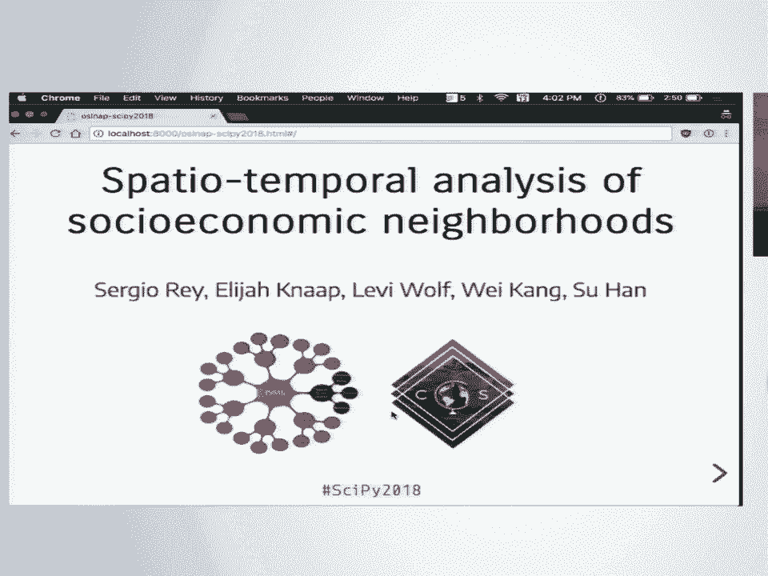

 to the community。 So neighborhoods matter。 We don't have to convince our colleagues in the social sciences。

 be they urban economists， economic geographers， sociologists， political scientists。

 There's a very large literature to suggest that where you live matters quite a bit to。

 all kinds of human behavior。

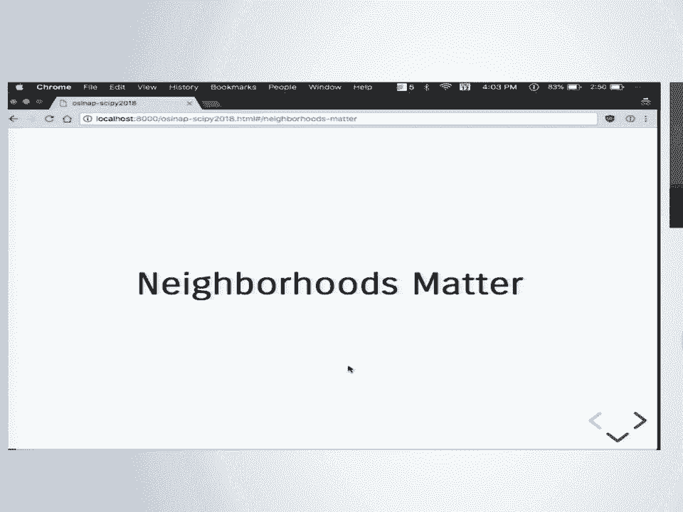

 For example， people have heard of the movement to opportunity studies in Chicago， 1994 to， '98。

 There was this experiment where families in poor neighborhoods were given the option randomly。

 selected and offered a voucher to move out of poor neighborhoods into better off neighborhoods。

 And this is sort of a perfectly controlled experiment in the sense that you would compare。

 the outcomes of the families that took advantage of the voucher to the families that stayed。

 behind in terms of earning potential for the households， kids， outcomes in schools， and。

 a host of other socioeconomic indicators。 And the evidence from the study says that it didn't matter。

 but there's been some more， recent work that said， well。

 although it appears that that was a random lottery when in fact。

 the people who were selected to be issued a lottery or the option of a lottery were indeed。

 selected randomly， the families that took advantage of the offered lotteries were not， random。

 They tended to be the families that had invested a lot of time in protecting their children。

 from the environments they were currently in。 So a follow-up study looked at the folks that were forced out of public housing when their。

 buildings were demolished and then compared those folks in this sort of enforced lottery。

 to the folks who were left behind in undemolished buildings and the differentials in the outcomes。

 were significantly larger。 So neighborhoods matter。

 There's been some recent work that's attracted quite a bit of attention on the impact of。

 neighborhoods on intergenerational income mobility。 You earn more than your parents do。

 and this tracks the same level of poverty for households。

 where you live impacts your future mobility。 So families at the same level of income strata do not experience the same type of mobility。

 and income distribution in space。 It matters。 And Austin evidently is a pretty good place。

 On average， those poor families over a course of a lifetime earn $1，600 more than kids do。

 over the course of lifetime just from growing up in Austin。

 Now we've been here for a couple days in Austin and this is at the county level。

 If you walk around Austin， you realize there's quite a bit of socioeconomic heterogeneity below。

 the county level。 Austin is in Travis County。 In Travis County。 Thank you very much。

 That's my mistake。 Okay， so there is a rich literature on using neighborhoods for social sciences。

 but there's， really two branches of this literature。

 There's so-called neighborhood effects literature which we just gave you two examples of。

 Where neighborhoods are looked at containers。 And those containers are fixed。

 And social science study outcomes of folks in one container versus folks in a different。

 group of containers。 There's a separate literature called neighborhood dynamics where you're actually looking at the。

 neighborhood itself as an object of studying in terms of those dynamics over time rather。

 than cross sectional comparisons。 But also in the spatial structure。

 neighborhoods evolve not just in the socioeconomic composition， who lives there。

 but through processes like gentrification， annexation and so on， the boundaries， actually change。

 All right， so there's spatial dynamism there that needs to be an encounter。

 And our goal in this project is to bring these two literatures together。

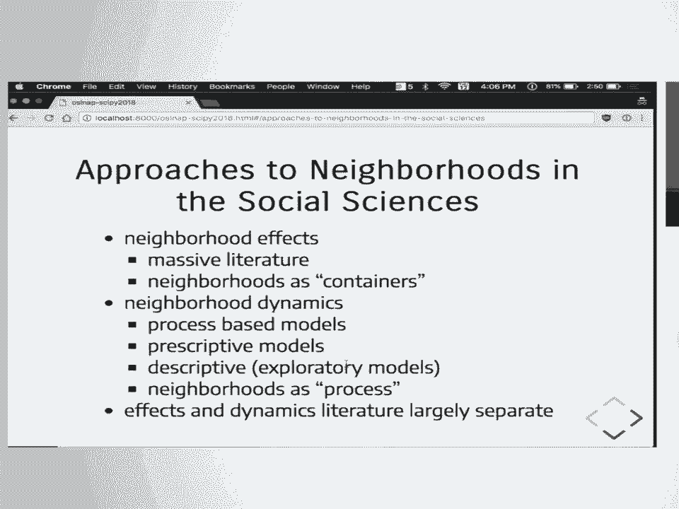

 Okay， these are just some sort of canonical studies in the effects literature。

 So looking at what's the relationship between social disorganization and crime in a neighborhood。

 social efficacy， income ability already talked about， but you can look at the relationships。

 between the built environment and childhood obesity or array of health outcomes and educational。

 outcomes。 So there's a massive number of studies that have taken neighborhoods as the unit to organize。

 the studies。 Okay？ So this gives you some flavor for the dynamics literature。

 That second branch of the literature I talked about。

 So here you can either think about how say segregation has changed over time in a given。

 North American city or how the housing market might have inverted in a city。

 There's this so-called great inversion where there's supposed to be a swapping if you will。

 of lower income groups moving out to the suburbs and the center cities being rediscovered by。

 the gentrifiers。 Okay， so those are spatially dynamic processes。

 Underlying this is the ability to define neighborhoods。

 And there's a lot of interesting work being done in what's known as geodesmographics。

 That is basically defining places based on the characteristics of the people who live。

 in those places。 From a social science perspective this is very important because it helps us come up with。

 operational notions of neighborhoods。 But it also has clearly applications in industry。

 geodesmographic is a massive industry， very， profitable。

 And companies use this to do market segmentation。 So this is an example of Esri's product tapestry where they come up with 16 typologies or a。

 topology of 16 different types of neighborhood clusters。 Things like laptop and latte。

 So these are based on multivariate clustering。 And then the challenge is to come up with these trendy names。

 But then this gets sold to companies that are interested in doing location based analysis。

 for market targeting and things of this nature。 So it has applications in both social science but also in location services and businesses。

 So our goal is to integrate these two literatures。 Effects literature and the dynamics literature。

 Now this is challenging。 And there's two sets of challenges。 First， what defines a neighborhood？

 Okay。 So we have open question neighborhoods after all are constructs。

 My neighborhood might be different from my childhood neighborhood is very different from。

 what my brothers would think is their neighborhood。 Because we each have different activity spaces。

 Okay。 So at the individual level you could have an ego hood where you're defining your boundaries。

 So it gets into interesting literature。 But if we want to do this from a macro perspective。

 there are objective ways to do this but there's， no consensus about how to do that。

 So we define neighborhoods in terms of spatial extent or in terms of population contained。

 or socioeconomic homogeneity or or or or and there's a pretty large and evolving literature。

 on this。 What's been really ignored however is the dynamics of the neighborhoods。 Again。

 the effects literature neighborhoods are taking us containers and fixed over time。

 So we study whether neighborhoods become more gentrified over time but its boundaries never。

 change when in fact the boundaries may may in fact change。

 So we need to think of more comprehensive ways to study cities and these questions。

 So our project's goal for the NSF project is fourfold。

 First we want to produce new approaches towards spatially explicit definitions of neighborhoods。

 that also build in the dynamics。 And we'll see a little bit of examples of how we plan to do that or how we have done some。

 of that already。 That's part one。 Part two is to come up with new measures that we can then bring to bear on the neighborhoods。

 once they're defined to have richer depictions of spatial dynamics in an urban setting。

 And then there's thorny data issues involved here。 The U。S。

 Census data we're doing this for the whole country for all the cities in the， U。S。

 Since census is our primary data source every ten years there's a new census。

 The boundaries can change。 So what used to be a tract that held 4。

000 people that same extent suddenly might hold， 8。

000 people ten years on and the census will split that tract。

 So your boundaries are no longer constant and you need to deal with harmonization issues。

 And then finally in this literature most of this research is not reproducible。

 There have been efforts to build consistent boundaries but you cannot reproduce them。

 You have to just use what these other researchers have done。

 So the fragility of our inferences about segregation dynamics， about income inequality， it's an。

 unknown how robust those findings are even though they drive policy in a lot of cases。

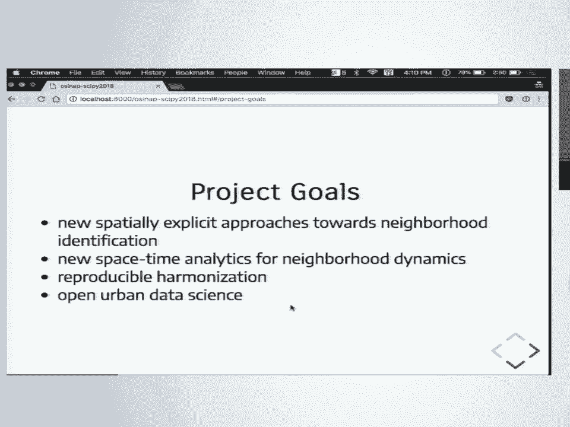

 And we want to address that。 Fortunately we're engaged in the Python ecosystem and we think it's a wonderful opportunity to。

 bring to bear a lot of the tools that we've been learning about here at SciPy to pressing。

 social science research problems。 So we're leveraging PISAL which is the library many people on the team work on。

 Geopandas we're going to leverage heavily and then the richness of scikit learn， stats， models。

 And then the never ending influx visualization frontends that's going to be year three because。

 we don't know which one to rest on。 But we do have some stuff we want to share with you and the goal in this talk is to advertise。

 and get other people interested in joining the team because it's a massive undertaking。

 So our package and I take the blame for this。 You need a good acronym。

 This is not a good acronym but I had to get the revolves already。

 Open source longitudinal neighborhood analysis package or OSL nap。

 Nap probably isn't a good one for a thing you're trying to sell。

 And it has a data analytics and visualization layer that Eli is going to explain to you。

 So let me tell you that there's almost nothing more embarrassing for a geographer than to。

 throw a map on the screen and for someone to tell you it's not where you think it is。

 So I'm off to a really great start in this presentation and let's keep it rolling。

 It often helps me calm myself down if I move around a little bit so if it distracts you。

 shame on you。

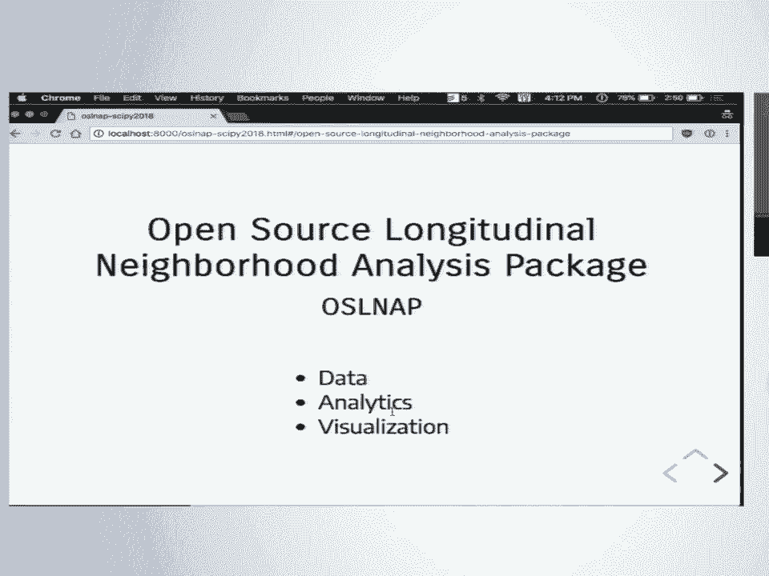

 I'm up here。 Right。 So I'm going to talk about some of our three core modules that we're trying to put together。

 One of which Serge mentioned already is this module that's focused on data issues broadly。

 So as Serge mentioned， most of our data come from the US Census。

 The US Census redraws boundaries every 10 years。 If you're working at something like a state or a county level or region。

 those things， don't change。 They're stable。 If you want to understand neighborhoods or cities or something even smaller than that。

 a census block， those change all the time。 And if you want to do time series analysis。

 you need something consistent to understand， whether or not it's changing。

 If it's boundaries are changing and it's time is changing， then we have no idea what's， going on。

 Okay。 And the problem is that if you try and disaggregate census units。

 you're incurring a lot of unknown， error because you don't know the way that your variable is distributed across space。

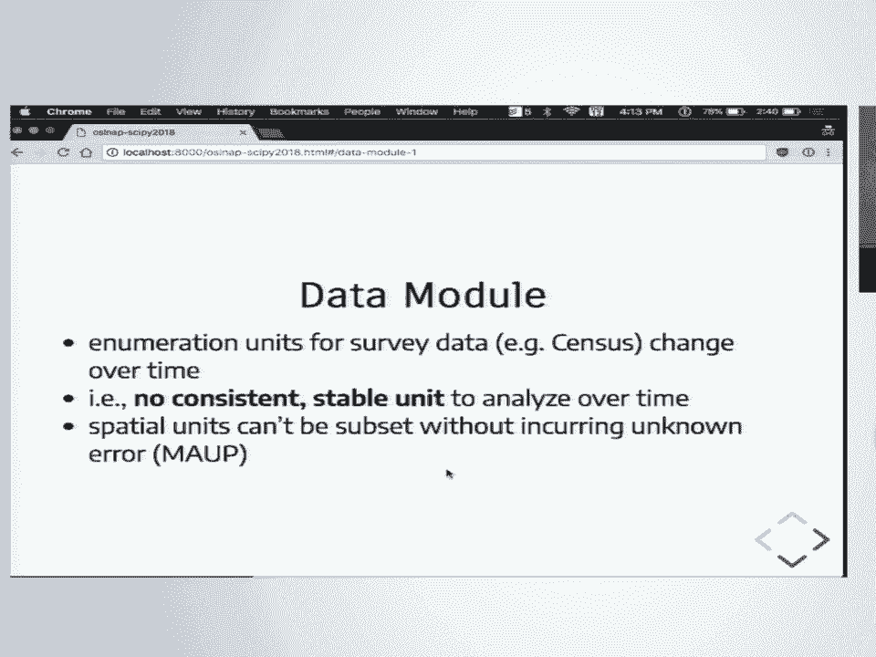

 Right。 Here's an example。 These are two sets of census tracks。 So the dark。

 the sort of thicker line widths are 1990 and the thinner are 2000。 You can see in this B inset here。

 a single census tract in 1990， 10 years later was split， into eight。

 And so if we were trying to understand the change in each of these eight tracks， we have。

 to find some way of modeling down their original form and try and understand what that might。

 relate to in that smaller geography。 Okay。 So to give you an example of what this looks like。

 here are some actual census tracks， right， in suburban Maryland near where I did my PhD at UMD。

 Right。 So let's say for example you are interested in this tract， right， and you've got some。

 interesting data on， say， poverty， right。 And in 2020， a census comes along and slices it in half。

 Right。 So no sweat。 So we've got 50% in sort of one piece of this。 We've got 50% in another。

 Let's just allocate 50% of whatever our variable was to each of these halves and we'll go for， it。

 Okay。 The problem is that if you look at the way that this census tract is actually drawn， right。

 all of the population is in that one little corner。 Right。

 So urban development patterns are notoriously lumpy。

 And so if you were trying to naively allocate based on space， you'd be way off because you。

'd be assigning a ton of poverty to this forest， right。 And in some ways it might not be wrong。

 There's probably not a lot of purchasing power in that forest， right。

 But these are common issues that people have to deal with all the time。 So as Serge mentioned。

 there are a handful of products where folks have done this。 Gealytics you have to pay for。

 The other two products on the right are open source but their methods aren't open source。 Right。

 So you can download the products， you can use them but you don't understand the decisions。

 of that that the folks made when they built these products you don't understand what。

 error you might be propagating through your analysis。 Right。

 So in our data module we want to allow you to ingest not only what other people have。

 done but you want to also be able to develop your own data products， right。

 So that might mean standardizing data sets to new boundaries using some auxiliary data。

 so that you don't make these really bad allocation mistakes that I just talked about。

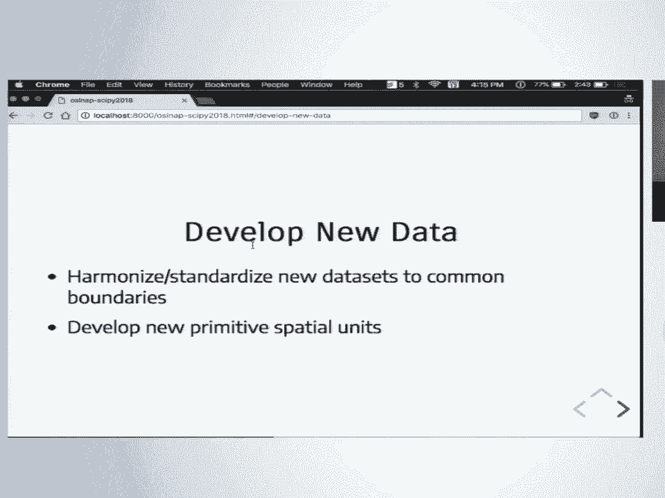

 You might want to develop your own primitive units， right。

 Maybe you want to allocate everything to census blocks， maybe you want to use tracks， maybe。

 you want to use cities， right。 That should be up to the analyst。 Okay。

 The other big piece that I want to talk about is the analytics module but I'm going to talk。

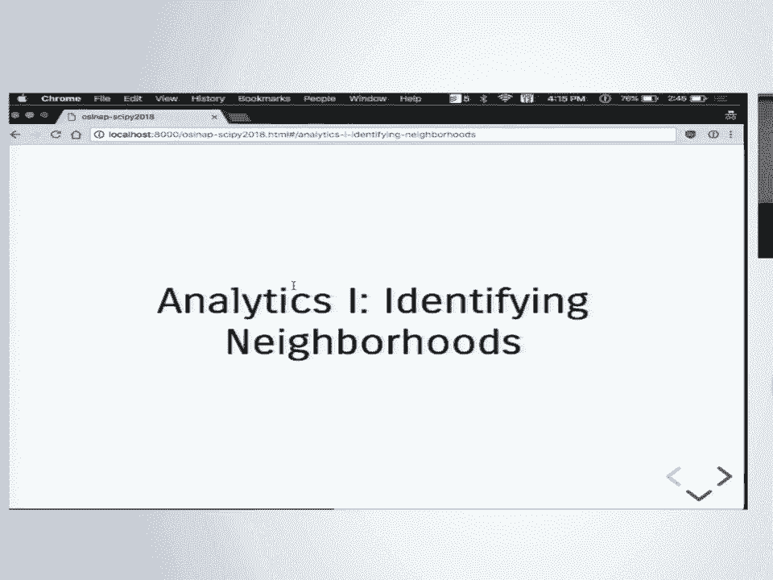

 about it in sort of two different parts。 Right。 So the first is identifying neighborhoods。 Right。

 So what is a neighborhood？ Right。 So I happen to be on Twitter， unfortunately you can't see these。

 I happen to be on Twitter today。 And somebody tweeted this thing that says， you know。

 "Chicago and neighborhoods are， straight up fake。"。

 This is the only one I have a problem with because Lakeshore East is on the opposite。

 side of the river and the other two named areas。 This other guy replied。

 "So how many of you believe that Lakeshore and Lakeshore East， is a real neighborhood？"， Right。

 The concept here is that places have identities， right。

 And they speak deeply to people and that's how people navigate cities is how people understand。

 the spatial syntax of place。 Right。 So that's still sort of an open question。

 Everyone can have their own interpretation on what a neighborhood is。

 But how do we put some empirics behind that， right。

 What is a neighborhood if we actually look at the data？

 So it turns out this is at least a 100-year-old question。 If anyone is familiar with this graphic。

 this is something that some Chicago， some sociologists。

 at the University of Chicago put together in the 1920s， they are trying to understand。

 what Chicago look like。 Right。 So those of you who are familiar with it， right。

 that big line is that like Michigan， right。 And then Chicago sort of works in concentric zones moving outwards。

 And you notice what they did here is essentially， you know， multivariate clustering。 Right。

 They said， "Let's look at the city and try and understand neighborhoods as the segmentation。

 of race and class and ethnic origin because people seem to segregate into enclaves。"， Right。

 And that sort of made sense for Chicago。 Right。 Of course now we have the same kind of idea but we do it a little bit differently。

 Right。 Now we let the algorithms handle this for us。 Right。

 So this is an example of a geodesmographic typology that tries to encapsulate some of。

 those same Chicago school ideas but using something like K-means or a Glomative Ward。

 or something like that。 Right。 Well you notice it's quite different about this map versus this one。

 Oops。 Is that in the Chicago school concept， neighborhoods are contiguous。 Right。

 So they're sort of defining areas that are inhabited by certain social groups but those。

 are well-defined places。 Right。 This looks like paint splatter。 Right。 Those yellow areas， right。

 Contain the same kind of people but it's not what you would call you know a well-defined。

 well-contained neighborhood。 That can be useful and that can be a nuisance。 Right。

 If you're trying to figure out how you market something， how you want to get a political。

 candidate elected and you know that people are sensitive to these kinds of advertising。

 then this can tell you where you might look that you might not have realized that you。

 might have thought before where your target audience is going to live。 Okay。

 But if you want to do something that has actual spatial implications this doesn't help you。

 very much。 Right。 So in OSL map we are also working on a handful of clustering algorithms that sort of that。

 strike a balance between attribute homogeneity and spatial contiguity。 Right。

 So whether things share a vertex or an edge or so forth。 Right。

 And these come up with quite a different solution to what neighborhoods look like。

 What you can't see in this one is this is actually picking out the gentrification in Southeast。

 DC which is a pretty fascinating feature here。 But these give you a very different sense of what neighborhoods and regions might look。

 like if you constrain them to be contiguous。 Right。

 So this blue area might actually be quite similar to the red area but they are physically。

 disparate。 Right。 So they are distinct places even though the people that live there are kind of the same。

 Right。 I think this is much more similar to the way that we think about neighborhoods in our。

 daily experience。 Right。 And you know with our tools you can you can look at this question in a variety of scales。

 and a variety of places we can't get into what these typologies actually look like but。

 if you are familiar with these cities I will talk to you。

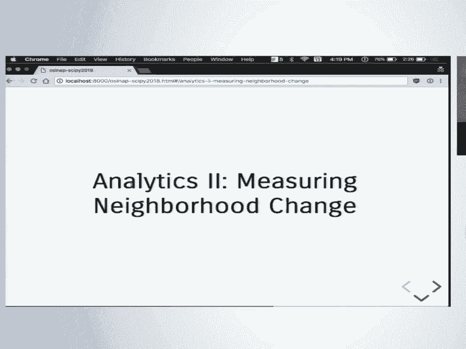

 So the other thing that we are trying to do is measure neighborhood change。

 Once we have identified neighborhoods what does it mean to understand what they are doing。

 over time。 So one way to think about this is kind of temporal geodesmographics。 Right。

 So as Serge mentioned geodesmographics is essentially the practice of applying cluster。

 analysis to socioeconomic data and space but then it ignores that space。

 Right。 Main splatter map and you know nothing is contiguous。

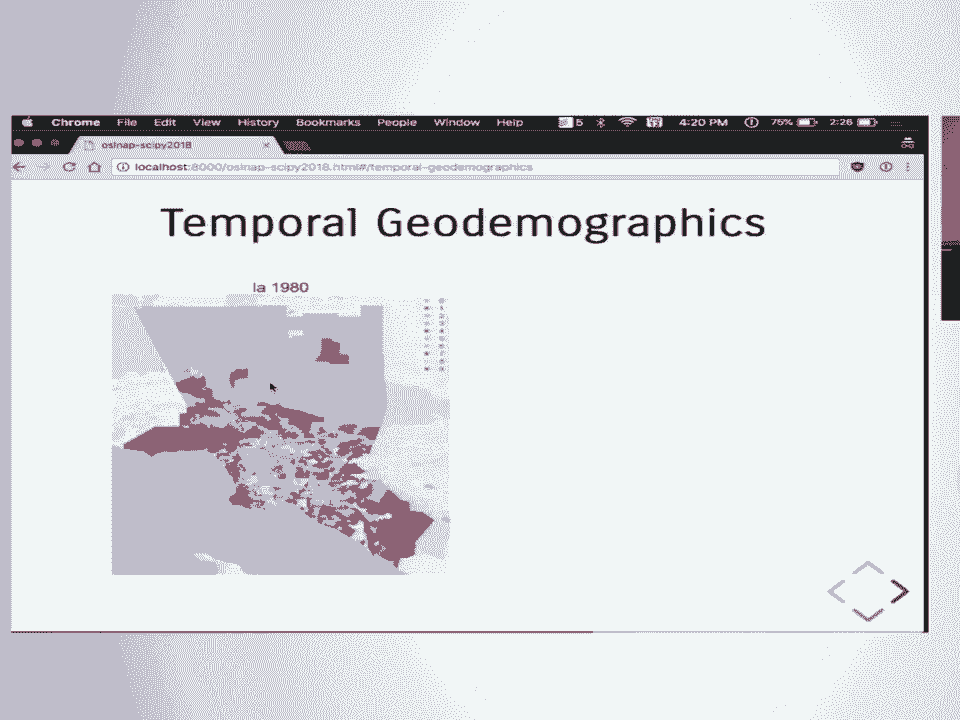

 So instead we might think about how we do neighborhood analysis over time。

 So in this case we have taken all of our census tracts。

 We have lumped them into one data set because everything is now at a consistent geographic。

 unit and we have run the cluster analysis on the entire data set。

 What this means is that for every census tract it is represented in the data set five different。

 times and can be classified into different types in different time periods。 Right。

 Because each census the socioeconomic attributes are going to change so that allows you to。

 be placed into different neighborhoods over time。 This is pretty fascinating because we can see that some places are pretty stagnant over。

 time。 Right。 These are the Hollywood hills。 They stay blue。 Right。 Rancho Palace Verdes down here。

 Big beautiful houses on the hill。 They stay really nice。 Right。

 Concentrated poverty meanwhile in the middle of LA is spreading。 Right。

 And we get a really good sense of what this actually looks like。 Okay。

 So our tools help you do this。 Right。 And once we have sort of a string of neighborhood types the question is how we model it。

 So there are two different perspectives。 One is dynamic that looks at spatial mark off chains and another is a holistic perspective。

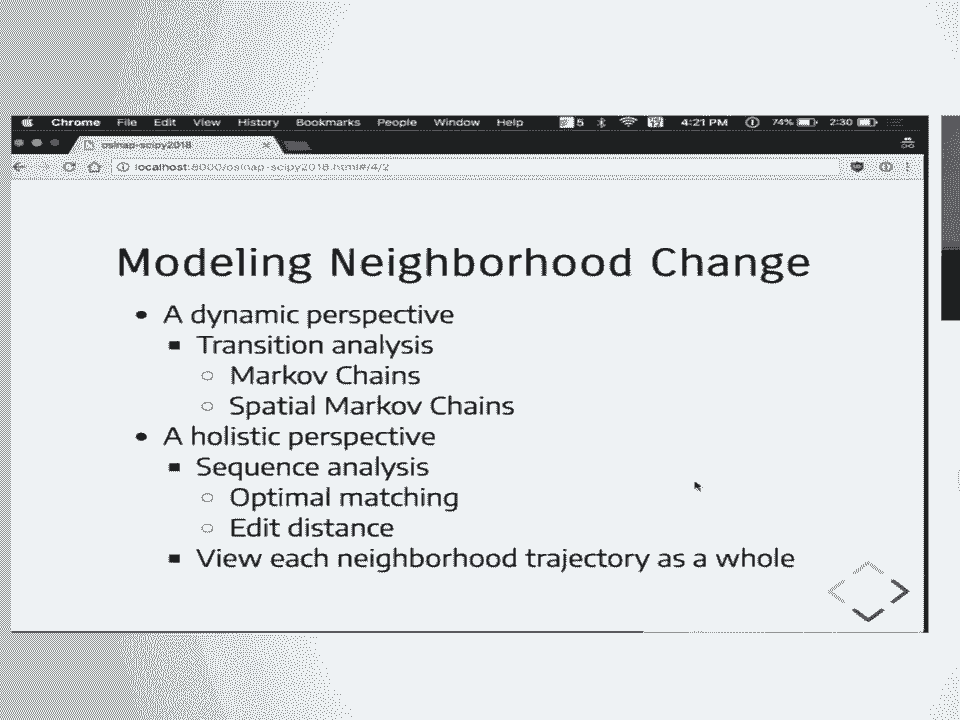

 that borrows some sequence analysis and genomics。

 Right。 So I'll move quickly because I'm out of time。

 So really quickly so you can imagine if you have this matrix of neighborhoods。

 So for any given neighborhood you look at whether it's going to change the likelihood。

 that it changes into a different neighborhood type over time。

 So in this simple example it's pretty common for a neighborhood to stay its own class over。

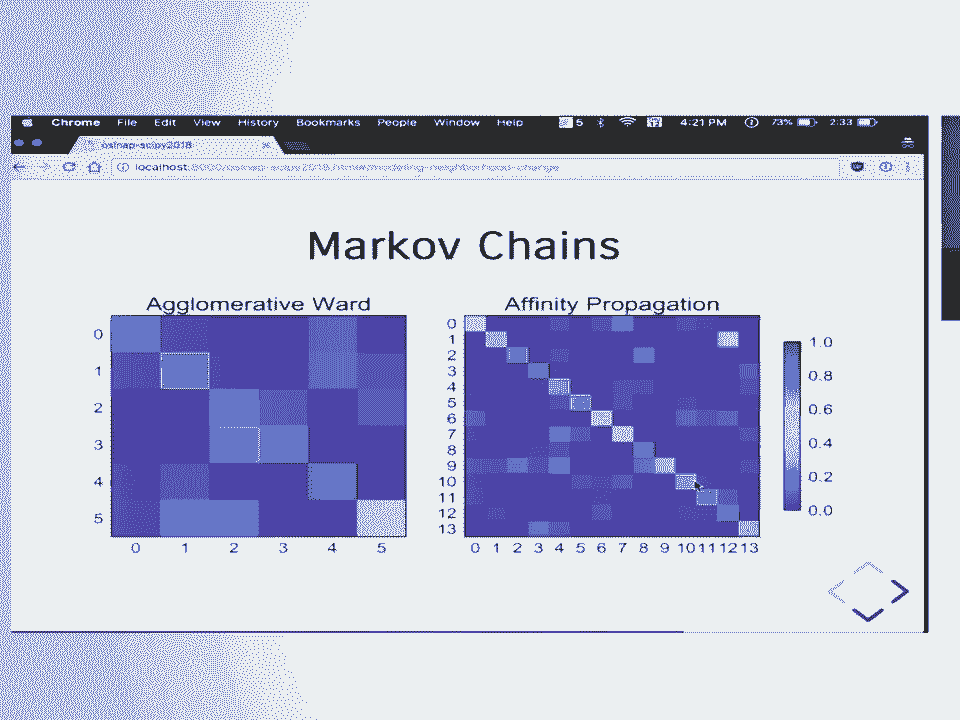

 time。 Right。 We've got the strong diagonal。 Right。

 But we might also ask what happens if you condition that transition based on who's around， you。

 Okay。 So what these heat maps show you is how likely if you are a neighborhood type zero。

 How likely are you to be neighborhood type zero in the next time period。

 How likely are you to be neighborhood type zero in the next time period if all your neighbors。

 are type zero。 What about if all of your neighbors are type one？ What about if they're type two？

 Right。 So each of those has if you condition on your neighbors you're going to end up with different。

 likelihoods。 And these heat maps already show you that that is in fact the case。 Right。

 So if you ignore spatial dependence your models are going to be wrong。 Okay。

 Really quickly sequence analysis we're borrowing from genomics。 Right。

 So in this case we're not we're looking not just at a transition between two types we're。

 looking at the whole sequence of neighborhoods。 Right。

 So here are two neighborhoods represented by these sequence of types。

 You can imagine trying to come up with metrics。 Right。

 So we're having distances so in the places where they match these strings get a good sequence。

 and where they don't match they get penalized for that。

 Then we can shift and allow them to align on the best match but that breaks or the temporal。

 alignment and the question is does this matter are we still understanding something about。

 neighborhoods by understanding sort of their general trajectory or do we have to understand。

 the way that they changed in the same time periods。

 Right。 We're doing lots of this we want your help with this。 Okay。

 So the next thing we want to do is actually do a lot of this work。 Right。

 We want to consume this ourselves。 We want to do a bunch of research。

 Levi has built a really fascinating tool called Senpai that will programmatically download。

 data from the census and all these tools are built into our platform to allow you do this。

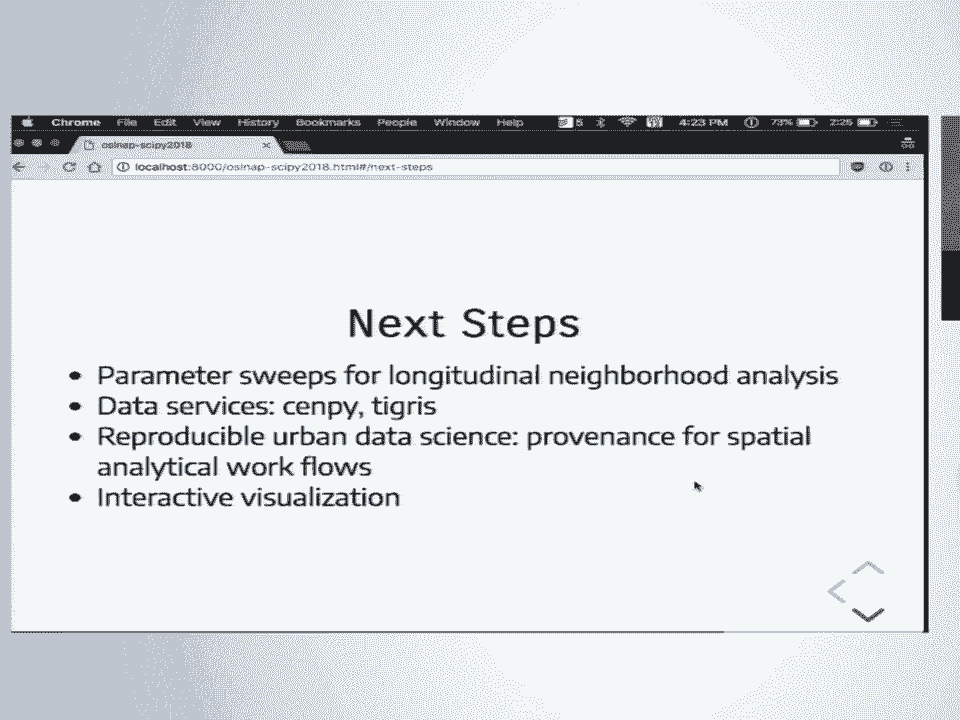

 Thanks to our funders。 If you want to get in touch with us we're on Twitter。

 Come check out our website。 Come get in touch with us after the talk。 Thanks a lot。 [Applause]。

 All right。 So for questions there's a mic there and I can also work to bring one around is that。

 it's helpful。 Are there any questions？ Are there any questions for Serge？ All right。 There we go。

 Yeah。 Interesting talk。 I was just curious on the question。

 I was just curious on the input data side。 Obviously census data is pretty limited but what variables do you use to make these neighborhoods。

 and do you guys make decisions about kind of what's an important neighborhood variable。

 or do you do that algorithmically？ Yeah。 The answer is we don't want to make that decision for you。

 You might want to do lots of so maybe you are an economic geographer。

 You're interested in providing workforce development services。

 Your geodemographic typology may be based on jobs in different industries so that you。

 understand where there are sort of job centers that people might access。

 That's a different question than where is sort of substandard housing and people living。

 in concentrated poverty。 Those are very different research angles and you can define the neighborhoods。

 It's perfectly logical for neighborhoods to be defined on either of those depending。

 on the research question at hand。 So I don't think we want to be in the business of telling people which variables to use because。

 it's that sort of analysis dependent but we want to be able to consume anything that。

 they have in the census and then anything that you might want to bring to the table as， well。

 Are there， we have time to like one more quick question。 This is not a quick one。 Okay。

 So we don't have time for it。 Does anyone have time for it？ Wait a minute。 I'll see。 Yes。

 I just want to say that I think I have the solution for your acronym。 You just dropped the L。

 You could be。 Oh snap。 Snap。 [Applause]， [Applause]， [Applause]， [Applause]， [Applause]， [Applause]。

 [APPLAUSE]， [ Silence ]。